OpenMandriva - Hardware Trends (Desktops)
-----------------------------------------

A project to identify most popular hardware characteristics and track their change
over time based on data collected by Linux users at https://Linux-Hardware.org.

Anyone can contribute to this report by the [hw-probe](https://github.com/linuxhw/hw-probe) tool:

    sudo -E hw-probe -all -upload

This report is for one last month. Overall report since the beginning of time: [TestDays](https://github.com/linuxhw/TestDays)

Period: Dec, 2025.

Contents
--------

* [ System ](#system)
  - [ OS                       ](#os)
  - [ OS Family                ](#os-family)
  - [ Kernel                   ](#kernel)
  - [ Kernel Family            ](#kernel-family)
  - [ Kernel Major Ver.        ](#kernel-major-ver)
  - [ Arch                     ](#arch)
  - [ DE                       ](#de)
  - [ Display Server           ](#display-server)
  - [ Display Manager          ](#display-manager)
  - [ OS Lang                  ](#os-lang)
  - [ Boot Mode                ](#boot-mode)
  - [ Filesystem               ](#filesystem)
  - [ Part. scheme             ](#part-scheme)
  - [ Dual Boot with Linux/BSD ](#dual-boot-with-linuxbsd)
  - [ Dual Boot (Win)          ](#dual-boot-win)

* [ Board ](#board)
  - [ Vendor                   ](#vendor)
  - [ Model                    ](#model)
  - [ Model Family             ](#model-family)
  - [ MFG Year                 ](#mfg-year)
  - [ Form Factor              ](#form-factor)
  - [ Secure Boot              ](#secure-boot)
  - [ Coreboot                 ](#coreboot)
  - [ RAM Size                 ](#ram-size)
  - [ RAM Used                 ](#ram-used)
  - [ Total Drives             ](#total-drives)
  - [ Has CD-ROM               ](#has-cd-rom)
  - [ Has Ethernet             ](#has-ethernet)
  - [ Has WiFi                 ](#has-wifi)
  - [ Has Bluetooth            ](#has-bluetooth)

* [ Location ](#location)
  - [ Country                  ](#country)
  - [ City                     ](#city)

* [ Drives ](#drives)
  - [ Drive Vendor             ](#drive-vendor)
  - [ Drive Model              ](#drive-model)
  - [ HDD Vendor               ](#hdd-vendor)
  - [ SSD Vendor               ](#ssd-vendor)
  - [ Drive Kind               ](#drive-kind)
  - [ Drive Connector          ](#drive-connector)
  - [ Drive Size               ](#drive-size)
  - [ Space Total              ](#space-total)
  - [ Space Used               ](#space-used)
  - [ Malfunc. Drives          ](#malfunc-drives)
  - [ Malfunc. Drive Vendor    ](#malfunc-drive-vendor)
  - [ Malfunc. HDD Vendor      ](#malfunc-hdd-vendor)
  - [ Malfunc. Drive Kind      ](#malfunc-drive-kind)
  - [ Failed Drives            ](#failed-drives)
  - [ Failed Drive Vendor      ](#failed-drive-vendor)
  - [ Drive Status             ](#drive-status)

* [ Storage controller ](#storage-controller)
  - [ Storage Vendor           ](#storage-vendor)
  - [ Storage Model            ](#storage-model)
  - [ Storage Kind             ](#storage-kind)

* [ Processor ](#processor)
  - [ CPU Vendor               ](#cpu-vendor)
  - [ CPU Model                ](#cpu-model)
  - [ CPU Model Family         ](#cpu-model-family)
  - [ CPU Cores                ](#cpu-cores)
  - [ CPU Sockets              ](#cpu-sockets)
  - [ CPU Threads              ](#cpu-threads)
  - [ CPU Op-Modes             ](#cpu-op-modes)
  - [ CPU Microcode            ](#cpu-microcode)
  - [ CPU Microarch            ](#cpu-microarch)

* [ Graphics ](#graphics)
  - [ GPU Vendor               ](#gpu-vendor)
  - [ GPU Model                ](#gpu-model)
  - [ GPU Combo                ](#gpu-combo)
  - [ GPU Driver               ](#gpu-driver)
  - [ GPU Memory               ](#gpu-memory)

* [ Monitor ](#monitor)
  - [ Monitor Vendor           ](#monitor-vendor)
  - [ Monitor Model            ](#monitor-model)
  - [ Monitor Resolution       ](#monitor-resolution)
  - [ Monitor Diagonal         ](#monitor-diagonal)
  - [ Monitor Width            ](#monitor-width)
  - [ Aspect Ratio             ](#aspect-ratio)
  - [ Monitor Area             ](#monitor-area)
  - [ Pixel Density            ](#pixel-density)
  - [ Multiple Monitors        ](#multiple-monitors)

* [ Network ](#network)
  - [ Net Controller Vendor    ](#net-controller-vendor)
  - [ Net Controller Model     ](#net-controller-model)
  - [ Wireless Vendor          ](#wireless-vendor)
  - [ Wireless Model           ](#wireless-model)
  - [ Ethernet Vendor          ](#ethernet-vendor)
  - [ Ethernet Model           ](#ethernet-model)
  - [ Net Controller Kind      ](#net-controller-kind)
  - [ Used Controller          ](#used-controller)
  - [ NICs                     ](#nics)
  - [ IPv6                     ](#ipv6)

* [ Bluetooth ](#bluetooth)
  - [ Bluetooth Vendor         ](#bluetooth-vendor)
  - [ Bluetooth Model          ](#bluetooth-model)

* [ Sound ](#sound)
  - [ Sound Vendor             ](#sound-vendor)
  - [ Sound Model              ](#sound-model)

* [ Memory ](#memory)
  - [ Memory Vendor            ](#memory-vendor)
  - [ Memory Model             ](#memory-model)
  - [ Memory Kind              ](#memory-kind)
  - [ Memory Form Factor       ](#memory-form-factor)
  - [ Memory Size              ](#memory-size)
  - [ Memory Speed             ](#memory-speed)

* [ Printers & scanners ](#printers--scanners)
  - [ Printer Vendor           ](#printer-vendor)
  - [ Printer Model            ](#printer-model)
  - [ Scanner Vendor           ](#scanner-vendor)
  - [ Scanner Model            ](#scanner-model)

* [ Camera ](#camera)
  - [ Camera Vendor            ](#camera-vendor)
  - [ Camera Model             ](#camera-model)

* [ Security ](#security)
  - [ Fingerprint Vendor       ](#fingerprint-vendor)
  - [ Fingerprint Model        ](#fingerprint-model)
  - [ Chipcard Vendor          ](#chipcard-vendor)
  - [ Chipcard Model           ](#chipcard-model)

* [ Unsupported ](#unsupported)
  - [ Unsupported Devices      ](#unsupported-devices)
  - [ Unsupported Device Types ](#unsupported-device-types)

System
------

OS
--

Installed operating systems

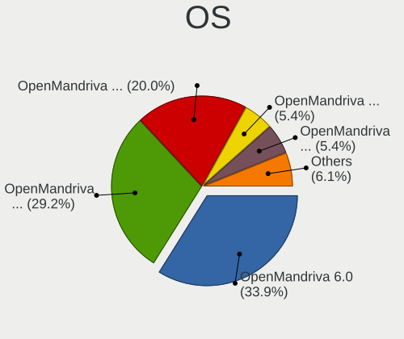

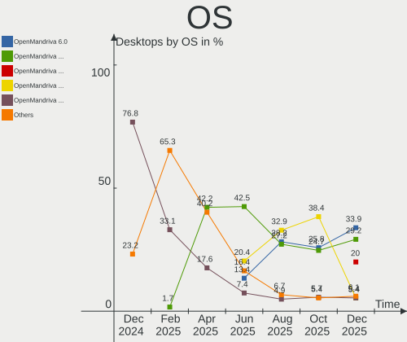

| Name               | Desktops | Percent |
|--------------------|----------|---------|
| OpenMandriva 6.0   | 100      | 33.9%   |
| OpenMandriva 25.90 | 86       | 29.15%  |
| OpenMandriva 25.11 | 59       | 20%     |
| OpenMandriva 25.06 | 16       | 5.42%   |
| OpenMandriva 24.12 | 16       | 5.42%   |
| OpenMandriva 23.08 | 6        | 2.03%   |
| OpenMandriva 25.04 | 3        | 1.02%   |
| OpenMandriva 24.90 | 3        | 1.02%   |
| OpenMandriva 5.0   | 2        | 0.68%   |
| OpenMandriva 23.03 | 2        | 0.68%   |
| OpenMandriva 4.3   | 1        | 0.34%   |
| OpenMandriva 25.02 | 1        | 0.34%   |

OS Family
---------

OS without a version

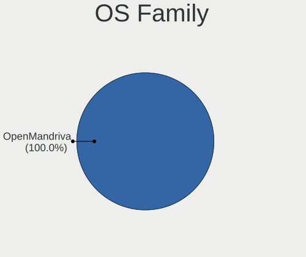

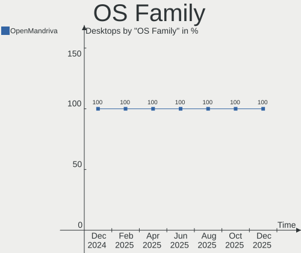

| Name         | Desktops | Percent |
|--------------|----------|---------|
| OpenMandriva | 295      | 100%    |

Kernel
------

Version of the Linux kernel

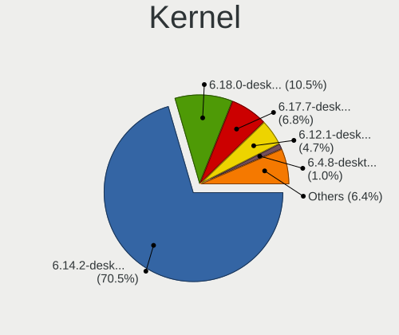

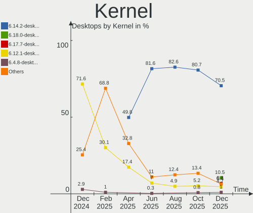

| Version                       | Desktops | Percent |
|-------------------------------|----------|---------|
| 6.14.2-desktop-3omv2590       | 208      | 70.51%  |
| 6.18.0-desktop-1omv2590       | 31       | 10.51%  |
| 6.17.7-desktop-1omv2590       | 20       | 6.78%   |
| 6.12.1-desktop-1omv2490       | 14       | 4.75%   |
| 6.4.8-desktop-2omv2390        | 3        | 1.02%   |
| 6.4.11-desktop-1omv2390       | 3        | 1.02%   |
| 6.10.9-desktop-1omv2490       | 3        | 1.02%   |
| 6.6.2-desktop-1omv2390        | 2        | 0.68%   |
| 6.2.6-desktop-1omv2390        | 2        | 0.68%   |
| 6.12.6-desktop-1omv2490       | 2        | 0.68%   |
| 6.18.1-desktop-1omv2590       | 1        | 0.34%   |
| 6.17.9-desktop-1omv2590       | 1        | 0.34%   |
| 6.17.4-desktop-1omv2590       | 1        | 0.34%   |
| 6.15.0-desktop-0.rc2.3omv2590 | 1        | 0.34%   |
| 6.14.2-desktop-2omv2590       | 1        | 0.34%   |
| 6.13.5-desktop-1omv2590       | 1        | 0.34%   |
| 5.16.7-desktop-1omv4003       | 1        | 0.34%   |

Kernel Family
-------------

Linux kernel without a distro release

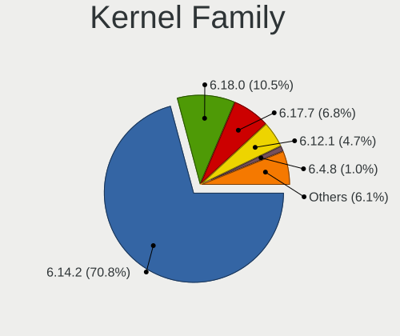

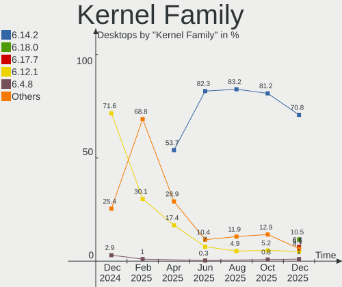

| Version | Desktops | Percent |
|---------|----------|---------|
| 6.14.2  | 209      | 70.85%  |
| 6.18.0  | 31       | 10.51%  |
| 6.17.7  | 20       | 6.78%   |
| 6.12.1  | 14       | 4.75%   |
| 6.4.8   | 3        | 1.02%   |
| 6.4.11  | 3        | 1.02%   |
| 6.10.9  | 3        | 1.02%   |
| 6.6.2   | 2        | 0.68%   |
| 6.2.6   | 2        | 0.68%   |
| 6.12.6  | 2        | 0.68%   |
| 6.18.1  | 1        | 0.34%   |
| 6.17.9  | 1        | 0.34%   |
| 6.17.4  | 1        | 0.34%   |
| 6.15.0  | 1        | 0.34%   |
| 6.13.5  | 1        | 0.34%   |
| 5.16.7  | 1        | 0.34%   |

Kernel Major Ver.
-----------------

Linux kernel major version

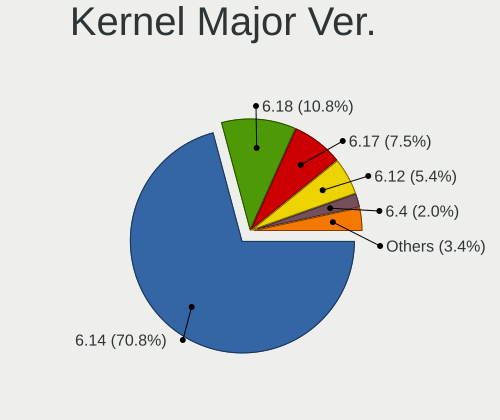

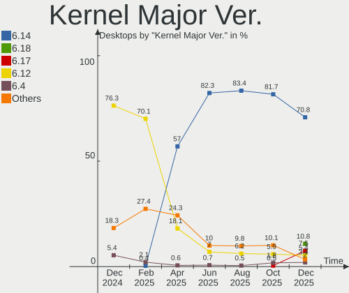

| Version | Desktops | Percent |
|---------|----------|---------|
| 6.14    | 209      | 70.85%  |
| 6.18    | 32       | 10.85%  |
| 6.17    | 22       | 7.46%   |
| 6.12    | 16       | 5.42%   |
| 6.4     | 6        | 2.03%   |
| 6.10    | 3        | 1.02%   |
| 6.6     | 2        | 0.68%   |
| 6.2     | 2        | 0.68%   |
| 6.15    | 1        | 0.34%   |
| 6.13    | 1        | 0.34%   |
| 5.16    | 1        | 0.34%   |

Arch
----

OS architecture (x86_64, i586, etc.)

| Name   | Desktops | Percent |
|--------|----------|---------|
| x86_64 | 295      | 100%    |

DE
--

Desktop Environment

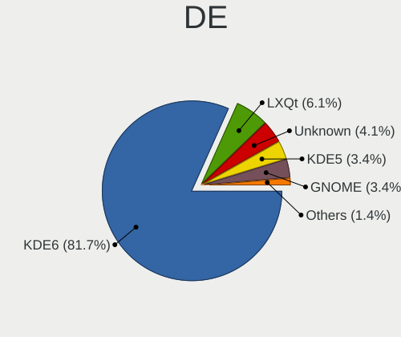

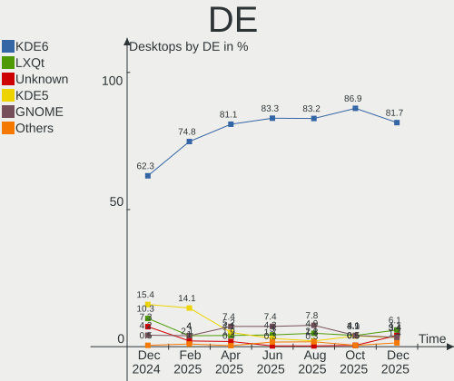

| Name    | Desktops | Percent |
|---------|----------|---------|
| KDE6    | 241      | 81.69%  |
| LXQt    | 18       | 6.1%    |
| Unknown | 12       | 4.07%   |
| KDE5    | 10       | 3.39%   |
| GNOME   | 10       | 3.39%   |
| XFCE    | 2        | 0.68%   |
| MATE    | 1        | 0.34%   |
| Budgie  | 1        | 0.34%   |

Display Server
--------------

X11 or Wayland

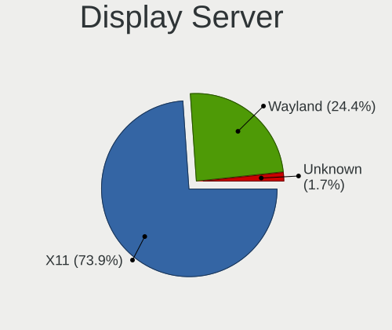

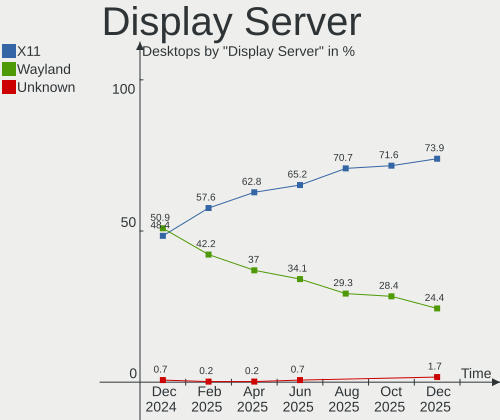

| Name    | Desktops | Percent |
|---------|----------|---------|
| X11     | 218      | 73.9%   |
| Wayland | 72       | 24.41%  |
| Unknown | 5        | 1.69%   |

Display Manager
---------------

SDDM, LightDM, etc.

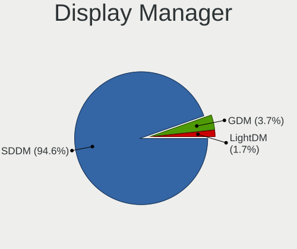

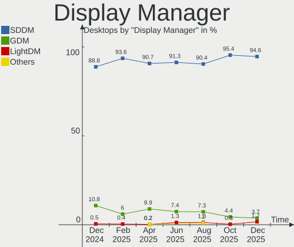

| Name    | Desktops | Percent |
|---------|----------|---------|
| SDDM    | 279      | 94.58%  |
| GDM     | 11       | 3.73%   |
| LightDM | 5        | 1.69%   |

OS Lang
-------

Language

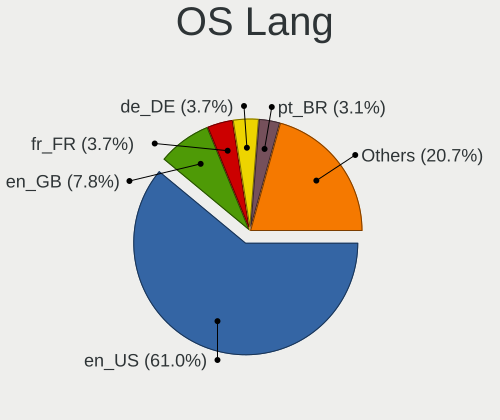

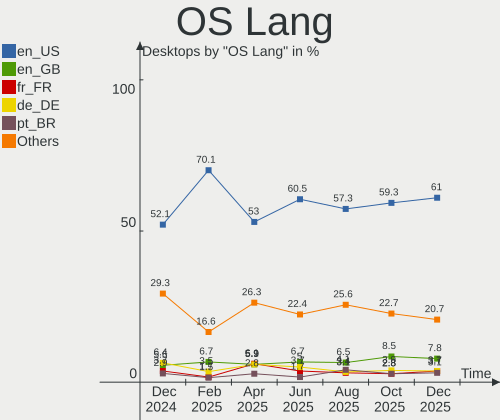

| Lang  | Desktops | Percent |
|-------|----------|---------|
| en_US | 180      | 61.02%  |
| en_GB | 23       | 7.8%    |
| fr_FR | 11       | 3.73%   |
| de_DE | 11       | 3.73%   |
| pt_BR | 9        | 3.05%   |
| pl_PL | 8        | 2.71%   |
| es_ES | 7        | 2.37%   |
| ru_RU | 6        | 2.03%   |
| es_MX | 6        | 2.03%   |
| it_IT | 4        | 1.36%   |
| en_AU | 4        | 1.36%   |
| hu_HU | 3        | 1.02%   |
| en_CA | 3        | 1.02%   |
| UTF-8 | 2        | 0.68%   |
| ro_RO | 2        | 0.68%   |
| pt_PT | 2        | 0.68%   |
| nl_BE | 2        | 0.68%   |
| cs_CZ | 2        | 0.68%   |
| nl_NL | 1        | 0.34%   |
| es_AR | 1        | 0.34%   |
| en_SG | 1        | 0.34%   |
| en_NZ | 1        | 0.34%   |
| en_IN | 1        | 0.34%   |
| en_DK | 1        | 0.34%   |
| de_AT | 1        | 0.34%   |
| da_DK | 1        | 0.34%   |
| C     | 1        | 0.34%   |
| bg_BG | 1        | 0.34%   |

Boot Mode
---------

EFI or BIOS

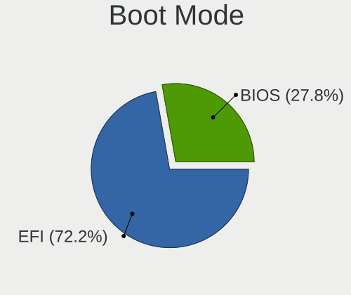

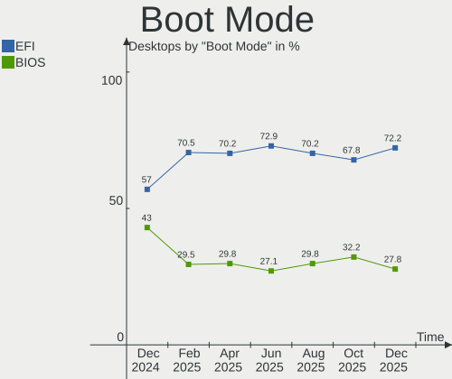

| Mode | Desktops | Percent |
|------|----------|---------|
| EFI  | 213      | 72.2%   |
| BIOS | 82       | 27.8%   |

Filesystem
----------

Type of filesystem

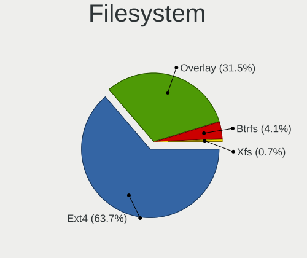

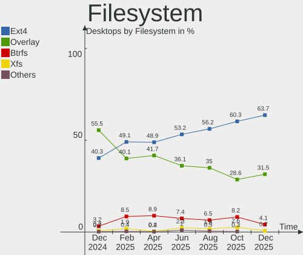

| Type    | Desktops | Percent |
|---------|----------|---------|
| Ext4    | 188      | 63.73%  |
| Overlay | 93       | 31.53%  |
| Btrfs   | 12       | 4.07%   |
| Xfs     | 2        | 0.68%   |

Part. scheme
------------

Scheme of partitioning

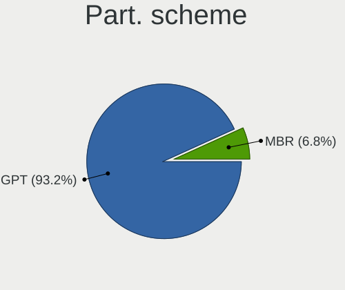

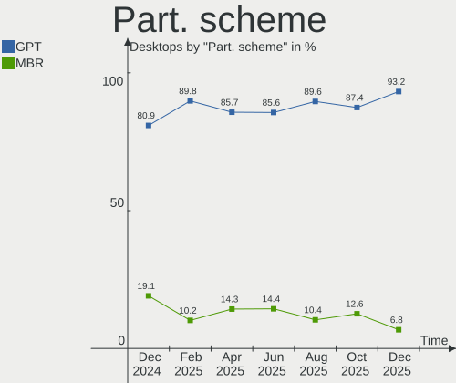

| Type | Desktops | Percent |
|------|----------|---------|
| GPT  | 275      | 93.22%  |
| MBR  | 20       | 6.78%   |

Dual Boot with Linux/BSD
------------------------

Hosting more than one Linux/BSD

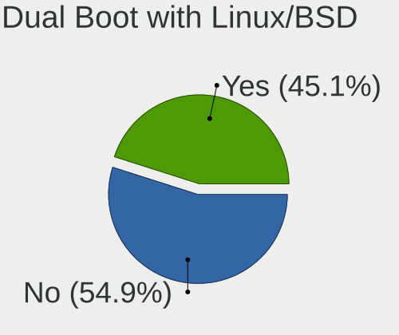

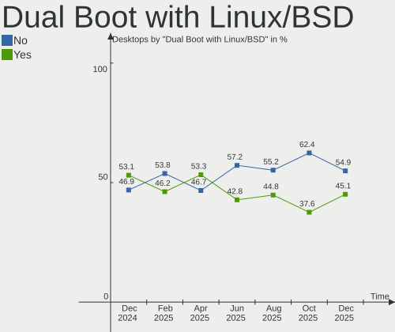

| Dual boot | Desktops | Percent |
|-----------|----------|---------|
| No        | 162      | 54.92%  |
| Yes       | 133      | 45.08%  |

Dual Boot (Win)
---------------

Hosting Linux and Windows

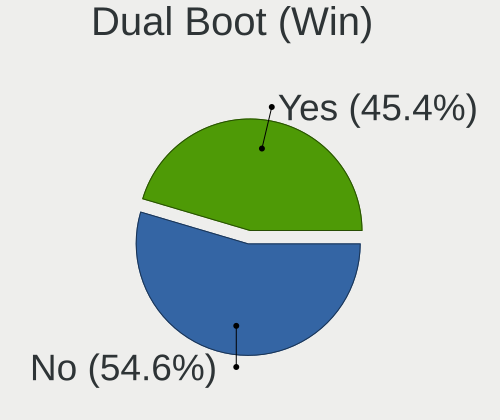

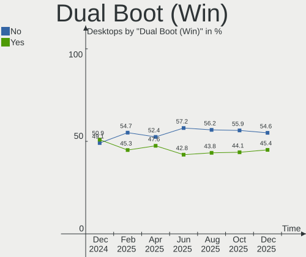

| Dual boot | Desktops | Percent |
|-----------|----------|---------|
| No        | 161      | 54.58%  |
| Yes       | 134      | 45.42%  |

Board
-----

Vendor
------

Motherboard manufacturer

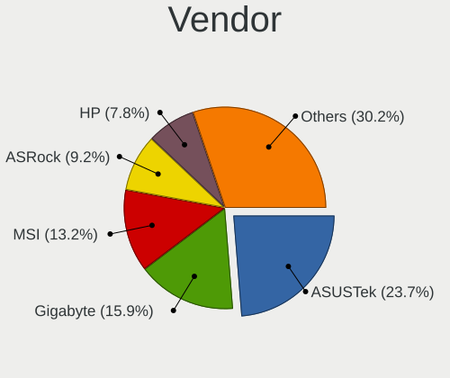

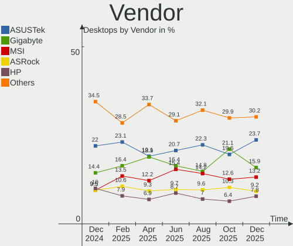

| Name                                 | Desktops | Percent |
|--------------------------------------|----------|---------|
| ASUSTek Computer                     | 70       | 23.73%  |
| Gigabyte Technology                  | 47       | 15.93%  |
| MSI                                  | 39       | 13.22%  |
| ASRock                               | 27       | 9.15%   |
| Hewlett-Packard                      | 23       | 7.8%    |
| Dell                                 | 22       | 7.46%   |
| Lenovo                               | 15       | 5.08%   |
| Intel                                | 7        | 2.37%   |
| Unknown                              | 5        | 1.69%   |
| Biostar                              | 4        | 1.36%   |
| Acer                                 | 4        | 1.36%   |
| Red Hat                              | 3        | 1.02%   |
| Fujitsu                              | 2        | 0.68%   |
| ECS                                  | 2        | 0.68%   |
| BESSTAR Tech                         | 2        | 0.68%   |
| Star Labs                            | 1        | 0.34%   |
| Shenzhen Meigao Electronic Equipment | 1        | 0.34%   |
| Shenzhen DOKE electronic             | 1        | 0.34%   |
| Positivo                             | 1        | 0.34%   |
| PELADN                               | 1        | 0.34%   |
| Pegatron                             | 1        | 0.34%   |
| OEM                                  | 1        | 0.34%   |
| OE                                   | 1        | 0.34%   |
| Minix                                | 1        | 0.34%   |
| Medion                               | 1        | 0.34%   |
| Login Informatica                    | 1        | 0.34%   |
| JINGSHA                              | 1        | 0.34%   |
| IceWhale Technology                  | 1        | 0.34%   |
| Huanan                               | 1        | 0.34%   |
| GMKtec                               | 1        | 0.34%   |
| GEEKOM                               | 1        | 0.34%   |
| Foxconn                              | 1        | 0.34%   |
| Delta Computers                      | 1        | 0.34%   |
| AZW                                  | 1        | 0.34%   |
| Apple                                | 1        | 0.34%   |
| AMD                                  | 1        | 0.34%   |
| AISURIX                              | 1        | 0.34%   |
| Advantech                            | 1        | 0.34%   |

Model
-----

Motherboard model

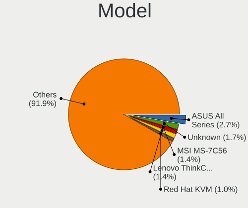

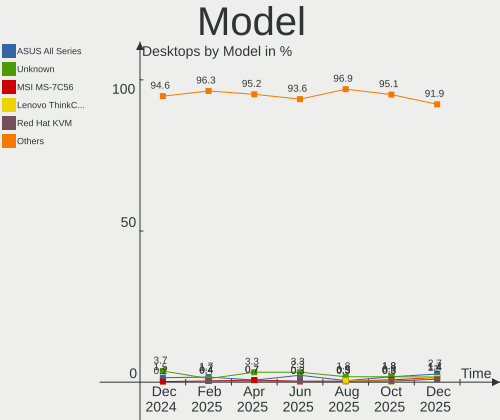

| Name                                                  | Desktops | Percent |
|-------------------------------------------------------|----------|---------|
| ASUS All Series                                       | 8        | 2.71%   |
| Unknown                                               | 5        | 1.69%   |
| MSI MS-7C56                                           | 4        | 1.36%   |
| Lenovo ThinkCentre M72e 0967B5U                       | 4        | 1.36%   |
| Red Hat KVM                                           | 3        | 1.02%   |
| MSI MS-7C02                                           | 3        | 1.02%   |
| HP Pavilion Desktop TP01-0xxx                         | 3        | 1.02%   |
| Dell OptiPlex 7010                                    | 3        | 1.02%   |
| MSI MS-7C95                                           | 2        | 0.68%   |
| MSI MS-7C91                                           | 2        | 0.68%   |
| MSI MS-7C37                                           | 2        | 0.68%   |
| HP Z4 G4 Workstation                                  | 2        | 0.68%   |
| HP EliteDesk 800 G1 SFF                               | 2        | 0.68%   |
| HP Compaq Pro 6300 SFF                                | 2        | 0.68%   |
| Gigabyte 970A-DS3P                                    | 2        | 0.68%   |
| ASUS ROG STRIX B650E-F GAMING WIFI                    | 2        | 0.68%   |
| ASUS ROG STRIX B450-F GAMING                          | 2        | 0.68%   |
| ASUS PRIME B450M-A                                    | 2        | 0.68%   |
| ASRock X570 Pro4                                      | 2        | 0.68%   |
| ASRock B650M-HDV/M.2                                  | 2        | 0.68%   |
| ASRock 990FX Extreme3                                 | 2        | 0.68%   |
| Star Labs Byte                                        | 1        | 0.34%   |
| Shenzhen Meigao Electronic Equipment EliteMini Series | 1        | 0.34%   |
| Shenzhen DOKE electronic MP100                        | 1        | 0.34%   |
| Positivo Positivo Master D610                         | 1        | 0.34%   |
| PELADN WI-6                                           | 1        | 0.34%   |
| Pegatron NB980AA-ABF SR5705FR                         | 1        | 0.34%   |
| OEM PB-1900-A                                         | 1        | 0.34%   |
| OE B75                                                | 1        | 0.34%   |
| MSI p6706es                                           | 1        | 0.34%   |
| MSI MS-7E62                                           | 1        | 0.34%   |
| MSI MS-7E59                                           | 1        | 0.34%   |
| MSI MS-7E27                                           | 1        | 0.34%   |
| MSI MS-7E06                                           | 1        | 0.34%   |
| MSI MS-7D75                                           | 1        | 0.34%   |
| MSI MS-7D67                                           | 1        | 0.34%   |
| MSI MS-7D25                                           | 1        | 0.34%   |
| MSI MS-7D08                                           | 1        | 0.34%   |
| MSI MS-7C94                                           | 1        | 0.34%   |
| MSI MS-7C52                                           | 1        | 0.34%   |

Model Family
------------

Motherboard model prefix

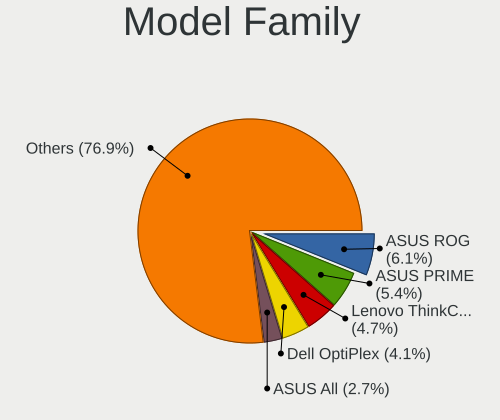

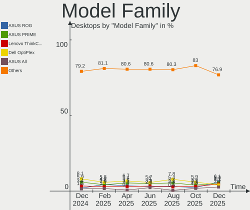

| Name                                           | Desktops | Percent |
|------------------------------------------------|----------|---------|
| ASUS ROG                                       | 18       | 6.1%    |
| ASUS PRIME                                     | 16       | 5.42%   |
| Lenovo ThinkCentre                             | 14       | 4.75%   |
| Dell OptiPlex                                  | 12       | 4.07%   |
| ASUS All                                       | 8        | 2.71%   |
| Dell Precision                                 | 7        | 2.37%   |
| Unknown                                        | 5        | 1.69%   |
| MSI MS-7C56                                    | 4        | 1.36%   |
| HP Pavilion                                    | 4        | 1.36%   |
| HP EliteDesk                                   | 4        | 1.36%   |
| HP Compaq                                      | 4        | 1.36%   |
| ASRock X570                                    | 4        | 1.36%   |
| Red Hat KVM                                    | 3        | 1.02%   |
| MSI MS-7C02                                    | 3        | 1.02%   |
| Gigabyte B650                                  | 3        | 1.02%   |
| ASUS TUF                                       | 3        | 1.02%   |
| ASUS SABERTOOTH                                | 3        | 1.02%   |
| ASRock B550M                                   | 3        | 1.02%   |
| MSI MS-7C95                                    | 2        | 0.68%   |
| MSI MS-7C91                                    | 2        | 0.68%   |
| MSI MS-7C37                                    | 2        | 0.68%   |
| HP Z4                                          | 2        | 0.68%   |
| HP Z230                                        | 2        | 0.68%   |
| Gigabyte X670                                  | 2        | 0.68%   |
| Gigabyte X570S                                 | 2        | 0.68%   |
| Gigabyte X570                                  | 2        | 0.68%   |
| Gigabyte H410M                                 | 2        | 0.68%   |
| Gigabyte B550                                  | 2        | 0.68%   |
| Gigabyte B450M                                 | 2        | 0.68%   |
| Gigabyte 970A-DS3P                             | 2        | 0.68%   |
| Fujitsu ESPRIMO                                | 2        | 0.68%   |
| Dell Inspiron                                  | 2        | 0.68%   |
| ASUS ProArt                                    | 2        | 0.68%   |
| ASRock B650M-HDV                               | 2        | 0.68%   |
| ASRock B450M                                   | 2        | 0.68%   |
| ASRock 990FX                                   | 2        | 0.68%   |
| Acer Aspire                                    | 2        | 0.68%   |
| Star Labs Byte                                 | 1        | 0.34%   |
| Shenzhen Meigao Electronic Equipment EliteMini | 1        | 0.34%   |
| Shenzhen DOKE electronic MP100                 | 1        | 0.34%   |

MFG Year
--------

Motherboard manufacture year

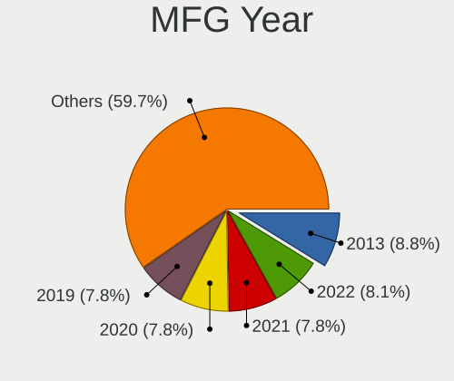

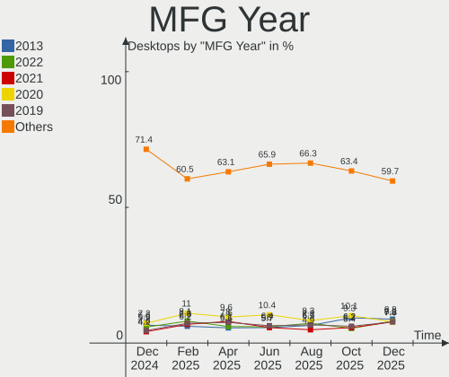

| Year | Desktops | Percent |
|------|----------|---------|
| 2013 | 26       | 8.81%   |
| 2022 | 24       | 8.14%   |
| 2021 | 23       | 7.8%    |
| 2020 | 23       | 7.8%    |
| 2019 | 23       | 7.8%    |
| 2012 | 22       | 7.46%   |
| 2023 | 20       | 6.78%   |
| 2017 | 20       | 6.78%   |
| 2018 | 18       | 6.1%    |
| 2024 | 17       | 5.76%   |
| 2014 | 15       | 5.08%   |
| 2016 | 14       | 4.75%   |
| 2011 | 14       | 4.75%   |
| 2025 | 12       | 4.07%   |
| 2015 | 7        | 2.37%   |
| 2010 | 7        | 2.37%   |
| 2009 | 5        | 1.69%   |
| 2008 | 2        | 0.68%   |
| 2006 | 2        | 0.68%   |
| 2007 | 1        | 0.34%   |

Form Factor
-----------

Physical design of the computer

| Name    | Desktops | Percent |
|---------|----------|---------|
| Desktop | 295      | 100%    |

Secure Boot
-----------

Enabled or disabled

| State    | Desktops | Percent |
|----------|----------|---------|
| Disabled | 295      | 100%    |

Coreboot
--------

Have coreboot on board

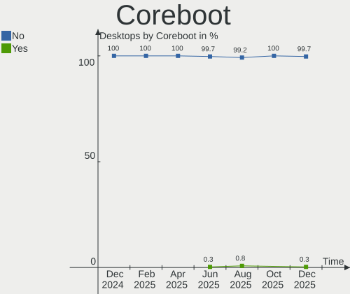

| Used | Desktops | Percent |
|------|----------|---------|
| No   | 294      | 99.66%  |
| Yes  | 1        | 0.34%   |

RAM Size
--------

Total RAM memory

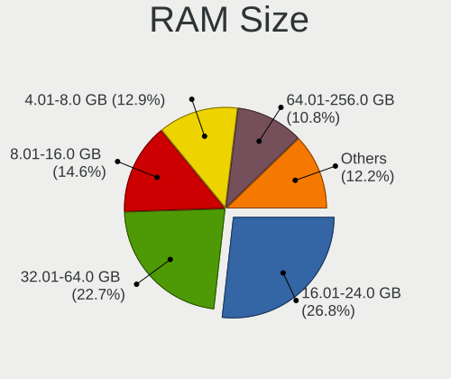

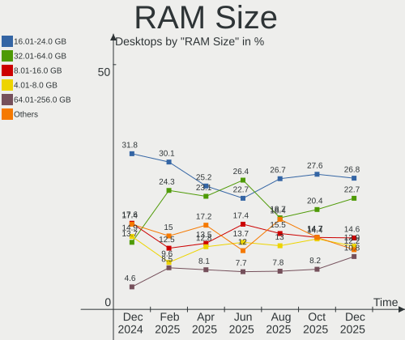

| Size in GB      | Desktops | Percent |
|-----------------|----------|---------|
| 16.01-24.0      | 79       | 26.78%  |
| 32.01-64.0      | 67       | 22.71%  |
| 8.01-16.0       | 43       | 14.58%  |
| 4.01-8.0        | 38       | 12.88%  |
| 64.01-256.0     | 32       | 10.85%  |
| 3.01-4.0        | 17       | 5.76%   |
| 24.01-32.0      | 15       | 5.08%   |
| 1.01-2.0        | 2        | 0.68%   |
| More than 256.0 | 1        | 0.34%   |
| 2.01-3.0        | 1        | 0.34%   |

RAM Used
--------

Used RAM memory

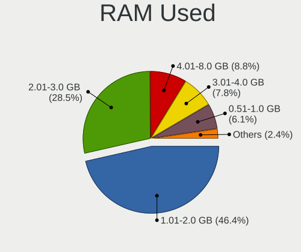

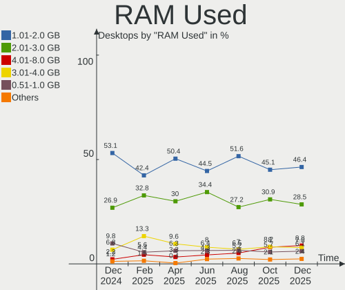

| Used GB   | Desktops | Percent |
|-----------|----------|---------|
| 1.01-2.0  | 137      | 46.44%  |
| 2.01-3.0  | 84       | 28.47%  |
| 4.01-8.0  | 26       | 8.81%   |
| 3.01-4.0  | 23       | 7.8%    |
| 0.51-1.0  | 18       | 6.1%    |
| 0.01-0.5  | 5        | 1.69%   |
| 8.01-16.0 | 2        | 0.68%   |

Total Drives
------------

Number of drives on board

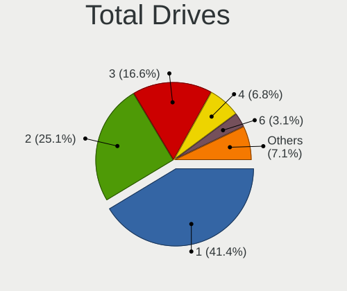

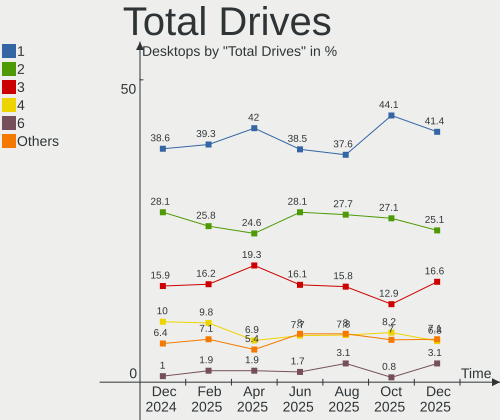

| Drives | Desktops | Percent |
|--------|----------|---------|
| 1      | 122      | 41.36%  |
| 2      | 74       | 25.08%  |
| 3      | 49       | 16.61%  |
| 4      | 20       | 6.78%   |
| 6      | 9        | 3.05%   |
| 5      | 9        | 3.05%   |
| 0      | 6        | 2.03%   |
| 16     | 1        | 0.34%   |
| 12     | 1        | 0.34%   |
| 10     | 1        | 0.34%   |
| 9      | 1        | 0.34%   |
| 8      | 1        | 0.34%   |
| 7      | 1        | 0.34%   |

Has CD-ROM
----------

Has CD-ROM on board

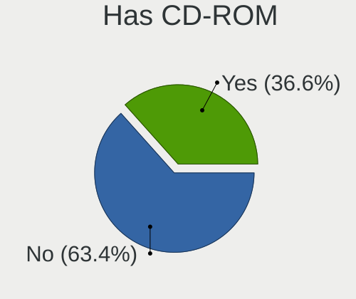

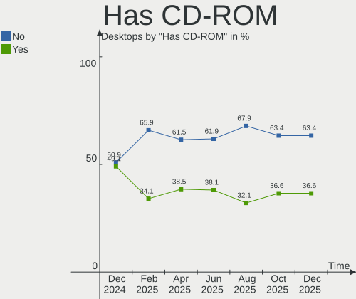

| Presented | Desktops | Percent |
|-----------|----------|---------|
| No        | 187      | 63.39%  |
| Yes       | 108      | 36.61%  |

Has Ethernet
------------

Has Ethernet on board

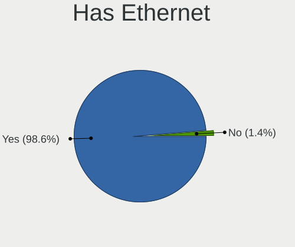

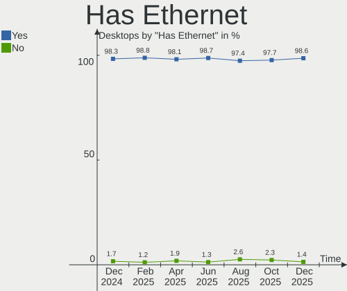

| Presented | Desktops | Percent |
|-----------|----------|---------|
| Yes       | 291      | 98.64%  |
| No        | 4        | 1.36%   |

Has WiFi
--------

Has WiFi module

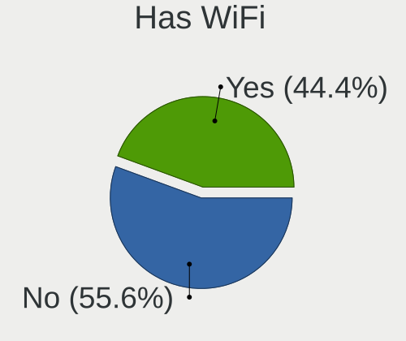

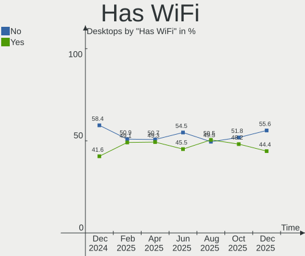

| Presented | Desktops | Percent |
|-----------|----------|---------|
| No        | 164      | 55.59%  |
| Yes       | 131      | 44.41%  |

Has Bluetooth
-------------

Has Bluetooth module

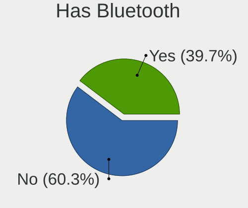

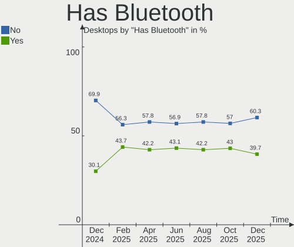

| Presented | Desktops | Percent |
|-----------|----------|---------|
| No        | 178      | 60.34%  |
| Yes       | 117      | 39.66%  |

Location
--------

Country
-------

Geographic location (country)

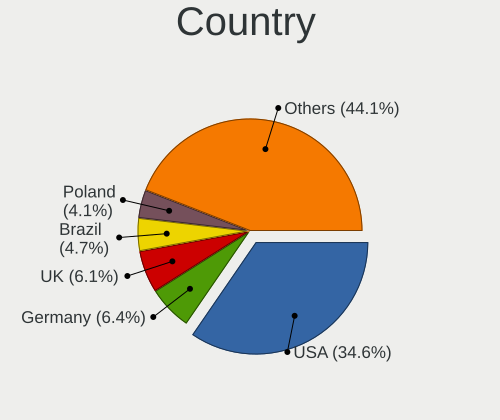

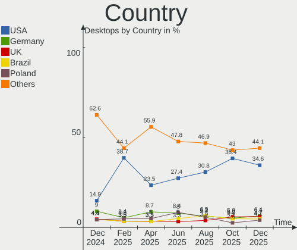

| Country         | Desktops | Percent |
|-----------------|----------|---------|
| USA             | 102      | 34.58%  |
| Germany         | 19       | 6.44%   |
| UK              | 18       | 6.1%    |
| Brazil          | 14       | 4.75%   |
| Poland          | 12       | 4.07%   |
| Russia          | 11       | 3.73%   |
| France          | 10       | 3.39%   |
| Spain           | 7        | 2.37%   |
| Mexico          | 6        | 2.03%   |
| Italy           | 6        | 2.03%   |
| Indonesia       | 6        | 2.03%   |
| Canada          | 6        | 2.03%   |
| India           | 5        | 1.69%   |
| Australia       | 5        | 1.69%   |
| Romania         | 4        | 1.36%   |
| Hungary         | 4        | 1.36%   |
| Finland         | 4        | 1.36%   |
| Portugal        | 3        | 1.02%   |
| Netherlands     | 3        | 1.02%   |
| Czechia         | 3        | 1.02%   |
| The Netherlands | 2        | 0.68%   |
| Taiwan          | 2        | 0.68%   |
| Sweden          | 2        | 0.68%   |
| Morocco         | 2        | 0.68%   |
| Lithuania       | 2        | 0.68%   |
| Greece          | 2        | 0.68%   |
| Estonia         | 2        | 0.68%   |
| Denmark         | 2        | 0.68%   |
| Croatia         | 2        | 0.68%   |
| Chile           | 2        | 0.68%   |
| Austria         | 2        | 0.68%   |
| Vietnam         | 1        | 0.34%   |
| Venezuela       | 1        | 0.34%   |
| Uruguay         | 1        | 0.34%   |
| Ukraine         | 1        | 0.34%   |
| Tunisia         | 1        | 0.34%   |
| Thailand        | 1        | 0.34%   |
| Switzerland     | 1        | 0.34%   |
| Slovakia        | 1        | 0.34%   |
| Norway          | 1        | 0.34%   |

City
----

Geographic location (city)

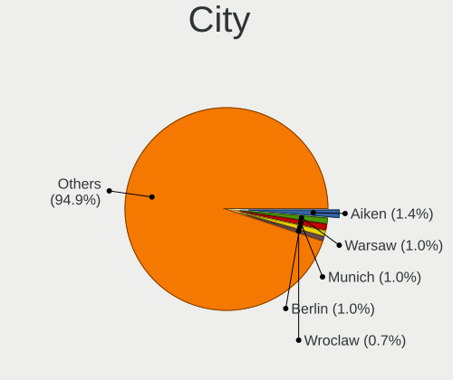

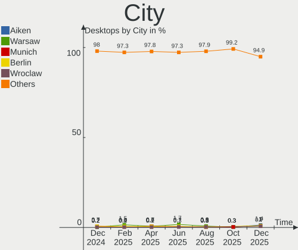

| City             | Desktops | Percent |
|------------------|----------|---------|
| Aiken            | 4        | 1.36%   |
| Warsaw           | 3        | 1.02%   |
| Munich           | 3        | 1.02%   |
| Berlin           | 3        | 1.02%   |
| Wroclaw          | 2        | 0.68%   |
| Vilnius          | 2        | 0.68%   |
| Turin            | 2        | 0.68%   |
| Southwark        | 2        | 0.68%   |
| Portland         | 2        | 0.68%   |
| Newcastle        | 2        | 0.68%   |
| Newburgh         | 2        | 0.68%   |
| Moscow           | 2        | 0.68%   |
| Manteca          | 2        | 0.68%   |
| Manchester       | 2        | 0.68%   |
| Las Vegas        | 2        | 0.68%   |
| Janesville       | 2        | 0.68%   |
| Edinburg         | 2        | 0.68%   |
| Denver           | 2        | 0.68%   |
| Concepción      | 2        | 0.68%   |
| Calgary          | 2        | 0.68%   |
| Bistriţa        | 2        | 0.68%   |
| Bengaluru        | 2        | 0.68%   |
| Athens           | 2        | 0.68%   |
| Anniston         | 2        | 0.68%   |
| Zapopan          | 1        | 0.34%   |
| Yulee            | 1        | 0.34%   |
| York             | 1        | 0.34%   |
| Wylie            | 1        | 0.34%   |
| Wisconsin Rapids | 1        | 0.34%   |
| Winston-Salem    | 1        | 0.34%   |
| Westland         | 1        | 0.34%   |
| West Palm Beach  | 1        | 0.34%   |
| Wautoma          | 1        | 0.34%   |
| Voronezh         | 1        | 0.34%   |
| Vladivostok      | 1        | 0.34%   |
| Vienna           | 1        | 0.34%   |
| Viamao           | 1        | 0.34%   |
| Vancouver        | 1        | 0.34%   |
| Valencia         | 1        | 0.34%   |
| Valdosta         | 1        | 0.34%   |

Drives
------

Drive Vendor
------------

Hard drive vendors

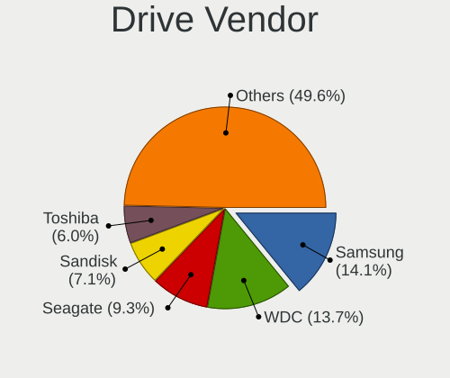

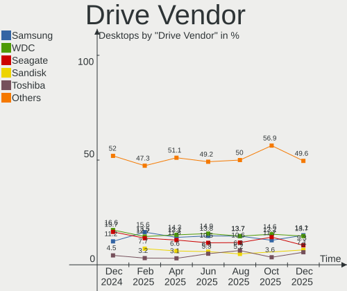

| Vendor                      | Desktops | Drives | Percent |
|-----------------------------|----------|--------|---------|
| Samsung Electronics         | 77       | 109    | 14.1%   |
| WDC                         | 75       | 97     | 13.74%  |
| Seagate                     | 51       | 65     | 9.34%   |
| Sandisk                     | 39       | 43     | 7.14%   |
| Toshiba                     | 33       | 39     | 6.04%   |
| Kingston                    | 33       | 35     | 6.04%   |
| Crucial                     | 23       | 27     | 4.21%   |
| Kingston Technology Company | 16       | 19     | 2.93%   |
| MAXIO Technology (Hangzhou) | 14       | 16     | 2.56%   |
| China                       | 12       | 13     | 2.2%    |
| Micron/Crucial Technology   | 11       | 11     | 2.01%   |
| Hitachi                     | 10       | 11     | 1.83%   |
| A-DATA Technology           | 10       | 10     | 1.83%   |
| Phison Electronics          | 9        | 14     | 1.65%   |
| Micron Technology           | 8        | 8      | 1.47%   |
| Unknown                     | 7        | 7      | 1.28%   |
| Intel                       | 6        | 6      | 1.1%    |
| SK hynix                    | 5        | 12     | 0.92%   |
| PNY                         | 5        | 6      | 0.92%   |
| Transcend                   | 4        | 4      | 0.73%   |
| Team                        | 4        | 5      | 0.73%   |
| HGST                        | 4        | 5      | 0.73%   |
| Biwin Storage Technology    | 4        | 4      | 0.73%   |
| SPCC                        | 3        | 4      | 0.55%   |
| Silicon Motion              | 3        | 3      | 0.55%   |
| Patriot                     | 3        | 3      | 0.55%   |
| Netac                       | 3        | 3      | 0.55%   |
| Maxtor                      | 3        | 3      | 0.55%   |
| HPE                         | 3        | 3      | 0.55%   |
| GOODRAM                     | 3        | 5      | 0.55%   |
| Gigabyte Technology         | 3        | 3      | 0.55%   |
| ADATA Technology            | 3        | 3      | 0.55%   |
| Verbatim                    | 2        | 2      | 0.37%   |
| V-GeN                       | 2        | 2      | 0.37%   |
| T-FORCE                     | 2        | 2      | 0.37%   |
| Realtek Semiconductor       | 2        | 2      | 0.37%   |
| OCZ                         | 2        | 2      | 0.37%   |
| KODAK                       | 2        | 2      | 0.37%   |
| KingSpec                    | 2        | 2      | 0.37%   |
| Intenso                     | 2        | 3      | 0.37%   |

Drive Model
-----------

Hard drive models

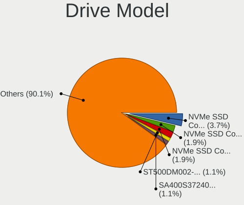

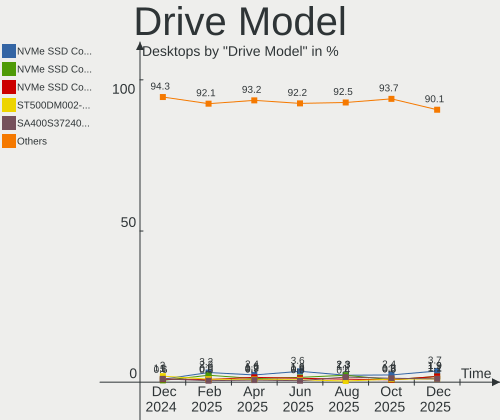

| Model                                              | Desktops | Percent |
|----------------------------------------------------|----------|---------|
| Samsung NVMe SSD Controller SM981/PM981/PM983 1TB  | 23       | 3.73%   |
| Samsung NVMe SSD Controller PM9A1/PM9A3/980PRO 1TB | 12       | 1.95%   |
| MAXIO (Hangzhou) NVMe SSD Controller MAP1202 2TB   | 12       | 1.95%   |
| Seagate ST500DM002-1BD142 500GB                    | 7        | 1.14%   |
| Kingston SA400S37240G 240GB SSD                    | 7        | 1.14%   |
| Samsung SSD 860 EVO 500GB                          | 6        | 0.97%   |
| Toshiba DT01ACA100 1TB                             | 5        | 0.81%   |
| Kingston SA400S37480G 480GB SSD                    | 5        | 0.81%   |
| WDC WD10EZEX-08WN4A0 1TB                           | 4        | 0.65%   |
| Unknown SD/MMC/MS PRO 2GB                          | 4        | 0.65%   |
| Toshiba DT01ACA050 500GB                           | 4        | 0.65%   |
| Samsung SSD 870 EVO 2TB                            | 4        | 0.65%   |
| Phison E12 NVMe Controller 1TB                     | 4        | 0.65%   |
| Kingston SV300S37A120G 120GB SSD                   | 4        | 0.65%   |
| Kingston SA400S37960G 960GB SSD                    | 4        | 0.65%   |
| Kingston SA400S37120G 120GB SSD                    | 4        | 0.65%   |
| Crucial CT240BX500SSD1 240GB                       | 4        | 0.65%   |
| Crucial CT1000MX500SSD1 1TB                        | 4        | 0.65%   |
| WDC WD5000AAKX-08U6AA0 500GB                       | 3        | 0.49%   |
| WDC WD10EZEX-22RKKA0 1TB                           | 3        | 0.49%   |
| WDC WD10EZEX-21WN4A0 1TB                           | 3        | 0.49%   |
| WDC WD10EARS-00Y5B1 1TB                            | 3        | 0.49%   |
| WDC WD Blue SA510 2.5 1000GB SSD                   | 3        | 0.49%   |
| Toshiba HDWD110 1TB                                | 3        | 0.49%   |
| Seagate ST1000DM010-2EP102 1TB                     | 3        | 0.49%   |
| Seagate ST1000DM003-1CH162 1TB                     | 3        | 0.49%   |
| Samsung SSD 980 1TB                                | 3        | 0.49%   |
| Samsung SSD 860 EVO 250GB                          | 3        | 0.49%   |
| Samsung SSD 860 EVO 1TB                            | 3        | 0.49%   |
| Samsung SSD 850 EVO 250GB                          | 3        | 0.49%   |
| Micron/Crucial P2 NVMe PCIe SSD 2TB                | 3        | 0.49%   |
| Crucial CT120BX500SSD1 120GB                       | 3        | 0.49%   |
| A-DATA SU800 512GB SSD                             | 3        | 0.49%   |
| WDC WDS240G2G0A-00JH30 240GB SSD                   | 2        | 0.32%   |
| WDC WD5000AAKX-60U6AA0 500GB                       | 2        | 0.32%   |
| WDC WD40EZRZ-00GXCB0 4TB                           | 2        | 0.32%   |
| WDC WD40EZAZ-00SF3B0 4TB                           | 2        | 0.32%   |
| WDC WD20EZRZ-00Z5HB0 2TB                           | 2        | 0.32%   |
| WDC WD20EZRX-00D8PB0 2TB                           | 2        | 0.32%   |
| WDC WD20EARX-00PASB0 2TB                           | 2        | 0.32%   |

HDD Vendor
----------

Hard disk drive vendors

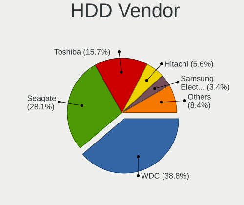

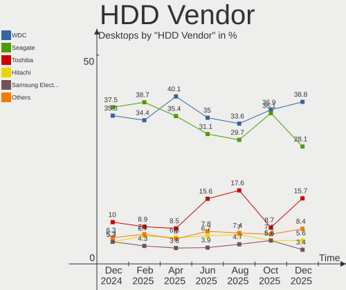

| Vendor              | Desktops | Drives | Percent |
|---------------------|----------|--------|---------|
| WDC                 | 69       | 83     | 38.76%  |
| Seagate             | 50       | 63     | 28.09%  |
| Toshiba             | 28       | 33     | 15.73%  |
| Hitachi             | 10       | 11     | 5.62%   |
| Samsung Electronics | 6        | 7      | 3.37%   |
| Unknown             | 4        | 4      | 2.25%   |
| HGST                | 4        | 5      | 2.25%   |
| Maxtor              | 3        | 3      | 1.69%   |
| HPE                 | 3        | 3      | 1.69%   |
| Fujitsu             | 1        | 1      | 0.56%   |

SSD Vendor
----------

Solid state drive vendors

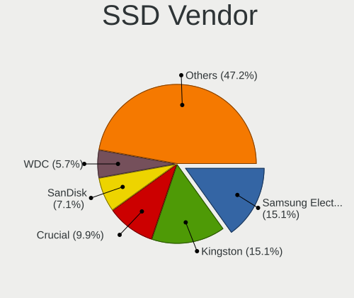

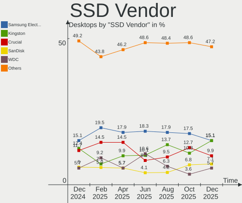

| Vendor              | Desktops | Drives | Percent |
|---------------------|----------|--------|---------|
| Samsung Electronics | 32       | 37     | 15.09%  |
| Kingston            | 32       | 33     | 15.09%  |
| Crucial             | 21       | 24     | 9.91%   |
| SanDisk             | 15       | 15     | 7.08%   |
| WDC                 | 12       | 12     | 5.66%   |
| China               | 12       | 13     | 5.66%   |
| A-DATA Technology   | 10       | 10     | 4.72%   |
| PNY                 | 5        | 6      | 2.36%   |
| Micron Technology   | 4        | 4      | 1.89%   |
| Team                | 3        | 4      | 1.42%   |
| Patriot             | 3        | 3      | 1.42%   |
| Netac               | 3        | 3      | 1.42%   |
| Intel               | 3        | 3      | 1.42%   |
| GOODRAM             | 3        | 5      | 1.42%   |
| Gigabyte Technology | 3        | 3      | 1.42%   |
| Verbatim            | 2        | 2      | 0.94%   |
| V-GeN               | 2        | 2      | 0.94%   |
| Transcend           | 2        | 2      | 0.94%   |
| T-FORCE             | 2        | 2      | 0.94%   |
| SPCC                | 2        | 3      | 0.94%   |
| SK hynix            | 2        | 9      | 0.94%   |
| OCZ                 | 2        | 2      | 0.94%   |
| KODAK               | 2        | 2      | 0.94%   |
| KingSpec            | 2        | 2      | 0.94%   |
| Intenso             | 2        | 3      | 0.94%   |
| Hewlett-Packard     | 2        | 2      | 0.94%   |
| Fanxiang            | 2        | 2      | 0.94%   |
| Apacer              | 2        | 2      | 0.94%   |
| Unknown             | 2        | 2      | 0.94%   |
| ZOTAC               | 1        | 1      | 0.47%   |
| XrayDisk            | 1        | 1      | 0.47%   |
| Vi550               | 1        | 1      | 0.47%   |
| Toshiba             | 1        | 1      | 0.47%   |
| Smartbuy            | 1        | 1      | 0.47%   |
| SD                  | 1        | 1      | 0.47%   |
| Plextor             | 1        | 1      | 0.47%   |
| PELADN              | 1        | 1      | 0.47%   |
| OVATION             | 1        | 1      | 0.47%   |
| Mushkin             | 1        | 1      | 0.47%   |
| LITEON              | 1        | 1      | 0.47%   |

Drive Kind
----------

HDD or SSD

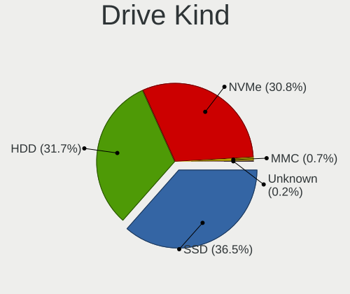

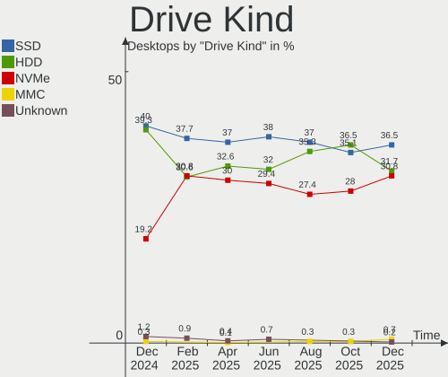

| Kind    | Desktops | Drives  | Percent |
|---------|----------|---------|---------|
| SSD     | 161      | 235     | 36.51%  |
| HDD     | 140      | 213     | 31.75%  |
| NVMe    | 136      | 208     | 30.84%  |
| MMC     | 3        | 3       | 0.68%   |
| Unknown | 1        | Unknown | 0.23%   |

Drive Connector
---------------

SATA, SAS, NVMe, etc.

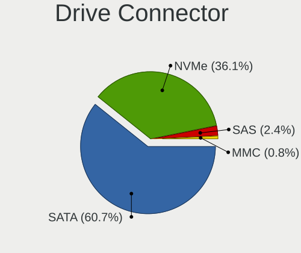

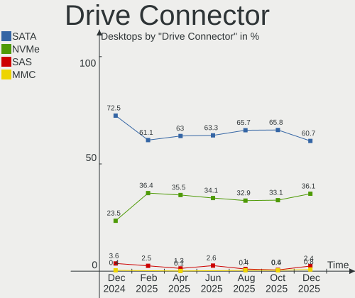

| Type | Desktops | Drives | Percent |
|------|----------|--------|---------|
| SATA | 229      | 437    | 60.74%  |
| NVMe | 136      | 207    | 36.07%  |
| SAS  | 9        | 12     | 2.39%   |
| MMC  | 3        | 3      | 0.8%    |

Drive Size
----------

Size of hard drive

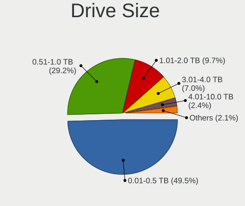

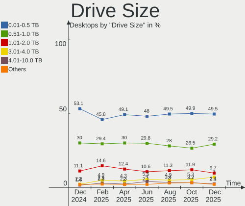

| Size in TB | Desktops | Drives | Percent |
|------------|----------|--------|---------|
| 0.01-0.5   | 163      | 225    | 49.54%  |
| 0.51-1.0   | 96       | 138    | 29.18%  |
| 1.01-2.0   | 32       | 37     | 9.73%   |
| 3.01-4.0   | 23       | 28     | 6.99%   |
| 4.01-10.0  | 8        | 10     | 2.43%   |
| 2.01-3.0   | 4        | 4      | 1.22%   |
| 10.01-20.0 | 2        | 5      | 0.61%   |
| 20.01-50.0 | 1        | 1      | 0.3%    |

Space Total
-----------

Amount of disk space available on the file system

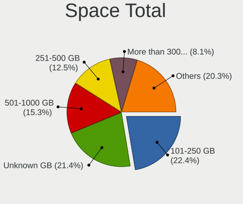

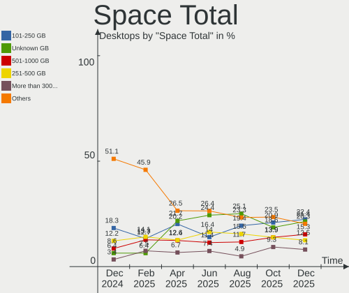

| Size in GB     | Desktops | Percent |
|----------------|----------|---------|
| 101-250        | 66       | 22.37%  |
| Unknown        | 63       | 21.36%  |
| 501-1000       | 45       | 15.25%  |
| 251-500        | 37       | 12.54%  |
| More than 3000 | 24       | 8.14%   |
| 1001-2000      | 18       | 6.1%    |
| 1-20           | 14       | 4.75%   |
| 51-100         | 13       | 4.41%   |
| 2001-3000      | 9        | 3.05%   |
| 21-50          | 6        | 2.03%   |

Space Used
----------

Amount of used disk space

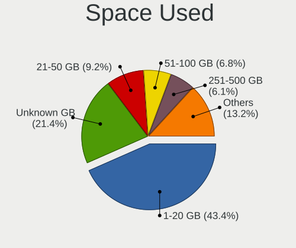

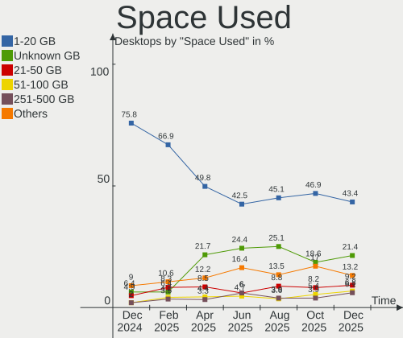

| Used GB        | Desktops | Percent |
|----------------|----------|---------|
| 1-20           | 128      | 43.39%  |
| Unknown        | 63       | 21.36%  |
| 21-50          | 27       | 9.15%   |
| 51-100         | 20       | 6.78%   |
| 251-500        | 18       | 6.1%    |
| 1001-2000      | 12       | 4.07%   |
| 501-1000       | 9        | 3.05%   |
| 101-250        | 7        | 2.37%   |
| More than 3000 | 5        | 1.69%   |
| 2001-3000      | 5        | 1.69%   |
| 0              | 1        | 0.34%   |

Malfunc. Drives
---------------

Drive models with a malfunction

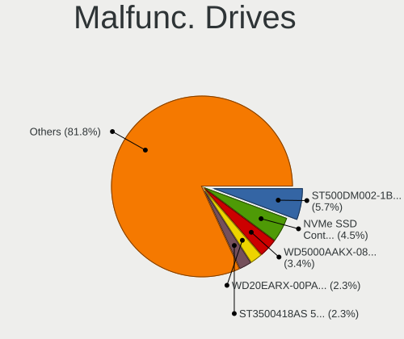

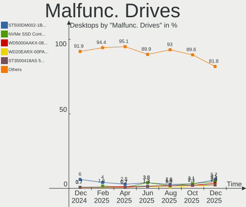

| Model                                                         | Desktops | Drives | Percent |
|---------------------------------------------------------------|----------|--------|---------|
| Seagate ST500DM002-1BD142 500GB                               | 5        | 6      | 5.68%   |
| Samsung Electronics NVMe SSD Controller SM981/PM981/PM983 1TB | 4        | 5      | 4.55%   |
| WDC WD5000AAKX-08U6AA0 500GB                                  | 3        | 3      | 3.41%   |
| WDC WD20EARX-00PASB0 2TB                                      | 2        | 2      | 2.27%   |
| Seagate ST3500418AS 500GB                                     | 2        | 2      | 2.27%   |
| Seagate ST1000DM003-1CH162 1TB                                | 2        | 2      | 2.27%   |
| Maxtor STM3250310AS 250GB                                     | 2        | 2      | 2.27%   |
| Hitachi HUS724040ALE641 4TB                                   | 2        | 2      | 2.27%   |
| Hitachi HDS721010CLA332 1TB                                   | 2        | 2      | 2.27%   |
| WDC WD800JD-60LSA5 80GB                                       | 1        | 1      | 1.14%   |
| WDC WD6400AAKS-65A7B0 640GB                                   | 1        | 1      | 1.14%   |
| WDC WD5000AZLX-08K2TA0 500GB                                  | 1        | 1      | 1.14%   |
| WDC WD5000AAKX-75U6AA0 500GB                                  | 1        | 1      | 1.14%   |
| WDC WD5000AAKX-60U6AA0 500GB                                  | 1        | 1      | 1.14%   |
| WDC WD5000AAKX-00ERMA0 500GB                                  | 1        | 1      | 1.14%   |
| WDC WD3200AVJS-63B6A0 320GB                                   | 1        | 1      | 1.14%   |
| WDC WD20EZRZ-00Z5HB0 2TB                                      | 1        | 1      | 1.14%   |
| WDC WD20EZRX-00D8PB0 2TB                                      | 1        | 1      | 1.14%   |
| WDC WD2000F9MZ-76NVPL0 2TB                                    | 1        | 1      | 1.14%   |
| WDC WD1600AAJS-00L7A0 160GB                                   | 1        | 1      | 1.14%   |
| WDC WD10PURX-64E5EY0 1TB                                      | 1        | 1      | 1.14%   |
| WDC WD10EZEX-00UD2A0 1TB                                      | 1        | 1      | 1.14%   |
| WDC WD10EURS-630AB1 1TB                                       | 1        | 1      | 1.14%   |
| WDC WD10EAVS-00D7B0 1TB                                       | 1        | 1      | 1.14%   |
| WDC WD10EARS-00Y5B1 1TB                                       | 1        | 1      | 1.14%   |
| WDC WD10EADS-00P6B0 1TB                                       | 1        | 1      | 1.14%   |
| Toshiba MK1656GSY 160GB                                       | 1        | 1      | 1.14%   |
| Toshiba DT01ACA300 3TB                                        | 1        | 1      | 1.14%   |
| Toshiba DT01ACA100 1TB                                        | 1        | 1      | 1.14%   |
| Toshiba DT01ACA050 500GB                                      | 1        | 1      | 1.14%   |
| Seagate ST9250827AS 250GB                                     | 1        | 1      | 1.14%   |
| Seagate ST9200827AS 200GB                                     | 1        | 1      | 1.14%   |
| Seagate ST9160821AS 160GB                                     | 1        | 1      | 1.14%   |
| Seagate ST500LM021-1KJ152 500GB                               | 1        | 1      | 1.14%   |
| Seagate ST500LM000-SSHD-8GB                                   | 1        | 1      | 1.14%   |
| Seagate ST4000DM000-1F2168 4TB                                | 1        | 1      | 1.14%   |
| Seagate ST380811AS 80GB                                       | 1        | 1      | 1.14%   |
| Seagate ST3250318AS 250GB                                     | 1        | 1      | 1.14%   |
| Seagate ST320LT007-9ZV142 320GB                               | 1        | 1      | 1.14%   |
| Seagate ST31000524AS 1TB                                      | 1        | 1      | 1.14%   |

Malfunc. Drive Vendor
---------------------

Vendors of faulty drives

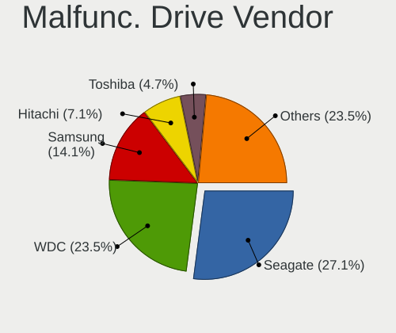

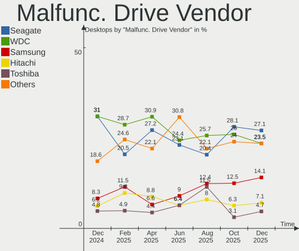

| Vendor              | Desktops | Drives | Percent |
|---------------------|----------|--------|---------|
| Seagate             | 23       | 25     | 27.06%  |
| WDC                 | 20       | 22     | 23.53%  |
| Samsung Electronics | 12       | 14     | 14.12%  |
| Hitachi             | 6        | 6      | 7.06%   |
| Toshiba             | 4        | 4      | 4.71%   |
| China               | 4        | 4      | 4.71%   |
| Crucial             | 3        | 3      | 3.53%   |
| Sandisk             | 2        | 2      | 2.35%   |
| Micron Technology   | 2        | 2      | 2.35%   |
| Maxtor              | 2        | 2      | 2.35%   |
| Kingston            | 2        | 2      | 2.35%   |
| A-DATA Technology   | 2        | 2      | 2.35%   |
| HGST                | 1        | 1      | 1.18%   |
| BAITITON            | 1        | 1      | 1.18%   |
| ANKEJE              | 1        | 1      | 1.18%   |

Malfunc. HDD Vendor
-------------------

Vendors of faulty HDD drives

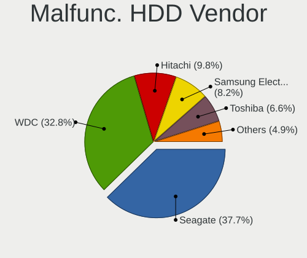

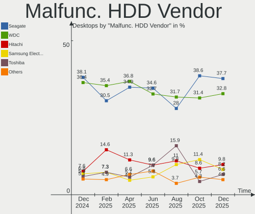

| Vendor              | Desktops | Drives | Percent |
|---------------------|----------|--------|---------|
| Seagate             | 23       | 25     | 37.7%   |
| WDC                 | 20       | 22     | 32.79%  |
| Hitachi             | 6        | 6      | 9.84%   |
| Samsung Electronics | 5        | 5      | 8.2%    |
| Toshiba             | 4        | 4      | 6.56%   |
| Maxtor              | 2        | 2      | 3.28%   |
| HGST                | 1        | 1      | 1.64%   |

Malfunc. Drive Kind
-------------------

Kinds of faulty drives

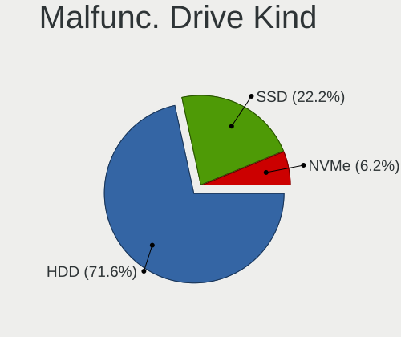

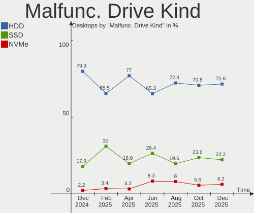

| Kind | Desktops | Drives | Percent |
|------|----------|--------|---------|
| HDD  | 58       | 65     | 71.6%   |
| SSD  | 18       | 20     | 22.22%  |
| NVMe | 5        | 6      | 6.17%   |

Failed Drives
-------------

Failed drive models

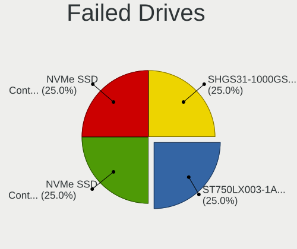

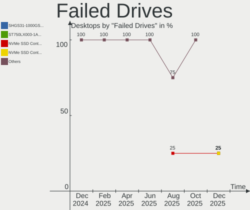

| Model                                                          | Desktops | Drives | Percent |
|----------------------------------------------------------------|----------|--------|---------|
| SK hynix SHGS31-1000GS-2 1TB SSD                               | 1        | 8      | 25%     |
| Seagate ST750LX003-1AC154 752GB                                | 1        | 1      | 25%     |
| Samsung Electronics NVMe SSD Controller PM9A1/PM9A3/980PRO 1TB | 1        | 1      | 25%     |
| Samsung Electronics NVMe SSD Controller 980 (DRAM-less) 256GB  | 1        | 1      | 25%     |

Failed Drive Vendor
-------------------

Failed drive vendors

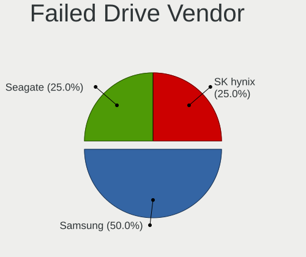

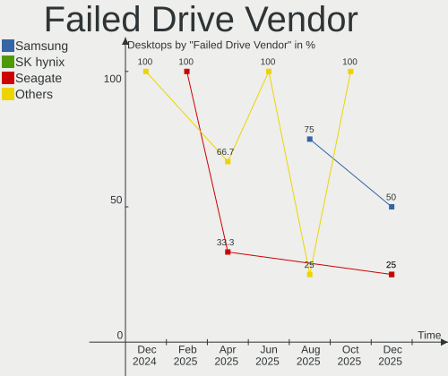

| Vendor              | Desktops | Drives | Percent |
|---------------------|----------|--------|---------|
| Samsung Electronics | 2        | 2      | 50%     |
| SK hynix            | 1        | 8      | 25%     |
| Seagate             | 1        | 1      | 25%     |

Drive Status
------------

Number of failed and malfunc. drives

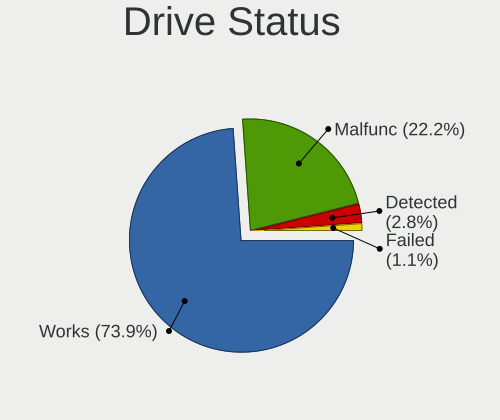

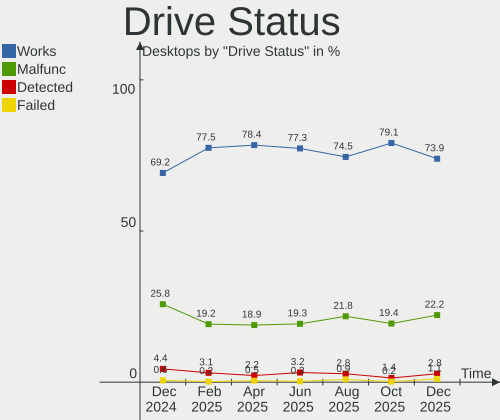

| Status   | Desktops | Drives | Percent |
|----------|----------|--------|---------|
| Works    | 263      | 544    | 73.88%  |
| Malfunc  | 79       | 91     | 22.19%  |
| Detected | 10       | 13     | 2.81%   |
| Failed   | 4        | 11     | 1.12%   |

Storage controller
------------------

Storage Vendor
--------------

Storage controller vendors

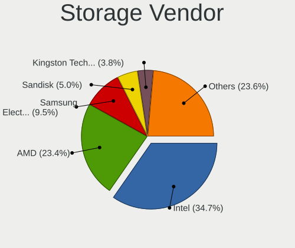

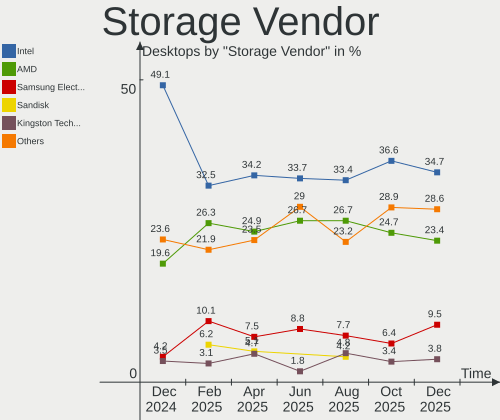

| Vendor                                  | Desktops | Percent |
|-----------------------------------------|----------|---------|
| Intel                                   | 172      | 34.68%  |
| AMD                                     | 116      | 23.39%  |
| Samsung Electronics                     | 47       | 9.48%   |
| Sandisk                                 | 25       | 5.04%   |
| Kingston Technology Company             | 19       | 3.83%   |
| ASMedia Technology                      | 18       | 3.63%   |
| MAXIO Technology (Hangzhou)             | 14       | 2.82%   |
| Micron/Crucial Technology               | 13       | 2.62%   |
| Phison Electronics                      | 10       | 2.02%   |
| Marvell Technology Group                | 7        | 1.41%   |
| JMicron Technology                      | 7        | 1.41%   |
| Toshiba America Info Systems            | 5        | 1.01%   |
| Micron Technology                       | 5        | 1.01%   |
| Nvidia                                  | 4        | 0.81%   |
| Biwin Storage Technology                | 4        | 0.81%   |
| SK hynix                                | 3        | 0.6%    |
| Silicon Motion                          | 3        | 0.6%    |
| Seagate Technology                      | 3        | 0.6%    |
| ADATA Technology                        | 3        | 0.6%    |
| Transcend                               | 2        | 0.4%    |
| Realtek Semiconductor                   | 2        | 0.4%    |
| LSI Logic / Symbios Logic               | 2        | 0.4%    |
| Hosin Global Electronics                | 2        | 0.4%    |
| Solidigm                                | 1        | 0.2%    |
| Shenzhen Unionmemory Information System | 1        | 0.2%    |
| Shenzhen Longsys Electronics            | 1        | 0.2%    |
| O2 Micro                                | 1        | 0.2%    |
| Lite-On IT Corp. / Plextor              | 1        | 0.2%    |
| KIOXIA                                  | 1        | 0.2%    |
| Integrated Technology Express           | 1        | 0.2%    |
| INNOGRIT                                | 1        | 0.2%    |
| Broadcom / LSI                          | 1        | 0.2%    |
| Apple                                   | 1        | 0.2%    |

Storage Model
-------------

Storage controller models

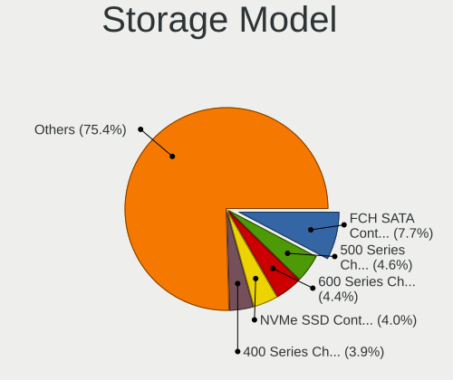

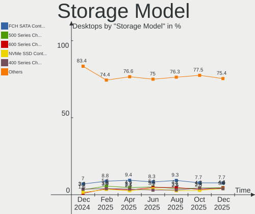

| Model                                                                                   | Desktops | Percent |
|-----------------------------------------------------------------------------------------|----------|---------|
| AMD FCH SATA Controller [AHCI mode]                                                     | 44       | 7.72%   |
| AMD 500 Series Chipset SATA Controller                                                  | 26       | 4.56%   |
| AMD 600 Series Chipset SATA Controller                                                  | 25       | 4.39%   |
| Samsung NVMe SSD Controller SM981/PM981/PM983                                           | 23       | 4.04%   |
| AMD 400 Series Chipset SATA Controller                                                  | 22       | 3.86%   |
| Intel Q170/Q150/B150/H170/H110/Z170/CM236 Chipset SATA Controller [AHCI Mode]           | 17       | 2.98%   |
| Intel 8 Series/C220 Series Chipset Family 6-port SATA Controller 1 [AHCI mode]          | 16       | 2.81%   |
| Intel 6 Series/C200 Series Chipset Family 6 port Desktop SATA AHCI Controller           | 15       | 2.63%   |
| ASMedia ASM1061/ASM1062 Serial ATA Controller                                           | 15       | 2.63%   |
| MAXIO (Hangzhou) NVMe SSD Controller MAP1202 (DRAM-less)                                | 13       | 2.28%   |
| Intel 7 Series/C210 Series Chipset Family 6-port SATA Controller [AHCI mode]            | 13       | 2.28%   |
| Samsung NVMe SSD Controller PM9A1/PM9A3/980PRO                                          | 12       | 2.11%   |
| Intel SATA Controller [RAID mode]                                                       | 12       | 2.11%   |
| Intel 200 Series PCH SATA controller [AHCI mode]                                        | 12       | 2.11%   |
| Intel Cannon Lake PCH SATA AHCI Controller                                              | 8        | 1.4%    |
| AMD SB7x0/SB8x0/SB9x0 IDE Controller                                                    | 8        | 1.4%    |
| AMD SB7x0/SB8x0/SB9x0 SATA Controller [AHCI mode]                                       | 7        | 1.23%   |
| Samsung NVMe SSD Controller 980 (DRAM-less)                                             | 6        | 1.05%   |
| Intel 500 Series Chipset Family SATA AHCI Controller                                    | 6        | 1.05%   |
| AMD SB7x0/SB8x0/SB9x0 SATA Controller [IDE mode]                                        | 6        | 1.05%   |
| SanDisk WD SN560/SN740/SN770/SN5000 NVMe SSD                                            | 5        | 0.88%   |
| Samsung NVMe SSD Controller S4LV008[Pascal]                                             | 5        | 0.88%   |
| Samsung NVMe SSD Controller PM9C1a (DRAM-less)                                          | 5        | 0.88%   |
| Kingston Company NV2 NVMe SSD [SM2267XT] (DRAM-less)                                    | 5        | 0.88%   |
| Intel Raptor Lake SATA AHCI Controller                                                  | 5        | 0.88%   |
| Intel Alder Lake-S PCH SATA Controller [AHCI Mode]                                      | 5        | 0.88%   |
| Sandisk WD Blue SN580 NVMe SSD (DRAM-less)                                              | 4        | 0.7%    |
| Sandisk WD Black SN850X NVMe SSD                                                        | 4        | 0.7%    |
| Samsung NVMe SSD 9100 PRO [PM9E1]                                                       | 4        | 0.7%    |
| Phison E12 NVMe Controller                                                              | 4        | 0.7%    |
| JMicron JMB363 SATA/IDE Controller                                                      | 4        | 0.7%    |
| Intel SATA controller                                                                   | 4        | 0.7%    |
| Intel Comet Lake SATA AHCI Controller                                                   | 4        | 0.7%    |
| Intel Alder Lake-N SATA AHCI Controller                                                 | 4        | 0.7%    |
| Intel 9 Series Chipset Family SATA Controller [AHCI Mode]                               | 4        | 0.7%    |
| Intel 6 Series/C200 Series Chipset Family Desktop SATA Controller (IDE mode, ports 4-5) | 4        | 0.7%    |
| Intel 6 Series/C200 Series Chipset Family Desktop SATA Controller (IDE mode, ports 0-3) | 4        | 0.7%    |
| Intel 5 Series/3400 Series Chipset 6 port SATA AHCI Controller                          | 4        | 0.7%    |
| AMD X370 Series Chipset SATA Controller                                                 | 4        | 0.7%    |
| AMD A320 Chipset SATA Controller [AHCI mode]                                            | 4        | 0.7%    |

Storage Kind
------------

Kind of storage controller (IDE, SATA, NVMe, SAS, ...)

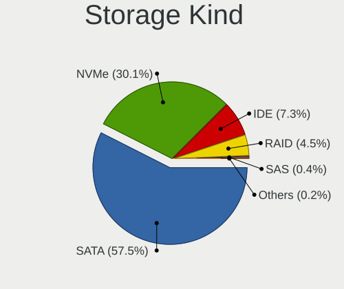

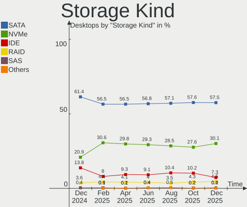

| Kind | Desktops | Percent |
|------|----------|---------|
| SATA | 258      | 57.46%  |
| NVMe | 135      | 30.07%  |
| IDE  | 33       | 7.35%   |
| RAID | 20       | 4.45%   |
| SAS  | 2        | 0.45%   |
| SCSI | 1        | 0.22%   |

Processor
---------

CPU Vendor
----------

Processor vendors

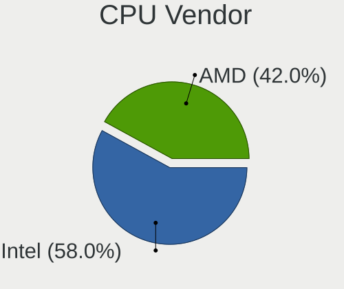

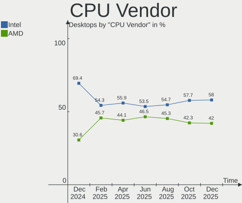

| Vendor | Desktops | Percent |
|--------|----------|---------|
| Intel  | 171      | 57.97%  |
| AMD    | 124      | 42.03%  |

CPU Model
---------

Processor models

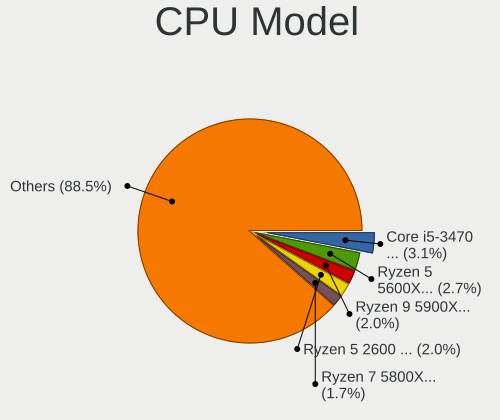

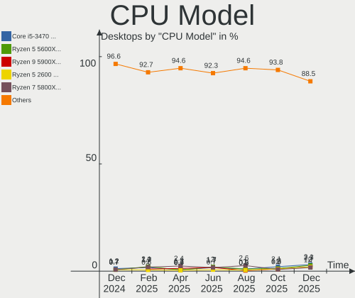

| Model                                       | Desktops | Percent |
|---------------------------------------------|----------|---------|
| Intel Core i5-3470 CPU @ 3.20GHz            | 9        | 3.05%   |
| AMD Ryzen 5 5600X 6-Core Processor          | 8        | 2.71%   |
| AMD Ryzen 9 5900X 12-Core Processor         | 6        | 2.03%   |
| AMD Ryzen 5 2600 Six-Core Processor         | 6        | 2.03%   |
| AMD Ryzen 7 5800X 8-Core Processor          | 5        | 1.69%   |
| AMD Ryzen 5 3600 6-Core Processor           | 5        | 1.69%   |
| Intel Core i7-4770 CPU @ 3.40GHz            | 4        | 1.36%   |
| Intel Core i5-6500 CPU @ 3.20GHz            | 4        | 1.36%   |
| Intel Core i5 CPU 650 @ 3.20GHz             | 4        | 1.36%   |
| AMD Ryzen 7 5700G with Radeon Graphics      | 4        | 1.36%   |
| AMD Ryzen 5 9600X 6-Core Processor          | 4        | 1.36%   |
| AMD Phenom II X4 955 Processor              | 4        | 1.36%   |
| Intel Xeon W-2125 CPU @ 4.00GHz             | 3        | 1.02%   |
| Intel Xeon CPU E5-2680 v4 @ 2.40GHz         | 3        | 1.02%   |
| Intel Core i7-3770 CPU @ 3.40GHz            | 3        | 1.02%   |
| Intel Core i5-7400 CPU @ 3.00GHz            | 3        | 1.02%   |
| Intel Core i5-6600K CPU @ 3.50GHz           | 3        | 1.02%   |
| Intel Core i5-6400 CPU @ 2.70GHz            | 3        | 1.02%   |
| Intel Core i3-3240 CPU @ 3.40GHz            | 3        | 1.02%   |
| Intel 11th Gen Core i7-11700K @ 3.60GHz     | 3        | 1.02%   |
| AMD Ryzen 9 9950X 16-Core Processor         | 3        | 1.02%   |
| AMD Ryzen 9 5950X 16-Core Processor         | 3        | 1.02%   |
| AMD Ryzen 7 7800X3D 8-Core Processor        | 3        | 1.02%   |
| AMD Ryzen 7 7700X 8-Core Processor          | 3        | 1.02%   |
| AMD Ryzen 7 5700X 8-Core Processor          | 3        | 1.02%   |
| AMD Ryzen 7 3700X 8-Core Processor          | 3        | 1.02%   |
| AMD Ryzen 5 5600GT with Radeon Graphics     | 3        | 1.02%   |
| AMD Ryzen 5 1600 Six-Core Processor         | 3        | 1.02%   |
| AMD Ryzen 3 2200G with Radeon Vega Graphics | 3        | 1.02%   |
| Intel Xeon W-2133 CPU @ 3.60GHz             | 2        | 0.68%   |
| Intel Xeon CPU E3-1270 v3 @ 3.50GHz         | 2        | 0.68%   |
| Intel Core Ultra 7 265K                     | 2        | 0.68%   |
| Intel Core i7-8700 CPU @ 3.20GHz            | 2        | 0.68%   |
| Intel Core i7-7700 CPU @ 3.60GHz            | 2        | 0.68%   |
| Intel Core i7-6700 CPU @ 3.40GHz            | 2        | 0.68%   |
| Intel Core i7-4790 CPU @ 3.60GHz            | 2        | 0.68%   |
| Intel Core i7-2600 CPU @ 3.40GHz            | 2        | 0.68%   |
| Intel Core i7-10700 CPU @ 2.90GHz           | 2        | 0.68%   |
| Intel Core i5-9400 CPU @ 2.90GHz            | 2        | 0.68%   |
| Intel Core i5-7500 CPU @ 3.40GHz            | 2        | 0.68%   |

CPU Model Family
----------------

Processor model prefix

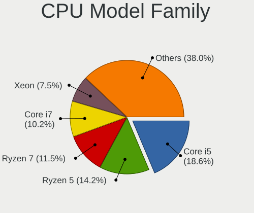

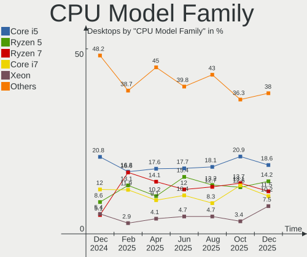

| Model                   | Desktops | Percent |
|-------------------------|----------|---------|
| Intel Core i5           | 55       | 18.64%  |
| AMD Ryzen 5             | 42       | 14.24%  |
| AMD Ryzen 7             | 34       | 11.53%  |
| Intel Core i7           | 30       | 10.17%  |
| Intel Xeon              | 22       | 7.46%   |
| Intel Core i3           | 22       | 7.46%   |
| AMD Ryzen 9             | 20       | 6.78%   |
| Other                   | 18       | 6.1%    |
| Intel Celeron           | 9        | 3.05%   |
| AMD Ryzen 3             | 7        | 2.37%   |
| AMD FX                  | 7        | 2.37%   |
| AMD Phenom II X4        | 6        | 2.03%   |
| Intel Core 2 Duo        | 4        | 1.36%   |
| Intel Core              | 4        | 1.36%   |
| Intel Core i9           | 3        | 1.02%   |
| AMD Athlon              | 2        | 0.68%   |
| Intel Pentium Silver    | 1        | 0.34%   |
| Intel Pentium Dual-Core | 1        | 0.34%   |
| Intel Pentium Dual      | 1        | 0.34%   |
| Intel Core 2 Quad       | 1        | 0.34%   |
| AMD Sempron             | 1        | 0.34%   |
| AMD Phenom II X6        | 1        | 0.34%   |
| AMD Phenom              | 1        | 0.34%   |
| AMD Athlon II X4        | 1        | 0.34%   |
| AMD Athlon Dual Core    | 1        | 0.34%   |
| AMD A8                  | 1        | 0.34%   |

CPU Cores
---------

Number of processor cores

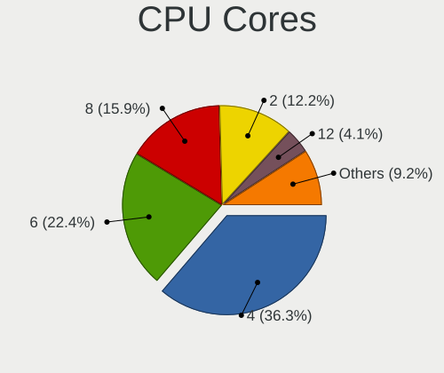

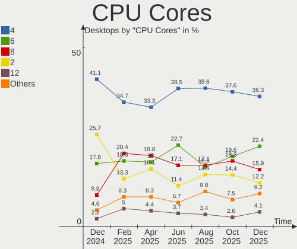

| Number | Desktops | Percent |
|--------|----------|---------|
| 4      | 107      | 36.27%  |
| 6      | 66       | 22.37%  |
| 8      | 47       | 15.93%  |
| 2      | 36       | 12.2%   |
| 12     | 12       | 4.07%   |
| 16     | 11       | 3.73%   |
| 20     | 5        | 1.69%   |
| 14     | 5        | 1.69%   |
| 24     | 4        | 1.36%   |
| 10     | 1        | 0.34%   |
| 3      | 1        | 0.34%   |

CPU Sockets
-----------

Number of sockets

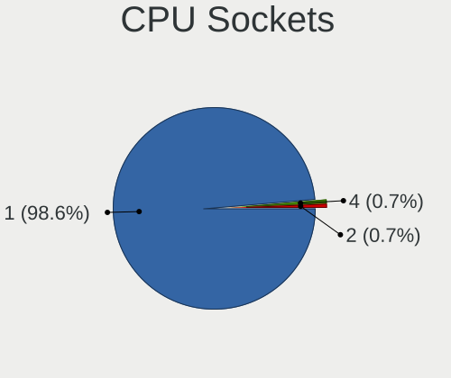

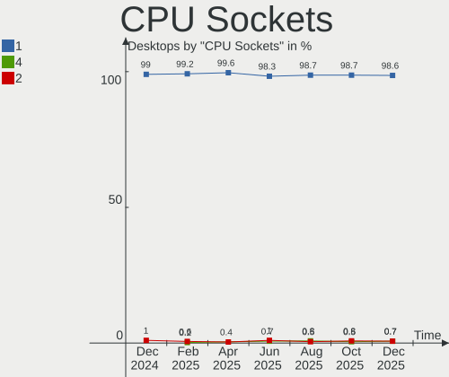

| Number | Desktops | Percent |
|--------|----------|---------|
| 1      | 291      | 98.64%  |
| 4      | 2        | 0.68%   |
| 2      | 2        | 0.68%   |

CPU Threads
-----------

Threads per core (Hyper-Threading)

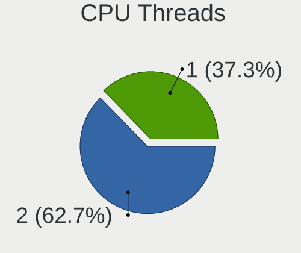

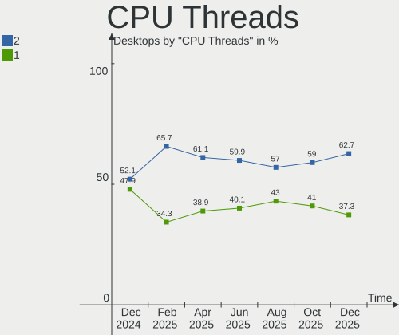

| Number | Desktops | Percent |
|--------|----------|---------|
| 2      | 185      | 62.71%  |
| 1      | 110      | 37.29%  |

CPU Op-Modes
------------

CPU Operation Modes (32-bit, 64-bit)

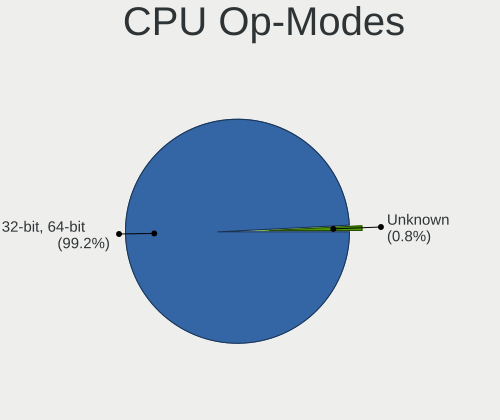

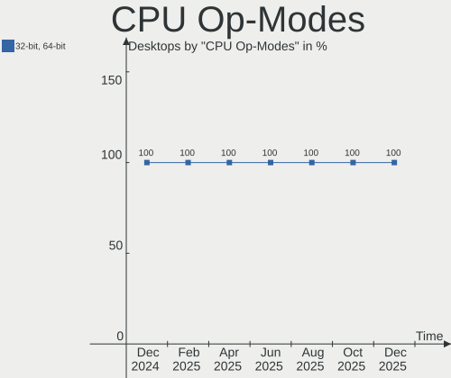

| Op mode        | Desktops | Percent |
|----------------|----------|---------|
| 32-bit, 64-bit | 295      | 100%    |

CPU Microcode
-------------

Microcode number

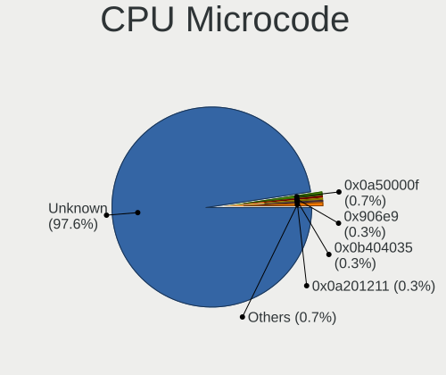

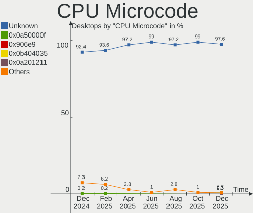

| Number     | Desktops | Percent |
|------------|----------|---------|
| Unknown    | 288      | 97.63%  |
| 0x0a50000f | 2        | 0.68%   |
| 0x906e9    | 1        | 0.34%   |
| 0x0b404035 | 1        | 0.34%   |
| 0x0a201211 | 1        | 0.34%   |
| 0x0a20120e | 1        | 0.34%   |
| 0x0a20120a | 1        | 0.34%   |

CPU Microarch
-------------

Microarchitecture

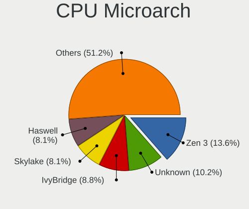

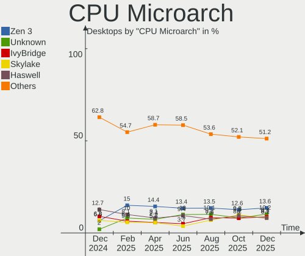

| Name             | Desktops | Percent |
|------------------|----------|---------|
| Zen 3            | 40       | 13.56%  |
| Unknown          | 30       | 10.17%  |
| IvyBridge        | 26       | 8.81%   |
| Skylake          | 24       | 8.14%   |
| Haswell          | 24       | 8.14%   |
| KabyLake         | 23       | 7.8%    |
| Zen+             | 12       | 4.07%   |
| Zen 2            | 12       | 4.07%   |
| SandyBridge      | 12       | 4.07%   |
| Alderlake Hybrid | 12       | 4.07%   |
| Zen              | 11       | 3.73%   |
| CometLake        | 11       | 3.73%   |
| K10              | 9        | 3.05%   |
| Piledriver       | 7        | 2.37%   |
| Penryn           | 7        | 2.37%   |
| Westmere         | 5        | 1.69%   |
| Lunarlake Hybrid | 4        | 1.36%   |
| Icelake          | 4        | 1.36%   |
| Broadwell        | 4        | 1.36%   |
| Silvermont       | 3        | 1.02%   |
| Gracemont        | 3        | 1.02%   |
| Nehalem          | 2        | 0.68%   |
| Jaguar           | 2        | 0.68%   |
| Goldmont         | 2        | 0.68%   |
| Tremont          | 1        | 0.34%   |
| Sapphire Rapids  | 1        | 0.34%   |
| K8 Hammer        | 1        | 0.34%   |
| Goldmont plus    | 1        | 0.34%   |
| Core             | 1        | 0.34%   |
| Bulldozer        | 1        | 0.34%   |

Graphics
--------

GPU Vendor
----------

Vendors of graphics cards

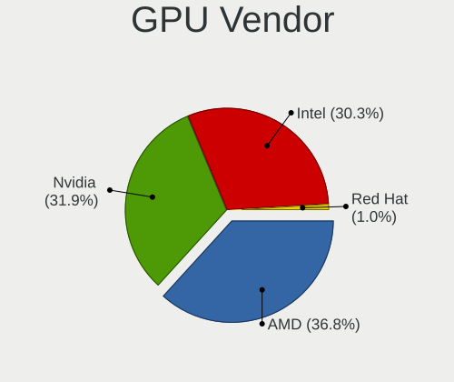

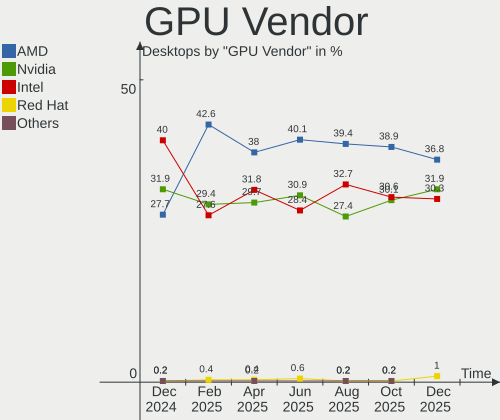

| Vendor  | Desktops | Percent |
|---------|----------|---------|
| AMD     | 114      | 36.77%  |
| Nvidia  | 99       | 31.94%  |
| Intel   | 94       | 30.32%  |
| Red Hat | 3        | 0.97%   |

GPU Model
---------

Graphics card models

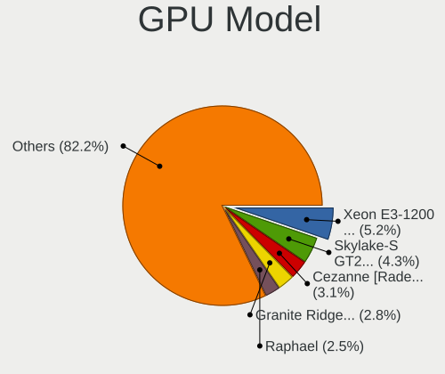

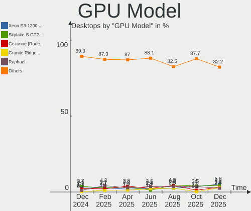

| Model                                                                       | Desktops | Percent |
|-----------------------------------------------------------------------------|----------|---------|
| Intel Xeon E3-1200 v2/3rd Gen Core processor Graphics Controller            | 17       | 5.23%   |
| Intel Skylake-S GT2 [HD Graphics 530]                                       | 14       | 4.31%   |
| AMD Cezanne [Radeon Vega Series / Radeon Vega Mobile Series]                | 10       | 3.08%   |
| AMD Granite Ridge [Radeon Graphics]                                         | 9        | 2.77%   |
| AMD Raphael                                                                 | 8        | 2.46%   |
| AMD Navi 31 [Radeon RX 7900 XT/7900 XTX/7900 GRE/7900M]                     | 8        | 2.46%   |
| AMD Ellesmere [Radeon RX 470/480/570/570X/580/580X/590]                     | 8        | 2.46%   |
| Nvidia GK208B [GeForce GT 710]                                              | 7        | 2.15%   |
| Intel CoffeeLake-S GT2 [UHD Graphics 630]                                   | 7        | 2.15%   |
| AMD Navi 48 [Radeon RX 9070/9070 XT/9070 GRE]                               | 7        | 2.15%   |
| AMD Navi 21 [Radeon RX 6800/6800 XT / 6900 XT]                              | 7        | 2.15%   |
| Intel Xeon E3-1200 v3/4th Gen Core Processor Integrated Graphics Controller | 6        | 1.85%   |
| Intel Kaby Lake-S GT2 [HD Graphics 630]                                     | 6        | 1.85%   |
| Intel 2nd Generation Core Processor Family Integrated Graphics Controller   | 6        | 1.85%   |
| AMD Navi 44 [Radeon RX 9060 XT]                                             | 6        | 1.85%   |
| Nvidia GP106 [GeForce GTX 1060 6GB]                                         | 5        | 1.54%   |
| Intel 4th Generation Core Processor Family Integrated Graphics Controller   | 5        | 1.54%   |
| AMD Navi 23 [Radeon RX 6600/6600 XT/6600M]                                  | 5        | 1.54%   |
| Nvidia GP108 [GeForce GT 1030]                                              | 4        | 1.23%   |
| Intel Arrow Lake-S [Intel Graphics]                                         | 4        | 1.23%   |
| AMD Vega 10 XL/XT [Radeon RX Vega 56/64]                                    | 4        | 1.23%   |
| AMD Navi 24 [Radeon RX 6400/6500 XT/6500M]                                  | 4        | 1.23%   |
| Red Hat Virtio 1.0 GPU                                                      | 3        | 0.92%   |
| Nvidia TU117 [GeForce GTX 1650]                                             | 3        | 0.92%   |
| Nvidia TU116 [GeForce GTX 1660 SUPER]                                       | 3        | 0.92%   |
| Nvidia TU104 [GeForce RTX 2070 SUPER]                                       | 3        | 0.92%   |
| Nvidia GP107 [GeForce GTX 1050 Ti]                                          | 3        | 0.92%   |
| Nvidia GM107GL [Quadro K620]                                                | 3        | 0.92%   |
| Nvidia GK208B [GeForce GT 730]                                              | 3        | 0.92%   |
| Nvidia AD104 [GeForce RTX 4070 Ti]                                          | 3        | 0.92%   |
| Nvidia AD103 [GeForce RTX 4080 SUPER]                                       | 3        | 0.92%   |
| Intel Alder Lake-N [UHD Graphics]                                           | 3        | 0.92%   |
| AMD RS780L [Radeon 3000]                                                    | 3        | 0.92%   |
| AMD Raven Ridge [Radeon Vega Series / Radeon Vega Mobile Series]            | 3        | 0.92%   |
| AMD Picasso/Raven 2 [Radeon Vega Series / Radeon Vega Mobile Series]        | 3        | 0.92%   |
| AMD Navi 33 [Radeon RX 7600/7600 XT/7600M XT/7600S/7700S / PRO W7600]       | 3        | 0.92%   |
| AMD Navi 22 [Radeon RX 6700/6700 XT/6750 XT / 6800M/6850M XT]               | 3        | 0.92%   |
| Nvidia TU116 [GeForce GTX 1660]                                             | 2        | 0.62%   |
| Nvidia TU104GL [Quadro RTX 4000]                                            | 2        | 0.62%   |
| Nvidia GT218 [GeForce 210]                                                  | 2        | 0.62%   |

GPU Combo
---------

Combinations of graphics cards

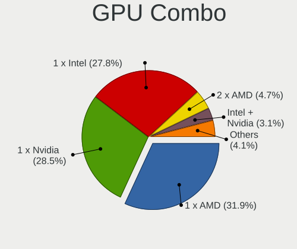

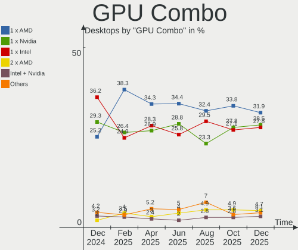

| Name           | Desktops | Percent |
|----------------|----------|---------|
| 1 x AMD        | 94       | 31.86%  |
| 1 x Nvidia     | 84       | 28.47%  |
| 1 x Intel      | 82       | 27.8%   |
| 2 x AMD        | 14       | 4.75%   |
| Intel + Nvidia | 9        | 3.05%   |
| AMD + Nvidia   | 5        | 1.69%   |
| 1 x Red Hat    | 3        | 1.02%   |
| 2 x Intel      | 2        | 0.68%   |
| 2 x Nvidia     | 1        | 0.34%   |
| Intel + AMD    | 1        | 0.34%   |

GPU Driver
----------

Free vs proprietary

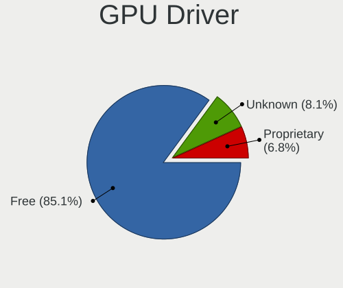

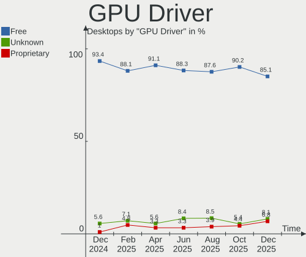

| Driver      | Desktops | Percent |
|-------------|----------|---------|
| Free        | 251      | 85.08%  |
| Unknown     | 24       | 8.14%   |
| Proprietary | 20       | 6.78%   |

GPU Memory
----------

Total video memory

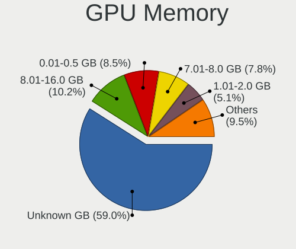

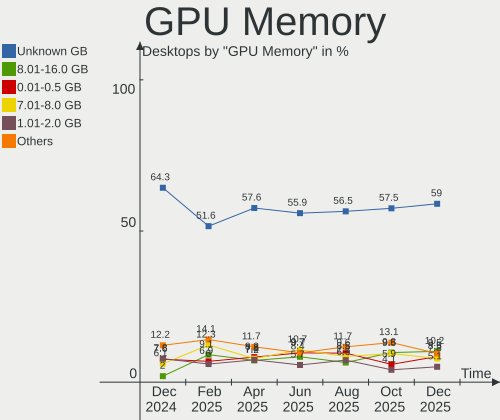

| Size in GB | Desktops | Percent |
|------------|----------|---------|
| Unknown    | 174      | 58.98%  |
| 8.01-16.0  | 30       | 10.17%  |
| 0.01-0.5   | 25       | 8.47%   |
| 7.01-8.0   | 23       | 7.8%    |
| 1.01-2.0   | 15       | 5.08%   |
| 0.51-1.0   | 10       | 3.39%   |
| 3.01-4.0   | 8        | 2.71%   |
| 16.01-24.0 | 8        | 2.71%   |
| 5.01-6.0   | 1        | 0.34%   |
| 2.01-3.0   | 1        | 0.34%   |

Monitor
-------

Monitor Vendor
--------------

Monitor vendors

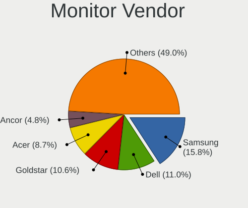

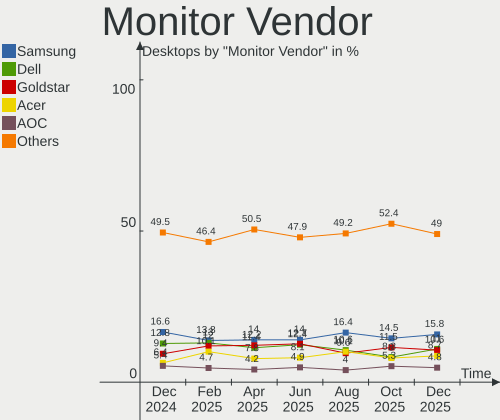

| Vendor               | Desktops | Percent |
|----------------------|----------|---------|
| Samsung Electronics  | 49       | 15.81%  |
| Dell                 | 34       | 10.97%  |
| Goldstar             | 33       | 10.65%  |
| Acer                 | 27       | 8.71%   |
| AOC                  | 15       | 4.84%   |
| Ancor Communications | 15       | 4.84%   |
| Hewlett-Packard      | 14       | 4.52%   |
| ViewSonic            | 12       | 3.87%   |
| Philips              | 10       | 3.23%   |
| BenQ                 | 9        | 2.9%    |
| Iiyama               | 8        | 2.58%   |
| ASUSTek Computer     | 8        | 2.58%   |
| Lenovo               | 7        | 2.26%   |
| MSI                  | 6        | 1.94%   |
| Vizio                | 5        | 1.61%   |
| Unknown (XXX)        | 4        | 1.29%   |
| Sony                 | 3        | 0.97%   |
| RHT                  | 3        | 0.97%   |
| Toshiba              | 2        | 0.65%   |
| Sceptre Tech         | 2        | 0.65%   |
| Roku                 | 2        | 0.65%   |
| Hitachi              | 2        | 0.65%   |
| Gigabyte Technology  | 2        | 0.65%   |
| Fujitsu Siemens      | 2        | 0.65%   |
| CHD                  | 2        | 0.65%   |
| Wacom                | 1        | 0.32%   |
| Viotek               | 1        | 0.32%   |
| UGD                  | 1        | 0.32%   |
| STD                  | 1        | 0.32%   |
| SKG                  | 1        | 0.32%   |
| Sharp                | 1        | 0.32%   |
| SGT                  | 1        | 0.32%   |
| SANSUI               | 1        | 0.32%   |
| RTK                  | 1        | 0.32%   |
| Pixio                | 1        | 0.32%   |
| Orion                | 1        | 0.32%   |
| ONN                  | 1        | 0.32%   |
| Onkyo                | 1        | 0.32%   |
| NEC Computers        | 1        | 0.32%   |
| MiTAC                | 1        | 0.32%   |

Monitor Model
-------------

Monitor models

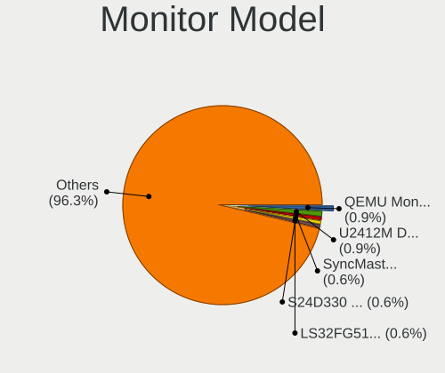

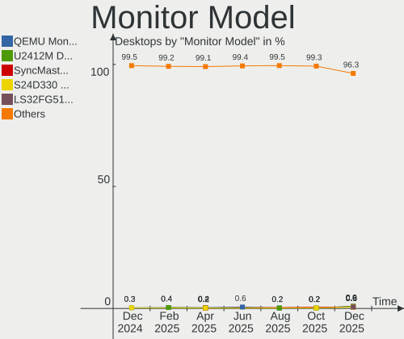

| Model                                                                 | Desktops | Percent |
|-----------------------------------------------------------------------|----------|---------|
| RHT QEMU Monitor RHT1234 2048x1152 325x203mm 15.1-inch                | 3        | 0.93%   |
| Dell U2412M DELA07A 1920x1200 518x324mm 24.1-inch                     | 3        | 0.93%   |
| Samsung Electronics SyncMaster SAM0091 1600x1200 432x324mm 21.3-inch  | 2        | 0.62%   |
| Samsung Electronics S24D330 SAM0D92 1920x1080 531x299mm 24.0-inch     | 2        | 0.62%   |
| Samsung Electronics LS32FG51x SAM78F2 2560x1440 697x392mm 31.5-inch   | 2        | 0.62%   |
| Philips PHL 243V5 PHLC0D1 1920x1080 521x293mm 23.5-inch               | 2        | 0.62%   |
| Goldstar ULTRAGEAR GSM5BD3 2560x1440 697x392mm 31.5-inch              | 2        | 0.62%   |
| Goldstar LG ULTRAWIDE GSM59F1 2560x1080 670x280mm 28.6-inch           | 2        | 0.62%   |
| Goldstar HDR 4K GSM7706 3840x2160 600x340mm 27.2-inch                 | 2        | 0.62%   |
| Dell P2419H DELD0DA 1920x1080 527x296mm 23.8-inch                     | 2        | 0.62%   |
| Dell E178FP DELA027 1280x1024 338x270mm 17.0-inch                     | 2        | 0.62%   |
| Ancor Communications ASUS VE278 ACI27F6 1920x1080 598x336mm 27.0-inch | 2        | 0.62%   |
| Acer X193HQ ACR0069 1366x768 410x230mm 18.5-inch                      | 2        | 0.62%   |
| Acer K242HQL ACR042E 1920x1080 521x293mm 23.5-inch                    | 2        | 0.62%   |
| Wacom DTH246 WAC1105 2560x1440 527x297mm 23.8-inch                    | 1        | 0.31%   |
| Vizio VQD55M-0804 VIZ0C04 3840x2160 1096x616mm 49.5-inch              | 1        | 0.31%   |
| Vizio VO42LFHDTV10A VIZ0043 1920x1080 930x520mm 41.9-inch             | 1        | 0.31%   |
| Vizio V4K50M-0810 VIZ0310 3840x2160 1095x616mm 49.5-inch              | 1        | 0.31%   |
| Vizio D24h-C1 VIZ0095 1360x768 521x293mm 23.5-inch                    | 1        | 0.31%   |
| Vizio D24-D1 VIZ1005 1920x1080 521x293mm 23.5-inch                    | 1        | 0.31%   |
| Viotek GFV24CB VTK0236 1920x1080 598x336mm 27.0-inch                  | 1        | 0.31%   |
| ViewSonic VX3276-QHD VSCE635 2560x1440 698x393mm 31.5-inch            | 1        | 0.31%   |
| ViewSonic VX2882-4KP VSC033C 3840x2160 632x360mm 28.6-inch            | 1        | 0.31%   |
| ViewSonic VX2758-SERIES VSCA738 2560x1440 598x336mm 27.0-inch         | 1        | 0.31%   |
| ViewSonic VX2276 Series VSCEE38 1920x1080 479x260mm 21.5-inch         | 1        | 0.31%   |
| ViewSonic VX2210 SERIES VSC172B 1920x1080 476x268mm 21.5-inch         | 1        | 0.31%   |
| ViewSonic VP2785 SERIES VSC7F34 3840x2160 597x336mm 27.0-inch         | 1        | 0.31%   |
| ViewSonic VP2030 SERIES VSC131C 1600x1200 408x306mm 20.1-inch         | 1        | 0.31%   |
| ViewSonic VG2732 SERIES VSC2A29 1920x1080 598x336mm 27.0-inch         | 1        | 0.31%   |
| ViewSonic VG2448 VSC3B35 1920x1080 527x296mm 23.8-inch                | 1        | 0.31%   |
| ViewSonic VA916 Series VSC7C20 1280x1024 376x301mm 19.0-inch          | 1        | 0.31%   |
| ViewSonic VA2248 SERIES VSC0E28 1920x1080 477x268mm 21.5-inch         | 1        | 0.31%   |
| ViewSonic VA2223 SERIES VSCEF29 1920x1080 477x268mm 21.5-inch         | 1        | 0.31%   |
| Unknown (XXX) HDMI XXX1900 1440x900 400x270mm 19.0-inch               | 1        | 0.31%   |
| Unknown (XXX) Beyond TV XXX9221 1920x1080 1209x680mm 54.6-inch        | 1        | 0.31%   |
| Unknown (XXX) Beyond TV XXX2851 3840x2160 1209x680mm 54.6-inch        | 1        | 0.31%   |
| Unknown (XXX) Beyo TV XXX9615 3840x2160 1210x680mm 54.6-inch          | 1        | 0.31%   |
| UGD Artist 15.6 UGD1501 1920x1080 344x193mm 15.5-inch                 | 1        | 0.31%   |
| Toshiba TV TSB020D 1920x1080 529x299mm 23.9-inch                      | 1        | 0.31%   |
| Toshiba TV TSB0206 1920x1080                                          | 1        | 0.31%   |

Monitor Resolution
------------------

Monitor screen resolution

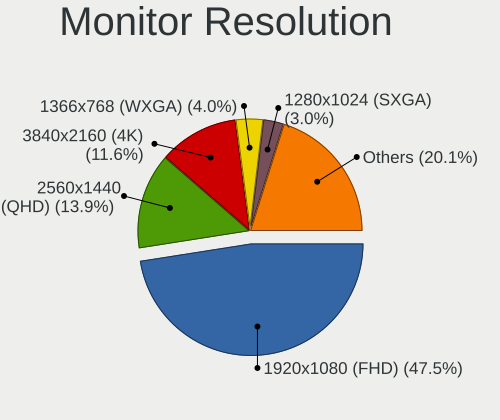

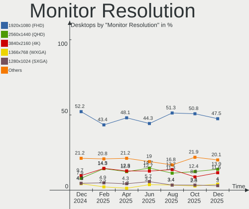

| Resolution         | Desktops | Percent |
|--------------------|----------|---------|
| 1920x1080 (FHD)    | 144      | 47.52%  |
| 2560x1440 (QHD)    | 42       | 13.86%  |
| 3840x2160 (4K)     | 35       | 11.55%  |
| 1366x768 (WXGA)    | 12       | 3.96%   |
| 1280x1024 (SXGA)   | 9        | 2.97%   |
| 1680x1050 (WSXGA+) | 8        | 2.64%   |
| 1600x900 (HD+)     | 8        | 2.64%   |
| 1440x900 (WXGA+)   | 8        | 2.64%   |
| 3440x1440          | 7        | 2.31%   |
| 1920x1200 (WUXGA)  | 7        | 2.31%   |
| 1920x540           | 4        | 1.32%   |
| 2560x1397          | 3        | 0.99%   |
| 2560x1080          | 3        | 0.99%   |
| 1600x1200          | 3        | 0.99%   |
| 3840x1080          | 2        | 0.66%   |
| 1360x768           | 2        | 0.66%   |
| 1024x768 (XGA)     | 2        | 0.66%   |
| 3840x1600          | 1        | 0.33%   |
| 2560x1600          | 1        | 0.33%   |
| 2256x1504          | 1        | 0.33%   |
| 1152x864           | 1        | 0.33%   |

Monitor Diagonal
----------------

Diagonal size in inches

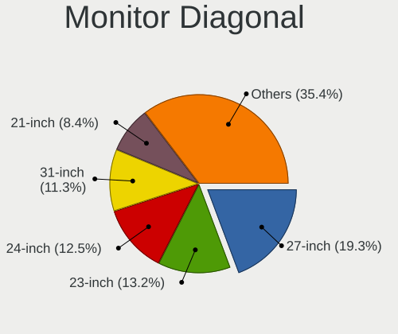

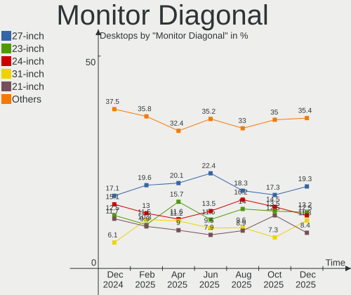

| Inches  | Desktops | Percent |
|---------|----------|---------|
| 27      | 60       | 19.29%  |
| 23      | 41       | 13.18%  |
| 24      | 39       | 12.54%  |
| 31      | 35       | 11.25%  |
| 21      | 26       | 8.36%   |
| 19      | 15       | 4.82%   |
| 18      | 11       | 3.54%   |
| 34      | 10       | 3.22%   |
| 22      | 7        | 2.25%   |
| 20      | 7        | 2.25%   |
| 15      | 6        | 1.93%   |
| Unknown | 6        | 1.93%   |
| 54      | 5        | 1.61%   |
| 32      | 5        | 1.61%   |
| 49      | 4        | 1.29%   |
| 17      | 4        | 1.29%   |
| 36      | 3        | 0.96%   |
| 29      | 3        | 0.96%   |
| 84      | 2        | 0.64%   |
| 65      | 2        | 0.64%   |
| 48      | 2        | 0.64%   |
| 42      | 2        | 0.64%   |
| 28      | 2        | 0.64%   |
| 25      | 2        | 0.64%   |
| 75      | 1        | 0.32%   |
| 74      | 1        | 0.32%   |
| 72      | 1        | 0.32%   |
| 63      | 1        | 0.32%   |
| 60      | 1        | 0.32%   |
| 55      | 1        | 0.32%   |
| 41      | 1        | 0.32%   |
| 40      | 1        | 0.32%   |
| 37      | 1        | 0.32%   |
| 33      | 1        | 0.32%   |
| 30      | 1        | 0.32%   |
| 14      | 1        | 0.32%   |

Monitor Width
-------------

Physical width

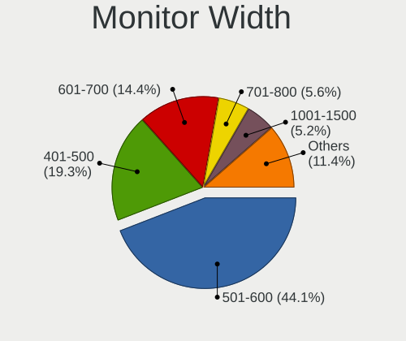

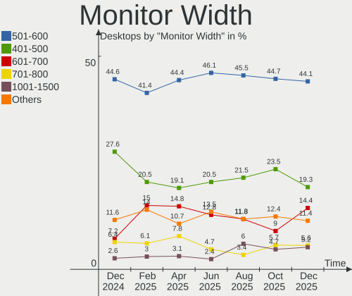

| Width in mm | Desktops | Percent |
|-------------|----------|---------|
| 501-600     | 135      | 44.12%  |
| 401-500     | 59       | 19.28%  |
| 601-700     | 44       | 14.38%  |
| 701-800     | 17       | 5.56%   |
| 1001-1500   | 16       | 5.23%   |
| 301-350     | 9        | 2.94%   |
| 351-400     | 8        | 2.61%   |
| Unknown     | 6        | 1.96%   |
| 1501-2000   | 5        | 1.63%   |
| 801-900     | 3        | 0.98%   |
| 901-1000    | 3        | 0.98%   |
| 201-300     | 1        | 0.33%   |

Aspect Ratio
------------

Proportional relationship between the width and the height

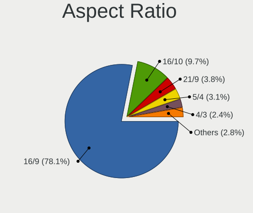

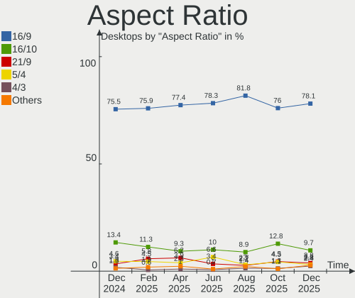

| Ratio   | Desktops | Percent |
|---------|----------|---------|
| 16/9    | 225      | 78.13%  |
| 16/10   | 28       | 9.72%   |
| 21/9    | 11       | 3.82%   |
| 5/4     | 9        | 3.13%   |
| 4/3     | 7        | 2.43%   |
| 32/9    | 5        | 1.74%   |
| 3/2     | 1        | 0.35%   |
| 1.96    | 1        | 0.35%   |
| Unknown | 1        | 0.35%   |

Monitor Area
------------

Area in inch²

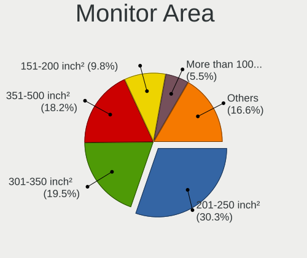

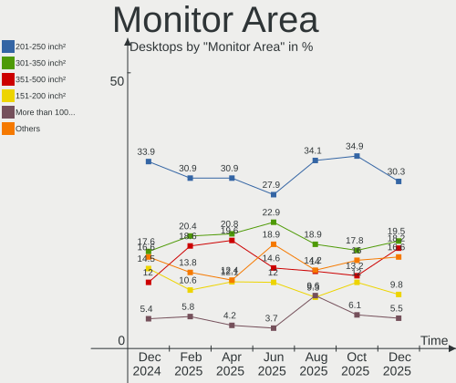

| Area in inch² | Desktops | Percent |
|----------------|----------|---------|
| 201-250        | 93       | 30.29%  |
| 301-350        | 60       | 19.54%  |
| 351-500        | 56       | 18.24%  |
| 151-200        | 30       | 9.77%   |
| More than 1000 | 17       | 5.54%   |
| 141-150        | 13       | 4.23%   |
| 251-300        | 12       | 3.91%   |
| 501-1000       | 12       | 3.91%   |
| 101-110        | 6        | 1.95%   |
| Unknown        | 6        | 1.95%   |
| 131-140        | 1        | 0.33%   |
| 111-120        | 1        | 0.33%   |

Pixel Density
-------------

Pixels per inch

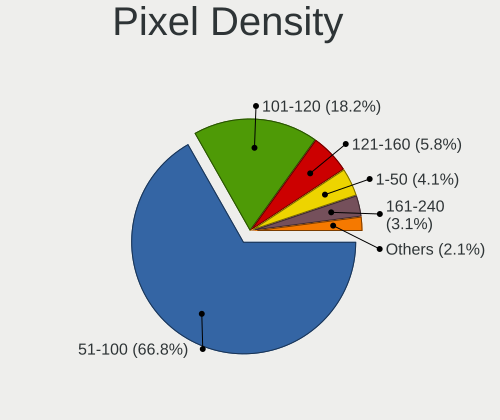

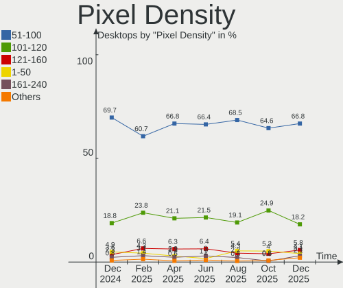

| Density | Desktops | Percent |
|---------|----------|---------|
| 51-100  | 195      | 66.78%  |
| 101-120 | 53       | 18.15%  |
| 121-160 | 17       | 5.82%   |
| 1-50    | 12       | 4.11%   |
| 161-240 | 9        | 3.08%   |
| Unknown | 6        | 2.05%   |

Multiple Monitors
-----------------

Total monitors connected

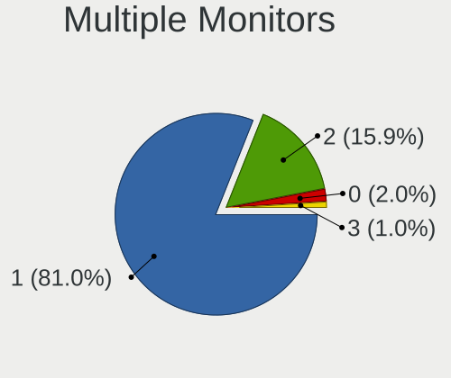

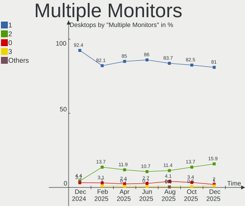

| Total | Desktops | Percent |
|-------|----------|---------|
| 1     | 239      | 81.02%  |
| 2     | 47       | 15.93%  |
| 0     | 6        | 2.03%   |
| 3     | 3        | 1.02%   |

Network
-------

Net Controller Vendor
---------------------

Controller vendors

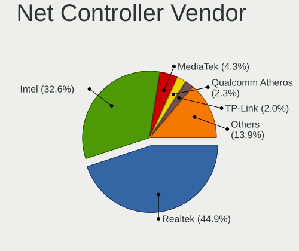

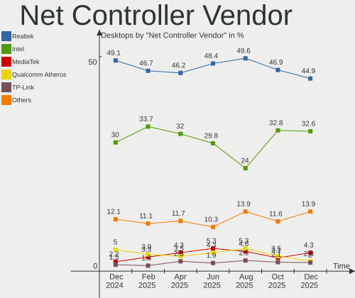

| Vendor                          | Desktops | Percent |
|---------------------------------|----------|---------|
| Realtek Semiconductor           | 178      | 44.95%  |
| Intel                           | 129      | 32.58%  |
| MediaTek                        | 17       | 4.29%   |
| Qualcomm Atheros                | 9        | 2.27%   |
| TP-Link                         | 8        | 2.02%   |
| Broadcom                        | 8        | 2.02%   |
| Samsung Electronics             | 6        | 1.52%   |
| Ralink Technology               | 5        | 1.26%   |
| Aquantia                        | 5        | 1.26%   |
| Qualcomm Atheros Communications | 4        | 1.01%   |
| Nvidia                          | 4        | 1.01%   |
| Marvell Technology Group        | 3        | 0.76%   |
| Qualcomm Technologies           | 2        | 0.51%   |
| ASIX Electronics                | 2        | 0.51%   |
| Apple                           | 2        | 0.51%   |
| Xiaomi                          | 1        | 0.25%   |
| Realtek                         | 1        | 0.25%   |
| Ralink                          | 1        | 0.25%   |
| QinHeng Electronics             | 1        | 0.25%   |
| Motorola PCS                    | 1        | 0.25%   |
| Microsoft                       | 1        | 0.25%   |
| Linksys                         | 1        | 0.25%   |
| Generic                         | 1        | 0.25%   |
| GDMicroelectronics              | 1        | 0.25%   |
| D-Link System                   | 1        | 0.25%   |
| D-Link                          | 1        | 0.25%   |
| Broadcom Limited                | 1        | 0.25%   |
| AVM                             | 1        | 0.25%   |
| ASUSTek Computer                | 1        | 0.25%   |

Net Controller Model
--------------------

Controller models

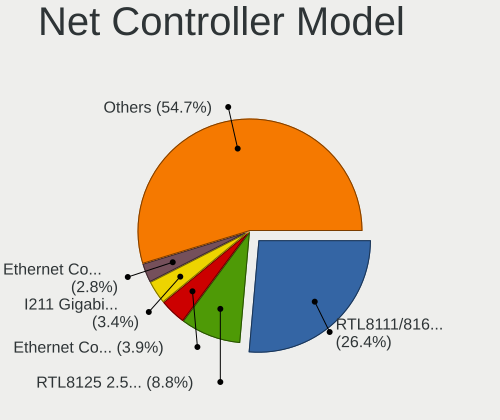

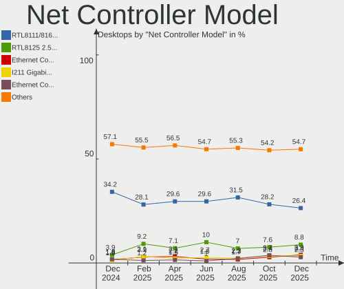

| Model                                                                           | Desktops | Percent |
|---------------------------------------------------------------------------------|----------|---------|
| Realtek RTL8111/8168/8211/8411 PCI Express Gigabit Ethernet Controller          | 123      | 26.39%  |
| Realtek RTL8125 2.5GbE Controller                                               | 41       | 8.8%    |
| Intel Ethernet Controller I225-V                                                | 18       | 3.86%   |
| Intel I211 Gigabit Network Connection                                           | 16       | 3.43%   |
| Intel Ethernet Connection (2) I219-V                                            | 13       | 2.79%   |
| Intel Wi-Fi 6 AX200                                                             | 12       | 2.58%   |
| Intel 82579LM Gigabit Network Connection (Lewisville)                           | 11       | 2.36%   |
| Realtek RTL8852BE PCIe 802.11ax Wireless Network Controller                     | 10       | 2.15%   |
| Intel Wi-Fi 6E(802.11ax) AX210/AX1675* 2x2 [Typhoon Peak]                       | 9        | 1.93%   |
| Intel Dual Band Wireless-AC 3168NGW [Stone Peak]                                | 8        | 1.72%   |
| MediaTek MT7922 802.11ax PCI Express Wireless Network Adapter                   | 7        | 1.5%    |
| Intel Ethernet Connection I217-V                                                | 7        | 1.5%    |
| Intel Ethernet Connection I217-LM                                               | 7        | 1.5%    |
| Realtek RTL8821CE 802.11ac PCIe Wireless Network Adapter                        | 6        | 1.29%   |
| Realtek 802.11ac NIC                                                            | 6        | 1.29%   |
| Intel Ethernet Connection (2) I219-LM                                           | 6        | 1.29%   |
| Samsung GT-I9070 (network tethering, USB debugging enabled)                     | 5        | 1.07%   |
| Intel I210 Gigabit Network Connection                                           | 5        | 1.07%   |
| Realtek RTL8852CE PCIe 802.11ax Wireless Network Controller                     | 4        | 0.86%   |
| Realtek RTL8126 5GbE Controller                                                 | 4        | 0.86%   |
| Qualcomm Atheros AR9271 802.11n                                                 | 4        | 0.86%   |
| MediaTek MT7921K (RZ608) Wi-Fi 6E 80MHz                                         | 4        | 0.86%   |
| Intel Ethernet Controller I226-V                                                | 4        | 0.86%   |
| TP-Link TL-WN823N v2/v3 [Realtek RTL8192EU]                                     | 3        | 0.64%   |
| Realtek RTL8922AE 802.11be PCIe Wireless Network Adapter                        | 3        | 0.64%   |
| Realtek RTL8188EUS 802.11n Wireless Network Adapter                             | 3        | 0.64%   |
| Ralink RT2870/RT3070 Wireless Adapter                                           | 3        | 0.64%   |
| Intel Wireless 7265                                                             | 3        | 0.64%   |
| Intel Wireless 3165                                                             | 3        | 0.64%   |
| Intel Wi-Fi 5(802.11ac) Wireless-AC 9x6x [Thunder Peak]                         | 3        | 0.64%   |
| Intel 82579V Gigabit Network Connection                                         | 3        | 0.64%   |
| Aquantia AQtion AQC113CS NBase-T/IEEE 802.3an Ethernet Controller [Antigua 10G] | 3        | 0.64%   |
| TP-Link TL-WN722N v2/v3 [Realtek RTL8188EUS]                                    | 2        | 0.43%   |
| TP-Link AC600 wireless Realtek RTL8811AU [Archer T2U Nano]                      | 2        | 0.43%   |
| Realtek RTL8192EE PCIe Wireless Network Adapter                                 | 2        | 0.43%   |
| Realtek RTL8188ETV Wireless LAN 802.11n Network Adapter                         | 2        | 0.43%   |
| Realtek RTL8153 Gigabit Ethernet Adapter                                        | 2        | 0.43%   |
| Realtek RTL810xE PCI Express Fast Ethernet controller                           | 2        | 0.43%   |
| Ralink MT7601U Wireless Adapter                                                 | 2        | 0.43%   |
| Qualcomm WCN785x Wi-Fi 7(802.11be) 320MHz 2x2 [FastConnect 7800]                | 2        | 0.43%   |

Wireless Vendor
---------------

Wireless vendors

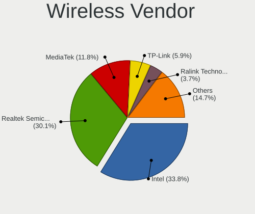

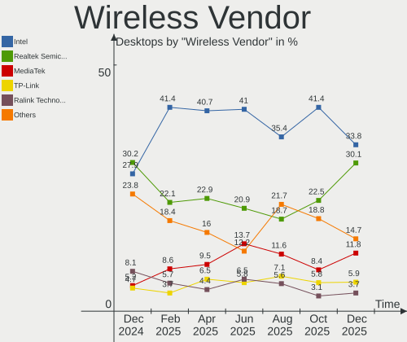

| Vendor                          | Desktops | Percent |
|---------------------------------|----------|---------|
| Intel                           | 46       | 33.82%  |
| Realtek Semiconductor           | 41       | 30.15%  |
| MediaTek                        | 16       | 11.76%  |
| TP-Link                         | 8        | 5.88%   |
| Ralink Technology               | 5        | 3.68%   |
| Qualcomm Atheros                | 5        | 3.68%   |
| Qualcomm Atheros Communications | 4        | 2.94%   |
| Broadcom                        | 3        | 2.21%   |
| Realtek                         | 1        | 0.74%   |
| Ralink                          | 1        | 0.74%   |
| Microsoft                       | 1        | 0.74%   |
| Linksys                         | 1        | 0.74%   |
| D-Link System                   | 1        | 0.74%   |
| D-Link                          | 1        | 0.74%   |
| AVM                             | 1        | 0.74%   |
| ASUSTek Computer                | 1        | 0.74%   |

Wireless Model
--------------

Wireless models

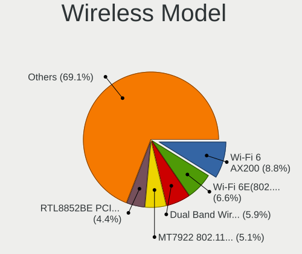

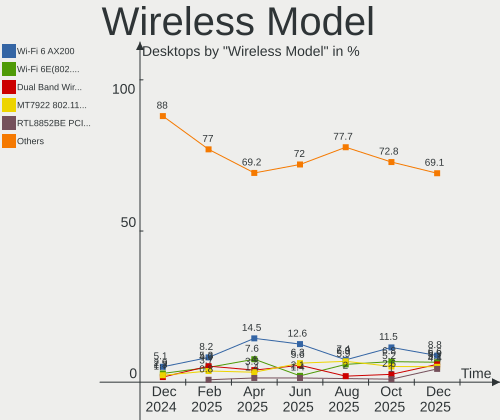

| Model                                                          | Desktops | Percent |
|----------------------------------------------------------------|----------|---------|
| Intel Wi-Fi 6 AX200                                            | 12       | 8.82%   |
| Intel Wi-Fi 6E(802.11ax) AX210/AX1675* 2x2 [Typhoon Peak]      | 9        | 6.62%   |
| Intel Dual Band Wireless-AC 3168NGW [Stone Peak]               | 8        | 5.88%   |
| MediaTek MT7922 802.11ax PCI Express Wireless Network Adapter  | 7        | 5.15%   |
| Realtek RTL8852BE PCIe 802.11ax Wireless Network Controller    | 6        | 4.41%   |
| Realtek RTL8821CE 802.11ac PCIe Wireless Network Adapter       | 6        | 4.41%   |
| Realtek 802.11ac NIC                                           | 6        | 4.41%   |
| Realtek RTL8852CE PCIe 802.11ax Wireless Network Controller    | 4        | 2.94%   |
| Qualcomm Atheros AR9271 802.11n                                | 4        | 2.94%   |
| MediaTek MT7921K (RZ608) Wi-Fi 6E 80MHz                        | 4        | 2.94%   |
| TP-Link TL-WN823N v2/v3 [Realtek RTL8192EU]                    | 3        | 2.21%   |
| Realtek RTL8188EUS 802.11n Wireless Network Adapter            | 3        | 2.21%   |
| Ralink RT2870/RT3070 Wireless Adapter                          | 3        | 2.21%   |
| Intel Wireless 7265                                            | 3        | 2.21%   |
| Intel Wireless 3165                                            | 3        | 2.21%   |
| Intel Wi-Fi 5(802.11ac) Wireless-AC 9x6x [Thunder Peak]        | 3        | 2.21%   |
| TP-Link TL-WN722N v2/v3 [Realtek RTL8188EUS]                   | 2        | 1.47%   |
| TP-Link AC600 wireless Realtek RTL8811AU [Archer T2U Nano]     | 2        | 1.47%   |
| Realtek RTL8922AE 802.11be PCIe Wireless Network Adapter       | 2        | 1.47%   |
| Realtek RTL8192EE PCIe Wireless Network Adapter                | 2        | 1.47%   |
| Realtek RTL8188ETV Wireless LAN 802.11n Network Adapter        | 2        | 1.47%   |
| Ralink MT7601U Wireless Adapter                                | 2        | 1.47%   |
| Qualcomm Atheros AR9485 Wireless Network Adapter               | 2        | 1.47%   |
| Intel Wireless 8260                                            | 2        | 1.47%   |
| Intel 700 Series Chipset CNVi WiFi                             | 2        | 1.47%   |
| TP-Link 802.11ac NIC                                           | 1        | 0.74%   |
| Realtek RTL88x2bu [AC1200 Techkey]                             | 1        | 0.74%   |
| Realtek RTL8852BE-VT PCIe 802.11ax Wireless Network Controller | 1        | 0.74%   |
| Realtek RTL8822CE 802.11ac PCIe Wireless Network Adapter       | 1        | 0.74%   |
| Realtek RTL8822BE 802.11a/b/g/n/ac WiFi adapter                | 1        | 0.74%   |
| Realtek RTL8821AE 802.11ac PCIe Wireless Network Adapter       | 1        | 0.74%   |
| Realtek RTL8812AE 802.11ac PCIe Wireless Network Adapter       | 1        | 0.74%   |
| Realtek RTL8192EU 802.11b/g/n WLAN Adapter                     | 1        | 0.74%   |
| Realtek RTL8192CE PCIe Wireless Network Adapter                | 1        | 0.74%   |
| Realtek RTL8188FTV 802.11b/g/n 1T1R 2.4G WLAN Adapter          | 1        | 0.74%   |
| Realtek RTL8187 Wireless Adapter                               | 1        | 0.74%   |
| Realtek 802.11ac WLAN Adapter                                  | 1        | 0.74%   |
| Ralink RT5360 Wireless 802.11n 1T/1R                           | 1        | 0.74%   |
| Qualcomm Atheros QCA6174 802.11ac Wireless Network Adapter     | 1        | 0.74%   |
| Qualcomm Atheros AR9462 Wireless Network Adapter               | 1        | 0.74%   |

Ethernet Vendor
---------------

Ethernet vendors

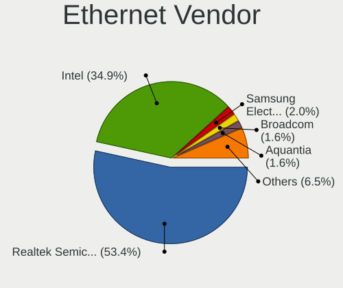

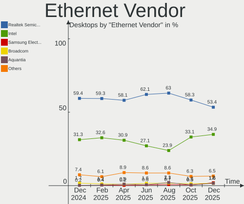

| Vendor                   | Desktops | Percent |
|--------------------------|----------|---------|
| Realtek Semiconductor    | 164      | 53.42%  |
| Intel                    | 107      | 34.85%  |
| Samsung Electronics      | 6        | 1.95%   |
| Broadcom                 | 5        | 1.63%   |
| Aquantia                 | 5        | 1.63%   |
| Qualcomm Atheros         | 4        | 1.3%    |
| Nvidia                   | 4        | 1.3%    |
| Marvell Technology Group | 3        | 0.98%   |
| Qualcomm Technologies    | 2        | 0.65%   |
| ASIX Electronics         | 2        | 0.65%   |
| Xiaomi                   | 1        | 0.33%   |
| Motorola PCS             | 1        | 0.33%   |
| MediaTek                 | 1        | 0.33%   |
| Broadcom Limited         | 1        | 0.33%   |
| Apple                    | 1        | 0.33%   |

Ethernet Model
--------------

Ethernet models

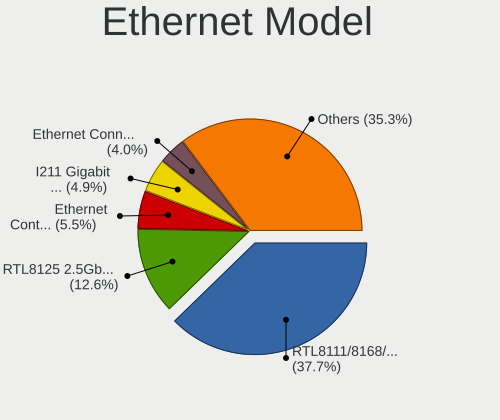

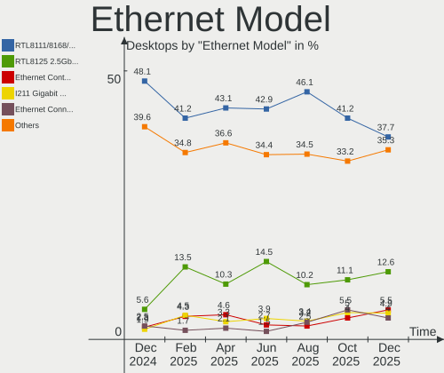

| Model                                                                           | Desktops | Percent |
|---------------------------------------------------------------------------------|----------|---------|
| Realtek RTL8111/8168/8211/8411 PCI Express Gigabit Ethernet Controller          | 123      | 37.73%  |
| Realtek RTL8125 2.5GbE Controller                                               | 41       | 12.58%  |
| Intel Ethernet Controller I225-V                                                | 18       | 5.52%   |
| Intel I211 Gigabit Network Connection                                           | 16       | 4.91%   |
| Intel Ethernet Connection (2) I219-V                                            | 13       | 3.99%   |
| Intel 82579LM Gigabit Network Connection (Lewisville)                           | 11       | 3.37%   |
| Intel Ethernet Connection I217-V                                                | 7        | 2.15%   |
| Intel Ethernet Connection I217-LM                                               | 7        | 2.15%   |
| Intel Ethernet Connection (2) I219-LM                                           | 6        | 1.84%   |
| Samsung GT-I9070 (network tethering, USB debugging enabled)                     | 5        | 1.53%   |
| Intel I210 Gigabit Network Connection                                           | 5        | 1.53%   |
| Realtek RTL8852BE PCIe 802.11ax Wireless Network Controller                     | 4        | 1.23%   |
| Realtek RTL8126 5GbE Controller                                                 | 4        | 1.23%   |
| Intel Ethernet Controller I226-V                                                | 4        | 1.23%   |
| Intel 82579V Gigabit Network Connection                                         | 3        | 0.92%   |
| Aquantia AQtion AQC113CS NBase-T/IEEE 802.3an Ethernet Controller [Antigua 10G] | 3        | 0.92%   |
| Realtek RTL8153 Gigabit Ethernet Adapter                                        | 2        | 0.61%   |
| Realtek RTL810xE PCI Express Fast Ethernet controller                           | 2        | 0.61%   |
| Qualcomm WCN785x Wi-Fi 7(802.11be) 320MHz 2x2 [FastConnect 7800]                | 2        | 0.61%   |
| Qualcomm Atheros Killer E220x Gigabit Ethernet Controller                       | 2        | 0.61%   |
| Qualcomm Atheros AR8151 v2.0 Gigabit Ethernet                                   | 2        | 0.61%   |
| Nvidia MCP61 Ethernet                                                           | 2        | 0.61%   |
| Marvell Group 88E8056 PCI-E Gigabit Ethernet Controller                         | 2        | 0.61%   |
| Intel Ethernet Connection (7) I219-V                                            | 2        | 0.61%   |
| Intel Ethernet Connection (2) I218-V                                            | 2        | 0.61%   |
| Intel Ethernet Connection (11) I219-V                                           | 2        | 0.61%   |
| Intel Ethernet Connection (11) I219-LM                                          | 2        | 0.61%   |
| Broadcom NetXtreme BCM5761 Gigabit Ethernet PCIe                                | 2        | 0.61%   |
| Broadcom NetLink BCM57781 Gigabit Ethernet PCIe                                 | 2        | 0.61%   |
| ASIX AX88179 Gigabit Ethernet                                                   | 2        | 0.61%   |
| Aquantia AQtion AQC107 NBase-T/IEEE 802.3an Ethernet Controller [Atlantic 10G]  | 2        | 0.61%   |
| Xiaomi Mi/Redmi series (RNDIS)                                                  | 1        | 0.31%   |
| Samsung Galaxy series, misc. (tethering mode)                                   | 1        | 0.31%   |
| Realtek RTL8922AE 802.11be PCIe Wireless Network Adapter                        | 1        | 0.31%   |
| Realtek RTL-8100/8101L/8139 PCI Fast Ethernet Adapter                           | 1        | 0.31%   |
| Nvidia MCP77 Ethernet                                                           | 1        | 0.31%   |
| Nvidia MCP65 Ethernet                                                           | 1        | 0.31%   |
| Motorola PCS motorola one 5G ace                                                | 1        | 0.31%   |
| MediaTek MT7925 802.11be 160MHz 2x2 PCIe Wireless Network Adapter [Filogic 360] | 1        | 0.31%   |
| Marvell Group 88E8053 PCI-E Gigabit Ethernet Controller                         | 1        | 0.31%   |

Net Controller Kind
-------------------

Ethernet, WiFi or modem

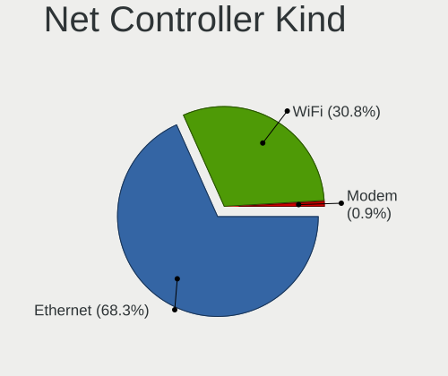

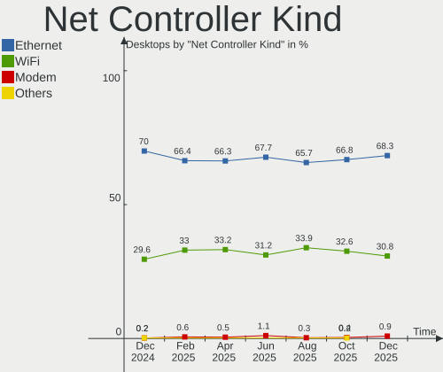

| Kind     | Desktops | Percent |
|----------|----------|---------|
| Ethernet | 291      | 68.31%  |
| WiFi     | 131      | 30.75%  |
| Modem    | 4        | 0.94%   |

Used Controller
---------------

Currently used network controller

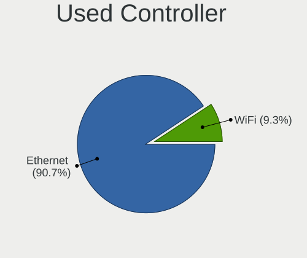

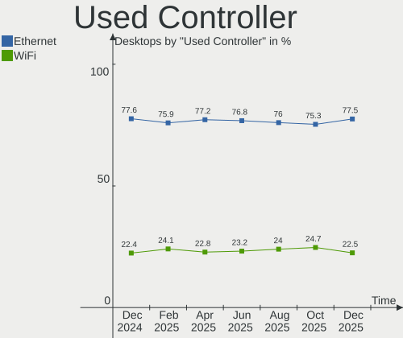

| Kind     | Desktops | Percent |
|----------|----------|---------|
| Ethernet | 220      | 77.46%  |
| WiFi     | 64       | 22.54%  |

NICs
----

Total network controllers on board

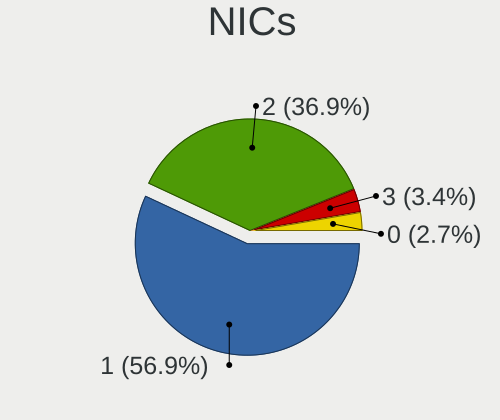

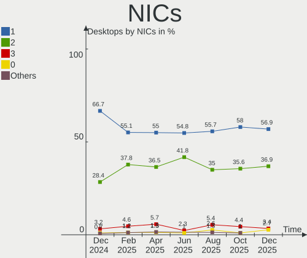

| Total | Desktops | Percent |
|-------|----------|---------|
| 1     | 168      | 56.95%  |
| 2     | 109      | 36.95%  |
| 3     | 10       | 3.39%   |
| 0     | 8        | 2.71%   |

IPv6
----

IPv6 vs IPv4

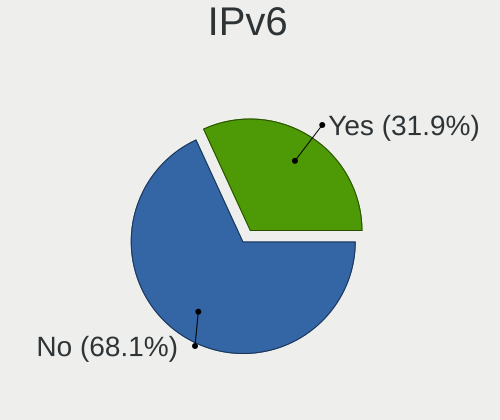

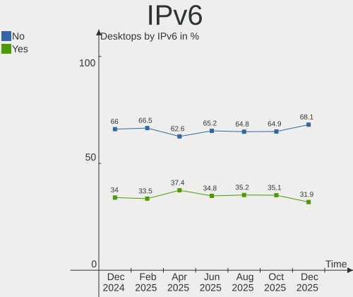

| Used | Desktops | Percent |
|------|----------|---------|
| No   | 201      | 68.14%  |
| Yes  | 94       | 31.86%  |

Bluetooth
---------

Bluetooth Vendor
----------------

Controller vendors

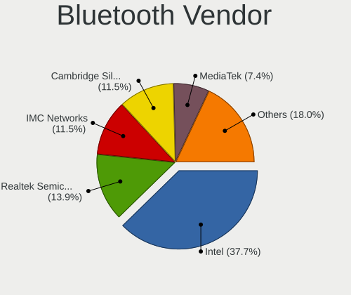

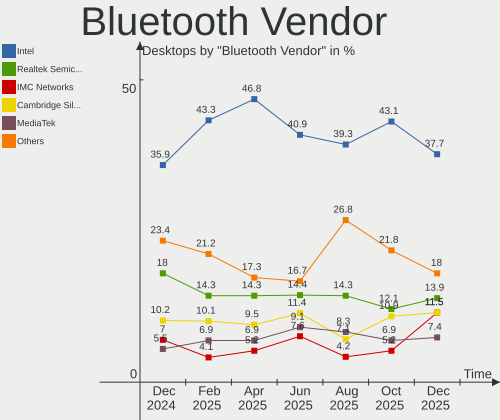

| Vendor                     | Desktops | Percent |
|----------------------------|----------|---------|
| Intel                      | 46       | 37.7%   |
| Realtek Semiconductor      | 17       | 13.93%  |
| IMC Networks               | 14       | 11.48%  |
| Cambridge Silicon Radio    | 14       | 11.48%  |
| MediaTek                   | 9        | 7.38%   |
| Foxconn / Hon Hai          | 7        | 5.74%   |
| ASUSTek Computer           | 4        | 3.28%   |
| TP-Link                    | 3        | 2.46%   |
| Broadcom                   | 3        | 2.46%   |
| Primax Electronics         | 1        | 0.82%   |
| Lite-On Technology         | 1        | 0.82%   |
| Integrated System Solution | 1        | 0.82%   |
| Actions                    | 1        | 0.82%   |
| Unknown                    | 1        | 0.82%   |

Bluetooth Model
---------------

Controller models

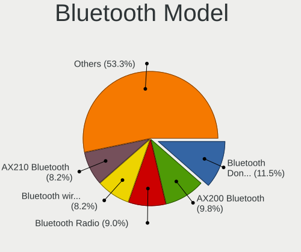

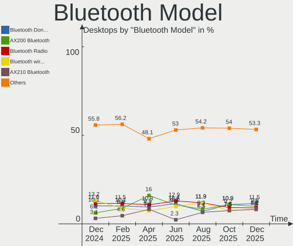

| Model                                                 | Desktops | Percent |
|-------------------------------------------------------|----------|---------|
| Cambridge Silicon Radio Bluetooth Dongle (HCI mode)   | 14       | 11.48%  |
| Intel AX200 Bluetooth                                 | 12       | 9.84%   |
| Realtek Bluetooth Radio                               | 11       | 9.02%   |
| Intel Bluetooth wireless interface                    | 10       | 8.2%    |
| Intel AX210 Bluetooth                                 | 10       | 8.2%    |
| IMC Networks Bluetooth Radio                          | 10       | 8.2%    |
| MediaTek Wireless_Device                              | 9        | 7.38%   |
| Intel Wireless-AC 3168 Bluetooth                      | 8        | 6.56%   |
| Foxconn / Hon Hai Wireless_Device                     | 4        | 3.28%   |
| TP-Link TP-T@- UB500 Adapter                          | 3        | 2.46%   |
| Realtek  Bluetooth 4.2 Adapter                        | 3        | 2.46%   |
| IMC Networks Wireless_Device                          | 3        | 2.46%   |
| Realtek Bluetooth 5.4 Radio                           | 2        | 1.64%   |
| Intel Wireless-AC 9260 Bluetooth Adapter              | 2        | 1.64%   |
| Intel Bluetooth Device                                | 2        | 1.64%   |
| Foxconn / Hon Hai Bluetooth Device                    | 2        | 1.64%   |
| Broadcom BCM20702A0 Bluetooth 4.0                     | 2        | 1.64%   |
| ASUS ASUS USB-BT500                                   | 2        | 1.64%   |
| Realtek 802.11ac WLAN Adapter                         | 1        | 0.82%   |
| Primax Rocketfish RF-FLBTAD Bluetooth Adapter         | 1        | 0.82%   |
| Lite-On Wireless_Device                               | 1        | 0.82%   |
| Intel Bluetooth 9460/9560 Jefferson Peak (JfP)        | 1        | 0.82%   |
| Intel AX201 Bluetooth                                 | 1        | 0.82%   |
| Integrated System Solution KY-BT100 Bluetooth Adapter | 1        | 0.82%   |
| IMC Networks Bluetooth Device                         | 1        | 0.82%   |
| Foxconn / Hon Hai MediaTek Bluetooth Adapter          | 1        | 0.82%   |
| Broadcom BCM92046DG-CL1ROM Bluetooth 2.1 UHE Dongle   | 1        | 0.82%   |
| ASUS Bluetooth Radio                                  | 1        | 0.82%   |
| ASUS Bluetooth Device                                 | 1        | 0.82%   |
| Actions general adapter                               | 1        | 0.82%   |
| Unknown                                               | 1        | 0.82%   |

Sound
-----

Sound Vendor
------------

Sound card vendors

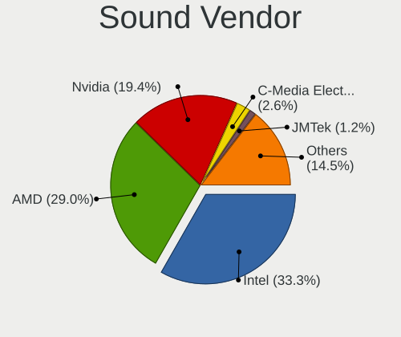

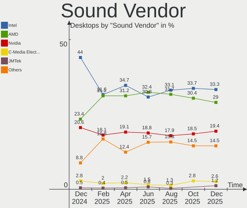

| Vendor                                       | Desktops | Percent |
|----------------------------------------------|----------|---------|
| Intel                                        | 165      | 33.27%  |
| AMD                                          | 144      | 29.03%  |
| Nvidia                                       | 96       | 19.35%  |
| C-Media Electronics                          | 13       | 2.62%   |
| JMTek                                        | 6        | 1.21%   |
| Texas Instruments                            | 5        | 1.01%   |
| Creative Labs                                | 5        | 1.01%   |
| ASUSTek Computer                             | 5        | 1.01%   |
| Micro Star International                     | 4        | 0.81%   |
| Zoran Co. Personal Media Division (Nogatech) | 3        | 0.6%    |
| Razer USA                                    | 3        | 0.6%    |
| Logitech                                     | 3        | 0.6%    |
| Hewlett-Packard                              | 3        | 0.6%    |
| Generalplus Technology                       | 3        | 0.6%    |
| Focusrite-Novation                           | 3        | 0.6%    |
| Thesycon Systemsoftware & Consulting         | 2        | 0.4%    |
| Tenx Technology                              | 2        | 0.4%    |
| SteelSeries ApS                              | 2        | 0.4%    |
| Realtek Semiconductor                        | 2        | 0.4%    |
| KTMicro                                      | 2        | 0.4%    |
| Kingston Technology                          | 2        | 0.4%    |
| Jieli Technology                             | 2        | 0.4%    |
| Creative Technology                          | 2        | 0.4%    |
| Corsair                                      | 2        | 0.4%    |
| SCUF Gaming                                  | 1        | 0.2%    |
| Nordic Semiconductor ASA                     | 1        | 0.2%    |
| MV-SILICON                                   | 1        | 0.2%    |
| Medeli Electronics                           | 1        | 0.2%    |
| Mark of the Unicorn                          | 1        | 0.2%    |
| Mackie Designs                               | 1        | 0.2%    |
| liyuany                                      | 1        | 0.2%    |
| Insignia (Best Buy)                          | 1        | 0.2%    |
| GN Netcom                                    | 1        | 0.2%    |
| GK51                                         | 1        | 0.2%    |
| Giga-Byte Technology                         | 1        | 0.2%    |
| Fuzhou Rockchip Electronics Company          | 1        | 0.2%    |
| Ensoniq                                      | 1        | 0.2%    |
| Endorfy Solum Mic                            | 1        | 0.2%    |
| Astro Gaming                                 | 1        | 0.2%    |
| Apple                                        | 1        | 0.2%    |

Sound Model
-----------

Sound card models

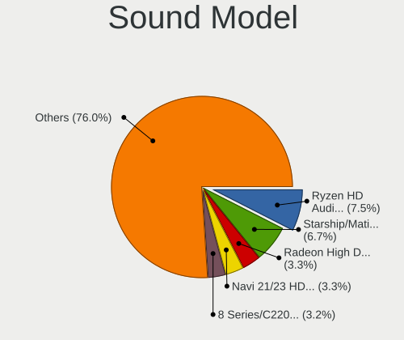

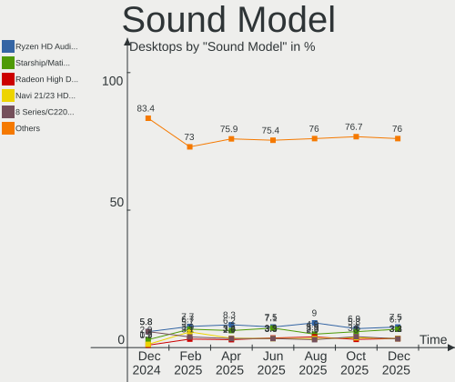

| Model                                                                      | Desktops | Percent |
|----------------------------------------------------------------------------|----------|---------|
| AMD Ryzen HD Audio Controller                                              | 45       | 7.49%   |
| AMD Starship/Matisse HD Audio Controller                                   | 40       | 6.66%   |
| AMD Radeon High Definition Audio Controller                                | 20       | 3.33%   |
| AMD Navi 21/23 HDMI/DP Audio Controller                                    | 20       | 3.33%   |
| Intel 8 Series/C220 Series Chipset High Definition Audio Controller        | 19       | 3.16%   |
| Intel 6 Series/C200 Series Chipset Family High Definition Audio Controller | 19       | 3.16%   |
| Intel 100 Series/C230 Series Chipset Family HD Audio Controller            | 19       | 3.16%   |
| Intel 7 Series/C216 Chipset Family High Definition Audio Controller        | 15       | 2.5%    |
| Intel 200 Series PCH HD Audio                                              | 15       | 2.5%    |
| AMD Family 17h (Models 00h-0fh) HD Audio Controller                        | 14       | 2.33%   |
| AMD SBx00 Azalia (Intel HDA)                                               | 13       | 2.16%   |
| AMD Renoir/Cezanne HDMI/DP Audio Controller                                | 13       | 2.16%   |
| AMD Navi 48 HDMI/DP Audio Controller                                       | 13       | 2.16%   |
| AMD Navi 31 HDMI/DP Audio                                                  | 13       | 2.16%   |
| Nvidia GK208 HDMI/DP Audio Controller                                      | 10       | 1.66%   |
| Intel Xeon E3-1200 v3/4th Gen Core Processor HD Audio Controller           | 9        | 1.5%    |
| Intel Cannon Lake PCH cAVS                                                 | 8        | 1.33%   |
| AMD Ellesmere HDMI Audio [Radeon RX 470/480 / 570/580/590]                 | 8        | 1.33%   |
| Nvidia TU104 HD Audio Controller                                           | 7        | 1.16%   |
| Intel 5 Series/3400 Series Chipset High Definition Audio                   | 7        | 1.16%   |
| Nvidia TU116 High Definition Audio Controller                              | 6        | 1%      |
| AMD Raven/Raven2/Fenghuang HDMI/DP Audio Controller                        | 6        | 1%      |
| AMD Oland/Hainan/Cape Verde/Pitcairn HDMI Audio [Radeon HD 7000 Series]    | 6        | 1%      |
| Nvidia GP106 High Definition Audio Controller                              | 5        | 0.83%   |
| Nvidia GP104 High Definition Audio Controller                              | 5        | 0.83%   |
| Nvidia GK107 HDMI Audio Controller                                         | 5        | 0.83%   |
| Nvidia AD103 High Definition Audio Controller                              | 5        | 0.83%   |
| JMTek USB PnP Audio Device                                                 | 5        | 0.83%   |
| Intel Raptor Lake High Definition Audio Controller                         | 5        | 0.83%   |
| Intel Alder Lake-S HD Audio Controller                                     | 5        | 0.83%   |
| C-Media Electronics Audio Adapter (Unitek Y-247A)                          | 5        | 0.83%   |
| Nvidia GP108 High Definition Audio Controller                              | 4        | 0.67%   |
| Nvidia GM107 High Definition Audio Controller [GeForce 940MX]              | 4        | 0.67%   |
| Nvidia GA106 High Definition Audio Controller                              | 4        | 0.67%   |
| Nvidia AD104 High Definition Audio Controller                              | 4        | 0.67%   |
| Micro Star International USB Audio                                         | 4        | 0.67%   |
| Intel Comet Lake PCH-V cAVS                                                | 4        | 0.67%   |
| Intel Comet Lake PCH cAVS                                                  | 4        | 0.67%   |
| Intel C600/X79 series chipset High Definition Audio Controller             | 4        | 0.67%   |
| Intel Alder Lake-N PCH High Definition Audio Controller                    | 4        | 0.67%   |

Memory
------

Memory Vendor
-------------

Memory module vendors

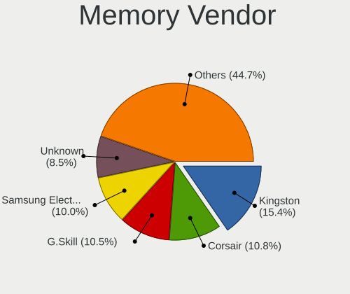

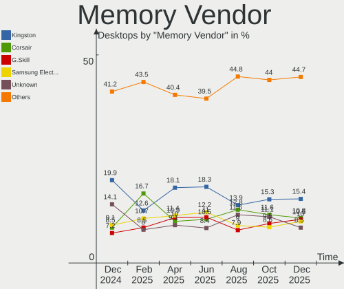

| Vendor                       | Desktops | Percent |
|------------------------------|----------|---------|
| Kingston                     | 54       | 15.38%  |
| Corsair                      | 38       | 10.83%  |
| G.Skill                      | 37       | 10.54%  |
| Samsung Electronics          | 35       | 9.97%   |
| Unknown                      | 30       | 8.55%   |
| SK hynix                     | 29       | 8.26%   |
| Micron Technology            | 24       | 6.84%   |
| Crucial                      | 24       | 6.84%   |
| Unknown                      | 15       | 4.27%   |
| Team                         | 8        | 2.28%   |
| A-DATA Technology            | 8        | 2.28%   |
| Smart                        | 4        | 1.14%   |
| Transcend                    | 3        | 0.85%   |
| Red Hat                      | 3        | 0.85%   |
| Patriot Memory               | 3        | 0.85%   |
| Patriot                      | 3        | 0.85%   |
| Unknown (ABCD)               | 2        | 0.57%   |
| PUSKILL                      | 2        | 0.57%   |
| Lexar                        | 2        | 0.57%   |
| GOODRAM                      | 2        | 0.57%   |
| AMD                          | 2        | 0.57%   |
| Wilk Elektronik              | 1        | 0.28%   |
| Unknown (89F7)               | 1        | 0.28%   |
| Unknown (0x0CC7)             | 1        | 0.28%   |
| Unknown (0x0BF7)             | 1        | 0.28%   |
| Timetec                      | 1        | 0.28%   |
| TeamGroup                    | 1        | 0.28%   |
| Silicon Power                | 1        | 0.28%   |
| Shenzhen Longsys             | 1        | 0.28%   |
| Ramaxel Technology           | 1        | 0.28%   |
| PNY                          | 1        | 0.28%   |
| Patriot Memory (PDP Systems) | 1        | 0.28%   |
| Nanya Technology             | 1        | 0.28%   |
| Multilaser                   | 1        | 0.28%   |
| Kllisre                      | 1        | 0.28%   |
| KingSpec                     | 1        | 0.28%   |
| Kingmax Semiconductor        | 1        | 0.28%   |
| Hikvision                    | 1        | 0.28%   |
| GSkill                       | 1        | 0.28%   |
| EVGA                         | 1        | 0.28%   |

Memory Model
------------

Memory module models

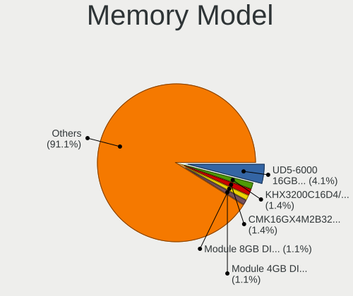

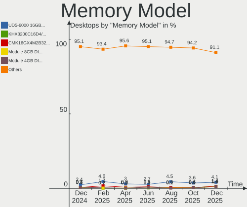

| Model                                                          | Desktops | Percent |
|----------------------------------------------------------------|----------|---------|
| Unknown                                                        | 15       | 4.05%   |
| Kingston RAM KHX3200C16D4/8GX 8GB DIMM DDR4 3733MT/s           | 5        | 1.35%   |
| Corsair RAM CMK16GX4M2B3200C16 8GB DIMM DDR4 3600MT/s          | 5        | 1.35%   |
| Unknown RAM Module 8GB DIMM 1333MT/s                           | 4        | 1.08%   |
| Unknown RAM Module 4GB DIMM DDR3 1333MT/s                      | 4        | 1.08%   |
| SK hynix RAM HMT351U6CFR8C-PB 4GB DIMM DDR3 1800MT/s           | 4        | 1.08%   |
| Samsung RAM M378B5173QH0-CK0 4GB DIMM DDR3                     | 4        | 1.08%   |
| Crucial RAM Module 4GB DIMM DDR3 1600MT/s                      | 4        | 1.08%   |
| Unknown RAM Module 4GB DIMM 1333MT/s                           | 3        | 0.81%   |
| Unknown RAM Module 2GB DIMM SDRAM                              | 3        | 0.81%   |
| Team RAM TEAMGROUP-UD4-3200 8GB DIMM DDR4 3733MT/s             | 3        | 0.81%   |
| Micron RAM 8JTF51264AZ-1G6E1 4GB DIMM DDR3 1600MT/s            | 3        | 0.81%   |
| Kingston RAM KF560C30-16 16GB DIMM DDR5 6000MT/s               | 3        | 0.81%   |
| G.Skill RAM F5-6400J3239G32G 32GB DIMM DDR5 6400MT/s           | 3        | 0.81%   |
| G.Skill RAM F4-3600C18-32GVK 32GiB DIMM DDR4 3600MT/s          | 3        | 0.81%   |
| Unknown RAM Module 2GB DIMM DDR3 1333MT/s                      | 2        | 0.54%   |
| Unknown RAM Module 2GB DIMM DDR3 1067MT/s                      | 2        | 0.54%   |
| Unknown (ABCD) RAM 123456789012345678 2GB DIMM LPDDR4 2133MT/s | 2        | 0.54%   |
| SK hynix RAM HMA82GR7CJR4N-WM 16GB DIMM DDR4 2933MT/s          | 2        | 0.54%   |
| Samsung RAM M378B5773DH0-CH9 2GB DIMM DDR3 1333MT/s            | 2        | 0.54%   |
| Samsung RAM M378A5143EB1-CPB 4GB DIMM DDR4 2666MT/s            | 2        | 0.54%   |
| Samsung RAM M378A5143DB0-CPB 4GB DIMM DDR4 2400MT/s            | 2        | 0.54%   |
| Patriot RAM 3200 C16 Series 8GB DIMM DDR4 3600MT/s             | 2        | 0.54%   |
| Patriot Memory RAM 3600 Series 32GB DIMM DDR4 3333MT/s         | 2        | 0.54%   |
| Micron RAM 16HTF25664AY-800E1 2GB DIMM DDR2 800MT/s            | 2        | 0.54%   |
| Kingston RAM KF3200C16D4/32GX 32GB DIMM DDR4 3933MT/s          | 2        | 0.54%   |
| G.Skill RAM F5-6000J3040G32G 32GB DIMM DDR5 6200MT/s           | 2        | 0.54%   |
| G.Skill RAM F4-3200C16-8GVKB 8GB DIMM DDR4 4000MT/s            | 2        | 0.54%   |
| Crucial RAM BLS8G3D1609DS1S00. 8GB DIMM DDR3 1800MT/s          | 2        | 0.54%   |
| Corsair RAM CMX8GX3M2A1600C9 4GB DIMM DDR3 1800MT/s            | 2        | 0.54%   |
| Corsair RAM CMK16GX4M2E3200C16 8GB DIMM DDR4 3466MT/s          | 2        | 0.54%   |
| Wilk Elektronik RAM IRP3600D4V64L18S/8G 8GB DIMM DDR4 3666MT/s | 1        | 0.27%   |
| Unknown RAM Module 8GB DIMM DDR4 2667MT/s                      | 1        | 0.27%   |
| Unknown RAM Module 8GB DIMM 1600MT/s                           | 1        | 0.27%   |
| Unknown RAM Module 4GB DIMM SDRAM                              | 1        | 0.27%   |
| Unknown RAM Module 4GB DIMM DDR3 1600MT/s                      | 1        | 0.27%   |
| Unknown RAM Module 4GB DIMM 1600MT/s                           | 1        | 0.27%   |
| Unknown RAM Module 2GB DIMM 800MT/s                            | 1        | 0.27%   |
| Unknown RAM Module 2GB DIMM 667MT/s                            | 1        | 0.27%   |
| Unknown RAM Module 2GB DIMM 1333MT/s                           | 1        | 0.27%   |

Memory Kind
-----------

Memory module kinds

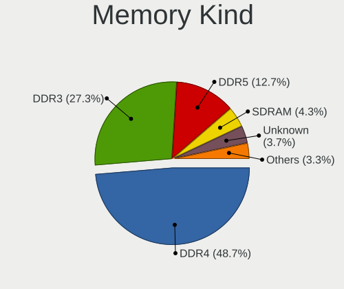

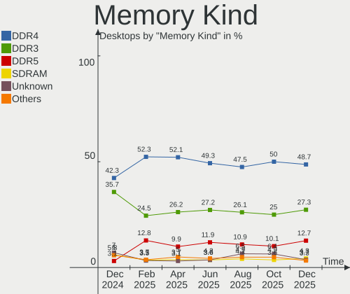

| Kind    | Desktops | Percent |
|---------|----------|---------|
| DDR4    | 146      | 48.67%  |
| DDR3    | 82       | 27.33%  |
| DDR5    | 38       | 12.67%  |
| SDRAM   | 13       | 4.33%   |
| Unknown | 11       | 3.67%   |
| RAM     | 3        | 1%      |
| DDR2    | 3        | 1%      |
| LPDDR4  | 2        | 0.67%   |
| LPDDR5  | 1        | 0.33%   |
| DRAM    | 1        | 0.33%   |

Memory Form Factor
------------------

Physical design of the memory module

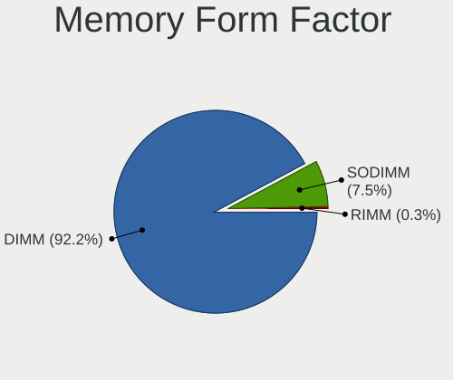

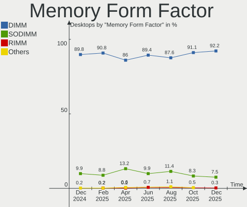

| Name   | Desktops | Percent |
|--------|----------|---------|
| DIMM   | 271      | 92.18%  |
| SODIMM | 22       | 7.48%   |
| RIMM   | 1        | 0.34%   |

Memory Size
-----------

Memory module size

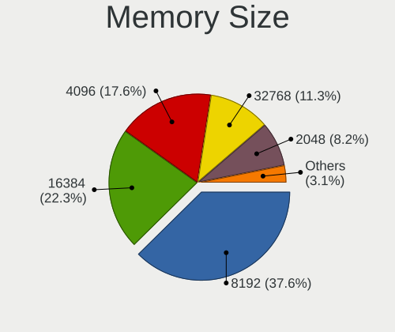

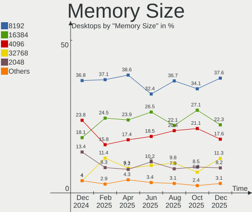

| Size  | Desktops | Percent |
|-------|----------|---------|
| 8192  | 120      | 37.62%  |
| 16384 | 71       | 22.26%  |
| 4096  | 56       | 17.55%  |
| 32768 | 36       | 11.29%  |
| 2048  | 26       | 8.15%   |
| 1024  | 3        | 0.94%   |
| 65536 | 2        | 0.63%   |
| 49152 | 2        | 0.63%   |
| 24576 | 1        | 0.31%   |
| 8124  | 1        | 0.31%   |
| 3072  | 1        | 0.31%   |

Memory Speed
------------

Memory module speed

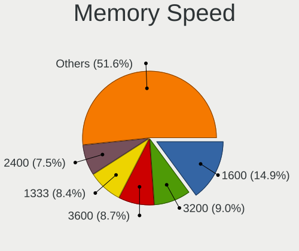

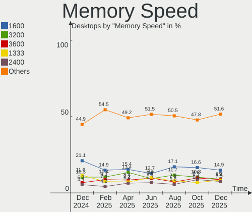

| Speed   | Desktops | Percent |
|---------|----------|---------|
| 1600    | 50       | 14.93%  |
| 3200    | 30       | 8.96%   |
| 3600    | 29       | 8.66%   |
| 1333    | 28       | 8.36%   |
| 2400    | 25       | 7.46%   |
| 2667    | 20       | 5.97%   |
| 6000    | 15       | 4.48%   |
| 2133    | 14       | 4.18%   |
| Unknown | 10       | 2.99%   |
| 2666    | 9        | 2.69%   |
| 1800    | 9        | 2.69%   |
| 3733    | 8        | 2.39%   |
| 6400    | 7        | 2.09%   |
| 4800    | 7        | 2.09%   |
| 1866    | 7        | 2.09%   |
| 1867    | 6        | 1.79%   |
| 3800    | 5        | 1.49%   |
| 800     | 5        | 1.49%   |
| 4000    | 4        | 1.19%   |
| 1067    | 4        | 1.19%   |
| 5600    | 3        | 0.9%    |
| 3400    | 3        | 0.9%    |
| 3000    | 3        | 0.9%    |
| 2933    | 3        | 0.9%    |
| 6200    | 2        | 0.6%    |
| 3933    | 2        | 0.6%    |
| 3466    | 2        | 0.6%    |
| 3333    | 2        | 0.6%    |
| 3066    | 2        | 0.6%    |
| 12800   | 1        | 0.3%    |
| 8400    | 1        | 0.3%    |
| 7200    | 1        | 0.3%    |
| 6800    | 1        | 0.3%    |
| 5900    | 1        | 0.3%    |
| 5400    | 1        | 0.3%    |
| 5200    | 1        | 0.3%    |
| 4333    | 1        | 0.3%    |
| 3866    | 1        | 0.3%    |
| 3666    | 1        | 0.3%    |
| 3266    | 1        | 0.3%    |

Printers & scanners
-------------------

Printer Vendor
--------------

Printer device vendors

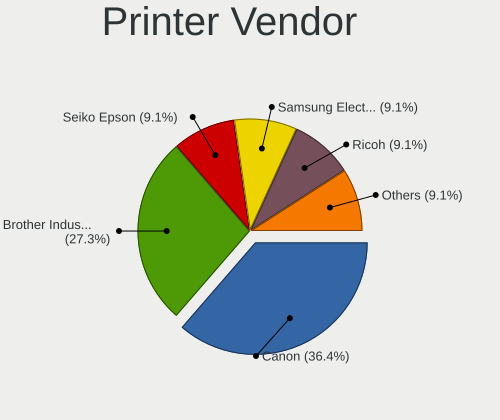

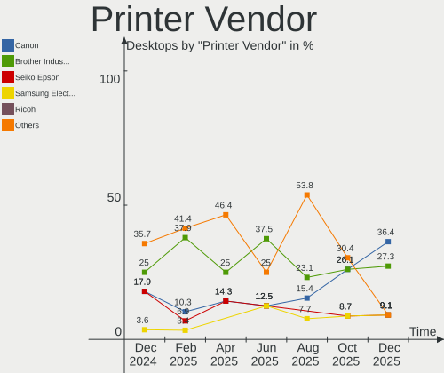

| Vendor              | Desktops | Percent |
|---------------------|----------|---------|
| Canon               | 4        | 36.36%  |
| Brother Industries  | 3        | 27.27%  |
| Seiko Epson         | 1        | 9.09%   |
| Samsung Electronics | 1        | 9.09%   |
| Ricoh               | 1        | 9.09%   |
| Hewlett-Packard     | 1        | 9.09%   |

Printer Model
-------------

Printer device models

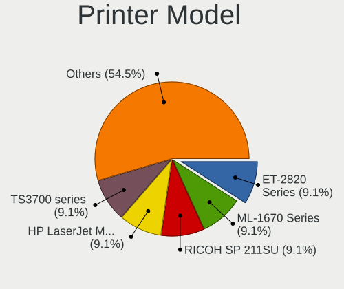

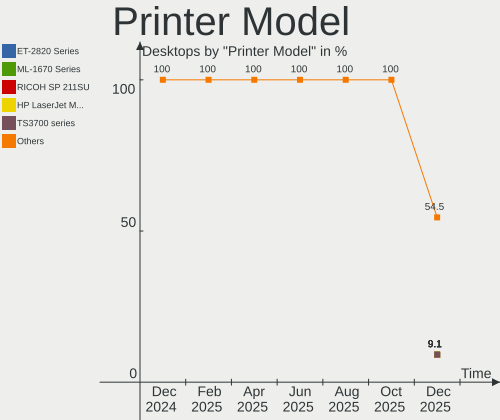

| Model                      | Desktops | Percent |
|----------------------------|----------|---------|
| Seiko Epson ET-2820 Series | 1        | 9.09%   |
| Samsung ML-1670 Series     | 1        | 9.09%   |
| Ricoh RICOH SP 211SU       | 1        | 9.09%   |
| HP HP LaserJet M207-M212   | 1        | 9.09%   |
| Canon TS3700 series        | 1        | 9.09%   |
| Canon PIXMA MX390 Series   | 1        | 9.09%   |
| Canon PIXMA MG3600 Series  | 1        | 9.09%   |
| Canon MF741C/743C          | 1        | 9.09%   |
| Brother MFC-L2690DW        | 1        | 9.09%   |
| Brother HL-L3280CDW series | 1        | 9.09%   |
| Brother DCP-J132W          | 1        | 9.09%   |

Scanner Vendor
--------------

Scanner device vendors

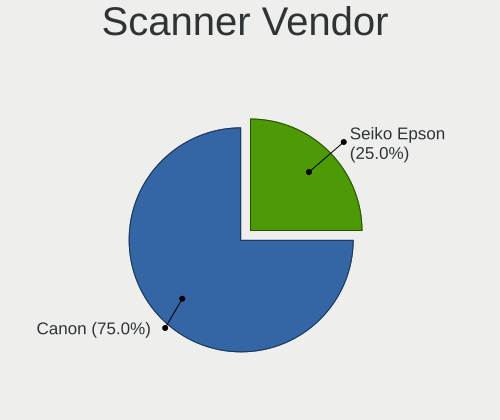

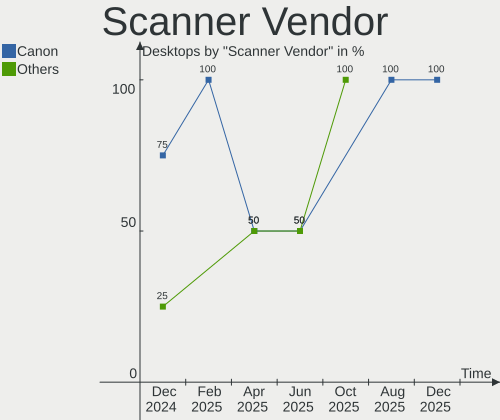

| Vendor | Desktops | Percent |
|--------|----------|---------|
| Canon  | 1        | 100%    |

Scanner Model
-------------

Scanner device models

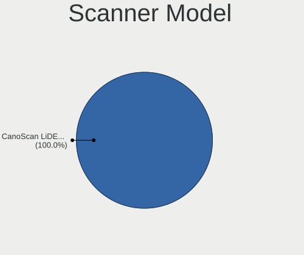

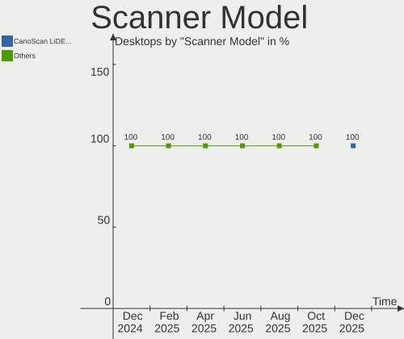

| Model                   | Desktops | Percent |
|-------------------------|----------|---------|
| Canon CanoScan LiDE 220 | 1        | 100%    |

Camera
------

Camera Vendor
-------------

Camera device vendors

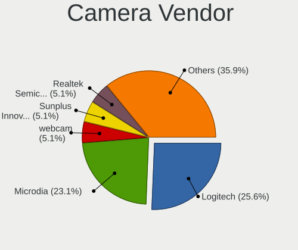

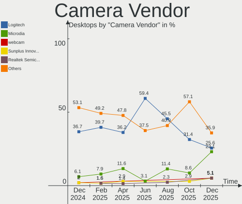

| Vendor                        | Desktops | Percent |
|-------------------------------|----------|---------|
| Logitech                      | 10       | 25.64%  |
| Microdia                      | 9        | 23.08%  |
| webcam                        | 2        | 5.13%   |
| Sunplus Innovation Technology | 2        | 5.13%   |
| Realtek Semiconductor         | 2        | 5.13%   |
| Microsoft                     | 2        | 5.13%   |
| Samsung Electronics           | 1        | 2.56%   |
| Razer USA                     | 1        | 2.56%   |
| Jeilin Technology             | 1        | 2.56%   |
| Hewlett-Packard               | 1        | 2.56%   |
| GEMBIRD                       | 1        | 2.56%   |
| eMeet                         | 1        | 2.56%   |
| Elgato Systems                | 1        | 2.56%   |
| Cubeternet                    | 1        | 2.56%   |
| Chicony Electronics           | 1        | 2.56%   |
| AVerMedia Technologies        | 1        | 2.56%   |
| Aveo Technology               | 1        | 2.56%   |
| 48M USB Camera                | 1        | 2.56%   |

Camera Model
------------

Camera device models

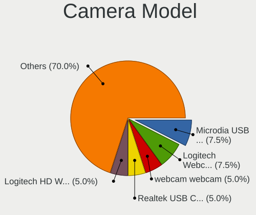

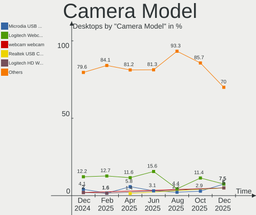

| Model                                   | Desktops | Percent |
|-----------------------------------------|----------|---------|
| Microdia USB 2.0 Camera                 | 3        | 7.5%    |
| Logitech Webcam C270                    | 3        | 7.5%    |
| webcam webcam                           | 2        | 5%      |
| Realtek USB Camera                      | 2        | 5%      |
| Logitech HD Webcam C615                 | 2        | 5%      |
| Sunplus SC-WC-300 Webcam                | 1        | 2.5%    |
| Sunplus FULL HD webcam                  | 1        | 2.5%    |
| Samsung Galaxy series, misc. (MTP mode) | 1        | 2.5%    |
| Razer USA Gaming Webcam [Kiyo]          | 1        | 2.5%    |
| Microsoft LifeCam HD-5000               | 1        | 2.5%    |
| Microsoft LifeCam HD-3000               | 1        | 2.5%    |
| Microdia Webcam Vitade AF               | 1        | 2.5%    |
| Microdia UGREEN Camera                  | 1        | 2.5%    |
| Microdia Sonix USB 2.0 Camera           | 1        | 2.5%    |
| Microdia Integrated Camera              | 1        | 2.5%    |
| Microdia HDE Webcam USB                 | 1        | 2.5%    |
| Microdia Camera                         | 1        | 2.5%    |
| Logitech Webcam Pro 9000                | 1        | 2.5%    |
| Logitech QuickCam Pro 4000              | 1        | 2.5%    |
| Logitech Logitech Webcam C100           | 1        | 2.5%    |
| Logitech C920 PRO HD Webcam             | 1        | 2.5%    |
| Logitech BRIO Ultra HD Webcam           | 1        | 2.5%    |
| Jeilin Kodak S101 Webcam                | 1        | 2.5%    |
| HP Webcam HD 2300                       | 1        | 2.5%    |
| GEMBIRD USB2.0 PC CAMERA                | 1        | 2.5%    |
| eMeet EMEET PIXY                        | 1        | 2.5%    |
| Elgato Systems Elgato Facecam           | 1        | 2.5%    |
| Cubeternet USB2.0 Camera                | 1        | 2.5%    |
| Chicony HP IR Camera                    | 1        | 2.5%    |
| Chicony HP Display Camera               | 1        | 2.5%    |
| AVerMedia Live Streamer CAM 313         | 1        | 2.5%    |
| Aveo USB2.0 Camera                      | 1        | 2.5%    |
| 48M USB Camera 48MP USB Camera          | 1        | 2.5%    |

Security
--------

Fingerprint Vendor
------------------

Fingerprint sensor vendors

Zero info for selected period =(

Fingerprint Model
-----------------

Fingerprint sensor models

Zero info for selected period =(

Chipcard Vendor
---------------

Chipcard module vendors

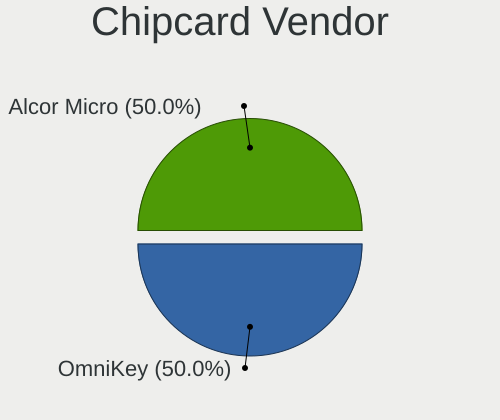

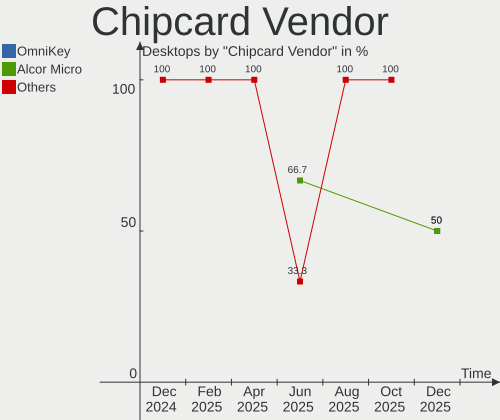

| Vendor      | Desktops | Percent |
|-------------|----------|---------|
| OmniKey     | 1        | 50%     |
| Alcor Micro | 1        | 50%     |

Chipcard Model
--------------

Chipcard module models

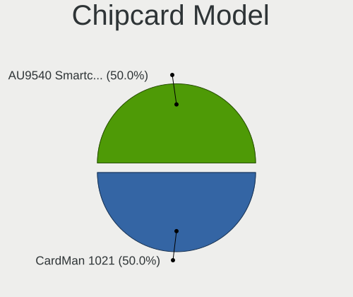

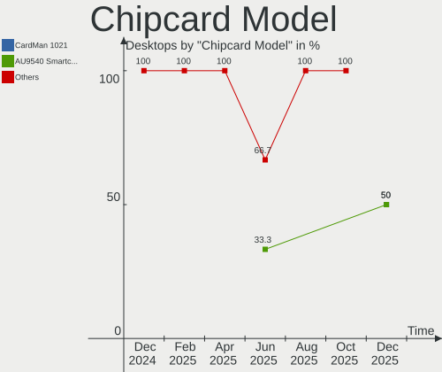

| Model                               | Desktops | Percent |
|-------------------------------------|----------|---------|
| OmniKey CardMan 1021                | 1        | 50%     |
| Alcor Micro AU9540 Smartcard Reader | 1        | 50%     |

Unsupported
-----------

Unsupported Devices
-------------------

Total unsupported devices on board

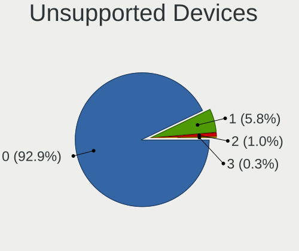

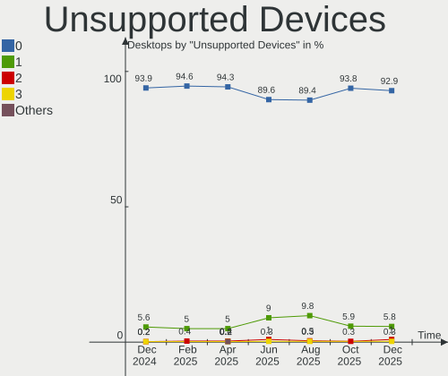

| Total | Desktops | Percent |
|-------|----------|---------|
| 0     | 274      | 92.88%  |
| 1     | 17       | 5.76%   |
| 2     | 3        | 1.02%   |
| 3     | 1        | 0.34%   |

Unsupported Device Types
------------------------

Types of unsupported devices

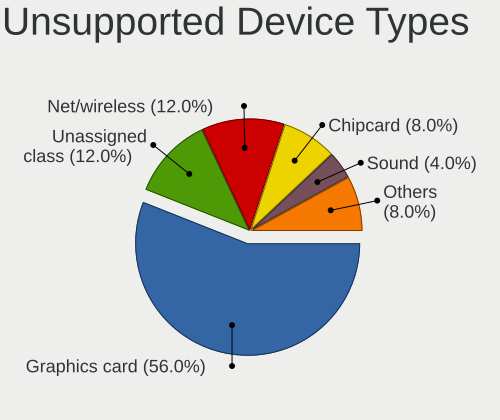

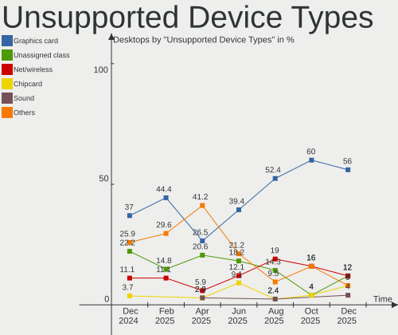

| Type                     | Desktops | Percent |
|--------------------------|----------|---------|
| Graphics card            | 14       | 56%     |
| Unassigned class         | 3        | 12%     |
| Net/wireless             | 3        | 12%     |
| Chipcard                 | 2        | 8%      |
| Sound                    | 1        | 4%      |
| Multimedia controller    | 1        | 4%      |
| Communication controller | 1        | 4%      |

