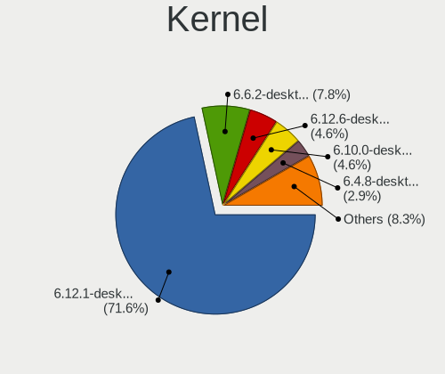
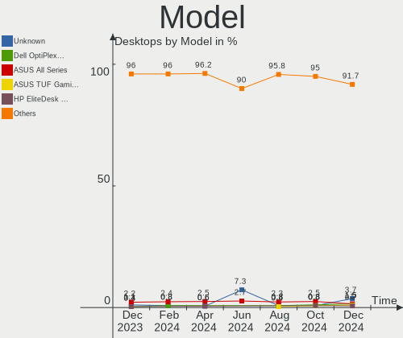
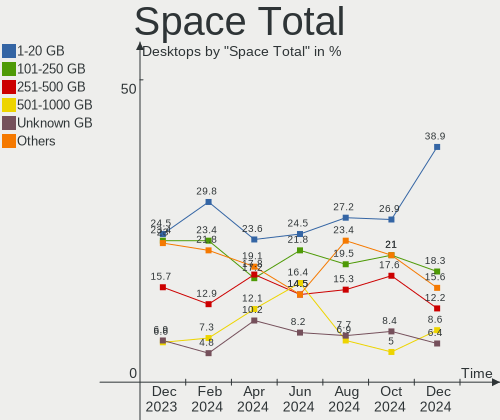
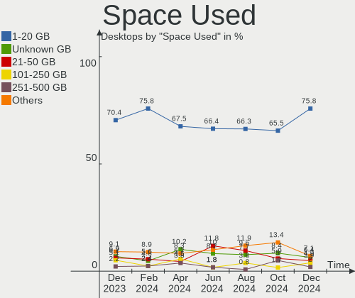
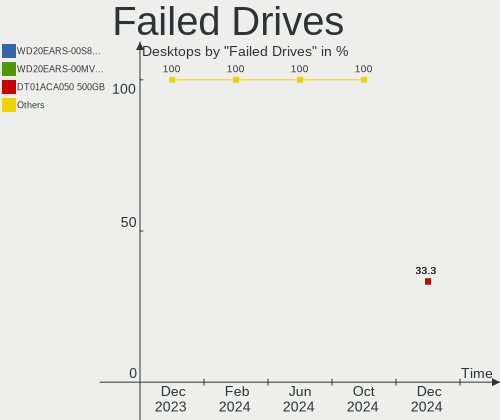
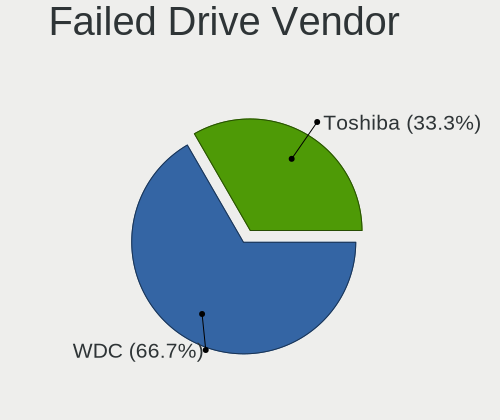

OpenMandriva Hardware Trends (Desktops)
---------------------------------------

A project to identify most popular hardware characteristics and track their change
over time based on data collected by OpenMandriva users at https://Linux-Hardware.org.

Anyone can contribute to this report by the [hw-probe](https://github.com/linuxhw/hw-probe) tool:

    sudo -E hw-probe -all -upload

Full-feature report is available here: https://linux-hardware.org/?view=trends&formfactor=desktop

Period: Oct, 2021.

Contents
--------

* [ System ](#system)
  - [ OS                       ](#os)
  - [ OS Family                ](#os-family)
  - [ Kernel                   ](#kernel)
  - [ Kernel Family            ](#kernel-family)
  - [ Kernel Major Ver.        ](#kernel-major-ver)
  - [ Arch                     ](#arch)
  - [ DE                       ](#de)
  - [ Display Server           ](#display-server)
  - [ Display Manager          ](#display-manager)
  - [ OS Lang                  ](#os-lang)
  - [ Boot Mode                ](#boot-mode)
  - [ Filesystem               ](#filesystem)
  - [ Part. scheme             ](#part-scheme)
  - [ Dual Boot with Linux/BSD ](#dual-boot-with-linuxbsd)
  - [ Dual Boot (Win)          ](#dual-boot-win)

* [ Board ](#board)
  - [ Vendor                   ](#vendor)
  - [ Model                    ](#model)
  - [ Model Family             ](#model-family)
  - [ MFG Year                 ](#mfg-year)
  - [ Form Factor              ](#form-factor)
  - [ Secure Boot              ](#secure-boot)
  - [ Coreboot                 ](#coreboot)
  - [ RAM Size                 ](#ram-size)
  - [ RAM Used                 ](#ram-used)
  - [ Total Drives             ](#total-drives)
  - [ Has CD-ROM               ](#has-cd-rom)
  - [ Has Ethernet             ](#has-ethernet)
  - [ Has WiFi                 ](#has-wifi)
  - [ Has Bluetooth            ](#has-bluetooth)

* [ Location ](#location)
  - [ Country                  ](#country)
  - [ City                     ](#city)

* [ Drives ](#drives)
  - [ Drive Vendor             ](#drive-vendor)
  - [ Drive Model              ](#drive-model)
  - [ HDD Vendor               ](#hdd-vendor)
  - [ SSD Vendor               ](#ssd-vendor)
  - [ Drive Kind               ](#drive-kind)
  - [ Drive Connector          ](#drive-connector)
  - [ Drive Size               ](#drive-size)
  - [ Space Total              ](#space-total)
  - [ Space Used               ](#space-used)
  - [ Malfunc. Drives          ](#malfunc-drives)
  - [ Malfunc. Drive Vendor    ](#malfunc-drive-vendor)
  - [ Malfunc. HDD Vendor      ](#malfunc-hdd-vendor)
  - [ Malfunc. Drive Kind      ](#malfunc-drive-kind)
  - [ Failed Drives            ](#failed-drives)
  - [ Failed Drive Vendor      ](#failed-drive-vendor)
  - [ Drive Status             ](#drive-status)

* [ Storage controller ](#storage-controller)
  - [ Storage Vendor           ](#storage-vendor)
  - [ Storage Model            ](#storage-model)
  - [ Storage Kind             ](#storage-kind)

* [ Processor ](#processor)
  - [ CPU Vendor               ](#cpu-vendor)
  - [ CPU Model                ](#cpu-model)
  - [ CPU Model Family         ](#cpu-model-family)
  - [ CPU Cores                ](#cpu-cores)
  - [ CPU Sockets              ](#cpu-sockets)
  - [ CPU Threads              ](#cpu-threads)
  - [ CPU Op-Modes             ](#cpu-op-modes)
  - [ CPU Microcode            ](#cpu-microcode)
  - [ CPU Microarch            ](#cpu-microarch)

* [ Graphics ](#graphics)
  - [ GPU Vendor               ](#gpu-vendor)
  - [ GPU Model                ](#gpu-model)
  - [ GPU Combo                ](#gpu-combo)
  - [ GPU Driver               ](#gpu-driver)
  - [ GPU Memory               ](#gpu-memory)

* [ Monitor ](#monitor)
  - [ Monitor Vendor           ](#monitor-vendor)
  - [ Monitor Model            ](#monitor-model)
  - [ Monitor Resolution       ](#monitor-resolution)
  - [ Monitor Diagonal         ](#monitor-diagonal)
  - [ Monitor Width            ](#monitor-width)
  - [ Aspect Ratio             ](#aspect-ratio)
  - [ Monitor Area             ](#monitor-area)
  - [ Pixel Density            ](#pixel-density)
  - [ Multiple Monitors        ](#multiple-monitors)

* [ Network ](#network)
  - [ Net Controller Vendor    ](#net-controller-vendor)
  - [ Net Controller Model     ](#net-controller-model)
  - [ Wireless Vendor          ](#wireless-vendor)
  - [ Wireless Model           ](#wireless-model)
  - [ Ethernet Vendor          ](#ethernet-vendor)
  - [ Ethernet Model           ](#ethernet-model)
  - [ Net Controller Kind      ](#net-controller-kind)
  - [ Used Controller          ](#used-controller)
  - [ NICs                     ](#nics)
  - [ IPv6                     ](#ipv6)

* [ Bluetooth ](#bluetooth)
  - [ Bluetooth Vendor         ](#bluetooth-vendor)
  - [ Bluetooth Model          ](#bluetooth-model)

* [ Sound ](#sound)
  - [ Sound Vendor             ](#sound-vendor)
  - [ Sound Model              ](#sound-model)

* [ Memory ](#memory)
  - [ Memory Vendor            ](#memory-vendor)
  - [ Memory Model             ](#memory-model)
  - [ Memory Kind              ](#memory-kind)
  - [ Memory Form Factor       ](#memory-form-factor)
  - [ Memory Size              ](#memory-size)
  - [ Memory Speed             ](#memory-speed)

* [ Printers & scanners ](#printers--scanners)
  - [ Printer Vendor           ](#printer-vendor)
  - [ Printer Model            ](#printer-model)
  - [ Scanner Vendor           ](#scanner-vendor)
  - [ Scanner Model            ](#scanner-model)

* [ Camera ](#camera)
  - [ Camera Vendor            ](#camera-vendor)
  - [ Camera Model             ](#camera-model)

* [ Security ](#security)
  - [ Fingerprint Vendor       ](#fingerprint-vendor)
  - [ Fingerprint Model        ](#fingerprint-model)
  - [ Chipcard Vendor          ](#chipcard-vendor)
  - [ Chipcard Model           ](#chipcard-model)

* [ Unsupported ](#unsupported)
  - [ Unsupported Devices      ](#unsupported-devices)
  - [ Unsupported Device Types ](#unsupported-device-types)

System
------

OS
--

Installed operating systems

| Name              | Desktops | Percent |
|-------------------|----------|---------|
| OpenMandriva 4.2  | 107      | 86.29%  |
| OpenMandriva 4.50 | 17       | 13.71%  |

OS Family
---------

OS without a version

| Name         | Desktops | Percent |
|--------------|----------|---------|
| OpenMandriva | 124      | 100%    |

Kernel
------

Version of the Linux kernel

| Version                  | Desktops | Percent |
|--------------------------|----------|---------|
| 5.10.14-desktop-1omv4002 | 102      | 82.26%  |
| 5.12.4-desktop-1omv4050  | 12       | 9.68%   |
| 5.14.7-desktop-1omv4050  | 5        | 4.03%   |
| 5.11.12-desktop-1omv4002 | 5        | 4.03%   |

Kernel Family
-------------

Linux kernel without a distro release

| Version | Desktops | Percent |
|---------|----------|---------|
| 5.10.14 | 102      | 82.26%  |
| 5.12.4  | 12       | 9.68%   |
| 5.14.7  | 5        | 4.03%   |
| 5.11.12 | 5        | 4.03%   |

Kernel Major Ver.
-----------------

Linux kernel major version

| Version | Desktops | Percent |
|---------|----------|---------|
| 5.10    | 102      | 82.26%  |
| 5.12    | 12       | 9.68%   |
| 5.14    | 5        | 4.03%   |
| 5.11    | 5        | 4.03%   |

Arch
----

OS architecture (x86_64, i586, etc.)

| Name   | Desktops | Percent |
|--------|----------|---------|
| x86_64 | 124      | 100%    |

DE
--

Desktop Environment

| Name | Desktops | Percent |
|------|----------|---------|
| KDE5 | 124      | 100%    |

Display Server
--------------

X11 or Wayland

| Name    | Desktops | Percent |
|---------|----------|---------|
| X11     | 122      | 98.39%  |
| Wayland | 2        | 1.61%   |

Display Manager
---------------

SDDM, LightDM, etc.

| Name | Desktops | Percent |
|------|----------|---------|
| SDDM | 124      | 100%    |

OS Lang
-------

Language

| Lang  | Desktops | Percent |
|-------|----------|---------|
| en_US | 70       | 56.45%  |
| fr_FR | 12       | 9.68%   |
| ru_RU | 11       | 8.87%   |
| pt_BR | 7        | 5.65%   |
| pl_PL | 4        | 3.23%   |
| it_IT | 3        | 2.42%   |
| de_DE | 3        | 2.42%   |
| es_ES | 2        | 1.61%   |
| en_IL | 2        | 1.61%   |
| en_GB | 2        | 1.61%   |
| cs_CZ | 2        | 1.61%   |
| pt_PT | 1        | 0.81%   |
| hu_HU | 1        | 0.81%   |
| fr_BE | 1        | 0.81%   |
| es_CO | 1        | 0.81%   |
| en_DK | 1        | 0.81%   |
| en_AU | 1        | 0.81%   |

Boot Mode
---------

EFI or BIOS

| Mode | Desktops | Percent |
|------|----------|---------|
| BIOS | 71       | 57.26%  |
| EFI  | 53       | 42.74%  |

Filesystem
----------

Type of filesystem

| Type    | Desktops | Percent |
|---------|----------|---------|
| Overlay | 106      | 85.48%  |
| Ext4    | 13       | 10.48%  |
| Btrfs   | 4        | 3.23%   |
| Xfs     | 1        | 0.81%   |

Part. scheme
------------

Scheme of partitioning

| Type | Desktops | Percent |
|------|----------|---------|
| GPT  | 71       | 57.26%  |
| MBR  | 53       | 42.74%  |

Dual Boot with Linux/BSD
------------------------

Hosting more than one Linux/BSD

| Dual boot | Desktops | Percent |
|-----------|----------|---------|
| Yes       | 77       | 62.1%   |
| No        | 47       | 37.9%   |

Dual Boot (Win)
---------------

Hosting Linux and Windows

| Dual boot | Desktops | Percent |
|-----------|----------|---------|
| Yes       | 74       | 59.68%  |
| No        | 50       | 40.32%  |

Board
-----

Vendor
------

Motherboard manufacturer

| Name                | Desktops | Percent |
|---------------------|----------|---------|
| ASUSTek Computer    | 30       | 24.19%  |
| MSI                 | 19       | 15.32%  |
| Gigabyte Technology | 19       | 15.32%  |
| Hewlett-Packard     | 14       | 11.29%  |
| ASRock              | 13       | 10.48%  |
| Dell                | 8        | 6.45%   |
| Foxconn             | 4        | 3.23%   |
| Lenovo              | 3        | 2.42%   |
| Intel               | 3        | 2.42%   |
| Acer                | 3        | 2.42%   |
| Pegatron            | 2        | 1.61%   |
| Positivo            | 1        | 0.81%   |
| Philco              | 1        | 0.81%   |
| PCWare              | 1        | 0.81%   |
| PANSHI              | 1        | 0.81%   |
| Packard Bell        | 1        | 0.81%   |
| Fujitsu             | 1        | 0.81%   |

Model
-----

Motherboard model

| Name                                   | Desktops | Percent |
|----------------------------------------|----------|---------|
| MSI MS-7C37                            | 2        | 1.61%   |
| Dell OptiPlex 7050                     | 2        | 1.61%   |
| ASUS KLONDIKE                          | 2        | 1.61%   |
| Positivo POS-EIB75CO                   | 1        | 0.81%   |
| Philco DTC-A55                         | 1        | 0.81%   |
| Pegatron Elite 7300 Series MT          | 1        | 0.81%   |
| Pegatron Compaq dx2400 Microtower PC   | 1        | 0.81%   |
| PCWare IPX1800E2                       | 1        | 0.81%   |
| PANSHI B85-S1 V1.0                     | 1        | 0.81%   |
| Packard Bell imedia S3710              | 1        | 0.81%   |
| MSI MS-7C94                            | 1        | 0.81%   |
| MSI MS-7B86                            | 1        | 0.81%   |
| MSI MS-7B53                            | 1        | 0.81%   |
| MSI MS-7B33                            | 1        | 0.81%   |
| MSI MS-7B07                            | 1        | 0.81%   |
| MSI MS-7978                            | 1        | 0.81%   |
| MSI MS-7972                            | 1        | 0.81%   |
| MSI MS-7924                            | 1        | 0.81%   |
| MSI MS-7919                            | 1        | 0.81%   |
| MSI MS-7823                            | 1        | 0.81%   |
| MSI MS-7817                            | 1        | 0.81%   |
| MSI MS-7793                            | 1        | 0.81%   |
| MSI MS-7695                            | 1        | 0.81%   |
| MSI MS-7641                            | 1        | 0.81%   |
| MSI MS-7636                            | 1        | 0.81%   |
| MSI MS-7586                            | 1        | 0.81%   |
| MSI Compaq dx2420 Microtower           | 1        | 0.81%   |
| Lenovo ThinkCentre M93p 10A7003AUK     | 1        | 0.81%   |
| Lenovo ThinkCentre M73 10B7A0UD00      | 1        | 0.81%   |
| Lenovo 3000 IPM31                      | 1        | 0.81%   |
| Intel H61                              | 1        | 0.81%   |
| Intel H55                              | 1        | 0.81%   |
| Intel B75 V124                         | 1        | 0.81%   |
| HP Z440 Workstation                    | 1        | 0.81%   |
| HP Z210 Workstation                    | 1        | 0.81%   |
| HP Z200 Workstation                    | 1        | 0.81%   |
| HP xw4600 Workstation                  | 1        | 0.81%   |
| HP ProDesk 600 G1 TWR                  | 1        | 0.81%   |
| HP ProDesk 600 G1 DM                   | 1        | 0.81%   |
| HP ProDesk 400 G1 SFF                  | 1        | 0.81%   |
| HP Pavilion Desktop PC 570-p0xx        | 1        | 0.81%   |
| HP Desktop m01-f1046 Rfrbd PC          | 1        | 0.81%   |
| HP Compaq dc7900 Convertible Minitower | 1        | 0.81%   |
| HP Compaq 8000 Elite USDT PC           | 1        | 0.81%   |
| HP Compaq 6005 Pro MT PC               | 1        | 0.81%   |
| HP Compaq 6000 Pro SFF PC              | 1        | 0.81%   |
| HP Compaq 6000 Pro MT PC               | 1        | 0.81%   |
| Gigabyte Z170-HD3                      | 1        | 0.81%   |
| Gigabyte X570S AORUS PRO AX            | 1        | 0.81%   |
| Gigabyte P35-S3G                       | 1        | 0.81%   |
| Gigabyte P31-ES3G                      | 1        | 0.81%   |
| Gigabyte M61PME-S2                     | 1        | 0.81%   |
| Gigabyte H81M-H                        | 1        | 0.81%   |
| Gigabyte H61M-S2PV                     | 1        | 0.81%   |
| Gigabyte H61M-D2-B3                    | 1        | 0.81%   |
| Gigabyte H310MS2P                      | 1        | 0.81%   |
| Gigabyte H310M S2H 2.0                 | 1        | 0.81%   |
| Gigabyte GA-M55PLUS-S3G                | 1        | 0.81%   |
| Gigabyte GA-970A-DS3                   | 1        | 0.81%   |
| Gigabyte GA-78LMT-S2P                  | 1        | 0.81%   |

Model Family
------------

Motherboard model prefix

| Name                    | Desktops | Percent |
|-------------------------|----------|---------|
| ASUS PRIME              | 7        | 5.65%   |
| HP Compaq               | 5        | 4.03%   |
| Dell OptiPlex           | 5        | 4.03%   |
| ASUS ROG                | 4        | 3.23%   |
| HP ProDesk              | 3        | 2.42%   |
| Acer Aspire             | 3        | 2.42%   |
| MSI MS-7C37             | 2        | 1.61%   |
| Lenovo ThinkCentre      | 2        | 1.61%   |
| Dell Precision          | 2        | 1.61%   |
| ASUS P8Z77-V            | 2        | 1.61%   |
| ASUS P5G41T-M           | 2        | 1.61%   |
| ASUS KLONDIKE           | 2        | 1.61%   |
| Positivo POS-EIB75CO    | 1        | 0.81%   |
| Philco DTC-A55          | 1        | 0.81%   |
| Pegatron Elite          | 1        | 0.81%   |
| Pegatron Compaq         | 1        | 0.81%   |
| PCWare IPX1800E2        | 1        | 0.81%   |
| PANSHI B85-S1           | 1        | 0.81%   |
| Packard Bell imedia     | 1        | 0.81%   |
| MSI MS-7C94             | 1        | 0.81%   |
| MSI MS-7B86             | 1        | 0.81%   |
| MSI MS-7B53             | 1        | 0.81%   |
| MSI MS-7B33             | 1        | 0.81%   |
| MSI MS-7B07             | 1        | 0.81%   |
| MSI MS-7978             | 1        | 0.81%   |
| MSI MS-7972             | 1        | 0.81%   |
| MSI MS-7924             | 1        | 0.81%   |
| MSI MS-7919             | 1        | 0.81%   |
| MSI MS-7823             | 1        | 0.81%   |
| MSI MS-7817             | 1        | 0.81%   |
| MSI MS-7793             | 1        | 0.81%   |
| MSI MS-7695             | 1        | 0.81%   |
| MSI MS-7641             | 1        | 0.81%   |
| MSI MS-7636             | 1        | 0.81%   |
| MSI MS-7586             | 1        | 0.81%   |
| MSI Compaq              | 1        | 0.81%   |
| Lenovo 3000             | 1        | 0.81%   |
| Intel H61               | 1        | 0.81%   |
| Intel H55               | 1        | 0.81%   |
| Intel B75               | 1        | 0.81%   |
| HP Z440                 | 1        | 0.81%   |
| HP Z210                 | 1        | 0.81%   |
| HP Z200                 | 1        | 0.81%   |
| HP xw4600               | 1        | 0.81%   |
| HP Pavilion             | 1        | 0.81%   |
| HP Desktop              | 1        | 0.81%   |
| Gigabyte Z170-HD3       | 1        | 0.81%   |
| Gigabyte X570S          | 1        | 0.81%   |
| Gigabyte P35-S3G        | 1        | 0.81%   |
| Gigabyte P31-ES3G       | 1        | 0.81%   |
| Gigabyte M61PME-S2      | 1        | 0.81%   |
| Gigabyte H81M-H         | 1        | 0.81%   |
| Gigabyte H61M-S2PV      | 1        | 0.81%   |
| Gigabyte H61M-D2-B3     | 1        | 0.81%   |
| Gigabyte H310MS2P       | 1        | 0.81%   |
| Gigabyte H310M          | 1        | 0.81%   |
| Gigabyte GA-M55PLUS-S3G | 1        | 0.81%   |
| Gigabyte GA-970A-DS3    | 1        | 0.81%   |
| Gigabyte GA-78LMT-S2P   | 1        | 0.81%   |
| Gigabyte G31M-ES2L      | 1        | 0.81%   |

MFG Year
--------

Motherboard manufacture year

| Year | Desktops | Percent |
|------|----------|---------|
| 2021 | 14       | 11.29%  |
| 2011 | 13       | 10.48%  |
| 2019 | 12       | 9.68%   |
| 2018 | 11       | 8.87%   |
| 2009 | 11       | 8.87%   |
| 2013 | 10       | 8.06%   |
| 2020 | 9        | 7.26%   |
| 2015 | 9        | 7.26%   |
| 2012 | 9        | 7.26%   |
| 2008 | 7        | 5.65%   |
| 2010 | 6        | 4.84%   |
| 2014 | 4        | 3.23%   |
| 2006 | 4        | 3.23%   |
| 2016 | 3        | 2.42%   |
| 2017 | 2        | 1.61%   |

Form Factor
-----------

Physical design of the computer

| Name    | Desktops | Percent |
|---------|----------|---------|
| Desktop | 124      | 100%    |

Secure Boot
-----------

Enabled or disabled

| State    | Desktops | Percent |
|----------|----------|---------|
| Disabled | 124      | 100%    |

Coreboot
--------

Have coreboot on board

| Used | Desktops | Percent |
|------|----------|---------|
| No   | 124      | 100%    |

RAM Size
--------

Total RAM memory

| Size in GB | Desktops | Percent |
|------------|----------|---------|
| 8.01-16.0  | 34       | 27.42%  |
| 4.01-8.0   | 27       | 21.77%  |
| 3.01-4.0   | 24       | 19.35%  |
| 16.01-24.0 | 17       | 13.71%  |
| 32.01-64.0 | 15       | 12.1%   |
| 1.01-2.0   | 4        | 3.23%   |
| 2.01-3.0   | 2        | 1.61%   |
| 24.01-32.0 | 1        | 0.81%   |

RAM Used
--------

Used RAM memory

| Used GB  | Desktops | Percent |
|----------|----------|---------|
| 1.01-2.0 | 91       | 73.39%  |
| 0.51-1.0 | 19       | 15.32%  |
| 2.01-3.0 | 7        | 5.65%   |
| 0.01-0.5 | 5        | 4.03%   |
| 3.01-4.0 | 2        | 1.61%   |

Total Drives
------------

Number of drives on board

| Drives | Desktops | Percent |
|--------|----------|---------|
| 1      | 54       | 43.55%  |
| 2      | 34       | 27.42%  |
| 3      | 16       | 12.9%   |
| 4      | 7        | 5.65%   |
| 0      | 4        | 3.23%   |
| 7      | 3        | 2.42%   |
| 5      | 3        | 2.42%   |
| 6      | 2        | 1.61%   |
| 8      | 1        | 0.81%   |

Has CD-ROM
----------

Has CD-ROM on board

| Presented | Desktops | Percent |
|-----------|----------|---------|
| Yes       | 80       | 64.52%  |
| No        | 44       | 35.48%  |

Has Ethernet
------------

Has Ethernet on board

| Presented | Desktops | Percent |
|-----------|----------|---------|
| Yes       | 123      | 99.19%  |
| No        | 1        | 0.81%   |

Has WiFi
--------

Has WiFi module

| Presented | Desktops | Percent |
|-----------|----------|---------|
| No        | 85       | 68.55%  |
| Yes       | 39       | 31.45%  |

Has Bluetooth
-------------

Has Bluetooth module

| Presented | Desktops | Percent |
|-----------|----------|---------|
| No        | 102      | 82.26%  |
| Yes       | 22       | 17.74%  |

Location
--------

Country
-------

Geographic location (country)

| Country   | Desktops | Percent |
|-----------|----------|---------|
| Russia    | 16       | 12.9%   |
| USA       | 13       | 10.48%  |
| France    | 13       | 10.48%  |
| Brazil    | 12       | 9.68%   |
| Poland    | 6        | 4.84%   |
| Germany   | 6        | 4.84%   |
| UK        | 5        | 4.03%   |
| Italy     | 5        | 4.03%   |
| Sweden    | 4        | 3.23%   |
| Morocco   | 3        | 2.42%   |
| Japan     | 3        | 2.42%   |
| Israel    | 3        | 2.42%   |
| India     | 3        | 2.42%   |
| Taiwan    | 2        | 1.61%   |
| Spain     | 2        | 1.61%   |
| Slovakia  | 2        | 1.61%   |
| Portugal  | 2        | 1.61%   |
| Peru      | 2        | 1.61%   |
| Hungary   | 2        | 1.61%   |
| Czechia   | 2        | 1.61%   |
| Bulgaria  | 2        | 1.61%   |
| Australia | 2        | 1.61%   |
| Ukraine   | 1        | 0.81%   |
| Serbia    | 1        | 0.81%   |
| Moldova   | 1        | 0.81%   |
| Mexico    | 1        | 0.81%   |
| Jamaica   | 1        | 0.81%   |
| Indonesia | 1        | 0.81%   |
| Greece    | 1        | 0.81%   |
| Croatia   | 1        | 0.81%   |
| Colombia  | 1        | 0.81%   |
| China     | 1        | 0.81%   |
| Canada    | 1        | 0.81%   |
| Belgium   | 1        | 0.81%   |
| Austria   | 1        | 0.81%   |
| Argentina | 1        | 0.81%   |

City
----

Geographic location (city)

| City                    | Desktops | Percent |
|-------------------------|----------|---------|
| Guebwiller              | 3        | 2.42%   |
| Vidnoye                 | 2        | 1.61%   |
| Stezzano                | 2        | 1.61%   |
| St Petersburg           | 2        | 1.61%   |
| Sainte-Marie-aux-Chenes | 2        | 1.61%   |
| Rostov-on-Don           | 2        | 1.61%   |
| New Taipei              | 2        | 1.61%   |
| Moscow                  | 2        | 1.61%   |
| Marrakesh               | 2        | 1.61%   |
| Joinville               | 2        | 1.61%   |
| Chennai                 | 2        | 1.61%   |
| Arequipa                | 2        | 1.61%   |
| Zirndorf                | 1        | 0.81%   |
| Zamberk                 | 1        | 0.81%   |
| Zagreb                  | 1        | 0.81%   |
| Zabrze                  | 1        | 0.81%   |
| Yokohama                | 1        | 0.81%   |
| Yaroslavl               | 1        | 0.81%   |
| Woolloongabba           | 1        | 0.81%   |
| Woodhall Spa            | 1        | 0.81%   |
| Willingboro             | 1        | 0.81%   |
| Wahpeton                | 1        | 0.81%   |
| Vitoria-Gasteiz         | 1        | 0.81%   |
| Varna                   | 1        | 0.81%   |
| Uppsala                 | 1        | 0.81%   |
| Trollh?¤ttan            | 1        | 0.81%   |
| Tonawanda               | 1        | 0.81%   |
| Tel Aviv                | 1        | 0.81%   |
| Tatab??nya              | 1        | 0.81%   |
| Tarnowskie Gory         | 1        | 0.81%   |
| Tarn??w                 | 1        | 0.81%   |
| Tambov                  | 1        | 0.81%   |
| Sofia                   | 1        | 0.81%   |
| Sheffield               | 1        | 0.81%   |
| Shanghai                | 1        | 0.81%   |
| Schorndorf              | 1        | 0.81%   |
| S??o Paulo              | 1        | 0.81%   |
| S??o Bernardo do Campo  | 1        | 0.81%   |
| Savedalen               | 1        | 0.81%   |
| Sao Goncalo             | 1        | 0.81%   |
| Santa Maria             | 1        | 0.81%   |
| Samara                  | 1        | 0.81%   |
| Salt Lake City          | 1        | 0.81%   |
| Saint-Aubin-le-Cauf     | 1        | 0.81%   |
| Sagamihara              | 1        | 0.81%   |
| Rypin                   | 1        | 0.81%   |
| Rostock                 | 1        | 0.81%   |
| Riverside               | 1        | 0.81%   |
| Rimavsk?? Sobota        | 1        | 0.81%   |
| Rafaela                 | 1        | 0.81%   |
| Pyatigorsk              | 1        | 0.81%   |
| Prague                  | 1        | 0.81%   |
| Porto-Vecchio           | 1        | 0.81%   |
| Pierre                  | 1        | 0.81%   |
| Perpignan               | 1        | 0.81%   |
| Pavlohrad               | 1        | 0.81%   |
| Palmi                   | 1        | 0.81%   |
| Palilula                | 1        | 0.81%   |
| Ofakim                  | 1        | 0.81%   |
| Nyk?¶ping               | 1        | 0.81%   |

Drives
------

Drive Vendor
------------

Hard drive vendors

| Vendor              | Desktops | Drives | Percent |
|---------------------|----------|--------|---------|
| WDC                 | 65       | 84     | 30.81%  |
| Seagate             | 48       | 60     | 22.75%  |
| Samsung Electronics | 19       | 27     | 9%      |
| Kingston            | 9        | 10     | 4.27%   |
| Crucial             | 9        | 11     | 4.27%   |
| Toshiba             | 8        | 9      | 3.79%   |
| Hitachi             | 8        | 9      | 3.79%   |
| A-DATA Technology   | 5        | 5      | 2.37%   |
| Unknown             | 4        | 6      | 1.9%    |
| MAXTOR              | 4        | 4      | 1.9%    |
| GOODRAM             | 4        | 4      | 1.9%    |
| SanDisk             | 2        | 2      | 0.95%   |
| OCZ                 | 2        | 2      | 0.95%   |
| Intel               | 2        | 2      | 0.95%   |
| Fujitsu             | 2        | 2      | 0.95%   |
| Vaseky              | 1        | 1      | 0.47%   |
| USB 3.0             | 1        | 2      | 0.47%   |
| Transcend           | 1        | 1      | 0.47%   |
| SPCC                | 1        | 1      | 0.47%   |
| SK Hynix            | 1        | 1      | 0.47%   |
| Promise             | 1        | 1      | 0.47%   |
| PNY                 | 1        | 1      | 0.47%   |
| PLEXTOR             | 1        | 1      | 0.47%   |
| Micron Technology   | 1        | 1      | 0.47%   |
| KIOXIA              | 1        | 2      | 0.47%   |
| INDMEM              | 1        | 1      | 0.47%   |
| IB                  | 1        | 2      | 0.47%   |
| Hikvision           | 1        | 1      | 0.47%   |
| ExcelStor           | 1        | 1      | 0.47%   |
| Drevo               | 1        | 1      | 0.47%   |
| China               | 1        | 1      | 0.47%   |
| BW-PSSD4            | 1        | 1      | 0.47%   |
| AS25                | 1        | 1      | 0.47%   |
| ANACOMDA            | 1        | 1      | 0.47%   |
| Unknown             | 1        | 1      | 0.47%   |

Drive Model
-----------

Hard drive models

| Model                            | Desktops | Percent |
|----------------------------------|----------|---------|
| Seagate ST500DM002-1BD142 500GB  | 7        | 2.8%    |
| WDC WDS240G2G0A-00JH30 240GB SSD | 5        | 2%      |
| Seagate ST3500312CS 500GB        | 5        | 2%      |
| Seagate ST1000DM010-2EP102 1TB   | 4        | 1.6%    |
| WDC WD5000AAKX-001CA0 500GB      | 3        | 1.2%    |
| Seagate ST3500418AS 500GB        | 3        | 1.2%    |
| Seagate ST2000DM006-2DM164 2TB   | 3        | 1.2%    |
| Samsung SSD 860 EVO 1TB          | 3        | 1.2%    |
| Kingston SV300S37A120G 120GB SSD | 3        | 1.2%    |
| WDC WD6400AAKS-65A7B2 640GB      | 2        | 0.8%    |
| WDC WD3200AAJS-56M0A0 320GB      | 2        | 0.8%    |
| WDC WD20PURX-64P6ZY0 2TB         | 2        | 0.8%    |
| WDC WD20EFRX-68EUZN0 2TB         | 2        | 0.8%    |
| WDC WD20EARX-00PASB0 2TB         | 2        | 0.8%    |
| WDC WD10EZEX-08WN4A0 1TB         | 2        | 0.8%    |
| Unknown SD/MMC/MS PRO 128GB      | 2        | 0.8%    |
| Toshiba HDWD130 3TB              | 2        | 0.8%    |
| Toshiba HDWD110 1TB              | 2        | 0.8%    |
| Toshiba DT01ACA100 1TB           | 2        | 0.8%    |
| Seagate ST1000DM003-1SB102 1TB   | 2        | 0.8%    |
| Seagate ST1000DM003-1ER162 1TB   | 2        | 0.8%    |
| Samsung SSD 970 EVO Plus 250GB   | 2        | 0.8%    |
| Samsung HD160HJ 160GB            | 2        | 0.8%    |
| Crucial CT525MX300SSD1 528GB     | 2        | 0.8%    |
| Crucial CT240BX500SSD1 240GB     | 2        | 0.8%    |
| A-DATA SU650 120GB SSD           | 2        | 0.8%    |
| WDC WDS500G2B0B-00YS70 500GB SSD | 1        | 0.4%    |
| WDC WDS500G1B0C-00S6U0 500GB     | 1        | 0.4%    |
| WDC WDS120G2G0A-00JH30 120GB SSD | 1        | 0.4%    |
| WDC WDS100T2B0B-00YS70 1TB SSD   | 1        | 0.4%    |
| WDC WDBNCE0010PNC 1TB SSD        | 1        | 0.4%    |
| WDC WD80PURZ-85YNPY0 8TB         | 1        | 0.4%    |
| WDC WD800JD-60LSA0 80GB          | 1        | 0.4%    |
| WDC WD800JD-00LSA0 80GB          | 1        | 0.4%    |
| WDC WD6400AAKS-75A7B2 640GB      | 1        | 0.4%    |
| WDC WD60PURZ-85ZUFY1 6TB         | 1        | 0.4%    |
| WDC WD5003ABYZ-005454 500GB      | 1        | 0.4%    |
| WDC WD5000LPVX-22V0TT0 500GB     | 1        | 0.4%    |
| WDC WD5000LPVX-00V0TT0 500GB     | 1        | 0.4%    |
| WDC WD5000LPLX-00ZNTT0 500GB     | 1        | 0.4%    |
| WDC WD5000AZLX-08K2TA0 500GB     | 1        | 0.4%    |
| WDC WD5000AZLX-00K2TA0 500GB     | 1        | 0.4%    |
| WDC WD5000AVVS-63H0B1 500GB      | 1        | 0.4%    |
| WDC WD5000AVCS-632DY1 500GB      | 1        | 0.4%    |
| WDC WD5000AAKX-221CA1 500GB      | 1        | 0.4%    |
| WDC WD5000AAKS-75V0A0 500GB      | 1        | 0.4%    |
| WDC WD5000AAKS-60Z1A0 500GB      | 1        | 0.4%    |
| WDC WD5000AAKS-40V2B0 500GB      | 1        | 0.4%    |
| WDC WD5000AAKS-22V1A0 500GB      | 1        | 0.4%    |
| WDC WD5000AAKS-08V0A0 500GB      | 1        | 0.4%    |
| WDC WD5000AAKS-007AA0 500GB      | 1        | 0.4%    |
| WDC WD5000AAJS-00YFA0 500GB      | 1        | 0.4%    |
| WDC WD5000AACS-00G8B1 500GB      | 1        | 0.4%    |
| WDC WD450VF4YZ-49SJYM0 5TB       | 1        | 0.4%    |
| WDC WD40PURZ-85TTDY0 4TB         | 1        | 0.4%    |
| WDC WD3200AAJS-65M0A0 320GB      | 1        | 0.4%    |
| WDC WD3200AAJS-00L7A0 320GB      | 1        | 0.4%    |
| WDC WD3200AAJB-00J3A0 320GB      | 1        | 0.4%    |
| WDC WD30EFRX-68EUZN0 3TB         | 1        | 0.4%    |
| WDC WD3000HLHX-01JJPV0 304GB     | 1        | 0.4%    |

HDD Vendor
----------

Hard disk drive vendors

| Vendor              | Desktops | Drives | Percent |
|---------------------|----------|--------|---------|
| WDC                 | 58       | 73     | 40.56%  |
| Seagate             | 48       | 60     | 33.57%  |
| Samsung Electronics | 9        | 9      | 6.29%   |
| Toshiba             | 8        | 9      | 5.59%   |
| Hitachi             | 8        | 9      | 5.59%   |
| MAXTOR              | 4        | 4      | 2.8%    |
| Unknown             | 2        | 2      | 1.4%    |
| Fujitsu             | 2        | 2      | 1.4%    |
| USB 3.0             | 1        | 2      | 0.7%    |
| Promise             | 1        | 1      | 0.7%    |
| IB                  | 1        | 2      | 0.7%    |
| ExcelStor           | 1        | 1      | 0.7%    |

SSD Vendor
----------

Solid state drive vendors

| Vendor              | Desktops | Drives | Percent |
|---------------------|----------|--------|---------|
| WDC                 | 9        | 9      | 15.25%  |
| Crucial             | 9        | 11     | 15.25%  |
| Kingston            | 8        | 9      | 13.56%  |
| Samsung Electronics | 7        | 13     | 11.86%  |
| A-DATA Technology   | 5        | 5      | 8.47%   |
| GOODRAM             | 3        | 3      | 5.08%   |
| SanDisk             | 2        | 2      | 3.39%   |
| OCZ                 | 2        | 2      | 3.39%   |
| Vaseky              | 1        | 1      | 1.69%   |
| Unknown             | 1        | 1      | 1.69%   |
| SPCC                | 1        | 1      | 1.69%   |
| SK Hynix            | 1        | 1      | 1.69%   |
| PNY                 | 1        | 1      | 1.69%   |
| PLEXTOR             | 1        | 1      | 1.69%   |
| Micron Technology   | 1        | 1      | 1.69%   |
| Intel               | 1        | 1      | 1.69%   |
| INDMEM              | 1        | 1      | 1.69%   |
| Drevo               | 1        | 1      | 1.69%   |
| China               | 1        | 1      | 1.69%   |
| AS25                | 1        | 1      | 1.69%   |
| ANACOMDA            | 1        | 1      | 1.69%   |
| Unknown             | 1        | 1      | 1.69%   |

Drive Kind
----------

HDD or SSD

| Kind    | Desktops | Drives | Percent |
|---------|----------|--------|---------|
| HDD     | 102      | 174    | 62.58%  |
| SSD     | 49       | 68     | 30.06%  |
| NVMe    | 10       | 14     | 6.13%   |
| Unknown | 2        | 4      | 1.23%   |

Drive Connector
---------------

SATA, SAS, NVMe, etc.

| Type | Desktops | Drives | Percent |
|------|----------|--------|---------|
| SATA | 119      | 227    | 84.4%   |
| SAS  | 12       | 19     | 8.51%   |
| NVMe | 10       | 14     | 7.09%   |

Drive Size
----------

Size of hard drive

| Size in TB | Desktops | Drives | Percent |
|------------|----------|--------|---------|
| 0.01-0.5   | 90       | 135    | 52.02%  |
| 0.51-1.0   | 46       | 58     | 26.59%  |
| 1.01-2.0   | 19       | 26     | 10.98%  |
| 3.01-4.0   | 8        | 10     | 4.62%   |
| 2.01-3.0   | 7        | 10     | 4.05%   |
| 4.01-10.0  | 3        | 3      | 1.73%   |

Space Total
-----------

Amount of disk space available on the file system

| Size in GB | Desktops | Percent |
|------------|----------|---------|
| 1-20       | 59       | 47.58%  |
| Unknown    | 28       | 22.58%  |
| 101-250    | 9        | 7.26%   |
| 251-500    | 8        | 6.45%   |
| 51-100     | 8        | 6.45%   |
| 501-1000   | 7        | 5.65%   |
| 21-50      | 2        | 1.61%   |
| 1001-2000  | 2        | 1.61%   |
| 2001-3000  | 1        | 0.81%   |

Space Used
----------

Amount of used disk space

| Used GB   | Desktops | Percent |
|-----------|----------|---------|
| 1-20      | 92       | 74.19%  |
| Unknown   | 28       | 22.58%  |
| 251-500   | 1        | 0.81%   |
| 101-250   | 1        | 0.81%   |
| 1001-2000 | 1        | 0.81%   |
| 51-100    | 1        | 0.81%   |

Malfunc. Drives
---------------

Drive models with a malfunction

| Model                                            | Desktops | Drives | Percent |
|--------------------------------------------------|----------|--------|---------|
| Seagate ST500DM002-1BD142 500GB                  | 3        | 3      | 5.17%   |
| WDC WD5000AAKX-001CA0 500GB                      | 2        | 2      | 3.45%   |
| Samsung Electronics HD160HJ 160GB                | 2        | 2      | 3.45%   |
| WDC WDS240G2G0A-00JH30 240GB SSD                 | 1        | 1      | 1.72%   |
| WDC WD6400AAKS-65A7B2 640GB                      | 1        | 1      | 1.72%   |
| WDC WD5000AVVS-63H0B1 500GB                      | 1        | 1      | 1.72%   |
| WDC WD5000AVCS-632DY1 500GB                      | 1        | 1      | 1.72%   |
| WDC WD5000AAKX-221CA1 500GB                      | 1        | 1      | 1.72%   |
| WDC WD5000AAKS-22V1A0 500GB                      | 1        | 1      | 1.72%   |
| WDC WD5000AAKS-08V0A0 500GB                      | 1        | 1      | 1.72%   |
| WDC WD5000AACS-00G8B1 500GB                      | 1        | 1      | 1.72%   |
| WDC WD3200AAJS-56M0A0 320GB                      | 1        | 1      | 1.72%   |
| WDC WD3200AAJS-00L7A0 320GB                      | 1        | 1      | 1.72%   |
| WDC WD3200AAJB-00J3A0 320GB                      | 1        | 1      | 1.72%   |
| WDC WD3000HLHX-01JJPV0 304GB                     | 1        | 1      | 1.72%   |
| WDC WD2500AAKS-00F0A0 250GB                      | 1        | 1      | 1.72%   |
| WDC WD20EFRX-68EUZN0 2TB                         | 1        | 1      | 1.72%   |
| WDC WD1600BEKT-66PVMT0 160GB                     | 1        | 1      | 1.72%   |
| WDC WD1600AAJS-22L7A0 160GB                      | 1        | 1      | 1.72%   |
| WDC WD10JPVX-22JC3T0 1TB                         | 1        | 1      | 1.72%   |
| WDC WD10EZRX-00A8LB0 1TB                         | 1        | 1      | 1.72%   |
| WDC WD10EZEX-08WN4A0 1TB                         | 1        | 1      | 1.72%   |
| WDC WD10EURX-83UY4Y0 1TB                         | 1        | 1      | 1.72%   |
| WDC WD10EARS-00Y5B1 1TB                          | 1        | 1      | 1.72%   |
| WDC WD10EADS-22M2B0 1TB                          | 1        | 1      | 1.72%   |
| WDC WD10EADS-11M2B2 1TB                          | 1        | 1      | 1.72%   |
| Seagate ST500LT012-1DG142 500GB                  | 1        | 1      | 1.72%   |
| Seagate ST3808110AS 80GB                         | 1        | 1      | 1.72%   |
| Seagate ST3250410AS 250GB                        | 1        | 1      | 1.72%   |
| Seagate ST3250310AS 250GB                        | 1        | 1      | 1.72%   |
| Seagate ST3120813AS 120GB                        | 1        | 1      | 1.72%   |
| Seagate ST3000VM002-1ET166 3TB                   | 1        | 1      | 1.72%   |
| Seagate ST1000DM003-1ER162 1TB                   | 1        | 1      | 1.72%   |
| Samsung Electronics SSD 840 EVO 120GB            | 1        | 1      | 1.72%   |
| Samsung Electronics SP1604N 160GB                | 1        | 1      | 1.72%   |
| Samsung Electronics MZ7LN256HMJP-000H1 256GB SSD | 1        | 1      | 1.72%   |
| Samsung Electronics HD120IJ 120GB                | 1        | 1      | 1.72%   |
| Samsung Electronics HD103SJ 1TB                  | 1        | 1      | 1.72%   |
| Samsung Electronics HD080HJ 80GB                 | 1        | 1      | 1.72%   |
| OCZ AGILITY3 480GB SSD                           | 1        | 1      | 1.72%   |
| MAXTOR STM3500320AS 500GB                        | 1        | 1      | 1.72%   |
| MAXTOR 6Y080L0 82GB                              | 1        | 1      | 1.72%   |
| Kingston SV300S37A120G 120GB SSD                 | 1        | 1      | 1.72%   |
| Kingston SA400S37480G 480GB SSD                  | 1        | 1      | 1.72%   |
| IB 121CL-C31 Disk1 2TB                           | 1        | 1      | 1.72%   |
| Hitachi HTS545025B9A300 250GB                    | 1        | 1      | 1.72%   |
| Hitachi HDS721680PLA380 80GB                     | 1        | 1      | 1.72%   |
| Hitachi HDS721010KLA330 1TB                      | 1        | 1      | 1.72%   |
| Hitachi HCS5C2020ALA632 2TB                      | 1        | 1      | 1.72%   |
| Fujitsu MHZ2320BH G2 320GB                       | 1        | 1      | 1.72%   |
| Crucial CT480M500SSD1 480GB                      | 1        | 1      | 1.72%   |
| Crucial CT3500SC 500GB SSD                       | 1        | 1      | 1.72%   |
| A-DATA Technology SP550 240GB SSD                | 1        | 1      | 1.72%   |
| Unknown                                          | 1        | 1      | 1.72%   |

Malfunc. Drive Vendor
---------------------

Vendors of faulty drives

| Vendor              | Desktops | Drives | Percent |
|---------------------|----------|--------|---------|
| WDC                 | 23       | 25     | 41.82%  |
| Seagate             | 9        | 10     | 16.36%  |
| Samsung Electronics | 8        | 8      | 14.55%  |
| Hitachi             | 4        | 4      | 7.27%   |
| MAXTOR              | 2        | 2      | 3.64%   |
| Kingston            | 2        | 2      | 3.64%   |
| Crucial             | 2        | 2      | 3.64%   |
| OCZ                 | 1        | 1      | 1.82%   |
| IB                  | 1        | 1      | 1.82%   |
| Fujitsu             | 1        | 1      | 1.82%   |
| A-DATA Technology   | 1        | 1      | 1.82%   |
| Unknown             | 1        | 1      | 1.82%   |

Malfunc. HDD Vendor
-------------------

Vendors of faulty HDD drives

| Vendor              | Desktops | Drives | Percent |
|---------------------|----------|--------|---------|
| WDC                 | 22       | 24     | 48.89%  |
| Seagate             | 9        | 10     | 20%     |
| Samsung Electronics | 6        | 6      | 13.33%  |
| Hitachi             | 4        | 4      | 8.89%   |
| MAXTOR              | 2        | 2      | 4.44%   |
| IB                  | 1        | 1      | 2.22%   |
| Fujitsu             | 1        | 1      | 2.22%   |

Malfunc. Drive Kind
-------------------

Kinds of faulty drives

| Kind | Desktops | Drives | Percent |
|------|----------|--------|---------|
| HDD  | 39       | 48     | 79.59%  |
| SSD  | 10       | 10     | 20.41%  |

Failed Drives
-------------

Failed drive models

| Model                   | Desktops | Drives | Percent |
|-------------------------|----------|--------|---------|
| WDC WD800JD-00LSA0 80GB | 1        | 1      | 100%    |

Failed Drive Vendor
-------------------

Failed drive vendors

| Vendor | Desktops | Drives | Percent |
|--------|----------|--------|---------|
| WDC    | 1        | 1      | 100%    |

Drive Status
------------

Number of failed and malfunc. drives

| Status   | Desktops | Drives | Percent |
|----------|----------|--------|---------|
| Works    | 90       | 178    | 57.69%  |
| Malfunc  | 48       | 58     | 30.77%  |
| Detected | 17       | 23     | 10.9%   |
| Failed   | 1        | 1      | 0.64%   |

Storage controller
------------------

Storage Vendor
--------------

Storage controller vendors

| Vendor                       | Desktops | Percent |
|------------------------------|----------|---------|
| Intel                        | 91       | 56.52%  |
| AMD                          | 32       | 19.88%  |
| JMicron Technology           | 8        | 4.97%   |
| ASMedia Technology           | 7        | 4.35%   |
| Nvidia                       | 4        | 2.48%   |
| Marvell Technology Group     | 4        | 2.48%   |
| Samsung Electronics          | 3        | 1.86%   |
| VIA Technologies             | 2        | 1.24%   |
| Sandisk                      | 2        | 1.24%   |
| Toshiba America Info Systems | 1        | 0.62%   |
| Silicon Motion               | 1        | 0.62%   |
| Shenzhen Longsys Electronics | 1        | 0.62%   |
| Promise Technology           | 1        | 0.62%   |
| Phison Electronics           | 1        | 0.62%   |
| LSI Logic / Symbios Logic    | 1        | 0.62%   |
| KIOXIA                       | 1        | 0.62%   |
| Kingston Technology Company  | 1        | 0.62%   |

Storage Model
-------------

Storage controller models

| Model                                                                                   | Desktops | Percent |
|-----------------------------------------------------------------------------------------|----------|---------|
| AMD FCH SATA Controller [AHCI mode]                                                     | 15       | 7.04%   |
| Intel 8 Series/C220 Series Chipset Family 6-port SATA Controller 1 [AHCI mode]          | 14       | 6.57%   |
| Intel NM10/ICH7 Family SATA Controller [IDE mode]                                       | 9        | 4.23%   |
| Intel 82801G (ICH7 Family) IDE Controller                                               | 9        | 4.23%   |
| Intel 200 Series PCH SATA controller [AHCI mode]                                        | 9        | 4.23%   |
| Intel 7 Series/C210 Series Chipset Family 6-port SATA Controller [AHCI mode]            | 8        | 3.76%   |
| AMD SB7x0/SB8x0/SB9x0 IDE Controller                                                    | 8        | 3.76%   |
| Intel Q170/Q150/B150/H170/H110/Z170/CM236 Chipset SATA Controller [AHCI Mode]           | 7        | 3.29%   |
| ASMedia ASM1062 Serial ATA Controller                                                   | 7        | 3.29%   |
| AMD SB7x0/SB8x0/SB9x0 SATA Controller [IDE mode]                                        | 7        | 3.29%   |
| AMD SB7x0/SB8x0/SB9x0 SATA Controller [AHCI mode]                                       | 7        | 3.29%   |
| Intel SATA Controller [RAID mode]                                                       | 6        | 2.82%   |
| Intel 82801I (ICH9 Family) 2 port SATA Controller [IDE mode]                            | 6        | 2.82%   |
| JMicron JMB363 SATA/IDE Controller                                                      | 5        | 2.35%   |
| AMD 400 Series Chipset SATA Controller                                                  | 5        | 2.35%   |
| Intel 82801JD/DO (ICH10 Family) SATA AHCI Controller                                    | 4        | 1.88%   |
| Intel 82801IR/IO/IH (ICH9R/DO/DH) 4 port SATA Controller [IDE mode]                     | 4        | 1.88%   |
| Intel 4 Series Chipset PT IDER Controller                                               | 4        | 1.88%   |
| AMD FCH SATA Controller D                                                               | 4        | 1.88%   |
| Nvidia MCP61 SATA Controller                                                            | 3        | 1.41%   |
| Nvidia MCP61 IDE                                                                        | 3        | 1.41%   |
| Intel Cannon Lake PCH SATA AHCI Controller                                              | 3        | 1.41%   |
| Intel Atom Processor E3800 Series SATA AHCI Controller                                  | 3        | 1.41%   |
| Intel 6 Series/C200 Series Chipset Family Desktop SATA Controller (IDE mode, ports 4-5) | 3        | 1.41%   |
| Intel 6 Series/C200 Series Chipset Family Desktop SATA Controller (IDE mode, ports 0-3) | 3        | 1.41%   |
| Intel 6 Series/C200 Series Chipset Family 6 port Desktop SATA AHCI Controller           | 3        | 1.41%   |
| VIA VT6421 IDE/SATA Controller                                                          | 2        | 0.94%   |
| Samsung NVMe SSD Controller SM981/PM981/PM983                                           | 2        | 0.94%   |
| Marvell Group 88SE614x SATA II PCI-E controller                                         | 2        | 0.94%   |
| JMicron JMB368 IDE controller                                                           | 2        | 0.94%   |
| Intel NM10/ICH7 Family SATA Controller [AHCI mode]                                      | 2        | 0.94%   |
| Intel 9 Series Chipset Family SATA Controller [AHCI Mode]                               | 2        | 0.94%   |
| Intel 82801JI (ICH10 Family) SATA AHCI Controller                                       | 2        | 0.94%   |
| Intel 82801IB (ICH9) 2 port SATA Controller [IDE mode]                                  | 2        | 0.94%   |
| Intel 5 Series/3400 Series Chipset 6 port SATA AHCI Controller                          | 2        | 0.94%   |
| Intel 5 Series/3400 Series Chipset 4 port SATA IDE Controller                           | 2        | 0.94%   |
| Intel 5 Series/3400 Series Chipset 2 port SATA IDE Controller                           | 2        | 0.94%   |
| AMD Starship/Matisse Chipset SATA Controller [AHCI mode]                                | 2        | 0.94%   |
| Toshiba America Info Systems XG6 NVMe SSD Controller                                    | 1        | 0.47%   |
| Silicon Motion SM2263EN/SM2263XT SSD Controller                                         | 1        | 0.47%   |
| Shenzhen Longsys SM2263EN/SM2263XT-based OEM SSD                                        | 1        | 0.47%   |
| Sandisk WD Blue SN500 / PC SN520 NVMe SSD                                               | 1        | 0.47%   |
| Sandisk WD Black SN750 / PC SN730 NVMe SSD                                              | 1        | 0.47%   |
| Samsung NVMe SSD Controller PM9A1/PM9A3/980PRO                                          | 1        | 0.47%   |
| Promise 80333 [SuperTrak EX8350/EX16350], 80331 [SuperTrak EX8300/EX16300]              | 1        | 0.47%   |
| Phison PS5013 E13 NVMe Controller                                                       | 1        | 0.47%   |
| Nvidia MCP51 Serial ATA Controller                                                      | 1        | 0.47%   |
| Nvidia MCP51 IDE                                                                        | 1        | 0.47%   |
| Marvell Group 88SE9128 PCIe SATA 6 Gb/s RAID controller                                 | 1        | 0.47%   |
| Marvell Group 88SE6101/6102 single-port PATA133 interface                               | 1        | 0.47%   |
| LSI Logic / Symbios Logic SAS1068E PCI-Express Fusion-MPT SAS                           | 1        | 0.47%   |
| KIOXIA Non-Volatile memory controller                                                   | 1        | 0.47%   |
| Kingston Company A2000 NVMe SSD                                                         | 1        | 0.47%   |
| JMicron JMB362 SATA Controller                                                          | 1        | 0.47%   |
| Intel SSD 660P Series                                                                   | 1        | 0.47%   |
| Intel C610/X99 series chipset sSATA Controller [AHCI mode]                              | 1        | 0.47%   |
| Intel C610/X99 series chipset 6-Port SATA Controller [AHCI mode]                        | 1        | 0.47%   |
| Intel 82801JI (ICH10 Family) 4 port SATA IDE Controller #1                              | 1        | 0.47%   |
| Intel 82801JI (ICH10 Family) 2 port SATA IDE Controller #2                              | 1        | 0.47%   |
| Intel 82801JD/DO (ICH10 Family) 4-port SATA IDE Controller                              | 1        | 0.47%   |

Storage Kind
------------

Kind of storage controller (IDE, SATA, NVMe, SAS, ...)

| Kind | Desktops | Percent |
|------|----------|---------|
| SATA | 93       | 59.24%  |
| IDE  | 44       | 28.03%  |
| NVMe | 10       | 6.37%   |
| RAID | 9        | 5.73%   |
| SCSI | 1        | 0.64%   |

Processor
---------

CPU Vendor
----------

Processor vendors

| Vendor | Desktops | Percent |
|--------|----------|---------|
| Intel  | 89       | 71.77%  |
| AMD    | 35       | 28.23%  |

CPU Model
---------

Processor models

| Model                                       | Desktops | Percent |
|---------------------------------------------|----------|---------|
| Intel Core 2 Duo CPU E8400 @ 3.00GHz        | 4        | 3.23%   |
| Intel Core i7-3770K CPU @ 3.50GHz           | 3        | 2.42%   |
| Intel Core i5-7500 CPU @ 3.40GHz            | 3        | 2.42%   |
| Intel Core i5-2400 CPU @ 3.10GHz            | 3        | 2.42%   |
| Intel Core i3-7100 CPU @ 3.90GHz            | 3        | 2.42%   |
| Intel Pentium Dual-Core CPU E6600 @ 3.06GHz | 2        | 1.61%   |
| Intel Pentium Dual-Core CPU E5300 @ 2.60GHz | 2        | 1.61%   |
| Intel Pentium 4 CPU 3.00GHz                 | 2        | 1.61%   |
| Intel Core i7-4770 CPU @ 3.40GHz            | 2        | 1.61%   |
| Intel Core i5-9400F CPU @ 2.90GHz           | 2        | 1.61%   |
| Intel Core i5-6500 CPU @ 3.20GHz            | 2        | 1.61%   |
| Intel Core i5-3570K CPU @ 3.40GHz           | 2        | 1.61%   |
| Intel Core i3-4170 CPU @ 3.70GHz            | 2        | 1.61%   |
| Intel Core i3-4130 CPU @ 3.40GHz            | 2        | 1.61%   |
| Intel Core 2 Duo CPU E7300 @ 2.66GHz        | 2        | 1.61%   |
| Intel Core 2 Duo CPU E6550 @ 2.33GHz        | 2        | 1.61%   |
| AMD Ryzen 9 3900X 12-Core Processor         | 2        | 1.61%   |
| AMD Ryzen 3 2200G with Radeon Vega Graphics | 2        | 1.61%   |
| AMD FX-6300 Six-Core Processor              | 2        | 1.61%   |
| Intel Xeon CPU X3460 @ 2.80GHz              | 1        | 0.81%   |
| Intel Xeon CPU W3530 @ 2.80GHz              | 1        | 0.81%   |
| Intel Xeon CPU E5-1630 v3 @ 3.70GHz         | 1        | 0.81%   |
| Intel Xeon CPU E3-1220 v3 @ 3.10GHz         | 1        | 0.81%   |
| Intel Pentium Gold G5400 CPU @ 3.70GHz      | 1        | 0.81%   |
| Intel Pentium Dual-Core CPU E6300 @ 2.80GHz | 1        | 0.81%   |
| Intel Pentium Dual-Core CPU E5800 @ 3.20GHz | 1        | 0.81%   |
| Intel Pentium Dual CPU E2220 @ 2.40GHz      | 1        | 0.81%   |
| Intel Pentium Dual CPU E2200 @ 2.20GHz      | 1        | 0.81%   |
| Intel Pentium CPU J2900 @ 2.41GHz           | 1        | 0.81%   |
| Intel Pentium CPU G620 @ 2.60GHz            | 1        | 0.81%   |
| Intel Pentium CPU G4560 @ 3.50GHz           | 1        | 0.81%   |
| Intel Pentium CPU G3250 @ 3.20GHz           | 1        | 0.81%   |
| Intel Pentium CPU G3220 @ 3.00GHz           | 1        | 0.81%   |
| Intel Pentium CPU G2020 @ 2.90GHz           | 1        | 0.81%   |
| Intel Core i7-8700K CPU @ 3.70GHz           | 1        | 0.81%   |
| Intel Core i7-8700 CPU @ 3.20GHz            | 1        | 0.81%   |
| Intel Core i7-6700K CPU @ 4.00GHz           | 1        | 0.81%   |
| Intel Core i7-4790S CPU @ 3.20GHz           | 1        | 0.81%   |
| Intel Core i7-4790 CPU @ 3.60GHz            | 1        | 0.81%   |
| Intel Core i7-3770 CPU @ 3.40GHz            | 1        | 0.81%   |
| Intel Core i7 CPU 860 @ 2.80GHz             | 1        | 0.81%   |
| Intel Core i5-9600K CPU @ 3.70GHz           | 1        | 0.81%   |
| Intel Core i5-6600K CPU @ 3.50GHz           | 1        | 0.81%   |
| Intel Core i5-4690K CPU @ 3.50GHz           | 1        | 0.81%   |
| Intel Core i5-4670 CPU @ 3.40GHz            | 1        | 0.81%   |
| Intel Core i5-4460 CPU @ 3.20GHz            | 1        | 0.81%   |
| Intel Core i5-3470 CPU @ 3.20GHz            | 1        | 0.81%   |
| Intel Core i5-10600 CPU @ 3.30GHz           | 1        | 0.81%   |
| Intel Core i5 CPU 650 @ 3.20GHz             | 1        | 0.81%   |
| Intel Core i3-9100 CPU @ 3.60GHz            | 1        | 0.81%   |
| Intel Core i3-8350K CPU @ 4.00GHz           | 1        | 0.81%   |
| Intel Core i3-8100 CPU @ 3.60GHz            | 1        | 0.81%   |
| Intel Core i3-4170T CPU @ 3.20GHz           | 1        | 0.81%   |
| Intel Core i3-4160 CPU @ 3.60GHz            | 1        | 0.81%   |
| Intel Core i3-4150 CPU @ 3.50GHz            | 1        | 0.81%   |
| Intel Core i3-2120 CPU @ 3.30GHz            | 1        | 0.81%   |
| Intel Core i3-2100 CPU @ 3.10GHz            | 1        | 0.81%   |
| Intel Core i3-10100F CPU @ 3.60GHz          | 1        | 0.81%   |
| Intel Core i3 CPU 540 @ 3.07GHz             | 1        | 0.81%   |
| Intel Core i3 CPU 530 @ 2.93GHz             | 1        | 0.81%   |

CPU Model Family
----------------

Processor model prefix

| Model                   | Desktops | Percent |
|-------------------------|----------|---------|
| Intel Core i5           | 20       | 16.13%  |
| Intel Core i3           | 18       | 14.52%  |
| Intel Core i7           | 12       | 9.68%   |
| Intel Core 2 Duo        | 9        | 7.26%   |
| Intel Pentium Dual-Core | 6        | 4.84%   |
| Intel Pentium           | 6        | 4.84%   |
| AMD FX                  | 6        | 4.84%   |
| AMD Ryzen 5             | 5        | 4.03%   |
| Intel Xeon              | 4        | 3.23%   |
| Intel Celeron           | 4        | 3.23%   |
| Intel Core 2 Quad       | 3        | 2.42%   |
| AMD Ryzen 3             | 3        | 2.42%   |
| AMD Athlon II X4        | 3        | 2.42%   |
| AMD A8                  | 3        | 2.42%   |
| Intel Pentium Dual      | 2        | 1.61%   |
| Intel Pentium 4         | 2        | 1.61%   |
| AMD Ryzen 9             | 2        | 1.61%   |
| AMD Ryzen 7             | 2        | 1.61%   |
| AMD Phenom II X4        | 2        | 1.61%   |
| AMD Athlon II X2        | 2        | 1.61%   |
| Intel Pentium Gold      | 1        | 0.81%   |
| Intel Core 2 Extreme    | 1        | 0.81%   |
| Intel Core 2            | 1        | 0.81%   |
| AMD Ryzen 7 PRO         | 1        | 0.81%   |
| AMD Phenom II X3        | 1        | 0.81%   |
| AMD Phenom              | 1        | 0.81%   |
| AMD E                   | 1        | 0.81%   |
| AMD Athlon 64 X2        | 1        | 0.81%   |
| AMD Athlon              | 1        | 0.81%   |
| AMD A4                  | 1        | 0.81%   |

CPU Cores
---------

Number of processor cores

| Number | Desktops | Percent |
|--------|----------|---------|
| 4      | 52       | 41.94%  |
| 2      | 50       | 40.32%  |
| 6      | 11       | 8.87%   |
| 8      | 3        | 2.42%   |
| 3      | 3        | 2.42%   |
| 1      | 3        | 2.42%   |
| 12     | 2        | 1.61%   |

CPU Sockets
-----------

Number of sockets

| Number | Desktops | Percent |
|--------|----------|---------|
| 1      | 124      | 100%    |

CPU Threads
-----------

Threads per core (Hyper-Threading)

| Number | Desktops | Percent |
|--------|----------|---------|
| 1      | 71       | 57.26%  |
| 2      | 53       | 42.74%  |

CPU Op-Modes
------------

CPU Operation Modes (32-bit, 64-bit)

| Op mode        | Desktops | Percent |
|----------------|----------|---------|
| 32-bit, 64-bit | 124      | 100%    |

CPU Microcode
-------------

Microcode number

| Number     | Desktops | Percent |
|------------|----------|---------|
| 0x306c3    | 17       | 13.71%  |
| 0x1067a    | 14       | 11.29%  |
| 0x306a9    | 8        | 6.45%   |
| 0x906e9    | 7        | 5.65%   |
| 0x206a7    | 6        | 4.84%   |
| 0x08701021 | 6        | 4.84%   |
| 0x906ea    | 5        | 4.03%   |
| 0x506e3    | 4        | 3.23%   |
| 0x906eb    | 3        | 2.42%   |
| 0x6fb      | 3        | 2.42%   |
| 0x10676    | 3        | 2.42%   |
| 0xf43      | 2        | 1.61%   |
| 0xa0653    | 2        | 1.61%   |
| 0x6fd      | 2        | 1.61%   |
| 0x30678    | 2        | 1.61%   |
| 0x20652    | 2        | 1.61%   |
| 0x106e5    | 2        | 1.61%   |
| 0x08600106 | 2        | 1.61%   |
| 0x0810100b | 2        | 1.61%   |
| 0x0800820d | 2        | 1.61%   |
| 0x0600081c | 2        | 1.61%   |
| 0x03000025 | 2        | 1.61%   |
| 0x010000c6 | 2        | 1.61%   |
| 0x01000086 | 2        | 1.61%   |
| Unknown    | 2        | 1.61%   |
| 0x906ec    | 1        | 0.81%   |
| 0x6f6      | 1        | 0.81%   |
| 0x306f2    | 1        | 0.81%   |
| 0x30679    | 1        | 0.81%   |
| 0x20655    | 1        | 0.81%   |
| 0x106a5    | 1        | 0.81%   |
| 0x10661    | 1        | 0.81%   |
| 0x08108109 | 1        | 0.81%   |
| 0x08001138 | 1        | 0.81%   |
| 0x0600611a | 1        | 0.81%   |
| 0x06001119 | 1        | 0.81%   |
| 0x06000852 | 1        | 0.81%   |
| 0x06000822 | 1        | 0.81%   |
| 0x06000817 | 1        | 0.81%   |
| 0x0500010d | 1        | 0.81%   |
| 0x010000db | 1        | 0.81%   |
| 0x010000c8 | 1        | 0.81%   |
| 0x010000b6 | 1        | 0.81%   |
| 0x01000065 | 1        | 0.81%   |
| 0x00000000 | 1        | 0.81%   |

CPU Microarch
-------------

Microarchitecture

| Name        | Desktops | Percent |
|-------------|----------|---------|
| Haswell     | 18       | 14.52%  |
| Penryn      | 17       | 13.71%  |
| KabyLake    | 16       | 12.9%   |
| K10         | 9        | 7.26%   |
| Zen 2       | 8        | 6.45%   |
| IvyBridge   | 8        | 6.45%   |
| Piledriver  | 7        | 5.65%   |
| Core        | 7        | 5.65%   |
| SandyBridge | 6        | 4.84%   |
| Skylake     | 4        | 3.23%   |
| Zen+        | 3        | 2.42%   |
| Zen         | 3        | 2.42%   |
| Westmere    | 3        | 2.42%   |
| Silvermont  | 3        | 2.42%   |
| Nehalem     | 3        | 2.42%   |
| NetBurst    | 2        | 1.61%   |
| K10 Llano   | 2        | 1.61%   |
| CometLake   | 2        | 1.61%   |
| K8 Hammer   | 1        | 0.81%   |
| Excavator   | 1        | 0.81%   |
| Bobcat      | 1        | 0.81%   |

Graphics
--------

GPU Vendor
----------

Vendors of graphics cards

| Vendor | Desktops | Percent |
|--------|----------|---------|
| Nvidia | 55       | 41.67%  |
| Intel  | 42       | 31.82%  |
| AMD    | 35       | 26.52%  |

GPU Model
---------

Graphics card models

| Model                                                                       | Desktops | Percent |
|-----------------------------------------------------------------------------|----------|---------|
| Intel 4th Generation Core Processor Family Integrated Graphics Controller   | 6        | 4.41%   |
| Intel Xeon E3-1200 v3/4th Gen Core Processor Integrated Graphics Controller | 5        | 3.68%   |
| Intel Xeon E3-1200 v2/3rd Gen Core processor Graphics Controller            | 5        | 3.68%   |
| Intel HD Graphics 630                                                       | 5        | 3.68%   |
| Intel 82G33/G31 Express Integrated Graphics Controller                      | 4        | 2.94%   |
| Intel 4 Series Chipset Integrated Graphics Controller                       | 4        | 2.94%   |
| Intel 2nd Generation Core Processor Family Integrated Graphics Controller   | 4        | 2.94%   |
| Nvidia GT218 [GeForce 210]                                                  | 3        | 2.21%   |
| Nvidia GP108 [GeForce GT 1030]                                              | 3        | 2.21%   |
| Nvidia GK208B [GeForce GT 730]                                              | 3        | 2.21%   |
| Nvidia GK208B [GeForce GT 710]                                              | 3        | 2.21%   |
| Intel Atom Processor Z36xxx/Z37xxx Series Graphics & Display                | 3        | 2.21%   |
| AMD RS780L [Radeon 3000]                                                    | 3        | 2.21%   |
| Nvidia TU116 [GeForce GTX 1660]                                             | 2        | 1.47%   |
| Nvidia GT218 [GeForce G210]                                                 | 2        | 1.47%   |
| Nvidia GP107 [GeForce GTX 1050 Ti]                                          | 2        | 1.47%   |
| Nvidia GM107 [GeForce GTX 750 Ti]                                           | 2        | 1.47%   |
| Nvidia GF119 [GeForce GT 610]                                               | 2        | 1.47%   |
| Nvidia GF108 [GeForce GT 730]                                               | 2        | 1.47%   |
| Nvidia GF108 [GeForce GT 630]                                               | 2        | 1.47%   |
| Nvidia G84 [GeForce 8600 GTS]                                               | 2        | 1.47%   |
| Intel Core Processor Integrated Graphics Controller                         | 2        | 1.47%   |
| Intel CoffeeLake-S GT2 [UHD Graphics 630]                                   | 2        | 1.47%   |
| AMD RV730 PRO [Radeon HD 4650]                                              | 2        | 1.47%   |
| AMD Ellesmere [Radeon RX 470/480/570/570X/580/580X/590]                     | 2        | 1.47%   |
| AMD Cape Verde XT [Radeon HD 7770/8760 / R7 250X]                           | 2        | 1.47%   |
| AMD Baffin [Radeon RX 550 640SP / RX 560/560X]                              | 2        | 1.47%   |
| Nvidia TU117 [GeForce GTX 1650]                                             | 1        | 0.74%   |
| Nvidia TU116 [GeForce GTX 1660 SUPER]                                       | 1        | 0.74%   |
| Nvidia TU116 [GeForce GTX 1650 SUPER]                                       | 1        | 0.74%   |
| Nvidia NV44 [GeForce 6200 LE]                                               | 1        | 0.74%   |
| Nvidia GT218 [GeForce 405]                                                  | 1        | 0.74%   |
| Nvidia GT216 [GeForce 315]                                                  | 1        | 0.74%   |
| Nvidia GP106 [GeForce GTX 1060 6GB]                                         | 1        | 0.74%   |
| Nvidia GP106 [GeForce GTX 1060 3GB]                                         | 1        | 0.74%   |
| Nvidia GP102 [GeForce GTX 1080 Ti]                                          | 1        | 0.74%   |
| Nvidia GM206 [GeForce GTX 960]                                              | 1        | 0.74%   |
| Nvidia GM107GL [Quadro K2200]                                               | 1        | 0.74%   |
| Nvidia GM107 [GeForce GTX 750]                                              | 1        | 0.74%   |
| Nvidia GK208B [GeForce GT 720]                                              | 1        | 0.74%   |
| Nvidia GK110B [GeForce GTX TITAN Black]                                     | 1        | 0.74%   |
| Nvidia GK107GL [Quadro K420]                                                | 1        | 0.74%   |
| Nvidia GK107 [GeForce GT 740]                                               | 1        | 0.74%   |
| Nvidia GK107 [GeForce GT 640 OEM]                                           | 1        | 0.74%   |
| Nvidia GK104 [GeForce GTX 760]                                              | 1        | 0.74%   |
| Nvidia GK104 [GeForce GTX 660 Ti]                                           | 1        | 0.74%   |
| Nvidia GF119 [GeForce GT 520]                                               | 1        | 0.74%   |
| Nvidia GF116 [GeForce GT 545]                                               | 1        | 0.74%   |
| Nvidia GA104 [GeForce RTX 3070]                                             | 1        | 0.74%   |
| Nvidia G98 [GeForce 8400 GS Rev. 2]                                         | 1        | 0.74%   |
| Nvidia G96C [GeForce 9500 GT]                                               | 1        | 0.74%   |
| Nvidia G94 [GeForce GT 130]                                                 | 1        | 0.74%   |
| Nvidia G92 [GeForce 8800 GT]                                                | 1        | 0.74%   |
| Nvidia G72 [GeForce 7200 GS / 7300 SE]                                      | 1        | 0.74%   |
| Intel HD Graphics 610                                                       | 1        | 0.74%   |
| Intel CoffeeLake-S GT1 [UHD Graphics 610]                                   | 1        | 0.74%   |
| AMD Wrestler [Radeon HD 6310]                                               | 1        | 0.74%   |
| AMD Wani [Radeon R5/R6/R7 Graphics]                                         | 1        | 0.74%   |
| AMD Turks XT [Radeon HD 6670/7670]                                          | 1        | 0.74%   |
| AMD Turks PRO [Radeon HD 7570]                                              | 1        | 0.74%   |

GPU Combo
---------

Combinations of graphics cards

| Name           | Desktops | Percent |
|----------------|----------|---------|
| 1 x Nvidia     | 53       | 42.74%  |
| 1 x Intel      | 37       | 29.84%  |
| 1 x AMD        | 28       | 22.58%  |
| 2 x AMD        | 4        | 3.23%   |
| Intel + Nvidia | 1        | 0.81%   |
| Intel + AMD    | 1        | 0.81%   |

GPU Driver
----------

Free vs proprietary

| Driver  | Desktops | Percent |
|---------|----------|---------|
| Free    | 119      | 95.97%  |
| Unknown | 5        | 4.03%   |

GPU Memory
----------

Total video memory

| Size in GB | Desktops | Percent |
|------------|----------|---------|
| Unknown    | 38       | 30.65%  |
| 1.01-2.0   | 28       | 22.58%  |
| 0.01-0.5   | 25       | 20.16%  |
| 0.51-1.0   | 13       | 10.48%  |
| 3.01-4.0   | 10       | 8.06%   |
| 5.01-6.0   | 5        | 4.03%   |
| 2.01-3.0   | 3        | 2.42%   |
| 7.01-8.0   | 1        | 0.81%   |
| 8.01-16.0  | 1        | 0.81%   |

Monitor
-------

Monitor Vendor
--------------

Monitor vendors

| Vendor               | Desktops | Percent |
|----------------------|----------|---------|
| Samsung Electronics  | 28       | 23.14%  |
| Goldstar             | 20       | 16.53%  |
| Dell                 | 11       | 9.09%   |
| AOC                  | 11       | 9.09%   |
| Philips              | 6        | 4.96%   |
| Iiyama               | 6        | 4.96%   |
| Hewlett-Packard      | 6        | 4.96%   |
| Acer                 | 6        | 4.96%   |
| ViewSonic            | 5        | 4.13%   |
| Ancor Communications | 3        | 2.48%   |
| Lenovo               | 2        | 1.65%   |
| Eizo                 | 2        | 1.65%   |
| BenQ                 | 2        | 1.65%   |
| ASUSTek Computer     | 2        | 1.65%   |
| Vizio                | 1        | 0.83%   |
| VIE                  | 1        | 0.83%   |
| Sharp                | 1        | 0.83%   |
| Sanyo                | 1        | 0.83%   |
| MStar                | 1        | 0.83%   |
| Insignia             | 1        | 0.83%   |
| IBM                  | 1        | 0.83%   |
| HannStar             | 1        | 0.83%   |
| Hannspree            | 1        | 0.83%   |
| CHD                  | 1        | 0.83%   |
| AXM                  | 1        | 0.83%   |

Monitor Model
-------------

Monitor models

| Model                                                                 | Desktops | Percent |
|-----------------------------------------------------------------------|----------|---------|
| ViewSonic VX2718-2KPC VSCB73A 2560x1440 598x336mm 27.0-inch           | 2        | 1.65%   |
| Samsung Electronics SyncMaster SAM0274 1440x900 410x257mm 19.1-inch   | 2        | 1.65%   |
| Samsung Electronics S22C450 SAM09C4 1920x1080 477x268mm 21.5-inch     | 2        | 1.65%   |
| Samsung Electronics LCD Monitor SAM04FD 1920x1080                     | 2        | 1.65%   |
| Iiyama PL2474H IVM6146 1920x1080 521x293mm 23.5-inch                  | 2        | 1.65%   |
| Goldstar W2242 GSM5677 1680x1050 474x296mm 22.0-inch                  | 2        | 1.65%   |
| Goldstar W2042 GSM4E7E 1680x1050 434x270mm 20.1-inch                  | 2        | 1.65%   |
| Vizio D28h-C1 VIZ0095 1360x768 607x345mm 27.5-inch                    | 1        | 0.83%   |
| ViewSonic VP2770 SERIES VSC832B 2560x1440 597x336mm 27.0-inch         | 1        | 0.83%   |
| ViewSonic VG932 SERIES VSCD427 1280x1024 380x300mm 19.1-inch          | 1        | 0.83%   |
| ViewSonic VA2248 SERIES VSC0E28 1920x1080 477x268mm 21.5-inch         | 1        | 0.83%   |
| VIE V185W VIE6651 1360x768 410x230mm 18.5-inch                        | 1        | 0.83%   |
| Sharp HDMI SHP114B 1920x1080 480x270mm 21.7-inch                      | 1        | 0.83%   |
| Sanyo LCD MONITOR SAN07BE 1280x1024 350x270mm 17.4-inch               | 1        | 0.83%   |
| Samsung Electronics U32R59x SAM0F94 3840x2160 697x392mm 31.5-inch     | 1        | 0.83%   |
| Samsung Electronics U32J59x SAM0F35 3840x2160 697x392mm 31.5-inch     | 1        | 0.83%   |
| Samsung Electronics SyncMaster SAM052A 1920x1080 510x287mm 23.0-inch  | 1        | 0.83%   |
| Samsung Electronics SyncMaster SAM034F 1440x900 428x255mm 19.6-inch   | 1        | 0.83%   |
| Samsung Electronics SyncMaster SAM0293 1440x900 408x225mm 18.3-inch   | 1        | 0.83%   |
| Samsung Electronics SyncMaster SAM016C 1280x1024 376x301mm 19.0-inch  | 1        | 0.83%   |
| Samsung Electronics SMT27A550 SAM07B6 1920x1080 598x336mm 27.0-inch   | 1        | 0.83%   |
| Samsung Electronics SMT22A350 SAM07A7 1920x1080 480x270mm 21.7-inch   | 1        | 0.83%   |
| Samsung Electronics SMBX2331 SAM076E 1920x1080 509x286mm 23.0-inch    | 1        | 0.83%   |
| Samsung Electronics SMB2230HD SAM070B 1920x1080 476x268mm 21.5-inch   | 1        | 0.83%   |
| Samsung Electronics SMB2220N SAM06A2 1920x1080 477x268mm 21.5-inch    | 1        | 0.83%   |
| Samsung Electronics S27F350 SAM0D22 1920x1080 598x336mm 27.0-inch     | 1        | 0.83%   |
| Samsung Electronics S27B350 SAM099F 1920x1080 598x336mm 27.0-inch     | 1        | 0.83%   |
| Samsung Electronics S24D300 SAM0B43 1920x1080 531x299mm 24.0-inch     | 1        | 0.83%   |
| Samsung Electronics S23B300 SAM08AF 1920x1080 510x287mm 23.0-inch     | 1        | 0.83%   |
| Samsung Electronics S22D300 SAM0B3F 1920x1080 477x268mm 21.5-inch     | 1        | 0.83%   |
| Samsung Electronics LCD Monitor SAM0C3C 1920x1080 700x390mm 31.5-inch | 1        | 0.83%   |
| Samsung Electronics LCD Monitor SAM0901 1920x1080 886x498mm 40.0-inch | 1        | 0.83%   |
| Samsung Electronics C34H89x SAM0E25 3440x1440 797x333mm 34.0-inch     | 1        | 0.83%   |
| Samsung Electronics C32R50x SAM7000 1920x1080 698x393mm 31.5-inch     | 1        | 0.83%   |
| Samsung Electronics C32F391 SAM0D34 1920x1080 698x393mm 31.5-inch     | 1        | 0.83%   |
| Samsung Electronics C27F591 SAM0D37 1920x1080 598x336mm 27.0-inch     | 1        | 0.83%   |
| Philips PHL 234E5 PHLC0C7 1920x1080 509x286mm 23.0-inch               | 1        | 0.83%   |
| Philips PHL 193V5 PHLC0CD 1366x768 410x230mm 18.5-inch                | 1        | 0.83%   |
| Philips LCD Monitor PHLC0B1 1920x1080 480x270mm 21.7-inch             | 1        | 0.83%   |
| Philips 26PFL3404 EU PHLD05F 1360x768 570x320mm 25.7-inch             | 1        | 0.83%   |
| Philips 236V4 PHLC0B3 1920x1080 510x287mm 23.0-inch                   | 1        | 0.83%   |
| Philips 170C4 PHLC005 1280x1024 338x270mm 17.0-inch                   | 1        | 0.83%   |
| MStar TV_MONITOR MST0030 1440x900 1150x650mm 52.0-inch                | 1        | 0.83%   |
| Lenovo LEN LT2013swA LEN60AB 1600x900 432x240mm 19.5-inch             | 1        | 0.83%   |
| Lenovo LCD Monitor LEN65A7 1920x1080 510x290mm 23.1-inch              | 1        | 0.83%   |
| Insignia NS-39L240A13 BBY0042 1920x1080 544x326mm 25.0-inch           | 1        | 0.83%   |
| Iiyama PL2282H IVM5632 1920x1080 476x268mm 21.5-inch                  | 1        | 0.83%   |
| Iiyama PL2278H IVM5624 1920x1080 477x268mm 21.5-inch                  | 1        | 0.83%   |
| Iiyama PL2083H IVM53A1 1600x900 434x236mm 19.4-inch                   | 1        | 0.83%   |
| Iiyama PL1908W IVM483B 1680x1050 408x255mm 18.9-inch                  | 1        | 0.83%   |
| IBM L171 IBM24C9 1280x1024 340x270mm 17.1-inch                        | 1        | 0.83%   |
| Hewlett-Packard x2301 HWP2973 1920x1080 509x286mm 23.0-inch           | 1        | 0.83%   |
| Hewlett-Packard LA1905 HWP2844 1440x900 408x255mm 18.9-inch           | 1        | 0.83%   |
| Hewlett-Packard L1925 HWP259A 1280x1024 376x301mm 19.0-inch           | 1        | 0.83%   |
| Hewlett-Packard 22xi HWP3030 1920x1080 480x270mm 21.7-inch            | 1        | 0.83%   |
| Hewlett-Packard 2010 HWP2889 1600x900 443x250mm 20.0-inch             | 1        | 0.83%   |
| Hewlett-Packard 2009 HWP2827 1600x900 442x249mm 20.0-inch             | 1        | 0.83%   |
| HannStar Hanns.G HA191 HSD4C41 1280x1024 376x301mm 19.0-inch          | 1        | 0.83%   |
| Hannspree HF237 HSG1AC3 1920x1080 509x286mm 23.0-inch                 | 1        | 0.83%   |
| Goldstar W2043 GSM4E9D 1600x900 443x249mm 20.0-inch                   | 1        | 0.83%   |

Monitor Resolution
------------------

Monitor screen resolution

| Resolution         | Desktops | Percent |
|--------------------|----------|---------|
| 1920x1080 (FHD)    | 56       | 46.67%  |
| 1280x1024 (SXGA)   | 15       | 12.5%   |
| 1680x1050 (WSXGA+) | 11       | 9.17%   |
| 1366x768 (WXGA)    | 8        | 6.67%   |
| 1600x900 (HD+)     | 7        | 5.83%   |
| 1440x900 (WXGA+)   | 6        | 5%      |
| 3840x2160 (4K)     | 5        | 4.17%   |
| 2560x1440 (QHD)    | 4        | 3.33%   |
| 1360x768           | 3        | 2.5%    |
| 1920x1200 (WUXGA)  | 2        | 1.67%   |
| 3440x1440          | 1        | 0.83%   |
| 2560x1600          | 1        | 0.83%   |
| 2560x1080          | 1        | 0.83%   |

Monitor Diagonal
----------------

Diagonal size in inches

| Inches | Desktops | Percent |
|--------|----------|---------|
| 23     | 20       | 16.67%  |
| 21     | 19       | 15.83%  |
| 19     | 18       | 15%     |
| 27     | 14       | 11.67%  |
| 18     | 10       | 8.33%   |
| 31     | 7        | 5.83%   |
| 24     | 7        | 5.83%   |
| 20     | 7        | 5.83%   |
| 17     | 6        | 5%      |
| 22     | 3        | 2.5%    |
| 34     | 2        | 1.67%   |
| 52     | 1        | 0.83%   |
| 49     | 1        | 0.83%   |
| 40     | 1        | 0.83%   |
| 35     | 1        | 0.83%   |
| 29     | 1        | 0.83%   |
| 26     | 1        | 0.83%   |
| 15     | 1        | 0.83%   |

Monitor Width
-------------

Physical width

| Width in mm | Desktops | Percent |
|-------------|----------|---------|
| 401-500     | 49       | 40.5%   |
| 501-600     | 40       | 33.06%  |
| 351-400     | 11       | 9.09%   |
| 601-700     | 8        | 6.61%   |
| 301-350     | 7        | 5.79%   |
| 701-800     | 3        | 2.48%   |
| 1001-1500   | 2        | 1.65%   |
| 801-900     | 1        | 0.83%   |

Aspect Ratio
------------

Proportional relationship between the width and the height

| Ratio | Desktops | Percent |
|-------|----------|---------|
| 16/9  | 80       | 68.38%  |
| 5/4   | 16       | 13.68%  |
| 16/10 | 16       | 13.68%  |
| 3/2   | 2        | 1.71%   |
| 21/9  | 2        | 1.71%   |
| 4/3   | 1        | 0.85%   |

Monitor Area
------------

Area in inch²

| Area in inch² | Desktops | Percent |
|----------------|----------|---------|
| 201-250        | 37       | 31.09%  |
| 151-200        | 36       | 30.25%  |
| 301-350        | 14       | 11.76%  |
| 141-150        | 14       | 11.76%  |
| 351-500        | 9        | 7.56%   |
| 251-300        | 4        | 3.36%   |
| More than 1000 | 2        | 1.68%   |
| 501-1000       | 2        | 1.68%   |
| 101-110        | 1        | 0.84%   |

Pixel Density
-------------

Pixels per inch

| Density | Desktops | Percent |
|---------|----------|---------|
| 51-100  | 86       | 71.67%  |
| 101-120 | 28       | 23.33%  |
| 1-50    | 4        | 3.33%   |
| 121-160 | 2        | 1.67%   |

Multiple Monitors
-----------------

Total monitors connected

| Total | Desktops | Percent |
|-------|----------|---------|
| 1     | 115      | 92.74%  |
| 2     | 5        | 4.03%   |
| 0     | 3        | 2.42%   |
| 3     | 1        | 0.81%   |

Network
-------

Net Controller Vendor
---------------------

Controller vendors

| Vendor                          | Desktops | Percent |
|---------------------------------|----------|---------|
| Realtek Semiconductor           | 83       | 50.61%  |
| Intel                           | 39       | 23.78%  |
| Qualcomm Atheros                | 12       | 7.32%   |
| Ralink Technology               | 5        | 3.05%   |
| Nvidia                          | 4        | 2.44%   |
| Broadcom                        | 4        | 2.44%   |
| ZTE WCDMA Technologies MSM      | 3        | 1.83%   |
| Ralink                          | 3        | 1.83%   |
| Marvell Technology Group        | 3        | 1.83%   |
| Broadcom Limited                | 2        | 1.22%   |
| TP-Link                         | 1        | 0.61%   |
| Samsung Electronics             | 1        | 0.61%   |
| Qualcomm Atheros Communications | 1        | 0.61%   |
| Motorola                        | 1        | 0.61%   |
| D-Link System                   | 1        | 0.61%   |
| ASUSTek Computer                | 1        | 0.61%   |

Net Controller Model
--------------------

Controller models

| Model                                                                                         | Desktops | Percent |
|-----------------------------------------------------------------------------------------------|----------|---------|
| Realtek RTL8111/8168/8411 PCI Express Gigabit Ethernet Controller                             | 70       | 39.11%  |
| Intel Ethernet Connection (2) I219-V                                                          | 6        | 3.35%   |
| Realtek RTL8188EUS 802.11n Wireless Network Adapter                                           | 5        | 2.79%   |
| Intel 82567LM-3 Gigabit Network Connection                                                    | 5        | 2.79%   |
| Realtek RTL810xE PCI Express Fast Ethernet controller                                         | 4        | 2.23%   |
| Ralink MT7601U Wireless Adapter                                                               | 4        | 2.23%   |
| Intel Ethernet Connection I217-LM                                                             | 4        | 2.23%   |
| Intel 82579V Gigabit Network Connection                                                       | 4        | 2.23%   |
| Realtek RTL8192CU 802.11n WLAN Adapter                                                        | 3        | 1.68%   |
| Qualcomm Atheros AR8151 v2.0 Gigabit Ethernet                                                 | 3        | 1.68%   |
| Qualcomm Atheros AR8131 Gigabit Ethernet                                                      | 3        | 1.68%   |
| Nvidia MCP61 Ethernet                                                                         | 3        | 1.68%   |
| Intel Wi-Fi 6 AX200                                                                           | 3        | 1.68%   |
| Intel Dual Band Wireless-AC 3168NGW [Stone Peak]                                              | 3        | 1.68%   |
| ZTE WCDMA MSM Z6201V                                                                          | 2        | 1.12%   |
| Realtek RTL8723BE PCIe Wireless Network Adapter                                               | 2        | 1.12%   |
| Ralink RT3090 Wireless 802.11n 1T/1R PCIe                                                     | 2        | 1.12%   |
| Qualcomm Atheros AR9485 Wireless Network Adapter                                              | 2        | 1.12%   |
| Marvell Group 88E8062 PCI-E IPMI Gigabit Ethernet Controller                                  | 2        | 1.12%   |
| Intel Ethernet Controller I225-V                                                              | 2        | 1.12%   |
| Intel Ethernet Connection (5) I219-LM                                                         | 2        | 1.12%   |
| Intel 82579LM Gigabit Network Connection (Lewisville)                                         | 2        | 1.12%   |
| Broadcom NetXtreme BCM5761 Gigabit Ethernet PCIe                                              | 2        | 1.12%   |
| ZTE WCDMA MSM ZTE WCDMA MSM                                                                   | 1        | 0.56%   |
| TP-Link TL-WN722N v2/v3 [Realtek RTL8188EUS]                                                  | 1        | 0.56%   |
| Samsung Galaxy series, misc. (tethering mode)                                                 | 1        | 0.56%   |
| Realtek RTL88x2bu [AC1200 Techkey]                                                            | 1        | 0.56%   |
| Realtek RTL8822BE 802.11a/b/g/n/ac WiFi adapter                                               | 1        | 0.56%   |
| Realtek RTL8821CE 802.11ac PCIe Wireless Network Adapter                                      | 1        | 0.56%   |
| Realtek RTL8812AE 802.11ac PCIe Wireless Network Adapter                                      | 1        | 0.56%   |
| Realtek RTL8811AU 802.11a/b/g/n/ac WLAN Adapter                                               | 1        | 0.56%   |
| Realtek RTL8192EE PCIe Wireless Network Adapter                                               | 1        | 0.56%   |
| Realtek RTL8188CUS 802.11n WLAN Adapter                                                       | 1        | 0.56%   |
| Realtek RTL8125 2.5GbE Controller                                                             | 1        | 0.56%   |
| Realtek RTL-8100/8101L/8139 PCI Fast Ethernet Adapter                                         | 1        | 0.56%   |
| Realtek Realtek 8812AU/8821AU 802.11ac WLAN Adapter [USB Wireless Dual-Band Adapter 2.4/5Ghz] | 1        | 0.56%   |
| Realtek 802.11ac NIC                                                                          | 1        | 0.56%   |
| Ralink RT5370 Wireless Adapter                                                                | 1        | 0.56%   |
| Ralink RT3060 Wireless 802.11n 1T/1R                                                          | 1        | 0.56%   |
| Qualcomm Atheros Killer E220x Gigabit Ethernet Controller                                     | 1        | 0.56%   |
| Qualcomm Atheros AR9271 802.11n                                                               | 1        | 0.56%   |
| Qualcomm Atheros Attansic L1 Gigabit Ethernet                                                 | 1        | 0.56%   |
| Qualcomm Atheros AR5413/AR5414 Wireless Network Adapter [AR5006X(S) 802.11abg]                | 1        | 0.56%   |
| Qualcomm Atheros AR2417 Wireless Network Adapter [AR5007G 802.11bg]                           | 1        | 0.56%   |
| Nvidia MCP51 Ethernet Controller                                                              | 1        | 0.56%   |
| Motorola SM56 Data Fax Modem                                                                  | 1        | 0.56%   |
| Marvell Group 88E8056 PCI-E Gigabit Ethernet Controller                                       | 1        | 0.56%   |
| Intel Wireless 8260                                                                           | 1        | 0.56%   |
| Intel I211 Gigabit Network Connection                                                         | 1        | 0.56%   |
| Intel Ethernet Connection I217-V                                                              | 1        | 0.56%   |
| Intel Ethernet Connection (2) I218-LM                                                         | 1        | 0.56%   |
| Intel 82599 10 Gigabit Dual Port Network Connection                                           | 1        | 0.56%   |
| Intel 82578DM Gigabit Network Connection                                                      | 1        | 0.56%   |
| Intel 82578DC Gigabit Network Connection                                                      | 1        | 0.56%   |
| Intel 82567V-2 Gigabit Network Connection                                                     | 1        | 0.56%   |
| Intel 82562V-2 10/100 Network Connection                                                      | 1        | 0.56%   |
| Intel 82562V 10/100 Network Connection                                                        | 1        | 0.56%   |
| Intel 82541PI Gigabit Ethernet Controller                                                     | 1        | 0.56%   |
| D-Link System DGE-528T Gigabit Ethernet Adapter                                               | 1        | 0.56%   |
| Broadcom NetXtreme BCM5754 Gigabit Ethernet PCI Express                                       | 1        | 0.56%   |

Wireless Vendor
---------------

Wireless vendors

| Vendor                          | Desktops | Percent |
|---------------------------------|----------|---------|
| Realtek Semiconductor           | 18       | 45%     |
| Intel                           | 7        | 17.5%   |
| Ralink Technology               | 5        | 12.5%   |
| Qualcomm Atheros                | 4        | 10%     |
| Ralink                          | 3        | 7.5%    |
| TP-Link                         | 1        | 2.5%    |
| Qualcomm Atheros Communications | 1        | 2.5%    |
| ASUSTek Computer                | 1        | 2.5%    |

Wireless Model
--------------

Wireless models

| Model                                                                                         | Desktops | Percent |
|-----------------------------------------------------------------------------------------------|----------|---------|
| Realtek RTL8188EUS 802.11n Wireless Network Adapter                                           | 5        | 12.2%   |
| Ralink MT7601U Wireless Adapter                                                               | 4        | 9.76%   |
| Realtek RTL8192CU 802.11n WLAN Adapter                                                        | 3        | 7.32%   |
| Intel Wi-Fi 6 AX200                                                                           | 3        | 7.32%   |
| Intel Dual Band Wireless-AC 3168NGW [Stone Peak]                                              | 3        | 7.32%   |
| Realtek RTL8723BE PCIe Wireless Network Adapter                                               | 2        | 4.88%   |
| Ralink RT3090 Wireless 802.11n 1T/1R PCIe                                                     | 2        | 4.88%   |
| Qualcomm Atheros AR9485 Wireless Network Adapter                                              | 2        | 4.88%   |
| TP-Link TL-WN722N v2/v3 [Realtek RTL8188EUS]                                                  | 1        | 2.44%   |
| Realtek RTL88x2bu [AC1200 Techkey]                                                            | 1        | 2.44%   |
| Realtek RTL8822BE 802.11a/b/g/n/ac WiFi adapter                                               | 1        | 2.44%   |
| Realtek RTL8821CE 802.11ac PCIe Wireless Network Adapter                                      | 1        | 2.44%   |
| Realtek RTL8812AE 802.11ac PCIe Wireless Network Adapter                                      | 1        | 2.44%   |
| Realtek RTL8811AU 802.11a/b/g/n/ac WLAN Adapter                                               | 1        | 2.44%   |
| Realtek RTL8192EE PCIe Wireless Network Adapter                                               | 1        | 2.44%   |
| Realtek RTL8188CUS 802.11n WLAN Adapter                                                       | 1        | 2.44%   |
| Realtek Realtek 8812AU/8821AU 802.11ac WLAN Adapter [USB Wireless Dual-Band Adapter 2.4/5Ghz] | 1        | 2.44%   |
| Realtek 802.11ac NIC                                                                          | 1        | 2.44%   |
| Ralink RT5370 Wireless Adapter                                                                | 1        | 2.44%   |
| Ralink RT3060 Wireless 802.11n 1T/1R                                                          | 1        | 2.44%   |
| Qualcomm Atheros AR9271 802.11n                                                               | 1        | 2.44%   |
| Qualcomm Atheros AR5413/AR5414 Wireless Network Adapter [AR5006X(S) 802.11abg]                | 1        | 2.44%   |
| Qualcomm Atheros AR2417 Wireless Network Adapter [AR5007G 802.11bg]                           | 1        | 2.44%   |
| Intel Wireless 8260                                                                           | 1        | 2.44%   |
| ASUS USB-N13 802.11n Network Adapter (rev. B1) [Realtek RTL8192CU]                            | 1        | 2.44%   |

Ethernet Vendor
---------------

Ethernet vendors

| Vendor                     | Desktops | Percent |
|----------------------------|----------|---------|
| Realtek Semiconductor      | 76       | 55.88%  |
| Intel                      | 34       | 25%     |
| Qualcomm Atheros           | 8        | 5.88%   |
| Nvidia                     | 4        | 2.94%   |
| Broadcom                   | 4        | 2.94%   |
| ZTE WCDMA Technologies MSM | 3        | 2.21%   |
| Marvell Technology Group   | 3        | 2.21%   |
| Broadcom Limited           | 2        | 1.47%   |
| Samsung Electronics        | 1        | 0.74%   |
| D-Link System              | 1        | 0.74%   |

Ethernet Model
--------------

Ethernet models

| Model                                                             | Desktops | Percent |
|-------------------------------------------------------------------|----------|---------|
| Realtek RTL8111/8168/8411 PCI Express Gigabit Ethernet Controller | 70       | 51.09%  |
| Intel Ethernet Connection (2) I219-V                              | 6        | 4.38%   |
| Intel 82567LM-3 Gigabit Network Connection                        | 5        | 3.65%   |
| Realtek RTL810xE PCI Express Fast Ethernet controller             | 4        | 2.92%   |
| Intel Ethernet Connection I217-LM                                 | 4        | 2.92%   |
| Intel 82579V Gigabit Network Connection                           | 4        | 2.92%   |
| Qualcomm Atheros AR8151 v2.0 Gigabit Ethernet                     | 3        | 2.19%   |
| Qualcomm Atheros AR8131 Gigabit Ethernet                          | 3        | 2.19%   |
| Nvidia MCP61 Ethernet                                             | 3        | 2.19%   |
| ZTE WCDMA MSM Z6201V                                              | 2        | 1.46%   |
| Marvell Group 88E8062 PCI-E IPMI Gigabit Ethernet Controller      | 2        | 1.46%   |
| Intel Ethernet Controller I225-V                                  | 2        | 1.46%   |
| Intel Ethernet Connection (5) I219-LM                             | 2        | 1.46%   |
| Intel 82579LM Gigabit Network Connection (Lewisville)             | 2        | 1.46%   |
| Broadcom NetXtreme BCM5761 Gigabit Ethernet PCIe                  | 2        | 1.46%   |
| ZTE WCDMA MSM ZTE WCDMA MSM                                       | 1        | 0.73%   |
| Samsung Galaxy series, misc. (tethering mode)                     | 1        | 0.73%   |
| Realtek RTL8125 2.5GbE Controller                                 | 1        | 0.73%   |
| Realtek RTL-8100/8101L/8139 PCI Fast Ethernet Adapter             | 1        | 0.73%   |
| Qualcomm Atheros Killer E220x Gigabit Ethernet Controller         | 1        | 0.73%   |
| Qualcomm Atheros Attansic L1 Gigabit Ethernet                     | 1        | 0.73%   |
| Nvidia MCP51 Ethernet Controller                                  | 1        | 0.73%   |
| Marvell Group 88E8056 PCI-E Gigabit Ethernet Controller           | 1        | 0.73%   |
| Intel I211 Gigabit Network Connection                             | 1        | 0.73%   |
| Intel Ethernet Connection I217-V                                  | 1        | 0.73%   |
| Intel Ethernet Connection (2) I218-LM                             | 1        | 0.73%   |
| Intel 82599 10 Gigabit Dual Port Network Connection               | 1        | 0.73%   |
| Intel 82578DM Gigabit Network Connection                          | 1        | 0.73%   |
| Intel 82578DC Gigabit Network Connection                          | 1        | 0.73%   |
| Intel 82567V-2 Gigabit Network Connection                         | 1        | 0.73%   |
| Intel 82562V-2 10/100 Network Connection                          | 1        | 0.73%   |
| Intel 82562V 10/100 Network Connection                            | 1        | 0.73%   |
| Intel 82541PI Gigabit Ethernet Controller                         | 1        | 0.73%   |
| D-Link System DGE-528T Gigabit Ethernet Adapter                   | 1        | 0.73%   |
| Broadcom NetXtreme BCM5754 Gigabit Ethernet PCI Express           | 1        | 0.73%   |
| Broadcom NetLink BCM5784M Gigabit Ethernet PCIe                   | 1        | 0.73%   |
| Broadcom Limited NetXtreme BCM5755 Gigabit Ethernet PCI Express   | 1        | 0.73%   |
| Broadcom Limited NetXtreme BCM5722 Gigabit Ethernet PCI Express   | 1        | 0.73%   |

Net Controller Kind
-------------------

Ethernet, WiFi or modem

| Kind     | Desktops | Percent |
|----------|----------|---------|
| Ethernet | 127      | 75.6%   |
| WiFi     | 40       | 23.81%  |
| Modem    | 1        | 0.6%    |

Used Controller
---------------

Currently used network controller

| Kind     | Desktops | Percent |
|----------|----------|---------|
| Ethernet | 105      | 86.07%  |
| WiFi     | 17       | 13.93%  |

NICs
----

Total network controllers on board

| Total | Desktops | Percent |
|-------|----------|---------|
| 1     | 96       | 77.42%  |
| 2     | 24       | 19.35%  |
| 3     | 3        | 2.42%   |
| 0     | 1        | 0.81%   |

IPv6
----

IPv6 vs IPv4

| Used | Desktops | Percent |
|------|----------|---------|
| No   | 90       | 72.58%  |
| Yes  | 34       | 27.42%  |

Bluetooth
---------

Bluetooth Vendor
----------------

Controller vendors

| Vendor                  | Desktops | Percent |
|-------------------------|----------|---------|
| Cambridge Silicon Radio | 11       | 50%     |
| Realtek Semiconductor   | 5        | 22.73%  |
| Intel                   | 4        | 18.18%  |
| Broadcom                | 1        | 4.55%   |
| ASUSTek Computer        | 1        | 4.55%   |

Bluetooth Model
---------------

Controller models

| Model                                               | Desktops | Percent |
|-----------------------------------------------------|----------|---------|
| Cambridge Silicon Radio Bluetooth Dongle (HCI mode) | 11       | 50%     |
| Realtek Bluetooth Radio                             | 4        | 18.18%  |
| Intel Wireless-AC 3168 Bluetooth                    | 2        | 9.09%   |
| Intel AX200 Bluetooth                               | 2        | 9.09%   |
| Realtek  Bluetooth 4.2 Adapter                      | 1        | 4.55%   |
| Broadcom BCM20702A0 Bluetooth 4.0                   | 1        | 4.55%   |
| ASUS Bluetooth Radio                                | 1        | 4.55%   |

Sound
-----

Sound Vendor
------------

Sound card vendors

| Vendor                   | Desktops | Percent |
|--------------------------|----------|---------|
| Intel                    | 91       | 46.67%  |
| Nvidia                   | 49       | 25.13%  |
| AMD                      | 46       | 23.59%  |
| Creative Labs            | 2        | 1.03%   |
| VIA Technologies         | 1        | 0.51%   |
| Nordic Semiconductor ASA | 1        | 0.51%   |
| JMTek                    | 1        | 0.51%   |
| Harman                   | 1        | 0.51%   |
| Generalplus Technology   | 1        | 0.51%   |
| Blue Microphones         | 1        | 0.51%   |
| BEHRINGER International  | 1        | 0.51%   |

Sound Model
-----------

Sound card models

| Model                                                                       | Desktops | Percent |
|-----------------------------------------------------------------------------|----------|---------|
| Intel 8 Series/C220 Series Chipset High Definition Audio Controller         | 15       | 6.82%   |
| AMD SBx00 Azalia (Intel HDA)                                                | 14       | 6.36%   |
| Intel NM10/ICH7 Family High Definition Audio Controller                     | 10       | 4.55%   |
| Intel Xeon E3-1200 v3/4th Gen Core Processor HD Audio Controller            | 9        | 4.09%   |
| Intel 7 Series/C216 Chipset Family High Definition Audio Controller         | 9        | 4.09%   |
| Intel 200 Series PCH HD Audio                                               | 9        | 4.09%   |
| Nvidia GK208 HDMI/DP Audio Controller                                       | 7        | 3.18%   |
| Intel 82801I (ICH9 Family) HD Audio Controller                              | 7        | 3.18%   |
| Intel 6 Series/C200 Series Chipset Family High Definition Audio Controller  | 7        | 3.18%   |
| Intel 100 Series/C230 Series Chipset Family HD Audio Controller             | 7        | 3.18%   |
| Nvidia High Definition Audio Controller                                     | 6        | 2.73%   |
| AMD Starship/Matisse HD Audio Controller                                    | 6        | 2.73%   |
| Intel 82801JD/DO (ICH10 Family) HD Audio Controller                         | 5        | 2.27%   |
| Intel 5 Series/3400 Series Chipset High Definition Audio                    | 5        | 2.27%   |
| AMD Oland/Hainan/Cape Verde/Pitcairn HDMI Audio [Radeon HD 7000 Series]     | 5        | 2.27%   |
| AMD Family 17h (Models 10h-1fh) HD Audio Controller                         | 5        | 2.27%   |
| Nvidia TU116 High Definition Audio Controller                               | 4        | 1.82%   |
| Nvidia GM107 High Definition Audio Controller [GeForce 940MX]               | 4        | 1.82%   |
| Nvidia GF108 High Definition Audio Controller                               | 4        | 1.82%   |
| Intel Cannon Lake PCH cAVS                                                  | 4        | 1.82%   |
| Intel 82801JI (ICH10 Family) HD Audio Controller                            | 4        | 1.82%   |
| AMD Baffin HDMI/DP Audio [Radeon RX 550 640SP / RX 560/560X]                | 4        | 1.82%   |
| Nvidia MCP61 High Definition Audio                                          | 3        | 1.36%   |
| Nvidia GP108 High Definition Audio Controller                               | 3        | 1.36%   |
| Nvidia GK107 HDMI Audio Controller                                          | 3        | 1.36%   |
| Nvidia GF119 HDMI Audio Controller                                          | 3        | 1.36%   |
| Intel Atom Processor Z36xxx/Z37xxx Series High Definition Audio Controller  | 3        | 1.36%   |
| AMD Turks HDMI Audio [Radeon HD 6500/6600 / 6700M Series]                   | 3        | 1.36%   |
| AMD RV710/730 HDMI Audio [Radeon HD 4000 series]                            | 3        | 1.36%   |
| AMD FCH Azalia Controller                                                   | 3        | 1.36%   |
| AMD Family 17h (Models 00h-0fh) HD Audio Controller                         | 3        | 1.36%   |
| Nvidia GP107GL High Definition Audio Controller                             | 2        | 0.91%   |
| Nvidia GP106 High Definition Audio Controller                               | 2        | 0.91%   |
| Nvidia GK104 HDMI Audio Controller                                          | 2        | 0.91%   |
| Intel Comet Lake PCH-V Smart Sound Technology Audio Controller              | 2        | 0.91%   |
| Intel 9 Series Chipset Family HD Audio Controller                           | 2        | 0.91%   |
| AMD Renoir Radeon High Definition Audio Controller                          | 2        | 0.91%   |
| AMD Redwood HDMI Audio [Radeon HD 5000 Series]                              | 2        | 0.91%   |
| AMD Raven/Raven2/Fenghuang HDMI/DP Audio Controller                         | 2        | 0.91%   |
| VIA Technologies VT1720/24 [Envy24PT/HT] PCI Multi-Channel Audio Controller | 1        | 0.45%   |
| Nvidia TU107 GeForce GTX 1650 High Definition Audio Controller              | 1        | 0.45%   |
| Nvidia MCP51 High Definition Audio                                          | 1        | 0.45%   |
| Nvidia GT216 HDMI Audio Controller                                          | 1        | 0.45%   |
| Nvidia GP102 HDMI Audio Controller                                          | 1        | 0.45%   |
| Nvidia GM206 High Definition Audio Controller                               | 1        | 0.45%   |
| Nvidia GK110 High Definition Audio Controller                               | 1        | 0.45%   |
| Nvidia GF116 High Definition Audio Controller                               | 1        | 0.45%   |
| Nvidia GA104 High Definition Audio Controller                               | 1        | 0.45%   |
| Nordic Semiconductor ASA Mic Device                                         | 1        | 0.45%   |
| JMTek LCS USB Audio                                                         | 1        | 0.45%   |
| Intel C610/X99 series chipset HD Audio Controller                           | 1        | 0.45%   |
| Intel 82801H (ICH8 Family) HD Audio Controller                              | 1        | 0.45%   |
| Harman JBL Pebbles                                                          | 1        | 0.45%   |
| Generalplus Technology Usb Audio Device                                     | 1        | 0.45%   |
| Creative Labs EMU10k1 [Sound Blaster Live! Series]                          | 1        | 0.45%   |
| Creative Labs CA0110 [Sound Blaster X-Fi Xtreme Audio]                      | 1        | 0.45%   |
| Blue Microphones Yeti Stereo Microphone                                     | 1        | 0.45%   |
| BEHRINGER International UMC204HD 192k                                       | 1        | 0.45%   |
| AMD Wrestler HDMI Audio                                                     | 1        | 0.45%   |
| AMD RV630 HDMI Audio [Radeon HD 2600 PRO/XT / HD 3610]                      | 1        | 0.45%   |

Memory
------

Memory Vendor
-------------

Memory module vendors

| Vendor              | Desktops | Percent |
|---------------------|----------|---------|
| Unknown             | 29       | 19.86%  |
| Kingston            | 26       | 17.81%  |
| Samsung Electronics | 19       | 13.01%  |
| SK Hynix            | 12       | 8.22%   |
| Micron Technology   | 10       | 6.85%   |
| Corsair             | 10       | 6.85%   |
| Crucial             | 8        | 5.48%   |
| Smart               | 3        | 2.05%   |
| Multilaser          | 3        | 2.05%   |
| GOODRAM             | 3        | 2.05%   |
| G.Skill             | 3        | 2.05%   |
| Team                | 2        | 1.37%   |
| Silicon Power       | 2        | 1.37%   |
| Patriot             | 2        | 1.37%   |
| Nanya Technology    | 2        | 1.37%   |
| Elpida              | 2        | 1.37%   |
| A-DATA Technology   | 2        | 1.37%   |
| Toshiba             | 1        | 0.68%   |
| Teikon              | 1        | 0.68%   |
| Ramaxel Technology  | 1        | 0.68%   |
| PLEXHD              | 1        | 0.68%   |
| Kingmax             | 1        | 0.68%   |
| KINGBOX             | 1        | 0.68%   |
| Centon              | 1        | 0.68%   |
| Apacer              | 1        | 0.68%   |

Memory Model
------------

Memory module models

| Model                                                     | Desktops | Percent |
|-----------------------------------------------------------|----------|---------|
| Unknown RAM Module 2GB DIMM SDRAM                         | 4        | 2.38%   |
| Unknown RAM Module 2GB DIMM 800MT/s                       | 4        | 2.38%   |
| Unknown RAM Module 4GB DIMM SDRAM                         | 2        | 1.19%   |
| Unknown RAM Module 4GB DIMM 1333MT/s                      | 2        | 1.19%   |
| SK Hynix RAM HMT451U6BFR8A-PB 4GB DIMM DDR3 1600MT/s      | 2        | 1.19%   |
| SK Hynix RAM HMT351U6CFR8C-PB 4GB DIMM DDR3 1800MT/s      | 2        | 1.19%   |
| Samsung RAM M378B5773CH0-CH9 2GB DIMM DDR3 1867MT/s       | 2        | 1.19%   |
| Samsung RAM M378B5673FH0-CH9 2GB DIMM DDR3 1600MT/s       | 2        | 1.19%   |
| Samsung RAM M378B5273CH0-CH9 4096MB DIMM DDR3 1867MT/s    | 2        | 1.19%   |
| Micron RAM 8JTF25664AZ-1G4D1 2GB DIMM DDR3 1333MT/s       | 2        | 1.19%   |
| Micron RAM 16JTF25664AZ-1G4F 2GB DIMM DDR3 1333MT/s       | 2        | 1.19%   |
| Kingston RAM KHX1600C10D3/8G 8192MB DIMM 1867MT/s         | 2        | 1.19%   |
| Kingston RAM 99U5474-026.A00LF 4GB DIMM DDR3 1333MT/s     | 2        | 1.19%   |
| Crucial RAM CT8G4DFD824A.C16FDD2 8GB DIMM DDR4 2400MT/s   | 2        | 1.19%   |
| Unknown RAM V02D4LF8GB5285282133 8GB DIMM DDR4 2133MT/s   | 1        | 0.6%    |
| Unknown RAM Module 8GB DIMM 1600MT/s                      | 1        | 0.6%    |
| Unknown RAM Module 8GB DIMM 1333MT/s                      | 1        | 0.6%    |
| Unknown RAM Module 512MB DIMM DDR2 667MT/s                | 1        | 0.6%    |
| Unknown RAM Module 4GB DIMM DDR3 2133MT/s                 | 1        | 0.6%    |
| Unknown RAM Module 4GB DIMM DDR 1066MT/s                  | 1        | 0.6%    |
| Unknown RAM Module 4GB DIMM 800MT/s                       | 1        | 0.6%    |
| Unknown RAM Module 4GB DIMM 667MT/s                       | 1        | 0.6%    |
| Unknown RAM Module 4GB DIMM 400MT/s                       | 1        | 0.6%    |
| Unknown RAM Module 4GB DIMM 1600MT/s                      | 1        | 0.6%    |
| Unknown RAM Module 4GB DIMM                               | 1        | 0.6%    |
| Unknown RAM Module 2GB DIMM DDR2 667MT/s                  | 1        | 0.6%    |
| Unknown RAM Module 2GB DIMM DDR 1066MT/s                  | 1        | 0.6%    |
| Unknown RAM Module 2GB DIMM 667MT/s                       | 1        | 0.6%    |
| Unknown RAM Module 2GB DIMM 400MT/s                       | 1        | 0.6%    |
| Unknown RAM Module 2GB DIMM 1333MT/s                      | 1        | 0.6%    |
| Unknown RAM Module 2GB DIMM 1066MT/s                      | 1        | 0.6%    |
| Unknown RAM Module 2GB DIMM                               | 1        | 0.6%    |
| Unknown RAM Module 1GB DIMM SDRAM 667MT/s                 | 1        | 0.6%    |
| Unknown RAM Module 1GB DIMM DDR2 667MT/s                  | 1        | 0.6%    |
| Unknown RAM Module 1GB DIMM DDR2 533MT/s                  | 1        | 0.6%    |
| Unknown RAM Module 1GB DIMM 800MT/s                       | 1        | 0.6%    |
| Unknown RAM Module 1GB DIMM 667MT/s                       | 1        | 0.6%    |
| Unknown RAM Module 1GB DIMM 400MT/s                       | 1        | 0.6%    |
| Unknown RAM DDR3 1600 8G 8192MB DIMM DDR3 1600MT/s        | 1        | 0.6%    |
| Toshiba RAM ACR256X64D3U1333C9 2GB DIMM DDR3 1333MT/s     | 1        | 0.6%    |
| Teikon RAM TMT451U6AFR8C-PBHJ 4GB DIMM DDR3 1333MT/s      | 1        | 0.6%    |
| Team RAM TEAMGROUP-UD3-1600 4GB DIMM DDR3 1600MT/s        | 1        | 0.6%    |
| Team RAM Elite-1600 4GB DIMM DDR3 1600MT/s                | 1        | 0.6%    |
| Team RAM Elite-1333 2GB DIMM DDR3 1333MT/s                | 1        | 0.6%    |
| Smart RAM SH564568FH8NZPHSCR 2GB SODIMM DDR3 1333MT/s     | 1        | 0.6%    |
| Smart RAM SH564568FH8NWPHSFG 2GB SODIMM DDR3 1333MT/s     | 1        | 0.6%    |
| Smart RAM SH564128FH8N0TNSDR 4GB DIMM DDR3 1333MT/s       | 1        | 0.6%    |
| Smart RAM SH564128FH8N0QHSCR 4GB DIMM DDR3 1333MT/s       | 1        | 0.6%    |
| SK Hynix RAM HYMP125U64CP8-S6 2GB DIMM DDR2 49926MT/s     | 1        | 0.6%    |
| SK Hynix RAM HMT451U6AFR8C-PB 4096MB DIMM DDR3 1600MT/s   | 1        | 0.6%    |
| SK Hynix RAM HMT425U6AFR6C-PB 2GB DIMM DDR3 1600MT/s      | 1        | 0.6%    |
| SK Hynix RAM HMT41GU7AFR8A-PB 8GB DIMM DDR3 1600MT/s      | 1        | 0.6%    |
| SK Hynix RAM HMT351U6CFR8C-PB 4GB DIMM 1067MT/s           | 1        | 0.6%    |
| SK Hynix RAM HMT351U6CFR8C-H9 4GB DIMM DDR3 1333MT/s      | 1        | 0.6%    |
| SK Hynix RAM HMA851U6AFR6N-UH 4GB DIMM DDR4 2400MT/s      | 1        | 0.6%    |
| SK Hynix RAM HMA451U6AFR8N-TF 4GB DIMM DDR4 2133MT/s      | 1        | 0.6%    |
| Silicon Power RAM SP008GBLTU160N02 8GB DIMM DDR3 1600MT/s | 1        | 0.6%    |
| Silicon Power RAM DCLT8GN128S 8GB DIMM DDR3 1600MT/s      | 1        | 0.6%    |
| Samsung RAM Module 2GB DIMM 1333MT/s                      | 1        | 0.6%    |
| Samsung RAM Module 1GB DIMM 1333MT/s                      | 1        | 0.6%    |

Memory Kind
-----------

Memory module kinds

| Kind    | Desktops | Percent |
|---------|----------|---------|
| DDR3    | 53       | 41.09%  |
| DDR4    | 37       | 28.68%  |
| Unknown | 16       | 12.4%   |
| SDRAM   | 12       | 9.3%    |
| DDR2    | 10       | 7.75%   |
| DDR     | 1        | 0.78%   |

Memory Form Factor
------------------

Physical design of the memory module

| Name   | Desktops | Percent |
|--------|----------|---------|
| DIMM   | 122      | 98.39%  |
| SODIMM | 2        | 1.61%   |

Memory Size
-----------

Memory module size

| Size  | Desktops | Percent |
|-------|----------|---------|
| 4096  | 48       | 32.88%  |
| 2048  | 38       | 26.03%  |
| 8192  | 34       | 23.29%  |
| 1024  | 14       | 9.59%   |
| 16384 | 11       | 7.53%   |
| 512   | 1        | 0.68%   |

Memory Speed
------------

Memory module speed

| Speed   | Desktops | Percent |
|---------|----------|---------|
| 1333    | 29       | 20%     |
| 1600    | 23       | 15.86%  |
| 2400    | 12       | 8.28%   |
| 800     | 10       | 6.9%    |
| 2133    | 9        | 6.21%   |
| 1867    | 8        | 5.52%   |
| 667     | 8        | 5.52%   |
| Unknown | 8        | 5.52%   |
| 3200    | 7        | 4.83%   |
| 2933    | 4        | 2.76%   |
| 1800    | 4        | 2.76%   |
| 1067    | 3        | 2.07%   |
| 1334    | 2        | 1.38%   |
| 1066    | 2        | 1.38%   |
| 400     | 2        | 1.38%   |
| 49926   | 1        | 0.69%   |
| 4199    | 1        | 0.69%   |
| 3733    | 1        | 0.69%   |
| 3600    | 1        | 0.69%   |
| 3533    | 1        | 0.69%   |
| 3500    | 1        | 0.69%   |
| 3466    | 1        | 0.69%   |
| 3400    | 1        | 0.69%   |
| 3000    | 1        | 0.69%   |
| 2667    | 1        | 0.69%   |
| 2200    | 1        | 0.69%   |
| 2000    | 1        | 0.69%   |
| 1866    | 1        | 0.69%   |
| 533     | 1        | 0.69%   |

Printers & scanners
-------------------

Printer Vendor
--------------

Printer device vendors

| Vendor              | Desktops | Percent |
|---------------------|----------|---------|
| Seiko Epson         | 3        | 42.86%  |
| Hewlett-Packard     | 2        | 28.57%  |
| Samsung Electronics | 1        | 14.29%  |
| Brother Industries  | 1        | 14.29%  |

Printer Model
-------------

Printer device models

| Model                                                  | Desktops | Percent |
|--------------------------------------------------------|----------|---------|
| Seiko Epson XP-4100 Series                             | 1        | 14.29%  |
| Seiko Epson Stylus NX230/SX235W Series                 | 1        | 14.29%  |
| Seiko Epson ME Office 600F/Stylus Office BX300F/TX300F | 1        | 14.29%  |
| Samsung SCX-3200 Series                                | 1        | 14.29%  |
| HP DeskJet 3630 series                                 | 1        | 14.29%  |
| HP DeskJet 2620 All-in-One Printer                     | 1        | 14.29%  |
| Brother HL-1200 series                                 | 1        | 14.29%  |

Scanner Vendor
--------------

Scanner device vendors

| Vendor         | Desktops | Percent |
|----------------|----------|---------|
| Mustek Systems | 1        | 100%    |

Scanner Model
-------------

Scanner device models

| Model                              | Desktops | Percent |
|------------------------------------|----------|---------|
| Mustek Systems BearPaw 2448 CU Pro | 1        | 100%    |

Camera
------

Camera Vendor
-------------

Camera device vendors

| Vendor                  | Desktops | Percent |
|-------------------------|----------|---------|
| Logitech                | 10       | 52.63%  |
| Microsoft               | 2        | 10.53%  |
| Z-Star Microelectronics | 1        | 5.26%   |
| Realtek Semiconductor   | 1        | 5.26%   |
| Microdia                | 1        | 5.26%   |
| Generalplus Technology  | 1        | 5.26%   |
| GEMBIRD                 | 1        | 5.26%   |
| Aveo Technology         | 1        | 5.26%   |
| Apple                   | 1        | 5.26%   |

Camera Model
------------

Camera device models

| Model                                             | Desktops | Percent |
|---------------------------------------------------|----------|---------|
| Logitech Webcam C270                              | 3        | 15.79%  |
| Microsoft LifeCam VX-2000                         | 2        | 10.53%  |
| Z-Star A4 TECH USB2.0 PC Camera J                 | 1        | 5.26%   |
| Realtek USB Camera                                | 1        | 5.26%   |
| Microdia USB 2.0 Camera                           | 1        | 5.26%   |
| Logitech Webcam C600                              | 1        | 5.26%   |
| Logitech Webcam C310                              | 1        | 5.26%   |
| Logitech Webcam C110                              | 1        | 5.26%   |
| Logitech QuickCam Pro 4000                        | 1        | 5.26%   |
| Logitech HD Webcam C525                           | 1        | 5.26%   |
| Logitech HD Pro Webcam C920                       | 1        | 5.26%   |
| Logitech B525 HD Webcam                           | 1        | 5.26%   |
| Generalplus GENERAL WEBCAM                        | 1        | 5.26%   |
| GEMBIRD Generic UVC 1.00 camera [AppoTech AX2311] | 1        | 5.26%   |
| Aveo USB2.0 Camera                                | 1        | 5.26%   |
| Apple iPhone 5/5C/5S/6/SE                         | 1        | 5.26%   |

Security
--------

Fingerprint Vendor
------------------

Fingerprint sensor vendors

Zero info for selected period =(

Fingerprint Model
-----------------

Fingerprint sensor models

Zero info for selected period =(

Chipcard Vendor
---------------

Chipcard module vendors

Zero info for selected period =(

Chipcard Model
--------------

Chipcard module models

Zero info for selected period =(

Unsupported
-----------

Unsupported Devices
-------------------

Total unsupported devices on board

| Total | Desktops | Percent |
|-------|----------|---------|
| 0     | 111      | 89.52%  |
| 1     | 13       | 10.48%  |

Unsupported Device Types
------------------------

Types of unsupported devices

| Type             | Desktops | Percent |
|------------------|----------|---------|
| Graphics card    | 5        | 38.46%  |
| Net/wireless     | 4        | 30.77%  |
| Storage/ata      | 2        | 15.38%  |
| Unassigned class | 1        | 7.69%   |
| Modem            | 1        | 7.69%   |

