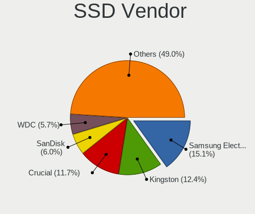
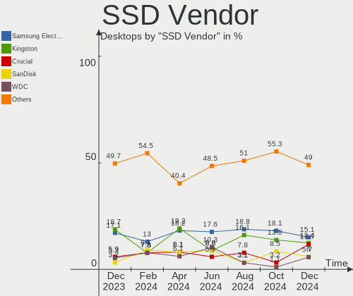
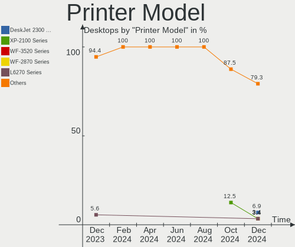
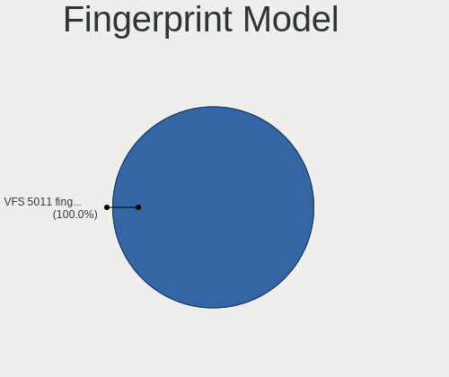
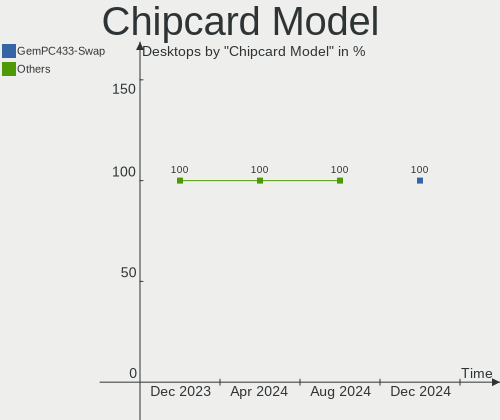

OpenMandriva Hardware Trends (Desktops)
---------------------------------------

A project to identify most popular hardware characteristics and track their change
over time based on data collected by OpenMandriva users at https://Linux-Hardware.org.

Anyone can contribute to this report by the [hw-probe](https://github.com/linuxhw/hw-probe) tool:

    sudo -E hw-probe -all -upload

Full-feature report is available here: https://linux-hardware.org/?view=trends

Period: Feb, 2022.

Contents
--------

* [ System ](#system)
  - [ OS                       ](#os)
  - [ OS Family                ](#os-family)
  - [ Kernel                   ](#kernel)
  - [ Kernel Family            ](#kernel-family)
  - [ Kernel Major Ver.        ](#kernel-major-ver)
  - [ Arch                     ](#arch)
  - [ DE                       ](#de)
  - [ Display Server           ](#display-server)
  - [ Display Manager          ](#display-manager)
  - [ OS Lang                  ](#os-lang)
  - [ Boot Mode                ](#boot-mode)
  - [ Filesystem               ](#filesystem)
  - [ Part. scheme             ](#part-scheme)
  - [ Dual Boot with Linux/BSD ](#dual-boot-with-linuxbsd)
  - [ Dual Boot (Win)          ](#dual-boot-win)

* [ Board ](#board)
  - [ Vendor                   ](#vendor)
  - [ Model                    ](#model)
  - [ Model Family             ](#model-family)
  - [ MFG Year                 ](#mfg-year)
  - [ Form Factor              ](#form-factor)
  - [ Secure Boot              ](#secure-boot)
  - [ Coreboot                 ](#coreboot)
  - [ RAM Size                 ](#ram-size)
  - [ RAM Used                 ](#ram-used)
  - [ Total Drives             ](#total-drives)
  - [ Has CD-ROM               ](#has-cd-rom)
  - [ Has Ethernet             ](#has-ethernet)
  - [ Has WiFi                 ](#has-wifi)
  - [ Has Bluetooth            ](#has-bluetooth)

* [ Location ](#location)
  - [ Country                  ](#country)
  - [ City                     ](#city)

* [ Drives ](#drives)
  - [ Drive Vendor             ](#drive-vendor)
  - [ Drive Model              ](#drive-model)
  - [ HDD Vendor               ](#hdd-vendor)
  - [ SSD Vendor               ](#ssd-vendor)
  - [ Drive Kind               ](#drive-kind)
  - [ Drive Connector          ](#drive-connector)
  - [ Drive Size               ](#drive-size)
  - [ Space Total              ](#space-total)
  - [ Space Used               ](#space-used)
  - [ Malfunc. Drives          ](#malfunc-drives)
  - [ Malfunc. Drive Vendor    ](#malfunc-drive-vendor)
  - [ Malfunc. HDD Vendor      ](#malfunc-hdd-vendor)
  - [ Malfunc. Drive Kind      ](#malfunc-drive-kind)
  - [ Failed Drives            ](#failed-drives)
  - [ Failed Drive Vendor      ](#failed-drive-vendor)
  - [ Drive Status             ](#drive-status)

* [ Storage controller ](#storage-controller)
  - [ Storage Vendor           ](#storage-vendor)
  - [ Storage Model            ](#storage-model)
  - [ Storage Kind             ](#storage-kind)

* [ Processor ](#processor)
  - [ CPU Vendor               ](#cpu-vendor)
  - [ CPU Model                ](#cpu-model)
  - [ CPU Model Family         ](#cpu-model-family)
  - [ CPU Cores                ](#cpu-cores)
  - [ CPU Sockets              ](#cpu-sockets)
  - [ CPU Threads              ](#cpu-threads)
  - [ CPU Op-Modes             ](#cpu-op-modes)
  - [ CPU Microcode            ](#cpu-microcode)
  - [ CPU Microarch            ](#cpu-microarch)

* [ Graphics ](#graphics)
  - [ GPU Vendor               ](#gpu-vendor)
  - [ GPU Model                ](#gpu-model)
  - [ GPU Combo                ](#gpu-combo)
  - [ GPU Driver               ](#gpu-driver)
  - [ GPU Memory               ](#gpu-memory)

* [ Monitor ](#monitor)
  - [ Monitor Vendor           ](#monitor-vendor)
  - [ Monitor Model            ](#monitor-model)
  - [ Monitor Resolution       ](#monitor-resolution)
  - [ Monitor Diagonal         ](#monitor-diagonal)
  - [ Monitor Width            ](#monitor-width)
  - [ Aspect Ratio             ](#aspect-ratio)
  - [ Monitor Area             ](#monitor-area)
  - [ Pixel Density            ](#pixel-density)
  - [ Multiple Monitors        ](#multiple-monitors)

* [ Network ](#network)
  - [ Net Controller Vendor    ](#net-controller-vendor)
  - [ Net Controller Model     ](#net-controller-model)
  - [ Wireless Vendor          ](#wireless-vendor)
  - [ Wireless Model           ](#wireless-model)
  - [ Ethernet Vendor          ](#ethernet-vendor)
  - [ Ethernet Model           ](#ethernet-model)
  - [ Net Controller Kind      ](#net-controller-kind)
  - [ Used Controller          ](#used-controller)
  - [ NICs                     ](#nics)
  - [ IPv6                     ](#ipv6)

* [ Bluetooth ](#bluetooth)
  - [ Bluetooth Vendor         ](#bluetooth-vendor)
  - [ Bluetooth Model          ](#bluetooth-model)

* [ Sound ](#sound)
  - [ Sound Vendor             ](#sound-vendor)
  - [ Sound Model              ](#sound-model)

* [ Memory ](#memory)
  - [ Memory Vendor            ](#memory-vendor)
  - [ Memory Model             ](#memory-model)
  - [ Memory Kind              ](#memory-kind)
  - [ Memory Form Factor       ](#memory-form-factor)
  - [ Memory Size              ](#memory-size)
  - [ Memory Speed             ](#memory-speed)

* [ Printers & scanners ](#printers--scanners)
  - [ Printer Vendor           ](#printer-vendor)
  - [ Printer Model            ](#printer-model)
  - [ Scanner Vendor           ](#scanner-vendor)
  - [ Scanner Model            ](#scanner-model)

* [ Camera ](#camera)
  - [ Camera Vendor            ](#camera-vendor)
  - [ Camera Model             ](#camera-model)

* [ Security ](#security)
  - [ Fingerprint Vendor       ](#fingerprint-vendor)
  - [ Fingerprint Model        ](#fingerprint-model)
  - [ Chipcard Vendor          ](#chipcard-vendor)
  - [ Chipcard Model           ](#chipcard-model)

* [ Unsupported ](#unsupported)
  - [ Unsupported Devices      ](#unsupported-devices)
  - [ Unsupported Device Types ](#unsupported-device-types)

System
------

OS
--

Installed operating systems

| Name              | Desktops | Percent |
|-------------------|----------|---------|
| OpenMandriva 4.3  | 655      | 90.85%  |
| OpenMandriva 4.2  | 57       | 7.91%   |
| OpenMandriva 4.50 | 9        | 1.25%   |

OS Family
---------

OS without a version

| Name         | Desktops | Percent |
|--------------|----------|---------|
| OpenMandriva | 721      | 100%    |

Kernel
------

Version of the Linux kernel

| Version                       | Desktops | Percent |
|-------------------------------|----------|---------|
| 5.16.7-desktop-1omv4003       | 652      | 90.43%  |
| 5.10.14-desktop-1omv4002      | 53       | 7.35%   |
| 5.12.4-desktop-1omv4050       | 6        | 0.83%   |
| 5.11.12-desktop-1omv4002      | 5        | 0.69%   |
| 5.16.7-desktop-clang-1omv4003 | 1        | 0.14%   |
| 5.16.5-desktop-2omv4003       | 1        | 0.14%   |
| 5.16.5-desktop-1omv4050       | 1        | 0.14%   |
| 5.16.3-desktop-2omv4050       | 1        | 0.14%   |
| 5.16.0-desktop-1omv4050       | 1        | 0.14%   |

Kernel Family
-------------

Linux kernel without a distro release

| Version | Desktops | Percent |
|---------|----------|---------|
| 5.16.7  | 653      | 90.57%  |
| 5.10.14 | 53       | 7.35%   |
| 5.12.4  | 6        | 0.83%   |
| 5.11.12 | 5        | 0.69%   |
| 5.16.5  | 2        | 0.28%   |
| 5.16.3  | 1        | 0.14%   |
| 5.16.0  | 1        | 0.14%   |

Kernel Major Ver.
-----------------

Linux kernel major version

| Version | Desktops | Percent |
|---------|----------|---------|
| 5.16    | 657      | 91.12%  |
| 5.10    | 53       | 7.35%   |
| 5.12    | 6        | 0.83%   |
| 5.11    | 5        | 0.69%   |

Arch
----

OS architecture (x86_64, i586, etc.)

| Name   | Desktops | Percent |
|--------|----------|---------|
| x86_64 | 721      | 100%    |

DE
--

Desktop Environment

| Name | Desktops | Percent |
|------|----------|---------|
| KDE5 | 721      | 100%    |

Display Server
--------------

X11 or Wayland

| Name    | Desktops | Percent |
|---------|----------|---------|
| X11     | 716      | 99.31%  |
| Wayland | 5        | 0.69%   |

Display Manager
---------------

SDDM, LightDM, etc.

| Name | Desktops | Percent |
|------|----------|---------|
| SDDM | 721      | 100%    |

OS Lang
-------

Language

| Lang  | Desktops | Percent |
|-------|----------|---------|
| en_US | 386      | 53.54%  |
| de_DE | 105      | 14.56%  |
| ru_RU | 48       | 6.66%   |
| fr_FR | 30       | 4.16%   |
| pt_BR | 19       | 2.64%   |
| en_GB | 19       | 2.64%   |
| it_IT | 18       | 2.5%    |
| pl_PL | 17       | 2.36%   |
| es_ES | 13       | 1.8%    |
| de_AT | 11       | 1.53%   |
| es_AR | 7        | 0.97%   |
| ru_UA | 5        | 0.69%   |
| en_AU | 4        | 0.55%   |
| nl_NL | 3        | 0.42%   |
| es_MX | 3        | 0.42%   |
| es_CO | 3        | 0.42%   |
| de_CH | 3        | 0.42%   |
| cs_CZ | 3        | 0.42%   |
| pt_PT | 2        | 0.28%   |
| hu_HU | 2        | 0.28%   |
| en_IN | 2        | 0.28%   |
| ar_SA | 2        | 0.28%   |
| uk_UA | 1        | 0.14%   |
| ro_RO | 1        | 0.14%   |
| fr_CA | 1        | 0.14%   |
| es_VE | 1        | 0.14%   |
| es_PY | 1        | 0.14%   |
| es_PE | 1        | 0.14%   |
| es_CR | 1        | 0.14%   |
| es_CL | 1        | 0.14%   |
| en_ZA | 1        | 0.14%   |
| en_IL | 1        | 0.14%   |
| en_HK | 1        | 0.14%   |
| en_CA | 1        | 0.14%   |
| da_DK | 1        | 0.14%   |
| ar_TN | 1        | 0.14%   |
| ar_EG | 1        | 0.14%   |
| ar_DZ | 1        | 0.14%   |

Boot Mode
---------

EFI or BIOS

| Mode | Desktops | Percent |
|------|----------|---------|
| BIOS | 379      | 52.57%  |
| EFI  | 342      | 47.43%  |

Filesystem
----------

Type of filesystem

| Type     | Desktops | Percent |
|----------|----------|---------|
| Overlay  | 631      | 87.52%  |
| Ext4     | 88       | 12.21%  |
| Reiserfs | 1        | 0.14%   |
| Btrfs    | 1        | 0.14%   |

Part. scheme
------------

Scheme of partitioning

| Type    | Desktops | Percent |
|---------|----------|---------|
| GPT     | 445      | 61.72%  |
| MBR     | 267      | 37.03%  |
| Unknown | 9        | 1.25%   |

Dual Boot with Linux/BSD
------------------------

Hosting more than one Linux/BSD

| Dual boot | Desktops | Percent |
|-----------|----------|---------|
| Yes       | 426      | 59.08%  |
| No        | 295      | 40.92%  |

Dual Boot (Win)
---------------

Hosting Linux and Windows

| Dual boot | Desktops | Percent |
|-----------|----------|---------|
| Yes       | 416      | 57.7%   |
| No        | 305      | 42.3%   |

Board
-----

Vendor
------

Motherboard manufacturer

| Name                | Desktops | Percent |
|---------------------|----------|---------|
| ASUSTek Computer    | 152      | 21.08%  |
| Gigabyte Technology | 134      | 18.59%  |
| MSI                 | 104      | 14.42%  |
| ASRock              | 70       | 9.71%   |
| Dell                | 61       | 8.46%   |
| Hewlett-Packard     | 57       | 7.91%   |
| Lenovo              | 23       | 3.19%   |
| Intel               | 18       | 2.5%    |
| Acer                | 15       | 2.08%   |
| Fujitsu             | 12       | 1.66%   |
| Biostar             | 10       | 1.39%   |
| Foxconn             | 7        | 0.97%   |
| Medion              | 6        | 0.83%   |
| Pegatron            | 5        | 0.69%   |
| ECS                 | 5        | 0.69%   |
| BESSTAR Tech        | 4        | 0.55%   |
| Shuttle             | 3        | 0.42%   |
| Positivo            | 3        | 0.42%   |
| Packard Bell        | 3        | 0.42%   |
| Alienware           | 3        | 0.42%   |
| Unknown             | 3        | 0.42%   |
| Inventec            | 2        | 0.28%   |
| Huanan              | 2        | 0.28%   |
| Gateway             | 2        | 0.28%   |
| Fujitsu Siemens     | 2        | 0.28%   |
| AZW                 | 2        | 0.28%   |
| Supermicro          | 1        | 0.14%   |
| PROLINE             | 1        | 0.14%   |
| Philco              | 1        | 0.14%   |
| PCWare              | 1        | 0.14%   |
| NEC Computers       | 1        | 0.14%   |
| MouseComputer       | 1        | 0.14%   |
| MCJ                 | 1        | 0.14%   |
| Kennex              | 1        | 0.14%   |
| HARDKERNEL          | 1        | 0.14%   |
| Digitron            | 1        | 0.14%   |
| Digiboard           | 1        | 0.14%   |
| Centrium            | 1        | 0.14%   |
| AOpen               | 1        | 0.14%   |

Model
-----

Motherboard model

| Name                               | Desktops | Percent |
|------------------------------------|----------|---------|
| ASUS All Series                    | 16       | 2.22%   |
| Gigabyte H410M H V3                | 10       | 1.39%   |
| Dell OptiPlex 7010                 | 7        | 0.97%   |
| Dell OptiPlex 780                  | 6        | 0.83%   |
| MSI MS-7C91                        | 5        | 0.69%   |
| HP Compaq Pro 6300 SFF             | 5        | 0.69%   |
| Dell OptiPlex 9020                 | 5        | 0.69%   |
| Dell OptiPlex 790                  | 5        | 0.69%   |
| MSI MS-7C84                        | 4        | 0.55%   |
| MSI MS-7C02                        | 4        | 0.55%   |
| MSI MS-7B79                        | 4        | 0.55%   |
| MSI MS-7A38                        | 4        | 0.55%   |
| MSI MS-7693                        | 4        | 0.55%   |
| ASUS TUF GAMING B550M-PLUS         | 4        | 0.55%   |
| ASUS SABERTOOTH Z77                | 4        | 0.55%   |
| MSI MS-7C56                        | 3        | 0.42%   |
| MSI MS-7C37                        | 3        | 0.42%   |
| HP EliteDesk 800 G1 USDT           | 3        | 0.42%   |
| Gigabyte Z390 AORUS PRO WIFI       | 3        | 0.42%   |
| Gigabyte B450M DS3H                | 3        | 0.42%   |
| Gigabyte 970A-DS3P                 | 3        | 0.42%   |
| Dell Precision T3610               | 3        | 0.42%   |
| Dell OptiPlex 755                  | 3        | 0.42%   |
| ASUS PRIME X570-P                  | 3        | 0.42%   |
| ASUS PRIME B450M-A                 | 3        | 0.42%   |
| ASUS PRIME A320M-K                 | 3        | 0.42%   |
| Unknown                            | 3        | 0.42%   |
| MSI MS-7C51                        | 2        | 0.28%   |
| MSI MS-7B98                        | 2        | 0.28%   |
| MSI MS-7B84                        | 2        | 0.28%   |
| MSI MS-7A36                        | 2        | 0.28%   |
| MSI MS-7974                        | 2        | 0.28%   |
| MSI MS-7788                        | 2        | 0.28%   |
| MSI MS-7758                        | 2        | 0.28%   |
| MSI MS-7721                        | 2        | 0.28%   |
| MSI MS-7529                        | 2        | 0.28%   |
| MSI MS-7345                        | 2        | 0.28%   |
| Intel H61                          | 2        | 0.28%   |
| Intel H55                          | 2        | 0.28%   |
| HP Z820 Workstation                | 2        | 0.28%   |
| HP Z400 Workstation                | 2        | 0.28%   |
| HP ProDesk 400 G7 Microtower PC    | 2        | 0.28%   |
| HP Pavilion Desktop 590-p0xxx      | 2        | 0.28%   |
| HP EliteDesk 800 G1 SFF            | 2        | 0.28%   |
| HP Compaq Pro 6300 MT              | 2        | 0.28%   |
| HP Compaq Elite 8300 SFF           | 2        | 0.28%   |
| HP Compaq dc7900 Small Form Factor | 2        | 0.28%   |
| HP Compaq 8200 Elite CMT PC        | 2        | 0.28%   |
| HP Compaq 8100 Elite SFF PC        | 2        | 0.28%   |
| HP Compaq 8100 Elite CMT PC        | 2        | 0.28%   |
| Gigabyte Z97-HD3                   | 2        | 0.28%   |
| Gigabyte Z390 UD                   | 2        | 0.28%   |
| Gigabyte X570 AORUS ELITE          | 2        | 0.28%   |
| Gigabyte TERRA_PC                  | 2        | 0.28%   |
| Gigabyte H81M-D2V                  | 2        | 0.28%   |
| Gigabyte H310M M.2 2.0             | 2        | 0.28%   |
| Gigabyte GA-880GM-USB3             | 2        | 0.28%   |
| Gigabyte GA-78LMT-USB3 6.0         | 2        | 0.28%   |
| Gigabyte GA-78LMT-USB3             | 2        | 0.28%   |
| Gigabyte EP45-DS3L                 | 2        | 0.28%   |

Model Family
------------

Motherboard model prefix

| Name                   | Desktops | Percent |
|------------------------|----------|---------|
| Dell OptiPlex          | 42       | 5.83%   |
| HP Compaq              | 24       | 3.33%   |
| ASUS PRIME             | 24       | 3.33%   |
| ASUS All               | 16       | 2.22%   |
| Lenovo ThinkCentre     | 14       | 1.94%   |
| ASUS TUF               | 13       | 1.8%    |
| ASUS ROG               | 13       | 1.8%    |
| Acer Aspire            | 13       | 1.8%    |
| Gigabyte H410M         | 11       | 1.53%   |
| Fujitsu ESPRIMO        | 11       | 1.53%   |
| HP ProDesk             | 10       | 1.39%   |
| HP EliteDesk           | 9        | 1.25%   |
| Dell Precision         | 8        | 1.11%   |
| ASUS M5A78L-M          | 7        | 0.97%   |
| Gigabyte Z390          | 6        | 0.83%   |
| Gigabyte B450M         | 6        | 0.83%   |
| MSI MS-7C91            | 5        | 0.69%   |
| HP Pavilion            | 5        | 0.69%   |
| Dell Inspiron          | 5        | 0.69%   |
| ASUS SABERTOOTH        | 5        | 0.69%   |
| MSI MS-7C84            | 4        | 0.55%   |
| MSI MS-7C02            | 4        | 0.55%   |
| MSI MS-7B79            | 4        | 0.55%   |
| MSI MS-7A38            | 4        | 0.55%   |
| MSI MS-7693            | 4        | 0.55%   |
| Gigabyte X570          | 4        | 0.55%   |
| Gigabyte GA-78LMT-USB3 | 4        | 0.55%   |
| ASRock B450            | 4        | 0.55%   |
| MSI MS-7C56            | 3        | 0.42%   |
| MSI MS-7C37            | 3        | 0.42%   |
| Lenovo IdeaCentre      | 3        | 0.42%   |
| Gigabyte H310M         | 3        | 0.42%   |
| Gigabyte B450          | 3        | 0.42%   |
| Gigabyte 970A-DS3P     | 3        | 0.42%   |
| Dell XPS               | 3        | 0.42%   |
| Dell Vostro            | 3        | 0.42%   |
| ASUS P8H61-M           | 3        | 0.42%   |
| ASUS P5Q               | 3        | 0.42%   |
| ASUS M5A97             | 3        | 0.42%   |
| ASRock X570            | 3        | 0.42%   |
| ASRock B450M           | 3        | 0.42%   |
| ASRock A320M-HDV       | 3        | 0.42%   |
| ASRock 970             | 3        | 0.42%   |
| Unknown                | 3        | 0.42%   |
| Packard Bell IMEDIA    | 2        | 0.28%   |
| MSI MS-7C51            | 2        | 0.28%   |
| MSI MS-7B98            | 2        | 0.28%   |
| MSI MS-7B84            | 2        | 0.28%   |
| MSI MS-7A36            | 2        | 0.28%   |
| MSI MS-7974            | 2        | 0.28%   |
| MSI MS-7788            | 2        | 0.28%   |
| MSI MS-7758            | 2        | 0.28%   |
| MSI MS-7721            | 2        | 0.28%   |
| MSI MS-7529            | 2        | 0.28%   |
| MSI MS-7345            | 2        | 0.28%   |
| Lenovo ThinkStation    | 2        | 0.28%   |
| Intel H61              | 2        | 0.28%   |
| Intel H55              | 2        | 0.28%   |
| Intel DG45ID           | 2        | 0.28%   |
| HP Z820                | 2        | 0.28%   |

MFG Year
--------

Motherboard manufacture year

| Year | Desktops | Percent |
|------|----------|---------|
| 2012 | 86       | 11.93%  |
| 2013 | 71       | 9.85%   |
| 2018 | 69       | 9.57%   |
| 2011 | 58       | 8.04%   |
| 2020 | 56       | 7.77%   |
| 2019 | 55       | 7.63%   |
| 2014 | 52       | 7.21%   |
| 2021 | 46       | 6.38%   |
| 2010 | 45       | 6.24%   |
| 2009 | 39       | 5.41%   |
| 2017 | 35       | 4.85%   |
| 2015 | 32       | 4.44%   |
| 2008 | 24       | 3.33%   |
| 2016 | 23       | 3.19%   |
| 2007 | 22       | 3.05%   |
| 2006 | 6        | 0.83%   |
| 2022 | 1        | 0.14%   |
| 2005 | 1        | 0.14%   |

Form Factor
-----------

Physical design of the computer

| Name    | Desktops | Percent |
|---------|----------|---------|
| Desktop | 721      | 100%    |

Secure Boot
-----------

Enabled or disabled

| State    | Desktops | Percent |
|----------|----------|---------|
| Disabled | 721      | 100%    |

Coreboot
--------

Have coreboot on board

| Used | Desktops | Percent |
|------|----------|---------|
| No   | 721      | 100%    |

RAM Size
--------

Total RAM memory

| Size in GB      | Desktops | Percent |
|-----------------|----------|---------|
| 16.01-24.0      | 177      | 24.55%  |
| 8.01-16.0       | 162      | 22.47%  |
| 4.01-8.0        | 155      | 21.5%   |
| 3.01-4.0        | 100      | 13.87%  |
| 32.01-64.0      | 78       | 10.82%  |
| 24.01-32.0      | 18       | 2.5%    |
| 1.01-2.0        | 16       | 2.22%   |
| 64.01-256.0     | 10       | 1.39%   |
| 2.01-3.0        | 3        | 0.42%   |
| More than 256.0 | 2        | 0.28%   |

RAM Used
--------

Used RAM memory

| Used GB    | Desktops | Percent |
|------------|----------|---------|
| 1.01-2.0   | 514      | 71.29%  |
| 0.51-1.0   | 132      | 18.31%  |
| 2.01-3.0   | 51       | 7.07%   |
| 0.01-0.5   | 12       | 1.66%   |
| 3.01-4.0   | 5        | 0.69%   |
| 4.01-8.0   | 3        | 0.42%   |
| 8.01-16.0  | 3        | 0.42%   |
| 16.01-24.0 | 1        | 0.14%   |

Total Drives
------------

Number of drives on board

| Drives | Desktops | Percent |
|--------|----------|---------|
| 1      | 271      | 37.59%  |
| 2      | 212      | 29.4%   |
| 3      | 102      | 14.15%  |
| 4      | 64       | 8.88%   |
| 5      | 25       | 3.47%   |
| 0      | 18       | 2.5%    |
| 6      | 13       | 1.8%    |
| 8      | 5        | 0.69%   |
| 7      | 5        | 0.69%   |
| 9      | 3        | 0.42%   |
| 15     | 1        | 0.14%   |
| 12     | 1        | 0.14%   |
| 10     | 1        | 0.14%   |

Has CD-ROM
----------

Has CD-ROM on board

| Presented | Desktops | Percent |
|-----------|----------|---------|
| Yes       | 413      | 57.28%  |
| No        | 308      | 42.72%  |

Has Ethernet
------------

Has Ethernet on board

| Presented | Desktops | Percent |
|-----------|----------|---------|
| Yes       | 715      | 99.17%  |
| No        | 6        | 0.83%   |

Has WiFi
--------

Has WiFi module

| Presented | Desktops | Percent |
|-----------|----------|---------|
| No        | 464      | 64.36%  |
| Yes       | 257      | 35.64%  |

Has Bluetooth
-------------

Has Bluetooth module

| Presented | Desktops | Percent |
|-----------|----------|---------|
| No        | 545      | 75.59%  |
| Yes       | 176      | 24.41%  |

Location
--------

Country
-------

Geographic location (country)

| Country                | Desktops | Percent |
|------------------------|----------|---------|
| Germany                | 143      | 19.83%  |
| USA                    | 94       | 13.04%  |
| Russia                 | 49       | 6.8%    |
| France                 | 42       | 5.83%   |
| Poland                 | 36       | 4.99%   |
| Brazil                 | 36       | 4.99%   |
| Italy                  | 30       | 4.16%   |
| UK                     | 22       | 3.05%   |
| Canada                 | 22       | 3.05%   |
| Spain                  | 20       | 2.77%   |
| Australia              | 20       | 2.77%   |
| Ukraine                | 18       | 2.5%    |
| Austria                | 14       | 1.94%   |
| India                  | 13       | 1.8%    |
| Japan                  | 9        | 1.25%   |
| Netherlands            | 8        | 1.11%   |
| Mexico                 | 7        | 0.97%   |
| Switzerland            | 6        | 0.83%   |
| Romania                | 6        | 0.83%   |
| Israel                 | 6        | 0.83%   |
| Indonesia              | 6        | 0.83%   |
| Argentina              | 6        | 0.83%   |
| Serbia                 | 5        | 0.69%   |
| Portugal               | 5        | 0.69%   |
| Hungary                | 5        | 0.69%   |
| Turkey                 | 4        | 0.55%   |
| Sweden                 | 4        | 0.55%   |
| Czechia                | 4        | 0.55%   |
| Algeria                | 4        | 0.55%   |
| Uruguay                | 3        | 0.42%   |
| Thailand               | 3        | 0.42%   |
| South Africa           | 3        | 0.42%   |
| Slovakia               | 3        | 0.42%   |
| Saudi Arabia           | 3        | 0.42%   |
| Pakistan               | 3        | 0.42%   |
| Denmark                | 3        | 0.42%   |
| Croatia                | 3        | 0.42%   |
| Colombia               | 3        | 0.42%   |
| China                  | 3        | 0.42%   |
| Bosnia and Herzegovina | 3        | 0.42%   |
| Belgium                | 3        | 0.42%   |
| Belarus                | 3        | 0.42%   |
| Venezuela              | 2        | 0.28%   |
| Tanzania               | 2        | 0.28%   |
| Taiwan                 | 2        | 0.28%   |
| Slovenia               | 2        | 0.28%   |
| Paraguay               | 2        | 0.28%   |
| Kazakhstan             | 2        | 0.28%   |
| Greece                 | 2        | 0.28%   |
| Finland                | 2        | 0.28%   |
| Egypt                  | 2        | 0.28%   |
| Bulgaria               | 2        | 0.28%   |
| UAE                    | 1        | 0.14%   |
| Tunisia                | 1        | 0.14%   |
| Singapore              | 1        | 0.14%   |
| Philippines            | 1        | 0.14%   |
| Peru                   | 1        | 0.14%   |
| Norway                 | 1        | 0.14%   |
| Morocco                | 1        | 0.14%   |
| Malaysia               | 1        | 0.14%   |

City
----

Geographic location (city)

| City                | Desktops | Percent |
|---------------------|----------|---------|
| Moscow              | 9        | 1.25%   |
| Berlin              | 9        | 1.25%   |
| Gonikoppal          | 8        | 1.11%   |
| Warsaw              | 6        | 0.83%   |
| Vienna              | 6        | 0.83%   |
| São Paulo        | 6        | 0.83%   |
| Kyiv                | 6        | 0.83%   |
| Brisbane            | 6        | 0.83%   |
| Nuremberg           | 5        | 0.69%   |
| Milan               | 5        | 0.69%   |
| Hamburg             | 5        | 0.69%   |
| Yekaterinburg       | 4        | 0.55%   |
| St Petersburg       | 4        | 0.55%   |
| Paris               | 4        | 0.55%   |
| Munich              | 4        | 0.55%   |
| Jakarta             | 4        | 0.55%   |
| Istanbul            | 4        | 0.55%   |
| Zagreb              | 3        | 0.42%   |
| Wiesbaden           | 3        | 0.42%   |
| Tel Aviv            | 3        | 0.42%   |
| Strzyzow            | 3        | 0.42%   |
| Rome                | 3        | 0.42%   |
| Regensburg          | 3        | 0.42%   |
| Phoenix             | 3        | 0.42%   |
| Melbourne           | 3        | 0.42%   |
| Lexington           | 3        | 0.42%   |
| Jeddah              | 3        | 0.42%   |
| Duque de Caxias     | 3        | 0.42%   |
| Belgrade            | 3        | 0.42%   |
| Barcelona           | 3        | 0.42%   |
| Wroclaw             | 2        | 0.28%   |
| Waren               | 2        | 0.28%   |
| Voronezh            | 2        | 0.28%   |
| Volgograd           | 2        | 0.28%   |
| Virginia Beach      | 2        | 0.28%   |
| Turin               | 2        | 0.28%   |
| Sydney              | 2        | 0.28%   |
| St Louis            | 2        | 0.28%   |
| Seville             | 2        | 0.28%   |
| San Marcos          | 2        | 0.28%   |
| Samara              | 2        | 0.28%   |
| Saint-Brieuc        | 2        | 0.28%   |
| Rochester           | 2        | 0.28%   |
| Regina              | 2        | 0.28%   |
| Peterborough        | 2        | 0.28%   |
| Osasco              | 2        | 0.28%   |
| Novosibirsk         | 2        | 0.28%   |
| Norderstedt         | 2        | 0.28%   |
| Norcross            | 2        | 0.28%   |
| Netishyn            | 2        | 0.28%   |
| Montigny-en-Gohelle | 2        | 0.28%   |
| Montevideo          | 2        | 0.28%   |
| Mission             | 2        | 0.28%   |
| Mexico City         | 2        | 0.28%   |
| Marseille           | 2        | 0.28%   |
| Madrid              | 2        | 0.28%   |
| Lugano              | 2        | 0.28%   |
| Lisbon              | 2        | 0.28%   |
| Lincoln             | 2        | 0.28%   |
| Leipzig             | 2        | 0.28%   |

Drives
------

Drive Vendor
------------

Hard drive vendors

| Vendor              | Desktops | Drives | Percent |
|---------------------|----------|--------|---------|
| WDC                 | 253      | 336    | 19.17%  |
| Seagate             | 216      | 264    | 16.36%  |
| Samsung Electronics | 189      | 245    | 14.32%  |
| Crucial             | 86       | 99     | 6.52%   |
| Toshiba             | 79       | 83     | 5.98%   |
| Kingston            | 76       | 86     | 5.76%   |
| SanDisk             | 56       | 68     | 4.24%   |
| Hitachi             | 37       | 38     | 2.8%    |
| A-DATA Technology   | 37       | 42     | 2.8%    |
| Unknown             | 15       | 20     | 1.14%   |
| SPCC                | 13       | 16     | 0.98%   |
| PNY                 | 13       | 21     | 0.98%   |
| HGST                | 13       | 15     | 0.98%   |
| China               | 13       | 15     | 0.98%   |
| Intel               | 11       | 11     | 0.83%   |
| Intenso             | 10       | 11     | 0.76%   |
| OCZ                 | 9        | 9      | 0.68%   |
| GOODRAM             | 9        | 9      | 0.68%   |
| Phison              | 8        | 9      | 0.61%   |
| MAXTOR              | 8        | 9      | 0.61%   |
| Gigabyte Technology | 8        | 8      | 0.61%   |
| Transcend           | 7        | 8      | 0.53%   |
| Patriot             | 7        | 7      | 0.53%   |
| Micron Technology   | 7        | 7      | 0.53%   |
| JMicron             | 7        | 7      | 0.53%   |
| ASMT                | 7        | 8      | 0.53%   |
| Apacer              | 7        | 7      | 0.53%   |
| Team                | 6        | 6      | 0.45%   |
| Hewlett-Packard     | 6        | 9      | 0.45%   |
| Corsair             | 6        | 7      | 0.45%   |
| Unknown             | 6        | 6      | 0.45%   |
| SK Hynix            | 5        | 5      | 0.38%   |
| Silicon Motion      | 5        | 5      | 0.38%   |
| Netac               | 5        | 6      | 0.38%   |
| KingSpec            | 5        | 5      | 0.38%   |
| XPG                 | 4        | 4      | 0.3%    |
| LITEON              | 4        | 4      | 0.3%    |
| KingFast            | 4        | 4      | 0.3%    |
| TO Exter            | 3        | 3      | 0.23%   |
| LITEONIT            | 3        | 3      | 0.23%   |
| KIOXIA-EXCERIA      | 3        | 3      | 0.23%   |
| WD MediaMax         | 2        | 3      | 0.15%   |
| Smartbuy            | 2        | 2      | 0.15%   |
| Realtek             | 2        | 2      | 0.15%   |
| PLEXTOR             | 2        | 2      | 0.15%   |
| Leven               | 2        | 2      | 0.15%   |
| KingDian            | 2        | 2      | 0.15%   |
| Colorful            | 2        | 2      | 0.15%   |
| Apple               | 2        | 2      | 0.15%   |
| ZTE                 | 1        | 1      | 0.08%   |
| ZHITAI              | 1        | 1      | 0.08%   |
| XrayDisk            | 1        | 1      | 0.08%   |
| WDC WDS2            | 1        | 1      | 0.08%   |
| V-GeN               | 1        | 1      | 0.08%   |
| TCSUNBOW            | 1        | 1      | 0.08%   |
| SABRENT             | 1        | 2      | 0.08%   |
| QUMO SSD            | 1        | 1      | 0.08%   |
| QUMO                | 1        | 1      | 0.08%   |
| QUANTUM             | 1        | 1      | 0.08%   |
| Phison Electronics  | 1        | 1      | 0.08%   |

Drive Model
-----------

Hard drive models

| Model                            | Desktops | Percent |
|----------------------------------|----------|---------|
| Seagate ST500DM002-1BD142 500GB  | 21       | 1.37%   |
| Seagate ST1000DM010-2EP102 1TB   | 20       | 1.31%   |
| Samsung SSD 860 EVO 500GB        | 15       | 0.98%   |
| Samsung SSD 860 EVO 250GB        | 14       | 0.92%   |
| Kingston SA400S37480G 480GB SSD  | 14       | 0.92%   |
| Kingston SA400S37240G 240GB SSD  | 14       | 0.92%   |
| Crucial CT500MX500SSD1 500GB     | 14       | 0.92%   |
| Crucial CT240BX500SSD1 240GB     | 14       | 0.92%   |
| WDC WD10EZEX-08WN4A0 1TB         | 13       | 0.85%   |
| Samsung SSD 850 EVO 250GB        | 13       | 0.85%   |
| Toshiba HDWD110 1TB              | 12       | 0.78%   |
| Toshiba DT01ACA100 1TB           | 12       | 0.78%   |
| Toshiba DT01ACA050 500GB         | 12       | 0.78%   |
| Seagate ST2000DM008-2FR102 2TB   | 12       | 0.78%   |
| WDC WDS240G2G0A-00JH30 240GB SSD | 11       | 0.72%   |
| Seagate ST1000DM003-1ER162 1TB   | 11       | 0.72%   |
| Kingston SA400S37120G 120GB SSD  | 10       | 0.65%   |
| Crucial CT1000MX500SSD1 1TB      | 9        | 0.59%   |
| SanDisk SDSSDA240G 240GB         | 8        | 0.52%   |
| Samsung SSD 850 EVO 500GB        | 8        | 0.52%   |
| Kingston SV300S37A120G 120GB SSD | 8        | 0.52%   |
| A-DATA SU750 256GB SSD           | 8        | 0.52%   |
| Seagate ST2000DM001-1ER164 2TB   | 7        | 0.46%   |
| Samsung SSD 970 EVO Plus 500GB   | 7        | 0.46%   |
| Crucial CT480BX500SSD1 480GB     | 7        | 0.46%   |
| Crucial CT1000P1SSD8 1TB         | 7        | 0.46%   |
| Unknown SD/MMC/MS PRO 64GB       | 6        | 0.39%   |
| Toshiba DT01ACA200 2TB           | 6        | 0.39%   |
| Seagate ST3500418AS 500GB        | 6        | 0.39%   |
| Seagate ST2000DM006-2DM164 2TB   | 6        | 0.39%   |
| SanDisk SSD PLUS 240GB           | 6        | 0.39%   |
| Unknown                          | 6        | 0.39%   |
| WDC WD20EZRZ-00Z5HB0 2TB         | 5        | 0.33%   |
| WDC WD20EARX-00PASB0 2TB         | 5        | 0.33%   |
| WDC WD10EZEX-22MFCA0 1TB         | 5        | 0.33%   |
| SPCC Solid State Disk 256GB      | 5        | 0.33%   |
| Seagate ST31000528AS 1TB         | 5        | 0.33%   |
| Seagate ST250DM000-1BD141 250GB  | 5        | 0.33%   |
| Seagate ST1000DM003-1SB102 1TB   | 5        | 0.33%   |
| Seagate ST1000DM003-1CH162 1TB   | 5        | 0.33%   |
| SanDisk SSD PLUS 480GB           | 5        | 0.33%   |
| SanDisk SSD PLUS 1000GB          | 5        | 0.33%   |
| SanDisk SDSSDA120G 120GB         | 5        | 0.33%   |
| Samsung SSD 980 PRO 1TB          | 5        | 0.33%   |
| Samsung SSD 970 EVO Plus 1TB     | 5        | 0.33%   |
| Samsung SSD 970 EVO 500GB        | 5        | 0.33%   |
| Samsung SSD 870 QVO 1TB          | 5        | 0.33%   |
| Samsung HD103SI 1TB              | 5        | 0.33%   |
| Kingston SA2000M8500G 500GB      | 5        | 0.33%   |
| Crucial CT120BX500SSD1 120GB     | 5        | 0.33%   |
| WDC WDS500G2B0C-00PXH0 500GB     | 4        | 0.26%   |
| WDC WDS120G2G0A-00JH30 120GB SSD | 4        | 0.26%   |
| WDC WD5000AAKX-00ERMA0 500GB     | 4        | 0.26%   |
| WDC WD10EZRX-00L4HB0 1TB         | 4        | 0.26%   |
| WDC WD10EZEX-60WN4A0 1TB         | 4        | 0.26%   |
| WDC WD10EZEX-00RKKA0 1TB         | 4        | 0.26%   |
| WDC WD10EZEX-00BN5A0 1TB         | 4        | 0.26%   |
| WDC WD10EALX-009BA0 1TB          | 4        | 0.26%   |
| SPCC M.2 PCIe SSD 256GB          | 4        | 0.26%   |
| Seagate ST3500413AS 500GB        | 4        | 0.26%   |

HDD Vendor
----------

Hard disk drive vendors

| Vendor              | Desktops | Drives | Percent |
|---------------------|----------|--------|---------|
| WDC                 | 218      | 278    | 34.17%  |
| Seagate             | 213      | 258    | 33.39%  |
| Toshiba             | 73       | 77     | 11.44%  |
| Samsung Electronics | 52       | 58     | 8.15%   |
| Hitachi             | 37       | 38     | 5.8%    |
| HGST                | 13       | 15     | 2.04%   |
| MAXTOR              | 8        | 9      | 1.25%   |
| Unknown             | 7        | 7      | 1.1%    |
| ASMT                | 4        | 5      | 0.63%   |
| WD MediaMax         | 2        | 3      | 0.31%   |
| Apple               | 2        | 2      | 0.31%   |
| SABRENT             | 1        | 2      | 0.16%   |
| QUANTUM             | 1        | 1      | 0.16%   |
| Magnetic Data       | 1        | 1      | 0.16%   |
| JMicron             | 1        | 1      | 0.16%   |
| Intenso             | 1        | 1      | 0.16%   |
| IBM/Hitachi         | 1        | 1      | 0.16%   |
| Fujitsu             | 1        | 1      | 0.16%   |
| Config              | 1        | 1      | 0.16%   |
| China               | 1        | 1      | 0.16%   |

SSD Vendor
----------

Solid state drive vendors

| Vendor              | Desktops | Drives | Percent |
|---------------------|----------|--------|---------|
| Samsung Electronics | 105      | 121    | 19.37%  |
| Crucial             | 73       | 81     | 13.47%  |
| Kingston            | 63       | 70     | 11.62%  |
| SanDisk             | 55       | 66     | 10.15%  |
| WDC                 | 32       | 36     | 5.9%    |
| A-DATA Technology   | 29       | 29     | 5.35%   |
| China               | 12       | 14     | 2.21%   |
| PNY                 | 11       | 17     | 2.03%   |
| SPCC                | 10       | 12     | 1.85%   |
| OCZ                 | 9        | 9      | 1.66%   |
| Intenso             | 8        | 9      | 1.48%   |
| Intel               | 8        | 8      | 1.48%   |
| GOODRAM             | 8        | 8      | 1.48%   |
| Micron Technology   | 7        | 7      | 1.29%   |
| Apacer              | 7        | 7      | 1.29%   |
| Transcend           | 6        | 7      | 1.11%   |
| Team                | 6        | 6      | 1.11%   |
| Unknown             | 6        | 6      | 1.11%   |
| Toshiba             | 5        | 5      | 0.92%   |
| Patriot             | 5        | 5      | 0.92%   |
| Netac               | 5        | 6      | 0.92%   |
| KingSpec            | 5        | 5      | 0.92%   |
| Gigabyte Technology | 5        | 5      | 0.92%   |
| LITEON              | 4        | 4      | 0.74%   |
| KingFast            | 4        | 4      | 0.74%   |
| Hewlett-Packard     | 4        | 6      | 0.74%   |
| TO Exter            | 3        | 3      | 0.55%   |
| SK Hynix            | 3        | 3      | 0.55%   |
| LITEONIT            | 3        | 3      | 0.55%   |
| ASMT                | 3        | 3      | 0.55%   |
| Unknown             | 2        | 2      | 0.37%   |
| Leven               | 2        | 2      | 0.37%   |
| KIOXIA-EXCERIA      | 2        | 2      | 0.37%   |
| KingDian            | 2        | 2      | 0.37%   |
| Corsair             | 2        | 2      | 0.37%   |
| Colorful            | 2        | 2      | 0.37%   |
| XrayDisk            | 1        | 1      | 0.18%   |
| WDC WDS2            | 1        | 1      | 0.18%   |
| V-GeN               | 1        | 1      | 0.18%   |
| TCSUNBOW            | 1        | 1      | 0.18%   |
| Smartbuy            | 1        | 1      | 0.18%   |
| Seagate             | 1        | 1      | 0.18%   |
| QUMO                | 1        | 1      | 0.18%   |
| ORTIAL              | 1        | 1      | 0.18%   |
| OCZ-AGIL            | 1        | 1      | 0.18%   |
| NGFF                | 1        | 1      | 0.18%   |
| Mushkin             | 1        | 1      | 0.18%   |
| MARSHAL             | 1        | 1      | 0.18%   |
| Kingmax             | 1        | 1      | 0.18%   |
| kimtigo             | 1        | 1      | 0.18%   |
| INNOVATION IT       | 1        | 1      | 0.18%   |
| GALAX               | 1        | 1      | 0.18%   |
| FOXLINE             | 1        | 1      | 0.18%   |
| EAGET               | 1        | 1      | 0.18%   |
| CFD                 | 1        | 1      | 0.18%   |
| BlitzWolf           | 1        | 1      | 0.18%   |
| BIWIN               | 1        | 1      | 0.18%   |
| Biostar             | 1        | 1      | 0.18%   |
| BAITITON            | 1        | 1      | 0.18%   |
| ANACOMDA            | 1        | 1      | 0.18%   |

Drive Kind
----------

HDD or SSD

| Kind    | Desktops | Drives | Percent |
|---------|----------|--------|---------|
| HDD     | 489      | 760    | 45.45%  |
| SSD     | 418      | 603    | 38.85%  |
| NVMe    | 153      | 200    | 14.22%  |
| Unknown | 13       | 18     | 1.21%   |
| MMC     | 3        | 3      | 0.28%   |

Drive Connector
---------------

SATA, SAS, NVMe, etc.

| Type | Desktops | Drives | Percent |
|------|----------|--------|---------|
| SATA | 667      | 1313   | 76.14%  |
| NVMe | 148      | 194    | 16.89%  |
| SAS  | 58       | 74     | 6.62%   |
| MMC  | 3        | 3      | 0.34%   |

Drive Size
----------

Size of hard drive

| Size in TB | Desktops | Drives | Percent |
|------------|----------|--------|---------|
| 0.01-0.5   | 530      | 795    | 54.3%   |
| 0.51-1.0   | 280      | 373    | 28.69%  |
| 1.01-2.0   | 98       | 114    | 10.04%  |
| 2.01-3.0   | 23       | 24     | 2.36%   |
| 3.01-4.0   | 20       | 27     | 2.05%   |
| 4.01-10.0  | 20       | 25     | 2.05%   |
| 10.01-20.0 | 5        | 5      | 0.51%   |

Space Total
-----------

Amount of disk space available on the file system

| Size in GB     | Desktops | Percent |
|----------------|----------|---------|
| 1-20           | 409      | 56.73%  |
| Unknown        | 91       | 12.62%  |
| 101-250        | 87       | 12.07%  |
| 251-500        | 45       | 6.24%   |
| 501-1000       | 29       | 4.02%   |
| 21-50          | 27       | 3.74%   |
| 51-100         | 16       | 2.22%   |
| 1001-2000      | 10       | 1.39%   |
| More than 3000 | 4        | 0.55%   |
| 2001-3000      | 3        | 0.42%   |

Space Used
----------

Amount of used disk space

| Used GB        | Desktops | Percent |
|----------------|----------|---------|
| 1-20           | 579      | 80.31%  |
| Unknown        | 91       | 12.62%  |
| 101-250        | 21       | 2.91%   |
| 21-50          | 8        | 1.11%   |
| 251-500        | 7        | 0.97%   |
| 51-100         | 7        | 0.97%   |
| 501-1000       | 4        | 0.55%   |
| More than 3000 | 2        | 0.28%   |
| 2001-3000      | 1        | 0.14%   |
| 1001-2000      | 1        | 0.14%   |

Malfunc. Drives
---------------

Drive models with a malfunction

| Model                             | Desktops | Drives | Percent |
|-----------------------------------|----------|--------|---------|
| Seagate ST500DM002-1BD142 500GB   | 9        | 9      | 3.72%   |
| WDC WDS240G2G0A-00JH30 240GB SSD  | 4        | 4      | 1.65%   |
| Seagate ST1000DM010-2EP102 1TB    | 4        | 4      | 1.65%   |
| WDC WD5000AADS-00S9B0 500GB       | 3        | 3      | 1.24%   |
| WDC WD10EZEX-08WN4A0 1TB          | 3        | 3      | 1.24%   |
| WDC WD10EALX-009BA0 1TB           | 3        | 3      | 1.24%   |
| Toshiba DT01ACA100 1TB            | 3        | 3      | 1.24%   |
| Toshiba DT01ACA050 500GB          | 3        | 3      | 1.24%   |
| Seagate ST380013AS 80GB           | 3        | 3      | 1.24%   |
| Seagate ST3320418AS 320GB         | 3        | 3      | 1.24%   |
| Seagate ST250DM000-1BD141 250GB   | 3        | 3      | 1.24%   |
| Seagate ST1000DM003-9YN162 1TB    | 3        | 3      | 1.24%   |
| Hitachi HDS721050CLA362 500GB     | 3        | 3      | 1.24%   |
| ASMT 2135 120GB SSD               | 3        | 3      | 1.24%   |
| WDC WD30EZRX-00MMMB0 3TB          | 2        | 2      | 0.83%   |
| WDC WD20EZRZ-00Z5HB0 2TB          | 2        | 2      | 0.83%   |
| WDC WD10EZEX-00RKKA0 1TB          | 2        | 2      | 0.83%   |
| Seagate ST33000651AS 3TB          | 2        | 2      | 0.83%   |
| Seagate ST2000DM006-2DM164 2TB    | 2        | 3      | 0.83%   |
| SanDisk SSD PLUS 480GB            | 2        | 2      | 0.83%   |
| Samsung Electronics HD753LJ 752GB | 2        | 2      | 0.83%   |
| Samsung Electronics HD322HJ 320GB | 2        | 2      | 0.83%   |
| Samsung Electronics HD161GJ 160GB | 2        | 2      | 0.83%   |
| Samsung Electronics HD154UI 1TB   | 2        | 2      | 0.83%   |
| Kingston SV300S37A120G 120GB SSD  | 2        | 2      | 0.83%   |
| Kingston SA400S37240G 240GB SSD   | 2        | 2      | 0.83%   |
| HGST HTS725050A7E630 500GB        | 2        | 2      | 0.83%   |
| WDC WDS480G2G0A-00JH30 480GB SSD  | 1        | 2      | 0.41%   |
| WDC WDS2 40G2G0A-00JH 240GB SSD   | 1        | 1      | 0.41%   |
| WDC WDS120G2G0A-00JH30 120GB SSD  | 1        | 1      | 0.41%   |
| WDC WDS100T2G0A-00JH30 1TB SSD    | 1        | 1      | 0.41%   |
| WDC WD7500BPVT-24HXZT3 752GB      | 1        | 1      | 0.41%   |
| WDC WD7500AARS-00Y5B1 752GB       | 1        | 1      | 0.41%   |
| WDC WD6400AAKS-65A7B2 640GB       | 1        | 1      | 0.41%   |
| WDC WD6400AAKS-22A7B2 640GB       | 1        | 1      | 0.41%   |
| WDC WD5000LPVX-22V0TT0 500GB      | 1        | 1      | 0.41%   |
| WDC WD5000LPVX-00V0TT0 500GB      | 1        | 1      | 0.41%   |
| WDC WD5000BPKT-60PK4T0 500GB      | 1        | 1      | 0.41%   |
| WDC WD5000BEVT-00ZAT0 500GB       | 1        | 1      | 0.41%   |
| WDC WD5000AZRX-00A8LB0 500GB      | 1        | 1      | 0.41%   |
| WDC WD5000AURX-63UY4Y0 500GB      | 1        | 1      | 0.41%   |
| WDC WD5000AAKX-75U6AA0 500GB      | 1        | 1      | 0.41%   |
| WDC WD5000AAKX-60U6AA0 500GB      | 1        | 1      | 0.41%   |
| WDC WD5000AAKX-00ERMA0 500GB      | 1        | 1      | 0.41%   |
| WDC WD5000AAKX-003CA0 500GB       | 1        | 1      | 0.41%   |
| WDC WD5000AAKX-001CA0 500GB       | 1        | 1      | 0.41%   |
| WDC WD5000AAKS-22A7B0 500GB       | 1        | 1      | 0.41%   |
| WDC WD5000AAKS-00V1A0 500GB       | 1        | 1      | 0.41%   |
| WDC WD5000AAJS-08A8B0 500GB       | 1        | 1      | 0.41%   |
| WDC WD5000AADS-00M2B0 500GB       | 1        | 1      | 0.41%   |
| WDC WD400BD-08JMC0 40GB           | 1        | 1      | 0.41%   |
| WDC WD367GD-00FLA1 37GB           | 1        | 1      | 0.41%   |
| WDC WD360GD-00FLA1 37GB           | 1        | 1      | 0.41%   |
| WDC WD3200BEVT-60A23T0 320GB      | 1        | 1      | 0.41%   |
| WDC WD3200AVVS-63L2B0 320GB       | 1        | 1      | 0.41%   |
| WDC WD3200AAKS-00UU3A0 320GB      | 1        | 1      | 0.41%   |
| WDC WD3200AAKS-00M9A0 320GB       | 1        | 1      | 0.41%   |
| WDC WD3200AAKS-00B3A0 320GB       | 1        | 1      | 0.41%   |
| WDC WD3200AAJS-00L7A0 320GB       | 1        | 1      | 0.41%   |
| WDC WD3200AAJS-00B4A0 320GB       | 1        | 1      | 0.41%   |

Malfunc. Drive Vendor
---------------------

Vendors of faulty drives

| Vendor              | Desktops | Drives | Percent |
|---------------------|----------|--------|---------|
| WDC                 | 68       | 76     | 29.31%  |
| Seagate             | 62       | 67     | 26.72%  |
| Samsung Electronics | 32       | 32     | 13.79%  |
| Hitachi             | 15       | 15     | 6.47%   |
| Toshiba             | 12       | 12     | 5.17%   |
| SanDisk             | 6        | 6      | 2.59%   |
| Kingston            | 5        | 5      | 2.16%   |
| HGST                | 5        | 6      | 2.16%   |
| MAXTOR              | 3        | 3      | 1.29%   |
| ASMT                | 3        | 3      | 1.29%   |
| A-DATA Technology   | 3        | 3      | 1.29%   |
| SPCC                | 2        | 2      | 0.86%   |
| Micron Technology   | 2        | 2      | 0.86%   |
| Intel               | 2        | 2      | 0.86%   |
| Crucial             | 2        | 2      | 0.86%   |
| WDC WDS2            | 1        | 1      | 0.43%   |
| Transcend           | 1        | 1      | 0.43%   |
| TO Exter            | 1        | 1      | 0.43%   |
| LITEON              | 1        | 1      | 0.43%   |
| Kingmax             | 1        | 1      | 0.43%   |
| KingDian            | 1        | 1      | 0.43%   |
| INNOVATION IT       | 1        | 1      | 0.43%   |
| IBM/Hitachi         | 1        | 1      | 0.43%   |
| Fujitsu             | 1        | 1      | 0.43%   |
| Unknown             | 1        | 1      | 0.43%   |

Malfunc. HDD Vendor
-------------------

Vendors of faulty HDD drives

| Vendor              | Desktops | Drives | Percent |
|---------------------|----------|--------|---------|
| WDC                 | 62       | 68     | 33.16%  |
| Seagate             | 62       | 67     | 33.16%  |
| Samsung Electronics | 26       | 26     | 13.9%   |
| Hitachi             | 15       | 15     | 8.02%   |
| Toshiba             | 12       | 12     | 6.42%   |
| HGST                | 5        | 6      | 2.67%   |
| MAXTOR              | 3        | 3      | 1.6%    |
| IBM/Hitachi         | 1        | 1      | 0.53%   |
| Fujitsu             | 1        | 1      | 0.53%   |

Malfunc. Drive Kind
-------------------

Kinds of faulty drives

| Kind | Desktops | Drives | Percent |
|------|----------|--------|---------|
| HDD  | 166      | 199    | 78.67%  |
| SSD  | 42       | 44     | 19.91%  |
| NVMe | 3        | 3      | 1.42%   |

Failed Drives
-------------

Failed drive models

| Model                             | Desktops | Drives | Percent |
|-----------------------------------|----------|--------|---------|
| WDC WD3200AAJS-60Z0A0 320GB       | 1        | 1      | 10%     |
| WDC WD10EALX-759BA1 1TB           | 1        | 1      | 10%     |
| Toshiba MK3256GSY 320GB           | 1        | 1      | 10%     |
| Seagate STM31000528AS 1TB         | 1        | 1      | 10%     |
| Seagate ST3160215A 160GB          | 1        | 1      | 10%     |
| Samsung Electronics SSD 980 500GB | 1        | 1      | 10%     |
| Samsung Electronics HM160HI 160GB | 1        | 1      | 10%     |
| Samsung Electronics HD103SJ 1TB   | 1        | 1      | 10%     |
| Hitachi HTS725050A7E630 500GB     | 1        | 1      | 10%     |
| GOODRAM SSDPR-PX500-256-80 256GB  | 1        | 1      | 10%     |

Failed Drive Vendor
-------------------

Failed drive vendors

| Vendor              | Desktops | Drives | Percent |
|---------------------|----------|--------|---------|
| Samsung Electronics | 3        | 3      | 30%     |
| WDC                 | 2        | 2      | 20%     |
| Seagate             | 2        | 2      | 20%     |
| Toshiba             | 1        | 1      | 10%     |
| Hitachi             | 1        | 1      | 10%     |
| GOODRAM             | 1        | 1      | 10%     |

Drive Status
------------

Number of failed and malfunc. drives

| Status   | Desktops | Drives | Percent |
|----------|----------|--------|---------|
| Works    | 609      | 1256   | 69.28%  |
| Malfunc  | 202      | 246    | 22.98%  |
| Detected | 59       | 72     | 6.71%   |
| Failed   | 9        | 10     | 1.02%   |

Storage controller
------------------

Storage Vendor
--------------

Storage controller vendors

| Vendor                           | Desktops | Percent |
|----------------------------------|----------|---------|
| Intel                            | 463      | 47.54%  |
| AMD                              | 234      | 24.02%  |
| Samsung Electronics              | 55       | 5.65%   |
| ASMedia Technology               | 29       | 2.98%   |
| Marvell Technology Group         | 24       | 2.46%   |
| Phison Electronics               | 22       | 2.26%   |
| Sandisk                          | 21       | 2.16%   |
| Nvidia                           | 20       | 2.05%   |
| JMicron Technology               | 18       | 1.85%   |
| Micron/Crucial Technology        | 15       | 1.54%   |
| Kingston Technology Company      | 15       | 1.54%   |
| Silicon Motion                   | 13       | 1.33%   |
| VIA Technologies                 | 8        | 0.82%   |
| ADATA Technology                 | 7        | 0.72%   |
| Realtek Semiconductor            | 6        | 0.62%   |
| Seagate Technology               | 4        | 0.41%   |
| Micron Technology                | 3        | 0.31%   |
| Integrated Technology Express    | 3        | 0.31%   |
| Broadcom / LSI                   | 3        | 0.31%   |
| SK Hynix                         | 2        | 0.21%   |
| Lite-On Technology               | 2        | 0.21%   |
| Yangtze Memory Technologies      | 1        | 0.1%    |
| Unknown                          | 1        | 0.1%    |
| Toshiba America Info Systems     | 1        | 0.1%    |
| Silicon Integrated Systems [SiS] | 1        | 0.1%    |
| Silicon Image                    | 1        | 0.1%    |
| Shenzhen Longsys Electronics     | 1        | 0.1%    |
| KIOXIA                           | 1        | 0.1%    |

Storage Model
-------------

Storage controller models

| Model                                                                                   | Desktops | Percent |
|-----------------------------------------------------------------------------------------|----------|---------|
| AMD FCH SATA Controller [AHCI mode]                                                     | 119      | 9.7%    |
| Intel 8 Series/C220 Series Chipset Family 6-port SATA Controller 1 [AHCI mode]          | 75       | 6.11%   |
| AMD 400 Series Chipset SATA Controller                                                  | 47       | 3.83%   |
| AMD SB7x0/SB8x0/SB9x0 IDE Controller                                                    | 44       | 3.59%   |
| AMD SB7x0/SB8x0/SB9x0 SATA Controller [AHCI mode]                                       | 42       | 3.42%   |
| Intel 7 Series/C210 Series Chipset Family 6-port SATA Controller [AHCI mode]            | 41       | 3.34%   |
| Samsung NVMe SSD Controller SM981/PM981/PM983                                           | 34       | 2.77%   |
| Intel 6 Series/C200 Series Chipset Family 6 port Desktop SATA AHCI Controller           | 32       | 2.61%   |
| Intel 200 Series PCH SATA controller [AHCI mode]                                        | 27       | 2.2%    |
| AMD Starship/Matisse Chipset SATA Controller [AHCI mode]                                | 27       | 2.2%    |
| Intel SATA Controller [RAID mode]                                                       | 26       | 2.12%   |
| Intel Q170/Q150/B150/H170/H110/Z170/CM236 Chipset SATA Controller [AHCI Mode]           | 26       | 2.12%   |
| Intel Cannon Lake PCH SATA AHCI Controller                                              | 26       | 2.12%   |
| ASMedia ASM1062 Serial ATA Controller                                                   | 25       | 2.04%   |
| AMD SB7x0/SB8x0/SB9x0 SATA Controller [IDE mode]                                        | 24       | 1.96%   |
| Intel NM10/ICH7 Family SATA Controller [IDE mode]                                       | 22       | 1.79%   |
| Intel 6 Series/C200 Series Chipset Family Desktop SATA Controller (IDE mode, ports 4-5) | 22       | 1.79%   |
| Intel 6 Series/C200 Series Chipset Family Desktop SATA Controller (IDE mode, ports 0-3) | 22       | 1.79%   |
| Intel 500 Series Chipset Family SATA AHCI Controller                                    | 21       | 1.71%   |
| AMD FCH SATA Controller D                                                               | 18       | 1.47%   |
| Intel 5 Series/3400 Series Chipset 6 port SATA AHCI Controller                          | 16       | 1.3%    |
| Phison E12 NVMe Controller                                                              | 15       | 1.22%   |
| Nvidia MCP61 SATA Controller                                                            | 15       | 1.22%   |
| Nvidia MCP61 IDE                                                                        | 13       | 1.06%   |
| Intel 82801G (ICH7 Family) IDE Controller                                               | 13       | 1.06%   |
| Intel 4 Series Chipset PT IDER Controller                                               | 13       | 1.06%   |
| Intel 82801JI (ICH10 Family) 4 port SATA IDE Controller #1                              | 12       | 0.98%   |
| Intel 82801JI (ICH10 Family) 2 port SATA IDE Controller #2                              | 12       | 0.98%   |
| Samsung NVMe SSD Controller PM9A1/PM9A3/980PRO                                          | 11       | 0.9%    |
| Intel 82801I (ICH9 Family) 2 port SATA Controller [IDE mode]                            | 11       | 0.9%    |
| Silicon Motion SM2263EN/SM2263XT SSD Controller                                         | 10       | 0.81%   |
| Kingston Company A2000 NVMe SSD                                                         | 10       | 0.81%   |
| JMicron JMB363 SATA/IDE Controller                                                      | 10       | 0.81%   |
| Samsung NVMe SSD Controller 980                                                         | 9        | 0.73%   |
| Intel 82801IR/IO/IH (ICH9R/DO/DH) 4 port SATA Controller [IDE mode]                     | 9        | 0.73%   |
| Intel 5 Series/3400 Series Chipset 4 port SATA IDE Controller                           | 9        | 0.73%   |
| Intel C600/X79 series chipset 6-Port SATA AHCI Controller                               | 8        | 0.65%   |
| Intel 5 Series/3400 Series Chipset 2 port SATA IDE Controller                           | 8        | 0.65%   |
| Intel 400 Series Chipset Family SATA AHCI Controller                                    | 8        | 0.65%   |
| Sandisk WD Blue SN550 NVMe SSD                                                          | 7        | 0.57%   |
| Marvell Group 88SE6111/6121 SATA II / PATA Controller                                   | 7        | 0.57%   |
| Intel 82801JI (ICH10 Family) SATA AHCI Controller                                       | 7        | 0.57%   |
| AMD FCH SATA Controller [IDE mode]                                                      | 7        | 0.57%   |
| AMD FCH IDE Controller                                                                  | 7        | 0.57%   |
| Samsung NVMe SSD Controller SM961/PM961/SM963                                           | 6        | 0.49%   |
| Micron/Crucial P1 NVMe PCIe SSD                                                         | 6        | 0.49%   |
| JMicron JMB368 IDE controller                                                           | 6        | 0.49%   |
| Intel Comet Lake SATA AHCI Controller                                                   | 6        | 0.49%   |
| Intel 9 Series Chipset Family SATA Controller [AHCI Mode]                               | 6        | 0.49%   |
| Intel 82801JD/DO (ICH10 Family) SATA AHCI Controller                                    | 6        | 0.49%   |
| Intel 82801JD/DO (ICH10 Family) 4-port SATA IDE Controller                              | 6        | 0.49%   |
| Intel 82801JD/DO (ICH10 Family) 2-port SATA IDE Controller                              | 6        | 0.49%   |
| AMD 300 Series Chipset SATA Controller                                                  | 6        | 0.49%   |
| Sandisk WD Black SN750 / PC SN730 NVMe SSD                                              | 5        | 0.41%   |
| Micron/Crucial P2 NVMe PCIe SSD                                                         | 5        | 0.41%   |
| Marvell Group 88SE9172 SATA 6Gb/s Controller                                            | 5        | 0.41%   |
| Intel Celeron/Pentium Silver Processor SATA Controller                                  | 5        | 0.41%   |
| Intel 7 Series/C210 Series Chipset Family 4-port SATA Controller [IDE mode]             | 5        | 0.41%   |
| Intel 7 Series/C210 Series Chipset Family 2-port SATA Controller [IDE mode]             | 5        | 0.41%   |
| ADATA XPG SX8200 Pro PCIe Gen3x4 M.2 2280 Solid State Drive                             | 5        | 0.41%   |

Storage Kind
------------

Kind of storage controller (IDE, SATA, NVMe, SAS, ...)

| Kind | Desktops | Percent |
|------|----------|---------|
| SATA | 574      | 60.29%  |
| IDE  | 191      | 20.06%  |
| NVMe | 147      | 15.44%  |
| RAID | 36       | 3.78%   |
| SAS  | 4        | 0.42%   |

Processor
---------

CPU Vendor
----------

Processor vendors

| Vendor | Desktops | Percent |
|--------|----------|---------|
| Intel  | 466      | 64.63%  |
| AMD    | 255      | 35.37%  |

CPU Model
---------

Processor models

| Model                                       | Desktops | Percent |
|---------------------------------------------|----------|---------|
| Intel Core i5-10400 CPU @ 2.90GHz           | 16       | 2.22%   |
| Intel Core i5-3470 CPU @ 3.20GHz            | 13       | 1.8%    |
| AMD Ryzen 7 3700X 8-Core Processor          | 12       | 1.66%   |
| Intel Core i5-2400 CPU @ 3.10GHz            | 11       | 1.53%   |
| AMD Ryzen 5 3600 6-Core Processor           | 11       | 1.53%   |
| Intel Core i5-4570 CPU @ 3.20GHz            | 10       | 1.39%   |
| Intel Core 2 Duo CPU E8400 @ 3.00GHz        | 10       | 1.39%   |
| AMD Ryzen 5 5600X 6-Core Processor          | 10       | 1.39%   |
| Intel Core i7-3770 CPU @ 3.40GHz            | 9        | 1.25%   |
| Intel Core i5 CPU 650 @ 3.20GHz             | 8        | 1.11%   |
| Intel Core i7-8700 CPU @ 3.20GHz            | 7        | 0.97%   |
| Intel Core i7-2600 CPU @ 3.40GHz            | 7        | 0.97%   |
| Intel Core i5-6500 CPU @ 3.20GHz            | 7        | 0.97%   |
| Intel Core i5-4590 CPU @ 3.30GHz            | 7        | 0.97%   |
| AMD Ryzen 5 3400G with Radeon Vega Graphics | 7        | 0.97%   |
| AMD Ryzen 3 3200G with Radeon Vega Graphics | 7        | 0.97%   |
| AMD FX-6300 Six-Core Processor              | 7        | 0.97%   |
| Intel Core i7-4790 CPU @ 3.60GHz            | 6        | 0.83%   |
| Intel Core i5-4460 CPU @ 3.20GHz            | 6        | 0.83%   |
| Intel Core i5-3570K CPU @ 3.40GHz           | 6        | 0.83%   |
| Intel Core i3-3220 CPU @ 3.30GHz            | 6        | 0.83%   |
| AMD Ryzen 5 5600G with Radeon Graphics      | 6        | 0.83%   |
| AMD Ryzen 5 1600 Six-Core Processor         | 6        | 0.83%   |
| AMD FX-8350 Eight-Core Processor            | 6        | 0.83%   |
| Intel Core i7-6700 CPU @ 3.40GHz            | 5        | 0.69%   |
| Intel Core i5-8400 CPU @ 2.80GHz            | 5        | 0.69%   |
| Intel Core i5-7400 CPU @ 3.00GHz            | 5        | 0.69%   |
| Intel Core i5-2500K CPU @ 3.30GHz           | 5        | 0.69%   |
| Intel Core i3-4130 CPU @ 3.40GHz            | 5        | 0.69%   |
| Intel Pentium Dual-Core CPU E5700 @ 3.00GHz | 4        | 0.55%   |
| Intel Pentium Dual-Core CPU E5300 @ 2.60GHz | 4        | 0.55%   |
| Intel Pentium Dual CPU E2200 @ 2.20GHz      | 4        | 0.55%   |
| Intel Core i7-10700 CPU @ 2.90GHz           | 4        | 0.55%   |
| Intel Core i5-9600K CPU @ 3.70GHz           | 4        | 0.55%   |
| Intel Core i5-6400 CPU @ 2.70GHz            | 4        | 0.55%   |
| Intel Core i3-4160 CPU @ 3.60GHz            | 4        | 0.55%   |
| Intel Core i3-3240 CPU @ 3.40GHz            | 4        | 0.55%   |
| Intel Core i3-2120 CPU @ 3.30GHz            | 4        | 0.55%   |
| Intel Core i3-2100 CPU @ 3.10GHz            | 4        | 0.55%   |
| Intel Core 2 Quad CPU Q9400 @ 2.66GHz       | 4        | 0.55%   |
| Intel Core 2 Quad CPU Q6600 @ 2.40GHz       | 4        | 0.55%   |
| Intel Core 2 Duo CPU E7500 @ 2.93GHz        | 4        | 0.55%   |
| AMD Ryzen 7 5800X 8-Core Processor          | 4        | 0.55%   |
| AMD Ryzen 5 2600 Six-Core Processor         | 4        | 0.55%   |
| AMD A4-4000 APU with Radeon HD Graphics     | 4        | 0.55%   |
| Intel Pentium CPU G3260 @ 3.30GHz           | 3        | 0.42%   |
| Intel Pentium CPU G3250 @ 3.20GHz           | 3        | 0.42%   |
| Intel Core i7-8700K CPU @ 3.70GHz           | 3        | 0.42%   |
| Intel Core i7-6700K CPU @ 4.00GHz           | 3        | 0.42%   |
| Intel Core i7 CPU 860 @ 2.80GHz             | 3        | 0.42%   |
| Intel Core i5-9400F CPU @ 2.90GHz           | 3        | 0.42%   |
| Intel Core i5-4430 CPU @ 3.00GHz            | 3        | 0.42%   |
| Intel Core i5-2310 CPU @ 2.90GHz            | 3        | 0.42%   |
| Intel Core i5-10400F CPU @ 2.90GHz          | 3        | 0.42%   |
| Intel Core i5 CPU 760 @ 2.80GHz             | 3        | 0.42%   |
| Intel Core i3-9100F CPU @ 3.60GHz           | 3        | 0.42%   |
| Intel Core i3-6100 CPU @ 3.70GHz            | 3        | 0.42%   |
| Intel Core i3-4150 CPU @ 3.50GHz            | 3        | 0.42%   |
| Intel Core i3 CPU 530 @ 2.93GHz             | 3        | 0.42%   |
| Intel Core 2 Quad CPU Q9550 @ 2.83GHz       | 3        | 0.42%   |

CPU Model Family
----------------

Processor model prefix

| Model                   | Desktops | Percent |
|-------------------------|----------|---------|
| Intel Core i5           | 169      | 23.44%  |
| Intel Core i7           | 64       | 8.88%   |
| Intel Core i3           | 62       | 8.6%    |
| AMD Ryzen 5             | 57       | 7.91%   |
| AMD FX                  | 35       | 4.85%   |
| AMD Ryzen 7             | 34       | 4.72%   |
| Intel Celeron           | 31       | 4.3%    |
| Intel Xeon              | 27       | 3.74%   |
| Intel Core 2 Quad       | 23       | 3.19%   |
| Intel Core 2 Duo        | 23       | 3.19%   |
| Intel Pentium           | 22       | 3.05%   |
| AMD Ryzen 3             | 17       | 2.36%   |
| AMD Athlon II X2        | 13       | 1.8%    |
| Intel Pentium Dual-Core | 12       | 1.66%   |
| AMD A8                  | 12       | 1.66%   |
| Other                   | 11       | 1.53%   |
| AMD Phenom II X4        | 9        | 1.25%   |
| AMD Ryzen 9             | 8        | 1.11%   |
| AMD Athlon              | 8        | 1.11%   |
| AMD Athlon 64 X2        | 7        | 0.97%   |
| AMD A4                  | 7        | 0.97%   |
| Intel Core i9           | 6        | 0.83%   |
| AMD Athlon X4           | 6        | 0.83%   |
| AMD Athlon II X3        | 5        | 0.69%   |
| Intel Pentium Dual      | 4        | 0.55%   |
| AMD Ryzen 5 PRO         | 4        | 0.55%   |
| AMD Phenom II X6        | 4        | 0.55%   |
| AMD Phenom II X2        | 4        | 0.55%   |
| AMD A6                  | 4        | 0.55%   |
| Intel Pentium 4         | 3        | 0.42%   |
| Intel Core 2            | 3        | 0.42%   |
| Intel Atom              | 3        | 0.42%   |
| AMD A10                 | 3        | 0.42%   |
| Intel Pentium D         | 2        | 0.28%   |
| AMD Sempron             | 2        | 0.28%   |
| AMD Ryzen 3 PRO         | 2        | 0.28%   |
| Intel Pentium Silver    | 1        | 0.14%   |
| Intel Pentium Gold      | 1        | 0.14%   |
| Intel Genuine           | 1        | 0.14%   |
| AMD Ryzen Threadripper  | 1        | 0.14%   |
| AMD Ryzen Embedded      | 1        | 0.14%   |
| AMD Ryzen 7 PRO         | 1        | 0.14%   |
| AMD Phenom              | 1        | 0.14%   |
| AMD GX                  | 1        | 0.14%   |
| AMD G                   | 1        | 0.14%   |
| AMD E2                  | 1        | 0.14%   |
| AMD E1                  | 1        | 0.14%   |
| AMD Athlon II X4        | 1        | 0.14%   |
| AMD Athlon Dual Core    | 1        | 0.14%   |
| AMD Athlon 64           | 1        | 0.14%   |
| AMD A12                 | 1        | 0.14%   |

CPU Cores
---------

Number of processor cores

| Number | Desktops | Percent |
|--------|----------|---------|
| 4      | 289      | 40.08%  |
| 2      | 221      | 30.65%  |
| 6      | 113      | 15.67%  |
| 8      | 47       | 6.52%   |
| 1      | 17       | 2.36%   |
| 3      | 16       | 2.22%   |
| 16     | 7        | 0.97%   |
| 12     | 7        | 0.97%   |
| 10     | 3        | 0.42%   |
| 14     | 1        | 0.14%   |

CPU Sockets
-----------

Number of sockets

| Number | Desktops | Percent |
|--------|----------|---------|
| 1      | 717      | 99.45%  |
| 2      | 4        | 0.55%   |

CPU Threads
-----------

Threads per core (Hyper-Threading)

| Number | Desktops | Percent |
|--------|----------|---------|
| 2      | 368      | 51.04%  |
| 1      | 352      | 48.82%  |
| 4      | 1        | 0.14%   |

CPU Op-Modes
------------

CPU Operation Modes (32-bit, 64-bit)

| Op mode        | Desktops | Percent |
|----------------|----------|---------|
| 32-bit, 64-bit | 721      | 100%    |

CPU Microcode
-------------

Microcode number

| Number     | Desktops | Percent |
|------------|----------|---------|
| 0x306c3    | 85       | 11.79%  |
| 0x306a9    | 59       | 8.18%   |
| 0x206a7    | 48       | 6.66%   |
| 0x1067a    | 44       | 6.1%    |
| 0x08701021 | 31       | 4.3%    |
| 0x506e3    | 27       | 3.74%   |
| 0x906ea    | 25       | 3.47%   |
| 0x08108109 | 17       | 2.36%   |
| Unknown    | 17       | 2.36%   |
| 0xa0655    | 16       | 2.22%   |
| 0x010000c8 | 16       | 2.22%   |
| 0xa0653    | 14       | 1.94%   |
| 0x0800820d | 14       | 1.94%   |
| 0x906e9    | 13       | 1.8%    |
| 0x0a201016 | 11       | 1.53%   |
| 0x06001119 | 11       | 1.53%   |
| 0x06000822 | 11       | 1.53%   |
| 0x106e5    | 10       | 1.39%   |
| 0x0a50000c | 10       | 1.39%   |
| 0x20655    | 9        | 1.25%   |
| 0x10676    | 8        | 1.11%   |
| 0x906ec    | 7        | 0.97%   |
| 0x906eb    | 7        | 0.97%   |
| 0x08600106 | 7        | 0.97%   |
| 0x08001138 | 7        | 0.97%   |
| 0xa0671    | 6        | 0.83%   |
| 0x6fd      | 6        | 0.83%   |
| 0x6fb      | 6        | 0.83%   |
| 0x306e4    | 6        | 0.83%   |
| 0x20652    | 6        | 0.83%   |
| 0x0a201009 | 6        | 0.83%   |
| 0x08101016 | 6        | 0.83%   |
| 0x06000817 | 6        | 0.83%   |
| 0x906ed    | 5        | 0.69%   |
| 0x08701013 | 5        | 0.69%   |
| 0x06003106 | 5        | 0.69%   |
| 0x01000086 | 5        | 0.69%   |
| 0x306f2    | 4        | 0.55%   |
| 0x30678    | 4        | 0.55%   |
| 0x206d7    | 4        | 0.55%   |
| 0x106a5    | 4        | 0.55%   |
| 0x0810100b | 4        | 0.55%   |
| 0x0600611a | 4        | 0.55%   |
| 0x06000629 | 4        | 0.55%   |
| 0x010000bf | 4        | 0.55%   |
| 0x010000b6 | 4        | 0.55%   |
| 0xf49      | 3        | 0.42%   |
| 0x906c0    | 3        | 0.42%   |
| 0x706a8    | 3        | 0.42%   |
| 0x6f2      | 3        | 0.42%   |
| 0x506c9    | 3        | 0.42%   |
| 0x206c2    | 3        | 0.42%   |
| 0x08001137 | 3        | 0.42%   |
| 0x06006118 | 3        | 0.42%   |
| 0x06000852 | 3        | 0.42%   |
| 0x0600063d | 3        | 0.42%   |
| 0x03000027 | 3        | 0.42%   |
| 0x010000c7 | 3        | 0.42%   |
| 0xf64      | 2        | 0.28%   |
| 0x90672    | 2        | 0.28%   |

CPU Microarch
-------------

Microarchitecture

| Name             | Desktops | Percent |
|------------------|----------|---------|
| Haswell          | 91       | 12.62%  |
| IvyBridge        | 65       | 9.02%   |
| KabyLake         | 58       | 8.04%   |
| Penryn           | 54       | 7.49%   |
| SandyBridge      | 53       | 7.35%   |
| Zen 2            | 43       | 5.96%   |
| K10              | 41       | 5.69%   |
| Piledriver       | 36       | 4.99%   |
| Zen+             | 34       | 4.72%   |
| Skylake          | 30       | 4.16%   |
| CometLake        | 30       | 4.16%   |
| Zen 3            | 28       | 3.88%   |
| Zen              | 24       | 3.33%   |
| Westmere         | 18       | 2.5%    |
| Core             | 16       | 2.22%   |
| Nehalem          | 14       | 1.94%   |
| Bulldozer        | 11       | 1.53%   |
| K8 Hammer        | 10       | 1.39%   |
| Excavator        | 9        | 1.25%   |
| Steamroller      | 7        | 0.97%   |
| Silvermont       | 7        | 0.97%   |
| NetBurst         | 7        | 0.97%   |
| Icelake          | 6        | 0.83%   |
| K10 Llano        | 5        | 0.69%   |
| Goldmont plus    | 5        | 0.69%   |
| Jaguar           | 4        | 0.55%   |
| Tremont          | 3        | 0.42%   |
| Goldmont         | 3        | 0.42%   |
| Puma             | 2        | 0.28%   |
| Bonnell          | 2        | 0.28%   |
| Alderlake Hybrid | 2        | 0.28%   |
| TigerLake        | 1        | 0.14%   |
| Broadwell        | 1        | 0.14%   |
| Bobcat           | 1        | 0.14%   |

Graphics
--------

GPU Vendor
----------

Vendors of graphics cards

| Vendor           | Desktops | Percent |
|------------------|----------|---------|
| Nvidia           | 265      | 35.62%  |
| Intel            | 248      | 33.33%  |
| AMD              | 230      | 30.91%  |
| ATI Technologies | 1        | 0.13%   |

GPU Model
---------

Graphics card models

| Model                                                                       | Desktops | Percent |
|-----------------------------------------------------------------------------|----------|---------|
| Intel Xeon E3-1200 v3/4th Gen Core Processor Integrated Graphics Controller | 49       | 6.51%   |
| AMD Ellesmere [Radeon RX 470/480/570/570X/580/580X/590]                     | 33       | 4.38%   |
| Intel 4 Series Chipset Integrated Graphics Controller                       | 25       | 3.32%   |
| Intel 2nd Generation Core Processor Family Integrated Graphics Controller   | 24       | 3.19%   |
| Intel Xeon E3-1200 v2/3rd Gen Core processor Graphics Controller            | 23       | 3.05%   |
| Intel CometLake-S GT2 [UHD Graphics 630]                                    | 19       | 2.52%   |
| Intel CoffeeLake-S GT2 [UHD Graphics 630]                                   | 17       | 2.26%   |
| AMD Picasso/Raven 2 [Radeon Vega Series / Radeon Vega Mobile Series]        | 17       | 2.26%   |
| Nvidia GK208B [GeForce GT 710]                                              | 16       | 2.12%   |
| Intel HD Graphics 530                                                       | 16       | 2.12%   |
| Nvidia GP107 [GeForce GTX 1050 Ti]                                          | 15       | 1.99%   |
| Nvidia GK208B [GeForce GT 730]                                              | 15       | 1.99%   |
| Intel 4th Generation Core Processor Family Integrated Graphics Controller   | 14       | 1.86%   |
| Nvidia GP108 [GeForce GT 1030]                                              | 11       | 1.46%   |
| Nvidia TU117 [GeForce GTX 1650]                                             | 10       | 1.33%   |
| Nvidia GP107 [GeForce GTX 1050]                                             | 10       | 1.33%   |
| AMD Raven Ridge [Radeon Vega Series / Radeon Vega Mobile Series]            | 10       | 1.33%   |
| AMD Cezanne                                                                 | 10       | 1.33%   |
| Nvidia GM107 [GeForce GTX 750 Ti]                                           | 9        | 1.2%    |
| Nvidia TU116 [GeForce GTX 1660 SUPER]                                       | 8        | 1.06%   |
| Intel Core Processor Integrated Graphics Controller                         | 8        | 1.06%   |
| AMD Lexa PRO [Radeon 540/540X/550/550X / RX 540X/550/550X]                  | 8        | 1.06%   |
| AMD Cedar [Radeon HD 5000/6000/7350/8350 Series]                            | 8        | 1.06%   |
| AMD Baffin [Radeon RX 460/560D / Pro 450/455/460/555/555X/560/560X]         | 8        | 1.06%   |
| Nvidia GT218 [GeForce 210]                                                  | 7        | 0.93%   |
| Intel IvyBridge GT2 [HD Graphics 4000]                                      | 7        | 0.93%   |
| Nvidia GP106 [GeForce GTX 1060 3GB]                                         | 6        | 0.8%    |
| Nvidia GK106 [GeForce GTX 650 Ti]                                           | 6        | 0.8%    |
| AMD RS780L [Radeon 3000]                                                    | 6        | 0.8%    |
| AMD Renoir                                                                  | 6        | 0.8%    |
| AMD Caicos [Radeon HD 6450/7450/8450 / R5 230 OEM]                          | 6        | 0.8%    |
| Nvidia GP106 [GeForce GTX 1060 6GB]                                         | 5        | 0.66%   |
| Nvidia GF119 [GeForce GT 610]                                               | 5        | 0.66%   |
| Nvidia GF119 [GeForce GT 520]                                               | 5        | 0.66%   |
| Intel GeminiLake [UHD Graphics 600]                                         | 5        | 0.66%   |
| Intel Atom Processor Z36xxx/Z37xxx Series Graphics & Display                | 5        | 0.66%   |
| AMD Turks XT [Radeon HD 6670/7670]                                          | 5        | 0.66%   |
| AMD Navi 10 [Radeon RX 5600 OEM/5600 XT / 5700/5700 XT]                     | 5        | 0.66%   |
| AMD Bonaire XTX [Radeon R7 260X/360]                                        | 5        | 0.66%   |
| AMD Baffin [Radeon RX 550 640SP / RX 560/560X]                              | 5        | 0.66%   |
| Nvidia TU106 [GeForce RTX 2070]                                             | 4        | 0.53%   |
| Nvidia GT216 [GeForce GT 220]                                               | 4        | 0.53%   |
| Nvidia GP104 [GeForce GTX 1070]                                             | 4        | 0.53%   |
| Nvidia GF108 [GeForce GT 630]                                               | 4        | 0.53%   |
| Nvidia G96C [GeForce 9500 GT]                                               | 4        | 0.53%   |
| Intel HD Graphics 630                                                       | 4        | 0.53%   |
| AMD Turks PRO [Radeon HD 6570/7570/8550 / R5 230]                           | 4        | 0.53%   |
| AMD RV710 [Radeon HD 4350/4550]                                             | 4        | 0.53%   |
| AMD RS880 [Radeon HD 4250]                                                  | 4        | 0.53%   |
| AMD RS880 [Radeon HD 4200]                                                  | 4        | 0.53%   |
| Nvidia TU106 [GeForce RTX 2060 Rev. A]                                      | 3        | 0.4%    |
| Nvidia GM206 [GeForce GTX 950]                                              | 3        | 0.4%    |
| Nvidia GM107 [GeForce GTX 750]                                              | 3        | 0.4%    |
| Nvidia GK208 [GeForce GT 630 Rev. 2]                                        | 3        | 0.4%    |
| Nvidia GK107 [GeForce GT 740]                                               | 3        | 0.4%    |
| Nvidia GK106GL [Quadro K4000]                                               | 3        | 0.4%    |
| Nvidia GF108 [GeForce GT 430]                                               | 3        | 0.4%    |
| Nvidia GF106 [GeForce GTS 450]                                              | 3        | 0.4%    |
| Nvidia G98 [GeForce 8400 GS Rev. 2]                                         | 3        | 0.4%    |
| Nvidia G94 [GeForce 9600 GT]                                                | 3        | 0.4%    |

GPU Combo
---------

Combinations of graphics cards

| Name           | Desktops | Percent |
|----------------|----------|---------|
| 1 x Nvidia     | 255      | 35.37%  |
| 1 x Intel      | 227      | 31.48%  |
| 1 x AMD        | 217      | 30.1%   |
| 2 x AMD        | 8        | 1.11%   |
| Intel + Nvidia | 7        | 0.97%   |
| Intel + AMD    | 4        | 0.55%   |
| AMD + Nvidia   | 2        | 0.28%   |
| 2 x Nvidia     | 1        | 0.14%   |

GPU Driver
----------

Free vs proprietary

| Driver  | Desktops | Percent |
|---------|----------|---------|
| Free    | 703      | 97.5%   |
| Unknown | 18       | 2.5%    |

GPU Memory
----------

Total video memory

| Size in GB | Desktops | Percent |
|------------|----------|---------|
| Unknown    | 248      | 34.4%   |
| 1.01-2.0   | 125      | 17.34%  |
| 0.51-1.0   | 108      | 14.98%  |
| 0.01-0.5   | 87       | 12.07%  |
| 7.01-8.0   | 60       | 8.32%   |
| 3.01-4.0   | 54       | 7.49%   |
| 5.01-6.0   | 21       | 2.91%   |
| 2.01-3.0   | 12       | 1.66%   |
| 8.01-16.0  | 6        | 0.83%   |

Monitor
-------

Monitor Vendor
--------------

Monitor vendors

| Vendor               | Desktops | Percent |
|----------------------|----------|---------|
| Samsung Electronics  | 127      | 17.66%  |
| Goldstar             | 84       | 11.68%  |
| Hewlett-Packard      | 67       | 9.32%   |
| Dell                 | 64       | 8.9%    |
| Philips              | 49       | 6.82%   |
| Acer                 | 48       | 6.68%   |
| AOC                  | 43       | 5.98%   |
| BenQ                 | 34       | 4.73%   |
| Ancor Communications | 29       | 4.03%   |
| ViewSonic            | 20       | 2.78%   |
| Iiyama               | 13       | 1.81%   |
| ASUSTek Computer     | 13       | 1.81%   |
| Lenovo               | 12       | 1.67%   |
| Eizo                 | 11       | 1.53%   |
| Sony                 | 8        | 1.11%   |
| Fujitsu Siemens      | 8        | 1.11%   |
| HannStar             | 6        | 0.83%   |
| NEC Computers        | 5        | 0.7%    |
| Unknown              | 4        | 0.56%   |
| Sceptre Tech         | 4        | 0.56%   |
| Hitachi              | 4        | 0.56%   |
| Vestel Elektronik    | 3        | 0.42%   |
| TCL                  | 3        | 0.42%   |
| MiTAC                | 3        | 0.42%   |
| Medion               | 3        | 0.42%   |
| IOD                  | 3        | 0.42%   |
| CHD                  | 3        | 0.42%   |
| ___                  | 2        | 0.28%   |
| Panasonic            | 2        | 0.28%   |
| OEM                  | 2        | 0.28%   |
| MSI                  | 2        | 0.28%   |
| HUAWEI               | 2        | 0.28%   |
| Gigabyte Technology  | 2        | 0.28%   |
| GDH                  | 2        | 0.28%   |
| CTV                  | 2        | 0.28%   |
| AVX                  | 2        | 0.28%   |
| Xiaomi               | 1        | 0.14%   |
| VOR                  | 1        | 0.14%   |
| Vizio                | 1        | 0.14%   |
| Unknown (XXX)        | 1        | 0.14%   |
| Unknown (DDD)        | 1        | 0.14%   |
| Toshiba              | 1        | 0.14%   |
| Targa Visionary      | 1        | 0.14%   |
| Sunplus              | 1        | 0.14%   |
| SAC                  | 1        | 0.14%   |
| Plain Tree Systems   | 1        | 0.14%   |
| Pixio                | 1        | 0.14%   |
| Pioneer              | 1        | 0.14%   |
| Orion                | 1        | 0.14%   |
| NFREN                | 1        | 0.14%   |
| Mi                   | 1        | 0.14%   |
| KTC                  | 1        | 0.14%   |
| Jean                 | 1        | 0.14%   |
| IPS                  | 1        | 0.14%   |
| HYN                  | 1        | 0.14%   |
| Huion                | 1        | 0.14%   |
| GKE                  | 1        | 0.14%   |
| Gateway              | 1        | 0.14%   |
| Envision             | 1        | 0.14%   |
| Element              | 1        | 0.14%   |

Monitor Model
-------------

Monitor models

| Model                                                                 | Desktops | Percent |
|-----------------------------------------------------------------------|----------|---------|
| Dell D1918H DEL2005 1366x768 410x230mm 18.5-inch                      | 8        | 1.1%    |
| Ancor Communications ASUS VS247 ACI249A 1920x1080 521x293mm 23.5-inch | 6        | 0.82%   |
| Goldstar ULTRAWIDE GSM59F1 2560x1080 673x284mm 28.8-inch              | 5        | 0.68%   |
| Samsung Electronics C27F390 SAM0D32 1920x1080 598x336mm 27.0-inch     | 4        | 0.55%   |
| Samsung Electronics C24F390 SAM0D2C 1920x1080 521x293mm 23.5-inch     | 4        | 0.55%   |
| Philips PHL 243V7 PHLC155 1920x1080 527x296mm 23.8-inch               | 4        | 0.55%   |
| Hewlett-Packard 24f HPN3545 1920x1080 527x296mm 23.8-inch             | 4        | 0.55%   |
| AOC 27B2 AOC2702 1920x1080 598x336mm 27.0-inch                        | 4        | 0.55%   |
| Ancor Communications VS278 ACI27A1 1920x1080 598x336mm 27.0-inch      | 4        | 0.55%   |
| Vestel Elektronik 50UHD_LCD_TV VES3700 3840x2160 1100x620mm 49.7-inch | 3        | 0.41%   |
| Philips PHL 223V5 PHLC0CF 1920x1080 480x270mm 21.7-inch               | 3        | 0.41%   |
| Hewlett-Packard LA2205 HWP2848 1680x1050 473x296mm 22.0-inch          | 3        | 0.41%   |
| Hewlett-Packard 27es HWP3326 1920x1080 598x336mm 27.0-inch            | 3        | 0.41%   |
| Goldstar Ultra HD GSM5B08 3840x2160 600x340mm 27.2-inch               | 3        | 0.41%   |
| Goldstar LG FULL HD GSM5B55 1920x1080 480x270mm 21.7-inch             | 3        | 0.41%   |
| Eizo FS2333 ENC2344 1920x1080 510x287mm 23.0-inch                     | 3        | 0.41%   |
| BenQ GW2283 BNQ78E9 1920x1080 476x268mm 21.5-inch                     | 3        | 0.41%   |
| AOC 2270W AOC2270 1920x1080 477x268mm 21.5-inch                       | 3        | 0.41%   |
| ___ LCDTV16 ___0101 1360x768                                          | 2        | 0.27%   |
| Unknown LCD Monitor FFFF 2288x1287 2550x2550mm 142.0-inch             | 2        | 0.27%   |
| Sony TV *00 SNYF503 1920x1080 1439x809mm 65.0-inch                    | 2        | 0.27%   |
| Samsung Electronics U28E590 SAM0C4C 3840x2160 608x345mm 27.5-inch     | 2        | 0.27%   |
| Samsung Electronics SMS22A100 SAM0868 1920x1080 477x268mm 21.5-inch   | 2        | 0.27%   |
| Samsung Electronics SMEX2220 SAM0686 1920x1080 477x268mm 21.5-inch    | 2        | 0.27%   |
| Samsung Electronics S27F350 SAM0D22 1920x1080 598x336mm 27.0-inch     | 2        | 0.27%   |
| Samsung Electronics S27E390 SAM0C1C 1920x1080 598x336mm 27.0-inch     | 2        | 0.27%   |
| Samsung Electronics S24R35x SAM100E 1920x1080 527x296mm 23.8-inch     | 2        | 0.27%   |
| Samsung Electronics S24D390 SAM0B65 1920x1080 521x293mm 23.5-inch     | 2        | 0.27%   |
| Samsung Electronics S24D330 SAM0D92 1920x1080 531x299mm 24.0-inch     | 2        | 0.27%   |
| Samsung Electronics LCD Monitor SAM7106 1920x1080 600x340mm 27.2-inch | 2        | 0.27%   |
| Samsung Electronics LCD Monitor SAM0C39 1920x1080 885x498mm 40.0-inch | 2        | 0.27%   |
| Samsung Electronics LCD Monitor SAM0B32 1366x768 607x345mm 27.5-inch  | 2        | 0.27%   |
| Samsung Electronics C27F390 SAM0D33 1920x1080 598x336mm 27.0-inch     | 2        | 0.27%   |
| Philips PHL 273V5 PHLC0D2 1920x1080 600x340mm 27.2-inch               | 2        | 0.27%   |
| Philips 226V4 PHLC0B1 1920x1080 477x268mm 21.5-inch                   | 2        | 0.27%   |
| Philips 170S PHL081E 1280x1024 338x270mm 17.0-inch                    | 2        | 0.27%   |
| OEM 22_LCD_TV OEM3700 1920x540                                        | 2        | 0.27%   |
| MiTAC KOGAN TV MTC03D7 1920x1080 410x256mm 19.0-inch                  | 2        | 0.27%   |
| Lenovo T23d-10 LEN61C3 1920x1200 490x300mm 22.6-inch                  | 2        | 0.27%   |
| Lenovo LEN LT2452pwC LEN1144 1920x1200 518x324mm 24.1-inch            | 2        | 0.27%   |
| Iiyama PL2492H IVM612F 1920x1080 530x300mm 24.0-inch                  | 2        | 0.27%   |
| Iiyama PL2473H IVM6110 1920x1080 521x293mm 23.5-inch                  | 2        | 0.27%   |
| Hewlett-Packard w2408 HWP26CF 1920x1200 520x320mm 24.0-inch           | 2        | 0.27%   |
| Hewlett-Packard M27fw FHD HPN370E 1920x1080 597x336mm 27.0-inch       | 2        | 0.27%   |
| Hewlett-Packard LE1911 HWP2857 1280x1024 380x300mm 19.1-inch          | 2        | 0.27%   |
| Hewlett-Packard LA1951 HWP285A 1280x1024 380x300mm 19.1-inch          | 2        | 0.27%   |
| Hewlett-Packard L1750 HWP26E9 1280x1024 340x270mm 17.1-inch           | 2        | 0.27%   |
| Goldstar W2243 GSM56FE 1920x1080 477x268mm 21.5-inch                  | 2        | 0.27%   |
| Goldstar W2242 GSM5677 1680x1050 474x296mm 22.0-inch                  | 2        | 0.27%   |
| Goldstar Ultra HD GSM5B09 3840x2160 600x340mm 27.2-inch               | 2        | 0.27%   |
| Goldstar LCD Monitor GSM76F5 1920x1080 700x390mm 31.5-inch            | 2        | 0.27%   |
| Goldstar L192WS GSM4B32 1440x900 410x256mm 19.0-inch                  | 2        | 0.27%   |
| Goldstar HDR 4K GSM7707 3840x2160 600x340mm 27.2-inch                 | 2        | 0.27%   |
| Goldstar 2D FHD TV GSM59C6 1920x1080 509x286mm 23.0-inch              | 2        | 0.27%   |
| GDH Smart TV GDH0030 1920x1080 708x398mm 32.0-inch                    | 2        | 0.27%   |
| Dell U2414H DELA0A4 1920x1080 527x296mm 23.8-inch                     | 2        | 0.27%   |
| Dell P2312H DEL4076 1920x1080 510x290mm 23.1-inch                     | 2        | 0.27%   |
| Dell P2014H DEL4095 1600x900 434x236mm 19.4-inch                      | 2        | 0.27%   |
| CTV CTV CTV0030 1920x1080 708x398mm 32.0-inch                         | 2        | 0.27%   |
| CHD PMOS320-IQC-1 CHD0320 2560x1440 698x393mm 31.5-inch               | 2        | 0.27%   |

Monitor Resolution
------------------

Monitor screen resolution

| Resolution         | Desktops | Percent |
|--------------------|----------|---------|
| 1920x1080 (FHD)    | 374      | 52.31%  |
| 3840x2160 (4K)     | 66       | 9.23%   |
| 1280x1024 (SXGA)   | 48       | 6.71%   |
| 2560x1440 (QHD)    | 42       | 5.87%   |
| 1366x768 (WXGA)    | 37       | 5.17%   |
| 1680x1050 (WSXGA+) | 35       | 4.9%    |
| 1440x900 (WXGA+)   | 23       | 3.22%   |
| 1600x900 (HD+)     | 22       | 3.08%   |
| 1920x1200 (WUXGA)  | 21       | 2.94%   |
| 3440x1440          | 12       | 1.68%   |
| 2560x1080          | 8        | 1.12%   |
| 1920x540           | 6        | 0.84%   |
| 1360x768           | 6        | 0.84%   |
| 1280x720 (HD)      | 3        | 0.42%   |
| 2288x1287          | 2        | 0.28%   |
| 2048x1152          | 2        | 0.28%   |
| 1280x960           | 2        | 0.28%   |
| 1024x768 (XGA)     | 2        | 0.28%   |
| 3840x1080          | 1        | 0.14%   |
| 2560x1600          | 1        | 0.14%   |
| 1280x768           | 1        | 0.14%   |
| 1024x600           | 1        | 0.14%   |

Monitor Diagonal
----------------

Diagonal size in inches

| Inches  | Desktops | Percent |
|---------|----------|---------|
| 23      | 118      | 16.25%  |
| 27      | 108      | 14.88%  |
| 21      | 107      | 14.74%  |
| 24      | 85       | 11.71%  |
| 19      | 56       | 7.71%   |
| 31      | 36       | 4.96%   |
| 18      | 31       | 4.27%   |
| 22      | 27       | 3.72%   |
| 17      | 22       | 3.03%   |
| 34      | 21       | 2.89%   |
| 20      | 21       | 2.89%   |
| 84      | 14       | 1.93%   |
| 32      | 11       | 1.52%   |
| Unknown | 10       | 1.38%   |
| 15      | 8        | 1.1%    |
| 72      | 6        | 0.83%   |
| 65      | 6        | 0.83%   |
| 40      | 6        | 0.83%   |
| 54      | 5        | 0.69%   |
| 26      | 4        | 0.55%   |
| 28      | 3        | 0.41%   |
| 142     | 2        | 0.28%   |
| 48      | 2        | 0.28%   |
| 47      | 2        | 0.28%   |
| 46      | 2        | 0.28%   |
| 42      | 2        | 0.28%   |
| 33      | 2        | 0.28%   |
| 25      | 2        | 0.28%   |
| 55      | 1        | 0.14%   |
| 52      | 1        | 0.14%   |
| 50      | 1        | 0.14%   |
| 43      | 1        | 0.14%   |
| 29      | 1        | 0.14%   |
| 14      | 1        | 0.14%   |
| 10      | 1        | 0.14%   |

Monitor Width
-------------

Physical width

| Width in mm    | Desktops | Percent |
|----------------|----------|---------|
| 501-600        | 299      | 41.99%  |
| 401-500        | 215      | 30.2%   |
| 601-700        | 46       | 6.46%   |
| 701-800        | 32       | 4.49%   |
| 301-350        | 31       | 4.35%   |
| 351-400        | 27       | 3.79%   |
| 1501-2000      | 20       | 2.81%   |
| 1001-1500      | 20       | 2.81%   |
| Unknown        | 10       | 1.4%    |
| 801-900        | 6        | 0.84%   |
| 901-1000       | 3        | 0.42%   |
| More than 2000 | 2        | 0.28%   |
| 201-300        | 1        | 0.14%   |

Aspect Ratio
------------

Proportional relationship between the width and the height

| Ratio | Desktops | Percent |
|-------|----------|---------|
| 16/9  | 533      | 76.14%  |
| 16/10 | 84       | 12%     |
| 5/4   | 48       | 6.86%   |
| 21/9  | 20       | 2.86%   |
| 4/3   | 6        | 0.86%   |
| 3/2   | 4        | 0.57%   |
| 32/9  | 2        | 0.29%   |
| 1.00  | 2        | 0.29%   |
| 6/5   | 1        | 0.14%   |

Monitor Area
------------

Area in inch²

| Area in inch² | Desktops | Percent |
|----------------|----------|---------|
| 201-250        | 275      | 38.46%  |
| 301-350        | 110      | 15.38%  |
| 151-200        | 109      | 15.24%  |
| 351-500        | 70       | 9.79%   |
| 141-150        | 49       | 6.85%   |
| More than 1000 | 37       | 5.17%   |
| 251-300        | 30       | 4.2%    |
| 501-1000       | 15       | 2.1%    |
| Unknown        | 10       | 1.4%    |
| 101-110        | 6        | 0.84%   |
| 111-120        | 2        | 0.28%   |
| 81-90          | 1        | 0.14%   |
| 41-50          | 1        | 0.14%   |

Pixel Density
-------------

Pixels per inch

| Density | Desktops | Percent |
|---------|----------|---------|
| 51-100  | 481      | 68.32%  |
| 101-120 | 144      | 20.45%  |
| 1-50    | 30       | 4.26%   |
| 121-160 | 26       | 3.69%   |
| 161-240 | 13       | 1.85%   |
| Unknown | 10       | 1.42%   |

Multiple Monitors
-----------------

Total monitors connected

| Total | Desktops | Percent |
|-------|----------|---------|
| 1     | 657      | 91.12%  |
| 2     | 52       | 7.21%   |
| 0     | 9        | 1.25%   |
| 3     | 3        | 0.42%   |

Network
-------

Net Controller Vendor
---------------------

Controller vendors

| Vendor                                | Desktops | Percent |
|---------------------------------------|----------|---------|
| Realtek Semiconductor                 | 476      | 50.42%  |
| Intel                                 | 269      | 28.5%   |
| Qualcomm Atheros                      | 50       | 5.3%    |
| Ralink Technology                     | 26       | 2.75%   |
| Broadcom                              | 18       | 1.91%   |
| Nvidia                                | 17       | 1.8%    |
| TP-Link                               | 11       | 1.17%   |
| Ralink                                | 10       | 1.06%   |
| Marvell Technology Group              | 6        | 0.64%   |
| D-Link System                         | 5        | 0.53%   |
| ASIX Electronics                      | 5        | 0.53%   |
| Qualcomm Atheros Communications       | 4        | 0.42%   |
| Microsoft                             | 4        | 0.42%   |
| Broadcom Limited                      | 4        | 0.42%   |
| IMC Networks                          | 3        | 0.32%   |
| Huawei Technologies                   | 3        | 0.32%   |
| Belkin Components                     | 3        | 0.32%   |
| ASUSTek Computer                      | 3        | 0.32%   |
| VIA Technologies                      | 2        | 0.21%   |
| Samsung Electronics                   | 2        | 0.21%   |
| Motorola PCS                          | 2        | 0.21%   |
| MediaTek                              | 2        | 0.21%   |
| JMicron Technology                    | 2        | 0.21%   |
| Edimax Technology                     | 2        | 0.21%   |
| D-Link                                | 2        | 0.21%   |
| Aquantia                              | 2        | 0.21%   |
| ZTE WCDMA Technologies MSM            | 1        | 0.11%   |
| Sundance Technology Inc / IC Plus     | 1        | 0.11%   |
| Spreadtrum Communications             | 1        | 0.11%   |
| Silicon Integrated Systems [SiS]      | 1        | 0.11%   |
| Qualcomm                              | 1        | 0.11%   |
| NetGear                               | 1        | 0.11%   |
| Netchip Technology                    | 1        | 0.11%   |
| Logitec                               | 1        | 0.11%   |
| Chu Yuen Enterprise                   | 1        | 0.11%   |
| AVM                                   | 1        | 0.11%   |
| 802.11g Adapter [Linksys WUSB54GC v3] | 1        | 0.11%   |

Net Controller Model
--------------------

Controller models

| Model                                                             | Desktops | Percent |
|-------------------------------------------------------------------|----------|---------|
| Realtek RTL8111/8168/8411 PCI Express Gigabit Ethernet Controller | 409      | 39.25%  |
| Intel 82579LM Gigabit Network Connection (Lewisville)             | 37       | 3.55%   |
| Intel Wi-Fi 6 AX200                                               | 28       | 2.69%   |
| Intel I211 Gigabit Network Connection                             | 26       | 2.5%    |
| Intel Ethernet Connection I217-LM                                 | 24       | 2.3%    |
| Realtek RTL8125 2.5GbE Controller                                 | 23       | 2.21%   |
| Intel Ethernet Connection (2) I219-V                              | 20       | 1.92%   |
| Intel Ethernet Connection (7) I219-V                              | 16       | 1.54%   |
| Realtek RTL810xE PCI Express Fast Ethernet controller             | 15       | 1.44%   |
| Intel Dual Band Wireless-AC 3168NGW [Stone Peak]                  | 14       | 1.34%   |
| Intel 82567LM-3 Gigabit Network Connection                        | 14       | 1.34%   |
| Nvidia MCP61 Ethernet                                             | 13       | 1.25%   |
| Realtek RTL8188EUS 802.11n Wireless Network Adapter               | 12       | 1.15%   |
| Intel Ethernet Controller I225-V                                  | 10       | 0.96%   |
| Intel 82579V Gigabit Network Connection                           | 9        | 0.86%   |
| Intel Ethernet Connection I217-V                                  | 8        | 0.77%   |
| TP-Link TL-WN722N v2/v3 [Realtek RTL8188EUS]                      | 7        | 0.67%   |
| Realtek RTL8192EE PCIe Wireless Network Adapter                   | 7        | 0.67%   |
| Realtek RTL-8100/8101L/8139 PCI Fast Ethernet Adapter             | 7        | 0.67%   |
| Ralink RT2870/RT3070 Wireless Adapter                             | 7        | 0.67%   |
| Ralink MT7601U Wireless Adapter                                   | 7        | 0.67%   |
| Qualcomm Atheros AR8151 v2.0 Gigabit Ethernet                     | 7        | 0.67%   |
| Intel Ethernet Connection (2) I219-LM                             | 7        | 0.67%   |
| Intel Cannon Lake PCH CNVi WiFi                                   | 7        | 0.67%   |
| Realtek RTL8821AE 802.11ac PCIe Wireless Network Adapter          | 6        | 0.58%   |
| Realtek RTL8188CE 802.11b/g/n WiFi Adapter                        | 6        | 0.58%   |
| Realtek RTL8153 Gigabit Ethernet Adapter                          | 6        | 0.58%   |
| Qualcomm Atheros AR9485 Wireless Network Adapter                  | 6        | 0.58%   |
| Qualcomm Atheros AR93xx Wireless Network Adapter                  | 6        | 0.58%   |
| Intel Wireless-AC 9260                                            | 6        | 0.58%   |
| Intel Wi-Fi 6 AX210/AX211/AX411 160MHz                            | 6        | 0.58%   |
| Intel 82578DM Gigabit Network Connection                          | 6        | 0.58%   |
| Realtek RTL8821CE 802.11ac PCIe Wireless Network Adapter          | 5        | 0.48%   |
| Realtek RTL8192CU 802.11n WLAN Adapter                            | 5        | 0.48%   |
| Realtek RTL8192CE PCIe Wireless Network Adapter                   | 5        | 0.48%   |
| Intel Wireless 3165                                               | 5        | 0.48%   |
| Ralink RT5372 Wireless Adapter                                    | 4        | 0.38%   |
| Ralink RT5370 Wireless Adapter                                    | 4        | 0.38%   |
| Intel Wireless 7265                                               | 4        | 0.38%   |
| Intel Wireless 7260                                               | 4        | 0.38%   |
| Intel Ethernet Connection (2) I218-V                              | 4        | 0.38%   |
| Intel 82578DC Gigabit Network Connection                          | 4        | 0.38%   |
| ASIX AX88179 Gigabit Ethernet                                     | 4        | 0.38%   |
| Realtek RTL88x2bu [AC1200 Techkey]                                | 3        | 0.29%   |
| Realtek RTL8812AE 802.11ac PCIe Wireless Network Adapter          | 3        | 0.29%   |
| Realtek RTL8191SU 802.11n WLAN Adapter                            | 3        | 0.29%   |
| Realtek 802.11ac NIC                                              | 3        | 0.29%   |
| Ralink RT3090 Wireless 802.11n 1T/1R PCIe                         | 3        | 0.29%   |
| Qualcomm Atheros QCA9565 / AR9565 Wireless Network Adapter        | 3        | 0.29%   |
| Qualcomm Atheros QCA8171 Gigabit Ethernet                         | 3        | 0.29%   |
| Qualcomm Atheros AR9227 Wireless Network Adapter                  | 3        | 0.29%   |
| Qualcomm Atheros AR8131 Gigabit Ethernet                          | 3        | 0.29%   |
| Microsoft Xbox 360 Wireless Adapter                               | 3        | 0.29%   |
| Intel Ethernet Connection (12) I219-V                             | 3        | 0.29%   |
| Intel Ethernet Connection (11) I219-LM                            | 3        | 0.29%   |
| Intel 82566DM-2 Gigabit Network Connection                        | 3        | 0.29%   |
| Huawei E353/E3131                                                 | 3        | 0.29%   |
| Broadcom NetXtreme BCM5764M Gigabit Ethernet PCIe                 | 3        | 0.29%   |
| Broadcom NetXtreme BCM5761 Gigabit Ethernet PCIe                  | 3        | 0.29%   |
| Broadcom NetXtreme BCM5754 Gigabit Ethernet PCI Express           | 3        | 0.29%   |

Wireless Vendor
---------------

Wireless vendors

| Vendor                                | Desktops | Percent |
|---------------------------------------|----------|---------|
| Intel                                 | 85       | 32.32%  |
| Realtek Semiconductor                 | 70       | 26.62%  |
| Ralink Technology                     | 26       | 9.89%   |
| Qualcomm Atheros                      | 25       | 9.51%   |
| TP-Link                               | 11       | 4.18%   |
| Ralink                                | 10       | 3.8%    |
| Broadcom                              | 5        | 1.9%    |
| Qualcomm Atheros Communications       | 4        | 1.52%   |
| Microsoft                             | 4        | 1.52%   |
| IMC Networks                          | 3        | 1.14%   |
| D-Link System                         | 3        | 1.14%   |
| Belkin Components                     | 3        | 1.14%   |
| ASUSTek Computer                      | 3        | 1.14%   |
| Edimax Technology                     | 2        | 0.76%   |
| D-Link                                | 2        | 0.76%   |
| NetGear                               | 1        | 0.38%   |
| MediaTek                              | 1        | 0.38%   |
| Logitec                               | 1        | 0.38%   |
| Chu Yuen Enterprise                   | 1        | 0.38%   |
| Broadcom Limited                      | 1        | 0.38%   |
| AVM                                   | 1        | 0.38%   |
| 802.11g Adapter [Linksys WUSB54GC v3] | 1        | 0.38%   |

Wireless Model
--------------

Wireless models

| Model                                                                         | Desktops | Percent |
|-------------------------------------------------------------------------------|----------|---------|
| Intel Wi-Fi 6 AX200                                                           | 28       | 10.57%  |
| Intel Dual Band Wireless-AC 3168NGW [Stone Peak]                              | 14       | 5.28%   |
| Realtek RTL8188EUS 802.11n Wireless Network Adapter                           | 12       | 4.53%   |
| TP-Link TL-WN722N v2/v3 [Realtek RTL8188EUS]                                  | 7        | 2.64%   |
| Realtek RTL8192EE PCIe Wireless Network Adapter                               | 7        | 2.64%   |
| Ralink RT2870/RT3070 Wireless Adapter                                         | 7        | 2.64%   |
| Ralink MT7601U Wireless Adapter                                               | 7        | 2.64%   |
| Intel Cannon Lake PCH CNVi WiFi                                               | 7        | 2.64%   |
| Realtek RTL8821AE 802.11ac PCIe Wireless Network Adapter                      | 6        | 2.26%   |
| Realtek RTL8188CE 802.11b/g/n WiFi Adapter                                    | 6        | 2.26%   |
| Qualcomm Atheros AR9485 Wireless Network Adapter                              | 6        | 2.26%   |
| Qualcomm Atheros AR93xx Wireless Network Adapter                              | 6        | 2.26%   |
| Intel Wireless-AC 9260                                                        | 6        | 2.26%   |
| Intel Wi-Fi 6 AX210/AX211/AX411 160MHz                                        | 6        | 2.26%   |
| Realtek RTL8821CE 802.11ac PCIe Wireless Network Adapter                      | 5        | 1.89%   |
| Realtek RTL8192CU 802.11n WLAN Adapter                                        | 5        | 1.89%   |
| Realtek RTL8192CE PCIe Wireless Network Adapter                               | 5        | 1.89%   |
| Intel Wireless 3165                                                           | 5        | 1.89%   |
| Ralink RT5372 Wireless Adapter                                                | 4        | 1.51%   |
| Ralink RT5370 Wireless Adapter                                                | 4        | 1.51%   |
| Intel Wireless 7265                                                           | 4        | 1.51%   |
| Intel Wireless 7260                                                           | 4        | 1.51%   |
| Realtek RTL88x2bu [AC1200 Techkey]                                            | 3        | 1.13%   |
| Realtek RTL8812AE 802.11ac PCIe Wireless Network Adapter                      | 3        | 1.13%   |
| Realtek RTL8191SU 802.11n WLAN Adapter                                        | 3        | 1.13%   |
| Realtek 802.11ac NIC                                                          | 3        | 1.13%   |
| Ralink RT3090 Wireless 802.11n 1T/1R PCIe                                     | 3        | 1.13%   |
| Qualcomm Atheros QCA9565 / AR9565 Wireless Network Adapter                    | 3        | 1.13%   |
| Qualcomm Atheros AR9227 Wireless Network Adapter                              | 3        | 1.13%   |
| Microsoft Xbox 360 Wireless Adapter                                           | 3        | 1.13%   |
| TP-Link 802.11ac NIC                                                          | 2        | 0.75%   |
| Realtek RTL8822CE 802.11ac PCIe Wireless Network Adapter                      | 2        | 0.75%   |
| Realtek RTL8723BU 802.11b/g/n WLAN Adapter                                    | 2        | 0.75%   |
| Realtek RTL8188EE Wireless Network Adapter                                    | 2        | 0.75%   |
| Realtek RTL8188CUS 802.11n WLAN Adapter                                       | 2        | 0.75%   |
| Ralink RT5572 Wireless Adapter                                                | 2        | 0.75%   |
| Ralink RT5390 Wireless 802.11n 1T/1R PCIe                                     | 2        | 0.75%   |
| Ralink RT2561/RT61 802.11g PCI                                                | 2        | 0.75%   |
| Qualcomm Atheros QCA6174 802.11ac Wireless Network Adapter                    | 2        | 0.75%   |
| Qualcomm Atheros TP-Link TL-WN322G v3 / TL-WN422G v2 802.11g [Atheros AR9271] | 2        | 0.75%   |
| Qualcomm Atheros AR9271 802.11n                                               | 2        | 0.75%   |
| Intel Wireless 8265 / 8275                                                    | 2        | 0.75%   |
| Intel Wireless 8260                                                           | 2        | 0.75%   |
| Intel Dual Band Wireless-AC 3165 Plus Bluetooth                               | 2        | 0.75%   |
| IMC Networks Mediao 802.11n WLAN [Realtek RTL8191SU]                          | 2        | 0.75%   |
| D-Link System DWA-130 802.11n Wireless N Adapter(rev.E) [Realtek RTL8191SU]   | 2        | 0.75%   |
| Broadcom BCM4360 802.11ac Wireless Network Adapter                            | 2        | 0.75%   |
| TP-Link TL-WN821N v5/v6 [RTL8192EU]                                           | 1        | 0.38%   |
| TP-Link 802.11ac WLAN Adapter                                                 | 1        | 0.38%   |
| Realtek RTL8822BE 802.11a/b/g/n/ac WiFi adapter                               | 1        | 0.38%   |
| Realtek RTL8192SU 802.11n WLAN Adapter                                        | 1        | 0.38%   |
| Realtek RTL8192EU 802.11b/g/n WLAN Adapter                                    | 1        | 0.38%   |
| Realtek RTL8188SU 802.11n WLAN Adapter                                        | 1        | 0.38%   |
| Realtek RTL8187B Wireless Adapter                                             | 1        | 0.38%   |
| Realtek RTL-8185 IEEE 802.11a/b/g Wireless LAN Controller                     | 1        | 0.38%   |
| Ralink RT2501/RT2573 Wireless Adapter                                         | 1        | 0.38%   |
| Ralink RT2070 Wireless Adapter                                                | 1        | 0.38%   |
| Ralink RT3062 Wireless 802.11n 2T/2R                                          | 1        | 0.38%   |
| Ralink RT2790 Wireless 802.11n 1T/2R PCIe                                     | 1        | 0.38%   |
| Ralink RT2561/RT61 rev B 802.11g                                              | 1        | 0.38%   |

Ethernet Vendor
---------------

Ethernet vendors

| Vendor                            | Desktops | Percent |
|-----------------------------------|----------|---------|
| Realtek Semiconductor             | 451      | 59.5%   |
| Intel                             | 215      | 28.36%  |
| Qualcomm Atheros                  | 27       | 3.56%   |
| Nvidia                            | 17       | 2.24%   |
| Broadcom                          | 13       | 1.72%   |
| Marvell Technology Group          | 6        | 0.79%   |
| ASIX Electronics                  | 5        | 0.66%   |
| Huawei Technologies               | 3        | 0.4%    |
| Broadcom Limited                  | 3        | 0.4%    |
| VIA Technologies                  | 2        | 0.26%   |
| Samsung Electronics               | 2        | 0.26%   |
| Motorola PCS                      | 2        | 0.26%   |
| JMicron Technology                | 2        | 0.26%   |
| D-Link System                     | 2        | 0.26%   |
| Aquantia                          | 2        | 0.26%   |
| Sundance Technology Inc / IC Plus | 1        | 0.13%   |
| Spreadtrum Communications         | 1        | 0.13%   |
| Silicon Integrated Systems [SiS]  | 1        | 0.13%   |
| Qualcomm                          | 1        | 0.13%   |
| Netchip Technology                | 1        | 0.13%   |
| MediaTek                          | 1        | 0.13%   |

Ethernet Model
--------------

Ethernet models

| Model                                                                      | Desktops | Percent |
|----------------------------------------------------------------------------|----------|---------|
| Realtek RTL8111/8168/8411 PCI Express Gigabit Ethernet Controller          | 409      | 52.71%  |
| Intel 82579LM Gigabit Network Connection (Lewisville)                      | 37       | 4.77%   |
| Intel I211 Gigabit Network Connection                                      | 26       | 3.35%   |
| Intel Ethernet Connection I217-LM                                          | 24       | 3.09%   |
| Realtek RTL8125 2.5GbE Controller                                          | 23       | 2.96%   |
| Intel Ethernet Connection (2) I219-V                                       | 20       | 2.58%   |
| Intel Ethernet Connection (7) I219-V                                       | 16       | 2.06%   |
| Realtek RTL810xE PCI Express Fast Ethernet controller                      | 15       | 1.93%   |
| Intel 82567LM-3 Gigabit Network Connection                                 | 14       | 1.8%    |
| Nvidia MCP61 Ethernet                                                      | 13       | 1.68%   |
| Intel Ethernet Controller I225-V                                           | 10       | 1.29%   |
| Intel 82579V Gigabit Network Connection                                    | 9        | 1.16%   |
| Intel Ethernet Connection I217-V                                           | 8        | 1.03%   |
| Realtek RTL-8100/8101L/8139 PCI Fast Ethernet Adapter                      | 7        | 0.9%    |
| Qualcomm Atheros AR8151 v2.0 Gigabit Ethernet                              | 7        | 0.9%    |
| Intel Ethernet Connection (2) I219-LM                                      | 7        | 0.9%    |
| Realtek RTL8153 Gigabit Ethernet Adapter                                   | 6        | 0.77%   |
| Intel 82578DM Gigabit Network Connection                                   | 6        | 0.77%   |
| Intel Ethernet Connection (2) I218-V                                       | 4        | 0.52%   |
| Intel 82578DC Gigabit Network Connection                                   | 4        | 0.52%   |
| ASIX AX88179 Gigabit Ethernet                                              | 4        | 0.52%   |
| Qualcomm Atheros QCA8171 Gigabit Ethernet                                  | 3        | 0.39%   |
| Qualcomm Atheros AR8131 Gigabit Ethernet                                   | 3        | 0.39%   |
| Intel Ethernet Connection (12) I219-V                                      | 3        | 0.39%   |
| Intel Ethernet Connection (11) I219-LM                                     | 3        | 0.39%   |
| Intel 82566DM-2 Gigabit Network Connection                                 | 3        | 0.39%   |
| Huawei E353/E3131                                                          | 3        | 0.39%   |
| Broadcom NetXtreme BCM5764M Gigabit Ethernet PCIe                          | 3        | 0.39%   |
| Broadcom NetXtreme BCM5761 Gigabit Ethernet PCIe                           | 3        | 0.39%   |
| Broadcom NetXtreme BCM5754 Gigabit Ethernet PCI Express                    | 3        | 0.39%   |
| VIA VT6102/VT6103 [Rhine-II]                                               | 2        | 0.26%   |
| Samsung Galaxy series, misc. (tethering mode)                              | 2        | 0.26%   |
| Qualcomm Atheros Killer E2500 Gigabit Ethernet Controller                  | 2        | 0.26%   |
| Qualcomm Atheros Killer E2400 Gigabit Ethernet Controller                  | 2        | 0.26%   |
| Qualcomm Atheros Attansic L2 Fast Ethernet                                 | 2        | 0.26%   |
| Qualcomm Atheros Attansic L1 Gigabit Ethernet                              | 2        | 0.26%   |
| Qualcomm Atheros AR8152 v2.0 Fast Ethernet                                 | 2        | 0.26%   |
| Motorola PCS motorola edge                                                 | 2        | 0.26%   |
| Marvell Group 88E8056 PCI-E Gigabit Ethernet Controller                    | 2        | 0.26%   |
| JMicron JMC250 PCI Express Gigabit Ethernet Controller                     | 2        | 0.26%   |
| Intel I210 Gigabit Network Connection                                      | 2        | 0.26%   |
| Intel Ethernet Connection (7) I219-LM                                      | 2        | 0.26%   |
| Intel Ethernet Connection (14) I219-V                                      | 2        | 0.26%   |
| Intel Ethernet Connection (11) I219-V                                      | 2        | 0.26%   |
| Intel 82574L Gigabit Network Connection                                    | 2        | 0.26%   |
| Intel 82567V-2 Gigabit Network Connection                                  | 2        | 0.26%   |
| Intel 82567LF-2 Gigabit Network Connection                                 | 2        | 0.26%   |
| Broadcom NetLink BCM57781 Gigabit Ethernet PCIe                            | 2        | 0.26%   |
| Sundance Inc / IC Plus IC Plus IP100A Integrated 10/100 Ethernet MAC + PHY | 1        | 0.13%   |
| Spreadtrum Unisoc Phone                                                    | 1        | 0.13%   |
| Silicon Integrated Systems [SiS] 191 Gigabit Ethernet Adapter              | 1        | 0.13%   |
| Realtek RTL8169 PCI Gigabit Ethernet Controller                            | 1        | 0.13%   |
| Realtek Killer E3000 2.5GbE Controller                                     | 1        | 0.13%   |
| Qualcomm Atheros Killer E220x Gigabit Ethernet Controller                  | 1        | 0.13%   |
| Qualcomm Atheros AR8161 Gigabit Ethernet                                   | 1        | 0.13%   |
| Qualcomm Atheros AR8151 v1.0 Gigabit Ethernet                              | 1        | 0.13%   |
| Qualcomm Atheros AR8121/AR8113/AR8114 Gigabit or Fast Ethernet             | 1        | 0.13%   |
| Qualcomm 8920FT CD-ROM                                                     | 1        | 0.13%   |
| Nvidia MCP77 Ethernet                                                      | 1        | 0.13%   |
| Nvidia MCP67 Ethernet                                                      | 1        | 0.13%   |

Net Controller Kind
-------------------

Ethernet, WiFi or modem

| Kind     | Desktops | Percent |
|----------|----------|---------|
| Ethernet | 715      | 73.48%  |
| WiFi     | 257      | 26.41%  |
| Modem    | 1        | 0.1%    |

Used Controller
---------------

Currently used network controller

| Kind     | Desktops | Percent |
|----------|----------|---------|
| Ethernet | 598      | 83.75%  |
| WiFi     | 116      | 16.25%  |

NICs
----

Total network controllers on board

| Total | Desktops | Percent |
|-------|----------|---------|
| 1     | 521      | 72.26%  |
| 2     | 171      | 23.72%  |
| 3     | 22       | 3.05%   |
| 0     | 5        | 0.69%   |
| 5     | 1        | 0.14%   |
| 4     | 1        | 0.14%   |

IPv6
----

IPv6 vs IPv4

| Used | Desktops | Percent |
|------|----------|---------|
| No   | 486      | 67.41%  |
| Yes  | 235      | 32.59%  |

Bluetooth
---------

Bluetooth Vendor
----------------

Controller vendors

| Vendor                          | Desktops | Percent |
|---------------------------------|----------|---------|
| Intel                           | 78       | 44.32%  |
| Cambridge Silicon Radio         | 46       | 26.14%  |
| Realtek Semiconductor           | 12       | 6.82%   |
| Broadcom                        | 10       | 5.68%   |
| ASUSTek Computer                | 9        | 5.11%   |
| IMC Networks                    | 7        | 3.98%   |
| Qualcomm Atheros Communications | 6        | 3.41%   |
| Unknown                         | 2        | 1.14%   |
| TP-Link                         | 1        | 0.57%   |
| Primax Electronics              | 1        | 0.57%   |
| Lite-On Technology              | 1        | 0.57%   |
| Integrated System Solution      | 1        | 0.57%   |
| Edimax Technology               | 1        | 0.57%   |
| Belkin Components               | 1        | 0.57%   |

Bluetooth Model
---------------

Controller models

| Model                                               | Desktops | Percent |
|-----------------------------------------------------|----------|---------|
| Cambridge Silicon Radio Bluetooth Dongle (HCI mode) | 46       | 26.14%  |
| Intel AX200 Bluetooth                               | 29       | 16.48%  |
| Intel Bluetooth Device                              | 16       | 9.09%   |
| Intel Wireless-AC 3168 Bluetooth                    | 13       | 7.39%   |
| Intel Bluetooth wireless interface                  | 12       | 6.82%   |
| Realtek Bluetooth Radio                             | 9        | 5.11%   |
| Broadcom BCM20702A0 Bluetooth 4.0                   | 7        | 3.98%   |
| IMC Networks Bluetooth Radio                        | 6        | 3.41%   |
| Intel Wireless-AC 9260 Bluetooth Adapter            | 5        | 2.84%   |
| ASUS Broadcom BCM20702A0 Bluetooth                  | 4        | 2.27%   |
| Realtek  Bluetooth 4.2 Adapter                      | 3        | 1.7%    |
| Qualcomm Atheros  Bluetooth Device                  | 2        | 1.14%   |
| Qualcomm Atheros AR9462 Bluetooth                   | 2        | 1.14%   |
| Intel AX201 Bluetooth                               | 2        | 1.14%   |
| ASUS Bluetooth Adapter                              | 2        | 1.14%   |
| ASUS ASUS USB-BT500                                 | 2        | 1.14%   |
| Unknown                                             | 2        | 1.14%   |
| TP-Link UB500 Adapter                               | 1        | 0.57%   |
| Qualcomm Atheros Bluetooth USB Host Controller      | 1        | 0.57%   |
| Qualcomm Atheros AR3011 Bluetooth                   | 1        | 0.57%   |
| Primax Rocketfish RF-FLBTAD Bluetooth Adapter       | 1        | 0.57%   |
| Lite-On Bluetooth Device                            | 1        | 0.57%   |
| Intel Centrino Bluetooth Wireless Transceiver       | 1        | 0.57%   |
| Integrated System Solution Bluetooth Device         | 1        | 0.57%   |
| IMC Networks Bluetooth Module                       | 1        | 0.57%   |
| Edimax Bluetooth Adapter                            | 1        | 0.57%   |
| Broadcom BCM43142 Bluetooth 4.0                     | 1        | 0.57%   |
| Broadcom BCM20702A0                                 | 1        | 0.57%   |
| Broadcom BCM2045 Bluetooth                          | 1        | 0.57%   |
| Belkin Components Bluetooth Mini Dongle             | 1        | 0.57%   |
| ASUS BCM20702A0                                     | 1        | 0.57%   |

Sound
-----

Sound Vendor
------------

Sound card vendors

| Vendor                            | Desktops | Percent |
|-----------------------------------|----------|---------|
| Intel                             | 449      | 39.95%  |
| AMD                               | 309      | 27.49%  |
| Nvidia                            | 251      | 22.33%  |
| C-Media Electronics               | 22       | 1.96%   |
| Creative Labs                     | 18       | 1.6%    |
| Logitech                          | 10       | 0.89%   |
| Texas Instruments                 | 9        | 0.8%    |
| ASUSTek Computer                  | 7        | 0.62%   |
| JMTek                             | 6        | 0.53%   |
| Creative Technology               | 4        | 0.36%   |
| GN Netcom                         | 3        | 0.27%   |
| Blue Microphones                  | 3        | 0.27%   |
| VIA Technologies                  | 2        | 0.18%   |
| Trust                             | 2        | 0.18%   |
| Tenx Technology                   | 2        | 0.18%   |
| GYROCOM C&C                       | 2        | 0.18%   |
| Generalplus Technology            | 2        | 0.18%   |
| XMOS                              | 1        | 0.09%   |
| Xilinx                            | 1        | 0.09%   |
| USB MICROPHONE                    | 1        | 0.09%   |
| Turtle Beach                      | 1        | 0.09%   |
| SteelSeries ApS                   | 1        | 0.09%   |
| Sony                              | 1        | 0.09%   |
| Silicon Labs                      | 1        | 0.09%   |
| Silicon Integrated Systems [SiS]  | 1        | 0.09%   |
| SAVITECH                          | 1        | 0.09%   |
| Roland                            | 1        | 0.09%   |
| ROCCAT                            | 1        | 0.09%   |
| Realtek Semiconductor             | 1        | 0.09%   |
| Razer USA                         | 1        | 0.09%   |
| QinHeng Electronics               | 1        | 0.09%   |
| PreSonus Audio Electronics        | 1        | 0.09%   |
| Plantronics                       | 1        | 0.09%   |
| Medeli Electronics                | 1        | 0.09%   |
| FiiO Electronics Technology       | 1        | 0.09%   |
| Elitegroup Computer Systems (ECS) | 1        | 0.09%   |
| Corsair                           | 1        | 0.09%   |
| Best Buy                          | 1        | 0.09%   |
| Audient                           | 1        | 0.09%   |
| ATI Technologies                  | 1        | 0.09%   |

Sound Model
-----------

Sound card models

| Model                                                                             | Desktops | Percent |
|-----------------------------------------------------------------------------------|----------|---------|
| Intel 8 Series/C220 Series Chipset High Definition Audio Controller               | 74       | 5.55%   |
| AMD SBx00 Azalia (Intel HDA)                                                      | 66       | 4.95%   |
| Intel Xeon E3-1200 v3/4th Gen Core Processor HD Audio Controller                  | 58       | 4.35%   |
| Intel 6 Series/C200 Series Chipset Family High Definition Audio Controller        | 57       | 4.27%   |
| Intel 7 Series/C216 Chipset Family High Definition Audio Controller               | 50       | 3.75%   |
| AMD Starship/Matisse HD Audio Controller                                          | 50       | 3.75%   |
| AMD Family 17h/19h HD Audio Controller                                            | 45       | 3.37%   |
| Nvidia GK208 HDMI/DP Audio Controller                                             | 36       | 2.7%    |
| AMD Ellesmere HDMI Audio [Radeon RX 470/480 / 570/580/590]                        | 34       | 2.55%   |
| AMD FCH Azalia Controller                                                         | 32       | 2.4%    |
| Intel 200 Series PCH HD Audio                                                     | 29       | 2.17%   |
| Intel 100 Series/C230 Series Chipset Family HD Audio Controller                   | 29       | 2.17%   |
| AMD Family 17h (Models 00h-0fh) HD Audio Controller                               | 29       | 2.17%   |
| Intel Cannon Lake PCH cAVS                                                        | 28       | 2.1%    |
| AMD Raven/Raven2/Fenghuang HDMI/DP Audio Controller                               | 26       | 1.95%   |
| Nvidia GP107GL High Definition Audio Controller                                   | 25       | 1.87%   |
| Intel 82801JI (ICH10 Family) HD Audio Controller                                  | 24       | 1.8%    |
| Intel 5 Series/3400 Series Chipset High Definition Audio                          | 24       | 1.8%    |
| Intel NM10/ICH7 Family High Definition Audio Controller                           | 23       | 1.72%   |
| AMD Baffin HDMI/DP Audio [Radeon RX 550 640SP / RX 560/560X]                      | 21       | 1.57%   |
| Nvidia GM107 High Definition Audio Controller [GeForce 940MX]                     | 17       | 1.27%   |
| AMD Renoir Radeon High Definition Audio Controller                                | 17       | 1.27%   |
| Intel 82801I (ICH9 Family) HD Audio Controller                                    | 16       | 1.2%    |
| Nvidia MCP61 High Definition Audio                                                | 15       | 1.12%   |
| Nvidia High Definition Audio Controller                                           | 15       | 1.12%   |
| Intel Audio device                                                                | 15       | 1.12%   |
| AMD Oland/Hainan/Cape Verde/Pitcairn HDMI Audio [Radeon HD 7000 Series]           | 15       | 1.12%   |
| Nvidia GF119 HDMI Audio Controller                                                | 14       | 1.05%   |
| Nvidia GF108 High Definition Audio Controller                                     | 14       | 1.05%   |
| Intel 82801JD/DO (ICH10 Family) HD Audio Controller                               | 14       | 1.05%   |
| Nvidia GP106 High Definition Audio Controller                                     | 12       | 0.9%    |
| AMD Turks HDMI Audio [Radeon HD 6500/6600 / 6700M Series]                         | 12       | 0.9%    |
| Nvidia TU116 High Definition Audio Controller                                     | 11       | 0.82%   |
| Nvidia TU106 High Definition Audio Controller                                     | 11       | 0.82%   |
| Nvidia GP108 High Definition Audio Controller                                     | 11       | 0.82%   |
| Nvidia TU107 GeForce GTX 1650 High Definition Audio Controller                    | 10       | 0.75%   |
| Nvidia GK106 HDMI Audio Controller                                                | 10       | 0.75%   |
| Intel C600/X79 series chipset High Definition Audio Controller                    | 10       | 0.75%   |
| Intel Comet Lake PCH-V cAVS                                                       | 9        | 0.67%   |
| AMD Cedar HDMI Audio [Radeon HD 5400/6300/7300 Series]                            | 9        | 0.67%   |
| Nvidia GP104 High Definition Audio Controller                                     | 8        | 0.6%    |
| AMD RV710/730 HDMI Audio [Radeon HD 4000 series]                                  | 8        | 0.6%    |
| AMD Kabini HDMI/DP Audio                                                          | 8        | 0.6%    |
| AMD Family 15h (Models 60h-6fh) Audio Controller                                  | 8        | 0.6%    |
| Nvidia GK107 HDMI Audio Controller                                                | 7        | 0.52%   |
| Intel 9 Series Chipset Family HD Audio Controller                                 | 7        | 0.52%   |
| AMD Trinity HDMI Audio Controller                                                 | 7        | 0.52%   |
| AMD RS880 HDMI Audio [Radeon HD 4200 Series]                                      | 7        | 0.52%   |
| AMD Navi 10 HDMI Audio                                                            | 7        | 0.52%   |
| AMD Caicos HDMI Audio [Radeon HD 6450 / 7450/8450/8490 OEM / R5 230/235/235X OEM] | 7        | 0.52%   |
| C-Media Electronics CMI8788 [Oxygen HD Audio]                                     | 6        | 0.45%   |
| Nvidia TU104 HD Audio Controller                                                  | 5        | 0.37%   |
| Nvidia GT216 HDMI Audio Controller                                                | 5        | 0.37%   |
| Nvidia GM206 High Definition Audio Controller                                     | 5        | 0.37%   |
| Nvidia GA104 High Definition Audio Controller                                     | 5        | 0.37%   |
| Intel Comet Lake PCH cAVS                                                         | 5        | 0.37%   |
| Intel Celeron/Pentium Silver Processor High Definition Audio                      | 5        | 0.37%   |
| Intel Atom Processor Z36xxx/Z37xxx Series High Definition Audio Controller        | 5        | 0.37%   |
| C-Media Electronics Audio Adapter (Unitek Y-247A)                                 | 5        | 0.37%   |
| AMD Tobago HDMI Audio [Radeon R7 360 / R9 360 OEM]                                | 5        | 0.37%   |

Memory
------

Memory Vendor
-------------

Memory module vendors

| Vendor                 | Desktops | Percent |
|------------------------|----------|---------|
| Kingston               | 164      | 18.94%  |
| Unknown                | 132      | 15.24%  |
| Samsung Electronics    | 86       | 9.93%   |
| Corsair                | 76       | 8.78%   |
| SK Hynix               | 69       | 7.97%   |
| G.Skill                | 68       | 7.85%   |
| Crucial                | 66       | 7.62%   |
| Micron Technology      | 41       | 4.73%   |
| A-DATA Technology      | 23       | 2.66%   |
| Unknown                | 19       | 2.19%   |
| Patriot                | 13       | 1.5%    |
| Ramaxel Technology     | 10       | 1.15%   |
| Team                   | 9        | 1.04%   |
| GOODRAM                | 9        | 1.04%   |
| Nanya Technology       | 8        | 0.92%   |
| Elpida                 | 8        | 0.92%   |
| Smart                  | 5        | 0.58%   |
| AMD                    | 5        | 0.58%   |
| Transcend              | 4        | 0.46%   |
| Unknown (ABCD)         | 3        | 0.35%   |
| Unifosa                | 3        | 0.35%   |
| Silicon Power          | 3        | 0.35%   |
| atermiter              | 3        | 0.35%   |
| Unknown (2C0B)         | 2        | 0.23%   |
| Qimonda                | 2        | 0.23%   |
| PNY                    | 2        | 0.23%   |
| OM Nanotech            | 2        | 0.23%   |
| Kingmax                | 2        | 0.23%   |
| GeIL                   | 2        | 0.23%   |
| Apacer                 | 2        | 0.23%   |
| V-Color                | 1        | 0.12%   |
| Unknown (AB)           | 1        | 0.12%   |
| Toshiba                | 1        | 0.12%   |
| Thermaltake            | 1        | 0.12%   |
| Teikon                 | 1        | 0.12%   |
| TakeMS                 | 1        | 0.12%   |
| SUPER KINGSTEK         | 1        | 0.12%   |
| SanMax                 | 1        | 0.12%   |
| RZX                    | 1        | 0.12%   |
| Pioneer                | 1        | 0.12%   |
| Patriot Memory         | 1        | 0.12%   |
| Panram                 | 1        | 0.12%   |
| OCZ                    | 1        | 0.12%   |
| Lexar Co Limited       | 1        | 0.12%   |
| Kllisre                | 1        | 0.12%   |
| Klevv                  | 1        | 0.12%   |
| KETECH                 | 1        | 0.12%   |
| ISD Technology Limited | 1        | 0.12%   |
| Goldkey                | 1        | 0.12%   |
| Gloway                 | 1        | 0.12%   |
| FF00000000000000       | 1        | 0.12%   |
| Exceleram              | 1        | 0.12%   |
| CSX                    | 1        | 0.12%   |
| ASint Technology       | 1        | 0.12%   |
| Aeneon                 | 1        | 0.12%   |

Memory Model
------------

Memory module models

| Model                                                        | Desktops | Percent |
|--------------------------------------------------------------|----------|---------|
| Unknown                                                      | 19       | 2.01%   |
| Unknown RAM Module 4GB DIMM 1333MT/s                         | 9        | 0.95%   |
| Kingston RAM KHX1600C10D3/8G 8GB DIMM DDR3 1867MT/s          | 9        | 0.95%   |
| Unknown RAM Module 2GB DIMM SDRAM                            | 8        | 0.85%   |
| Unknown RAM Module 2GB DIMM DDR2 800MT/s                     | 8        | 0.85%   |
| Unknown RAM Module 2GB DIMM 800MT/s                          | 8        | 0.85%   |
| Unknown RAM Module 2GB DIMM 1333MT/s                         | 8        | 0.85%   |
| SK Hynix RAM HMT451U6AFR8C-PB 4GB DIMM DDR3 1600MT/s         | 8        | 0.85%   |
| Samsung RAM M378B5173QH0-CK0 4GB DIMM DDR3 1866MT/s          | 8        | 0.85%   |
| Corsair RAM CMK16GX4M2B3200C16 8192MB DIMM DDR4 3600MT/s     | 8        | 0.85%   |
| Samsung RAM M378B5673FH0-CH9 2GB DIMM 1600MT/s               | 6        | 0.63%   |
| Samsung RAM M378B5273DH0-CH9 4096MB DIMM DDR3 2133MT/s       | 6        | 0.63%   |
| Kingston RAM 99U5471-054.A00LF 8GB DIMM DDR3 1600MT/s        | 6        | 0.63%   |
| G.Skill RAM F4-3200C16-8GVKB 8GB DIMM DDR4 2933MT/s          | 6        | 0.63%   |
| Corsair RAM CMK16GX4M2A2666C16 8GB DIMM DDR4 3200MT/s        | 6        | 0.63%   |
| Unknown RAM Module 4GB DIMM DDR3 1333MT/s                    | 5        | 0.53%   |
| Unknown RAM Module 2GB DIMM DDR3 1333MT/s                    | 5        | 0.53%   |
| SK Hynix RAM HMT451U6BFR8C-PB 4GB DIMM DDR3 1600MT/s         | 5        | 0.53%   |
| SK Hynix RAM HMT351U6CFR8C-PB 4GB DIMM DDR3 1800MT/s         | 5        | 0.53%   |
| Micron RAM Module 8GB DIMM DDR4 2666MT/s                     | 5        | 0.53%   |
| Micron RAM 8JTF51264AZ-1G6E1 4GB DIMM DDR3 1600MT/s          | 5        | 0.53%   |
| Kingston RAM KHX2400C15/8G 8GB DIMM DDR4 2933MT/s            | 5        | 0.53%   |
| Kingston RAM KHX1600C9D3/4GX 4GB DIMM DDR3 2400MT/s          | 5        | 0.53%   |
| Crucial RAM BLS4G3D1609DS1S00 4GB DIMM DDR3 1600MT/s         | 5        | 0.53%   |
| Unknown RAM Module 4GB DIMM SDRAM                            | 4        | 0.42%   |
| Unknown RAM Module 4GB DIMM 1600MT/s                         | 4        | 0.42%   |
| Unknown RAM Module 2GB DIMM DDR2 667MT/s                     | 4        | 0.42%   |
| Unknown RAM Module 1GB DIMM SDRAM                            | 4        | 0.42%   |
| Unknown RAM Module 1GB DIMM DDR2 800MT/s                     | 4        | 0.42%   |
| Unknown RAM Module 1GB DIMM 800MT/s                          | 4        | 0.42%   |
| SK Hynix RAM HMA41GU6AFR8N-TF 8GB DIMM DDR4 2465MT/s         | 4        | 0.42%   |
| Samsung RAM M378B5773DH0-CH9 2GB DIMM DDR3 1333MT/s          | 4        | 0.42%   |
| Kingston RAM KHX3200C16D4/8GX 8GB DIMM DDR4 3533MT/s         | 4        | 0.42%   |
| Kingston RAM KHX2666C16/8G 8GB DIMM DDR4 3200MT/s            | 4        | 0.42%   |
| Kingston RAM 99U5584-005.A00LF 4GB DIMM DDR3 1600MT/s        | 4        | 0.42%   |
| Kingston RAM 99U5471-012.A00LF 4GB DIMM DDR3 1600MT/s        | 4        | 0.42%   |
| Corsair RAM CMZ8GX3M2A1600C9 4GB DIMM DDR3 1600MT/s          | 4        | 0.42%   |
| Unknown RAM Module 8GB DIMM DDR3 1333MT/s                    | 3        | 0.32%   |
| Unknown RAM Module 4GB DIMM DDR3 1600MT/s                    | 3        | 0.32%   |
| Unknown RAM Module 4GB DIMM 400MT/s                          | 3        | 0.32%   |
| Unknown RAM Module 2GB DIMM DDR2 533MT/s                     | 3        | 0.32%   |
| Unknown RAM Module 2GB DIMM DDR2 1067MT/s                    | 3        | 0.32%   |
| Unknown RAM Module 2GB DIMM 667MT/s                          | 3        | 0.32%   |
| Unknown RAM Module 1GB DIMM 667MT/s                          | 3        | 0.32%   |
| Unknown (ABCD) RAM 123456789012345678 4GB DIMM DDR4 2400MT/s | 3        | 0.32%   |
| Team RAM Elite-1333 4GB DIMM DDR3 1333MT/s                   | 3        | 0.32%   |
| SK Hynix RAM HMT451U6BFR8A-PB 4GB DIMM DDR3 1600MT/s         | 3        | 0.32%   |
| SK Hynix RAM HMT325U6CFR8C-H9 2GB DIMM DDR3 1600MT/s         | 3        | 0.32%   |
| SK Hynix RAM HMT325U6BFR8C-H9 2GB DIMM DDR3 1333MT/s         | 3        | 0.32%   |
| Samsung RAM M378B5273CH0-CH9 4GB DIMM DDR3 1867MT/s          | 3        | 0.32%   |
| Samsung RAM M378A5244CB0-CRC 4GB DIMM DDR4 2400MT/s          | 3        | 0.32%   |
| Samsung RAM M3 78T5663QZ3-CF7 2GB DIMM DDR2 1639MT/s         | 3        | 0.32%   |
| Micron RAM 8JTF25664AZ-1G4M1 2GB DIMM DDR3 1333MT/s          | 3        | 0.32%   |
| Micron RAM 16JTF51264AZ-1G4D1 4GB DIMM DDR3 1333MT/s         | 3        | 0.32%   |
| Kingston RAM KHX3200C16D4/16GX 16GB DIMM DDR4 3600MT/s       | 3        | 0.32%   |
| Kingston RAM CL16-18-18 D4-3000 16GB DIMM DDR4 3000MT/s      | 3        | 0.32%   |
| Kingston RAM CBD26D4S9S8K1C-8 8GB SODIMM DDR4 2666MT/s       | 3        | 0.32%   |
| Kingston RAM 9905403-559.A00LF 8GB DIMM DDR3 1600MT/s        | 3        | 0.32%   |
| G.Skill RAM F4-3200C16-8GIS 8192MB DIMM DDR4 3200MT/s        | 3        | 0.32%   |
| G.Skill RAM F4-3200C16-16GVK 16GB DIMM DDR4 3600MT/s         | 3        | 0.32%   |

Memory Kind
-----------

Memory module kinds

| Kind    | Desktops | Percent |
|---------|----------|---------|
| DDR3    | 316      | 43.23%  |
| DDR4    | 269      | 36.8%   |
| Unknown | 51       | 6.98%   |
| DDR2    | 48       | 6.57%   |
| SDRAM   | 36       | 4.92%   |
| DDR     | 7        | 0.96%   |
| LPDDR4  | 4        | 0.55%   |

Memory Form Factor
------------------

Physical design of the memory module

| Name   | Desktops | Percent |
|--------|----------|---------|
| DIMM   | 672      | 93.85%  |
| SODIMM | 43       | 6.01%   |
| RIMM   | 1        | 0.14%   |

Memory Size
-----------

Memory module size

| Size  | Desktops | Percent |
|-------|----------|---------|
| 8192  | 295      | 36.29%  |
| 4096  | 234      | 28.78%  |
| 2048  | 156      | 19.19%  |
| 16384 | 70       | 8.61%   |
| 1024  | 43       | 5.29%   |
| 32768 | 12       | 1.48%   |
| 512   | 3        | 0.37%   |

Memory Speed
------------

Memory module speed

| Speed   | Desktops | Percent |
|---------|----------|---------|
| 1600    | 183      | 22.4%   |
| 1333    | 128      | 15.67%  |
| 3200    | 63       | 7.71%   |
| 2667    | 48       | 5.88%   |
| 2400    | 46       | 5.63%   |
| 800     | 44       | 5.39%   |
| 3600    | 40       | 4.9%    |
| 2133    | 31       | 3.79%   |
| 2666    | 24       | 2.94%   |
| 667     | 24       | 2.94%   |
| 1867    | 23       | 2.82%   |
| 1866    | 19       | 2.33%   |
| Unknown | 18       | 2.2%    |
| 3000    | 12       | 1.47%   |
| 2933    | 12       | 1.47%   |
| 1800    | 9        | 1.1%    |
| 3466    | 7        | 0.86%   |
| 1067    | 7        | 0.86%   |
| 1066    | 7        | 0.86%   |
| 400     | 6        | 0.73%   |
| 3733    | 5        | 0.61%   |
| 1400    | 5        | 0.61%   |
| 533     | 5        | 0.61%   |
| 3533    | 4        | 0.49%   |
| 2465    | 4        | 0.49%   |
| 2048    | 4        | 0.49%   |
| 333     | 4        | 0.49%   |
| 49926   | 3        | 0.37%   |
| 2800    | 3        | 0.37%   |
| 1639    | 3        | 0.37%   |
| 3800    | 2        | 0.24%   |
| 3666    | 2        | 0.24%   |
| 3067    | 2        | 0.24%   |
| 2733    | 2        | 0.24%   |
| 2000    | 2        | 0.24%   |
| 1334    | 2        | 0.24%   |
| 4800    | 1        | 0.12%   |
| 4199    | 1        | 0.12%   |
| 4000    | 1        | 0.12%   |
| 3266    | 1        | 0.12%   |
| 3151    | 1        | 0.12%   |
| 3100    | 1        | 0.12%   |
| 3066    | 1        | 0.12%   |
| 3001    | 1        | 0.12%   |
| 2747    | 1        | 0.12%   |
| 2134    | 1        | 0.12%   |
| 1950    | 1        | 0.12%   |
| 1648    | 1        | 0.12%   |
| 1200    | 1        | 0.12%   |
| 880     | 1        | 0.12%   |

Printers & scanners
-------------------

Printer Vendor
--------------

Printer device vendors

| Vendor                | Desktops | Percent |
|-----------------------|----------|---------|
| Hewlett-Packard       | 19       | 41.3%   |
| Brother Industries    | 11       | 23.91%  |
| Canon                 | 5        | 10.87%  |
| Seiko Epson           | 4        | 8.7%    |
| Samsung Electronics   | 4        | 8.7%    |
| Xerox                 | 2        | 4.35%   |
| Lexmark International | 1        | 2.17%   |

Printer Model
-------------

Printer device models

| Model                           | Desktops | Percent |
|---------------------------------|----------|---------|
| Seiko Epson ET-4760 Series      | 2        | 4.35%   |
| HP Ink Tank Wireless 410 series | 2        | 4.35%   |
| HP ENVY 4520 series             | 2        | 4.35%   |
| Brother MFC-J470DW              | 2        | 4.35%   |
| Xerox Phaser 6510               | 1        | 2.17%   |
| Xerox Phaser 6010N              | 1        | 2.17%   |
| Seiko Epson XP-2100 Series      | 1        | 2.17%   |
| Seiko Epson ET-3750 Series      | 1        | 2.17%   |
| Samsung SCX-3400 Series         | 1        | 2.17%   |
| Samsung ML-2850 Series          | 1        | 2.17%   |
| Samsung M267x 287x Series       | 1        | 2.17%   |
| Samsung M2070 Series            | 1        | 2.17%   |
| Lexmark International CX410de   | 1        | 2.17%   |
| HP Officejet Pro 8100           | 1        | 2.17%   |
| HP LaserJet P2055 series        | 1        | 2.17%   |
| HP LaserJet M14-M17             | 1        | 2.17%   |
| HP LaserJet 1200                | 1        | 2.17%   |
| HP LaserJet 1022                | 1        | 2.17%   |
| HP LaserJet 1018                | 1        | 2.17%   |
| HP LaserJet 1000                | 1        | 2.17%   |
| HP ENVY Pro 6400 series         | 1        | 2.17%   |
| HP ENVY Photo 7800 series       | 1        | 2.17%   |
| HP ENVY 6400 series             | 1        | 2.17%   |
| HP ENVY 4500 series             | 1        | 2.17%   |
| HP DeskJet 916C                 | 1        | 2.17%   |
| HP DeskJet 5550                 | 1        | 2.17%   |
| HP DeskJet 2130 series          | 1        | 2.17%   |
| HP Color LaserJet CP1215        | 1        | 2.17%   |
| Canon PIXMA MX720 Series        | 1        | 2.17%   |
| Canon PIXMA MG3200 Series       | 1        | 2.17%   |
| Canon L100/L150/L170            | 1        | 2.17%   |
| Canon iP7200 series             | 1        | 2.17%   |
| Canon iP2700 series             | 1        | 2.17%   |
| Brother MFC-L2710DW series      | 1        | 2.17%   |
| Brother MFC-L2710DN series      | 1        | 2.17%   |
| Brother MFC-8510DN              | 1        | 2.17%   |
| Brother HL-L3290CDW             | 1        | 2.17%   |
| Brother HL-L2390DW              | 1        | 2.17%   |
| Brother HL-L2370DW series       | 1        | 2.17%   |
| Brother HL-2030 Laser Printer   | 1        | 2.17%   |
| Brother HL-1430 Laser Printer   | 1        | 2.17%   |
| Brother DCP-J140W               | 1        | 2.17%   |

Scanner Vendor
--------------

Scanner device vendors

| Vendor         | Desktops | Percent |
|----------------|----------|---------|
| Canon          | 3        | 60%     |
| Seiko Epson    | 1        | 20%     |
| Mustek Systems | 1        | 20%     |

Scanner Model
-------------

Scanner device models

| Model                                         | Desktops | Percent |
|-----------------------------------------------|----------|---------|
| Canon CanoScan LiDE 100                       | 2        | 40%     |
| Seiko Epson GT-9300UF [Perfection 2400 PHOTO] | 1        | 20%     |
| Mustek Systems SNAPSCAN e22                   | 1        | 20%     |
| Canon CanoScan 5200F                          | 1        | 20%     |

Camera
------

Camera Vendor
-------------

Camera device vendors

| Vendor                        | Desktops | Percent |
|-------------------------------|----------|---------|
| Logitech                      | 41       | 44.09%  |
| Microdia                      | 4        | 4.3%    |
| Z-Star Microelectronics       | 3        | 3.23%   |
| Realtek Semiconductor         | 3        | 3.23%   |
| Hewlett-Packard               | 3        | 3.23%   |
| Chicony Electronics           | 3        | 3.23%   |
| Aveo Technology               | 3        | 3.23%   |
| Trust                         | 2        | 2.15%   |
| Sunplus Innovation Technology | 2        | 2.15%   |
| Samsung Electronics           | 2        | 2.15%   |
| Microsoft                     | 2        | 2.15%   |
| GEMBIRD                       | 2        | 2.15%   |
| Cubeternet                    | 2        | 2.15%   |
| Creative Technology           | 2        | 2.15%   |
| WCM_USB                       | 1        | 1.08%   |
| Unknown                       | 1        | 1.08%   |
| Sonix Technology              | 1        | 1.08%   |
| SHENZHEN AONI ELECTRONIC      | 1        | 1.08%   |
| Razer USA                     | 1        | 1.08%   |
| Pixart Imaging                | 1        | 1.08%   |
| LG Electronics                | 1        | 1.08%   |
| KYE Systems (Mouse Systems)   | 1        | 1.08%   |
| Jieli Technology              | 1        | 1.08%   |
| IMC Networks                  | 1        | 1.08%   |
| Huawei Technologies           | 1        | 1.08%   |
| HD 2MP WEBCAM                 | 1        | 1.08%   |
| Genesys Logic                 | 1        | 1.08%   |
| Generalplus Technology        | 1        | 1.08%   |
| eMeet-200611                  | 1        | 1.08%   |
| CZUR Technology               | 1        | 1.08%   |
| AVerMedia Technologies        | 1        | 1.08%   |
| Anker                         | 1        | 1.08%   |
| Acer                          | 1        | 1.08%   |

Camera Model
------------

Camera device models

| Model                                                 | Desktops | Percent |
|-------------------------------------------------------|----------|---------|
| Logitech Webcam C270                                  | 10       | 10.64%  |
| Logitech Webcam C170                                  | 5        | 5.32%   |
| Logitech HD Pro Webcam C920                           | 4        | 4.26%   |
| Logitech Webcam C310                                  | 3        | 3.19%   |
| Logitech HD Webcam C615                               | 3        | 3.19%   |
| Logitech HD Webcam C525                               | 3        | 3.19%   |
| Aveo USB2.0 Camera                                    | 3        | 3.19%   |
| Sunplus Full HD webcam                                | 2        | 2.13%   |
| Samsung Galaxy A5 (MTP)                               | 2        | 2.13%   |
| Microsoft LifeCam HD-3000                             | 2        | 2.13%   |
| Microdia USB 2.0 Camera                               | 2        | 2.13%   |
| Logitech Webcam C250                                  | 2        | 2.13%   |
| Logitech QuickCam Pro 9000                            | 2        | 2.13%   |
| Logitech HD Webcam C910                               | 2        | 2.13%   |
| GEMBIRD Generic UVC 1.00 camera [AppoTech AX2311]     | 2        | 2.13%   |
| Cubeternet USB2.0 Camera                              | 2        | 2.13%   |
| Z-Star Venus USB2.0 Camera                            | 1        | 1.06%   |
| Z-Star A4 TECH USB 2.0 Camera J                       | 1        | 1.06%   |
| Z-Star A4 TECH HD PC Camera                           | 1        | 1.06%   |
| WCM_USB WEB CAM                                       | 1        | 1.06%   |
| Unknown HD camera                                     | 1        | 1.06%   |
| Trust Widescreen 3MP Webcam                           | 1        | 1.06%   |
| Trust 2MP Auto Focus we                               | 1        | 1.06%   |
| Sonix USB Camera                                      | 1        | 1.06%   |
| SHENZHEN AONI ELECTRONIC NexiGo N930AF FHD Webcam     | 1        | 1.06%   |
| Realtek USB Camera                                    | 1        | 1.06%   |
| Realtek Realtek USB MIC                               | 1        | 1.06%   |
| Realtek NexiGo N960E FHD Webcam                       | 1        | 1.06%   |
| Realtek A2L USB Camera                                | 1        | 1.06%   |
| Razer USA Gaming Webcam [Kiyo]                        | 1        | 1.06%   |
| Pixart Imaging GE 1.3 MP MiniCam Pro                  | 1        | 1.06%   |
| Microdia Integrated Camera                            | 1        | 1.06%   |
| Microdia CyberTrack H6                                | 1        | 1.06%   |
| Logitech Webcam Pro 9000                              | 1        | 1.06%   |
| Logitech Webcam C210                                  | 1        | 1.06%   |
| Logitech QuickCam Pro 4000                            | 1        | 1.06%   |
| Logitech HD Webcam C510                               | 1        | 1.06%   |
| Logitech HD Webcam B910                               | 1        | 1.06%   |
| Logitech CrystalCam                                   | 1        | 1.06%   |
| Logitech BRIO Ultra HD Webcam                         | 1        | 1.06%   |
| LG LM-X420xxx/G2/G3 Android Phone (MTP/download mode) | 1        | 1.06%   |
| KYE Systems (Mouse Systems) PC-LM1E Camera            | 1        | 1.06%   |
| Jieli USB PHY 2.0                                     | 1        | 1.06%   |
| IMC Networks XHC Camera                               | 1        | 1.06%   |
| Huawei HiCamera                                       | 1        | 1.06%   |
| HP Webcam HD 2300                                     | 1        | 1.06%   |
| HP Webcam 3110                                        | 1        | 1.06%   |
| HP USB Webcam                                         | 1        | 1.06%   |
| HD 2MP WEBCAM HD 2MP WEBCAM                           | 1        | 1.06%   |
| Genesys Logic Camera                                  | 1        | 1.06%   |
| Generalplus GENERAL WEBCAM                            | 1        | 1.06%   |
| eMeet-200611 eMeet Nova                               | 1        | 1.06%   |
| CZUR MIC                                              | 1        | 1.06%   |
| Creative Live! Cam Sync HD [VF0770]                   | 1        | 1.06%   |
| Creative Live! Cam Chat HD [VF0700]                   | 1        | 1.06%   |
| Chicony USB 2.0 Camera                                | 1        | 1.06%   |
| Chicony HP Deluxe Webcam KQ246AA                      | 1        | 1.06%   |
| Chicony HP 720p HD Monitor Webcam                     | 1        | 1.06%   |
| AVerMedia Live Streamer CAM 310P                      | 1        | 1.06%   |
| Anker PowerConf C300                                  | 1        | 1.06%   |

Security
--------

Fingerprint Vendor
------------------

Fingerprint sensor vendors

| Vendor                | Desktops | Percent |
|-----------------------|----------|---------|
| LighTuning Technology | 1        | 100%    |

Fingerprint Model
-----------------

Fingerprint sensor models

| Model                                       | Desktops | Percent |
|---------------------------------------------|----------|---------|
| LighTuning EgisTec Touch Fingerprint Sensor | 1        | 100%    |

Chipcard Vendor
---------------

Chipcard module vendors

| Vendor                | Desktops | Percent |
|-----------------------|----------|---------|
| Gemalto (was Gemplus) | 2        | 66.67%  |
| Realtek Semiconductor | 1        | 33.33%  |

Chipcard Model
--------------

Chipcard module models

| Model                                             | Desktops | Percent |
|---------------------------------------------------|----------|---------|
| Gemalto (was Gemplus) GemPC Twin SmartCard Reader | 2        | 66.67%  |
| Realtek Semiconductor Smart Card Reader Interface | 1        | 33.33%  |

Unsupported
-----------

Unsupported Devices
-------------------

Total unsupported devices on board

| Total | Desktops | Percent |
|-------|----------|---------|
| 0     | 670      | 92.93%  |
| 1     | 51       | 7.07%   |

Unsupported Device Types
------------------------

Types of unsupported devices

| Type                     | Desktops | Percent |
|--------------------------|----------|---------|
| Graphics card            | 18       | 35.29%  |
| Net/wireless             | 10       | 19.61%  |
| Multimedia controller    | 5        | 9.8%    |
| Bluetooth                | 4        | 7.84%   |
| Unassigned class         | 3        | 5.88%   |
| Chipcard                 | 3        | 5.88%   |
| Camera                   | 3        | 5.88%   |
| Communication controller | 2        | 3.92%   |
| Network                  | 1        | 1.96%   |
| Fingerprint reader       | 1        | 1.96%   |
| Card reader              | 1        | 1.96%   |

