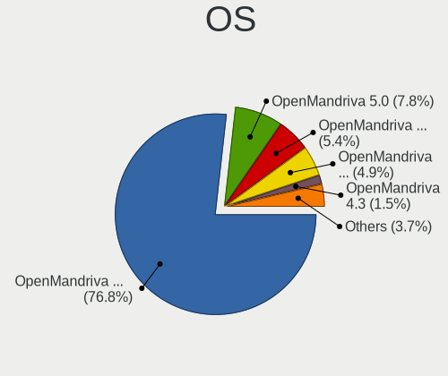
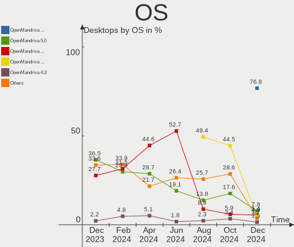
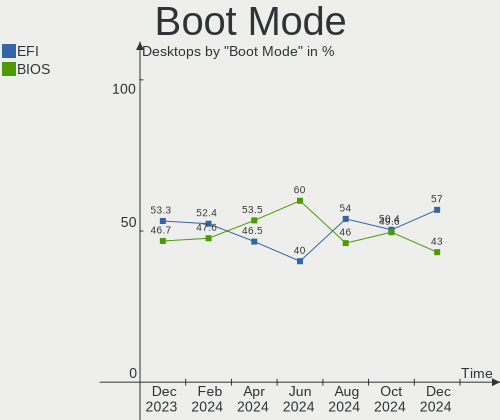
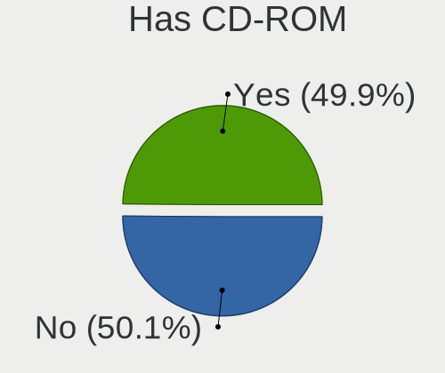
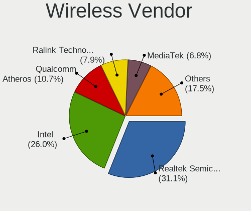

OpenMandriva - Hardware Trends (Desktops)
-----------------------------------------

A project to identify most popular hardware characteristics and track their change
over time based on data collected by Linux users at https://Linux-Hardware.org.

Anyone can contribute to this report by the [hw-probe](https://github.com/linuxhw/hw-probe) tool:

    sudo -E hw-probe -all -upload

This report is for one last month. Overall report since the beginning of time: [TestDays](https://github.com/linuxhw/TestDays)

Period: Jul, 2023.

Contents
--------

* [ System ](#system)
  - [ OS                       ](#os)
  - [ OS Family                ](#os-family)
  - [ Kernel                   ](#kernel)
  - [ Kernel Family            ](#kernel-family)
  - [ Kernel Major Ver.        ](#kernel-major-ver)
  - [ Arch                     ](#arch)
  - [ DE                       ](#de)
  - [ Display Server           ](#display-server)
  - [ Display Manager          ](#display-manager)
  - [ OS Lang                  ](#os-lang)
  - [ Boot Mode                ](#boot-mode)
  - [ Filesystem               ](#filesystem)
  - [ Part. scheme             ](#part-scheme)
  - [ Dual Boot with Linux/BSD ](#dual-boot-with-linuxbsd)
  - [ Dual Boot (Win)          ](#dual-boot-win)

* [ Board ](#board)
  - [ Vendor                   ](#vendor)
  - [ Model                    ](#model)
  - [ Model Family             ](#model-family)
  - [ MFG Year                 ](#mfg-year)
  - [ Form Factor              ](#form-factor)
  - [ Secure Boot              ](#secure-boot)
  - [ Coreboot                 ](#coreboot)
  - [ RAM Size                 ](#ram-size)
  - [ RAM Used                 ](#ram-used)
  - [ Total Drives             ](#total-drives)
  - [ Has CD-ROM               ](#has-cd-rom)
  - [ Has Ethernet             ](#has-ethernet)
  - [ Has WiFi                 ](#has-wifi)
  - [ Has Bluetooth            ](#has-bluetooth)

* [ Location ](#location)
  - [ Country                  ](#country)
  - [ City                     ](#city)

* [ Drives ](#drives)
  - [ Drive Vendor             ](#drive-vendor)
  - [ Drive Model              ](#drive-model)
  - [ HDD Vendor               ](#hdd-vendor)
  - [ SSD Vendor               ](#ssd-vendor)
  - [ Drive Kind               ](#drive-kind)
  - [ Drive Connector          ](#drive-connector)
  - [ Drive Size               ](#drive-size)
  - [ Space Total              ](#space-total)
  - [ Space Used               ](#space-used)
  - [ Malfunc. Drives          ](#malfunc-drives)
  - [ Malfunc. Drive Vendor    ](#malfunc-drive-vendor)
  - [ Malfunc. HDD Vendor      ](#malfunc-hdd-vendor)
  - [ Malfunc. Drive Kind      ](#malfunc-drive-kind)
  - [ Failed Drives            ](#failed-drives)
  - [ Failed Drive Vendor      ](#failed-drive-vendor)
  - [ Drive Status             ](#drive-status)

* [ Storage controller ](#storage-controller)
  - [ Storage Vendor           ](#storage-vendor)
  - [ Storage Model            ](#storage-model)
  - [ Storage Kind             ](#storage-kind)

* [ Processor ](#processor)
  - [ CPU Vendor               ](#cpu-vendor)
  - [ CPU Model                ](#cpu-model)
  - [ CPU Model Family         ](#cpu-model-family)
  - [ CPU Cores                ](#cpu-cores)
  - [ CPU Sockets              ](#cpu-sockets)
  - [ CPU Threads              ](#cpu-threads)
  - [ CPU Op-Modes             ](#cpu-op-modes)
  - [ CPU Microcode            ](#cpu-microcode)
  - [ CPU Microarch            ](#cpu-microarch)

* [ Graphics ](#graphics)
  - [ GPU Vendor               ](#gpu-vendor)
  - [ GPU Model                ](#gpu-model)
  - [ GPU Combo                ](#gpu-combo)
  - [ GPU Driver               ](#gpu-driver)
  - [ GPU Memory               ](#gpu-memory)

* [ Monitor ](#monitor)
  - [ Monitor Vendor           ](#monitor-vendor)
  - [ Monitor Model            ](#monitor-model)
  - [ Monitor Resolution       ](#monitor-resolution)
  - [ Monitor Diagonal         ](#monitor-diagonal)
  - [ Monitor Width            ](#monitor-width)
  - [ Aspect Ratio             ](#aspect-ratio)
  - [ Monitor Area             ](#monitor-area)
  - [ Pixel Density            ](#pixel-density)
  - [ Multiple Monitors        ](#multiple-monitors)

* [ Network ](#network)
  - [ Net Controller Vendor    ](#net-controller-vendor)
  - [ Net Controller Model     ](#net-controller-model)
  - [ Wireless Vendor          ](#wireless-vendor)
  - [ Wireless Model           ](#wireless-model)
  - [ Ethernet Vendor          ](#ethernet-vendor)
  - [ Ethernet Model           ](#ethernet-model)
  - [ Net Controller Kind      ](#net-controller-kind)
  - [ Used Controller          ](#used-controller)
  - [ NICs                     ](#nics)
  - [ IPv6                     ](#ipv6)

* [ Bluetooth ](#bluetooth)
  - [ Bluetooth Vendor         ](#bluetooth-vendor)
  - [ Bluetooth Model          ](#bluetooth-model)

* [ Sound ](#sound)
  - [ Sound Vendor             ](#sound-vendor)
  - [ Sound Model              ](#sound-model)

* [ Memory ](#memory)
  - [ Memory Vendor            ](#memory-vendor)
  - [ Memory Model             ](#memory-model)
  - [ Memory Kind              ](#memory-kind)
  - [ Memory Form Factor       ](#memory-form-factor)
  - [ Memory Size              ](#memory-size)
  - [ Memory Speed             ](#memory-speed)

* [ Printers & scanners ](#printers--scanners)
  - [ Printer Vendor           ](#printer-vendor)
  - [ Printer Model            ](#printer-model)
  - [ Scanner Vendor           ](#scanner-vendor)
  - [ Scanner Model            ](#scanner-model)

* [ Camera ](#camera)
  - [ Camera Vendor            ](#camera-vendor)
  - [ Camera Model             ](#camera-model)

* [ Security ](#security)
  - [ Fingerprint Vendor       ](#fingerprint-vendor)
  - [ Fingerprint Model        ](#fingerprint-model)
  - [ Chipcard Vendor          ](#chipcard-vendor)
  - [ Chipcard Model           ](#chipcard-model)

* [ Unsupported ](#unsupported)
  - [ Unsupported Devices      ](#unsupported-devices)
  - [ Unsupported Device Types ](#unsupported-device-types)

System
------

OS
--

Installed operating systems

| Name               | Desktops | Percent |
|--------------------|----------|---------|
| OpenMandriva 23.03 | 61       | 39.87%  |
| OpenMandriva 23.07 | 41       | 26.8%   |
| OpenMandriva 4.3   | 19       | 12.42%  |
| OpenMandriva 23.06 | 15       | 9.8%    |
| OpenMandriva 4.2   | 7        | 4.58%   |
| OpenMandriva 23.01 | 6        | 3.92%   |
| OpenMandriva 23.90 | 4        | 2.61%   |

OS Family
---------

OS without a version

| Name         | Desktops | Percent |
|--------------|----------|---------|
| OpenMandriva | 153      | 100%    |

Kernel
------

Version of the Linux kernel

| Version                  | Desktops | Percent |
|--------------------------|----------|---------|
| 6.2.6-desktop-1omv2390   | 66       | 43.14%  |
| 6.3.5-desktop-3omv2390   | 49       | 32.03%  |
| 5.16.7-desktop-1omv4003  | 12       | 7.84%   |
| 5.16.13-desktop-1omv4003 | 7        | 4.58%   |
| 5.10.14-desktop-1omv4002 | 7        | 4.58%   |
| 6.1.1-desktop-1omv2290   | 6        | 3.92%   |
| 6.4.4-desktop-1omv2390   | 1        | 0.65%   |
| 6.4.3-desktop-2omv2390   | 1        | 0.65%   |
| 6.3.9-desktop-1omv2390   | 1        | 0.65%   |
| 6.3.3-desktop-2omv2390   | 1        | 0.65%   |
| 6.2.2-desktop-1omv2390   | 1        | 0.65%   |
| 6.1.4-desktop-1omv2301   | 1        | 0.65%   |

Kernel Family
-------------

Linux kernel without a distro release

| Version | Desktops | Percent |
|---------|----------|---------|
| 6.2.6   | 66       | 43.14%  |
| 6.3.5   | 49       | 32.03%  |
| 5.16.7  | 12       | 7.84%   |
| 5.16.13 | 7        | 4.58%   |
| 5.10.14 | 7        | 4.58%   |
| 6.1.1   | 6        | 3.92%   |
| 6.4.4   | 1        | 0.65%   |
| 6.4.3   | 1        | 0.65%   |
| 6.3.9   | 1        | 0.65%   |
| 6.3.3   | 1        | 0.65%   |
| 6.2.2   | 1        | 0.65%   |
| 6.1.4   | 1        | 0.65%   |

Kernel Major Ver.
-----------------

Linux kernel major version

| Version | Desktops | Percent |
|---------|----------|---------|
| 6.2     | 67       | 43.79%  |
| 6.3     | 51       | 33.33%  |
| 5.16    | 19       | 12.42%  |
| 6.1     | 7        | 4.58%   |
| 5.10    | 7        | 4.58%   |
| 6.4     | 2        | 1.31%   |

Arch
----

OS architecture (x86_64, i586, etc.)

| Name   | Desktops | Percent |
|--------|----------|---------|
| x86_64 | 153      | 100%    |

DE
--

Desktop Environment

| Name     | Desktops | Percent |
|----------|----------|---------|
| KDE5     | 135      | 88.24%  |
| GNOME    | 9        | 5.88%   |
| LXQt     | 3        | 1.96%   |
| Cinnamon | 3        | 1.96%   |
| Unknown  | 2        | 1.31%   |
| XFCE     | 1        | 0.65%   |

Display Server
--------------

X11 or Wayland

| Name    | Desktops | Percent |
|---------|----------|---------|
| X11     | 143      | 93.46%  |
| Wayland | 9        | 5.88%   |
| Unknown | 1        | 0.65%   |

Display Manager
---------------

SDDM, LightDM, etc.

| Name    | Desktops | Percent |
|---------|----------|---------|
| SDDM    | 141      | 92.16%  |
| GDM     | 9        | 5.88%   |
| LightDM | 2        | 1.31%   |
| Unknown | 1        | 0.65%   |

OS Lang
-------

Language

| Lang  | Desktops | Percent |
|-------|----------|---------|
| en_US | 78       | 50.98%  |
| en_GB | 15       | 9.8%    |
| fr_FR | 10       | 6.54%   |
| pt_BR | 8        | 5.23%   |
| pl_PL | 8        | 5.23%   |
| ru_RU | 7        | 4.58%   |
| cs_CZ | 6        | 3.92%   |
| de_DE | 5        | 3.27%   |
| it_IT | 3        | 1.96%   |
| es_MX | 3        | 1.96%   |
| nl_NL | 1        | 0.65%   |
| nl_BE | 1        | 0.65%   |
| ja_JP | 1        | 0.65%   |
| fr_BE | 1        | 0.65%   |
| es_UY | 1        | 0.65%   |
| es_ES | 1        | 0.65%   |
| es_CR | 1        | 0.65%   |
| en_IN | 1        | 0.65%   |
| de_AT | 1        | 0.65%   |
| da_DK | 1        | 0.65%   |

Boot Mode
---------

EFI or BIOS

| Mode | Desktops | Percent |
|------|----------|---------|
| EFI  | 89       | 58.17%  |
| BIOS | 64       | 41.83%  |

Filesystem
----------

Type of filesystem

| Type    | Desktops | Percent |
|---------|----------|---------|
| Ext4    | 72       | 47.06%  |
| Overlay | 66       | 43.14%  |
| Btrfs   | 11       | 7.19%   |
| Xfs     | 3        | 1.96%   |
| F2fs    | 1        | 0.65%   |

Part. scheme
------------

Scheme of partitioning

| Type    | Desktops | Percent |
|---------|----------|---------|
| GPT     | 127      | 83.01%  |
| MBR     | 25       | 16.34%  |
| Unknown | 1        | 0.65%   |

Dual Boot with Linux/BSD
------------------------

Hosting more than one Linux/BSD

| Dual boot | Desktops | Percent |
|-----------|----------|---------|
| Yes       | 80       | 52.29%  |
| No        | 73       | 47.71%  |

Dual Boot (Win)
---------------

Hosting Linux and Windows

| Dual boot | Desktops | Percent |
|-----------|----------|---------|
| No        | 79       | 51.63%  |
| Yes       | 74       | 48.37%  |

Board
-----

Vendor
------

Motherboard manufacturer

| Name                | Desktops | Percent |
|---------------------|----------|---------|
| ASUSTek Computer    | 25       | 16.34%  |
| Gigabyte Technology | 23       | 15.03%  |
| Dell                | 20       | 13.07%  |
| MSI                 | 18       | 11.76%  |
| ASRock              | 18       | 11.76%  |
| Hewlett-Packard     | 16       | 10.46%  |
| Acer                | 5        | 3.27%   |
| Lenovo              | 3        | 1.96%   |
| Intel               | 3        | 1.96%   |
| Foxconn             | 3        | 1.96%   |
| ECS                 | 3        | 1.96%   |
| Biostar             | 3        | 1.96%   |
| PCWare              | 2        | 1.31%   |
| Fujitsu             | 2        | 1.31%   |
| AZW                 | 2        | 1.31%   |
| Unknown             | 2        | 1.31%   |
| T-bao               | 1        | 0.65%   |
| Positivo            | 1        | 0.65%   |
| Pegatron            | 1        | 0.65%   |
| Intel X79           | 1        | 0.65%   |
| Apple               | 1        | 0.65%   |

Model
-----

Motherboard model

| Name                                    | Desktops | Percent |
|-----------------------------------------|----------|---------|
| Acer Veriton L670G                      | 3        | 1.96%   |
| Unknown                                 | 3        | 1.96%   |
| MSI MS-7D32                             | 2        | 1.31%   |
| HP Z440 Workstation                     | 2        | 1.31%   |
| HP ProOne 600 G1 AiO                    | 2        | 1.31%   |
| Gigabyte B450M DS3H                     | 2        | 1.31%   |
| Gigabyte AB350M-DS3H V2                 | 2        | 1.31%   |
| Foxconn Pro 3500 Series                 | 2        | 1.31%   |
| Dell Precision T1700                    | 2        | 1.31%   |
| Dell OptiPlex 3040                      | 2        | 1.31%   |
| ASRock H510M-HDV R2.0                   | 2        | 1.31%   |
| T-bao MINI PC                           | 1        | 0.65%   |
| Positivo POS-PIQ77CL                    | 1        | 0.65%   |
| Pegatron WE301AA-ABF p6215fr            | 1        | 0.65%   |
| PCWare IPX1800E2                        | 1        | 0.65%   |
| PCWare IPMH61R3 8MB                     | 1        | 0.65%   |
| MSI p6730br                             | 1        | 0.65%   |
| MSI MS-7D67                             | 1        | 0.65%   |
| MSI MS-7D18                             | 1        | 0.65%   |
| MSI MS-7D16                             | 1        | 0.65%   |
| MSI MS-7C91                             | 1        | 0.65%   |
| MSI MS-7C52                             | 1        | 0.65%   |
| MSI MS-7C51                             | 1        | 0.65%   |
| MSI MS-7C02                             | 1        | 0.65%   |
| MSI MS-7B84                             | 1        | 0.65%   |
| MSI MS-7B73                             | 1        | 0.65%   |
| MSI MS-7885                             | 1        | 0.65%   |
| MSI MS-7850                             | 1        | 0.65%   |
| MSI MS-7821                             | 1        | 0.65%   |
| MSI MS-7817                             | 1        | 0.65%   |
| MSI MS-7816                             | 1        | 0.65%   |
| MSI KBL-U Pro Cubi 3 Silent S (MS-B159) | 1        | 0.65%   |
| Lenovo ThinkCentre M910q 10MUS1K600     | 1        | 0.65%   |
| Lenovo ThinkCentre M72e 2116CTO         | 1        | 0.65%   |
| Lenovo ThinkCentre M710q 10MQS31W00     | 1        | 0.65%   |
| Intel Jasper Lake Client Platform       | 1        | 0.65%   |
| Intel DH61WW                            | 1        | 0.65%   |
| Intel DG45ID AAE27729-307               | 1        | 0.65%   |
| HP Z820 Workstation                     | 1        | 0.65%   |
| HP Z640 Workstation                     | 1        | 0.65%   |

Model Family
------------

Motherboard model prefix

| Name                 | Desktops | Percent |
|----------------------|----------|---------|
| Dell OptiPlex        | 13       | 8.5%    |
| ASUS M5A78L-M        | 5        | 3.27%   |
| HP Compaq            | 4        | 2.61%   |
| ASUS PRIME           | 4        | 2.61%   |
| Acer Veriton         | 4        | 2.61%   |
| Lenovo ThinkCentre   | 3        | 1.96%   |
| Gigabyte B450M       | 3        | 1.96%   |
| Unknown              | 3        | 1.96%   |
| MSI MS-7D32          | 2        | 1.31%   |
| HP Z440              | 2        | 1.31%   |
| HP ProOne            | 2        | 1.31%   |
| HP ProDesk           | 2        | 1.31%   |
| Gigabyte AB350M-DS3H | 2        | 1.31%   |
| Fujitsu ESPRIMO      | 2        | 1.31%   |
| Foxconn Pro          | 2        | 1.31%   |
| Dell XPS             | 2        | 1.31%   |
| Dell Precision       | 2        | 1.31%   |
| ASUS TUF             | 2        | 1.31%   |
| ASUS P8H61-M         | 2        | 1.31%   |
| ASRock H510M-HDV     | 2        | 1.31%   |
| ASRock B450M         | 2        | 1.31%   |
| ASRock B450          | 2        | 1.31%   |
| T-bao MINI           | 1        | 0.65%   |
| Positivo POS-PIQ77CL | 1        | 0.65%   |
| Pegatron WE301AA-ABF | 1        | 0.65%   |
| PCWare IPX1800E2     | 1        | 0.65%   |
| PCWare IPMH61R3      | 1        | 0.65%   |
| MSI p6730br          | 1        | 0.65%   |
| MSI MS-7D67          | 1        | 0.65%   |
| MSI MS-7D18          | 1        | 0.65%   |
| MSI MS-7D16          | 1        | 0.65%   |
| MSI MS-7C91          | 1        | 0.65%   |
| MSI MS-7C52          | 1        | 0.65%   |
| MSI MS-7C51          | 1        | 0.65%   |
| MSI MS-7C02          | 1        | 0.65%   |
| MSI MS-7B84          | 1        | 0.65%   |
| MSI MS-7B73          | 1        | 0.65%   |
| MSI MS-7885          | 1        | 0.65%   |
| MSI MS-7850          | 1        | 0.65%   |
| MSI MS-7821          | 1        | 0.65%   |

MFG Year
--------

Motherboard manufacture year

| Year | Desktops | Percent |
|------|----------|---------|
| 2018 | 16       | 10.46%  |
| 2021 | 14       | 9.15%   |
| 2012 | 14       | 9.15%   |
| 2011 | 13       | 8.5%    |
| 2015 | 12       | 7.84%   |
| 2017 | 11       | 7.19%   |
| 2013 | 11       | 7.19%   |
| 2014 | 10       | 6.54%   |
| 2022 | 8        | 5.23%   |
| 2019 | 7        | 4.58%   |
| 2016 | 7        | 4.58%   |
| 2009 | 6        | 3.92%   |
| 2007 | 6        | 3.92%   |
| 2020 | 5        | 3.27%   |
| 2010 | 5        | 3.27%   |
| 2008 | 4        | 2.61%   |
| 2023 | 3        | 1.96%   |
| 2005 | 1        | 0.65%   |

Form Factor
-----------

Physical design of the computer

| Name    | Desktops | Percent |
|---------|----------|---------|
| Desktop | 153      | 100%    |

Secure Boot
-----------

Enabled or disabled

| State    | Desktops | Percent |
|----------|----------|---------|
| Disabled | 153      | 100%    |

Coreboot
--------

Have coreboot on board

| Used | Desktops | Percent |
|------|----------|---------|
| No   | 153      | 100%    |

RAM Size
--------

Total RAM memory

| Size in GB  | Desktops | Percent |
|-------------|----------|---------|
| 16.01-24.0  | 37       | 24.18%  |
| 4.01-8.0    | 28       | 18.3%   |
| 3.01-4.0    | 24       | 15.69%  |
| 8.01-16.0   | 23       | 15.03%  |
| 32.01-64.0  | 17       | 11.11%  |
| 64.01-256.0 | 11       | 7.19%   |
| 24.01-32.0  | 6        | 3.92%   |
| 1.01-2.0    | 4        | 2.61%   |
| 2.01-3.0    | 3        | 1.96%   |

RAM Used
--------

Used RAM memory

| Used GB  | Desktops | Percent |
|----------|----------|---------|
| 1.01-2.0 | 84       | 54.9%   |
| 2.01-3.0 | 44       | 28.76%  |
| 0.51-1.0 | 11       | 7.19%   |
| 3.01-4.0 | 9        | 5.88%   |
| 0.01-0.5 | 4        | 2.61%   |
| 4.01-8.0 | 1        | 0.65%   |

Total Drives
------------

Number of drives on board

| Drives | Desktops | Percent |
|--------|----------|---------|
| 1      | 53       | 34.64%  |
| 2      | 44       | 28.76%  |
| 3      | 25       | 16.34%  |
| 4      | 15       | 9.8%    |
| 0      | 6        | 3.92%   |
| 6      | 4        | 2.61%   |
| 5      | 4        | 2.61%   |
| 7      | 2        | 1.31%   |

Has CD-ROM
----------

Has CD-ROM on board

| Presented | Desktops | Percent |
|-----------|----------|---------|
| Yes       | 77       | 50.33%  |
| No        | 76       | 49.67%  |

Has Ethernet
------------

Has Ethernet on board

| Presented | Desktops | Percent |
|-----------|----------|---------|
| Yes       | 152      | 99.35%  |
| No        | 1        | 0.65%   |

Has WiFi
--------

Has WiFi module

| Presented | Desktops | Percent |
|-----------|----------|---------|
| No        | 95       | 62.09%  |
| Yes       | 58       | 37.91%  |

Has Bluetooth
-------------

Has Bluetooth module

| Presented | Desktops | Percent |
|-----------|----------|---------|
| No        | 108      | 70.59%  |
| Yes       | 45       | 29.41%  |

Location
--------

Country
-------

Geographic location (country)

| Country         | Desktops | Percent |
|-----------------|----------|---------|
| USA             | 28       | 18.3%   |
| Russia          | 10       | 6.54%   |
| Poland          | 10       | 6.54%   |
| France          | 10       | 6.54%   |
| Brazil          | 10       | 6.54%   |
| UK              | 9        | 5.88%   |
| Germany         | 8        | 5.23%   |
| Czechia         | 7        | 4.58%   |
| Italy           | 5        | 3.27%   |
| Japan           | 4        | 2.61%   |
| Canada          | 4        | 2.61%   |
| Spain           | 3        | 1.96%   |
| Romania         | 3        | 1.96%   |
| Netherlands     | 3        | 1.96%   |
| Mexico          | 3        | 1.96%   |
| Kazakhstan      | 3        | 1.96%   |
| Finland         | 3        | 1.96%   |
| Sweden          | 2        | 1.31%   |
| Singapore       | 2        | 1.31%   |
| Namibia         | 2        | 1.31%   |
| India           | 2        | 1.31%   |
| Costa Rica      | 2        | 1.31%   |
| Colombia        | 2        | 1.31%   |
| Belgium         | 2        | 1.31%   |
| Austria         | 2        | 1.31%   |
| Australia       | 2        | 1.31%   |
| Uruguay         | 1        | 0.65%   |
| Turkey          | 1        | 0.65%   |
| South Africa    | 1        | 0.65%   |
| Norway          | 1        | 0.65%   |
| North Macedonia | 1        | 0.65%   |
| Malaysia        | 1        | 0.65%   |
| Indonesia       | 1        | 0.65%   |
| Greenland       | 1        | 0.65%   |
| Denmark         | 1        | 0.65%   |
| Bulgaria        | 1        | 0.65%   |
| Barbados        | 1        | 0.65%   |
| Algeria         | 1        | 0.65%   |

City
----

Geographic location (city)

| City            | Desktops | Percent |
|-----------------|----------|---------|
| Horice          | 4        | 2.61%   |
| Târgu Mureş   | 3        | 1.96%   |
| Moscow          | 3        | 1.96%   |
| Hemet           | 3        | 1.96%   |
| Helsinki        | 3        | 1.96%   |
| Almaty          | 3        | 1.96%   |
| Windhoek        | 2        | 1.31%   |
| Singapore       | 2        | 1.31%   |
| Krakow          | 2        | 1.31%   |
| Heredia         | 2        | 1.31%   |
| Gdansk          | 2        | 1.31%   |
| Zhukovskiy      | 1        | 0.65%   |
| Youngstown      | 1        | 0.65%   |
| Woodbridge      | 1        | 0.65%   |
| Warsaw          | 1        | 0.65%   |
| Volgograd       | 1        | 0.65%   |
| Vleuten         | 1        | 0.65%   |
| Vienna          | 1        | 0.65%   |
| Tranbjerg       | 1        | 0.65%   |
| Tourcoing       | 1        | 0.65%   |
| Tomsk           | 1        | 0.65%   |
| Sydney          | 1        | 0.65%   |
| Suwałki        | 1        | 0.65%   |
| Staffanstorp    | 1        | 0.65%   |
| Southend-on-Sea | 1        | 0.65%   |
| Skopje          | 1        | 0.65%   |
| Sherborne       | 1        | 0.65%   |
| Sheffield       | 1        | 0.65%   |
| Shawinigan      | 1        | 0.65%   |
| Sao Paulo       | 1        | 0.65%   |
| Santo André    | 1        | 0.65%   |
| Sankt Pölten   | 1        | 0.65%   |
| Sandefjord      | 1        | 0.65%   |
| Saint-Hyacinthe | 1        | 0.65%   |
| Saint-Gregoire  | 1        | 0.65%   |
| Saint-Etienne   | 1        | 0.65%   |
| Round Rock      | 1        | 0.65%   |
| Rostov-on-Don   | 1        | 0.65%   |
| Rio de Janeiro  | 1        | 0.65%   |
| Revere          | 1        | 0.65%   |

Drives
------

Drive Vendor
------------

Hard drive vendors

| Vendor              | Desktops | Drives | Percent |
|---------------------|----------|--------|---------|
| WDC                 | 48       | 65     | 16.96%  |
| Seagate             | 47       | 64     | 16.61%  |
| Samsung Electronics | 31       | 38     | 10.95%  |
| Kingston            | 19       | 21     | 6.71%   |
| Crucial             | 19       | 20     | 6.71%   |
| Toshiba             | 15       | 17     | 5.3%    |
| Hitachi             | 12       | 12     | 4.24%   |
| SanDisk             | 6        | 6      | 2.12%   |
| Patriot             | 6        | 6      | 2.12%   |
| A-DATA Technology   | 6        | 7      | 2.12%   |
| China               | 4        | 4      | 1.41%   |
| Unknown             | 3        | 3      | 1.06%   |
| SK hynix            | 3        | 3      | 1.06%   |
| PNY                 | 3        | 3      | 1.06%   |
| Phison              | 3        | 4      | 1.06%   |
| HGST                | 3        | 4      | 1.06%   |
| GOODRAM             | 3        | 4      | 1.06%   |
| Corsair             | 3        | 3      | 1.06%   |
| T-FORCE             | 2        | 2      | 0.71%   |
| Netac               | 2        | 2      | 0.71%   |
| Maxtor              | 2        | 2      | 0.71%   |
| Lexar               | 2        | 2      | 0.71%   |
| JMicron Technology  | 2        | 2      | 0.71%   |
| Intenso             | 2        | 2      | 0.71%   |
| Intel               | 2        | 3      | 0.71%   |
| HPE                 | 2        | 2      | 0.71%   |
| Gigabyte Technology | 2        | 2      | 0.71%   |
| ASMT                | 2        | 2      | 0.71%   |
| Unknown             | 2        | 2      | 0.71%   |
| Verbatim            | 1        | 1      | 0.35%   |
| UMIS                | 1        | 1      | 0.35%   |
| Team                | 1        | 1      | 0.35%   |
| Silicon Motion      | 1        | 1      | 0.35%   |
| SATA SSD            | 1        | 1      | 0.35%   |
| Realtek             | 1        | 1      | 0.35%   |
| Plextor             | 1        | 1      | 0.35%   |
| OCZ                 | 1        | 3      | 0.35%   |
| NGFF                | 1        | 1      | 0.35%   |
| Mushkin             | 1        | 1      | 0.35%   |
| Micron Technology   | 1        | 1      | 0.35%   |

Drive Model
-----------

Hard drive models

| Model                            | Desktops | Percent |
|----------------------------------|----------|---------|
| Seagate ST1000DM010-2EP102 1TB   | 7        | 2.17%   |
| Toshiba DT01ACA100 1TB           | 5        | 1.55%   |
| Seagate ST500DM002-1BD142 500GB  | 5        | 1.55%   |
| Crucial CT240BX500SSD1 240GB     | 4        | 1.24%   |
| WDC WD1600AAJS-22L7A0 160GB      | 3        | 0.93%   |
| WDC WD10EZEX-08WN4A0 1TB         | 3        | 0.93%   |
| Toshiba HDWD110 1TB              | 3        | 0.93%   |
| Seagate ST3500418AS 500GB        | 3        | 0.93%   |
| Seagate ST1000DM003-1CH162 1TB   | 3        | 0.93%   |
| Kingston SV300S37A120G 120GB SSD | 3        | 0.93%   |
| WDC WDS500G2B0A-00SM50 500GB SSD | 2        | 0.62%   |
| WDC WDS100T2B0B-00YS70 1TB SSD   | 2        | 0.62%   |
| WDC WD3200AAKS-00UU3A0 320GB     | 2        | 0.62%   |
| WDC WD20EFRX-68EUZN0 2TB         | 2        | 0.62%   |
| WDC WD10EZEX-22BN5A0 1TB         | 2        | 0.62%   |
| WDC WD10EZEX-00BN5A0 1TB         | 2        | 0.62%   |
| WDC WD1003FZEX-00K3CA0 1TB       | 2        | 0.62%   |
| Toshiba DT01ACA050 500GB         | 2        | 0.62%   |
| T-FORCE SSD 512GB                | 2        | 0.62%   |
| Seagate ST4000VN008-2DR166 4TB   | 2        | 0.62%   |
| Seagate ST31000524AS 1TB         | 2        | 0.62%   |
| Seagate ST2000DM006-2DM164 2TB   | 2        | 0.62%   |
| Seagate Expansion 1TB            | 2        | 0.62%   |
| Samsung SSD 980 1TB              | 2        | 0.62%   |
| Samsung SSD 870 QVO 1TB          | 2        | 0.62%   |
| Samsung SSD 860 EVO 500GB        | 2        | 0.62%   |
| Samsung HD502HJ 500GB            | 2        | 0.62%   |
| Samsung HD161HJ 160GB            | 2        | 0.62%   |
| Phison Sabrent 1TB               | 2        | 0.62%   |
| Kingston SNV2S500G 500GB         | 2        | 0.62%   |
| Kingston SKC3000D2048G 2TB       | 2        | 0.62%   |
| JMicron Tech 250GB               | 2        | 0.62%   |
| HPE MK000960GWCFA 960GB SSD      | 2        | 0.62%   |
| Hitachi HDS722020ALA330 2TB      | 2        | 0.62%   |
| Crucial CT500MX500SSD1 500GB     | 2        | 0.62%   |
| Crucial CT1000P2SSD8 1TB         | 2        | 0.62%   |
| Crucial CT1000P1SSD8 1TB         | 2        | 0.62%   |
| Crucial CT1000MX500SSD1 1TB      | 2        | 0.62%   |
| China SSD 256GB                  | 2        | 0.62%   |
| ASMT 2115 64GB                   | 2        | 0.62%   |

HDD Vendor
----------

Hard disk drive vendors

| Vendor              | Desktops | Drives | Percent |
|---------------------|----------|--------|---------|
| Seagate             | 46       | 62     | 35.94%  |
| WDC                 | 35       | 48     | 27.34%  |
| Toshiba             | 13       | 15     | 10.16%  |
| Hitachi             | 12       | 12     | 9.38%   |
| Samsung Electronics | 10       | 12     | 7.81%   |
| HGST                | 3        | 4      | 2.34%   |
| Maxtor              | 2        | 2      | 1.56%   |
| ASMT                | 2        | 2      | 1.56%   |
| Unknown             | 1        | 1      | 0.78%   |
| MaxDigital          | 1        | 1      | 0.78%   |
| Initio              | 1        | 1      | 0.78%   |
| Hewlett-Packard     | 1        | 1      | 0.78%   |
| Unknown             | 1        | 1      | 0.78%   |

SSD Vendor
----------

Solid state drive vendors

| Vendor              | Desktops | Drives | Percent |
|---------------------|----------|--------|---------|
| WDC                 | 12       | 14     | 12.12%  |
| Crucial             | 12       | 12     | 12.12%  |
| Samsung Electronics | 11       | 13     | 11.11%  |
| Kingston            | 10       | 12     | 10.1%   |
| A-DATA Technology   | 6        | 7      | 6.06%   |
| SanDisk             | 4        | 4      | 4.04%   |
| Patriot             | 4        | 4      | 4.04%   |
| China               | 4        | 4      | 4.04%   |
| PNY                 | 3        | 3      | 3.03%   |
| GOODRAM             | 3        | 4      | 3.03%   |
| Toshiba             | 2        | 2      | 2.02%   |
| T-FORCE             | 2        | 2      | 2.02%   |
| Intenso             | 2        | 2      | 2.02%   |
| HPE                 | 2        | 2      | 2.02%   |
| Gigabyte Technology | 2        | 2      | 2.02%   |
| Verbatim            | 1        | 1      | 1.01%   |
| Team                | 1        | 1      | 1.01%   |
| SK hynix            | 1        | 1      | 1.01%   |
| OCZ                 | 1        | 3      | 1.01%   |
| NGFF                | 1        | 1      | 1.01%   |
| Mushkin             | 1        | 1      | 1.01%   |
| Micron Technology   | 1        | 1      | 1.01%   |
| LITEONIT            | 1        | 1      | 1.01%   |
| LITEON              | 1        | 1      | 1.01%   |
| Leven               | 1        | 1      | 1.01%   |
| KIOXIA-EXCERIA      | 1        | 1      | 1.01%   |
| KingSpec            | 1        | 1      | 1.01%   |
| INTEL SS            | 1        | 1      | 1.01%   |
| Intel               | 1        | 1      | 1.01%   |
| CT500MX5            | 1        | 1      | 1.01%   |
| Corsair             | 1        | 1      | 1.01%   |
| CFD                 | 1        | 1      | 1.01%   |
| AMD                 | 1        | 1      | 1.01%   |
| AirDisk             | 1        | 1      | 1.01%   |
| Unknown             | 1        | 1      | 1.01%   |

Drive Kind
----------

HDD or SSD

| Kind    | Desktops | Drives | Percent |
|---------|----------|--------|---------|
| HDD     | 100      | 162    | 44.44%  |
| SSD     | 75       | 109    | 33.33%  |
| NVMe    | 44       | 59     | 19.56%  |
| Unknown | 4        | 4      | 1.78%   |
| MMC     | 2        | 2      | 0.89%   |

Drive Connector
---------------

SATA, SAS, NVMe, etc.

| Type | Desktops | Drives | Percent |
|------|----------|--------|---------|
| SATA | 135      | 259    | 68.88%  |
| NVMe | 43       | 58     | 21.94%  |
| SAS  | 16       | 17     | 8.16%   |
| MMC  | 2        | 2      | 1.02%   |

Drive Size
----------

Size of hard drive

| Size in TB | Desktops | Drives | Percent |
|------------|----------|--------|---------|
| 0.01-0.5   | 98       | 147    | 52.13%  |
| 0.51-1.0   | 57       | 78     | 30.32%  |
| 1.01-2.0   | 15       | 24     | 7.98%   |
| 3.01-4.0   | 9        | 9      | 4.79%   |
| 2.01-3.0   | 5        | 5      | 2.66%   |
| 4.01-10.0  | 4        | 8      | 2.13%   |

Space Total
-----------

Amount of disk space available on the file system

| Size in GB     | Desktops | Percent |
|----------------|----------|---------|
| 1-20           | 45       | 29.41%  |
| 101-250        | 27       | 17.65%  |
| 251-500        | 18       | 11.76%  |
| 501-1000       | 14       | 9.15%   |
| Unknown        | 14       | 9.15%   |
| 1001-2000      | 11       | 7.19%   |
| 21-50          | 10       | 6.54%   |
| 51-100         | 7        | 4.58%   |
| More than 3000 | 5        | 3.27%   |
| 2001-3000      | 2        | 1.31%   |

Space Used
----------

Amount of used disk space

| Used GB        | Desktops | Percent |
|----------------|----------|---------|
| 1-20           | 112      | 73.2%   |
| Unknown        | 14       | 9.15%   |
| 51-100         | 7        | 4.58%   |
| 251-500        | 4        | 2.61%   |
| 21-50          | 4        | 2.61%   |
| More than 3000 | 3        | 1.96%   |
| 101-250        | 3        | 1.96%   |
| 2001-3000      | 2        | 1.31%   |
| 1001-2000      | 2        | 1.31%   |
| 501-1000       | 2        | 1.31%   |

Malfunc. Drives
---------------

Drive models with a malfunction

| Model                                               | Desktops | Drives | Percent |
|-----------------------------------------------------|----------|--------|---------|
| Seagate ST500DM002-1BD142 500GB                     | 3        | 3      | 6.12%   |
| Seagate ST3500418AS 500GB                           | 2        | 2      | 4.08%   |
| Seagate ST1000DM010-2EP102 1TB                      | 2        | 2      | 4.08%   |
| WDC WD6400AAKS-00E4A0 640GB                         | 1        | 1      | 2.04%   |
| WDC WD5000AAKS-00V1A0 500GB                         | 1        | 1      | 2.04%   |
| WDC WD3200LPCX-24C6HT0 320GB                        | 1        | 1      | 2.04%   |
| WDC WD2503ABYX-01WERA1 256GB                        | 1        | 1      | 2.04%   |
| WDC WD20EFRX-68EUZN0 2TB                            | 1        | 1      | 2.04%   |
| WDC WD20EARS-00J2GB0 2TB                            | 1        | 1      | 2.04%   |
| WDC WD2003FYYS-02W0B0 2TB                           | 1        | 2      | 2.04%   |
| WDC WD10EZEX-21M2NA0 1TB                            | 1        | 1      | 2.04%   |
| WDC WD10EZEX-08WN4A0 1TB                            | 1        | 1      | 2.04%   |
| WDC WD1003FZEX-00K3CA0 1TB                          | 1        | 1      | 2.04%   |
| WDC WD1001FAES-60Z2A0 1TB                           | 1        | 1      | 2.04%   |
| Toshiba MQ01ABD100 1TB                              | 1        | 1      | 2.04%   |
| Toshiba MQ01ABD075 752GB                            | 1        | 1      | 2.04%   |
| Toshiba DT01ACA100 1TB                              | 1        | 1      | 2.04%   |
| SK hynix HFS256G3AMNB-2200A 256GB SSD               | 1        | 1      | 2.04%   |
| Seagate ST9160301AS 160GB                           | 1        | 1      | 2.04%   |
| Seagate ST3500630AS 500GB                           | 1        | 1      | 2.04%   |
| Seagate ST3500514NS 500GB                           | 1        | 1      | 2.04%   |
| Seagate ST3320418AS 320GB                           | 1        | 1      | 2.04%   |
| Seagate ST3120827AS 120GB                           | 1        | 1      | 2.04%   |
| Seagate ST2000DM006-2DM164 2TB                      | 1        | 1      | 2.04%   |
| Seagate ST2000DM001-1ER164 2TB                      | 1        | 1      | 2.04%   |
| Seagate ST1000DM003-9YN162 1TB                      | 1        | 1      | 2.04%   |
| Samsung Electronics SSD 840 EVO 250GB               | 1        | 1      | 2.04%   |
| Samsung Electronics SP0802N 80GB                    | 1        | 1      | 2.04%   |
| Samsung Electronics HD503HI 500GB                   | 1        | 1      | 2.04%   |
| Samsung Electronics HD322HJ 320GB                   | 1        | 1      | 2.04%   |
| Samsung Electronics HD161HJ 160GB                   | 1        | 1      | 2.04%   |
| OCZ ARC100 240GB SSD                                | 1        | 1      | 2.04%   |
| Micron Technology MTFDDAK256TBN-1AR1ZABHA 256GB SSD | 1        | 1      | 2.04%   |
| LITEON CV8-CE256-HP 256GB SSD                       | 1        | 1      | 2.04%   |
| Kingston SVP200S37A60G 64GB SSD                     | 1        | 1      | 2.04%   |
| Kingston SVP200S360G 64GB SSD                       | 1        | 1      | 2.04%   |
| Kingston SV300S37A120G 120GB SSD                    | 1        | 1      | 2.04%   |
| Intenso TOP M.2 SATA 128GB SSD                      | 1        | 1      | 2.04%   |
| Hitachi HUA722010CLA330 1TB                         | 1        | 1      | 2.04%   |
| Hitachi HDS722020ALA330 2TB                         | 1        | 1      | 2.04%   |

Malfunc. Drive Vendor
---------------------

Vendors of faulty drives

| Vendor              | Desktops | Drives | Percent |
|---------------------|----------|--------|---------|
| Seagate             | 15       | 15     | 31.91%  |
| WDC                 | 10       | 12     | 21.28%  |
| Samsung Electronics | 5        | 5      | 10.64%  |
| Hitachi             | 5        | 5      | 10.64%  |
| Toshiba             | 3        | 3      | 6.38%   |
| Kingston            | 2        | 3      | 4.26%   |
| SK hynix            | 1        | 1      | 2.13%   |
| OCZ                 | 1        | 1      | 2.13%   |
| Micron Technology   | 1        | 1      | 2.13%   |
| LITEON              | 1        | 1      | 2.13%   |
| Intenso             | 1        | 1      | 2.13%   |
| Hewlett-Packard     | 1        | 1      | 2.13%   |
| China               | 1        | 1      | 2.13%   |

Malfunc. HDD Vendor
-------------------

Vendors of faulty HDD drives

| Vendor              | Desktops | Drives | Percent |
|---------------------|----------|--------|---------|
| Seagate             | 15       | 15     | 39.47%  |
| WDC                 | 10       | 12     | 26.32%  |
| Hitachi             | 5        | 5      | 13.16%  |
| Samsung Electronics | 4        | 4      | 10.53%  |
| Toshiba             | 3        | 3      | 7.89%   |
| Hewlett-Packard     | 1        | 1      | 2.63%   |

Malfunc. Drive Kind
-------------------

Kinds of faulty drives

| Kind | Desktops | Drives | Percent |
|------|----------|--------|---------|
| HDD  | 36       | 40     | 80%     |
| SSD  | 9        | 10     | 20%     |

Failed Drives
-------------

Failed drive models

| Model                             | Desktops | Drives | Percent |
|-----------------------------------|----------|--------|---------|
| Samsung Electronics HD502HJ 500GB | 1        | 1      | 50%     |
| Samsung Electronics HD103UJ 1TB   | 1        | 1      | 50%     |

Failed Drive Vendor
-------------------

Failed drive vendors

| Vendor              | Desktops | Drives | Percent |
|---------------------|----------|--------|---------|
| Samsung Electronics | 2        | 2      | 100%    |

Drive Status
------------

Number of failed and malfunc. drives

| Status   | Desktops | Drives | Percent |
|----------|----------|--------|---------|
| Works    | 130      | 262    | 66.67%  |
| Malfunc  | 43       | 50     | 22.05%  |
| Detected | 20       | 22     | 10.26%  |
| Failed   | 2        | 2      | 1.03%   |

Storage controller
------------------

Storage Vendor
--------------

Storage controller vendors

| Vendor                       | Desktops | Percent |
|------------------------------|----------|---------|
| Intel                        | 108      | 49.54%  |
| AMD                          | 41       | 18.81%  |
| Samsung Electronics          | 11       | 5.05%   |
| Kingston Technology Company  | 9        | 4.13%   |
| Micron/Crucial Technology    | 7        | 3.21%   |
| SanDisk                      | 5        | 2.29%   |
| Phison Electronics           | 5        | 2.29%   |
| ASMedia Technology           | 5        | 2.29%   |
| Nvidia                       | 4        | 1.83%   |
| MAXIO Technology (Hangzhou)  | 4        | 1.83%   |
| JMicron Technology           | 3        | 1.38%   |
| SK hynix                     | 2        | 0.92%   |
| Silicon Motion               | 2        | 0.92%   |
| Netac Technology             | 2        | 0.92%   |
| Marvell Technology Group     | 2        | 0.92%   |
| VIA Technologies             | 1        | 0.46%   |
| Union Memory (Shenzhen)      | 1        | 0.46%   |
| Shenzhen Longsys Electronics | 1        | 0.46%   |
| Seagate Technology           | 1        | 0.46%   |
| Micron Technology            | 1        | 0.46%   |
| Lite-On Technology           | 1        | 0.46%   |
| INNOGRIT                     | 1        | 0.46%   |
| Broadcom / LSI               | 1        | 0.46%   |

Storage Model
-------------

Storage controller models

| Model                                                                                   | Desktops | Percent |
|-----------------------------------------------------------------------------------------|----------|---------|
| AMD FCH SATA Controller [AHCI mode]                                                     | 21       | 7.72%   |
| AMD 400 Series Chipset SATA Controller                                                  | 14       | 5.15%   |
| Intel 8 Series/C220 Series Chipset Family 6-port SATA Controller 1 [AHCI mode]          | 13       | 4.78%   |
| Intel SATA Controller [RAID mode]                                                       | 10       | 3.68%   |
| AMD SB7x0/SB8x0/SB9x0 IDE Controller                                                    | 10       | 3.68%   |
| Intel 6 Series/C200 Series Chipset Family 6 port Desktop SATA AHCI Controller           | 9        | 3.31%   |
| Intel 200 Series PCH SATA controller [AHCI mode]                                        | 9        | 3.31%   |
| AMD SB7x0/SB8x0/SB9x0 SATA Controller [IDE mode]                                        | 9        | 3.31%   |
| Intel Q170/Q150/B150/H170/H110/Z170/CM236 Chipset SATA Controller [AHCI Mode]           | 8        | 2.94%   |
| Intel NM10/ICH7 Family SATA Controller [IDE mode]                                       | 6        | 2.21%   |
| Micron/Crucial P2 [Nick P2] / P3 / P3 Plus NVMe PCIe SSD (DRAM-less)                    | 5        | 1.84%   |
| Intel C610/X99 series chipset sSATA Controller [AHCI mode]                              | 5        | 1.84%   |
| Intel 6 Series/C200 Series Chipset Family Desktop SATA Controller (IDE mode, ports 4-5) | 5        | 1.84%   |
| Intel 6 Series/C200 Series Chipset Family Desktop SATA Controller (IDE mode, ports 0-3) | 5        | 1.84%   |
| Intel 500 Series Chipset Family SATA AHCI Controller                                    | 5        | 1.84%   |
| Samsung NVMe SSD Controller SM981/PM981/PM983                                           | 4        | 1.47%   |
| Nvidia MCP61 SATA Controller                                                            | 4        | 1.47%   |
| Nvidia MCP61 IDE                                                                        | 4        | 1.47%   |
| MAXIO (Hangzhou) NVMe SSD Controller MAP1202                                            | 4        | 1.47%   |
| Intel C610/X99 series chipset 6-Port SATA Controller [AHCI mode]                        | 4        | 1.47%   |
| Intel 82801JD/DO (ICH10 Family) SATA AHCI Controller                                    | 4        | 1.47%   |
| Intel 82801G (ICH7 Family) IDE Controller                                               | 4        | 1.47%   |
| Intel 7 Series/C210 Series Chipset Family 6-port SATA Controller [AHCI mode]            | 4        | 1.47%   |
| ASMedia ASM1062 Serial ATA Controller                                                   | 4        | 1.47%   |
| Samsung NVMe SSD Controller PM9A1/PM9A3/980PRO                                          | 3        | 1.1%    |
| Phison E12 NVMe Controller                                                              | 3        | 1.1%    |
| Intel Jasper Lake SATA AHCI Controller                                                  | 3        | 1.1%    |
| Intel Alder Lake-S PCH SATA Controller [AHCI Mode]                                      | 3        | 1.1%    |
| AMD 500 Series Chipset SATA Controller                                                  | 3        | 1.1%    |
| AMD 300 Series Chipset SATA Controller                                                  | 3        | 1.1%    |
| Silicon Motion SM2263EN/SM2263XT (DRAM-less) NVMe SSD Controllers                       | 2        | 0.74%   |
| SanDisk WD Blue SN550 NVMe SSD                                                          | 2        | 0.74%   |
| Samsung NVMe SSD Controller SM961/PM961/SM963                                           | 2        | 0.74%   |
| Samsung NVMe SSD Controller 980                                                         | 2        | 0.74%   |
| Phison E18 PCIe4 NVMe Controller                                                        | 2        | 0.74%   |
| Kingston Company Company Non-Volatile memory controller                                 | 2        | 0.74%   |
| Kingston Company KC3000/Renegade NVMe SSD                                               | 2        | 0.74%   |
| JMicron JMB363 SATA/IDE Controller                                                      | 2        | 0.74%   |
| Intel Sunrise Point-LP SATA Controller [AHCI mode]                                      | 2        | 0.74%   |
| Intel Comet Lake SATA AHCI Controller                                                   | 2        | 0.74%   |

Storage Kind
------------

Kind of storage controller (IDE, SATA, NVMe, SAS, ...)

| Kind | Desktops | Percent |
|------|----------|---------|
| SATA | 122      | 57.01%  |
| NVMe | 43       | 20.09%  |
| IDE  | 34       | 15.89%  |
| RAID | 13       | 6.07%   |
| SAS  | 2        | 0.93%   |

Processor
---------

CPU Vendor
----------

Processor vendors

| Vendor | Desktops | Percent |
|--------|----------|---------|
| Intel  | 108      | 70.59%  |
| AMD    | 45       | 29.41%  |

CPU Model
---------

Processor models

| Model                                       | Desktops | Percent |
|---------------------------------------------|----------|---------|
| Intel Core 2 Duo CPU E7400 @ 2.80GHz        | 5        | 3.27%   |
| Intel Core i5-6500 CPU @ 3.20GHz            | 4        | 2.61%   |
| Intel Core i5-4590 CPU @ 3.30GHz            | 3        | 1.96%   |
| Intel Core i7-4770 CPU @ 3.40GHz            | 2        | 1.31%   |
| Intel Core i7-3770 CPU @ 3.40GHz            | 2        | 1.31%   |
| Intel Core i7-2600 CPU @ 3.40GHz            | 2        | 1.31%   |
| Intel Core i5-8400 CPU @ 2.80GHz            | 2        | 1.31%   |
| Intel Core i5-7400 CPU @ 3.00GHz            | 2        | 1.31%   |
| Intel Core i5-4570 CPU @ 3.20GHz            | 2        | 1.31%   |
| Intel Core i5-4460 CPU @ 3.20GHz            | 2        | 1.31%   |
| Intel Core i3-7100 CPU @ 3.90GHz            | 2        | 1.31%   |
| Intel Core i3-6100 CPU @ 3.70GHz            | 2        | 1.31%   |
| Intel Core i3-2120 CPU @ 3.30GHz            | 2        | 1.31%   |
| Intel Core i3-2100 CPU @ 3.10GHz            | 2        | 1.31%   |
| Intel Core i3-10100 CPU @ 3.60GHz           | 2        | 1.31%   |
| Intel Core 2 Quad CPU Q8400 @ 2.66GHz       | 2        | 1.31%   |
| Intel Celeron N5105 @ 2.00GHz               | 2        | 1.31%   |
| Intel Celeron CPU J1800 @ 2.41GHz           | 2        | 1.31%   |
| AMD Ryzen 9 7950X 16-Core Processor         | 2        | 1.31%   |
| AMD Ryzen 7 5800X 8-Core Processor          | 2        | 1.31%   |
| AMD Ryzen 5 3400G with Radeon Vega Graphics | 2        | 1.31%   |
| AMD Ryzen 5 2400G with Radeon Vega Graphics | 2        | 1.31%   |
| AMD Ryzen 3 3200G with Radeon Vega Graphics | 2        | 1.31%   |
| AMD Ryzen 3 2200G with Radeon Vega Graphics | 2        | 1.31%   |
| AMD FX-6300 Six-Core Processor              | 2        | 1.31%   |
| Intel Xeon CPU X5690 @ 3.47GHz              | 1        | 0.65%   |
| Intel Xeon CPU E5-2680 v4 @ 2.40GHz         | 1        | 0.65%   |
| Intel Xeon CPU E5-2640 v2 @ 2.00GHz         | 1        | 0.65%   |
| Intel Xeon CPU E5-2637 v2 @ 3.50GHz         | 1        | 0.65%   |
| Intel Xeon CPU E5-1650 v3 @ 3.50GHz         | 1        | 0.65%   |
| Intel Xeon CPU E5-1620 0 @ 3.60GHz          | 1        | 0.65%   |
| Intel Xeon CPU E5-1603 v3 @ 2.80GHz         | 1        | 0.65%   |
| Intel Xeon CPU E3-1240 v3 @ 3.40GHz         | 1        | 0.65%   |
| Intel Xeon CPU E3-1220 v3 @ 3.10GHz         | 1        | 0.65%   |
| Intel Pentium Dual-Core CPU E5300 @ 2.60GHz | 1        | 0.65%   |
| Intel Pentium Dual CPU E2140 @ 1.60GHz      | 1        | 0.65%   |
| Intel Pentium CPU J4205 @ 1.50GHz           | 1        | 0.65%   |
| Intel Pentium CPU G620 @ 2.60GHz            | 1        | 0.65%   |
| Intel Pentium CPU G4600 @ 3.60GHz           | 1        | 0.65%   |
| Intel Pentium CPU G4560T @ 2.90GHz          | 1        | 0.65%   |

CPU Model Family
----------------

Processor model prefix

| Model                   | Desktops | Percent |
|-------------------------|----------|---------|
| Intel Core i5           | 31       | 20.26%  |
| Intel Core i3           | 16       | 10.46%  |
| Intel Core i7           | 12       | 7.84%   |
| AMD Ryzen 5             | 12       | 7.84%   |
| Intel Xeon              | 9        | 5.88%   |
| Intel Celeron           | 9        | 5.88%   |
| AMD Ryzen 7             | 8        | 5.23%   |
| Intel Pentium           | 7        | 4.58%   |
| Intel Core 2 Duo        | 7        | 4.58%   |
| Other                   | 6        | 3.92%   |
| AMD Ryzen 3             | 5        | 3.27%   |
| AMD FX                  | 5        | 3.27%   |
| AMD Ryzen 9             | 4        | 2.61%   |
| Intel Core 2 Quad       | 3        | 1.96%   |
| AMD Athlon 64 X2        | 3        | 1.96%   |
| Intel Core i9           | 2        | 1.31%   |
| Intel Core 2            | 2        | 1.31%   |
| AMD Phenom II X4        | 2        | 1.31%   |
| Intel Pentium Dual-Core | 1        | 0.65%   |
| Intel Pentium Dual      | 1        | 0.65%   |
| Intel Pentium 4         | 1        | 0.65%   |
| Intel Genuine           | 1        | 0.65%   |
| AMD Sempron             | 1        | 0.65%   |
| AMD Phenom              | 1        | 0.65%   |
| AMD Athlon X4           | 1        | 0.65%   |
| AMD Athlon II X4        | 1        | 0.65%   |
| AMD Athlon II X3        | 1        | 0.65%   |
| AMD A4                  | 1        | 0.65%   |

CPU Cores
---------

Number of processor cores

| Number | Desktops | Percent |
|--------|----------|---------|
| 4      | 70       | 45.75%  |
| 2      | 43       | 28.1%   |
| 6      | 13       | 8.5%    |
| 8      | 10       | 6.54%   |
| 12     | 4        | 2.61%   |
| 16     | 3        | 1.96%   |
| 3      | 3        | 1.96%   |
| 1      | 3        | 1.96%   |
| 28     | 1        | 0.65%   |
| 24     | 1        | 0.65%   |
| 14     | 1        | 0.65%   |
| 10     | 1        | 0.65%   |

CPU Sockets
-----------

Number of sockets

| Number | Desktops | Percent |
|--------|----------|---------|
| 1      | 150      | 98.04%  |
| 2      | 3        | 1.96%   |

CPU Threads
-----------

Threads per core (Hyper-Threading)

| Number | Desktops | Percent |
|--------|----------|---------|
| 2      | 80       | 52.29%  |
| 1      | 73       | 47.71%  |

CPU Op-Modes
------------

CPU Operation Modes (32-bit, 64-bit)

| Op mode        | Desktops | Percent |
|----------------|----------|---------|
| 32-bit, 64-bit | 153      | 100%    |

CPU Microcode
-------------

Microcode number

| Number     | Desktops | Percent |
|------------|----------|---------|
| Unknown    | 84       | 54.9%   |
| 0x1067a    | 6        | 3.92%   |
| 0x08108109 | 6        | 3.92%   |
| 0x0a601203 | 5        | 3.27%   |
| 0x08101016 | 4        | 2.61%   |
| 0x010000c8 | 4        | 2.61%   |
| 0xa0653    | 3        | 1.96%   |
| 0x306c3    | 3        | 1.96%   |
| 0x906e9    | 2        | 1.31%   |
| 0x306a9    | 2        | 1.31%   |
| 0x206a7    | 2        | 1.31%   |
| 0x0a50000c | 2        | 1.31%   |
| 0x08701021 | 2        | 1.31%   |
| 0x0800820d | 2        | 1.31%   |
| 0x08001138 | 2        | 1.31%   |
| 0x0600081c | 2        | 1.31%   |
| 0xf43      | 1        | 0.65%   |
| 0xa0655    | 1        | 0.65%   |
| 0x906ea    | 1        | 0.65%   |
| 0x906c0    | 1        | 0.65%   |
| 0x406c3    | 1        | 0.65%   |
| 0x306f2    | 1        | 0.65%   |
| 0x306e4    | 1        | 0.65%   |
| 0x30679    | 1        | 0.65%   |
| 0x206d7    | 1        | 0.65%   |
| 0x20652    | 1        | 0.65%   |
| 0x0a50000d | 1        | 0.65%   |
| 0x0a20120a | 1        | 0.65%   |
| 0x0a201016 | 1        | 0.65%   |
| 0x08701030 | 1        | 0.65%   |
| 0x0800820b | 1        | 0.65%   |
| 0x08001137 | 1        | 0.65%   |
| 0x06006180 | 1        | 0.65%   |
| 0x06001119 | 1        | 0.65%   |
| 0x06000852 | 1        | 0.65%   |
| 0x06000814 | 1        | 0.65%   |
| 0x06000629 | 1        | 0.65%   |
| 0x01000095 | 1        | 0.65%   |

CPU Microarch
-------------

Microarchitecture

| Name             | Desktops | Percent |
|------------------|----------|---------|
| Haswell          | 21       | 13.73%  |
| KabyLake         | 14       | 9.15%   |
| Penryn           | 12       | 7.84%   |
| IvyBridge        | 12       | 7.84%   |
| SandyBridge      | 11       | 7.19%   |
| Zen+             | 9        | 5.88%   |
| Skylake          | 9        | 5.88%   |
| Zen              | 7        | 4.58%   |
| CometLake        | 7        | 4.58%   |
| K10              | 6        | 3.92%   |
| Unknown          | 6        | 3.92%   |
| Zen 3            | 5        | 3.27%   |
| Piledriver       | 5        | 3.27%   |
| Westmere         | 4        | 2.61%   |
| Zen 2            | 3        | 1.96%   |
| Tremont          | 3        | 1.96%   |
| Silvermont       | 3        | 1.96%   |
| K8 Hammer        | 3        | 1.96%   |
| Alderlake Hybrid | 3        | 1.96%   |
| Goldmont         | 2        | 1.31%   |
| Core             | 2        | 1.31%   |
| NetBurst         | 1        | 0.65%   |
| Icelake          | 1        | 0.65%   |
| Gracemont        | 1        | 0.65%   |
| Excavator        | 1        | 0.65%   |
| Bulldozer        | 1        | 0.65%   |
| Broadwell        | 1        | 0.65%   |

Graphics
--------

GPU Vendor
----------

Vendors of graphics cards

| Vendor                               | Desktops | Percent |
|--------------------------------------|----------|---------|
| Intel                                | 65       | 40.88%  |
| AMD                                  | 48       | 30.19%  |
| Nvidia                               | 45       | 28.3%   |
| NVidia / SGS Thomson (Joint Venture) | 1        | 0.63%   |

GPU Model
---------

Graphics card models

| Model                                                                       | Desktops | Percent |
|-----------------------------------------------------------------------------|----------|---------|
| Intel Xeon E3-1200 v3/4th Gen Core Processor Integrated Graphics Controller | 10       | 6.1%    |
| Intel HD Graphics 530                                                       | 7        | 4.27%   |
| Intel 2nd Generation Core Processor Family Integrated Graphics Controller   | 7        | 4.27%   |
| AMD Ellesmere [Radeon RX 470/480/570/570X/580/580X/590]                     | 7        | 4.27%   |
| Intel HD Graphics 630                                                       | 6        | 3.66%   |
| Intel 4 Series Chipset Integrated Graphics Controller                       | 6        | 3.66%   |
| AMD Picasso/Raven 2 [Radeon Vega Series / Radeon Vega Mobile Series]        | 6        | 3.66%   |
| AMD Raphael                                                                 | 5        | 3.05%   |
| Intel Xeon E3-1200 v2/3rd Gen Core processor Graphics Controller            | 4        | 2.44%   |
| Nvidia GP107 [GeForce GTX 1050 Ti]                                          | 3        | 1.83%   |
| Nvidia GP104 [GeForce GTX 1080]                                             | 3        | 1.83%   |
| Nvidia GK107GL [Quadro K600]                                                | 3        | 1.83%   |
| Intel JasperLake [UHD Graphics]                                             | 3        | 1.83%   |
| AMD RS780L [Radeon 3000]                                                    | 3        | 1.83%   |
| AMD Raven Ridge [Radeon Vega Series / Radeon Vega Mobile Series]            | 3        | 1.83%   |
| Nvidia GM206 [GeForce GTX 960]                                              | 2        | 1.22%   |
| Nvidia GK208B [GeForce GT 710]                                              | 2        | 1.22%   |
| Nvidia GF108 [GeForce GT 430]                                               | 2        | 1.22%   |
| Nvidia GF106 [GeForce GTS 450]                                              | 2        | 1.22%   |
| Nvidia GA106 [GeForce RTX 3060 Lite Hash Rate]                              | 2        | 1.22%   |
| Nvidia GA104 [GeForce RTX 3060 Ti Lite Hash Rate]                           | 2        | 1.22%   |
| Intel CometLake-S GT2 [UHD Graphics 630]                                    | 2        | 1.22%   |
| Intel CoffeeLake-S GT2 [UHD Graphics 630]                                   | 2        | 1.22%   |
| Intel Atom Processor Z36xxx/Z37xxx Series Graphics & Display                | 2        | 1.22%   |
| AMD Vega 10 XL/XT [Radeon RX Vega 56/64]                                    | 2        | 1.22%   |
| AMD Navi 31 [Radeon RX 7900 XT/7900 XTX]                                    | 2        | 1.22%   |
| AMD Navi 24 [Radeon RX 6400/6500 XT/6500M]                                  | 2        | 1.22%   |
| AMD Navi 23 [Radeon RX 6600/6600 XT/6600M]                                  | 2        | 1.22%   |
| AMD Cezanne [Radeon Vega Series / Radeon Vega Mobile Series]                | 2        | 1.22%   |
| Nvidia TU116 [GeForce GTX 1660 Ti]                                          | 1        | 0.61%   |
| Nvidia TU106 [GeForce RTX 2060 SUPER]                                       | 1        | 0.61%   |
| Nvidia TU104 [GeForce RTX 2070 SUPER]                                       | 1        | 0.61%   |
| Nvidia GT218 [GeForce 310]                                                  | 1        | 0.61%   |
| Nvidia GT218 [GeForce 210]                                                  | 1        | 0.61%   |
| Nvidia GT216GL [Quadro 400]                                                 | 1        | 0.61%   |
| Nvidia GP107GL [Quadro P400]                                                | 1        | 0.61%   |
| Nvidia GP106 [GeForce GTX 1060 6GB]                                         | 1        | 0.61%   |
| Nvidia GP106 [GeForce GTX 1060 3GB]                                         | 1        | 0.61%   |
| Nvidia GM107GL [Quadro K1200]                                               | 1        | 0.61%   |
| Nvidia GK107GL [Quadro K420]                                                | 1        | 0.61%   |

GPU Combo
---------

Combinations of graphics cards

| Name                                     | Desktops | Percent |
|------------------------------------------|----------|---------|
| 1 x Intel                                | 58       | 37.91%  |
| 1 x AMD                                  | 41       | 26.8%   |
| 1 x Nvidia                               | 40       | 26.14%  |
| 2 x AMD                                  | 5        | 3.27%   |
| 2 x Intel                                | 3        | 1.96%   |
| Intel + Nvidia                           | 3        | 1.96%   |
| 1 x NVidia / SGS Thomson (Joint Venture) | 1        | 0.65%   |
| Intel + AMD + 1 x Nvidia                 | 1        | 0.65%   |
| AMD + Nvidia                             | 1        | 0.65%   |

GPU Driver
----------

Free vs proprietary

| Driver      | Desktops | Percent |
|-------------|----------|---------|
| Free        | 139      | 90.85%  |
| Proprietary | 7        | 4.58%   |
| Unknown     | 7        | 4.58%   |

GPU Memory
----------

Total video memory

| Size in GB | Desktops | Percent |
|------------|----------|---------|
| Unknown    | 69       | 45.1%   |
| 7.01-8.0   | 17       | 11.11%  |
| 0.51-1.0   | 17       | 11.11%  |
| 1.01-2.0   | 16       | 10.46%  |
| 0.01-0.5   | 14       | 9.15%   |
| 3.01-4.0   | 11       | 7.19%   |
| 8.01-16.0  | 4        | 2.61%   |
| 5.01-6.0   | 2        | 1.31%   |
| 2.01-3.0   | 2        | 1.31%   |
| 16.01-24.0 | 1        | 0.65%   |

Monitor
-------

Monitor Vendor
--------------

Monitor vendors

| Vendor               | Desktops | Percent |
|----------------------|----------|---------|
| Samsung Electronics  | 30       | 20.13%  |
| Goldstar             | 17       | 11.41%  |
| Hewlett-Packard      | 15       | 10.07%  |
| Dell                 | 15       | 10.07%  |
| AOC                  | 15       | 10.07%  |
| Iiyama               | 5        | 3.36%   |
| Acer                 | 5        | 3.36%   |
| Ancor Communications | 4        | 2.68%   |
| Philips              | 3        | 2.01%   |
| Lenovo               | 3        | 2.01%   |
| BenQ                 | 3        | 2.01%   |
| ASUSTek Computer     | 3        | 2.01%   |
| ViewSonic            | 2        | 1.34%   |
| Sceptre Tech         | 2        | 1.34%   |
| Packard Bell         | 2        | 1.34%   |
| Onkyo                | 2        | 1.34%   |
| Arnos Instruments    | 2        | 1.34%   |
| Yeyian               | 1        | 0.67%   |
| Vizio                | 1        | 0.67%   |
| Vestel Elektronik    | 1        | 0.67%   |
| Unknown              | 1        | 0.67%   |
| Toshiba              | 1        | 0.67%   |
| Sharp                | 1        | 0.67%   |
| SANYO                | 1        | 0.67%   |
| Orion                | 1        | 0.67%   |
| ONN                  | 1        | 0.67%   |
| MSI                  | 1        | 0.67%   |
| Mi                   | 1        | 0.67%   |
| IOD                  | 1        | 0.67%   |
| HannStar             | 1        | 0.67%   |
| Haier                | 1        | 0.67%   |
| eMachines            | 1        | 0.67%   |
| Elo Touch            | 1        | 0.67%   |
| CTX                  | 1        | 0.67%   |
| Compaq Computer      | 1        | 0.67%   |
| AXM                  | 1        | 0.67%   |
| AU Optronics         | 1        | 0.67%   |
| Alba                 | 1        | 0.67%   |

Monitor Model
-------------

Monitor models

| Model                                                                 | Desktops | Percent |
|-----------------------------------------------------------------------|----------|---------|
| AOC Q3279WG5B AOC3279 2560x1440 725x428mm 33.1-inch                   | 5        | 3.25%   |
| Samsung Electronics C27F390 SAM0D32 1920x1080 598x336mm 27.0-inch     | 3        | 1.95%   |
| Goldstar HD GSM5ACD 1366x768 410x230mm 18.5-inch                      | 3        | 1.95%   |
| Goldstar E2250 GSM578D 1920x1080 477x268mm 21.5-inch                  | 3        | 1.95%   |
| Samsung Electronics S24D300 SAM0B45 1920x1080 521x293mm 23.5-inch     | 2        | 1.3%    |
| Samsung Electronics LCD Monitor SAM0C39 1920x1080 885x498mm 40.0-inch | 2        | 1.3%    |
| Hewlett-Packard HPQ 600 AIO HWP108B 1920x1080 477x268mm 21.5-inch     | 2        | 1.3%    |
| Goldstar FULL HD GSM5B55 1920x1080 480x270mm 21.7-inch                | 2        | 1.3%    |
| Dell U2412M DELA07A 1920x1200 518x324mm 24.1-inch                     | 2        | 1.3%    |
| Arnos Instruments '' AIC0400 1280x1024                                | 2        | 1.3%    |
| AOC 2270W AOC2270 1920x1080 477x268mm 21.5-inch                       | 2        | 1.3%    |
| AOC 1970W AOC1970 1366x768 410x230mm 18.5-inch                        | 2        | 1.3%    |
| Yeyian YMC-70102 YEY2700 1920x1080 698x393mm 31.5-inch                | 1        | 0.65%   |
| Vizio SV470M VIZ0057 1920x1080 1039x584mm 46.9-inch                   | 1        | 0.65%   |
| ViewSonic VX2452 Series VSCDE2E 1920x1080 520x290mm 23.4-inch         | 1        | 0.65%   |
| ViewSonic VA703-3Series VSC631E 1280x1024 338x270mm 17.0-inch         | 1        | 0.65%   |
| Vestel Elektronik 42 FHD_LCD-TV VES3700 1920x540                      | 1        | 0.65%   |
| Unknown LCD Monitor HISENSE 3840x2160                                 | 1        | 0.65%   |
| Toshiba L17LCD2 LCDE780 1280x1024 340x270mm 17.1-inch                 | 1        | 0.65%   |
| Sharp HDMI SHP101E 1920x1080 820x460mm 37.0-inch                      | 1        | 0.65%   |
| Sceptre Tech Sceptre T44 SPT1160 3840x1080 1071x301mm 43.8-inch       | 1        | 0.65%   |
| Sceptre Tech Sceptre F27 SPT0AD7 1920x1080 600x330mm 27.0-inch        | 1        | 0.65%   |
| SANYO LED MONITOR SAN2213 1600x900 304x228mm 15.0-inch                | 1        | 0.65%   |
| Samsung Electronics U32J59x SAM0F34 3840x2160 697x392mm 31.5-inch     | 1        | 0.65%   |
| Samsung Electronics U28E590 SAM0C4D 3840x2160 607x345mm 27.5-inch     | 1        | 0.65%   |
| Samsung Electronics T24D391 SAM0B72 1920x1080 521x293mm 23.5-inch     | 1        | 0.65%   |
| Samsung Electronics SyncMaster SAM0570 1920x1080 510x287mm 23.0-inch  | 1        | 0.65%   |
| Samsung Electronics SyncMaster SAM0526 1920x1080 510x287mm 23.0-inch  | 1        | 0.65%   |
| Samsung Electronics SyncMaster SAM03E5 1680x1050 474x296mm 22.0-inch  | 1        | 0.65%   |
| Samsung Electronics SyncMaster SAM01BB 1280x1024 376x301mm 19.0-inch  | 1        | 0.65%   |
| Samsung Electronics SyncMaster SAM0022 1280x1024 312x234mm 15.4-inch  | 1        | 0.65%   |
| Samsung Electronics SMB2030 SAM063D 1600x900 443x249mm 20.0-inch      | 1        | 0.65%   |
| Samsung Electronics SMB1630N SAM0630 1360x768 344x194mm 15.5-inch     | 1        | 0.65%   |
| Samsung Electronics SM2333T SAM0736 1920x1080 477x268mm 21.5-inch     | 1        | 0.65%   |
| Samsung Electronics S24D330 SAM0D92 1920x1080 531x299mm 24.0-inch     | 1        | 0.65%   |
| Samsung Electronics S24B300 SAM08B2 1920x1080 531x299mm 24.0-inch     | 1        | 0.65%   |
| Samsung Electronics S24B150 SAM0983 1920x1080 521x293mm 23.5-inch     | 1        | 0.65%   |
| Samsung Electronics S22C150 SAM0AE5 1920x1080 477x268mm 21.5-inch     | 1        | 0.65%   |
| Samsung Electronics S22B350 SAM08D4 1920x1080 477x268mm 21.5-inch     | 1        | 0.65%   |
| Samsung Electronics LS24AG30x SAM7179 1920x1080 527x296mm 23.8-inch   | 1        | 0.65%   |

Monitor Resolution
------------------

Monitor screen resolution

| Resolution         | Desktops | Percent |
|--------------------|----------|---------|
| 1920x1080 (FHD)    | 79       | 52.67%  |
| 1280x1024 (SXGA)   | 13       | 8.67%   |
| 2560x1440 (QHD)    | 12       | 8%      |
| 3840x2160 (4K)     | 11       | 7.33%   |
| 1366x768 (WXGA)    | 9        | 6%      |
| 1440x900 (WXGA+)   | 6        | 4%      |
| 1600x900 (HD+)     | 5        | 3.33%   |
| 1920x1200 (WUXGA)  | 3        | 2%      |
| 1680x1050 (WSXGA+) | 3        | 2%      |
| 3840x1080          | 2        | 1.33%   |
| 2560x1080          | 2        | 1.33%   |
| 1920x540           | 1        | 0.67%   |
| 1360x768           | 1        | 0.67%   |
| 1280x720 (HD)      | 1        | 0.67%   |
| 1024x768 (XGA)     | 1        | 0.67%   |
| Unknown            | 1        | 0.67%   |

Monitor Diagonal
----------------

Diagonal size in inches

| Inches  | Desktops | Percent |
|---------|----------|---------|
| 23      | 22       | 14.47%  |
| 24      | 20       | 13.16%  |
| 21      | 19       | 12.5%   |
| 27      | 16       | 10.53%  |
| 19      | 9        | 5.92%   |
| 18      | 9        | 5.92%   |
| 17      | 7        | 4.61%   |
| Unknown | 7        | 4.61%   |
| 31      | 6        | 3.95%   |
| 33      | 5        | 3.29%   |
| 20      | 5        | 3.29%   |
| 54      | 3        | 1.97%   |
| 40      | 3        | 1.97%   |
| 34      | 3        | 1.97%   |
| 15      | 3        | 1.97%   |
| 72      | 2        | 1.32%   |
| 47      | 2        | 1.32%   |
| 22      | 2        | 1.32%   |
| 84      | 1        | 0.66%   |
| 65      | 1        | 0.66%   |
| 43      | 1        | 0.66%   |
| 37      | 1        | 0.66%   |
| 36      | 1        | 0.66%   |
| 32      | 1        | 0.66%   |
| 26      | 1        | 0.66%   |
| 16      | 1        | 0.66%   |
| 14      | 1        | 0.66%   |

Monitor Width
-------------

Physical width

| Width in mm | Desktops | Percent |
|-------------|----------|---------|
| 501-600     | 57       | 37.75%  |
| 401-500     | 39       | 25.83%  |
| 701-800     | 10       | 6.62%   |
| 301-350     | 10       | 6.62%   |
| 601-700     | 8        | 5.3%    |
| 1001-1500   | 7        | 4.64%   |
| Unknown     | 7        | 4.64%   |
| 351-400     | 5        | 3.31%   |
| 801-900     | 4        | 2.65%   |
| 1501-2000   | 3        | 1.99%   |
| 201-300     | 1        | 0.66%   |

Aspect Ratio
------------

Proportional relationship between the width and the height

| Ratio   | Desktops | Percent |
|---------|----------|---------|
| 16/9    | 111      | 75%     |
| 16/10   | 14       | 9.46%   |
| 5/4     | 11       | 7.43%   |
| Unknown | 5        | 3.38%   |
| 4/3     | 3        | 2.03%   |
| 32/9    | 2        | 1.35%   |
| 21/9    | 2        | 1.35%   |

Monitor Area
------------

Area in inch²

| Area in inch² | Desktops | Percent |
|----------------|----------|---------|
| 201-250        | 51       | 34%     |
| 151-200        | 21       | 14%     |
| 301-350        | 17       | 11.33%  |
| 351-500        | 15       | 10%     |
| 141-150        | 13       | 8.67%   |
| 501-1000       | 8        | 5.33%   |
| More than 1000 | 7        | 4.67%   |
| Unknown        | 7        | 4.67%   |
| 251-300        | 6        | 4%      |
| 111-120        | 2        | 1.33%   |
| 101-110        | 2        | 1.33%   |
| 121-130        | 1        | 0.67%   |

Pixel Density
-------------

Pixels per inch

| Density | Desktops | Percent |
|---------|----------|---------|
| 51-100  | 99       | 67.35%  |
| 101-120 | 25       | 17.01%  |
| 1-50    | 10       | 6.8%    |
| Unknown | 7        | 4.76%   |
| 121-160 | 5        | 3.4%    |
| 161-240 | 1        | 0.68%   |

Multiple Monitors
-----------------

Total monitors connected

| Total | Desktops | Percent |
|-------|----------|---------|
| 1     | 136      | 88.89%  |
| 2     | 9        | 5.88%   |
| 0     | 6        | 3.92%   |
| 3     | 2        | 1.31%   |

Network
-------

Net Controller Vendor
---------------------

Controller vendors

| Vendor                          | Desktops | Percent |
|---------------------------------|----------|---------|
| Realtek Semiconductor           | 93       | 46.5%   |
| Intel                           | 62       | 31%     |
| Qualcomm Atheros                | 10       | 5%      |
| Ralink Technology               | 7        | 3.5%    |
| Nvidia                          | 4        | 2%      |
| MediaTek                        | 4        | 2%      |
| Ralink                          | 3        | 1.5%    |
| Broadcom                        | 3        | 1.5%    |
| TP-Link                         | 2        | 1%      |
| Samsung Electronics             | 2        | 1%      |
| Qualcomm Atheros Communications | 1        | 0.5%    |
| NetGear                         | 1        | 0.5%    |
| Microsoft                       | 1        | 0.5%    |
| Marvell Technology Group        | 1        | 0.5%    |
| Elecom                          | 1        | 0.5%    |
| D-Link System                   | 1        | 0.5%    |
| Broadcom Limited                | 1        | 0.5%    |
| Belkin Components               | 1        | 0.5%    |
| ASIX Electronics                | 1        | 0.5%    |
| Aquantia                        | 1        | 0.5%    |

Net Controller Model
--------------------

Controller models

| Model                                                             | Desktops | Percent |
|-------------------------------------------------------------------|----------|---------|
| Realtek RTL8111/8168/8411 PCI Express Gigabit Ethernet Controller | 76       | 32.34%  |
| Intel Ethernet Connection (2) I219-V                              | 11       | 4.68%   |
| Realtek RTL8125 2.5GbE Controller                                 | 8        | 3.4%    |
| Intel Ethernet Connection I217-LM                                 | 7        | 2.98%   |
| Intel 82579LM Gigabit Network Connection (Lewisville)             | 7        | 2.98%   |
| Realtek RTL8821CE 802.11ac PCIe Wireless Network Adapter          | 6        | 2.55%   |
| Intel Ethernet Controller I225-V                                  | 5        | 2.13%   |
| Intel 82567LM-3 Gigabit Network Connection                        | 5        | 2.13%   |
| Ralink MT7601U Wireless Adapter                                   | 4        | 1.7%    |
| Nvidia MCP61 Ethernet                                             | 4        | 1.7%    |
| Intel Wireless 3165                                               | 4        | 1.7%    |
| Intel I211 Gigabit Network Connection                             | 4        | 1.7%    |
| Intel Dual Band Wireless-AC 3168NGW [Stone Peak]                  | 4        | 1.7%    |
| Realtek RTL-8100/8101L/8139 PCI Fast Ethernet Adapter             | 3        | 1.28%   |
| Ralink RT5370 Wireless Adapter                                    | 3        | 1.28%   |
| MediaTek MT7922 802.11ax PCI Express Wireless Network Adapter     | 3        | 1.28%   |
| Intel Ethernet Connection (2) I219-LM                             | 3        | 1.28%   |
| Intel Ethernet Connection (2) I218-V                              | 3        | 1.28%   |
| Intel Ethernet Connection (2) I218-LM                             | 3        | 1.28%   |
| Intel 82574L Gigabit Network Connection                           | 3        | 1.28%   |
| Samsung Galaxy series, misc. (tethering mode)                     | 2        | 0.85%   |
| Realtek RTL88x2bu [AC1200 Techkey]                                | 2        | 0.85%   |
| Realtek RTL8188EE Wireless Network Adapter                        | 2        | 0.85%   |
| Realtek RTL8188CE 802.11b/g/n WiFi Adapter                        | 2        | 0.85%   |
| Realtek RTL810xE PCI Express Fast Ethernet controller             | 2        | 0.85%   |
| Qualcomm Atheros QCA8171 Gigabit Ethernet                         | 2        | 0.85%   |
| Qualcomm Atheros AR8161 Gigabit Ethernet                          | 2        | 0.85%   |
| Intel Wireless 7260                                               | 2        | 0.85%   |
| Intel Tiger Lake PCH CNVi WiFi                                    | 2        | 0.85%   |
| Intel Comet Lake PCH CNVi WiFi                                    | 2        | 0.85%   |
| Intel Alder Lake-S PCH CNVi WiFi                                  | 2        | 0.85%   |
| TP-Link M7200                                                     | 1        | 0.43%   |
| TP-Link Archer T2U PLUS [RTL8821AU]                               | 1        | 0.43%   |
| Realtek RTL8822CE 802.11ac PCIe Wireless Network Adapter          | 1        | 0.43%   |
| Realtek RTL8723BE PCIe Wireless Network Adapter                   | 1        | 0.43%   |
| Realtek RTL8188GU 802.11n WLAN Adapter (After Modeswitch)         | 1        | 0.43%   |
| Realtek RTL8169 PCI Gigabit Ethernet Controller                   | 1        | 0.43%   |
| Realtek RTL-8110SC/8169SC Gigabit Ethernet                        | 1        | 0.43%   |
| Realtek Killer E3000 2.5GbE Controller                            | 1        | 0.43%   |
| Ralink RT3062 Wireless 802.11n 2T/2R                              | 1        | 0.43%   |

Wireless Vendor
---------------

Wireless vendors

| Vendor                          | Desktops | Percent |
|---------------------------------|----------|---------|
| Intel                           | 21       | 35%     |
| Realtek Semiconductor           | 14       | 23.33%  |
| Ralink Technology               | 7        | 11.67%  |
| MediaTek                        | 4        | 6.67%   |
| Ralink                          | 3        | 5%      |
| Qualcomm Atheros                | 2        | 3.33%   |
| Broadcom                        | 2        | 3.33%   |
| TP-Link                         | 1        | 1.67%   |
| Qualcomm Atheros Communications | 1        | 1.67%   |
| NetGear                         | 1        | 1.67%   |
| Microsoft                       | 1        | 1.67%   |
| Elecom                          | 1        | 1.67%   |
| D-Link System                   | 1        | 1.67%   |
| Belkin Components               | 1        | 1.67%   |

Wireless Model
--------------

Wireless models

| Model                                                                            | Desktops | Percent |
|----------------------------------------------------------------------------------|----------|---------|
| Realtek RTL8821CE 802.11ac PCIe Wireless Network Adapter                         | 6        | 9.52%   |
| Ralink MT7601U Wireless Adapter                                                  | 4        | 6.35%   |
| Intel Wireless 3165                                                              | 4        | 6.35%   |
| Intel Dual Band Wireless-AC 3168NGW [Stone Peak]                                 | 4        | 6.35%   |
| Ralink RT5370 Wireless Adapter                                                   | 3        | 4.76%   |
| MediaTek MT7922 802.11ax PCI Express Wireless Network Adapter                    | 3        | 4.76%   |
| Realtek RTL88x2bu [AC1200 Techkey]                                               | 2        | 3.17%   |
| Realtek RTL8188EE Wireless Network Adapter                                       | 2        | 3.17%   |
| Realtek RTL8188CE 802.11b/g/n WiFi Adapter                                       | 2        | 3.17%   |
| Intel Wireless 7260                                                              | 2        | 3.17%   |
| Intel Tiger Lake PCH CNVi WiFi                                                   | 2        | 3.17%   |
| Intel Comet Lake PCH CNVi WiFi                                                   | 2        | 3.17%   |
| Intel Alder Lake-S PCH CNVi WiFi                                                 | 2        | 3.17%   |
| TP-Link Archer T2U PLUS [RTL8821AU]                                              | 1        | 1.59%   |
| Realtek RTL8822CE 802.11ac PCIe Wireless Network Adapter                         | 1        | 1.59%   |
| Realtek RTL8723BE PCIe Wireless Network Adapter                                  | 1        | 1.59%   |
| Realtek RTL8188GU 802.11n WLAN Adapter (After Modeswitch)                        | 1        | 1.59%   |
| Ralink RT3062 Wireless 802.11n 2T/2R                                             | 1        | 1.59%   |
| Ralink RT2760 Wireless 802.11n 1T/2R                                             | 1        | 1.59%   |
| Ralink RT2561/RT61 rev B 802.11g                                                 | 1        | 1.59%   |
| Qualcomm Atheros QCA6174 802.11ac Wireless Network Adapter                       | 1        | 1.59%   |
| Qualcomm Atheros AR9271 802.11n                                                  | 1        | 1.59%   |
| Qualcomm Atheros AR5212/5213/2414 Wireless Network Adapter                       | 1        | 1.59%   |
| NetGear WNA3100M(v1) Wireless-N 300 [Realtek RTL8192CU]                          | 1        | 1.59%   |
| Microsoft Xbox 360 Wireless Adapter                                              | 1        | 1.59%   |
| MediaTek MT7921K (RZ608) Wi-Fi 6E 80MHz                                          | 1        | 1.59%   |
| Intel Wireless-AC 9260                                                           | 1        | 1.59%   |
| Intel Wireless 8265 / 8275                                                       | 1        | 1.59%   |
| Intel Wireless 7265                                                              | 1        | 1.59%   |
| Intel Wi-Fi 6 AX210/AX211/AX411 160MHz                                           | 1        | 1.59%   |
| Intel Wi-Fi 6 AX200                                                              | 1        | 1.59%   |
| Elecom WDC-150SU2M                                                               | 1        | 1.59%   |
| D-Link System DWA-110 Wireless G Adapter(rev.A1) [Ralink RT2571W]                | 1        | 1.59%   |
| Broadcom BCM4322 802.11a/b/g/n Wireless LAN Controller                           | 1        | 1.59%   |
| Broadcom BCM4313 802.11bgn Wireless Network Adapter                              | 1        | 1.59%   |
| Belkin Components F9L1101v2 802.11abgn Wireless Adapter [Realtek RTL8192DU]      | 1        | 1.59%   |
| Belkin Components F7D1101 v1 Basic Wireless Adapter [Realtek RTL8188SU]          | 1        | 1.59%   |
| Belkin Components F5D9050 Wireless G+ MIMO Network Adapter v4000 [Ralink RT2573] | 1        | 1.59%   |

Ethernet Vendor
---------------

Ethernet vendors

| Vendor                   | Desktops | Percent |
|--------------------------|----------|---------|
| Realtek Semiconductor    | 89       | 53.94%  |
| Intel                    | 55       | 33.33%  |
| Qualcomm Atheros         | 8        | 4.85%   |
| Nvidia                   | 4        | 2.42%   |
| Samsung Electronics      | 2        | 1.21%   |
| Broadcom                 | 2        | 1.21%   |
| TP-Link                  | 1        | 0.61%   |
| Marvell Technology Group | 1        | 0.61%   |
| Broadcom Limited         | 1        | 0.61%   |
| ASIX Electronics         | 1        | 0.61%   |
| Aquantia                 | 1        | 0.61%   |

Ethernet Model
--------------

Ethernet models

| Model                                                                         | Desktops | Percent |
|-------------------------------------------------------------------------------|----------|---------|
| Realtek RTL8111/8168/8411 PCI Express Gigabit Ethernet Controller             | 76       | 44.19%  |
| Intel Ethernet Connection (2) I219-V                                          | 11       | 6.4%    |
| Realtek RTL8125 2.5GbE Controller                                             | 8        | 4.65%   |
| Intel Ethernet Connection I217-LM                                             | 7        | 4.07%   |
| Intel 82579LM Gigabit Network Connection (Lewisville)                         | 7        | 4.07%   |
| Intel Ethernet Controller I225-V                                              | 5        | 2.91%   |
| Intel 82567LM-3 Gigabit Network Connection                                    | 5        | 2.91%   |
| Nvidia MCP61 Ethernet                                                         | 4        | 2.33%   |
| Intel I211 Gigabit Network Connection                                         | 4        | 2.33%   |
| Realtek RTL-8100/8101L/8139 PCI Fast Ethernet Adapter                         | 3        | 1.74%   |
| Intel Ethernet Connection (2) I219-LM                                         | 3        | 1.74%   |
| Intel Ethernet Connection (2) I218-V                                          | 3        | 1.74%   |
| Intel Ethernet Connection (2) I218-LM                                         | 3        | 1.74%   |
| Intel 82574L Gigabit Network Connection                                       | 3        | 1.74%   |
| Samsung Galaxy series, misc. (tethering mode)                                 | 2        | 1.16%   |
| Realtek RTL810xE PCI Express Fast Ethernet controller                         | 2        | 1.16%   |
| Qualcomm Atheros QCA8171 Gigabit Ethernet                                     | 2        | 1.16%   |
| Qualcomm Atheros AR8161 Gigabit Ethernet                                      | 2        | 1.16%   |
| TP-Link M7200                                                                 | 1        | 0.58%   |
| Realtek RTL8169 PCI Gigabit Ethernet Controller                               | 1        | 0.58%   |
| Realtek RTL-8110SC/8169SC Gigabit Ethernet                                    | 1        | 0.58%   |
| Realtek Killer E3000 2.5GbE Controller                                        | 1        | 0.58%   |
| Qualcomm Atheros Killer E220x Gigabit Ethernet Controller                     | 1        | 0.58%   |
| Qualcomm Atheros AR8152 v2.0 Fast Ethernet                                    | 1        | 0.58%   |
| Qualcomm Atheros AR8151 v2.0 Gigabit Ethernet                                 | 1        | 0.58%   |
| Qualcomm Atheros AR8121/AR8113/AR8114 Gigabit or Fast Ethernet                | 1        | 0.58%   |
| Marvell Group 88E8056 PCI-E Gigabit Ethernet Controller                       | 1        | 0.58%   |
| Intel NM10/ICH7 Family LAN Controller                                         | 1        | 0.58%   |
| Intel Ethernet Connection I219-V                                              | 1        | 0.58%   |
| Intel Ethernet Connection (11) I219-LM                                        | 1        | 0.58%   |
| Intel 82579V Gigabit Network Connection                                       | 1        | 0.58%   |
| Intel 82576 Gigabit Network Connection                                        | 1        | 0.58%   |
| Intel 82571EB/82571GB Gigabit Ethernet Controller D0/D1 (copper applications) | 1        | 0.58%   |
| Intel 82567LF-2 Gigabit Network Connection                                    | 1        | 0.58%   |
| Intel 82566DM Gigabit Network Connection                                      | 1        | 0.58%   |
| Broadcom NetLink BCM57788 Gigabit Ethernet PCIe                               | 1        | 0.58%   |
| Broadcom NetLink BCM57780 Gigabit Ethernet PCIe                               | 1        | 0.58%   |
| Broadcom Limited NetXtreme BCM5722 Gigabit Ethernet PCI Express               | 1        | 0.58%   |
| ASIX AX88179 Gigabit Ethernet                                                 | 1        | 0.58%   |
| Aquantia AQC107 NBase-T/IEEE 802.3bz Ethernet Controller [AQtion]             | 1        | 0.58%   |

Net Controller Kind
-------------------

Ethernet, WiFi or modem

| Kind     | Desktops | Percent |
|----------|----------|---------|
| Ethernet | 152      | 72.38%  |
| WiFi     | 58       | 27.62%  |

Used Controller
---------------

Currently used network controller

| Kind     | Desktops | Percent |
|----------|----------|---------|
| Ethernet | 127      | 84.67%  |
| WiFi     | 23       | 15.33%  |

NICs
----

Total network controllers on board

| Total | Desktops | Percent |
|-------|----------|---------|
| 1     | 89       | 58.17%  |
| 2     | 56       | 36.6%   |
| 3     | 6        | 3.92%   |
| 5     | 1        | 0.65%   |
| 0     | 1        | 0.65%   |

IPv6
----

IPv6 vs IPv4

| Used | Desktops | Percent |
|------|----------|---------|
| No   | 107      | 69.93%  |
| Yes  | 46       | 30.07%  |

Bluetooth
---------

Bluetooth Vendor
----------------

Controller vendors

| Vendor                  | Desktops | Percent |
|-------------------------|----------|---------|
| Intel                   | 18       | 38.3%   |
| Cambridge Silicon Radio | 8        | 17.02%  |
| Realtek Semiconductor   | 7        | 14.89%  |
| MediaTek                | 3        | 6.38%   |
| TP-Link                 | 2        | 4.26%   |
| IMC Networks            | 2        | 4.26%   |
| Broadcom                | 2        | 4.26%   |
| Primax Electronics      | 1        | 2.13%   |
| Foxconn / Hon Hai       | 1        | 2.13%   |
| Belkin Components       | 1        | 2.13%   |
| ASUSTek Computer        | 1        | 2.13%   |
| Apple                   | 1        | 2.13%   |

Bluetooth Model
---------------

Controller models

| Model                                                 | Desktops | Percent |
|-------------------------------------------------------|----------|---------|
| Cambridge Silicon Radio Bluetooth Dongle (HCI mode)   | 8        | 17.02%  |
| Realtek Bluetooth Radio                               | 7        | 14.89%  |
| Intel Bluetooth wireless interface                    | 5        | 10.64%  |
| Intel Wireless-AC 3168 Bluetooth                      | 4        | 8.51%   |
| Intel AX201 Bluetooth                                 | 4        | 8.51%   |
| MediaTek Wireless_Device                              | 3        | 6.38%   |
| TP-Link UB500 Adapter                                 | 2        | 4.26%   |
| Intel Bluetooth Device                                | 2        | 4.26%   |
| IMC Networks Bluetooth Radio                          | 2        | 4.26%   |
| Primax Rocketfish RF-FLBTAD Bluetooth Adapter         | 1        | 2.13%   |
| Intel Wireless-AC 9260 Bluetooth Adapter              | 1        | 2.13%   |
| Intel AX210 Bluetooth                                 | 1        | 2.13%   |
| Intel AX200 Bluetooth                                 | 1        | 2.13%   |
| Foxconn / Hon Hai Wireless_Device                     | 1        | 2.13%   |
| Broadcom HP Portable Valentine                        | 1        | 2.13%   |
| Broadcom BCM20702A0 Bluetooth 4.0                     | 1        | 2.13%   |
| Belkin Components F8T065BF Mini Bluetooth 4.0 Adapter | 1        | 2.13%   |
| ASUS Qualcomm Bluetooth 4.1                           | 1        | 2.13%   |
| Apple Built-in Bluetooth 2.0+EDR HCI                  | 1        | 2.13%   |

Sound
-----

Sound Vendor
------------

Sound card vendors

| Vendor                                       | Desktops | Percent |
|----------------------------------------------|----------|---------|
| Intel                                        | 109      | 47.19%  |
| AMD                                          | 57       | 24.68%  |
| Nvidia                                       | 42       | 18.18%  |
| C-Media Electronics                          | 5        | 2.16%   |
| Micro Star International                     | 3        | 1.3%    |
| Zoran Co. Personal Media Division (Nogatech) | 1        | 0.43%   |
| www.hirestech.com 2012 REV 2.1               | 1        | 0.43%   |
| VIA Technologies                             | 1        | 0.43%   |
| Samson Technologies                          | 1        | 0.43%   |
| ROCCAT                                       | 1        | 0.43%   |
| Razer USA                                    | 1        | 0.43%   |
| Plantronics                                  | 1        | 0.43%   |
| KTMicro                                      | 1        | 0.43%   |
| Kingston Technology                          | 1        | 0.43%   |
| GN Netcom                                    | 1        | 0.43%   |
| Giga-Byte Technology                         | 1        | 0.43%   |
| Generalplus Technology                       | 1        | 0.43%   |
| Creative Labs                                | 1        | 0.43%   |
| BEHRINGER International                      | 1        | 0.43%   |
| ASUSTek Computer                             | 1        | 0.43%   |

Sound Model
-----------

Sound card models

| Model                                                                      | Desktops | Percent |
|----------------------------------------------------------------------------|----------|---------|
| AMD Family 17h/19h HD Audio Controller                                     | 17       | 6.18%   |
| Intel 8 Series/C220 Series Chipset High Definition Audio Controller        | 16       | 5.82%   |
| Intel 6 Series/C200 Series Chipset Family High Definition Audio Controller | 15       | 5.45%   |
| Intel Xeon E3-1200 v3/4th Gen Core Processor HD Audio Controller           | 10       | 3.64%   |
| Intel 200 Series PCH HD Audio                                              | 10       | 3.64%   |
| Intel 100 Series/C230 Series Chipset Family HD Audio Controller            | 10       | 3.64%   |
| AMD SBx00 Azalia (Intel HDA)                                               | 10       | 3.64%   |
| AMD Raven/Raven2/Fenghuang HDMI/DP Audio Controller                        | 9        | 3.27%   |
| AMD Ellesmere HDMI Audio [Radeon RX 470/480 / 570/580/590]                 | 7        | 2.55%   |
| Intel NM10/ICH7 Family High Definition Audio Controller                    | 6        | 2.18%   |
| Intel 7 Series/C216 Chipset Family High Definition Audio Controller        | 6        | 2.18%   |
| AMD Navi 21/23 HDMI/DP Audio Controller                                    | 6        | 2.18%   |
| AMD Family 17h (Models 00h-0fh) HD Audio Controller                        | 6        | 2.18%   |
| Nvidia GK107 HDMI Audio Controller                                         | 5        | 1.82%   |
| Intel C610/X99 series chipset HD Audio Controller                          | 5        | 1.82%   |
| Intel 82801JD/DO (ICH10 Family) HD Audio Controller                        | 5        | 1.82%   |
| AMD Starship/Matisse HD Audio Controller                                   | 5        | 1.82%   |
| AMD Rembrandt Radeon High Definition Audio Controller                      | 5        | 1.82%   |
| Nvidia MCP61 High Definition Audio                                         | 4        | 1.45%   |
| Nvidia GP107GL High Definition Audio Controller                            | 4        | 1.45%   |
| Nvidia GF108 High Definition Audio Controller                              | 4        | 1.45%   |
| Intel Smart Sound Technology (SST) Audio Controller                        | 4        | 1.45%   |
| Nvidia GP104 High Definition Audio Controller                              | 3        | 1.09%   |
| Nvidia GA106 High Definition Audio Controller                              | 3        | 1.09%   |
| Micro Star International USB Audio                                         | 3        | 1.09%   |
| Intel Jasper Lake HD Audio                                                 | 3        | 1.09%   |
| Intel Alder Lake-S HD Audio Controller                                     | 3        | 1.09%   |
| Intel 82801JI (ICH10 Family) HD Audio Controller                           | 3        | 1.09%   |
| Intel 5 Series/3400 Series Chipset High Definition Audio                   | 3        | 1.09%   |
| AMD Renoir Radeon High Definition Audio Controller                         | 3        | 1.09%   |
| AMD Juniper HDMI Audio [Radeon HD 5700 Series]                             | 3        | 1.09%   |
| Nvidia High Definition Audio Controller                                    | 2        | 0.73%   |
| Nvidia GP106 High Definition Audio Controller                              | 2        | 0.73%   |
| Nvidia GM206 High Definition Audio Controller                              | 2        | 0.73%   |
| Nvidia GK208 HDMI/DP Audio Controller                                      | 2        | 0.73%   |
| Nvidia GF119 HDMI Audio Controller                                         | 2        | 0.73%   |
| Nvidia GF106 High Definition Audio Controller                              | 2        | 0.73%   |
| Nvidia GA104 High Definition Audio Controller                              | 2        | 0.73%   |
| Intel Tiger Lake-H HD Audio Controller                                     | 2        | 0.73%   |
| Intel Sunrise Point-LP HD Audio                                            | 2        | 0.73%   |

Memory
------

Memory Vendor
-------------

Memory module vendors

| Vendor                       | Desktops | Percent |
|------------------------------|----------|---------|
| Kingston                     | 32       | 18.18%  |
| Unknown                      | 21       | 11.93%  |
| SK hynix                     | 19       | 10.8%   |
| Samsung Electronics          | 19       | 10.8%   |
| Micron Technology            | 16       | 9.09%   |
| Corsair                      | 11       | 6.25%   |
| Crucial                      | 10       | 5.68%   |
| G.Skill                      | 9        | 5.11%   |
| A-DATA Technology            | 7        | 3.98%   |
| Team                         | 4        | 2.27%   |
| Ramaxel Technology           | 4        | 2.27%   |
| Unknown                      | 3        | 1.7%    |
| Unknown (ABCD)               | 2        | 1.14%   |
| Patriot Memory (PDP Systems) | 2        | 1.14%   |
| GOODRAM                      | 2        | 1.14%   |
| Unknown (0x5846)             | 1        | 0.57%   |
| Unifosa                      | 1        | 0.57%   |
| Transcend                    | 1        | 0.57%   |
| Super Talent                 | 1        | 0.57%   |
| Qimonda                      | 1        | 0.57%   |
| Nanya Technology             | 1        | 0.57%   |
| Lexar Co Limited             | 1        | 0.57%   |
| Lexar                        | 1        | 0.57%   |
| KLEVV                        | 1        | 0.57%   |
| Infineon                     | 1        | 0.57%   |
| Gold Key                     | 1        | 0.57%   |
| GeIL                         | 1        | 0.57%   |
| Avant                        | 1        | 0.57%   |
| AMD                          | 1        | 0.57%   |
| A Force                      | 1        | 0.57%   |

Memory Model
------------

Memory module models

| Model                                                             | Desktops | Percent |
|-------------------------------------------------------------------|----------|---------|
| Unknown RAM Module 4GB DIMM DDR3 1333MT/s                         | 4        | 2.02%   |
| Samsung RAM M4 70T5663RZ3-CE6 2GB SODIMM DDR2 667MT/s             | 3        | 1.52%   |
| Kingston RAM KHX1600C9D3/4GX 4GB DIMM DDR3 1600MT/s               | 3        | 1.52%   |
| Unknown                                                           | 3        | 1.52%   |
| Unknown RAM Module 4GB DIMM 1333MT/s                              | 2        | 1.01%   |
| Unknown RAM Module 2GB DIMM SDRAM                                 | 2        | 1.01%   |
| Unknown RAM Module 2GB DIMM DDR2 800MT/s                          | 2        | 1.01%   |
| Unknown RAM Module 1GB DIMM 667MT/s                               | 2        | 1.01%   |
| Unknown (ABCD) RAM 123456789012345678 1536MB DIMM LPDDR4 2400MT/s | 2        | 1.01%   |
| SK hynix RAM HMT451U6DFR8A-PB 4GB DIMM DDR3 1600MT/s              | 2        | 1.01%   |
| SK hynix RAM HMT351U6EFR8C-PB 4GB DIMM DDR3 1800MT/s              | 2        | 1.01%   |
| SK hynix RAM HMT351U6BFR8C-H9 4GB DIMM DDR3 1333MT/s              | 2        | 1.01%   |
| SK hynix RAM HMA451U6AFR8N-TF 4GB DIMM DDR4 2133MT/s              | 2        | 1.01%   |
| Kingston RAM Module 1GB DIMM DDR2 667MT/s                         | 2        | 1.01%   |
| Corsair RAM CMK32GX4M2A2666C16 16GB DIMM DDR4 3100MT/s            | 2        | 1.01%   |
| Unknown RAM Module 8GB DIMM DDR3 800MT/s                          | 1        | 0.51%   |
| Unknown RAM Module 8GB DIMM DDR3 1333MT/s                         | 1        | 0.51%   |
| Unknown RAM Module 8GB DIMM 667MT/s                               | 1        | 0.51%   |
| Unknown RAM Module 512MB DIMM DDR2 533MT/s                        | 1        | 0.51%   |
| Unknown RAM Module 4GB DIMM 667MT/s                               | 1        | 0.51%   |
| Unknown RAM Module 2GB DIMM DDR 1333MT/s                          | 1        | 0.51%   |
| Unknown RAM Module 2GB DIMM 800MT/s                               | 1        | 0.51%   |
| Unknown RAM Module 2GB DIMM 1333MT/s                              | 1        | 0.51%   |
| Unknown RAM Module 256MB DIMM 533MT/s                             | 1        | 0.51%   |
| Unknown RAM Module 1GB DIMM DDR2 533MT/s                          | 1        | 0.51%   |
| Unknown RAM Module 1GB DIMM 800MT/s                               | 1        | 0.51%   |
| Unknown RAM Module 16GB DIMM DDR4 2400MT/s                        | 1        | 0.51%   |
| Unknown (0x5846) RAM DDR4 NB 8G 2666 8GB SODIMM DDR4 2667MT/s     | 1        | 0.51%   |
| Unifosa RAM Module 4GB DIMM DDR3 1333MT/s                         | 1        | 0.51%   |
| Transcend RAM JM2666HSE-16G 16GB SODIMM DDR4 2667MT/s             | 1        | 0.51%   |
| Transcend RAM JM2666HSB-16G 16GB SODIMM DDR4 2667MT/s             | 1        | 0.51%   |
| Team RAM TEAMGROUP-UD4-3200 8GB DIMM DDR4 3800MT/s                | 1        | 0.51%   |
| Team RAM TEAMGROUP-UD4-3200 16GB DIMM DDR4 3733MT/s               | 1        | 0.51%   |
| Team RAM TEAMGROUP-UD3-1600 8GB DIMM DDR3 1600MT/s                | 1        | 0.51%   |
| Team RAM TEAMGROUP-UD3-1333 8GB DIMM DDR3 1333MT/s                | 1        | 0.51%   |
| Super Talent RAM SUPERTALENT02 4GB DIMM DDR3 1600MT/s             | 1        | 0.51%   |
| SK hynix RAM Module 4GB SODIMM DDR4 2133MT/s                      | 1        | 0.51%   |
| SK hynix RAM HYMP564U64CP8-Y5 512MB DIMM DDR2 667MT/s             | 1        | 0.51%   |
| SK hynix RAM HMT451S6AFR8A-PB 4GB SODIMM DDR3 1600MT/s            | 1        | 0.51%   |
| SK hynix RAM HMT41GU7AFR8A-PB 8GB DIMM DDR3 1600MT/s              | 1        | 0.51%   |

Memory Kind
-----------

Memory module kinds

| Kind    | Desktops | Percent |
|---------|----------|---------|
| DDR4    | 60       | 38.96%  |
| DDR3    | 57       | 37.01%  |
| DDR2    | 12       | 7.79%   |
| Unknown | 9        | 5.84%   |
| DDR5    | 6        | 3.9%    |
| SDRAM   | 4        | 2.6%    |
| LPDDR4  | 3        | 1.95%   |
| DDR     | 2        | 1.3%    |
| LPDDR5  | 1        | 0.65%   |

Memory Form Factor
------------------

Physical design of the memory module

| Name         | Desktops | Percent |
|--------------|----------|---------|
| DIMM         | 134      | 88.16%  |
| SODIMM       | 16       | 10.53%  |
| Row Of Chips | 2        | 1.32%   |

Memory Size
-----------

Memory module size

| Size  | Desktops | Percent |
|-------|----------|---------|
| 8192  | 51       | 30.54%  |
| 4096  | 48       | 28.74%  |
| 16384 | 23       | 13.77%  |
| 2048  | 23       | 13.77%  |
| 32768 | 8        | 4.79%   |
| 1024  | 8        | 4.79%   |
| 512   | 5        | 2.99%   |
| 256   | 1        | 0.6%    |

Memory Speed
------------

Memory module speed

| Speed   | Desktops | Percent |
|---------|----------|---------|
| 1333    | 31       | 17.82%  |
| 1600    | 23       | 13.22%  |
| 2400    | 17       | 9.77%   |
| 3200    | 14       | 8.05%   |
| 667     | 11       | 6.32%   |
| 3600    | 8        | 4.6%    |
| 800     | 8        | 4.6%    |
| 2667    | 7        | 4.02%   |
| 2133    | 7        | 4.02%   |
| 1800    | 5        | 2.87%   |
| 4800    | 4        | 2.3%    |
| 3100    | 3        | 1.72%   |
| 3000    | 3        | 1.72%   |
| 1866    | 3        | 1.72%   |
| 533     | 3        | 1.72%   |
| Unknown | 3        | 1.72%   |
| 6400    | 2        | 1.15%   |
| 3733    | 2        | 1.15%   |
| 2933    | 2        | 1.15%   |
| 2666    | 2        | 1.15%   |
| 1867    | 2        | 1.15%   |
| 6800    | 1        | 0.57%   |
| 3933    | 1        | 0.57%   |
| 3866    | 1        | 0.57%   |
| 3800    | 1        | 0.57%   |
| 3533    | 1        | 0.57%   |
| 3466    | 1        | 0.57%   |
| 3400    | 1        | 0.57%   |
| 3066    | 1        | 0.57%   |
| 3007    | 1        | 0.57%   |
| 2800    | 1        | 0.57%   |
| 2747    | 1        | 0.57%   |
| 2048    | 1        | 0.57%   |
| 1400    | 1        | 0.57%   |
| 1067    | 1        | 0.57%   |

Printers & scanners
-------------------

Printer Vendor
--------------

Printer device vendors

| Vendor              | Desktops | Percent |
|---------------------|----------|---------|
| Hewlett-Packard     | 3        | 25%     |
| Canon               | 3        | 25%     |
| Samsung Electronics | 2        | 16.67%  |
| Brother Industries  | 2        | 16.67%  |
| Seiko Epson         | 1        | 8.33%   |
| Philips (or NXP)    | 1        | 8.33%   |

Printer Model
-------------

Printer device models

| Model                                  | Desktops | Percent |
|----------------------------------------|----------|---------|
| Seiko Epson Stylus NX230/SX235W Series | 1        | 7.69%   |
| Samsung SCX-3200 Series                | 1        | 7.69%   |
| Samsung ML-371x Series                 | 1        | 7.69%   |
| Philips (or NXP) USB Printer           | 1        | 7.69%   |
| HP OfficeJet Pro 8020 series           | 1        | 7.69%   |
| HP LaserJet P3010 Series               | 1        | 7.69%   |
| HP Laser 107w                          | 1        | 7.69%   |
| Canon TS700 series                     | 1        | 7.69%   |
| Canon LiDE 400                         | 1        | 7.69%   |
| Canon LBP2900                          | 1        | 7.69%   |
| Brother MFC-L2700DW                    | 1        | 7.69%   |
| Brother HL-L2315D series               | 1        | 7.69%   |
| Brother HL-3140CW series               | 1        | 7.69%   |

Scanner Vendor
--------------

Scanner device vendors

| Vendor      | Desktops | Percent |
|-------------|----------|---------|
| Seiko Epson | 1        | 100%    |

Scanner Model
-------------

Scanner device models

| Model                                   | Desktops | Percent |
|-----------------------------------------|----------|---------|
| Seiko Epson GT-9400UF [Perfection 3170] | 1        | 100%    |

Camera
------

Camera Vendor
-------------

Camera device vendors

| Vendor                                 | Desktops | Percent |
|----------------------------------------|----------|---------|
| Microsoft                              | 2        | 18.18%  |
| Logitech                               | 2        | 18.18%  |
| Sunplus Innovation Technology          | 1        | 9.09%   |
| Microdia                               | 1        | 9.09%   |
| KYE Systems (Mouse Systems)            | 1        | 9.09%   |
| Hewlett-Packard                        | 1        | 9.09%   |
| Generalplus Technology                 | 1        | 9.09%   |
| Chicony Electronics                    | 1        | 9.09%   |
| Cheng Uei Precision Industry (Foxlink) | 1        | 9.09%   |

Camera Model
------------

Camera device models

| Model                                                                  | Desktops | Percent |
|------------------------------------------------------------------------|----------|---------|
| Microsoft LifeCam HD-3000                                              | 2        | 18.18%  |
| Logitech Webcam C270                                                   | 2        | 18.18%  |
| Sunplus USB Camera                                                     | 1        | 9.09%   |
| Microdia Webcam Vitade AF                                              | 1        | 9.09%   |
| KYE Systems (Mouse Systems) PC-LM1E Camera                             | 1        | 9.09%   |
| HP Webcam HD 2300                                                      | 1        | 9.09%   |
| Generalplus GENERAL WEBCAM                                             | 1        | 9.09%   |
| Chicony HP 2.0MP High Definition Webcam                                | 1        | 9.09%   |
| Cheng Uei Precision Industry (Foxlink) HP 2.0MP High Definition Webcam | 1        | 9.09%   |

Security
--------

Fingerprint Vendor
------------------

Fingerprint sensor vendors

Zero info for selected period =(

Fingerprint Model
-----------------

Fingerprint sensor models

Zero info for selected period =(

Chipcard Vendor
---------------

Chipcard module vendors

Zero info for selected period =(

Chipcard Model
--------------

Chipcard module models

Zero info for selected period =(

Unsupported
-----------

Unsupported Devices
-------------------

Total unsupported devices on board

| Total | Desktops | Percent |
|-------|----------|---------|
| 0     | 134      | 87.58%  |
| 1     | 16       | 10.46%  |
| 3     | 2        | 1.31%   |
| 2     | 1        | 0.65%   |

Unsupported Device Types
------------------------

Types of unsupported devices

| Type                     | Desktops | Percent |
|--------------------------|----------|---------|
| Graphics card            | 10       | 47.62%  |
| Unassigned class         | 5        | 23.81%  |
| Net/wireless             | 3        | 14.29%  |
| Communication controller | 2        | 9.52%   |
| Multimedia controller    | 1        | 4.76%   |

