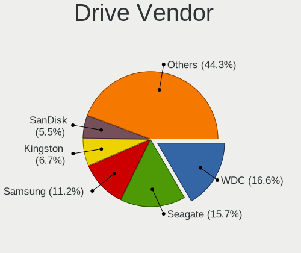
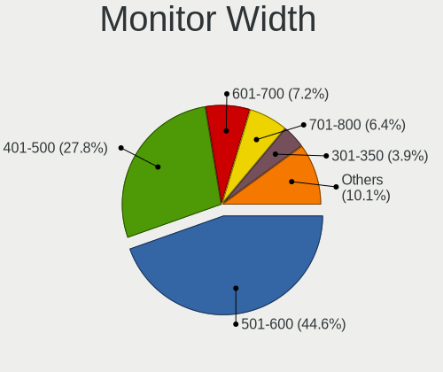
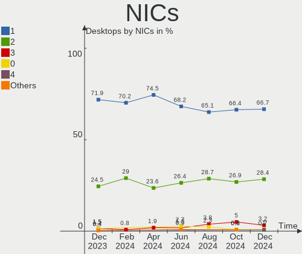
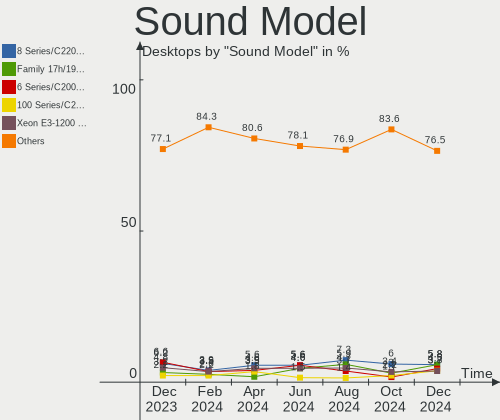

OpenMandriva - Hardware Trends (Desktops)
-----------------------------------------

A project to identify most popular hardware characteristics and track their change
over time based on data collected by Linux users at https://Linux-Hardware.org.

Anyone can contribute to this report by the [hw-probe](https://github.com/linuxhw/hw-probe) tool:

    sudo -E hw-probe -all -upload

This report is for one last month. Overall report since the beginning of time: [TestCoverage](https://github.com/linuxhw/TestCoverage)

Period: Aug, 2022.

Contents
--------

* [ System ](#system)
  - [ OS                       ](#os)
  - [ OS Family                ](#os-family)
  - [ Kernel                   ](#kernel)
  - [ Kernel Family            ](#kernel-family)
  - [ Kernel Major Ver.        ](#kernel-major-ver)
  - [ Arch                     ](#arch)
  - [ DE                       ](#de)
  - [ Display Server           ](#display-server)
  - [ Display Manager          ](#display-manager)
  - [ OS Lang                  ](#os-lang)
  - [ Boot Mode                ](#boot-mode)
  - [ Filesystem               ](#filesystem)
  - [ Part. scheme             ](#part-scheme)
  - [ Dual Boot with Linux/BSD ](#dual-boot-with-linuxbsd)
  - [ Dual Boot (Win)          ](#dual-boot-win)

* [ Board ](#board)
  - [ Vendor                   ](#vendor)
  - [ Model                    ](#model)
  - [ Model Family             ](#model-family)
  - [ MFG Year                 ](#mfg-year)
  - [ Form Factor              ](#form-factor)
  - [ Secure Boot              ](#secure-boot)
  - [ Coreboot                 ](#coreboot)
  - [ RAM Size                 ](#ram-size)
  - [ RAM Used                 ](#ram-used)
  - [ Total Drives             ](#total-drives)
  - [ Has CD-ROM               ](#has-cd-rom)
  - [ Has Ethernet             ](#has-ethernet)
  - [ Has WiFi                 ](#has-wifi)
  - [ Has Bluetooth            ](#has-bluetooth)

* [ Location ](#location)
  - [ Country                  ](#country)
  - [ City                     ](#city)

* [ Drives ](#drives)
  - [ Drive Vendor             ](#drive-vendor)
  - [ Drive Model              ](#drive-model)
  - [ HDD Vendor               ](#hdd-vendor)
  - [ SSD Vendor               ](#ssd-vendor)
  - [ Drive Kind               ](#drive-kind)
  - [ Drive Connector          ](#drive-connector)
  - [ Drive Size               ](#drive-size)
  - [ Space Total              ](#space-total)
  - [ Space Used               ](#space-used)
  - [ Malfunc. Drives          ](#malfunc-drives)
  - [ Malfunc. Drive Vendor    ](#malfunc-drive-vendor)
  - [ Malfunc. HDD Vendor      ](#malfunc-hdd-vendor)
  - [ Malfunc. Drive Kind      ](#malfunc-drive-kind)
  - [ Failed Drives            ](#failed-drives)
  - [ Failed Drive Vendor      ](#failed-drive-vendor)
  - [ Drive Status             ](#drive-status)

* [ Storage controller ](#storage-controller)
  - [ Storage Vendor           ](#storage-vendor)
  - [ Storage Model            ](#storage-model)
  - [ Storage Kind             ](#storage-kind)

* [ Processor ](#processor)
  - [ CPU Vendor               ](#cpu-vendor)
  - [ CPU Model                ](#cpu-model)
  - [ CPU Model Family         ](#cpu-model-family)
  - [ CPU Cores                ](#cpu-cores)
  - [ CPU Sockets              ](#cpu-sockets)
  - [ CPU Threads              ](#cpu-threads)
  - [ CPU Op-Modes             ](#cpu-op-modes)
  - [ CPU Microcode            ](#cpu-microcode)
  - [ CPU Microarch            ](#cpu-microarch)

* [ Graphics ](#graphics)
  - [ GPU Vendor               ](#gpu-vendor)
  - [ GPU Model                ](#gpu-model)
  - [ GPU Combo                ](#gpu-combo)
  - [ GPU Driver               ](#gpu-driver)
  - [ GPU Memory               ](#gpu-memory)

* [ Monitor ](#monitor)
  - [ Monitor Vendor           ](#monitor-vendor)
  - [ Monitor Model            ](#monitor-model)
  - [ Monitor Resolution       ](#monitor-resolution)
  - [ Monitor Diagonal         ](#monitor-diagonal)
  - [ Monitor Width            ](#monitor-width)
  - [ Aspect Ratio             ](#aspect-ratio)
  - [ Monitor Area             ](#monitor-area)
  - [ Pixel Density            ](#pixel-density)
  - [ Multiple Monitors        ](#multiple-monitors)

* [ Network ](#network)
  - [ Net Controller Vendor    ](#net-controller-vendor)
  - [ Net Controller Model     ](#net-controller-model)
  - [ Wireless Vendor          ](#wireless-vendor)
  - [ Wireless Model           ](#wireless-model)
  - [ Ethernet Vendor          ](#ethernet-vendor)
  - [ Ethernet Model           ](#ethernet-model)
  - [ Net Controller Kind      ](#net-controller-kind)
  - [ Used Controller          ](#used-controller)
  - [ NICs                     ](#nics)
  - [ IPv6                     ](#ipv6)

* [ Bluetooth ](#bluetooth)
  - [ Bluetooth Vendor         ](#bluetooth-vendor)
  - [ Bluetooth Model          ](#bluetooth-model)

* [ Sound ](#sound)
  - [ Sound Vendor             ](#sound-vendor)
  - [ Sound Model              ](#sound-model)

* [ Memory ](#memory)
  - [ Memory Vendor            ](#memory-vendor)
  - [ Memory Model             ](#memory-model)
  - [ Memory Kind              ](#memory-kind)
  - [ Memory Form Factor       ](#memory-form-factor)
  - [ Memory Size              ](#memory-size)
  - [ Memory Speed             ](#memory-speed)

* [ Printers & scanners ](#printers--scanners)
  - [ Printer Vendor           ](#printer-vendor)
  - [ Printer Model            ](#printer-model)
  - [ Scanner Vendor           ](#scanner-vendor)
  - [ Scanner Model            ](#scanner-model)

* [ Camera ](#camera)
  - [ Camera Vendor            ](#camera-vendor)
  - [ Camera Model             ](#camera-model)

* [ Security ](#security)
  - [ Fingerprint Vendor       ](#fingerprint-vendor)
  - [ Fingerprint Model        ](#fingerprint-model)
  - [ Chipcard Vendor          ](#chipcard-vendor)
  - [ Chipcard Model           ](#chipcard-model)

* [ Unsupported ](#unsupported)
  - [ Unsupported Devices      ](#unsupported-devices)
  - [ Unsupported Device Types ](#unsupported-device-types)

System
------

OS
--

Installed operating systems

| Name              | Desktops | Percent |
|-------------------|----------|---------|
| OpenMandriva 4.3  | 135      | 75.42%  |
| OpenMandriva 4.90 | 34       | 18.99%  |
| OpenMandriva 4.2  | 10       | 5.59%   |

OS Family
---------

OS without a version

| Name         | Desktops | Percent |
|--------------|----------|---------|
| OpenMandriva | 179      | 100%    |

Kernel
------

Version of the Linux kernel

| Version                     | Desktops | Percent |
|-----------------------------|----------|---------|
| 5.16.7-desktop-1omv4003     | 129      | 72.07%  |
| 5.18.12-desktop-3omv4090    | 30       | 16.76%  |
| 5.10.14-desktop-1omv4002    | 10       | 5.59%   |
| 5.16.13-desktop-1omv4003    | 6        | 3.35%   |
| 5.19.0-desktop-1omv4090     | 2        | 1.12%   |
| 5.19.1-desktop-1omv4090     | 1        | 0.56%   |
| 5.18.9-desktop-gcc-1omv4090 | 1        | 0.56%   |

Kernel Family
-------------

Linux kernel without a distro release

| Version | Desktops | Percent |
|---------|----------|---------|
| 5.16.7  | 129      | 72.07%  |
| 5.18.12 | 30       | 16.76%  |
| 5.10.14 | 10       | 5.59%   |
| 5.16.13 | 6        | 3.35%   |
| 5.19.0  | 2        | 1.12%   |
| 5.19.1  | 1        | 0.56%   |
| 5.18.9  | 1        | 0.56%   |

Kernel Major Ver.
-----------------

Linux kernel major version

| Version | Desktops | Percent |
|---------|----------|---------|
| 5.16    | 135      | 75.42%  |
| 5.18    | 31       | 17.32%  |
| 5.10    | 10       | 5.59%   |
| 5.19    | 3        | 1.68%   |

Arch
----

OS architecture (x86_64, i586, etc.)

| Name   | Desktops | Percent |
|--------|----------|---------|
| x86_64 | 179      | 100%    |

DE
--

Desktop Environment

| Name    | Desktops | Percent |
|---------|----------|---------|
| KDE5    | 177      | 98.88%  |
| Unknown | 2        | 1.12%   |

Display Server
--------------

X11 or Wayland

| Name    | Desktops | Percent |
|---------|----------|---------|
| X11     | 177      | 98.88%  |
| Wayland | 2        | 1.12%   |

Display Manager
---------------

SDDM, LightDM, etc.

| Name | Desktops | Percent |
|------|----------|---------|
| SDDM | 179      | 100%    |

OS Lang
-------

Language

| Lang  | Desktops | Percent |
|-------|----------|---------|
| en_US | 111      | 62.01%  |
| fr_FR | 12       | 6.7%    |
| de_DE | 11       | 6.15%   |
| ru_RU | 10       | 5.59%   |
| pt_BR | 9        | 5.03%   |
| pl_PL | 5        | 2.79%   |
| cs_CZ | 4        | 2.23%   |
| it_IT | 3        | 1.68%   |
| es_ES | 3        | 1.68%   |
| en_GB | 2        | 1.12%   |
| tr_TR | 1        | 0.56%   |
| nl_NL | 1        | 0.56%   |
| nl_BE | 1        | 0.56%   |
| fr_CA | 1        | 0.56%   |
| es_VE | 1        | 0.56%   |
| es_UY | 1        | 0.56%   |
| es_AR | 1        | 0.56%   |
| en_CA | 1        | 0.56%   |
| af_ZA | 1        | 0.56%   |

Boot Mode
---------

EFI or BIOS

| Mode | Desktops | Percent |
|------|----------|---------|
| BIOS | 93       | 51.96%  |
| EFI  | 86       | 48.04%  |

Filesystem
----------

Type of filesystem

| Type    | Desktops | Percent |
|---------|----------|---------|
| Overlay | 156      | 87.15%  |
| Ext4    | 22       | 12.29%  |
| Btrfs   | 1        | 0.56%   |

Part. scheme
------------

Scheme of partitioning

| Type | Desktops | Percent |
|------|----------|---------|
| GPT  | 116      | 64.8%   |
| MBR  | 63       | 35.2%   |

Dual Boot with Linux/BSD
------------------------

Hosting more than one Linux/BSD

| Dual boot | Desktops | Percent |
|-----------|----------|---------|
| Yes       | 112      | 62.57%  |
| No        | 67       | 37.43%  |

Dual Boot (Win)
---------------

Hosting Linux and Windows

| Dual boot | Desktops | Percent |
|-----------|----------|---------|
| Yes       | 96       | 53.63%  |
| No        | 83       | 46.37%  |

Board
-----

Vendor
------

Motherboard manufacturer

| Name                | Desktops | Percent |
|---------------------|----------|---------|
| ASUSTek Computer    | 45       | 25.14%  |
| Gigabyte Technology | 31       | 17.32%  |
| MSI                 | 20       | 11.17%  |
| ASRock              | 19       | 10.61%  |
| Dell                | 17       | 9.5%    |
| Hewlett-Packard     | 16       | 8.94%   |
| Lenovo              | 5        | 2.79%   |
| Foxconn             | 4        | 2.23%   |
| Intel               | 3        | 1.68%   |
| Acer                | 3        | 1.68%   |
| OEM                 | 2        | 1.12%   |
| Fujitsu             | 2        | 1.12%   |
| Biostar             | 2        | 1.12%   |
| Vorke               | 1        | 0.56%   |
| Semp Toshiba        | 1        | 0.56%   |
| Packard Bell        | 1        | 0.56%   |
| NCR                 | 1        | 0.56%   |
| Medion              | 1        | 0.56%   |
| MACHINIST           | 1        | 0.56%   |
| ICP / iEi           | 1        | 0.56%   |
| eMachines           | 1        | 0.56%   |
| AZW                 | 1        | 0.56%   |
| Unknown             | 1        | 0.56%   |

Model
-----

Motherboard model

| Name                                                             | Desktops | Percent |
|------------------------------------------------------------------|----------|---------|
| ASUS PRIME B450M-A II                                            | 5        | 2.79%   |
| MSI MS-7C37                                                      | 4        | 2.23%   |
| MSI MS-7B51                                                      | 2        | 1.12%   |
| Intel H61                                                        | 2        | 1.12%   |
| Gigabyte P43-ES3G                                                | 2        | 1.12%   |
| Gigabyte B450 AORUS PRO                                          | 2        | 1.12%   |
| ASUS PRIME Z390-A                                                | 2        | 1.12%   |
| ASUS All Series                                                  | 2        | 1.12%   |
| ASRock N68C-S UCC                                                | 2        | 1.12%   |
| Vorke V1 Plus                                                    | 1        | 0.56%   |
| Semp Toshiba STI                                                 | 1        | 0.56%   |
| Packard Bell IMEDIA F9218 AIO                                    | 1        | 0.56%   |
| OEM Intel H81                                                    | 1        | 0.56%   |
| OEM A320                                                         | 1        | 0.56%   |
| NCR xxxx-xxxx-xxxx                                               | 1        | 0.56%   |
| MSI p6570be-m                                                    | 1        | 0.56%   |
| MSI MS-7D54                                                      | 1        | 0.56%   |
| MSI MS-7D22                                                      | 1        | 0.56%   |
| MSI MS-7D09                                                      | 1        | 0.56%   |
| MSI MS-7C87                                                      | 1        | 0.56%   |
| MSI MS-7B84                                                      | 1        | 0.56%   |
| MSI MS-7B77                                                      | 1        | 0.56%   |
| MSI MS-7916                                                      | 1        | 0.56%   |
| MSI MS-7817                                                      | 1        | 0.56%   |
| MSI MS-7816                                                      | 1        | 0.56%   |
| MSI MS-7751                                                      | 1        | 0.56%   |
| MSI MS-7721                                                      | 1        | 0.56%   |
| MSI MS-7641                                                      | 1        | 0.56%   |
| MSI MS-7529                                                      | 1        | 0.56%   |
| Medion MD35147                                                   | 1        | 0.56%   |
| MACHINIST X79 (INTEL Xeon E5/Corei7 DMI2 - C600/C200 Cipset V309 | 1        | 0.56%   |
| Lenovo ThinkCentre XXXX 739527G                                  | 1        | 0.56%   |
| Lenovo ThinkCentre M93p 10AAS0QF00                               | 1        | 0.56%   |
| Lenovo ThinkCentre M91p 4518AU8                                  | 1        | 0.56%   |
| Lenovo ThinkCentre M58p 6234CL2                                  | 1        | 0.56%   |
| Lenovo 3102                                                      | 1        | 0.56%   |
| Intel DH61WW AAG23116-204                                        | 1        | 0.56%   |
| ICP / iEi B217                                                   | 1        | 0.56%   |
| HP Slim Desktop 290-p0xxx                                        | 1        | 0.56%   |
| HP ProDesk 600 G3 SFF                                            | 1        | 0.56%   |
| HP ProDesk 600 G1 SFF                                            | 1        | 0.56%   |
| HP ProDesk 600 G1 DM                                             | 1        | 0.56%   |
| HP p2-1221l                                                      | 1        | 0.56%   |
| HP OMEN by Obelisk Desktop 875-1xxx                              | 1        | 0.56%   |
| HP EliteDesk 800 G1 SFF                                          | 1        | 0.56%   |
| HP EliteDesk 705 G1 SFF                                          | 1        | 0.56%   |
| HP Compaq Pro 6305 SFF                                           | 1        | 0.56%   |
| HP Compaq Pro 6300 SFF                                           | 1        | 0.56%   |
| HP Compaq Pro 6300 MT                                            | 1        | 0.56%   |
| HP Compaq dc5700 Small Form Factor                               | 1        | 0.56%   |
| HP Compaq 8100 Elite CMT PC                                      | 1        | 0.56%   |
| HP Compaq 6200 Pro MT PC                                         | 1        | 0.56%   |
| HP Compaq 4000 Pro SFF PC                                        | 1        | 0.56%   |
| HP 550-a114                                                      | 1        | 0.56%   |
| Gigabyte Z68A-D3H-B3                                             | 1        | 0.56%   |
| Gigabyte Z170X-UD3                                               | 1        | 0.56%   |
| Gigabyte X570 AORUS ULTRA                                        | 1        | 0.56%   |
| Gigabyte P35-DS3L                                                | 1        | 0.56%   |
| Gigabyte H87-HD3                                                 | 1        | 0.56%   |
| Gigabyte H81M-S2PH                                               | 1        | 0.56%   |

Model Family
------------

Motherboard model prefix

| Name                 | Desktops | Percent |
|----------------------|----------|---------|
| ASUS PRIME           | 15       | 8.38%   |
| Dell OptiPlex        | 14       | 7.82%   |
| HP Compaq            | 7        | 3.91%   |
| MSI MS-7C37          | 4        | 2.23%   |
| Lenovo ThinkCentre   | 4        | 2.23%   |
| ASUS TUF             | 4        | 2.23%   |
| HP ProDesk           | 3        | 1.68%   |
| ASUS ROG             | 3        | 1.68%   |
| MSI MS-7B51          | 2        | 1.12%   |
| Intel H61            | 2        | 1.12%   |
| HP EliteDesk         | 2        | 1.12%   |
| Gigabyte P43-ES3G    | 2        | 1.12%   |
| Gigabyte B550        | 2        | 1.12%   |
| Gigabyte B450M       | 2        | 1.12%   |
| Gigabyte B450        | 2        | 1.12%   |
| Fujitsu ESPRIMO      | 2        | 1.12%   |
| ASUS SABERTOOTH      | 2        | 1.12%   |
| ASUS P8H61-M         | 2        | 1.12%   |
| ASUS M3A78           | 2        | 1.12%   |
| ASUS All             | 2        | 1.12%   |
| ASRock N68C-S        | 2        | 1.12%   |
| Acer Aspire          | 2        | 1.12%   |
| Vorke V1             | 1        | 0.56%   |
| Semp Toshiba STI     | 1        | 0.56%   |
| Packard Bell IMEDIA  | 1        | 0.56%   |
| OEM Intel            | 1        | 0.56%   |
| OEM A320             | 1        | 0.56%   |
| NCR xxxx-xxxx-xxxx   | 1        | 0.56%   |
| MSI p6570be-m        | 1        | 0.56%   |
| MSI MS-7D54          | 1        | 0.56%   |
| MSI MS-7D22          | 1        | 0.56%   |
| MSI MS-7D09          | 1        | 0.56%   |
| MSI MS-7C87          | 1        | 0.56%   |
| MSI MS-7B84          | 1        | 0.56%   |
| MSI MS-7B77          | 1        | 0.56%   |
| MSI MS-7916          | 1        | 0.56%   |
| MSI MS-7817          | 1        | 0.56%   |
| MSI MS-7816          | 1        | 0.56%   |
| MSI MS-7751          | 1        | 0.56%   |
| MSI MS-7721          | 1        | 0.56%   |
| MSI MS-7641          | 1        | 0.56%   |
| MSI MS-7529          | 1        | 0.56%   |
| Medion MD35147       | 1        | 0.56%   |
| MACHINIST X79        | 1        | 0.56%   |
| Lenovo 3102          | 1        | 0.56%   |
| Intel DH61WW         | 1        | 0.56%   |
| ICP / iEi B217       | 1        | 0.56%   |
| HP Slim              | 1        | 0.56%   |
| HP p2-1221l          | 1        | 0.56%   |
| HP OMEN              | 1        | 0.56%   |
| HP 550-a114          | 1        | 0.56%   |
| Gigabyte Z68A-D3H-B3 | 1        | 0.56%   |
| Gigabyte Z170X-UD3   | 1        | 0.56%   |
| Gigabyte X570        | 1        | 0.56%   |
| Gigabyte P35-DS3L    | 1        | 0.56%   |
| Gigabyte H87-HD3     | 1        | 0.56%   |
| Gigabyte H81M-S2PH   | 1        | 0.56%   |
| Gigabyte H61M-S2PH   | 1        | 0.56%   |
| Gigabyte H55M-UD2H   | 1        | 0.56%   |
| Gigabyte H410M       | 1        | 0.56%   |

MFG Year
--------

Motherboard manufacture year

| Year | Desktops | Percent |
|------|----------|---------|
| 2018 | 22       | 12.29%  |
| 2020 | 16       | 8.94%   |
| 2012 | 16       | 8.94%   |
| 2013 | 14       | 7.82%   |
| 2019 | 12       | 6.7%    |
| 2011 | 12       | 6.7%    |
| 2010 | 12       | 6.7%    |
| 2017 | 10       | 5.59%   |
| 2014 | 10       | 5.59%   |
| 2008 | 9        | 5.03%   |
| 2021 | 8        | 4.47%   |
| 2009 | 8        | 4.47%   |
| 2016 | 7        | 3.91%   |
| 2015 | 7        | 3.91%   |
| 2007 | 7        | 3.91%   |
| 2006 | 5        | 2.79%   |
| 2022 | 4        | 2.23%   |

Form Factor
-----------

Physical design of the computer

| Name    | Desktops | Percent |
|---------|----------|---------|
| Desktop | 179      | 100%    |

Secure Boot
-----------

Enabled or disabled

| State    | Desktops | Percent |
|----------|----------|---------|
| Disabled | 179      | 100%    |

Coreboot
--------

Have coreboot on board

| Used | Desktops | Percent |
|------|----------|---------|
| No   | 179      | 100%    |

RAM Size
--------

Total RAM memory

| Size in GB  | Desktops | Percent |
|-------------|----------|---------|
| 8.01-16.0   | 39       | 21.79%  |
| 4.01-8.0    | 37       | 20.67%  |
| 3.01-4.0    | 34       | 18.99%  |
| 16.01-24.0  | 31       | 17.32%  |
| 32.01-64.0  | 23       | 12.85%  |
| 1.01-2.0    | 11       | 6.15%   |
| 24.01-32.0  | 2        | 1.12%   |
| 2.01-3.0    | 1        | 0.56%   |
| 64.01-256.0 | 1        | 0.56%   |

RAM Used
--------

Used RAM memory

| Used GB   | Desktops | Percent |
|-----------|----------|---------|
| 1.01-2.0  | 123      | 68.72%  |
| 0.51-1.0  | 31       | 17.32%  |
| 2.01-3.0  | 14       | 7.82%   |
| 3.01-4.0  | 5        | 2.79%   |
| 0.01-0.5  | 4        | 2.23%   |
| 4.01-8.0  | 1        | 0.56%   |
| 8.01-16.0 | 1        | 0.56%   |

Total Drives
------------

Number of drives on board

| Drives | Desktops | Percent |
|--------|----------|---------|
| 1      | 78       | 43.58%  |
| 2      | 45       | 25.14%  |
| 3      | 30       | 16.76%  |
| 4      | 16       | 8.94%   |
| 5      | 5        | 2.79%   |
| 0      | 4        | 2.23%   |
| 6      | 1        | 0.56%   |

Has CD-ROM
----------

Has CD-ROM on board

| Presented | Desktops | Percent |
|-----------|----------|---------|
| Yes       | 102      | 56.98%  |
| No        | 77       | 43.02%  |

Has Ethernet
------------

Has Ethernet on board

| Presented | Desktops | Percent |
|-----------|----------|---------|
| Yes       | 178      | 99.44%  |
| No        | 1        | 0.56%   |

Has WiFi
--------

Has WiFi module

| Presented | Desktops | Percent |
|-----------|----------|---------|
| No        | 116      | 64.8%   |
| Yes       | 63       | 35.2%   |

Has Bluetooth
-------------

Has Bluetooth module

| Presented | Desktops | Percent |
|-----------|----------|---------|
| No        | 132      | 73.74%  |
| Yes       | 47       | 26.26%  |

Location
--------

Country
-------

Geographic location (country)

| Country         | Desktops | Percent |
|-----------------|----------|---------|
| USA             | 23       | 12.85%  |
| France          | 17       | 9.5%    |
| Brazil          | 13       | 7.26%   |
| Russia          | 12       | 6.7%    |
| Germany         | 11       | 6.15%   |
| UK              | 8        | 4.47%   |
| Italy           | 8        | 4.47%   |
| Poland          | 7        | 3.91%   |
| Australia       | 7        | 3.91%   |
| Canada          | 6        | 3.35%   |
| Czechia         | 5        | 2.79%   |
| Mexico          | 4        | 2.23%   |
| Japan           | 4        | 2.23%   |
| Finland         | 4        | 2.23%   |
| Belgium         | 4        | 2.23%   |
| India           | 3        | 1.68%   |
| Argentina       | 3        | 1.68%   |
| Venezuela       | 2        | 1.12%   |
| Uruguay         | 2        | 1.12%   |
| Tanzania        | 2        | 1.12%   |
| Sweden          | 2        | 1.12%   |
| South Africa    | 2        | 1.12%   |
| Slovakia        | 2        | 1.12%   |
| Netherlands     | 2        | 1.12%   |
| Malaysia        | 2        | 1.12%   |
| Indonesia       | 2        | 1.12%   |
| Egypt           | 2        | 1.12%   |
| Vietnam         | 1        | 0.56%   |
| Ukraine         | 1        | 0.56%   |
| Turkey          | 1        | 0.56%   |
| Switzerland     | 1        | 0.56%   |
| Spain           | 1        | 0.56%   |
| Singapore       | 1        | 0.56%   |
| Romania         | 1        | 0.56%   |
| Portugal        | 1        | 0.56%   |
| Peru            | 1        | 0.56%   |
| North Macedonia | 1        | 0.56%   |
| Nepal           | 1        | 0.56%   |
| Moldova         | 1        | 0.56%   |
| Israel          | 1        | 0.56%   |
| Iran            | 1        | 0.56%   |
| Hungary         | 1        | 0.56%   |
| Greece          | 1        | 0.56%   |
| Estonia         | 1        | 0.56%   |
| Denmark         | 1        | 0.56%   |
| China           | 1        | 0.56%   |
| Austria         | 1        | 0.56%   |

City
----

Geographic location (city)

| City               | Desktops | Percent |
|--------------------|----------|---------|
| Paris              | 3        | 1.68%   |
| Helsinki           | 3        | 1.68%   |
| Wolverhampton      | 2        | 1.12%   |
| Victor             | 2        | 1.12%   |
| Rochester          | 2        | 1.12%   |
| Olomouc            | 2        | 1.12%   |
| Moscow             | 2        | 1.12%   |
| Montevideo         | 2        | 1.12%   |
| Mexico City        | 2        | 1.12%   |
| Malden             | 2        | 1.12%   |
| Garland            | 2        | 1.12%   |
| Dar es Salaam      | 2        | 1.12%   |
| Caracas            | 2        | 1.12%   |
| Cairo              | 2        | 1.12%   |
| Bielsko-Biala      | 2        | 1.12%   |
| Belém             | 2        | 1.12%   |
| Agde               | 2        | 1.12%   |
| Zhukovskiy         | 1        | 0.56%   |
| Wooster            | 1        | 0.56%   |
| Vienna             | 1        | 0.56%   |
| Vevey              | 1        | 0.56%   |
| Ulyanovsk          | 1        | 0.56%   |
| Uberlândia        | 1        | 0.56%   |
| Turin              | 1        | 0.56%   |
| Trieste            | 1        | 0.56%   |
| Toyohashi          | 1        | 0.56%   |
| Toronto            | 1        | 0.56%   |
| Tīrān            | 1        | 0.56%   |
| Timor              | 1        | 0.56%   |
| The Hague          | 1        | 0.56%   |
| Tarimbaro          | 1        | 0.56%   |
| Tampere            | 1        | 0.56%   |
| Tallinn            | 1        | 0.56%   |
| Tacna              | 1        | 0.56%   |
| Surabaya           | 1        | 0.56%   |
| Strzyzow           | 1        | 0.56%   |
| Stoke-on-Trent     | 1        | 0.56%   |
| Stavropol          | 1        | 0.56%   |
| St Petersburg      | 1        | 0.56%   |
| Southport          | 1        | 0.56%   |
| Solna              | 1        | 0.56%   |
| Skopje             | 1        | 0.56%   |
| Singapore          | 1        | 0.56%   |
| Sherbrooke         | 1        | 0.56%   |
| Semenyih           | 1        | 0.56%   |
| Sao Paulo          | 1        | 0.56%   |
| San Antonio        | 1        | 0.56%   |
| Salem              | 1        | 0.56%   |
| Rubtsovsk          | 1        | 0.56%   |
| Roujan             | 1        | 0.56%   |
| Roeselare          | 1        | 0.56%   |
| Rio de Janeiro     | 1        | 0.56%   |
| Retournac          | 1        | 0.56%   |
| Reno               | 1        | 0.56%   |
| Rennes             | 1        | 0.56%   |
| Rejowiec Fabryczny | 1        | 0.56%   |
| Redcar             | 1        | 0.56%   |
| Ramat Gan          | 1        | 0.56%   |
| Puget-sur-Argens   | 1        | 0.56%   |
| Providencia        | 1        | 0.56%   |

Drives
------

Drive Vendor
------------

Hard drive vendors

| Vendor              | Desktops | Drives | Percent |
|---------------------|----------|--------|---------|
| WDC                 | 66       | 81     | 21.64%  |
| Seagate             | 53       | 65     | 17.38%  |
| Samsung Electronics | 34       | 40     | 11.15%  |
| Kingston            | 22       | 22     | 7.21%   |
| Hitachi             | 13       | 16     | 4.26%   |
| Crucial             | 13       | 19     | 4.26%   |
| SanDisk             | 12       | 12     | 3.93%   |
| A-DATA Technology   | 11       | 12     | 3.61%   |
| Toshiba             | 10       | 14     | 3.28%   |
| China               | 5        | 5      | 1.64%   |
| Unknown             | 4        | 4      | 1.31%   |
| SPCC                | 4        | 4      | 1.31%   |
| Patriot             | 4        | 4      | 1.31%   |
| Corsair             | 4        | 4      | 1.31%   |
| Transcend           | 3        | 3      | 0.98%   |
| PNY                 | 3        | 3      | 0.98%   |
| Phison              | 3        | 3      | 0.98%   |
| Micron Technology   | 3        | 3      | 0.98%   |
| Maxtor              | 3        | 3      | 0.98%   |
| Unknown             | 3        | 3      | 0.98%   |
| XPG                 | 2        | 2      | 0.66%   |
| OCZ                 | 2        | 2      | 0.66%   |
| Intel               | 2        | 2      | 0.66%   |
| HGST                | 2        | 2      | 0.66%   |
| GOODRAM             | 2        | 2      | 0.66%   |
| USB3.0              | 1        | 1      | 0.33%   |
| Team                | 1        | 1      | 0.33%   |
| StoreJet            | 1        | 1      | 0.33%   |
| SSDPR-CX            | 1        | 1      | 0.33%   |
| S3+                 | 1        | 1      | 0.33%   |
| Realtek             | 1        | 1      | 0.33%   |
| ORTIAL              | 1        | 1      | 0.33%   |
| OCZ-VERTEX3         | 1        | 1      | 0.33%   |
| M.2 SSD             | 1        | 1      | 0.33%   |
| LITEON              | 1        | 1      | 0.33%   |
| KingFast            | 1        | 1      | 0.33%   |
| Intenso             | 1        | 1      | 0.33%   |
| Hewlett-Packard     | 1        | 1      | 0.33%   |
| GLOWAY              | 1        | 1      | 0.33%   |
| Gigabyte Technology | 1        | 1      | 0.33%   |
| FORESEE             | 1        | 1      | 0.33%   |
| ExcelStor           | 1        | 1      | 0.33%   |
| Emtec               | 1        | 1      | 0.33%   |
| ASMT                | 1        | 2      | 0.33%   |
| Apple               | 1        | 1      | 0.33%   |
| AirDisk             | 1        | 1      | 0.33%   |
| Acer                | 1        | 1      | 0.33%   |

Drive Model
-----------

Hard drive models

| Model                            | Desktops | Percent |
|----------------------------------|----------|---------|
| Seagate ST2000DM008-2FR102 2TB   | 7        | 2.04%   |
| Seagate ST500DM002-1BD142 500GB  | 6        | 1.75%   |
| Samsung SSD 970 EVO Plus 500GB   | 6        | 1.75%   |
| WDC WDS500G2B0A-00SM50 500GB SSD | 4        | 1.17%   |
| WDC WD10EZEX-08WN4A0 1TB         | 4        | 1.17%   |
| Seagate ST1000DM010-2EP102 1TB   | 4        | 1.17%   |
| A-DATA SU630 240GB SSD           | 4        | 1.17%   |
| WDC WD20EZRZ-00Z5HB0 2TB         | 3        | 0.87%   |
| Toshiba DT01ACA050 500GB         | 3        | 0.87%   |
| Seagate ST3500312CS 500GB        | 3        | 0.87%   |
| Samsung SSD 970 EVO Plus 1TB     | 3        | 0.87%   |
| Samsung HD103SJ 1TB              | 3        | 0.87%   |
| Kingston SA400S37240G 240GB SSD  | 3        | 0.87%   |
| Kingston SA400S37120G 120GB SSD  | 3        | 0.87%   |
| Hitachi HDT725032VLA360 320GB    | 3        | 0.87%   |
| Crucial CT240BX500SSD1 240GB     | 3        | 0.87%   |
| Crucial CT1000MX500SSD1 1TB      | 3        | 0.87%   |
| Unknown                          | 3        | 0.87%   |
| WDC WDS240G2G0A-00JH30 240GB SSD | 2        | 0.58%   |
| WDC WD30EZRZ-00GXCB0 3TB         | 2        | 0.58%   |
| WDC WD20EZRX-00DC0B0 2TB         | 2        | 0.58%   |
| WDC WD20EARS-00MVWB0 2TB         | 2        | 0.58%   |
| Unknown SD/MMC/MS PRO 128GB      | 2        | 0.58%   |
| Toshiba HDWD110 1TB              | 2        | 0.58%   |
| Seagate ST6000DM003-2CY186 6TB   | 2        | 0.58%   |
| Seagate ST500DM002-1BC142 500GB  | 2        | 0.58%   |
| Seagate ST3500418AS 500GB        | 2        | 0.58%   |
| Seagate ST3500414CS 500GB        | 2        | 0.58%   |
| Seagate ST1000DM003-1SB102 1TB   | 2        | 0.58%   |
| Seagate Expansion 500GB          | 2        | 0.58%   |
| SanDisk SDSSDA240G 240GB         | 2        | 0.58%   |
| Samsung SSD 970 EVO Plus 2TB     | 2        | 0.58%   |
| Samsung SSD 870 QVO 1TB          | 2        | 0.58%   |
| Samsung SSD 850 EVO 500GB        | 2        | 0.58%   |
| Samsung SSD 840 EVO 250GB        | 2        | 0.58%   |
| Samsung HD252HJ 250GB            | 2        | 0.58%   |
| Kingston SV300S37A60G 64GB SSD   | 2        | 0.58%   |
| Kingston SHSS37A240G 240GB SSD   | 2        | 0.58%   |
| Hitachi HDT721010SLA360 1TB      | 2        | 0.58%   |
| Hitachi HDS722525VLSA80 250GB    | 2        | 0.58%   |
| Hitachi HDS721010DLE630 1TB      | 2        | 0.58%   |
| Crucial CT500P2SSD8 500GB        | 2        | 0.58%   |
| Crucial CT250MX500SSD1 250GB     | 2        | 0.58%   |
| Corsair Force MP510 240GB        | 2        | 0.58%   |
| XPG GAMMIX S70 BLADE 2TB         | 1        | 0.29%   |
| XPG GAMMIX S5 256GB              | 1        | 0.29%   |
| WDC WDS500G3X0C-00SJG0 500GB     | 1        | 0.29%   |
| WDC WDS500G2B0C 500GB            | 1        | 0.29%   |
| WDC WDS500G2B0B-00YS70 500GB SSD | 1        | 0.29%   |
| WDC WDS250G3X0C-00SJG0 250GB     | 1        | 0.29%   |
| WDC WDS240G1G0A-00SS50 240GB SSD | 1        | 0.29%   |
| WDC WDS120G2G0B-00EPW0 120GB SSD | 1        | 0.29%   |
| WDC WDS100T2B0C-00PXH0 1TB       | 1        | 0.29%   |
| WDC WDBRPG5000ANC-WRSN 500GB     | 1        | 0.29%   |
| WDC WD800JD-75MSA3 80GB          | 1        | 0.29%   |
| WDC WD800BB-55HEA0 80GB          | 1        | 0.29%   |
| WDC WD7500BPKX-00HPJT0 752GB     | 1        | 0.29%   |
| WDC WD5000LPLX-08ZNTT0 500GB     | 1        | 0.29%   |
| WDC WD5000BEVT-22A0RT0 500GB     | 1        | 0.29%   |
| WDC WD5000AZRX-00A8LB0 500GB     | 1        | 0.29%   |

HDD Vendor
----------

Hard disk drive vendors

| Vendor              | Desktops | Drives | Percent |
|---------------------|----------|--------|---------|
| WDC                 | 57       | 65     | 36.77%  |
| Seagate             | 53       | 64     | 34.19%  |
| Hitachi             | 13       | 16     | 8.39%   |
| Samsung Electronics | 11       | 11     | 7.1%    |
| Toshiba             | 8        | 12     | 5.16%   |
| Maxtor              | 3        | 3      | 1.94%   |
| Unknown             | 2        | 2      | 1.29%   |
| HGST                | 2        | 2      | 1.29%   |
| USB3.0              | 1        | 1      | 0.65%   |
| StoreJet            | 1        | 1      | 0.65%   |
| Hewlett-Packard     | 1        | 1      | 0.65%   |
| ExcelStor           | 1        | 1      | 0.65%   |
| ASMT                | 1        | 2      | 0.65%   |
| Apple               | 1        | 1      | 0.65%   |

SSD Vendor
----------

Solid state drive vendors

| Vendor              | Desktops | Drives | Percent |
|---------------------|----------|--------|---------|
| Kingston            | 19       | 19     | 16.38%  |
| Samsung Electronics | 14       | 14     | 12.07%  |
| SanDisk             | 11       | 11     | 9.48%   |
| WDC                 | 10       | 11     | 8.62%   |
| Crucial             | 10       | 15     | 8.62%   |
| A-DATA Technology   | 9        | 10     | 7.76%   |
| China               | 5        | 5      | 4.31%   |
| Transcend           | 3        | 3      | 2.59%   |
| SPCC                | 3        | 3      | 2.59%   |
| Patriot             | 3        | 3      | 2.59%   |
| Micron Technology   | 3        | 3      | 2.59%   |
| Unknown             | 3        | 3      | 2.59%   |
| PNY                 | 2        | 2      | 1.72%   |
| OCZ                 | 2        | 2      | 1.72%   |
| GOODRAM             | 2        | 2      | 1.72%   |
| Corsair             | 2        | 2      | 1.72%   |
| Toshiba             | 1        | 1      | 0.86%   |
| Team                | 1        | 1      | 0.86%   |
| S3+                 | 1        | 1      | 0.86%   |
| Phison              | 1        | 1      | 0.86%   |
| ORTIAL              | 1        | 1      | 0.86%   |
| OCZ-VERTEX3         | 1        | 1      | 0.86%   |
| LITEON              | 1        | 1      | 0.86%   |
| KingFast            | 1        | 1      | 0.86%   |
| Intenso             | 1        | 1      | 0.86%   |
| Intel               | 1        | 1      | 0.86%   |
| GLOWAY              | 1        | 1      | 0.86%   |
| FORESEE             | 1        | 1      | 0.86%   |
| Emtec               | 1        | 1      | 0.86%   |
| AirDisk             | 1        | 1      | 0.86%   |
| Acer                | 1        | 1      | 0.86%   |

Drive Kind
----------

HDD or SSD

| Kind    | Desktops | Drives | Percent |
|---------|----------|--------|---------|
| HDD     | 126      | 182    | 49.22%  |
| SSD     | 92       | 123    | 35.94%  |
| NVMe    | 33       | 43     | 12.89%  |
| Unknown | 3        | 3      | 1.17%   |
| MMC     | 2        | 2      | 0.78%   |

Drive Connector
---------------

SATA, SAS, NVMe, etc.

| Type | Desktops | Drives | Percent |
|------|----------|--------|---------|
| SATA | 165      | 291    | 76.39%  |
| NVMe | 32       | 42     | 14.81%  |
| SAS  | 17       | 18     | 7.87%   |
| MMC  | 2        | 2      | 0.93%   |

Drive Size
----------

Size of hard drive

| Size in TB | Desktops | Drives | Percent |
|------------|----------|--------|---------|
| 0.01-0.5   | 133      | 190    | 57.58%  |
| 0.51-1.0   | 58       | 66     | 25.11%  |
| 1.01-2.0   | 25       | 29     | 10.82%  |
| 2.01-3.0   | 6        | 8      | 2.6%    |
| 4.01-10.0  | 6        | 9      | 2.6%    |
| 3.01-4.0   | 2        | 2      | 0.87%   |
| 10.01-20.0 | 1        | 1      | 0.43%   |

Space Total
-----------

Amount of disk space available on the file system

| Size in GB     | Desktops | Percent |
|----------------|----------|---------|
| 1-20           | 96       | 53.63%  |
| Unknown        | 20       | 11.17%  |
| 251-500        | 19       | 10.61%  |
| 101-250        | 19       | 10.61%  |
| 51-100         | 9        | 5.03%   |
| 501-1000       | 6        | 3.35%   |
| 21-50          | 3        | 1.68%   |
| 2001-3000      | 3        | 1.68%   |
| 1001-2000      | 3        | 1.68%   |
| More than 3000 | 1        | 0.56%   |

Space Used
----------

Amount of used disk space

| Used GB   | Desktops | Percent |
|-----------|----------|---------|
| 1-20      | 137      | 76.54%  |
| Unknown   | 20       | 11.17%  |
| 251-500   | 5        | 2.79%   |
| 21-50     | 5        | 2.79%   |
| 501-1000  | 5        | 2.79%   |
| 101-250   | 3        | 1.68%   |
| 51-100    | 3        | 1.68%   |
| 1001-2000 | 1        | 0.56%   |

Malfunc. Drives
---------------

Drive models with a malfunction

| Model                                     | Desktops | Drives | Percent |
|-------------------------------------------|----------|--------|---------|
| Seagate ST500DM002-1BD142 500GB           | 3        | 3      | 4.41%   |
| Samsung Electronics HD103SJ 1TB           | 3        | 3      | 4.41%   |
| Hitachi HDT725032VLA360 320GB             | 3        | 3      | 4.41%   |
| Seagate ST3500414CS 500GB                 | 2        | 2      | 2.94%   |
| Kingston SV300S37A60G 64GB SSD            | 2        | 2      | 2.94%   |
| Hitachi HDT721010SLA360 1TB               | 2        | 2      | 2.94%   |
| Hitachi HDS721010DLE630 1TB               | 2        | 2      | 2.94%   |
| WDC WDS240G2G0A-00JH30 240GB SSD          | 1        | 1      | 1.47%   |
| WDC WD5000BEVT-22A0RT0 500GB              | 1        | 1      | 1.47%   |
| WDC WD5000AAKX-221CA1 500GB               | 1        | 1      | 1.47%   |
| WDC WD5000AAKX-001CA0 500GB               | 1        | 1      | 1.47%   |
| WDC WD5000AAKS-00V0A0 500GB               | 1        | 1      | 1.47%   |
| WDC WD4000AAKS-00YGA0 400GB               | 1        | 1      | 1.47%   |
| WDC WD3200AAKS-61L9A0 320GB               | 1        | 1      | 1.47%   |
| WDC WD3200AAJS-00B4A0 320GB               | 1        | 1      | 1.47%   |
| WDC WD30PURX-64P6ZY0 3TB                  | 1        | 1      | 1.47%   |
| WDC WD2502ABYS-02B7A0 256GB               | 1        | 1      | 1.47%   |
| WDC WD2500BEVS-22UST0 250GB               | 1        | 1      | 1.47%   |
| WDC WD20EZRZ-00Z5HB0 2TB                  | 1        | 1      | 1.47%   |
| WDC WD20EARS-00MVWB0 2TB                  | 1        | 1      | 1.47%   |
| WDC WD2002FAEX-007BA0 2TB                 | 1        | 1      | 1.47%   |
| WDC WD1600AABS-00H4A0 160GB               | 1        | 1      | 1.47%   |
| WDC WD10EARX-00N0YB0 1TB                  | 1        | 1      | 1.47%   |
| WDC WD10EARS-00Y5B1 1TB                   | 1        | 1      | 1.47%   |
| Seagate ST9160412AS 160GB                 | 1        | 1      | 1.47%   |
| Seagate ST5000DM000-1FK178 5TB            | 1        | 1      | 1.47%   |
| Seagate ST380013AS 80GB                   | 1        | 1      | 1.47%   |
| Seagate ST3500413AS 500GB                 | 1        | 1      | 1.47%   |
| Seagate ST3500312CS 500GB                 | 1        | 1      | 1.47%   |
| Seagate ST3402111A 40GB                   | 1        | 1      | 1.47%   |
| Seagate ST320LT007-9ZV142 320GB           | 1        | 1      | 1.47%   |
| Seagate ST31000528AS 1TB                  | 1        | 1      | 1.47%   |
| Seagate ST31000525SV 1TB                  | 1        | 1      | 1.47%   |
| Seagate ST31000333AS 1TB                  | 1        | 1      | 1.47%   |
| Seagate ST3000DM001-9YN166 3TB            | 1        | 1      | 1.47%   |
| Seagate ST2000DL003-9VT166 2TB            | 1        | 1      | 1.47%   |
| Seagate ST1000DM003-1ER162 1TB            | 1        | 1      | 1.47%   |
| SanDisk SSD PLUS 240GB                    | 1        | 1      | 1.47%   |
| SanDisk SDSSDA240G 240GB                  | 1        | 1      | 1.47%   |
| Samsung Electronics SSD 870 EVO 500GB     | 1        | 1      | 1.47%   |
| Samsung Electronics SSD 860 EVO M.2 500GB | 1        | 1      | 1.47%   |
| Samsung Electronics SSD 860 EVO 500GB     | 1        | 1      | 1.47%   |
| Samsung Electronics SP0812C 80GB          | 1        | 1      | 1.47%   |
| Samsung Electronics HM320JI 320GB         | 1        | 1      | 1.47%   |
| Samsung Electronics HD154UI 1TB           | 1        | 1      | 1.47%   |
| Maxtor 6Y080M0 81GB                       | 1        | 1      | 1.47%   |
| Maxtor 6L300R0 304GB                      | 1        | 1      | 1.47%   |
| Kingston SUV400S37120G 120GB SSD          | 1        | 1      | 1.47%   |
| Kingston SA400S37240G 240GB SSD           | 1        | 1      | 1.47%   |
| Intel SSDSC2CT240A4 240GB                 | 1        | 1      | 1.47%   |
| Hitachi HDT721016SLA380 160GB             | 1        | 1      | 1.47%   |
| Hitachi HDS721050CLA360 500GB             | 1        | 2      | 1.47%   |
| HGST HTS725032A7E630 320GB                | 1        | 1      | 1.47%   |
| GOODRAM SSD 120GB                         | 1        | 1      | 1.47%   |
| ExcelStor Technology G140 40GB            | 1        | 1      | 1.47%   |
| Crucial CT480BX500SSD1 480GB              | 1        | 1      | 1.47%   |
| Corsair Force LS SSD 64GB                 | 1        | 1      | 1.47%   |
| A-DATA Technology SU630 240GB SSD         | 1        | 1      | 1.47%   |

Malfunc. Drive Vendor
---------------------

Vendors of faulty drives

| Vendor              | Desktops | Drives | Percent |
|---------------------|----------|--------|---------|
| Seagate             | 17       | 18     | 26.15%  |
| WDC                 | 16       | 17     | 24.62%  |
| Samsung Electronics | 9        | 9      | 13.85%  |
| Hitachi             | 8        | 10     | 12.31%  |
| Kingston            | 4        | 4      | 6.15%   |
| SanDisk             | 2        | 2      | 3.08%   |
| Maxtor              | 2        | 2      | 3.08%   |
| Intel               | 1        | 1      | 1.54%   |
| HGST                | 1        | 1      | 1.54%   |
| GOODRAM             | 1        | 1      | 1.54%   |
| ExcelStor           | 1        | 1      | 1.54%   |
| Crucial             | 1        | 1      | 1.54%   |
| Corsair             | 1        | 1      | 1.54%   |
| A-DATA Technology   | 1        | 1      | 1.54%   |

Malfunc. HDD Vendor
-------------------

Vendors of faulty HDD drives

| Vendor              | Desktops | Drives | Percent |
|---------------------|----------|--------|---------|
| Seagate             | 17       | 18     | 34%     |
| WDC                 | 15       | 16     | 30%     |
| Hitachi             | 8        | 10     | 16%     |
| Samsung Electronics | 6        | 6      | 12%     |
| Maxtor              | 2        | 2      | 4%      |
| HGST                | 1        | 1      | 2%      |
| ExcelStor           | 1        | 1      | 2%      |

Malfunc. Drive Kind
-------------------

Kinds of faulty drives

| Kind | Desktops | Drives | Percent |
|------|----------|--------|---------|
| HDD  | 43       | 54     | 76.79%  |
| SSD  | 13       | 15     | 23.21%  |

Failed Drives
-------------

Failed drive models

| Model                                            | Desktops | Drives | Percent |
|--------------------------------------------------|----------|--------|---------|
| WDC WD20EARS-00MVWB0 2TB                         | 1        | 1      | 33.33%  |
| Seagate ST500DM002-1BD142 500GB                  | 1        | 1      | 33.33%  |
| Samsung Electronics MZ7TY128HDHP-000L1 128GB SSD | 1        | 1      | 33.33%  |

Failed Drive Vendor
-------------------

Failed drive vendors

| Vendor              | Desktops | Drives | Percent |
|---------------------|----------|--------|---------|
| WDC                 | 1        | 1      | 33.33%  |
| Seagate             | 1        | 1      | 33.33%  |
| Samsung Electronics | 1        | 1      | 33.33%  |

Drive Status
------------

Number of failed and malfunc. drives

| Status   | Desktops | Drives | Percent |
|----------|----------|--------|---------|
| Works    | 149      | 265    | 68.35%  |
| Malfunc  | 51       | 69     | 23.39%  |
| Detected | 15       | 16     | 6.88%   |
| Failed   | 3        | 3      | 1.38%   |

Storage controller
------------------

Storage Vendor
--------------

Storage controller vendors

| Vendor                       | Desktops | Percent |
|------------------------------|----------|---------|
| Intel                        | 109      | 43.95%  |
| AMD                          | 58       | 23.39%  |
| ASMedia Technology           | 16       | 6.45%   |
| Samsung Electronics          | 12       | 4.84%   |
| JMicron Technology           | 10       | 4.03%   |
| Nvidia                       | 9        | 3.63%   |
| SanDisk                      | 6        | 2.42%   |
| Phison Electronics           | 6        | 2.42%   |
| VIA Technologies             | 5        | 2.02%   |
| Marvell Technology Group     | 4        | 1.61%   |
| Micron/Crucial Technology    | 3        | 1.21%   |
| Kingston Technology Company  | 3        | 1.21%   |
| Silicon Motion               | 2        | 0.81%   |
| Realtek Semiconductor        | 2        | 0.81%   |
| ADATA Technology             | 2        | 0.81%   |
| Toshiba America Info Systems | 1        | 0.4%    |

Storage Model
-------------

Storage controller models

| Model                                                                                   | Desktops | Percent |
|-----------------------------------------------------------------------------------------|----------|---------|
| AMD FCH SATA Controller [AHCI mode]                                                     | 30       | 9.49%   |
| Intel 8 Series/C220 Series Chipset Family 6-port SATA Controller 1 [AHCI mode]          | 15       | 4.75%   |
| AMD 400 Series Chipset SATA Controller                                                  | 15       | 4.75%   |
| ASMedia ASM1062 Serial ATA Controller                                                   | 14       | 4.43%   |
| Samsung NVMe SSD Controller SM981/PM981/PM983                                           | 12       | 3.8%    |
| Intel 6 Series/C200 Series Chipset Family 6 port Desktop SATA AHCI Controller           | 11       | 3.48%   |
| Intel NM10/ICH7 Family SATA Controller [IDE mode]                                       | 10       | 3.16%   |
| Intel Cannon Lake PCH SATA AHCI Controller                                              | 9        | 2.85%   |
| Intel 82801G (ICH7 Family) IDE Controller                                               | 9        | 2.85%   |
| AMD SB7x0/SB8x0/SB9x0 IDE Controller                                                    | 9        | 2.85%   |
| Intel 7 Series/C210 Series Chipset Family 6-port SATA Controller [AHCI mode]            | 8        | 2.53%   |
| Nvidia MCP61 SATA Controller                                                            | 7        | 2.22%   |
| Intel SATA Controller [RAID mode]                                                       | 7        | 2.22%   |
| Intel 6 Series/C200 Series Chipset Family Desktop SATA Controller (IDE mode, ports 4-5) | 7        | 2.22%   |
| Intel 6 Series/C200 Series Chipset Family Desktop SATA Controller (IDE mode, ports 0-3) | 7        | 2.22%   |
| AMD SB7x0/SB8x0/SB9x0 SATA Controller [IDE mode]                                        | 7        | 2.22%   |
| AMD 500 Series Chipset SATA Controller                                                  | 7        | 2.22%   |
| Nvidia MCP61 IDE                                                                        | 6        | 1.9%    |
| Intel 200 Series PCH SATA controller [AHCI mode]                                        | 6        | 1.9%    |
| Intel Q170/Q150/B150/H170/H110/Z170/CM236 Chipset SATA Controller [AHCI Mode]           | 5        | 1.58%   |
| AMD FCH SATA Controller D                                                               | 5        | 1.58%   |
| JMicron JMB368 IDE controller                                                           | 4        | 1.27%   |
| JMicron JMB363 SATA/IDE Controller                                                      | 4        | 1.27%   |
| Intel Celeron N3350/Pentium N4200/Atom E3900 Series SATA AHCI Controller                | 4        | 1.27%   |
| Intel 82801JI (ICH10 Family) 4 port SATA IDE Controller #1                              | 4        | 1.27%   |
| Intel 82801JI (ICH10 Family) 2 port SATA IDE Controller #2                              | 4        | 1.27%   |
| SanDisk WD Blue SN550 NVMe SSD                                                          | 3        | 0.95%   |
| Phison E12 NVMe Controller                                                              | 3        | 0.95%   |
| Micron/Crucial P2 NVMe PCIe SSD                                                         | 3        | 0.95%   |
| Intel 82801I (ICH9 Family) 2 port SATA Controller [IDE mode]                            | 3        | 0.95%   |
| Intel 500 Series Chipset Family SATA AHCI Controller                                    | 3        | 0.95%   |
| AMD SB7x0/SB8x0/SB9x0 SATA Controller [AHCI mode]                                       | 3        | 0.95%   |
| AMD 300 Series Chipset SATA Controller                                                  | 3        | 0.95%   |
| VIA VT82C586A/B/VT82C686/A/B/VT823x/A/C PIPC Bus Master IDE                             | 2        | 0.63%   |
| VIA VT6421 IDE/SATA Controller                                                          | 2        | 0.63%   |
| SanDisk WD Black SN750 / PC SN730 NVMe SSD                                              | 2        | 0.63%   |
| Phison E16 PCIe4 NVMe Controller                                                        | 2        | 0.63%   |
| Kingston Company A2000 NVMe SSD                                                         | 2        | 0.63%   |
| Intel 82801JD/DO (ICH10 Family) SATA AHCI Controller                                    | 2        | 0.63%   |
| Intel 82801IR/IO/IH (ICH9R/DO/DH) 4 port SATA Controller [IDE mode]                     | 2        | 0.63%   |
| Intel 82801HR/HO/HH (ICH8R/DO/DH) 2 port SATA Controller [IDE mode]                     | 2        | 0.63%   |
| Intel 82801H (ICH8 Family) 4 port SATA Controller [IDE mode]                            | 2        | 0.63%   |
| Intel 5 Series/3400 Series Chipset 6 port SATA AHCI Controller                          | 2        | 0.63%   |
| Intel 4 Series Chipset PT IDER Controller                                               | 2        | 0.63%   |
| ASMedia ASM1061 SATA IDE Controller                                                     | 2        | 0.63%   |
| VIA VT8237A SATA 2-Port Controller                                                      | 1        | 0.32%   |
| VIA VT6415 PATA IDE Host Controller                                                     | 1        | 0.32%   |
| VIA Serial ATA Controller                                                               | 1        | 0.32%   |
| Toshiba America Info Systems XG4 NVMe SSD Controller                                    | 1        | 0.32%   |
| Silicon Motion SM2263EN/SM2263XT SSD Controller                                         | 1        | 0.32%   |
| Silicon Motion SM2262/SM2262EN SSD Controller                                           | 1        | 0.32%   |
| SanDisk WD Black 2018/SN750 / PC SN720 NVMe SSD                                         | 1        | 0.32%   |
| Samsung NVMe SSD Controller PM9A1/PM9A3/980PRO                                          | 1        | 0.32%   |
| Realtek RTS5763DL NVMe SSD Controller                                                   | 1        | 0.32%   |
| Realtek Realtek Non-Volatile memory controller                                          | 1        | 0.32%   |
| Phison PS5013 E13 NVMe Controller                                                       | 1        | 0.32%   |
| Nvidia MCP79 SATA Controller                                                            | 1        | 0.32%   |
| Nvidia MCP51 Serial ATA Controller                                                      | 1        | 0.32%   |
| Nvidia MCP51 IDE                                                                        | 1        | 0.32%   |
| Micron/Crucial P1 NVMe PCIe SSD                                                         | 1        | 0.32%   |

Storage Kind
------------

Kind of storage controller (IDE, SATA, NVMe, SAS, ...)

| Kind | Desktops | Percent |
|------|----------|---------|
| SATA | 133      | 57.33%  |
| IDE  | 55       | 23.71%  |
| NVMe | 32       | 13.79%  |
| RAID | 11       | 4.74%   |
| SAS  | 1        | 0.43%   |

Processor
---------

CPU Vendor
----------

Processor vendors

| Vendor | Desktops | Percent |
|--------|----------|---------|
| Intel  | 115      | 64.25%  |
| AMD    | 64       | 35.75%  |

CPU Model
---------

Processor models

| Model                                         | Desktops | Percent |
|-----------------------------------------------|----------|---------|
| Intel Core i5-9400F CPU @ 2.90GHz             | 4        | 2.23%   |
| Intel Core i5-2400 CPU @ 3.10GHz              | 4        | 2.23%   |
| Intel Core 2 Duo CPU E7400 @ 2.80GHz          | 4        | 2.23%   |
| AMD Ryzen 5 2600 Six-Core Processor           | 4        | 2.23%   |
| Intel Core i5-7400 CPU @ 3.00GHz              | 3        | 1.68%   |
| Intel Core i5-4590 CPU @ 3.30GHz              | 3        | 1.68%   |
| Intel Core i5-3450 CPU @ 3.10GHz              | 3        | 1.68%   |
| Intel Core i3-3220 CPU @ 3.30GHz              | 3        | 1.68%   |
| Intel Core 2 Duo CPU E8400 @ 3.00GHz          | 3        | 1.68%   |
| Intel Core 2 CPU 6600 @ 2.40GHz               | 3        | 1.68%   |
| Intel Celeron CPU J3455 @ 1.50GHz             | 3        | 1.68%   |
| AMD Ryzen 7 3700X 8-Core Processor            | 3        | 1.68%   |
| AMD Ryzen 5 5600G with Radeon Graphics        | 3        | 1.68%   |
| AMD Ryzen 5 3600 6-Core Processor             | 3        | 1.68%   |
| AMD Athlon 3000G with Radeon Vega Graphics    | 3        | 1.68%   |
| Intel Xeon CPU X5450 @ 3.00GHz                | 2        | 1.12%   |
| Intel Pentium Dual-Core CPU E6300 @ 2.80GHz   | 2        | 1.12%   |
| Intel Pentium CPU G620 @ 2.60GHz              | 2        | 1.12%   |
| Intel Core i7-8700 CPU @ 3.20GHz              | 2        | 1.12%   |
| Intel Core i7-4770 CPU @ 3.40GHz              | 2        | 1.12%   |
| Intel Core i7-3770 CPU @ 3.40GHz              | 2        | 1.12%   |
| Intel Core i5-7500 CPU @ 3.40GHz              | 2        | 1.12%   |
| Intel Core i5-4690K CPU @ 3.50GHz             | 2        | 1.12%   |
| Intel Core i5-4590T CPU @ 2.00GHz             | 2        | 1.12%   |
| Intel Core i5-4570 CPU @ 3.20GHz              | 2        | 1.12%   |
| Intel Core i5-3470 CPU @ 3.20GHz              | 2        | 1.12%   |
| Intel Core i5-10400 CPU @ 2.90GHz             | 2        | 1.12%   |
| Intel Core i3-6100 CPU @ 3.70GHz              | 2        | 1.12%   |
| Intel Core 2 Quad CPU Q6600 @ 2.40GHz         | 2        | 1.12%   |
| AMD Ryzen 9 3900X 12-Core Processor           | 2        | 1.12%   |
| AMD Ryzen 7 2700X Eight-Core Processor        | 2        | 1.12%   |
| AMD Ryzen 5 5600X 6-Core Processor            | 2        | 1.12%   |
| AMD Ryzen 3 3200G with Radeon Vega Graphics   | 2        | 1.12%   |
| AMD Ryzen 3 2200G with Radeon Vega Graphics   | 2        | 1.12%   |
| AMD Phenom 9850 Quad-Core Processor           | 2        | 1.12%   |
| AMD Phenom 9550 Quad-Core Processor           | 2        | 1.12%   |
| AMD FX-4100 Quad-Core Processor               | 2        | 1.12%   |
| AMD A6-7400K Radeon R5, 6 Compute Cores 2C+4G | 2        | 1.12%   |
| Intel Xeon CPU E5-2690 0 @ 2.90GHz            | 1        | 0.56%   |
| Intel Xeon CPU E5-2420 0 @ 1.90GHz            | 1        | 0.56%   |
| Intel Pentium Gold G6405 CPU @ 4.10GHz        | 1        | 0.56%   |
| Intel Pentium Dual-Core CPU E5700 @ 3.00GHz   | 1        | 0.56%   |
| Intel Pentium D CPU 3.00GHz                   | 1        | 0.56%   |
| Intel Pentium D CPU 2.80GHz                   | 1        | 0.56%   |
| Intel Pentium CPU G640T @ 2.40GHz             | 1        | 0.56%   |
| Intel Pentium CPU G4560 @ 3.50GHz             | 1        | 0.56%   |
| Intel Pentium CPU G3258 @ 3.20GHz             | 1        | 0.56%   |
| Intel Pentium CPU G3250 @ 3.20GHz             | 1        | 0.56%   |
| Intel Pentium CPU G3240 @ 3.10GHz             | 1        | 0.56%   |
| Intel Pentium CPU G3220 @ 3.00GHz             | 1        | 0.56%   |
| Intel Core i9-9900K CPU @ 3.60GHz             | 1        | 0.56%   |
| Intel Core i7-9700K CPU @ 3.60GHz             | 1        | 0.56%   |
| Intel Core i7-8086K CPU @ 4.00GHz             | 1        | 0.56%   |
| Intel Core i7-7700 CPU @ 3.60GHz              | 1        | 0.56%   |
| Intel Core i7-4790K CPU @ 4.00GHz             | 1        | 0.56%   |
| Intel Core i7-4765T CPU @ 2.00GHz             | 1        | 0.56%   |
| Intel Core i7-3770S CPU @ 3.10GHz             | 1        | 0.56%   |
| Intel Core i7-2700K CPU @ 3.50GHz             | 1        | 0.56%   |
| Intel Core i7 CPU 920 @ 2.67GHz               | 1        | 0.56%   |
| Intel Core i7 CPU 870 @ 2.93GHz               | 1        | 0.56%   |

CPU Model Family
----------------

Processor model prefix

| Model                   | Desktops | Percent |
|-------------------------|----------|---------|
| Intel Core i5           | 38       | 21.23%  |
| Intel Core i7           | 16       | 8.94%   |
| AMD Ryzen 5             | 16       | 8.94%   |
| Intel Core i3           | 15       | 8.38%   |
| Intel Core 2 Duo        | 12       | 6.7%    |
| Intel Pentium           | 8        | 4.47%   |
| AMD Ryzen 7             | 8        | 4.47%   |
| AMD FX                  | 7        | 3.91%   |
| AMD Ryzen 3             | 6        | 3.35%   |
| Intel Core 2            | 5        | 2.79%   |
| Intel Celeron           | 5        | 2.79%   |
| AMD A6                  | 5        | 2.79%   |
| Intel Xeon              | 4        | 2.23%   |
| AMD Phenom              | 4        | 2.23%   |
| Intel Pentium Dual-Core | 3        | 1.68%   |
| AMD Ryzen 9             | 3        | 1.68%   |
| AMD Athlon              | 3        | 1.68%   |
| AMD A8                  | 3        | 1.68%   |
| Intel Pentium D         | 2        | 1.12%   |
| Intel Core 2 Quad       | 2        | 1.12%   |
| Intel Atom              | 2        | 1.12%   |
| AMD Athlon II X3        | 2        | 1.12%   |
| Other                   | 1        | 0.56%   |
| Intel Pentium Gold      | 1        | 0.56%   |
| Intel Core i9           | 1        | 0.56%   |
| AMD Ryzen 5 PRO         | 1        | 0.56%   |
| AMD Phenom II X4        | 1        | 0.56%   |
| AMD Phenom II X2        | 1        | 0.56%   |
| AMD Athlon II X2        | 1        | 0.56%   |
| AMD Athlon 64           | 1        | 0.56%   |
| AMD A4                  | 1        | 0.56%   |
| AMD A10                 | 1        | 0.56%   |

CPU Cores
---------

Number of processor cores

| Number | Desktops | Percent |
|--------|----------|---------|
| 4      | 64       | 35.75%  |
| 2      | 60       | 33.52%  |
| 6      | 29       | 16.2%   |
| 8      | 12       | 6.7%    |
| 1      | 7        | 3.91%   |
| 3      | 4        | 2.23%   |
| 12     | 3        | 1.68%   |

CPU Sockets
-----------

Number of sockets

| Number | Desktops | Percent |
|--------|----------|---------|
| 1      | 179      | 100%    |

CPU Threads
-----------

Threads per core (Hyper-Threading)

| Number | Desktops | Percent |
|--------|----------|---------|
| 1      | 93       | 51.96%  |
| 2      | 86       | 48.04%  |

CPU Op-Modes
------------

CPU Operation Modes (32-bit, 64-bit)

| Op mode        | Desktops | Percent |
|----------------|----------|---------|
| 32-bit, 64-bit | 179      | 100%    |

CPU Microcode
-------------

Microcode number

| Number     | Desktops | Percent |
|------------|----------|---------|
| 0x306c3    | 18       | 10.06%  |
| 0x306a9    | 13       | 7.26%   |
| 0x1067a    | 13       | 7.26%   |
| 0x206a7    | 12       | 6.7%    |
| 0x08701021 | 9        | 5.03%   |
| 0x906e9    | 8        | 4.47%   |
| 0x906ea    | 7        | 3.91%   |
| 0xa0653    | 5        | 2.79%   |
| 0x08101016 | 5        | 2.79%   |
| Unknown    | 5        | 2.79%   |
| 0x6f6      | 4        | 2.23%   |
| 0x00000000 | 4        | 2.23%   |
| 0x6fb      | 3        | 1.68%   |
| 0x506e3    | 3        | 1.68%   |
| 0x506c9    | 3        | 1.68%   |
| 0x0800820b | 3        | 1.68%   |
| 0x06003106 | 3        | 1.68%   |
| 0x06001119 | 3        | 1.68%   |
| 0x01000095 | 3        | 1.68%   |
| 0x906ed    | 2        | 1.12%   |
| 0x6fd      | 2        | 1.12%   |
| 0x206d7    | 2        | 1.12%   |
| 0x106e5    | 2        | 1.12%   |
| 0x0a50000d | 2        | 1.12%   |
| 0x0a50000c | 2        | 1.12%   |
| 0x0a201204 | 2        | 1.12%   |
| 0x08108109 | 2        | 1.12%   |
| 0x0800820d | 2        | 1.12%   |
| 0x0600611a | 2        | 1.12%   |
| 0x0600081c | 2        | 1.12%   |
| 0x06000626 | 2        | 1.12%   |
| 0x010000b6 | 2        | 1.12%   |
| 0xf65      | 1        | 0.56%   |
| 0xf47      | 1        | 0.56%   |
| 0xa0671    | 1        | 0.56%   |
| 0x906ec    | 1        | 0.56%   |
| 0x906eb    | 1        | 0.56%   |
| 0x806ec    | 1        | 0.56%   |
| 0x6f2      | 1        | 0.56%   |
| 0x506ca    | 1        | 0.56%   |
| 0x30661    | 1        | 0.56%   |
| 0x20655    | 1        | 0.56%   |
| 0x20652    | 1        | 0.56%   |
| 0x106c2    | 1        | 0.56%   |
| 0x106a5    | 1        | 0.56%   |
| 0x10676    | 1        | 0.56%   |
| 0x0a201016 | 1        | 0.56%   |
| 0x08701013 | 1        | 0.56%   |
| 0x08600103 | 1        | 0.56%   |
| 0x08108102 | 1        | 0.56%   |
| 0x0810100b | 1        | 0.56%   |
| 0x08008206 | 1        | 0.56%   |
| 0x08001138 | 1        | 0.56%   |
| 0x08001137 | 1        | 0.56%   |
| 0x08001129 | 1        | 0.56%   |
| 0x07030105 | 1        | 0.56%   |
| 0x06003109 | 1        | 0.56%   |
| 0x06000629 | 1        | 0.56%   |
| 0x010000c8 | 1        | 0.56%   |
| 0x010000c7 | 1        | 0.56%   |

CPU Microarch
-------------

Microarchitecture

| Name        | Desktops | Percent |
|-------------|----------|---------|
| KabyLake    | 23       | 12.85%  |
| Haswell     | 18       | 10.06%  |
| SandyBridge | 15       | 8.38%   |
| Penryn      | 14       | 7.82%   |
| IvyBridge   | 13       | 7.26%   |
| Zen 2       | 11       | 6.15%   |
| Core        | 10       | 5.59%   |
| Zen+        | 9        | 5.03%   |
| Zen         | 9        | 5.03%   |
| K10         | 9        | 5.03%   |
| Zen 3       | 8        | 4.47%   |
| Piledriver  | 7        | 3.91%   |
| CometLake   | 5        | 2.79%   |
| Steamroller | 4        | 2.23%   |
| Goldmont    | 4        | 2.23%   |
| Skylake     | 3        | 1.68%   |
| Nehalem     | 3        | 1.68%   |
| Bulldozer   | 3        | 1.68%   |
| Westmere    | 2        | 1.12%   |
| NetBurst    | 2        | 1.12%   |
| Excavator   | 2        | 1.12%   |
| Bonnell     | 2        | 1.12%   |
| Puma        | 1        | 0.56%   |
| K8 Hammer   | 1        | 0.56%   |
| Icelake     | 1        | 0.56%   |

Graphics
--------

GPU Vendor
----------

Vendors of graphics cards

| Vendor           | Desktops | Percent |
|------------------|----------|---------|
| Intel            | 63       | 34.24%  |
| AMD              | 63       | 34.24%  |
| Nvidia           | 57       | 30.98%  |
| VIA Technologies | 1        | 0.54%   |

GPU Model
---------

Graphics card models

| Model                                                                       | Desktops | Percent |
|-----------------------------------------------------------------------------|----------|---------|
| Intel Xeon E3-1200 v3/4th Gen Core Processor Integrated Graphics Controller | 14       | 7.45%   |
| AMD Ellesmere [Radeon RX 470/480/570/570X/580/580X/590]                     | 9        | 4.79%   |
| Intel Xeon E3-1200 v2/3rd Gen Core processor Graphics Controller            | 8        | 4.26%   |
| Intel 2nd Generation Core Processor Family Integrated Graphics Controller   | 8        | 4.26%   |
| Intel HD Graphics 630                                                       | 6        | 3.19%   |
| Intel CoffeeLake-S GT2 [UHD Graphics 630]                                   | 5        | 2.66%   |
| AMD Raven Ridge [Radeon Vega Series / Radeon Vega Mobile Series]            | 5        | 2.66%   |
| Nvidia GT218 [GeForce 210]                                                  | 4        | 2.13%   |
| Intel HD Graphics 500                                                       | 4        | 2.13%   |
| Intel 4 Series Chipset Integrated Graphics Controller                       | 4        | 2.13%   |
| Nvidia GP107 [GeForce GTX 1050 Ti]                                          | 3        | 1.6%    |
| Nvidia GK208B [GeForce GT 730]                                              | 3        | 1.6%    |
| AMD RS780L [Radeon 3000]                                                    | 3        | 1.6%    |
| AMD Picasso/Raven 2 [Radeon Vega Series / Radeon Vega Mobile Series]        | 3        | 1.6%    |
| AMD Kaveri [Radeon R5 Graphics]                                             | 3        | 1.6%    |
| AMD Cezanne                                                                 | 3        | 1.6%    |
| AMD Caicos [Radeon HD 6450/7450/8450 / R5 230 OEM]                          | 3        | 1.6%    |
| Nvidia TU117 [GeForce GTX 1650]                                             | 2        | 1.06%   |
| Nvidia TU116 [GeForce GTX 1660 Ti]                                          | 2        | 1.06%   |
| Nvidia TU106 [GeForce RTX 2060 Rev. A]                                      | 2        | 1.06%   |
| Nvidia GM107 [GeForce GTX 750 Ti]                                           | 2        | 1.06%   |
| Nvidia GK104 [GeForce GTX 670]                                              | 2        | 1.06%   |
| Nvidia GF119 [GeForce GT 610]                                               | 2        | 1.06%   |
| Nvidia GF108 [GeForce GT 730]                                               | 2        | 1.06%   |
| Nvidia GF104 [GeForce GTX 460]                                              | 2        | 1.06%   |
| Nvidia G96C [GeForce 9400 GT]                                               | 2        | 1.06%   |
| Intel CometLake-S GT2 [UHD Graphics 630]                                    | 2        | 1.06%   |
| Intel 82Q963/Q965 Integrated Graphics Controller                            | 2        | 1.06%   |
| Intel 82G33/G31 Express Integrated Graphics Controller                      | 2        | 1.06%   |
| AMD Tobago PRO [Radeon R7 360 / R9 360 OEM]                                 | 2        | 1.06%   |
| AMD Cedar [Radeon HD 5000/6000/7350/8350 Series]                            | 2        | 1.06%   |
| AMD Cape Verde XT [Radeon HD 7770/8760 / R7 250X]                           | 2        | 1.06%   |
| AMD Baffin [Radeon RX 460/560D / Pro 450/455/460/555/555X/560/560X]         | 2        | 1.06%   |
| VIA Technologies CN896/VN896/P4M900 [Chrome 9 HC]                           | 1        | 0.53%   |
| Nvidia TU117GLM [Quadro T400 Mobile]                                        | 1        | 0.53%   |
| Nvidia TU116 [GeForce GTX 1660 SUPER]                                       | 1        | 0.53%   |
| Nvidia TU116 [GeForce GTX 1650 SUPER]                                       | 1        | 0.53%   |
| Nvidia TU102 [GeForce RTX 2080 Ti]                                          | 1        | 0.53%   |
| Nvidia GT218 [GeForce G210]                                                 | 1        | 0.53%   |
| Nvidia GT215 [GeForce GT 240]                                               | 1        | 0.53%   |
| Nvidia GT200b [GeForce GTX 275]                                             | 1        | 0.53%   |
| Nvidia GP108 [GeForce GT 1030]                                              | 1        | 0.53%   |
| Nvidia GP107 [GeForce GTX 1050]                                             | 1        | 0.53%   |
| Nvidia GP106 [GeForce GTX 1060 3GB]                                         | 1        | 0.53%   |
| Nvidia GP104 [GeForce GTX 1070]                                             | 1        | 0.53%   |
| Nvidia GM206 [GeForce GTX 960]                                              | 1        | 0.53%   |
| Nvidia GM204 [GeForce GTX 980]                                              | 1        | 0.53%   |
| Nvidia GK208B [GeForce GT 710]                                              | 1        | 0.53%   |
| Nvidia GK107 [GeForce GTX 650]                                              | 1        | 0.53%   |
| Nvidia GK107 [GeForce GT 640 OEM]                                           | 1        | 0.53%   |
| Nvidia GK104 [GeForce GTX 770]                                              | 1        | 0.53%   |
| Nvidia GF119 [GeForce GT 705]                                               | 1        | 0.53%   |
| Nvidia GF119 [GeForce GT 520]                                               | 1        | 0.53%   |
| Nvidia GF116 [GeForce GTS 450 Rev. 2]                                       | 1        | 0.53%   |
| Nvidia GF108 [GeForce GT 630]                                               | 1        | 0.53%   |
| Nvidia GA106 [GeForce RTX 3060 Lite Hash Rate]                              | 1        | 0.53%   |
| Nvidia G98 [GeForce 8400 GS Rev. 2]                                         | 1        | 0.53%   |
| Nvidia G96C [GeForce 9500 GT]                                               | 1        | 0.53%   |
| Nvidia G92 [GeForce GT 330]                                                 | 1        | 0.53%   |
| Nvidia G86 [Quadro NVS 290]                                                 | 1        | 0.53%   |

GPU Combo
---------

Combinations of graphics cards

| Name           | Desktops | Percent |
|----------------|----------|---------|
| 1 x AMD        | 59       | 32.96%  |
| 1 x Intel      | 57       | 31.84%  |
| 1 x Nvidia     | 56       | 31.28%  |
| 2 x AMD        | 4        | 2.23%   |
| 2 x Intel      | 1        | 0.56%   |
| 1 x VIA        | 1        | 0.56%   |
| Intel + Nvidia | 1        | 0.56%   |

GPU Driver
----------

Free vs proprietary

| Driver  | Desktops | Percent |
|---------|----------|---------|
| Free    | 172      | 96.09%  |
| Unknown | 7        | 3.91%   |

GPU Memory
----------

Total video memory

| Size in GB | Desktops | Percent |
|------------|----------|---------|
| Unknown    | 66       | 36.87%  |
| 0.51-1.0   | 29       | 16.2%   |
| 1.01-2.0   | 28       | 15.64%  |
| 0.01-0.5   | 20       | 11.17%  |
| 3.01-4.0   | 14       | 7.82%   |
| 7.01-8.0   | 12       | 6.7%    |
| 5.01-6.0   | 5        | 2.79%   |
| 8.01-16.0  | 3        | 1.68%   |
| 2.01-3.0   | 2        | 1.12%   |

Monitor
-------

Monitor Vendor
--------------

Monitor vendors

| Vendor               | Desktops | Percent |
|----------------------|----------|---------|
| Samsung Electronics  | 27       | 15.52%  |
| Hewlett-Packard      | 20       | 11.49%  |
| Goldstar             | 19       | 10.92%  |
| Dell                 | 14       | 8.05%   |
| AOC                  | 13       | 7.47%   |
| Philips              | 12       | 6.9%    |
| Acer                 | 9        | 5.17%   |
| ViewSonic            | 7        | 4.02%   |
| Ancor Communications | 7        | 4.02%   |
| Lenovo               | 5        | 2.87%   |
| Toshiba              | 4        | 2.3%    |
| Panasonic            | 3        | 1.72%   |
| Iiyama               | 3        | 1.72%   |
| BenQ                 | 3        | 1.72%   |
| Mitsubishi           | 2        | 1.15%   |
| MiTAC                | 2        | 1.15%   |
| CHR                  | 2        | 1.15%   |
| ASUSTek Computer     | 2        | 1.15%   |
| Vestel Elektronik    | 1        | 0.57%   |
| Unknown              | 1        | 0.57%   |
| SKY                  | 1        | 0.57%   |
| SGT                  | 1        | 0.57%   |
| Sceptre Tech         | 1        | 0.57%   |
| Pixio                | 1        | 0.57%   |
| Packard Bell         | 1        | 0.57%   |
| MSI                  | 1        | 0.57%   |
| MIC                  | 1        | 0.57%   |
| IOD                  | 1        | 0.57%   |
| HCL                  | 1        | 0.57%   |
| HannStar             | 1        | 0.57%   |
| GKE                  | 1        | 0.57%   |
| Gigabyte Technology  | 1        | 0.57%   |
| Gateway              | 1        | 0.57%   |
| Game Factor          | 1        | 0.57%   |
| Envision             | 1        | 0.57%   |
| Eizo                 | 1        | 0.57%   |
| CTX                  | 1        | 0.57%   |
| CASIO                | 1        | 0.57%   |

Monitor Model
-------------

Monitor models

| Model                                                                   | Desktops | Percent |
|-------------------------------------------------------------------------|----------|---------|
| Ancor Communications ASUS VP228 ACI22C3 1920x1080 476x268mm 21.5-inch   | 4        | 2.26%   |
| Toshiba TV TSB0108 1920x1080 708x398mm 32.0-inch                        | 2        | 1.13%   |
| Samsung Electronics SMB2430L SAM0645 1920x1080 521x293mm 23.5-inch      | 2        | 1.13%   |
| Samsung Electronics S24D300 SAM0B43 1920x1080 531x299mm 24.0-inch       | 2        | 1.13%   |
| MiTAC CHHWJT SZM0308 1920x540 708x398mm 32.0-inch                       | 2        | 1.13%   |
| Hewlett-Packard W2072a HWP3000 1600x900 443x249mm 20.0-inch             | 2        | 1.13%   |
| Hewlett-Packard w1907 HWP26A2 1440x900 408x255mm 18.9-inch              | 2        | 1.13%   |
| Hewlett-Packard E202 HWP3271 1600x900 443x249mm 20.0-inch               | 2        | 1.13%   |
| AOC G2460 AOC2460 1920x1080 531x299mm 24.0-inch                         | 2        | 1.13%   |
| Acer AL1916W ACRAD80 1440x900 410x257mm 19.1-inch                       | 2        | 1.13%   |
| ViewSonic VX3276-QHD VSCE635 2560x1440 698x393mm 31.5-inch              | 1        | 0.56%   |
| ViewSonic VX3268-PC-mhd VSC0A3A 1920x1080 698x393mm 31.5-inch           | 1        | 0.56%   |
| ViewSonic VA2719-2K VSC6B34 2560x1440 597x336mm 27.0-inch               | 1        | 0.56%   |
| ViewSonic VA2405-FHD VSCA939 1920x1080 527x296mm 23.8-inch              | 1        | 0.56%   |
| ViewSonic VA2248 SERIES VSC0E28 1920x1080 477x268mm 21.5-inch           | 1        | 0.56%   |
| ViewSonic VA1903wSERIES VSC701F 1440x900 408x255mm 18.9-inch            | 1        | 0.56%   |
| ViewSonic Q22wb VSCDB1F 1680x1050 474x296mm 22.0-inch                   | 1        | 0.56%   |
| Vestel Elektronik 50UHD_LCD_TV VES3700 3840x2160 1872x1053mm 84.6-inch  | 1        | 0.56%   |
| Unknown LCD Monitor FFFF 2288x1287 2550x2550mm 142.0-inch               | 1        | 0.56%   |
| Toshiba LCD-MONITOR LCDE980 1440x900 408x255mm 18.9-inch                | 1        | 0.56%   |
| Toshiba 32FHD_LCD_TV TSB3700 1920x1080 700x400mm 31.7-inch              | 1        | 0.56%   |
| SKY TV-monitor SKY0104 1920x1080 885x498mm 40.0-inch                    | 1        | 0.56%   |
| SGT VGA SGT2383 1366x768 410x260mm 19.1-inch                            | 1        | 0.56%   |
| Sceptre Tech E32 SPT0CBC 1366x768 575x323mm 26.0-inch                   | 1        | 0.56%   |
| Samsung Electronics T28D310 SAM0B1F 1366x768 607x345mm 27.5-inch        | 1        | 0.56%   |
| Samsung Electronics T23B350 SAM093B 1920x1080 510x287mm 23.0-inch       | 1        | 0.56%   |
| Samsung Electronics SyncMaster SAM0420 1680x1050 474x296mm 22.0-inch    | 1        | 0.56%   |
| Samsung Electronics SyncMaster SAM02B5 1920x1200 518x324mm 24.1-inch    | 1        | 0.56%   |
| Samsung Electronics SyncMaster SAM0285 1440x900 410x257mm 19.1-inch     | 1        | 0.56%   |
| Samsung Electronics SyncMaster SAM01B7 1280x1024 338x270mm 17.0-inch    | 1        | 0.56%   |
| Samsung Electronics SyncMaster SAM0161 1280x1024 338x270mm 17.0-inch    | 1        | 0.56%   |
| Samsung Electronics SME2320 SAM06B1 1920x1080 510x287mm 23.0-inch       | 1        | 0.56%   |
| Samsung Electronics SA300/SA350 SAM0791 1920x1080 510x287mm 23.0-inch   | 1        | 0.56%   |
| Samsung Electronics S34J55x SAM0F72 1720x1440                           | 1        | 0.56%   |
| Samsung Electronics S27F350 SAM0D22 1920x1080 598x336mm 27.0-inch       | 1        | 0.56%   |
| Samsung Electronics S27D590 SAM0B49 1920x1080 598x336mm 27.0-inch       | 1        | 0.56%   |
| Samsung Electronics S27C230 SAM0A87 1920x1080 598x336mm 27.0-inch       | 1        | 0.56%   |
| Samsung Electronics S24F350 SAM0D20 1920x1080 521x293mm 23.5-inch       | 1        | 0.56%   |
| Samsung Electronics S22F350 SAM0D1B 1920x1080 477x268mm 21.5-inch       | 1        | 0.56%   |
| Samsung Electronics S22E450 SAM0C91 1920x1080 477x268mm 21.5-inch       | 1        | 0.56%   |
| Samsung Electronics S19B300 SAM08A5 1366x768 410x230mm 18.5-inch        | 1        | 0.56%   |
| Samsung Electronics S19B150 SAM08A2 1366x768 410x230mm 18.5-inch        | 1        | 0.56%   |
| Samsung Electronics LS32A80 SAM7186 3840x2160 698x393mm 31.5-inch       | 1        | 0.56%   |
| Samsung Electronics LCD Monitor SAM0F13 3840x2160 1872x1053mm 84.6-inch | 1        | 0.56%   |
| Samsung Electronics LCD Monitor SAM0C00 3840x2160 1872x1053mm 84.6-inch | 1        | 0.56%   |
| Samsung Electronics LCD Monitor SAM0669 1920x1080                       | 1        | 0.56%   |
| Samsung Electronics LC27RG50 SAM1009 1920x1080 532x304mm 24.1-inch      | 1        | 0.56%   |
| Samsung Electronics C24FG70 SAM0D57 1920x1080 532x304mm 24.1-inch       | 1        | 0.56%   |
| Pixio PX248P PNS0279 1920x1080 698x393mm 31.5-inch                      | 1        | 0.56%   |
| Philips PHL BDM4350 PHL08FA 3840x2160 953x543mm 43.2-inch               | 1        | 0.56%   |
| Philips PHL 328E1 PHLC204 3840x2160 697x392mm 31.5-inch                 | 1        | 0.56%   |
| Philips PHL 276E9Q PHLC17B 1920x1080 598x336mm 27.0-inch                | 1        | 0.56%   |
| Philips PHL 272E1 PHLC210 1920x1080 598x336mm 27.0-inch                 | 1        | 0.56%   |
| Philips PHL 242E1GZ PHLC24C 1920x1080 527x296mm 23.8-inch               | 1        | 0.56%   |
| Philips PHL 223V5LH PHLC114 1920x1080 477x268mm 21.5-inch               | 1        | 0.56%   |
| Philips PHL 223V5 PHLC0CF 1920x1080 477x268mm 21.5-inch                 | 1        | 0.56%   |
| Philips FTV PHL01EA 1920x1080 1440x810mm 65.0-inch                      | 1        | 0.56%   |
| Philips 32PHA4100S/98 PHA3200 1360x768 708x398mm 32.0-inch              | 1        | 0.56%   |
| Philips 273PQPY PHLC096 1920x1080 597x336mm 27.0-inch                   | 1        | 0.56%   |
| Philips 222EL PHLC052 1920x1080 476x268mm 21.5-inch                     | 1        | 0.56%   |

Monitor Resolution
------------------

Monitor screen resolution

| Resolution         | Desktops | Percent |
|--------------------|----------|---------|
| 1920x1080 (FHD)    | 76       | 43.93%  |
| 3840x2160 (4K)     | 13       | 7.51%   |
| 1680x1050 (WSXGA+) | 13       | 7.51%   |
| 1280x1024 (SXGA)   | 13       | 7.51%   |
| 1440x900 (WXGA+)   | 12       | 6.94%   |
| 2560x1440 (QHD)    | 10       | 5.78%   |
| 1600x900 (HD+)     | 10       | 5.78%   |
| 1366x768 (WXGA)    | 9        | 5.2%    |
| 1920x540           | 4        | 2.31%   |
| 3440x1440          | 3        | 1.73%   |
| 1920x1200 (WUXGA)  | 3        | 1.73%   |
| 2560x1080          | 2        | 1.16%   |
| 3840x1600          | 1        | 0.58%   |
| 2288x1287          | 1        | 0.58%   |
| 1360x768           | 1        | 0.58%   |
| 1280x720 (HD)      | 1        | 0.58%   |
| 1024x768 (XGA)     | 1        | 0.58%   |

Monitor Diagonal
----------------

Diagonal size in inches

| Inches  | Desktops | Percent |
|---------|----------|---------|
| 21      | 27       | 15.43%  |
| 23      | 24       | 13.71%  |
| 27      | 21       | 12%     |
| 24      | 16       | 9.14%   |
| 19      | 16       | 9.14%   |
| 20      | 11       | 6.29%   |
| 31      | 10       | 5.71%   |
| 22      | 9        | 5.14%   |
| 18      | 7        | 4%      |
| 17      | 7        | 4%      |
| 84      | 5        | 2.86%   |
| 34      | 4        | 2.29%   |
| 72      | 2        | 1.14%   |
| 39      | 2        | 1.14%   |
| 15      | 2        | 1.14%   |
| Unknown | 2        | 1.14%   |
| 142     | 1        | 0.57%   |
| 65      | 1        | 0.57%   |
| 43      | 1        | 0.57%   |
| 40      | 1        | 0.57%   |
| 37      | 1        | 0.57%   |
| 35      | 1        | 0.57%   |
| 33      | 1        | 0.57%   |
| 32      | 1        | 0.57%   |
| 26      | 1        | 0.57%   |
| 25      | 1        | 0.57%   |

Monitor Width
-------------

Physical width

| Width in mm    | Desktops | Percent |
|----------------|----------|---------|
| 401-500        | 64       | 37.43%  |
| 501-600        | 57       | 33.33%  |
| 601-700        | 13       | 7.6%    |
| 301-350        | 9        | 5.26%   |
| 1501-2000      | 7        | 4.09%   |
| 701-800        | 6        | 3.51%   |
| 801-900        | 5        | 2.92%   |
| 351-400        | 5        | 2.92%   |
| Unknown        | 2        | 1.17%   |
| More than 2000 | 1        | 0.58%   |
| 1001-1500      | 1        | 0.58%   |
| 901-1000       | 1        | 0.58%   |

Aspect Ratio
------------

Proportional relationship between the width and the height

| Ratio | Desktops | Percent |
|-------|----------|---------|
| 16/9  | 113      | 67.26%  |
| 16/10 | 31       | 18.45%  |
| 5/4   | 13       | 7.74%   |
| 21/9  | 6        | 3.57%   |
| 3/2   | 3        | 1.79%   |
| 4/3   | 1        | 0.6%    |
| 1.00  | 1        | 0.6%    |

Monitor Area
------------

Area in inch²

| Area in inch² | Desktops | Percent |
|----------------|----------|---------|
| 201-250        | 57       | 33.33%  |
| 151-200        | 34       | 19.88%  |
| 301-350        | 21       | 12.28%  |
| 351-500        | 18       | 10.53%  |
| 251-300        | 12       | 7.02%   |
| 141-150        | 12       | 7.02%   |
| More than 1000 | 9        | 5.26%   |
| 501-1000       | 4        | 2.34%   |
| 101-110        | 2        | 1.17%   |
| Unknown        | 2        | 1.17%   |

Pixel Density
-------------

Pixels per inch

| Density | Desktops | Percent |
|---------|----------|---------|
| 51-100  | 121      | 71.18%  |
| 101-120 | 36       | 21.18%  |
| 1-50    | 6        | 3.53%   |
| 121-160 | 4        | 2.35%   |
| Unknown | 2        | 1.18%   |
| 161-240 | 1        | 0.59%   |

Multiple Monitors
-----------------

Total monitors connected

| Total | Desktops | Percent |
|-------|----------|---------|
| 1     | 159      | 88.83%  |
| 2     | 13       | 7.26%   |
| 0     | 5        | 2.79%   |
| 3     | 2        | 1.12%   |

Network
-------

Net Controller Vendor
---------------------

Controller vendors

| Vendor                          | Desktops | Percent |
|---------------------------------|----------|---------|
| Realtek Semiconductor           | 110      | 46.81%  |
| Intel                           | 63       | 26.81%  |
| Qualcomm Atheros                | 19       | 8.09%   |
| Ralink Technology               | 8        | 3.4%    |
| Broadcom                        | 7        | 2.98%   |
| Nvidia                          | 6        | 2.55%   |
| Samsung Electronics             | 3        | 1.28%   |
| VIA Technologies                | 2        | 0.85%   |
| TP-Link                         | 2        | 0.85%   |
| Ralink                          | 2        | 0.85%   |
| Qualcomm Atheros Communications | 2        | 0.85%   |
| Marvell Technology Group        | 2        | 0.85%   |
| Broadcom Limited                | 2        | 0.85%   |
| T & A Mobile Phones             | 1        | 0.43%   |
| Realtek                         | 1        | 0.43%   |
| OnePlus Technology (Shenzhen)   | 1        | 0.43%   |
| Mellanox Technologies           | 1        | 0.43%   |
| Huawei Technologies             | 1        | 0.43%   |
| DisplayLink                     | 1        | 0.43%   |
| D-Link System                   | 1        | 0.43%   |

Net Controller Model
--------------------

Controller models

| Model                                                             | Desktops | Percent |
|-------------------------------------------------------------------|----------|---------|
| Realtek RTL8111/8168/8411 PCI Express Gigabit Ethernet Controller | 90       | 34.88%  |
| Realtek RTL810xE PCI Express Fast Ethernet controller             | 7        | 2.71%   |
| Intel Ethernet Connection I217-LM                                 | 7        | 2.71%   |
| Intel 82579LM Gigabit Network Connection (Lewisville)             | 7        | 2.71%   |
| Intel I211 Gigabit Network Connection                             | 6        | 2.33%   |
| Realtek RTL-8100/8101L/8139 PCI Fast Ethernet Adapter             | 5        | 1.94%   |
| Nvidia MCP61 Ethernet                                             | 5        | 1.94%   |
| Intel Ethernet Connection (7) I219-V                              | 5        | 1.94%   |
| Realtek RTL8188EUS 802.11n Wireless Network Adapter               | 4        | 1.55%   |
| Realtek RTL8125 2.5GbE Controller                                 | 4        | 1.55%   |
| Ralink MT7601U Wireless Adapter                                   | 4        | 1.55%   |
| Intel Wi-Fi 6 AX200                                               | 4        | 1.55%   |
| Intel Ethernet Connection (2) I219-V                              | 4        | 1.55%   |
| Intel 82579V Gigabit Network Connection                           | 4        | 1.55%   |
| Samsung Galaxy series, misc. (tethering mode)                     | 3        | 1.16%   |
| Intel Dual Band Wireless-AC 3168NGW [Stone Peak]                  | 3        | 1.16%   |
| Intel 82567LM-3 Gigabit Network Connection                        | 3        | 1.16%   |
| Realtek RTL8822BE 802.11a/b/g/n/ac WiFi adapter                   | 2        | 0.78%   |
| Realtek RTL8821CE 802.11ac PCIe Wireless Network Adapter          | 2        | 0.78%   |
| Realtek RTL8188EE Wireless Network Adapter                        | 2        | 0.78%   |
| Ralink RT5370 Wireless Adapter                                    | 2        | 0.78%   |
| Qualcomm Atheros Killer E220x Gigabit Ethernet Controller         | 2        | 0.78%   |
| Qualcomm Atheros AR9271 802.11n                                   | 2        | 0.78%   |
| Qualcomm Atheros AR93xx Wireless Network Adapter                  | 2        | 0.78%   |
| Qualcomm Atheros AR9285 Wireless Network Adapter (PCI-Express)    | 2        | 0.78%   |
| Qualcomm Atheros AR8152 v2.0 Fast Ethernet                        | 2        | 0.78%   |
| Marvell Group 88E8056 PCI-E Gigabit Ethernet Controller           | 2        | 0.78%   |
| Intel Wireless-AC 9260                                            | 2        | 0.78%   |
| Intel Wireless 8265 / 8275                                        | 2        | 0.78%   |
| Intel Wireless 3165                                               | 2        | 0.78%   |
| Intel Wireless 3160                                               | 2        | 0.78%   |
| Intel Wi-Fi 6 AX210/AX211/AX411 160MHz                            | 2        | 0.78%   |
| Intel Ethernet Connection (5) I219-LM                             | 2        | 0.78%   |
| Intel 82574L Gigabit Network Connection                           | 2        | 0.78%   |
| VIA VT6105/VT6106S [Rhine-III]                                    | 1        | 0.39%   |
| VIA VT6102/VT6103 [Rhine-II]                                      | 1        | 0.39%   |
| TP-Link TL-WN823N v2/v3 [Realtek RTL8192EU]                       | 1        | 0.39%   |
| TP-Link AC600 wireless Realtek RTL8811AU [Archer T2U Nano]        | 1        | 0.39%   |
| T & A Mobile Phones ALCATEL ONETOUCH PIXI 3 (4)                   | 1        | 0.39%   |
| Realtek RTL8822CE 802.11ac PCIe Wireless Network Adapter          | 1        | 0.39%   |
| Realtek RTL8812AE 802.11ac PCIe Wireless Network Adapter          | 1        | 0.39%   |
| Realtek RTL8192CE PCIe Wireless Network Adapter                   | 1        | 0.39%   |
| Realtek RTL8188CE 802.11b/g/n WiFi Adapter                        | 1        | 0.39%   |
| Realtek RTL-8185 IEEE 802.11a/b/g Wireless LAN Controller         | 1        | 0.39%   |
| Realtek RTL-8110SC/8169SC Gigabit Ethernet                        | 1        | 0.39%   |
| Realtek 802.11ac NIC                                              | 1        | 0.39%   |
| Realtek 802.11ac NIC                                              | 1        | 0.39%   |
| Ralink RT2501/RT2573 Wireless Adapter                             | 1        | 0.39%   |
| Ralink RT2070 Wireless Adapter                                    | 1        | 0.39%   |
| Ralink RT3092 Wireless 802.11n 2T/2R PCIe                         | 1        | 0.39%   |
| Ralink RT3090 Wireless 802.11n 1T/1R PCIe                         | 1        | 0.39%   |
| Qualcomm Atheros QCA9565 / AR9565 Wireless Network Adapter        | 1        | 0.39%   |
| Qualcomm Atheros QCA9377 802.11ac Wireless Network Adapter        | 1        | 0.39%   |
| Qualcomm Atheros QCA8171 Gigabit Ethernet                         | 1        | 0.39%   |
| Qualcomm Atheros Killer E2500 Gigabit Ethernet Controller         | 1        | 0.39%   |
| Qualcomm Atheros AR9485 Wireless Network Adapter                  | 1        | 0.39%   |
| Qualcomm Atheros AR9462 Wireless Network Adapter                  | 1        | 0.39%   |
| Qualcomm Atheros AR922X Wireless Network Adapter                  | 1        | 0.39%   |
| Qualcomm Atheros AR9227 Wireless Network Adapter                  | 1        | 0.39%   |
| Qualcomm Atheros AR8161 Gigabit Ethernet                          | 1        | 0.39%   |

Wireless Vendor
---------------

Wireless vendors

| Vendor                          | Desktops | Percent |
|---------------------------------|----------|---------|
| Intel                           | 21       | 33.33%  |
| Realtek Semiconductor           | 16       | 25.4%   |
| Qualcomm Atheros                | 10       | 15.87%  |
| Ralink Technology               | 8        | 12.7%   |
| TP-Link                         | 2        | 3.17%   |
| Ralink                          | 2        | 3.17%   |
| Qualcomm Atheros Communications | 2        | 3.17%   |
| Realtek                         | 1        | 1.59%   |
| Broadcom                        | 1        | 1.59%   |

Wireless Model
--------------

Wireless models

| Model                                                          | Desktops | Percent |
|----------------------------------------------------------------|----------|---------|
| Realtek RTL8188EUS 802.11n Wireless Network Adapter            | 4        | 6.35%   |
| Ralink MT7601U Wireless Adapter                                | 4        | 6.35%   |
| Intel Wi-Fi 6 AX200                                            | 4        | 6.35%   |
| Intel Dual Band Wireless-AC 3168NGW [Stone Peak]               | 3        | 4.76%   |
| Realtek RTL8822BE 802.11a/b/g/n/ac WiFi adapter                | 2        | 3.17%   |
| Realtek RTL8821CE 802.11ac PCIe Wireless Network Adapter       | 2        | 3.17%   |
| Realtek RTL8188EE Wireless Network Adapter                     | 2        | 3.17%   |
| Ralink RT5370 Wireless Adapter                                 | 2        | 3.17%   |
| Qualcomm Atheros AR9271 802.11n                                | 2        | 3.17%   |
| Qualcomm Atheros AR93xx Wireless Network Adapter               | 2        | 3.17%   |
| Qualcomm Atheros AR9285 Wireless Network Adapter (PCI-Express) | 2        | 3.17%   |
| Intel Wireless-AC 9260                                         | 2        | 3.17%   |
| Intel Wireless 8265 / 8275                                     | 2        | 3.17%   |
| Intel Wireless 3165                                            | 2        | 3.17%   |
| Intel Wireless 3160                                            | 2        | 3.17%   |
| Intel Wi-Fi 6 AX210/AX211/AX411 160MHz                         | 2        | 3.17%   |
| TP-Link TL-WN823N v2/v3 [Realtek RTL8192EU]                    | 1        | 1.59%   |
| TP-Link AC600 wireless Realtek RTL8811AU [Archer T2U Nano]     | 1        | 1.59%   |
| Realtek RTL8822CE 802.11ac PCIe Wireless Network Adapter       | 1        | 1.59%   |
| Realtek RTL8812AE 802.11ac PCIe Wireless Network Adapter       | 1        | 1.59%   |
| Realtek RTL8192CE PCIe Wireless Network Adapter                | 1        | 1.59%   |
| Realtek RTL8188CE 802.11b/g/n WiFi Adapter                     | 1        | 1.59%   |
| Realtek RTL-8185 IEEE 802.11a/b/g Wireless LAN Controller      | 1        | 1.59%   |
| Realtek 802.11ac NIC                                           | 1        | 1.59%   |
| Realtek 802.11ac NIC                                           | 1        | 1.59%   |
| Ralink RT2501/RT2573 Wireless Adapter                          | 1        | 1.59%   |
| Ralink RT2070 Wireless Adapter                                 | 1        | 1.59%   |
| Ralink RT3092 Wireless 802.11n 2T/2R PCIe                      | 1        | 1.59%   |
| Ralink RT3090 Wireless 802.11n 1T/1R PCIe                      | 1        | 1.59%   |
| Qualcomm Atheros QCA9565 / AR9565 Wireless Network Adapter     | 1        | 1.59%   |
| Qualcomm Atheros QCA9377 802.11ac Wireless Network Adapter     | 1        | 1.59%   |
| Qualcomm Atheros AR9485 Wireless Network Adapter               | 1        | 1.59%   |
| Qualcomm Atheros AR9462 Wireless Network Adapter               | 1        | 1.59%   |
| Qualcomm Atheros AR922X Wireless Network Adapter               | 1        | 1.59%   |
| Qualcomm Atheros AR9227 Wireless Network Adapter               | 1        | 1.59%   |
| Intel Wireless 8260                                            | 1        | 1.59%   |
| Intel WiFi Link 5100                                           | 1        | 1.59%   |
| Intel Dual Band Wireless-AC 3165 Plus Bluetooth                | 1        | 1.59%   |
| Intel Cannon Lake PCH CNVi WiFi                                | 1        | 1.59%   |
| Broadcom BCM43142 802.11b/g/n                                  | 1        | 1.59%   |

Ethernet Vendor
---------------

Ethernet vendors

| Vendor                        | Desktops | Percent |
|-------------------------------|----------|---------|
| Realtek Semiconductor         | 106      | 55.21%  |
| Intel                         | 50       | 26.04%  |
| Qualcomm Atheros              | 9        | 4.69%   |
| Nvidia                        | 6        | 3.13%   |
| Broadcom                      | 6        | 3.13%   |
| Samsung Electronics           | 3        | 1.56%   |
| VIA Technologies              | 2        | 1.04%   |
| Marvell Technology Group      | 2        | 1.04%   |
| Broadcom Limited              | 2        | 1.04%   |
| T & A Mobile Phones           | 1        | 0.52%   |
| OnePlus Technology (Shenzhen) | 1        | 0.52%   |
| Mellanox Technologies         | 1        | 0.52%   |
| Huawei Technologies           | 1        | 0.52%   |
| DisplayLink                   | 1        | 0.52%   |
| D-Link System                 | 1        | 0.52%   |

Ethernet Model
--------------

Ethernet models

| Model                                                             | Desktops | Percent |
|-------------------------------------------------------------------|----------|---------|
| Realtek RTL8111/8168/8411 PCI Express Gigabit Ethernet Controller | 90       | 46.15%  |
| Realtek RTL810xE PCI Express Fast Ethernet controller             | 7        | 3.59%   |
| Intel Ethernet Connection I217-LM                                 | 7        | 3.59%   |
| Intel 82579LM Gigabit Network Connection (Lewisville)             | 7        | 3.59%   |
| Intel I211 Gigabit Network Connection                             | 6        | 3.08%   |
| Realtek RTL-8100/8101L/8139 PCI Fast Ethernet Adapter             | 5        | 2.56%   |
| Nvidia MCP61 Ethernet                                             | 5        | 2.56%   |
| Intel Ethernet Connection (7) I219-V                              | 5        | 2.56%   |
| Realtek RTL8125 2.5GbE Controller                                 | 4        | 2.05%   |
| Intel Ethernet Connection (2) I219-V                              | 4        | 2.05%   |
| Intel 82579V Gigabit Network Connection                           | 4        | 2.05%   |
| Samsung Galaxy series, misc. (tethering mode)                     | 3        | 1.54%   |
| Intel 82567LM-3 Gigabit Network Connection                        | 3        | 1.54%   |
| Qualcomm Atheros Killer E220x Gigabit Ethernet Controller         | 2        | 1.03%   |
| Qualcomm Atheros AR8152 v2.0 Fast Ethernet                        | 2        | 1.03%   |
| Marvell Group 88E8056 PCI-E Gigabit Ethernet Controller           | 2        | 1.03%   |
| Intel Ethernet Connection (5) I219-LM                             | 2        | 1.03%   |
| Intel 82574L Gigabit Network Connection                           | 2        | 1.03%   |
| VIA VT6105/VT6106S [Rhine-III]                                    | 1        | 0.51%   |
| VIA VT6102/VT6103 [Rhine-II]                                      | 1        | 0.51%   |
| T & A Mobile Phones ALCATEL ONETOUCH PIXI 3 (4)                   | 1        | 0.51%   |
| Realtek RTL-8110SC/8169SC Gigabit Ethernet                        | 1        | 0.51%   |
| Qualcomm Atheros QCA8171 Gigabit Ethernet                         | 1        | 0.51%   |
| Qualcomm Atheros Killer E2500 Gigabit Ethernet Controller         | 1        | 0.51%   |
| Qualcomm Atheros AR8161 Gigabit Ethernet                          | 1        | 0.51%   |
| Qualcomm Atheros AR8151 v2.0 Gigabit Ethernet                     | 1        | 0.51%   |
| Qualcomm Atheros AR8121/AR8113/AR8114 Gigabit or Fast Ethernet    | 1        | 0.51%   |
| OnePlus (Shenzhen) OnePlus                                        | 1        | 0.51%   |
| Nvidia MCP51 Ethernet Controller                                  | 1        | 0.51%   |
| Mellanox MT27500 Family [ConnectX-3]                              | 1        | 0.51%   |
| Intel Ethernet Controller I225-V                                  | 1        | 0.51%   |
| Intel Ethernet Connection I217-V                                  | 1        | 0.51%   |
| Intel Ethernet Connection (7) I219-LM                             | 1        | 0.51%   |
| Intel Ethernet Connection (6) I219-V                              | 1        | 0.51%   |
| Intel Ethernet Connection (5) I219-V                              | 1        | 0.51%   |
| Intel Ethernet Connection (2) I218-V                              | 1        | 0.51%   |
| Intel Ethernet Connection (11) I219-V                             | 1        | 0.51%   |
| Intel Ethernet Connection (10) I219-V                             | 1        | 0.51%   |
| Intel 82578DM Gigabit Network Connection                          | 1        | 0.51%   |
| Intel 82575EB Gigabit Network Connection                          | 1        | 0.51%   |
| Intel 82567V-4 Gigabit Network Connection                         | 1        | 0.51%   |
| Intel 82566DM-2 Gigabit Network Connection                        | 1        | 0.51%   |
| Huawei JNY-LX1                                                    | 1        | 0.51%   |
| DisplayLink Plugable UD-3900                                      | 1        | 0.51%   |
| D-Link System RTL8139 Ethernet                                    | 1        | 0.51%   |
| Broadcom NetXtreme BCM5762 Gigabit Ethernet PCIe                  | 1        | 0.51%   |
| Broadcom NetXtreme BCM5754 Gigabit Ethernet PCI Express           | 1        | 0.51%   |
| Broadcom NetXtreme BCM5752 Gigabit Ethernet PCI Express           | 1        | 0.51%   |
| Broadcom NetXtreme BCM5751 Gigabit Ethernet PCI Express           | 1        | 0.51%   |
| Broadcom NetLink BCM5786 Gigabit Ethernet PCI Express             | 1        | 0.51%   |
| Broadcom NetLink BCM5784M Gigabit Ethernet PCIe                   | 1        | 0.51%   |
| Broadcom Limited NetXtreme BCM5761 Gigabit Ethernet PCIe          | 1        | 0.51%   |
| Broadcom Limited NetXtreme BCM5755 Gigabit Ethernet PCI Express   | 1        | 0.51%   |

Net Controller Kind
-------------------

Ethernet, WiFi or modem

| Kind     | Desktops | Percent |
|----------|----------|---------|
| Ethernet | 178      | 73.86%  |
| WiFi     | 63       | 26.14%  |

Used Controller
---------------

Currently used network controller

| Kind     | Desktops | Percent |
|----------|----------|---------|
| Ethernet | 152      | 85.39%  |
| WiFi     | 26       | 14.61%  |

NICs
----

Total network controllers on board

| Total | Desktops | Percent |
|-------|----------|---------|
| 1     | 124      | 69.27%  |
| 2     | 49       | 27.37%  |
| 3     | 4        | 2.23%   |
| 4     | 1        | 0.56%   |
| 0     | 1        | 0.56%   |

IPv6
----

IPv6 vs IPv4

| Used | Desktops | Percent |
|------|----------|---------|
| No   | 121      | 67.6%   |
| Yes  | 58       | 32.4%   |

Bluetooth
---------

Bluetooth Vendor
----------------

Controller vendors

| Vendor                          | Desktops | Percent |
|---------------------------------|----------|---------|
| Intel                           | 19       | 39.58%  |
| Cambridge Silicon Radio         | 12       | 25%     |
| Qualcomm Atheros Communications | 5        | 10.42%  |
| ASUSTek Computer                | 5        | 10.42%  |
| Realtek Semiconductor           | 4        | 8.33%   |
| Broadcom                        | 2        | 4.17%   |
| TP-Link                         | 1        | 2.08%   |

Bluetooth Model
---------------

Controller models

| Model                                               | Desktops | Percent |
|-----------------------------------------------------|----------|---------|
| Cambridge Silicon Radio Bluetooth Dongle (HCI mode) | 12       | 25%     |
| Intel Bluetooth wireless interface                  | 7        | 14.58%  |
| Intel AX200 Bluetooth                               | 4        | 8.33%   |
| Intel Wireless-AC 3168 Bluetooth                    | 3        | 6.25%   |
| Realtek  Bluetooth 4.2 Adapter                      | 2        | 4.17%   |
| Realtek Bluetooth Radio                             | 2        | 4.17%   |
| Qualcomm Atheros  Bluetooth Device                  | 2        | 4.17%   |
| Qualcomm Atheros AR3011 Bluetooth                   | 2        | 4.17%   |
| Intel Wireless-AC 9260 Bluetooth Adapter            | 2        | 4.17%   |
| Intel AX210 Bluetooth                               | 2        | 4.17%   |
| ASUS ASUS USB-BT500                                 | 2        | 4.17%   |
| TP-Link UB500 Adapter                               | 1        | 2.08%   |
| Qualcomm Atheros Bluetooth USB Host Controller      | 1        | 2.08%   |
| Intel Bluetooth 9460/9560 Jefferson Peak (JfP)      | 1        | 2.08%   |
| Broadcom BCM43142A0 Bluetooth Device                | 1        | 2.08%   |
| Broadcom BCM20702A0 Bluetooth 4.0                   | 1        | 2.08%   |
| ASUS Broadcom BCM20702A0 Bluetooth                  | 1        | 2.08%   |
| ASUS Bluetooth Radio                                | 1        | 2.08%   |
| ASUS Bluetooth Device                               | 1        | 2.08%   |

Sound
-----

Sound Vendor
------------

Sound card vendors

| Vendor                   | Desktops | Percent |
|--------------------------|----------|---------|
| Intel                    | 109      | 40.98%  |
| AMD                      | 74       | 27.82%  |
| Nvidia                   | 52       | 19.55%  |
| C-Media Electronics      | 7        | 2.63%   |
| Razer USA                | 3        | 1.13%   |
| Creative Labs            | 3        | 1.13%   |
| VIA Technologies         | 2        | 0.75%   |
| Logitech                 | 2        | 0.75%   |
| XMOS                     | 1        | 0.38%   |
| Texas Instruments        | 1        | 0.38%   |
| SteelSeries ApS          | 1        | 0.38%   |
| Sony                     | 1        | 0.38%   |
| RATOC System             | 1        | 0.38%   |
| Micro Star International | 1        | 0.38%   |
| Mackie Designs           | 1        | 0.38%   |
| Goldvish                 | 1        | 0.38%   |
| Generalplus Technology   | 1        | 0.38%   |
| Creative Technology      | 1        | 0.38%   |
| Chicony Electronics      | 1        | 0.38%   |
| BR25                     | 1        | 0.38%   |
| Blue Microphones         | 1        | 0.38%   |
| BEHRINGER International  | 1        | 0.38%   |

Sound Model
-----------

Sound card models

| Model                                                                             | Desktops | Percent |
|-----------------------------------------------------------------------------------|----------|---------|
| Intel 6 Series/C200 Series Chipset Family High Definition Audio Controller        | 17       | 5.31%   |
| Intel 8 Series/C220 Series Chipset High Definition Audio Controller               | 16       | 5%      |
| Intel Xeon E3-1200 v3/4th Gen Core Processor HD Audio Controller                  | 14       | 4.38%   |
| AMD Starship/Matisse HD Audio Controller                                          | 13       | 4.06%   |
| AMD Family 17h/19h HD Audio Controller                                            | 13       | 4.06%   |
| Intel Cannon Lake PCH cAVS                                                        | 11       | 3.44%   |
| AMD SBx00 Azalia (Intel HDA)                                                      | 11       | 3.44%   |
| AMD Ellesmere HDMI Audio [Radeon RX 470/480 / 570/580/590]                        | 10       | 3.13%   |
| Intel NM10/ICH7 Family High Definition Audio Controller                           | 9        | 2.81%   |
| Intel 7 Series/C216 Chipset Family High Definition Audio Controller               | 9        | 2.81%   |
| Intel 200 Series PCH HD Audio                                                     | 9        | 2.81%   |
| AMD Family 17h (Models 00h-0fh) HD Audio Controller                               | 9        | 2.81%   |
| AMD Raven/Raven2/Fenghuang HDMI/DP Audio Controller                               | 8        | 2.5%    |
| AMD FCH Azalia Controller                                                         | 8        | 2.5%    |
| Nvidia MCP61 High Definition Audio                                                | 6        | 1.88%   |
| Nvidia High Definition Audio Controller                                           | 6        | 1.88%   |
| Intel 100 Series/C230 Series Chipset Family HD Audio Controller                   | 5        | 1.56%   |
| AMD Renoir Radeon High Definition Audio Controller                                | 5        | 1.56%   |
| AMD Caicos HDMI Audio [Radeon HD 6450 / 7450/8450/8490 OEM / R5 230/235/235X OEM] | 5        | 1.56%   |
| Nvidia TU116 High Definition Audio Controller                                     | 4        | 1.25%   |
| Nvidia GP107GL High Definition Audio Controller                                   | 4        | 1.25%   |
| Nvidia GK208 HDMI/DP Audio Controller                                             | 4        | 1.25%   |
| Intel Celeron N3350/Pentium N4200/Atom E3900 Series Audio Cluster                 | 4        | 1.25%   |
| Intel 82801JI (ICH10 Family) HD Audio Controller                                  | 4        | 1.25%   |
| Intel 82801JD/DO (ICH10 Family) HD Audio Controller                               | 4        | 1.25%   |
| Intel 82801I (ICH9 Family) HD Audio Controller                                    | 4        | 1.25%   |
| Intel 5 Series/3400 Series Chipset High Definition Audio                          | 4        | 1.25%   |
| AMD Oland/Hainan/Cape Verde/Pitcairn HDMI Audio [Radeon HD 7000 Series]           | 4        | 1.25%   |
| Nvidia TU107 GeForce GTX 1650 High Definition Audio Controller                    | 3        | 0.94%   |
| Nvidia GK104 HDMI Audio Controller                                                | 3        | 0.94%   |
| Nvidia GF119 HDMI Audio Controller                                                | 3        | 0.94%   |
| Nvidia GF108 High Definition Audio Controller                                     | 3        | 0.94%   |
| AMD Kaveri HDMI/DP Audio Controller                                               | 3        | 0.94%   |
| AMD Baffin HDMI/DP Audio [Radeon RX 550 640SP / RX 560/560X]                      | 3        | 0.94%   |
| VIA Technologies VX900/VT8xxx High Definition Audio Controller                    | 2        | 0.63%   |
| Nvidia TU106 High Definition Audio Controller                                     | 2        | 0.63%   |
| Nvidia GM107 High Definition Audio Controller [GeForce 940MX]                     | 2        | 0.63%   |
| Nvidia GK107 HDMI Audio Controller                                                | 2        | 0.63%   |
| Nvidia GF104 High Definition Audio Controller                                     | 2        | 0.63%   |
| Intel Comet Lake PCH-V cAVS                                                       | 2        | 0.63%   |
| Intel Audio device                                                                | 2        | 0.63%   |
| Intel 9 Series Chipset Family HD Audio Controller                                 | 2        | 0.63%   |
| Intel 82801H (ICH8 Family) HD Audio Controller                                    | 2        | 0.63%   |
| Creative Labs Sound Core3D [Sound Blaster Recon3D / Z-Series]                     | 2        | 0.63%   |
| C-Media Electronics Blue Snowball                                                 | 2        | 0.63%   |
| AMD Trinity HDMI Audio Controller                                                 | 2        | 0.63%   |
| AMD Tobago HDMI Audio [Radeon R7 360 / R9 360 OEM]                                | 2        | 0.63%   |
| AMD Navi 21/23 HDMI/DP Audio Controller                                           | 2        | 0.63%   |
| AMD Kabini HDMI/DP Audio                                                          | 2        | 0.63%   |
| AMD Family 15h (Models 60h-6fh) Audio Controller                                  | 2        | 0.63%   |
| AMD Cedar HDMI Audio [Radeon HD 5400/6300/7300 Series]                            | 2        | 0.63%   |
| XMOS iFi (by AMR) HD USB Audio                                                    | 1        | 0.31%   |
| Texas Instruments PCM2902 Audio Codec                                             | 1        | 0.31%   |
| SteelSeries ApS SteelSeries Arctis 7                                              | 1        | 0.31%   |
| Sony USB DAC Amplifier                                                            | 1        | 0.31%   |
| Razer USA RZ04-0318 Gaming Headset [Kraken Ultimate]                              | 1        | 0.31%   |
| Razer USA Razer Seiren Mini                                                       | 1        | 0.31%   |
| Razer USA Nari Ultimate                                                           | 1        | 0.31%   |
| RATOC System RATOC Systems, Inc.RAL-2496UT1_3.1                                   | 1        | 0.31%   |
| Nvidia TU102 High Definition Audio Controller                                     | 1        | 0.31%   |

Memory
------

Memory Vendor
-------------

Memory module vendors

| Vendor                     | Desktops | Percent |
|----------------------------|----------|---------|
| Unknown                    | 43       | 21.72%  |
| Kingston                   | 21       | 10.61%  |
| SK hynix                   | 19       | 9.6%    |
| Corsair                    | 19       | 9.6%    |
| G.Skill                    | 15       | 7.58%   |
| Samsung Electronics        | 13       | 6.57%   |
| Crucial                    | 10       | 5.05%   |
| Micron Technology          | 9        | 4.55%   |
| Unknown (ABCD)             | 4        | 2.02%   |
| A-DATA Technology          | 4        | 2.02%   |
| Smart                      | 3        | 1.52%   |
| Kingmax                    | 3        | 1.52%   |
| Apacer                     | 3        | 1.52%   |
| Team                       | 2        | 1.01%   |
| Ramaxel Technology         | 2        | 1.01%   |
| PNY                        | 2        | 1.01%   |
| Patriot                    | 2        | 1.01%   |
| Elpida                     | 2        | 1.01%   |
| Unknown                    | 2        | 1.01%   |
| V-GeN                      | 1        | 0.51%   |
| Unknown (7F7F7F9400000000) | 1        | 0.51%   |
| Unknown (0x09EE)           | 1        | 0.51%   |
| Unifosa                    | 1        | 0.51%   |
| Transcend                  | 1        | 0.51%   |
| Sesame                     | 1        | 0.51%   |
| S                          | 1        | 0.51%   |
| Qimonda                    | 1        | 0.51%   |
| Patriot Memory             | 1        | 0.51%   |
| OSCOO                      | 1        | 0.51%   |
| Nanya Technology           | 1        | 0.51%   |
| M                          | 1        | 0.51%   |
| KLEVV                      | 1        | 0.51%   |
| Juhor                      | 1        | 0.51%   |
| Innodisk                   | 1        | 0.51%   |
| Hewlett-Packard            | 1        | 0.51%   |
| CSX                        | 1        | 0.51%   |
| Avant                      | 1        | 0.51%   |
| ASint Technology           | 1        | 0.51%   |
| 09490000802C               | 1        | 0.51%   |

Memory Model
------------

Memory module models

| Model                                                                | Desktops | Percent |
|----------------------------------------------------------------------|----------|---------|
| Unknown RAM Module 2GB DIMM DDR2 800MT/s                             | 5        | 2.29%   |
| Unknown RAM Module 2GB DIMM 800MT/s                                  | 5        | 2.29%   |
| Unknown (ABCD) RAM 123456789012345678 1GB DIMM DDR3 2400MT/s         | 4        | 1.83%   |
| Corsair RAM CMK16GX4M2B3200C16 8GB DIMM DDR4 3600MT/s                | 4        | 1.83%   |
| Corsair RAM CMK16GX4M2B3000C15 8GB DIMM DDR4 3000MT/s                | 4        | 1.83%   |
| SK hynix RAM HMT351U6CFR8C-PB 4GB DIMM DDR3 1800MT/s                 | 3        | 1.38%   |
| Kingston RAM KHX3200C16D4/8GX 8GB DIMM DDR4 3600MT/s                 | 3        | 1.38%   |
| Kingston RAM KF3200C16D4/8GX 8GB DIMM DDR4 3600MT/s                  | 3        | 1.38%   |
| Unknown RAM Module 8GB DIMM 1600MT/s                                 | 2        | 0.92%   |
| Unknown RAM Module 4GB DIMM DDR4 2400MT/s                            | 2        | 0.92%   |
| Unknown RAM Module 4GB DIMM DDR3 1333MT/s                            | 2        | 0.92%   |
| Unknown RAM Module 4GB DIMM 1333MT/s                                 | 2        | 0.92%   |
| Unknown RAM Module 2GB DIMM 400MT/s                                  | 2        | 0.92%   |
| Unknown RAM Module 2GB DIMM 1066MT/s                                 | 2        | 0.92%   |
| Unknown RAM Module 1GB DIMM 800MT/s                                  | 2        | 0.92%   |
| Smart RAM SH564568FH8N0QHSCG 2GB DIMM DDR3 1333MT/s                  | 2        | 0.92%   |
| SK hynix RAM HMT125U6TFR8C-H9 2GB DIMM DDR3 1333MT/s                 | 2        | 0.92%   |
| PNY RAM 16GF2X16QFHH36-135-K 16GB DIMM DDR4 3200MT/s                 | 2        | 0.92%   |
| Patriot RAM 3200 C16 Series 8GB DIMM DDR4 3200MT/s                   | 2        | 0.92%   |
| Micron RAM 8JTF51264AZ-1G6E1 4096MB DIMM DDR3 1600MT/s               | 2        | 0.92%   |
| Kingston RAM KHX1866C10D3/8G 8GB DIMM DDR3 1867MT/s                  | 2        | 0.92%   |
| G.Skill RAM F4-3200C16-8GVKB 8GB DIMM DDR4 3200MT/s                  | 2        | 0.92%   |
| Crucial RAM BLS4G3D1609DS1S00. 4GB DIMM DDR3 1600MT/s                | 2        | 0.92%   |
| Corsair RAM CMW16GX4M2C3000C15 8GB DIMM DDR4 3200MT/s                | 2        | 0.92%   |
| Corsair RAM CMK8GX4M2A2400C16 4GB DIMM DDR4 3020MT/s                 | 2        | 0.92%   |
| Unknown                                                              | 2        | 0.92%   |
| V-GeN RAM D4H8GL24A8 8GB DIMM DDR4 2400MT/s                          | 1        | 0.46%   |
| Unknown RAM Module 8GB DIMM DDR3 1333MT/s                            | 1        | 0.46%   |
| Unknown RAM Module 8GB DIMM 1333MT/s                                 | 1        | 0.46%   |
| Unknown RAM Module 8GB DIMM                                          | 1        | 0.46%   |
| Unknown RAM Module 512MB DIMM DDR2 667MT/s                           | 1        | 0.46%   |
| Unknown RAM Module 512MB DIMM                                        | 1        | 0.46%   |
| Unknown RAM Module 4GB DIMM SDRAM                                    | 1        | 0.46%   |
| Unknown RAM Module 4GB DIMM DDR3 1067MT/s                            | 1        | 0.46%   |
| Unknown RAM Module 4GB DIMM DDR3                                     | 1        | 0.46%   |
| Unknown RAM Module 4GB DIMM DDR 1333MT/s                             | 1        | 0.46%   |
| Unknown RAM Module 4GB DIMM 667MT/s                                  | 1        | 0.46%   |
| Unknown RAM Module 4GB DIMM 1600MT/s                                 | 1        | 0.46%   |
| Unknown RAM Module 4GB DIMM 1066MT/s                                 | 1        | 0.46%   |
| Unknown RAM Module 2GB DIMM SDRAM 667MT/s                            | 1        | 0.46%   |
| Unknown RAM Module 2GB DIMM SDRAM                                    | 1        | 0.46%   |
| Unknown RAM Module 2GB DIMM DDR2 667MT/s                             | 1        | 0.46%   |
| Unknown RAM Module 2GB DIMM DDR2 266MT/s                             | 1        | 0.46%   |
| Unknown RAM Module 2GB DIMM DDR2 1067MT/s                            | 1        | 0.46%   |
| Unknown RAM Module 2GB DIMM DDR 133MT/s                              | 1        | 0.46%   |
| Unknown RAM Module 2GB DIMM 41632MT/s                                | 1        | 0.46%   |
| Unknown RAM Module 2GB DIMM 1600MT/s                                 | 1        | 0.46%   |
| Unknown RAM Module 1GB DIMM SDRAM                                    | 1        | 0.46%   |
| Unknown RAM Module 1GB DIMM DDR2 667MT/s                             | 1        | 0.46%   |
| Unknown RAM Module 1GB DIMM DDR2                                     | 1        | 0.46%   |
| Unknown RAM Module 1GB DIMM DDR 133MT/s                              | 1        | 0.46%   |
| Unknown RAM Module 1GB DIMM                                          | 1        | 0.46%   |
| Unknown RAM 3733 C17 Series 8192MB DIMM DDR4 2133MT/s                | 1        | 0.46%   |
| Unknown RAM 1600 CL9 Series 8192MB DIMM DDR3 1066MT/s                | 1        | 0.46%   |
| Unknown (7F7F7F9400000000) RAM 991756 (996756) 2GB DIMM DDR2 667MT/s | 1        | 0.46%   |
| Unknown (0x09EE) RAM DDR4 3200 2OZ 8GB DIMM DDR4 2667MT/s            | 1        | 0.46%   |
| Unifosa RAM Module 2GB DIMM DDR3 1333MT/s                            | 1        | 0.46%   |
| Transcend RAM JM1333KLH-8G 8GB DIMM DDR3 1333MT/s                    | 1        | 0.46%   |
| Team RAM TEAMGROUP-UD4-3600 16GB DIMM DDR4 3600MT/s                  | 1        | 0.46%   |
| Team RAM TEAMGROUP-UD3-1600 8GB DIMM DDR3 1600MT/s                   | 1        | 0.46%   |

Memory Kind
-----------

Memory module kinds

| Kind    | Desktops | Percent |
|---------|----------|---------|
| DDR4    | 69       | 38.33%  |
| DDR3    | 62       | 34.44%  |
| Unknown | 19       | 10.56%  |
| DDR2    | 16       | 8.89%   |
| SDRAM   | 7        | 3.89%   |
| LPDDR4  | 4        | 2.22%   |
| DDR     | 3        | 1.67%   |

Memory Form Factor
------------------

Physical design of the memory module

| Name   | Desktops | Percent |
|--------|----------|---------|
| DIMM   | 169      | 95.48%  |
| SODIMM | 8        | 4.52%   |

Memory Size
-----------

Memory module size

| Size  | Desktops | Percent |
|-------|----------|---------|
| 8192  | 71       | 35.68%  |
| 4096  | 52       | 26.13%  |
| 2048  | 42       | 21.11%  |
| 16384 | 16       | 8.04%   |
| 1024  | 11       | 5.53%   |
| 32768 | 4        | 2.01%   |
| 512   | 3        | 1.51%   |

Memory Speed
------------

Memory module speed

| Speed   | Desktops | Percent |
|---------|----------|---------|
| 1600    | 29       | 15.26%  |
| 1333    | 25       | 13.16%  |
| 3600    | 15       | 7.89%   |
| 2400    | 15       | 7.89%   |
| 800     | 14       | 7.37%   |
| 3200    | 13       | 6.84%   |
| 667     | 9        | 4.74%   |
| 2667    | 8        | 4.21%   |
| 2666    | 7        | 3.68%   |
| 3466    | 6        | 3.16%   |
| 2133    | 6        | 3.16%   |
| Unknown | 6        | 3.16%   |
| 1867    | 5        | 2.63%   |
| 1800    | 5        | 2.63%   |
| 1067    | 4        | 2.11%   |
| 1066    | 4        | 2.11%   |
| 3000    | 3        | 1.58%   |
| 3800    | 2        | 1.05%   |
| 3020    | 2        | 1.05%   |
| 400     | 2        | 1.05%   |
| 49926   | 1        | 0.53%   |
| 41632   | 1        | 0.53%   |
| 4333    | 1        | 0.53%   |
| 3733    | 1        | 0.53%   |
| 3400    | 1        | 0.53%   |
| 3333    | 1        | 0.53%   |
| 3066    | 1        | 0.53%   |
| 2200    | 1        | 0.53%   |
| 266     | 1        | 0.53%   |
| 133     | 1        | 0.53%   |

Printers & scanners
-------------------

Printer Vendor
--------------

Printer device vendors

| Vendor              | Desktops | Percent |
|---------------------|----------|---------|
| Brother Industries  | 4        | 30.77%  |
| Samsung Electronics | 3        | 23.08%  |
| Seiko Epson         | 2        | 15.38%  |
| Hewlett-Packard     | 2        | 15.38%  |
| Kyocera             | 1        | 7.69%   |
| Canon               | 1        | 7.69%   |

Printer Model
-------------

Printer device models

| Model                                | Desktops | Percent |
|--------------------------------------|----------|---------|
| Seiko Epson XP-3150 Series           | 1        | 7.69%   |
| Seiko Epson L120 Series              | 1        | 7.69%   |
| Samsung ML-1640 Series Laser Printer | 1        | 7.69%   |
| Samsung M2020 Series                 | 1        | 7.69%   |
| Samsung CLP-310 Color Laser Printer  | 1        | 7.69%   |
| Kyocera ECOSYS P5021cdw              | 1        | 7.69%   |
| HP LaserJet Pro M148f-M149f          | 1        | 7.69%   |
| HP LaserJet 1010                     | 1        | 7.69%   |
| Canon PIXMA MG3600 Series            | 1        | 7.69%   |
| Brother Printer                      | 1        | 7.69%   |
| Brother MFC-L5700DW series           | 1        | 7.69%   |
| Brother MFC-L2720DW                  | 1        | 7.69%   |
| Brother HL-L2360D series             | 1        | 7.69%   |

Scanner Vendor
--------------

Scanner device vendors

| Vendor | Desktops | Percent |
|--------|----------|---------|
| Canon  | 2        | 100%    |

Scanner Model
-------------

Scanner device models

| Model                         | Desktops | Percent |
|-------------------------------|----------|---------|
| Canon CanoScan N1240U/LiDE 30 | 1        | 50%     |
| Canon CanoScan LiDE 110       | 1        | 50%     |

Camera
------

Camera Vendor
-------------

Camera device vendors

| Vendor                 | Desktops | Percent |
|------------------------|----------|---------|
| Logitech               | 11       | 50%     |
| Microsoft              | 4        | 18.18%  |
| Realtek Semiconductor  | 1        | 4.55%   |
| Guillemot              | 1        | 4.55%   |
| Generalplus Technology | 1        | 4.55%   |
| GEMBIRD                | 1        | 4.55%   |
| Cubeternet             | 1        | 4.55%   |
| Apple                  | 1        | 4.55%   |
| A4Tech                 | 1        | 4.55%   |

Camera Model
------------

Camera device models

| Model                               | Desktops | Percent |
|-------------------------------------|----------|---------|
| Logitech Webcam C270                | 5        | 22.73%  |
| Realtek FULL HD 1080P Webcam        | 1        | 4.55%   |
| Microsoft Modern Webcam             | 1        | 4.55%   |
| Microsoft LifeCam VX-5000           | 1        | 4.55%   |
| Microsoft LifeCam VX-2000           | 1        | 4.55%   |
| Microsoft LifeCam HD-3000           | 1        | 4.55%   |
| Logitech Webcam Pro 9000            | 1        | 4.55%   |
| Logitech Webcam C170                | 1        | 4.55%   |
| Logitech HD Webcam C615             | 1        | 4.55%   |
| Logitech HD Webcam C525             | 1        | 4.55%   |
| Logitech HD Pro Webcam C920         | 1        | 4.55%   |
| Logitech C505 HD Webcam             | 1        | 4.55%   |
| Guillemot Hercules Dualpix Exchange | 1        | 4.55%   |
| Generalplus GENERAL WEBCAM          | 1        | 4.55%   |
| GEMBIRD USB2.0 PC CAMERA            | 1        | 4.55%   |
| Cubeternet eEver USB Device         | 1        | 4.55%   |
| Apple iPhone 5/5C/5S/6/SE           | 1        | 4.55%   |
| A4Tech Full HD 720P PC Camera       | 1        | 4.55%   |

Security
--------

Fingerprint Vendor
------------------

Fingerprint sensor vendors

Zero info for selected period =(

Fingerprint Model
-----------------

Fingerprint sensor models

Zero info for selected period =(

Chipcard Vendor
---------------

Chipcard module vendors

| Vendor           | Desktops | Percent |
|------------------|----------|---------|
| SCM Microsystems | 1        | 100%    |

Chipcard Model
--------------

Chipcard module models

| Model                                                  | Desktops | Percent |
|--------------------------------------------------------|----------|---------|
| SCM Microsystems SCR331-LC1 / SCR3310 SmartCard Reader | 1        | 100%    |

Unsupported
-----------

Unsupported Devices
-------------------

Total unsupported devices on board

| Total | Desktops | Percent |
|-------|----------|---------|
| 0     | 165      | 92.18%  |
| 1     | 13       | 7.26%   |
| 2     | 1        | 0.56%   |

Unsupported Device Types
------------------------

Types of unsupported devices

| Type                  | Desktops | Percent |
|-----------------------|----------|---------|
| Graphics card         | 7        | 46.67%  |
| Net/wireless          | 4        | 26.67%  |
| Multimedia controller | 2        | 13.33%  |
| Chipcard              | 1        | 6.67%   |
| Card reader           | 1        | 6.67%   |

