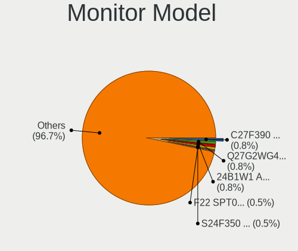

OpenMandriva - Hardware Trends (Desktops)
-----------------------------------------

A project to identify most popular hardware characteristics and track their change
over time based on data collected by Linux users at https://Linux-Hardware.org.

Anyone can contribute to this report by the [hw-probe](https://github.com/linuxhw/hw-probe) tool:

    sudo -E hw-probe -all -upload

This report is for one last month. Overall report since the beginning of time: [TestDays](https://github.com/linuxhw/TestDays)

Period: Jan, 2024.

Contents
--------

* [ System ](#system)
  - [ OS                       ](#os)
  - [ OS Family                ](#os-family)
  - [ Kernel                   ](#kernel)
  - [ Kernel Family            ](#kernel-family)
  - [ Kernel Major Ver.        ](#kernel-major-ver)
  - [ Arch                     ](#arch)
  - [ DE                       ](#de)
  - [ Display Server           ](#display-server)
  - [ Display Manager          ](#display-manager)
  - [ OS Lang                  ](#os-lang)
  - [ Boot Mode                ](#boot-mode)
  - [ Filesystem               ](#filesystem)
  - [ Part. scheme             ](#part-scheme)
  - [ Dual Boot with Linux/BSD ](#dual-boot-with-linuxbsd)
  - [ Dual Boot (Win)          ](#dual-boot-win)

* [ Board ](#board)
  - [ Vendor                   ](#vendor)
  - [ Model                    ](#model)
  - [ Model Family             ](#model-family)
  - [ MFG Year                 ](#mfg-year)
  - [ Form Factor              ](#form-factor)
  - [ Secure Boot              ](#secure-boot)
  - [ Coreboot                 ](#coreboot)
  - [ RAM Size                 ](#ram-size)
  - [ RAM Used                 ](#ram-used)
  - [ Total Drives             ](#total-drives)
  - [ Has CD-ROM               ](#has-cd-rom)
  - [ Has Ethernet             ](#has-ethernet)
  - [ Has WiFi                 ](#has-wifi)
  - [ Has Bluetooth            ](#has-bluetooth)

* [ Location ](#location)
  - [ Country                  ](#country)
  - [ City                     ](#city)

* [ Drives ](#drives)
  - [ Drive Vendor             ](#drive-vendor)
  - [ Drive Model              ](#drive-model)
  - [ HDD Vendor               ](#hdd-vendor)
  - [ SSD Vendor               ](#ssd-vendor)
  - [ Drive Kind               ](#drive-kind)
  - [ Drive Connector          ](#drive-connector)
  - [ Drive Size               ](#drive-size)
  - [ Space Total              ](#space-total)
  - [ Space Used               ](#space-used)
  - [ Malfunc. Drives          ](#malfunc-drives)
  - [ Malfunc. Drive Vendor    ](#malfunc-drive-vendor)
  - [ Malfunc. HDD Vendor      ](#malfunc-hdd-vendor)
  - [ Malfunc. Drive Kind      ](#malfunc-drive-kind)
  - [ Failed Drives            ](#failed-drives)
  - [ Failed Drive Vendor      ](#failed-drive-vendor)
  - [ Drive Status             ](#drive-status)

* [ Storage controller ](#storage-controller)
  - [ Storage Vendor           ](#storage-vendor)
  - [ Storage Model            ](#storage-model)
  - [ Storage Kind             ](#storage-kind)

* [ Processor ](#processor)
  - [ CPU Vendor               ](#cpu-vendor)
  - [ CPU Model                ](#cpu-model)
  - [ CPU Model Family         ](#cpu-model-family)
  - [ CPU Cores                ](#cpu-cores)
  - [ CPU Sockets              ](#cpu-sockets)
  - [ CPU Threads              ](#cpu-threads)
  - [ CPU Op-Modes             ](#cpu-op-modes)
  - [ CPU Microcode            ](#cpu-microcode)
  - [ CPU Microarch            ](#cpu-microarch)

* [ Graphics ](#graphics)
  - [ GPU Vendor               ](#gpu-vendor)
  - [ GPU Model                ](#gpu-model)
  - [ GPU Combo                ](#gpu-combo)
  - [ GPU Driver               ](#gpu-driver)
  - [ GPU Memory               ](#gpu-memory)

* [ Monitor ](#monitor)
  - [ Monitor Vendor           ](#monitor-vendor)
  - [ Monitor Model            ](#monitor-model)
  - [ Monitor Resolution       ](#monitor-resolution)
  - [ Monitor Diagonal         ](#monitor-diagonal)
  - [ Monitor Width            ](#monitor-width)
  - [ Aspect Ratio             ](#aspect-ratio)
  - [ Monitor Area             ](#monitor-area)
  - [ Pixel Density            ](#pixel-density)
  - [ Multiple Monitors        ](#multiple-monitors)

* [ Network ](#network)
  - [ Net Controller Vendor    ](#net-controller-vendor)
  - [ Net Controller Model     ](#net-controller-model)
  - [ Wireless Vendor          ](#wireless-vendor)
  - [ Wireless Model           ](#wireless-model)
  - [ Ethernet Vendor          ](#ethernet-vendor)
  - [ Ethernet Model           ](#ethernet-model)
  - [ Net Controller Kind      ](#net-controller-kind)
  - [ Used Controller          ](#used-controller)
  - [ NICs                     ](#nics)
  - [ IPv6                     ](#ipv6)

* [ Bluetooth ](#bluetooth)
  - [ Bluetooth Vendor         ](#bluetooth-vendor)
  - [ Bluetooth Model          ](#bluetooth-model)

* [ Sound ](#sound)
  - [ Sound Vendor             ](#sound-vendor)
  - [ Sound Model              ](#sound-model)

* [ Memory ](#memory)
  - [ Memory Vendor            ](#memory-vendor)
  - [ Memory Model             ](#memory-model)
  - [ Memory Kind              ](#memory-kind)
  - [ Memory Form Factor       ](#memory-form-factor)
  - [ Memory Size              ](#memory-size)
  - [ Memory Speed             ](#memory-speed)

* [ Printers & scanners ](#printers--scanners)
  - [ Printer Vendor           ](#printer-vendor)
  - [ Printer Model            ](#printer-model)
  - [ Scanner Vendor           ](#scanner-vendor)
  - [ Scanner Model            ](#scanner-model)

* [ Camera ](#camera)
  - [ Camera Vendor            ](#camera-vendor)
  - [ Camera Model             ](#camera-model)

* [ Security ](#security)
  - [ Fingerprint Vendor       ](#fingerprint-vendor)
  - [ Fingerprint Model        ](#fingerprint-model)
  - [ Chipcard Vendor          ](#chipcard-vendor)
  - [ Chipcard Model           ](#chipcard-model)

* [ Unsupported ](#unsupported)
  - [ Unsupported Devices      ](#unsupported-devices)
  - [ Unsupported Device Types ](#unsupported-device-types)

System
------

OS
--

Installed operating systems

| Name               | Desktops | Percent |
|--------------------|----------|---------|
| OpenMandriva 23.08 | 56       | 33.73%  |
| OpenMandriva 5.0   | 51       | 30.72%  |
| OpenMandriva 24.01 | 24       | 14.46%  |
| OpenMandriva 4.3   | 11       | 6.63%   |
| OpenMandriva 23.03 | 8        | 4.82%   |
| OpenMandriva 4.2   | 3        | 1.81%   |
| OpenMandriva 23.11 | 3        | 1.81%   |
| OpenMandriva 24.90 | 2        | 1.2%    |
| OpenMandriva 23.90 | 2        | 1.2%    |
| OpenMandriva 23.01 | 2        | 1.2%    |
| OpenMandriva 4.50  | 1        | 0.6%    |
| OpenMandriva 23.10 | 1        | 0.6%    |
| OpenMandriva 23.09 | 1        | 0.6%    |
| OpenMandriva 22.12 | 1        | 0.6%    |

OS Family
---------

OS without a version

| Name         | Desktops | Percent |
|--------------|----------|---------|
| OpenMandriva | 166      | 100%    |

Kernel
------

Version of the Linux kernel

| Version                  | Desktops | Percent |
|--------------------------|----------|---------|
| 6.6.2-desktop-1omv2390   | 76       | 45.78%  |
| 6.4.11-desktop-1omv2390  | 48       | 28.92%  |
| 6.4.8-desktop-2omv2390   | 11       | 6.63%   |
| 5.16.7-desktop-1omv4003  | 9        | 5.42%   |
| 6.2.6-desktop-1omv2390   | 8        | 4.82%   |
| 5.10.14-desktop-1omv4002 | 3        | 1.81%   |
| 6.1.1-desktop-1omv2290   | 2        | 1.2%    |
| 5.16.13-desktop-1omv4003 | 2        | 1.2%    |
| 6.7.1-desktop-1omv2490   | 1        | 0.6%    |
| 6.6.7-desktop-1omv2390   | 1        | 0.6%    |
| 6.6.1-desktop-1omv2390   | 1        | 0.6%    |
| 6.5.5-desktop-1omv2390   | 1        | 0.6%    |
| 6.5.0-desktop-1omv2390   | 1        | 0.6%    |
| 6.0.10-desktop-2omv22090 | 1        | 0.6%    |
| 5.19.12-desktop-2omv4090 | 1        | 0.6%    |

Kernel Family
-------------

Linux kernel without a distro release

| Version | Desktops | Percent |
|---------|----------|---------|
| 6.6.2   | 76       | 45.78%  |
| 6.4.11  | 48       | 28.92%  |
| 6.4.8   | 11       | 6.63%   |
| 5.16.7  | 9        | 5.42%   |
| 6.2.6   | 8        | 4.82%   |
| 5.10.14 | 3        | 1.81%   |
| 6.1.1   | 2        | 1.2%    |
| 5.16.13 | 2        | 1.2%    |
| 6.7.1   | 1        | 0.6%    |
| 6.6.7   | 1        | 0.6%    |
| 6.6.1   | 1        | 0.6%    |
| 6.5.5   | 1        | 0.6%    |
| 6.5.0   | 1        | 0.6%    |
| 6.0.10  | 1        | 0.6%    |
| 5.19.12 | 1        | 0.6%    |

Kernel Major Ver.
-----------------

Linux kernel major version

| Version | Desktops | Percent |
|---------|----------|---------|
| 6.6     | 78       | 46.99%  |
| 6.4     | 59       | 35.54%  |
| 5.16    | 11       | 6.63%   |
| 6.2     | 8        | 4.82%   |
| 5.10    | 3        | 1.81%   |
| 6.5     | 2        | 1.2%    |
| 6.1     | 2        | 1.2%    |
| 6.7     | 1        | 0.6%    |
| 6.0     | 1        | 0.6%    |
| 5.19    | 1        | 0.6%    |

Arch
----

OS architecture (x86_64, i586, etc.)

| Name   | Desktops | Percent |
|--------|----------|---------|
| x86_64 | 166      | 100%    |

DE
--

Desktop Environment

| Name    | Desktops | Percent |
|---------|----------|---------|
| KDE5    | 139      | 83.73%  |
| LXQt    | 13       | 7.83%   |
| GNOME   | 11       | 6.63%   |
| Unknown | 3        | 1.81%   |

Display Server
--------------

X11 or Wayland

| Name    | Desktops | Percent |
|---------|----------|---------|
| Wayland | 137      | 82.53%  |
| X11     | 29       | 17.47%  |

Display Manager
---------------

SDDM, LightDM, etc.

| Name | Desktops | Percent |
|------|----------|---------|
| SDDM | 156      | 93.98%  |
| GDM  | 10       | 6.02%   |

OS Lang
-------

Language

| Lang  | Desktops | Percent |
|-------|----------|---------|
| en_US | 83       | 50%     |
| ru_RU | 13       | 7.83%   |
| de_DE | 13       | 7.83%   |
| pl_PL | 8        | 4.82%   |
| it_IT | 7        | 4.22%   |
| fr_FR | 7        | 4.22%   |
| en_GB | 6        | 3.61%   |
| tr_TR | 4        | 2.41%   |
| es_MX | 4        | 2.41%   |
| pt_BR | 3        | 1.81%   |
| es_ES | 3        | 1.81%   |
| fr_BE | 2        | 1.2%    |
| en_AU | 2        | 1.2%    |
| cs_CZ | 2        | 1.2%    |
| pt_PT | 1        | 0.6%    |
| nl_BE | 1        | 0.6%    |
| ja_JP | 1        | 0.6%    |
| it_CH | 1        | 0.6%    |
| hu_HU | 1        | 0.6%    |
| es_AR | 1        | 0.6%    |
| en_PH | 1        | 0.6%    |
| en_NZ | 1        | 0.6%    |
| en_HK | 1        | 0.6%    |

Boot Mode
---------

EFI or BIOS

| Mode | Desktops | Percent |
|------|----------|---------|
| EFI  | 90       | 54.22%  |
| BIOS | 76       | 45.78%  |

Filesystem
----------

Type of filesystem

| Type    | Desktops | Percent |
|---------|----------|---------|
| Ext4    | 82       | 49.4%   |
| Overlay | 74       | 44.58%  |
| Btrfs   | 9        | 5.42%   |
| Xfs     | 1        | 0.6%    |

Part. scheme
------------

Scheme of partitioning

| Type | Desktops | Percent |
|------|----------|---------|
| GPT  | 128      | 77.11%  |
| MBR  | 38       | 22.89%  |

Dual Boot with Linux/BSD
------------------------

Hosting more than one Linux/BSD

| Dual boot | Desktops | Percent |
|-----------|----------|---------|
| Yes       | 96       | 57.83%  |
| No        | 70       | 42.17%  |

Dual Boot (Win)
---------------

Hosting Linux and Windows

| Dual boot | Desktops | Percent |
|-----------|----------|---------|
| No        | 84       | 50.6%   |
| Yes       | 82       | 49.4%   |

Board
-----

Vendor
------

Motherboard manufacturer

| Name                                 | Desktops | Percent |
|--------------------------------------|----------|---------|
| ASUSTek Computer                     | 35       | 21.08%  |
| Gigabyte Technology                  | 32       | 19.28%  |
| Dell                                 | 18       | 10.84%  |
| MSI                                  | 16       | 9.64%   |
| ASRock                               | 15       | 9.04%   |
| Hewlett-Packard                      | 12       | 7.23%   |
| Lenovo                               | 6        | 3.61%   |
| Intel                                | 6        | 3.61%   |
| Biostar                              | 4        | 2.41%   |
| Acer                                 | 4        | 2.41%   |
| Pegatron                             | 3        | 1.81%   |
| Shenzhen Meigao Electronic Equipment | 2        | 1.2%    |
| OEM                                  | 1        | 0.6%    |
| NEC Computers                        | 1        | 0.6%    |
| MACHINIST                            | 1        | 0.6%    |
| Google                               | 1        | 0.6%    |
| GEEKOM                               | 1        | 0.6%    |
| Fujitsu                              | 1        | 0.6%    |
| Foxconn                              | 1        | 0.6%    |
| EPoX Computer                        | 1        | 0.6%    |
| ECS                                  | 1        | 0.6%    |
| Casper                               | 1        | 0.6%    |
| AZW                                  | 1        | 0.6%    |
| ALDO                                 | 1        | 0.6%    |
| Unknown                              | 1        | 0.6%    |

Model
-----

Motherboard model

| Name                                       | Desktops | Percent |
|--------------------------------------------|----------|---------|
| Dell OptiPlex 9020                         | 4        | 2.41%   |
| ASUS All Series                            | 3        | 1.81%   |
| Shenzhen Meigao Electronic Equipment UM690 | 2        | 1.2%    |
| MSI MS-7C52                                | 2        | 1.2%    |
| MSI MS-7695                                | 2        | 1.2%    |
| HP EliteDesk 800 G2 DM 35W                 | 2        | 1.2%    |
| Gigabyte H410M H V3                        | 2        | 1.2%    |
| Gigabyte GA-78LMT-S2P                      | 2        | 1.2%    |
| Dell OptiPlex 9010                         | 2        | 1.2%    |
| Dell OptiPlex 3010                         | 2        | 1.2%    |
| ASUS P5QLD PRO                             | 2        | 1.2%    |
| ASUS Maximus V GENE                        | 2        | 1.2%    |
| ASUS M5A97 R2.0                            | 2        | 1.2%    |
| Unknown                                    | 2        | 1.2%    |
| Pegatron p7-1257c                          | 1        | 0.6%    |
| Pegatron FL349AA-ABH SR5612NL              | 1        | 0.6%    |
| Pegatron FK821AA-ABA a6632f                | 1        | 0.6%    |
| OEM B75                                    | 1        | 0.6%    |
| NEC Computers PC-MK32VCZGR                 | 1        | 0.6%    |
| MSI MS-7D67                                | 1        | 0.6%    |
| MSI MS-7D54                                | 1        | 0.6%    |
| MSI MS-7C91                                | 1        | 0.6%    |
| MSI MS-7C56                                | 1        | 0.6%    |
| MSI MS-7C51                                | 1        | 0.6%    |
| MSI MS-7996                                | 1        | 0.6%    |
| MSI MS-7918                                | 1        | 0.6%    |
| MSI MS-7851                                | 1        | 0.6%    |
| MSI MS-7721                                | 1        | 0.6%    |
| MSI MS-7693                                | 1        | 0.6%    |
| MSI MS-7641                                | 1        | 0.6%    |
| MSI MS-6702E                               | 1        | 0.6%    |
| MACHINIST E5-RS9 V1.11                     | 1        | 0.6%    |
| Lenovo ThinkStation C20 4263B84            | 1        | 0.6%    |
| Lenovo ThinkCentre M93p 10A8A1P5MH         | 1        | 0.6%    |
| Lenovo ThinkCentre M72e 0896A2G            | 1        | 0.6%    |
| Lenovo ThinkCentre M700 thinkcentre        | 1        | 0.6%    |
| Lenovo ThinkCentre M700 10J0A01PJP         | 1        | 0.6%    |
| Lenovo IdeaCentre 510-15ICB 90HU00BGCY     | 1        | 0.6%    |
| Intel Jasper Lake Client Platform          | 1        | 0.6%    |
| Intel H81                                  | 1        | 0.6%    |

Model Family
------------

Motherboard model prefix

| Name                                       | Desktops | Percent |
|--------------------------------------------|----------|---------|
| Dell OptiPlex                              | 12       | 7.23%   |
| Lenovo ThinkCentre                         | 4        | 2.41%   |
| ASUS TUF                                   | 4        | 2.41%   |
| ASUS PRIME                                 | 4        | 2.41%   |
| HP EliteDesk                               | 3        | 1.81%   |
| ASUS M5A78L-M                              | 3        | 1.81%   |
| ASUS All                                   | 3        | 1.81%   |
| Shenzhen Meigao Electronic Equipment UM690 | 2        | 1.2%    |
| MSI MS-7C52                                | 2        | 1.2%    |
| MSI MS-7695                                | 2        | 1.2%    |
| HP ProDesk                                 | 2        | 1.2%    |
| HP Compaq                                  | 2        | 1.2%    |
| Gigabyte H410M                             | 2        | 1.2%    |
| Gigabyte GA-78LMT-S2P                      | 2        | 1.2%    |
| Dell Vostro                                | 2        | 1.2%    |
| Dell Precision                             | 2        | 1.2%    |
| Dell Inspiron                              | 2        | 1.2%    |
| ASUS ROG                                   | 2        | 1.2%    |
| ASUS P5QLD                                 | 2        | 1.2%    |
| ASUS Maximus                               | 2        | 1.2%    |
| ASUS M5A97                                 | 2        | 1.2%    |
| Acer Veriton                               | 2        | 1.2%    |
| Acer Aspire                                | 2        | 1.2%    |
| Unknown                                    | 2        | 1.2%    |
| Pegatron p7-1257c                          | 1        | 0.6%    |
| Pegatron FL349AA-ABH                       | 1        | 0.6%    |
| Pegatron FK821AA-ABA                       | 1        | 0.6%    |
| OEM B75                                    | 1        | 0.6%    |
| NEC Computers PC-MK32VCZGR                 | 1        | 0.6%    |
| MSI MS-7D67                                | 1        | 0.6%    |
| MSI MS-7D54                                | 1        | 0.6%    |
| MSI MS-7C91                                | 1        | 0.6%    |
| MSI MS-7C56                                | 1        | 0.6%    |
| MSI MS-7C51                                | 1        | 0.6%    |
| MSI MS-7996                                | 1        | 0.6%    |
| MSI MS-7918                                | 1        | 0.6%    |
| MSI MS-7851                                | 1        | 0.6%    |
| MSI MS-7721                                | 1        | 0.6%    |
| MSI MS-7693                                | 1        | 0.6%    |
| MSI MS-7641                                | 1        | 0.6%    |

MFG Year
--------

Motherboard manufacture year

| Year | Desktops | Percent |
|------|----------|---------|
| 2012 | 21       | 12.65%  |
| 2013 | 17       | 10.24%  |
| 2022 | 13       | 7.83%   |
| 2014 | 13       | 7.83%   |
| 2011 | 12       | 7.23%   |
| 2018 | 10       | 6.02%   |
| 2021 | 9        | 5.42%   |
| 2019 | 8        | 4.82%   |
| 2016 | 8        | 4.82%   |
| 2009 | 8        | 4.82%   |
| 2023 | 7        | 4.22%   |
| 2020 | 7        | 4.22%   |
| 2017 | 7        | 4.22%   |
| 2015 | 7        | 4.22%   |
| 2008 | 6        | 3.61%   |
| 2010 | 5        | 3.01%   |
| 2007 | 5        | 3.01%   |
| 2006 | 3        | 1.81%   |

Form Factor
-----------

Physical design of the computer

| Name    | Desktops | Percent |
|---------|----------|---------|
| Desktop | 166      | 100%    |

Secure Boot
-----------

Enabled or disabled

| State    | Desktops | Percent |
|----------|----------|---------|
| Disabled | 166      | 100%    |

Coreboot
--------

Have coreboot on board

| Used | Desktops | Percent |
|------|----------|---------|
| No   | 165      | 99.4%   |
| Yes  | 1        | 0.6%    |

RAM Size
--------

Total RAM memory

| Size in GB  | Desktops | Percent |
|-------------|----------|---------|
| 16.01-24.0  | 38       | 22.89%  |
| 8.01-16.0   | 34       | 20.48%  |
| 4.01-8.0    | 33       | 19.88%  |
| 32.01-64.0  | 25       | 15.06%  |
| 3.01-4.0    | 24       | 14.46%  |
| 24.01-32.0  | 5        | 3.01%   |
| 2.01-3.0    | 3        | 1.81%   |
| 1.01-2.0    | 2        | 1.2%    |
| 64.01-256.0 | 1        | 0.6%    |
| 0.51-1.0    | 1        | 0.6%    |

RAM Used
--------

Used RAM memory

| Used GB  | Desktops | Percent |
|----------|----------|---------|
| 1.01-2.0 | 109      | 65.66%  |
| 2.01-3.0 | 27       | 16.27%  |
| 0.51-1.0 | 24       | 14.46%  |
| 3.01-4.0 | 6        | 3.61%   |

Total Drives
------------

Number of drives on board

| Drives | Desktops | Percent |
|--------|----------|---------|
| 1      | 69       | 41.57%  |
| 2      | 48       | 28.92%  |
| 3      | 29       | 17.47%  |
| 4      | 11       | 6.63%   |
| 5      | 4        | 2.41%   |
| 6      | 3        | 1.81%   |
| 9      | 1        | 0.6%    |
| 0      | 1        | 0.6%    |

Has CD-ROM
----------

Has CD-ROM on board

| Presented | Desktops | Percent |
|-----------|----------|---------|
| Yes       | 88       | 53.01%  |
| No        | 78       | 46.99%  |

Has Ethernet
------------

Has Ethernet on board

| Presented | Desktops | Percent |
|-----------|----------|---------|
| Yes       | 165      | 99.4%   |
| No        | 1        | 0.6%    |

Has WiFi
--------

Has WiFi module

| Presented | Desktops | Percent |
|-----------|----------|---------|
| No        | 108      | 65.06%  |
| Yes       | 58       | 34.94%  |

Has Bluetooth
-------------

Has Bluetooth module

| Presented | Desktops | Percent |
|-----------|----------|---------|
| No        | 110      | 66.27%  |
| Yes       | 56       | 33.73%  |

Location
--------

Country
-------

Geographic location (country)

| Country     | Desktops | Percent |
|-------------|----------|---------|
| USA         | 23       | 13.86%  |
| Russia      | 18       | 10.84%  |
| Germany     | 17       | 10.24%  |
| Italy       | 14       | 8.43%   |
| Poland      | 12       | 7.23%   |
| Turkey      | 8        | 4.82%   |
| UK          | 7        | 4.22%   |
| France      | 7        | 4.22%   |
| Brazil      | 6        | 3.61%   |
| Spain       | 5        | 3.01%   |
| Japan       | 4        | 2.41%   |
| Czechia     | 4        | 2.41%   |
| Mexico      | 3        | 1.81%   |
| Finland     | 3        | 1.81%   |
| Belgium     | 3        | 1.81%   |
| Ukraine     | 2        | 1.2%    |
| Taiwan      | 2        | 1.2%    |
| New Zealand | 2        | 1.2%    |
| Netherlands | 2        | 1.2%    |
| Hungary     | 2        | 1.2%    |
| China       | 2        | 1.2%    |
| Canada      | 2        | 1.2%    |
| Australia   | 2        | 1.2%    |
| Thailand    | 1        | 0.6%    |
| Sweden      | 1        | 0.6%    |
| Portugal    | 1        | 0.6%    |
| Philippines | 1        | 0.6%    |
| Paraguay    | 1        | 0.6%    |
| Malaysia    | 1        | 0.6%    |
| Kazakhstan  | 1        | 0.6%    |
| Israel      | 1        | 0.6%    |
| Iran        | 1        | 0.6%    |
| India       | 1        | 0.6%    |
| Hong Kong   | 1        | 0.6%    |
| Egypt       | 1        | 0.6%    |
| Denmark     | 1        | 0.6%    |
| Cyprus      | 1        | 0.6%    |
| Bolivia     | 1        | 0.6%    |
| Argentina   | 1        | 0.6%    |

City
----

Geographic location (city)

| City            | Desktops | Percent |
|-----------------|----------|---------|
| Moscow          | 3        | 1.81%   |
| Hamburg         | 3        | 1.81%   |
| Berlin          | 3        | 1.81%   |
| Wiesbaden       | 2        | 1.2%    |
| Warsaw          | 2        | 1.2%    |
| Rezé           | 2        | 1.2%    |
| Recklinghausen  | 2        | 1.2%    |
| Novosibirsk     | 2        | 1.2%    |
| Monticello      | 2        | 1.2%    |
| Miura           | 2        | 1.2%    |
| Milan           | 2        | 1.2%    |
| Krakow          | 2        | 1.2%    |
| Kladno          | 2        | 1.2%    |
| Katowice        | 2        | 1.2%    |
| Istanbul        | 2        | 1.2%    |
| Greater Sudbury | 2        | 1.2%    |
| Canberra        | 2        | 1.2%    |
| Birmingham      | 2        | 1.2%    |
| Zelenograd      | 1        | 0.6%    |
| Zelenodolsk     | 1        | 0.6%    |
| Zbraslav        | 1        | 0.6%    |
| Youngstown      | 1        | 0.6%    |
| Yeysk           | 1        | 0.6%    |
| Xalisco         | 1        | 0.6%    |
| Wuhan           | 1        | 0.6%    |
| Wroclaw         | 1        | 0.6%    |
| Weatherford     | 1        | 0.6%    |
| Wayne           | 1        | 0.6%    |
| Walsall         | 1        | 0.6%    |
| Veracruz        | 1        | 0.6%    |
| Venice          | 1        | 0.6%    |
| Ulyanovsk       | 1        | 0.6%    |
| Turin           | 1        | 0.6%    |
| Tucson          | 1        | 0.6%    |
| Toulouse        | 1        | 0.6%    |
| Torun           | 1        | 0.6%    |
| Torremolinos    | 1        | 0.6%    |
| Tokyo           | 1        | 0.6%    |
| Tilst           | 1        | 0.6%    |
| Tel Aviv        | 1        | 0.6%    |

Drives
------

Drive Vendor
------------

Hard drive vendors

| Vendor              | Desktops | Drives | Percent |
|---------------------|----------|--------|---------|
| Seagate             | 49       | 57     | 16.28%  |
| WDC                 | 48       | 63     | 15.95%  |
| Samsung Electronics | 30       | 39     | 9.97%   |
| Toshiba             | 25       | 26     | 8.31%   |
| Kingston            | 18       | 19     | 5.98%   |
| Crucial             | 11       | 15     | 3.65%   |
| China               | 10       | 12     | 3.32%   |
| SanDisk             | 7        | 8      | 2.33%   |
| A-DATA Technology   | 7        | 8      | 2.33%   |
| Intenso             | 6        | 6      | 1.99%   |
| Unknown             | 5        | 5      | 1.66%   |
| JMicron Technology  | 5        | 5      | 1.66%   |
| GOODRAM             | 5        | 5      | 1.66%   |
| SPCC                | 4        | 4      | 1.33%   |
| Intel               | 4        | 4      | 1.33%   |
| Hitachi             | 4        | 4      | 1.33%   |
| Apacer              | 4        | 4      | 1.33%   |
| PNY                 | 3        | 3      | 1%      |
| Patriot             | 3        | 3      | 1%      |
| Maxtor              | 3        | 3      | 1%      |
| Lexar               | 3        | 3      | 1%      |
| Fanxiang            | 3        | 3      | 1%      |
| Verbatim            | 2        | 2      | 0.66%   |
| Smartbuy            | 2        | 2      | 0.66%   |
| MSI                 | 2        | 2      | 0.66%   |
| KingSpec            | 2        | 2      | 0.66%   |
| JAMESDONKEY         | 2        | 2      | 0.66%   |
| HGST                | 2        | 2      | 0.66%   |
| Unknown             | 2        | 2      | 0.66%   |
| XSTAR               | 1        | 1      | 0.33%   |
| X12                 | 1        | 1      | 0.33%   |
| Western             | 1        | 1      | 0.33%   |
| TCSUNBOW            | 1        | 1      | 0.33%   |
| SXMicro             | 1        | 1      | 0.33%   |
| SK hynix            | 1        | 1      | 0.33%   |
| Silicon Motion      | 1        | 1      | 0.33%   |
| Realtek             | 1        | 1      | 0.33%   |
| Qumo                | 1        | 1      | 0.33%   |
| Pioneer             | 1        | 1      | 0.33%   |
| Phison              | 1        | 1      | 0.33%   |

Drive Model
-----------

Hard drive models

| Model                            | Desktops | Percent |
|----------------------------------|----------|---------|
| Seagate ST500DM002-1BD142 500GB  | 7        | 2.07%   |
| Toshiba DT01ACA100 1TB           | 5        | 1.48%   |
| Seagate ST1000DM010-2EP102 1TB   | 5        | 1.48%   |
| Seagate ST4000DM004-2CV104 4TB   | 4        | 1.18%   |
| WDC WDS500G2B0A-00SM50 500GB SSD | 3        | 0.89%   |
| Unknown SD/MMC/MS PRO 256GB      | 3        | 0.89%   |
| Samsung HD322HJ 320GB            | 3        | 0.89%   |
| Kingston SNVS500G 500GB          | 3        | 0.89%   |
| Kingston SA400S37480G 480GB SSD  | 3        | 0.89%   |
| Kingston SA400S37240G 240GB SSD  | 3        | 0.89%   |
| JMicron Generic 8GB              | 3        | 0.89%   |
| A-DATA SU800 256GB SSD           | 3        | 0.89%   |
| WDC WDS240G2G0A-00JH30 240GB SSD | 2        | 0.59%   |
| WDC WD5000AAKX-60U6AA0 500GB     | 2        | 0.59%   |
| WDC WD10EZRX-00A8LB0 1TB         | 2        | 0.59%   |
| WDC WD10EZEX-60WN4A0 1TB         | 2        | 0.59%   |
| WDC WD10EZEX-00BN5A0 1TB         | 2        | 0.59%   |
| WDC WD10EZEX-00BBHA0 1TB         | 2        | 0.59%   |
| Toshiba MQ01ABF050 500GB         | 2        | 0.59%   |
| Toshiba MQ01ABD050V 500GB        | 2        | 0.59%   |
| Toshiba HDWD110 1TB              | 2        | 0.59%   |
| Toshiba DT01ACA050 500GB         | 2        | 0.59%   |
| SPCC Solid State Disk 1TB        | 2        | 0.59%   |
| Seagate ST3250318AS 250GB        | 2        | 0.59%   |
| Seagate ST2000DX002-2DV164 2TB   | 2        | 0.59%   |
| Seagate ST2000DM008-2FR102 2TB   | 2        | 0.59%   |
| Seagate ST1000DM003-1SB102 1TB   | 2        | 0.59%   |
| Seagate ST1000DM003-1ER162 1TB   | 2        | 0.59%   |
| Seagate BUP BK 5TB               | 2        | 0.59%   |
| SanDisk SDSSDA240G 240GB         | 2        | 0.59%   |
| Samsung SSD 980 500GB            | 2        | 0.59%   |
| Samsung SSD 970 EVO Plus 500GB   | 2        | 0.59%   |
| Samsung SSD 970 EVO Plus 1TB     | 2        | 0.59%   |
| Samsung SSD 840 EVO 250GB        | 2        | 0.59%   |
| Lexar SSD NM610PRO 1TB           | 2        | 0.59%   |
| Kingston SV300S37A240G 240GB SSD | 2        | 0.59%   |
| Kingston SUV400S37240G 240GB SSD | 2        | 0.59%   |
| Intenso SSD Sata III 512GB       | 2        | 0.59%   |
| Hitachi HDS721050CLA362 500GB    | 2        | 0.59%   |
| Crucial CT275MX300SSD1 275GB     | 2        | 0.59%   |

HDD Vendor
----------

Hard disk drive vendors

| Vendor              | Desktops | Drives | Percent |
|---------------------|----------|--------|---------|
| Seagate             | 48       | 56     | 33.33%  |
| WDC                 | 44       | 55     | 30.56%  |
| Toshiba             | 24       | 25     | 16.67%  |
| Samsung Electronics | 10       | 12     | 6.94%   |
| JMicron Technology  | 4        | 4      | 2.78%   |
| Hitachi             | 4        | 4      | 2.78%   |
| Unknown             | 3        | 3      | 2.08%   |
| Maxtor              | 3        | 3      | 2.08%   |
| HGST                | 2        | 2      | 1.39%   |
| Fujitsu             | 1        | 1      | 0.69%   |
| Apple               | 1        | 1      | 0.69%   |

SSD Vendor
----------

Solid state drive vendors

| Vendor              | Desktops | Drives | Percent |
|---------------------|----------|--------|---------|
| Samsung Electronics | 14       | 14     | 12.39%  |
| Kingston            | 12       | 13     | 10.62%  |
| China               | 10       | 12     | 8.85%   |
| Crucial             | 7        | 9      | 6.19%   |
| SanDisk             | 6        | 6      | 5.31%   |
| Intenso             | 6        | 6      | 5.31%   |
| A-DATA Technology   | 6        | 7      | 5.31%   |
| WDC                 | 5        | 6      | 4.42%   |
| GOODRAM             | 5        | 5      | 4.42%   |
| SPCC                | 4        | 4      | 3.54%   |
| Apacer              | 3        | 3      | 2.65%   |
| Verbatim            | 2        | 2      | 1.77%   |
| PNY                 | 2        | 2      | 1.77%   |
| Patriot             | 2        | 2      | 1.77%   |
| KingSpec            | 2        | 2      | 1.77%   |
| JAMESDONKEY         | 2        | 2      | 1.77%   |
| Unknown             | 2        | 2      | 1.77%   |
| XSTAR               | 1        | 1      | 0.88%   |
| X12                 | 1        | 1      | 0.88%   |
| Western             | 1        | 1      | 0.88%   |
| Toshiba             | 1        | 1      | 0.88%   |
| TCSUNBOW            | 1        | 1      | 0.88%   |
| SXMicro             | 1        | 1      | 0.88%   |
| Smartbuy            | 1        | 1      | 0.88%   |
| Qumo                | 1        | 1      | 0.88%   |
| Pioneer             | 1        | 1      | 0.88%   |
| OCZ                 | 1        | 1      | 0.88%   |
| MSI                 | 1        | 1      | 0.88%   |
| LITEON              | 1        | 1      | 0.88%   |
| KIOXIA-EXCERIA      | 1        | 1      | 0.88%   |
| KingFast            | 1        | 1      | 0.88%   |
| Intel               | 1        | 1      | 0.88%   |
| Hewlett-Packard     | 1        | 1      | 0.88%   |
| FIKWOT              | 1        | 1      | 0.88%   |
| Dogfish             | 1        | 1      | 0.88%   |
| CT1000MX            | 1        | 1      | 0.88%   |
| C-S12               | 1        | 1      | 0.88%   |
| ASMT                | 1        | 1      | 0.88%   |
| AMD                 | 1        | 1      | 0.88%   |
| 2-Power             | 1        | 1      | 0.88%   |

Drive Kind
----------

HDD or SSD

| Kind    | Desktops | Drives | Percent |
|---------|----------|--------|---------|
| HDD     | 112      | 166    | 45.16%  |
| SSD     | 91       | 120    | 36.69%  |
| NVMe    | 41       | 53     | 16.53%  |
| Unknown | 3        | 3      | 1.21%   |
| MMC     | 1        | 1      | 0.4%    |

Drive Connector
---------------

SATA, SAS, NVMe, etc.

| Type | Desktops | Drives | Percent |
|------|----------|--------|---------|
| SATA | 158      | 272    | 72.81%  |
| NVMe | 41       | 52     | 18.89%  |
| SAS  | 17       | 18     | 7.83%   |
| MMC  | 1        | 1      | 0.46%   |

Drive Size
----------

Size of hard drive

| Size in TB | Desktops | Drives | Percent |
|------------|----------|--------|---------|
| 0.01-0.5   | 116      | 174    | 54.21%  |
| 0.51-1.0   | 63       | 72     | 29.44%  |
| 1.01-2.0   | 17       | 19     | 7.94%   |
| 3.01-4.0   | 8        | 10     | 3.74%   |
| 4.01-10.0  | 6        | 7      | 2.8%    |
| 2.01-3.0   | 4        | 4      | 1.87%   |

Space Total
-----------

Amount of disk space available on the file system

| Size in GB     | Desktops | Percent |
|----------------|----------|---------|
| 1-20           | 43       | 25.9%   |
| 101-250        | 37       | 22.29%  |
| 251-500        | 30       | 18.07%  |
| Unknown        | 15       | 9.04%   |
| 501-1000       | 14       | 8.43%   |
| 51-100         | 9        | 5.42%   |
| 1001-2000      | 6        | 3.61%   |
| More than 3000 | 5        | 3.01%   |
| 21-50          | 5        | 3.01%   |
| 2001-3000      | 2        | 1.2%    |

Space Used
----------

Amount of used disk space

| Used GB        | Desktops | Percent |
|----------------|----------|---------|
| 1-20           | 113      | 68.07%  |
| 21-50          | 18       | 10.84%  |
| Unknown        | 15       | 9.04%   |
| 51-100         | 5        | 3.01%   |
| 101-250        | 4        | 2.41%   |
| 501-1000       | 4        | 2.41%   |
| More than 3000 | 3        | 1.81%   |
| 251-500        | 1        | 0.6%    |
| 2001-3000      | 1        | 0.6%    |
| 1001-2000      | 1        | 0.6%    |
| 0              | 1        | 0.6%    |

Malfunc. Drives
---------------

Drive models with a malfunction

| Model                               | Desktops | Drives | Percent |
|-------------------------------------|----------|--------|---------|
| Seagate ST500DM002-1BD142 500GB     | 5        | 5      | 8.33%   |
| Toshiba DT01ACA100 1TB              | 2        | 2      | 3.33%   |
| Hitachi HDS721050CLA362 500GB       | 2        | 2      | 3.33%   |
| Crucial CT275MX300SSD1 275GB        | 2        | 2      | 3.33%   |
| WDC WDS240G2G0A-00JH30 240GB SSD    | 1        | 1      | 1.67%   |
| WDC WD6400AARS-00Y5B1 640GB         | 1        | 1      | 1.67%   |
| WDC WD5000LPVX-80V0TT0 500GB        | 1        | 1      | 1.67%   |
| WDC WD5000AZRX-00A8LB0 500GB        | 1        | 1      | 1.67%   |
| WDC WD5000AAVS-00N7B0 500GB         | 1        | 1      | 1.67%   |
| WDC WD5000AAKX-60U6AA0 500GB        | 1        | 1      | 1.67%   |
| WDC WD5000AAKX-00ERMA0 500GB        | 1        | 1      | 1.67%   |
| WDC WD5000AAKS-00YGA0 500GB         | 1        | 1      | 1.67%   |
| WDC WD3200AVVS-56L2B0 320GB         | 1        | 1      | 1.67%   |
| WDC WD3200AAJS-56M0A0 320GB         | 1        | 1      | 1.67%   |
| WDC WD20EARS-00MVWB0 2TB            | 1        | 1      | 1.67%   |
| WDC WD10EZEX-60ZF5A0 1TB            | 1        | 1      | 1.67%   |
| WDC WD10EARS-00MVWB0 1TB            | 1        | 1      | 1.67%   |
| WDC WD1002FBYS-02A6B0 1TB           | 1        | 1      | 1.67%   |
| WDC WD1001FALS-00J7B1 1TB           | 1        | 1      | 1.67%   |
| Toshiba MQ04ABF100 1TB              | 1        | 1      | 1.67%   |
| Toshiba MQ01ABD050V 500GB           | 1        | 1      | 1.67%   |
| Toshiba MK1652GSX 160GB             | 1        | 1      | 1.67%   |
| SXMicro NF830 256GB SSD             | 1        | 1      | 1.67%   |
| Seagate ST9320325AS 320GB           | 1        | 1      | 1.67%   |
| Seagate ST500LM012 HN-M500MBB 500GB | 1        | 2      | 1.67%   |
| Seagate ST3320613AS 320GB           | 1        | 1      | 1.67%   |
| Seagate ST3250318AS 250GB           | 1        | 1      | 1.67%   |
| Seagate ST3160812AS 160GB           | 1        | 1      | 1.67%   |
| Seagate ST3160212A 160GB            | 1        | 1      | 1.67%   |
| Seagate ST31000524NS 1TB            | 1        | 1      | 1.67%   |
| Seagate ST2000DX002-2DV164 2TB      | 1        | 1      | 1.67%   |
| Seagate ST2000DM001-1CH164 2TB      | 1        | 1      | 1.67%   |
| Seagate ST1000DM010-2EP102 1TB      | 1        | 1      | 1.67%   |
| Seagate ST1000DM003-1SB102 1TB      | 1        | 1      | 1.67%   |
| Seagate ST1000DM003-1ER162 1TB      | 1        | 1      | 1.67%   |
| Seagate ST1000DM003-1CH162 1TB      | 1        | 1      | 1.67%   |
| SanDisk SSD PLUS 1000GB             | 1        | 1      | 1.67%   |
| Samsung Electronics SP2014N 200GB   | 1        | 2      | 1.67%   |
| Samsung Electronics HD502HJ 500GB   | 1        | 1      | 1.67%   |
| Samsung Electronics HD322HJ 320GB   | 1        | 1      | 1.67%   |

Malfunc. Drive Vendor
---------------------

Vendors of faulty drives

| Vendor              | Desktops | Drives | Percent |
|---------------------|----------|--------|---------|
| Seagate             | 17       | 19     | 29.31%  |
| WDC                 | 14       | 15     | 24.14%  |
| Toshiba             | 5        | 5      | 8.62%   |
| Samsung Electronics | 4        | 5      | 6.9%    |
| Hitachi             | 3        | 3      | 5.17%   |
| Crucial             | 3        | 3      | 5.17%   |
| Maxtor              | 2        | 2      | 3.45%   |
| HGST                | 2        | 2      | 3.45%   |
| SXMicro             | 1        | 1      | 1.72%   |
| SanDisk             | 1        | 1      | 1.72%   |
| Kingston            | 1        | 1      | 1.72%   |
| Intenso             | 1        | 1      | 1.72%   |
| China               | 1        | 1      | 1.72%   |
| C-S12               | 1        | 1      | 1.72%   |
| Apple               | 1        | 1      | 1.72%   |
| AMD                 | 1        | 1      | 1.72%   |

Malfunc. HDD Vendor
-------------------

Vendors of faulty HDD drives

| Vendor              | Desktops | Drives | Percent |
|---------------------|----------|--------|---------|
| Seagate             | 17       | 19     | 36.17%  |
| WDC                 | 13       | 14     | 27.66%  |
| Toshiba             | 5        | 5      | 10.64%  |
| Samsung Electronics | 4        | 5      | 8.51%   |
| Hitachi             | 3        | 3      | 6.38%   |
| Maxtor              | 2        | 2      | 4.26%   |
| HGST                | 2        | 2      | 4.26%   |
| Apple               | 1        | 1      | 2.13%   |

Malfunc. Drive Kind
-------------------

Kinds of faulty drives

| Kind | Desktops | Drives | Percent |
|------|----------|--------|---------|
| HDD  | 43       | 51     | 79.63%  |
| SSD  | 11       | 11     | 20.37%  |

Failed Drives
-------------

Failed drive models

Zero info for selected period =(

Failed Drive Vendor
-------------------

Failed drive vendors

Zero info for selected period =(

Drive Status
------------

Number of failed and malfunc. drives

| Status   | Desktops | Drives | Percent |
|----------|----------|--------|---------|
| Works    | 145      | 263    | 67.76%  |
| Malfunc  | 52       | 62     | 24.3%   |
| Detected | 17       | 18     | 7.94%   |

Storage controller
------------------

Storage Vendor
--------------

Storage controller vendors

| Vendor                       | Desktops | Percent |
|------------------------------|----------|---------|
| Intel                        | 109      | 46.58%  |
| AMD                          | 46       | 19.66%  |
| Samsung Electronics          | 11       | 4.7%    |
| JMicron Technology           | 10       | 4.27%   |
| ASMedia Technology           | 10       | 4.27%   |
| Nvidia                       | 9        | 3.85%   |
| Kingston Technology Company  | 7        | 2.99%   |
| Phison Electronics           | 6        | 2.56%   |
| MAXIO Technology (Hangzhou)  | 6        | 2.56%   |
| Micron/Crucial Technology    | 5        | 2.14%   |
| Sandisk                      | 3        | 1.28%   |
| Marvell Technology Group     | 3        | 1.28%   |
| Silicon Motion               | 2        | 0.85%   |
| VIA Technologies             | 1        | 0.43%   |
| SK hynix                     | 1        | 0.43%   |
| Shenzhen Longsys Electronics | 1        | 0.43%   |
| Promise Technology           | 1        | 0.43%   |
| Micron Technology            | 1        | 0.43%   |
| KIOXIA                       | 1        | 0.43%   |
| ADATA Technology             | 1        | 0.43%   |

Storage Model
-------------

Storage controller models

| Model                                                                                   | Desktops | Percent |
|-----------------------------------------------------------------------------------------|----------|---------|
| AMD FCH SATA Controller [AHCI mode]                                                     | 20       | 6.94%   |
| Intel 8 Series/C220 Series Chipset Family 6-port SATA Controller 1 [AHCI mode]          | 15       | 5.21%   |
| Intel 7 Series/C210 Series Chipset Family 6-port SATA Controller [AHCI mode]            | 12       | 4.17%   |
| Intel Q170/Q150/B150/H170/H110/Z170/CM236 Chipset SATA Controller [AHCI Mode]           | 10       | 3.47%   |
| AMD SB7x0/SB8x0/SB9x0 SATA Controller [IDE mode]                                        | 10       | 3.47%   |
| AMD SB7x0/SB8x0/SB9x0 IDE Controller                                                    | 10       | 3.47%   |
| ASMedia ASM1061/ASM1062 Serial ATA Controller                                           | 9        | 3.13%   |
| Intel SATA Controller [RAID mode]                                                       | 7        | 2.43%   |
| Samsung NVMe SSD Controller SM981/PM981/PM983                                           | 6        | 2.08%   |
| Nvidia MCP61 SATA Controller                                                            | 6        | 2.08%   |
| Nvidia MCP61 IDE                                                                        | 6        | 2.08%   |
| Intel 82801JI (ICH10 Family) 4 port SATA IDE Controller #1                              | 6        | 2.08%   |
| Intel 82801JI (ICH10 Family) 2 port SATA IDE Controller #2                              | 6        | 2.08%   |
| Intel 6 Series/C200 Series Chipset Family 6 port Desktop SATA AHCI Controller           | 6        | 2.08%   |
| Intel 200 Series PCH SATA controller [AHCI mode]                                        | 6        | 2.08%   |
| AMD 400 Series Chipset SATA Controller                                                  | 6        | 2.08%   |
| Samsung NVMe SSD Controller 980 (DRAM-less)                                             | 5        | 1.74%   |
| JMicron JMB363 SATA/IDE Controller                                                      | 5        | 1.74%   |
| AMD FCH SATA Controller D                                                               | 5        | 1.74%   |
| Micron/Crucial P2 [Nick P2] / P3 / P3 Plus NVMe PCIe SSD (DRAM-less)                    | 4        | 1.39%   |
| MAXIO (Hangzhou) NVMe SSD Controller MAP1202 (DRAM-less)                                | 4        | 1.39%   |
| JMicron JMB368 IDE controller                                                           | 4        | 1.39%   |
| Intel Cannon Lake PCH SATA AHCI Controller                                              | 4        | 1.39%   |
| Intel 9 Series Chipset Family SATA Controller [AHCI Mode]                               | 4        | 1.39%   |
| Intel 6 Series/C200 Series Chipset Family Desktop SATA Controller (IDE mode, ports 4-5) | 4        | 1.39%   |
| Intel 6 Series/C200 Series Chipset Family Desktop SATA Controller (IDE mode, ports 0-3) | 4        | 1.39%   |
| Intel 500 Series Chipset Family SATA AHCI Controller                                    | 4        | 1.39%   |
| AMD SB7x0/SB8x0/SB9x0 SATA Controller [AHCI mode]                                       | 4        | 1.39%   |
| AMD 600 Series Chipset SATA Controller                                                  | 4        | 1.39%   |
| AMD 500 Series Chipset SATA Controller                                                  | 4        | 1.39%   |
| Phison E12 NVMe Controller                                                              | 3        | 1.04%   |
| Kingston Company NV1 NVMe SSD SM2263XT (DRAM-less)                                      | 3        | 1.04%   |
| Intel Comet Lake SATA AHCI Controller                                                   | 3        | 1.04%   |
| Intel Alder Lake-S PCH SATA Controller [AHCI Mode]                                      | 3        | 1.04%   |
| Intel 5 Series/3400 Series Chipset 4 port SATA IDE Controller                           | 3        | 1.04%   |
| Intel 5 Series/3400 Series Chipset 2 port SATA IDE Controller                           | 3        | 1.04%   |
| Silicon Motion SM2263EN/SM2263XT (DRAM-less) NVMe SSD Controllers                       | 2        | 0.69%   |
| Phison PS5013-E13 PCIe3 NVMe Controller (DRAM-less)                                     | 2        | 0.69%   |
| MAXIO (Hangzhou) NVMe SSD Controller MAP1602 (DRAM-less)                                | 2        | 0.69%   |
| Marvell Group 88SE9172 SATA 6Gb/s Controller                                            | 2        | 0.69%   |

Storage Kind
------------

Kind of storage controller (IDE, SATA, NVMe, SAS, ...)

| Kind | Desktops | Percent |
|------|----------|---------|
| SATA | 128      | 57.92%  |
| IDE  | 43       | 19.46%  |
| NVMe | 41       | 18.55%  |
| RAID | 9        | 4.07%   |

Processor
---------

CPU Vendor
----------

Processor vendors

| Vendor | Desktops | Percent |
|--------|----------|---------|
| Intel  | 110      | 66.27%  |
| AMD    | 56       | 33.73%  |

CPU Model
---------

Processor models

| Model                                       | Desktops | Percent |
|---------------------------------------------|----------|---------|
| AMD Ryzen 5 5600G with Radeon Graphics      | 5        | 3.01%   |
| Intel Core i5-2400 CPU @ 3.10GHz            | 4        | 2.41%   |
| Intel Core i7-3770 CPU @ 3.40GHz            | 3        | 1.81%   |
| Intel Core i5-7500 CPU @ 3.40GHz            | 3        | 1.81%   |
| Intel Core i5-6500 CPU @ 3.20GHz            | 3        | 1.81%   |
| Intel Core i5-3570K CPU @ 3.40GHz           | 3        | 1.81%   |
| Intel Core i5-3470 CPU @ 3.20GHz            | 3        | 1.81%   |
| Intel Core i5-10400 CPU @ 2.90GHz           | 3        | 1.81%   |
| Intel Core i3-6100T CPU @ 3.20GHz           | 3        | 1.81%   |
| AMD Ryzen 5 5600X 6-Core Processor          | 3        | 1.81%   |
| AMD Athlon 64 Processor 3200+               | 3        | 1.81%   |
| Intel Pentium CPU G3260 @ 3.30GHz           | 2        | 1.2%    |
| Intel Pentium CPU G2030 @ 3.00GHz           | 2        | 1.2%    |
| Intel Core i9-9900K CPU @ 3.60GHz           | 2        | 1.2%    |
| Intel Core i7-4790K CPU @ 4.00GHz           | 2        | 1.2%    |
| Intel Core i7-4790 CPU @ 3.60GHz            | 2        | 1.2%    |
| Intel Core i5-7400 CPU @ 3.00GHz            | 2        | 1.2%    |
| Intel Core i5-6500T CPU @ 2.50GHz           | 2        | 1.2%    |
| Intel Core i5-4570 CPU @ 3.20GHz            | 2        | 1.2%    |
| Intel Core i5-3570 CPU @ 3.40GHz            | 2        | 1.2%    |
| Intel Core i3-4170 CPU @ 3.70GHz            | 2        | 1.2%    |
| Intel Core i3-3240 CPU @ 3.40GHz            | 2        | 1.2%    |
| Intel Core 2 Duo CPU E8400 @ 3.00GHz        | 2        | 1.2%    |
| AMD Ryzen 9 6900HX with Radeon Graphics     | 2        | 1.2%    |
| AMD Ryzen 7 2700X Eight-Core Processor      | 2        | 1.2%    |
| Intel Xeon CPU W3565 @ 3.20GHz              | 1        | 0.6%    |
| Intel Xeon CPU L5640 @ 2.27GHz              | 1        | 0.6%    |
| Intel Xeon CPU E5620 @ 2.40GHz              | 1        | 0.6%    |
| Intel Xeon CPU E5-2670 v3 @ 2.30GHz         | 1        | 0.6%    |
| Intel Xeon CPU E5-2640 v2 @ 2.00GHz         | 1        | 0.6%    |
| Intel Xeon CPU E3-1270 v3 @ 3.50GHz         | 1        | 0.6%    |
| Intel Pentium Gold G7400                    | 1        | 0.6%    |
| Intel Pentium Dual-Core CPU E6500 @ 2.93GHz | 1        | 0.6%    |
| Intel Pentium Dual CPU E2220 @ 2.40GHz      | 1        | 0.6%    |
| Intel Pentium Dual CPU E2180 @ 2.00GHz      | 1        | 0.6%    |
| Intel Pentium CPU G860 @ 3.00GHz            | 1        | 0.6%    |
| Intel Pentium CPU G4400 @ 3.30GHz           | 1        | 0.6%    |
| Intel Pentium CPU G3250 @ 3.20GHz           | 1        | 0.6%    |
| Intel Pentium CPU G3220 @ 3.00GHz           | 1        | 0.6%    |
| Intel N100                                  | 1        | 0.6%    |

CPU Model Family
----------------

Processor model prefix

| Model                   | Desktops | Percent |
|-------------------------|----------|---------|
| Intel Core i5           | 42       | 25.3%   |
| Intel Core i3           | 15       | 9.04%   |
| Intel Core i7           | 14       | 8.43%   |
| AMD Ryzen 5             | 13       | 7.83%   |
| Intel Pentium           | 8        | 4.82%   |
| Intel Celeron           | 7        | 4.22%   |
| Intel Xeon              | 6        | 3.61%   |
| AMD FX                  | 6        | 3.61%   |
| AMD Ryzen 9             | 5        | 3.01%   |
| Other                   | 4        | 2.41%   |
| Intel Core 2 Duo        | 4        | 2.41%   |
| AMD Ryzen 7             | 4        | 2.41%   |
| AMD Athlon II X2        | 4        | 2.41%   |
| AMD Athlon 64 X2        | 4        | 2.41%   |
| Intel Core i9           | 3        | 1.81%   |
| Intel Core 2 Quad       | 3        | 1.81%   |
| AMD Ryzen 3             | 3        | 1.81%   |
| AMD Phenom II X4        | 3        | 1.81%   |
| AMD Athlon 64           | 3        | 1.81%   |
| AMD A8                  | 3        | 1.81%   |
| Intel Pentium Dual      | 2        | 1.2%    |
| AMD Athlon              | 2        | 1.2%    |
| Intel Pentium Gold      | 1        | 0.6%    |
| Intel Pentium Dual-Core | 1        | 0.6%    |
| AMD E                   | 1        | 0.6%    |
| AMD Athlon X4           | 1        | 0.6%    |
| AMD Athlon X2           | 1        | 0.6%    |
| AMD Athlon II X4        | 1        | 0.6%    |
| AMD Athlon II X3        | 1        | 0.6%    |
| AMD A10                 | 1        | 0.6%    |

CPU Cores
---------

Number of processor cores

| Number | Desktops | Percent |
|--------|----------|---------|
| 4      | 74       | 44.58%  |
| 2      | 51       | 30.72%  |
| 6      | 19       | 11.45%  |
| 8      | 12       | 7.23%   |
| 12     | 4        | 2.41%   |
| 1      | 3        | 1.81%   |
| 3      | 2        | 1.2%    |
| 10     | 1        | 0.6%    |

CPU Sockets
-----------

Number of sockets

| Number | Desktops | Percent |
|--------|----------|---------|
| 1      | 165      | 99.4%   |
| 2      | 1        | 0.6%    |

CPU Threads
-----------

Threads per core (Hyper-Threading)

| Number | Desktops | Percent |
|--------|----------|---------|
| 1      | 89       | 53.61%  |
| 2      | 77       | 46.39%  |

CPU Op-Modes
------------

CPU Operation Modes (32-bit, 64-bit)

| Op mode        | Desktops | Percent |
|----------------|----------|---------|
| 32-bit, 64-bit | 166      | 100%    |

CPU Microcode
-------------

Microcode number

| Number     | Desktops | Percent |
|------------|----------|---------|
| Unknown    | 108      | 65.06%  |
| 0x010000c8 | 6        | 3.61%   |
| 0x0a601206 | 4        | 2.41%   |
| 0x0800820d | 4        | 2.41%   |
| 0x306a9    | 3        | 1.81%   |
| 0x0a50000d | 3        | 1.81%   |
| 0x506e3    | 2        | 1.2%    |
| 0x306c3    | 2        | 1.2%    |
| 0x0a404102 | 2        | 1.2%    |
| 0x08108109 | 2        | 1.2%    |
| 0x06000822 | 2        | 1.2%    |
| 0x03000027 | 2        | 1.2%    |
| 0x906ed    | 1        | 0.6%    |
| 0x906e9    | 1        | 0.6%    |
| 0x206a7    | 1        | 0.6%    |
| 0x1067a    | 1        | 0.6%    |
| 0x10676    | 1        | 0.6%    |
| 0x0a50000f | 1        | 0.6%    |
| 0x0a50000c | 1        | 0.6%    |
| 0x0a20120a | 1        | 0.6%    |
| 0x0a201025 | 1        | 0.6%    |
| 0x0a201016 | 1        | 0.6%    |
| 0x0a201009 | 1        | 0.6%    |
| 0x08701021 | 1        | 0.6%    |
| 0x08600106 | 1        | 0.6%    |
| 0x08101016 | 1        | 0.6%    |
| 0x08001138 | 1        | 0.6%    |
| 0x06006180 | 1        | 0.6%    |
| 0x06003106 | 1        | 0.6%    |
| 0x06001119 | 1        | 0.6%    |
| 0x06000852 | 1        | 0.6%    |
| 0x0600081c | 1        | 0.6%    |
| 0x0600063d | 1        | 0.6%    |
| 0x06000613 | 1        | 0.6%    |
| 0x05000028 | 1        | 0.6%    |
| 0x03000014 | 1        | 0.6%    |
| 0x010000b7 | 1        | 0.6%    |
| 0x00000000 | 1        | 0.6%    |

CPU Microarch
-------------

Microarchitecture

| Name             | Desktops | Percent |
|------------------|----------|---------|
| Haswell          | 22       | 13.25%  |
| IvyBridge        | 20       | 12.05%  |
| KabyLake         | 15       | 9.04%   |
| Zen 3            | 10       | 6.02%   |
| Skylake          | 10       | 6.02%   |
| K10              | 9        | 5.42%   |
| SandyBridge      | 8        | 4.82%   |
| K8 Hammer        | 8        | 4.82%   |
| CometLake        | 8        | 4.82%   |
| Penryn           | 7        | 4.22%   |
| Zen+             | 6        | 3.61%   |
| Unknown          | 6        | 3.61%   |
| Piledriver       | 5        | 3.01%   |
| Nehalem          | 5        | 3.01%   |
| Alderlake Hybrid | 4        | 2.41%   |
| Silvermont       | 3        | 1.81%   |
| K10 Llano        | 3        | 1.81%   |
| Core             | 3        | 1.81%   |
| Zen 2            | 2        | 1.2%    |
| Zen              | 2        | 1.2%    |
| Westmere         | 2        | 1.2%    |
| Bulldozer        | 2        | 1.2%    |
| Tremont          | 1        | 0.6%    |
| Steamroller      | 1        | 0.6%    |
| Icelake          | 1        | 0.6%    |
| Gracemont        | 1        | 0.6%    |
| Excavator        | 1        | 0.6%    |
| Bobcat           | 1        | 0.6%    |

Graphics
--------

GPU Vendor
----------

Vendors of graphics cards

| Vendor | Desktops | Percent |
|--------|----------|---------|
| Intel  | 62       | 35.84%  |
| Nvidia | 58       | 33.53%  |
| AMD    | 53       | 30.64%  |

GPU Model
---------

Graphics card models

| Model                                                                                    | Desktops | Percent |
|------------------------------------------------------------------------------------------|----------|---------|
| Intel Xeon E3-1200 v3/4th Gen Core Processor Integrated Graphics Controller              | 11       | 6.11%   |
| Intel HD Graphics 530                                                                    | 9        | 5%      |
| AMD Ellesmere [Radeon RX 470/480/570/570X/580/580X/590]                                  | 8        | 4.44%   |
| Nvidia GK208B [GeForce GT 710]                                                           | 7        | 3.89%   |
| Intel Xeon E3-1200 v2/3rd Gen Core processor Graphics Controller                         | 6        | 3.33%   |
| Intel 2nd Generation Core Processor Family Integrated Graphics Controller                | 6        | 3.33%   |
| Nvidia GK208B [GeForce GT 730]                                                           | 5        | 2.78%   |
| Intel HD Graphics 630                                                                    | 4        | 2.22%   |
| AMD Cezanne [Radeon Vega Series / Radeon Vega Mobile Series]                             | 4        | 2.22%   |
| Nvidia GT218 [GeForce 210]                                                               | 3        | 1.67%   |
| Nvidia GF119 [GeForce GT 610]                                                            | 3        | 1.67%   |
| Nvidia GF108 [GeForce GT 430]                                                            | 3        | 1.67%   |
| Intel IvyBridge GT2 [HD Graphics 4000]                                                   | 3        | 1.67%   |
| Intel CometLake-S GT2 [UHD Graphics 630]                                                 | 3        | 1.67%   |
| Intel CoffeeLake-S GT2 [UHD Graphics 630]                                                | 3        | 1.67%   |
| AMD Raphael                                                                              | 3        | 1.67%   |
| AMD Navi 10 [Radeon RX 5600 OEM/5600 XT / 5700/5700 XT]                                  | 3        | 1.67%   |
| AMD Lexa PRO [Radeon 540/540X/550/550X / RX 540X/550/550X]                               | 3        | 1.67%   |
| AMD Cedar [Radeon HD 5000/6000/7350/8350 Series]                                         | 3        | 1.67%   |
| Nvidia GP108 [GeForce GT 1030]                                                           | 2        | 1.11%   |
| Nvidia GP107 [GeForce GTX 1050 Ti]                                                       | 2        | 1.11%   |
| Nvidia GK208B [GeForce GT 720]                                                           | 2        | 1.11%   |
| Nvidia GK107 [GeForce GTX 650]                                                           | 2        | 1.11%   |
| Nvidia G98 [GeForce 8400 GS Rev. 2]                                                      | 2        | 1.11%   |
| Nvidia G92 [GeForce 9800 GT]                                                             | 2        | 1.11%   |
| Intel Atom/Celeron/Pentium Processor x5-E8000/J3xxx/N3xxx Integrated Graphics Controller | 2        | 1.11%   |
| Intel Alder Lake-S GT1 [UHD Graphics 730]                                                | 2        | 1.11%   |
| AMD Rembrandt [Radeon 680M]                                                              | 2        | 1.11%   |
| AMD Oland PRO [Radeon R7 240/340 / Radeon 520]                                           | 2        | 1.11%   |
| AMD Navi 22 [Radeon RX 6700/6700 XT/6750 XT / 6800M/6850M XT]                            | 2        | 1.11%   |
| AMD Caicos [Radeon HD 6450/7450/8450 / R5 230 OEM]                                       | 2        | 1.11%   |
| AMD Baffin [Radeon RX 550 640SP / RX 560/560X]                                           | 2        | 1.11%   |
| Nvidia TU116 [GeForce GTX 1660 Ti]                                                       | 1        | 0.56%   |
| Nvidia TU116 [GeForce GTX 1650]                                                          | 1        | 0.56%   |
| Nvidia GT218 [GeForce 8400 GS Rev. 3]                                                    | 1        | 0.56%   |
| Nvidia GT215 [GeForce GT 240]                                                            | 1        | 0.56%   |
| Nvidia GT200b [GeForce GTX 285]                                                          | 1        | 0.56%   |
| Nvidia GP107 [GeForce GTX 1050]                                                          | 1        | 0.56%   |
| Nvidia GP106 [GeForce GTX 1060 3GB]                                                      | 1        | 0.56%   |
| Nvidia GP104 [GeForce GTX 1070]                                                          | 1        | 0.56%   |

GPU Combo
---------

Combinations of graphics cards

| Name           | Desktops | Percent |
|----------------|----------|---------|
| 1 x Intel      | 55       | 33.13%  |
| 1 x Nvidia     | 53       | 31.93%  |
| 1 x AMD        | 46       | 27.71%  |
| 2 x AMD        | 7        | 4.22%   |
| Intel + Nvidia | 5        | 3.01%   |

GPU Driver
----------

Free vs proprietary

| Driver      | Desktops | Percent |
|-------------|----------|---------|
| Free        | 161      | 96.99%  |
| Proprietary | 3        | 1.81%   |
| Unknown     | 2        | 1.2%    |

GPU Memory
----------

Total video memory

| Size in GB | Desktops | Percent |
|------------|----------|---------|
| Unknown    | 60       | 36.14%  |
| 1.01-2.0   | 30       | 18.07%  |
| 0.51-1.0   | 24       | 14.46%  |
| 0.01-0.5   | 16       | 9.64%   |
| 3.01-4.0   | 14       | 8.43%   |
| 7.01-8.0   | 10       | 6.02%   |
| 8.01-16.0  | 5        | 3.01%   |
| 5.01-6.0   | 3        | 1.81%   |
| 2.01-3.0   | 3        | 1.81%   |
| 16.01-24.0 | 1        | 0.6%    |

Monitor
-------

Monitor Vendor
--------------

Monitor vendors

| Vendor               | Desktops | Percent |
|----------------------|----------|---------|
| Goldstar             | 27       | 16.56%  |
| Samsung Electronics  | 25       | 15.34%  |
| Hewlett-Packard      | 22       | 13.5%   |
| Acer                 | 13       | 7.98%   |
| Dell                 | 10       | 6.13%   |
| AOC                  | 10       | 6.13%   |
| ASUSTek Computer     | 8        | 4.91%   |
| Philips              | 7        | 4.29%   |
| Iiyama               | 6        | 3.68%   |
| Sony                 | 5        | 3.07%   |
| Ancor Communications | 5        | 3.07%   |
| BenQ                 | 3        | 1.84%   |
| Sceptre Tech         | 2        | 1.23%   |
| RTK                  | 2        | 1.23%   |
| Mitsubishi           | 2        | 1.23%   |
| LG Electronics       | 2        | 1.23%   |
| Wacom                | 1        | 0.61%   |
| ViewSonic            | 1        | 0.61%   |
| Vestel Elektronik    | 1        | 0.61%   |
| Unknown (XXX)        | 1        | 0.61%   |
| Unknown              | 1        | 0.61%   |
| Sun                  | 1        | 0.61%   |
| Sharp                | 1        | 0.61%   |
| Hyundai ImageQuest   | 1        | 0.61%   |
| Hitachi              | 1        | 0.61%   |
| GDH                  | 1        | 0.61%   |
| Fujitsu Siemens      | 1        | 0.61%   |
| ELSA                 | 1        | 0.61%   |
| Eizo                 | 1        | 0.61%   |
| AMO                  | 1        | 0.61%   |

Monitor Model
-------------

Monitor models

| Model                                                                | Desktops | Percent |
|----------------------------------------------------------------------|----------|---------|
| Goldstar FULL HD GSM5B55 1920x1080 480x270mm 21.7-inch               | 3        | 1.81%   |
| Samsung Electronics LF24T35 SAM707D 1920x1080 528x297mm 23.9-inch    | 2        | 1.2%    |
| Samsung Electronics C27F390 SAM0D32 1920x1080 598x336mm 27.0-inch    | 2        | 1.2%    |
| RTK TV RTK0001 3840x2160                                             | 2        | 1.2%    |
| Mitsubishi RDT195LM MEL478A 1280x1024 376x301mm 19.0-inch            | 2        | 1.2%    |
| Hewlett-Packard w1907 HWP26A2 1440x900 408x255mm 18.9-inch           | 2        | 1.2%    |
| Goldstar W2243 GSM56FE 1920x1080 477x268mm 21.5-inch                 | 2        | 1.2%    |
| Goldstar ULTRAWIDE GSM59F1 2560x1080 673x284mm 28.8-inch             | 2        | 1.2%    |
| Goldstar Ultra HD GSM5B09 3840x2160 600x340mm 27.2-inch              | 2        | 1.2%    |
| Goldstar Ultra HD GSM5B08 3840x2160 600x340mm 27.2-inch              | 2        | 1.2%    |
| Goldstar IPS225 GSM587B 1920x1080 510x290mm 23.1-inch                | 2        | 1.2%    |
| ASUSTek Computer VZ239 AUS23CC 1920x1080 509x286mm 23.0-inch         | 2        | 1.2%    |
| AOC 2752 AOC2752 1920x1080 579x336mm 26.4-inch                       | 2        | 1.2%    |
| Wacom DTI-520 WAC1013 1024x768 311x234mm 15.3-inch                   | 1        | 0.6%    |
| ViewSonic VA2265 SERIES VSCB330 1920x1080 476x268mm 21.5-inch        | 1        | 0.6%    |
| Vestel Elektronik 32FHD_LCD_TV VES3700 1920x1080 700x400mm 31.7-inch | 1        | 0.6%    |
| Unknown LCD Monitor FFFF 2288x1287 2550x2550mm 142.0-inch            | 1        | 0.6%    |
| Unknown (XXX) Beyond TV XXX9615 3840x2160 1210x680mm 54.6-inch       | 1        | 0.6%    |
| Sun 48FHD_LCD_TV SCE0301 1920x1080 1280x720mm 57.8-inch              | 1        | 0.6%    |
| Sony TV SNY9C01 1920x1080                                            | 1        | 0.6%    |
| Sony TV SNY6604 1920x1080                                            | 1        | 0.6%    |
| Sony TV SNY4402 1360x768                                             | 1        | 0.6%    |
| Sony TV *30 SNYAC06 3840x2160 1218x685mm 55.0-inch                   | 1        | 0.6%    |
| Sony TV *00 SNY3F05 3840x2160 1218x685mm 55.0-inch                   | 1        | 0.6%    |
| Sharp HDMI SHP1054 1920x1080 820x460mm 37.0-inch                     | 1        | 0.6%    |
| Sceptre Tech Sceptre N65 SPT19A4 3840x2160 575x323mm 26.0-inch       | 1        | 0.6%    |
| Sceptre Tech Sceptre J20 SPT080D 1600x900 435x237mm 19.5-inch        | 1        | 0.6%    |
| Samsung Electronics T27C350 SAM0AC5 1920x1080 598x336mm 27.0-inch    | 1        | 0.6%    |
| Samsung Electronics SyncMaster SAM0580 1280x1024 376x301mm 19.0-inch | 1        | 0.6%    |
| Samsung Electronics SyncMaster SAM0525 1920x1080 510x287mm 23.0-inch | 1        | 0.6%    |
| Samsung Electronics SyncMaster SAM03E5 1680x1050 474x296mm 22.0-inch | 1        | 0.6%    |
| Samsung Electronics SyncMaster SAM034F 1440x900 428x255mm 19.6-inch  | 1        | 0.6%    |
| Samsung Electronics S27F350 SAM0D22 1920x1080 598x336mm 27.0-inch    | 1        | 0.6%    |
| Samsung Electronics S24F350 SAM0D20 1920x1080 521x293mm 23.5-inch    | 1        | 0.6%    |
| Samsung Electronics S24E390 SAM0C19 1920x1080 521x293mm 23.5-inch    | 1        | 0.6%    |
| Samsung Electronics S24B150 SAM0983 1920x1080 521x293mm 23.5-inch    | 1        | 0.6%    |
| Samsung Electronics S22E390 SAM0C18 1920x1080 477x268mm 21.5-inch    | 1        | 0.6%    |
| Samsung Electronics S22D300 SAM0B3F 1920x1080 477x268mm 21.5-inch    | 1        | 0.6%    |
| Samsung Electronics S22D300 SAM0B3E 1920x1080 477x268mm 21.5-inch    | 1        | 0.6%    |
| Samsung Electronics S19C150 SAM0AE6 1366x768 410x230mm 18.5-inch     | 1        | 0.6%    |

Monitor Resolution
------------------

Monitor screen resolution

| Resolution         | Desktops | Percent |
|--------------------|----------|---------|
| 1920x1080 (FHD)    | 88       | 53.99%  |
| 3840x2160 (4K)     | 21       | 12.88%  |
| 1280x1024 (SXGA)   | 11       | 6.75%   |
| 1680x1050 (WSXGA+) | 10       | 6.13%   |
| 1366x768 (WXGA)    | 9        | 5.52%   |
| 1440x900 (WXGA+)   | 6        | 3.68%   |
| 1600x900 (HD+)     | 5        | 3.07%   |
| 2560x1440 (QHD)    | 4        | 2.45%   |
| 2560x1080          | 3        | 1.84%   |
| 1920x1200 (WUXGA)  | 3        | 1.84%   |
| 2288x1287          | 1        | 0.61%   |
| 1360x768           | 1        | 0.61%   |
| 1024x768 (XGA)     | 1        | 0.61%   |

Monitor Diagonal
----------------

Diagonal size in inches

| Inches  | Desktops | Percent |
|---------|----------|---------|
| 24      | 25       | 15.24%  |
| 23      | 25       | 15.24%  |
| 27      | 22       | 13.41%  |
| 21      | 21       | 12.8%   |
| 19      | 13       | 7.93%   |
| 18      | 8        | 4.88%   |
| 22      | 7        | 4.27%   |
| 20      | 6        | 3.66%   |
| 72      | 5        | 3.05%   |
| 31      | 5        | 3.05%   |
| 40      | 3        | 1.83%   |
| 34      | 3        | 1.83%   |
| 17      | 3        | 1.83%   |
| Unknown | 3        | 1.83%   |
| 84      | 2        | 1.22%   |
| 25      | 2        | 1.22%   |
| 15      | 2        | 1.22%   |
| 142     | 1        | 0.61%   |
| 85      | 1        | 0.61%   |
| 57      | 1        | 0.61%   |
| 55      | 1        | 0.61%   |
| 54      | 1        | 0.61%   |
| 52      | 1        | 0.61%   |
| 48      | 1        | 0.61%   |
| 37      | 1        | 0.61%   |
| 26      | 1        | 0.61%   |

Monitor Width
-------------

Physical width

| Width in mm    | Desktops | Percent |
|----------------|----------|---------|
| 501-600        | 74       | 45.12%  |
| 401-500        | 48       | 29.27%  |
| 351-400        | 8        | 4.88%   |
| 1501-2000      | 8        | 4.88%   |
| 601-700        | 5        | 3.05%   |
| 301-350        | 5        | 3.05%   |
| 1001-1500      | 5        | 3.05%   |
| 801-900        | 4        | 2.44%   |
| 701-800        | 3        | 1.83%   |
| Unknown        | 3        | 1.83%   |
| More than 2000 | 1        | 0.61%   |

Aspect Ratio
------------

Proportional relationship between the width and the height

| Ratio   | Desktops | Percent |
|---------|----------|---------|
| 16/9    | 117      | 73.58%  |
| 16/10   | 23       | 14.47%  |
| 5/4     | 11       | 6.92%   |
| 21/9    | 3        | 1.89%   |
| Unknown | 2        | 1.26%   |
| 4/3     | 1        | 0.63%   |
| 3/2     | 1        | 0.63%   |
| 1.00    | 1        | 0.63%   |

Monitor Area
------------

Area in inch²

| Area in inch² | Desktops | Percent |
|----------------|----------|---------|
| 201-250        | 67       | 41.1%   |
| 151-200        | 25       | 15.34%  |
| 301-350        | 22       | 13.5%   |
| More than 1000 | 14       | 8.59%   |
| 251-300        | 9        | 5.52%   |
| 141-150        | 9        | 5.52%   |
| 351-500        | 8        | 4.91%   |
| 501-1000       | 4        | 2.45%   |
| Unknown        | 3        | 1.84%   |
| 111-120        | 1        | 0.61%   |
| 101-110        | 1        | 0.61%   |

Pixel Density
-------------

Pixels per inch

| Density | Desktops | Percent |
|---------|----------|---------|
| 51-100  | 118      | 72.39%  |
| 101-120 | 24       | 14.72%  |
| 1-50    | 11       | 6.75%   |
| 161-240 | 5        | 3.07%   |
| Unknown | 3        | 1.84%   |
| 121-160 | 2        | 1.23%   |

Multiple Monitors
-----------------

Total monitors connected

| Total | Desktops | Percent |
|-------|----------|---------|
| 1     | 151      | 90.96%  |
| 2     | 10       | 6.02%   |
| 0     | 5        | 3.01%   |

Network
-------

Net Controller Vendor
---------------------

Controller vendors

| Vendor                | Desktops | Percent |
|-----------------------|----------|---------|
| Realtek Semiconductor | 111      | 50.45%  |
| Intel                 | 59       | 26.82%  |
| Qualcomm Atheros      | 16       | 7.27%   |
| Nvidia                | 6        | 2.73%   |
| Ralink Technology     | 5        | 2.27%   |
| Ralink                | 4        | 1.82%   |
| TP-Link               | 3        | 1.36%   |
| MediaTek              | 3        | 1.36%   |
| Broadcom              | 3        | 1.36%   |
| Motorola PCS          | 2        | 0.91%   |
| VIA Technologies      | 1        | 0.45%   |
| Interlogix.           | 1        | 0.45%   |
| Huawei Technologies   | 1        | 0.45%   |
| Edimax Technology     | 1        | 0.45%   |
| Davicom Semiconductor | 1        | 0.45%   |
| Broadcom Limited      | 1        | 0.45%   |
| ASUSTek Computer      | 1        | 0.45%   |
| 3Com                  | 1        | 0.45%   |

Net Controller Model
--------------------

Controller models

| Model                                                                  | Desktops | Percent |
|------------------------------------------------------------------------|----------|---------|
| Realtek RTL8111/8168/8211/8411 PCI Express Gigabit Ethernet Controller | 94       | 39.17%  |
| Intel Ethernet Connection I217-LM                                      | 7        | 2.92%   |
| Intel 82579LM Gigabit Network Connection (Lewisville)                  | 7        | 2.92%   |
| Realtek RTL8125 2.5GbE Controller                                      | 6        | 2.5%    |
| Realtek RTL8188EUS 802.11n Wireless Network Adapter                    | 5        | 2.08%   |
| Nvidia MCP61 Ethernet                                                  | 4        | 1.67%   |
| Intel Wireless 7265                                                    | 4        | 1.67%   |
| Intel I211 Gigabit Network Connection                                  | 4        | 1.67%   |
| Intel Ethernet Controller I225-V                                       | 4        | 1.67%   |
| Intel 82579V Gigabit Network Connection                                | 4        | 1.67%   |
| Ralink MT7601U Wireless Adapter                                        | 3        | 1.25%   |
| Intel Wireless 7260                                                    | 3        | 1.25%   |
| Intel Ethernet Connection (2) I219-V                                   | 3        | 1.25%   |
| Intel Dual Band Wireless-AC 3168NGW [Stone Peak]                       | 3        | 1.25%   |
| Realtek RTL8822BE 802.11a/b/g/n/ac WiFi adapter                        | 2        | 0.83%   |
| Realtek RTL8169 PCI Gigabit Ethernet Controller                        | 2        | 0.83%   |
| Realtek RTL810xE PCI Express Fast Ethernet controller                  | 2        | 0.83%   |
| Qualcomm Atheros QCA9565 / AR9565 Wireless Network Adapter             | 2        | 0.83%   |
| Qualcomm Atheros QCA8171 Gigabit Ethernet                              | 2        | 0.83%   |
| Qualcomm Atheros Killer E220x Gigabit Ethernet Controller              | 2        | 0.83%   |
| Qualcomm Atheros AR9485 Wireless Network Adapter                       | 2        | 0.83%   |
| Qualcomm Atheros AR9462 Wireless Network Adapter                       | 2        | 0.83%   |
| Qualcomm Atheros AR8161 Gigabit Ethernet                               | 2        | 0.83%   |
| Qualcomm Atheros AR8151 v2.0 Gigabit Ethernet                          | 2        | 0.83%   |
| Qualcomm Atheros AR8121/AR8113/AR8114 Gigabit or Fast Ethernet         | 2        | 0.83%   |
| MediaTek MT7921K (RZ608) Wi-Fi 6E 80MHz                                | 2        | 0.83%   |
| Intel Wi-Fi 6E(802.11ax) AX210/AX1675* 2x2 [Typhoon Peak]              | 2        | 0.83%   |
| Intel Wi-Fi 6 AX200                                                    | 2        | 0.83%   |
| Intel Wi-Fi 5(802.11ac) Wireless-AC 9x6x [Thunder Peak]                | 2        | 0.83%   |
| Intel Ethernet Connection (7) I219-V                                   | 2        | 0.83%   |
| Intel Ethernet Connection (2) I219-LM                                  | 2        | 0.83%   |
| Intel Ethernet Connection (14) I219-V                                  | 2        | 0.83%   |
| VIA VT6105/VT6106S [Rhine-III]                                         | 1        | 0.42%   |
| TP-Link Archer T4U v2 [Realtek RTL8812AU]                              | 1        | 0.42%   |
| TP-Link Archer T3U [Realtek RTL8812BU]                                 | 1        | 0.42%   |
| TP-Link 802.11ac NIC                                                   | 1        | 0.42%   |
| Realtek RTL88x2bu [AC1200 Techkey]                                     | 1        | 0.42%   |
| Realtek RTL8852BE PCIe 802.11ax Wireless Network Controller            | 1        | 0.42%   |
| Realtek RTL8821CE 802.11ac PCIe Wireless Network Adapter               | 1        | 0.42%   |
| Realtek RTL8812AE 802.11ac PCIe Wireless Network Adapter               | 1        | 0.42%   |

Wireless Vendor
---------------

Wireless vendors

| Vendor                | Desktops | Percent |
|-----------------------|----------|---------|
| Intel                 | 21       | 34.43%  |
| Realtek Semiconductor | 15       | 24.59%  |
| Qualcomm Atheros      | 7        | 11.48%  |
| Ralink Technology     | 5        | 8.2%    |
| Ralink                | 4        | 6.56%   |
| TP-Link               | 3        | 4.92%   |
| MediaTek              | 3        | 4.92%   |
| Edimax Technology     | 1        | 1.64%   |
| Broadcom              | 1        | 1.64%   |
| ASUSTek Computer      | 1        | 1.64%   |

Wireless Model
--------------

Wireless models

| Model                                                         | Desktops | Percent |
|---------------------------------------------------------------|----------|---------|
| Realtek RTL8188EUS 802.11n Wireless Network Adapter           | 5        | 8.2%    |
| Intel Wireless 7265                                           | 4        | 6.56%   |
| Ralink MT7601U Wireless Adapter                               | 3        | 4.92%   |
| Intel Wireless 7260                                           | 3        | 4.92%   |
| Intel Dual Band Wireless-AC 3168NGW [Stone Peak]              | 3        | 4.92%   |
| Realtek RTL8822BE 802.11a/b/g/n/ac WiFi adapter               | 2        | 3.28%   |
| Qualcomm Atheros QCA9565 / AR9565 Wireless Network Adapter    | 2        | 3.28%   |
| Qualcomm Atheros AR9485 Wireless Network Adapter              | 2        | 3.28%   |
| Qualcomm Atheros AR9462 Wireless Network Adapter              | 2        | 3.28%   |
| MediaTek MT7921K (RZ608) Wi-Fi 6E 80MHz                       | 2        | 3.28%   |
| Intel Wi-Fi 6E(802.11ax) AX210/AX1675* 2x2 [Typhoon Peak]     | 2        | 3.28%   |
| Intel Wi-Fi 6 AX200                                           | 2        | 3.28%   |
| Intel Wi-Fi 5(802.11ac) Wireless-AC 9x6x [Thunder Peak]       | 2        | 3.28%   |
| TP-Link Archer T4U v2 [Realtek RTL8812AU]                     | 1        | 1.64%   |
| TP-Link Archer T3U [Realtek RTL8812BU]                        | 1        | 1.64%   |
| TP-Link 802.11ac NIC                                          | 1        | 1.64%   |
| Realtek RTL88x2bu [AC1200 Techkey]                            | 1        | 1.64%   |
| Realtek RTL8852BE PCIe 802.11ax Wireless Network Controller   | 1        | 1.64%   |
| Realtek RTL8821CE 802.11ac PCIe Wireless Network Adapter      | 1        | 1.64%   |
| Realtek RTL8812AE 802.11ac PCIe Wireless Network Adapter      | 1        | 1.64%   |
| Realtek RTL8723BU 802.11b/g/n WLAN Adapter                    | 1        | 1.64%   |
| Realtek RTL8192EE PCIe Wireless Network Adapter               | 1        | 1.64%   |
| Realtek RTL8191SU 802.11n WLAN Adapter                        | 1        | 1.64%   |
| Realtek 802.11ac NIC                                          | 1        | 1.64%   |
| Ralink Wireless PCI Adapter RT2400 / RT2460                   | 1        | 1.64%   |
| Ralink RT5370 Wireless Adapter                                | 1        | 1.64%   |
| Ralink RT2870/RT3070 Wireless Adapter                         | 1        | 1.64%   |
| Ralink RT3062 Wireless 802.11n 2T/2R                          | 1        | 1.64%   |
| Ralink RT3060 Wireless 802.11n 1T/1R                          | 1        | 1.64%   |
| Ralink RT2561/RT61 802.11g PCI                                | 1        | 1.64%   |
| Qualcomm Atheros AR93xx Wireless Network Adapter              | 1        | 1.64%   |
| MediaTek MT7922 802.11ax PCI Express Wireless Network Adapter | 1        | 1.64%   |
| Intel Wireless 8260                                           | 1        | 1.64%   |
| Intel Wireless 3165                                           | 1        | 1.64%   |
| Intel Tiger Lake PCH CNVi WiFi                                | 1        | 1.64%   |
| Intel CNVi: Wi-Fi                                             | 1        | 1.64%   |
| Intel Cannon Point-LP CNVi [Wireless-AC]                      | 1        | 1.64%   |
| Edimax AC600 USB                                              | 1        | 1.64%   |
| Broadcom BCM4352 802.11ac Dual Band Wireless Network Adapter  | 1        | 1.64%   |
| ASUS 802.11n WLAN Adapter                                     | 1        | 1.64%   |

Ethernet Vendor
---------------

Ethernet vendors

| Vendor                | Desktops | Percent |
|-----------------------|----------|---------|
| Realtek Semiconductor | 103      | 60.23%  |
| Intel                 | 44       | 25.73%  |
| Qualcomm Atheros      | 10       | 5.85%   |
| Nvidia                | 6        | 3.51%   |
| Broadcom              | 2        | 1.17%   |
| VIA Technologies      | 1        | 0.58%   |
| Motorola PCS          | 1        | 0.58%   |
| Huawei Technologies   | 1        | 0.58%   |
| Davicom Semiconductor | 1        | 0.58%   |
| Broadcom Limited      | 1        | 0.58%   |
| 3Com                  | 1        | 0.58%   |

Ethernet Model
--------------

Ethernet models

| Model                                                                         | Desktops | Percent |
|-------------------------------------------------------------------------------|----------|---------|
| Realtek RTL8111/8168/8211/8411 PCI Express Gigabit Ethernet Controller        | 94       | 53.11%  |
| Intel Ethernet Connection I217-LM                                             | 7        | 3.95%   |
| Intel 82579LM Gigabit Network Connection (Lewisville)                         | 7        | 3.95%   |
| Realtek RTL8125 2.5GbE Controller                                             | 6        | 3.39%   |
| Nvidia MCP61 Ethernet                                                         | 4        | 2.26%   |
| Intel I211 Gigabit Network Connection                                         | 4        | 2.26%   |
| Intel Ethernet Controller I225-V                                              | 4        | 2.26%   |
| Intel 82579V Gigabit Network Connection                                       | 4        | 2.26%   |
| Intel Ethernet Connection (2) I219-V                                          | 3        | 1.69%   |
| Realtek RTL8169 PCI Gigabit Ethernet Controller                               | 2        | 1.13%   |
| Realtek RTL810xE PCI Express Fast Ethernet controller                         | 2        | 1.13%   |
| Qualcomm Atheros QCA8171 Gigabit Ethernet                                     | 2        | 1.13%   |
| Qualcomm Atheros Killer E220x Gigabit Ethernet Controller                     | 2        | 1.13%   |
| Qualcomm Atheros AR8161 Gigabit Ethernet                                      | 2        | 1.13%   |
| Qualcomm Atheros AR8151 v2.0 Gigabit Ethernet                                 | 2        | 1.13%   |
| Qualcomm Atheros AR8121/AR8113/AR8114 Gigabit or Fast Ethernet                | 2        | 1.13%   |
| Intel Ethernet Connection (7) I219-V                                          | 2        | 1.13%   |
| Intel Ethernet Connection (2) I219-LM                                         | 2        | 1.13%   |
| Intel Ethernet Connection (14) I219-V                                         | 2        | 1.13%   |
| VIA VT6105/VT6106S [Rhine-III]                                                | 1        | 0.56%   |
| Realtek RTL8153 Gigabit Ethernet Adapter                                      | 1        | 0.56%   |
| Realtek RTL-8110SC/8169SC Gigabit Ethernet                                    | 1        | 0.56%   |
| Nvidia MCP77 Ethernet                                                         | 1        | 0.56%   |
| Nvidia MCP51 Ethernet Controller                                              | 1        | 0.56%   |
| Motorola PCS moto g52                                                         | 1        | 0.56%   |
| Intel Ethernet Connection I217-V                                              | 1        | 0.56%   |
| Intel Ethernet Connection (7) I219-LM                                         | 1        | 0.56%   |
| Intel Ethernet Connection (6) I219-V                                          | 1        | 0.56%   |
| Intel Ethernet Connection (5) I219-LM                                         | 1        | 0.56%   |
| Intel Ethernet Connection (2) I218-V                                          | 1        | 0.56%   |
| Intel Ethernet Connection (17) I219-V                                         | 1        | 0.56%   |
| Intel Ethernet Connection (12) I219-V                                         | 1        | 0.56%   |
| Intel Ethernet Connection (11) I219-V                                         | 1        | 0.56%   |
| Intel 82578DC Gigabit Network Connection                                      | 1        | 0.56%   |
| Intel 82574L Gigabit Network Connection                                       | 1        | 0.56%   |
| Intel 82571EB/82571GB Gigabit Ethernet Controller D0/D1 (copper applications) | 1        | 0.56%   |
| Intel 82562V-2 10/100 Network Connection                                      | 1        | 0.56%   |
| Huawei E353/E3131                                                             | 1        | 0.56%   |
| Davicom DM9102 Fast Ethernet Controller                                       | 1        | 0.56%   |
| Broadcom NetXtreme BCM5764M Gigabit Ethernet PCIe                             | 1        | 0.56%   |

Net Controller Kind
-------------------

Ethernet, WiFi or modem

| Kind     | Desktops | Percent |
|----------|----------|---------|
| Ethernet | 165      | 73.33%  |
| WiFi     | 58       | 25.78%  |
| Modem    | 1        | 0.44%   |
| Unknown  | 1        | 0.44%   |

Used Controller
---------------

Currently used network controller

| Kind     | Desktops | Percent |
|----------|----------|---------|
| Ethernet | 135      | 82.82%  |
| WiFi     | 28       | 17.18%  |

NICs
----

Total network controllers on board

| Total | Desktops | Percent |
|-------|----------|---------|
| 1     | 118      | 71.08%  |
| 2     | 44       | 26.51%  |
| 3     | 4        | 2.41%   |

IPv6
----

IPv6 vs IPv4

| Used | Desktops | Percent |
|------|----------|---------|
| No   | 114      | 68.67%  |
| Yes  | 52       | 31.33%  |

Bluetooth
---------

Bluetooth Vendor
----------------

Controller vendors

| Vendor                          | Desktops | Percent |
|---------------------------------|----------|---------|
| Intel                           | 22       | 39.29%  |
| Cambridge Silicon Radio         | 15       | 26.79%  |
| Realtek Semiconductor           | 4        | 7.14%   |
| MediaTek                        | 3        | 5.36%   |
| ASUSTek Computer                | 3        | 5.36%   |
| Broadcom                        | 2        | 3.57%   |
| TP-Link                         | 1        | 1.79%   |
| Qualcomm Atheros Communications | 1        | 1.79%   |
| Lite-On Technology              | 1        | 1.79%   |
| Integrated System Solution      | 1        | 1.79%   |
| IMC Networks                    | 1        | 1.79%   |
| Foxconn / Hon Hai               | 1        | 1.79%   |
| Dell                            | 1        | 1.79%   |

Bluetooth Model
---------------

Controller models

| Model                                               | Desktops | Percent |
|-----------------------------------------------------|----------|---------|
| Cambridge Silicon Radio Bluetooth Dongle (HCI mode) | 15       | 26.79%  |
| Intel Bluetooth wireless interface                  | 9        | 16.07%  |
| Realtek Bluetooth Radio                             | 3        | 5.36%   |
| MediaTek Wireless_Device                            | 3        | 5.36%   |
| Intel Wireless-AC 9260 Bluetooth Adapter            | 3        | 5.36%   |
| Intel Wireless-AC 3168 Bluetooth                    | 3        | 5.36%   |
| Intel AX210 Bluetooth                               | 2        | 3.57%   |
| Intel AX201 Bluetooth                               | 2        | 3.57%   |
| Intel AX200 Bluetooth                               | 2        | 3.57%   |
| Broadcom BCM20702A0 Bluetooth 4.0                   | 2        | 3.57%   |
| TP-Link UB500 Adapter                               | 1        | 1.79%   |
| Realtek RTL8822BE Bluetooth 4.2 Adapter             | 1        | 1.79%   |
| Qualcomm Atheros  Bluetooth Device                  | 1        | 1.79%   |
| Lite-On Bluetooth Device                            | 1        | 1.79%   |
| Intel Bluetooth 9460/9560 Jefferson Peak (JfP)      | 1        | 1.79%   |
| Integrated System Solution Bluetooth Device         | 1        | 1.79%   |
| IMC Networks Bluetooth Device                       | 1        | 1.79%   |
| Foxconn / Hon Hai Bluetooth Device                  | 1        | 1.79%   |
| Dell BT Mini-Receiver                               | 1        | 1.79%   |
| ASUS Bluetooth Radio                                | 1        | 1.79%   |
| ASUS Bluetooth Adapter                              | 1        | 1.79%   |
| ASUS BCM20702A0                                     | 1        | 1.79%   |

Sound
-----

Sound Vendor
------------

Sound card vendors

| Vendor                               | Desktops | Percent |
|--------------------------------------|----------|---------|
| Intel                                | 111      | 43.7%   |
| AMD                                  | 64       | 25.2%   |
| Nvidia                               | 54       | 21.26%  |
| Creative Labs                        | 6        | 2.36%   |
| Creative Technology                  | 3        | 1.18%   |
| C-Media Electronics                  | 3        | 1.18%   |
| XMOS                                 | 1        | 0.39%   |
| VIA Technologies                     | 1        | 0.39%   |
| Thesycon Systemsoftware & Consulting | 1        | 0.39%   |
| Texas Instruments                    | 1        | 0.39%   |
| Tenx Technology                      | 1        | 0.39%   |
| M-Audio                              | 1        | 0.39%   |
| Logitech                             | 1        | 0.39%   |
| GYROCOM C&C                          | 1        | 0.39%   |
| Focusrite-Novation                   | 1        | 0.39%   |
| Ensoniq                              | 1        | 0.39%   |
| ASUSTek Computer                     | 1        | 0.39%   |
| Apple                                | 1        | 0.39%   |
| Altec Lansing Technologies           | 1        | 0.39%   |

Sound Model
-----------

Sound card models

| Model                                                                      | Desktops | Percent |
|----------------------------------------------------------------------------|----------|---------|
| Intel 8 Series/C220 Series Chipset High Definition Audio Controller        | 18       | 5.94%   |
| Intel 7 Series/C216 Chipset Family High Definition Audio Controller        | 17       | 5.61%   |
| Nvidia GK208 HDMI/DP Audio Controller                                      | 14       | 4.62%   |
| AMD SBx00 Azalia (Intel HDA)                                               | 13       | 4.29%   |
| AMD Family 17h/19h HD Audio Controller                                     | 12       | 3.96%   |
| Intel Xeon E3-1200 v3/4th Gen Core Processor HD Audio Controller           | 10       | 3.3%    |
| Intel 6 Series/C200 Series Chipset Family High Definition Audio Controller | 10       | 3.3%    |
| Intel 100 Series/C230 Series Chipset Family HD Audio Controller            | 10       | 3.3%    |
| Intel 82801JI (ICH10 Family) HD Audio Controller                           | 9        | 2.97%   |
| AMD Ellesmere HDMI Audio [Radeon RX 470/480 / 570/580/590]                 | 8        | 2.64%   |
| Intel 200 Series PCH HD Audio                                              | 7        | 2.31%   |
| Nvidia MCP61 High Definition Audio                                         | 6        | 1.98%   |
| AMD Starship/Matisse HD Audio Controller                                   | 6        | 1.98%   |
| AMD Renoir Radeon High Definition Audio Controller                         | 6        | 1.98%   |
| AMD FCH Azalia Controller                                                  | 6        | 1.98%   |
| Nvidia High Definition Audio Controller                                    | 5        | 1.65%   |
| Intel Cannon Lake PCH cAVS                                                 | 5        | 1.65%   |
| AMD Rembrandt Radeon High Definition Audio Controller                      | 5        | 1.65%   |
| AMD Family 17h (Models 00h-0fh) HD Audio Controller                        | 5        | 1.65%   |
| AMD Baffin HDMI/DP Audio [Radeon RX 550 640SP / RX 560/560X]               | 5        | 1.65%   |
| Nvidia GK107 HDMI Audio Controller                                         | 4        | 1.32%   |
| Nvidia GF119 HDMI Audio Controller                                         | 4        | 1.32%   |
| Nvidia GF108 High Definition Audio Controller                              | 4        | 1.32%   |
| Intel 9 Series Chipset Family HD Audio Controller                          | 4        | 1.32%   |
| AMD Oland/Hainan/Cape Verde/Pitcairn HDMI Audio [Radeon HD 7000 Series]    | 4        | 1.32%   |
| AMD Navi 21/23 HDMI/DP Audio Controller                                    | 4        | 1.32%   |
| Intel Smart Sound Technology (SST) Audio Controller                        | 3        | 0.99%   |
| Intel Comet Lake PCH cAVS                                                  | 3        | 0.99%   |
| Intel Alder Lake-S HD Audio Controller                                     | 3        | 0.99%   |
| Intel 82801I (ICH9 Family) HD Audio Controller                             | 3        | 0.99%   |
| Intel 5 Series/3400 Series Chipset High Definition Audio                   | 3        | 0.99%   |
| AMD Turks HDMI Audio [Radeon HD 6500/6600 / 6700M Series]                  | 3        | 0.99%   |
| AMD Navi 10 HDMI Audio                                                     | 3        | 0.99%   |
| AMD Cedar HDMI Audio [Radeon HD 5400/6300/7300 Series]                     | 3        | 0.99%   |
| Nvidia TU116 High Definition Audio Controller                              | 2        | 0.66%   |
| Nvidia GP108 High Definition Audio Controller                              | 2        | 0.66%   |
| Nvidia GP107GL High Definition Audio Controller                            | 2        | 0.66%   |
| Nvidia GF116 High Definition Audio Controller                              | 2        | 0.66%   |
| Nvidia GA106 High Definition Audio Controller                              | 2        | 0.66%   |
| Nvidia GA104 High Definition Audio Controller                              | 2        | 0.66%   |

Memory
------

Memory Vendor
-------------

Memory module vendors

| Vendor                       | Desktops | Percent |
|------------------------------|----------|---------|
| Kingston                     | 39       | 20.97%  |
| Unknown                      | 28       | 15.05%  |
| Corsair                      | 16       | 8.6%    |
| Samsung Electronics          | 15       | 8.06%   |
| SK hynix                     | 14       | 7.53%   |
| Crucial                      | 13       | 6.99%   |
| G.Skill                      | 11       | 5.91%   |
| Micron Technology            | 8        | 4.3%    |
| A-DATA Technology            | 8        | 4.3%    |
| Unknown                      | 6        | 3.23%   |
| Team                         | 3        | 1.61%   |
| Wilk                         | 2        | 1.08%   |
| Ramaxel Technology           | 2        | 1.08%   |
| Kingmax                      | 2        | 1.08%   |
| Apacer                       | 2        | 1.08%   |
| Unknown (0x0E9D)             | 1        | 0.54%   |
| Thermaltake                  | 1        | 0.54%   |
| TakeMS                       | 1        | 0.54%   |
| Silicon Power                | 1        | 0.54%   |
| Patriot Memory (PDP Systems) | 1        | 0.54%   |
| Patriot                      | 1        | 0.54%   |
| OCZ                          | 1        | 0.54%   |
| Nanya Technology             | 1        | 0.54%   |
| Kllisre                      | 1        | 0.54%   |
| KingFast                     | 1        | 0.54%   |
| GSkill                       | 1        | 0.54%   |
| G-Alantic                    | 1        | 0.54%   |
| Elpida                       | 1        | 0.54%   |
| CSX                          | 1        | 0.54%   |
| Avant                        | 1        | 0.54%   |
| ASint Technology             | 1        | 0.54%   |
| A Force                      | 1        | 0.54%   |

Memory Model
------------

Memory module models

| Model                                                            | Desktops | Percent |
|------------------------------------------------------------------|----------|---------|
| Unknown                                                          | 6        | 2.9%    |
| Unknown RAM Module 2GB DIMM 1333MT/s                             | 3        | 1.45%   |
| Unknown RAM Module 1GB DIMM 667MT/s                              | 3        | 1.45%   |
| Unknown RAM Module 8GB DIMM DDR3 1600MT/s                        | 2        | 0.97%   |
| Unknown RAM Module 2GB DIMM DDR 667MT/s                          | 2        | 0.97%   |
| SK hynix RAM HMT451U6BFR8A-PB 4GB DIMM DDR3 1600MT/s             | 2        | 0.97%   |
| SK hynix RAM HMT41GU6BFR8C-PB 8GB DIMM DDR3 1600MT/s             | 2        | 0.97%   |
| Micron RAM 8JTF51264AZ-1G6E1 4GB DIMM DDR3 1600MT/s              | 2        | 0.97%   |
| Kingston RAM KHX1600C9D3/4GX 4GB DIMM DDR3 1600MT/s              | 2        | 0.97%   |
| Kingston RAM KF3200C16D4/8GX 8GB DIMM DDR4 3600MT/s              | 2        | 0.97%   |
| Kingston RAM KF3200C16D4/16GX 16GB DIMM DDR4 3200MT/s            | 2        | 0.97%   |
| Crucial RAM CT32G48C40S5.M16A1 32GB SODIMM DDR5 4800MT/s         | 2        | 0.97%   |
| Crucial RAM CT16G48C40S5.C8A1 16GB SODIMM DDR5 4800MT/s          | 2        | 0.97%   |
| Wilk RAM IRX3200D464L16/16G 16GB DIMM DDR4 2667MT/s              | 1        | 0.48%   |
| Wilk RAM GR2666D464L19S/8G 8GB DIMM DDR4 2667MT/s                | 1        | 0.48%   |
| Unknown RAM Module 8GB DIMM SDRAM                                | 1        | 0.48%   |
| Unknown RAM Module 8GB DIMM DDR3 1333MT/s                        | 1        | 0.48%   |
| Unknown RAM Module 512MB DIMM                                    | 1        | 0.48%   |
| Unknown RAM Module 4GB DIMM DDR3 1600MT/s                        | 1        | 0.48%   |
| Unknown RAM Module 4GB DIMM DDR3 1333MT/s                        | 1        | 0.48%   |
| Unknown RAM Module 4GB DIMM DDR3                                 | 1        | 0.48%   |
| Unknown RAM Module 4GB DIMM DDR 1333MT/s                         | 1        | 0.48%   |
| Unknown RAM Module 4GB DIMM 800MT/s                              | 1        | 0.48%   |
| Unknown RAM Module 4GB DIMM 667MT/s                              | 1        | 0.48%   |
| Unknown RAM Module 4GB DIMM 400MT/s                              | 1        | 0.48%   |
| Unknown RAM Module 4GB DIMM 1600MT/s                             | 1        | 0.48%   |
| Unknown RAM Module 4GB DIMM 1333MT/s                             | 1        | 0.48%   |
| Unknown RAM Module 4GB DIMM 1066MT/s                             | 1        | 0.48%   |
| Unknown RAM Module 2GB DIMM SDRAM                                | 1        | 0.48%   |
| Unknown RAM Module 2GB DIMM DDR2 667MT/s                         | 1        | 0.48%   |
| Unknown RAM Module 2GB DIMM 400MT/s                              | 1        | 0.48%   |
| Unknown RAM Module 2GB DIMM                                      | 1        | 0.48%   |
| Unknown RAM Module 1GB DIMM DDR2 667MT/s                         | 1        | 0.48%   |
| Unknown RAM Module 1GB DIMM DDR 667MT/s                          | 1        | 0.48%   |
| Unknown RAM Module 1GB DIMM 800MT/s                              | 1        | 0.48%   |
| Unknown RAM Module 1GB DIMM                                      | 1        | 0.48%   |
| Unknown RAM Module 16GB DIMM DDR4 3200MT/s                       | 1        | 0.48%   |
| Unknown (0x0E9D) RAM KINSOTIN8GB2666MHZ 8GB SODIMM DDR4 2667MT/s | 1        | 0.48%   |
| Thermaltake RAM R009D408GX2-4000C19A 8192MB DIMM DDR4 3600MT/s   | 1        | 0.48%   |
| Team RAM TEAMGROUP-UD4-3200 16GB DIMM DDR4 3800MT/s              | 1        | 0.48%   |

Memory Kind
-----------

Memory module kinds

| Kind    | Desktops | Percent |
|---------|----------|---------|
| DDR3    | 67       | 40.36%  |
| DDR4    | 59       | 35.54%  |
| Unknown | 17       | 10.24%  |
| DDR2    | 7        | 4.22%   |
| SDRAM   | 6        | 3.61%   |
| DDR5    | 6        | 3.61%   |
| DDR     | 3        | 1.81%   |
| DRAM    | 1        | 0.6%    |

Memory Form Factor
------------------

Physical design of the memory module

| Name   | Desktops | Percent |
|--------|----------|---------|
| DIMM   | 147      | 90.18%  |
| SODIMM | 16       | 9.82%   |

Memory Size
-----------

Memory module size

| Size  | Desktops | Percent |
|-------|----------|---------|
| 8192  | 61       | 34.08%  |
| 4096  | 59       | 32.96%  |
| 16384 | 23       | 12.85%  |
| 2048  | 19       | 10.61%  |
| 1024  | 9        | 5.03%   |
| 32768 | 7        | 3.91%   |
| 512   | 1        | 0.56%   |

Memory Speed
------------

Memory module speed

| Speed   | Desktops | Percent |
|---------|----------|---------|
| 1600    | 44       | 24.04%  |
| 1333    | 24       | 13.11%  |
| 3200    | 15       | 8.2%    |
| 2400    | 13       | 7.1%    |
| 2133    | 12       | 6.56%   |
| 2667    | 9        | 4.92%   |
| 667     | 9        | 4.92%   |
| 3600    | 5        | 2.73%   |
| 800     | 5        | 2.73%   |
| Unknown | 5        | 2.73%   |
| 6000    | 3        | 1.64%   |
| 4800    | 3        | 1.64%   |
| 3800    | 3        | 1.64%   |
| 2933    | 3        | 1.64%   |
| 2666    | 3        | 1.64%   |
| 1866    | 3        | 1.64%   |
| 3066    | 2        | 1.09%   |
| 1867    | 2        | 1.09%   |
| 1648    | 2        | 1.09%   |
| 1066    | 2        | 1.09%   |
| 400     | 2        | 1.09%   |
| 3866    | 1        | 0.55%   |
| 3733    | 1        | 0.55%   |
| 3534    | 1        | 0.55%   |
| 3466    | 1        | 0.55%   |
| 3400    | 1        | 0.55%   |
| 3334    | 1        | 0.55%   |
| 3266    | 1        | 0.55%   |
| 2132    | 1        | 0.55%   |
| 2048    | 1        | 0.55%   |
| 1800    | 1        | 0.55%   |
| 1400    | 1        | 0.55%   |
| 1334    | 1        | 0.55%   |
| 933     | 1        | 0.55%   |
| 166     | 1        | 0.55%   |

Printers & scanners
-------------------

Printer Vendor
--------------

Printer device vendors

| Vendor              | Desktops | Percent |
|---------------------|----------|---------|
| Hewlett-Packard     | 4        | 44.44%  |
| Brother Industries  | 2        | 22.22%  |
| Prolific Technology | 1        | 11.11%  |
| Oki Data            | 1        | 11.11%  |
| Canon               | 1        | 11.11%  |

Printer Model
-------------

Printer device models

| Model                                | Desktops | Percent |
|--------------------------------------|----------|---------|
| Prolific PL2305 Parallel Port        | 1        | 10%     |
| Oki Data MC363 Multifunction Printer | 1        | 10%     |
| HP OfficeJet Pro 6960                | 1        | 10%     |
| HP LaserJet P2055 series             | 1        | 10%     |
| HP HP OfficeJet Pro 8210             | 1        | 10%     |
| HP DeskJet F2100 Printer series      | 1        | 10%     |
| HP DeskJet 4100 series               | 1        | 10%     |
| Canon CanoScan LiDE 300              | 1        | 10%     |
| Brother Printer                      | 1        | 10%     |
| Brother HL-1430 Laser Printer        | 1        | 10%     |

Scanner Vendor
--------------

Scanner device vendors

| Vendor         | Desktops | Percent |
|----------------|----------|---------|
| Mustek Systems | 1        | 50%     |
| Canon          | 1        | 50%     |

Scanner Model
-------------

Scanner device models

| Model                              | Desktops | Percent |
|------------------------------------|----------|---------|
| Mustek Systems ScanExpress 1200 UB | 1        | 50%     |
| Canon CanoScan LiDE 110            | 1        | 50%     |

Camera
------

Camera Vendor
-------------

Camera device vendors

| Vendor                 | Desktops | Percent |
|------------------------|----------|---------|
| Logitech               | 6        | 35.29%  |
| Realtek Semiconductor  | 2        | 11.76%  |
| Microsoft              | 1        | 5.88%   |
| Microdia               | 1        | 5.88%   |
| Linux Foundation       | 1        | 5.88%   |
| Generalplus Technology | 1        | 5.88%   |
| GEMBIRD                | 1        | 5.88%   |
| eMPIA Technology       | 1        | 5.88%   |
| Creative Technology    | 1        | 5.88%   |
| Chicony Electronics    | 1        | 5.88%   |
| ASUSTek Computer       | 1        | 5.88%   |

Camera Model
------------

Camera device models

| Model                                      | Desktops | Percent |
|--------------------------------------------|----------|---------|
| Logitech Webcam C270                       | 2        | 11.76%  |
| Realtek NexiGo N660P FHD Webcam            | 1        | 5.88%   |
| Realtek Full HD webcam                     | 1        | 5.88%   |
| Microsoft LifeCam VX-700                   | 1        | 5.88%   |
| Microdia Webcam Vitade AF                  | 1        | 5.88%   |
| Logitech Webcam B500                       | 1        | 5.88%   |
| Logitech QuickCam Communicate Deluxe/S7500 | 1        | 5.88%   |
| Logitech HD Pro Webcam C920                | 1        | 5.88%   |
| Logitech C922 Pro Stream Webcam            | 1        | 5.88%   |
| Linux Foundation EEM Gadget                | 1        | 5.88%   |
| Generalplus GENERAL WEBCAM                 | 1        | 5.88%   |
| GEMBIRD USB2.0 PC CAMERA                   | 1        | 5.88%   |
| eMPIA M035 Compact Web Cam                 | 1        | 5.88%   |
| Creative Live! Cam Sync 1080p V2           | 1        | 5.88%   |
| Chicony USB2.0 HD UVC WebCam               | 1        | 5.88%   |
| ASUS CU4K30 UVC UHD Video                  | 1        | 5.88%   |

Security
--------

Fingerprint Vendor
------------------

Fingerprint sensor vendors

Zero info for selected period =(

Fingerprint Model
-----------------

Fingerprint sensor models

Zero info for selected period =(

Chipcard Vendor
---------------

Chipcard module vendors

| Vendor              | Desktops | Percent |
|---------------------|----------|---------|
| Chicony Electronics | 1        | 100%    |

Chipcard Model
--------------

Chipcard module models

| Model                                                | Desktops | Percent |
|------------------------------------------------------|----------|---------|
| Chicony Electronics HP Skylab USB Smartcard Keyboard | 1        | 100%    |

Unsupported
-----------

Unsupported Devices
-------------------

Total unsupported devices on board

| Total | Desktops | Percent |
|-------|----------|---------|
| 0     | 155      | 93.37%  |
| 1     | 11       | 6.63%   |

Unsupported Device Types
------------------------

Types of unsupported devices

| Type                     | Desktops | Percent |
|--------------------------|----------|---------|
| Graphics card            | 5        | 45.45%  |
| Net/wireless             | 3        | 27.27%  |
| Multimedia controller    | 2        | 18.18%  |
| Communication controller | 1        | 9.09%   |

