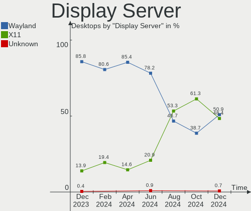
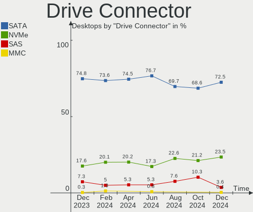
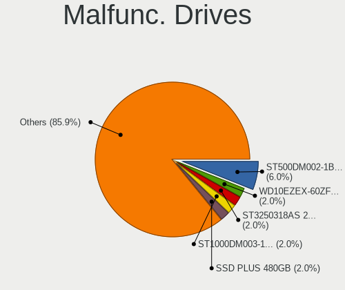
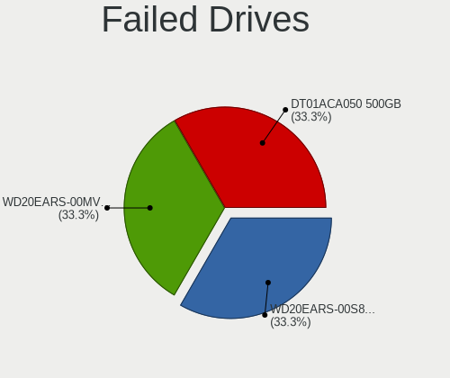
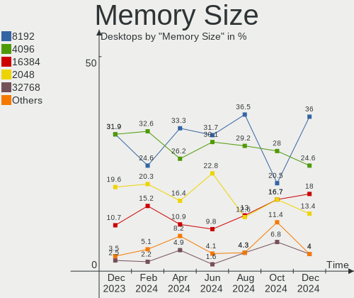

OpenMandriva - Hardware Trends (Desktops)
-----------------------------------------

A project to identify most popular hardware characteristics and track their change
over time based on data collected by Linux users at https://Linux-Hardware.org.

Anyone can contribute to this report by the [hw-probe](https://github.com/linuxhw/hw-probe) tool:

    sudo -E hw-probe -all -upload

This report is for one last month. Overall report since the beginning of time: [TestDays](https://github.com/linuxhw/TestDays)

Period: Apr, 2023.

Contents
--------

* [ System ](#system)
  - [ OS                       ](#os)
  - [ OS Family                ](#os-family)
  - [ Kernel                   ](#kernel)
  - [ Kernel Family            ](#kernel-family)
  - [ Kernel Major Ver.        ](#kernel-major-ver)
  - [ Arch                     ](#arch)
  - [ DE                       ](#de)
  - [ Display Server           ](#display-server)
  - [ Display Manager          ](#display-manager)
  - [ OS Lang                  ](#os-lang)
  - [ Boot Mode                ](#boot-mode)
  - [ Filesystem               ](#filesystem)
  - [ Part. scheme             ](#part-scheme)
  - [ Dual Boot with Linux/BSD ](#dual-boot-with-linuxbsd)
  - [ Dual Boot (Win)          ](#dual-boot-win)

* [ Board ](#board)
  - [ Vendor                   ](#vendor)
  - [ Model                    ](#model)
  - [ Model Family             ](#model-family)
  - [ MFG Year                 ](#mfg-year)
  - [ Form Factor              ](#form-factor)
  - [ Secure Boot              ](#secure-boot)
  - [ Coreboot                 ](#coreboot)
  - [ RAM Size                 ](#ram-size)
  - [ RAM Used                 ](#ram-used)
  - [ Total Drives             ](#total-drives)
  - [ Has CD-ROM               ](#has-cd-rom)
  - [ Has Ethernet             ](#has-ethernet)
  - [ Has WiFi                 ](#has-wifi)
  - [ Has Bluetooth            ](#has-bluetooth)

* [ Location ](#location)
  - [ Country                  ](#country)
  - [ City                     ](#city)

* [ Drives ](#drives)
  - [ Drive Vendor             ](#drive-vendor)
  - [ Drive Model              ](#drive-model)
  - [ HDD Vendor               ](#hdd-vendor)
  - [ SSD Vendor               ](#ssd-vendor)
  - [ Drive Kind               ](#drive-kind)
  - [ Drive Connector          ](#drive-connector)
  - [ Drive Size               ](#drive-size)
  - [ Space Total              ](#space-total)
  - [ Space Used               ](#space-used)
  - [ Malfunc. Drives          ](#malfunc-drives)
  - [ Malfunc. Drive Vendor    ](#malfunc-drive-vendor)
  - [ Malfunc. HDD Vendor      ](#malfunc-hdd-vendor)
  - [ Malfunc. Drive Kind      ](#malfunc-drive-kind)
  - [ Failed Drives            ](#failed-drives)
  - [ Failed Drive Vendor      ](#failed-drive-vendor)
  - [ Drive Status             ](#drive-status)

* [ Storage controller ](#storage-controller)
  - [ Storage Vendor           ](#storage-vendor)
  - [ Storage Model            ](#storage-model)
  - [ Storage Kind             ](#storage-kind)

* [ Processor ](#processor)
  - [ CPU Vendor               ](#cpu-vendor)
  - [ CPU Model                ](#cpu-model)
  - [ CPU Model Family         ](#cpu-model-family)
  - [ CPU Cores                ](#cpu-cores)
  - [ CPU Sockets              ](#cpu-sockets)
  - [ CPU Threads              ](#cpu-threads)
  - [ CPU Op-Modes             ](#cpu-op-modes)
  - [ CPU Microcode            ](#cpu-microcode)
  - [ CPU Microarch            ](#cpu-microarch)

* [ Graphics ](#graphics)
  - [ GPU Vendor               ](#gpu-vendor)
  - [ GPU Model                ](#gpu-model)
  - [ GPU Combo                ](#gpu-combo)
  - [ GPU Driver               ](#gpu-driver)
  - [ GPU Memory               ](#gpu-memory)

* [ Monitor ](#monitor)
  - [ Monitor Vendor           ](#monitor-vendor)
  - [ Monitor Model            ](#monitor-model)
  - [ Monitor Resolution       ](#monitor-resolution)
  - [ Monitor Diagonal         ](#monitor-diagonal)
  - [ Monitor Width            ](#monitor-width)
  - [ Aspect Ratio             ](#aspect-ratio)
  - [ Monitor Area             ](#monitor-area)
  - [ Pixel Density            ](#pixel-density)
  - [ Multiple Monitors        ](#multiple-monitors)

* [ Network ](#network)
  - [ Net Controller Vendor    ](#net-controller-vendor)
  - [ Net Controller Model     ](#net-controller-model)
  - [ Wireless Vendor          ](#wireless-vendor)
  - [ Wireless Model           ](#wireless-model)
  - [ Ethernet Vendor          ](#ethernet-vendor)
  - [ Ethernet Model           ](#ethernet-model)
  - [ Net Controller Kind      ](#net-controller-kind)
  - [ Used Controller          ](#used-controller)
  - [ NICs                     ](#nics)
  - [ IPv6                     ](#ipv6)

* [ Bluetooth ](#bluetooth)
  - [ Bluetooth Vendor         ](#bluetooth-vendor)
  - [ Bluetooth Model          ](#bluetooth-model)

* [ Sound ](#sound)
  - [ Sound Vendor             ](#sound-vendor)
  - [ Sound Model              ](#sound-model)

* [ Memory ](#memory)
  - [ Memory Vendor            ](#memory-vendor)
  - [ Memory Model             ](#memory-model)
  - [ Memory Kind              ](#memory-kind)
  - [ Memory Form Factor       ](#memory-form-factor)
  - [ Memory Size              ](#memory-size)
  - [ Memory Speed             ](#memory-speed)

* [ Printers & scanners ](#printers--scanners)
  - [ Printer Vendor           ](#printer-vendor)
  - [ Printer Model            ](#printer-model)
  - [ Scanner Vendor           ](#scanner-vendor)
  - [ Scanner Model            ](#scanner-model)

* [ Camera ](#camera)
  - [ Camera Vendor            ](#camera-vendor)
  - [ Camera Model             ](#camera-model)

* [ Security ](#security)
  - [ Fingerprint Vendor       ](#fingerprint-vendor)
  - [ Fingerprint Model        ](#fingerprint-model)
  - [ Chipcard Vendor          ](#chipcard-vendor)
  - [ Chipcard Model           ](#chipcard-model)

* [ Unsupported ](#unsupported)
  - [ Unsupported Devices      ](#unsupported-devices)
  - [ Unsupported Device Types ](#unsupported-device-types)

System
------

OS
--

Installed operating systems

| Name               | Desktops | Percent |
|--------------------|----------|---------|
| OpenMandriva 23.03 | 329      | 77.05%  |
| OpenMandriva 4.3   | 41       | 9.6%    |
| OpenMandriva 23.01 | 35       | 8.2%    |
| OpenMandriva 4.2   | 12       | 2.81%   |
| OpenMandriva 4.50  | 5        | 1.17%   |
| OpenMandriva 23.90 | 2        | 0.47%   |
| OpenMandriva 22.12 | 2        | 0.47%   |
| OpenMandriva 4.90  | 1        | 0.23%   |

OS Family
---------

OS without a version

| Name         | Desktops | Percent |
|--------------|----------|---------|
| OpenMandriva | 427      | 100%    |

Kernel
------

Version of the Linux kernel

| Version                  | Desktops | Percent |
|--------------------------|----------|---------|
| 6.2.6-desktop-1omv2390   | 326      | 76.35%  |
| 6.1.1-desktop-1omv2290   | 30       | 7.03%   |
| 5.16.7-desktop-1omv4003  | 25       | 5.85%   |
| 5.16.13-desktop-1omv4003 | 16       | 3.75%   |
| 5.10.14-desktop-1omv4002 | 13       | 3.04%   |
| 6.1.4-desktop-1omv2301   | 6        | 1.41%   |
| 5.19.5-desktop-1omv4090  | 3        | 0.7%    |
| 6.0.10-desktop-2omv22090 | 2        | 0.47%   |
| 6.3.0-desktop-1omv2390   | 1        | 0.23%   |
| 6.2.8-desktop-1omv2390   | 1        | 0.23%   |
| 5.19.11-desktop-2omv4090 | 1        | 0.23%   |
| 5.18.12-desktop-3omv4090 | 1        | 0.23%   |
| 5.17.1-desktop-2omv4050  | 1        | 0.23%   |
| 5.12.4-desktop-1omv4050  | 1        | 0.23%   |

Kernel Family
-------------

Linux kernel without a distro release

| Version | Desktops | Percent |
|---------|----------|---------|
| 6.2.6   | 326      | 76.35%  |
| 6.1.1   | 30       | 7.03%   |
| 5.16.7  | 25       | 5.85%   |
| 5.16.13 | 16       | 3.75%   |
| 5.10.14 | 13       | 3.04%   |
| 6.1.4   | 6        | 1.41%   |
| 5.19.5  | 3        | 0.7%    |
| 6.0.10  | 2        | 0.47%   |
| 6.3.0   | 1        | 0.23%   |
| 6.2.8   | 1        | 0.23%   |
| 5.19.11 | 1        | 0.23%   |
| 5.18.12 | 1        | 0.23%   |
| 5.17.1  | 1        | 0.23%   |
| 5.12.4  | 1        | 0.23%   |

Kernel Major Ver.
-----------------

Linux kernel major version

| Version | Desktops | Percent |
|---------|----------|---------|
| 6.2     | 327      | 76.58%  |
| 5.16    | 41       | 9.6%    |
| 6.1     | 36       | 8.43%   |
| 5.10    | 13       | 3.04%   |
| 5.19    | 4        | 0.94%   |
| 6.0     | 2        | 0.47%   |
| 6.3     | 1        | 0.23%   |
| 5.18    | 1        | 0.23%   |
| 5.17    | 1        | 0.23%   |
| 5.12    | 1        | 0.23%   |

Arch
----

OS architecture (x86_64, i586, etc.)

| Name   | Desktops | Percent |
|--------|----------|---------|
| x86_64 | 427      | 100%    |

DE
--

Desktop Environment

| Name     | Desktops | Percent |
|----------|----------|---------|
| KDE5     | 378      | 88.52%  |
| GNOME    | 26       | 6.09%   |
| LXQt     | 18       | 4.22%   |
| Budgie   | 3        | 0.7%    |
| Cinnamon | 1        | 0.23%   |
| Unknown  | 1        | 0.23%   |

Display Server
--------------

X11 or Wayland

| Name    | Desktops | Percent |
|---------|----------|---------|
| X11     | 399      | 93.44%  |
| Wayland | 28       | 6.56%   |

Display Manager
---------------

SDDM, LightDM, etc.

| Name    | Desktops | Percent |
|---------|----------|---------|
| SDDM    | 399      | 93.44%  |
| GDM     | 26       | 6.09%   |
| LightDM | 1        | 0.23%   |
| Unknown | 1        | 0.23%   |

OS Lang
-------

Language

| Lang  | Desktops | Percent |
|-------|----------|---------|
| en_US | 200      | 46.84%  |
| de_DE | 43       | 10.07%  |
| ru_RU | 31       | 7.26%   |
| fr_FR | 22       | 5.15%   |
| en_GB | 21       | 4.92%   |
| pt_BR | 18       | 4.22%   |
| it_IT | 13       | 3.04%   |
| es_ES | 10       | 2.34%   |
| en_CA | 9        | 2.11%   |
| pl_PL | 6        | 1.41%   |
| es_VE | 6        | 1.41%   |
| de_AT | 6        | 1.41%   |
| hu_HU | 5        | 1.17%   |
| es_MX | 5        | 1.17%   |
| en_AU | 4        | 0.94%   |
| de_CH | 4        | 0.94%   |
| cs_CZ | 4        | 0.94%   |
| ja_JP | 3        | 0.7%    |
| nl_NL | 2        | 0.47%   |
| fr_CA | 2        | 0.47%   |
| es_AR | 2        | 0.47%   |
| en_IN | 2        | 0.47%   |
| tr_TR | 1        | 0.23%   |
| fr_CH | 1        | 0.23%   |
| fr_BE | 1        | 0.23%   |
| es_PE | 1        | 0.23%   |
| es_CO | 1        | 0.23%   |
| es_CL | 1        | 0.23%   |
| en_ZA | 1        | 0.23%   |
| da_DK | 1        | 0.23%   |
| ca_ES | 1        | 0.23%   |

Boot Mode
---------

EFI or BIOS

| Mode | Desktops | Percent |
|------|----------|---------|
| BIOS | 224      | 52.46%  |
| EFI  | 203      | 47.54%  |

Filesystem
----------

Type of filesystem

| Type    | Desktops | Percent |
|---------|----------|---------|
| Ext4    | 240      | 56.21%  |
| Overlay | 166      | 38.88%  |
| Btrfs   | 16       | 3.75%   |
| Xfs     | 5        | 1.17%   |

Part. scheme
------------

Scheme of partitioning

| Type | Desktops | Percent |
|------|----------|---------|
| GPT  | 329      | 77.05%  |
| MBR  | 98       | 22.95%  |

Dual Boot with Linux/BSD
------------------------

Hosting more than one Linux/BSD

| Dual boot | Desktops | Percent |
|-----------|----------|---------|
| Yes       | 228      | 53.4%   |
| No        | 199      | 46.6%   |

Dual Boot (Win)
---------------

Hosting Linux and Windows

| Dual boot | Desktops | Percent |
|-----------|----------|---------|
| Yes       | 240      | 56.21%  |
| No        | 187      | 43.79%  |

Board
-----

Vendor
------

Motherboard manufacturer

| Name                                 | Desktops | Percent |
|--------------------------------------|----------|---------|
| ASUSTek Computer                     | 93       | 21.78%  |
| Gigabyte Technology                  | 67       | 15.69%  |
| MSI                                  | 51       | 11.94%  |
| ASRock                               | 45       | 10.54%  |
| Dell                                 | 34       | 7.96%   |
| Hewlett-Packard                      | 33       | 7.73%   |
| Lenovo                               | 19       | 4.45%   |
| Acer                                 | 15       | 3.51%   |
| Intel                                | 12       | 2.81%   |
| Biostar                              | 10       | 2.34%   |
| Fujitsu                              | 8        | 1.87%   |
| Foxconn                              | 5        | 1.17%   |
| ECS                                  | 5        | 1.17%   |
| Unknown                              | 4        | 0.94%   |
| Pegatron                             | 3        | 0.7%    |
| Fujitsu Siemens                      | 3        | 0.7%    |
| Medion                               | 2        | 0.47%   |
| eMachines                            | 2        | 0.47%   |
| AZW                                  | 2        | 0.47%   |
| Acidanthera                          | 2        | 0.47%   |
| ULTRATOP                             | 1        | 0.23%   |
| T-bao                                | 1        | 0.23%   |
| SYWZ                                 | 1        | 0.23%   |
| Shenzhen Meigao Electronic Equipment | 1        | 0.23%   |
| Nvidia                               | 1        | 0.23%   |
| NEC Computers                        | 1        | 0.23%   |
| MouseComputer                        | 1        | 0.23%   |
| MACHINIST                            | 1        | 0.23%   |
| Lanix                                | 1        | 0.23%   |
| DIEBOLD                              | 1        | 0.23%   |
| Alienware                            | 1        | 0.23%   |
| ABIT                                 | 1        | 0.23%   |

Model
-----

Motherboard model

| Name                                       | Desktops | Percent |
|--------------------------------------------|----------|---------|
| Dell OptiPlex 7010                         | 9        | 2.11%   |
| ASUS All Series                            | 8        | 1.87%   |
| Gigabyte Z77M-D3H                          | 5        | 1.17%   |
| ASUS PRIME A320M-K                         | 5        | 1.17%   |
| MSI MS-7C02                                | 4        | 0.94%   |
| Unknown                                    | 4        | 0.94%   |
| MSI MS-7721                                | 3        | 0.7%    |
| ASUS ROG STRIX X570-F GAMING               | 3        | 0.7%    |
| ASRock A320M-DVS R4.0                      | 3        | 0.7%    |
| MSI MS-7C52                                | 2        | 0.47%   |
| MSI MS-7C09                                | 2        | 0.47%   |
| MSI MS-7B89                                | 2        | 0.47%   |
| MSI MS-7B86                                | 2        | 0.47%   |
| MSI MS-7817                                | 2        | 0.47%   |
| Intel B75                                  | 2        | 0.47%   |
| HP ProDesk 400 G1 SFF                      | 2        | 0.47%   |
| HP EliteDesk 800 G1 USDT                   | 2        | 0.47%   |
| HP EliteDesk 800 G1 SFF                    | 2        | 0.47%   |
| HP Compaq Elite 8300 SFF                   | 2        | 0.47%   |
| Gigabyte B75M-D3H                          | 2        | 0.47%   |
| Dell Precision Tower 5810                  | 2        | 0.47%   |
| Dell OptiPlex 990                          | 2        | 0.47%   |
| Dell OptiPlex 7040                         | 2        | 0.47%   |
| Dell OptiPlex 7020                         | 2        | 0.47%   |
| Dell OptiPlex 3040                         | 2        | 0.47%   |
| Dell OptiPlex 3020                         | 2        | 0.47%   |
| ASUS P5KPL-AM SE                           | 2        | 0.47%   |
| ASUS P5K                                   | 2        | 0.47%   |
| ASUS M5A97 LE R2.0                         | 2        | 0.47%   |
| ASUS M5A78L-M PLUS/USB3                    | 2        | 0.47%   |
| ASUS A68HM-K                               | 2        | 0.47%   |
| ASRock Q1900M                              | 2        | 0.47%   |
| ASRock H81M-VG4 R2.0                       | 2        | 0.47%   |
| Acidanthera MacPro7,1                      | 2        | 0.47%   |
| Acer Aspire X3950                          | 2        | 0.47%   |
| ULTRATOP C2017-LIVA-ZE                     | 1        | 0.23%   |
| T-bao MINI PC                              | 1        | 0.23%   |
| SYWZ S210H Series                          | 1        | 0.23%   |
| Shenzhen Meigao Electronic Equipment MC560 | 1        | 0.23%   |
| Pegatron WC731AA-ABU 300-1115uk            | 1        | 0.23%   |

Model Family
------------

Motherboard model prefix

| Name                    | Desktops | Percent |
|-------------------------|----------|---------|
| Dell OptiPlex           | 25       | 5.85%   |
| ASUS PRIME              | 24       | 5.62%   |
| Lenovo ThinkCentre      | 12       | 2.81%   |
| ASUS ROG                | 11       | 2.58%   |
| HP EliteDesk            | 10       | 2.34%   |
| Acer Aspire             | 10       | 2.34%   |
| HP Compaq               | 9        | 2.11%   |
| ASUS All                | 8        | 1.87%   |
| HP ProDesk              | 5        | 1.17%   |
| Gigabyte Z77M-D3H       | 5        | 1.17%   |
| Fujitsu ESPRIMO         | 5        | 1.17%   |
| Dell Precision          | 5        | 1.17%   |
| Acer Veriton            | 5        | 1.17%   |
| MSI MS-7C02             | 4        | 0.94%   |
| Lenovo IdeaCentre       | 4        | 0.94%   |
| ASUS TUF                | 4        | 0.94%   |
| Unknown                 | 4        | 0.94%   |
| MSI MS-7721             | 3        | 0.7%    |
| Gigabyte X570           | 3        | 0.7%    |
| Gigabyte B550           | 3        | 0.7%    |
| Gigabyte B450           | 3        | 0.7%    |
| ASUS P5K                | 3        | 0.7%    |
| ASUS M5A97              | 3        | 0.7%    |
| ASUS M5A78L-M           | 3        | 0.7%    |
| ASRock A320M-DVS        | 3        | 0.7%    |
| MSI MS-7C52             | 2        | 0.47%   |
| MSI MS-7C09             | 2        | 0.47%   |
| MSI MS-7B89             | 2        | 0.47%   |
| MSI MS-7B86             | 2        | 0.47%   |
| MSI MS-7817             | 2        | 0.47%   |
| Intel B75               | 2        | 0.47%   |
| HP OMEN                 | 2        | 0.47%   |
| Gigabyte GA-78LMT-USB3  | 2        | 0.47%   |
| Gigabyte B75M-D3H       | 2        | 0.47%   |
| Gigabyte B450M          | 2        | 0.47%   |
| Fujitsu Siemens ESPRIMO | 2        | 0.47%   |
| Dell Vostro             | 2        | 0.47%   |
| Dell Inspiron           | 2        | 0.47%   |
| ASUS P8Z77-V            | 2        | 0.47%   |
| ASUS P8P67              | 2        | 0.47%   |

MFG Year
--------

Motherboard manufacture year

| Year | Desktops | Percent |
|------|----------|---------|
| 2012 | 51       | 11.94%  |
| 2018 | 37       | 8.67%   |
| 2013 | 37       | 8.67%   |
| 2014 | 35       | 8.2%    |
| 2019 | 32       | 7.49%   |
| 2020 | 30       | 7.03%   |
| 2011 | 30       | 7.03%   |
| 2021 | 25       | 5.85%   |
| 2017 | 24       | 5.62%   |
| 2010 | 22       | 5.15%   |
| 2015 | 21       | 4.92%   |
| 2016 | 18       | 4.22%   |
| 2008 | 15       | 3.51%   |
| 2009 | 14       | 3.28%   |
| 2007 | 14       | 3.28%   |
| 2022 | 12       | 2.81%   |
| 2006 | 6        | 1.41%   |
| 2023 | 4        | 0.94%   |

Form Factor
-----------

Physical design of the computer

| Name    | Desktops | Percent |
|---------|----------|---------|
| Desktop | 427      | 100%    |

Secure Boot
-----------

Enabled or disabled

| State    | Desktops | Percent |
|----------|----------|---------|
| Disabled | 427      | 100%    |

Coreboot
--------

Have coreboot on board

| Used | Desktops | Percent |
|------|----------|---------|
| No   | 427      | 100%    |

RAM Size
--------

Total RAM memory

| Size in GB      | Desktops | Percent |
|-----------------|----------|---------|
| 16.01-24.0      | 101      | 23.65%  |
| 4.01-8.0        | 100      | 23.42%  |
| 8.01-16.0       | 85       | 19.91%  |
| 3.01-4.0        | 56       | 13.11%  |
| 32.01-64.0      | 47       | 11.01%  |
| 24.01-32.0      | 12       | 2.81%   |
| 64.01-256.0     | 11       | 2.58%   |
| 1.01-2.0        | 8        | 1.87%   |
| 2.01-3.0        | 4        | 0.94%   |
| More than 256.0 | 2        | 0.47%   |
| 0.51-1.0        | 1        | 0.23%   |

RAM Used
--------

Used RAM memory

| Used GB   | Desktops | Percent |
|-----------|----------|---------|
| 1.01-2.0  | 266      | 62.3%   |
| 2.01-3.0  | 99       | 23.19%  |
| 0.51-1.0  | 33       | 7.73%   |
| 3.01-4.0  | 16       | 3.75%   |
| 0.01-0.5  | 7        | 1.64%   |
| 4.01-8.0  | 5        | 1.17%   |
| 8.01-16.0 | 1        | 0.23%   |

Total Drives
------------

Number of drives on board

| Drives | Desktops | Percent |
|--------|----------|---------|
| 1      | 161      | 37.7%   |
| 2      | 122      | 28.57%  |
| 3      | 69       | 16.16%  |
| 4      | 42       | 9.84%   |
| 5      | 19       | 4.45%   |
| 6      | 5        | 1.17%   |
| 0      | 3        | 0.7%    |
| 8      | 2        | 0.47%   |
| 7      | 2        | 0.47%   |
| 11     | 1        | 0.23%   |
| 10     | 1        | 0.23%   |

Has CD-ROM
----------

Has CD-ROM on board

| Presented | Desktops | Percent |
|-----------|----------|---------|
| Yes       | 226      | 52.93%  |
| No        | 201      | 47.07%  |

Has Ethernet
------------

Has Ethernet on board

| Presented | Desktops | Percent |
|-----------|----------|---------|
| Yes       | 424      | 99.3%   |
| No        | 3        | 0.7%    |

Has WiFi
--------

Has WiFi module

| Presented | Desktops | Percent |
|-----------|----------|---------|
| No        | 253      | 59.25%  |
| Yes       | 174      | 40.75%  |

Has Bluetooth
-------------

Has Bluetooth module

| Presented | Desktops | Percent |
|-----------|----------|---------|
| No        | 313      | 73.3%   |
| Yes       | 114      | 26.7%   |

Location
--------

Country
-------

Geographic location (country)

| Country      | Desktops | Percent |
|--------------|----------|---------|
| USA          | 52       | 12.18%  |
| Germany      | 48       | 11.24%  |
| Russia       | 32       | 7.49%   |
| Brazil       | 28       | 6.56%   |
| France       | 25       | 5.85%   |
| UK           | 22       | 5.15%   |
| Italy        | 21       | 4.92%   |
| Japan        | 17       | 3.98%   |
| Spain        | 14       | 3.28%   |
| Canada       | 14       | 3.28%   |
| Venezuela    | 8        | 1.87%   |
| Hungary      | 8        | 1.87%   |
| Finland      | 8        | 1.87%   |
| Australia    | 8        | 1.87%   |
| Poland       | 7        | 1.64%   |
| Austria      | 7        | 1.64%   |
| Malaysia     | 6        | 1.41%   |
| Czechia      | 6        | 1.41%   |
| Switzerland  | 5        | 1.17%   |
| Netherlands  | 5        | 1.17%   |
| Mexico       | 5        | 1.17%   |
| Argentina    | 5        | 1.17%   |
| Taiwan       | 4        | 0.94%   |
| South Africa | 4        | 0.94%   |
| Portugal     | 4        | 0.94%   |
| Indonesia    | 4        | 0.94%   |
| India        | 4        | 0.94%   |
| China        | 4        | 0.94%   |
| Slovenia     | 3        | 0.7%    |
| Slovakia     | 3        | 0.7%    |
| Israel       | 3        | 0.7%    |
| Greece       | 3        | 0.7%    |
| Chile        | 3        | 0.7%    |
| Bulgaria     | 3        | 0.7%    |
| Vietnam      | 2        | 0.47%   |
| Ukraine      | 2        | 0.47%   |
| Turkey       | 2        | 0.47%   |
| Puerto Rico  | 2        | 0.47%   |
| Egypt        | 2        | 0.47%   |
| Colombia     | 2        | 0.47%   |

City
----

Geographic location (city)

| City               | Desktops | Percent |
|--------------------|----------|---------|
| Moscow             | 7        | 1.64%   |
| Milan              | 6        | 1.41%   |
| Kuala Lumpur       | 6        | 1.41%   |
| Helsinki           | 5        | 1.17%   |
| Budapest           | 5        | 1.17%   |
| Vienna             | 4        | 0.94%   |
| Saint-Meme-le-Tenu | 3        | 0.7%    |
| Prague             | 3        | 0.7%    |
| Porto Alegre       | 3        | 0.7%    |
| Nepean             | 3        | 0.7%    |
| London             | 3        | 0.7%    |
| Glasgow            | 3        | 0.7%    |
| Caracas            | 3        | 0.7%    |
| Berlin             | 3        | 0.7%    |
| Yorba Linda        | 2        | 0.47%   |
| Yekaterinburg      | 2        | 0.47%   |
| Warsaw             | 2        | 0.47%   |
| Waldkirch          | 2        | 0.47%   |
| Umeda              | 2        | 0.47%   |
| Uberlândia        | 2        | 0.47%   |
| Sydney             | 2        | 0.47%   |
| Sunderland         | 2        | 0.47%   |
| St. Jean Baptiste  | 2        | 0.47%   |
| Seattle            | 2        | 0.47%   |
| Scranton           | 2        | 0.47%   |
| Sao Paulo          | 2        | 0.47%   |
| Santiago           | 2        | 0.47%   |
| Saint-Raphaël     | 2        | 0.47%   |
| Oviedo             | 2        | 0.47%   |
| Nizhniy Novgorod   | 2        | 0.47%   |
| New Taipei         | 2        | 0.47%   |
| Naples             | 2        | 0.47%   |
| Nabari             | 2        | 0.47%   |
| Munich             | 2        | 0.47%   |
| Motomachi          | 2        | 0.47%   |
| Monza              | 2        | 0.47%   |
| Mérida            | 2        | 0.47%   |
| Lendava            | 2        | 0.47%   |
| Kansas City        | 2        | 0.47%   |
| Johannesburg       | 2        | 0.47%   |

Drives
------

Drive Vendor
------------

Hard drive vendors

| Vendor              | Desktops | Drives | Percent |
|---------------------|----------|--------|---------|
| Seagate             | 148      | 173    | 18.81%  |
| WDC                 | 129      | 171    | 16.39%  |
| Samsung Electronics | 79       | 117    | 10.04%  |
| Kingston            | 62       | 80     | 7.88%   |
| Toshiba             | 45       | 54     | 5.72%   |
| Crucial             | 38       | 46     | 4.83%   |
| SanDisk             | 33       | 38     | 4.19%   |
| Hitachi             | 22       | 24     | 2.8%    |
| SPCC                | 17       | 19     | 2.16%   |
| China               | 15       | 16     | 1.91%   |
| A-DATA Technology   | 15       | 16     | 1.91%   |
| PNY                 | 12       | 13     | 1.52%   |
| Intel               | 10       | 10     | 1.27%   |
| Patriot             | 8        | 8      | 1.02%   |
| Maxtor              | 8        | 8      | 1.02%   |
| HGST                | 8        | 8      | 1.02%   |
| Unknown             | 7        | 8      | 0.89%   |
| Micron Technology   | 6        | 6      | 0.76%   |
| XPG                 | 5        | 6      | 0.64%   |
| Transcend           | 5        | 5      | 0.64%   |
| KIOXIA-EXCERIA      | 5        | 5      | 0.64%   |
| JMicron Technology  | 5        | 5      | 0.64%   |
| Apacer              | 5        | 5      | 0.64%   |
| Silicon Motion      | 4        | 4      | 0.51%   |
| Phison              | 4        | 5      | 0.51%   |
| Intenso             | 4        | 5      | 0.51%   |
| Team                | 3        | 3      | 0.38%   |
| SABRENT             | 3        | 3      | 0.38%   |
| LITEON              | 3        | 3      | 0.38%   |
| KingSpec            | 3        | 3      | 0.38%   |
| GOODRAM             | 3        | 3      | 0.38%   |
| Gigabyte Technology | 3        | 3      | 0.38%   |
| Corsair             | 3        | 3      | 0.38%   |
| Unknown             | 3        | 4      | 0.38%   |
| StoreJet            | 2        | 2      | 0.25%   |
| Phison Electronics  | 2        | 2      | 0.25%   |
| OCZ                 | 2        | 2      | 0.25%   |
| MSI                 | 2        | 2      | 0.25%   |
| KingFast            | 2        | 2      | 0.25%   |
| Hewlett-Packard     | 2        | 2      | 0.25%   |

Drive Model
-----------

Hard drive models

| Model                            | Desktops | Percent |
|----------------------------------|----------|---------|
| Toshiba DT01ACA100 1TB           | 14       | 1.54%   |
| Kingston SA400S37240G 240GB SSD  | 14       | 1.54%   |
| Seagate ST500DM002-1BD142 500GB  | 12       | 1.32%   |
| Seagate ST1000DM010-2EP102 1TB   | 10       | 1.1%    |
| Kingston SA400S37480G 480GB SSD  | 8        | 0.88%   |
| Samsung SSD 970 EVO Plus 1TB     | 7        | 0.77%   |
| Crucial CT500MX500SSD1 500GB     | 7        | 0.77%   |
| WDC WD10EZEX-08WN4A0 1TB         | 6        | 0.66%   |
| Toshiba DT01ACA200 2TB           | 6        | 0.66%   |
| Seagate ST3500418AS 500GB        | 6        | 0.66%   |
| Seagate ST2000DM008-2FR102 2TB   | 6        | 0.66%   |
| Seagate ST1000DM003-1ER162 1TB   | 6        | 0.66%   |
| Kingston SA400S37120G 120GB SSD  | 6        | 0.66%   |
| WDC WD5000AAKX-75U6AA0 500GB     | 5        | 0.55%   |
| Unknown SD/MMC/MS PRO 249GB      | 5        | 0.55%   |
| Seagate ST3500414CS 500GB        | 5        | 0.55%   |
| Seagate ST3250310AS 250GB        | 5        | 0.55%   |
| SanDisk SSD PLUS 1000GB          | 5        | 0.55%   |
| Samsung SSD 860 EVO 500GB        | 5        | 0.55%   |
| Samsung SSD 860 EVO 250GB        | 5        | 0.55%   |
| Samsung SSD 850 EVO 250GB        | 5        | 0.55%   |
| Kingston SA2000M8500G 500GB      | 5        | 0.55%   |
| Crucial CT240BX500SSD1 240GB     | 5        | 0.55%   |
| WDC WD5000AAKX-00ERMA0 500GB     | 4        | 0.44%   |
| WDC WD5000AADS-00S9B0 500GB      | 4        | 0.44%   |
| WDC WD2500AAKX-753CA1 250GB      | 4        | 0.44%   |
| WDC WD10EZEX-60WN4A0 1TB         | 4        | 0.44%   |
| Toshiba DT01ACA050 500GB         | 4        | 0.44%   |
| SPCC Solid State Disk 1TB        | 4        | 0.44%   |
| Seagate ST3320418AS 320GB        | 4        | 0.44%   |
| Seagate ST3160318AS 160GB        | 4        | 0.44%   |
| Seagate ST31000528AS 1TB         | 4        | 0.44%   |
| Seagate ST2000DM001-1CH164 2TB   | 4        | 0.44%   |
| Seagate ST1000DM003-1SB102 1TB   | 4        | 0.44%   |
| Seagate ST1000DM003-1CH162 1TB   | 4        | 0.44%   |
| SanDisk NVMe SSD Drive 1TB       | 4        | 0.44%   |
| Samsung SSD 980 PRO 2TB          | 4        | 0.44%   |
| Samsung SSD 860 EVO 1TB          | 4        | 0.44%   |
| PNY CS900 120GB SSD              | 4        | 0.44%   |
| Kingston SV300S37A240G 240GB SSD | 4        | 0.44%   |

HDD Vendor
----------

Hard disk drive vendors

| Vendor              | Desktops | Drives | Percent |
|---------------------|----------|--------|---------|
| Seagate             | 145      | 168    | 39.08%  |
| WDC                 | 112      | 142    | 30.19%  |
| Toshiba             | 41       | 49     | 11.05%  |
| Hitachi             | 22       | 24     | 5.93%   |
| Samsung Electronics | 21       | 25     | 5.66%   |
| Maxtor              | 8        | 8      | 2.16%   |
| HGST                | 8        | 8      | 2.16%   |
| Unknown             | 5        | 5      | 1.35%   |
| JMicron Technology  | 3        | 3      | 0.81%   |
| WD MediaMax         | 1        | 1      | 0.27%   |
| StoreJet            | 1        | 1      | 0.27%   |
| RSH-319             | 1        | 1      | 0.27%   |
| KESU                | 1        | 1      | 0.27%   |
| Intenso             | 1        | 1      | 0.27%   |
| Inateck             | 1        | 1      | 0.27%   |

SSD Vendor
----------

Solid state drive vendors

| Vendor              | Desktops | Drives | Percent |
|---------------------|----------|--------|---------|
| Samsung Electronics | 46       | 60     | 14.24%  |
| Kingston            | 46       | 58     | 14.24%  |
| Crucial             | 31       | 35     | 9.6%    |
| SanDisk             | 28       | 32     | 8.67%   |
| WDC                 | 22       | 24     | 6.81%   |
| SPCC                | 16       | 17     | 4.95%   |
| China               | 15       | 16     | 4.64%   |
| PNY                 | 11       | 12     | 3.41%   |
| A-DATA Technology   | 11       | 11     | 3.41%   |
| Patriot             | 8        | 8      | 2.48%   |
| Transcend           | 5        | 5      | 1.55%   |
| Intel               | 5        | 5      | 1.55%   |
| Toshiba             | 4        | 4      | 1.24%   |
| Micron Technology   | 4        | 4      | 1.24%   |
| Intenso             | 4        | 4      | 1.24%   |
| Apacer              | 4        | 4      | 1.24%   |
| Seagate             | 3        | 3      | 0.93%   |
| LITEON              | 3        | 3      | 0.93%   |
| GOODRAM             | 3        | 3      | 0.93%   |
| Unknown             | 3        | 4      | 0.93%   |
| Team                | 2        | 2      | 0.62%   |
| OCZ                 | 2        | 2      | 0.62%   |
| KingSpec            | 2        | 2      | 0.62%   |
| KingFast            | 2        | 2      | 0.62%   |
| Gigabyte Technology | 2        | 2      | 0.62%   |
| External            | 2        | 2      | 0.62%   |
| Emtec               | 2        | 2      | 0.62%   |
| addlink             | 2        | 2      | 0.62%   |
| ZHITAI              | 1        | 1      | 0.31%   |
| XUM                 | 1        | 1      | 0.31%   |
| XrayDisk            | 1        | 1      | 0.31%   |
| Verbatim            | 1        | 1      | 0.31%   |
| USB                 | 1        | 1      | 0.31%   |
| TAMMUZ              | 1        | 1      | 0.31%   |
| T-FORCE             | 1        | 1      | 0.31%   |
| StoreJet            | 1        | 1      | 0.31%   |
| Smartbuy            | 1        | 1      | 0.31%   |
| SK hynix            | 1        | 1      | 0.31%   |
| SATAFIRM            | 1        | 1      | 0.31%   |
| SABRENT             | 1        | 1      | 0.31%   |

Drive Kind
----------

HDD or SSD

| Kind    | Desktops | Drives | Percent |
|---------|----------|--------|---------|
| HDD     | 278      | 438    | 43.71%  |
| SSD     | 253      | 363    | 39.78%  |
| NVMe    | 97       | 137    | 15.25%  |
| Unknown | 8        | 9      | 1.26%   |

Drive Connector
---------------

SATA, SAS, NVMe, etc.

| Type | Desktops | Drives | Percent |
|------|----------|--------|---------|
| SATA | 400      | 759    | 73.8%   |
| NVMe | 96       | 134    | 17.71%  |
| SAS  | 46       | 54     | 8.49%   |

Drive Size
----------

Size of hard drive

| Size in TB | Desktops | Drives | Percent |
|------------|----------|--------|---------|
| 0.01-0.5   | 309      | 462    | 53.74%  |
| 0.51-1.0   | 165      | 216    | 28.7%   |
| 1.01-2.0   | 57       | 64     | 9.91%   |
| 2.01-3.0   | 17       | 20     | 2.96%   |
| 3.01-4.0   | 13       | 17     | 2.26%   |
| 4.01-10.0  | 10       | 18     | 1.74%   |
| 10.01-20.0 | 4        | 4      | 0.7%    |

Space Total
-----------

Amount of disk space available on the file system

| Size in GB     | Desktops | Percent |
|----------------|----------|---------|
| 1-20           | 112      | 26.23%  |
| 101-250        | 98       | 22.95%  |
| 251-500        | 58       | 13.58%  |
| 501-1000       | 39       | 9.13%   |
| 21-50          | 32       | 7.49%   |
| 51-100         | 26       | 6.09%   |
| Unknown        | 26       | 6.09%   |
| 1001-2000      | 20       | 4.68%   |
| More than 3000 | 10       | 2.34%   |
| 2001-3000      | 6        | 1.41%   |

Space Used
----------

Amount of used disk space

| Used GB        | Desktops | Percent |
|----------------|----------|---------|
| 1-20           | 320      | 74.94%  |
| Unknown        | 26       | 6.09%   |
| 21-50          | 21       | 4.92%   |
| 251-500        | 15       | 3.51%   |
| 101-250        | 14       | 3.28%   |
| 51-100         | 13       | 3.04%   |
| 501-1000       | 10       | 2.34%   |
| 2001-3000      | 4        | 0.94%   |
| 1001-2000      | 3        | 0.7%    |
| More than 3000 | 1        | 0.23%   |

Malfunc. Drives
---------------

Drive models with a malfunction

| Model                               | Desktops | Drives | Percent |
|-------------------------------------|----------|--------|---------|
| Seagate ST500DM002-1BD142 500GB     | 6        | 6      | 3.59%   |
| WDC WD5000AAKX-75U6AA0 500GB        | 5        | 5      | 2.99%   |
| Seagate ST3250310AS 250GB           | 3        | 3      | 1.8%    |
| Seagate ST3160318AS 160GB           | 3        | 3      | 1.8%    |
| Seagate ST31000528AS 1TB            | 3        | 3      | 1.8%    |
| WDC WD5000AAKX-00ERMA0 500GB        | 2        | 2      | 1.2%    |
| WDC WD20EARX-00PASB0 2TB            | 2        | 2      | 1.2%    |
| WDC WD10EALX-009BA0 1TB             | 2        | 2      | 1.2%    |
| Seagate ST500LT012-9WS142 500GB     | 2        | 2      | 1.2%    |
| Seagate ST500LM021-1KJ152 500GB     | 2        | 2      | 1.2%    |
| Seagate ST500LM012 HN-M500MBB 500GB | 2        | 2      | 1.2%    |
| Seagate ST3250318AS 250GB           | 2        | 2      | 1.2%    |
| Seagate ST2000DM001-1CH164 2TB      | 2        | 2      | 1.2%    |
| Seagate ST1000DM003-1CH162 1TB      | 2        | 2      | 1.2%    |
| Samsung Electronics HD103SI 1TB     | 2        | 2      | 1.2%    |
| Maxtor STM380215AS 80GB             | 2        | 2      | 1.2%    |
| Kingston SV300S37A240G 240GB SSD    | 2        | 2      | 1.2%    |
| WDC WDS240G2G0A-00JH30 240GB SSD    | 1        | 1      | 0.6%    |
| WDC WD800JD-23LSA0 80GB             | 1        | 1      | 0.6%    |
| WDC WD800JB-00JJC0 80GB             | 1        | 1      | 0.6%    |
| WDC WD800BD-22LRA0 80GB             | 1        | 1      | 0.6%    |
| WDC WD5003ABYX-88 LEN 500GB         | 1        | 1      | 0.6%    |
| WDC WD5003ABYX-01WERA0 500GB        | 1        | 1      | 0.6%    |
| WDC WD5002ABYS-02B1B0 500GB         | 1        | 1      | 0.6%    |
| WDC WD5000AVDS-63U7B1 500GB         | 1        | 1      | 0.6%    |
| WDC WD5000AAKX-753CA1 500GB         | 1        | 1      | 0.6%    |
| WDC WD5000AAKS-65V0A0 500GB         | 1        | 1      | 0.6%    |
| WDC WD5000AADS-00S9B0 500GB         | 1        | 1      | 0.6%    |
| WDC WD3200AAKX-753CA1 320GB         | 1        | 1      | 0.6%    |
| WDC WD3200AAKS-61L9A0 320GB         | 1        | 1      | 0.6%    |
| WDC WD3200AAKS-00B3A0 320GB         | 1        | 1      | 0.6%    |
| WDC WD3200AAJS-65B4A0 320GB         | 1        | 1      | 0.6%    |
| WDC WD3200AAJS-00L7A0 320GB         | 1        | 1      | 0.6%    |
| WDC WD30EZRX-00D8PB0 3TB            | 1        | 1      | 0.6%    |
| WDC WD2500SD-01KCB0 250GB           | 1        | 1      | 0.6%    |
| WDC WD2500BEVS-60UST0 250GB         | 1        | 1      | 0.6%    |
| WDC WD2500AAKX-083CA1 250GB         | 1        | 1      | 0.6%    |
| WDC WD2500AAKX-001CA0 250GB         | 1        | 1      | 0.6%    |
| WDC WD1600BB-00GUC0 160GB           | 1        | 1      | 0.6%    |
| WDC WD1600AAJS-00L7A0 160GB         | 1        | 1      | 0.6%    |

Malfunc. Drive Vendor
---------------------

Vendors of faulty drives

| Vendor              | Desktops | Drives | Percent |
|---------------------|----------|--------|---------|
| Seagate             | 57       | 58     | 35.19%  |
| WDC                 | 40       | 44     | 24.69%  |
| Samsung Electronics | 18       | 19     | 11.11%  |
| Hitachi             | 9        | 9      | 5.56%   |
| Toshiba             | 7        | 7      | 4.32%   |
| Maxtor              | 7        | 7      | 4.32%   |
| Kingston            | 4        | 4      | 2.47%   |
| Intel               | 3        | 3      | 1.85%   |
| HGST                | 3        | 3      | 1.85%   |
| China               | 2        | 2      | 1.23%   |
| SATAFIRM            | 1        | 1      | 0.62%   |
| SanDisk             | 1        | 1      | 0.62%   |
| RSH-319             | 1        | 1      | 0.62%   |
| Patriot             | 1        | 1      | 0.62%   |
| Micron Technology   | 1        | 1      | 0.62%   |
| KingSpec            | 1        | 1      | 0.62%   |
| JMicron Technology  | 1        | 1      | 0.62%   |
| Intenso             | 1        | 1      | 0.62%   |
| Fanxiang            | 1        | 1      | 0.62%   |
| Crucial             | 1        | 1      | 0.62%   |
| BAITITON            | 1        | 1      | 0.62%   |
| A-DATA Technology   | 1        | 1      | 0.62%   |

Malfunc. HDD Vendor
-------------------

Vendors of faulty HDD drives

| Vendor              | Desktops | Drives | Percent |
|---------------------|----------|--------|---------|
| Seagate             | 57       | 58     | 41.61%  |
| WDC                 | 39       | 42     | 28.47%  |
| Samsung Electronics | 14       | 15     | 10.22%  |
| Hitachi             | 9        | 9      | 6.57%   |
| Toshiba             | 7        | 7      | 5.11%   |
| Maxtor              | 7        | 7      | 5.11%   |
| HGST                | 3        | 3      | 2.19%   |
| RSH-319             | 1        | 1      | 0.73%   |

Malfunc. Drive Kind
-------------------

Kinds of faulty drives

| Kind    | Desktops | Drives | Percent |
|---------|----------|--------|---------|
| HDD     | 122      | 142    | 82.43%  |
| SSD     | 22       | 22     | 14.86%  |
| NVMe    | 3        | 3      | 2.03%   |
| Unknown | 1        | 1      | 0.68%   |

Failed Drives
-------------

Failed drive models

| Model                           | Desktops | Drives | Percent |
|---------------------------------|----------|--------|---------|
| Seagate ST9320423AS 320GB       | 1        | 1      | 50%     |
| Seagate ST500DM002-1BD142 500GB | 1        | 1      | 50%     |

Failed Drive Vendor
-------------------

Failed drive vendors

| Vendor  | Desktops | Drives | Percent |
|---------|----------|--------|---------|
| Seagate | 2        | 2      | 100%    |

Drive Status
------------

Number of failed and malfunc. drives

| Status   | Desktops | Drives | Percent |
|----------|----------|--------|---------|
| Works    | 370      | 729    | 67.03%  |
| Malfunc  | 141      | 168    | 25.54%  |
| Detected | 39       | 48     | 7.07%   |
| Failed   | 2        | 2      | 0.36%   |

Storage controller
------------------

Storage Vendor
--------------

Storage controller vendors

| Vendor                           | Desktops | Percent |
|----------------------------------|----------|---------|
| Intel                            | 270      | 46.08%  |
| AMD                              | 152      | 25.94%  |
| Samsung Electronics              | 26       | 4.44%   |
| Kingston Technology Company      | 19       | 3.24%   |
| ASMedia Technology               | 19       | 3.24%   |
| Phison Electronics               | 16       | 2.73%   |
| Marvell Technology Group         | 14       | 2.39%   |
| Silicon Motion                   | 12       | 2.05%   |
| SanDisk                          | 10       | 1.71%   |
| Micron/Crucial Technology        | 9        | 1.54%   |
| Nvidia                           | 7        | 1.19%   |
| JMicron Technology               | 7        | 1.19%   |
| ADATA Technology                 | 6        | 1.02%   |
| KIOXIA                           | 4        | 0.68%   |
| VIA Technologies                 | 2        | 0.34%   |
| Realtek Semiconductor            | 2        | 0.34%   |
| Micron Technology                | 2        | 0.34%   |
| Toshiba America Info Systems     | 1        | 0.17%   |
| Silicon Integrated Systems [SiS] | 1        | 0.17%   |
| Silicon Image                    | 1        | 0.17%   |
| Seagate Technology               | 1        | 0.17%   |
| MAXIO Technology (Hangzhou)      | 1        | 0.17%   |
| Integrated Technology Express    | 1        | 0.17%   |
| Hewlett-Packard                  | 1        | 0.17%   |
| Broadcom / LSI                   | 1        | 0.17%   |
| Biwin Storage Technology         | 1        | 0.17%   |

Storage Model
-------------

Storage controller models

| Model                                                                                   | Desktops | Percent |
|-----------------------------------------------------------------------------------------|----------|---------|
| AMD FCH SATA Controller [AHCI mode]                                                     | 81       | 11.13%  |
| Intel 8 Series/C220 Series Chipset Family 6-port SATA Controller 1 [AHCI mode]          | 35       | 4.81%   |
| Intel 6 Series/C200 Series Chipset Family 6 port Desktop SATA AHCI Controller           | 26       | 3.57%   |
| AMD 400 Series Chipset SATA Controller                                                  | 26       | 3.57%   |
| Intel 7 Series/C210 Series Chipset Family 6-port SATA Controller [AHCI mode]            | 23       | 3.16%   |
| AMD SB7x0/SB8x0/SB9x0 SATA Controller [AHCI mode]                                       | 22       | 3.02%   |
| Intel Q170/Q150/B150/H170/H110/Z170/CM236 Chipset SATA Controller [AHCI Mode]           | 20       | 2.75%   |
| AMD SB7x0/SB8x0/SB9x0 IDE Controller                                                    | 20       | 2.75%   |
| Intel NM10/ICH7 Family SATA Controller [IDE mode]                                       | 18       | 2.47%   |
| Samsung NVMe SSD Controller SM981/PM981/PM983                                           | 17       | 2.34%   |
| AMD 500 Series Chipset SATA Controller                                                  | 17       | 2.34%   |
| ASMedia ASM1062 Serial ATA Controller                                                   | 16       | 2.2%    |
| Intel Cannon Lake PCH SATA AHCI Controller                                              | 15       | 2.06%   |
| Intel 82801G (ICH7 Family) IDE Controller                                               | 15       | 2.06%   |
| Intel 200 Series PCH SATA controller [AHCI mode]                                        | 15       | 2.06%   |
| AMD FCH SATA Controller D                                                               | 14       | 1.92%   |
| Intel 6 Series/C200 Series Chipset Family Desktop SATA Controller (IDE mode, ports 4-5) | 12       | 1.65%   |
| Intel 6 Series/C200 Series Chipset Family Desktop SATA Controller (IDE mode, ports 0-3) | 12       | 1.65%   |
| AMD SB7x0/SB8x0/SB9x0 SATA Controller [IDE mode]                                        | 12       | 1.65%   |
| Intel SATA Controller [RAID mode]                                                       | 11       | 1.51%   |
| Intel 500 Series Chipset Family SATA AHCI Controller                                    | 11       | 1.51%   |
| Silicon Motion SM2263EN/SM2263XT SSD Controller                                         | 10       | 1.37%   |
| AMD FCH IDE Controller                                                                  | 9        | 1.24%   |
| Phison PS5013 E13 NVMe Controller                                                       | 8        | 1.1%    |
| Intel 9 Series Chipset Family SATA Controller [AHCI Mode]                               | 8        | 1.1%    |
| Samsung NVMe SSD Controller PM9A1/PM9A3/980PRO                                          | 7        | 0.96%   |
| Micron/Crucial P2 NVMe PCIe SSD                                                         | 7        | 0.96%   |
| Intel 7 Series/C210 Series Chipset Family 4-port SATA Controller [IDE mode]             | 7        | 0.96%   |
| Intel 7 Series/C210 Series Chipset Family 2-port SATA Controller [IDE mode]             | 7        | 0.96%   |
| Kingston Company A2000 NVMe SSD                                                         | 6        | 0.82%   |
| JMicron JMB363 SATA/IDE Controller                                                      | 6        | 0.82%   |
| Intel 82801I (ICH9 Family) 2 port SATA Controller [IDE mode]                            | 6        | 0.82%   |
| Intel 82801HR/HO/HH (ICH8R/DO/DH) 2 port SATA Controller [IDE mode]                     | 6        | 0.82%   |
| Intel 82801H (ICH8 Family) 4 port SATA Controller [IDE mode]                            | 6        | 0.82%   |
| Intel 5 Series/3400 Series Chipset 6 port SATA AHCI Controller                          | 6        | 0.82%   |
| AMD FCH SATA Controller [IDE mode]                                                      | 6        | 0.82%   |
| AMD 300 Series Chipset SATA Controller                                                  | 6        | 0.82%   |
| Kingston Company Company Non-Volatile memory controller                                 | 5        | 0.69%   |
| Kingston Company NVMe Controller                                                        | 5        | 0.69%   |
| Intel C610/X99 series chipset 6-Port SATA Controller [AHCI mode]                        | 5        | 0.69%   |

Storage Kind
------------

Kind of storage controller (IDE, SATA, NVMe, SAS, ...)

| Kind | Desktops | Percent |
|------|----------|---------|
| SATA | 351      | 61.58%  |
| IDE  | 105      | 18.42%  |
| NVMe | 96       | 16.84%  |
| RAID | 17       | 2.98%   |
| SAS  | 1        | 0.18%   |

Processor
---------

CPU Vendor
----------

Processor vendors

| Vendor | Desktops | Percent |
|--------|----------|---------|
| Intel  | 270      | 63.23%  |
| AMD    | 157      | 36.77%  |

CPU Model
---------

Processor models

| Model                                       | Desktops | Percent |
|---------------------------------------------|----------|---------|
| Intel Core i5-3470 CPU @ 3.20GHz            | 9        | 2.11%   |
| Intel Core i5-2400 CPU @ 3.10GHz            | 9        | 2.11%   |
| AMD Ryzen 7 3700X 8-Core Processor          | 9        | 2.11%   |
| Intel Core i3-3220 CPU @ 3.30GHz            | 8        | 1.87%   |
| Intel Core i3-2120 CPU @ 3.30GHz            | 7        | 1.64%   |
| AMD Ryzen 5 5600G with Radeon Graphics      | 7        | 1.64%   |
| Intel Core i7-2600 CPU @ 3.40GHz            | 6        | 1.41%   |
| AMD Ryzen 5 5600X 6-Core Processor          | 6        | 1.41%   |
| AMD Ryzen 5 3600 6-Core Processor           | 6        | 1.41%   |
| Intel Core i7-6700 CPU @ 3.40GHz            | 5        | 1.17%   |
| Intel Core i7-3770 CPU @ 3.40GHz            | 5        | 1.17%   |
| Intel Core i5-4590 CPU @ 3.30GHz            | 5        | 1.17%   |
| AMD Ryzen 5 3400G with Radeon Vega Graphics | 5        | 1.17%   |
| Intel Pentium CPU G4400 @ 3.30GHz           | 4        | 0.94%   |
| Intel Core i7-4790 CPU @ 3.60GHz            | 4        | 0.94%   |
| Intel Core i5-6500 CPU @ 3.20GHz            | 4        | 0.94%   |
| Intel Core i5-4570 CPU @ 3.20GHz            | 4        | 0.94%   |
| Intel Core i5-4460 CPU @ 3.20GHz            | 4        | 0.94%   |
| Intel Core i5 CPU 650 @ 3.20GHz             | 4        | 0.94%   |
| Intel Core i3-6100 CPU @ 3.70GHz            | 4        | 0.94%   |
| Intel Core 2 Duo CPU E7500 @ 2.93GHz        | 4        | 0.94%   |
| AMD Ryzen 5 2600 Six-Core Processor         | 4        | 0.94%   |
| AMD Ryzen 5 2400G with Radeon Vega Graphics | 4        | 0.94%   |
| AMD FX-8350 Eight-Core Processor            | 4        | 0.94%   |
| Intel Pentium Dual CPU E2180 @ 2.00GHz      | 3        | 0.7%    |
| Intel Pentium Dual CPU E2160 @ 1.80GHz      | 3        | 0.7%    |
| Intel Pentium CPU G2030 @ 3.00GHz           | 3        | 0.7%    |
| Intel Core i7-8700K CPU @ 3.70GHz           | 3        | 0.7%    |
| Intel Core i7-8700 CPU @ 3.20GHz            | 3        | 0.7%    |
| Intel Core i7-4790K CPU @ 4.00GHz           | 3        | 0.7%    |
| Intel Core i7-3770K CPU @ 3.50GHz           | 3        | 0.7%    |
| Intel Core i5-7500 CPU @ 3.40GHz            | 3        | 0.7%    |
| Intel Core i5-6400 CPU @ 2.70GHz            | 3        | 0.7%    |
| Intel Core i5-4570T CPU @ 2.90GHz           | 3        | 0.7%    |
| Intel Core i5-3570 CPU @ 3.40GHz            | 3        | 0.7%    |
| Intel Core i5-3450 CPU @ 3.10GHz            | 3        | 0.7%    |
| Intel Core i3-10100 CPU @ 3.60GHz           | 3        | 0.7%    |
| Intel Core 2 Quad CPU Q9550 @ 2.83GHz       | 3        | 0.7%    |
| Intel Core 2 Duo CPU E8400 @ 3.00GHz        | 3        | 0.7%    |
| Intel 11th Gen Core i7-11700K @ 3.60GHz     | 3        | 0.7%    |

CPU Model Family
----------------

Processor model prefix

| Model                   | Desktops | Percent |
|-------------------------|----------|---------|
| Intel Core i5           | 82       | 19.2%   |
| Intel Core i7           | 50       | 11.71%  |
| AMD Ryzen 5             | 45       | 10.54%  |
| Intel Core i3           | 40       | 9.37%   |
| AMD Ryzen 7             | 18       | 4.22%   |
| Intel Celeron           | 17       | 3.98%   |
| AMD FX                  | 16       | 3.75%   |
| Intel Core 2 Duo        | 14       | 3.28%   |
| Other                   | 13       | 3.04%   |
| Intel Xeon              | 10       | 2.34%   |
| AMD Ryzen 9             | 10       | 2.34%   |
| AMD A8                  | 10       | 2.34%   |
| Intel Pentium           | 9        | 2.11%   |
| Intel Pentium Dual-Core | 8        | 1.87%   |
| Intel Core 2 Quad       | 8        | 1.87%   |
| Intel Pentium Dual      | 6        | 1.41%   |
| AMD Athlon II X2        | 6        | 1.41%   |
| AMD A10                 | 6        | 1.41%   |
| AMD Ryzen 3             | 5        | 1.17%   |
| AMD A4                  | 5        | 1.17%   |
| AMD Phenom II X6        | 4        | 0.94%   |
| AMD Phenom II X4        | 4        | 0.94%   |
| AMD Athlon X4           | 4        | 0.94%   |
| AMD Athlon              | 4        | 0.94%   |
| AMD A6                  | 4        | 0.94%   |
| Intel Pentium Gold      | 3        | 0.7%    |
| AMD Athlon II X3        | 3        | 0.7%    |
| Intel Pentium D         | 2        | 0.47%   |
| Intel Pentium 4         | 2        | 0.47%   |
| Intel Genuine           | 2        | 0.47%   |
| Intel Core i9           | 2        | 0.47%   |
| Intel Core 2            | 2        | 0.47%   |
| AMD Sempron             | 2        | 0.47%   |
| AMD Ryzen 5 PRO         | 2        | 0.47%   |
| AMD Athlon Dual Core    | 2        | 0.47%   |
| Intel Atom              | 1        | 0.23%   |
| AMD Ryzen Embedded      | 1        | 0.23%   |
| AMD PRO A10             | 1        | 0.23%   |
| AMD Phenom II X2        | 1        | 0.23%   |
| AMD Athlon X2           | 1        | 0.23%   |

CPU Cores
---------

Number of processor cores

| Number | Desktops | Percent |
|--------|----------|---------|
| 4      | 167      | 39.11%  |
| 2      | 133      | 31.15%  |
| 6      | 58       | 13.58%  |
| 8      | 32       | 7.49%   |
| 1      | 16       | 3.75%   |
| 12     | 7        | 1.64%   |
| 3      | 6        | 1.41%   |
| 16     | 4        | 0.94%   |
| 14     | 2        | 0.47%   |
| 24     | 1        | 0.23%   |
| 10     | 1        | 0.23%   |

CPU Sockets
-----------

Number of sockets

| Number | Desktops | Percent |
|--------|----------|---------|
| 1      | 427      | 100%    |

CPU Threads
-----------

Threads per core (Hyper-Threading)

| Number | Desktops | Percent |
|--------|----------|---------|
| 2      | 243      | 56.91%  |
| 1      | 183      | 42.86%  |
| 4      | 1        | 0.23%   |

CPU Op-Modes
------------

CPU Operation Modes (32-bit, 64-bit)

| Op mode        | Desktops | Percent |
|----------------|----------|---------|
| 32-bit, 64-bit | 427      | 100%    |

CPU Microcode
-------------

Microcode number

| Number     | Desktops | Percent |
|------------|----------|---------|
| Unknown    | 216      | 50.59%  |
| 0x06001119 | 16       | 3.75%   |
| 0x08701021 | 14       | 3.28%   |
| 0x306a9    | 12       | 2.81%   |
| 0x306c3    | 10       | 2.34%   |
| 0x08108109 | 10       | 2.34%   |
| 0x010000c8 | 8        | 1.87%   |
| 0x0a50000d | 7        | 1.64%   |
| 0x06003106 | 7        | 1.64%   |
| 0x206a7    | 6        | 1.41%   |
| 0x0a20120a | 6        | 1.41%   |
| 0x08101016 | 6        | 1.41%   |
| 0x0800820d | 6        | 1.41%   |
| 0x1067a    | 5        | 1.17%   |
| 0x06000822 | 5        | 1.17%   |
| 0x906ea    | 4        | 0.94%   |
| 0x6fd      | 4        | 0.94%   |
| 0x0a50000c | 4        | 0.94%   |
| 0x0a201025 | 4        | 0.94%   |
| 0x0a201016 | 4        | 0.94%   |
| 0x010000bf | 4        | 0.94%   |
| 0x506e3    | 3        | 0.7%    |
| 0x0600611a | 3        | 0.7%    |
| 0x06000817 | 3        | 0.7%    |
| 0x03000027 | 3        | 0.7%    |
| 0xf65      | 2        | 0.47%   |
| 0x906e9    | 2        | 0.47%   |
| 0x0a201009 | 2        | 0.47%   |
| 0x08701030 | 2        | 0.47%   |
| 0x08701013 | 2        | 0.47%   |
| 0x08001138 | 2        | 0.47%   |
| 0x06000852 | 2        | 0.47%   |
| 0x0600081c | 2        | 0.47%   |
| 0x0600063e | 2        | 0.47%   |
| 0x06000626 | 2        | 0.47%   |
| 0x010000b6 | 2        | 0.47%   |
| 0xf49      | 1        | 0.23%   |
| 0xb06e0    | 1        | 0.23%   |
| 0xa0671    | 1        | 0.23%   |
| 0xa0655    | 1        | 0.23%   |

CPU Microarch
-------------

Microarchitecture

| Name             | Desktops | Percent |
|------------------|----------|---------|
| Haswell          | 48       | 11.24%  |
| IvyBridge        | 45       | 10.54%  |
| SandyBridge      | 32       | 7.49%   |
| KabyLake         | 32       | 7.49%   |
| Zen 3            | 29       | 6.79%   |
| Piledriver       | 28       | 6.56%   |
| Penryn           | 26       | 6.09%   |
| Skylake          | 24       | 5.62%   |
| Zen 2            | 22       | 5.15%   |
| K10              | 20       | 4.68%   |
| Zen+             | 18       | 4.22%   |
| Core             | 14       | 3.28%   |
| Zen              | 13       | 3.04%   |
| CometLake        | 11       | 2.58%   |
| Steamroller      | 7        | 1.64%   |
| Westmere         | 6        | 1.41%   |
| Icelake          | 6        | 1.41%   |
| Silvermont       | 5        | 1.17%   |
| Nehalem          | 5        | 1.17%   |
| K10 Llano        | 5        | 1.17%   |
| NetBurst         | 4        | 0.94%   |
| Excavator        | 4        | 0.94%   |
| Bulldozer        | 4        | 0.94%   |
| Alderlake Hybrid | 4        | 0.94%   |
| Unknown          | 4        | 0.94%   |
| K8 Hammer        | 3        | 0.7%    |
| Jaguar           | 2        | 0.47%   |
| Goldmont         | 2        | 0.47%   |
| Tremont          | 1        | 0.23%   |
| Goldmont plus    | 1        | 0.23%   |
| Broadwell        | 1        | 0.23%   |
| Bonnell          | 1        | 0.23%   |

Graphics
--------

GPU Vendor
----------

Vendors of graphics cards

| Vendor                     | Desktops | Percent |
|----------------------------|----------|---------|
| Intel                      | 154      | 35.08%  |
| Nvidia                     | 144      | 32.8%   |
| AMD                        | 140      | 31.89%  |
| Matrox Electronics Systems | 1        | 0.23%   |

GPU Model
---------

Graphics card models

| Model                                                                       | Desktops | Percent |
|-----------------------------------------------------------------------------|----------|---------|
| Intel Xeon E3-1200 v2/3rd Gen Core processor Graphics Controller            | 25       | 5.64%   |
| Intel Xeon E3-1200 v3/4th Gen Core Processor Integrated Graphics Controller | 24       | 5.42%   |
| Intel 2nd Generation Core Processor Family Integrated Graphics Controller   | 17       | 3.84%   |
| AMD Ellesmere [Radeon RX 470/480/570/570X/580/580X/590]                     | 16       | 3.61%   |
| Nvidia GP107 [GeForce GTX 1050 Ti]                                          | 12       | 2.71%   |
| Nvidia GK208B [GeForce GT 730]                                              | 12       | 2.71%   |
| Intel 4 Series Chipset Integrated Graphics Controller                       | 12       | 2.71%   |
| Intel HD Graphics 530                                                       | 11       | 2.48%   |
| Nvidia GP108 [GeForce GT 1030]                                              | 9        | 2.03%   |
| AMD Picasso/Raven 2 [Radeon Vega Series / Radeon Vega Mobile Series]        | 9        | 2.03%   |
| Nvidia GM107 [GeForce GTX 750 Ti]                                           | 7        | 1.58%   |
| Nvidia GK208B [GeForce GT 710]                                              | 6        | 1.35%   |
| Nvidia GF119 [GeForce GT 610]                                               | 6        | 1.35%   |
| Intel CoffeeLake-S GT2 [UHD Graphics 630]                                   | 6        | 1.35%   |
| AMD Raven Ridge [Radeon Vega Series / Radeon Vega Mobile Series]            | 6        | 1.35%   |
| AMD Kaveri [Radeon R7 Graphics]                                             | 6        | 1.35%   |
| AMD Cezanne [Radeon Vega Series / Radeon Vega Mobile Series]                | 6        | 1.35%   |
| Nvidia GM107 [GeForce GTX 750]                                              | 5        | 1.13%   |
| Intel IvyBridge GT2 [HD Graphics 4000]                                      | 5        | 1.13%   |
| Intel 4th Generation Core Processor Family Integrated Graphics Controller   | 5        | 1.13%   |
| AMD RS780L [Radeon 3000]                                                    | 5        | 1.13%   |
| Nvidia TU117 [GeForce GTX 1650]                                             | 4        | 0.9%    |
| Nvidia GP107 [GeForce GTX 1050]                                             | 4        | 0.9%    |
| Nvidia GM206 [GeForce GTX 960]                                              | 4        | 0.9%    |
| Intel Core Processor Integrated Graphics Controller                         | 4        | 0.9%    |
| Intel CometLake-S GT2 [UHD Graphics 630]                                    | 4        | 0.9%    |
| Intel Atom Processor Z36xxx/Z37xxx Series Graphics & Display                | 4        | 0.9%    |
| Intel 82G33/G31 Express Integrated Graphics Controller                      | 4        | 0.9%    |
| AMD Richland [Radeon HD 8470D]                                              | 4        | 0.9%    |
| AMD Navi 22 [Radeon RX 6700/6700 XT/6750 XT / 6800M/6850M XT]               | 4        | 0.9%    |
| AMD Navi 10 [Radeon RX 5600 OEM/5600 XT / 5700/5700 XT]                     | 4        | 0.9%    |
| Nvidia GT218 [GeForce 210]                                                  | 3        | 0.68%   |
| Nvidia GP106 [GeForce GTX 1060 6GB]                                         | 3        | 0.68%   |
| Nvidia GP106 [GeForce GTX 1060 3GB]                                         | 3        | 0.68%   |
| Nvidia GA106 [GeForce RTX 3060 Lite Hash Rate]                              | 3        | 0.68%   |
| Nvidia G96C [GeForce 9500 GT]                                               | 3        | 0.68%   |
| Nvidia G92 [GeForce 9800 GT]                                                | 3        | 0.68%   |
| Intel HD Graphics 630                                                       | 3        | 0.68%   |
| Intel 82Q963/Q965 Integrated Graphics Controller                            | 3        | 0.68%   |
| Intel 3rd Gen Core processor Graphics Controller                            | 3        | 0.68%   |

GPU Combo
---------

Combinations of graphics cards

| Name                     | Desktops | Percent |
|--------------------------|----------|---------|
| 1 x Nvidia               | 136      | 31.85%  |
| 1 x Intel                | 136      | 31.85%  |
| 1 x AMD                  | 131      | 30.68%  |
| 2 x Intel                | 8        | 1.87%   |
| Intel + AMD              | 5        | 1.17%   |
| Intel + Nvidia           | 4        | 0.94%   |
| 2 x Nvidia               | 2        | 0.47%   |
| 2 x AMD                  | 2        | 0.47%   |
| 1 x Matrox               | 1        | 0.23%   |
| Intel + AMD + 1 x Nvidia | 1        | 0.23%   |
| AMD + Nvidia             | 1        | 0.23%   |

GPU Driver
----------

Free vs proprietary

| Driver      | Desktops | Percent |
|-------------|----------|---------|
| Free        | 397      | 92.97%  |
| Proprietary | 17       | 3.98%   |
| Unknown     | 13       | 3.04%   |

GPU Memory
----------

Total video memory

| Size in GB | Desktops | Percent |
|------------|----------|---------|
| Unknown    | 155      | 36.3%   |
| 1.01-2.0   | 77       | 18.03%  |
| 0.51-1.0   | 58       | 13.58%  |
| 0.01-0.5   | 49       | 11.48%  |
| 3.01-4.0   | 33       | 7.73%   |
| 7.01-8.0   | 29       | 6.79%   |
| 5.01-6.0   | 14       | 3.28%   |
| 8.01-16.0  | 8        | 1.87%   |
| 2.01-3.0   | 3        | 0.7%    |
| 16.01-24.0 | 1        | 0.23%   |

Monitor
-------

Monitor Vendor
--------------

Monitor vendors

| Vendor               | Desktops | Percent |
|----------------------|----------|---------|
| Samsung Electronics  | 70       | 16.67%  |
| Goldstar             | 44       | 10.48%  |
| Dell                 | 41       | 9.76%   |
| Acer                 | 33       | 7.86%   |
| AOC                  | 29       | 6.9%    |
| Hewlett-Packard      | 28       | 6.67%   |
| Philips              | 23       | 5.48%   |
| BenQ                 | 23       | 5.48%   |
| Ancor Communications | 13       | 3.1%    |
| ViewSonic            | 10       | 2.38%   |
| ASUSTek Computer     | 8        | 1.9%    |
| Sceptre Tech         | 7        | 1.67%   |
| Fujitsu Siemens      | 7        | 1.67%   |
| Unknown              | 5        | 1.19%   |
| Unknown              | 5        | 1.19%   |
| Lenovo               | 4        | 0.95%   |
| Iiyama               | 4        | 0.95%   |
| Toshiba              | 3        | 0.71%   |
| Sony                 | 3        | 0.71%   |
| Panasonic            | 3        | 0.71%   |
| MSI                  | 3        | 0.71%   |
| Viotek               | 2        | 0.48%   |
| Unknown (XXX)        | 2        | 0.48%   |
| UGD                  | 2        | 0.48%   |
| ONN                  | 2        | 0.48%   |
| NEC Computers        | 2        | 0.48%   |
| Medion               | 2        | 0.48%   |
| LG Electronics       | 2        | 0.48%   |
| HKC                  | 2        | 0.48%   |
| Eizo                 | 2        | 0.48%   |
| Chimei Innolux       | 2        | 0.48%   |
| AOpen                | 2        | 0.48%   |
| VMO                  | 1        | 0.24%   |
| Vizio                | 1        | 0.24%   |
| Vita                 | 1        | 0.24%   |
| VIE                  | 1        | 0.24%   |
| UMC                  | 1        | 0.24%   |
| TopView              | 1        | 0.24%   |
| Sun                  | 1        | 0.24%   |
| SKG                  | 1        | 0.24%   |

Monitor Model
-------------

Monitor models

| Model                                                                  | Desktops | Percent |
|------------------------------------------------------------------------|----------|---------|
| BenQ GL2023 BNQ78CC 1600x900 443x249mm 20.0-inch                       | 5        | 1.17%   |
| Unknown                                                                | 5        | 1.17%   |
| Toshiba TV TSB0108 1360x768 576x324mm 26.0-inch                        | 3        | 0.7%    |
| Samsung Electronics S27F350 SAM0D22 1920x1080 598x336mm 27.0-inch      | 3        | 0.7%    |
| Goldstar W1943 GSM4BAD 1360x768 406x229mm 18.4-inch                    | 3        | 0.7%    |
| Goldstar IPS236 GSM580C 1920x1080 510x290mm 23.1-inch                  | 3        | 0.7%    |
| Goldstar IPS225 GSM587B 1920x1080 510x290mm 23.1-inch                  | 3        | 0.7%    |
| Goldstar E1942 GSM4C09 1366x768 410x230mm 18.5-inch                    | 3        | 0.7%    |
| Dell S2421HS DEL41F4 1920x1080 527x296mm 23.8-inch                     | 3        | 0.7%    |
| Dell P2210 DEL404D 1680x1050 474x296mm 22.0-inch                       | 3        | 0.7%    |
| Unknown LCD Monitor SAMSUNG 1920x1080                                  | 2        | 0.47%   |
| Sceptre Tech Sceptre Z27 SPT6B0B 3840x2160 597x336mm 27.0-inch         | 2        | 0.47%   |
| Samsung Electronics SyncMaster SAM034D 1280x1024 376x301mm 19.0-inch   | 2        | 0.47%   |
| Samsung Electronics S24F350 SAM0D20 1920x1080 521x293mm 23.5-inch      | 2        | 0.47%   |
| Samsung Electronics LCD Monitor SAM0A7D 1920x1080 1060x626mm 48.5-inch | 2        | 0.47%   |
| Samsung Electronics LCD Monitor SAM0659 1920x1080                      | 2        | 0.47%   |
| Samsung Electronics LCD Monitor SAM04FD 1280x720                       | 2        | 0.47%   |
| Samsung Electronics C24F390 SAM0D2C 1920x1080 521x293mm 23.5-inch      | 2        | 0.47%   |
| Philips 191EL PHLC03D 1366x768 410x230mm 18.5-inch                     | 2        | 0.47%   |
| Panasonic TV MEIA296 1280x1024 698x392mm 31.5-inch                     | 2        | 0.47%   |
| ONN ONA18HO015 ONN0101 1920x1080 698x393mm 31.5-inch                   | 2        | 0.47%   |
| Hewlett-Packard Z23i HWP3090 1920x1080 509x286mm 23.0-inch             | 2        | 0.47%   |
| Hewlett-Packard 24w HPN3431 1920x1080 527x296mm 23.8-inch              | 2        | 0.47%   |
| Hewlett-Packard 2009 HWP2827 1600x900 443x250mm 20.0-inch              | 2        | 0.47%   |
| Goldstar IPS FULLHD GSM5AB8 1920x1080 480x270mm 21.7-inch              | 2        | 0.47%   |
| Goldstar FULL HD GSM5B55 1920x1080 480x270mm 21.7-inch                 | 2        | 0.47%   |
| Goldstar 32inch FHD GSM76F5 1920x1080 698x392mm 31.5-inch              | 2        | 0.47%   |
| Dell U2515H DELD070 2560x1440 553x311mm 25.0-inch                      | 2        | 0.47%   |
| Dell U2414H DELA0A4 1920x1080 527x296mm 23.8-inch                      | 2        | 0.47%   |
| Dell U2410 DELF017 1920x1200 518x324mm 24.1-inch                       | 2        | 0.47%   |
| Chimei Innolux LCD Monitor CMN15E7 1920x1080 344x193mm 15.5-inch       | 2        | 0.47%   |
| BenQ GW2280 BNQ78E8 1920x1080 476x268mm 21.5-inch                      | 2        | 0.47%   |
| BenQ GW2270 BNQ78DB 1920x1080 476x268mm 21.5-inch                      | 2        | 0.47%   |
| BenQ E900 BNQ7903 1280x1024 376x301mm 19.0-inch                        | 2        | 0.47%   |
| AOC 2752 AOC2752 1920x1080 579x336mm 26.4-inch                         | 2        | 0.47%   |
| AOC 2460G5 AOC2460 1920x1080 531x299mm 24.0-inch                       | 2        | 0.47%   |
| AOC 2450W AOC2450 1920x1080 521x293mm 23.5-inch                        | 2        | 0.47%   |
| AOC 2050 AOC2050 1600x900 443x249mm 20.0-inch                          | 2        | 0.47%   |
| Ancor Communications VG248 ACI24A4 1920x1080 531x299mm 24.0-inch       | 2        | 0.47%   |
| Acer V193HQV ACR0133 1366x768 410x230mm 18.5-inch                      | 2        | 0.47%   |

Monitor Resolution
------------------

Monitor screen resolution

| Resolution         | Desktops | Percent |
|--------------------|----------|---------|
| 1920x1080 (FHD)    | 214      | 51.2%   |
| 3840x2160 (4K)     | 34       | 8.13%   |
| 1680x1050 (WSXGA+) | 30       | 7.18%   |
| 2560x1440 (QHD)    | 26       | 6.22%   |
| 1280x1024 (SXGA)   | 24       | 5.74%   |
| 1366x768 (WXGA)    | 21       | 5.02%   |
| 1600x900 (HD+)     | 16       | 3.83%   |
| 1920x1200 (WUXGA)  | 15       | 3.59%   |
| 1360x768           | 9        | 2.15%   |
| 1440x900 (WXGA+)   | 7        | 1.67%   |
| 3440x1440          | 6        | 1.44%   |
| 2560x1080          | 3        | 0.72%   |
| 1920x540           | 3        | 0.72%   |
| 3840x1080          | 2        | 0.48%   |
| 1024x768 (XGA)     | 2        | 0.48%   |
| Unknown            | 2        | 0.48%   |
| 6000x1440          | 1        | 0.24%   |
| 2560x1600          | 1        | 0.24%   |
| 2288x1287          | 1        | 0.24%   |
| 1280x960           | 1        | 0.24%   |

Monitor Diagonal
----------------

Diagonal size in inches

| Inches  | Desktops | Percent |
|---------|----------|---------|
| 23      | 63       | 15.07%  |
| 24      | 54       | 12.92%  |
| 27      | 53       | 12.68%  |
| 21      | 51       | 12.2%   |
| 19      | 32       | 7.66%   |
| Unknown | 25       | 5.98%   |
| 22      | 24       | 5.74%   |
| 18      | 22       | 5.26%   |
| 31      | 19       | 4.55%   |
| 20      | 16       | 3.83%   |
| 34      | 8        | 1.91%   |
| 17      | 7        | 1.67%   |
| 72      | 6        | 1.44%   |
| 54      | 6        | 1.44%   |
| 15      | 5        | 1.2%    |
| 84      | 4        | 0.96%   |
| 25      | 4        | 0.96%   |
| 48      | 3        | 0.72%   |
| 37      | 2        | 0.48%   |
| 35      | 2        | 0.48%   |
| 26      | 2        | 0.48%   |
| 142     | 1        | 0.24%   |
| 74      | 1        | 0.24%   |
| 57      | 1        | 0.24%   |
| 55      | 1        | 0.24%   |
| 41      | 1        | 0.24%   |
| 32      | 1        | 0.24%   |
| 29      | 1        | 0.24%   |
| 28      | 1        | 0.24%   |
| 12      | 1        | 0.24%   |
| 11      | 1        | 0.24%   |

Monitor Width
-------------

Physical width

| Width in mm    | Desktops | Percent |
|----------------|----------|---------|
| 501-600        | 157      | 38.48%  |
| 401-500        | 125      | 30.64%  |
| 601-700        | 28       | 6.86%   |
| Unknown        | 25       | 6.13%   |
| 351-400        | 21       | 5.15%   |
| 301-350        | 12       | 2.94%   |
| 701-800        | 11       | 2.7%    |
| 1501-2000      | 11       | 2.7%    |
| 1001-1500      | 11       | 2.7%    |
| 801-900        | 3        | 0.74%   |
| 201-300        | 2        | 0.49%   |
| More than 2000 | 1        | 0.25%   |
| 901-1000       | 1        | 0.25%   |

Aspect Ratio
------------

Proportional relationship between the width and the height

| Ratio   | Desktops | Percent |
|---------|----------|---------|
| 16/9    | 288      | 71.11%  |
| 16/10   | 54       | 13.33%  |
| 5/4     | 26       | 6.42%   |
| Unknown | 17       | 4.2%    |
| 21/9    | 9        | 2.22%   |
| 3/2     | 4        | 0.99%   |
| 4/3     | 3        | 0.74%   |
| 2.12    | 2        | 0.49%   |
| 32/9    | 1        | 0.25%   |
| 1.00    | 1        | 0.25%   |

Monitor Area
------------

Area in inch²

| Area in inch² | Desktops | Percent |
|----------------|----------|---------|
| 201-250        | 155      | 37.44%  |
| 151-200        | 69       | 16.67%  |
| 301-350        | 53       | 12.8%   |
| 351-500        | 30       | 7.25%   |
| 141-150        | 28       | 6.76%   |
| Unknown        | 25       | 6.04%   |
| More than 1000 | 22       | 5.31%   |
| 251-300        | 20       | 4.83%   |
| 101-110        | 5        | 1.21%   |
| 501-1000       | 5        | 1.21%   |
| 71-80          | 1        | 0.24%   |
| 51-60          | 1        | 0.24%   |

Pixel Density
-------------

Pixels per inch

| Density | Desktops | Percent |
|---------|----------|---------|
| 51-100  | 272      | 67.66%  |
| 101-120 | 69       | 17.16%  |
| Unknown | 25       | 6.22%   |
| 1-50    | 16       | 3.98%   |
| 121-160 | 13       | 3.23%   |
| 161-240 | 7        | 1.74%   |

Multiple Monitors
-----------------

Total monitors connected

| Total | Desktops | Percent |
|-------|----------|---------|
| 1     | 388      | 90.87%  |
| 2     | 25       | 5.85%   |
| 0     | 8        | 1.87%   |
| 3     | 6        | 1.41%   |

Network
-------

Net Controller Vendor
---------------------

Controller vendors

| Vendor                                | Desktops | Percent |
|---------------------------------------|----------|---------|
| Realtek Semiconductor                 | 285      | 49.48%  |
| Intel                                 | 140      | 24.31%  |
| Qualcomm Atheros                      | 43       | 7.47%   |
| Ralink Technology                     | 16       | 2.78%   |
| Broadcom                              | 15       | 2.6%    |
| TP-Link                               | 9        | 1.56%   |
| MediaTek                              | 9        | 1.56%   |
| Qualcomm Atheros Communications       | 8        | 1.39%   |
| Ralink                                | 7        | 1.22%   |
| Nvidia                                | 5        | 0.87%   |
| Broadcom Limited                      | 4        | 0.69%   |
| Huawei Technologies                   | 3        | 0.52%   |
| AVM                                   | 3        | 0.52%   |
| ASUSTek Computer                      | 3        | 0.52%   |
| NetGear                               | 2        | 0.35%   |
| ASIX Electronics                      | 2        | 0.35%   |
| Aquantia                              | 2        | 0.35%   |
| ZyXEL Communications                  | 1        | 0.17%   |
| ZyDAS                                 | 1        | 0.17%   |
| ZTE WCDMA Technologies MSM            | 1        | 0.17%   |
| vivo                                  | 1        | 0.17%   |
| VIA Technologies                      | 1        | 0.17%   |
| Silicon Integrated Systems [SiS]      | 1        | 0.17%   |
| Sigma Sport                           | 1        | 0.17%   |
| Qualcomm                              | 1        | 0.17%   |
| Philips (or NXP)                      | 1        | 0.17%   |
| OPPO Electronics                      | 1        | 0.17%   |
| Microsoft                             | 1        | 0.17%   |
| Micro Star International              | 1        | 0.17%   |
| Mercucys                              | 1        | 0.17%   |
| Linksys                               | 1        | 0.17%   |
| IMC Networks                          | 1        | 0.17%   |
| D-Link System                         | 1        | 0.17%   |
| D-Link                                | 1        | 0.17%   |
| Belkin Components                     | 1        | 0.17%   |
| Arduino SA                            | 1        | 0.17%   |
| 802.11g Adapter [Linksys WUSB54GC v3] | 1        | 0.17%   |

Net Controller Model
--------------------

Controller models

| Model                                                             | Desktops | Percent |
|-------------------------------------------------------------------|----------|---------|
| Realtek RTL8111/8168/8411 PCI Express Gigabit Ethernet Controller | 240      | 37.62%  |
| Intel 82579LM Gigabit Network Connection (Lewisville)             | 18       | 2.82%   |
| Intel I211 Gigabit Network Connection                             | 16       | 2.51%   |
| Intel Ethernet Connection I217-LM                                 | 16       | 2.51%   |
| Realtek RTL88x2bu [AC1200 Techkey]                                | 13       | 2.04%   |
| Realtek RTL810xE PCI Express Fast Ethernet controller             | 13       | 2.04%   |
| Intel Wi-Fi 6 AX200                                               | 12       | 1.88%   |
| Intel Ethernet Connection (2) I219-V                              | 10       | 1.57%   |
| Qualcomm Atheros AR8151 v2.0 Gigabit Ethernet                     | 9        | 1.41%   |
| Intel 82579V Gigabit Network Connection                           | 9        | 1.41%   |
| Qualcomm Atheros AR9271 802.11n                                   | 8        | 1.25%   |
| Intel Wi-Fi 6 AX210/AX211/AX411 160MHz                            | 8        | 1.25%   |
| Intel Dual Band Wireless-AC 3168NGW [Stone Peak]                  | 8        | 1.25%   |
| Realtek RTL8125 2.5GbE Controller                                 | 7        | 1.1%    |
| Intel Ethernet Controller I225-V                                  | 7        | 1.1%    |
| Intel Ethernet Connection (2) I219-LM                             | 7        | 1.1%    |
| Qualcomm Atheros AR9485 Wireless Network Adapter                  | 6        | 0.94%   |
| Intel Ethernet Connection (7) I219-V                              | 6        | 0.94%   |
| Realtek RTL8812AE 802.11ac PCIe Wireless Network Adapter          | 5        | 0.78%   |
| Ralink RT2870/RT3070 Wireless Adapter                             | 5        | 0.78%   |
| Intel Wireless 3165                                               | 5        | 0.78%   |
| TP-Link TL-WN722N v2/v3 [Realtek RTL8188EUS]                      | 4        | 0.63%   |
| Realtek RTL8192EE PCIe Wireless Network Adapter                   | 4        | 0.63%   |
| Realtek RTL8188EUS 802.11n Wireless Network Adapter               | 4        | 0.63%   |
| Realtek RTL8153 Gigabit Ethernet Adapter                          | 4        | 0.63%   |
| Ralink MT7601U Wireless Adapter                                   | 4        | 0.63%   |
| Qualcomm Atheros QCA9377 802.11ac Wireless Network Adapter        | 4        | 0.63%   |
| Qualcomm Atheros Attansic L1 Gigabit Ethernet                     | 4        | 0.63%   |
| Intel Ethernet Connection (2) I218-V                              | 4        | 0.63%   |
| Intel 82567LM-3 Gigabit Network Connection                        | 4        | 0.63%   |
| Realtek RTL8188EE Wireless Network Adapter                        | 3        | 0.47%   |
| Realtek RTL-8100/8101L/8139 PCI Fast Ethernet Adapter             | 3        | 0.47%   |
| Qualcomm Atheros AR9287 Wireless Network Adapter (PCI-Express)    | 3        | 0.47%   |
| Intel Ethernet Connection I217-V                                  | 3        | 0.47%   |
| Broadcom NetXtreme BCM5761 Gigabit Ethernet PCIe                  | 3        | 0.47%   |
| Broadcom NetLink BCM57780 Gigabit Ethernet PCIe                   | 3        | 0.47%   |
| TP-Link TL-WN823N v2/v3 [Realtek RTL8192EU]                       | 2        | 0.31%   |
| Realtek RTL8822BE 802.11a/b/g/n/ac WiFi adapter                   | 2        | 0.31%   |
| Realtek RTL8821AE 802.11ac PCIe Wireless Network Adapter          | 2        | 0.31%   |
| Realtek RTL8723BU 802.11b/g/n WLAN Adapter                        | 2        | 0.31%   |

Wireless Vendor
---------------

Wireless vendors

| Vendor                                | Desktops | Percent |
|---------------------------------------|----------|---------|
| Realtek Semiconductor                 | 48       | 26.09%  |
| Intel                                 | 45       | 24.46%  |
| Qualcomm Atheros                      | 21       | 11.41%  |
| Ralink Technology                     | 16       | 8.7%    |
| TP-Link                               | 9        | 4.89%   |
| Qualcomm Atheros Communications       | 8        | 4.35%   |
| Ralink                                | 7        | 3.8%    |
| MediaTek                              | 7        | 3.8%    |
| AVM                                   | 3        | 1.63%   |
| ASUSTek Computer                      | 3        | 1.63%   |
| NetGear                               | 2        | 1.09%   |
| Broadcom                              | 2        | 1.09%   |
| ZyXEL Communications                  | 1        | 0.54%   |
| ZyDAS                                 | 1        | 0.54%   |
| VIA Technologies                      | 1        | 0.54%   |
| Philips (or NXP)                      | 1        | 0.54%   |
| Microsoft                             | 1        | 0.54%   |
| Micro Star International              | 1        | 0.54%   |
| Mercucys                              | 1        | 0.54%   |
| Linksys                               | 1        | 0.54%   |
| IMC Networks                          | 1        | 0.54%   |
| D-Link System                         | 1        | 0.54%   |
| D-Link                                | 1        | 0.54%   |
| Belkin Components                     | 1        | 0.54%   |
| 802.11g Adapter [Linksys WUSB54GC v3] | 1        | 0.54%   |

Wireless Model
--------------

Wireless models

| Model                                                          | Desktops | Percent |
|----------------------------------------------------------------|----------|---------|
| Realtek RTL88x2bu [AC1200 Techkey]                             | 13       | 7.03%   |
| Intel Wi-Fi 6 AX200                                            | 12       | 6.49%   |
| Qualcomm Atheros AR9271 802.11n                                | 8        | 4.32%   |
| Intel Wi-Fi 6 AX210/AX211/AX411 160MHz                         | 8        | 4.32%   |
| Intel Dual Band Wireless-AC 3168NGW [Stone Peak]               | 8        | 4.32%   |
| Qualcomm Atheros AR9485 Wireless Network Adapter               | 6        | 3.24%   |
| Realtek RTL8812AE 802.11ac PCIe Wireless Network Adapter       | 5        | 2.7%    |
| Ralink RT2870/RT3070 Wireless Adapter                          | 5        | 2.7%    |
| Intel Wireless 3165                                            | 5        | 2.7%    |
| TP-Link TL-WN722N v2/v3 [Realtek RTL8188EUS]                   | 4        | 2.16%   |
| Realtek RTL8192EE PCIe Wireless Network Adapter                | 4        | 2.16%   |
| Realtek RTL8188EUS 802.11n Wireless Network Adapter            | 4        | 2.16%   |
| Ralink MT7601U Wireless Adapter                                | 4        | 2.16%   |
| Qualcomm Atheros QCA9377 802.11ac Wireless Network Adapter     | 4        | 2.16%   |
| Realtek RTL8188EE Wireless Network Adapter                     | 3        | 1.62%   |
| Qualcomm Atheros AR9287 Wireless Network Adapter (PCI-Express) | 3        | 1.62%   |
| TP-Link TL-WN823N v2/v3 [Realtek RTL8192EU]                    | 2        | 1.08%   |
| Realtek RTL8822BE 802.11a/b/g/n/ac WiFi adapter                | 2        | 1.08%   |
| Realtek RTL8821AE 802.11ac PCIe Wireless Network Adapter       | 2        | 1.08%   |
| Realtek RTL8723BU 802.11b/g/n WLAN Adapter                     | 2        | 1.08%   |
| Realtek RTL8192CE PCIe Wireless Network Adapter                | 2        | 1.08%   |
| Realtek 802.11ac NIC                                           | 2        | 1.08%   |
| Ralink RT5372 Wireless Adapter                                 | 2        | 1.08%   |
| Ralink RT5370 Wireless Adapter                                 | 2        | 1.08%   |
| Ralink RT3092 Wireless 802.11n 2T/2R PCIe                      | 2        | 1.08%   |
| Ralink RT2561/RT61 802.11g PCI                                 | 2        | 1.08%   |
| Qualcomm Atheros AR9462 Wireless Network Adapter               | 2        | 1.08%   |
| MediaTek MT7921K (RZ608) Wi-Fi 6E 80MHz                        | 2        | 1.08%   |
| MediaTek MT7921 802.11ax PCI Express Wireless Network Adapter  | 2        | 1.08%   |
| MediaTek MT7612U 802.11a/b/g/n/ac Wireless Adapter             | 2        | 1.08%   |
| Intel Wireless-AC 9260                                         | 2        | 1.08%   |
| Intel Wireless 7265                                            | 2        | 1.08%   |
| Intel Wireless 7260                                            | 2        | 1.08%   |
| ZyXEL NWD2205 802.11n Wireless N Adapter [Realtek RTL8192CU]   | 1        | 0.54%   |
| ZyDAS ZD1211 802.11g                                           | 1        | 0.54%   |
| VIA VIA VNT-6656 [WiFi 802.11b/g USB Dongle]                   | 1        | 0.54%   |
| TP-Link TL-WN822N Version 4 RTL8192EU                          | 1        | 0.54%   |
| TP-Link Archer T3U [Realtek RTL8812BU]                         | 1        | 0.54%   |
| TP-Link AC600 wireless Realtek RTL8811AU [Archer T2U Nano]     | 1        | 0.54%   |
| Realtek RTL8822CE 802.11ac PCIe Wireless Network Adapter       | 1        | 0.54%   |

Ethernet Vendor
---------------

Ethernet vendors

| Vendor                           | Desktops | Percent |
|----------------------------------|----------|---------|
| Realtek Semiconductor            | 264      | 60.14%  |
| Intel                            | 117      | 26.65%  |
| Qualcomm Atheros                 | 22       | 5.01%   |
| Broadcom                         | 14       | 3.19%   |
| Nvidia                           | 5        | 1.14%   |
| Broadcom Limited                 | 4        | 0.91%   |
| MediaTek                         | 2        | 0.46%   |
| Huawei Technologies              | 2        | 0.46%   |
| ASIX Electronics                 | 2        | 0.46%   |
| Aquantia                         | 2        | 0.46%   |
| ZTE WCDMA Technologies MSM       | 1        | 0.23%   |
| vivo                             | 1        | 0.23%   |
| Silicon Integrated Systems [SiS] | 1        | 0.23%   |
| Qualcomm                         | 1        | 0.23%   |
| OPPO Electronics                 | 1        | 0.23%   |

Ethernet Model
--------------

Ethernet models

| Model                                                             | Desktops | Percent |
|-------------------------------------------------------------------|----------|---------|
| Realtek RTL8111/8168/8411 PCI Express Gigabit Ethernet Controller | 240      | 53.33%  |
| Intel 82579LM Gigabit Network Connection (Lewisville)             | 18       | 4%      |
| Intel I211 Gigabit Network Connection                             | 16       | 3.56%   |
| Intel Ethernet Connection I217-LM                                 | 16       | 3.56%   |
| Realtek RTL810xE PCI Express Fast Ethernet controller             | 13       | 2.89%   |
| Intel Ethernet Connection (2) I219-V                              | 10       | 2.22%   |
| Qualcomm Atheros AR8151 v2.0 Gigabit Ethernet                     | 9        | 2%      |
| Intel 82579V Gigabit Network Connection                           | 9        | 2%      |
| Realtek RTL8125 2.5GbE Controller                                 | 7        | 1.56%   |
| Intel Ethernet Controller I225-V                                  | 7        | 1.56%   |
| Intel Ethernet Connection (2) I219-LM                             | 7        | 1.56%   |
| Intel Ethernet Connection (7) I219-V                              | 6        | 1.33%   |
| Realtek RTL8153 Gigabit Ethernet Adapter                          | 4        | 0.89%   |
| Qualcomm Atheros Attansic L1 Gigabit Ethernet                     | 4        | 0.89%   |
| Intel Ethernet Connection (2) I218-V                              | 4        | 0.89%   |
| Intel 82567LM-3 Gigabit Network Connection                        | 4        | 0.89%   |
| Realtek RTL-8100/8101L/8139 PCI Fast Ethernet Adapter             | 3        | 0.67%   |
| Intel Ethernet Connection I217-V                                  | 3        | 0.67%   |
| Broadcom NetXtreme BCM5761 Gigabit Ethernet PCIe                  | 3        | 0.67%   |
| Broadcom NetLink BCM57780 Gigabit Ethernet PCIe                   | 3        | 0.67%   |
| Qualcomm Atheros AR8161 Gigabit Ethernet                          | 2        | 0.44%   |
| Qualcomm Atheros AR8152 v2.0 Fast Ethernet                        | 2        | 0.44%   |
| Qualcomm Atheros AR8121/AR8113/AR8114 Gigabit or Fast Ethernet    | 2        | 0.44%   |
| Nvidia MCP61 Ethernet                                             | 2        | 0.44%   |
| MediaTek PRESIDENT_GOLD_10                                        | 2        | 0.44%   |
| Intel I210 Gigabit Network Connection                             | 2        | 0.44%   |
| Intel Ethernet Connection (14) I219-V                             | 2        | 0.44%   |
| Intel 82578DM Gigabit Network Connection                          | 2        | 0.44%   |
| Intel 82574L Gigabit Network Connection                           | 2        | 0.44%   |
| Intel 82566DM-2 Gigabit Network Connection                        | 2        | 0.44%   |
| Broadcom NetXtreme BCM5762 Gigabit Ethernet PCIe                  | 2        | 0.44%   |
| Broadcom NetLink BCM57788 Gigabit Ethernet PCIe                   | 2        | 0.44%   |
| ZTE WCDMA MSM DEMO Mobile Boardband                               | 1        | 0.22%   |
| vivo 1808                                                         | 1        | 0.22%   |
| Silicon Integrated Systems [SiS] SiS900 PCI Fast Ethernet         | 1        | 0.22%   |
| Realtek RTL8169 PCI Gigabit Ethernet Controller                   | 1        | 0.22%   |
| Realtek RTL-8110SC/8169SC Gigabit Ethernet                        | 1        | 0.22%   |
| Realtek Killer E2600 Gigabit Ethernet Controller                  | 1        | 0.22%   |
| Qualcomm Nokia XR20                                               | 1        | 0.22%   |
| Qualcomm Atheros QCA8171 Gigabit Ethernet                         | 1        | 0.22%   |

Net Controller Kind
-------------------

Ethernet, WiFi or modem

| Kind     | Desktops | Percent |
|----------|----------|---------|
| Ethernet | 424      | 70.55%  |
| WiFi     | 174      | 28.95%  |
| Modem    | 3        | 0.5%    |

Used Controller
---------------

Currently used network controller

| Kind     | Desktops | Percent |
|----------|----------|---------|
| Ethernet | 340      | 79.63%  |
| WiFi     | 87       | 20.37%  |

NICs
----

Total network controllers on board

| Total | Desktops | Percent |
|-------|----------|---------|
| 1     | 314      | 73.54%  |
| 2     | 102      | 23.89%  |
| 3     | 9        | 2.11%   |
| 0     | 2        | 0.47%   |

IPv6
----

IPv6 vs IPv4

| Used | Desktops | Percent |
|------|----------|---------|
| No   | 296      | 69.32%  |
| Yes  | 131      | 30.68%  |

Bluetooth
---------

Bluetooth Vendor
----------------

Controller vendors

| Vendor                          | Desktops | Percent |
|---------------------------------|----------|---------|
| Intel                           | 40       | 33.9%   |
| Cambridge Silicon Radio         | 25       | 21.19%  |
| Realtek Semiconductor           | 11       | 9.32%   |
| ASUSTek Computer                | 9        | 7.63%   |
| Broadcom                        | 8        | 6.78%   |
| Qualcomm Atheros Communications | 5        | 4.24%   |
| IMC Networks                    | 5        | 4.24%   |
| MediaTek                        | 3        | 2.54%   |
| Lite-On Technology              | 2        | 1.69%   |
| TP-Link                         | 1        | 0.85%   |
| Realtek                         | 1        | 0.85%   |
| Primax Electronics              | 1        | 0.85%   |
| Micro Star International        | 1        | 0.85%   |
| Foxconn / Hon Hai               | 1        | 0.85%   |
| Edimax Technology               | 1        | 0.85%   |
| Dynex                           | 1        | 0.85%   |
| Dell                            | 1        | 0.85%   |
| Belkin Components               | 1        | 0.85%   |
| Apple                           | 1        | 0.85%   |

Bluetooth Model
---------------

Controller models

| Model                                                    | Desktops | Percent |
|----------------------------------------------------------|----------|---------|
| Cambridge Silicon Radio Bluetooth Dongle (HCI mode)      | 25       | 21.19%  |
| Intel AX200 Bluetooth                                    | 11       | 9.32%   |
| Realtek Bluetooth Radio                                  | 9        | 7.63%   |
| Intel Wireless-AC 3168 Bluetooth                         | 8        | 6.78%   |
| Intel Bluetooth wireless interface                       | 8        | 6.78%   |
| Intel AX210 Bluetooth                                    | 8        | 6.78%   |
| Qualcomm Atheros  Bluetooth Device                       | 4        | 3.39%   |
| ASUS ASUS USB-BT500                                      | 4        | 3.39%   |
| MediaTek Wireless_Device                                 | 3        | 2.54%   |
| IMC Networks Bluetooth Radio                             | 3        | 2.54%   |
| Lite-On Bluetooth Device                                 | 2        | 1.69%   |
| Intel Wireless-AC 9260 Bluetooth Adapter                 | 2        | 1.69%   |
| Broadcom BCM20702A0 Bluetooth 4.0                        | 2        | 1.69%   |
| ASUS Broadcom BCM20702A0 Bluetooth                       | 2        | 1.69%   |
| TP-Link UB500 Adapter                                    | 1        | 0.85%   |
| Realtek RTL8822BE Bluetooth 4.2 Adapter                  | 1        | 0.85%   |
| Realtek  Bluetooth 4.2 Adapter                           | 1        | 0.85%   |
| Realtek Bluetooth Radio                                  | 1        | 0.85%   |
| Qualcomm Atheros AR3011 Bluetooth                        | 1        | 0.85%   |
| Primax Rocketfish RF-FLBTAD Bluetooth Adapter            | 1        | 0.85%   |
| Micro Star International Bluetooth Device                | 1        | 0.85%   |
| Intel Centrino Bluetooth Wireless Transceiver            | 1        | 0.85%   |
| Intel Bluetooth 9460/9560 Jefferson Peak (JfP)           | 1        | 0.85%   |
| Intel AX201 Bluetooth                                    | 1        | 0.85%   |
| IMC Networks Wireless_Device                             | 1        | 0.85%   |
| IMC Networks Bluetooth Device                            | 1        | 0.85%   |
| Foxconn / Hon Hai Wireless_Device                        | 1        | 0.85%   |
| Edimax Bluetooth Adapter                                 | 1        | 0.85%   |
| Dynex Bluetooth 4.0 Adapter [Broadcom, 1.12, BCM20702A0] | 1        | 0.85%   |
| Dell BT Mini-Receiver                                    | 1        | 0.85%   |
| Broadcom Bluetooth Device                                | 1        | 0.85%   |
| Broadcom Bluetooth Controller                            | 1        | 0.85%   |
| Broadcom BCM92046DG-CL1ROM Bluetooth 2.1 UHE Dongle      | 1        | 0.85%   |
| Broadcom BCM2045 Bluetooth                               | 1        | 0.85%   |
| Broadcom BCM2035B3 Bluetooth Adapter                     | 1        | 0.85%   |
| Broadcom ANYCOM Blue USB-200/250                         | 1        | 0.85%   |
| Belkin Components Bluetooth Mini Dongle                  | 1        | 0.85%   |
| ASUS Bluetooth Adapter                                   | 1        | 0.85%   |
| ASUS BCM20702A0                                          | 1        | 0.85%   |
| ASUS 2045 Bluetooth 2.0 Device with trace filter         | 1        | 0.85%   |

Sound
-----

Sound Vendor
------------

Sound card vendors

| Vendor                           | Desktops | Percent |
|----------------------------------|----------|---------|
| Intel                            | 262      | 40.25%  |
| AMD                              | 184      | 28.26%  |
| Nvidia                           | 133      | 20.43%  |
| Creative Labs                    | 11       | 1.69%   |
| C-Media Electronics              | 11       | 1.69%   |
| Logitech                         | 7        | 1.08%   |
| Generalplus Technology           | 5        | 0.77%   |
| ASUSTek Computer                 | 4        | 0.61%   |
| Micro Star International         | 3        | 0.46%   |
| JMTek                            | 3        | 0.46%   |
| Tenx Technology                  | 2        | 0.31%   |
| Razer USA                        | 2        | 0.31%   |
| Focusrite-Novation               | 2        | 0.31%   |
| FiiO Electronics Technology      | 2        | 0.31%   |
| Dell                             | 2        | 0.31%   |
| VIA Technologies                 | 1        | 0.15%   |
| Texas Instruments                | 1        | 0.15%   |
| Tdlasunnic                       | 1        | 0.15%   |
| Silicon Integrated Systems [SiS] | 1        | 0.15%   |
| Samson Technologies              | 1        | 0.15%   |
| RODE Microphones                 | 1        | 0.15%   |
| OPPO Electronics                 | 1        | 0.15%   |
| Nintendo                         | 1        | 0.15%   |
| KTMicro                          | 1        | 0.15%   |
| Jieli Technology                 | 1        | 0.15%   |
| iCreate Technologies             | 1        | 0.15%   |
| Hewlett-Packard                  | 1        | 0.15%   |
| HECATE G30 GAMING HEADSET        | 1        | 0.15%   |
| DSEA A/S                         | 1        | 0.15%   |
| DCMT Technology                  | 1        | 0.15%   |
| Creative Technology              | 1        | 0.15%   |
| Corsair                          | 1        | 0.15%   |
| Audioengine                      | 1        | 0.15%   |

Sound Model
-----------

Sound card models

| Model                                                                      | Desktops | Percent |
|----------------------------------------------------------------------------|----------|---------|
| Intel 6 Series/C200 Series Chipset Family High Definition Audio Controller | 40       | 5.18%   |
| AMD Starship/Matisse HD Audio Controller                                   | 36       | 4.66%   |
| Intel 7 Series/C216 Chipset Family High Definition Audio Controller        | 35       | 4.53%   |
| Intel 8 Series/C220 Series Chipset High Definition Audio Controller        | 34       | 4.4%    |
| AMD SBx00 Azalia (Intel HDA)                                               | 33       | 4.27%   |
| AMD FCH Azalia Controller                                                  | 30       | 3.89%   |
| AMD Family 17h/19h HD Audio Controller                                     | 30       | 3.89%   |
| Intel Xeon E3-1200 v3/4th Gen Core Processor HD Audio Controller           | 23       | 2.98%   |
| Intel 100 Series/C230 Series Chipset Family HD Audio Controller            | 22       | 2.85%   |
| Nvidia GK208 HDMI/DP Audio Controller                                      | 21       | 2.72%   |
| Intel NM10/ICH7 Family High Definition Audio Controller                    | 18       | 2.33%   |
| Nvidia GP107GL High Definition Audio Controller                            | 17       | 2.2%    |
| AMD Ellesmere HDMI Audio [Radeon RX 470/480 / 570/580/590]                 | 16       | 2.07%   |
| Nvidia GM107 High Definition Audio Controller [GeForce 940MX]              | 15       | 1.94%   |
| Intel Cannon Lake PCH cAVS                                                 | 15       | 1.94%   |
| Intel 200 Series PCH HD Audio                                              | 15       | 1.94%   |
| AMD Raven/Raven2/Fenghuang HDMI/DP Audio Controller                        | 15       | 1.94%   |
| AMD Renoir Radeon High Definition Audio Controller                         | 14       | 1.81%   |
| AMD Family 17h (Models 00h-0fh) HD Audio Controller                        | 14       | 1.81%   |
| AMD Trinity HDMI Audio Controller                                          | 10       | 1.3%    |
| Nvidia GP108 High Definition Audio Controller                              | 9        | 1.17%   |
| AMD Navi 21/23 HDMI/DP Audio Controller                                    | 9        | 1.17%   |
| Intel 9 Series Chipset Family HD Audio Controller                          | 8        | 1.04%   |
| Intel 82801JI (ICH10 Family) HD Audio Controller                           | 8        | 1.04%   |
| Nvidia GF119 HDMI Audio Controller                                         | 7        | 0.91%   |
| Intel Tiger Lake-H HD Audio Controller                                     | 7        | 0.91%   |
| Intel 5 Series/3400 Series Chipset High Definition Audio                   | 7        | 0.91%   |
| AMD Oland/Hainan/Cape Verde/Pitcairn HDMI Audio [Radeon HD 7000 Series]    | 7        | 0.91%   |
| AMD Baffin HDMI/DP Audio [Radeon RX 550 640SP / RX 560/560X]               | 7        | 0.91%   |
| Nvidia TU116 High Definition Audio Controller                              | 6        | 0.78%   |
| Nvidia GP106 High Definition Audio Controller                              | 6        | 0.78%   |
| Nvidia GM206 High Definition Audio Controller                              | 6        | 0.78%   |
| Nvidia GF108 High Definition Audio Controller                              | 6        | 0.78%   |
| Intel 82801I (ICH9 Family) HD Audio Controller                             | 6        | 0.78%   |
| Intel 82801H (ICH8 Family) HD Audio Controller                             | 6        | 0.78%   |
| AMD Navi 10 HDMI Audio                                                     | 6        | 0.78%   |
| AMD Kaveri HDMI/DP Audio Controller                                        | 6        | 0.78%   |
| Nvidia TU106 High Definition Audio Controller                              | 5        | 0.65%   |
| Intel Comet Lake PCH-V cAVS                                                | 5        | 0.65%   |
| Intel C610/X99 series chipset HD Audio Controller                          | 5        | 0.65%   |

Memory
------

Memory Vendor
-------------

Memory module vendors

| Vendor                     | Desktops | Percent |
|----------------------------|----------|---------|
| Kingston                   | 101      | 20.08%  |
| Unknown                    | 76       | 15.11%  |
| Samsung Electronics        | 54       | 10.74%  |
| SK hynix                   | 43       | 8.55%   |
| Crucial                    | 40       | 7.95%   |
| Corsair                    | 39       | 7.75%   |
| G.Skill                    | 31       | 6.16%   |
| Micron Technology          | 21       | 4.17%   |
| Team                       | 13       | 2.58%   |
| Ramaxel Technology         | 11       | 2.19%   |
| A-DATA Technology          | 11       | 2.19%   |
| Nanya Technology           | 10       | 1.99%   |
| Unknown                    | 9        | 1.79%   |
| GOODRAM                    | 6        | 1.19%   |
| Multilaser                 | 4        | 0.8%    |
| Elpida                     | 3        | 0.6%    |
| ASint Technology           | 3        | 0.6%    |
| Apacer                     | 3        | 0.6%    |
| Transcend                  | 2        | 0.4%    |
| Toshiba                    | 2        | 0.4%    |
| Kllisre                    | 2        | 0.4%    |
| GeIL                       | 2        | 0.4%    |
| Unknown (7F7F7F7F7F7F7F83) | 1        | 0.2%    |
| Unknown (0x0DD5)           | 1        | 0.2%    |
| Unifosa                    | 1        | 0.2%    |
| Timetec                    | 1        | 0.2%    |
| SUPER KINGSTEK             | 1        | 0.2%    |
| Silicon Power              | 1        | 0.2%    |
| Patriot                    | 1        | 0.2%    |
| Kingmax                    | 1        | 0.2%    |
| Juhor                      | 1        | 0.2%    |
| Hikvision                  | 1        | 0.2%    |
| Hewlett-Packard            | 1        | 0.2%    |
| H                          | 1        | 0.2%    |
| Goldenmars                 | 1        | 0.2%    |
| Foxline                    | 1        | 0.2%    |
| Chun Well                  | 1        | 0.2%    |
| Avant                      | 1        | 0.2%    |
| AMD                        | 1        | 0.2%    |

Memory Model
------------

Memory module models

| Model                                                   | Desktops | Percent |
|---------------------------------------------------------|----------|---------|
| Unknown                                                 | 9        | 1.57%   |
| Unknown RAM Module 2GB DIMM DDR2 800MT/s                | 8        | 1.4%    |
| Unknown RAM Module 4GB DIMM 1333MT/s                    | 7        | 1.22%   |
| Corsair RAM CMV4GX3M1A1333C9 4GB DIMM DDR3 1600MT/s     | 7        | 1.22%   |
| Samsung RAM M378B5273DH0-CH9 4GB DIMM DDR3 2133MT/s     | 6        | 1.05%   |
| Micron RAM 8JTF51264AZ-1G6E1 4GB DIMM DDR3 1600MT/s     | 6        | 1.05%   |
| Kingston RAM KHX1600C9D3/4GX 4GB DIMM DDR3 1600MT/s     | 6        | 1.05%   |
| Unknown RAM Module 4GB DIMM DDR3 1600MT/s               | 5        | 0.87%   |
| Unknown RAM Module 2GB DIMM SDRAM                       | 5        | 0.87%   |
| Unknown RAM Module 2GB DIMM DDR3 1333MT/s               | 5        | 0.87%   |
| Unknown RAM Module 2GB DIMM 800MT/s                     | 5        | 0.87%   |
| Nanya RAM NT2GC64B88B0NF-CG 2GB DIMM DDR3 1333MT/s      | 5        | 0.87%   |
| Kingston RAM KHX3200C16D4/8GX 8GB DIMM DDR4 3600MT/s    | 5        | 0.87%   |
| Kingston RAM KHX1600C10D3/8G 8GB DIMM DDR3 1600MT/s     | 5        | 0.87%   |
| Unknown RAM Module 8GB DIMM DDR3 1600MT/s               | 4        | 0.7%    |
| Unknown RAM Module 4GB DIMM DDR3 1333MT/s               | 4        | 0.7%    |
| SK hynix RAM HMT351U6CFR8C-PB 4GB DIMM DDR3 1800MT/s    | 4        | 0.7%    |
| Samsung RAM M378B5273DH0-CK0 4GB DIMM DDR3 2200MT/s     | 4        | 0.7%    |
| Unknown RAM Module 8GB DIMM 1333MT/s                    | 3        | 0.52%   |
| Unknown RAM Module 4GB DIMM 1600MT/s                    | 3        | 0.52%   |
| Unknown RAM Module 2GB DIMM DDR2 667MT/s                | 3        | 0.52%   |
| Unknown RAM Module 2GB DIMM 667MT/s                     | 3        | 0.52%   |
| Unknown RAM Module 2GB DIMM 1333MT/s                    | 3        | 0.52%   |
| Team RAM TEAMGROUP-UD4-3200 8GB DIMM DDR4 3800MT/s      | 3        | 0.52%   |
| SK hynix RAM HMT451U6BFR8C-PB 4GB DIMM DDR3 1600MT/s    | 3        | 0.52%   |
| Samsung RAM M471B5173QH0-YK0 4GB SODIMM DDR3 1600MT/s   | 3        | 0.52%   |
| Samsung RAM M378B5773DH0-CH9 2GB DIMM DDR3 1333MT/s     | 3        | 0.52%   |
| Samsung RAM M378B5673FH0-CH9 2GB DIMM DDR3 1600MT/s     | 3        | 0.52%   |
| Samsung RAM M378B5173QH0-CK0 4GB DIMM DDR3 1600MT/s     | 3        | 0.52%   |
| Corsair RAM CMK16GX4M2D3600C18 8GB DIMM DDR4 3600MT/s   | 3        | 0.52%   |
| A-DATA RAM Module 2GB DIMM DDR3 1333MT/s                | 3        | 0.52%   |
| Unknown RAM Module 512MB DIMM DDR2 667MT/s              | 2        | 0.35%   |
| Unknown RAM Module 1GB DIMM SDRAM                       | 2        | 0.35%   |
| Unknown RAM Module 1GB DIMM DDR2 800MT/s                | 2        | 0.35%   |
| Team RAM TEAMGROUP-UD4-2666 16GB DIMM DDR4 2933MT/s     | 2        | 0.35%   |
| Team RAM TEAMGROUP-UD4-2400 8GB DIMM DDR4 3007MT/s      | 2        | 0.35%   |
| SK hynix RAM Module 8GB DIMM DDR4 2133MT/s              | 2        | 0.35%   |
| SK hynix RAM Module 8GB DIMM DDR3 1600MT/s              | 2        | 0.35%   |
| SK hynix RAM Module 4GB DIMM DDR3 1600MT/s              | 2        | 0.35%   |
| SK hynix RAM HMT451U6AFR8C-PB 4096MB DIMM DDR3 1600MT/s | 2        | 0.35%   |

Memory Kind
-----------

Memory module kinds

| Kind    | Desktops | Percent |
|---------|----------|---------|
| DDR3    | 183      | 42.26%  |
| DDR4    | 164      | 37.88%  |
| SDRAM   | 29       | 6.7%    |
| Unknown | 28       | 6.47%   |
| DDR2    | 25       | 5.77%   |
| DDR5    | 2        | 0.46%   |
| DRAM    | 1        | 0.23%   |
| DDR     | 1        | 0.23%   |

Memory Form Factor
------------------

Physical design of the memory module

| Name   | Desktops | Percent |
|--------|----------|---------|
| DIMM   | 390      | 92.42%  |
| SODIMM | 29       | 6.87%   |
| RIMM   | 3        | 0.71%   |

Memory Size
-----------

Memory module size

| Size  | Desktops | Percent |
|-------|----------|---------|
| 8192  | 169      | 34.92%  |
| 4096  | 142      | 29.34%  |
| 2048  | 91       | 18.8%   |
| 16384 | 50       | 10.33%  |
| 32768 | 14       | 2.89%   |
| 1024  | 14       | 2.89%   |
| 512   | 3        | 0.62%   |
| 64    | 1        | 0.21%   |

Memory Speed
------------

Memory module speed

| Speed   | Desktops | Percent |
|---------|----------|---------|
| 1600    | 117      | 23.78%  |
| 1333    | 74       | 15.04%  |
| 3200    | 34       | 6.91%   |
| 2400    | 31       | 6.3%    |
| 2667    | 30       | 6.1%    |
| 3600    | 27       | 5.49%   |
| 2133    | 26       | 5.28%   |
| 800     | 24       | 4.88%   |
| 667     | 13       | 2.64%   |
| 1867    | 10       | 2.03%   |
| Unknown | 9        | 1.83%   |
| 2933    | 8        | 1.63%   |
| 1866    | 7        | 1.42%   |
| 3000    | 6        | 1.22%   |
| 1800    | 6        | 1.22%   |
| 1334    | 5        | 1.02%   |
| 3800    | 4        | 0.81%   |
| 3733    | 4        | 0.81%   |
| 3466    | 4        | 0.81%   |
| 2666    | 4        | 0.81%   |
| 2200    | 4        | 0.81%   |
| 3666    | 3        | 0.61%   |
| 3400    | 3        | 0.61%   |
| 2448    | 3        | 0.61%   |
| 1066    | 3        | 0.61%   |
| 3007    | 2        | 0.41%   |
| 2800    | 2        | 0.41%   |
| 2048    | 2        | 0.41%   |
| 1639    | 2        | 0.41%   |
| 1067    | 2        | 0.41%   |
| 6400    | 1        | 0.2%    |
| 6000    | 1        | 0.2%    |
| 4800    | 1        | 0.2%    |
| 4266    | 1        | 0.2%    |
| 4199    | 1        | 0.2%    |
| 4133    | 1        | 0.2%    |
| 4000    | 1        | 0.2%    |
| 3933    | 1        | 0.2%    |
| 3866    | 1        | 0.2%    |
| 3534    | 1        | 0.2%    |

Printers & scanners
-------------------

Printer Vendor
--------------

Printer device vendors

| Vendor              | Desktops | Percent |
|---------------------|----------|---------|
| Hewlett-Packard     | 6        | 30%     |
| Seiko Epson         | 5        | 25%     |
| Brother Industries  | 5        | 25%     |
| Samsung Electronics | 2        | 10%     |
| Canon               | 2        | 10%     |

Printer Model
-------------

Printer device models

| Model                              | Desktops | Percent |
|------------------------------------|----------|---------|
| Brother HL-L2390DW                 | 2        | 10%     |
| Seiko Epson WF-2510 Series         | 1        | 5%      |
| Seiko Epson Printer                | 1        | 5%      |
| Seiko Epson L6160 Series           | 1        | 5%      |
| Seiko Epson L3150 Series           | 1        | 5%      |
| Seiko Epson L120 Series            | 1        | 5%      |
| Samsung ML-371x Series             | 1        | 5%      |
| Samsung M267x 287x Series          | 1        | 5%      |
| HP OfficeJet 5600 (USBHUB)         | 1        | 5%      |
| HP ENVY 5000 series                | 1        | 5%      |
| HP DeskJet 6940 series             | 1        | 5%      |
| HP DeskJet 4100 series             | 1        | 5%      |
| HP DeskJet 2700 series             | 1        | 5%      |
| HP DeskJet 2620 All-in-One Printer | 1        | 5%      |
| Canon TS5300 series                | 1        | 5%      |
| Canon LiDE 300                     | 1        | 5%      |
| Brother HL-5450DN series           | 1        | 5%      |
| Brother HL-3140CW series           | 1        | 5%      |
| Brother HL-2140 series             | 1        | 5%      |

Scanner Vendor
--------------

Scanner device vendors

| Vendor                      | Desktops | Percent |
|-----------------------------|----------|---------|
| Canon                       | 2        | 66.67%  |
| KYE Systems (Mouse Systems) | 1        | 33.33%  |

Scanner Model
-------------

Scanner device models

| Model                                               | Desktops | Percent |
|-----------------------------------------------------|----------|---------|
| KYE Systems (Mouse Systems) ColorPage-Vivid 1200 XE | 1        | 33.33%  |
| Canon CanoScan LiDE 90                              | 1        | 33.33%  |
| Canon CanoScan LiDE 110                             | 1        | 33.33%  |

Camera
------

Camera Vendor
-------------

Camera device vendors

| Vendor                        | Desktops | Percent |
|-------------------------------|----------|---------|
| Logitech                      | 19       | 30.65%  |
| Chicony Electronics           | 6        | 9.68%   |
| Microdia                      | 5        | 8.06%   |
| Generalplus Technology        | 4        | 6.45%   |
| Sunplus Innovation Technology | 3        | 4.84%   |
| WaveRider Communications      | 2        | 3.23%   |
| Microsoft                     | 2        | 3.23%   |
| ARC International             | 2        | 3.23%   |
| Z-Star Microelectronics       | 1        | 1.61%   |
| Unknown                       | 1        | 1.61%   |
| Tobii Technology AB           | 1        | 1.61%   |
| Silicon Motion                | 1        | 1.61%   |
| Samsung Electronics           | 1        | 1.61%   |
| Remo Tech                     | 1        | 1.61%   |
| Realtek Semiconductor         | 1        | 1.61%   |
| Razer USA                     | 1        | 1.61%   |
| KYE Systems (Mouse Systems)   | 1        | 1.61%   |
| Jieli Technology              | 1        | 1.61%   |
| Genesys Logic                 | 1        | 1.61%   |
| eMeet-200611                  | 1        | 1.61%   |
| eMeet                         | 1        | 1.61%   |
| Cubeternet                    | 1        | 1.61%   |
| Aveo Technology               | 1        | 1.61%   |
| ASUSTek Computer              | 1        | 1.61%   |
| ALi                           | 1        | 1.61%   |
| Alcor Micro                   | 1        | 1.61%   |
| 2M UVC CAMERA                 | 1        | 1.61%   |

Camera Model
------------

Camera device models

| Model                                    | Desktops | Percent |
|------------------------------------------|----------|---------|
| Logitech Webcam C270                     | 4        | 6.45%   |
| Sunplus Canyon CNS-CWC5 Webcam           | 3        | 4.84%   |
| Logitech Webcam C310                     | 3        | 4.84%   |
| WaveRider USB 2.0 Camera                 | 2        | 3.23%   |
| Microdia Integrated Camera               | 2        | 3.23%   |
| Logitech Webcam C170                     | 2        | 3.23%   |
| Logitech HD Webcam C510                  | 2        | 3.23%   |
| Logitech HD Pro Webcam C920              | 2        | 3.23%   |
| Generalplus GENERAL WEBCAM               | 2        | 3.23%   |
| Chicony Integrated Camera                | 2        | 3.23%   |
| ARC International Camera                 | 2        | 3.23%   |
| Z-Star Venus USB2.0 Camera               | 1        | 1.61%   |
| Unknown HD camera                        | 1        | 1.61%   |
| Tobii AB EyeChip                         | 1        | 1.61%   |
| Silicon Motion Silicon Motion Camera     | 1        | 1.61%   |
| Samsung Galaxy series, misc. (MTP mode)  | 1        | 1.61%   |
| Remo Tech OBSBOT Meet 4K                 | 1        | 1.61%   |
| Realtek USB Camera                       | 1        | 1.61%   |
| Razer USA Razer Kiyo Pro                 | 1        | 1.61%   |
| Microsoft LifeCam VX-2000                | 1        | 1.61%   |
| Microsoft LifeCam HD-3000                | 1        | 1.61%   |
| Microdia USB 2.0 Camera                  | 1        | 1.61%   |
| Microdia Sonix USB 2.0 Camera            | 1        | 1.61%   |
| Microdia Camera                          | 1        | 1.61%   |
| Logitech Webcam C930e                    | 1        | 1.61%   |
| Logitech QuickCam Pro 5000               | 1        | 1.61%   |
| Logitech HD Webcam C910                  | 1        | 1.61%   |
| Logitech HD Webcam C525                  | 1        | 1.61%   |
| Logitech CrystalCam                      | 1        | 1.61%   |
| Logitech C920 PRO HD Webcam              | 1        | 1.61%   |
| KYE Systems (Mouse Systems) FaceCam 1005 | 1        | 1.61%   |
| Jieli USB PHY 2.0                        | 1        | 1.61%   |
| Genesys Logic Camera                     | 1        | 1.61%   |
| Generalplus WEB CAM                      | 1        | 1.61%   |
| Generalplus 808 Camera                   | 1        | 1.61%   |
| eMeet-200611 eMeet Nova                  | 1        | 1.61%   |
| eMeet HD Webcam C960                     | 1        | 1.61%   |
| Cubeternet GL-UPC822 UVC WebCam          | 1        | 1.61%   |
| Chicony USB 2.0 Camera                   | 1        | 1.61%   |
| Chicony HP Webcam                        | 1        | 1.61%   |

Security
--------

Fingerprint Vendor
------------------

Fingerprint sensor vendors

Zero info for selected period =(

Fingerprint Model
-----------------

Fingerprint sensor models

Zero info for selected period =(

Chipcard Vendor
---------------

Chipcard module vendors

| Vendor             | Desktops | Percent |
|--------------------|----------|---------|
| Castles Technology | 1        | 50%     |
| Alcor Micro        | 1        | 50%     |

Chipcard Model
--------------

Chipcard module models

| Model                               | Desktops | Percent |
|-------------------------------------|----------|---------|
| Castles Technology EZC              | 1        | 50%     |
| Alcor Micro AU9540 Smartcard Reader | 1        | 50%     |

Unsupported
-----------

Unsupported Devices
-------------------

Total unsupported devices on board

| Total | Desktops | Percent |
|-------|----------|---------|
| 0     | 388      | 90.87%  |
| 1     | 37       | 8.67%   |
| 3     | 1        | 0.23%   |
| 2     | 1        | 0.23%   |

Unsupported Device Types
------------------------

Types of unsupported devices

| Type                     | Desktops | Percent |
|--------------------------|----------|---------|
| Graphics card            | 21       | 50%     |
| Net/wireless             | 8        | 19.05%  |
| Unassigned class         | 6        | 14.29%  |
| Communication controller | 2        | 4.76%   |
| Chipcard                 | 2        | 4.76%   |
| Multimedia controller    | 1        | 2.38%   |
| Camera                   | 1        | 2.38%   |
| Bluetooth                | 1        | 2.38%   |

