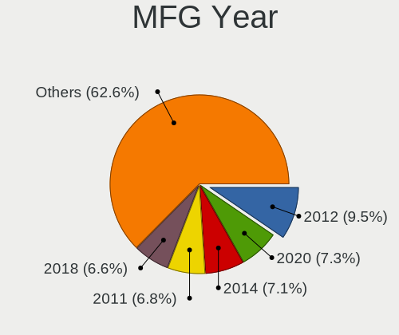
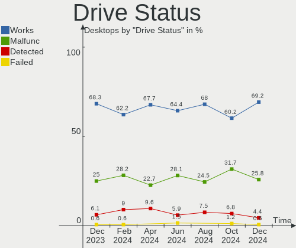
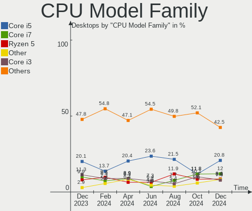
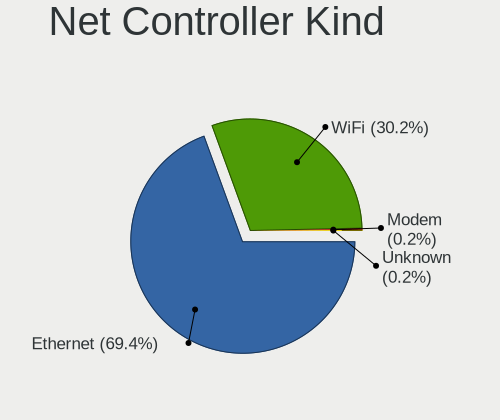
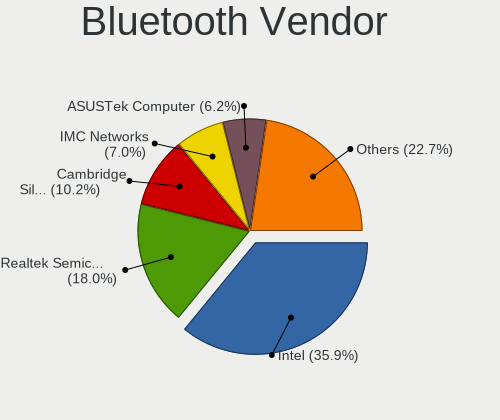
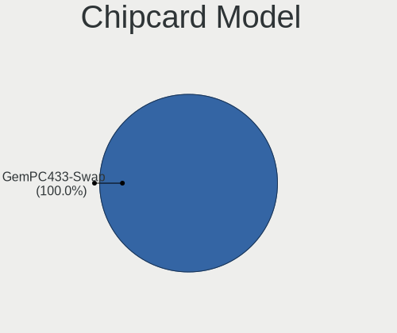

OpenMandriva - Hardware Trends (Desktops)
-----------------------------------------

A project to identify most popular hardware characteristics and track their change
over time based on data collected by Linux users at https://Linux-Hardware.org.

Anyone can contribute to this report by the [hw-probe](https://github.com/linuxhw/hw-probe) tool:

    sudo -E hw-probe -all -upload

This report is for one last month. Overall report since the beginning of time: [TestDays](https://github.com/linuxhw/TestDays)

Period: Sep, 2023.

Contents
--------

* [ System ](#system)
  - [ OS                       ](#os)
  - [ OS Family                ](#os-family)
  - [ Kernel                   ](#kernel)
  - [ Kernel Family            ](#kernel-family)
  - [ Kernel Major Ver.        ](#kernel-major-ver)
  - [ Arch                     ](#arch)
  - [ DE                       ](#de)
  - [ Display Server           ](#display-server)
  - [ Display Manager          ](#display-manager)
  - [ OS Lang                  ](#os-lang)
  - [ Boot Mode                ](#boot-mode)
  - [ Filesystem               ](#filesystem)
  - [ Part. scheme             ](#part-scheme)
  - [ Dual Boot with Linux/BSD ](#dual-boot-with-linuxbsd)
  - [ Dual Boot (Win)          ](#dual-boot-win)

* [ Board ](#board)
  - [ Vendor                   ](#vendor)
  - [ Model                    ](#model)
  - [ Model Family             ](#model-family)
  - [ MFG Year                 ](#mfg-year)
  - [ Form Factor              ](#form-factor)
  - [ Secure Boot              ](#secure-boot)
  - [ Coreboot                 ](#coreboot)
  - [ RAM Size                 ](#ram-size)
  - [ RAM Used                 ](#ram-used)
  - [ Total Drives             ](#total-drives)
  - [ Has CD-ROM               ](#has-cd-rom)
  - [ Has Ethernet             ](#has-ethernet)
  - [ Has WiFi                 ](#has-wifi)
  - [ Has Bluetooth            ](#has-bluetooth)

* [ Location ](#location)
  - [ Country                  ](#country)
  - [ City                     ](#city)

* [ Drives ](#drives)
  - [ Drive Vendor             ](#drive-vendor)
  - [ Drive Model              ](#drive-model)
  - [ HDD Vendor               ](#hdd-vendor)
  - [ SSD Vendor               ](#ssd-vendor)
  - [ Drive Kind               ](#drive-kind)
  - [ Drive Connector          ](#drive-connector)
  - [ Drive Size               ](#drive-size)
  - [ Space Total              ](#space-total)
  - [ Space Used               ](#space-used)
  - [ Malfunc. Drives          ](#malfunc-drives)
  - [ Malfunc. Drive Vendor    ](#malfunc-drive-vendor)
  - [ Malfunc. HDD Vendor      ](#malfunc-hdd-vendor)
  - [ Malfunc. Drive Kind      ](#malfunc-drive-kind)
  - [ Failed Drives            ](#failed-drives)
  - [ Failed Drive Vendor      ](#failed-drive-vendor)
  - [ Drive Status             ](#drive-status)

* [ Storage controller ](#storage-controller)
  - [ Storage Vendor           ](#storage-vendor)
  - [ Storage Model            ](#storage-model)
  - [ Storage Kind             ](#storage-kind)

* [ Processor ](#processor)
  - [ CPU Vendor               ](#cpu-vendor)
  - [ CPU Model                ](#cpu-model)
  - [ CPU Model Family         ](#cpu-model-family)
  - [ CPU Cores                ](#cpu-cores)
  - [ CPU Sockets              ](#cpu-sockets)
  - [ CPU Threads              ](#cpu-threads)
  - [ CPU Op-Modes             ](#cpu-op-modes)
  - [ CPU Microcode            ](#cpu-microcode)
  - [ CPU Microarch            ](#cpu-microarch)

* [ Graphics ](#graphics)
  - [ GPU Vendor               ](#gpu-vendor)
  - [ GPU Model                ](#gpu-model)
  - [ GPU Combo                ](#gpu-combo)
  - [ GPU Driver               ](#gpu-driver)
  - [ GPU Memory               ](#gpu-memory)

* [ Monitor ](#monitor)
  - [ Monitor Vendor           ](#monitor-vendor)
  - [ Monitor Model            ](#monitor-model)
  - [ Monitor Resolution       ](#monitor-resolution)
  - [ Monitor Diagonal         ](#monitor-diagonal)
  - [ Monitor Width            ](#monitor-width)
  - [ Aspect Ratio             ](#aspect-ratio)
  - [ Monitor Area             ](#monitor-area)
  - [ Pixel Density            ](#pixel-density)
  - [ Multiple Monitors        ](#multiple-monitors)

* [ Network ](#network)
  - [ Net Controller Vendor    ](#net-controller-vendor)
  - [ Net Controller Model     ](#net-controller-model)
  - [ Wireless Vendor          ](#wireless-vendor)
  - [ Wireless Model           ](#wireless-model)
  - [ Ethernet Vendor          ](#ethernet-vendor)
  - [ Ethernet Model           ](#ethernet-model)
  - [ Net Controller Kind      ](#net-controller-kind)
  - [ Used Controller          ](#used-controller)
  - [ NICs                     ](#nics)
  - [ IPv6                     ](#ipv6)

* [ Bluetooth ](#bluetooth)
  - [ Bluetooth Vendor         ](#bluetooth-vendor)
  - [ Bluetooth Model          ](#bluetooth-model)

* [ Sound ](#sound)
  - [ Sound Vendor             ](#sound-vendor)
  - [ Sound Model              ](#sound-model)

* [ Memory ](#memory)
  - [ Memory Vendor            ](#memory-vendor)
  - [ Memory Model             ](#memory-model)
  - [ Memory Kind              ](#memory-kind)
  - [ Memory Form Factor       ](#memory-form-factor)
  - [ Memory Size              ](#memory-size)
  - [ Memory Speed             ](#memory-speed)

* [ Printers & scanners ](#printers--scanners)
  - [ Printer Vendor           ](#printer-vendor)
  - [ Printer Model            ](#printer-model)
  - [ Scanner Vendor           ](#scanner-vendor)
  - [ Scanner Model            ](#scanner-model)

* [ Camera ](#camera)
  - [ Camera Vendor            ](#camera-vendor)
  - [ Camera Model             ](#camera-model)

* [ Security ](#security)
  - [ Fingerprint Vendor       ](#fingerprint-vendor)
  - [ Fingerprint Model        ](#fingerprint-model)
  - [ Chipcard Vendor          ](#chipcard-vendor)
  - [ Chipcard Model           ](#chipcard-model)

* [ Unsupported ](#unsupported)
  - [ Unsupported Devices      ](#unsupported-devices)
  - [ Unsupported Device Types ](#unsupported-device-types)

System
------

OS
--

Installed operating systems

| Name               | Desktops | Percent |
|--------------------|----------|---------|
| OpenMandriva 23.08 | 206      | 55.53%  |
| OpenMandriva 23.09 | 96       | 25.88%  |
| OpenMandriva 4.3   | 23       | 6.2%    |
| OpenMandriva 23.03 | 20       | 5.39%   |
| OpenMandriva 23.01 | 10       | 2.7%    |
| OpenMandriva 4.2   | 8        | 2.16%   |
| OpenMandriva 23.90 | 7        | 1.89%   |
| OpenMandriva 4.50  | 1        | 0.27%   |

OS Family
---------

OS without a version

| Name         | Desktops | Percent |
|--------------|----------|---------|
| OpenMandriva | 371      | 100%    |

Kernel
------

Version of the Linux kernel

| Version                      | Desktops | Percent |
|------------------------------|----------|---------|
| 6.4.11-desktop-1omv2390      | 181      | 48.79%  |
| 6.5.3-desktop-1omv2390       | 31       | 8.36%   |
| 6.5.0-desktop-1omv2390       | 29       | 7.82%   |
| 6.4.8-desktop-2omv2390       | 27       | 7.28%   |
| 6.2.6-desktop-1omv2390       | 20       | 5.39%   |
| 6.5.1-desktop-1omv2390       | 16       | 4.31%   |
| 6.5.2-desktop-1omv2390       | 14       | 3.77%   |
| 5.16.7-desktop-1omv4003      | 14       | 3.77%   |
| 6.1.1-desktop-1omv2290       | 10       | 2.7%    |
| 5.16.13-desktop-1omv4003     | 9        | 2.43%   |
| 6.5.5-desktop-1omv2390       | 8        | 2.16%   |
| 5.10.14-desktop-1omv4002     | 8        | 2.16%   |
| 6.6.0-desktop-0.rc3.1omv2390 | 1        | 0.27%   |
| 6.3.5-desktop-3omv2390       | 1        | 0.27%   |
| 6.1.4-desktop-1omv2301       | 1        | 0.27%   |
| 5.19.5-desktop-1omv4090      | 1        | 0.27%   |

Kernel Family
-------------

Linux kernel without a distro release

| Version | Desktops | Percent |
|---------|----------|---------|
| 6.4.11  | 181      | 48.79%  |
| 6.5.3   | 31       | 8.36%   |
| 6.5.0   | 29       | 7.82%   |
| 6.4.8   | 27       | 7.28%   |
| 6.2.6   | 20       | 5.39%   |
| 6.5.1   | 16       | 4.31%   |
| 6.5.2   | 14       | 3.77%   |
| 5.16.7  | 14       | 3.77%   |
| 6.1.1   | 10       | 2.7%    |
| 5.16.13 | 9        | 2.43%   |
| 6.5.5   | 8        | 2.16%   |
| 5.10.14 | 8        | 2.16%   |
| 6.6.0   | 1        | 0.27%   |
| 6.3.5   | 1        | 0.27%   |
| 6.1.4   | 1        | 0.27%   |
| 5.19.5  | 1        | 0.27%   |

Kernel Major Ver.
-----------------

Linux kernel major version

| Version | Desktops | Percent |
|---------|----------|---------|
| 6.4     | 208      | 56.06%  |
| 6.5     | 98       | 26.42%  |
| 5.16    | 23       | 6.2%    |
| 6.2     | 20       | 5.39%   |
| 6.1     | 11       | 2.96%   |
| 5.10    | 8        | 2.16%   |
| 6.6     | 1        | 0.27%   |
| 6.3     | 1        | 0.27%   |
| 5.19    | 1        | 0.27%   |

Arch
----

OS architecture (x86_64, i586, etc.)

| Name   | Desktops | Percent |
|--------|----------|---------|
| x86_64 | 371      | 100%    |

DE
--

Desktop Environment

| Name     | Desktops | Percent |
|----------|----------|---------|
| KDE5     | 298      | 80.32%  |
| GNOME    | 35       | 9.43%   |
| LXQt     | 29       | 7.82%   |
| Unknown  | 5        | 1.35%   |
| Cinnamon | 2        | 0.54%   |
| Budgie   | 2        | 0.54%   |

Display Server
--------------

X11 or Wayland

| Name    | Desktops | Percent |
|---------|----------|---------|
| Wayland | 302      | 81.4%   |
| X11     | 69       | 18.6%   |

Display Manager
---------------

SDDM, LightDM, etc.

| Name    | Desktops | Percent |
|---------|----------|---------|
| SDDM    | 334      | 90.03%  |
| GDM     | 35       | 9.43%   |
| LightDM | 2        | 0.54%   |

OS Lang
-------

Language

| Lang  | Desktops | Percent |
|-------|----------|---------|
| en_US | 163      | 43.94%  |
| de_DE | 30       | 8.09%   |
| fr_FR | 27       | 7.28%   |
| ru_RU | 26       | 7.01%   |
| pt_BR | 26       | 7.01%   |
| pl_PL | 13       | 3.5%    |
| it_IT | 12       | 3.23%   |
| en_GB | 12       | 3.23%   |
| es_MX | 8        | 2.16%   |
| es_ES | 8        | 2.16%   |
| en_CA | 7        | 1.89%   |
| nl_NL | 6        | 1.62%   |
| hu_HU | 4        | 1.08%   |
| es_AR | 3        | 0.81%   |
| ro_RO | 2        | 0.54%   |
| es_CO | 2        | 0.54%   |
| en_IN | 2        | 0.54%   |
| en_AU | 2        | 0.54%   |
| de_AT | 2        | 0.54%   |
| cs_CZ | 2        | 0.54%   |
| uk_UA | 1        | 0.27%   |
| tr_TR | 1        | 0.27%   |
| pt_PT | 1        | 0.27%   |
| nl_BE | 1        | 0.27%   |
| fr_CA | 1        | 0.27%   |
| es_VE | 1        | 0.27%   |
| es_UY | 1        | 0.27%   |
| es_NI | 1        | 0.27%   |
| en_ZA | 1        | 0.27%   |
| en_SG | 1        | 0.27%   |
| en_NG | 1        | 0.27%   |
| de_CH | 1        | 0.27%   |
| da_DK | 1        | 0.27%   |
| ar_DZ | 1        | 0.27%   |

Boot Mode
---------

EFI or BIOS

| Mode | Desktops | Percent |
|------|----------|---------|
| EFI  | 195      | 52.56%  |
| BIOS | 176      | 47.44%  |

Filesystem
----------

Type of filesystem

| Type     | Desktops | Percent |
|----------|----------|---------|
| Ext4     | 193      | 52.02%  |
| Overlay  | 155      | 41.78%  |
| Btrfs    | 16       | 4.31%   |
| F2fs     | 3        | 0.81%   |
| Xfs      | 1        | 0.27%   |
| Reiserfs | 1        | 0.27%   |
| Jfs      | 1        | 0.27%   |
| Ext2     | 1        | 0.27%   |

Part. scheme
------------

Scheme of partitioning

| Type    | Desktops | Percent |
|---------|----------|---------|
| GPT     | 284      | 76.55%  |
| MBR     | 86       | 23.18%  |
| Unknown | 1        | 0.27%   |

Dual Boot with Linux/BSD
------------------------

Hosting more than one Linux/BSD

| Dual boot | Desktops | Percent |
|-----------|----------|---------|
| No        | 189      | 50.94%  |
| Yes       | 182      | 49.06%  |

Dual Boot (Win)
---------------

Hosting Linux and Windows

| Dual boot | Desktops | Percent |
|-----------|----------|---------|
| No        | 186      | 50.13%  |
| Yes       | 185      | 49.87%  |

Board
-----

Vendor
------

Motherboard manufacturer

| Name                                 | Desktops | Percent |
|--------------------------------------|----------|---------|
| ASUSTek Computer                     | 81       | 21.83%  |
| Gigabyte Technology                  | 57       | 15.36%  |
| ASRock                               | 39       | 10.51%  |
| MSI                                  | 35       | 9.43%   |
| Dell                                 | 29       | 7.82%   |
| Hewlett-Packard                      | 24       | 6.47%   |
| Intel                                | 21       | 5.66%   |
| Lenovo                               | 18       | 4.85%   |
| Fujitsu                              | 8        | 2.16%   |
| Foxconn                              | 8        | 2.16%   |
| Acer                                 | 8        | 2.16%   |
| Pegatron                             | 7        | 1.89%   |
| Biostar                              | 5        | 1.35%   |
| Unknown                              | 4        | 1.08%   |
| Medion                               | 3        | 0.81%   |
| BESSTAR Tech                         | 3        | 0.81%   |
| AZW                                  | 3        | 0.81%   |
| WesternDigital                       | 2        | 0.54%   |
| Semp Toshiba                         | 2        | 0.54%   |
| Shuttle                              | 1        | 0.27%   |
| Shenzhen Meigao Electronic Equipment | 1        | 0.27%   |
| Positivo                             | 1        | 0.27%   |
| Philco                               | 1        | 0.27%   |
| PCWare                               | 1        | 0.27%   |
| Packard Bell                         | 1        | 0.27%   |
| OEM                                  | 1        | 0.27%   |
| NEC Computers                        | 1        | 0.27%   |
| Megaware                             | 1        | 0.27%   |
| HC Technology.                       | 1        | 0.27%   |
| Google                               | 1        | 0.27%   |
| ECS                                  | 1        | 0.27%   |
| Daten Tecnologia                     | 1        | 0.27%   |
| AOpen                                | 1        | 0.27%   |

Model
-----

Motherboard model

| Name                                            | Desktops | Percent |
|-------------------------------------------------|----------|---------|
| Intel H81                                       | 4        | 1.08%   |
| Intel H61                                       | 4        | 1.08%   |
| Unknown                                         | 4        | 1.08%   |
| Gigabyte B450 AORUS M                           | 3        | 0.81%   |
| Dell OptiPlex 7010                              | 3        | 0.81%   |
| ASUS All Series                                 | 3        | 0.81%   |
| WesternDigital WDBNFA0000NBK-00                 | 2        | 0.54%   |
| Semp Toshiba STI                                | 2        | 0.54%   |
| MSI MS-7D25                                     | 2        | 0.54%   |
| MSI MS-7B89                                     | 2        | 0.54%   |
| MSI MS-7B23                                     | 2        | 0.54%   |
| MSI MS-7A38                                     | 2        | 0.54%   |
| MSI MS-7817                                     | 2        | 0.54%   |
| MSI MS-7740                                     | 2        | 0.54%   |
| Lenovo ThinkCentre M93p 10A6A122LS              | 2        | 0.54%   |
| Gigabyte H61M-S1                                | 2        | 0.54%   |
| Gigabyte GA-MA770T-UD3                          | 2        | 0.54%   |
| Gigabyte B85M-D3H                               | 2        | 0.54%   |
| Gigabyte B75M-D3H                               | 2        | 0.54%   |
| Dell Precision T1700                            | 2        | 0.54%   |
| Dell OptiPlex 9020                              | 2        | 0.54%   |
| Dell OptiPlex 3020                              | 2        | 0.54%   |
| Dell Inspiron 3847                              | 2        | 0.54%   |
| AZW MINI S                                      | 2        | 0.54%   |
| ASUS TUF Gaming B550M-PLUS                      | 2        | 0.54%   |
| ASUS PRIME Z390M-PLUS                           | 2        | 0.54%   |
| ASUS PRIME B450M-A                              | 2        | 0.54%   |
| ASUS PRIME B450-PLUS                            | 2        | 0.54%   |
| ASUS PRIME A320M-K                              | 2        | 0.54%   |
| ASUS P9X79                                      | 2        | 0.54%   |
| ASUS M5A78L-M LX3                               | 2        | 0.54%   |
| ASUS M32CD_A_F_K20CD_K31CD                      | 2        | 0.54%   |
| ASRock AB350M Pro4                              | 2        | 0.54%   |
| Acer Veriton L670G                              | 2        | 0.54%   |
| Shuttle XS36V                                   | 1        | 0.27%   |
| Shenzhen Meigao Electronic Equipment UM773 Lite | 1        | 0.27%   |
| Positivo POS-AG31AP                             | 1        | 0.27%   |
| Philco DTC-A55                                  | 1        | 0.27%   |
| Pegatron WC960AA-ABF p6335fr                    | 1        | 0.27%   |
| Pegatron p7-1254                                | 1        | 0.27%   |

Model Family
------------

Motherboard model prefix

| Name                            | Desktops | Percent |
|---------------------------------|----------|---------|
| ASUS PRIME                      | 22       | 5.93%   |
| Dell OptiPlex                   | 17       | 4.58%   |
| Lenovo ThinkCentre              | 15       | 4.04%   |
| HP Compaq                       | 8        | 2.16%   |
| ASUS TUF                        | 8        | 2.16%   |
| Fujitsu ESPRIMO                 | 6        | 1.62%   |
| ASUS ROG                        | 6        | 1.62%   |
| Intel H81                       | 5        | 1.35%   |
| HP EliteDesk                    | 5        | 1.35%   |
| Gigabyte B450                   | 5        | 1.35%   |
| Intel H61                       | 4        | 1.08%   |
| ASUS M5A78L-M                   | 4        | 1.08%   |
| Acer Veriton                    | 4        | 1.08%   |
| Unknown                         | 4        | 1.08%   |
| HP Pavilion                     | 3        | 0.81%   |
| Gigabyte X570                   | 3        | 0.81%   |
| Gigabyte B450M                  | 3        | 0.81%   |
| Dell Precision                  | 3        | 0.81%   |
| Dell Inspiron                   | 3        | 0.81%   |
| ASUS All                        | 3        | 0.81%   |
| Acer Aspire                     | 3        | 0.81%   |
| WesternDigital WDBNFA0000NBK-00 | 2        | 0.54%   |
| Semp Toshiba STI                | 2        | 0.54%   |
| MSI MS-7D25                     | 2        | 0.54%   |
| MSI MS-7B89                     | 2        | 0.54%   |
| MSI MS-7B23                     | 2        | 0.54%   |
| MSI MS-7A38                     | 2        | 0.54%   |
| MSI MS-7817                     | 2        | 0.54%   |
| MSI MS-7740                     | 2        | 0.54%   |
| Medion Akoya                    | 2        | 0.54%   |
| HP ProDesk                      | 2        | 0.54%   |
| Gigabyte H61M-S1                | 2        | 0.54%   |
| Gigabyte H510M                  | 2        | 0.54%   |
| Gigabyte GA-MA770T-UD3          | 2        | 0.54%   |
| Gigabyte B85M-D3H               | 2        | 0.54%   |
| Gigabyte B75M-D3H               | 2        | 0.54%   |
| Gigabyte B550                   | 2        | 0.54%   |
| Dell XPS                        | 2        | 0.54%   |
| Dell Vostro                     | 2        | 0.54%   |
| AZW MINI                        | 2        | 0.54%   |

MFG Year
--------

Motherboard manufacture year

| Year | Desktops | Percent |
|------|----------|---------|
| 2018 | 42       | 11.32%  |
| 2012 | 37       | 9.97%   |
| 2013 | 29       | 7.82%   |
| 2020 | 26       | 7.01%   |
| 2014 | 24       | 6.47%   |
| 2011 | 24       | 6.47%   |
| 2021 | 23       | 6.2%    |
| 2019 | 23       | 6.2%    |
| 2017 | 23       | 6.2%    |
| 2008 | 19       | 5.12%   |
| 2010 | 18       | 4.85%   |
| 2009 | 18       | 4.85%   |
| 2016 | 17       | 4.58%   |
| 2022 | 15       | 4.04%   |
| 2023 | 10       | 2.7%    |
| 2007 | 10       | 2.7%    |
| 2015 | 8        | 2.16%   |
| 2006 | 5        | 1.35%   |

Form Factor
-----------

Physical design of the computer

| Name    | Desktops | Percent |
|---------|----------|---------|
| Desktop | 371      | 100%    |

Secure Boot
-----------

Enabled or disabled

| State    | Desktops | Percent |
|----------|----------|---------|
| Disabled | 371      | 100%    |

Coreboot
--------

Have coreboot on board

| Used | Desktops | Percent |
|------|----------|---------|
| No   | 370      | 99.73%  |
| Yes  | 1        | 0.27%   |

RAM Size
--------

Total RAM memory

| Size in GB  | Desktops | Percent |
|-------------|----------|---------|
| 16.01-24.0  | 93       | 25.07%  |
| 4.01-8.0    | 81       | 21.83%  |
| 8.01-16.0   | 80       | 21.56%  |
| 3.01-4.0    | 42       | 11.32%  |
| 32.01-64.0  | 38       | 10.24%  |
| 24.01-32.0  | 12       | 3.23%   |
| 64.01-256.0 | 11       | 2.96%   |
| 2.01-3.0    | 8        | 2.16%   |
| 1.01-2.0    | 6        | 1.62%   |

RAM Used
--------

Used RAM memory

| Used GB   | Desktops | Percent |
|-----------|----------|---------|
| 1.01-2.0  | 231      | 62.26%  |
| 2.01-3.0  | 85       | 22.91%  |
| 0.51-1.0  | 35       | 9.43%   |
| 3.01-4.0  | 12       | 3.23%   |
| 4.01-8.0  | 4        | 1.08%   |
| 0.01-0.5  | 3        | 0.81%   |
| 8.01-16.0 | 1        | 0.27%   |

Total Drives
------------

Number of drives on board

| Drives | Desktops | Percent |
|--------|----------|---------|
| 1      | 168      | 45.28%  |
| 2      | 84       | 22.64%  |
| 3      | 51       | 13.75%  |
| 4      | 32       | 8.63%   |
| 5      | 18       | 4.85%   |
| 6      | 8        | 2.16%   |
| 0      | 6        | 1.62%   |
| 10     | 2        | 0.54%   |
| 8      | 1        | 0.27%   |
| 7      | 1        | 0.27%   |

Has CD-ROM
----------

Has CD-ROM on board

| Presented | Desktops | Percent |
|-----------|----------|---------|
| Yes       | 194      | 52.29%  |
| No        | 177      | 47.71%  |

Has Ethernet
------------

Has Ethernet on board

| Presented | Desktops | Percent |
|-----------|----------|---------|
| Yes       | 367      | 98.92%  |
| No        | 4        | 1.08%   |

Has WiFi
--------

Has WiFi module

| Presented | Desktops | Percent |
|-----------|----------|---------|
| No        | 226      | 60.92%  |
| Yes       | 145      | 39.08%  |

Has Bluetooth
-------------

Has Bluetooth module

| Presented | Desktops | Percent |
|-----------|----------|---------|
| No        | 277      | 74.66%  |
| Yes       | 94       | 25.34%  |

Location
--------

Country
-------

Geographic location (country)

| Country      | Desktops | Percent |
|--------------|----------|---------|
| USA          | 45       | 12.13%  |
| Germany      | 40       | 10.78%  |
| Brazil       | 36       | 9.7%    |
| Russia       | 32       | 8.63%   |
| France       | 30       | 8.09%   |
| Poland       | 15       | 4.04%   |
| Italy        | 15       | 4.04%   |
| Canada       | 14       | 3.77%   |
| Netherlands  | 11       | 2.96%   |
| Spain        | 10       | 2.7%    |
| UK           | 9        | 2.43%   |
| Mexico       | 9        | 2.43%   |
| Romania      | 6        | 1.62%   |
| Hungary      | 6        | 1.62%   |
| Australia    | 6        | 1.62%   |
| Argentina    | 5        | 1.35%   |
| Thailand     | 4        | 1.08%   |
| Japan        | 4        | 1.08%   |
| Indonesia    | 4        | 1.08%   |
| India        | 4        | 1.08%   |
| Belgium      | 4        | 1.08%   |
| Austria      | 4        | 1.08%   |
| Tunisia      | 3        | 0.81%   |
| South Africa | 3        | 0.81%   |
| Slovakia     | 3        | 0.81%   |
| Serbia       | 3        | 0.81%   |
| Malaysia     | 3        | 0.81%   |
| Finland      | 3        | 0.81%   |
| Turkey       | 2        | 0.54%   |
| Portugal     | 2        | 0.54%   |
| Paraguay     | 2        | 0.54%   |
| Norway       | 2        | 0.54%   |
| Kazakhstan   | 2        | 0.54%   |
| Iran         | 2        | 0.54%   |
| Denmark      | 2        | 0.54%   |
| Czechia      | 2        | 0.54%   |
| Colombia     | 2        | 0.54%   |
| Bulgaria     | 2        | 0.54%   |
| Belarus      | 2        | 0.54%   |
| Barbados     | 2        | 0.54%   |

City
----

Geographic location (city)

| City                | Desktops | Percent |
|---------------------|----------|---------|
| Sao Paulo           | 6        | 1.62%   |
| Moscow              | 5        | 1.35%   |
| Sydney              | 4        | 1.08%   |
| St Petersburg       | 3        | 0.81%   |
| Hamburg             | 3        | 0.81%   |
| Darmstadt           | 3        | 0.81%   |
| Budapest            | 3        | 0.81%   |
| Bucharest           | 3        | 0.81%   |
| Berlin              | 3        | 0.81%   |
| Volzhsky            | 2        | 0.54%   |
| Villa Ballester     | 2        | 0.54%   |
| Vienna              | 2        | 0.54%   |
| Vantaa              | 2        | 0.54%   |
| Tehran              | 2        | 0.54%   |
| Târgu Mureş       | 2        | 0.54%   |
| Szentendre          | 2        | 0.54%   |
| Riva                | 2        | 0.54%   |
| Portland            | 2        | 0.54%   |
| Montreal            | 2        | 0.54%   |
| Milan               | 2        | 0.54%   |
| Mexico City         | 2        | 0.54%   |
| Marília            | 2        | 0.54%   |
| León               | 2        | 0.54%   |
| Katowice            | 2        | 0.54%   |
| Izhevsk             | 2        | 0.54%   |
| Houilles            | 2        | 0.54%   |
| Graz                | 2        | 0.54%   |
| Fernando de la Mora | 2        | 0.54%   |
| Erkrath             | 2        | 0.54%   |
| Eexterveen          | 2        | 0.54%   |
| Colomiers           | 2        | 0.54%   |
| Coldwater           | 2        | 0.54%   |
| Cedar Park          | 2        | 0.54%   |
| Cape Town           | 2        | 0.54%   |
| Burlington          | 2        | 0.54%   |
| Bridgetown          | 2        | 0.54%   |
| Braganca Paulista   | 2        | 0.54%   |
| Bangkok             | 2        | 0.54%   |
| Bamberg             | 2        | 0.54%   |
| Amsterdam           | 2        | 0.54%   |

Drives
------

Drive Vendor
------------

Hard drive vendors

| Vendor                      | Desktops | Drives | Percent |
|-----------------------------|----------|--------|---------|
| WDC                         | 103      | 135    | 15.65%  |
| Seagate                     | 97       | 123    | 14.74%  |
| Samsung Electronics         | 83       | 99     | 12.61%  |
| Toshiba                     | 42       | 49     | 6.38%   |
| Kingston                    | 42       | 46     | 6.38%   |
| Crucial                     | 41       | 47     | 6.23%   |
| Hitachi                     | 21       | 21     | 3.19%   |
| SanDisk                     | 18       | 22     | 2.74%   |
| China                       | 17       | 17     | 2.58%   |
| A-DATA Technology           | 17       | 19     | 2.58%   |
| Unknown                     | 15       | 21     | 2.28%   |
| SPCC                        | 11       | 12     | 1.67%   |
| PNY                         | 8        | 9      | 1.22%   |
| HGST                        | 8        | 13     | 1.22%   |
| Patriot                     | 7        | 7      | 1.06%   |
| Maxtor                      | 7        | 7      | 1.06%   |
| Netac                       | 6        | 6      | 0.91%   |
| Lexar                       | 6        | 6      | 0.91%   |
| Intel                       | 6        | 6      | 0.91%   |
| Transcend                   | 5        | 5      | 0.76%   |
| Kingston Technology Company | 5        | 5      | 0.76%   |
| Team                        | 4        | 4      | 0.61%   |
| OCZ                         | 4        | 4      | 0.61%   |
| Intenso                     | 4        | 6      | 0.61%   |
| XPG                         | 3        | 3      | 0.46%   |
| Silicon Motion              | 3        | 3      | 0.46%   |
| Micron Technology           | 3        | 3      | 0.46%   |
| KingSpec                    | 3        | 4      | 0.46%   |
| Fanxiang                    | 3        | 3      | 0.46%   |
| Apacer                      | 3        | 3      | 0.46%   |
| Unknown                     | 3        | 3      | 0.46%   |
| Vaseky                      | 2        | 2      | 0.3%    |
| SSK                         | 2        | 2      | 0.3%    |
| SK hynix                    | 2        | 2      | 0.3%    |
| Phison                      | 2        | 3      | 0.3%    |
| KingFast                    | 2        | 2      | 0.3%    |
| KingDian                    | 2        | 2      | 0.3%    |
| HS-SSD-C100                 | 2        | 2      | 0.3%    |
| Hewlett-Packard             | 2        | 2      | 0.3%    |
| GOODRAM                     | 2        | 2      | 0.3%    |

Drive Model
-----------

Hard drive models

| Model                            | Desktops | Percent |
|----------------------------------|----------|---------|
| Seagate ST1000DM010-2EP102 1TB   | 12       | 1.63%   |
| Kingston SA400S37240G 240GB SSD  | 12       | 1.63%   |
| Seagate ST500DM002-1BD142 500GB  | 11       | 1.49%   |
| Crucial CT240BX500SSD1 240GB     | 9        | 1.22%   |
| Toshiba DT01ACA050 500GB         | 8        | 1.09%   |
| Samsung SSD 850 EVO 250GB        | 8        | 1.09%   |
| Toshiba HDWD110 1TB              | 7        | 0.95%   |
| Crucial CT500MX500SSD1 500GB     | 7        | 0.95%   |
| Toshiba DT01ACA100 1TB           | 6        | 0.81%   |
| Seagate ST3500418AS 500GB        | 6        | 0.81%   |
| Seagate ST2000DM008-2FR102 2TB   | 6        | 0.81%   |
| Kingston SA400S37480G 480GB SSD  | 6        | 0.81%   |
| Unknown SD/MMC 2GB               | 5        | 0.68%   |
| Unknown M.S./M.S.Pro/HG 16GB     | 5        | 0.68%   |
| Seagate ST2000DM001-1CH164 2TB   | 5        | 0.68%   |
| Seagate ST31000528AS 1TB         | 4        | 0.54%   |
| Seagate ST1000DM003-1ER162 1TB   | 4        | 0.54%   |
| Seagate ST1000DM003-1CH162 1TB   | 4        | 0.54%   |
| SanDisk NVMe SSD Drive 500GB     | 4        | 0.54%   |
| SanDisk NVMe SSD Drive 1TB       | 4        | 0.54%   |
| Samsung SSD 870 QVO 1TB          | 4        | 0.54%   |
| Kingston SV300S37A120G 120GB SSD | 4        | 0.54%   |
| Crucial CT1000MX500SSD1 1TB      | 4        | 0.54%   |
| WDC WDS100T2B0A-00SM50 1TB SSD   | 3        | 0.41%   |
| WDC WD6400AAKS-22A7B2 640GB      | 3        | 0.41%   |
| WDC WD10EZEX-08WN4A0 1TB         | 3        | 0.41%   |
| WDC WD10EZEX-00BN5A0 1TB         | 3        | 0.41%   |
| WDC WD10EARS-00Y5B1 1TB          | 3        | 0.41%   |
| Toshiba DT01ACA200 2TB           | 3        | 0.41%   |
| SPCC Solid State Disk 512GB      | 3        | 0.41%   |
| Samsung SSD 970 EVO Plus 500GB   | 3        | 0.41%   |
| Samsung SSD 970 EVO Plus 1TB     | 3        | 0.41%   |
| Samsung SSD 970 EVO 500GB        | 3        | 0.41%   |
| Samsung SSD 840 EVO 250GB        | 3        | 0.41%   |
| Samsung HD103SJ 1TB              | 3        | 0.41%   |
| Maxtor STM3160215AS 160GB        | 3        | 0.41%   |
| Kingston Company SNV2S1000G 1TB  | 3        | 0.41%   |
| Kingston SNV2S500G 500GB         | 3        | 0.41%   |
| Kingston SA400S37120G 120GB SSD  | 3        | 0.41%   |
| Crucial CT250MX500SSD1 250GB     | 3        | 0.41%   |

HDD Vendor
----------

Hard disk drive vendors

| Vendor              | Desktops | Drives | Percent |
|---------------------|----------|--------|---------|
| Seagate             | 96       | 122    | 33.22%  |
| WDC                 | 88       | 116    | 30.45%  |
| Toshiba             | 39       | 45     | 13.49%  |
| Hitachi             | 21       | 21     | 7.27%   |
| Samsung Electronics | 20       | 21     | 6.92%   |
| HGST                | 8        | 13     | 2.77%   |
| Maxtor              | 7        | 7      | 2.42%   |
| Unknown             | 2        | 2      | 0.69%   |
| SSK                 | 2        | 2      | 0.69%   |
| USB3.0              | 1        | 1      | 0.35%   |
| SABRENT             | 1        | 2      | 0.35%   |
| Initio              | 1        | 1      | 0.35%   |
| Hewlett-Packard     | 1        | 1      | 0.35%   |
| External            | 1        | 1      | 0.35%   |
| Apple               | 1        | 1      | 0.35%   |

SSD Vendor
----------

Solid state drive vendors

| Vendor              | Desktops | Drives | Percent |
|---------------------|----------|--------|---------|
| Samsung Electronics | 42       | 48     | 16.34%  |
| Kingston            | 34       | 36     | 13.23%  |
| Crucial             | 31       | 33     | 12.06%  |
| China               | 17       | 17     | 6.61%   |
| WDC                 | 11       | 12     | 4.28%   |
| SPCC                | 11       | 11     | 4.28%   |
| SanDisk             | 11       | 14     | 4.28%   |
| A-DATA Technology   | 11       | 12     | 4.28%   |
| PNY                 | 8        | 9      | 3.11%   |
| Transcend           | 5        | 5      | 1.95%   |
| Patriot             | 5        | 5      | 1.95%   |
| OCZ                 | 4        | 4      | 1.56%   |
| Intenso             | 4        | 6      | 1.56%   |
| Intel               | 4        | 4      | 1.56%   |
| Toshiba             | 3        | 3      | 1.17%   |
| Team                | 3        | 3      | 1.17%   |
| Netac               | 3        | 3      | 1.17%   |
| Micron Technology   | 3        | 3      | 1.17%   |
| Lexar               | 3        | 3      | 1.17%   |
| KingSpec            | 3        | 4      | 1.17%   |
| Apacer              | 3        | 3      | 1.17%   |
| Unknown             | 3        | 3      | 1.17%   |
| Vaseky              | 2        | 2      | 0.78%   |
| KingFast            | 2        | 2      | 0.78%   |
| KingDian            | 2        | 2      | 0.78%   |
| HS-SSD-C100         | 2        | 2      | 0.78%   |
| GOODRAM             | 2        | 2      | 0.78%   |
| Fanxiang            | 2        | 2      | 0.78%   |
| ZHITAI              | 1        | 1      | 0.39%   |
| WDC WDS5            | 1        | 1      | 0.39%   |
| Verbatim            | 1        | 1      | 0.39%   |
| TO Exter            | 1        | 1      | 0.39%   |
| SK hynix            | 1        | 1      | 0.39%   |
| Silicon Motion      | 1        | 1      | 0.39%   |
| Reeinno             | 1        | 1      | 0.39%   |
| POLION              | 1        | 1      | 0.39%   |
| Plextor             | 1        | 1      | 0.39%   |
| PHD 3.0             | 1        | 1      | 0.39%   |
| M4-CT128            | 1        | 1      | 0.39%   |
| LITEONIT            | 1        | 1      | 0.39%   |

Drive Kind
----------

HDD or SSD

| Kind    | Desktops | Drives | Percent |
|---------|----------|--------|---------|
| HDD     | 229      | 356    | 42.41%  |
| SSD     | 200      | 276    | 37.04%  |
| NVMe    | 98       | 123    | 18.15%  |
| Unknown | 9        | 14     | 1.67%   |
| MMC     | 4        | 4      | 0.74%   |

Drive Connector
---------------

SATA, SAS, NVMe, etc.

| Type | Desktops | Drives | Percent |
|------|----------|--------|---------|
| SATA | 328      | 609    | 71.3%   |
| NVMe | 97       | 122    | 21.09%  |
| SAS  | 31       | 38     | 6.74%   |
| MMC  | 4        | 4      | 0.87%   |

Drive Size
----------

Size of hard drive

| Size in TB | Desktops | Drives | Percent |
|------------|----------|--------|---------|
| 0.01-0.5   | 243      | 353    | 53.76%  |
| 0.51-1.0   | 135      | 182    | 29.87%  |
| 1.01-2.0   | 43       | 51     | 9.51%   |
| 3.01-4.0   | 15       | 19     | 3.32%   |
| 4.01-10.0  | 8        | 18     | 1.77%   |
| 2.01-3.0   | 7        | 8      | 1.55%   |
| 10.01-20.0 | 1        | 1      | 0.22%   |

Space Total
-----------

Amount of disk space available on the file system

| Size in GB     | Desktops | Percent |
|----------------|----------|---------|
| 1-20           | 105      | 28.3%   |
| 101-250        | 66       | 17.79%  |
| 251-500        | 57       | 15.36%  |
| 51-100         | 39       | 10.51%  |
| 501-1000       | 36       | 9.7%    |
| Unknown        | 24       | 6.47%   |
| 21-50          | 18       | 4.85%   |
| 1001-2000      | 12       | 3.23%   |
| More than 3000 | 10       | 2.7%    |
| 2001-3000      | 4        | 1.08%   |

Space Used
----------

Amount of used disk space

| Used GB        | Desktops | Percent |
|----------------|----------|---------|
| 1-20           | 269      | 72.51%  |
| 21-50          | 28       | 7.55%   |
| Unknown        | 24       | 6.47%   |
| 101-250        | 12       | 3.23%   |
| 51-100         | 11       | 2.96%   |
| 501-1000       | 10       | 2.7%    |
| 251-500        | 9        | 2.43%   |
| 1001-2000      | 5        | 1.35%   |
| More than 3000 | 3        | 0.81%   |

Malfunc. Drives
---------------

Drive models with a malfunction

| Model                             | Desktops | Drives | Percent |
|-----------------------------------|----------|--------|---------|
| Seagate ST500DM002-1BD142 500GB   | 5        | 5      | 3.76%   |
| Seagate ST1000DM010-2EP102 1TB    | 4        | 5      | 3.01%   |
| WDC WD10EARS-00Y5B1 1TB           | 3        | 3      | 2.26%   |
| Maxtor STM3160215AS 160GB         | 3        | 3      | 2.26%   |
| Kingston SV300S37A120G 120GB SSD  | 3        | 3      | 2.26%   |
| WDC WD10EZEX-75M2NA0 1TB          | 2        | 2      | 1.5%    |
| Toshiba DT01ACA100 1TB            | 2        | 2      | 1.5%    |
| Seagate ST3500418AS 500GB         | 2        | 2      | 1.5%    |
| Seagate ST3500312CS 500GB         | 2        | 2      | 1.5%    |
| Seagate ST31000528AS 1TB          | 2        | 2      | 1.5%    |
| Seagate ST2000DL003-9VT166 2TB    | 2        | 2      | 1.5%    |
| Samsung Electronics HD320KJ 320GB | 2        | 3      | 1.5%    |
| Samsung Electronics HD103SJ 1TB   | 2        | 2      | 1.5%    |
| Hitachi HDS721050CLA660 500GB     | 2        | 2      | 1.5%    |
| XPG GAMMIX S5 256GB               | 1        | 1      | 0.75%   |
| WDC WDS500G2B0A-00SM50 500GB SSD  | 1        | 1      | 0.75%   |
| WDC WDS100T2B0A-00SM50 1TB SSD    | 1        | 1      | 0.75%   |
| WDC WD7500AADS-00M2B0 752GB       | 1        | 1      | 0.75%   |
| WDC WD6400AAKS-22A7B2 640GB       | 1        | 1      | 0.75%   |
| WDC WD6400AAKS-22A7B0 640GB       | 1        | 1      | 0.75%   |
| WDC WD5000AZLX-60K2TA1 500GB      | 1        | 1      | 0.75%   |
| WDC WD5000AZLX-22JKKA0 500GB      | 1        | 1      | 0.75%   |
| WDC WD5000AVDS-63U7B1 500GB       | 1        | 1      | 0.75%   |
| WDC WD5000AVCS-632DY1 500GB       | 1        | 1      | 0.75%   |
| WDC WD5000AAKX-75U6AA0 500GB      | 1        | 1      | 0.75%   |
| WDC WD5000AAKX-08U6AA0 500GB      | 1        | 1      | 0.75%   |
| WDC WD5000AAKX-00ERMA0 500GB      | 1        | 1      | 0.75%   |
| WDC WD5000AAKX-003CA0 500GB       | 1        | 1      | 0.75%   |
| WDC WD40PURZ-85TTDY0 4TB          | 1        | 2      | 0.75%   |
| WDC WD40EZRX-00SPEB0 4TB          | 1        | 1      | 0.75%   |
| WDC WD400BB-00JHC0 40GB           | 1        | 1      | 0.75%   |
| WDC WD400BB-00FJA0 40GB           | 1        | 1      | 0.75%   |
| WDC WD3200AAJS-56M0A0 320GB       | 1        | 1      | 0.75%   |
| WDC WD3200AAJS-56B4A0 320GB       | 1        | 1      | 0.75%   |
| WDC WD3200AAJS-00YZCA0 320GB      | 1        | 1      | 0.75%   |
| WDC WD30EFRX-68EUZN0 3TB          | 1        | 2      | 0.75%   |
| WDC WD2500JD-40HBC0 250GB         | 1        | 1      | 0.75%   |
| WDC WD20NPVX-00EA4T0 2TB          | 1        | 1      | 0.75%   |
| WDC WD20EARS-00MVWB0 2TB          | 1        | 1      | 0.75%   |
| WDC WD2000FYYZ-01UL1B1 2TB        | 1        | 1      | 0.75%   |

Malfunc. Drive Vendor
---------------------

Vendors of faulty drives

| Vendor              | Desktops | Drives | Percent |
|---------------------|----------|--------|---------|
| WDC                 | 32       | 36     | 24.62%  |
| Seagate             | 29       | 31     | 22.31%  |
| Samsung Electronics | 16       | 17     | 12.31%  |
| Hitachi             | 12       | 12     | 9.23%   |
| Toshiba             | 7        | 7      | 5.38%   |
| Maxtor              | 6        | 6      | 4.62%   |
| Kingston            | 4        | 4      | 3.08%   |
| China               | 3        | 3      | 2.31%   |
| A-DATA Technology   | 3        | 3      | 2.31%   |
| SPCC                | 2        | 2      | 1.54%   |
| SanDisk             | 2        | 2      | 1.54%   |
| HGST                | 2        | 4      | 1.54%   |
| XPG                 | 1        | 1      | 0.77%   |
| SK hynix            | 1        | 1      | 0.77%   |
| Reeinno             | 1        | 1      | 0.77%   |
| PNY                 | 1        | 1      | 0.77%   |
| Netac               | 1        | 1      | 0.77%   |
| Micron Technology   | 1        | 1      | 0.77%   |
| KingDian            | 1        | 1      | 0.77%   |
| Intel               | 1        | 1      | 0.77%   |
| INNOVATION IT       | 1        | 1      | 0.77%   |
| Hewlett-Packard     | 1        | 1      | 0.77%   |
| EX276687RUS         | 1        | 1      | 0.77%   |
| Crucial             | 1        | 1      | 0.77%   |

Malfunc. HDD Vendor
-------------------

Vendors of faulty HDD drives

| Vendor              | Desktops | Drives | Percent |
|---------------------|----------|--------|---------|
| WDC                 | 29       | 33     | 29%     |
| Seagate             | 29       | 31     | 29%     |
| Samsung Electronics | 14       | 15     | 14%     |
| Hitachi             | 12       | 12     | 12%     |
| Toshiba             | 7        | 7      | 7%      |
| Maxtor              | 6        | 6      | 6%      |
| HGST                | 2        | 4      | 2%      |
| Hewlett-Packard     | 1        | 1      | 1%      |

Malfunc. Drive Kind
-------------------

Kinds of faulty drives

| Kind | Desktops | Drives | Percent |
|------|----------|--------|---------|
| HDD  | 87       | 109    | 75.65%  |
| SSD  | 25       | 27     | 21.74%  |
| NVMe | 3        | 3      | 2.61%   |

Failed Drives
-------------

Failed drive models

| Model                    | Desktops | Drives | Percent |
|--------------------------|----------|--------|---------|
| WDC WD10EZEX-00BN5A0 1TB | 1        | 1      | 100%    |

Failed Drive Vendor
-------------------

Failed drive vendors

| Vendor | Desktops | Drives | Percent |
|--------|----------|--------|---------|
| WDC    | 1        | 1      | 100%    |

Drive Status
------------

Number of failed and malfunc. drives

| Status   | Desktops | Drives | Percent |
|----------|----------|--------|---------|
| Works    | 304      | 583    | 66.38%  |
| Malfunc  | 110      | 139    | 24.02%  |
| Detected | 43       | 50     | 9.39%   |
| Failed   | 1        | 1      | 0.22%   |

Storage controller
------------------

Storage Vendor
--------------

Storage controller vendors

| Vendor                       | Desktops | Percent |
|------------------------------|----------|---------|
| Intel                        | 236      | 45.56%  |
| AMD                          | 120      | 23.17%  |
| Samsung Electronics          | 29       | 5.6%    |
| ASMedia Technology           | 16       | 3.09%   |
| SanDisk                      | 14       | 2.7%    |
| Kingston Technology Company  | 14       | 2.7%    |
| Micron/Crucial Technology    | 13       | 2.51%   |
| Nvidia                       | 12       | 2.32%   |
| JMicron Technology           | 12       | 2.32%   |
| Phison Electronics           | 10       | 1.93%   |
| Silicon Motion               | 8        | 1.54%   |
| MAXIO Technology (Hangzhou)  | 7        | 1.35%   |
| Marvell Technology Group     | 7        | 1.35%   |
| ADATA Technology             | 5        | 0.97%   |
| Realtek Semiconductor        | 3        | 0.58%   |
| VIA Technologies             | 2        | 0.39%   |
| Toshiba America Info Systems | 2        | 0.39%   |
| Netac Technology             | 2        | 0.39%   |
| Solidigm                     | 1        | 0.19%   |
| SK hynix                     | 1        | 0.19%   |
| Shenzhen Longsys Electronics | 1        | 0.19%   |
| Seagate Technology           | 1        | 0.19%   |
| INNOGRIT                     | 1        | 0.19%   |
| Broadcom / LSI               | 1        | 0.19%   |

Storage Model
-------------

Storage controller models

| Model                                                                                   | Desktops | Percent |
|-----------------------------------------------------------------------------------------|----------|---------|
| AMD FCH SATA Controller [AHCI mode]                                                     | 65       | 10.14%  |
| Intel 8 Series/C220 Series Chipset Family 6-port SATA Controller 1 [AHCI mode]          | 30       | 4.68%   |
| AMD 400 Series Chipset SATA Controller                                                  | 27       | 4.21%   |
| Intel NM10/ICH7 Family SATA Controller [IDE mode]                                       | 23       | 3.59%   |
| Samsung NVMe SSD Controller SM981/PM981/PM983                                           | 21       | 3.28%   |
| Intel Q170/Q150/B150/H170/H110/Z170/CM236 Chipset SATA Controller [AHCI Mode]           | 20       | 3.12%   |
| AMD 500 Series Chipset SATA Controller                                                  | 19       | 2.96%   |
| Intel 6 Series/C200 Series Chipset Family 6 port Desktop SATA AHCI Controller           | 17       | 2.65%   |
| Intel 7 Series/C210 Series Chipset Family 6-port SATA Controller [AHCI mode]            | 16       | 2.5%    |
| Intel SATA Controller [RAID mode]                                                       | 15       | 2.34%   |
| Intel 82801G (ICH7 Family) IDE Controller                                               | 15       | 2.34%   |
| Intel Cannon Lake PCH SATA AHCI Controller                                              | 14       | 2.18%   |
| AMD SB7x0/SB8x0/SB9x0 IDE Controller                                                    | 14       | 2.18%   |
| Intel 200 Series PCH SATA controller [AHCI mode]                                        | 13       | 2.03%   |
| ASMedia ASM1062 Serial ATA Controller                                                   | 13       | 2.03%   |
| AMD SB7x0/SB8x0/SB9x0 SATA Controller [AHCI mode]                                       | 12       | 1.87%   |
| Intel 6 Series/C200 Series Chipset Family Desktop SATA Controller (IDE mode, ports 4-5) | 11       | 1.72%   |
| Intel 6 Series/C200 Series Chipset Family Desktop SATA Controller (IDE mode, ports 0-3) | 11       | 1.72%   |
| Intel 500 Series Chipset Family SATA AHCI Controller                                    | 9        | 1.4%    |
| Kingston Company Company Non-Volatile memory controller                                 | 8        | 1.25%   |
| AMD SB7x0/SB8x0/SB9x0 SATA Controller [IDE mode]                                        | 8        | 1.25%   |
| Silicon Motion SM2263EN/SM2263XT (DRAM-less) NVMe SSD Controllers                       | 7        | 1.09%   |
| Micron/Crucial P2 [Nick P2] / P3 / P3 Plus NVMe PCIe SSD (DRAM-less)                    | 7        | 1.09%   |
| MAXIO (Hangzhou) NVMe SSD Controller MAP1202                                            | 7        | 1.09%   |
| Intel Alder Lake-S PCH SATA Controller [AHCI Mode]                                      | 7        | 1.09%   |
| AMD FCH SATA Controller D                                                               | 7        | 1.09%   |
| AMD FCH IDE Controller                                                                  | 7        | 1.09%   |
| AMD 300 Series Chipset SATA Controller                                                  | 7        | 1.09%   |
| Nvidia MCP61 SATA Controller                                                            | 6        | 0.94%   |
| Nvidia MCP61 IDE                                                                        | 6        | 0.94%   |
| Intel 82801JD/DO (ICH10 Family) SATA AHCI Controller                                    | 6        | 0.94%   |
| Intel 4 Series Chipset PT IDER Controller                                               | 6        | 0.94%   |
| JMicron JMB368 IDE controller                                                           | 5        | 0.78%   |
| JMicron JMB363 SATA/IDE Controller                                                      | 5        | 0.78%   |
| Intel 9 Series Chipset Family SATA Controller [AHCI Mode]                               | 5        | 0.78%   |
| Intel 5 Series/3400 Series Chipset 6 port SATA AHCI Controller                          | 5        | 0.78%   |
| SanDisk WD Blue SN570 NVMe SSD 1TB                                                      | 4        | 0.62%   |
| Phison E16 PCIe4 NVMe Controller                                                        | 4        | 0.62%   |
| Phison E12 NVMe Controller                                                              | 4        | 0.62%   |
| Intel C600/X79 series chipset 6-Port SATA AHCI Controller                               | 4        | 0.62%   |

Storage Kind
------------

Kind of storage controller (IDE, SATA, NVMe, SAS, ...)

| Kind | Desktops | Percent |
|------|----------|---------|
| SATA | 292      | 58.05%  |
| NVMe | 97       | 19.28%  |
| IDE  | 96       | 19.09%  |
| RAID | 17       | 3.38%   |
| SAS  | 1        | 0.2%    |

Processor
---------

CPU Vendor
----------

Processor vendors

| Vendor | Desktops | Percent |
|--------|----------|---------|
| Intel  | 241      | 64.96%  |
| AMD    | 130      | 35.04%  |

CPU Model
---------

Processor models

| Model                                       | Desktops | Percent |
|---------------------------------------------|----------|---------|
| Intel Core i5-3470 CPU @ 3.20GHz            | 9        | 2.43%   |
| AMD Ryzen 5 2600 Six-Core Processor         | 7        | 1.89%   |
| Intel Core i7-6700 CPU @ 3.40GHz            | 6        | 1.62%   |
| Intel Core i7-2600 CPU @ 3.40GHz            | 6        | 1.62%   |
| Intel Core i5-4570 CPU @ 3.20GHz            | 6        | 1.62%   |
| AMD Ryzen 7 3700X 8-Core Processor          | 6        | 1.62%   |
| AMD Ryzen 5 5600G with Radeon Graphics      | 6        | 1.62%   |
| Intel Core i3-4150 CPU @ 3.50GHz            | 5        | 1.35%   |
| Intel Core i5-7400 CPU @ 3.00GHz            | 4        | 1.08%   |
| Intel Core 2 Duo CPU E8400 @ 3.00GHz        | 4        | 1.08%   |
| Intel Core 2 Duo CPU E7500 @ 2.93GHz        | 4        | 1.08%   |
| Intel Core 2 Duo CPU E7400 @ 2.80GHz        | 4        | 1.08%   |
| AMD Ryzen 7 5700G with Radeon Graphics      | 4        | 1.08%   |
| AMD Ryzen 5 5600X 6-Core Processor          | 4        | 1.08%   |
| AMD Ryzen 5 5600 6-Core Processor           | 4        | 1.08%   |
| AMD Ryzen 5 3600 6-Core Processor           | 4        | 1.08%   |
| Intel Pentium Gold G5400 CPU @ 3.70GHz      | 3        | 0.81%   |
| Intel Pentium Dual-Core CPU E5300 @ 2.60GHz | 3        | 0.81%   |
| Intel Core i7-3820 CPU @ 3.60GHz            | 3        | 0.81%   |
| Intel Core i7-3770 CPU @ 3.40GHz            | 3        | 0.81%   |
| Intel Core i5-8400 CPU @ 2.80GHz            | 3        | 0.81%   |
| Intel Core i5-4590 CPU @ 3.30GHz            | 3        | 0.81%   |
| Intel Core i5-4440 CPU @ 3.10GHz            | 3        | 0.81%   |
| Intel Core i5-10400 CPU @ 2.90GHz           | 3        | 0.81%   |
| Intel Core i3-7100 CPU @ 3.90GHz            | 3        | 0.81%   |
| Intel Core i3-4130 CPU @ 3.40GHz            | 3        | 0.81%   |
| Intel Core 2 Quad CPU Q9550 @ 2.83GHz       | 3        | 0.81%   |
| AMD Ryzen 9 5900X 12-Core Processor         | 3        | 0.81%   |
| AMD Phenom II X4 945 Processor              | 3        | 0.81%   |
| AMD FX-8350 Eight-Core Processor            | 3        | 0.81%   |
| Intel Pentium Gold G5420 CPU @ 3.80GHz      | 2        | 0.54%   |
| Intel Pentium Dual-Core CPU E5700 @ 3.00GHz | 2        | 0.54%   |
| Intel Pentium Dual CPU E2220 @ 2.40GHz      | 2        | 0.54%   |
| Intel Pentium CPU N3710 @ 1.60GHz           | 2        | 0.54%   |
| Intel Pentium CPU G620 @ 2.60GHz            | 2        | 0.54%   |
| Intel N100                                  | 2        | 0.54%   |
| Intel Core i7-8700 CPU @ 3.20GHz            | 2        | 0.54%   |
| Intel Core i7-6700K CPU @ 4.00GHz           | 2        | 0.54%   |
| Intel Core i7-4790K CPU @ 4.00GHz           | 2        | 0.54%   |
| Intel Core i7-4790 CPU @ 3.60GHz            | 2        | 0.54%   |

CPU Model Family
----------------

Processor model prefix

| Model                   | Desktops | Percent |
|-------------------------|----------|---------|
| Intel Core i5           | 74       | 19.95%  |
| Intel Core i7           | 43       | 11.59%  |
| AMD Ryzen 5             | 40       | 10.78%  |
| Intel Core i3           | 28       | 7.55%   |
| AMD Ryzen 7             | 22       | 5.93%   |
| Other                   | 15       | 4.04%   |
| Intel Core 2 Duo        | 14       | 3.77%   |
| Intel Celeron           | 14       | 3.77%   |
| Intel Xeon              | 10       | 2.7%    |
| Intel Pentium           | 9        | 2.43%   |
| Intel Core 2 Quad       | 9        | 2.43%   |
| AMD FX                  | 9        | 2.43%   |
| Intel Pentium Dual-Core | 8        | 2.16%   |
| AMD A8                  | 8        | 2.16%   |
| AMD Ryzen 9             | 6        | 1.62%   |
| Intel Pentium Gold      | 5        | 1.35%   |
| Intel Pentium Dual      | 5        | 1.35%   |
| AMD Ryzen 3             | 5        | 1.35%   |
| AMD Athlon 64 X2        | 5        | 1.35%   |
| AMD Phenom II X4        | 4        | 1.08%   |
| AMD Athlon II X2        | 4        | 1.08%   |
| AMD A10                 | 4        | 1.08%   |
| Intel Atom              | 3        | 0.81%   |
| AMD A6                  | 3        | 0.81%   |
| AMD A4                  | 3        | 0.81%   |
| Intel Core 2            | 2        | 0.54%   |
| AMD Sempron             | 2        | 0.54%   |
| AMD Athlon II X4        | 2        | 0.54%   |
| Intel Pentium D         | 1        | 0.27%   |
| Intel Core i9           | 1        | 0.27%   |
| AMD Ryzen 7 PRO         | 1        | 0.27%   |
| AMD Ryzen 5 PRO         | 1        | 0.27%   |
| AMD Ryzen 3 PRO         | 1        | 0.27%   |
| AMD PRO A10             | 1        | 0.27%   |
| AMD Phenom II X3        | 1        | 0.27%   |
| AMD GX                  | 1        | 0.27%   |
| AMD E1                  | 1        | 0.27%   |
| AMD E                   | 1        | 0.27%   |
| AMD C-60                | 1        | 0.27%   |
| AMD Athlon X4           | 1        | 0.27%   |

CPU Cores
---------

Number of processor cores

| Number | Desktops | Percent |
|--------|----------|---------|
| 4      | 150      | 40.43%  |
| 2      | 109      | 29.38%  |
| 6      | 60       | 16.17%  |
| 8      | 29       | 7.82%   |
| 1      | 10       | 2.7%    |
| 12     | 6        | 1.62%   |
| 10     | 3        | 0.81%   |
| 14     | 2        | 0.54%   |
| 3      | 2        | 0.54%   |

CPU Sockets
-----------

Number of sockets

| Number | Desktops | Percent |
|--------|----------|---------|
| 1      | 370      | 99.73%  |
| 2      | 1        | 0.27%   |

CPU Threads
-----------

Threads per core (Hyper-Threading)

| Number | Desktops | Percent |
|--------|----------|---------|
| 2      | 197      | 53.1%   |
| 1      | 173      | 46.63%  |
| 12     | 1        | 0.27%   |

CPU Op-Modes
------------

CPU Operation Modes (32-bit, 64-bit)

| Op mode        | Desktops | Percent |
|----------------|----------|---------|
| 32-bit, 64-bit | 371      | 100%    |

CPU Microcode
-------------

Microcode number

| Number     | Desktops | Percent |
|------------|----------|---------|
| Unknown    | 220      | 59.3%   |
| 0x0a20120a | 10       | 2.7%    |
| 0x010000c8 | 10       | 2.7%    |
| 0x0a50000d | 9        | 2.43%   |
| 0x08701030 | 8        | 2.16%   |
| 0x08701021 | 8        | 2.16%   |
| 0x0800820d | 8        | 2.16%   |
| 0x306c3    | 6        | 1.62%   |
| 0x06003106 | 6        | 1.62%   |
| 0x08108109 | 5        | 1.35%   |
| 0x0600081c | 5        | 1.35%   |
| 0x06001119 | 4        | 1.08%   |
| 0x306a9    | 3        | 0.81%   |
| 0x1067a    | 3        | 0.81%   |
| 0x0a601203 | 3        | 0.81%   |
| 0x0a201016 | 3        | 0.81%   |
| 0x08001138 | 3        | 0.81%   |
| 0x0600611a | 3        | 0.81%   |
| 0x03000027 | 3        | 0.81%   |
| 0x906e9    | 2        | 0.54%   |
| 0x6fd      | 2        | 0.54%   |
| 0x506e3    | 2        | 0.54%   |
| 0x406c4    | 2        | 0.54%   |
| 0x206a7    | 2        | 0.54%   |
| 0x0a50000c | 2        | 0.54%   |
| 0x0a201025 | 2        | 0.54%   |
| 0x08600106 | 2        | 0.54%   |
| 0x0810100b | 2        | 0.54%   |
| 0x0800820b | 2        | 0.54%   |
| 0x08001129 | 2        | 0.54%   |
| 0x0700010b | 2        | 0.54%   |
| 0x06000822 | 2        | 0.54%   |
| 0x06000817 | 2        | 0.54%   |
| 0xb06f2    | 1        | 0.27%   |
| 0x906ed    | 1        | 0.27%   |
| 0x906ea    | 1        | 0.27%   |
| 0x706a8    | 1        | 0.27%   |
| 0x20655    | 1        | 0.27%   |
| 0x20652    | 1        | 0.27%   |
| 0x106a5    | 1        | 0.27%   |

CPU Microarch
-------------

Microarchitecture

| Name             | Desktops | Percent |
|------------------|----------|---------|
| Haswell          | 43       | 11.59%  |
| KabyLake         | 34       | 9.16%   |
| Penryn           | 31       | 8.36%   |
| Zen 3            | 28       | 7.55%   |
| IvyBridge        | 28       | 7.55%   |
| SandyBridge      | 25       | 6.74%   |
| Zen 2            | 18       | 4.85%   |
| Zen+             | 17       | 4.58%   |
| Skylake          | 17       | 4.58%   |
| Piledriver       | 14       | 3.77%   |
| K10              | 14       | 3.77%   |
| CometLake        | 11       | 2.96%   |
| Core             | 10       | 2.7%    |
| Zen              | 9        | 2.43%   |
| Nehalem          | 8        | 2.16%   |
| Steamroller      | 7        | 1.89%   |
| Alderlake Hybrid | 7        | 1.89%   |
| K8 Hammer        | 6        | 1.62%   |
| Unknown          | 6        | 1.62%   |
| Westmere         | 5        | 1.35%   |
| Silvermont       | 5        | 1.35%   |
| K10 Llano        | 4        | 1.08%   |
| Icelake          | 4        | 1.08%   |
| Excavator        | 4        | 1.08%   |
| Tremont          | 3        | 0.81%   |
| Gracemont        | 3        | 0.81%   |
| NetBurst         | 2        | 0.54%   |
| Jaguar           | 2        | 0.54%   |
| Goldmont plus    | 2        | 0.54%   |
| Bonnell          | 2        | 0.54%   |
| Bobcat           | 2        | 0.54%   |

Graphics
--------

GPU Vendor
----------

Vendors of graphics cards

| Vendor            | Desktops | Percent |
|-------------------|----------|---------|
| Intel             | 134      | 34.63%  |
| Nvidia            | 133      | 34.37%  |
| AMD               | 118      | 30.49%  |
| ATI Technologies  | 1        | 0.26%   |
| ASPEED Technology | 1        | 0.26%   |

GPU Model
---------

Graphics card models

| Model                                                                                    | Desktops | Percent |
|------------------------------------------------------------------------------------------|----------|---------|
| Intel Xeon E3-1200 v2/3rd Gen Core processor Graphics Controller                         | 14       | 3.58%   |
| Intel 2nd Generation Core Processor Family Integrated Graphics Controller                | 14       | 3.58%   |
| Intel Xeon E3-1200 v3/4th Gen Core Processor Integrated Graphics Controller              | 13       | 3.32%   |
| AMD Ellesmere [Radeon RX 470/480/570/570X/580/580X/590]                                  | 13       | 3.32%   |
| Nvidia GK208B [GeForce GT 710]                                                           | 12       | 3.07%   |
| Intel HD Graphics 530                                                                    | 10       | 2.56%   |
| Intel CoffeeLake-S GT2 [UHD Graphics 630]                                                | 10       | 2.56%   |
| Intel 4th Generation Core Processor Family Integrated Graphics Controller                | 9        | 2.3%    |
| AMD Cezanne [Radeon Vega Series / Radeon Vega Mobile Series]                             | 9        | 2.3%    |
| Intel HD Graphics 630                                                                    | 8        | 2.05%   |
| Intel 4 Series Chipset Integrated Graphics Controller                                    | 8        | 2.05%   |
| Nvidia GP107 [GeForce GTX 1050 Ti]                                                       | 7        | 1.79%   |
| Nvidia GM107 [GeForce GTX 750 Ti]                                                        | 7        | 1.79%   |
| AMD Navi 22 [Radeon RX 6700/6700 XT/6750 XT / 6800M/6850M XT]                            | 7        | 1.79%   |
| Nvidia GP108 [GeForce GT 1030]                                                           | 6        | 1.53%   |
| Intel 82G33/G31 Express Integrated Graphics Controller                                   | 6        | 1.53%   |
| AMD Picasso/Raven 2 [Radeon Vega Series / Radeon Vega Mobile Series]                     | 6        | 1.53%   |
| AMD Kaveri [Radeon R7 Graphics]                                                          | 6        | 1.53%   |
| Nvidia TU117 [GeForce GTX 1650]                                                          | 5        | 1.28%   |
| Nvidia GT218 [GeForce 210]                                                               | 5        | 1.28%   |
| AMD RS780L [Radeon 3000]                                                                 | 5        | 1.28%   |
| AMD Navi 10 [Radeon RX 5600 OEM/5600 XT / 5700/5700 XT]                                  | 5        | 1.28%   |
| Nvidia TU116 [GeForce GTX 1660 SUPER]                                                    | 4        | 1.02%   |
| Nvidia GP106 [GeForce GTX 1060 3GB]                                                      | 4        | 1.02%   |
| Nvidia GK208B [GeForce GT 730]                                                           | 4        | 1.02%   |
| Nvidia GF108 [GeForce GT 630]                                                            | 4        | 1.02%   |
| Intel CometLake-S GT2 [UHD Graphics 630]                                                 | 4        | 1.02%   |
| Intel CoffeeLake-S GT1 [UHD Graphics 610]                                                | 4        | 1.02%   |
| Intel Atom/Celeron/Pentium Processor x5-E8000/J3xxx/N3xxx Integrated Graphics Controller | 4        | 1.02%   |
| AMD Cedar [Radeon HD 5000/6000/7350/8350 Series]                                         | 4        | 1.02%   |
| Nvidia TU104 [GeForce RTX 2060]                                                          | 3        | 0.77%   |
| Nvidia GP107 [GeForce GTX 1050]                                                          | 3        | 0.77%   |
| Nvidia GP106 [GeForce GTX 1060 6GB]                                                      | 3        | 0.77%   |
| Nvidia GM206 [GeForce GTX 960]                                                           | 3        | 0.77%   |
| Nvidia GF108 [GeForce GT 730]                                                            | 3        | 0.77%   |
| Intel IvyBridge GT2 [HD Graphics 4000]                                                   | 3        | 0.77%   |
| Intel Alder Lake-N [UHD Graphics]                                                        | 3        | 0.77%   |
| AMD Raven Ridge [Radeon Vega Series / Radeon Vega Mobile Series]                         | 3        | 0.77%   |
| AMD Raphael                                                                              | 3        | 0.77%   |
| AMD Oland PRO [Radeon R7 240/340 / Radeon 520]                                           | 3        | 0.77%   |

GPU Combo
---------

Combinations of graphics cards

| Name            | Desktops | Percent |
|-----------------|----------|---------|
| 1 x Nvidia      | 118      | 31.81%  |
| 1 x Intel       | 115      | 31%     |
| 1 x AMD         | 112      | 30.19%  |
| Intel + Nvidia  | 10       | 2.7%    |
| 2 x Intel       | 8        | 2.16%   |
| AMD + Nvidia    | 4        | 1.08%   |
| 2 x AMD         | 3        | 0.81%   |
| Nvidia + ASPEED | 1        | 0.27%   |

GPU Driver
----------

Free vs proprietary

| Driver      | Desktops | Percent |
|-------------|----------|---------|
| Free        | 359      | 96.77%  |
| Unknown     | 8        | 2.16%   |
| Proprietary | 4        | 1.08%   |

GPU Memory
----------

Total video memory

| Size in GB | Desktops | Percent |
|------------|----------|---------|
| Unknown    | 131      | 35.31%  |
| 1.01-2.0   | 65       | 17.52%  |
| 0.51-1.0   | 45       | 12.13%  |
| 0.01-0.5   | 45       | 12.13%  |
| 7.01-8.0   | 30       | 8.09%   |
| 3.01-4.0   | 26       | 7.01%   |
| 5.01-6.0   | 13       | 3.5%    |
| 8.01-16.0  | 12       | 3.23%   |
| 2.01-3.0   | 3        | 0.81%   |
| 16.01-24.0 | 1        | 0.27%   |

Monitor
-------

Monitor Vendor
--------------

Monitor vendors

| Vendor               | Desktops | Percent |
|----------------------|----------|---------|
| Samsung Electronics  | 67       | 18.36%  |
| Goldstar             | 43       | 11.78%  |
| Dell                 | 32       | 8.77%   |
| Acer                 | 26       | 7.12%   |
| Hewlett-Packard      | 22       | 6.03%   |
| AOC                  | 18       | 4.93%   |
| Philips              | 17       | 4.66%   |
| Ancor Communications | 17       | 4.66%   |
| Iiyama               | 13       | 3.56%   |
| ViewSonic            | 11       | 3.01%   |
| BenQ                 | 7        | 1.92%   |
| MSI                  | 6        | 1.64%   |
| Eizo                 | 6        | 1.64%   |
| Sony                 | 5        | 1.37%   |
| NEC Computers        | 5        | 1.37%   |
| ASUSTek Computer     | 5        | 1.37%   |
| Panasonic            | 4        | 1.1%    |
| Lenovo               | 4        | 1.1%    |
| Fujitsu Siemens      | 4        | 1.1%    |
| Unknown              | 3        | 0.82%   |
| Sceptre Tech         | 3        | 0.82%   |
| Sun                  | 2        | 0.55%   |
| Sharp                | 2        | 0.55%   |
| OEM                  | 2        | 0.55%   |
| Gigabyte Technology  | 2        | 0.55%   |
| eMachines            | 2        | 0.55%   |
| CVT                  | 2        | 0.55%   |
| ___                  | 1        | 0.27%   |
| Zoran                | 1        | 0.27%   |
| Unknown (XXX)        | 1        | 0.27%   |
| TR_                  | 1        | 0.27%   |
| TCL                  | 1        | 0.27%   |
| STD                  | 1        | 0.27%   |
| STA                  | 1        | 0.27%   |
| SAC                  | 1        | 0.27%   |
| RTK                  | 1        | 0.27%   |
| Qushimei             | 1        | 0.27%   |
| Polaroid             | 1        | 0.27%   |
| PANDA                | 1        | 0.27%   |
| NCS                  | 1        | 0.27%   |

Monitor Model
-------------

Monitor models

| Model                                                                  | Desktops | Percent |
|------------------------------------------------------------------------|----------|---------|
| Samsung Electronics S24F350 SAM0D20 1920x1080 521x293mm 23.5-inch      | 3        | 0.81%   |
| AOC 2460G4 AOC2460 1920x1080 531x299mm 24.0-inch                       | 3        | 0.81%   |
| Sun SCEI MONITOR SCE0301 1920x1080 522x294mm 23.6-inch                 | 2        | 0.54%   |
| Sony SDM-E96D SNYB500 1280x1024 376x301mm 19.0-inch                    | 2        | 0.54%   |
| Sceptre Tech Sceptre F24 SPT09AB 1920x1080 530x290mm 23.8-inch         | 2        | 0.54%   |
| Samsung Electronics SyncMaster SAM02B6 1920x1200 518x324mm 24.1-inch   | 2        | 0.54%   |
| Samsung Electronics LCD Monitor SAM0B30 1920x1080 480x270mm 21.7-inch  | 2        | 0.54%   |
| Samsung Electronics C32F391 SAM0D34 1920x1080 698x393mm 31.5-inch      | 2        | 0.54%   |
| Samsung Electronics C24F390 SAM0D2C 1920x1080 521x293mm 23.5-inch      | 2        | 0.54%   |
| Philips PHL 241P4 PHL08D5 1920x1080 531x299mm 24.0-inch                | 2        | 0.54%   |
| Panasonic TV MEIC135 1920x1080 698x392mm 31.5-inch                     | 2        | 0.54%   |
| Panasonic TV MEIA296 3840x2160 698x392mm 31.5-inch                     | 2        | 0.54%   |
| OEM 22_LCD_TV OEM3700 1920x540                                         | 2        | 0.54%   |
| Iiyama PL2792H IVM664F 1920x1080 598x336mm 27.0-inch                   | 2        | 0.54%   |
| Goldstar Ultra HD GSM5B09 3840x2160 600x340mm 27.2-inch                | 2        | 0.54%   |
| Goldstar E2250 GSM578D 1920x1080 477x268mm 21.5-inch                   | 2        | 0.54%   |
| Goldstar E2050 GSM4EAD 1600x900 443x249mm 20.0-inch                    | 2        | 0.54%   |
| Dell S2415H DELA0B5 1920x1080 530x300mm 24.0-inch                      | 2        | 0.54%   |
| Dell S2340L DELD058 1920x1080 509x286mm 23.0-inch                      | 2        | 0.54%   |
| AOC 22B2WG5 AOC2202 1920x1080 477x268mm 21.5-inch                      | 2        | 0.54%   |
| AOC 1970W AOC1970 1366x768 410x230mm 18.5-inch                         | 2        | 0.54%   |
| Ancor Communications VH226 ACI22F2 1920x1080 477x268mm 21.5-inch       | 2        | 0.54%   |
| Ancor Communications ASUS VH236H ACI23F2 1920x1080 521x293mm 23.5-inch | 2        | 0.54%   |
| Acer X223W ACR000D 1680x1050 474x296mm 22.0-inch                       | 2        | 0.54%   |
| ___ LCDTV16 ___9000 1360x768                                           | 1        | 0.27%   |
| Zoran MATRIX ZRN0302 1360x768 500x281mm 22.6-inch                      | 1        | 0.27%   |
| ViewSonic XG270Q VSC3C3A 2560x1440 597x336mm 27.0-inch                 | 1        | 0.27%   |
| ViewSonic VX3276-QHD VSCE635 2560x1440 698x393mm 31.5-inch             | 1        | 0.27%   |
| ViewSonic VX2453 Series VSC0C28 1920x1080 520x290mm 23.4-inch          | 1        | 0.27%   |
| ViewSonic VX2452 Series VSCDE2E 1920x1080 521x293mm 23.5-inch          | 1        | 0.27%   |
| ViewSonic VX2252 Series VSCDC2E 1920x1080 477x268mm 21.5-inch          | 1        | 0.27%   |
| ViewSonic VG2753 Series VSC0D33 1920x1080 598x336mm 27.0-inch          | 1        | 0.27%   |
| ViewSonic VA2732-FHD VSC0D3A 1920x1080 598x336mm 27.0-inch             | 1        | 0.27%   |
| ViewSonic VA2246 SERIES VSC6F2E 1920x1080 477x268mm 21.5-inch          | 1        | 0.27%   |
| ViewSonic VA2232-FHD VSC263B 1920x1080 476x268mm 21.5-inch             | 1        | 0.27%   |
| ViewSonic VA2232 Series VSC8224 1680x1050 474x296mm 22.0-inch          | 1        | 0.27%   |
| ViewSonic VA1912w-4 VSC711C 1440x900 410x260mm 19.1-inch               | 1        | 0.27%   |
| Unknown LCDTV16 9000 1360x768 1600x900mm 72.3-inch                     | 1        | 0.27%   |
| Unknown LCD Monitor SAMSUNG 3840x2160                                  | 1        | 0.27%   |
| Unknown LCD Monitor FFFF 2288x1287 2550x2550mm 142.0-inch              | 1        | 0.27%   |

Monitor Resolution
------------------

Monitor screen resolution

| Resolution         | Desktops | Percent |
|--------------------|----------|---------|
| 1920x1080 (FHD)    | 188      | 52.08%  |
| 3840x2160 (4K)     | 27       | 7.48%   |
| 1280x1024 (SXGA)   | 24       | 6.65%   |
| 1440x900 (WXGA+)   | 17       | 4.71%   |
| 2560x1440 (QHD)    | 15       | 4.16%   |
| 1680x1050 (WSXGA+) | 15       | 4.16%   |
| 1366x768 (WXGA)    | 14       | 3.88%   |
| 1600x900 (HD+)     | 13       | 3.6%    |
| 1920x1200 (WUXGA)  | 12       | 3.32%   |
| 1360x768           | 8        | 2.22%   |
| 1600x1200          | 7        | 1.94%   |
| 1920x540           | 5        | 1.39%   |
| 3440x1440          | 4        | 1.11%   |
| 1024x768 (XGA)     | 4        | 1.11%   |
| 3840x1600          | 2        | 0.55%   |
| 2560x1080          | 2        | 0.55%   |
| 1280x720 (HD)      | 2        | 0.55%   |
| 2288x1287          | 1        | 0.28%   |
| 1280x960           | 1        | 0.28%   |

Monitor Diagonal
----------------

Diagonal size in inches

| Inches  | Desktops | Percent |
|---------|----------|---------|
| 23      | 61       | 16.76%  |
| 24      | 54       | 14.84%  |
| 27      | 42       | 11.54%  |
| 21      | 41       | 11.26%  |
| 20      | 18       | 4.95%   |
| 18      | 18       | 4.95%   |
| 17      | 18       | 4.95%   |
| 19      | 17       | 4.67%   |
| 31      | 14       | 3.85%   |
| 22      | 12       | 3.3%    |
| Unknown | 11       | 3.02%   |
| 84      | 7        | 1.92%   |
| 15      | 7        | 1.92%   |
| 72      | 5        | 1.37%   |
| 32      | 5        | 1.37%   |
| 37      | 4        | 1.1%    |
| 34      | 4        | 1.1%    |
| 28      | 4        | 1.1%    |
| 25      | 3        | 0.82%   |
| 16      | 3        | 0.82%   |
| 57      | 2        | 0.55%   |
| 54      | 2        | 0.55%   |
| 48      | 2        | 0.55%   |
| 26      | 2        | 0.55%   |
| 142     | 1        | 0.27%   |
| 55      | 1        | 0.27%   |
| 52      | 1        | 0.27%   |
| 43      | 1        | 0.27%   |
| 42      | 1        | 0.27%   |
| 39      | 1        | 0.27%   |
| 36      | 1        | 0.27%   |
| 12      | 1        | 0.27%   |

Monitor Width
-------------

Physical width

| Width in mm    | Desktops | Percent |
|----------------|----------|---------|
| 501-600        | 154      | 42.78%  |
| 401-500        | 96       | 26.67%  |
| 601-700        | 22       | 6.11%   |
| 301-350        | 22       | 6.11%   |
| 351-400        | 16       | 4.44%   |
| 1501-2000      | 12       | 3.33%   |
| Unknown        | 11       | 3.06%   |
| 701-800        | 10       | 2.78%   |
| 1001-1500      | 8        | 2.22%   |
| 801-900        | 5        | 1.39%   |
| 901-1000       | 2        | 0.56%   |
| More than 2000 | 1        | 0.28%   |
| 201-300        | 1        | 0.28%   |

Aspect Ratio
------------

Proportional relationship between the width and the height

| Ratio   | Desktops | Percent |
|---------|----------|---------|
| 16/9    | 253      | 71.47%  |
| 16/10   | 51       | 14.41%  |
| 5/4     | 23       | 6.5%    |
| 4/3     | 13       | 3.67%   |
| 21/9    | 8        | 2.26%   |
| Unknown | 2        | 0.56%   |
| 6/5     | 1        | 0.28%   |
| 32/9    | 1        | 0.28%   |
| 3/2     | 1        | 0.28%   |
| 1.00    | 1        | 0.28%   |

Monitor Area
------------

Area in inch²

| Area in inch² | Desktops | Percent |
|----------------|----------|---------|
| 201-250        | 136      | 37.47%  |
| 151-200        | 48       | 13.22%  |
| 301-350        | 43       | 11.85%  |
| 251-300        | 29       | 7.99%   |
| 141-150        | 26       | 7.16%   |
| 351-500        | 25       | 6.89%   |
| More than 1000 | 21       | 5.79%   |
| Unknown        | 11       | 3.03%   |
| 131-140        | 7        | 1.93%   |
| 501-1000       | 7        | 1.93%   |
| 101-110        | 5        | 1.38%   |
| 121-130        | 2        | 0.55%   |
| 71-80          | 1        | 0.28%   |
| 111-120        | 1        | 0.28%   |
| 91-100         | 1        | 0.28%   |

Pixel Density
-------------

Pixels per inch

| Density | Desktops | Percent |
|---------|----------|---------|
| 51-100  | 256      | 72.73%  |
| 101-120 | 61       | 17.33%  |
| 1-50    | 13       | 3.69%   |
| Unknown | 11       | 3.13%   |
| 121-160 | 8        | 2.27%   |
| 161-240 | 3        | 0.85%   |

Multiple Monitors
-----------------

Total monitors connected

| Total | Desktops | Percent |
|-------|----------|---------|
| 1     | 331      | 89.22%  |
| 2     | 26       | 7.01%   |
| 0     | 12       | 3.23%   |
| 3     | 2        | 0.54%   |

Network
-------

Net Controller Vendor
---------------------

Controller vendors

| Vendor                          | Desktops | Percent |
|---------------------------------|----------|---------|
| Realtek Semiconductor           | 242      | 48.99%  |
| Intel                           | 138      | 27.94%  |
| Qualcomm Atheros                | 29       | 5.87%   |
| Nvidia                          | 12       | 2.43%   |
| Broadcom                        | 10       | 2.02%   |
| Ralink Technology               | 8        | 1.62%   |
| TP-Link                         | 7        | 1.42%   |
| D-Link                          | 7        | 1.42%   |
| Qualcomm Atheros Communications | 6        | 1.21%   |
| MediaTek                        | 6        | 1.21%   |
| Ralink                          | 5        | 1.01%   |
| NetGear                         | 5        | 1.01%   |
| ZTE WCDMA Technologies MSM      | 2        | 0.4%    |
| Samsung Electronics             | 2        | 0.4%    |
| Marvell Technology Group        | 2        | 0.4%    |
| D-Link System                   | 2        | 0.4%    |
| Broadcom Limited                | 2        | 0.4%    |
| Tenda                           | 1        | 0.2%    |
| Microsoft                       | 1        | 0.2%    |
| Linksys                         | 1        | 0.2%    |
| Huawei Technologies             | 1        | 0.2%    |
| CyberTAN Technology             | 1        | 0.2%    |
| BUFFALO                         | 1        | 0.2%    |
| ASUSTek Computer                | 1        | 0.2%    |
| Apple                           | 1        | 0.2%    |
| 3Com                            | 1        | 0.2%    |

Net Controller Model
--------------------

Controller models

| Model                                                             | Desktops | Percent |
|-------------------------------------------------------------------|----------|---------|
| Realtek RTL8111/8168/8411 PCI Express Gigabit Ethernet Controller | 189      | 34.68%  |
| Intel 82579LM Gigabit Network Connection (Lewisville)             | 19       | 3.49%   |
| Realtek RTL810xE PCI Express Fast Ethernet controller             | 18       | 3.3%    |
| Realtek RTL8125 2.5GbE Controller                                 | 16       | 2.94%   |
| Intel Wi-Fi 6 AX200                                               | 13       | 2.39%   |
| Intel Ethernet Controller I225-V                                  | 12       | 2.2%    |
| Intel Ethernet Connection I217-LM                                 | 11       | 2.02%   |
| Intel I211 Gigabit Network Connection                             | 9        | 1.65%   |
| Intel Ethernet Connection (7) I219-V                              | 9        | 1.65%   |
| Intel 82579V Gigabit Network Connection                           | 9        | 1.65%   |
| Realtek RTL8188EUS 802.11n Wireless Network Adapter               | 8        | 1.47%   |
| Intel 82567LM-3 Gigabit Network Connection                        | 8        | 1.47%   |
| Realtek RTL8821CE 802.11ac PCIe Wireless Network Adapter          | 7        | 1.28%   |
| Intel Wi-Fi 6 AX210/AX211/AX411 160MHz                            | 7        | 1.28%   |
| Realtek 802.11ac NIC                                              | 6        | 1.1%    |
| Nvidia MCP61 Ethernet                                             | 6        | 1.1%    |
| Intel Wireless-AC 9260                                            | 6        | 1.1%    |
| Realtek RTL-8100/8101L/8139 PCI Fast Ethernet Adapter             | 5        | 0.92%   |
| Ralink RT5370 Wireless Adapter                                    | 4        | 0.73%   |
| Ralink MT7601U Wireless Adapter                                   | 4        | 0.73%   |
| Intel Ethernet Connection I217-V                                  | 4        | 0.73%   |
| Intel Ethernet Connection (2) I219-V                              | 4        | 0.73%   |
| Intel Dual Band Wireless-AC 3168NGW [Stone Peak]                  | 4        | 0.73%   |
| Realtek RTL8188FTV 802.11b/g/n 1T1R 2.4G WLAN Adapter             | 3        | 0.55%   |
| Qualcomm Atheros QCA9565 / AR9565 Wireless Network Adapter        | 3        | 0.55%   |
| Qualcomm Atheros AR9271 802.11n                                   | 3        | 0.55%   |
| Qualcomm Atheros Attansic L1 Gigabit Ethernet                     | 3        | 0.55%   |
| Qualcomm Atheros AR9287 Wireless Network Adapter (PCI-Express)    | 3        | 0.55%   |
| Qualcomm Atheros AR9227 Wireless Network Adapter                  | 3        | 0.55%   |
| Qualcomm Atheros AR8151 v2.0 Gigabit Ethernet                     | 3        | 0.55%   |
| MediaTek MT7921K (RZ608) Wi-Fi 6E 80MHz                           | 3        | 0.55%   |
| Intel Wireless 7265                                               | 3        | 0.55%   |
| Intel Wireless 7260                                               | 3        | 0.55%   |
| Intel Wireless 3165                                               | 3        | 0.55%   |
| Intel Cannon Lake PCH CNVi WiFi                                   | 3        | 0.55%   |
| Intel 82578DM Gigabit Network Connection                          | 3        | 0.55%   |
| TP-Link 802.11n NIC                                               | 2        | 0.37%   |
| Samsung Galaxy series, misc. (tethering mode)                     | 2        | 0.37%   |
| Realtek RTL88x2bu [AC1200 Techkey]                                | 2        | 0.37%   |
| Realtek RTL8812AE 802.11ac PCIe Wireless Network Adapter          | 2        | 0.37%   |

Wireless Vendor
---------------

Wireless vendors

| Vendor                          | Desktops | Percent |
|---------------------------------|----------|---------|
| Intel                           | 46       | 30.07%  |
| Realtek Semiconductor           | 39       | 25.49%  |
| Qualcomm Atheros                | 14       | 9.15%   |
| Ralink Technology               | 8        | 5.23%   |
| TP-Link                         | 7        | 4.58%   |
| D-Link                          | 7        | 4.58%   |
| Qualcomm Atheros Communications | 6        | 3.92%   |
| Ralink                          | 5        | 3.27%   |
| NetGear                         | 5        | 3.27%   |
| MediaTek                        | 5        | 3.27%   |
| D-Link System                   | 2        | 1.31%   |
| Broadcom                        | 2        | 1.31%   |
| Tenda                           | 1        | 0.65%   |
| Microsoft                       | 1        | 0.65%   |
| Linksys                         | 1        | 0.65%   |
| CyberTAN Technology             | 1        | 0.65%   |
| BUFFALO                         | 1        | 0.65%   |
| Broadcom Limited                | 1        | 0.65%   |
| ASUSTek Computer                | 1        | 0.65%   |

Wireless Model
--------------

Wireless models

| Model                                                                | Desktops | Percent |
|----------------------------------------------------------------------|----------|---------|
| Intel Wi-Fi 6 AX200                                                  | 13       | 8.44%   |
| Realtek RTL8188EUS 802.11n Wireless Network Adapter                  | 8        | 5.19%   |
| Realtek RTL8821CE 802.11ac PCIe Wireless Network Adapter             | 7        | 4.55%   |
| Intel Wi-Fi 6 AX210/AX211/AX411 160MHz                               | 7        | 4.55%   |
| Realtek 802.11ac NIC                                                 | 6        | 3.9%    |
| Intel Wireless-AC 9260                                               | 6        | 3.9%    |
| Ralink RT5370 Wireless Adapter                                       | 4        | 2.6%    |
| Ralink MT7601U Wireless Adapter                                      | 4        | 2.6%    |
| Intel Dual Band Wireless-AC 3168NGW [Stone Peak]                     | 4        | 2.6%    |
| Realtek RTL8188FTV 802.11b/g/n 1T1R 2.4G WLAN Adapter                | 3        | 1.95%   |
| Qualcomm Atheros QCA9565 / AR9565 Wireless Network Adapter           | 3        | 1.95%   |
| Qualcomm Atheros AR9271 802.11n                                      | 3        | 1.95%   |
| Qualcomm Atheros AR9287 Wireless Network Adapter (PCI-Express)       | 3        | 1.95%   |
| Qualcomm Atheros AR9227 Wireless Network Adapter                     | 3        | 1.95%   |
| MediaTek MT7921K (RZ608) Wi-Fi 6E 80MHz                              | 3        | 1.95%   |
| Intel Wireless 7265                                                  | 3        | 1.95%   |
| Intel Wireless 7260                                                  | 3        | 1.95%   |
| Intel Wireless 3165                                                  | 3        | 1.95%   |
| Intel Cannon Lake PCH CNVi WiFi                                      | 3        | 1.95%   |
| TP-Link 802.11n NIC                                                  | 2        | 1.3%    |
| Realtek RTL88x2bu [AC1200 Techkey]                                   | 2        | 1.3%    |
| Realtek RTL8812AE 802.11ac PCIe Wireless Network Adapter             | 2        | 1.3%    |
| Realtek RTL8188EE Wireless Network Adapter                           | 2        | 1.3%    |
| Ralink RT5390 Wireless 802.11n 1T/1R PCIe                            | 2        | 1.3%    |
| Qualcomm Atheros AR9485 Wireless Network Adapter                     | 2        | 1.3%    |
| D-Link WLAN controller                                               | 2        | 1.3%    |
| D-Link System DWA-140 RangeBooster N Adapter(rev.B1) [Ralink RT2870] | 2        | 1.3%    |
| D-Link 802.11ac NIC                                                  | 2        | 1.3%    |
| TP-Link TL-WN823N v2/v3 [Realtek RTL8192EU]                          | 1        | 0.65%   |
| TP-Link TL-WN822N Version 4 RTL8192EU                                | 1        | 0.65%   |
| TP-Link TL-WN821N Version 5 RTL8192EU                                | 1        | 0.65%   |
| TP-Link TL-WN722N v2/v3 [Realtek RTL8188EUS]                         | 1        | 0.65%   |
| TP-Link Archer T2U PLUS [RTL8821AU]                                  | 1        | 0.65%   |
| Tenda U12                                                            | 1        | 0.65%   |
| Realtek RTL8852BE PCIe 802.11ax Wireless Network Controller          | 1        | 0.65%   |
| Realtek RTL8822CE 802.11ac PCIe Wireless Network Adapter             | 1        | 0.65%   |
| Realtek RTL8822BE 802.11a/b/g/n/ac WiFi adapter                      | 1        | 0.65%   |
| Realtek RTL8821AE 802.11ac PCIe Wireless Network Adapter             | 1        | 0.65%   |
| Realtek RTL8723BE PCIe Wireless Network Adapter                      | 1        | 0.65%   |
| Realtek RTL8192EU 802.11b/g/n WLAN Adapter                           | 1        | 0.65%   |

Ethernet Vendor
---------------

Ethernet vendors

| Vendor                     | Desktops | Percent |
|----------------------------|----------|---------|
| Realtek Semiconductor      | 227      | 59.42%  |
| Intel                      | 108      | 28.27%  |
| Qualcomm Atheros           | 16       | 4.19%   |
| Nvidia                     | 12       | 3.14%   |
| Broadcom                   | 8        | 2.09%   |
| ZTE WCDMA Technologies MSM | 2        | 0.52%   |
| Samsung Electronics        | 2        | 0.52%   |
| Marvell Technology Group   | 2        | 0.52%   |
| MediaTek                   | 1        | 0.26%   |
| Huawei Technologies        | 1        | 0.26%   |
| Broadcom Limited           | 1        | 0.26%   |
| Apple                      | 1        | 0.26%   |
| 3Com                       | 1        | 0.26%   |

Ethernet Model
--------------

Ethernet models

| Model                                                             | Desktops | Percent |
|-------------------------------------------------------------------|----------|---------|
| Realtek RTL8111/8168/8411 PCI Express Gigabit Ethernet Controller | 189      | 48.34%  |
| Intel 82579LM Gigabit Network Connection (Lewisville)             | 19       | 4.86%   |
| Realtek RTL810xE PCI Express Fast Ethernet controller             | 18       | 4.6%    |
| Realtek RTL8125 2.5GbE Controller                                 | 16       | 4.09%   |
| Intel Ethernet Controller I225-V                                  | 12       | 3.07%   |
| Intel Ethernet Connection I217-LM                                 | 11       | 2.81%   |
| Intel I211 Gigabit Network Connection                             | 9        | 2.3%    |
| Intel Ethernet Connection (7) I219-V                              | 9        | 2.3%    |
| Intel 82579V Gigabit Network Connection                           | 9        | 2.3%    |
| Intel 82567LM-3 Gigabit Network Connection                        | 8        | 2.05%   |
| Nvidia MCP61 Ethernet                                             | 6        | 1.53%   |
| Realtek RTL-8100/8101L/8139 PCI Fast Ethernet Adapter             | 5        | 1.28%   |
| Intel Ethernet Connection I217-V                                  | 4        | 1.02%   |
| Intel Ethernet Connection (2) I219-V                              | 4        | 1.02%   |
| Qualcomm Atheros Attansic L1 Gigabit Ethernet                     | 3        | 0.77%   |
| Qualcomm Atheros AR8151 v2.0 Gigabit Ethernet                     | 3        | 0.77%   |
| Intel 82578DM Gigabit Network Connection                          | 3        | 0.77%   |
| Samsung Galaxy series, misc. (tethering mode)                     | 2        | 0.51%   |
| Realtek RTL8169 PCI Gigabit Ethernet Controller                   | 2        | 0.51%   |
| Realtek RTL8153 Gigabit Ethernet Adapter                          | 2        | 0.51%   |
| Qualcomm Atheros Killer E220x Gigabit Ethernet Controller         | 2        | 0.51%   |
| Qualcomm Atheros AR8131 Gigabit Ethernet                          | 2        | 0.51%   |
| Nvidia MCP55 Ethernet                                             | 2        | 0.51%   |
| Intel I210 Gigabit Network Connection                             | 2        | 0.51%   |
| Intel Ethernet Controller I226-V                                  | 2        | 0.51%   |
| Intel Ethernet Connection (7) I219-LM                             | 2        | 0.51%   |
| Intel Ethernet Connection (2) I219-LM                             | 2        | 0.51%   |
| Intel Ethernet Connection (17) I219-V                             | 2        | 0.51%   |
| Intel Ethernet Connection (14) I219-V                             | 2        | 0.51%   |
| Intel 82574L Gigabit Network Connection                           | 2        | 0.51%   |
| Broadcom NetXtreme BCM5764M Gigabit Ethernet PCIe                 | 2        | 0.51%   |
| Broadcom NetXtreme BCM5761 Gigabit Ethernet PCIe                  | 2        | 0.51%   |
| Broadcom NetLink BCM57780 Gigabit Ethernet PCIe                   | 2        | 0.51%   |
| ZTE WCDMA MSM ZXIC Mobile Boardband                               | 1        | 0.26%   |
| ZTE WCDMA MSM ZTE Blade A31                                       | 1        | 0.26%   |
| Realtek RTL8152 Fast Ethernet Adapter                             | 1        | 0.26%   |
| Qualcomm Atheros QCA8171 Gigabit Ethernet                         | 1        | 0.26%   |
| Qualcomm Atheros Killer E2500 Gigabit Ethernet Controller         | 1        | 0.26%   |
| Qualcomm Atheros Killer E2400 Gigabit Ethernet Controller         | 1        | 0.26%   |
| Qualcomm Atheros Attansic L2 Fast Ethernet                        | 1        | 0.26%   |

Net Controller Kind
-------------------

Ethernet, WiFi or modem

| Kind     | Desktops | Percent |
|----------|----------|---------|
| Ethernet | 367      | 71.68%  |
| WiFi     | 145      | 28.32%  |

Used Controller
---------------

Currently used network controller

| Kind     | Desktops | Percent |
|----------|----------|---------|
| Ethernet | 293      | 81.39%  |
| WiFi     | 67       | 18.61%  |

NICs
----

Total network controllers on board

| Total | Desktops | Percent |
|-------|----------|---------|
| 1     | 259      | 69.81%  |
| 2     | 99       | 26.68%  |
| 3     | 8        | 2.16%   |
| 0     | 4        | 1.08%   |
| 4     | 1        | 0.27%   |

IPv6
----

IPv6 vs IPv4

| Used | Desktops | Percent |
|------|----------|---------|
| No   | 239      | 64.42%  |
| Yes  | 132      | 35.58%  |

Bluetooth
---------

Bluetooth Vendor
----------------

Controller vendors

| Vendor                          | Desktops | Percent |
|---------------------------------|----------|---------|
| Intel                           | 43       | 45.26%  |
| Cambridge Silicon Radio         | 17       | 17.89%  |
| Realtek Semiconductor           | 9        | 9.47%   |
| Qualcomm Atheros Communications | 5        | 5.26%   |
| MediaTek                        | 5        | 5.26%   |
| ASUSTek Computer                | 5        | 5.26%   |
| IMC Networks                    | 3        | 3.16%   |
| Broadcom                        | 3        | 3.16%   |
| Dynex                           | 2        | 2.11%   |
| TP-Link                         | 1        | 1.05%   |
| Lite-On Technology              | 1        | 1.05%   |
| Edimax Technology               | 1        | 1.05%   |

Bluetooth Model
---------------

Controller models

| Model                                                    | Desktops | Percent |
|----------------------------------------------------------|----------|---------|
| Cambridge Silicon Radio Bluetooth Dongle (HCI mode)      | 17       | 17.89%  |
| Intel AX200 Bluetooth                                    | 12       | 12.63%  |
| Realtek Bluetooth Radio                                  | 8        | 8.42%   |
| Intel Bluetooth wireless interface                       | 8        | 8.42%   |
| Intel Wireless-AC 9260 Bluetooth Adapter                 | 7        | 7.37%   |
| Intel AX210 Bluetooth                                    | 6        | 6.32%   |
| MediaTek Wireless_Device                                 | 5        | 5.26%   |
| Intel Wireless-AC 3168 Bluetooth                         | 4        | 4.21%   |
| Qualcomm Atheros AR9462 Bluetooth                        | 3        | 3.16%   |
| Intel Bluetooth 9460/9560 Jefferson Peak (JfP)           | 3        | 3.16%   |
| IMC Networks Bluetooth Radio                             | 3        | 3.16%   |
| ASUS Bluetooth Radio                                     | 3        | 3.16%   |
| Dynex Bluetooth 4.0 Adapter [Broadcom, 1.12, BCM20702A0] | 2        | 2.11%   |
| ASUS Broadcom BCM20702A0 Bluetooth                       | 2        | 2.11%   |
| TP-Link UB5A Adapter                                     | 1        | 1.05%   |
| Realtek  Bluetooth 4.2 Adapter                           | 1        | 1.05%   |
| Qualcomm Atheros QCA61x4 Bluetooth 4.0                   | 1        | 1.05%   |
| Qualcomm Atheros Bluetooth USB Host Controller           | 1        | 1.05%   |
| Lite-On Bluetooth Device                                 | 1        | 1.05%   |
| Intel Centrino Advanced-N 6230 Bluetooth adapter         | 1        | 1.05%   |
| Intel Bluetooth Device                                   | 1        | 1.05%   |
| Intel AX201 Bluetooth                                    | 1        | 1.05%   |
| Edimax Bluetooth Adapter                                 | 1        | 1.05%   |
| Broadcom HP Bluethunder                                  | 1        | 1.05%   |
| Broadcom Bluetooth V3.0 USB Device                       | 1        | 1.05%   |
| Broadcom Bluetooth 3.0 Device                            | 1        | 1.05%   |

Sound
-----

Sound Vendor
------------

Sound card vendors

| Vendor                                       | Desktops | Percent |
|----------------------------------------------|----------|---------|
| Intel                                        | 229      | 40.82%  |
| AMD                                          | 148      | 26.38%  |
| Nvidia                                       | 124      | 22.1%   |
| C-Media Electronics                          | 16       | 2.85%   |
| Creative Labs                                | 5        | 0.89%   |
| Logitech                                     | 4        | 0.71%   |
| Generalplus Technology                       | 3        | 0.53%   |
| Ensoniq                                      | 3        | 0.53%   |
| Texas Instruments                            | 2        | 0.36%   |
| Razer USA                                    | 2        | 0.36%   |
| Kingston Technology                          | 2        | 0.36%   |
| Corsair                                      | 2        | 0.36%   |
| ASUSTek Computer                             | 2        | 0.36%   |
| Zoran Co. Personal Media Division (Nogatech) | 1        | 0.18%   |
| Yamaha                                       | 1        | 0.18%   |
| Universal Audio                              | 1        | 0.18%   |
| Thesycon Systemsoftware & Consulting         | 1        | 0.18%   |
| Microsoft                                    | 1        | 0.18%   |
| Micro Star International                     | 1        | 0.18%   |
| KTMicro                                      | 1        | 0.18%   |
| KORG                                         | 1        | 0.18%   |
| JMTek                                        | 1        | 0.18%   |
| HECATE G4 TE GAMING HEADSET                  | 1        | 0.18%   |
| GYROCOM C&C                                  | 1        | 0.18%   |
| Focusrite-Novation                           | 1        | 0.18%   |
| FiiO Electronics Technology                  | 1        | 0.18%   |
| fifine Microphone                            | 1        | 0.18%   |
| Elite Silicon                                | 1        | 0.18%   |
| Creative Technology                          | 1        | 0.18%   |
| Blue Microphones                             | 1        | 0.18%   |
| ATI Technologies                             | 1        | 0.18%   |
| Arturia                                      | 1        | 0.18%   |

Sound Model
-----------

Sound card models

| Model                                                                      | Desktops | Percent |
|----------------------------------------------------------------------------|----------|---------|
| Intel 8 Series/C220 Series Chipset High Definition Audio Controller        | 32       | 4.78%   |
| AMD Starship/Matisse HD Audio Controller                                   | 32       | 4.78%   |
| Intel 6 Series/C200 Series Chipset Family High Definition Audio Controller | 29       | 4.33%   |
| AMD Family 17h/19h HD Audio Controller                                     | 28       | 4.19%   |
| Intel NM10/ICH7 Family High Definition Audio Controller                    | 24       | 3.59%   |
| Intel Xeon E3-1200 v3/4th Gen Core Processor HD Audio Controller           | 22       | 3.29%   |
| AMD SBx00 Azalia (Intel HDA)                                               | 22       | 3.29%   |
| Intel 100 Series/C230 Series Chipset Family HD Audio Controller            | 19       | 2.84%   |
| Intel Cannon Lake PCH cAVS                                                 | 18       | 2.69%   |
| AMD FCH Azalia Controller                                                  | 18       | 2.69%   |
| Nvidia GK208 HDMI/DP Audio Controller                                      | 17       | 2.54%   |
| Intel 7 Series/C216 Chipset Family High Definition Audio Controller        | 16       | 2.39%   |
| AMD Family 17h (Models 00h-0fh) HD Audio Controller                        | 16       | 2.39%   |
| AMD Renoir Radeon High Definition Audio Controller                         | 15       | 2.24%   |
| AMD Navi 21/23 HDMI/DP Audio Controller                                    | 15       | 2.24%   |
| Intel 200 Series PCH HD Audio                                              | 13       | 1.94%   |
| AMD Ellesmere HDMI Audio [Radeon RX 470/480 / 570/580/590]                 | 13       | 1.94%   |
| Nvidia GP107GL High Definition Audio Controller                            | 10       | 1.49%   |
| Nvidia GM107 High Definition Audio Controller [GeForce 940MX]              | 10       | 1.49%   |
| Intel 5 Series/3400 Series Chipset High Definition Audio                   | 10       | 1.49%   |
| Nvidia High Definition Audio Controller                                    | 9        | 1.35%   |
| Nvidia GF108 High Definition Audio Controller                              | 9        | 1.35%   |
| AMD Raven/Raven2/Fenghuang HDMI/DP Audio Controller                        | 9        | 1.35%   |
| Intel 82801JD/DO (ICH10 Family) HD Audio Controller                        | 8        | 1.2%    |
| Nvidia GP106 High Definition Audio Controller                              | 7        | 1.05%   |
| Intel Alder Lake-S HD Audio Controller                                     | 7        | 1.05%   |
| AMD Oland/Hainan/Cape Verde/Pitcairn HDMI Audio [Radeon HD 7000 Series]    | 7        | 1.05%   |
| Nvidia TU116 High Definition Audio Controller                              | 6        | 0.9%    |
| Nvidia GP108 High Definition Audio Controller                              | 6        | 0.9%    |
| Intel Smart Sound Technology (SST) Audio Controller                        | 6        | 0.9%    |
| C-Media Electronics Audio Adapter (Unitek Y-247A)                          | 6        | 0.9%    |
| AMD Kaveri HDMI/DP Audio Controller                                        | 6        | 0.9%    |
| Nvidia TU107 GeForce GTX 1650 High Definition Audio Controller             | 5        | 0.75%   |
| Nvidia MCP61 High Definition Audio                                         | 5        | 0.75%   |
| Nvidia GM206 High Definition Audio Controller                              | 5        | 0.75%   |
| Nvidia GK107 HDMI Audio Controller                                         | 5        | 0.75%   |
| Intel 9 Series Chipset Family HD Audio Controller                          | 5        | 0.75%   |
| Intel 82801I (ICH9 Family) HD Audio Controller                             | 5        | 0.75%   |
| C-Media Electronics CMI8738/CMI8768 PCI Audio                              | 5        | 0.75%   |
| AMD Navi 10 HDMI Audio                                                     | 5        | 0.75%   |

Memory
------

Memory Vendor
-------------

Memory module vendors

| Vendor                       | Desktops | Percent |
|------------------------------|----------|---------|
| Kingston                     | 78       | 18.4%   |
| Unknown                      | 61       | 14.39%  |
| SK hynix                     | 43       | 10.14%  |
| Samsung Electronics          | 41       | 9.67%   |
| Crucial                      | 32       | 7.55%   |
| Corsair                      | 32       | 7.55%   |
| Micron Technology            | 23       | 5.42%   |
| G.Skill                      | 22       | 5.19%   |
| Unknown                      | 15       | 3.54%   |
| Team                         | 6        | 1.42%   |
| Patriot                      | 6        | 1.42%   |
| A-DATA Technology            | 6        | 1.42%   |
| Transcend                    | 5        | 1.18%   |
| Ramaxel Technology           | 4        | 0.94%   |
| Nanya Technology             | 4        | 0.94%   |
| Apacer                       | 4        | 0.94%   |
| Elpida                       | 3        | 0.71%   |
| AMD                          | 3        | 0.71%   |
| Unknown (0x0E9D)             | 2        | 0.47%   |
| Teikon                       | 2        | 0.47%   |
| PNY                          | 2        | 0.47%   |
| Patriot Memory (PDP Systems) | 2        | 0.47%   |
| Lexar                        | 2        | 0.47%   |
| Wodposit                     | 1        | 0.24%   |
| Walton Chaintech             | 1        | 0.24%   |
| Unknown (F785)               | 1        | 0.24%   |
| Unknown (ABCD)               | 1        | 0.24%   |
| Unknown (8AF1)               | 1        | 0.24%   |
| Unknown (0x7FFF)             | 1        | 0.24%   |
| Thermaltake                  | 1        | 0.24%   |
| Strontium                    | 1        | 0.24%   |
| Smart                        | 1        | 0.24%   |
| Silicon Power                | 1        | 0.24%   |
| Qimonda                      | 1        | 0.24%   |
| Patriot Memory               | 1        | 0.24%   |
| OLOY                         | 1        | 0.24%   |
| Netac                        | 1        | 0.24%   |
| Mushkin                      | 1        | 0.24%   |
| Multilaser                   | 1        | 0.24%   |
| MemoWise                     | 1        | 0.24%   |

Memory Model
------------

Memory module models

| Model                                                              | Desktops | Percent |
|--------------------------------------------------------------------|----------|---------|
| Unknown                                                            | 15       | 3.17%   |
| Micron RAM 8JTF51264AZ-1G6E1 4GB DIMM DDR3 1600MT/s                | 8        | 1.69%   |
| Crucial RAM CT102464BA160B.C16 8GB DIMM DDR3 1600MT/s              | 6        | 1.27%   |
| Unknown RAM Module 2GB DIMM DDR2 800MT/s                           | 5        | 1.06%   |
| Samsung RAM M378B5273DH0-CH9 4GB DIMM DDR3 2133MT/s                | 5        | 1.06%   |
| Samsung RAM M378B5173DB0-CK0 4GB DIMM DDR3 1600MT/s                | 5        | 1.06%   |
| Unknown RAM Module 4GB DIMM 1333MT/s                               | 4        | 0.85%   |
| Unknown RAM Module 2GB DIMM DDR2 667MT/s                           | 4        | 0.85%   |
| Unknown RAM Module 2GB DIMM 800MT/s                                | 4        | 0.85%   |
| Corsair RAM CMK16GX4M2B3200C16 8GB DIMM DDR4 3600MT/s              | 4        | 0.85%   |
| Unknown RAM Module 2GB DIMM DDR2                                   | 3        | 0.63%   |
| Unknown RAM Module 2GB DIMM 667MT/s                                | 3        | 0.63%   |
| Unknown RAM Module 1GB DIMM 667MT/s                                | 3        | 0.63%   |
| SK hynix RAM HMT351U6BFR8C-H9 4GB DIMM DDR3 1333MT/s               | 3        | 0.63%   |
| SK hynix RAM HMA41GU6AFR8N-TF 8GB DIMM DDR4 2465MT/s               | 3        | 0.63%   |
| Samsung RAM M378B5173QH0-CK0 4GB DIMM DDR3 1600MT/s                | 3        | 0.63%   |
| Kingston RAM KHX2666C16/8G 8GB DIMM DDR4 3466MT/s                  | 3        | 0.63%   |
| Kingston RAM KHX2400C15/8G 8GB DIMM DDR4 3400MT/s                  | 3        | 0.63%   |
| Kingston RAM KF3200C16D4/8GX 8GB DIMM DDR4 3600MT/s                | 3        | 0.63%   |
| Kingston RAM 99U5471-020.A00LF 4096MB DIMM DDR3 1600MT/s           | 3        | 0.63%   |
| G.Skill RAM F4-3200C16-16GVK 16GB DIMM DDR4 3600MT/s               | 3        | 0.63%   |
| G.Skill RAM F4-3000C16-8GISB 8192MB DIMM DDR4 3200MT/s             | 3        | 0.63%   |
| Unknown RAM Module 8GB DIMM DDR3 1600MT/s                          | 2        | 0.42%   |
| Unknown RAM Module 8GB DIMM DDR3 1333MT/s                          | 2        | 0.42%   |
| Unknown RAM Module 8GB DIMM 667MT/s                                | 2        | 0.42%   |
| Unknown RAM Module 8GB DIMM 1333MT/s                               | 2        | 0.42%   |
| Unknown RAM Module 4GB DIMM                                        | 2        | 0.42%   |
| Unknown RAM Module 2GB DIMM 400MT/s                                | 2        | 0.42%   |
| Unknown RAM Module 2GB DIMM 1333MT/s                               | 2        | 0.42%   |
| Unknown RAM Module 1GB DIMM DDR2 667MT/s                           | 2        | 0.42%   |
| Unknown RAM 2400 C15 Series 16384MB DIMM DDR4 2133MT/s             | 2        | 0.42%   |
| Unknown (0x0E9D) RAM KINSOTIN16GB2666MHZ 16GB SODIMM DDR4 2667MT/s | 2        | 0.42%   |
| Teikon RAM TMT451U6BFR8C-PBHJ 4GB DIMM DDR3 1600MT/s               | 2        | 0.42%   |
| Team RAM TEAMGROUP-UD4-3200 8GB DIMM DDR4 3800MT/s                 | 2        | 0.42%   |
| Team RAM TEAMGROUP-UD4-3200 8GB DIMM DDR4 3733MT/s                 | 2        | 0.42%   |
| SK hynix RAM HYMP512U64CP8-Y5 1GB DIMM DDR2 1331MT/s               | 2        | 0.42%   |
| SK hynix RAM HMT451U6AFR8C-PB 4GB DIMM DDR3 1600MT/s               | 2        | 0.42%   |
| SK hynix RAM HMT351U6CFR8C-PB 4GB DIMM DDR3 1800MT/s               | 2        | 0.42%   |
| SK hynix RAM HMT351U6CFR8C-H9 4GB DIMM DDR3 1600MT/s               | 2        | 0.42%   |
| SK hynix RAM HMT325U6EFR8C-PB 2GB DIMM DDR3 1600MT/s               | 2        | 0.42%   |

Memory Kind
-----------

Memory module kinds

| Kind    | Desktops | Percent |
|---------|----------|---------|
| DDR4    | 154      | 41.29%  |
| DDR3    | 136      | 36.46%  |
| DDR2    | 28       | 7.51%   |
| Unknown | 27       | 7.24%   |
| SDRAM   | 16       | 4.29%   |
| DDR5    | 5        | 1.34%   |
| DDR     | 4        | 1.07%   |
| LPDDR4  | 2        | 0.54%   |
| DRAM    | 1        | 0.27%   |

Memory Form Factor
------------------

Physical design of the memory module

| Name   | Desktops | Percent |
|--------|----------|---------|
| DIMM   | 329      | 90.63%  |
| SODIMM | 33       | 9.09%   |
| RIMM   | 1        | 0.28%   |

Memory Size
-----------

Memory module size

| Size  | Desktops | Percent |
|-------|----------|---------|
| 8192  | 153      | 37.23%  |
| 4096  | 105      | 25.55%  |
| 2048  | 73       | 17.76%  |
| 16384 | 50       | 12.17%  |
| 1024  | 20       | 4.87%   |
| 32768 | 10       | 2.43%   |

Memory Speed
------------

Memory module speed

| Speed   | Desktops | Percent |
|---------|----------|---------|
| 1600    | 74       | 17.96%  |
| 1333    | 45       | 10.92%  |
| 3200    | 31       | 7.52%   |
| 3600    | 28       | 6.8%    |
| 2400    | 27       | 6.55%   |
| 2667    | 24       | 5.83%   |
| 800     | 19       | 4.61%   |
| 667     | 19       | 4.61%   |
| 2133    | 18       | 4.37%   |
| 3000    | 9        | 2.18%   |
| 2800    | 7        | 1.7%    |
| 2666    | 7        | 1.7%    |
| 1066    | 7        | 1.7%    |
| Unknown | 7        | 1.7%    |
| 1800    | 6        | 1.46%   |
| 400     | 6        | 1.46%   |
| 3800    | 5        | 1.21%   |
| 1866    | 5        | 1.21%   |
| 3400    | 4        | 0.97%   |
| 2933    | 4        | 0.97%   |
| 1867    | 4        | 0.97%   |
| 1334    | 4        | 0.97%   |
| 1067    | 4        | 0.97%   |
| 4800    | 3        | 0.73%   |
| 3466    | 3        | 0.73%   |
| 2465    | 3        | 0.73%   |
| 2000    | 3        | 0.73%   |
| 533     | 3        | 0.73%   |
| 5354    | 2        | 0.49%   |
| 3933    | 2        | 0.49%   |
| 3733    | 2        | 0.49%   |
| 3534    | 2        | 0.49%   |
| 3334    | 2        | 0.49%   |
| 1639    | 2        | 0.49%   |
| 1632    | 2        | 0.49%   |
| 1331    | 2        | 0.49%   |
| 52217   | 1        | 0.24%   |
| 50410   | 1        | 0.24%   |
| 8400    | 1        | 0.24%   |
| 5600    | 1        | 0.24%   |

Printers & scanners
-------------------

Printer Vendor
--------------

Printer device vendors

| Vendor                | Desktops | Percent |
|-----------------------|----------|---------|
| Hewlett-Packard       | 8        | 61.54%  |
| Brother Industries    | 2        | 15.38%  |
| Seiko Epson           | 1        | 7.69%   |
| Samsung Electronics   | 1        | 7.69%   |
| Lexmark International | 1        | 7.69%   |

Printer Model
-------------

Printer device models

| Model                                | Desktops | Percent |
|--------------------------------------|----------|---------|
| HP DeskJet 2600 series               | 2        | 15.38%  |
| Seiko Epson ET-2850 Series           | 1        | 7.69%   |
| Samsung ML-1640 Series Laser Printer | 1        | 7.69%   |
| Lexmark International MS510dn        | 1        | 7.69%   |
| HP OfficeJet 3830 series             | 1        | 7.69%   |
| HP LaserJet 1020                     | 1        | 7.69%   |
| HP LaserJet 1015                     | 1        | 7.69%   |
| HP ENVY 5000 series                  | 1        | 7.69%   |
| HP ENVY 4520 series                  | 1        | 7.69%   |
| HP DeskJet 990c                      | 1        | 7.69%   |
| Brother HL-1440 Laser Printer        | 1        | 7.69%   |
| Brother DCP-1610W                    | 1        | 7.69%   |

Scanner Vendor
--------------

Scanner device vendors

| Vendor          | Desktops | Percent |
|-----------------|----------|---------|
| Canon           | 5        | 83.33%  |
| Hewlett-Packard | 1        | 16.67%  |

Scanner Model
-------------

Scanner device models

| Model                              | Desktops | Percent |
|------------------------------------|----------|---------|
| Canon CanoScan LIDE 25             | 2        | 33.33%  |
| HP ScanJet 2400c                   | 1        | 16.67%  |
| Canon CanoScan N670U/N676U/LiDE 20 | 1        | 16.67%  |
| Canon CanoScan LiDE 220            | 1        | 16.67%  |
| Canon CanoScan LiDE 110            | 1        | 16.67%  |

Camera
------

Camera Vendor
-------------

Camera device vendors

| Vendor                      | Desktops | Percent |
|-----------------------------|----------|---------|
| Logitech                    | 8        | 24.24%  |
| Microdia                    | 5        | 15.15%  |
| Microsoft                   | 3        | 9.09%   |
| WaveRider Communications    | 2        | 6.06%   |
| Generalplus Technology      | 2        | 6.06%   |
| GEMBIRD                     | 2        | 6.06%   |
| Z-Star Microelectronics     | 1        | 3.03%   |
| Unknown                     | 1        | 3.03%   |
| Sonix Technology            | 1        | 3.03%   |
| Realtek Semiconductor       | 1        | 3.03%   |
| Pyle                        | 1        | 3.03%   |
| Pixart Imaging              | 1        | 3.03%   |
| KYE Systems (Mouse Systems) | 1        | 3.03%   |
| Hewlett-Packard             | 1        | 3.03%   |
| Chicony Electronics         | 1        | 3.03%   |
| Arkmicro Technologies       | 1        | 3.03%   |
| A4Tech                      | 1        | 3.03%   |

Camera Model
------------

Camera device models

| Model                                             | Desktops | Percent |
|---------------------------------------------------|----------|---------|
| WaveRider USB Live camera                         | 2        | 6.06%   |
| Microdia USB 2.0 Camera                           | 2        | 6.06%   |
| Generalplus CAMERA - UVC                          | 2        | 6.06%   |
| GEMBIRD Generic UVC 1.00 camera [AppoTech AX2311] | 2        | 6.06%   |
| Z-Star Venus USB2.0 Camera                        | 1        | 3.03%   |
| Unknown HD camera                                 | 1        | 3.03%   |
| Sonix GENERAL WEBCAM                              | 1        | 3.03%   |
| Realtek USB Camera                                | 1        | 3.03%   |
| Pyle LiveGamer PLINK4                             | 1        | 3.03%   |
| Pixart Imaging Digital_Camera                     | 1        | 3.03%   |
| Microsoft LifeCam VX-800                          | 1        | 3.03%   |
| Microsoft LifeCam VX-5000                         | 1        | 3.03%   |
| Microsoft LifeCam HD-3000                         | 1        | 3.03%   |
| Microdia Webcam Vitade AF                         | 1        | 3.03%   |
| Microdia Sonix USB 2.0 Camera                     | 1        | 3.03%   |
| Microdia Integrated Camera                        | 1        | 3.03%   |
| Logitech Webcam C930e                             | 1        | 3.03%   |
| Logitech Webcam C310                              | 1        | 3.03%   |
| Logitech Webcam C200                              | 1        | 3.03%   |
| Logitech Webcam C170                              | 1        | 3.03%   |
| Logitech Webcam C110                              | 1        | 3.03%   |
| Logitech HD Pro Webcam C920                       | 1        | 3.03%   |
| Logitech C922 Pro Stream Webcam                   | 1        | 3.03%   |
| Logitech BRIO 4K Stream Edition                   | 1        | 3.03%   |
| KYE Systems (Mouse Systems) FaceCam 320X          | 1        | 3.03%   |
| HP Webcam HD-2200                                 | 1        | 3.03%   |
| Chicony HP High Definition 1MP Webcam             | 1        | 3.03%   |
| Arkmicro USB2.0 PC CAMERA                         | 1        | 3.03%   |
| A4Tech HD 720P PC Camera                          | 1        | 3.03%   |

Security
--------

Fingerprint Vendor
------------------

Fingerprint sensor vendors

Zero info for selected period =(

Fingerprint Model
-----------------

Fingerprint sensor models

Zero info for selected period =(

Chipcard Vendor
---------------

Chipcard module vendors

| Vendor                | Desktops | Percent |
|-----------------------|----------|---------|
| Advanced Card Systems | 1        | 100%    |

Chipcard Model
--------------

Chipcard module models

| Model                                        | Desktops | Percent |
|----------------------------------------------|----------|---------|
| Advanced Card Systems ACR38 SmartCard Reader | 1        | 100%    |

Unsupported
-----------

Unsupported Devices
-------------------

Total unsupported devices on board

| Total | Desktops | Percent |
|-------|----------|---------|
| 0     | 333      | 89.76%  |
| 1     | 38       | 10.24%  |

Unsupported Device Types
------------------------

Types of unsupported devices

| Type                     | Desktops | Percent |
|--------------------------|----------|---------|
| Graphics card            | 18       | 47.37%  |
| Net/wireless             | 5        | 13.16%  |
| Multimedia controller    | 4        | 10.53%  |
| Communication controller | 4        | 10.53%  |
| Unassigned class         | 3        | 7.89%   |
| Card reader              | 2        | 5.26%   |
| Dvb card                 | 1        | 2.63%   |
| Chipcard                 | 1        | 2.63%   |

