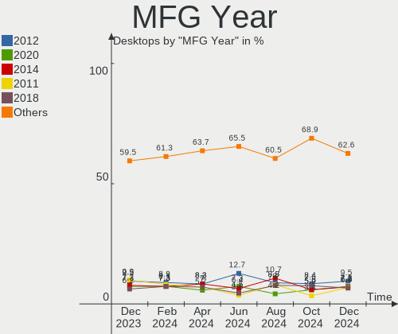
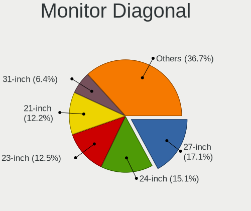
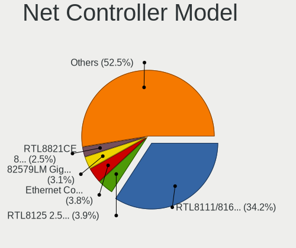

OpenMandriva Hardware Trends (Desktop)
--------------------------------------

A project to identify most popular hardware characteristics and track their change
over time based on data collected by OpenMandriva users at https://Linux-Hardware.org.

Anyone can contribute to the study by uploading probes of their computers by
the [hw-probe](https://github.com/linuxhw/hw-probe) tool:

    sudo -E hw-probe -all -upload

Full-feature report is available here: https://linux-hardware.org/?view=trends&formfactor=desktop

Period: May, 2021.

Contents
--------

- [ OS                       ](#os)
- [ OS Family                ](#os-family)
- [ Kernel                   ](#kernel)
- [ Kernel Family            ](#kernel-family)
- [ Kernel Major Ver.        ](#kernel-major-ver)
- [ Arch                     ](#arch)
- [ DE                       ](#de)
- [ Display Server           ](#display-server)
- [ Display Manager          ](#display-manager)
- [ OS Lang                  ](#os-lang)
- [ Boot Mode                ](#boot-mode)
- [ Filesystem               ](#filesystem)
- [ Part. scheme             ](#part-scheme)
- [ Dual Boot with Linux/BSD ](#dual-boot-with-linux/bsd)
- [ Dual Boot (Win)          ](#dual-boot-win)
- [ Country                  ](#country)
- [ City                     ](#city)
- [ Vendor                   ](#vendor)
- [ Model                    ](#model)
- [ Model Family             ](#model-family)
- [ MFG Year                 ](#mfg-year)
- [ Form Factor              ](#form-factor)
- [ Secure Boot              ](#secure-boot)
- [ Coreboot                 ](#coreboot)
- [ RAM Size                 ](#ram-size)
- [ RAM Used                 ](#ram-used)
- [ Has CD-ROM               ](#has-cd-rom)
- [ Total Drives             ](#total-drives)
- [ Has Ethernet             ](#has-ethernet)
- [ Has WiFi                 ](#has-wifi)
- [ Has Bluetooth            ](#has-bluetooth)
- [ Drive Vendor             ](#drive-vendor)
- [ Drive Model              ](#drive-model)
- [ HDD Vendor               ](#hdd-vendor)
- [ SSD Vendor               ](#ssd-vendor)
- [ Drive Kind               ](#drive-kind)
- [ Drive Connector          ](#drive-connector)
- [ Drive Size               ](#drive-size)
- [ Space Total              ](#space-total)
- [ Space Used               ](#space-used)
- [ Malfunc. Drives          ](#malfunc-drives)
- [ Malfunc. Drive Vendor    ](#malfunc-drive-vendor)
- [ Malfunc. HDD Vendor      ](#malfunc-hdd-vendor)
- [ Malfunc. Drive Kind      ](#malfunc-drive-kind)
- [ Failed Drives            ](#failed-drives)
- [ Failed Drive Vendor      ](#failed-drive-vendor)
- [ Drive Status             ](#drive-status)
- [ Storage Vendor           ](#storage-vendor)
- [ Storage Model            ](#storage-model)
- [ Storage Kind             ](#storage-kind)
- [ CPU Vendor               ](#cpu-vendor)
- [ CPU Model                ](#cpu-model)
- [ CPU Model Family         ](#cpu-model-family)
- [ CPU Cores                ](#cpu-cores)
- [ CPU Sockets              ](#cpu-sockets)
- [ CPU Threads              ](#cpu-threads)
- [ CPU Op-Modes             ](#cpu-op-modes)
- [ CPU Microcode            ](#cpu-microcode)
- [ CPU Microarch            ](#cpu-microarch)
- [ GPU Vendor               ](#gpu-vendor)
- [ GPU Model                ](#gpu-model)
- [ GPU Combo                ](#gpu-combo)
- [ GPU Driver               ](#gpu-driver)
- [ GPU Memory               ](#gpu-memory)
- [ Monitor Vendor           ](#monitor-vendor)
- [ Monitor Model            ](#monitor-model)
- [ Monitor Resolution       ](#monitor-resolution)
- [ Monitor Diagonal         ](#monitor-diagonal)
- [ Monitor Width            ](#monitor-width)
- [ Aspect Ratio             ](#aspect-ratio)
- [ Monitor Area             ](#monitor-area)
- [ Pixel Density            ](#pixel-density)
- [ Multiple Monitors        ](#multiple-monitors)
- [ Net Controller Vendor    ](#net-controller-vendor)
- [ Net Controller Model     ](#net-controller-model)
- [ Wireless Vendor          ](#wireless-vendor)
- [ Wireless Model           ](#wireless-model)
- [ Ethernet Vendor          ](#ethernet-vendor)
- [ Ethernet Model           ](#ethernet-model)
- [ Net Controller Kind      ](#net-controller-kind)
- [ Used Controller          ](#used-controller)
- [ NICs                     ](#nics)
- [ IPv6                     ](#ipv6)
- [ Memory Vendor            ](#memory-vendor)
- [ Memory Model             ](#memory-model)
- [ Memory Kind              ](#memory-kind)
- [ Memory Form Factor       ](#memory-form-factor)
- [ Memory Size              ](#memory-size)
- [ Memory Speed             ](#memory-speed)
- [ Sound Vendor             ](#sound-vendor)
- [ Sound Model              ](#sound-model)
- [ Camera Vendor            ](#camera-vendor)
- [ Camera Model             ](#camera-model)
- [ Fingerprint Vendor       ](#fingerprint-vendor)
- [ Fingerprint Model        ](#fingerprint-model)
- [ Chipcard Vendor          ](#chipcard-vendor)
- [ Chipcard Model           ](#chipcard-model)
- [ Printer Vendor           ](#printer-vendor)
- [ Printer Model            ](#printer-model)
- [ Scanner Vendor           ](#scanner-vendor)
- [ Scanner Model            ](#scanner-model)
- [ Bluetooth Vendor         ](#bluetooth-vendor)
- [ Bluetooth Model          ](#bluetooth-model)
- [ Unsupported Devices      ](#unsupported-devices)
- [ Unsupported Device Types ](#unsupported-device-types)

OS
--

Installed operating systems

| Name              | Desktops | Percent |
|-------------------|----------|---------|
| OpenMandriva 4.2  | 205      | 69.02%  |
| OpenMandriva 4.50 | 90       | 30.3%   |
| OpenMandriva 4.1  | 2        | 0.67%   |

OS Family
---------

OS without a version

| Name         | Desktops | Percent |
|--------------|----------|---------|
| OpenMandriva | 297      | 100%    |

Kernel
------

Version of the Linux kernel

| Version                       | Desktops | Percent |
|-------------------------------|----------|---------|
| 5.10.14-desktop-1omv4002      | 193      | 64.98%  |
| 5.12.4-desktop-1omv4050       | 88       | 29.63%  |
| 5.11.12-desktop-1omv4002      | 11       | 3.7%    |
| 5.5.12-desktop-1omv4001       | 2        | 0.67%   |
| 5.12.5-desktop-clang-1omv4050 | 1        | 0.34%   |
| 5.12.1-desktop-clang-4omv4050 | 1        | 0.34%   |
| 5.11.0-desktop-clang-1omv4002 | 1        | 0.34%   |

Kernel Family
-------------

Linux kernel without a distro release

| Version | Desktops | Percent |
|---------|----------|---------|
| 5.10.14 | 193      | 64.98%  |
| 5.12.4  | 88       | 29.63%  |
| 5.11.12 | 11       | 3.7%    |
| 5.5.12  | 2        | 0.67%   |
| 5.12.5  | 1        | 0.34%   |
| 5.12.1  | 1        | 0.34%   |
| 5.11.0  | 1        | 0.34%   |

Kernel Major Ver.
-----------------

Linux kernel major version

| Version | Desktops | Percent |
|---------|----------|---------|
| 5.10    | 193      | 64.98%  |
| 5.12    | 90       | 30.3%   |
| 5.11    | 12       | 4.04%   |
| 5.5     | 2        | 0.67%   |

Arch
----

OS architecture (x86_64, i586, etc.)

| Name   | Desktops | Percent |
|--------|----------|---------|
| x86_64 | 297      | 100%    |

DE
--

Desktop Environment

| Name | Desktops | Percent |
|------|----------|---------|
| KDE5 | 297      | 100%    |

Display Server
--------------

X11 or Wayland

| Name    | Desktops | Percent |
|---------|----------|---------|
| X11     | 296      | 99.66%  |
| Wayland | 1        | 0.34%   |

Display Manager
---------------

SDDM, LightDM, etc.

| Name | Desktops | Percent |
|------|----------|---------|
| SDDM | 297      | 100%    |

OS Lang
-------

Language

| Lang  | Desktops | Percent |
|-------|----------|---------|
| en_US | 165      | 55.56%  |
| ru_RU | 23       | 7.74%   |
| de_DE | 18       | 6.06%   |
| fr_FR | 15       | 5.05%   |
| pt_BR | 13       | 4.38%   |
| it_IT | 7        | 2.36%   |
| es_AR | 5        | 1.68%   |
| en_GB | 5        | 1.68%   |
| ro_RO | 4        | 1.35%   |
| pl_PL | 4        | 1.35%   |
| de_AT | 4        | 1.35%   |
| cs_CZ | 4        | 1.35%   |
| nl_NL | 3        | 1.01%   |
| es_MX | 3        | 1.01%   |
| es_ES | 3        | 1.01%   |
| nl_BE | 2        | 0.67%   |
| fr_CA | 2        | 0.67%   |
| es_CL | 2        | 0.67%   |
| en_CA | 2        | 0.67%   |
| en_AU | 2        | 0.67%   |
| ru_UA | 1        | 0.34%   |
| pt_PT | 1        | 0.34%   |
| nl_AW | 1        | 0.34%   |
| hu_HU | 1        | 0.34%   |
| es_PY | 1        | 0.34%   |
| es_CO | 1        | 0.34%   |
| en_IE | 1        | 0.34%   |
| en_HK | 1        | 0.34%   |
| en_AG | 1        | 0.34%   |
| de_CH | 1        | 0.34%   |
| da_DK | 1        | 0.34%   |

Boot Mode
---------

EFI or BIOS

| Mode | Desktops | Percent |
|------|----------|---------|
| BIOS | 183      | 61.62%  |
| EFI  | 114      | 38.38%  |

Filesystem
----------

Type of filesystem

| Type    | Desktops | Percent |
|---------|----------|---------|
| Overlay | 245      | 82.49%  |
| Ext4    | 49       | 16.5%   |
| Btrfs   | 2        | 0.67%   |
| F2fs    | 1        | 0.34%   |

Part. scheme
------------

Scheme of partitioning

| Type | Desktops | Percent |
|------|----------|---------|
| GPT  | 177      | 59.6%   |
| MBR  | 120      | 40.4%   |

Dual Boot with Linux/BSD
------------------------

Hosting more than one Linux/BSD

| Dual boot | Desktops | Percent |
|-----------|----------|---------|
| Yes       | 179      | 60.27%  |
| No        | 118      | 39.73%  |

Dual Boot (Win)
---------------

Hosting Linux and Windows

| Dual boot | Desktops | Percent |
|-----------|----------|---------|
| No        | 158      | 53.2%   |
| Yes       | 139      | 46.8%   |

Country
-------

Geographic location (country)

| Country             | Desktops | Percent |
|---------------------|----------|---------|
| USA                 | 50       | 16.84%  |
| Germany             | 32       | 10.77%  |
| Russia              | 29       | 9.76%   |
| Brazil              | 17       | 5.72%   |
| France              | 16       | 5.39%   |
| Italy               | 13       | 4.38%   |
| Australia           | 9        | 3.03%   |
| Spain               | 8        | 2.69%   |
| Poland              | 8        | 2.69%   |
| UK                  | 7        | 2.36%   |
| Canada              | 7        | 2.36%   |
| Austria             | 7        | 2.36%   |
| Romania             | 6        | 2.02%   |
| Argentina           | 6        | 2.02%   |
| Hungary             | 5        | 1.68%   |
| Finland             | 5        | 1.68%   |
| Slovakia            | 4        | 1.35%   |
| Netherlands         | 4        | 1.35%   |
| Mexico              | 4        | 1.35%   |
| Czechia             | 4        | 1.35%   |
| China               | 4        | 1.35%   |
| Sweden              | 3        | 1.01%   |
| Portugal            | 3        | 1.01%   |
| Israel              | 3        | 1.01%   |
| Indonesia           | 3        | 1.01%   |
| Greece              | 3        | 1.01%   |
| Ukraine             | 2        | 0.67%   |
| Switzerland         | 2        | 0.67%   |
| Serbia              | 2        | 0.67%   |
| Morocco             | 2        | 0.67%   |
| Malaysia            | 2        | 0.67%   |
| Hong Kong           | 2        | 0.67%   |
| Denmark             | 2        | 0.67%   |
| Chile               | 2        | 0.67%   |
| Bulgaria            | 2        | 0.67%   |
| Belgium             | 2        | 0.67%   |
| Turkey              | 1        | 0.34%   |
| Trinidad and Tobago | 1        | 0.34%   |
| Thailand            | 1        | 0.34%   |
| Taiwan              | 1        | 0.34%   |
| South Korea         | 1        | 0.34%   |
| South Africa        | 1        | 0.34%   |
| Saudi Arabia        | 1        | 0.34%   |
| Paraguay            | 1        | 0.34%   |
| Kazakhstan          | 1        | 0.34%   |
| Japan               | 1        | 0.34%   |
| Ireland             | 1        | 0.34%   |
| India               | 1        | 0.34%   |
| Croatia             | 1        | 0.34%   |
| Costa Rica          | 1        | 0.34%   |
| Colombia            | 1        | 0.34%   |
| Belarus             | 1        | 0.34%   |
| Bahrain             | 1        | 0.34%   |

City
----

Geographic location (city)

| City                  | Desktops | Percent |
|-----------------------|----------|---------|
| Moscow                | 6        | 2.02%   |
| Boos                  | 4        | 1.35%   |
| Warsaw                | 3        | 1.01%   |
| São Paulo            | 3        | 1.01%   |
| Sydney                | 3        | 1.01%   |
| Vicenza               | 2        | 0.67%   |
| Târgu Mureş         | 2        | 0.67%   |
| Tula                  | 2        | 0.67%   |
| St Petersburg         | 2        | 0.67%   |
| Springdale            | 2        | 0.67%   |
| Siófok               | 2        | 0.67%   |
| Santiago              | 2        | 0.67%   |
| Pskov                 | 2        | 0.67%   |
| Portland              | 2        | 0.67%   |
| Perth                 | 2        | 0.67%   |
| Paris                 | 2        | 0.67%   |
| Nyiregyhaza           | 2        | 0.67%   |
| Nanjing               | 2        | 0.67%   |
| Marianna              | 2        | 0.67%   |
| Izhevsk               | 2        | 0.67%   |
| Iselin                | 2        | 0.67%   |
| Hartford              | 2        | 0.67%   |
| Faro                  | 2        | 0.67%   |
| Arkhangelsk           | 2        | 0.67%   |
| Česká Lípa         | 1        | 0.34%   |
| Zittau                | 1        | 0.34%   |
| Zaragoza              | 1        | 0.34%   |
| Yuzhnoural'sk         | 1        | 0.34%   |
| Yilan                 | 1        | 0.34%   |
| Yekaterinburg         | 1        | 0.34%   |
| Wroclaw               | 1        | 0.34%   |
| Wittstock             | 1        | 0.34%   |
| Winnipeg              | 1        | 0.34%   |
| Wilhelmshaven         | 1        | 0.34%   |
| Voluntari             | 1        | 0.34%   |
| Vienna                | 1        | 0.34%   |
| Veliko Tarnovo        | 1        | 0.34%   |
| Uryupinsk             | 1        | 0.34%   |
| Union Mills           | 1        | 0.34%   |
| Trois-Rivières       | 1        | 0.34%   |
| Toronto               | 1        | 0.34%   |
| Toledo                | 1        | 0.34%   |
| Timișoara            | 1        | 0.34%   |
| Tel Aviv              | 1        | 0.34%   |
| Tekirdağ             | 1        | 0.34%   |
| Tatabánya            | 1        | 0.34%   |
| Tarazona de la Mancha | 1        | 0.34%   |
| Tanabi                | 1        | 0.34%   |
| Talavera de la Reina  | 1        | 0.34%   |
| Tai Kok Tsui          | 1        | 0.34%   |
| Stugun                | 1        | 0.34%   |
| Spokane               | 1        | 0.34%   |
| Split                 | 1        | 0.34%   |
| Solana Beach          | 1        | 0.34%   |
| Sibiu                 | 1        | 0.34%   |
| Siatista              | 1        | 0.34%   |
| Shingu                | 1        | 0.34%   |
| Sherbrooke            | 1        | 0.34%   |
| Shawano               | 1        | 0.34%   |
| Sham Tseng            | 1        | 0.34%   |

Vendor
------

Motherboard manufacturer

| Name                | Desktops | Percent |
|---------------------|----------|---------|
| ASUSTek Computer    | 75       | 25.25%  |
| Gigabyte Technology | 61       | 20.54%  |
| Hewlett-Packard     | 29       | 9.76%   |
| ASRock              | 27       | 9.09%   |
| MSI                 | 24       | 8.08%   |
| Dell                | 19       | 6.4%    |
| Intel               | 12       | 4.04%   |
| Lenovo              | 11       | 3.7%    |
| ECS                 | 6        | 2.02%   |
| Pegatron            | 5        | 1.68%   |
| Medion              | 4        | 1.35%   |
| Foxconn             | 4        | 1.35%   |
| Fujitsu             | 3        | 1.01%   |
| Biostar             | 3        | 1.01%   |
| Unknown             | 3        | 1.01%   |
| Acer                | 2        | 0.67%   |
| Shuttle             | 1        | 0.34%   |
| Positivo            | 1        | 0.34%   |
| PERTOSA             | 1        | 0.34%   |
| Packard Bell        | 1        | 0.34%   |
| OEM_MB              | 1        | 0.34%   |
| LORD ELECTRONICS    | 1        | 0.34%   |
| Itautec             | 1        | 0.34%   |
| Gateway             | 1        | 0.34%   |
| Centerm             | 1        | 0.34%   |

Model
-----

Motherboard model

| Name                                              | Desktops | Percent |
|---------------------------------------------------|----------|---------|
| ASUS PRIME A320M-K                                | 5        | 1.68%   |
| ASUS All Series                                   | 5        | 1.68%   |
| Gigabyte B450M DS3H                               | 4        | 1.35%   |
| ASUS P8H67                                        | 3        | 1.01%   |
| Unknown                                           | 3        | 1.01%   |
| MSI MS-7C52                                       | 2        | 0.67%   |
| MSI MS-7B79                                       | 2        | 0.67%   |
| MSI MS-7817                                       | 2        | 0.67%   |
| Intel H81                                         | 2        | 0.67%   |
| Gigabyte X79-UP4                                  | 2        | 0.67%   |
| Gigabyte TRX40 AORUS MASTER                       | 2        | 0.67%   |
| Gigabyte H61M-S1                                  | 2        | 0.67%   |
| Gigabyte GA-78LMT-USB3                            | 2        | 0.67%   |
| Gigabyte GA-78LMT-S2P                             | 2        | 0.67%   |
| Gigabyte G41M-Combo                               | 2        | 0.67%   |
| ECS H61H2-M12                                     | 2        | 0.67%   |
| Dell OptiPlex 9020                                | 2        | 0.67%   |
| Dell OptiPlex 3050                                | 2        | 0.67%   |
| Dell Inspiron 3647                                | 2        | 0.67%   |
| ASUS TUF GAMING X570-PLUS                         | 2        | 0.67%   |
| ASUS M5A99FX PRO R2.0                             | 2        | 0.67%   |
| ASUS M5A78L-M LX3                                 | 2        | 0.67%   |
| ASRock A320M-HDV R4.0                             | 2        | 0.67%   |
| Shuttle XS35V4                                    | 1        | 0.34%   |
| Positivo POS-EIH61CE                              | 1        | 0.34%   |
| PERTOSA 206.30.054 - GA-H110TN-M                  | 1        | 0.34%   |
| Pegatron p7-1020de                                | 1        | 0.34%   |
| Pegatron p6-2143w                                 | 1        | 0.34%   |
| Pegatron IPPPV-D3G                                | 1        | 0.34%   |
| Pegatron Elite 7500 Series MT                     | 1        | 0.34%   |
| Pegatron 2AB6                                     | 1        | 0.34%   |
| Packard Bell imedia S3720                         | 1        | 0.34%   |
| OEM_MB KQ496AA-ABA a6530f                         | 1        | 0.34%   |
| MSI VT660AA-ABG p6335a                            | 1        | 0.34%   |
| MSI p6-2378                                       | 1        | 0.34%   |
| MSI MS-7B49                                       | 1        | 0.34%   |
| MSI MS-7B38                                       | 1        | 0.34%   |
| MSI MS-7A72                                       | 1        | 0.34%   |
| MSI MS-7A62                                       | 1        | 0.34%   |
| MSI MS-7A38                                       | 1        | 0.34%   |
| MSI MS-7A34                                       | 1        | 0.34%   |
| MSI MS-7996                                       | 1        | 0.34%   |
| MSI MS-7918                                       | 1        | 0.34%   |
| MSI MS-7895                                       | 1        | 0.34%   |
| MSI MS-7850                                       | 1        | 0.34%   |
| MSI MS-7818                                       | 1        | 0.34%   |
| MSI MS-7735                                       | 1        | 0.34%   |
| MSI MS-7695                                       | 1        | 0.34%   |
| MSI MS-7641                                       | 1        | 0.34%   |
| MSI MS-7514                                       | 1        | 0.34%   |
| MSI H310 Gaming Nightblade MI3 8 (MS-B919)        | 1        | 0.34%   |
| Medion MS-7748                                    | 1        | 0.34%   |
| Medion MD34872                                    | 1        | 0.34%   |
| Medion MD34045/2521                               | 1        | 0.34%   |
| Medion Erazer X5308 G/C195                        | 1        | 0.34%   |
| LORD ELECTRONICS LORD G4x 775 ICH7 8712 As Design | 1        | 0.34%   |
| Lenovo V520-15IKL Desktop 10NK002NGE              | 1        | 0.34%   |
| Lenovo ThinkCentre M81 5048W4M                    | 1        | 0.34%   |
| Lenovo ThinkCentre M58p 6138DK1                   | 1        | 0.34%   |
| Lenovo ThinkCentre M58p 3285A1G                   | 1        | 0.34%   |

Model Family
------------

Motherboard model prefix

| Name                   | Desktops | Percent |
|------------------------|----------|---------|
| HP Compaq              | 12       | 4.04%   |
| ASUS PRIME             | 12       | 4.04%   |
| Dell OptiPlex          | 9        | 3.03%   |
| Lenovo ThinkCentre     | 6        | 2.02%   |
| Gigabyte B450M         | 5        | 1.68%   |
| Dell Inspiron          | 5        | 1.68%   |
| ASUS M5A78L-M          | 5        | 1.68%   |
| ASUS All               | 5        | 1.68%   |
| Lenovo IdeaCentre      | 4        | 1.35%   |
| Gigabyte GA-78LMT-USB3 | 4        | 1.35%   |
| Dell Vostro            | 4        | 1.35%   |
| HP ProDesk             | 3        | 1.01%   |
| Fujitsu ESPRIMO        | 3        | 1.01%   |
| ASUS TUF               | 3        | 1.01%   |
| ASUS ROG               | 3        | 1.01%   |
| ASUS P8Z77-V           | 3        | 1.01%   |
| ASUS P8H67             | 3        | 1.01%   |
| Unknown                | 3        | 1.01%   |
| MSI MS-7C52            | 2        | 0.67%   |
| MSI MS-7B79            | 2        | 0.67%   |
| MSI MS-7817            | 2        | 0.67%   |
| Intel H81              | 2        | 0.67%   |
| HP EliteDesk           | 2        | 0.67%   |
| Gigabyte X79-UP4       | 2        | 0.67%   |
| Gigabyte TRX40         | 2        | 0.67%   |
| Gigabyte H61M-S1       | 2        | 0.67%   |
| Gigabyte GA-78LMT-S2P  | 2        | 0.67%   |
| Gigabyte G41M-Combo    | 2        | 0.67%   |
| ECS H61H2-M12          | 2        | 0.67%   |
| ASUS P8H61-M           | 2        | 0.67%   |
| ASUS P5Q               | 2        | 0.67%   |
| ASUS P5P43TD           | 2        | 0.67%   |
| ASUS P5KPL-AM          | 2        | 0.67%   |
| ASUS M5A99FX           | 2        | 0.67%   |
| ASRock X370            | 2        | 0.67%   |
| ASRock B450M           | 2        | 0.67%   |
| ASRock A320M-HDV       | 2        | 0.67%   |
| Acer Aspire            | 2        | 0.67%   |
| Shuttle XS35V4         | 1        | 0.34%   |
| Positivo POS-EIH61CE   | 1        | 0.34%   |
| PERTOSA 206.30.054     | 1        | 0.34%   |
| Pegatron p7-1020de     | 1        | 0.34%   |
| Pegatron p6-2143w      | 1        | 0.34%   |
| Pegatron IPPPV-D3G     | 1        | 0.34%   |
| Pegatron Elite         | 1        | 0.34%   |
| Pegatron 2AB6          | 1        | 0.34%   |
| Packard Bell imedia    | 1        | 0.34%   |
| OEM_MB KQ496AA-ABA     | 1        | 0.34%   |
| MSI VT660AA-ABG        | 1        | 0.34%   |
| MSI p6-2378            | 1        | 0.34%   |
| MSI MS-7B49            | 1        | 0.34%   |
| MSI MS-7B38            | 1        | 0.34%   |
| MSI MS-7A72            | 1        | 0.34%   |
| MSI MS-7A62            | 1        | 0.34%   |
| MSI MS-7A38            | 1        | 0.34%   |
| MSI MS-7A34            | 1        | 0.34%   |
| MSI MS-7996            | 1        | 0.34%   |
| MSI MS-7918            | 1        | 0.34%   |
| MSI MS-7895            | 1        | 0.34%   |
| MSI MS-7850            | 1        | 0.34%   |

MFG Year
--------

Motherboard manufacture year

| Year | Desktops | Percent |
|------|----------|---------|
| 2020 | 33       | 11.11%  |
| 2014 | 33       | 11.11%  |
| 2012 | 29       | 9.76%   |
| 2019 | 27       | 9.09%   |
| 2011 | 27       | 9.09%   |
| 2013 | 24       | 8.08%   |
| 2016 | 21       | 7.07%   |
| 2018 | 20       | 6.73%   |
| 2015 | 19       | 6.4%    |
| 2009 | 15       | 5.05%   |
| 2010 | 13       | 4.38%   |
| 2017 | 11       | 3.7%    |
| 2021 | 9        | 3.03%   |
| 2008 | 7        | 2.36%   |
| 2007 | 7        | 2.36%   |
| 2006 | 1        | 0.34%   |
| 2005 | 1        | 0.34%   |

Form Factor
-----------

Physical design of the computer

| Name    | Desktops | Percent |
|---------|----------|---------|
| Desktop | 297      | 100%    |

Secure Boot
-----------

Enabled or disabled

| State    | Desktops | Percent |
|----------|----------|---------|
| Disabled | 297      | 100%    |

Coreboot
--------

Have coreboot on board

| Used | Desktops | Percent |
|------|----------|---------|
| No   | 297      | 100%    |

RAM Size
--------

Total RAM memory

| Size in GB  | Desktops | Percent |
|-------------|----------|---------|
| 8.01-16.0   | 78       | 26.26%  |
| 4.01-8.0    | 62       | 20.88%  |
| 16.01-24.0  | 61       | 20.54%  |
| 3.01-4.0    | 54       | 18.18%  |
| 32.01-64.0  | 15       | 5.05%   |
| 1.01-2.0    | 9        | 3.03%   |
| 24.01-32.0  | 7        | 2.36%   |
| 64.01-256.0 | 6        | 2.02%   |
| 2.01-3.0    | 5        | 1.68%   |

RAM Used
--------

Used RAM memory

| Used GB  | Desktops | Percent |
|----------|----------|---------|
| 1.01-2.0 | 227      | 76.43%  |
| 0.51-1.0 | 32       | 10.77%  |
| 2.01-3.0 | 22       | 7.41%   |
| 0.01-0.5 | 12       | 4.04%   |
| 3.01-4.0 | 4        | 1.35%   |

Has CD-ROM
----------

Has CD-ROM on board

| Presented | Desktops | Percent |
|-----------|----------|---------|
| Yes       | 186      | 62.63%  |
| No        | 111      | 37.37%  |

Total Drives
------------

Number of drives on board

| Drives | Desktops | Percent |
|--------|----------|---------|
| 1      | 142      | 47.81%  |
| 2      | 85       | 28.62%  |
| 3      | 34       | 11.45%  |
| 4      | 20       | 6.73%   |
| 0      | 6        | 2.02%   |
| 5      | 5        | 1.68%   |
| 7      | 2        | 0.67%   |
| 12     | 1        | 0.34%   |
| 8      | 1        | 0.34%   |
| 6      | 1        | 0.34%   |

Has Ethernet
------------

Has Ethernet on board

| Presented | Desktops | Percent |
|-----------|----------|---------|
| Yes       | 295      | 99.33%  |
| No        | 2        | 0.67%   |

Has WiFi
--------

Has WiFi module

| Presented | Desktops | Percent |
|-----------|----------|---------|
| No        | 203      | 68.35%  |
| Yes       | 94       | 31.65%  |

Has Bluetooth
-------------

Has Bluetooth module

| Presented | Desktops | Percent |
|-----------|----------|---------|
| No        | 238      | 80.13%  |
| Yes       | 59       | 19.87%  |

Drive Vendor
------------

Hard drive vendors

| Vendor              | Desktops | Drives | Percent |
|---------------------|----------|--------|---------|
| WDC                 | 126      | 145    | 26.42%  |
| Seagate             | 85       | 104    | 17.82%  |
| Samsung Electronics | 48       | 70     | 10.06%  |
| Kingston            | 42       | 46     | 8.81%   |
| Hitachi             | 24       | 24     | 5.03%   |
| Toshiba             | 23       | 27     | 4.82%   |
| Crucial             | 16       | 17     | 3.35%   |
| SanDisk             | 15       | 18     | 3.14%   |
| China               | 8        | 8      | 1.68%   |
| A-DATA Technology   | 8        | 9      | 1.68%   |
| SPCC                | 7        | 7      | 1.47%   |
| Intenso             | 7        | 7      | 1.47%   |
| Intel               | 6        | 7      | 1.26%   |
| HGST                | 6        | 6      | 1.26%   |
| Unknown             | 5        | 6      | 1.05%   |
| OCZ                 | 4        | 5      | 0.84%   |
| Verbatim            | 3        | 3      | 0.63%   |
| Phison              | 3        | 3      | 0.63%   |
| Maxtor              | 3        | 3      | 0.63%   |
| Corsair             | 3        | 3      | 0.63%   |
| Apacer              | 3        | 3      | 0.63%   |
| Team                | 2        | 3      | 0.42%   |
| SK Hynix            | 2        | 2      | 0.42%   |
| Phison Electronics  | 2        | 2      | 0.42%   |
| Micron Technology   | 2        | 2      | 0.42%   |
| LITEON              | 2        | 2      | 0.42%   |
| GOODRAM             | 2        | 2      | 0.42%   |
| Emtec               | 2        | 2      | 0.42%   |
| Zheino              | 1        | 1      | 0.21%   |
| Yeyian              | 1        | 1      | 0.21%   |
| USB                 | 1        | 1      | 0.21%   |
| Transcend           | 1        | 1      | 0.21%   |
| T-FORCE             | 1        | 1      | 0.21%   |
| SABRENT             | 1        | 1      | 0.21%   |
| QUANTUM             | 1        | 1      | 0.21%   |
| PNY                 | 1        | 1      | 0.21%   |
| PLEXTOR             | 1        | 1      | 0.21%   |
| Patriot             | 1        | 1      | 0.21%   |
| MT-64               | 1        | 1      | 0.21%   |
| Maxmemroy           | 1        | 1      | 0.21%   |
| Lexar               | 1        | 1      | 0.21%   |
| KingDian            | 1        | 1      | 0.21%   |
| KDATA               | 1        | 1      | 0.21%   |
| Hewlett-Packard     | 1        | 1      | 0.21%   |
| DRVEO               | 1        | 1      | 0.21%   |
| addlink             | 1        | 2      | 0.21%   |

Drive Model
-----------

Hard drive models

| Model                            | Desktops | Percent |
|----------------------------------|----------|---------|
| Kingston SA400S37240G 240GB SSD  | 10       | 1.87%   |
| Kingston SV300S37A120G 120GB SSD | 8        | 1.5%    |
| Seagate ST500DM002-1BD142 500GB  | 7        | 1.31%   |
| Seagate ST1000DM003-1ER162 1TB   | 7        | 1.31%   |
| Seagate ST3500418AS 500GB        | 6        | 1.12%   |
| Toshiba DT01ACA100 1TB           | 5        | 0.93%   |
| Seagate ST2000DM001-1ER164 2TB   | 5        | 0.93%   |
| Seagate ST1000DM010-2EP102 1TB   | 5        | 0.93%   |
| Samsung SSD 850 EVO 500GB        | 5        | 0.93%   |
| WDC WD5000AAKX-00ERMA0 500GB     | 4        | 0.75%   |
| WDC WD10EZEX-08WN4A0 1TB         | 4        | 0.75%   |
| Seagate ST3500413AS 500GB        | 4        | 0.75%   |
| Kingston SA400S37480G 480GB SSD  | 4        | 0.75%   |
| Kingston SA400S37120G 120GB SSD  | 4        | 0.75%   |
| HGST HTS721010A9E630 1TB         | 4        | 0.75%   |
| WDC WDS240G2G0A-00JH30 240GB SSD | 3        | 0.56%   |
| WDC WD3200AVVS-63L2B0 320GB      | 3        | 0.56%   |
| WDC WD20EARX-00PASB0 2TB         | 3        | 0.56%   |
| WDC WD10EZEX-00BN5A0 1TB         | 3        | 0.56%   |
| WDC WD1003FZEX-00MK2A0 1TB       | 3        | 0.56%   |
| Unknown SD/MMC/MS PRO 8GB        | 3        | 0.56%   |
| Seagate ST3160815AS 160GB        | 3        | 0.56%   |
| Seagate ST31000524AS 1TB         | 3        | 0.56%   |
| Seagate ST2000DM001-1CH164 2TB   | 3        | 0.56%   |
| Samsung SSD 860 EVO 500GB        | 3        | 0.56%   |
| Samsung SSD 850 EVO 1TB          | 3        | 0.56%   |
| Intenso SSD SATAIII 512GB        | 3        | 0.56%   |
| Hitachi HDS721010CLA332 1TB      | 3        | 0.56%   |
| WDC WDS500G2B0A-00SM50 500GB SSD | 2        | 0.37%   |
| WDC WDS120G2G0A-00JH30 120GB SSD | 2        | 0.37%   |
| WDC WD5000AAKX-60U6AA0 500GB     | 2        | 0.37%   |
| WDC WD5000AAKX-22ERMA0 500GB     | 2        | 0.37%   |
| WDC WD5000AAKS-00V1A0 500GB      | 2        | 0.37%   |
| WDC WD20PURZ-85GU6Y0 2TB         | 2        | 0.37%   |
| WDC WD1600AAJS-00L7A0 160GB      | 2        | 0.37%   |
| WDC WD10EZEX-60WN4A0 1TB         | 2        | 0.37%   |
| WDC WD10EZEX-22MFCA0 1TB         | 2        | 0.37%   |
| WDC WD10EFRX-68FYTN0 1TB         | 2        | 0.37%   |
| WDC WD10EARS-00Y5B1 1TB          | 2        | 0.37%   |
| WDC WD10EALS-00Z8A0 1TB          | 2        | 0.37%   |
| WDC WD1002FAEX-00Z3A0 1TB        | 2        | 0.37%   |
| Verbatim Vi550 S3 SSD 128GB      | 2        | 0.37%   |
| Toshiba DT01ACA200 2TB           | 2        | 0.37%   |
| Toshiba DT01ACA050 500GB         | 2        | 0.37%   |
| SPCC Solid State Disk 128GB      | 2        | 0.37%   |
| Seagate ST500DM009-2F110A 500GB  | 2        | 0.37%   |
| Seagate ST3250820AS 249GB        | 2        | 0.37%   |
| Seagate ST3250410AS 250GB        | 2        | 0.37%   |
| Seagate ST31000528AS 1TB         | 2        | 0.37%   |
| Seagate ST3000DM001-1CH166 3TB   | 2        | 0.37%   |
| Seagate ST250DM000-1BD141 250GB  | 2        | 0.37%   |
| Seagate ST2000DM008-2FR102 2TB   | 2        | 0.37%   |
| Seagate ST1000LM035-1RK172 1TB   | 2        | 0.37%   |
| Seagate ST1000DM003-1CH162 1TB   | 2        | 0.37%   |
| Seagate Expansion 2TB            | 2        | 0.37%   |
| SanDisk Ultra II 480GB SSD       | 2        | 0.37%   |
| Samsung SSD SM871 2.5 7mm 256GB  | 2        | 0.37%   |
| Samsung SSD 970 EVO 500GB        | 2        | 0.37%   |
| Samsung SSD 860 EVO 1TB          | 2        | 0.37%   |
| Samsung SSD 850 EVO 250GB        | 2        | 0.37%   |

HDD Vendor
----------

Hard disk drive vendors

| Vendor              | Desktops | Drives | Percent |
|---------------------|----------|--------|---------|
| WDC                 | 112      | 128    | 42.75%  |
| Seagate             | 84       | 102    | 32.06%  |
| Hitachi             | 24       | 24     | 9.16%   |
| Toshiba             | 21       | 23     | 8.02%   |
| Samsung Electronics | 9        | 11     | 3.44%   |
| HGST                | 6        | 6      | 2.29%   |
| MAXTOR              | 3        | 3      | 1.15%   |
| USB                 | 1        | 1      | 0.38%   |
| QUANTUM             | 1        | 1      | 0.38%   |
| Intenso             | 1        | 1      | 0.38%   |

SSD Vendor
----------

Solid state drive vendors

| Vendor              | Desktops | Drives | Percent |
|---------------------|----------|--------|---------|
| Kingston            | 39       | 43     | 20.74%  |
| Samsung Electronics | 35       | 46     | 18.62%  |
| SanDisk             | 15       | 18     | 7.98%   |
| WDC                 | 13       | 13     | 6.91%   |
| Crucial             | 12       | 13     | 6.38%   |
| China               | 8        | 8      | 4.26%   |
| A-DATA Technology   | 7        | 8      | 3.72%   |
| SPCC                | 6        | 6      | 3.19%   |
| Intenso             | 6        | 6      | 3.19%   |
| OCZ                 | 4        | 5      | 2.13%   |
| Verbatim            | 3        | 3      | 1.6%    |
| Toshiba             | 3        | 3      | 1.6%    |
| Intel               | 3        | 3      | 1.6%    |
| Apacer              | 3        | 3      | 1.6%    |
| Unknown             | 2        | 3      | 1.06%   |
| Team                | 2        | 3      | 1.06%   |
| SK Hynix            | 2        | 2      | 1.06%   |
| Micron Technology   | 2        | 2      | 1.06%   |
| LITEON              | 2        | 2      | 1.06%   |
| GOODRAM             | 2        | 2      | 1.06%   |
| Emtec               | 2        | 2      | 1.06%   |
| Corsair             | 2        | 2      | 1.06%   |
| Zheino              | 1        | 1      | 0.53%   |
| Yeyian              | 1        | 1      | 0.53%   |
| Transcend           | 1        | 1      | 0.53%   |
| T-FORCE             | 1        | 1      | 0.53%   |
| Seagate             | 1        | 1      | 0.53%   |
| SABRENT             | 1        | 1      | 0.53%   |
| PNY                 | 1        | 1      | 0.53%   |
| PLEXTOR             | 1        | 1      | 0.53%   |
| Patriot             | 1        | 1      | 0.53%   |
| Maxmemroy           | 1        | 1      | 0.53%   |
| Lexar               | 1        | 1      | 0.53%   |
| KingDian            | 1        | 1      | 0.53%   |
| KDATA               | 1        | 1      | 0.53%   |
| Hewlett-Packard     | 1        | 1      | 0.53%   |
| DRVEO               | 1        | 1      | 0.53%   |

Drive Kind
----------

HDD or SSD

| Kind    | Desktops | Drives | Percent |
|---------|----------|--------|---------|
| HDD     | 212      | 300    | 53%     |
| SSD     | 155      | 211    | 38.75%  |
| NVMe    | 28       | 39     | 7%      |
| Unknown | 5        | 5      | 1.25%   |

Drive Connector
---------------

SATA, SAS, NVMe, etc.

| Type | Desktops | Drives | Percent |
|------|----------|--------|---------|
| SATA | 283      | 497    | 87.35%  |
| NVMe | 28       | 39     | 8.64%   |
| SAS  | 13       | 19     | 4.01%   |

Drive Size
----------

Size of hard drive

| Size in TB | Desktops | Drives | Percent |
|------------|----------|--------|---------|
| 0.01-0.5   | 219      | 305    | 57.48%  |
| 0.51-1.0   | 108      | 144    | 28.35%  |
| 1.01-2.0   | 33       | 35     | 8.66%   |
| 2.01-3.0   | 10       | 11     | 2.62%   |
| 3.01-4.0   | 7        | 11     | 1.84%   |
| 4.01-10.0  | 3        | 4      | 0.79%   |
| 10.01-20.0 | 1        | 1      | 0.26%   |

Space Total
-----------

Amount of disk space available on the file system

| Size in GB | Desktops | Percent |
|------------|----------|---------|
| 1-20       | 141      | 47.47%  |
| Unknown    | 54       | 18.18%  |
| 251-500    | 34       | 11.45%  |
| 101-250    | 26       | 8.75%   |
| 501-1000   | 15       | 5.05%   |
| 51-100     | 15       | 5.05%   |
| 21-50      | 8        | 2.69%   |
| 1001-2000  | 3        | 1.01%   |
| 2001-3000  | 1        | 0.34%   |

Space Used
----------

Amount of used disk space

| Used GB  | Desktops | Percent |
|----------|----------|---------|
| 1-20     | 215      | 72.39%  |
| Unknown  | 54       | 18.18%  |
| 101-250  | 10       | 3.37%   |
| 51-100   | 6        | 2.02%   |
| 251-500  | 4        | 1.35%   |
| 21-50    | 4        | 1.35%   |
| 501-1000 | 4        | 1.35%   |

Malfunc. Drives
---------------

Drive models with a malfunction

| Model                                         | Desktops | Drives | Percent |
|-----------------------------------------------|----------|--------|---------|
| Seagate ST3500418AS 500GB                     | 4        | 4      | 4.71%   |
| Kingston SV300S37A120G 120GB SSD              | 3        | 3      | 3.53%   |
| WDC WD3200AVVS-63L2B0 320GB                   | 2        | 2      | 2.35%   |
| WDC WD20PURZ-85GU6Y0 2TB                      | 2        | 2      | 2.35%   |
| WDC WD10EALS-00Z8A0 1TB                       | 2        | 2      | 2.35%   |
| Seagate ST500DM002-1BD142 500GB               | 2        | 2      | 2.35%   |
| Hitachi HDS721050CLA362 500GB                 | 2        | 2      | 2.35%   |
| Hitachi HDS721010CLA330 1TB                   | 2        | 2      | 2.35%   |
| WDC WDS240G2G0A-00JH30 240GB SSD              | 1        | 1      | 1.18%   |
| WDC WDS120G2G0A-00JH30 120GB SSD              | 1        | 1      | 1.18%   |
| WDC WD6400AAKS-65A7B0 640GB                   | 1        | 1      | 1.18%   |
| WDC WD5003ABYZ-011FA0 500GB                   | 1        | 1      | 1.18%   |
| WDC WD5000LPVX-28V0TT1 500GB                  | 1        | 1      | 1.18%   |
| WDC WD5000AAKX-753CA1 500GB                   | 1        | 1      | 1.18%   |
| WDC WD5000AAKX-22ERMA0 500GB                  | 1        | 1      | 1.18%   |
| WDC WD5000AAKX-003CA0 500GB                   | 1        | 1      | 1.18%   |
| WDC WD5000AAKX-001CA0 500GB                   | 1        | 1      | 1.18%   |
| WDC WD5000AAKS-75V0A0 500GB                   | 1        | 1      | 1.18%   |
| WDC WD5000AAKS-65A7B0 500GB                   | 1        | 1      | 1.18%   |
| WDC WD5000AAKS-22TMA0 500GB                   | 1        | 1      | 1.18%   |
| WDC WD4000FYYZ-01UL1B0 4TB                    | 1        | 1      | 1.18%   |
| WDC WD3200AAKX-001CA0 320GB                   | 1        | 1      | 1.18%   |
| WDC WD3200AAKS-75L9A0 320GB                   | 1        | 1      | 1.18%   |
| WDC WD3200AAJS-56M0A0 320GB                   | 1        | 1      | 1.18%   |
| WDC WD3200AAJS-56B4A0 320GB                   | 1        | 1      | 1.18%   |
| WDC WD3200AAJS-00L7A0 320GB                   | 1        | 1      | 1.18%   |
| WDC WD30EZRX-22D8PB0 3TB                      | 1        | 1      | 1.18%   |
| WDC WD2500AVVS-61L2B0 250GB                   | 1        | 1      | 1.18%   |
| WDC WD2500AAJS-08L7A0 250GB                   | 1        | 1      | 1.18%   |
| WDC WD20EARX-00PASB0 2TB                      | 1        | 1      | 1.18%   |
| WDC WD1600AAJS-00L7A0 160GB                   | 1        | 1      | 1.18%   |
| WDC WD15EARS-00Z5B1 1TB                       | 1        | 1      | 1.18%   |
| WDC WD1502FAEX-007BA0 1TB                     | 1        | 1      | 1.18%   |
| WDC WD10JPVX-22JC3T0 1TB                      | 1        | 1      | 1.18%   |
| WDC WD10EZEX-00BN5A0 1TB                      | 1        | 2      | 1.18%   |
| WDC WD10EARS-00Y5B1 1TB                       | 1        | 1      | 1.18%   |
| WDC WD10EARS-00MVWB0 1TB                      | 1        | 1      | 1.18%   |
| WDC WD10EADS-65L5B1 1TB                       | 1        | 1      | 1.18%   |
| WDC WD1001FALS-00J7B0 1TB                     | 1        | 1      | 1.18%   |
| Toshiba MQ01ABD100 1TB                        | 1        | 1      | 1.18%   |
| Toshiba DT01ABA100V 1TB                       | 1        | 1      | 1.18%   |
| SPCC SSD110 64GB                              | 1        | 1      | 1.18%   |
| Seagate ST9500325AS 500GB                     | 1        | 1      | 1.18%   |
| Seagate ST9160412AS 160GB                     | 1        | 1      | 1.18%   |
| Seagate ST500LM021-1KJ152 500GB               | 1        | 1      | 1.18%   |
| Seagate ST3500412AS 500GB                     | 1        | 1      | 1.18%   |
| Seagate ST3500410SV 500GB                     | 1        | 1      | 1.18%   |
| Seagate ST3250820AS 249GB                     | 1        | 1      | 1.18%   |
| Seagate ST32000644NS 45W8869 59Y1813IBM 2TB   | 1        | 1      | 1.18%   |
| Seagate ST31000524AS 1TB                      | 1        | 1      | 1.18%   |
| Seagate ST250DM000-1BD141 250GB               | 1        | 1      | 1.18%   |
| Seagate ST2000DM001-1ER164 2TB                | 1        | 1      | 1.18%   |
| Samsung Electronics SP0812C 80GB              | 1        | 1      | 1.18%   |
| Samsung Electronics HD322HJ 320GB             | 1        | 1      | 1.18%   |
| Samsung Electronics HD160JJ 160GB             | 1        | 1      | 1.18%   |
| Micron Technology MTFDDAK512MAM-1K1 512GB SSD | 1        | 1      | 1.18%   |
| LITEON CV8-CE256-HP 256GB SSD                 | 1        | 1      | 1.18%   |
| Kingston SHPM2280P2H 240G SSD                 | 1        | 1      | 1.18%   |
| Kingston SHPM2280P2 480G SSD                  | 1        | 1      | 1.18%   |
| Kingston SHFS37A120G 120GB SSD                | 1        | 1      | 1.18%   |

Malfunc. Drive Vendor
---------------------

Vendors of faulty drives

| Vendor              | Desktops | Drives | Percent |
|---------------------|----------|--------|---------|
| WDC                 | 35       | 38     | 42.17%  |
| Seagate             | 16       | 16     | 19.28%  |
| Hitachi             | 12       | 12     | 14.46%  |
| Kingston            | 7        | 7      | 8.43%   |
| Samsung Electronics | 3        | 3      | 3.61%   |
| Toshiba             | 2        | 2      | 2.41%   |
| HGST                | 2        | 2      | 2.41%   |
| SPCC                | 1        | 1      | 1.2%    |
| Micron Technology   | 1        | 1      | 1.2%    |
| LITEON              | 1        | 1      | 1.2%    |
| Intel               | 1        | 1      | 1.2%    |
| DRVEO               | 1        | 1      | 1.2%    |
| China               | 1        | 1      | 1.2%    |

Malfunc. HDD Vendor
-------------------

Vendors of faulty HDD drives

| Vendor              | Desktops | Drives | Percent |
|---------------------|----------|--------|---------|
| WDC                 | 33       | 36     | 48.53%  |
| Seagate             | 16       | 16     | 23.53%  |
| Hitachi             | 12       | 12     | 17.65%  |
| Samsung Electronics | 3        | 3      | 4.41%   |
| Toshiba             | 2        | 2      | 2.94%   |
| HGST                | 2        | 2      | 2.94%   |

Malfunc. Drive Kind
-------------------

Kinds of faulty drives

| Kind | Desktops | Drives | Percent |
|------|----------|--------|---------|
| HDD  | 63       | 71     | 80.77%  |
| SSD  | 14       | 14     | 17.95%  |
| NVMe | 1        | 1      | 1.28%   |

Failed Drives
-------------

Failed drive models

| Model                             | Desktops | Drives | Percent |
|-----------------------------------|----------|--------|---------|
| WDC WD800JD-00LSA0 80GB           | 1        | 1      | 20%     |
| WDC WD10JPVT-75A1YT0 1TB          | 1        | 1      | 20%     |
| Seagate ST3500418AS 500GB         | 1        | 1      | 20%     |
| Samsung Electronics HD502HJ 500GB | 1        | 1      | 20%     |
| Samsung Electronics HD501LJ 500GB | 1        | 1      | 20%     |

Failed Drive Vendor
-------------------

Failed drive vendors

| Vendor              | Desktops | Drives | Percent |
|---------------------|----------|--------|---------|
| WDC                 | 2        | 2      | 40%     |
| Samsung Electronics | 2        | 2      | 40%     |
| Seagate             | 1        | 1      | 20%     |

Drive Status
------------

Number of failed and malfunc. drives

| Status   | Desktops | Drives | Percent |
|----------|----------|--------|---------|
| Works    | 243      | 427    | 69.63%  |
| Malfunc  | 76       | 86     | 21.78%  |
| Detected | 25       | 37     | 7.16%   |
| Failed   | 5        | 5      | 1.43%   |

Storage Vendor
--------------

Storage controller vendors

| Vendor                       | Desktops | Percent |
|------------------------------|----------|---------|
| Intel                        | 189      | 50.53%  |
| AMD                          | 98       | 26.2%   |
| Marvell Technology Group     | 16       | 4.28%   |
| ASMedia Technology           | 13       | 3.48%   |
| Samsung Electronics          | 10       | 2.67%   |
| JMicron Technology           | 9        | 2.41%   |
| Phison Electronics           | 8        | 2.14%   |
| Nvidia                       | 8        | 2.14%   |
| Kingston Technology Company  | 5        | 1.34%   |
| VIA Technologies             | 4        | 1.07%   |
| Sandisk                      | 4        | 1.07%   |
| Micron/Crucial Technology    | 4        | 1.07%   |
| Toshiba America Info Systems | 1        | 0.27%   |
| Promise Technology           | 1        | 0.27%   |
| OCZ Technology Group         | 1        | 0.27%   |
| LSI Logic / Symbios Logic    | 1        | 0.27%   |
| Lite-On IT Corp. / Plextor   | 1        | 0.27%   |
| ADATA Technology             | 1        | 0.27%   |

Storage Model
-------------

Storage controller models

| Model                                                                                   | Desktops | Percent |
|-----------------------------------------------------------------------------------------|----------|---------|
| AMD FCH SATA Controller [AHCI mode]                                                     | 58       | 11.58%  |
| Intel 6 Series/C200 Series Chipset Family 6 port Desktop SATA AHCI Controller           | 28       | 5.59%   |
| AMD SB7x0/SB8x0/SB9x0 IDE Controller                                                    | 24       | 4.79%   |
| Intel 8 Series/C220 Series Chipset Family 6-port SATA Controller 1 [AHCI mode]          | 21       | 4.19%   |
| Intel NM10/ICH7 Family SATA Controller [IDE mode]                                       | 19       | 3.79%   |
| AMD 400 Series Chipset SATA Controller                                                  | 18       | 3.59%   |
| AMD SB7x0/SB8x0/SB9x0 SATA Controller [IDE mode]                                        | 17       | 3.39%   |
| Intel 7 Series/C210 Series Chipset Family 6-port SATA Controller [AHCI mode]            | 14       | 2.79%   |
| AMD SB7x0/SB8x0/SB9x0 SATA Controller [AHCI mode]                                       | 14       | 2.79%   |
| Intel Q170/Q150/B150/H170/H110/Z170/CM236 Chipset SATA Controller [AHCI Mode]           | 13       | 2.59%   |
| ASMedia ASM1062 Serial ATA Controller                                                   | 13       | 2.59%   |
| Intel 6 Series/C200 Series Chipset Family Desktop SATA Controller (IDE mode, ports 4-5) | 12       | 2.4%    |
| Intel 6 Series/C200 Series Chipset Family Desktop SATA Controller (IDE mode, ports 0-3) | 12       | 2.4%    |
| Intel 200 Series PCH SATA controller [AHCI mode]                                        | 11       | 2.2%    |
| AMD FCH SATA Controller D                                                               | 11       | 2.2%    |
| Intel 82801G (ICH7 Family) IDE Controller                                               | 10       | 2%      |
| Intel SATA Controller [RAID mode]                                                       | 9        | 1.8%    |
| Intel 9 Series Chipset Family SATA Controller [AHCI Mode]                               | 9        | 1.8%    |
| Intel Cannon Lake PCH SATA AHCI Controller                                              | 7        | 1.4%    |
| Phison E12 NVMe Controller                                                              | 6        | 1.2%    |
| AMD FCH SATA Controller [IDE mode]                                                      | 6        | 1.2%    |
| Intel C600/X79 series chipset 6-Port SATA AHCI Controller                               | 5        | 1%      |
| Intel 82801JI (ICH10 Family) 4 port SATA IDE Controller #1                              | 5        | 1%      |
| Intel 82801JI (ICH10 Family) 2 port SATA IDE Controller #2                              | 5        | 1%      |
| Intel 4 Series Chipset PT IDER Controller                                               | 5        | 1%      |
| AMD FCH IDE Controller                                                                  | 5        | 1%      |
| Samsung NVMe SSD Controller SM981/PM981/PM983                                           | 4        | 0.8%    |
| Nvidia MCP61 SATA Controller                                                            | 4        | 0.8%    |
| Nvidia MCP61 IDE                                                                        | 4        | 0.8%    |
| Marvell Group 88SE9172 SATA 6Gb/s Controller                                            | 4        | 0.8%    |
| JMicron JMB363 SATA/IDE Controller                                                      | 4        | 0.8%    |
| Intel Atom Processor E3800 Series SATA AHCI Controller                                  | 4        | 0.8%    |
| Intel 82801HR/HO/HH (ICH8R/DO/DH) 2 port SATA Controller [IDE mode]                     | 4        | 0.8%    |
| Intel 82801H (ICH8 Family) 4 port SATA Controller [IDE mode]                            | 4        | 0.8%    |
| AMD X370 Series Chipset SATA Controller                                                 | 4        | 0.8%    |
| AMD 300 Series Chipset SATA Controller                                                  | 4        | 0.8%    |
| VIA VT6415 PATA IDE Host Controller                                                     | 3        | 0.6%    |
| Sandisk WD Black 2018/SN750 / PC SN720 NVMe SSD                                         | 3        | 0.6%    |
| Samsung NVMe SSD Controller SM961/PM961/SM963                                           | 3        | 0.6%    |
| Kingston Company A2000 NVMe SSD                                                         | 3        | 0.6%    |
| JMicron JMB368 IDE controller                                                           | 3        | 0.6%    |
| Intel 82801JD/DO (ICH10 Family) SATA AHCI Controller                                    | 3        | 0.6%    |
| Intel 82801IR/IO/IH (ICH9R/DO/DH) 4 port SATA Controller [IDE mode]                     | 3        | 0.6%    |
| Intel 82801I (ICH9 Family) 2 port SATA Controller [IDE mode]                            | 3        | 0.6%    |
| Intel 400 Series Chipset Family SATA AHCI Controller                                    | 3        | 0.6%    |
| Samsung NVMe SSD Controller PM9A1/PM9A3/980PRO                                          | 2        | 0.4%    |
| Phison E16 PCIe4 NVMe Controller                                                        | 2        | 0.4%    |
| Nvidia MCP73 IDE Controller                                                             | 2        | 0.4%    |
| Micron/Crucial NVMe Controller                                                          | 2        | 0.4%    |
| Marvell Group 88SE9215 PCIe 2.0 x1 4-port SATA 6 Gb/s Controller                        | 2        | 0.4%    |
| Marvell Group 88SE91B0 SATA 6G Controller                                               | 2        | 0.4%    |
| Marvell Group 88SE6111/6121 SATA II / PATA Controller                                   | 2        | 0.4%    |
| Kingston Company HyperX Predator PCIe AHCI SSD                                          | 2        | 0.4%    |
| JMicron JMB361 AHCI/IDE                                                                 | 2        | 0.4%    |
| Intel C610/X99 series chipset sSATA Controller [AHCI mode]                              | 2        | 0.4%    |
| Intel C600/X79 series chipset SATA RAID Controller                                      | 2        | 0.4%    |
| Intel Atom/Celeron/Pentium Processor x5-E8000/J3xxx/N3xxx Series SATA Controller        | 2        | 0.4%    |
| Intel 82801JI (ICH10 Family) SATA AHCI Controller                                       | 2        | 0.4%    |
| Intel 82801JD/DO (ICH10 Family) 4-port SATA IDE Controller                              | 2        | 0.4%    |
| Intel 82801JD/DO (ICH10 Family) 2-port SATA IDE Controller                              | 2        | 0.4%    |

Storage Kind
------------

Kind of storage controller (IDE, SATA, NVMe, SAS, ...)

| Kind | Desktops | Percent |
|------|----------|---------|
| SATA | 230      | 61.83%  |
| IDE  | 98       | 26.34%  |
| NVMe | 28       | 7.53%   |
| RAID | 13       | 3.49%   |
| SCSI | 2        | 0.54%   |
| SAS  | 1        | 0.27%   |

CPU Vendor
----------

Processor vendors

| Vendor | Desktops | Percent |
|--------|----------|---------|
| Intel  | 193      | 64.98%  |
| AMD    | 104      | 35.02%  |

CPU Model
---------

Processor models

| Model                                       | Desktops | Percent |
|---------------------------------------------|----------|---------|
| Intel Core i5-3470 CPU @ 3.20GHz            | 7        | 2.36%   |
| Intel Core i5-2400 CPU @ 3.10GHz            | 6        | 2.02%   |
| Intel Core i3-2120 CPU @ 3.30GHz            | 6        | 2.02%   |
| Intel Core i5-2500K CPU @ 3.30GHz           | 5        | 1.68%   |
| Intel Core i5-2500 CPU @ 3.30GHz            | 5        | 1.68%   |
| Intel Core i3-3220 CPU @ 3.30GHz            | 5        | 1.68%   |
| AMD Ryzen 5 1600 Six-Core Processor         | 5        | 1.68%   |
| AMD Ryzen 3 2200G with Radeon Vega Graphics | 5        | 1.68%   |
| Intel Pentium Dual-Core CPU E5300 @ 2.60GHz | 4        | 1.35%   |
| Intel Core i7-4790K CPU @ 4.00GHz           | 4        | 1.35%   |
| Intel Core i5-4570 CPU @ 3.20GHz            | 4        | 1.35%   |
| Intel Core i3-2100 CPU @ 3.10GHz            | 4        | 1.35%   |
| AMD Ryzen 7 3700X 8-Core Processor          | 4        | 1.35%   |
| AMD Ryzen 5 2600 Six-Core Processor         | 4        | 1.35%   |
| Intel Core i7-8700 CPU @ 3.20GHz            | 3        | 1.01%   |
| Intel Core i7-3770 CPU @ 3.40GHz            | 3        | 1.01%   |
| Intel Core i5-6500 CPU @ 3.20GHz            | 3        | 1.01%   |
| Intel Core i5-4590 CPU @ 3.30GHz            | 3        | 1.01%   |
| Intel Core i5-4460 CPU @ 3.20GHz            | 3        | 1.01%   |
| Intel Core i3-6100 CPU @ 3.70GHz            | 3        | 1.01%   |
| Intel Core i3-4160 CPU @ 3.60GHz            | 3        | 1.01%   |
| Intel Core 2 Quad CPU Q6600 @ 2.40GHz       | 3        | 1.01%   |
| Intel Core 2 Duo CPU E8400 @ 3.00GHz        | 3        | 1.01%   |
| Intel Core 2 Duo CPU E7500 @ 2.93GHz        | 3        | 1.01%   |
| AMD Phenom II X4 955 Processor              | 3        | 1.01%   |
| AMD FX-8350 Eight-Core Processor            | 3        | 1.01%   |
| AMD FX-4300 Quad-Core Processor             | 3        | 1.01%   |
| AMD A8-5600K APU with Radeon HD Graphics    | 3        | 1.01%   |
| AMD A4-4000 APU with Radeon HD Graphics     | 3        | 1.01%   |
| Intel Pentium CPU G620 @ 2.60GHz            | 2        | 0.67%   |
| Intel Core i7-9700F CPU @ 3.00GHz           | 2        | 0.67%   |
| Intel Core i7-6700 CPU @ 3.40GHz            | 2        | 0.67%   |
| Intel Core i7-4770 CPU @ 3.40GHz            | 2        | 0.67%   |
| Intel Core i7-3820 CPU @ 3.60GHz            | 2        | 0.67%   |
| Intel Core i7-3770K CPU @ 3.50GHz           | 2        | 0.67%   |
| Intel Core i5-6400 CPU @ 2.70GHz            | 2        | 0.67%   |
| Intel Core i3-8100 CPU @ 3.60GHz            | 2        | 0.67%   |
| Intel Core i3-3240 CPU @ 3.40GHz            | 2        | 0.67%   |
| Intel Core i3-10100 CPU @ 3.60GHz           | 2        | 0.67%   |
| Intel Core 2 Quad CPU Q9450 @ 2.66GHz       | 2        | 0.67%   |
| Intel Core 2 Quad CPU Q8300 @ 2.50GHz       | 2        | 0.67%   |
| Intel Core 2 Duo CPU E7400 @ 2.80GHz        | 2        | 0.67%   |
| Intel Celeron CPU J1900 @ 1.99GHz           | 2        | 0.67%   |
| Intel Celeron CPU J1800 @ 2.41GHz           | 2        | 0.67%   |
| AMD Ryzen 9 3900X 12-Core Processor         | 2        | 0.67%   |
| AMD Ryzen 7 1700 Eight-Core Processor       | 2        | 0.67%   |
| AMD Ryzen 5 3600 6-Core Processor           | 2        | 0.67%   |
| AMD Ryzen 5 3400G with Radeon Vega Graphics | 2        | 0.67%   |
| AMD FX-6300 Six-Core Processor              | 2        | 0.67%   |
| AMD Athlon II X4 640 Processor              | 2        | 0.67%   |
| AMD Athlon II X2 250 Processor              | 2        | 0.67%   |
| AMD A8-6500 APU with Radeon HD Graphics     | 2        | 0.67%   |
| AMD A6-6400K APU with Radeon HD Graphics    | 2        | 0.67%   |
| AMD A6-3650 APU with Radeon HD Graphics     | 2        | 0.67%   |
| Intel Xeon CPU X5570 @ 2.93GHz              | 1        | 0.34%   |
| Intel Xeon CPU L5420 @ 2.50GHz              | 1        | 0.34%   |
| Intel Xeon CPU E5405 @ 2.00GHz              | 1        | 0.34%   |
| Intel Xeon CPU E5-1650 v4 @ 3.60GHz         | 1        | 0.34%   |
| Intel Xeon CPU E5-1620 v3 @ 3.50GHz         | 1        | 0.34%   |
| Intel Xeon CPU E5-1603 0 @ 2.80GHz          | 1        | 0.34%   |

CPU Model Family
----------------

Processor model prefix

| Model                   | Desktops | Percent |
|-------------------------|----------|---------|
| Intel Core i5           | 50       | 16.84%  |
| Intel Core i3           | 37       | 12.46%  |
| Intel Core i7           | 34       | 11.45%  |
| AMD Ryzen 5             | 17       | 5.72%   |
| Intel Celeron           | 11       | 3.7%    |
| Intel Pentium           | 10       | 3.37%   |
| Intel Core 2 Quad       | 10       | 3.37%   |
| Intel Core 2 Duo        | 10       | 3.37%   |
| AMD FX                  | 10       | 3.37%   |
| Intel Xeon              | 9        | 3.03%   |
| AMD Ryzen 7             | 9        | 3.03%   |
| AMD A8                  | 9        | 3.03%   |
| AMD Ryzen 3             | 8        | 2.69%   |
| Intel Pentium Dual-Core | 7        | 2.36%   |
| AMD Phenom II X4        | 7        | 2.36%   |
| AMD Athlon II X2        | 5        | 1.68%   |
| AMD A4                  | 5        | 1.68%   |
| Intel Core 2            | 4        | 1.35%   |
| AMD Athlon II X4        | 4        | 1.35%   |
| AMD Athlon 64 X2        | 4        | 1.35%   |
| AMD A6                  | 4        | 1.35%   |
| Intel Atom              | 3        | 1.01%   |
| AMD Sempron             | 3        | 1.01%   |
| AMD Ryzen Threadripper  | 3        | 1.01%   |
| AMD Ryzen 9             | 3        | 1.01%   |
| Intel Pentium Gold      | 2        | 0.67%   |
| AMD Phenom              | 2        | 0.67%   |
| AMD A10                 | 2        | 0.67%   |
| Other                   | 1        | 0.34%   |
| Intel Pentium Silver    | 1        | 0.34%   |
| Intel Pentium Dual      | 1        | 0.34%   |
| Intel Pentium D         | 1        | 0.34%   |
| Intel Pentium 4         | 1        | 0.34%   |
| Intel Core i9           | 1        | 0.34%   |
| Intel Core 2 Extreme    | 1        | 0.34%   |
| AMD Phenom II X6        | 1        | 0.34%   |
| AMD GX                  | 1        | 0.34%   |
| AMD E1                  | 1        | 0.34%   |
| AMD Dual Core Opteron   | 1        | 0.34%   |
| AMD Athlon II X3        | 1        | 0.34%   |
| AMD Athlon Dual Core    | 1        | 0.34%   |
| AMD Athlon              | 1        | 0.34%   |
| AMD A12                 | 1        | 0.34%   |

CPU Cores
---------

Number of processor cores

| Number | Desktops | Percent |
|--------|----------|---------|
| 4      | 132      | 44.44%  |
| 2      | 103      | 34.68%  |
| 6      | 23       | 7.74%   |
| 8      | 14       | 4.71%   |
| 1      | 13       | 4.38%   |
| 3      | 5        | 1.68%   |
| 12     | 3        | 1.01%   |
| 32     | 1        | 0.34%   |
| 24     | 1        | 0.34%   |
| 16     | 1        | 0.34%   |
| 10     | 1        | 0.34%   |

CPU Sockets
-----------

Number of sockets

| Number | Desktops | Percent |
|--------|----------|---------|
| 1      | 296      | 99.66%  |
| 2      | 1        | 0.34%   |

CPU Threads
-----------

Threads per core (Hyper-Threading)

| Number | Desktops | Percent |
|--------|----------|---------|
| 1      | 155      | 52.19%  |
| 2      | 142      | 47.81%  |

CPU Op-Modes
------------

CPU Operation Modes (32-bit, 64-bit)

| Op mode        | Desktops | Percent |
|----------------|----------|---------|
| 32-bit, 64-bit | 297      | 100%    |

CPU Microcode
-------------

Microcode number

| Number     | Desktops | Percent |
|------------|----------|---------|
| 0x306c3    | 33       | 11.11%  |
| 0x206a7    | 32       | 10.77%  |
| 0x306a9    | 25       | 8.42%   |
| 0x1067a    | 23       | 7.74%   |
| Unknown    | 13       | 4.38%   |
| 0x506e3    | 12       | 4.04%   |
| 0x06001119 | 10       | 3.37%   |
| 0x010000c8 | 10       | 3.37%   |
| 0x0800820d | 7        | 2.36%   |
| 0x906e9    | 6        | 2.02%   |
| 0x906eb    | 5        | 1.68%   |
| 0x906ea    | 5        | 1.68%   |
| 0x08701021 | 5        | 1.68%   |
| 0x08101016 | 5        | 1.68%   |
| 0x206d7    | 4        | 1.35%   |
| 0x08001138 | 4        | 1.35%   |
| 0x08001137 | 4        | 1.35%   |
| 0xa0653    | 3        | 1.01%   |
| 0x906ed    | 3        | 1.01%   |
| 0x6fb      | 3        | 1.01%   |
| 0x30678    | 3        | 1.01%   |
| 0x08108109 | 3        | 1.01%   |
| 0x0600081c | 3        | 1.01%   |
| 0xf65      | 2        | 0.67%   |
| 0xa0655    | 2        | 0.67%   |
| 0x6fd      | 2        | 0.67%   |
| 0x6f6      | 2        | 0.67%   |
| 0x6f2      | 2        | 0.67%   |
| 0x406c4    | 2        | 0.67%   |
| 0x106a5    | 2        | 0.67%   |
| 0x10677    | 2        | 0.67%   |
| 0x10676    | 2        | 0.67%   |
| 0x08701013 | 2        | 0.67%   |
| 0x08301039 | 2        | 0.67%   |
| 0x0800820c | 2        | 0.67%   |
| 0x0700010b | 2        | 0.67%   |
| 0x0600611a | 2        | 0.67%   |
| 0x06003106 | 2        | 0.67%   |
| 0x06001116 | 2        | 0.67%   |
| 0x06000817 | 2        | 0.67%   |
| 0x010000bf | 2        | 0.67%   |
| 0x706a8    | 1        | 0.34%   |
| 0x506ca    | 1        | 0.34%   |
| 0x50657    | 1        | 0.34%   |
| 0x406f1    | 1        | 0.34%   |
| 0x406e3    | 1        | 0.34%   |
| 0x40661    | 1        | 0.34%   |
| 0x40651    | 1        | 0.34%   |
| 0x306f2    | 1        | 0.34%   |
| 0x306e4    | 1        | 0.34%   |
| 0x30673    | 1        | 0.34%   |
| 0x30661    | 1        | 0.34%   |
| 0x20655    | 1        | 0.34%   |
| 0x20652    | 1        | 0.34%   |
| 0x106ca    | 1        | 0.34%   |
| 0x106c2    | 1        | 0.34%   |
| 0x10661    | 1        | 0.34%   |
| 0x0a201009 | 1        | 0.34%   |
| 0x0870100a | 1        | 0.34%   |
| 0x0810100b | 1        | 0.34%   |

CPU Microarch
-------------

Microarchitecture

| Name          | Desktops | Percent |
|---------------|----------|---------|
| SandyBridge   | 37       | 12.46%  |
| Haswell       | 36       | 12.12%  |
| Penryn        | 27       | 9.09%   |
| IvyBridge     | 26       | 8.75%   |
| Piledriver    | 21       | 7.07%   |
| K10           | 21       | 7.07%   |
| KabyLake      | 19       | 6.4%    |
| Zen           | 16       | 5.39%   |
| Skylake       | 15       | 5.05%   |
| Zen+          | 13       | 4.38%   |
| Zen 2         | 10       | 3.37%   |
| Core          | 10       | 3.37%   |
| K8 Hammer     | 8        | 2.69%   |
| Silvermont    | 6        | 2.02%   |
| CometLake     | 5        | 1.68%   |
| Excavator     | 4        | 1.35%   |
| K10 Llano     | 3        | 1.01%   |
| Bonnell       | 3        | 1.01%   |
| Westmere      | 2        | 0.67%   |
| Steamroller   | 2        | 0.67%   |
| NetBurst      | 2        | 0.67%   |
| Nehalem       | 2        | 0.67%   |
| Jaguar        | 2        | 0.67%   |
| Bulldozer     | 2        | 0.67%   |
| Zen 3         | 1        | 0.34%   |
| Goldmont plus | 1        | 0.34%   |
| Goldmont      | 1        | 0.34%   |
| Broadwell     | 1        | 0.34%   |
| Bobcat        | 1        | 0.34%   |

GPU Vendor
----------

Vendors of graphics cards

| Vendor | Desktops | Percent |
|--------|----------|---------|
| Nvidia | 105      | 34.31%  |
| AMD    | 102      | 33.33%  |
| Intel  | 99       | 32.35%  |

GPU Model
---------

Graphics card models

| Model                                                                                    | Desktops | Percent |
|------------------------------------------------------------------------------------------|----------|---------|
| Intel 2nd Generation Core Processor Family Integrated Graphics Controller                | 18       | 5.83%   |
| Intel Xeon E3-1200 v3/4th Gen Core Processor Integrated Graphics Controller              | 15       | 4.85%   |
| Intel Xeon E3-1200 v2/3rd Gen Core processor Graphics Controller                         | 12       | 3.88%   |
| Intel 4 Series Chipset Integrated Graphics Controller                                    | 11       | 3.56%   |
| AMD Ellesmere [Radeon RX 470/480/570/570X/580/580X/590]                                  | 11       | 3.56%   |
| Nvidia GK208B [GeForce GT 710]                                                           | 9        | 2.91%   |
| Nvidia GT218 [GeForce 210]                                                               | 8        | 2.59%   |
| Intel HD Graphics 530                                                                    | 8        | 2.59%   |
| Nvidia GP106 [GeForce GTX 1060 6GB]                                                      | 6        | 1.94%   |
| AMD Raven Ridge [Radeon Vega Series / Radeon Vega Mobile Series]                         | 6        | 1.94%   |
| Nvidia GK208B [GeForce GT 730]                                                           | 5        | 1.62%   |
| Intel CometLake-S GT2 [UHD Graphics 630]                                                 | 5        | 1.62%   |
| Intel 4th Generation Core Processor Family Integrated Graphics Controller                | 5        | 1.62%   |
| AMD RS780L [Radeon 3000]                                                                 | 5        | 1.62%   |
| Nvidia GP108 [GeForce GT 1030]                                                           | 4        | 1.29%   |
| Nvidia GP107 [GeForce GTX 1050 Ti]                                                       | 4        | 1.29%   |
| Intel HD Graphics 630                                                                    | 4        | 1.29%   |
| Intel Atom Processor Z36xxx/Z37xxx Series Graphics & Display                             | 4        | 1.29%   |
| AMD Trinity 2 [Radeon HD 7480D]                                                          | 4        | 1.29%   |
| AMD RS880 [Radeon HD 4250]                                                               | 4        | 1.29%   |
| AMD Navi 14 [Radeon RX 5500/5500M / Pro 5500M]                                           | 4        | 1.29%   |
| Nvidia GP104 [GeForce GTX 1070]                                                          | 3        | 0.97%   |
| Nvidia GM206 [GeForce GTX 960]                                                           | 3        | 0.97%   |
| Nvidia GM107 [GeForce GTX 750 Ti]                                                        | 3        | 0.97%   |
| Nvidia GF119 [GeForce GT 610]                                                            | 3        | 0.97%   |
| Intel 82G33/G31 Express Integrated Graphics Controller                                   | 3        | 0.97%   |
| AMD RV710 [Radeon HD 4350/4550]                                                          | 3        | 0.97%   |
| AMD Richland [Radeon HD 8570D]                                                           | 3        | 0.97%   |
| AMD Picasso                                                                              | 3        | 0.97%   |
| AMD Navi 10 [Radeon RX 5600 OEM/5600 XT / 5700/5700 XT]                                  | 3        | 0.97%   |
| AMD Lexa PRO [Radeon 540/540X/550/550X / RX 540X/550/550X]                               | 3        | 0.97%   |
| AMD Cedar [Radeon HD 5000/6000/7350/8350 Series]                                         | 3        | 0.97%   |
| Nvidia TU116 [GeForce GTX 1650 SUPER]                                                    | 2        | 0.65%   |
| Nvidia TU106 [GeForce RTX 2060 Rev. A]                                                   | 2        | 0.65%   |
| Nvidia GT215 [GeForce GT 240]                                                            | 2        | 0.65%   |
| Nvidia GP102 [GeForce GTX 1080 Ti]                                                       | 2        | 0.65%   |
| Nvidia GK107 [GeForce GTX 650]                                                           | 2        | 0.65%   |
| Nvidia GK107 [GeForce GT 740]                                                            | 2        | 0.65%   |
| Nvidia GK106 [GeForce GTX 650 Ti]                                                        | 2        | 0.65%   |
| Nvidia GK104 [GeForce GTX 760]                                                           | 2        | 0.65%   |
| Nvidia GK104 [GeForce GTX 670]                                                           | 2        | 0.65%   |
| Nvidia GF119 [GeForce GT 520]                                                            | 2        | 0.65%   |
| Nvidia GF114 [GeForce GTX 560]                                                           | 2        | 0.65%   |
| Nvidia G94 [GeForce 9600 GT]                                                             | 2        | 0.65%   |
| Intel CoffeeLake-S GT2 [UHD Graphics 630]                                                | 2        | 0.65%   |
| Intel Atom/Celeron/Pentium Processor x5-E8000/J3xxx/N3xxx Integrated Graphics Controller | 2        | 0.65%   |
| Intel 82G965 Integrated Graphics Controller                                              | 2        | 0.65%   |
| AMD Turks [Radeon HD 7600 Series]                                                        | 2        | 0.65%   |
| AMD Sumo [Radeon HD 6530D]                                                               | 2        | 0.65%   |
| AMD RS880 [Radeon HD 4200]                                                               | 2        | 0.65%   |
| AMD Navi 21 [Radeon RX 6800/6800 XT / 6900 XT]                                           | 2        | 0.65%   |
| AMD Kaveri [Radeon R7 Graphics]                                                          | 2        | 0.65%   |
| AMD Curacao XT / Trinidad XT [Radeon R7 370 / R9 270X/370X]                              | 2        | 0.65%   |
| AMD Caicos XT [Radeon HD 7470/8470 / R5 235/310 OEM]                                     | 2        | 0.65%   |
| Nvidia TU117 [GeForce GTX 1650]                                                          | 1        | 0.32%   |
| Nvidia TU116 [GeForce GTX 1660 Ti]                                                       | 1        | 0.32%   |
| Nvidia TU116 [GeForce GTX 1660 SUPER]                                                    | 1        | 0.32%   |
| Nvidia TU106 [GeForce RTX 2070]                                                          | 1        | 0.32%   |
| Nvidia GT218 [ION]                                                                       | 1        | 0.32%   |
| Nvidia GT218 [GeForce G210]                                                              | 1        | 0.32%   |

GPU Combo
---------

Combinations of graphics cards

| Name           | Desktops | Percent |
|----------------|----------|---------|
| 1 x Nvidia     | 103      | 34.68%  |
| 1 x AMD        | 98       | 33%     |
| 1 x Intel      | 90       | 30.3%   |
| 2 x AMD        | 3        | 1.01%   |
| Intel + Nvidia | 2        | 0.67%   |
| Intel + AMD    | 1        | 0.34%   |

GPU Driver
----------

Free vs proprietary

| Driver  | Desktops | Percent |
|---------|----------|---------|
| Free    | 288      | 96.97%  |
| Unknown | 9        | 3.03%   |

GPU Memory
----------

Total video memory

| Size in GB | Desktops | Percent |
|------------|----------|---------|
| Unknown    | 96       | 32.32%  |
| 0.51-1.0   | 52       | 17.51%  |
| 1.01-2.0   | 48       | 16.16%  |
| 0.01-0.5   | 44       | 14.81%  |
| 3.01-4.0   | 24       | 8.08%   |
| 7.01-8.0   | 17       | 5.72%   |
| 5.01-6.0   | 10       | 3.37%   |
| 8.01-16.0  | 5        | 1.68%   |
| 2.01-3.0   | 1        | 0.34%   |

Monitor Vendor
--------------

Monitor vendors

| Vendor               | Desktops | Percent |
|----------------------|----------|---------|
| Samsung Electronics  | 59       | 20.42%  |
| Goldstar             | 35       | 12.11%  |
| Acer                 | 33       | 11.42%  |
| Philips              | 25       | 8.65%   |
| Hewlett-Packard      | 24       | 8.3%    |
| Dell                 | 22       | 7.61%   |
| BenQ                 | 14       | 4.84%   |
| Ancor Communications | 11       | 3.81%   |
| AOC                  | 10       | 3.46%   |
| ViewSonic            | 8        | 2.77%   |
| Iiyama               | 5        | 1.73%   |
| ASUSTek Computer     | 5        | 1.73%   |
| NEC Computers        | 3        | 1.04%   |
| Medion               | 3        | 1.04%   |
| Toshiba              | 2        | 0.69%   |
| Sharp                | 2        | 0.69%   |
| MStar                | 2        | 0.69%   |
| WYT                  | 1        | 0.35%   |
| Viotek               | 1        | 0.35%   |
| Unknown (XXX)        | 1        | 0.35%   |
| Sony                 | 1        | 0.35%   |
| SKY                  | 1        | 0.35%   |
| Seiki                | 1        | 0.35%   |
| Sceptre Tech         | 1        | 0.35%   |
| Sampo                | 1        | 0.35%   |
| RTK                  | 1        | 0.35%   |
| PRI                  | 1        | 0.35%   |
| Planar               | 1        | 0.35%   |
| Panasonic            | 1        | 0.35%   |
| Packard Bell         | 1        | 0.35%   |
| Lite-On              | 1        | 0.35%   |
| Lenovo               | 1        | 0.35%   |
| KON                  | 1        | 0.35%   |
| IC Power             | 1        | 0.35%   |
| Hyundai ImageQuest   | 1        | 0.35%   |
| GDH                  | 1        | 0.35%   |
| Fujitsu Siemens      | 1        | 0.35%   |
| Eizo                 | 1        | 0.35%   |
| CVT                  | 1        | 0.35%   |
| CTV                  | 1        | 0.35%   |
| Belinea              | 1        | 0.35%   |
| Arnos Instruments    | 1        | 0.35%   |
| AMO                  | 1        | 0.35%   |

Monitor Model
-------------

Monitor models

| Model                                                                 | Desktops | Percent |
|-----------------------------------------------------------------------|----------|---------|
| Philips PHL 243V7 PHLC155 1920x1080 530x300mm 24.0-inch               | 3        | 1.03%   |
| Samsung Electronics SyncMaster SAM0564 1024x768 410x230mm 18.5-inch   | 2        | 0.68%   |
| Samsung Electronics SyncMaster SAM03D0 1440x900 410x257mm 19.1-inch   | 2        | 0.68%   |
| Samsung Electronics S22F350 SAM0D1B 1920x1080 477x268mm 21.5-inch     | 2        | 0.68%   |
| Samsung Electronics C24F390 SAM0D2C 1920x1080 520x290mm 23.4-inch     | 2        | 0.68%   |
| Philips PHL 276E9Q PHLC17B 1920x1080 598x336mm 27.0-inch              | 2        | 0.68%   |
| MStar TV_MONITOR MST0030 1440x900 1150x650mm 52.0-inch                | 2        | 0.68%   |
| Goldstar LG FULL HD GSM5AB9 1680x1050 480x270mm 21.7-inch             | 2        | 0.68%   |
| Goldstar HD GSM5ACB 1366x768 410x230mm 18.5-inch                      | 2        | 0.68%   |
| Goldstar FULL HD GSM5B55 1920x1080 480x270mm 21.7-inch                | 2        | 0.68%   |
| Goldstar 2D FHD LG TV GSM59C4 1680x1050 510x290mm 23.1-inch           | 2        | 0.68%   |
| Dell U2412M DELA07A 1920x1200 518x324mm 24.1-inch                     | 2        | 0.68%   |
| Dell U2312HM DEL4072 1920x1080 510x290mm 23.1-inch                    | 2        | 0.68%   |
| Dell P2415Q DELA0BE 2048x1280 530x300mm 24.0-inch                     | 2        | 0.68%   |
| Dell P2214H DELA099 1920x1080 477x268mm 21.5-inch                     | 2        | 0.68%   |
| Dell P2214H DELA098 1920x1080 480x270mm 21.7-inch                     | 2        | 0.68%   |
| Ancor Communications ASUS VN247 ACI24C3 1920x1080 520x290mm 23.4-inch | 2        | 0.68%   |
| Acer V206HQL ACR0334 1280x1024 430x240mm 19.4-inch                    | 2        | 0.68%   |
| Acer KA270H ACR0522 1920x1080 598x336mm 27.0-inch                     | 2        | 0.68%   |
| WYT ANALOG WYT0002 1680x1050 408x306mm 20.1-inch                      | 1        | 0.34%   |
| Viotek GNV27DB VTK2700 2560x1440 597x336mm 27.0-inch                  | 1        | 0.34%   |
| ViewSonic VX922 VSCAD1C 1280x1024 376x301mm 19.0-inch                 | 1        | 0.34%   |
| ViewSonic VX3276-QHD VSCE635 2560x1440 698x393mm 31.5-inch            | 1        | 0.34%   |
| ViewSonic VX2753 SERIES VSC7228 1920x1080 597x336mm 27.0-inch         | 1        | 0.34%   |
| ViewSonic VP2468 Series VSCB032 1920x1080 527x296mm 23.8-inch         | 1        | 0.34%   |
| ViewSonic VA2448 SERIES VSC3828 1920x1080 521x293mm 23.5-inch         | 1        | 0.34%   |
| ViewSonic VA2248 SERIES VSC0E28 1920x1080 477x268mm 21.5-inch         | 1        | 0.34%   |
| ViewSonic VA1936 SERIES VSC9A28 1366x768 410x230mm 18.5-inch          | 1        | 0.34%   |
| ViewSonic VA1903a VSC8A31 1280x720 410x230mm 18.5-inch                | 1        | 0.34%   |
| Unknown (XXX) Union TV XXX2841 1920x1080 1209x680mm 54.6-inch         | 1        | 0.34%   |
| Toshiba TV TSB2017 3840x2160                                          | 1        | 0.34%   |
| Toshiba 49FHD_LCD_TV TSB3700 1920x1080 1360x768mm 61.5-inch           | 1        | 0.34%   |
| Sony TV *00 SNYF503 1920x1080 1218x685mm 55.0-inch                    | 1        | 0.34%   |
| SKY TV-monitor SKY0001 1920x1080 697x392mm 31.5-inch                  | 1        | 0.34%   |
| Sharp LCD SHP104D 1920x1080 440x250mm 19.9-inch                       | 1        | 0.34%   |
| Sharp HDMI SHP0FFD 1920x1080 820x460mm 37.0-inch                      | 1        | 0.34%   |
| Seiki SE42FYT SEK6308 1920x1080 920x520mm 41.6-inch                   | 1        | 0.34%   |
| Sceptre Tech H32 SPT0CB8 1920x1080 575x323mm 26.0-inch                | 1        | 0.34%   |
| Samsung Electronics U28E590 SAM0C4C 3840x2160 608x345mm 27.5-inch     | 1        | 0.34%   |
| Samsung Electronics T23B350 SAM093B 1920x1080 510x287mm 23.0-inch     | 1        | 0.34%   |
| Samsung Electronics T22B350 SAM0934 1920x1080 477x268mm 21.5-inch     | 1        | 0.34%   |
| Samsung Electronics SyncMaster SAM056A 1440x900 470x300mm 22.0-inch   | 1        | 0.34%   |
| Samsung Electronics SyncMaster SAM0521 1600x900 443x249mm 20.0-inch   | 1        | 0.34%   |
| Samsung Electronics SyncMaster SAM04D5 1920x540                       | 1        | 0.34%   |
| Samsung Electronics SyncMaster SAM0488 1680x1050                      | 1        | 0.34%   |
| Samsung Electronics SyncMaster SAM03D2 1680x1050 474x296mm 22.0-inch  | 1        | 0.34%   |
| Samsung Electronics SyncMaster SAM037B 1680x1050 474x296mm 22.0-inch  | 1        | 0.34%   |
| Samsung Electronics SyncMaster SAM0304 1680x1050 494x320mm 23.2-inch  | 1        | 0.34%   |
| Samsung Electronics SyncMaster SAM02AD 1440x900 410x257mm 19.1-inch   | 1        | 0.34%   |
| Samsung Electronics SyncMaster SAM027F 1680x1050 474x296mm 22.0-inch  | 1        | 0.34%   |
| Samsung Electronics SyncMaster SAM026E 1280x1024 376x301mm 19.0-inch  | 1        | 0.34%   |
| Samsung Electronics SyncMaster SAM0225 1440x900 410x257mm 19.1-inch   | 1        | 0.34%   |
| Samsung Electronics SyncMaster SAM01F9 1280x1024 376x301mm 19.0-inch  | 1        | 0.34%   |
| Samsung Electronics SyncMaster SAM01B9 1280x1024 338x270mm 17.0-inch  | 1        | 0.34%   |
| Samsung Electronics SMT22A350 SAM07A5 1920x1080 477x268mm 21.5-inch   | 1        | 0.34%   |
| Samsung Electronics SMEX2220 SAM0686 1920x1080 477x268mm 21.5-inch    | 1        | 0.34%   |
| Samsung Electronics SME2420L SAM06C2 1920x1080 521x293mm 23.5-inch    | 1        | 0.34%   |
| Samsung Electronics SMBX2235 SAM0700 1920x1080 477x268mm 21.5-inch    | 1        | 0.34%   |
| Samsung Electronics SMB2240W SAM0699 1680x1050 459x296mm 21.5-inch    | 1        | 0.34%   |
| Samsung Electronics SMB2030 SAM063C 1600x900 443x249mm 20.0-inch      | 1        | 0.34%   |

Monitor Resolution
------------------

Monitor screen resolution

| Resolution         | Desktops | Percent |
|--------------------|----------|---------|
| 1920x1080 (FHD)    | 146      | 51.05%  |
| 1280x1024 (SXGA)   | 21       | 7.34%   |
| 3840x2160 (4K)     | 20       | 6.99%   |
| 1680x1050 (WSXGA+) | 20       | 6.99%   |
| 1366x768 (WXGA)    | 19       | 6.64%   |
| 1600x900 (HD+)     | 13       | 4.55%   |
| 1440x900 (WXGA+)   | 13       | 4.55%   |
| 2560x1440 (QHD)    | 12       | 4.2%    |
| 1920x1200 (WUXGA)  | 7        | 2.45%   |
| 1360x768           | 7        | 2.45%   |
| 3440x1440          | 2        | 0.7%    |
| 3840x1080          | 1        | 0.35%   |
| 2560x1080          | 1        | 0.35%   |
| 1920x540           | 1        | 0.35%   |
| 1280x960           | 1        | 0.35%   |
| 1280x720 (HD)      | 1        | 0.35%   |
| 1024x768 (XGA)     | 1        | 0.35%   |

Monitor Diagonal
----------------

Diagonal size in inches

| Inches  | Desktops | Percent |
|---------|----------|---------|
| 23      | 49       | 16.9%   |
| 21      | 43       | 14.83%  |
| 24      | 31       | 10.69%  |
| 19      | 30       | 10.34%  |
| 27      | 26       | 8.97%   |
| 18      | 26       | 8.97%   |
| 22      | 19       | 6.55%   |
| 20      | 9        | 3.1%    |
| 17      | 7        | 2.41%   |
| 32      | 6        | 2.07%   |
| 31      | 6        | 2.07%   |
| Unknown | 5        | 1.72%   |
| 40      | 4        | 1.38%   |
| 34      | 4        | 1.38%   |
| 65      | 3        | 1.03%   |
| 54      | 3        | 1.03%   |
| 43      | 3        | 1.03%   |
| 25      | 3        | 1.03%   |
| 84      | 2        | 0.69%   |
| 52      | 2        | 0.69%   |
| 72      | 1        | 0.34%   |
| 48      | 1        | 0.34%   |
| 46      | 1        | 0.34%   |
| 41      | 1        | 0.34%   |
| 39      | 1        | 0.34%   |
| 37      | 1        | 0.34%   |
| 28      | 1        | 0.34%   |
| 26      | 1        | 0.34%   |
| 15      | 1        | 0.34%   |

Monitor Width
-------------

Physical width

| Width in mm | Desktops | Percent |
|-------------|----------|---------|
| 401-500     | 112      | 39.02%  |
| 501-600     | 102      | 35.54%  |
| 351-400     | 16       | 5.57%   |
| 601-700     | 11       | 3.83%   |
| 701-800     | 10       | 3.48%   |
| 1001-1500   | 10       | 3.48%   |
| 301-350     | 8        | 2.79%   |
| 801-900     | 6        | 2.09%   |
| Unknown     | 5        | 1.74%   |
| 901-1000    | 4        | 1.39%   |
| 1501-2000   | 3        | 1.05%   |

Aspect Ratio
------------

Proportional relationship between the width and the height

| Ratio | Desktops | Percent |
|-------|----------|---------|
| 16/9  | 207      | 73.93%  |
| 16/10 | 41       | 14.64%  |
| 5/4   | 22       | 7.86%   |
| 4/3   | 3        | 1.07%   |
| 21/9  | 3        | 1.07%   |
| 32/9  | 2        | 0.71%   |
| 3/2   | 2        | 0.71%   |

Monitor Area
------------

Area in inch²

| Area in inch² | Desktops | Percent |
|----------------|----------|---------|
| 201-250        | 116      | 40%     |
| 151-200        | 58       | 20%     |
| 141-150        | 29       | 10%     |
| 301-350        | 28       | 9.66%   |
| 351-500        | 15       | 5.17%   |
| 251-300        | 14       | 4.83%   |
| 501-1000       | 13       | 4.48%   |
| More than 1000 | 11       | 3.79%   |
| Unknown        | 5        | 1.72%   |
| 101-110        | 1        | 0.34%   |

Pixel Density
-------------

Pixels per inch

| Density | Desktops | Percent |
|---------|----------|---------|
| 51-100  | 200      | 70.18%  |
| 101-120 | 57       | 20%     |
| 1-50    | 13       | 4.56%   |
| 161-240 | 5        | 1.75%   |
| 121-160 | 5        | 1.75%   |
| Unknown | 5        | 1.75%   |

Multiple Monitors
-----------------

Total monitors connected

| Total | Desktops | Percent |
|-------|----------|---------|
| 1     | 276      | 92.93%  |
| 2     | 14       | 4.71%   |
| 0     | 5        | 1.68%   |
| 3     | 2        | 0.67%   |

Net Controller Vendor
---------------------

Controller vendors

| Vendor                          | Desktops | Percent |
|---------------------------------|----------|---------|
| Realtek Semiconductor           | 191      | 49.74%  |
| Intel                           | 77       | 20.05%  |
| Qualcomm Atheros                | 38       | 9.9%    |
| Broadcom                        | 11       | 2.86%   |
| Ralink Technology               | 8        | 2.08%   |
| Nvidia                          | 7        | 1.82%   |
| Marvell Technology Group        | 7        | 1.82%   |
| TP-Link                         | 6        | 1.56%   |
| Ralink                          | 6        | 1.56%   |
| D-Link System                   | 5        | 1.3%    |
| Broadcom Limited                | 5        | 1.3%    |
| Qualcomm Atheros Communications | 3        | 0.78%   |
| Samsung Electronics             | 2        | 0.52%   |
| IMC Networks                    | 2        | 0.52%   |
| D-Link                          | 2        | 0.52%   |
| Aquantia                        | 2        | 0.52%   |
| ZTE WCDMA Technologies MSM      | 1        | 0.26%   |
| Xiaomi                          | 1        | 0.26%   |
| Wilocity                        | 1        | 0.26%   |
| Wacom                           | 1        | 0.26%   |
| VIA Technologies                | 1        | 0.26%   |
| T & A Mobile Phones             | 1        | 0.26%   |
| Motorola PCS                    | 1        | 0.26%   |
| Microsoft                       | 1        | 0.26%   |
| Linksys                         | 1        | 0.26%   |
| LG Electronics                  | 1        | 0.26%   |
| Edimax Technology               | 1        | 0.26%   |
| Apple                           | 1        | 0.26%   |

Net Controller Model
--------------------

Controller models

| Model                                                                | Desktops | Percent |
|----------------------------------------------------------------------|----------|---------|
| Realtek RTL8111/8168/8411 PCI Express Gigabit Ethernet Controller    | 165      | 39.29%  |
| Realtek RTL810xE PCI Express Fast Ethernet controller                | 13       | 3.1%    |
| Intel I211 Gigabit Network Connection                                | 13       | 3.1%    |
| Intel 82579LM Gigabit Network Connection (Lewisville)                | 11       | 2.62%   |
| Intel Ethernet Connection (2) I219-V                                 | 9        | 2.14%   |
| Intel 82579V Gigabit Network Connection                              | 8        | 1.9%    |
| Ralink MT7601U Wireless Adapter                                      | 7        | 1.67%   |
| Intel Ethernet Connection I217-LM                                    | 7        | 1.67%   |
| Realtek RTL-8100/8101L/8139 PCI Fast Ethernet Adapter                | 6        | 1.43%   |
| Qualcomm Atheros AR8121/AR8113/AR8114 Gigabit or Fast Ethernet       | 6        | 1.43%   |
| Intel Wi-Fi 6 AX200                                                  | 6        | 1.43%   |
| Intel 82567LM-3 Gigabit Network Connection                           | 6        | 1.43%   |
| Qualcomm Atheros AR8161 Gigabit Ethernet                             | 5        | 1.19%   |
| Marvell Group 88E8056 PCI-E Gigabit Ethernet Controller              | 5        | 1.19%   |
| Intel Dual Band Wireless-AC 3168NGW [Stone Peak]                     | 5        | 1.19%   |
| Qualcomm Atheros QCA8171 Gigabit Ethernet                            | 4        | 0.95%   |
| Qualcomm Atheros AR8151 v2.0 Gigabit Ethernet                        | 4        | 0.95%   |
| Intel Wireless 7260                                                  | 4        | 0.95%   |
| Realtek RTL8822BE 802.11a/b/g/n/ac WiFi adapter                      | 3        | 0.71%   |
| Realtek RTL8188EUS 802.11n Wireless Network Adapter                  | 3        | 0.71%   |
| Qualcomm Atheros Killer E220x Gigabit Ethernet Controller            | 3        | 0.71%   |
| Qualcomm Atheros AR9485 Wireless Network Adapter                     | 3        | 0.71%   |
| Qualcomm Atheros AR9227 Wireless Network Adapter                     | 3        | 0.71%   |
| Nvidia MCP61 Ethernet                                                | 3        | 0.71%   |
| Marvell Group 88E8001 Gigabit Ethernet Controller                    | 3        | 0.71%   |
| Intel Ethernet Connection I217-V                                     | 3        | 0.71%   |
| Intel Ethernet Connection (7) I219-V                                 | 3        | 0.71%   |
| D-Link System DGE-528T Gigabit Ethernet Adapter                      | 3        | 0.71%   |
| TP-Link TL-WN821N v5/v6 [RTL8192EU]                                  | 2        | 0.48%   |
| TP-Link Archer T4U ver.3                                             | 2        | 0.48%   |
| Realtek RTL88x2bu [AC1200 Techkey]                                   | 2        | 0.48%   |
| Realtek RTL8821AE 802.11ac PCIe Wireless Network Adapter             | 2        | 0.48%   |
| Realtek RTL8723BE PCIe Wireless Network Adapter                      | 2        | 0.48%   |
| Realtek RTL8188EE Wireless Network Adapter                           | 2        | 0.48%   |
| Realtek RTL8153 Gigabit Ethernet Adapter                             | 2        | 0.48%   |
| Realtek RTL8125 2.5GbE Controller                                    | 2        | 0.48%   |
| Ralink RT3090 Wireless 802.11n 1T/1R PCIe                            | 2        | 0.48%   |
| Qualcomm Atheros QCA6174 802.11ac Wireless Network Adapter           | 2        | 0.48%   |
| Qualcomm Atheros AR9271 802.11n                                      | 2        | 0.48%   |
| Qualcomm Atheros AR8152 v2.0 Fast Ethernet                           | 2        | 0.48%   |
| Nvidia MCP73 Ethernet                                                | 2        | 0.48%   |
| Intel Wireless-AC 9260                                               | 2        | 0.48%   |
| Intel Wireless 7265                                                  | 2        | 0.48%   |
| Intel Wireless 3165                                                  | 2        | 0.48%   |
| Intel Ethernet Connection (2) I219-LM                                | 2        | 0.48%   |
| D-Link System DWA-140 RangeBooster N Adapter(rev.B2) [Ralink RT3072] | 2        | 0.48%   |
| Broadcom NetLink BCM57781 Gigabit Ethernet PCIe                      | 2        | 0.48%   |
| Broadcom Limited NetXtreme BCM5761 Gigabit Ethernet PCIe             | 2        | 0.48%   |
| Broadcom BCM4352 802.11ac Wireless Network Adapter                   | 2        | 0.48%   |
| Aquantia AQC111 NBase-T/IEEE 802.3bz Ethernet Controller [AQtion]    | 2        | 0.48%   |
| ZTE WCDMA MSM USB SCSI CD-ROM                                        | 1        | 0.24%   |
| Xiaomi Mi/Redmi series (RNDIS)                                       | 1        | 0.24%   |
| Wilocity Wil6200 802.11ad Wireless Network Adapter                   | 1        | 0.24%   |
| Wacom ACK-40401 [Wireless Accessory Kit]                             | 1        | 0.24%   |
| VIA AC'97 Modem Controller                                           | 1        | 0.24%   |
| TP-Link TL-WN823N v2/v3 [Realtek RTL8192EU]                          | 1        | 0.24%   |
| TP-Link TL-WN722N v2/v3 [Realtek RTL8188EUS]                         | 1        | 0.24%   |
| T & A Mobile Phones Alcatel 3X                                       | 1        | 0.24%   |
| Samsung GT-I9070 (network tethering, USB debugging enabled)          | 1        | 0.24%   |
| Samsung Galaxy series, misc. (tethering mode)                        | 1        | 0.24%   |

Wireless Vendor
---------------

Wireless vendors

| Vendor                          | Desktops | Percent |
|---------------------------------|----------|---------|
| Intel                           | 24       | 24%     |
| Realtek Semiconductor           | 23       | 23%     |
| Qualcomm Atheros                | 13       | 13%     |
| Ralink Technology               | 8        | 8%      |
| TP-Link                         | 6        | 6%      |
| Ralink                          | 6        | 6%      |
| Broadcom                        | 5        | 5%      |
| Qualcomm Atheros Communications | 3        | 3%      |
| IMC Networks                    | 2        | 2%      |
| D-Link System                   | 2        | 2%      |
| D-Link                          | 2        | 2%      |
| Wilocity                        | 1        | 1%      |
| Wacom                           | 1        | 1%      |
| Microsoft                       | 1        | 1%      |
| Linksys                         | 1        | 1%      |
| Edimax Technology               | 1        | 1%      |
| Broadcom Limited                | 1        | 1%      |

Wireless Model
--------------

Wireless models

| Model                                                                                | Desktops | Percent |
|--------------------------------------------------------------------------------------|----------|---------|
| Ralink MT7601U Wireless Adapter                                                      | 7        | 7%      |
| Intel Wi-Fi 6 AX200                                                                  | 6        | 6%      |
| Intel Dual Band Wireless-AC 3168NGW [Stone Peak]                                     | 5        | 5%      |
| Intel Wireless 7260                                                                  | 4        | 4%      |
| Realtek RTL8822BE 802.11a/b/g/n/ac WiFi adapter                                      | 3        | 3%      |
| Realtek RTL8188EUS 802.11n Wireless Network Adapter                                  | 3        | 3%      |
| Qualcomm Atheros AR9485 Wireless Network Adapter                                     | 3        | 3%      |
| Qualcomm Atheros AR9227 Wireless Network Adapter                                     | 3        | 3%      |
| TP-Link TL-WN821N v5/v6 [RTL8192EU]                                                  | 2        | 2%      |
| TP-Link Archer T4U ver.3                                                             | 2        | 2%      |
| Realtek RTL88x2bu [AC1200 Techkey]                                                   | 2        | 2%      |
| Realtek RTL8821AE 802.11ac PCIe Wireless Network Adapter                             | 2        | 2%      |
| Realtek RTL8723BE PCIe Wireless Network Adapter                                      | 2        | 2%      |
| Realtek RTL8188EE Wireless Network Adapter                                           | 2        | 2%      |
| Ralink RT3090 Wireless 802.11n 1T/1R PCIe                                            | 2        | 2%      |
| Qualcomm Atheros QCA6174 802.11ac Wireless Network Adapter                           | 2        | 2%      |
| Qualcomm Atheros AR9271 802.11n                                                      | 2        | 2%      |
| Intel Wireless-AC 9260                                                               | 2        | 2%      |
| Intel Wireless 7265                                                                  | 2        | 2%      |
| Intel Wireless 3165                                                                  | 2        | 2%      |
| D-Link System DWA-140 RangeBooster N Adapter(rev.B2) [Ralink RT3072]                 | 2        | 2%      |
| Broadcom BCM4352 802.11ac Wireless Network Adapter                                   | 2        | 2%      |
| Wilocity Wil6200 802.11ad Wireless Network Adapter                                   | 1        | 1%      |
| Wacom ACK-40401 [Wireless Accessory Kit]                                             | 1        | 1%      |
| TP-Link TL-WN823N v2/v3 [Realtek RTL8192EU]                                          | 1        | 1%      |
| TP-Link TL-WN722N v2/v3 [Realtek RTL8188EUS]                                         | 1        | 1%      |
| Realtek RTL8821CE 802.11ac PCIe Wireless Network Adapter                             | 1        | 1%      |
| Realtek RTL8812AE 802.11ac PCIe Wireless Network Adapter                             | 1        | 1%      |
| Realtek RTL8723BU 802.11b/g/n WLAN Adapter                                           | 1        | 1%      |
| Realtek RTL8192EE PCIe Wireless Network Adapter                                      | 1        | 1%      |
| Realtek RTL8192CE PCIe Wireless Network Adapter                                      | 1        | 1%      |
| Realtek RTL8191SEvB Wireless LAN Controller                                          | 1        | 1%      |
| Realtek RTL8188CUS 802.11n WLAN Adapter                                              | 1        | 1%      |
| Realtek RTL8188CE 802.11b/g/n WiFi Adapter                                           | 1        | 1%      |
| Realtek 802.11ac NIC                                                                 | 1        | 1%      |
| Ralink RT5370 Wireless Adapter                                                       | 1        | 1%      |
| Ralink RT5392 PCIe Wireless Network Adapter                                          | 1        | 1%      |
| Ralink RT3290 Wireless 802.11n 1T/1R PCIe                                            | 1        | 1%      |
| Ralink RT3092 Wireless 802.11n 2T/2R PCIe                                            | 1        | 1%      |
| Ralink RT2561/RT61 rev B 802.11g                                                     | 1        | 1%      |
| Qualcomm Atheros QCA9565 / AR9565 Wireless Network Adapter                           | 1        | 1%      |
| Qualcomm Atheros QCA9377 802.11ac Wireless Network Adapter                           | 1        | 1%      |
| Qualcomm Atheros TP-Link TL-WN821N v3 / TL-WN822N v2 802.11n [Atheros AR7010+AR9287] | 1        | 1%      |
| Qualcomm Atheros AR93xx Wireless Network Adapter                                     | 1        | 1%      |
| Qualcomm Atheros AR5413/AR5414 Wireless Network Adapter [AR5006X(S) 802.11abg]       | 1        | 1%      |
| Qualcomm Atheros AR5212/5213/2414 Wireless Network Adapter                           | 1        | 1%      |
| Microsoft XBOX ACC                                                                   | 1        | 1%      |
| Linksys AE6000 802.11a/b/g/n/ac Wireless Adapter [MediaTek MT7610U]                  | 1        | 1%      |
| Intel WiFi Link 5100                                                                 | 1        | 1%      |
| Intel Centrino Wireless-N 2230                                                       | 1        | 1%      |
| Intel Cannon Lake PCH CNVi WiFi                                                      | 1        | 1%      |
| IMC Networks RTL8191S WLAN Adapter                                                   | 1        | 1%      |
| IMC Networks Mediao 802.11n WLAN [Realtek RTL8191SU]                                 | 1        | 1%      |
| Edimax EW-7612UAn V2 802.11n Wireless Adapter [Realtek RTL8192CU]                    | 1        | 1%      |
| D-Link AirPlus G DWL-G122 Wireless Adapter(rev.B1) [Ralink RT2571]                   | 1        | 1%      |
| D-Link 802.11ac NIC                                                                  | 1        | 1%      |
| Broadcom Network controller                                                          | 1        | 1%      |
| Broadcom Limited BCM4360 802.11ac Wireless Network Adapter                           | 1        | 1%      |
| Broadcom BCM4360 802.11ac Wireless Network Adapter                                   | 1        | 1%      |
| Broadcom BCM4306 802.11b/g Wireless LAN Controller                                   | 1        | 1%      |

Ethernet Vendor
---------------

Ethernet vendors

| Vendor                     | Desktops | Percent |
|----------------------------|----------|---------|
| Realtek Semiconductor      | 187      | 59.74%  |
| Intel                      | 64       | 20.45%  |
| Qualcomm Atheros           | 26       | 8.31%   |
| Nvidia                     | 7        | 2.24%   |
| Marvell Technology Group   | 7        | 2.24%   |
| Broadcom                   | 6        | 1.92%   |
| Broadcom Limited           | 4        | 1.28%   |
| D-Link System              | 3        | 0.96%   |
| Samsung Electronics        | 2        | 0.64%   |
| Aquantia                   | 2        | 0.64%   |
| ZTE WCDMA Technologies MSM | 1        | 0.32%   |
| Xiaomi                     | 1        | 0.32%   |
| T & A Mobile Phones        | 1        | 0.32%   |
| LG Electronics             | 1        | 0.32%   |
| Apple                      | 1        | 0.32%   |

Ethernet Model
--------------

Ethernet models

| Model                                                             | Desktops | Percent |
|-------------------------------------------------------------------|----------|---------|
| Realtek RTL8111/8168/8411 PCI Express Gigabit Ethernet Controller | 165      | 51.89%  |
| Realtek RTL810xE PCI Express Fast Ethernet controller             | 13       | 4.09%   |
| Intel I211 Gigabit Network Connection                             | 13       | 4.09%   |
| Intel 82579LM Gigabit Network Connection (Lewisville)             | 11       | 3.46%   |
| Intel Ethernet Connection (2) I219-V                              | 9        | 2.83%   |
| Intel 82579V Gigabit Network Connection                           | 8        | 2.52%   |
| Intel Ethernet Connection I217-LM                                 | 7        | 2.2%    |
| Realtek RTL-8100/8101L/8139 PCI Fast Ethernet Adapter             | 6        | 1.89%   |
| Qualcomm Atheros AR8121/AR8113/AR8114 Gigabit or Fast Ethernet    | 6        | 1.89%   |
| Intel 82567LM-3 Gigabit Network Connection                        | 6        | 1.89%   |
| Qualcomm Atheros AR8161 Gigabit Ethernet                          | 5        | 1.57%   |
| Marvell Group 88E8056 PCI-E Gigabit Ethernet Controller           | 5        | 1.57%   |
| Qualcomm Atheros QCA8171 Gigabit Ethernet                         | 4        | 1.26%   |
| Qualcomm Atheros AR8151 v2.0 Gigabit Ethernet                     | 4        | 1.26%   |
| Qualcomm Atheros Killer E220x Gigabit Ethernet Controller         | 3        | 0.94%   |
| Nvidia MCP61 Ethernet                                             | 3        | 0.94%   |
| Marvell Group 88E8001 Gigabit Ethernet Controller                 | 3        | 0.94%   |
| Intel Ethernet Connection I217-V                                  | 3        | 0.94%   |
| Intel Ethernet Connection (7) I219-V                              | 3        | 0.94%   |
| D-Link System DGE-528T Gigabit Ethernet Adapter                   | 3        | 0.94%   |
| Realtek RTL8153 Gigabit Ethernet Adapter                          | 2        | 0.63%   |
| Realtek RTL8125 2.5GbE Controller                                 | 2        | 0.63%   |
| Qualcomm Atheros AR8152 v2.0 Fast Ethernet                        | 2        | 0.63%   |
| Nvidia MCP73 Ethernet                                             | 2        | 0.63%   |
| Intel Ethernet Connection (2) I219-LM                             | 2        | 0.63%   |
| Broadcom NetLink BCM57781 Gigabit Ethernet PCIe                   | 2        | 0.63%   |
| Broadcom Limited NetXtreme BCM5761 Gigabit Ethernet PCIe          | 2        | 0.63%   |
| Aquantia AQC111 NBase-T/IEEE 802.3bz Ethernet Controller [AQtion] | 2        | 0.63%   |
| ZTE WCDMA MSM USB SCSI CD-ROM                                     | 1        | 0.31%   |
| Xiaomi Mi/Redmi series (RNDIS)                                    | 1        | 0.31%   |
| T & A Mobile Phones Alcatel 3X                                    | 1        | 0.31%   |
| Samsung GT-I9070 (network tethering, USB debugging enabled)       | 1        | 0.31%   |
| Samsung Galaxy series, misc. (tethering mode)                     | 1        | 0.31%   |
| Realtek RTL-8110SC/8169SC Gigabit Ethernet                        | 1        | 0.31%   |
| Qualcomm Atheros Killer E2500 Gigabit Ethernet Controller         | 1        | 0.31%   |
| Qualcomm Atheros AR8151 v1.0 Gigabit Ethernet                     | 1        | 0.31%   |
| Nvidia MCP79 Ethernet                                             | 1        | 0.31%   |
| Nvidia CK804 Ethernet Controller                                  | 1        | 0.31%   |
| LG LM-X420xxx/G2 Android Phone (USB tethering mode)               | 1        | 0.31%   |
| Intel Ethernet Connection (2) I218-V                              | 1        | 0.31%   |
| Intel Ethernet Connection (2) I218-LM                             | 1        | 0.31%   |
| Intel 82566DM-2 Gigabit Network Connection                        | 1        | 0.31%   |
| Intel 82562V-2 10/100 Network Connection                          | 1        | 0.31%   |
| Broadcom NetXtreme II BCM5709 Gigabit Ethernet                    | 1        | 0.31%   |
| Broadcom NetXtreme BCM5764M Gigabit Ethernet PCIe                 | 1        | 0.31%   |
| Broadcom NetXtreme BCM5761 Gigabit Ethernet PCIe                  | 1        | 0.31%   |
| Broadcom NetLink BCM57780 Gigabit Ethernet PCIe                   | 1        | 0.31%   |
| Broadcom Limited NetXtreme BCM5755 Gigabit Ethernet PCI Express   | 1        | 0.31%   |
| Broadcom Limited NetXtreme BCM5754 Gigabit Ethernet PCI Express   | 1        | 0.31%   |
| Apple iPad 4/Mini1                                                | 1        | 0.31%   |

Net Controller Kind
-------------------

Ethernet, WiFi or modem

| Kind     | Desktops | Percent |
|----------|----------|---------|
| Ethernet | 295      | 75.45%  |
| WiFi     | 94       | 24.04%  |
| Modem    | 1        | 0.26%   |
| Unknown  | 1        | 0.26%   |

Used Controller
---------------

Currently used network controller

| Kind     | Desktops | Percent |
|----------|----------|---------|
| Ethernet | 262      | 90.34%  |
| WiFi     | 28       | 9.66%   |

NICs
----

Total network controllers on board

| Total | Desktops | Percent |
|-------|----------|---------|
| 1     | 219      | 73.74%  |
| 2     | 70       | 23.57%  |
| 3     | 8        | 2.69%   |

IPv6
----

IPv6 vs IPv4

| Used | Desktops | Percent |
|------|----------|---------|
| No   | 204      | 68.69%  |
| Yes  | 93       | 31.31%  |

Memory Vendor
-------------

Memory module vendors

| Vendor              | Desktops | Percent |
|---------------------|----------|---------|
| Unknown             | 78       | 22.16%  |
| Kingston            | 73       | 20.74%  |
| Samsung Electronics | 41       | 11.65%  |
| SK Hynix            | 25       | 7.1%    |
| Corsair             | 23       | 6.53%   |
| Crucial             | 21       | 5.97%   |
| G.Skill             | 20       | 5.68%   |
| Micron Technology   | 12       | 3.41%   |
| Nanya Technology    | 7        | 1.99%   |
| A-DATA Technology   | 7        | 1.99%   |
| Elpida              | 5        | 1.42%   |
| Unifosa             | 3        | 0.85%   |
| Team                | 3        | 0.85%   |
| GOODRAM             | 3        | 0.85%   |
| Teikon              | 2        | 0.57%   |
| Ramaxel Technology  | 2        | 0.57%   |
| Patriot             | 2        | 0.57%   |
| Kingmax             | 2        | 0.57%   |
| H                   | 2        | 0.57%   |
| GeIL                | 2        | 0.57%   |
| AMD                 | 2        | 0.57%   |
| Unknown (ABCD)      | 1        | 0.28%   |
| Unknown (AB)        | 1        | 0.28%   |
| Transcend           | 1        | 0.28%   |
| TECMAR              | 1        | 0.28%   |
| TakeMS              | 1        | 0.28%   |
| SGS/Thomson         | 1        | 0.28%   |
| S                   | 1        | 0.28%   |
| Ramos Technology    | 1        | 0.28%   |
| Qimonda             | 1        | 0.28%   |
| OCZ                 | 1        | 0.28%   |
| Multilaser          | 1        | 0.28%   |
| MemoWise            | 1        | 0.28%   |
| Klevv               | 1        | 0.28%   |
| Goldkey             | 1        | 0.28%   |
| Goldenmars          | 1        | 0.28%   |
| Avant               | 1        | 0.28%   |
| Apacer              | 1        | 0.28%   |

Memory Model
------------

Memory module models

| Model                                                  | Desktops | Percent |
|--------------------------------------------------------|----------|---------|
| Unknown RAM Module 4GB DIMM 1333MT/s                   | 8        | 2.03%   |
| Unknown RAM Module 4GB DIMM 1600MT/s                   | 6        | 1.52%   |
| Unknown RAM Module 2GB DIMM DDR2 800MT/s               | 6        | 1.52%   |
| Unknown RAM Module 1GB DIMM DDR2 800MT/s               | 5        | 1.27%   |
| Kingston RAM KHX1600C10D3/8G 8GB DIMM DDR3 1867MT/s    | 5        | 1.27%   |
| Unknown RAM Module 2GB DIMM SDRAM                      | 4        | 1.01%   |
| Unknown RAM Module 2GB DIMM DDR3 1333MT/s              | 4        | 1.01%   |
| Unknown RAM Module 2GB DIMM 1333MT/s                   | 4        | 1.01%   |
| Unknown RAM Module 4GB DIMM 1066MT/s                   | 3        | 0.76%   |
| Unknown RAM Module 2GB DIMM 800MT/s                    | 3        | 0.76%   |
| SK Hynix RAM HMT451U6BFR8C-PB 4GB DIMM DDR3 1600MT/s   | 3        | 0.76%   |
| SK Hynix RAM HMT125U6TFR8C-H9 2GB DIMM DDR3 1333MT/s   | 3        | 0.76%   |
| Samsung RAM M378B5273CH0-CH9 4GB DIMM DDR3 1867MT/s    | 3        | 0.76%   |
| Kingston RAM KHX2400C15D4/4G 4GB DIMM DDR4 3151MT/s    | 3        | 0.76%   |
| Kingston RAM KHX1600C9D3/4GX 4096MB DIMM DDR3 2400MT/s | 3        | 0.76%   |
| Kingston RAM 99U5471-020.A00LF 4GB DIMM DDR3 1600MT/s  | 3        | 0.76%   |
| Kingston RAM 9905471-017.A00LF 4GB DIMM DDR3 1333MT/s  | 3        | 0.76%   |
| Corsair RAM CMZ8GX3M2A1600C9 4GB DIMM DDR3 1600MT/s    | 3        | 0.76%   |
| Unknown RAM Module 8GB DIMM DDR3 1600MT/s              | 2        | 0.51%   |
| Unknown RAM Module 4GB DIMM DDR3 667MT/s               | 2        | 0.51%   |
| Unknown RAM Module 4GB DIMM 400MT/s                    | 2        | 0.51%   |
| Unknown RAM Module 2GB DIMM DDR2 667MT/s               | 2        | 0.51%   |
| Unknown RAM Module 2GB DIMM DDR2 1067MT/s              | 2        | 0.51%   |
| Unknown RAM Module 2GB DIMM 400MT/s                    | 2        | 0.51%   |
| Unknown RAM Module 1GB DIMM 800MT/s                    | 2        | 0.51%   |
| Unknown RAM Module 1GB DIMM 667MT/s                    | 2        | 0.51%   |
| SK Hynix RAM Module 4GB DIMM DDR3 1333MT/s             | 2        | 0.51%   |
| SK Hynix RAM HMT451U6AFR8C-PB 4GB DIMM DDR3 1600MT/s   | 2        | 0.51%   |
| Samsung RAM M378B5773CH0-CK0 2GB DIMM DDR3 1600MT/s    | 2        | 0.51%   |
| Samsung RAM M378B5773CH0-CH9 2GB DIMM DDR3 1867MT/s    | 2        | 0.51%   |
| Samsung RAM M378B5673FH0-CH9 2GB DIMM SDRAM 1600MT/s   | 2        | 0.51%   |
| Samsung RAM M378B5173QH0-CK0 4GB DIMM DDR3 1866MT/s    | 2        | 0.51%   |
| Samsung RAM M378B5173CB0-CK0 4GB DIMM DDR3 2000MT/s    | 2        | 0.51%   |
| Samsung RAM M378A1K43CB2-CTD 8GB DIMM DDR4 3200MT/s    | 2        | 0.51%   |
| Samsung RAM M3 78T2863DZS-CE6 1GB DIMM DDR2 667MT/s    | 2        | 0.51%   |
| Micron RAM Module 4GB DIMM DDR3 1333MT/s               | 2        | 0.51%   |
| Kingston RAM KHX2666C16/8G 8GB DIMM DDR4 3200MT/s      | 2        | 0.51%   |
| Kingston RAM KHX2666C15D4/8G 8GB DIMM DDR4 2667MT/s    | 2        | 0.51%   |
| Kingston RAM KHX2400C15/8G 8192MB DIMM DDR4 2933MT/s   | 2        | 0.51%   |
| Kingston RAM KHX2133C14/8G 8GB DIMM DDR4 2400MT/s      | 2        | 0.51%   |
| Kingston RAM KHX1866C10D3/8G 8GB DIMM DDR3 2133MT/s    | 2        | 0.51%   |
| Kingston RAM 99U5584-010.A00LF 4GB DIMM DDR3 1600MT/s  | 2        | 0.51%   |
| Kingston RAM 99U5584-003.A00LF 4GB DIMM DDR3 1600MT/s  | 2        | 0.51%   |
| Kingston RAM 99U5471-052.A00LF 8GB DIMM DDR3           | 2        | 0.51%   |
| Kingston RAM 9905702-119.A00G 8GB DIMM DDR4 2667MT/s   | 2        | 0.51%   |
| Kingston RAM 9905471-011.A00LF 4GB DIMM DDR3 1600MT/s  | 2        | 0.51%   |
| G.Skill RAM F4-3200C14-8GVK 8GB DIMM DDR4 3200MT/s     | 2        | 0.51%   |
| Crucial RAM CT51264BA160BJ.M8F 4GB DIMM DDR3 1600MT/s  | 2        | 0.51%   |
| Crucial RAM CT102464BD160B.C16 8GB DIMM DDR3 1600MT/s  | 2        | 0.51%   |
| Crucial RAM BLS8G4D30AESEK.M8FE 8GB DIMM DDR4 3600MT/s | 2        | 0.51%   |
| Corsair RAM CMZ16GX3M2A1600C10 8GB DIMM DDR3 1600MT/s  | 2        | 0.51%   |
| Corsair RAM CMV4GX3M1A1333C9 4GB DIMM DDR3 1600MT/s    | 2        | 0.51%   |
| Unknown RAM Module 8GB DIMM DDR4 3600MT/s              | 1        | 0.25%   |
| Unknown RAM Module 8GB DIMM DDR4 2133MT/s              | 1        | 0.25%   |
| Unknown RAM Module 8GB DIMM 667MT/s                    | 1        | 0.25%   |
| Unknown RAM Module 8GB DIMM 1600MT/s                   | 1        | 0.25%   |
| Unknown RAM Module 512MB DIMM DDR 400MT/s              | 1        | 0.25%   |
| Unknown RAM Module 512MB DIMM                          | 1        | 0.25%   |
| Unknown RAM Module 4GB DIMM DDR3 800MT/s               | 1        | 0.25%   |
| Unknown RAM Module 4GB DIMM DDR3 1600MT/s              | 1        | 0.25%   |

Memory Kind
-----------

Memory module kinds

| Kind    | Desktops | Percent |
|---------|----------|---------|
| DDR3    | 137      | 46.6%   |
| DDR4    | 84       | 28.57%  |
| Unknown | 37       | 12.59%  |
| DDR2    | 19       | 6.46%   |
| SDRAM   | 12       | 4.08%   |
| DDR     | 3        | 1.02%   |
| LPDDR4  | 1        | 0.34%   |
| LPDDR3  | 1        | 0.34%   |

Memory Form Factor
------------------

Physical design of the memory module

| Name   | Desktops | Percent |
|--------|----------|---------|
| DIMM   | 276      | 94.85%  |
| SODIMM | 14       | 4.81%   |
| RIMM   | 1        | 0.34%   |

Memory Size
-----------

Memory module size

| Size  | Desktops | Percent |
|-------|----------|---------|
| 4096  | 120      | 35.93%  |
| 8192  | 95       | 28.44%  |
| 2048  | 71       | 21.26%  |
| 1024  | 24       | 7.19%   |
| 16384 | 16       | 4.79%   |
| 32768 | 4        | 1.2%    |
| 512   | 3        | 0.9%    |
| 3072  | 1        | 0.3%    |

Memory Speed
------------

Memory module speed

| Speed   | Desktops | Percent |
|---------|----------|---------|
| 1600    | 79       | 23.44%  |
| 1333    | 64       | 18.99%  |
| 800     | 25       | 7.42%   |
| 2400    | 24       | 7.12%   |
| 2133    | 17       | 5.04%   |
| 2667    | 15       | 4.45%   |
| 3200    | 14       | 4.15%   |
| 667     | 14       | 4.15%   |
| 1867    | 12       | 3.56%   |
| 3600    | 9        | 2.67%   |
| 2933    | 7        | 2.08%   |
| Unknown | 7        | 2.08%   |
| 1067    | 6        | 1.78%   |
| 2666    | 5        | 1.48%   |
| 1066    | 5        | 1.48%   |
| 400     | 5        | 1.48%   |
| 3000    | 4        | 1.19%   |
| 1866    | 4        | 1.19%   |
| 3151    | 3        | 0.89%   |
| 3400    | 2        | 0.59%   |
| 2000    | 2        | 0.59%   |
| 1400    | 2        | 0.59%   |
| 533     | 2        | 0.59%   |
| 49926   | 1        | 0.3%    |
| 4133    | 1        | 0.3%    |
| 3800    | 1        | 0.3%    |
| 3500    | 1        | 0.3%    |
| 3333    | 1        | 0.3%    |
| 2800    | 1        | 0.3%    |
| 2465    | 1        | 0.3%    |
| 2200    | 1        | 0.3%    |
| 1800    | 1        | 0.3%    |
| 200     | 1        | 0.3%    |

Sound Vendor
------------

Sound card vendors

| Vendor                               | Desktops | Percent |
|--------------------------------------|----------|---------|
| Intel                                | 186      | 40.43%  |
| AMD                                  | 127      | 27.61%  |
| Nvidia                               | 97       | 21.09%  |
| C-Media Electronics                  | 14       | 3.04%   |
| Creative Labs                        | 8        | 1.74%   |
| Kingston Technology                  | 3        | 0.65%   |
| Tenx Technology                      | 2        | 0.43%   |
| Logitech                             | 2        | 0.43%   |
| JMTek                                | 2        | 0.43%   |
| Giga-Byte Technology                 | 2        | 0.43%   |
| Generalplus Technology               | 2        | 0.43%   |
| Corsair                              | 2        | 0.43%   |
| VIA Technologies                     | 1        | 0.22%   |
| Thesycon Systemsoftware & Consulting | 1        | 0.22%   |
| SteelSeries ApS                      | 1        | 0.22%   |
| Sony                                 | 1        | 0.22%   |
| SAVITECH                             | 1        | 0.22%   |
| Plantronics                          | 1        | 0.22%   |
| M-Audio                              | 1        | 0.22%   |
| Focusrite-Novation                   | 1        | 0.22%   |
| FiiO Electronics Technology          | 1        | 0.22%   |
| Creative Technology                  | 1        | 0.22%   |
| ASUSTek Computer                     | 1        | 0.22%   |
| Asahi Kasei Microsystems             | 1        | 0.22%   |
| Applied Microsystems                 | 1        | 0.22%   |

Sound Model
-----------

Sound card models

| Model                                                                                             | Desktops | Percent |
|---------------------------------------------------------------------------------------------------|----------|---------|
| Intel 6 Series/C200 Series Chipset Family High Definition Audio Controller                        | 40       | 7.45%   |
| AMD SBx00 Azalia (Intel HDA)                                                                      | 31       | 5.77%   |
| Intel 8 Series/C220 Series Chipset High Definition Audio Controller                               | 24       | 4.47%   |
| AMD FCH Azalia Controller                                                                         | 21       | 3.91%   |
| AMD Family 17h (Models 00h-0fh) HD Audio Controller                                               | 20       | 3.72%   |
| Intel NM10/ICH7 Family High Definition Audio Controller                                           | 19       | 3.54%   |
| Intel Xeon E3-1200 v3/4th Gen Core Processor HD Audio Controller                                  | 18       | 3.35%   |
| Intel 7 Series/C216 Chipset Family High Definition Audio Controller                               | 16       | 2.98%   |
| Nvidia GK208 HDMI/DP Audio Controller                                                             | 14       | 2.61%   |
| Nvidia High Definition Audio Controller                                                           | 13       | 2.42%   |
| Intel 200 Series PCH HD Audio                                                                     | 13       | 2.42%   |
| Intel 100 Series/C230 Series Chipset Family HD Audio Controller                                   | 12       | 2.23%   |
| AMD Ellesmere HDMI Audio [Radeon RX 470/480 / 570/580/590]                                        | 11       | 2.05%   |
| AMD Starship/Matisse HD Audio Controller                                                          | 10       | 1.86%   |
| Intel 9 Series Chipset Family HD Audio Controller                                                 | 9        | 1.68%   |
| AMD Raven/Raven2/Fenghuang HDMI/DP Audio Controller                                               | 9        | 1.68%   |
| AMD Family 17h (Models 10h-1fh) HD Audio Controller                                               | 9        | 1.68%   |
| Intel 82801JI (ICH10 Family) HD Audio Controller                                                  | 8        | 1.49%   |
| Nvidia GK107 HDMI Audio Controller                                                                | 7        | 1.3%    |
| AMD Trinity HDMI Audio Controller                                                                 | 7        | 1.3%    |
| AMD Navi 10 HDMI Audio                                                                            | 7        | 1.3%    |
| Nvidia GF119 HDMI Audio Controller                                                                | 6        | 1.12%   |
| Intel Cannon Lake PCH cAVS                                                                        | 6        | 1.12%   |
| Intel C600/X79 series chipset High Definition Audio Controller                                    | 6        | 1.12%   |
| Intel 82801JD/DO (ICH10 Family) HD Audio Controller                                               | 6        | 1.12%   |
| AMD RV710/730 HDMI Audio [Radeon HD 4000 series]                                                  | 6        | 1.12%   |
| AMD Oland/Hainan/Cape Verde/Pitcairn HDMI Audio [Radeon HD 7000 Series]                           | 6        | 1.12%   |
| Nvidia GP107GL High Definition Audio Controller                                                   | 5        | 0.93%   |
| Nvidia GP106 High Definition Audio Controller                                                     | 5        | 0.93%   |
| Nvidia GF108 High Definition Audio Controller                                                     | 5        | 0.93%   |
| Intel Comet Lake PCH-V Smart Sound Technology Audio Controller                                    | 5        | 0.93%   |
| AMD RS880 HDMI Audio [Radeon HD 4200 Series]                                                      | 5        | 0.93%   |
| AMD Caicos HDMI Audio [Radeon HD 6450 / 7450/8450/8490 OEM / R5 230/235/235X OEM]                 | 5        | 0.93%   |
| Nvidia TU116 High Definition Audio Controller                                                     | 4        | 0.74%   |
| Nvidia GP108 High Definition Audio Controller                                                     | 4        | 0.74%   |
| Nvidia GM107 High Definition Audio Controller [GeForce 940MX]                                     | 4        | 0.74%   |
| Nvidia GK104 HDMI Audio Controller                                                                | 4        | 0.74%   |
| Intel Atom Processor Z36xxx/Z37xxx Series High Definition Audio Controller                        | 4        | 0.74%   |
| Intel 82801H (ICH8 Family) HD Audio Controller                                                    | 4        | 0.74%   |
| C-Media Electronics Audio Adapter (Unitek Y-247A)                                                 | 4        | 0.74%   |
| AMD Turks HDMI Audio [Radeon HD 6500/6600 / 6700M Series]                                         | 4        | 0.74%   |
| AMD Family 15h (Models 60h-6fh) Audio Controller                                                  | 4        | 0.74%   |
| AMD Cedar HDMI Audio [Radeon HD 5400/6300/7300 Series]                                            | 4        | 0.74%   |
| AMD Baffin HDMI/DP Audio [Radeon RX 550 640SP / RX 560/560X]                                      | 4        | 0.74%   |
| Nvidia TU106 High Definition Audio Controller                                                     | 3        | 0.56%   |
| Nvidia MCP61 High Definition Audio                                                                | 3        | 0.56%   |
| Nvidia GP104 High Definition Audio Controller                                                     | 3        | 0.56%   |
| Nvidia GM206 High Definition Audio Controller                                                     | 3        | 0.56%   |
| Nvidia GK106 HDMI Audio Controller                                                                | 3        | 0.56%   |
| Nvidia GF114 HDMI Audio Controller                                                                | 3        | 0.56%   |
| Intel 82801I (ICH9 Family) HD Audio Controller                                                    | 3        | 0.56%   |
| Creative Labs CA0108/CA10300 [Sound Blaster Audigy Series]                                        | 3        | 0.56%   |
| C-Media Electronics CMI8788 [Oxygen HD Audio]                                                     | 3        | 0.56%   |
| AMD RV770 HDMI Audio [Radeon HD 4850/4870]                                                        | 3        | 0.56%   |
| Nvidia GP102 HDMI Audio Controller                                                                | 2        | 0.37%   |
| Nvidia GF116 High Definition Audio Controller                                                     | 2        | 0.37%   |
| Intel C610/X99 series chipset HD Audio Controller                                                 | 2        | 0.37%   |
| Intel Atom/Celeron/Pentium Processor x5-E8000/J3xxx/N3xxx Series High Definition Audio Controller | 2        | 0.37%   |
| Intel 5 Series/3400 Series Chipset High Definition Audio                                          | 2        | 0.37%   |
| Giga-Byte Technology USB Audio                                                                    | 2        | 0.37%   |

Camera Vendor
-------------

Camera device vendors

| Vendor                                 | Desktops | Percent |
|----------------------------------------|----------|---------|
| Logitech                               | 19       | 43.18%  |
| Microdia                               | 5        | 11.36%  |
| Chicony Electronics                    | 3        | 6.82%   |
| Huawei Technologies                    | 2        | 4.55%   |
| Creative Technology                    | 2        | 4.55%   |
| ARC International                      | 2        | 4.55%   |
| Z-Star Microelectronics                | 1        | 2.27%   |
| Sunplus Innovation Technology          | 1        | 2.27%   |
| Philips (or NXP)                       | 1        | 2.27%   |
| Microsoft                              | 1        | 2.27%   |
| MACROSILICON                           | 1        | 2.27%   |
| KYE Systems (Mouse Systems)            | 1        | 2.27%   |
| Generalplus Technology                 | 1        | 2.27%   |
| Cubeternet                             | 1        | 2.27%   |
| Cheng Uei Precision Industry (Foxlink) | 1        | 2.27%   |
| Apple                                  | 1        | 2.27%   |
| Alcor Micro                            | 1        | 2.27%   |

Camera Model
------------

Camera device models

| Model                                                                | Desktops | Percent |
|----------------------------------------------------------------------|----------|---------|
| Logitech Webcam C310                                                 | 5        | 11.36%  |
| Logitech HD Pro Webcam C920                                          | 4        | 9.09%   |
| Microdia Camera                                                      | 2        | 4.55%   |
| Logitech Webcam C270                                                 | 2        | 4.55%   |
| Logitech Webcam C170                                                 | 2        | 4.55%   |
| Huawei HiCamera                                                      | 2        | 4.55%   |
| Creative Live! Cam Sync HD [VF0770]                                  | 2        | 4.55%   |
| ARC International Camera                                             | 2        | 4.55%   |
| Z-Star Venus USB2.0 Camera                                           | 1        | 2.27%   |
| Sunplus FHD Camera Microphone                                        | 1        | 2.27%   |
| Philips (or NXP) Webcam SPC530NC                                     | 1        | 2.27%   |
| Microsoft LifeCam HD-3000                                            | 1        | 2.27%   |
| Microdia Webcam Vitade AF                                            | 1        | 2.27%   |
| Microdia AUKEY PC-W1                                                 | 1        | 2.27%   |
| Microdia AQIRYS PHASE 1080p Webcam                                   | 1        | 2.27%   |
| MACROSILICON USB Video                                               | 1        | 2.27%   |
| Logitech Webcam C930e                                                | 1        | 2.27%   |
| Logitech QuickCam Pro 9000                                           | 1        | 2.27%   |
| Logitech HD Webcam C910                                              | 1        | 2.27%   |
| Logitech HD Webcam C525                                              | 1        | 2.27%   |
| Logitech HD Webcam C510                                              | 1        | 2.27%   |
| Logitech C922 Pro Stream Webcam                                      | 1        | 2.27%   |
| KYE Systems (Mouse Systems) Genius WideCam F100                      | 1        | 2.27%   |
| Generalplus GENERAL WEBCAM                                           | 1        | 2.27%   |
| Cubeternet GL-UPC822 UVC WebCam                                      | 1        | 2.27%   |
| Chicony USB 2.0 Camera                                               | 1        | 2.27%   |
| Chicony HP High Definition 1MP Webcam                                | 1        | 2.27%   |
| Chicony HP Deluxe Webcam KQ246AA                                     | 1        | 2.27%   |
| Cheng Uei Precision Industry (Foxlink) HP High Definition 1MP Webcam | 1        | 2.27%   |
| Apple iPhone 5/5C/5S/6/SE                                            | 1        | 2.27%   |
| Alcor Micro USB 2.0 PC Camera                                        | 1        | 2.27%   |

Fingerprint Vendor
------------------

Fingerprint sensor vendors

| Vendor | Desktops | Percent |
|--------|----------|---------|
| Upek   | 1        | 100%    |

Fingerprint Model
-----------------

Fingerprint sensor models

| Model                                                  | Desktops | Percent |
|--------------------------------------------------------|----------|---------|
| Upek Biometric Touchchip/Touchstrip Fingerprint Sensor | 1        | 100%    |

Chipcard Vendor
---------------

Chipcard module vendors

| Vendor      | Desktops | Percent |
|-------------|----------|---------|
| Alcor Micro | 1        | 100%    |

Chipcard Model
--------------

Chipcard module models

| Model                        | Desktops | Percent |
|------------------------------|----------|---------|
| Alcor Micro Watchdata W 1981 | 1        | 100%    |

Printer Vendor
--------------

Printer device vendors

| Vendor              | Desktops | Percent |
|---------------------|----------|---------|
| Hewlett-Packard     | 14       | 60.87%  |
| Brother Industries  | 7        | 30.43%  |
| Samsung Electronics | 1        | 4.35%   |
| Prolific Technology | 1        | 4.35%   |

Printer Model
-------------

Printer device models

| Model                              | Desktops | Percent |
|------------------------------------|----------|---------|
| HP LaserJet P1006                  | 2        | 8%      |
| HP DeskJet 3630 series             | 2        | 8%      |
| HP Deskjet 3520 series             | 2        | 8%      |
| HP DeskJet 2620 All-in-One Printer | 2        | 8%      |
| Samsung SCX-4600 Series            | 1        | 4%      |
| Prolific PL2305 Parallel Port      | 1        | 4%      |
| HP OfficeJet Pro 6960              | 1        | 4%      |
| HP Officejet 2620 series           | 1        | 4%      |
| HP LaserJet P1102                  | 1        | 4%      |
| HP ENVY Photo 6200 series          | 1        | 4%      |
| HP ENVY 4520 series                | 1        | 4%      |
| HP DeskJet 4530 series             | 1        | 4%      |
| HP DeskJet 2130 series             | 1        | 4%      |
| HP Color LaserJet M553             | 1        | 4%      |
| Brother MFC-L2730DW series         | 1        | 4%      |
| Brother MFC-J430W                  | 1        | 4%      |
| Brother HL-L2340D series           | 1        | 4%      |
| Brother HL-L2320D series           | 1        | 4%      |
| Brother HL-5470DW series           | 1        | 4%      |
| Brother HL-5150D series            | 1        | 4%      |
| Brother DCP-1610W                  | 1        | 4%      |

Scanner Vendor
--------------

Scanner device vendors

| Vendor          | Desktops | Percent |
|-----------------|----------|---------|
| Canon           | 3        | 60%     |
| Hewlett-Packard | 1        | 20%     |
| AGFA-Gevaert NV | 1        | 20%     |

Scanner Model
-------------

Scanner device models

| Model                          | Desktops | Percent |
|--------------------------------|----------|---------|
| HP ScanJet 4500C/5550C         | 1        | 20%     |
| Canon CanoScan LIDE 25         | 1        | 20%     |
| Canon CanoScan LiDE 110        | 1        | 20%     |
| Canon CanoScan LiDE 100        | 1        | 20%     |
| AGFA-Gevaert NV SnapScan Touch | 1        | 20%     |

Bluetooth Vendor
----------------

Controller vendors

| Vendor                          | Desktops | Percent |
|---------------------------------|----------|---------|
| Intel                           | 21       | 35.59%  |
| Cambridge Silicon Radio         | 16       | 27.12%  |
| ASUSTek Computer                | 7        | 11.86%  |
| Realtek Semiconductor           | 6        | 10.17%  |
| Broadcom                        | 3        | 5.08%   |
| IMC Networks                    | 2        | 3.39%   |
| Ralink                          | 1        | 1.69%   |
| Qualcomm Atheros Communications | 1        | 1.69%   |
| Integrated System Solution      | 1        | 1.69%   |
| Apple                           | 1        | 1.69%   |

Bluetooth Model
---------------

Controller models

| Model                                               | Desktops | Percent |
|-----------------------------------------------------|----------|---------|
| Cambridge Silicon Radio Bluetooth Dongle (HCI mode) | 16       | 27.12%  |
| Intel AX200 Bluetooth                               | 6        | 10.17%  |
| Realtek Bluetooth Radio                             | 5        | 8.47%   |
| Intel Wireless-AC 3168 Bluetooth                    | 5        | 8.47%   |
| Intel Bluetooth wireless interface                  | 3        | 5.08%   |
| Intel Bluetooth Device                              | 3        | 5.08%   |
| ASUS Broadcom BCM20702A0 Bluetooth                  | 3        | 5.08%   |
| Intel Wireless-AC 9260 Bluetooth Adapter            | 2        | 3.39%   |
| ASUS Bluetooth Radio                                | 2        | 3.39%   |
| Realtek RTL8821A Bluetooth                          | 1        | 1.69%   |
| Ralink RT3290 Bluetooth                             | 1        | 1.69%   |
| Qualcomm Atheros AR9462 Bluetooth                   | 1        | 1.69%   |
| Intel Centrino Bluetooth Wireless Transceiver       | 1        | 1.69%   |
| Intel Bluetooth 9460/9560 Jefferson Peak (JfP)      | 1        | 1.69%   |
| Integrated System Solution Bluetooth Device         | 1        | 1.69%   |
| IMC Networks Bluetooth Device                       | 1        | 1.69%   |
| IMC Networks BCM20702A0                             | 1        | 1.69%   |
| Broadcom BCM20702A0 Bluetooth 4.0                   | 1        | 1.69%   |
| Broadcom BCM2045 Bluetooth                          | 1        | 1.69%   |
| Broadcom BCM2035 Bluetooth dongle                   | 1        | 1.69%   |
| ASUS Qualcomm Bluetooth 4.1                         | 1        | 1.69%   |
| ASUS Bluetooth Device                               | 1        | 1.69%   |
| Apple Bluetooth USB Host Controller                 | 1        | 1.69%   |

Unsupported Devices
-------------------

Total unsupported devices on board

| Total | Desktops | Percent |
|-------|----------|---------|
| 0     | 272      | 91.58%  |
| 1     | 24       | 8.08%   |
| 2     | 1        | 0.34%   |

Unsupported Device Types
------------------------

Types of unsupported devices

| Type                     | Desktops | Percent |
|--------------------------|----------|---------|
| Graphics card            | 10       | 38.46%  |
| Net/wireless             | 6        | 23.08%  |
| Unassigned class         | 2        | 7.69%   |
| Multimedia controller    | 2        | 7.69%   |
| Unclassified device      | 1        | 3.85%   |
| Fingerprint reader       | 1        | 3.85%   |
| Communication controller | 1        | 3.85%   |
| Chipcard                 | 1        | 3.85%   |
| Card reader              | 1        | 3.85%   |
| Bluetooth                | 1        | 3.85%   |

