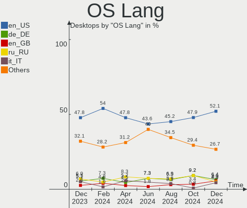
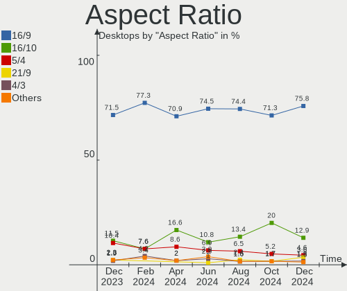
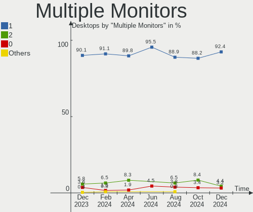
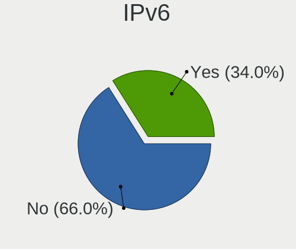
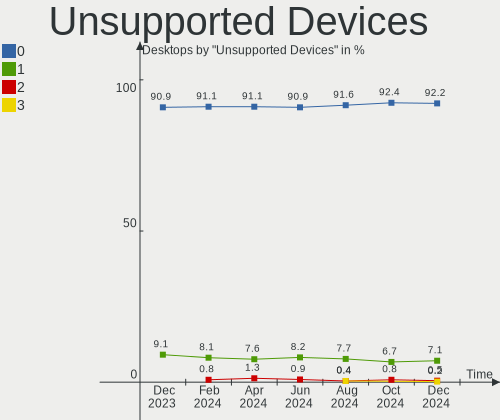

OpenMandriva Hardware Trends (Desktops)
---------------------------------------

A project to identify most popular hardware characteristics and track their change
over time based on data collected by OpenMandriva users at https://Linux-Hardware.org.

Anyone can contribute to this report by the [hw-probe](https://github.com/linuxhw/hw-probe) tool:

    sudo -E hw-probe -all -upload

Full-feature report is available here: https://linux-hardware.org/?view=trends

Period: Mar, 2022.

Contents
--------

* [ System ](#system)
  - [ OS                       ](#os)
  - [ OS Family                ](#os-family)
  - [ Kernel                   ](#kernel)
  - [ Kernel Family            ](#kernel-family)
  - [ Kernel Major Ver.        ](#kernel-major-ver)
  - [ Arch                     ](#arch)
  - [ DE                       ](#de)
  - [ Display Server           ](#display-server)
  - [ Display Manager          ](#display-manager)
  - [ OS Lang                  ](#os-lang)
  - [ Boot Mode                ](#boot-mode)
  - [ Filesystem               ](#filesystem)
  - [ Part. scheme             ](#part-scheme)
  - [ Dual Boot with Linux/BSD ](#dual-boot-with-linuxbsd)
  - [ Dual Boot (Win)          ](#dual-boot-win)

* [ Board ](#board)
  - [ Vendor                   ](#vendor)
  - [ Model                    ](#model)
  - [ Model Family             ](#model-family)
  - [ MFG Year                 ](#mfg-year)
  - [ Form Factor              ](#form-factor)
  - [ Secure Boot              ](#secure-boot)
  - [ Coreboot                 ](#coreboot)
  - [ RAM Size                 ](#ram-size)
  - [ RAM Used                 ](#ram-used)
  - [ Total Drives             ](#total-drives)
  - [ Has CD-ROM               ](#has-cd-rom)
  - [ Has Ethernet             ](#has-ethernet)
  - [ Has WiFi                 ](#has-wifi)
  - [ Has Bluetooth            ](#has-bluetooth)

* [ Location ](#location)
  - [ Country                  ](#country)
  - [ City                     ](#city)

* [ Drives ](#drives)
  - [ Drive Vendor             ](#drive-vendor)
  - [ Drive Model              ](#drive-model)
  - [ HDD Vendor               ](#hdd-vendor)
  - [ SSD Vendor               ](#ssd-vendor)
  - [ Drive Kind               ](#drive-kind)
  - [ Drive Connector          ](#drive-connector)
  - [ Drive Size               ](#drive-size)
  - [ Space Total              ](#space-total)
  - [ Space Used               ](#space-used)
  - [ Malfunc. Drives          ](#malfunc-drives)
  - [ Malfunc. Drive Vendor    ](#malfunc-drive-vendor)
  - [ Malfunc. HDD Vendor      ](#malfunc-hdd-vendor)
  - [ Malfunc. Drive Kind      ](#malfunc-drive-kind)
  - [ Failed Drives            ](#failed-drives)
  - [ Failed Drive Vendor      ](#failed-drive-vendor)
  - [ Drive Status             ](#drive-status)

* [ Storage controller ](#storage-controller)
  - [ Storage Vendor           ](#storage-vendor)
  - [ Storage Model            ](#storage-model)
  - [ Storage Kind             ](#storage-kind)

* [ Processor ](#processor)
  - [ CPU Vendor               ](#cpu-vendor)
  - [ CPU Model                ](#cpu-model)
  - [ CPU Model Family         ](#cpu-model-family)
  - [ CPU Cores                ](#cpu-cores)
  - [ CPU Sockets              ](#cpu-sockets)
  - [ CPU Threads              ](#cpu-threads)
  - [ CPU Op-Modes             ](#cpu-op-modes)
  - [ CPU Microcode            ](#cpu-microcode)
  - [ CPU Microarch            ](#cpu-microarch)

* [ Graphics ](#graphics)
  - [ GPU Vendor               ](#gpu-vendor)
  - [ GPU Model                ](#gpu-model)
  - [ GPU Combo                ](#gpu-combo)
  - [ GPU Driver               ](#gpu-driver)
  - [ GPU Memory               ](#gpu-memory)

* [ Monitor ](#monitor)
  - [ Monitor Vendor           ](#monitor-vendor)
  - [ Monitor Model            ](#monitor-model)
  - [ Monitor Resolution       ](#monitor-resolution)
  - [ Monitor Diagonal         ](#monitor-diagonal)
  - [ Monitor Width            ](#monitor-width)
  - [ Aspect Ratio             ](#aspect-ratio)
  - [ Monitor Area             ](#monitor-area)
  - [ Pixel Density            ](#pixel-density)
  - [ Multiple Monitors        ](#multiple-monitors)

* [ Network ](#network)
  - [ Net Controller Vendor    ](#net-controller-vendor)
  - [ Net Controller Model     ](#net-controller-model)
  - [ Wireless Vendor          ](#wireless-vendor)
  - [ Wireless Model           ](#wireless-model)
  - [ Ethernet Vendor          ](#ethernet-vendor)
  - [ Ethernet Model           ](#ethernet-model)
  - [ Net Controller Kind      ](#net-controller-kind)
  - [ Used Controller          ](#used-controller)
  - [ NICs                     ](#nics)
  - [ IPv6                     ](#ipv6)

* [ Bluetooth ](#bluetooth)
  - [ Bluetooth Vendor         ](#bluetooth-vendor)
  - [ Bluetooth Model          ](#bluetooth-model)

* [ Sound ](#sound)
  - [ Sound Vendor             ](#sound-vendor)
  - [ Sound Model              ](#sound-model)

* [ Memory ](#memory)
  - [ Memory Vendor            ](#memory-vendor)
  - [ Memory Model             ](#memory-model)
  - [ Memory Kind              ](#memory-kind)
  - [ Memory Form Factor       ](#memory-form-factor)
  - [ Memory Size              ](#memory-size)
  - [ Memory Speed             ](#memory-speed)

* [ Printers & scanners ](#printers--scanners)
  - [ Printer Vendor           ](#printer-vendor)
  - [ Printer Model            ](#printer-model)
  - [ Scanner Vendor           ](#scanner-vendor)
  - [ Scanner Model            ](#scanner-model)

* [ Camera ](#camera)
  - [ Camera Vendor            ](#camera-vendor)
  - [ Camera Model             ](#camera-model)

* [ Security ](#security)
  - [ Fingerprint Vendor       ](#fingerprint-vendor)
  - [ Fingerprint Model        ](#fingerprint-model)
  - [ Chipcard Vendor          ](#chipcard-vendor)
  - [ Chipcard Model           ](#chipcard-model)

* [ Unsupported ](#unsupported)
  - [ Unsupported Devices      ](#unsupported-devices)
  - [ Unsupported Device Types ](#unsupported-device-types)

System
------

OS
--

Installed operating systems

| Name             | Desktops | Percent |
|------------------|----------|---------|
| OpenMandriva 4.3 | 174      | 92.55%  |
| OpenMandriva 4.2 | 14       | 7.45%   |

OS Family
---------

OS without a version

| Name         | Desktops | Percent |
|--------------|----------|---------|
| OpenMandriva | 188      | 100%    |

Kernel
------

Version of the Linux kernel

| Version                  | Desktops | Percent |
|--------------------------|----------|---------|
| 5.16.7-desktop-1omv4003  | 171      | 90.96%  |
| 5.10.14-desktop-1omv4002 | 14       | 7.45%   |
| 5.16.5-desktop-2omv4003  | 1        | 0.53%   |
| 5.16.3-desktop-2omv4050  | 1        | 0.53%   |
| 5.16.13-desktop-1omv4003 | 1        | 0.53%   |

Kernel Family
-------------

Linux kernel without a distro release

| Version | Desktops | Percent |
|---------|----------|---------|
| 5.16.7  | 171      | 90.96%  |
| 5.10.14 | 14       | 7.45%   |
| 5.16.5  | 1        | 0.53%   |
| 5.16.3  | 1        | 0.53%   |
| 5.16.13 | 1        | 0.53%   |

Kernel Major Ver.
-----------------

Linux kernel major version

| Version | Desktops | Percent |
|---------|----------|---------|
| 5.16    | 174      | 92.55%  |
| 5.10    | 14       | 7.45%   |

Arch
----

OS architecture (x86_64, i586, etc.)

| Name   | Desktops | Percent |
|--------|----------|---------|
| x86_64 | 188      | 100%    |

DE
--

Desktop Environment

| Name | Desktops | Percent |
|------|----------|---------|
| KDE5 | 188      | 100%    |

Display Server
--------------

X11 or Wayland

| Name    | Desktops | Percent |
|---------|----------|---------|
| X11     | 186      | 98.94%  |
| Wayland | 2        | 1.06%   |

Display Manager
---------------

SDDM, LightDM, etc.

| Name | Desktops | Percent |
|------|----------|---------|
| SDDM | 188      | 100%    |

OS Lang
-------

Language

| Lang  | Desktops | Percent |
|-------|----------|---------|
| en_US | 93       | 49.47%  |
| de_DE | 15       | 7.98%   |
| en_IN | 14       | 7.45%   |
| ru_RU | 11       | 5.85%   |
| pt_BR | 8        | 4.26%   |
| fr_FR | 7        | 3.72%   |
| es_AR | 7        | 3.72%   |
| pl_PL | 4        | 2.13%   |
| it_IT | 4        | 2.13%   |
| es_MX | 4        | 2.13%   |
| nl_NL | 3        | 1.6%    |
| nb_NO | 3        | 1.6%    |
| tr_TR | 2        | 1.06%   |
| es_SV | 2        | 1.06%   |
| es_ES | 2        | 1.06%   |
| en_GB | 2        | 1.06%   |
| hu_HU | 1        | 0.53%   |
| fr_CA | 1        | 0.53%   |
| es_VE | 1        | 0.53%   |
| es_EC | 1        | 0.53%   |
| es_CR | 1        | 0.53%   |
| de_CH | 1        | 0.53%   |
| de_AT | 1        | 0.53%   |

Boot Mode
---------

EFI or BIOS

| Mode | Desktops | Percent |
|------|----------|---------|
| BIOS | 110      | 58.51%  |
| EFI  | 78       | 41.49%  |

Filesystem
----------

Type of filesystem

| Type    | Desktops | Percent |
|---------|----------|---------|
| Overlay | 147      | 78.19%  |
| Ext4    | 41       | 21.81%  |

Part. scheme
------------

Scheme of partitioning

| Type    | Desktops | Percent |
|---------|----------|---------|
| GPT     | 126      | 67.02%  |
| MBR     | 61       | 32.45%  |
| Unknown | 1        | 0.53%   |

Dual Boot with Linux/BSD
------------------------

Hosting more than one Linux/BSD

| Dual boot | Desktops | Percent |
|-----------|----------|---------|
| No        | 100      | 53.19%  |
| Yes       | 88       | 46.81%  |

Dual Boot (Win)
---------------

Hosting Linux and Windows

| Dual boot | Desktops | Percent |
|-----------|----------|---------|
| Yes       | 110      | 58.51%  |
| No        | 78       | 41.49%  |

Board
-----

Vendor
------

Motherboard manufacturer

| Name                | Desktops | Percent |
|---------------------|----------|---------|
| Gigabyte Technology | 51       | 27.13%  |
| ASUSTek Computer    | 46       | 24.47%  |
| MSI                 | 13       | 6.91%   |
| Dell                | 12       | 6.38%   |
| ASRock              | 12       | 6.38%   |
| Intel               | 10       | 5.32%   |
| Hewlett-Packard     | 10       | 5.32%   |
| Lenovo              | 8        | 4.26%   |
| Biostar             | 7        | 3.72%   |
| Pegatron            | 5        | 2.66%   |
| Acer                | 4        | 2.13%   |
| Foxconn             | 2        | 1.06%   |
| ONDA                | 1        | 0.53%   |
| MouseComputer       | 1        | 0.53%   |
| Medion              | 1        | 0.53%   |
| Login Informatica   | 1        | 0.53%   |
| Koloe               | 1        | 0.53%   |
| ECS                 | 1        | 0.53%   |
| Alienware           | 1        | 0.53%   |
| ABIT                | 1        | 0.53%   |

Model
-----

Motherboard model

| Name                                    | Desktops | Percent |
|-----------------------------------------|----------|---------|
| Gigabyte H410M H V3                     | 15       | 7.98%   |
| ASUS All Series                         | 6        | 3.19%   |
| ASUS M2R-FVM                            | 4        | 2.13%   |
| MSI MS-7721                             | 2        | 1.06%   |
| Gigabyte GA-78LMT-USB3 R2               | 2        | 1.06%   |
| Gigabyte B660 GAMING X DDR4             | 2        | 1.06%   |
| Dell OptiPlex XE                        | 2        | 1.06%   |
| Dell OptiPlex 380                       | 2        | 1.06%   |
| Pegatron SM 3322                        | 1        | 0.53%   |
| Pegatron p6-2003es                      | 1        | 0.53%   |
| Pegatron KN278AA-ABM a6430la            | 1        | 0.53%   |
| Pegatron IPMSB-GS                       | 1        | 0.53%   |
| Pegatron IPM41-D3                       | 1        | 0.53%   |
| ONDA A68V+                              | 1        | 0.53%   |
| MSI Z1-7641                             | 1        | 0.53%   |
| MSI p6730br                             | 1        | 0.53%   |
| MSI MS-7C56                             | 1        | 0.53%   |
| MSI MS-7B98                             | 1        | 0.53%   |
| MSI MS-7B84                             | 1        | 0.53%   |
| MSI MS-7865                             | 1        | 0.53%   |
| MSI MS-7817                             | 1        | 0.53%   |
| MSI MS-7388                             | 1        | 0.53%   |
| MSI Cubi N 8GL (MS-B171)                | 1        | 0.53%   |
| MSI Compaq dx2300 Microtower            | 1        | 0.53%   |
| MSI *NP                                 | 1        | 0.53%   |
| MouseComputer B85H3-M4                  | 1        | 0.53%   |
| Medion E62031                           | 1        | 0.53%   |
| Login Informatica LOG-H110M-G3          | 1        | 0.53%   |
| Lenovo ThinkStation P500 30A6S0JH00     | 1        | 0.53%   |
| Lenovo ThinkCentre M93p 10A8S0CE0H      | 1        | 0.53%   |
| Lenovo ThinkCentre M81 5049E7F          | 1        | 0.53%   |
| Lenovo ThinkCentre M73 10B4S0M800       | 1        | 0.53%   |
| Lenovo ThinkCentre M72e 3264AU3         | 1        | 0.53%   |
| Lenovo ThinkCentre M71e 3132B7M         | 1        | 0.53%   |
| Lenovo ThinkCentre E73 10DS000HUK       | 1        | 0.53%   |
| Lenovo IdeaCentre 510S-07ICB 90K8003YFR | 1        | 0.53%   |
| Koloe Thurley                           | 1        | 0.53%   |
| Intel H61 V1.05                         | 1        | 0.53%   |
| Intel H61                               | 1        | 0.53%   |
| Intel E4610                             | 1        | 0.53%   |
| Intel DP43TF AAE34878-403               | 1        | 0.53%   |
| Intel DH61WW AAG23116-303               | 1        | 0.53%   |
| Intel DH61WW AAG23116-204               | 1        | 0.53%   |
| Intel DH61BF AAG81311-101               | 1        | 0.53%   |
| Intel DH55TC AAE70932-206               | 1        | 0.53%   |
| Intel D945GCCR AAD78647-300             | 1        | 0.53%   |
| Intel D2500HN AAG34776-402              | 1        | 0.53%   |
| HP Z640 Workstation                     | 1        | 0.53%   |
| HP Z230 SFF Workstation                 | 1        | 0.53%   |
| HP ProDesk 600 G1 SFF                   | 1        | 0.53%   |
| HP Pavilion Desktop 590-a0xxx           | 1        | 0.53%   |
| HP EliteDesk 800 G4 DM 35W (Brazil)     | 1        | 0.53%   |
| HP Compaq dc7700 Small Form Factor      | 1        | 0.53%   |
| HP Compaq dc5750 Microtower             | 1        | 0.53%   |
| HP Compaq 8200 Elite SFF PC             | 1        | 0.53%   |
| HP 260-a135nf                           | 1        | 0.53%   |
| HP 110-212ef                            | 1        | 0.53%   |
| Gigabyte Z87P-D3                        | 1        | 0.53%   |
| Gigabyte Z87-D3HP                       | 1        | 0.53%   |
| Gigabyte Z590M GAMING X                 | 1        | 0.53%   |

Model Family
------------

Motherboard model prefix

| Name                           | Desktops | Percent |
|--------------------------------|----------|---------|
| Gigabyte H410M                 | 15       | 7.98%   |
| ASUS PRIME                     | 11       | 5.85%   |
| Dell OptiPlex                  | 8        | 4.26%   |
| Lenovo ThinkCentre             | 6        | 3.19%   |
| ASUS All                       | 6        | 3.19%   |
| ASUS M2R-FVM                   | 4        | 2.13%   |
| HP Compaq                      | 3        | 1.6%    |
| ASUS SABERTOOTH                | 3        | 1.6%    |
| ASUS P8H61-M                   | 3        | 1.6%    |
| ASUS M5A78L-M                  | 3        | 1.6%    |
| Acer Aspire                    | 3        | 1.6%    |
| MSI MS-7721                    | 2        | 1.06%   |
| Intel H61                      | 2        | 1.06%   |
| Intel DH61WW                   | 2        | 1.06%   |
| Gigabyte X570                  | 2        | 1.06%   |
| Gigabyte GA-78LMT-USB3         | 2        | 1.06%   |
| Gigabyte B660                  | 2        | 1.06%   |
| Gigabyte B560M                 | 2        | 1.06%   |
| Dell Inspiron                  | 2        | 1.06%   |
| Pegatron SM                    | 1        | 0.53%   |
| Pegatron p6-2003es             | 1        | 0.53%   |
| Pegatron KN278AA-ABM           | 1        | 0.53%   |
| Pegatron IPMSB-GS              | 1        | 0.53%   |
| Pegatron IPM41-D3              | 1        | 0.53%   |
| ONDA A68V+                     | 1        | 0.53%   |
| MSI Z1-7641                    | 1        | 0.53%   |
| MSI p6730br                    | 1        | 0.53%   |
| MSI MS-7C56                    | 1        | 0.53%   |
| MSI MS-7B98                    | 1        | 0.53%   |
| MSI MS-7B84                    | 1        | 0.53%   |
| MSI MS-7865                    | 1        | 0.53%   |
| MSI MS-7817                    | 1        | 0.53%   |
| MSI MS-7388                    | 1        | 0.53%   |
| MSI Cubi                       | 1        | 0.53%   |
| MSI Compaq                     | 1        | 0.53%   |
| MSI *NP                        | 1        | 0.53%   |
| MouseComputer B85H3-M4         | 1        | 0.53%   |
| Medion E62031                  | 1        | 0.53%   |
| Login Informatica LOG-H110M-G3 | 1        | 0.53%   |
| Lenovo ThinkStation            | 1        | 0.53%   |
| Lenovo IdeaCentre              | 1        | 0.53%   |
| Koloe Thurley                  | 1        | 0.53%   |
| Intel E4610                    | 1        | 0.53%   |
| Intel DP43TF                   | 1        | 0.53%   |
| Intel DH61BF                   | 1        | 0.53%   |
| Intel DH55TC                   | 1        | 0.53%   |
| Intel D945GCCR                 | 1        | 0.53%   |
| Intel D2500HN                  | 1        | 0.53%   |
| HP Z640                        | 1        | 0.53%   |
| HP Z230                        | 1        | 0.53%   |
| HP ProDesk                     | 1        | 0.53%   |
| HP Pavilion                    | 1        | 0.53%   |
| HP EliteDesk                   | 1        | 0.53%   |
| HP 260-a135nf                  | 1        | 0.53%   |
| HP 110-212ef                   | 1        | 0.53%   |
| Gigabyte Z87P-D3               | 1        | 0.53%   |
| Gigabyte Z87-D3HP              | 1        | 0.53%   |
| Gigabyte Z590M                 | 1        | 0.53%   |
| Gigabyte Z390                  | 1        | 0.53%   |
| Gigabyte X79-UD3               | 1        | 0.53%   |

MFG Year
--------

Motherboard manufacture year

| Year | Desktops | Percent |
|------|----------|---------|
| 2021 | 31       | 16.49%  |
| 2010 | 19       | 10.11%  |
| 2014 | 18       | 9.57%   |
| 2012 | 18       | 9.57%   |
| 2018 | 13       | 6.91%   |
| 2013 | 13       | 6.91%   |
| 2011 | 13       | 6.91%   |
| 2020 | 10       | 5.32%   |
| 2008 | 10       | 5.32%   |
| 2017 | 9        | 4.79%   |
| 2006 | 8        | 4.26%   |
| 2009 | 7        | 3.72%   |
| 2019 | 5        | 2.66%   |
| 2015 | 5        | 2.66%   |
| 2016 | 4        | 2.13%   |
| 2007 | 3        | 1.6%    |
| 2022 | 1        | 0.53%   |
| 2005 | 1        | 0.53%   |

Form Factor
-----------

Physical design of the computer

| Name    | Desktops | Percent |
|---------|----------|---------|
| Desktop | 188      | 100%    |

Secure Boot
-----------

Enabled or disabled

| State    | Desktops | Percent |
|----------|----------|---------|
| Disabled | 188      | 100%    |

Coreboot
--------

Have coreboot on board

| Used | Desktops | Percent |
|------|----------|---------|
| No   | 188      | 100%    |

RAM Size
--------

Total RAM memory

| Size in GB      | Desktops | Percent |
|-----------------|----------|---------|
| 4.01-8.0        | 54       | 28.72%  |
| 16.01-24.0      | 38       | 20.21%  |
| 8.01-16.0       | 33       | 17.55%  |
| 3.01-4.0        | 31       | 16.49%  |
| 32.01-64.0      | 14       | 7.45%   |
| 1.01-2.0        | 6        | 3.19%   |
| 2.01-3.0        | 4        | 2.13%   |
| 64.01-256.0     | 4        | 2.13%   |
| 24.01-32.0      | 3        | 1.6%    |
| More than 256.0 | 1        | 0.53%   |

RAM Used
--------

Used RAM memory

| Used GB  | Desktops | Percent |
|----------|----------|---------|
| 1.01-2.0 | 121      | 64.36%  |
| 0.51-1.0 | 45       | 23.94%  |
| 2.01-3.0 | 10       | 5.32%   |
| 0.01-0.5 | 8        | 4.26%   |
| 4.01-8.0 | 3        | 1.6%    |
| 3.01-4.0 | 1        | 0.53%   |

Total Drives
------------

Number of drives on board

| Drives | Desktops | Percent |
|--------|----------|---------|
| 1      | 94       | 50%     |
| 2      | 52       | 27.66%  |
| 3      | 20       | 10.64%  |
| 4      | 12       | 6.38%   |
| 5      | 4        | 2.13%   |
| 0      | 3        | 1.6%    |
| 9      | 1        | 0.53%   |
| 7      | 1        | 0.53%   |
| 6      | 1        | 0.53%   |

Has CD-ROM
----------

Has CD-ROM on board

| Presented | Desktops | Percent |
|-----------|----------|---------|
| Yes       | 96       | 51.06%  |
| No        | 92       | 48.94%  |

Has Ethernet
------------

Has Ethernet on board

| Presented | Desktops | Percent |
|-----------|----------|---------|
| Yes       | 182      | 96.81%  |
| No        | 6        | 3.19%   |

Has WiFi
--------

Has WiFi module

| Presented | Desktops | Percent |
|-----------|----------|---------|
| No        | 128      | 68.09%  |
| Yes       | 60       | 31.91%  |

Has Bluetooth
-------------

Has Bluetooth module

| Presented | Desktops | Percent |
|-----------|----------|---------|
| No        | 150      | 79.79%  |
| Yes       | 38       | 20.21%  |

Location
--------

Country
-------

Geographic location (country)

| Country     | Desktops | Percent |
|-------------|----------|---------|
| Germany     | 24       | 12.77%  |
| India       | 17       | 9.04%   |
| USA         | 14       | 7.45%   |
| Russia      | 14       | 7.45%   |
| Brazil      | 14       | 7.45%   |
| France      | 11       | 5.85%   |
| Poland      | 9        | 4.79%   |
| Argentina   | 7        | 3.72%   |
| Netherlands | 6        | 3.19%   |
| Mexico      | 5        | 2.66%   |
| Canada      | 5        | 2.66%   |
| Serbia      | 4        | 2.13%   |
| Norway      | 4        | 2.13%   |
| Australia   | 4        | 2.13%   |
| UK          | 3        | 1.6%    |
| Turkey      | 3        | 1.6%    |
| Italy       | 3        | 1.6%    |
| Venezuela   | 2        | 1.06%   |
| Uzbekistan  | 2        | 1.06%   |
| Spain       | 2        | 1.06%   |
| Malaysia    | 2        | 1.06%   |
| Japan       | 2        | 1.06%   |
| El Salvador | 2        | 1.06%   |
| Bolivia     | 2        | 1.06%   |
| Belarus     | 2        | 1.06%   |
| Austria     | 2        | 1.06%   |
| Thailand    | 1        | 0.53%   |
| Taiwan      | 1        | 0.53%   |
| Switzerland | 1        | 0.53%   |
| Sweden      | 1        | 0.53%   |
| Puerto Rico | 1        | 0.53%   |
| Portugal    | 1        | 0.53%   |
| Philippines | 1        | 0.53%   |
| Martinique  | 1        | 0.53%   |
| Libya       | 1        | 0.53%   |
| Indonesia   | 1        | 0.53%   |
| Hungary     | 1        | 0.53%   |
| Hong Kong   | 1        | 0.53%   |
| Honduras    | 1        | 0.53%   |
| Guatemala   | 1        | 0.53%   |
| Estonia     | 1        | 0.53%   |
| Egypt       | 1        | 0.53%   |
| Ecuador     | 1        | 0.53%   |
| Czechia     | 1        | 0.53%   |
| Costa Rica  | 1        | 0.53%   |
| Colombia    | 1        | 0.53%   |
| China       | 1        | 0.53%   |
| Azerbaijan  | 1        | 0.53%   |
| Algeria     | 1        | 0.53%   |

City
----

Geographic location (city)

| City                     | Desktops | Percent |
|--------------------------|----------|---------|
| Gonikoppal               | 14       | 7.45%   |
| Kristiansand             | 4        | 2.13%   |
| Buenos Aires             | 3        | 1.6%    |
| St Petersburg            | 2        | 1.06%   |
| San Marcos               | 2        | 1.06%   |
| Rochester                | 2        | 1.06%   |
| Okazaki                  | 2        | 1.06%   |
| Niterói                 | 2        | 1.06%   |
| Niš                     | 2        | 1.06%   |
| Munich                   | 2        | 1.06%   |
| Moscow                   | 2        | 1.06%   |
| Marseille                | 2        | 1.06%   |
| Lexington                | 2        | 1.06%   |
| Istanbul                 | 2        | 1.06%   |
| Córdoba                 | 2        | 1.06%   |
| Bergambacht              | 2        | 1.06%   |
| York                     | 1        | 0.53%   |
| Wuppertal                | 1        | 0.53%   |
| Wroclaw                  | 1        | 0.53%   |
| Westlake                 | 1        | 0.53%   |
| Warsaw                   | 1        | 0.53%   |
| Vologda                  | 1        | 0.53%   |
| Vladimir                 | 1        | 0.53%   |
| Vitebsk                  | 1        | 0.53%   |
| Vila do Conde            | 1        | 0.53%   |
| Vienna                   | 1        | 0.53%   |
| Venerque                 | 1        | 0.53%   |
| Vélizy-Villacoublay     | 1        | 0.53%   |
| Usol'ye-Sibirskoye       | 1        | 0.53%   |
| Uberaba                  | 1        | 0.53%   |
| Tripoli                  | 1        | 0.53%   |
| Toowong                  | 1        | 0.53%   |
| Tonbridge                | 1        | 0.53%   |
| Teresopolis              | 1        | 0.53%   |
| Tegucigalpa              | 1        | 0.53%   |
| Tashkent                 | 1        | 0.53%   |
| Strzyzow                 | 1        | 0.53%   |
| Stoneham                 | 1        | 0.53%   |
| Severodvinsk             | 1        | 0.53%   |
| Seattle                  | 1        | 0.53%   |
| Santa Cruz               | 1        | 0.53%   |
| Sankt Pölten            | 1        | 0.53%   |
| Sangerhausen             | 1        | 0.53%   |
| San Salvador             | 1        | 0.53%   |
| San José                | 1        | 0.53%   |
| Salvador                 | 1        | 0.53%   |
| Salerno                  | 1        | 0.53%   |
| Saint-Mathieu-de-Beloeil | 1        | 0.53%   |
| Saint-Georges            | 1        | 0.53%   |
| Rypin                    | 1        | 0.53%   |
| Rybnik                   | 1        | 0.53%   |
| Rosenfeld                | 1        | 0.53%   |
| Rosario                  | 1        | 0.53%   |
| Roosendaal               | 1        | 0.53%   |
| Rio de Janeiro           | 1        | 0.53%   |
| Ribeirao Pires           | 1        | 0.53%   |
| Rennes                   | 1        | 0.53%   |
| Raleigh                  | 1        | 0.53%   |
| Rakvere                  | 1        | 0.53%   |
| Quezon City              | 1        | 0.53%   |

Drives
------

Drive Vendor
------------

Hard drive vendors

| Vendor              | Desktops | Drives | Percent |
|---------------------|----------|--------|---------|
| Seagate             | 55       | 65     | 18.71%  |
| WDC                 | 52       | 63     | 17.69%  |
| Samsung Electronics | 41       | 62     | 13.95%  |
| Toshiba             | 24       | 28     | 8.16%   |
| A-DATA Technology   | 20       | 20     | 6.8%    |
| Kingston            | 15       | 15     | 5.1%    |
| Sandisk             | 14       | 16     | 4.76%   |
| Hitachi             | 12       | 13     | 4.08%   |
| Crucial             | 9        | 10     | 3.06%   |
| SK Hynix            | 4        | 4      | 1.36%   |
| MAXTOR              | 4        | 4      | 1.36%   |
| Apple               | 4        | 4      | 1.36%   |
| HGST                | 3        | 3      | 1.02%   |
| China               | 3        | 3      | 1.02%   |
| Apacer              | 3        | 3      | 1.02%   |
| XPG                 | 2        | 2      | 0.68%   |
| Phison              | 2        | 2      | 0.68%   |
| Patriot             | 2        | 2      | 0.68%   |
| Netac               | 2        | 2      | 0.68%   |
| Intel               | 2        | 2      | 0.68%   |
| Gigabyte Technology | 2        | 2      | 0.68%   |
| Zheino              | 1        | 1      | 0.34%   |
| WDC WDBA            | 1        | 1      | 0.34%   |
| Unknown             | 1        | 1      | 0.34%   |
| Team                | 1        | 1      | 0.34%   |
| RSH-339             | 1        | 1      | 0.34%   |
| PNY                 | 1        | 1      | 0.34%   |
| Phison Electronics  | 1        | 1      | 0.34%   |
| ORTIAL              | 1        | 1      | 0.34%   |
| OCZ                 | 1        | 1      | 0.34%   |
| LITEON              | 1        | 1      | 0.34%   |
| JMicron             | 1        | 1      | 0.34%   |
| IBM/Hitachi         | 1        | 1      | 0.34%   |
| HPE                 | 1        | 1      | 0.34%   |
| Hikvision           | 1        | 1      | 0.34%   |
| GOODRAM             | 1        | 2      | 0.34%   |
| Corsair             | 1        | 1      | 0.34%   |
| ASMT                | 1        | 1      | 0.34%   |
| AMD                 | 1        | 1      | 0.34%   |
| Unknown             | 1        | 1      | 0.34%   |

Drive Model
-----------

Hard drive models

| Model                             | Desktops | Percent |
|-----------------------------------|----------|---------|
| A-DATA SU750 256GB SSD            | 14       | 4.15%   |
| Toshiba DT01ACA100 1TB            | 6        | 1.78%   |
| Seagate ST500DM002-1BD142 500GB   | 6        | 1.78%   |
| Seagate ST1000DM010-2EP102 1TB    | 5        | 1.48%   |
| Samsung SSD 860 EVO 500GB         | 5        | 1.48%   |
| Kingston SA400S37120G 120GB SSD   | 5        | 1.48%   |
| WDC WD10EZEX-08WN4A0 1TB          | 4        | 1.19%   |
| Kingston SA400S37240G 240GB SSD   | 4        | 1.19%   |
| WDC WDS240G2G0A-00JH30 240GB SSD  | 3        | 0.89%   |
| Seagate ST3500413AS 500GB         | 3        | 0.89%   |
| Seagate ST2000DM001-1ER164 2TB    | 3        | 0.89%   |
| SanDisk SSD PLUS 240GB            | 3        | 0.89%   |
| Samsung SSD 970 EVO Plus 2TB      | 3        | 0.89%   |
| Samsung SSD 860 EVO 250GB         | 3        | 0.89%   |
| Samsung SSD 840 EVO 120GB         | 3        | 0.89%   |
| Samsung HD502HJ 500GB             | 3        | 0.89%   |
| Samsung HD322HJ 320GB             | 3        | 0.89%   |
| Samsung HD160JJ 160GB             | 3        | 0.89%   |
| Samsung HD103SJ 1TB               | 3        | 0.89%   |
| Apple HDD HTS541010A9E662 1TB     | 3        | 0.89%   |
| WDC WDS480G2G0A-00JH30 480GB SSD  | 2        | 0.59%   |
| WDC WDS240G2G0B-00EPW0 240GB SSD  | 2        | 0.59%   |
| WDC WD5000AAKX-75U6AA0 500GB      | 2        | 0.59%   |
| WDC WD20EZRZ-00Z5HB0 2TB          | 2        | 0.59%   |
| WDC WD10EARS-00Y5B1 1TB           | 2        | 0.59%   |
| Toshiba MK5075GSX 500GB           | 2        | 0.59%   |
| Toshiba HDWD130 3TB               | 2        | 0.59%   |
| Toshiba DT01ACA050 500GB          | 2        | 0.59%   |
| Seagate ST9500325AS 500GB         | 2        | 0.59%   |
| Seagate ST3500418AS 500GB         | 2        | 0.59%   |
| Seagate ST3160815AS 160GB         | 2        | 0.59%   |
| Seagate ST31000524AS 1TB          | 2        | 0.59%   |
| Seagate ST2000DM008-2FR102 2TB    | 2        | 0.59%   |
| Sandisk NVMe SSD Drive 500GB      | 2        | 0.59%   |
| SanDisk Extreme 55AE 1TB SSD      | 2        | 0.59%   |
| Samsung SSD 980 PRO 2TB           | 2        | 0.59%   |
| Samsung SSD 980 PRO 1TB           | 2        | 0.59%   |
| Samsung SSD 970 EVO Plus 1TB      | 2        | 0.59%   |
| Samsung SSD 870 EVO 4TB           | 2        | 0.59%   |
| Samsung SSD 870 EVO 1TB           | 2        | 0.59%   |
| Samsung HD161HJ 160GB             | 2        | 0.59%   |
| Netac SSD 128GB                   | 2        | 0.59%   |
| Hitachi HDS721050CLA362 500GB     | 2        | 0.59%   |
| Crucial CT1000P1SSD8 1TB          | 2        | 0.59%   |
| A-DATA SU650 120GB SSD            | 2        | 0.59%   |
| Zheino CHN 25SATAA3 120 120GB SSD | 1        | 0.3%    |
| XPG GAMMIX S50 Lite 1TB           | 1        | 0.3%    |
| XPG GAMMIX S11 Pro 256GB          | 1        | 0.3%    |
| WDC WDS500G2B0A 500GB SSD         | 1        | 0.3%    |
| WDC WDS250G3X0C-00SJG0 250GB      | 1        | 0.3%    |
| WDC WDS250G2B0A-00SM50 250GB SSD  | 1        | 0.3%    |
| WDC WDS120G2G0A-00JH30 120GB SSD  | 1        | 0.3%    |
| WDC WDBA 3V5000ANC-WRSN 500GB SSD | 1        | 0.3%    |
| WDC WD800JD-75MSA3 80GB           | 1        | 0.3%    |
| WDC WD800BD-08MRA1 80GB           | 1        | 0.3%    |
| WDC WD800AAJS-00PSA0 80GB         | 1        | 0.3%    |
| WDC WD7500BPVX-60JC3T0 752GB      | 1        | 0.3%    |
| WDC WD6400AAKS-65A7B2 640GB       | 1        | 0.3%    |
| WDC WD60EZRX-00MVLB1 6TB          | 1        | 0.3%    |
| WDC WD600BB-00DKA0 64GB           | 1        | 0.3%    |

HDD Vendor
----------

Hard disk drive vendors

| Vendor              | Desktops | Drives | Percent |
|---------------------|----------|--------|---------|
| Seagate             | 53       | 63     | 32.52%  |
| WDC                 | 42       | 52     | 25.77%  |
| Toshiba             | 23       | 27     | 14.11%  |
| Samsung Electronics | 18       | 21     | 11.04%  |
| Hitachi             | 12       | 13     | 7.36%   |
| MAXTOR              | 4        | 4      | 2.45%   |
| Apple               | 4        | 4      | 2.45%   |
| HGST                | 3        | 3      | 1.84%   |
| Unknown             | 1        | 1      | 0.61%   |
| RSH-339             | 1        | 1      | 0.61%   |
| IBM/Hitachi         | 1        | 1      | 0.61%   |
| HPE                 | 1        | 1      | 0.61%   |

SSD Vendor
----------

Solid state drive vendors

| Vendor              | Desktops | Drives | Percent |
|---------------------|----------|--------|---------|
| Samsung Electronics | 19       | 25     | 18.81%  |
| A-DATA Technology   | 19       | 19     | 18.81%  |
| Kingston            | 14       | 14     | 13.86%  |
| SanDisk             | 11       | 12     | 10.89%  |
| WDC                 | 10       | 10     | 9.9%    |
| Crucial             | 5        | 5      | 4.95%   |
| China               | 3        | 3      | 2.97%   |
| Netac               | 2        | 2      | 1.98%   |
| Gigabyte Technology | 2        | 2      | 1.98%   |
| Apacer              | 2        | 2      | 1.98%   |
| Zheino              | 1        | 1      | 0.99%   |
| WDC WDBA            | 1        | 1      | 0.99%   |
| Toshiba             | 1        | 1      | 0.99%   |
| Team                | 1        | 1      | 0.99%   |
| PNY                 | 1        | 1      | 0.99%   |
| Patriot             | 1        | 1      | 0.99%   |
| ORTIAL              | 1        | 1      | 0.99%   |
| OCZ                 | 1        | 1      | 0.99%   |
| Intel               | 1        | 1      | 0.99%   |
| Hikvision           | 1        | 1      | 0.99%   |
| GOODRAM             | 1        | 1      | 0.99%   |
| ASMT                | 1        | 1      | 0.99%   |
| AMD                 | 1        | 1      | 0.99%   |
| Unknown             | 1        | 1      | 0.99%   |

Drive Kind
----------

HDD or SSD

| Kind    | Desktops | Drives | Percent |
|---------|----------|--------|---------|
| HDD     | 130      | 191    | 51.18%  |
| SSD     | 90       | 108    | 35.43%  |
| NVMe    | 32       | 44     | 12.6%   |
| Unknown | 2        | 2      | 0.79%   |

Drive Connector
---------------

SATA, SAS, NVMe, etc.

| Type | Desktops | Drives | Percent |
|------|----------|--------|---------|
| SATA | 178      | 288    | 80.18%  |
| NVMe | 32       | 44     | 14.41%  |
| SAS  | 12       | 13     | 5.41%   |

Drive Size
----------

Size of hard drive

| Size in TB | Desktops | Drives | Percent |
|------------|----------|--------|---------|
| 0.01-0.5   | 140      | 186    | 58.58%  |
| 0.51-1.0   | 62       | 69     | 25.94%  |
| 1.01-2.0   | 18       | 21     | 7.53%   |
| 3.01-4.0   | 7        | 8      | 2.93%   |
| 2.01-3.0   | 7        | 8      | 2.93%   |
| 4.01-10.0  | 5        | 7      | 2.09%   |

Space Total
-----------

Amount of disk space available on the file system

| Size in GB     | Desktops | Percent |
|----------------|----------|---------|
| 1-20           | 78       | 41.49%  |
| Unknown        | 32       | 17.02%  |
| 101-250        | 24       | 12.77%  |
| 21-50          | 18       | 9.57%   |
| 251-500        | 17       | 9.04%   |
| 501-1000       | 7        | 3.72%   |
| 51-100         | 6        | 3.19%   |
| 1001-2000      | 3        | 1.6%    |
| More than 3000 | 2        | 1.06%   |
| 2001-3000      | 1        | 0.53%   |

Space Used
----------

Amount of used disk space

| Used GB   | Desktops | Percent |
|-----------|----------|---------|
| 1-20      | 141      | 75%     |
| Unknown   | 32       | 17.02%  |
| 501-1000  | 4        | 2.13%   |
| 101-250   | 3        | 1.6%    |
| 251-500   | 2        | 1.06%   |
| 21-50     | 2        | 1.06%   |
| 1001-2000 | 2        | 1.06%   |
| 51-100    | 2        | 1.06%   |

Malfunc. Drives
---------------

Drive models with a malfunction

| Model                             | Desktops | Drives | Percent |
|-----------------------------------|----------|--------|---------|
| Seagate ST9500325AS 500GB         | 2        | 2      | 2.74%   |
| Seagate ST500DM002-1BD142 500GB   | 2        | 2      | 2.74%   |
| Seagate ST3500418AS 500GB         | 2        | 2      | 2.74%   |
| Samsung Electronics HD502HJ 500GB | 2        | 2      | 2.74%   |
| Samsung Electronics HD322HJ 320GB | 2        | 2      | 2.74%   |
| Samsung Electronics HD160JJ 160GB | 2        | 2      | 2.74%   |
| WDC WDS240G2G0A-00JH30 240GB SSD  | 1        | 1      | 1.37%   |
| WDC WD800BD-08MRA1 80GB           | 1        | 1      | 1.37%   |
| WDC WD800AAJS-00PSA0 80GB         | 1        | 1      | 1.37%   |
| WDC WD600BB-00DKA0 64GB           | 1        | 1      | 1.37%   |
| WDC WD5000AAKX-603CA0 500GB       | 1        | 1      | 1.37%   |
| WDC WD5000AAKX-22ERMA0 500GB      | 1        | 1      | 1.37%   |
| WDC WD5000AAKX-08ERMA0 500GB      | 1        | 1      | 1.37%   |
| WDC WD5000AAJS-00YFA0 500GB       | 1        | 1      | 1.37%   |
| WDC WD3200AAKS-75L9A0 320GB       | 1        | 1      | 1.37%   |
| WDC WD3200AAKS-61L9A0 320GB       | 1        | 1      | 1.37%   |
| WDC WD3200AAJS-08L7A0 320GB       | 1        | 1      | 1.37%   |
| WDC WD3200A 320GB                 | 1        | 1      | 1.37%   |
| WDC WD30EFRX-68AX9N0 3TB          | 1        | 1      | 1.37%   |
| WDC WD2500AVJS-63B6A0 250GB       | 1        | 1      | 1.37%   |
| WDC WD20EZRZ-00Z5HB0 2TB          | 1        | 1      | 1.37%   |
| WDC WD20EFRX-68EUZN0 2TB          | 1        | 2      | 1.37%   |
| WDC WD1600AAJS-08WAA0 160GB       | 1        | 1      | 1.37%   |
| WDC WD10EARS-00Y5B1 1TB           | 1        | 1      | 1.37%   |
| WDC WD1001FALS-00J7B1 1TB         | 1        | 1      | 1.37%   |
| Toshiba MK6461GSY 640GB           | 1        | 1      | 1.37%   |
| Toshiba MK5075GSX 500GB           | 1        | 1      | 1.37%   |
| Toshiba MK3252GSX 320GB           | 1        | 1      | 1.37%   |
| Seagate STM3500418AS 500GB        | 1        | 1      | 1.37%   |
| Seagate ST95005620AS 500GB        | 1        | 1      | 1.37%   |
| Seagate ST9320325AS 320GB         | 1        | 1      | 1.37%   |
| Seagate ST9250414ASG 250GB        | 1        | 1      | 1.37%   |
| Seagate ST3500413AS 500GB         | 1        | 1      | 1.37%   |
| Seagate ST3500320AS 500GB         | 1        | 1      | 1.37%   |
| Seagate ST3160815AS 160GB         | 1        | 1      | 1.37%   |
| Seagate ST3160811AS 160GB         | 1        | 1      | 1.37%   |
| Seagate ST31000524AS 1TB          | 1        | 1      | 1.37%   |
| Seagate ST31000322CS 1TB          | 1        | 1      | 1.37%   |
| Seagate ST2000DX001-1CM164 2TB    | 1        | 1      | 1.37%   |
| Seagate ST2000DM001-1CH164 2TB    | 1        | 1      | 1.37%   |
| Seagate ST1500DL003-9VT16L 1TB    | 1        | 1      | 1.37%   |
| Seagate ST1000LM035-1RK172 1TB    | 1        | 1      | 1.37%   |
| Seagate ST1000LM010-9YH146 1TB    | 1        | 1      | 1.37%   |
| Seagate ST1000DM003-1SB10C 1TB    | 1        | 1      | 1.37%   |
| SanDisk SDSSDA240G 240GB          | 1        | 1      | 1.37%   |
| Samsung Electronics SP2504C 250GB | 1        | 1      | 1.37%   |
| Samsung Electronics HD503HI 500GB | 1        | 1      | 1.37%   |
| Samsung Electronics HD502HI 500GB | 1        | 1      | 1.37%   |
| Samsung Electronics HD161HJ 160GB | 1        | 1      | 1.37%   |
| Samsung Electronics HD103SJ 1TB   | 1        | 1      | 1.37%   |
| Samsung Electronics HD103SI 1TB   | 1        | 1      | 1.37%   |
| RSH-339 ASM1153E 1TB              | 1        | 1      | 1.37%   |
| MAXTOR STM3250310AS 250GB         | 1        | 1      | 1.37%   |
| MAXTOR STM3160215AS 160GB         | 1        | 1      | 1.37%   |
| MAXTOR 6Y160P0 164GB              | 1        | 1      | 1.37%   |
| Kingston SV300S37A120G 120GB SSD  | 1        | 1      | 1.37%   |
| Kingston SA400S37120G 120GB SSD   | 1        | 1      | 1.37%   |
| Intel SSDSC2CW120A3 120GB         | 1        | 1      | 1.37%   |
| IBM/Hitachi IC35L060AVER07-0 64GB | 1        | 1      | 1.37%   |
| HPE MB4000GCWDC 4TB               | 1        | 1      | 1.37%   |

Malfunc. Drive Vendor
---------------------

Vendors of faulty drives

| Vendor              | Desktops | Drives | Percent |
|---------------------|----------|--------|---------|
| Seagate             | 21       | 22     | 30.43%  |
| WDC                 | 17       | 20     | 24.64%  |
| Samsung Electronics | 11       | 12     | 15.94%  |
| Hitachi             | 4        | 4      | 5.8%    |
| Toshiba             | 3        | 3      | 4.35%   |
| MAXTOR              | 3        | 3      | 4.35%   |
| Kingston            | 2        | 2      | 2.9%    |
| Crucial             | 2        | 2      | 2.9%    |
| SanDisk             | 1        | 1      | 1.45%   |
| RSH-339             | 1        | 1      | 1.45%   |
| Intel               | 1        | 1      | 1.45%   |
| IBM/Hitachi         | 1        | 1      | 1.45%   |
| HPE                 | 1        | 1      | 1.45%   |
| HGST                | 1        | 1      | 1.45%   |

Malfunc. HDD Vendor
-------------------

Vendors of faulty HDD drives

| Vendor              | Desktops | Drives | Percent |
|---------------------|----------|--------|---------|
| Seagate             | 21       | 22     | 33.87%  |
| WDC                 | 16       | 19     | 25.81%  |
| Samsung Electronics | 11       | 12     | 17.74%  |
| Hitachi             | 4        | 4      | 6.45%   |
| Toshiba             | 3        | 3      | 4.84%   |
| MAXTOR              | 3        | 3      | 4.84%   |
| RSH-339             | 1        | 1      | 1.61%   |
| IBM/Hitachi         | 1        | 1      | 1.61%   |
| HPE                 | 1        | 1      | 1.61%   |
| HGST                | 1        | 1      | 1.61%   |

Malfunc. Drive Kind
-------------------

Kinds of faulty drives

| Kind | Desktops | Drives | Percent |
|------|----------|--------|---------|
| HDD  | 52       | 67     | 88.14%  |
| SSD  | 7        | 7      | 11.86%  |

Failed Drives
-------------

Failed drive models

| Model                           | Desktops | Drives | Percent |
|---------------------------------|----------|--------|---------|
| Apple HDD HTS541010A9E662 1TB   | 3        | 3      | 60%     |
| Samsung Electronics HD103SJ 1TB | 1        | 1      | 20%     |
| Hitachi HDS721010DLE630 1TB     | 1        | 1      | 20%     |

Failed Drive Vendor
-------------------

Failed drive vendors

| Vendor              | Desktops | Drives | Percent |
|---------------------|----------|--------|---------|
| Apple               | 3        | 3      | 60%     |
| Samsung Electronics | 1        | 1      | 20%     |
| Hitachi             | 1        | 1      | 20%     |

Drive Status
------------

Number of failed and malfunc. drives

| Status   | Desktops | Drives | Percent |
|----------|----------|--------|---------|
| Works    | 148      | 251    | 65.49%  |
| Malfunc  | 59       | 74     | 26.11%  |
| Detected | 14       | 15     | 6.19%   |
| Failed   | 5        | 5      | 2.21%   |

Storage controller
------------------

Storage Vendor
--------------

Storage controller vendors

| Vendor                        | Desktops | Percent |
|-------------------------------|----------|---------|
| Intel                         | 131      | 53.25%  |
| AMD                           | 53       | 21.54%  |
| Samsung Electronics           | 12       | 4.88%   |
| JMicron Technology            | 9        | 3.66%   |
| Phison Electronics            | 7        | 2.85%   |
| Sandisk                       | 5        | 2.03%   |
| ASMedia Technology            | 5        | 2.03%   |
| SK Hynix                      | 4        | 1.63%   |
| Micron/Crucial Technology     | 4        | 1.63%   |
| Marvell Technology Group      | 4        | 1.63%   |
| Nvidia                        | 3        | 1.22%   |
| ADATA Technology              | 2        | 0.81%   |
| VIA Technologies              | 1        | 0.41%   |
| Silicon Image                 | 1        | 0.41%   |
| Seagate Technology            | 1        | 0.41%   |
| Realtek Semiconductor         | 1        | 0.41%   |
| Lite-On Technology            | 1        | 0.41%   |
| Kingston Technology Company   | 1        | 0.41%   |
| Integrated Technology Express | 1        | 0.41%   |

Storage Model
-------------

Storage controller models

| Model                                                                                   | Desktops | Percent |
|-----------------------------------------------------------------------------------------|----------|---------|
| Intel NM10/ICH7 Family SATA Controller [IDE mode]                                       | 20       | 6.41%   |
| Intel 500 Series Chipset Family SATA AHCI Controller                                    | 20       | 6.41%   |
| AMD FCH SATA Controller [AHCI mode]                                                     | 20       | 6.41%   |
| Intel 8 Series/C220 Series Chipset Family 6-port SATA Controller 1 [AHCI mode]          | 18       | 5.77%   |
| Intel 82801G (ICH7 Family) IDE Controller                                               | 12       | 3.85%   |
| Intel 6 Series/C200 Series Chipset Family 6 port Desktop SATA AHCI Controller           | 12       | 3.85%   |
| AMD SB7x0/SB8x0/SB9x0 SATA Controller [AHCI mode]                                       | 10       | 3.21%   |
| AMD SB7x0/SB8x0/SB9x0 IDE Controller                                                    | 10       | 3.21%   |
| Intel SATA Controller [RAID mode]                                                       | 7        | 2.24%   |
| AMD SB600 Non-Raid-5 SATA                                                               | 7        | 2.24%   |
| AMD SB600 IDE                                                                           | 7        | 2.24%   |
| AMD FCH IDE Controller                                                                  | 7        | 2.24%   |
| AMD 400 Series Chipset SATA Controller                                                  | 7        | 2.24%   |
| Samsung NVMe SSD Controller SM981/PM981/PM983                                           | 6        | 1.92%   |
| JMicron JMB363 SATA/IDE Controller                                                      | 6        | 1.92%   |
| Intel 200 Series PCH SATA controller [AHCI mode]                                        | 6        | 1.92%   |
| Intel Cannon Lake PCH SATA AHCI Controller                                              | 5        | 1.6%    |
| Intel 6 Series/C200 Series Chipset Family Desktop SATA Controller (IDE mode, ports 4-5) | 5        | 1.6%    |
| Intel 6 Series/C200 Series Chipset Family Desktop SATA Controller (IDE mode, ports 0-3) | 5        | 1.6%    |
| ASMedia ASM1062 Serial ATA Controller                                                   | 5        | 1.6%    |
| AMD 500 Series Chipset SATA Controller                                                  | 5        | 1.6%    |
| Samsung NVMe SSD Controller PM9A1/PM9A3/980PRO                                          | 4        | 1.28%   |
| Intel Q170/Q150/B150/H170/H110/Z170/CM236 Chipset SATA Controller [AHCI Mode]           | 4        | 1.28%   |
| Intel Alder Lake-S PCH SATA Controller [AHCI Mode]                                      | 4        | 1.28%   |
| Intel 82801JI (ICH10 Family) 4 port SATA IDE Controller #1                              | 4        | 1.28%   |
| Intel 82801JI (ICH10 Family) 2 port SATA IDE Controller #2                              | 4        | 1.28%   |
| Intel 7 Series/C210 Series Chipset Family 6-port SATA Controller [AHCI mode]            | 4        | 1.28%   |
| AMD SB7x0/SB8x0/SB9x0 SATA Controller [IDE mode]                                        | 4        | 1.28%   |
| Intel 82801H (ICH8 Family) 4 port SATA Controller [IDE mode]                            | 3        | 0.96%   |
| Intel 5 Series/3400 Series Chipset 4 port SATA IDE Controller                           | 3        | 0.96%   |
| Intel 5 Series/3400 Series Chipset 2 port SATA IDE Controller                           | 3        | 0.96%   |
| AMD FCH SATA Controller [IDE mode]                                                      | 3        | 0.96%   |
| Sandisk WD Black 2018/SN750 / PC SN720 NVMe SSD                                         | 2        | 0.64%   |
| Samsung NVMe SSD Controller SM961/PM961/SM963                                           | 2        | 0.64%   |
| Phison PS5013 E13 NVMe Controller                                                       | 2        | 0.64%   |
| Phison E16 PCIe4 NVMe Controller                                                        | 2        | 0.64%   |
| Phison E12 NVMe Controller                                                              | 2        | 0.64%   |
| Nvidia MCP61 SATA Controller                                                            | 2        | 0.64%   |
| Nvidia MCP61 IDE                                                                        | 2        | 0.64%   |
| JMicron JMB368 IDE controller                                                           | 2        | 0.64%   |
| Intel Volume Management Device NVMe RAID Controller                                     | 2        | 0.64%   |
| Intel Celeron/Pentium Silver Processor SATA Controller                                  | 2        | 0.64%   |
| Intel 82801JI (ICH10 Family) SATA AHCI Controller                                       | 2        | 0.64%   |
| Intel 82801HR/HO/HH (ICH8R/DO/DH) 2 port SATA Controller [IDE mode]                     | 2        | 0.64%   |
| Intel 5 Series/3400 Series Chipset 6 port SATA AHCI Controller                          | 2        | 0.64%   |
| VIA VT6415 PATA IDE Host Controller                                                     | 1        | 0.32%   |
| SK Hynix SC300 512GB M.2 2280 SATA Solid State Drive                                    | 1        | 0.32%   |
| SK Hynix PC401 NVMe Solid State Drive 256GB                                             | 1        | 0.32%   |
| SK Hynix Gold P31 SSD                                                                   | 1        | 0.32%   |
| SK Hynix BC501 NVMe Solid State Drive                                                   | 1        | 0.32%   |
| Silicon Image SiI 3132 Serial ATA Raid II Controller                                    | 1        | 0.32%   |
| Seagate FireCuda 530 SSD                                                                | 1        | 0.32%   |
| Sandisk WD PC SN810 / Black SN850 NVMe SSD                                              | 1        | 0.32%   |
| Sandisk WD Blue SN570 NVMe SSD                                                          | 1        | 0.32%   |
| Sandisk WD Blue SN550 NVMe SSD                                                          | 1        | 0.32%   |
| Samsung NVMe SSD Controller 980                                                         | 1        | 0.32%   |
| Realtek Realtek Non-Volatile memory controller                                          | 1        | 0.32%   |
| Phison NVMe Storage Controller                                                          | 1        | 0.32%   |
| Nvidia CK804 Serial ATA Controller                                                      | 1        | 0.32%   |
| Nvidia CK804 IDE                                                                        | 1        | 0.32%   |

Storage Kind
------------

Kind of storage controller (IDE, SATA, NVMe, SAS, ...)

| Kind | Desktops | Percent |
|------|----------|---------|
| SATA | 140      | 55.56%  |
| IDE  | 69       | 27.38%  |
| NVMe | 32       | 12.7%   |
| RAID | 11       | 4.37%   |

Processor
---------

CPU Vendor
----------

Processor vendors

| Vendor | Desktops | Percent |
|--------|----------|---------|
| Intel  | 131      | 69.68%  |
| AMD    | 57       | 30.32%  |

CPU Model
---------

Processor models

| Model                                       | Desktops | Percent |
|---------------------------------------------|----------|---------|
| Intel Core i5-10400 CPU @ 2.90GHz           | 16       | 8.51%   |
| AMD Athlon 64 X2 Dual Core Processor 5400+  | 4        | 2.13%   |
| Intel Core i7-4790 CPU @ 3.60GHz            | 3        | 1.6%    |
| Intel Core i3-3220 CPU @ 3.30GHz            | 3        | 1.6%    |
| Intel Core i3-2120 CPU @ 3.30GHz            | 3        | 1.6%    |
| AMD Ryzen 5 3600 6-Core Processor           | 3        | 1.6%    |
| AMD FX-8350 Eight-Core Processor            | 3        | 1.6%    |
| AMD FX-4300 Quad-Core Processor             | 3        | 1.6%    |
| Intel Pentium Dual-Core CPU E5800 @ 3.20GHz | 2        | 1.06%   |
| Intel Pentium Dual-Core CPU E5400 @ 2.70GHz | 2        | 1.06%   |
| Intel Pentium CPU G3220 @ 3.00GHz           | 2        | 1.06%   |
| Intel Core i5-4570 CPU @ 3.20GHz            | 2        | 1.06%   |
| Intel Core i5-4440 CPU @ 3.10GHz            | 2        | 1.06%   |
| Intel Core i5-3470 CPU @ 3.20GHz            | 2        | 1.06%   |
| Intel Core i5 CPU 760 @ 2.80GHz             | 2        | 1.06%   |
| Intel Core i5 CPU 750 @ 2.67GHz             | 2        | 1.06%   |
| Intel Core i3-9100F CPU @ 3.60GHz           | 2        | 1.06%   |
| Intel Core i3-4150 CPU @ 3.50GHz            | 2        | 1.06%   |
| Intel Core i3-3240T CPU @ 2.90GHz           | 2        | 1.06%   |
| Intel Core i3 CPU 550 @ 3.20GHz             | 2        | 1.06%   |
| Intel Core 2 Quad CPU Q6600 @ 2.40GHz       | 2        | 1.06%   |
| Intel Core 2 Duo CPU E8500 @ 3.16GHz        | 2        | 1.06%   |
| Intel Core 2 Duo CPU E8400 @ 3.00GHz        | 2        | 1.06%   |
| Intel Core 2 Duo CPU E7400 @ 2.80GHz        | 2        | 1.06%   |
| Intel Core 2 CPU 6300 @ 1.86GHz             | 2        | 1.06%   |
| Intel 12th Gen Core i5-12400                | 2        | 1.06%   |
| Intel 11th Gen Core i5-11400 @ 2.60GHz      | 2        | 1.06%   |
| AMD Sempron 3850 APU with Radeon R3         | 2        | 1.06%   |
| AMD Athlon II X2 250 Processor              | 2        | 1.06%   |
| Intel Xeon CPU E5450 @ 3.00GHz              | 1        | 0.53%   |
| Intel Xeon CPU E5-2660 v4 @ 2.00GHz         | 1        | 0.53%   |
| Intel Xeon CPU E5-1620 v3 @ 3.50GHz         | 1        | 0.53%   |
| Intel Xeon CPU E3-1230 v3 @ 3.30GHz         | 1        | 0.53%   |
| Intel Pentium Dual-Core CPU E5700 @ 3.00GHz | 1        | 0.53%   |
| Intel Pentium Dual-Core CPU E5200 @ 2.50GHz | 1        | 0.53%   |
| Intel Pentium Dual CPU E2180 @ 2.00GHz      | 1        | 0.53%   |
| Intel Pentium CPU G630 @ 2.70GHz            | 1        | 0.53%   |
| Intel Pentium CPU G620 @ 2.60GHz            | 1        | 0.53%   |
| Intel Pentium CPU G3420 @ 3.20GHz           | 1        | 0.53%   |
| Intel Pentium CPU G3258 @ 3.20GHz           | 1        | 0.53%   |
| Intel Pentium CPU G2030 @ 3.00GHz           | 1        | 0.53%   |
| Intel Pentium CPU E5800 @ 3.20GHz           | 1        | 0.53%   |
| Intel Core i9-9900K CPU @ 3.60GHz           | 1        | 0.53%   |
| Intel Core i9-10940X CPU @ 3.30GHz          | 1        | 0.53%   |
| Intel Core i7-8700K CPU @ 3.70GHz           | 1        | 0.53%   |
| Intel Core i7-7700K CPU @ 4.20GHz           | 1        | 0.53%   |
| Intel Core i7-7700 CPU @ 3.60GHz            | 1        | 0.53%   |
| Intel Core i7-6700 CPU @ 3.40GHz            | 1        | 0.53%   |
| Intel Core i7-4820K CPU @ 3.70GHz           | 1        | 0.53%   |
| Intel Core i7-4770 CPU @ 3.40GHz            | 1        | 0.53%   |
| Intel Core i7-2600 CPU @ 3.40GHz            | 1        | 0.53%   |
| Intel Core i7-10700T CPU @ 2.00GHz          | 1        | 0.53%   |
| Intel Core i7 CPU 960 @ 3.20GHz             | 1        | 0.53%   |
| Intel Core i7 CPU 950 @ 3.07GHz             | 1        | 0.53%   |
| Intel Core i7 CPU 920 @ 2.67GHz             | 1        | 0.53%   |
| Intel Core i5-9600K CPU @ 3.70GHz           | 1        | 0.53%   |
| Intel Core i5-8500T CPU @ 2.10GHz           | 1        | 0.53%   |
| Intel Core i5-8400 CPU @ 2.80GHz            | 1        | 0.53%   |
| Intel Core i5-7400 CPU @ 3.00GHz            | 1        | 0.53%   |
| Intel Core i5-6400T CPU @ 2.20GHz           | 1        | 0.53%   |

CPU Model Family
----------------

Processor model prefix

| Model                   | Desktops | Percent |
|-------------------------|----------|---------|
| Intel Core i5           | 38       | 20.21%  |
| Intel Core i3           | 24       | 12.77%  |
| Intel Core i7           | 14       | 7.45%   |
| Other                   | 9        | 4.79%   |
| Intel Core 2 Duo        | 9        | 4.79%   |
| Intel Pentium           | 8        | 4.26%   |
| Intel Celeron           | 7        | 3.72%   |
| AMD Ryzen 5             | 7        | 3.72%   |
| AMD FX                  | 7        | 3.72%   |
| Intel Pentium Dual-Core | 6        | 3.19%   |
| Intel Core 2 Quad       | 5        | 2.66%   |
| AMD Athlon 64 X2        | 5        | 2.66%   |
| Intel Xeon              | 4        | 2.13%   |
| AMD Athlon II X2        | 4        | 2.13%   |
| AMD A6                  | 4        | 2.13%   |
| Intel Core 2            | 3        | 1.6%    |
| AMD Ryzen 7             | 3        | 1.6%    |
| AMD A8                  | 3        | 1.6%    |
| AMD A10                 | 3        | 1.6%    |
| Intel Core i9           | 2        | 1.06%   |
| AMD Sempron             | 2        | 1.06%   |
| AMD Ryzen 9             | 2        | 1.06%   |
| AMD Ryzen 3 PRO         | 2        | 1.06%   |
| AMD Athlon II X4        | 2        | 1.06%   |
| AMD Athlon              | 2        | 1.06%   |
| AMD A4                  | 2        | 1.06%   |
| Intel Pentium Dual      | 1        | 0.53%   |
| Intel Atom              | 1        | 0.53%   |
| AMD Ryzen 7 PRO         | 1        | 0.53%   |
| AMD Ryzen 3             | 1        | 0.53%   |
| AMD Phenom II X6        | 1        | 0.53%   |
| AMD Phenom II X4        | 1        | 0.53%   |
| AMD Phenom              | 1        | 0.53%   |
| AMD E2                  | 1        | 0.53%   |
| AMD E1                  | 1        | 0.53%   |
| AMD Athlon II X3        | 1        | 0.53%   |
| AMD Athlon 64           | 1        | 0.53%   |

CPU Cores
---------

Number of processor cores

| Number | Desktops | Percent |
|--------|----------|---------|
| 2      | 78       | 41.49%  |
| 4      | 58       | 30.85%  |
| 6      | 33       | 17.55%  |
| 8      | 7        | 3.72%   |
| 1      | 5        | 2.66%   |
| 14     | 2        | 1.06%   |
| 12     | 2        | 1.06%   |
| 3      | 2        | 1.06%   |
| 16     | 1        | 0.53%   |

CPU Sockets
-----------

Number of sockets

| Number | Desktops | Percent |
|--------|----------|---------|
| 1      | 188      | 100%    |

CPU Threads
-----------

Threads per core (Hyper-Threading)

| Number | Desktops | Percent |
|--------|----------|---------|
| 2      | 99       | 52.66%  |
| 1      | 89       | 47.34%  |

CPU Op-Modes
------------

CPU Operation Modes (32-bit, 64-bit)

| Op mode        | Desktops | Percent |
|----------------|----------|---------|
| 32-bit, 64-bit | 188      | 100%    |

CPU Microcode
-------------

Microcode number

| Number     | Desktops | Percent |
|------------|----------|---------|
| 0x306c3    | 19       | 10.11%  |
| 0xa0655    | 17       | 9.04%   |
| 0x1067a    | 17       | 9.04%   |
| 0x306a9    | 12       | 6.38%   |
| 0x206a7    | 9        | 4.79%   |
| Unknown    | 7        | 3.72%   |
| 0x06001119 | 6        | 3.19%   |
| 0xa0671    | 5        | 2.66%   |
| 0x906ea    | 5        | 2.66%   |
| 0x08701021 | 5        | 2.66%   |
| 0x906e9    | 4        | 2.13%   |
| 0x106e5    | 4        | 2.13%   |
| 0x6fd      | 3        | 1.6%    |
| 0x6fb      | 3        | 1.6%    |
| 0x506e3    | 3        | 1.6%    |
| 0x20655    | 3        | 1.6%    |
| 0x08101016 | 3        | 1.6%    |
| 0x0700010b | 3        | 1.6%    |
| 0x06003106 | 3        | 1.6%    |
| 0x0600081c | 3        | 1.6%    |
| 0xa0653    | 2        | 1.06%   |
| 0x906ec    | 2        | 1.06%   |
| 0x90675    | 2        | 1.06%   |
| 0x90672    | 2        | 1.06%   |
| 0x706a1    | 2        | 1.06%   |
| 0x6f2      | 2        | 1.06%   |
| 0x106a5    | 2        | 1.06%   |
| 0x10676    | 2        | 1.06%   |
| 0x08600106 | 2        | 1.06%   |
| 0x08108109 | 2        | 1.06%   |
| 0x0800820d | 2        | 1.06%   |
| 0x06000822 | 2        | 1.06%   |
| 0x03000027 | 2        | 1.06%   |
| 0x010000c8 | 2        | 1.06%   |
| 0x00000000 | 2        | 1.06%   |
| 0x906eb    | 1        | 0.53%   |
| 0x6f6      | 1        | 0.53%   |
| 0x50657    | 1        | 0.53%   |
| 0x406f1    | 1        | 0.53%   |
| 0x40651    | 1        | 0.53%   |
| 0x306f2    | 1        | 0.53%   |
| 0x306e4    | 1        | 0.53%   |
| 0x30678    | 1        | 0.53%   |
| 0x30661    | 1        | 0.53%   |
| 0x106a4    | 1        | 0.53%   |
| 0x10661    | 1        | 0.53%   |
| 0x0a50000c | 1        | 0.53%   |
| 0x0a201009 | 1        | 0.53%   |
| 0x08001137 | 1        | 0.53%   |
| 0x07030106 | 1        | 0.53%   |
| 0x07030105 | 1        | 0.53%   |
| 0x06000852 | 1        | 0.53%   |
| 0x0500010d | 1        | 0.53%   |
| 0x010000c6 | 1        | 0.53%   |
| 0x010000bf | 1        | 0.53%   |
| 0x010000b7 | 1        | 0.53%   |
| 0x010000b6 | 1        | 0.53%   |
| 0x01000095 | 1        | 0.53%   |
| 0x01000086 | 1        | 0.53%   |

CPU Microarch
-------------

Microarchitecture

| Name             | Desktops | Percent |
|------------------|----------|---------|
| Haswell          | 21       | 11.17%  |
| Penryn           | 19       | 10.11%  |
| CometLake        | 19       | 10.11%  |
| Piledriver       | 13       | 6.91%   |
| IvyBridge        | 13       | 6.91%   |
| KabyLake         | 12       | 6.38%   |
| K10              | 10       | 5.32%   |
| Core             | 10       | 5.32%   |
| SandyBridge      | 9        | 4.79%   |
| Zen 2            | 7        | 3.72%   |
| Nehalem          | 7        | 3.72%   |
| K8 Hammer        | 6        | 3.19%   |
| Icelake          | 5        | 2.66%   |
| Zen+             | 4        | 2.13%   |
| Zen              | 4        | 2.13%   |
| Skylake          | 4        | 2.13%   |
| Alderlake Hybrid | 4        | 2.13%   |
| Westmere         | 3        | 1.6%    |
| Steamroller      | 3        | 1.6%    |
| Jaguar           | 3        | 1.6%    |
| Zen 3            | 2        | 1.06%   |
| Puma             | 2        | 1.06%   |
| K10 Llano        | 2        | 1.06%   |
| Goldmont plus    | 2        | 1.06%   |
| Silvermont       | 1        | 0.53%   |
| Broadwell        | 1        | 0.53%   |
| Bonnell          | 1        | 0.53%   |
| Bobcat           | 1        | 0.53%   |

Graphics
--------

GPU Vendor
----------

Vendors of graphics cards

| Vendor | Desktops | Percent |
|--------|----------|---------|
| Intel  | 75       | 38.07%  |
| Nvidia | 66       | 33.5%   |
| AMD    | 56       | 28.43%  |

GPU Model
---------

Graphics card models

| Model                                                                       | Desktops | Percent |
|-----------------------------------------------------------------------------|----------|---------|
| Intel CometLake-S GT2 [UHD Graphics 630]                                    | 17       | 8.42%   |
| Intel Xeon E3-1200 v3/4th Gen Core Processor Integrated Graphics Controller | 11       | 5.45%   |
| Intel Xeon E3-1200 v2/3rd Gen Core processor Graphics Controller            | 9        | 4.46%   |
| Nvidia GT218 [GeForce 210]                                                  | 6        | 2.97%   |
| Nvidia GF108 [GeForce GT 630]                                               | 6        | 2.97%   |
| Nvidia GK208B [GeForce GT 710]                                              | 5        | 2.48%   |
| Intel 82G33/G31 Express Integrated Graphics Controller                      | 4        | 1.98%   |
| Intel 4 Series Chipset Integrated Graphics Controller                       | 4        | 1.98%   |
| Intel 2nd Generation Core Processor Family Integrated Graphics Controller   | 4        | 1.98%   |
| Nvidia GP107 [GeForce GTX 1050 Ti]                                          | 3        | 1.49%   |
| Nvidia GK208B [GeForce GT 730]                                              | 3        | 1.49%   |
| Intel VGA compatible controller                                             | 3        | 1.49%   |
| Intel HD Graphics 630                                                       | 3        | 1.49%   |
| Intel Core Processor Integrated Graphics Controller                         | 3        | 1.49%   |
| Intel CoffeeLake-S GT2 [UHD Graphics 630]                                   | 3        | 1.49%   |
| AMD Ellesmere [Radeon RX 470/480/570/570X/580/580X/590]                     | 3        | 1.49%   |
| Nvidia GP108 [GeForce GT 1030]                                              | 2        | 0.99%   |
| Nvidia GP104 [GeForce GTX 1080]                                             | 2        | 0.99%   |
| Nvidia GM206 [GeForce GTX 960]                                              | 2        | 0.99%   |
| Nvidia GF108 [GeForce GT 440]                                               | 2        | 0.99%   |
| Nvidia GA106 [GeForce RTX 3060 Lite Hash Rate]                              | 2        | 0.99%   |
| Nvidia G98 [GeForce 8400 GS Rev. 2]                                         | 2        | 0.99%   |
| Intel GeminiLake [UHD Graphics 600]                                         | 2        | 0.99%   |
| Intel 82Q963/Q965 Integrated Graphics Controller                            | 2        | 0.99%   |
| Intel 4th Generation Core Processor Family Integrated Graphics Controller   | 2        | 0.99%   |
| AMD RV710 [Radeon HD 4350/4550]                                             | 2        | 0.99%   |
| AMD RS780L [Radeon 3000]                                                    | 2        | 0.99%   |
| AMD Renoir                                                                  | 2        | 0.99%   |
| AMD Redwood PRO [Radeon HD 5550/5570/5630/6510/6610/7570]                   | 2        | 0.99%   |
| AMD Raven Ridge [Radeon Vega Series / Radeon Vega Mobile Series]            | 2        | 0.99%   |
| AMD Navi 23 [Radeon RX 6600/6600 XT/6600M]                                  | 2        | 0.99%   |
| AMD Navi 10 [Radeon RX 5600 OEM/5600 XT / 5700/5700 XT]                     | 2        | 0.99%   |
| AMD Kaveri [Radeon R7 Graphics]                                             | 2        | 0.99%   |
| AMD Kabini [Radeon HD 8280 / R3 Series]                                     | 2        | 0.99%   |
| AMD Cedar [Radeon HD 5000/6000/7350/8350 Series]                            | 2        | 0.99%   |
| Nvidia TU116 [GeForce GTX 1660 Ti]                                          | 1        | 0.5%    |
| Nvidia TU116 [GeForce GTX 1660 SUPER]                                       | 1        | 0.5%    |
| Nvidia TU116 [GeForce GTX 1650 SUPER]                                       | 1        | 0.5%    |
| Nvidia TU106 [GeForce RTX 2060 Rev. A]                                      | 1        | 0.5%    |
| Nvidia TU104 [GeForce RTX 2080 SUPER]                                       | 1        | 0.5%    |
| Nvidia NV44 [GeForce 6200 TurboCache]                                       | 1        | 0.5%    |
| Nvidia GT218 [GeForce 8400 GS Rev. 3]                                       | 1        | 0.5%    |
| Nvidia GT218 [GeForce 310]                                                  | 1        | 0.5%    |
| Nvidia GT216 [GeForce GT 220]                                               | 1        | 0.5%    |
| Nvidia GP106 [GeForce GTX 1060 3GB]                                         | 1        | 0.5%    |
| Nvidia GP104 [GeForce GTX 1070]                                             | 1        | 0.5%    |
| Nvidia GM204 [GeForce GTX 970]                                              | 1        | 0.5%    |
| Nvidia GM107GL [Quadro K2200]                                               | 1        | 0.5%    |
| Nvidia GM107 [GeForce GTX 750 Ti]                                           | 1        | 0.5%    |
| Nvidia GK208 [GeForce GT 630 Rev. 2]                                        | 1        | 0.5%    |
| Nvidia GK107 [GeForce GT 640]                                               | 1        | 0.5%    |
| Nvidia GK104 [GeForce GTX 760]                                              | 1        | 0.5%    |
| Nvidia GK104 [GeForce GTX 660 Ti]                                           | 1        | 0.5%    |
| Nvidia GF119 [GeForce GT 610]                                               | 1        | 0.5%    |
| Nvidia GF119 [GeForce GT 520]                                               | 1        | 0.5%    |
| Nvidia GF108GL [Quadro 600]                                                 | 1        | 0.5%    |
| Nvidia GF108 [GeForce GT 420]                                               | 1        | 0.5%    |
| Nvidia GF104 [GeForce GTX 460]                                              | 1        | 0.5%    |
| Nvidia GA102 [GeForce RTX 3090]                                             | 1        | 0.5%    |
| Nvidia G98 [GeForce 9300 GE]                                                | 1        | 0.5%    |

GPU Combo
---------

Combinations of graphics cards

| Name           | Desktops | Percent |
|----------------|----------|---------|
| 1 x Intel      | 67       | 35.64%  |
| 1 x Nvidia     | 60       | 31.91%  |
| 1 x AMD        | 49       | 26.06%  |
| 2 x AMD        | 4        | 2.13%   |
| Intel + Nvidia | 4        | 2.13%   |
| Intel + AMD    | 2        | 1.06%   |
| 2 x Nvidia     | 1        | 0.53%   |
| AMD + Nvidia   | 1        | 0.53%   |

GPU Driver
----------

Free vs proprietary

| Driver  | Desktops | Percent |
|---------|----------|---------|
| Free    | 183      | 97.34%  |
| Unknown | 5        | 2.66%   |

GPU Memory
----------

Total video memory

| Size in GB | Desktops | Percent |
|------------|----------|---------|
| Unknown    | 69       | 36.7%   |
| 1.01-2.0   | 32       | 17.02%  |
| 0.51-1.0   | 32       | 17.02%  |
| 0.01-0.5   | 29       | 15.43%  |
| 3.01-4.0   | 9        | 4.79%   |
| 7.01-8.0   | 8        | 4.26%   |
| 5.01-6.0   | 4        | 2.13%   |
| 2.01-3.0   | 2        | 1.06%   |
| 8.01-16.0  | 2        | 1.06%   |
| 16.01-24.0 | 1        | 0.53%   |

Monitor
-------

Monitor Vendor
--------------

Monitor vendors

| Vendor               | Desktops | Percent |
|----------------------|----------|---------|
| Dell                 | 32       | 16.84%  |
| Goldstar             | 31       | 16.32%  |
| Samsung Electronics  | 26       | 13.68%  |
| AOC                  | 16       | 8.42%   |
| Acer                 | 15       | 7.89%   |
| Hewlett-Packard      | 14       | 7.37%   |
| Philips              | 7        | 3.68%   |
| BenQ                 | 7        | 3.68%   |
| Ancor Communications | 6        | 3.16%   |
| NEC Computers        | 3        | 1.58%   |
| Iiyama               | 3        | 1.58%   |
| CVT                  | 3        | 1.58%   |
| ViewSonic            | 2        | 1.05%   |
| Orion                | 2        | 1.05%   |
| MStar                | 2        | 1.05%   |
| Mitsubishi           | 2        | 1.05%   |
| LLL                  | 2        | 1.05%   |
| Eizo                 | 2        | 1.05%   |
| ZLS                  | 1        | 0.53%   |
| Vestel Elektronik    | 1        | 0.53%   |
| Sony                 | 1        | 0.53%   |
| Sharp                | 1        | 0.53%   |
| RIS                  | 1        | 0.53%   |
| Panasonic            | 1        | 0.53%   |
| Packard Bell         | 1        | 0.53%   |
| Insignia             | 1        | 0.53%   |
| HKC                  | 1        | 0.53%   |
| HannStar             | 1        | 0.53%   |
| GDH                  | 1        | 0.53%   |
| Gateway              | 1        | 0.53%   |
| Denver               | 1        | 0.53%   |
| CHD                  | 1        | 0.53%   |
| Arnos Instruments    | 1        | 0.53%   |

Monitor Model
-------------

Monitor models

| Model                                                                   | Desktops | Percent |
|-------------------------------------------------------------------------|----------|---------|
| Dell D1918H DEL2005 1366x768 410x230mm 18.5-inch                        | 14       | 7.25%   |
| Samsung Electronics SyncMaster SAM0255 1680x1050 474x296mm 22.0-inch    | 4        | 2.07%   |
| Samsung Electronics C27F390 SAM0D32 1920x1080 598x336mm 27.0-inch       | 2        | 1.04%   |
| Philips PHL 273V7 PHLC156 1920x1080 598x336mm 27.0-inch                 | 2        | 1.04%   |
| MStar Demo MST0030 1920x540 1150x650mm 52.0-inch                        | 2        | 1.04%   |
| Mitsubishi RDT194S MEL4685 1280x1024 376x301mm 19.0-inch                | 2        | 1.04%   |
| LLL Monitor LLL0001 1366x768                                            | 2        | 1.04%   |
| Goldstar LX20D GSM4E4F 1600x1200 408x306mm 20.1-inch                    | 2        | 1.04%   |
| Goldstar FULL HD GSM5B55 1920x1080 480x270mm 21.7-inch                  | 2        | 1.04%   |
| CVT PHILCO CVT0001 1360x768                                             | 2        | 1.04%   |
| AOC 24P1W1 AOC2401 1920x1080 527x296mm 23.8-inch                        | 2        | 1.04%   |
| ZLS VMD-1951 ZLS1950 1600x900                                           | 1        | 0.52%   |
| ViewSonic VX2718-2KPC VSCB73A 2560x1440 598x336mm 27.0-inch             | 1        | 0.52%   |
| ViewSonic VX2478 Series VSCE032 2560x1440 526x296mm 23.8-inch           | 1        | 0.52%   |
| Vestel Elektronik 22W_LCD_TV VES3700 1920x540                           | 1        | 0.52%   |
| Sony TV SNY0801 1360x768                                                | 1        | 0.52%   |
| Sharp HDMI SHP101E 1920x540                                             | 1        | 0.52%   |
| Samsung Electronics U28D590 SAM0B81 3840x2160 608x345mm 27.5-inch       | 1        | 0.52%   |
| Samsung Electronics T24D391 SAM0B73 1920x1080 521x293mm 23.5-inch       | 1        | 0.52%   |
| Samsung Electronics SyncMaster SAM059A 1920x1080 477x268mm 21.5-inch    | 1        | 0.52%   |
| Samsung Electronics SyncMaster SAM0599 1600x900 443x249mm 20.0-inch     | 1        | 0.52%   |
| Samsung Electronics SyncMaster SAM049C 1920x1080 477x268mm 21.5-inch    | 1        | 0.52%   |
| Samsung Electronics SyncMaster SAM03F5 1920x1200                        | 1        | 0.52%   |
| Samsung Electronics SyncMaster SAM0013 1280x1024 376x301mm 19.0-inch    | 1        | 0.52%   |
| Samsung Electronics SMS19A100 SAM0867 1366x768 410x230mm 18.5-inch      | 1        | 0.52%   |
| Samsung Electronics SMBX2431 SAM0771 1920x1080 531x299mm 24.0-inch      | 1        | 0.52%   |
| Samsung Electronics SA300/SA350 SAM0793 1920x1080 531x299mm 24.0-inch   | 1        | 0.52%   |
| Samsung Electronics S24D330 SAM0D93 1920x1080 531x299mm 24.0-inch       | 1        | 0.52%   |
| Samsung Electronics S22F350 SAM0D1B 1920x1080 477x268mm 21.5-inch       | 1        | 0.52%   |
| Samsung Electronics S/T 71S STN0014 1280x1024 338x270mm 17.0-inch       | 1        | 0.52%   |
| Samsung Electronics LS24AG30x SAM7179 1920x1080 527x296mm 23.8-inch     | 1        | 0.52%   |
| Samsung Electronics LF22T35 SAM707B 1920x1080 477x268mm 21.5-inch       | 1        | 0.52%   |
| Samsung Electronics LCD Monitor SAM7040 3840x2160 1872x1053mm 84.6-inch | 1        | 0.52%   |
| Samsung Electronics LCD Monitor SAM0D4D 1366x768 609x347mm 27.6-inch    | 1        | 0.52%   |
| Samsung Electronics LCD Monitor SAM0C39 1920x1080 885x498mm 40.0-inch   | 1        | 0.52%   |
| Samsung Electronics LCD Monitor SAM0B30 1920x1080 1210x680mm 54.6-inch  | 1        | 0.52%   |
| Samsung Electronics LCD Monitor SAM0A7A 1920x1080 480x270mm 21.7-inch   | 1        | 0.52%   |
| Samsung Electronics LCD Monitor SAM0658 1920x1080 886x498mm 40.0-inch   | 1        | 0.52%   |
| Samsung Electronics C32F391 SAM0D35 1920x1080 698x393mm 31.5-inch       | 1        | 0.52%   |
| RIS V19aLm RIS0709 1360x768 410x230mm 18.5-inch                         | 1        | 0.52%   |
| Philips PHL 226E9Q PHLC17D 1920x1080 477x268mm 21.5-inch                | 1        | 0.52%   |
| Philips 273PQPY PHLC096 1920x1080 600x340mm 27.2-inch                   | 1        | 0.52%   |
| Philips 206V4 PHLC0B4 1600x900 443x249mm 20.0-inch                      | 1        | 0.52%   |
| Philips 197EL PHLC08B 1366x768 410x230mm 18.5-inch                      | 1        | 0.52%   |
| Philips 190S PHL082F 1280x1024 338x270mm 17.0-inch                      | 1        | 0.52%   |
| Panasonic TV MEIC313 1280x720 698x392mm 31.5-inch                       | 1        | 0.52%   |
| Packard Bell Maestro225DXL PKB02F2 1920x1080 477x268mm 21.5-inch        | 1        | 0.52%   |
| Orion ORION ORN1209 1920x1080                                           | 1        | 0.52%   |
| Orion ORION ORN1206 1920x540                                            | 1        | 0.52%   |
| NEC Computers LCD19WV NEC671C 1440x900 410x256mm 19.0-inch              | 1        | 0.52%   |
| NEC Computers EA244WMi NEC68D5 1920x1200 519x324mm 24.1-inch            | 1        | 0.52%   |
| NEC Computers AS191 NEC67C9 1280x1024 376x301mm 19.0-inch               | 1        | 0.52%   |
| Insignia 32DR420NA16 BBY3253 1920x1080 698x392mm 31.5-inch              | 1        | 0.52%   |
| Iiyama PL2530H IVM6132 1920x1080 544x303mm 24.5-inch                    | 1        | 0.52%   |
| Iiyama PL2409HD IVM560C 1920x1080 521x293mm 23.5-inch                   | 1        | 0.52%   |
| Iiyama PL2282H IVM5632 1920x1080 476x268mm 21.5-inch                    | 1        | 0.52%   |
| HKC GX32 HKC32A7 1920x1080 698x393mm 31.5-inch                          | 1        | 0.52%   |
| Hewlett-Packard w2207 HWP26A9 1680x1050 473x296mm 22.0-inch             | 1        | 0.52%   |
| Hewlett-Packard V272 HWP328E 1920x1080 598x336mm 27.0-inch              | 1        | 0.52%   |
| Hewlett-Packard P222va HWP322C 1920x1080 477x268mm 21.5-inch            | 1        | 0.52%   |

Monitor Resolution
------------------

Monitor screen resolution

| Resolution         | Desktops | Percent |
|--------------------|----------|---------|
| 1920x1080 (FHD)    | 75       | 40.54%  |
| 1366x768 (WXGA)    | 22       | 11.89%  |
| 1280x1024 (SXGA)   | 22       | 11.89%  |
| 1680x1050 (WSXGA+) | 14       | 7.57%   |
| 2560x1440 (QHD)    | 10       | 5.41%   |
| 3840x2160 (4K)     | 8        | 4.32%   |
| 1440x900 (WXGA+)   | 7        | 3.78%   |
| 1920x1200 (WUXGA)  | 6        | 3.24%   |
| 1600x900 (HD+)     | 6        | 3.24%   |
| 1600x1200          | 4        | 2.16%   |
| 1360x768           | 3        | 1.62%   |
| 2560x1080          | 2        | 1.08%   |
| 1920x540           | 2        | 1.08%   |
| 1024x768 (XGA)     | 2        | 1.08%   |
| 3440x1440          | 1        | 0.54%   |
| 1280x720 (HD)      | 1        | 0.54%   |

Monitor Diagonal
----------------

Diagonal size in inches

| Inches  | Desktops | Percent |
|---------|----------|---------|
| 21      | 23       | 12.23%  |
| 18      | 23       | 12.23%  |
| 27      | 22       | 11.7%   |
| 19      | 21       | 11.17%  |
| 24      | 20       | 10.64%  |
| 23      | 19       | 10.11%  |
| 22      | 12       | 6.38%   |
| 20      | 8        | 4.26%   |
| 31      | 6        | 3.19%   |
| 17      | 6        | 3.19%   |
| 39      | 4        | 2.13%   |
| 34      | 4        | 2.13%   |
| 15      | 4        | 2.13%   |
| Unknown | 3        | 1.6%    |
| 84      | 2        | 1.06%   |
| 72      | 2        | 1.06%   |
| 52      | 2        | 1.06%   |
| 54      | 1        | 0.53%   |
| 48      | 1        | 0.53%   |
| 47      | 1        | 0.53%   |
| 40      | 1        | 0.53%   |
| 37      | 1        | 0.53%   |
| 32      | 1        | 0.53%   |
| 25      | 1        | 0.53%   |

Monitor Width
-------------

Physical width

| Width in mm | Desktops | Percent |
|-------------|----------|---------|
| 401-500     | 70       | 37.43%  |
| 501-600     | 58       | 31.02%  |
| 351-400     | 17       | 9.09%   |
| 301-350     | 10       | 5.35%   |
| 601-700     | 9        | 4.81%   |
| 801-900     | 6        | 3.21%   |
| 701-800     | 5        | 2.67%   |
| 1001-1500   | 5        | 2.67%   |
| 1501-2000   | 4        | 2.14%   |
| Unknown     | 3        | 1.6%    |

Aspect Ratio
------------

Proportional relationship between the width and the height

| Ratio | Desktops | Percent |
|-------|----------|---------|
| 16/9  | 122      | 67.03%  |
| 16/10 | 28       | 15.38%  |
| 5/4   | 21       | 11.54%  |
| 4/3   | 6        | 3.3%    |
| 21/9  | 3        | 1.65%   |
| 6/5   | 1        | 0.55%   |
| 3/2   | 1        | 0.55%   |

Monitor Area
------------

Area in inch²

| Area in inch² | Desktops | Percent |
|----------------|----------|---------|
| 201-250        | 61       | 32.45%  |
| 151-200        | 35       | 18.62%  |
| 141-150        | 27       | 14.36%  |
| 301-350        | 22       | 11.7%   |
| 351-500        | 10       | 5.32%   |
| 251-300        | 10       | 5.32%   |
| More than 1000 | 8        | 4.26%   |
| 501-1000       | 8        | 4.26%   |
| 101-110        | 4        | 2.13%   |
| Unknown        | 3        | 1.6%    |

Pixel Density
-------------

Pixels per inch

| Density | Desktops | Percent |
|---------|----------|---------|
| 51-100  | 136      | 74.73%  |
| 101-120 | 28       | 15.38%  |
| 1-50    | 10       | 5.49%   |
| 121-160 | 4        | 2.2%    |
| Unknown | 3        | 1.65%   |
| 161-240 | 1        | 0.55%   |

Multiple Monitors
-----------------

Total monitors connected

| Total | Desktops | Percent |
|-------|----------|---------|
| 1     | 172      | 91.49%  |
| 2     | 14       | 7.45%   |
| 4     | 1        | 0.53%   |
| 0     | 1        | 0.53%   |

Network
-------

Net Controller Vendor
---------------------

Controller vendors

| Vendor                          | Desktops | Percent |
|---------------------------------|----------|---------|
| Realtek Semiconductor           | 130      | 53.94%  |
| Intel                           | 52       | 21.58%  |
| Qualcomm Atheros                | 16       | 6.64%   |
| Ralink Technology               | 7        | 2.9%    |
| Broadcom                        | 5        | 2.07%   |
| NetGear                         | 4        | 1.66%   |
| Motorola PCS                    | 4        | 1.66%   |
| TP-Link                         | 3        | 1.24%   |
| Ralink                          | 3        | 1.24%   |
| Marvell Technology Group        | 3        | 1.24%   |
| Qualcomm Atheros Communications | 2        | 0.83%   |
| Nvidia                          | 2        | 0.83%   |
| D-Link                          | 2        | 0.83%   |
| Aquantia                        | 2        | 0.83%   |
| Xiaomi                          | 1        | 0.41%   |
| Samsung Electronics             | 1        | 0.41%   |
| MediaTek                        | 1        | 0.41%   |
| D-Link System                   | 1        | 0.41%   |
| Broadcom Limited                | 1        | 0.41%   |
| ASUSTek Computer                | 1        | 0.41%   |

Net Controller Model
--------------------

Controller models

| Model                                                             | Desktops | Percent |
|-------------------------------------------------------------------|----------|---------|
| Realtek RTL8111/8168/8411 PCI Express Gigabit Ethernet Controller | 100      | 38.46%  |
| Realtek RTL810xE PCI Express Fast Ethernet controller             | 14       | 5.38%   |
| Realtek RTL8125 2.5GbE Controller                                 | 5        | 1.92%   |
| Ralink MT7601U Wireless Adapter                                   | 5        | 1.92%   |
| Intel I211 Gigabit Network Connection                             | 5        | 1.92%   |
| Intel Ethernet Connection I217-LM                                 | 5        | 1.92%   |
| NetGear A6100 AC600 DB Wireless Adapter [Realtek RTL8811AU]       | 4        | 1.54%   |
| Motorola PCS moto g power (2021)                                  | 4        | 1.54%   |
| Intel Wireless-AC 9260                                            | 4        | 1.54%   |
| Intel Wi-Fi 6 AX200                                               | 4        | 1.54%   |
| Intel 82579V Gigabit Network Connection                           | 4        | 1.54%   |
| Broadcom NetLink BCM57780 Gigabit Ethernet PCIe                   | 4        | 1.54%   |
| Realtek RTL-8100/8101L/8139 PCI Fast Ethernet Adapter             | 3        | 1.15%   |
| Qualcomm Atheros AR9485 Wireless Network Adapter                  | 3        | 1.15%   |
| Marvell Group 88E8056 PCI-E Gigabit Ethernet Controller           | 3        | 1.15%   |
| Intel Wireless 7260                                               | 3        | 1.15%   |
| Intel Ethernet Controller I225-V                                  | 3        | 1.15%   |
| Intel 82579LM Gigabit Network Connection (Lewisville)             | 3        | 1.15%   |
| TP-Link TL-WN821N v5/v6 [RTL8192EU]                               | 2        | 0.77%   |
| Realtek RTL8192EE PCIe Wireless Network Adapter                   | 2        | 0.77%   |
| Realtek RTL-8110SC/8169SC Gigabit Ethernet                        | 2        | 0.77%   |
| Ralink RT3090 Wireless 802.11n 1T/1R PCIe                         | 2        | 0.77%   |
| Qualcomm Atheros AR9271 802.11n                                   | 2        | 0.77%   |
| Qualcomm Atheros AR9287 Wireless Network Adapter (PCI-Express)    | 2        | 0.77%   |
| Qualcomm Atheros AR8121/AR8113/AR8114 Gigabit or Fast Ethernet    | 2        | 0.77%   |
| Qualcomm Atheros AR5212/5213/2414 Wireless Network Adapter        | 2        | 0.77%   |
| Intel Wireless 7265                                               | 2        | 0.77%   |
| Intel Ethernet Connection (7) I219-V                              | 2        | 0.77%   |
| Intel Ethernet Connection (2) I219-V                              | 2        | 0.77%   |
| Intel Ethernet Connection (2) I218-LM                             | 2        | 0.77%   |
| Intel Dual Band Wireless-AC 3168NGW [Stone Peak]                  | 2        | 0.77%   |
| Intel 82578DC Gigabit Network Connection                          | 2        | 0.77%   |
| Intel 82567V-2 Gigabit Network Connection                         | 2        | 0.77%   |
| Intel 82566DM Gigabit Network Connection                          | 2        | 0.77%   |
| Broadcom NetXtreme BCM5761 Gigabit Ethernet PCIe                  | 2        | 0.77%   |
| Xiaomi Mi/Redmi series (RNDIS)                                    | 1        | 0.38%   |
| TP-Link Archer T2U PLUS [RTL8821AU]                               | 1        | 0.38%   |
| Samsung Galaxy series, misc. (tethering mode)                     | 1        | 0.38%   |
| Realtek USB 10/100 LAN                                            | 1        | 0.38%   |
| Realtek RTL8821CE 802.11ac PCIe Wireless Network Adapter          | 1        | 0.38%   |
| Realtek RTL8821AE 802.11ac PCIe Wireless Network Adapter          | 1        | 0.38%   |
| Realtek RTL8723BU 802.11b/g/n WLAN Adapter                        | 1        | 0.38%   |
| Realtek RTL8723BE PCIe Wireless Network Adapter                   | 1        | 0.38%   |
| Realtek RTL8192CU 802.11n WLAN Adapter                            | 1        | 0.38%   |
| Realtek RTL8188EUS 802.11n Wireless Network Adapter               | 1        | 0.38%   |
| Realtek RTL8188CUS 802.11n WLAN Adapter                           | 1        | 0.38%   |
| Realtek RTL8188CE 802.11b/g/n WiFi Adapter                        | 1        | 0.38%   |
| Realtek RTL8169 PCI Gigabit Ethernet Controller                   | 1        | 0.38%   |
| Realtek RTL8153 Gigabit Ethernet Adapter                          | 1        | 0.38%   |
| Realtek Killer E2600 Gigabit Ethernet Controller                  | 1        | 0.38%   |
| Realtek 802.11ac NIC                                              | 1        | 0.38%   |
| Ralink RT5370 Wireless Adapter                                    | 1        | 0.38%   |
| Ralink RT2870/RT3070 Wireless Adapter                             | 1        | 0.38%   |
| Ralink RT3060 Wireless 802.11n 1T/1R                              | 1        | 0.38%   |
| Qualcomm Atheros QCA9565 / AR9565 Wireless Network Adapter        | 1        | 0.38%   |
| Qualcomm Atheros QCA9377 802.11ac Wireless Network Adapter        | 1        | 0.38%   |
| Qualcomm Atheros QCA8171 Gigabit Ethernet                         | 1        | 0.38%   |
| Qualcomm Atheros Killer E2500 Gigabit Ethernet Controller         | 1        | 0.38%   |
| Qualcomm Atheros Attansic L2 Fast Ethernet                        | 1        | 0.38%   |
| Qualcomm Atheros AR93xx Wireless Network Adapter                  | 1        | 0.38%   |

Wireless Vendor
---------------

Wireless vendors

| Vendor                          | Desktops | Percent |
|---------------------------------|----------|---------|
| Intel                           | 18       | 28.57%  |
| Realtek Semiconductor           | 11       | 17.46%  |
| Qualcomm Atheros                | 11       | 17.46%  |
| Ralink Technology               | 7        | 11.11%  |
| NetGear                         | 4        | 6.35%   |
| TP-Link                         | 3        | 4.76%   |
| Ralink                          | 3        | 4.76%   |
| Qualcomm Atheros Communications | 2        | 3.17%   |
| D-Link                          | 2        | 3.17%   |
| MediaTek                        | 1        | 1.59%   |
| ASUSTek Computer                | 1        | 1.59%   |

Wireless Model
--------------

Wireless models

| Model                                                          | Desktops | Percent |
|----------------------------------------------------------------|----------|---------|
| Ralink MT7601U Wireless Adapter                                | 5        | 7.94%   |
| NetGear A6100 AC600 DB Wireless Adapter [Realtek RTL8811AU]    | 4        | 6.35%   |
| Intel Wireless-AC 9260                                         | 4        | 6.35%   |
| Intel Wi-Fi 6 AX200                                            | 4        | 6.35%   |
| Qualcomm Atheros AR9485 Wireless Network Adapter               | 3        | 4.76%   |
| Intel Wireless 7260                                            | 3        | 4.76%   |
| TP-Link TL-WN821N v5/v6 [RTL8192EU]                            | 2        | 3.17%   |
| Realtek RTL8192EE PCIe Wireless Network Adapter                | 2        | 3.17%   |
| Ralink RT3090 Wireless 802.11n 1T/1R PCIe                      | 2        | 3.17%   |
| Qualcomm Atheros AR9271 802.11n                                | 2        | 3.17%   |
| Qualcomm Atheros AR9287 Wireless Network Adapter (PCI-Express) | 2        | 3.17%   |
| Qualcomm Atheros AR5212/5213/2414 Wireless Network Adapter     | 2        | 3.17%   |
| Intel Wireless 7265                                            | 2        | 3.17%   |
| Intel Dual Band Wireless-AC 3168NGW [Stone Peak]               | 2        | 3.17%   |
| TP-Link Archer T2U PLUS [RTL8821AU]                            | 1        | 1.59%   |
| Realtek RTL8821CE 802.11ac PCIe Wireless Network Adapter       | 1        | 1.59%   |
| Realtek RTL8821AE 802.11ac PCIe Wireless Network Adapter       | 1        | 1.59%   |
| Realtek RTL8723BU 802.11b/g/n WLAN Adapter                     | 1        | 1.59%   |
| Realtek RTL8723BE PCIe Wireless Network Adapter                | 1        | 1.59%   |
| Realtek RTL8192CU 802.11n WLAN Adapter                         | 1        | 1.59%   |
| Realtek RTL8188EUS 802.11n Wireless Network Adapter            | 1        | 1.59%   |
| Realtek RTL8188CUS 802.11n WLAN Adapter                        | 1        | 1.59%   |
| Realtek RTL8188CE 802.11b/g/n WiFi Adapter                     | 1        | 1.59%   |
| Realtek 802.11ac NIC                                           | 1        | 1.59%   |
| Ralink RT5370 Wireless Adapter                                 | 1        | 1.59%   |
| Ralink RT2870/RT3070 Wireless Adapter                          | 1        | 1.59%   |
| Ralink RT3060 Wireless 802.11n 1T/1R                           | 1        | 1.59%   |
| Qualcomm Atheros QCA9565 / AR9565 Wireless Network Adapter     | 1        | 1.59%   |
| Qualcomm Atheros QCA9377 802.11ac Wireless Network Adapter     | 1        | 1.59%   |
| Qualcomm Atheros AR93xx Wireless Network Adapter               | 1        | 1.59%   |
| Qualcomm Atheros AR9227 Wireless Network Adapter               | 1        | 1.59%   |
| MediaTek MT7612U 802.11a/b/g/n/ac Wireless Adapter             | 1        | 1.59%   |
| Intel Tiger Lake PCH CNVi WiFi                                 | 1        | 1.59%   |
| Intel Dual Band Wireless-AC 3165 Plus Bluetooth                | 1        | 1.59%   |
| Intel Comet Lake PCH CNVi WiFi                                 | 1        | 1.59%   |
| D-Link DWA-123 Wireless N 150 Adapter (rev.D1)                 | 1        | 1.59%   |
| D-Link 802.11n WLAN Adapter                                    | 1        | 1.59%   |
| ASUS 802.11n Network Adapter                                   | 1        | 1.59%   |

Ethernet Vendor
---------------

Ethernet vendors

| Vendor                   | Desktops | Percent |
|--------------------------|----------|---------|
| Realtek Semiconductor    | 127      | 66.84%  |
| Intel                    | 41       | 21.58%  |
| Qualcomm Atheros         | 6        | 3.16%   |
| Broadcom                 | 5        | 2.63%   |
| Marvell Technology Group | 3        | 1.58%   |
| Nvidia                   | 2        | 1.05%   |
| Aquantia                 | 2        | 1.05%   |
| Xiaomi                   | 1        | 0.53%   |
| Samsung Electronics      | 1        | 0.53%   |
| D-Link System            | 1        | 0.53%   |
| Broadcom Limited         | 1        | 0.53%   |

Ethernet Model
--------------

Ethernet models

| Model                                                             | Desktops | Percent |
|-------------------------------------------------------------------|----------|---------|
| Realtek RTL8111/8168/8411 PCI Express Gigabit Ethernet Controller | 100      | 51.81%  |
| Realtek RTL810xE PCI Express Fast Ethernet controller             | 14       | 7.25%   |
| Realtek RTL8125 2.5GbE Controller                                 | 5        | 2.59%   |
| Intel I211 Gigabit Network Connection                             | 5        | 2.59%   |
| Intel Ethernet Connection I217-LM                                 | 5        | 2.59%   |
| Intel 82579V Gigabit Network Connection                           | 4        | 2.07%   |
| Broadcom NetLink BCM57780 Gigabit Ethernet PCIe                   | 4        | 2.07%   |
| Realtek RTL-8100/8101L/8139 PCI Fast Ethernet Adapter             | 3        | 1.55%   |
| Marvell Group 88E8056 PCI-E Gigabit Ethernet Controller           | 3        | 1.55%   |
| Intel Ethernet Controller I225-V                                  | 3        | 1.55%   |
| Intel 82579LM Gigabit Network Connection (Lewisville)             | 3        | 1.55%   |
| Realtek RTL-8110SC/8169SC Gigabit Ethernet                        | 2        | 1.04%   |
| Qualcomm Atheros AR8121/AR8113/AR8114 Gigabit or Fast Ethernet    | 2        | 1.04%   |
| Intel Ethernet Connection (7) I219-V                              | 2        | 1.04%   |
| Intel Ethernet Connection (2) I219-V                              | 2        | 1.04%   |
| Intel Ethernet Connection (2) I218-LM                             | 2        | 1.04%   |
| Intel 82578DC Gigabit Network Connection                          | 2        | 1.04%   |
| Intel 82567V-2 Gigabit Network Connection                         | 2        | 1.04%   |
| Intel 82566DM Gigabit Network Connection                          | 2        | 1.04%   |
| Broadcom NetXtreme BCM5761 Gigabit Ethernet PCIe                  | 2        | 1.04%   |
| Xiaomi Mi/Redmi series (RNDIS)                                    | 1        | 0.52%   |
| Samsung Galaxy series, misc. (tethering mode)                     | 1        | 0.52%   |
| Realtek USB 10/100 LAN                                            | 1        | 0.52%   |
| Realtek RTL8169 PCI Gigabit Ethernet Controller                   | 1        | 0.52%   |
| Realtek RTL8153 Gigabit Ethernet Adapter                          | 1        | 0.52%   |
| Realtek Killer E2600 Gigabit Ethernet Controller                  | 1        | 0.52%   |
| Qualcomm Atheros QCA8171 Gigabit Ethernet                         | 1        | 0.52%   |
| Qualcomm Atheros Killer E2500 Gigabit Ethernet Controller         | 1        | 0.52%   |
| Qualcomm Atheros Attansic L2 Fast Ethernet                        | 1        | 0.52%   |
| Qualcomm Atheros AR8151 v2.0 Gigabit Ethernet                     | 1        | 0.52%   |
| Nvidia MCP61 Ethernet                                             | 1        | 0.52%   |
| Nvidia CK804 Ethernet Controller                                  | 1        | 0.52%   |
| Intel PRO/100 VE Network Connection                               | 1        | 0.52%   |
| Intel NM10/ICH7 Family LAN Controller                             | 1        | 0.52%   |
| Intel Ethernet Connection I217-V                                  | 1        | 0.52%   |
| Intel Ethernet Connection (7) I219-LM                             | 1        | 0.52%   |
| Intel Ethernet Connection (5) I219-LM                             | 1        | 0.52%   |
| Intel Ethernet Connection (2) I218-V                              | 1        | 0.52%   |
| Intel Ethernet Connection (14) I219-V                             | 1        | 0.52%   |
| Intel 82583V Gigabit Network Connection                           | 1        | 0.52%   |
| Intel 82574L Gigabit Network Connection                           | 1        | 0.52%   |
| D-Link System RTL8139 Ethernet                                    | 1        | 0.52%   |
| Broadcom NetLink BCM57788 Gigabit Ethernet PCIe                   | 1        | 0.52%   |
| Broadcom Limited NetXtreme BCM5755 Gigabit Ethernet PCI Express   | 1        | 0.52%   |
| Aquantia Ethernet controller                                      | 1        | 0.52%   |
| Aquantia AQC111 NBase-T/IEEE 802.3bz Ethernet Controller [AQtion] | 1        | 0.52%   |

Net Controller Kind
-------------------

Ethernet, WiFi or modem

| Kind     | Desktops | Percent |
|----------|----------|---------|
| Ethernet | 182      | 73.98%  |
| WiFi     | 60       | 24.39%  |
| Unknown  | 4        | 1.63%   |

Used Controller
---------------

Currently used network controller

| Kind     | Desktops | Percent |
|----------|----------|---------|
| Ethernet | 161      | 87.5%   |
| WiFi     | 23       | 12.5%   |

NICs
----

Total network controllers on board

| Total | Desktops | Percent |
|-------|----------|---------|
| 1     | 134      | 71.28%  |
| 2     | 46       | 24.47%  |
| 0     | 7        | 3.72%   |
| 3     | 1        | 0.53%   |

IPv6
----

IPv6 vs IPv4

| Used | Desktops | Percent |
|------|----------|---------|
| No   | 145      | 77.13%  |
| Yes  | 43       | 22.87%  |

Bluetooth
---------

Bluetooth Vendor
----------------

Controller vendors

| Vendor                          | Desktops | Percent |
|---------------------------------|----------|---------|
| Intel                           | 17       | 42.5%   |
| Cambridge Silicon Radio         | 16       | 40%     |
| Realtek Semiconductor           | 2        | 5%      |
| Qualcomm Atheros Communications | 2        | 5%      |
| Dynex                           | 1        | 2.5%    |
| Broadcom                        | 1        | 2.5%    |
| ASUSTek Computer                | 1        | 2.5%    |

Bluetooth Model
---------------

Controller models

| Model                                               | Desktops | Percent |
|-----------------------------------------------------|----------|---------|
| Cambridge Silicon Radio Bluetooth Dongle (HCI mode) | 16       | 40%     |
| Intel Bluetooth wireless interface                  | 4        | 10%     |
| Intel Bluetooth Device                              | 4        | 10%     |
| Intel AX200 Bluetooth                               | 4        | 10%     |
| Intel Wireless-AC 3168 Bluetooth                    | 2        | 5%      |
| Intel AX201 Bluetooth                               | 2        | 5%      |
| Realtek  Bluetooth 4.2 Adapter                      | 1        | 2.5%    |
| Realtek Bluetooth Radio                             | 1        | 2.5%    |
| Qualcomm Atheros  Bluetooth Device                  | 1        | 2.5%    |
| Qualcomm Atheros AR9462 Bluetooth                   | 1        | 2.5%    |
| Intel AX210 Bluetooth                               | 1        | 2.5%    |
| Dynex BCM20702A0                                    | 1        | 2.5%    |
| Broadcom USB-500                                    | 1        | 2.5%    |
| ASUS Bluetooth Radio                                | 1        | 2.5%    |

Sound
-----

Sound Vendor
------------

Sound card vendors

| Vendor                                        | Desktops | Percent |
|-----------------------------------------------|----------|---------|
| Intel                                         | 129      | 45.91%  |
| AMD                                           | 75       | 26.69%  |
| Nvidia                                        | 56       | 19.93%  |
| C-Media Electronics                           | 7        | 2.49%   |
| Creative Labs                                 | 4        | 1.42%   |
| JMTek                                         | 2        | 0.71%   |
| Texas Instruments                             | 1        | 0.36%   |
| Samson Technologies                           | 1        | 0.36%   |
| Logitech                                      | 1        | 0.36%   |
| Logic3 / SpectraVideo                         | 1        | 0.36%   |
| Generalplus Technology                        | 1        | 0.36%   |
| Focusrite-Novation                            | 1        | 0.36%   |
| Creative Technology                           | 1        | 0.36%   |
| Beijing Chushifengmang Technology Development | 1        | 0.36%   |

Sound Model
-----------

Sound card models

| Model                                                                             | Desktops | Percent |
|-----------------------------------------------------------------------------------|----------|---------|
| AMD SBx00 Azalia (Intel HDA)                                                      | 20       | 6.19%   |
| Intel NM10/ICH7 Family High Definition Audio Controller                           | 19       | 5.88%   |
| Intel Audio device                                                                | 19       | 5.88%   |
| Intel 8 Series/C220 Series Chipset High Definition Audio Controller               | 17       | 5.26%   |
| Intel 6 Series/C200 Series Chipset Family High Definition Audio Controller        | 17       | 5.26%   |
| AMD FCH Azalia Controller                                                         | 16       | 4.95%   |
| Intel Xeon E3-1200 v3/4th Gen Core Processor HD Audio Controller                  | 12       | 3.72%   |
| Nvidia GF108 High Definition Audio Controller                                     | 10       | 3.1%    |
| Nvidia GK208 HDMI/DP Audio Controller                                             | 9        | 2.79%   |
| AMD Family 17h/19h HD Audio Controller                                            | 8        | 2.48%   |
| Nvidia High Definition Audio Controller                                           | 7        | 2.17%   |
| Intel 5 Series/3400 Series Chipset High Definition Audio                          | 7        | 2.17%   |
| Intel 200 Series PCH HD Audio                                                     | 7        | 2.17%   |
| Intel 82801JI (ICH10 Family) HD Audio Controller                                  | 6        | 1.86%   |
| AMD Starship/Matisse HD Audio Controller                                          | 6        | 1.86%   |
| AMD Oland/Hainan/Cape Verde/Pitcairn HDMI Audio [Radeon HD 7000 Series]           | 6        | 1.86%   |
| Intel Cannon Lake PCH cAVS                                                        | 5        | 1.55%   |
| AMD Kabini HDMI/DP Audio                                                          | 5        | 1.55%   |
| Intel Tiger Lake-H HD Audio Controller                                            | 4        | 1.24%   |
| Intel Alder Lake-S HD Audio Controller                                            | 4        | 1.24%   |
| Intel 7 Series/C216 Chipset Family High Definition Audio Controller               | 4        | 1.24%   |
| Intel 100 Series/C230 Series Chipset Family HD Audio Controller                   | 4        | 1.24%   |
| Creative Labs EMU10k2/CA0100/CA0102/CA10200 [Sound Blaster Audigy Series]         | 4        | 1.24%   |
| Nvidia TU116 High Definition Audio Controller                                     | 3        | 0.93%   |
| Nvidia GP107GL High Definition Audio Controller                                   | 3        | 0.93%   |
| Nvidia GP104 High Definition Audio Controller                                     | 3        | 0.93%   |
| Intel 82801H (ICH8 Family) HD Audio Controller                                    | 3        | 0.93%   |
| C-Media Electronics CMI8738/CMI8768 PCI Audio                                     | 3        | 0.93%   |
| AMD Trinity HDMI Audio Controller                                                 | 3        | 0.93%   |
| AMD RV710/730 HDMI Audio [Radeon HD 4000 series]                                  | 3        | 0.93%   |
| AMD Renoir Radeon High Definition Audio Controller                                | 3        | 0.93%   |
| AMD Raven/Raven2/Fenghuang HDMI/DP Audio Controller                               | 3        | 0.93%   |
| AMD Navi 21/23 HDMI/DP Audio Controller                                           | 3        | 0.93%   |
| AMD Kaveri HDMI/DP Audio Controller                                               | 3        | 0.93%   |
| AMD Family 17h (Models 00h-0fh) HD Audio Controller                               | 3        | 0.93%   |
| AMD Ellesmere HDMI Audio [Radeon RX 470/480 / 570/580/590]                        | 3        | 0.93%   |
| Nvidia MCP61 High Definition Audio                                                | 2        | 0.62%   |
| Nvidia GP108 High Definition Audio Controller                                     | 2        | 0.62%   |
| Nvidia GM206 High Definition Audio Controller                                     | 2        | 0.62%   |
| Nvidia GM107 High Definition Audio Controller [GeForce 940MX]                     | 2        | 0.62%   |
| Nvidia GK104 HDMI Audio Controller                                                | 2        | 0.62%   |
| Nvidia GF119 HDMI Audio Controller                                                | 2        | 0.62%   |
| Nvidia Audio device                                                               | 2        | 0.62%   |
| Intel Celeron/Pentium Silver Processor High Definition Audio                      | 2        | 0.62%   |
| Intel C610/X99 series chipset HD Audio Controller                                 | 2        | 0.62%   |
| Intel 82801JD/DO (ICH10 Family) HD Audio Controller                               | 2        | 0.62%   |
| Intel 82801I (ICH9 Family) HD Audio Controller                                    | 2        | 0.62%   |
| C-Media Electronics KLIM Mantis Audio 7.1                                         | 2        | 0.62%   |
| C-Media Electronics CMI8788 [Oxygen HD Audio]                                     | 2        | 0.62%   |
| AMD Turks HDMI Audio [Radeon HD 6500/6600 / 6700M Series]                         | 2        | 0.62%   |
| AMD Redwood HDMI Audio [Radeon HD 5000 Series]                                    | 2        | 0.62%   |
| AMD Navi 10 HDMI Audio                                                            | 2        | 0.62%   |
| AMD Cedar HDMI Audio [Radeon HD 5400/6300/7300 Series]                            | 2        | 0.62%   |
| AMD Caicos HDMI Audio [Radeon HD 6450 / 7450/8450/8490 OEM / R5 230/235/235X OEM] | 2        | 0.62%   |
| Texas Instruments PCM2702 16-bit stereo audio DAC                                 | 1        | 0.31%   |
| Samson Technologies Q1U dynamic microphone                                        | 1        | 0.31%   |
| Nvidia TU106 High Definition Audio Controller                                     | 1        | 0.31%   |
| Nvidia TU104 HD Audio Controller                                                  | 1        | 0.31%   |
| Nvidia GT216 HDMI Audio Controller                                                | 1        | 0.31%   |
| Nvidia GP106 High Definition Audio Controller                                     | 1        | 0.31%   |

Memory
------

Memory Vendor
-------------

Memory module vendors

| Vendor                       | Desktops | Percent |
|------------------------------|----------|---------|
| Unknown                      | 52       | 23.21%  |
| Kingston                     | 34       | 15.18%  |
| Samsung Electronics          | 21       | 9.38%   |
| Micron Technology            | 18       | 8.04%   |
| Corsair                      | 15       | 6.7%    |
| SK Hynix                     | 13       | 5.8%    |
| Crucial                      | 11       | 4.91%   |
| G.Skill                      | 9        | 4.02%   |
| A-DATA Technology            | 9        | 4.02%   |
| Unknown                      | 5        | 2.23%   |
| Ramaxel Technology           | 4        | 1.79%   |
| Patriot                      | 4        | 1.79%   |
| Nanya Technology             | 4        | 1.79%   |
| Super Talent                 | 2        | 0.89%   |
| Smart                        | 2        | 0.89%   |
| OM Nanotech                  | 2        | 0.89%   |
| GOODRAM                      | 2        | 0.89%   |
| GeIL                         | 2        | 0.89%   |
| Avant                        | 2        | 0.89%   |
| Wilk Elektronik              | 1        | 0.45%   |
| Unknown (0x7F7FB5FFFFFFFFFF) | 1        | 0.45%   |
| TIMETEC                      | 1        | 0.45%   |
| Teikon                       | 1        | 0.45%   |
| Ramos Technology             | 1        | 0.45%   |
| Qimonda                      | 1        | 0.45%   |
| Novatech                     | 1        | 0.45%   |
| Multilaser                   | 1        | 0.45%   |
| Mitsubishi                   | 1        | 0.45%   |
| Magnum Tech                  | 1        | 0.45%   |
| Goldkey                      | 1        | 0.45%   |
| Golden Empire                | 1        | 0.45%   |
| Elpida                       | 1        | 0.45%   |

Memory Model
------------

Memory module models

| Model                                                           | Desktops | Percent |
|-----------------------------------------------------------------|----------|---------|
| Micron RAM Module 8GB DIMM DDR4 2666MT/s                        | 12       | 4.72%   |
| Unknown RAM Module 2GB DIMM DDR2 667MT/s                        | 6        | 2.36%   |
| Unknown RAM Module 2GB DIMM DDR2 800MT/s                        | 5        | 1.97%   |
| Unknown                                                         | 5        | 1.97%   |
| Unknown RAM Module 4GB DIMM 1333MT/s                            | 4        | 1.57%   |
| Unknown RAM Module 2GB DIMM DDR3 1333MT/s                       | 4        | 1.57%   |
| Unknown RAM Module 1GB DIMM DDR2 667MT/s                        | 4        | 1.57%   |
| Samsung RAM M378B5173DB0-CK0 4GB DIMM DDR3 1600MT/s             | 4        | 1.57%   |
| Unknown RAM Module 2GB DIMM SDRAM                               | 3        | 1.18%   |
| Unknown RAM Module 2GB DIMM 1333MT/s                            | 3        | 1.18%   |
| G.Skill RAM F4-3200C16-8GVKB 8GB DIMM DDR4 3200MT/s             | 3        | 1.18%   |
| Unknown RAM Module 8GB DIMM DDR3 1333MT/s                       | 2        | 0.79%   |
| Unknown RAM Module 4GB DIMM SDRAM                               | 2        | 0.79%   |
| Unknown RAM Module 4GB DIMM DDR3 1600MT/s                       | 2        | 0.79%   |
| Unknown RAM Module 4GB DIMM 400MT/s                             | 2        | 0.79%   |
| Unknown RAM Module 2GB DIMM 800MT/s                             | 2        | 0.79%   |
| Super Talent RAM SUPERTALENT02 4GB DIMM DDR3 1600MT/s           | 2        | 0.79%   |
| Samsung RAM M378B5673FH0-CH9 2GB DIMM DDR3 1600MT/s             | 2        | 0.79%   |
| Samsung RAM M378B5173QH0-CK0 4GB DIMM DDR3 1866MT/s             | 2        | 0.79%   |
| Ramaxel RAM RMR1870EC58E9F1333 4GB DIMM DDR3 1333MT/s           | 2        | 0.79%   |
| Patriot RAM PSD34G13332...... 4GB DIMM DDR3 1600MT/s            | 2        | 0.79%   |
| OM Nanotech RAM V23D4L88GB2G81G82666 8GB DIMM DDR4 2666MT/s     | 2        | 0.79%   |
| Micron RAM 16JTF51264AZ-1G4M1 4GB DIMM DDR3 1333MT/s            | 2        | 0.79%   |
| Kingston RAM Module 1GB DIMM DDR2 533MT/s                       | 2        | 0.79%   |
| Kingston RAM KTW149-ELF 1GB DIMM DDR3 1333MT/s                  | 2        | 0.79%   |
| Kingston RAM 99U5471-054.A00LF 8GB DIMM DDR3 1600MT/s           | 2        | 0.79%   |
| Kingston RAM 9905474-050.A00LF 4GB DIMM DDR3 1333MT/s           | 2        | 0.79%   |
| Corsair RAM CMK8GX4M1A2400C14 8GB DIMM DDR4 2667MT/s            | 2        | 0.79%   |
| Corsair RAM CMK16GX4M2B3200C16 8192MB DIMM DDR4 3600MT/s        | 2        | 0.79%   |
| Wilk Elektronik RAM IRP3600D4V64L17S/8G 8GB DIMM DDR4 3600MT/s  | 1        | 0.39%   |
| Unknown RAM Module 8GB DIMM DDR3 1600MT/s                       | 1        | 0.39%   |
| Unknown RAM Module 8GB DIMM DDR 1333MT/s                        | 1        | 0.39%   |
| Unknown RAM Module 8GB DIMM 1600MT/s                            | 1        | 0.39%   |
| Unknown RAM Module 8GB DIMM 1333MT/s                            | 1        | 0.39%   |
| Unknown RAM Module 512MB DIMM DDR2 533MT/s                      | 1        | 0.39%   |
| Unknown RAM Module 4GB DIMM DDR3 667MT/s                        | 1        | 0.39%   |
| Unknown RAM Module 4GB DIMM DDR3 1333MT/s                       | 1        | 0.39%   |
| Unknown RAM Module 4GB DIMM DDR3 1067MT/s                       | 1        | 0.39%   |
| Unknown RAM Module 4GB DIMM DDR3 1066MT/s                       | 1        | 0.39%   |
| Unknown RAM Module 4GB DIMM DDR3                                | 1        | 0.39%   |
| Unknown RAM Module 4GB DIMM 667MT/s                             | 1        | 0.39%   |
| Unknown RAM Module 4GB DIMM 1600MT/s                            | 1        | 0.39%   |
| Unknown RAM Module 4GB DIMM 1066MT/s                            | 1        | 0.39%   |
| Unknown RAM Module 4GB DIMM                                     | 1        | 0.39%   |
| Unknown RAM Module 2GB DIMM DDR2 533MT/s                        | 1        | 0.39%   |
| Unknown RAM Module 2GB DIMM DDR2 333MT/s                        | 1        | 0.39%   |
| Unknown RAM Module 2GB DIMM DDR 1333MT/s                        | 1        | 0.39%   |
| Unknown RAM Module 2GB DIMM 667MT/s                             | 1        | 0.39%   |
| Unknown RAM Module 2GB DIMM 400MT/s                             | 1        | 0.39%   |
| Unknown RAM Module 2GB DIMM 1600MT/s                            | 1        | 0.39%   |
| Unknown RAM Module 1GB DIMM DDR2 800MT/s                        | 1        | 0.39%   |
| Unknown RAM Module 1GB DIMM DDR2 533MT/s                        | 1        | 0.39%   |
| Unknown RAM Module 1GB DIMM 667MT/s                             | 1        | 0.39%   |
| Unknown RAM Module 1GB DIMM 533MT/s                             | 1        | 0.39%   |
| Unknown RAM Module 1GB DIMM                                     | 1        | 0.39%   |
| Unknown RAM Module 16GB DIMM DDR4 2400MT/s                      | 1        | 0.39%   |
| Unknown (0x7F7FB5FFFFFFFFFF) RAM Module 512MB DIMM DDR2 533MT/s | 1        | 0.39%   |
| TIMETEC RAM UD3-1600 8GB DIMM DDR3 1600MT/s                     | 1        | 0.39%   |
| Teikon RAM TMT451U6FFR8C-PBEJ 4GB DIMM DDR3 1600MT/s            | 1        | 0.39%   |
| Smart RAM SH564128FH8N6TNSQG 4GB DIMM DDR3 1600MT/s             | 1        | 0.39%   |

Memory Kind
-----------

Memory module kinds

| Kind    | Desktops | Percent |
|---------|----------|---------|
| DDR3    | 74       | 39.15%  |
| DDR4    | 63       | 33.33%  |
| DDR2    | 21       | 11.11%  |
| Unknown | 21       | 11.11%  |
| SDRAM   | 8        | 4.23%   |
| DDR     | 2        | 1.06%   |

Memory Form Factor
------------------

Physical design of the memory module

| Name    | Desktops | Percent |
|---------|----------|---------|
| DIMM    | 181      | 96.28%  |
| SODIMM  | 6        | 3.19%   |
| FB-DIMM | 1        | 0.53%   |

Memory Size
-----------

Memory module size

| Size  | Desktops | Percent |
|-------|----------|---------|
| 8192  | 75       | 34.25%  |
| 4096  | 54       | 24.66%  |
| 2048  | 50       | 22.83%  |
| 1024  | 17       | 7.76%   |
| 16384 | 15       | 6.85%   |
| 32768 | 5        | 2.28%   |
| 512   | 3        | 1.37%   |

Memory Speed
------------

Memory module speed

| Speed   | Desktops | Percent |
|---------|----------|---------|
| 1600    | 47       | 21.86%  |
| 1333    | 38       | 17.67%  |
| 2666    | 18       | 8.37%   |
| 3200    | 14       | 6.51%   |
| 667     | 14       | 6.51%   |
| 2400    | 10       | 4.65%   |
| 800     | 10       | 4.65%   |
| Unknown | 9        | 4.19%   |
| 3600    | 8        | 3.72%   |
| 2667    | 8        | 3.72%   |
| 533     | 6        | 2.79%   |
| 2133    | 5        | 2.33%   |
| 1866    | 5        | 2.33%   |
| 1066    | 4        | 1.86%   |
| 3466    | 3        | 1.4%    |
| 1867    | 3        | 1.4%    |
| 3000    | 2        | 0.93%   |
| 400     | 2        | 0.93%   |
| 4800    | 1        | 0.47%   |
| 3533    | 1        | 0.47%   |
| 2933    | 1        | 0.47%   |
| 2800    | 1        | 0.47%   |
| 2465    | 1        | 0.47%   |
| 2000    | 1        | 0.47%   |
| 1800    | 1        | 0.47%   |
| 1067    | 1        | 0.47%   |
| 333     | 1        | 0.47%   |

Printers & scanners
-------------------

Printer Vendor
--------------

Printer device vendors

| Vendor                | Desktops | Percent |
|-----------------------|----------|---------|
| Hewlett-Packard       | 3        | 37.5%   |
| Samsung Electronics   | 2        | 25%     |
| Seiko Epson           | 1        | 12.5%   |
| Lexmark International | 1        | 12.5%   |
| Brother Industries    | 1        | 12.5%   |

Printer Model
-------------

Printer device models

| Model                                        | Desktops | Percent |
|----------------------------------------------|----------|---------|
| Seiko Epson ME 320/330 Series [Stylus SX125] | 1        | 12.5%   |
| Samsung SCX-3400 Series                      | 1        | 12.5%   |
| Samsung M2020 Series                         | 1        | 12.5%   |
| Lexmark International X364dn                 | 1        | 12.5%   |
| HP ENVY 4500 series                          | 1        | 12.5%   |
| HP Deskjet D1500 series                      | 1        | 12.5%   |
| HP DeskJet 3700 series                       | 1        | 12.5%   |
| Brother MFC-J6530DW                          | 1        | 12.5%   |

Scanner Vendor
--------------

Scanner device vendors

Zero info for selected period =(

Scanner Model
-------------

Scanner device models

Zero info for selected period =(

Camera
------

Camera Vendor
-------------

Camera device vendors

| Vendor                        | Desktops | Percent |
|-------------------------------|----------|---------|
| Logitech                      | 9        | 33.33%  |
| Microsoft                     | 2        | 7.41%   |
| Microdia                      | 2        | 7.41%   |
| Trust                         | 1        | 3.7%    |
| Sunplus Innovation Technology | 1        | 3.7%    |
| Samsung Electronics           | 1        | 3.7%    |
| Pixart Imaging                | 1        | 3.7%    |
| MacroSilicon                  | 1        | 3.7%    |
| KYE Systems (Mouse Systems)   | 1        | 3.7%    |
| HHT                           | 1        | 3.7%    |
| Hewlett-Packard               | 1        | 3.7%    |
| Genesys Logic                 | 1        | 3.7%    |
| Generalplus Technology        | 1        | 3.7%    |
| GEMBIRD                       | 1        | 3.7%    |
| EC2U200                       | 1        | 3.7%    |
| Cubeternet                    | 1        | 3.7%    |
| ARC International             | 1        | 3.7%    |

Camera Model
------------

Camera device models

| Model                                     | Desktops | Percent |
|-------------------------------------------|----------|---------|
| Logitech HD Webcam C615                   | 2        | 7.41%   |
| Logitech C922 Pro Stream Webcam           | 2        | 7.41%   |
| Trust WB-6250X Webcam                     | 1        | 3.7%    |
| Sunplus Integrated_Webcam_HD              | 1        | 3.7%    |
| Samsung Galaxy series, misc. (MTP mode)   | 1        | 3.7%    |
| Pixart Imaging Webcam Genius iLook 300    | 1        | 3.7%    |
| Microsoft LifeCam HD-3000                 | 1        | 3.7%    |
| Microsoft LifeCam Cinema                  | 1        | 3.7%    |
| Microdia Integrated_Webcam_FHD            | 1        | 3.7%    |
| Microdia Camera                           | 1        | 3.7%    |
| MacroSilicon MiraBox Capture              | 1        | 3.7%    |
| Logitech Webcam C925e                     | 1        | 3.7%    |
| Logitech Webcam C270                      | 1        | 3.7%    |
| Logitech Webcam C110                      | 1        | 3.7%    |
| Logitech HD Pro Webcam C920               | 1        | 3.7%    |
| Logitech C505e HD Webcam                  | 1        | 3.7%    |
| KYE Systems (Mouse Systems) FaceCam 1000X | 1        | 3.7%    |
| HHT UVC CAMERA                            | 1        | 3.7%    |
| HP Webcam HD 2300                         | 1        | 3.7%    |
| Genesys Logic Camera                      | 1        | 3.7%    |
| Generalplus GENERAL WEBCAM                | 1        | 3.7%    |
| GEMBIRD USB2.0 PC CAMERA                  | 1        | 3.7%    |
| EC2U200 EC2U200                           | 1        | 3.7%    |
| Cubeternet USB2.0 Camera                  | 1        | 3.7%    |
| ARC International Camera                  | 1        | 3.7%    |

Security
--------

Fingerprint Vendor
------------------

Fingerprint sensor vendors

Zero info for selected period =(

Fingerprint Model
-----------------

Fingerprint sensor models

Zero info for selected period =(

Chipcard Vendor
---------------

Chipcard module vendors

| Vendor           | Desktops | Percent |
|------------------|----------|---------|
| SCM Microsystems | 1        | 100%    |

Chipcard Model
--------------

Chipcard module models

| Model                                           | Desktops | Percent |
|-------------------------------------------------|----------|---------|
| SCM Microsystems CLOUD 2700 F Smart Card Reader | 1        | 100%    |

Unsupported
-----------

Unsupported Devices
-------------------

Total unsupported devices on board

| Total | Desktops | Percent |
|-------|----------|---------|
| 0     | 173      | 92.02%  |
| 1     | 11       | 5.85%   |
| 2     | 4        | 2.13%   |

Unsupported Device Types
------------------------

Types of unsupported devices

| Type                     | Desktops | Percent |
|--------------------------|----------|---------|
| Net/wireless             | 6        | 31.58%  |
| Graphics card            | 5        | 26.32%  |
| Wireless                 | 3        | 15.79%  |
| Unassigned class         | 2        | 10.53%  |
| Storage/raid             | 1        | 5.26%   |
| Communication controller | 1        | 5.26%   |
| Chipcard                 | 1        | 5.26%   |

