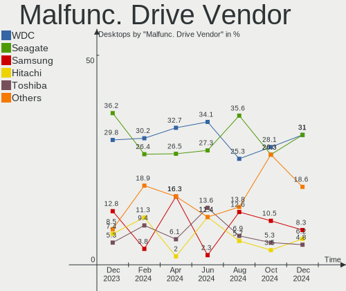
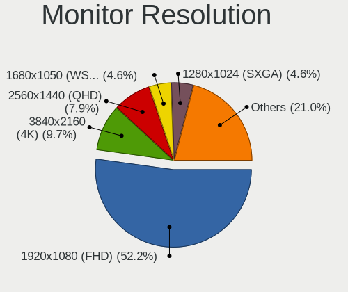
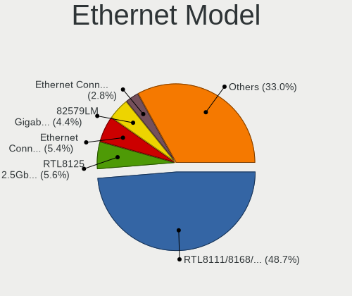
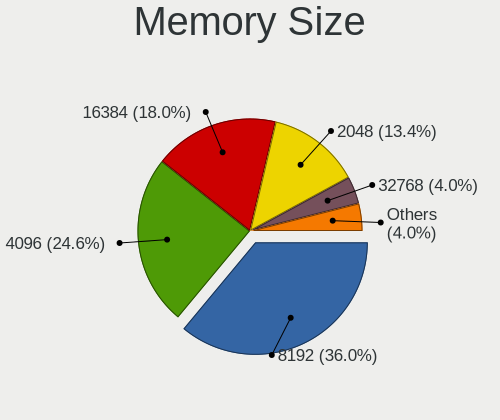
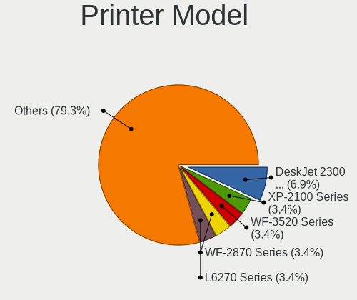

OpenMandriva Hardware Trends (Desktops)
---------------------------------------

A project to identify most popular hardware characteristics and track their change
over time based on data collected by OpenMandriva users at https://Linux-Hardware.org.

Anyone can contribute to this report by the [hw-probe](https://github.com/linuxhw/hw-probe) tool:

    sudo -E hw-probe -all -upload

Full-feature report is available here: https://linux-hardware.org/?view=trends&formfactor=desktop

Period: Sep, 2021.

Contents
--------

* [ System ](#system)
  - [ OS                       ](#os)
  - [ OS Family                ](#os-family)
  - [ Kernel                   ](#kernel)
  - [ Kernel Family            ](#kernel-family)
  - [ Kernel Major Ver.        ](#kernel-major-ver)
  - [ Arch                     ](#arch)
  - [ DE                       ](#de)
  - [ Display Server           ](#display-server)
  - [ Display Manager          ](#display-manager)
  - [ OS Lang                  ](#os-lang)
  - [ Boot Mode                ](#boot-mode)
  - [ Filesystem               ](#filesystem)
  - [ Part. scheme             ](#part-scheme)
  - [ Dual Boot with Linux/BSD ](#dual-boot-with-linuxbsd)
  - [ Dual Boot (Win)          ](#dual-boot-win)

* [ Board ](#board)
  - [ Vendor                   ](#vendor)
  - [ Model                    ](#model)
  - [ Model Family             ](#model-family)
  - [ MFG Year                 ](#mfg-year)
  - [ Form Factor              ](#form-factor)
  - [ Secure Boot              ](#secure-boot)
  - [ Coreboot                 ](#coreboot)
  - [ RAM Size                 ](#ram-size)
  - [ RAM Used                 ](#ram-used)
  - [ Total Drives             ](#total-drives)
  - [ Has CD-ROM               ](#has-cd-rom)
  - [ Has Ethernet             ](#has-ethernet)
  - [ Has WiFi                 ](#has-wifi)
  - [ Has Bluetooth            ](#has-bluetooth)

* [ Location ](#location)
  - [ Country                  ](#country)
  - [ City                     ](#city)

* [ Drives ](#drives)
  - [ Drive Vendor             ](#drive-vendor)
  - [ Drive Model              ](#drive-model)
  - [ HDD Vendor               ](#hdd-vendor)
  - [ SSD Vendor               ](#ssd-vendor)
  - [ Drive Kind               ](#drive-kind)
  - [ Drive Connector          ](#drive-connector)
  - [ Drive Size               ](#drive-size)
  - [ Space Total              ](#space-total)
  - [ Space Used               ](#space-used)
  - [ Malfunc. Drives          ](#malfunc-drives)
  - [ Malfunc. Drive Vendor    ](#malfunc-drive-vendor)
  - [ Malfunc. HDD Vendor      ](#malfunc-hdd-vendor)
  - [ Malfunc. Drive Kind      ](#malfunc-drive-kind)
  - [ Failed Drives            ](#failed-drives)
  - [ Failed Drive Vendor      ](#failed-drive-vendor)
  - [ Drive Status             ](#drive-status)

* [ Storage controller ](#storage-controller)
  - [ Storage Vendor           ](#storage-vendor)
  - [ Storage Model            ](#storage-model)
  - [ Storage Kind             ](#storage-kind)

* [ Processor ](#processor)
  - [ CPU Vendor               ](#cpu-vendor)
  - [ CPU Model                ](#cpu-model)
  - [ CPU Model Family         ](#cpu-model-family)
  - [ CPU Cores                ](#cpu-cores)
  - [ CPU Sockets              ](#cpu-sockets)
  - [ CPU Threads              ](#cpu-threads)
  - [ CPU Op-Modes             ](#cpu-op-modes)
  - [ CPU Microcode            ](#cpu-microcode)
  - [ CPU Microarch            ](#cpu-microarch)

* [ Graphics ](#graphics)
  - [ GPU Vendor               ](#gpu-vendor)
  - [ GPU Model                ](#gpu-model)
  - [ GPU Combo                ](#gpu-combo)
  - [ GPU Driver               ](#gpu-driver)
  - [ GPU Memory               ](#gpu-memory)

* [ Monitor ](#monitor)
  - [ Monitor Vendor           ](#monitor-vendor)
  - [ Monitor Model            ](#monitor-model)
  - [ Monitor Resolution       ](#monitor-resolution)
  - [ Monitor Diagonal         ](#monitor-diagonal)
  - [ Monitor Width            ](#monitor-width)
  - [ Aspect Ratio             ](#aspect-ratio)
  - [ Monitor Area             ](#monitor-area)
  - [ Pixel Density            ](#pixel-density)
  - [ Multiple Monitors        ](#multiple-monitors)

* [ Network ](#network)
  - [ Net Controller Vendor    ](#net-controller-vendor)
  - [ Net Controller Model     ](#net-controller-model)
  - [ Wireless Vendor          ](#wireless-vendor)
  - [ Wireless Model           ](#wireless-model)
  - [ Ethernet Vendor          ](#ethernet-vendor)
  - [ Ethernet Model           ](#ethernet-model)
  - [ Net Controller Kind      ](#net-controller-kind)
  - [ Used Controller          ](#used-controller)
  - [ NICs                     ](#nics)
  - [ IPv6                     ](#ipv6)

* [ Bluetooth ](#bluetooth)
  - [ Bluetooth Vendor         ](#bluetooth-vendor)
  - [ Bluetooth Model          ](#bluetooth-model)

* [ Sound ](#sound)
  - [ Sound Vendor             ](#sound-vendor)
  - [ Sound Model              ](#sound-model)

* [ Memory ](#memory)
  - [ Memory Vendor            ](#memory-vendor)
  - [ Memory Model             ](#memory-model)
  - [ Memory Kind              ](#memory-kind)
  - [ Memory Form Factor       ](#memory-form-factor)
  - [ Memory Size              ](#memory-size)
  - [ Memory Speed             ](#memory-speed)

* [ Printers & scanners ](#printers--scanners)
  - [ Printer Vendor           ](#printer-vendor)
  - [ Printer Model            ](#printer-model)
  - [ Scanner Vendor           ](#scanner-vendor)
  - [ Scanner Model            ](#scanner-model)

* [ Camera ](#camera)
  - [ Camera Vendor            ](#camera-vendor)
  - [ Camera Model             ](#camera-model)

* [ Security ](#security)
  - [ Fingerprint Vendor       ](#fingerprint-vendor)
  - [ Fingerprint Model        ](#fingerprint-model)
  - [ Chipcard Vendor          ](#chipcard-vendor)
  - [ Chipcard Model           ](#chipcard-model)

* [ Unsupported ](#unsupported)
  - [ Unsupported Devices      ](#unsupported-devices)
  - [ Unsupported Device Types ](#unsupported-device-types)

System
------

OS
--

Installed operating systems

| Name              | Desktops | Percent |
|-------------------|----------|---------|
| OpenMandriva 4.2  | 101      | 89.38%  |
| OpenMandriva 4.50 | 12       | 10.62%  |

OS Family
---------

OS without a version

| Name         | Desktops | Percent |
|--------------|----------|---------|
| OpenMandriva | 113      | 100%    |

Kernel
------

Version of the Linux kernel

| Version                  | Desktops | Percent |
|--------------------------|----------|---------|
| 5.10.14-desktop-1omv4002 | 99       | 87.61%  |
| 5.12.4-desktop-1omv4050  | 11       | 9.73%   |
| 5.11.12-desktop-1omv4002 | 2        | 1.77%   |
| 5.14.2-desktop-1omv4050  | 1        | 0.88%   |

Kernel Family
-------------

Linux kernel without a distro release

| Version | Desktops | Percent |
|---------|----------|---------|
| 5.10.14 | 99       | 87.61%  |
| 5.12.4  | 11       | 9.73%   |
| 5.11.12 | 2        | 1.77%   |
| 5.14.2  | 1        | 0.88%   |

Kernel Major Ver.
-----------------

Linux kernel major version

| Version | Desktops | Percent |
|---------|----------|---------|
| 5.10    | 99       | 87.61%  |
| 5.12    | 11       | 9.73%   |
| 5.11    | 2        | 1.77%   |
| 5.14    | 1        | 0.88%   |

Arch
----

OS architecture (x86_64, i586, etc.)

| Name   | Desktops | Percent |
|--------|----------|---------|
| x86_64 | 113      | 100%    |

DE
--

Desktop Environment

| Name | Desktops | Percent |
|------|----------|---------|
| KDE5 | 113      | 100%    |

Display Server
--------------

X11 or Wayland

| Name    | Desktops | Percent |
|---------|----------|---------|
| X11     | 110      | 97.35%  |
| Wayland | 3        | 2.65%   |

Display Manager
---------------

SDDM, LightDM, etc.

| Name | Desktops | Percent |
|------|----------|---------|
| SDDM | 113      | 100%    |

OS Lang
-------

Language

| Lang  | Desktops | Percent |
|-------|----------|---------|
| en_US | 54       | 47.79%  |
| fr_FR | 12       | 10.62%  |
| ru_RU | 6        | 5.31%   |
| pl_PL | 6        | 5.31%   |
| de_DE | 6        | 5.31%   |
| pt_BR | 5        | 4.42%   |
| es_ES | 5        | 4.42%   |
| en_GB | 4        | 3.54%   |
| it_IT | 3        | 2.65%   |
| fr_BE | 2        | 1.77%   |
| en_AU | 2        | 1.77%   |
| nl_BE | 1        | 0.88%   |
| hu_HU | 1        | 0.88%   |
| fr_CA | 1        | 0.88%   |
| es_SV | 1        | 0.88%   |
| es_MX | 1        | 0.88%   |
| es_EC | 1        | 0.88%   |
| de_AT | 1        | 0.88%   |
| da_DK | 1        | 0.88%   |

Boot Mode
---------

EFI or BIOS

| Mode | Desktops | Percent |
|------|----------|---------|
| BIOS | 88       | 77.88%  |
| EFI  | 25       | 22.12%  |

Filesystem
----------

Type of filesystem

| Type    | Desktops | Percent |
|---------|----------|---------|
| Overlay | 99       | 87.61%  |
| Ext4    | 14       | 12.39%  |

Part. scheme
------------

Scheme of partitioning

| Type    | Desktops | Percent |
|---------|----------|---------|
| MBR     | 60       | 53.1%   |
| GPT     | 52       | 46.02%  |
| Unknown | 1        | 0.88%   |

Dual Boot with Linux/BSD
------------------------

Hosting more than one Linux/BSD

| Dual boot | Desktops | Percent |
|-----------|----------|---------|
| Yes       | 65       | 57.52%  |
| No        | 48       | 42.48%  |

Dual Boot (Win)
---------------

Hosting Linux and Windows

| Dual boot | Desktops | Percent |
|-----------|----------|---------|
| No        | 59       | 52.21%  |
| Yes       | 54       | 47.79%  |

Board
-----

Vendor
------

Motherboard manufacturer

| Name                | Desktops | Percent |
|---------------------|----------|---------|
| ASUSTek Computer    | 33       | 29.2%   |
| Gigabyte Technology | 22       | 19.47%  |
| ASRock              | 13       | 11.5%   |
| Dell                | 10       | 8.85%   |
| MSI                 | 8        | 7.08%   |
| Lenovo              | 5        | 4.42%   |
| Hewlett-Packard     | 5        | 4.42%   |
| Intel               | 3        | 2.65%   |
| Acer                | 3        | 2.65%   |
| ECS                 | 2        | 1.77%   |
| Supermicro          | 1        | 0.88%   |
| Shuttle             | 1        | 0.88%   |
| Positivo            | 1        | 0.88%   |
| OEM                 | 1        | 0.88%   |
| Medion              | 1        | 0.88%   |
| JW Technology       | 1        | 0.88%   |
| IBM                 | 1        | 0.88%   |
| Fujitsu Siemens     | 1        | 0.88%   |
| AWOW                | 1        | 0.88%   |

Model
-----

Motherboard model

| Name                                   | Desktops | Percent |
|----------------------------------------|----------|---------|
| ASUS All Series                        | 6        | 5.31%   |
| MSI MS-7A15                            | 2        | 1.77%   |
| Gigabyte B75M-D3H                      | 2        | 1.77%   |
| Dell OptiPlex 9020                     | 2        | 1.77%   |
| Dell OptiPlex 780                      | 2        | 1.77%   |
| ASUS P5QL PRO                          | 2        | 1.77%   |
| Supermicro X7DB8                       | 1        | 0.88%   |
| Shuttle XS35V3                         | 1        | 0.88%   |
| Positivo POS-EIH61CE                   | 1        | 0.88%   |
| MSI MS-7C84                            | 1        | 0.88%   |
| MSI MS-7B84                            | 1        | 0.88%   |
| MSI MS-7721                            | 1        | 0.88%   |
| MSI MS-7695                            | 1        | 0.88%   |
| MSI MS-7577                            | 1        | 0.88%   |
| MSI MS-7255                            | 1        | 0.88%   |
| Medion P66089                          | 1        | 0.88%   |
| Lenovo ThinkCentre XXXX 8813AA2        | 1        | 0.88%   |
| Lenovo ThinkCentre M83 10AM0007US      | 1        | 0.88%   |
| Lenovo ThinkCentre M82 2742DB3         | 1        | 0.88%   |
| Lenovo IdeaCentre 3 07ADA05 90MV007VGE | 1        | 0.88%   |
| Lenovo H50-50 90B70040AL               | 1        | 0.88%   |
| JW JW-A61PM-D3 Ver1.0                  | 1        | 0.88%   |
| Intel DH61WW                           | 1        | 0.88%   |
| Intel DG41RQ AAE54511-205              | 1        | 0.88%   |
| Intel D33217GKE G76540-202             | 1        | 0.88%   |
| IBM System x3200 M3 -[7328AC1]-        | 1        | 0.88%   |
| HP Compaq dc7800 Small Form Factor     | 1        | 0.88%   |
| HP Compaq dc5850 Small Form Factor     | 1        | 0.88%   |
| HP Compaq 8000 Elite CMT PC            | 1        | 0.88%   |
| HP 8433 11                             | 1        | 0.88%   |
| HP 3047h                               | 1        | 0.88%   |
| Gigabyte Z77-DS3H                      | 1        | 0.88%   |
| Gigabyte X79-UD3                       | 1        | 0.88%   |
| Gigabyte X570 AORUS ELITE              | 1        | 0.88%   |
| Gigabyte P31-ES3G                      | 1        | 0.88%   |
| Gigabyte H97-HD3                       | 1        | 0.88%   |
| Gigabyte H81M-H                        | 1        | 0.88%   |
| Gigabyte H61M-S1                       | 1        | 0.88%   |
| Gigabyte H110M-S2H                     | 1        | 0.88%   |
| Gigabyte GA-MA78G-DS3H                 | 1        | 0.88%   |
| Gigabyte GA-990FX-GAMING               | 1        | 0.88%   |
| Gigabyte GA-970A-D3                    | 1        | 0.88%   |
| Gigabyte GA-880GM-D2H                  | 1        | 0.88%   |
| Gigabyte GA-78LMT-S2PT                 | 1        | 0.88%   |
| Gigabyte G31M-ES2C                     | 1        | 0.88%   |
| Gigabyte G1.Sniper A88X-CF             | 1        | 0.88%   |
| Gigabyte B85M-HD3                      | 1        | 0.88%   |
| Gigabyte B450M DS3H                    | 1        | 0.88%   |
| Gigabyte AB350M-Gaming 3               | 1        | 0.88%   |
| Gigabyte 945P-S3                       | 1        | 0.88%   |
| Gigabyte 945G-S3                       | 1        | 0.88%   |
| Fujitsu Siemens AMILO Desktop Pi3630A  | 1        | 0.88%   |
| ECS H81H3-M4                           | 1        | 0.88%   |
| ECS A55F-M4                            | 1        | 0.88%   |
| Dell Precision T3600                   | 1        | 0.88%   |
| Dell OptiPlex 760                      | 1        | 0.88%   |
| Dell OptiPlex 7010                     | 1        | 0.88%   |
| Dell OptiPlex 3010                     | 1        | 0.88%   |
| Dell Inspiron 530                      | 1        | 0.88%   |
| Dell Inspiron 3668                     | 1        | 0.88%   |

Model Family
------------

Motherboard model prefix

| Name                     | Desktops | Percent |
|--------------------------|----------|---------|
| Dell OptiPlex            | 7        | 6.19%   |
| ASUS All                 | 6        | 5.31%   |
| Lenovo ThinkCentre       | 3        | 2.65%   |
| HP Compaq                | 3        | 2.65%   |
| MSI MS-7A15              | 2        | 1.77%   |
| Gigabyte B75M-D3H        | 2        | 1.77%   |
| Dell Inspiron            | 2        | 1.77%   |
| ASUS ROG                 | 2        | 1.77%   |
| ASUS P5QL                | 2        | 1.77%   |
| ASUS M5A97               | 2        | 1.77%   |
| ASUS M5A78L-M            | 2        | 1.77%   |
| Acer Aspire              | 2        | 1.77%   |
| Supermicro X7DB8         | 1        | 0.88%   |
| Shuttle XS35V3           | 1        | 0.88%   |
| Positivo POS-EIH61CE     | 1        | 0.88%   |
| MSI MS-7C84              | 1        | 0.88%   |
| MSI MS-7B84              | 1        | 0.88%   |
| MSI MS-7721              | 1        | 0.88%   |
| MSI MS-7695              | 1        | 0.88%   |
| MSI MS-7577              | 1        | 0.88%   |
| MSI MS-7255              | 1        | 0.88%   |
| Medion P66089            | 1        | 0.88%   |
| Lenovo IdeaCentre        | 1        | 0.88%   |
| Lenovo H50-50            | 1        | 0.88%   |
| JW JW-A61PM-D3           | 1        | 0.88%   |
| Intel DH61WW             | 1        | 0.88%   |
| Intel DG41RQ             | 1        | 0.88%   |
| Intel D33217GKE          | 1        | 0.88%   |
| IBM System               | 1        | 0.88%   |
| HP 8433                  | 1        | 0.88%   |
| HP 3047h                 | 1        | 0.88%   |
| Gigabyte Z77-DS3H        | 1        | 0.88%   |
| Gigabyte X79-UD3         | 1        | 0.88%   |
| Gigabyte X570            | 1        | 0.88%   |
| Gigabyte P31-ES3G        | 1        | 0.88%   |
| Gigabyte H97-HD3         | 1        | 0.88%   |
| Gigabyte H81M-H          | 1        | 0.88%   |
| Gigabyte H61M-S1         | 1        | 0.88%   |
| Gigabyte H110M-S2H       | 1        | 0.88%   |
| Gigabyte GA-MA78G-DS3H   | 1        | 0.88%   |
| Gigabyte GA-990FX-GAMING | 1        | 0.88%   |
| Gigabyte GA-970A-D3      | 1        | 0.88%   |
| Gigabyte GA-880GM-D2H    | 1        | 0.88%   |
| Gigabyte GA-78LMT-S2PT   | 1        | 0.88%   |
| Gigabyte G31M-ES2C       | 1        | 0.88%   |
| Gigabyte G1.Sniper       | 1        | 0.88%   |
| Gigabyte B85M-HD3        | 1        | 0.88%   |
| Gigabyte B450M           | 1        | 0.88%   |
| Gigabyte AB350M-Gaming   | 1        | 0.88%   |
| Gigabyte 945P-S3         | 1        | 0.88%   |
| Gigabyte 945G-S3         | 1        | 0.88%   |
| Fujitsu Siemens AMILO    | 1        | 0.88%   |
| ECS H81H3-M4             | 1        | 0.88%   |
| ECS A55F-M4              | 1        | 0.88%   |
| Dell Precision           | 1        | 0.88%   |
| AWOW AK41                | 1        | 0.88%   |
| ASUS Z170-P              | 1        | 0.88%   |
| ASUS TUF                 | 1        | 0.88%   |
| ASUS SABERTOOTH          | 1        | 0.88%   |
| ASUS PRIME               | 1        | 0.88%   |

MFG Year
--------

Motherboard manufacture year

| Year | Desktops | Percent |
|------|----------|---------|
| 2012 | 16       | 14.16%  |
| 2013 | 15       | 13.27%  |
| 2015 | 13       | 11.5%   |
| 2018 | 9        | 7.96%   |
| 2020 | 8        | 7.08%   |
| 2014 | 7        | 6.19%   |
| 2010 | 7        | 6.19%   |
| 2008 | 7        | 6.19%   |
| 2016 | 6        | 5.31%   |
| 2009 | 6        | 5.31%   |
| 2019 | 5        | 4.42%   |
| 2006 | 4        | 3.54%   |
| 2021 | 3        | 2.65%   |
| 2017 | 2        | 1.77%   |
| 2011 | 2        | 1.77%   |
| 2007 | 2        | 1.77%   |
| 2005 | 1        | 0.88%   |

Form Factor
-----------

Physical design of the computer

| Name    | Desktops | Percent |
|---------|----------|---------|
| Desktop | 113      | 100%    |

Secure Boot
-----------

Enabled or disabled

| State    | Desktops | Percent |
|----------|----------|---------|
| Disabled | 113      | 100%    |

Coreboot
--------

Have coreboot on board

| Used | Desktops | Percent |
|------|----------|---------|
| No   | 113      | 100%    |

RAM Size
--------

Total RAM memory

| Size in GB  | Desktops | Percent |
|-------------|----------|---------|
| 3.01-4.0    | 32       | 28.32%  |
| 8.01-16.0   | 29       | 25.66%  |
| 4.01-8.0    | 22       | 19.47%  |
| 16.01-24.0  | 16       | 14.16%  |
| 1.01-2.0    | 7        | 6.19%   |
| 32.01-64.0  | 3        | 2.65%   |
| 24.01-32.0  | 1        | 0.88%   |
| 2.01-3.0    | 1        | 0.88%   |
| 64.01-256.0 | 1        | 0.88%   |
| 0.51-1.0    | 1        | 0.88%   |

RAM Used
--------

Used RAM memory

| Used GB   | Desktops | Percent |
|-----------|----------|---------|
| 1.01-2.0  | 75       | 66.37%  |
| 0.51-1.0  | 23       | 20.35%  |
| 0.01-0.5  | 8        | 7.08%   |
| 2.01-3.0  | 5        | 4.42%   |
| 3.01-4.0  | 1        | 0.88%   |
| 8.01-16.0 | 1        | 0.88%   |

Total Drives
------------

Number of drives on board

| Drives | Desktops | Percent |
|--------|----------|---------|
| 1      | 60       | 53.1%   |
| 2      | 28       | 24.78%  |
| 3      | 9        | 7.96%   |
| 4      | 8        | 7.08%   |
| 0      | 4        | 3.54%   |
| 5      | 2        | 1.77%   |
| 7      | 1        | 0.88%   |
| 6      | 1        | 0.88%   |

Has CD-ROM
----------

Has CD-ROM on board

| Presented | Desktops | Percent |
|-----------|----------|---------|
| Yes       | 78       | 69.03%  |
| No        | 35       | 30.97%  |

Has Ethernet
------------

Has Ethernet on board

| Presented | Desktops | Percent |
|-----------|----------|---------|
| Yes       | 110      | 97.35%  |
| No        | 3        | 2.65%   |

Has WiFi
--------

Has WiFi module

| Presented | Desktops | Percent |
|-----------|----------|---------|
| No        | 77       | 68.14%  |
| Yes       | 36       | 31.86%  |

Has Bluetooth
-------------

Has Bluetooth module

| Presented | Desktops | Percent |
|-----------|----------|---------|
| No        | 96       | 84.96%  |
| Yes       | 17       | 15.04%  |

Location
--------

Country
-------

Geographic location (country)

| Country     | Desktops | Percent |
|-------------|----------|---------|
| France      | 13       | 11.5%   |
| Germany     | 12       | 10.62%  |
| Russia      | 11       | 9.73%   |
| Italy       | 8        | 7.08%   |
| USA         | 7        | 6.19%   |
| Brazil      | 7        | 6.19%   |
| Spain       | 6        | 5.31%   |
| Poland      | 6        | 5.31%   |
| UK          | 5        | 4.42%   |
| Canada      | 5        | 4.42%   |
| Belgium     | 4        | 3.54%   |
| Romania     | 3        | 2.65%   |
| Mexico      | 3        | 2.65%   |
| Czechia     | 3        | 2.65%   |
| Tunisia     | 2        | 1.77%   |
| Serbia      | 2        | 1.77%   |
| Indonesia   | 2        | 1.77%   |
| India       | 2        | 1.77%   |
| Australia   | 2        | 1.77%   |
| Thailand    | 1        | 0.88%   |
| Taiwan      | 1        | 0.88%   |
| Switzerland | 1        | 0.88%   |
| Peru        | 1        | 0.88%   |
| Ireland     | 1        | 0.88%   |
| Hungary     | 1        | 0.88%   |
| El Salvador | 1        | 0.88%   |
| Denmark     | 1        | 0.88%   |
| Austria     | 1        | 0.88%   |
| Algeria     | 1        | 0.88%   |

City
----

Geographic location (city)

| City                       | Desktops | Percent |
|----------------------------|----------|---------|
| Limoges                    | 3        | 2.65%   |
| D??sseldorf                | 3        | 2.65%   |
| Voiron                     | 2        | 1.77%   |
| Rome                       | 2        | 1.77%   |
| Granada                    | 2        | 1.77%   |
| Belgrade                   | 2        | 1.77%   |
| Zheleznogorsk              | 1        | 0.88%   |
| Yekaterinburg              | 1        | 0.88%   |
| Wschowa                    | 1        | 0.88%   |
| Wiesbaden                  | 1        | 0.88%   |
| Warsaw                     | 1        | 0.88%   |
| Wakefield                  | 1        | 0.88%   |
| Vijayawada                 | 1        | 0.88%   |
| Vienna                     | 1        | 0.88%   |
| Viborg                     | 1        | 0.88%   |
| Verona                     | 1        | 0.88%   |
| Uccle                      | 1        | 0.88%   |
| Tunis                      | 1        | 0.88%   |
| Toronto                    | 1        | 0.88%   |
| Thornleigh                 | 1        | 0.88%   |
| Teplice                    | 1        | 0.88%   |
| Telford                    | 1        | 0.88%   |
| Sydney                     | 1        | 0.88%   |
| Stralsund                  | 1        | 0.88%   |
| Stavropol                  | 1        | 0.88%   |
| St. John's                 | 1        | 0.88%   |
| Sheridan                   | 1        | 0.88%   |
| Serdobsk                   | 1        | 0.88%   |
| Schenefeld                 | 1        | 0.88%   |
| S??o Paulo                 | 1        | 0.88%   |
| Sao Joao de Meriti         | 1        | 0.88%   |
| San Salvador               | 1        | 0.88%   |
| San Giorgio delle Pertiche | 1        | 0.88%   |
| Salvador                   | 1        | 0.88%   |
| Saint-Sulpice              | 1        | 0.88%   |
| Saint-Cyrille-de-Wendover  | 1        | 0.88%   |
| Rostock                    | 1        | 0.88%   |
| Rio Grande                 | 1        | 0.88%   |
| Rio de Janeiro             | 1        | 0.88%   |
| Qu?©bec                    | 1        | 0.88%   |
| Priego de Cordoba          | 1        | 0.88%   |
| Prat-Bonrepaux             | 1        | 0.88%   |
| Prague                     | 1        | 0.88%   |
| Ploie??ti                  | 1        | 0.88%   |
| Penza                      | 1        | 0.88%   |
| Ostrowy nad Oksza          | 1        | 0.88%   |
| Osterholz-Scharmbeck       | 1        | 0.88%   |
| Osasco                     | 1        | 0.88%   |
| Oradea                     | 1        | 0.88%   |
| Oaxaca City                | 1        | 0.88%   |
| Nuremberg                  | 1        | 0.88%   |
| Novosibirsk                | 1        | 0.88%   |
| New Taipei                 | 1        | 0.88%   |
| New Cross                  | 1        | 0.88%   |
| Neratovice                 | 1        | 0.88%   |
| Moscow                     | 1        | 0.88%   |
| Mooresville                | 1        | 0.88%   |
| Montreal                   | 1        | 0.88%   |
| Monclova                   | 1        | 0.88%   |
| Miramas                    | 1        | 0.88%   |

Drives
------

Drive Vendor
------------

Hard drive vendors

| Vendor              | Desktops | Drives  | Percent |
|---------------------|----------|---------|---------|
| Seagate             | 46       | 50      | 27.38%  |
| WDC                 | 34       | 47      | 20.24%  |
| Samsung Electronics | 20       | 25      | 11.9%   |
| Toshiba             | 14       | 16      | 8.33%   |
| Kingston            | 12       | 12      | 7.14%   |
| Hitachi             | 5        | 7       | 2.98%   |
| SanDisk             | 4        | 4       | 2.38%   |
| Crucial             | 4        | 5       | 2.38%   |
| A-DATA Technology   | 4        | 4       | 2.38%   |
| Intenso             | 3        | 5       | 1.79%   |
| Netac               | 2        | 2       | 1.19%   |
| JMicron             | 2        | 2       | 1.19%   |
| Intel               | 2        | 3       | 1.19%   |
| ZTE                 | 1        | 1       | 0.6%    |
| WDC WDS             | 1        | 1       | 0.6%    |
| WD MediaMax         | 1        | 1       | 0.6%    |
| Transcend           | 1        | 1       | 0.6%    |
| Team                | 1        | 1       | 0.6%    |
| SPCC                | 1        | 1       | 0.6%    |
| Silicon Motion      | 1        | 1       | 0.6%    |
| PNY                 | 1        | 1       | 0.6%    |
| Phison              | 1        | 1       | 0.6%    |
| Mass                | 1        | Unknown | 0.6%    |
| KingSpec            | 1        | 1       | 0.6%    |
| INDMEM              | 1        | 1       | 0.6%    |
| Hikvision           | 1        | 1       | 0.6%    |
| Hewlett-Packard     | 1        | 1       | 0.6%    |
| Gigabyte Technology | 1        | 1       | 0.6%    |
| Corsair             | 1        | 1       | 0.6%    |

Drive Model
-----------

Hard drive models

| Model                             | Desktops | Percent |
|-----------------------------------|----------|---------|
| Toshiba DT01ACA100 1TB            | 6        | 3.09%   |
| WDC WD10EZEX-08WN4A0 1TB          | 4        | 2.06%   |
| Seagate ST500DM002-1BD142 500GB   | 4        | 2.06%   |
| Toshiba DT01ACA050 500GB          | 3        | 1.55%   |
| Seagate ST1000DM010-2EP102 1TB    | 3        | 1.55%   |
| Samsung SSD 850 EVO 500GB         | 3        | 1.55%   |
| Kingston SA400S37240G 240GB SSD   | 3        | 1.55%   |
| WDC WDS100T2B0A-00SM50 1TB SSD    | 2        | 1.03%   |
| WDC WD3200AAKS-00L9A0 320GB       | 2        | 1.03%   |
| WDC WD20EFRX-68EUZN0 2TB          | 2        | 1.03%   |
| WDC WD20EARS-00MVWB0 2TB          | 2        | 1.03%   |
| WDC WD10PURZ-85U8XY0 1TB          | 2        | 1.03%   |
| WDC WD10EZEX-00WN4A0 1TB          | 2        | 1.03%   |
| WDC WD10EZEX-00BN5A0 1TB          | 2        | 1.03%   |
| Seagate ST3320820AS 320GB         | 2        | 1.03%   |
| Seagate ST3160815AS 160GB         | 2        | 1.03%   |
| Seagate ST3160318AS 160GB         | 2        | 1.03%   |
| Seagate ST3120022A 120GB          | 2        | 1.03%   |
| Seagate ST2000DM008-2FR102 2TB    | 2        | 1.03%   |
| Seagate ST2000DL003-9VT166 2TB    | 2        | 1.03%   |
| Seagate ST1000DM003-1ER162 1TB    | 2        | 1.03%   |
| Samsung HD502HJ 500GB             | 2        | 1.03%   |
| Samsung HD161HJ 160GB             | 2        | 1.03%   |
| Kingston SV300S37A120G 120GB SSD  | 2        | 1.03%   |
| Kingston SA400S37120G 120GB SSD   | 2        | 1.03%   |
| Intenso SSD 256GB                 | 2        | 1.03%   |
| Crucial CT1000MX500SSD1 1TB       | 2        | 1.03%   |
| ZTE MMC Storage 8GB               | 1        | 0.52%   |
| WDC WDS500G2B0B-00YS70 500GB SSD  | 1        | 0.52%   |
| WDC WDS500G2B0A-00SM50 500GB SSD  | 1        | 0.52%   |
| WDC WDS120G2G0B-00EPW0 120GB SSD  | 1        | 0.52%   |
| WDC WDS100T1X0E-00AFY0 1TB        | 1        | 0.52%   |
| WDC WDS 500G2B0B-00YS70 500GB SSD | 1        | 0.52%   |
| WDC WDBNCE5000PNC 500GB SSD       | 1        | 0.52%   |
| WDC WD80EZZX-11CSGA0 8TB          | 1        | 0.52%   |
| WDC WD6400AAKS-00A7B0 640GB       | 1        | 0.52%   |
| WDC WD50EZRZ-00RWYB1 5TB          | 1        | 0.52%   |
| WDC WD5000AAKX-75U6AA0 500GB      | 1        | 0.52%   |
| WDC WD5000AAKX-003CA0 500GB       | 1        | 0.52%   |
| WDC WD5000AAKX-001CA0 500GB       | 1        | 0.52%   |
| WDC WD5000AAKS-00V1A0 500GB       | 1        | 0.52%   |
| WDC WD40EZRZ-00WN9B0 4TB          | 1        | 0.52%   |
| WDC WD400JB-00FMA0 40GB           | 1        | 0.52%   |
| WDC WD3200BPVT-22JJ5T0 320GB      | 1        | 0.52%   |
| WDC WD30EFRX-68EUZN0 3TB          | 1        | 0.52%   |
| WDC WD30EFRX-68AX9N0 3TB          | 1        | 0.52%   |
| WDC WD2500KS-22MJB0 250GB         | 1        | 0.52%   |
| WDC WD2500AAJS-75M0A0 250GB       | 1        | 0.52%   |
| WDC WD20PURZ-85GU6Y0 2TB          | 1        | 0.52%   |
| WDC WD20PURX-64P6ZY0 2TB          | 1        | 0.52%   |
| WDC WD1600BEVT-22ZCT0 160GB       | 1        | 0.52%   |
| WDC WD15EARX-00PASB0 1TB          | 1        | 0.52%   |
| WDC WD120EMAZ-11BLFA0 12TB        | 1        | 0.52%   |
| WDC WD10JPCX-24UE4T0 1TB          | 1        | 0.52%   |
| WDC WD10EZEX-08M2NA0 1TB          | 1        | 0.52%   |
| WDC WD10EARX-00N0YB0 1TB          | 1        | 0.52%   |
| WD MediaMax WL1000GSA6472B 1TB    | 1        | 0.52%   |
| Transcend TS128GSSD230S 128GB     | 1        | 0.52%   |
| Toshiba TR200 240GB SSD           | 1        | 0.52%   |
| Toshiba Q300 240GB SSD            | 1        | 0.52%   |

HDD Vendor
----------

Hard disk drive vendors

| Vendor              | Desktops | Drives | Percent |
|---------------------|----------|--------|---------|
| Seagate             | 45       | 49     | 42.86%  |
| WDC                 | 33       | 39     | 31.43%  |
| Toshiba             | 12       | 14     | 11.43%  |
| Samsung Electronics | 9        | 12     | 8.57%   |
| Hitachi             | 5        | 7      | 4.76%   |
| WD MediaMax         | 1        | 1      | 0.95%   |

SSD Vendor
----------

Solid state drive vendors

| Vendor              | Desktops | Drives | Percent |
|---------------------|----------|--------|---------|
| Kingston            | 12       | 12     | 21.82%  |
| Samsung Electronics | 7        | 8      | 12.73%  |
| WDC                 | 6        | 7      | 10.91%  |
| SanDisk             | 4        | 4      | 7.27%   |
| Crucial             | 4        | 5      | 7.27%   |
| A-DATA Technology   | 4        | 4      | 7.27%   |
| Intenso             | 3        | 5      | 5.45%   |
| Toshiba             | 2        | 2      | 3.64%   |
| Netac               | 2        | 2      | 3.64%   |
| WDC WDS             | 1        | 1      | 1.82%   |
| Transcend           | 1        | 1      | 1.82%   |
| Team                | 1        | 1      | 1.82%   |
| SPCC                | 1        | 1      | 1.82%   |
| Seagate             | 1        | 1      | 1.82%   |
| PNY                 | 1        | 1      | 1.82%   |
| KingSpec            | 1        | 1      | 1.82%   |
| INDMEM              | 1        | 1      | 1.82%   |
| Hikvision           | 1        | 1      | 1.82%   |
| Hewlett-Packard     | 1        | 1      | 1.82%   |
| Gigabyte Technology | 1        | 1      | 1.82%   |

Drive Kind
----------

HDD or SSD

| Kind    | Desktops | Drives | Percent |
|---------|----------|--------|---------|
| HDD     | 84       | 122    | 58.33%  |
| SSD     | 45       | 60     | 31.25%  |
| NVMe    | 12       | 13     | 8.33%   |
| Unknown | 3        | 2      | 2.08%   |

Drive Connector
---------------

SATA, SAS, NVMe, etc.

| Type | Desktops | Drives | Percent |
|------|----------|--------|---------|
| SATA | 106      | 177    | 84.13%  |
| NVMe | 11       | 12     | 8.73%   |
| SAS  | 9        | 8      | 7.14%   |

Drive Size
----------

Size of hard drive

| Size in TB | Desktops | Drives | Percent |
|------------|----------|--------|---------|
| 0.01-0.5   | 79       | 112    | 59.4%   |
| 0.51-1.0   | 33       | 44     | 24.81%  |
| 1.01-2.0   | 12       | 17     | 9.02%   |
| 2.01-3.0   | 3        | 3      | 2.26%   |
| 4.01-10.0  | 3        | 3      | 2.26%   |
| 10.01-20.0 | 2        | 2      | 1.5%    |
| 3.01-4.0   | 1        | 1      | 0.75%   |

Space Total
-----------

Amount of disk space available on the file system

| Size in GB     | Desktops | Percent |
|----------------|----------|---------|
| 1-20           | 46       | 40.71%  |
| Unknown        | 36       | 31.86%  |
| 101-250        | 12       | 10.62%  |
| 21-50          | 5        | 4.42%   |
| 501-1000       | 5        | 4.42%   |
| 51-100         | 4        | 3.54%   |
| More than 3000 | 2        | 1.77%   |
| 251-500        | 2        | 1.77%   |
| 1001-2000      | 1        | 0.88%   |

Space Used
----------

Amount of used disk space

| Used GB        | Desktops | Percent |
|----------------|----------|---------|
| 1-20           | 68       | 60.18%  |
| Unknown        | 36       | 31.86%  |
| More than 3000 | 2        | 1.77%   |
| 101-250        | 2        | 1.77%   |
| 51-100         | 2        | 1.77%   |
| 251-500        | 1        | 0.88%   |
| 21-50          | 1        | 0.88%   |
| 501-1000       | 1        | 0.88%   |

Malfunc. Drives
---------------

Drive models with a malfunction

| Model                             | Desktops | Drives | Percent |
|-----------------------------------|----------|--------|---------|
| Seagate ST2000DL003-9VT166 2TB    | 2        | 3      | 4.76%   |
| Samsung Electronics HD502HJ 500GB | 2        | 2      | 4.76%   |
| WDC WD6400AAKS-00A7B0 640GB       | 1        | 1      | 2.38%   |
| WDC WD5000AAKX-75U6AA0 500GB      | 1        | 1      | 2.38%   |
| WDC WD5000AAKX-003CA0 500GB       | 1        | 1      | 2.38%   |
| WDC WD5000AAKX-001CA0 500GB       | 1        | 1      | 2.38%   |
| WDC WD5000AAKS-00V1A0 500GB       | 1        | 1      | 2.38%   |
| WDC WD3200AAKS-00L9A0 320GB       | 1        | 1      | 2.38%   |
| WDC WD30EFRX-68EUZN0 3TB          | 1        | 1      | 2.38%   |
| WDC WD1600BEVT-22ZCT0 160GB       | 1        | 1      | 2.38%   |
| WDC WD15EARX-00PASB0 1TB          | 1        | 1      | 2.38%   |
| WDC WD10JPCX-24UE4T0 1TB          | 1        | 1      | 2.38%   |
| WDC WD10EZEX-08M2NA0 1TB          | 1        | 1      | 2.38%   |
| Toshiba DT01ACA100 1TB            | 1        | 1      | 2.38%   |
| Seagate STM3250318AS 250GB        | 1        | 1      | 2.38%   |
| Seagate ST500LM000-SSHD-8GB       | 1        | 1      | 2.38%   |
| Seagate ST500DM002-1BD142 500GB   | 1        | 1      | 2.38%   |
| Seagate ST500DM002-1BC142 500GB   | 1        | 1      | 2.38%   |
| Seagate ST380815AS 80GB           | 1        | 1      | 2.38%   |
| Seagate ST3500320AS 500GB         | 1        | 1      | 2.38%   |
| Seagate ST3320820AS 320GB         | 1        | 1      | 2.38%   |
| Seagate ST3320413CS 320GB         | 1        | 1      | 2.38%   |
| Seagate ST3250820AS 250GB         | 1        | 1      | 2.38%   |
| Seagate ST3250310CS 250GB         | 1        | 1      | 2.38%   |
| Seagate ST3160815AS 160GB         | 1        | 1      | 2.38%   |
| Seagate ST3120022A 120GB          | 1        | 1      | 2.38%   |
| Seagate ST31000520AS 1TB          | 1        | 1      | 2.38%   |
| Seagate ST31000333AS 1TB          | 1        | 1      | 2.38%   |
| Seagate ST2000DM008-2FR102 2TB    | 1        | 1      | 2.38%   |
| Seagate ST1000DM010-2EP102 1TB    | 1        | 1      | 2.38%   |
| Samsung Electronics SP1213C 120GB | 1        | 1      | 2.38%   |
| Samsung Electronics HD753LJ 752GB | 1        | 2      | 2.38%   |
| Samsung Electronics HD251HJ 250GB | 1        | 1      | 2.38%   |
| Samsung Electronics HD161HJ 160GB | 1        | 1      | 2.38%   |
| Netac SSD 320GB                   | 1        | 1      | 2.38%   |
| Netac SSD 128GB                   | 1        | 1      | 2.38%   |
| Kingston SV300S37A60G 64GB SSD    | 1        | 1      | 2.38%   |
| Kingston SV300S37A120G 120GB SSD  | 1        | 1      | 2.38%   |
| Kingston SUV400S37240G 240GB SSD  | 1        | 1      | 2.38%   |
| Hitachi HCC543225A7A380 250GB     | 1        | 1      | 2.38%   |

Malfunc. Drive Vendor
---------------------

Vendors of faulty drives

| Vendor              | Desktops | Drives | Percent |
|---------------------|----------|--------|---------|
| Seagate             | 17       | 19     | 43.59%  |
| WDC                 | 10       | 11     | 25.64%  |
| Samsung Electronics | 5        | 7      | 12.82%  |
| Kingston            | 3        | 3      | 7.69%   |
| Netac               | 2        | 2      | 5.13%   |
| Toshiba             | 1        | 1      | 2.56%   |
| Hitachi             | 1        | 1      | 2.56%   |

Malfunc. HDD Vendor
-------------------

Vendors of faulty HDD drives

| Vendor              | Desktops | Drives | Percent |
|---------------------|----------|--------|---------|
| Seagate             | 17       | 19     | 50%     |
| WDC                 | 10       | 11     | 29.41%  |
| Samsung Electronics | 5        | 7      | 14.71%  |
| Toshiba             | 1        | 1      | 2.94%   |
| Hitachi             | 1        | 1      | 2.94%   |

Malfunc. Drive Kind
-------------------

Kinds of faulty drives

| Kind | Desktops | Drives | Percent |
|------|----------|--------|---------|
| HDD  | 33       | 39     | 86.84%  |
| SSD  | 5        | 5      | 13.16%  |

Failed Drives
-------------

Failed drive models

| Model                     | Desktops | Drives | Percent |
|---------------------------|----------|--------|---------|
| Seagate ST3250318AS 250GB | 1        | 1      | 100%    |

Failed Drive Vendor
-------------------

Failed drive vendors

| Vendor  | Desktops | Drives | Percent |
|---------|----------|--------|---------|
| Seagate | 1        | 1      | 100%    |

Drive Status
------------

Number of failed and malfunc. drives

| Status   | Desktops | Drives | Percent |
|----------|----------|--------|---------|
| Works    | 71       | 122    | 53.79%  |
| Malfunc  | 37       | 44     | 28.03%  |
| Detected | 23       | 30     | 17.42%  |
| Failed   | 1        | 1      | 0.76%   |

Storage controller
------------------

Storage Vendor
--------------

Storage controller vendors

| Vendor                    | Desktops | Percent |
|---------------------------|----------|---------|
| Intel                     | 73       | 53.68%  |
| AMD                       | 37       | 27.21%  |
| Samsung Electronics       | 5        | 3.68%   |
| Nvidia                    | 4        | 2.94%   |
| Marvell Technology Group  | 4        | 2.94%   |
| JMicron Technology        | 3        | 2.21%   |
| ASMedia Technology        | 3        | 2.21%   |
| VIA Technologies          | 2        | 1.47%   |
| Phison Electronics        | 2        | 1.47%   |
| Silicon Motion            | 1        | 0.74%   |
| Sandisk                   | 1        | 0.74%   |
| LSI Logic / Symbios Logic | 1        | 0.74%   |

Storage Model
-------------

Storage controller models

| Model                                                                                   | Desktops | Percent |
|-----------------------------------------------------------------------------------------|----------|---------|
| AMD FCH SATA Controller [AHCI mode]                                                     | 18       | 9.73%   |
| AMD SB7x0/SB8x0/SB9x0 SATA Controller [IDE mode]                                        | 11       | 5.95%   |
| Intel NM10/ICH7 Family SATA Controller [IDE mode]                                       | 10       | 5.41%   |
| Intel 8 Series/C220 Series Chipset Family 6-port SATA Controller 1 [AHCI mode]          | 10       | 5.41%   |
| AMD SB7x0/SB8x0/SB9x0 IDE Controller                                                    | 10       | 5.41%   |
| Intel Q170/Q150/B150/H170/H110/Z170/CM236 Chipset SATA Controller [AHCI Mode]           | 8        | 4.32%   |
| Intel 82801G (ICH7 Family) IDE Controller                                               | 7        | 3.78%   |
| AMD SB7x0/SB8x0/SB9x0 SATA Controller [AHCI mode]                                       | 6        | 3.24%   |
| Intel 6 Series/C200 Series Chipset Family 6 port Desktop SATA AHCI Controller           | 4        | 2.16%   |
| Nvidia MCP61 SATA Controller                                                            | 3        | 1.62%   |
| Nvidia MCP61 IDE                                                                        | 3        | 1.62%   |
| Intel SATA Controller [RAID mode]                                                       | 3        | 1.62%   |
| Intel 82801I (ICH9 Family) 2 port SATA Controller [IDE mode]                            | 3        | 1.62%   |
| Intel 7 Series/C210 Series Chipset Family 6-port SATA Controller [AHCI mode]            | 3        | 1.62%   |
| ASMedia ASM1062 Serial ATA Controller                                                   | 3        | 1.62%   |
| AMD FCH IDE Controller                                                                  | 3        | 1.62%   |
| AMD 400 Series Chipset SATA Controller                                                  | 3        | 1.62%   |
| AMD 300 Series Chipset SATA Controller                                                  | 3        | 1.62%   |
| Phison E12 NVMe Controller                                                              | 2        | 1.08%   |
| JMicron JMB363 SATA/IDE Controller                                                      | 2        | 1.08%   |
| Intel Celeron/Pentium Silver Processor SATA Controller                                  | 2        | 1.08%   |
| Intel C600/X79 series chipset 6-Port SATA AHCI Controller                               | 2        | 1.08%   |
| Intel 82801JI (ICH10 Family) SATA AHCI Controller                                       | 2        | 1.08%   |
| Intel 82801JD/DO (ICH10 Family) SATA AHCI Controller                                    | 2        | 1.08%   |
| Intel 82801IR/IO/IH (ICH9R/DO/DH) 4 port SATA Controller [IDE mode]                     | 2        | 1.08%   |
| Intel 82801FB/FW (ICH6/ICH6W) SATA Controller                                           | 2        | 1.08%   |
| Intel 82801FB/FBM/FR/FW/FRW (ICH6 Family) IDE Controller                                | 2        | 1.08%   |
| Intel 7 Series/C210 Series Chipset Family 4-port SATA Controller [IDE mode]             | 2        | 1.08%   |
| Intel 7 Series/C210 Series Chipset Family 2-port SATA Controller [IDE mode]             | 2        | 1.08%   |
| Intel 6 Series/C200 Series Chipset Family Desktop SATA Controller (IDE mode, ports 4-5) | 2        | 1.08%   |
| Intel 6 Series/C200 Series Chipset Family Desktop SATA Controller (IDE mode, ports 0-3) | 2        | 1.08%   |
| Intel 4 Series Chipset PT IDER Controller                                               | 2        | 1.08%   |
| AMD FCH SATA Controller [IDE mode]                                                      | 2        | 1.08%   |
| VIA VT82C586A/B/VT82C686/A/B/VT823x/A/C PIPC Bus Master IDE                             | 1        | 0.54%   |
| VIA VT8237A SATA 2-Port Controller                                                      | 1        | 0.54%   |
| VIA VT6415 PATA IDE Host Controller                                                     | 1        | 0.54%   |
| Silicon Motion SM2263EN/SM2263XT SSD Controller                                         | 1        | 0.54%   |
| Sandisk WD Black SN850                                                                  | 1        | 0.54%   |
| Samsung NVMe SSD Controller SM981/PM981/PM983                                           | 1        | 0.54%   |
| Samsung NVMe SSD Controller SM961/PM961/SM963                                           | 1        | 0.54%   |
| Samsung NVMe SSD Controller SM951/PM951                                                 | 1        | 0.54%   |
| Samsung NVMe SSD Controller PM9A1/PM9A3/980PRO                                          | 1        | 0.54%   |
| Samsung NVMe SSD Controller 980                                                         | 1        | 0.54%   |
| Nvidia MCP73 SATA Controller (IDE mode)                                                 | 1        | 0.54%   |
| Marvell Group 88SE9215 PCIe 2.0 x1 4-port SATA 6 Gb/s Controller                        | 1        | 0.54%   |
| Marvell Group 88SE9172 SATA 6Gb/s Controller                                            | 1        | 0.54%   |
| Marvell Group 88SE6111/6121 SATA II / PATA Controller                                   | 1        | 0.54%   |
| Marvell Group 88SE6101/6102 single-port PATA133 interface                               | 1        | 0.54%   |
| LSI Logic / Symbios Logic SAS1064ET PCI-Express Fusion-MPT SAS                          | 1        | 0.54%   |
| JMicron JMB362 SATA Controller                                                          | 1        | 0.54%   |
| Intel NVMe Optane Memory Series                                                         | 1        | 0.54%   |
| Intel Non-Volatile memory controller                                                    | 1        | 0.54%   |
| Intel NM10/ICH7 Family SATA Controller [AHCI mode]                                      | 1        | 0.54%   |
| Intel Comet Lake SATA AHCI Controller                                                   | 1        | 0.54%   |
| Intel Cannon Lake PCH SATA AHCI Controller                                              | 1        | 0.54%   |
| Intel C610/X99 series chipset sSATA Controller [AHCI mode]                              | 1        | 0.54%   |
| Intel Atom Processor E3800 Series SATA AHCI Controller                                  | 1        | 0.54%   |
| Intel 9 Series Chipset Family SATA Controller [AHCI Mode]                               | 1        | 0.54%   |
| Intel 82Q963/Q965 PT IDER Controller                                                    | 1        | 0.54%   |
| Intel 82Q35 Express PT IDER Controller                                                  | 1        | 0.54%   |

Storage Kind
------------

Kind of storage controller (IDE, SATA, NVMe, SAS, ...)

| Kind | Desktops | Percent |
|------|----------|---------|
| SATA | 78       | 54.55%  |
| IDE  | 47       | 32.87%  |
| NVMe | 11       | 7.69%   |
| RAID | 6        | 4.2%    |
| SCSI | 1        | 0.7%    |

Processor
---------

CPU Vendor
----------

Processor vendors

| Vendor | Desktops | Percent |
|--------|----------|---------|
| Intel  | 73       | 64.6%   |
| AMD    | 40       | 35.4%   |

CPU Model
---------

Processor models

| Model                                       | Desktops | Percent |
|---------------------------------------------|----------|---------|
| Intel Pentium Dual CPU E2220 @ 2.40GHz      | 3        | 2.65%   |
| Intel Core 2 Quad CPU Q9550 @ 2.83GHz       | 3        | 2.65%   |
| AMD FX-4300 Quad-Core Processor             | 3        | 2.65%   |
| Intel Pentium CPU G4400 @ 3.30GHz           | 2        | 1.77%   |
| Intel Pentium CPU G3220 @ 3.00GHz           | 2        | 1.77%   |
| Intel Core i7-2600 CPU @ 3.40GHz            | 2        | 1.77%   |
| Intel Core i5-4570 CPU @ 3.20GHz            | 2        | 1.77%   |
| Intel Core i5-2400 CPU @ 3.10GHz            | 2        | 1.77%   |
| Intel Core i3-4170 CPU @ 3.70GHz            | 2        | 1.77%   |
| Intel Core 2 Duo CPU E7500 @ 2.93GHz        | 2        | 1.77%   |
| Intel Core 2 Duo CPU E7300 @ 2.66GHz        | 2        | 1.77%   |
| Intel Core 2 Duo CPU E6550 @ 2.33GHz        | 2        | 1.77%   |
| Intel Core 2 CPU 6300 @ 1.86GHz             | 2        | 1.77%   |
| AMD A10-5800K APU with Radeon HD Graphics   | 2        | 1.77%   |
| Intel Xeon MV CPU 3.20GHz                   | 1        | 0.88%   |
| Intel Xeon CPU X3430 @ 2.40GHz              | 1        | 0.88%   |
| Intel Xeon CPU E5-2680 0 @ 2.70GHz          | 1        | 0.88%   |
| Intel Pentium Dual-Core CPU E5700 @ 3.00GHz | 1        | 0.88%   |
| Intel Pentium Dual CPU E2140 @ 1.60GHz      | 1        | 0.88%   |
| Intel Pentium CPU G620 @ 2.60GHz            | 1        | 0.88%   |
| Intel Pentium CPU G3450 @ 3.40GHz           | 1        | 0.88%   |
| Intel Pentium CPU G3250 @ 3.20GHz           | 1        | 0.88%   |
| Intel Pentium CPU G2030 @ 3.00GHz           | 1        | 0.88%   |
| Intel Pentium 4 CPU 3.00GHz                 | 1        | 0.88%   |
| Intel Core i7-9700K CPU @ 3.60GHz           | 1        | 0.88%   |
| Intel Core i7-7700 CPU @ 3.60GHz            | 1        | 0.88%   |
| Intel Core i7-6700K CPU @ 4.00GHz           | 1        | 0.88%   |
| Intel Core i7-5820K CPU @ 3.30GHz           | 1        | 0.88%   |
| Intel Core i7-4820K CPU @ 3.70GHz           | 1        | 0.88%   |
| Intel Core i7-4790 CPU @ 3.60GHz            | 1        | 0.88%   |
| Intel Core i5-7400 CPU @ 3.00GHz            | 1        | 0.88%   |
| Intel Core i5-6500 CPU @ 3.20GHz            | 1        | 0.88%   |
| Intel Core i5-6400 CPU @ 2.70GHz            | 1        | 0.88%   |
| Intel Core i5-4670K CPU @ 3.40GHz           | 1        | 0.88%   |
| Intel Core i5-4670 CPU @ 3.40GHz            | 1        | 0.88%   |
| Intel Core i5-4590 CPU @ 3.30GHz            | 1        | 0.88%   |
| Intel Core i5-4570S CPU @ 2.90GHz           | 1        | 0.88%   |
| Intel Core i5-3550 CPU @ 3.30GHz            | 1        | 0.88%   |
| Intel Core i5-2550K CPU @ 3.40GHz           | 1        | 0.88%   |
| Intel Core i5-10400 CPU @ 2.90GHz           | 1        | 0.88%   |
| Intel Core i3-7100 CPU @ 3.90GHz            | 1        | 0.88%   |
| Intel Core i3-6100 CPU @ 3.70GHz            | 1        | 0.88%   |
| Intel Core i3-4150 CPU @ 3.50GHz            | 1        | 0.88%   |
| Intel Core i3-3220 CPU @ 3.30GHz            | 1        | 0.88%   |
| Intel Core i3-3217U CPU @ 1.80GHz           | 1        | 0.88%   |
| Intel Core i3-10100 CPU @ 3.60GHz           | 1        | 0.88%   |
| Intel Core 2 Quad CPU Q8300 @ 2.50GHz       | 1        | 0.88%   |
| Intel Core 2 Quad CPU Q8200 @ 2.33GHz       | 1        | 0.88%   |
| Intel Core 2 Quad CPU Q6600 @ 2.40GHz       | 1        | 0.88%   |
| Intel Core 2 Duo CPU E8400 @ 3.00GHz        | 1        | 0.88%   |
| Intel Core 2 Duo CPU E7400 @ 2.80GHz        | 1        | 0.88%   |
| Intel Core 2 Duo CPU E4500 @ 2.20GHz        | 1        | 0.88%   |
| Intel Core 2 Duo CPU E4400 @ 2.00GHz        | 1        | 0.88%   |
| Intel Core 2 CPU 6420 @ 2.13GHz             | 1        | 0.88%   |
| Intel Celeron J4125 CPU @ 2.00GHz           | 1        | 0.88%   |
| Intel Celeron J4005 CPU @ 2.00GHz           | 1        | 0.88%   |
| Intel Celeron CPU J1900 @ 1.99GHz           | 1        | 0.88%   |
| Intel Celeron CPU G530 @ 2.40GHz            | 1        | 0.88%   |
| Intel Celeron CPU G1610 @ 2.60GHz           | 1        | 0.88%   |
| Intel Celeron CPU 2.80GHz                   | 1        | 0.88%   |

CPU Model Family
----------------

Processor model prefix

| Model                   | Desktops | Percent |
|-------------------------|----------|---------|
| Intel Core i5           | 14       | 12.39%  |
| Intel Core 2 Duo        | 10       | 8.85%   |
| AMD FX                  | 9        | 7.96%   |
| Intel Pentium           | 8        | 7.08%   |
| Intel Core i7           | 8        | 7.08%   |
| Intel Core i3           | 8        | 7.08%   |
| Intel Core 2 Quad       | 6        | 5.31%   |
| Intel Celeron           | 6        | 5.31%   |
| Intel Pentium Dual      | 4        | 3.54%   |
| AMD A4                  | 4        | 3.54%   |
| Intel Xeon              | 3        | 2.65%   |
| Intel Core 2            | 3        | 2.65%   |
| AMD Ryzen 5             | 3        | 2.65%   |
| AMD Ryzen 3             | 3        | 2.65%   |
| AMD Athlon II X2        | 3        | 2.65%   |
| AMD A8                  | 3        | 2.65%   |
| AMD Ryzen 7             | 2        | 1.77%   |
| AMD A10                 | 2        | 1.77%   |
| Intel Pentium Dual-Core | 1        | 0.88%   |
| Intel Pentium 4         | 1        | 0.88%   |
| Intel Atom              | 1        | 0.88%   |
| AMD Sempron             | 1        | 0.88%   |
| AMD Ryzen Threadripper  | 1        | 0.88%   |
| AMD Ryzen 9             | 1        | 0.88%   |
| AMD Phenom II X6        | 1        | 0.88%   |
| AMD Phenom II X4        | 1        | 0.88%   |
| AMD Phenom              | 1        | 0.88%   |
| AMD Athlon II X4        | 1        | 0.88%   |
| AMD Athlon II X3        | 1        | 0.88%   |
| AMD Athlon Dual Core    | 1        | 0.88%   |
| AMD Athlon 64 X2        | 1        | 0.88%   |
| AMD Athlon              | 1        | 0.88%   |

CPU Cores
---------

Number of processor cores

| Number | Desktops | Percent |
|--------|----------|---------|
| 2      | 52       | 46.02%  |
| 4      | 43       | 38.05%  |
| 6      | 5        | 4.42%   |
| 1      | 5        | 4.42%   |
| 8      | 4        | 3.54%   |
| 3      | 2        | 1.77%   |
| 16     | 1        | 0.88%   |
| 12     | 1        | 0.88%   |

CPU Sockets
-----------

Number of sockets

| Number | Desktops | Percent |
|--------|----------|---------|
| 1      | 112      | 99.12%  |
| 2      | 1        | 0.88%   |

CPU Threads
-----------

Threads per core (Hyper-Threading)

| Number | Desktops | Percent |
|--------|----------|---------|
| 1      | 72       | 63.72%  |
| 2      | 41       | 36.28%  |

CPU Op-Modes
------------

CPU Operation Modes (32-bit, 64-bit)

| Op mode        | Desktops | Percent |
|----------------|----------|---------|
| 32-bit, 64-bit | 113      | 100%    |

CPU Microcode
-------------

Microcode number

| Number     | Desktops | Percent |
|------------|----------|---------|
| 0x306c3    | 14       | 12.39%  |
| 0x1067a    | 8        | 7.08%   |
| 0x206a7    | 7        | 6.19%   |
| 0x6fd      | 6        | 5.31%   |
| 0x506e3    | 6        | 5.31%   |
| 0x306a9    | 5        | 4.42%   |
| 0x06001119 | 5        | 4.42%   |
| 0x06000822 | 4        | 3.54%   |
| 0x03000027 | 4        | 3.54%   |
| 0x906e9    | 3        | 2.65%   |
| 0x6fb      | 3        | 2.65%   |
| 0x010000c8 | 3        | 2.65%   |
| Unknown    | 3        | 2.65%   |
| 0xa0653    | 2        | 1.77%   |
| 0x6f6      | 2        | 1.77%   |
| 0x10677    | 2        | 1.77%   |
| 0x10676    | 2        | 1.77%   |
| 0x08701021 | 2        | 1.77%   |
| 0x08101016 | 2        | 1.77%   |
| 0x0600081c | 2        | 1.77%   |
| 0xf64      | 1        | 0.88%   |
| 0xf43      | 1        | 0.88%   |
| 0xf41      | 1        | 0.88%   |
| 0x906ec    | 1        | 0.88%   |
| 0x706a8    | 1        | 0.88%   |
| 0x706a1    | 1        | 0.88%   |
| 0x6f2      | 1        | 0.88%   |
| 0x306f2    | 1        | 0.88%   |
| 0x306e4    | 1        | 0.88%   |
| 0x30678    | 1        | 0.88%   |
| 0x30661    | 1        | 0.88%   |
| 0x206d7    | 1        | 0.88%   |
| 0x106e5    | 1        | 0.88%   |
| 0x08701013 | 1        | 0.88%   |
| 0x08600106 | 1        | 0.88%   |
| 0x08108109 | 1        | 0.88%   |
| 0x0800820d | 1        | 0.88%   |
| 0x08008206 | 1        | 0.88%   |
| 0x08001137 | 1        | 0.88%   |
| 0x0700010b | 1        | 0.88%   |
| 0x06000852 | 1        | 0.88%   |
| 0x0600063e | 1        | 0.88%   |
| 0x06000626 | 1        | 0.88%   |
| 0x010000c6 | 1        | 0.88%   |
| 0x010000bf | 1        | 0.88%   |
| 0x010000b6 | 1        | 0.88%   |
| 0x01000086 | 1        | 0.88%   |
| 0x01000065 | 1        | 0.88%   |

CPU Microarch
-------------

Microarchitecture

| Name          | Desktops | Percent |
|---------------|----------|---------|
| Haswell       | 15       | 13.27%  |
| Piledriver    | 12       | 10.62%  |
| Penryn        | 12       | 10.62%  |
| Core          | 12       | 10.62%  |
| K10           | 9        | 7.96%   |
| SandyBridge   | 8        | 7.08%   |
| Skylake       | 6        | 5.31%   |
| IvyBridge     | 6        | 5.31%   |
| Zen 2         | 4        | 3.54%   |
| KabyLake      | 4        | 3.54%   |
| K10 Llano     | 4        | 3.54%   |
| Zen+          | 3        | 2.65%   |
| Zen           | 3        | 2.65%   |
| NetBurst      | 3        | 2.65%   |
| K8 Hammer     | 2        | 1.77%   |
| Goldmont plus | 2        | 1.77%   |
| CometLake     | 2        | 1.77%   |
| Bulldozer     | 2        | 1.77%   |
| Silvermont    | 1        | 0.88%   |
| Nehalem       | 1        | 0.88%   |
| Jaguar        | 1        | 0.88%   |
| Bonnell       | 1        | 0.88%   |

Graphics
--------

GPU Vendor
----------

Vendors of graphics cards

| Vendor                     | Desktops | Percent |
|----------------------------|----------|---------|
| Intel                      | 40       | 34.78%  |
| Nvidia                     | 39       | 33.91%  |
| AMD                        | 35       | 30.43%  |
| Matrox Electronics Systems | 1        | 0.87%   |

GPU Model
---------

Graphics card models

| Model                                                                       | Desktops | Percent |
|-----------------------------------------------------------------------------|----------|---------|
| Intel Xeon E3-1200 v3/4th Gen Core Processor Integrated Graphics Controller | 8        | 6.84%   |
| Nvidia GT218 [GeForce 210]                                                  | 7        | 5.98%   |
| Intel 2nd Generation Core Processor Family Integrated Graphics Controller   | 5        | 4.27%   |
| Intel 4 Series Chipset Integrated Graphics Controller                       | 4        | 3.42%   |
| Nvidia GF119 [GeForce GT 610]                                               | 3        | 2.56%   |
| Intel Xeon E3-1200 v2/3rd Gen Core processor Graphics Controller            | 3        | 2.56%   |
| Intel HD Graphics 530                                                       | 3        | 2.56%   |
| Intel 4th Generation Core Processor Family Integrated Graphics Controller   | 3        | 2.56%   |
| AMD Navi 10 [Radeon RX 5600 OEM/5600 XT / 5700/5700 XT]                     | 3        | 2.56%   |
| AMD Cedar [Radeon HD 5000/6000/7350/8350 Series]                            | 3        | 2.56%   |
| AMD Baffin [Radeon RX 550 640SP / RX 560/560X]                              | 3        | 2.56%   |
| Nvidia GP107 [GeForce GTX 1050 Ti]                                          | 2        | 1.71%   |
| Nvidia GK208B [GeForce GT 710]                                              | 2        | 1.71%   |
| Nvidia GF116 [GeForce GTX 550 Ti]                                           | 2        | 1.71%   |
| Nvidia GF108 [GeForce GT 630]                                               | 2        | 1.71%   |
| Nvidia G96C [GeForce 9500 GT]                                               | 2        | 1.71%   |
| Nvidia G94 [GeForce 9600 GT]                                                | 2        | 1.71%   |
| Intel HD Graphics 630                                                       | 2        | 1.71%   |
| Intel HD Graphics 510                                                       | 2        | 1.71%   |
| Intel GeminiLake [UHD Graphics 600]                                         | 2        | 1.71%   |
| AMD Sumo [Radeon HD 6550D]                                                  | 2        | 1.71%   |
| AMD Raven Ridge [Radeon Vega Series / Radeon Vega Mobile Series]            | 2        | 1.71%   |
| AMD Lexa PRO [Radeon 540/540X/550/550X / RX 540X/550/550X]                  | 2        | 1.71%   |
| AMD Ellesmere [Radeon RX 470/480/570/570X/580/580X/590]                     | 2        | 1.71%   |
| AMD Bonaire [FirePro W5100]                                                 | 2        | 1.71%   |
| Nvidia TU117 [GeForce GTX 1650]                                             | 1        | 0.85%   |
| Nvidia TU104 [GeForce RTX 2080 Rev. A]                                      | 1        | 0.85%   |
| Nvidia GT216 [GeForce GT 220]                                               | 1        | 0.85%   |
| Nvidia GT216 [GeForce 315]                                                  | 1        | 0.85%   |
| Nvidia GP107 [GeForce GTX 1050]                                             | 1        | 0.85%   |
| Nvidia GK208B [GeForce GT 730]                                              | 1        | 0.85%   |
| Nvidia GK107 [GeForce GTX 650]                                              | 1        | 0.85%   |
| Nvidia GK107 [GeForce GT 740]                                               | 1        | 0.85%   |
| Nvidia GK104 [GeForce GTX 760]                                              | 1        | 0.85%   |
| Nvidia GF119 [NVS 315]                                                      | 1        | 0.85%   |
| Nvidia GF119 [GeForce GT 520]                                               | 1        | 0.85%   |
| Nvidia GF119 [GeForce 510]                                                  | 1        | 0.85%   |
| Nvidia GA102 [GeForce RTX 3090]                                             | 1        | 0.85%   |
| Nvidia G98 [GeForce 8400 GS Rev. 2]                                         | 1        | 0.85%   |
| Nvidia G92 [GeForce 9800 GTX+]                                              | 1        | 0.85%   |
| Nvidia G84 [GeForce 8600 GT]                                                | 1        | 0.85%   |
| Nvidia G72 [GeForce 7200 GS / 7300 SE]                                      | 1        | 0.85%   |
| Matrox Electronics Systems MGA G200EV                                       | 1        | 0.85%   |
| Intel CometLake-S GT2 [UHD Graphics 630]                                    | 1        | 0.85%   |
| Intel Atom Processor Z36xxx/Z37xxx Series Graphics & Display                | 1        | 0.85%   |
| Intel Atom Processor D2xxx/N2xxx Integrated Graphics Controller             | 1        | 0.85%   |
| Intel 82Q963/Q965 Integrated Graphics Controller                            | 1        | 0.85%   |
| Intel 82Q35 Express Integrated Graphics Controller                          | 1        | 0.85%   |
| Intel 82G33/G31 Express Integrated Graphics Controller                      | 1        | 0.85%   |
| Intel 82915G/GV/910GL Integrated Graphics Controller                        | 1        | 0.85%   |
| Intel 3rd Gen Core processor Graphics Controller                            | 1        | 0.85%   |
| AMD Trinity [Radeon HD 7560D]                                               | 1        | 0.85%   |
| AMD Tahiti PRO [Radeon HD 7950/8950 OEM / R9 280]                           | 1        | 0.85%   |
| AMD SuperSumo [Radeon HD 6410D]                                             | 1        | 0.85%   |
| AMD RV620 LE [Radeon HD 3450]                                               | 1        | 0.85%   |
| AMD RS880 [Radeon HD 4250]                                                  | 1        | 0.85%   |
| AMD RS880 [Radeon HD 4200]                                                  | 1        | 0.85%   |
| AMD RS780L [Radeon 3000]                                                    | 1        | 0.85%   |
| AMD RS740 [Radeon 2100]                                                     | 1        | 0.85%   |
| AMD Richland [Radeon HD 8370D]                                              | 1        | 0.85%   |

GPU Combo
---------

Combinations of graphics cards

| Name         | Desktops | Percent |
|--------------|----------|---------|
| 1 x Intel    | 39       | 34.51%  |
| 1 x Nvidia   | 38       | 33.63%  |
| 1 x AMD      | 32       | 28.32%  |
| 2 x AMD      | 2        | 1.77%   |
| 1 x Matrox   | 1        | 0.88%   |
| AMD + Nvidia | 1        | 0.88%   |

GPU Driver
----------

Free vs proprietary

| Driver  | Desktops | Percent |
|---------|----------|---------|
| Free    | 109      | 96.46%  |
| Unknown | 4        | 3.54%   |

GPU Memory
----------

Total video memory

| Size in GB | Desktops | Percent |
|------------|----------|---------|
| Unknown    | 42       | 37.17%  |
| 0.51-1.0   | 19       | 16.81%  |
| 0.01-0.5   | 19       | 16.81%  |
| 1.01-2.0   | 17       | 15.04%  |
| 3.01-4.0   | 9        | 7.96%   |
| 7.01-8.0   | 5        | 4.42%   |
| 2.01-3.0   | 1        | 0.88%   |
| 16.01-24.0 | 1        | 0.88%   |

Monitor
-------

Monitor Vendor
--------------

Monitor vendors

| Vendor               | Desktops | Percent |
|----------------------|----------|---------|
| Samsung Electronics  | 25       | 25%     |
| Goldstar             | 11       | 11%     |
| Dell                 | 7        | 7%      |
| Philips              | 6        | 6%      |
| Hewlett-Packard      | 6        | 6%      |
| BenQ                 | 6        | 6%      |
| Acer                 | 6        | 6%      |
| AOC                  | 5        | 5%      |
| Medion               | 4        | 4%      |
| Iiyama               | 3        | 3%      |
| Ancor Communications | 3        | 3%      |
| Toshiba              | 2        | 2%      |
| Sony                 | 2        | 2%      |
| Lenovo               | 2        | 2%      |
| Yakumo               | 1        | 1%      |
| Vizio                | 1        | 1%      |
| ViewSonic            | 1        | 1%      |
| Sharp                | 1        | 1%      |
| Positivo             | 1        | 1%      |
| Panasonic            | 1        | 1%      |
| NEX                  | 1        | 1%      |
| MSI                  | 1        | 1%      |
| Hitachi              | 1        | 1%      |
| HannStar             | 1        | 1%      |
| Fujitsu Siemens      | 1        | 1%      |
| Arnos Instruments    | 1        | 1%      |

Monitor Model
-------------

Monitor models

| Model                                                                 | Desktops | Percent |
|-----------------------------------------------------------------------|----------|---------|
| Samsung Electronics SyncMaster SAM00AA 1280x1024 376x301mm 19.0-inch  | 3        | 3%      |
| Samsung Electronics SMB1930N SAM0632 1366x768 410x230mm 18.5-inch     | 2        | 2%      |
| Philips 221V PHL0888 1920x1080 480x270mm 21.7-inch                    | 2        | 2%      |
| Lenovo L2251p Wide LEN0A0C 1680x1050 474x296mm 22.0-inch              | 2        | 2%      |
| Goldstar IPS FULLHD GSM5AB6 1920x1080 480x270mm 21.7-inch             | 2        | 2%      |
| Goldstar FULL HD GSM5B54 1920x1080 480x270mm 21.7-inch                | 2        | 2%      |
| Dell 2009W DEL4041 1680x1050 430x270mm 20.0-inch                      | 2        | 2%      |
| BenQ BL2581T BNQ8031 1920x1200 535x339mm 24.9-inch                    | 2        | 2%      |
| AOC F19 AOC1900 1366x768 410x230mm 18.5-inch                          | 2        | 2%      |
| Ancor Communications ASUS VS247 ACI249A 1920x1080 521x293mm 23.5-inch | 2        | 2%      |
| Yakumo 17XJ YAK01B2 1280x1024 338x270mm 17.0-inch                     | 1        | 1%      |
| Vizio M320NV VIZ0070 1920x1080 700x390mm 31.5-inch                    | 1        | 1%      |
| ViewSonic VX2718-2KPC VSCB73A 2560x1440 598x336mm 27.0-inch           | 1        | 1%      |
| Toshiba TV TSB010B 1920x1080 1600x900mm 72.3-inch                     | 1        | 1%      |
| Toshiba TV TSB0108 1920x1080 890x500mm 40.2-inch                      | 1        | 1%      |
| Sony TV SNYB800 1280x768 690x390mm 31.2-inch                          | 1        | 1%      |
| Sony TV *00 SNY7306 3840x2160 1218x685mm 55.0-inch                    | 1        | 1%      |
| Sharp HDMI SHP1022 1920x1080 820x460mm 37.0-inch                      | 1        | 1%      |
| Samsung Electronics U28H75x SAM0E00 3840x2160 607x345mm 27.5-inch     | 1        | 1%      |
| Samsung Electronics T27B300 SAM0933 1920x1080 598x336mm 27.0-inch     | 1        | 1%      |
| Samsung Electronics SyncMaster SAM059A 1920x1080 477x268mm 21.5-inch  | 1        | 1%      |
| Samsung Electronics SyncMaster SAM0522 1600x900 443x249mm 20.0-inch   | 1        | 1%      |
| Samsung Electronics SyncMaster SAM03E0 1440x900 410x257mm 19.1-inch   | 1        | 1%      |
| Samsung Electronics SyncMaster SAM0380 1680x1050 459x296mm 21.5-inch  | 1        | 1%      |
| Samsung Electronics SyncMaster SAM0284 1280x1024 338x270mm 17.0-inch  | 1        | 1%      |
| Samsung Electronics SyncMaster SAM027D 1680x1050 433x271mm 20.1-inch  | 1        | 1%      |
| Samsung Electronics SyncMaster SAM01E1 1280x1024 376x301mm 19.0-inch  | 1        | 1%      |
| Samsung Electronics SyncMaster SAM0168 1280x1024 338x270mm 17.0-inch  | 1        | 1%      |
| Samsung Electronics SME1920 SAM06B7 1366x768 410x230mm 18.5-inch      | 1        | 1%      |
| Samsung Electronics SMB2270HD SAM070C 1920x1080 476x268mm 21.5-inch   | 1        | 1%      |
| Samsung Electronics SM2333T SAM0736 1920x1080 510x290mm 23.1-inch     | 1        | 1%      |
| Samsung Electronics SA300/SA350 SAM078B 1600x900 443x249mm 20.0-inch  | 1        | 1%      |
| Samsung Electronics S19C450 SAM09BE 1280x1024 376x301mm 19.0-inch     | 1        | 1%      |
| Samsung Electronics S19B220 SAM097D 1440x900 408x255mm 18.9-inch      | 1        | 1%      |
| Samsung Electronics LCD Monitor SAM7106 1920x1080 600x340mm 27.2-inch | 1        | 1%      |
| Samsung Electronics LCD Monitor SAM0900 1920x1080 700x390mm 31.5-inch | 1        | 1%      |
| Samsung Electronics C24F390 SAM0D2C 1920x1080 520x290mm 23.4-inch     | 1        | 1%      |
| Samsung Electronics C22F390 SAM0D28 1920x1080 477x268mm 21.5-inch     | 1        | 1%      |
| Positivo SMILE563 NON1503 1360x768 344x194mm 15.5-inch                | 1        | 1%      |
| Philips PHL 276E8V PHLC18F 3840x2160 597x336mm 27.0-inch              | 1        | 1%      |
| Philips LCD Monitor PHLC0B1 1920x1080 480x270mm 21.7-inch             | 1        | 1%      |
| Philips 190CW PHLC018 1440x900 408x255mm 18.9-inch                    | 1        | 1%      |
| Philips 170B PHL083A 1280x1024 340x270mm 17.1-inch                    | 1        | 1%      |
| Panasonic TV MEIA296 1920x1080 1280x720mm 57.8-inch                   | 1        | 1%      |
| NEX NEX_T22R02 NEX2202 1680x1050 460x260mm 20.8-inch                  | 1        | 1%      |
| MSI G24C4 MSI3BA0 1920x1080 521x293mm 23.5-inch                       | 1        | 1%      |
| Medion MD32117PQ MED87C0 1280x1024 337x270mm 17.0-inch                | 1        | 1%      |
| Medion MD20630 MED364A 1920x1080 527x296mm 23.8-inch                  | 1        | 1%      |
| Medion MD20027 MED8125 1920x1080 521x293mm 23.5-inch                  | 1        | 1%      |
| Medion MD 20888 MED3682 1920x1080 509x286mm 23.0-inch                 | 1        | 1%      |
| Iiyama PLX2783H IVM6611 1920x1080 598x336mm 27.0-inch                 | 1        | 1%      |
| Iiyama PL2773H IVM660A 1920x1080 598x336mm 27.0-inch                  | 1        | 1%      |
| Iiyama PL2474H IVM6137 1920x1080 521x293mm 23.5-inch                  | 1        | 1%      |
| Hitachi HDMI HEC0030 4096x2160 1150x650mm 52.0-inch                   | 1        | 1%      |
| Hewlett-Packard w19b/w19e HWP26A0 1440x900 410x256mm 19.0-inch        | 1        | 1%      |
| Hewlett-Packard LA1905 HWP2844 1440x900 408x255mm 18.9-inch           | 1        | 1%      |
| Hewlett-Packard L1506 HWP265B 1024x768 300x220mm 14.6-inch            | 1        | 1%      |
| Hewlett-Packard E221c HWP3094 1920x1080 497x292mm 22.7-inch           | 1        | 1%      |
| Hewlett-Packard Compaq CQ1859 HWP2851 1366x768 410x230mm 18.5-inch    | 1        | 1%      |
| Hewlett-Packard 22w HPN3430 1920x1080 480x270mm 21.7-inch             | 1        | 1%      |

Monitor Resolution
------------------

Monitor screen resolution

| Resolution         | Desktops | Percent |
|--------------------|----------|---------|
| 1920x1080 (FHD)    | 35       | 35.35%  |
| 1280x1024 (SXGA)   | 16       | 16.16%  |
| 1680x1050 (WSXGA+) | 10       | 10.1%   |
| 1366x768 (WXGA)    | 9        | 9.09%   |
| 3840x2160 (4K)     | 7        | 7.07%   |
| 1440x900 (WXGA+)   | 7        | 7.07%   |
| 2560x1440 (QHD)    | 4        | 4.04%   |
| 1600x900 (HD+)     | 4        | 4.04%   |
| 1360x768           | 2        | 2.02%   |
| 2560x1080          | 1        | 1.01%   |
| 1920x540           | 1        | 1.01%   |
| 1920x1200 (WUXGA)  | 1        | 1.01%   |
| 1280x768           | 1        | 1.01%   |
| 1024x768 (XGA)     | 1        | 1.01%   |

Monitor Diagonal
----------------

Diagonal size in inches

| Inches | Desktops | Percent |
|--------|----------|---------|
| 21     | 15       | 15.15%  |
| 18     | 13       | 13.13%  |
| 19     | 11       | 11.11%  |
| 23     | 10       | 10.1%   |
| 17     | 9        | 9.09%   |
| 27     | 8        | 8.08%   |
| 20     | 7        | 7.07%   |
| 22     | 6        | 6.06%   |
| 24     | 4        | 4.04%   |
| 31     | 3        | 3.03%   |
| 84     | 2        | 2.02%   |
| 72     | 2        | 2.02%   |
| 15     | 2        | 2.02%   |
| 55     | 1        | 1.01%   |
| 54     | 1        | 1.01%   |
| 42     | 1        | 1.01%   |
| 37     | 1        | 1.01%   |
| 34     | 1        | 1.01%   |
| 32     | 1        | 1.01%   |
| 26     | 1        | 1.01%   |

Monitor Width
-------------

Physical width

| Width in mm | Desktops | Percent |
|-------------|----------|---------|
| 401-500     | 43       | 44.33%  |
| 501-600     | 22       | 22.68%  |
| 301-350     | 11       | 11.34%  |
| 351-400     | 7        | 7.22%   |
| 601-700     | 4        | 4.12%   |
| 1501-2000   | 4        | 4.12%   |
| 701-800     | 2        | 2.06%   |
| 1001-1500   | 2        | 2.06%   |
| 801-900     | 1        | 1.03%   |
| 901-1000    | 1        | 1.03%   |

Aspect Ratio
------------

Proportional relationship between the width and the height

| Ratio | Desktops | Percent |
|-------|----------|---------|
| 16/9  | 59       | 61.46%  |
| 16/10 | 18       | 18.75%  |
| 5/4   | 16       | 16.67%  |
| 4/3   | 2        | 2.08%   |
| 21/9  | 1        | 1.04%   |

Monitor Area
------------

Area in inch²

| Area in inch² | Desktops | Percent |
|----------------|----------|---------|
| 201-250        | 29       | 29.29%  |
| 151-200        | 25       | 25.25%  |
| 141-150        | 18       | 18.18%  |
| 301-350        | 9        | 9.09%   |
| More than 1000 | 6        | 6.06%   |
| 351-500        | 5        | 5.05%   |
| 251-300        | 3        | 3.03%   |
| 101-110        | 2        | 2.02%   |
| 501-1000       | 2        | 2.02%   |

Pixel Density
-------------

Pixels per inch

| Density | Desktops | Percent |
|---------|----------|---------|
| 51-100  | 71       | 73.2%   |
| 101-120 | 18       | 18.56%  |
| 1-50    | 4        | 4.12%   |
| 161-240 | 2        | 2.06%   |
| 121-160 | 2        | 2.06%   |

Multiple Monitors
-----------------

Total monitors connected

| Total | Desktops | Percent |
|-------|----------|---------|
| 1     | 106      | 93.81%  |
| 2     | 4        | 3.54%   |
| 0     | 3        | 2.65%   |

Network
-------

Net Controller Vendor
---------------------

Controller vendors

| Vendor                          | Desktops | Percent |
|---------------------------------|----------|---------|
| Realtek Semiconductor           | 69       | 46%     |
| Intel                           | 34       | 22.67%  |
| Qualcomm Atheros                | 16       | 10.67%  |
| Ralink Technology               | 3        | 2%      |
| Nvidia                          | 3        | 2%      |
| VIA Technologies                | 2        | 1.33%   |
| Marvell Technology Group        | 2        | 1.33%   |
| Broadcom                        | 2        | 1.33%   |
| ASUSTek Computer                | 2        | 1.33%   |
| ZyDAS                           | 1        | 0.67%   |
| Xiaomi                          | 1        | 0.67%   |
| Wilocity                        | 1        | 0.67%   |
| U.S. Robotics                   | 1        | 0.67%   |
| Samsung Electronics             | 1        | 0.67%   |
| Ralink                          | 1        | 0.67%   |
| Qualcomm Atheros Communications | 1        | 0.67%   |
| OPPO                            | 1        | 0.67%   |
| Microsoft                       | 1        | 0.67%   |
| IMC Networks                    | 1        | 0.67%   |
| IBM                             | 1        | 0.67%   |
| Huawei Technologies             | 1        | 0.67%   |
| Fitbit                          | 1        | 0.67%   |
| D-Link System                   | 1        | 0.67%   |
| D-Link                          | 1        | 0.67%   |
| Broadcom Limited                | 1        | 0.67%   |
| Aquantia                        | 1        | 0.67%   |

Net Controller Model
--------------------

Controller models

| Model                                                                         | Desktops | Percent |
|-------------------------------------------------------------------------------|----------|---------|
| Realtek RTL8111/8168/8411 PCI Express Gigabit Ethernet Controller             | 60       | 36.36%  |
| Realtek RTL-8100/8101L/8139 PCI Fast Ethernet Adapter                         | 4        | 2.42%   |
| Intel Wi-Fi 6 AX200                                                           | 4        | 2.42%   |
| Intel 82567LM-3 Gigabit Network Connection                                    | 4        | 2.42%   |
| Qualcomm Atheros AR8121/AR8113/AR8114 Gigabit or Fast Ethernet                | 3        | 1.82%   |
| Intel I211 Gigabit Network Connection                                         | 3        | 1.82%   |
| Intel Ethernet Connection I217-LM                                             | 3        | 1.82%   |
| Intel Ethernet Connection (2) I219-V                                          | 3        | 1.82%   |
| Intel 82579V Gigabit Network Connection                                       | 3        | 1.82%   |
| Intel 82579LM Gigabit Network Connection (Lewisville)                         | 3        | 1.82%   |
| Realtek RTL8188EUS 802.11n Wireless Network Adapter                           | 2        | 1.21%   |
| Realtek RTL810xE PCI Express Fast Ethernet controller                         | 2        | 1.21%   |
| Ralink MT7601U Wireless Adapter                                               | 2        | 1.21%   |
| Qualcomm Atheros QCA6174 802.11ac Wireless Network Adapter                    | 2        | 1.21%   |
| Qualcomm Atheros AR8161 Gigabit Ethernet                                      | 2        | 1.21%   |
| Qualcomm Atheros AR8151 v2.0 Gigabit Ethernet                                 | 2        | 1.21%   |
| Nvidia MCP61 Ethernet                                                         | 2        | 1.21%   |
| Intel Wireless-AC 9260                                                        | 2        | 1.21%   |
| ZyDAS ZD1211B 802.11g                                                         | 1        | 0.61%   |
| Xiaomi Mi/Redmi series (RNDIS)                                                | 1        | 0.61%   |
| Wilocity Wil6200 802.11ad Wireless Network Adapter                            | 1        | 0.61%   |
| VIA VT6105/VT6106S [Rhine-III]                                                | 1        | 0.61%   |
| VIA VT6102/VT6103 [Rhine-II]                                                  | 1        | 0.61%   |
| U.S. Robotics USR5637 56K Faxmodem                                            | 1        | 0.61%   |
| Samsung Galaxy series, misc. (tethering mode)                                 | 1        | 0.61%   |
| Realtek RTL8822CE 802.11ac PCIe Wireless Network Adapter                      | 1        | 0.61%   |
| Realtek RTL8821CE 802.11ac PCIe Wireless Network Adapter                      | 1        | 0.61%   |
| Realtek RTL8812AE 802.11ac PCIe Wireless Network Adapter                      | 1        | 0.61%   |
| Realtek RTL8811AU 802.11a/b/g/n/ac WLAN Adapter                               | 1        | 0.61%   |
| Realtek RTL8723BU 802.11b/g/n WLAN Adapter                                    | 1        | 0.61%   |
| Realtek RTL8188CUS 802.11n WLAN Adapter                                       | 1        | 0.61%   |
| Realtek RTL8188CE 802.11b/g/n WiFi Adapter                                    | 1        | 0.61%   |
| Realtek RTL8169 PCI Gigabit Ethernet Controller                               | 1        | 0.61%   |
| Realtek RTL8125 2.5GbE Controller                                             | 1        | 0.61%   |
| Realtek RTL-8185 IEEE 802.11a/b/g Wireless LAN Controller                     | 1        | 0.61%   |
| Realtek 802.11ac NIC                                                          | 1        | 0.61%   |
| Ralink MT7610U ("Archer T2U" 2.4G+5G WLAN Adapter                             | 1        | 0.61%   |
| Ralink RT2561/RT61 802.11g PCI                                                | 1        | 0.61%   |
| Qualcomm Atheros QCA9565 / AR9565 Wireless Network Adapter                    | 1        | 0.61%   |
| Qualcomm Atheros Killer E220x Gigabit Ethernet Controller                     | 1        | 0.61%   |
| Qualcomm Atheros TP-Link TL-WN821N v2 / TL-WN822N v1 802.11n [Atheros AR9170] | 1        | 0.61%   |
| Qualcomm Atheros Attansic L1 Gigabit Ethernet                                 | 1        | 0.61%   |
| Qualcomm Atheros AR9485 Wireless Network Adapter                              | 1        | 0.61%   |
| Qualcomm Atheros AR922X Wireless Network Adapter                              | 1        | 0.61%   |
| Qualcomm Atheros AR9227 Wireless Network Adapter                              | 1        | 0.61%   |
| Qualcomm Atheros AR8152 v2.0 Fast Ethernet                                    | 1        | 0.61%   |
| OPPO SDM665-IDP _SN:6A6C23F9                                                  | 1        | 0.61%   |
| Nvidia MCP73 Ethernet                                                         | 1        | 0.61%   |
| Microsoft Xbox 360 Wireless Adapter                                           | 1        | 0.61%   |
| Marvell Group 88E8071 PCI-E Gigabit Ethernet Controller                       | 1        | 0.61%   |
| Marvell Group 88E8056 PCI-E Gigabit Ethernet Controller                       | 1        | 0.61%   |
| Marvell Group 88E8001 Gigabit Ethernet Controller                             | 1        | 0.61%   |
| Intel Wireless 7265                                                           | 1        | 0.61%   |
| Intel NM10/ICH7 Family LAN Controller                                         | 1        | 0.61%   |
| Intel Gemini Lake PCH CNVi WiFi                                               | 1        | 0.61%   |
| Intel Ethernet Connection I217-V                                              | 1        | 0.61%   |
| Intel Ethernet Connection (2) I218-V                                          | 1        | 0.61%   |
| Intel Dual Band Wireless-AC 3168NGW [Stone Peak]                              | 1        | 0.61%   |
| Intel Cannon Lake PCH CNVi WiFi                                               | 1        | 0.61%   |
| Intel 82574L Gigabit Network Connection                                       | 1        | 0.61%   |

Wireless Vendor
---------------

Wireless vendors

| Vendor                          | Desktops | Percent |
|---------------------------------|----------|---------|
| Realtek Semiconductor           | 11       | 27.5%   |
| Intel                           | 10       | 25%     |
| Qualcomm Atheros                | 6        | 15%     |
| Ralink Technology               | 3        | 7.5%    |
| ASUSTek Computer                | 2        | 5%      |
| ZyDAS                           | 1        | 2.5%    |
| Wilocity                        | 1        | 2.5%    |
| Ralink                          | 1        | 2.5%    |
| Qualcomm Atheros Communications | 1        | 2.5%    |
| Microsoft                       | 1        | 2.5%    |
| IMC Networks                    | 1        | 2.5%    |
| D-Link                          | 1        | 2.5%    |
| Broadcom                        | 1        | 2.5%    |

Wireless Model
--------------

Wireless models

| Model                                                                         | Desktops | Percent |
|-------------------------------------------------------------------------------|----------|---------|
| Intel Wi-Fi 6 AX200                                                           | 4        | 10%     |
| Realtek RTL8188EUS 802.11n Wireless Network Adapter                           | 2        | 5%      |
| Ralink MT7601U Wireless Adapter                                               | 2        | 5%      |
| Qualcomm Atheros QCA6174 802.11ac Wireless Network Adapter                    | 2        | 5%      |
| Intel Wireless-AC 9260                                                        | 2        | 5%      |
| ZyDAS ZD1211B 802.11g                                                         | 1        | 2.5%    |
| Wilocity Wil6200 802.11ad Wireless Network Adapter                            | 1        | 2.5%    |
| Realtek RTL8822CE 802.11ac PCIe Wireless Network Adapter                      | 1        | 2.5%    |
| Realtek RTL8821CE 802.11ac PCIe Wireless Network Adapter                      | 1        | 2.5%    |
| Realtek RTL8812AE 802.11ac PCIe Wireless Network Adapter                      | 1        | 2.5%    |
| Realtek RTL8811AU 802.11a/b/g/n/ac WLAN Adapter                               | 1        | 2.5%    |
| Realtek RTL8723BU 802.11b/g/n WLAN Adapter                                    | 1        | 2.5%    |
| Realtek RTL8188CUS 802.11n WLAN Adapter                                       | 1        | 2.5%    |
| Realtek RTL8188CE 802.11b/g/n WiFi Adapter                                    | 1        | 2.5%    |
| Realtek RTL-8185 IEEE 802.11a/b/g Wireless LAN Controller                     | 1        | 2.5%    |
| Realtek 802.11ac NIC                                                          | 1        | 2.5%    |
| Ralink MT7610U ("Archer T2U" 2.4G+5G WLAN Adapter                             | 1        | 2.5%    |
| Ralink RT2561/RT61 802.11g PCI                                                | 1        | 2.5%    |
| Qualcomm Atheros QCA9565 / AR9565 Wireless Network Adapter                    | 1        | 2.5%    |
| Qualcomm Atheros TP-Link TL-WN821N v2 / TL-WN822N v1 802.11n [Atheros AR9170] | 1        | 2.5%    |
| Qualcomm Atheros AR9485 Wireless Network Adapter                              | 1        | 2.5%    |
| Qualcomm Atheros AR922X Wireless Network Adapter                              | 1        | 2.5%    |
| Qualcomm Atheros AR9227 Wireless Network Adapter                              | 1        | 2.5%    |
| Microsoft Xbox 360 Wireless Adapter                                           | 1        | 2.5%    |
| Intel Wireless 7265                                                           | 1        | 2.5%    |
| Intel Gemini Lake PCH CNVi WiFi                                               | 1        | 2.5%    |
| Intel Dual Band Wireless-AC 3168NGW [Stone Peak]                              | 1        | 2.5%    |
| Intel Cannon Lake PCH CNVi WiFi                                               | 1        | 2.5%    |
| IMC Networks AW-NU222 802.11bgn Wireless Module [Ralink RT2770+RT2720]        | 1        | 2.5%    |
| D-Link DWA-125 Wireless N 150 Adapter(rev.B1) [Ralink RT5370]                 | 1        | 2.5%    |
| Broadcom BCM4360 802.11ac Wireless Network Adapter                            | 1        | 2.5%    |
| ASUS WL-167G v3 802.11n Adapter [Realtek RTL8188SU]                           | 1        | 2.5%    |
| ASUS 802.11n Network Adapter                                                  | 1        | 2.5%    |

Ethernet Vendor
---------------

Ethernet vendors

| Vendor                   | Desktops | Percent |
|--------------------------|----------|---------|
| Realtek Semiconductor    | 67       | 56.3%   |
| Intel                    | 27       | 22.69%  |
| Qualcomm Atheros         | 10       | 8.4%    |
| Nvidia                   | 3        | 2.52%   |
| VIA Technologies         | 2        | 1.68%   |
| Marvell Technology Group | 2        | 1.68%   |
| Xiaomi                   | 1        | 0.84%   |
| Samsung Electronics      | 1        | 0.84%   |
| OPPO                     | 1        | 0.84%   |
| IBM                      | 1        | 0.84%   |
| D-Link System            | 1        | 0.84%   |
| Broadcom Limited         | 1        | 0.84%   |
| Broadcom                 | 1        | 0.84%   |
| Aquantia                 | 1        | 0.84%   |

Ethernet Model
--------------

Ethernet models

| Model                                                             | Desktops | Percent |
|-------------------------------------------------------------------|----------|---------|
| Realtek RTL8111/8168/8411 PCI Express Gigabit Ethernet Controller | 60       | 49.18%  |
| Realtek RTL-8100/8101L/8139 PCI Fast Ethernet Adapter             | 4        | 3.28%   |
| Intel 82567LM-3 Gigabit Network Connection                        | 4        | 3.28%   |
| Qualcomm Atheros AR8121/AR8113/AR8114 Gigabit or Fast Ethernet    | 3        | 2.46%   |
| Intel I211 Gigabit Network Connection                             | 3        | 2.46%   |
| Intel Ethernet Connection I217-LM                                 | 3        | 2.46%   |
| Intel Ethernet Connection (2) I219-V                              | 3        | 2.46%   |
| Intel 82579V Gigabit Network Connection                           | 3        | 2.46%   |
| Intel 82579LM Gigabit Network Connection (Lewisville)             | 3        | 2.46%   |
| Realtek RTL810xE PCI Express Fast Ethernet controller             | 2        | 1.64%   |
| Qualcomm Atheros AR8161 Gigabit Ethernet                          | 2        | 1.64%   |
| Qualcomm Atheros AR8151 v2.0 Gigabit Ethernet                     | 2        | 1.64%   |
| Nvidia MCP61 Ethernet                                             | 2        | 1.64%   |
| Xiaomi Mi/Redmi series (RNDIS)                                    | 1        | 0.82%   |
| VIA VT6105/VT6106S [Rhine-III]                                    | 1        | 0.82%   |
| VIA VT6102/VT6103 [Rhine-II]                                      | 1        | 0.82%   |
| Samsung Galaxy series, misc. (tethering mode)                     | 1        | 0.82%   |
| Realtek RTL8169 PCI Gigabit Ethernet Controller                   | 1        | 0.82%   |
| Realtek RTL8125 2.5GbE Controller                                 | 1        | 0.82%   |
| Qualcomm Atheros Killer E220x Gigabit Ethernet Controller         | 1        | 0.82%   |
| Qualcomm Atheros Attansic L1 Gigabit Ethernet                     | 1        | 0.82%   |
| Qualcomm Atheros AR8152 v2.0 Fast Ethernet                        | 1        | 0.82%   |
| OPPO SDM665-IDP _SN:6A6C23F9                                      | 1        | 0.82%   |
| Nvidia MCP73 Ethernet                                             | 1        | 0.82%   |
| Marvell Group 88E8071 PCI-E Gigabit Ethernet Controller           | 1        | 0.82%   |
| Marvell Group 88E8056 PCI-E Gigabit Ethernet Controller           | 1        | 0.82%   |
| Marvell Group 88E8001 Gigabit Ethernet Controller                 | 1        | 0.82%   |
| Intel NM10/ICH7 Family LAN Controller                             | 1        | 0.82%   |
| Intel Ethernet Connection I217-V                                  | 1        | 0.82%   |
| Intel Ethernet Connection (2) I218-V                              | 1        | 0.82%   |
| Intel 82574L Gigabit Network Connection                           | 1        | 0.82%   |
| Intel 82566DM-2 Gigabit Network Connection                        | 1        | 0.82%   |
| Intel 82566DM Gigabit Network Connection                          | 1        | 0.82%   |
| Intel 82562V-2 10/100 Network Connection                          | 1        | 0.82%   |
| Intel 82541GI Gigabit Ethernet Controller                         | 1        | 0.82%   |
| Intel 80003ES2LAN Gigabit Ethernet Controller (Copper)            | 1        | 0.82%   |
| IBM RNDIS/Ethernet Gadget                                         | 1        | 0.82%   |
| D-Link System DGE-528T Gigabit Ethernet Adapter                   | 1        | 0.82%   |
| Broadcom NetXtreme BCM5761 Gigabit Ethernet PCIe                  | 1        | 0.82%   |
| Broadcom Limited NetXtreme BCM5754 Gigabit Ethernet PCI Express   | 1        | 0.82%   |
| Aquantia AQC107 NBase-T/IEEE 802.3bz Ethernet Controller [AQtion] | 1        | 0.82%   |

Net Controller Kind
-------------------

Ethernet, WiFi or modem

| Kind     | Desktops | Percent |
|----------|----------|---------|
| Ethernet | 110      | 73.83%  |
| WiFi     | 36       | 24.16%  |
| Modem    | 3        | 2.01%   |

Used Controller
---------------

Currently used network controller

| Kind     | Desktops | Percent |
|----------|----------|---------|
| Ethernet | 98       | 90.74%  |
| WiFi     | 10       | 9.26%   |

NICs
----

Total network controllers on board

| Total | Desktops | Percent |
|-------|----------|---------|
| 1     | 80       | 70.8%   |
| 2     | 28       | 24.78%  |
| 3     | 2        | 1.77%   |
| 0     | 2        | 1.77%   |
| 4     | 1        | 0.88%   |

IPv6
----

IPv6 vs IPv4

| Used | Desktops | Percent |
|------|----------|---------|
| No   | 83       | 73.45%  |
| Yes  | 30       | 26.55%  |

Bluetooth
---------

Bluetooth Vendor
----------------

Controller vendors

| Vendor                          | Desktops | Percent |
|---------------------------------|----------|---------|
| Intel                           | 8        | 40%     |
| Cambridge Silicon Radio         | 5        | 25%     |
| ASUSTek Computer                | 3        | 15%     |
| Realtek Semiconductor           | 2        | 10%     |
| Qualcomm Atheros Communications | 2        | 10%     |

Bluetooth Model
---------------

Controller models

| Model                                                 | Desktops | Percent |
|-------------------------------------------------------|----------|---------|
| Cambridge Silicon Radio Bluetooth Dongle (HCI mode)   | 5        | 25%     |
| Intel AX200 Bluetooth                                 | 4        | 20%     |
| Intel Bluetooth Device                                | 2        | 10%     |
| Intel Bluetooth 9460/9560 Jefferson Peak (JfP)        | 2        | 10%     |
| Realtek  Bluetooth 4.2 Adapter                        | 1        | 5%      |
| Realtek Bluetooth Radio                               | 1        | 5%      |
| Qualcomm Atheros  Bluetooth Device                    | 1        | 5%      |
| Qualcomm Atheros AR3012 Bluetooth 4.0                 | 1        | 5%      |
| ASUS Qualcomm Bluetooth 4.1                           | 1        | 5%      |
| ASUS Broadcom BCM20702 Single-Chip Bluetooth 4.0 + LE | 1        | 5%      |
| ASUS Bluetooth Device                                 | 1        | 5%      |

Sound
-----

Sound Vendor
------------

Sound card vendors

| Vendor                                          | Desktops | Percent |
|-------------------------------------------------|----------|---------|
| Intel                                           | 67       | 42.95%  |
| AMD                                             | 43       | 27.56%  |
| Nvidia                                          | 33       | 21.15%  |
| Creative Labs                                   | 6        | 3.85%   |
| C-Media Electronics                             | 3        | 1.92%   |
| VIA Technologies                                | 1        | 0.64%   |
| Logitech                                        | 1        | 0.64%   |
| Licensed by Sony Computer Entertainment America | 1        | 0.64%   |
| Hua Xing                                        | 1        | 0.64%   |

Sound Model
-----------

Sound card models

| Model                                                                      | Desktops | Percent |
|----------------------------------------------------------------------------|----------|---------|
| AMD SBx00 Azalia (Intel HDA)                                               | 15       | 7.89%   |
| Intel NM10/ICH7 Family High Definition Audio Controller                    | 12       | 6.32%   |
| Intel 8 Series/C220 Series Chipset High Definition Audio Controller        | 12       | 6.32%   |
| AMD FCH Azalia Controller                                                  | 10       | 5.26%   |
| Intel Xeon E3-1200 v3/4th Gen Core Processor HD Audio Controller           | 8        | 4.21%   |
| Intel 100 Series/C230 Series Chipset Family HD Audio Controller            | 8        | 4.21%   |
| Nvidia High Definition Audio Controller                                    | 7        | 3.68%   |
| Nvidia GF119 HDMI Audio Controller                                         | 6        | 3.16%   |
| Intel 7 Series/C216 Chipset Family High Definition Audio Controller        | 6        | 3.16%   |
| Intel 6 Series/C200 Series Chipset Family High Definition Audio Controller | 6        | 3.16%   |
| AMD Baffin HDMI/DP Audio [Radeon RX 550 640SP / RX 560/560X]               | 5        | 2.63%   |
| Intel 82801JD/DO (ICH10 Family) HD Audio Controller                        | 4        | 2.11%   |
| AMD Family 17h (Models 10h-1fh) HD Audio Controller                        | 4        | 2.11%   |
| Nvidia MCP61 High Definition Audio                                         | 3        | 1.58%   |
| Nvidia GP107GL High Definition Audio Controller                            | 3        | 1.58%   |
| Nvidia GK208 HDMI/DP Audio Controller                                      | 3        | 1.58%   |
| Intel 82801JI (ICH10 Family) HD Audio Controller                           | 3        | 1.58%   |
| Intel 82801I (ICH9 Family) HD Audio Controller                             | 3        | 1.58%   |
| Creative Labs Sound Core3D [Sound Blaster Recon3D / Z-Series]              | 3        | 1.58%   |
| AMD Starship/Matisse HD Audio Controller                                   | 3        | 1.58%   |
| AMD Raven/Raven2/Fenghuang HDMI/DP Audio Controller                        | 3        | 1.58%   |
| AMD Navi 10 HDMI Audio                                                     | 3        | 1.58%   |
| AMD Family 17h (Models 00h-0fh) HD Audio Controller                        | 3        | 1.58%   |
| AMD Cedar HDMI Audio [Radeon HD 5400/6300/7300 Series]                     | 3        | 1.58%   |
| Nvidia GT216 HDMI Audio Controller                                         | 2        | 1.05%   |
| Nvidia GK107 HDMI Audio Controller                                         | 2        | 1.05%   |
| Nvidia GF116 High Definition Audio Controller                              | 2        | 1.05%   |
| Nvidia GF108 High Definition Audio Controller                              | 2        | 1.05%   |
| Intel Celeron/Pentium Silver Processor High Definition Audio               | 2        | 1.05%   |
| Intel 82801FB/FBM/FR/FW/FRW (ICH6 Family) High Definition Audio Controller | 2        | 1.05%   |
| AMD Trinity HDMI Audio Controller                                          | 2        | 1.05%   |
| AMD Tobago HDMI Audio [Radeon R7 360 / R9 360 OEM]                         | 2        | 1.05%   |
| AMD Redwood HDMI Audio [Radeon HD 5000 Series]                             | 2        | 1.05%   |
| AMD Oland/Hainan/Cape Verde/Pitcairn HDMI Audio [Radeon HD 7000 Series]    | 2        | 1.05%   |
| AMD Ellesmere HDMI Audio [Radeon RX 470/480 / 570/580/590]                 | 2        | 1.05%   |
| AMD BeaverCreek HDMI Audio [Radeon HD 6500D and 6400G-6600G series]        | 2        | 1.05%   |
| VIA Technologies VX900/VT8xxx High Definition Audio Controller             | 1        | 0.53%   |
| Nvidia TU107 GeForce GTX 1650 High Definition Audio Controller             | 1        | 0.53%   |
| Nvidia TU104 HD Audio Controller                                           | 1        | 0.53%   |
| Nvidia MCP73 High Definition Audio                                         | 1        | 0.53%   |
| Nvidia GK104 HDMI Audio Controller                                         | 1        | 0.53%   |
| Nvidia GA102 High Definition Audio Controller                              | 1        | 0.53%   |
| Logitech G933 Wireless Headset Dongle                                      | 1        | 0.53%   |
| Licensed by Sony Computer Entertainment America Wireless Stereo Headset    | 1        | 0.53%   |
| Intel USB PnP Sound Device                                                 | 1        | 0.53%   |
| Intel Comet Lake PCH-V Smart Sound Technology Audio Controller             | 1        | 0.53%   |
| Intel Comet Lake PCH cAVS                                                  | 1        | 0.53%   |
| Intel C610/X99 series chipset HD Audio Controller                          | 1        | 0.53%   |
| Intel C600/X79 series chipset High Definition Audio Controller             | 1        | 0.53%   |
| Intel Atom Processor Z36xxx/Z37xxx Series High Definition Audio Controller | 1        | 0.53%   |
| Intel 9 Series Chipset Family HD Audio Controller                          | 1        | 0.53%   |
| Intel 82801H (ICH8 Family) HD Audio Controller                             | 1        | 0.53%   |
| Intel 200 Series PCH HD Audio                                              | 1        | 0.53%   |
| Hua Xing Hua Xing                                                          | 1        | 0.53%   |
| Creative Labs EMU20k1 [Sound Blaster X-Fi Series]                          | 1        | 0.53%   |
| Creative Labs EMU10k1 [Sound Blaster Live! Series]                         | 1        | 0.53%   |
| Creative Labs CA0110 [Sound Blaster X-Fi Xtreme Audio]                     | 1        | 0.53%   |
| C-Media Electronics CMI8788 [Oxygen HD Audio]                              | 1        | 0.53%   |
| C-Media Electronics CMI8738/CMI8768 PCI Audio                              | 1        | 0.53%   |
| C-Media Electronics Audio Adapter (Unitek Y-247A)                          | 1        | 0.53%   |

Memory
------

Memory Vendor
-------------

Memory module vendors

| Vendor              | Desktops | Percent |
|---------------------|----------|---------|
| Unknown             | 36       | 27.27%  |
| Kingston            | 22       | 16.67%  |
| SK Hynix            | 15       | 11.36%  |
| Samsung Electronics | 11       | 8.33%   |
| Corsair             | 9        | 6.82%   |
| Crucial             | 7        | 5.3%    |
| Micron Technology   | 6        | 4.55%   |
| G.Skill             | 5        | 3.79%   |
| Patriot             | 3        | 2.27%   |
| Nanya Technology    | 2        | 1.52%   |
| Kingmax             | 2        | 1.52%   |
| Elpida              | 2        | 1.52%   |
| Unknown             | 2        | 1.52%   |
| Unknown (ABCD)      | 1        | 0.76%   |
| TwinMOS             | 1        | 0.76%   |
| Team                | 1        | 0.76%   |
| TakeMS              | 1        | 0.76%   |
| Smart               | 1        | 0.76%   |
| Qimonda             | 1        | 0.76%   |
| Foxline             | 1        | 0.76%   |
| AXIOM               | 1        | 0.76%   |
| A-DATA Technology   | 1        | 0.76%   |
| A Force             | 1        | 0.76%   |

Memory Model
------------

Memory module models

| Model                                                        | Desktops | Percent |
|--------------------------------------------------------------|----------|---------|
| Unknown RAM Module 2GB DIMM 1333MT/s                         | 4        | 2.68%   |
| Unknown RAM Module 4GB DIMM DDR3 1333MT/s                    | 3        | 2.01%   |
| Unknown RAM Module 2GB DIMM DDR2 800MT/s                     | 3        | 2.01%   |
| Unknown RAM Module 8GB DIMM DDR3 1600MT/s                    | 2        | 1.34%   |
| Unknown RAM Module 512MB DIMM 66MT/s                         | 2        | 1.34%   |
| Unknown RAM Module 4GB DIMM DDR3 1600MT/s                    | 2        | 1.34%   |
| Unknown RAM Module 4GB DIMM 1600MT/s                         | 2        | 1.34%   |
| Unknown RAM Module 1GB DIMM SDRAM                            | 2        | 1.34%   |
| Unknown RAM Module 1GB DIMM DDR2 800MT/s                     | 2        | 1.34%   |
| Unknown RAM Module 1GB DIMM 66MT/s                           | 2        | 1.34%   |
| SK Hynix RAM HMT451U6AFR8C-PB 4096MB DIMM DDR3 1600MT/s      | 2        | 1.34%   |
| SK Hynix RAM HMT351U6CFR8C-PB 4096MB DIMM DDR3 1800MT/s      | 2        | 1.34%   |
| Samsung RAM M378B5673FH0-CH9 2048MB DIMM DDR3 1600MT/s       | 2        | 1.34%   |
| Micron RAM 8HTF12864AZ-800H1 1GB DIMM DDR2 800MT/s           | 2        | 1.34%   |
| Kingston RAM KTW149-ELD 1GB DIMM DDR3 1067MT/s               | 2        | 1.34%   |
| Kingston RAM KHX1600C10D3/8G 8192MB DIMM DDR3 1867MT/s       | 2        | 1.34%   |
| Kingston RAM KHX1600C10D3/4G 4096MB DIMM DDR3 1866MT/s       | 2        | 1.34%   |
| Kingston RAM 99U5474-028.A00LF 4096MB DIMM 1600MT/s          | 2        | 1.34%   |
| G.Skill RAM F4-3200C16-8GVKB 8192MB DIMM DDR4 3200MT/s       | 2        | 1.34%   |
| Crucial RAM CT51264BA160BJ.C8F 4096MB DIMM DDR3 1600MT/s     | 2        | 1.34%   |
| Unknown                                                      | 2        | 1.34%   |
| Unknown RAM V02L3L84GB52852816 4096MB DIMM DDR3 1333MT/s     | 1        | 0.67%   |
| Unknown RAM Module 8GB DIMM DDR3 1333MT/s                    | 1        | 0.67%   |
| Unknown RAM Module 8GB DIMM 1600MT/s                         | 1        | 0.67%   |
| Unknown RAM Module 8GB DIMM 1333MT/s                         | 1        | 0.67%   |
| Unknown RAM Module 512MB DIMM SDRAM                          | 1        | 0.67%   |
| Unknown RAM Module 4GB DIMM SDRAM                            | 1        | 0.67%   |
| Unknown RAM Module 4GB DIMM 800MT/s                          | 1        | 0.67%   |
| Unknown RAM Module 4GB DIMM 1066MT/s                         | 1        | 0.67%   |
| Unknown RAM Module 32MB DIMM DDR2 533MT/s                    | 1        | 0.67%   |
| Unknown RAM Module 2GB DIMM SDRAM                            | 1        | 0.67%   |
| Unknown RAM Module 2GB DIMM DDR3 1333MT/s                    | 1        | 0.67%   |
| Unknown RAM Module 2GB DIMM DDR2 667MT/s                     | 1        | 0.67%   |
| Unknown RAM Module 2GB DIMM DDR2 333MT/s                     | 1        | 0.67%   |
| Unknown RAM Module 2GB DIMM DDR 667MT/s                      | 1        | 0.67%   |
| Unknown RAM Module 2GB DIMM DDR 1333MT/s                     | 1        | 0.67%   |
| Unknown RAM Module 2GB DIMM 800MT/s                          | 1        | 0.67%   |
| Unknown RAM Module 2GB DIMM 1066MT/s                         | 1        | 0.67%   |
| Unknown RAM Module 1GB DIMM DDR 667MT/s                      | 1        | 0.67%   |
| Unknown RAM Module 1GB DIMM DDR 1333MT/s                     | 1        | 0.67%   |
| Unknown RAM Module 1GB DIMM 800MT/s                          | 1        | 0.67%   |
| Unknown RAM Module 1GB DIMM 533MT/s                          | 1        | 0.67%   |
| Unknown RAM Module 1GB DIMM                                  | 1        | 0.67%   |
| Unknown RAM 991768 (996768) 2048MB DIMM DDR3 1333MT/s        | 1        | 0.67%   |
| Unknown (ABCD) RAM 123456789012345678 2GB DIMM DDR3 2400MT/s | 1        | 0.67%   |
| TwinMOS RAM 9DSDBNZB-5AMP 4GB DIMM DDR3 1333MT/s             | 1        | 0.67%   |
| Team RAM Dark-1600 4GB DIMM DDR3 1600MT/s                    | 1        | 0.67%   |
| TakeMS RAM TMS4GB364E081139PE 4GB DIMM 1333MT/s              | 1        | 0.67%   |
| Smart RAM SH564568FH8N0QHSCR 2GB DIMM DDR3 1333MT/s          | 1        | 0.67%   |
| Smart RAM SH564128FH8N0QHSCR 4GB DIMM DDR3 1333MT/s          | 1        | 0.67%   |
| SK Hynix RAM HYMP564U64CP8-Y5 512MB DIMM DDR2 667MT/s        | 1        | 0.67%   |
| SK Hynix RAM HYMP512U64CP8-Y5 1GB DIMM DDR2 667MT/s          | 1        | 0.67%   |
| SK Hynix RAM HYMP125U64CP8-S6 2GB DIMM SDRAM                 | 1        | 0.67%   |
| SK Hynix RAM HYMP125U64CP8-S6 2GB DIMM DDR2 49926MT/s        | 1        | 0.67%   |
| SK Hynix RAM HMT41GU6AFR8C-PB 8GB DIMM DDR3 1600MT/s         | 1        | 0.67%   |
| SK Hynix RAM HMT351U6CFR8C-H9 4GB DIMM DDR3 1333MT/s         | 1        | 0.67%   |
| SK Hynix RAM HMT351U6CFR8C-H9 4096MB DIMM DDR3 1600MT/s      | 1        | 0.67%   |
| SK Hynix RAM HMT325U6BFR8C-H9 2GB DIMM DDR3 1333MT/s         | 1        | 0.67%   |
| SK Hynix RAM HMT125U7BFR8C-H9 2GB DIMM 1333MT/s              | 1        | 0.67%   |
| SK Hynix RAM HMT125U6TFR8C-H9 2GB DIMM DDR3 1333MT/s         | 1        | 0.67%   |

Memory Kind
-----------

Memory module kinds

| Kind    | Desktops | Percent |
|---------|----------|---------|
| DDR3    | 49       | 41.88%  |
| DDR4    | 24       | 20.51%  |
| Unknown | 17       | 14.53%  |
| DDR2    | 13       | 11.11%  |
| SDRAM   | 10       | 8.55%   |
| DDR     | 3        | 2.56%   |
| LPDDR4  | 1        | 0.85%   |

Memory Form Factor
------------------

Physical design of the memory module

| Name   | Desktops | Percent |
|--------|----------|---------|
| DIMM   | 107      | 97.27%  |
| SODIMM | 3        | 2.73%   |

Memory Size
-----------

Memory module size

| Size  | Desktops | Percent |
|-------|----------|---------|
| 4096  | 44       | 33.33%  |
| 2048  | 32       | 24.24%  |
| 8192  | 30       | 22.73%  |
| 1024  | 17       | 12.88%  |
| 16384 | 4        | 3.03%   |
| 512   | 4        | 3.03%   |
| 32    | 1        | 0.76%   |

Memory Speed
------------

Memory module speed

| Speed   | Desktops | Percent |
|---------|----------|---------|
| 1600    | 32       | 25.4%   |
| 1333    | 24       | 19.05%  |
| 800     | 12       | 9.52%   |
| 2400    | 7        | 5.56%   |
| 3200    | 6        | 4.76%   |
| 667     | 6        | 4.76%   |
| Unknown | 5        | 3.97%   |
| 2667    | 4        | 3.17%   |
| 2133    | 3        | 2.38%   |
| 1866    | 3        | 2.38%   |
| 533     | 3        | 2.38%   |
| 49926   | 2        | 1.59%   |
| 3600    | 2        | 1.59%   |
| 1867    | 2        | 1.59%   |
| 1800    | 2        | 1.59%   |
| 1067    | 2        | 1.59%   |
| 1066    | 2        | 1.59%   |
| 66      | 2        | 1.59%   |
| 3666    | 1        | 0.79%   |
| 3466    | 1        | 0.79%   |
| 3334    | 1        | 0.79%   |
| 2800    | 1        | 0.79%   |
| 2048    | 1        | 0.79%   |
| 1258    | 1        | 0.79%   |
| 333     | 1        | 0.79%   |

Printers & scanners
-------------------

Printer Vendor
--------------

Printer device vendors

| Vendor              | Desktops | Percent |
|---------------------|----------|---------|
| Hewlett-Packard     | 5        | 83.33%  |
| QinHeng Electronics | 1        | 16.67%  |

Printer Model
-------------

Printer device models

| Model                   | Desktops | Percent |
|-------------------------|----------|---------|
| QinHeng CH340S          | 1        | 16.67%  |
| HP LaserJet 1022        | 1        | 16.67%  |
| HP Deskjet F4500 series | 1        | 16.67%  |
| HP DeskJet 840c         | 1        | 16.67%  |
| HP DeskJet 2600 series  | 1        | 16.67%  |
| HP Deskjet 1050 J410    | 1        | 16.67%  |

Scanner Vendor
--------------

Scanner device vendors

Zero info for selected period =(

Scanner Model
-------------

Scanner device models

Zero info for selected period =(

Camera
------

Camera Vendor
-------------

Camera device vendors

| Vendor                        | Desktops | Percent |
|-------------------------------|----------|---------|
| Logitech                      | 5        | 38.46%  |
| Microdia                      | 2        | 15.38%  |
| Z-Star Microelectronics       | 1        | 7.69%   |
| Sunplus Innovation Technology | 1        | 7.69%   |
| Microsoft                     | 1        | 7.69%   |
| GEMBIRD                       | 1        | 7.69%   |
| Arkmicro Technologies         | 1        | 7.69%   |
| ARC International             | 1        | 7.69%   |

Camera Model
------------

Camera device models

| Model                             | Desktops | Percent |
|-----------------------------------|----------|---------|
| Logitech Webcam C270              | 2        | 15.38%  |
| Z-Star A4 TECH USB2.0 PC Camera E | 1        | 7.69%   |
| Sunplus FHD Camera Microphone     | 1        | 7.69%   |
| Microsoft LifeCam HD-5000         | 1        | 7.69%   |
| Microdia USB Live camera          | 1        | 7.69%   |
| Microdia Camera                   | 1        | 7.69%   |
| Logitech Webcam C310              | 1        | 7.69%   |
| Logitech Webcam C300              | 1        | 7.69%   |
| Logitech HD Pro Webcam C920       | 1        | 7.69%   |
| GEMBIRD USB2.0 PC CAMERA          | 1        | 7.69%   |
| Arkmicro USB2.0 PC CAMERA         | 1        | 7.69%   |
| ARC International Camera          | 1        | 7.69%   |

Security
--------

Fingerprint Vendor
------------------

Fingerprint sensor vendors

Zero info for selected period =(

Fingerprint Model
-----------------

Fingerprint sensor models

Zero info for selected period =(

Chipcard Vendor
---------------

Chipcard module vendors

| Vendor  | Desktops | Percent |
|---------|----------|---------|
| OmniKey | 1        | 100%    |

Chipcard Model
--------------

Chipcard module models

| Model                       | Desktops | Percent |
|-----------------------------|----------|---------|
| OmniKey CardMan 3021 / 3121 | 1        | 100%    |

Unsupported
-----------

Unsupported Devices
-------------------

Total unsupported devices on board

| Total | Desktops | Percent |
|-------|----------|---------|
| 0     | 104      | 92.04%  |
| 1     | 9        | 7.96%   |

Unsupported Device Types
------------------------

Types of unsupported devices

| Type                  | Desktops | Percent |
|-----------------------|----------|---------|
| Graphics card         | 4        | 44.44%  |
| Net/wireless          | 2        | 22.22%  |
| Unassigned class      | 1        | 11.11%  |
| Multimedia controller | 1        | 11.11%  |
| Chipcard              | 1        | 11.11%  |

