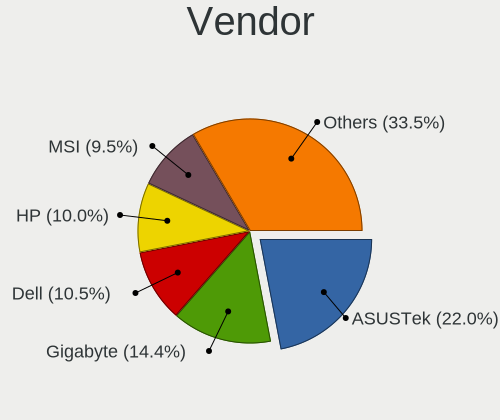
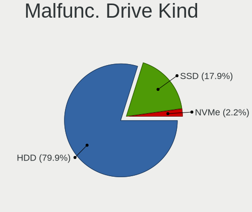
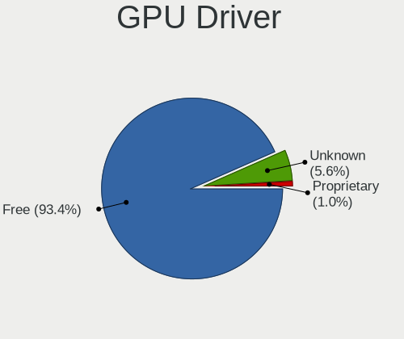
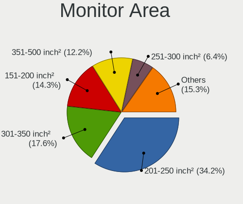

OpenMandriva Hardware Trends (Desktop)
--------------------------------------

A project to identify most popular hardware characteristics and track their change
over time based on data collected by OpenMandriva users at https://Linux-Hardware.org.

Anyone can contribute to the study by uploading probes of their computers by
the [hw-probe](https://github.com/linuxhw/hw-probe) tool:

    sudo -E hw-probe -all -upload

Full-feature report is available here: https://linux-hardware.org/?view=trends&formfactor=desktop

Period: Jun, 2021.

Contents
--------

- [ OS                       ](#os)
- [ OS Family                ](#os-family)
- [ Kernel                   ](#kernel)
- [ Kernel Family            ](#kernel-family)
- [ Kernel Major Ver.        ](#kernel-major-ver)
- [ Arch                     ](#arch)
- [ DE                       ](#de)
- [ Display Server           ](#display-server)
- [ Display Manager          ](#display-manager)
- [ OS Lang                  ](#os-lang)
- [ Boot Mode                ](#boot-mode)
- [ Filesystem               ](#filesystem)
- [ Part. scheme             ](#part-scheme)
- [ Dual Boot with Linux/BSD ](#dual-boot-with-linux/bsd)
- [ Dual Boot (Win)          ](#dual-boot-win)
- [ Country                  ](#country)
- [ City                     ](#city)
- [ Vendor                   ](#vendor)
- [ Model                    ](#model)
- [ Model Family             ](#model-family)
- [ MFG Year                 ](#mfg-year)
- [ Form Factor              ](#form-factor)
- [ Secure Boot              ](#secure-boot)
- [ Coreboot                 ](#coreboot)
- [ RAM Size                 ](#ram-size)
- [ RAM Used                 ](#ram-used)
- [ Has CD-ROM               ](#has-cd-rom)
- [ Total Drives             ](#total-drives)
- [ Has Ethernet             ](#has-ethernet)
- [ Has WiFi                 ](#has-wifi)
- [ Has Bluetooth            ](#has-bluetooth)
- [ Drive Vendor             ](#drive-vendor)
- [ Drive Model              ](#drive-model)
- [ HDD Vendor               ](#hdd-vendor)
- [ SSD Vendor               ](#ssd-vendor)
- [ Drive Kind               ](#drive-kind)
- [ Drive Connector          ](#drive-connector)
- [ Drive Size               ](#drive-size)
- [ Space Total              ](#space-total)
- [ Space Used               ](#space-used)
- [ Malfunc. Drives          ](#malfunc-drives)
- [ Malfunc. Drive Vendor    ](#malfunc-drive-vendor)
- [ Malfunc. HDD Vendor      ](#malfunc-hdd-vendor)
- [ Malfunc. Drive Kind      ](#malfunc-drive-kind)
- [ Failed Drives            ](#failed-drives)
- [ Failed Drive Vendor      ](#failed-drive-vendor)
- [ Drive Status             ](#drive-status)
- [ Storage Vendor           ](#storage-vendor)
- [ Storage Model            ](#storage-model)
- [ Storage Kind             ](#storage-kind)
- [ CPU Vendor               ](#cpu-vendor)
- [ CPU Model                ](#cpu-model)
- [ CPU Model Family         ](#cpu-model-family)
- [ CPU Cores                ](#cpu-cores)
- [ CPU Sockets              ](#cpu-sockets)
- [ CPU Threads              ](#cpu-threads)
- [ CPU Op-Modes             ](#cpu-op-modes)
- [ CPU Microcode            ](#cpu-microcode)
- [ CPU Microarch            ](#cpu-microarch)
- [ GPU Vendor               ](#gpu-vendor)
- [ GPU Model                ](#gpu-model)
- [ GPU Combo                ](#gpu-combo)
- [ GPU Driver               ](#gpu-driver)
- [ GPU Memory               ](#gpu-memory)
- [ Monitor Vendor           ](#monitor-vendor)
- [ Monitor Model            ](#monitor-model)
- [ Monitor Resolution       ](#monitor-resolution)
- [ Monitor Diagonal         ](#monitor-diagonal)
- [ Monitor Width            ](#monitor-width)
- [ Aspect Ratio             ](#aspect-ratio)
- [ Monitor Area             ](#monitor-area)
- [ Pixel Density            ](#pixel-density)
- [ Multiple Monitors        ](#multiple-monitors)
- [ Net Controller Vendor    ](#net-controller-vendor)
- [ Net Controller Model     ](#net-controller-model)
- [ Wireless Vendor          ](#wireless-vendor)
- [ Wireless Model           ](#wireless-model)
- [ Ethernet Vendor          ](#ethernet-vendor)
- [ Ethernet Model           ](#ethernet-model)
- [ Net Controller Kind      ](#net-controller-kind)
- [ Used Controller          ](#used-controller)
- [ NICs                     ](#nics)
- [ IPv6                     ](#ipv6)
- [ Memory Vendor            ](#memory-vendor)
- [ Memory Model             ](#memory-model)
- [ Memory Kind              ](#memory-kind)
- [ Memory Form Factor       ](#memory-form-factor)
- [ Memory Size              ](#memory-size)
- [ Memory Speed             ](#memory-speed)
- [ Sound Vendor             ](#sound-vendor)
- [ Sound Model              ](#sound-model)
- [ Camera Vendor            ](#camera-vendor)
- [ Camera Model             ](#camera-model)
- [ Fingerprint Vendor       ](#fingerprint-vendor)
- [ Fingerprint Model        ](#fingerprint-model)
- [ Chipcard Vendor          ](#chipcard-vendor)
- [ Chipcard Model           ](#chipcard-model)
- [ Printer Vendor           ](#printer-vendor)
- [ Printer Model            ](#printer-model)
- [ Scanner Vendor           ](#scanner-vendor)
- [ Scanner Model            ](#scanner-model)
- [ Bluetooth Vendor         ](#bluetooth-vendor)
- [ Bluetooth Model          ](#bluetooth-model)
- [ Unsupported Devices      ](#unsupported-devices)
- [ Unsupported Device Types ](#unsupported-device-types)

OS
--

Installed operating systems

| Name              | Desktops | Percent |
|-------------------|----------|---------|
| OpenMandriva 4.2  | 130      | 83.33%  |
| OpenMandriva 4.50 | 26       | 16.67%  |

OS Family
---------

OS without a version

| Name         | Desktops | Percent |
|--------------|----------|---------|
| OpenMandriva | 156      | 100%    |

Kernel
------

Version of the Linux kernel

| Version                       | Desktops | Percent |
|-------------------------------|----------|---------|
| 5.10.14-desktop-1omv4002      | 122      | 78.21%  |
| 5.12.4-desktop-1omv4050       | 23       | 14.74%  |
| 5.11.12-desktop-1omv4002      | 8        | 5.13%   |
| 5.12.7-desktop-1omv4003       | 2        | 1.28%   |
| 5.12.6-desktop-clang-1omv4050 | 1        | 0.64%   |

Kernel Family
-------------

Linux kernel without a distro release

| Version | Desktops | Percent |
|---------|----------|---------|
| 5.10.14 | 122      | 78.21%  |
| 5.12.4  | 23       | 14.74%  |
| 5.11.12 | 8        | 5.13%   |
| 5.12.7  | 2        | 1.28%   |
| 5.12.6  | 1        | 0.64%   |

Kernel Major Ver.
-----------------

Linux kernel major version

| Version | Desktops | Percent |
|---------|----------|---------|
| 5.10    | 122      | 78.21%  |
| 5.12    | 26       | 16.67%  |
| 5.11    | 8        | 5.13%   |

Arch
----

OS architecture (x86_64, i586, etc.)

| Name   | Desktops | Percent |
|--------|----------|---------|
| x86_64 | 156      | 100%    |

DE
--

Desktop Environment

| Name | Desktops | Percent |
|------|----------|---------|
| KDE5 | 156      | 100%    |

Display Server
--------------

X11 or Wayland

| Name    | Desktops | Percent |
|---------|----------|---------|
| X11     | 154      | 98.72%  |
| Wayland | 2        | 1.28%   |

Display Manager
---------------

SDDM, LightDM, etc.

| Name | Desktops | Percent |
|------|----------|---------|
| SDDM | 156      | 100%    |

OS Lang
-------

Language

| Lang  | Desktops | Percent |
|-------|----------|---------|
| en_US | 94       | 60.26%  |
| ru_RU | 13       | 8.33%   |
| pt_BR | 6        | 3.85%   |
| fr_FR | 6        | 3.85%   |
| de_DE | 6        | 3.85%   |
| pl_PL | 5        | 3.21%   |
| es_ES | 5        | 3.21%   |
| it_IT | 4        | 2.56%   |
| nl_NL | 3        | 1.92%   |
| cs_CZ | 3        | 1.92%   |
| es_MX | 2        | 1.28%   |
| es_AR | 2        | 1.28%   |
| ru_UA | 1        | 0.64%   |
| nl_BE | 1        | 0.64%   |
| fr_BE | 1        | 0.64%   |
| en_IE | 1        | 0.64%   |
| en_AU | 1        | 0.64%   |
| de_AT | 1        | 0.64%   |
| da_DK | 1        | 0.64%   |

Boot Mode
---------

EFI or BIOS

| Mode | Desktops | Percent |
|------|----------|---------|
| BIOS | 90       | 57.69%  |
| EFI  | 66       | 42.31%  |

Filesystem
----------

Type of filesystem

| Type    | Desktops | Percent |
|---------|----------|---------|
| Overlay | 129      | 82.69%  |
| Ext4    | 26       | 16.67%  |
| Btrfs   | 1        | 0.64%   |

Part. scheme
------------

Scheme of partitioning

| Type    | Desktops | Percent |
|---------|----------|---------|
| GPT     | 88       | 56.41%  |
| MBR     | 67       | 42.95%  |
| Unknown | 1        | 0.64%   |

Dual Boot with Linux/BSD
------------------------

Hosting more than one Linux/BSD

| Dual boot | Desktops | Percent |
|-----------|----------|---------|
| Yes       | 89       | 57.05%  |
| No        | 67       | 42.95%  |

Dual Boot (Win)
---------------

Hosting Linux and Windows

| Dual boot | Desktops | Percent |
|-----------|----------|---------|
| Yes       | 83       | 53.21%  |
| No        | 73       | 46.79%  |

Country
-------

Geographic location (country)

| Country     | Desktops | Percent |
|-------------|----------|---------|
| Brazil      | 19       | 12.18%  |
| Russia      | 15       | 9.62%   |
| USA         | 12       | 7.69%   |
| UK          | 10       | 6.41%   |
| France      | 10       | 6.41%   |
| Poland      | 8        | 5.13%   |
| Germany     | 8        | 5.13%   |
| Spain       | 7        | 4.49%   |
| Canada      | 7        | 4.49%   |
| Netherlands | 6        | 3.85%   |
| Italy       | 6        | 3.85%   |
| Mexico      | 5        | 3.21%   |
| Slovakia    | 4        | 2.56%   |
| Argentina   | 4        | 2.56%   |
| Ukraine     | 3        | 1.92%   |
| Czechia     | 3        | 1.92%   |
| Serbia      | 2        | 1.28%   |
| Japan       | 2        | 1.28%   |
| Ireland     | 2        | 1.28%   |
| India       | 2        | 1.28%   |
| Belgium     | 2        | 1.28%   |
| Australia   | 2        | 1.28%   |
| Venezuela   | 1        | 0.64%   |
| Uruguay     | 1        | 0.64%   |
| Tunisia     | 1        | 0.64%   |
| San Marino  | 1        | 0.64%   |
| Romania     | 1        | 0.64%   |
| Philippines | 1        | 0.64%   |
| Mozambique  | 1        | 0.64%   |
| Malaysia    | 1        | 0.64%   |
| Latvia      | 1        | 0.64%   |
| Kuwait      | 1        | 0.64%   |
| Kazakhstan  | 1        | 0.64%   |
| Ivory Coast | 1        | 0.64%   |
| Finland     | 1        | 0.64%   |
| El Salvador | 1        | 0.64%   |
| Denmark     | 1        | 0.64%   |
| Bulgaria    | 1        | 0.64%   |
| Austria     | 1        | 0.64%   |

City
----

Geographic location (city)

| City               | Desktops | Percent |
|--------------------|----------|---------|
| Lelystad           | 3        | 1.92%   |
| Buenos Aires       | 3        | 1.92%   |
| Stockport          | 2        | 1.28%   |
| Saint Johns        | 2        | 1.28%   |
| Rio de Janeiro     | 2        | 1.28%   |
| Nova Iguaçu       | 2        | 1.28%   |
| Müllheim          | 2        | 1.28%   |
| Mexico City        | 2        | 1.28%   |
| Levice             | 2        | 1.28%   |
| Dublin             | 2        | 1.28%   |
| Besa               | 2        | 1.28%   |
| Zaragoza           | 1        | 0.64%   |
| Wroclaw            | 1        | 0.64%   |
| Wilsele            | 1        | 0.64%   |
| Wilde              | 1        | 0.64%   |
| Waltershausen      | 1        | 0.64%   |
| Walkerton          | 1        | 0.64%   |
| Wageningen         | 1        | 0.64%   |
| Volta Redonda      | 1        | 0.64%   |
| Vladivostok        | 1        | 0.64%   |
| Vitry-sur-Seine    | 1        | 0.64%   |
| Vila Velha         | 1        | 0.64%   |
| Vienna             | 1        | 0.64%   |
| Verona             | 1        | 0.64%   |
| Unterwellenborn    | 1        | 0.64%   |
| Tunis              | 1        | 0.64%   |
| Torquay            | 1        | 0.64%   |
| Toronto            | 1        | 0.64%   |
| Tijuana            | 1        | 0.64%   |
| Thionville         | 1        | 0.64%   |
| Teresopolis        | 1        | 0.64%   |
| São Paulo         | 1        | 0.64%   |
| Surrey             | 1        | 0.64%   |
| Summerside         | 1        | 0.64%   |
| Suita              | 1        | 0.64%   |
| Strasbourg         | 1        | 0.64%   |
| Stalowa Wola       | 1        | 0.64%   |
| St. Catharines     | 1        | 0.64%   |
| St Petersburg      | 1        | 0.64%   |
| Southampton        | 1        | 0.64%   |
| Southall           | 1        | 0.64%   |
| Sochi              | 1        | 0.64%   |
| Smolensk           | 1        | 0.64%   |
| Silly              | 1        | 0.64%   |
| Shepherdsville     | 1        | 0.64%   |
| Sesto San Giovanni | 1        | 0.64%   |
| Schwerin           | 1        | 0.64%   |
| San Martin         | 1        | 0.64%   |
| Sainte-Therese     | 1        | 0.64%   |
| Saint-Junien       | 1        | 0.64%   |
| Rypin              | 1        | 0.64%   |
| Ryazan             | 1        | 0.64%   |
| Rostov-on-Don      | 1        | 0.64%   |
| Riverdale          | 1        | 0.64%   |
| Ringsted           | 1        | 0.64%   |
| Pune               | 1        | 0.64%   |
| Pruszcz Gdanski    | 1        | 0.64%   |
| Prague             | 1        | 0.64%   |
| Poulan             | 1        | 0.64%   |
| Porto Alegre       | 1        | 0.64%   |

Vendor
------

Motherboard manufacturer

| Name                | Desktops | Percent |
|---------------------|----------|---------|
| ASUSTek Computer    | 40       | 25.64%  |
| Gigabyte Technology | 22       | 14.1%   |
| Hewlett-Packard     | 20       | 12.82%  |
| MSI                 | 19       | 12.18%  |
| Dell                | 15       | 9.62%   |
| ASRock              | 13       | 8.33%   |
| Lenovo              | 4        | 2.56%   |
| Acer                | 4        | 2.56%   |
| Intel               | 3        | 1.92%   |
| PCWare              | 2        | 1.28%   |
| Foxconn             | 2        | 1.28%   |
| Biostar             | 2        | 1.28%   |
| Unknown             | 2        | 1.28%   |
| Philco              | 1        | 0.64%   |
| OEM                 | 1        | 0.64%   |
| Medion              | 1        | 0.64%   |
| Inventec            | 1        | 0.64%   |
| Gateway             | 1        | 0.64%   |
| Fujitsu             | 1        | 0.64%   |
| ECS                 | 1        | 0.64%   |
| BESSTAR Tech        | 1        | 0.64%   |

Model
-----

Motherboard model

| Name                               | Desktops | Percent |
|------------------------------------|----------|---------|
| ASUS All Series                    | 5        | 3.21%   |
| Unknown                            | 3        | 1.92%   |
| MSI MS-7816                        | 2        | 1.28%   |
| MSI MS-7693                        | 2        | 1.28%   |
| HP EliteDesk 705 G4 SFF            | 2        | 1.28%   |
| HP Compaq Elite 8300 CMT           | 2        | 1.28%   |
| Gigabyte H61M-DS2                  | 2        | 1.28%   |
| Acer Aspire TC-605                 | 2        | 1.28%   |
| Philco 10D                         | 1        | 0.64%   |
| PCWare IPX4005G                    | 1        | 0.64%   |
| PCWare IPMH61G1                    | 1        | 0.64%   |
| MSI p7-1549                        | 1        | 0.64%   |
| MSI MS-7D18                        | 1        | 0.64%   |
| MSI MS-7C51                        | 1        | 0.64%   |
| MSI MS-7B86                        | 1        | 0.64%   |
| MSI MS-7B49                        | 1        | 0.64%   |
| MSI MS-7B33                        | 1        | 0.64%   |
| MSI MS-7A40                        | 1        | 0.64%   |
| MSI MS-7924                        | 1        | 0.64%   |
| MSI MS-7921                        | 1        | 0.64%   |
| MSI MS-7808                        | 1        | 0.64%   |
| MSI MS-7680                        | 1        | 0.64%   |
| MSI MS-7641                        | 1        | 0.64%   |
| MSI MS-7551                        | 1        | 0.64%   |
| MSI Compaq dx2300 Microtower       | 1        | 0.64%   |
| MSI 500-242ea                      | 1        | 0.64%   |
| Medion MD34150/2569                | 1        | 0.64%   |
| Lenovo V530-15ICR 11BH0028MC       | 1        | 0.64%   |
| Lenovo ThinkCentre M79 10JAS00Q00  | 1        | 0.64%   |
| Lenovo ThinkCentre M71e 3157A23    | 1        | 0.64%   |
| Lenovo ThinkCentre M55E 9645BN2    | 1        | 0.64%   |
| Inventec DQ Class                  | 1        | 0.64%   |
| Intel DH61WW AAG23116-204          | 1        | 0.64%   |
| Intel DH55TC                       | 1        | 0.64%   |
| Intel DH55PJ AAE93812-302          | 1        | 0.64%   |
| HP Z230 SFF Workstation            | 1        | 0.64%   |
| HP Z1 Entry Tower G6               | 1        | 0.64%   |
| HP rp5700 Business System          | 1        | 0.64%   |
| HP ProLiant ML350 G5               | 1        | 0.64%   |
| HP EliteDesk 800 G2 DM 65W         | 1        | 0.64%   |
| HP EliteDesk 800 G2 DM 35W         | 1        | 0.64%   |
| HP EliteDesk 800 G1 SFF            | 1        | 0.64%   |
| HP EliteDesk 705 G3 SFF            | 1        | 0.64%   |
| HP Compaq Pro 6305 MT              | 1        | 0.64%   |
| HP Compaq Pro 6300 SFF             | 1        | 0.64%   |
| HP Compaq dc7900 Small Form Factor | 1        | 0.64%   |
| HP Compaq 8000 Elite SFF PC        | 1        | 0.64%   |
| HP Compaq 6000 Pro MT PC           | 1        | 0.64%   |
| HP 402 G1 SFF Business PC          | 1        | 0.64%   |
| HP 260-a120nf                      | 1        | 0.64%   |
| HP 19-2113w                        | 1        | 0.64%   |
| Gigabyte Z77X-UD3H                 | 1        | 0.64%   |
| Gigabyte Z490 AORUS PRO AX         | 1        | 0.64%   |
| Gigabyte X570 AORUS ULTRA          | 1        | 0.64%   |
| Gigabyte P35-DS3                   | 1        | 0.64%   |
| Gigabyte M68MT-S2                  | 1        | 0.64%   |
| Gigabyte M57SLI-S4                 | 1        | 0.64%   |
| Gigabyte M55S-S3                   | 1        | 0.64%   |
| Gigabyte H97M-Gaming 3             | 1        | 0.64%   |
| Gigabyte H81M-H                    | 1        | 0.64%   |

Model Family
------------

Motherboard model prefix

| Name                 | Desktops | Percent |
|----------------------|----------|---------|
| Dell OptiPlex        | 8        | 5.13%   |
| ASUS PRIME           | 8        | 5.13%   |
| HP Compaq            | 7        | 4.49%   |
| HP EliteDesk         | 6        | 3.85%   |
| ASUS All             | 5        | 3.21%   |
| Lenovo ThinkCentre   | 3        | 1.92%   |
| Dell Vostro          | 3        | 1.92%   |
| ASUS ROG             | 3        | 1.92%   |
| ASUS P8Z77-V         | 3        | 1.92%   |
| ASUS M5A78L-M        | 3        | 1.92%   |
| Acer Aspire          | 3        | 1.92%   |
| Unknown              | 3        | 1.92%   |
| MSI MS-7816          | 2        | 1.28%   |
| MSI MS-7693          | 2        | 1.28%   |
| Gigabyte H61M-DS2    | 2        | 1.28%   |
| Dell Inspiron        | 2        | 1.28%   |
| ASUS TUF             | 2        | 1.28%   |
| ASRock B550          | 2        | 1.28%   |
| Philco 10D           | 1        | 0.64%   |
| PCWare IPX4005G      | 1        | 0.64%   |
| PCWare IPMH61G1      | 1        | 0.64%   |
| MSI p7-1549          | 1        | 0.64%   |
| MSI MS-7D18          | 1        | 0.64%   |
| MSI MS-7C51          | 1        | 0.64%   |
| MSI MS-7B86          | 1        | 0.64%   |
| MSI MS-7B49          | 1        | 0.64%   |
| MSI MS-7B33          | 1        | 0.64%   |
| MSI MS-7A40          | 1        | 0.64%   |
| MSI MS-7924          | 1        | 0.64%   |
| MSI MS-7921          | 1        | 0.64%   |
| MSI MS-7808          | 1        | 0.64%   |
| MSI MS-7680          | 1        | 0.64%   |
| MSI MS-7641          | 1        | 0.64%   |
| MSI MS-7551          | 1        | 0.64%   |
| MSI Compaq           | 1        | 0.64%   |
| MSI 500-242ea        | 1        | 0.64%   |
| Medion MD34150       | 1        | 0.64%   |
| Lenovo V530-15ICR    | 1        | 0.64%   |
| Inventec DQ          | 1        | 0.64%   |
| Intel DH61WW         | 1        | 0.64%   |
| Intel DH55TC         | 1        | 0.64%   |
| Intel DH55PJ         | 1        | 0.64%   |
| HP Z230              | 1        | 0.64%   |
| HP Z1                | 1        | 0.64%   |
| HP rp5700            | 1        | 0.64%   |
| HP ProLiant          | 1        | 0.64%   |
| HP 402               | 1        | 0.64%   |
| HP 260-a120nf        | 1        | 0.64%   |
| HP 19-2113w          | 1        | 0.64%   |
| Gigabyte Z77X-UD3H   | 1        | 0.64%   |
| Gigabyte Z490        | 1        | 0.64%   |
| Gigabyte X570        | 1        | 0.64%   |
| Gigabyte P35-DS3     | 1        | 0.64%   |
| Gigabyte M68MT-S2    | 1        | 0.64%   |
| Gigabyte M57SLI-S4   | 1        | 0.64%   |
| Gigabyte M55S-S3     | 1        | 0.64%   |
| Gigabyte H97M-Gaming | 1        | 0.64%   |
| Gigabyte H81M-H      | 1        | 0.64%   |
| Gigabyte H410M       | 1        | 0.64%   |
| Gigabyte GA-870A-UD3 | 1        | 0.64%   |

MFG Year
--------

Motherboard manufacture year

| Year | Desktops | Percent |
|------|----------|---------|
| 2014 | 15       | 9.62%   |
| 2013 | 15       | 9.62%   |
| 2021 | 14       | 8.97%   |
| 2018 | 13       | 8.33%   |
| 2015 | 13       | 8.33%   |
| 2020 | 12       | 7.69%   |
| 2012 | 12       | 7.69%   |
| 2019 | 10       | 6.41%   |
| 2016 | 10       | 6.41%   |
| 2010 | 10       | 6.41%   |
| 2011 | 8        | 5.13%   |
| 2017 | 7        | 4.49%   |
| 2009 | 6        | 3.85%   |
| 2007 | 6        | 3.85%   |
| 2008 | 2        | 1.28%   |
| 2006 | 2        | 1.28%   |
| 2004 | 1        | 0.64%   |

Form Factor
-----------

Physical design of the computer

| Name    | Desktops | Percent |
|---------|----------|---------|
| Desktop | 156      | 100%    |

Secure Boot
-----------

Enabled or disabled

| State    | Desktops | Percent |
|----------|----------|---------|
| Disabled | 156      | 100%    |

Coreboot
--------

Have coreboot on board

| Used | Desktops | Percent |
|------|----------|---------|
| No   | 156      | 100%    |

RAM Size
--------

Total RAM memory

| Size in GB  | Desktops | Percent |
|-------------|----------|---------|
| 3.01-4.0    | 39       | 25%     |
| 4.01-8.0    | 33       | 21.15%  |
| 8.01-16.0   | 33       | 21.15%  |
| 16.01-24.0  | 31       | 19.87%  |
| 32.01-64.0  | 11       | 7.05%   |
| 1.01-2.0    | 5        | 3.21%   |
| 24.01-32.0  | 3        | 1.92%   |
| 64.01-256.0 | 1        | 0.64%   |

RAM Used
--------

Used RAM memory

| Used GB   | Desktops | Percent |
|-----------|----------|---------|
| 1.01-2.0  | 107      | 68.59%  |
| 0.51-1.0  | 22       | 14.1%   |
| 2.01-3.0  | 15       | 9.62%   |
| 0.01-0.5  | 8        | 5.13%   |
| 8.01-16.0 | 3        | 1.92%   |
| 3.01-4.0  | 1        | 0.64%   |

Has CD-ROM
----------

Has CD-ROM on board

| Presented | Desktops | Percent |
|-----------|----------|---------|
| Yes       | 103      | 66.03%  |
| No        | 53       | 33.97%  |

Total Drives
------------

Number of drives on board

| Drives | Desktops | Percent |
|--------|----------|---------|
| 1      | 69       | 44.23%  |
| 2      | 38       | 24.36%  |
| 3      | 26       | 16.67%  |
| 4      | 10       | 6.41%   |
| 5      | 6        | 3.85%   |
| 0      | 6        | 3.85%   |
| 7      | 1        | 0.64%   |

Has Ethernet
------------

Has Ethernet on board

| Presented | Desktops | Percent |
|-----------|----------|---------|
| Yes       | 155      | 99.36%  |
| No        | 1        | 0.64%   |

Has WiFi
--------

Has WiFi module

| Presented | Desktops | Percent |
|-----------|----------|---------|
| No        | 105      | 67.31%  |
| Yes       | 51       | 32.69%  |

Has Bluetooth
-------------

Has Bluetooth module

| Presented | Desktops | Percent |
|-----------|----------|---------|
| No        | 125      | 80.13%  |
| Yes       | 31       | 19.87%  |

Drive Vendor
------------

Hard drive vendors

| Vendor              | Desktops | Drives | Percent |
|---------------------|----------|--------|---------|
| WDC                 | 57       | 79     | 22.18%  |
| Seagate             | 54       | 63     | 21.01%  |
| Samsung Electronics | 34       | 36     | 13.23%  |
| Toshiba             | 22       | 23     | 8.56%   |
| Kingston            | 22       | 22     | 8.56%   |
| Crucial             | 10       | 11     | 3.89%   |
| SanDisk             | 7        | 8      | 2.72%   |
| China               | 5        | 5      | 1.95%   |
| Maxtor              | 4        | 4      | 1.56%   |
| Hitachi             | 4        | 4      | 1.56%   |
| Unknown             | 3        | 3      | 1.17%   |
| Patriot             | 3        | 3      | 1.17%   |
| Transcend           | 2        | 2      | 0.78%   |
| SPCC                | 2        | 2      | 0.78%   |
| Phison              | 2        | 2      | 0.78%   |
| KingDian            | 2        | 2      | 0.78%   |
| GOODRAM             | 2        | 2      | 0.78%   |
| Apacer              | 2        | 2      | 0.78%   |
| A-DATA Technology   | 2        | 2      | 0.78%   |
| T-Mobile            | 1        | 1      | 0.39%   |
| T-FORCE             | 1        | 1      | 0.39%   |
| Super Talent        | 1        | 1      | 0.39%   |
| Silicon Motion      | 1        | 1      | 0.39%   |
| SABRENT             | 1        | 1      | 0.39%   |
| PNY                 | 1        | 1      | 0.39%   |
| MDT                 | 1        | 1      | 0.39%   |
| Leven               | 1        | 1      | 0.39%   |
| JMicron             | 1        | 1      | 0.39%   |
| Intenso             | 1        | 1      | 0.39%   |
| Hoodisk             | 1        | 1      | 0.39%   |
| Gost                | 1        | 1      | 0.39%   |
| GeIL                | 1        | 1      | 0.39%   |
| FOXLINE             | 1        | 1      | 0.39%   |
| FORESEE             | 1        | 1      | 0.39%   |
| Corsair             | 1        | 1      | 0.39%   |
| ASMT                | 1        | 1      | 0.39%   |
| addlink             | 1        | 1      | 0.39%   |

Drive Model
-----------

Hard drive models

| Model                            | Desktops | Percent |
|----------------------------------|----------|---------|
| Seagate ST1000DM010-2EP102 1TB   | 7        | 2.51%   |
| Toshiba DT01ACA050 500GB         | 5        | 1.79%   |
| Seagate ST500DM002-1BD142 500GB  | 5        | 1.79%   |
| Kingston SA400S37240G 240GB SSD  | 5        | 1.79%   |
| Toshiba DT01ACA100 1TB           | 4        | 1.43%   |
| Seagate ST2000DM008-2FR102 2TB   | 4        | 1.43%   |
| Kingston SA400S37120G 120GB SSD  | 4        | 1.43%   |
| WDC WD5000AVDS-63U7B1 500GB      | 3        | 1.08%   |
| Seagate ST3160815AS 160GB        | 3        | 1.08%   |
| Seagate ST2000DM006-2DM164 2TB   | 3        | 1.08%   |
| Seagate ST2000DM001-1CH164 2TB   | 3        | 1.08%   |
| Samsung SSD 850 EVO 250GB        | 3        | 1.08%   |
| Samsung HD322HJ 320GB            | 3        | 1.08%   |
| WDC WDS500G2B0A-00SM50 500GB SSD | 2        | 0.72%   |
| WDC WDS240G2G0A-00JH30 240GB SSD | 2        | 0.72%   |
| WDC WDS100T2B0C-00PXH0 1TB       | 2        | 0.72%   |
| WDC WD800JD-75MSA3 80GB          | 2        | 0.72%   |
| WDC WD20PURZ-85GU6Y0 2TB         | 2        | 0.72%   |
| WDC WD2003FZEX-00Z4SA0 2TB       | 2        | 0.72%   |
| WDC WD10EZEX-08M2NA0 1TB         | 2        | 0.72%   |
| WDC WD10EADX-22TDHB0 1TB         | 2        | 0.72%   |
| Unknown SD/MMC/MS PRO 128GB      | 2        | 0.72%   |
| Toshiba MQ04ABF100 1TB           | 2        | 0.72%   |
| Seagate ST3250410AS 250GB        | 2        | 0.72%   |
| Seagate ST31000524AS 1TB         | 2        | 0.72%   |
| Seagate ST1000DM003-1SB102 1TB   | 2        | 0.72%   |
| Seagate Expansion Desk 2TB       | 2        | 0.72%   |
| Samsung SSD 970 EVO Plus 500GB   | 2        | 0.72%   |
| Samsung SSD 860 EVO 500GB        | 2        | 0.72%   |
| Samsung HD154UI 1TB              | 2        | 0.72%   |
| Maxtor 6L160M0 164GB             | 2        | 0.72%   |
| Kingston SA400S37480G 480GB SSD  | 2        | 0.72%   |
| KingDian N400 240GB              | 2        | 0.72%   |
| Hitachi HDS721050CLA660 500GB    | 2        | 0.72%   |
| Crucial CT500MX500SSD1 500GB     | 2        | 0.72%   |
| WDC WDS100T3X0C-00SJG0 1TB       | 1        | 0.36%   |
| WDC WDS100T2B0A-00SM50 1TB SSD   | 1        | 0.36%   |
| WDC WD800JD-55MUA1 80GB          | 1        | 0.36%   |
| WDC WD740GD-00FLA0 74GB          | 1        | 0.36%   |
| WDC WD60PURZ-85ZUFY1 6TB         | 1        | 0.36%   |
| WDC WD60EFRX-68L0BN1 6TB         | 1        | 0.36%   |
| WDC WD5000LPVX-80V0TT0 500GB     | 1        | 0.36%   |
| WDC WD5000LPCX-60VHAT0 500GB     | 1        | 0.36%   |
| WDC WD5000AZLX-60K2TA0 500GB     | 1        | 0.36%   |
| WDC WD5000AZLX-00JKKA0 500GB     | 1        | 0.36%   |
| WDC WD5000AAVS-00ZTB0 500GB      | 1        | 0.36%   |
| WDC WD5000AAKX-75U6AA0 500GB     | 1        | 0.36%   |
| WDC WD5000AAKX-08U6AA0 500GB     | 1        | 0.36%   |
| WDC WD5000AAKX-07U6AA0 500GB     | 1        | 0.36%   |
| WDC WD5000AAKX-00ERMA0 500GB     | 1        | 0.36%   |
| WDC WD5000AAKS-65A7B0 500GB      | 1        | 0.36%   |
| WDC WD5000AAKS-00V6A0 500GB      | 1        | 0.36%   |
| WDC WD5000AAKS-00TMA0 500GB      | 1        | 0.36%   |
| WDC WD40PURX-64NZ6Y0 4TB         | 1        | 0.36%   |
| WDC WD40EZRX-00SPEB0 4TB         | 1        | 0.36%   |
| WDC WD3200AAJS-56B4A0 320GB      | 1        | 0.36%   |
| WDC WD30EZRX-00MMMB0 3TB         | 1        | 0.36%   |
| WDC WD30EZRX-00DC0B0 3TB         | 1        | 0.36%   |
| WDC WD2502ABYS-01B7A0 256GB      | 1        | 0.36%   |
| WDC WD2500YS-01SHB1 256GB        | 1        | 0.36%   |

HDD Vendor
----------

Hard disk drive vendors

| Vendor              | Desktops | Drives | Percent |
|---------------------|----------|--------|---------|
| Seagate             | 54       | 63     | 36%     |
| WDC                 | 52       | 71     | 34.67%  |
| Toshiba             | 21       | 22     | 14%     |
| Samsung Electronics | 14       | 15     | 9.33%   |
| MAXTOR              | 4        | 4      | 2.67%   |
| Hitachi             | 4        | 4      | 2.67%   |
| MDT                 | 1        | 1      | 0.67%   |

SSD Vendor
----------

Solid state drive vendors

| Vendor              | Desktops | Drives | Percent |
|---------------------|----------|--------|---------|
| Kingston            | 19       | 19     | 22.89%  |
| Samsung Electronics | 13       | 13     | 15.66%  |
| Crucial             | 8        | 9      | 9.64%   |
| SanDisk             | 7        | 8      | 8.43%   |
| WDC                 | 5        | 5      | 6.02%   |
| China               | 5        | 5      | 6.02%   |
| Patriot             | 3        | 3      | 3.61%   |
| SPCC                | 2        | 2      | 2.41%   |
| GOODRAM             | 2        | 2      | 2.41%   |
| Apacer              | 2        | 2      | 2.41%   |
| A-DATA Technology   | 2        | 2      | 2.41%   |
| Unknown             | 1        | 1      | 1.2%    |
| Transcend           | 1        | 1      | 1.2%    |
| T-FORCE             | 1        | 1      | 1.2%    |
| Super Talent        | 1        | 1      | 1.2%    |
| SABRENT             | 1        | 1      | 1.2%    |
| PNY                 | 1        | 1      | 1.2%    |
| Leven               | 1        | 1      | 1.2%    |
| Intenso             | 1        | 1      | 1.2%    |
| Hoodisk             | 1        | 1      | 1.2%    |
| Gost                | 1        | 1      | 1.2%    |
| GeIL                | 1        | 1      | 1.2%    |
| FOXLINE             | 1        | 1      | 1.2%    |
| FORESEE             | 1        | 1      | 1.2%    |
| Corsair             | 1        | 1      | 1.2%    |
| ASMT                | 1        | 1      | 1.2%    |

Drive Kind
----------

HDD or SSD

| Kind    | Desktops | Drives | Percent |
|---------|----------|--------|---------|
| HDD     | 127      | 180    | 57.99%  |
| SSD     | 67       | 85     | 30.59%  |
| NVMe    | 20       | 23     | 9.13%   |
| Unknown | 5        | 5      | 2.28%   |

Drive Connector
---------------

SATA, SAS, NVMe, etc.

| Type | Desktops | Drives | Percent |
|------|----------|--------|---------|
| SATA | 148      | 258    | 83.62%  |
| NVMe | 19       | 22     | 10.73%  |
| SAS  | 10       | 13     | 5.65%   |

Drive Size
----------

Size of hard drive

| Size in TB | Desktops | Drives | Percent |
|------------|----------|--------|---------|
| 0.01-0.5   | 116      | 161    | 57.43%  |
| 0.51-1.0   | 48       | 56     | 23.76%  |
| 1.01-2.0   | 24       | 31     | 11.88%  |
| 3.01-4.0   | 5        | 5      | 2.48%   |
| 2.01-3.0   | 5        | 7      | 2.48%   |
| 4.01-10.0  | 4        | 5      | 1.98%   |

Space Total
-----------

Amount of disk space available on the file system

| Size in GB     | Desktops | Percent |
|----------------|----------|---------|
| 1-20           | 71       | 45.51%  |
| Unknown        | 33       | 21.15%  |
| 251-500        | 13       | 8.33%   |
| 101-250        | 11       | 7.05%   |
| 501-1000       | 9        | 5.77%   |
| 21-50          | 6        | 3.85%   |
| 51-100         | 6        | 3.85%   |
| 2001-3000      | 3        | 1.92%   |
| 1001-2000      | 3        | 1.92%   |
| More than 3000 | 1        | 0.64%   |

Space Used
----------

Amount of used disk space

| Used GB   | Desktops | Percent |
|-----------|----------|---------|
| 1-20      | 109      | 69.87%  |
| Unknown   | 33       | 21.15%  |
| 251-500   | 4        | 2.56%   |
| 51-100    | 4        | 2.56%   |
| 101-250   | 3        | 1.92%   |
| 501-1000  | 2        | 1.28%   |
| 1001-2000 | 1        | 0.64%   |

Malfunc. Drives
---------------

Drive models with a malfunction

| Model                               | Desktops | Drives | Percent |
|-------------------------------------|----------|--------|---------|
| Seagate ST500DM002-1BD142 500GB     | 3        | 3      | 5.66%   |
| WDC WD5000AVDS-63U7B1 500GB         | 2        | 2      | 3.77%   |
| Toshiba DT01ACA100 1TB              | 2        | 2      | 3.77%   |
| Seagate ST3250410AS 250GB           | 2        | 2      | 3.77%   |
| Seagate ST31000524AS 1TB            | 2        | 2      | 3.77%   |
| Maxtor 6L160M0 164GB                | 2        | 2      | 3.77%   |
| WDC WD800JD-75MSA3 80GB             | 1        | 1      | 1.89%   |
| WDC WD740GD-00FLA0 74GB             | 1        | 1      | 1.89%   |
| WDC WD60EFRX-68L0BN1 6TB            | 1        | 2      | 1.89%   |
| WDC WD5000LPVX-80V0TT0 500GB        | 1        | 1      | 1.89%   |
| WDC WD5000AAKX-75U6AA0 500GB        | 1        | 1      | 1.89%   |
| WDC WD5000AAKS-00V6A0 500GB         | 1        | 1      | 1.89%   |
| WDC WD3200AAJS-56B4A0 320GB         | 1        | 2      | 1.89%   |
| WDC WD30EZRX-00DC0B0 3TB            | 1        | 2      | 1.89%   |
| WDC WD20PURZ-85GU6Y0 2TB            | 1        | 1      | 1.89%   |
| WDC WD1600AAJS-75M0A0 160GB         | 1        | 1      | 1.89%   |
| WDC WD10JPVT-75A1YT0 1TB            | 1        | 1      | 1.89%   |
| WDC WD10EZEX-21M2NA0 1TB            | 1        | 1      | 1.89%   |
| WDC WD10EZEX-08M2NA0 1TB            | 1        | 1      | 1.89%   |
| WDC WD10EZEX-00RKKA0 1TB            | 1        | 1      | 1.89%   |
| WDC WD10EARX-00N0YB0 1TB            | 1        | 1      | 1.89%   |
| WDC WD10EADX-22TDHB0 1TB            | 1        | 1      | 1.89%   |
| WDC WD1002FAEX-00Y9A0 1TB           | 1        | 1      | 1.89%   |
| Toshiba MQ04ABF100 1TB              | 1        | 1      | 1.89%   |
| Toshiba MK2555GSX 250GB             | 1        | 1      | 1.89%   |
| Seagate ST9320325AS 320GB           | 1        | 1      | 1.89%   |
| Seagate ST380819AS 80GB             | 1        | 1      | 1.89%   |
| Seagate ST3500418AS 500GB           | 1        | 1      | 1.89%   |
| Seagate ST320LT007-9ZV142 320GB     | 1        | 1      | 1.89%   |
| Seagate ST320LM001 HN-M320MBB 320GB | 1        | 1      | 1.89%   |
| Seagate ST3160815AS 160GB           | 1        | 1      | 1.89%   |
| Seagate ST31500341AS 1TB            | 1        | 1      | 1.89%   |
| Seagate ST31000333AS 1TB            | 1        | 2      | 1.89%   |
| Seagate ST2000DL003-9VT166 2TB      | 1        | 1      | 1.89%   |
| SanDisk SSD PLUS 1000GB             | 1        | 1      | 1.89%   |
| SanDisk SDSSDA120G 120GB            | 1        | 1      | 1.89%   |
| Samsung Electronics HD501LJ 500GB   | 1        | 1      | 1.89%   |
| Samsung Electronics HD322HJ 320GB   | 1        | 1      | 1.89%   |
| Samsung Electronics HD256GJ 250GB   | 1        | 1      | 1.89%   |
| Samsung Electronics HD250HJ 250GB   | 1        | 1      | 1.89%   |
| Samsung Electronics HD154UI 1TB     | 1        | 1      | 1.89%   |
| Samsung Electronics HD103UJ 1TB     | 1        | 1      | 1.89%   |
| MAXTOR STM3160215AS 160GB           | 1        | 1      | 1.89%   |
| Maxtor 6Y120M0 122GB                | 1        | 1      | 1.89%   |
| Hitachi HTS542580K9SA00 80GB        | 1        | 1      | 1.89%   |
| Hitachi HDS721050CLA660 500GB       | 1        | 1      | 1.89%   |

Malfunc. Drive Vendor
---------------------

Vendors of faulty drives

| Vendor              | Desktops | Drives | Percent |
|---------------------|----------|--------|---------|
| WDC                 | 18       | 22     | 36%     |
| Seagate             | 15       | 17     | 30%     |
| Samsung Electronics | 5        | 6      | 10%     |
| Toshiba             | 4        | 4      | 8%      |
| Maxtor              | 4        | 4      | 8%      |
| SanDisk             | 2        | 2      | 4%      |
| Hitachi             | 2        | 2      | 4%      |

Malfunc. HDD Vendor
-------------------

Vendors of faulty HDD drives

| Vendor              | Desktops | Drives | Percent |
|---------------------|----------|--------|---------|
| WDC                 | 18       | 22     | 37.5%   |
| Seagate             | 15       | 17     | 31.25%  |
| Samsung Electronics | 5        | 6      | 10.42%  |
| Toshiba             | 4        | 4      | 8.33%   |
| Maxtor              | 4        | 4      | 8.33%   |
| Hitachi             | 2        | 2      | 4.17%   |

Malfunc. Drive Kind
-------------------

Kinds of faulty drives

| Kind | Desktops | Drives | Percent |
|------|----------|--------|---------|
| HDD  | 42       | 55     | 95.45%  |
| SSD  | 2        | 2      | 4.55%   |

Failed Drives
-------------

Failed drive models

| Model                   | Desktops | Drives | Percent |
|-------------------------|----------|--------|---------|
| WDC WD800JD-75MSA3 80GB | 1        | 1      | 100%    |

Failed Drive Vendor
-------------------

Failed drive vendors

| Vendor | Desktops | Drives | Percent |
|--------|----------|--------|---------|
| WDC    | 1        | 1      | 100%    |

Drive Status
------------

Number of failed and malfunc. drives

| Status   | Desktops | Drives | Percent |
|----------|----------|--------|---------|
| Works    | 120      | 214    | 66.3%   |
| Malfunc  | 43       | 57     | 23.76%  |
| Detected | 17       | 21     | 9.39%   |
| Failed   | 1        | 1      | 0.55%   |

Storage Vendor
--------------

Storage controller vendors

| Vendor                       | Desktops | Percent |
|------------------------------|----------|---------|
| Intel                        | 96       | 50.53%  |
| AMD                          | 53       | 27.89%  |
| Samsung Electronics          | 8        | 4.21%   |
| Nvidia                       | 4        | 2.11%   |
| JMicron Technology           | 4        | 2.11%   |
| VIA Technologies             | 3        | 1.58%   |
| Sandisk                      | 3        | 1.58%   |
| Kingston Technology Company  | 3        | 1.58%   |
| ASMedia Technology           | 3        | 1.58%   |
| Silicon Motion               | 2        | 1.05%   |
| Silicon Image                | 2        | 1.05%   |
| Phison Electronics           | 2        | 1.05%   |
| Micron/Crucial Technology    | 2        | 1.05%   |
| Marvell Technology Group     | 2        | 1.05%   |
| Toshiba America Info Systems | 1        | 0.53%   |
| LSI Logic / Symbios Logic    | 1        | 0.53%   |
| Hewlett-Packard              | 1        | 0.53%   |

Storage Model
-------------

Storage controller models

| Model                                                                                   | Desktops | Percent |
|-----------------------------------------------------------------------------------------|----------|---------|
| AMD FCH SATA Controller [AHCI mode]                                                     | 28       | 11.34%  |
| Intel 8 Series/C220 Series Chipset Family 6-port SATA Controller 1 [AHCI mode]          | 14       | 5.67%   |
| AMD SB7x0/SB8x0/SB9x0 IDE Controller                                                    | 12       | 4.86%   |
| Intel NM10/ICH7 Family SATA Controller [IDE mode]                                       | 11       | 4.45%   |
| AMD 400 Series Chipset SATA Controller                                                  | 10       | 4.05%   |
| Intel 6 Series/C200 Series Chipset Family 6 port Desktop SATA AHCI Controller           | 9        | 3.64%   |
| AMD SB7x0/SB8x0/SB9x0 SATA Controller [IDE mode]                                        | 9        | 3.64%   |
| AMD SB7x0/SB8x0/SB9x0 SATA Controller [AHCI mode]                                       | 9        | 3.64%   |
| Intel 7 Series/C210 Series Chipset Family 6-port SATA Controller [AHCI mode]            | 8        | 3.24%   |
| Intel 6 Series/C200 Series Chipset Family Desktop SATA Controller (IDE mode, ports 4-5) | 7        | 2.83%   |
| Intel 6 Series/C200 Series Chipset Family Desktop SATA Controller (IDE mode, ports 0-3) | 7        | 2.83%   |
| Intel SATA Controller [RAID mode]                                                       | 6        | 2.43%   |
| Intel 82801G (ICH7 Family) IDE Controller                                               | 6        | 2.43%   |
| Intel 200 Series PCH SATA controller [AHCI mode]                                        | 6        | 2.43%   |
| Samsung NVMe SSD Controller SM981/PM981/PM983                                           | 5        | 2.02%   |
| AMD Starship/Matisse Chipset SATA Controller [AHCI mode]                                | 4        | 1.62%   |
| AMD FCH SATA Controller D                                                               | 4        | 1.62%   |
| Kingston Company A2000 NVMe SSD                                                         | 3        | 1.21%   |
| JMicron JMB363 SATA/IDE Controller                                                      | 3        | 1.21%   |
| Intel Q170/Q150/B150/H170/H110/Z170/CM236 Chipset SATA Controller [AHCI Mode]           | 3        | 1.21%   |
| Intel 9 Series Chipset Family SATA Controller [AHCI Mode]                               | 3        | 1.21%   |
| Intel 7 Series/C210 Series Chipset Family 4-port SATA Controller [IDE mode]             | 3        | 1.21%   |
| Intel 7 Series/C210 Series Chipset Family 2-port SATA Controller [IDE mode]             | 3        | 1.21%   |
| Intel 4 Series Chipset PT IDER Controller                                               | 3        | 1.21%   |
| ASMedia ASM1062 Serial ATA Controller                                                   | 3        | 1.21%   |
| AMD 300 Series Chipset SATA Controller                                                  | 3        | 1.21%   |
| VIA VT6415 PATA IDE Host Controller                                                     | 2        | 0.81%   |
| Silicon Motion SM2263EN/SM2263XT SSD Controller                                         | 2        | 0.81%   |
| Sandisk WD Blue SN550 NVMe SSD                                                          | 2        | 0.81%   |
| Samsung NVMe SSD Controller SM961/PM961/SM963                                           | 2        | 0.81%   |
| Phison E16 PCIe4 NVMe Controller                                                        | 2        | 0.81%   |
| Nvidia MCP55 SATA Controller                                                            | 2        | 0.81%   |
| Nvidia MCP55 IDE                                                                        | 2        | 0.81%   |
| Intel NM10/ICH7 Family SATA Controller [AHCI mode]                                      | 2        | 0.81%   |
| Intel Comet Lake SATA AHCI Controller                                                   | 2        | 0.81%   |
| Intel Celeron/Pentium Silver Processor SATA Controller                                  | 2        | 0.81%   |
| Intel Cannon Lake PCH SATA AHCI Controller                                              | 2        | 0.81%   |
| Intel Atom Processor E3800 Series SATA AHCI Controller                                  | 2        | 0.81%   |
| Intel 82801JD/DO (ICH10 Family) SATA AHCI Controller                                    | 2        | 0.81%   |
| Intel 82801JD/DO (ICH10 Family) 4-port SATA IDE Controller                              | 2        | 0.81%   |
| Intel 82801JD/DO (ICH10 Family) 2-port SATA IDE Controller                              | 2        | 0.81%   |
| Intel 82801IB (ICH9) 2 port SATA Controller [IDE mode]                                  | 2        | 0.81%   |
| Intel 82801I (ICH9 Family) 2 port SATA Controller [IDE mode]                            | 2        | 0.81%   |
| Intel 5 Series/3400 Series Chipset PT IDER Controller                                   | 2        | 0.81%   |
| Intel 5 Series/3400 Series Chipset 4 port SATA IDE Controller                           | 2        | 0.81%   |
| Intel 400 Series Chipset Family SATA AHCI Controller                                    | 2        | 0.81%   |
| VIA VT82C586A/B/VT82C686/A/B/VT823x/A/C PIPC Bus Master IDE                             | 1        | 0.4%    |
| VIA VIA VT6420 SATA RAID Controller                                                     | 1        | 0.4%    |
| Toshiba America Info Systems XG6 NVMe SSD Controller                                    | 1        | 0.4%    |
| Silicon Image SiI 3114 [SATALink/SATARaid] Serial ATA Controller                        | 1        | 0.4%    |
| Silicon Image PCI0680 Ultra ATA-133 Host Controller                                     | 1        | 0.4%    |
| Sandisk WD Black 2018/SN750 / PC SN720 NVMe SSD                                         | 1        | 0.4%    |
| Samsung NVMe Controller                                                                 | 1        | 0.4%    |
| Phison E12 NVMe Controller                                                              | 1        | 0.4%    |
| Nvidia MCP73 SATA Controller (IDE mode)                                                 | 1        | 0.4%    |
| Nvidia MCP73 IDE Controller                                                             | 1        | 0.4%    |
| Nvidia MCP61 SATA Controller                                                            | 1        | 0.4%    |
| Micron/Crucial P2 NVMe PCIe SSD                                                         | 1        | 0.4%    |
| Micron/Crucial P1 NVMe PCIe SSD                                                         | 1        | 0.4%    |
| Marvell Group 88SE9172 SATA 6Gb/s Controller                                            | 1        | 0.4%    |

Storage Kind
------------

Kind of storage controller (IDE, SATA, NVMe, SAS, ...)

| Kind | Desktops | Percent |
|------|----------|---------|
| SATA | 114      | 58.76%  |
| IDE  | 51       | 26.29%  |
| NVMe | 19       | 9.79%   |
| RAID | 10       | 5.15%   |

CPU Vendor
----------

Processor vendors

| Vendor | Desktops | Percent |
|--------|----------|---------|
| Intel  | 99       | 63.46%  |
| AMD    | 57       | 36.54%  |

CPU Model
---------

Processor models

| Model                                           | Desktops | Percent |
|-------------------------------------------------|----------|---------|
| Intel Core 2 Duo CPU E8400 @ 3.00GHz            | 6        | 3.85%   |
| Intel Core i5-4460 CPU @ 3.20GHz                | 4        | 2.56%   |
| Intel Core i5-4440 CPU @ 3.10GHz                | 4        | 2.56%   |
| Intel Core i3-2120 CPU @ 3.30GHz                | 4        | 2.56%   |
| Intel Core i5-3470 CPU @ 3.20GHz                | 3        | 1.92%   |
| Intel Core i3-3220 CPU @ 3.30GHz                | 3        | 1.92%   |
| AMD Ryzen 9 3900X 12-Core Processor             | 3        | 1.92%   |
| AMD FX-8300 Eight-Core Processor                | 3        | 1.92%   |
| Intel Pentium CPU G2030 @ 3.00GHz               | 2        | 1.28%   |
| Intel Core i7-4790 CPU @ 3.60GHz                | 2        | 1.28%   |
| Intel Core i7-3770 CPU @ 3.40GHz                | 2        | 1.28%   |
| Intel Core i5-9400 CPU @ 2.90GHz                | 2        | 1.28%   |
| Intel Core i5-7400 CPU @ 3.00GHz                | 2        | 1.28%   |
| Intel Core i5-6500 CPU @ 3.20GHz                | 2        | 1.28%   |
| Intel Core 2 Duo CPU E4400 @ 2.00GHz            | 2        | 1.28%   |
| Intel Celeron J4005 CPU @ 2.00GHz               | 2        | 1.28%   |
| Intel Celeron CPU J1800 @ 2.41GHz               | 2        | 1.28%   |
| AMD Ryzen 7 3700X 8-Core Processor              | 2        | 1.28%   |
| AMD Ryzen 7 1700 Eight-Core Processor           | 2        | 1.28%   |
| AMD Ryzen 3 PRO 2200G with Radeon Vega Graphics | 2        | 1.28%   |
| AMD Phenom II X6 1100T Processor                | 2        | 1.28%   |
| AMD Athlon II X2 250 Processor                  | 2        | 1.28%   |
| AMD Athlon 200GE with Radeon Vega Graphics      | 2        | 1.28%   |
| AMD A8-9600 RADEON R7, 10 COMPUTE CORES 4C+6G   | 2        | 1.28%   |
| AMD A6-7400K Radeon R5, 6 Compute Cores 2C+4G   | 2        | 1.28%   |
| Intel Xeon CPU E5450 @ 3.00GHz                  | 1        | 0.64%   |
| Intel Xeon CPU E5335 @ 2.00GHz                  | 1        | 0.64%   |
| Intel Xeon CPU E3-1270 v3 @ 3.50GHz             | 1        | 0.64%   |
| Intel Pentium Gold G6400 CPU @ 4.00GHz          | 1        | 0.64%   |
| Intel Pentium Dual-Core CPU E5500 @ 2.80GHz     | 1        | 0.64%   |
| Intel Pentium Dual-Core CPU E5400 @ 2.70GHz     | 1        | 0.64%   |
| Intel Pentium Dual CPU E2160 @ 1.80GHz          | 1        | 0.64%   |
| Intel Pentium D CPU 3.40GHz                     | 1        | 0.64%   |
| Intel Pentium CPU G620 @ 2.60GHz                | 1        | 0.64%   |
| Intel Pentium CPU G4400 @ 3.30GHz               | 1        | 0.64%   |
| Intel Core i7-9700 CPU @ 3.00GHz                | 1        | 0.64%   |
| Intel Core i7-8700K CPU @ 3.70GHz               | 1        | 0.64%   |
| Intel Core i7-6700 CPU @ 3.40GHz                | 1        | 0.64%   |
| Intel Core i7-5820K CPU @ 3.30GHz               | 1        | 0.64%   |
| Intel Core i7-4790K CPU @ 4.00GHz               | 1        | 0.64%   |
| Intel Core i7-4770K CPU @ 3.50GHz               | 1        | 0.64%   |
| Intel Core i7-4770 CPU @ 3.40GHz                | 1        | 0.64%   |
| Intel Core i7-3770S CPU @ 3.10GHz               | 1        | 0.64%   |
| Intel Core i7-2600K CPU @ 3.40GHz               | 1        | 0.64%   |
| Intel Core i7-2600 CPU @ 3.40GHz                | 1        | 0.64%   |
| Intel Core i7-10700 CPU @ 2.90GHz               | 1        | 0.64%   |
| Intel Core i5-8400 CPU @ 2.80GHz                | 1        | 0.64%   |
| Intel Core i5-7500 CPU @ 3.40GHz                | 1        | 0.64%   |
| Intel Core i5-6500T CPU @ 2.50GHz               | 1        | 0.64%   |
| Intel Core i5-4590 CPU @ 3.30GHz                | 1        | 0.64%   |
| Intel Core i5-4570S CPU @ 2.90GHz               | 1        | 0.64%   |
| Intel Core i5-4570 CPU @ 3.20GHz                | 1        | 0.64%   |
| Intel Core i5-3550 CPU @ 3.30GHz                | 1        | 0.64%   |
| Intel Core i5-3350P CPU @ 3.10GHz               | 1        | 0.64%   |
| Intel Core i5-2500K CPU @ 3.30GHz               | 1        | 0.64%   |
| Intel Core i5-2400S CPU @ 2.50GHz               | 1        | 0.64%   |
| Intel Core i5-2400 CPU @ 3.10GHz                | 1        | 0.64%   |
| Intel Core i5-2310 CPU @ 2.90GHz                | 1        | 0.64%   |
| Intel Core i5-10600KF CPU @ 4.10GHz             | 1        | 0.64%   |
| Intel Core i5 CPU 750 @ 2.67GHz                 | 1        | 0.64%   |

CPU Model Family
----------------

Processor model prefix

| Model                   | Desktops | Percent |
|-------------------------|----------|---------|
| Intel Core i5           | 32       | 20.51%  |
| Intel Core i3           | 16       | 10.26%  |
| Intel Core i7           | 15       | 9.62%   |
| Intel Core 2 Duo        | 10       | 6.41%   |
| AMD FX                  | 9        | 5.77%   |
| Intel Celeron           | 8        | 5.13%   |
| AMD Ryzen 5             | 7        | 4.49%   |
| AMD Ryzen 7             | 6        | 3.85%   |
| Intel Pentium           | 4        | 2.56%   |
| Intel Core 2            | 4        | 2.56%   |
| AMD Athlon II X2        | 4        | 2.56%   |
| Intel Xeon              | 3        | 1.92%   |
| AMD Ryzen 9             | 3        | 1.92%   |
| AMD Phenom II X4        | 3        | 1.92%   |
| AMD A8                  | 3        | 1.92%   |
| AMD A6                  | 3        | 1.92%   |
| Intel Pentium Dual-Core | 2        | 1.28%   |
| AMD Ryzen 3 PRO         | 2        | 1.28%   |
| AMD Ryzen 3             | 2        | 1.28%   |
| AMD Phenom II X6        | 2        | 1.28%   |
| AMD Athlon 64 X2        | 2        | 1.28%   |
| AMD Athlon              | 2        | 1.28%   |
| Intel Pentium Gold      | 1        | 0.64%   |
| Intel Pentium Dual      | 1        | 0.64%   |
| Intel Pentium D         | 1        | 0.64%   |
| Intel Core 2 Quad       | 1        | 0.64%   |
| Intel Atom              | 1        | 0.64%   |
| AMD Sempron             | 1        | 0.64%   |
| AMD PRO A8              | 1        | 0.64%   |
| AMD GX                  | 1        | 0.64%   |
| AMD E2                  | 1        | 0.64%   |
| AMD Athlon X4           | 1        | 0.64%   |
| AMD Athlon II X4        | 1        | 0.64%   |
| AMD Athlon 64           | 1        | 0.64%   |
| AMD A4                  | 1        | 0.64%   |
| AMD A10                 | 1        | 0.64%   |

CPU Cores
---------

Number of processor cores

| Number | Desktops | Percent |
|--------|----------|---------|
| 4      | 65       | 41.67%  |
| 2      | 62       | 39.74%  |
| 6      | 12       | 7.69%   |
| 8      | 8        | 5.13%   |
| 1      | 5        | 3.21%   |
| 12     | 3        | 1.92%   |
| 3      | 1        | 0.64%   |

CPU Sockets
-----------

Number of sockets

| Number | Desktops | Percent |
|--------|----------|---------|
| 1      | 156      | 100%    |

CPU Threads
-----------

Threads per core (Hyper-Threading)

| Number | Desktops | Percent |
|--------|----------|---------|
| 1      | 86       | 55.13%  |
| 2      | 70       | 44.87%  |

CPU Op-Modes
------------

CPU Operation Modes (32-bit, 64-bit)

| Op mode        | Desktops | Percent |
|----------------|----------|---------|
| 32-bit, 64-bit | 156      | 100%    |

CPU Microcode
-------------

Microcode number

| Number     | Desktops | Percent |
|------------|----------|---------|
| 0x306c3    | 19       | 12.18%  |
| 0x306a9    | 15       | 9.62%   |
| 0x206a7    | 13       | 8.33%   |
| 0x1067a    | 10       | 6.41%   |
| 0x08701021 | 7        | 4.49%   |
| 0x506e3    | 5        | 3.21%   |
| 0x08101016 | 5        | 3.21%   |
| 0x010000c8 | 4        | 2.56%   |
| Unknown    | 4        | 2.56%   |
| 0xa0653    | 3        | 1.92%   |
| 0x906e9    | 3        | 1.92%   |
| 0x6fd      | 3        | 1.92%   |
| 0x06001119 | 3        | 1.92%   |
| 0xa0655    | 2        | 1.28%   |
| 0x906ed    | 2        | 1.28%   |
| 0x906ea    | 2        | 1.28%   |
| 0x706a1    | 2        | 1.28%   |
| 0x6fb      | 2        | 1.28%   |
| 0x6f6      | 2        | 1.28%   |
| 0x6f2      | 2        | 1.28%   |
| 0x30678    | 2        | 1.28%   |
| 0x20652    | 2        | 1.28%   |
| 0x0800820d | 2        | 1.28%   |
| 0x08001138 | 2        | 1.28%   |
| 0x0600611a | 2        | 1.28%   |
| 0x06001116 | 2        | 1.28%   |
| 0x06000852 | 2        | 1.28%   |
| 0x06000822 | 2        | 1.28%   |
| 0x010000c6 | 2        | 1.28%   |
| 0x010000bf | 2        | 1.28%   |
| 0x010000b6 | 2        | 1.28%   |
| 0xf65      | 1        | 0.64%   |
| 0x906ec    | 1        | 0.64%   |
| 0x906eb    | 1        | 0.64%   |
| 0x706a8    | 1        | 0.64%   |
| 0x306f2    | 1        | 0.64%   |
| 0x30673    | 1        | 0.64%   |
| 0x30661    | 1        | 0.64%   |
| 0x106e5    | 1        | 0.64%   |
| 0x10676    | 1        | 0.64%   |
| 0x0a201016 | 1        | 0.64%   |
| 0x08701013 | 1        | 0.64%   |
| 0x08108109 | 1        | 0.64%   |
| 0x08108102 | 1        | 0.64%   |
| 0x08101102 | 1        | 0.64%   |
| 0x08001137 | 1        | 0.64%   |
| 0x07030105 | 1        | 0.64%   |
| 0x0700010f | 1        | 0.64%   |
| 0x0700010b | 1        | 0.64%   |
| 0x06006118 | 1        | 0.64%   |
| 0x06003109 | 1        | 0.64%   |
| 0x06003106 | 1        | 0.64%   |
| 0x0600081c | 1        | 0.64%   |
| 0x0600063d | 1        | 0.64%   |
| 0x06000629 | 1        | 0.64%   |
| 0x06000609 | 1        | 0.64%   |
| 0x00000000 | 1        | 0.64%   |

CPU Microarch
-------------

Microarchitecture

| Name          | Desktops | Percent |
|---------------|----------|---------|
| Haswell       | 21       | 13.46%  |
| IvyBridge     | 15       | 9.62%   |
| SandyBridge   | 13       | 8.33%   |
| Piledriver    | 11       | 7.05%   |
| Penryn        | 11       | 7.05%   |
| K10           | 10       | 6.41%   |
| Zen           | 9        | 5.77%   |
| KabyLake      | 9        | 5.77%   |
| Core          | 9        | 5.77%   |
| Zen 2         | 8        | 5.13%   |
| Skylake       | 5        | 3.21%   |
| CometLake     | 5        | 3.21%   |
| Zen+          | 4        | 2.56%   |
| Silvermont    | 3        | 1.92%   |
| K8 Hammer     | 3        | 1.92%   |
| Goldmont plus | 3        | 1.92%   |
| Excavator     | 3        | 1.92%   |
| Bulldozer     | 3        | 1.92%   |
| Westmere      | 2        | 1.28%   |
| Steamroller   | 2        | 1.28%   |
| Jaguar        | 2        | 1.28%   |
| Zen 3         | 1        | 0.64%   |
| Puma          | 1        | 0.64%   |
| NetBurst      | 1        | 0.64%   |
| Nehalem       | 1        | 0.64%   |
| Bonnell       | 1        | 0.64%   |

GPU Vendor
----------

Vendors of graphics cards

| Vendor           | Desktops | Percent |
|------------------|----------|---------|
| Nvidia           | 56       | 34.78%  |
| Intel            | 56       | 34.78%  |
| AMD              | 48       | 29.81%  |
| ATI Technologies | 1        | 0.62%   |

GPU Model
---------

Graphics card models

| Model                                                                       | Desktops | Percent |
|-----------------------------------------------------------------------------|----------|---------|
| Intel 2nd Generation Core Processor Family Integrated Graphics Controller   | 9        | 5.56%   |
| Intel Xeon E3-1200 v3/4th Gen Core Processor Integrated Graphics Controller | 8        | 4.94%   |
| Intel 4 Series Chipset Integrated Graphics Controller                       | 7        | 4.32%   |
| Nvidia GT218 [GeForce 210]                                                  | 6        | 3.7%    |
| Intel Xeon E3-1200 v2/3rd Gen Core processor Graphics Controller            | 6        | 3.7%    |
| AMD Raven Ridge [Radeon Vega Series / Radeon Vega Mobile Series]            | 6        | 3.7%    |
| AMD Ellesmere [Radeon RX 470/480/570/570X/580/580X/590]                     | 6        | 3.7%    |
| Nvidia GP107 [GeForce GTX 1050 Ti]                                          | 5        | 3.09%   |
| Intel CoffeeLake-S GT2 [UHD Graphics 630]                                   | 4        | 2.47%   |
| Nvidia GK107 [GeForce GTX 650]                                              | 3        | 1.85%   |
| Nvidia GF119 [GeForce GT 610]                                               | 3        | 1.85%   |
| Intel GeminiLake [UHD Graphics 600]                                         | 3        | 1.85%   |
| Intel Atom Processor Z36xxx/Z37xxx Series Graphics & Display                | 3        | 1.85%   |
| Nvidia TU117 [GeForce GTX 1650]                                             | 2        | 1.23%   |
| Nvidia GT215 [GeForce GT 240]                                               | 2        | 1.23%   |
| Nvidia GP108 [GeForce GT 1030]                                              | 2        | 1.23%   |
| Nvidia GM107 [GeForce GTX 750 Ti]                                           | 2        | 1.23%   |
| Nvidia GK208B [GeForce GT 730]                                              | 2        | 1.23%   |
| Nvidia GK208B [GeForce GT 710]                                              | 2        | 1.23%   |
| Nvidia GK107 [GeForce GT 640]                                               | 2        | 1.23%   |
| Nvidia GF108 [GeForce GT 730]                                               | 2        | 1.23%   |
| Intel HD Graphics 630                                                       | 2        | 1.23%   |
| Intel HD Graphics 530                                                       | 2        | 1.23%   |
| Intel CometLake-S GT2 [UHD Graphics 630]                                    | 2        | 1.23%   |
| Intel 82946GZ/GL Integrated Graphics Controller                             | 2        | 1.23%   |
| Intel 4th Generation Core Processor Family Integrated Graphics Controller   | 2        | 1.23%   |
| AMD Wani [Radeon R5/R6/R7 Graphics]                                         | 2        | 1.23%   |
| AMD RS880 [Radeon HD 4250]                                                  | 2        | 1.23%   |
| AMD Navi 10 [Radeon RX 5600 OEM/5600 XT / 5700/5700 XT]                     | 2        | 1.23%   |
| AMD Cedar [Radeon HD 5000/6000/7350/8350 Series]                            | 2        | 1.23%   |
| AMD Caicos [Radeon HD 6450/7450/8450 / R5 230 OEM]                          | 2        | 1.23%   |
| AMD Caicos XT [Radeon HD 7470/8470 / R5 235/310 OEM]                        | 2        | 1.23%   |
| AMD Baffin [Radeon RX 460/560D / Pro 450/455/460/555/555X/560/560X]         | 2        | 1.23%   |
| Nvidia TU106 [GeForce RTX 2060 SUPER]                                       | 1        | 0.62%   |
| Nvidia TU106 [GeForce RTX 2060 Rev. A]                                      | 1        | 0.62%   |
| Nvidia TU104 [GeForce RTX 2060]                                             | 1        | 0.62%   |
| Nvidia NV10 [GeForce 256 DDR]                                               | 1        | 0.62%   |
| Nvidia GP107 [GeForce GTX 1050]                                             | 1        | 0.62%   |
| Nvidia GP106 [GeForce GTX 1060 6GB]                                         | 1        | 0.62%   |
| Nvidia GM204 [GeForce GTX 980]                                              | 1        | 0.62%   |
| Nvidia GM204 [GeForce GTX 970]                                              | 1        | 0.62%   |
| Nvidia GK107GL [Quadro K600]                                                | 1        | 0.62%   |
| Nvidia GK107 [GeForce GT 740]                                               | 1        | 0.62%   |
| Nvidia GK104 [GeForce GTX 760]                                              | 1        | 0.62%   |
| Nvidia GK104 [GeForce GTX 680]                                              | 1        | 0.62%   |
| Nvidia GK104 [GeForce GTX 660 Ti]                                           | 1        | 0.62%   |
| Nvidia GF119 [GeForce GT 620 OEM]                                           | 1        | 0.62%   |
| Nvidia GF119 [GeForce GT 520]                                               | 1        | 0.62%   |
| Nvidia GF116 [GeForce GTX 550 Ti]                                           | 1        | 0.62%   |
| Nvidia GF114 [GeForce GTX 560 Ti]                                           | 1        | 0.62%   |
| Nvidia GF108 [GeForce GT 630]                                               | 1        | 0.62%   |
| Nvidia GF108 [GeForce GT 440]                                               | 1        | 0.62%   |
| Nvidia G98 [GeForce 8400 GS Rev. 2]                                         | 1        | 0.62%   |
| Nvidia G96C [GeForce 9400 GT]                                               | 1        | 0.62%   |
| Nvidia G84 [GeForce 8600 GT]                                                | 1        | 0.62%   |
| Nvidia G72 [GeForce 7200 GS / 7300 SE]                                      | 1        | 0.62%   |
| Intel Core Processor Integrated Graphics Controller                         | 1        | 0.62%   |
| Intel Comet Lake UHD Graphics                                               | 1        | 0.62%   |
| Intel Atom Processor D2xxx/N2xxx Integrated Graphics Controller             | 1        | 0.62%   |
| Intel 82Q963/Q965 Integrated Graphics Controller                            | 1        | 0.62%   |

GPU Combo
---------

Combinations of graphics cards

| Name           | Desktops | Percent |
|----------------|----------|---------|
| 1 x Nvidia     | 54       | 34.62%  |
| 1 x Intel      | 51       | 32.69%  |
| 1 x AMD        | 47       | 30.13%  |
| 2 x AMD        | 2        | 1.28%   |
| Intel + Nvidia | 2        | 1.28%   |

GPU Driver
----------

Free vs proprietary

| Driver  | Desktops | Percent |
|---------|----------|---------|
| Free    | 152      | 97.44%  |
| Unknown | 4        | 2.56%   |

GPU Memory
----------

Total video memory

| Size in GB | Desktops | Percent |
|------------|----------|---------|
| Unknown    | 52       | 33.33%  |
| 0.51-1.0   | 33       | 21.15%  |
| 1.01-2.0   | 22       | 14.1%   |
| 0.01-0.5   | 19       | 12.18%  |
| 3.01-4.0   | 17       | 10.9%   |
| 7.01-8.0   | 9        | 5.77%   |
| 5.01-6.0   | 3        | 1.92%   |
| 2.01-3.0   | 1        | 0.64%   |

Monitor Vendor
--------------

Monitor vendors

| Vendor               | Desktops | Percent |
|----------------------|----------|---------|
| Samsung Electronics  | 24       | 16%     |
| Goldstar             | 20       | 13.33%  |
| Dell                 | 17       | 11.33%  |
| Hewlett-Packard      | 16       | 10.67%  |
| Iiyama               | 10       | 6.67%   |
| Philips              | 9        | 6%      |
| Acer                 | 8        | 5.33%   |
| BenQ                 | 7        | 4.67%   |
| ViewSonic            | 5        | 3.33%   |
| AOC                  | 4        | 2.67%   |
| Ancor Communications | 4        | 2.67%   |
| Vizio                | 3        | 2%      |
| NEC Computers        | 3        | 2%      |
| ___                  | 2        | 1.33%   |
| Unknown              | 2        | 1.33%   |
| Lenovo               | 2        | 1.33%   |
| ZEH                  | 1        | 0.67%   |
| Vestel Elektronik    | 1        | 0.67%   |
| TRI                  | 1        | 0.67%   |
| Toshiba              | 1        | 0.67%   |
| Sony                 | 1        | 0.67%   |
| OEM                  | 1        | 0.67%   |
| IOD                  | 1        | 0.67%   |
| InfoVision           | 1        | 0.67%   |
| HKC                  | 1        | 0.67%   |
| Hitachi              | 1        | 0.67%   |
| Eizo                 | 1        | 0.67%   |
| Belinea              | 1        | 0.67%   |
| ASUSTek Computer     | 1        | 0.67%   |
| Alba                 | 1        | 0.67%   |

Monitor Model
-------------

Monitor models

| Model                                                                   | Desktops | Percent |
|-------------------------------------------------------------------------|----------|---------|
| ___ LCDTV16 ___0101 1600x1200 1600x900mm 72.3-inch                      | 2        | 1.31%   |
| Samsung Electronics S22F350 SAM0D1A 1920x1080 480x270mm 21.7-inch       | 2        | 1.31%   |
| Samsung Electronics LCD Monitor SAM7002 3840x2160 1210x680mm 54.6-inch  | 2        | 1.31%   |
| Hewlett-Packard P224 HPN361C 1920x1080 480x270mm 21.7-inch              | 2        | 1.31%   |
| Hewlett-Packard LA2405 HWP284B 1920x1200 518x324mm 24.1-inch            | 2        | 1.31%   |
| Goldstar LG ULTRAWIDE GSM59F1 1920x1080 580x240mm 24.7-inch             | 2        | 1.31%   |
| Goldstar FULL HD GSM5B55 1920x1080 480x270mm 21.7-inch                  | 2        | 1.31%   |
| ZEH Z17 ZEH1702 1280x1024 338x270mm 17.0-inch                           | 1        | 0.65%   |
| Vizio VO37LFHDTV10A VIZ0043 1920x1080 820x460mm 37.0-inch               | 1        | 0.65%   |
| Vizio E190VA VIZ0067 1360x768 410x230mm 18.5-inch                       | 1        | 0.65%   |
| Vizio D24hn-G9 VIZ1031 1360x768 521x293mm 23.5-inch                     | 1        | 0.65%   |
| ViewSonic XG2401 SERIES VSCBB31 1920x1080 531x299mm 24.0-inch           | 1        | 0.65%   |
| ViewSonic VA703-4SERIES VSC6A1E 1280x1024 338x270mm 17.0-inch           | 1        | 0.65%   |
| ViewSonic VA2261 VSC0F30 1920x1080 477x268mm 21.5-inch                  | 1        | 0.65%   |
| ViewSonic VA2246 SERIES VSC6F2E 1920x1080 477x268mm 21.5-inch           | 1        | 0.65%   |
| ViewSonic VA2216w SERIE VSC2920 1680x1050 465x291mm 21.6-inch           | 1        | 0.65%   |
| Vestel Elektronik 50UHD_LCD_TV VES3700 3840x2160 1872x1053mm 84.6-inch  | 1        | 0.65%   |
| Unknown LCDTV16 0101 1920x1080 1600x900mm 72.3-inch                     | 1        | 0.65%   |
| Unknown LCD TV 0101 1920x1080 1600x900mm 72.3-inch                      | 1        | 0.65%   |
| TRI TRI A1900 TRI1900 1280x1024 340x270mm 17.1-inch                     | 1        | 0.65%   |
| Toshiba TV TSB0206 1920x1080 886x498mm 40.0-inch                        | 1        | 0.65%   |
| Sony SDM-S71R SNY2170 1280x1024 338x270mm 17.0-inch                     | 1        | 0.65%   |
| Samsung Electronics U28E590 SAM0C4D 3840x2160 607x345mm 27.5-inch       | 1        | 0.65%   |
| Samsung Electronics SyncMaster SAM03E1 1440x900 410x257mm 19.1-inch     | 1        | 0.65%   |
| Samsung Electronics SyncMaster SAM03D0 1440x900 410x257mm 19.1-inch     | 1        | 0.65%   |
| Samsung Electronics SyncMaster SAM027E 1680x1050 474x296mm 22.0-inch    | 1        | 0.65%   |
| Samsung Electronics SyncMaster SAM01B7 1280x1024 338x270mm 17.0-inch    | 1        | 0.65%   |
| Samsung Electronics SyncMaster SAM0196 1280x960 340x270mm 17.1-inch     | 1        | 0.65%   |
| Samsung Electronics SyncMaster SAM011E 1280x1024 338x270mm 17.0-inch    | 1        | 0.65%   |
| Samsung Electronics SyncMaster SAM0017 1024x768 304x228mm 15.0-inch     | 1        | 0.65%   |
| Samsung Electronics SME1720NR SAM0696 1280x1024 338x270mm 17.0-inch     | 1        | 0.65%   |
| Samsung Electronics SA300/SA350 SAM078D 1600x900 443x249mm 20.0-inch    | 1        | 0.65%   |
| Samsung Electronics SA300/SA350 SAM0789 1366x768 410x230mm 18.5-inch    | 1        | 0.65%   |
| Samsung Electronics SA300/350/360 SAM07D6 1920x1080 531x299mm 24.0-inch | 1        | 0.65%   |
| Samsung Electronics S24F350 SAM0D20 1920x1080 521x293mm 23.5-inch       | 1        | 0.65%   |
| Samsung Electronics S24C300 SAM0A28 1920x1080 531x299mm 24.0-inch       | 1        | 0.65%   |
| Samsung Electronics S22B350 SAM08D4 1920x1080 480x270mm 21.7-inch       | 1        | 0.65%   |
| Samsung Electronics S19B300 SAM08A5 1366x768 410x230mm 18.5-inch        | 1        | 0.65%   |
| Samsung Electronics LCD Monitor SAM0C3C 1920x1080 700x390mm 31.5-inch   | 1        | 0.65%   |
| Samsung Electronics LCD Monitor SAM0B7C 1920x1080 886x498mm 40.0-inch   | 1        | 0.65%   |
| Samsung Electronics LCD Monitor SAM0A7C 1920x1080 700x390mm 31.5-inch   | 1        | 0.65%   |
| Samsung Electronics LCD Monitor SAM0900 1920x1080 700x390mm 31.5-inch   | 1        | 0.65%   |
| Samsung Electronics LCD Monitor SAM0669 1920x1080                       | 1        | 0.65%   |
| Philips PHL 276E7 PHLC108 1920x1080 598x336mm 27.0-inch                 | 1        | 0.65%   |
| Philips PHL 273V7 PHLC156 1920x1080 598x336mm 27.0-inch                 | 1        | 0.65%   |
| Philips PHL 273V5 PHLC0D2 1920x1080 600x340mm 27.2-inch                 | 1        | 0.65%   |
| Philips PHL 243V5 PHLC0D1 1920x1080 521x293mm 23.5-inch                 | 1        | 0.65%   |
| Philips PHL 223V5 PHLC0CF 1920x1080 480x270mm 21.7-inch                 | 1        | 0.65%   |
| Philips 273PLPH PHL08A8 1920x1080 598x336mm 27.0-inch                   | 1        | 0.65%   |
| Philips 22PFL3404 EU PHLD05C 1360x768 477x268mm 21.5-inch               | 1        | 0.65%   |
| Philips 220S PHL0886 1680x1050 470x300mm 22.0-inch                      | 1        | 0.65%   |
| Philips 170C PHLC011 1280x1024 338x270mm 17.0-inch                      | 1        | 0.65%   |
| OEM 32W_LCD_TV OEM3700 1920x1080                                        | 1        | 0.65%   |
| NEC Computers LCD19WV NEC671C 1440x900 410x256mm 19.0-inch              | 1        | 0.65%   |
| NEC Computers LCD1770NX NEC6664 1280x1024 338x270mm 17.0-inch           | 1        | 0.65%   |
| NEC Computers FE771SB NEC61D6 1280x1024 315x236mm 15.5-inch             | 1        | 0.65%   |
| NEC Computers E222W NEC6777 1680x1050 474x296mm 22.0-inch               | 1        | 0.65%   |
| Lenovo LEN D24-10 LEN65E2 1920x1080 521x293mm 23.5-inch                 | 1        | 0.65%   |
| Lenovo L197 Wide LEN1152 1440x900 410x257mm 19.1-inch                   | 1        | 0.65%   |
| IOD LCD-DTV192X IOD1301 1366x768 410x230mm 18.5-inch                    | 1        | 0.65%   |

Monitor Resolution
------------------

Monitor screen resolution

| Resolution         | Desktops | Percent |
|--------------------|----------|---------|
| 1920x1080 (FHD)    | 67       | 45.89%  |
| 1280x1024 (SXGA)   | 19       | 13.01%  |
| 1680x1050 (WSXGA+) | 11       | 7.53%   |
| 1366x768 (WXGA)    | 10       | 6.85%   |
| 1440x900 (WXGA+)   | 9        | 6.16%   |
| 3840x2160 (4K)     | 8        | 5.48%   |
| 1600x900 (HD+)     | 5        | 3.42%   |
| 2560x1440 (QHD)    | 4        | 2.74%   |
| 1920x1200 (WUXGA)  | 4        | 2.74%   |
| 2560x1080          | 2        | 1.37%   |
| 1152x864           | 2        | 1.37%   |
| 1024x768 (XGA)     | 2        | 1.37%   |
| 3440x1440          | 1        | 0.68%   |
| 1920x540           | 1        | 0.68%   |
| 1360x768           | 1        | 0.68%   |

Monitor Diagonal
----------------

Diagonal size in inches

| Inches  | Desktops | Percent |
|---------|----------|---------|
| 21      | 22       | 14.67%  |
| 27      | 18       | 12%     |
| 23      | 18       | 12%     |
| 24      | 16       | 10.67%  |
| 17      | 16       | 10.67%  |
| 22      | 11       | 7.33%   |
| 19      | 9        | 6%      |
| 18      | 9        | 6%      |
| 15      | 7        | 4.67%   |
| 31      | 6        | 4%      |
| 84      | 4        | 2.67%   |
| 20      | 4        | 2.67%   |
| 72      | 3        | 2%      |
| 34      | 3        | 2%      |
| 74      | 1        | 0.67%   |
| 41      | 1        | 0.67%   |
| 40      | 1        | 0.67%   |
| Unknown | 1        | 0.67%   |

Monitor Width
-------------

Physical width

| Width in mm | Desktops | Percent |
|-------------|----------|---------|
| 401-500     | 52       | 35.14%  |
| 501-600     | 49       | 33.11%  |
| 301-350     | 23       | 15.54%  |
| 601-700     | 8        | 5.41%   |
| 1501-2000   | 8        | 5.41%   |
| 701-800     | 3        | 2.03%   |
| 351-400     | 2        | 1.35%   |
| 801-900     | 1        | 0.68%   |
| 901-1000    | 1        | 0.68%   |
| Unknown     | 1        | 0.68%   |

Aspect Ratio
------------

Proportional relationship between the width and the height

| Ratio | Desktops | Percent |
|-------|----------|---------|
| 16/9  | 96       | 66.21%  |
| 16/10 | 23       | 15.86%  |
| 5/4   | 16       | 11.03%  |
| 4/3   | 6        | 4.14%   |
| 21/9  | 3        | 2.07%   |
| 6/5   | 1        | 0.69%   |

Monitor Area
------------

Area in inch²

| Area in inch² | Desktops | Percent |
|----------------|----------|---------|
| 201-250        | 54       | 36.24%  |
| 151-200        | 24       | 16.11%  |
| 141-150        | 22       | 14.77%  |
| 301-350        | 18       | 12.08%  |
| 351-500        | 9        | 6.04%   |
| More than 1000 | 8        | 5.37%   |
| 251-300        | 4        | 2.68%   |
| 111-120        | 4        | 2.68%   |
| 101-110        | 3        | 2.01%   |
| 501-1000       | 2        | 1.34%   |
| Unknown        | 1        | 0.67%   |

Pixel Density
-------------

Pixels per inch

| Density | Desktops | Percent |
|---------|----------|---------|
| 51-100  | 108      | 73.97%  |
| 101-120 | 26       | 17.81%  |
| 1-50    | 8        | 5.48%   |
| 121-160 | 3        | 2.05%   |
| Unknown | 1        | 0.68%   |

Multiple Monitors
-----------------

Total monitors connected

| Total | Desktops | Percent |
|-------|----------|---------|
| 1     | 139      | 89.1%   |
| 2     | 14       | 8.97%   |
| 0     | 2        | 1.28%   |
| 3     | 1        | 0.64%   |

Net Controller Vendor
---------------------

Controller vendors

| Vendor                          | Desktops | Percent |
|---------------------------------|----------|---------|
| Realtek Semiconductor           | 101      | 48.79%  |
| Intel                           | 46       | 22.22%  |
| Qualcomm Atheros                | 17       | 8.21%   |
| Ralink Technology               | 6        | 2.9%    |
| Broadcom                        | 6        | 2.9%    |
| Ralink                          | 4        | 1.93%   |
| Nvidia                          | 4        | 1.93%   |
| Broadcom Limited                | 3        | 1.45%   |
| ZTE WCDMA Technologies MSM      | 2        | 0.97%   |
| VIA Technologies                | 2        | 0.97%   |
| Qualcomm Atheros Communications | 2        | 0.97%   |
| Microsoft                       | 2        | 0.97%   |
| Xiaomi                          | 1        | 0.48%   |
| TP-Link                         | 1        | 0.48%   |
| STMicroelectronics              | 1        | 0.48%   |
| Mercucys                        | 1        | 0.48%   |
| Marvell Technology Group        | 1        | 0.48%   |
| Linksys                         | 1        | 0.48%   |
| JMicron Technology              | 1        | 0.48%   |
| Huawei Technologies             | 1        | 0.48%   |
| Edimax Technology               | 1        | 0.48%   |
| D-Link                          | 1        | 0.48%   |
| ASUSTek Computer                | 1        | 0.48%   |
| Accton Technology               | 1        | 0.48%   |

Net Controller Model
--------------------

Controller models

| Model                                                             | Desktops | Percent |
|-------------------------------------------------------------------|----------|---------|
| Realtek RTL8111/8168/8411 PCI Express Gigabit Ethernet Controller | 88       | 39.64%  |
| Intel 82579LM Gigabit Network Connection (Lewisville)             | 7        | 3.15%   |
| Realtek RTL-8100/8101L/8139 PCI Fast Ethernet Adapter             | 5        | 2.25%   |
| Intel I211 Gigabit Network Connection                             | 5        | 2.25%   |
| Intel Ethernet Connection (2) I219-V                              | 5        | 2.25%   |
| Realtek RTL8188EUS 802.11n Wireless Network Adapter               | 4        | 1.8%    |
| Intel Wi-Fi 6 AX200                                               | 4        | 1.8%    |
| Intel 82567LM-3 Gigabit Network Connection                        | 4        | 1.8%    |
| Realtek RTL8125 2.5GbE Controller                                 | 3        | 1.35%   |
| Ralink MT7601U Wireless Adapter                                   | 3        | 1.35%   |
| Qualcomm Atheros Killer E220x Gigabit Ethernet Controller         | 3        | 1.35%   |
| Qualcomm Atheros AR9485 Wireless Network Adapter                  | 3        | 1.35%   |
| Intel Ethernet Controller I225-V                                  | 3        | 1.35%   |
| Intel Ethernet Connection I217-LM                                 | 3        | 1.35%   |
| Realtek RTL810xE PCI Express Fast Ethernet controller             | 2        | 0.9%    |
| Realtek RTL-8185 IEEE 802.11a/b/g Wireless LAN Controller         | 2        | 0.9%    |
| Ralink RT2870/RT3070 Wireless Adapter                             | 2        | 0.9%    |
| Qualcomm Atheros QCA9565 / AR9565 Wireless Network Adapter        | 2        | 0.9%    |
| Qualcomm Atheros AR9271 802.11n                                   | 2        | 0.9%    |
| Qualcomm Atheros AR8161 Gigabit Ethernet                          | 2        | 0.9%    |
| Qualcomm Atheros AR8151 v2.0 Gigabit Ethernet                     | 2        | 0.9%    |
| Nvidia MCP55 Ethernet                                             | 2        | 0.9%    |
| Intel Ethernet Connection (2) I219-LM                             | 2        | 0.9%    |
| Intel Ethernet Connection (2) I218-V                              | 2        | 0.9%    |
| Intel Dual Band Wireless-AC 3168NGW [Stone Peak]                  | 2        | 0.9%    |
| Intel 82579V Gigabit Network Connection                           | 2        | 0.9%    |
| Intel 82578DC Gigabit Network Connection                          | 2        | 0.9%    |
| ZTE WCDMA MSM Z6201V                                              | 1        | 0.45%   |
| ZTE WCDMA MSM WebConnect Rocket 2.0                               | 1        | 0.45%   |
| Xiaomi Mi/Redmi series (RNDIS)                                    | 1        | 0.45%   |
| VIA VT6120/VT6121/VT6122 Gigabit Ethernet Adapter                 | 1        | 0.45%   |
| VIA AC'97 Modem Controller                                        | 1        | 0.45%   |
| TP-Link UE300 10/100/1000 LAN (ethernet mode) [Realtek RTL8153]   | 1        | 0.45%   |
| STMicroelectronics ST70137 [Unicorn] ADSL DMT Transceiver         | 1        | 0.45%   |
| Realtek RTL8822BE 802.11a/b/g/n/ac WiFi adapter                   | 1        | 0.45%   |
| Realtek RTL8723BE PCIe Wireless Network Adapter                   | 1        | 0.45%   |
| Realtek RTL8191SU 802.11n WLAN Adapter                            | 1        | 0.45%   |
| Realtek RTL8188CE 802.11b/g/n WiFi Adapter                        | 1        | 0.45%   |
| Realtek RTL8153 Gigabit Ethernet Adapter                          | 1        | 0.45%   |
| Realtek 802.11ac NIC                                              | 1        | 0.45%   |
| Ralink RT5370 Wireless Adapter                                    | 1        | 0.45%   |
| Ralink RT5390R 802.11bgn PCIe Wireless Network Adapter            | 1        | 0.45%   |
| Ralink RT2790 Wireless 802.11n 1T/2R PCIe                         | 1        | 0.45%   |
| Ralink RT2561/RT61 rev B 802.11g                                  | 1        | 0.45%   |
| Ralink RT2500 Wireless 802.11bg                                   | 1        | 0.45%   |
| Qualcomm Atheros QCA9377 802.11ac Wireless Network Adapter        | 1        | 0.45%   |
| Qualcomm Atheros QCA6174 802.11ac Wireless Network Adapter        | 1        | 0.45%   |
| Qualcomm Atheros Killer E2400 Gigabit Ethernet Controller         | 1        | 0.45%   |
| Qualcomm Atheros Attansic L1 Gigabit Ethernet                     | 1        | 0.45%   |
| Qualcomm Atheros AR9462 Wireless Network Adapter                  | 1        | 0.45%   |
| Qualcomm Atheros AR9287 Wireless Network Adapter (PCI-Express)    | 1        | 0.45%   |
| Qualcomm Atheros AR9285 Wireless Network Adapter (PCI-Express)    | 1        | 0.45%   |
| Nvidia MCP73 Ethernet                                             | 1        | 0.45%   |
| Nvidia MCP61 Ethernet                                             | 1        | 0.45%   |
| Microsoft XBOX ACC                                                | 1        | 0.45%   |
| Microsoft Xbox 360 Wireless Adapter                               | 1        | 0.45%   |
| Mercucys 802.11n NIC                                              | 1        | 0.45%   |
| Marvell Group 88E8001 Gigabit Ethernet Controller                 | 1        | 0.45%   |
| Linksys WUSB54G v4 802.11g Adapter [Ralink RT2500USB]             | 1        | 0.45%   |
| JMicron JMC250 PCI Express Gigabit Ethernet Controller            | 1        | 0.45%   |

Wireless Vendor
---------------

Wireless vendors

| Vendor                          | Desktops | Percent |
|---------------------------------|----------|---------|
| Realtek Semiconductor           | 11       | 20.75%  |
| Intel                           | 11       | 20.75%  |
| Qualcomm Atheros                | 10       | 18.87%  |
| Ralink Technology               | 6        | 11.32%  |
| Ralink                          | 4        | 7.55%   |
| Qualcomm Atheros Communications | 2        | 3.77%   |
| Microsoft                       | 2        | 3.77%   |
| Broadcom                        | 2        | 3.77%   |
| Mercucys                        | 1        | 1.89%   |
| Linksys                         | 1        | 1.89%   |
| Edimax Technology               | 1        | 1.89%   |
| D-Link                          | 1        | 1.89%   |
| ASUSTek Computer                | 1        | 1.89%   |

Wireless Model
--------------

Wireless models

| Model                                                          | Desktops | Percent |
|----------------------------------------------------------------|----------|---------|
| Realtek RTL8188EUS 802.11n Wireless Network Adapter            | 4        | 7.55%   |
| Intel Wi-Fi 6 AX200                                            | 4        | 7.55%   |
| Ralink MT7601U Wireless Adapter                                | 3        | 5.66%   |
| Qualcomm Atheros AR9485 Wireless Network Adapter               | 3        | 5.66%   |
| Realtek RTL-8185 IEEE 802.11a/b/g Wireless LAN Controller      | 2        | 3.77%   |
| Ralink RT2870/RT3070 Wireless Adapter                          | 2        | 3.77%   |
| Qualcomm Atheros QCA9565 / AR9565 Wireless Network Adapter     | 2        | 3.77%   |
| Qualcomm Atheros AR9271 802.11n                                | 2        | 3.77%   |
| Intel Dual Band Wireless-AC 3168NGW [Stone Peak]               | 2        | 3.77%   |
| Realtek RTL8822BE 802.11a/b/g/n/ac WiFi adapter                | 1        | 1.89%   |
| Realtek RTL8723BE PCIe Wireless Network Adapter                | 1        | 1.89%   |
| Realtek RTL8191SU 802.11n WLAN Adapter                         | 1        | 1.89%   |
| Realtek RTL8188CE 802.11b/g/n WiFi Adapter                     | 1        | 1.89%   |
| Realtek 802.11ac NIC                                           | 1        | 1.89%   |
| Ralink RT5370 Wireless Adapter                                 | 1        | 1.89%   |
| Ralink RT5390R 802.11bgn PCIe Wireless Network Adapter         | 1        | 1.89%   |
| Ralink RT2790 Wireless 802.11n 1T/2R PCIe                      | 1        | 1.89%   |
| Ralink RT2561/RT61 rev B 802.11g                               | 1        | 1.89%   |
| Ralink RT2500 Wireless 802.11bg                                | 1        | 1.89%   |
| Qualcomm Atheros QCA9377 802.11ac Wireless Network Adapter     | 1        | 1.89%   |
| Qualcomm Atheros QCA6174 802.11ac Wireless Network Adapter     | 1        | 1.89%   |
| Qualcomm Atheros AR9462 Wireless Network Adapter               | 1        | 1.89%   |
| Qualcomm Atheros AR9287 Wireless Network Adapter (PCI-Express) | 1        | 1.89%   |
| Qualcomm Atheros AR9285 Wireless Network Adapter (PCI-Express) | 1        | 1.89%   |
| Microsoft XBOX ACC                                             | 1        | 1.89%   |
| Microsoft Xbox 360 Wireless Adapter                            | 1        | 1.89%   |
| Mercucys 802.11n NIC                                           | 1        | 1.89%   |
| Linksys WUSB54G v4 802.11g Adapter [Ralink RT2500USB]          | 1        | 1.89%   |
| Intel Wireless-AC 9260                                         | 1        | 1.89%   |
| Intel Wireless 7265                                            | 1        | 1.89%   |
| Intel Tiger Lake PCH CNVi WiFi                                 | 1        | 1.89%   |
| Intel Comet Lake PCH CNVi WiFi                                 | 1        | 1.89%   |
| Intel Cannon Lake PCH CNVi WiFi                                | 1        | 1.89%   |
| Edimax EW-7811Un 802.11n Wireless Adapter [Realtek RTL8188CUS] | 1        | 1.89%   |
| D-Link DWA-123 Wireless N 150 Adapter (rev.D1)                 | 1        | 1.89%   |
| Broadcom BCM43228 802.11a/b/g/n                                | 1        | 1.89%   |
| Broadcom BCM4312 802.11b/g LP-PHY                              | 1        | 1.89%   |
| ASUS AC51 802.11a/b/g/n/ac Wireless Adapter [Mediatek MT7610U] | 1        | 1.89%   |

Ethernet Vendor
---------------

Ethernet vendors

| Vendor                     | Desktops | Percent |
|----------------------------|----------|---------|
| Realtek Semiconductor      | 95       | 58.64%  |
| Intel                      | 39       | 24.07%  |
| Qualcomm Atheros           | 9        | 5.56%   |
| Nvidia                     | 4        | 2.47%   |
| Broadcom                   | 4        | 2.47%   |
| Broadcom Limited           | 3        | 1.85%   |
| ZTE WCDMA Technologies MSM | 1        | 0.62%   |
| Xiaomi                     | 1        | 0.62%   |
| VIA Technologies           | 1        | 0.62%   |
| TP-Link                    | 1        | 0.62%   |
| Marvell Technology Group   | 1        | 0.62%   |
| JMicron Technology         | 1        | 0.62%   |
| Huawei Technologies        | 1        | 0.62%   |
| Accton Technology          | 1        | 0.62%   |

Ethernet Model
--------------

Ethernet models

| Model                                                             | Desktops | Percent |
|-------------------------------------------------------------------|----------|---------|
| Realtek RTL8111/8168/8411 PCI Express Gigabit Ethernet Controller | 88       | 53.01%  |
| Intel 82579LM Gigabit Network Connection (Lewisville)             | 7        | 4.22%   |
| Realtek RTL-8100/8101L/8139 PCI Fast Ethernet Adapter             | 5        | 3.01%   |
| Intel I211 Gigabit Network Connection                             | 5        | 3.01%   |
| Intel Ethernet Connection (2) I219-V                              | 5        | 3.01%   |
| Intel 82567LM-3 Gigabit Network Connection                        | 4        | 2.41%   |
| Realtek RTL8125 2.5GbE Controller                                 | 3        | 1.81%   |
| Qualcomm Atheros Killer E220x Gigabit Ethernet Controller         | 3        | 1.81%   |
| Intel Ethernet Controller I225-V                                  | 3        | 1.81%   |
| Intel Ethernet Connection I217-LM                                 | 3        | 1.81%   |
| Realtek RTL810xE PCI Express Fast Ethernet controller             | 2        | 1.2%    |
| Qualcomm Atheros AR8161 Gigabit Ethernet                          | 2        | 1.2%    |
| Qualcomm Atheros AR8151 v2.0 Gigabit Ethernet                     | 2        | 1.2%    |
| Nvidia MCP55 Ethernet                                             | 2        | 1.2%    |
| Intel Ethernet Connection (2) I219-LM                             | 2        | 1.2%    |
| Intel Ethernet Connection (2) I218-V                              | 2        | 1.2%    |
| Intel 82579V Gigabit Network Connection                           | 2        | 1.2%    |
| Intel 82578DC Gigabit Network Connection                          | 2        | 1.2%    |
| ZTE WCDMA MSM Z6201V                                              | 1        | 0.6%    |
| Xiaomi Mi/Redmi series (RNDIS)                                    | 1        | 0.6%    |
| VIA VT6120/VT6121/VT6122 Gigabit Ethernet Adapter                 | 1        | 0.6%    |
| TP-Link UE300 10/100/1000 LAN (ethernet mode) [Realtek RTL8153]   | 1        | 0.6%    |
| Realtek RTL8153 Gigabit Ethernet Adapter                          | 1        | 0.6%    |
| Qualcomm Atheros Killer E2400 Gigabit Ethernet Controller         | 1        | 0.6%    |
| Qualcomm Atheros Attansic L1 Gigabit Ethernet                     | 1        | 0.6%    |
| Nvidia MCP73 Ethernet                                             | 1        | 0.6%    |
| Nvidia MCP61 Ethernet                                             | 1        | 0.6%    |
| Marvell Group 88E8001 Gigabit Ethernet Controller                 | 1        | 0.6%    |
| JMicron JMC250 PCI Express Gigabit Ethernet Controller            | 1        | 0.6%    |
| Intel NM10/ICH7 Family LAN Controller                             | 1        | 0.6%    |
| Intel Ethernet Connection I217-V                                  | 1        | 0.6%    |
| Intel Ethernet Connection (11) I219-LM                            | 1        | 0.6%    |
| Intel 82574L Gigabit Network Connection                           | 1        | 0.6%    |
| Huawei E353/E3131                                                 | 1        | 0.6%    |
| Broadcom NetXtreme BCM5762 Gigabit Ethernet PCIe                  | 1        | 0.6%    |
| Broadcom NetXtreme BCM5755 Gigabit Ethernet PCI Express           | 1        | 0.6%    |
| Broadcom NetLink BCM5786 Gigabit Ethernet PCI Express             | 1        | 0.6%    |
| Broadcom NetLink BCM57780 Gigabit Ethernet PCIe                   | 1        | 0.6%    |
| Broadcom Limited NetXtreme II BCM5708 Gigabit Ethernet            | 1        | 0.6%    |
| Broadcom Limited NetXtreme BCM5761 Gigabit Ethernet PCIe          | 1        | 0.6%    |
| Broadcom Limited NetXtreme BCM5754 Gigabit Ethernet PCI Express   | 1        | 0.6%    |
| Accton SMC2-1211TX                                                | 1        | 0.6%    |

Net Controller Kind
-------------------

Ethernet, WiFi or modem

| Kind     | Desktops | Percent |
|----------|----------|---------|
| Ethernet | 155      | 74.16%  |
| WiFi     | 51       | 24.4%   |
| Modem    | 2        | 0.96%   |
| Unknown  | 1        | 0.48%   |

Used Controller
---------------

Currently used network controller

| Kind     | Desktops | Percent |
|----------|----------|---------|
| Ethernet | 128      | 83.66%  |
| WiFi     | 25       | 16.34%  |

NICs
----

Total network controllers on board

| Total | Desktops | Percent |
|-------|----------|---------|
| 1     | 117      | 75%     |
| 2     | 34       | 21.79%  |
| 3     | 4        | 2.56%   |
| 0     | 1        | 0.64%   |

IPv6
----

IPv6 vs IPv4

| Used | Desktops | Percent |
|------|----------|---------|
| No   | 118      | 75.64%  |
| Yes  | 38       | 24.36%  |

Memory Vendor
-------------

Memory module vendors

| Vendor              | Desktops | Percent |
|---------------------|----------|---------|
| Unknown             | 37       | 21.39%  |
| Kingston            | 33       | 19.08%  |
| SK Hynix            | 17       | 9.83%   |
| Crucial             | 17       | 9.83%   |
| Samsung Electronics | 13       | 7.51%   |
| Corsair             | 10       | 5.78%   |
| Micron Technology   | 8        | 4.62%   |
| G.Skill             | 6        | 3.47%   |
| A-DATA Technology   | 5        | 2.89%   |
| Team                | 4        | 2.31%   |
| Patriot             | 4        | 2.31%   |
| Smart               | 3        | 1.73%   |
| Ramaxel Technology  | 2        | 1.16%   |
| GOODRAM             | 2        | 1.16%   |
| Elpida              | 2        | 1.16%   |
| Unknown (ABCD)      | 1        | 0.58%   |
| Transcend           | 1        | 0.58%   |
| Silicon Power       | 1        | 0.58%   |
| Neo Forza           | 1        | 0.58%   |
| Nanya Technology    | 1        | 0.58%   |
| Macronix            | 1        | 0.58%   |
| M                   | 1        | 0.58%   |
| H                   | 1        | 0.58%   |
| Exceleram           | 1        | 0.58%   |
| Apacer              | 1        | 0.58%   |

Memory Model
------------

Memory module models

| Model                                                        | Desktops | Percent |
|--------------------------------------------------------------|----------|---------|
| Unknown RAM Module 4GB DIMM DDR3 1600MT/s                    | 3        | 1.48%   |
| Unknown RAM Module 2GB DIMM DDR2 800MT/s                     | 3        | 1.48%   |
| Unknown RAM Module 2GB DIMM 800MT/s                          | 3        | 1.48%   |
| Unknown RAM Module 2GB DIMM 667MT/s                          | 3        | 1.48%   |
| Unknown RAM Module 4GB DIMM 1600MT/s                         | 2        | 0.99%   |
| Unknown RAM Module 4GB DIMM 1333MT/s                         | 2        | 0.99%   |
| Unknown RAM Module 2GB DIMM DDR2 667MT/s                     | 2        | 0.99%   |
| Unknown RAM Module 1GB DIMM SDRAM                            | 2        | 0.99%   |
| Team RAM Elite-1600 8GB DIMM DDR3 1600MT/s                   | 2        | 0.99%   |
| SK Hynix RAM Module 4GB DIMM DDR4 2667MT/s                   | 2        | 0.99%   |
| SK Hynix RAM HYMP125U64CP8-S6 2GB DIMM DDR2 49926MT/s        | 2        | 0.99%   |
| SK Hynix RAM HMT351U6EFR8C-PB 4096MB DIMM DDR3 1800MT/s      | 2        | 0.99%   |
| SK Hynix RAM HMT351U6CFR8C-PB 4096MB DIMM DDR3 1800MT/s      | 2        | 0.99%   |
| SK Hynix RAM HMT112U6TFR8C-H9 1024MB DIMM DDR3 1333MT/s      | 2        | 0.99%   |
| Samsung RAM M378B5773DH0-CH9 2GB DIMM DDR3 1333MT/s          | 2        | 0.99%   |
| Samsung RAM M378B5773CH0-CH9 2048MB DIMM DDR3 1867MT/s       | 2        | 0.99%   |
| Kingston RAM KHX3200C16D4/16GX 16GB DIMM DDR4 3600MT/s       | 2        | 0.99%   |
| Kingston RAM KHX1866C10D3/8G 8GB DIMM DDR3 2133MT/s          | 2        | 0.99%   |
| Kingston RAM KHX1600C10D3/8G 8GB DIMM DDR3 1867MT/s          | 2        | 0.99%   |
| Kingston RAM 99U5584-010.A00LF 4096MB DIMM DDR3 1600MT/s     | 2        | 0.99%   |
| Kingston RAM 99U5471-012.A00LF 4GB DIMM 1600MT/s             | 2        | 0.99%   |
| GOODRAM RAM GR1333D364L9/4G 4GB DIMM DDR3 1600MT/s           | 2        | 0.99%   |
| Corsair RAM CMK16GX4M2B3200C16 8GB DIMM DDR4 3600MT/s        | 2        | 0.99%   |
| Unknown RAM ZSP---ZSP 4GB DIMM DDR3 1333MT/s                 | 1        | 0.49%   |
| Unknown RAM Module 8GB DIMM DDR4 3333MT/s                    | 1        | 0.49%   |
| Unknown RAM Module 8GB DIMM DDR3 1600MT/s                    | 1        | 0.49%   |
| Unknown RAM Module 8GB DIMM 1600MT/s                         | 1        | 0.49%   |
| Unknown RAM Module 8GB DIMM 1333MT/s                         | 1        | 0.49%   |
| Unknown RAM Module 8GB DIMM                                  | 1        | 0.49%   |
| Unknown RAM Module 4GB FB-DIMM DDR2 667MT/s                  | 1        | 0.49%   |
| Unknown RAM Module 4GB DIMM SDRAM                            | 1        | 0.49%   |
| Unknown RAM Module 4GB DIMM DDR4 3333MT/s                    | 1        | 0.49%   |
| Unknown RAM Module 4GB DIMM DDR3 667MT/s                     | 1        | 0.49%   |
| Unknown RAM Module 4GB DIMM DDR3 1333MT/s                    | 1        | 0.49%   |
| Unknown RAM Module 4GB DIMM 400MT/s                          | 1        | 0.49%   |
| Unknown RAM Module 2GB SODIMM DDR3 800MT/s                   | 1        | 0.49%   |
| Unknown RAM Module 2GB FB-DIMM DDR2 667MT/s                  | 1        | 0.49%   |
| Unknown RAM Module 2GB DIMM SDRAM                            | 1        | 0.49%   |
| Unknown RAM Module 2GB DIMM 400MT/s                          | 1        | 0.49%   |
| Unknown RAM Module 1GB FB-DIMM DDR2 667MT/s                  | 1        | 0.49%   |
| Unknown RAM Module 1GB DIMM DDR2 800MT/s                     | 1        | 0.49%   |
| Unknown RAM Module 1GB DIMM DDR 333MT/s                      | 1        | 0.49%   |
| Unknown RAM Module 1GB DIMM DDR 133MT/s                      | 1        | 0.49%   |
| Unknown RAM Module 1GB DIMM 667MT/s                          | 1        | 0.49%   |
| Unknown RAM Module 16GB DIMM DDR4 2800MT/s                   | 1        | 0.49%   |
| Unknown RAM JOY000000008037803 8GB DIMM DDR3 1600MT/s        | 1        | 0.49%   |
| Unknown RAM JOY000000008037802 8GB DIMM DDR3 1600MT/s        | 1        | 0.49%   |
| Unknown RAM 51731xxxx78x6502xx 4GB DIMM DDR3 1333MT/s        | 1        | 0.49%   |
| Unknown (ABCD) RAM 123456789012345678 4GB DIMM DDR4 2400MT/s | 1        | 0.49%   |
| Transcend RAM JM2400HLH-4G 4GB DIMM DDR4 2400MT/s            | 1        | 0.49%   |
| Team RAM TEAMGROUP-UD4-3200 16384MB DIMM DDR4 3200MT/s       | 1        | 0.49%   |
| Team RAM TEAMGROUP-UD3-1600 8GB DIMM DDR3 1600MT/s           | 1        | 0.49%   |
| Team RAM Elite-1333 4GB DIMM DDR3 1333MT/s                   | 1        | 0.49%   |
| Smart RAM SH564568FH8N0QHSCG 2GB DIMM DDR3 1333MT/s          | 1        | 0.49%   |
| Smart RAM SH564128FH8N6TNSQG 4GB DIMM DDR3 1600MT/s          | 1        | 0.49%   |
| Smart RAM SH564128FH8N0TNSDG 4GB DIMM DDR3 1333MT/s          | 1        | 0.49%   |
| SK Hynix RAM Module 8GB SODIMM DDR4 2133MT/s                 | 1        | 0.49%   |
| SK Hynix RAM Module 8GB DIMM DDR3 1600MT/s                   | 1        | 0.49%   |
| SK Hynix RAM Module 2GB DIMM DDR3 1600MT/s                   | 1        | 0.49%   |
| SK Hynix RAM Module 2GB DIMM DDR3 1333MT/s                   | 1        | 0.49%   |

Memory Kind
-----------

Memory module kinds

| Kind    | Desktops | Percent |
|---------|----------|---------|
| DDR3    | 79       | 50.32%  |
| DDR4    | 47       | 29.94%  |
| Unknown | 14       | 8.92%   |
| DDR2    | 10       | 6.37%   |
| SDRAM   | 3        | 1.91%   |
| DDR     | 3        | 1.91%   |
| LPDDR4  | 1        | 0.64%   |

Memory Form Factor
------------------

Physical design of the memory module

| Name    | Desktops | Percent |
|---------|----------|---------|
| DIMM    | 147      | 94.23%  |
| SODIMM  | 8        | 5.13%   |
| FB-DIMM | 1        | 0.64%   |

Memory Size
-----------

Memory module size

| Size  | Desktops | Percent |
|-------|----------|---------|
| 4096  | 72       | 40.68%  |
| 8192  | 47       | 26.55%  |
| 2048  | 34       | 19.21%  |
| 16384 | 12       | 6.78%   |
| 1024  | 11       | 6.21%   |
| 32768 | 1        | 0.56%   |

Memory Speed
------------

Memory module speed

| Speed   | Desktops | Percent |
|---------|----------|---------|
| 1600    | 49       | 27.68%  |
| 1333    | 28       | 15.82%  |
| 2400    | 14       | 7.91%   |
| 667     | 11       | 6.21%   |
| 2133    | 8        | 4.52%   |
| 800     | 8        | 4.52%   |
| 3200    | 7        | 3.95%   |
| 3600    | 6        | 3.39%   |
| 2667    | 6        | 3.39%   |
| 1867    | 6        | 3.39%   |
| 2666    | 5        | 2.82%   |
| 1800    | 4        | 2.26%   |
| Unknown | 4        | 2.26%   |
| 3000    | 3        | 1.69%   |
| 49926   | 2        | 1.13%   |
| 2933    | 2        | 1.13%   |
| 1866    | 2        | 1.13%   |
| 400     | 2        | 1.13%   |
| 4133    | 1        | 0.56%   |
| 3333    | 1        | 0.56%   |
| 3151    | 1        | 0.56%   |
| 2800    | 1        | 0.56%   |
| 2733    | 1        | 0.56%   |
| 2000    | 1        | 0.56%   |
| 1400    | 1        | 0.56%   |
| 1066    | 1        | 0.56%   |
| 333     | 1        | 0.56%   |
| 133     | 1        | 0.56%   |

Sound Vendor
------------

Sound card vendors

| Vendor                 | Desktops | Percent |
|------------------------|----------|---------|
| Intel                  | 93       | 40.43%  |
| AMD                    | 65       | 28.26%  |
| Nvidia                 | 53       | 23.04%  |
| Creative Labs          | 5        | 2.17%   |
| Texas Instruments      | 2        | 0.87%   |
| C-Media Electronics    | 2        | 0.87%   |
| VIA Technologies       | 1        | 0.43%   |
| Tenx Technology        | 1        | 0.43%   |
| Razer USA              | 1        | 0.43%   |
| Logitech               | 1        | 0.43%   |
| JMTek                  | 1        | 0.43%   |
| GN Netcom              | 1        | 0.43%   |
| Creative Technology    | 1        | 0.43%   |
| Cirrus Logic           | 1        | 0.43%   |
| ATI Technologies       | 1        | 0.43%   |
| AKAI Professional M.I. | 1        | 0.43%   |

Sound Model
-----------

Sound card models

| Model                                                                             | Desktops | Percent |
|-----------------------------------------------------------------------------------|----------|---------|
| AMD SBx00 Azalia (Intel HDA)                                                      | 18       | 6.62%   |
| Intel 6 Series/C200 Series Chipset Family High Definition Audio Controller        | 16       | 5.88%   |
| Intel 8 Series/C220 Series Chipset High Definition Audio Controller               | 15       | 5.51%   |
| Intel NM10/ICH7 Family High Definition Audio Controller                           | 12       | 4.41%   |
| Intel 7 Series/C216 Chipset Family High Definition Audio Controller               | 11       | 4.04%   |
| AMD FCH Azalia Controller                                                         | 10       | 3.68%   |
| Intel Xeon E3-1200 v3/4th Gen Core Processor HD Audio Controller                  | 9        | 3.31%   |
| Nvidia High Definition Audio Controller                                           | 8        | 2.94%   |
| AMD Family 17h (Models 10h-1fh) HD Audio Controller                               | 8        | 2.94%   |
| Nvidia GK107 HDMI Audio Controller                                                | 7        | 2.57%   |
| AMD Starship/Matisse HD Audio Controller                                          | 7        | 2.57%   |
| AMD Raven/Raven2/Fenghuang HDMI/DP Audio Controller                               | 7        | 2.57%   |
| Nvidia GP107GL High Definition Audio Controller                                   | 6        | 2.21%   |
| Intel 200 Series PCH HD Audio                                                     | 6        | 2.21%   |
| AMD Ellesmere HDMI Audio [Radeon RX 470/480 / 570/580/590]                        | 6        | 2.21%   |
| Nvidia GF119 HDMI Audio Controller                                                | 5        | 1.84%   |
| AMD Oland/Hainan/Cape Verde/Pitcairn HDMI Audio [Radeon HD 7000 Series]           | 5        | 1.84%   |
| AMD Kabini HDMI/DP Audio                                                          | 5        | 1.84%   |
| AMD Family 17h (Models 00h-0fh) HD Audio Controller                               | 5        | 1.84%   |
| AMD Caicos HDMI Audio [Radeon HD 6450 / 7450/8450/8490 OEM / R5 230/235/235X OEM] | 5        | 1.84%   |
| Nvidia GK208 HDMI/DP Audio Controller                                             | 4        | 1.47%   |
| Nvidia GF108 High Definition Audio Controller                                     | 4        | 1.47%   |
| Intel 9 Series Chipset Family HD Audio Controller                                 | 4        | 1.47%   |
| Intel 82801JD/DO (ICH10 Family) HD Audio Controller                               | 4        | 1.47%   |
| Intel 100 Series/C230 Series Chipset Family HD Audio Controller                   | 4        | 1.47%   |
| Nvidia GK104 HDMI Audio Controller                                                | 3        | 1.1%    |
| Intel Celeron/Pentium Silver Processor High Definition Audio                      | 3        | 1.1%    |
| Intel Cannon Lake PCH cAVS                                                        | 3        | 1.1%    |
| Intel Atom Processor Z36xxx/Z37xxx Series High Definition Audio Controller        | 3        | 1.1%    |
| Intel 5 Series/3400 Series Chipset High Definition Audio                          | 3        | 1.1%    |
| AMD Family 15h (Models 60h-6fh) Audio Controller                                  | 3        | 1.1%    |
| AMD Baffin HDMI/DP Audio [Radeon RX 550 640SP / RX 560/560X]                      | 3        | 1.1%    |
| Nvidia TU107 GeForce GTX 1650 High Definition Audio Controller                    | 2        | 0.74%   |
| Nvidia TU106 High Definition Audio Controller                                     | 2        | 0.74%   |
| Nvidia MCP55 High Definition Audio                                                | 2        | 0.74%   |
| Nvidia GP108 High Definition Audio Controller                                     | 2        | 0.74%   |
| Nvidia GM204 High Definition Audio Controller                                     | 2        | 0.74%   |
| Nvidia GM107 High Definition Audio Controller [GeForce 940MX]                     | 2        | 0.74%   |
| Intel Comet Lake PCH-V Smart Sound Technology Audio Controller                    | 2        | 0.74%   |
| Intel Comet Lake PCH cAVS                                                         | 2        | 0.74%   |
| Intel 82801I (ICH9 Family) HD Audio Controller                                    | 2        | 0.74%   |
| Creative Labs Sound Core3D [Sound Blaster Recon3D / Z-Series]                     | 2        | 0.74%   |
| Creative Labs EMU10k1 [Sound Blaster Live! Series]                                | 2        | 0.74%   |
| AMD Turks HDMI Audio [Radeon HD 6500/6600 / 6700M Series]                         | 2        | 0.74%   |
| AMD RS880 HDMI Audio [Radeon HD 4200 Series]                                      | 2        | 0.74%   |
| AMD Navi 10 HDMI Audio                                                            | 2        | 0.74%   |
| AMD Cedar HDMI Audio [Radeon HD 5400/6300/7300 Series]                            | 2        | 0.74%   |
| AMD Barts HDMI Audio [Radeon HD 6790/6850/6870 / 7720 OEM]                        | 2        | 0.74%   |
| VIA Technologies VT8233/A/8235/8237 AC97 Audio Controller                         | 1        | 0.37%   |
| Texas Instruments PCM2902 Audio Codec                                             | 1        | 0.37%   |
| Texas Instruments PCM2704 16-bit stereo audio DAC                                 | 1        | 0.37%   |
| Tenx Technology USB AUDIO                                                         | 1        | 0.37%   |
| Razer USA Kraken 7.1 V2                                                           | 1        | 0.37%   |
| Nvidia TU104 HD Audio Controller                                                  | 1        | 0.37%   |
| Nvidia MCP73 High Definition Audio                                                | 1        | 0.37%   |
| Nvidia MCP61 High Definition Audio                                                | 1        | 0.37%   |
| Nvidia GP106 High Definition Audio Controller                                     | 1        | 0.37%   |
| Nvidia GF116 High Definition Audio Controller                                     | 1        | 0.37%   |
| Nvidia GF114 HDMI Audio Controller                                                | 1        | 0.37%   |
| Logitech H600 [Wireless Headset]                                                  | 1        | 0.37%   |

Camera Vendor
-------------

Camera device vendors

| Vendor                                 | Desktops | Percent |
|----------------------------------------|----------|---------|
| Logitech                               | 7        | 29.17%  |
| Jieli Technology                       | 2        | 8.33%   |
| GEMBIRD                                | 2        | 8.33%   |
| Chicony Electronics                    | 2        | 8.33%   |
| SHENZHEN EMEET TECHNOLOGY              | 1        | 4.17%   |
| Sanyo Electric                         | 1        | 4.17%   |
| Samsung Electronics                    | 1        | 4.17%   |
| Microsoft                              | 1        | 4.17%   |
| Microdia                               | 1        | 4.17%   |
| Huawei Technologies                    | 1        | 4.17%   |
| Genesys Logic                          | 1        | 4.17%   |
| Cheng Uei Precision Industry (Foxlink) | 1        | 4.17%   |
| Arkmicro Technologies                  | 1        | 4.17%   |
| Alcor Micro                            | 1        | 4.17%   |
| A4Tech                                 | 1        | 4.17%   |

Camera Model
------------

Camera device models

| Model                                                                | Desktops | Percent |
|----------------------------------------------------------------------|----------|---------|
| Logitech Webcam C270                                                 | 3        | 12.5%   |
| Logitech QuickCam Pro 9000                                           | 2        | 8.33%   |
| Jieli USB PHY 2.0                                                    | 2        | 8.33%   |
| GEMBIRD USB2.0 PC CAMERA                                             | 2        | 8.33%   |
| SHENZHEN EMEET TECHNOLOGY HD Webcam eMeet C960                       | 1        | 4.17%   |
| Sanyo Electric Digital Camera                                        | 1        | 4.17%   |
| Samsung Galaxy A5 (MTP)                                              | 1        | 4.17%   |
| Microsoft LifeCam VX-700                                             | 1        | 4.17%   |
| Microdia Webcam Vitade AF                                            | 1        | 4.17%   |
| Logitech Webcam C310                                                 | 1        | 4.17%   |
| Logitech HD Pro Webcam C920                                          | 1        | 4.17%   |
| Huawei HiCamera                                                      | 1        | 4.17%   |
| Genesys Logic USB2.0 UVC PC Camera                                   | 1        | 4.17%   |
| Chicony USB2.0 UVC VGA                                               | 1        | 4.17%   |
| Chicony PLEOMAX 1.3MP UVC Webcam                                     | 1        | 4.17%   |
| Cheng Uei Precision Industry (Foxlink) HP High Definition 1MP Webcam | 1        | 4.17%   |
| Arkmicro USB2.0 PC CAMERA                                            | 1        | 4.17%   |
| Alcor Micro USB 2.0 PC Camera                                        | 1        | 4.17%   |
| A4Tech HD 720P PC Camera                                             | 1        | 4.17%   |

Fingerprint Vendor
------------------

Fingerprint sensor vendors

Zero info for selected period =(

Fingerprint Model
-----------------

Fingerprint sensor models

Zero info for selected period =(

Chipcard Vendor
---------------

Chipcard module vendors

Zero info for selected period =(

Chipcard Model
--------------

Chipcard module models

Zero info for selected period =(

Printer Vendor
--------------

Printer device vendors

| Vendor                | Desktops | Percent |
|-----------------------|----------|---------|
| Hewlett-Packard       | 3        | 42.86%  |
| Samsung Electronics   | 2        | 28.57%  |
| Lexmark International | 1        | 14.29%  |
| Brother Industries    | 1        | 14.29%  |

Printer Model
-------------

Printer device models

| Model                                      | Desktops | Percent |
|--------------------------------------------|----------|---------|
| Samsung M2020 Series                       | 2        | 28.57%  |
| Lexmark International InkJet Color Printer | 1        | 14.29%  |
| HP LaserJet P1005                          | 1        | 14.29%  |
| HP DeskJet 970c/970cse                     | 1        | 14.29%  |
| HP DeskJet 930c                            | 1        | 14.29%  |
| Brother HL-L2350DW series                  | 1        | 14.29%  |

Scanner Vendor
--------------

Scanner device vendors

Zero info for selected period =(

Scanner Model
-------------

Scanner device models

Zero info for selected period =(

Bluetooth Vendor
----------------

Controller vendors

| Vendor                          | Desktops | Percent |
|---------------------------------|----------|---------|
| Intel                           | 10       | 32.26%  |
| Cambridge Silicon Radio         | 10       | 32.26%  |
| Realtek Semiconductor           | 3        | 9.68%   |
| ASUSTek Computer                | 3        | 9.68%   |
| Qualcomm Atheros Communications | 2        | 6.45%   |
| Lite-On Technology              | 1        | 3.23%   |
| Integrated System Solution      | 1        | 3.23%   |
| Broadcom                        | 1        | 3.23%   |

Bluetooth Model
---------------

Controller models

| Model                                                 | Desktops | Percent |
|-------------------------------------------------------|----------|---------|
| Cambridge Silicon Radio Bluetooth Dongle (HCI mode)   | 10       | 32.26%  |
| Realtek Bluetooth Radio                               | 3        | 9.68%   |
| Intel AX200 Bluetooth                                 | 3        | 9.68%   |
| Qualcomm Atheros  Bluetooth Device                    | 2        | 6.45%   |
| Intel Wireless-AC 3168 Bluetooth                      | 2        | 6.45%   |
| Intel Bluetooth Device                                | 2        | 6.45%   |
| Lite-On Bluetooth Device                              | 1        | 3.23%   |
| Intel Wireless-AC 9260 Bluetooth Adapter              | 1        | 3.23%   |
| Intel Bluetooth wireless interface                    | 1        | 3.23%   |
| Intel Bluetooth 9460/9560 Jefferson Peak (JfP)        | 1        | 3.23%   |
| Integrated System Solution KY-BT100 Bluetooth Adapter | 1        | 3.23%   |
| Broadcom Bluetooth 2.0+eDR dongle                     | 1        | 3.23%   |
| ASUS Qualcomm Bluetooth 4.1                           | 1        | 3.23%   |
| ASUS Bluetooth Radio                                  | 1        | 3.23%   |
| ASUS BCM20702A0                                       | 1        | 3.23%   |

Unsupported Devices
-------------------

Total unsupported devices on board

| Total | Desktops | Percent |
|-------|----------|---------|
| 0     | 148      | 94.87%  |
| 1     | 8        | 5.13%   |

Unsupported Device Types
------------------------

Types of unsupported devices

| Type             | Desktops | Percent |
|------------------|----------|---------|
| Graphics card    | 5        | 55.56%  |
| Unassigned class | 1        | 11.11%  |
| Network          | 1        | 11.11%  |
| Net/wireless     | 1        | 11.11%  |
| Camera           | 1        | 11.11%  |

