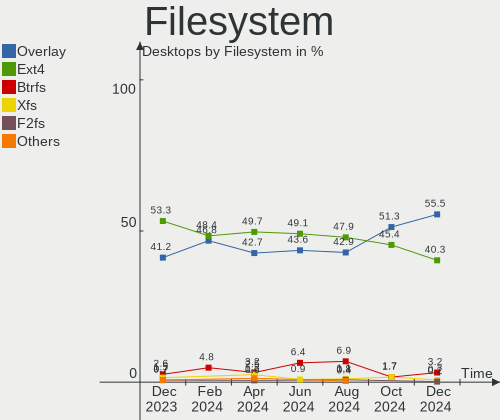
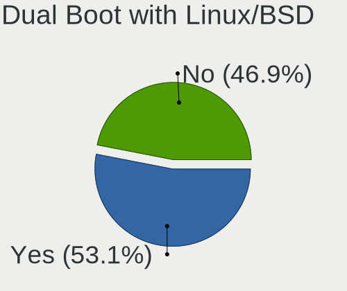
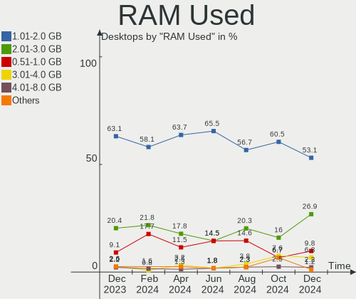
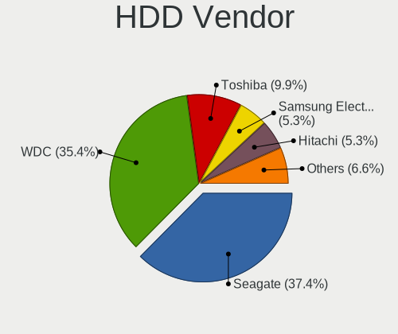
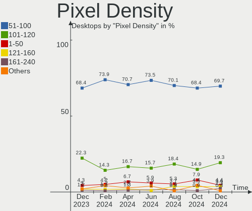
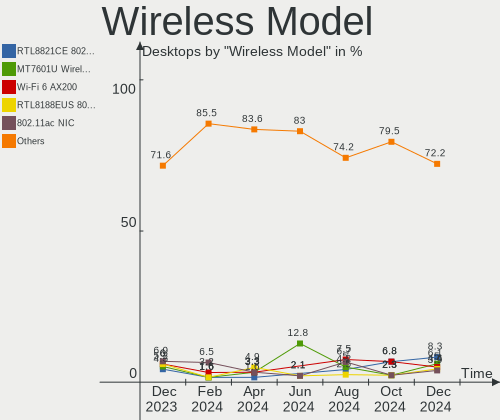
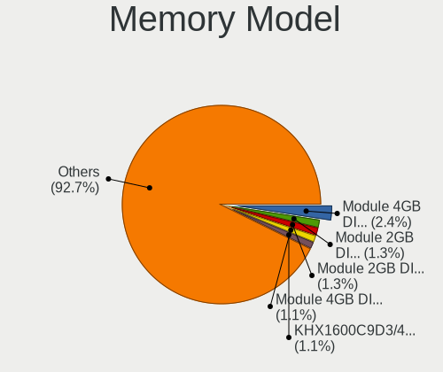
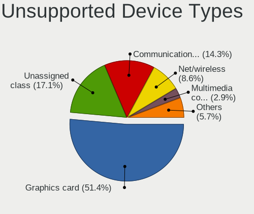

OpenMandriva - Hardware Trends (Desktops)
-----------------------------------------

A project to identify most popular hardware characteristics and track their change
over time based on data collected by Linux users at https://Linux-Hardware.org.

Anyone can contribute to this report by the [hw-probe](https://github.com/linuxhw/hw-probe) tool:

    sudo -E hw-probe -all -upload

This report is for one last month. Overall report since the beginning of time: [TestCoverage](https://github.com/linuxhw/TestCoverage)

Period: Dec, 2022.

Contents
--------

* [ System ](#system)
  - [ OS                       ](#os)
  - [ OS Family                ](#os-family)
  - [ Kernel                   ](#kernel)
  - [ Kernel Family            ](#kernel-family)
  - [ Kernel Major Ver.        ](#kernel-major-ver)
  - [ Arch                     ](#arch)
  - [ DE                       ](#de)
  - [ Display Server           ](#display-server)
  - [ Display Manager          ](#display-manager)
  - [ OS Lang                  ](#os-lang)
  - [ Boot Mode                ](#boot-mode)
  - [ Filesystem               ](#filesystem)
  - [ Part. scheme             ](#part-scheme)
  - [ Dual Boot with Linux/BSD ](#dual-boot-with-linuxbsd)
  - [ Dual Boot (Win)          ](#dual-boot-win)

* [ Board ](#board)
  - [ Vendor                   ](#vendor)
  - [ Model                    ](#model)
  - [ Model Family             ](#model-family)
  - [ MFG Year                 ](#mfg-year)
  - [ Form Factor              ](#form-factor)
  - [ Secure Boot              ](#secure-boot)
  - [ Coreboot                 ](#coreboot)
  - [ RAM Size                 ](#ram-size)
  - [ RAM Used                 ](#ram-used)
  - [ Total Drives             ](#total-drives)
  - [ Has CD-ROM               ](#has-cd-rom)
  - [ Has Ethernet             ](#has-ethernet)
  - [ Has WiFi                 ](#has-wifi)
  - [ Has Bluetooth            ](#has-bluetooth)

* [ Location ](#location)
  - [ Country                  ](#country)
  - [ City                     ](#city)

* [ Drives ](#drives)
  - [ Drive Vendor             ](#drive-vendor)
  - [ Drive Model              ](#drive-model)
  - [ HDD Vendor               ](#hdd-vendor)
  - [ SSD Vendor               ](#ssd-vendor)
  - [ Drive Kind               ](#drive-kind)
  - [ Drive Connector          ](#drive-connector)
  - [ Drive Size               ](#drive-size)
  - [ Space Total              ](#space-total)
  - [ Space Used               ](#space-used)
  - [ Malfunc. Drives          ](#malfunc-drives)
  - [ Malfunc. Drive Vendor    ](#malfunc-drive-vendor)
  - [ Malfunc. HDD Vendor      ](#malfunc-hdd-vendor)
  - [ Malfunc. Drive Kind      ](#malfunc-drive-kind)
  - [ Failed Drives            ](#failed-drives)
  - [ Failed Drive Vendor      ](#failed-drive-vendor)
  - [ Drive Status             ](#drive-status)

* [ Storage controller ](#storage-controller)
  - [ Storage Vendor           ](#storage-vendor)
  - [ Storage Model            ](#storage-model)
  - [ Storage Kind             ](#storage-kind)

* [ Processor ](#processor)
  - [ CPU Vendor               ](#cpu-vendor)
  - [ CPU Model                ](#cpu-model)
  - [ CPU Model Family         ](#cpu-model-family)
  - [ CPU Cores                ](#cpu-cores)
  - [ CPU Sockets              ](#cpu-sockets)
  - [ CPU Threads              ](#cpu-threads)
  - [ CPU Op-Modes             ](#cpu-op-modes)
  - [ CPU Microcode            ](#cpu-microcode)
  - [ CPU Microarch            ](#cpu-microarch)

* [ Graphics ](#graphics)
  - [ GPU Vendor               ](#gpu-vendor)
  - [ GPU Model                ](#gpu-model)
  - [ GPU Combo                ](#gpu-combo)
  - [ GPU Driver               ](#gpu-driver)
  - [ GPU Memory               ](#gpu-memory)

* [ Monitor ](#monitor)
  - [ Monitor Vendor           ](#monitor-vendor)
  - [ Monitor Model            ](#monitor-model)
  - [ Monitor Resolution       ](#monitor-resolution)
  - [ Monitor Diagonal         ](#monitor-diagonal)
  - [ Monitor Width            ](#monitor-width)
  - [ Aspect Ratio             ](#aspect-ratio)
  - [ Monitor Area             ](#monitor-area)
  - [ Pixel Density            ](#pixel-density)
  - [ Multiple Monitors        ](#multiple-monitors)

* [ Network ](#network)
  - [ Net Controller Vendor    ](#net-controller-vendor)
  - [ Net Controller Model     ](#net-controller-model)
  - [ Wireless Vendor          ](#wireless-vendor)
  - [ Wireless Model           ](#wireless-model)
  - [ Ethernet Vendor          ](#ethernet-vendor)
  - [ Ethernet Model           ](#ethernet-model)
  - [ Net Controller Kind      ](#net-controller-kind)
  - [ Used Controller          ](#used-controller)
  - [ NICs                     ](#nics)
  - [ IPv6                     ](#ipv6)

* [ Bluetooth ](#bluetooth)
  - [ Bluetooth Vendor         ](#bluetooth-vendor)
  - [ Bluetooth Model          ](#bluetooth-model)

* [ Sound ](#sound)
  - [ Sound Vendor             ](#sound-vendor)
  - [ Sound Model              ](#sound-model)

* [ Memory ](#memory)
  - [ Memory Vendor            ](#memory-vendor)
  - [ Memory Model             ](#memory-model)
  - [ Memory Kind              ](#memory-kind)
  - [ Memory Form Factor       ](#memory-form-factor)
  - [ Memory Size              ](#memory-size)
  - [ Memory Speed             ](#memory-speed)

* [ Printers & scanners ](#printers--scanners)
  - [ Printer Vendor           ](#printer-vendor)
  - [ Printer Model            ](#printer-model)
  - [ Scanner Vendor           ](#scanner-vendor)
  - [ Scanner Model            ](#scanner-model)

* [ Camera ](#camera)
  - [ Camera Vendor            ](#camera-vendor)
  - [ Camera Model             ](#camera-model)

* [ Security ](#security)
  - [ Fingerprint Vendor       ](#fingerprint-vendor)
  - [ Fingerprint Model        ](#fingerprint-model)
  - [ Chipcard Vendor          ](#chipcard-vendor)
  - [ Chipcard Model           ](#chipcard-model)

* [ Unsupported ](#unsupported)
  - [ Unsupported Devices      ](#unsupported-devices)
  - [ Unsupported Device Types ](#unsupported-device-types)

System
------

OS
--

Installed operating systems

| Name               | Desktops | Percent |
|--------------------|----------|---------|
| OpenMandriva 4.3   | 91       | 56.88%  |
| OpenMandriva 22.12 | 30       | 18.75%  |
| OpenMandriva 4.50  | 28       | 17.5%   |
| OpenMandriva 4.2   | 7        | 4.38%   |
| OpenMandriva 4.90  | 3        | 1.88%   |
| OpenMandriva 22.11 | 1        | 0.63%   |

OS Family
---------

OS without a version

| Name         | Desktops | Percent |
|--------------|----------|---------|
| OpenMandriva | 160      | 100%    |

Kernel
------

Version of the Linux kernel

| Version                  | Desktops | Percent |
|--------------------------|----------|---------|
| 5.16.7-desktop-1omv4003  | 83       | 51.88%  |
| 6.0.10-desktop-2omv22090 | 29       | 18.13%  |
| 5.19.12-desktop-2omv4090 | 19       | 11.88%  |
| 5.16.13-desktop-1omv4003 | 8        | 5%      |
| 5.19.5-desktop-1omv4090  | 6        | 3.75%   |
| 5.10.14-desktop-1omv4002 | 5        | 3.13%   |
| 5.19.11-desktop-2omv4090 | 4        | 2.5%    |
| 5.18.12-desktop-3omv4090 | 3        | 1.88%   |
| 5.11.12-desktop-1omv4002 | 2        | 1.25%   |
| 6.0.2-desktop-1omv4050   | 1        | 0.63%   |

Kernel Family
-------------

Linux kernel without a distro release

| Version | Desktops | Percent |
|---------|----------|---------|
| 5.16.7  | 83       | 51.88%  |
| 6.0.10  | 29       | 18.13%  |
| 5.19.12 | 19       | 11.88%  |
| 5.16.13 | 8        | 5%      |
| 5.19.5  | 6        | 3.75%   |
| 5.10.14 | 5        | 3.13%   |
| 5.19.11 | 4        | 2.5%    |
| 5.18.12 | 3        | 1.88%   |
| 5.11.12 | 2        | 1.25%   |
| 6.0.2   | 1        | 0.63%   |

Kernel Major Ver.
-----------------

Linux kernel major version

| Version | Desktops | Percent |
|---------|----------|---------|
| 5.16    | 91       | 56.88%  |
| 6.0     | 30       | 18.75%  |
| 5.19    | 29       | 18.13%  |
| 5.10    | 5        | 3.13%   |
| 5.18    | 3        | 1.88%   |
| 5.11    | 2        | 1.25%   |

Arch
----

OS architecture (x86_64, i586, etc.)

| Name   | Desktops | Percent |
|--------|----------|---------|
| x86_64 | 160      | 100%    |

DE
--

Desktop Environment

| Name  | Desktops | Percent |
|-------|----------|---------|
| KDE5  | 155      | 96.88%  |
| GNOME | 3        | 1.88%   |
| LXQt  | 2        | 1.25%   |

Display Server
--------------

X11 or Wayland

| Name    | Desktops | Percent |
|---------|----------|---------|
| X11     | 155      | 96.88%  |
| Wayland | 5        | 3.13%   |

Display Manager
---------------

SDDM, LightDM, etc.

| Name | Desktops | Percent |
|------|----------|---------|
| SDDM | 157      | 98.13%  |
| GDM  | 3        | 1.88%   |

OS Lang
-------

Language

| Lang  | Desktops | Percent |
|-------|----------|---------|
| en_US | 84       | 52.5%   |
| ru_RU | 13       | 8.13%   |
| de_DE | 9        | 5.63%   |
| pt_BR | 8        | 5%      |
| pl_PL | 8        | 5%      |
| fr_FR | 7        | 4.38%   |
| it_IT | 5        | 3.13%   |
| es_MX | 3        | 1.88%   |
| es_ES | 3        | 1.88%   |
| es_AR | 3        | 1.88%   |
| en_GB | 3        | 1.88%   |
| hu_HU | 2        | 1.25%   |
| es_CO | 2        | 1.25%   |
| de_AT | 2        | 1.25%   |
| sk_SK | 1        | 0.63%   |
| ru_UA | 1        | 0.63%   |
| pt_PT | 1        | 0.63%   |
| nl_NL | 1        | 0.63%   |
| fr_CH | 1        | 0.63%   |
| fr_CA | 1        | 0.63%   |
| es_US | 1        | 0.63%   |
| es_PE | 1        | 0.63%   |

Boot Mode
---------

EFI or BIOS

| Mode | Desktops | Percent |
|------|----------|---------|
| BIOS | 87       | 54.38%  |
| EFI  | 73       | 45.63%  |

Filesystem
----------

Type of filesystem

| Type    | Desktops | Percent |
|---------|----------|---------|
| Overlay | 132      | 82.5%   |
| Ext4    | 24       | 15%     |
| Btrfs   | 2        | 1.25%   |
| Xfs     | 1        | 0.63%   |
| Ext3    | 1        | 0.63%   |

Part. scheme
------------

Scheme of partitioning

| Type    | Desktops | Percent |
|---------|----------|---------|
| GPT     | 106      | 66.25%  |
| MBR     | 53       | 33.13%  |
| Unknown | 1        | 0.63%   |

Dual Boot with Linux/BSD
------------------------

Hosting more than one Linux/BSD

| Dual boot | Desktops | Percent |
|-----------|----------|---------|
| Yes       | 80       | 50%     |
| No        | 80       | 50%     |

Dual Boot (Win)
---------------

Hosting Linux and Windows

| Dual boot | Desktops | Percent |
|-----------|----------|---------|
| No        | 81       | 50.63%  |
| Yes       | 79       | 49.38%  |

Board
-----

Vendor
------

Motherboard manufacturer

| Name                | Desktops | Percent |
|---------------------|----------|---------|
| ASUSTek Computer    | 43       | 26.88%  |
| Gigabyte Technology | 24       | 15%     |
| Dell                | 21       | 13.13%  |
| MSI                 | 15       | 9.38%   |
| Hewlett-Packard     | 12       | 7.5%    |
| Lenovo              | 9        | 5.63%   |
| ASRock              | 9        | 5.63%   |
| Pegatron            | 5        | 3.13%   |
| Acer                | 5        | 3.13%   |
| ECS                 | 3        | 1.88%   |
| Biostar             | 2        | 1.25%   |
| Positivo            | 1        | 0.63%   |
| PERTOSA             | 1        | 0.63%   |
| MAXSUN              | 1        | 0.63%   |
| MACHINIST           | 1        | 0.63%   |
| Intel               | 1        | 0.63%   |
| Huanan              | 1        | 0.63%   |
| HC Technology.      | 1        | 0.63%   |
| Fujitsu             | 1        | 0.63%   |
| Foxconn             | 1        | 0.63%   |
| Datto               | 1        | 0.63%   |
| AZW                 | 1        | 0.63%   |
| ACTION              | 1        | 0.63%   |

Model
-----

Motherboard model

| Name                                    | Desktops | Percent |
|-----------------------------------------|----------|---------|
| Dell OptiPlex 760                       | 3        | 1.88%   |
| Dell OptiPlex 380                       | 3        | 1.88%   |
| ASUS P8Z77-V LX                         | 3        | 1.88%   |
| Gigabyte GA-78LMT-USB3 6.0              | 2        | 1.25%   |
| Dell OptiPlex 3010                      | 2        | 1.25%   |
| ASUS P5K                                | 2        | 1.25%   |
| ASUS All Series                         | 2        | 1.25%   |
| Positivo POS-PIQ77CL                    | 1        | 0.63%   |
| PERTOSA 206.30.054 - GA-H110TN-M        | 1        | 0.63%   |
| Pegatron p7-1254                        | 1        | 0.63%   |
| Pegatron IPPPV-D3G                      | 1        | 0.63%   |
| Pegatron IPM41-D3                       | 1        | 0.63%   |
| Pegatron h8-1010t                       | 1        | 0.63%   |
| Pegatron APX85-GS                       | 1        | 0.63%   |
| MSI p6590es                             | 1        | 0.63%   |
| MSI MS-7D53                             | 1        | 0.63%   |
| MSI MS-7C96                             | 1        | 0.63%   |
| MSI MS-7C91                             | 1        | 0.63%   |
| MSI MS-7C75                             | 1        | 0.63%   |
| MSI MS-7B79                             | 1        | 0.63%   |
| MSI MS-7850                             | 1        | 0.63%   |
| MSI MS-7817                             | 1        | 0.63%   |
| MSI MS-7759                             | 1        | 0.63%   |
| MSI MS-7641                             | 1        | 0.63%   |
| MSI MS-7623                             | 1        | 0.63%   |
| MSI MS-7576                             | 1        | 0.63%   |
| MSI MS-7502                             | 1        | 0.63%   |
| MSI MD34295                             | 1        | 0.63%   |
| MSI Cubi N 8GL (MS-B171)                | 1        | 0.63%   |
| MAXSUN MS-TZZ A320M.2-VH                | 1        | 0.63%   |
| MACHINIST X99-RS9 V2.0                  | 1        | 0.63%   |
| Lenovo ThinkCentre M93p 10AA003XMN      | 1        | 0.63%   |
| Lenovo ThinkCentre M83 10AHS0X60C       | 1        | 0.63%   |
| Lenovo ThinkCentre M83 10AHS08WMF       | 1        | 0.63%   |
| Lenovo ThinkCentre M83 10AGS1FK00       | 1        | 0.63%   |
| Lenovo ThinkCentre M70e 0829RB4         | 1        | 0.63%   |
| Lenovo ThinkCentre Edge72 3484DUG       | 1        | 0.63%   |
| Lenovo IdeaCentre 310S-08ASR 90G90039FR | 1        | 0.63%   |
| Lenovo H530s 10132                      | 1        | 0.63%   |
| Lenovo H50-55 90BG0021CF                | 1        | 0.63%   |

Model Family
------------

Motherboard model prefix

| Name                   | Desktops | Percent |
|------------------------|----------|---------|
| Dell OptiPlex          | 16       | 10%     |
| Lenovo ThinkCentre     | 6        | 3.75%   |
| ASUS TUF               | 5        | 3.13%   |
| ASUS PRIME             | 5        | 3.13%   |
| ASUS P5K               | 4        | 2.5%    |
| Acer Aspire            | 4        | 2.5%    |
| Dell Vostro            | 3        | 1.88%   |
| ASUS ROG               | 3        | 1.88%   |
| ASUS P8Z77-V           | 3        | 1.88%   |
| HP EliteDesk           | 2        | 1.25%   |
| HP Compaq              | 2        | 1.25%   |
| Gigabyte GA-78LMT-USB3 | 2        | 1.25%   |
| ASUS M5A97             | 2        | 1.25%   |
| ASUS All               | 2        | 1.25%   |
| ASRock B550            | 2        | 1.25%   |
| Positivo POS-PIQ77CL   | 1        | 0.63%   |
| PERTOSA 206.30.054     | 1        | 0.63%   |
| Pegatron p7-1254       | 1        | 0.63%   |
| Pegatron IPPPV-D3G     | 1        | 0.63%   |
| Pegatron IPM41-D3      | 1        | 0.63%   |
| Pegatron h8-1010t      | 1        | 0.63%   |
| Pegatron APX85-GS      | 1        | 0.63%   |
| MSI p6590es            | 1        | 0.63%   |
| MSI MS-7D53            | 1        | 0.63%   |
| MSI MS-7C96            | 1        | 0.63%   |
| MSI MS-7C91            | 1        | 0.63%   |
| MSI MS-7C75            | 1        | 0.63%   |
| MSI MS-7B79            | 1        | 0.63%   |
| MSI MS-7850            | 1        | 0.63%   |
| MSI MS-7817            | 1        | 0.63%   |
| MSI MS-7759            | 1        | 0.63%   |
| MSI MS-7641            | 1        | 0.63%   |
| MSI MS-7623            | 1        | 0.63%   |
| MSI MS-7576            | 1        | 0.63%   |
| MSI MS-7502            | 1        | 0.63%   |
| MSI MD34295            | 1        | 0.63%   |
| MSI Cubi               | 1        | 0.63%   |
| MAXSUN MS-TZZ          | 1        | 0.63%   |
| MACHINIST X99-RS9      | 1        | 0.63%   |
| Lenovo IdeaCentre      | 1        | 0.63%   |

MFG Year
--------

Motherboard manufacture year

| Year | Desktops | Percent |
|------|----------|---------|
| 2021 | 14       | 8.75%   |
| 2013 | 14       | 8.75%   |
| 2010 | 14       | 8.75%   |
| 2012 | 13       | 8.13%   |
| 2009 | 13       | 8.13%   |
| 2018 | 11       | 6.88%   |
| 2014 | 11       | 6.88%   |
| 2008 | 10       | 6.25%   |
| 2015 | 9        | 5.63%   |
| 2011 | 9        | 5.63%   |
| 2020 | 8        | 5%      |
| 2019 | 8        | 5%      |
| 2022 | 7        | 4.38%   |
| 2016 | 7        | 4.38%   |
| 2017 | 5        | 3.13%   |
| 2007 | 5        | 3.13%   |
| 2006 | 2        | 1.25%   |

Form Factor
-----------

Physical design of the computer

| Name    | Desktops | Percent |
|---------|----------|---------|
| Desktop | 160      | 100%    |

Secure Boot
-----------

Enabled or disabled

| State    | Desktops | Percent |
|----------|----------|---------|
| Disabled | 160      | 100%    |

Coreboot
--------

Have coreboot on board

| Used | Desktops | Percent |
|------|----------|---------|
| No   | 160      | 100%    |

RAM Size
--------

Total RAM memory

| Size in GB  | Desktops | Percent |
|-------------|----------|---------|
| 3.01-4.0    | 39       | 24.38%  |
| 16.01-24.0  | 38       | 23.75%  |
| 8.01-16.0   | 34       | 21.25%  |
| 4.01-8.0    | 24       | 15%     |
| 32.01-64.0  | 13       | 8.13%   |
| 1.01-2.0    | 5        | 3.13%   |
| 24.01-32.0  | 3        | 1.88%   |
| 2.01-3.0    | 2        | 1.25%   |
| 64.01-256.0 | 2        | 1.25%   |

RAM Used
--------

Used RAM memory

| Used GB  | Desktops | Percent |
|----------|----------|---------|
| 1.01-2.0 | 103      | 64.38%  |
| 0.51-1.0 | 36       | 22.5%   |
| 2.01-3.0 | 15       | 9.38%   |
| 3.01-4.0 | 3        | 1.88%   |
| 0.01-0.5 | 2        | 1.25%   |
| 4.01-8.0 | 1        | 0.63%   |

Total Drives
------------

Number of drives on board

| Drives | Desktops | Percent |
|--------|----------|---------|
| 1      | 85       | 53.13%  |
| 2      | 31       | 19.38%  |
| 4      | 14       | 8.75%   |
| 3      | 14       | 8.75%   |
| 5      | 7        | 4.38%   |
| 7      | 3        | 1.88%   |
| 6      | 3        | 1.88%   |
| 0      | 3        | 1.88%   |

Has CD-ROM
----------

Has CD-ROM on board

| Presented | Desktops | Percent |
|-----------|----------|---------|
| No        | 82       | 51.25%  |
| Yes       | 78       | 48.75%  |

Has Ethernet
------------

Has Ethernet on board

| Presented | Desktops | Percent |
|-----------|----------|---------|
| Yes       | 156      | 97.5%   |
| No        | 4        | 2.5%    |

Has WiFi
--------

Has WiFi module

| Presented | Desktops | Percent |
|-----------|----------|---------|
| No        | 100      | 62.5%   |
| Yes       | 60       | 37.5%   |

Has Bluetooth
-------------

Has Bluetooth module

| Presented | Desktops | Percent |
|-----------|----------|---------|
| No        | 118      | 73.75%  |
| Yes       | 42       | 26.25%  |

Location
--------

Country
-------

Geographic location (country)

| Country     | Desktops | Percent |
|-------------|----------|---------|
| USA         | 22       | 13.75%  |
| Russia      | 22       | 13.75%  |
| Germany     | 18       | 11.25%  |
| Poland      | 11       | 6.88%   |
| France      | 11       | 6.88%   |
| Italy       | 10       | 6.25%   |
| Brazil      | 9        | 5.63%   |
| Mexico      | 5        | 3.13%   |
| Canada      | 5        | 3.13%   |
| UK          | 3        | 1.88%   |
| Spain       | 3        | 1.88%   |
| Hungary     | 3        | 1.88%   |
| Bulgaria    | 3        | 1.88%   |
| Argentina   | 3        | 1.88%   |
| Switzerland | 2        | 1.25%   |
| Serbia      | 2        | 1.25%   |
| Portugal    | 2        | 1.25%   |
| Norway      | 2        | 1.25%   |
| Indonesia   | 2        | 1.25%   |
| Finland     | 2        | 1.25%   |
| Colombia    | 2        | 1.25%   |
| Ukraine     | 1        | 0.63%   |
| Turkey      | 1        | 0.63%   |
| Thailand    | 1        | 0.63%   |
| Slovenia    | 1        | 0.63%   |
| Slovakia    | 1        | 0.63%   |
| Singapore   | 1        | 0.63%   |
| Romania     | 1        | 0.63%   |
| Peru        | 1        | 0.63%   |
| Panama      | 1        | 0.63%   |
| Netherlands | 1        | 0.63%   |
| Japan       | 1        | 0.63%   |
| Jamaica     | 1        | 0.63%   |
| Egypt       | 1        | 0.63%   |
| Denmark     | 1        | 0.63%   |
| Czechia     | 1        | 0.63%   |
| Costa Rica  | 1        | 0.63%   |
| China       | 1        | 0.63%   |
| Austria     | 1        | 0.63%   |

City
----

Geographic location (city)

| City                    | Desktops | Percent |
|-------------------------|----------|---------|
| Volgograd               | 4        | 2.5%    |
| Warsaw                  | 3        | 1.88%   |
| Saarbrücken            | 3        | 1.88%   |
| Nizhniy Novgorod        | 3        | 1.88%   |
| Ufa                     | 2        | 1.25%   |
| Srengseng Sawah         | 2        | 1.25%   |
| Sigean                  | 2        | 1.25%   |
| Munich                  | 2        | 1.25%   |
| Moscow                  | 2        | 1.25%   |
| Milan                   | 2        | 1.25%   |
| Madrid                  | 2        | 1.25%   |
| Lodz                    | 2        | 1.25%   |
| Jacksonville            | 2        | 1.25%   |
| Ciudad Obregón         | 2        | 1.25%   |
| Braganca Paulista       | 2        | 1.25%   |
| Bologna                 | 2        | 1.25%   |
| Bamberg                 | 2        | 1.25%   |
| Zonguldak               | 1        | 0.63%   |
| Wurzen                  | 1        | 0.63%   |
| Wittenbach              | 1        | 0.63%   |
| West Fargo              | 1        | 0.63%   |
| Villefranche-sur-Saône | 1        | 0.63%   |
| Vienna                  | 1        | 0.63%   |
| Verdun                  | 1        | 0.63%   |
| Venice                  | 1        | 0.63%   |
| Valencia                | 1        | 0.63%   |
| Valdengo                | 1        | 0.63%   |
| Tuapse                  | 1        | 0.63%   |
| Trois-Rivières         | 1        | 0.63%   |
| The Bronx               | 1        | 0.63%   |
| Tampere                 | 1        | 0.63%   |
| Tacna                   | 1        | 0.63%   |
| Syzran'                 | 1        | 0.63%   |
| Swiniary Nowe           | 1        | 0.63%   |
| Stara Zagora            | 1        | 0.63%   |
| Sparta                  | 1        | 0.63%   |
| Sofia                   | 1        | 0.63%   |
| Škofja Loka            | 1        | 0.63%   |
| Singapore               | 1        | 0.63%   |
| Setúbal                | 1        | 0.63%   |

Drives
------

Drive Vendor
------------

Hard drive vendors

| Vendor                      | Desktops | Drives | Percent |
|-----------------------------|----------|--------|---------|
| WDC                         | 54       | 71     | 20.38%  |
| Seagate                     | 43       | 54     | 16.23%  |
| Samsung Electronics         | 29       | 35     | 10.94%  |
| Kingston                    | 21       | 24     | 7.92%   |
| Toshiba                     | 16       | 15     | 6.04%   |
| Hitachi                     | 11       | 12     | 4.15%   |
| Crucial                     | 10       | 10     | 3.77%   |
| SanDisk                     | 8        | 9      | 3.02%   |
| A-DATA Technology           | 8        | 8      | 3.02%   |
| Intenso                     | 4        | 4      | 1.51%   |
| China                       | 4        | 4      | 1.51%   |
| Apacer                      | 4        | 4      | 1.51%   |
| Unknown                     | 3        | 6      | 1.13%   |
| SPCC                        | 3        | 3      | 1.13%   |
| Phison                      | 3        | 4      | 1.13%   |
| Maxtor                      | 3        | 3      | 1.13%   |
| Corsair                     | 3        | 3      | 1.13%   |
| XPG                         | 2        | 2      | 0.75%   |
| USB3.0                      | 2        | 2      | 0.75%   |
| TO Exter                    | 2        | 2      | 0.75%   |
| SSK                         | 2        | 2      | 0.75%   |
| PNY                         | 2        | 2      | 0.75%   |
| Micron Technology           | 2        | 2      | 0.75%   |
| Intel                       | 2        | 2      | 0.75%   |
| HS-SSD-E100                 | 2        | 2      | 0.75%   |
| GOODRAM                     | 2        | 2      | 0.75%   |
| Unknown                     | 2        | 3      | 0.75%   |
| WD Green                    | 1        | 1      | 0.38%   |
| WALRAM                      | 1        | 1      | 0.38%   |
| Verbatim                    | 1        | 1      | 0.38%   |
| Transcend                   | 1        | 1      | 0.38%   |
| Silicon Motion              | 1        | 1      | 0.38%   |
| PUSKILL                     | 1        | 1      | 0.38%   |
| Patriot                     | 1        | 1      | 0.38%   |
| Netac                       | 1        | 1      | 0.38%   |
| Mushkin                     | 1        | 1      | 0.38%   |
| Kingston Technology Company | 1        | 1      | 0.38%   |
| KingFast                    | 1        | 1      | 0.38%   |
| JMicron Technology          | 1        | 1      | 0.38%   |
| JetFlash                    | 1        | 1      | 0.38%   |

Drive Model
-----------

Hard drive models

| Model                           | Desktops | Percent |
|---------------------------------|----------|---------|
| Kingston SA400S37240G 240GB SSD | 10       | 3.33%   |
| Toshiba DT01ACA100 1TB          | 5        | 1.67%   |
| Seagate ST500DM002-1BD142 500GB | 4        | 1.33%   |
| Seagate ST3500418AS 500GB       | 3        | 1%      |
| Seagate ST3320613AS 320GB       | 3        | 1%      |
| Seagate ST3250318AS 250GB       | 3        | 1%      |
| Seagate ST2000DM008-2FR102 2TB  | 3        | 1%      |
| Seagate ST2000DM006-2DM164 2TB  | 3        | 1%      |
| Seagate ST1000DM003-9YN162 1TB  | 3        | 1%      |
| Samsung SSD 970 EVO Plus 500GB  | 3        | 1%      |
| Samsung HD502HJ 500GB           | 3        | 1%      |
| WDC WDS100T2B0A-00SM50 1TB SSD  | 2        | 0.67%   |
| WDC WD800JD-08LSA0 80GB         | 2        | 0.67%   |
| WDC WD5000AAKX-22ERMA0 500GB    | 2        | 0.67%   |
| WDC WD30EFRX-68EUZN0 3TB        | 2        | 0.67%   |
| WDC WD2500BPVT-00JJ5T0 250GB    | 2        | 0.67%   |
| WDC WD2500AAKX-00ERMA0 250GB    | 2        | 0.67%   |
| WDC WD1600AAJS-75M0A0 160GB     | 2        | 0.67%   |
| WDC WD10EZEX-21WN4A0 1TB        | 2        | 0.67%   |
| WDC WD10EZEX-08WN4A0 1TB        | 2        | 0.67%   |
| USB3.0 Super Speed 1TB          | 2        | 0.67%   |
| Unknown SD/MMC 2GB              | 2        | 0.67%   |
| Unknown M.S./M.S.Pro/HG 16GB    | 2        | 0.67%   |
| Toshiba HDWD130 3TB             | 2        | 0.67%   |
| Toshiba HDWD110 1TB             | 2        | 0.67%   |
| TO Exter nal USB 3.0 512GB      | 2        | 0.67%   |
| SSK Disk 1024GB                 | 2        | 0.67%   |
| Seagate ST500LM000-1EJ162 500GB | 2        | 0.67%   |
| Seagate ST3250820AS 250GB       | 2        | 0.67%   |
| Seagate ST2000DM001-1ER164 2TB  | 2        | 0.67%   |
| Seagate ST1000DM003-1ER162 1TB  | 2        | 0.67%   |
| SanDisk NVMe SSD Drive 250GB    | 2        | 0.67%   |
| Samsung SSD 980 PRO 1TB         | 2        | 0.67%   |
| Samsung SSD 860 EVO 500GB       | 2        | 0.67%   |
| Samsung SSD 860 EVO 250GB       | 2        | 0.67%   |
| Samsung SSD 860 EVO 1TB         | 2        | 0.67%   |
| Samsung SSD 850 EVO 250GB       | 2        | 0.67%   |
| Samsung HD103SI 1TB             | 2        | 0.67%   |
| Kingston SA400S37480G 480GB SSD | 2        | 0.67%   |
| Kingston SA400S37120G 120GB SSD | 2        | 0.67%   |

HDD Vendor
----------

Hard disk drive vendors

| Vendor              | Desktops | Drives | Percent |
|---------------------|----------|--------|---------|
| WDC                 | 47       | 59     | 35.88%  |
| Seagate             | 43       | 54     | 32.82%  |
| Toshiba             | 14       | 13     | 10.69%  |
| Hitachi             | 11       | 12     | 8.4%    |
| Samsung Electronics | 8        | 8      | 6.11%   |
| Maxtor              | 3        | 3      | 2.29%   |
| USB3.0              | 2        | 2      | 1.53%   |
| Unknown             | 1        | 1      | 0.76%   |
| HGST                | 1        | 1      | 0.76%   |
| ASMT                | 1        | 1      | 0.76%   |

SSD Vendor
----------

Solid state drive vendors

| Vendor              | Desktops | Drives | Percent |
|---------------------|----------|--------|---------|
| Kingston            | 16       | 19     | 16.84%  |
| Samsung Electronics | 14       | 18     | 14.74%  |
| Crucial             | 9        | 9      | 9.47%   |
| A-DATA Technology   | 8        | 8      | 8.42%   |
| WDC                 | 7        | 7      | 7.37%   |
| SanDisk             | 6        | 7      | 6.32%   |
| Intenso             | 4        | 4      | 4.21%   |
| China               | 4        | 4      | 4.21%   |
| Apacer              | 3        | 3      | 3.16%   |
| Toshiba             | 2        | 2      | 2.11%   |
| TO Exter            | 2        | 2      | 2.11%   |
| SPCC                | 2        | 2      | 2.11%   |
| PNY                 | 2        | 2      | 2.11%   |
| HS-SSD-E100         | 2        | 2      | 2.11%   |
| GOODRAM             | 2        | 2      | 2.11%   |
| Unknown             | 2        | 3      | 2.11%   |
| WALRAM              | 1        | 1      | 1.05%   |
| Verbatim            | 1        | 1      | 1.05%   |
| Transcend           | 1        | 1      | 1.05%   |
| PUSKILL             | 1        | 1      | 1.05%   |
| Mushkin             | 1        | 1      | 1.05%   |
| KingFast            | 1        | 1      | 1.05%   |
| JMicron Technology  | 1        | 1      | 1.05%   |
| Intel               | 1        | 1      | 1.05%   |
| HPE                 | 1        | 1      | 1.05%   |
| Corsair             | 1        | 1      | 1.05%   |

Drive Kind
----------

HDD or SSD

| Kind    | Desktops | Drives | Percent |
|---------|----------|--------|---------|
| HDD     | 110      | 154    | 49.11%  |
| SSD     | 73       | 104    | 32.59%  |
| NVMe    | 35       | 43     | 15.63%  |
| Unknown | 6        | 9      | 2.68%   |

Drive Connector
---------------

SATA, SAS, NVMe, etc.

| Type | Desktops | Drives | Percent |
|------|----------|--------|---------|
| SATA | 146      | 250    | 74.87%  |
| NVMe | 35       | 41     | 17.95%  |
| SAS  | 14       | 19     | 7.18%   |

Drive Size
----------

Size of hard drive

| Size in TB | Desktops | Drives | Percent |
|------------|----------|--------|---------|
| 0.01-0.5   | 109      | 154    | 57.37%  |
| 0.51-1.0   | 52       | 71     | 27.37%  |
| 1.01-2.0   | 19       | 21     | 10%     |
| 2.01-3.0   | 6        | 8      | 3.16%   |
| 3.01-4.0   | 2        | 2      | 1.05%   |
| 4.01-10.0  | 2        | 2      | 1.05%   |

Space Total
-----------

Amount of disk space available on the file system

| Size in GB     | Desktops | Percent |
|----------------|----------|---------|
| 1-20           | 72       | 45%     |
| 101-250        | 26       | 16.25%  |
| Unknown        | 23       | 14.38%  |
| 251-500        | 16       | 10%     |
| 501-1000       | 7        | 4.38%   |
| 51-100         | 7        | 4.38%   |
| 21-50          | 4        | 2.5%    |
| 1001-2000      | 3        | 1.88%   |
| More than 3000 | 1        | 0.63%   |
| 2001-3000      | 1        | 0.63%   |

Space Used
----------

Amount of used disk space

| Used GB   | Desktops | Percent |
|-----------|----------|---------|
| 1-20      | 124      | 77.5%   |
| Unknown   | 23       | 14.38%  |
| 251-500   | 4        | 2.5%    |
| 101-250   | 3        | 1.88%   |
| 21-50     | 2        | 1.25%   |
| 1001-2000 | 2        | 1.25%   |
| 51-100    | 2        | 1.25%   |

Malfunc. Drives
---------------

Drive models with a malfunction

| Model                                 | Desktops | Drives | Percent |
|---------------------------------------|----------|--------|---------|
| Seagate ST3320613AS 320GB             | 3        | 3      | 4.84%   |
| WDC WD800JD-08LSA0 80GB               | 2        | 2      | 3.23%   |
| WDC WD5000AAKX-22ERMA0 500GB          | 2        | 2      | 3.23%   |
| WDC WD2500AAKX-00ERMA0 250GB          | 2        | 2      | 3.23%   |
| WDC WD1600AAJS-75M0A0 160GB           | 2        | 2      | 3.23%   |
| Seagate ST3500418AS 500GB             | 2        | 2      | 3.23%   |
| Seagate ST2000DM006-2DM164 2TB        | 2        | 2      | 3.23%   |
| Samsung Electronics HD103SI 1TB       | 2        | 2      | 3.23%   |
| XPG GAMMIX S41 512GB                  | 1        | 1      | 1.61%   |
| WDC WD800JD-75MSA3 80GB               | 1        | 1      | 1.61%   |
| WDC WD5003ABYX-01WERA0 500GB          | 1        | 1      | 1.61%   |
| WDC WD5000AAKX-75U6AA0 500GB          | 1        | 1      | 1.61%   |
| WDC WD5000AAKS-65A7B0 500GB           | 1        | 1      | 1.61%   |
| WDC WD5000AAKS-00V1A0 500GB           | 1        | 1      | 1.61%   |
| WDC WD5000AADS-00M2B0 500GB           | 1        | 1      | 1.61%   |
| WDC WD40PURX-64GVNY0 4TB              | 1        | 1      | 1.61%   |
| WDC WD3200AAJS-56M0A0 320GB           | 1        | 1      | 1.61%   |
| WDC WD30EZRX-00D8PB0 3TB              | 1        | 1      | 1.61%   |
| WDC WD2500BEVS-60UST0 250GB           | 1        | 1      | 1.61%   |
| WDC WD2000F9YZ-09N20L0 2TB            | 1        | 1      | 1.61%   |
| WDC WD1002FAEX-00Z3A0 1TB             | 1        | 1      | 1.61%   |
| USB3.0 Super Speed 1TB                | 1        | 1      | 1.61%   |
| Toshiba MK1234GSX 120GB               | 1        | 1      | 1.61%   |
| Seagate ST9500325AS 500GB             | 1        | 1      | 1.61%   |
| Seagate ST9250315AS 250GB             | 1        | 1      | 1.61%   |
| Seagate ST500DM002-1BD142 500GB       | 1        | 1      | 1.61%   |
| Seagate ST380815AS 80GB               | 1        | 1      | 1.61%   |
| Seagate ST380011A 80GB                | 1        | 1      | 1.61%   |
| Seagate ST3250318AS 250GB             | 1        | 1      | 1.61%   |
| Seagate ST3200822AS 200GB             | 1        | 1      | 1.61%   |
| Seagate ST3200822A 200GB              | 1        | 1      | 1.61%   |
| Seagate ST3160023AS 160GB             | 1        | 1      | 1.61%   |
| Seagate ST2000DM001-1CH164 2TB        | 1        | 1      | 1.61%   |
| Seagate ST2000DL003-9VT166 2TB        | 1        | 1      | 1.61%   |
| Seagate ST1000DM003-9YN162 1TB        | 1        | 1      | 1.61%   |
| SanDisk SSD PLUS 240GB                | 1        | 1      | 1.61%   |
| Samsung Electronics SSD 960 EVO 500GB | 1        | 1      | 1.61%   |
| Samsung Electronics HD502HJ 500GB     | 1        | 1      | 1.61%   |
| Samsung Electronics HD322HJ 320GB     | 1        | 1      | 1.61%   |
| Maxtor STM3250310AS 250GB             | 1        | 1      | 1.61%   |

Malfunc. Drive Vendor
---------------------

Vendors of faulty drives

| Vendor              | Desktops | Drives | Percent |
|---------------------|----------|--------|---------|
| WDC                 | 20       | 20     | 32.79%  |
| Seagate             | 18       | 19     | 29.51%  |
| Hitachi             | 6        | 6      | 9.84%   |
| Samsung Electronics | 5        | 5      | 8.2%    |
| Maxtor              | 2        | 2      | 3.28%   |
| XPG                 | 1        | 1      | 1.64%   |
| USB3.0              | 1        | 1      | 1.64%   |
| Toshiba             | 1        | 1      | 1.64%   |
| SanDisk             | 1        | 1      | 1.64%   |
| Kingston            | 1        | 1      | 1.64%   |
| CT1000P1            | 1        | 2      | 1.64%   |
| Corsair             | 1        | 1      | 1.64%   |
| China               | 1        | 1      | 1.64%   |
| ASMT                | 1        | 1      | 1.64%   |
| A-DATA Technology   | 1        | 1      | 1.64%   |

Malfunc. HDD Vendor
-------------------

Vendors of faulty HDD drives

| Vendor              | Desktops | Drives | Percent |
|---------------------|----------|--------|---------|
| WDC                 | 20       | 20     | 37.74%  |
| Seagate             | 18       | 19     | 33.96%  |
| Hitachi             | 6        | 6      | 11.32%  |
| Samsung Electronics | 4        | 4      | 7.55%   |
| Maxtor              | 2        | 2      | 3.77%   |
| USB3.0              | 1        | 1      | 1.89%   |
| Toshiba             | 1        | 1      | 1.89%   |
| ASMT                | 1        | 1      | 1.89%   |

Malfunc. Drive Kind
-------------------

Kinds of faulty drives

| Kind | Desktops | Drives | Percent |
|------|----------|--------|---------|
| HDD  | 49       | 54     | 85.96%  |
| SSD  | 5        | 5      | 8.77%   |
| NVMe | 3        | 4      | 5.26%   |

Failed Drives
-------------

Failed drive models

| Model                       | Desktops | Drives | Percent |
|-----------------------------|----------|--------|---------|
| WDC WD7501AALS-00J7B0 752GB | 1        | 1      | 25%     |
| Toshiba MQ01ABD050 500GB    | 1        | 1      | 25%     |
| Toshiba DT01ACA100 1TB      | 1        | 1      | 25%     |
| Seagate ST3250820AS 250GB   | 1        | 1      | 25%     |

Failed Drive Vendor
-------------------

Failed drive vendors

| Vendor  | Desktops | Drives | Percent |
|---------|----------|--------|---------|
| Toshiba | 2        | 2      | 50%     |
| WDC     | 1        | 1      | 25%     |
| Seagate | 1        | 1      | 25%     |

Drive Status
------------

Number of failed and malfunc. drives

| Status   | Desktops | Drives | Percent |
|----------|----------|--------|---------|
| Works    | 119      | 225    | 61.66%  |
| Malfunc  | 57       | 63     | 29.53%  |
| Detected | 14       | 18     | 7.25%   |
| Failed   | 3        | 4      | 1.55%   |

Storage controller
------------------

Storage Vendor
--------------

Storage controller vendors

| Vendor                        | Desktops | Percent |
|-------------------------------|----------|---------|
| Intel                         | 106      | 50%     |
| AMD                           | 50       | 23.58%  |
| Samsung Electronics           | 9        | 4.25%   |
| SanDisk                       | 7        | 3.3%    |
| Silicon Motion                | 5        | 2.36%   |
| Phison Electronics            | 5        | 2.36%   |
| Marvell Technology Group      | 5        | 2.36%   |
| Kingston Technology Company   | 5        | 2.36%   |
| JMicron Technology            | 5        | 2.36%   |
| Nvidia                        | 3        | 1.42%   |
| ASMedia Technology            | 3        | 1.42%   |
| Realtek Semiconductor         | 2        | 0.94%   |
| Micron Technology             | 2        | 0.94%   |
| Micron/Crucial Technology     | 1        | 0.47%   |
| MAXIO Technology (Hangzhou)   | 1        | 0.47%   |
| LSI Logic / Symbios Logic     | 1        | 0.47%   |
| Integrated Technology Express | 1        | 0.47%   |
| Hewlett-Packard               | 1        | 0.47%   |

Storage Model
-------------

Storage controller models

| Model                                                                                   | Desktops | Percent |
|-----------------------------------------------------------------------------------------|----------|---------|
| AMD FCH SATA Controller [AHCI mode]                                                     | 25       | 9.19%   |
| Intel 8 Series/C220 Series Chipset Family 6-port SATA Controller 1 [AHCI mode]          | 12       | 4.41%   |
| Intel NM10/ICH7 Family SATA Controller [IDE mode]                                       | 11       | 4.04%   |
| AMD SB7x0/SB8x0/SB9x0 IDE Controller                                                    | 11       | 4.04%   |
| Intel 82801G (ICH7 Family) IDE Controller                                               | 9        | 3.31%   |
| Intel 7 Series/C210 Series Chipset Family 6-port SATA Controller [AHCI mode]            | 8        | 2.94%   |
| AMD SB7x0/SB8x0/SB9x0 SATA Controller [IDE mode]                                        | 8        | 2.94%   |
| AMD 500 Series Chipset SATA Controller                                                  | 8        | 2.94%   |
| AMD 400 Series Chipset SATA Controller                                                  | 7        | 2.57%   |
| Intel Q170/Q150/B150/H170/H110/Z170/CM236 Chipset SATA Controller [AHCI Mode]           | 6        | 2.21%   |
| Intel 6 Series/C200 Series Chipset Family 6 port Desktop SATA AHCI Controller           | 6        | 2.21%   |
| AMD SB7x0/SB8x0/SB9x0 SATA Controller [AHCI mode]                                       | 6        | 2.21%   |
| Samsung NVMe SSD Controller SM981/PM981/PM983                                           | 5        | 1.84%   |
| JMicron JMB363 SATA/IDE Controller                                                      | 5        | 1.84%   |
| Intel SATA Controller [RAID mode]                                                       | 5        | 1.84%   |
| Intel 82801I (ICH9 Family) 2 port SATA Controller [IDE mode]                            | 5        | 1.84%   |
| Intel 6 Series/C200 Series Chipset Family Desktop SATA Controller (IDE mode, ports 4-5) | 5        | 1.84%   |
| Intel 6 Series/C200 Series Chipset Family Desktop SATA Controller (IDE mode, ports 0-3) | 5        | 1.84%   |
| Intel 4 Series Chipset PT IDER Controller                                               | 5        | 1.84%   |
| Silicon Motion SM2263EN/SM2263XT SSD Controller                                         | 4        | 1.47%   |
| Phison E12 NVMe Controller                                                              | 4        | 1.47%   |
| Intel 82801JI (ICH10 Family) SATA AHCI Controller                                       | 4        | 1.47%   |
| Intel 82801JD/DO (ICH10 Family) SATA AHCI Controller                                    | 4        | 1.47%   |
| Intel 500 Series Chipset Family SATA AHCI Controller                                    | 4        | 1.47%   |
| SanDisk WD Blue SN550 NVMe SSD                                                          | 3        | 1.1%    |
| SanDisk Non-Volatile memory controller                                                  | 3        | 1.1%    |
| Samsung NVMe SSD Controller PM9A1/PM9A3/980PRO                                          | 3        | 1.1%    |
| Marvell Group 88SE6111/6121 SATA II / PATA Controller                                   | 3        | 1.1%    |
| Intel Celeron/Pentium Silver Processor SATA Controller                                  | 3        | 1.1%    |
| Intel 82801IB (ICH9) 2 port SATA Controller [IDE mode]                                  | 3        | 1.1%    |
| Intel 200 Series PCH SATA controller [AHCI mode]                                        | 3        | 1.1%    |
| ASMedia ASM1062 Serial ATA Controller                                                   | 3        | 1.1%    |
| AMD FCH SATA Controller D                                                               | 3        | 1.1%    |
| Micron Non-Volatile memory controller                                                   | 2        | 0.74%   |
| Kingston Company Company Non-Volatile memory controller                                 | 2        | 0.74%   |
| Intel Jasper Lake SATA AHCI Controller                                                  | 2        | 0.74%   |
| Intel Comet Lake SATA AHCI Controller                                                   | 2        | 0.74%   |
| Intel C600/X79 series chipset SATA RAID Controller                                      | 2        | 0.74%   |
| Intel Alder Lake-S PCH SATA Controller [AHCI Mode]                                      | 2        | 0.74%   |
| Intel 9 Series Chipset Family SATA Controller [AHCI Mode]                               | 2        | 0.74%   |

Storage Kind
------------

Kind of storage controller (IDE, SATA, NVMe, SAS, ...)

| Kind | Desktops | Percent |
|------|----------|---------|
| SATA | 120      | 55.81%  |
| IDE  | 50       | 23.26%  |
| NVMe | 35       | 16.28%  |
| RAID | 9        | 4.19%   |
| SCSI | 1        | 0.47%   |

Processor
---------

CPU Vendor
----------

Processor vendors

| Vendor | Desktops | Percent |
|--------|----------|---------|
| Intel  | 108      | 67.5%   |
| AMD    | 52       | 32.5%   |

CPU Model
---------

Processor models

| Model                                       | Desktops | Percent |
|---------------------------------------------|----------|---------|
| Intel Core 2 Quad CPU Q6600 @ 2.40GHz       | 4        | 2.5%    |
| Intel Core i3-4130 CPU @ 3.40GHz            | 3        | 1.88%   |
| Intel Core i3-3220 CPU @ 3.30GHz            | 3        | 1.88%   |
| Intel Core i3-2100 CPU @ 3.10GHz            | 3        | 1.88%   |
| Intel Core 2 Duo CPU E7500 @ 2.93GHz        | 3        | 1.88%   |
| AMD Ryzen 7 5700G with Radeon Graphics      | 3        | 1.88%   |
| Intel Pentium Dual-Core CPU E5300 @ 2.60GHz | 2        | 1.25%   |
| Intel Pentium CPU G3220 @ 3.00GHz           | 2        | 1.25%   |
| Intel Core i5-8400 CPU @ 2.80GHz            | 2        | 1.25%   |
| Intel Core i5-6400 CPU @ 2.70GHz            | 2        | 1.25%   |
| Intel Core i5-2400 CPU @ 3.10GHz            | 2        | 1.25%   |
| Intel Core 2 Duo CPU E8400 @ 3.00GHz        | 2        | 1.25%   |
| Intel Core 2 Duo CPU E6750 @ 2.66GHz        | 2        | 1.25%   |
| Intel Celeron N5105 @ 2.00GHz               | 2        | 1.25%   |
| Intel Celeron J4025 CPU @ 2.00GHz           | 2        | 1.25%   |
| AMD Ryzen 9 5900X 12-Core Processor         | 2        | 1.25%   |
| AMD Ryzen 9 3900X 12-Core Processor         | 2        | 1.25%   |
| AMD Ryzen 7 5700X 8-Core Processor          | 2        | 1.25%   |
| AMD Ryzen 5 3600 6-Core Processor           | 2        | 1.25%   |
| AMD FX-8320 Eight-Core Processor            | 2        | 1.25%   |
| AMD FX-6300 Six-Core Processor              | 2        | 1.25%   |
| AMD Athlon II X2 250 Processor              | 2        | 1.25%   |
| Intel Xeon CPU W3520 @ 2.67GHz              | 1        | 0.63%   |
| Intel Xeon CPU E5405 @ 2.00GHz              | 1        | 0.63%   |
| Intel Xeon CPU E5-2660 v4 @ 2.00GHz         | 1        | 0.63%   |
| Intel Xeon CPU E5-2620 v3 @ 2.40GHz         | 1        | 0.63%   |
| Intel Xeon CPU E5-2440 0 @ 2.40GHz          | 1        | 0.63%   |
| Intel Xeon CPU E3-1230 V2 @ 3.30GHz         | 1        | 0.63%   |
| Intel Pentium Silver N5000 CPU @ 1.10GHz    | 1        | 0.63%   |
| Intel Pentium Gold G5400 CPU @ 3.70GHz      | 1        | 0.63%   |
| Intel Pentium Dual-Core CPU E5800 @ 3.20GHz | 1        | 0.63%   |
| Intel Pentium Dual-Core CPU E5700 @ 3.00GHz | 1        | 0.63%   |
| Intel Pentium Dual-Core CPU E5400 @ 2.70GHz | 1        | 0.63%   |
| Intel Pentium D CPU 3.00GHz                 | 1        | 0.63%   |
| Intel Pentium CPU J2900 @ 2.41GHz           | 1        | 0.63%   |
| Intel Pentium CPU G6950 @ 2.80GHz           | 1        | 0.63%   |
| Intel Pentium CPU G4560 @ 3.50GHz           | 1        | 0.63%   |
| Intel Pentium CPU G3258 @ 3.20GHz           | 1        | 0.63%   |
| Intel Pentium CPU G2030T @ 2.60GHz          | 1        | 0.63%   |
| Intel Pentium CPU G2030 @ 3.00GHz           | 1        | 0.63%   |

CPU Model Family
----------------

Processor model prefix

| Model                   | Desktops | Percent |
|-------------------------|----------|---------|
| Intel Core i5           | 20       | 12.5%   |
| Intel Core i3           | 19       | 11.88%  |
| Intel Core 2 Duo        | 10       | 6.25%   |
| Intel Core i7           | 9        | 5.63%   |
| AMD Ryzen 7             | 9        | 5.63%   |
| Intel Pentium           | 8        | 5%      |
| Intel Core 2 Quad       | 8        | 5%      |
| Intel Celeron           | 8        | 5%      |
| AMD Ryzen 5             | 8        | 5%      |
| AMD FX                  | 8        | 5%      |
| Intel Xeon              | 6        | 3.75%   |
| Other                   | 5        | 3.13%   |
| Intel Pentium Dual-Core | 5        | 3.13%   |
| AMD Ryzen 9             | 5        | 3.13%   |
| AMD A6                  | 3        | 1.88%   |
| Intel Genuine           | 2        | 1.25%   |
| Intel Core i9           | 2        | 1.25%   |
| AMD Ryzen 3             | 2        | 1.25%   |
| AMD Phenom II X4        | 2        | 1.25%   |
| AMD Phenom              | 2        | 1.25%   |
| AMD Athlon II X2        | 2        | 1.25%   |
| AMD A10                 | 2        | 1.25%   |
| Intel Pentium Silver    | 1        | 0.63%   |
| Intel Pentium Gold      | 1        | 0.63%   |
| Intel Pentium D         | 1        | 0.63%   |
| Intel Core 2 Extreme    | 1        | 0.63%   |
| Intel Core 2            | 1        | 0.63%   |
| Intel Atom              | 1        | 0.63%   |
| AMD Ryzen Threadripper  | 1        | 0.63%   |
| AMD PRO A10             | 1        | 0.63%   |
| AMD Athlon X4           | 1        | 0.63%   |
| AMD Athlon II X4        | 1        | 0.63%   |
| AMD Athlon II X3        | 1        | 0.63%   |
| AMD Athlon 64 X2        | 1        | 0.63%   |
| AMD Athlon              | 1        | 0.63%   |
| AMD A8                  | 1        | 0.63%   |
| AMD A4                  | 1        | 0.63%   |

CPU Cores
---------

Number of processor cores

| Number | Desktops | Percent |
|--------|----------|---------|
| 2      | 62       | 38.75%  |
| 4      | 57       | 35.63%  |
| 6      | 12       | 7.5%    |
| 8      | 11       | 6.88%   |
| 12     | 7        | 4.38%   |
| 3      | 3        | 1.88%   |
| 1      | 3        | 1.88%   |
| 10     | 2        | 1.25%   |
| 28     | 1        | 0.63%   |
| 16     | 1        | 0.63%   |
| 14     | 1        | 0.63%   |

CPU Sockets
-----------

Number of sockets

| Number | Desktops | Percent |
|--------|----------|---------|
| 1      | 158      | 98.75%  |
| 2      | 2        | 1.25%   |

CPU Threads
-----------

Threads per core (Hyper-Threading)

| Number | Desktops | Percent |
|--------|----------|---------|
| 2      | 83       | 51.88%  |
| 1      | 77       | 48.13%  |

CPU Op-Modes
------------

CPU Operation Modes (32-bit, 64-bit)

| Op mode        | Desktops | Percent |
|----------------|----------|---------|
| 32-bit, 64-bit | 160      | 100%    |

CPU Microcode
-------------

Microcode number

| Number     | Desktops | Percent |
|------------|----------|---------|
| 0x1067a    | 16       | 10%     |
| 0x306c3    | 14       | 8.75%   |
| 0x306a9    | 12       | 7.5%    |
| 0x206a7    | 11       | 6.88%   |
| 0x6fb      | 6        | 3.75%   |
| 0x506e3    | 5        | 3.13%   |
| 0x08701021 | 5        | 3.13%   |
| 0x906ea    | 4        | 2.5%    |
| 0x0a50000c | 4        | 2.5%    |
| 0x010000c8 | 4        | 2.5%    |
| 0xa0671    | 3        | 1.88%   |
| 0xa0655    | 3        | 1.88%   |
| 0x10676    | 3        | 1.88%   |
| 0x06003106 | 3        | 1.88%   |
| 0x06001119 | 3        | 1.88%   |
| 0xa0653    | 2        | 1.25%   |
| 0x906e9    | 2        | 1.25%   |
| 0x906c0    | 2        | 1.25%   |
| 0x706a8    | 2        | 1.25%   |
| 0x6f2      | 2        | 1.25%   |
| 0x306d4    | 2        | 1.25%   |
| 0x20655    | 2        | 1.25%   |
| 0x106e5    | 2        | 1.25%   |
| 0x106a5    | 2        | 1.25%   |
| 0x08600106 | 2        | 1.25%   |
| 0x08108109 | 2        | 1.25%   |
| 0x0800820d | 2        | 1.25%   |
| 0x0800820b | 2        | 1.25%   |
| 0x0600611a | 2        | 1.25%   |
| 0x06000822 | 2        | 1.25%   |
| 0x0600081c | 2        | 1.25%   |
| 0x00000000 | 2        | 1.25%   |
| 0xf65      | 1        | 0.63%   |
| 0x90675    | 1        | 0.63%   |
| 0x90672    | 1        | 0.63%   |
| 0x706a1    | 1        | 0.63%   |
| 0x406f1    | 1        | 0.63%   |
| 0x406c3    | 1        | 0.63%   |
| 0x306f2    | 1        | 0.63%   |
| 0x306f1    | 1        | 0.63%   |

CPU Microarch
-------------

Microarchitecture

| Name             | Desktops | Percent |
|------------------|----------|---------|
| Penryn           | 20       | 12.5%   |
| Haswell          | 16       | 10%     |
| SandyBridge      | 12       | 7.5%    |
| IvyBridge        | 12       | 7.5%    |
| Zen 3            | 10       | 6.25%   |
| Piledriver       | 9        | 5.63%   |
| Core             | 9        | 5.63%   |
| Zen 2            | 8        | 5%      |
| K10              | 8        | 5%      |
| Zen+             | 6        | 3.75%   |
| KabyLake         | 6        | 3.75%   |
| Skylake          | 5        | 3.13%   |
| CometLake        | 5        | 3.13%   |
| Nehalem          | 4        | 2.5%    |
| Steamroller      | 3        | 1.88%   |
| Icelake          | 3        | 1.88%   |
| Goldmont plus    | 3        | 1.88%   |
| Excavator        | 3        | 1.88%   |
| Broadwell        | 3        | 1.88%   |
| Westmere         | 2        | 1.25%   |
| Tremont          | 2        | 1.25%   |
| Silvermont       | 2        | 1.25%   |
| Alderlake Hybrid | 2        | 1.25%   |
| Zen              | 1        | 0.63%   |
| NetBurst         | 1        | 0.63%   |
| K8 Hammer        | 1        | 0.63%   |
| K10 Llano        | 1        | 0.63%   |
| Jaguar           | 1        | 0.63%   |
| Bulldozer        | 1        | 0.63%   |
| Bonnell          | 1        | 0.63%   |

Graphics
--------

GPU Vendor
----------

Vendors of graphics cards

| Vendor                     | Desktops | Percent |
|----------------------------|----------|---------|
| Intel                      | 55       | 33.33%  |
| AMD                        | 55       | 33.33%  |
| Nvidia                     | 52       | 31.52%  |
| Matrox Electronics Systems | 1        | 0.61%   |
| Conexant Systems           | 1        | 0.61%   |
| ASPEED Technology          | 1        | 0.61%   |

GPU Model
---------

Graphics card models

| Model                                                                       | Desktops | Percent |
|-----------------------------------------------------------------------------|----------|---------|
| Intel 2nd Generation Core Processor Family Integrated Graphics Controller   | 9        | 5.39%   |
| Intel 4 Series Chipset Integrated Graphics Controller                       | 8        | 4.79%   |
| Intel Xeon E3-1200 v3/4th Gen Core Processor Integrated Graphics Controller | 6        | 3.59%   |
| Nvidia GT218 [GeForce 210]                                                  | 5        | 2.99%   |
| Intel Xeon E3-1200 v2/3rd Gen Core processor Graphics Controller            | 5        | 2.99%   |
| AMD Ellesmere [Radeon RX 470/480/570/570X/580/580X/590]                     | 5        | 2.99%   |
| Nvidia GP107 [GeForce GTX 1050 Ti]                                          | 4        | 2.4%    |
| AMD Cedar [Radeon HD 5000/6000/7350/8350 Series]                            | 4        | 2.4%    |
| Nvidia GP108 [GeForce GT 1030]                                              | 3        | 1.8%    |
| Nvidia GM107 [GeForce GTX 750 Ti]                                           | 3        | 1.8%    |
| Intel HD Graphics 530                                                       | 3        | 1.8%    |
| Intel CometLake-S GT2 [UHD Graphics 630]                                    | 3        | 1.8%    |
| Intel 4th Generation Core Processor Family Integrated Graphics Controller   | 3        | 1.8%    |
| AMD Lexa PRO [Radeon 540/540X/550/550X / RX 540X/550/550X]                  | 3        | 1.8%    |
| AMD Cezanne [Radeon Vega Series / Radeon Vega Mobile Series]                | 3        | 1.8%    |
| AMD Caicos [Radeon HD 6450/7450/8450 / R5 230 OEM]                          | 3        | 1.8%    |
| Nvidia GP106 [GeForce GTX 1060 6GB]                                         | 2        | 1.2%    |
| Nvidia GK208B [GeForce GT 710]                                              | 2        | 1.2%    |
| Nvidia GK107 [GeForce GT 640]                                               | 2        | 1.2%    |
| Nvidia GF108 [GeForce GT 630]                                               | 2        | 1.2%    |
| Nvidia GA104 [GeForce RTX 3060 Ti Lite Hash Rate]                           | 2        | 1.2%    |
| Intel JasperLake [UHD Graphics]                                             | 2        | 1.2%    |
| Intel HD Graphics 5500                                                      | 2        | 1.2%    |
| Intel GeminiLake [UHD Graphics 600]                                         | 2        | 1.2%    |
| Intel Core Processor Integrated Graphics Controller                         | 2        | 1.2%    |
| AMD RV630 XT [Radeon HD 2600 XT]                                            | 2        | 1.2%    |
| AMD Renoir                                                                  | 2        | 1.2%    |
| AMD Picasso/Raven 2 [Radeon Vega Series / Radeon Vega Mobile Series]        | 2        | 1.2%    |
| AMD Navi 21 [Radeon RX 6800/6800 XT / 6900 XT]                              | 2        | 1.2%    |
| AMD Navi 14 [Radeon RX 5500/5500M / Pro 5500M]                              | 2        | 1.2%    |
| Nvidia TU116 [GeForce GTX 1660 Ti]                                          | 1        | 0.6%    |
| Nvidia TU116 [GeForce GTX 1660 SUPER]                                       | 1        | 0.6%    |
| Nvidia TU106 [GeForce RTX 2060 SUPER]                                       | 1        | 0.6%    |
| Nvidia TU104 [GeForce RTX 2080 SUPER]                                       | 1        | 0.6%    |
| Nvidia GT218 [ION]                                                          | 1        | 0.6%    |
| Nvidia GT216 [GeForce GT 220]                                               | 1        | 0.6%    |
| Nvidia GT215 [GeForce GT 320]                                               | 1        | 0.6%    |
| Nvidia GP104 [GeForce GTX 1080]                                             | 1        | 0.6%    |
| Nvidia GM206 [GeForce GTX 950]                                              | 1        | 0.6%    |
| Nvidia GM107GL [Quadro K2200]                                               | 1        | 0.6%    |

GPU Combo
---------

Combinations of graphics cards

| Name                     | Desktops | Percent |
|--------------------------|----------|---------|
| 1 x AMD                  | 52       | 32.5%   |
| 1 x Intel                | 51       | 31.88%  |
| 1 x Nvidia               | 48       | 30%     |
| 2 x AMD                  | 2        | 1.25%   |
| Intel + Nvidia           | 2        | 1.25%   |
| 2 x Intel                | 1        | 0.63%   |
| Nvidia + ASPEED          | 1        | 0.63%   |
| 1 x Matrox               | 1        | 0.63%   |
| Intel + Conexant Systems | 1        | 0.63%   |
| AMD + Nvidia             | 1        | 0.63%   |

GPU Driver
----------

Free vs proprietary

| Driver  | Desktops | Percent |
|---------|----------|---------|
| Free    | 157      | 98.13%  |
| Unknown | 3        | 1.88%   |

GPU Memory
----------

Total video memory

| Size in GB | Desktops | Percent |
|------------|----------|---------|
| Unknown    | 57       | 35.63%  |
| 1.01-2.0   | 24       | 15%     |
| 0.01-0.5   | 23       | 14.38%  |
| 0.51-1.0   | 22       | 13.75%  |
| 7.01-8.0   | 14       | 8.75%   |
| 3.01-4.0   | 10       | 6.25%   |
| 5.01-6.0   | 5        | 3.13%   |
| 8.01-16.0  | 5        | 3.13%   |

Monitor
-------

Monitor Vendor
--------------

Monitor vendors

| Vendor               | Desktops | Percent |
|----------------------|----------|---------|
| Goldstar             | 22       | 13.92%  |
| Samsung Electronics  | 21       | 13.29%  |
| Dell                 | 15       | 9.49%   |
| Hewlett-Packard      | 14       | 8.86%   |
| Acer                 | 11       | 6.96%   |
| AOC                  | 10       | 6.33%   |
| BenQ                 | 7        | 4.43%   |
| Ancor Communications | 7        | 4.43%   |
| Iiyama               | 6        | 3.8%    |
| Philips              | 4        | 2.53%   |
| Lenovo               | 3        | 1.9%    |
| Belinea              | 3        | 1.9%    |
| ViewSonic            | 2        | 1.27%   |
| NEC Computers        | 2        | 1.27%   |
| Envision Peripherals | 2        | 1.27%   |
| Eizo                 | 2        | 1.27%   |
| Compal               | 2        | 1.27%   |
| ASUSTek Computer     | 2        | 1.27%   |
| Yuraku               | 1        | 0.63%   |
| Westinghouse         | 1        | 0.63%   |
| Vizio                | 1        | 0.63%   |
| Unknown              | 1        | 0.63%   |
| Toshiba              | 1        | 0.63%   |
| STD                  | 1        | 0.63%   |
| SOT                  | 1        | 0.63%   |
| Sony                 | 1        | 0.63%   |
| SKY                  | 1        | 0.63%   |
| Pioneer              | 1        | 0.63%   |
| PHG                  | 1        | 0.63%   |
| Packard Bell         | 1        | 0.63%   |
| ONN                  | 1        | 0.63%   |
| Medion               | 1        | 0.63%   |
| Insignia             | 1        | 0.63%   |
| InnoLux Display      | 1        | 0.63%   |
| IBM                  | 1        | 0.63%   |
| Gigabyte Technology  | 1        | 0.63%   |
| Fujitsu Siemens      | 1        | 0.63%   |
| Envision             | 1        | 0.63%   |
| BGO                  | 1        | 0.63%   |
| AXM                  | 1        | 0.63%   |

Monitor Model
-------------

Monitor models

| Model                                                                  | Desktops | Percent |
|------------------------------------------------------------------------|----------|---------|
| Samsung Electronics SyncMaster SAM0598 1360x768 410x230mm 18.5-inch    | 2        | 1.24%   |
| Hewlett-Packard S2331 HWP2908 1920x1080 509x286mm 23.0-inch            | 2        | 1.24%   |
| Goldstar ULTRAGEAR GSM5BB2 1920x1080 527x296mm 23.8-inch               | 2        | 1.24%   |
| Goldstar HDR 4K GSM7707 3840x2160 600x340mm 27.2-inch                  | 2        | 1.24%   |
| Goldstar FULL HD GSM5B55 1920x1080 480x270mm 21.7-inch                 | 2        | 1.24%   |
| Goldstar 2D HD TV GSM59CA 1366x768 509x286mm 23.0-inch                 | 2        | 1.24%   |
| Belinea B_101751 MAX06AD 1280x1024 338x270mm 17.0-inch                 | 2        | 1.24%   |
| Ancor Communications VS278 ACI27A1 1920x1080 598x336mm 27.0-inch       | 2        | 1.24%   |
| Ancor Communications ASUS VS228 ACI22FD 1920x1080 476x268mm 21.5-inch  | 2        | 1.24%   |
| Acer K272HL ACR0523 1920x1080 598x336mm 27.0-inch                      | 2        | 1.24%   |
| Yuraku YM19APR FAC01C6 1440x900 410x257mm 19.1-inch                    | 1        | 0.62%   |
| Westinghouse LCM-17v8 WDE1708 1280x1024 338x270mm 17.0-inch            | 1        | 0.62%   |
| Vizio D24f4-J01 VIZ1044 1920x1080 527x296mm 23.8-inch                  | 1        | 0.62%   |
| ViewSonic VP2365WB VSC7123 1920x1080 509x286mm 23.0-inch               | 1        | 0.62%   |
| ViewSonic VA2238 SERIES VSC6E26 1920x1080 477x268mm 21.5-inch          | 1        | 0.62%   |
| Unknown LCD Monitor FFFF 2288x1287 2550x2550mm 142.0-inch              | 1        | 0.62%   |
| Toshiba LX900T LCD039A 1440x900 410x256mm 19.0-inch                    | 1        | 0.62%   |
| STD LED STD0110 1920x1080 480x260mm 21.5-inch                          | 1        | 0.62%   |
| SOT LA22TW-01 SOT2216 1680x1050 526x296mm 23.8-inch                    | 1        | 0.62%   |
| Sony SDM-X93 SNY1290 1280x1024 359x287mm 18.1-inch                     | 1        | 0.62%   |
| SKY 24C1 SKY2360 1920x1080 530x300mm 24.0-inch                         | 1        | 0.62%   |
| Samsung Electronics U28D590 SAM0B81 3840x2160 608x345mm 27.5-inch      | 1        | 0.62%   |
| Samsung Electronics SyncMaster SAM0472 1440x900 367x229mm 17.0-inch    | 1        | 0.62%   |
| Samsung Electronics SyncMaster SAM03E5 1680x1050 474x296mm 22.0-inch   | 1        | 0.62%   |
| Samsung Electronics SyncMaster SAM027F 1680x1050 474x296mm 22.0-inch   | 1        | 0.62%   |
| Samsung Electronics SyncMaster SAM01F9 1280x1024 376x301mm 19.0-inch   | 1        | 0.62%   |
| Samsung Electronics SyncMaster SAM01E1 1280x1024 376x301mm 19.0-inch   | 1        | 0.62%   |
| Samsung Electronics SyncMaster SAM0161 1280x1024 340x270mm 17.1-inch   | 1        | 0.62%   |
| Samsung Electronics SMB2230W SAM0640 1680x1050 474x296mm 22.0-inch     | 1        | 0.62%   |
| Samsung Electronics SAMTRON STN0022 1280x1024 376x301mm 19.0-inch      | 1        | 0.62%   |
| Samsung Electronics S27D590 SAM0BE9 1920x1080 598x336mm 27.0-inch      | 1        | 0.62%   |
| Samsung Electronics S24D360 SAM0B25 1920x1080 521x293mm 23.5-inch      | 1        | 0.62%   |
| Samsung Electronics S24B300 SAM08B4 1920x1080 521x293mm 23.5-inch      | 1        | 0.62%   |
| Samsung Electronics S22C300 SAM0A1D 1920x1080 477x268mm 21.5-inch      | 1        | 0.62%   |
| Samsung Electronics S22B300 SAM08AC 1920x1080 477x268mm 21.5-inch      | 1        | 0.62%   |
| Samsung Electronics S22B150 SAM08A3 1920x1080 477x268mm 21.5-inch      | 1        | 0.62%   |
| Samsung Electronics LCD Monitor SAM0A7A 1920x1080 1060x626mm 48.5-inch | 1        | 0.62%   |
| Samsung Electronics LCD Monitor SAM06C8 1920x1080 886x498mm 40.0-inch  | 1        | 0.62%   |
| Samsung Electronics F24G3xTF SAM710A 1920x1080 527x296mm 23.8-inch     | 1        | 0.62%   |
| Samsung Electronics C24F390 SAM0D2C 1920x1080 521x293mm 23.5-inch      | 1        | 0.62%   |

Monitor Resolution
------------------

Monitor screen resolution

| Resolution         | Desktops | Percent |
|--------------------|----------|---------|
| 1920x1080 (FHD)    | 75       | 48.08%  |
| 1280x1024 (SXGA)   | 18       | 11.54%  |
| 1680x1050 (WSXGA+) | 11       | 7.05%   |
| 3840x2160 (4K)     | 8        | 5.13%   |
| 2560x1440 (QHD)    | 8        | 5.13%   |
| 1440x900 (WXGA+)   | 8        | 5.13%   |
| 1600x900 (HD+)     | 7        | 4.49%   |
| 1360x768           | 5        | 3.21%   |
| 1920x1200 (WUXGA)  | 4        | 2.56%   |
| 2560x1080          | 3        | 1.92%   |
| 1366x768 (WXGA)    | 3        | 1.92%   |
| 3440x1440          | 1        | 0.64%   |
| 2560x1600          | 1        | 0.64%   |
| 2288x1287          | 1        | 0.64%   |
| 2048x1152          | 1        | 0.64%   |
| 1600x1200          | 1        | 0.64%   |
| 1280x768           | 1        | 0.64%   |

Monitor Diagonal
----------------

Diagonal size in inches

| Inches  | Desktops | Percent |
|---------|----------|---------|
| 23      | 26       | 16.46%  |
| 27      | 25       | 15.82%  |
| 21      | 20       | 12.66%  |
| 24      | 15       | 9.49%   |
| 19      | 12       | 7.59%   |
| 17      | 12       | 7.59%   |
| 22      | 11       | 6.96%   |
| 18      | 8        | 5.06%   |
| 20      | 7        | 4.43%   |
| 31      | 4        | 2.53%   |
| 34      | 3        | 1.9%    |
| 40      | 2        | 1.27%   |
| 142     | 1        | 0.63%   |
| 48      | 1        | 0.63%   |
| 42      | 1        | 0.63%   |
| 35      | 1        | 0.63%   |
| 33      | 1        | 0.63%   |
| 32      | 1        | 0.63%   |
| 29      | 1        | 0.63%   |
| 28      | 1        | 0.63%   |
| 26      | 1        | 0.63%   |
| 16      | 1        | 0.63%   |
| 14      | 1        | 0.63%   |
| 12      | 1        | 0.63%   |
| Unknown | 1        | 0.63%   |

Monitor Width
-------------

Physical width

| Width in mm    | Desktops | Percent |
|----------------|----------|---------|
| 501-600        | 64       | 41.56%  |
| 401-500        | 49       | 31.82%  |
| 301-350        | 12       | 7.79%   |
| 351-400        | 9        | 5.84%   |
| 601-700        | 7        | 4.55%   |
| 701-800        | 6        | 3.9%    |
| 801-900        | 2        | 1.3%    |
| More than 2000 | 1        | 0.65%   |
| 201-300        | 1        | 0.65%   |
| 1001-1500      | 1        | 0.65%   |
| 901-1000       | 1        | 0.65%   |
| Unknown        | 1        | 0.65%   |

Aspect Ratio
------------

Proportional relationship between the width and the height

| Ratio | Desktops | Percent |
|-------|----------|---------|
| 16/9  | 102      | 66.23%  |
| 16/10 | 25       | 16.23%  |
| 5/4   | 18       | 11.69%  |
| 4/3   | 4        | 2.6%    |
| 21/9  | 4        | 2.6%    |
| 1.00  | 1        | 0.65%   |

Monitor Area
------------

Area in inch²

| Area in inch² | Desktops | Percent |
|----------------|----------|---------|
| 201-250        | 60       | 38.22%  |
| 151-200        | 29       | 18.47%  |
| 301-350        | 26       | 16.56%  |
| 141-150        | 15       | 9.55%   |
| 351-500        | 10       | 6.37%   |
| 251-300        | 5        | 3.18%   |
| 501-1000       | 4        | 2.55%   |
| More than 1000 | 2        | 1.27%   |
| 131-140        | 2        | 1.27%   |
| 81-90          | 1        | 0.64%   |
| 71-80          | 1        | 0.64%   |
| 121-130        | 1        | 0.64%   |
| Unknown        | 1        | 0.64%   |

Pixel Density
-------------

Pixels per inch

| Density | Desktops | Percent |
|---------|----------|---------|
| 51-100  | 112      | 73.68%  |
| 101-120 | 28       | 18.42%  |
| 161-240 | 5        | 3.29%   |
| 1-50    | 4        | 2.63%   |
| 121-160 | 2        | 1.32%   |
| Unknown | 1        | 0.66%   |

Multiple Monitors
-----------------

Total monitors connected

| Total | Desktops | Percent |
|-------|----------|---------|
| 1     | 144      | 90%     |
| 2     | 14       | 8.75%   |
| 0     | 2        | 1.25%   |

Network
-------

Net Controller Vendor
---------------------

Controller vendors

| Vendor                          | Desktops | Percent |
|---------------------------------|----------|---------|
| Realtek Semiconductor           | 99       | 47.37%  |
| Intel                           | 55       | 26.32%  |
| Qualcomm Atheros                | 14       | 6.7%    |
| Broadcom                        | 8        | 3.83%   |
| Ralink Technology               | 4        | 1.91%   |
| Ralink                          | 3        | 1.44%   |
| Nvidia                          | 3        | 1.44%   |
| Marvell Technology Group        | 3        | 1.44%   |
| TP-Link                         | 2        | 0.96%   |
| MediaTek                        | 2        | 0.96%   |
| Belkin Components               | 2        | 0.96%   |
| ASUSTek Computer                | 2        | 0.96%   |
| Sweex                           | 1        | 0.48%   |
| Spreadtrum Communications       | 1        | 0.48%   |
| Qualcomm Atheros Communications | 1        | 0.48%   |
| PLANEX                          | 1        | 0.48%   |
| Mellanox Technologies           | 1        | 0.48%   |
| JMicron Technology              | 1        | 0.48%   |
| IMC Networks                    | 1        | 0.48%   |
| HTC (High Tech Computer)        | 1        | 0.48%   |
| Edimax Technology               | 1        | 0.48%   |
| DisplayLink                     | 1        | 0.48%   |
| Davicom Semiconductor           | 1        | 0.48%   |
| Broadcom Limited                | 1        | 0.48%   |

Net Controller Model
--------------------

Controller models

| Model                                                             | Desktops | Percent |
|-------------------------------------------------------------------|----------|---------|
| Realtek RTL8111/8168/8411 PCI Express Gigabit Ethernet Controller | 80       | 33.9%   |
| Realtek RTL8125 2.5GbE Controller                                 | 9        | 3.81%   |
| Intel I211 Gigabit Network Connection                             | 7        | 2.97%   |
| Intel Ethernet Connection I217-LM                                 | 6        | 2.54%   |
| Intel Wi-Fi 6 AX200                                               | 5        | 2.12%   |
| Intel 82567LM-3 Gigabit Network Connection                        | 5        | 2.12%   |
| Realtek RTL-8100/8101L/8139 PCI Fast Ethernet Adapter             | 4        | 1.69%   |
| Intel Ethernet Controller I225-V                                  | 4        | 1.69%   |
| Realtek RTL810xE PCI Express Fast Ethernet controller             | 3        | 1.27%   |
| Qualcomm Atheros Attansic L1 Gigabit Ethernet                     | 3        | 1.27%   |
| Intel Ethernet Connection (14) I219-V                             | 3        | 1.27%   |
| Intel Dual Band Wireless-AC 3168NGW [Stone Peak]                  | 3        | 1.27%   |
| Intel 82579V Gigabit Network Connection                           | 3        | 1.27%   |
| Intel 82579LM Gigabit Network Connection (Lewisville)             | 3        | 1.27%   |
| Broadcom NetLink BCM57780 Gigabit Ethernet PCIe                   | 3        | 1.27%   |
| Realtek RTL8822CE 802.11ac PCIe Wireless Network Adapter          | 2        | 0.85%   |
| Realtek RTL8821AE 802.11ac PCIe Wireless Network Adapter          | 2        | 0.85%   |
| Realtek RTL8153 Gigabit Ethernet Adapter                          | 2        | 0.85%   |
| Ralink MT7601U Wireless Adapter                                   | 2        | 0.85%   |
| Qualcomm Atheros AR9485 Wireless Network Adapter                  | 2        | 0.85%   |
| Qualcomm Atheros AR8151 v2.0 Gigabit Ethernet                     | 2        | 0.85%   |
| Qualcomm Atheros AR8131 Gigabit Ethernet                          | 2        | 0.85%   |
| MediaTek MT7921K (RZ608) Wi-Fi 6E 80MHz                           | 2        | 0.85%   |
| Marvell Group 88E8056 PCI-E Gigabit Ethernet Controller           | 2        | 0.85%   |
| Intel Wireless 3165                                               | 2        | 0.85%   |
| Intel Tiger Lake PCH CNVi WiFi                                    | 2        | 0.85%   |
| Intel Ethernet Connection (2) I219-V                              | 2        | 0.85%   |
| Intel 82562V-2 10/100 Network Connection                          | 2        | 0.85%   |
| Broadcom NetXtreme BCM5754 Gigabit Ethernet PCI Express           | 2        | 0.85%   |
| TP-Link TL-WN722N v2/v3 [Realtek RTL8188EUS]                      | 1        | 0.42%   |
| TP-Link Archer T3U [Realtek RTL8812BU]                            | 1        | 0.42%   |
| Sweex 802.11 n WLAN                                               | 1        | 0.42%   |
| Spreadtrum Nokia G21                                              | 1        | 0.42%   |
| Realtek USB 10/100/1G/2.5G LAN                                    | 1        | 0.42%   |
| Realtek RTL8821CE 802.11ac PCIe Wireless Network Adapter          | 1        | 0.42%   |
| Realtek RTL8812AU 802.11a/b/g/n/ac 2T2R DB WLAN Adapter           | 1        | 0.42%   |
| Realtek RTL8192EE PCIe Wireless Network Adapter                   | 1        | 0.42%   |
| Realtek RTL8192CU 802.11n WLAN Adapter                            | 1        | 0.42%   |
| Realtek RTL8188EUS 802.11n Wireless Network Adapter               | 1        | 0.42%   |
| Realtek RTL8188EE Wireless Network Adapter                        | 1        | 0.42%   |

Wireless Vendor
---------------

Wireless vendors

| Vendor                          | Desktops | Percent |
|---------------------------------|----------|---------|
| Intel                           | 20       | 32.79%  |
| Realtek Semiconductor           | 13       | 21.31%  |
| Qualcomm Atheros                | 6        | 9.84%   |
| Ralink Technology               | 4        | 6.56%   |
| Ralink                          | 3        | 4.92%   |
| TP-Link                         | 2        | 3.28%   |
| MediaTek                        | 2        | 3.28%   |
| Belkin Components               | 2        | 3.28%   |
| ASUSTek Computer                | 2        | 3.28%   |
| Sweex                           | 1        | 1.64%   |
| Qualcomm Atheros Communications | 1        | 1.64%   |
| PLANEX                          | 1        | 1.64%   |
| IMC Networks                    | 1        | 1.64%   |
| Edimax Technology               | 1        | 1.64%   |
| Broadcom Limited                | 1        | 1.64%   |
| Broadcom                        | 1        | 1.64%   |

Wireless Model
--------------

Wireless models

| Model                                                                         | Desktops | Percent |
|-------------------------------------------------------------------------------|----------|---------|
| Intel Wi-Fi 6 AX200                                                           | 5        | 8.2%    |
| Intel Dual Band Wireless-AC 3168NGW [Stone Peak]                              | 3        | 4.92%   |
| Realtek RTL8822CE 802.11ac PCIe Wireless Network Adapter                      | 2        | 3.28%   |
| Realtek RTL8821AE 802.11ac PCIe Wireless Network Adapter                      | 2        | 3.28%   |
| Ralink MT7601U Wireless Adapter                                               | 2        | 3.28%   |
| Qualcomm Atheros AR9485 Wireless Network Adapter                              | 2        | 3.28%   |
| MediaTek MT7921K (RZ608) Wi-Fi 6E 80MHz                                       | 2        | 3.28%   |
| Intel Wireless 3165                                                           | 2        | 3.28%   |
| Intel Tiger Lake PCH CNVi WiFi                                                | 2        | 3.28%   |
| TP-Link TL-WN722N v2/v3 [Realtek RTL8188EUS]                                  | 1        | 1.64%   |
| TP-Link Archer T3U [Realtek RTL8812BU]                                        | 1        | 1.64%   |
| Sweex 802.11 n WLAN                                                           | 1        | 1.64%   |
| Realtek RTL8821CE 802.11ac PCIe Wireless Network Adapter                      | 1        | 1.64%   |
| Realtek RTL8812AU 802.11a/b/g/n/ac 2T2R DB WLAN Adapter                       | 1        | 1.64%   |
| Realtek RTL8192EE PCIe Wireless Network Adapter                               | 1        | 1.64%   |
| Realtek RTL8192CU 802.11n WLAN Adapter                                        | 1        | 1.64%   |
| Realtek RTL8188EUS 802.11n Wireless Network Adapter                           | 1        | 1.64%   |
| Realtek RTL8188EE Wireless Network Adapter                                    | 1        | 1.64%   |
| Realtek RTL8188CE 802.11b/g/n WiFi Adapter                                    | 1        | 1.64%   |
| Realtek RTL-8185 IEEE 802.11a/b/g Wireless LAN Controller                     | 1        | 1.64%   |
| Realtek 802.11n WLAN Adapter                                                  | 1        | 1.64%   |
| Ralink RT5370 Wireless Adapter                                                | 1        | 1.64%   |
| Ralink MT7610U ("Archer T2U" 2.4G+5G WLAN Adapter                             | 1        | 1.64%   |
| Ralink RT3060 Wireless 802.11n 1T/1R                                          | 1        | 1.64%   |
| Ralink RT2561/RT61 802.11g PCI                                                | 1        | 1.64%   |
| Ralink RT2500 Wireless 802.11bg                                               | 1        | 1.64%   |
| Qualcomm Atheros AR9271 802.11n                                               | 1        | 1.64%   |
| Qualcomm Atheros AR9287 Wireless Network Adapter (PCI-Express)                | 1        | 1.64%   |
| Qualcomm Atheros AR9227 Wireless Network Adapter                              | 1        | 1.64%   |
| Qualcomm Atheros AR5416 Wireless Network Adapter [AR5008 802.11(a)bgn]        | 1        | 1.64%   |
| Qualcomm Atheros AR2413/AR2414 Wireless Network Adapter [AR5005G(S) 802.11bg] | 1        | 1.64%   |
| PLANEX GW-USEco300 802.11bgn Wireless Adapter [Realtek RTL8192CU]             | 1        | 1.64%   |
| Intel Wireless-AC 9260                                                        | 1        | 1.64%   |
| Intel Wireless 8260                                                           | 1        | 1.64%   |
| Intel Wireless 7265                                                           | 1        | 1.64%   |
| Intel Wireless 3160                                                           | 1        | 1.64%   |
| Intel Wi-Fi 6 AX210/AX211/AX411 160MHz                                        | 1        | 1.64%   |
| Intel Comet Lake PCH CNVi WiFi                                                | 1        | 1.64%   |
| Intel Centrino Advanced-N 6235                                                | 1        | 1.64%   |
| Intel Alder Lake-S PCH CNVi WiFi                                              | 1        | 1.64%   |

Ethernet Vendor
---------------

Ethernet vendors

| Vendor                    | Desktops | Percent |
|---------------------------|----------|---------|
| Realtek Semiconductor     | 95       | 57.23%  |
| Intel                     | 43       | 25.9%   |
| Qualcomm Atheros          | 9        | 5.42%   |
| Broadcom                  | 7        | 4.22%   |
| Nvidia                    | 3        | 1.81%   |
| Marvell Technology Group  | 3        | 1.81%   |
| Spreadtrum Communications | 1        | 0.6%    |
| Mellanox Technologies     | 1        | 0.6%    |
| JMicron Technology        | 1        | 0.6%    |
| HTC (High Tech Computer)  | 1        | 0.6%    |
| DisplayLink               | 1        | 0.6%    |
| Davicom Semiconductor     | 1        | 0.6%    |

Ethernet Model
--------------

Ethernet models

| Model                                                             | Desktops | Percent |
|-------------------------------------------------------------------|----------|---------|
| Realtek RTL8111/8168/8411 PCI Express Gigabit Ethernet Controller | 80       | 45.71%  |
| Realtek RTL8125 2.5GbE Controller                                 | 9        | 5.14%   |
| Intel I211 Gigabit Network Connection                             | 7        | 4%      |
| Intel Ethernet Connection I217-LM                                 | 6        | 3.43%   |
| Intel 82567LM-3 Gigabit Network Connection                        | 5        | 2.86%   |
| Realtek RTL-8100/8101L/8139 PCI Fast Ethernet Adapter             | 4        | 2.29%   |
| Intel Ethernet Controller I225-V                                  | 4        | 2.29%   |
| Realtek RTL810xE PCI Express Fast Ethernet controller             | 3        | 1.71%   |
| Qualcomm Atheros Attansic L1 Gigabit Ethernet                     | 3        | 1.71%   |
| Intel Ethernet Connection (14) I219-V                             | 3        | 1.71%   |
| Intel 82579V Gigabit Network Connection                           | 3        | 1.71%   |
| Intel 82579LM Gigabit Network Connection (Lewisville)             | 3        | 1.71%   |
| Broadcom NetLink BCM57780 Gigabit Ethernet PCIe                   | 3        | 1.71%   |
| Realtek RTL8153 Gigabit Ethernet Adapter                          | 2        | 1.14%   |
| Qualcomm Atheros AR8151 v2.0 Gigabit Ethernet                     | 2        | 1.14%   |
| Qualcomm Atheros AR8131 Gigabit Ethernet                          | 2        | 1.14%   |
| Marvell Group 88E8056 PCI-E Gigabit Ethernet Controller           | 2        | 1.14%   |
| Intel Ethernet Connection (2) I219-V                              | 2        | 1.14%   |
| Intel 82562V-2 10/100 Network Connection                          | 2        | 1.14%   |
| Broadcom NetXtreme BCM5754 Gigabit Ethernet PCI Express           | 2        | 1.14%   |
| Spreadtrum Nokia G21                                              | 1        | 0.57%   |
| Realtek USB 10/100/1G/2.5G LAN                                    | 1        | 0.57%   |
| Realtek RTL-8110SC/8169SC Gigabit Ethernet                        | 1        | 0.57%   |
| Realtek Realtek Ethernet controller                               | 1        | 0.57%   |
| Qualcomm Atheros Attansic L2 Fast Ethernet                        | 1        | 0.57%   |
| Qualcomm Atheros AR8121/AR8113/AR8114 Gigabit or Fast Ethernet    | 1        | 0.57%   |
| Nvidia MCP61 Ethernet                                             | 1        | 0.57%   |
| Nvidia MCP55 Ethernet                                             | 1        | 0.57%   |
| Nvidia MCP51 Ethernet Controller                                  | 1        | 0.57%   |
| Mellanox MT26448 [ConnectX EN 10GigE, PCIe 2.0 5GT/s]             | 1        | 0.57%   |
| Marvell Group 88E8057 PCI-E Gigabit Ethernet Controller           | 1        | 0.57%   |
| Marvell Group 88E8052 PCI-E ASF Gigabit Ethernet Controller       | 1        | 0.57%   |
| Marvell Group 88E8001 Gigabit Ethernet Controller                 | 1        | 0.57%   |
| JMicron JMC250 PCI Express Gigabit Ethernet Controller            | 1        | 0.57%   |
| Intel I350 Gigabit Network Connection                             | 1        | 0.57%   |
| Intel I210 Gigabit Network Connection                             | 1        | 0.57%   |
| Intel Ethernet Connection (7) I219-V                              | 1        | 0.57%   |
| Intel Ethernet Connection (2) I219-LM                             | 1        | 0.57%   |
| Intel Ethernet Connection (2) I218-LM                             | 1        | 0.57%   |
| Intel 82599ES 10-Gigabit SFI/SFP+ Network Connection              | 1        | 0.57%   |

Net Controller Kind
-------------------

Ethernet, WiFi or modem

| Kind     | Desktops | Percent |
|----------|----------|---------|
| Ethernet | 156      | 72.22%  |
| WiFi     | 60       | 27.78%  |

Used Controller
---------------

Currently used network controller

| Kind     | Desktops | Percent |
|----------|----------|---------|
| Ethernet | 130      | 83.33%  |
| WiFi     | 26       | 16.67%  |

NICs
----

Total network controllers on board

| Total | Desktops | Percent |
|-------|----------|---------|
| 1     | 101      | 63.13%  |
| 2     | 51       | 31.88%  |
| 3     | 3        | 1.88%   |
| 0     | 3        | 1.88%   |
| 4     | 2        | 1.25%   |

IPv6
----

IPv6 vs IPv4

| Used | Desktops | Percent |
|------|----------|---------|
| No   | 109      | 68.13%  |
| Yes  | 51       | 31.88%  |

Bluetooth
---------

Bluetooth Vendor
----------------

Controller vendors

| Vendor                     | Desktops | Percent |
|----------------------------|----------|---------|
| Intel                      | 20       | 47.62%  |
| Cambridge Silicon Radio    | 11       | 26.19%  |
| Realtek Semiconductor      | 3        | 7.14%   |
| MediaTek                   | 2        | 4.76%   |
| IMC Networks               | 2        | 4.76%   |
| TP-Link                    | 1        | 2.38%   |
| Integrated System Solution | 1        | 2.38%   |
| Broadcom                   | 1        | 2.38%   |
| Apple                      | 1        | 2.38%   |

Bluetooth Model
---------------

Controller models

| Model                                               | Desktops | Percent |
|-----------------------------------------------------|----------|---------|
| Cambridge Silicon Radio Bluetooth Dongle (HCI mode) | 11       | 26.19%  |
| Intel Bluetooth wireless interface                  | 6        | 14.29%  |
| Intel AX200 Bluetooth                               | 4        | 9.52%   |
| Intel Wireless-AC 3168 Bluetooth                    | 3        | 7.14%   |
| Intel AX201 Bluetooth                               | 3        | 7.14%   |
| Realtek Bluetooth Radio                             | 2        | 4.76%   |
| MediaTek Wireless_Device                            | 2        | 4.76%   |
| IMC Networks Bluetooth Radio                        | 2        | 4.76%   |
| TP-Link UB500 Adapter                               | 1        | 2.38%   |
| Realtek RTL8821A Bluetooth                          | 1        | 2.38%   |
| Intel Wireless-AC 9260 Bluetooth Adapter            | 1        | 2.38%   |
| Intel Centrino Bluetooth Wireless Transceiver       | 1        | 2.38%   |
| Intel Bluetooth 9460/9560 Jefferson Peak (JfP)      | 1        | 2.38%   |
| Intel AX210 Bluetooth                               | 1        | 2.38%   |
| Integrated System Solution Bluetooth Device         | 1        | 2.38%   |
| Broadcom HP Bluethunder                             | 1        | 2.38%   |
| Apple Bluetooth USB Host Controller                 | 1        | 2.38%   |

Sound
-----

Sound Vendor
------------

Sound card vendors

| Vendor                               | Desktops | Percent |
|--------------------------------------|----------|---------|
| Intel                                | 105      | 42.17%  |
| AMD                                  | 65       | 26.1%   |
| Nvidia                               | 49       | 19.68%  |
| C-Media Electronics                  | 7        | 2.81%   |
| Creative Labs                        | 4        | 1.61%   |
| Texas Instruments                    | 2        | 0.8%    |
| Logitech                             | 2        | 0.8%    |
| JMTek                                | 2        | 0.8%    |
| Yamaha                               | 1        | 0.4%    |
| Thesycon Systemsoftware & Consulting | 1        | 0.4%    |
| SteelSeries ApS                      | 1        | 0.4%    |
| OPPO Electronics                     | 1        | 0.4%    |
| Micro Star International             | 1        | 0.4%    |
| KTMicro                              | 1        | 0.4%    |
| Hewlett-Packard                      | 1        | 0.4%    |
| GN Netcom                            | 1        | 0.4%    |
| Giga-Byte Technology                 | 1        | 0.4%    |
| Generalplus Technology               | 1        | 0.4%    |
| Focusrite-Novation                   | 1        | 0.4%    |
| Ensoniq                              | 1        | 0.4%    |
| CMX Systems                          | 1        | 0.4%    |

Sound Model
-----------

Sound card models

| Model                                                                             | Desktops | Percent |
|-----------------------------------------------------------------------------------|----------|---------|
| AMD SBx00 Azalia (Intel HDA)                                                      | 14       | 4.73%   |
| Intel 8 Series/C220 Series Chipset High Definition Audio Controller               | 13       | 4.39%   |
| Intel 6 Series/C200 Series Chipset Family High Definition Audio Controller        | 13       | 4.39%   |
| Intel NM10/ICH7 Family High Definition Audio Controller                           | 11       | 3.72%   |
| AMD Starship/Matisse HD Audio Controller                                          | 11       | 3.72%   |
| Intel Xeon E3-1200 v3/4th Gen Core Processor HD Audio Controller                  | 9        | 3.04%   |
| Intel 7 Series/C216 Chipset Family High Definition Audio Controller               | 9        | 3.04%   |
| AMD Family 17h/19h HD Audio Controller                                            | 9        | 3.04%   |
| AMD FCH Azalia Controller                                                         | 8        | 2.7%    |
| Nvidia High Definition Audio Controller                                           | 7        | 2.36%   |
| Intel 82801JI (ICH10 Family) HD Audio Controller                                  | 7        | 2.36%   |
| AMD Renoir Radeon High Definition Audio Controller                                | 7        | 2.36%   |
| Intel 82801I (ICH9 Family) HD Audio Controller                                    | 6        | 2.03%   |
| Intel 100 Series/C230 Series Chipset Family HD Audio Controller                   | 6        | 2.03%   |
| Nvidia GM107 High Definition Audio Controller [GeForce 940MX]                     | 5        | 1.69%   |
| Nvidia GF108 High Definition Audio Controller                                     | 5        | 1.69%   |
| Intel 82801JD/DO (ICH10 Family) HD Audio Controller                               | 5        | 1.69%   |
| AMD Navi 21/23 HDMI/DP Audio Controller                                           | 5        | 1.69%   |
| AMD Family 17h (Models 00h-0fh) HD Audio Controller                               | 5        | 1.69%   |
| AMD Ellesmere HDMI Audio [Radeon RX 470/480 / 570/580/590]                        | 5        | 1.69%   |
| AMD Baffin HDMI/DP Audio [Radeon RX 550 640SP / RX 560/560X]                      | 5        | 1.69%   |
| Nvidia GP107GL High Definition Audio Controller                                   | 4        | 1.35%   |
| Nvidia GK208 HDMI/DP Audio Controller                                             | 4        | 1.35%   |
| Intel 5 Series/3400 Series Chipset High Definition Audio                          | 4        | 1.35%   |
| AMD Cedar HDMI Audio [Radeon HD 5400/6300/7300 Series]                            | 4        | 1.35%   |
| AMD Caicos HDMI Audio [Radeon HD 6450 / 7450/8450/8490 OEM / R5 230/235/235X OEM] | 4        | 1.35%   |
| Nvidia GP108 High Definition Audio Controller                                     | 3        | 1.01%   |
| Nvidia GA104 High Definition Audio Controller                                     | 3        | 1.01%   |
| Intel Tiger Lake-H HD Audio Controller                                            | 3        | 1.01%   |
| Intel Celeron/Pentium Silver Processor High Definition Audio                      | 3        | 1.01%   |
| Intel 200 Series PCH HD Audio                                                     | 3        | 1.01%   |
| C-Media Electronics Audio Adapter (Unitek Y-247A)                                 | 3        | 1.01%   |
| AMD Navi 10 HDMI Audio                                                            | 3        | 1.01%   |
| AMD Family 15h (Models 60h-6fh) Audio Controller                                  | 3        | 1.01%   |
| Nvidia TU116 High Definition Audio Controller                                     | 2        | 0.68%   |
| Nvidia GP106 High Definition Audio Controller                                     | 2        | 0.68%   |
| Nvidia GK107 HDMI Audio Controller                                                | 2        | 0.68%   |
| Nvidia GK104 HDMI Audio Controller                                                | 2        | 0.68%   |
| Nvidia GF119 HDMI Audio Controller                                                | 2        | 0.68%   |
| Intel USB PnP Sound Device                                                        | 2        | 0.68%   |

Memory
------

Memory Vendor
-------------

Memory module vendors

| Vendor                       | Desktops | Percent |
|------------------------------|----------|---------|
| Unknown                      | 40       | 21.39%  |
| Kingston                     | 28       | 14.97%  |
| Samsung Electronics          | 24       | 12.83%  |
| Crucial                      | 17       | 9.09%   |
| Micron Technology            | 14       | 7.49%   |
| SK hynix                     | 11       | 5.88%   |
| Corsair                      | 10       | 5.35%   |
| G.Skill                      | 8        | 4.28%   |
| A-DATA Technology            | 7        | 3.74%   |
| Unknown                      | 4        | 2.14%   |
| Patriot                      | 3        | 1.6%    |
| Nanya Technology             | 3        | 1.6%    |
| Silicon Power                | 2        | 1.07%   |
| GOODRAM                      | 2        | 1.07%   |
| Unknown (0x0DD5)             | 1        | 0.53%   |
| Timetec                      | 1        | 0.53%   |
| Teikon                       | 1        | 0.53%   |
| Team                         | 1        | 0.53%   |
| Super Talent                 | 1        | 0.53%   |
| Ramaxel Technology           | 1        | 0.53%   |
| Patriot Memory (PDP Systems) | 1        | 0.53%   |
| Patriot Memory               | 1        | 0.53%   |
| Kllisre                      | 1        | 0.53%   |
| Kingmax                      | 1        | 0.53%   |
| Kembona                      | 1        | 0.53%   |
| Elpida                       | 1        | 0.53%   |
| Apacer                       | 1        | 0.53%   |
| AMD                          | 1        | 0.53%   |

Memory Model
------------

Memory module models

| Model                                                       | Desktops | Percent |
|-------------------------------------------------------------|----------|---------|
| Unknown                                                     | 4        | 1.99%   |
| Unknown RAM Module 4GB DIMM DDR3 1333MT/s                   | 3        | 1.49%   |
| Unknown RAM Module 2GB DIMM SDRAM                           | 3        | 1.49%   |
| Unknown RAM Module 2GB DIMM DDR2 800MT/s                    | 3        | 1.49%   |
| Unknown RAM Module 2GB DIMM 800MT/s                         | 3        | 1.49%   |
| Unknown RAM Module 1GB DIMM DDR2 800MT/s                    | 3        | 1.49%   |
| Samsung RAM M378B5173QH0-CK0 4GB DIMM DDR3 1600MT/s         | 3        | 1.49%   |
| Unknown RAM Module 8GB DIMM DDR3 1333MT/s                   | 2        | 1%      |
| Unknown RAM Module 4GB DIMM 1333MT/s                        | 2        | 1%      |
| Unknown RAM Module 4GB DIMM 1066MT/s                        | 2        | 1%      |
| Unknown RAM Module 2GB DIMM DDR 800MT/s                     | 2        | 1%      |
| Unknown RAM Module 1GB DIMM 667MT/s                         | 2        | 1%      |
| Samsung RAM M378B5773CH0-CH9 2GB DIMM DDR3 1867MT/s         | 2        | 1%      |
| Samsung RAM M378B5673FH0-CH9 2GB DIMM DDR3 1600MT/s         | 2        | 1%      |
| Kingston RAM KHX3200C16D4/8GX 8GB DIMM DDR4 3600MT/s        | 2        | 1%      |
| Kingston RAM 99U5584-010.A00LF 4GB DIMM DDR3 1866MT/s       | 2        | 1%      |
| G.Skill RAM F4-3000C16-8GISB 8GB DIMM DDR4 3200MT/s         | 2        | 1%      |
| A-DATA RAM DDR4 3200 16GB DIMM DDR4 3400MT/s                | 2        | 1%      |
| Unknown RAM Module 8GB DIMM DDR4 2667MT/s                   | 1        | 0.5%    |
| Unknown RAM Module 8GB DIMM DDR 1333MT/s                    | 1        | 0.5%    |
| Unknown RAM Module 4GB SODIMM DDR3 1333MT/s                 | 1        | 0.5%    |
| Unknown RAM Module 4GB DIMM DDR4 2400MT/s                   | 1        | 0.5%    |
| Unknown RAM Module 4GB DIMM DDR4 2133MT/s                   | 1        | 0.5%    |
| Unknown RAM Module 4GB DIMM DDR3 800MT/s                    | 1        | 0.5%    |
| Unknown RAM Module 4GB DIMM 667MT/s                         | 1        | 0.5%    |
| Unknown RAM Module 2GB DIMM SDRAM 667MT/s                   | 1        | 0.5%    |
| Unknown RAM Module 2GB DIMM DDR3 1600MT/s                   | 1        | 0.5%    |
| Unknown RAM Module 2GB DIMM DDR2                            | 1        | 0.5%    |
| Unknown RAM Module 2GB DIMM DDR 1333MT/s                    | 1        | 0.5%    |
| Unknown RAM Module 2GB DIMM 400MT/s                         | 1        | 0.5%    |
| Unknown RAM Module 2GB DIMM 1333MT/s                        | 1        | 0.5%    |
| Unknown RAM Module 2GB DIMM 1066MT/s                        | 1        | 0.5%    |
| Unknown RAM Module 1GB DIMM SDRAM                           | 1        | 0.5%    |
| Unknown RAM Module 1GB DIMM DDR2 533MT/s                    | 1        | 0.5%    |
| Unknown RAM Module 1GB DIMM 800MT/s                         | 1        | 0.5%    |
| Unknown RAM Module 16GB DIMM DDR4 2133MT/s                  | 1        | 0.5%    |
| Unknown RAM CL17-17-17 D4-2400 16384MB DIMM DDR4 2400MT/s   | 1        | 0.5%    |
| Unknown RAM 3000 C16 Series 8192MB DIMM DDR4 2133MT/s       | 1        | 0.5%    |
| Unknown (0x0DD5) RAM AZ8G4SW266-8G 8GB SODIMM DDR4 2667MT/s | 1        | 0.5%    |
| Timetec RAM UD3-1600 8GB DIMM DDR3 1600MT/s                 | 1        | 0.5%    |

Memory Kind
-----------

Memory module kinds

| Kind    | Desktops | Percent |
|---------|----------|---------|
| DDR3    | 64       | 39.02%  |
| DDR4    | 55       | 33.54%  |
| SDRAM   | 14       | 8.54%   |
| DDR2    | 13       | 7.93%   |
| Unknown | 13       | 7.93%   |
| DDR     | 5        | 3.05%   |

Memory Form Factor
------------------

Physical design of the memory module

| Name    | Desktops | Percent |
|---------|----------|---------|
| DIMM    | 142      | 91.03%  |
| SODIMM  | 13       | 8.33%   |
| FB-DIMM | 1        | 0.64%   |

Memory Size
-----------

Memory module size

| Size  | Desktops | Percent |
|-------|----------|---------|
| 8192  | 64       | 35.96%  |
| 4096  | 47       | 26.4%   |
| 2048  | 39       | 21.91%  |
| 1024  | 13       | 7.3%    |
| 16384 | 10       | 5.62%   |
| 32768 | 5        | 2.81%   |

Memory Speed
------------

Memory module speed

| Speed   | Desktops | Percent |
|---------|----------|---------|
| 1600    | 29       | 16.38%  |
| 1333    | 29       | 16.38%  |
| 800     | 18       | 10.17%  |
| 3600    | 12       | 6.78%   |
| 3200    | 12       | 6.78%   |
| 2400    | 11       | 6.21%   |
| 2133    | 11       | 6.21%   |
| 667     | 9        | 5.08%   |
| 1866    | 7        | 3.95%   |
| 3400    | 5        | 2.82%   |
| 2667    | 5        | 2.82%   |
| 1867    | 4        | 2.26%   |
| Unknown | 4        | 2.26%   |
| 3733    | 2        | 1.13%   |
| 3000    | 2        | 1.13%   |
| 2666    | 2        | 1.13%   |
| 1334    | 2        | 1.13%   |
| 1066    | 2        | 1.13%   |
| 533     | 2        | 1.13%   |
| 49926   | 1        | 0.56%   |
| 3866    | 1        | 0.56%   |
| 3466    | 1        | 0.56%   |
| 3333    | 1        | 0.56%   |
| 2800    | 1        | 0.56%   |
| 2000    | 1        | 0.56%   |
| 1639    | 1        | 0.56%   |
| 1400    | 1        | 0.56%   |
| 400     | 1        | 0.56%   |

Printers & scanners
-------------------

Printer Vendor
--------------

Printer device vendors

| Vendor              | Desktops | Percent |
|---------------------|----------|---------|
| Hewlett-Packard     | 2        | 28.57%  |
| Canon               | 2        | 28.57%  |
| Samsung Electronics | 1        | 14.29%  |
| Citizen             | 1        | 14.29%  |
| Brother Industries  | 1        | 14.29%  |

Printer Model
-------------

Printer device models

| Model                                | Desktops | Percent |
|--------------------------------------|----------|---------|
| Samsung ML-1640 Series Laser Printer | 1        | 14.29%  |
| HP LaserJet Pro M12a                 | 1        | 14.29%  |
| HP DeskJet 3940                      | 1        | 14.29%  |
| Citizen Barcode Printer              | 1        | 14.29%  |
| Canon TS5100 series                  | 1        | 14.29%  |
| Canon PIXMA MG3600 Series            | 1        | 14.29%  |
| Brother HL-L2390DW                   | 1        | 14.29%  |

Scanner Vendor
--------------

Scanner device vendors

| Vendor | Desktops | Percent |
|--------|----------|---------|
| Canon  | 2        | 100%    |

Scanner Model
-------------

Scanner device models

| Model                   | Desktops | Percent |
|-------------------------|----------|---------|
| Canon CanoScan LIDE 25  | 1        | 50%     |
| Canon CanoScan LiDE 120 | 1        | 50%     |

Camera
------

Camera Vendor
-------------

Camera device vendors

| Vendor                      | Desktops | Percent |
|-----------------------------|----------|---------|
| Logitech                    | 9        | 40.91%  |
| Microdia                    | 2        | 9.09%   |
| Z-Star Microelectronics     | 1        | 4.55%   |
| WaveRider Communications    | 1        | 4.55%   |
| USB3.0 HD Audio Capture     | 1        | 4.55%   |
| Samsung Electronics         | 1        | 4.55%   |
| Microsoft                   | 1        | 4.55%   |
| KYE Systems (Mouse Systems) | 1        | 4.55%   |
| HD 2MP WEBCAM               | 1        | 4.55%   |
| Creative Technology         | 1        | 4.55%   |
| Chicony Electronics         | 1        | 4.55%   |
| Aveo Technology             | 1        | 4.55%   |
| Apple                       | 1        | 4.55%   |

Camera Model
------------

Camera device models

| Model                                           | Desktops | Percent |
|-------------------------------------------------|----------|---------|
| Logitech Webcam C310                            | 2        | 9.09%   |
| Logitech HD Webcam C525                         | 2        | 9.09%   |
| Logitech HD Pro Webcam C920                     | 2        | 9.09%   |
| Z-Star A4 TECH HD PC Camera                     | 1        | 4.55%   |
| WaveRider USB 2.0 Camera                        | 1        | 4.55%   |
| USB3.0 HD Audio Capture USB3.0 HD Video Capture | 1        | 4.55%   |
| Samsung Galaxy A5 (MTP)                         | 1        | 4.55%   |
| Microsoft LifeCam HD-5000                       | 1        | 4.55%   |
| Microdia Webcam Vitade AF                       | 1        | 4.55%   |
| Microdia Integrated Camera                      | 1        | 4.55%   |
| Logitech Webcam C270                            | 1        | 4.55%   |
| Logitech Webcam C110                            | 1        | 4.55%   |
| Logitech BRIO Ultra HD Webcam                   | 1        | 4.55%   |
| KYE Systems (Mouse Systems) iSlim 321R          | 1        | 4.55%   |
| HD 2MP WEBCAM HD 2MP WEBCAM                     | 1        | 4.55%   |
| Creative Live! Cam Optia                        | 1        | 4.55%   |
| Chicony HP 720p HD Monitor Webcam               | 1        | 4.55%   |
| Aveo UVC camera (Bresser microscope)            | 1        | 4.55%   |
| Apple iPhone5/5C/5S/6                           | 1        | 4.55%   |

Security
--------

Fingerprint Vendor
------------------

Fingerprint sensor vendors

Zero info for selected period =(

Fingerprint Model
-----------------

Fingerprint sensor models

Zero info for selected period =(

Chipcard Vendor
---------------

Chipcard module vendors

Zero info for selected period =(

Chipcard Model
--------------

Chipcard module models

Zero info for selected period =(

Unsupported
-----------

Unsupported Devices
-------------------

Total unsupported devices on board

| Total | Desktops | Percent |
|-------|----------|---------|
| 0     | 150      | 93.75%  |
| 1     | 7        | 4.38%   |
| 2     | 2        | 1.25%   |
| 3     | 1        | 0.63%   |

Unsupported Device Types
------------------------

Types of unsupported devices

| Type                     | Desktops | Percent |
|--------------------------|----------|---------|
| Net/wireless             | 3        | 25%     |
| Graphics card            | 3        | 25%     |
| Unassigned class         | 2        | 16.67%  |
| Communication controller | 2        | 16.67%  |
| Net/ethernet             | 1        | 8.33%   |
| Multimedia controller    | 1        | 8.33%   |

