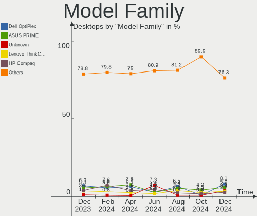
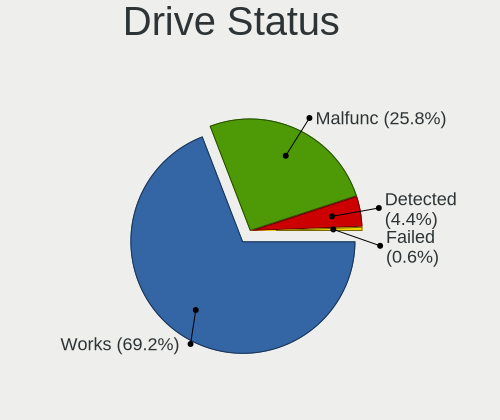
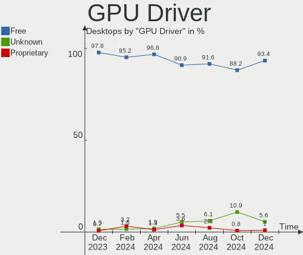

OpenMandriva - Hardware Trends (Desktops)
-----------------------------------------

A project to identify most popular hardware characteristics and track their change
over time based on data collected by Linux users at https://Linux-Hardware.org.

Anyone can contribute to this report by the [hw-probe](https://github.com/linuxhw/hw-probe) tool:

    sudo -E hw-probe -all -upload

This report is for one last month. Overall report since the beginning of time: [TestDays](https://github.com/linuxhw/TestDays)

Period: Apr, 2024.

Contents
--------

* [ System ](#system)
  - [ OS                       ](#os)
  - [ OS Family                ](#os-family)
  - [ Kernel                   ](#kernel)
  - [ Kernel Family            ](#kernel-family)
  - [ Kernel Major Ver.        ](#kernel-major-ver)
  - [ Arch                     ](#arch)
  - [ DE                       ](#de)
  - [ Display Server           ](#display-server)
  - [ Display Manager          ](#display-manager)
  - [ OS Lang                  ](#os-lang)
  - [ Boot Mode                ](#boot-mode)
  - [ Filesystem               ](#filesystem)
  - [ Part. scheme             ](#part-scheme)
  - [ Dual Boot with Linux/BSD ](#dual-boot-with-linuxbsd)
  - [ Dual Boot (Win)          ](#dual-boot-win)

* [ Board ](#board)
  - [ Vendor                   ](#vendor)
  - [ Model                    ](#model)
  - [ Model Family             ](#model-family)
  - [ MFG Year                 ](#mfg-year)
  - [ Form Factor              ](#form-factor)
  - [ Secure Boot              ](#secure-boot)
  - [ Coreboot                 ](#coreboot)
  - [ RAM Size                 ](#ram-size)
  - [ RAM Used                 ](#ram-used)
  - [ Total Drives             ](#total-drives)
  - [ Has CD-ROM               ](#has-cd-rom)
  - [ Has Ethernet             ](#has-ethernet)
  - [ Has WiFi                 ](#has-wifi)
  - [ Has Bluetooth            ](#has-bluetooth)

* [ Location ](#location)
  - [ Country                  ](#country)
  - [ City                     ](#city)

* [ Drives ](#drives)
  - [ Drive Vendor             ](#drive-vendor)
  - [ Drive Model              ](#drive-model)
  - [ HDD Vendor               ](#hdd-vendor)
  - [ SSD Vendor               ](#ssd-vendor)
  - [ Drive Kind               ](#drive-kind)
  - [ Drive Connector          ](#drive-connector)
  - [ Drive Size               ](#drive-size)
  - [ Space Total              ](#space-total)
  - [ Space Used               ](#space-used)
  - [ Malfunc. Drives          ](#malfunc-drives)
  - [ Malfunc. Drive Vendor    ](#malfunc-drive-vendor)
  - [ Malfunc. HDD Vendor      ](#malfunc-hdd-vendor)
  - [ Malfunc. Drive Kind      ](#malfunc-drive-kind)
  - [ Failed Drives            ](#failed-drives)
  - [ Failed Drive Vendor      ](#failed-drive-vendor)
  - [ Drive Status             ](#drive-status)

* [ Storage controller ](#storage-controller)
  - [ Storage Vendor           ](#storage-vendor)
  - [ Storage Model            ](#storage-model)
  - [ Storage Kind             ](#storage-kind)

* [ Processor ](#processor)
  - [ CPU Vendor               ](#cpu-vendor)
  - [ CPU Model                ](#cpu-model)
  - [ CPU Model Family         ](#cpu-model-family)
  - [ CPU Cores                ](#cpu-cores)
  - [ CPU Sockets              ](#cpu-sockets)
  - [ CPU Threads              ](#cpu-threads)
  - [ CPU Op-Modes             ](#cpu-op-modes)
  - [ CPU Microcode            ](#cpu-microcode)
  - [ CPU Microarch            ](#cpu-microarch)

* [ Graphics ](#graphics)
  - [ GPU Vendor               ](#gpu-vendor)
  - [ GPU Model                ](#gpu-model)
  - [ GPU Combo                ](#gpu-combo)
  - [ GPU Driver               ](#gpu-driver)
  - [ GPU Memory               ](#gpu-memory)

* [ Monitor ](#monitor)
  - [ Monitor Vendor           ](#monitor-vendor)
  - [ Monitor Model            ](#monitor-model)
  - [ Monitor Resolution       ](#monitor-resolution)
  - [ Monitor Diagonal         ](#monitor-diagonal)
  - [ Monitor Width            ](#monitor-width)
  - [ Aspect Ratio             ](#aspect-ratio)
  - [ Monitor Area             ](#monitor-area)
  - [ Pixel Density            ](#pixel-density)
  - [ Multiple Monitors        ](#multiple-monitors)

* [ Network ](#network)
  - [ Net Controller Vendor    ](#net-controller-vendor)
  - [ Net Controller Model     ](#net-controller-model)
  - [ Wireless Vendor          ](#wireless-vendor)
  - [ Wireless Model           ](#wireless-model)
  - [ Ethernet Vendor          ](#ethernet-vendor)
  - [ Ethernet Model           ](#ethernet-model)
  - [ Net Controller Kind      ](#net-controller-kind)
  - [ Used Controller          ](#used-controller)
  - [ NICs                     ](#nics)
  - [ IPv6                     ](#ipv6)

* [ Bluetooth ](#bluetooth)
  - [ Bluetooth Vendor         ](#bluetooth-vendor)
  - [ Bluetooth Model          ](#bluetooth-model)

* [ Sound ](#sound)
  - [ Sound Vendor             ](#sound-vendor)
  - [ Sound Model              ](#sound-model)

* [ Memory ](#memory)
  - [ Memory Vendor            ](#memory-vendor)
  - [ Memory Model             ](#memory-model)
  - [ Memory Kind              ](#memory-kind)
  - [ Memory Form Factor       ](#memory-form-factor)
  - [ Memory Size              ](#memory-size)
  - [ Memory Speed             ](#memory-speed)

* [ Printers & scanners ](#printers--scanners)
  - [ Printer Vendor           ](#printer-vendor)
  - [ Printer Model            ](#printer-model)
  - [ Scanner Vendor           ](#scanner-vendor)
  - [ Scanner Model            ](#scanner-model)

* [ Camera ](#camera)
  - [ Camera Vendor            ](#camera-vendor)
  - [ Camera Model             ](#camera-model)

* [ Security ](#security)
  - [ Fingerprint Vendor       ](#fingerprint-vendor)
  - [ Fingerprint Model        ](#fingerprint-model)
  - [ Chipcard Vendor          ](#chipcard-vendor)
  - [ Chipcard Model           ](#chipcard-model)

* [ Unsupported ](#unsupported)
  - [ Unsupported Devices      ](#unsupported-devices)
  - [ Unsupported Device Types ](#unsupported-device-types)

System
------

OS
--

Installed operating systems

| Name               | Desktops | Percent |
|--------------------|----------|---------|
| OpenMandriva 23.08 | 70       | 44.59%  |
| OpenMandriva 5.0   | 45       | 28.66%  |
| OpenMandriva 4.3   | 8        | 5.1%    |
| OpenMandriva 24.01 | 7        | 4.46%   |
| OpenMandriva 24.90 | 5        | 3.18%   |
| OpenMandriva 24.03 | 5        | 3.18%   |
| OpenMandriva 23.03 | 5        | 3.18%   |
| OpenMandriva 4.2   | 4        | 2.55%   |
| OpenMandriva 23.11 | 3        | 1.91%   |
| OpenMandriva 23.06 | 2        | 1.27%   |
| OpenMandriva 4.50  | 1        | 0.64%   |
| OpenMandriva 24.04 | 1        | 0.64%   |
| OpenMandriva 23.10 | 1        | 0.64%   |

OS Family
---------

OS without a version

| Name         | Desktops | Percent |
|--------------|----------|---------|
| OpenMandriva | 157      | 100%    |

Kernel
------

Version of the Linux kernel

| Version                      | Desktops | Percent |
|------------------------------|----------|---------|
| 6.4.11-desktop-1omv2390      | 65       | 41.4%   |
| 6.6.2-desktop-1omv2390       | 55       | 35.03%  |
| 5.16.7-desktop-1omv4003      | 7        | 4.46%   |
| 6.4.8-desktop-2omv2390       | 6        | 3.82%   |
| 6.8.7-desktop-1omv2490       | 5        | 3.18%   |
| 6.2.6-desktop-1omv2390       | 5        | 3.18%   |
| 5.10.14-desktop-1omv4002     | 4        | 2.55%   |
| 6.8.1-desktop-3omv2490       | 3        | 1.91%   |
| 6.3.5-desktop-3omv2390       | 2        | 1.27%   |
| 6.9.0-desktop-0.rc2.1omv2490 | 1        | 0.64%   |
| 6.8.4-desktop-4omv2490       | 1        | 0.64%   |
| 6.5.5-desktop-1omv2390       | 1        | 0.64%   |
| 6.5.3-desktop-1omv2390       | 1        | 0.64%   |
| 5.19.12-desktop-2omv4090     | 1        | 0.64%   |

Kernel Family
-------------

Linux kernel without a distro release

| Version | Desktops | Percent |
|---------|----------|---------|
| 6.4.11  | 65       | 41.4%   |
| 6.6.2   | 55       | 35.03%  |
| 5.16.7  | 7        | 4.46%   |
| 6.4.8   | 6        | 3.82%   |
| 6.8.7   | 5        | 3.18%   |
| 6.2.6   | 5        | 3.18%   |
| 5.10.14 | 4        | 2.55%   |
| 6.8.1   | 3        | 1.91%   |
| 6.3.5   | 2        | 1.27%   |
| 6.9.0   | 1        | 0.64%   |
| 6.8.4   | 1        | 0.64%   |
| 6.5.5   | 1        | 0.64%   |
| 6.5.3   | 1        | 0.64%   |
| 5.19.12 | 1        | 0.64%   |

Kernel Major Ver.
-----------------

Linux kernel major version

| Version | Desktops | Percent |
|---------|----------|---------|
| 6.4     | 71       | 45.22%  |
| 6.6     | 55       | 35.03%  |
| 6.8     | 9        | 5.73%   |
| 5.16    | 7        | 4.46%   |
| 6.2     | 5        | 3.18%   |
| 5.10    | 4        | 2.55%   |
| 6.5     | 2        | 1.27%   |
| 6.3     | 2        | 1.27%   |
| 6.9     | 1        | 0.64%   |
| 5.19    | 1        | 0.64%   |

Arch
----

OS architecture (x86_64, i586, etc.)

| Name   | Desktops | Percent |
|--------|----------|---------|
| x86_64 | 157      | 100%    |

DE
--

Desktop Environment

| Name     | Desktops | Percent |
|----------|----------|---------|
| KDE5     | 134      | 85.35%  |
| LXQt     | 10       | 6.37%   |
| GNOME    | 8        | 5.1%    |
| Unknown  | 3        | 1.91%   |
| XFCE     | 1        | 0.64%   |
| Cinnamon | 1        | 0.64%   |

Display Server
--------------

X11 or Wayland

| Name    | Desktops | Percent |
|---------|----------|---------|
| Wayland | 134      | 85.35%  |
| X11     | 23       | 14.65%  |

Display Manager
---------------

SDDM, LightDM, etc.

| Name    | Desktops | Percent |
|---------|----------|---------|
| SDDM    | 147      | 93.63%  |
| GDM     | 8        | 5.1%    |
| LightDM | 2        | 1.27%   |

OS Lang
-------

Language

| Lang  | Desktops | Percent |
|-------|----------|---------|
| en_US | 75       | 47.77%  |
| ru_RU | 13       | 8.28%   |
| fr_FR | 11       | 7.01%   |
| it_IT | 9        | 5.73%   |
| pt_BR | 8        | 5.1%    |
| pl_PL | 7        | 4.46%   |
| de_DE | 7        | 4.46%   |
| es_ES | 4        | 2.55%   |
| en_GB | 4        | 2.55%   |
| es_MX | 3        | 1.91%   |
| pt_PT | 2        | 1.27%   |
| fr_BE | 2        | 1.27%   |
| es_CL | 2        | 1.27%   |
| de_AT | 2        | 1.27%   |
| nl_NL | 1        | 0.64%   |
| hu_HU | 1        | 0.64%   |
| hr_HR | 1        | 0.64%   |
| fr_CA | 1        | 0.64%   |
| es_AR | 1        | 0.64%   |
| en_SG | 1        | 0.64%   |
| en_AU | 1        | 0.64%   |
| cs_CZ | 1        | 0.64%   |

Boot Mode
---------

EFI or BIOS

| Mode | Desktops | Percent |
|------|----------|---------|
| BIOS | 84       | 53.5%   |
| EFI  | 73       | 46.5%   |

Filesystem
----------

Type of filesystem

| Type    | Desktops | Percent |
|---------|----------|---------|
| Ext4    | 78       | 49.68%  |
| Overlay | 67       | 42.68%  |
| Btrfs   | 5        | 3.18%   |
| Xfs     | 4        | 2.55%   |
| Ext3    | 2        | 1.27%   |
| F2fs    | 1        | 0.64%   |

Part. scheme
------------

Scheme of partitioning

| Type | Desktops | Percent |
|------|----------|---------|
| GPT  | 117      | 74.52%  |
| MBR  | 40       | 25.48%  |

Dual Boot with Linux/BSD
------------------------

Hosting more than one Linux/BSD

| Dual boot | Desktops | Percent |
|-----------|----------|---------|
| No        | 80       | 50.96%  |
| Yes       | 77       | 49.04%  |

Dual Boot (Win)
---------------

Hosting Linux and Windows

| Dual boot | Desktops | Percent |
|-----------|----------|---------|
| No        | 89       | 56.69%  |
| Yes       | 68       | 43.31%  |

Board
-----

Vendor
------

Motherboard manufacturer

| Name                                 | Desktops | Percent |
|--------------------------------------|----------|---------|
| ASUSTek Computer                     | 40       | 25.48%  |
| Gigabyte Technology                  | 21       | 13.38%  |
| ASRock                               | 19       | 12.1%   |
| MSI                                  | 17       | 10.83%  |
| Hewlett-Packard                      | 14       | 8.92%   |
| Dell                                 | 14       | 8.92%   |
| Lenovo                               | 4        | 2.55%   |
| Intel                                | 4        | 2.55%   |
| Biostar                              | 4        | 2.55%   |
| Fujitsu                              | 3        | 1.91%   |
| Acer                                 | 3        | 1.91%   |
| Packard Bell                         | 2        | 1.27%   |
| MAXSUN                               | 2        | 1.27%   |
| Foxconn                              | 2        | 1.27%   |
| Shenzhen Meigao Electronic Equipment | 1        | 0.64%   |
| Positivo                             | 1        | 0.64%   |
| Pegatron                             | 1        | 0.64%   |
| MACHINIST                            | 1        | 0.64%   |
| EVGA                                 | 1        | 0.64%   |
| ECS                                  | 1        | 0.64%   |
| Daten Tecnologia                     | 1        | 0.64%   |
| Unknown                              | 1        | 0.64%   |

Model
-----

Motherboard model

| Name                                       | Desktops | Percent |
|--------------------------------------------|----------|---------|
| ASUS All Series                            | 4        | 2.55%   |
| MSI MS-7D46                                | 2        | 1.27%   |
| Gigabyte Z390 UD                           | 2        | 1.27%   |
| Dell OptiPlex 790                          | 2        | 1.27%   |
| Biostar H310MHP                            | 2        | 1.27%   |
| ASUS TUF Gaming B550-PLUS                  | 2        | 1.27%   |
| ASRock G31M-S                              | 2        | 1.27%   |
| Shenzhen Meigao Electronic Equipment UM690 | 1        | 0.64%   |
| Positivo POS-PIG41BA                       | 1        | 0.64%   |
| Pegatron WC954AA-ABF CQ5325FR              | 1        | 0.64%   |
| Packard Bell ISTART 2025                   | 1        | 0.64%   |
| Packard Bell IMEDIA S2185                  | 1        | 0.64%   |
| MSI MS-7E01                                | 1        | 0.64%   |
| MSI MS-7D36                                | 1        | 0.64%   |
| MSI MS-7D09                                | 1        | 0.64%   |
| MSI MS-7C37                                | 1        | 0.64%   |
| MSI MS-7B29                                | 1        | 0.64%   |
| MSI MS-7A67                                | 1        | 0.64%   |
| MSI MS-7891                                | 1        | 0.64%   |
| MSI MS-7851                                | 1        | 0.64%   |
| MSI MS-7846                                | 1        | 0.64%   |
| MSI MS-7817                                | 1        | 0.64%   |
| MSI MS-7816                                | 1        | 0.64%   |
| MSI MS-7759                                | 1        | 0.64%   |
| MSI MS-7721                                | 1        | 0.64%   |
| MSI MS-7592                                | 1        | 0.64%   |
| MSI MS-7529                                | 1        | 0.64%   |
| MAXSUN MS-Terminator B760M D4 VER:H5.6G    | 1        | 0.64%   |
| MAXSUN MS-Terminator B550M                 | 1        | 0.64%   |
| MACHINIST X79 V2.82A                       | 1        | 0.64%   |
| Lenovo ThinkCentre M90p 5536P79            | 1        | 0.64%   |
| Lenovo ThinkCentre M600 10KH003QUS         | 1        | 0.64%   |
| Lenovo ThinkCentre M58p 6234CL2            | 1        | 0.64%   |
| Lenovo ThinkCentre Edge72 3484DUG          | 1        | 0.64%   |
| Intel H81                                  | 1        | 0.64%   |
| Intel H61                                  | 1        | 0.64%   |
| Intel D945GCL AAD67193-205                 | 1        | 0.64%   |
| Intel B75                                  | 1        | 0.64%   |
| HP Z220 CMT Workstation                    | 1        | 0.64%   |
| HP Slim Desktop S01-pF1xxx                 | 1        | 0.64%   |

Model Family
------------

Motherboard model prefix

| Name                                       | Desktops | Percent |
|--------------------------------------------|----------|---------|
| ASUS PRIME                                 | 12       | 7.64%   |
| Dell OptiPlex                              | 10       | 6.37%   |
| HP Compaq                                  | 6        | 3.82%   |
| Lenovo ThinkCentre                         | 4        | 2.55%   |
| ASUS All                                   | 4        | 2.55%   |
| ASUS TUF                                   | 3        | 1.91%   |
| ASUS ROG                                   | 3        | 1.91%   |
| MSI MS-7D46                                | 2        | 1.27%   |
| MAXSUN MS-Terminator                       | 2        | 1.27%   |
| HP ProDesk                                 | 2        | 1.27%   |
| HP EliteDesk                               | 2        | 1.27%   |
| Gigabyte Z390                              | 2        | 1.27%   |
| Dell Vostro                                | 2        | 1.27%   |
| Biostar H310MHP                            | 2        | 1.27%   |
| ASRock X570                                | 2        | 1.27%   |
| ASRock G31M-S                              | 2        | 1.27%   |
| ASRock B450                                | 2        | 1.27%   |
| Shenzhen Meigao Electronic Equipment UM690 | 1        | 0.64%   |
| Positivo POS-PIG41BA                       | 1        | 0.64%   |
| Pegatron WC954AA-ABF                       | 1        | 0.64%   |
| Packard Bell ISTART                        | 1        | 0.64%   |
| Packard Bell IMEDIA                        | 1        | 0.64%   |
| MSI MS-7E01                                | 1        | 0.64%   |
| MSI MS-7D36                                | 1        | 0.64%   |
| MSI MS-7D09                                | 1        | 0.64%   |
| MSI MS-7C37                                | 1        | 0.64%   |
| MSI MS-7B29                                | 1        | 0.64%   |
| MSI MS-7A67                                | 1        | 0.64%   |
| MSI MS-7891                                | 1        | 0.64%   |
| MSI MS-7851                                | 1        | 0.64%   |
| MSI MS-7846                                | 1        | 0.64%   |
| MSI MS-7817                                | 1        | 0.64%   |
| MSI MS-7816                                | 1        | 0.64%   |
| MSI MS-7759                                | 1        | 0.64%   |
| MSI MS-7721                                | 1        | 0.64%   |
| MSI MS-7592                                | 1        | 0.64%   |
| MSI MS-7529                                | 1        | 0.64%   |
| MACHINIST X79                              | 1        | 0.64%   |
| Intel H81                                  | 1        | 0.64%   |
| Intel H61                                  | 1        | 0.64%   |

MFG Year
--------

Motherboard manufacture year

| Year | Desktops | Percent |
|------|----------|---------|
| 2013 | 14       | 8.92%   |
| 2015 | 13       | 8.28%   |
| 2014 | 13       | 8.28%   |
| 2012 | 13       | 8.28%   |
| 2021 | 11       | 7.01%   |
| 2018 | 11       | 7.01%   |
| 2011 | 11       | 7.01%   |
| 2017 | 10       | 6.37%   |
| 2008 | 10       | 6.37%   |
| 2022 | 9        | 5.73%   |
| 2020 | 9        | 5.73%   |
| 2019 | 8        | 5.1%    |
| 2010 | 8        | 5.1%    |
| 2009 | 5        | 3.18%   |
| 2023 | 4        | 2.55%   |
| 2006 | 4        | 2.55%   |
| 2016 | 2        | 1.27%   |
| 2007 | 1        | 0.64%   |
| 2005 | 1        | 0.64%   |

Form Factor
-----------

Physical design of the computer

| Name    | Desktops | Percent |
|---------|----------|---------|
| Desktop | 157      | 100%    |

Secure Boot
-----------

Enabled or disabled

| State    | Desktops | Percent |
|----------|----------|---------|
| Disabled | 157      | 100%    |

Coreboot
--------

Have coreboot on board

| Used | Desktops | Percent |
|------|----------|---------|
| No   | 157      | 100%    |

RAM Size
--------

Total RAM memory

| Size in GB      | Desktops | Percent |
|-----------------|----------|---------|
| 4.01-8.0        | 31       | 19.75%  |
| 16.01-24.0      | 30       | 19.11%  |
| 8.01-16.0       | 29       | 18.47%  |
| 3.01-4.0        | 27       | 17.2%   |
| 32.01-64.0      | 26       | 16.56%  |
| 64.01-256.0     | 4        | 2.55%   |
| 24.01-32.0      | 3        | 1.91%   |
| 2.01-3.0        | 3        | 1.91%   |
| 1.01-2.0        | 3        | 1.91%   |
| More than 256.0 | 1        | 0.64%   |

RAM Used
--------

Used RAM memory

| Used GB   | Desktops | Percent |
|-----------|----------|---------|
| 1.01-2.0  | 100      | 63.69%  |
| 2.01-3.0  | 28       | 17.83%  |
| 0.51-1.0  | 18       | 11.46%  |
| 3.01-4.0  | 5        | 3.18%   |
| 0.01-0.5  | 3        | 1.91%   |
| 4.01-8.0  | 2        | 1.27%   |
| 8.01-16.0 | 1        | 0.64%   |

Total Drives
------------

Number of drives on board

| Drives | Desktops | Percent |
|--------|----------|---------|
| 1      | 75       | 47.77%  |
| 2      | 37       | 23.57%  |
| 3      | 19       | 12.1%   |
| 5      | 9        | 5.73%   |
| 4      | 9        | 5.73%   |
| 0      | 3        | 1.91%   |
| 7      | 2        | 1.27%   |
| 6      | 2        | 1.27%   |
| 12     | 1        | 0.64%   |

Has CD-ROM
----------

Has CD-ROM on board

| Presented | Desktops | Percent |
|-----------|----------|---------|
| Yes       | 83       | 52.87%  |
| No        | 74       | 47.13%  |

Has Ethernet
------------

Has Ethernet on board

| Presented | Desktops | Percent |
|-----------|----------|---------|
| Yes       | 156      | 99.36%  |
| No        | 1        | 0.64%   |

Has WiFi
--------

Has WiFi module

| Presented | Desktops | Percent |
|-----------|----------|---------|
| No        | 96       | 61.15%  |
| Yes       | 61       | 38.85%  |

Has Bluetooth
-------------

Has Bluetooth module

| Presented | Desktops | Percent |
|-----------|----------|---------|
| No        | 124      | 78.98%  |
| Yes       | 33       | 21.02%  |

Location
--------

Country
-------

Geographic location (country)

| Country      | Desktops | Percent |
|--------------|----------|---------|
| USA          | 20       | 12.74%  |
| France       | 17       | 10.83%  |
| Germany      | 15       | 9.55%   |
| Russia       | 12       | 7.64%   |
| Brazil       | 12       | 7.64%   |
| Italy        | 11       | 7.01%   |
| Poland       | 9        | 5.73%   |
| UK           | 6        | 3.82%   |
| Mexico       | 5        | 3.18%   |
| Spain        | 3        | 1.91%   |
| Japan        | 3        | 1.91%   |
| Austria      | 3        | 1.91%   |
| Argentina    | 3        | 1.91%   |
| Uruguay      | 2        | 1.27%   |
| Sweden       | 2        | 1.27%   |
| South Korea  | 2        | 1.27%   |
| Slovakia     | 2        | 1.27%   |
| Portugal     | 2        | 1.27%   |
| Iran         | 2        | 1.27%   |
| Finland      | 2        | 1.27%   |
| Czechia      | 2        | 1.27%   |
| China        | 2        | 1.27%   |
| Chile        | 2        | 1.27%   |
| Canada       | 2        | 1.27%   |
| Bulgaria     | 2        | 1.27%   |
| Belgium      | 2        | 1.27%   |
| Turkey       | 1        | 0.64%   |
| South Africa | 1        | 0.64%   |
| Singapore    | 1        | 0.64%   |
| Serbia       | 1        | 0.64%   |
| Romania      | 1        | 0.64%   |
| Netherlands  | 1        | 0.64%   |
| Kazakhstan   | 1        | 0.64%   |
| Israel       | 1        | 0.64%   |
| Hungary      | 1        | 0.64%   |
| Greece       | 1        | 0.64%   |
| Egypt        | 1        | 0.64%   |
| Australia    | 1        | 0.64%   |

City
----

Geographic location (city)

| City                   | Desktops | Percent |
|------------------------|----------|---------|
| Trnava                 | 2        | 1.27%   |
| Sao Goncalo            | 2        | 1.27%   |
| Rome                   | 2        | 1.27%   |
| Rio de Janeiro         | 2        | 1.27%   |
| Prague                 | 2        | 1.27%   |
| Nîmes                 | 2        | 1.27%   |
| Munich                 | 2        | 1.27%   |
| Moscow                 | 2        | 1.27%   |
| Montevideo             | 2        | 1.27%   |
| Gondomar               | 2        | 1.27%   |
| Ciudad Obregón        | 2        | 1.27%   |
| Zuidwolde              | 1        | 0.64%   |
| Zhengzhou              | 1        | 0.64%   |
| Zalău                 | 1        | 0.64%   |
| Wuppertal              | 1        | 0.64%   |
| Volgograd              | 1        | 0.64%   |
| Vienna                 | 1        | 0.64%   |
| Verona                 | 1        | 0.64%   |
| Valdivia               | 1        | 0.64%   |
| Utsunomiya             | 1        | 0.64%   |
| Uberlândia            | 1        | 0.64%   |
| Trzcianka              | 1        | 0.64%   |
| Trois-Rivières        | 1        | 0.64%   |
| Toulouse               | 1        | 0.64%   |
| Tosse                  | 1        | 0.64%   |
| Tel Aviv               | 1        | 0.64%   |
| Tehran                 | 1        | 0.64%   |
| Tecamac                | 1        | 0.64%   |
| Tabriz                 | 1        | 0.64%   |
| Sukhodol               | 1        | 0.64%   |
| Stavropol              | 1        | 0.64%   |
| Sofia                  | 1        | 0.64%   |
| Smolensk               | 1        | 0.64%   |
| Singapore              | 1        | 0.64%   |
| Serpukhov              | 1        | 0.64%   |
| Seraing                | 1        | 0.64%   |
| Schwechat              | 1        | 0.64%   |
| Sasebo                 | 1        | 0.64%   |
| Santo André           | 1        | 0.64%   |
| Santiago de Compostela | 1        | 0.64%   |

Drives
------

Drive Vendor
------------

Hard drive vendors

| Vendor              | Desktops | Drives | Percent |
|---------------------|----------|--------|---------|
| WDC                 | 56       | 70     | 20.74%  |
| Seagate             | 49       | 55     | 18.15%  |
| Samsung Electronics | 34       | 51     | 12.59%  |
| Kingston            | 26       | 30     | 9.63%   |
| SanDisk             | 16       | 19     | 5.93%   |
| Toshiba             | 11       | 12     | 4.07%   |
| Crucial             | 9        | 13     | 3.33%   |
| China               | 6        | 6      | 2.22%   |
| Maxtor              | 5        | 5      | 1.85%   |
| Intenso             | 4        | 5      | 1.48%   |
| SPCC                | 3        | 3      | 1.11%   |
| Silicon Motion      | 3        | 3      | 1.11%   |
| Patriot             | 3        | 3      | 1.11%   |
| Micron Technology   | 3        | 3      | 1.11%   |
| Lexar               | 3        | 3      | 1.11%   |
| Intel               | 3        | 3      | 1.11%   |
| A-DATA Technology   | 3        | 3      | 1.11%   |
| Unknown             | 2        | 2      | 0.74%   |
| JMicron Technology  | 2        | 2      | 0.74%   |
| Hitachi             | 2        | 3      | 0.74%   |
| Unknown             | 2        | 2      | 0.74%   |
| XPG                 | 1        | 1      | 0.37%   |
| WD Blue             | 1        | 1      | 0.37%   |
| Verbatim            | 1        | 4      | 0.37%   |
| Teclast             | 1        | 1      | 0.37%   |
| Team                | 1        | 2      | 0.37%   |
| TAMMUZ              | 1        | 1      | 0.37%   |
| SSK                 | 1        | 2      | 0.37%   |
| SK hynix            | 1        | 1      | 0.37%   |
| OCZ                 | 1        | 1      | 0.37%   |
| Netac               | 1        | 1      | 0.37%   |
| MSI                 | 1        | 1      | 0.37%   |
| LITEON              | 1        | 1      | 0.37%   |
| Leven               | 1        | 1      | 0.37%   |
| KIOXIA-EXCERIA      | 1        | 1      | 0.37%   |
| KINGCOMP            | 1        | 1      | 0.37%   |
| Innodisk            | 1        | 1      | 0.37%   |
| Inland              | 1        | 1      | 0.37%   |
| Initio              | 1        | 1      | 0.37%   |
| GOODRAM             | 1        | 1      | 0.37%   |

Drive Model
-----------

Hard drive models

| Model                              | Desktops | Percent |
|------------------------------------|----------|---------|
| Kingston SA400S37240G 240GB SSD    | 6        | 1.94%   |
| WDC WD10EZEX-08WN4A0 1TB           | 4        | 1.29%   |
| SanDisk NVMe SSD Drive 1TB         | 4        | 1.29%   |
| Kingston SA400S37480G 480GB SSD    | 4        | 1.29%   |
| Toshiba DT01ACA100 1TB             | 3        | 0.97%   |
| Toshiba DT01ACA050 500GB           | 3        | 0.97%   |
| Seagate ST500DM009-2F110A 500GB    | 3        | 0.97%   |
| Seagate ST500DM002-1BD142 500GB    | 3        | 0.97%   |
| Seagate ST3500413AS 500GB          | 3        | 0.97%   |
| Seagate ST3160318AS 160GB          | 3        | 0.97%   |
| Seagate ST1000DM003-1CH162 1TB     | 3        | 0.97%   |
| SanDisk NVMe SSD Drive 2TB         | 3        | 0.97%   |
| Samsung SSD 980 500GB              | 3        | 0.97%   |
| Samsung SSD 860 EVO 500GB          | 3        | 0.97%   |
| Kingston SUV400S37120G 120GB SSD   | 3        | 0.97%   |
| Kingston SA400S37120G 120GB SSD    | 3        | 0.97%   |
| Crucial CT500MX500SSD1 500GB       | 3        | 0.97%   |
| WDC WDBNCE0010PNC 1TB SSD          | 2        | 0.65%   |
| WDC WD5000AAKX-75U6AA0 500GB       | 2        | 0.65%   |
| WDC WD2003FZEX-00SRLA0 2TB         | 2        | 0.65%   |
| WDC WD1600AAJS-60B4A0 160GB        | 2        | 0.65%   |
| WDC WD10EZEX-08M2NA0 1TB           | 2        | 0.65%   |
| Toshiba HDWE140 4TB                | 2        | 0.65%   |
| Toshiba HDWD110 1TB                | 2        | 0.65%   |
| Seagate ST3500312CS 500GB          | 2        | 0.65%   |
| Seagate ST3000DM001-1ER166 3TB     | 2        | 0.65%   |
| Seagate ST2000DM006-2DM164 2TB     | 2        | 0.65%   |
| Seagate ST1000LM024 HN-M101MBB 1TB | 2        | 0.65%   |
| SanDisk SSD PLUS 1000GB            | 2        | 0.65%   |
| Samsung SSD 980 1TB                | 2        | 0.65%   |
| Samsung SSD 970 EVO Plus 2TB       | 2        | 0.65%   |
| Samsung SSD 970 EVO 500GB          | 2        | 0.65%   |
| Samsung SSD 870 EVO 4TB            | 2        | 0.65%   |
| Samsung SSD 870 EVO 2TB            | 2        | 0.65%   |
| Samsung SSD 870 EVO 1TB            | 2        | 0.65%   |
| Maxtor STM380215AS 80GB            | 2        | 0.65%   |
| Kingston SNV2S500G 500GB           | 2        | 0.65%   |
| Kingston SA400S37960G 960GB SSD    | 2        | 0.65%   |
| JMicron Generic 320GB              | 2        | 0.65%   |
| Intenso SSD 240GB                  | 2        | 0.65%   |

HDD Vendor
----------

Hard disk drive vendors

| Vendor              | Desktops | Drives | Percent |
|---------------------|----------|--------|---------|
| WDC                 | 51       | 62     | 38.93%  |
| Seagate             | 49       | 55     | 37.4%   |
| Toshiba             | 10       | 11     | 7.63%   |
| Samsung Electronics | 9        | 10     | 6.87%   |
| Maxtor              | 5        | 5      | 3.82%   |
| JMicron Technology  | 2        | 2      | 1.53%   |
| Hitachi             | 2        | 3      | 1.53%   |
| Unknown             | 1        | 1      | 0.76%   |
| SSK                 | 1        | 1      | 0.76%   |
| Initio              | 1        | 1      | 0.76%   |

SSD Vendor
----------

Solid state drive vendors

| Vendor              | Desktops | Drives | Percent |
|---------------------|----------|--------|---------|
| Kingston            | 19       | 21     | 19.39%  |
| Samsung Electronics | 17       | 23     | 17.35%  |
| SanDisk             | 8        | 8      | 8.16%   |
| Crucial             | 8        | 10     | 8.16%   |
| WDC                 | 6        | 7      | 6.12%   |
| China               | 6        | 6      | 6.12%   |
| Micron Technology   | 3        | 3      | 3.06%   |
| Intenso             | 3        | 4      | 3.06%   |
| Intel               | 3        | 3      | 3.06%   |
| A-DATA Technology   | 3        | 3      | 3.06%   |
| SPCC                | 2        | 2      | 2.04%   |
| Patriot             | 2        | 2      | 2.04%   |
| Unknown             | 2        | 2      | 2.04%   |
| Verbatim            | 1        | 4      | 1.02%   |
| Toshiba             | 1        | 1      | 1.02%   |
| Teclast             | 1        | 1      | 1.02%   |
| TAMMUZ              | 1        | 1      | 1.02%   |
| OCZ                 | 1        | 1      | 1.02%   |
| Netac               | 1        | 1      | 1.02%   |
| LITEON              | 1        | 1      | 1.02%   |
| Lexar               | 1        | 1      | 1.02%   |
| Leven               | 1        | 1      | 1.02%   |
| KINGCOMP            | 1        | 1      | 1.02%   |
| Innodisk            | 1        | 1      | 1.02%   |
| GOODRAM             | 1        | 1      | 1.02%   |
| Biostar             | 1        | 1      | 1.02%   |
| Azerty              | 1        | 1      | 1.02%   |
| AGI                 | 1        | 1      | 1.02%   |
| AFOX                | 1        | 1      | 1.02%   |

Drive Kind
----------

HDD or SSD

| Kind    | Desktops | Drives | Percent |
|---------|----------|--------|---------|
| HDD     | 105      | 151    | 47.51%  |
| SSD     | 76       | 113    | 34.39%  |
| NVMe    | 38       | 60     | 17.19%  |
| Unknown | 2        | 2      | 0.9%    |

Drive Connector
---------------

SATA, SAS, NVMe, etc.

| Type | Desktops | Drives | Percent |
|------|----------|--------|---------|
| SATA | 140      | 256    | 74.47%  |
| NVMe | 38       | 58     | 20.21%  |
| SAS  | 10       | 12     | 5.32%   |

Drive Size
----------

Size of hard drive

| Size in TB | Desktops | Drives | Percent |
|------------|----------|--------|---------|
| 0.01-0.5   | 110      | 165    | 58.2%   |
| 0.51-1.0   | 51       | 68     | 26.98%  |
| 1.01-2.0   | 15       | 17     | 7.94%   |
| 3.01-4.0   | 9        | 10     | 4.76%   |
| 2.01-3.0   | 2        | 2      | 1.06%   |
| 4.01-10.0  | 2        | 2      | 1.06%   |

Space Total
-----------

Amount of disk space available on the file system

| Size in GB     | Desktops | Percent |
|----------------|----------|---------|
| 1-20           | 37       | 23.57%  |
| 251-500        | 28       | 17.83%  |
| 101-250        | 27       | 17.2%   |
| 501-1000       | 19       | 12.1%   |
| Unknown        | 16       | 10.19%  |
| 21-50          | 9        | 5.73%   |
| 51-100         | 8        | 5.1%    |
| 1001-2000      | 7        | 4.46%   |
| 2001-3000      | 5        | 3.18%   |
| More than 3000 | 1        | 0.64%   |

Space Used
----------

Amount of used disk space

| Used GB   | Desktops | Percent |
|-----------|----------|---------|
| 1-20      | 106      | 67.52%  |
| Unknown   | 16       | 10.19%  |
| 101-250   | 9        | 5.73%   |
| 21-50     | 7        | 4.46%   |
| 251-500   | 6        | 3.82%   |
| 51-100    | 6        | 3.82%   |
| 0         | 4        | 2.55%   |
| 501-1000  | 2        | 1.27%   |
| 2001-3000 | 1        | 0.64%   |

Malfunc. Drives
---------------

Drive models with a malfunction

| Model                                 | Desktops | Drives | Percent |
|---------------------------------------|----------|--------|---------|
| Seagate ST3500312CS 500GB             | 2        | 2      | 3.92%   |
| Seagate ST3160318AS 160GB             | 2        | 2      | 3.92%   |
| Samsung Electronics SSD 970 EVO 500GB | 2        | 2      | 3.92%   |
| WDC WD6400AAKS-22A7B2 640GB           | 1        | 1      | 1.96%   |
| WDC WD5000BEVT-75A0RT0 500GB          | 1        | 1      | 1.96%   |
| WDC WD5000AAKX-75U6AA0 500GB          | 1        | 1      | 1.96%   |
| WDC WD5000AAKX-603CA0 500GB           | 1        | 1      | 1.96%   |
| WDC WD5000AAKX-001CA0 500GB           | 1        | 1      | 1.96%   |
| WDC WD3200AAKS-00L9A0 320GB           | 1        | 1      | 1.96%   |
| WDC WD3200AAJS-60M0A1 320GB           | 1        | 1      | 1.96%   |
| WDC WD2500JS-60NCB1 250GB             | 1        | 1      | 1.96%   |
| WDC WD2500AAJS-60Z0A0 250GB           | 1        | 1      | 1.96%   |
| WDC WD1600JS-55NCB1 160GB             | 1        | 1      | 1.96%   |
| WDC WD1600AAJS-75M0A0 160GB           | 1        | 1      | 1.96%   |
| WDC WD1600AAJS-60B4A0 160GB           | 1        | 1      | 1.96%   |
| WDC WD10PURX-64E5EY0 1TB              | 1        | 1      | 1.96%   |
| WDC WD10EZRX-22A3KB0 1TB              | 1        | 1      | 1.96%   |
| WDC WD10EZEX-08M2NA0 1TB              | 1        | 1      | 1.96%   |
| WDC WD10EARS-00Y5B1 1TB               | 1        | 1      | 1.96%   |
| Toshiba HDWD110 1TB                   | 1        | 1      | 1.96%   |
| Toshiba DT01ACA100 1TB                | 1        | 1      | 1.96%   |
| Toshiba DT01ACA050 500GB              | 1        | 1      | 1.96%   |
| Seagate ST980811AS 80GB               | 1        | 1      | 1.96%   |
| Seagate ST9250315AS 250GB             | 1        | 1      | 1.96%   |
| Seagate ST500LT0 12-1DG142 500GB      | 1        | 1      | 1.96%   |
| Seagate ST500LM012 HN-M500MBB 500GB   | 1        | 1      | 1.96%   |
| Seagate ST3750528AS 752GB             | 1        | 1      | 1.96%   |
| Seagate ST3500413AS 500GB             | 1        | 1      | 1.96%   |
| Seagate ST3160812AS 160GB             | 1        | 2      | 1.96%   |
| Seagate ST3120813AS 120GB             | 1        | 1      | 1.96%   |
| Seagate ST1000DX001-1NS162 1TB        | 1        | 1      | 1.96%   |
| Seagate ST1000DM003-1CH162 1TB        | 1        | 1      | 1.96%   |
| Samsung Electronics SSD 870 EVO 1TB   | 1        | 1      | 1.96%   |
| Samsung Electronics SSD 840 EVO 250GB | 1        | 1      | 1.96%   |
| Samsung Electronics SSD 840 EVO 120GB | 1        | 1      | 1.96%   |
| Samsung Electronics SP2504C 250GB     | 1        | 1      | 1.96%   |
| Samsung Electronics SP1654N 160GB     | 1        | 1      | 1.96%   |
| Samsung Electronics HD502IJ 500GB     | 1        | 1      | 1.96%   |
| Samsung Electronics HD120IJ 120GB     | 1        | 1      | 1.96%   |
| OCZ VERTEX3 120GB SSD                 | 1        | 1      | 1.96%   |

Malfunc. Drive Vendor
---------------------

Vendors of faulty drives

| Vendor              | Desktops | Drives | Percent |
|---------------------|----------|--------|---------|
| WDC                 | 16       | 16     | 32.65%  |
| Seagate             | 13       | 15     | 26.53%  |
| Samsung Electronics | 8        | 9      | 16.33%  |
| Toshiba             | 3        | 3      | 6.12%   |
| Maxtor              | 3        | 3      | 6.12%   |
| Micron Technology   | 2        | 2      | 4.08%   |
| OCZ                 | 1        | 1      | 2.04%   |
| KINGCOMP            | 1        | 1      | 2.04%   |
| Hitachi             | 1        | 1      | 2.04%   |
| Crucial             | 1        | 1      | 2.04%   |

Malfunc. HDD Vendor
-------------------

Vendors of faulty HDD drives

| Vendor              | Desktops | Drives | Percent |
|---------------------|----------|--------|---------|
| WDC                 | 16       | 16     | 40%     |
| Seagate             | 13       | 15     | 32.5%   |
| Samsung Electronics | 4        | 4      | 10%     |
| Toshiba             | 3        | 3      | 7.5%    |
| Maxtor              | 3        | 3      | 7.5%    |
| Hitachi             | 1        | 1      | 2.5%    |

Malfunc. Drive Kind
-------------------

Kinds of faulty drives

| Kind | Desktops | Drives | Percent |
|------|----------|--------|---------|
| HDD  | 37       | 42     | 78.72%  |
| SSD  | 8        | 8      | 17.02%  |
| NVMe | 2        | 2      | 4.26%   |

Failed Drives
-------------

Failed drive models

Zero info for selected period =(

Failed Drive Vendor
-------------------

Failed drive vendors

Zero info for selected period =(

Drive Status
------------

Number of failed and malfunc. drives

| Status   | Desktops | Drives | Percent |
|----------|----------|--------|---------|
| Works    | 134      | 251    | 67.68%  |
| Malfunc  | 45       | 52     | 22.73%  |
| Detected | 19       | 23     | 9.6%    |

Storage controller
------------------

Storage Vendor
--------------

Storage controller vendors

| Vendor                       | Desktops | Percent |
|------------------------------|----------|---------|
| Intel                        | 104      | 47.49%  |
| AMD                          | 45       | 20.55%  |
| Samsung Electronics          | 13       | 5.94%   |
| ASMedia Technology           | 9        | 4.11%   |
| SanDisk                      | 8        | 3.65%   |
| Kingston Technology Company  | 7        | 3.2%    |
| Silicon Motion               | 5        | 2.28%   |
| Phison Electronics           | 5        | 2.28%   |
| Nvidia                       | 5        | 2.28%   |
| JMicron Technology           | 5        | 2.28%   |
| Marvell Technology Group     | 3        | 1.37%   |
| Micron Technology            | 2        | 0.91%   |
| VIA Technologies             | 1        | 0.46%   |
| SK hynix                     | 1        | 0.46%   |
| Shenzhen Longsys Electronics | 1        | 0.46%   |
| Micron/Crucial Technology    | 1        | 0.46%   |
| MAXIO Technology (Hangzhou)  | 1        | 0.46%   |
| KIOXIA                       | 1        | 0.46%   |
| Artop Electronic             | 1        | 0.46%   |
| ADATA Technology             | 1        | 0.46%   |

Storage Model
-------------

Storage controller models

| Model                                                                                   | Desktops | Percent |
|-----------------------------------------------------------------------------------------|----------|---------|
| AMD FCH SATA Controller [AHCI mode]                                                     | 20       | 7.52%   |
| Intel 8 Series/C220 Series Chipset Family 6-port SATA Controller 1 [AHCI mode]          | 15       | 5.64%   |
| Intel 82801G (ICH7 Family) IDE Controller                                               | 10       | 3.76%   |
| Intel Q170/Q150/B150/H170/H110/Z170/CM236 Chipset SATA Controller [AHCI Mode]           | 9        | 3.38%   |
| Intel NM10/ICH7 Family SATA Controller [IDE mode]                                       | 9        | 3.38%   |
| Intel 6 Series/C200 Series Chipset Family 6 port Desktop SATA AHCI Controller           | 8        | 3.01%   |
| AMD SB7x0/SB8x0/SB9x0 IDE Controller                                                    | 8        | 3.01%   |
| Intel 7 Series/C210 Series Chipset Family 6-port SATA Controller [AHCI mode]            | 7        | 2.63%   |
| ASMedia ASM1061/ASM1062 Serial ATA Controller                                           | 7        | 2.63%   |
| Samsung NVMe SSD Controller SM981/PM981/PM983                                           | 6        | 2.26%   |
| Intel SATA Controller [RAID mode]                                                       | 6        | 2.26%   |
| AMD SB7x0/SB8x0/SB9x0 SATA Controller [IDE mode]                                        | 6        | 2.26%   |
| AMD SB7x0/SB8x0/SB9x0 SATA Controller [AHCI mode]                                       | 6        | 2.26%   |
| AMD 500 Series Chipset SATA Controller                                                  | 6        | 2.26%   |
| Samsung NVMe SSD Controller 980 (DRAM-less)                                             | 5        | 1.88%   |
| Intel 500 Series Chipset Family SATA AHCI Controller                                    | 5        | 1.88%   |
| AMD 400 Series Chipset SATA Controller                                                  | 5        | 1.88%   |
| Silicon Motion SM2263EN/SM2263XT (DRAM-less) NVMe SSD Controllers                       | 4        | 1.5%    |
| Intel Cannon Lake PCH SATA AHCI Controller                                              | 4        | 1.5%    |
| Intel Alder Lake-S PCH SATA Controller [AHCI Mode]                                      | 4        | 1.5%    |
| Intel 9 Series Chipset Family SATA Controller [AHCI Mode]                               | 4        | 1.5%    |
| Intel 200 Series PCH SATA controller [AHCI mode]                                        | 4        | 1.5%    |
| SanDisk WD Black SN770 / PC SN740 256GB / PC SN560 (DRAM-less) NVMe SSD                 | 3        | 1.13%   |
| Phison PS5013-E13 PCIe3 NVMe Controller (DRAM-less)                                     | 3        | 1.13%   |
| Intel Raptor Lake SATA AHCI Controller                                                  | 3        | 1.13%   |
| Intel 82801JI (ICH10 Family) 4 port SATA IDE Controller #1                              | 3        | 1.13%   |
| Intel 82801JI (ICH10 Family) 2 port SATA IDE Controller #2                              | 3        | 1.13%   |
| Intel 6 Series/C200 Series Chipset Family Desktop SATA Controller (IDE mode, ports 4-5) | 3        | 1.13%   |
| Intel 6 Series/C200 Series Chipset Family Desktop SATA Controller (IDE mode, ports 0-3) | 3        | 1.13%   |
| Intel 400 Series Chipset Family SATA AHCI Controller                                    | 3        | 1.13%   |
| AMD FCH SATA Controller [IDE mode]                                                      | 3        | 1.13%   |
| AMD FCH SATA Controller D                                                               | 3        | 1.13%   |
| AMD FCH IDE Controller                                                                  | 3        | 1.13%   |
| SanDisk Ultra 3D / WD Blue SN570 NVMe SSD (DRAM-less)                                   | 2        | 0.75%   |
| Samsung NVMe SSD Controller S4LV008[Pascal]                                             | 2        | 0.75%   |
| Nvidia MCP61 SATA Controller                                                            | 2        | 0.75%   |
| Micron 2550 NVMe SSD (DRAM-less)                                                        | 2        | 0.75%   |
| JMicron JMB58x AHCI SATA controller                                                     | 2        | 0.75%   |
| Intel Sunrise Point-LP SATA Controller [AHCI mode]                                      | 2        | 0.75%   |
| Intel Comet Lake SATA AHCI Controller                                                   | 2        | 0.75%   |

Storage Kind
------------

Kind of storage controller (IDE, SATA, NVMe, SAS, ...)

| Kind | Desktops | Percent |
|------|----------|---------|
| SATA | 123      | 59.71%  |
| IDE  | 39       | 18.93%  |
| NVMe | 35       | 16.99%  |
| RAID | 8        | 3.88%   |
| SCSI | 1        | 0.49%   |

Processor
---------

CPU Vendor
----------

Processor vendors

| Vendor | Desktops | Percent |
|--------|----------|---------|
| Intel  | 108      | 68.79%  |
| AMD    | 49       | 31.21%  |

CPU Model
---------

Processor models

| Model                                         | Desktops | Percent |
|-----------------------------------------------|----------|---------|
| Intel Core i5-3470 CPU @ 3.20GHz              | 4        | 2.55%   |
| Intel Core 2 Duo CPU E8400 @ 3.00GHz          | 3        | 1.91%   |
| AMD A8-7600 Radeon R7, 10 Compute Cores 4C+6G | 3        | 1.91%   |
| Intel Pentium Dual-Core CPU E5700 @ 3.00GHz   | 2        | 1.27%   |
| Intel Pentium Dual-Core CPU E5300 @ 2.60GHz   | 2        | 1.27%   |
| Intel Core i7-6700 CPU @ 3.40GHz              | 2        | 1.27%   |
| Intel Core i7-3770 CPU @ 3.40GHz              | 2        | 1.27%   |
| Intel Core i7-2600 CPU @ 3.40GHz              | 2        | 1.27%   |
| Intel Core i5-9400 CPU @ 2.90GHz              | 2        | 1.27%   |
| Intel Core i5-7600 CPU @ 3.50GHz              | 2        | 1.27%   |
| Intel Core i5-4690K CPU @ 3.50GHz             | 2        | 1.27%   |
| Intel Core i5-4590 CPU @ 3.30GHz              | 2        | 1.27%   |
| Intel Core i5-4440 CPU @ 3.10GHz              | 2        | 1.27%   |
| Intel Core i5-3570 CPU @ 3.40GHz              | 2        | 1.27%   |
| Intel Core i5-2500 CPU @ 3.30GHz              | 2        | 1.27%   |
| Intel Core i5-2400 CPU @ 3.10GHz              | 2        | 1.27%   |
| Intel Core i3-6100 CPU @ 3.70GHz              | 2        | 1.27%   |
| Intel Core i3-4170 CPU @ 3.70GHz              | 2        | 1.27%   |
| Intel Core i3-4130 CPU @ 3.40GHz              | 2        | 1.27%   |
| Intel Core i3-2100 CPU @ 3.10GHz              | 2        | 1.27%   |
| Intel 11th Gen Core i7-11700F @ 2.50GHz       | 2        | 1.27%   |
| AMD Ryzen 7 5700X 8-Core Processor            | 2        | 1.27%   |
| AMD Ryzen 5 5600G with Radeon Graphics        | 2        | 1.27%   |
| AMD Ryzen 5 3600 6-Core Processor             | 2        | 1.27%   |
| AMD Ryzen 5 1600 Six-Core Processor           | 2        | 1.27%   |
| AMD Phenom II X2 550 Processor                | 2        | 1.27%   |
| Intel Xeon CPU E5-2650 v2 @ 2.60GHz           | 1        | 0.64%   |
| Intel Xeon CPU E5-2637 v3 @ 3.50GHz           | 1        | 0.64%   |
| Intel Xeon CPU E3-1230 V2 @ 3.30GHz           | 1        | 0.64%   |
| Intel Pentium Gold G6400 CPU @ 4.00GHz        | 1        | 0.64%   |
| Intel Pentium Gold G5400 CPU @ 3.70GHz        | 1        | 0.64%   |
| Intel Pentium Dual-Core CPU E6600 @ 3.06GHz   | 1        | 0.64%   |
| Intel Pentium Dual-Core CPU E5200 @ 2.50GHz   | 1        | 0.64%   |
| Intel Pentium Dual CPU E2160 @ 1.80GHz        | 1        | 0.64%   |
| Intel Pentium CPU G640 @ 2.80GHz              | 1        | 0.64%   |
| Intel Pentium CPU G4600 @ 3.60GHz             | 1        | 0.64%   |
| Intel Pentium CPU G3460 @ 3.50GHz             | 1        | 0.64%   |
| Intel Pentium CPU G3260 @ 3.30GHz             | 1        | 0.64%   |
| Intel N97                                     | 1        | 0.64%   |
| Intel Core i9-10940X CPU @ 3.30GHz            | 1        | 0.64%   |

CPU Model Family
----------------

Processor model prefix

| Model                   | Desktops | Percent |
|-------------------------|----------|---------|
| Intel Core i5           | 32       | 20.38%  |
| Intel Core i7           | 14       | 8.92%   |
| Intel Core i3           | 14       | 8.92%   |
| Other                   | 13       | 8.28%   |
| AMD Ryzen 5             | 10       | 6.37%   |
| Intel Celeron           | 7        | 4.46%   |
| Intel Pentium Dual-Core | 6        | 3.82%   |
| AMD A8                  | 6        | 3.82%   |
| Intel Core 2 Duo        | 5        | 3.18%   |
| AMD Ryzen 7             | 5        | 3.18%   |
| Intel Pentium           | 4        | 2.55%   |
| Intel Core 2 Quad       | 4        | 2.55%   |
| AMD Ryzen 9             | 4        | 2.55%   |
| AMD FX                  | 4        | 2.55%   |
| Intel Xeon              | 3        | 1.91%   |
| Intel Pentium Gold      | 2        | 1.27%   |
| Intel Core 2            | 2        | 1.27%   |
| AMD Phenom II X4        | 2        | 1.27%   |
| AMD Phenom II X2        | 2        | 1.27%   |
| AMD E1                  | 2        | 1.27%   |
| AMD Athlon II X2        | 2        | 1.27%   |
| AMD Athlon 64 X2        | 2        | 1.27%   |
| AMD A4                  | 2        | 1.27%   |
| AMD A10                 | 2        | 1.27%   |
| Intel Pentium Dual      | 1        | 0.64%   |
| Intel Core i9           | 1        | 0.64%   |
| AMD Sempron             | 1        | 0.64%   |
| AMD Phenom II X6        | 1        | 0.64%   |
| AMD GX                  | 1        | 0.64%   |
| AMD Athlon II X3        | 1        | 0.64%   |
| AMD Athlon Dual Core    | 1        | 0.64%   |
| AMD A6                  | 1        | 0.64%   |

CPU Cores
---------

Number of processor cores

| Number | Desktops | Percent |
|--------|----------|---------|
| 2      | 61       | 38.85%  |
| 4      | 51       | 32.48%  |
| 6      | 19       | 12.1%   |
| 8      | 14       | 8.92%   |
| 14     | 3        | 1.91%   |
| 1      | 3        | 1.91%   |
| 16     | 2        | 1.27%   |
| 12     | 2        | 1.27%   |
| 3      | 2        | 1.27%   |

CPU Sockets
-----------

Number of sockets

| Number | Desktops | Percent |
|--------|----------|---------|
| 1      | 157      | 100%    |

CPU Threads
-----------

Threads per core (Hyper-Threading)

| Number | Desktops | Percent |
|--------|----------|---------|
| 2      | 82       | 52.23%  |
| 1      | 75       | 47.77%  |

CPU Op-Modes
------------

CPU Operation Modes (32-bit, 64-bit)

| Op mode        | Desktops | Percent |
|----------------|----------|---------|
| 32-bit, 64-bit | 157      | 100%    |

CPU Microcode
-------------

Microcode number

| Number     | Desktops | Percent |
|------------|----------|---------|
| Unknown    | 109      | 69.43%  |
| 0x06003106 | 5        | 3.18%   |
| 0x06001119 | 4        | 2.55%   |
| 0x0a20120a | 3        | 1.91%   |
| 0x08701021 | 3        | 1.91%   |
| 0x0700010b | 3        | 1.91%   |
| 0x010000c8 | 3        | 1.91%   |
| 0x0a50000d | 2        | 1.27%   |
| 0x06000822 | 2        | 1.27%   |
| 0x010000bf | 2        | 1.27%   |
| 0x906ed    | 1        | 0.64%   |
| 0x6f2      | 1        | 0.64%   |
| 0x306f2    | 1        | 0.64%   |
| 0x306a9    | 1        | 0.64%   |
| 0x206a7    | 1        | 0.64%   |
| 0x1067a    | 1        | 0.64%   |
| 0x0a601206 | 1        | 0.64%   |
| 0x0a50000f | 1        | 0.64%   |
| 0x0a404102 | 1        | 0.64%   |
| 0x0a201205 | 1        | 0.64%   |
| 0x0a201016 | 1        | 0.64%   |
| 0x08600106 | 1        | 0.64%   |
| 0x08001138 | 1        | 0.64%   |
| 0x08001129 | 1        | 0.64%   |
| 0x0600611a | 1        | 0.64%   |
| 0x06000817 | 1        | 0.64%   |
| 0x0600063d | 1        | 0.64%   |
| 0x05000119 | 1        | 0.64%   |
| 0x010000b7 | 1        | 0.64%   |
| 0x010000b6 | 1        | 0.64%   |
| 0x01000086 | 1        | 0.64%   |

CPU Microarch
-------------

Microarchitecture

| Name             | Desktops | Percent |
|------------------|----------|---------|
| Haswell          | 21       | 13.38%  |
| Penryn           | 15       | 9.55%   |
| KabyLake         | 14       | 8.92%   |
| IvyBridge        | 12       | 7.64%   |
| Skylake          | 10       | 6.37%   |
| SandyBridge      | 10       | 6.37%   |
| Zen 3            | 8        | 5.1%    |
| K10              | 8        | 5.1%    |
| Piledriver       | 7        | 4.46%   |
| Alderlake Hybrid | 7        | 4.46%   |
| Zen 2            | 5        | 3.18%   |
| Steamroller      | 5        | 3.18%   |
| Icelake          | 5        | 3.18%   |
| CometLake        | 5        | 3.18%   |
| K8 Hammer        | 4        | 2.55%   |
| Core             | 4        | 2.55%   |
| Zen              | 3        | 1.91%   |
| Jaguar           | 3        | 1.91%   |
| Unknown          | 3        | 1.91%   |
| Zen+             | 1        | 0.64%   |
| Westmere         | 1        | 0.64%   |
| Silvermont       | 1        | 0.64%   |
| Nehalem          | 1        | 0.64%   |
| Gracemont        | 1        | 0.64%   |
| Excavator        | 1        | 0.64%   |
| Bulldozer        | 1        | 0.64%   |
| Bobcat           | 1        | 0.64%   |

Graphics
--------

GPU Vendor
----------

Vendors of graphics cards

| Vendor | Desktops | Percent |
|--------|----------|---------|
| Intel  | 64       | 38.79%  |
| AMD    | 55       | 33.33%  |
| Nvidia | 46       | 27.88%  |

GPU Model
---------

Graphics card models

| Model                                                                       | Desktops | Percent |
|-----------------------------------------------------------------------------|----------|---------|
| Intel Xeon E3-1200 v3/4th Gen Core Processor Integrated Graphics Controller | 9        | 5.36%   |
| Intel 2nd Generation Core Processor Family Integrated Graphics Controller   | 8        | 4.76%   |
| Intel 4 Series Chipset Integrated Graphics Controller                       | 7        | 4.17%   |
| Nvidia GK208B [GeForce GT 730]                                              | 6        | 3.57%   |
| Nvidia GF119 [GeForce GT 610]                                               | 5        | 2.98%   |
| Intel HD Graphics 630                                                       | 5        | 2.98%   |
| Intel HD Graphics 530                                                       | 5        | 2.98%   |
| Intel 4th Generation Core Processor Family Integrated Graphics Controller   | 5        | 2.98%   |
| AMD Kaveri [Radeon R7 Graphics]                                             | 5        | 2.98%   |
| AMD Ellesmere [Radeon RX 470/480/570/570X/580/580X/590]                     | 5        | 2.98%   |
| Nvidia TU117 [GeForce GTX 1650]                                             | 4        | 2.38%   |
| Nvidia GK208B [GeForce GT 710]                                              | 3        | 1.79%   |
| AMD Navi 24 [Radeon RX 6400/6500 XT/6500M]                                  | 3        | 1.79%   |
| AMD Navi 23 [Radeon RX 6600/6600 XT/6600M]                                  | 3        | 1.79%   |
| AMD Cezanne [Radeon Vega Series / Radeon Vega Mobile Series]                | 3        | 1.79%   |
| AMD Cedar [Radeon HD 5000/6000/7350/8350 Series]                            | 3        | 1.79%   |
| Nvidia GP108 [GeForce GT 1030]                                              | 2        | 1.19%   |
| Nvidia GM107 [GeForce GTX 750 Ti]                                           | 2        | 1.19%   |
| Nvidia GF108 [GeForce GT 420]                                               | 2        | 1.19%   |
| Nvidia GA106 [GeForce RTX 3060 Lite Hash Rate]                              | 2        | 1.19%   |
| Nvidia GA106 [Geforce RTX 3050]                                             | 2        | 1.19%   |
| Intel Xeon E3-1200 v2/3rd Gen Core processor Graphics Controller            | 2        | 1.19%   |
| Intel RocketLake-S GT1 [UHD Graphics 750]                                   | 2        | 1.19%   |
| Intel IvyBridge GT2 [HD Graphics 4000]                                      | 2        | 1.19%   |
| Intel CoffeeLake-S GT2 [UHD Graphics 630]                                   | 2        | 1.19%   |
| Intel AlderLake-S GT1                                                       | 2        | 1.19%   |
| AMD Navi 21 [Radeon RX 6800/6800 XT / 6900 XT]                              | 2        | 1.19%   |
| AMD Caicos [Radeon HD 6450/7450/8450 / R5 230 OEM]                          | 2        | 1.19%   |
| AMD Caicos PRO [Radeon HD 7450]                                             | 2        | 1.19%   |
| Nvidia TU116 [GeForce GTX 1650 SUPER]                                       | 1        | 0.6%    |
| Nvidia NV38GL [Quadro FX 1300]                                              | 1        | 0.6%    |
| Nvidia GP107 [GeForce GTX 1050]                                             | 1        | 0.6%    |
| Nvidia GP106GL [Quadro P2000]                                               | 1        | 0.6%    |
| Nvidia GP106 [GeForce GTX 1060 3GB]                                         | 1        | 0.6%    |
| Nvidia GP104 [GeForce GTX 1080]                                             | 1        | 0.6%    |
| Nvidia GP104 [GeForce GTX 1070]                                             | 1        | 0.6%    |
| Nvidia GM204 [GeForce GTX 970]                                              | 1        | 0.6%    |
| Nvidia GM107GL [Quadro K620]                                                | 1        | 0.6%    |
| Nvidia GK208 [GeForce GT 630 Rev. 2]                                        | 1        | 0.6%    |
| Nvidia GK107GL [Quadro K2000D]                                              | 1        | 0.6%    |

GPU Combo
---------

Combinations of graphics cards

| Name           | Desktops | Percent |
|----------------|----------|---------|
| 1 x Intel      | 52       | 33.12%  |
| 1 x AMD        | 49       | 31.21%  |
| 1 x Nvidia     | 41       | 26.11%  |
| 2 x Intel      | 5        | 3.18%   |
| Intel + Nvidia | 4        | 2.55%   |
| 2 x AMD        | 3        | 1.91%   |
| Intel + AMD    | 2        | 1.27%   |
| AMD + Nvidia   | 1        | 0.64%   |

GPU Driver
----------

Free vs proprietary

| Driver      | Desktops | Percent |
|-------------|----------|---------|
| Free        | 152      | 96.82%  |
| Unknown     | 3        | 1.91%   |
| Proprietary | 2        | 1.27%   |

GPU Memory
----------

Total video memory

| Size in GB | Desktops | Percent |
|------------|----------|---------|
| Unknown    | 60       | 38.22%  |
| 1.01-2.0   | 22       | 14.01%  |
| 0.51-1.0   | 21       | 13.38%  |
| 3.01-4.0   | 18       | 11.46%  |
| 0.01-0.5   | 15       | 9.55%   |
| 7.01-8.0   | 12       | 7.64%   |
| 8.01-16.0  | 6        | 3.82%   |
| 4.01-5.0   | 1        | 0.64%   |
| 2.01-3.0   | 1        | 0.64%   |
| 16.01-24.0 | 1        | 0.64%   |

Monitor
-------

Monitor Vendor
--------------

Monitor vendors

| Vendor               | Desktops | Percent |
|----------------------|----------|---------|
| Samsung Electronics  | 26       | 16.77%  |
| Goldstar             | 20       | 12.9%   |
| Dell                 | 12       | 7.74%   |
| Hewlett-Packard      | 11       | 7.1%    |
| Acer                 | 11       | 7.1%    |
| AOC                  | 10       | 6.45%   |
| Ancor Communications | 7        | 4.52%   |
| Philips              | 6        | 3.87%   |
| ViewSonic            | 5        | 3.23%   |
| Lenovo               | 5        | 3.23%   |
| BenQ                 | 4        | 2.58%   |
| Unknown (XXX)        | 2        | 1.29%   |
| Sony                 | 2        | 1.29%   |
| Panasonic            | 2        | 1.29%   |
| Packard Bell         | 2        | 1.29%   |
| Iiyama               | 2        | 1.29%   |
| HKC                  | 2        | 1.29%   |
| ASUSTek Computer     | 2        | 1.29%   |
| ___                  | 1        | 0.65%   |
| XGM                  | 1        | 0.65%   |
| Vestel Elektronik    | 1        | 0.65%   |
| Unknown              | 1        | 0.65%   |
| Toshiba              | 1        | 0.65%   |
| TAL                  | 1        | 0.65%   |
| STA                  | 1        | 0.65%   |
| SKY                  | 1        | 0.65%   |
| SANYO                | 1        | 0.65%   |
| PZG                  | 1        | 0.65%   |
| PPP                  | 1        | 0.65%   |
| MSI                  | 1        | 0.65%   |
| Mitsubishi           | 1        | 0.65%   |
| Mi                   | 1        | 0.65%   |
| LG Electronics       | 1        | 0.65%   |
| JRY                  | 1        | 0.65%   |
| IOD                  | 1        | 0.65%   |
| HUAWEI               | 1        | 0.65%   |
| HannStar             | 1        | 0.65%   |
| H-Buster             | 1        | 0.65%   |
| Fujitsu Siemens      | 1        | 0.65%   |
| eMachines            | 1        | 0.65%   |

Monitor Model
-------------

Monitor models

| Model                                                                  | Desktops | Percent |
|------------------------------------------------------------------------|----------|---------|
| Samsung Electronics C32F391 SAM0D34 1920x1080 698x393mm 31.5-inch      | 2        | 1.27%   |
| Samsung Electronics C27F390 SAM0D32 1920x1080 598x336mm 27.0-inch      | 2        | 1.27%   |
| Packard Bell Maestro236D PKB036E 1920x1080 509x286mm 23.0-inch         | 2        | 1.27%   |
| Lenovo L27e-30 LEN66BE 1920x1080 597x336mm 27.0-inch                   | 2        | 1.27%   |
| Goldstar HD GSM5ACB 1366x768 410x230mm 18.5-inch                       | 2        | 1.27%   |
| Dell G2722HS DEL427F 1920x1080 597x336mm 27.0-inch                     | 2        | 1.27%   |
| AOC 27G2G3 AOC2702 1920x1080 598x336mm 27.0-inch                       | 2        | 1.27%   |
| ___ LCDTV16 ___3393 1920x1080                                          | 1        | 0.64%   |
| XGM XGIMI TV XGM8130 3840x2160 708x398mm 32.0-inch                     | 1        | 0.64%   |
| ViewSonic VX2240w VSC6B20 1680x1050 495x291mm 22.6-inch                | 1        | 0.64%   |
| ViewSonic VA703-3Series VSC631E 1280x1024 338x270mm 17.0-inch          | 1        | 0.64%   |
| ViewSonic VA2232 Series VSC8224 1680x1050 474x296mm 22.0-inch          | 1        | 0.64%   |
| ViewSonic VA2231 Series VSCBB25 1920x1080 477x268mm 21.5-inch          | 1        | 0.64%   |
| ViewSonic VA2216w-2 VSC2920 1680x1050 495x291mm 22.6-inch              | 1        | 0.64%   |
| Vestel Elektronik 22W_LCD_TV VES3700 1920x540                          | 1        | 0.64%   |
| Unknown LCDTV16 3393 1920x1080 1600x900mm 72.3-inch                    | 1        | 0.64%   |
| Unknown (XXX) Beyond TV XXX9221 1920x1080 1209x680mm 54.6-inch         | 1        | 0.64%   |
| Unknown (XXX) Beyond TV XXX2851 3840x2160 1209x680mm 54.6-inch         | 1        | 0.64%   |
| Toshiba TV TSB0108 1360x768 698x393mm 31.5-inch                        | 1        | 0.64%   |
| TAL Monitor TAL1701 1280x1024 340x270mm 17.1-inch                      | 1        | 0.64%   |
| STA SEMP LEDTV STA0030 1920x1080 708x398mm 32.0-inch                   | 1        | 0.64%   |
| Sony TV SNYAA01 1360x768                                               | 1        | 0.64%   |
| Sony TV *00 SNYAA04 3840x2160 1218x685mm 55.0-inch                     | 1        | 0.64%   |
| SKY TV MONITOR SKY0030 1920x1080 1430x800mm 64.5-inch                  | 1        | 0.64%   |
| SANYO LCD SAN0B94 1920x540                                             | 1        | 0.64%   |
| Samsung Electronics T24B530 SAM0947 1920x1080 531x299mm 24.0-inch      | 1        | 0.64%   |
| Samsung Electronics SyncMaster SAM03E1 1440x900 410x257mm 19.1-inch    | 1        | 0.64%   |
| Samsung Electronics SyncMaster SAM0378 1440x900 410x257mm 19.1-inch    | 1        | 0.64%   |
| Samsung Electronics SyncMaster SAM02CD 1280x1024 376x301mm 19.0-inch   | 1        | 0.64%   |
| Samsung Electronics SyncMaster SAM02B6 1920x1200 518x324mm 24.1-inch   | 1        | 0.64%   |
| Samsung Electronics SyncMaster SAM027D 1680x1050 433x271mm 20.1-inch   | 1        | 0.64%   |
| Samsung Electronics SyncMaster SAM018F 1280x1024 338x270mm 17.0-inch   | 1        | 0.64%   |
| Samsung Electronics SyncMaster SAM0020 1280x1024 338x270mm 17.0-inch   | 1        | 0.64%   |
| Samsung Electronics SM2333T SAM0737 1920x1080 510x290mm 23.1-inch      | 1        | 0.64%   |
| Samsung Electronics S24E310 SAM0C2F 1920x1080 521x293mm 23.5-inch      | 1        | 0.64%   |
| Samsung Electronics S24D330 SAM0D93 1920x1080 531x299mm 24.0-inch      | 1        | 0.64%   |
| Samsung Electronics S23B350 SAM08D5 1920x1080 510x287mm 23.0-inch      | 1        | 0.64%   |
| Samsung Electronics S22R35x SAM103A 1920x1080 476x268mm 21.5-inch      | 1        | 0.64%   |
| Samsung Electronics S/M 550v SAM12B6 1024x768 267x200mm 13.1-inch      | 1        | 0.64%   |
| Samsung Electronics Odyssey G65B SAM7236 2560x1440 698x392mm 31.5-inch | 1        | 0.64%   |

Monitor Resolution
------------------

Monitor screen resolution

| Resolution         | Desktops | Percent |
|--------------------|----------|---------|
| 1920x1080 (FHD)    | 72       | 47.68%  |
| 3840x2160 (4K)     | 16       | 10.6%   |
| 1280x1024 (SXGA)   | 11       | 7.28%   |
| 2560x1440 (QHD)    | 9        | 5.96%   |
| 1680x1050 (WSXGA+) | 9        | 5.96%   |
| 1366x768 (WXGA)    | 8        | 5.3%    |
| 1440x900 (WXGA+)   | 7        | 4.64%   |
| 1920x1200 (WUXGA)  | 5        | 3.31%   |
| 1600x900 (HD+)     | 5        | 3.31%   |
| 1920x540           | 3        | 1.99%   |
| 1280x960           | 2        | 1.32%   |
| 1024x768 (XGA)     | 2        | 1.32%   |
| 1600x1200          | 1        | 0.66%   |
| 1360x765           | 1        | 0.66%   |

Monitor Diagonal
----------------

Diagonal size in inches

| Inches  | Desktops | Percent |
|---------|----------|---------|
| 24      | 21       | 13.64%  |
| 27      | 20       | 12.99%  |
| 21      | 20       | 12.99%  |
| 23      | 17       | 11.04%  |
| 19      | 16       | 10.39%  |
| 31      | 7        | 4.55%   |
| 18      | 7        | 4.55%   |
| 17      | 7        | 4.55%   |
| 54      | 5        | 3.25%   |
| 22      | 5        | 3.25%   |
| 20      | 5        | 3.25%   |
| Unknown | 4        | 2.6%    |
| 84      | 3        | 1.95%   |
| 72      | 2        | 1.3%    |
| 65      | 2        | 1.3%    |
| 40      | 2        | 1.3%    |
| 32      | 2        | 1.3%    |
| 26      | 2        | 1.3%    |
| 64      | 1        | 0.65%   |
| 59      | 1        | 0.65%   |
| 39      | 1        | 0.65%   |
| 37      | 1        | 0.65%   |
| 16      | 1        | 0.65%   |
| 15      | 1        | 0.65%   |
| 13      | 1        | 0.65%   |

Monitor Width
-------------

Physical width

| Width in mm | Desktops | Percent |
|-------------|----------|---------|
| 501-600     | 57       | 37.25%  |
| 401-500     | 47       | 30.72%  |
| 1001-1500   | 9        | 5.88%   |
| 601-700     | 8        | 5.23%   |
| 351-400     | 8        | 5.23%   |
| 301-350     | 8        | 5.23%   |
| 1501-2000   | 5        | 3.27%   |
| 801-900     | 4        | 2.61%   |
| Unknown     | 4        | 2.61%   |
| 701-800     | 2        | 1.31%   |
| 201-300     | 1        | 0.65%   |

Aspect Ratio
------------

Proportional relationship between the width and the height

| Ratio   | Desktops | Percent |
|---------|----------|---------|
| 16/9    | 107      | 70.86%  |
| 16/10   | 25       | 16.56%  |
| 5/4     | 13       | 8.61%   |
| 4/3     | 3        | 1.99%   |
| 32/9    | 1        | 0.66%   |
| 3/2     | 1        | 0.66%   |
| Unknown | 1        | 0.66%   |

Monitor Area
------------

Area in inch²

| Area in inch² | Desktops | Percent |
|----------------|----------|---------|
| 201-250        | 47       | 30.52%  |
| 151-200        | 25       | 16.23%  |
| 301-350        | 22       | 14.29%  |
| More than 1000 | 14       | 9.09%   |
| 141-150        | 14       | 9.09%   |
| 251-300        | 12       | 7.79%   |
| 351-500        | 9        | 5.84%   |
| 501-1000       | 4        | 2.6%    |
| Unknown        | 4        | 2.6%    |
| 81-90          | 1        | 0.65%   |
| 111-120        | 1        | 0.65%   |
| 101-110        | 1        | 0.65%   |

Pixel Density
-------------

Pixels per inch

| Density | Desktops | Percent |
|---------|----------|---------|
| 51-100  | 105      | 70%     |
| 101-120 | 26       | 17.33%  |
| 1-50    | 10       | 6.67%   |
| Unknown | 4        | 2.67%   |
| 121-160 | 3        | 2%      |
| 161-240 | 2        | 1.33%   |

Multiple Monitors
-----------------

Total monitors connected

| Total | Desktops | Percent |
|-------|----------|---------|
| 1     | 141      | 89.81%  |
| 2     | 13       | 8.28%   |
| 0     | 3        | 1.91%   |

Network
-------

Net Controller Vendor
---------------------

Controller vendors

| Vendor                | Desktops | Percent |
|-----------------------|----------|---------|
| Realtek Semiconductor | 104      | 50.24%  |
| Intel                 | 59       | 28.5%   |
| Qualcomm Atheros      | 15       | 7.25%   |
| TP-Link               | 7        | 3.38%   |
| Nvidia                | 5        | 2.42%   |
| Ralink Technology     | 4        | 1.93%   |
| MediaTek              | 2        | 0.97%   |
| Broadcom Limited      | 2        | 0.97%   |
| ZyXEL Communications  | 1        | 0.48%   |
| Xiaomi                | 1        | 0.48%   |
| Smart Link            | 1        | 0.48%   |
| NetGear               | 1        | 0.48%   |
| Mercucys              | 1        | 0.48%   |
| Mellanox Technologies | 1        | 0.48%   |
| D-Link                | 1        | 0.48%   |
| Broadcom              | 1        | 0.48%   |
| ASUSTek Computer      | 1        | 0.48%   |

Net Controller Model
--------------------

Controller models

| Model                                                                  | Desktops | Percent |
|------------------------------------------------------------------------|----------|---------|
| Realtek RTL8111/8168/8211/8411 PCI Express Gigabit Ethernet Controller | 81       | 36%     |
| Intel 82579LM Gigabit Network Connection (Lewisville)                  | 8        | 3.56%   |
| Realtek RTL8125 2.5GbE Controller                                      | 6        | 2.67%   |
| Realtek RTL810xE PCI Express Fast Ethernet controller                  | 6        | 2.67%   |
| Intel Dual Band Wireless-AC 3168NGW [Stone Peak]                       | 5        | 2.22%   |
| Intel I211 Gigabit Network Connection                                  | 4        | 1.78%   |
| Intel Ethernet Controller I225-V                                       | 4        | 1.78%   |
| Intel Ethernet Connection (2) I219-LM                                  | 4        | 1.78%   |
| Intel Ethernet Connection (2) I218-V                                   | 4        | 1.78%   |
| Realtek RTL8192EE PCIe Wireless Network Adapter                        | 3        | 1.33%   |
| Realtek RTL8188FTV 802.11b/g/n 1T1R 2.4G WLAN Adapter                  | 3        | 1.33%   |
| Realtek RTL8188EUS 802.11n Wireless Network Adapter                    | 3        | 1.33%   |
| Qualcomm Atheros QCA8171 Gigabit Ethernet                              | 3        | 1.33%   |
| Intel Wi-Fi 6E(802.11ax) AX210/AX1675* 2x2 [Typhoon Peak]              | 3        | 1.33%   |
| Intel Ethernet Connection (2) I219-V                                   | 3        | 1.33%   |
| TP-Link TL-WN823N v2/v3 [Realtek RTL8192EU]                            | 2        | 0.89%   |
| TP-Link TL-WN722N v2/v3 [Realtek RTL8188EUS]                           | 2        | 0.89%   |
| Realtek RTL8192CE PCIe Wireless Network Adapter                        | 2        | 0.89%   |
| Realtek RTL8169 PCI Gigabit Ethernet Controller                        | 2        | 0.89%   |
| Realtek RTL-8185 IEEE 802.11a/b/g Wireless LAN Controller              | 2        | 0.89%   |
| Realtek 802.11ac NIC                                                   | 2        | 0.89%   |
| Ralink MT7601U Wireless Adapter                                        | 2        | 0.89%   |
| Qualcomm Atheros AR9485 Wireless Network Adapter                       | 2        | 0.89%   |
| Qualcomm Atheros AR9227 Wireless Network Adapter                       | 2        | 0.89%   |
| Nvidia MCP61 Ethernet                                                  | 2        | 0.89%   |
| Intel Wireless 3165                                                    | 2        | 0.89%   |
| Intel Wi-Fi 6 AX200                                                    | 2        | 0.89%   |
| Intel Raptor Lake-S PCH CNVi WiFi                                      | 2        | 0.89%   |
| Intel Ethernet Connection I217-LM                                      | 2        | 0.89%   |
| Intel Ethernet Connection (17) I219-V                                  | 2        | 0.89%   |
| Intel Ethernet Connection (14) I219-V                                  | 2        | 0.89%   |
| Intel Ethernet Connection (11) I219-V                                  | 2        | 0.89%   |
| Intel 82567LM-3 Gigabit Network Connection                             | 2        | 0.89%   |
| ZyXEL NWD2105 802.11bgn Wireless Adapter [Ralink RT3070]               | 1        | 0.44%   |
| Xiaomi Mi/Redmi series (RNDIS)                                         | 1        | 0.44%   |
| TP-Link TL-WN821N v5/v6 [RTL8192EU]                                    | 1        | 0.44%   |
| TP-Link Archer T3U [Realtek RTL8812BU]                                 | 1        | 0.44%   |
| TP-Link 802.11ac NIC                                                   | 1        | 0.44%   |
| Smart Link LM-I56N                                                     | 1        | 0.44%   |
| Realtek RTL88x2bu [AC1200 Techkey]                                     | 1        | 0.44%   |

Wireless Vendor
---------------

Wireless vendors

| Vendor                | Desktops | Percent |
|-----------------------|----------|---------|
| Realtek Semiconductor | 20       | 32.26%  |
| Intel                 | 16       | 25.81%  |
| TP-Link               | 7        | 11.29%  |
| Qualcomm Atheros      | 7        | 11.29%  |
| Ralink Technology     | 4        | 6.45%   |
| MediaTek              | 2        | 3.23%   |
| ZyXEL Communications  | 1        | 1.61%   |
| NetGear               | 1        | 1.61%   |
| Mercucys              | 1        | 1.61%   |
| D-Link                | 1        | 1.61%   |
| Broadcom              | 1        | 1.61%   |
| ASUSTek Computer      | 1        | 1.61%   |

Wireless Model
--------------

Wireless models

| Model                                                                | Desktops | Percent |
|----------------------------------------------------------------------|----------|---------|
| Intel Dual Band Wireless-AC 3168NGW [Stone Peak]                     | 5        | 8.06%   |
| Realtek RTL8192EE PCIe Wireless Network Adapter                      | 3        | 4.84%   |
| Realtek RTL8188FTV 802.11b/g/n 1T1R 2.4G WLAN Adapter                | 3        | 4.84%   |
| Realtek RTL8188EUS 802.11n Wireless Network Adapter                  | 3        | 4.84%   |
| Intel Wi-Fi 6E(802.11ax) AX210/AX1675* 2x2 [Typhoon Peak]            | 3        | 4.84%   |
| TP-Link TL-WN823N v2/v3 [Realtek RTL8192EU]                          | 2        | 3.23%   |
| TP-Link TL-WN722N v2/v3 [Realtek RTL8188EUS]                         | 2        | 3.23%   |
| Realtek RTL8192CE PCIe Wireless Network Adapter                      | 2        | 3.23%   |
| Realtek RTL-8185 IEEE 802.11a/b/g Wireless LAN Controller            | 2        | 3.23%   |
| Realtek 802.11ac NIC                                                 | 2        | 3.23%   |
| Ralink MT7601U Wireless Adapter                                      | 2        | 3.23%   |
| Qualcomm Atheros AR9485 Wireless Network Adapter                     | 2        | 3.23%   |
| Qualcomm Atheros AR9227 Wireless Network Adapter                     | 2        | 3.23%   |
| Intel Wireless 3165                                                  | 2        | 3.23%   |
| Intel Wi-Fi 6 AX200                                                  | 2        | 3.23%   |
| Intel Raptor Lake-S PCH CNVi WiFi                                    | 2        | 3.23%   |
| ZyXEL NWD2105 802.11bgn Wireless Adapter [Ralink RT3070]             | 1        | 1.61%   |
| TP-Link TL-WN821N v5/v6 [RTL8192EU]                                  | 1        | 1.61%   |
| TP-Link Archer T3U [Realtek RTL8812BU]                               | 1        | 1.61%   |
| TP-Link 802.11ac NIC                                                 | 1        | 1.61%   |
| Realtek RTL88x2bu [AC1200 Techkey]                                   | 1        | 1.61%   |
| Realtek RTL8852BE PCIe 802.11ax Wireless Network Controller          | 1        | 1.61%   |
| Realtek RTL8821CE 802.11ac PCIe Wireless Network Adapter             | 1        | 1.61%   |
| Realtek RTL8192EU 802.11b/g/n WLAN Adapter                           | 1        | 1.61%   |
| Realtek RTL8188CUS 802.11n WLAN Adapter                              | 1        | 1.61%   |
| Ralink RT2870/RT3070 Wireless Adapter                                | 1        | 1.61%   |
| Ralink RT2070 Wireless Adapter                                       | 1        | 1.61%   |
| Qualcomm Atheros QCA9565 / AR9565 Wireless Network Adapter           | 1        | 1.61%   |
| Qualcomm Atheros AR9287 Wireless Network Adapter (PCI-Express)       | 1        | 1.61%   |
| Qualcomm Atheros AR9285 Wireless Network Adapter (PCI-Express)       | 1        | 1.61%   |
| NetGear WNA1100 Wireless-N 150 [Atheros AR9271]                      | 1        | 1.61%   |
| Mercucys 802.11ac WLAN                                               | 1        | 1.61%   |
| MediaTek MT7922 802.11ax PCI Express Wireless Network Adapter        | 1        | 1.61%   |
| MediaTek MT7921 802.11ax PCI Express Wireless Network Adapter        | 1        | 1.61%   |
| Intel Wireless 8265 / 8275                                           | 1        | 1.61%   |
| Intel Wireless 7260                                                  | 1        | 1.61%   |
| D-Link DWA-131 Wireless N Nano Adapter (Rev. E1) [Realtek RTL8192EU] | 1        | 1.61%   |
| Broadcom BCM4313 802.11bgn Wireless Network Adapter                  | 1        | 1.61%   |
| ASUS WL-167G v3 802.11n Adapter [Realtek RTL8188SU]                  | 1        | 1.61%   |

Ethernet Vendor
---------------

Ethernet vendors

| Vendor                | Desktops | Percent |
|-----------------------|----------|---------|
| Realtek Semiconductor | 97       | 60.25%  |
| Intel                 | 47       | 29.19%  |
| Qualcomm Atheros      | 8        | 4.97%   |
| Nvidia                | 5        | 3.11%   |
| Broadcom Limited      | 2        | 1.24%   |
| Xiaomi                | 1        | 0.62%   |
| Mellanox Technologies | 1        | 0.62%   |

Ethernet Model
--------------

Ethernet models

| Model                                                                  | Desktops | Percent |
|------------------------------------------------------------------------|----------|---------|
| Realtek RTL8111/8168/8211/8411 PCI Express Gigabit Ethernet Controller | 81       | 50%     |
| Intel 82579LM Gigabit Network Connection (Lewisville)                  | 8        | 4.94%   |
| Realtek RTL8125 2.5GbE Controller                                      | 6        | 3.7%    |
| Realtek RTL810xE PCI Express Fast Ethernet controller                  | 6        | 3.7%    |
| Intel I211 Gigabit Network Connection                                  | 4        | 2.47%   |
| Intel Ethernet Controller I225-V                                       | 4        | 2.47%   |
| Intel Ethernet Connection (2) I219-LM                                  | 4        | 2.47%   |
| Intel Ethernet Connection (2) I218-V                                   | 4        | 2.47%   |
| Qualcomm Atheros QCA8171 Gigabit Ethernet                              | 3        | 1.85%   |
| Intel Ethernet Connection (2) I219-V                                   | 3        | 1.85%   |
| Realtek RTL8169 PCI Gigabit Ethernet Controller                        | 2        | 1.23%   |
| Nvidia MCP61 Ethernet                                                  | 2        | 1.23%   |
| Intel Ethernet Connection I217-LM                                      | 2        | 1.23%   |
| Intel Ethernet Connection (17) I219-V                                  | 2        | 1.23%   |
| Intel Ethernet Connection (14) I219-V                                  | 2        | 1.23%   |
| Intel Ethernet Connection (11) I219-V                                  | 2        | 1.23%   |
| Intel 82567LM-3 Gigabit Network Connection                             | 2        | 1.23%   |
| Xiaomi Mi/Redmi series (RNDIS)                                         | 1        | 0.62%   |
| Realtek RTL8111/8168/8411 PCI Express Gigabit Ethernet Controller      | 1        | 0.62%   |
| Realtek RTL-8100/8101L/8139 PCI Fast Ethernet Adapter                  | 1        | 0.62%   |
| Qualcomm Atheros Killer E2400 Gigabit Ethernet Controller              | 1        | 0.62%   |
| Qualcomm Atheros AR8161 Gigabit Ethernet                               | 1        | 0.62%   |
| Qualcomm Atheros AR8151 v2.0 Gigabit Ethernet                          | 1        | 0.62%   |
| Qualcomm Atheros AR8132 Fast Ethernet                                  | 1        | 0.62%   |
| Qualcomm Atheros AR8121/AR8113/AR8114 Gigabit or Fast Ethernet         | 1        | 0.62%   |
| Nvidia MCP55 Ethernet                                                  | 1        | 0.62%   |
| Nvidia MCP51 Ethernet Controller                                       | 1        | 0.62%   |
| Nvidia CK804 Ethernet Controller                                       | 1        | 0.62%   |
| Mellanox MT27500 Family [ConnectX-3]                                   | 1        | 0.62%   |
| Intel PRO/100 VE Network Connection                                    | 1        | 0.62%   |
| Intel I210 Gigabit Network Connection                                  | 1        | 0.62%   |
| Intel Ethernet Controller I226-V                                       | 1        | 0.62%   |
| Intel Ethernet Connection I217-V                                       | 1        | 0.62%   |
| Intel Ethernet Connection (7) I219-V                                   | 1        | 0.62%   |
| Intel Ethernet Connection (5) I219-LM                                  | 1        | 0.62%   |
| Intel 82583V Gigabit Network Connection                                | 1        | 0.62%   |
| Intel 82579V Gigabit Network Connection                                | 1        | 0.62%   |
| Intel 82578DM Gigabit Network Connection                               | 1        | 0.62%   |
| Intel 82567V-2 Gigabit Network Connection                              | 1        | 0.62%   |
| Intel 82566DM Gigabit Network Connection                               | 1        | 0.62%   |

Net Controller Kind
-------------------

Ethernet, WiFi or modem

| Kind     | Desktops | Percent |
|----------|----------|---------|
| Ethernet | 156      | 71.56%  |
| WiFi     | 61       | 27.98%  |
| Modem    | 1        | 0.46%   |

Used Controller
---------------

Currently used network controller

| Kind     | Desktops | Percent |
|----------|----------|---------|
| Ethernet | 123      | 77.85%  |
| WiFi     | 35       | 22.15%  |

NICs
----

Total network controllers on board

| Total | Desktops | Percent |
|-------|----------|---------|
| 1     | 117      | 74.52%  |
| 2     | 37       | 23.57%  |
| 3     | 3        | 1.91%   |

IPv6
----

IPv6 vs IPv4

| Used | Desktops | Percent |
|------|----------|---------|
| No   | 98       | 62.42%  |
| Yes  | 59       | 37.58%  |

Bluetooth
---------

Bluetooth Vendor
----------------

Controller vendors

| Vendor                          | Desktops | Percent |
|---------------------------------|----------|---------|
| Intel                           | 14       | 42.42%  |
| Cambridge Silicon Radio         | 8        | 24.24%  |
| Realtek Semiconductor           | 2        | 6.06%   |
| Broadcom                        | 2        | 6.06%   |
| ASUSTek Computer                | 2        | 6.06%   |
| SiW                             | 1        | 3.03%   |
| Qualcomm Atheros Communications | 1        | 3.03%   |
| MediaTek                        | 1        | 3.03%   |
| Foxconn / Hon Hai               | 1        | 3.03%   |
| Unknown                         | 1        | 3.03%   |

Bluetooth Model
---------------

Controller models

| Model                                               | Desktops | Percent |
|-----------------------------------------------------|----------|---------|
| Cambridge Silicon Radio Bluetooth Dongle (HCI mode) | 8        | 24.24%  |
| Intel Wireless-AC 3168 Bluetooth                    | 5        | 15.15%  |
| Intel Bluetooth wireless interface                  | 2        | 6.06%   |
| Intel AX211 Bluetooth                               | 2        | 6.06%   |
| Intel AX210 Bluetooth                               | 2        | 6.06%   |
| Intel AX200 Bluetooth                               | 2        | 6.06%   |
| ASUS ASUS USB-BT500                                 | 2        | 6.06%   |
| SiW SiW                                             | 1        | 3.03%   |
| Realtek  Bluetooth 4.2 Adapter                      | 1        | 3.03%   |
| Realtek Bluetooth Radio                             | 1        | 3.03%   |
| Qualcomm Atheros AR9462 Bluetooth                   | 1        | 3.03%   |
| MediaTek Wireless_Device                            | 1        | 3.03%   |
| Intel Bluetooth Device                              | 1        | 3.03%   |
| Foxconn / Hon Hai Wireless_Device                   | 1        | 3.03%   |
| Broadcom BCM20702A0 Bluetooth 4.0                   | 1        | 3.03%   |
| Broadcom BCM2070 Bluetooth Device                   | 1        | 3.03%   |
| Unknown                                             | 1        | 3.03%   |

Sound
-----

Sound Vendor
------------

Sound card vendors

| Vendor                                       | Desktops | Percent |
|----------------------------------------------|----------|---------|
| Intel                                        | 101      | 42.98%  |
| AMD                                          | 62       | 26.38%  |
| Nvidia                                       | 44       | 18.72%  |
| Creative Labs                                | 9        | 3.83%   |
| C-Media Electronics                          | 6        | 2.55%   |
| Generalplus Technology                       | 2        | 0.85%   |
| ASUSTek Computer                             | 2        | 0.85%   |
| Zoran Co. Personal Media Division (Nogatech) | 1        | 0.43%   |
| Tenx Technology                              | 1        | 0.43%   |
| Realtek Semiconductor                        | 1        | 0.43%   |
| RATOC System                                 | 1        | 0.43%   |
| Kingston Technology                          | 1        | 0.43%   |
| JMTek                                        | 1        | 0.43%   |
| Creative Technology                          | 1        | 0.43%   |
| BR25                                         | 1        | 0.43%   |
| Audio-Technica                               | 1        | 0.43%   |

Sound Model
-----------

Sound card models

| Model                                                                                           | Desktops | Percent |
|-------------------------------------------------------------------------------------------------|----------|---------|
| Intel 8 Series/C220 Series Chipset High Definition Audio Controller                             | 16       | 5.63%   |
| Intel Xeon E3-1200 v3/4th Gen Core Processor HD Audio Controller                                | 13       | 4.58%   |
| AMD SBx00 Azalia (Intel HDA)                                                                    | 12       | 4.23%   |
| AMD FCH Azalia Controller                                                                       | 12       | 4.23%   |
| Intel 6 Series/C200 Series Chipset Family High Definition Audio Controller                      | 11       | 3.87%   |
| Nvidia GK208 HDMI/DP Audio Controller                                                           | 10       | 3.52%   |
| Intel NM10/ICH7 Family High Definition Audio Controller                                         | 10       | 3.52%   |
| Intel 100 Series/C230 Series Chipset Family HD Audio Controller                                 | 10       | 3.52%   |
| Intel 7 Series/C216 Chipset Family High Definition Audio Controller                             | 9        | 3.17%   |
| AMD Navi 21/23 HDMI/DP Audio Controller                                                         | 9        | 3.17%   |
| Intel 200 Series PCH HD Audio                                                                   | 8        | 2.82%   |
| AMD Starship/Matisse HD Audio Controller                                                        | 8        | 2.82%   |
| Nvidia GF119 HDMI Audio Controller                                                              | 5        | 1.76%   |
| Nvidia GF108 High Definition Audio Controller                                                   | 5        | 1.76%   |
| AMD Kaveri HDMI/DP Audio Controller                                                             | 5        | 1.76%   |
| AMD Family 17h/19h HD Audio Controller                                                          | 5        | 1.76%   |
| AMD Ellesmere HDMI Audio [Radeon RX 470/480 / 570/580/590]                                      | 5        | 1.76%   |
| Nvidia TU107 GeForce GTX 1650 High Definition Audio Controller                                  | 4        | 1.41%   |
| Nvidia GA106 High Definition Audio Controller                                                   | 4        | 1.41%   |
| Intel Cannon Lake PCH cAVS                                                                      | 4        | 1.41%   |
| Intel Alder Lake-S HD Audio Controller                                                          | 4        | 1.41%   |
| Intel 82801JI (ICH10 Family) HD Audio Controller                                                | 4        | 1.41%   |
| AMD Renoir Radeon High Definition Audio Controller                                              | 4        | 1.41%   |
| AMD Oland/Hainan/Cape Verde/Pitcairn HDMI Audio [Radeon HD 7000 Series]                         | 4        | 1.41%   |
| AMD Family 17h (Models 00h-0fh) HD Audio Controller                                             | 4        | 1.41%   |
| AMD Caicos HDMI Audio [Radeon HD 6450 / 7450/8450/8490 OEM / R5 230/235/235X OEM]               | 4        | 1.41%   |
| Nvidia GM107 High Definition Audio Controller [GeForce 940MX]                                   | 3        | 1.06%   |
| Intel Tiger Lake-H HD Audio Controller                                                          | 3        | 1.06%   |
| Intel Raptor Lake High Definition Audio Controller                                              | 3        | 1.06%   |
| Intel 9 Series Chipset Family HD Audio Controller                                               | 3        | 1.06%   |
| Creative Labs CA0132 Sound Core3D [Sound Blaster Recon3D / Z-Series / Sound BlasterX AE-5 Plus] | 3        | 1.06%   |
| AMD Trinity HDMI Audio Controller                                                               | 3        | 1.06%   |
| AMD Navi 31 HDMI/DP Audio                                                                       | 3        | 1.06%   |
| AMD Cedar HDMI Audio [Radeon HD 5400/6300/7300 Series]                                          | 3        | 1.06%   |
| Nvidia GP108 High Definition Audio Controller                                                   | 2        | 0.7%    |
| Nvidia GP106 High Definition Audio Controller                                                   | 2        | 0.7%    |
| Nvidia GP104 High Definition Audio Controller                                                   | 2        | 0.7%    |
| Nvidia GK107 HDMI Audio Controller                                                              | 2        | 0.7%    |
| Intel Sunrise Point-LP HD Audio                                                                 | 2        | 0.7%    |
| Intel Comet Lake PCH-V cAVS                                                                     | 2        | 0.7%    |

Memory
------

Memory Vendor
-------------

Memory module vendors

| Vendor                                  | Desktops | Percent |
|-----------------------------------------|----------|---------|
| Kingston                                | 36       | 19.05%  |
| Unknown                                 | 32       | 16.93%  |
| Samsung Electronics                     | 16       | 8.47%   |
| Corsair                                 | 16       | 8.47%   |
| Crucial                                 | 15       | 7.94%   |
| SK hynix                                | 12       | 6.35%   |
| Micron Technology                       | 10       | 5.29%   |
| G.Skill                                 | 8        | 4.23%   |
| Unknown                                 | 7        | 3.7%    |
| Nanya Technology                        | 5        | 2.65%   |
| A-DATA Technology                       | 5        | 2.65%   |
| Team                                    | 4        | 2.12%   |
| GOODRAM                                 | 3        | 1.59%   |
| PNY                                     | 2        | 1.06%   |
| Elpida                                  | 2        | 1.06%   |
| Unknown (0x7FFF)                        | 1        | 0.53%   |
| Transcend                               | 1        | 0.53%   |
| Smart                                   | 1        | 0.53%   |
| Silicon Power Computer & Communications | 1        | 0.53%   |
| Ramos Technology                        | 1        | 0.53%   |
| Qimonda                                 | 1        | 0.53%   |
| PLEXHD                                  | 1        | 0.53%   |
| Patriot Memory (PDP Systems)            | 1        | 0.53%   |
| Neo Forza                               | 1        | 0.53%   |
| Multilaser                              | 1        | 0.53%   |
| Golden Empire                           | 1        | 0.53%   |
| GLOWAY                                  | 1        | 0.53%   |
| GeIL                                    | 1        | 0.53%   |
| CSX                                     | 1        | 0.53%   |
| Atermiter                               | 1        | 0.53%   |
| Aeneon                                  | 1        | 0.53%   |

Memory Model
------------

Memory module models

| Model                                                    | Desktops | Percent |
|----------------------------------------------------------|----------|---------|
| Unknown                                                  | 7        | 3.4%    |
| Unknown RAM Module 2GB DIMM SDRAM                        | 5        | 2.43%   |
| Unknown RAM Module 8GB DIMM DDR3 1600MT/s                | 4        | 1.94%   |
| Unknown RAM Module 2GB DIMM DDR2 667MT/s                 | 3        | 1.46%   |
| Corsair RAM CMZ8GX3M2A1600C9 4GB DIMM DDR3 1800MT/s      | 3        | 1.46%   |
| Unknown RAM Module 4GB DIMM 1600MT/s                     | 2        | 0.97%   |
| Unknown RAM Module 2GB DIMM 1333MT/s                     | 2        | 0.97%   |
| Team RAM TEAMGROUP-UD4-3600 16GB DIMM DDR4 3733MT/s      | 2        | 0.97%   |
| Team RAM TEAMGROUP-UD4-3200 16GB DIMM DDR4 3733MT/s      | 2        | 0.97%   |
| Samsung RAM Module 2GB DIMM DDR3 1333MT/s                | 2        | 0.97%   |
| Samsung RAM M378B5673FH0-CH9 2GB DIMM DDR3 1600MT/s      | 2        | 0.97%   |
| Samsung RAM M378B5273CH0-CH9 4GB DIMM DDR3 1867MT/s      | 2        | 0.97%   |
| Micron RAM 8JTF51264AZ-1G6E1 4GB DIMM DDR3 1600MT/s      | 2        | 0.97%   |
| Micron RAM 16JTF51264AZ-1G4M1 4096MB DIMM DDR3 1333MT/s  | 2        | 0.97%   |
| Kingston RAM KHX3200C16D4/8GX 8GB DIMM DDR4 3733MT/s     | 2        | 0.97%   |
| Kingston RAM KHX1600C10D3/8G 8GB DIMM DDR3 1648MT/s      | 2        | 0.97%   |
| Kingston RAM KF3200C16D4/8GX 8192MB DIMM DDR4 3600MT/s   | 2        | 0.97%   |
| Kingston RAM 99U5584-010.A00LF 4096MB DIMM DDR3 1866MT/s | 2        | 0.97%   |
| Kingston RAM 9905584-015.A00LF 4GB DIMM DDR3 1600MT/s    | 2        | 0.97%   |
| Kingston RAM 9905402-174.A00G 4GB DIMM DDR3 1600MT/s     | 2        | 0.97%   |
| GOODRAM RAM GR2666D464L19S/8G 8GB DIMM DDR4 2667MT/s     | 2        | 0.97%   |
| Crucial RAM CT51264BA160BJ.M8F 4GB DIMM DDR3 1600MT/s    | 2        | 0.97%   |
| Crucial RAM CT102464BD160B.M16 8GB DIMM DDR3 1600MT/s    | 2        | 0.97%   |
| Unknown RAM Module 8GB DIMM DDR3 1333MT/s                | 1        | 0.49%   |
| Unknown RAM Module 8GB DIMM 1066MT/s                     | 1        | 0.49%   |
| Unknown RAM Module 512MB DIMM DDR 400MT/s                | 1        | 0.49%   |
| Unknown RAM Module 4GB DIMM DDR3 800MT/s                 | 1        | 0.49%   |
| Unknown RAM Module 4GB DIMM DDR3 1333MT/s                | 1        | 0.49%   |
| Unknown RAM Module 4GB DIMM DDR3 1067MT/s                | 1        | 0.49%   |
| Unknown RAM Module 4GB DIMM 800MT/s                      | 1        | 0.49%   |
| Unknown RAM Module 4GB DIMM 1333MT/s                     | 1        | 0.49%   |
| Unknown RAM Module 4GB DIMM 1066MT/s                     | 1        | 0.49%   |
| Unknown RAM Module 2GB DIMM SDRAM 1066MT/s               | 1        | 0.49%   |
| Unknown RAM Module 2GB DIMM DDR3 1333MT/s                | 1        | 0.49%   |
| Unknown RAM Module 2GB DIMM DDR2 800MT/s                 | 1        | 0.49%   |
| Unknown RAM Module 2GB DIMM DDR2 1067MT/s                | 1        | 0.49%   |
| Unknown RAM Module 2GB DIMM DDR2                         | 1        | 0.49%   |
| Unknown RAM Module 2GB DIMM 800MT/s                      | 1        | 0.49%   |
| Unknown RAM Module 2GB DIMM 400MT/s                      | 1        | 0.49%   |
| Unknown RAM Module 2GB DIMM 1600MT/s                     | 1        | 0.49%   |

Memory Kind
-----------

Memory module kinds

| Kind    | Desktops | Percent |
|---------|----------|---------|
| DDR3    | 62       | 38.51%  |
| DDR4    | 59       | 36.65%  |
| SDRAM   | 12       | 7.45%   |
| DDR2    | 11       | 6.83%   |
| Unknown | 10       | 6.21%   |
| DDR5    | 4        | 2.48%   |
| DDR     | 2        | 1.24%   |
| DRAM    | 1        | 0.62%   |

Memory Form Factor
------------------

Physical design of the memory module

| Name   | Desktops | Percent |
|--------|----------|---------|
| DIMM   | 146      | 92.99%  |
| SODIMM | 10       | 6.37%   |
| RIMM   | 1        | 0.64%   |

Memory Size
-----------

Memory module size

| Size  | Desktops | Percent |
|-------|----------|---------|
| 8192  | 61       | 33.33%  |
| 4096  | 48       | 26.23%  |
| 2048  | 30       | 16.39%  |
| 16384 | 20       | 10.93%  |
| 1024  | 12       | 6.56%   |
| 32768 | 9        | 4.92%   |
| 512   | 2        | 1.09%   |
| 24576 | 1        | 0.55%   |

Memory Speed
------------

Memory module speed

| Speed   | Desktops | Percent |
|---------|----------|---------|
| 1600    | 45       | 25%     |
| 1333    | 22       | 12.22%  |
| 2400    | 11       | 6.11%   |
| 2667    | 10       | 5.56%   |
| Unknown | 9        | 5%      |
| 3733    | 7        | 3.89%   |
| 3200    | 7        | 3.89%   |
| 3600    | 6        | 3.33%   |
| 800     | 6        | 3.33%   |
| 667     | 6        | 3.33%   |
| 2133    | 5        | 2.78%   |
| 1867    | 4        | 2.22%   |
| 1800    | 4        | 2.22%   |
| 4000    | 3        | 1.67%   |
| 1067    | 3        | 1.67%   |
| 1066    | 3        | 1.67%   |
| 3800    | 2        | 1.11%   |
| 3666    | 2        | 1.11%   |
| 3400    | 2        | 1.11%   |
| 3000    | 2        | 1.11%   |
| 1866    | 2        | 1.11%   |
| 400     | 2        | 1.11%   |
| 49926   | 1        | 0.56%   |
| 5800    | 1        | 0.56%   |
| 5600    | 1        | 0.56%   |
| 4800    | 1        | 0.56%   |
| 3866    | 1        | 0.56%   |
| 3534    | 1        | 0.56%   |
| 3533    | 1        | 0.56%   |
| 3466    | 1        | 0.56%   |
| 3100    | 1        | 0.56%   |
| 3066    | 1        | 0.56%   |
| 2933    | 1        | 0.56%   |
| 2800    | 1        | 0.56%   |
| 2666    | 1        | 0.56%   |
| 2132    | 1        | 0.56%   |
| 2000    | 1        | 0.56%   |
| 1639    | 1        | 0.56%   |
| 1632    | 1        | 0.56%   |

Printers & scanners
-------------------

Printer Vendor
--------------

Printer device vendors

| Vendor              | Desktops | Percent |
|---------------------|----------|---------|
| Hewlett-Packard     | 5        | 50%     |
| Canon               | 2        | 20%     |
| Xerox               | 1        | 10%     |
| Seiko Epson         | 1        | 10%     |
| Samsung Electronics | 1        | 10%     |

Printer Model
-------------

Printer device models

| Model                      | Desktops | Percent |
|----------------------------|----------|---------|
| Xerox Phaser 3260          | 1        | 10%     |
| Seiko Epson ET-2710 Series | 1        | 10%     |
| Samsung ML-1660 Series     | 1        | 10%     |
| HP Printing Support        | 1        | 10%     |
| HP PhotoSmart 7150         | 1        | 10%     |
| HP Laser 107w              | 1        | 10%     |
| HP DeskJet 6940 series     | 1        | 10%     |
| HP DeskJet 2600 series     | 1        | 10%     |
| Canon PRO-100 series       | 1        | 10%     |
| Canon iP4900 series        | 1        | 10%     |

Scanner Vendor
--------------

Scanner device vendors

| Vendor      | Desktops | Percent |
|-------------|----------|---------|
| Seiko Epson | 1        | 100%    |

Scanner Model
-------------

Scanner device models

| Model                                             | Desktops | Percent |
|---------------------------------------------------|----------|---------|
| Seiko Epson GT-F650 [GT-S600/Perfection V10/V100] | 1        | 100%    |

Camera
------

Camera Vendor
-------------

Camera device vendors

| Vendor                        | Desktops | Percent |
|-------------------------------|----------|---------|
| Logitech                      | 8        | 40%     |
| Realtek Semiconductor         | 3        | 15%     |
| Sunplus IT                    | 1        | 5%      |
| Sunplus Innovation Technology | 1        | 5%      |
| Microdia                      | 1        | 5%      |
| KYE Systems (Mouse Systems)   | 1        | 5%      |
| Jieli Technology              | 1        | 5%      |
| Guillemot                     | 1        | 5%      |
| Generalplus Technology        | 1        | 5%      |
| GEMBIRD                       | 1        | 5%      |
| eMeet                         | 1        | 5%      |

Camera Model
------------

Camera device models

| Model                                             | Desktops | Percent |
|---------------------------------------------------|----------|---------|
| Logitech Webcam C270                              | 3        | 15%     |
| Sunplus IT 1080P Webcam                           | 1        | 5%      |
| Sunplus Full HD webcam                            | 1        | 5%      |
| Realtek USB Camera                                | 1        | 5%      |
| Realtek HP 1.0MP High Definition Webcam           | 1        | 5%      |
| Realtek FULL HD 1080P Webcam                      | 1        | 5%      |
| Microdia Defender G-Lens 2577 HD720p Camera       | 1        | 5%      |
| Logitech PTZ Pro 2                                | 1        | 5%      |
| Logitech HD Webcam C615                           | 1        | 5%      |
| Logitech HD Webcam C510                           | 1        | 5%      |
| Logitech HD Pro Webcam C920                       | 1        | 5%      |
| Logitech C922 Pro Stream Webcam                   | 1        | 5%      |
| KYE Systems (Mouse Systems) USB20 Camera          | 1        | 5%      |
| Jieli USB PHY 2.0                                 | 1        | 5%      |
| Guillemot Hercules Dualpix Exchange               | 1        | 5%      |
| Generalplus GENERAL WEBCAM                        | 1        | 5%      |
| GEMBIRD Generic UVC 1.00 camera [AppoTech AX2311] | 1        | 5%      |
| eMeet HD Webcam C950                              | 1        | 5%      |

Security
--------

Fingerprint Vendor
------------------

Fingerprint sensor vendors

Zero info for selected period =(

Fingerprint Model
-----------------

Fingerprint sensor models

Zero info for selected period =(

Chipcard Vendor
---------------

Chipcard module vendors

| Vendor           | Desktops | Percent |
|------------------|----------|---------|
| SCM Microsystems | 1        | 100%    |

Chipcard Model
--------------

Chipcard module models

| Model                                   | Desktops | Percent |
|-----------------------------------------|----------|---------|
| SCM Microsystems Identiv SmartOS Reader | 1        | 100%    |

Unsupported
-----------

Unsupported Devices
-------------------

Total unsupported devices on board

| Total | Desktops | Percent |
|-------|----------|---------|
| 0     | 142      | 90.45%  |
| 1     | 13       | 8.28%   |
| 2     | 2        | 1.27%   |

Unsupported Device Types
------------------------

Types of unsupported devices

| Type                     | Desktops | Percent |
|--------------------------|----------|---------|
| Graphics card            | 11       | 64.71%  |
| Multimedia controller    | 3        | 17.65%  |
| Unassigned class         | 1        | 5.88%   |
| Communication controller | 1        | 5.88%   |
| Chipcard                 | 1        | 5.88%   |

