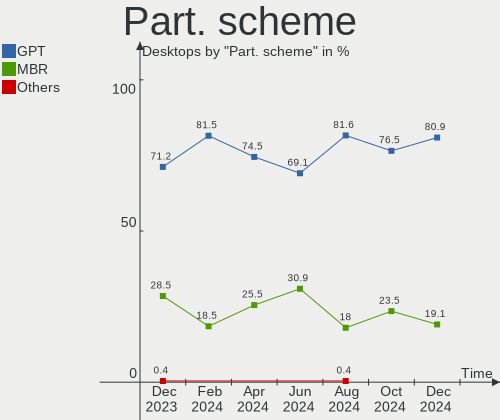
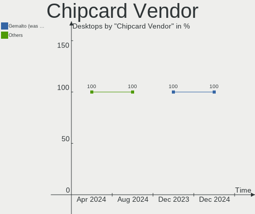

OpenMandriva - Hardware Trends (Desktops)
-----------------------------------------

A project to identify most popular hardware characteristics and track their change
over time based on data collected by Linux users at https://Linux-Hardware.org.

Anyone can contribute to this report by the [hw-probe](https://github.com/linuxhw/hw-probe) tool:

    sudo -E hw-probe -all -upload

This report is for one last month. Overall report since the beginning of time: [TestDays](https://github.com/linuxhw/TestDays)

Period: Nov, 2023.

Contents
--------

* [ System ](#system)
  - [ OS                       ](#os)
  - [ OS Family                ](#os-family)
  - [ Kernel                   ](#kernel)
  - [ Kernel Family            ](#kernel-family)
  - [ Kernel Major Ver.        ](#kernel-major-ver)
  - [ Arch                     ](#arch)
  - [ DE                       ](#de)
  - [ Display Server           ](#display-server)
  - [ Display Manager          ](#display-manager)
  - [ OS Lang                  ](#os-lang)
  - [ Boot Mode                ](#boot-mode)
  - [ Filesystem               ](#filesystem)
  - [ Part. scheme             ](#part-scheme)
  - [ Dual Boot with Linux/BSD ](#dual-boot-with-linuxbsd)
  - [ Dual Boot (Win)          ](#dual-boot-win)

* [ Board ](#board)
  - [ Vendor                   ](#vendor)
  - [ Model                    ](#model)
  - [ Model Family             ](#model-family)
  - [ MFG Year                 ](#mfg-year)
  - [ Form Factor              ](#form-factor)
  - [ Secure Boot              ](#secure-boot)
  - [ Coreboot                 ](#coreboot)
  - [ RAM Size                 ](#ram-size)
  - [ RAM Used                 ](#ram-used)
  - [ Total Drives             ](#total-drives)
  - [ Has CD-ROM               ](#has-cd-rom)
  - [ Has Ethernet             ](#has-ethernet)
  - [ Has WiFi                 ](#has-wifi)
  - [ Has Bluetooth            ](#has-bluetooth)

* [ Location ](#location)
  - [ Country                  ](#country)
  - [ City                     ](#city)

* [ Drives ](#drives)
  - [ Drive Vendor             ](#drive-vendor)
  - [ Drive Model              ](#drive-model)
  - [ HDD Vendor               ](#hdd-vendor)
  - [ SSD Vendor               ](#ssd-vendor)
  - [ Drive Kind               ](#drive-kind)
  - [ Drive Connector          ](#drive-connector)
  - [ Drive Size               ](#drive-size)
  - [ Space Total              ](#space-total)
  - [ Space Used               ](#space-used)
  - [ Malfunc. Drives          ](#malfunc-drives)
  - [ Malfunc. Drive Vendor    ](#malfunc-drive-vendor)
  - [ Malfunc. HDD Vendor      ](#malfunc-hdd-vendor)
  - [ Malfunc. Drive Kind      ](#malfunc-drive-kind)
  - [ Failed Drives            ](#failed-drives)
  - [ Failed Drive Vendor      ](#failed-drive-vendor)
  - [ Drive Status             ](#drive-status)

* [ Storage controller ](#storage-controller)
  - [ Storage Vendor           ](#storage-vendor)
  - [ Storage Model            ](#storage-model)
  - [ Storage Kind             ](#storage-kind)

* [ Processor ](#processor)
  - [ CPU Vendor               ](#cpu-vendor)
  - [ CPU Model                ](#cpu-model)
  - [ CPU Model Family         ](#cpu-model-family)
  - [ CPU Cores                ](#cpu-cores)
  - [ CPU Sockets              ](#cpu-sockets)
  - [ CPU Threads              ](#cpu-threads)
  - [ CPU Op-Modes             ](#cpu-op-modes)
  - [ CPU Microcode            ](#cpu-microcode)
  - [ CPU Microarch            ](#cpu-microarch)

* [ Graphics ](#graphics)
  - [ GPU Vendor               ](#gpu-vendor)
  - [ GPU Model                ](#gpu-model)
  - [ GPU Combo                ](#gpu-combo)
  - [ GPU Driver               ](#gpu-driver)
  - [ GPU Memory               ](#gpu-memory)

* [ Monitor ](#monitor)
  - [ Monitor Vendor           ](#monitor-vendor)
  - [ Monitor Model            ](#monitor-model)
  - [ Monitor Resolution       ](#monitor-resolution)
  - [ Monitor Diagonal         ](#monitor-diagonal)
  - [ Monitor Width            ](#monitor-width)
  - [ Aspect Ratio             ](#aspect-ratio)
  - [ Monitor Area             ](#monitor-area)
  - [ Pixel Density            ](#pixel-density)
  - [ Multiple Monitors        ](#multiple-monitors)

* [ Network ](#network)
  - [ Net Controller Vendor    ](#net-controller-vendor)
  - [ Net Controller Model     ](#net-controller-model)
  - [ Wireless Vendor          ](#wireless-vendor)
  - [ Wireless Model           ](#wireless-model)
  - [ Ethernet Vendor          ](#ethernet-vendor)
  - [ Ethernet Model           ](#ethernet-model)
  - [ Net Controller Kind      ](#net-controller-kind)
  - [ Used Controller          ](#used-controller)
  - [ NICs                     ](#nics)
  - [ IPv6                     ](#ipv6)

* [ Bluetooth ](#bluetooth)
  - [ Bluetooth Vendor         ](#bluetooth-vendor)
  - [ Bluetooth Model          ](#bluetooth-model)

* [ Sound ](#sound)
  - [ Sound Vendor             ](#sound-vendor)
  - [ Sound Model              ](#sound-model)

* [ Memory ](#memory)
  - [ Memory Vendor            ](#memory-vendor)
  - [ Memory Model             ](#memory-model)
  - [ Memory Kind              ](#memory-kind)
  - [ Memory Form Factor       ](#memory-form-factor)
  - [ Memory Size              ](#memory-size)
  - [ Memory Speed             ](#memory-speed)

* [ Printers & scanners ](#printers--scanners)
  - [ Printer Vendor           ](#printer-vendor)
  - [ Printer Model            ](#printer-model)
  - [ Scanner Vendor           ](#scanner-vendor)
  - [ Scanner Model            ](#scanner-model)

* [ Camera ](#camera)
  - [ Camera Vendor            ](#camera-vendor)
  - [ Camera Model             ](#camera-model)

* [ Security ](#security)
  - [ Fingerprint Vendor       ](#fingerprint-vendor)
  - [ Fingerprint Model        ](#fingerprint-model)
  - [ Chipcard Vendor          ](#chipcard-vendor)
  - [ Chipcard Model           ](#chipcard-model)

* [ Unsupported ](#unsupported)
  - [ Unsupported Devices      ](#unsupported-devices)
  - [ Unsupported Device Types ](#unsupported-device-types)

System
------

OS
--

Installed operating systems

| Name               | Desktops | Percent |
|--------------------|----------|---------|
| OpenMandriva 5.0   | 110      | 36.42%  |
| OpenMandriva 23.08 | 97       | 32.12%  |
| OpenMandriva 23.11 | 39       | 12.91%  |
| OpenMandriva 4.3   | 13       | 4.3%    |
| OpenMandriva 23.03 | 13       | 4.3%    |
| OpenMandriva 23.10 | 9        | 2.98%   |
| OpenMandriva 23.01 | 7        | 2.32%   |
| OpenMandriva 4.2   | 5        | 1.66%   |
| OpenMandriva 23.09 | 4        | 1.32%   |
| OpenMandriva 23.90 | 3        | 0.99%   |
| OpenMandriva 23.07 | 1        | 0.33%   |
| OpenMandriva 23.06 | 1        | 0.33%   |

OS Family
---------

OS without a version

| Name         | Desktops | Percent |
|--------------|----------|---------|
| OpenMandriva | 302      | 100%    |

Kernel
------

Version of the Linux kernel

| Version                      | Desktops | Percent |
|------------------------------|----------|---------|
| 6.6.2-desktop-1omv2390       | 120      | 39.74%  |
| 6.4.11-desktop-1omv2390      | 91       | 30.13%  |
| 6.6.0-desktop-1omv2390       | 13       | 4.3%    |
| 6.4.8-desktop-2omv2390       | 13       | 4.3%    |
| 6.2.6-desktop-1omv2390       | 13       | 4.3%    |
| 6.6.1-desktop-1omv2390       | 9        | 2.98%   |
| 6.5.5-desktop-1omv2390       | 9        | 2.98%   |
| 5.16.7-desktop-1omv4003      | 7        | 2.32%   |
| 6.1.1-desktop-1omv2290       | 6        | 1.99%   |
| 5.16.13-desktop-1omv4003     | 6        | 1.99%   |
| 5.10.14-desktop-1omv4002     | 5        | 1.66%   |
| 6.5.1-desktop-1omv2390       | 2        | 0.66%   |
| 6.3.5-desktop-3omv2390       | 2        | 0.66%   |
| 6.7.0-desktop-0.rc2.1omv2390 | 1        | 0.33%   |
| 6.6.0-desktop-0.rc3.1omv2390 | 1        | 0.33%   |
| 6.5.3-desktop-1omv2390       | 1        | 0.33%   |
| 6.5.2-desktop-1omv2390       | 1        | 0.33%   |
| 6.5.12-NuTyX                 | 1        | 0.33%   |
| 6.1.4-desktop-1omv2301       | 1        | 0.33%   |

Kernel Family
-------------

Linux kernel without a distro release

| Version | Desktops | Percent |
|---------|----------|---------|
| 6.6.2   | 120      | 39.74%  |
| 6.4.11  | 91       | 30.13%  |
| 6.6.0   | 14       | 4.64%   |
| 6.4.8   | 13       | 4.3%    |
| 6.2.6   | 13       | 4.3%    |
| 6.6.1   | 9        | 2.98%   |
| 6.5.5   | 9        | 2.98%   |
| 5.16.7  | 7        | 2.32%   |
| 6.1.1   | 6        | 1.99%   |
| 5.16.13 | 6        | 1.99%   |
| 5.10.14 | 5        | 1.66%   |
| 6.5.1   | 2        | 0.66%   |
| 6.3.5   | 2        | 0.66%   |
| 6.7.0   | 1        | 0.33%   |
| 6.5.3   | 1        | 0.33%   |
| 6.5.2   | 1        | 0.33%   |
| 6.5.12  | 1        | 0.33%   |
| 6.1.4   | 1        | 0.33%   |

Kernel Major Ver.
-----------------

Linux kernel major version

| Version | Desktops | Percent |
|---------|----------|---------|
| 6.6     | 143      | 47.35%  |
| 6.4     | 104      | 34.44%  |
| 6.5     | 14       | 4.64%   |
| 6.2     | 13       | 4.3%    |
| 5.16    | 13       | 4.3%    |
| 6.1     | 7        | 2.32%   |
| 5.10    | 5        | 1.66%   |
| 6.3     | 2        | 0.66%   |
| 6.7     | 1        | 0.33%   |

Arch
----

OS architecture (x86_64, i586, etc.)

| Name   | Desktops | Percent |
|--------|----------|---------|
| x86_64 | 302      | 100%    |

DE
--

Desktop Environment

| Name     | Desktops | Percent |
|----------|----------|---------|
| KDE5     | 262      | 86.75%  |
| LXQt     | 18       | 5.96%   |
| GNOME    | 17       | 5.63%   |
| Unknown  | 3        | 0.99%   |
| MATE     | 1        | 0.33%   |
| Cinnamon | 1        | 0.33%   |

Display Server
--------------

X11 or Wayland

| Name    | Desktops | Percent |
|---------|----------|---------|
| Wayland | 252      | 83.44%  |
| X11     | 50       | 16.56%  |

Display Manager
---------------

SDDM, LightDM, etc.

| Name    | Desktops | Percent |
|---------|----------|---------|
| SDDM    | 284      | 94.04%  |
| GDM     | 17       | 5.63%   |
| LightDM | 1        | 0.33%   |

OS Lang
-------

Language

| Lang  | Desktops | Percent |
|-------|----------|---------|
| en_US | 150      | 49.67%  |
| de_DE | 31       | 10.26%  |
| ru_RU | 22       | 7.28%   |
| fr_FR | 17       | 5.63%   |
| pt_BR | 12       | 3.97%   |
| pl_PL | 12       | 3.97%   |
| en_GB | 11       | 3.64%   |
| it_IT | 9        | 2.98%   |
| es_ES | 6        | 1.99%   |
| es_MX | 4        | 1.32%   |
| es_AR | 4        | 1.32%   |
| en_CA | 4        | 1.32%   |
| fr_BE | 3        | 0.99%   |
| pt_PT | 2        | 0.66%   |
| ja_JP | 2        | 0.66%   |
| hu_HU | 2        | 0.66%   |
| es_VE | 2        | 0.66%   |
| cs_CZ | 2        | 0.66%   |
| UTF-8 | 1        | 0.33%   |
| sl_SI | 1        | 0.33%   |
| fr_CA | 1        | 0.33%   |
| es_CR | 1        | 0.33%   |
| en_IN | 1        | 0.33%   |
| de_AT | 1        | 0.33%   |
| da_DK | 1        | 0.33%   |

Boot Mode
---------

EFI or BIOS

| Mode | Desktops | Percent |
|------|----------|---------|
| EFI  | 172      | 56.95%  |
| BIOS | 130      | 43.05%  |

Filesystem
----------

Type of filesystem

| Type     | Desktops | Percent |
|----------|----------|---------|
| Overlay  | 159      | 52.65%  |
| Ext4     | 127      | 42.05%  |
| Btrfs    | 12       | 3.97%   |
| Xfs      | 2        | 0.66%   |
| Reiserfs | 1        | 0.33%   |
| Ext3     | 1        | 0.33%   |

Part. scheme
------------

Scheme of partitioning

| Type | Desktops | Percent |
|------|----------|---------|
| GPT  | 236      | 78.15%  |
| MBR  | 66       | 21.85%  |

Dual Boot with Linux/BSD
------------------------

Hosting more than one Linux/BSD

| Dual boot | Desktops | Percent |
|-----------|----------|---------|
| Yes       | 181      | 59.93%  |
| No        | 121      | 40.07%  |

Dual Boot (Win)
---------------

Hosting Linux and Windows

| Dual boot | Desktops | Percent |
|-----------|----------|---------|
| Yes       | 156      | 51.66%  |
| No        | 146      | 48.34%  |

Board
-----

Vendor
------

Motherboard manufacturer

| Name                                 | Desktops | Percent |
|--------------------------------------|----------|---------|
| Gigabyte Technology                  | 57       | 18.87%  |
| ASUSTek Computer                     | 54       | 17.88%  |
| Hewlett-Packard                      | 41       | 13.58%  |
| MSI                                  | 31       | 10.26%  |
| Dell                                 | 27       | 8.94%   |
| ASRock                               | 23       | 7.62%   |
| Lenovo                               | 9        | 2.98%   |
| Foxconn                              | 9        | 2.98%   |
| Acer                                 | 7        | 2.32%   |
| Fujitsu                              | 6        | 1.99%   |
| Intel                                | 5        | 1.66%   |
| Unknown                              | 4        | 1.32%   |
| Shenzhen Meigao Electronic Equipment | 3        | 0.99%   |
| Medion                               | 3        | 0.99%   |
| Huanan                               | 3        | 0.99%   |
| Biostar                              | 3        | 0.99%   |
| Red Hat                              | 2        | 0.66%   |
| Minix                                | 2        | 0.66%   |
| ECS                                  | 2        | 0.66%   |
| AZW                                  | 2        | 0.66%   |
| Trigkey                              | 1        | 0.33%   |
| Positivo                             | 1        | 0.33%   |
| MouseComputer                        | 1        | 0.33%   |
| MACHINIST                            | 1        | 0.33%   |
| Inventec                             | 1        | 0.33%   |
| Founder                              | 1        | 0.33%   |
| BESSTAR Tech                         | 1        | 0.33%   |
| AMI                                  | 1        | 0.33%   |
| Alienware                            | 1        | 0.33%   |

Model
-----

Motherboard model

| Name                                       | Desktops | Percent |
|--------------------------------------------|----------|---------|
| ASUS PRIME A320M-K                         | 4        | 1.32%   |
| Unknown                                    | 4        | 1.32%   |
| MSI MS-7721                                | 3        | 0.99%   |
| Gigabyte B75M-D3H                          | 3        | 0.99%   |
| Gigabyte A320M-S2H                         | 3        | 0.99%   |
| Dell OptiPlex 9010                         | 3        | 0.99%   |
| ASUS All Series                            | 3        | 0.99%   |
| Shenzhen Meigao Electronic Equipment HX99G | 2        | 0.66%   |
| Red Hat KVM                                | 2        | 0.66%   |
| MSI MS-7C91                                | 2        | 0.66%   |
| MSI MS-7C52                                | 2        | 0.66%   |
| MSI MS-7C51                                | 2        | 0.66%   |
| MSI MS-7996                                | 2        | 0.66%   |
| MSI MS-7900                                | 2        | 0.66%   |
| Intel H61                                  | 2        | 0.66%   |
| HP Z420 Workstation                        | 2        | 0.66%   |
| HP Pavilion Desktop 590-p0xxx              | 2        | 0.66%   |
| HP EliteDesk 800 G2 DM 35W                 | 2        | 0.66%   |
| HP Compaq Pro 6305 SFF                     | 2        | 0.66%   |
| HP Compaq Pro 6300 SFF                     | 2        | 0.66%   |
| HP Compaq Pro 6300 MT                      | 2        | 0.66%   |
| HP Compaq 6200 Pro SFF PC                  | 2        | 0.66%   |
| Gigabyte Z370 HD3                          | 2        | 0.66%   |
| Gigabyte B550 AORUS ELITE V2               | 2        | 0.66%   |
| Gigabyte B450 AORUS ELITE                  | 2        | 0.66%   |
| Gigabyte AB350-Gaming 3                    | 2        | 0.66%   |
| Gigabyte 970A-DS3P FX                      | 2        | 0.66%   |
| Foxconn G41MD                              | 2        | 0.66%   |
| Dell OptiPlex 9020                         | 2        | 0.66%   |
| Dell OptiPlex 780                          | 2        | 0.66%   |
| Dell OptiPlex 745                          | 2        | 0.66%   |
| Dell Inspiron 3668                         | 2        | 0.66%   |
| ASUS PRIME A520M-K                         | 2        | 0.66%   |
| ASUS M5A97 R2.0                            | 2        | 0.66%   |
| ASUS M5A78L-M/USB3                         | 2        | 0.66%   |
| ASRock FM2A88X Extreme6+                   | 2        | 0.66%   |
| Trigkey Green G4                           | 1        | 0.33%   |
| Shenzhen Meigao Electronic Equipment MC560 | 1        | 0.33%   |
| Positivo POS-EIH61CE                       | 1        | 0.33%   |
| MSI MS-7E02                                | 1        | 0.33%   |

Model Family
------------

Motherboard model prefix

| Name                                       | Desktops | Percent |
|--------------------------------------------|----------|---------|
| ASUS PRIME                                 | 19       | 6.29%   |
| Dell OptiPlex                              | 18       | 5.96%   |
| HP Compaq                                  | 12       | 3.97%   |
| HP EliteDesk                               | 10       | 3.31%   |
| Dell Inspiron                              | 6        | 1.99%   |
| Lenovo ThinkCentre                         | 5        | 1.66%   |
| HP Pavilion                                | 5        | 1.66%   |
| Acer Aspire                                | 5        | 1.66%   |
| Fujitsu ESPRIMO                            | 4        | 1.32%   |
| ASUS ROG                                   | 4        | 1.32%   |
| ASUS M5A78L-M                              | 4        | 1.32%   |
| Unknown                                    | 4        | 1.32%   |
| MSI MS-7721                                | 3        | 0.99%   |
| Intel H61                                  | 3        | 0.99%   |
| HP ProDesk                                 | 3        | 0.99%   |
| Gigabyte B75M-D3H                          | 3        | 0.99%   |
| Gigabyte B550                              | 3        | 0.99%   |
| Gigabyte B450                              | 3        | 0.99%   |
| Gigabyte A320M-S2H                         | 3        | 0.99%   |
| ASUS TUF                                   | 3        | 0.99%   |
| ASUS All                                   | 3        | 0.99%   |
| Shenzhen Meigao Electronic Equipment HX99G | 2        | 0.66%   |
| Red Hat KVM                                | 2        | 0.66%   |
| MSI MS-7C91                                | 2        | 0.66%   |
| MSI MS-7C52                                | 2        | 0.66%   |
| MSI MS-7C51                                | 2        | 0.66%   |
| MSI MS-7996                                | 2        | 0.66%   |
| MSI MS-7900                                | 2        | 0.66%   |
| Lenovo IdeaCentre                          | 2        | 0.66%   |
| HP Z420                                    | 2        | 0.66%   |
| Gigabyte Z370                              | 2        | 0.66%   |
| Gigabyte H310M                             | 2        | 0.66%   |
| Gigabyte AB350-Gaming                      | 2        | 0.66%   |
| Gigabyte 970A-DS3P                         | 2        | 0.66%   |
| Foxconn Pro                                | 2        | 0.66%   |
| Foxconn G41MD                              | 2        | 0.66%   |
| ASUS M5A97                                 | 2        | 0.66%   |
| ASRock FM2A88X                             | 2        | 0.66%   |
| ASRock B450                                | 2        | 0.66%   |
| Acer Veriton                               | 2        | 0.66%   |

MFG Year
--------

Motherboard manufacture year

| Year | Desktops | Percent |
|------|----------|---------|
| 2012 | 32       | 10.6%   |
| 2017 | 30       | 9.93%   |
| 2020 | 28       | 9.27%   |
| 2013 | 26       | 8.61%   |
| 2021 | 21       | 6.95%   |
| 2014 | 21       | 6.95%   |
| 2018 | 20       | 6.62%   |
| 2022 | 19       | 6.29%   |
| 2011 | 18       | 5.96%   |
| 2015 | 17       | 5.63%   |
| 2010 | 15       | 4.97%   |
| 2016 | 13       | 4.3%    |
| 2019 | 11       | 3.64%   |
| 2009 | 10       | 3.31%   |
| 2023 | 8        | 2.65%   |
| 2007 | 6        | 1.99%   |
| 2008 | 3        | 0.99%   |
| 2006 | 3        | 0.99%   |
| 2005 | 1        | 0.33%   |

Form Factor
-----------

Physical design of the computer

| Name    | Desktops | Percent |
|---------|----------|---------|
| Desktop | 302      | 100%    |

Secure Boot
-----------

Enabled or disabled

| State    | Desktops | Percent |
|----------|----------|---------|
| Disabled | 302      | 100%    |

Coreboot
--------

Have coreboot on board

| Used | Desktops | Percent |
|------|----------|---------|
| No   | 302      | 100%    |

RAM Size
--------

Total RAM memory

| Size in GB  | Desktops | Percent |
|-------------|----------|---------|
| 4.01-8.0    | 74       | 24.5%   |
| 16.01-24.0  | 65       | 21.52%  |
| 8.01-16.0   | 65       | 21.52%  |
| 3.01-4.0    | 43       | 14.24%  |
| 32.01-64.0  | 35       | 11.59%  |
| 64.01-256.0 | 10       | 3.31%   |
| 24.01-32.0  | 5        | 1.66%   |
| 1.01-2.0    | 4        | 1.32%   |
| 2.01-3.0    | 1        | 0.33%   |

RAM Used
--------

Used RAM memory

| Used GB    | Desktops | Percent |
|------------|----------|---------|
| 1.01-2.0   | 183      | 60.6%   |
| 2.01-3.0   | 71       | 23.51%  |
| 0.51-1.0   | 32       | 10.6%   |
| 3.01-4.0   | 9        | 2.98%   |
| 4.01-8.0   | 5        | 1.66%   |
| 24.01-32.0 | 1        | 0.33%   |
| 0.01-0.5   | 1        | 0.33%   |

Total Drives
------------

Number of drives on board

| Drives | Desktops | Percent |
|--------|----------|---------|
| 1      | 127      | 42.05%  |
| 2      | 74       | 24.5%   |
| 3      | 55       | 18.21%  |
| 4      | 19       | 6.29%   |
| 5      | 9        | 2.98%   |
| 6      | 7        | 2.32%   |
| 0      | 4        | 1.32%   |
| 8      | 2        | 0.66%   |
| 7      | 2        | 0.66%   |
| 13     | 1        | 0.33%   |
| 10     | 1        | 0.33%   |
| 9      | 1        | 0.33%   |

Has CD-ROM
----------

Has CD-ROM on board

| Presented | Desktops | Percent |
|-----------|----------|---------|
| No        | 158      | 52.32%  |
| Yes       | 144      | 47.68%  |

Has Ethernet
------------

Has Ethernet on board

| Presented | Desktops | Percent |
|-----------|----------|---------|
| Yes       | 296      | 98.01%  |
| No        | 6        | 1.99%   |

Has WiFi
--------

Has WiFi module

| Presented | Desktops | Percent |
|-----------|----------|---------|
| No        | 172      | 56.95%  |
| Yes       | 130      | 43.05%  |

Has Bluetooth
-------------

Has Bluetooth module

| Presented | Desktops | Percent |
|-----------|----------|---------|
| No        | 209      | 69.21%  |
| Yes       | 93       | 30.79%  |

Location
--------

Country
-------

Geographic location (country)

| Country      | Desktops | Percent |
|--------------|----------|---------|
| USA          | 53       | 17.55%  |
| Germany      | 38       | 12.58%  |
| Russia       | 23       | 7.62%   |
| Brazil       | 18       | 5.96%   |
| UK           | 17       | 5.63%   |
| Poland       | 17       | 5.63%   |
| France       | 16       | 5.3%    |
| Italy        | 11       | 3.64%   |
| Spain        | 9        | 2.98%   |
| Mexico       | 7        | 2.32%   |
| Canada       | 7        | 2.32%   |
| Greece       | 5        | 1.66%   |
| Australia    | 5        | 1.66%   |
| Argentina    | 5        | 1.66%   |
| Japan        | 4        | 1.32%   |
| Sweden       | 3        | 0.99%   |
| Serbia       | 3        | 0.99%   |
| Romania      | 3        | 0.99%   |
| Portugal     | 3        | 0.99%   |
| Hungary      | 3        | 0.99%   |
| China        | 3        | 0.99%   |
| Belgium      | 3        | 0.99%   |
| Austria      | 3        | 0.99%   |
| Algeria      | 3        | 0.99%   |
| Turkey       | 2        | 0.66%   |
| Taiwan       | 2        | 0.66%   |
| South Africa | 2        | 0.66%   |
| Netherlands  | 2        | 0.66%   |
| Indonesia    | 2        | 0.66%   |
| India        | 2        | 0.66%   |
| Czechia      | 2        | 0.66%   |
| Belarus      | 2        | 0.66%   |
| Azerbaijan   | 2        | 0.66%   |
| Vietnam      | 1        | 0.33%   |
| Venezuela    | 1        | 0.33%   |
| Uruguay      | 1        | 0.33%   |
| Ukraine      | 1        | 0.33%   |
| Thailand     | 1        | 0.33%   |
| Slovenia     | 1        | 0.33%   |
| Slovakia     | 1        | 0.33%   |

City
----

Geographic location (city)

| City             | Desktops | Percent |
|------------------|----------|---------|
| Krakow           | 3        | 0.99%   |
| Athens           | 3        | 0.99%   |
| Wiesloch         | 2        | 0.66%   |
| Warsaw           | 2        | 0.66%   |
| Voronezh         | 2        | 0.66%   |
| Vienna           | 2        | 0.66%   |
| St Petersburg    | 2        | 0.66%   |
| Rome             | 2        | 0.66%   |
| Pudong           | 2        | 0.66%   |
| Petrozavodsk     | 2        | 0.66%   |
| Paris            | 2        | 0.66%   |
| Novi Sad         | 2        | 0.66%   |
| Missoula         | 2        | 0.66%   |
| Liverpool        | 2        | 0.66%   |
| Liège           | 2        | 0.66%   |
| Jacksonville     | 2        | 0.66%   |
| Hamburg          | 2        | 0.66%   |
| Delhi            | 2        | 0.66%   |
| Cologne          | 2        | 0.66%   |
| Ciudad Juárez   | 2        | 0.66%   |
| Citrus Heights   | 2        | 0.66%   |
| Buenos Aires     | 2        | 0.66%   |
| Brisbane         | 2        | 0.66%   |
| Berlin           | 2        | 0.66%   |
| Baku             | 2        | 0.66%   |
| Zdar             | 1        | 0.33%   |
| Yuyao            | 1        | 0.33%   |
| Yakutsk          | 1        | 0.33%   |
| Wroclaw          | 1        | 0.33%   |
| Wieliczka        | 1        | 0.33%   |
| Wassenberg       | 1        | 0.33%   |
| Virginia Beach   | 1        | 0.33%   |
| Victorville      | 1        | 0.33%   |
| Vicenza          | 1        | 0.33%   |
| Verona           | 1        | 0.33%   |
| Valencia         | 1        | 0.33%   |
| Ústí nad Labem | 1        | 0.33%   |
| Ufa              | 1        | 0.33%   |
| Troisdorf        | 1        | 0.33%   |
| Trivandrum       | 1        | 0.33%   |

Drives
------

Drive Vendor
------------

Hard drive vendors

| Vendor                      | Desktops | Drives | Percent |
|-----------------------------|----------|--------|---------|
| WDC                         | 97       | 125    | 17.8%   |
| Seagate                     | 67       | 90     | 12.29%  |
| Samsung Electronics         | 49       | 68     | 8.99%   |
| Kingston                    | 47       | 51     | 8.62%   |
| Toshiba                     | 39       | 44     | 7.16%   |
| Crucial                     | 26       | 28     | 4.77%   |
| SanDisk                     | 22       | 22     | 4.04%   |
| Hitachi                     | 16       | 17     | 2.94%   |
| A-DATA Technology           | 16       | 19     | 2.94%   |
| Unknown                     | 12       | 16     | 2.2%    |
| China                       | 12       | 13     | 2.2%    |
| SPCC                        | 10       | 11     | 1.83%   |
| GOODRAM                     | 9        | 12     | 1.65%   |
| PNY                         | 8        | 10     | 1.47%   |
| Intenso                     | 7        | 8      | 1.28%   |
| APACER                      | 6        | 6      | 1.1%    |
| Intel                       | 5        | 5      | 0.92%   |
| Patriot                     | 4        | 4      | 0.73%   |
| Netac                       | 4        | 4      | 0.73%   |
| Maxtor                      | 4        | 4      | 0.73%   |
| Gigabyte Technology         | 4        | 4      | 0.73%   |
| Unknown                     | 4        | 5      | 0.73%   |
| Transcend                   | 3        | 3      | 0.55%   |
| SK hynix                    | 3        | 3      | 0.55%   |
| Phison                      | 3        | 4      | 0.55%   |
| JMicron Technology          | 3        | 3      | 0.55%   |
| HGST                        | 3        | 3      | 0.55%   |
| Fanxiang                    | 3        | 3      | 0.55%   |
| Corsair                     | 3        | 3      | 0.55%   |
| WD MediaMax                 | 2        | 2      | 0.37%   |
| T-FORCE                     | 2        | 2      | 0.37%   |
| Plextor                     | 2        | 2      | 0.37%   |
| Phison Electronics          | 2        | 2      | 0.37%   |
| Micron Technology           | 2        | 2      | 0.37%   |
| Lexar                       | 2        | 5      | 0.37%   |
| KIOXIA-EXCERIA              | 2        | 2      | 0.37%   |
| KIOXIA                      | 2        | 2      | 0.37%   |
| Kingston Technology Company | 2        | 2      | 0.37%   |
| Hikvision                   | 2        | 2      | 0.37%   |
| Hewlett-Packard             | 2        | 2      | 0.37%   |

Drive Model
-----------

Hard drive models

| Model                            | Desktops | Percent |
|----------------------------------|----------|---------|
| Kingston SA400S37240G 240GB SSD  | 13       | 2.09%   |
| Toshiba DT01ACA100 1TB           | 11       | 1.77%   |
| Seagate ST500DM002-1BD142 500GB  | 9        | 1.45%   |
| Seagate ST1000DM010-2EP102 1TB   | 8        | 1.29%   |
| Kingston SA400S37120G 120GB SSD  | 6        | 0.97%   |
| Toshiba HDWD130 3TB              | 5        | 0.81%   |
| SanDisk NVMe SSD Drive 1TB       | 5        | 0.81%   |
| Crucial CT1000MX500SSD1 1TB      | 5        | 0.81%   |
| WDC WDS240G2G0A-00JH30 240GB SSD | 4        | 0.64%   |
| SanDisk NVMe SSD Drive 500GB     | 4        | 0.64%   |
| Crucial CT240BX500SSD1 240GB     | 4        | 0.64%   |
| Unknown                          | 4        | 0.64%   |
| WDC WDS500G3X0C-00SJG0 500GB     | 3        | 0.48%   |
| WDC WDS500G2B0A-00SM50 500GB SSD | 3        | 0.48%   |
| WDC WD20EZRX-00D8PB0 2TB         | 3        | 0.48%   |
| WDC WD10EZEX-08WN4A0 1TB         | 3        | 0.48%   |
| WDC WD10EZEX-08M2NA0 1TB         | 3        | 0.48%   |
| Unknown SD/MMC/MS PRO 128GB      | 3        | 0.48%   |
| Toshiba HDWD110 1TB              | 3        | 0.48%   |
| Seagate ST4000DM004-2CV104 4TB   | 3        | 0.48%   |
| Seagate ST3500418AS 500GB        | 3        | 0.48%   |
| Seagate ST3160815AS 160GB        | 3        | 0.48%   |
| Seagate ST2000DM008-2FR102 2TB   | 3        | 0.48%   |
| Seagate ST1000DM003-1SB102 1TB   | 3        | 0.48%   |
| Seagate ST1000DM003-1CH162 1TB   | 3        | 0.48%   |
| Samsung SSD 970 EVO Plus 1TB     | 3        | 0.48%   |
| Samsung SSD 860 EVO 500GB        | 3        | 0.48%   |
| Samsung SSD 850 EVO 1TB          | 3        | 0.48%   |
| Kingston SV300S37A120G 120GB SSD | 3        | 0.48%   |
| Intenso SSD 128GB                | 3        | 0.48%   |
| Crucial CT500MX500SSD1 500GB     | 3        | 0.48%   |
| China SSD 256GB                  | 3        | 0.48%   |
| A-DATA SX8200PNP 512GB           | 3        | 0.48%   |
| WDC WDS500G2B0C-00PXH0 500GB     | 2        | 0.32%   |
| WDC WDS480G2G0A-00JH30 480GB SSD | 2        | 0.32%   |
| WDC WDS100T3X0C-00SJG0 1TB       | 2        | 0.32%   |
| WDC WD800JD-60LSA5 80GB          | 2        | 0.32%   |
| WDC WD5000AAKX-60U6AA0 500GB     | 2        | 0.32%   |
| WDC WD5000AAKX-00U6AA0 500GB     | 2        | 0.32%   |
| WDC WD5000AAKX-001CA0 500GB      | 2        | 0.32%   |

HDD Vendor
----------

Hard disk drive vendors

| Vendor              | Desktops | Drives | Percent |
|---------------------|----------|--------|---------|
| WDC                 | 80       | 94     | 34.19%  |
| Seagate             | 67       | 90     | 28.63%  |
| Toshiba             | 35       | 40     | 14.96%  |
| Hitachi             | 16       | 17     | 6.84%   |
| Samsung Electronics | 14       | 16     | 5.98%   |
| Unknown             | 5        | 5      | 2.14%   |
| Maxtor              | 3        | 3      | 1.28%   |
| HGST                | 3        | 3      | 1.28%   |
| WD MediaMax         | 2        | 2      | 0.85%   |
| Unknown             | 2        | 3      | 0.85%   |
| USB3.0              | 1        | 1      | 0.43%   |
| Intenso             | 1        | 1      | 0.43%   |
| Inateck             | 1        | 1      | 0.43%   |
| HPQ                 | 1        | 1      | 0.43%   |
| Fujitsu             | 1        | 1      | 0.43%   |
| ExcelStor           | 1        | 1      | 0.43%   |
| CIRAGO              | 1        | 1      | 0.43%   |

SSD Vendor
----------

Solid state drive vendors

| Vendor              | Desktops | Drives | Percent |
|---------------------|----------|--------|---------|
| Kingston            | 36       | 38     | 16.59%  |
| Samsung Electronics | 22       | 31     | 10.14%  |
| Crucial             | 20       | 21     | 9.22%   |
| WDC                 | 15       | 17     | 6.91%   |
| China               | 12       | 13     | 5.53%   |
| SanDisk             | 10       | 10     | 4.61%   |
| A-DATA Technology   | 10       | 11     | 4.61%   |
| GOODRAM             | 9        | 12     | 4.15%   |
| SPCC                | 8        | 9      | 3.69%   |
| PNY                 | 8        | 10     | 3.69%   |
| Intenso             | 6        | 7      | 2.76%   |
| Apacer              | 5        | 5      | 2.3%    |
| Toshiba             | 3        | 3      | 1.38%   |
| Patriot             | 3        | 3      | 1.38%   |
| Intel               | 3        | 3      | 1.38%   |
| Fanxiang            | 3        | 3      | 1.38%   |
| Transcend           | 2        | 2      | 0.92%   |
| T-FORCE             | 2        | 2      | 0.92%   |
| JMicron Technology  | 2        | 2      | 0.92%   |
| Hikvision           | 2        | 2      | 0.92%   |
| Hewlett-Packard     | 2        | 2      | 0.92%   |
| Gigabyte Technology | 2        | 2      | 0.92%   |
| Corsair             | 2        | 2      | 0.92%   |
| Zheino              | 1        | 1      | 0.46%   |
| XrayDisk            | 1        | 1      | 0.46%   |
| Unknown             | 1        | 1      | 0.46%   |
| tigo                | 1        | 1      | 0.46%   |
| Team                | 1        | 1      | 0.46%   |
| SK hynix            | 1        | 1      | 0.46%   |
| SABRENT             | 1        | 1      | 0.46%   |
| Reeinno             | 1        | 1      | 0.46%   |
| Qumo                | 1        | 1      | 0.46%   |
| PNY USB             | 1        | 1      | 0.46%   |
| Plextor             | 1        | 1      | 0.46%   |
| OCZ                 | 1        | 1      | 0.46%   |
| Netac               | 1        | 1      | 0.46%   |
| MSI                 | 1        | 1      | 0.46%   |
| Micron Technology   | 1        | 1      | 0.46%   |
| Maxtor              | 1        | 1      | 0.46%   |
| Lexar               | 1        | 2      | 0.46%   |

Drive Kind
----------

HDD or SSD

| Kind    | Desktops | Drives | Percent |
|---------|----------|--------|---------|
| HDD     | 179      | 280    | 40.59%  |
| SSD     | 167      | 243    | 37.87%  |
| NVMe    | 89       | 118    | 20.18%  |
| Unknown | 4        | 6      | 0.91%   |
| MMC     | 2        | 3      | 0.45%   |

Drive Connector
---------------

SATA, SAS, NVMe, etc.

| Type | Desktops | Drives | Percent |
|------|----------|--------|---------|
| SATA | 265      | 498    | 69.19%  |
| NVMe | 88       | 114    | 22.98%  |
| SAS  | 28       | 35     | 7.31%   |
| MMC  | 2        | 3      | 0.52%   |

Drive Size
----------

Size of hard drive

| Size in TB | Desktops | Drives | Percent |
|------------|----------|--------|---------|
| 0.01-0.5   | 205      | 294    | 54.52%  |
| 0.51-1.0   | 112      | 145    | 29.79%  |
| 1.01-2.0   | 23       | 33     | 6.12%   |
| 2.01-3.0   | 15       | 19     | 3.99%   |
| 3.01-4.0   | 11       | 16     | 2.93%   |
| 4.01-10.0  | 6        | 9      | 1.6%    |
| 10.01-20.0 | 4        | 7      | 1.06%   |

Space Total
-----------

Amount of disk space available on the file system

| Size in GB     | Desktops | Percent |
|----------------|----------|---------|
| 1-20           | 109      | 36.09%  |
| 101-250        | 48       | 15.89%  |
| 251-500        | 34       | 11.26%  |
| 501-1000       | 23       | 7.62%   |
| 51-100         | 21       | 6.95%   |
| 21-50          | 20       | 6.62%   |
| 1001-2000      | 18       | 5.96%   |
| Unknown        | 18       | 5.96%   |
| More than 3000 | 8        | 2.65%   |
| 2001-3000      | 3        | 0.99%   |

Space Used
----------

Amount of used disk space

| Used GB        | Desktops | Percent |
|----------------|----------|---------|
| 1-20           | 223      | 73.84%  |
| 21-50          | 18       | 5.96%   |
| Unknown        | 18       | 5.96%   |
| 101-250        | 10       | 3.31%   |
| 501-1000       | 10       | 3.31%   |
| 251-500        | 7        | 2.32%   |
| 51-100         | 6        | 1.99%   |
| 0              | 4        | 1.32%   |
| More than 3000 | 3        | 0.99%   |
| 2001-3000      | 2        | 0.66%   |
| 1001-2000      | 1        | 0.33%   |

Malfunc. Drives
---------------

Drive models with a malfunction

| Model                            | Desktops | Drives | Percent |
|----------------------------------|----------|--------|---------|
| Seagate ST500DM002-1BD142 500GB  | 6        | 6      | 5.71%   |
| WDC WD5000AAKX-60U6AA0 500GB     | 2        | 2      | 1.9%    |
| WDC WD5000AAKX-001CA0 500GB      | 2        | 2      | 1.9%    |
| Seagate ST500LT012-1DG142 500GB  | 2        | 2      | 1.9%    |
| Seagate ST3500418AS 500GB        | 2        | 2      | 1.9%    |
| Seagate ST3500413AS 500GB        | 2        | 2      | 1.9%    |
| Seagate ST1000DM003-1CH162 1TB   | 2        | 2      | 1.9%    |
| Hitachi HDS721010CLA332 1TB      | 2        | 2      | 1.9%    |
| WDC WDS480G2G0A-00JH30 480GB SSD | 1        | 1      | 0.95%   |
| WDC WDS240G2G0A-00JH30 240GB SSD | 1        | 1      | 0.95%   |
| WDC WDS120G2G0A-00JH30 120GB SSD | 1        | 1      | 0.95%   |
| WDC WD800AAJB-00J3A0 80GB        | 1        | 1      | 0.95%   |
| WDC WD60EFRX-68MYMN1 6TB         | 1        | 1      | 0.95%   |
| WDC WD50EFRX-68MYMN1 5TB         | 1        | 1      | 0.95%   |
| WDC WD5000AVVS-63M8B0 500GB      | 1        | 1      | 0.95%   |
| WDC WD5000AAKX-221CA1 500GB      | 1        | 1      | 0.95%   |
| WDC WD5000AAKX-083CA1 500GB      | 1        | 1      | 0.95%   |
| WDC WD3200AAJS-56M0A0 320GB      | 1        | 1      | 0.95%   |
| WDC WD2500JS-60MHB5 250GB        | 1        | 1      | 0.95%   |
| WDC WD20EZRZ-00Z5HB0 2TB         | 1        | 1      | 0.95%   |
| WDC WD20EZRX-00D8PB0 2TB         | 1        | 1      | 0.95%   |
| WDC WD20EARX-00PASB0 2TB         | 1        | 1      | 0.95%   |
| WDC WD20EARS-00MVWB0 2TB         | 1        | 1      | 0.95%   |
| WDC WD1600AAJS-60B4A0 160GB      | 1        | 1      | 0.95%   |
| WDC WD1600AAJS-08L7A0 160GB      | 1        | 1      | 0.95%   |
| WDC WD1600AAJS-00L7A0 160GB      | 1        | 1      | 0.95%   |
| WDC WD1200BEVS-60UST0 120GB      | 1        | 1      | 0.95%   |
| WDC WD10EZEX-21WN4A0 1TB         | 1        | 1      | 0.95%   |
| WDC WD10EARS-22Y5B1 1TB          | 1        | 1      | 0.95%   |
| WDC WD10EARS-00Y5B1 1TB          | 1        | 1      | 0.95%   |
| WDC WD10EADX-22TDHB0 1TB         | 1        | 1      | 0.95%   |
| WDC WD10EADS-00L5B1 1TB          | 1        | 1      | 0.95%   |
| WDC WD1001FALS-40Y6A0 1TB        | 1        | 1      | 0.95%   |
| WDC WD Blue SA510 M.2 2280 500GB | 1        | 1      | 0.95%   |
| WD MediaMax WL500GSA1672B 500GB  | 1        | 1      | 0.95%   |
| WD MediaMax WL1000GSA6472B 1TB   | 1        | 1      | 0.95%   |
| Unknown MB3000EBKAB 3TB          | 1        | 1      | 0.95%   |
| Toshiba MQ01ABF032 320GB         | 1        | 1      | 0.95%   |
| Toshiba MK3263GSX 320GB          | 1        | 1      | 0.95%   |
| Toshiba DT01ACA100 1TB           | 1        | 1      | 0.95%   |

Malfunc. Drive Vendor
---------------------

Vendors of faulty drives

| Vendor              | Desktops | Drives | Percent |
|---------------------|----------|--------|---------|
| WDC                 | 29       | 30     | 28.43%  |
| Seagate             | 29       | 31     | 28.43%  |
| Samsung Electronics | 9        | 16     | 8.82%   |
| Hitachi             | 9        | 9      | 8.82%   |
| Toshiba             | 4        | 4      | 3.92%   |
| China               | 4        | 4      | 3.92%   |
| Maxtor              | 3        | 3      | 2.94%   |
| WD MediaMax         | 2        | 2      | 1.96%   |
| SanDisk             | 2        | 2      | 1.96%   |
| Kingston            | 2        | 2      | 1.96%   |
| A-DATA Technology   | 2        | 2      | 1.96%   |
| Unknown             | 1        | 1      | 0.98%   |
| Plextor             | 1        | 1      | 0.98%   |
| Patriot             | 1        | 1      | 0.98%   |
| Micron Technology   | 1        | 1      | 0.98%   |
| Intel               | 1        | 1      | 0.98%   |
| HGST                | 1        | 1      | 0.98%   |
| Fujitsu             | 1        | 1      | 0.98%   |

Malfunc. HDD Vendor
-------------------

Vendors of faulty HDD drives

| Vendor              | Desktops | Drives | Percent |
|---------------------|----------|--------|---------|
| Seagate             | 29       | 31     | 35.37%  |
| WDC                 | 25       | 26     | 30.49%  |
| Hitachi             | 9        | 9      | 10.98%  |
| Samsung Electronics | 7        | 7      | 8.54%   |
| Toshiba             | 4        | 4      | 4.88%   |
| Maxtor              | 3        | 3      | 3.66%   |
| WD MediaMax         | 2        | 2      | 2.44%   |
| Unknown             | 1        | 1      | 1.22%   |
| HGST                | 1        | 1      | 1.22%   |
| Fujitsu             | 1        | 1      | 1.22%   |

Malfunc. Drive Kind
-------------------

Kinds of faulty drives

| Kind | Desktops | Drives | Percent |
|------|----------|--------|---------|
| HDD  | 74       | 85     | 78.72%  |
| SSD  | 18       | 25     | 19.15%  |
| NVMe | 2        | 2      | 2.13%   |

Failed Drives
-------------

Failed drive models

| Model                           | Desktops | Drives | Percent |
|---------------------------------|----------|--------|---------|
| Samsung Electronics HD103SJ 1TB | 1        | 1      | 100%    |

Failed Drive Vendor
-------------------

Failed drive vendors

| Vendor              | Desktops | Drives | Percent |
|---------------------|----------|--------|---------|
| Samsung Electronics | 1        | 1      | 100%    |

Drive Status
------------

Number of failed and malfunc. drives

| Status   | Desktops | Drives | Percent |
|----------|----------|--------|---------|
| Works    | 257      | 491    | 65.73%  |
| Malfunc  | 92       | 112    | 23.53%  |
| Detected | 41       | 46     | 10.49%  |
| Failed   | 1        | 1      | 0.26%   |

Storage controller
------------------

Storage Vendor
--------------

Storage controller vendors

| Vendor                           | Desktops | Percent |
|----------------------------------|----------|---------|
| Intel                            | 193      | 47.07%  |
| AMD                              | 98       | 23.9%   |
| SanDisk                          | 25       | 6.1%    |
| Samsung Electronics              | 17       | 4.15%   |
| Kingston Technology Company      | 14       | 3.41%   |
| Phison Electronics               | 8        | 1.95%   |
| Silicon Motion                   | 6        | 1.46%   |
| Micron/Crucial Technology        | 6        | 1.46%   |
| ADATA Technology                 | 5        | 1.22%   |
| Nvidia                           | 4        | 0.98%   |
| KIOXIA                           | 4        | 0.98%   |
| JMicron Technology               | 4        | 0.98%   |
| ASMedia Technology               | 4        | 0.98%   |
| MAXIO Technology (Hangzhou)      | 3        | 0.73%   |
| VIA Technologies                 | 2        | 0.49%   |
| SK hynix                         | 2        | 0.49%   |
| Realtek Semiconductor            | 2        | 0.49%   |
| Marvell Technology Group         | 2        | 0.49%   |
| Silicon Integrated Systems [SiS] | 1        | 0.24%   |
| Silicon Image                    | 1        | 0.24%   |
| Shenzhen Longsys Electronics     | 1        | 0.24%   |
| Nextorage                        | 1        | 0.24%   |
| Netac Technology                 | 1        | 0.24%   |
| Micron Technology                | 1        | 0.24%   |
| LSI Logic / Symbios Logic        | 1        | 0.24%   |
| Lite-On Technology               | 1        | 0.24%   |
| Hewlett-Packard                  | 1        | 0.24%   |
| Broadcom / LSI                   | 1        | 0.24%   |
| Adaptec                          | 1        | 0.24%   |

Storage Model
-------------

Storage controller models

| Model                                                                                   | Desktops | Percent |
|-----------------------------------------------------------------------------------------|----------|---------|
| AMD FCH SATA Controller [AHCI mode]                                                     | 51       | 10.2%   |
| Intel 8 Series/C220 Series Chipset Family 6-port SATA Controller 1 [AHCI mode]          | 28       | 5.6%    |
| Intel Q170/Q150/B150/H170/H110/Z170/CM236 Chipset SATA Controller [AHCI Mode]           | 21       | 4.2%    |
| Intel NM10/ICH7 Family SATA Controller [IDE mode]                                       | 17       | 3.4%    |
| AMD 500 Series Chipset SATA Controller                                                  | 17       | 3.4%    |
| Intel 6 Series/C200 Series Chipset Family 6 port Desktop SATA AHCI Controller           | 15       | 3%      |
| Intel 200 Series PCH SATA controller [AHCI mode]                                        | 15       | 3%      |
| AMD FCH SATA Controller D                                                               | 15       | 3%      |
| Intel 82801G (ICH7 Family) IDE Controller                                               | 12       | 2.4%    |
| Intel Cannon Lake PCH SATA AHCI Controller                                              | 11       | 2.2%    |
| AMD 400 Series Chipset SATA Controller                                                  | 10       | 2%      |
| Samsung NVMe SSD Controller SM981/PM981/PM983                                           | 9        | 1.8%    |
| Intel 7 Series/C210 Series Chipset Family 6-port SATA Controller [AHCI mode]            | 9        | 1.8%    |
| Intel SATA Controller [RAID mode]                                                       | 7        | 1.4%    |
| Intel 6 Series/C200 Series Chipset Family Desktop SATA Controller (IDE mode, ports 4-5) | 7        | 1.4%    |
| Intel 6 Series/C200 Series Chipset Family Desktop SATA Controller (IDE mode, ports 0-3) | 7        | 1.4%    |
| AMD SB7x0/SB8x0/SB9x0 SATA Controller [IDE mode]                                        | 7        | 1.4%    |
| AMD SB7x0/SB8x0/SB9x0 SATA Controller [AHCI mode]                                       | 7        | 1.4%    |
| SanDisk Ultra 3D / WD Blue SN570 NVMe SSD (DRAM-less)                                   | 6        | 1.2%    |
| AMD SB7x0/SB8x0/SB9x0 IDE Controller                                                    | 6        | 1.2%    |
| AMD FCH IDE Controller                                                                  | 6        | 1.2%    |
| Intel 700 Series Chipset Family SATA AHCI Controller                                    | 5        | 1%      |
| Silicon Motion SM2263EN/SM2263XT (DRAM-less) NVMe SSD Controllers                       | 4        | 0.8%    |
| SanDisk Ultra 3D / WD Blue SN550 NVMe SSD                                               | 4        | 0.8%    |
| SanDisk Extreme Pro / WD Black SN750 / PC SN730 / Red SN700 NVMe SSD                    | 4        | 0.8%    |
| Phison PS5013-E13 PCIe3 NVMe Controller (DRAM-less)                                     | 4        | 0.8%    |
| Phison E12 NVMe Controller                                                              | 4        | 0.8%    |
| Intel Comet Lake SATA AHCI Controller                                                   | 4        | 0.8%    |
| Intel Celeron/Pentium Silver Processor SATA Controller                                  | 4        | 0.8%    |
| Intel Alder Lake-S PCH SATA Controller [AHCI Mode]                                      | 4        | 0.8%    |
| Intel 82801H (ICH8 Family) 4 port SATA Controller [IDE mode]                            | 4        | 0.8%    |
| Intel 7 Series/C210 Series Chipset Family 4-port SATA Controller [IDE mode]             | 4        | 0.8%    |
| Intel 7 Series/C210 Series Chipset Family 2-port SATA Controller [IDE mode]             | 4        | 0.8%    |
| Intel 500 Series Chipset Family SATA AHCI Controller                                    | 4        | 0.8%    |
| Intel 400 Series Chipset Family SATA AHCI Controller                                    | 4        | 0.8%    |
| ASMedia ASM1062 Serial ATA Controller                                                   | 4        | 0.8%    |
| AMD FCH SATA Controller [IDE mode]                                                      | 4        | 0.8%    |
| AMD 300 Series Chipset SATA Controller                                                  | 4        | 0.8%    |
| ADATA XPG SX8200 Pro PCIe Gen3x4 M.2 2280 Solid State Drive                             | 4        | 0.8%    |
| SanDisk PC SN735 NVMe SSD (DRAM-less)                                                   | 3        | 0.6%    |

Storage Kind
------------

Kind of storage controller (IDE, SATA, NVMe, SAS, ...)

| Kind | Desktops | Percent |
|------|----------|---------|
| SATA | 244      | 58.51%  |
| NVMe | 88       | 21.1%   |
| IDE  | 61       | 14.63%  |
| RAID | 18       | 4.32%   |
| SAS  | 5        | 1.2%    |
| SCSI | 1        | 0.24%   |

Processor
---------

CPU Vendor
----------

Processor vendors

| Vendor | Desktops | Percent |
|--------|----------|---------|
| Intel  | 197      | 65.23%  |
| AMD    | 105      | 34.77%  |

CPU Model
---------

Processor models

| Model                                       | Desktops | Percent |
|---------------------------------------------|----------|---------|
| Intel Core i5-3470 CPU @ 3.20GHz            | 6        | 1.99%   |
| Intel Core i5-2400 CPU @ 3.10GHz            | 6        | 1.99%   |
| AMD Ryzen 5 3600 6-Core Processor           | 6        | 1.99%   |
| Intel Core i7-8700 CPU @ 3.20GHz            | 5        | 1.66%   |
| Intel Core i5-6500 CPU @ 3.20GHz            | 5        | 1.66%   |
| Intel Core i7-4790 CPU @ 3.60GHz            | 4        | 1.32%   |
| Intel Core i5-6400 CPU @ 2.70GHz            | 4        | 1.32%   |
| Intel Core i5-4570 CPU @ 3.20GHz            | 4        | 1.32%   |
| Intel Core i3-6100 CPU @ 3.70GHz            | 4        | 1.32%   |
| Intel Core i3-2120 CPU @ 3.30GHz            | 4        | 1.32%   |
| Intel Core i3-2100 CPU @ 3.10GHz            | 4        | 1.32%   |
| Intel Core 2 Duo CPU E8400 @ 3.00GHz        | 4        | 1.32%   |
| AMD Ryzen 5 5600G with Radeon Graphics      | 4        | 1.32%   |
| AMD Ryzen 5 3400G with Radeon Vega Graphics | 4        | 1.32%   |
| Intel Core i7-6700 CPU @ 3.40GHz            | 3        | 0.99%   |
| Intel Core i5-7400 CPU @ 3.00GHz            | 3        | 0.99%   |
| Intel Core i5-10400F CPU @ 2.90GHz          | 3        | 0.99%   |
| Intel Core i5-10400 CPU @ 2.90GHz           | 3        | 0.99%   |
| Intel Core i3-9100F CPU @ 3.60GHz           | 3        | 0.99%   |
| Intel Core 2 Duo CPU E8200 @ 2.66GHz        | 3        | 0.99%   |
| AMD Ryzen 9 5900X 12-Core Processor         | 3        | 0.99%   |
| AMD Ryzen 7 5700X 8-Core Processor          | 3        | 0.99%   |
| AMD Ryzen 7 5700G with Radeon Graphics      | 3        | 0.99%   |
| AMD Ryzen 5 5600X 6-Core Processor          | 3        | 0.99%   |
| AMD Ryzen 5 2400G with Radeon Vega Graphics | 3        | 0.99%   |
| AMD Ryzen 3 3200G with Radeon Vega Graphics | 3        | 0.99%   |
| AMD FX-8350 Eight-Core Processor            | 3        | 0.99%   |
| Intel Pentium Dual-Core CPU E6700 @ 3.20GHz | 2        | 0.66%   |
| Intel Pentium CPU G3220 @ 3.00GHz           | 2        | 0.66%   |
| Intel N100                                  | 2        | 0.66%   |
| Intel Core i7-7700 CPU @ 3.60GHz            | 2        | 0.66%   |
| Intel Core i7-3770 CPU @ 3.40GHz            | 2        | 0.66%   |
| Intel Core i5-8400 CPU @ 2.80GHz            | 2        | 0.66%   |
| Intel Core i5-6500T CPU @ 2.50GHz           | 2        | 0.66%   |
| Intel Core i5-4570S CPU @ 2.90GHz           | 2        | 0.66%   |
| Intel Core i5-4460 CPU @ 3.20GHz            | 2        | 0.66%   |
| Intel Core i5-3570 CPU @ 3.40GHz            | 2        | 0.66%   |
| Intel Core i5-3330 CPU @ 3.00GHz            | 2        | 0.66%   |
| Intel Core i5-10500 CPU @ 3.10GHz           | 2        | 0.66%   |
| Intel Core i3-3220 CPU @ 3.30GHz            | 2        | 0.66%   |

CPU Model Family
----------------

Processor model prefix

| Model                   | Desktops | Percent |
|-------------------------|----------|---------|
| Intel Core i5           | 60       | 19.87%  |
| AMD Ryzen 5             | 28       | 9.27%   |
| Intel Core i3           | 27       | 8.94%   |
| Intel Core i7           | 26       | 8.61%   |
| Other                   | 14       | 4.64%   |
| Intel Celeron           | 14       | 4.64%   |
| AMD Ryzen 7             | 12       | 3.97%   |
| Intel Xeon              | 11       | 3.64%   |
| Intel Core 2 Duo        | 11       | 3.64%   |
| Intel Pentium           | 10       | 3.31%   |
| AMD FX                  | 9        | 2.98%   |
| Intel Pentium Dual-Core | 8        | 2.65%   |
| AMD A10                 | 8        | 2.65%   |
| AMD Ryzen 9             | 7        | 2.32%   |
| AMD Ryzen 3             | 6        | 1.99%   |
| AMD A8                  | 6        | 1.99%   |
| AMD A6                  | 5        | 1.66%   |
| Intel Core 2 Quad       | 3        | 0.99%   |
| AMD PRO A10             | 3        | 0.99%   |
| AMD Athlon II X2        | 3        | 0.99%   |
| AMD Athlon              | 3        | 0.99%   |
| AMD A4                  | 3        | 0.99%   |
| Intel Pentium Silver    | 2        | 0.66%   |
| Intel Pentium Gold      | 2        | 0.66%   |
| Intel Pentium D         | 2        | 0.66%   |
| Intel Core i9           | 2        | 0.66%   |
| Intel Core 2            | 2        | 0.66%   |
| Intel Atom              | 2        | 0.66%   |
| AMD Athlon 64 X2        | 2        | 0.66%   |
| Intel Genuine           | 1        | 0.33%   |
| AMD Ryzen 7 PRO         | 1        | 0.33%   |
| AMD Ryzen 3 PRO         | 1        | 0.33%   |
| AMD Phenom II X4        | 1        | 0.33%   |
| AMD Phenom II X2        | 1        | 0.33%   |
| AMD Phenom              | 1        | 0.33%   |
| AMD G                   | 1        | 0.33%   |
| AMD Athlon X4           | 1        | 0.33%   |
| AMD Athlon X2           | 1        | 0.33%   |
| AMD Athlon II X4        | 1        | 0.33%   |
| AMD Athlon Dual Core    | 1        | 0.33%   |

CPU Cores
---------

Number of processor cores

| Number | Desktops | Percent |
|--------|----------|---------|
| 4      | 115      | 38.08%  |
| 2      | 101      | 33.44%  |
| 6      | 46       | 15.23%  |
| 8      | 19       | 6.29%   |
| 12     | 8        | 2.65%   |
| 1      | 6        | 1.99%   |
| 10     | 3        | 0.99%   |
| 16     | 2        | 0.66%   |
| 18     | 1        | 0.33%   |
| 14     | 1        | 0.33%   |

CPU Sockets
-----------

Number of sockets

| Number | Desktops | Percent |
|--------|----------|---------|
| 1      | 299      | 99.01%  |
| 6      | 1        | 0.33%   |
| 4      | 1        | 0.33%   |
| 2      | 1        | 0.33%   |

CPU Threads
-----------

Threads per core (Hyper-Threading)

| Number | Desktops | Percent |
|--------|----------|---------|
| 2      | 164      | 54.3%   |
| 1      | 138      | 45.7%   |

CPU Op-Modes
------------

CPU Operation Modes (32-bit, 64-bit)

| Op mode        | Desktops | Percent |
|----------------|----------|---------|
| 32-bit, 64-bit | 302      | 100%    |

CPU Microcode
-------------

Microcode number

| Number     | Desktops | Percent |
|------------|----------|---------|
| Unknown    | 188      | 62.25%  |
| 0x08108109 | 10       | 3.31%   |
| 0x06001119 | 10       | 3.31%   |
| 0x06003106 | 8        | 2.65%   |
| 0x0a50000d | 7        | 2.32%   |
| 0x0a20120a | 6        | 1.99%   |
| 0x08701030 | 4        | 1.32%   |
| 0x06000822 | 4        | 1.32%   |
| 0x0a50000c | 3        | 0.99%   |
| 0x0a201025 | 3        | 0.99%   |
| 0x0810100b | 3        | 0.99%   |
| 0x08001138 | 3        | 0.99%   |
| 0x0600611a | 3        | 0.99%   |
| 0xa0653    | 2        | 0.66%   |
| 0x906e9    | 2        | 0.66%   |
| 0x306c3    | 2        | 0.66%   |
| 0x206a7    | 2        | 0.66%   |
| 0x0a404102 | 2        | 0.66%   |
| 0x0a20120e | 2        | 0.66%   |
| 0x08701021 | 2        | 0.66%   |
| 0x08101016 | 2        | 0.66%   |
| 0x0600081c | 2        | 0.66%   |
| 0x06000817 | 2        | 0.66%   |
| 0x03000027 | 2        | 0.66%   |
| 0x010000c8 | 2        | 0.66%   |
| 0x010000b6 | 2        | 0.66%   |
| 0x706a1    | 1        | 0.33%   |
| 0x6f6      | 1        | 0.33%   |
| 0x506e3    | 1        | 0.33%   |
| 0x306f2    | 1        | 0.33%   |
| 0x306e4    | 1        | 0.33%   |
| 0x306a9    | 1        | 0.33%   |
| 0x1067a    | 1        | 0.33%   |
| 0x0a601203 | 1        | 0.33%   |
| 0x0a50000f | 1        | 0.33%   |
| 0x0a201205 | 1        | 0.33%   |
| 0x0a20102b | 1        | 0.33%   |
| 0x0a201009 | 1        | 0.33%   |
| 0x08600109 | 1        | 0.33%   |
| 0x08600103 | 1        | 0.33%   |

CPU Microarch
-------------

Microarchitecture

| Name             | Desktops | Percent |
|------------------|----------|---------|
| Haswell          | 35       | 11.59%  |
| KabyLake         | 27       | 8.94%   |
| Zen 3            | 26       | 8.61%   |
| Skylake          | 23       | 7.62%   |
| IvyBridge        | 23       | 7.62%   |
| Penryn           | 21       | 6.95%   |
| SandyBridge      | 20       | 6.62%   |
| Piledriver       | 20       | 6.62%   |
| Zen+             | 12       | 3.97%   |
| CometLake        | 11       | 3.64%   |
| Steamroller      | 9        | 2.98%   |
| Alderlake Hybrid | 9        | 2.98%   |
| Zen 2            | 8        | 2.65%   |
| Zen              | 8        | 2.65%   |
| K10              | 7        | 2.32%   |
| Core             | 6        | 1.99%   |
| Silvermont       | 4        | 1.32%   |
| Goldmont plus    | 4        | 1.32%   |
| Unknown          | 4        | 1.32%   |
| K8 Hammer        | 3        | 0.99%   |
| Excavator        | 3        | 0.99%   |
| Westmere         | 2        | 0.66%   |
| Tremont          | 2        | 0.66%   |
| NetBurst         | 2        | 0.66%   |
| Nehalem          | 2        | 0.66%   |
| K10 Llano        | 2        | 0.66%   |
| Icelake          | 2        | 0.66%   |
| Gracemont        | 2        | 0.66%   |
| Puma             | 1        | 0.33%   |
| Jaguar           | 1        | 0.33%   |
| Goldmont         | 1        | 0.33%   |
| Bulldozer        | 1        | 0.33%   |
| Bobcat           | 1        | 0.33%   |

Graphics
--------

GPU Vendor
----------

Vendors of graphics cards

| Vendor                     | Desktops | Percent |
|----------------------------|----------|---------|
| Intel                      | 118      | 36.88%  |
| AMD                        | 108      | 33.75%  |
| Nvidia                     | 89       | 27.81%  |
| Red Hat                    | 2        | 0.63%   |
| ATI Technologies           | 2        | 0.63%   |
| Matrox Electronics Systems | 1        | 0.31%   |

GPU Model
---------

Graphics card models

| Model                                                                       | Desktops | Percent |
|-----------------------------------------------------------------------------|----------|---------|
| Intel Xeon E3-1200 v3/4th Gen Core Processor Integrated Graphics Controller | 16       | 4.91%   |
| Intel HD Graphics 530                                                       | 16       | 4.91%   |
| Intel Xeon E3-1200 v2/3rd Gen Core processor Graphics Controller            | 14       | 4.29%   |
| Intel 2nd Generation Core Processor Family Integrated Graphics Controller   | 13       | 3.99%   |
| AMD Navi 23 [Radeon RX 6600/6600 XT/6600M]                                  | 10       | 3.07%   |
| AMD Ellesmere [Radeon RX 470/480/570/570X/580/580X/590]                     | 10       | 3.07%   |
| Intel 4 Series Chipset Integrated Graphics Controller                       | 9        | 2.76%   |
| AMD Picasso/Raven 2 [Radeon Vega Series / Radeon Vega Mobile Series]        | 9        | 2.76%   |
| AMD Kaveri [Radeon R7 Graphics]                                             | 7        | 2.15%   |
| Nvidia GP107 [GeForce GTX 1050 Ti]                                          | 6        | 1.84%   |
| Nvidia GK208B [GeForce GT 730]                                              | 6        | 1.84%   |
| Intel HD Graphics 630                                                       | 6        | 1.84%   |
| Intel CometLake-S GT2 [UHD Graphics 630]                                    | 6        | 1.84%   |
| AMD Cedar [Radeon HD 5000/6000/7350/8350 Series]                            | 6        | 1.84%   |
| Intel CoffeeLake-S GT2 [UHD Graphics 630]                                   | 5        | 1.53%   |
| AMD Raven Ridge [Radeon Vega Series / Radeon Vega Mobile Series]            | 5        | 1.53%   |
| AMD Cezanne [Radeon Vega Series / Radeon Vega Mobile Series]                | 5        | 1.53%   |
| Nvidia GT218 [GeForce 210]                                                  | 4        | 1.23%   |
| Nvidia GP106 [GeForce GTX 1060 6GB]                                         | 4        | 1.23%   |
| Nvidia GK208B [GeForce GT 710]                                              | 4        | 1.23%   |
| AMD Navi 22 [Radeon RX 6700/6700 XT/6750 XT / 6800M/6850M XT]               | 4        | 1.23%   |
| AMD Caicos [Radeon HD 6450/7450/8450 / R5 230 OEM]                          | 4        | 1.23%   |
| Nvidia TU116 [GeForce GTX 1660 SUPER]                                       | 3        | 0.92%   |
| Nvidia GP107 [GeForce GTX 1050]                                             | 3        | 0.92%   |
| Nvidia GM206 [GeForce GTX 960]                                              | 3        | 0.92%   |
| Nvidia GM206 [GeForce GTX 950]                                              | 3        | 0.92%   |
| Nvidia GM107 [GeForce GTX 750]                                              | 3        | 0.92%   |
| AMD RS780L [Radeon 3000]                                                    | 3        | 0.92%   |
| AMD Navi 24 [Radeon RX 6400/6500 XT/6500M]                                  | 3        | 0.92%   |
| Red Hat Virtio 1.0 GPU                                                      | 2        | 0.61%   |
| Nvidia TU106 [GeForce RTX 2060 SUPER]                                       | 2        | 0.61%   |
| Nvidia GP108 [GeForce GT 1030]                                              | 2        | 0.61%   |
| Nvidia GP104 [GeForce GTX 1070]                                             | 2        | 0.61%   |
| Nvidia GM107 [GeForce GTX 745]                                              | 2        | 0.61%   |
| Nvidia GF119 [GeForce GT 610]                                               | 2        | 0.61%   |
| Nvidia GF108 [GeForce GT 630]                                               | 2        | 0.61%   |
| Intel RocketLake-S GT1 [UHD Graphics 730]                                   | 2        | 0.61%   |
| Intel JasperLake [UHD Graphics]                                             | 2        | 0.61%   |
| Intel GeminiLake [UHD Graphics 605]                                         | 2        | 0.61%   |
| Intel GeminiLake [UHD Graphics 600]                                         | 2        | 0.61%   |

GPU Combo
---------

Combinations of graphics cards

| Name           | Desktops | Percent |
|----------------|----------|---------|
| 1 x Intel      | 97       | 32.12%  |
| 1 x AMD        | 95       | 31.46%  |
| 1 x Nvidia     | 77       | 25.5%   |
| 2 x Intel      | 7        | 2.32%   |
| Intel + Nvidia | 7        | 2.32%   |
| Intel + AMD    | 7        | 2.32%   |
| 2 x AMD        | 4        | 1.32%   |
| AMD + Nvidia   | 3        | 0.99%   |
| 2 x Nvidia     | 2        | 0.66%   |
| 1 x Red Hat    | 2        | 0.66%   |
| AMD + Matrox   | 1        | 0.33%   |

GPU Driver
----------

Free vs proprietary

| Driver      | Desktops | Percent |
|-------------|----------|---------|
| Free        | 293      | 97.02%  |
| Unknown     | 6        | 1.99%   |
| Proprietary | 3        | 0.99%   |

GPU Memory
----------

Total video memory

| Size in GB | Desktops | Percent |
|------------|----------|---------|
| Unknown    | 111      | 36.75%  |
| 1.01-2.0   | 50       | 16.56%  |
| 0.51-1.0   | 44       | 14.57%  |
| 0.01-0.5   | 28       | 9.27%   |
| 3.01-4.0   | 26       | 8.61%   |
| 7.01-8.0   | 23       | 7.62%   |
| 8.01-16.0  | 10       | 3.31%   |
| 5.01-6.0   | 9        | 2.98%   |
| 2.01-3.0   | 1        | 0.33%   |

Monitor
-------

Monitor Vendor
--------------

Monitor vendors

| Vendor               | Desktops | Percent |
|----------------------|----------|---------|
| Samsung Electronics  | 48       | 16.16%  |
| Goldstar             | 34       | 11.45%  |
| Hewlett-Packard      | 32       | 10.77%  |
| Dell                 | 25       | 8.42%   |
| Philips              | 22       | 7.41%   |
| AOC                  | 22       | 7.41%   |
| Acer                 | 21       | 7.07%   |
| BenQ                 | 12       | 4.04%   |
| Ancor Communications | 10       | 3.37%   |
| ASUSTek Computer     | 8        | 2.69%   |
| ViewSonic            | 5        | 1.68%   |
| Fujitsu Siemens      | 5        | 1.68%   |
| Sony                 | 4        | 1.35%   |
| NEC Computers        | 4        | 1.35%   |
| Lenovo               | 3        | 1.01%   |
| Iiyama               | 3        | 1.01%   |
| HannStar             | 3        | 1.01%   |
| RTK                  | 2        | 0.67%   |
| RHT                  | 2        | 0.67%   |
| Medion               | 2        | 0.67%   |
| Element              | 2        | 0.67%   |
| Eizo                 | 2        | 0.67%   |
| ___                  | 1        | 0.34%   |
| Unknown              | 1        | 0.34%   |
| Toshiba              | 1        | 0.34%   |
| SKG                  | 1        | 0.34%   |
| Sceptre Tech         | 1        | 0.34%   |
| Pioneer              | 1        | 0.34%   |
| Panasonic            | 1        | 0.34%   |
| OEM                  | 1        | 0.34%   |
| MStar                | 1        | 0.34%   |
| MSI                  | 1        | 0.34%   |
| Mitsubishi           | 1        | 0.34%   |
| Mi                   | 1        | 0.34%   |
| Medion Akoya         | 1        | 0.34%   |
| Jean                 | 1        | 0.34%   |
| Insignia             | 1        | 0.34%   |
| IBM                  | 1        | 0.34%   |
| HKC                  | 1        | 0.34%   |
| Gigabyte Technology  | 1        | 0.34%   |

Monitor Model
-------------

Monitor models

| Model                                                                   | Desktops | Percent |
|-------------------------------------------------------------------------|----------|---------|
| Samsung Electronics C24F390 SAM0D2C 1920x1080 521x293mm 23.5-inch       | 3        | 1%      |
| Sony SDM-P232W SNY01D0 1920x1200 495x309mm 23.0-inch                    | 2        | 0.66%   |
| Samsung Electronics SyncMaster SAM0527 1600x900 443x250mm 20.0-inch     | 2        | 0.66%   |
| Samsung Electronics SMBX2331 SAM076E 1920x1080 509x286mm 23.0-inch      | 2        | 0.66%   |
| Samsung Electronics LF24T35 SAM707D 1920x1080 528x297mm 23.9-inch       | 2        | 0.66%   |
| Samsung Electronics LCD Monitor SAM7016 3840x2160 1872x1053mm 84.6-inch | 2        | 0.66%   |
| Samsung Electronics C27F390 SAM0D32 1920x1080 598x336mm 27.0-inch       | 2        | 0.66%   |
| RHT QEMU Monitor RHT1234 2048x1152 325x203mm 15.1-inch                  | 2        | 0.66%   |
| Philips PHL 223V5 PHLC0CF 1920x1080 477x268mm 21.5-inch                 | 2        | 0.66%   |
| Philips 244E PHLC036 1920x1080 521x293mm 23.5-inch                      | 2        | 0.66%   |
| Philips 221B PHL08A1 1920x1080 477x268mm 21.5-inch                      | 2        | 0.66%   |
| Hewlett-Packard S2331 HWP2908 1920x1080 509x286mm 23.0-inch             | 2        | 0.66%   |
| Goldstar W1943 GSM4BAD 1360x768 406x229mm 18.4-inch                     | 2        | 0.66%   |
| Goldstar 2D FHD TV GSM59C4 1920x1080 509x286mm 23.0-inch                | 2        | 0.66%   |
| Dell P1913S DELA084 1280x1024 376x301mm 19.0-inch                       | 2        | 0.66%   |
| BenQ GL2460 BNQ78CE 1920x1080 531x299mm 24.0-inch                       | 2        | 0.66%   |
| ASUSTek Computer VA27EHE AUS27D2 1920x1080 598x336mm 27.0-inch          | 2        | 0.66%   |
| AOC 27V2G5 AOC2702 1920x1080 598x336mm 27.0-inch                        | 2        | 0.66%   |
| AOC 24B1W AOC2401 1920x1080 521x293mm 23.5-inch                         | 2        | 0.66%   |
| AOC 2460 AOC2460 1920x1080 531x299mm 24.0-inch                          | 2        | 0.66%   |
| Ancor Communications ASUS VP228 ACI22C3 1920x1080 476x268mm 21.5-inch   | 2        | 0.66%   |
| Acer G276HL ACR0300 1920x1080 600x340mm 27.2-inch                       | 2        | 0.66%   |
| Acer ED320QR S ACR0805 1920x1080 698x393mm 31.5-inch                    | 2        | 0.66%   |
| ___ LCD TV ___0101 1920x1080                                            | 1        | 0.33%   |
| ViewSonic VX3219-PC-MHD VSC053C 1920x1080 698x392mm 31.5-inch           | 1        | 0.33%   |
| ViewSonic VA2413wm VSC2222 1920x1080 521x293mm 23.5-inch                | 1        | 0.33%   |
| ViewSonic VA2407 Series VSC8C31 1920x1080 521x293mm 23.5-inch           | 1        | 0.33%   |
| ViewSonic VA2216w-2 VSC2920 1680x1050 495x291mm 22.6-inch               | 1        | 0.33%   |
| ViewSonic VA1903 Series VSC8A31 1366x768 410x230mm 18.5-inch            | 1        | 0.33%   |
| Unknown LCD TV 0101 1920x1080 1600x900mm 72.3-inch                      | 1        | 0.33%   |
| Toshiba TV TSB0105 1920x1080 708x398mm 32.0-inch                        | 1        | 0.33%   |
| Sony TV SNY7F02 1360x768                                                | 1        | 0.33%   |
| Sony TV *00 SNYAA04 3840x2160 1218x685mm 55.0-inch                      | 1        | 0.33%   |
| SKG DEXP DF24H1 SKG2413 1920x1080 597x336mm 27.0-inch                   | 1        | 0.33%   |
| Sceptre Tech Sceptre P30 SPT0BCC 2560x1080 690x290mm 29.5-inch          | 1        | 0.33%   |
| Samsung Electronics U28E590 SAM0C4D 3840x2160 610x350mm 27.7-inch       | 1        | 0.33%   |
| Samsung Electronics T24B350 SAM093C 1920x1080 531x299mm 24.0-inch       | 1        | 0.33%   |
| Samsung Electronics SyncMaster SAM059A 1920x1080 477x268mm 21.5-inch    | 1        | 0.33%   |
| Samsung Electronics SyncMaster SAM0560 1440x900 408x255mm 18.9-inch     | 1        | 0.33%   |
| Samsung Electronics SyncMaster SAM03E5 1680x1050 474x296mm 22.0-inch    | 1        | 0.33%   |

Monitor Resolution
------------------

Monitor screen resolution

| Resolution         | Desktops | Percent |
|--------------------|----------|---------|
| 1920x1080 (FHD)    | 167      | 57.59%  |
| 1280x1024 (SXGA)   | 21       | 7.24%   |
| 2560x1440 (QHD)    | 19       | 6.55%   |
| 3840x2160 (4K)     | 17       | 5.86%   |
| 1680x1050 (WSXGA+) | 13       | 4.48%   |
| 1366x768 (WXGA)    | 10       | 3.45%   |
| 1920x1200 (WUXGA)  | 9        | 3.1%    |
| 1600x900 (HD+)     | 7        | 2.41%   |
| 1440x900 (WXGA+)   | 7        | 2.41%   |
| 2560x1080          | 5        | 1.72%   |
| 1360x768           | 5        | 1.72%   |
| 3440x1440          | 4        | 1.38%   |
| 2048x1152          | 2        | 0.69%   |
| 1600x1200          | 2        | 0.69%   |
| 1024x768 (XGA)     | 2        | 0.69%   |

Monitor Diagonal
----------------

Diagonal size in inches

| Inches  | Desktops | Percent |
|---------|----------|---------|
| 24      | 49       | 16.61%  |
| 27      | 41       | 13.9%   |
| 23      | 40       | 13.56%  |
| 21      | 38       | 12.88%  |
| 19      | 21       | 7.12%   |
| 31      | 15       | 5.08%   |
| 22      | 15       | 5.08%   |
| 18      | 13       | 4.41%   |
| 34      | 8        | 2.71%   |
| 17      | 8        | 2.71%   |
| 20      | 7        | 2.37%   |
| 84      | 6        | 2.03%   |
| Unknown | 6        | 2.03%   |
| 40      | 4        | 1.36%   |
| 72      | 3        | 1.02%   |
| 54      | 2        | 0.68%   |
| 32      | 2        | 0.68%   |
| 29      | 2        | 0.68%   |
| 25      | 2        | 0.68%   |
| 65      | 1        | 0.34%   |
| 60      | 1        | 0.34%   |
| 52      | 1        | 0.34%   |
| 47      | 1        | 0.34%   |
| 46      | 1        | 0.34%   |
| 35      | 1        | 0.34%   |
| 33      | 1        | 0.34%   |
| 28      | 1        | 0.34%   |
| 26      | 1        | 0.34%   |
| 16      | 1        | 0.34%   |
| 15      | 1        | 0.34%   |
| 13      | 1        | 0.34%   |
| 12      | 1        | 0.34%   |

Monitor Width
-------------

Physical width

| Width in mm | Desktops | Percent |
|-------------|----------|---------|
| 501-600     | 126      | 43.45%  |
| 401-500     | 82       | 28.28%  |
| 601-700     | 19       | 6.55%   |
| 351-400     | 14       | 4.83%   |
| 701-800     | 11       | 3.79%   |
| 301-350     | 9        | 3.1%    |
| 1501-2000   | 9        | 3.1%    |
| 1001-1500   | 7        | 2.41%   |
| Unknown     | 6        | 2.07%   |
| 801-900     | 5        | 1.72%   |
| 201-300     | 2        | 0.69%   |

Aspect Ratio
------------

Proportional relationship between the width and the height

| Ratio   | Desktops | Percent |
|---------|----------|---------|
| 16/9    | 209      | 72.57%  |
| 16/10   | 41       | 14.24%  |
| 5/4     | 20       | 6.94%   |
| 21/9    | 9        | 3.13%   |
| 4/3     | 5        | 1.74%   |
| Unknown | 4        | 1.39%   |

Monitor Area
------------

Area in inch²

| Area in inch² | Desktops | Percent |
|----------------|----------|---------|
| 201-250        | 109      | 36.95%  |
| 301-350        | 44       | 14.92%  |
| 151-200        | 44       | 14.92%  |
| 351-500        | 26       | 8.81%   |
| 251-300        | 20       | 6.78%   |
| 141-150        | 20       | 6.78%   |
| More than 1000 | 14       | 4.75%   |
| 501-1000       | 8        | 2.71%   |
| Unknown        | 6        | 2.03%   |
| 101-110        | 2        | 0.68%   |
| 81-90          | 1        | 0.34%   |
| 71-80          | 1        | 0.34%   |

Pixel Density
-------------

Pixels per inch

| Density | Desktops | Percent |
|---------|----------|---------|
| 51-100  | 209      | 73.08%  |
| 101-120 | 52       | 18.18%  |
| 1-50    | 11       | 3.85%   |
| 121-160 | 7        | 2.45%   |
| Unknown | 6        | 2.1%    |
| 161-240 | 1        | 0.35%   |

Multiple Monitors
-----------------

Total monitors connected

| Total | Desktops | Percent |
|-------|----------|---------|
| 1     | 278      | 92.05%  |
| 2     | 17       | 5.63%   |
| 0     | 5        | 1.66%   |
| 3     | 2        | 0.66%   |

Network
-------

Net Controller Vendor
---------------------

Controller vendors

| Vendor                           | Desktops | Percent |
|----------------------------------|----------|---------|
| Realtek Semiconductor            | 214      | 50.95%  |
| Intel                            | 110      | 26.19%  |
| Qualcomm Atheros                 | 24       | 5.71%   |
| Broadcom                         | 13       | 3.1%    |
| Ralink                           | 10       | 2.38%   |
| TP-Link                          | 6        | 1.43%   |
| Ralink Technology                | 6        | 1.43%   |
| MediaTek                         | 6        | 1.43%   |
| Qualcomm Atheros Communications  | 4        | 0.95%   |
| Broadcom Limited                 | 3        | 0.71%   |
| Xiaomi                           | 2        | 0.48%   |
| Samsung Electronics              | 2        | 0.48%   |
| Nvidia                           | 2        | 0.48%   |
| Belkin Components                | 2        | 0.48%   |
| ASUSTek Computer                 | 2        | 0.48%   |
| Silicon Integrated Systems [SiS] | 1        | 0.24%   |
| Qualcomm                         | 1        | 0.24%   |
| Padix (Rockfire)                 | 1        | 0.24%   |
| NetGear                          | 1        | 0.24%   |
| Motorola PCS                     | 1        | 0.24%   |
| Microsoft                        | 1        | 0.24%   |
| Marvell Technology Group         | 1        | 0.24%   |
| IMC Networks                     | 1        | 0.24%   |
| Huawei Technologies              | 1        | 0.24%   |
| HMD Global                       | 1        | 0.24%   |
| DisplayLink                      | 1        | 0.24%   |
| D-Link                           | 1        | 0.24%   |
| ASIX Electronics                 | 1        | 0.24%   |
| Aquantia                         | 1        | 0.24%   |

Net Controller Model
--------------------

Controller models

| Model                                                             | Desktops | Percent |
|-------------------------------------------------------------------|----------|---------|
| Realtek RTL8111/8168/8411 PCI Express Gigabit Ethernet Controller | 168      | 36.52%  |
| Realtek RTL8125 2.5GbE Controller                                 | 17       | 3.7%    |
| Intel 82579LM Gigabit Network Connection (Lewisville)             | 16       | 3.48%   |
| Intel Ethernet Connection I217-LM                                 | 11       | 2.39%   |
| Intel Ethernet Connection (2) I219-LM                             | 9        | 1.96%   |
| Realtek RTL8188EUS 802.11n Wireless Network Adapter               | 7        | 1.52%   |
| Intel Wi-Fi 6 AX200                                               | 7        | 1.52%   |
| Intel Ethernet Connection (2) I219-V                              | 7        | 1.52%   |
| Realtek RTL810xE PCI Express Fast Ethernet controller             | 6        | 1.3%    |
| Intel Wi-Fi 6 AX210/AX211/AX411 160MHz                            | 6        | 1.3%    |
| Realtek RTL8821CE 802.11ac PCIe Wireless Network Adapter          | 5        | 1.09%   |
| Realtek RTL8192CU 802.11n WLAN Adapter                            | 5        | 1.09%   |
| Intel Dual Band Wireless-AC 3168NGW [Stone Peak]                  | 5        | 1.09%   |
| Intel Wireless-AC 9260                                            | 4        | 0.87%   |
| Intel I211 Gigabit Network Connection                             | 4        | 0.87%   |
| Intel 82574L Gigabit Network Connection                           | 4        | 0.87%   |
| Realtek RTL88x2bu [AC1200 Techkey]                                | 3        | 0.65%   |
| Realtek RTL8153 Gigabit Ethernet Adapter                          | 3        | 0.65%   |
| Realtek RTL-8100/8101L/8139 PCI Fast Ethernet Adapter             | 3        | 0.65%   |
| Realtek 802.11ac NIC                                              | 3        | 0.65%   |
| Ralink MT7601U Wireless Adapter                                   | 3        | 0.65%   |
| Ralink RT2561/RT61 802.11g PCI                                    | 3        | 0.65%   |
| Qualcomm Atheros AR9271 802.11n                                   | 3        | 0.65%   |
| Qualcomm Atheros AR9485 Wireless Network Adapter                  | 3        | 0.65%   |
| Qualcomm Atheros AR8152 v2.0 Fast Ethernet                        | 3        | 0.65%   |
| Qualcomm Atheros AR8151 v2.0 Gigabit Ethernet                     | 3        | 0.65%   |
| MediaTek MT7921K (RZ608) Wi-Fi 6E 80MHz                           | 3        | 0.65%   |
| Intel Ethernet Controller I225-V                                  | 3        | 0.65%   |
| Intel Ethernet Connection (7) I219-V                              | 3        | 0.65%   |
| Intel Ethernet Connection (17) I219-V                             | 3        | 0.65%   |
| Intel 82567LM-3 Gigabit Network Connection                        | 3        | 0.65%   |
| Broadcom NetXtreme BCM5754 Gigabit Ethernet PCI Express           | 3        | 0.65%   |
| Broadcom BCM4360 802.11ac Dual Band Wireless Network Adapter      | 3        | 0.65%   |
| Xiaomi Mi/Redmi series (RNDIS)                                    | 2        | 0.43%   |
| TP-Link TL-WN823N v2/v3 [Realtek RTL8192EU]                       | 2        | 0.43%   |
| TP-Link TL-WN821N v5/v6 [RTL8192EU]                               | 2        | 0.43%   |
| Realtek RTL8822CE 802.11ac PCIe Wireless Network Adapter          | 2        | 0.43%   |
| Realtek RTL8812AE 802.11ac PCIe Wireless Network Adapter          | 2        | 0.43%   |
| Realtek RTL8723BU 802.11b/g/n WLAN Adapter                        | 2        | 0.43%   |
| Realtek RTL8723BE PCIe Wireless Network Adapter                   | 2        | 0.43%   |

Wireless Vendor
---------------

Wireless vendors

| Vendor                          | Desktops | Percent |
|---------------------------------|----------|---------|
| Realtek Semiconductor           | 41       | 30.83%  |
| Intel                           | 39       | 29.32%  |
| Ralink                          | 10       | 7.52%   |
| Qualcomm Atheros                | 9        | 6.77%   |
| TP-Link                         | 6        | 4.51%   |
| Ralink Technology               | 6        | 4.51%   |
| MediaTek                        | 5        | 3.76%   |
| Broadcom                        | 5        | 3.76%   |
| Qualcomm Atheros Communications | 4        | 3.01%   |
| Belkin Components               | 2        | 1.5%    |
| ASUSTek Computer                | 2        | 1.5%    |
| NetGear                         | 1        | 0.75%   |
| Microsoft                       | 1        | 0.75%   |
| IMC Networks                    | 1        | 0.75%   |
| D-Link                          | 1        | 0.75%   |

Wireless Model
--------------

Wireless models

| Model                                                        | Desktops | Percent |
|--------------------------------------------------------------|----------|---------|
| Realtek RTL8188EUS 802.11n Wireless Network Adapter          | 7        | 5.26%   |
| Intel Wi-Fi 6 AX200                                          | 7        | 5.26%   |
| Intel Wi-Fi 6 AX210/AX211/AX411 160MHz                       | 6        | 4.51%   |
| Realtek RTL8821CE 802.11ac PCIe Wireless Network Adapter     | 5        | 3.76%   |
| Realtek RTL8192CU 802.11n WLAN Adapter                       | 5        | 3.76%   |
| Intel Dual Band Wireless-AC 3168NGW [Stone Peak]             | 5        | 3.76%   |
| Intel Wireless-AC 9260                                       | 4        | 3.01%   |
| Realtek RTL88x2bu [AC1200 Techkey]                           | 3        | 2.26%   |
| Realtek 802.11ac NIC                                         | 3        | 2.26%   |
| Ralink MT7601U Wireless Adapter                              | 3        | 2.26%   |
| Ralink RT2561/RT61 802.11g PCI                               | 3        | 2.26%   |
| Qualcomm Atheros AR9271 802.11n                              | 3        | 2.26%   |
| Qualcomm Atheros AR9485 Wireless Network Adapter             | 3        | 2.26%   |
| MediaTek MT7921K (RZ608) Wi-Fi 6E 80MHz                      | 3        | 2.26%   |
| Broadcom BCM4360 802.11ac Dual Band Wireless Network Adapter | 3        | 2.26%   |
| TP-Link TL-WN823N v2/v3 [Realtek RTL8192EU]                  | 2        | 1.5%    |
| TP-Link TL-WN821N v5/v6 [RTL8192EU]                          | 2        | 1.5%    |
| Realtek RTL8822CE 802.11ac PCIe Wireless Network Adapter     | 2        | 1.5%    |
| Realtek RTL8812AE 802.11ac PCIe Wireless Network Adapter     | 2        | 1.5%    |
| Realtek RTL8723BU 802.11b/g/n WLAN Adapter                   | 2        | 1.5%    |
| Realtek RTL8723BE PCIe Wireless Network Adapter              | 2        | 1.5%    |
| Realtek RTL8192EU 802.11b/g/n WLAN Adapter                   | 2        | 1.5%    |
| Realtek RTL8188EE Wireless Network Adapter                   | 2        | 1.5%    |
| Ralink RT5370 Wireless Adapter                               | 2        | 1.5%    |
| Ralink RT3090 Wireless 802.11n 1T/1R PCIe                    | 2        | 1.5%    |
| Ralink RT2790 Wireless 802.11n 1T/2R PCIe                    | 2        | 1.5%    |
| Qualcomm Atheros QCA9565 / AR9565 Wireless Network Adapter   | 2        | 1.5%    |
| Intel Wireless 8265 / 8275                                   | 2        | 1.5%    |
| Intel Wireless 8260                                          | 2        | 1.5%    |
| Intel Wireless 3160                                          | 2        | 1.5%    |
| Intel Comet Lake PCH CNVi WiFi                               | 2        | 1.5%    |
| Intel CNVi: Wi-Fi                                            | 2        | 1.5%    |
| Intel Cannon Lake PCH CNVi WiFi                              | 2        | 1.5%    |
| TP-Link TL-WN722N v2/v3 [Realtek RTL8188EUS]                 | 1        | 0.75%   |
| TP-Link Archer T3U [Realtek RTL8812BU]                       | 1        | 0.75%   |
| Realtek RTL8852BE PCIe 802.11ax Wireless Network Controller  | 1        | 0.75%   |
| Realtek RTL8821AE 802.11ac PCIe Wireless Network Adapter     | 1        | 0.75%   |
| Realtek RTL8192CE PCIe Wireless Network Adapter              | 1        | 0.75%   |
| Realtek RTL8191SEvB Wireless LAN Controller                  | 1        | 0.75%   |
| Realtek RTL8188CUS 802.11n WLAN Adapter                      | 1        | 0.75%   |

Ethernet Vendor
---------------

Ethernet vendors

| Vendor                           | Desktops | Percent |
|----------------------------------|----------|---------|
| Realtek Semiconductor            | 196      | 62.22%  |
| Intel                            | 79       | 25.08%  |
| Qualcomm Atheros                 | 15       | 4.76%   |
| Broadcom                         | 8        | 2.54%   |
| Broadcom Limited                 | 3        | 0.95%   |
| Xiaomi                           | 2        | 0.63%   |
| Nvidia                           | 2        | 0.63%   |
| Silicon Integrated Systems [SiS] | 1        | 0.32%   |
| Samsung Electronics              | 1        | 0.32%   |
| Qualcomm                         | 1        | 0.32%   |
| MediaTek                         | 1        | 0.32%   |
| Marvell Technology Group         | 1        | 0.32%   |
| Huawei Technologies              | 1        | 0.32%   |
| HMD Global                       | 1        | 0.32%   |
| DisplayLink                      | 1        | 0.32%   |
| ASIX Electronics                 | 1        | 0.32%   |
| Aquantia                         | 1        | 0.32%   |

Ethernet Model
--------------

Ethernet models

| Model                                                             | Desktops | Percent |
|-------------------------------------------------------------------|----------|---------|
| Realtek RTL8111/8168/8411 PCI Express Gigabit Ethernet Controller | 168      | 51.85%  |
| Realtek RTL8125 2.5GbE Controller                                 | 17       | 5.25%   |
| Intel 82579LM Gigabit Network Connection (Lewisville)             | 16       | 4.94%   |
| Intel Ethernet Connection I217-LM                                 | 11       | 3.4%    |
| Intel Ethernet Connection (2) I219-LM                             | 9        | 2.78%   |
| Intel Ethernet Connection (2) I219-V                              | 7        | 2.16%   |
| Realtek RTL810xE PCI Express Fast Ethernet controller             | 6        | 1.85%   |
| Intel I211 Gigabit Network Connection                             | 4        | 1.23%   |
| Intel 82574L Gigabit Network Connection                           | 4        | 1.23%   |
| Realtek RTL8153 Gigabit Ethernet Adapter                          | 3        | 0.93%   |
| Realtek RTL-8100/8101L/8139 PCI Fast Ethernet Adapter             | 3        | 0.93%   |
| Qualcomm Atheros AR8152 v2.0 Fast Ethernet                        | 3        | 0.93%   |
| Qualcomm Atheros AR8151 v2.0 Gigabit Ethernet                     | 3        | 0.93%   |
| Intel Ethernet Controller I225-V                                  | 3        | 0.93%   |
| Intel Ethernet Connection (7) I219-V                              | 3        | 0.93%   |
| Intel Ethernet Connection (17) I219-V                             | 3        | 0.93%   |
| Intel 82567LM-3 Gigabit Network Connection                        | 3        | 0.93%   |
| Broadcom NetXtreme BCM5754 Gigabit Ethernet PCI Express           | 3        | 0.93%   |
| Xiaomi Mi/Redmi series (RNDIS)                                    | 2        | 0.62%   |
| Realtek RTL-8110SC/8169SC Gigabit Ethernet                        | 2        | 0.62%   |
| Realtek Killer E3000 2.5GbE Controller                            | 2        | 0.62%   |
| Qualcomm Atheros QCA8171 Gigabit Ethernet                         | 2        | 0.62%   |
| Qualcomm Atheros Killer E220x Gigabit Ethernet Controller         | 2        | 0.62%   |
| Qualcomm Atheros Attansic L2 Fast Ethernet                        | 2        | 0.62%   |
| Qualcomm Atheros AR8151 v1.0 Gigabit Ethernet                     | 2        | 0.62%   |
| Intel Ethernet Controller I226-V                                  | 2        | 0.62%   |
| Intel 82578DM Gigabit Network Connection                          | 2        | 0.62%   |
| Broadcom Limited NetXtreme BCM5761 Gigabit Ethernet PCIe          | 2        | 0.62%   |
| Silicon Integrated Systems [SiS] 191 Gigabit Ethernet Adapter     | 1        | 0.31%   |
| Samsung Galaxy series, misc. (tethering mode)                     | 1        | 0.31%   |
| Realtek RTL-8029(AS)                                              | 1        | 0.31%   |
| Qualcomm Fairphone 4 5G                                           | 1        | 0.31%   |
| Qualcomm Atheros AR8131 Gigabit Ethernet                          | 1        | 0.31%   |
| Nvidia MCP77 Ethernet                                             | 1        | 0.31%   |
| Nvidia MCP51 Ethernet Controller                                  | 1        | 0.31%   |
| MediaTek X55                                                      | 1        | 0.31%   |
| Marvell Group 88E8056 PCI-E Gigabit Ethernet Controller           | 1        | 0.31%   |
| Intel I210 Gigabit Network Connection                             | 1        | 0.31%   |
| Intel Ethernet Controller I225-LM                                 | 1        | 0.31%   |
| Intel Ethernet Controller I219-V                                  | 1        | 0.31%   |

Net Controller Kind
-------------------

Ethernet, WiFi or modem

| Kind     | Desktops | Percent |
|----------|----------|---------|
| Ethernet | 296      | 69%     |
| WiFi     | 130      | 30.3%   |
| Unknown  | 2        | 0.47%   |
| Modem    | 1        | 0.23%   |

Used Controller
---------------

Currently used network controller

| Kind     | Desktops | Percent |
|----------|----------|---------|
| Ethernet | 226      | 78.2%   |
| WiFi     | 63       | 21.8%   |

NICs
----

Total network controllers on board

| Total | Desktops | Percent |
|-------|----------|---------|
| 1     | 207      | 68.54%  |
| 2     | 80       | 26.49%  |
| 3     | 10       | 3.31%   |
| 0     | 4        | 1.32%   |
| 4     | 1        | 0.33%   |

IPv6
----

IPv6 vs IPv4

| Used | Desktops | Percent |
|------|----------|---------|
| No   | 188      | 62.25%  |
| Yes  | 114      | 37.75%  |

Bluetooth
---------

Bluetooth Vendor
----------------

Controller vendors

| Vendor                          | Desktops | Percent |
|---------------------------------|----------|---------|
| Intel                           | 36       | 37.11%  |
| Cambridge Silicon Radio         | 25       | 25.77%  |
| Realtek Semiconductor           | 12       | 12.37%  |
| ASUSTek Computer                | 6        | 6.19%   |
| MediaTek                        | 4        | 4.12%   |
| Qualcomm Atheros Communications | 3        | 3.09%   |
| IMC Networks                    | 2        | 2.06%   |
| TP-Link                         | 1        | 1.03%   |
| Realtek                         | 1        | 1.03%   |
| Ralink                          | 1        | 1.03%   |
| Lite-On Technology              | 1        | 1.03%   |
| Integrated System Solution      | 1        | 1.03%   |
| BUFFALO                         | 1        | 1.03%   |
| Broadcom                        | 1        | 1.03%   |
| Apple                           | 1        | 1.03%   |
| Actions                         | 1        | 1.03%   |

Bluetooth Model
---------------

Controller models

| Model                                                 | Desktops | Percent |
|-------------------------------------------------------|----------|---------|
| Cambridge Silicon Radio Bluetooth Dongle (HCI mode)   | 25       | 25.77%  |
| Intel Bluetooth wireless interface                    | 8        | 8.25%   |
| Realtek Bluetooth Radio                               | 7        | 7.22%   |
| Intel AX200 Bluetooth                                 | 6        | 6.19%   |
| Intel Wireless-AC 3168 Bluetooth                      | 5        | 5.15%   |
| Intel AX210 Bluetooth                                 | 5        | 5.15%   |
| Intel AX201 Bluetooth                                 | 5        | 5.15%   |
| MediaTek Wireless_Device                              | 4        | 4.12%   |
| Intel Wireless-AC 9260 Bluetooth Adapter              | 4        | 4.12%   |
| Realtek  Bluetooth 4.2 Adapter                        | 2        | 2.06%   |
| Realtek 802.11ac WLAN Adapter                         | 2        | 2.06%   |
| Qualcomm Atheros  Bluetooth Device                    | 2        | 2.06%   |
| Intel Bluetooth 9460/9560 Jefferson Peak (JfP)        | 2        | 2.06%   |
| ASUS ASUS USB-BT500                                   | 2        | 2.06%   |
| TP-Link TP-Cdj+ UB5A Adapter                          | 1        | 1.03%   |
| Realtek RTL8723B Bluetooth                            | 1        | 1.03%   |
| Realtek Bluetooth Radio                               | 1        | 1.03%   |
| Ralink RT3290 Bluetooth                               | 1        | 1.03%   |
| Qualcomm Atheros Bluetooth USB Host Controller        | 1        | 1.03%   |
| Lite-On Bluetooth Device                              | 1        | 1.03%   |
| Intel Bluetooth Device                                | 1        | 1.03%   |
| Integrated System Solution Bluetooth Device           | 1        | 1.03%   |
| IMC Networks Wireless_Device                          | 1        | 1.03%   |
| IMC Networks Bluetooth Radio                          | 1        | 1.03%   |
| BUFFALO Bluetooth Radio                               | 1        | 1.03%   |
| Broadcom BCM2210 Bluetooth                            | 1        | 1.03%   |
| ASUS Broadcom BCM20702A0 Bluetooth                    | 1        | 1.03%   |
| ASUS Broadcom BCM20702 Single-Chip Bluetooth 4.0 + LE | 1        | 1.03%   |
| ASUS Bluetooth Radio                                  | 1        | 1.03%   |
| ASUS Bluetooth Adapter                                | 1        | 1.03%   |
| Apple Bluetooth Host Controller                       | 1        | 1.03%   |
| Actions general adapter                               | 1        | 1.03%   |

Sound
-----

Sound Vendor
------------

Sound card vendors

| Vendor                           | Desktops | Percent |
|----------------------------------|----------|---------|
| Intel                            | 188      | 42.44%  |
| AMD                              | 128      | 28.89%  |
| Nvidia                           | 81       | 18.28%  |
| C-Media Electronics              | 15       | 3.39%   |
| Micro Star International         | 3        | 0.68%   |
| Creative Labs                    | 3        | 0.68%   |
| Texas Instruments                | 2        | 0.45%   |
| Logitech                         | 2        | 0.45%   |
| Generalplus Technology           | 2        | 0.45%   |
| ATI Technologies                 | 2        | 0.45%   |
| ASUSTek Computer                 | 2        | 0.45%   |
| Tenx Technology                  | 1        | 0.23%   |
| somic                            | 1        | 0.23%   |
| Silicon Integrated Systems [SiS] | 1        | 0.23%   |
| Razer USA                        | 1        | 0.23%   |
| Micronas                         | 1        | 0.23%   |
| Medeli Electronics               | 1        | 0.23%   |
| KTMicro                          | 1        | 0.23%   |
| Jieli Technology                 | 1        | 0.23%   |
| Focusrite-Novation               | 1        | 0.23%   |
| FiiO Electronics Technology      | 1        | 0.23%   |
| EDIFIER                          | 1        | 0.23%   |
| Dell                             | 1        | 0.23%   |
| D&M Holdings (Denon/Marantz)     | 1        | 0.23%   |
| Creative Technology              | 1        | 0.23%   |
| ASRock                           | 1        | 0.23%   |

Sound Model
-----------

Sound card models

| Model                                                                             | Desktops | Percent |
|-----------------------------------------------------------------------------------|----------|---------|
| AMD Family 17h/19h HD Audio Controller                                            | 29       | 5.33%   |
| Intel 8 Series/C220 Series Chipset High Definition Audio Controller               | 27       | 4.96%   |
| AMD FCH Azalia Controller                                                         | 25       | 4.6%    |
| Intel 6 Series/C200 Series Chipset Family High Definition Audio Controller        | 22       | 4.04%   |
| Intel 100 Series/C230 Series Chipset Family HD Audio Controller                   | 22       | 4.04%   |
| AMD Starship/Matisse HD Audio Controller                                          | 20       | 3.68%   |
| Intel 7 Series/C216 Chipset Family High Definition Audio Controller               | 18       | 3.31%   |
| AMD Navi 21/23 HDMI/DP Audio Controller                                           | 18       | 3.31%   |
| Intel NM10/ICH7 Family High Definition Audio Controller                           | 17       | 3.13%   |
| Intel Xeon E3-1200 v3/4th Gen Core Processor HD Audio Controller                  | 16       | 2.94%   |
| Intel 200 Series PCH HD Audio                                                     | 16       | 2.94%   |
| AMD SBx00 Azalia (Intel HDA)                                                      | 15       | 2.76%   |
| AMD Raven/Raven2/Fenghuang HDMI/DP Audio Controller                               | 14       | 2.57%   |
| AMD Renoir Radeon High Definition Audio Controller                                | 13       | 2.39%   |
| Nvidia GK208 HDMI/DP Audio Controller                                             | 12       | 2.21%   |
| Nvidia GP107GL High Definition Audio Controller                                   | 10       | 1.84%   |
| Intel Cannon Lake PCH cAVS                                                        | 10       | 1.84%   |
| AMD Ellesmere HDMI Audio [Radeon RX 470/480 / 570/580/590]                        | 10       | 1.84%   |
| AMD Kaveri HDMI/DP Audio Controller                                               | 9        | 1.65%   |
| Nvidia GM107 High Definition Audio Controller [GeForce 940MX]                     | 7        | 1.29%   |
| Nvidia GP106 High Definition Audio Controller                                     | 6        | 1.1%    |
| Nvidia GM206 High Definition Audio Controller                                     | 6        | 1.1%    |
| AMD Trinity HDMI Audio Controller                                                 | 6        | 1.1%    |
| AMD Oland/Hainan/Cape Verde/Pitcairn HDMI Audio [Radeon HD 7000 Series]           | 6        | 1.1%    |
| AMD Cedar HDMI Audio [Radeon HD 5400/6300/7300 Series]                            | 6        | 1.1%    |
| AMD Caicos HDMI Audio [Radeon HD 6450 / 7450/8450/8490 OEM / R5 230/235/235X OEM] | 6        | 1.1%    |
| Nvidia TU116 High Definition Audio Controller                                     | 5        | 0.92%   |
| Nvidia High Definition Audio Controller                                           | 5        | 0.92%   |
| Intel Comet Lake PCH cAVS                                                         | 5        | 0.92%   |
| Intel 700 Series Chipset Family Precise Touch and Stylus Port #1                  | 5        | 0.92%   |
| C-Media Electronics Audio Adapter (Unitek Y-247A)                                 | 5        | 0.92%   |
| Nvidia GF119 HDMI Audio Controller                                                | 4        | 0.74%   |
| Intel Comet Lake PCH-V cAVS                                                       | 4        | 0.74%   |
| Intel Celeron/Pentium Silver Processor High Definition Audio                      | 4        | 0.74%   |
| Intel 82801H (ICH8 Family) HD Audio Controller                                    | 4        | 0.74%   |
| AMD Turks HDMI Audio [Radeon HD 6500/6600 / 6700M Series]                         | 4        | 0.74%   |
| AMD Family 17h (Models 00h-0fh) HD Audio Controller                               | 4        | 0.74%   |
| AMD Baffin HDMI/DP Audio [Radeon RX 550 640SP / RX 560/560X]                      | 4        | 0.74%   |
| Nvidia TU106 High Definition Audio Controller                                     | 3        | 0.55%   |
| Nvidia GK107 HDMI Audio Controller                                                | 3        | 0.55%   |

Memory
------

Memory Vendor
-------------

Memory module vendors

| Vendor                       | Desktops | Percent |
|------------------------------|----------|---------|
| Kingston                     | 63       | 17.5%   |
| Samsung Electronics          | 43       | 11.94%  |
| Unknown                      | 41       | 11.39%  |
| SK hynix                     | 41       | 11.39%  |
| Corsair                      | 35       | 9.72%   |
| Crucial                      | 28       | 7.78%   |
| Micron Technology            | 25       | 6.94%   |
| G.Skill                      | 16       | 4.44%   |
| A-DATA Technology            | 9        | 2.5%    |
| Team                         | 6        | 1.67%   |
| Unknown                      | 6        | 1.67%   |
| Nanya Technology             | 5        | 1.39%   |
| Ramaxel Technology           | 4        | 1.11%   |
| AMD                          | 4        | 1.11%   |
| GOODRAM                      | 3        | 0.83%   |
| Smart                        | 2        | 0.56%   |
| Red Hat                      | 2        | 0.56%   |
| Qimonda                      | 2        | 0.56%   |
| PNY                          | 2        | 0.56%   |
| Wilk Elektronik              | 1        | 0.28%   |
| Unknown (ABCD)               | 1        | 0.28%   |
| Unknown (A)                  | 1        | 0.28%   |
| Unknown (89F7)               | 1        | 0.28%   |
| Unknown (0x0B79)             | 1        | 0.28%   |
| Toshiba                      | 1        | 0.28%   |
| Teclast                      | 1        | 0.28%   |
| Swissbit                     | 1        | 0.28%   |
| Silicon Power                | 1        | 0.28%   |
| PUSKILL                      | 1        | 0.28%   |
| PLEXHD                       | 1        | 0.28%   |
| Patriot Memory (PDP Systems) | 1        | 0.28%   |
| Patriot                      | 1        | 0.28%   |
| Mushkin                      | 1        | 0.28%   |
| Kreton                       | 1        | 0.28%   |
| Kingmax                      | 1        | 0.28%   |
| Juhor                        | 1        | 0.28%   |
| INNOVATION PC                | 1        | 0.28%   |
| H                            | 1        | 0.28%   |
| Golden Empire                | 1        | 0.28%   |
| Elpida                       | 1        | 0.28%   |

Memory Model
------------

Memory module models

| Model                                                   | Desktops | Percent |
|---------------------------------------------------------|----------|---------|
| Unknown                                                 | 6        | 1.48%   |
| Unknown RAM Module 2GB DIMM SDRAM                       | 5        | 1.23%   |
| Samsung RAM M378B5673FH0-CH9 2GB DIMM DDR3 1600MT/s     | 5        | 1.23%   |
| Unknown RAM Module 8GB DIMM DDR3 1600MT/s               | 3        | 0.74%   |
| Unknown RAM Module 4GB DIMM 1333MT/s                    | 3        | 0.74%   |
| Unknown RAM Module 2GB DIMM 800MT/s                     | 3        | 0.74%   |
| Unknown RAM Module 2GB DIMM 667MT/s                     | 3        | 0.74%   |
| Unknown RAM Module 2GB DIMM 1333MT/s                    | 3        | 0.74%   |
| SK hynix RAM Module 4GB DIMM DDR3 1600MT/s              | 3        | 0.74%   |
| SK hynix RAM HMT125U6TFR8C-H9 2GB DIMM DDR3 1333MT/s    | 3        | 0.74%   |
| SK hynix RAM HMA81GU6AFR8N-UH 8192MB DIMM DDR4 2400MT/s | 3        | 0.74%   |
| Samsung RAM M378B5773CH0-CH9 2048MB DIMM DDR3 1867MT/s  | 3        | 0.74%   |
| Samsung RAM M378B5173QH0-CK0 4GB DIMM DDR3 1600MT/s     | 3        | 0.74%   |
| Kingston RAM KHX2666C16/8G 8GB DIMM DDR4 3466MT/s       | 3        | 0.74%   |
| Kingston RAM KHX1600C10D3/8G 4GB DIMM DDR3 1648MT/s     | 3        | 0.74%   |
| Kingston RAM KHX1600C10D3/ 4GB DIMM DDR3 1600MT/s       | 3        | 0.74%   |
| Kingston RAM 99U5471-056.A00LF 8GB DIMM DDR3 1600MT/s   | 3        | 0.74%   |
| Kingston RAM 99U5471-012.A00LF 4GB DIMM DDR3 1600MT/s   | 3        | 0.74%   |
| Crucial RAM BLS8G3D1609DS1S00. 8GB DIMM DDR3 1800MT/s   | 3        | 0.74%   |
| Corsair RAM CMK16GX4M2B3000C15 8GB DIMM DDR4 3533MT/s   | 3        | 0.74%   |
| Unknown RAM Module 4GB DIMM DDR3 1333MT/s               | 2        | 0.49%   |
| Unknown RAM Module 4GB DIMM 400MT/s                     | 2        | 0.49%   |
| Unknown RAM Module 4GB DIMM 1600MT/s                    | 2        | 0.49%   |
| Unknown RAM Module 2GB DIMM DDR3 1333MT/s               | 2        | 0.49%   |
| Unknown RAM Module 2GB DIMM DDR2 800MT/s                | 2        | 0.49%   |
| Unknown RAM Module 2GB DIMM DDR2 333MT/s                | 2        | 0.49%   |
| Unknown RAM Module 2GB DIMM 1600MT/s                    | 2        | 0.49%   |
| Team RAM TEAMGROUP-UD4-3200 8GB DIMM DDR4 3733MT/s      | 2        | 0.49%   |
| SK hynix RAM HYMP512U64CP8-Y5 1GB DIMM DDR2 1331MT/s    | 2        | 0.49%   |
| SK hynix RAM HMT451U6BFR8C-PB 4GB DIMM DDR3 1600MT/s    | 2        | 0.49%   |
| SK hynix RAM HMT41GU6BFR8A-PB 8GB DIMM DDR3 2000MT/s    | 2        | 0.49%   |
| SK hynix RAM HMT351U6CFR8C-PB 4GB DIMM DDR3 1800MT/s    | 2        | 0.49%   |
| SK hynix RAM HMA851U6AFR6N-UH 4GB DIMM DDR4 2400MT/s    | 2        | 0.49%   |
| SK hynix RAM HMA451U6AFR8N-TF 4GB DIMM DDR4 2133MT/s    | 2        | 0.49%   |
| SK hynix RAM HMA41GU6AFR8N-TF 8GB DIMM DDR4 2465MT/s    | 2        | 0.49%   |
| Samsung RAM Module 8GB DIMM DDR4 2666MT/s               | 2        | 0.49%   |
| Samsung RAM Module 8GB DIMM DDR4 2133MT/s               | 2        | 0.49%   |
| Samsung RAM M471B5173QH0-YK0 4GB SODIMM DDR3 1600MT/s   | 2        | 0.49%   |
| Samsung RAM M378B5773DH0-CH9 2GB DIMM DDR3 1333MT/s     | 2        | 0.49%   |
| Samsung RAM M378B5273DH0-CK0 4GB DIMM DDR3 2200MT/s     | 2        | 0.49%   |

Memory Kind
-----------

Memory module kinds

| Kind    | Desktops | Percent |
|---------|----------|---------|
| DDR4    | 137      | 44.05%  |
| DDR3    | 113      | 36.33%  |
| SDRAM   | 24       | 7.72%   |
| Unknown | 17       | 5.47%   |
| DDR2    | 11       | 3.54%   |
| DDR5    | 5        | 1.61%   |
| RAM     | 2        | 0.64%   |
| LPDDR4  | 1        | 0.32%   |
| DDR     | 1        | 0.32%   |

Memory Form Factor
------------------

Physical design of the memory module

| Name   | Desktops | Percent |
|--------|----------|---------|
| DIMM   | 279      | 92.38%  |
| SODIMM | 23       | 7.62%   |

Memory Size
-----------

Memory module size

| Size  | Desktops | Percent |
|-------|----------|---------|
| 8192  | 140      | 40.94%  |
| 4096  | 89       | 26.02%  |
| 2048  | 56       | 16.37%  |
| 16384 | 29       | 8.48%   |
| 1024  | 14       | 4.09%   |
| 32768 | 12       | 3.51%   |
| 12536 | 1        | 0.29%   |
| 512   | 1        | 0.29%   |

Memory Speed
------------

Memory module speed

| Speed   | Desktops | Percent |
|---------|----------|---------|
| 1600    | 80       | 22.54%  |
| 1333    | 37       | 10.42%  |
| 2400    | 28       | 7.89%   |
| 3200    | 27       | 7.61%   |
| 2667    | 22       | 6.2%    |
| 2133    | 15       | 4.23%   |
| 3600    | 14       | 3.94%   |
| Unknown | 9        | 2.54%   |
| 667     | 8        | 2.25%   |
| 2666    | 7        | 1.97%   |
| 1867    | 7        | 1.97%   |
| 1800    | 7        | 1.97%   |
| 800     | 7        | 1.97%   |
| 2933    | 6        | 1.69%   |
| 1066    | 6        | 1.69%   |
| 3733    | 5        | 1.41%   |
| 3400    | 5        | 1.41%   |
| 3800    | 4        | 1.13%   |
| 2800    | 4        | 1.13%   |
| 1866    | 4        | 1.13%   |
| 1334    | 4        | 1.13%   |
| 4800    | 3        | 0.85%   |
| 3533    | 3        | 0.85%   |
| 3466    | 3        | 0.85%   |
| 1331    | 3        | 0.85%   |
| 1067    | 3        | 0.85%   |
| 400     | 3        | 0.85%   |
| 5800    | 2        | 0.56%   |
| 3500    | 2        | 0.56%   |
| 3133    | 2        | 0.56%   |
| 3000    | 2        | 0.56%   |
| 2733    | 2        | 0.56%   |
| 2465    | 2        | 0.56%   |
| 2200    | 2        | 0.56%   |
| 2000    | 2        | 0.56%   |
| 333     | 2        | 0.56%   |
| 4533    | 1        | 0.28%   |
| 3666    | 1        | 0.28%   |
| 3534    | 1        | 0.28%   |
| 3066    | 1        | 0.28%   |

Printers & scanners
-------------------

Printer Vendor
--------------

Printer device vendors

| Vendor              | Desktops | Percent |
|---------------------|----------|---------|
| Seiko Epson         | 4        | 30.77%  |
| Hewlett-Packard     | 3        | 23.08%  |
| Samsung Electronics | 2        | 15.38%  |
| Prolific Technology | 1        | 7.69%   |
| Canon               | 1        | 7.69%   |
| Brother Industries  | 1        | 7.69%   |
| Apple               | 1        | 7.69%   |

Printer Model
-------------

Printer device models

| Model                               | Desktops | Percent |
|-------------------------------------|----------|---------|
| Seiko Epson L6270 Series            | 1        | 7.69%   |
| Seiko Epson L3210 Series            | 1        | 7.69%   |
| Seiko Epson L3150 Series            | 1        | 7.69%   |
| Seiko Epson ET-2820 Series          | 1        | 7.69%   |
| Samsung SCX-4200 series             | 1        | 7.69%   |
| Samsung CLP-310 Color Laser Printer | 1        | 7.69%   |
| Prolific PL2305 Parallel Port       | 1        | 7.69%   |
| HP OfficeJet 3830 series            | 1        | 7.69%   |
| HP Ink Tank 310 series              | 1        | 7.69%   |
| HP DeskJet F4200 series             | 1        | 7.69%   |
| Canon MF4010 series                 | 1        | 7.69%   |
| Brother HL-2270DW Laser Printer     | 1        | 7.69%   |
| Apple Gamesir-G3v 1.00              | 1        | 7.69%   |

Scanner Vendor
--------------

Scanner device vendors

| Vendor | Desktops | Percent |
|--------|----------|---------|
| Canon  | 1        | 100%    |

Scanner Model
-------------

Scanner device models

| Model                   | Desktops | Percent |
|-------------------------|----------|---------|
| Canon CanoScan LiDE 110 | 1        | 100%    |

Camera
------

Camera Vendor
-------------

Camera device vendors

| Vendor                                 | Desktops | Percent |
|----------------------------------------|----------|---------|
| Logitech                               | 7        | 18.92%  |
| Sunplus Innovation Technology          | 5        | 13.51%  |
| Microsoft                              | 4        | 10.81%  |
| Microdia                               | 3        | 8.11%   |
| Realtek Semiconductor                  | 2        | 5.41%   |
| Creative Technology                    | 2        | 5.41%   |
| Chicony Electronics                    | 2        | 5.41%   |
| Alcor Micro                            | 2        | 5.41%   |
| Z-Star Microelectronics                | 1        | 2.7%    |
| Sony Ericsson Mobile Communications AB | 1        | 2.7%    |
| Polycom                                | 1        | 2.7%    |
| Netchip Technology                     | 1        | 2.7%    |
| MacroSilicon                           | 1        | 2.7%    |
| KYE Systems (Mouse Systems)            | 1        | 2.7%    |
| Genesys Logic                          | 1        | 2.7%    |
| GEMBIRD                                | 1        | 2.7%    |
| eMeet                                  | 1        | 2.7%    |
| ARC International                      | 1        | 2.7%    |

Camera Model
------------

Camera device models

| Model                                           | Desktops | Percent |
|-------------------------------------------------|----------|---------|
| Logitech Webcam C270                            | 3        | 8.11%   |
| Microdia Integrated Camera                      | 2        | 5.41%   |
| Logitech HD Pro Webcam C920                     | 2        | 5.41%   |
| Z-Star A4 TECH USB2.0 PC Camera E               | 1        | 2.7%    |
| Sunplus WEBCAM ESSENTIELB W1                    | 1        | 2.7%    |
| Sunplus USB 2.0 Camera                          | 1        | 2.7%    |
| Sunplus NexiGo N930AF FHD Webcam                | 1        | 2.7%    |
| Sunplus FHD Camera Microphone                   | 1        | 2.7%    |
| Sunplus 5Mega Webcam                            | 1        | 2.7%    |
| Sony Ericsson Mobile AB Xperia 10 II - Dual SIM | 1        | 2.7%    |
| Realtek Webcam                                  | 1        | 2.7%    |
| Realtek USB Camera                              | 1        | 2.7%    |
| Polycom Poly Studio P5 webcam                   | 1        | 2.7%    |
| Netchip Nuroum V11                              | 1        | 2.7%    |
| Microsoft LifeCam VX-700                        | 1        | 2.7%    |
| Microsoft LifeCam VX-500 [1357]                 | 1        | 2.7%    |
| Microsoft LifeCam HD-3000                       | 1        | 2.7%    |
| Microsoft LifeCam Cinema                        | 1        | 2.7%    |
| Microdia Sonix USB 2.0 Camera                   | 1        | 2.7%    |
| MacroSilicon USB Video                          | 1        | 2.7%    |
| Logitech Webcam C210                            | 1        | 2.7%    |
| Logitech HD Webcam C615                         | 1        | 2.7%    |
| KYE Systems (Mouse Systems) FaceCam 1005        | 1        | 2.7%    |
| Genesys Logic Digital Microscope                | 1        | 2.7%    |
| GEMBIRD USB2.0 PC CAMERA                        | 1        | 2.7%    |
| eMeet HD Webcam C970L                           | 1        | 2.7%    |
| Creative Live! Cam Sync [VF0520]                | 1        | 2.7%    |
| Creative Live! Cam Optia                        | 1        | 2.7%    |
| Chicony WebCam                                  | 1        | 2.7%    |
| Chicony HP 720p HD Monitor Webcam               | 1        | 2.7%    |
| ARC International Camera                        | 1        | 2.7%    |
| Alcor Micro USB 2.0 PC Camera                   | 1        | 2.7%    |
| Alcor Micro 1080P-Webcam                        | 1        | 2.7%    |

Security
--------

Fingerprint Vendor
------------------

Fingerprint sensor vendors

Zero info for selected period =(

Fingerprint Model
-----------------

Fingerprint sensor models

Zero info for selected period =(

Chipcard Vendor
---------------

Chipcard module vendors

| Vendor           | Desktops | Percent |
|------------------|----------|---------|
| SCM Microsystems | 1        | 50%     |
| OmniKey          | 1        | 50%     |

Chipcard Model
--------------

Chipcard module models

| Model                                   | Desktops | Percent |
|-----------------------------------------|----------|---------|
| SCM Microsystems Identiv SmartOS Reader | 1        | 50%     |
| OmniKey CardMan 3121 (HID Technologies) | 1        | 50%     |

Unsupported
-----------

Unsupported Devices
-------------------

Total unsupported devices on board

| Total | Desktops | Percent |
|-------|----------|---------|
| 0     | 278      | 92.05%  |
| 1     | 23       | 7.62%   |
| 2     | 1        | 0.33%   |

Unsupported Device Types
------------------------

Types of unsupported devices

| Type                  | Desktops | Percent |
|-----------------------|----------|---------|
| Graphics card         | 14       | 58.33%  |
| Unassigned class      | 3        | 12.5%   |
| Net/wireless          | 2        | 8.33%   |
| Multimedia controller | 2        | 8.33%   |
| Chipcard              | 2        | 8.33%   |
| Bluetooth             | 1        | 4.17%   |

