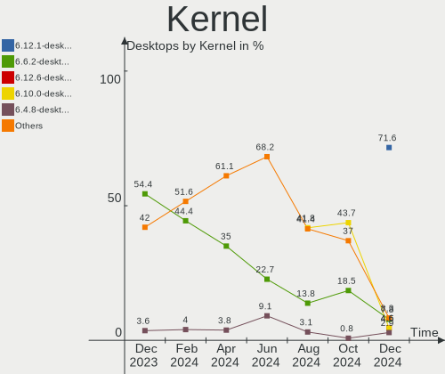
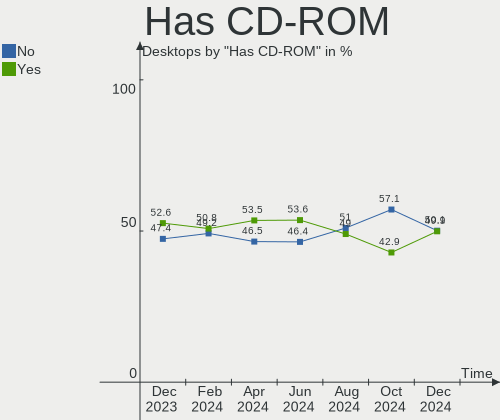
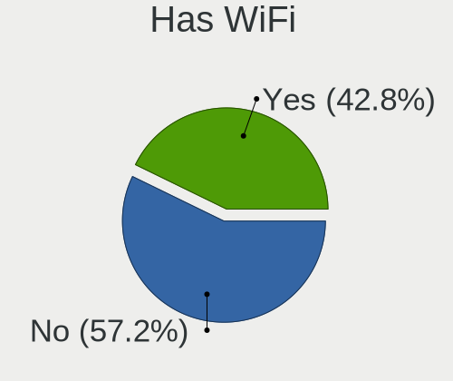
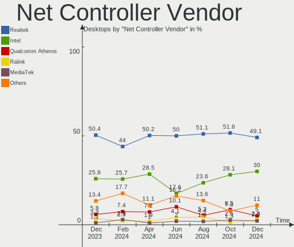
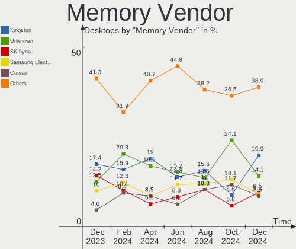

OpenMandriva - Hardware Trends (Desktops)
-----------------------------------------

A project to identify most popular hardware characteristics and track their change
over time based on data collected by Linux users at https://Linux-Hardware.org.

Anyone can contribute to this report by the [hw-probe](https://github.com/linuxhw/hw-probe) tool:

    sudo -E hw-probe -all -upload

This report is for one last month. Overall report since the beginning of time: [TestDays](https://github.com/linuxhw/TestDays)

Period: Oct, 2023.

Contents
--------

* [ System ](#system)
  - [ OS                       ](#os)
  - [ OS Family                ](#os-family)
  - [ Kernel                   ](#kernel)
  - [ Kernel Family            ](#kernel-family)
  - [ Kernel Major Ver.        ](#kernel-major-ver)
  - [ Arch                     ](#arch)
  - [ DE                       ](#de)
  - [ Display Server           ](#display-server)
  - [ Display Manager          ](#display-manager)
  - [ OS Lang                  ](#os-lang)
  - [ Boot Mode                ](#boot-mode)
  - [ Filesystem               ](#filesystem)
  - [ Part. scheme             ](#part-scheme)
  - [ Dual Boot with Linux/BSD ](#dual-boot-with-linuxbsd)
  - [ Dual Boot (Win)          ](#dual-boot-win)

* [ Board ](#board)
  - [ Vendor                   ](#vendor)
  - [ Model                    ](#model)
  - [ Model Family             ](#model-family)
  - [ MFG Year                 ](#mfg-year)
  - [ Form Factor              ](#form-factor)
  - [ Secure Boot              ](#secure-boot)
  - [ Coreboot                 ](#coreboot)
  - [ RAM Size                 ](#ram-size)
  - [ RAM Used                 ](#ram-used)
  - [ Total Drives             ](#total-drives)
  - [ Has CD-ROM               ](#has-cd-rom)
  - [ Has Ethernet             ](#has-ethernet)
  - [ Has WiFi                 ](#has-wifi)
  - [ Has Bluetooth            ](#has-bluetooth)

* [ Location ](#location)
  - [ Country                  ](#country)
  - [ City                     ](#city)

* [ Drives ](#drives)
  - [ Drive Vendor             ](#drive-vendor)
  - [ Drive Model              ](#drive-model)
  - [ HDD Vendor               ](#hdd-vendor)
  - [ SSD Vendor               ](#ssd-vendor)
  - [ Drive Kind               ](#drive-kind)
  - [ Drive Connector          ](#drive-connector)
  - [ Drive Size               ](#drive-size)
  - [ Space Total              ](#space-total)
  - [ Space Used               ](#space-used)
  - [ Malfunc. Drives          ](#malfunc-drives)
  - [ Malfunc. Drive Vendor    ](#malfunc-drive-vendor)
  - [ Malfunc. HDD Vendor      ](#malfunc-hdd-vendor)
  - [ Malfunc. Drive Kind      ](#malfunc-drive-kind)
  - [ Failed Drives            ](#failed-drives)
  - [ Failed Drive Vendor      ](#failed-drive-vendor)
  - [ Drive Status             ](#drive-status)

* [ Storage controller ](#storage-controller)
  - [ Storage Vendor           ](#storage-vendor)
  - [ Storage Model            ](#storage-model)
  - [ Storage Kind             ](#storage-kind)

* [ Processor ](#processor)
  - [ CPU Vendor               ](#cpu-vendor)
  - [ CPU Model                ](#cpu-model)
  - [ CPU Model Family         ](#cpu-model-family)
  - [ CPU Cores                ](#cpu-cores)
  - [ CPU Sockets              ](#cpu-sockets)
  - [ CPU Threads              ](#cpu-threads)
  - [ CPU Op-Modes             ](#cpu-op-modes)
  - [ CPU Microcode            ](#cpu-microcode)
  - [ CPU Microarch            ](#cpu-microarch)

* [ Graphics ](#graphics)
  - [ GPU Vendor               ](#gpu-vendor)
  - [ GPU Model                ](#gpu-model)
  - [ GPU Combo                ](#gpu-combo)
  - [ GPU Driver               ](#gpu-driver)
  - [ GPU Memory               ](#gpu-memory)

* [ Monitor ](#monitor)
  - [ Monitor Vendor           ](#monitor-vendor)
  - [ Monitor Model            ](#monitor-model)
  - [ Monitor Resolution       ](#monitor-resolution)
  - [ Monitor Diagonal         ](#monitor-diagonal)
  - [ Monitor Width            ](#monitor-width)
  - [ Aspect Ratio             ](#aspect-ratio)
  - [ Monitor Area             ](#monitor-area)
  - [ Pixel Density            ](#pixel-density)
  - [ Multiple Monitors        ](#multiple-monitors)

* [ Network ](#network)
  - [ Net Controller Vendor    ](#net-controller-vendor)
  - [ Net Controller Model     ](#net-controller-model)
  - [ Wireless Vendor          ](#wireless-vendor)
  - [ Wireless Model           ](#wireless-model)
  - [ Ethernet Vendor          ](#ethernet-vendor)
  - [ Ethernet Model           ](#ethernet-model)
  - [ Net Controller Kind      ](#net-controller-kind)
  - [ Used Controller          ](#used-controller)
  - [ NICs                     ](#nics)
  - [ IPv6                     ](#ipv6)

* [ Bluetooth ](#bluetooth)
  - [ Bluetooth Vendor         ](#bluetooth-vendor)
  - [ Bluetooth Model          ](#bluetooth-model)

* [ Sound ](#sound)
  - [ Sound Vendor             ](#sound-vendor)
  - [ Sound Model              ](#sound-model)

* [ Memory ](#memory)
  - [ Memory Vendor            ](#memory-vendor)
  - [ Memory Model             ](#memory-model)
  - [ Memory Kind              ](#memory-kind)
  - [ Memory Form Factor       ](#memory-form-factor)
  - [ Memory Size              ](#memory-size)
  - [ Memory Speed             ](#memory-speed)

* [ Printers & scanners ](#printers--scanners)
  - [ Printer Vendor           ](#printer-vendor)
  - [ Printer Model            ](#printer-model)
  - [ Scanner Vendor           ](#scanner-vendor)
  - [ Scanner Model            ](#scanner-model)

* [ Camera ](#camera)
  - [ Camera Vendor            ](#camera-vendor)
  - [ Camera Model             ](#camera-model)

* [ Security ](#security)
  - [ Fingerprint Vendor       ](#fingerprint-vendor)
  - [ Fingerprint Model        ](#fingerprint-model)
  - [ Chipcard Vendor          ](#chipcard-vendor)
  - [ Chipcard Model           ](#chipcard-model)

* [ Unsupported ](#unsupported)
  - [ Unsupported Devices      ](#unsupported-devices)
  - [ Unsupported Device Types ](#unsupported-device-types)

System
------

OS
--

Installed operating systems

| Name               | Desktops | Percent |
|--------------------|----------|---------|
| OpenMandriva 23.08 | 67       | 39.18%  |
| OpenMandriva 23.10 | 49       | 28.65%  |
| OpenMandriva 4.3   | 19       | 11.11%  |
| OpenMandriva 23.03 | 11       | 6.43%   |
| OpenMandriva 23.01 | 7        | 4.09%   |
| OpenMandriva 23.09 | 6        | 3.51%   |
| OpenMandriva 4.2   | 5        | 2.92%   |
| OpenMandriva 23.90 | 5        | 2.92%   |
| OpenMandriva 23.07 | 2        | 1.17%   |

OS Family
---------

OS without a version

| Name         | Desktops | Percent |
|--------------|----------|---------|
| OpenMandriva | 171      | 100%    |

Kernel
------

Version of the Linux kernel

| Version                    | Desktops | Percent |
|----------------------------|----------|---------|
| 6.4.11-desktop-1omv2390    | 58       | 33.92%  |
| 6.5.5-desktop-1omv2390     | 45       | 26.32%  |
| 6.4.8-desktop-2omv2390     | 14       | 8.19%   |
| 5.16.7-desktop-1omv4003    | 14       | 8.19%   |
| 6.2.6-desktop-1omv2390     | 12       | 7.02%   |
| 6.1.1-desktop-1omv2290     | 7        | 4.09%   |
| 5.16.13-desktop-1omv4003   | 5        | 2.92%   |
| 5.10.14-desktop-1omv4002   | 4        | 2.34%   |
| 6.5.3-desktop-1omv2390     | 3        | 1.75%   |
| 6.5.0-desktop-1omv2390     | 2        | 1.17%   |
| 6.3.5-desktop-3omv2390     | 2        | 1.17%   |
| 6.5.7-desktop-1omv2390     | 1        | 0.58%   |
| 6.5.5-desktop-2.0omv4.9mjn | 1        | 0.58%   |
| 6.1.9-desktop-1omv2390     | 1        | 0.58%   |
| 6.1.4-desktop-1omv2301     | 1        | 0.58%   |
| 5.11.12-desktop-1omv4002   | 1        | 0.58%   |

Kernel Family
-------------

Linux kernel without a distro release

| Version | Desktops | Percent |
|---------|----------|---------|
| 6.4.11  | 58       | 33.92%  |
| 6.5.5   | 46       | 26.9%   |
| 6.4.8   | 14       | 8.19%   |
| 5.16.7  | 14       | 8.19%   |
| 6.2.6   | 12       | 7.02%   |
| 6.1.1   | 7        | 4.09%   |
| 5.16.13 | 5        | 2.92%   |
| 5.10.14 | 4        | 2.34%   |
| 6.5.3   | 3        | 1.75%   |
| 6.5.0   | 2        | 1.17%   |
| 6.3.5   | 2        | 1.17%   |
| 6.5.7   | 1        | 0.58%   |
| 6.1.9   | 1        | 0.58%   |
| 6.1.4   | 1        | 0.58%   |
| 5.11.12 | 1        | 0.58%   |

Kernel Major Ver.
-----------------

Linux kernel major version

| Version | Desktops | Percent |
|---------|----------|---------|
| 6.4     | 72       | 42.11%  |
| 6.5     | 52       | 30.41%  |
| 5.16    | 19       | 11.11%  |
| 6.2     | 12       | 7.02%   |
| 6.1     | 9        | 5.26%   |
| 5.10    | 4        | 2.34%   |
| 6.3     | 2        | 1.17%   |
| 5.11    | 1        | 0.58%   |

Arch
----

OS architecture (x86_64, i586, etc.)

| Name   | Desktops | Percent |
|--------|----------|---------|
| x86_64 | 171      | 100%    |

DE
--

Desktop Environment

| Name    | Desktops | Percent |
|---------|----------|---------|
| KDE5    | 146      | 85.38%  |
| LXQt    | 12       | 7.02%   |
| GNOME   | 10       | 5.85%   |
| Unknown | 3        | 1.75%   |

Display Server
--------------

X11 or Wayland

| Name    | Desktops | Percent |
|---------|----------|---------|
| Wayland | 121      | 70.76%  |
| X11     | 50       | 29.24%  |

Display Manager
---------------

SDDM, LightDM, etc.

| Name | Desktops | Percent |
|------|----------|---------|
| SDDM | 161      | 94.15%  |
| GDM  | 10       | 5.85%   |

OS Lang
-------

Language

| Lang  | Desktops | Percent |
|-------|----------|---------|
| en_US | 75       | 43.86%  |
| de_DE | 18       | 10.53%  |
| fr_FR | 14       | 8.19%   |
| ru_RU | 13       | 7.6%    |
| pt_BR | 8        | 4.68%   |
| pl_PL | 5        | 2.92%   |
| es_ES | 5        | 2.92%   |
| de_AT | 4        | 2.34%   |
| it_IT | 3        | 1.75%   |
| hu_HU | 3        | 1.75%   |
| es_MX | 3        | 1.75%   |
| nl_NL | 2        | 1.17%   |
| es_VE | 2        | 1.17%   |
| en_CA | 2        | 1.17%   |
| cs_CZ | 2        | 1.17%   |
| tr_TR | 1        | 0.58%   |
| pt_PT | 1        | 0.58%   |
| nl_BE | 1        | 0.58%   |
| fr_LU | 1        | 0.58%   |
| es_PY | 1        | 0.58%   |
| es_CR | 1        | 0.58%   |
| es_CO | 1        | 0.58%   |
| es_AR | 1        | 0.58%   |
| en_ZA | 1        | 0.58%   |
| en_IN | 1        | 0.58%   |
| en_AU | 1        | 0.58%   |
| de_CH | 1        | 0.58%   |

Boot Mode
---------

EFI or BIOS

| Mode | Desktops | Percent |
|------|----------|---------|
| BIOS | 88       | 51.46%  |
| EFI  | 83       | 48.54%  |

Filesystem
----------

Type of filesystem

| Type     | Desktops | Percent |
|----------|----------|---------|
| Ext4     | 103      | 60.23%  |
| Overlay  | 56       | 32.75%  |
| Btrfs    | 7        | 4.09%   |
| Xfs      | 3        | 1.75%   |
| Reiserfs | 1        | 0.58%   |
| F2fs     | 1        | 0.58%   |

Part. scheme
------------

Scheme of partitioning

| Type | Desktops | Percent |
|------|----------|---------|
| GPT  | 126      | 73.68%  |
| MBR  | 45       | 26.32%  |

Dual Boot with Linux/BSD
------------------------

Hosting more than one Linux/BSD

| Dual boot | Desktops | Percent |
|-----------|----------|---------|
| Yes       | 95       | 55.56%  |
| No        | 76       | 44.44%  |

Dual Boot (Win)
---------------

Hosting Linux and Windows

| Dual boot | Desktops | Percent |
|-----------|----------|---------|
| Yes       | 86       | 50.29%  |
| No        | 85       | 49.71%  |

Board
-----

Vendor
------

Motherboard manufacturer

| Name                                 | Desktops | Percent |
|--------------------------------------|----------|---------|
| ASUSTek Computer                     | 31       | 18.13%  |
| Gigabyte Technology                  | 26       | 15.2%   |
| MSI                                  | 19       | 11.11%  |
| Hewlett-Packard                      | 19       | 11.11%  |
| ASRock                               | 12       | 7.02%   |
| Lenovo                               | 11       | 6.43%   |
| Dell                                 | 8        | 4.68%   |
| Intel                                | 6        | 3.51%   |
| Biostar                              | 6        | 3.51%   |
| Fujitsu                              | 5        | 2.92%   |
| Acer                                 | 5        | 2.92%   |
| Pegatron                             | 3        | 1.75%   |
| Foxconn                              | 3        | 1.75%   |
| Shenzhen Meigao Electronic Equipment | 2        | 1.17%   |
| MACHINIST                            | 2        | 1.17%   |
| ECS                                  | 2        | 1.17%   |
| AZW                                  | 2        | 1.17%   |
| WinFast                              | 1        | 0.58%   |
| PCWare                               | 1        | 0.58%   |
| Koloe                                | 1        | 0.58%   |
| Itautec                              | 1        | 0.58%   |
| Fujitsu Siemens                      | 1        | 0.58%   |
| EPSON DIRECT                         | 1        | 0.58%   |
| eMachines                            | 1        | 0.58%   |
| ACTION                               | 1        | 0.58%   |
| Unknown                              | 1        | 0.58%   |

Model
-----

Motherboard model

| Name                                       | Desktops | Percent |
|--------------------------------------------|----------|---------|
| Shenzhen Meigao Electronic Equipment F7BSC | 2        | 1.17%   |
| MSI MS-7B86                                | 2        | 1.17%   |
| Gigabyte B550 AORUS ELITE V2               | 2        | 1.17%   |
| Gigabyte 970A-DS3P                         | 2        | 1.17%   |
| Dell OptiPlex 780                          | 2        | 1.17%   |
| WinFast 761GXK8MC                          | 1        | 0.58%   |
| Pegatron VD049AA-ABF p6141fr               | 1        | 0.58%   |
| Pegatron KN278AA-ABM a6430la               | 1        | 0.58%   |
| Pegatron 520-1000ru                        | 1        | 0.58%   |
| PCWare IPMH61R1                            | 1        | 0.58%   |
| MSI ONE GAMING PC Premium AR11             | 1        | 0.58%   |
| MSI MS-7D36                                | 1        | 0.58%   |
| MSI MS-7C81                                | 1        | 0.58%   |
| MSI MS-7C75                                | 1        | 0.58%   |
| MSI MS-7B79                                | 1        | 0.58%   |
| MSI MS-7B48                                | 1        | 0.58%   |
| MSI MS-7B38                                | 1        | 0.58%   |
| MSI MS-7A38                                | 1        | 0.58%   |
| MSI MS-7A37                                | 1        | 0.58%   |
| MSI MS-7996                                | 1        | 0.58%   |
| MSI MS-7916                                | 1        | 0.58%   |
| MSI MS-7693                                | 1        | 0.58%   |
| MSI MS-7597                                | 1        | 0.58%   |
| MSI MS-7529                                | 1        | 0.58%   |
| MSI MS-7235                                | 1        | 0.58%   |
| MSI MJ-7592                                | 1        | 0.58%   |
| MSI dx5150 MT(PE679AV)                     | 1        | 0.58%   |
| MACHINIST X99-RS9 V2.0                     | 1        | 0.58%   |
| MACHINIST E5-MR9A PRO V1.2                 | 1        | 0.58%   |
| Lenovo ThinkStation E32 30A0S0D601         | 1        | 0.58%   |
| Lenovo ThinkCentre xxx 7090A17             | 1        | 0.58%   |
| Lenovo ThinkCentre M90p 5536W67            | 1        | 0.58%   |
| Lenovo ThinkCentre M900 10FLS3WS00         | 1        | 0.58%   |
| Lenovo ThinkCentre M900 10FLS3BK00         | 1        | 0.58%   |
| Lenovo ThinkCentre M90 5485W2L             | 1        | 0.58%   |
| Lenovo ThinkCentre M700 10JRS02Y04         | 1        | 0.58%   |
| Lenovo ThinkCentre M58p 7484ANU            | 1        | 0.58%   |
| Lenovo ThinkCentre Edge72 3484DMP          | 1        | 0.58%   |
| Lenovo IdeaCentre 300-20ISH 90DA00JWMZ     | 1        | 0.58%   |
| Lenovo 90HY002APG                          | 1        | 0.58%   |

Model Family
------------

Motherboard model prefix

| Name                                       | Desktops | Percent |
|--------------------------------------------|----------|---------|
| HP Compaq                                  | 9        | 5.26%   |
| Lenovo ThinkCentre                         | 8        | 4.68%   |
| Dell OptiPlex                              | 7        | 4.09%   |
| ASUS PRIME                                 | 5        | 2.92%   |
| HP EliteDesk                               | 4        | 2.34%   |
| Fujitsu ESPRIMO                            | 4        | 2.34%   |
| ASUS M5A78L-M                              | 3        | 1.75%   |
| Shenzhen Meigao Electronic Equipment F7BSC | 2        | 1.17%   |
| MSI MS-7B86                                | 2        | 1.17%   |
| Intel DG41RQ                               | 2        | 1.17%   |
| HP Pavilion                                | 2        | 1.17%   |
| Gigabyte B550                              | 2        | 1.17%   |
| Gigabyte 970A-DS3P                         | 2        | 1.17%   |
| Foxconn Pro                                | 2        | 1.17%   |
| ASUS TUF                                   | 2        | 1.17%   |
| ASUS P5G41T-M                              | 2        | 1.17%   |
| ASRock B450                                | 2        | 1.17%   |
| Acer Veriton                               | 2        | 1.17%   |
| Acer Aspire                                | 2        | 1.17%   |
| WinFast 761GXK8MC                          | 1        | 0.58%   |
| Pegatron VD049AA-ABF                       | 1        | 0.58%   |
| Pegatron KN278AA-ABM                       | 1        | 0.58%   |
| Pegatron 520-1000ru                        | 1        | 0.58%   |
| PCWare IPMH61R1                            | 1        | 0.58%   |
| MSI ONE                                    | 1        | 0.58%   |
| MSI MS-7D36                                | 1        | 0.58%   |
| MSI MS-7C81                                | 1        | 0.58%   |
| MSI MS-7C75                                | 1        | 0.58%   |
| MSI MS-7B79                                | 1        | 0.58%   |
| MSI MS-7B48                                | 1        | 0.58%   |
| MSI MS-7B38                                | 1        | 0.58%   |
| MSI MS-7A38                                | 1        | 0.58%   |
| MSI MS-7A37                                | 1        | 0.58%   |
| MSI MS-7996                                | 1        | 0.58%   |
| MSI MS-7916                                | 1        | 0.58%   |
| MSI MS-7693                                | 1        | 0.58%   |
| MSI MS-7597                                | 1        | 0.58%   |
| MSI MS-7529                                | 1        | 0.58%   |
| MSI MS-7235                                | 1        | 0.58%   |
| MSI MJ-7592                                | 1        | 0.58%   |

MFG Year
--------

Motherboard manufacture year

| Year | Desktops | Percent |
|------|----------|---------|
| 2012 | 23       | 13.45%  |
| 2009 | 15       | 8.77%   |
| 2018 | 14       | 8.19%   |
| 2011 | 13       | 7.6%    |
| 2020 | 11       | 6.43%   |
| 2017 | 11       | 6.43%   |
| 2010 | 11       | 6.43%   |
| 2013 | 10       | 5.85%   |
| 2016 | 9        | 5.26%   |
| 2023 | 8        | 4.68%   |
| 2021 | 7        | 4.09%   |
| 2015 | 7        | 4.09%   |
| 2008 | 7        | 4.09%   |
| 2019 | 6        | 3.51%   |
| 2014 | 5        | 2.92%   |
| 2006 | 5        | 2.92%   |
| 2007 | 4        | 2.34%   |
| 2022 | 3        | 1.75%   |
| 2005 | 2        | 1.17%   |

Form Factor
-----------

Physical design of the computer

| Name    | Desktops | Percent |
|---------|----------|---------|
| Desktop | 171      | 100%    |

Secure Boot
-----------

Enabled or disabled

| State    | Desktops | Percent |
|----------|----------|---------|
| Disabled | 171      | 100%    |

Coreboot
--------

Have coreboot on board

| Used | Desktops | Percent |
|------|----------|---------|
| No   | 171      | 100%    |

RAM Size
--------

Total RAM memory

| Size in GB  | Desktops | Percent |
|-------------|----------|---------|
| 8.01-16.0   | 35       | 20.47%  |
| 16.01-24.0  | 34       | 19.88%  |
| 4.01-8.0    | 33       | 19.3%   |
| 3.01-4.0    | 28       | 16.37%  |
| 32.01-64.0  | 18       | 10.53%  |
| 1.01-2.0    | 8        | 4.68%   |
| 64.01-256.0 | 6        | 3.51%   |
| 24.01-32.0  | 5        | 2.92%   |
| 2.01-3.0    | 4        | 2.34%   |

RAM Used
--------

Used RAM memory

| Used GB  | Desktops | Percent |
|----------|----------|---------|
| 1.01-2.0 | 107      | 62.57%  |
| 2.01-3.0 | 35       | 20.47%  |
| 0.51-1.0 | 19       | 11.11%  |
| 0.01-0.5 | 5        | 2.92%   |
| 3.01-4.0 | 3        | 1.75%   |
| 4.01-8.0 | 2        | 1.17%   |

Total Drives
------------

Number of drives on board

| Drives | Desktops | Percent |
|--------|----------|---------|
| 1      | 76       | 44.44%  |
| 2      | 52       | 30.41%  |
| 3      | 22       | 12.87%  |
| 4      | 9        | 5.26%   |
| 5      | 6        | 3.51%   |
| 6      | 3        | 1.75%   |
| 9      | 1        | 0.58%   |
| 8      | 1        | 0.58%   |
| 0      | 1        | 0.58%   |

Has CD-ROM
----------

Has CD-ROM on board

| Presented | Desktops | Percent |
|-----------|----------|---------|
| Yes       | 89       | 52.05%  |
| No        | 82       | 47.95%  |

Has Ethernet
------------

Has Ethernet on board

| Presented | Desktops | Percent |
|-----------|----------|---------|
| Yes       | 169      | 98.83%  |
| No        | 2        | 1.17%   |

Has WiFi
--------

Has WiFi module

| Presented | Desktops | Percent |
|-----------|----------|---------|
| No        | 115      | 67.25%  |
| Yes       | 56       | 32.75%  |

Has Bluetooth
-------------

Has Bluetooth module

| Presented | Desktops | Percent |
|-----------|----------|---------|
| No        | 128      | 74.85%  |
| Yes       | 43       | 25.15%  |

Location
--------

Country
-------

Geographic location (country)

| Country      | Desktops | Percent |
|--------------|----------|---------|
| Germany      | 22       | 12.87%  |
| Russia       | 16       | 9.36%   |
| France       | 15       | 8.77%   |
| USA          | 14       | 8.19%   |
| Brazil       | 12       | 7.02%   |
| Poland       | 8        | 4.68%   |
| Spain        | 6        | 3.51%   |
| Finland      | 6        | 3.51%   |
| Canada       | 5        | 2.92%   |
| Austria      | 5        | 2.92%   |
| Japan        | 4        | 2.34%   |
| Hungary      | 4        | 2.34%   |
| Taiwan       | 3        | 1.75%   |
| Switzerland  | 3        | 1.75%   |
| Portugal     | 3        | 1.75%   |
| Netherlands  | 3        | 1.75%   |
| Mexico       | 3        | 1.75%   |
| India        | 3        | 1.75%   |
| Colombia     | 3        | 1.75%   |
| Venezuela    | 2        | 1.17%   |
| UK           | 2        | 1.17%   |
| Thailand     | 2        | 1.17%   |
| Romania      | 2        | 1.17%   |
| Italy        | 2        | 1.17%   |
| Indonesia    | 2        | 1.17%   |
| Czechia      | 2        | 1.17%   |
| Argentina    | 2        | 1.17%   |
| Turkey       | 1        | 0.58%   |
| Sweden       | 1        | 0.58%   |
| South Africa | 1        | 0.58%   |
| Slovenia     | 1        | 0.58%   |
| Slovakia     | 1        | 0.58%   |
| Réunion     | 1        | 0.58%   |
| Puerto Rico  | 1        | 0.58%   |
| Philippines  | 1        | 0.58%   |
| Paraguay     | 1        | 0.58%   |
| Morocco      | 1        | 0.58%   |
| Latvia       | 1        | 0.58%   |
| Jamaica      | 1        | 0.58%   |
| Greece       | 1        | 0.58%   |

City
----

Geographic location (city)

| City              | Desktops | Percent |
|-------------------|----------|---------|
| Vienna            | 4        | 2.34%   |
| Taipei            | 3        | 1.75%   |
| Munich            | 3        | 1.75%   |
| Warsaw            | 2        | 1.17%   |
| Volzhsky          | 2        | 1.17%   |
| Volta Redonda     | 2        | 1.17%   |
| Vantaa            | 2        | 1.17%   |
| Trappes           | 2        | 1.17%   |
| Porto Alegre      | 2        | 1.17%   |
| Paris             | 2        | 1.17%   |
| Novosibirsk       | 2        | 1.17%   |
| Moscow            | 2        | 1.17%   |
| Mexico City       | 2        | 1.17%   |
| Los Angeles       | 2        | 1.17%   |
| Lagos             | 2        | 1.17%   |
| Hof               | 2        | 1.17%   |
| Grafenau          | 2        | 1.17%   |
| Darmstadt         | 2        | 1.17%   |
| Braunschweig      | 2        | 1.17%   |
| Bangkok           | 2        | 1.17%   |
| Zurich            | 1        | 0.58%   |
| Zipacon           | 1        | 0.58%   |
| Zgierz            | 1        | 0.58%   |
| Zdunska Wola      | 1        | 0.58%   |
| Yutaka            | 1        | 0.58%   |
| Yoshkar-Ola       | 1        | 0.58%   |
| Yeysk             | 1        | 0.58%   |
| Yaroslavl         | 1        | 0.58%   |
| Villena           | 1        | 0.58%   |
| Villa Ballester   | 1        | 0.58%   |
| Vigia             | 1        | 0.58%   |
| Uusikaupunki      | 1        | 0.58%   |
| Utsunomiya        | 1        | 0.58%   |
| Umeå             | 1        | 0.58%   |
| Tuxtla Gutiérrez | 1        | 0.58%   |
| Tulcea            | 1        | 0.58%   |
| Toronto           | 1        | 0.58%   |
| Tolyatti          | 1        | 0.58%   |
| Teguise           | 1        | 0.58%   |
| Tangier           | 1        | 0.58%   |

Drives
------

Drive Vendor
------------

Hard drive vendors

| Vendor                      | Desktops | Drives | Percent |
|-----------------------------|----------|--------|---------|
| WDC                         | 56       | 69     | 18.24%  |
| Seagate                     | 55       | 61     | 17.92%  |
| Samsung Electronics         | 31       | 39     | 10.1%   |
| Kingston                    | 20       | 24     | 6.51%   |
| Toshiba                     | 19       | 20     | 6.19%   |
| Crucial                     | 14       | 15     | 4.56%   |
| Hitachi                     | 12       | 13     | 3.91%   |
| SanDisk                     | 9        | 9      | 2.93%   |
| Maxtor                      | 7        | 7      | 2.28%   |
| Unknown                     | 6        | 8      | 1.95%   |
| A-DATA Technology           | 5        | 5      | 1.63%   |
| Intenso                     | 4        | 4      | 1.3%    |
| Intel                       | 4        | 4      | 1.3%    |
| HGST                        | 4        | 4      | 1.3%    |
| China                       | 4        | 4      | 1.3%    |
| SPCC                        | 3        | 4      | 0.98%   |
| PNY                         | 3        | 3      | 0.98%   |
| XPG                         | 2        | 2      | 0.65%   |
| Team                        | 2        | 2      | 0.65%   |
| Patriot                     | 2        | 2      | 0.65%   |
| Kingston Technology Company | 2        | 2      | 0.65%   |
| KingSpec                    | 2        | 2      | 0.65%   |
| Gigabyte Technology         | 2        | 2      | 0.65%   |
| Fanxiang                    | 2        | 2      | 0.65%   |
| Apacer                      | 2        | 2      | 0.65%   |
| ANACOMDA                    | 2        | 2      | 0.65%   |
| Unknown                     | 2        | 2      | 0.65%   |
| ZTE                         | 1        | 1      | 0.33%   |
| USB3.0                      | 1        | 1      | 0.33%   |
| T-FORCE                     | 1        | 1      | 0.33%   |
| SP                          | 1        | 1      | 0.33%   |
| Smartbuy                    | 1        | 1      | 0.33%   |
| SK hynix                    | 1        | 1      | 0.33%   |
| Silicon Motion              | 1        | 1      | 0.33%   |
| SABRENT                     | 1        | 1      | 0.33%   |
| ROG                         | 1        | 1      | 0.33%   |
| Realtek                     | 1        | 1      | 0.33%   |
| Phison Electronics          | 1        | 1      | 0.33%   |
| OCZ                         | 1        | 1      | 0.33%   |
| Netac                       | 1        | 1      | 0.33%   |

Drive Model
-----------

Hard drive models

| Model                            | Desktops | Percent |
|----------------------------------|----------|---------|
| Toshiba DT01ACA100 1TB           | 5        | 1.49%   |
| Seagate ST2000DM008-2FR102 2TB   | 4        | 1.19%   |
| Seagate ST1000DM010-2EP102 1TB   | 4        | 1.19%   |
| Seagate ST500DM002-1BD142 500GB  | 3        | 0.89%   |
| Seagate ST380815AS 80GB          | 3        | 0.89%   |
| Seagate ST1000DM003-1SB102 1TB   | 3        | 0.89%   |
| SanDisk SSD PLUS 1000GB          | 3        | 0.89%   |
| Samsung HD322HJ 320GB            | 3        | 0.89%   |
| Kingston SA400S37120G 120GB SSD  | 3        | 0.89%   |
| Crucial CT480BX500SSD1 480GB     | 3        | 0.89%   |
| Crucial CT240BX500SSD1 240GB     | 3        | 0.89%   |
| WDC WDS240G2G0A-00JH30 240GB SSD | 2        | 0.6%    |
| WDC WD5000AAKX-00ERMA0 500GB     | 2        | 0.6%    |
| WDC WD5000AAKX-001CA0 500GB      | 2        | 0.6%    |
| WDC WD5000AAKS-22A7B0 500GB      | 2        | 0.6%    |
| WDC WD3200BPVT-22ZEST0 320GB     | 2        | 0.6%    |
| WDC WD30EZRX-00D8PB0 3TB         | 2        | 0.6%    |
| WDC WD20EZRZ-00Z5HB0 2TB         | 2        | 0.6%    |
| WDC WD20EFRX-68EUZN0 2TB         | 2        | 0.6%    |
| WDC WD10EZEX-08WN4A0 1TB         | 2        | 0.6%    |
| WDC WD10EZEX-00WN4A0 1TB         | 2        | 0.6%    |
| WDC WD10EZEX-00RKKA0 1TB         | 2        | 0.6%    |
| Toshiba MK3276GSX 320GB          | 2        | 0.6%    |
| Seagate ST4000DM000-2AE166 4TB   | 2        | 0.6%    |
| Seagate ST3500418AS 500GB        | 2        | 0.6%    |
| Seagate ST3000DM001-1ER166 3TB   | 2        | 0.6%    |
| Samsung SSD 970 EVO Plus 2TB     | 2        | 0.6%    |
| Samsung SSD 970 EVO Plus 1TB     | 2        | 0.6%    |
| Samsung SSD 860 EVO 500GB        | 2        | 0.6%    |
| Samsung SSD 850 EVO 500GB        | 2        | 0.6%    |
| Samsung SSD 850 EVO 250GB        | 2        | 0.6%    |
| Samsung SSD 840 EVO 120GB        | 2        | 0.6%    |
| Samsung HD502HJ 500GB            | 2        | 0.6%    |
| Maxtor STM3802110A 80GB          | 2        | 0.6%    |
| Kingston Company SNV2S1000G 1TB  | 2        | 0.6%    |
| Kingston SV300S37A120G 120GB SSD | 2        | 0.6%    |
| Kingston SNVS500G 500GB          | 2        | 0.6%    |
| Kingston SNVS250G 250GB          | 2        | 0.6%    |
| Kingston SA400S37240G 240GB SSD  | 2        | 0.6%    |
| Kingston OM8PGP41024Q-A0 1TB     | 2        | 0.6%    |

HDD Vendor
----------

Hard disk drive vendors

| Vendor              | Desktops | Drives | Percent |
|---------------------|----------|--------|---------|
| Seagate             | 54       | 60     | 34.18%  |
| WDC                 | 47       | 55     | 29.75%  |
| Toshiba             | 17       | 18     | 10.76%  |
| Hitachi             | 12       | 13     | 7.59%   |
| Samsung Electronics | 11       | 11     | 6.96%   |
| Maxtor              | 6        | 6      | 3.8%    |
| HGST                | 4        | 4      | 2.53%   |
| USB3.0              | 1        | 1      | 0.63%   |
| Unknown             | 1        | 1      | 0.63%   |
| Magnetic Data       | 1        | 1      | 0.63%   |
| HPE                 | 1        | 1      | 0.63%   |
| Fujitsu             | 1        | 1      | 0.63%   |
| ASMedia             | 1        | 1      | 0.63%   |
| Unknown             | 1        | 1      | 0.63%   |

SSD Vendor
----------

Solid state drive vendors

| Vendor              | Desktops | Drives | Percent |
|---------------------|----------|--------|---------|
| Samsung Electronics | 15       | 17     | 13.64%  |
| Kingston            | 12       | 15     | 10.91%  |
| Crucial             | 12       | 13     | 10.91%  |
| WDC                 | 9        | 10     | 8.18%   |
| SanDisk             | 7        | 7      | 6.36%   |
| A-DATA Technology   | 5        | 5      | 4.55%   |
| Intenso             | 4        | 4      | 3.64%   |
| China               | 4        | 4      | 3.64%   |
| SPCC                | 3        | 4      | 2.73%   |
| PNY                 | 3        | 3      | 2.73%   |
| Team                | 2        | 2      | 1.82%   |
| Patriot             | 2        | 2      | 1.82%   |
| KingSpec            | 2        | 2      | 1.82%   |
| Apacer              | 2        | 2      | 1.82%   |
| ANACOMDA            | 2        | 2      | 1.82%   |
| Toshiba             | 1        | 1      | 0.91%   |
| T-FORCE             | 1        | 1      | 0.91%   |
| SP                  | 1        | 1      | 0.91%   |
| Smartbuy            | 1        | 1      | 0.91%   |
| Seagate             | 1        | 1      | 0.91%   |
| SABRENT             | 1        | 1      | 0.91%   |
| ROG                 | 1        | 1      | 0.91%   |
| OCZ                 | 1        | 1      | 0.91%   |
| Netac               | 1        | 1      | 0.91%   |
| Micron Technology   | 1        | 1      | 0.91%   |
| Maxtor              | 1        | 1      | 0.91%   |
| Matrix              | 1        | 1      | 0.91%   |
| Kingchuxing         | 1        | 1      | 0.91%   |
| Kimtigo             | 1        | 1      | 0.91%   |
| Intel               | 1        | 1      | 0.91%   |
| INNOVATION IT       | 1        | 1      | 0.91%   |
| HS-SSD-C100         | 1        | 1      | 0.91%   |
| GOODRAM             | 1        | 1      | 0.91%   |
| Gigabyte Technology | 1        | 1      | 0.91%   |
| Gamers              | 1        | 1      | 0.91%   |
| Fanxiang            | 1        | 1      | 0.91%   |
| EXRAM               | 1        | 1      | 0.91%   |
| Emtec               | 1        | 1      | 0.91%   |
| Dogfish             | 1        | 1      | 0.91%   |
| BAITITON            | 1        | 1      | 0.91%   |

Drive Kind
----------

HDD or SSD

| Kind    | Desktops | Drives | Percent |
|---------|----------|--------|---------|
| HDD     | 113      | 174    | 47.28%  |
| SSD     | 84       | 118    | 35.15%  |
| NVMe    | 39       | 47     | 16.32%  |
| Unknown | 3        | 5      | 1.26%   |

Drive Connector
---------------

SATA, SAS, NVMe, etc.

| Type | Desktops | Drives | Percent |
|------|----------|--------|---------|
| SATA | 156      | 284    | 76.47%  |
| NVMe | 39       | 46     | 19.12%  |
| SAS  | 9        | 14     | 4.41%   |

Drive Size
----------

Size of hard drive

| Size in TB | Desktops | Drives | Percent |
|------------|----------|--------|---------|
| 0.01-0.5   | 111      | 189    | 54.15%  |
| 0.51-1.0   | 58       | 61     | 28.29%  |
| 1.01-2.0   | 18       | 18     | 8.78%   |
| 2.01-3.0   | 9        | 12     | 4.39%   |
| 3.01-4.0   | 6        | 7      | 2.93%   |
| 4.01-10.0  | 2        | 4      | 0.98%   |
| 20.01-50.0 | 1        | 1      | 0.49%   |

Space Total
-----------

Amount of disk space available on the file system

| Size in GB     | Desktops | Percent |
|----------------|----------|---------|
| 101-250        | 38       | 22.22%  |
| 1-20           | 38       | 22.22%  |
| 251-500        | 24       | 14.04%  |
| 501-1000       | 18       | 10.53%  |
| 51-100         | 17       | 9.94%   |
| 1001-2000      | 12       | 7.02%   |
| Unknown        | 10       | 5.85%   |
| 21-50          | 9        | 5.26%   |
| 2001-3000      | 3        | 1.75%   |
| More than 3000 | 2        | 1.17%   |

Space Used
----------

Amount of used disk space

| Used GB   | Desktops | Percent |
|-----------|----------|---------|
| 1-20      | 121      | 70.76%  |
| Unknown   | 10       | 5.85%   |
| 251-500   | 9        | 5.26%   |
| 21-50     | 9        | 5.26%   |
| 101-250   | 8        | 4.68%   |
| 501-1000  | 6        | 3.51%   |
| 51-100    | 6        | 3.51%   |
| 2001-3000 | 2        | 1.17%   |

Malfunc. Drives
---------------

Drive models with a malfunction

| Model                             | Desktops | Drives | Percent |
|-----------------------------------|----------|--------|---------|
| Toshiba DT01ACA100 1TB            | 3        | 3      | 4.48%   |
| WDC WD5000AAKS-22A7B0 500GB       | 2        | 2      | 2.99%   |
| Seagate ST3500418AS 500GB         | 2        | 2      | 2.99%   |
| Seagate ST2000DM008-2FR102 2TB    | 2        | 2      | 2.99%   |
| WDC WDS240G2G0A-00JH30 240GB SSD  | 1        | 1      | 1.49%   |
| WDC WD800BD-22MRA1 80GB           | 1        | 1      | 1.49%   |
| WDC WD5000AAKS-00UU3A0 500GB      | 1        | 1      | 1.49%   |
| WDC WD5000AAKS-00TMA0 500GB       | 1        | 1      | 1.49%   |
| WDC WD5000AAKS-00H2B0 500GB       | 1        | 1      | 1.49%   |
| WDC WD5000AAKS-00D2B0 500GB       | 1        | 1      | 1.49%   |
| WDC WD40EFAX-68JH4N1 4TB          | 1        | 1      | 1.49%   |
| WDC WD3200BPVT-22ZEST0 320GB      | 1        | 1      | 1.49%   |
| WDC WD3200AAKS-61L9A0 320GB       | 1        | 1      | 1.49%   |
| WDC WD3200AAJB-00J3A0 320GB       | 1        | 1      | 1.49%   |
| WDC WD30EZRX-00D8PB0 3TB          | 1        | 1      | 1.49%   |
| WDC WD2500AAKX-001CA0 250GB       | 1        | 1      | 1.49%   |
| WDC WD20EFRX-68EUZN0 2TB          | 1        | 1      | 1.49%   |
| WDC WD1600AAJS-00V4A0 160GB       | 1        | 1      | 1.49%   |
| WDC WD10EURX-63C57Y0 1TB          | 1        | 1      | 1.49%   |
| WDC WD Green 2.5 480GB SSD        | 1        | 1      | 1.49%   |
| WDC WD Green 2.5 1000GB           | 1        | 1      | 1.49%   |
| Toshiba MK3276GSX 320GB           | 1        | 1      | 1.49%   |
| Toshiba MK1655GSX 160GB           | 1        | 1      | 1.49%   |
| Seagate ST500LT012-9WS142 500GB   | 1        | 1      | 1.49%   |
| Seagate ST380811AS 80GB           | 1        | 1      | 1.49%   |
| Seagate ST380211AS 80GB           | 1        | 1      | 1.49%   |
| Seagate ST3500830AS 500GB         | 1        | 1      | 1.49%   |
| Seagate ST3320820AS 320GB         | 1        | 1      | 1.49%   |
| Seagate ST3320418AS 320GB         | 1        | 1      | 1.49%   |
| Seagate ST3250820SCE 250GB        | 1        | 1      | 1.49%   |
| Seagate ST3250318AS 250GB         | 1        | 1      | 1.49%   |
| Seagate ST3200826AS 200GB         | 1        | 1      | 1.49%   |
| Seagate ST3160812A 160GB          | 1        | 1      | 1.49%   |
| Seagate ST31000528AS 1TB          | 1        | 1      | 1.49%   |
| Seagate ST31000524AS 1TB          | 1        | 1      | 1.49%   |
| Seagate ST3000NM0053 3TB          | 1        | 1      | 1.49%   |
| Seagate ST1000DM003-1SB10C 1TB    | 1        | 1      | 1.49%   |
| Seagate ST1000DM003-1SB102 1TB    | 1        | 1      | 1.49%   |
| Samsung Electronics HD322HJ 320GB | 1        | 1      | 1.49%   |
| Samsung Electronics HD120IJ 120GB | 1        | 1      | 1.49%   |

Malfunc. Drive Vendor
---------------------

Vendors of faulty drives

| Vendor              | Desktops | Drives | Percent |
|---------------------|----------|--------|---------|
| WDC                 | 18       | 19     | 27.69%  |
| Seagate             | 18       | 19     | 27.69%  |
| Toshiba             | 5        | 5      | 7.69%   |
| Maxtor              | 4        | 4      | 6.15%   |
| Hitachi             | 4        | 4      | 6.15%   |
| Samsung Electronics | 3        | 3      | 4.62%   |
| Magnetic Data       | 1        | 1      | 1.54%   |
| Kingston            | 1        | 1      | 1.54%   |
| JMicron Technology  | 1        | 1      | 1.54%   |
| Intel               | 1        | 1      | 1.54%   |
| HPE                 | 1        | 1      | 1.54%   |
| HGST                | 1        | 1      | 1.54%   |
| Gamers              | 1        | 1      | 1.54%   |
| EXRAM               | 1        | 1      | 1.54%   |
| China               | 1        | 1      | 1.54%   |
| BAITITON            | 1        | 1      | 1.54%   |
| ASMedia             | 1        | 1      | 1.54%   |
| A-DATA Technology   | 1        | 1      | 1.54%   |
| Unknown             | 1        | 1      | 1.54%   |

Malfunc. HDD Vendor
-------------------

Vendors of faulty HDD drives

| Vendor              | Desktops | Drives | Percent |
|---------------------|----------|--------|---------|
| Seagate             | 18       | 19     | 33.33%  |
| WDC                 | 15       | 16     | 27.78%  |
| Toshiba             | 5        | 5      | 9.26%   |
| Maxtor              | 4        | 4      | 7.41%   |
| Hitachi             | 4        | 4      | 7.41%   |
| Samsung Electronics | 3        | 3      | 5.56%   |
| Magnetic Data       | 1        | 1      | 1.85%   |
| HPE                 | 1        | 1      | 1.85%   |
| HGST                | 1        | 1      | 1.85%   |
| ASMedia             | 1        | 1      | 1.85%   |
| Unknown             | 1        | 1      | 1.85%   |

Malfunc. Drive Kind
-------------------

Kinds of faulty drives

| Kind    | Desktops | Drives | Percent |
|---------|----------|--------|---------|
| HDD     | 46       | 56     | 80.7%   |
| SSD     | 10       | 10     | 17.54%  |
| Unknown | 1        | 1      | 1.75%   |

Failed Drives
-------------

Failed drive models

Zero info for selected period =(

Failed Drive Vendor
-------------------

Failed drive vendors

Zero info for selected period =(

Drive Status
------------

Number of failed and malfunc. drives

| Status   | Desktops | Drives | Percent |
|----------|----------|--------|---------|
| Works    | 148      | 259    | 68.52%  |
| Malfunc  | 55       | 67     | 25.46%  |
| Detected | 13       | 18     | 6.02%   |

Storage controller
------------------

Storage Vendor
--------------

Storage controller vendors

| Vendor                           | Desktops | Percent |
|----------------------------------|----------|---------|
| Intel                            | 112      | 48.48%  |
| AMD                              | 51       | 22.08%  |
| Kingston Technology Company      | 11       | 4.76%   |
| Samsung Electronics              | 9        | 3.9%    |
| JMicron Technology               | 9        | 3.9%    |
| Nvidia                           | 7        | 3.03%   |
| SanDisk                          | 6        | 2.6%    |
| Marvell Technology Group         | 5        | 2.16%   |
| MAXIO Technology (Hangzhou)      | 4        | 1.73%   |
| ASMedia Technology               | 4        | 1.73%   |
| Phison Electronics               | 2        | 0.87%   |
| Micron/Crucial Technology        | 2        | 0.87%   |
| ADATA Technology                 | 2        | 0.87%   |
| Toshiba America Info Systems     | 1        | 0.43%   |
| SK hynix                         | 1        | 0.43%   |
| Silicon Motion                   | 1        | 0.43%   |
| Silicon Integrated Systems [SiS] | 1        | 0.43%   |
| KIOXIA                           | 1        | 0.43%   |
| Hosin Global Electronics         | 1        | 0.43%   |
| Broadcom / LSI                   | 1        | 0.43%   |

Storage Model
-------------

Storage controller models

| Model                                                                                   | Desktops | Percent |
|-----------------------------------------------------------------------------------------|----------|---------|
| AMD FCH SATA Controller [AHCI mode]                                                     | 18       | 5.83%   |
| Intel NM10/ICH7 Family SATA Controller [IDE mode]                                       | 13       | 4.21%   |
| AMD SB7x0/SB8x0/SB9x0 IDE Controller                                                    | 12       | 3.88%   |
| Intel 82801G (ICH7 Family) IDE Controller                                               | 11       | 3.56%   |
| AMD SB7x0/SB8x0/SB9x0 SATA Controller [IDE mode]                                        | 11       | 3.56%   |
| Intel 8 Series/C220 Series Chipset Family 6-port SATA Controller 1 [AHCI mode]          | 10       | 3.24%   |
| AMD 400 Series Chipset SATA Controller                                                  | 10       | 3.24%   |
| Intel Q170/Q150/B150/H170/H110/Z170/CM236 Chipset SATA Controller [AHCI Mode]           | 9        | 2.91%   |
| Intel 7 Series/C210 Series Chipset Family 6-port SATA Controller [AHCI mode]            | 9        | 2.91%   |
| Intel 200 Series PCH SATA controller [AHCI mode]                                        | 9        | 2.91%   |
| Samsung NVMe SSD Controller SM981/PM981/PM983                                           | 8        | 2.59%   |
| AMD 500 Series Chipset SATA Controller                                                  | 8        | 2.59%   |
| Nvidia MCP61 SATA Controller                                                            | 6        | 1.94%   |
| Nvidia MCP61 IDE                                                                        | 6        | 1.94%   |
| Intel Cannon Lake PCH SATA AHCI Controller                                              | 6        | 1.94%   |
| Intel 6 Series/C200 Series Chipset Family Desktop SATA Controller (IDE mode, ports 4-5) | 6        | 1.94%   |
| Intel 6 Series/C200 Series Chipset Family Desktop SATA Controller (IDE mode, ports 0-3) | 6        | 1.94%   |
| Intel 6 Series/C200 Series Chipset Family 6 port Desktop SATA AHCI Controller           | 6        | 1.94%   |
| AMD SB7x0/SB8x0/SB9x0 SATA Controller [AHCI mode]                                       | 6        | 1.94%   |
| AMD 300 Series Chipset SATA Controller                                                  | 6        | 1.94%   |
| Intel SATA Controller [RAID mode]                                                       | 5        | 1.62%   |
| JMicron JMB363 SATA/IDE Controller                                                      | 4        | 1.29%   |
| Intel 82801JI (ICH10 Family) SATA AHCI Controller                                       | 4        | 1.29%   |
| Intel 82801H (ICH8 Family) 4 port SATA Controller [IDE mode]                            | 4        | 1.29%   |
| Intel 4 Series Chipset PT IDER Controller                                               | 4        | 1.29%   |
| ASMedia ASM1062 Serial ATA Controller                                                   | 4        | 1.29%   |
| MAXIO (Hangzhou) NVMe SSD Controller MAP1202                                            | 3        | 0.97%   |
| Kingston Company NV2 NVMe SSD SM2267XT                                                  | 3        | 0.97%   |
| Intel 82801IR/IO/IH (ICH9R/DO/DH) 4 port SATA Controller [IDE mode]                     | 3        | 0.97%   |
| Intel 82801I (ICH9 Family) 2 port SATA Controller [IDE mode]                            | 3        | 0.97%   |
| Intel 82801HR/HO/HH (ICH8R/DO/DH) 2 port SATA Controller [IDE mode]                     | 3        | 0.97%   |
| Intel 5 Series/3400 Series Chipset 6 port SATA AHCI Controller                          | 3        | 0.97%   |
| AMD FCH SATA Controller D                                                               | 3        | 0.97%   |
| SanDisk Ultra 3D / WD Blue SN570 NVMe SSD (DRAM-less)                                   | 2        | 0.65%   |
| SanDisk Ultra 3D / WD Blue SN550 NVMe SSD                                               | 2        | 0.65%   |
| Samsung NVMe SSD Controller 980 (DRAM-less)                                             | 2        | 0.65%   |
| Micron/Crucial P2 [Nick P2] / P3 / P3 Plus NVMe PCIe SSD (DRAM-less)                    | 2        | 0.65%   |
| Kingston Company OM8PGP4 NVMe PCIe SSD (DRAM-less)                                      | 2        | 0.65%   |
| Kingston Company NV1 NVMe SSD SM2263XT                                                  | 2        | 0.65%   |
| Kingston Company NV1 NVMe SSD E13T                                                      | 2        | 0.65%   |

Storage Kind
------------

Kind of storage controller (IDE, SATA, NVMe, SAS, ...)

| Kind | Desktops | Percent |
|------|----------|---------|
| SATA | 122      | 53.04%  |
| IDE  | 60       | 26.09%  |
| NVMe | 39       | 16.96%  |
| RAID | 8        | 3.48%   |
| SAS  | 1        | 0.43%   |

Processor
---------

CPU Vendor
----------

Processor vendors

| Vendor | Desktops | Percent |
|--------|----------|---------|
| Intel  | 110      | 64.33%  |
| AMD    | 61       | 35.67%  |

CPU Model
---------

Processor models

| Model                                       | Desktops | Percent |
|---------------------------------------------|----------|---------|
| Intel Core 2 Duo CPU E8400 @ 3.00GHz        | 7        | 4.09%   |
| Intel Core i5-3470 CPU @ 3.20GHz            | 5        | 2.92%   |
| Intel Core i5-2400 CPU @ 3.10GHz            | 4        | 2.34%   |
| Intel Core i7-6700 CPU @ 3.40GHz            | 3        | 1.75%   |
| Intel Core i5-8400 CPU @ 2.80GHz            | 3        | 1.75%   |
| Intel Core i5-3330 CPU @ 3.00GHz            | 3        | 1.75%   |
| AMD Ryzen 5 3600 6-Core Processor           | 3        | 1.75%   |
| AMD Ryzen 5 3400G with Radeon Vega Graphics | 3        | 1.75%   |
| AMD Ryzen 5 2400G with Radeon Vega Graphics | 3        | 1.75%   |
| AMD FX-8350 Eight-Core Processor            | 3        | 1.75%   |
| AMD FX-8320 Eight-Core Processor            | 3        | 1.75%   |
| Intel Pentium Dual-Core CPU E6600 @ 3.06GHz | 2        | 1.17%   |
| Intel Pentium CPU G620 @ 2.60GHz            | 2        | 1.17%   |
| Intel N95                                   | 2        | 1.17%   |
| Intel Core i5-7400 CPU @ 3.00GHz            | 2        | 1.17%   |
| Intel Core i5-6400 CPU @ 2.70GHz            | 2        | 1.17%   |
| Intel Core i5-4590 CPU @ 3.30GHz            | 2        | 1.17%   |
| Intel Core i3-2100 CPU @ 3.10GHz            | 2        | 1.17%   |
| Intel Core i3-10100F CPU @ 3.60GHz          | 2        | 1.17%   |
| Intel Core i3-10100 CPU @ 3.60GHz           | 2        | 1.17%   |
| Intel Core 2 Quad CPU Q8200 @ 2.33GHz       | 2        | 1.17%   |
| Intel Core 2 Quad CPU Q6600 @ 2.40GHz       | 2        | 1.17%   |
| AMD Ryzen 9 7940HS w/ Radeon 780M Graphics  | 2        | 1.17%   |
| AMD Ryzen 5 5600G with Radeon Graphics      | 2        | 1.17%   |
| AMD Ryzen 3 2200G with Radeon Vega Graphics | 2        | 1.17%   |
| AMD FX-6300 Six-Core Processor              | 2        | 1.17%   |
| AMD Athlon II X2 270 Processor              | 2        | 1.17%   |
| Intel Xeon CPU X5550 @ 2.67GHz              | 1        | 0.58%   |
| Intel Xeon CPU E5450 @ 3.00GHz              | 1        | 0.58%   |
| Intel Xeon CPU E5-2690 v4 @ 2.60GHz         | 1        | 0.58%   |
| Intel Xeon CPU E5-2683 v4 @ 2.10GHz         | 1        | 0.58%   |
| Intel Xeon CPU E5-2667 v2 @ 3.30GHz         | 1        | 0.58%   |
| Intel Xeon CPU E5-1620 v3 @ 3.50GHz         | 1        | 0.58%   |
| Intel Pentium Dual-Core CPU E6700 @ 3.20GHz | 1        | 0.58%   |
| Intel Pentium Dual-Core CPU E5700 @ 3.00GHz | 1        | 0.58%   |
| Intel Pentium Dual-Core CPU E5400 @ 2.70GHz | 1        | 0.58%   |
| Intel Pentium Dual-Core CPU E5200 @ 2.50GHz | 1        | 0.58%   |
| Intel Pentium Dual CPU E2220 @ 2.40GHz      | 1        | 0.58%   |
| Intel Pentium D CPU 3.00GHz                 | 1        | 0.58%   |
| Intel Pentium CPU G630 @ 2.70GHz            | 1        | 0.58%   |

CPU Model Family
----------------

Processor model prefix

| Model                   | Desktops | Percent |
|-------------------------|----------|---------|
| Intel Core i5           | 36       | 21.05%  |
| AMD Ryzen 5             | 18       | 10.53%  |
| Intel Core i7           | 13       | 7.6%    |
| Intel Core i3           | 11       | 6.43%   |
| AMD FX                  | 11       | 6.43%   |
| Intel Core 2 Duo        | 10       | 5.85%   |
| Intel Pentium           | 8        | 4.68%   |
| Intel Xeon              | 6        | 3.51%   |
| Intel Pentium Dual-Core | 6        | 3.51%   |
| Other                   | 5        | 2.92%   |
| Intel Core 2 Quad       | 5        | 2.92%   |
| AMD Ryzen 9             | 4        | 2.34%   |
| AMD Ryzen 3             | 4        | 2.34%   |
| Intel Core 2            | 3        | 1.75%   |
| AMD Athlon II X4        | 3        | 1.75%   |
| AMD Athlon II X2        | 3        | 1.75%   |
| AMD A10                 | 3        | 1.75%   |
| Intel Celeron           | 2        | 1.17%   |
| AMD Ryzen 7             | 2        | 1.17%   |
| AMD Phenom II X4        | 2        | 1.17%   |
| Intel Pentium Dual      | 1        | 0.58%   |
| Intel Pentium D         | 1        | 0.58%   |
| Intel Pentium 4         | 1        | 0.58%   |
| Intel Genuine           | 1        | 0.58%   |
| Intel Core 2 Extreme    | 1        | 0.58%   |
| AMD Sempron             | 1        | 0.58%   |
| AMD Ryzen 7 PRO         | 1        | 0.58%   |
| AMD Ryzen 5 PRO         | 1        | 0.58%   |
| AMD Phenom II X6        | 1        | 0.58%   |
| AMD Mobile Athlon 64    | 1        | 0.58%   |
| AMD E                   | 1        | 0.58%   |
| AMD Athlon II X3        | 1        | 0.58%   |
| AMD Athlon Dual Core    | 1        | 0.58%   |
| AMD Athlon 64 X2        | 1        | 0.58%   |
| AMD Athlon 64           | 1        | 0.58%   |
| AMD A8                  | 1        | 0.58%   |

CPU Cores
---------

Number of processor cores

| Number | Desktops | Percent |
|--------|----------|---------|
| 4      | 77       | 45.03%  |
| 2      | 49       | 28.65%  |
| 6      | 22       | 12.87%  |
| 8      | 6        | 3.51%   |
| 3      | 5        | 2.92%   |
| 16     | 4        | 2.34%   |
| 1      | 4        | 2.34%   |
| 10     | 2        | 1.17%   |
| 14     | 1        | 0.58%   |
| 12     | 1        | 0.58%   |

CPU Sockets
-----------

Number of sockets

| Number | Desktops | Percent |
|--------|----------|---------|
| 1      | 170      | 99.42%  |
| 2      | 1        | 0.58%   |

CPU Threads
-----------

Threads per core (Hyper-Threading)

| Number | Desktops | Percent |
|--------|----------|---------|
| 1      | 96       | 56.14%  |
| 2      | 75       | 43.86%  |

CPU Op-Modes
------------

CPU Operation Modes (32-bit, 64-bit)

| Op mode        | Desktops | Percent |
|----------------|----------|---------|
| 32-bit, 64-bit | 171      | 100%    |

CPU Microcode
-------------

Microcode number

| Number     | Desktops | Percent |
|------------|----------|---------|
| Unknown    | 100      | 58.48%  |
| 0x08101016 | 5        | 2.92%   |
| 0x0600081c | 5        | 2.92%   |
| 0x010000c8 | 5        | 2.92%   |
| 0x1067a    | 4        | 2.34%   |
| 0x06000822 | 4        | 2.34%   |
| 0x08701030 | 3        | 1.75%   |
| 0x08701021 | 3        | 1.75%   |
| 0x08108109 | 3        | 1.75%   |
| 0x506e3    | 2        | 1.17%   |
| 0x0a704101 | 2        | 1.17%   |
| 0x0a50000d | 2        | 1.17%   |
| 0x0a20120a | 2        | 1.17%   |
| 0x08600106 | 2        | 1.17%   |
| 0x0800820d | 2        | 1.17%   |
| 0x06003106 | 2        | 1.17%   |
| 0x06001119 | 2        | 1.17%   |
| 0xa0653    | 1        | 0.58%   |
| 0x906e9    | 1        | 0.58%   |
| 0x90672    | 1        | 0.58%   |
| 0x6fd      | 1        | 0.58%   |
| 0x6fb      | 1        | 0.58%   |
| 0x306e4    | 1        | 0.58%   |
| 0x306c3    | 1        | 0.58%   |
| 0x306a9    | 1        | 0.58%   |
| 0x10676    | 1        | 0.58%   |
| 0x0a50000c | 1        | 0.58%   |
| 0x0a201009 | 1        | 0.58%   |
| 0x08701013 | 1        | 0.58%   |
| 0x08001137 | 1        | 0.58%   |
| 0x08001129 | 1        | 0.58%   |
| 0x0800111c | 1        | 0.58%   |
| 0x06000852 | 1        | 0.58%   |
| 0x0600063e | 1        | 0.58%   |
| 0x05000028 | 1        | 0.58%   |
| 0x010000dc | 1        | 0.58%   |
| 0x010000db | 1        | 0.58%   |
| 0x010000c6 | 1        | 0.58%   |
| 0x010000b6 | 1        | 0.58%   |
| 0x01000086 | 1        | 0.58%   |

CPU Microarch
-------------

Microarchitecture

| Name             | Desktops | Percent |
|------------------|----------|---------|
| Penryn           | 22       | 12.87%  |
| KabyLake         | 14       | 8.19%   |
| IvyBridge        | 13       | 7.6%    |
| Piledriver       | 12       | 7.02%   |
| Haswell          | 12       | 7.02%   |
| Skylake          | 11       | 6.43%   |
| SandyBridge      | 11       | 6.43%   |
| K10              | 10       | 5.85%   |
| Zen 2            | 9        | 5.26%   |
| Zen              | 8        | 4.68%   |
| Core             | 7        | 4.09%   |
| Zen 3            | 6        | 3.51%   |
| Zen+             | 5        | 2.92%   |
| K8 Hammer        | 5        | 2.92%   |
| CometLake        | 5        | 2.92%   |
| Nehalem          | 3        | 1.75%   |
| Alderlake Hybrid | 3        | 1.75%   |
| Westmere         | 2        | 1.17%   |
| Steamroller      | 2        | 1.17%   |
| NetBurst         | 2        | 1.17%   |
| Gracemont        | 2        | 1.17%   |
| Broadwell        | 2        | 1.17%   |
| Unknown          | 2        | 1.17%   |
| Tremont          | 1        | 0.58%   |
| Bulldozer        | 1        | 0.58%   |
| Bobcat           | 1        | 0.58%   |

Graphics
--------

GPU Vendor
----------

Vendors of graphics cards

| Vendor | Desktops | Percent |
|--------|----------|---------|
| Nvidia | 61       | 34.86%  |
| AMD    | 59       | 33.71%  |
| Intel  | 55       | 31.43%  |

GPU Model
---------

Graphics card models

| Model                                                                       | Desktops | Percent |
|-----------------------------------------------------------------------------|----------|---------|
| Intel Xeon E3-1200 v2/3rd Gen Core processor Graphics Controller            | 8        | 4.44%   |
| Intel Xeon E3-1200 v3/4th Gen Core Processor Integrated Graphics Controller | 7        | 3.89%   |
| Intel 4 Series Chipset Integrated Graphics Controller                       | 7        | 3.89%   |
| Intel 2nd Generation Core Processor Family Integrated Graphics Controller   | 7        | 3.89%   |
| Nvidia GK208B [GeForce GT 710]                                              | 6        | 3.33%   |
| Intel CoffeeLake-S GT2 [UHD Graphics 630]                                   | 6        | 3.33%   |
| AMD Ellesmere [Radeon RX 470/480/570/570X/580/580X/590]                     | 6        | 3.33%   |
| Nvidia GT218 [GeForce 210]                                                  | 5        | 2.78%   |
| Intel HD Graphics 530                                                       | 5        | 2.78%   |
| AMD Raven Ridge [Radeon Vega Series / Radeon Vega Mobile Series]            | 4        | 2.22%   |
| AMD Navi 23 [Radeon RX 6600/6600 XT/6600M]                                  | 4        | 2.22%   |
| Nvidia GP107 [GeForce GTX 1050 Ti]                                          | 3        | 1.67%   |
| Nvidia GF119 [GeForce GT 610]                                               | 3        | 1.67%   |
| AMD Navi 22 [Radeon RX 6700/6700 XT/6750 XT / 6800M/6850M XT]               | 3        | 1.67%   |
| AMD Baffin [Radeon RX 550 640SP / RX 560/560X]                              | 3        | 1.67%   |
| Nvidia TU116 [GeForce GTX 1660 SUPER]                                       | 2        | 1.11%   |
| Nvidia GP108 [GeForce GT 1030]                                              | 2        | 1.11%   |
| Nvidia GP107GL [Quadro P620]                                                | 2        | 1.11%   |
| Nvidia GP106 [GeForce GTX 1060 6GB]                                         | 2        | 1.11%   |
| Nvidia GK208B [GeForce GT 730]                                              | 2        | 1.11%   |
| Nvidia GK208 [GeForce GT 630 Rev. 2]                                        | 2        | 1.11%   |
| Nvidia GF108 [GeForce GT 730]                                               | 2        | 1.11%   |
| Nvidia GF108 [GeForce GT 630]                                               | 2        | 1.11%   |
| Intel HD Graphics 510                                                       | 2        | 1.11%   |
| Intel CometLake-S GT2 [UHD Graphics 630]                                    | 2        | 1.11%   |
| Intel Alder Lake-N [UHD Graphics]                                           | 2        | 1.11%   |
| Intel 82Q963/Q965 Integrated Graphics Controller                            | 2        | 1.11%   |
| Intel 82G33/G31 Express Integrated Graphics Controller                      | 2        | 1.11%   |
| AMD Trinity [Radeon HD 7660D]                                               | 2        | 1.11%   |
| AMD RV730 XT [Radeon HD 4670]                                               | 2        | 1.11%   |
| AMD RV370 [Radeon X300]                                                     | 2        | 1.11%   |
| AMD RV370 [Radeon X300 SE]                                                  | 2        | 1.11%   |
| AMD RS780L [Radeon 3000]                                                    | 2        | 1.11%   |
| AMD Renoir [Radeon RX Vega 6 (Ryzen 4000/5000 Mobile Series)]               | 2        | 1.11%   |
| AMD Picasso/Raven 2 [Radeon Vega Series / Radeon Vega Mobile Series]        | 2        | 1.11%   |
| AMD Phoenix1                                                                | 2        | 1.11%   |
| AMD Oland XT [Radeon HD 8670 / R5 340X OEM / R7 250/350/350X OEM]           | 2        | 1.11%   |
| AMD Kaveri [Radeon R7 Graphics]                                             | 2        | 1.11%   |
| AMD Cezanne [Radeon Vega Series / Radeon Vega Mobile Series]                | 2        | 1.11%   |
| AMD Cedar [Radeon HD 5000/6000/7350/8350 Series]                            | 2        | 1.11%   |

GPU Combo
---------

Combinations of graphics cards

| Name           | Desktops | Percent |
|----------------|----------|---------|
| 1 x Nvidia     | 57       | 33.33%  |
| 1 x AMD        | 52       | 30.41%  |
| 1 x Intel      | 51       | 29.82%  |
| 2 x AMD        | 5        | 2.92%   |
| 2 x Intel      | 2        | 1.17%   |
| Intel + Nvidia | 2        | 1.17%   |
| AMD + Nvidia   | 2        | 1.17%   |

GPU Driver
----------

Free vs proprietary

| Driver      | Desktops | Percent |
|-------------|----------|---------|
| Free        | 166      | 97.08%  |
| Proprietary | 3        | 1.75%   |
| Unknown     | 2        | 1.17%   |

GPU Memory
----------

Total video memory

| Size in GB | Desktops | Percent |
|------------|----------|---------|
| Unknown    | 54       | 31.58%  |
| 1.01-2.0   | 37       | 21.64%  |
| 0.01-0.5   | 25       | 14.62%  |
| 0.51-1.0   | 21       | 12.28%  |
| 3.01-4.0   | 13       | 7.6%    |
| 7.01-8.0   | 9        | 5.26%   |
| 5.01-6.0   | 6        | 3.51%   |
| 8.01-16.0  | 3        | 1.75%   |
| 2.01-3.0   | 2        | 1.17%   |
| 4.01-5.0   | 1        | 0.58%   |

Monitor
-------

Monitor Vendor
--------------

Monitor vendors

| Vendor               | Desktops | Percent |
|----------------------|----------|---------|
| Samsung Electronics  | 32       | 18.6%   |
| Goldstar             | 22       | 12.79%  |
| Hewlett-Packard      | 18       | 10.47%  |
| Dell                 | 15       | 8.72%   |
| BenQ                 | 12       | 6.98%   |
| Acer                 | 12       | 6.98%   |
| AOC                  | 7        | 4.07%   |
| Philips              | 6        | 3.49%   |
| Ancor Communications | 6        | 3.49%   |
| Fujitsu Siemens      | 5        | 2.91%   |
| Lenovo               | 4        | 2.33%   |
| ViewSonic            | 2        | 1.16%   |
| Toshiba              | 2        | 1.16%   |
| Sony                 | 2        | 1.16%   |
| Mi                   | 2        | 1.16%   |
| Iiyama               | 2        | 1.16%   |
| Hitachi              | 2        | 1.16%   |
| ___                  | 1        | 0.58%   |
| VFV                  | 1        | 0.58%   |
| Vestel Elektronik    | 1        | 0.58%   |
| TCL                  | 1        | 0.58%   |
| Sharp                | 1        | 0.58%   |
| ROW                  | 1        | 0.58%   |
| NVS                  | 1        | 0.58%   |
| Medion               | 1        | 0.58%   |
| LG Electronics       | 1        | 0.58%   |
| Konka                | 1        | 0.58%   |
| JRY                  | 1        | 0.58%   |
| iQual                | 1        | 0.58%   |
| InnoLux Display      | 1        | 0.58%   |
| Hyundai ImageQuest   | 1        | 0.58%   |
| HJW                  | 1        | 0.58%   |
| HannStar             | 1        | 0.58%   |
| FME                  | 1        | 0.58%   |
| ASUSTek Computer     | 1        | 0.58%   |
| Arnos Instruments    | 1        | 0.58%   |
| AGO                  | 1        | 0.58%   |
| Unknown              | 1        | 0.58%   |

Monitor Model
-------------

Monitor models

| Model                                                                 | Desktops | Percent |
|-----------------------------------------------------------------------|----------|---------|
| Ancor Communications ASUS VC239 ACI23C4 1920x1080 509x286mm 23.0-inch | 3        | 1.72%   |
| Samsung Electronics SyncMaster SAM011F 1280x1024 376x301mm 19.0-inch  | 2        | 1.15%   |
| Samsung Electronics S20C300 SAM0A18 1600x900 432x240mm 19.5-inch      | 2        | 1.15%   |
| Samsung Electronics C27F390 SAM0D32 1920x1080 598x336mm 27.0-inch     | 2        | 1.15%   |
| Philips 226VL PHLC081 1920x1080 480x268mm 21.6-inch                   | 2        | 1.15%   |
| Lenovo L29w-30 LEN66E5 2560x1080 673x284mm 28.8-inch                  | 2        | 1.15%   |
| Dell U2419HX DEL419D 1920x1080 527x296mm 23.8-inch                    | 2        | 1.15%   |
| Dell E2218HN DELF09D 1920x1080 476x268mm 21.5-inch                    | 2        | 1.15%   |
| BenQ BenQG2222HDL BNQ7859 1920x1080 478x269mm 21.6-inch               | 2        | 1.15%   |
| AOC Q27P2W AOC2702 2560x1440 597x336mm 27.0-inch                      | 2        | 1.15%   |
| ___ AAA ___0309 1680x1050                                             | 1        | 0.57%   |
| ViewSonic VA2407 Series VSC8C31 1920x1080 521x293mm 23.5-inch         | 1        | 0.57%   |
| ViewSonic VA2261 Series VSC0F30 1920x1080 477x268mm 21.5-inch         | 1        | 0.57%   |
| ViewSonic LCD Monitor VX3211-4K 3840x2160                             | 1        | 0.57%   |
| VFV VFV VFVBC32 1920x1080 344x193mm 15.5-inch                         | 1        | 0.57%   |
| Vestel Elektronik 42 FHD_LCD-TV VES3700 1920x540                      | 1        | 0.57%   |
| Toshiba TV TSB0108 1360x768 698x393mm 31.5-inch                       | 1        | 0.57%   |
| Toshiba LCD-MONITOR LCDE980 1440x900 408x255mm 18.9-inch              | 1        | 0.57%   |
| TCL L23D2200F TCL2304 1920x1080 510x287mm 23.0-inch                   | 1        | 0.57%   |
| Sony TV SNYC901 1920x1080                                             | 1        | 0.57%   |
| Sony TV SNY7F02 1360x768                                              | 1        | 0.57%   |
| Sharp LL-T17A3-H SHP208A 1280x1024 338x270mm 17.0-inch                | 1        | 0.57%   |
| Samsung Electronics SyncMaster SAM05CB 1920x1080 530x300mm 24.0-inch  | 1        | 0.57%   |
| Samsung Electronics SyncMaster SAM0594 1680x1050 459x296mm 21.5-inch  | 1        | 0.57%   |
| Samsung Electronics SyncMaster SAM0569 1680x1050 459x296mm 21.5-inch  | 1        | 0.57%   |
| Samsung Electronics SyncMaster SAM03E1 1440x900 410x257mm 19.1-inch   | 1        | 0.57%   |
| Samsung Electronics SyncMaster SAM0302 1680x1050 459x296mm 21.5-inch  | 1        | 0.57%   |
| Samsung Electronics SyncMaster SAM0273 1440x900 410x257mm 19.1-inch   | 1        | 0.57%   |
| Samsung Electronics SyncMaster SAM01E1 1280x1024 376x301mm 19.0-inch  | 1        | 0.57%   |
| Samsung Electronics SyncMaster SAM01AE 1600x1200 408x306mm 20.1-inch  | 1        | 0.57%   |
| Samsung Electronics SMT24A550 SAM07B5 1920x1080 531x299mm 24.0-inch   | 1        | 0.57%   |
| Samsung Electronics SMT24A550 SAM07B3 1920x1080 531x299mm 24.0-inch   | 1        | 0.57%   |
| Samsung Electronics SMS27A350H SAM07CE 1920x1080 598x336mm 27.0-inch  | 1        | 0.57%   |
| Samsung Electronics SMS19A200 SAM0830 1440x900 408x255mm 18.9-inch    | 1        | 0.57%   |
| Samsung Electronics SMB2030N SAM0634 1600x900 443x249mm 20.0-inch     | 1        | 0.57%   |
| Samsung Electronics S27E391 SAM0C16 1920x1080 598x336mm 27.0-inch     | 1        | 0.57%   |
| Samsung Electronics S27E391 SAM0C15 1920x1080 598x336mm 27.0-inch     | 1        | 0.57%   |
| Samsung Electronics S27C230 SAM0A87 1920x1080 598x336mm 27.0-inch     | 1        | 0.57%   |
| Samsung Electronics S24D300 SAM0B43 1920x1080 531x299mm 24.0-inch     | 1        | 0.57%   |
| Samsung Electronics S22D390 SAM0B63 1920x1080 477x268mm 21.5-inch     | 1        | 0.57%   |

Monitor Resolution
------------------

Monitor screen resolution

| Resolution         | Desktops | Percent |
|--------------------|----------|---------|
| 1920x1080 (FHD)    | 82       | 48.24%  |
| 1680x1050 (WSXGA+) | 18       | 10.59%  |
| 1280x1024 (SXGA)   | 13       | 7.65%   |
| 3840x2160 (4K)     | 11       | 6.47%   |
| 1440x900 (WXGA+)   | 9        | 5.29%   |
| 2560x1440 (QHD)    | 6        | 3.53%   |
| 2560x1080          | 6        | 3.53%   |
| 1600x900 (HD+)     | 6        | 3.53%   |
| 1366x768 (WXGA)    | 5        | 2.94%   |
| 3440x1440          | 3        | 1.76%   |
| 1920x1200 (WUXGA)  | 3        | 1.76%   |
| 1360x768           | 2        | 1.18%   |
| 1024x768 (XGA)     | 2        | 1.18%   |
| 1920x540           | 1        | 0.59%   |
| 1600x1200          | 1        | 0.59%   |
| 1400x1050          | 1        | 0.59%   |
| 1280x720 (HD)      | 1        | 0.59%   |

Monitor Diagonal
----------------

Diagonal size in inches

| Inches  | Desktops | Percent |
|---------|----------|---------|
| 21      | 31       | 17.82%  |
| 23      | 24       | 13.79%  |
| 24      | 20       | 11.49%  |
| 19      | 19       | 10.92%  |
| 27      | 13       | 7.47%   |
| 22      | 11       | 6.32%   |
| 31      | 9        | 5.17%   |
| 20      | 7        | 4.02%   |
| 18      | 5        | 2.87%   |
| 28      | 4        | 2.3%    |
| 17      | 4        | 2.3%    |
| 15      | 4        | 2.3%    |
| Unknown | 4        | 2.3%    |
| 84      | 3        | 1.72%   |
| 72      | 3        | 1.72%   |
| 34      | 3        | 1.72%   |
| 40      | 2        | 1.15%   |
| 12      | 2        | 1.15%   |
| 61      | 1        | 0.57%   |
| 52      | 1        | 0.57%   |
| 35      | 1        | 0.57%   |
| 26      | 1        | 0.57%   |
| 25      | 1        | 0.57%   |
| 16      | 1        | 0.57%   |

Monitor Width
-------------

Physical width

| Width in mm | Desktops | Percent |
|-------------|----------|---------|
| 401-500     | 66       | 37.93%  |
| 501-600     | 56       | 32.18%  |
| 601-700     | 14       | 8.05%   |
| 351-400     | 10       | 5.75%   |
| 301-350     | 8        | 4.6%    |
| 1501-2000   | 6        | 3.45%   |
| Unknown     | 4        | 2.3%    |
| 801-900     | 3        | 1.72%   |
| 701-800     | 3        | 1.72%   |
| 201-300     | 2        | 1.15%   |
| 1001-1500   | 2        | 1.15%   |

Aspect Ratio
------------

Proportional relationship between the width and the height

| Ratio   | Desktops | Percent |
|---------|----------|---------|
| 16/9    | 107      | 63.69%  |
| 16/10   | 30       | 17.86%  |
| 5/4     | 13       | 7.74%   |
| 21/9    | 8        | 4.76%   |
| 4/3     | 5        | 2.98%   |
| Unknown | 3        | 1.79%   |
| 3/2     | 2        | 1.19%   |

Monitor Area
------------

Area in inch²

| Area in inch² | Desktops | Percent |
|----------------|----------|---------|
| 201-250        | 71       | 41.04%  |
| 151-200        | 36       | 20.81%  |
| 351-500        | 13       | 7.51%   |
| 301-350        | 13       | 7.51%   |
| 251-300        | 12       | 6.94%   |
| More than 1000 | 8        | 4.62%   |
| 141-150        | 7        | 4.05%   |
| 101-110        | 4        | 2.31%   |
| Unknown        | 4        | 2.31%   |
| 71-80          | 2        | 1.16%   |
| 501-1000       | 2        | 1.16%   |
| 121-130        | 1        | 0.58%   |

Pixel Density
-------------

Pixels per inch

| Density | Desktops | Percent |
|---------|----------|---------|
| 51-100  | 117      | 69.64%  |
| 101-120 | 33       | 19.64%  |
| 1-50    | 6        | 3.57%   |
| 161-240 | 4        | 2.38%   |
| 121-160 | 4        | 2.38%   |
| Unknown | 4        | 2.38%   |

Multiple Monitors
-----------------

Total monitors connected

| Total | Desktops | Percent |
|-------|----------|---------|
| 1     | 153      | 89.47%  |
| 2     | 13       | 7.6%    |
| 0     | 4        | 2.34%   |
| 3     | 1        | 0.58%   |

Network
-------

Net Controller Vendor
---------------------

Controller vendors

| Vendor                            | Desktops | Percent |
|-----------------------------------|----------|---------|
| Realtek Semiconductor             | 109      | 50.23%  |
| Intel                             | 56       | 25.81%  |
| Qualcomm Atheros                  | 16       | 7.37%   |
| Nvidia                            | 6        | 2.76%   |
| TP-Link                           | 4        | 1.84%   |
| Ralink Technology                 | 4        | 1.84%   |
| Marvell Technology Group          | 4        | 1.84%   |
| Qualcomm Atheros Communications   | 2        | 0.92%   |
| Huawei Technologies               | 2        | 0.92%   |
| D-Link                            | 2        | 0.92%   |
| Broadcom Limited                  | 2        | 0.92%   |
| ZTE WCDMA Technologies MSM        | 1        | 0.46%   |
| Sundance Technology Inc / IC Plus | 1        | 0.46%   |
| Silicon Integrated Systems [SiS]  | 1        | 0.46%   |
| Ralink                            | 1        | 0.46%   |
| NetGear                           | 1        | 0.46%   |
| Motorola PCS                      | 1        | 0.46%   |
| IMC Networks                      | 1        | 0.46%   |
| DisplayLink                       | 1        | 0.46%   |
| Broadcom                          | 1        | 0.46%   |
| ASIX Electronics                  | 1        | 0.46%   |

Net Controller Model
--------------------

Controller models

| Model                                                                      | Desktops | Percent |
|----------------------------------------------------------------------------|----------|---------|
| Realtek RTL8111/8168/8411 PCI Express Gigabit Ethernet Controller          | 86       | 35.39%  |
| Realtek RTL8125 2.5GbE Controller                                          | 11       | 4.53%   |
| Intel 82579LM Gigabit Network Connection (Lewisville)                      | 10       | 4.12%   |
| Intel Wireless 7265                                                        | 6        | 2.47%   |
| Intel Ethernet Connection (2) I219-V                                       | 6        | 2.47%   |
| Realtek RTL810xE PCI Express Fast Ethernet controller                      | 5        | 2.06%   |
| Nvidia MCP61 Ethernet                                                      | 5        | 2.06%   |
| Realtek RTL8188EUS 802.11n Wireless Network Adapter                        | 4        | 1.65%   |
| Ralink MT7601U Wireless Adapter                                            | 4        | 1.65%   |
| Intel Ethernet Connection I217-LM                                          | 4        | 1.65%   |
| Intel Ethernet Connection (2) I219-LM                                      | 4        | 1.65%   |
| Intel 82567LM-3 Gigabit Network Connection                                 | 4        | 1.65%   |
| Realtek RTL8821CE 802.11ac PCIe Wireless Network Adapter                   | 3        | 1.23%   |
| Qualcomm Atheros AR9485 Wireless Network Adapter                           | 3        | 1.23%   |
| Intel Wi-Fi 6 AX210/AX211/AX411 160MHz                                     | 3        | 1.23%   |
| Realtek RTL88x2bu [AC1200 Techkey]                                         | 2        | 0.82%   |
| Realtek RTL8812AE 802.11ac PCIe Wireless Network Adapter                   | 2        | 0.82%   |
| Realtek RTL8192CU 802.11n WLAN Adapter                                     | 2        | 0.82%   |
| Realtek RTL8188FTV 802.11b/g/n 1T1R 2.4G WLAN Adapter                      | 2        | 0.82%   |
| Qualcomm Atheros Killer E220x Gigabit Ethernet Controller                  | 2        | 0.82%   |
| Qualcomm Atheros AR9271 802.11n                                            | 2        | 0.82%   |
| Qualcomm Atheros Attansic L1 Gigabit Ethernet                              | 2        | 0.82%   |
| Marvell Group 88E8056 PCI-E Gigabit Ethernet Controller                    | 2        | 0.82%   |
| Intel Wireless 8260                                                        | 2        | 0.82%   |
| Intel Ethernet Connection I217-V                                           | 2        | 0.82%   |
| Intel Ethernet Connection (7) I219-V                                       | 2        | 0.82%   |
| Intel 82578DM Gigabit Network Connection                                   | 2        | 0.82%   |
| Intel 82566DM Gigabit Network Connection                                   | 2        | 0.82%   |
| ZTE WCDMA MSM DEMO Mobile Boardband                                        | 1        | 0.41%   |
| TP-Link TL-WN823N v2/v3 [Realtek RTL8192EU]                                | 1        | 0.41%   |
| TP-Link TL-WN821N v5/v6 [RTL8192EU]                                        | 1        | 0.41%   |
| TP-Link TL-WN722N v2/v3 [Realtek RTL8188EUS]                               | 1        | 0.41%   |
| TP-Link M7200                                                              | 1        | 0.41%   |
| Sundance Inc / IC Plus IC Plus IP100A Integrated 10/100 Ethernet MAC + PHY | 1        | 0.41%   |
| Silicon Integrated Systems [SiS] SiS900 PCI Fast Ethernet                  | 1        | 0.41%   |
| Realtek RTL8822BE 802.11a/b/g/n/ac WiFi adapter                            | 1        | 0.41%   |
| Realtek RTL8821AE 802.11ac PCIe Wireless Network Adapter                   | 1        | 0.41%   |
| Realtek RTL8192EE PCIe Wireless Network Adapter                            | 1        | 0.41%   |
| Realtek RTL8188CUS 802.11n WLAN Adapter                                    | 1        | 0.41%   |
| Realtek RTL8188CE 802.11b/g/n WiFi Adapter                                 | 1        | 0.41%   |

Wireless Vendor
---------------

Wireless vendors

| Vendor                          | Desktops | Percent |
|---------------------------------|----------|---------|
| Realtek Semiconductor           | 21       | 36.21%  |
| Intel                           | 17       | 29.31%  |
| Qualcomm Atheros                | 6        | 10.34%  |
| Ralink Technology               | 4        | 6.9%    |
| TP-Link                         | 3        | 5.17%   |
| Qualcomm Atheros Communications | 2        | 3.45%   |
| D-Link                          | 2        | 3.45%   |
| Ralink                          | 1        | 1.72%   |
| NetGear                         | 1        | 1.72%   |
| IMC Networks                    | 1        | 1.72%   |

Wireless Model
--------------

Wireless models

| Model                                                                  | Desktops | Percent |
|------------------------------------------------------------------------|----------|---------|
| Intel Wireless 7265                                                    | 6        | 10.34%  |
| Realtek RTL8188EUS 802.11n Wireless Network Adapter                    | 4        | 6.9%    |
| Ralink MT7601U Wireless Adapter                                        | 4        | 6.9%    |
| Realtek RTL8821CE 802.11ac PCIe Wireless Network Adapter               | 3        | 5.17%   |
| Qualcomm Atheros AR9485 Wireless Network Adapter                       | 3        | 5.17%   |
| Intel Wi-Fi 6 AX210/AX211/AX411 160MHz                                 | 3        | 5.17%   |
| Realtek RTL88x2bu [AC1200 Techkey]                                     | 2        | 3.45%   |
| Realtek RTL8812AE 802.11ac PCIe Wireless Network Adapter               | 2        | 3.45%   |
| Realtek RTL8192CU 802.11n WLAN Adapter                                 | 2        | 3.45%   |
| Realtek RTL8188FTV 802.11b/g/n 1T1R 2.4G WLAN Adapter                  | 2        | 3.45%   |
| Qualcomm Atheros AR9271 802.11n                                        | 2        | 3.45%   |
| Intel Wireless 8260                                                    | 2        | 3.45%   |
| TP-Link TL-WN823N v2/v3 [Realtek RTL8192EU]                            | 1        | 1.72%   |
| TP-Link TL-WN821N v5/v6 [RTL8192EU]                                    | 1        | 1.72%   |
| TP-Link TL-WN722N v2/v3 [Realtek RTL8188EUS]                           | 1        | 1.72%   |
| Realtek RTL8822BE 802.11a/b/g/n/ac WiFi adapter                        | 1        | 1.72%   |
| Realtek RTL8821AE 802.11ac PCIe Wireless Network Adapter               | 1        | 1.72%   |
| Realtek RTL8192EE PCIe Wireless Network Adapter                        | 1        | 1.72%   |
| Realtek RTL8188CUS 802.11n WLAN Adapter                                | 1        | 1.72%   |
| Realtek RTL8188CE 802.11b/g/n WiFi Adapter                             | 1        | 1.72%   |
| Realtek RTL8187B Wireless 802.11g 54Mbps Network Adapter               | 1        | 1.72%   |
| Ralink RT5390 Wireless 802.11n 1T/1R PCIe                              | 1        | 1.72%   |
| Qualcomm Atheros QCA9565 / AR9565 Wireless Network Adapter             | 1        | 1.72%   |
| Qualcomm Atheros AR93xx Wireless Network Adapter                       | 1        | 1.72%   |
| Qualcomm Atheros AR5212/5213/2414 Wireless Network Adapter             | 1        | 1.72%   |
| NetGear A6150                                                          | 1        | 1.72%   |
| Intel Wireless 7260                                                    | 1        | 1.72%   |
| Intel Wireless 3165                                                    | 1        | 1.72%   |
| Intel Wi-Fi 6 AX200                                                    | 1        | 1.72%   |
| Intel Dual Band Wireless-AC 3168NGW [Stone Peak]                       | 1        | 1.72%   |
| Intel Dual Band Wireless-AC 3165 Plus Bluetooth                        | 1        | 1.72%   |
| Intel Cannon Lake PCH CNVi WiFi                                        | 1        | 1.72%   |
| IMC Networks AW-NU222 802.11bgn Wireless Module [Ralink RT2770+RT2720] | 1        | 1.72%   |
| D-Link DWA-182 Wireless AC Dualband Adapter(rev.C) [Realtek RTL8812AU] | 1        | 1.72%   |
| D-Link DWA-123 Wireless N 150 Adapter (rev.D1)                         | 1        | 1.72%   |

Ethernet Vendor
---------------

Ethernet vendors

| Vendor                            | Desktops | Percent |
|-----------------------------------|----------|---------|
| Realtek Semiconductor             | 103      | 57.22%  |
| Intel                             | 46       | 25.56%  |
| Qualcomm Atheros                  | 10       | 5.56%   |
| Nvidia                            | 6        | 3.33%   |
| Marvell Technology Group          | 4        | 2.22%   |
| Broadcom Limited                  | 2        | 1.11%   |
| ZTE WCDMA Technologies MSM        | 1        | 0.56%   |
| TP-Link                           | 1        | 0.56%   |
| Sundance Technology Inc / IC Plus | 1        | 0.56%   |
| Silicon Integrated Systems [SiS]  | 1        | 0.56%   |
| Motorola PCS                      | 1        | 0.56%   |
| Huawei Technologies               | 1        | 0.56%   |
| DisplayLink                       | 1        | 0.56%   |
| Broadcom                          | 1        | 0.56%   |
| ASIX Electronics                  | 1        | 0.56%   |

Ethernet Model
--------------

Ethernet models

| Model                                                                      | Desktops | Percent |
|----------------------------------------------------------------------------|----------|---------|
| Realtek RTL8111/8168/8411 PCI Express Gigabit Ethernet Controller          | 86       | 46.74%  |
| Realtek RTL8125 2.5GbE Controller                                          | 11       | 5.98%   |
| Intel 82579LM Gigabit Network Connection (Lewisville)                      | 10       | 5.43%   |
| Intel Ethernet Connection (2) I219-V                                       | 6        | 3.26%   |
| Realtek RTL810xE PCI Express Fast Ethernet controller                      | 5        | 2.72%   |
| Nvidia MCP61 Ethernet                                                      | 5        | 2.72%   |
| Intel Ethernet Connection I217-LM                                          | 4        | 2.17%   |
| Intel Ethernet Connection (2) I219-LM                                      | 4        | 2.17%   |
| Intel 82567LM-3 Gigabit Network Connection                                 | 4        | 2.17%   |
| Qualcomm Atheros Killer E220x Gigabit Ethernet Controller                  | 2        | 1.09%   |
| Qualcomm Atheros Attansic L1 Gigabit Ethernet                              | 2        | 1.09%   |
| Marvell Group 88E8056 PCI-E Gigabit Ethernet Controller                    | 2        | 1.09%   |
| Intel Ethernet Connection I217-V                                           | 2        | 1.09%   |
| Intel Ethernet Connection (7) I219-V                                       | 2        | 1.09%   |
| Intel 82578DM Gigabit Network Connection                                   | 2        | 1.09%   |
| Intel 82566DM Gigabit Network Connection                                   | 2        | 1.09%   |
| ZTE WCDMA MSM DEMO Mobile Boardband                                        | 1        | 0.54%   |
| TP-Link M7200                                                              | 1        | 0.54%   |
| Sundance Inc / IC Plus IC Plus IP100A Integrated 10/100 Ethernet MAC + PHY | 1        | 0.54%   |
| Silicon Integrated Systems [SiS] SiS900 PCI Fast Ethernet                  | 1        | 0.54%   |
| Realtek RTL8153 Gigabit Ethernet Adapter                                   | 1        | 0.54%   |
| Realtek RTL-8110SC/8169SC Gigabit Ethernet                                 | 1        | 0.54%   |
| Realtek RTL-8100/8101L/8139 PCI Fast Ethernet Adapter                      | 1        | 0.54%   |
| Qualcomm Atheros QCA8171 Gigabit Ethernet                                  | 1        | 0.54%   |
| Qualcomm Atheros AR8152 v2.0 Fast Ethernet                                 | 1        | 0.54%   |
| Qualcomm Atheros AR8151 v2.0 Gigabit Ethernet                              | 1        | 0.54%   |
| Qualcomm Atheros AR8151 v1.0 Gigabit Ethernet                              | 1        | 0.54%   |
| Qualcomm Atheros AR8132 Fast Ethernet                                      | 1        | 0.54%   |
| Qualcomm Atheros AR8131 Gigabit Ethernet                                   | 1        | 0.54%   |
| Nvidia CK804 Ethernet Controller                                           | 1        | 0.54%   |
| Motorola PCS motorola one macro                                            | 1        | 0.54%   |
| Marvell Group 88E8071 PCI-E Gigabit Ethernet Controller                    | 1        | 0.54%   |
| Marvell Group 88E8070 based Ethernet Controller                            | 1        | 0.54%   |
| Marvell Group 88E8001 Gigabit Ethernet Controller                          | 1        | 0.54%   |
| Intel I211 Gigabit Network Connection                                      | 1        | 0.54%   |
| Intel I210 Gigabit Network Connection                                      | 1        | 0.54%   |
| Intel Ethernet Controller I225-V                                           | 1        | 0.54%   |
| Intel Ethernet Connection (7) I219-LM                                      | 1        | 0.54%   |
| Intel Ethernet Connection (5) I219-LM                                      | 1        | 0.54%   |
| Intel Ethernet Connection (2) I218-LM                                      | 1        | 0.54%   |

Net Controller Kind
-------------------

Ethernet, WiFi or modem

| Kind     | Desktops | Percent |
|----------|----------|---------|
| Ethernet | 169      | 74.78%  |
| WiFi     | 56       | 24.78%  |
| Modem    | 1        | 0.44%   |

Used Controller
---------------

Currently used network controller

| Kind     | Desktops | Percent |
|----------|----------|---------|
| Ethernet | 140      | 83.33%  |
| WiFi     | 28       | 16.67%  |

NICs
----

Total network controllers on board

| Total | Desktops | Percent |
|-------|----------|---------|
| 1     | 129      | 75.44%  |
| 2     | 41       | 23.98%  |
| 0     | 1        | 0.58%   |

IPv6
----

IPv6 vs IPv4

| Used | Desktops | Percent |
|------|----------|---------|
| No   | 118      | 69.01%  |
| Yes  | 53       | 30.99%  |

Bluetooth
---------

Bluetooth Vendor
----------------

Controller vendors

| Vendor                          | Desktops | Percent |
|---------------------------------|----------|---------|
| Intel                           | 16       | 36.36%  |
| Cambridge Silicon Radio         | 13       | 29.55%  |
| Realtek Semiconductor           | 6        | 13.64%  |
| Broadcom                        | 3        | 6.82%   |
| Qualcomm Atheros Communications | 2        | 4.55%   |
| TP-Link                         | 1        | 2.27%   |
| Integrated System Solution      | 1        | 2.27%   |
| Edimax Technology               | 1        | 2.27%   |
| Belkin Components               | 1        | 2.27%   |

Bluetooth Model
---------------

Controller models

| Model                                               | Desktops | Percent |
|-----------------------------------------------------|----------|---------|
| Cambridge Silicon Radio Bluetooth Dongle (HCI mode) | 13       | 29.55%  |
| Intel Bluetooth wireless interface                  | 10       | 22.73%  |
| Realtek Bluetooth Radio                             | 3        | 6.82%   |
| Intel AX210 Bluetooth                               | 3        | 6.82%   |
| Realtek  Bluetooth 4.2 Adapter                      | 2        | 4.55%   |
| TP-Link UB500 Adapter                               | 1        | 2.27%   |
| Realtek RTL8821A Bluetooth                          | 1        | 2.27%   |
| Qualcomm Atheros  Bluetooth Device                  | 1        | 2.27%   |
| Qualcomm Atheros AR3011 Bluetooth                   | 1        | 2.27%   |
| Intel Wireless-AC 3168 Bluetooth                    | 1        | 2.27%   |
| Intel Bluetooth 9460/9560 Jefferson Peak (JfP)      | 1        | 2.27%   |
| Intel AX200 Bluetooth                               | 1        | 2.27%   |
| Integrated System Solution Bluetooth Device         | 1        | 2.27%   |
| Edimax Bluetooth Adapter                            | 1        | 2.27%   |
| Broadcom Bluetooth 3.0 USB Dongle                   | 1        | 2.27%   |
| Broadcom BCM20702A0 Bluetooth 4.0                   | 1        | 2.27%   |
| Broadcom BCM2045 Bluetooth                          | 1        | 2.27%   |
| Belkin Components Bluetooth Mini Dongle             | 1        | 2.27%   |

Sound
-----

Sound Vendor
------------

Sound card vendors

| Vendor                           | Desktops | Percent |
|----------------------------------|----------|---------|
| Intel                            | 108      | 41.22%  |
| AMD                              | 70       | 26.72%  |
| Nvidia                           | 54       | 20.61%  |
| Creative Labs                    | 6        | 2.29%   |
| C-Media Electronics              | 5        | 1.91%   |
| Texas Instruments                | 2        | 0.76%   |
| Zeroplus                         | 1        | 0.38%   |
| Silicon Integrated Systems [SiS] | 1        | 0.38%   |
| Native Instruments               | 1        | 0.38%   |
| M-Audio                          | 1        | 0.38%   |
| Logitech                         | 1        | 0.38%   |
| Lenovo                           | 1        | 0.38%   |
| Kingston Technology              | 1        | 0.38%   |
| JOUNIVO                          | 1        | 0.38%   |
| JMTek                            | 1        | 0.38%   |
| Jieli Technology                 | 1        | 0.38%   |
| Generalplus Technology           | 1        | 0.38%   |
| Focusrite-Novation               | 1        | 0.38%   |
| Ensoniq                          | 1        | 0.38%   |
| Corsair                          | 1        | 0.38%   |
| Barco Display Systems            | 1        | 0.38%   |
| Audient                          | 1        | 0.38%   |
| ASUSTek Computer                 | 1        | 0.38%   |

Sound Model
-----------

Sound card models

| Model                                                                             | Desktops | Percent |
|-----------------------------------------------------------------------------------|----------|---------|
| AMD SBx00 Azalia (Intel HDA)                                                      | 17       | 5.56%   |
| AMD Family 17h/19h HD Audio Controller                                            | 13       | 4.25%   |
| Intel NM10/ICH7 Family High Definition Audio Controller                           | 12       | 3.92%   |
| Intel 8 Series/C220 Series Chipset High Definition Audio Controller               | 12       | 3.92%   |
| Intel 6 Series/C200 Series Chipset Family High Definition Audio Controller        | 12       | 3.92%   |
| Intel 7 Series/C216 Chipset Family High Definition Audio Controller               | 11       | 3.59%   |
| Nvidia GK208 HDMI/DP Audio Controller                                             | 10       | 3.27%   |
| Intel 100 Series/C230 Series Chipset Family HD Audio Controller                   | 10       | 3.27%   |
| Intel 200 Series PCH HD Audio                                                     | 9        | 2.94%   |
| AMD Starship/Matisse HD Audio Controller                                          | 9        | 2.94%   |
| AMD Ellesmere HDMI Audio [Radeon RX 470/480 / 570/580/590]                        | 8        | 2.61%   |
| Intel Xeon E3-1200 v3/4th Gen Core Processor HD Audio Controller                  | 7        | 2.29%   |
| AMD Navi 21/23 HDMI/DP Audio Controller                                           | 7        | 2.29%   |
| Nvidia GP107GL High Definition Audio Controller                                   | 6        | 1.96%   |
| Nvidia GF119 HDMI Audio Controller                                                | 6        | 1.96%   |
| Nvidia GF108 High Definition Audio Controller                                     | 6        | 1.96%   |
| Intel Cannon Lake PCH cAVS                                                        | 6        | 1.96%   |
| Intel 82801I (ICH9 Family) HD Audio Controller                                    | 6        | 1.96%   |
| AMD Raven/Raven2/Fenghuang HDMI/DP Audio Controller                               | 6        | 1.96%   |
| Nvidia High Definition Audio Controller                                           | 5        | 1.63%   |
| Intel 82801H (ICH8 Family) HD Audio Controller                                    | 5        | 1.63%   |
| AMD Renoir Radeon High Definition Audio Controller                                | 5        | 1.63%   |
| AMD Oland/Hainan/Cape Verde/Pitcairn HDMI Audio [Radeon HD 7000 Series]           | 5        | 1.63%   |
| AMD Family 17h (Models 00h-0fh) HD Audio Controller                               | 5        | 1.63%   |
| Nvidia TU116 High Definition Audio Controller                                     | 4        | 1.31%   |
| Nvidia MCP61 High Definition Audio                                                | 4        | 1.31%   |
| Nvidia GP106 High Definition Audio Controller                                     | 4        | 1.31%   |
| Intel 82801JI (ICH10 Family) HD Audio Controller                                  | 4        | 1.31%   |
| Intel 82801JD/DO (ICH10 Family) HD Audio Controller                               | 4        | 1.31%   |
| AMD FCH Azalia Controller                                                         | 4        | 1.31%   |
| Intel 5 Series/3400 Series Chipset High Definition Audio                          | 3        | 0.98%   |
| C-Media Electronics CMI8738/CMI8768 PCI Audio                                     | 3        | 0.98%   |
| AMD RV710/730 HDMI Audio [Radeon HD 4000 series]                                  | 3        | 0.98%   |
| AMD Cedar HDMI Audio [Radeon HD 5400/6300/7300 Series]                            | 3        | 0.98%   |
| AMD Caicos HDMI Audio [Radeon HD 6450 / 7450/8450/8490 OEM / R5 230/235/235X OEM] | 3        | 0.98%   |
| AMD Baffin HDMI/DP Audio [Radeon RX 550 640SP / RX 560/560X]                      | 3        | 0.98%   |
| Nvidia GP108 High Definition Audio Controller                                     | 2        | 0.65%   |
| Nvidia GM107 High Definition Audio Controller [GeForce 940MX]                     | 2        | 0.65%   |
| Intel USB PnP Sound Device                                                        | 2        | 0.65%   |
| Intel Comet Lake PCH-V cAVS                                                       | 2        | 0.65%   |

Memory
------

Memory Vendor
-------------

Memory module vendors

| Vendor                     | Desktops | Percent |
|----------------------------|----------|---------|
| Unknown                    | 50       | 23.04%  |
| Samsung Electronics        | 31       | 14.29%  |
| Kingston                   | 21       | 9.68%   |
| Corsair                    | 17       | 7.83%   |
| Crucial                    | 15       | 6.91%   |
| SK hynix                   | 14       | 6.45%   |
| Micron Technology          | 14       | 6.45%   |
| G.Skill                    | 12       | 5.53%   |
| Unknown                    | 7        | 3.23%   |
| A-DATA Technology          | 5        | 2.3%    |
| Ramaxel Technology         | 4        | 1.84%   |
| Patriot                    | 4        | 1.84%   |
| Team                       | 3        | 1.38%   |
| PNY                        | 2        | 0.92%   |
| GOODRAM                    | 2        | 0.92%   |
| ZION                       | 1        | 0.46%   |
| Unknown (7F7F7F94FFFFFFFF) | 1        | 0.46%   |
| Unknown (0x7FFF)           | 1        | 0.46%   |
| Unknown (0x0E9D)           | 1        | 0.46%   |
| Unknown (09D5)             | 1        | 0.46%   |
| Transcend                  | 1        | 0.46%   |
| Teikon                     | 1        | 0.46%   |
| Smart                      | 1        | 0.46%   |
| Silicon Power              | 1        | 0.46%   |
| Qimonda                    | 1        | 0.46%   |
| Nanya Technology           | 1        | 0.46%   |
| Kllisre                    | 1        | 0.46%   |
| Kingmax                    | 1        | 0.46%   |
| Hikvision                  | 1        | 0.46%   |
| GIGA-BYTE                  | 1        | 0.46%   |
| CSX                        | 1        | 0.46%   |

Memory Model
------------

Memory module models

| Model                                                 | Desktops | Percent |
|-------------------------------------------------------|----------|---------|
| Unknown                                               | 7        | 2.95%   |
| Unknown RAM Module 2GB DIMM DDR2 800MT/s              | 6        | 2.53%   |
| Samsung RAM M378B5173QH0-CK0 4GB DIMM DDR3 1600MT/s   | 5        | 2.11%   |
| Unknown RAM Module 4GB DIMM DDR3 1333MT/s             | 4        | 1.69%   |
| Unknown RAM Module 2GB DIMM DDR2 667MT/s              | 4        | 1.69%   |
| Unknown RAM Module 4GB DIMM 1600MT/s                  | 3        | 1.27%   |
| Unknown RAM Module 8GB DIMM DDR3 1600MT/s             | 2        | 0.84%   |
| Unknown RAM Module 8GB DIMM 667MT/s                   | 2        | 0.84%   |
| Unknown RAM Module 2GB DIMM SDRAM 667MT/s             | 2        | 0.84%   |
| Unknown RAM Module 2GB DIMM 533MT/s                   | 2        | 0.84%   |
| Unknown RAM Module 1GB DIMM DDR2 667MT/s              | 2        | 0.84%   |
| Unknown RAM Module 1GB DIMM DDR2                      | 2        | 0.84%   |
| SK hynix RAM HMT325U6BFR8C-H9 2GB DIMM DDR3 1333MT/s  | 2        | 0.84%   |
| SK hynix RAM HMT125U6BFR8C-H9 2GB DIMM DDR3 1333MT/s  | 2        | 0.84%   |
| Samsung RAM Module 2GB DIMM DDR3 1333MT/s             | 2        | 0.84%   |
| Samsung RAM M378B5773DH0-CH9 2GB DIMM DDR3 1333MT/s   | 2        | 0.84%   |
| Samsung RAM M378A1K43CB2-CTD 8GB DIMM DDR4 3266MT/s   | 2        | 0.84%   |
| Ramaxel RAM RMR1870EC58E9F1333 4GB DIMM DDR3 1333MT/s | 2        | 0.84%   |
| Patriot RAM 3200 C16 Series 8GB DIMM DDR4 3266MT/s    | 2        | 0.84%   |
| Corsair RAM CMK16GX4M2B3200C16 8GB DIMM DDR4 3600MT/s | 2        | 0.84%   |
| ZION RAM ZION4GBDDR3PC1600 4GB DIMM DDR3 1600MT/s     | 1        | 0.42%   |
| Unknown RAM Module 8GB DIMM DDR4 2667MT/s             | 1        | 0.42%   |
| Unknown RAM Module 8GB DIMM DDR3 800MT/s              | 1        | 0.42%   |
| Unknown RAM Module 8GB DIMM DDR3 1333MT/s             | 1        | 0.42%   |
| Unknown RAM Module 8GB DIMM 1600MT/s                  | 1        | 0.42%   |
| Unknown RAM Module 512MB DIMM DDR2 667MT/s            | 1        | 0.42%   |
| Unknown RAM Module 512MB DIMM DDR 400MT/s             | 1        | 0.42%   |
| Unknown RAM Module 512MB DIMM DDR                     | 1        | 0.42%   |
| Unknown RAM Module 4GB SODIMM DDR3 1333MT/s           | 1        | 0.42%   |
| Unknown RAM Module 4GB DIMM DDR3 800MT/s              | 1        | 0.42%   |
| Unknown RAM Module 4GB DIMM DDR3 1600MT/s             | 1        | 0.42%   |
| Unknown RAM Module 4GB DIMM 1333MT/s                  | 1        | 0.42%   |
| Unknown RAM Module 2GB DIMM DDR2 400MT/s              | 1        | 0.42%   |
| Unknown RAM Module 2GB DIMM DDR2 1067MT/s             | 1        | 0.42%   |
| Unknown RAM Module 2GB DIMM DDR 1333MT/s              | 1        | 0.42%   |
| Unknown RAM Module 2GB DIMM 800MT/s                   | 1        | 0.42%   |
| Unknown RAM Module 2GB DIMM 400MT/s                   | 1        | 0.42%   |
| Unknown RAM Module 2GB DIMM 1333MT/s                  | 1        | 0.42%   |
| Unknown RAM Module 2GB DIMM                           | 1        | 0.42%   |
| Unknown RAM Module 1GB DIMM SDRAM 800MT/s             | 1        | 0.42%   |

Memory Kind
-----------

Memory module kinds

| Kind    | Desktops | Percent |
|---------|----------|---------|
| DDR4    | 65       | 37.36%  |
| DDR3    | 53       | 30.46%  |
| DDR2    | 20       | 11.49%  |
| Unknown | 17       | 9.77%   |
| SDRAM   | 12       | 6.9%    |
| DDR5    | 3        | 1.72%   |
| DDR     | 3        | 1.72%   |
| DRAM    | 1        | 0.57%   |

Memory Form Factor
------------------

Physical design of the memory module

| Name   | Desktops | Percent |
|--------|----------|---------|
| DIMM   | 157      | 92.35%  |
| SODIMM | 13       | 7.65%   |

Memory Size
-----------

Memory module size

| Size  | Desktops | Percent |
|-------|----------|---------|
| 8192  | 69       | 34.33%  |
| 2048  | 44       | 21.89%  |
| 4096  | 43       | 21.39%  |
| 16384 | 16       | 7.96%   |
| 1024  | 13       | 6.47%   |
| 32768 | 9        | 4.48%   |
| 512   | 6        | 2.99%   |
| 256   | 1        | 0.5%    |

Memory Speed
------------

Memory module speed

| Speed   | Desktops | Percent |
|---------|----------|---------|
| 1333    | 33       | 16.1%   |
| 1600    | 30       | 14.63%  |
| 2667    | 17       | 8.29%   |
| 800     | 14       | 6.83%   |
| 667     | 14       | 6.83%   |
| 3200    | 11       | 5.37%   |
| 2133    | 10       | 4.88%   |
| 3600    | 8        | 3.9%    |
| 2400    | 8        | 3.9%    |
| 1866    | 7        | 3.41%   |
| Unknown | 7        | 3.41%   |
| 2933    | 6        | 2.93%   |
| 3266    | 4        | 1.95%   |
| 3000    | 4        | 1.95%   |
| 533     | 4        | 1.95%   |
| 400     | 3        | 1.46%   |
| 5600    | 2        | 0.98%   |
| 3800    | 2        | 0.98%   |
| 3733    | 2        | 0.98%   |
| 3666    | 2        | 0.98%   |
| 1867    | 2        | 0.98%   |
| 1067    | 2        | 0.98%   |
| 6000    | 1        | 0.49%   |
| 4333    | 1        | 0.49%   |
| 4266    | 1        | 0.49%   |
| 4000    | 1        | 0.49%   |
| 3533    | 1        | 0.49%   |
| 3400    | 1        | 0.49%   |
| 2800    | 1        | 0.49%   |
| 2666    | 1        | 0.49%   |
| 2465    | 1        | 0.49%   |
| 1800    | 1        | 0.49%   |
| 1648    | 1        | 0.49%   |
| 1639    | 1        | 0.49%   |
| 1066    | 1        | 0.49%   |

Printers & scanners
-------------------

Printer Vendor
--------------

Printer device vendors

| Vendor              | Desktops | Percent |
|---------------------|----------|---------|
| Hewlett-Packard     | 3        | 21.43%  |
| Canon               | 3        | 21.43%  |
| Brother Industries  | 3        | 21.43%  |
| Seiko Epson         | 2        | 14.29%  |
| Samsung Electronics | 2        | 14.29%  |
| Prolific Technology | 1        | 7.14%   |

Printer Model
-------------

Printer device models

| Model                         | Desktops | Percent |
|-------------------------------|----------|---------|
| Seiko Epson ET-2710 Series    | 1        | 7.14%   |
| Seiko Epson ET-2600 Series    | 1        | 7.14%   |
| Samsung ML-1865               | 1        | 7.14%   |
| Samsung Composite Device      | 1        | 7.14%   |
| Prolific PL2305 Parallel Port | 1        | 7.14%   |
| HP OfficeJet 8010 series      | 1        | 7.14%   |
| HP DeskJet 4100 series        | 1        | 7.14%   |
| HP DeskJet 3830 series        | 1        | 7.14%   |
| Canon TS5300 series           | 1        | 7.14%   |
| Canon TS3300 series           | 1        | 7.14%   |
| Canon PIXMA MG3600 Series     | 1        | 7.14%   |
| Brother Printer               | 1        | 7.14%   |
| Brother MFC-J6530DW           | 1        | 7.14%   |
| Brother HL-L2350DW series     | 1        | 7.14%   |

Scanner Vendor
--------------

Scanner device vendors

| Vendor | Desktops | Percent |
|--------|----------|---------|
| Canon  | 1        | 100%    |

Scanner Model
-------------

Scanner device models

| Model                      | Desktops | Percent |
|----------------------------|----------|---------|
| Canon CanoScan N650U/N656U | 1        | 100%    |

Camera
------

Camera Vendor
-------------

Camera device vendors

| Vendor                  | Desktops | Percent |
|-------------------------|----------|---------|
| Logitech                | 3        | 21.43%  |
| Unknown                 | 2        | 14.29%  |
| Generalplus Technology  | 2        | 14.29%  |
| Z-Star Microelectronics | 1        | 7.14%   |
| Microsoft               | 1        | 7.14%   |
| Microdia                | 1        | 7.14%   |
| HD 2MP WEBCAM           | 1        | 7.14%   |
| eMeet                   | 1        | 7.14%   |
| Chicony Electronics     | 1        | 7.14%   |
| ARC International       | 1        | 7.14%   |

Camera Model
------------

Camera device models

| Model                                 | Desktops | Percent |
|---------------------------------------|----------|---------|
| Unknown HD camera                     | 2        | 14.29%  |
| Generalplus GENERAL WEBCAM            | 2        | 14.29%  |
| Z-Star USB 2.0 Web Camera             | 1        | 7.14%   |
| Microsoft LifeCam VX-5000             | 1        | 7.14%   |
| Microdia Integrated Camera            | 1        | 7.14%   |
| Logitech Webcam C270                  | 1        | 7.14%   |
| Logitech Webcam C170                  | 1        | 7.14%   |
| Logitech Webcam C110                  | 1        | 7.14%   |
| HD 2MP WEBCAM HD 2MP WEBCAM           | 1        | 7.14%   |
| eMeet HD Webcam C960                  | 1        | 7.14%   |
| Chicony HP High Definition 1MP Webcam | 1        | 7.14%   |
| ARC International Camera              | 1        | 7.14%   |

Security
--------

Fingerprint Vendor
------------------

Fingerprint sensor vendors

Zero info for selected period =(

Fingerprint Model
-----------------

Fingerprint sensor models

Zero info for selected period =(

Chipcard Vendor
---------------

Chipcard module vendors

Zero info for selected period =(

Chipcard Model
--------------

Chipcard module models

Zero info for selected period =(

Unsupported
-----------

Unsupported Devices
-------------------

Total unsupported devices on board

| Total | Desktops | Percent |
|-------|----------|---------|
| 0     | 161      | 94.15%  |
| 1     | 10       | 5.85%   |

Unsupported Device Types
------------------------

Types of unsupported devices

| Type                  | Desktops | Percent |
|-----------------------|----------|---------|
| Graphics card         | 7        | 70%     |
| Unassigned class      | 1        | 10%     |
| Net/wireless          | 1        | 10%     |
| Multimedia controller | 1        | 10%     |

