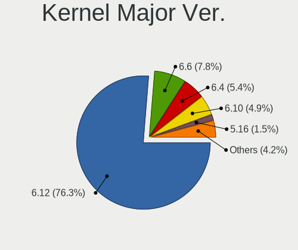

OpenMandriva - Hardware Trends (Desktops)
-----------------------------------------

A project to identify most popular hardware characteristics and track their change
over time based on data collected by Linux users at https://Linux-Hardware.org.

Anyone can contribute to this report by the [hw-probe](https://github.com/linuxhw/hw-probe) tool:

    sudo -E hw-probe -all -upload

This report is for one last month. Overall report since the beginning of time: [TestCoverage](https://github.com/linuxhw/TestCoverage)

Period: Oct, 2022.

Contents
--------

* [ System ](#system)
  - [ OS                       ](#os)
  - [ OS Family                ](#os-family)
  - [ Kernel                   ](#kernel)
  - [ Kernel Family            ](#kernel-family)
  - [ Kernel Major Ver.        ](#kernel-major-ver)
  - [ Arch                     ](#arch)
  - [ DE                       ](#de)
  - [ Display Server           ](#display-server)
  - [ Display Manager          ](#display-manager)
  - [ OS Lang                  ](#os-lang)
  - [ Boot Mode                ](#boot-mode)
  - [ Filesystem               ](#filesystem)
  - [ Part. scheme             ](#part-scheme)
  - [ Dual Boot with Linux/BSD ](#dual-boot-with-linuxbsd)
  - [ Dual Boot (Win)          ](#dual-boot-win)

* [ Board ](#board)
  - [ Vendor                   ](#vendor)
  - [ Model                    ](#model)
  - [ Model Family             ](#model-family)
  - [ MFG Year                 ](#mfg-year)
  - [ Form Factor              ](#form-factor)
  - [ Secure Boot              ](#secure-boot)
  - [ Coreboot                 ](#coreboot)
  - [ RAM Size                 ](#ram-size)
  - [ RAM Used                 ](#ram-used)
  - [ Total Drives             ](#total-drives)
  - [ Has CD-ROM               ](#has-cd-rom)
  - [ Has Ethernet             ](#has-ethernet)
  - [ Has WiFi                 ](#has-wifi)
  - [ Has Bluetooth            ](#has-bluetooth)

* [ Location ](#location)
  - [ Country                  ](#country)
  - [ City                     ](#city)

* [ Drives ](#drives)
  - [ Drive Vendor             ](#drive-vendor)
  - [ Drive Model              ](#drive-model)
  - [ HDD Vendor               ](#hdd-vendor)
  - [ SSD Vendor               ](#ssd-vendor)
  - [ Drive Kind               ](#drive-kind)
  - [ Drive Connector          ](#drive-connector)
  - [ Drive Size               ](#drive-size)
  - [ Space Total              ](#space-total)
  - [ Space Used               ](#space-used)
  - [ Malfunc. Drives          ](#malfunc-drives)
  - [ Malfunc. Drive Vendor    ](#malfunc-drive-vendor)
  - [ Malfunc. HDD Vendor      ](#malfunc-hdd-vendor)
  - [ Malfunc. Drive Kind      ](#malfunc-drive-kind)
  - [ Failed Drives            ](#failed-drives)
  - [ Failed Drive Vendor      ](#failed-drive-vendor)
  - [ Drive Status             ](#drive-status)

* [ Storage controller ](#storage-controller)
  - [ Storage Vendor           ](#storage-vendor)
  - [ Storage Model            ](#storage-model)
  - [ Storage Kind             ](#storage-kind)

* [ Processor ](#processor)
  - [ CPU Vendor               ](#cpu-vendor)
  - [ CPU Model                ](#cpu-model)
  - [ CPU Model Family         ](#cpu-model-family)
  - [ CPU Cores                ](#cpu-cores)
  - [ CPU Sockets              ](#cpu-sockets)
  - [ CPU Threads              ](#cpu-threads)
  - [ CPU Op-Modes             ](#cpu-op-modes)
  - [ CPU Microcode            ](#cpu-microcode)
  - [ CPU Microarch            ](#cpu-microarch)

* [ Graphics ](#graphics)
  - [ GPU Vendor               ](#gpu-vendor)
  - [ GPU Model                ](#gpu-model)
  - [ GPU Combo                ](#gpu-combo)
  - [ GPU Driver               ](#gpu-driver)
  - [ GPU Memory               ](#gpu-memory)

* [ Monitor ](#monitor)
  - [ Monitor Vendor           ](#monitor-vendor)
  - [ Monitor Model            ](#monitor-model)
  - [ Monitor Resolution       ](#monitor-resolution)
  - [ Monitor Diagonal         ](#monitor-diagonal)
  - [ Monitor Width            ](#monitor-width)
  - [ Aspect Ratio             ](#aspect-ratio)
  - [ Monitor Area             ](#monitor-area)
  - [ Pixel Density            ](#pixel-density)
  - [ Multiple Monitors        ](#multiple-monitors)

* [ Network ](#network)
  - [ Net Controller Vendor    ](#net-controller-vendor)
  - [ Net Controller Model     ](#net-controller-model)
  - [ Wireless Vendor          ](#wireless-vendor)
  - [ Wireless Model           ](#wireless-model)
  - [ Ethernet Vendor          ](#ethernet-vendor)
  - [ Ethernet Model           ](#ethernet-model)
  - [ Net Controller Kind      ](#net-controller-kind)
  - [ Used Controller          ](#used-controller)
  - [ NICs                     ](#nics)
  - [ IPv6                     ](#ipv6)

* [ Bluetooth ](#bluetooth)
  - [ Bluetooth Vendor         ](#bluetooth-vendor)
  - [ Bluetooth Model          ](#bluetooth-model)

* [ Sound ](#sound)
  - [ Sound Vendor             ](#sound-vendor)
  - [ Sound Model              ](#sound-model)

* [ Memory ](#memory)
  - [ Memory Vendor            ](#memory-vendor)
  - [ Memory Model             ](#memory-model)
  - [ Memory Kind              ](#memory-kind)
  - [ Memory Form Factor       ](#memory-form-factor)
  - [ Memory Size              ](#memory-size)
  - [ Memory Speed             ](#memory-speed)

* [ Printers & scanners ](#printers--scanners)
  - [ Printer Vendor           ](#printer-vendor)
  - [ Printer Model            ](#printer-model)
  - [ Scanner Vendor           ](#scanner-vendor)
  - [ Scanner Model            ](#scanner-model)

* [ Camera ](#camera)
  - [ Camera Vendor            ](#camera-vendor)
  - [ Camera Model             ](#camera-model)

* [ Security ](#security)
  - [ Fingerprint Vendor       ](#fingerprint-vendor)
  - [ Fingerprint Model        ](#fingerprint-model)
  - [ Chipcard Vendor          ](#chipcard-vendor)
  - [ Chipcard Model           ](#chipcard-model)

* [ Unsupported ](#unsupported)
  - [ Unsupported Devices      ](#unsupported-devices)
  - [ Unsupported Device Types ](#unsupported-device-types)

System
------

OS
--

Installed operating systems

| Name              | Desktops | Percent |
|-------------------|----------|---------|
| OpenMandriva 4.3  | 110      | 64.71%  |
| OpenMandriva 4.50 | 43       | 25.29%  |
| OpenMandriva 4.90 | 9        | 5.29%   |
| OpenMandriva 4.2  | 8        | 4.71%   |

OS Family
---------

OS without a version

| Name         | Desktops | Percent |
|--------------|----------|---------|
| OpenMandriva | 170      | 100%    |

Kernel
------

Version of the Linux kernel

| Version                      | Desktops | Percent |
|------------------------------|----------|---------|
| 5.16.7-desktop-1omv4003      | 104      | 61.18%  |
| 5.19.5-desktop-1omv4090      | 27       | 15.88%  |
| 5.19.12-desktop-2omv4090     | 9        | 5.29%   |
| 5.18.12-desktop-3omv4090     | 8        | 4.71%   |
| 5.10.14-desktop-1omv4002     | 8        | 4.71%   |
| 5.16.13-desktop-1omv4003     | 6        | 3.53%   |
| 5.19.11-desktop-2omv4090     | 3        | 1.76%   |
| 6.0.0-desktop-gcc-1omv4050   | 1        | 0.59%   |
| 6.0.0-desktop-1omv4050       | 1        | 0.59%   |
| 5.19.12-desktop-gcc-2omv4090 | 1        | 0.59%   |
| 5.19.11-desktop-1omv4090     | 1        | 0.59%   |
| 5.14.7-desktop-1omv4050      | 1        | 0.59%   |

Kernel Family
-------------

Linux kernel without a distro release

| Version | Desktops | Percent |
|---------|----------|---------|
| 5.16.7  | 104      | 61.18%  |
| 5.19.5  | 27       | 15.88%  |
| 5.19.12 | 10       | 5.88%   |
| 5.18.12 | 8        | 4.71%   |
| 5.10.14 | 8        | 4.71%   |
| 5.16.13 | 6        | 3.53%   |
| 5.19.11 | 4        | 2.35%   |
| 6.0.0   | 2        | 1.18%   |
| 5.14.7  | 1        | 0.59%   |

Kernel Major Ver.
-----------------

Linux kernel major version

| Version | Desktops | Percent |
|---------|----------|---------|
| 5.16    | 110      | 64.71%  |
| 5.19    | 41       | 24.12%  |
| 5.18    | 8        | 4.71%   |
| 5.10    | 8        | 4.71%   |
| 6.0     | 2        | 1.18%   |
| 5.14    | 1        | 0.59%   |

Arch
----

OS architecture (x86_64, i586, etc.)

| Name   | Desktops | Percent |
|--------|----------|---------|
| x86_64 | 170      | 100%    |

DE
--

Desktop Environment

| Name  | Desktops | Percent |
|-------|----------|---------|
| KDE5  | 168      | 98.82%  |
| LXQt  | 1        | 0.59%   |
| GNOME | 1        | 0.59%   |

Display Server
--------------

X11 or Wayland

| Name    | Desktops | Percent |
|---------|----------|---------|
| X11     | 169      | 99.41%  |
| Wayland | 1        | 0.59%   |

Display Manager
---------------

SDDM, LightDM, etc.

| Name    | Desktops | Percent |
|---------|----------|---------|
| SDDM    | 168      | 98.82%  |
| LightDM | 1        | 0.59%   |
| GDM     | 1        | 0.59%   |

OS Lang
-------

Language

| Lang  | Desktops | Percent |
|-------|----------|---------|
| en_US | 103      | 60.59%  |
| ru_RU | 7        | 4.12%   |
| pt_BR | 7        | 4.12%   |
| fr_FR | 7        | 4.12%   |
| de_DE | 7        | 4.12%   |
| es_ES | 6        | 3.53%   |
| it_IT | 4        | 2.35%   |
| de_AT | 4        | 2.35%   |
| tr_TR | 3        | 1.76%   |
| pl_PL | 3        | 1.76%   |
| es_MX | 3        | 1.76%   |
| hu_HU | 2        | 1.18%   |
| es_AR | 2        | 1.18%   |
| en_GB | 2        | 1.18%   |
| en_AU | 2        | 1.18%   |
| cs_CZ | 2        | 1.18%   |
| fr_CA | 1        | 0.59%   |
| es_PE | 1        | 0.59%   |
| es_CL | 1        | 0.59%   |
| en_CA | 1        | 0.59%   |
| de_CH | 1        | 0.59%   |
| da_DK | 1        | 0.59%   |

Boot Mode
---------

EFI or BIOS

| Mode | Desktops | Percent |
|------|----------|---------|
| BIOS | 99       | 58.24%  |
| EFI  | 71       | 41.76%  |

Filesystem
----------

Type of filesystem

| Type    | Desktops | Percent |
|---------|----------|---------|
| Overlay | 143      | 84.12%  |
| Ext4    | 23       | 13.53%  |
| F2fs    | 2        | 1.18%   |
| Xfs     | 1        | 0.59%   |
| Btrfs   | 1        | 0.59%   |

Part. scheme
------------

Scheme of partitioning

| Type    | Desktops | Percent |
|---------|----------|---------|
| GPT     | 96       | 56.47%  |
| MBR     | 73       | 42.94%  |
| Unknown | 1        | 0.59%   |

Dual Boot with Linux/BSD
------------------------

Hosting more than one Linux/BSD

| Dual boot | Desktops | Percent |
|-----------|----------|---------|
| Yes       | 101      | 59.41%  |
| No        | 69       | 40.59%  |

Dual Boot (Win)
---------------

Hosting Linux and Windows

| Dual boot | Desktops | Percent |
|-----------|----------|---------|
| Yes       | 94       | 55.29%  |
| No        | 76       | 44.71%  |

Board
-----

Vendor
------

Motherboard manufacturer

| Name                | Desktops | Percent |
|---------------------|----------|---------|
| ASUSTek Computer    | 45       | 26.47%  |
| Gigabyte Technology | 32       | 18.82%  |
| Dell                | 16       | 9.41%   |
| ASRock              | 16       | 9.41%   |
| MSI                 | 15       | 8.82%   |
| Hewlett-Packard     | 13       | 7.65%   |
| Lenovo              | 10       | 5.88%   |
| Acer                | 5        | 2.94%   |
| Intel               | 4        | 2.35%   |
| Pegatron            | 2        | 1.18%   |
| Fujitsu             | 2        | 1.18%   |
| Philco              | 1        | 0.59%   |
| Medion              | 1        | 0.59%   |
| Itautec             | 1        | 0.59%   |
| Foxconn             | 1        | 0.59%   |
| Chuwi               | 1        | 0.59%   |
| Biostar             | 1        | 0.59%   |
| AZW                 | 1        | 0.59%   |
| Apple               | 1        | 0.59%   |
| AMD                 | 1        | 0.59%   |
| Unknown             | 1        | 0.59%   |

Model
-----

Motherboard model

| Name                                | Desktops | Percent |
|-------------------------------------|----------|---------|
| Gigabyte G41MT-S2PT                 | 3        | 1.76%   |
| Dell OptiPlex 7020                  | 3        | 1.76%   |
| Dell OptiPlex 7010                  | 3        | 1.76%   |
| ASUS PRIME B450M-A II               | 3        | 1.76%   |
| MSI MS-7C37                         | 2        | 1.18%   |
| HP ProDesk 600 G2 SFF               | 2        | 1.18%   |
| HP Compaq 8000 Elite USDT PC        | 2        | 1.18%   |
| Gigabyte B450 I AORUS PRO WIFI      | 2        | 1.18%   |
| Gigabyte 970A-DS3P                  | 2        | 1.18%   |
| ASUS PRIME H410M-A                  | 2        | 1.18%   |
| ASUS M5A87                          | 2        | 1.18%   |
| ASRock G41C-GS R2.0                 | 2        | 1.18%   |
| Philco DTC-A55                      | 1        | 0.59%   |
| Pegatron SAISHIAT2                  | 1        | 0.59%   |
| Pegatron IPM31G                     | 1        | 0.59%   |
| MSI MS-7C04                         | 1        | 0.59%   |
| MSI MS-7B33                         | 1        | 0.59%   |
| MSI MS-7B09                         | 1        | 0.59%   |
| MSI MS-7A38                         | 1        | 0.59%   |
| MSI MS-7A15                         | 1        | 0.59%   |
| MSI MS-7994                         | 1        | 0.59%   |
| MSI MS-7808                         | 1        | 0.59%   |
| MSI MS-7788                         | 1        | 0.59%   |
| MSI MS-7786                         | 1        | 0.59%   |
| MSI MS-7695                         | 1        | 0.59%   |
| MSI MS-7681                         | 1        | 0.59%   |
| MSI MS-7512                         | 1        | 0.59%   |
| MSI G37538-3                        | 1        | 0.59%   |
| Medion MS-7797                      | 1        | 0.59%   |
| Lenovo ThinkStation P900 30A4A01EAU | 1        | 0.59%   |
| Lenovo ThinkCentre M92p 2988E2U     | 1        | 0.59%   |
| Lenovo ThinkCentre M91p 4518AU8     | 1        | 0.59%   |
| Lenovo ThinkCentre M77 1997B49      | 1        | 0.59%   |
| Lenovo ThinkCentre M73 10HLS00100   | 1        | 0.59%   |
| Lenovo ThinkCentre M73 10B3A0L6IH   | 1        | 0.59%   |
| Lenovo ThinkCentre M71e 3167B28     | 1        | 0.59%   |
| Lenovo ThinkCentre M58p 6234FB9     | 1        | 0.59%   |
| Lenovo ThinkCentre M58 7359WES      | 1        | 0.59%   |
| Lenovo S510                         | 1        | 0.59%   |
| Itautec Infoway ST-4254             | 1        | 0.59%   |

Model Family
------------

Motherboard model prefix

| Name                | Desktops | Percent |
|---------------------|----------|---------|
| Dell OptiPlex       | 14       | 8.24%   |
| ASUS PRIME          | 10       | 5.88%   |
| Lenovo ThinkCentre  | 8        | 4.71%   |
| ASUS ROG            | 5        | 2.94%   |
| HP ProDesk          | 4        | 2.35%   |
| HP Compaq           | 4        | 2.35%   |
| ASUS M5A78L-M       | 4        | 2.35%   |
| Gigabyte G41MT-S2PT | 3        | 1.76%   |
| Gigabyte B450       | 3        | 1.76%   |
| ASRock G41C-GS      | 3        | 1.76%   |
| Acer Aspire         | 3        | 1.76%   |
| MSI MS-7C37         | 2        | 1.18%   |
| HP t620             | 2        | 1.18%   |
| HP EliteDesk        | 2        | 1.18%   |
| Gigabyte 970A-DS3P  | 2        | 1.18%   |
| Fujitsu ESPRIMO     | 2        | 1.18%   |
| ASUS TUF            | 2        | 1.18%   |
| ASUS M5A87          | 2        | 1.18%   |
| Acer Veriton        | 2        | 1.18%   |
| Philco DTC-A55      | 1        | 0.59%   |
| Pegatron SAISHIAT2  | 1        | 0.59%   |
| Pegatron IPM31G     | 1        | 0.59%   |
| MSI MS-7C04         | 1        | 0.59%   |
| MSI MS-7B33         | 1        | 0.59%   |
| MSI MS-7B09         | 1        | 0.59%   |
| MSI MS-7A38         | 1        | 0.59%   |
| MSI MS-7A15         | 1        | 0.59%   |
| MSI MS-7994         | 1        | 0.59%   |
| MSI MS-7808         | 1        | 0.59%   |
| MSI MS-7788         | 1        | 0.59%   |
| MSI MS-7786         | 1        | 0.59%   |
| MSI MS-7695         | 1        | 0.59%   |
| MSI MS-7681         | 1        | 0.59%   |
| MSI MS-7512         | 1        | 0.59%   |
| MSI G37538-3        | 1        | 0.59%   |
| Medion MS-7797      | 1        | 0.59%   |
| Lenovo ThinkStation | 1        | 0.59%   |
| Lenovo S510         | 1        | 0.59%   |
| Itautec Infoway     | 1        | 0.59%   |
| Intel H55           | 1        | 0.59%   |

MFG Year
--------

Motherboard manufacture year

| Year | Desktops | Percent |
|------|----------|---------|
| 2011 | 21       | 12.35%  |
| 2012 | 20       | 11.76%  |
| 2020 | 16       | 9.41%   |
| 2009 | 15       | 8.82%   |
| 2018 | 14       | 8.24%   |
| 2014 | 13       | 7.65%   |
| 2013 | 13       | 7.65%   |
| 2019 | 10       | 5.88%   |
| 2021 | 9        | 5.29%   |
| 2015 | 8        | 4.71%   |
| 2008 | 8        | 4.71%   |
| 2007 | 6        | 3.53%   |
| 2017 | 5        | 2.94%   |
| 2016 | 5        | 2.94%   |
| 2010 | 3        | 1.76%   |
| 2022 | 2        | 1.18%   |
| 2006 | 2        | 1.18%   |

Form Factor
-----------

Physical design of the computer

| Name    | Desktops | Percent |
|---------|----------|---------|
| Desktop | 170      | 100%    |

Secure Boot
-----------

Enabled or disabled

| State    | Desktops | Percent |
|----------|----------|---------|
| Disabled | 170      | 100%    |

Coreboot
--------

Have coreboot on board

| Used | Desktops | Percent |
|------|----------|---------|
| No   | 170      | 100%    |

RAM Size
--------

Total RAM memory

| Size in GB      | Desktops | Percent |
|-----------------|----------|---------|
| 8.01-16.0       | 39       | 22.94%  |
| 3.01-4.0        | 38       | 22.35%  |
| 16.01-24.0      | 35       | 20.59%  |
| 4.01-8.0        | 26       | 15.29%  |
| 32.01-64.0      | 13       | 7.65%   |
| 64.01-256.0     | 7        | 4.12%   |
| 1.01-2.0        | 5        | 2.94%   |
| 24.01-32.0      | 4        | 2.35%   |
| 2.01-3.0        | 2        | 1.18%   |
| More than 256.0 | 1        | 0.59%   |

RAM Used
--------

Used RAM memory

| Used GB  | Desktops | Percent |
|----------|----------|---------|
| 1.01-2.0 | 105      | 61.76%  |
| 0.51-1.0 | 42       | 24.71%  |
| 2.01-3.0 | 18       | 10.59%  |
| 4.01-8.0 | 2        | 1.18%   |
| 0.01-0.5 | 2        | 1.18%   |
| 3.01-4.0 | 1        | 0.59%   |

Total Drives
------------

Number of drives on board

| Drives | Desktops | Percent |
|--------|----------|---------|
| 1      | 74       | 43.53%  |
| 2      | 47       | 27.65%  |
| 3      | 25       | 14.71%  |
| 4      | 14       | 8.24%   |
| 5      | 4        | 2.35%   |
| 6      | 3        | 1.76%   |
| 0      | 3        | 1.76%   |

Has CD-ROM
----------

Has CD-ROM on board

| Presented | Desktops | Percent |
|-----------|----------|---------|
| Yes       | 103      | 60.59%  |
| No        | 67       | 39.41%  |

Has Ethernet
------------

Has Ethernet on board

| Presented | Desktops | Percent |
|-----------|----------|---------|
| Yes       | 164      | 96.47%  |
| No        | 6        | 3.53%   |

Has WiFi
--------

Has WiFi module

| Presented | Desktops | Percent |
|-----------|----------|---------|
| No        | 107      | 62.94%  |
| Yes       | 63       | 37.06%  |

Has Bluetooth
-------------

Has Bluetooth module

| Presented | Desktops | Percent |
|-----------|----------|---------|
| No        | 136      | 80%     |
| Yes       | 34       | 20%     |

Location
--------

Country
-------

Geographic location (country)

| Country             | Desktops | Percent |
|---------------------|----------|---------|
| USA                 | 26       | 15.29%  |
| Russia              | 16       | 9.41%   |
| France              | 12       | 7.06%   |
| Germany             | 10       | 5.88%   |
| Brazil              | 9        | 5.29%   |
| Spain               | 8        | 4.71%   |
| Poland              | 7        | 4.12%   |
| Austria             | 7        | 4.12%   |
| UK                  | 6        | 3.53%   |
| Italy               | 6        | 3.53%   |
| Mexico              | 5        | 2.94%   |
| Australia           | 5        | 2.94%   |
| Czechia             | 4        | 2.35%   |
| Turkey              | 3        | 1.76%   |
| Switzerland         | 3        | 1.76%   |
| Japan               | 3        | 1.76%   |
| India               | 3        | 1.76%   |
| Hungary             | 3        | 1.76%   |
| Canada              | 3        | 1.76%   |
| Argentina           | 3        | 1.76%   |
| Saudi Arabia        | 2        | 1.18%   |
| Norway              | 2        | 1.18%   |
| Jamaica             | 2        | 1.18%   |
| Greenland           | 2        | 1.18%   |
| Venezuela           | 1        | 0.59%   |
| Uruguay             | 1        | 0.59%   |
| Trinidad and Tobago | 1        | 0.59%   |
| Thailand            | 1        | 0.59%   |
| Taiwan              | 1        | 0.59%   |
| Slovenia            | 1        | 0.59%   |
| Slovakia            | 1        | 0.59%   |
| Serbia              | 1        | 0.59%   |
| Romania             | 1        | 0.59%   |
| Portugal            | 1        | 0.59%   |
| Peru                | 1        | 0.59%   |
| Netherlands         | 1        | 0.59%   |
| Kenya               | 1        | 0.59%   |
| Hong Kong           | 1        | 0.59%   |
| Guadeloupe          | 1        | 0.59%   |
| Ecuador             | 1        | 0.59%   |

City
----

Geographic location (city)

| City                  | Desktops | Percent |
|-----------------------|----------|---------|
| Sydney                | 3        | 1.76%   |
| St Petersburg         | 3        | 1.76%   |
| Bad Tatzmannsdorf     | 3        | 1.76%   |
| Vladivostok           | 2        | 1.18%   |
| Vélizy-Villacoublay  | 2        | 1.18%   |
| Turin                 | 2        | 1.18%   |
| Torrejón de Ardoz    | 2        | 1.18%   |
| Somerset              | 2        | 1.18%   |
| Saint-Nazaire         | 2        | 1.18%   |
| Roszke                | 2        | 1.18%   |
| Pamplona              | 2        | 1.18%   |
| Oklahoma City         | 2        | 1.18%   |
| Moscow                | 2        | 1.18%   |
| Montego Bay           | 2        | 1.18%   |
| Mexico City           | 2        | 1.18%   |
| Mérida               | 2        | 1.18%   |
| Lincoln               | 2        | 1.18%   |
| Kingston upon Thames  | 2        | 1.18%   |
| Jeddah                | 2        | 1.18%   |
| Genoa                 | 2        | 1.18%   |
| Enzesfeld             | 2        | 1.18%   |
| Zurich                | 1        | 0.59%   |
| Zdunska Wola          | 1        | 0.59%   |
| Żagań               | 1        | 0.59%   |
| Yokohama              | 1        | 0.59%   |
| Windeck               | 1        | 0.59%   |
| Wijk bij Duurstede    | 1        | 0.59%   |
| Warsaw                | 1        | 0.59%   |
| Walnut                | 1        | 0.59%   |
| Vitória da Conquista | 1        | 0.59%   |
| Vienna                | 1        | 0.59%   |
| Velika Gorica         | 1        | 0.59%   |
| Unterpremstaetten     | 1        | 0.59%   |
| Uherské Hradiště   | 1        | 0.59%   |
| Ufa                   | 1        | 0.59%   |
| Tulsa                 | 1        | 0.59%   |
| Toulon                | 1        | 0.59%   |
| Temecula              | 1        | 0.59%   |
| Taipei                | 1        | 0.59%   |
| Supraśl              | 1        | 0.59%   |

Drives
------

Drive Vendor
------------

Hard drive vendors

| Vendor              | Desktops | Drives | Percent |
|---------------------|----------|--------|---------|
| Seagate             | 60       | 67     | 21.13%  |
| WDC                 | 59       | 71     | 20.77%  |
| Samsung Electronics | 36       | 52     | 12.68%  |
| Kingston            | 24       | 25     | 8.45%   |
| Crucial             | 20       | 23     | 7.04%   |
| Hitachi             | 12       | 13     | 4.23%   |
| Toshiba             | 11       | 16     | 3.87%   |
| SanDisk             | 6        | 6      | 2.11%   |
| A-DATA Technology   | 6        | 6      | 2.11%   |
| Transcend           | 4        | 5      | 1.41%   |
| Intel               | 4        | 4      | 1.41%   |
| Unknown             | 3        | 3      | 1.06%   |
| Intenso             | 3        | 3      | 1.06%   |
| China               | 3        | 3      | 1.06%   |
| Phison              | 2        | 2      | 0.7%    |
| OCZ                 | 2        | 2      | 0.7%    |
| Maxtor              | 2        | 2      | 0.7%    |
| HGST                | 2        | 4      | 0.7%    |
| Apacer              | 2        | 2      | 0.7%    |
| Unknown             | 2        | 2      | 0.7%    |
| XrayDisk            | 1        | 1      | 0.35%   |
| XPG                 | 1        | 3      | 0.35%   |
| Verbatim            | 1        | 1      | 0.35%   |
| Team                | 1        | 1      | 0.35%   |
| SPCC                | 1        | 1      | 0.35%   |
| sobetter            | 1        | 1      | 0.35%   |
| SK hynix            | 1        | 1      | 0.35%   |
| SABRENT             | 1        | 1      | 0.35%   |
| PNY                 | 1        | 1      | 0.35%   |
| NGFF                | 1        | 1      | 0.35%   |
| Netac               | 1        | 1      | 0.35%   |
| KIOXIA-EXCERIA      | 1        | 1      | 0.35%   |
| JIESHUO             | 1        | 1      | 0.35%   |
| Initio              | 1        | 1      | 0.35%   |
| INDMEM              | 1        | 1      | 0.35%   |
| Hewlett-Packard     | 1        | 1      | 0.35%   |
| Fujitsu             | 1        | 1      | 0.35%   |
| External            | 1        | 1      | 0.35%   |
| Corsair             | 1        | 1      | 0.35%   |
| ASMT                | 1        | 1      | 0.35%   |

Drive Model
-----------

Hard drive models

| Model                            | Desktops | Percent |
|----------------------------------|----------|---------|
| Seagate ST500DM002-1BD142 500GB  | 8        | 2.53%   |
| WDC WD10EZEX-08WN4A0 1TB         | 5        | 1.58%   |
| Kingston SA400S37480G 480GB SSD  | 5        | 1.58%   |
| Kingston SA400S37240G 240GB SSD  | 5        | 1.58%   |
| Seagate ST31000528AS 1TB         | 4        | 1.27%   |
| Seagate ST2000DM008-2FR102 2TB   | 4        | 1.27%   |
| Seagate ST2000DM001-1CH164 2TB   | 4        | 1.27%   |
| WDC WD5000AAKX-60U6AA0 500GB     | 3        | 0.95%   |
| Toshiba DT01ACA200 2TB           | 3        | 0.95%   |
| Seagate ST1000DM010-2EP102 1TB   | 3        | 0.95%   |
| Samsung SSD 980 PRO 1TB          | 3        | 0.95%   |
| Samsung SSD 860 EVO 250GB        | 3        | 0.95%   |
| Samsung SSD 850 PRO 256GB        | 3        | 0.95%   |
| Crucial CT500MX500SSD1 500GB     | 3        | 0.95%   |
| Crucial CT1000P1SSD8 1TB         | 3        | 0.95%   |
| Crucial CT1000MX500SSD1 1TB      | 3        | 0.95%   |
| A-DATA SU650 120GB SSD           | 3        | 0.95%   |
| WDC WD800BD-22MRA1 80GB          | 2        | 0.63%   |
| WDC WD5000AAKX-75U6AA0 500GB     | 2        | 0.63%   |
| WDC WD3200AAJS-00L7A0 320GB      | 2        | 0.63%   |
| Seagate ST3500312CS 500GB        | 2        | 0.63%   |
| Seagate ST2000DM001-9YN164 2TB   | 2        | 0.63%   |
| Seagate ST1000DX001-1NS162 1TB   | 2        | 0.63%   |
| Seagate ST1000DM003-1SB102 1TB   | 2        | 0.63%   |
| Seagate ST1000DM003-1CH162 1TB   | 2        | 0.63%   |
| Samsung SSD 980 1TB              | 2        | 0.63%   |
| Samsung SSD 970 EVO Plus 500GB   | 2        | 0.63%   |
| Samsung SSD 970 EVO Plus 2TB     | 2        | 0.63%   |
| Samsung SSD 970 EVO 1TB          | 2        | 0.63%   |
| Samsung SSD 860 EVO 1TB          | 2        | 0.63%   |
| Samsung HD502HJ 500GB            | 2        | 0.63%   |
| Samsung HD322HJ 320GB            | 2        | 0.63%   |
| Samsung HD322GJ 320GB            | 2        | 0.63%   |
| Kingston SV300S37A240G 240GB SSD | 2        | 0.63%   |
| Kingston SA2000M8500G 500GB      | 2        | 0.63%   |
| Intenso External USB-3.0 2TB     | 2        | 0.63%   |
| Hitachi HDS728080PLA380 82GB     | 2        | 0.63%   |
| HGST HUS728T8TALE6L4 8TB         | 2        | 0.63%   |
| Crucial CT480BX500SSD1 480GB     | 2        | 0.63%   |
| Crucial CT240BX500SSD1 240GB     | 2        | 0.63%   |

HDD Vendor
----------

Hard disk drive vendors

| Vendor              | Desktops | Drives | Percent |
|---------------------|----------|--------|---------|
| Seagate             | 59       | 66     | 37.58%  |
| WDC                 | 55       | 64     | 35.03%  |
| Hitachi             | 12       | 13     | 7.64%   |
| Samsung Electronics | 11       | 14     | 7.01%   |
| Toshiba             | 10       | 15     | 6.37%   |
| Maxtor              | 2        | 2      | 1.27%   |
| Intenso             | 2        | 2      | 1.27%   |
| HGST                | 2        | 4      | 1.27%   |
| Unknown             | 1        | 1      | 0.64%   |
| SABRENT             | 1        | 1      | 0.64%   |
| Initio              | 1        | 1      | 0.64%   |
| Fujitsu             | 1        | 1      | 0.64%   |

SSD Vendor
----------

Solid state drive vendors

| Vendor              | Desktops | Drives | Percent |
|---------------------|----------|--------|---------|
| Kingston            | 18       | 18     | 20%     |
| Samsung Electronics | 15       | 19     | 16.67%  |
| Crucial             | 14       | 16     | 15.56%  |
| A-DATA Technology   | 6        | 6      | 6.67%   |
| SanDisk             | 5        | 5      | 5.56%   |
| Transcend           | 3        | 3      | 3.33%   |
| China               | 3        | 3      | 3.33%   |
| WDC                 | 2        | 4      | 2.22%   |
| Unknown             | 2        | 2      | 2.22%   |
| OCZ                 | 2        | 2      | 2.22%   |
| Intel               | 2        | 2      | 2.22%   |
| Apacer              | 2        | 2      | 2.22%   |
| Unknown             | 2        | 2      | 2.22%   |
| XrayDisk            | 1        | 1      | 1.11%   |
| Verbatim            | 1        | 1      | 1.11%   |
| Toshiba             | 1        | 1      | 1.11%   |
| Team                | 1        | 1      | 1.11%   |
| PNY                 | 1        | 1      | 1.11%   |
| NGFF                | 1        | 1      | 1.11%   |
| Netac               | 1        | 1      | 1.11%   |
| KIOXIA-EXCERIA      | 1        | 1      | 1.11%   |
| JIESHUO             | 1        | 1      | 1.11%   |
| Intenso             | 1        | 1      | 1.11%   |
| Hewlett-Packard     | 1        | 1      | 1.11%   |
| Corsair             | 1        | 1      | 1.11%   |
| ASMT                | 1        | 1      | 1.11%   |
| ANACOMDA            | 1        | 1      | 1.11%   |

Drive Kind
----------

HDD or SSD

| Kind    | Desktops | Drives | Percent |
|---------|----------|--------|---------|
| HDD     | 124      | 184    | 53.91%  |
| SSD     | 73       | 98     | 31.74%  |
| NVMe    | 31       | 50     | 13.48%  |
| Unknown | 2        | 2      | 0.87%   |

Drive Connector
---------------

SATA, SAS, NVMe, etc.

| Type | Desktops | Drives | Percent |
|------|----------|--------|---------|
| SATA | 158      | 271    | 79.4%   |
| NVMe | 30       | 49     | 15.08%  |
| SAS  | 11       | 14     | 5.53%   |

Drive Size
----------

Size of hard drive

| Size in TB | Desktops | Drives | Percent |
|------------|----------|--------|---------|
| 0.01-0.5   | 123      | 168    | 58.02%  |
| 0.51-1.0   | 56       | 71     | 26.42%  |
| 1.01-2.0   | 25       | 32     | 11.79%  |
| 3.01-4.0   | 4        | 4      | 1.89%   |
| 4.01-10.0  | 3        | 5      | 1.42%   |
| 2.01-3.0   | 1        | 2      | 0.47%   |

Space Total
-----------

Amount of disk space available on the file system

| Size in GB | Desktops | Percent |
|------------|----------|---------|
| 1-20       | 95       | 55.88%  |
| Unknown    | 26       | 15.29%  |
| 101-250    | 20       | 11.76%  |
| 51-100     | 8        | 4.71%   |
| 501-1000   | 7        | 4.12%   |
| 251-500    | 5        | 2.94%   |
| 1001-2000  | 5        | 2.94%   |
| 21-50      | 3        | 1.76%   |
| 2001-3000  | 1        | 0.59%   |

Space Used
----------

Amount of used disk space

| Used GB  | Desktops | Percent |
|----------|----------|---------|
| 1-20     | 132      | 77.65%  |
| Unknown  | 26       | 15.29%  |
| 501-1000 | 4        | 2.35%   |
| 51-100   | 3        | 1.76%   |
| 251-500  | 2        | 1.18%   |
| 21-50    | 2        | 1.18%   |
| 101-250  | 1        | 0.59%   |

Malfunc. Drives
---------------

Drive models with a malfunction

| Model                             | Desktops | Drives | Percent |
|-----------------------------------|----------|--------|---------|
| WDC WD5000AAKX-75U6AA0 500GB      | 2        | 2      | 3.64%   |
| Seagate ST2000DM001-1CH164 2TB    | 2        | 2      | 3.64%   |
| Seagate ST1000DM003-1CH162 1TB    | 2        | 2      | 3.64%   |
| WDC WD800BD-22MRA1 80GB           | 1        | 1      | 1.82%   |
| WDC WD5000AAKX-60U6AA0 500GB      | 1        | 1      | 1.82%   |
| WDC WD5000AAKX-001CA0 500GB       | 1        | 1      | 1.82%   |
| WDC WD5000AAKS-00YGA0 500GB       | 1        | 1      | 1.82%   |
| WDC WD3200AAJS-00L7A0 320GB       | 1        | 1      | 1.82%   |
| WDC WD2500AAKX-001CA0 250GB       | 1        | 1      | 1.82%   |
| WDC WD1600BEVT-22ZCT0 160GB       | 1        | 1      | 1.82%   |
| WDC WD15EARS-00Z5B1 1TB           | 1        | 1      | 1.82%   |
| WDC WD10PURZ-85U8XY0 1TB          | 1        | 1      | 1.82%   |
| WDC WD10JPVX-00JC3T0 1TB          | 1        | 1      | 1.82%   |
| WDC WD10EZEX-07M2NA0 1TB          | 1        | 1      | 1.82%   |
| WDC WD10EARX-00N0YB0 1TB          | 1        | 1      | 1.82%   |
| WDC WD10EARS-00MVWB0 1TB          | 1        | 1      | 1.82%   |
| Toshiba MK6475GSX 640GB           | 1        | 1      | 1.82%   |
| Toshiba DT01ACA100 1TB            | 1        | 1      | 1.82%   |
| Seagate ST9160310AS 160GB         | 1        | 1      | 1.82%   |
| Seagate ST500DM005 HD502HJ 500GB  | 1        | 1      | 1.82%   |
| Seagate ST500DM002-1BD142 500GB   | 1        | 1      | 1.82%   |
| Seagate ST380815AS 80GB           | 1        | 1      | 1.82%   |
| Seagate ST3320613AS 320GB         | 1        | 1      | 1.82%   |
| Seagate ST3250823AS 250GB         | 1        | 1      | 1.82%   |
| Seagate ST31000528AS 1TB          | 1        | 1      | 1.82%   |
| Seagate ST2000DM001-9YN164 2TB    | 1        | 1      | 1.82%   |
| Seagate ST1000LM014-1EJ164 1TB    | 1        | 1      | 1.82%   |
| Seagate ST1000DM003-9YN162 1TB    | 1        | 1      | 1.82%   |
| Seagate ST1000DM003-1SB102 1TB    | 1        | 1      | 1.82%   |
| SanDisk SSD U100 64GB             | 1        | 1      | 1.82%   |
| SanDisk SDSSDX480GG25 480GB       | 1        | 1      | 1.82%   |
| SanDisk SDSSDX240GG25 240GB       | 1        | 1      | 1.82%   |
| Samsung Electronics SP2504C 250GB | 1        | 1      | 1.82%   |
| Samsung Electronics HD501LJ 500GB | 1        | 1      | 1.82%   |
| Samsung Electronics HD322HJ 320GB | 1        | 1      | 1.82%   |
| OCZ AGILITY3 120GB SSD            | 1        | 1      | 1.82%   |
| Maxtor STM3802110A 80GB           | 1        | 1      | 1.82%   |
| Maxtor STM3250310AS 250GB         | 1        | 1      | 1.82%   |
| Initio 3639S 500GB                | 1        | 1      | 1.82%   |
| Hitachi HTS725025A9A364 250GB     | 1        | 1      | 1.82%   |

Malfunc. Drive Vendor
---------------------

Vendors of faulty drives

| Vendor              | Desktops | Drives | Percent |
|---------------------|----------|--------|---------|
| WDC                 | 15       | 15     | 27.27%  |
| Seagate             | 15       | 15     | 27.27%  |
| Hitachi             | 7        | 7      | 12.73%  |
| SanDisk             | 3        | 3      | 5.45%   |
| Samsung Electronics | 3        | 3      | 5.45%   |
| Toshiba             | 2        | 2      | 3.64%   |
| Maxtor              | 2        | 2      | 3.64%   |
| A-DATA Technology   | 2        | 2      | 3.64%   |
| OCZ                 | 1        | 1      | 1.82%   |
| Initio              | 1        | 1      | 1.82%   |
| Crucial             | 1        | 1      | 1.82%   |
| Corsair             | 1        | 1      | 1.82%   |
| China               | 1        | 1      | 1.82%   |
| ASMT                | 1        | 1      | 1.82%   |

Malfunc. HDD Vendor
-------------------

Vendors of faulty HDD drives

| Vendor              | Desktops | Drives | Percent |
|---------------------|----------|--------|---------|
| WDC                 | 15       | 15     | 33.33%  |
| Seagate             | 15       | 15     | 33.33%  |
| Hitachi             | 7        | 7      | 15.56%  |
| Samsung Electronics | 3        | 3      | 6.67%   |
| Toshiba             | 2        | 2      | 4.44%   |
| Maxtor              | 2        | 2      | 4.44%   |
| Initio              | 1        | 1      | 2.22%   |

Malfunc. Drive Kind
-------------------

Kinds of faulty drives

| Kind | Desktops | Drives | Percent |
|------|----------|--------|---------|
| HDD  | 37       | 45     | 78.72%  |
| SSD  | 10       | 10     | 21.28%  |

Failed Drives
-------------

Failed drive models

Zero info for selected period =(

Failed Drive Vendor
-------------------

Failed drive vendors

Zero info for selected period =(

Drive Status
------------

Number of failed and malfunc. drives

| Status   | Desktops | Drives | Percent |
|----------|----------|--------|---------|
| Works    | 145      | 267    | 71.43%  |
| Malfunc  | 47       | 55     | 23.15%  |
| Detected | 11       | 12     | 5.42%   |

Storage controller
------------------

Storage Vendor
--------------

Storage controller vendors

| Vendor                      | Desktops | Percent |
|-----------------------------|----------|---------|
| Intel                       | 110      | 48.03%  |
| AMD                         | 55       | 24.02%  |
| Samsung Electronics         | 13       | 5.68%   |
| JMicron Technology          | 9        | 3.93%   |
| Kingston Technology Company | 7        | 3.06%   |
| ASMedia Technology          | 6        | 2.62%   |
| Nvidia                      | 5        | 2.18%   |
| Micron/Crucial Technology   | 5        | 2.18%   |
| Marvell Technology Group    | 5        | 2.18%   |
| SanDisk                     | 3        | 1.31%   |
| Phison Electronics          | 3        | 1.31%   |
| VIA Technologies            | 2        | 0.87%   |
| SK hynix                    | 1        | 0.44%   |
| Silicon Motion              | 1        | 0.44%   |
| Seagate Technology          | 1        | 0.44%   |
| Micron Technology           | 1        | 0.44%   |
| ADATA Technology            | 1        | 0.44%   |
| Adaptec                     | 1        | 0.44%   |

Storage Model
-------------

Storage controller models

| Model                                                                                   | Desktops | Percent |
|-----------------------------------------------------------------------------------------|----------|---------|
| AMD FCH SATA Controller [AHCI mode]                                                     | 25       | 8.22%   |
| Intel NM10/ICH7 Family SATA Controller [IDE mode]                                       | 14       | 4.61%   |
| Intel 8 Series/C220 Series Chipset Family 6-port SATA Controller 1 [AHCI mode]          | 14       | 4.61%   |
| Intel 82801G (ICH7 Family) IDE Controller                                               | 12       | 3.95%   |
| AMD SB7x0/SB8x0/SB9x0 IDE Controller                                                    | 12       | 3.95%   |
| Intel 6 Series/C200 Series Chipset Family 6 port Desktop SATA AHCI Controller           | 10       | 3.29%   |
| AMD 400 Series Chipset SATA Controller                                                  | 10       | 3.29%   |
| Intel 7 Series/C210 Series Chipset Family 6-port SATA Controller [AHCI mode]            | 9        | 2.96%   |
| JMicron JMB363 SATA/IDE Controller                                                      | 8        | 2.63%   |
| Intel Q170/Q150/B150/H170/H110/Z170/CM236 Chipset SATA Controller [AHCI Mode]           | 8        | 2.63%   |
| AMD SB7x0/SB8x0/SB9x0 SATA Controller [IDE mode]                                        | 8        | 2.63%   |
| Samsung NVMe SSD Controller PM9A1/PM9A3/980PRO                                          | 7        | 2.3%    |
| Intel 6 Series/C200 Series Chipset Family Desktop SATA Controller (IDE mode, ports 4-5) | 6        | 1.97%   |
| ASMedia ASM1062 Serial ATA Controller                                                   | 6        | 1.97%   |
| AMD FCH SATA Controller [IDE mode]                                                      | 6        | 1.97%   |
| AMD FCH IDE Controller                                                                  | 6        | 1.97%   |
| Samsung NVMe SSD Controller SM981/PM981/PM983                                           | 5        | 1.64%   |
| Intel 6 Series/C200 Series Chipset Family Desktop SATA Controller (IDE mode, ports 0-3) | 5        | 1.64%   |
| Intel 500 Series Chipset Family SATA AHCI Controller                                    | 5        | 1.64%   |
| Intel 4 Series Chipset PT IDER Controller                                               | 5        | 1.64%   |
| AMD SB7x0/SB8x0/SB9x0 SATA Controller [AHCI mode]                                       | 5        | 1.64%   |
| Intel 82801JI (ICH10 Family) SATA AHCI Controller                                       | 4        | 1.32%   |
| Intel 82801JD/DO (ICH10 Family) SATA AHCI Controller                                    | 4        | 1.32%   |
| Intel 200 Series PCH SATA controller [AHCI mode]                                        | 4        | 1.32%   |
| AMD 500 Series Chipset SATA Controller                                                  | 4        | 1.32%   |
| Samsung NVMe SSD Controller 980                                                         | 3        | 0.99%   |
| Nvidia MCP78S [GeForce 8200] IDE                                                        | 3        | 0.99%   |
| Nvidia MCP78S [GeForce 8200] AHCI Controller                                            | 3        | 0.99%   |
| Kingston Company Company Non-Volatile memory controller                                 | 3        | 0.99%   |
| Kingston Company A2000 NVMe SSD                                                         | 3        | 0.99%   |
| Intel Cannon Lake PCH SATA AHCI Controller                                              | 3        | 0.99%   |
| Intel 400 Series Chipset Family SATA AHCI Controller                                    | 3        | 0.99%   |
| Phison E12 NVMe Controller                                                              | 2        | 0.66%   |
| Nvidia MCP61 SATA Controller                                                            | 2        | 0.66%   |
| Nvidia MCP61 IDE                                                                        | 2        | 0.66%   |
| Micron/Crucial P1 NVMe PCIe SSD                                                         | 2        | 0.66%   |
| Intel SATA Controller [RAID mode]                                                       | 2        | 0.66%   |
| Intel Alder Lake-S PCH SATA Controller [AHCI Mode]                                      | 2        | 0.66%   |
| Intel 9 Series Chipset Family SATA Controller [AHCI Mode]                               | 2        | 0.66%   |
| Intel 82801HR/HO/HH (ICH8R/DO/DH) 2 port SATA Controller [IDE mode]                     | 2        | 0.66%   |

Storage Kind
------------

Kind of storage controller (IDE, SATA, NVMe, SAS, ...)

| Kind | Desktops | Percent |
|------|----------|---------|
| SATA | 135      | 57.2%   |
| IDE  | 66       | 27.97%  |
| NVMe | 29       | 12.29%  |
| RAID | 4        | 1.69%   |
| SAS  | 1        | 0.42%   |
| SCSI | 1        | 0.42%   |

Processor
---------

CPU Vendor
----------

Processor vendors

| Vendor | Desktops | Percent |
|--------|----------|---------|
| Intel  | 109      | 64.12%  |
| AMD    | 61       | 35.88%  |

CPU Model
---------

Processor models

| Model                                       | Desktops | Percent |
|---------------------------------------------|----------|---------|
| Intel Core i3-2100 CPU @ 3.10GHz            | 5        | 2.94%   |
| Intel Core 2 Duo CPU E8400 @ 3.00GHz        | 4        | 2.35%   |
| Intel Core i7-4790 CPU @ 3.60GHz            | 3        | 1.76%   |
| Intel Core i5-10600K CPU @ 4.10GHz          | 3        | 1.76%   |
| Intel Core 2 Quad CPU Q6600 @ 2.40GHz       | 3        | 1.76%   |
| AMD Phenom II X4 965 Processor              | 3        | 1.76%   |
| Intel Core i7-3770 CPU @ 3.40GHz            | 2        | 1.18%   |
| Intel Core i7-2600 CPU @ 3.40GHz            | 2        | 1.18%   |
| Intel Core i5-6500 CPU @ 3.20GHz            | 2        | 1.18%   |
| Intel Core i5-6400 CPU @ 2.70GHz            | 2        | 1.18%   |
| Intel Core i5-4590 CPU @ 3.30GHz            | 2        | 1.18%   |
| Intel Core i5-4460 CPU @ 3.20GHz            | 2        | 1.18%   |
| Intel Core i5-3470 CPU @ 3.20GHz            | 2        | 1.18%   |
| Intel Core i3-3220 CPU @ 3.30GHz            | 2        | 1.18%   |
| Intel Core 2 Quad CPU Q9650 @ 3.00GHz       | 2        | 1.18%   |
| Intel Core 2 Quad CPU Q9300 @ 2.50GHz       | 2        | 1.18%   |
| Intel Core 2 Duo CPU E7400 @ 2.80GHz        | 2        | 1.18%   |
| AMD Ryzen 7 3800X 8-Core Processor          | 2        | 1.18%   |
| AMD Ryzen 7 3700X 8-Core Processor          | 2        | 1.18%   |
| AMD Ryzen 5 1600 Six-Core Processor         | 2        | 1.18%   |
| AMD Ryzen 3 3200G with Radeon Vega Graphics | 2        | 1.18%   |
| AMD FX-8320 Eight-Core Processor            | 2        | 1.18%   |
| AMD FX-8300 Eight-Core Processor            | 2        | 1.18%   |
| Intel Xeon CPU E5620 @ 2.40GHz              | 1        | 0.59%   |
| Intel Xeon CPU E5450 @ 3.00GHz              | 1        | 0.59%   |
| Intel Xeon CPU E5-2640 v3 @ 2.60GHz         | 1        | 0.59%   |
| Intel Xeon CPU E5-1650 0 @ 3.20GHz          | 1        | 0.59%   |
| Intel Pentium Silver J5005 CPU @ 1.50GHz    | 1        | 0.59%   |
| Intel Pentium Gold G6400 CPU @ 4.00GHz      | 1        | 0.59%   |
| Intel Pentium Dual-Core CPU E5800 @ 3.20GHz | 1        | 0.59%   |
| Intel Pentium Dual-Core CPU E5500 @ 2.80GHz | 1        | 0.59%   |
| Intel Pentium Dual-Core CPU E5400 @ 2.70GHz | 1        | 0.59%   |
| Intel Pentium Dual-Core CPU E5300 @ 2.60GHz | 1        | 0.59%   |
| Intel Pentium D CPU 3.40GHz                 | 1        | 0.59%   |
| Intel Pentium CPU G640 @ 2.80GHz            | 1        | 0.59%   |
| Intel Pentium CPU G4400 @ 3.30GHz           | 1        | 0.59%   |
| Intel Pentium CPU G3420 @ 3.20GHz           | 1        | 0.59%   |
| Intel Pentium CPU G3260 @ 3.30GHz           | 1        | 0.59%   |
| Intel Pentium CPU G2020 @ 2.90GHz           | 1        | 0.59%   |
| Intel Core i9-10900 CPU @ 2.80GHz           | 1        | 0.59%   |

CPU Model Family
----------------

Processor model prefix

| Model                   | Desktops | Percent |
|-------------------------|----------|---------|
| Intel Core i5           | 29       | 17.06%  |
| Intel Core i7           | 16       | 9.41%   |
| Intel Core i3           | 15       | 8.82%   |
| Intel Core 2 Quad       | 12       | 7.06%   |
| Intel Core 2 Duo        | 10       | 5.88%   |
| AMD Ryzen 5             | 10       | 5.88%   |
| AMD Ryzen 7             | 9        | 5.29%   |
| AMD FX                  | 9        | 5.29%   |
| Intel Pentium           | 5        | 2.94%   |
| AMD A4                  | 5        | 2.94%   |
| Other                   | 4        | 2.35%   |
| Intel Xeon              | 4        | 2.35%   |
| Intel Pentium Dual-Core | 4        | 2.35%   |
| Intel Celeron           | 4        | 2.35%   |
| AMD Phenom II X4        | 4        | 2.35%   |
| AMD Ryzen 3             | 3        | 1.76%   |
| AMD A10                 | 3        | 1.76%   |
| Intel Core 2            | 2        | 1.18%   |
| AMD Sempron             | 2        | 1.18%   |
| AMD Ryzen Threadripper  | 2        | 1.18%   |
| AMD Ryzen 9             | 2        | 1.18%   |
| AMD Phenom              | 2        | 1.18%   |
| AMD GX                  | 2        | 1.18%   |
| AMD Athlon II X2        | 2        | 1.18%   |
| AMD Athlon 64 X2        | 2        | 1.18%   |
| AMD A8                  | 2        | 1.18%   |
| Intel Pentium Silver    | 1        | 0.59%   |
| Intel Pentium Gold      | 1        | 0.59%   |
| Intel Pentium D         | 1        | 0.59%   |
| Intel Core i9           | 1        | 0.59%   |
| AMD Athlon II X4        | 1        | 0.59%   |
| AMD A6                  | 1        | 0.59%   |

CPU Cores
---------

Number of processor cores

| Number | Desktops | Percent |
|--------|----------|---------|
| 4      | 67       | 39.41%  |
| 2      | 53       | 31.18%  |
| 6      | 21       | 12.35%  |
| 8      | 14       | 8.24%   |
| 1      | 6        | 3.53%   |
| 16     | 3        | 1.76%   |
| 3      | 2        | 1.18%   |
| 32     | 1        | 0.59%   |
| 24     | 1        | 0.59%   |
| 12     | 1        | 0.59%   |
| 10     | 1        | 0.59%   |

CPU Sockets
-----------

Number of sockets

| Number | Desktops | Percent |
|--------|----------|---------|
| 1      | 168      | 98.82%  |
| 2      | 2        | 1.18%   |

CPU Threads
-----------

Threads per core (Hyper-Threading)

| Number | Desktops | Percent |
|--------|----------|---------|
| 1      | 87       | 51.18%  |
| 2      | 82       | 48.24%  |
| 4      | 1        | 0.59%   |

CPU Op-Modes
------------

CPU Operation Modes (32-bit, 64-bit)

| Op mode        | Desktops | Percent |
|----------------|----------|---------|
| 32-bit, 64-bit | 170      | 100%    |

CPU Microcode
-------------

Microcode number

| Number     | Desktops | Percent |
|------------|----------|---------|
| 0x306c3    | 17       | 10%     |
| 0x1067a    | 16       | 9.41%   |
| 0x206a7    | 15       | 8.82%   |
| 0x306a9    | 11       | 6.47%   |
| 0x08701021 | 8        | 4.71%   |
| 0xa0655    | 7        | 4.12%   |
| Unknown    | 7        | 4.12%   |
| 0x906ea    | 5        | 2.94%   |
| 0x6fb      | 5        | 2.94%   |
| 0x506e3    | 5        | 2.94%   |
| 0x06001119 | 5        | 2.94%   |
| 0x010000c8 | 5        | 2.94%   |
| 0x06000822 | 4        | 2.35%   |
| 0x906e9    | 3        | 1.76%   |
| 0x0800820d | 3        | 1.76%   |
| 0x0600081c | 3        | 1.76%   |
| 0x03000027 | 3        | 1.76%   |
| 0xa0671    | 2        | 1.18%   |
| 0xa0653    | 2        | 1.18%   |
| 0x90672    | 2        | 1.18%   |
| 0x6f2      | 2        | 1.18%   |
| 0x106e5    | 2        | 1.18%   |
| 0x10677    | 2        | 1.18%   |
| 0x0a50000c | 2        | 1.18%   |
| 0x0a20120a | 2        | 1.18%   |
| 0x08108109 | 2        | 1.18%   |
| 0x0700010b | 2        | 1.18%   |
| 0x00000000 | 2        | 1.18%   |
| 0xf65      | 1        | 0.59%   |
| 0x906c0    | 1        | 0.59%   |
| 0x706a1    | 1        | 0.59%   |
| 0x6fd      | 1        | 0.59%   |
| 0x306f2    | 1        | 0.59%   |
| 0x206d7    | 1        | 0.59%   |
| 0x206c2    | 1        | 0.59%   |
| 0x20655    | 1        | 0.59%   |
| 0x10676    | 1        | 0.59%   |
| 0x0a50000d | 1        | 0.59%   |
| 0x0a201204 | 1        | 0.59%   |
| 0x0a201016 | 1        | 0.59%   |

CPU Microarch
-------------

Microarchitecture

| Name             | Desktops | Percent |
|------------------|----------|---------|
| Penryn           | 21       | 12.35%  |
| Haswell          | 18       | 10.59%  |
| SandyBridge      | 16       | 9.41%   |
| Piledriver       | 13       | 7.65%   |
| IvyBridge        | 11       | 6.47%   |
| Zen 2            | 10       | 5.88%   |
| K10              | 10       | 5.88%   |
| KabyLake         | 9        | 5.29%   |
| CometLake        | 9        | 5.29%   |
| Zen 3            | 8        | 4.71%   |
| Core             | 8        | 4.71%   |
| Zen+             | 6        | 3.53%   |
| Skylake          | 6        | 3.53%   |
| K10 Llano        | 4        | 2.35%   |
| Jaguar           | 3        | 1.76%   |
| Zen              | 2        | 1.18%   |
| Westmere         | 2        | 1.18%   |
| Steamroller      | 2        | 1.18%   |
| Nehalem          | 2        | 1.18%   |
| K8 Hammer        | 2        | 1.18%   |
| Icelake          | 2        | 1.18%   |
| Alderlake Hybrid | 2        | 1.18%   |
| Tremont          | 1        | 0.59%   |
| Puma             | 1        | 0.59%   |
| NetBurst         | 1        | 0.59%   |
| Goldmont plus    | 1        | 0.59%   |

Graphics
--------

GPU Vendor
----------

Vendors of graphics cards

| Vendor | Desktops | Percent |
|--------|----------|---------|
| AMD    | 60       | 34.48%  |
| Nvidia | 59       | 33.91%  |
| Intel  | 55       | 31.61%  |

GPU Model
---------

Graphics card models

| Model                                                                       | Desktops | Percent |
|-----------------------------------------------------------------------------|----------|---------|
| Intel Xeon E3-1200 v3/4th Gen Core Processor Integrated Graphics Controller | 10       | 5.65%   |
| Intel 2nd Generation Core Processor Family Integrated Graphics Controller   | 10       | 5.65%   |
| Intel Xeon E3-1200 v2/3rd Gen Core processor Graphics Controller            | 6        | 3.39%   |
| Intel 4 Series Chipset Integrated Graphics Controller                       | 6        | 3.39%   |
| Nvidia GP107 [GeForce GTX 1050 Ti]                                          | 5        | 2.82%   |
| Intel HD Graphics 530                                                       | 5        | 2.82%   |
| AMD Navi 10 [Radeon RX 5600 OEM/5600 XT / 5700/5700 XT]                     | 5        | 2.82%   |
| Nvidia GK208B [GeForce GT 730]                                              | 4        | 2.26%   |
| Nvidia GK208B [GeForce GT 710]                                              | 4        | 2.26%   |
| Intel CometLake-S GT2 [UHD Graphics 630]                                    | 4        | 2.26%   |
| Intel 4th Generation Core Processor Family Integrated Graphics Controller   | 3        | 1.69%   |
| AMD Cezanne                                                                 | 3        | 1.69%   |
| AMD Cape Verde XT [Radeon HD 7770/8760 / R7 250X]                           | 3        | 1.69%   |
| Nvidia GT218 [GeForce 210]                                                  | 2        | 1.13%   |
| Nvidia GP108 [GeForce GT 1030]                                              | 2        | 1.13%   |
| Nvidia GP104 [GeForce GTX 1070]                                             | 2        | 1.13%   |
| Nvidia GM107 [GeForce GTX 750 Ti]                                           | 2        | 1.13%   |
| Nvidia GF108 [GeForce GT 430]                                               | 2        | 1.13%   |
| Nvidia GA104 [GeForce RTX 3060 Ti Lite Hash Rate]                           | 2        | 1.13%   |
| Nvidia G96C [GeForce 9500 GT]                                               | 2        | 1.13%   |
| Nvidia C77 [GeForce 8200]                                                   | 2        | 1.13%   |
| Intel 82G33/G31 Express Integrated Graphics Controller                      | 2        | 1.13%   |
| AMD Sumo [Radeon HD 6550D]                                                  | 2        | 1.13%   |
| AMD RV730 PRO [Radeon HD 4650]                                              | 2        | 1.13%   |
| AMD RV630 XT [Radeon HD 2600 XT]                                            | 2        | 1.13%   |
| AMD RS780L [Radeon 3000]                                                    | 2        | 1.13%   |
| AMD Picasso/Raven 2 [Radeon Vega Series / Radeon Vega Mobile Series]        | 2        | 1.13%   |
| AMD Oland PRO [Radeon R7 240/340 / Radeon 520]                              | 2        | 1.13%   |
| AMD Navi 23 [Radeon RX 6600/6600 XT/6600M]                                  | 2        | 1.13%   |
| AMD Ellesmere [Radeon RX 470/480/570/570X/580/580X/590]                     | 2        | 1.13%   |
| AMD Cedar [Radeon HD 5000/6000/7350/8350 Series]                            | 2        | 1.13%   |
| Nvidia TU116 [GeForce GTX 1660]                                             | 1        | 0.56%   |
| Nvidia TU116 [GeForce GTX 1660 SUPER]                                       | 1        | 0.56%   |
| Nvidia TU106 [GeForce RTX 2070 Rev. A]                                      | 1        | 0.56%   |
| Nvidia TU106 [GeForce RTX 2060 SUPER]                                       | 1        | 0.56%   |
| Nvidia TU104GL [Quadro RTX 4000]                                            | 1        | 0.56%   |
| Nvidia TU104 [GeForce RTX 2070 SUPER]                                       | 1        | 0.56%   |
| Nvidia GT216 [GeForce GT 220]                                               | 1        | 0.56%   |
| Nvidia GT200 [GeForce GTX 260]                                              | 1        | 0.56%   |
| Nvidia GP107 [GeForce GTX 1050]                                             | 1        | 0.56%   |

GPU Combo
---------

Combinations of graphics cards

| Name           | Desktops | Percent |
|----------------|----------|---------|
| 1 x Nvidia     | 57       | 33.53%  |
| 1 x AMD        | 57       | 33.53%  |
| 1 x Intel      | 50       | 29.41%  |
| 2 x Intel      | 2        | 1.18%   |
| 3 x AMD        | 1        | 0.59%   |
| 2 x AMD        | 1        | 0.59%   |
| Intel + Nvidia | 1        | 0.59%   |
| AMD + Nvidia   | 1        | 0.59%   |

GPU Driver
----------

Free vs proprietary

| Driver  | Desktops | Percent |
|---------|----------|---------|
| Free    | 167      | 98.24%  |
| Unknown | 3        | 1.76%   |

GPU Memory
----------

Total video memory

| Size in GB | Desktops | Percent |
|------------|----------|---------|
| Unknown    | 55       | 32.35%  |
| 0.51-1.0   | 29       | 17.06%  |
| 0.01-0.5   | 28       | 16.47%  |
| 1.01-2.0   | 22       | 12.94%  |
| 7.01-8.0   | 18       | 10.59%  |
| 3.01-4.0   | 9        | 5.29%   |
| 5.01-6.0   | 4        | 2.35%   |
| 8.01-16.0  | 4        | 2.35%   |
| 2.01-3.0   | 1        | 0.59%   |

Monitor
-------

Monitor Vendor
--------------

Monitor vendors

| Vendor               | Desktops | Percent |
|----------------------|----------|---------|
| Samsung Electronics  | 42       | 24.85%  |
| Goldstar             | 16       | 9.47%   |
| Dell                 | 14       | 8.28%   |
| Acer                 | 14       | 8.28%   |
| Hewlett-Packard      | 13       | 7.69%   |
| Philips              | 11       | 6.51%   |
| Ancor Communications | 8        | 4.73%   |
| BenQ                 | 7        | 4.14%   |
| ASUSTek Computer     | 4        | 2.37%   |
| AOC                  | 4        | 2.37%   |
| TCL                  | 3        | 1.78%   |
| Medion               | 3        | 1.78%   |
| GRM                  | 3        | 1.78%   |
| Sony                 | 2        | 1.18%   |
| Panasonic            | 2        | 1.18%   |
| NEC Computers        | 2        | 1.18%   |
| Lenovo               | 2        | 1.18%   |
| Eizo                 | 2        | 1.18%   |
| ___                  | 1        | 0.59%   |
| Xiaomi               | 1        | 0.59%   |
| ViewSonic            | 1        | 0.59%   |
| Toshiba              | 1        | 0.59%   |
| RGT                  | 1        | 0.59%   |
| Packard Bell         | 1        | 0.59%   |
| MStar                | 1        | 0.59%   |
| MSI                  | 1        | 0.59%   |
| Insignia             | 1        | 0.59%   |
| Iiyama               | 1        | 0.59%   |
| Huion                | 1        | 0.59%   |
| HKC                  | 1        | 0.59%   |
| HannStar             | 1        | 0.59%   |
| Gigabyte Technology  | 1        | 0.59%   |
| Fujitsu Siemens      | 1        | 0.59%   |
| Daewoo               | 1        | 0.59%   |
| Unknown              | 1        | 0.59%   |

Monitor Model
-------------

Monitor models

| Model                                                                | Desktops | Percent |
|----------------------------------------------------------------------|----------|---------|
| Samsung Electronics S24C450 SAM09CA 1920x1080 531x299mm 24.0-inch    | 3        | 1.73%   |
| GRM GM2600 GRM5BC6 1920x1200 550x344mm 25.5-inch                     | 3        | 1.73%   |
| TCL L23D2200F TCL2304 1920x1080 510x287mm 23.0-inch                  | 2        | 1.16%   |
| Samsung Electronics U32J59x SAM0F35 3840x2160 700x390mm 31.5-inch    | 2        | 1.16%   |
| Samsung Electronics SyncMaster SAM0304 1680x1050 494x320mm 23.2-inch | 2        | 1.16%   |
| Samsung Electronics SyncMaster SAM027F 1680x1050 474x296mm 22.0-inch | 2        | 1.16%   |
| Samsung Electronics SME1920N SAM06A3 1366x768 410x230mm 18.5-inch    | 2        | 1.16%   |
| Samsung Electronics LCD Monitor SAM07D0 1360x768 700x390mm 31.5-inch | 2        | 1.16%   |
| Samsung Electronics C49HG9x SAM0E5E 3840x1080 1196x336mm 48.9-inch   | 2        | 1.16%   |
| Philips PHL 328E9Q PHLC180 1920x1080 698x393mm 31.5-inch             | 2        | 1.16%   |
| Panasonic TH-37P**8 MEIA03A 1600x1200 820x460mm 37.0-inch            | 2        | 1.16%   |
| Medion MD 20889 MED3689 1920x1080 509x286mm 23.0-inch                | 2        | 1.16%   |
| Hewlett-Packard V223 HWP334A 1920x1080 520x290mm 23.4-inch           | 2        | 1.16%   |
| Hewlett-Packard 23xi HWP3033 1920x1080 509x286mm 23.0-inch           | 2        | 1.16%   |
| Goldstar IPS FULLHD GSM5AB8 1920x1080 480x270mm 21.7-inch            | 2        | 1.16%   |
| Ancor Communications VW195 ACI19AB 1440x900 408x255mm 18.9-inch      | 2        | 1.16%   |
| Ancor Communications BE24A ACI24AB 1920x1200 518x324mm 24.1-inch     | 2        | 1.16%   |
| ___ LCD TV ___9000 1360x768                                          | 1        | 0.58%   |
| Xiaomi Mi TV XMD00E1 1440x900 708x398mm 32.0-inch                    | 1        | 0.58%   |
| ViewSonic VX2453 Series VSC0C28 1920x1080 520x290mm 23.4-inch        | 1        | 0.58%   |
| Toshiba TV TSB2017 3840x2160                                         | 1        | 0.58%   |
| TCL 3MS82AX TCL001A 1360x768 330x210mm 15.4-inch                     | 1        | 0.58%   |
| Sony TV SNYEE01 1920x1080                                            | 1        | 0.58%   |
| Sony TV SNY7402 1920x1080 1018x573mm 46.0-inch                       | 1        | 0.58%   |
| Samsung Electronics U32H85x SAM0E3C 3840x2160 697x392mm 31.5-inch    | 1        | 0.58%   |
| Samsung Electronics U28E590 SAM0C4E 3840x2160 608x345mm 27.5-inch    | 1        | 0.58%   |
| Samsung Electronics U28E570 SAM0D6F 3840x2160 607x345mm 27.5-inch    | 1        | 0.58%   |
| Samsung Electronics SyncMaster SAM0598 1360x768 410x230mm 18.5-inch  | 1        | 0.58%   |
| Samsung Electronics SyncMaster SAM0524 1920x1080 477x268mm 21.5-inch | 1        | 0.58%   |
| Samsung Electronics SyncMaster SAM0523 1920x1080 477x268mm 21.5-inch | 1        | 0.58%   |
| Samsung Electronics SyncMaster SAM03D0 1440x900 410x257mm 19.1-inch  | 1        | 0.58%   |
| Samsung Electronics SyncMaster SAM034D 1280x1024 376x301mm 19.0-inch | 1        | 0.58%   |
| Samsung Electronics SyncMaster SAM0255 1680x1050 474x296mm 22.0-inch | 1        | 0.58%   |
| Samsung Electronics SyncMaster SAM01F9 1280x1024 376x301mm 19.0-inch | 1        | 0.58%   |
| Samsung Electronics SMT24A550 SAM07B5 1920x1080 531x299mm 24.0-inch  | 1        | 0.58%   |
| Samsung Electronics SMBX2231 SAM076C 1920x1080 477x268mm 21.5-inch   | 1        | 0.58%   |
| Samsung Electronics S27E590 SAM0C5C 1920x1080 598x336mm 27.0-inch    | 1        | 0.58%   |
| Samsung Electronics S24F350 SAM0D21 1920x1080 521x293mm 23.5-inch    | 1        | 0.58%   |
| Samsung Electronics S24E650 SAM0CB8 1920x1080 521x293mm 23.5-inch    | 1        | 0.58%   |
| Samsung Electronics S22F350 SAM0D1B 1920x1080 477x268mm 21.5-inch    | 1        | 0.58%   |

Monitor Resolution
------------------

Monitor screen resolution

| Resolution         | Desktops | Percent |
|--------------------|----------|---------|
| 1920x1080 (FHD)    | 74       | 45.68%  |
| 3840x2160 (4K)     | 14       | 8.64%   |
| 1280x1024 (SXGA)   | 11       | 6.79%   |
| 1366x768 (WXGA)    | 10       | 6.17%   |
| 1360x768           | 10       | 6.17%   |
| 1680x1050 (WSXGA+) | 9        | 5.56%   |
| 2560x1440 (QHD)    | 8        | 4.94%   |
| 1600x900 (HD+)     | 8        | 4.94%   |
| 1440x900 (WXGA+)   | 5        | 3.09%   |
| 3440x1440          | 4        | 2.47%   |
| 1920x1200 (WUXGA)  | 3        | 1.85%   |
| 1600x1200          | 3        | 1.85%   |
| 3840x1080          | 2        | 1.23%   |
| 1280x720 (HD)      | 1        | 0.62%   |

Monitor Diagonal
----------------

Diagonal size in inches

| Inches  | Desktops | Percent |
|---------|----------|---------|
| 23      | 24       | 14.29%  |
| 21      | 24       | 14.29%  |
| 27      | 18       | 10.71%  |
| 24      | 18       | 10.71%  |
| 31      | 13       | 7.74%   |
| 19      | 10       | 5.95%   |
| 18      | 10       | 5.95%   |
| 20      | 8        | 4.76%   |
| 17      | 8        | 4.76%   |
| 22      | 7        | 4.17%   |
| 25      | 4        | 2.38%   |
| 49      | 3        | 1.79%   |
| 34      | 3        | 1.79%   |
| Unknown | 3        | 1.79%   |
| 72      | 2        | 1.19%   |
| 37      | 2        | 1.19%   |
| 32      | 2        | 1.19%   |
| 52      | 1        | 0.6%    |
| 48      | 1        | 0.6%    |
| 46      | 1        | 0.6%    |
| 43      | 1        | 0.6%    |
| 42      | 1        | 0.6%    |
| 35      | 1        | 0.6%    |
| 26      | 1        | 0.6%    |
| 16      | 1        | 0.6%    |
| 15      | 1        | 0.6%    |

Monitor Width
-------------

Physical width

| Width in mm | Desktops | Percent |
|-------------|----------|---------|
| 401-500     | 57       | 35.4%   |
| 501-600     | 54       | 33.54%  |
| 601-700     | 15       | 9.32%   |
| 301-350     | 8        | 4.97%   |
| 351-400     | 6        | 3.73%   |
| 1001-1500   | 6        | 3.73%   |
| 701-800     | 5        | 3.11%   |
| 801-900     | 3        | 1.86%   |
| Unknown     | 3        | 1.86%   |
| 1501-2000   | 2        | 1.24%   |
| 901-1000    | 2        | 1.24%   |

Aspect Ratio
------------

Proportional relationship between the width and the height

| Ratio | Desktops | Percent |
|-------|----------|---------|
| 16/9  | 122      | 75.78%  |
| 16/10 | 19       | 11.8%   |
| 5/4   | 11       | 6.83%   |
| 21/9  | 4        | 2.48%   |
| 32/9  | 2        | 1.24%   |
| 3/2   | 2        | 1.24%   |
| 4/3   | 1        | 0.62%   |

Monitor Area
------------

Area in inch²

| Area in inch² | Desktops | Percent |
|----------------|----------|---------|
| 201-250        | 58       | 34.94%  |
| 151-200        | 25       | 15.06%  |
| 351-500        | 19       | 11.45%  |
| 301-350        | 19       | 11.45%  |
| 141-150        | 17       | 10.24%  |
| 251-300        | 10       | 6.02%   |
| 501-1000       | 7        | 4.22%   |
| More than 1000 | 5        | 3.01%   |
| Unknown        | 3        | 1.81%   |
| 131-140        | 1        | 0.6%    |
| 121-130        | 1        | 0.6%    |
| 101-110        | 1        | 0.6%    |

Pixel Density
-------------

Pixels per inch

| Density | Desktops | Percent |
|---------|----------|---------|
| 51-100  | 106      | 65.43%  |
| 101-120 | 32       | 19.75%  |
| 1-50    | 11       | 6.79%   |
| 121-160 | 7        | 4.32%   |
| 161-240 | 3        | 1.85%   |
| Unknown | 3        | 1.85%   |

Multiple Monitors
-----------------

Total monitors connected

| Total | Desktops | Percent |
|-------|----------|---------|
| 1     | 148      | 87.06%  |
| 2     | 19       | 11.18%  |
| 0     | 2        | 1.18%   |
| 3     | 1        | 0.59%   |

Network
-------

Net Controller Vendor
---------------------

Controller vendors

| Vendor                          | Desktops | Percent |
|---------------------------------|----------|---------|
| Realtek Semiconductor           | 102      | 45.33%  |
| Intel                           | 61       | 27.11%  |
| Qualcomm Atheros                | 15       | 6.67%   |
| Ralink Technology               | 8        | 3.56%   |
| Broadcom                        | 7        | 3.11%   |
| Nvidia                          | 5        | 2.22%   |
| TP-Link                         | 2        | 0.89%   |
| Ralink                          | 2        | 0.89%   |
| NetGear                         | 2        | 0.89%   |
| Marvell Technology Group        | 2        | 0.89%   |
| Linksys                         | 2        | 0.89%   |
| Huawei Technologies             | 2        | 0.89%   |
| Aquantia                        | 2        | 0.89%   |
| Xiaomi                          | 1        | 0.44%   |
| VIA Technologies                | 1        | 0.44%   |
| U.S. Robotics                   | 1        | 0.44%   |
| TRENDnet                        | 1        | 0.44%   |
| Samsung Electronics             | 1        | 0.44%   |
| Qualcomm Atheros Communications | 1        | 0.44%   |
| PLANEX                          | 1        | 0.44%   |
| Philips (or NXP)                | 1        | 0.44%   |
| MediaTek                        | 1        | 0.44%   |
| InterBiometrics                 | 1        | 0.44%   |
| D-Link                          | 1        | 0.44%   |
| Broadcom Limited                | 1        | 0.44%   |
| Belkin Components               | 1        | 0.44%   |

Net Controller Model
--------------------

Controller models

| Model                                                                             | Desktops | Percent |
|-----------------------------------------------------------------------------------|----------|---------|
| Realtek RTL8111/8168/8411 PCI Express Gigabit Ethernet Controller                 | 85       | 34.55%  |
| Intel I211 Gigabit Network Connection                                             | 9        | 3.66%   |
| Intel 82579LM Gigabit Network Connection (Lewisville)                             | 8        | 3.25%   |
| Intel Ethernet Connection I217-LM                                                 | 5        | 2.03%   |
| Intel 82567LM-3 Gigabit Network Connection                                        | 5        | 2.03%   |
| Realtek RTL810xE PCI Express Fast Ethernet controller                             | 4        | 1.63%   |
| Ralink MT7601U Wireless Adapter                                                   | 4        | 1.63%   |
| Intel Wireless-AC 9260                                                            | 4        | 1.63%   |
| Intel Wi-Fi 6 AX200                                                               | 4        | 1.63%   |
| Intel Ethernet Connection (14) I219-V                                             | 4        | 1.63%   |
| Realtek RTL8192CU 802.11n WLAN Adapter                                            | 3        | 1.22%   |
| Realtek RTL8125 2.5GbE Controller                                                 | 3        | 1.22%   |
| Nvidia MCP77 Ethernet                                                             | 3        | 1.22%   |
| Intel Ethernet Connection I217-V                                                  | 3        | 1.22%   |
| Intel Ethernet Connection (2) I219-V                                              | 3        | 1.22%   |
| Intel 82574L Gigabit Network Connection                                           | 3        | 1.22%   |
| Realtek RTL8188EUS 802.11n Wireless Network Adapter                               | 2        | 0.81%   |
| Realtek 802.11n WLAN Adapter                                                      | 2        | 0.81%   |
| Ralink RT5370 Wireless Adapter                                                    | 2        | 0.81%   |
| Qualcomm Atheros AR93xx Wireless Network Adapter                                  | 2        | 0.81%   |
| Qualcomm Atheros AR9287 Wireless Network Adapter (PCI-Express)                    | 2        | 0.81%   |
| Qualcomm Atheros AR8151 v2.0 Gigabit Ethernet                                     | 2        | 0.81%   |
| Qualcomm Atheros AR5212/5213/2414 Wireless Network Adapter                        | 2        | 0.81%   |
| Nvidia MCP61 Ethernet                                                             | 2        | 0.81%   |
| Intel Ethernet Connection (2) I219-LM                                             | 2        | 0.81%   |
| Huawei LYA-L09                                                                    | 2        | 0.81%   |
| Xiaomi Mi/Redmi series (RNDIS)                                                    | 1        | 0.41%   |
| VIA VT6105/VT6106S [Rhine-III]                                                    | 1        | 0.41%   |
| U.S. Robotics USR5637 56K Faxmodem                                                | 1        | 0.41%   |
| TRENDnet TEW-648UBM 802.11n 150Mbps Micro Wireless N Adapter [Realtek RTL8188CUS] | 1        | 0.41%   |
| TP-Link TL-WN821N v5/v6 [RTL8192EU]                                               | 1        | 0.41%   |
| TP-Link 802.11ac NIC                                                              | 1        | 0.41%   |
| Samsung Galaxy series, misc. (tethering mode)                                     | 1        | 0.41%   |
| Realtek RTL88x2bu [AC1200 Techkey]                                                | 1        | 0.41%   |
| Realtek RTL8822CE 802.11ac PCIe Wireless Network Adapter                          | 1        | 0.41%   |
| Realtek RTL8821AE 802.11ac PCIe Wireless Network Adapter                          | 1        | 0.41%   |
| Realtek RTL8812AE 802.11ac PCIe Wireless Network Adapter                          | 1        | 0.41%   |
| Realtek RTL8191SU 802.11n WLAN Adapter                                            | 1        | 0.41%   |
| Realtek RTL8188SU 802.11n WLAN Adapter                                            | 1        | 0.41%   |
| Realtek RTL8188EE Wireless Network Adapter                                        | 1        | 0.41%   |

Wireless Vendor
---------------

Wireless vendors

| Vendor                          | Desktops | Percent |
|---------------------------------|----------|---------|
| Realtek Semiconductor           | 16       | 24.62%  |
| Intel                           | 15       | 23.08%  |
| Qualcomm Atheros                | 9        | 13.85%  |
| Ralink Technology               | 8        | 12.31%  |
| TP-Link                         | 2        | 3.08%   |
| Ralink                          | 2        | 3.08%   |
| NetGear                         | 2        | 3.08%   |
| Linksys                         | 2        | 3.08%   |
| Broadcom                        | 2        | 3.08%   |
| TRENDnet                        | 1        | 1.54%   |
| Qualcomm Atheros Communications | 1        | 1.54%   |
| PLANEX                          | 1        | 1.54%   |
| Philips (or NXP)                | 1        | 1.54%   |
| MediaTek                        | 1        | 1.54%   |
| D-Link                          | 1        | 1.54%   |
| Belkin Components               | 1        | 1.54%   |

Wireless Model
--------------

Wireless models

| Model                                                                             | Desktops | Percent |
|-----------------------------------------------------------------------------------|----------|---------|
| Ralink MT7601U Wireless Adapter                                                   | 4        | 6.15%   |
| Intel Wireless-AC 9260                                                            | 4        | 6.15%   |
| Intel Wi-Fi 6 AX200                                                               | 4        | 6.15%   |
| Realtek RTL8192CU 802.11n WLAN Adapter                                            | 3        | 4.62%   |
| Realtek RTL8188EUS 802.11n Wireless Network Adapter                               | 2        | 3.08%   |
| Realtek 802.11n WLAN Adapter                                                      | 2        | 3.08%   |
| Ralink RT5370 Wireless Adapter                                                    | 2        | 3.08%   |
| Qualcomm Atheros AR93xx Wireless Network Adapter                                  | 2        | 3.08%   |
| Qualcomm Atheros AR9287 Wireless Network Adapter (PCI-Express)                    | 2        | 3.08%   |
| Qualcomm Atheros AR5212/5213/2414 Wireless Network Adapter                        | 2        | 3.08%   |
| TRENDnet TEW-648UBM 802.11n 150Mbps Micro Wireless N Adapter [Realtek RTL8188CUS] | 1        | 1.54%   |
| TP-Link TL-WN821N v5/v6 [RTL8192EU]                                               | 1        | 1.54%   |
| TP-Link 802.11ac NIC                                                              | 1        | 1.54%   |
| Realtek RTL88x2bu [AC1200 Techkey]                                                | 1        | 1.54%   |
| Realtek RTL8822CE 802.11ac PCIe Wireless Network Adapter                          | 1        | 1.54%   |
| Realtek RTL8821AE 802.11ac PCIe Wireless Network Adapter                          | 1        | 1.54%   |
| Realtek RTL8812AE 802.11ac PCIe Wireless Network Adapter                          | 1        | 1.54%   |
| Realtek RTL8191SU 802.11n WLAN Adapter                                            | 1        | 1.54%   |
| Realtek RTL8188SU 802.11n WLAN Adapter                                            | 1        | 1.54%   |
| Realtek RTL8188EE Wireless Network Adapter                                        | 1        | 1.54%   |
| Realtek RTL8188CUS 802.11n WLAN Adapter                                           | 1        | 1.54%   |
| Realtek RTL8188CE 802.11b/g/n WiFi Adapter                                        | 1        | 1.54%   |
| Ralink RT5372 Wireless Adapter                                                    | 1        | 1.54%   |
| Ralink RT2870/RT3070 Wireless Adapter                                             | 1        | 1.54%   |
| Ralink RT5592 PCIe Wireless Network Adapter                                       | 1        | 1.54%   |
| Ralink RT2561/RT61 802.11g PCI                                                    | 1        | 1.54%   |
| Qualcomm Atheros AR9271 802.11n                                                   | 1        | 1.54%   |
| Qualcomm Atheros AR9485 Wireless Network Adapter                                  | 1        | 1.54%   |
| Qualcomm Atheros AR9227 Wireless Network Adapter                                  | 1        | 1.54%   |
| Qualcomm Atheros AR2413/AR2414 Wireless Network Adapter [AR5005G(S) 802.11bg]     | 1        | 1.54%   |
| PLANEX GW-900D                                                                    | 1        | 1.54%   |
| Philips (or NXP) 802.11n Wireless Adapter                                         | 1        | 1.54%   |
| NetGear WNA3100M(v1) Wireless-N 300 [Realtek RTL8192CU]                           | 1        | 1.54%   |
| NetGear WG111v3 54 Mbps Wireless [realtek RTL8187B]                               | 1        | 1.54%   |
| MediaTek MT7921K (RZ608) Wi-Fi 6E 80MHz                                           | 1        | 1.54%   |
| Linksys AE6000 802.11a/b/g/n/ac Wireless Adapter [MediaTek MT7610U]               | 1        | 1.54%   |
| Linksys AE1000 v1 802.11n [Ralink RT3572]                                         | 1        | 1.54%   |
| Intel Wireless 7265                                                               | 1        | 1.54%   |
| Intel Wireless 3165                                                               | 1        | 1.54%   |
| Intel Wi-Fi 6 AX210/AX211/AX411 160MHz                                            | 1        | 1.54%   |

Ethernet Vendor
---------------

Ethernet vendors

| Vendor                   | Desktops | Percent |
|--------------------------|----------|---------|
| Realtek Semiconductor    | 94       | 54.02%  |
| Intel                    | 54       | 31.03%  |
| Qualcomm Atheros         | 6        | 3.45%   |
| Nvidia                   | 5        | 2.87%   |
| Broadcom                 | 5        | 2.87%   |
| Marvell Technology Group | 2        | 1.15%   |
| Huawei Technologies      | 2        | 1.15%   |
| Aquantia                 | 2        | 1.15%   |
| Xiaomi                   | 1        | 0.57%   |
| VIA Technologies         | 1        | 0.57%   |
| Samsung Electronics      | 1        | 0.57%   |
| Broadcom Limited         | 1        | 0.57%   |

Ethernet Model
--------------

Ethernet models

| Model                                                             | Desktops | Percent |
|-------------------------------------------------------------------|----------|---------|
| Realtek RTL8111/8168/8411 PCI Express Gigabit Ethernet Controller | 85       | 47.49%  |
| Intel I211 Gigabit Network Connection                             | 9        | 5.03%   |
| Intel 82579LM Gigabit Network Connection (Lewisville)             | 8        | 4.47%   |
| Intel Ethernet Connection I217-LM                                 | 5        | 2.79%   |
| Intel 82567LM-3 Gigabit Network Connection                        | 5        | 2.79%   |
| Realtek RTL810xE PCI Express Fast Ethernet controller             | 4        | 2.23%   |
| Intel Ethernet Connection (14) I219-V                             | 4        | 2.23%   |
| Realtek RTL8125 2.5GbE Controller                                 | 3        | 1.68%   |
| Nvidia MCP77 Ethernet                                             | 3        | 1.68%   |
| Intel Ethernet Connection I217-V                                  | 3        | 1.68%   |
| Intel Ethernet Connection (2) I219-V                              | 3        | 1.68%   |
| Intel 82574L Gigabit Network Connection                           | 3        | 1.68%   |
| Qualcomm Atheros AR8151 v2.0 Gigabit Ethernet                     | 2        | 1.12%   |
| Nvidia MCP61 Ethernet                                             | 2        | 1.12%   |
| Intel Ethernet Connection (2) I219-LM                             | 2        | 1.12%   |
| Huawei LYA-L09                                                    | 2        | 1.12%   |
| Xiaomi Mi/Redmi series (RNDIS)                                    | 1        | 0.56%   |
| VIA VT6105/VT6106S [Rhine-III]                                    | 1        | 0.56%   |
| Samsung Galaxy series, misc. (tethering mode)                     | 1        | 0.56%   |
| Realtek RTL8169 PCI Gigabit Ethernet Controller                   | 1        | 0.56%   |
| Realtek RTL8153 Gigabit Ethernet Adapter                          | 1        | 0.56%   |
| Realtek RTL-8110SC/8169SC Gigabit Ethernet                        | 1        | 0.56%   |
| Realtek RTL-8100/8101L/8139 PCI Fast Ethernet Adapter             | 1        | 0.56%   |
| Qualcomm Atheros QCA8171 Gigabit Ethernet                         | 1        | 0.56%   |
| Qualcomm Atheros Killer E2500 Gigabit Ethernet Controller         | 1        | 0.56%   |
| Qualcomm Atheros Attansic L1 Gigabit Ethernet                     | 1        | 0.56%   |
| Qualcomm Atheros AR8121/AR8113/AR8114 Gigabit or Fast Ethernet    | 1        | 0.56%   |
| Marvell Group 88E8056 PCI-E Gigabit Ethernet Controller           | 1        | 0.56%   |
| Marvell Group 88E8053 PCI-E Gigabit Ethernet Controller           | 1        | 0.56%   |
| Marvell Group 88E8001 Gigabit Ethernet Controller                 | 1        | 0.56%   |
| Intel I210 Gigabit Network Connection                             | 1        | 0.56%   |
| Intel Ethernet Controller I225-V                                  | 1        | 0.56%   |
| Intel Ethernet Controller 10-Gigabit X540-AT2                     | 1        | 0.56%   |
| Intel Ethernet Connection (7) I219-V                              | 1        | 0.56%   |
| Intel Ethernet Connection (2) I218-V                              | 1        | 0.56%   |
| Intel Ethernet Connection (2) I218-LM                             | 1        | 0.56%   |
| Intel Ethernet Connection (17) I219-V                             | 1        | 0.56%   |
| Intel Ethernet Connection (12) I219-V                             | 1        | 0.56%   |
| Intel Ethernet Connection (11) I219-V                             | 1        | 0.56%   |
| Intel 82579V Gigabit Network Connection                           | 1        | 0.56%   |

Net Controller Kind
-------------------

Ethernet, WiFi or modem

| Kind     | Desktops | Percent |
|----------|----------|---------|
| Ethernet | 164      | 71.62%  |
| WiFi     | 63       | 27.51%  |
| Modem    | 2        | 0.87%   |

Used Controller
---------------

Currently used network controller

| Kind     | Desktops | Percent |
|----------|----------|---------|
| Ethernet | 130      | 77.84%  |
| WiFi     | 37       | 22.16%  |

NICs
----

Total network controllers on board

| Total | Desktops | Percent |
|-------|----------|---------|
| 1     | 124      | 72.94%  |
| 2     | 36       | 21.18%  |
| 3     | 6        | 3.53%   |
| 0     | 4        | 2.35%   |

IPv6
----

IPv6 vs IPv4

| Used | Desktops | Percent |
|------|----------|---------|
| No   | 123      | 72.35%  |
| Yes  | 47       | 27.65%  |

Bluetooth
---------

Bluetooth Vendor
----------------

Controller vendors

| Vendor                          | Desktops | Percent |
|---------------------------------|----------|---------|
| Intel                           | 14       | 40%     |
| Cambridge Silicon Radio         | 10       | 28.57%  |
| Realtek Semiconductor           | 3        | 8.57%   |
| ASUSTek Computer                | 2        | 5.71%   |
| Unknown                         | 1        | 2.86%   |
| SINO WEALTH                     | 1        | 2.86%   |
| Qualcomm Atheros Communications | 1        | 2.86%   |
| MediaTek                        | 1        | 2.86%   |
| IMC Networks                    | 1        | 2.86%   |
| Apple                           | 1        | 2.86%   |

Bluetooth Model
---------------

Controller models

| Model                                               | Desktops | Percent |
|-----------------------------------------------------|----------|---------|
| Cambridge Silicon Radio Bluetooth Dongle (HCI mode) | 10       | 28.57%  |
| Intel AX200 Bluetooth                               | 4        | 11.43%  |
| Realtek Bluetooth Radio                             | 3        | 8.57%   |
| Intel Wireless-AC 9260 Bluetooth Adapter            | 3        | 8.57%   |
| Intel Bluetooth wireless interface                  | 2        | 5.71%   |
| Intel AX201 Bluetooth                               | 2        | 5.71%   |
| Unknown Bluetooth Device                            | 1        | 2.86%   |
| SINO WEALTH RK Bluetooth Keyboar                    | 1        | 2.86%   |
| Qualcomm Atheros AR3011 Bluetooth                   | 1        | 2.86%   |
| MediaTek Wireless_Device                            | 1        | 2.86%   |
| Intel Bluetooth Device                              | 1        | 2.86%   |
| Intel Bluetooth 9460/9560 Jefferson Peak (JfP)      | 1        | 2.86%   |
| Intel AX210 Bluetooth                               | 1        | 2.86%   |
| IMC Networks Bluetooth Radio                        | 1        | 2.86%   |
| ASUS Broadcom BCM20702A0 Bluetooth                  | 1        | 2.86%   |
| ASUS ASUS USB-BT500                                 | 1        | 2.86%   |
| Apple Built-in Bluetooth 2.0+EDR HCI                | 1        | 2.86%   |

Sound
-----

Sound Vendor
------------

Sound card vendors

| Vendor                               | Desktops | Percent |
|--------------------------------------|----------|---------|
| Intel                                | 107      | 39.78%  |
| AMD                                  | 76       | 28.25%  |
| Nvidia                               | 55       | 20.45%  |
| C-Media Electronics                  | 8        | 2.97%   |
| Creative Labs                        | 3        | 1.12%   |
| Thesycon Systemsoftware & Consulting | 2        | 0.74%   |
| Realtek Semiconductor                | 2        | 0.74%   |
| Logitech                             | 2        | 0.74%   |
| Kingston Technology                  | 2        | 0.74%   |
| ASUSTek Computer                     | 2        | 0.74%   |
| VIA Technologies                     | 1        | 0.37%   |
| Tenx Technology                      | 1        | 0.37%   |
| RODE Microphones                     | 1        | 0.37%   |
| M-Audio                              | 1        | 0.37%   |
| KTMicro                              | 1        | 0.37%   |
| Hua Xing                             | 1        | 0.37%   |
| Hewlett-Packard                      | 1        | 0.37%   |
| Giga-Byte Technology                 | 1        | 0.37%   |
| Focusrite-Novation                   | 1        | 0.37%   |
| Dell                                 | 1        | 0.37%   |

Sound Model
-----------

Sound card models

| Model                                                                             | Desktops | Percent |
|-----------------------------------------------------------------------------------|----------|---------|
| Intel 8 Series/C220 Series Chipset High Definition Audio Controller               | 15       | 4.81%   |
| Intel 6 Series/C200 Series Chipset Family High Definition Audio Controller        | 15       | 4.81%   |
| AMD FCH Azalia Controller                                                         | 15       | 4.81%   |
| Intel NM10/ICH7 Family High Definition Audio Controller                           | 14       | 4.49%   |
| AMD Starship/Matisse HD Audio Controller                                          | 13       | 4.17%   |
| AMD SBx00 Azalia (Intel HDA)                                                      | 12       | 3.85%   |
| Intel Xeon E3-1200 v3/4th Gen Core Processor HD Audio Controller                  | 11       | 3.53%   |
| Intel 7 Series/C216 Chipset Family High Definition Audio Controller               | 11       | 3.53%   |
| Nvidia GK208 HDMI/DP Audio Controller                                             | 9        | 2.88%   |
| Intel 100 Series/C230 Series Chipset Family HD Audio Controller                   | 8        | 2.56%   |
| AMD Oland/Hainan/Cape Verde/Pitcairn HDMI Audio [Radeon HD 7000 Series]           | 8        | 2.56%   |
| AMD Family 17h/19h HD Audio Controller                                            | 7        | 2.24%   |
| Nvidia GP107GL High Definition Audio Controller                                   | 6        | 1.92%   |
| Intel 82801JI (ICH10 Family) HD Audio Controller                                  | 6        | 1.92%   |
| Intel 82801JD/DO (ICH10 Family) HD Audio Controller                               | 5        | 1.6%    |
| AMD Navi 21/23 HDMI/DP Audio Controller                                           | 5        | 1.6%    |
| AMD Navi 10 HDMI Audio                                                            | 5        | 1.6%    |
| Nvidia GF108 High Definition Audio Controller                                     | 4        | 1.28%   |
| Intel Comet Lake PCH-V cAVS                                                       | 4        | 1.28%   |
| Intel 200 Series PCH HD Audio                                                     | 4        | 1.28%   |
| AMD Trinity HDMI Audio Controller                                                 | 4        | 1.28%   |
| AMD Renoir Radeon High Definition Audio Controller                                | 4        | 1.28%   |
| AMD Family 17h (Models 00h-0fh) HD Audio Controller                               | 4        | 1.28%   |
| Nvidia MCP72XE/MCP72P/MCP78U/MCP78S High Definition Audio                         | 3        | 0.96%   |
| Nvidia GF119 HDMI Audio Controller                                                | 3        | 0.96%   |
| Nvidia GA104 High Definition Audio Controller                                     | 3        | 0.96%   |
| Intel Cannon Lake PCH cAVS                                                        | 3        | 0.96%   |
| Intel Audio device                                                                | 3        | 0.96%   |
| Intel 82801H (ICH8 Family) HD Audio Controller                                    | 3        | 0.96%   |
| Intel 5 Series/3400 Series Chipset High Definition Audio                          | 3        | 0.96%   |
| C-Media Electronics CMI8738/CMI8768 PCI Audio                                     | 3        | 0.96%   |
| AMD RV710/730 HDMI Audio [Radeon HD 4000 series]                                  | 3        | 0.96%   |
| AMD Raven/Raven2/Fenghuang HDMI/DP Audio Controller                               | 3        | 0.96%   |
| AMD Caicos HDMI Audio [Radeon HD 6450 / 7450/8450/8490 OEM / R5 230/235/235X OEM] | 3        | 0.96%   |
| AMD BeaverCreek HDMI Audio [Radeon HD 6500D and 6400G-6600G series]               | 3        | 0.96%   |
| Realtek Semiconductor Realtek Audio USB                                           | 2        | 0.64%   |
| Nvidia TU116 High Definition Audio Controller                                     | 2        | 0.64%   |
| Nvidia TU106 High Definition Audio Controller                                     | 2        | 0.64%   |
| Nvidia TU104 HD Audio Controller                                                  | 2        | 0.64%   |
| Nvidia MCP61 High Definition Audio                                                | 2        | 0.64%   |

Memory
------

Memory Vendor
-------------

Memory module vendors

| Vendor              | Desktops | Percent |
|---------------------|----------|---------|
| Unknown             | 45       | 22.61%  |
| Kingston            | 35       | 17.59%  |
| Corsair             | 23       | 11.56%  |
| Samsung Electronics | 17       | 8.54%   |
| Crucial             | 16       | 8.04%   |
| Micron Technology   | 10       | 5.03%   |
| G.Skill             | 10       | 5.03%   |
| SK hynix            | 8        | 4.02%   |
| A-DATA Technology   | 5        | 2.51%   |
| Ramaxel Technology  | 4        | 2.01%   |
| Nanya Technology    | 4        | 2.01%   |
| Team                | 3        | 1.51%   |
| Transcend           | 2        | 1.01%   |
| Elpida              | 2        | 1.01%   |
| Unknown             | 2        | 1.01%   |
| Wilk                | 1        | 0.5%    |
| Unknown (0x0DD5)    | 1        | 0.5%    |
| Toshiba             | 1        | 0.5%    |
| Timetec             | 1        | 0.5%    |
| Silicon Power       | 1        | 0.5%    |
| Sesame              | 1        | 0.5%    |
| Ramos Technology    | 1        | 0.5%    |
| Patriot             | 1        | 0.5%    |
| GOODRAM             | 1        | 0.5%    |
| GeIL                | 1        | 0.5%    |
| Essencore Limited   | 1        | 0.5%    |
| CSX                 | 1        | 0.5%    |
| Apacer              | 1        | 0.5%    |

Memory Model
------------

Memory module models

| Model                                                 | Desktops | Percent |
|-------------------------------------------------------|----------|---------|
| Unknown RAM Module 2GB DIMM SDRAM                     | 5        | 2.33%   |
| Unknown RAM Module 4GB DIMM DDR3 1600MT/s             | 3        | 1.4%    |
| Unknown RAM Module 4GB DIMM 1333MT/s                  | 3        | 1.4%    |
| Unknown RAM Module 2GB DIMM 400MT/s                   | 3        | 1.4%    |
| Unknown RAM Module 1GB DIMM SDRAM                     | 3        | 1.4%    |
| Unknown RAM Module 1GB DIMM DDR2 667MT/s              | 3        | 1.4%    |
| Kingston RAM 9905734-059.A00G 16GB DIMM DDR4 2666MT/s | 3        | 1.4%    |
| Unknown RAM Module 4GB DIMM SDRAM                     | 2        | 0.93%   |
| Unknown RAM Module 4GB DIMM 400MT/s                   | 2        | 0.93%   |
| Unknown RAM Module 2GB DIMM DDR2 667MT/s              | 2        | 0.93%   |
| Unknown RAM Module 2GB DIMM 800MT/s                   | 2        | 0.93%   |
| Unknown RAM Module 2GB DIMM 1333MT/s                  | 2        | 0.93%   |
| Unknown RAM Module 1GB DIMM DDR2 800MT/s              | 2        | 0.93%   |
| Samsung RAM M378B5773DH0-CH9 2GB DIMM DDR3 1333MT/s   | 2        | 0.93%   |
| Samsung RAM M378B5173QH0-CK0 4GB DIMM DDR3 1600MT/s   | 2        | 0.93%   |
| Ramaxel RAM RMR5030ME68F9F1600 4GB DIMM DDR3 1600MT/s | 2        | 0.93%   |
| Micron RAM 8JTF25664AZ-1G4D1 2GB DIMM DDR3 1333MT/s   | 2        | 0.93%   |
| Kingston RAM KF3200C16D4/8GX 8GB DIMM DDR4 3600MT/s   | 2        | 0.93%   |
| Kingston RAM KF2666C16D4/8G 8GB DIMM DDR4 2667MT/s    | 2        | 0.93%   |
| Kingston RAM K531R8-MIN 4GB DIMM DDR3 1600MT/s        | 2        | 0.93%   |
| G.Skill RAM F3-12800CL9-4GBXL 4GB DIMM DDR3 1867MT/s  | 2        | 0.93%   |
| Corsair RAM CMK8GX4M1A2400C16 8GB DIMM DDR4 2800MT/s  | 2        | 0.93%   |
| A-DATA RAM DDR3 2133 2OZ 8GB DIMM DDR3 800MT/s        | 2        | 0.93%   |
| Unknown                                               | 2        | 0.93%   |
| Wilk RAM GR2400D464L17S/8G 8GB DIMM DDR4 2400MT/s     | 1        | 0.47%   |
| Unknown RAM Module 8GB SODIMM DDR4 2667MT/s           | 1        | 0.47%   |
| Unknown RAM Module 8GB DIMM DDR3 1600MT/s             | 1        | 0.47%   |
| Unknown RAM Module 8GB DIMM DDR3 1333MT/s             | 1        | 0.47%   |
| Unknown RAM Module 8GB DIMM DDR 1333MT/s              | 1        | 0.47%   |
| Unknown RAM Module 8GB DIMM 667MT/s                   | 1        | 0.47%   |
| Unknown RAM Module 512MB DIMM 66MT/s                  | 1        | 0.47%   |
| Unknown RAM Module 4GB SODIMM DDR3 1600MT/s           | 1        | 0.47%   |
| Unknown RAM Module 4GB DIMM DDR3 1333MT/s             | 1        | 0.47%   |
| Unknown RAM Module 4GB DIMM DDR3 1066MT/s             | 1        | 0.47%   |
| Unknown RAM Module 4GB DIMM DDR 1333MT/s              | 1        | 0.47%   |
| Unknown RAM Module 4GB DIMM 800MT/s                   | 1        | 0.47%   |
| Unknown RAM Module 4GB DIMM 667MT/s                   | 1        | 0.47%   |
| Unknown RAM Module 4GB DIMM 1600MT/s                  | 1        | 0.47%   |
| Unknown RAM Module 2GB DIMM DDR3 1333MT/s             | 1        | 0.47%   |
| Unknown RAM Module 2GB DIMM DDR2 800MT/s              | 1        | 0.47%   |

Memory Kind
-----------

Memory module kinds

| Kind    | Desktops | Percent |
|---------|----------|---------|
| DDR3    | 68       | 39.77%  |
| DDR4    | 57       | 33.33%  |
| Unknown | 15       | 8.77%   |
| DDR2    | 14       | 8.19%   |
| SDRAM   | 13       | 7.6%    |
| DDR     | 3        | 1.75%   |
| DDR5    | 1        | 0.58%   |

Memory Form Factor
------------------

Physical design of the memory module

| Name   | Desktops | Percent |
|--------|----------|---------|
| DIMM   | 160      | 94.67%  |
| SODIMM | 9        | 5.33%   |

Memory Size
-----------

Memory module size

| Size  | Desktops | Percent |
|-------|----------|---------|
| 4096  | 61       | 31.61%  |
| 8192  | 55       | 28.5%   |
| 2048  | 38       | 19.69%  |
| 16384 | 21       | 10.88%  |
| 1024  | 13       | 6.74%   |
| 32768 | 4        | 2.07%   |
| 512   | 1        | 0.52%   |

Memory Speed
------------

Memory module speed

| Speed   | Desktops | Percent |
|---------|----------|---------|
| 1600    | 43       | 22.75%  |
| 1333    | 32       | 16.93%  |
| 2133    | 12       | 6.35%   |
| 3200    | 11       | 5.82%   |
| 2667    | 9        | 4.76%   |
| 800     | 9        | 4.76%   |
| 3600    | 8        | 4.23%   |
| Unknown | 8        | 4.23%   |
| 400     | 6        | 3.17%   |
| 2400    | 5        | 2.65%   |
| 667     | 5        | 2.65%   |
| 2933    | 4        | 2.12%   |
| 2666    | 4        | 2.12%   |
| 1066    | 4        | 2.12%   |
| 3400    | 3        | 1.59%   |
| 1800    | 3        | 1.59%   |
| 2800    | 2        | 1.06%   |
| 1867    | 2        | 1.06%   |
| 1866    | 2        | 1.06%   |
| 1334    | 2        | 1.06%   |
| 1067    | 2        | 1.06%   |
| 49926   | 1        | 0.53%   |
| 5200    | 1        | 0.53%   |
| 4000    | 1        | 0.53%   |
| 3800    | 1        | 0.53%   |
| 3733    | 1        | 0.53%   |
| 3466    | 1        | 0.53%   |
| 3100    | 1        | 0.53%   |
| 3000    | 1        | 0.53%   |
| 2866    | 1        | 0.53%   |
| 2200    | 1        | 0.53%   |
| 2048    | 1        | 0.53%   |
| 2000    | 1        | 0.53%   |
| 66      | 1        | 0.53%   |

Printers & scanners
-------------------

Printer Vendor
--------------

Printer device vendors

| Vendor             | Desktops | Percent |
|--------------------|----------|---------|
| Brother Industries | 4        | 50%     |
| Hewlett-Packard    | 3        | 37.5%   |
| Canon              | 1        | 12.5%   |

Printer Model
-------------

Printer device models

| Model                        | Desktops | Percent |
|------------------------------|----------|---------|
| HP OfficeJet Pro 7720 series | 1        | 12.5%   |
| HP DeskJet 4100 series       | 1        | 12.5%   |
| HP DeskJet 1110 series       | 1        | 12.5%   |
| Canon MF642C/643C/644C       | 1        | 12.5%   |
| Brother MFC-J1010DW          | 1        | 12.5%   |
| Brother HL-L3230CDW series   | 1        | 12.5%   |
| Brother DCP-T310             | 1        | 12.5%   |
| Brother DCP-8085DN           | 1        | 12.5%   |

Scanner Vendor
--------------

Scanner device vendors

| Vendor          | Desktops | Percent |
|-----------------|----------|---------|
| Seiko Epson     | 1        | 50%     |
| Hewlett-Packard | 1        | 50%     |

Scanner Model
-------------

Scanner device models

| Model                                       | Desktops | Percent |
|---------------------------------------------|----------|---------|
| Seiko Epson GT-X820 [Perfection V600 Photo] | 1        | 50%     |
| HP ScanJet 4500C/5550C                      | 1        | 50%     |

Camera
------

Camera Vendor
-------------

Camera device vendors

| Vendor                        | Desktops | Percent |
|-------------------------------|----------|---------|
| Logitech                      | 3        | 18.75%  |
| Samsung Electronics           | 2        | 12.5%   |
| KYE Systems (Mouse Systems)   | 2        | 12.5%   |
| Z-Star Microelectronics       | 1        | 6.25%   |
| Sunplus Innovation Technology | 1        | 6.25%   |
| Razer USA                     | 1        | 6.25%   |
| Microsoft                     | 1        | 6.25%   |
| Microdia                      | 1        | 6.25%   |
| IMC Networks                  | 1        | 6.25%   |
| CVT Electronics.Co.           | 1        | 6.25%   |
| Aveo Technology               | 1        | 6.25%   |
| ANYKA                         | 1        | 6.25%   |

Camera Model
------------

Camera device models

| Model                                   | Desktops | Percent |
|-----------------------------------------|----------|---------|
| Samsung Galaxy series, misc. (MTP mode) | 2        | 12.5%   |
| KYE Systems (Mouse Systems) iSlim 321R  | 2        | 12.5%   |
| Z-Star USB2.0 Camera                    | 1        | 6.25%   |
| Sunplus Full HD webcam                  | 1        | 6.25%   |
| Razer USA Razer Kiyo Pro                | 1        | 6.25%   |
| Microsoft Microsoft LifeCam Studio    | 1        | 6.25%   |
| Microdia USB Live camera                | 1        | 6.25%   |
| Logitech Webcam C270                    | 1        | 6.25%   |
| Logitech HD Webcam C525                 | 1        | 6.25%   |
| Logitech HD Pro Webcam C920             | 1        | 6.25%   |
| IMC Networks XHC Camera                 | 1        | 6.25%   |
| CVT Electronics.Co. USB Camera          | 1        | 6.25%   |
| Aveo USB2.0 Camera                      | 1        | 6.25%   |
| ANYKA HD WebCam 2MP                     | 1        | 6.25%   |

Security
--------

Fingerprint Vendor
------------------

Fingerprint sensor vendors

Zero info for selected period =(

Fingerprint Model
-----------------

Fingerprint sensor models

Zero info for selected period =(

Chipcard Vendor
---------------

Chipcard module vendors

Zero info for selected period =(

Chipcard Model
--------------

Chipcard module models

Zero info for selected period =(

Unsupported
-----------

Unsupported Devices
-------------------

Total unsupported devices on board

| Total | Desktops | Percent |
|-------|----------|---------|
| 0     | 155      | 91.18%  |
| 1     | 14       | 8.24%   |
| 4     | 1        | 0.59%   |

Unsupported Device Types
------------------------

Types of unsupported devices

| Type                  | Desktops | Percent |
|-----------------------|----------|---------|
| Net/wireless          | 5        | 33.33%  |
| Graphics card         | 4        | 26.67%  |
| Multimedia controller | 2        | 13.33%  |
| Unassigned class      | 1        | 6.67%   |
| Network               | 1        | 6.67%   |
| Modem                 | 1        | 6.67%   |
| Camera                | 1        | 6.67%   |

