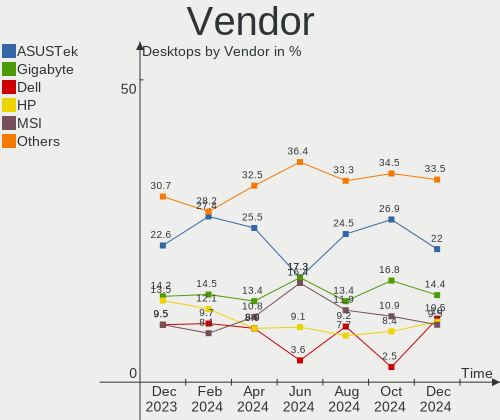
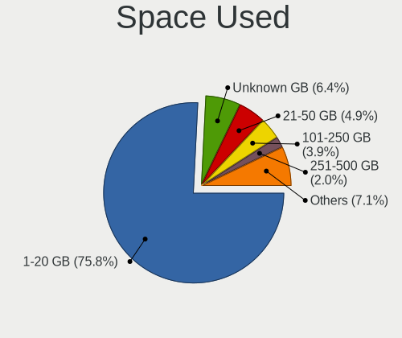
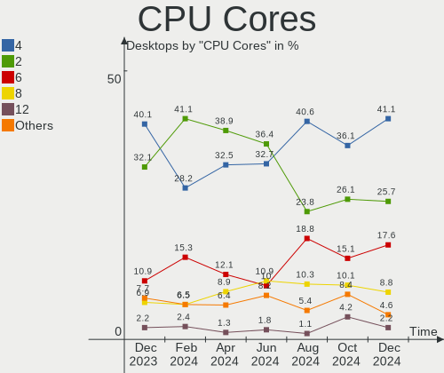
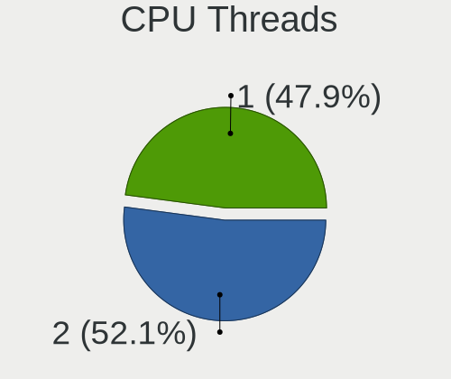
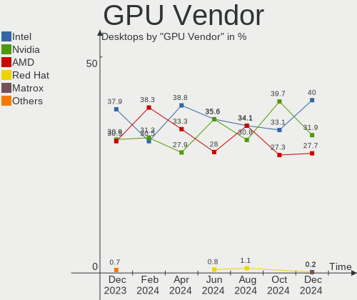
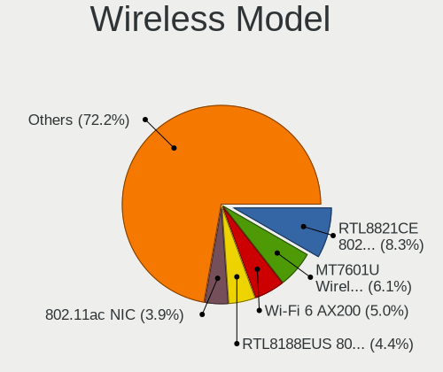

OpenMandriva - Hardware Trends (Desktops)
-----------------------------------------

A project to identify most popular hardware characteristics and track their change
over time based on data collected by Linux users at https://Linux-Hardware.org.

Anyone can contribute to this report by the [hw-probe](https://github.com/linuxhw/hw-probe) tool:

    sudo -E hw-probe -all -upload

This report is for one last month. Overall report since the beginning of time: [TestCoverage](https://github.com/linuxhw/TestCoverage)

Period: Nov, 2022.

Contents
--------

* [ System ](#system)
  - [ OS                       ](#os)
  - [ OS Family                ](#os-family)
  - [ Kernel                   ](#kernel)
  - [ Kernel Family            ](#kernel-family)
  - [ Kernel Major Ver.        ](#kernel-major-ver)
  - [ Arch                     ](#arch)
  - [ DE                       ](#de)
  - [ Display Server           ](#display-server)
  - [ Display Manager          ](#display-manager)
  - [ OS Lang                  ](#os-lang)
  - [ Boot Mode                ](#boot-mode)
  - [ Filesystem               ](#filesystem)
  - [ Part. scheme             ](#part-scheme)
  - [ Dual Boot with Linux/BSD ](#dual-boot-with-linuxbsd)
  - [ Dual Boot (Win)          ](#dual-boot-win)

* [ Board ](#board)
  - [ Vendor                   ](#vendor)
  - [ Model                    ](#model)
  - [ Model Family             ](#model-family)
  - [ MFG Year                 ](#mfg-year)
  - [ Form Factor              ](#form-factor)
  - [ Secure Boot              ](#secure-boot)
  - [ Coreboot                 ](#coreboot)
  - [ RAM Size                 ](#ram-size)
  - [ RAM Used                 ](#ram-used)
  - [ Total Drives             ](#total-drives)
  - [ Has CD-ROM               ](#has-cd-rom)
  - [ Has Ethernet             ](#has-ethernet)
  - [ Has WiFi                 ](#has-wifi)
  - [ Has Bluetooth            ](#has-bluetooth)

* [ Location ](#location)
  - [ Country                  ](#country)
  - [ City                     ](#city)

* [ Drives ](#drives)
  - [ Drive Vendor             ](#drive-vendor)
  - [ Drive Model              ](#drive-model)
  - [ HDD Vendor               ](#hdd-vendor)
  - [ SSD Vendor               ](#ssd-vendor)
  - [ Drive Kind               ](#drive-kind)
  - [ Drive Connector          ](#drive-connector)
  - [ Drive Size               ](#drive-size)
  - [ Space Total              ](#space-total)
  - [ Space Used               ](#space-used)
  - [ Malfunc. Drives          ](#malfunc-drives)
  - [ Malfunc. Drive Vendor    ](#malfunc-drive-vendor)
  - [ Malfunc. HDD Vendor      ](#malfunc-hdd-vendor)
  - [ Malfunc. Drive Kind      ](#malfunc-drive-kind)
  - [ Failed Drives            ](#failed-drives)
  - [ Failed Drive Vendor      ](#failed-drive-vendor)
  - [ Drive Status             ](#drive-status)

* [ Storage controller ](#storage-controller)
  - [ Storage Vendor           ](#storage-vendor)
  - [ Storage Model            ](#storage-model)
  - [ Storage Kind             ](#storage-kind)

* [ Processor ](#processor)
  - [ CPU Vendor               ](#cpu-vendor)
  - [ CPU Model                ](#cpu-model)
  - [ CPU Model Family         ](#cpu-model-family)
  - [ CPU Cores                ](#cpu-cores)
  - [ CPU Sockets              ](#cpu-sockets)
  - [ CPU Threads              ](#cpu-threads)
  - [ CPU Op-Modes             ](#cpu-op-modes)
  - [ CPU Microcode            ](#cpu-microcode)
  - [ CPU Microarch            ](#cpu-microarch)

* [ Graphics ](#graphics)
  - [ GPU Vendor               ](#gpu-vendor)
  - [ GPU Model                ](#gpu-model)
  - [ GPU Combo                ](#gpu-combo)
  - [ GPU Driver               ](#gpu-driver)
  - [ GPU Memory               ](#gpu-memory)

* [ Monitor ](#monitor)
  - [ Monitor Vendor           ](#monitor-vendor)
  - [ Monitor Model            ](#monitor-model)
  - [ Monitor Resolution       ](#monitor-resolution)
  - [ Monitor Diagonal         ](#monitor-diagonal)
  - [ Monitor Width            ](#monitor-width)
  - [ Aspect Ratio             ](#aspect-ratio)
  - [ Monitor Area             ](#monitor-area)
  - [ Pixel Density            ](#pixel-density)
  - [ Multiple Monitors        ](#multiple-monitors)

* [ Network ](#network)
  - [ Net Controller Vendor    ](#net-controller-vendor)
  - [ Net Controller Model     ](#net-controller-model)
  - [ Wireless Vendor          ](#wireless-vendor)
  - [ Wireless Model           ](#wireless-model)
  - [ Ethernet Vendor          ](#ethernet-vendor)
  - [ Ethernet Model           ](#ethernet-model)
  - [ Net Controller Kind      ](#net-controller-kind)
  - [ Used Controller          ](#used-controller)
  - [ NICs                     ](#nics)
  - [ IPv6                     ](#ipv6)

* [ Bluetooth ](#bluetooth)
  - [ Bluetooth Vendor         ](#bluetooth-vendor)
  - [ Bluetooth Model          ](#bluetooth-model)

* [ Sound ](#sound)
  - [ Sound Vendor             ](#sound-vendor)
  - [ Sound Model              ](#sound-model)

* [ Memory ](#memory)
  - [ Memory Vendor            ](#memory-vendor)
  - [ Memory Model             ](#memory-model)
  - [ Memory Kind              ](#memory-kind)
  - [ Memory Form Factor       ](#memory-form-factor)
  - [ Memory Size              ](#memory-size)
  - [ Memory Speed             ](#memory-speed)

* [ Printers & scanners ](#printers--scanners)
  - [ Printer Vendor           ](#printer-vendor)
  - [ Printer Model            ](#printer-model)
  - [ Scanner Vendor           ](#scanner-vendor)
  - [ Scanner Model            ](#scanner-model)

* [ Camera ](#camera)
  - [ Camera Vendor            ](#camera-vendor)
  - [ Camera Model             ](#camera-model)

* [ Security ](#security)
  - [ Fingerprint Vendor       ](#fingerprint-vendor)
  - [ Fingerprint Model        ](#fingerprint-model)
  - [ Chipcard Vendor          ](#chipcard-vendor)
  - [ Chipcard Model           ](#chipcard-model)

* [ Unsupported ](#unsupported)
  - [ Unsupported Devices      ](#unsupported-devices)
  - [ Unsupported Device Types ](#unsupported-device-types)

System
------

OS
--

Installed operating systems

| Name               | Desktops | Percent |
|--------------------|----------|---------|
| OpenMandriva 4.3   | 92       | 66.67%  |
| OpenMandriva 4.50  | 29       | 21.01%  |
| OpenMandriva 4.2   | 8        | 5.8%    |
| OpenMandriva 4.90  | 6        | 4.35%   |
| OpenMandriva 22.11 | 3        | 2.17%   |

OS Family
---------

OS without a version

| Name         | Desktops | Percent |
|--------------|----------|---------|
| OpenMandriva | 138      | 100%    |

Kernel
------

Version of the Linux kernel

| Version                     | Desktops | Percent |
|-----------------------------|----------|---------|
| 5.16.7-desktop-1omv4003     | 88       | 63.77%  |
| 5.19.12-desktop-2omv4090    | 18       | 13.04%  |
| 5.19.5-desktop-1omv4090     | 10       | 7.25%   |
| 5.10.14-desktop-1omv4002    | 7        | 5.07%   |
| 5.18.12-desktop-3omv4090    | 6        | 4.35%   |
| 5.16.13-desktop-1omv4003    | 4        | 2.9%    |
| 6.0.9-desktop-gcc-1omv22090 | 1        | 0.72%   |
| 6.0.9-desktop-2.0omv4.3mjn  | 1        | 0.72%   |
| 6.0.9-desktop-1omv22090     | 1        | 0.72%   |
| 5.19.11-desktop-2omv4090    | 1        | 0.72%   |
| 5.11.12-desktop-1omv4002    | 1        | 0.72%   |

Kernel Family
-------------

Linux kernel without a distro release

| Version | Desktops | Percent |
|---------|----------|---------|
| 5.16.7  | 88       | 63.77%  |
| 5.19.12 | 18       | 13.04%  |
| 5.19.5  | 10       | 7.25%   |
| 5.10.14 | 7        | 5.07%   |
| 5.18.12 | 6        | 4.35%   |
| 5.16.13 | 4        | 2.9%    |
| 6.0.9   | 3        | 2.17%   |
| 5.19.11 | 1        | 0.72%   |
| 5.11.12 | 1        | 0.72%   |

Kernel Major Ver.
-----------------

Linux kernel major version

| Version | Desktops | Percent |
|---------|----------|---------|
| 5.16    | 92       | 66.67%  |
| 5.19    | 29       | 21.01%  |
| 5.10    | 7        | 5.07%   |
| 5.18    | 6        | 4.35%   |
| 6.0     | 3        | 2.17%   |
| 5.11    | 1        | 0.72%   |

Arch
----

OS architecture (x86_64, i586, etc.)

| Name   | Desktops | Percent |
|--------|----------|---------|
| x86_64 | 138      | 100%    |

DE
--

Desktop Environment

| Name    | Desktops | Percent |
|---------|----------|---------|
| KDE5    | 135      | 97.83%  |
| LXQt    | 1        | 0.72%   |
| GNOME   | 1        | 0.72%   |
| Unknown | 1        | 0.72%   |

Display Server
--------------

X11 or Wayland

| Name    | Desktops | Percent |
|---------|----------|---------|
| X11     | 136      | 98.55%  |
| Wayland | 2        | 1.45%   |

Display Manager
---------------

SDDM, LightDM, etc.

| Name | Desktops | Percent |
|------|----------|---------|
| SDDM | 137      | 99.28%  |
| GDM  | 1        | 0.72%   |

OS Lang
-------

Language

| Lang  | Desktops | Percent |
|-------|----------|---------|
| en_US | 91       | 65.94%  |
| fr_FR | 12       | 8.7%    |
| pt_BR | 7        | 5.07%   |
| ru_RU | 6        | 4.35%   |
| de_DE | 6        | 4.35%   |
| pl_PL | 5        | 3.62%   |
| tr_TR | 2        | 1.45%   |
| es_AR | 2        | 1.45%   |
| en_GB | 2        | 1.45%   |
| it_IT | 1        | 0.72%   |
| hu_HU | 1        | 0.72%   |
| es_UY | 1        | 0.72%   |
| da_DK | 1        | 0.72%   |
| cs_CZ | 1        | 0.72%   |

Boot Mode
---------

EFI or BIOS

| Mode | Desktops | Percent |
|------|----------|---------|
| BIOS | 82       | 59.42%  |
| EFI  | 56       | 40.58%  |

Filesystem
----------

Type of filesystem

| Type    | Desktops | Percent |
|---------|----------|---------|
| Overlay | 113      | 81.88%  |
| Ext4    | 25       | 18.12%  |

Part. scheme
------------

Scheme of partitioning

| Type | Desktops | Percent |
|------|----------|---------|
| GPT  | 84       | 60.87%  |
| MBR  | 54       | 39.13%  |

Dual Boot with Linux/BSD
------------------------

Hosting more than one Linux/BSD

| Dual boot | Desktops | Percent |
|-----------|----------|---------|
| Yes       | 82       | 59.42%  |
| No        | 56       | 40.58%  |

Dual Boot (Win)
---------------

Hosting Linux and Windows

| Dual boot | Desktops | Percent |
|-----------|----------|---------|
| Yes       | 72       | 52.17%  |
| No        | 66       | 47.83%  |

Board
-----

Vendor
------

Motherboard manufacturer

| Name                | Desktops | Percent |
|---------------------|----------|---------|
| ASUSTek Computer    | 27       | 19.57%  |
| Gigabyte Technology | 24       | 17.39%  |
| MSI                 | 13       | 9.42%   |
| ASRock              | 13       | 9.42%   |
| Hewlett-Packard     | 11       | 7.97%   |
| Dell                | 7        | 5.07%   |
| Acer                | 6        | 4.35%   |
| Pegatron            | 4        | 2.9%    |
| Intel               | 4        | 2.9%    |
| Medion              | 3        | 2.17%   |
| Lenovo              | 3        | 2.17%   |
| Fujitsu             | 3        | 2.17%   |
| Foxconn             | 3        | 2.17%   |
| Wistron             | 2        | 1.45%   |
| VS Company          | 2        | 1.45%   |
| ECS                 | 2        | 1.45%   |
| AZW                 | 2        | 1.45%   |
| TPV-INVENTA         | 1        | 0.72%   |
| Supermicro          | 1        | 0.72%   |
| Shuttle             | 1        | 0.72%   |
| MACHINIST           | 1        | 0.72%   |
| Fujitsu Siemens     | 1        | 0.72%   |
| Deltron             | 1        | 0.72%   |
| Biostar             | 1        | 0.72%   |
| Apple               | 1        | 0.72%   |
| ALDO                | 1        | 0.72%   |

Model
-----

Motherboard model

| Name                                      | Desktops | Percent |
|-------------------------------------------|----------|---------|
| ASUS All Series                           | 4        | 2.9%    |
| Gigabyte 970A-DS3P                        | 3        | 2.17%   |
| Pegatron AY028AA-ABA CQ5300Y              | 2        | 1.45%   |
| Gigabyte H61M-DS2 x.x                     | 2        | 1.45%   |
| ASRock B450M Steel Legend                 | 2        | 1.45%   |
| Wistron ProLiant ML110 G6                 | 1        | 0.72%   |
| Wistron ProLiant ML110 G5                 | 1        | 0.72%   |
| VS Company MCP61M                         | 1        | 0.72%   |
| VS Company G31T-M                         | 1        | 0.72%   |
| TPV-INVENTA Pro 1005 Series All-in-One PC | 1        | 0.72%   |
| Supermicro PDSMi                          | 1        | 0.72%   |
| Shuttle TERRA_PC                          | 1        | 0.72%   |
| Pegatron Pro 3010 Microtower PC           | 1        | 0.72%   |
| Pegatron p2-1334                          | 1        | 0.72%   |
| MSI MS-7D25                               | 1        | 0.72%   |
| MSI MS-7C94                               | 1        | 0.72%   |
| MSI MS-7C52                               | 1        | 0.72%   |
| MSI MS-7B89                               | 1        | 0.72%   |
| MSI MS-7B84                               | 1        | 0.72%   |
| MSI MS-7923                               | 1        | 0.72%   |
| MSI MS-7816                               | 1        | 0.72%   |
| MSI MS-7788                               | 1        | 0.72%   |
| MSI MS-7759                               | 1        | 0.72%   |
| MSI MS-7758                               | 1        | 0.72%   |
| MSI MS-7597                               | 1        | 0.72%   |
| MSI MS-7586                               | 1        | 0.72%   |
| MSI ESPRIMO P2440                         | 1        | 0.72%   |
| Medion MS-7800                            | 1        | 0.72%   |
| Medion MS-7748                            | 1        | 0.72%   |
| Medion MS-7728                            | 1        | 0.72%   |
| MACHINIST X99-D8-MAX V1.0                 | 1        | 0.72%   |
| Lenovo ThinkCentre M72e 3267B69           | 1        | 0.72%   |
| Lenovo Legion T5 26AMR5 90RC00F4GE        | 1        | 0.72%   |
| Lenovo IdeaCentre 3 07IAB7 90SM002AYS     | 1        | 0.72%   |
| Intel X99                                 | 1        | 0.72%   |
| Intel H61                                 | 1        | 0.72%   |
| Intel DG41TY AAE47335-302                 | 1        | 0.72%   |
| Intel B75                                 | 1        | 0.72%   |
| HP Z800 Workstation                       | 1        | 0.72%   |
| HP Z420 Workstation                       | 1        | 0.72%   |

Model Family
------------

Motherboard model prefix

| Name                 | Desktops | Percent |
|----------------------|----------|---------|
| ASUS PRIME           | 6        | 4.35%   |
| Dell OptiPlex        | 5        | 3.62%   |
| ASUS All             | 4        | 2.9%    |
| Acer Veriton         | 4        | 2.9%    |
| HP Compaq            | 3        | 2.17%   |
| Gigabyte 970A-DS3P   | 3        | 2.17%   |
| ASRock B450M         | 3        | 2.17%   |
| Wistron ProLiant     | 2        | 1.45%   |
| Pegatron AY028AA-ABA | 2        | 1.45%   |
| Gigabyte H61M-DS2    | 2        | 1.45%   |
| Gigabyte B450        | 2        | 1.45%   |
| Fujitsu ESPRIMO      | 2        | 1.45%   |
| ASRock N68-S3        | 2        | 1.45%   |
| VS Company MCP61M    | 1        | 0.72%   |
| VS Company G31T-M    | 1        | 0.72%   |
| TPV-INVENTA Pro      | 1        | 0.72%   |
| Supermicro PDSMi     | 1        | 0.72%   |
| Shuttle TERRA        | 1        | 0.72%   |
| Pegatron Pro         | 1        | 0.72%   |
| Pegatron p2-1334     | 1        | 0.72%   |
| MSI MS-7D25          | 1        | 0.72%   |
| MSI MS-7C94          | 1        | 0.72%   |
| MSI MS-7C52          | 1        | 0.72%   |
| MSI MS-7B89          | 1        | 0.72%   |
| MSI MS-7B84          | 1        | 0.72%   |
| MSI MS-7923          | 1        | 0.72%   |
| MSI MS-7816          | 1        | 0.72%   |
| MSI MS-7788          | 1        | 0.72%   |
| MSI MS-7759          | 1        | 0.72%   |
| MSI MS-7758          | 1        | 0.72%   |
| MSI MS-7597          | 1        | 0.72%   |
| MSI MS-7586          | 1        | 0.72%   |
| MSI ESPRIMO          | 1        | 0.72%   |
| Medion MS-7800       | 1        | 0.72%   |
| Medion MS-7748       | 1        | 0.72%   |
| Medion MS-7728       | 1        | 0.72%   |
| MACHINIST X99-D8-MAX | 1        | 0.72%   |
| Lenovo ThinkCentre   | 1        | 0.72%   |
| Lenovo Legion        | 1        | 0.72%   |
| Lenovo IdeaCentre    | 1        | 0.72%   |

MFG Year
--------

Motherboard manufacture year

| Year | Desktops | Percent |
|------|----------|---------|
| 2012 | 25       | 18.12%  |
| 2014 | 13       | 9.42%   |
| 2009 | 12       | 8.7%    |
| 2008 | 12       | 8.7%    |
| 2013 | 10       | 7.25%   |
| 2011 | 9        | 6.52%   |
| 2020 | 8        | 5.8%    |
| 2019 | 8        | 5.8%    |
| 2018 | 8        | 5.8%    |
| 2010 | 8        | 5.8%    |
| 2021 | 7        | 5.07%   |
| 2022 | 5        | 3.62%   |
| 2016 | 4        | 2.9%    |
| 2007 | 3        | 2.17%   |
| 2017 | 2        | 1.45%   |
| 2015 | 2        | 1.45%   |
| 2006 | 2        | 1.45%   |

Form Factor
-----------

Physical design of the computer

| Name    | Desktops | Percent |
|---------|----------|---------|
| Desktop | 138      | 100%    |

Secure Boot
-----------

Enabled or disabled

| State    | Desktops | Percent |
|----------|----------|---------|
| Disabled | 138      | 100%    |

Coreboot
--------

Have coreboot on board

| Used | Desktops | Percent |
|------|----------|---------|
| No   | 138      | 100%    |

RAM Size
--------

Total RAM memory

| Size in GB  | Desktops | Percent |
|-------------|----------|---------|
| 3.01-4.0    | 36       | 26.09%  |
| 16.01-24.0  | 30       | 21.74%  |
| 8.01-16.0   | 27       | 19.57%  |
| 4.01-8.0    | 19       | 13.77%  |
| 32.01-64.0  | 15       | 10.87%  |
| 64.01-256.0 | 3        | 2.17%   |
| 1.01-2.0    | 3        | 2.17%   |
| 24.01-32.0  | 2        | 1.45%   |
| 2.01-3.0    | 2        | 1.45%   |
| 0.51-1.0    | 1        | 0.72%   |

RAM Used
--------

Used RAM memory

| Used GB  | Desktops | Percent |
|----------|----------|---------|
| 1.01-2.0 | 96       | 69.57%  |
| 0.51-1.0 | 25       | 18.12%  |
| 0.01-0.5 | 8        | 5.8%    |
| 2.01-3.0 | 7        | 5.07%   |
| 4.01-8.0 | 1        | 0.72%   |
| 3.01-4.0 | 1        | 0.72%   |

Total Drives
------------

Number of drives on board

| Drives | Desktops | Percent |
|--------|----------|---------|
| 1      | 61       | 44.2%   |
| 2      | 31       | 22.46%  |
| 4      | 18       | 13.04%  |
| 3      | 12       | 8.7%    |
| 5      | 11       | 7.97%   |
| 0      | 3        | 2.17%   |
| 6      | 2        | 1.45%   |

Has CD-ROM
----------

Has CD-ROM on board

| Presented | Desktops | Percent |
|-----------|----------|---------|
| Yes       | 89       | 64.49%  |
| No        | 49       | 35.51%  |

Has Ethernet
------------

Has Ethernet on board

| Presented | Desktops | Percent |
|-----------|----------|---------|
| Yes       | 135      | 97.83%  |
| No        | 3        | 2.17%   |

Has WiFi
--------

Has WiFi module

| Presented | Desktops | Percent |
|-----------|----------|---------|
| No        | 86       | 62.32%  |
| Yes       | 52       | 37.68%  |

Has Bluetooth
-------------

Has Bluetooth module

| Presented | Desktops | Percent |
|-----------|----------|---------|
| No        | 107      | 77.54%  |
| Yes       | 31       | 22.46%  |

Location
--------

Country
-------

Geographic location (country)

| Country     | Desktops | Percent |
|-------------|----------|---------|
| USA         | 14       | 10.14%  |
| France      | 13       | 9.42%   |
| Brazil      | 13       | 9.42%   |
| Poland      | 10       | 7.25%   |
| Germany     | 10       | 7.25%   |
| Russia      | 9        | 6.52%   |
| UK          | 6        | 4.35%   |
| Italy       | 6        | 4.35%   |
| Canada      | 5        | 3.62%   |
| Turkey      | 3        | 2.17%   |
| Romania     | 3        | 2.17%   |
| Kazakhstan  | 3        | 2.17%   |
| Greece      | 3        | 2.17%   |
| Sweden      | 2        | 1.45%   |
| South Korea | 2        | 1.45%   |
| Slovakia    | 2        | 1.45%   |
| Philippines | 2        | 1.45%   |
| Japan       | 2        | 1.45%   |
| Jamaica     | 2        | 1.45%   |
| Israel      | 2        | 1.45%   |
| Indonesia   | 2        | 1.45%   |
| Hungary     | 2        | 1.45%   |
| Argentina   | 2        | 1.45%   |
| Algeria     | 2        | 1.45%   |
| Vietnam     | 1        | 0.72%   |
| Uruguay     | 1        | 0.72%   |
| Tunisia     | 1        | 0.72%   |
| Spain       | 1        | 0.72%   |
| Senegal     | 1        | 0.72%   |
| Peru        | 1        | 0.72%   |
| New Zealand | 1        | 0.72%   |
| Netherlands | 1        | 0.72%   |
| Montenegro  | 1        | 0.72%   |
| Mexico      | 1        | 0.72%   |
| Malta       | 1        | 0.72%   |
| Greenland   | 1        | 0.72%   |
| Finland     | 1        | 0.72%   |
| Egypt       | 1        | 0.72%   |
| Czechia     | 1        | 0.72%   |
| Croatia     | 1        | 0.72%   |

City
----

Geographic location (city)

| City                | Desktops | Percent |
|---------------------|----------|---------|
| Warsaw              | 4        | 2.9%    |
| Moscow              | 3        | 2.17%   |
| Uiseong-gun         | 2        | 1.45%   |
| Serra               | 2        | 1.45%   |
| Sao Paulo           | 2        | 1.45%   |
| Rio de Janeiro      | 2        | 1.45%   |
| Nizhniy Novgorod    | 2        | 1.45%   |
| Montreal            | 2        | 1.45%   |
| Montego Bay         | 2        | 1.45%   |
| Grand Junction      | 2        | 1.45%   |
| Caninde             | 2        | 1.45%   |
| Almaty              | 2        | 1.45%   |
| Zárate             | 1        | 0.72%   |
| Zagreb              | 1        | 0.72%   |
| Wolverhampton       | 1        | 0.72%   |
| Wodzisław Śląski | 1        | 0.72%   |
| Winnipeg            | 1        | 0.72%   |
| Welland             | 1        | 0.72%   |
| Ust-Kamenogorsk     | 1        | 0.72%   |
| Ulyanovsk           | 1        | 0.72%   |
| Tver                | 1        | 0.72%   |
| Supraśl            | 1        | 0.72%   |
| Sumperk             | 1        | 0.72%   |
| Stemwede            | 1        | 0.72%   |
| Steenwijk           | 1        | 0.72%   |
| Sousse              | 1        | 0.72%   |
| Souillac            | 1        | 0.72%   |
| Sheffield           | 1        | 0.72%   |
| Sapporo             | 1        | 0.72%   |
| Sao Goncalo         | 1        | 0.72%   |
| Santiago            | 1        | 0.72%   |
| Rome                | 1        | 0.72%   |
| Riverdale           | 1        | 0.72%   |
| Rio                 | 1        | 0.72%   |
| Rimavska Bana       | 1        | 0.72%   |
| Remscheid           | 1        | 0.72%   |
| Ramat Gan           | 1        | 0.72%   |
| Podgorica           | 1        | 0.72%   |
| Plainfield          | 1        | 0.72%   |
| Piatra Neamţ       | 1        | 0.72%   |

Drives
------

Drive Vendor
------------

Hard drive vendors

| Vendor              | Desktops | Drives | Percent |
|---------------------|----------|--------|---------|
| Seagate             | 56       | 67     | 23.24%  |
| WDC                 | 53       | 72     | 21.99%  |
| Samsung Electronics | 32       | 39     | 13.28%  |
| Kingston            | 16       | 18     | 6.64%   |
| SanDisk             | 10       | 11     | 4.15%   |
| Hitachi             | 8        | 8      | 3.32%   |
| Crucial             | 7        | 8      | 2.9%    |
| China               | 7        | 9      | 2.9%    |
| Toshiba             | 6        | 6      | 2.49%   |
| Patriot             | 5        | 6      | 2.07%   |
| Unknown             | 4        | 6      | 1.66%   |
| SPCC                | 4        | 4      | 1.66%   |
| Maxtor              | 3        | 3      | 1.24%   |
| GOODRAM             | 3        | 5      | 1.24%   |
| Team                | 2        | 2      | 0.83%   |
| Silicon Motion      | 2        | 2      | 0.83%   |
| PNY                 | 2        | 2      | 0.83%   |
| Intenso             | 2        | 2      | 0.83%   |
| Gigabyte Technology | 2        | 2      | 0.83%   |
| A-DATA Technology   | 2        | 2      | 0.83%   |
| walram              | 1        | 1      | 0.41%   |
| UMIS                | 1        | 1      | 0.41%   |
| Transcend           | 1        | 1      | 0.41%   |
| T-FORCE             | 1        | 1      | 0.41%   |
| SK hynix            | 1        | 1      | 0.41%   |
| Netac               | 1        | 1      | 0.41%   |
| Mushkin             | 1        | 1      | 0.41%   |
| LITEON              | 1        | 1      | 0.41%   |
| KingSpec            | 1        | 1      | 0.41%   |
| KingFast            | 1        | 1      | 0.41%   |
| Integral            | 1        | 1      | 0.41%   |
| INDMEM              | 1        | 1      | 0.41%   |
| Hewlett-Packard     | 1        | 1      | 0.41%   |
| EDGE SE8            | 1        | 1      | 0.41%   |
| AGI                 | 1        | 1      | 0.41%   |

Drive Model
-----------

Hard drive models

| Model                            | Desktops | Percent |
|----------------------------------|----------|---------|
| Seagate ST500DM002-1BD142 500GB  | 7        | 2.52%   |
| Seagate ST1000DM010-2EP102 1TB   | 7        | 2.52%   |
| Kingston SA400S37120G 120GB SSD  | 4        | 1.44%   |
| Unknown SD/MMC/MS PRO 8GB        | 3        | 1.08%   |
| Seagate ST3320418AS 320GB        | 3        | 1.08%   |
| Seagate ST2000DM008-2FR102 2TB   | 3        | 1.08%   |
| Seagate ST1000DM003-1ER162 1TB   | 3        | 1.08%   |
| Seagate Expansion 1TB            | 3        | 1.08%   |
| Samsung SSD 970 EVO Plus 250GB   | 3        | 1.08%   |
| Samsung SSD 850 EVO 250GB        | 3        | 1.08%   |
| Samsung HD322HJ 320GB            | 3        | 1.08%   |
| WDC WD5000AZRX-00L4HB0 500GB     | 2        | 0.72%   |
| WDC WD5000AAKX-60U6AA0 500GB     | 2        | 0.72%   |
| WDC WD5000AAKS-00UU3A0 500GB     | 2        | 0.72%   |
| WDC WD5000AADS-00S9B0 500GB      | 2        | 0.72%   |
| WDC WD4005FZBX-00K5WB0 4TB       | 2        | 0.72%   |
| WDC WD2500AAKX-753CA1 250GB      | 2        | 0.72%   |
| WDC WD10EZEX-08WN4A0 1TB         | 2        | 0.72%   |
| WDC WD10EZEX-00BN5A0 1TB         | 2        | 0.72%   |
| Toshiba DT01ACA100 1TB           | 2        | 0.72%   |
| SPCC Solid State Disk 64GB       | 2        | 0.72%   |
| Seagate ST3500413AS 500GB        | 2        | 0.72%   |
| Seagate ST3250820AS 250GB        | 2        | 0.72%   |
| Seagate ST3250318AS 250GB        | 2        | 0.72%   |
| Seagate ST2000DM006-2DM164 2TB   | 2        | 0.72%   |
| Seagate ST1000DX001-1NS162 1TB   | 2        | 0.72%   |
| SanDisk SDSSDA240G 240GB         | 2        | 0.72%   |
| Samsung SSD 860 EVO 250GB        | 2        | 0.72%   |
| Samsung HD502HJ 500GB            | 2        | 0.72%   |
| Kingston SV300S37A240G 240GB SSD | 2        | 0.72%   |
| Kingston SNVS500G 500GB          | 2        | 0.72%   |
| Kingston SA400S37240G 240GB SSD  | 2        | 0.72%   |
| GOODRAM SSDPR-CX400-128 128GB    | 2        | 0.72%   |
| China SATA SSD 120GB             | 2        | 0.72%   |
| WDC WDS500G2B0A-00SM50 500GB SSD | 1        | 0.36%   |
| WDC WDS480G2G0C-00AJM0 480GB     | 1        | 0.36%   |
| WDC WDS480G2G0B-00EPW0 480GB SSD | 1        | 0.36%   |
| WDC WDS240G2G0B-00EPW0 240GB SSD | 1        | 0.36%   |
| WDC WDS240G2G0A-00JH30 240GB SSD | 1        | 0.36%   |
| WDC WDS100T2B0C-00PXH0 1TB       | 1        | 0.36%   |

HDD Vendor
----------

Hard disk drive vendors

| Vendor              | Desktops | Drives | Percent |
|---------------------|----------|--------|---------|
| Seagate             | 55       | 66     | 41.67%  |
| WDC                 | 45       | 60     | 34.09%  |
| Samsung Electronics | 11       | 13     | 8.33%   |
| Hitachi             | 8        | 8      | 6.06%   |
| Toshiba             | 6        | 6      | 4.55%   |
| Unknown             | 3        | 3      | 2.27%   |
| Maxtor              | 3        | 3      | 2.27%   |
| Hewlett-Packard     | 1        | 1      | 0.76%   |

SSD Vendor
----------

Solid state drive vendors

| Vendor              | Desktops | Drives | Percent |
|---------------------|----------|--------|---------|
| Samsung Electronics | 13       | 14     | 14.77%  |
| Kingston            | 12       | 14     | 13.64%  |
| SanDisk             | 10       | 11     | 11.36%  |
| WDC                 | 7        | 9      | 7.95%   |
| Crucial             | 7        | 8      | 7.95%   |
| China               | 7        | 9      | 7.95%   |
| Patriot             | 5        | 6      | 5.68%   |
| SPCC                | 4        | 4      | 4.55%   |
| GOODRAM             | 3        | 5      | 3.41%   |
| Team                | 2        | 2      | 2.27%   |
| PNY                 | 2        | 2      | 2.27%   |
| Intenso             | 2        | 2      | 2.27%   |
| walram              | 1        | 1      | 1.14%   |
| Transcend           | 1        | 1      | 1.14%   |
| T-FORCE             | 1        | 1      | 1.14%   |
| Seagate             | 1        | 1      | 1.14%   |
| Netac               | 1        | 1      | 1.14%   |
| Mushkin             | 1        | 1      | 1.14%   |
| LITEON              | 1        | 1      | 1.14%   |
| KingSpec            | 1        | 1      | 1.14%   |
| KingFast            | 1        | 1      | 1.14%   |
| Integral            | 1        | 1      | 1.14%   |
| Gigabyte Technology | 1        | 1      | 1.14%   |
| EDGE SE8            | 1        | 1      | 1.14%   |
| AGI                 | 1        | 1      | 1.14%   |
| A-DATA Technology   | 1        | 1      | 1.14%   |

Drive Kind
----------

HDD or SSD

| Kind    | Desktops | Drives | Percent |
|---------|----------|--------|---------|
| HDD     | 102      | 160    | 52.58%  |
| SSD     | 68       | 100    | 35.05%  |
| NVMe    | 22       | 25     | 11.34%  |
| Unknown | 2        | 4      | 1.03%   |

Drive Connector
---------------

SATA, SAS, NVMe, etc.

| Type | Desktops | Drives | Percent |
|------|----------|--------|---------|
| SATA | 129      | 247    | 77.25%  |
| NVMe | 22       | 24     | 13.17%  |
| SAS  | 16       | 18     | 9.58%   |

Drive Size
----------

Size of hard drive

| Size in TB | Desktops | Drives | Percent |
|------------|----------|--------|---------|
| 0.01-0.5   | 103      | 160    | 56.59%  |
| 0.51-1.0   | 54       | 71     | 29.67%  |
| 1.01-2.0   | 13       | 15     | 7.14%   |
| 4.01-10.0  | 6        | 7      | 3.3%    |
| 2.01-3.0   | 3        | 3      | 1.65%   |
| 3.01-4.0   | 2        | 3      | 1.1%    |
| 10.01-20.0 | 1        | 1      | 0.55%   |

Space Total
-----------

Amount of disk space available on the file system

| Size in GB | Desktops | Percent |
|------------|----------|---------|
| 1-20       | 69       | 50%     |
| 101-250    | 21       | 15.22%  |
| Unknown    | 20       | 14.49%  |
| 251-500    | 11       | 7.97%   |
| 501-1000   | 8        | 5.8%    |
| 51-100     | 6        | 4.35%   |
| 1001-2000  | 2        | 1.45%   |
| 21-50      | 1        | 0.72%   |

Space Used
----------

Amount of used disk space

| Used GB  | Desktops | Percent |
|----------|----------|---------|
| 1-20     | 104      | 75.36%  |
| Unknown  | 20       | 14.49%  |
| 251-500  | 5        | 3.62%   |
| 21-50    | 3        | 2.17%   |
| 501-1000 | 3        | 2.17%   |
| 101-250  | 2        | 1.45%   |
| 51-100   | 1        | 0.72%   |

Malfunc. Drives
---------------

Drive models with a malfunction

| Model                                 | Desktops | Drives | Percent |
|---------------------------------------|----------|--------|---------|
| Seagate ST3320418AS 320GB             | 3        | 3      | 6%      |
| Samsung Electronics HD322HJ 320GB     | 3        | 3      | 6%      |
| Seagate ST3250820AS 250GB             | 2        | 2      | 4%      |
| Samsung Electronics HD502HJ 500GB     | 2        | 2      | 4%      |
| WDC WD800JD-75HKA1 80GB               | 1        | 1      | 2%      |
| WDC WD6400BEVT-16A0RT0 640GB          | 1        | 1      | 2%      |
| WDC WD5000LUCT-63C26Y0 500GB          | 1        | 1      | 2%      |
| WDC WD5000AVCS-632DY1 500GB           | 1        | 2      | 2%      |
| WDC WD5000ABPS-01ZZB0 500GB           | 1        | 1      | 2%      |
| WDC WD5000AAKX-60U6AA0 500GB          | 1        | 1      | 2%      |
| WDC WD5000AAKX-001CA0 500GB           | 1        | 1      | 2%      |
| WDC WD5000AADS-00S9B0 500GB           | 1        | 1      | 2%      |
| WDC WD5000AADS-00L4B1 500GB           | 1        | 1      | 2%      |
| WDC WD2500AAKX-753CA1 250GB           | 1        | 1      | 2%      |
| WDC WD1600AAJS-00PSA0 160GB           | 1        | 1      | 2%      |
| WDC WD10EZEX-00BN5A0 1TB              | 1        | 1      | 2%      |
| WDC WD10EARS-00Y5B1 1TB               | 1        | 2      | 2%      |
| WDC WD10EALX-009BA0 1TB               | 1        | 1      | 2%      |
| WDC WD Blue SA510 M.2 2280 1000GB SSD | 1        | 1      | 2%      |
| Seagate ST9500325AS 500GB             | 1        | 1      | 2%      |
| Seagate ST500DM002-1BD142 500GB       | 1        | 1      | 2%      |
| Seagate ST3750528AS 752GB             | 1        | 1      | 2%      |
| Seagate ST3500820AS 500GB             | 1        | 1      | 2%      |
| Seagate ST3500418AS 500GB             | 1        | 1      | 2%      |
| Seagate ST3250318AS 250GB             | 1        | 1      | 2%      |
| Seagate ST3160318AS 160GB             | 1        | 1      | 2%      |
| Seagate ST31000524AS 1TB              | 1        | 1      | 2%      |
| Seagate ST1000DM010-2EP102 1TB        | 1        | 1      | 2%      |
| Seagate ST1000DM003-9YN162 1TB        | 1        | 1      | 2%      |
| SanDisk SSD PLUS 240GB                | 1        | 1      | 2%      |
| SanDisk SDSSDX240GG25 240GB           | 1        | 1      | 2%      |
| Samsung Electronics SP2514N 250GB     | 1        | 1      | 2%      |
| Samsung Electronics SP2504C 250GB     | 1        | 1      | 2%      |
| Samsung Electronics HD753LJ 752GB     | 1        | 1      | 2%      |
| Samsung Electronics HD256GM 250GB     | 1        | 1      | 2%      |
| Patriot P200 256GB SSD                | 1        | 1      | 2%      |
| Maxtor STM3500320AS 500GB             | 1        | 1      | 2%      |
| Maxtor STM3250310AS 250GB             | 1        | 1      | 2%      |
| Hitachi HTS543216L9SA00 160GB         | 1        | 1      | 2%      |
| Hitachi HDS721050CLA362 500GB         | 1        | 1      | 2%      |

Malfunc. Drive Vendor
---------------------

Vendors of faulty drives

| Vendor              | Desktops | Drives | Percent |
|---------------------|----------|--------|---------|
| Seagate             | 15       | 15     | 32.61%  |
| WDC                 | 13       | 17     | 28.26%  |
| Samsung Electronics | 7        | 9      | 15.22%  |
| Hitachi             | 4        | 4      | 8.7%    |
| SanDisk             | 2        | 2      | 4.35%   |
| Maxtor              | 2        | 2      | 4.35%   |
| Patriot             | 1        | 1      | 2.17%   |
| Crucial             | 1        | 1      | 2.17%   |
| AGI                 | 1        | 1      | 2.17%   |

Malfunc. HDD Vendor
-------------------

Vendors of faulty HDD drives

| Vendor              | Desktops | Drives | Percent |
|---------------------|----------|--------|---------|
| Seagate             | 15       | 15     | 37.5%   |
| WDC                 | 12       | 16     | 30%     |
| Samsung Electronics | 7        | 9      | 17.5%   |
| Hitachi             | 4        | 4      | 10%     |
| Maxtor              | 2        | 2      | 5%      |

Malfunc. Drive Kind
-------------------

Kinds of faulty drives

| Kind | Desktops | Drives | Percent |
|------|----------|--------|---------|
| HDD  | 39       | 46     | 86.67%  |
| SSD  | 6        | 6      | 13.33%  |

Failed Drives
-------------

Failed drive models

| Model                     | Desktops | Drives | Percent |
|---------------------------|----------|--------|---------|
| Seagate ST3250318AS 250GB | 1        | 1      | 100%    |

Failed Drive Vendor
-------------------

Failed drive vendors

| Vendor  | Desktops | Drives | Percent |
|---------|----------|--------|---------|
| Seagate | 1        | 1      | 100%    |

Drive Status
------------

Number of failed and malfunc. drives

| Status   | Desktops | Drives | Percent |
|----------|----------|--------|---------|
| Works    | 110      | 216    | 64.71%  |
| Malfunc  | 44       | 52     | 25.88%  |
| Detected | 15       | 20     | 8.82%   |
| Failed   | 1        | 1      | 0.59%   |

Storage controller
------------------

Storage Vendor
--------------

Storage controller vendors

| Vendor                      | Desktops | Percent |
|-----------------------------|----------|---------|
| Intel                       | 89       | 50%     |
| AMD                         | 40       | 22.47%  |
| Samsung Electronics         | 11       | 6.18%   |
| Nvidia                      | 8        | 4.49%   |
| ASMedia Technology          | 5        | 2.81%   |
| Marvell Technology Group    | 4        | 2.25%   |
| Kingston Technology Company | 4        | 2.25%   |
| JMicron Technology          | 4        | 2.25%   |
| SanDisk                     | 3        | 1.69%   |
| VIA Technologies            | 2        | 1.12%   |
| Union Memory (Shenzhen)     | 1        | 0.56%   |
| SK hynix                    | 1        | 0.56%   |
| Silicon Motion              | 1        | 0.56%   |
| Phison Electronics          | 1        | 0.56%   |
| LSI Logic / Symbios Logic   | 1        | 0.56%   |
| ADATA Technology            | 1        | 0.56%   |
| Adaptec                     | 1        | 0.56%   |
| 3ware                       | 1        | 0.56%   |

Storage Model
-------------

Storage controller models

| Model                                                                                   | Desktops | Percent |
|-----------------------------------------------------------------------------------------|----------|---------|
| AMD FCH SATA Controller [AHCI mode]                                                     | 15       | 6.49%   |
| Intel 8 Series/C220 Series Chipset Family 6-port SATA Controller 1 [AHCI mode]          | 14       | 6.06%   |
| Intel 6 Series/C200 Series Chipset Family 6 port Desktop SATA AHCI Controller           | 10       | 4.33%   |
| AMD 400 Series Chipset SATA Controller                                                  | 10       | 4.33%   |
| Intel NM10/ICH7 Family SATA Controller [IDE mode]                                       | 9        | 3.9%    |
| Intel 7 Series/C210 Series Chipset Family 6-port SATA Controller [AHCI mode]            | 9        | 3.9%    |
| AMD SB7x0/SB8x0/SB9x0 IDE Controller                                                    | 9        | 3.9%    |
| AMD SB7x0/SB8x0/SB9x0 SATA Controller [AHCI mode]                                       | 8        | 3.46%   |
| Nvidia MCP61 SATA Controller                                                            | 6        | 2.6%    |
| AMD SB7x0/SB8x0/SB9x0 SATA Controller [IDE mode]                                        | 6        | 2.6%    |
| AMD 500 Series Chipset SATA Controller                                                  | 6        | 2.6%    |
| Samsung NVMe SSD Controller SM981/PM981/PM983                                           | 5        | 2.16%   |
| Samsung NVMe SSD Controller PM9A1/PM9A3/980PRO                                          | 5        | 2.16%   |
| Intel 82801G (ICH7 Family) IDE Controller                                               | 5        | 2.16%   |
| Intel 6 Series/C200 Series Chipset Family Desktop SATA Controller (IDE mode, ports 4-5) | 5        | 2.16%   |
| Intel 6 Series/C200 Series Chipset Family Desktop SATA Controller (IDE mode, ports 0-3) | 5        | 2.16%   |
| ASMedia ASM1062 Serial ATA Controller                                                   | 5        | 2.16%   |
| Nvidia MCP61 IDE                                                                        | 4        | 1.73%   |
| Kingston Company Company Non-Volatile memory controller                                 | 4        | 1.73%   |
| Intel SATA Controller [RAID mode]                                                       | 4        | 1.73%   |
| Intel Alder Lake-S PCH SATA Controller [AHCI Mode]                                      | 4        | 1.73%   |
| Intel 9 Series Chipset Family SATA Controller [AHCI Mode]                               | 4        | 1.73%   |
| Intel 82801I (ICH9 Family) 2 port SATA Controller [IDE mode]                            | 4        | 1.73%   |
| JMicron JMB368 IDE controller                                                           | 3        | 1.3%    |
| Intel Q170/Q150/B150/H170/H110/Z170/CM236 Chipset SATA Controller [AHCI Mode]           | 3        | 1.3%    |
| Intel Cannon Lake PCH SATA AHCI Controller                                              | 3        | 1.3%    |
| Intel 82801JI (ICH10 Family) SATA AHCI Controller                                       | 3        | 1.3%    |
| Intel 82801IB (ICH9) 2 port SATA Controller [IDE mode]                                  | 3        | 1.3%    |
| Marvell Group 88SE6111/6121 SATA II / PATA Controller                                   | 2        | 0.87%   |
| Intel Volume Management Device NVMe RAID Controller                                     | 2        | 0.87%   |
| Intel 5 Series/3400 Series Chipset 4 port SATA IDE Controller                           | 2        | 0.87%   |
| Intel 5 Series/3400 Series Chipset 2 port SATA IDE Controller                           | 2        | 0.87%   |
| Intel 200 Series PCH SATA controller [AHCI mode]                                        | 2        | 0.87%   |
| AMD FCH IDE Controller                                                                  | 2        | 0.87%   |
| VIA VT82C586A/B/VT82C686/A/B/VT823x/A/C PIPC Bus Master IDE                             | 1        | 0.43%   |
| VIA VT8237/8251 Serial ATA Controller                                                   | 1        | 0.43%   |
| VIA VT6415 PATA IDE Host Controller                                                     | 1        | 0.43%   |
| Union Memory (Shenzhen) Non-Volatile memory controller                                  | 1        | 0.43%   |
| SK hynix Gold P31/PC711 NVMe Solid State Drive                                          | 1        | 0.43%   |
| Silicon Motion SM2263EN/SM2263XT SSD Controller                                         | 1        | 0.43%   |

Storage Kind
------------

Kind of storage controller (IDE, SATA, NVMe, SAS, ...)

| Kind | Desktops | Percent |
|------|----------|---------|
| SATA | 100      | 55.25%  |
| IDE  | 47       | 25.97%  |
| NVMe | 21       | 11.6%   |
| RAID | 10       | 5.52%   |
| SCSI | 2        | 1.1%    |
| SAS  | 1        | 0.55%   |

Processor
---------

CPU Vendor
----------

Processor vendors

| Vendor | Desktops | Percent |
|--------|----------|---------|
| Intel  | 91       | 65.94%  |
| AMD    | 47       | 34.06%  |

CPU Model
---------

Processor models

| Model                                       | Desktops | Percent |
|---------------------------------------------|----------|---------|
| AMD Ryzen 5 5600G with Radeon Graphics      | 4        | 2.9%    |
| Intel Core i7-4790 CPU @ 3.60GHz            | 3        | 2.17%   |
| Intel Core i3-3240 CPU @ 3.40GHz            | 3        | 2.17%   |
| Intel Core i3-2100 CPU @ 3.10GHz            | 3        | 2.17%   |
| Intel Core 2 Duo CPU E7500 @ 2.93GHz        | 3        | 2.17%   |
| AMD Phenom II X4 965 Processor              | 3        | 2.17%   |
| Intel Pentium Dual-Core CPU E5700 @ 3.00GHz | 2        | 1.45%   |
| Intel Pentium Dual CPU E2220 @ 2.40GHz      | 2        | 1.45%   |
| Intel Pentium CPU G2030 @ 3.00GHz           | 2        | 1.45%   |
| Intel Core i7-8700 CPU @ 3.20GHz            | 2        | 1.45%   |
| Intel Core i5-3570K CPU @ 3.40GHz           | 2        | 1.45%   |
| Intel Core i5-3470S CPU @ 2.90GHz           | 2        | 1.45%   |
| Intel Core i5-3470 CPU @ 3.20GHz            | 2        | 1.45%   |
| Intel Core i3-4130 CPU @ 3.40GHz            | 2        | 1.45%   |
| Intel Core i3-2120 CPU @ 3.30GHz            | 2        | 1.45%   |
| Intel Core 2 Quad CPU Q9400 @ 2.66GHz       | 2        | 1.45%   |
| Intel Core 2 Duo CPU E8400 @ 3.00GHz        | 2        | 1.45%   |
| AMD Sempron Processor LE-1300               | 2        | 1.45%   |
| AMD Ryzen 5 2400G with Radeon Vega Graphics | 2        | 1.45%   |
| AMD FX-8320 Eight-Core Processor            | 2        | 1.45%   |
| Intel Xeon CPU X5675 @ 3.07GHz              | 1        | 0.72%   |
| Intel Xeon CPU X5472 @ 3.00GHz              | 1        | 0.72%   |
| Intel Xeon CPU X3430 @ 2.40GHz              | 1        | 0.72%   |
| Intel Xeon CPU W3550 @ 3.07GHz              | 1        | 0.72%   |
| Intel Xeon CPU E5-2696 v4 @ 2.20GHz         | 1        | 0.72%   |
| Intel Xeon CPU E5-2666 v3 @ 2.90GHz         | 1        | 0.72%   |
| Intel Xeon CPU E5-1607 0 @ 3.00GHz          | 1        | 0.72%   |
| Intel Xeon CPU E3-1231 v3 @ 3.40GHz         | 1        | 0.72%   |
| Intel Xeon CPU 3065 @ 2.33GHz               | 1        | 0.72%   |
| Intel Pentium Gold G7400                    | 1        | 0.72%   |
| Intel Pentium Gold G5420 CPU @ 3.80GHz      | 1        | 0.72%   |
| Intel Pentium Dual-Core CPU E5400 @ 2.70GHz | 1        | 0.72%   |
| Intel Pentium D CPU 2.80GHz                 | 1        | 0.72%   |
| Intel Pentium CPU G630 @ 2.70GHz            | 1        | 0.72%   |
| Intel Pentium CPU G3420 @ 3.20GHz           | 1        | 0.72%   |
| Intel Pentium CPU G3260 @ 3.30GHz           | 1        | 0.72%   |
| Intel Pentium CPU G3220 @ 3.00GHz           | 1        | 0.72%   |
| Intel Pentium CPU G2120 @ 3.10GHz           | 1        | 0.72%   |
| Intel Pentium CPU E5400 @ 2.70GHz           | 1        | 0.72%   |
| Intel Core i9-9900K CPU @ 3.60GHz           | 1        | 0.72%   |

CPU Model Family
----------------

Processor model prefix

| Model                   | Desktops | Percent |
|-------------------------|----------|---------|
| Intel Core i3           | 17       | 12.32%  |
| Intel Core i5           | 16       | 11.59%  |
| Intel Core i7           | 13       | 9.42%   |
| AMD Ryzen 5             | 12       | 8.7%    |
| Intel Xeon              | 9        | 6.52%   |
| Intel Pentium           | 8        | 5.8%    |
| Intel Core 2 Duo        | 7        | 5.07%   |
| AMD FX                  | 6        | 4.35%   |
| Intel Celeron           | 5        | 3.62%   |
| Intel Core 2 Quad       | 4        | 2.9%    |
| AMD Phenom II X4        | 4        | 2.9%    |
| Other                   | 3        | 2.17%   |
| Intel Pentium Dual-Core | 3        | 2.17%   |
| AMD Ryzen 9             | 3        | 2.17%   |
| AMD A8                  | 3        | 2.17%   |
| Intel Pentium Gold      | 2        | 1.45%   |
| Intel Pentium Dual      | 2        | 1.45%   |
| AMD Sempron             | 2        | 1.45%   |
| AMD Ryzen 7             | 2        | 1.45%   |
| AMD E                   | 2        | 1.45%   |
| AMD Athlon II X3        | 2        | 1.45%   |
| AMD Athlon II X2        | 2        | 1.45%   |
| AMD A10                 | 2        | 1.45%   |
| Intel Pentium D         | 1        | 0.72%   |
| Intel Core i9           | 1        | 0.72%   |
| AMD Ryzen 5 PRO         | 1        | 0.72%   |
| AMD Ryzen 3 PRO         | 1        | 0.72%   |
| AMD Phenom II X2        | 1        | 0.72%   |
| AMD E1                  | 1        | 0.72%   |
| AMD Athlon II X4        | 1        | 0.72%   |
| AMD Athlon 64 X2        | 1        | 0.72%   |
| AMD Athlon              | 1        | 0.72%   |

CPU Cores
---------

Number of processor cores

| Number | Desktops | Percent |
|--------|----------|---------|
| 2      | 56       | 40.58%  |
| 4      | 50       | 36.23%  |
| 6      | 12       | 8.7%    |
| 8      | 5        | 3.62%   |
| 12     | 4        | 2.9%    |
| 3      | 3        | 2.17%   |
| 1      | 3        | 2.17%   |
| 16     | 2        | 1.45%   |
| 10     | 2        | 1.45%   |
| 44     | 1        | 0.72%   |

CPU Sockets
-----------

Number of sockets

| Number | Desktops | Percent |
|--------|----------|---------|
| 1      | 135      | 97.83%  |
| 2      | 3        | 2.17%   |

CPU Threads
-----------

Threads per core (Hyper-Threading)

| Number | Desktops | Percent |
|--------|----------|---------|
| 2      | 69       | 50%     |
| 1      | 69       | 50%     |

CPU Op-Modes
------------

CPU Operation Modes (32-bit, 64-bit)

| Op mode        | Desktops | Percent |
|----------------|----------|---------|
| 32-bit, 64-bit | 138      | 100%    |

CPU Microcode
-------------

Microcode number

| Number     | Desktops | Percent |
|------------|----------|---------|
| 0x306c3    | 17       | 12.32%  |
| 0x306a9    | 16       | 11.59%  |
| 0x1067a    | 13       | 9.42%   |
| 0x206a7    | 10       | 7.25%   |
| 0x906ea    | 4        | 2.9%    |
| Unknown    | 4        | 2.9%    |
| 0x90672    | 3        | 2.17%   |
| 0x506e3    | 3        | 2.17%   |
| 0x08101016 | 3        | 2.17%   |
| 0x06000822 | 3        | 2.17%   |
| 0x010000b6 | 3        | 2.17%   |
| 0x00000000 | 3        | 2.17%   |
| 0xa0653    | 2        | 1.45%   |
| 0x6fd      | 2        | 1.45%   |
| 0x6fb      | 2        | 1.45%   |
| 0x106e5    | 2        | 1.45%   |
| 0x10676    | 2        | 1.45%   |
| 0x0a50000d | 2        | 1.45%   |
| 0x08701021 | 2        | 1.45%   |
| 0x08701013 | 2        | 1.45%   |
| 0x08108109 | 2        | 1.45%   |
| 0x0800820d | 2        | 1.45%   |
| 0x06000852 | 2        | 1.45%   |
| 0x010000c8 | 2        | 1.45%   |
| 0x01000086 | 2        | 1.45%   |
| 0xf65      | 1        | 0.72%   |
| 0xa0655    | 1        | 0.72%   |
| 0x906ed    | 1        | 0.72%   |
| 0x90675    | 1        | 0.72%   |
| 0x806ea    | 1        | 0.72%   |
| 0x706a8    | 1        | 0.72%   |
| 0x406f1    | 1        | 0.72%   |
| 0x406c3    | 1        | 0.72%   |
| 0x306f2    | 1        | 0.72%   |
| 0x206d7    | 1        | 0.72%   |
| 0x206c2    | 1        | 0.72%   |
| 0x106a5    | 1        | 0.72%   |
| 0x10677    | 1        | 0.72%   |
| 0x10661    | 1        | 0.72%   |
| 0x0a601201 | 1        | 0.72%   |

CPU Microarch
-------------

Microarchitecture

| Name             | Desktops | Percent |
|------------------|----------|---------|
| Haswell          | 18       | 13.04%  |
| Penryn           | 16       | 11.59%  |
| IvyBridge        | 16       | 11.59%  |
| SandyBridge      | 12       | 8.7%    |
| K10              | 10       | 7.25%   |
| Piledriver       | 8        | 5.8%    |
| KabyLake         | 6        | 4.35%   |
| Zen 3            | 5        | 3.62%   |
| Zen 2            | 5        | 3.62%   |
| Zen              | 5        | 3.62%   |
| Core             | 5        | 3.62%   |
| Zen+             | 4        | 2.9%    |
| Alderlake Hybrid | 4        | 2.9%    |
| Skylake          | 3        | 2.17%   |
| Nehalem          | 3        | 2.17%   |
| K8 Hammer        | 3        | 2.17%   |
| CometLake        | 3        | 2.17%   |
| Bobcat           | 3        | 2.17%   |
| K10 Llano        | 2        | 1.45%   |
| Westmere         | 1        | 0.72%   |
| Steamroller      | 1        | 0.72%   |
| Silvermont       | 1        | 0.72%   |
| NetBurst         | 1        | 0.72%   |
| Goldmont plus    | 1        | 0.72%   |
| Broadwell        | 1        | 0.72%   |
| Unknown          | 1        | 0.72%   |

Graphics
--------

GPU Vendor
----------

Vendors of graphics cards

| Vendor                     | Desktops | Percent |
|----------------------------|----------|---------|
| Nvidia                     | 54       | 37.5%   |
| Intel                      | 51       | 35.42%  |
| AMD                        | 38       | 26.39%  |
| Matrox Electronics Systems | 1        | 0.69%   |

GPU Model
---------

Graphics card models

| Model                                                                       | Desktops | Percent |
|-----------------------------------------------------------------------------|----------|---------|
| Intel Xeon E3-1200 v3/4th Gen Core Processor Integrated Graphics Controller | 9        | 6.12%   |
| Intel Xeon E3-1200 v2/3rd Gen Core processor Graphics Controller            | 9        | 6.12%   |
| Intel 2nd Generation Core Processor Family Integrated Graphics Controller   | 7        | 4.76%   |
| Intel 4 Series Chipset Integrated Graphics Controller                       | 6        | 4.08%   |
| Nvidia GP107 [GeForce GTX 1050 Ti]                                          | 5        | 3.4%    |
| Nvidia GK208B [GeForce GT 730]                                              | 5        | 3.4%    |
| Nvidia GT218 [GeForce 210]                                                  | 3        | 2.04%   |
| Nvidia GK106 [GeForce GTX 660]                                              | 3        | 2.04%   |
| Nvidia GA104 [GeForce RTX 3060 Ti Lite Hash Rate]                           | 3        | 2.04%   |
| Nvidia C61 [GeForce 6150SE nForce 430]                                      | 3        | 2.04%   |
| Intel IvyBridge GT2 [HD Graphics 4000]                                      | 3        | 2.04%   |
| Intel 82G33/G31 Express Integrated Graphics Controller                      | 3        | 2.04%   |
| AMD Cezanne [Radeon Vega Series / Radeon Vega Mobile Series]                | 3        | 2.04%   |
| Nvidia GP106 [GeForce GTX 1060 6GB]                                         | 2        | 1.36%   |
| Nvidia GM107 [GeForce GTX 750 Ti]                                           | 2        | 1.36%   |
| Nvidia GK208B [GeForce GT 710]                                              | 2        | 1.36%   |
| Nvidia GF108 [GeForce GT 730]                                               | 2        | 1.36%   |
| Intel HD Graphics 530                                                       | 2        | 1.36%   |
| Intel 4th Generation Core Processor Family Integrated Graphics Controller   | 2        | 1.36%   |
| AMD Raven Ridge [Radeon Vega Series / Radeon Vega Mobile Series]            | 2        | 1.36%   |
| AMD Oland PRO [Radeon R7 240/340 / Radeon 520]                              | 2        | 1.36%   |
| AMD Ellesmere [Radeon RX 470/480/570/570X/580/580X/590]                     | 2        | 1.36%   |
| AMD Caicos [Radeon HD 6450/7450/8450 / R5 230 OEM]                          | 2        | 1.36%   |
| Nvidia TU116 [GeForce GTX 1660]                                             | 1        | 0.68%   |
| Nvidia TU116 [GeForce GTX 1650 SUPER]                                       | 1        | 0.68%   |
| Nvidia GT218 [GeForce 405]                                                  | 1        | 0.68%   |
| Nvidia GT215 [GeForce GT 220]                                               | 1        | 0.68%   |
| Nvidia GP107GL [Quadro P620]                                                | 1        | 0.68%   |
| Nvidia GP106 [GeForce GTX 1060 3GB]                                         | 1        | 0.68%   |
| Nvidia GK107GL [Quadro K2000D]                                              | 1        | 0.68%   |
| Nvidia GK104 [GeForce GTX 760]                                              | 1        | 0.68%   |
| Nvidia GF119 [GeForce GT 610]                                               | 1        | 0.68%   |
| Nvidia GF119 [GeForce GT 520]                                               | 1        | 0.68%   |
| Nvidia GF116 [GeForce GTX 550 Ti]                                           | 1        | 0.68%   |
| Nvidia GF114 [GeForce GTX 560]                                              | 1        | 0.68%   |
| Nvidia GF108GL [Quadro 600]                                                 | 1        | 0.68%   |
| Nvidia GF108 [GeForce GT 630]                                               | 1        | 0.68%   |
| Nvidia GF108 [GeForce GT 620]                                               | 1        | 0.68%   |
| Nvidia GF108 [GeForce GT 420]                                               | 1        | 0.68%   |
| Nvidia GF106GL [Quadro 2000]                                                | 1        | 0.68%   |

GPU Combo
---------

Combinations of graphics cards

| Name           | Desktops | Percent |
|----------------|----------|---------|
| 1 x Nvidia     | 49       | 35.51%  |
| 1 x Intel      | 46       | 33.33%  |
| 1 x AMD        | 34       | 24.64%  |
| 2 x Nvidia     | 2        | 1.45%   |
| AMD + Nvidia   | 2        | 1.45%   |
| 2 x Intel      | 1        | 0.72%   |
| 2 x AMD        | 1        | 0.72%   |
| 1 x Matrox     | 1        | 0.72%   |
| Intel + Nvidia | 1        | 0.72%   |
| Intel + AMD    | 1        | 0.72%   |

GPU Driver
----------

Free vs proprietary

| Driver  | Desktops | Percent |
|---------|----------|---------|
| Free    | 129      | 93.48%  |
| Unknown | 9        | 6.52%   |

GPU Memory
----------

Total video memory

| Size in GB | Desktops | Percent |
|------------|----------|---------|
| Unknown    | 53       | 38.41%  |
| 1.01-2.0   | 28       | 20.29%  |
| 0.01-0.5   | 21       | 15.22%  |
| 0.51-1.0   | 16       | 11.59%  |
| 3.01-4.0   | 7        | 5.07%   |
| 7.01-8.0   | 6        | 4.35%   |
| 5.01-6.0   | 3        | 2.17%   |
| 8.01-16.0  | 2        | 1.45%   |
| 2.01-3.0   | 1        | 0.72%   |
| 16.01-24.0 | 1        | 0.72%   |

Monitor
-------

Monitor Vendor
--------------

Monitor vendors

| Vendor               | Desktops | Percent |
|----------------------|----------|---------|
| Samsung Electronics  | 26       | 19.85%  |
| Hewlett-Packard      | 15       | 11.45%  |
| Goldstar             | 13       | 9.92%   |
| Dell                 | 11       | 8.4%    |
| Acer                 | 11       | 8.4%    |
| Philips              | 8        | 6.11%   |
| BenQ                 | 6        | 4.58%   |
| Ancor Communications | 4        | 3.05%   |
| ViewSonic            | 3        | 2.29%   |
| Panasonic            | 3        | 2.29%   |
| Iiyama               | 3        | 2.29%   |
| Unknown (XXX)        | 2        | 1.53%   |
| PRISM+               | 2        | 1.53%   |
| HKC                  | 2        | 1.53%   |
| Hitachi              | 2        | 1.53%   |
| eMachines            | 2        | 1.53%   |
| ASUSTek Computer     | 2        | 1.53%   |
| AOC                  | 2        | 1.53%   |
| Xiaomi               | 1        | 0.76%   |
| Toshiba              | 1        | 0.76%   |
| TopView              | 1        | 0.76%   |
| Sony                 | 1        | 0.76%   |
| Plain Tree Systems   | 1        | 0.76%   |
| Packard Bell         | 1        | 0.76%   |
| NUL                  | 1        | 0.76%   |
| MStar                | 1        | 0.76%   |
| HTB                  | 1        | 0.76%   |
| Fujitsu Siemens      | 1        | 0.76%   |
| Compaq Computer      | 1        | 0.76%   |
| Belinea              | 1        | 0.76%   |
| AUS                  | 1        | 0.76%   |
| Apple                | 1        | 0.76%   |

Monitor Model
-------------

Monitor models

| Model                                                                   | Desktops | Percent |
|-------------------------------------------------------------------------|----------|---------|
| Panasonic TV MEIA296 3840x2160 698x392mm 31.5-inch                      | 3        | 2.24%   |
| Samsung Electronics LCD Monitor SAM0A7D 1920x1080 1060x626mm 48.5-inch  | 2        | 1.49%   |
| PRISM+ ULTRON 3547UC INN0035 2560x1080 820x345mm 35.0-inch              | 2        | 1.49%   |
| HKC 27N1 HKC2713 1920x1080 527x296mm 23.8-inch                          | 2        | 1.49%   |
| Hewlett-Packard V223 HWP334A 1920x1080 520x290mm 23.4-inch              | 2        | 1.49%   |
| Goldstar FULL HD GSM5B55 1920x1080 480x270mm 21.7-inch                  | 2        | 1.49%   |
| Xiaomi Mi TV XMD00E1 1440x900 708x398mm 32.0-inch                       | 1        | 0.75%   |
| ViewSonic VA703-4SERIES VSC6A1E 1280x1024 338x270mm 17.0-inch           | 1        | 0.75%   |
| ViewSonic VA2249 Series VSC7B2E 1920x1080 476x268mm 21.5-inch           | 1        | 0.75%   |
| ViewSonic VA2013wSERIES VSCF122 1600x900 443x249mm 20.0-inch            | 1        | 0.75%   |
| Unknown (XXX) Union TV XXX2841 1920x1080 1209x680mm 54.6-inch           | 1        | 0.75%   |
| Unknown (XXX) HDMI XXX0088 1920x540                                     | 1        | 0.75%   |
| Toshiba L17LCD2 LCDE780 1280x1024 340x270mm 17.1-inch                   | 1        | 0.75%   |
| TopView HD TV TOPC37E 1920x1080 700x390mm 31.5-inch                     | 1        | 0.75%   |
| Sony TV SNY3002 1920x1080 886x498mm 40.0-inch                           | 1        | 0.75%   |
| Samsung Electronics SyncMaster SAM02E3 1440x900 367x229mm 17.0-inch     | 1        | 0.75%   |
| Samsung Electronics SyncMaster SAM0272 1280x1024 338x270mm 17.0-inch    | 1        | 0.75%   |
| Samsung Electronics SyncMaster SAM022A 1280x1024 338x270mm 17.0-inch    | 1        | 0.75%   |
| Samsung Electronics SyncMaster SAM01B7 1280x1024 338x270mm 17.0-inch    | 1        | 0.75%   |
| Samsung Electronics SyncMaster SAM0194 1280x1024 376x301mm 19.0-inch    | 1        | 0.75%   |
| Samsung Electronics SyncMaster SAM0161 1280x1024 340x270mm 17.1-inch    | 1        | 0.75%   |
| Samsung Electronics SyncMaster SAM0022 1280x1024 312x234mm 15.4-inch    | 1        | 0.75%   |
| Samsung Electronics SMT27A550 SAM07B6 1920x1080 598x336mm 27.0-inch     | 1        | 0.75%   |
| Samsung Electronics SMT24A350 SAM07AC 1920x1080 531x299mm 24.0-inch     | 1        | 0.75%   |
| Samsung Electronics SME2020 SAM06A0 1600x900 443x249mm 20.0-inch        | 1        | 0.75%   |
| Samsung Electronics SMB2330 SAM0643 1920x1080 510x287mm 23.0-inch       | 1        | 0.75%   |
| Samsung Electronics SMB2030N SAM0634 1600x900 443x249mm 20.0-inch       | 1        | 0.75%   |
| Samsung Electronics SA300/SA350 SAM078F 1920x1080 477x268mm 21.5-inch   | 1        | 0.75%   |
| Samsung Electronics S24F350 SAM0D20 1920x1080 521x293mm 23.5-inch       | 1        | 0.75%   |
| Samsung Electronics S24E310 SAM0C2F 1920x1080 521x293mm 23.5-inch       | 1        | 0.75%   |
| Samsung Electronics S24C300 SAM0A28 1920x1080 531x299mm 24.0-inch       | 1        | 0.75%   |
| Samsung Electronics S24B300 SAM08B4 1920x1080 521x293mm 23.5-inch       | 1        | 0.75%   |
| Samsung Electronics S22F350 SAM0D1A 1920x1080 477x268mm 21.5-inch       | 1        | 0.75%   |
| Samsung Electronics S22B150 SAM08A3 1920x1080 477x268mm 21.5-inch       | 1        | 0.75%   |
| Samsung Electronics LF24T35 SAM707D 1920x1080 528x297mm 23.9-inch       | 1        | 0.75%   |
| Samsung Electronics LCD Monitor SAM7017 3840x2160 1872x1053mm 84.6-inch | 1        | 0.75%   |
| Samsung Electronics LCD Monitor SAM0F13 3840x2160 1872x1053mm 84.6-inch | 1        | 0.75%   |
| Samsung Electronics LCD Monitor SAM0C3C 1366x768 609x347mm 27.6-inch    | 1        | 0.75%   |
| Samsung Electronics LCD Monitor SAM0B60 1680x1050 887x500mm 40.1-inch   | 1        | 0.75%   |
| Samsung Electronics LCD Monitor SAM0A7A 1920x1080 1060x626mm 48.5-inch  | 1        | 0.75%   |

Monitor Resolution
------------------

Monitor screen resolution

| Resolution         | Desktops | Percent |
|--------------------|----------|---------|
| 1920x1080 (FHD)    | 69       | 53.08%  |
| 1280x1024 (SXGA)   | 16       | 12.31%  |
| 3840x2160 (4K)     | 9        | 6.92%   |
| 1680x1050 (WSXGA+) | 8        | 6.15%   |
| 1366x768 (WXGA)    | 8        | 6.15%   |
| 1440x900 (WXGA+)   | 5        | 3.85%   |
| 1600x900 (HD+)     | 4        | 3.08%   |
| 2560x1440 (QHD)    | 3        | 2.31%   |
| 1920x1200 (WUXGA)  | 3        | 2.31%   |
| 2560x1080          | 2        | 1.54%   |
| 1920x540           | 1        | 0.77%   |
| 1280x960           | 1        | 0.77%   |
| 1024x768 (XGA)     | 1        | 0.77%   |

Monitor Diagonal
----------------

Diagonal size in inches

| Inches  | Desktops | Percent |
|---------|----------|---------|
| 23      | 23       | 17.42%  |
| 21      | 21       | 15.91%  |
| 24      | 17       | 12.88%  |
| 17      | 13       | 9.85%   |
| 19      | 8        | 6.06%   |
| 18      | 7        | 5.3%    |
| 27      | 6        | 4.55%   |
| 22      | 6        | 4.55%   |
| 20      | 6        | 4.55%   |
| 84      | 5        | 3.79%   |
| 31      | 4        | 3.03%   |
| 48      | 3        | 2.27%   |
| 15      | 3        | 2.27%   |
| 54      | 2        | 1.52%   |
| 35      | 2        | 1.52%   |
| Unknown | 2        | 1.52%   |
| 43      | 1        | 0.76%   |
| 40      | 1        | 0.76%   |
| 26      | 1        | 0.76%   |
| 25      | 1        | 0.76%   |

Monitor Width
-------------

Physical width

| Width in mm | Desktops | Percent |
|-------------|----------|---------|
| 501-600     | 48       | 36.64%  |
| 401-500     | 42       | 32.06%  |
| 301-350     | 14       | 10.69%  |
| 351-400     | 7        | 5.34%   |
| 1501-2000   | 5        | 3.82%   |
| 1001-1500   | 5        | 3.82%   |
| 601-700     | 4        | 3.05%   |
| 801-900     | 3        | 2.29%   |
| Unknown     | 2        | 1.53%   |
| 901-1000    | 1        | 0.76%   |

Aspect Ratio
------------

Proportional relationship between the width and the height

| Ratio   | Desktops | Percent |
|---------|----------|---------|
| 16/9    | 92       | 70.77%  |
| 16/10   | 16       | 12.31%  |
| 5/4     | 15       | 11.54%  |
| 4/3     | 2        | 1.54%   |
| 21/9    | 2        | 1.54%   |
| 6/5     | 1        | 0.77%   |
| 32/9    | 1        | 0.77%   |
| Unknown | 1        | 0.77%   |

Monitor Area
------------

Area in inch²

| Area in inch² | Desktops | Percent |
|----------------|----------|---------|
| 201-250        | 58       | 43.94%  |
| 151-200        | 21       | 15.91%  |
| 141-150        | 16       | 12.12%  |
| More than 1000 | 10       | 7.58%   |
| 351-500        | 6        | 4.55%   |
| 301-350        | 6        | 4.55%   |
| 251-300        | 6        | 4.55%   |
| 131-140        | 2        | 1.52%   |
| 111-120        | 2        | 1.52%   |
| 501-1000       | 2        | 1.52%   |
| Unknown        | 2        | 1.52%   |
| 101-110        | 1        | 0.76%   |

Pixel Density
-------------

Pixels per inch

| Density | Desktops | Percent |
|---------|----------|---------|
| 51-100  | 93       | 73.23%  |
| 101-120 | 25       | 19.69%  |
| 1-50    | 6        | 4.72%   |
| Unknown | 2        | 1.57%   |
| 161-240 | 1        | 0.79%   |

Multiple Monitors
-----------------

Total monitors connected

| Total | Desktops | Percent |
|-------|----------|---------|
| 1     | 126      | 91.3%   |
| 2     | 7        | 5.07%   |
| 0     | 3        | 2.17%   |
| 3     | 2        | 1.45%   |

Network
-------

Net Controller Vendor
---------------------

Controller vendors

| Vendor                          | Desktops | Percent |
|---------------------------------|----------|---------|
| Realtek Semiconductor           | 97       | 52.43%  |
| Intel                           | 36       | 19.46%  |
| Qualcomm Atheros                | 12       | 6.49%   |
| Nvidia                          | 8        | 4.32%   |
| Ralink Technology               | 7        | 3.78%   |
| Broadcom                        | 5        | 2.7%    |
| Broadcom Limited                | 4        | 2.16%   |
| TP-Link                         | 3        | 1.62%   |
| Ralink                          | 2        | 1.08%   |
| Qualcomm Atheros Communications | 2        | 1.08%   |
| IMC Networks                    | 2        | 1.08%   |
| VIA Technologies                | 1        | 0.54%   |
| Marvell Technology Group        | 1        | 0.54%   |
| LG Electronics                  | 1        | 0.54%   |
| Huawei Technologies             | 1        | 0.54%   |
| D-Link                          | 1        | 0.54%   |
| Belkin Components               | 1        | 0.54%   |
| AVM                             | 1        | 0.54%   |

Net Controller Model
--------------------

Controller models

| Model                                                             | Desktops | Percent |
|-------------------------------------------------------------------|----------|---------|
| Realtek RTL8111/8168/8411 PCI Express Gigabit Ethernet Controller | 80       | 39.8%   |
| Nvidia MCP61 Ethernet                                             | 6        | 2.99%   |
| Realtek RTL810xE PCI Express Fast Ethernet controller             | 5        | 2.49%   |
| Ralink MT7601U Wireless Adapter                                   | 4        | 1.99%   |
| Intel Wi-Fi 6 AX210/AX211/AX411 160MHz                            | 4        | 1.99%   |
| Intel Ethernet Connection (2) I219-V                              | 4        | 1.99%   |
| Intel 82579LM Gigabit Network Connection (Lewisville)             | 4        | 1.99%   |
| Realtek RTL8125 2.5GbE Controller                                 | 3        | 1.49%   |
| Realtek 802.11ac NIC                                              | 3        | 1.49%   |
| Realtek RTL88x2bu [AC1200 Techkey]                                | 2        | 1%      |
| Realtek RTL8188EUS 802.11n Wireless Network Adapter               | 2        | 1%      |
| Realtek RTL-8100/8101L/8139 PCI Fast Ethernet Adapter             | 2        | 1%      |
| Realtek Killer E3000 2.5GbE Controller                            | 2        | 1%      |
| Ralink RT5370 Wireless Adapter                                    | 2        | 1%      |
| Qualcomm Atheros AR9271 802.11n                                   | 2        | 1%      |
| Qualcomm Atheros Attansic L1 Gigabit Ethernet                     | 2        | 1%      |
| Qualcomm Atheros AR8151 v2.0 Gigabit Ethernet                     | 2        | 1%      |
| Intel Wireless 7260                                               | 2        | 1%      |
| Intel Wireless 3165                                               | 2        | 1%      |
| Intel Ethernet Connection I217-LM                                 | 2        | 1%      |
| Intel Alder Lake-S PCH CNVi WiFi                                  | 2        | 1%      |
| Intel 82579V Gigabit Network Connection                           | 2        | 1%      |
| IMC Networks Mediao 802.11n WLAN [Realtek RTL8191SU]              | 2        | 1%      |
| Broadcom NetXtreme BCM5764M Gigabit Ethernet PCIe                 | 2        | 1%      |
| Broadcom NetXtreme BCM5762 Gigabit Ethernet PCIe                  | 2        | 1%      |
| VIA VT6102/VT6103 [Rhine-II]                                      | 1        | 0.5%    |
| TP-Link TL-WN823N v2/v3 [Realtek RTL8192EU]                       | 1        | 0.5%    |
| TP-Link Archer T3U [Realtek RTL8812BU]                            | 1        | 0.5%    |
| TP-Link 802.11ac WLAN Adapter                                     | 1        | 0.5%    |
| Realtek RTL8852AE 802.11ax PCIe Wireless Network Adapter          | 1        | 0.5%    |
| Realtek RTL8822BE 802.11a/b/g/n/ac WiFi adapter                   | 1        | 0.5%    |
| Realtek RTL8821CE 802.11ac PCIe Wireless Network Adapter          | 1        | 0.5%    |
| Realtek RTL8723BU 802.11b/g/n WLAN Adapter                        | 1        | 0.5%    |
| Realtek RTL8192EE PCIe Wireless Network Adapter                   | 1        | 0.5%    |
| Realtek RTL8188SU 802.11n WLAN Adapter                            | 1        | 0.5%    |
| Realtek RTL8188EE Wireless Network Adapter                        | 1        | 0.5%    |
| Realtek RTL8188CUS 802.11n WLAN Adapter                           | 1        | 0.5%    |
| Realtek RTL8153 Gigabit Ethernet Adapter                          | 1        | 0.5%    |
| Realtek 802.11n WLAN Adapter                                      | 1        | 0.5%    |
| Ralink RT2870 Wireless Adapter                                    | 1        | 0.5%    |

Wireless Vendor
---------------

Wireless vendors

| Vendor                          | Desktops | Percent |
|---------------------------------|----------|---------|
| Realtek Semiconductor           | 16       | 27.59%  |
| Intel                           | 15       | 25.86%  |
| Ralink Technology               | 7        | 12.07%  |
| Qualcomm Atheros                | 6        | 10.34%  |
| TP-Link                         | 3        | 5.17%   |
| Ralink                          | 2        | 3.45%   |
| Qualcomm Atheros Communications | 2        | 3.45%   |
| IMC Networks                    | 2        | 3.45%   |
| Broadcom Limited                | 2        | 3.45%   |
| D-Link                          | 1        | 1.72%   |
| Belkin Components               | 1        | 1.72%   |
| AVM                             | 1        | 1.72%   |

Wireless Model
--------------

Wireless models

| Model                                                          | Desktops | Percent |
|----------------------------------------------------------------|----------|---------|
| Ralink MT7601U Wireless Adapter                                | 4        | 6.9%    |
| Intel Wi-Fi 6 AX210/AX211/AX411 160MHz                         | 4        | 6.9%    |
| Realtek 802.11ac NIC                                           | 3        | 5.17%   |
| Realtek RTL88x2bu [AC1200 Techkey]                             | 2        | 3.45%   |
| Realtek RTL8188EUS 802.11n Wireless Network Adapter            | 2        | 3.45%   |
| Ralink RT5370 Wireless Adapter                                 | 2        | 3.45%   |
| Qualcomm Atheros AR9271 802.11n                                | 2        | 3.45%   |
| Intel Wireless 7260                                            | 2        | 3.45%   |
| Intel Wireless 3165                                            | 2        | 3.45%   |
| Intel Alder Lake-S PCH CNVi WiFi                               | 2        | 3.45%   |
| IMC Networks Mediao 802.11n WLAN [Realtek RTL8191SU]           | 2        | 3.45%   |
| TP-Link TL-WN823N v2/v3 [Realtek RTL8192EU]                    | 1        | 1.72%   |
| TP-Link Archer T3U [Realtek RTL8812BU]                         | 1        | 1.72%   |
| TP-Link 802.11ac WLAN Adapter                                  | 1        | 1.72%   |
| Realtek RTL8852AE 802.11ax PCIe Wireless Network Adapter       | 1        | 1.72%   |
| Realtek RTL8822BE 802.11a/b/g/n/ac WiFi adapter                | 1        | 1.72%   |
| Realtek RTL8821CE 802.11ac PCIe Wireless Network Adapter       | 1        | 1.72%   |
| Realtek RTL8723BU 802.11b/g/n WLAN Adapter                     | 1        | 1.72%   |
| Realtek RTL8192EE PCIe Wireless Network Adapter                | 1        | 1.72%   |
| Realtek RTL8188SU 802.11n WLAN Adapter                         | 1        | 1.72%   |
| Realtek RTL8188EE Wireless Network Adapter                     | 1        | 1.72%   |
| Realtek RTL8188CUS 802.11n WLAN Adapter                        | 1        | 1.72%   |
| Realtek 802.11n WLAN Adapter                                   | 1        | 1.72%   |
| Ralink RT2870 Wireless Adapter                                 | 1        | 1.72%   |
| Ralink RT5390 Wireless 802.11n 1T/1R PCIe                      | 1        | 1.72%   |
| Ralink RT3090 Wireless 802.11n 1T/1R PCIe                      | 1        | 1.72%   |
| Qualcomm Atheros QCA6174 802.11ac Wireless Network Adapter     | 1        | 1.72%   |
| Qualcomm Atheros AR9462 Wireless Network Adapter               | 1        | 1.72%   |
| Qualcomm Atheros AR93xx Wireless Network Adapter               | 1        | 1.72%   |
| Qualcomm Atheros AR9287 Wireless Network Adapter (PCI-Express) | 1        | 1.72%   |
| Qualcomm Atheros AR9285 Wireless Network Adapter (PCI-Express) | 1        | 1.72%   |
| Qualcomm Atheros AR5212/5213/2414 Wireless Network Adapter     | 1        | 1.72%   |
| Intel Wireless-AC 9260                                         | 1        | 1.72%   |
| Intel Wireless 7265                                            | 1        | 1.72%   |
| Intel Wi-Fi 6 AX200                                            | 1        | 1.72%   |
| Intel Dual Band Wireless-AC 3168NGW [Stone Peak]               | 1        | 1.72%   |
| Intel Centrino Wireless-N 2230                                 | 1        | 1.72%   |
| D-Link WLAN controller                                         | 1        | 1.72%   |
| Broadcom Limited BCM43225 802.11b/g/n                          | 1        | 1.72%   |
| Broadcom Limited BCM43224 802.11a/b/g/n                        | 1        | 1.72%   |

Ethernet Vendor
---------------

Ethernet vendors

| Vendor                   | Desktops | Percent |
|--------------------------|----------|---------|
| Realtek Semiconductor    | 91       | 65.94%  |
| Intel                    | 22       | 15.94%  |
| Nvidia                   | 8        | 5.8%    |
| Qualcomm Atheros         | 6        | 4.35%   |
| Broadcom                 | 5        | 3.62%   |
| Broadcom Limited         | 2        | 1.45%   |
| VIA Technologies         | 1        | 0.72%   |
| Marvell Technology Group | 1        | 0.72%   |
| LG Electronics           | 1        | 0.72%   |
| Huawei Technologies      | 1        | 0.72%   |

Ethernet Model
--------------

Ethernet models

| Model                                                             | Desktops | Percent |
|-------------------------------------------------------------------|----------|---------|
| Realtek RTL8111/8168/8411 PCI Express Gigabit Ethernet Controller | 80       | 55.94%  |
| Nvidia MCP61 Ethernet                                             | 6        | 4.2%    |
| Realtek RTL810xE PCI Express Fast Ethernet controller             | 5        | 3.5%    |
| Intel Ethernet Connection (2) I219-V                              | 4        | 2.8%    |
| Intel 82579LM Gigabit Network Connection (Lewisville)             | 4        | 2.8%    |
| Realtek RTL8125 2.5GbE Controller                                 | 3        | 2.1%    |
| Realtek RTL-8100/8101L/8139 PCI Fast Ethernet Adapter             | 2        | 1.4%    |
| Realtek Killer E3000 2.5GbE Controller                            | 2        | 1.4%    |
| Qualcomm Atheros Attansic L1 Gigabit Ethernet                     | 2        | 1.4%    |
| Qualcomm Atheros AR8151 v2.0 Gigabit Ethernet                     | 2        | 1.4%    |
| Intel Ethernet Connection I217-LM                                 | 2        | 1.4%    |
| Intel 82579V Gigabit Network Connection                           | 2        | 1.4%    |
| Broadcom NetXtreme BCM5764M Gigabit Ethernet PCIe                 | 2        | 1.4%    |
| Broadcom NetXtreme BCM5762 Gigabit Ethernet PCIe                  | 2        | 1.4%    |
| VIA VT6102/VT6103 [Rhine-II]                                      | 1        | 0.7%    |
| Realtek RTL8153 Gigabit Ethernet Adapter                          | 1        | 0.7%    |
| Qualcomm Atheros AR8161 Gigabit Ethernet                          | 1        | 0.7%    |
| Qualcomm Atheros AR8152 v2.0 Fast Ethernet                        | 1        | 0.7%    |
| Nvidia MCP73 Ethernet                                             | 1        | 0.7%    |
| Nvidia MCP55 Ethernet                                             | 1        | 0.7%    |
| Marvell Group 88E8071 PCI-E Gigabit Ethernet Controller           | 1        | 0.7%    |
| LG LM-X420xxx/G2 Android Phone (USB tethering mode)               | 1        | 0.7%    |
| Intel I211 Gigabit Network Connection                             | 1        | 0.7%    |
| Intel I210 Gigabit Network Connection                             | 1        | 0.7%    |
| Intel Ethernet Controller I225-V                                  | 1        | 0.7%    |
| Intel Ethernet Connection I217-V                                  | 1        | 0.7%    |
| Intel Ethernet Connection (7) I219-V                              | 1        | 0.7%    |
| Intel Ethernet Connection (2) I218-V                              | 1        | 0.7%    |
| Intel Ethernet Connection (11) I219-V                             | 1        | 0.7%    |
| Intel 82574L Gigabit Network Connection                           | 1        | 0.7%    |
| Intel 82573L Gigabit Ethernet Controller                          | 1        | 0.7%    |
| Intel 82573E Gigabit Ethernet Controller (Copper)                 | 1        | 0.7%    |
| Intel 82567LM-3 Gigabit Network Connection                        | 1        | 0.7%    |
| Intel 82566DM-2 Gigabit Network Connection                        | 1        | 0.7%    |
| Intel 80003ES2LAN Gigabit Ethernet Controller (Copper)            | 1        | 0.7%    |
| Huawei SNE-LX1                                                    | 1        | 0.7%    |
| Broadcom NetXtreme BCM5723 Gigabit Ethernet PCIe                  | 1        | 0.7%    |
| Broadcom Limited NetXtreme BCM5755 Gigabit Ethernet PCI Express   | 1        | 0.7%    |
| Broadcom Limited NetXtreme BCM5722 Gigabit Ethernet PCI Express   | 1        | 0.7%    |

Net Controller Kind
-------------------

Ethernet, WiFi or modem

| Kind     | Desktops | Percent |
|----------|----------|---------|
| Ethernet | 135      | 72.19%  |
| WiFi     | 52       | 27.81%  |

Used Controller
---------------

Currently used network controller

| Kind     | Desktops | Percent |
|----------|----------|---------|
| Ethernet | 116      | 84.06%  |
| WiFi     | 22       | 15.94%  |

NICs
----

Total network controllers on board

| Total | Desktops | Percent |
|-------|----------|---------|
| 1     | 101      | 73.19%  |
| 2     | 35       | 25.36%  |
| 3     | 1        | 0.72%   |
| 0     | 1        | 0.72%   |

IPv6
----

IPv6 vs IPv4

| Used | Desktops | Percent |
|------|----------|---------|
| No   | 102      | 73.91%  |
| Yes  | 36       | 26.09%  |

Bluetooth
---------

Bluetooth Vendor
----------------

Controller vendors

| Vendor                  | Desktops | Percent |
|-------------------------|----------|---------|
| Intel                   | 14       | 45.16%  |
| Cambridge Silicon Radio | 11       | 35.48%  |
| Realtek Semiconductor   | 3        | 9.68%   |
| Lite-On Technology      | 1        | 3.23%   |
| ASUSTek Computer        | 1        | 3.23%   |
| Apple                   | 1        | 3.23%   |

Bluetooth Model
---------------

Controller models

| Model                                               | Desktops | Percent |
|-----------------------------------------------------|----------|---------|
| Cambridge Silicon Radio Bluetooth Dongle (HCI mode) | 11       | 35.48%  |
| Intel Bluetooth wireless interface                  | 4        | 12.9%   |
| Intel AX210 Bluetooth                               | 4        | 12.9%   |
| Realtek  Bluetooth 4.2 Adapter                      | 2        | 6.45%   |
| Realtek Bluetooth Radio                             | 1        | 3.23%   |
| Lite-On Bluetooth Device                            | 1        | 3.23%   |
| Intel Wireless-AC 9260 Bluetooth Adapter            | 1        | 3.23%   |
| Intel Wireless-AC 3168 Bluetooth                    | 1        | 3.23%   |
| Intel Centrino Bluetooth Wireless Transceiver       | 1        | 3.23%   |
| Intel Bluetooth Device                              | 1        | 3.23%   |
| Intel AX201 Bluetooth                               | 1        | 3.23%   |
| Intel AX200 Bluetooth                               | 1        | 3.23%   |
| ASUS Qualcomm Bluetooth 4.1                         | 1        | 3.23%   |
| Apple Bluetooth HCI MacBookPro (HID mode)           | 1        | 3.23%   |

Sound
-----

Sound Vendor
------------

Sound card vendors

| Vendor              | Desktops | Percent |
|---------------------|----------|---------|
| Intel               | 85       | 41.87%  |
| Nvidia              | 54       | 26.6%   |
| AMD                 | 48       | 23.65%  |
| Creative Labs       | 4        | 1.97%   |
| C-Media Electronics | 4        | 1.97%   |
| Texas Instruments   | 2        | 0.99%   |
| VIA Technologies    | 1        | 0.49%   |
| Sonuus Limited      | 1        | 0.49%   |
| MIDITECH            | 1        | 0.49%   |
| KTMicro             | 1        | 0.49%   |
| ASUSTek Computer    | 1        | 0.49%   |
| Unknown             | 1        | 0.49%   |

Sound Model
-----------

Sound card models

| Model                                                                             | Desktops | Percent |
|-----------------------------------------------------------------------------------|----------|---------|
| Intel 6 Series/C200 Series Chipset Family High Definition Audio Controller        | 14       | 5.83%   |
| AMD SBx00 Azalia (Intel HDA)                                                      | 14       | 5.83%   |
| Intel 8 Series/C220 Series Chipset High Definition Audio Controller               | 12       | 5%      |
| Intel 7 Series/C216 Chipset Family High Definition Audio Controller               | 12       | 5%      |
| Intel Xeon E3-1200 v3/4th Gen Core Processor HD Audio Controller                  | 11       | 4.58%   |
| AMD Family 17h/19h HD Audio Controller                                            | 11       | 4.58%   |
| Nvidia GK208 HDMI/DP Audio Controller                                             | 7        | 2.92%   |
| Intel NM10/ICH7 Family High Definition Audio Controller                           | 7        | 2.92%   |
| Nvidia MCP61 High Definition Audio                                                | 6        | 2.5%    |
| Nvidia GP107GL High Definition Audio Controller                                   | 6        | 2.5%    |
| Intel 82801JI (ICH10 Family) HD Audio Controller                                  | 6        | 2.5%    |
| Nvidia High Definition Audio Controller                                           | 5        | 2.08%   |
| Nvidia GF108 High Definition Audio Controller                                     | 5        | 2.08%   |
| AMD Starship/Matisse HD Audio Controller                                          | 5        | 2.08%   |
| AMD Renoir Radeon High Definition Audio Controller                                | 5        | 2.08%   |
| AMD Oland/Hainan/Cape Verde/Pitcairn HDMI Audio [Radeon HD 7000 Series]           | 5        | 2.08%   |
| AMD FCH Azalia Controller                                                         | 5        | 2.08%   |
| Intel Alder Lake-S HD Audio Controller                                            | 4        | 1.67%   |
| Intel 9 Series Chipset Family HD Audio Controller                                 | 4        | 1.67%   |
| AMD Family 17h (Models 00h-0fh) HD Audio Controller                               | 4        | 1.67%   |
| Nvidia GP106 High Definition Audio Controller                                     | 3        | 1.25%   |
| Nvidia GK106 HDMI Audio Controller                                                | 3        | 1.25%   |
| Nvidia GF119 HDMI Audio Controller                                                | 3        | 1.25%   |
| Nvidia GA106 High Definition Audio Controller                                     | 3        | 1.25%   |
| Nvidia GA104 High Definition Audio Controller                                     | 3        | 1.25%   |
| Intel Cannon Lake PCH cAVS                                                        | 3        | 1.25%   |
| Intel 82801I (ICH9 Family) HD Audio Controller                                    | 3        | 1.25%   |
| Intel 100 Series/C230 Series Chipset Family HD Audio Controller                   | 3        | 1.25%   |
| AMD Raven/Raven2/Fenghuang HDMI/DP Audio Controller                               | 3        | 1.25%   |
| Nvidia TU116 High Definition Audio Controller                                     | 2        | 0.83%   |
| Nvidia GM107 High Definition Audio Controller [GeForce 940MX]                     | 2        | 0.83%   |
| Intel Comet Lake PCH-V cAVS                                                       | 2        | 0.83%   |
| Intel 200 Series PCH HD Audio                                                     | 2        | 0.83%   |
| Creative Labs CA0106/CA0111 [SB Live!/Audigy/X-Fi Series]                         | 2        | 0.83%   |
| AMD Turks HDMI Audio [Radeon HD 6500/6600 / 6700M Series]                         | 2        | 0.83%   |
| AMD Ellesmere HDMI Audio [Radeon RX 470/480 / 570/580/590]                        | 2        | 0.83%   |
| AMD Caicos HDMI Audio [Radeon HD 6450 / 7450/8450/8490 OEM / R5 230/235/235X OEM] | 2        | 0.83%   |
| AMD Baffin HDMI/DP Audio [Radeon RX 550 640SP / RX 560/560X]                      | 2        | 0.83%   |
| VIA Technologies VX900/VT8xxx High Definition Audio Controller                    | 1        | 0.42%   |
| Texas Instruments PCM2902 Audio Codec                                             | 1        | 0.42%   |

Memory
------

Memory Vendor
-------------

Memory module vendors

| Vendor              | Desktops | Percent |
|---------------------|----------|---------|
| Unknown             | 32       | 19.39%  |
| Kingston            | 32       | 19.39%  |
| Samsung Electronics | 21       | 12.73%  |
| SK hynix            | 13       | 7.88%   |
| Micron Technology   | 11       | 6.67%   |
| Corsair             | 11       | 6.67%   |
| Crucial             | 9        | 5.45%   |
| G.Skill             | 8        | 4.85%   |
| Unknown             | 5        | 3.03%   |
| Nanya Technology    | 4        | 2.42%   |
| A-DATA Technology   | 4        | 2.42%   |
| Team                | 2        | 1.21%   |
| Ramaxel Technology  | 2        | 1.21%   |
| Patriot             | 2        | 1.21%   |
| V-GeN               | 1        | 0.61%   |
| Unknown (ABCD)      | 1        | 0.61%   |
| Transcend           | 1        | 0.61%   |
| Smart               | 1        | 0.61%   |
| KingFast            | 1        | 0.61%   |
| GOODRAM             | 1        | 0.61%   |
| Elpida              | 1        | 0.61%   |
| CSX                 | 1        | 0.61%   |
| Apacer              | 1        | 0.61%   |

Memory Model
------------

Memory module models

| Model                                                        | Desktops | Percent |
|--------------------------------------------------------------|----------|---------|
| Unknown RAM Module 2GB DIMM 800MT/s                          | 5        | 2.81%   |
| Unknown                                                      | 5        | 2.81%   |
| Unknown RAM Module 2GB DIMM DDR2 800MT/s                     | 4        | 2.25%   |
| Unknown RAM Module 2GB DIMM SDRAM                            | 3        | 1.69%   |
| Unknown RAM Module 8GB DIMM DDR3 1600MT/s                    | 2        | 1.12%   |
| Unknown RAM Module 4GB DIMM 1333MT/s                         | 2        | 1.12%   |
| Unknown RAM Module 2GB DIMM DDR2 667MT/s                     | 2        | 1.12%   |
| Unknown RAM Module 2GB DIMM 533MT/s                          | 2        | 1.12%   |
| Unknown RAM Module 2GB DIMM 400MT/s                          | 2        | 1.12%   |
| Unknown RAM Module 1GB DIMM SDRAM                            | 2        | 1.12%   |
| Samsung RAM M378B5273DH0-CH9 4GB DIMM DDR3 2133MT/s          | 2        | 1.12%   |
| Samsung RAM M378B5173QH0-CK0 4096MB DIMM DDR3 1600MT/s       | 2        | 1.12%   |
| Samsung RAM M378A1K43CB2-CRC 8GB DIMM DDR4 3500MT/s          | 2        | 1.12%   |
| Samsung RAM M3 78T5663EH3-CF7 2GB DIMM DDR2 800MT/s          | 2        | 1.12%   |
| Micron RAM 8JTF51264AZ-1G6E1 4GB DIMM DDR3 1600MT/s          | 2        | 1.12%   |
| Micron RAM 16JTF1G64AZ-1G6E1 8GB DIMM DDR3 1600MT/s          | 2        | 1.12%   |
| Kingston RAM 99U5474-028.A00LF 4GB DIMM DDR3 1333MT/s        | 2        | 1.12%   |
| Kingston RAM 9905471-011.A00LF 4096MB DIMM DDR3 1600MT/s     | 2        | 1.12%   |
| G.Skill RAM F3-12800CL10-8GBXL 8GB DIMM DDR3 1600MT/s        | 2        | 1.12%   |
| Crucial RAM BLS4G3D1609DS1S00. 4GB DIMM DDR3 1600MT/s        | 2        | 1.12%   |
| Corsair RAM CMZ8GX3M2A1600C9 4GB DIMM DDR3 1600MT/s          | 2        | 1.12%   |
| A-DATA RAM DDR3 2133 2OZ 8GB DIMM DDR3 800MT/s               | 2        | 1.12%   |
| V-GeN RAM D3S4GL16B8 4GB DIMM DDR3 1333MT/s                  | 1        | 0.56%   |
| Unknown RAM Module 8GB DIMM DDR4 2667MT/s                    | 1        | 0.56%   |
| Unknown RAM Module 8GB DIMM DDR3 1333MT/s                    | 1        | 0.56%   |
| Unknown RAM Module 512MB DIMM DDR2 533MT/s                   | 1        | 0.56%   |
| Unknown RAM Module 512MB DIMM 533MT/s                        | 1        | 0.56%   |
| Unknown RAM Module 4GB DIMM DDR3 1600MT/s                    | 1        | 0.56%   |
| Unknown RAM Module 4GB DIMM DDR3 1333MT/s                    | 1        | 0.56%   |
| Unknown RAM Module 4GB DIMM DDR3 1067MT/s                    | 1        | 0.56%   |
| Unknown RAM Module 2GB DIMM DDR2 533MT/s                     | 1        | 0.56%   |
| Unknown RAM Module 2GB DIMM DDR2 400MT/s                     | 1        | 0.56%   |
| Unknown RAM Module 1GB DIMM DDR2 800MT/s                     | 1        | 0.56%   |
| Unknown RAM Module 1GB DIMM DDR2 667MT/s                     | 1        | 0.56%   |
| Unknown RAM Module 1GB DIMM DDR2 533MT/s                     | 1        | 0.56%   |
| Unknown (ABCD) RAM 123456789012345678 4GB DIMM DDR4 2400MT/s | 1        | 0.56%   |
| Transcend RAM JM800QLU-2G 2GB DIMM DDR2 2048MT/s             | 1        | 0.56%   |
| Team RAM TEAMGROUP-UD4-3000 8GB DIMM DDR4 3000MT/s           | 1        | 0.56%   |
| Team RAM TEAMGROUP-UD3-1600 2GB DIMM DDR3 1600MT/s           | 1        | 0.56%   |
| Team RAM Elite-1600 2GB DIMM DDR3 1600MT/s                   | 1        | 0.56%   |

Memory Kind
-----------

Memory module kinds

| Kind    | Desktops | Percent |
|---------|----------|---------|
| DDR3    | 64       | 45.39%  |
| DDR4    | 34       | 24.11%  |
| DDR2    | 15       | 10.64%  |
| SDRAM   | 13       | 9.22%   |
| Unknown | 13       | 9.22%   |
| LPDDR4  | 1        | 0.71%   |
| DDR5    | 1        | 0.71%   |

Memory Form Factor
------------------

Physical design of the memory module

| Name    | Desktops | Percent |
|---------|----------|---------|
| DIMM    | 129      | 94.16%  |
| SODIMM  | 7        | 5.11%   |
| FB-DIMM | 1        | 0.73%   |

Memory Size
-----------

Memory module size

| Size  | Desktops | Percent |
|-------|----------|---------|
| 8192  | 45       | 29.8%   |
| 4096  | 45       | 29.8%   |
| 2048  | 36       | 23.84%  |
| 16384 | 14       | 9.27%   |
| 1024  | 7        | 4.64%   |
| 32768 | 2        | 1.32%   |
| 512   | 2        | 1.32%   |

Memory Speed
------------

Memory module speed

| Speed   | Desktops | Percent |
|---------|----------|---------|
| 1600    | 41       | 25.79%  |
| 1333    | 23       | 14.47%  |
| 800     | 13       | 8.18%   |
| 3200    | 9        | 5.66%   |
| 2133    | 6        | 3.77%   |
| 2400    | 5        | 3.14%   |
| 667     | 5        | 3.14%   |
| Unknown | 5        | 3.14%   |
| 3600    | 4        | 2.52%   |
| 2667    | 4        | 2.52%   |
| 2666    | 4        | 2.52%   |
| 1867    | 4        | 2.52%   |
| 533     | 4        | 2.52%   |
| 2048    | 3        | 1.89%   |
| 1334    | 3        | 1.89%   |
| 400     | 3        | 1.89%   |
| 49926   | 2        | 1.26%   |
| 3500    | 2        | 1.26%   |
| 3466    | 2        | 1.26%   |
| 3000    | 2        | 1.26%   |
| 2933    | 2        | 1.26%   |
| 1866    | 2        | 1.26%   |
| 5200    | 1        | 0.63%   |
| 4800    | 1        | 0.63%   |
| 4266    | 1        | 0.63%   |
| 3100    | 1        | 0.63%   |
| 3066    | 1        | 0.63%   |
| 2134    | 1        | 0.63%   |
| 2000    | 1        | 0.63%   |
| 1800    | 1        | 0.63%   |
| 1776    | 1        | 0.63%   |
| 1067    | 1        | 0.63%   |
| 333     | 1        | 0.63%   |

Printers & scanners
-------------------

Printer Vendor
--------------

Printer device vendors

| Vendor              | Desktops | Percent |
|---------------------|----------|---------|
| Hewlett-Packard     | 2        | 33.33%  |
| Canon               | 2        | 33.33%  |
| Samsung Electronics | 1        | 16.67%  |
| Brother Industries  | 1        | 16.67%  |

Printer Model
-------------

Printer device models

| Model                               | Desktops | Percent |
|-------------------------------------|----------|---------|
| Samsung CLP-310 Color Laser Printer | 1        | 16.67%  |
| HP LaserJet P1005                   | 1        | 16.67%  |
| HP DeskJet 2700 series              | 1        | 16.67%  |
| Canon TS5100 series                 | 1        | 16.67%  |
| Canon LBP3000                       | 1        | 16.67%  |
| Brother Printer                     | 1        | 16.67%  |

Scanner Vendor
--------------

Scanner device vendors

Zero info for selected period =(

Scanner Model
-------------

Scanner device models

Zero info for selected period =(

Camera
------

Camera Vendor
-------------

Camera device vendors

| Vendor                   | Desktops | Percent |
|--------------------------|----------|---------|
| Microsoft                | 2        | 16.67%  |
| Logitech                 | 2        | 16.67%  |
| Cubeternet               | 2        | 16.67%  |
| Novatek Microelectronics | 1        | 8.33%   |
| Microdia                 | 1        | 8.33%   |
| Jieli Technology         | 1        | 8.33%   |
| Chicony Electronics      | 1        | 8.33%   |
| Apple                    | 1        | 8.33%   |
| AlcorMicroCorp           | 1        | 8.33%   |

Camera Model
------------

Camera device models

| Model                                 | Desktops | Percent |
|---------------------------------------|----------|---------|
| Logitech Webcam C270                  | 2        | 16.67%  |
| Novatek HP High Definition 2MP Webcam | 1        | 8.33%   |
| Microsoft LifeCam VX-5000             | 1        | 8.33%   |
| Microsoft LifeCam HD-3000             | 1        | 8.33%   |
| Microdia Hy-HD-Camera                 | 1        | 8.33%   |
| Jieli USB PHY 2.0                     | 1        | 8.33%   |
| Cubeternet USB2.0 Camera              | 1        | 8.33%   |
| Cubeternet GL-UPC822 UVC WebCam       | 1        | 8.33%   |
| Chicony HP 0.3MP Webcam               | 1        | 8.33%   |
| Apple iPhone 5/5C/5S/6/SE             | 1        | 8.33%   |
| AlcorMicroCorp SHUNCCM                | 1        | 8.33%   |

Security
--------

Fingerprint Vendor
------------------

Fingerprint sensor vendors

Zero info for selected period =(

Fingerprint Model
-----------------

Fingerprint sensor models

Zero info for selected period =(

Chipcard Vendor
---------------

Chipcard module vendors

Zero info for selected period =(

Chipcard Model
--------------

Chipcard module models

Zero info for selected period =(

Unsupported
-----------

Unsupported Devices
-------------------

Total unsupported devices on board

| Total | Desktops | Percent |
|-------|----------|---------|
| 0     | 116      | 84.06%  |
| 1     | 18       | 13.04%  |
| 2     | 3        | 2.17%   |
| 7     | 1        | 0.72%   |

Unsupported Device Types
------------------------

Types of unsupported devices

| Type                     | Desktops | Percent |
|--------------------------|----------|---------|
| Graphics card            | 13       | 52%     |
| Net/wireless             | 7        | 28%     |
| Communication controller | 2        | 8%      |
| Unassigned class         | 1        | 4%      |
| Sound                    | 1        | 4%      |
| Multimedia controller    | 1        | 4%      |

