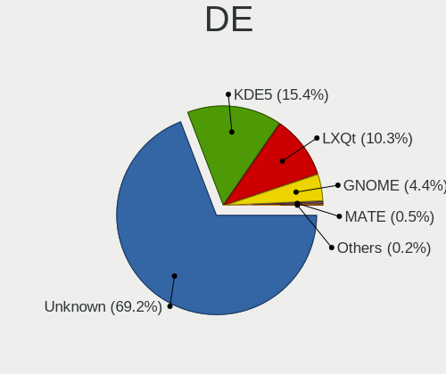
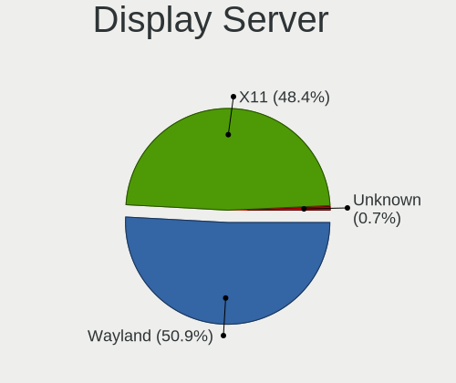
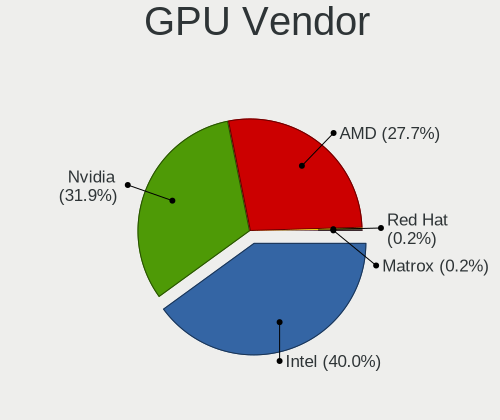
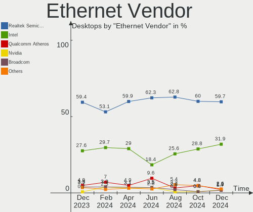
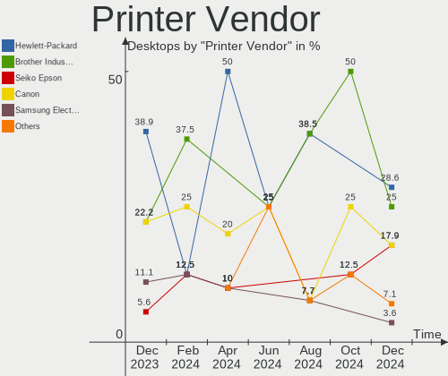
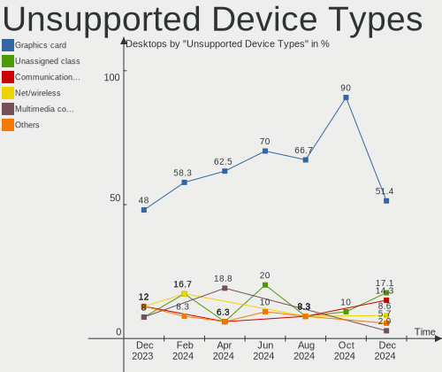

OpenMandriva - Hardware Trends (Desktops)
-----------------------------------------

A project to identify most popular hardware characteristics and track their change
over time based on data collected by Linux users at https://Linux-Hardware.org.

Anyone can contribute to this report by the [hw-probe](https://github.com/linuxhw/hw-probe) tool:

    sudo -E hw-probe -all -upload

This report is for one last month. Overall report since the beginning of time: [TestDays](https://github.com/linuxhw/TestDays)

Period: Jun, 2023.

Contents
--------

* [ System ](#system)
  - [ OS                       ](#os)
  - [ OS Family                ](#os-family)
  - [ Kernel                   ](#kernel)
  - [ Kernel Family            ](#kernel-family)
  - [ Kernel Major Ver.        ](#kernel-major-ver)
  - [ Arch                     ](#arch)
  - [ DE                       ](#de)
  - [ Display Server           ](#display-server)
  - [ Display Manager          ](#display-manager)
  - [ OS Lang                  ](#os-lang)
  - [ Boot Mode                ](#boot-mode)
  - [ Filesystem               ](#filesystem)
  - [ Part. scheme             ](#part-scheme)
  - [ Dual Boot with Linux/BSD ](#dual-boot-with-linuxbsd)
  - [ Dual Boot (Win)          ](#dual-boot-win)

* [ Board ](#board)
  - [ Vendor                   ](#vendor)
  - [ Model                    ](#model)
  - [ Model Family             ](#model-family)
  - [ MFG Year                 ](#mfg-year)
  - [ Form Factor              ](#form-factor)
  - [ Secure Boot              ](#secure-boot)
  - [ Coreboot                 ](#coreboot)
  - [ RAM Size                 ](#ram-size)
  - [ RAM Used                 ](#ram-used)
  - [ Total Drives             ](#total-drives)
  - [ Has CD-ROM               ](#has-cd-rom)
  - [ Has Ethernet             ](#has-ethernet)
  - [ Has WiFi                 ](#has-wifi)
  - [ Has Bluetooth            ](#has-bluetooth)

* [ Location ](#location)
  - [ Country                  ](#country)
  - [ City                     ](#city)

* [ Drives ](#drives)
  - [ Drive Vendor             ](#drive-vendor)
  - [ Drive Model              ](#drive-model)
  - [ HDD Vendor               ](#hdd-vendor)
  - [ SSD Vendor               ](#ssd-vendor)
  - [ Drive Kind               ](#drive-kind)
  - [ Drive Connector          ](#drive-connector)
  - [ Drive Size               ](#drive-size)
  - [ Space Total              ](#space-total)
  - [ Space Used               ](#space-used)
  - [ Malfunc. Drives          ](#malfunc-drives)
  - [ Malfunc. Drive Vendor    ](#malfunc-drive-vendor)
  - [ Malfunc. HDD Vendor      ](#malfunc-hdd-vendor)
  - [ Malfunc. Drive Kind      ](#malfunc-drive-kind)
  - [ Failed Drives            ](#failed-drives)
  - [ Failed Drive Vendor      ](#failed-drive-vendor)
  - [ Drive Status             ](#drive-status)

* [ Storage controller ](#storage-controller)
  - [ Storage Vendor           ](#storage-vendor)
  - [ Storage Model            ](#storage-model)
  - [ Storage Kind             ](#storage-kind)

* [ Processor ](#processor)
  - [ CPU Vendor               ](#cpu-vendor)
  - [ CPU Model                ](#cpu-model)
  - [ CPU Model Family         ](#cpu-model-family)
  - [ CPU Cores                ](#cpu-cores)
  - [ CPU Sockets              ](#cpu-sockets)
  - [ CPU Threads              ](#cpu-threads)
  - [ CPU Op-Modes             ](#cpu-op-modes)
  - [ CPU Microcode            ](#cpu-microcode)
  - [ CPU Microarch            ](#cpu-microarch)

* [ Graphics ](#graphics)
  - [ GPU Vendor               ](#gpu-vendor)
  - [ GPU Model                ](#gpu-model)
  - [ GPU Combo                ](#gpu-combo)
  - [ GPU Driver               ](#gpu-driver)
  - [ GPU Memory               ](#gpu-memory)

* [ Monitor ](#monitor)
  - [ Monitor Vendor           ](#monitor-vendor)
  - [ Monitor Model            ](#monitor-model)
  - [ Monitor Resolution       ](#monitor-resolution)
  - [ Monitor Diagonal         ](#monitor-diagonal)
  - [ Monitor Width            ](#monitor-width)
  - [ Aspect Ratio             ](#aspect-ratio)
  - [ Monitor Area             ](#monitor-area)
  - [ Pixel Density            ](#pixel-density)
  - [ Multiple Monitors        ](#multiple-monitors)

* [ Network ](#network)
  - [ Net Controller Vendor    ](#net-controller-vendor)
  - [ Net Controller Model     ](#net-controller-model)
  - [ Wireless Vendor          ](#wireless-vendor)
  - [ Wireless Model           ](#wireless-model)
  - [ Ethernet Vendor          ](#ethernet-vendor)
  - [ Ethernet Model           ](#ethernet-model)
  - [ Net Controller Kind      ](#net-controller-kind)
  - [ Used Controller          ](#used-controller)
  - [ NICs                     ](#nics)
  - [ IPv6                     ](#ipv6)

* [ Bluetooth ](#bluetooth)
  - [ Bluetooth Vendor         ](#bluetooth-vendor)
  - [ Bluetooth Model          ](#bluetooth-model)

* [ Sound ](#sound)
  - [ Sound Vendor             ](#sound-vendor)
  - [ Sound Model              ](#sound-model)

* [ Memory ](#memory)
  - [ Memory Vendor            ](#memory-vendor)
  - [ Memory Model             ](#memory-model)
  - [ Memory Kind              ](#memory-kind)
  - [ Memory Form Factor       ](#memory-form-factor)
  - [ Memory Size              ](#memory-size)
  - [ Memory Speed             ](#memory-speed)

* [ Printers & scanners ](#printers--scanners)
  - [ Printer Vendor           ](#printer-vendor)
  - [ Printer Model            ](#printer-model)
  - [ Scanner Vendor           ](#scanner-vendor)
  - [ Scanner Model            ](#scanner-model)

* [ Camera ](#camera)
  - [ Camera Vendor            ](#camera-vendor)
  - [ Camera Model             ](#camera-model)

* [ Security ](#security)
  - [ Fingerprint Vendor       ](#fingerprint-vendor)
  - [ Fingerprint Model        ](#fingerprint-model)
  - [ Chipcard Vendor          ](#chipcard-vendor)
  - [ Chipcard Model           ](#chipcard-model)

* [ Unsupported ](#unsupported)
  - [ Unsupported Devices      ](#unsupported-devices)
  - [ Unsupported Device Types ](#unsupported-device-types)

System
------

OS
--

Installed operating systems

| Name               | Desktops | Percent |
|--------------------|----------|---------|
| OpenMandriva 23.03 | 91       | 52.6%   |
| OpenMandriva 23.06 | 32       | 18.5%   |
| OpenMandriva 4.3   | 28       | 16.18%  |
| OpenMandriva 4.2   | 9        | 5.2%    |
| OpenMandriva 23.01 | 9        | 5.2%    |
| OpenMandriva 4.90  | 2        | 1.16%   |
| OpenMandriva 23.90 | 2        | 1.16%   |

OS Family
---------

OS without a version

| Name         | Desktops | Percent |
|--------------|----------|---------|
| OpenMandriva | 173      | 100%    |

Kernel
------

Version of the Linux kernel

| Version                  | Desktops | Percent |
|--------------------------|----------|---------|
| 6.2.6-desktop-1omv2390   | 93       | 53.76%  |
| 6.3.5-desktop-3omv2390   | 29       | 16.76%  |
| 5.16.7-desktop-1omv4003  | 16       | 9.25%   |
| 5.16.13-desktop-1omv4003 | 12       | 6.94%   |
| 6.1.1-desktop-1omv2290   | 10       | 5.78%   |
| 5.10.14-desktop-1omv4002 | 7        | 4.05%   |
| 5.18.12-desktop-3omv4090 | 2        | 1.16%   |
| 5.11.12-desktop-1omv4002 | 2        | 1.16%   |
| 6.3.3-desktop-2omv2390   | 1        | 0.58%   |
| 6.1.2-desktop-1omv2301   | 1        | 0.58%   |

Kernel Family
-------------

Linux kernel without a distro release

| Version | Desktops | Percent |
|---------|----------|---------|
| 6.2.6   | 93       | 53.76%  |
| 6.3.5   | 29       | 16.76%  |
| 5.16.7  | 16       | 9.25%   |
| 5.16.13 | 12       | 6.94%   |
| 6.1.1   | 10       | 5.78%   |
| 5.10.14 | 7        | 4.05%   |
| 5.18.12 | 2        | 1.16%   |
| 5.11.12 | 2        | 1.16%   |
| 6.3.3   | 1        | 0.58%   |
| 6.1.2   | 1        | 0.58%   |

Kernel Major Ver.
-----------------

Linux kernel major version

| Version | Desktops | Percent |
|---------|----------|---------|
| 6.2     | 93       | 53.76%  |
| 6.3     | 30       | 17.34%  |
| 5.16    | 28       | 16.18%  |
| 6.1     | 11       | 6.36%   |
| 5.10    | 7        | 4.05%   |
| 5.18    | 2        | 1.16%   |
| 5.11    | 2        | 1.16%   |

Arch
----

OS architecture (x86_64, i586, etc.)

| Name   | Desktops | Percent |
|--------|----------|---------|
| x86_64 | 173      | 100%    |

DE
--

Desktop Environment

| Name     | Desktops | Percent |
|----------|----------|---------|
| KDE5     | 152      | 87.86%  |
| GNOME    | 12       | 6.94%   |
| LXQt     | 7        | 4.05%   |
| XFCE     | 1        | 0.58%   |
| Cinnamon | 1        | 0.58%   |

Display Server
--------------

X11 or Wayland

| Name    | Desktops | Percent |
|---------|----------|---------|
| X11     | 158      | 91.33%  |
| Wayland | 15       | 8.67%   |

Display Manager
---------------

SDDM, LightDM, etc.

| Name    | Desktops | Percent |
|---------|----------|---------|
| SDDM    | 159      | 91.91%  |
| GDM     | 13       | 7.51%   |
| LightDM | 1        | 0.58%   |

OS Lang
-------

Language

| Lang  | Desktops | Percent |
|-------|----------|---------|
| en_US | 84       | 48.55%  |
| ru_RU | 14       | 8.09%   |
| fr_FR | 11       | 6.36%   |
| de_DE | 10       | 5.78%   |
| pt_BR | 9        | 5.2%    |
| it_IT | 7        | 4.05%   |
| es_MX | 4        | 2.31%   |
| cs_CZ | 4        | 2.31%   |
| pl_PL | 3        | 1.73%   |
| es_ES | 3        | 1.73%   |
| de_AT | 3        | 1.73%   |
| es_UY | 2        | 1.16%   |
| es_AR | 2        | 1.16%   |
| en_GB | 2        | 1.16%   |
| tr_TR | 1        | 0.58%   |
| ru_UA | 1        | 0.58%   |
| ro_RO | 1        | 0.58%   |
| nl_NL | 1        | 0.58%   |
| fr_CA | 1        | 0.58%   |
| fr_BE | 1        | 0.58%   |
| es_SV | 1        | 0.58%   |
| es_CO | 1        | 0.58%   |
| en_ZA | 1        | 0.58%   |
| en_PH | 1        | 0.58%   |
| en_NZ | 1        | 0.58%   |
| en_IN | 1        | 0.58%   |
| en_CA | 1        | 0.58%   |
| de_CH | 1        | 0.58%   |
| de_BE | 1        | 0.58%   |

Boot Mode
---------

EFI or BIOS

| Mode | Desktops | Percent |
|------|----------|---------|
| BIOS | 87       | 50.29%  |
| EFI  | 86       | 49.71%  |

Filesystem
----------

Type of filesystem

| Type     | Desktops | Percent |
|----------|----------|---------|
| Ext4     | 87       | 50.29%  |
| Overlay  | 73       | 42.2%   |
| Btrfs    | 7        | 4.05%   |
| Ext3     | 3        | 1.73%   |
| Reiserfs | 1        | 0.58%   |
| Jfs      | 1        | 0.58%   |
| F2fs     | 1        | 0.58%   |

Part. scheme
------------

Scheme of partitioning

| Type | Desktops | Percent |
|------|----------|---------|
| GPT  | 128      | 73.99%  |
| MBR  | 45       | 26.01%  |

Dual Boot with Linux/BSD
------------------------

Hosting more than one Linux/BSD

| Dual boot | Desktops | Percent |
|-----------|----------|---------|
| Yes       | 96       | 55.49%  |
| No        | 77       | 44.51%  |

Dual Boot (Win)
---------------

Hosting Linux and Windows

| Dual boot | Desktops | Percent |
|-----------|----------|---------|
| Yes       | 91       | 52.6%   |
| No        | 82       | 47.4%   |

Board
-----

Vendor
------

Motherboard manufacturer

| Name                | Desktops | Percent |
|---------------------|----------|---------|
| ASUSTek Computer    | 36       | 20.81%  |
| Hewlett-Packard     | 20       | 11.56%  |
| MSI                 | 19       | 10.98%  |
| Gigabyte Technology | 18       | 10.4%   |
| ASRock              | 12       | 6.94%   |
| Lenovo              | 11       | 6.36%   |
| Acer                | 10       | 5.78%   |
| Dell                | 9        | 5.2%    |
| Intel               | 7        | 4.05%   |
| Foxconn             | 5        | 2.89%   |
| Fujitsu             | 3        | 1.73%   |
| Biostar             | 3        | 1.73%   |
| Positivo            | 2        | 1.16%   |
| Huanan              | 2        | 1.16%   |
| GuoGuang            | 2        | 1.16%   |
| ECS                 | 2        | 1.16%   |
| Unknown             | 2        | 1.16%   |
| ZOTAC               | 1        | 0.58%   |
| Wistron             | 1        | 0.58%   |
| PERTOSA             | 1        | 0.58%   |
| OEM                 | 1        | 0.58%   |
| Medion              | 1        | 0.58%   |
| Kraftway            | 1        | 0.58%   |
| Kennex              | 1        | 0.58%   |
| Fujitsu Siemens     | 1        | 0.58%   |
| AMI                 | 1        | 0.58%   |
| AMD                 | 1        | 0.58%   |

Model
-----

Motherboard model

| Name                                | Desktops | Percent |
|-------------------------------------|----------|---------|
| ASUS P5G41T-M LX                    | 3        | 1.73%   |
| Unknown                             | 3        | 1.73%   |
| MSI MS-7C37                         | 2        | 1.16%   |
| HP Compaq 8200 Elite SFF PC         | 2        | 1.16%   |
| GuoGuang IC2M1028V-J                | 2        | 1.16%   |
| Foxconn G41MD                       | 2        | 1.16%   |
| Dell OptiPlex 790                   | 2        | 1.16%   |
| Dell OptiPlex 3020                  | 2        | 1.16%   |
| ASUS All Series                     | 2        | 1.16%   |
| Acer Veriton L670G                  | 2        | 1.16%   |
| Acer Veriton ES2710G                | 2        | 1.16%   |
| Wistron ProLiant ML110 G5           | 1        | 0.58%   |
| Positivo POS-PIG41BA                | 1        | 0.58%   |
| Positivo POS-ECIG41BS               | 1        | 0.58%   |
| PERTOSA 206.30.054 - GA-H110TN-M    | 1        | 0.58%   |
| OEM Intel H81                       | 1        | 0.58%   |
| MSI p6-2317c                        | 1        | 0.58%   |
| MSI MS-7D82                         | 1        | 0.58%   |
| MSI MS-7D75                         | 1        | 0.58%   |
| MSI MS-7D45                         | 1        | 0.58%   |
| MSI MS-7C91                         | 1        | 0.58%   |
| MSI MS-7C56                         | 1        | 0.58%   |
| MSI MS-7C51                         | 1        | 0.58%   |
| MSI MS-7B86                         | 1        | 0.58%   |
| MSI MS-7B79                         | 1        | 0.58%   |
| MSI MS-7A74                         | 1        | 0.58%   |
| MSI MS-7A15                         | 1        | 0.58%   |
| MSI MS-7994                         | 1        | 0.58%   |
| MSI MS-7850                         | 1        | 0.58%   |
| MSI MS-7693                         | 1        | 0.58%   |
| MSI MS-7360                         | 1        | 0.58%   |
| MSI MS-6638                         | 1        | 0.58%   |
| MSI FQ679AA-ABM SG3613LA            | 1        | 0.58%   |
| Medion Akoya P5372 H/B728           | 1        | 0.58%   |
| Lenovo ThinkStation P320 30BK0023UK | 1        | 0.58%   |
| Lenovo ThinkCentre M93p 10A8S0CE0H  | 1        | 0.58%   |
| Lenovo ThinkCentre M93p 10A8A1P5MH  | 1        | 0.58%   |
| Lenovo ThinkCentre M93p 10A6S25700  | 1        | 0.58%   |
| Lenovo ThinkCentre M92p m92p        | 1        | 0.58%   |
| Lenovo ThinkCentre M920s 10SKS3J100 | 1        | 0.58%   |

Model Family
------------

Motherboard model prefix

| Name                   | Desktops | Percent |
|------------------------|----------|---------|
| Lenovo ThinkCentre     | 9        | 5.2%    |
| HP Compaq              | 9        | 5.2%    |
| ASUS PRIME             | 8        | 4.62%   |
| Dell OptiPlex          | 7        | 4.05%   |
| Acer Veriton           | 6        | 3.47%   |
| HP EliteDesk           | 3        | 1.73%   |
| Fujitsu ESPRIMO        | 3        | 1.73%   |
| ASUS P5G41T-M          | 3        | 1.73%   |
| Acer Aspire            | 3        | 1.73%   |
| Unknown                | 3        | 1.73%   |
| MSI MS-7C37            | 2        | 1.16%   |
| GuoGuang IC2M1028V-J   | 2        | 1.16%   |
| Gigabyte GA-78LMT-USB3 | 2        | 1.16%   |
| Gigabyte B550M         | 2        | 1.16%   |
| Foxconn G41MD          | 2        | 1.16%   |
| Dell Precision         | 2        | 1.16%   |
| ASUS ROG               | 2        | 1.16%   |
| ASUS P8Z77-V           | 2        | 1.16%   |
| ASUS P8H61-M           | 2        | 1.16%   |
| ASUS M5A97             | 2        | 1.16%   |
| ASUS M5A78L-M          | 2        | 1.16%   |
| ASUS All               | 2        | 1.16%   |
| Wistron ProLiant       | 1        | 0.58%   |
| Positivo POS-PIG41BA   | 1        | 0.58%   |
| Positivo POS-ECIG41BS  | 1        | 0.58%   |
| PERTOSA 206.30.054     | 1        | 0.58%   |
| OEM Intel              | 1        | 0.58%   |
| MSI p6-2317c           | 1        | 0.58%   |
| MSI MS-7D82            | 1        | 0.58%   |
| MSI MS-7D75            | 1        | 0.58%   |
| MSI MS-7D45            | 1        | 0.58%   |
| MSI MS-7C91            | 1        | 0.58%   |
| MSI MS-7C56            | 1        | 0.58%   |
| MSI MS-7C51            | 1        | 0.58%   |
| MSI MS-7B86            | 1        | 0.58%   |
| MSI MS-7B79            | 1        | 0.58%   |
| MSI MS-7A74            | 1        | 0.58%   |
| MSI MS-7A15            | 1        | 0.58%   |
| MSI MS-7994            | 1        | 0.58%   |
| MSI MS-7850            | 1        | 0.58%   |

MFG Year
--------

Motherboard manufacture year

| Year | Desktops | Percent |
|------|----------|---------|
| 2010 | 17       | 9.83%   |
| 2014 | 16       | 9.25%   |
| 2012 | 15       | 8.67%   |
| 2011 | 14       | 8.09%   |
| 2021 | 13       | 7.51%   |
| 2018 | 10       | 5.78%   |
| 2016 | 10       | 5.78%   |
| 2015 | 10       | 5.78%   |
| 2008 | 10       | 5.78%   |
| 2020 | 9        | 5.2%    |
| 2019 | 9        | 5.2%    |
| 2017 | 9        | 5.2%    |
| 2013 | 9        | 5.2%    |
| 2009 | 6        | 3.47%   |
| 2007 | 6        | 3.47%   |
| 2022 | 5        | 2.89%   |
| 2023 | 3        | 1.73%   |
| 2006 | 1        | 0.58%   |
| 2005 | 1        | 0.58%   |

Form Factor
-----------

Physical design of the computer

| Name    | Desktops | Percent |
|---------|----------|---------|
| Desktop | 173      | 100%    |

Secure Boot
-----------

Enabled or disabled

| State    | Desktops | Percent |
|----------|----------|---------|
| Disabled | 173      | 100%    |

Coreboot
--------

Have coreboot on board

| Used | Desktops | Percent |
|------|----------|---------|
| No   | 173      | 100%    |

RAM Size
--------

Total RAM memory

| Size in GB  | Desktops | Percent |
|-------------|----------|---------|
| 3.01-4.0    | 39       | 22.54%  |
| 16.01-24.0  | 38       | 21.97%  |
| 8.01-16.0   | 33       | 19.08%  |
| 4.01-8.0    | 31       | 17.92%  |
| 32.01-64.0  | 15       | 8.67%   |
| 1.01-2.0    | 6        | 3.47%   |
| 24.01-32.0  | 4        | 2.31%   |
| 64.01-256.0 | 4        | 2.31%   |
| 2.01-3.0    | 2        | 1.16%   |
| 0.51-1.0    | 1        | 0.58%   |

RAM Used
--------

Used RAM memory

| Used GB  | Desktops | Percent |
|----------|----------|---------|
| 1.01-2.0 | 110      | 63.58%  |
| 2.01-3.0 | 32       | 18.5%   |
| 0.51-1.0 | 14       | 8.09%   |
| 0.01-0.5 | 9        | 5.2%    |
| 3.01-4.0 | 6        | 3.47%   |
| 4.01-8.0 | 2        | 1.16%   |

Total Drives
------------

Number of drives on board

| Drives | Desktops | Percent |
|--------|----------|---------|
| 1      | 83       | 47.98%  |
| 2      | 44       | 25.43%  |
| 3      | 19       | 10.98%  |
| 4      | 14       | 8.09%   |
| 5      | 11       | 6.36%   |
| 8      | 1        | 0.58%   |
| 6      | 1        | 0.58%   |

Has CD-ROM
----------

Has CD-ROM on board

| Presented | Desktops | Percent |
|-----------|----------|---------|
| No        | 90       | 52.02%  |
| Yes       | 83       | 47.98%  |

Has Ethernet
------------

Has Ethernet on board

| Presented | Desktops | Percent |
|-----------|----------|---------|
| Yes       | 171      | 98.84%  |
| No        | 2        | 1.16%   |

Has WiFi
--------

Has WiFi module

| Presented | Desktops | Percent |
|-----------|----------|---------|
| No        | 113      | 65.32%  |
| Yes       | 60       | 34.68%  |

Has Bluetooth
-------------

Has Bluetooth module

| Presented | Desktops | Percent |
|-----------|----------|---------|
| No        | 137      | 79.19%  |
| Yes       | 36       | 20.81%  |

Location
--------

Country
-------

Geographic location (country)

| Country         | Desktops | Percent |
|-----------------|----------|---------|
| USA             | 20       | 11.56%  |
| Russia          | 19       | 10.98%  |
| Germany         | 15       | 8.67%   |
| Brazil          | 15       | 8.67%   |
| Italy           | 13       | 7.51%   |
| France          | 10       | 5.78%   |
| Spain           | 7        | 4.05%   |
| UK              | 5        | 2.89%   |
| Serbia          | 5        | 2.89%   |
| Vietnam         | 4        | 2.31%   |
| Romania         | 4        | 2.31%   |
| Réunion        | 4        | 2.31%   |
| Poland          | 4        | 2.31%   |
| Mexico          | 4        | 2.31%   |
| Czechia         | 4        | 2.31%   |
| Austria         | 3        | 1.73%   |
| Uruguay         | 2        | 1.16%   |
| Philippines     | 2        | 1.16%   |
| Peru            | 2        | 1.16%   |
| Lithuania       | 2        | 1.16%   |
| Japan           | 2        | 1.16%   |
| India           | 2        | 1.16%   |
| Greece          | 2        | 1.16%   |
| Colombia        | 2        | 1.16%   |
| Canada          | 2        | 1.16%   |
| Azerbaijan      | 2        | 1.16%   |
| Ukraine         | 1        | 0.58%   |
| Turkey          | 1        | 0.58%   |
| Switzerland     | 1        | 0.58%   |
| South Korea     | 1        | 0.58%   |
| South Africa    | 1        | 0.58%   |
| North Macedonia | 1        | 0.58%   |
| New Zealand     | 1        | 0.58%   |
| Netherlands     | 1        | 0.58%   |
| Malaysia        | 1        | 0.58%   |
| Kazakhstan      | 1        | 0.58%   |
| Indonesia       | 1        | 0.58%   |
| Finland         | 1        | 0.58%   |
| El Salvador     | 1        | 0.58%   |
| Denmark         | 1        | 0.58%   |

City
----

Geographic location (city)

| City                | Desktops | Percent |
|---------------------|----------|---------|
| Milan               | 5        | 2.89%   |
| Tua Chua            | 3        | 1.73%   |
| Munich              | 3        | 1.73%   |
| Moscow              | 3        | 1.73%   |
| Belgrade            | 3        | 1.73%   |
| Wichita             | 2        | 1.16%   |
| Târgu Mureş       | 2        | 1.16%   |
| Sao Paulo           | 2        | 1.16%   |
| Saint-Paul          | 2        | 1.16%   |
| Rio de Janeiro      | 2        | 1.16%   |
| Požarevac          | 2        | 1.16%   |
| Porto Alegre        | 2        | 1.16%   |
| Perm                | 2        | 1.16%   |
| Montevideo          | 2        | 1.16%   |
| La Saline les Bains | 2        | 1.16%   |
| Jacksonville        | 2        | 1.16%   |
| Gattinara           | 2        | 1.16%   |
| Curitiba            | 2        | 1.16%   |
| Córdoba            | 2        | 1.16%   |
| Burton-on-Trent     | 2        | 1.16%   |
| Belton              | 2        | 1.16%   |
| Baku                | 2        | 1.16%   |
| Augsburg            | 2        | 1.16%   |
| Zagorz              | 1        | 0.58%   |
| Żagań             | 1        | 0.58%   |
| Weimar              | 1        | 0.58%   |
| Washington          | 1        | 0.58%   |
| Votorantim          | 1        | 0.58%   |
| Vienna              | 1        | 0.58%   |
| Vauvert             | 1        | 0.58%   |
| Urbano Santos       | 1        | 0.58%   |
| Ufa                 | 1        | 0.58%   |
| Tokyo               | 1        | 0.58%   |
| Templin             | 1        | 0.58%   |
| Tecamac             | 1        | 0.58%   |
| Tampere             | 1        | 0.58%   |
| Stevenage           | 1        | 0.58%   |
| St Petersburg       | 1        | 0.58%   |
| Somerville          | 1        | 0.58%   |
| Skawina             | 1        | 0.58%   |

Drives
------

Drive Vendor
------------

Hard drive vendors

| Vendor              | Desktops | Drives | Percent |
|---------------------|----------|--------|---------|
| WDC                 | 67       | 79     | 22.33%  |
| Seagate             | 52       | 66     | 17.33%  |
| Samsung Electronics | 34       | 45     | 11.33%  |
| Toshiba             | 22       | 22     | 7.33%   |
| Kingston            | 20       | 24     | 6.67%   |
| Hitachi             | 8        | 8      | 2.67%   |
| Crucial             | 8        | 8      | 2.67%   |
| Unknown             | 7        | 8      | 2.33%   |
| SPCC                | 7        | 7      | 2.33%   |
| SanDisk             | 6        | 7      | 2%      |
| Netac               | 5        | 6      | 1.67%   |
| Intel               | 5        | 5      | 1.67%   |
| Maxtor              | 4        | 5      | 1.33%   |
| China               | 4        | 4      | 1.33%   |
| PNY                 | 3        | 3      | 1%      |
| Mushkin             | 3        | 4      | 1%      |
| Micron Technology   | 3        | 3      | 1%      |
| Intenso             | 3        | 4      | 1%      |
| A-DATA Technology   | 3        | 3      | 1%      |
| Lexar               | 2        | 2      | 0.67%   |
| KingSpec            | 2        | 2      | 0.67%   |
| HGST                | 2        | 2      | 0.67%   |
| Hewlett-Packard     | 2        | 2      | 0.67%   |
| XrayDisk            | 1        | 1      | 0.33%   |
| XPG                 | 1        | 1      | 0.33%   |
| Veno                | 1        | 1      | 0.33%   |
| USB                 | 1        | 1      | 0.33%   |
| Team                | 1        | 1      | 0.33%   |
| SK hynix            | 1        | 1      | 0.33%   |
| Phison Electronics  | 1        | 1      | 0.33%   |
| Phison              | 1        | 1      | 0.33%   |
| Patriot             | 1        | 1      | 0.33%   |
| OCZ                 | 1        | 1      | 0.33%   |
| NTC                 | 1        | 1      | 0.33%   |
| MCTECH              | 1        | 1      | 0.33%   |
| M.2 SSD             | 1        | 1      | 0.33%   |
| Leven               | 1        | 1      | 0.33%   |
| KIOXIA-EXCERIA      | 1        | 1      | 0.33%   |
| Kingchuxing         | 1        | 1      | 0.33%   |
| JMicron Technology  | 1        | 1      | 0.33%   |

Drive Model
-----------

Hard drive models

| Model                            | Desktops | Percent |
|----------------------------------|----------|---------|
| Seagate ST500DM002-1BD142 500GB  | 7        | 2.08%   |
| Toshiba DT01ACA100 1TB           | 6        | 1.78%   |
| Kingston SA400S37240G 240GB SSD  | 5        | 1.48%   |
| Unknown SD/MMC/MS PRO 250GB      | 4        | 1.19%   |
| Toshiba DT01ACA050 500GB         | 4        | 1.19%   |
| WDC WD1600AAJS-22L7A0 160GB      | 3        | 0.89%   |
| WDC WD10EZEX-00RKKA0 1TB         | 3        | 0.89%   |
| Seagate ST2000DM008-2FR102 2TB   | 3        | 0.89%   |
| Samsung SSD 870 EVO 500GB        | 3        | 0.89%   |
| Samsung SSD 860 EVO 500GB        | 3        | 0.89%   |
| Kingston SNV2S500G 500GB         | 3        | 0.89%   |
| Kingston SA400S37480G 480GB SSD  | 3        | 0.89%   |
| WDC WDS240G2G0B-00EPW0 240GB SSD | 2        | 0.59%   |
| WDC WDS100T2B0C-00PXH0 1TB       | 2        | 0.59%   |
| WDC WD5000AZLX-21K2TA0 500GB     | 2        | 0.59%   |
| WDC WD5000AAKX-75U6AA0 500GB     | 2        | 0.59%   |
| WDC WD5000AAKX-001CA0 500GB      | 2        | 0.59%   |
| WDC WD3200AAKS-61L9A0 320GB      | 2        | 0.59%   |
| WDC WD1600AAJS-00B4A0 160GB      | 2        | 0.59%   |
| Toshiba TR200 240GB SSD          | 2        | 0.59%   |
| Toshiba HDWE140 4TB              | 2        | 0.59%   |
| SPCC Solid State Disk 128GB      | 2        | 0.59%   |
| Seagate ST500LM021-1KJ152 500GB  | 2        | 0.59%   |
| Seagate ST500DM002-1BC142 500GB  | 2        | 0.59%   |
| Seagate ST3160815AS 160GB        | 2        | 0.59%   |
| Seagate ST1000DM003-1SB102 1TB   | 2        | 0.59%   |
| Samsung SSD 990 PRO 1TB          | 2        | 0.59%   |
| Samsung SSD 980 1TB              | 2        | 0.59%   |
| Samsung SSD 970 EVO Plus 500GB   | 2        | 0.59%   |
| Samsung SSD 970 EVO Plus 1TB     | 2        | 0.59%   |
| Samsung SSD 870 QVO 2TB          | 2        | 0.59%   |
| Samsung SSD 860 EVO 250GB        | 2        | 0.59%   |
| Netac SSD 256GB                  | 2        | 0.59%   |
| Kingston SA400S37/120G 120GB SSD | 2        | 0.59%   |
| KingSpec NT-256 256GB SSD        | 2        | 0.59%   |
| Intenso External USB-3.0 5TB     | 2        | 0.59%   |
| Hitachi HUA723020ALA641 2TB      | 2        | 0.59%   |
| Crucial CT240BX500SSD1 240GB     | 2        | 0.59%   |
| China SSD 512GB                  | 2        | 0.59%   |
| A-DATA SU650 120GB SSD           | 2        | 0.59%   |

HDD Vendor
----------

Hard disk drive vendors

| Vendor              | Desktops | Drives | Percent |
|---------------------|----------|--------|---------|
| WDC                 | 57       | 67     | 36.31%  |
| Seagate             | 51       | 64     | 32.48%  |
| Toshiba             | 19       | 19     | 12.1%   |
| Hitachi             | 8        | 8      | 5.1%    |
| Samsung Electronics | 5        | 6      | 3.18%   |
| Unknown             | 4        | 4      | 2.55%   |
| Maxtor              | 4        | 5      | 2.55%   |
| Intenso             | 2        | 2      | 1.27%   |
| HGST                | 2        | 2      | 1.27%   |
| USB                 | 1        | 1      | 0.64%   |
| HPE                 | 1        | 1      | 0.64%   |
| Hewlett-Packard     | 1        | 1      | 0.64%   |
| ExcelStor           | 1        | 1      | 0.64%   |
| Apple               | 1        | 1      | 0.64%   |

SSD Vendor
----------

Solid state drive vendors

| Vendor              | Desktops | Drives | Percent |
|---------------------|----------|--------|---------|
| Samsung Electronics | 20       | 22     | 19.42%  |
| Kingston            | 17       | 19     | 16.5%   |
| Crucial             | 7        | 7      | 6.8%    |
| WDC                 | 5        | 7      | 4.85%   |
| SanDisk             | 5        | 6      | 4.85%   |
| Intel               | 5        | 5      | 4.85%   |
| SPCC                | 4        | 4      | 3.88%   |
| Netac               | 4        | 5      | 3.88%   |
| China               | 4        | 4      | 3.88%   |
| Toshiba             | 3        | 3      | 2.91%   |
| PNY                 | 2        | 2      | 1.94%   |
| Mushkin             | 2        | 2      | 1.94%   |
| Micron Technology   | 2        | 2      | 1.94%   |
| KingSpec            | 2        | 2      | 1.94%   |
| A-DATA Technology   | 2        | 2      | 1.94%   |
| XrayDisk            | 1        | 1      | 0.97%   |
| Veno                | 1        | 1      | 0.97%   |
| Team                | 1        | 1      | 0.97%   |
| Patriot             | 1        | 1      | 0.97%   |
| OCZ                 | 1        | 1      | 0.97%   |
| NTC                 | 1        | 1      | 0.97%   |
| MCTECH              | 1        | 1      | 0.97%   |
| Lexar               | 1        | 1      | 0.97%   |
| Leven               | 1        | 1      | 0.97%   |
| KIOXIA-EXCERIA      | 1        | 1      | 0.97%   |
| Kingchuxing         | 1        | 1      | 0.97%   |
| Intenso             | 1        | 2      | 0.97%   |
| Indilinx            | 1        | 1      | 0.97%   |
| HPE                 | 1        | 1      | 0.97%   |
| Hewlett-Packard     | 1        | 1      | 0.97%   |
| Gigabyte Technology | 1        | 1      | 0.97%   |
| Foxline             | 1        | 1      | 0.97%   |
| Emtec               | 1        | 1      | 0.97%   |
| Apacer              | 1        | 1      | 0.97%   |

Drive Kind
----------

HDD or SSD

| Kind    | Desktops | Drives | Percent |
|---------|----------|--------|---------|
| HDD     | 125      | 182    | 49.02%  |
| SSD     | 83       | 112    | 32.55%  |
| NVMe    | 41       | 48     | 16.08%  |
| Unknown | 4        | 5      | 1.57%   |
| MMC     | 2        | 2      | 0.78%   |

Drive Connector
---------------

SATA, SAS, NVMe, etc.

| Type | Desktops | Drives | Percent |
|------|----------|--------|---------|
| SATA | 160      | 280    | 73.39%  |
| NVMe | 40       | 47     | 18.35%  |
| SAS  | 16       | 20     | 7.34%   |
| MMC  | 2        | 2      | 0.92%   |

Drive Size
----------

Size of hard drive

| Size in TB      | Desktops | Drives | Percent |
|-----------------|----------|--------|---------|
| 0.01-0.5        | 137      | 185    | 61.43%  |
| 0.51-1.0        | 48       | 63     | 21.52%  |
| 1.01-2.0        | 18       | 19     | 8.07%   |
| 3.01-4.0        | 7        | 11     | 3.14%   |
| 2.01-3.0        | 7        | 8      | 3.14%   |
| 4.01-10.0       | 5        | 7      | 2.24%   |
| More than 100.0 | 1        | 1      | 0.45%   |

Space Total
-----------

Amount of disk space available on the file system

| Size in GB     | Desktops | Percent |
|----------------|----------|---------|
| 1-20           | 54       | 31.21%  |
| 101-250        | 44       | 25.43%  |
| 501-1000       | 17       | 9.83%   |
| 251-500        | 16       | 9.25%   |
| 51-100         | 12       | 6.94%   |
| Unknown        | 11       | 6.36%   |
| 21-50          | 8        | 4.62%   |
| 2001-3000      | 5        | 2.89%   |
| 1001-2000      | 5        | 2.89%   |
| More than 3000 | 1        | 0.58%   |

Space Used
----------

Amount of used disk space

| Used GB        | Desktops | Percent |
|----------------|----------|---------|
| 1-20           | 133      | 76.88%  |
| 21-50          | 14       | 8.09%   |
| Unknown        | 11       | 6.36%   |
| 51-100         | 6        | 3.47%   |
| 251-500        | 3        | 1.73%   |
| 101-250        | 2        | 1.16%   |
| 1001-2000      | 2        | 1.16%   |
| More than 3000 | 1        | 0.58%   |
| 501-1000       | 1        | 0.58%   |

Malfunc. Drives
---------------

Drive models with a malfunction

| Model                            | Desktops | Drives | Percent |
|----------------------------------|----------|--------|---------|
| Seagate ST500DM002-1BD142 500GB  | 5        | 6      | 6.76%   |
| WDC WD5000AAKX-001CA0 500GB      | 2        | 2      | 2.7%    |
| WDC WD3200AAKS-61L9A0 320GB      | 2        | 2      | 2.7%    |
| WDC WD1600AAJS-00B4A0 160GB      | 2        | 2      | 2.7%    |
| Toshiba DT01ACA100 1TB           | 2        | 2      | 2.7%    |
| WDC WDS120G2G0A-00JH30 128GB SSD | 1        | 2      | 1.35%   |
| WDC WD5000LPLX-66ZNTT1 500GB     | 1        | 1      | 1.35%   |
| WDC WD5000AAKX-08U6AA0 500GB     | 1        | 1      | 1.35%   |
| WDC WD5000AAKS-00V1A0 500GB      | 1        | 1      | 1.35%   |
| WDC WD5000AAKS-00A7B0 500GB      | 1        | 1      | 1.35%   |
| WDC WD40PURX-64GVNY0 4TB         | 1        | 1      | 1.35%   |
| WDC WD3200BEVT-60A23T0 320GB     | 1        | 1      | 1.35%   |
| WDC WD3200BEVT-22ZCT0 320GB      | 1        | 1      | 1.35%   |
| WDC WD3200BEKT-60PVMT0 320GB     | 1        | 1      | 1.35%   |
| WDC WD3200AAKS-00UU3A0 320GB     | 1        | 1      | 1.35%   |
| WDC WD3200AAJS-22B4A0 320GB      | 1        | 1      | 1.35%   |
| WDC WD2500AAKS-00F0A0 250GB      | 1        | 1      | 1.35%   |
| WDC WD20EFRX-68EUZN0 2TB         | 1        | 1      | 1.35%   |
| WDC WD20EARS-00J99B0 2TB         | 1        | 1      | 1.35%   |
| WDC WD10SPCX-08S8TT0 1TB         | 1        | 1      | 1.35%   |
| WDC WD10EZRZ-00HTKB0 1TB         | 1        | 1      | 1.35%   |
| WDC WD10EZEX-00RKKA0 1TB         | 1        | 1      | 1.35%   |
| WDC WD10EALX-009BA0 1TB          | 1        | 1      | 1.35%   |
| WDC WD1001FALS-403AA0 1TB        | 1        | 1      | 1.35%   |
| Toshiba MQ04ABF100 1TB           | 1        | 1      | 1.35%   |
| Toshiba MQ01ABD050 500GB         | 1        | 1      | 1.35%   |
| Toshiba MK5059GSX 500GB          | 1        | 1      | 1.35%   |
| Toshiba MK3275GSX 320GB          | 1        | 1      | 1.35%   |
| Toshiba DT01ACA050 500GB         | 1        | 1      | 1.35%   |
| SPCC Solid State Disk 128GB      | 1        | 1      | 1.35%   |
| Seagate ST9500325AS 500GB        | 1        | 1      | 1.35%   |
| Seagate ST9320325AS 320GB        | 1        | 1      | 1.35%   |
| Seagate ST9250311CS 250GB        | 1        | 1      | 1.35%   |
| Seagate ST9160412AS 160GB        | 1        | 1      | 1.35%   |
| Seagate ST500LM021-1KJ152 500GB  | 1        | 1      | 1.35%   |
| Seagate ST380811AS 80GB          | 1        | 1      | 1.35%   |
| Seagate ST3500630A 500GB         | 1        | 1      | 1.35%   |
| Seagate ST3500413AS 500GB        | 1        | 1      | 1.35%   |
| Seagate ST3400620AS 400GB        | 1        | 1      | 1.35%   |
| Seagate ST3320418AS 320GB        | 1        | 1      | 1.35%   |

Malfunc. Drive Vendor
---------------------

Vendors of faulty drives

| Vendor              | Desktops | Drives | Percent |
|---------------------|----------|--------|---------|
| WDC                 | 23       | 26     | 32.39%  |
| Seagate             | 20       | 21     | 28.17%  |
| Toshiba             | 7        | 7      | 9.86%   |
| Hitachi             | 5        | 5      | 7.04%   |
| Samsung Electronics | 4        | 4      | 5.63%   |
| Maxtor              | 3        | 4      | 4.23%   |
| SPCC                | 1        | 1      | 1.41%   |
| OCZ                 | 1        | 1      | 1.41%   |
| Kingston            | 1        | 1      | 1.41%   |
| Indilinx            | 1        | 1      | 1.41%   |
| HGST                | 1        | 1      | 1.41%   |
| Hewlett-Packard     | 1        | 1      | 1.41%   |
| ExcelStor           | 1        | 1      | 1.41%   |
| Emtec               | 1        | 1      | 1.41%   |
| China               | 1        | 1      | 1.41%   |

Malfunc. HDD Vendor
-------------------

Vendors of faulty HDD drives

| Vendor              | Desktops | Drives | Percent |
|---------------------|----------|--------|---------|
| WDC                 | 22       | 24     | 34.38%  |
| Seagate             | 20       | 21     | 31.25%  |
| Toshiba             | 7        | 7      | 10.94%  |
| Hitachi             | 5        | 5      | 7.81%   |
| Samsung Electronics | 4        | 4      | 6.25%   |
| Maxtor              | 3        | 4      | 4.69%   |
| HGST                | 1        | 1      | 1.56%   |
| Hewlett-Packard     | 1        | 1      | 1.56%   |
| ExcelStor           | 1        | 1      | 1.56%   |

Malfunc. Drive Kind
-------------------

Kinds of faulty drives

| Kind | Desktops | Drives | Percent |
|------|----------|--------|---------|
| HDD  | 58       | 68     | 89.23%  |
| SSD  | 7        | 8      | 10.77%  |

Failed Drives
-------------

Failed drive models

| Model                        | Desktops | Drives | Percent |
|------------------------------|----------|--------|---------|
| WDC WD3200BPVT-00JJ5T0 320GB | 1        | 1      | 33.33%  |
| Toshiba DT01ACA050 500GB     | 1        | 1      | 33.33%  |
| Seagate ST3500418AS 500GB    | 1        | 1      | 33.33%  |

Failed Drive Vendor
-------------------

Failed drive vendors

| Vendor  | Desktops | Drives | Percent |
|---------|----------|--------|---------|
| WDC     | 1        | 1      | 33.33%  |
| Toshiba | 1        | 1      | 33.33%  |
| Seagate | 1        | 1      | 33.33%  |

Drive Status
------------

Number of failed and malfunc. drives

| Status   | Desktops | Drives | Percent |
|----------|----------|--------|---------|
| Works    | 132      | 251    | 61.68%  |
| Malfunc  | 63       | 76     | 29.44%  |
| Detected | 16       | 19     | 7.48%   |
| Failed   | 3        | 3      | 1.4%    |

Storage controller
------------------

Storage Vendor
--------------

Storage controller vendors

| Vendor                       | Desktops | Percent |
|------------------------------|----------|---------|
| Intel                        | 121      | 53.3%   |
| AMD                          | 48       | 21.15%  |
| Samsung Electronics          | 14       | 6.17%   |
| ASMedia Technology           | 8        | 3.52%   |
| SanDisk                      | 5        | 2.2%    |
| Kingston Technology Company  | 5        | 2.2%    |
| Phison Electronics           | 4        | 1.76%   |
| Nvidia                       | 3        | 1.32%   |
| MAXIO Technology (Hangzhou)  | 3        | 1.32%   |
| Marvell Technology Group     | 3        | 1.32%   |
| Realtek Semiconductor        | 2        | 0.88%   |
| JMicron Technology           | 2        | 0.88%   |
| SK hynix                     | 1        | 0.44%   |
| Silicon Motion               | 1        | 0.44%   |
| Shenzhen Longsys Electronics | 1        | 0.44%   |
| Seagate Technology           | 1        | 0.44%   |
| Netac Technology             | 1        | 0.44%   |
| Micron/Crucial Technology    | 1        | 0.44%   |
| Micron Technology            | 1        | 0.44%   |
| INNOGRIT                     | 1        | 0.44%   |
| ADATA Technology             | 1        | 0.44%   |

Storage Model
-------------

Storage controller models

| Model                                                                                   | Desktops | Percent |
|-----------------------------------------------------------------------------------------|----------|---------|
| AMD FCH SATA Controller [AHCI mode]                                                     | 24       | 8.3%    |
| Intel NM10/ICH7 Family SATA Controller [IDE mode]                                       | 21       | 7.27%   |
| Intel 82801G (ICH7 Family) IDE Controller                                               | 18       | 6.23%   |
| Intel Q170/Q150/B150/H170/H110/Z170/CM236 Chipset SATA Controller [AHCI Mode]           | 16       | 5.54%   |
| Intel 8 Series/C220 Series Chipset Family 6-port SATA Controller 1 [AHCI mode]          | 15       | 5.19%   |
| Intel 6 Series/C200 Series Chipset Family 6 port Desktop SATA AHCI Controller           | 11       | 3.81%   |
| AMD SB7x0/SB8x0/SB9x0 IDE Controller                                                    | 9        | 3.11%   |
| Samsung NVMe SSD Controller SM981/PM981/PM983                                           | 8        | 2.77%   |
| Intel 7 Series/C210 Series Chipset Family 6-port SATA Controller [AHCI mode]            | 8        | 2.77%   |
| ASMedia ASM1062 Serial ATA Controller                                                   | 8        | 2.77%   |
| AMD SB7x0/SB8x0/SB9x0 SATA Controller [IDE mode]                                        | 8        | 2.77%   |
| AMD 500 Series Chipset SATA Controller                                                  | 8        | 2.77%   |
| AMD 400 Series Chipset SATA Controller                                                  | 7        | 2.42%   |
| Intel 500 Series Chipset Family SATA AHCI Controller                                    | 6        | 2.08%   |
| AMD SB7x0/SB8x0/SB9x0 SATA Controller [AHCI mode]                                       | 6        | 2.08%   |
| Intel 82801I (ICH9 Family) 2 port SATA Controller [IDE mode]                            | 5        | 1.73%   |
| Intel 6 Series/C200 Series Chipset Family Desktop SATA Controller (IDE mode, ports 4-5) | 4        | 1.38%   |
| Intel 6 Series/C200 Series Chipset Family Desktop SATA Controller (IDE mode, ports 0-3) | 4        | 1.38%   |
| Samsung NVMe SSD Controller PM9A1/PM9A3/980PRO                                          | 3        | 1.04%   |
| Samsung Electronics Non-Volatile memory controller                                      | 3        | 1.04%   |
| Phison E12 NVMe Controller                                                              | 3        | 1.04%   |
| Kingston Company Company Non-Volatile memory controller                                 | 3        | 1.04%   |
| Intel Cannon Lake PCH SATA AHCI Controller                                              | 3        | 1.04%   |
| Intel 82801JD/DO (ICH10 Family) SATA AHCI Controller                                    | 3        | 1.04%   |
| Intel 82801IB (ICH9) 2 port SATA Controller [IDE mode]                                  | 3        | 1.04%   |
| Intel 4 Series Chipset PT IDER Controller                                               | 3        | 1.04%   |
| Intel 200 Series PCH SATA controller [AHCI mode]                                        | 3        | 1.04%   |
| AMD 300 Series Chipset SATA Controller                                                  | 3        | 1.04%   |
| SanDisk WD Blue SN550 NVMe SSD                                                          | 2        | 0.69%   |
| Samsung NVMe SSD Controller 980                                                         | 2        | 0.69%   |
| Realtek NVMe Controller                                                                 | 2        | 0.69%   |
| MAXIO (Hangzhou) NVMe SSD Controller MAP1202                                            | 2        | 0.69%   |
| Marvell Group 88SE6111/6121 SATA II / PATA Controller                                   | 2        | 0.69%   |
| Intel SATA Controller [RAID mode]                                                       | 2        | 0.69%   |
| Intel C600/X79 series chipset 6-Port SATA AHCI Controller                               | 2        | 0.69%   |
| Intel Alder Lake-S PCH SATA Controller [AHCI Mode]                                      | 2        | 0.69%   |
| Intel 9 Series Chipset Family SATA Controller [AHCI Mode]                               | 2        | 0.69%   |
| Intel 82801JI (ICH10 Family) SATA AHCI Controller                                       | 2        | 0.69%   |
| Intel 82801JI (ICH10 Family) 4 port SATA IDE Controller #1                              | 2        | 0.69%   |
| Intel 82801JI (ICH10 Family) 2 port SATA IDE Controller #2                              | 2        | 0.69%   |

Storage Kind
------------

Kind of storage controller (IDE, SATA, NVMe, SAS, ...)

| Kind | Desktops | Percent |
|------|----------|---------|
| SATA | 133      | 58.59%  |
| IDE  | 52       | 22.91%  |
| NVMe | 39       | 17.18%  |
| RAID | 2        | 0.88%   |
| SAS  | 1        | 0.44%   |

Processor
---------

CPU Vendor
----------

Processor vendors

| Vendor | Desktops | Percent |
|--------|----------|---------|
| Intel  | 123      | 71.1%   |
| AMD    | 50       | 28.9%   |

CPU Model
---------

Processor models

| Model                                       | Desktops | Percent |
|---------------------------------------------|----------|---------|
| Intel Pentium Dual-Core CPU E5300 @ 2.60GHz | 4        | 2.31%   |
| Intel Core i7-2600 CPU @ 3.40GHz            | 4        | 2.31%   |
| Intel Core i5-6400 CPU @ 2.70GHz            | 4        | 2.31%   |
| AMD Ryzen 5 5500                            | 4        | 2.31%   |
| Intel Pentium Dual-Core CPU E5800 @ 3.20GHz | 3        | 1.73%   |
| Intel Pentium Dual CPU E2200 @ 2.20GHz      | 3        | 1.73%   |
| Intel Core i3-2120 CPU @ 3.30GHz            | 3        | 1.73%   |
| Intel Core 2 Quad CPU Q6600 @ 2.40GHz       | 3        | 1.73%   |
| Intel Core 2 Duo CPU E8400 @ 3.00GHz        | 3        | 1.73%   |
| Intel Pentium Dual-Core CPU E5200 @ 2.50GHz | 2        | 1.16%   |
| Intel Pentium CPU G2030 @ 3.00GHz           | 2        | 1.16%   |
| Intel Core i7-3770K CPU @ 3.50GHz           | 2        | 1.16%   |
| Intel Core i7-3770 CPU @ 3.40GHz            | 2        | 1.16%   |
| Intel Core i5-7400 CPU @ 3.00GHz            | 2        | 1.16%   |
| Intel Core i5-6500 CPU @ 3.20GHz            | 2        | 1.16%   |
| Intel Core i5-4590 CPU @ 3.30GHz            | 2        | 1.16%   |
| Intel Core i5-3470 CPU @ 3.20GHz            | 2        | 1.16%   |
| Intel Core i5-2400 CPU @ 3.10GHz            | 2        | 1.16%   |
| Intel Core i5-10400 CPU @ 2.90GHz           | 2        | 1.16%   |
| Intel Core i3-7100 CPU @ 3.90GHz            | 2        | 1.16%   |
| Intel Core i3-6100T CPU @ 3.20GHz           | 2        | 1.16%   |
| Intel Core 2 Duo CPU E8200 @ 2.66GHz        | 2        | 1.16%   |
| Intel Core 2 Duo CPU E7500 @ 2.93GHz        | 2        | 1.16%   |
| Intel Core 2 Duo CPU E7400 @ 2.80GHz        | 2        | 1.16%   |
| Intel Atom CPU D2550 @ 1.86GHz              | 2        | 1.16%   |
| AMD Ryzen 7 5800X3D 8-Core Processor        | 2        | 1.16%   |
| AMD Ryzen 7 3700X 8-Core Processor          | 2        | 1.16%   |
| AMD Ryzen 5 3600X 6-Core Processor          | 2        | 1.16%   |
| AMD Ryzen 3 3200G with Radeon Vega Graphics | 2        | 1.16%   |
| AMD Ryzen 3 2200G with Radeon Vega Graphics | 2        | 1.16%   |
| AMD FX-8350 Eight-Core Processor            | 2        | 1.16%   |
| AMD FX-4300 Quad-Core Processor             | 2        | 1.16%   |
| Intel Xeon CPU X5690 @ 3.47GHz              | 1        | 0.58%   |
| Intel Xeon CPU E5-2690 0 @ 2.90GHz          | 1        | 0.58%   |
| Intel Xeon CPU E5-2660 v3 @ 2.60GHz         | 1        | 0.58%   |
| Intel Xeon CPU E5-2650 v2 @ 2.60GHz         | 1        | 0.58%   |
| Intel Xeon CPU E5-2630 v3 @ 2.40GHz         | 1        | 0.58%   |
| Intel Xeon CPU E3-1245 v6 @ 3.70GHz         | 1        | 0.58%   |
| Intel Xeon CPU E3-1240 v3 @ 3.40GHz         | 1        | 0.58%   |
| Intel Pentium Gold G6405 CPU @ 4.10GHz      | 1        | 0.58%   |

CPU Model Family
----------------

Processor model prefix

| Model                   | Desktops | Percent |
|-------------------------|----------|---------|
| Intel Core i5           | 30       | 17.34%  |
| Intel Core i3           | 17       | 9.83%   |
| Intel Core i7           | 13       | 7.51%   |
| Intel Pentium Dual-Core | 11       | 6.36%   |
| Intel Core 2 Duo        | 11       | 6.36%   |
| AMD Ryzen 7             | 10       | 5.78%   |
| AMD Ryzen 5             | 10       | 5.78%   |
| AMD FX                  | 9        | 5.2%    |
| Intel Xeon              | 7        | 4.05%   |
| Other                   | 6        | 3.47%   |
| Intel Pentium           | 6        | 3.47%   |
| Intel Core 2 Quad       | 6        | 3.47%   |
| Intel Atom              | 5        | 2.89%   |
| Intel Pentium Dual      | 4        | 2.31%   |
| AMD Ryzen 3             | 4        | 2.31%   |
| AMD A4                  | 3        | 1.73%   |
| Intel Pentium Gold      | 2        | 1.16%   |
| Intel Core 2            | 2        | 1.16%   |
| AMD A6                  | 2        | 1.16%   |
| Intel Pentium 4         | 1        | 0.58%   |
| Intel Genuine           | 1        | 0.58%   |
| Intel Celeron           | 1        | 0.58%   |
| AMD PRO A10             | 1        | 0.58%   |
| AMD Phenom II X6        | 1        | 0.58%   |
| AMD Phenom II X4        | 1        | 0.58%   |
| AMD GX                  | 1        | 0.58%   |
| AMD E                   | 1        | 0.58%   |
| AMD Athlon X4           | 1        | 0.58%   |
| AMD Athlon II X4        | 1        | 0.58%   |
| AMD Athlon II X2        | 1        | 0.58%   |
| AMD Athlon 64 X2        | 1        | 0.58%   |
| AMD Athlon 64           | 1        | 0.58%   |
| AMD A8                  | 1        | 0.58%   |
| AMD A12                 | 1        | 0.58%   |

CPU Cores
---------

Number of processor cores

| Number | Desktops | Percent |
|--------|----------|---------|
| 4      | 66       | 38.15%  |
| 2      | 64       | 36.99%  |
| 6      | 16       | 9.25%   |
| 8      | 14       | 8.09%   |
| 1      | 6        | 3.47%   |
| 3      | 2        | 1.16%   |
| 24     | 1        | 0.58%   |
| 16     | 1        | 0.58%   |
| 14     | 1        | 0.58%   |
| 12     | 1        | 0.58%   |
| 10     | 1        | 0.58%   |

CPU Sockets
-----------

Number of sockets

| Number | Desktops | Percent |
|--------|----------|---------|
| 1      | 172      | 99.42%  |
| 2      | 1        | 0.58%   |

CPU Threads
-----------

Threads per core (Hyper-Threading)

| Number | Desktops | Percent |
|--------|----------|---------|
| 2      | 90       | 52.02%  |
| 1      | 83       | 47.98%  |

CPU Op-Modes
------------

CPU Operation Modes (32-bit, 64-bit)

| Op mode        | Desktops | Percent |
|----------------|----------|---------|
| 32-bit, 64-bit | 173      | 100%    |

CPU Microcode
-------------

Microcode number

| Number     | Desktops | Percent |
|------------|----------|---------|
| Unknown    | 88       | 50.87%  |
| 0x306c3    | 11       | 6.36%   |
| 0x1067a    | 6        | 3.47%   |
| 0x206a7    | 4        | 2.31%   |
| 0x906e9    | 3        | 1.73%   |
| 0x506e3    | 3        | 1.73%   |
| 0x306a9    | 3        | 1.73%   |
| 0x08108109 | 3        | 1.73%   |
| 0x06001119 | 3        | 1.73%   |
| 0x06000822 | 3        | 1.73%   |
| 0x0600081c | 3        | 1.73%   |
| 0x6fd      | 2        | 1.16%   |
| 0x0a50000d | 2        | 1.16%   |
| 0x08701030 | 2        | 1.16%   |
| 0x08701021 | 2        | 1.16%   |
| 0x08701013 | 2        | 1.16%   |
| 0x08101016 | 2        | 1.16%   |
| 0x0700010b | 2        | 1.16%   |
| 0x010000c8 | 2        | 1.16%   |
| 0x906eb    | 1        | 0.58%   |
| 0x906a3    | 1        | 0.58%   |
| 0x6f2      | 1        | 0.58%   |
| 0x40651    | 1        | 0.58%   |
| 0x30673    | 1        | 0.58%   |
| 0x206d7    | 1        | 0.58%   |
| 0x20655    | 1        | 0.58%   |
| 0x0a601203 | 1        | 0.58%   |
| 0x0a50000c | 1        | 0.58%   |
| 0x0a20120a | 1        | 0.58%   |
| 0x0a201205 | 1        | 0.58%   |
| 0x0a201025 | 1        | 0.58%   |
| 0x0810100b | 1        | 0.58%   |
| 0x0800820d | 1        | 0.58%   |
| 0x0800820b | 1        | 0.58%   |
| 0x08001138 | 1        | 0.58%   |
| 0x08001129 | 1        | 0.58%   |
| 0x07030105 | 1        | 0.58%   |
| 0x06006705 | 1        | 0.58%   |
| 0x0600611a | 1        | 0.58%   |
| 0x06006118 | 1        | 0.58%   |

CPU Microarch
-------------

Microarchitecture

| Name             | Desktops | Percent |
|------------------|----------|---------|
| Penryn           | 23       | 13.29%  |
| Haswell          | 20       | 11.56%  |
| SandyBridge      | 14       | 8.09%   |
| KabyLake         | 13       | 7.51%   |
| IvyBridge        | 11       | 6.36%   |
| Core             | 11       | 6.36%   |
| Skylake          | 10       | 5.78%   |
| Piledriver       | 10       | 5.78%   |
| Zen 3            | 7        | 4.05%   |
| Zen 2            | 6        | 3.47%   |
| CometLake        | 6        | 3.47%   |
| Zen+             | 5        | 2.89%   |
| Zen              | 5        | 2.89%   |
| K10              | 4        | 2.31%   |
| Alderlake Hybrid | 4        | 2.31%   |
| Silvermont       | 3        | 1.73%   |
| Excavator        | 3        | 1.73%   |
| Bonnell          | 3        | 1.73%   |
| Westmere         | 2        | 1.16%   |
| K8 Hammer        | 2        | 1.16%   |
| Jaguar           | 2        | 1.16%   |
| Icelake          | 2        | 1.16%   |
| Bulldozer        | 2        | 1.16%   |
| Steamroller      | 1        | 0.58%   |
| Puma             | 1        | 0.58%   |
| NetBurst         | 1        | 0.58%   |
| Bobcat           | 1        | 0.58%   |
| Unknown          | 1        | 0.58%   |

Graphics
--------

GPU Vendor
----------

Vendors of graphics cards

| Vendor                     | Desktops | Percent |
|----------------------------|----------|---------|
| Intel                      | 74       | 41.81%  |
| Nvidia                     | 56       | 31.64%  |
| AMD                        | 45       | 25.42%  |
| S3 Graphics                | 1        | 0.56%   |
| Matrox Electronics Systems | 1        | 0.56%   |

GPU Model
---------

Graphics card models

| Model                                                                                    | Desktops | Percent |
|------------------------------------------------------------------------------------------|----------|---------|
| Intel 4 Series Chipset Integrated Graphics Controller                                    | 16       | 8.99%   |
| Intel Xeon E3-1200 v3/4th Gen Core Processor Integrated Graphics Controller              | 13       | 7.3%    |
| Intel HD Graphics 530                                                                    | 7        | 3.93%   |
| Nvidia GP107 [GeForce GTX 1050 Ti]                                                       | 6        | 3.37%   |
| Intel 2nd Generation Core Processor Family Integrated Graphics Controller                | 5        | 2.81%   |
| AMD Ellesmere [Radeon RX 470/480/570/570X/580/580X/590]                                  | 5        | 2.81%   |
| Nvidia GK208B [GeForce GT 710]                                                           | 4        | 2.25%   |
| Intel HD Graphics 630                                                                    | 4        | 2.25%   |
| Intel CometLake-S GT2 [UHD Graphics 630]                                                 | 4        | 2.25%   |
| AMD RS780L [Radeon 3000]                                                                 | 4        | 2.25%   |
| AMD Navi 23 [Radeon RX 6600/6600 XT/6600M]                                               | 4        | 2.25%   |
| Nvidia GP108 [GeForce GT 1030]                                                           | 3        | 1.69%   |
| Nvidia GP106 [GeForce GTX 1060 6GB]                                                      | 3        | 1.69%   |
| Nvidia GF119 [GeForce GT 610]                                                            | 3        | 1.69%   |
| Intel CoffeeLake-S GT2 [UHD Graphics 630]                                                | 3        | 1.69%   |
| AMD Raven Ridge [Radeon Vega Series / Radeon Vega Mobile Series]                         | 3        | 1.69%   |
| AMD Oland PRO [Radeon R7 240/340 / Radeon 520]                                           | 3        | 1.69%   |
| AMD Cedar [Radeon HD 5000/6000/7350/8350 Series]                                         | 3        | 1.69%   |
| Nvidia TU116 [GeForce GTX 1660 SUPER]                                                    | 2        | 1.12%   |
| Nvidia GT216 [GeForce GT 220]                                                            | 2        | 1.12%   |
| Nvidia GM206 [GeForce GTX 960]                                                           | 2        | 1.12%   |
| Nvidia GK208B [GeForce GT 730]                                                           | 2        | 1.12%   |
| Nvidia G96C [GeForce 9400 GT]                                                            | 2        | 1.12%   |
| Intel Xeon E3-1200 v2/3rd Gen Core processor Graphics Controller                         | 2        | 1.12%   |
| Intel Atom/Celeron/Pentium Processor x5-E8000/J3xxx/N3xxx Integrated Graphics Controller | 2        | 1.12%   |
| Intel Atom Processor D2xxx/N2xxx Integrated Graphics Controller                          | 2        | 1.12%   |
| Intel 82G33/G31 Express Integrated Graphics Controller                                   | 2        | 1.12%   |
| Intel 82945G/GZ Integrated Graphics Controller                                           | 2        | 1.12%   |
| AMD Picasso/Raven 2 [Radeon Vega Series / Radeon Vega Mobile Series]                     | 2        | 1.12%   |
| S3 Graphics 86c375 [ViRGE/DX] or 86c385 [ViRGE/GX]                                       | 1        | 0.56%   |
| Nvidia TU117 [GeForce GTX 1650]                                                          | 1        | 0.56%   |
| Nvidia TU116 [GeForce GTX 1650]                                                          | 1        | 0.56%   |
| Nvidia TU106 [GeForce RTX 2060 Rev. A]                                                   | 1        | 0.56%   |
| Nvidia TU104 [GeForce RTX 2080 SUPER]                                                    | 1        | 0.56%   |
| Nvidia TU104 [GeForce RTX 2070 SUPER]                                                    | 1        | 0.56%   |
| Nvidia GT218 [GeForce 210]                                                               | 1        | 0.56%   |
| Nvidia GP107 [GeForce GTX 1050]                                                          | 1        | 0.56%   |
| Nvidia GP104 [GeForce GTX 1070]                                                          | 1        | 0.56%   |
| Nvidia GM206 [GeForce GTX 950]                                                           | 1        | 0.56%   |
| Nvidia GM107 [GeForce GTX 750 Ti]                                                        | 1        | 0.56%   |

GPU Combo
---------

Combinations of graphics cards

| Name            | Desktops | Percent |
|-----------------|----------|---------|
| 1 x Intel       | 68       | 39.31%  |
| 1 x Nvidia      | 53       | 30.64%  |
| 1 x AMD         | 43       | 24.86%  |
| 2 x Intel       | 4        | 2.31%   |
| 2 x AMD         | 1        | 0.58%   |
| 1 x S3 Graphics | 1        | 0.58%   |
| 1 x Matrox      | 1        | 0.58%   |
| Intel + Nvidia  | 1        | 0.58%   |
| AMD + Nvidia    | 1        | 0.58%   |

GPU Driver
----------

Free vs proprietary

| Driver      | Desktops | Percent |
|-------------|----------|---------|
| Free        | 159      | 91.91%  |
| Unknown     | 11       | 6.36%   |
| Proprietary | 3        | 1.73%   |

GPU Memory
----------

Total video memory

| Size in GB | Desktops | Percent |
|------------|----------|---------|
| Unknown    | 80       | 46.24%  |
| 1.01-2.0   | 30       | 17.34%  |
| 0.01-0.5   | 16       | 9.25%   |
| 7.01-8.0   | 14       | 8.09%   |
| 0.51-1.0   | 13       | 7.51%   |
| 3.01-4.0   | 11       | 6.36%   |
| 5.01-6.0   | 6        | 3.47%   |
| 8.01-16.0  | 2        | 1.16%   |
| 16.01-24.0 | 1        | 0.58%   |

Monitor
-------

Monitor Vendor
--------------

Monitor vendors

| Vendor               | Desktops | Percent |
|----------------------|----------|---------|
| Samsung Electronics  | 24       | 15.19%  |
| Goldstar             | 18       | 11.39%  |
| Acer                 | 13       | 8.23%   |
| Dell                 | 12       | 7.59%   |
| AOC                  | 12       | 7.59%   |
| Philips              | 11       | 6.96%   |
| Hewlett-Packard      | 9        | 5.7%    |
| NEC Computers        | 6        | 3.8%    |
| BenQ                 | 6        | 3.8%    |
| Ancor Communications | 6        | 3.8%    |
| ViewSonic            | 5        | 3.16%   |
| Insignia             | 4        | 2.53%   |
| Lenovo               | 3        | 1.9%    |
| Sony                 | 2        | 1.27%   |
| SGT                  | 2        | 1.27%   |
| Fujitsu              | 2        | 1.27%   |
| Eizo                 | 2        | 1.27%   |
| Vizio                | 1        | 0.63%   |
| Vestel Elektronik    | 1        | 0.63%   |
| Vestel               | 1        | 0.63%   |
| Unknown              | 1        | 0.63%   |
| RTK                  | 1        | 0.63%   |
| Positivo             | 1        | 0.63%   |
| Plain Tree Systems   | 1        | 0.63%   |
| Panasonic            | 1        | 0.63%   |
| MStar                | 1        | 0.63%   |
| Metz                 | 1        | 0.63%   |
| Iiyama               | 1        | 0.63%   |
| HannStar             | 1        | 0.63%   |
| Gigabyte Technology  | 1        | 0.63%   |
| Fujitsu Siemens      | 1        | 0.63%   |
| FME                  | 1        | 0.63%   |
| Envision Peripherals | 1        | 0.63%   |
| CVT                  | 1        | 0.63%   |
| Chimei Innolux       | 1        | 0.63%   |
| Cbox                 | 1        | 0.63%   |
| ASUSTek Computer     | 1        | 0.63%   |
| Arnos Instruments    | 1        | 0.63%   |

Monitor Model
-------------

Monitor models

| Model                                                                   | Desktops | Percent |
|-------------------------------------------------------------------------|----------|---------|
| Insignia NS32DD200NA14 BBY0032 1680x1050 700x390mm 31.5-inch            | 3        | 1.86%   |
| Samsung Electronics SyncMaster SAM0527 1600x900 443x250mm 20.0-inch     | 2        | 1.24%   |
| Samsung Electronics LCD Monitor SAM7002 3840x2160 1872x1053mm 84.6-inch | 2        | 1.24%   |
| Samsung Electronics C27F390 SAM0D33 1920x1080 598x336mm 27.0-inch       | 2        | 1.24%   |
| Philips PHL 273V7 PHLC156 1920x1080 598x336mm 27.0-inch                 | 2        | 1.24%   |
| Goldstar E2250 GSM578D 1920x1080 477x268mm 21.5-inch                    | 2        | 1.24%   |
| Fujitsu VL-17BSE FUJE711 1280x1024 338x270mm 17.0-inch                  | 2        | 1.24%   |
| AOC Q3279WG5B AOC3279 2560x1440 725x428mm 33.1-inch                     | 2        | 1.24%   |
| Ancor Communications VW222 ACI22A2 1680x1050 473x296mm 22.0-inch        | 2        | 1.24%   |
| Vizio E191VA VIZ0067 1360x768 410x230mm 18.5-inch                       | 1        | 0.62%   |
| ViewSonic XG2401 SERIES VSCBB31 1920x1080 531x299mm 24.0-inch           | 1        | 0.62%   |
| ViewSonic VX2476 Series VSC9939 1920x1080 527x296mm 23.8-inch           | 1        | 0.62%   |
| ViewSonic VX2239 SERIES VSC5225 1920x1080 480x270mm 21.7-inch           | 1        | 0.62%   |
| ViewSonic VA2719 Series VSCC132 1920x1080 598x336mm 27.0-inch           | 1        | 0.62%   |
| ViewSonic VA2212 Series VSCBD2B 1920x1080 477x268mm 21.5-inch           | 1        | 0.62%   |
| Vestel LCD Monitor 32W_LCD_TV 1920x1080                                 | 1        | 0.62%   |
| Vestel Elektronik 32FHD_LCD_TV VES3700 1920x1080 700x400mm 31.7-inch    | 1        | 0.62%   |
| Unknown LCD Monitor FFFF 2288x1287 2550x2550mm 142.0-inch               | 1        | 0.62%   |
| Sony TV SNY5803 1360x768                                                | 1        | 0.62%   |
| Sony SDM-HS95P SNY2500 1280x1024 376x301mm 19.0-inch                    | 1        | 0.62%   |
| SGT VGA SGT2383 1366x768 410x260mm 19.1-inch                            | 1        | 0.62%   |
| SGT 2388T SGT2388 1920x1080 530x290mm 23.8-inch                         | 1        | 0.62%   |
| Samsung Electronics T23B350 SAM093B 1920x1080 510x287mm 23.0-inch       | 1        | 0.62%   |
| Samsung Electronics SyncMaster SAM05CC 1920x1080 530x300mm 24.0-inch    | 1        | 0.62%   |
| Samsung Electronics SyncMaster SAM0428 1680x1050 459x296mm 21.5-inch    | 1        | 0.62%   |
| Samsung Electronics SyncMaster SAM03D0 1440x900 410x257mm 19.1-inch     | 1        | 0.62%   |
| Samsung Electronics SMB2230N SAM0635 1920x1080 477x268mm 21.5-inch      | 1        | 0.62%   |
| Samsung Electronics SMB1630N SAM0630 1366x768 344x194mm 15.5-inch       | 1        | 0.62%   |
| Samsung Electronics S24D300 SAM0B43 1920x1080 531x299mm 24.0-inch       | 1        | 0.62%   |
| Samsung Electronics S22F350 SAM0D1B 1920x1080 477x268mm 21.5-inch       | 1        | 0.62%   |
| Samsung Electronics S22A33x SAM7122 1920x1080 479x260mm 21.5-inch       | 1        | 0.62%   |
| Samsung Electronics S19C300 SAM0A12 1366x768 410x230mm 18.5-inch        | 1        | 0.62%   |
| Samsung Electronics LF24T35 SAM707D 1920x1080 530x300mm 24.0-inch       | 1        | 0.62%   |
| Samsung Electronics LF22T35 SAM707B 1920x1080 477x268mm 21.5-inch       | 1        | 0.62%   |
| Samsung Electronics LCD Monitor SAM0E90 1366x768 609x347mm 27.6-inch    | 1        | 0.62%   |
| Samsung Electronics LCD Monitor SAM0B60 1920x1080 887x500mm 40.1-inch   | 1        | 0.62%   |
| Samsung Electronics C32F391 SAM0D34 1920x1080 698x393mm 31.5-inch       | 1        | 0.62%   |
| Samsung Electronics C27FG7x SAM0E41 1920x1080 598x337mm 27.0-inch       | 1        | 0.62%   |
| Samsung Electronics C27F390 SAM0D32 1920x1080 598x336mm 27.0-inch       | 1        | 0.62%   |
| Samsung Electronics C24F390 SAM0D2C 1920x1080 521x293mm 23.5-inch       | 1        | 0.62%   |

Monitor Resolution
------------------

Monitor screen resolution

| Resolution         | Desktops | Percent |
|--------------------|----------|---------|
| 1920x1080 (FHD)    | 76       | 49.03%  |
| 1366x768 (WXGA)    | 13       | 8.39%   |
| 1680x1050 (WSXGA+) | 11       | 7.1%    |
| 1280x1024 (SXGA)   | 11       | 7.1%    |
| 2560x1440 (QHD)    | 10       | 6.45%   |
| 3840x2160 (4K)     | 8        | 5.16%   |
| 1600x900 (HD+)     | 6        | 3.87%   |
| 1440x900 (WXGA+)   | 6        | 3.87%   |
| 1920x1200 (WUXGA)  | 5        | 3.23%   |
| 1920x540           | 4        | 2.58%   |
| 1360x768           | 2        | 1.29%   |
| 2560x1600          | 1        | 0.65%   |
| 2288x1287          | 1        | 0.65%   |
| 1600x1200          | 1        | 0.65%   |

Monitor Diagonal
----------------

Diagonal size in inches

| Inches  | Desktops | Percent |
|---------|----------|---------|
| 27      | 26       | 16.35%  |
| 21      | 23       | 14.47%  |
| 23      | 22       | 13.84%  |
| 24      | 14       | 8.81%   |
| 19      | 10       | 6.29%   |
| 18      | 10       | 6.29%   |
| 22      | 9        | 5.66%   |
| 20      | 7        | 4.4%    |
| 17      | 6        | 3.77%   |
| 31      | 4        | 2.52%   |
| 15      | 4        | 2.52%   |
| 84      | 3        | 1.89%   |
| 48      | 3        | 1.89%   |
| 40      | 3        | 1.89%   |
| Unknown | 3        | 1.89%   |
| 33      | 2        | 1.26%   |
| 26      | 2        | 1.26%   |
| 142     | 1        | 0.63%   |
| 72      | 1        | 0.63%   |
| 64      | 1        | 0.63%   |
| 52      | 1        | 0.63%   |
| 46      | 1        | 0.63%   |
| 42      | 1        | 0.63%   |
| 13      | 1        | 0.63%   |
| 12      | 1        | 0.63%   |

Monitor Width
-------------

Physical width

| Width in mm    | Desktops | Percent |
|----------------|----------|---------|
| 501-600        | 58       | 37.18%  |
| 401-500        | 54       | 34.62%  |
| 301-350        | 10       | 6.41%   |
| 601-700        | 6        | 3.85%   |
| 351-400        | 6        | 3.85%   |
| 1001-1500      | 6        | 3.85%   |
| 1501-2000      | 4        | 2.56%   |
| 801-900        | 3        | 1.92%   |
| Unknown        | 3        | 1.92%   |
| 701-800        | 2        | 1.28%   |
| 201-300        | 2        | 1.28%   |
| More than 2000 | 1        | 0.64%   |
| 901-1000       | 1        | 0.64%   |

Aspect Ratio
------------

Proportional relationship between the width and the height

| Ratio   | Desktops | Percent |
|---------|----------|---------|
| 16/9    | 112      | 72.26%  |
| 16/10   | 19       | 12.26%  |
| 5/4     | 12       | 7.74%   |
| 1.96    | 3        | 1.94%   |
| Unknown | 3        | 1.94%   |
| 4/3     | 2        | 1.29%   |
| 3/2     | 2        | 1.29%   |
| 2.00    | 1        | 0.65%   |
| 1.00    | 1        | 0.65%   |

Monitor Area
------------

Area in inch²

| Area in inch² | Desktops | Percent |
|----------------|----------|---------|
| 201-250        | 55       | 35.03%  |
| 301-350        | 26       | 16.56%  |
| 151-200        | 25       | 15.92%  |
| 141-150        | 15       | 9.55%   |
| 501-1000       | 8        | 5.1%    |
| More than 1000 | 7        | 4.46%   |
| 351-500        | 6        | 3.82%   |
| 251-300        | 6        | 3.82%   |
| 101-110        | 4        | 2.55%   |
| Unknown        | 3        | 1.91%   |
| 81-90          | 1        | 0.64%   |
| 71-80          | 1        | 0.64%   |

Pixel Density
-------------

Pixels per inch

| Density | Desktops | Percent |
|---------|----------|---------|
| 51-100  | 104      | 67.97%  |
| 101-120 | 33       | 21.57%  |
| 1-50    | 9        | 5.88%   |
| 161-240 | 3        | 1.96%   |
| Unknown | 3        | 1.96%   |
| 121-160 | 1        | 0.65%   |

Multiple Monitors
-----------------

Total monitors connected

| Total | Desktops | Percent |
|-------|----------|---------|
| 1     | 158      | 91.33%  |
| 2     | 10       | 5.78%   |
| 0     | 4        | 2.31%   |
| 3     | 1        | 0.58%   |

Network
-------

Net Controller Vendor
---------------------

Controller vendors

| Vendor                          | Desktops | Percent |
|---------------------------------|----------|---------|
| Realtek Semiconductor           | 114      | 50%     |
| Intel                           | 56       | 24.56%  |
| Qualcomm Atheros                | 17       | 7.46%   |
| Broadcom                        | 6        | 2.63%   |
| Ralink Technology               | 5        | 2.19%   |
| Qualcomm Atheros Communications | 4        | 1.75%   |
| TP-Link                         | 3        | 1.32%   |
| Ralink                          | 3        | 1.32%   |
| Nvidia                          | 3        | 1.32%   |
| Broadcom Limited                | 3        | 1.32%   |
| Marvell Technology Group        | 2        | 0.88%   |
| Gemtek                          | 2        | 0.88%   |
| NetGear                         | 1        | 0.44%   |
| Motorola PCS                    | 1        | 0.44%   |
| MediaTek                        | 1        | 0.44%   |
| JMicron Technology              | 1        | 0.44%   |
| Emulex                          | 1        | 0.44%   |
| D-Link System                   | 1        | 0.44%   |
| D-Link                          | 1        | 0.44%   |
| ASUSTek Computer                | 1        | 0.44%   |
| Aquantia                        | 1        | 0.44%   |
| 3Com                            | 1        | 0.44%   |

Net Controller Model
--------------------

Controller models

| Model                                                             | Desktops | Percent |
|-------------------------------------------------------------------|----------|---------|
| Realtek RTL8111/8168/8411 PCI Express Gigabit Ethernet Controller | 90       | 36.29%  |
| Intel 82579LM Gigabit Network Connection (Lewisville)             | 9        | 3.63%   |
| Realtek RTL8125 2.5GbE Controller                                 | 7        | 2.82%   |
| Realtek RTL810xE PCI Express Fast Ethernet controller             | 6        | 2.42%   |
| Intel Ethernet Connection I217-LM                                 | 5        | 2.02%   |
| Intel I211 Gigabit Network Connection                             | 4        | 1.61%   |
| Intel Ethernet Connection (2) I219-V                              | 4        | 1.61%   |
| Intel Ethernet Connection (2) I219-LM                             | 4        | 1.61%   |
| Intel 82579V Gigabit Network Connection                           | 4        | 1.61%   |
| Intel 82567LM-3 Gigabit Network Connection                        | 4        | 1.61%   |
| Realtek RTL8192EU 802.11b/g/n WLAN Adapter                        | 3        | 1.21%   |
| Realtek RTL8192EE PCIe Wireless Network Adapter                   | 3        | 1.21%   |
| Ralink MT7601U Wireless Adapter                                   | 3        | 1.21%   |
| Qualcomm Atheros AR9271 802.11n                                   | 3        | 1.21%   |
| Qualcomm Atheros AR9485 Wireless Network Adapter                  | 3        | 1.21%   |
| Qualcomm Atheros AR8151 v2.0 Gigabit Ethernet                     | 3        | 1.21%   |
| Qualcomm Atheros AR8131 Gigabit Ethernet                          | 3        | 1.21%   |
| Intel Ethernet Connection (14) I219-V                             | 3        | 1.21%   |
| Intel Dual Band Wireless-AC 3168NGW [Stone Peak]                  | 3        | 1.21%   |
| Realtek RTL8821CE 802.11ac PCIe Wireless Network Adapter          | 2        | 0.81%   |
| Realtek RTL8192CE PCIe Wireless Network Adapter                   | 2        | 0.81%   |
| Realtek RTL8188EUS 802.11n Wireless Network Adapter               | 2        | 0.81%   |
| Marvell Group 88E8056 PCI-E Gigabit Ethernet Controller           | 2        | 0.81%   |
| Marvell Group 88E8001 Gigabit Ethernet Controller                 | 2        | 0.81%   |
| Intel Wireless-AC 9260                                            | 2        | 0.81%   |
| Intel Wireless 7265                                               | 2        | 0.81%   |
| Intel Ethernet Connection (17) I219-V                             | 2        | 0.81%   |
| Intel 82566DM-2 Gigabit Network Connection                        | 2        | 0.81%   |
| Gemtek WUBR-177G [Ralink RT2571W]                                 | 2        | 0.81%   |
| TP-Link TL-WN823N v2/v3 [Realtek RTL8192EU]                       | 1        | 0.4%    |
| TP-Link M7200                                                     | 1        | 0.4%    |
| TP-Link 802.11ac NIC                                              | 1        | 0.4%    |
| Realtek RTL88x2bu [AC1200 Techkey]                                | 1        | 0.4%    |
| Realtek RTL8812AE 802.11ac PCIe Wireless Network Adapter          | 1        | 0.4%    |
| Realtek RTL8723BE PCIe Wireless Network Adapter                   | 1        | 0.4%    |
| Realtek RTL8188SU 802.11n WLAN Adapter                            | 1        | 0.4%    |
| Realtek RTL8188FTV 802.11b/g/n 1T1R 2.4G WLAN Adapter             | 1        | 0.4%    |
| Realtek RTL8188ETV Wireless LAN 802.11n Network Adapter           | 1        | 0.4%    |
| Realtek RTL8188EE Wireless Network Adapter                        | 1        | 0.4%    |
| Realtek RTL8187 Wireless Adapter                                  | 1        | 0.4%    |

Wireless Vendor
---------------

Wireless vendors

| Vendor                          | Desktops | Percent |
|---------------------------------|----------|---------|
| Realtek Semiconductor           | 21       | 33.87%  |
| Intel                           | 12       | 19.35%  |
| Qualcomm Atheros                | 7        | 11.29%  |
| Ralink Technology               | 5        | 8.06%   |
| Qualcomm Atheros Communications | 4        | 6.45%   |
| Ralink                          | 3        | 4.84%   |
| TP-Link                         | 2        | 3.23%   |
| Gemtek                          | 2        | 3.23%   |
| NetGear                         | 1        | 1.61%   |
| MediaTek                        | 1        | 1.61%   |
| D-Link System                   | 1        | 1.61%   |
| D-Link                          | 1        | 1.61%   |
| Broadcom                        | 1        | 1.61%   |
| ASUSTek Computer                | 1        | 1.61%   |

Wireless Model
--------------

Wireless models

| Model                                                                                | Desktops | Percent |
|--------------------------------------------------------------------------------------|----------|---------|
| Realtek RTL8192EU 802.11b/g/n WLAN Adapter                                           | 3        | 4.84%   |
| Realtek RTL8192EE PCIe Wireless Network Adapter                                      | 3        | 4.84%   |
| Ralink MT7601U Wireless Adapter                                                      | 3        | 4.84%   |
| Qualcomm Atheros AR9271 802.11n                                                      | 3        | 4.84%   |
| Qualcomm Atheros AR9485 Wireless Network Adapter                                     | 3        | 4.84%   |
| Intel Dual Band Wireless-AC 3168NGW [Stone Peak]                                     | 3        | 4.84%   |
| Realtek RTL8821CE 802.11ac PCIe Wireless Network Adapter                             | 2        | 3.23%   |
| Realtek RTL8192CE PCIe Wireless Network Adapter                                      | 2        | 3.23%   |
| Realtek RTL8188EUS 802.11n Wireless Network Adapter                                  | 2        | 3.23%   |
| Intel Wireless-AC 9260                                                               | 2        | 3.23%   |
| Intel Wireless 7265                                                                  | 2        | 3.23%   |
| Gemtek WUBR-177G [Ralink RT2571W]                                                    | 2        | 3.23%   |
| TP-Link TL-WN823N v2/v3 [Realtek RTL8192EU]                                          | 1        | 1.61%   |
| TP-Link 802.11ac NIC                                                                 | 1        | 1.61%   |
| Realtek RTL88x2bu [AC1200 Techkey]                                                   | 1        | 1.61%   |
| Realtek RTL8812AE 802.11ac PCIe Wireless Network Adapter                             | 1        | 1.61%   |
| Realtek RTL8723BE PCIe Wireless Network Adapter                                      | 1        | 1.61%   |
| Realtek RTL8188SU 802.11n WLAN Adapter                                               | 1        | 1.61%   |
| Realtek RTL8188FTV 802.11b/g/n 1T1R 2.4G WLAN Adapter                                | 1        | 1.61%   |
| Realtek RTL8188ETV Wireless LAN 802.11n Network Adapter                              | 1        | 1.61%   |
| Realtek RTL8188EE Wireless Network Adapter                                           | 1        | 1.61%   |
| Realtek RTL8187 Wireless Adapter                                                     | 1        | 1.61%   |
| Realtek RTL-8185 IEEE 802.11a/b/g Wireless LAN Controller                            | 1        | 1.61%   |
| Ralink RT5370 Wireless Adapter                                                       | 1        | 1.61%   |
| Ralink RT2870/RT3070 Wireless Adapter                                                | 1        | 1.61%   |
| Ralink RT5392 PCIe Wireless Network Adapter                                          | 1        | 1.61%   |
| Ralink RT5390R 802.11bgn PCIe Wireless Network Adapter                               | 1        | 1.61%   |
| Ralink RT2790 Wireless 802.11n 1T/2R PCIe                                            | 1        | 1.61%   |
| Qualcomm Atheros TP-Link TL-WN821N v3 / TL-WN822N v2 802.11n [Atheros AR7010+AR9287] | 1        | 1.61%   |
| Qualcomm Atheros AR9462 Wireless Network Adapter                                     | 1        | 1.61%   |
| Qualcomm Atheros AR93xx Wireless Network Adapter                                     | 1        | 1.61%   |
| Qualcomm Atheros AR9227 Wireless Network Adapter                                     | 1        | 1.61%   |
| Qualcomm Atheros AR5212/5213/2414 Wireless Network Adapter                           | 1        | 1.61%   |
| NetGear WNA1100 Wireless-N 150 [Atheros AR9271]                                      | 1        | 1.61%   |
| MediaTek MT7922 802.11ax PCI Express Wireless Network Adapter                        | 1        | 1.61%   |
| Intel Wireless 8260                                                                  | 1        | 1.61%   |
| Intel Wi-Fi 6 AX210/AX211/AX411 160MHz                                               | 1        | 1.61%   |
| Intel Wi-Fi 6 AX200                                                                  | 1        | 1.61%   |
| Intel Alder Lake-S PCH CNVi WiFi                                                     | 1        | 1.61%   |
| Intel 700 Series Chipset Family Wi-Fi                                                | 1        | 1.61%   |

Ethernet Vendor
---------------

Ethernet vendors

| Vendor                   | Desktops | Percent |
|--------------------------|----------|---------|
| Realtek Semiconductor    | 101      | 55.8%   |
| Intel                    | 51       | 28.18%  |
| Qualcomm Atheros         | 10       | 5.52%   |
| Broadcom                 | 5        | 2.76%   |
| Nvidia                   | 3        | 1.66%   |
| Broadcom Limited         | 3        | 1.66%   |
| Marvell Technology Group | 2        | 1.1%    |
| TP-Link                  | 1        | 0.55%   |
| Motorola PCS             | 1        | 0.55%   |
| JMicron Technology       | 1        | 0.55%   |
| Emulex                   | 1        | 0.55%   |
| Aquantia                 | 1        | 0.55%   |
| 3Com                     | 1        | 0.55%   |

Ethernet Model
--------------

Ethernet models

| Model                                                             | Desktops | Percent |
|-------------------------------------------------------------------|----------|---------|
| Realtek RTL8111/8168/8411 PCI Express Gigabit Ethernet Controller | 90       | 48.39%  |
| Intel 82579LM Gigabit Network Connection (Lewisville)             | 9        | 4.84%   |
| Realtek RTL8125 2.5GbE Controller                                 | 7        | 3.76%   |
| Realtek RTL810xE PCI Express Fast Ethernet controller             | 6        | 3.23%   |
| Intel Ethernet Connection I217-LM                                 | 5        | 2.69%   |
| Intel I211 Gigabit Network Connection                             | 4        | 2.15%   |
| Intel Ethernet Connection (2) I219-V                              | 4        | 2.15%   |
| Intel Ethernet Connection (2) I219-LM                             | 4        | 2.15%   |
| Intel 82579V Gigabit Network Connection                           | 4        | 2.15%   |
| Intel 82567LM-3 Gigabit Network Connection                        | 4        | 2.15%   |
| Qualcomm Atheros AR8151 v2.0 Gigabit Ethernet                     | 3        | 1.61%   |
| Qualcomm Atheros AR8131 Gigabit Ethernet                          | 3        | 1.61%   |
| Intel Ethernet Connection (14) I219-V                             | 3        | 1.61%   |
| Marvell Group 88E8056 PCI-E Gigabit Ethernet Controller           | 2        | 1.08%   |
| Marvell Group 88E8001 Gigabit Ethernet Controller                 | 2        | 1.08%   |
| Intel Ethernet Connection (17) I219-V                             | 2        | 1.08%   |
| Intel 82566DM-2 Gigabit Network Connection                        | 2        | 1.08%   |
| TP-Link M7200                                                     | 1        | 0.54%   |
| Realtek Killer E3000 2.5GbE Controller                            | 1        | 0.54%   |
| Qualcomm Atheros Attansic L1 Gigabit Ethernet                     | 1        | 0.54%   |
| Qualcomm Atheros AR8161 Gigabit Ethernet                          | 1        | 0.54%   |
| Qualcomm Atheros AR8152 v2.0 Fast Ethernet                        | 1        | 0.54%   |
| Qualcomm Atheros AR8121/AR8113/AR8114 Gigabit or Fast Ethernet    | 1        | 0.54%   |
| Nvidia MCP77 Ethernet                                             | 1        | 0.54%   |
| Nvidia MCP73 Ethernet                                             | 1        | 0.54%   |
| Nvidia MCP65 Ethernet                                             | 1        | 0.54%   |
| Motorola PCS moto g(30)                                           | 1        | 0.54%   |
| JMicron JMC260 PCI Express Fast Ethernet Controller               | 1        | 0.54%   |
| Intel I210 Gigabit Network Connection                             | 1        | 0.54%   |
| Intel Ethernet Connection I218-V                                  | 1        | 0.54%   |
| Intel Ethernet Connection I217-V                                  | 1        | 0.54%   |
| Intel Ethernet Connection (7) I219-V                              | 1        | 0.54%   |
| Intel Ethernet Connection (7) I219-LM                             | 1        | 0.54%   |
| Intel 82583V Gigabit Network Connection                           | 1        | 0.54%   |
| Intel 82578DM Gigabit Network Connection                          | 1        | 0.54%   |
| Intel 82567V-2 Gigabit Network Connection                         | 1        | 0.54%   |
| Intel 82566DC-2 Gigabit Network Connection                        | 1        | 0.54%   |
| Intel 82557/8/9/0/1 Ethernet Pro 100                              | 1        | 0.54%   |
| Emulex OneConnect OCe10100/OCe10102 Series 10 GbE                 | 1        | 0.54%   |
| Broadcom NetXtreme BCM5762 Gigabit Ethernet PCIe                  | 1        | 0.54%   |

Net Controller Kind
-------------------

Ethernet, WiFi or modem

| Kind     | Desktops | Percent |
|----------|----------|---------|
| Ethernet | 171      | 74.03%  |
| WiFi     | 60       | 25.97%  |

Used Controller
---------------

Currently used network controller

| Kind     | Desktops | Percent |
|----------|----------|---------|
| Ethernet | 139      | 82.25%  |
| WiFi     | 30       | 17.75%  |

NICs
----

Total network controllers on board

| Total | Desktops | Percent |
|-------|----------|---------|
| 1     | 128      | 73.99%  |
| 2     | 35       | 20.23%  |
| 3     | 6        | 3.47%   |
| 4     | 2        | 1.16%   |
| 0     | 2        | 1.16%   |

IPv6
----

IPv6 vs IPv4

| Used | Desktops | Percent |
|------|----------|---------|
| No   | 122      | 70.52%  |
| Yes  | 51       | 29.48%  |

Bluetooth
---------

Bluetooth Vendor
----------------

Controller vendors

| Vendor                  | Desktops | Percent |
|-------------------------|----------|---------|
| Cambridge Silicon Radio | 16       | 44.44%  |
| Intel                   | 11       | 30.56%  |
| Realtek Semiconductor   | 5        | 13.89%  |
| TP-Link                 | 1        | 2.78%   |
| Toshiba                 | 1        | 2.78%   |
| MediaTek                | 1        | 2.78%   |
| ISSC                    | 1        | 2.78%   |

Bluetooth Model
---------------

Controller models

| Model                                               | Desktops | Percent |
|-----------------------------------------------------|----------|---------|
| Cambridge Silicon Radio Bluetooth Dongle (HCI mode) | 16       | 44.44%  |
| Realtek Bluetooth Radio                             | 3        | 8.33%   |
| Intel Wireless-AC 3168 Bluetooth                    | 3        | 8.33%   |
| Realtek  Bluetooth 4.2 Adapter                      | 2        | 5.56%   |
| Intel Wireless-AC 9260 Bluetooth Adapter            | 2        | 5.56%   |
| Intel Bluetooth wireless interface                  | 2        | 5.56%   |
| Intel Bluetooth Device                              | 2        | 5.56%   |
| TP-Link UB500 Adapter                               | 1        | 2.78%   |
| Toshiba Atheros AR3012 Bluetooth                    | 1        | 2.78%   |
| MediaTek Wireless_Device                            | 1        | 2.78%   |
| ISSC Bluetooth Device                               | 1        | 2.78%   |
| Intel AX210 Bluetooth                               | 1        | 2.78%   |
| Intel AX200 Bluetooth                               | 1        | 2.78%   |

Sound
-----

Sound Vendor
------------

Sound card vendors

| Vendor                               | Desktops | Percent |
|--------------------------------------|----------|---------|
| Intel                                | 119      | 47.22%  |
| AMD                                  | 56       | 22.22%  |
| Nvidia                               | 51       | 20.24%  |
| Generalplus Technology               | 3        | 1.19%   |
| Creative Labs                        | 3        | 1.19%   |
| C-Media Electronics                  | 3        | 1.19%   |
| Texas Instruments                    | 2        | 0.79%   |
| VIA Technologies                     | 1        | 0.4%    |
| Thesycon Systemsoftware & Consulting | 1        | 0.4%    |
| SteelSeries ApS                      | 1        | 0.4%    |
| SAVITECH                             | 1        | 0.4%    |
| PreSonus Audio Electronics           | 1        | 0.4%    |
| Micro Star International             | 1        | 0.4%    |
| Logitech                             | 1        | 0.4%    |
| KTMicro                              | 1        | 0.4%    |
| JMTek                                | 1        | 0.4%    |
| GN Netcom                            | 1        | 0.4%    |
| FiiO Electronics Technology          | 1        | 0.4%    |
| Elite Silicon                        | 1        | 0.4%    |
| Creative Technology                  | 1        | 0.4%    |
| Blue Microphones                     | 1        | 0.4%    |
| ASRock                               | 1        | 0.4%    |

Sound Model
-----------

Sound card models

| Model                                                                      | Desktops | Percent |
|----------------------------------------------------------------------------|----------|---------|
| Intel NM10/ICH7 Family High Definition Audio Controller                    | 21       | 6.98%   |
| Intel 8 Series/C220 Series Chipset High Definition Audio Controller        | 17       | 5.65%   |
| Intel 100 Series/C230 Series Chipset Family HD Audio Controller            | 16       | 5.32%   |
| Intel 6 Series/C200 Series Chipset Family High Definition Audio Controller | 14       | 4.65%   |
| AMD SBx00 Azalia (Intel HDA)                                               | 14       | 4.65%   |
| Intel Xeon E3-1200 v3/4th Gen Core Processor HD Audio Controller           | 13       | 4.32%   |
| AMD Family 17h/19h HD Audio Controller                                     | 11       | 3.65%   |
| Intel 7 Series/C216 Chipset Family High Definition Audio Controller        | 8        | 2.66%   |
| Nvidia GP107GL High Definition Audio Controller                            | 7        | 2.33%   |
| Nvidia GK208 HDMI/DP Audio Controller                                      | 7        | 2.33%   |
| AMD Starship/Matisse HD Audio Controller                                   | 7        | 2.33%   |
| AMD FCH Azalia Controller                                                  | 7        | 2.33%   |
| AMD Ellesmere HDMI Audio [Radeon RX 470/480 / 570/580/590]                 | 6        | 1.99%   |
| Intel 82801I (ICH9 Family) HD Audio Controller                             | 5        | 1.66%   |
| AMD Raven/Raven2/Fenghuang HDMI/DP Audio Controller                        | 5        | 1.66%   |
| AMD Oland/Hainan/Cape Verde/Pitcairn HDMI Audio [Radeon HD 7000 Series]    | 5        | 1.66%   |
| AMD Navi 21/23 HDMI/DP Audio Controller                                    | 5        | 1.66%   |
| Nvidia GF119 HDMI Audio Controller                                         | 4        | 1.33%   |
| Nvidia GF108 High Definition Audio Controller                              | 4        | 1.33%   |
| Intel Smart Sound Technology (SST) Audio Controller                        | 4        | 1.33%   |
| Intel 82801JI (ICH10 Family) HD Audio Controller                           | 4        | 1.33%   |
| Intel 82801JD/DO (ICH10 Family) HD Audio Controller                        | 4        | 1.33%   |
| AMD Renoir Radeon High Definition Audio Controller                         | 4        | 1.33%   |
| AMD Kabini HDMI/DP Audio                                                   | 4        | 1.33%   |
| AMD Family 17h (Models 00h-0fh) HD Audio Controller                        | 4        | 1.33%   |
| Nvidia TU116 High Definition Audio Controller                              | 3        | 1%      |
| Nvidia GP108 High Definition Audio Controller                              | 3        | 1%      |
| Nvidia GP106 High Definition Audio Controller                              | 3        | 1%      |
| Nvidia GM206 High Definition Audio Controller                              | 3        | 1%      |
| Intel Cannon Lake PCH cAVS                                                 | 3        | 1%      |
| Intel 200 Series PCH HD Audio                                              | 3        | 1%      |
| Generalplus Technology USB Audio Device                                    | 3        | 1%      |
| AMD Family 15h (Models 60h-6fh) Audio Controller                           | 3        | 1%      |
| Texas Instruments PCM2902C Audio CODEC                                     | 2        | 0.66%   |
| Nvidia TU104 HD Audio Controller                                           | 2        | 0.66%   |
| Nvidia GT216 HDMI Audio Controller                                         | 2        | 0.66%   |
| Nvidia GK107 HDMI Audio Controller                                         | 2        | 0.66%   |
| Nvidia GA106 High Definition Audio Controller                              | 2        | 0.66%   |
| Intel Tiger Lake-H HD Audio Controller                                     | 2        | 0.66%   |
| Intel Comet Lake PCH-V cAVS                                                | 2        | 0.66%   |

Memory
------

Memory Vendor
-------------

Memory module vendors

| Vendor                                  | Desktops | Percent |
|-----------------------------------------|----------|---------|
| Unknown                                 | 42       | 20.9%   |
| Kingston                                | 30       | 14.93%  |
| Samsung Electronics                     | 28       | 13.93%  |
| Crucial                                 | 20       | 9.95%   |
| SK hynix                                | 15       | 7.46%   |
| Micron Technology                       | 12       | 5.97%   |
| Corsair                                 | 12       | 5.97%   |
| G.Skill                                 | 10       | 4.98%   |
| Nanya Technology                        | 4        | 1.99%   |
| A-DATA Technology                       | 4        | 1.99%   |
| Ramaxel Technology                      | 3        | 1.49%   |
| Unknown                                 | 3        | 1.49%   |
| Transcend                               | 2        | 1%      |
| Team                                    | 2        | 1%      |
| Patriot                                 | 2        | 1%      |
| Wilk                                    | 1        | 0.5%    |
| Teikon                                  | 1        | 0.5%    |
| Silicon Power Computer & Communications | 1        | 0.5%    |
| Silicon Power                           | 1        | 0.5%    |
| Qimonda                                 | 1        | 0.5%    |
| Mushkin                                 | 1        | 0.5%    |
| Kreton                                  | 1        | 0.5%    |
| Kingmax                                 | 1        | 0.5%    |
| Foxline                                 | 1        | 0.5%    |
| Avant                                   | 1        | 0.5%    |
| Atermiter                               | 1        | 0.5%    |
| 48spaces                                | 1        | 0.5%    |

Memory Model
------------

Memory module models

| Model                                                    | Desktops | Percent |
|----------------------------------------------------------|----------|---------|
| Unknown RAM Module 2GB DIMM SDRAM                        | 7        | 3.1%    |
| Micron RAM 8JTF51264AZ-1G6E1 4GB DIMM DDR3 1600MT/s      | 4        | 1.77%   |
| Corsair RAM CMK16GX4M2B3200C16 8192MB DIMM DDR4 3600MT/s | 4        | 1.77%   |
| Unknown RAM Module 4GB DIMM DDR3 1333MT/s                | 3        | 1.33%   |
| Unknown RAM Module 4GB DIMM 800MT/s                      | 3        | 1.33%   |
| Unknown RAM Module 4GB DIMM 1333MT/s                     | 3        | 1.33%   |
| Unknown RAM Module 2GB DIMM DDR2 800MT/s                 | 3        | 1.33%   |
| Unknown RAM Module 2GB DIMM DDR2                         | 3        | 1.33%   |
| Unknown                                                  | 3        | 1.33%   |
| Unknown RAM Module 8GB DIMM DDR3 1600MT/s                | 2        | 0.88%   |
| Unknown RAM Module 8GB DIMM DDR3 1333MT/s                | 2        | 0.88%   |
| Unknown RAM Module 1GB DIMM SDRAM                        | 2        | 0.88%   |
| Unknown RAM Module 1GB DIMM DDR2 800MT/s                 | 2        | 0.88%   |
| SK hynix RAM HMT351U6CFR8C-PB 4GB DIMM DDR3 1800MT/s     | 2        | 0.88%   |
| Samsung RAM M4 70T5663RZ3-CE6 2GB SODIMM DDR2 667MT/s    | 2        | 0.88%   |
| Samsung RAM M378B5173QH0-CK0 4GB DIMM DDR3 1600MT/s      | 2        | 0.88%   |
| Samsung RAM M378B5173DB0-CK0 4GB DIMM DDR3 1600MT/s      | 2        | 0.88%   |
| Samsung RAM M378A1K43CB2-CTD 8GB DIMM DDR4 3266MT/s      | 2        | 0.88%   |
| Kingston RAM SNY1600S11-4G-ED 4GB SODIMM DDR3 1066MT/s   | 2        | 0.88%   |
| Kingston RAM KHX2133C14D4/4G 4GB DIMM DDR4 2933MT/s      | 2        | 0.88%   |
| Kingston RAM 99U5471-054.A00LF 8GB DIMM DDR3 1600MT/s    | 2        | 0.88%   |
| Kingston RAM 9905471-064.A00LF 8GB DIMM DDR3 1600MT/s    | 2        | 0.88%   |
| G.Skill RAM F4-3200C16-8GIS 8192MB DIMM DDR4 3200MT/s    | 2        | 0.88%   |
| Crucial RAM CT51264BD160B.C16F 4GB DIMM DDR3 1600MT/s    | 2        | 0.88%   |
| Wilk RAM GR2400D464L17S/8G 8GB DIMM DDR4 2400MT/s        | 1        | 0.44%   |
| Unknown RAM Module 8GB DIMM DDR4 2667MT/s                | 1        | 0.44%   |
| Unknown RAM Module 8GB DIMM DDR4 2400MT/s                | 1        | 0.44%   |
| Unknown RAM Module 8GB DIMM 1333MT/s                     | 1        | 0.44%   |
| Unknown RAM Module 4GB DIMM SDRAM                        | 1        | 0.44%   |
| Unknown RAM Module 4GB DIMM DDR3 800MT/s                 | 1        | 0.44%   |
| Unknown RAM Module 4GB DIMM DDR3 1600MT/s                | 1        | 0.44%   |
| Unknown RAM Module 4GB DIMM 667MT/s                      | 1        | 0.44%   |
| Unknown RAM Module 4GB DIMM 1600MT/s                     | 1        | 0.44%   |
| Unknown RAM Module 4GB DIMM 1066MT/s                     | 1        | 0.44%   |
| Unknown RAM Module 2GB DIMM SDRAM 533MT/s                | 1        | 0.44%   |
| Unknown RAM Module 2GB DIMM DDR3 1333MT/s                | 1        | 0.44%   |
| Unknown RAM Module 2GB DIMM DDR2 667MT/s                 | 1        | 0.44%   |
| Unknown RAM Module 2GB DIMM DDR2 1067MT/s                | 1        | 0.44%   |
| Unknown RAM Module 2GB DIMM DDR 667MT/s                  | 1        | 0.44%   |
| Unknown RAM Module 1GB DIMM SDRAM 533MT/s                | 1        | 0.44%   |

Memory Kind
-----------

Memory module kinds

| Kind    | Desktops | Percent |
|---------|----------|---------|
| DDR3    | 66       | 38.15%  |
| DDR4    | 62       | 35.84%  |
| DDR2    | 17       | 9.83%   |
| SDRAM   | 14       | 8.09%   |
| Unknown | 11       | 6.36%   |
| DDR5    | 2        | 1.16%   |
| DDR     | 1        | 0.58%   |

Memory Form Factor
------------------

Physical design of the memory module

| Name   | Desktops | Percent |
|--------|----------|---------|
| DIMM   | 155      | 90.64%  |
| SODIMM | 16       | 9.36%   |

Memory Size
-----------

Memory module size

| Size  | Desktops | Percent |
|-------|----------|---------|
| 8192  | 61       | 32.11%  |
| 4096  | 58       | 30.53%  |
| 2048  | 38       | 20%     |
| 16384 | 17       | 8.95%   |
| 1024  | 11       | 5.79%   |
| 32768 | 3        | 1.58%   |
| 512   | 2        | 1.05%   |

Memory Speed
------------

Memory module speed

| Speed   | Desktops | Percent |
|---------|----------|---------|
| 1600    | 40       | 20.83%  |
| 1333    | 27       | 14.06%  |
| 3200    | 14       | 7.29%   |
| Unknown | 13       | 6.77%   |
| 2400    | 12       | 6.25%   |
| 2667    | 11       | 5.73%   |
| 800     | 10       | 5.21%   |
| 2133    | 8        | 4.17%   |
| 667     | 8        | 4.17%   |
| 3600    | 7        | 3.65%   |
| 1066    | 6        | 3.13%   |
| 1866    | 5        | 2.6%    |
| 1800    | 4        | 2.08%   |
| 3266    | 3        | 1.56%   |
| 2933    | 3        | 1.56%   |
| 6000    | 2        | 1.04%   |
| 3866    | 2        | 1.04%   |
| 3000    | 2        | 1.04%   |
| 2733    | 2        | 1.04%   |
| 1067    | 2        | 1.04%   |
| 533     | 2        | 1.04%   |
| 4333    | 1        | 0.52%   |
| 4000    | 1        | 0.52%   |
| 3933    | 1        | 0.52%   |
| 3733    | 1        | 0.52%   |
| 3534    | 1        | 0.52%   |
| 3334    | 1        | 0.52%   |
| 3007    | 1        | 0.52%   |
| 2200    | 1        | 0.52%   |
| 2048    | 1        | 0.52%   |

Printers & scanners
-------------------

Printer Vendor
--------------

Printer device vendors

| Vendor              | Desktops | Percent |
|---------------------|----------|---------|
| Hewlett-Packard     | 10       | 66.67%  |
| Xerox               | 1        | 6.67%   |
| Seiko Epson         | 1        | 6.67%   |
| Samsung Electronics | 1        | 6.67%   |
| Canon               | 1        | 6.67%   |
| Brother Industries  | 1        | 6.67%   |

Printer Model
-------------

Printer device models

| Model                              | Desktops | Percent |
|------------------------------------|----------|---------|
| Xerox B215                         | 1        | 6.67%   |
| Seiko Epson L365 Series            | 1        | 6.67%   |
| Samsung M2070 Series               | 1        | 6.67%   |
| HP OfficeJet Pro 7740 series       | 1        | 6.67%   |
| HP OfficeJet 3830 series           | 1        | 6.67%   |
| HP LaserJet M101-M106              | 1        | 6.67%   |
| HP LaserJet 1200                   | 1        | 6.67%   |
| HP DeskJet F4200 series            | 1        | 6.67%   |
| HP DeskJet 959c                    | 1        | 6.67%   |
| HP DeskJet 3630 series             | 1        | 6.67%   |
| HP DeskJet 2620 All-in-One Printer | 1        | 6.67%   |
| HP DeskJet 2130 series             | 1        | 6.67%   |
| HP coredump                        | 1        | 6.67%   |
| Canon CanoScan LiDE 300            | 1        | 6.67%   |
| Brother DCP-T420W                  | 1        | 6.67%   |

Scanner Vendor
--------------

Scanner device vendors

| Vendor | Desktops | Percent |
|--------|----------|---------|
| Canon  | 1        | 100%    |

Scanner Model
-------------

Scanner device models

| Model                         | Desktops | Percent |
|-------------------------------|----------|---------|
| Canon CanoScan N1240U/LiDE 30 | 1        | 100%    |

Camera
------

Camera Vendor
-------------

Camera device vendors

| Vendor                        | Desktops | Percent |
|-------------------------------|----------|---------|
| Logitech                      | 6        | 33.33%  |
| Microdia                      | 3        | 16.67%  |
| Sunplus Innovation Technology | 2        | 11.11%  |
| Sonix Technology              | 1        | 5.56%   |
| Microsoft                     | 1        | 5.56%   |
| KYE Systems (Mouse Systems)   | 1        | 5.56%   |
| Hewlett-Packard               | 1        | 5.56%   |
| Generalplus Technology        | 1        | 5.56%   |
| Creative Technology           | 1        | 5.56%   |
| Bison Electronics             | 1        | 5.56%   |

Camera Model
------------

Camera device models

| Model                                     | Desktops | Percent |
|-------------------------------------------|----------|---------|
| Sunplus FHD Camera Microphone             | 2        | 11.11%  |
| Microdia Webcam Vitade AF                 | 2        | 11.11%  |
| Sonix USB Camera                          | 1        | 5.56%   |
| Microsoft LifeCam HD-5000                 | 1        | 5.56%   |
| Microdia Sonix USB 2.0 Camera             | 1        | 5.56%   |
| Logitech Webcam C270                      | 1        | 5.56%   |
| Logitech Webcam C120                      | 1        | 5.56%   |
| Logitech QuickCam E 3500                  | 1        | 5.56%   |
| Logitech Portable Webcam C905             | 1        | 5.56%   |
| Logitech HD Webcam C525                   | 1        | 5.56%   |
| Logitech HD Pro Webcam C920               | 1        | 5.56%   |
| KYE Systems (Mouse Systems) FaceCam 1000X | 1        | 5.56%   |
| HP USB Webcam                             | 1        | 5.56%   |
| Generalplus GENERAL WEBCAM                | 1        | 5.56%   |
| Creative Live! Cam Optia                  | 1        | 5.56%   |
| Bison BisonCam, NB Pro                    | 1        | 5.56%   |

Security
--------

Fingerprint Vendor
------------------

Fingerprint sensor vendors

Zero info for selected period =(

Fingerprint Model
-----------------

Fingerprint sensor models

Zero info for selected period =(

Chipcard Vendor
---------------

Chipcard module vendors

Zero info for selected period =(

Chipcard Model
--------------

Chipcard module models

Zero info for selected period =(

Unsupported
-----------

Unsupported Devices
-------------------

Total unsupported devices on board

| Total | Desktops | Percent |
|-------|----------|---------|
| 0     | 152      | 87.86%  |
| 1     | 20       | 11.56%  |
| 3     | 1        | 0.58%   |

Unsupported Device Types
------------------------

Types of unsupported devices

| Type                     | Desktops | Percent |
|--------------------------|----------|---------|
| Graphics card            | 17       | 80.95%  |
| Communication controller | 4        | 19.05%  |

