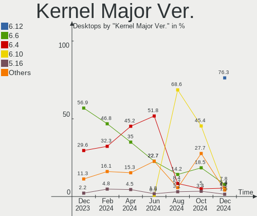
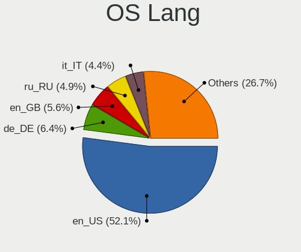
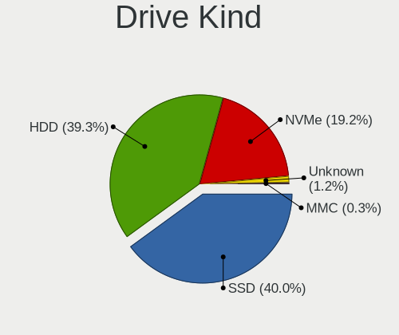
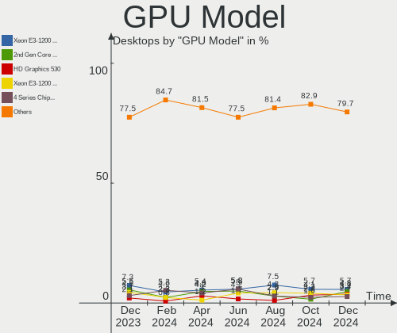
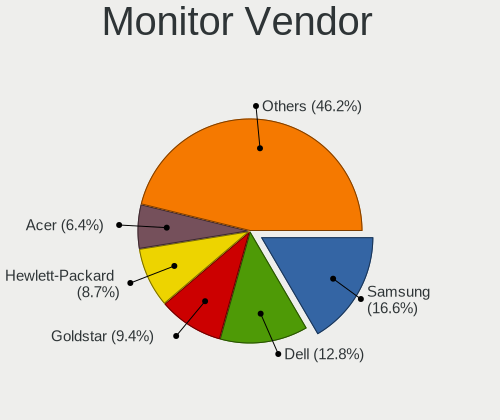
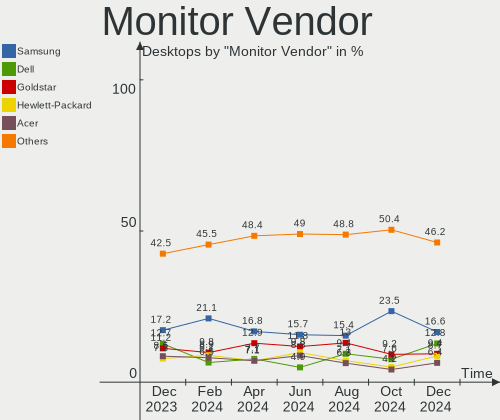
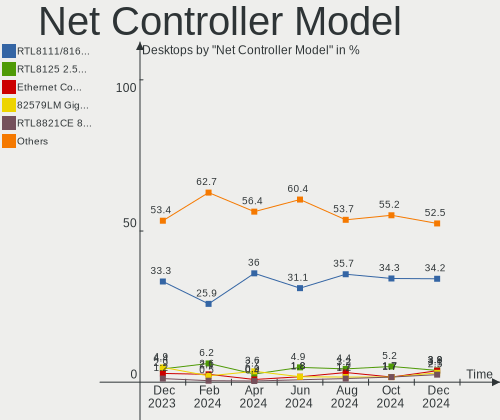
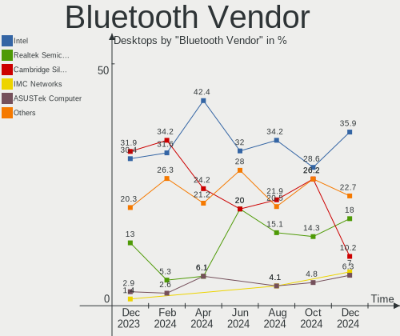
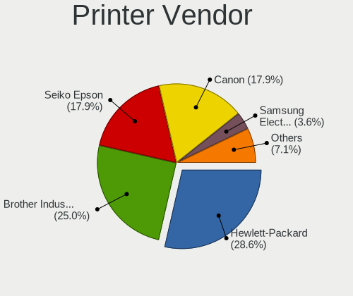

OpenMandriva Hardware Trends (Desktops)
---------------------------------------

A project to identify most popular hardware characteristics and track their change
over time based on data collected by OpenMandriva users at https://Linux-Hardware.org.

Anyone can contribute to this report by the [hw-probe](https://github.com/linuxhw/hw-probe) tool:

    sudo -E hw-probe -all -upload

Full-feature report is available here: https://linux-hardware.org/?view=trends&formfactor=desktop

Period: Jul, 2021.

Contents
--------

* [ System ](#system)
  - [ OS                       ](#os)
  - [ OS Family                ](#os-family)
  - [ Kernel                   ](#kernel)
  - [ Kernel Family            ](#kernel-family)
  - [ Kernel Major Ver.        ](#kernel-major-ver)
  - [ Arch                     ](#arch)
  - [ DE                       ](#de)
  - [ Display Server           ](#display-server)
  - [ Display Manager          ](#display-manager)
  - [ OS Lang                  ](#os-lang)
  - [ Boot Mode                ](#boot-mode)
  - [ Filesystem               ](#filesystem)
  - [ Part. scheme             ](#part-scheme)
  - [ Dual Boot with Linux/BSD ](#dual-boot-with-linuxbsd)
  - [ Dual Boot (Win)          ](#dual-boot-win)

* [ Board ](#board)
  - [ Vendor                   ](#vendor)
  - [ Model                    ](#model)
  - [ Model Family             ](#model-family)
  - [ MFG Year                 ](#mfg-year)
  - [ Form Factor              ](#form-factor)
  - [ Secure Boot              ](#secure-boot)
  - [ Coreboot                 ](#coreboot)
  - [ RAM Size                 ](#ram-size)
  - [ RAM Used                 ](#ram-used)
  - [ Total Drives             ](#total-drives)
  - [ Has CD-ROM               ](#has-cd-rom)
  - [ Has Ethernet             ](#has-ethernet)
  - [ Has WiFi                 ](#has-wifi)
  - [ Has Bluetooth            ](#has-bluetooth)

* [ Location ](#location)
  - [ Country                  ](#country)
  - [ City                     ](#city)

* [ Drives ](#drives)
  - [ Drive Vendor             ](#drive-vendor)
  - [ Drive Model              ](#drive-model)
  - [ HDD Vendor               ](#hdd-vendor)
  - [ SSD Vendor               ](#ssd-vendor)
  - [ Drive Kind               ](#drive-kind)
  - [ Drive Connector          ](#drive-connector)
  - [ Drive Size               ](#drive-size)
  - [ Space Total              ](#space-total)
  - [ Space Used               ](#space-used)
  - [ Malfunc. Drives          ](#malfunc-drives)
  - [ Malfunc. Drive Vendor    ](#malfunc-drive-vendor)
  - [ Malfunc. HDD Vendor      ](#malfunc-hdd-vendor)
  - [ Malfunc. Drive Kind      ](#malfunc-drive-kind)
  - [ Failed Drives            ](#failed-drives)
  - [ Failed Drive Vendor      ](#failed-drive-vendor)
  - [ Drive Status             ](#drive-status)

* [ Storage controller ](#storage-controller)
  - [ Storage Vendor           ](#storage-vendor)
  - [ Storage Model            ](#storage-model)
  - [ Storage Kind             ](#storage-kind)

* [ Processor ](#processor)
  - [ CPU Vendor               ](#cpu-vendor)
  - [ CPU Model                ](#cpu-model)
  - [ CPU Model Family         ](#cpu-model-family)
  - [ CPU Cores                ](#cpu-cores)
  - [ CPU Sockets              ](#cpu-sockets)
  - [ CPU Threads              ](#cpu-threads)
  - [ CPU Op-Modes             ](#cpu-op-modes)
  - [ CPU Microcode            ](#cpu-microcode)
  - [ CPU Microarch            ](#cpu-microarch)

* [ Graphics ](#graphics)
  - [ GPU Vendor               ](#gpu-vendor)
  - [ GPU Model                ](#gpu-model)
  - [ GPU Combo                ](#gpu-combo)
  - [ GPU Driver               ](#gpu-driver)
  - [ GPU Memory               ](#gpu-memory)

* [ Monitor ](#monitor)
  - [ Monitor Vendor           ](#monitor-vendor)
  - [ Monitor Model            ](#monitor-model)
  - [ Monitor Resolution       ](#monitor-resolution)
  - [ Monitor Diagonal         ](#monitor-diagonal)
  - [ Monitor Width            ](#monitor-width)
  - [ Aspect Ratio             ](#aspect-ratio)
  - [ Monitor Area             ](#monitor-area)
  - [ Pixel Density            ](#pixel-density)
  - [ Multiple Monitors        ](#multiple-monitors)

* [ Network ](#network)
  - [ Net Controller Vendor    ](#net-controller-vendor)
  - [ Net Controller Model     ](#net-controller-model)
  - [ Wireless Vendor          ](#wireless-vendor)
  - [ Wireless Model           ](#wireless-model)
  - [ Ethernet Vendor          ](#ethernet-vendor)
  - [ Ethernet Model           ](#ethernet-model)
  - [ Net Controller Kind      ](#net-controller-kind)
  - [ Used Controller          ](#used-controller)
  - [ NICs                     ](#nics)
  - [ IPv6                     ](#ipv6)

* [ Bluetooth ](#bluetooth)
  - [ Bluetooth Vendor         ](#bluetooth-vendor)
  - [ Bluetooth Model          ](#bluetooth-model)

* [ Sound ](#sound)
  - [ Sound Vendor             ](#sound-vendor)
  - [ Sound Model              ](#sound-model)

* [ Memory ](#memory)
  - [ Memory Vendor            ](#memory-vendor)
  - [ Memory Model             ](#memory-model)
  - [ Memory Kind              ](#memory-kind)
  - [ Memory Form Factor       ](#memory-form-factor)
  - [ Memory Size              ](#memory-size)
  - [ Memory Speed             ](#memory-speed)

* [ Printers & scanners ](#printers-&-scanners)
  - [ Printer Vendor           ](#printer-vendor)
  - [ Printer Model            ](#printer-model)
  - [ Scanner Vendor           ](#scanner-vendor)
  - [ Scanner Model            ](#scanner-model)

* [ Camera ](#camera)
  - [ Camera Vendor            ](#camera-vendor)
  - [ Camera Model             ](#camera-model)

* [ Security ](#security)
  - [ Fingerprint Vendor       ](#fingerprint-vendor)
  - [ Fingerprint Model        ](#fingerprint-model)
  - [ Chipcard Vendor          ](#chipcard-vendor)
  - [ Chipcard Model           ](#chipcard-model)

* [ Unsupported ](#unsupported)
  - [ Unsupported Devices      ](#unsupported-devices)
  - [ Unsupported Device Types ](#unsupported-device-types)

System
------

OS
--

Installed operating systems

| Name              | Desktops | Percent |
|-------------------|----------|---------|
| OpenMandriva 4.2  | 163      | 81.91%  |
| OpenMandriva 4.50 | 36       | 18.09%  |

OS Family
---------

OS without a version

| Name         | Desktops | Percent |
|--------------|----------|---------|
| OpenMandriva | 199      | 100%    |

Kernel
------

Version of the Linux kernel

| Version                        | Desktops | Percent |
|--------------------------------|----------|---------|
| 5.10.14-desktop-1omv4002       | 136      | 68.34%  |
| 5.11.12-desktop-1omv4002       | 27       | 13.57%  |
| 5.12.4-desktop-1omv4050        | 24       | 12.06%  |
| 5.12.7-desktop-1omv4003        | 7        | 3.52%   |
| 5.13.2-desktop-clang-1omv4050  | 2        | 1.01%   |
| 5.13.2-desktop-1omv4050        | 1        | 0.5%    |
| 5.12.7-desktop-clang-1omv4003  | 1        | 0.5%    |
| 5.12.12-desktop-clang-1omv4050 | 1        | 0.5%    |

Kernel Family
-------------

Linux kernel without a distro release

| Version | Desktops | Percent |
|---------|----------|---------|
| 5.10.14 | 136      | 68.34%  |
| 5.11.12 | 27       | 13.57%  |
| 5.12.4  | 24       | 12.06%  |
| 5.12.7  | 8        | 4.02%   |
| 5.13.2  | 3        | 1.51%   |
| 5.12.12 | 1        | 0.5%    |

Kernel Major Ver.
-----------------

Linux kernel major version

| Version | Desktops | Percent |
|---------|----------|---------|
| 5.10    | 136      | 68.34%  |
| 5.12    | 33       | 16.58%  |
| 5.11    | 27       | 13.57%  |
| 5.13    | 3        | 1.51%   |

Arch
----

OS architecture (x86_64, i586, etc.)

| Name   | Desktops | Percent |
|--------|----------|---------|
| x86_64 | 199      | 100%    |

DE
--

Desktop Environment

| Name     | Desktops | Percent |
|----------|----------|---------|
| KDE5     | 197      | 98.99%  |
| LXQt     | 1        | 0.5%    |
| Cinnamon | 1        | 0.5%    |

Display Server
--------------

X11 or Wayland

| Name | Desktops | Percent |
|------|----------|---------|
| X11  | 199      | 100%    |

Display Manager
---------------

SDDM, LightDM, etc.

| Name | Desktops | Percent |
|------|----------|---------|
| SDDM | 199      | 100%    |

OS Lang
-------

Language

| Lang  | Desktops | Percent |
|-------|----------|---------|
| en_US | 92       | 46.23%  |
| de_DE | 15       | 7.54%   |
| fr_FR | 13       | 6.53%   |
| ru_RU | 12       | 6.03%   |
| pt_BR | 10       | 5.03%   |
| es_ES | 8        | 4.02%   |
| es_MX | 7        | 3.52%   |
| it_IT | 5        | 2.51%   |
| pl_PL | 4        | 2.01%   |
| en_GB | 4        | 2.01%   |
| es_CO | 3        | 1.51%   |
| cs_CZ | 3        | 1.51%   |
| hu_HU | 2        | 1.01%   |
| fr_BE | 2        | 1.01%   |
| es_VE | 2        | 1.01%   |
| es_CL | 2        | 1.01%   |
| en_SG | 2        | 1.01%   |
| en_CA | 2        | 1.01%   |
| en_AU | 2        | 1.01%   |
| uk_UA | 1        | 0.5%    |
| nl_NL | 1        | 0.5%    |
| fr_CA | 1        | 0.5%    |
| es_SV | 1        | 0.5%    |
| en_ZA | 1        | 0.5%    |
| en_IL | 1        | 0.5%    |
| en_DK | 1        | 0.5%    |
| de_IT | 1        | 0.5%    |
| af_ZA | 1        | 0.5%    |

Boot Mode
---------

EFI or BIOS

| Mode | Desktops | Percent |
|------|----------|---------|
| BIOS | 129      | 64.82%  |
| EFI  | 70       | 35.18%  |

Filesystem
----------

Type of filesystem

| Type    | Desktops | Percent |
|---------|----------|---------|
| Overlay | 141      | 70.85%  |
| Ext4    | 51       | 25.63%  |
| Xfs     | 2        | 1.01%   |
| Btrfs   | 2        | 1.01%   |
| Jfs     | 1        | 0.5%    |
| F2fs    | 1        | 0.5%    |
| Ext3    | 1        | 0.5%    |

Part. scheme
------------

Scheme of partitioning

| Type    | Desktops | Percent |
|---------|----------|---------|
| GPT     | 111      | 55.78%  |
| MBR     | 87       | 43.72%  |
| Unknown | 1        | 0.5%    |

Dual Boot with Linux/BSD
------------------------

Hosting more than one Linux/BSD

| Dual boot | Desktops | Percent |
|-----------|----------|---------|
| Yes       | 117      | 58.79%  |
| No        | 82       | 41.21%  |

Dual Boot (Win)
---------------

Hosting Linux and Windows

| Dual boot | Desktops | Percent |
|-----------|----------|---------|
| Yes       | 101      | 50.75%  |
| No        | 98       | 49.25%  |

Board
-----

Vendor
------

Motherboard manufacturer

| Name                | Desktops | Percent |
|---------------------|----------|---------|
| ASUSTek Computer    | 48       | 24.12%  |
| Gigabyte Technology | 34       | 17.09%  |
| Dell                | 20       | 10.05%  |
| MSI                 | 18       | 9.05%   |
| Hewlett-Packard     | 17       | 8.54%   |
| ASRock              | 14       | 7.04%   |
| Lenovo              | 9        | 4.52%   |
| Intel               | 6        | 3.02%   |
| Biostar             | 5        | 2.51%   |
| Acer                | 5        | 2.51%   |
| Pegatron            | 4        | 2.01%   |
| Positivo            | 2        | 1.01%   |
| PCWare              | 2        | 1.01%   |
| Packard Bell        | 2        | 1.01%   |
| Fujitsu             | 2        | 1.01%   |
| Unknown             | 2        | 1.01%   |
| Shuttle             | 1        | 0.5%    |
| R-StyleComputers    | 1        | 0.5%    |
| Lanix               | 1        | 0.5%    |
| Koloe               | 1        | 0.5%    |
| Itautec             | 1        | 0.5%    |
| Inventec            | 1        | 0.5%    |
| Foxconn             | 1        | 0.5%    |
| ECS                 | 1        | 0.5%    |
| Apple               | 1        | 0.5%    |

Model
-----

Motherboard model

| Name                                    | Desktops | Percent |
|-----------------------------------------|----------|---------|
| Dell OptiPlex 780                       | 4        | 2.01%   |
| ASUS All Series                         | 4        | 2.01%   |
| MSI MS-7A40                             | 2        | 1.01%   |
| MSI MS-7309                             | 2        | 1.01%   |
| Intel DH61WW AAG23116-204               | 2        | 1.01%   |
| HP ProDesk 600 G4 SFF                   | 2        | 1.01%   |
| Gigabyte H61M-DS2                       | 2        | 1.01%   |
| Gigabyte G41MT-S2PT                     | 2        | 1.01%   |
| Gigabyte B450M S2H                      | 2        | 1.01%   |
| ASUS PRIME A320M-K                      | 2        | 1.01%   |
| ASUS M5A78L-M PLUS/USB3                 | 2        | 1.01%   |
| ASUS B75M-A                             | 2        | 1.01%   |
| Unknown                                 | 2        | 1.01%   |
| Shuttle DL10J                           | 1        | 0.5%    |
| R-StyleComputers ALICON AI2S-A21 00.69  | 1        | 0.5%    |
| Positivo POS-EIH61CE                    | 1        | 0.5%    |
| Positivo POS-EIBTPDC                    | 1        | 0.5%    |
| Pegatron p6715fr                        | 1        | 0.5%    |
| Pegatron HPE-553s                       | 1        | 0.5%    |
| Pegatron 520-1140t                      | 1        | 0.5%    |
| Pegatron 2A84h                          | 1        | 0.5%    |
| PCWare IPX4105G Pro                     | 1        | 0.5%    |
| PCWare IPMH61R1                         | 1        | 0.5%    |
| Packard Bell ISTART MC9194              | 1        | 0.5%    |
| Packard Bell IMEDIA X4626 GE            | 1        | 0.5%    |
| MSI MS-7C92                             | 1        | 0.5%    |
| MSI MS-7C81                             | 1        | 0.5%    |
| MSI MS-7B89                             | 1        | 0.5%    |
| MSI MS-7B24                             | 1        | 0.5%    |
| MSI MS-7A15                             | 1        | 0.5%    |
| MSI MS-7996                             | 1        | 0.5%    |
| MSI MS-7921                             | 1        | 0.5%    |
| MSI MS-7918                             | 1        | 0.5%    |
| MSI MS-7817                             | 1        | 0.5%    |
| MSI MS-7788                             | 1        | 0.5%    |
| MSI MS-7721                             | 1        | 0.5%    |
| MSI MS-7641                             | 1        | 0.5%    |
| MSI MS-7578                             | 1        | 0.5%    |
| MSI MS-7507                             | 1        | 0.5%    |
| Lenovo ThinkCentre M92p 3228CF4         | 1        | 0.5%    |
| Lenovo ThinkCentre M920s 10SKS3J100     | 1        | 0.5%    |
| Lenovo ThinkCentre M90p 5536B2G         | 1        | 0.5%    |
| Lenovo ThinkCentre M82 2929BT6          | 1        | 0.5%    |
| Lenovo ThinkCentre M73 10AYS01100       | 1        | 0.5%    |
| Lenovo ThinkCentre M73 10AYA067FR       | 1        | 0.5%    |
| Lenovo ThinkCentre M70e 0830F2U         | 1        | 0.5%    |
| Lenovo ThinkCentre M58p 3285A1G         | 1        | 0.5%    |
| Lenovo IdeaCentre 510S-07ICB 90K800EGRS | 1        | 0.5%    |
| Lanix ChiefRiver                        | 1        | 0.5%    |
| Koloe Thurley                           | 1        | 0.5%    |
| Itautec Infoway ST-4254                 | 1        | 0.5%    |
| Inventec DQ Class                       | 1        | 0.5%    |
| Intel H61                               | 1        | 0.5%    |
| Intel H55                               | 1        | 0.5%    |
| Intel DP67DE AAG10217-300               | 1        | 0.5%    |
| Intel DH55HC AAE70933-505               | 1        | 0.5%    |
| HP Z230 SFF Workstation                 | 1        | 0.5%    |
| HP Slim Desktop S01-aF0xxx              | 1        | 0.5%    |
| HP ProLiant MicroServer                 | 1        | 0.5%    |
| HP ProDesk 600 G2 DM                    | 1        | 0.5%    |

Model Family
------------

Motherboard model prefix

| Name                    | Desktops | Percent |
|-------------------------|----------|---------|
| Dell OptiPlex           | 10       | 5.03%   |
| Lenovo ThinkCentre      | 8        | 4.02%   |
| ASUS PRIME              | 8        | 4.02%   |
| HP Compaq               | 7        | 3.52%   |
| HP ProDesk              | 4        | 2.01%   |
| Dell Inspiron           | 4        | 2.01%   |
| ASUS P8H61-M            | 4        | 2.01%   |
| ASUS All                | 4        | 2.01%   |
| Dell Precision          | 3        | 1.51%   |
| ASUS ROG                | 3        | 1.51%   |
| ASUS M5A78L-M           | 3        | 1.51%   |
| Acer Aspire             | 3        | 1.51%   |
| MSI MS-7A40             | 2        | 1.01%   |
| MSI MS-7309             | 2        | 1.01%   |
| Intel DH61WW            | 2        | 1.01%   |
| HP EliteDesk            | 2        | 1.01%   |
| Gigabyte H61M-DS2       | 2        | 1.01%   |
| Gigabyte G41MT-S2PT     | 2        | 1.01%   |
| Gigabyte B450M          | 2        | 1.01%   |
| Gigabyte A320M-S2H      | 2        | 1.01%   |
| Fujitsu ESPRIMO         | 2        | 1.01%   |
| ASUS TUF                | 2        | 1.01%   |
| ASUS P8Z77-V            | 2        | 1.01%   |
| ASUS P5K                | 2        | 1.01%   |
| ASUS K30BF              | 2        | 1.01%   |
| ASUS B75M-A             | 2        | 1.01%   |
| Acer Veriton            | 2        | 1.01%   |
| Unknown                 | 2        | 1.01%   |
| Shuttle DL10J           | 1        | 0.5%    |
| R-StyleComputers ALICON | 1        | 0.5%    |
| Positivo POS-EIH61CE    | 1        | 0.5%    |
| Positivo POS-EIBTPDC    | 1        | 0.5%    |
| Pegatron p6715fr        | 1        | 0.5%    |
| Pegatron HPE-553s       | 1        | 0.5%    |
| Pegatron 520-1140t      | 1        | 0.5%    |
| Pegatron 2A84h          | 1        | 0.5%    |
| PCWare IPX4105G         | 1        | 0.5%    |
| PCWare IPMH61R1         | 1        | 0.5%    |
| Packard Bell ISTART     | 1        | 0.5%    |
| Packard Bell IMEDIA     | 1        | 0.5%    |
| MSI MS-7C92             | 1        | 0.5%    |
| MSI MS-7C81             | 1        | 0.5%    |
| MSI MS-7B89             | 1        | 0.5%    |
| MSI MS-7B24             | 1        | 0.5%    |
| MSI MS-7A15             | 1        | 0.5%    |
| MSI MS-7996             | 1        | 0.5%    |
| MSI MS-7921             | 1        | 0.5%    |
| MSI MS-7918             | 1        | 0.5%    |
| MSI MS-7817             | 1        | 0.5%    |
| MSI MS-7788             | 1        | 0.5%    |
| MSI MS-7721             | 1        | 0.5%    |
| MSI MS-7641             | 1        | 0.5%    |
| MSI MS-7578             | 1        | 0.5%    |
| MSI MS-7507             | 1        | 0.5%    |
| Lenovo IdeaCentre       | 1        | 0.5%    |
| Lanix ChiefRiver        | 1        | 0.5%    |
| Koloe Thurley           | 1        | 0.5%    |
| Itautec Infoway         | 1        | 0.5%    |
| Inventec DQ             | 1        | 0.5%    |
| Intel H61               | 1        | 0.5%    |

MFG Year
--------

Motherboard manufacture year

| Year | Desktops | Percent |
|------|----------|---------|
| 2020 | 21       | 10.55%  |
| 2014 | 20       | 10.05%  |
| 2011 | 19       | 9.55%   |
| 2010 | 19       | 9.55%   |
| 2012 | 18       | 9.05%   |
| 2019 | 14       | 7.04%   |
| 2013 | 14       | 7.04%   |
| 2018 | 13       | 6.53%   |
| 2009 | 13       | 6.53%   |
| 2015 | 12       | 6.03%   |
| 2021 | 11       | 5.53%   |
| 2016 | 10       | 5.03%   |
| 2008 | 5        | 2.51%   |
| 2007 | 5        | 2.51%   |
| 2017 | 3        | 1.51%   |
| 2006 | 2        | 1.01%   |

Form Factor
-----------

Physical design of the computer

| Name    | Desktops | Percent |
|---------|----------|---------|
| Desktop | 199      | 100%    |

Secure Boot
-----------

Enabled or disabled

| State    | Desktops | Percent |
|----------|----------|---------|
| Disabled | 199      | 100%    |

Coreboot
--------

Have coreboot on board

| Used | Desktops | Percent |
|------|----------|---------|
| No   | 199      | 100%    |

RAM Size
--------

Total RAM memory

| Size in GB  | Desktops | Percent |
|-------------|----------|---------|
| 8.01-16.0   | 53       | 26.63%  |
| 3.01-4.0    | 46       | 23.12%  |
| 4.01-8.0    | 45       | 22.61%  |
| 16.01-24.0  | 30       | 15.08%  |
| 32.01-64.0  | 16       | 8.04%   |
| 2.01-3.0    | 3        | 1.51%   |
| 24.01-32.0  | 2        | 1.01%   |
| 0.51-1.0    | 2        | 1.01%   |
| 64.01-256.0 | 1        | 0.5%    |
| 1.01-2.0    | 1        | 0.5%    |

RAM Used
--------

Used RAM memory

| Used GB  | Desktops | Percent |
|----------|----------|---------|
| 1.01-2.0 | 148      | 74.37%  |
| 0.51-1.0 | 28       | 14.07%  |
| 2.01-3.0 | 13       | 6.53%   |
| 0.01-0.5 | 6        | 3.02%   |
| 4.01-8.0 | 3        | 1.51%   |
| 3.01-4.0 | 1        | 0.5%    |

Total Drives
------------

Number of drives on board

| Drives | Desktops | Percent |
|--------|----------|---------|
| 1      | 95       | 47.74%  |
| 2      | 54       | 27.14%  |
| 3      | 26       | 13.07%  |
| 4      | 14       | 7.04%   |
| 5      | 4        | 2.01%   |
| 8      | 2        | 1.01%   |
| 0      | 2        | 1.01%   |
| 15     | 1        | 0.5%    |
| 6      | 1        | 0.5%    |

Has CD-ROM
----------

Has CD-ROM on board

| Presented | Desktops | Percent |
|-----------|----------|---------|
| Yes       | 138      | 69.35%  |
| No        | 61       | 30.65%  |

Has Ethernet
------------

Has Ethernet on board

| Presented | Desktops | Percent |
|-----------|----------|---------|
| Yes       | 195      | 97.99%  |
| No        | 4        | 2.01%   |

Has WiFi
--------

Has WiFi module

| Presented | Desktops | Percent |
|-----------|----------|---------|
| No        | 130      | 65.33%  |
| Yes       | 69       | 34.67%  |

Has Bluetooth
-------------

Has Bluetooth module

| Presented | Desktops | Percent |
|-----------|----------|---------|
| No        | 162      | 81.41%  |
| Yes       | 37       | 18.59%  |

Location
--------

Country
-------

Geographic location (country)

| Country      | Desktops | Percent |
|--------------|----------|---------|
| Germany      | 22       | 11.06%  |
| USA          | 20       | 10.05%  |
| Russia       | 20       | 10.05%  |
| Brazil       | 18       | 9.05%   |
| France       | 13       | 6.53%   |
| Spain        | 10       | 5.03%   |
| Mexico       | 9        | 4.52%   |
| Italy        | 8        | 4.02%   |
| Canada       | 8        | 4.02%   |
| UK           | 7        | 3.52%   |
| Poland       | 7        | 3.52%   |
| Finland      | 5        | 2.51%   |
| Czechia      | 5        | 2.51%   |
| South Africa | 3        | 1.51%   |
| Malaysia     | 3        | 1.51%   |
| Colombia     | 3        | 1.51%   |
| Chile        | 3        | 1.51%   |
| Belgium      | 3        | 1.51%   |
| Venezuela    | 2        | 1.01%   |
| Singapore    | 2        | 1.01%   |
| Japan        | 2        | 1.01%   |
| Israel       | 2        | 1.01%   |
| Indonesia    | 2        | 1.01%   |
| Hungary      | 2        | 1.01%   |
| El Salvador  | 2        | 1.01%   |
| Australia    | 2        | 1.01%   |
| Ukraine      | 1        | 0.5%    |
| Sweden       | 1        | 0.5%    |
| Slovenia     | 1        | 0.5%    |
| Slovakia     | 1        | 0.5%    |
| Romania      | 1        | 0.5%    |
| Portugal     | 1        | 0.5%    |
| Pakistan     | 1        | 0.5%    |
| New Zealand  | 1        | 0.5%    |
| Netherlands  | 1        | 0.5%    |
| Morocco      | 1        | 0.5%    |
| Kenya        | 1        | 0.5%    |
| Egypt        | 1        | 0.5%    |
| Denmark      | 1        | 0.5%    |
| Bulgaria     | 1        | 0.5%    |
| Belarus      | 1        | 0.5%    |
| Algeria      | 1        | 0.5%    |

City
----

Geographic location (city)

| City               | Desktops | Percent |
|--------------------|----------|---------|
| Helsinki           | 4        | 2.01%   |
| Yekaterinburg      | 3        | 1.51%   |
| Mexico City        | 3        | 1.51%   |
| Frankfurt am Main  | 3        | 1.51%   |
| Singapore          | 2        | 1.01%   |
| Saskatoon          | 2        | 1.01%   |
| Riverdale          | 2        | 1.01%   |
| Paris              | 2        | 1.01%   |
| Moscow             | 2        | 1.01%   |
| Kuala Lumpur       | 2        | 1.01%   |
| Colindale          | 2        | 1.01%   |
| Berlin             | 2        | 1.01%   |
| Barcelona          | 2        | 1.01%   |
| Zdar               | 1        | 0.5%    |
| Zadni Treban       | 1        | 0.5%    |
| York               | 1        | 0.5%    |
| Willingboro        | 1        | 0.5%    |
| Waterford          | 1        | 0.5%    |
| Warsaw             | 1        | 0.5%    |
| Victoriaville      | 1        | 0.5%    |
| Varzelandia        | 1        | 0.5%    |
| Valladolid         | 1        | 0.5%    |
| Valencia           | 1        | 0.5%    |
| Uchaud             | 1        | 0.5%    |
| Tyumen             | 1        | 0.5%    |
| Trois-Rivi??res    | 1        | 0.5%    |
| Torrevieja         | 1        | 0.5%    |
| Torquay            | 1        | 0.5%    |
| Tlalnepantla       | 1        | 0.5%    |
| Thatcham           | 1        | 0.5%    |
| Tel Aviv           | 1        | 0.5%    |
| Te Awamutu         | 1        | 0.5%    |
| T?©bessa           | 1        | 0.5%    |
| Suita              | 1        | 0.5%    |
| Stara Zagora       | 1        | 0.5%    |
| St Petersburg      | 1        | 0.5%    |
| Sogamoso           | 1        | 0.5%    |
| Smolensk           | 1        | 0.5%    |
| Sleman             | 1        | 0.5%    |
| Shinagawa          | 1        | 0.5%    |
| Sheksna            | 1        | 0.5%    |
| Seville            | 1        | 0.5%    |
| Sefrou             | 1        | 0.5%    |
| Schwerin           | 1        | 0.5%    |
| S??o Jo??o del Rei | 1        | 0.5%    |
| Sao Goncalo        | 1        | 0.5%    |
| Santiago           | 1        | 0.5%    |
| Santa Luzia        | 1        | 0.5%    |
| San Salvador       | 1        | 0.5%    |
| San Martin         | 1        | 0.5%    |
| Salo               | 1        | 0.5%    |
| Saint-Laurent      | 1        | 0.5%    |
| Rypin              | 1        | 0.5%    |
| Roszke             | 1        | 0.5%    |
| Rosu               | 1        | 0.5%    |
| Rolandia           | 1        | 0.5%    |
| Rio de Janeiro     | 1        | 0.5%    |
| Reutov             | 1        | 0.5%    |
| Recife             | 1        | 0.5%    |
| Quinto di Treviso  | 1        | 0.5%    |

Drives
------

Drive Vendor
------------

Hard drive vendors

| Vendor              | Desktops | Drives | Percent |
|---------------------|----------|--------|---------|
| WDC                 | 85       | 102    | 25.68%  |
| Seagate             | 79       | 98     | 23.87%  |
| Samsung Electronics | 29       | 36     | 8.76%   |
| Kingston            | 18       | 20     | 5.44%   |
| Toshiba             | 17       | 19     | 5.14%   |
| Hitachi             | 15       | 16     | 4.53%   |
| Crucial             | 13       | 14     | 3.93%   |
| A-DATA Technology   | 12       | 14     | 3.63%   |
| SanDisk             | 7        | 9      | 2.11%   |
| Intel               | 7        | 7      | 2.11%   |
| Maxtor              | 6        | 6      | 1.81%   |
| Unknown             | 4        | 5      | 1.21%   |
| HGST                | 4        | 5      | 1.21%   |
| China               | 4        | 4      | 1.21%   |
| Apacer              | 4        | 6      | 1.21%   |
| PNY                 | 3        | 3      | 0.91%   |
| Phison              | 3        | 7      | 0.91%   |
| Corsair             | 3        | 3      | 0.91%   |
| PLEXTOR             | 2        | 2      | 0.6%    |
| Patriot             | 2        | 2      | 0.6%    |
| OCZ                 | 2        | 2      | 0.6%    |
| Intenso             | 2        | 2      | 0.6%    |
| Hewlett-Packard     | 2        | 2      | 0.6%    |
| ZTE                 | 1        | 1      | 0.3%    |
| Transcend           | 1        | 1      | 0.3%    |
| SK Hynix            | 1        | 1      | 0.3%    |
| MDT                 | 1        | 1      | 0.3%    |
| KingSpec            | 1        | 1      | 0.3%    |
| GOODRAM             | 1        | 1      | 0.3%    |
| FORESEE             | 1        | 1      | 0.3%    |
| ASMT106x            | 1        | 1      | 0.3%    |

Drive Model
-----------

Hard drive models

| Model                               | Desktops | Percent |
|-------------------------------------|----------|---------|
| Seagate ST500DM002-1BD142 500GB     | 9        | 2.44%   |
| WDC WD20EZRX-00D8PB0 2TB            | 6        | 1.63%   |
| Samsung SSD 860 EVO 250GB           | 6        | 1.63%   |
| Seagate ST2000DM008-2FR102 2TB      | 5        | 1.36%   |
| Seagate ST380815AS 80GB             | 4        | 1.08%   |
| Seagate ST1000DM010-2EP102 1TB      | 4        | 1.08%   |
| Kingston SA400S37240G 240GB SSD     | 4        | 1.08%   |
| WDC WD5000AAKX-00ERMA0 500GB        | 3        | 0.81%   |
| WDC WD20EZRZ-00Z5HB0 2TB            | 3        | 0.81%   |
| WDC WD10EZEX-00BN5A0 1TB            | 3        | 0.81%   |
| Toshiba DT01ACA100 1TB              | 3        | 0.81%   |
| Seagate ST9500325AS 500GB           | 3        | 0.81%   |
| Seagate ST500LM012 HN-M500MBB 500GB | 3        | 0.81%   |
| Seagate ST3500418AS 500GB           | 3        | 0.81%   |
| Seagate ST2000DM001-1ER164 2TB      | 3        | 0.81%   |
| Seagate ST1000DM003-1ER162 1TB      | 3        | 0.81%   |
| Crucial CT500MX500SSD1 500GB        | 3        | 0.81%   |
| A-DATA SU650 120GB SSD              | 3        | 0.81%   |
| WDC WDS500G2B0C-00PXH0 500GB        | 2        | 0.54%   |
| WDC WD6400AAKS-22A7B2 640GB         | 2        | 0.54%   |
| WDC WD6400AAKS-22A7B0 640GB         | 2        | 0.54%   |
| WDC WD5000AAKX-083CA1 500GB         | 2        | 0.54%   |
| WDC WD5000AAKX-001CA0 500GB         | 2        | 0.54%   |
| WDC WD3200AAKS-00B3A0 320GB         | 2        | 0.54%   |
| WDC WD3200AAJS-56M0A0 320GB         | 2        | 0.54%   |
| WDC WD3200AAJS-00RYA0 320GB         | 2        | 0.54%   |
| WDC WD10EZEX-60WN4A0 1TB            | 2        | 0.54%   |
| WDC WD10EZEX-21M2NA0 1TB            | 2        | 0.54%   |
| WDC WD10EZEX-08WN4A0 1TB            | 2        | 0.54%   |
| WDC WD10EURX-63FH1Y0 1TB            | 2        | 0.54%   |
| WDC WD1003FZEX-00MK2A0 1TB          | 2        | 0.54%   |
| Unknown SD/MMC/MS PRO 128GB         | 2        | 0.54%   |
| Toshiba DT01ACA200 2TB              | 2        | 0.54%   |
| Toshiba DT01ACA050 500GB            | 2        | 0.54%   |
| Seagate ST3500413AS 500GB           | 2        | 0.54%   |
| Seagate ST3320620AS 320GB           | 2        | 0.54%   |
| Seagate ST3250318AS 250GB           | 2        | 0.54%   |
| Seagate ST3160815AS 160GB           | 2        | 0.54%   |
| Seagate ST3160318AS 160GB           | 2        | 0.54%   |
| Seagate ST2000VM003-1ET164 2TB      | 2        | 0.54%   |
| Seagate ST1000VM002-1CT162 1TB      | 2        | 0.54%   |
| Seagate ST1000LM024 HN-M101MBB 1TB  | 2        | 0.54%   |
| Seagate ST1000DM003-1SB102 1TB      | 2        | 0.54%   |
| SanDisk SDSSDA240G 240GB            | 2        | 0.54%   |
| Samsung SSD 970 EVO Plus 250GB      | 2        | 0.54%   |
| Samsung SSD 860 EVO 500GB           | 2        | 0.54%   |
| Samsung HD161HJ 160GB               | 2        | 0.54%   |
| Intenso SSD SATAIII 1TB             | 2        | 0.54%   |
| Intel SSDPEKNW512G8 512GB           | 2        | 0.54%   |
| Hitachi HDS721050CLA362 500GB       | 2        | 0.54%   |
| Crucial CT240BX500SSD1 240GB        | 2        | 0.54%   |
| Crucial CT1000MX500SSD1 1TB         | 2        | 0.54%   |
| A-DATA SU650 240GB SSD              | 2        | 0.54%   |
| ZTE MMC Storage 8GB                 | 1        | 0.27%   |
| WDC WDS500G2B0A-00SM50 500GB SSD    | 1        | 0.27%   |
| WDC WDS250G1B0A-00H9H0 250GB SSD    | 1        | 0.27%   |
| WDC WDS240G2G0A-00JH30 240GB SSD    | 1        | 0.27%   |
| WDC WDS240G1G0A-00SS50 240GB SSD    | 1        | 0.27%   |
| WDC WD7500AADS-00M2B0 752GB         | 1        | 0.27%   |
| WDC WD6400AAKS-00A7B2 640GB         | 1        | 0.27%   |

HDD Vendor
----------

Hard disk drive vendors

| Vendor              | Desktops | Drives | Percent |
|---------------------|----------|--------|---------|
| WDC                 | 79       | 95     | 37.62%  |
| Seagate             | 78       | 97     | 37.14%  |
| Hitachi             | 15       | 16     | 7.14%   |
| Toshiba             | 14       | 16     | 6.67%   |
| Samsung Electronics | 11       | 11     | 5.24%   |
| Maxtor              | 6        | 6      | 2.86%   |
| HGST                | 4        | 5      | 1.9%    |
| MDT                 | 1        | 1      | 0.48%   |
| Hewlett-Packard     | 1        | 1      | 0.48%   |
| ASMT106x            | 1        | 1      | 0.48%   |

SSD Vendor
----------

Solid state drive vendors

| Vendor              | Desktops | Drives | Percent |
|---------------------|----------|--------|---------|
| Kingston            | 16       | 18     | 16.67%  |
| Samsung Electronics | 14       | 18     | 14.58%  |
| A-DATA Technology   | 12       | 14     | 12.5%   |
| Crucial             | 11       | 12     | 11.46%  |
| SanDisk             | 7        | 9      | 7.29%   |
| WDC                 | 4        | 4      | 4.17%   |
| China               | 4        | 4      | 4.17%   |
| Apacer              | 4        | 6      | 4.17%   |
| Toshiba             | 3        | 3      | 3.13%   |
| PNY                 | 3        | 3      | 3.13%   |
| Intel               | 3        | 3      | 3.13%   |
| Corsair             | 3        | 3      | 3.13%   |
| Patriot             | 2        | 2      | 2.08%   |
| OCZ                 | 2        | 2      | 2.08%   |
| Intenso             | 2        | 2      | 2.08%   |
| Unknown             | 1        | 1      | 1.04%   |
| PLEXTOR             | 1        | 1      | 1.04%   |
| KingSpec            | 1        | 1      | 1.04%   |
| Hewlett-Packard     | 1        | 1      | 1.04%   |
| GOODRAM             | 1        | 1      | 1.04%   |
| FORESEE             | 1        | 1      | 1.04%   |

Drive Kind
----------

HDD or SSD

| Kind    | Desktops | Drives | Percent |
|---------|----------|--------|---------|
| HDD     | 166      | 249    | 63.12%  |
| SSD     | 72       | 109    | 27.38%  |
| NVMe    | 20       | 28     | 7.6%    |
| Unknown | 5        | 6      | 1.9%    |

Drive Connector
---------------

SATA, SAS, NVMe, etc.

| Type | Desktops | Drives | Percent |
|------|----------|--------|---------|
| SATA | 193      | 349    | 85.78%  |
| NVMe | 20       | 28     | 8.89%   |
| SAS  | 12       | 15     | 5.33%   |

Drive Size
----------

Size of hard drive

| Size in TB | Desktops | Drives | Percent |
|------------|----------|--------|---------|
| 0.01-0.5   | 153      | 220    | 58.4%   |
| 0.51-1.0   | 65       | 85     | 24.81%  |
| 1.01-2.0   | 32       | 36     | 12.21%  |
| 2.01-3.0   | 5        | 9      | 1.91%   |
| 3.01-4.0   | 4        | 4      | 1.53%   |
| 4.01-10.0  | 3        | 4      | 1.15%   |

Space Total
-----------

Amount of disk space available on the file system

| Size in GB     | Desktops | Percent |
|----------------|----------|---------|
| 1-20           | 75       | 37.69%  |
| Unknown        | 45       | 22.61%  |
| 101-250        | 24       | 12.06%  |
| 251-500        | 17       | 8.54%   |
| 21-50          | 11       | 5.53%   |
| 51-100         | 10       | 5.03%   |
| 501-1000       | 9        | 4.52%   |
| 1001-2000      | 4        | 2.01%   |
| 2001-3000      | 3        | 1.51%   |
| More than 3000 | 1        | 0.5%    |

Space Used
----------

Amount of used disk space

| Used GB   | Desktops | Percent |
|-----------|----------|---------|
| 1-20      | 124      | 62.31%  |
| Unknown   | 45       | 22.61%  |
| 21-50     | 11       | 5.53%   |
| 101-250   | 6        | 3.02%   |
| 251-500   | 5        | 2.51%   |
| 51-100    | 4        | 2.01%   |
| 1001-2000 | 2        | 1.01%   |
| 2001-3000 | 1        | 0.5%    |
| 501-1000  | 1        | 0.5%    |

Malfunc. Drives
---------------

Drive models with a malfunction

| Model                                        | Desktops | Drives | Percent |
|----------------------------------------------|----------|--------|---------|
| Seagate ST500DM002-1BD142 500GB              | 4        | 4      | 4.44%   |
| Seagate ST9500325AS 500GB                    | 3        | 3      | 3.33%   |
| WDC WD6400AAKS-22A7B2 640GB                  | 2        | 2      | 2.22%   |
| WDC WD5000AAKX-083CA1 500GB                  | 2        | 2      | 2.22%   |
| WDC WD3200AAJS-56M0A0 320GB                  | 2        | 2      | 2.22%   |
| WDC WD3200AAJS-00RYA0 320GB                  | 2        | 2      | 2.22%   |
| Seagate ST500LM012 HN-M500MBB 500GB          | 2        | 2      | 2.22%   |
| Seagate ST3320620AS 320GB                    | 2        | 2      | 2.22%   |
| Seagate ST1000DM010-2EP102 1TB               | 2        | 2      | 2.22%   |
| Samsung Electronics HD161HJ 160GB            | 2        | 2      | 2.22%   |
| Hitachi HDS721050CLA362 500GB                | 2        | 2      | 2.22%   |
| WDC WD6400AAKS-22A7B0 640GB                  | 1        | 1      | 1.11%   |
| WDC WD5000BPVT-22HXZT1 500GB                 | 1        | 1      | 1.11%   |
| WDC WD5000AZLX-00JKKA0 500GB                 | 1        | 1      | 1.11%   |
| WDC WD5000AAKX-753CA1 500GB                  | 1        | 1      | 1.11%   |
| WDC WD5000AAKX-08U6AA0 500GB                 | 1        | 1      | 1.11%   |
| WDC WD5000AAKX-001CA0 500GB                  | 1        | 1      | 1.11%   |
| WDC WD5000AAKS-22A7B0 500GB                  | 1        | 1      | 1.11%   |
| WDC WD5000AADS-00S9B0 500GB                  | 1        | 1      | 1.11%   |
| WDC WD3200AAKX-073CA0 320GB                  | 1        | 1      | 1.11%   |
| WDC WD3200AAKS-00L9A0 320GB                  | 1        | 1      | 1.11%   |
| WDC WD3200AAKS-00B3A0 320GB                  | 1        | 1      | 1.11%   |
| WDC WD3200AAJS-08L7A0 320GB                  | 1        | 1      | 1.11%   |
| WDC WD3200AAJS-00L7A0 320GB                  | 1        | 1      | 1.11%   |
| WDC WD2500AAJS-08L7A0 250GB                  | 1        | 1      | 1.11%   |
| WDC WD20EARS-60MVWB0 2TB                     | 1        | 1      | 1.11%   |
| WDC WD2003FZEX-00SRLA0 2TB                   | 1        | 1      | 1.11%   |
| WDC WD2003FYPS-27Y2B0 2TB                    | 1        | 1      | 1.11%   |
| WDC WD1600JS-60MHB5 160GB                    | 1        | 1      | 1.11%   |
| WDC WD1600AAJS-75M0A0 160GB                  | 1        | 1      | 1.11%   |
| WDC WD1600AAJB-56WRA0 160GB                  | 1        | 1      | 1.11%   |
| WDC WD10EZEX-60WN4A0 1TB                     | 1        | 1      | 1.11%   |
| WDC WD10EZEX-35M2NA0 1TB                     | 1        | 1      | 1.11%   |
| WDC WD10EZEX-00RKKA0 1TB                     | 1        | 1      | 1.11%   |
| WDC WD10EAVS-00D7B1 1TB                      | 1        | 1      | 1.11%   |
| WDC WD10EARS-00Y5B1 1TB                      | 1        | 1      | 1.11%   |
| WDC WD10EADX-22TDHB0 1TB                     | 1        | 1      | 1.11%   |
| WDC WD1002FBYS-02A6B0 1TB                    | 1        | 1      | 1.11%   |
| Toshiba MK6465GSXN 640GB                     | 1        | 1      | 1.11%   |
| Toshiba DT01ACA100 1TB                       | 1        | 1      | 1.11%   |
| Seagate ST500LT012-9WS142 500GB              | 1        | 1      | 1.11%   |
| Seagate ST3750640NS 752GB                    | 1        | 1      | 1.11%   |
| Seagate ST3500418AS 500GB                    | 1        | 1      | 1.11%   |
| Seagate ST3500410SV 500GB                    | 1        | 1      | 1.11%   |
| Seagate ST3360320AS 360GB                    | 1        | 1      | 1.11%   |
| Seagate ST3320613AS 320GB                    | 1        | 1      | 1.11%   |
| Seagate ST3320418AS 320GB                    | 1        | 1      | 1.11%   |
| Seagate ST3250318AS 250GB                    | 1        | 1      | 1.11%   |
| Seagate ST3160212AS 160GB                    | 1        | 1      | 1.11%   |
| Seagate ST3160021A 160GB                     | 1        | 1      | 1.11%   |
| Seagate ST31000524AS 1TB                     | 1        | 1      | 1.11%   |
| Seagate ST2000DM001-1ER164 2TB               | 1        | 1      | 1.11%   |
| Seagate ST1000LM024 HN-M101MBB 1TB           | 1        | 1      | 1.11%   |
| Samsung Electronics SSD 840 PRO Series 256GB | 1        | 1      | 1.11%   |
| Samsung Electronics HD322HJ 320GB            | 1        | 1      | 1.11%   |
| Samsung Electronics HD256GJ 250GB            | 1        | 1      | 1.11%   |
| Samsung Electronics HD160JJ/ 160GB           | 1        | 1      | 1.11%   |
| Samsung Electronics HD103SJ 1TB              | 1        | 1      | 1.11%   |
| Samsung Electronics HD080HJ 80GB             | 1        | 1      | 1.11%   |
| Maxtor 6V250F0 256GB                         | 1        | 1      | 1.11%   |

Malfunc. Drive Vendor
---------------------

Vendors of faulty drives

| Vendor              | Desktops | Drives | Percent |
|---------------------|----------|--------|---------|
| WDC                 | 32       | 35     | 38.1%   |
| Seagate             | 23       | 26     | 27.38%  |
| Hitachi             | 9        | 9      | 10.71%  |
| Samsung Electronics | 8        | 8      | 9.52%   |
| Maxtor              | 4        | 4      | 4.76%   |
| Toshiba             | 2        | 2      | 2.38%   |
| Kingston            | 2        | 2      | 2.38%   |
| HGST                | 2        | 2      | 2.38%   |
| Intel               | 1        | 1      | 1.19%   |
| Apacer              | 1        | 2      | 1.19%   |

Malfunc. HDD Vendor
-------------------

Vendors of faulty HDD drives

| Vendor              | Desktops | Drives | Percent |
|---------------------|----------|--------|---------|
| WDC                 | 32       | 35     | 40.51%  |
| Seagate             | 23       | 26     | 29.11%  |
| Hitachi             | 9        | 9      | 11.39%  |
| Samsung Electronics | 7        | 7      | 8.86%   |
| Maxtor              | 4        | 4      | 5.06%   |
| Toshiba             | 2        | 2      | 2.53%   |
| HGST                | 2        | 2      | 2.53%   |

Malfunc. Drive Kind
-------------------

Kinds of faulty drives

| Kind | Desktops | Drives | Percent |
|------|----------|--------|---------|
| HDD  | 71       | 85     | 93.42%  |
| SSD  | 5        | 6      | 6.58%   |

Failed Drives
-------------

Failed drive models

| Model                     | Desktops | Drives | Percent |
|---------------------------|----------|--------|---------|
| WDC WD20EZRX-00D8PB0 2TB  | 2        | 2      | 50%     |
| Seagate ST3500418AS 500GB | 1        | 1      | 25%     |
| Seagate ST3250318AS 250GB | 1        | 1      | 25%     |

Failed Drive Vendor
-------------------

Failed drive vendors

| Vendor  | Desktops | Drives | Percent |
|---------|----------|--------|---------|
| WDC     | 2        | 2      | 50%     |
| Seagate | 2        | 2      | 50%     |

Drive Status
------------

Number of failed and malfunc. drives

| Status   | Desktops | Drives | Percent |
|----------|----------|--------|---------|
| Works    | 146      | 260    | 58.63%  |
| Malfunc  | 75       | 91     | 30.12%  |
| Detected | 24       | 37     | 9.64%   |
| Failed   | 4        | 4      | 1.61%   |

Storage controller
------------------

Storage Vendor
--------------

Storage controller vendors

| Vendor                         | Desktops | Percent |
|--------------------------------|----------|---------|
| Intel                          | 135      | 55.79%  |
| AMD                            | 58       | 23.97%  |
| JMicron Technology             | 9        | 3.72%   |
| Nvidia                         | 7        | 2.89%   |
| Marvell Technology Group       | 7        | 2.89%   |
| Samsung Electronics            | 6        | 2.48%   |
| ASMedia Technology             | 6        | 2.48%   |
| Sandisk                        | 3        | 1.24%   |
| Phison Electronics             | 3        | 1.24%   |
| Micron/Crucial Technology      | 2        | 0.83%   |
| Kingston Technology Company    | 2        | 0.83%   |
| VIA Technologies               | 1        | 0.41%   |
| Solid State Storage Technology | 1        | 0.41%   |
| SK Hynix                       | 1        | 0.41%   |
| Silicon Motion                 | 1        | 0.41%   |

Storage Model
-------------

Storage controller models

| Model                                                                                   | Desktops | Percent |
|-----------------------------------------------------------------------------------------|----------|---------|
| AMD FCH SATA Controller [AHCI mode]                                                     | 27       | 7.96%   |
| AMD SB7x0/SB8x0/SB9x0 IDE Controller                                                    | 18       | 5.31%   |
| Intel 8 Series/C220 Series Chipset Family 6-port SATA Controller 1 [AHCI mode]          | 14       | 4.13%   |
| AMD SB7x0/SB8x0/SB9x0 SATA Controller [IDE mode]                                        | 14       | 4.13%   |
| Intel 6 Series/C200 Series Chipset Family Desktop SATA Controller (IDE mode, ports 4-5) | 12       | 3.54%   |
| Intel 6 Series/C200 Series Chipset Family Desktop SATA Controller (IDE mode, ports 0-3) | 12       | 3.54%   |
| Intel 6 Series/C200 Series Chipset Family 6 port Desktop SATA AHCI Controller           | 12       | 3.54%   |
| Intel Cannon Lake PCH SATA AHCI Controller                                              | 11       | 3.24%   |
| Intel 7 Series/C210 Series Chipset Family 6-port SATA Controller [AHCI mode]            | 11       | 3.24%   |
| AMD 400 Series Chipset SATA Controller                                                  | 11       | 3.24%   |
| Intel SATA Controller [RAID mode]                                                       | 10       | 2.95%   |
| Intel NM10/ICH7 Family SATA Controller [IDE mode]                                       | 9        | 2.65%   |
| Intel 82801G (ICH7 Family) IDE Controller                                               | 9        | 2.65%   |
| AMD SB7x0/SB8x0/SB9x0 SATA Controller [AHCI mode]                                       | 7        | 2.06%   |
| Intel 4 Series Chipset PT IDER Controller                                               | 6        | 1.77%   |
| Samsung NVMe SSD Controller SM981/PM981/PM983                                           | 5        | 1.47%   |
| Nvidia MCP61 SATA Controller                                                            | 5        | 1.47%   |
| Nvidia MCP61 IDE                                                                        | 5        | 1.47%   |
| Intel 82801I (ICH9 Family) 2 port SATA Controller [IDE mode]                            | 5        | 1.47%   |
| ASMedia ASM1062 Serial ATA Controller                                                   | 5        | 1.47%   |
| JMicron JMB368 IDE controller                                                           | 4        | 1.18%   |
| Intel Q170/Q150/B150/H170/H110/Z170/CM236 Chipset SATA Controller [AHCI Mode]           | 4        | 1.18%   |
| Intel 9 Series Chipset Family SATA Controller [AHCI Mode]                               | 4        | 1.18%   |
| Intel 82801JI (ICH10 Family) 4 port SATA IDE Controller #1                              | 4        | 1.18%   |
| Intel 82801JI (ICH10 Family) 2 port SATA IDE Controller #2                              | 4        | 1.18%   |
| Intel 5 Series/3400 Series Chipset 6 port SATA AHCI Controller                          | 4        | 1.18%   |
| Intel 5 Series/3400 Series Chipset 4 port SATA IDE Controller                           | 4        | 1.18%   |
| Intel 400 Series Chipset Family SATA AHCI Controller                                    | 4        | 1.18%   |
| AMD FCH SATA Controller [IDE mode]                                                      | 4        | 1.18%   |
| AMD FCH IDE Controller                                                                  | 4        | 1.18%   |
| Marvell Group 88SE9172 SATA 6Gb/s Controller                                            | 3        | 0.88%   |
| JMicron JMB363 SATA/IDE Controller                                                      | 3        | 0.88%   |
| Intel SSD 660P Series                                                                   | 3        | 0.88%   |
| Intel Comet Lake SATA AHCI Controller                                                   | 3        | 0.88%   |
| Intel Celeron/Pentium Silver Processor SATA Controller                                  | 3        | 0.88%   |
| Intel 82801JD/DO (ICH10 Family) 4-port SATA IDE Controller                              | 3        | 0.88%   |
| Intel 82801JD/DO (ICH10 Family) 2-port SATA IDE Controller                              | 3        | 0.88%   |
| Intel 82801IR/IO/IH (ICH9R/DO/DH) 4 port SATA Controller [IDE mode]                     | 3        | 0.88%   |
| Intel 5 Series/3400 Series Chipset 2 port SATA IDE Controller                           | 3        | 0.88%   |
| AMD Starship/Matisse Chipset SATA Controller [AHCI mode]                                | 3        | 0.88%   |
| AMD FCH SATA Controller D                                                               | 3        | 0.88%   |
| AMD 300 Series Chipset SATA Controller                                                  | 3        | 0.88%   |
| Sandisk WD Blue SN550 NVMe SSD                                                          | 2        | 0.59%   |
| Phison E16 PCIe4 NVMe Controller                                                        | 2        | 0.59%   |
| Micron/Crucial NVMe Controller                                                          | 2        | 0.59%   |
| Kingston Company A2000 NVMe SSD                                                         | 2        | 0.59%   |
| JMicron JMB361 AHCI/IDE                                                                 | 2        | 0.59%   |
| Intel NM10/ICH7 Family SATA Controller [AHCI mode]                                      | 2        | 0.59%   |
| Intel 82801JI (ICH10 Family) SATA AHCI Controller                                       | 2        | 0.59%   |
| Intel 82801JD/DO (ICH10 Family) SATA AHCI Controller                                    | 2        | 0.59%   |
| Intel 82801IB (ICH9) 2 port SATA Controller [IDE mode]                                  | 2        | 0.59%   |
| Intel 5 Series/3400 Series Chipset PT IDER Controller                                   | 2        | 0.59%   |
| VIA VT6415 PATA IDE Host Controller                                                     | 1        | 0.29%   |
| Solid State Storage Non-Volatile memory controller                                      | 1        | 0.29%   |
| SK Hynix Non-Volatile memory controller                                                 | 1        | 0.29%   |
| Silicon Motion SM2262/SM2262EN SSD Controller                                           | 1        | 0.29%   |
| Sandisk WD Black SN750 / PC SN730 NVMe SSD                                              | 1        | 0.29%   |
| Samsung NVMe SSD Controller SM951/PM951                                                 | 1        | 0.29%   |
| Phison E18 PCIe4 NVMe Controller                                                        | 1        | 0.29%   |
| Phison E12 NVMe Controller                                                              | 1        | 0.29%   |

Storage Kind
------------

Kind of storage controller (IDE, SATA, NVMe, SAS, ...)

| Kind | Desktops | Percent |
|------|----------|---------|
| SATA | 142      | 56.13%  |
| IDE  | 78       | 30.83%  |
| NVMe | 20       | 7.91%   |
| RAID | 12       | 4.74%   |
| SAS  | 1        | 0.4%    |

Processor
---------

CPU Vendor
----------

Processor vendors

| Vendor | Desktops | Percent |
|--------|----------|---------|
| Intel  | 136      | 68.34%  |
| AMD    | 63       | 31.66%  |

CPU Model
---------

Processor models

| Model                                       | Desktops | Percent |
|---------------------------------------------|----------|---------|
| Intel Core 2 Duo CPU E8400 @ 3.00GHz        | 6        | 3.02%   |
| Intel Core i3-2100 CPU @ 3.10GHz            | 5        | 2.51%   |
| Intel Core i7-8700 CPU @ 3.20GHz            | 4        | 2.01%   |
| Intel Core i7-4770 CPU @ 3.40GHz            | 4        | 2.01%   |
| Intel Core 2 Quad CPU Q8200 @ 2.33GHz       | 4        | 2.01%   |
| Intel Pentium CPU G620 @ 2.60GHz            | 3        | 1.51%   |
| Intel Core i7-4790 CPU @ 3.60GHz            | 3        | 1.51%   |
| Intel Core i7-3770 CPU @ 3.40GHz            | 3        | 1.51%   |
| Intel Core i5-3470 CPU @ 3.20GHz            | 3        | 1.51%   |
| Intel Core i5-2500 CPU @ 3.30GHz            | 3        | 1.51%   |
| Intel Core i5-10400 CPU @ 2.90GHz           | 3        | 1.51%   |
| Intel Core i3-3240 CPU @ 3.40GHz            | 3        | 1.51%   |
| AMD Ryzen 5 3600 6-Core Processor           | 3        | 1.51%   |
| AMD Ryzen 5 2400G with Radeon Vega Graphics | 3        | 1.51%   |
| AMD FX-6300 Six-Core Processor              | 3        | 1.51%   |
| AMD FX-6100 Six-Core Processor              | 3        | 1.51%   |
| Intel Pentium CPU G3260 @ 3.30GHz           | 2        | 1.01%   |
| Intel Pentium CPU G2130 @ 3.20GHz           | 2        | 1.01%   |
| Intel Core i7-3770K CPU @ 3.50GHz           | 2        | 1.01%   |
| Intel Core i7-2600K CPU @ 3.40GHz           | 2        | 1.01%   |
| Intel Core i7 CPU 860 @ 2.80GHz             | 2        | 1.01%   |
| Intel Core i5-4460 CPU @ 3.20GHz            | 2        | 1.01%   |
| Intel Core i5-2400 CPU @ 3.10GHz            | 2        | 1.01%   |
| Intel Core i3-4160 CPU @ 3.60GHz            | 2        | 1.01%   |
| Intel Core i3-2120 CPU @ 3.30GHz            | 2        | 1.01%   |
| Intel Core i3 CPU 550 @ 3.20GHz             | 2        | 1.01%   |
| Intel Core 2 Quad CPU Q8400 @ 2.66GHz       | 2        | 1.01%   |
| Intel Core 2 Duo CPU E7500 @ 2.93GHz        | 2        | 1.01%   |
| Intel Core 2 CPU 6600 @ 2.40GHz             | 2        | 1.01%   |
| Intel Celeron J4005 CPU @ 2.00GHz           | 2        | 1.01%   |
| AMD Ryzen 7 1700 Eight-Core Processor       | 2        | 1.01%   |
| AMD Ryzen 5 1600 Six-Core Processor         | 2        | 1.01%   |
| AMD Ryzen 5 1500X Quad-Core Processor       | 2        | 1.01%   |
| AMD Athlon II X4 645 Processor              | 2        | 1.01%   |
| AMD Athlon II X2 250 Processor              | 2        | 1.01%   |
| AMD Athlon II X2 220 Processor              | 2        | 1.01%   |
| Intel Xeon CPU X5670 @ 2.93GHz              | 1        | 0.5%    |
| Intel Xeon CPU X3440 @ 2.53GHz              | 1        | 0.5%    |
| Intel Xeon CPU W3520 @ 2.67GHz              | 1        | 0.5%    |
| Intel Xeon CPU E5-1607 0 @ 3.00GHz          | 1        | 0.5%    |
| Intel Xeon CPU E3-1270 v3 @ 3.50GHz         | 1        | 0.5%    |
| Intel Pentium Gold G5400 CPU @ 3.70GHz      | 1        | 0.5%    |
| Intel Pentium Dual-Core CPU E6300 @ 2.80GHz | 1        | 0.5%    |
| Intel Pentium Dual-Core CPU E5800 @ 3.20GHz | 1        | 0.5%    |
| Intel Pentium Dual-Core CPU E5200 @ 2.50GHz | 1        | 0.5%    |
| Intel Pentium Dual CPU E2140 @ 1.60GHz      | 1        | 0.5%    |
| Intel Pentium D CPU 3.40GHz                 | 1        | 0.5%    |
| Intel Pentium D CPU 3.00GHz                 | 1        | 0.5%    |
| Intel Pentium D CPU 2.80GHz                 | 1        | 0.5%    |
| Intel Pentium CPU G4400T @ 2.90GHz          | 1        | 0.5%    |
| Intel Pentium CPU G3250 @ 3.20GHz           | 1        | 0.5%    |
| Intel Core i9-9900K CPU @ 3.60GHz           | 1        | 0.5%    |
| Intel Core i9-10900 CPU @ 2.80GHz           | 1        | 0.5%    |
| Intel Core i7-9700 CPU @ 3.00GHz            | 1        | 0.5%    |
| Intel Core i7-8565U CPU @ 1.80GHz           | 1        | 0.5%    |
| Intel Core i7-5820K CPU @ 3.30GHz           | 1        | 0.5%    |
| Intel Core i7-4790K CPU @ 4.00GHz           | 1        | 0.5%    |
| Intel Core i7-2600S CPU @ 2.80GHz           | 1        | 0.5%    |
| Intel Core i7-2600 CPU @ 3.40GHz            | 1        | 0.5%    |
| Intel Core i7-10700T CPU @ 2.00GHz          | 1        | 0.5%    |

CPU Model Family
----------------

Processor model prefix

| Model                   | Desktops | Percent |
|-------------------------|----------|---------|
| Intel Core i7           | 29       | 14.57%  |
| Intel Core i3           | 26       | 13.07%  |
| Intel Core i5           | 25       | 12.56%  |
| Intel Core 2 Duo        | 12       | 6.03%   |
| AMD Ryzen 5             | 12       | 6.03%   |
| AMD FX                  | 11       | 5.53%   |
| Intel Pentium           | 9        | 4.52%   |
| Intel Core 2 Quad       | 9        | 4.52%   |
| Intel Celeron           | 6        | 3.02%   |
| Intel Xeon              | 5        | 2.51%   |
| AMD Athlon II X2        | 5        | 2.51%   |
| Intel Core 2            | 4        | 2.01%   |
| AMD Ryzen 3             | 4        | 2.01%   |
| AMD A10                 | 4        | 2.01%   |
| Intel Pentium Dual-Core | 3        | 1.51%   |
| Intel Pentium D         | 3        | 1.51%   |
| AMD Ryzen 7             | 3        | 1.51%   |
| AMD Athlon II X4        | 3        | 1.51%   |
| Intel Core i9           | 2        | 1.01%   |
| AMD Phenom II X4        | 2        | 1.01%   |
| AMD Athlon X4           | 2        | 1.01%   |
| AMD Athlon 64 X2        | 2        | 1.01%   |
| AMD Athlon              | 2        | 1.01%   |
| AMD A8                  | 2        | 1.01%   |
| AMD A6                  | 2        | 1.01%   |
| Other                   | 1        | 0.5%    |
| Intel Pentium Gold      | 1        | 0.5%    |
| Intel Pentium Dual      | 1        | 0.5%    |
| AMD Turion II Neo       | 1        | 0.5%    |
| AMD Sempron             | 1        | 0.5%    |
| AMD Ryzen Threadripper  | 1        | 0.5%    |
| AMD Ryzen 3 PRO         | 1        | 0.5%    |
| AMD Phenom II X6        | 1        | 0.5%    |
| AMD Phenom              | 1        | 0.5%    |
| AMD GX                  | 1        | 0.5%    |
| AMD Athlon II X3        | 1        | 0.5%    |
| AMD A4                  | 1        | 0.5%    |

CPU Cores
---------

Number of processor cores

| Number | Desktops | Percent |
|--------|----------|---------|
| 2      | 82       | 41.21%  |
| 4      | 75       | 37.69%  |
| 6      | 21       | 10.55%  |
| 3      | 8        | 4.02%   |
| 8      | 7        | 3.52%   |
| 1      | 4        | 2.01%   |
| 24     | 1        | 0.5%    |
| 10     | 1        | 0.5%    |

CPU Sockets
-----------

Number of sockets

| Number | Desktops | Percent |
|--------|----------|---------|
| 1      | 199      | 100%    |

CPU Threads
-----------

Threads per core (Hyper-Threading)

| Number | Desktops | Percent |
|--------|----------|---------|
| 2      | 105      | 52.76%  |
| 1      | 94       | 47.24%  |

CPU Op-Modes
------------

CPU Operation Modes (32-bit, 64-bit)

| Op mode        | Desktops | Percent |
|----------------|----------|---------|
| 32-bit, 64-bit | 199      | 100%    |

CPU Microcode
-------------

Microcode number

| Number     | Desktops | Percent |
|------------|----------|---------|
| 0x306c3    | 22       | 11.06%  |
| 0x206a7    | 21       | 10.55%  |
| 0x306a9    | 18       | 9.05%   |
| 0x1067a    | 15       | 7.54%   |
| 0x906ea    | 6        | 3.02%   |
| 0x08701021 | 6        | 3.02%   |
| 0x08101016 | 6        | 3.02%   |
| 0x010000c8 | 6        | 3.02%   |
| Unknown    | 6        | 3.02%   |
| 0xa0653    | 5        | 2.51%   |
| 0x08001138 | 5        | 2.51%   |
| 0x06003106 | 5        | 2.51%   |
| 0x06001119 | 5        | 2.51%   |
| 0x10677    | 4        | 2.01%   |
| 0xa0655    | 3        | 1.51%   |
| 0x906ed    | 3        | 1.51%   |
| 0x706a1    | 3        | 1.51%   |
| 0x506e3    | 3        | 1.51%   |
| 0x20652    | 3        | 1.51%   |
| 0x106e5    | 3        | 1.51%   |
| 0x010000b6 | 3        | 1.51%   |
| 0xf65      | 2        | 1.01%   |
| 0x906eb    | 2        | 1.01%   |
| 0x906e9    | 2        | 1.01%   |
| 0x6fd      | 2        | 1.01%   |
| 0x6fb      | 2        | 1.01%   |
| 0x6f6      | 2        | 1.01%   |
| 0x20655    | 2        | 1.01%   |
| 0x106a5    | 2        | 1.01%   |
| 0x10676    | 2        | 1.01%   |
| 0x08108109 | 2        | 1.01%   |
| 0x06000822 | 2        | 1.01%   |
| 0x0600063e | 2        | 1.01%   |
| 0xf64      | 1        | 0.5%    |
| 0xa0671    | 1        | 0.5%    |
| 0x806eb    | 1        | 0.5%    |
| 0x6f2      | 1        | 0.5%    |
| 0x306f2    | 1        | 0.5%    |
| 0x30678    | 1        | 0.5%    |
| 0x206d7    | 1        | 0.5%    |
| 0x206c2    | 1        | 0.5%    |
| 0x08600106 | 1        | 0.5%    |
| 0x08301039 | 1        | 0.5%    |
| 0x0800820d | 1        | 0.5%    |
| 0x08001137 | 1        | 0.5%    |
| 0x0700010f | 1        | 0.5%    |
| 0x0600611a | 1        | 0.5%    |
| 0x0600111f | 1        | 0.5%    |
| 0x06000852 | 1        | 0.5%    |
| 0x06000817 | 1        | 0.5%    |
| 0x06000803 | 1        | 0.5%    |
| 0x06000629 | 1        | 0.5%    |
| 0x06000626 | 1        | 0.5%    |
| 0x010000c6 | 1        | 0.5%    |
| 0x010000bf | 1        | 0.5%    |
| 0x01000095 | 1        | 0.5%    |
| 0x01000086 | 1        | 0.5%    |

CPU Microarch
-------------

Microarchitecture

| Name          | Desktops | Percent |
|---------------|----------|---------|
| Haswell       | 23       | 11.56%  |
| SandyBridge   | 22       | 11.06%  |
| Penryn        | 21       | 10.55%  |
| IvyBridge     | 18       | 9.05%   |
| K10           | 15       | 7.54%   |
| KabyLake      | 14       | 7.04%   |
| Zen           | 12       | 6.03%   |
| Piledriver    | 12       | 6.03%   |
| Zen 2         | 8        | 4.02%   |
| Core          | 8        | 4.02%   |
| CometLake     | 8        | 4.02%   |
| Westmere      | 6        | 3.02%   |
| Steamroller   | 5        | 2.51%   |
| Nehalem       | 5        | 2.51%   |
| Bulldozer     | 4        | 2.01%   |
| Zen+          | 3        | 1.51%   |
| Skylake       | 3        | 1.51%   |
| NetBurst      | 3        | 1.51%   |
| Goldmont plus | 3        | 1.51%   |
| K8 Hammer     | 2        | 1.01%   |
| Silvermont    | 1        | 0.5%    |
| Jaguar        | 1        | 0.5%    |
| Excavator     | 1        | 0.5%    |
| Unknown       | 1        | 0.5%    |

Graphics
--------

GPU Vendor
----------

Vendors of graphics cards

| Vendor | Desktops | Percent |
|--------|----------|---------|
| Intel  | 78       | 38.24%  |
| Nvidia | 66       | 32.35%  |
| AMD    | 60       | 29.41%  |

GPU Model
---------

Graphics card models

| Model                                                                       | Desktops | Percent |
|-----------------------------------------------------------------------------|----------|---------|
| Intel Xeon E3-1200 v3/4th Gen Core Processor Integrated Graphics Controller | 14       | 6.83%   |
| Intel Xeon E3-1200 v2/3rd Gen Core processor Graphics Controller            | 11       | 5.37%   |
| Intel 2nd Generation Core Processor Family Integrated Graphics Controller   | 11       | 5.37%   |
| Intel CometLake-S GT2 [UHD Graphics 630]                                    | 9        | 4.39%   |
| Intel 4 Series Chipset Integrated Graphics Controller                       | 8        | 3.9%    |
| Nvidia GT218 [GeForce 210]                                                  | 6        | 2.93%   |
| Nvidia GP108 [GeForce GT 1030]                                              | 5        | 2.44%   |
| AMD RS780L [Radeon 3000]                                                    | 5        | 2.44%   |
| Nvidia GK208B [GeForce GT 710]                                              | 4        | 1.95%   |
| Intel 4th Generation Core Processor Family Integrated Graphics Controller   | 4        | 1.95%   |
| AMD Raven Ridge [Radeon Vega Series / Radeon Vega Mobile Series]            | 4        | 1.95%   |
| AMD Kaveri [Radeon R7 Graphics]                                             | 4        | 1.95%   |
| AMD Ellesmere [Radeon RX 470/480/570/570X/580/580X/590]                     | 4        | 1.95%   |
| Intel GeminiLake [UHD Graphics 600]                                         | 3        | 1.46%   |
| Intel Core Processor Integrated Graphics Controller                         | 3        | 1.46%   |
| AMD Oland PRO [Radeon R7 240/340]                                           | 3        | 1.46%   |
| Nvidia GT215 [GeForce GT 240]                                               | 2        | 0.98%   |
| Nvidia GP107 [GeForce GTX 1050]                                             | 2        | 0.98%   |
| Nvidia GP107 [GeForce GTX 1050 Ti]                                          | 2        | 0.98%   |
| Nvidia GM206 [GeForce GTX 960]                                              | 2        | 0.98%   |
| Nvidia GM204 [GeForce GTX 970]                                              | 2        | 0.98%   |
| Nvidia GM107 [GeForce GTX 750 Ti]                                           | 2        | 0.98%   |
| Nvidia GK107 [GeForce GTX 650]                                              | 2        | 0.98%   |
| Nvidia GK107 [GeForce GT 740]                                               | 2        | 0.98%   |
| Nvidia GK104 [GeForce GTX 670]                                              | 2        | 0.98%   |
| Nvidia GF119 [GeForce GT 610]                                               | 2        | 0.98%   |
| Nvidia GF108 [GeForce GT 430]                                               | 2        | 0.98%   |
| Nvidia GF106 [GeForce GTS 450]                                              | 2        | 0.98%   |
| Nvidia G96C [GeForce 9500 GT]                                               | 2        | 0.98%   |
| Nvidia G72 [GeForce 7200 GS / 7300 SE]                                      | 2        | 0.98%   |
| Intel HD Graphics 510                                                       | 2        | 0.98%   |
| Intel CoffeeLake-S GT2 [UHD Graphics 630]                                   | 2        | 0.98%   |
| Intel 82Q963/Q965 Integrated Graphics Controller                            | 2        | 0.98%   |
| Intel 82G33/G31 Express Integrated Graphics Controller                      | 2        | 0.98%   |
| AMD Turks PRO [Radeon HD 6570/7570/8550 / R5 230]                           | 2        | 0.98%   |
| AMD Trinity [Radeon HD 7560D]                                               | 2        | 0.98%   |
| AMD RV730 PRO [Radeon HD 4650]                                              | 2        | 0.98%   |
| AMD RV610 [Radeon HD 2400 PRO]                                              | 2        | 0.98%   |
| AMD Picasso                                                                 | 2        | 0.98%   |
| AMD Navi 10 [Radeon RX 5600 OEM/5600 XT / 5700/5700 XT]                     | 2        | 0.98%   |
| AMD Cedar [Radeon HD 7350/8350 / R5 220]                                    | 2        | 0.98%   |
| AMD Baffin [Radeon RX 550 640SP / RX 560/560X]                              | 2        | 0.98%   |
| Nvidia TU117 [GeForce GTX 1650]                                             | 1        | 0.49%   |
| Nvidia TU116 [GeForce GTX 1660 SUPER]                                       | 1        | 0.49%   |
| Nvidia TU106 [GeForce RTX 2060 SUPER]                                       | 1        | 0.49%   |
| Nvidia GT218 [GeForce 405]                                                  | 1        | 0.49%   |
| Nvidia GP107 [GeForce GTX 1050 3GB]                                         | 1        | 0.49%   |
| Nvidia GP106 [GeForce GTX 1060 3GB]                                         | 1        | 0.49%   |
| Nvidia GP104 [GeForce GTX 1070 Ti]                                          | 1        | 0.49%   |
| Nvidia GM204 [GeForce GTX 980]                                              | 1        | 0.49%   |
| Nvidia GK208B [GeForce GT 730]                                              | 1        | 0.49%   |
| Nvidia GK107GL [Quadro K600]                                                | 1        | 0.49%   |
| Nvidia GK107 [GeForce GT 640]                                               | 1        | 0.49%   |
| Nvidia GK106 [GeForce GTX 650 Ti]                                           | 1        | 0.49%   |
| Nvidia GF119M [GeForce GT 520M]                                             | 1        | 0.49%   |
| Nvidia GF119 [NVS 310]                                                      | 1        | 0.49%   |
| Nvidia GF119 [GeForce GT 520]                                               | 1        | 0.49%   |
| Nvidia GF116 [GeForce GTX 550 Ti]                                           | 1        | 0.49%   |
| Nvidia GF108 [GeForce GT 730]                                               | 1        | 0.49%   |
| Nvidia GF108 [GeForce GT 630]                                               | 1        | 0.49%   |

GPU Combo
---------

Combinations of graphics cards

| Name           | Desktops | Percent |
|----------------|----------|---------|
| 1 x Intel      | 75       | 37.69%  |
| 1 x Nvidia     | 63       | 31.66%  |
| 1 x AMD        | 57       | 28.64%  |
| AMD + Nvidia   | 2        | 1.01%   |
| 2 x AMD        | 1        | 0.5%    |
| Intel + Nvidia | 1        | 0.5%    |

GPU Driver
----------

Free vs proprietary

| Driver      | Desktops | Percent |
|-------------|----------|---------|
| Free        | 194      | 97.49%  |
| Unknown     | 4        | 2.01%   |
| Proprietary | 1        | 0.5%    |

GPU Memory
----------

Total video memory

| Size in GB | Desktops | Percent |
|------------|----------|---------|
| Unknown    | 77       | 38.69%  |
| 0.51-1.0   | 36       | 18.09%  |
| 1.01-2.0   | 33       | 16.58%  |
| 0.01-0.5   | 31       | 15.58%  |
| 3.01-4.0   | 11       | 5.53%   |
| 7.01-8.0   | 5        | 2.51%   |
| 2.01-3.0   | 3        | 1.51%   |
| 5.01-6.0   | 2        | 1.01%   |
| 8.01-16.0  | 1        | 0.5%    |

Monitor
-------

Monitor Vendor
--------------

Monitor vendors

| Vendor                  | Desktops | Percent |
|-------------------------|----------|---------|
| Samsung Electronics     | 30       | 15.63%  |
| Hewlett-Packard         | 23       | 11.98%  |
| Goldstar                | 20       | 10.42%  |
| Acer                    | 20       | 10.42%  |
| Dell                    | 19       | 9.9%    |
| Philips                 | 12       | 6.25%   |
| BenQ                    | 10       | 5.21%   |
| AOC                     | 10       | 5.21%   |
| Ancor Communications    | 7        | 3.65%   |
| Iiyama                  | 4        | 2.08%   |
| ASUSTek Computer        | 4        | 2.08%   |
| ViewSonic               | 3        | 1.56%   |
| NEC Computers           | 3        | 1.56%   |
| Fujitsu Siemens         | 3        | 1.56%   |
| Toshiba                 | 2        | 1.04%   |
| HannStar                | 2        | 1.04%   |
| Eizo                    | 2        | 1.04%   |
| ___                     | 1        | 0.52%   |
| XXE                     | 1        | 0.52%   |
| Unknown                 | 1        | 0.52%   |
| Sony                    | 1        | 0.52%   |
| Sharp                   | 1        | 0.52%   |
| SAC                     | 1        | 0.52%   |
| OEM                     | 1        | 0.52%   |
| NUL                     | 1        | 0.52%   |
| NCS                     | 1        | 0.52%   |
| LLL                     | 1        | 0.52%   |
| IOD                     | 1        | 0.52%   |
| Insignia                | 1        | 0.52%   |
| Grundig                 | 1        | 0.52%   |
| Envision Peripherals    | 1        | 0.52%   |
| Envision                | 1        | 0.52%   |
| CHR                     | 1        | 0.52%   |
| Chi Mei Optoelectronics | 1        | 0.52%   |
| Belinea                 | 1        | 0.52%   |

Monitor Model
-------------

Monitor models

| Model                                                                   | Desktops | Percent |
|-------------------------------------------------------------------------|----------|---------|
| NEC Computers LCD175VXM+ NEC66C0 1280x1024 338x270mm 17.0-inch          | 2        | 1.03%   |
| Hewlett-Packard w1907 HWP26A2 1440x900 408x255mm 18.9-inch              | 2        | 1.03%   |
| Hewlett-Packard L1710 HWP26EB 1280x1024 340x270mm 17.1-inch             | 2        | 1.03%   |
| Dell SE2719H DELF10C 1920x1080 598x336mm 27.0-inch                      | 2        | 1.03%   |
| Dell G2210 DELD01F 1680x1050 474x296mm 22.0-inch                        | 2        | 1.03%   |
| Dell E2011H DEL406B 1600x900 443x249mm 20.0-inch                        | 2        | 1.03%   |
| BenQ VW2430 BNQ7B2E 1920x1080 530x300mm 24.0-inch                       | 2        | 1.03%   |
| BenQ T90X BNQ76AF 1280x1024 376x301mm 19.0-inch                         | 2        | 1.03%   |
| AOC 1621Wb AOC1621 1366x768 344x194mm 15.5-inch                         | 2        | 1.03%   |
| Acer S242HL ACR0216 1920x1080 531x299mm 24.0-inch                       | 2        | 1.03%   |
| Acer AL1916W ACRAD86 1440x900 408x255mm 18.9-inch                       | 2        | 1.03%   |
| ___ LCDTV16 ___0101 1600x1200 1600x900mm 72.3-inch                      | 1        | 0.51%   |
| XXE 19" TFT-LCD XXE700C 1280x1024 340x270mm 17.1-inch                   | 1        | 0.51%   |
| ViewSonic VX2770 SERIES VSC3A2C 1920x1080 597x336mm 27.0-inch           | 1        | 0.51%   |
| ViewSonic VA2448 SERIES VSC3828 1920x1080 521x293mm 23.5-inch           | 1        | 0.51%   |
| ViewSonic VA2248 SERIES VSC0E28 1920x1080 477x268mm 21.5-inch           | 1        | 0.51%   |
| Unknown LCD TV 0101 1920x1080 1600x900mm 72.3-inch                      | 1        | 0.51%   |
| Toshiba TV TSB0206 1920x1080 886x498mm 40.0-inch                        | 1        | 0.51%   |
| Toshiba LCD-MONITOR LCD1560 1366x768 344x194mm 15.5-inch                | 1        | 0.51%   |
| Sony TV *00 SNYFB03 3840x2160 1218x685mm 55.0-inch                      | 1        | 0.51%   |
| Sharp HDMI SHP101E 1920x1080 820x460mm 37.0-inch                        | 1        | 0.51%   |
| Samsung Electronics T24D390 SAM0B6E 1920x1080 520x290mm 23.4-inch       | 1        | 0.51%   |
| Samsung Electronics SyncMaster SAM0580 1280x1024 376x301mm 19.0-inch    | 1        | 0.51%   |
| Samsung Electronics SyncMaster SAM0525 1920x1080 510x287mm 23.0-inch    | 1        | 0.51%   |
| Samsung Electronics SyncMaster SAM0473 2048x1152 510x287mm 23.0-inch    | 1        | 0.51%   |
| Samsung Electronics SyncMaster SAM0471 1360x768 344x194mm 15.5-inch     | 1        | 0.51%   |
| Samsung Electronics SyncMaster SAM03EE 1680x1050                        | 1        | 0.51%   |
| Samsung Electronics SyncMaster SAM03D0 1440x900 410x257mm 19.1-inch     | 1        | 0.51%   |
| Samsung Electronics SyncMaster SAM0372 1680x1050 459x296mm 21.5-inch    | 1        | 0.51%   |
| Samsung Electronics SyncMaster SAM036F 1440x900 428x255mm 19.6-inch     | 1        | 0.51%   |
| Samsung Electronics SyncMaster SAM0284 1280x1024 338x270mm 17.0-inch    | 1        | 0.51%   |
| Samsung Electronics SyncMaster SAM0274 1440x900 410x257mm 19.1-inch     | 1        | 0.51%   |
| Samsung Electronics SyncMaster SAM01B7 1280x1024 338x270mm 17.0-inch    | 1        | 0.51%   |
| Samsung Electronics SME1920NR SAM06A4 1280x1024 376x301mm 19.0-inch     | 1        | 0.51%   |
| Samsung Electronics SMB1930N SAM0632 1366x768 410x230mm 18.5-inch       | 1        | 0.51%   |
| Samsung Electronics SA300/SA350 SAM0791 1920x1080 510x287mm 23.0-inch   | 1        | 0.51%   |
| Samsung Electronics S27B350 SAM08DC 1920x1080 598x336mm 27.0-inch       | 1        | 0.51%   |
| Samsung Electronics S24E310 SAM0C2E 1920x1080 521x293mm 23.5-inch       | 1        | 0.51%   |
| Samsung Electronics S22F350 SAM0D1B 1920x1080 477x268mm 21.5-inch       | 1        | 0.51%   |
| Samsung Electronics S22D390 SAM0B63 1920x1080 477x268mm 21.5-inch       | 1        | 0.51%   |
| Samsung Electronics S22B150 SAM08A3 1920x1080 477x268mm 21.5-inch       | 1        | 0.51%   |
| Samsung Electronics S20B300 SAM08A8 1600x900 443x249mm 20.0-inch        | 1        | 0.51%   |
| Samsung Electronics LU28R55 SAM1015 3840x2160 632x360mm 28.6-inch       | 1        | 0.51%   |
| Samsung Electronics LCD Monitor SAM7048 1360x768 522x293mm 23.6-inch    | 1        | 0.51%   |
| Samsung Electronics LCD Monitor SAM0FEF 3840x2160 1872x1053mm 84.6-inch | 1        | 0.51%   |
| Samsung Electronics LCD Monitor SAM0E33 1920x1080 1210x680mm 54.6-inch  | 1        | 0.51%   |
| Samsung Electronics LCD Monitor SAM0B7C 1920x1080 886x498mm 40.0-inch   | 1        | 0.51%   |
| Samsung Electronics LCD Monitor SAM0B54 1366x768 609x347mm 27.6-inch    | 1        | 0.51%   |
| Samsung Electronics LCD Monitor SAM0678 1920x1080                       | 1        | 0.51%   |
| Samsung Electronics LCD Monitor SAM0669 1920x1080                       | 1        | 0.51%   |
| Samsung Electronics LCD Monitor SAM052F 1360x768 410x256mm 19.0-inch    | 1        | 0.51%   |
| Samsung Electronics C24F390 SAM0D2D 1920x1080 521x293mm 23.5-inch       | 1        | 0.51%   |
| SAC LED MONITOR SAC952D 1920x1080 443x249mm 20.0-inch                   | 1        | 0.51%   |
| Philips PHL 276E8V PHLC18F 3840x2160 597x336mm 27.0-inch                | 1        | 0.51%   |
| Philips PHL 273V7 PHLC156 1920x1080 598x336mm 27.0-inch                 | 1        | 0.51%   |
| Philips PHL 246V5 PHLC0C5 1920x1080 530x300mm 24.0-inch                 | 1        | 0.51%   |
| Philips PHL 243V5 PHLC0D1 1920x1080 521x293mm 23.5-inch                 | 1        | 0.51%   |
| Philips PHL 241B7Q PHL0909 1920x1080 530x300mm 24.0-inch                | 1        | 0.51%   |
| Philips PHL 221S8L PHL091C 1920x1080 477x268mm 21.5-inch                | 1        | 0.51%   |
| Philips LCD Monitor PHLC0B1 1920x1080 480x270mm 21.7-inch               | 1        | 0.51%   |

Monitor Resolution
------------------

Monitor screen resolution

| Resolution         | Desktops | Percent |
|--------------------|----------|---------|
| 1920x1080 (FHD)    | 86       | 45.26%  |
| 1280x1024 (SXGA)   | 25       | 13.16%  |
| 1680x1050 (WSXGA+) | 21       | 11.05%  |
| 1440x900 (WXGA+)   | 13       | 6.84%   |
| 1366x768 (WXGA)    | 11       | 5.79%   |
| 3840x2160 (4K)     | 8        | 4.21%   |
| 1600x900 (HD+)     | 6        | 3.16%   |
| 1360x768           | 5        | 2.63%   |
| 1920x1200 (WUXGA)  | 4        | 2.11%   |
| 2560x1440 (QHD)    | 3        | 1.58%   |
| 3440x1440          | 1        | 0.53%   |
| 2560x1600          | 1        | 0.53%   |
| 2560x1080          | 1        | 0.53%   |
| 2048x1152          | 1        | 0.53%   |
| 1920x540           | 1        | 0.53%   |
| 1600x1200          | 1        | 0.53%   |
| 1280x960           | 1        | 0.53%   |
| 1024x768 (XGA)     | 1        | 0.53%   |

Monitor Diagonal
----------------

Diagonal size in inches

| Inches  | Desktops | Percent |
|---------|----------|---------|
| 23      | 31       | 16.06%  |
| 21      | 24       | 12.44%  |
| 24      | 22       | 11.4%   |
| 19      | 22       | 11.4%   |
| 27      | 18       | 9.33%   |
| 22      | 16       | 8.29%   |
| 17      | 15       | 7.77%   |
| 18      | 12       | 6.22%   |
| 20      | 8        | 4.15%   |
| 15      | 5        | 2.59%   |
| Unknown | 4        | 2.07%   |
| 72      | 2        | 1.04%   |
| 34      | 2        | 1.04%   |
| 32      | 2        | 1.04%   |
| 84      | 1        | 0.52%   |
| 74      | 1        | 0.52%   |
| 55      | 1        | 0.52%   |
| 54      | 1        | 0.52%   |
| 40      | 1        | 0.52%   |
| 39      | 1        | 0.52%   |
| 37      | 1        | 0.52%   |
| 29      | 1        | 0.52%   |
| 28      | 1        | 0.52%   |
| 12      | 1        | 0.52%   |

Monitor Width
-------------

Physical width

| Width in mm | Desktops | Percent |
|-------------|----------|---------|
| 401-500     | 73       | 38.42%  |
| 501-600     | 65       | 34.21%  |
| 301-350     | 20       | 10.53%  |
| 351-400     | 11       | 5.79%   |
| 601-700     | 4        | 2.11%   |
| 1501-2000   | 4        | 2.11%   |
| Unknown     | 4        | 2.11%   |
| 801-900     | 3        | 1.58%   |
| 701-800     | 3        | 1.58%   |
| 1001-1500   | 2        | 1.05%   |
| 201-300     | 1        | 0.53%   |

Aspect Ratio
------------

Proportional relationship between the width and the height

| Ratio   | Desktops | Percent |
|---------|----------|---------|
| 16/9    | 114      | 60.64%  |
| 16/10   | 41       | 21.81%  |
| 5/4     | 26       | 13.83%  |
| 4/3     | 3        | 1.6%    |
| 21/9    | 2        | 1.06%   |
| 3/2     | 1        | 0.53%   |
| Unknown | 1        | 0.53%   |

Monitor Area
------------

Area in inch²

| Area in inch² | Desktops | Percent |
|----------------|----------|---------|
| 201-250        | 75       | 39.27%  |
| 151-200        | 45       | 23.56%  |
| 141-150        | 22       | 11.52%  |
| 301-350        | 18       | 9.42%   |
| 251-300        | 7        | 3.66%   |
| More than 1000 | 6        | 3.14%   |
| 351-500        | 5        | 2.62%   |
| 101-110        | 5        | 2.62%   |
| Unknown        | 4        | 2.09%   |
| 501-1000       | 3        | 1.57%   |
| 71-80          | 1        | 0.52%   |

Pixel Density
-------------

Pixels per inch

| Density | Desktops | Percent |
|---------|----------|---------|
| 51-100  | 141      | 74.6%   |
| 101-120 | 34       | 17.99%  |
| 1-50    | 5        | 2.65%   |
| Unknown | 4        | 2.12%   |
| 161-240 | 3        | 1.59%   |
| 121-160 | 2        | 1.06%   |

Multiple Monitors
-----------------

Total monitors connected

| Total | Desktops | Percent |
|-------|----------|---------|
| 1     | 185      | 92.96%  |
| 2     | 12       | 6.03%   |
| 3     | 1        | 0.5%    |
| 0     | 1        | 0.5%    |

Network
-------

Net Controller Vendor
---------------------

Controller vendors

| Vendor                          | Desktops | Percent |
|---------------------------------|----------|---------|
| Realtek Semiconductor           | 128      | 47.76%  |
| Intel                           | 64       | 23.88%  |
| Qualcomm Atheros                | 27       | 10.07%  |
| Nvidia                          | 7        | 2.61%   |
| Ralink                          | 6        | 2.24%   |
| Ralink Technology               | 5        | 1.87%   |
| Broadcom Limited                | 5        | 1.87%   |
| Broadcom                        | 4        | 1.49%   |
| ZTE WCDMA Technologies MSM      | 2        | 0.75%   |
| TP-Link                         | 2        | 0.75%   |
| Samsung Electronics             | 2        | 0.75%   |
| Qualcomm Atheros Communications | 2        | 0.75%   |
| NetGear                         | 2        | 0.75%   |
| Mercucys                        | 2        | 0.75%   |
| D-Link                          | 2        | 0.75%   |
| ASIX Electronics                | 2        | 0.75%   |
| Marvell Technology Group        | 1        | 0.37%   |
| Manta                           | 1        | 0.37%   |
| D-Link System                   | 1        | 0.37%   |
| Belkin Components               | 1        | 0.37%   |
| Aquantia                        | 1        | 0.37%   |
| 3Com                            | 1        | 0.37%   |

Net Controller Model
--------------------

Controller models

| Model                                                             | Desktops | Percent |
|-------------------------------------------------------------------|----------|---------|
| Realtek RTL8111/8168/8411 PCI Express Gigabit Ethernet Controller | 106      | 36.93%  |
| Intel 82567LM-3 Gigabit Network Connection                        | 8        | 2.79%   |
| Realtek RTL810xE PCI Express Fast Ethernet controller             | 7        | 2.44%   |
| Qualcomm Atheros AR9485 Wireless Network Adapter                  | 7        | 2.44%   |
| Intel 82579LM Gigabit Network Connection (Lewisville)             | 7        | 2.44%   |
| Qualcomm Atheros AR9227 Wireless Network Adapter                  | 5        | 1.74%   |
| Nvidia MCP61 Ethernet                                             | 5        | 1.74%   |
| Intel Wi-Fi 6 AX200                                               | 5        | 1.74%   |
| Intel I211 Gigabit Network Connection                             | 5        | 1.74%   |
| Intel Ethernet Connection (7) I219-V                              | 5        | 1.74%   |
| Realtek RTL8125 2.5GbE Controller                                 | 4        | 1.39%   |
| Realtek RTL-8100/8101L/8139 PCI Fast Ethernet Adapter             | 4        | 1.39%   |
| Intel Ethernet Connection I217-LM                                 | 4        | 1.39%   |
| Intel 82579V Gigabit Network Connection                           | 4        | 1.39%   |
| Realtek RTL8188FTV 802.11b/g/n 1T1R 2.4G WLAN Adapter             | 3        | 1.05%   |
| Intel Ethernet Connection I217-V                                  | 3        | 1.05%   |
| Intel Ethernet Connection (7) I219-LM                             | 3        | 1.05%   |
| Intel Dual Band Wireless-AC 3168NGW [Stone Peak]                  | 3        | 1.05%   |
| ZTE WCDMA MSM USB SCSI CD-ROM                                     | 2        | 0.7%    |
| Samsung Galaxy series, misc. (tethering mode)                     | 2        | 0.7%    |
| Realtek RTL8192CE PCIe Wireless Network Adapter                   | 2        | 0.7%    |
| Realtek RTL8188EUS 802.11n Wireless Network Adapter               | 2        | 0.7%    |
| Ralink RT5370 Wireless Adapter                                    | 2        | 0.7%    |
| Ralink RT5392 PCIe Wireless Network Adapter                       | 2        | 0.7%    |
| Qualcomm Atheros AR9271 802.11n                                   | 2        | 0.7%    |
| Qualcomm Atheros Attansic L1 Gigabit Ethernet                     | 2        | 0.7%    |
| Qualcomm Atheros AR93xx Wireless Network Adapter                  | 2        | 0.7%    |
| Qualcomm Atheros AR8151 v2.0 Gigabit Ethernet                     | 2        | 0.7%    |
| Intel Wireless 7260                                               | 2        | 0.7%    |
| Intel Ethernet Controller I225-V                                  | 2        | 0.7%    |
| Intel Ethernet Connection (2) I218-V                              | 2        | 0.7%    |
| Intel Ethernet Connection (11) I219-LM                            | 2        | 0.7%    |
| Intel 82578DM Gigabit Network Connection                          | 2        | 0.7%    |
| Intel 82567V-2 Gigabit Network Connection                         | 2        | 0.7%    |
| Intel 82562V-2 10/100 Network Connection                          | 2        | 0.7%    |
| TP-Link TL-WN821N Version 5 RTL8192EU                             | 1        | 0.35%   |
| TP-Link 802.11ac WLAN Adapter                                     | 1        | 0.35%   |
| Realtek RTL8822CE 802.11ac PCIe Wireless Network Adapter          | 1        | 0.35%   |
| Realtek RTL8821CE 802.11ac PCIe Wireless Network Adapter          | 1        | 0.35%   |
| Realtek RTL8821AE 802.11ac PCIe Wireless Network Adapter          | 1        | 0.35%   |
| Realtek RTL8192EE PCIe Wireless Network Adapter                   | 1        | 0.35%   |
| Realtek RTL8188EE Wireless Network Adapter                        | 1        | 0.35%   |
| Realtek RTL8188CUS 802.11n WLAN Adapter                           | 1        | 0.35%   |
| Realtek RTL8169 PCI Gigabit Ethernet Controller                   | 1        | 0.35%   |
| Realtek RTL8153 Gigabit Ethernet Adapter                          | 1        | 0.35%   |
| Realtek RTL8152 Fast Ethernet Adapter                             | 1        | 0.35%   |
| Realtek 802.11ac NIC                                              | 1        | 0.35%   |
| Ralink RT2870/RT3070 Wireless Adapter                             | 1        | 0.35%   |
| Ralink RT2501/RT2573 Wireless Adapter                             | 1        | 0.35%   |
| Ralink MT7601U Wireless Adapter                                   | 1        | 0.35%   |
| Ralink RT3092 Wireless 802.11n 2T/2R PCIe                         | 1        | 0.35%   |
| Ralink RT3090 Wireless 802.11n 1T/1R PCIe                         | 1        | 0.35%   |
| Ralink RT2561/RT61 rev B 802.11g                                  | 1        | 0.35%   |
| Ralink RT2561/RT61 802.11g PCI                                    | 1        | 0.35%   |
| Qualcomm Atheros QCA9565 / AR9565 Wireless Network Adapter        | 1        | 0.35%   |
| Qualcomm Atheros Killer E220x Gigabit Ethernet Controller         | 1        | 0.35%   |
| Qualcomm Atheros Attansic L2 Fast Ethernet                        | 1        | 0.35%   |
| Qualcomm Atheros AR9462 Wireless Network Adapter                  | 1        | 0.35%   |
| Qualcomm Atheros AR9287 Wireless Network Adapter (PCI-Express)    | 1        | 0.35%   |
| Qualcomm Atheros AR922X Wireless Network Adapter                  | 1        | 0.35%   |

Wireless Vendor
---------------

Wireless vendors

| Vendor                          | Desktops | Percent |
|---------------------------------|----------|---------|
| Qualcomm Atheros                | 19       | 27.14%  |
| Realtek Semiconductor           | 14       | 20%     |
| Intel                           | 12       | 17.14%  |
| Ralink                          | 6        | 8.57%   |
| Ralink Technology               | 5        | 7.14%   |
| TP-Link                         | 2        | 2.86%   |
| Qualcomm Atheros Communications | 2        | 2.86%   |
| NetGear                         | 2        | 2.86%   |
| Mercucys                        | 2        | 2.86%   |
| D-Link                          | 2        | 2.86%   |
| Broadcom                        | 2        | 2.86%   |
| Broadcom Limited                | 1        | 1.43%   |
| Belkin Components               | 1        | 1.43%   |

Wireless Model
--------------

Wireless models

| Model                                                                                     | Desktops | Percent |
|-------------------------------------------------------------------------------------------|----------|---------|
| Qualcomm Atheros AR9485 Wireless Network Adapter                                          | 7        | 10%     |
| Qualcomm Atheros AR9227 Wireless Network Adapter                                          | 5        | 7.14%   |
| Intel Wi-Fi 6 AX200                                                                       | 5        | 7.14%   |
| Realtek RTL8188FTV 802.11b/g/n 1T1R 2.4G WLAN Adapter                                     | 3        | 4.29%   |
| Intel Dual Band Wireless-AC 3168NGW [Stone Peak]                                          | 3        | 4.29%   |
| Realtek RTL8192CE PCIe Wireless Network Adapter                                           | 2        | 2.86%   |
| Realtek RTL8188EUS 802.11n Wireless Network Adapter                                       | 2        | 2.86%   |
| Ralink RT5370 Wireless Adapter                                                            | 2        | 2.86%   |
| Ralink RT5392 PCIe Wireless Network Adapter                                               | 2        | 2.86%   |
| Qualcomm Atheros AR9271 802.11n                                                           | 2        | 2.86%   |
| Qualcomm Atheros AR93xx Wireless Network Adapter                                          | 2        | 2.86%   |
| Intel Wireless 7260                                                                       | 2        | 2.86%   |
| TP-Link TL-WN821N Version 5 RTL8192EU                                                     | 1        | 1.43%   |
| TP-Link 802.11ac WLAN Adapter                                                             | 1        | 1.43%   |
| Realtek RTL8822CE 802.11ac PCIe Wireless Network Adapter                                  | 1        | 1.43%   |
| Realtek RTL8821CE 802.11ac PCIe Wireless Network Adapter                                  | 1        | 1.43%   |
| Realtek RTL8821AE 802.11ac PCIe Wireless Network Adapter                                  | 1        | 1.43%   |
| Realtek RTL8192EE PCIe Wireless Network Adapter                                           | 1        | 1.43%   |
| Realtek RTL8188EE Wireless Network Adapter                                                | 1        | 1.43%   |
| Realtek RTL8188CUS 802.11n WLAN Adapter                                                   | 1        | 1.43%   |
| Realtek 802.11ac NIC                                                                      | 1        | 1.43%   |
| Ralink RT2870/RT3070 Wireless Adapter                                                     | 1        | 1.43%   |
| Ralink RT2501/RT2573 Wireless Adapter                                                     | 1        | 1.43%   |
| Ralink MT7601U Wireless Adapter                                                           | 1        | 1.43%   |
| Ralink RT3092 Wireless 802.11n 2T/2R PCIe                                                 | 1        | 1.43%   |
| Ralink RT3090 Wireless 802.11n 1T/1R PCIe                                                 | 1        | 1.43%   |
| Ralink RT2561/RT61 rev B 802.11g                                                          | 1        | 1.43%   |
| Ralink RT2561/RT61 802.11g PCI                                                            | 1        | 1.43%   |
| Qualcomm Atheros QCA9565 / AR9565 Wireless Network Adapter                                | 1        | 1.43%   |
| Qualcomm Atheros AR9462 Wireless Network Adapter                                          | 1        | 1.43%   |
| Qualcomm Atheros AR9287 Wireless Network Adapter (PCI-Express)                            | 1        | 1.43%   |
| Qualcomm Atheros AR922X Wireless Network Adapter                                          | 1        | 1.43%   |
| Qualcomm Atheros AR2413/AR2414 Wireless Network Adapter [AR5005G(S) 802.11bg]             | 1        | 1.43%   |
| NetGear WNA3100M(v1) Wireless-N 300 [Realtek RTL8192CU]                                   | 1        | 1.43%   |
| NetGear WNA1100 Wireless-N 150 [Atheros AR9271]                                           | 1        | 1.43%   |
| Mercucys MW300UM RTL8192EU wifi                                                           | 1        | 1.43%   |
| Mercucys 802.11n NIC                                                                      | 1        | 1.43%   |
| Intel Comet Lake PCH CNVi WiFi                                                            | 1        | 1.43%   |
| Intel Cannon Lake PCH CNVi WiFi                                                           | 1        | 1.43%   |
| D-Link DWA-140 RangeBooster N Adapter(rev.B3) [Ralink RT5372]                             | 1        | 1.43%   |
| D-Link DWA-123 Wireless N 150 Adapter (rev.D1)                                            | 1        | 1.43%   |
| Broadcom Limited BCM4321 802.11a/b/g/n                                                    | 1        | 1.43%   |
| Broadcom BCM4360 802.11ac Wireless Network Adapter                                        | 1        | 1.43%   |
| Broadcom BCM4306 802.11b/g Wireless LAN Controller                                        | 1        | 1.43%   |
| Belkin Components F7D2101 802.11n Surf & Share Wireless Adapter v1000 [Realtek RTL8192SU] | 1        | 1.43%   |

Ethernet Vendor
---------------

Ethernet vendors

| Vendor                   | Desktops | Percent |
|--------------------------|----------|---------|
| Realtek Semiconductor    | 123      | 58.57%  |
| Intel                    | 57       | 27.14%  |
| Qualcomm Atheros         | 9        | 4.29%   |
| Nvidia                   | 7        | 3.33%   |
| Broadcom Limited         | 4        | 1.9%    |
| Samsung Electronics      | 2        | 0.95%   |
| Broadcom                 | 2        | 0.95%   |
| ASIX Electronics         | 2        | 0.95%   |
| Marvell Technology Group | 1        | 0.48%   |
| D-Link System            | 1        | 0.48%   |
| Aquantia                 | 1        | 0.48%   |
| 3Com                     | 1        | 0.48%   |

Ethernet Model
--------------

Ethernet models

| Model                                                             | Desktops | Percent |
|-------------------------------------------------------------------|----------|---------|
| Realtek RTL8111/8168/8411 PCI Express Gigabit Ethernet Controller | 106      | 49.53%  |
| Intel 82567LM-3 Gigabit Network Connection                        | 8        | 3.74%   |
| Realtek RTL810xE PCI Express Fast Ethernet controller             | 7        | 3.27%   |
| Intel 82579LM Gigabit Network Connection (Lewisville)             | 7        | 3.27%   |
| Nvidia MCP61 Ethernet                                             | 5        | 2.34%   |
| Intel I211 Gigabit Network Connection                             | 5        | 2.34%   |
| Intel Ethernet Connection (7) I219-V                              | 5        | 2.34%   |
| Realtek RTL8125 2.5GbE Controller                                 | 4        | 1.87%   |
| Realtek RTL-8100/8101L/8139 PCI Fast Ethernet Adapter             | 4        | 1.87%   |
| Intel Ethernet Connection I217-LM                                 | 4        | 1.87%   |
| Intel 82579V Gigabit Network Connection                           | 4        | 1.87%   |
| Intel Ethernet Connection I217-V                                  | 3        | 1.4%    |
| Intel Ethernet Connection (7) I219-LM                             | 3        | 1.4%    |
| Samsung Galaxy series, misc. (tethering mode)                     | 2        | 0.93%   |
| Qualcomm Atheros Attansic L1 Gigabit Ethernet                     | 2        | 0.93%   |
| Qualcomm Atheros AR8151 v2.0 Gigabit Ethernet                     | 2        | 0.93%   |
| Intel Ethernet Controller I225-V                                  | 2        | 0.93%   |
| Intel Ethernet Connection (2) I218-V                              | 2        | 0.93%   |
| Intel Ethernet Connection (11) I219-LM                            | 2        | 0.93%   |
| Intel 82578DM Gigabit Network Connection                          | 2        | 0.93%   |
| Intel 82567V-2 Gigabit Network Connection                         | 2        | 0.93%   |
| Intel 82562V-2 10/100 Network Connection                          | 2        | 0.93%   |
| Realtek RTL8169 PCI Gigabit Ethernet Controller                   | 1        | 0.47%   |
| Realtek RTL8153 Gigabit Ethernet Adapter                          | 1        | 0.47%   |
| Realtek RTL8152 Fast Ethernet Adapter                             | 1        | 0.47%   |
| Qualcomm Atheros Killer E220x Gigabit Ethernet Controller         | 1        | 0.47%   |
| Qualcomm Atheros Attansic L2 Fast Ethernet                        | 1        | 0.47%   |
| Qualcomm Atheros AR8161 Gigabit Ethernet                          | 1        | 0.47%   |
| Qualcomm Atheros AR8152 v2.0 Fast Ethernet                        | 1        | 0.47%   |
| Qualcomm Atheros AR8121/AR8113/AR8114 Gigabit or Fast Ethernet    | 1        | 0.47%   |
| Nvidia MCP79 Ethernet                                             | 1        | 0.47%   |
| Nvidia MCP77 Ethernet                                             | 1        | 0.47%   |
| Marvell Group 88E8057 PCI-E Gigabit Ethernet Controller           | 1        | 0.47%   |
| Intel I210 Gigabit Network Connection                             | 1        | 0.47%   |
| Intel Ethernet Connection (2) I219-LM                             | 1        | 0.47%   |
| Intel Ethernet Connection (14) I219-V                             | 1        | 0.47%   |
| Intel Ethernet Connection (11) I219-V                             | 1        | 0.47%   |
| Intel 82578DC Gigabit Network Connection                          | 1        | 0.47%   |
| Intel 82574L Gigabit Network Connection                           | 1        | 0.47%   |
| Intel 82566DM Gigabit Network Connection                          | 1        | 0.47%   |
| Intel 82562V 10/100 Network Connection                            | 1        | 0.47%   |
| D-Link System RTL8139 Ethernet                                    | 1        | 0.47%   |
| Broadcom NetXtreme BCM5723 Gigabit Ethernet PCIe                  | 1        | 0.47%   |
| Broadcom NetLink BCM57788 Gigabit Ethernet PCIe                   | 1        | 0.47%   |
| Broadcom Limited NetXtreme BCM5761 Gigabit Ethernet PCIe          | 1        | 0.47%   |
| Broadcom Limited NetXtreme BCM5755 Gigabit Ethernet PCI Express   | 1        | 0.47%   |
| Broadcom Limited NetXtreme BCM5754 Gigabit Ethernet PCI Express   | 1        | 0.47%   |
| Broadcom Limited NetLink BCM5787 Gigabit Ethernet PCI Express     | 1        | 0.47%   |
| ASIX AX88772B                                                     | 1        | 0.47%   |
| ASIX AX88179 Gigabit Ethernet                                     | 1        | 0.47%   |
| Aquantia AQC111 NBase-T/IEEE 802.3bz Ethernet Controller [AQtion] | 1        | 0.47%   |
| Aquantia AQC107 NBase-T/IEEE 802.3bz Ethernet Controller [AQtion] | 1        | 0.47%   |
| 3Com 3c905B 100BaseTX [Cyclone]                                   | 1        | 0.47%   |

Net Controller Kind
-------------------

Ethernet, WiFi or modem

| Kind     | Desktops | Percent |
|----------|----------|---------|
| Ethernet | 195      | 73.03%  |
| WiFi     | 69       | 25.84%  |
| Modem    | 2        | 0.75%   |
| Unknown  | 1        | 0.37%   |

Used Controller
---------------

Currently used network controller

| Kind     | Desktops | Percent |
|----------|----------|---------|
| Ethernet | 166      | 83.42%  |
| WiFi     | 32       | 16.08%  |
| Modem    | 1        | 0.5%    |

NICs
----

Total network controllers on board

| Total | Desktops | Percent |
|-------|----------|---------|
| 1     | 136      | 68.34%  |
| 2     | 54       | 27.14%  |
| 3     | 5        | 2.51%   |
| 0     | 3        | 1.51%   |
| 4     | 1        | 0.5%    |

IPv6
----

IPv6 vs IPv4

| Used | Desktops | Percent |
|------|----------|---------|
| No   | 146      | 73.37%  |
| Yes  | 53       | 26.63%  |

Bluetooth
---------

Bluetooth Vendor
----------------

Controller vendors

| Vendor                          | Desktops | Percent |
|---------------------------------|----------|---------|
| Cambridge Silicon Radio         | 14       | 36.84%  |
| Intel                           | 12       | 31.58%  |
| Realtek Semiconductor           | 2        | 5.26%   |
| Qualcomm Atheros Communications | 2        | 5.26%   |
| Lite-On Technology              | 1        | 2.63%   |
| Integrated System Solution      | 1        | 2.63%   |
| IMC Networks                    | 1        | 2.63%   |
| Foxconn / Hon Hai               | 1        | 2.63%   |
| Broadcom                        | 1        | 2.63%   |
| Belkin Components               | 1        | 2.63%   |
| ASUSTek Computer                | 1        | 2.63%   |
| Apple                           | 1        | 2.63%   |

Bluetooth Model
---------------

Controller models

| Model                                                 | Desktops | Percent |
|-------------------------------------------------------|----------|---------|
| Cambridge Silicon Radio Bluetooth Dongle (HCI mode)   | 14       | 36.84%  |
| Intel AX200 Bluetooth                                 | 5        | 13.16%  |
| Intel Wireless-AC 3168 Bluetooth                      | 3        | 7.89%   |
| Realtek Bluetooth Radio                               | 2        | 5.26%   |
| Intel Bluetooth wireless interface                    | 2        | 5.26%   |
| Qualcomm Atheros Bluetooth USB Host Controller        | 1        | 2.63%   |
| Qualcomm Atheros AR9462 Bluetooth                     | 1        | 2.63%   |
| Lite-On Bluetooth Device                              | 1        | 2.63%   |
| Intel Bluetooth 9460/9560 Jefferson Peak (JfP)        | 1        | 2.63%   |
| Intel AX201 Bluetooth                                 | 1        | 2.63%   |
| Integrated System Solution Bluetooth Device           | 1        | 2.63%   |
| IMC Networks Bluetooth Radio                          | 1        | 2.63%   |
| Foxconn / Hon Hai Bluetooth USB Host Controller       | 1        | 2.63%   |
| Broadcom BCM20702A0 Bluetooth 4.0                     | 1        | 2.63%   |
| Belkin Components F8T065BF Mini Bluetooth 4.0 Adapter | 1        | 2.63%   |
| ASUS Broadcom BCM20702 Single-Chip Bluetooth 4.0 + LE | 1        | 2.63%   |
| Apple Built-in Bluetooth 2.0+EDR HCI                  | 1        | 2.63%   |

Sound
-----

Sound Vendor
------------

Sound card vendors

| Vendor                     | Desktops | Percent |
|----------------------------|----------|---------|
| Intel                      | 133      | 46.5%   |
| AMD                        | 73       | 25.52%  |
| Nvidia                     | 61       | 21.33%  |
| Creative Labs              | 4        | 1.4%    |
| C-Media Electronics        | 4        | 1.4%    |
| XMOS                       | 1        | 0.35%   |
| Texas Instruments          | 1        | 0.35%   |
| SteelSeries ApS            | 1        | 0.35%   |
| PreSonus Audio Electronics | 1        | 0.35%   |
| Logitech                   | 1        | 0.35%   |
| Kingston Technology        | 1        | 0.35%   |
| JMTek                      | 1        | 0.35%   |
| iCreate Technologies       | 1        | 0.35%   |
| Giga-Byte Technology       | 1        | 0.35%   |
| Generalplus Technology     | 1        | 0.35%   |
| Creative Technology        | 1        | 0.35%   |

Sound Model
-----------

Sound card models

| Model                                                                      | Desktops | Percent |
|----------------------------------------------------------------------------|----------|---------|
| Intel 6 Series/C200 Series Chipset Family High Definition Audio Controller | 24       | 7.02%   |
| AMD SBx00 Azalia (Intel HDA)                                               | 20       | 5.85%   |
| Intel 8 Series/C220 Series Chipset High Definition Audio Controller        | 17       | 4.97%   |
| Intel Xeon E3-1200 v3/4th Gen Core Processor HD Audio Controller           | 16       | 4.68%   |
| Intel 7 Series/C216 Chipset Family High Definition Audio Controller        | 14       | 4.09%   |
| Intel NM10/ICH7 Family High Definition Audio Controller                    | 11       | 3.22%   |
| Intel Cannon Lake PCH cAVS                                                 | 11       | 3.22%   |
| AMD FCH Azalia Controller                                                  | 11       | 3.22%   |
| Nvidia High Definition Audio Controller                                    | 9        | 2.63%   |
| AMD Family 17h (Models 10h-1fh) HD Audio Controller                        | 9        | 2.63%   |
| Intel 82801JD/DO (ICH10 Family) HD Audio Controller                        | 8        | 2.34%   |
| Intel 5 Series/3400 Series Chipset High Definition Audio                   | 8        | 2.34%   |
| AMD Family 17h (Models 00h-0fh) HD Audio Controller                        | 7        | 2.05%   |
| Nvidia GK107 HDMI Audio Controller                                         | 6        | 1.75%   |
| Intel 82801JI (ICH10 Family) HD Audio Controller                           | 6        | 1.75%   |
| AMD Starship/Matisse HD Audio Controller                                   | 6        | 1.75%   |
| AMD Raven/Raven2/Fenghuang HDMI/DP Audio Controller                        | 6        | 1.75%   |
| Nvidia MCP61 High Definition Audio                                         | 5        | 1.46%   |
| Nvidia GP108 High Definition Audio Controller                              | 5        | 1.46%   |
| Nvidia GP107GL High Definition Audio Controller                            | 5        | 1.46%   |
| Nvidia GK208 HDMI/DP Audio Controller                                      | 5        | 1.46%   |
| Nvidia GF119 HDMI Audio Controller                                         | 5        | 1.46%   |
| Intel Comet Lake PCH-V Smart Sound Technology Audio Controller             | 5        | 1.46%   |
| Intel 82801I (ICH9 Family) HD Audio Controller                             | 5        | 1.46%   |
| AMD Kaveri HDMI/DP Audio Controller                                        | 5        | 1.46%   |
| Nvidia GF108 High Definition Audio Controller                              | 4        | 1.17%   |
| Intel 9 Series Chipset Family HD Audio Controller                          | 4        | 1.17%   |
| Intel 100 Series/C230 Series Chipset Family HD Audio Controller            | 4        | 1.17%   |
| AMD Ellesmere HDMI Audio [Radeon RX 470/480 / 570/580/590]                 | 4        | 1.17%   |
| AMD Baffin HDMI/DP Audio [Radeon RX 550 640SP / RX 560/560X]               | 4        | 1.17%   |
| Nvidia GM204 High Definition Audio Controller                              | 3        | 0.88%   |
| Intel Comet Lake PCH cAVS                                                  | 3        | 0.88%   |
| Intel Celeron/Pentium Silver Processor High Definition Audio               | 3        | 0.88%   |
| Intel 82801H (ICH8 Family) HD Audio Controller                             | 3        | 0.88%   |
| AMD RV710/730 HDMI Audio [Radeon HD 4000 series]                           | 3        | 0.88%   |
| AMD RS780 HDMI Audio [Radeon 3000/3100 / HD 3200/3300]                     | 3        | 0.88%   |
| AMD Oland/Hainan/Cape Verde/Pitcairn HDMI Audio [Radeon HD 7000 Series]    | 3        | 0.88%   |
| Nvidia GM206 High Definition Audio Controller                              | 2        | 0.58%   |
| Nvidia GM107 High Definition Audio Controller [GeForce 940MX]              | 2        | 0.58%   |
| Nvidia GK104 HDMI Audio Controller                                         | 2        | 0.58%   |
| Nvidia GF106 High Definition Audio Controller                              | 2        | 0.58%   |
| Creative Labs CA0106/CA0111 [SB Live!/Audigy/X-Fi Series]                  | 2        | 0.58%   |
| C-Media Electronics Audio Adapter                                          | 2        | 0.58%   |
| AMD Turks HDMI Audio [Radeon HD 6500/6600 / 6700M Series]                  | 2        | 0.58%   |
| AMD Trinity HDMI Audio Controller                                          | 2        | 0.58%   |
| AMD RS880 HDMI Audio [Radeon HD 4200 Series]                               | 2        | 0.58%   |
| AMD Redwood HDMI Audio [Radeon HD 5000 Series]                             | 2        | 0.58%   |
| AMD Navi 10 HDMI Audio                                                     | 2        | 0.58%   |
| AMD Kabini HDMI/DP Audio                                                   | 2        | 0.58%   |
| AMD Cedar HDMI Audio [Radeon HD 5400/6300/7300 Series]                     | 2        | 0.58%   |
| XMOS USB Audio 2.0                                                         | 1        | 0.29%   |
| Texas Instruments PCM2902 Audio Codec                                      | 1        | 0.29%   |
| SteelSeries ApS SteelSeries GameDAC                                        | 1        | 0.29%   |
| PreSonus Audio Electronics PreSonus AudioBox iTwo                          | 1        | 0.29%   |
| Nvidia TU116 High Definition Audio Controller                              | 1        | 0.29%   |
| Nvidia TU107 GeForce GTX 1650 High Definition Audio Controller             | 1        | 0.29%   |
| Nvidia TU106 High Definition Audio Controller                              | 1        | 0.29%   |
| Nvidia MCP79 High Definition Audio                                         | 1        | 0.29%   |
| Nvidia MCP72XE/MCP72P/MCP78U/MCP78S High Definition Audio                  | 1        | 0.29%   |
| Nvidia GP106 High Definition Audio Controller                              | 1        | 0.29%   |

Memory
------

Memory Vendor
-------------

Memory module vendors

| Vendor              | Desktops | Percent |
|---------------------|----------|---------|
| Unknown             | 53       | 22.65%  |
| Kingston            | 47       | 20.09%  |
| Samsung Electronics | 24       | 10.26%  |
| Crucial             | 19       | 8.12%   |
| SK Hynix            | 18       | 7.69%   |
| Micron Technology   | 16       | 6.84%   |
| Corsair             | 15       | 6.41%   |
| G.Skill             | 11       | 4.7%    |
| Nanya Technology    | 6        | 2.56%   |
| Elpida              | 3        | 1.28%   |
| A-DATA Technology   | 3        | 1.28%   |
| Ramaxel Technology  | 2        | 0.85%   |
| GOODRAM             | 2        | 0.85%   |
| AMD                 | 2        | 0.85%   |
| Unknown (07FB)      | 1        | 0.43%   |
| Team                | 1        | 0.43%   |
| TakeMS              | 1        | 0.43%   |
| Super Talent        | 1        | 0.43%   |
| Smart               | 1        | 0.43%   |
| SanDisk             | 1        | 0.43%   |
| S                   | 1        | 0.43%   |
| Patriot             | 1        | 0.43%   |
| OCZ                 | 1        | 0.43%   |
| Klevv               | 1        | 0.43%   |
| Kingmax             | 1        | 0.43%   |
| GeIL                | 1        | 0.43%   |
| Dynet               | 1        | 0.43%   |

Memory Model
------------

Memory module models

| Model                                                        | Desktops | Percent |
|--------------------------------------------------------------|----------|---------|
| Unknown RAM Module 4GB DIMM DDR3 1333MT/s                    | 4        | 1.49%   |
| Kingston RAM 99U5471-020.A00LF 4GB DIMM DDR3 1600MT/s        | 4        | 1.49%   |
| Unknown RAM Module 4GB DIMM SDRAM                            | 3        | 1.12%   |
| Unknown RAM Module 4GB DIMM 1600MT/s                         | 3        | 1.12%   |
| Unknown RAM Module 4GB DIMM 1333MT/s                         | 3        | 1.12%   |
| Unknown RAM Module 2GB DIMM DDR2 800MT/s                     | 3        | 1.12%   |
| Unknown RAM Module 2GB DIMM DDR2 667MT/s                     | 3        | 1.12%   |
| Unknown RAM Module 2GB DIMM 800MT/s                          | 3        | 1.12%   |
| Unknown RAM Module 2GB DIMM 1333MT/s                         | 3        | 1.12%   |
| Samsung RAM M378B5173QH0-CK0 4096MB DIMM DDR3 1866MT/s       | 3        | 1.12%   |
| Unknown RAM Module 4GB DIMM DDR3 1600MT/s                    | 2        | 0.75%   |
| Unknown RAM Module 4GB DIMM DDR 1333MT/s                     | 2        | 0.75%   |
| Unknown RAM Module 4GB DIMM 400MT/s                          | 2        | 0.75%   |
| Unknown RAM Module 4GB DIMM 1066MT/s                         | 2        | 0.75%   |
| Unknown RAM Module 2GB DIMM SDRAM                            | 2        | 0.75%   |
| Unknown RAM Module 2GB DIMM DDR2 333MT/s                     | 2        | 0.75%   |
| Unknown RAM Module 2GB DIMM DDR 1333MT/s                     | 2        | 0.75%   |
| Unknown RAM Module 2GB DIMM 400MT/s                          | 2        | 0.75%   |
| Unknown RAM Module 1GB DIMM DDR2 667MT/s                     | 2        | 0.75%   |
| SK Hynix RAM HMT351U6CFR8C-PB 4096MB DIMM DDR3 1800MT/s      | 2        | 0.75%   |
| Micron RAM 8JTF51264AZ-1G6E1 4GB DIMM DDR3 1600MT/s          | 2        | 0.75%   |
| Micron RAM 8JTF25664AZ-1G4M1 2048MB DIMM DDR3 1333MT/s       | 2        | 0.75%   |
| Kingston RAM Module 8GB DIMM DDR4 2667MT/s                   | 2        | 0.75%   |
| Kingston RAM KHX3200C16D4/8GX 8GB DIMM DDR4 3533MT/s         | 2        | 0.75%   |
| Kingston RAM 99U5474-010.A00LF 2GB DIMM DDR3 1333MT/s        | 2        | 0.75%   |
| Kingston RAM 9905316-005.A04LF 1GB DIMM DDR 667MT/s          | 2        | 0.75%   |
| Crucial RAM CT8G4DFD824A.C16FHP 8GB DIMM DDR4 2400MT/s       | 2        | 0.75%   |
| Crucial RAM CT51264BA160BJ.C8F 4GB DIMM DDR3 1600MT/s        | 2        | 0.75%   |
| Corsair RAM CMZ8GX3M2A1600C9 4096MB DIMM DDR3 1600MT/s       | 2        | 0.75%   |
| Corsair RAM CMV4GX3M1A1333C9 4GB DIMM DDR3 1600MT/s          | 2        | 0.75%   |
| Unknown RAM SHTYGD2L648F124667 1GB DIMM DDR2 667MT/s         | 1        | 0.37%   |
| Unknown RAM RVR1333D3N9/4G 4GB DIMM DDR3 1333MT/s            | 1        | 0.37%   |
| Unknown RAM Module 8GB DIMM 1600MT/s                         | 1        | 0.37%   |
| Unknown RAM Module 8GB DIMM 1333MT/s                         | 1        | 0.37%   |
| Unknown RAM Module 4GB DIMM SDRAM 533MT/s                    | 1        | 0.37%   |
| Unknown RAM Module 4GB DIMM SDRAM 1066MT/s                   | 1        | 0.37%   |
| Unknown RAM Module 4GB DIMM DDR3 1066MT/s                    | 1        | 0.37%   |
| Unknown RAM Module 4GB DIMM DDR2 200MT/s                     | 1        | 0.37%   |
| Unknown RAM Module 4GB DIMM 800MT/s                          | 1        | 0.37%   |
| Unknown RAM Module 2GB DIMM SDRAM 533MT/s                    | 1        | 0.37%   |
| Unknown RAM Module 2GB DIMM SDRAM 1066MT/s                   | 1        | 0.37%   |
| Unknown RAM Module 2GB DIMM DDR3 1066MT/s                    | 1        | 0.37%   |
| Unknown RAM Module 2GB DIMM DDR2 1067MT/s                    | 1        | 0.37%   |
| Unknown RAM Module 2GB DIMM 667MT/s                          | 1        | 0.37%   |
| Unknown RAM Module 1GB DIMM SDRAM                            | 1        | 0.37%   |
| Unknown RAM Module 1GB DIMM DDR2 800MT/s                     | 1        | 0.37%   |
| Unknown RAM Module 1GB DIMM DDR                              | 1        | 0.37%   |
| Unknown RAM Module 16GB DIMM DDR4 3800MT/s                   | 1        | 0.37%   |
| Unknown RAM MD401GNSE-CB3M2 8GB DIMM DDR4 2400MT/s           | 1        | 0.37%   |
| Unknown RAM 991770 (996770)000 4GB DIMM 667MT/s              | 1        | 0.37%   |
| Unknown RAM 51731xxxx78x6502xx 4GB DIMM DDR3 1333MT/s        | 1        | 0.37%   |
| Unknown RAM 1866 CL9 Series 4GB DIMM DDR3 1600MT/s           | 1        | 0.37%   |
| Unknown (07FB) RAM GSA8G4SCL196P-26 8GB SODIMM DDR4 2667MT/s | 1        | 0.37%   |
| Team RAM TEAMGROUP-UD4-3000 8GB DIMM DDR4 3000MT/s           | 1        | 0.37%   |
| TakeMS RAM TMS4GB364F081139EM 4GB DIMM DDR3 1333MT/s         | 1        | 0.37%   |
| TakeMS RAM TMS4GB364E081139PP 4GB DIMM DDR3 1333MT/s         | 1        | 0.37%   |
| Super Talent RAM SUPERTALENT02 4GB DIMM DDR3 1333MT/s        | 1        | 0.37%   |
| Smart RAM SF564128CJ8NWMNSEG 4GB DIMM DDR3 1600MT/s          | 1        | 0.37%   |
| SK Hynix RAM Module 4GB DIMM DDR4 2667MT/s                   | 1        | 0.37%   |
| SK Hynix RAM Module 2GB DIMM DDR3 1333MT/s                   | 1        | 0.37%   |

Memory Kind
-----------

Memory module kinds

| Kind    | Desktops | Percent |
|---------|----------|---------|
| DDR3    | 97       | 46.86%  |
| DDR4    | 53       | 25.6%   |
| Unknown | 22       | 10.63%  |
| DDR2    | 20       | 9.66%   |
| SDRAM   | 10       | 4.83%   |
| DDR     | 5        | 2.42%   |

Memory Form Factor
------------------

Physical design of the memory module

| Name   | Desktops | Percent |
|--------|----------|---------|
| DIMM   | 189      | 94.5%   |
| SODIMM | 11       | 5.5%    |

Memory Size
-----------

Memory module size

| Size  | Desktops | Percent |
|-------|----------|---------|
| 4096  | 97       | 42.92%  |
| 8192  | 53       | 23.45%  |
| 2048  | 45       | 19.91%  |
| 1024  | 15       | 6.64%   |
| 16384 | 10       | 4.42%   |
| 32768 | 3        | 1.33%   |
| 512   | 3        | 1.33%   |

Memory Speed
------------

Memory module speed

| Speed   | Desktops | Percent |
|---------|----------|---------|
| 1600    | 53       | 22.94%  |
| 1333    | 45       | 19.48%  |
| 2400    | 16       | 6.93%   |
| 2667    | 14       | 6.06%   |
| 800     | 14       | 6.06%   |
| 667     | 14       | 6.06%   |
| 1066    | 8        | 3.46%   |
| Unknown | 8        | 3.46%   |
| 3600    | 6        | 2.6%    |
| 3200    | 6        | 2.6%    |
| 2133    | 6        | 2.6%    |
| 1866    | 4        | 1.73%   |
| 400     | 4        | 1.73%   |
| 2666    | 3        | 1.3%    |
| 1867    | 3        | 1.3%    |
| 1067    | 3        | 1.3%    |
| 533     | 3        | 1.3%    |
| 3533    | 2        | 0.87%   |
| 2933    | 2        | 0.87%   |
| 1800    | 2        | 0.87%   |
| 333     | 2        | 0.87%   |
| 49926   | 1        | 0.43%   |
| 4333    | 1        | 0.43%   |
| 3800    | 1        | 0.43%   |
| 3466    | 1        | 0.43%   |
| 3334    | 1        | 0.43%   |
| 3100    | 1        | 0.43%   |
| 3000    | 1        | 0.43%   |
| 2800    | 1        | 0.43%   |
| 2200    | 1        | 0.43%   |
| 2048    | 1        | 0.43%   |
| 1334    | 1        | 0.43%   |
| 1162    | 1        | 0.43%   |
| 200     | 1        | 0.43%   |

Printers & scanners
-------------------

Printer Vendor
--------------

Printer device vendors

| Vendor              | Desktops | Percent |
|---------------------|----------|---------|
| Hewlett-Packard     | 4        | 50%     |
| Samsung Electronics | 2        | 25%     |
| Dymo-CoStar         | 1        | 12.5%   |
| Canon               | 1        | 12.5%   |

Printer Model
-------------

Printer device models

| Model                                  | Desktops | Percent |
|----------------------------------------|----------|---------|
| Samsung ML-1660 Series                 | 1        | 12.5%   |
| Samsung M283x Series                   | 1        | 12.5%   |
| HP LaserJet M203-M206                  | 1        | 12.5%   |
| HP LaserJet M14-M17                    | 1        | 12.5%   |
| HP LaserJet 1018                       | 1        | 12.5%   |
| HP DeskJet 2620 All-in-One Printer     | 1        | 12.5%   |
| Dymo-CoStar DYMO LabelWriter 450 Turbo | 1        | 12.5%   |
| Canon PIXMA MX920 Series               | 1        | 12.5%   |

Scanner Vendor
--------------

Scanner device vendors

| Vendor  | Desktops | Percent |
|---------|----------|---------|
| Plustek | 1        | 50%     |
| Canon   | 1        | 50%     |

Scanner Model
-------------

Scanner device models

| Model                      | Desktops | Percent |
|----------------------------|----------|---------|
| Plustek 600DPI USB Scanner | 1        | 50%     |
| Canon CanoScan LiDE 500F   | 1        | 50%     |

Camera
------

Camera Vendor
-------------

Camera device vendors

| Vendor                        | Desktops | Percent |
|-------------------------------|----------|---------|
| Logitech                      | 10       | 32.26%  |
| Silicon Motion                | 2        | 6.45%   |
| Samsung Electronics           | 2        | 6.45%   |
| Microdia                      | 2        | 6.45%   |
| KYE Systems (Mouse Systems)   | 2        | 6.45%   |
| Huawei Technologies           | 2        | 6.45%   |
| Alcor Micro                   | 2        | 6.45%   |
| Z-Star Microelectronics       | 1        | 3.23%   |
| Sunplus Innovation Technology | 1        | 3.23%   |
| Pixart Imaging                | 1        | 3.23%   |
| Microsoft                     | 1        | 3.23%   |
| Generalplus Technology        | 1        | 3.23%   |
| GEMBIRD                       | 1        | 3.23%   |
| Chicony Electronics           | 1        | 3.23%   |
| Arkmicro Technologies         | 1        | 3.23%   |
| Apple                         | 1        | 3.23%   |

Camera Model
------------

Camera device models

| Model                                          | Desktops | Percent |
|------------------------------------------------|----------|---------|
| Logitech HD Pro Webcam C920                    | 4        | 12.9%   |
| Samsung Galaxy A5 (MTP)                        | 2        | 6.45%   |
| Huawei UVC Camera                              | 2        | 6.45%   |
| Alcor Micro USB 2.0 PC Camera                  | 2        | 6.45%   |
| Z-Star Venus USB2.0 Camera                     | 1        | 3.23%   |
| Sunplus HD 720P webcam                         | 1        | 3.23%   |
| Silicon Motion Silicon Motion Camera           | 1        | 3.23%   |
| Silicon Motion Endoscope camera                | 1        | 3.23%   |
| Pixart Imaging GE 1.3 MP MiniCam Pro           | 1        | 3.23%   |
| Microsoft LifeCam Studio                       | 1        | 3.23%   |
| Microdia Webcam Vitade AF                      | 1        | 3.23%   |
| Microdia USB 2.0 Camera                        | 1        | 3.23%   |
| Logitech Webcam C930e                          | 1        | 3.23%   |
| Logitech Webcam C310                           | 1        | 3.23%   |
| Logitech Webcam C200                           | 1        | 3.23%   |
| Logitech QuickCam Pro 9000                     | 1        | 3.23%   |
| Logitech HD Webcam C910                        | 1        | 3.23%   |
| Logitech HD Webcam C615                        | 1        | 3.23%   |
| KYE Systems (Mouse Systems) iSlim 321R         | 1        | 3.23%   |
| KYE Systems (Mouse Systems) Genius eFace 1325R | 1        | 3.23%   |
| Generalplus GENERAL WEBCAM                     | 1        | 3.23%   |
| GEMBIRD USB2.0 PC CAMERA                       | 1        | 3.23%   |
| Chicony HP High Definition 1MP Webcam          | 1        | 3.23%   |
| Arkmicro USB2.0 PC CAMERA                      | 1        | 3.23%   |
| Apple iPhone 5/5C/5S/6/SE                      | 1        | 3.23%   |

Security
--------

Fingerprint Vendor
------------------

Fingerprint sensor vendors

Zero info for selected period =(

Fingerprint Model
-----------------

Fingerprint sensor models

Zero info for selected period =(

Chipcard Vendor
---------------

Chipcard module vendors

| Vendor                | Desktops | Percent |
|-----------------------|----------|---------|
| Advanced Card Systems | 1        | 100%    |

Chipcard Model
--------------

Chipcard module models

| Model                                        | Desktops | Percent |
|----------------------------------------------|----------|---------|
| Advanced Card Systems ACR38 SmartCard Reader | 1        | 100%    |

Unsupported
-----------

Unsupported Devices
-------------------

Total unsupported devices on board

| Total | Desktops | Percent |
|-------|----------|---------|
| 0     | 183      | 91.96%  |
| 1     | 16       | 8.04%   |

Unsupported Device Types
------------------------

Types of unsupported devices

| Type                     | Desktops | Percent |
|--------------------------|----------|---------|
| Net/wireless             | 6        | 37.5%   |
| Graphics card            | 5        | 31.25%  |
| Multimedia controller    | 2        | 12.5%   |
| Unassigned class         | 1        | 6.25%   |
| Communication controller | 1        | 6.25%   |
| Camera                   | 1        | 6.25%   |

