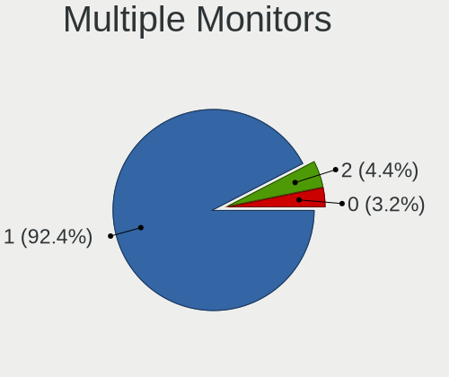
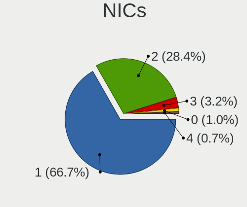
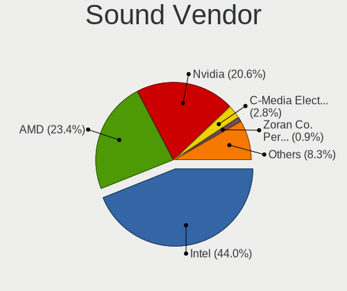

OpenMandriva - Hardware Trends (Desktops)
-----------------------------------------

A project to identify most popular hardware characteristics and track their change
over time based on data collected by Linux users at https://Linux-Hardware.org.

Anyone can contribute to this report by the [hw-probe](https://github.com/linuxhw/hw-probe) tool:

    sudo -E hw-probe -all -upload

This report is for one last month. Overall report since the beginning of time: [TestDays](https://github.com/linuxhw/TestDays)

Period: Dec, 2024.

Contents
--------

* [ System ](#system)
  - [ OS                       ](#os)
  - [ OS Family                ](#os-family)
  - [ Kernel                   ](#kernel)
  - [ Kernel Family            ](#kernel-family)
  - [ Kernel Major Ver.        ](#kernel-major-ver)
  - [ Arch                     ](#arch)
  - [ DE                       ](#de)
  - [ Display Server           ](#display-server)
  - [ Display Manager          ](#display-manager)
  - [ OS Lang                  ](#os-lang)
  - [ Boot Mode                ](#boot-mode)
  - [ Filesystem               ](#filesystem)
  - [ Part. scheme             ](#part-scheme)
  - [ Dual Boot with Linux/BSD ](#dual-boot-with-linuxbsd)
  - [ Dual Boot (Win)          ](#dual-boot-win)

* [ Board ](#board)
  - [ Vendor                   ](#vendor)
  - [ Model                    ](#model)
  - [ Model Family             ](#model-family)
  - [ MFG Year                 ](#mfg-year)
  - [ Form Factor              ](#form-factor)
  - [ Secure Boot              ](#secure-boot)
  - [ Coreboot                 ](#coreboot)
  - [ RAM Size                 ](#ram-size)
  - [ RAM Used                 ](#ram-used)
  - [ Total Drives             ](#total-drives)
  - [ Has CD-ROM               ](#has-cd-rom)
  - [ Has Ethernet             ](#has-ethernet)
  - [ Has WiFi                 ](#has-wifi)
  - [ Has Bluetooth            ](#has-bluetooth)

* [ Location ](#location)
  - [ Country                  ](#country)
  - [ City                     ](#city)

* [ Drives ](#drives)
  - [ Drive Vendor             ](#drive-vendor)
  - [ Drive Model              ](#drive-model)
  - [ HDD Vendor               ](#hdd-vendor)
  - [ SSD Vendor               ](#ssd-vendor)
  - [ Drive Kind               ](#drive-kind)
  - [ Drive Connector          ](#drive-connector)
  - [ Drive Size               ](#drive-size)
  - [ Space Total              ](#space-total)
  - [ Space Used               ](#space-used)
  - [ Malfunc. Drives          ](#malfunc-drives)
  - [ Malfunc. Drive Vendor    ](#malfunc-drive-vendor)
  - [ Malfunc. HDD Vendor      ](#malfunc-hdd-vendor)
  - [ Malfunc. Drive Kind      ](#malfunc-drive-kind)
  - [ Failed Drives            ](#failed-drives)
  - [ Failed Drive Vendor      ](#failed-drive-vendor)
  - [ Drive Status             ](#drive-status)

* [ Storage controller ](#storage-controller)
  - [ Storage Vendor           ](#storage-vendor)
  - [ Storage Model            ](#storage-model)
  - [ Storage Kind             ](#storage-kind)

* [ Processor ](#processor)
  - [ CPU Vendor               ](#cpu-vendor)
  - [ CPU Model                ](#cpu-model)
  - [ CPU Model Family         ](#cpu-model-family)
  - [ CPU Cores                ](#cpu-cores)
  - [ CPU Sockets              ](#cpu-sockets)
  - [ CPU Threads              ](#cpu-threads)
  - [ CPU Op-Modes             ](#cpu-op-modes)
  - [ CPU Microcode            ](#cpu-microcode)
  - [ CPU Microarch            ](#cpu-microarch)

* [ Graphics ](#graphics)
  - [ GPU Vendor               ](#gpu-vendor)
  - [ GPU Model                ](#gpu-model)
  - [ GPU Combo                ](#gpu-combo)
  - [ GPU Driver               ](#gpu-driver)
  - [ GPU Memory               ](#gpu-memory)

* [ Monitor ](#monitor)
  - [ Monitor Vendor           ](#monitor-vendor)
  - [ Monitor Model            ](#monitor-model)
  - [ Monitor Resolution       ](#monitor-resolution)
  - [ Monitor Diagonal         ](#monitor-diagonal)
  - [ Monitor Width            ](#monitor-width)
  - [ Aspect Ratio             ](#aspect-ratio)
  - [ Monitor Area             ](#monitor-area)
  - [ Pixel Density            ](#pixel-density)
  - [ Multiple Monitors        ](#multiple-monitors)

* [ Network ](#network)
  - [ Net Controller Vendor    ](#net-controller-vendor)
  - [ Net Controller Model     ](#net-controller-model)
  - [ Wireless Vendor          ](#wireless-vendor)
  - [ Wireless Model           ](#wireless-model)
  - [ Ethernet Vendor          ](#ethernet-vendor)
  - [ Ethernet Model           ](#ethernet-model)
  - [ Net Controller Kind      ](#net-controller-kind)
  - [ Used Controller          ](#used-controller)
  - [ NICs                     ](#nics)
  - [ IPv6                     ](#ipv6)

* [ Bluetooth ](#bluetooth)
  - [ Bluetooth Vendor         ](#bluetooth-vendor)
  - [ Bluetooth Model          ](#bluetooth-model)

* [ Sound ](#sound)
  - [ Sound Vendor             ](#sound-vendor)
  - [ Sound Model              ](#sound-model)

* [ Memory ](#memory)
  - [ Memory Vendor            ](#memory-vendor)
  - [ Memory Model             ](#memory-model)
  - [ Memory Kind              ](#memory-kind)
  - [ Memory Form Factor       ](#memory-form-factor)
  - [ Memory Size              ](#memory-size)
  - [ Memory Speed             ](#memory-speed)

* [ Printers & scanners ](#printers--scanners)
  - [ Printer Vendor           ](#printer-vendor)
  - [ Printer Model            ](#printer-model)
  - [ Scanner Vendor           ](#scanner-vendor)
  - [ Scanner Model            ](#scanner-model)

* [ Camera ](#camera)
  - [ Camera Vendor            ](#camera-vendor)
  - [ Camera Model             ](#camera-model)

* [ Security ](#security)
  - [ Fingerprint Vendor       ](#fingerprint-vendor)
  - [ Fingerprint Model        ](#fingerprint-model)
  - [ Chipcard Vendor          ](#chipcard-vendor)
  - [ Chipcard Model           ](#chipcard-model)

* [ Unsupported ](#unsupported)
  - [ Unsupported Devices      ](#unsupported-devices)
  - [ Unsupported Device Types ](#unsupported-device-types)

System
------

OS
--

Installed operating systems

| Name               | Desktops | Percent |
|--------------------|----------|---------|
| OpenMandriva 24.12 | 314      | 76.77%  |
| OpenMandriva 5.0   | 32       | 7.82%   |
| OpenMandriva 23.08 | 22       | 5.38%   |
| OpenMandriva 24.07 | 20       | 4.89%   |
| OpenMandriva 4.3   | 6        | 1.47%   |
| OpenMandriva 23.01 | 4        | 0.98%   |
| OpenMandriva 4.2   | 3        | 0.73%   |
| OpenMandriva 23.03 | 3        | 0.73%   |
| OpenMandriva 4.50  | 1        | 0.24%   |
| OpenMandriva 24.90 | 1        | 0.24%   |
| OpenMandriva 24.09 | 1        | 0.24%   |
| OpenMandriva 24.03 | 1        | 0.24%   |
| OpenMandriva 23.09 | 1        | 0.24%   |

OS Family
---------

OS without a version

| Name         | Desktops | Percent |
|--------------|----------|---------|
| OpenMandriva | 409      | 100%    |

Kernel
------

Version of the Linux kernel

| Version                       | Desktops | Percent |
|-------------------------------|----------|---------|
| 6.12.1-desktop-1omv2490       | 293      | 71.64%  |
| 6.6.2-desktop-1omv2390        | 32       | 7.82%   |
| 6.12.6-desktop-1omv2490       | 19       | 4.65%   |
| 6.10.0-desktop-1omv2490       | 19       | 4.65%   |
| 6.4.8-desktop-2omv2390        | 12       | 2.93%   |
| 6.4.11-desktop-1omv2390       | 10       | 2.44%   |
| 5.16.7-desktop-1omv4003       | 6        | 1.47%   |
| 6.1.1-desktop-1omv2290        | 4        | 0.98%   |
| 6.2.6-desktop-1omv2390        | 3        | 0.73%   |
| 5.10.14-desktop-1omv4002      | 3        | 0.73%   |
| 6.9.7-desktop-1omv2490        | 1        | 0.24%   |
| 6.8.7-desktop-1omv2490        | 1        | 0.24%   |
| 6.5.3-desktop-1omv2390        | 1        | 0.24%   |
| 6.13.0-desktop-0.rc1.1omv2490 | 1        | 0.24%   |
| 6.11.6-desktop-1omv2490       | 1        | 0.24%   |
| 6.11.0-desktop-2omv2490       | 1        | 0.24%   |
| 6.10.1-desktop-1omv2490       | 1        | 0.24%   |
| 5.19.5-desktop-1omv4090       | 1        | 0.24%   |

Kernel Family
-------------

Linux kernel without a distro release

| Version | Desktops | Percent |
|---------|----------|---------|
| 6.12.1  | 293      | 71.64%  |
| 6.6.2   | 32       | 7.82%   |
| 6.12.6  | 19       | 4.65%   |
| 6.10.0  | 19       | 4.65%   |
| 6.4.8   | 12       | 2.93%   |
| 6.4.11  | 10       | 2.44%   |
| 5.16.7  | 6        | 1.47%   |
| 6.1.1   | 4        | 0.98%   |
| 6.2.6   | 3        | 0.73%   |
| 5.10.14 | 3        | 0.73%   |
| 6.9.7   | 1        | 0.24%   |
| 6.8.7   | 1        | 0.24%   |
| 6.5.3   | 1        | 0.24%   |
| 6.13.0  | 1        | 0.24%   |
| 6.11.6  | 1        | 0.24%   |
| 6.11.0  | 1        | 0.24%   |
| 6.10.1  | 1        | 0.24%   |
| 5.19.5  | 1        | 0.24%   |

Kernel Major Ver.
-----------------

Linux kernel major version

| Version | Desktops | Percent |
|---------|----------|---------|
| 6.12    | 312      | 76.28%  |
| 6.6     | 32       | 7.82%   |
| 6.4     | 22       | 5.38%   |
| 6.10    | 20       | 4.89%   |
| 5.16    | 6        | 1.47%   |
| 6.1     | 4        | 0.98%   |
| 6.2     | 3        | 0.73%   |
| 5.10    | 3        | 0.73%   |
| 6.11    | 2        | 0.49%   |
| 6.9     | 1        | 0.24%   |
| 6.8     | 1        | 0.24%   |
| 6.5     | 1        | 0.24%   |
| 6.13    | 1        | 0.24%   |
| 5.19    | 1        | 0.24%   |

Arch
----

OS architecture (x86_64, i586, etc.)

| Name   | Desktops | Percent |
|--------|----------|---------|
| x86_64 | 409      | 100%    |

DE
--

Desktop Environment

| Name    | Desktops | Percent |
|---------|----------|---------|
| Unknown | 283      | 69.19%  |
| KDE5    | 63       | 15.4%   |
| LXQt    | 42       | 10.27%  |
| GNOME   | 18       | 4.4%    |
| MATE    | 2        | 0.49%   |
| LXDE    | 1        | 0.24%   |

Display Server
--------------

X11 or Wayland

| Name    | Desktops | Percent |
|---------|----------|---------|
| Wayland | 208      | 50.86%  |
| X11     | 198      | 48.41%  |
| Unknown | 3        | 0.73%   |

Display Manager
---------------

SDDM, LightDM, etc.

| Name    | Desktops | Percent |
|---------|----------|---------|
| SDDM    | 363      | 88.75%  |
| GDM     | 44       | 10.76%  |
| LightDM | 2        | 0.49%   |

OS Lang
-------

Language

| Lang  | Desktops | Percent |
|-------|----------|---------|
| en_US | 213      | 52.08%  |
| de_DE | 26       | 6.36%   |
| en_GB | 23       | 5.62%   |
| ru_RU | 20       | 4.89%   |
| it_IT | 18       | 4.4%    |
| fr_FR | 15       | 3.67%   |
| pl_PL | 14       | 3.42%   |
| pt_BR | 12       | 2.93%   |
| es_ES | 12       | 2.93%   |
| en_CA | 6        | 1.47%   |
| en_AU | 6        | 1.47%   |
| cs_CZ | 6        | 1.47%   |
| es_AR | 4        | 0.98%   |
| de_AT | 4        | 0.98%   |
| es_MX | 3        | 0.73%   |
| en_ZA | 3        | 0.73%   |
| en_NZ | 3        | 0.73%   |
| ro_RO | 2        | 0.49%   |
| nl_NL | 2        | 0.49%   |
| nl_BE | 2        | 0.49%   |
| hu_HU | 2        | 0.49%   |
| en_IN | 2        | 0.49%   |
| da_DK | 2        | 0.49%   |
| tr_TR | 1        | 0.24%   |
| ru_UA | 1        | 0.24%   |
| fr_BE | 1        | 0.24%   |
| es_VE | 1        | 0.24%   |
| es_UY | 1        | 0.24%   |
| es_CL | 1        | 0.24%   |
| en_SG | 1        | 0.24%   |
| en_IL | 1        | 0.24%   |
| ar_DZ | 1        | 0.24%   |

Boot Mode
---------

EFI or BIOS

| Mode | Desktops | Percent |
|------|----------|---------|
| EFI  | 233      | 56.97%  |
| BIOS | 176      | 43.03%  |

Filesystem
----------

Type of filesystem

| Type    | Desktops | Percent |
|---------|----------|---------|
| Overlay | 227      | 55.5%   |
| Ext4    | 165      | 40.34%  |
| Btrfs   | 13       | 3.18%   |
| Xfs     | 3        | 0.73%   |
| F2fs    | 1        | 0.24%   |

Part. scheme
------------

Scheme of partitioning

| Type | Desktops | Percent |
|------|----------|---------|
| GPT  | 331      | 80.93%  |
| MBR  | 78       | 19.07%  |

Dual Boot with Linux/BSD
------------------------

Hosting more than one Linux/BSD

| Dual boot | Desktops | Percent |
|-----------|----------|---------|
| Yes       | 217      | 53.06%  |
| No        | 192      | 46.94%  |

Dual Boot (Win)
---------------

Hosting Linux and Windows

| Dual boot | Desktops | Percent |
|-----------|----------|---------|
| Yes       | 208      | 50.86%  |
| No        | 201      | 49.14%  |

Board
-----

Vendor
------

Motherboard manufacturer

| Name                                 | Desktops | Percent |
|--------------------------------------|----------|---------|
| ASUSTek Computer                     | 90       | 22%     |
| Gigabyte Technology                  | 59       | 14.43%  |
| Dell                                 | 43       | 10.51%  |
| Hewlett-Packard                      | 41       | 10.02%  |
| MSI                                  | 39       | 9.54%   |
| ASRock                               | 39       | 9.54%   |
| Lenovo                               | 21       | 5.13%   |
| Unknown                              | 14       | 3.42%   |
| Intel                                | 12       | 2.93%   |
| Acer                                 | 9        | 2.2%    |
| AZW                                  | 5        | 1.22%   |
| Pegatron                             | 3        | 0.73%   |
| GEEKOM                               | 3        | 0.73%   |
| Foxconn                              | 3        | 0.73%   |
| Biostar                              | 3        | 0.73%   |
| AMI                                  | 3        | 0.73%   |
| Fujitsu                              | 2        | 0.49%   |
| Apple                                | 2        | 0.49%   |
| AMD                                  | 2        | 0.49%   |
| Wistron                              | 1        | 0.24%   |
| Trigkey                              | 1        | 0.24%   |
| SZMZ                                 | 1        | 0.24%   |
| STGAUBRON                            | 1        | 0.24%   |
| Shenzhen Meigao Electronic Equipment | 1        | 0.24%   |
| Positivo                             | 1        | 0.24%   |
| PCWare                               | 1        | 0.24%   |
| Medion                               | 1        | 0.24%   |
| MAXSUN                               | 1        | 0.24%   |
| MACHINIST                            | 1        | 0.24%   |
| Huanan                               | 1        | 0.24%   |
| Gateway                              | 1        | 0.24%   |
| Fujitsu Siemens                      | 1        | 0.24%   |
| ECS                                  | 1        | 0.24%   |
| Digiboard                            | 1        | 0.24%   |
| Bochs                                | 1        | 0.24%   |

Model
-----

Motherboard model

| Name                         | Desktops | Percent |
|------------------------------|----------|---------|
| Unknown                      | 15       | 3.67%   |
| Dell OptiPlex 9020           | 6        | 1.47%   |
| ASUS All Series              | 6        | 1.47%   |
| ASUS TUF Gaming B550M-PLUS   | 4        | 0.98%   |
| HP EliteDesk 800 G2 SFF      | 3        | 0.73%   |
| Gigabyte B450M DS3H V2       | 3        | 0.73%   |
| Dell OptiPlex 780            | 3        | 0.73%   |
| Dell OptiPlex 7010           | 3        | 0.73%   |
| AZW MINI S                   | 3        | 0.73%   |
| ASUS PRIME B450M-A           | 3        | 0.73%   |
| ASUS PRIME A320M-K           | 3        | 0.73%   |
| AMI Intel                    | 3        | 0.73%   |
| MSI MS-7C02                  | 2        | 0.49%   |
| MSI MS-7917                  | 2        | 0.49%   |
| MSI MS-7680                  | 2        | 0.49%   |
| Intel H61                    | 2        | 0.49%   |
| HP Z440 Workstation          | 2        | 0.49%   |
| HP ProDesk 600 G2 SFF        | 2        | 0.49%   |
| HP ProDesk 600 G1 TWR        | 2        | 0.49%   |
| HP EliteDesk 800 G1 SFF      | 2        | 0.49%   |
| HP Compaq Pro 6300 MT        | 2        | 0.49%   |
| Gigabyte B75M-D3H            | 2        | 0.49%   |
| Gigabyte 970A-DS3P           | 2        | 0.49%   |
| Dell OptiPlex 790            | 2        | 0.49%   |
| Dell OptiPlex 7040           | 2        | 0.49%   |
| ASUS SABERTOOTH 990FX        | 2        | 0.49%   |
| ASUS ROG STRIX B550-F GAMING | 2        | 0.49%   |
| ASUS PRIME X570-P            | 2        | 0.49%   |
| ASUS PRIME H510M-A           | 2        | 0.49%   |
| ASUS PRIME B550M-A           | 2        | 0.49%   |
| ASUS P8Z77-V PRO             | 2        | 0.49%   |
| ASUS P8Z77-V LX              | 2        | 0.49%   |
| ASUS M5A78L-M LE             | 2        | 0.49%   |
| ASUS M5A78L LE               | 2        | 0.49%   |
| ASRock G31M-S                | 2        | 0.49%   |
| ASRock G31M-GS               | 2        | 0.49%   |
| ASRock A320M-HDV R4.0        | 2        | 0.49%   |
| Apple MacPro5,1              | 2        | 0.49%   |
| Wistron ProLiant ML110 G6    | 1        | 0.24%   |
| Trigkey Green G4             | 1        | 0.24%   |

Model Family
------------

Motherboard model prefix

| Name               | Desktops | Percent |
|--------------------|----------|---------|
| Dell OptiPlex      | 33       | 8.07%   |
| ASUS PRIME         | 24       | 5.87%   |
| Unknown            | 15       | 3.67%   |
| Lenovo ThinkCentre | 14       | 3.42%   |
| HP Compaq          | 11       | 2.69%   |
| HP EliteDesk       | 8        | 1.96%   |
| ASUS ROG           | 8        | 1.96%   |
| ASUS P8Z77-V       | 6        | 1.47%   |
| ASUS All           | 6        | 1.47%   |
| HP ProDesk         | 5        | 1.22%   |
| Gigabyte B450M     | 5        | 1.22%   |
| ASUS TUF           | 5        | 1.22%   |
| Acer Aspire        | 5        | 1.22%   |
| HP Pavilion        | 4        | 0.98%   |
| Gigabyte A520M     | 4        | 0.98%   |
| Dell Precision     | 4        | 0.98%   |
| Dell Inspiron      | 3        | 0.73%   |
| AZW MINI           | 3        | 0.73%   |
| ASUS SABERTOOTH    | 3        | 0.73%   |
| AMI Intel          | 3        | 0.73%   |
| MSI MS-7C02        | 2        | 0.49%   |
| MSI MS-7917        | 2        | 0.49%   |
| MSI MS-7680        | 2        | 0.49%   |
| Intel H61          | 2        | 0.49%   |
| HP Z440            | 2        | 0.49%   |
| Gigabyte B75M-D3H  | 2        | 0.49%   |
| Gigabyte B550M     | 2        | 0.49%   |
| Gigabyte B450      | 2        | 0.49%   |
| Gigabyte 970A-DS3P | 2        | 0.49%   |
| Fujitsu ESPRIMO    | 2        | 0.49%   |
| Dell XPS           | 2        | 0.49%   |
| ASUS P8H61-M       | 2        | 0.49%   |
| ASUS P5G41T-M      | 2        | 0.49%   |
| ASUS M5A78L-M      | 2        | 0.49%   |
| ASUS M5A78L        | 2        | 0.49%   |
| ASRock G31M-S      | 2        | 0.49%   |
| ASRock G31M-GS     | 2        | 0.49%   |
| ASRock B450M       | 2        | 0.49%   |
| ASRock A320M-HDV   | 2        | 0.49%   |
| Apple MacPro5      | 2        | 0.49%   |

MFG Year
--------

Motherboard manufacture year

| Year | Desktops | Percent |
|------|----------|---------|
| 2012 | 39       | 9.54%   |
| 2020 | 30       | 7.33%   |
| 2014 | 29       | 7.09%   |
| 2011 | 28       | 6.85%   |
| 2018 | 27       | 6.6%    |
| 2017 | 27       | 6.6%    |
| 2013 | 27       | 6.6%    |
| 2015 | 25       | 6.11%   |
| 2023 | 24       | 5.87%   |
| 2022 | 24       | 5.87%   |
| 2009 | 21       | 5.13%   |
| 2019 | 19       | 4.65%   |
| 2021 | 17       | 4.16%   |
| 2016 | 16       | 3.91%   |
| 2010 | 16       | 3.91%   |
| 2024 | 15       | 3.67%   |
| 2008 | 13       | 3.18%   |
| 2007 | 7        | 1.71%   |
| 2006 | 3        | 0.73%   |
| 2005 | 2        | 0.49%   |

Form Factor
-----------

Physical design of the computer

| Name    | Desktops | Percent |
|---------|----------|---------|
| Desktop | 409      | 100%    |

Secure Boot
-----------

Enabled or disabled

| State    | Desktops | Percent |
|----------|----------|---------|
| Disabled | 409      | 100%    |

Coreboot
--------

Have coreboot on board

| Used | Desktops | Percent |
|------|----------|---------|
| No   | 409      | 100%    |

RAM Size
--------

Total RAM memory

| Size in GB  | Desktops | Percent |
|-------------|----------|---------|
| 16.01-24.0  | 130      | 31.78%  |
| 8.01-16.0   | 72       | 17.6%   |
| 4.01-8.0    | 61       | 14.91%  |
| 32.01-64.0  | 56       | 13.69%  |
| 3.01-4.0    | 46       | 11.25%  |
| 64.01-256.0 | 19       | 4.65%   |
| 24.01-32.0  | 18       | 4.4%    |
| 1.01-2.0    | 4        | 0.98%   |
| 2.01-3.0    | 2        | 0.49%   |
| 0.51-1.0    | 1        | 0.24%   |

RAM Used
--------

Used RAM memory

| Used GB  | Desktops | Percent |
|----------|----------|---------|
| 1.01-2.0 | 217      | 53.06%  |
| 2.01-3.0 | 110      | 26.89%  |
| 0.51-1.0 | 40       | 9.78%   |
| 3.01-4.0 | 28       | 6.85%   |
| 4.01-8.0 | 9        | 2.2%    |
| 0.01-0.5 | 5        | 1.22%   |

Total Drives
------------

Number of drives on board

| Drives | Desktops | Percent |
|--------|----------|---------|
| 1      | 158      | 38.63%  |
| 2      | 115      | 28.12%  |
| 3      | 65       | 15.89%  |
| 4      | 41       | 10.02%  |
| 0      | 14       | 3.42%   |
| 5      | 7        | 1.71%   |
| 6      | 4        | 0.98%   |
| 7      | 2        | 0.49%   |
| 10     | 1        | 0.24%   |
| 9      | 1        | 0.24%   |
| 8      | 1        | 0.24%   |

Has CD-ROM
----------

Has CD-ROM on board

| Presented | Desktops | Percent |
|-----------|----------|---------|
| No        | 205      | 50.12%  |
| Yes       | 204      | 49.88%  |

Has Ethernet
------------

Has Ethernet on board

| Presented | Desktops | Percent |
|-----------|----------|---------|
| Yes       | 402      | 98.29%  |
| No        | 7        | 1.71%   |

Has WiFi
--------

Has WiFi module

| Presented | Desktops | Percent |
|-----------|----------|---------|
| No        | 234      | 57.21%  |
| Yes       | 175      | 42.79%  |

Has Bluetooth
-------------

Has Bluetooth module

| Presented | Desktops | Percent |
|-----------|----------|---------|
| No        | 286      | 69.93%  |
| Yes       | 123      | 30.07%  |

Location
--------

Country
-------

Geographic location (country)

| Country      | Desktops | Percent |
|--------------|----------|---------|
| USA          | 61       | 14.91%  |
| Germany      | 37       | 9.05%   |
| Russia       | 30       | 7.33%   |
| Italy        | 23       | 5.62%   |
| Spain        | 20       | 4.89%   |
| UK           | 19       | 4.65%   |
| Canada       | 19       | 4.65%   |
| Poland       | 18       | 4.4%    |
| France       | 18       | 4.4%    |
| Brazil       | 18       | 4.4%    |
| Australia    | 11       | 2.69%   |
| Netherlands  | 9        | 2.2%    |
| India        | 9        | 2.2%    |
| Romania      | 8        | 1.96%   |
| Czechia      | 7        | 1.71%   |
| Malaysia     | 6        | 1.47%   |
| Hungary      | 6        | 1.47%   |
| Singapore    | 5        | 1.22%   |
| New Zealand  | 5        | 1.22%   |
| Japan        | 5        | 1.22%   |
| Ukraine      | 4        | 0.98%   |
| South Africa | 4        | 0.98%   |
| Austria      | 4        | 0.98%   |
| Argentina    | 4        | 0.98%   |
| Sweden       | 3        | 0.73%   |
| Slovakia     | 3        | 0.73%   |
| Turkey       | 2        | 0.49%   |
| Taiwan       | 2        | 0.49%   |
| Philippines  | 2        | 0.49%   |
| Peru         | 2        | 0.49%   |
| Panama       | 2        | 0.49%   |
| Mexico       | 2        | 0.49%   |
| Latvia       | 2        | 0.49%   |
| Kuwait       | 2        | 0.49%   |
| Israel       | 2        | 0.49%   |
| Ireland      | 2        | 0.49%   |
| Greece       | 2        | 0.49%   |
| Egypt        | 2        | 0.49%   |
| Denmark      | 2        | 0.49%   |
| Chile        | 2        | 0.49%   |

City
----

Geographic location (city)

| City             | Desktops | Percent |
|------------------|----------|---------|
| Moscow           | 6        | 1.47%   |
| Singapore        | 5        | 1.22%   |
| Rome             | 4        | 0.98%   |
| Melbourne        | 4        | 0.98%   |
| St Petersburg    | 3        | 0.73%   |
| Rostov-on-Don    | 3        | 0.73%   |
| Munich           | 3        | 0.73%   |
| Madrid           | 3        | 0.73%   |
| Chicago          | 3        | 0.73%   |
| Budapest         | 3        | 0.73%   |
| Berlin           | 3        | 0.73%   |
| Zaandam          | 2        | 0.49%   |
| West Valley City | 2        | 0.49%   |
| Vienna           | 2        | 0.49%   |
| Victoria         | 2        | 0.49%   |
| Sydney           | 2        | 0.49%   |
| St Louis         | 2        | 0.49%   |
| Seremban         | 2        | 0.49%   |
| Santiago         | 2        | 0.49%   |
| Salvador         | 2        | 0.49%   |
| Reading          | 2        | 0.49%   |
| Poznan           | 2        | 0.49%   |
| Pflugerville     | 2        | 0.49%   |
| Panama City      | 2        | 0.49%   |
| Lima             | 2        | 0.49%   |
| Kuwait City      | 2        | 0.49%   |
| Kuala Lumpur     | 2        | 0.49%   |
| Hanover          | 2        | 0.49%   |
| Dublin           | 2        | 0.49%   |
| Dallas           | 2        | 0.49%   |
| Bulgarus         | 2        | 0.49%   |
| Brno             | 2        | 0.49%   |
| Brisbane         | 2        | 0.49%   |
| Bengaluru        | 2        | 0.49%   |
| Barcelona        | 2        | 0.49%   |
| Auch             | 2        | 0.49%   |
| Amsterdam        | 2        | 0.49%   |
| Zlatoust         | 1        | 0.24%   |
| Zaragoza         | 1        | 0.24%   |
| Zapopan          | 1        | 0.24%   |

Drives
------

Drive Vendor
------------

Hard drive vendors

| Vendor                       | Desktops | Drives | Percent |
|------------------------------|----------|--------|---------|
| WDC                          | 121      | 151    | 16.55%  |
| Seagate                      | 115      | 137    | 15.73%  |
| Samsung Electronics          | 82       | 100    | 11.22%  |
| Kingston                     | 49       | 59     | 6.7%    |
| SanDisk                      | 40       | 44     | 5.47%   |
| Crucial                      | 36       | 42     | 4.92%   |
| Toshiba                      | 33       | 35     | 4.51%   |
| China                        | 17       | 18     | 2.33%   |
| Hitachi                      | 16       | 16     | 2.19%   |
| Unknown                      | 14       | 22     | 1.92%   |
| A-DATA Technology            | 11       | 12     | 1.5%    |
| PNY                          | 10       | 11     | 1.37%   |
| MAXIO Technology (Hangzhou)  | 10       | 12     | 1.37%   |
| Phison Electronics           | 9        | 11     | 1.23%   |
| GOODRAM                      | 9        | 9      | 1.23%   |
| Team                         | 6        | 6      | 0.82%   |
| Micron/Crucial Technology    | 6        | 6      | 0.82%   |
| Intel                        | 6        | 6      | 0.82%   |
| Patriot                      | 5        | 5      | 0.68%   |
| Micron Technology            | 5        | 5      | 0.68%   |
| Maxtor                       | 5        | 5      | 0.68%   |
| Kingston Technology Company  | 5        | 5      | 0.68%   |
| Intenso                      | 5        | 5      | 0.68%   |
| HGST                         | 5        | 6      | 0.68%   |
| Apacer                       | 5        | 5      | 0.68%   |
| ADATA Technology             | 5        | 5      | 0.68%   |
| Silicon Motion               | 4        | 4      | 0.55%   |
| Shenzhen Longsys Electronics | 4        | 4      | 0.55%   |
| Realtek Semiconductor        | 4        | 4      | 0.55%   |
| Plextor                      | 4        | 4      | 0.55%   |
| Lexar                        | 4        | 4      | 0.55%   |
| KIOXIA-EXCERIA               | 4        | 4      | 0.55%   |
| KingSpec                     | 4        | 4      | 0.55%   |
| SPCC                         | 3        | 3      | 0.41%   |
| SK hynix                     | 3        | 3      | 0.41%   |
| OCZ                          | 3        | 3      | 0.41%   |
| KIOXIA                       | 3        | 3      | 0.41%   |
| Fanxiang                     | 3        | 3      | 0.41%   |
| Emtec                        | 3        | 3      | 0.41%   |
| Unknown                      | 3        | 3      | 0.41%   |

Drive Model
-----------

Hard drive models

| Model                                                 | Desktops | Percent |
|-------------------------------------------------------|----------|---------|
| Seagate ST500DM002-1BD142 500GB                       | 16       | 1.97%   |
| Seagate ST2000DM008-2FR102 2TB                        | 9        | 1.11%   |
| Kingston SA400S37240G 240GB SSD                       | 9        | 1.11%   |
| Seagate ST1000DM010-2EP102 1TB                        | 8        | 0.98%   |
| Samsung NVMe SSD Controller SM981/PM981/PM983 512GB   | 8        | 0.98%   |
| MAXIO (Hangzhou) NVMe SSD Controller MAP1202 512GB    | 8        | 0.98%   |
| WDC WD10EZEX-08WN4A0 1TB                              | 7        | 0.86%   |
| Sandisk WD Blue SN550 NVMe SSD 256GB                  | 7        | 0.86%   |
| Crucial CT240BX500SSD1 240GB                          | 7        | 0.86%   |
| Unknown SD/MMC/MS PRO 128GB                           | 6        | 0.74%   |
| Kingston SNV2S500G 500GB                              | 6        | 0.74%   |
| Crucial CT500MX500SSD1 500GB                          | 6        | 0.74%   |
| WDC WD10EZEX-08M2NA0 1TB                              | 5        | 0.61%   |
| WDC WD10EZEX-00BBHA0 1TB                              | 5        | 0.61%   |
| Seagate ST3250318AS 250GB                             | 5        | 0.61%   |
| Seagate ST2000DM008-2UB102 2TB                        | 5        | 0.61%   |
| Samsung SSD 860 EVO 250GB                             | 5        | 0.61%   |
| Samsung SSD 860 EVO 1TB                               | 5        | 0.61%   |
| Samsung SSD 850 EVO 250GB                             | 5        | 0.61%   |
| Samsung NVMe SSD Controller PM9A1/PM9A3/980PRO 512GB  | 5        | 0.61%   |
| Kingston SA400S37480G 480GB SSD                       | 5        | 0.61%   |
| Kingston SA400S37120G 120GB SSD                       | 5        | 0.61%   |
| Crucial CT1000BX500SSD1 1TB                           | 5        | 0.61%   |
| Toshiba HDWD110 1TB                                   | 4        | 0.49%   |
| Toshiba DT01ACA100 1TB                                | 4        | 0.49%   |
| Toshiba DT01ACA050 500GB                              | 4        | 0.49%   |
| Silicon Motion SM2263EN/SM2263XT SSD Controller 256GB | 4        | 0.49%   |
| Seagate ST2000DM001-1ER164 2TB                        | 4        | 0.49%   |
| SanDisk SSD PLUS 480GB                                | 4        | 0.49%   |
| Samsung SSD 870 EVO 1TB                               | 4        | 0.49%   |
| Samsung SSD 860 EVO 500GB                             | 4        | 0.49%   |
| Samsung SSD 850 PRO 256GB                             | 4        | 0.49%   |
| Kingston SA400S37960G 960GB SSD                       | 4        | 0.49%   |
| WDC WDS240G2G0A-00JH30 240GB SSD                      | 3        | 0.37%   |
| WDC WDS100T2B0A-00SM50 1TB SSD                        | 3        | 0.37%   |
| WDC WD20EARS-00MVWB0 2TB                              | 3        | 0.37%   |
| WDC WD10EZEX-60ZF5A0 1TB                              | 3        | 0.37%   |
| WDC WD10EZEX-60M2NA0 1TB                              | 3        | 0.37%   |
| WDC WD10EARX-00N0YB0 1TB                              | 3        | 0.37%   |
| Unknown SD/MMC 1073GB                                 | 3        | 0.37%   |

HDD Vendor
----------

Hard disk drive vendors

| Vendor              | Desktops | Drives | Percent |
|---------------------|----------|--------|---------|
| Seagate             | 113      | 134    | 37.42%  |
| WDC                 | 107      | 133    | 35.43%  |
| Toshiba             | 30       | 32     | 9.93%   |
| Samsung Electronics | 16       | 16     | 5.3%    |
| Hitachi             | 16       | 16     | 5.3%    |
| Unknown             | 6        | 6      | 1.99%   |
| Maxtor              | 5        | 5      | 1.66%   |
| HGST                | 5        | 6      | 1.66%   |
| Apple               | 2        | 2      | 0.66%   |
| JMicron Technology  | 1        | 1      | 0.33%   |
| Hewlett-Packard     | 1        | 1      | 0.33%   |

SSD Vendor
----------

Solid state drive vendors

| Vendor              | Desktops | Drives | Percent |
|---------------------|----------|--------|---------|
| Samsung Electronics | 45       | 56     | 15.1%   |
| Kingston            | 37       | 44     | 12.42%  |
| Crucial             | 35       | 41     | 11.74%  |
| SanDisk             | 18       | 20     | 6.04%   |
| WDC                 | 17       | 17     | 5.7%    |
| China               | 17       | 18     | 5.7%    |
| PNY                 | 10       | 11     | 3.36%   |
| GOODRAM             | 9        | 9      | 3.02%   |
| A-DATA Technology   | 9        | 9      | 3.02%   |
| Team                | 6        | 6      | 2.01%   |
| Patriot             | 5        | 5      | 1.68%   |
| Intenso             | 5        | 5      | 1.68%   |
| Intel               | 5        | 5      | 1.68%   |
| Apacer              | 5        | 5      | 1.68%   |
| Plextor             | 4        | 4      | 1.34%   |
| Lexar               | 4        | 4      | 1.34%   |
| KIOXIA-EXCERIA      | 4        | 4      | 1.34%   |
| KingSpec            | 4        | 4      | 1.34%   |
| SPCC                | 3        | 3      | 1.01%   |
| OCZ                 | 3        | 3      | 1.01%   |
| Fanxiang            | 3        | 3      | 1.01%   |
| Emtec               | 3        | 3      | 1.01%   |
| Unknown             | 3        | 3      | 1.01%   |
| Verbatim            | 2        | 2      | 0.67%   |
| Toshiba             | 2        | 2      | 0.67%   |
| Seagate             | 2        | 2      | 0.67%   |
| NGFF                | 2        | 2      | 0.67%   |
| Micron Technology   | 2        | 2      | 0.67%   |
| LITEON              | 2        | 2      | 0.67%   |
| HS-SSD-C100         | 2        | 2      | 0.67%   |
| AGI                 | 2        | 3      | 0.67%   |
| WALRAM              | 1        | 1      | 0.34%   |
| Vaseky              | 1        | 1      | 0.34%   |
| Timetec             | 1        | 1      | 0.34%   |
| sobetter            | 1        | 1      | 0.34%   |
| SK hynix            | 1        | 1      | 0.34%   |
| RZX                 | 1        | 1      | 0.34%   |
| Radeon              | 1        | 1      | 0.34%   |
| OWC                 | 1        | 1      | 0.34%   |
| ORICO               | 1        | 1      | 0.34%   |

Drive Kind
----------

HDD or SSD

| Kind    | Desktops | Drives | Percent |
|---------|----------|--------|---------|
| SSD     | 243      | 327    | 39.97%  |
| HDD     | 239      | 352    | 39.31%  |
| NVMe    | 117      | 144    | 19.24%  |
| Unknown | 7        | 14     | 1.15%   |
| MMC     | 2        | 2      | 0.33%   |

Drive Connector
---------------

SATA, SAS, NVMe, etc.

| Type | Desktops | Drives | Percent |
|------|----------|--------|---------|
| SATA | 361      | 667    | 72.49%  |
| NVMe | 117      | 144    | 23.49%  |
| SAS  | 18       | 26     | 3.61%   |
| MMC  | 2        | 2      | 0.4%    |

Drive Size
----------

Size of hard drive

| Size in TB | Desktops | Drives | Percent |
|------------|----------|--------|---------|
| 0.01-0.5   | 267      | 392    | 53.08%  |
| 0.51-1.0   | 155      | 187    | 30.82%  |
| 1.01-2.0   | 52       | 62     | 10.34%  |
| 3.01-4.0   | 10       | 13     | 1.99%   |
| 2.01-3.0   | 8        | 12     | 1.59%   |
| 4.01-10.0  | 8        | 10     | 1.59%   |
| 10.01-20.0 | 3        | 3      | 0.6%    |

Space Total
-----------

Amount of disk space available on the file system

| Size in GB     | Desktops | Percent |
|----------------|----------|---------|
| 1-20           | 159      | 38.88%  |
| 101-250        | 75       | 18.34%  |
| 251-500        | 50       | 12.22%  |
| 501-1000       | 35       | 8.56%   |
| Unknown        | 26       | 6.36%   |
| 51-100         | 19       | 4.65%   |
| More than 3000 | 14       | 3.42%   |
| 1001-2000      | 13       | 3.18%   |
| 21-50          | 12       | 2.93%   |
| 2001-3000      | 6        | 1.47%   |

Space Used
----------

Amount of used disk space

| Used GB        | Desktops | Percent |
|----------------|----------|---------|
| 1-20           | 310      | 75.79%  |
| Unknown        | 26       | 6.36%   |
| 21-50          | 20       | 4.89%   |
| 101-250        | 16       | 3.91%   |
| 251-500        | 8        | 1.96%   |
| 51-100         | 8        | 1.96%   |
| 501-1000       | 7        | 1.71%   |
| 0              | 7        | 1.71%   |
| More than 3000 | 3        | 0.73%   |
| 1001-2000      | 3        | 0.73%   |
| 2001-3000      | 1        | 0.24%   |

Malfunc. Drives
---------------

Drive models with a malfunction

| Model                               | Desktops | Drives | Percent |
|-------------------------------------|----------|--------|---------|
| Seagate ST500DM002-1BD142 500GB     | 9        | 10     | 6.04%   |
| WDC WD10EZEX-60ZF5A0 1TB            | 3        | 3      | 2.01%   |
| Seagate ST3250318AS 250GB           | 3        | 3      | 2.01%   |
| Seagate ST1000DM003-1ER162 1TB      | 3        | 3      | 2.01%   |
| SanDisk SSD PLUS 480GB              | 3        | 3      | 2.01%   |
| WDC WD10EZEX-60M2NA0 1TB            | 2        | 2      | 1.34%   |
| Seagate ST500LM021-1KJ152 500GB     | 2        | 2      | 1.34%   |
| Seagate ST3320620AS 320GB           | 2        | 2      | 1.34%   |
| Seagate ST2000DM001-1CH164 2TB      | 2        | 2      | 1.34%   |
| Seagate ST1000DM003-1CH162 1TB      | 2        | 2      | 1.34%   |
| Samsung Electronics SSD 870 EVO 1TB | 2        | 2      | 1.34%   |
| Samsung Electronics HD502HJ 500GB   | 2        | 2      | 1.34%   |
| Samsung Electronics HD161GJ 160GB   | 2        | 2      | 1.34%   |
| Hitachi HTS545050A7E380 500GB       | 2        | 2      | 1.34%   |
| Hitachi HDS721050CLA362 500GB       | 2        | 2      | 1.34%   |
| XPG GAMMIX S70 1TB                  | 1        | 1      | 0.67%   |
| WDC WDS240G2G0A-00JH30 240GB SSD    | 1        | 1      | 0.67%   |
| WDC WD800JD-08LSA0 80GB             | 1        | 1      | 0.67%   |
| WDC WD800JB-00JJC0 80GB             | 1        | 1      | 0.67%   |
| WDC WD800JB-00CRA1 80GB             | 1        | 1      | 0.67%   |
| WDC WD7500AARS-00Y5B1 752GB         | 1        | 1      | 0.67%   |
| WDC WD7500AADS-00M2B0 752GB         | 1        | 1      | 0.67%   |
| WDC WD6400AARS-00Y5B1 640GB         | 1        | 1      | 0.67%   |
| WDC WD5002ABYS-18B1B0 500GB         | 1        | 1      | 0.67%   |
| WDC WD5000BPKT-75PK4T0 500GB        | 1        | 1      | 0.67%   |
| WDC WD5000AVDS-73U7B1 500GB         | 1        | 1      | 0.67%   |
| WDC WD5000AAKX-753CA1 500GB         | 1        | 1      | 0.67%   |
| WDC WD5000AAKX-08U6AA0 500GB        | 1        | 1      | 0.67%   |
| WDC WD5000AAKS-22A7B0 500GB         | 1        | 1      | 0.67%   |
| WDC WD5000AAKS-00A7B2 500GB         | 1        | 1      | 0.67%   |
| WDC WD5000AADS-00M2B0 500GB         | 1        | 1      | 0.67%   |
| WDC WD3200BPVT-80JJ5T0 320GB        | 1        | 1      | 0.67%   |
| WDC WD3200BPVT-00JJ5T0 320GB        | 1        | 1      | 0.67%   |
| WDC WD3200BEKT-22A25T1 320GB        | 1        | 1      | 0.67%   |
| WDC WD3200AAKS-00L9A0 320GB         | 1        | 1      | 0.67%   |
| WDC WD3200AAJS-56M0A0 320GB         | 1        | 1      | 0.67%   |
| WDC WD3200AAJS-22B4A0 320GB         | 1        | 1      | 0.67%   |
| WDC WD3200AAJS-00L7A0 320GB         | 1        | 1      | 0.67%   |
| WDC WD30EFRX-68EUZN0 3TB            | 1        | 2      | 0.67%   |
| WDC WD2500AAKX-753CA1 250GB         | 1        | 1      | 0.67%   |

Malfunc. Drive Vendor
---------------------

Vendors of faulty drives

| Vendor                   | Desktops | Drives | Percent |
|--------------------------|----------|--------|---------|
| WDC                      | 45       | 47     | 31.03%  |
| Seagate                  | 45       | 52     | 31.03%  |
| Samsung Electronics      | 12       | 12     | 8.28%   |
| Hitachi                  | 9        | 9      | 6.21%   |
| Toshiba                  | 7        | 7      | 4.83%   |
| SanDisk                  | 4        | 4      | 2.76%   |
| Maxtor                   | 4        | 4      | 2.76%   |
| A-DATA Technology        | 3        | 3      | 2.07%   |
| Kingston                 | 2        | 2      | 1.38%   |
| HGST                     | 2        | 2      | 1.38%   |
| Crucial                  | 2        | 2      | 1.38%   |
| XPG                      | 1        | 1      | 0.69%   |
| Realtek Semiconductor    | 1        | 1      | 0.69%   |
| PNY                      | 1        | 1      | 0.69%   |
| OCZ                      | 1        | 1      | 0.69%   |
| KingSpec                 | 1        | 1      | 0.69%   |
| Intenso                  | 1        | 1      | 0.69%   |
| Fordisk                  | 1        | 1      | 0.69%   |
| Emtec                    | 1        | 1      | 0.69%   |
| China                    | 1        | 1      | 0.69%   |
| Biwin Storage Technology | 1        | 1      | 0.69%   |

Malfunc. HDD Vendor
-------------------

Vendors of faulty HDD drives

| Vendor              | Desktops | Drives | Percent |
|---------------------|----------|--------|---------|
| Seagate             | 45       | 52     | 38.14%  |
| WDC                 | 43       | 45     | 36.44%  |
| Hitachi             | 9        | 9      | 7.63%   |
| Samsung Electronics | 8        | 8      | 6.78%   |
| Toshiba             | 7        | 7      | 5.93%   |
| Maxtor              | 4        | 4      | 3.39%   |
| HGST                | 2        | 2      | 1.69%   |

Malfunc. Drive Kind
-------------------

Kinds of faulty drives

| Kind | Desktops | Drives | Percent |
|------|----------|--------|---------|
| HDD  | 107      | 127    | 79.85%  |
| SSD  | 24       | 24     | 17.91%  |
| NVMe | 3        | 3      | 2.24%   |

Failed Drives
-------------

Failed drive models

| Model                    | Desktops | Drives | Percent |
|--------------------------|----------|--------|---------|
| WDC WD20EARS-00S8B1 2TB  | 1        | 1      | 33.33%  |
| WDC WD20EARS-00MVWB0 2TB | 1        | 1      | 33.33%  |
| Toshiba DT01ACA050 500GB | 1        | 1      | 33.33%  |

Failed Drive Vendor
-------------------

Failed drive vendors

| Vendor  | Desktops | Drives | Percent |
|---------|----------|--------|---------|
| WDC     | 2        | 2      | 66.67%  |
| Toshiba | 1        | 1      | 33.33%  |

Drive Status
------------

Number of failed and malfunc. drives

| Status   | Desktops | Drives | Percent |
|----------|----------|--------|---------|
| Works    | 343      | 651    | 69.15%  |
| Malfunc  | 128      | 154    | 25.81%  |
| Detected | 22       | 31     | 4.44%   |
| Failed   | 3        | 3      | 0.6%    |

Storage controller
------------------

Storage Vendor
--------------

Storage controller vendors

| Vendor                         | Desktops | Percent |
|--------------------------------|----------|---------|
| Intel                          | 283      | 49.13%  |
| AMD                            | 113      | 19.62%  |
| Samsung Electronics            | 24       | 4.17%   |
| Sandisk                        | 23       | 3.99%   |
| Kingston Technology Company    | 20       | 3.47%   |
| ASMedia Technology             | 18       | 3.13%   |
| JMicron Technology             | 14       | 2.43%   |
| MAXIO Technology (Hangzhou)    | 11       | 1.91%   |
| Phison Electronics             | 10       | 1.74%   |
| Nvidia                         | 9        | 1.56%   |
| Marvell Technology Group       | 7        | 1.22%   |
| Silicon Motion                 | 6        | 1.04%   |
| Micron/Crucial Technology      | 6        | 1.04%   |
| ADATA Technology               | 6        | 1.04%   |
| Realtek Semiconductor          | 5        | 0.87%   |
| Shenzhen Longsys Electronics   | 4        | 0.69%   |
| Micron Technology              | 4        | 0.69%   |
| Toshiba America Info Systems   | 2        | 0.35%   |
| SK hynix                       | 2        | 0.35%   |
| KIOXIA                         | 2        | 0.35%   |
| VIA Technologies               | 1        | 0.17%   |
| TenaFe                         | 1        | 0.17%   |
| Solid State Storage Technology | 1        | 0.17%   |
| Seagate Technology             | 1        | 0.17%   |
| INNOGRIT                       | 1        | 0.17%   |
| Biwin Storage Technology       | 1        | 0.17%   |
| Unknown                        | 1        | 0.17%   |

Storage Model
-------------

Storage controller models

| Model                                                                                   | Desktops | Percent |
|-----------------------------------------------------------------------------------------|----------|---------|
| AMD FCH SATA Controller [AHCI mode]                                                     | 48       | 6.99%   |
| Intel 8 Series/C220 Series Chipset Family 6-port SATA Controller 1 [AHCI mode]          | 38       | 5.53%   |
| Intel 7 Series/C210 Series Chipset Family 6-port SATA Controller [AHCI mode]            | 28       | 4.08%   |
| Intel 6 Series/C200 Series Chipset Family 6 port Desktop SATA AHCI Controller           | 28       | 4.08%   |
| Intel Q170/Q150/B150/H170/H110/Z170/CM236 Chipset SATA Controller [AHCI Mode]           | 27       | 3.93%   |
| AMD 400 Series Chipset SATA Controller                                                  | 25       | 3.64%   |
| AMD 500 Series Chipset SATA Controller                                                  | 23       | 3.35%   |
| Intel NM10/ICH7 Family SATA Controller [IDE mode]                                       | 18       | 2.62%   |
| AMD SB7x0/SB8x0/SB9x0 IDE Controller                                                    | 16       | 2.33%   |
| ASMedia ASM1061/ASM1062 Serial ATA Controller                                           | 15       | 2.18%   |
| Intel 82801G (ICH7 Family) IDE Controller                                               | 14       | 2.04%   |
| Intel SATA Controller [RAID mode]                                                       | 13       | 1.89%   |
| Intel 200 Series PCH SATA controller [AHCI mode]                                        | 13       | 1.89%   |
| AMD SB7x0/SB8x0/SB9x0 SATA Controller [IDE mode]                                        | 12       | 1.75%   |
| Samsung NVMe SSD Controller SM981/PM981/PM983                                           | 11       | 1.6%    |
| Intel Cannon Lake PCH SATA AHCI Controller                                              | 11       | 1.6%    |
| Intel 500 Series Chipset Family SATA AHCI Controller                                    | 11       | 1.6%    |
| AMD SB7x0/SB8x0/SB9x0 SATA Controller [AHCI mode]                                       | 10       | 1.46%   |
| MAXIO (Hangzhou) NVMe SSD Controller MAP1202 (DRAM-less)                                | 9        | 1.31%   |
| Intel Alder Lake-S PCH SATA Controller [AHCI Mode]                                      | 9        | 1.31%   |
| AMD A320 Chipset SATA Controller [AHCI mode]                                            | 8        | 1.16%   |
| SanDisk Ultra 3D / WD PC SN530, IX SN530, Blue SN550 NVMe SSD (DRAM-less)               | 7        | 1.02%   |
| Intel Alder Lake-N SATA AHCI Controller                                                 | 7        | 1.02%   |
| AMD 600 Series Chipset SATA Controller                                                  | 7        | 1.02%   |
| Samsung NVMe SSD Controller 980 (DRAM-less)                                             | 6        | 0.87%   |
| Kingston Company NV2 NVMe SSD [E21T] (DRAM-less)                                        | 6        | 0.87%   |
| Intel Raptor Lake SATA AHCI Controller                                                  | 6        | 0.87%   |
| Intel 9 Series Chipset Family SATA Controller [AHCI Mode]                               | 6        | 0.87%   |
| Intel 6 Series/C200 Series Chipset Family Desktop SATA Controller (IDE mode, ports 4-5) | 6        | 0.87%   |
| Intel 6 Series/C200 Series Chipset Family Desktop SATA Controller (IDE mode, ports 0-3) | 6        | 0.87%   |
| Silicon Motion SM2263EN/SM2263XT (DRAM-less) NVMe SSD Controllers                       | 5        | 0.73%   |
| Samsung NVMe SSD Controller PM9A1/PM9A3/980PRO                                          | 5        | 0.73%   |
| JMicron JMB363 SATA/IDE Controller                                                      | 5        | 0.73%   |
| Intel 82801JD/DO (ICH10 Family) SATA AHCI Controller                                    | 5        | 0.73%   |
| Intel 5 Series/3400 Series Chipset 6 port SATA AHCI Controller                          | 5        | 0.73%   |
| Intel 4 Series Chipset PT IDER Controller                                               | 5        | 0.73%   |
| Phison E12 NVMe Controller                                                              | 4        | 0.58%   |
| Nvidia MCP61 SATA Controller                                                            | 4        | 0.58%   |
| Kingston Company KC3000/FURY Renegade NVMe SSD [E18]                                    | 4        | 0.58%   |
| JMicron JMB368 IDE controller                                                           | 4        | 0.58%   |

Storage Kind
------------

Kind of storage controller (IDE, SATA, NVMe, SAS, ...)

| Kind | Desktops | Percent |
|------|----------|---------|
| SATA | 343      | 61.36%  |
| NVMe | 117      | 20.93%  |
| IDE  | 77       | 13.77%  |
| RAID | 20       | 3.58%   |
| SAS  | 2        | 0.36%   |

Processor
---------

CPU Vendor
----------

Processor vendors

| Vendor | Desktops | Percent |
|--------|----------|---------|
| Intel  | 284      | 69.44%  |
| AMD    | 125      | 30.56%  |

CPU Model
---------

Processor models

| Model                                       | Desktops | Percent |
|---------------------------------------------|----------|---------|
| Intel Core i7-3770 CPU @ 3.40GHz            | 8        | 1.96%   |
| Intel Core i5-4570 CPU @ 3.20GHz            | 6        | 1.47%   |
| AMD Ryzen 5 5600G with Radeon Graphics      | 6        | 1.47%   |
| Intel Core i7-4790 CPU @ 3.60GHz            | 5        | 1.22%   |
| Intel Core i7-2600 CPU @ 3.40GHz            | 5        | 1.22%   |
| Intel Core i5-8400 CPU @ 2.80GHz            | 5        | 1.22%   |
| Intel Core i5-6500 CPU @ 3.20GHz            | 5        | 1.22%   |
| Intel Core i5-3470 CPU @ 3.20GHz            | 5        | 1.22%   |
| Intel Core i3-3220 CPU @ 3.30GHz            | 5        | 1.22%   |
| Intel Core 2 Duo CPU E8400 @ 3.00GHz        | 5        | 1.22%   |
| AMD Ryzen 5 3600 6-Core Processor           | 5        | 1.22%   |
| Intel N100                                  | 4        | 0.98%   |
| AMD Ryzen 7 5700G with Radeon Graphics      | 4        | 0.98%   |
| AMD Ryzen 5 5500                            | 4        | 0.98%   |
| AMD Ryzen 5 2400G with Radeon Vega Graphics | 4        | 0.98%   |
| AMD FX-8350 Eight-Core Processor            | 4        | 0.98%   |
| Intel Pentium Dual-Core CPU E5700 @ 3.00GHz | 3        | 0.73%   |
| Intel Pentium Dual-Core CPU E5400 @ 2.70GHz | 3        | 0.73%   |
| Intel Pentium CPU G3220 @ 3.00GHz           | 3        | 0.73%   |
| Intel N95                                   | 3        | 0.73%   |
| Intel Core i7-8700K CPU @ 3.70GHz           | 3        | 0.73%   |
| Intel Core i7-3770K CPU @ 3.50GHz           | 3        | 0.73%   |
| Intel Core i5-7600 CPU @ 3.50GHz            | 3        | 0.73%   |
| Intel Core i5-6600T CPU @ 2.70GHz           | 3        | 0.73%   |
| Intel Core i5-6600 CPU @ 3.30GHz            | 3        | 0.73%   |
| Intel Core i5-4590T CPU @ 2.00GHz           | 3        | 0.73%   |
| Intel Core i5-4590 CPU @ 3.30GHz            | 3        | 0.73%   |
| Intel Core i5-4460 CPU @ 3.20GHz            | 3        | 0.73%   |
| Intel Core i5-3570 CPU @ 3.40GHz            | 3        | 0.73%   |
| Intel Core i5-2400 CPU @ 3.10GHz            | 3        | 0.73%   |
| Intel Core i5-10400F CPU @ 2.90GHz          | 3        | 0.73%   |
| Intel Core i3-3240 CPU @ 3.40GHz            | 3        | 0.73%   |
| Intel Core i3-2120 CPU @ 3.30GHz            | 3        | 0.73%   |
| Intel 12th Gen Core i5-12400F               | 3        | 0.73%   |
| Intel 11th Gen Core i5-11400 @ 2.60GHz      | 3        | 0.73%   |
| AMD Ryzen 7 5800X 8-Core Processor          | 3        | 0.73%   |
| AMD Ryzen 7 5700X 8-Core Processor          | 3        | 0.73%   |
| AMD Ryzen 7 3700X 8-Core Processor          | 3        | 0.73%   |
| AMD Ryzen 5 5600X 6-Core Processor          | 3        | 0.73%   |
| AMD Ryzen 5 2600 Six-Core Processor         | 3        | 0.73%   |

CPU Model Family
----------------

Processor model prefix

| Model                   | Desktops | Percent |
|-------------------------|----------|---------|
| Intel Core i5           | 85       | 20.78%  |
| Intel Core i7           | 49       | 11.98%  |
| AMD Ryzen 5             | 35       | 8.56%   |
| Other                   | 34       | 8.31%   |
| Intel Core i3           | 32       | 7.82%   |
| Intel Xeon              | 22       | 5.38%   |
| AMD Ryzen 7             | 21       | 5.13%   |
| Intel Celeron           | 19       | 4.65%   |
| Intel Pentium Dual-Core | 10       | 2.44%   |
| Intel Core 2 Duo        | 10       | 2.44%   |
| AMD Ryzen 3             | 10       | 2.44%   |
| AMD FX                  | 10       | 2.44%   |
| Intel Pentium           | 9        | 2.2%    |
| Intel Core 2 Quad       | 7        | 1.71%   |
| AMD Athlon II X2        | 6        | 1.47%   |
| AMD A10                 | 6        | 1.47%   |
| AMD Ryzen 9             | 5        | 1.22%   |
| AMD Athlon 64 X2        | 5        | 1.22%   |
| AMD Phenom II X6        | 3        | 0.73%   |
| AMD Phenom II X4        | 3        | 0.73%   |
| AMD A4                  | 3        | 0.73%   |
| Intel Pentium D         | 2        | 0.49%   |
| Intel Core i9           | 2        | 0.49%   |
| Intel Core 2            | 2        | 0.49%   |
| AMD Ryzen 5 PRO         | 2        | 0.49%   |
| AMD Phenom              | 2        | 0.49%   |
| AMD Athlon              | 2        | 0.49%   |
| AMD A6                  | 2        | 0.49%   |
| Intel Pentium Gold      | 1        | 0.24%   |
| Intel Pentium Dual      | 1        | 0.24%   |
| Intel Pentium 4         | 1        | 0.24%   |
| AMD Ryzen Threadripper  | 1        | 0.24%   |
| AMD Ryzen 3 PRO         | 1        | 0.24%   |
| AMD Athlon X4           | 1        | 0.24%   |
| AMD Athlon X2           | 1        | 0.24%   |
| AMD Athlon II X4        | 1        | 0.24%   |
| AMD Athlon II X3        | 1        | 0.24%   |
| AMD Athlon Dual Core    | 1        | 0.24%   |
| AMD A8                  | 1        | 0.24%   |

CPU Cores
---------

Number of processor cores

| Number | Desktops | Percent |
|--------|----------|---------|
| 4      | 168      | 41.08%  |
| 2      | 105      | 25.67%  |
| 6      | 72       | 17.6%   |
| 8      | 36       | 8.8%    |
| 12     | 9        | 2.2%    |
| 14     | 4        | 0.98%   |
| 16     | 3        | 0.73%   |
| 3      | 3        | 0.73%   |
| 1      | 3        | 0.73%   |
| 10     | 2        | 0.49%   |
| 28     | 1        | 0.24%   |
| 24     | 1        | 0.24%   |
| 20     | 1        | 0.24%   |
| 5      | 1        | 0.24%   |

CPU Sockets
-----------

Number of sockets

| Number | Desktops | Percent |
|--------|----------|---------|
| 1      | 405      | 99.02%  |
| 2      | 4        | 0.98%   |

CPU Threads
-----------

Threads per core (Hyper-Threading)

| Number | Desktops | Percent |
|--------|----------|---------|
| 2      | 213      | 52.08%  |
| 1      | 196      | 47.92%  |

CPU Op-Modes
------------

CPU Operation Modes (32-bit, 64-bit)

| Op mode        | Desktops | Percent |
|----------------|----------|---------|
| 32-bit, 64-bit | 409      | 100%    |

CPU Microcode
-------------

Microcode number

| Number     | Desktops | Percent |
|------------|----------|---------|
| Unknown    | 378      | 92.42%  |
| 0x306a9    | 4        | 0.98%   |
| 0x08101016 | 3        | 0.73%   |
| 0x306c3    | 2        | 0.49%   |
| 0x1067a    | 2        | 0.49%   |
| 0x0800820d | 2        | 0.49%   |
| 0x06001119 | 2        | 0.49%   |
| 0x506e3    | 1        | 0.24%   |
| 0x406f1    | 1        | 0.24%   |
| 0x206a7    | 1        | 0.24%   |
| 0x0a601206 | 1        | 0.24%   |
| 0x0a50000f | 1        | 0.24%   |
| 0x0a20102b | 1        | 0.24%   |
| 0x08701030 | 1        | 0.24%   |
| 0x08701021 | 1        | 0.24%   |
| 0x08600106 | 1        | 0.24%   |
| 0x08108109 | 1        | 0.24%   |
| 0x06003106 | 1        | 0.24%   |
| 0x06003104 | 1        | 0.24%   |
| 0x06000822 | 1        | 0.24%   |
| 0x010000c8 | 1        | 0.24%   |
| 0x010000b6 | 1        | 0.24%   |
| 0x01000095 | 1        | 0.24%   |

CPU Microarch
-------------

Microarchitecture

| Name             | Desktops | Percent |
|------------------|----------|---------|
| Haswell          | 52       | 12.71%  |
| IvyBridge        | 37       | 9.05%   |
| KabyLake         | 30       | 7.33%   |
| SandyBridge      | 29       | 7.09%   |
| Skylake          | 28       | 6.85%   |
| Penryn           | 28       | 6.85%   |
| Zen 3            | 27       | 6.6%    |
| Zen 2            | 19       | 4.65%   |
| Alderlake Hybrid | 18       | 4.4%    |
| K10              | 16       | 3.91%   |
| Piledriver       | 14       | 3.42%   |
| Zen              | 13       | 3.18%   |
| CometLake        | 11       | 2.69%   |
| Zen+             | 10       | 2.44%   |
| Icelake          | 9        | 2.2%    |
| Unknown          | 8        | 1.96%   |
| Nehalem          | 7        | 1.71%   |
| Gracemont        | 7        | 1.71%   |
| Steamroller      | 6        | 1.47%   |
| K8 Hammer        | 6        | 1.47%   |
| Broadwell        | 6        | 1.47%   |
| Westmere         | 5        | 1.22%   |
| Core             | 4        | 0.98%   |
| Tremont          | 3        | 0.73%   |
| Silvermont       | 3        | 0.73%   |
| NetBurst         | 3        | 0.73%   |
| Goldmont plus    | 2        | 0.49%   |
| Goldmont         | 2        | 0.49%   |
| Excavator        | 2        | 0.49%   |
| Puma             | 1        | 0.24%   |
| K10 Llano        | 1        | 0.24%   |
| Jaguar           | 1        | 0.24%   |
| Bulldozer        | 1        | 0.24%   |

Graphics
--------

GPU Vendor
----------

Vendors of graphics cards

| Vendor                     | Desktops | Percent |
|----------------------------|----------|---------|
| Intel                      | 172      | 40%     |
| Nvidia                     | 137      | 31.86%  |
| AMD                        | 119      | 27.67%  |
| Red Hat                    | 1        | 0.23%   |
| Matrox Electronics Systems | 1        | 0.23%   |

GPU Model
---------

Graphics card models

| Model                                                                       | Desktops | Percent |
|-----------------------------------------------------------------------------|----------|---------|
| Intel Xeon E3-1200 v3/4th Gen Core Processor Integrated Graphics Controller | 25       | 5.71%   |
| Intel 2nd Generation Core Processor Family Integrated Graphics Controller   | 21       | 4.79%   |
| Intel HD Graphics 530                                                       | 16       | 3.65%   |
| Intel Xeon E3-1200 v2/3rd Gen Core processor Graphics Controller            | 15       | 3.42%   |
| Intel 4 Series Chipset Integrated Graphics Controller                       | 12       | 2.74%   |
| Intel CoffeeLake-S GT2 [UHD Graphics 630]                                   | 11       | 2.51%   |
| AMD Ellesmere [Radeon RX 470/480/570/570X/580/580X/590]                     | 11       | 2.51%   |
| AMD Cezanne [Radeon Vega Series / Radeon Vega Mobile Series]                | 10       | 2.28%   |
| Nvidia GK208B [GeForce GT 710]                                              | 9        | 2.05%   |
| AMD Raven Ridge [Radeon Vega Series / Radeon Vega Mobile Series]            | 9        | 2.05%   |
| Nvidia GT218 [GeForce 210]                                                  | 7        | 1.6%    |
| Nvidia GP107 [GeForce GTX 1050 Ti]                                          | 7        | 1.6%    |
| Intel Alder Lake-N [UHD Graphics]                                           | 7        | 1.6%    |
| Nvidia GP108 [GeForce GT 1030]                                              | 6        | 1.37%   |
| Intel IvyBridge GT2 [HD Graphics 4000]                                      | 6        | 1.37%   |
| Intel HD Graphics 630                                                       | 6        | 1.37%   |
| AMD Navi 23 [Radeon RX 6600/6600 XT/6600M]                                  | 6        | 1.37%   |
| Nvidia TU117 [GeForce GTX 1650]                                             | 5        | 1.14%   |
| Nvidia GP106 [GeForce GTX 1060 6GB]                                         | 5        | 1.14%   |
| Nvidia GF119 [GeForce GT 610]                                               | 5        | 1.14%   |
| AMD Raphael                                                                 | 5        | 1.14%   |
| AMD Navi 10 [Radeon RX 5600 OEM/5600 XT / 5700/5700 XT]                     | 5        | 1.14%   |
| AMD Lexa PRO [Radeon 540/540X/550/550X / RX 540X/550/550X]                  | 5        | 1.14%   |
| Nvidia GP107 [GeForce GTX 1050]                                             | 4        | 0.91%   |
| Nvidia GM204 [GeForce GTX 970]                                              | 4        | 0.91%   |
| Nvidia GM107 [GeForce GTX 750 Ti]                                           | 4        | 0.91%   |
| Nvidia GA106 [GeForce RTX 3060 Lite Hash Rate]                              | 4        | 0.91%   |
| Intel Raptor Lake-S GT1 [UHD Graphics 770]                                  | 4        | 0.91%   |
| Intel 4th Generation Core Processor Family Integrated Graphics Controller   | 4        | 0.91%   |
| AMD Navi 32 [Radeon RX 7700 XT / 7800 XT]                                   | 4        | 0.91%   |
| AMD Kaveri [Radeon R7 Graphics]                                             | 4        | 0.91%   |
| Nvidia TU116 [GeForce GTX 1660 Ti]                                          | 3        | 0.68%   |
| Nvidia TU106 [GeForce GTX 1650]                                             | 3        | 0.68%   |
| Nvidia GK208B [GeForce GT 730]                                              | 3        | 0.68%   |
| Intel RocketLake-S GT1 [UHD Graphics 730]                                   | 3        | 0.68%   |
| Intel JasperLake [UHD Graphics]                                             | 3        | 0.68%   |
| Intel HD Graphics 510                                                       | 3        | 0.68%   |
| Intel CometLake-S GT2 [UHD Graphics 630]                                    | 3        | 0.68%   |
| AMD Turks PRO [Radeon HD 7570]                                              | 3        | 0.68%   |
| AMD RV710 [Radeon HD 4350/4550]                                             | 3        | 0.68%   |

GPU Combo
---------

Combinations of graphics cards

| Name           | Desktops | Percent |
|----------------|----------|---------|
| 1 x Intel      | 148      | 36.19%  |
| 1 x Nvidia     | 120      | 29.34%  |
| 1 x AMD        | 103      | 25.18%  |
| Intel + Nvidia | 13       | 3.18%   |
| 2 x AMD        | 8        | 1.96%   |
| 2 x Intel      | 7        | 1.71%   |
| Intel + AMD    | 4        | 0.98%   |
| AMD + Nvidia   | 4        | 0.98%   |
| 1 x Red Hat    | 1        | 0.24%   |
| 1 x Matrox     | 1        | 0.24%   |

GPU Driver
----------

Free vs proprietary

| Driver      | Desktops | Percent |
|-------------|----------|---------|
| Free        | 382      | 93.4%   |
| Unknown     | 23       | 5.62%   |
| Proprietary | 4        | 0.98%   |

GPU Memory
----------

Total video memory

| Size in GB | Desktops | Percent |
|------------|----------|---------|
| Unknown    | 263      | 64.3%   |
| 1.01-2.0   | 32       | 7.82%   |
| 0.01-0.5   | 31       | 7.58%   |
| 0.51-1.0   | 28       | 6.85%   |
| 7.01-8.0   | 25       | 6.11%   |
| 3.01-4.0   | 16       | 3.91%   |
| 8.01-16.0  | 8        | 1.96%   |
| 5.01-6.0   | 4        | 0.98%   |
| 2.01-3.0   | 1        | 0.24%   |
| 16.01-24.0 | 1        | 0.24%   |

Monitor
-------

Monitor Vendor
--------------

Monitor vendors

| Vendor               | Desktops | Percent |
|----------------------|----------|---------|
| Samsung Electronics  | 65       | 16.58%  |
| Dell                 | 50       | 12.76%  |
| Goldstar             | 37       | 9.44%   |
| Hewlett-Packard      | 34       | 8.67%   |
| Acer                 | 25       | 6.38%   |
| Philips              | 22       | 5.61%   |
| AOC                  | 21       | 5.36%   |
| Ancor Communications | 20       | 5.1%    |
| BenQ                 | 15       | 3.83%   |
| ASUSTek Computer     | 10       | 2.55%   |
| Lenovo               | 7        | 1.79%   |
| ViewSonic            | 6        | 1.53%   |
| Iiyama               | 6        | 1.53%   |
| Sceptre Tech         | 5        | 1.28%   |
| MSI                  | 5        | 1.28%   |
| Sony                 | 4        | 1.02%   |
| HKC                  | 4        | 1.02%   |
| Hitachi              | 3        | 0.77%   |
| Fujitsu Siemens      | 3        | 0.77%   |
| Eizo                 | 3        | 0.77%   |
| SAC                  | 2        | 0.51%   |
| NEC Computers        | 2        | 0.51%   |
| Hyundai ImageQuest   | 2        | 0.51%   |
| Gateway              | 2        | 0.51%   |
| Element              | 2        | 0.51%   |
| AVX                  | 2        | 0.51%   |
| ___                  | 1        | 0.26%   |
| YSN                  | 1        | 0.26%   |
| Westinghouse         | 1        | 0.26%   |
| Unknown (XXX)        | 1        | 0.26%   |
| Unknown              | 1        | 0.26%   |
| Toshiba              | 1        | 0.26%   |
| STA                  | 1        | 0.26%   |
| SKY                  | 1        | 0.26%   |
| Sharp                | 1        | 0.26%   |
| SGT                  | 1        | 0.26%   |
| SANYO                | 1        | 0.26%   |
| S2-Tek               | 1        | 0.26%   |
| RTK                  | 1        | 0.26%   |
| RHT                  | 1        | 0.26%   |

Monitor Model
-------------

Monitor models

| Model                                                                 | Desktops | Percent |
|-----------------------------------------------------------------------|----------|---------|
| Samsung Electronics C27F390 SAM0D32 1920x1080 600x340mm 27.2-inch     | 3        | 0.76%   |
| AOC Q27G2WG4 AOC2702 2560x1440 597x336mm 27.0-inch                    | 3        | 0.76%   |
| AOC 24B1W1 AOC2401 1920x1080 527x296mm 23.8-inch                      | 3        | 0.76%   |
| Sceptre Tech F22 SPT08CB 1920x1080 480x270mm 21.7-inch                | 2        | 0.5%    |
| Samsung Electronics S24F350 SAM0D20 1920x1080 521x293mm 23.5-inch     | 2        | 0.5%    |
| Samsung Electronics C32F391 SAM0D34 1920x1080 698x393mm 31.5-inch     | 2        | 0.5%    |
| Samsung Electronics C24F390 SAM0D2C 1920x1080 521x293mm 23.5-inch     | 2        | 0.5%    |
| Philips 196VL PHLC07F 1366x768 409x230mm 18.5-inch                    | 2        | 0.5%    |
| Hewlett-Packard L1706 HWP265C 1280x1024 337x270mm 17.0-inch           | 2        | 0.5%    |
| Goldstar Ultra HD GSM5B08 3840x2160 600x340mm 27.2-inch               | 2        | 0.5%    |
| Goldstar HDR 4K GSM7706 3840x2160 600x340mm 27.2-inch                 | 2        | 0.5%    |
| Dell U3421WE DELA18D 3440x1440 800x335mm 34.1-inch                    | 2        | 0.5%    |
| Dell P2419H DELD0DA 1920x1080 527x296mm 23.8-inch                     | 2        | 0.5%    |
| Dell P2217H DELA0D9 1920x1080 476x267mm 21.5-inch                     | 2        | 0.5%    |
| Dell E2011H DEL406B 1600x900 443x249mm 20.0-inch                      | 2        | 0.5%    |
| BenQ GW2480 BNQ78E7 1920x1080 527x296mm 23.8-inch                     | 2        | 0.5%    |
| BenQ EW3270U BNQ7950 3840x2160 698x393mm 31.5-inch                    | 2        | 0.5%    |
| AVX AVT GC513 AVX0034 1920x1080 698x392mm 31.5-inch                   | 2        | 0.5%    |
| AOC 2250W AOC2250 1920x1080 477x268mm 21.5-inch                       | 2        | 0.5%    |
| Ancor Communications VH226 ACI22F2 1920x1080 477x268mm 21.5-inch      | 2        | 0.5%    |
| Ancor Communications ASUS VP247 ACI24C7 1920x1080 521x293mm 23.5-inch | 2        | 0.5%    |
| Acer K242HL ACR03E3 1920x1080 531x299mm 24.0-inch                     | 2        | 0.5%    |
| ___ LCD TV ___9000 1360x768                                           | 1        | 0.25%   |
| YSN HDMI YSN2240 1920x1080 531x299mm 24.0-inch                        | 1        | 0.25%   |
| Westinghouse WD40FX1170 WET3553 1920x1080 708x398mm 32.0-inch         | 1        | 0.25%   |
| ViewSonic VX2458 Series VSC36AF 1920x1080 521x293mm 23.5-inch         | 1        | 0.25%   |
| ViewSonic VX2453 Series VSC0C28 1920x1080 520x290mm 23.4-inch         | 1        | 0.25%   |
| ViewSonic VA2223-FHD VSC9239 1920x1080 477x268mm 21.5-inch            | 1        | 0.25%   |
| ViewSonic VA2215-FHD VSC513C 1920x1080 479x260mm 21.5-inch            | 1        | 0.25%   |
| ViewSonic VA1938 Series VSC0626 1366x768 410x230mm 18.5-inch          | 1        | 0.25%   |
| ViewSonic VA1903 Series VSC8A31 1366x768 410x230mm 18.5-inch          | 1        | 0.25%   |
| Unknown LCD TV 9000 1360x768 1600x900mm 72.3-inch                     | 1        | 0.25%   |
| Unknown (XXX) Beyond TV XXX2851 3840x2160 1210x680mm 54.6-inch        | 1        | 0.25%   |
| Toshiba TV TSB010B 1920x1080 882x498mm 39.9-inch                      | 1        | 0.25%   |
| STA SEMP LEDTV STA0030 1920x1080 708x398mm 32.0-inch                  | 1        | 0.25%   |
| Sony TV *00 SNY9D03 1920x1080 1107x623mm 50.0-inch                    | 1        | 0.25%   |
| Sony SDM-S75D/F/N SNY3900 1280x1024 338x270mm 17.0-inch               | 1        | 0.25%   |
| Sony SDM-P232W SNY01D0 1920x1200 495x309mm 23.0-inch                  | 1        | 0.25%   |
| Sony HDMI TV SNYE701 1920x540                                         | 1        | 0.25%   |
| SKY SKYWORTH-TV SKY0029 1920x1080                                     | 1        | 0.25%   |

Monitor Resolution
------------------

Monitor screen resolution

| Resolution         | Desktops | Percent |
|--------------------|----------|---------|
| 1920x1080 (FHD)    | 204      | 52.17%  |
| 3840x2160 (4K)     | 38       | 9.72%   |
| 2560x1440 (QHD)    | 31       | 7.93%   |
| 1680x1050 (WSXGA+) | 18       | 4.6%    |
| 1280x1024 (SXGA)   | 18       | 4.6%    |
| 1366x768 (WXGA)    | 17       | 4.35%   |
| 1440x900 (WXGA+)   | 15       | 3.84%   |
| 1600x900 (HD+)     | 12       | 3.07%   |
| 1920x1200 (WUXGA)  | 10       | 2.56%   |
| 3440x1440          | 6        | 1.53%   |
| 2560x1080          | 5        | 1.28%   |
| 1920x540           | 5        | 1.28%   |
| 1360x768           | 3        | 0.77%   |
| 1024x768 (XGA)     | 2        | 0.51%   |
| 3840x1600          | 1        | 0.26%   |
| 2560x1600          | 1        | 0.26%   |
| 2048x1152          | 1        | 0.26%   |
| 1600x1200          | 1        | 0.26%   |
| 1360x765           | 1        | 0.26%   |
| 1280x720 (HD)      | 1        | 0.26%   |
| 1152x864           | 1        | 0.26%   |

Monitor Diagonal
----------------

Diagonal size in inches

| Inches  | Desktops | Percent |
|---------|----------|---------|
| 27      | 67       | 17.09%  |
| 24      | 59       | 15.05%  |
| 23      | 49       | 12.5%   |
| 21      | 48       | 12.24%  |
| 31      | 25       | 6.38%   |
| 19      | 22       | 5.61%   |
| 18      | 17       | 4.34%   |
| 20      | 16       | 4.08%   |
| 22      | 13       | 3.32%   |
| 34      | 12       | 3.06%   |
| 17      | 11       | 2.81%   |
| 32      | 10       | 2.55%   |
| 54      | 6        | 1.53%   |
| 84      | 5        | 1.28%   |
| 72      | 4        | 1.02%   |
| 40      | 4        | 1.02%   |
| 15      | 4        | 1.02%   |
| 26      | 3        | 0.77%   |
| Unknown | 3        | 0.77%   |
| 52      | 2        | 0.51%   |
| 37      | 2        | 0.51%   |
| 25      | 2        | 0.51%   |
| 64      | 1        | 0.26%   |
| 57      | 1        | 0.26%   |
| 55      | 1        | 0.26%   |
| 48      | 1        | 0.26%   |
| 42      | 1        | 0.26%   |
| 33      | 1        | 0.26%   |
| 29      | 1        | 0.26%   |
| 14      | 1        | 0.26%   |

Monitor Width
-------------

Physical width

| Width in mm | Desktops | Percent |
|-------------|----------|---------|
| 501-600     | 173      | 44.59%  |
| 401-500     | 108      | 27.84%  |
| 601-700     | 28       | 7.22%   |
| 701-800     | 25       | 6.44%   |
| 301-350     | 15       | 3.87%   |
| 1001-1500   | 11       | 2.84%   |
| 1501-2000   | 9        | 2.32%   |
| 351-400     | 8        | 2.06%   |
| 801-900     | 6        | 1.55%   |
| Unknown     | 3        | 0.77%   |
| 201-300     | 1        | 0.26%   |
| 901-1000    | 1        | 0.26%   |

Aspect Ratio
------------

Proportional relationship between the width and the height

| Ratio | Desktops | Percent |
|-------|----------|---------|
| 16/9  | 294      | 75.77%  |
| 16/10 | 50       | 12.89%  |
| 5/4   | 18       | 4.64%   |
| 21/9  | 14       | 3.61%   |
| 4/3   | 7        | 1.8%    |
| 6/5   | 1        | 0.26%   |
| 32/9  | 1        | 0.26%   |
| 2.00  | 1        | 0.26%   |
| 1.96  | 1        | 0.26%   |
| 0.56  | 1        | 0.26%   |

Monitor Area
------------

Area in inch

| Area in inch | Desktops | Percent |
|----------------|----------|---------|
| 201-250        | 134      | 34.18%  |
| 301-350        | 69       | 17.6%   |
| 151-200        | 56       | 14.29%  |
| 351-500        | 48       | 12.24%  |
| 251-300        | 25       | 6.38%   |
| 141-150        | 24       | 6.12%   |
| More than 1000 | 20       | 5.1%    |
| 501-1000       | 8        | 2.04%   |
| 101-110        | 4        | 1.02%   |
| Unknown        | 3        | 0.77%   |
| 111-120        | 1        | 0.26%   |

Pixel Density
-------------

Pixels per inch

| Density | Desktops | Percent |
|---------|----------|---------|
| 51-100  | 271      | 69.67%  |
| 101-120 | 75       | 19.28%  |
| 1-50    | 17       | 4.37%   |
| 121-160 | 14       | 3.6%    |
| 161-240 | 9        | 2.31%   |
| Unknown | 3        | 0.77%   |

Multiple Monitors
-----------------

Total monitors connected

| Total | Desktops | Percent |
|-------|----------|---------|
| 1     | 378      | 92.42%  |
| 2     | 18       | 4.4%    |
| 0     | 13       | 3.18%   |

Network
-------

Net Controller Vendor
---------------------

Controller vendors

| Vendor                          | Desktops | Percent |
|---------------------------------|----------|---------|
| Realtek Semiconductor           | 263      | 49.07%  |
| Intel                           | 161      | 30.04%  |
| Qualcomm Atheros                | 27       | 5.04%   |
| Ralink Technology               | 14       | 2.61%   |
| MediaTek                        | 12       | 2.24%   |
| Broadcom                        | 11       | 2.05%   |
| TP-Link                         | 8        | 1.49%   |
| Nvidia                          | 8        | 1.49%   |
| Ralink                          | 3        | 0.56%   |
| Qualcomm Atheros Communications | 3        | 0.56%   |
| D-Link System                   | 3        | 0.56%   |
| D-Link                          | 3        | 0.56%   |
| Motorola PCS                    | 2        | 0.37%   |
| Marvell Technology Group        | 2        | 0.37%   |
| Broadcom Limited                | 2        | 0.37%   |
| VIA Technologies                | 1        | 0.19%   |
| Signia                          | 1        | 0.19%   |
| Qualcomm Technologies           | 1        | 0.19%   |
| Philips Speech Processing       | 1        | 0.19%   |
| Microsoft                       | 1        | 0.19%   |
| Mercucys                        | 1        | 0.19%   |
| Linksys                         | 1        | 0.19%   |
| Huawei Technologies             | 1        | 0.19%   |
| Belkin Components               | 1        | 0.19%   |
| AVM                             | 1        | 0.19%   |
| ASUSTek Computer                | 1        | 0.19%   |
| Aquantia                        | 1        | 0.19%   |
| ADMtek                          | 1        | 0.19%   |
| 3Com                            | 1        | 0.19%   |

Net Controller Model
--------------------

Controller models

| Model                                                                  | Desktops | Percent |
|------------------------------------------------------------------------|----------|---------|
| Realtek RTL8111/8168/8211/8411 PCI Express Gigabit Ethernet Controller | 208      | 34.15%  |
| Realtek RTL8125 2.5GbE Controller                                      | 24       | 3.94%   |
| Intel Ethernet Connection I217-LM                                      | 23       | 3.78%   |
| Intel 82579LM Gigabit Network Connection (Lewisville)                  | 19       | 3.12%   |
| Realtek RTL8821CE 802.11ac PCIe Wireless Network Adapter               | 15       | 2.46%   |
| Intel Ethernet Connection (2) I219-LM                                  | 12       | 1.97%   |
| Ralink MT7601U Wireless Adapter                                        | 11       | 1.81%   |
| Intel Ethernet Connection (2) I219-V                                   | 11       | 1.81%   |
| Intel Ethernet Controller I225-V                                       | 10       | 1.64%   |
| Realtek RTL810xE PCI Express Fast Ethernet controller                  | 9        | 1.48%   |
| Intel Wi-Fi 6 AX200                                                    | 9        | 1.48%   |
| Realtek RTL8188EUS 802.11n Wireless Network Adapter                    | 8        | 1.31%   |
| Intel I211 Gigabit Network Connection                                  | 8        | 1.31%   |
| Realtek 802.11ac NIC                                                   | 7        | 1.15%   |
| MediaTek MT7922 802.11ax PCI Express Wireless Network Adapter          | 7        | 1.15%   |
| Intel 82567LM-3 Gigabit Network Connection                             | 7        | 1.15%   |
| Intel 82579V Gigabit Network Connection                                | 6        | 0.99%   |
| Qualcomm Atheros AR8151 v2.0 Gigabit Ethernet                          | 5        | 0.82%   |
| Intel Wireless 7260                                                    | 5        | 0.82%   |
| Intel Wi-Fi 6E(802.11ax) AX210/AX1675* 2x2 [Typhoon Peak]              | 5        | 0.82%   |
| Realtek RTL8192EE PCIe Wireless Network Adapter                        | 4        | 0.66%   |
| Realtek RTL8153 Gigabit Ethernet Adapter                               | 4        | 0.66%   |
| Qualcomm Atheros AR9462 Wireless Network Adapter                       | 4        | 0.66%   |
| Nvidia MCP61 Ethernet                                                  | 4        | 0.66%   |
| MediaTek MT7921K (RZ608) Wi-Fi 6E 80MHz                                | 4        | 0.66%   |
| Intel Wireless 3165                                                    | 4        | 0.66%   |
| Intel Ethernet Connection (7) I219-V                                   | 4        | 0.66%   |
| Realtek RTL88x2bu [AC1200 Techkey]                                     | 3        | 0.49%   |
| Realtek RTL8852BE PCIe 802.11ax Wireless Network Controller            | 3        | 0.49%   |
| Realtek RTL8821AE 802.11ac PCIe Wireless Network Adapter               | 3        | 0.49%   |
| Realtek RTL8169 PCI Gigabit Ethernet Controller                        | 3        | 0.49%   |
| Realtek RTL-8100/8101L/8139 PCI Fast Ethernet Adapter                  | 3        | 0.49%   |
| Qualcomm Atheros AR9271 802.11n                                        | 3        | 0.49%   |
| Qualcomm Atheros AR9485 Wireless Network Adapter                       | 3        | 0.49%   |
| Intel Wireless 8265 / 8275                                             | 3        | 0.49%   |
| Intel Wireless 8260                                                    | 3        | 0.49%   |
| Intel Wi-Fi 5(802.11ac) Wireless-AC 9x6x [Thunder Peak]                | 3        | 0.49%   |
| Intel Ethernet Connection (7) I219-LM                                  | 3        | 0.49%   |
| Intel Ethernet Connection (14) I219-V                                  | 3        | 0.49%   |
| Intel Dual Band Wireless-AC 3168NGW [Stone Peak]                       | 3        | 0.49%   |

Wireless Vendor
---------------

Wireless vendors

| Vendor                          | Desktops | Percent |
|---------------------------------|----------|---------|
| Realtek Semiconductor           | 55       | 31.07%  |
| Intel                           | 46       | 25.99%  |
| Qualcomm Atheros                | 19       | 10.73%  |
| Ralink Technology               | 14       | 7.91%   |
| MediaTek                        | 12       | 6.78%   |
| TP-Link                         | 8        | 4.52%   |
| Broadcom                        | 4        | 2.26%   |
| Ralink                          | 3        | 1.69%   |
| Qualcomm Atheros Communications | 3        | 1.69%   |
| D-Link System                   | 3        | 1.69%   |
| D-Link                          | 3        | 1.69%   |
| Qualcomm Technologies           | 1        | 0.56%   |
| Microsoft                       | 1        | 0.56%   |
| Mercucys                        | 1        | 0.56%   |
| Linksys                         | 1        | 0.56%   |
| Belkin Components               | 1        | 0.56%   |
| AVM                             | 1        | 0.56%   |
| ASUSTek Computer                | 1        | 0.56%   |

Wireless Model
--------------

Wireless models

| Model                                                                                 | Desktops | Percent |
|---------------------------------------------------------------------------------------|----------|---------|
| Realtek RTL8821CE 802.11ac PCIe Wireless Network Adapter                              | 15       | 8.33%   |
| Ralink MT7601U Wireless Adapter                                                       | 11       | 6.11%   |
| Intel Wi-Fi 6 AX200                                                                   | 9        | 5%      |
| Realtek RTL8188EUS 802.11n Wireless Network Adapter                                   | 8        | 4.44%   |
| Realtek 802.11ac NIC                                                                  | 7        | 3.89%   |
| MediaTek MT7922 802.11ax PCI Express Wireless Network Adapter                         | 7        | 3.89%   |
| Intel Wireless 7260                                                                   | 5        | 2.78%   |
| Intel Wi-Fi 6E(802.11ax) AX210/AX1675* 2x2 [Typhoon Peak]                             | 5        | 2.78%   |
| Realtek RTL8192EE PCIe Wireless Network Adapter                                       | 4        | 2.22%   |
| Qualcomm Atheros AR9462 Wireless Network Adapter                                      | 4        | 2.22%   |
| MediaTek MT7921K (RZ608) Wi-Fi 6E 80MHz                                               | 4        | 2.22%   |
| Intel Wireless 3165                                                                   | 4        | 2.22%   |
| Realtek RTL88x2bu [AC1200 Techkey]                                                    | 3        | 1.67%   |
| Realtek RTL8852BE PCIe 802.11ax Wireless Network Controller                           | 3        | 1.67%   |
| Realtek RTL8821AE 802.11ac PCIe Wireless Network Adapter                              | 3        | 1.67%   |
| Qualcomm Atheros AR9271 802.11n                                                       | 3        | 1.67%   |
| Qualcomm Atheros AR9485 Wireless Network Adapter                                      | 3        | 1.67%   |
| Intel Wireless 8265 / 8275                                                            | 3        | 1.67%   |
| Intel Wireless 8260                                                                   | 3        | 1.67%   |
| Intel Wi-Fi 5(802.11ac) Wireless-AC 9x6x [Thunder Peak]                               | 3        | 1.67%   |
| Intel Dual Band Wireless-AC 3168NGW [Stone Peak]                                      | 3        | 1.67%   |
| Intel Alder Lake-S PCH CNVi WiFi                                                      | 3        | 1.67%   |
| TP-Link Archer T2U PLUS [RTL8821AU]                                                   | 2        | 1.11%   |
| TP-Link 802.11ac NIC                                                                  | 2        | 1.11%   |
| Realtek RTL8822CE 802.11ac PCIe Wireless Network Adapter                              | 2        | 1.11%   |
| Realtek RTL8192CU 802.11n WLAN Adapter                                                | 2        | 1.11%   |
| Realtek RTL8188EE Wireless Network Adapter                                            | 2        | 1.11%   |
| Realtek RTL8188CE 802.11b/g/n WiFi Adapter                                            | 2        | 1.11%   |
| Qualcomm Atheros QCA9565 / AR9565 Wireless Network Adapter                            | 2        | 1.11%   |
| Qualcomm Atheros AR93xx Wireless Network Adapter                                      | 2        | 1.11%   |
| Qualcomm Atheros AR9285 Wireless Network Adapter (PCI-Express)                        | 2        | 1.11%   |
| Qualcomm Atheros AR5418 Wireless Network Adapter [AR5008E 802.11(a)bgn] (PCI-Express) | 2        | 1.11%   |
| Intel Wireless 7265                                                                   | 2        | 1.11%   |
| Intel Raptor Lake-S PCH CNVi WiFi                                                     | 2        | 1.11%   |
| D-Link System AirPlus G DWL-G122 Wireless Adapter(rev.C1) [Ralink RT2571W]            | 2        | 1.11%   |
| Broadcom BCM4322 802.11a/b/g/n Wireless LAN Controller                                | 2        | 1.11%   |
| TP-Link TL-WN823N v2/v3 [Realtek RTL8192EU]                                           | 1        | 0.56%   |
| TP-Link TL-WN821N v5/v6 [RTL8192EU]                                                   | 1        | 0.56%   |
| TP-Link TL-WN722N v2/v3 [Realtek RTL8188EUS]                                          | 1        | 0.56%   |
| TP-Link 802.11ac WLAN Adapter                                                         | 1        | 0.56%   |

Ethernet Vendor
---------------

Ethernet vendors

| Vendor                   | Desktops | Percent |
|--------------------------|----------|---------|
| Realtek Semiconductor    | 249      | 59.71%  |
| Intel                    | 133      | 31.89%  |
| Qualcomm Atheros         | 9        | 2.16%   |
| Nvidia                   | 8        | 1.92%   |
| Broadcom                 | 7        | 1.68%   |
| Motorola PCS             | 2        | 0.48%   |
| Marvell Technology Group | 2        | 0.48%   |
| Broadcom Limited         | 2        | 0.48%   |
| VIA Technologies         | 1        | 0.24%   |
| Huawei Technologies      | 1        | 0.24%   |
| Aquantia                 | 1        | 0.24%   |
| ADMtek                   | 1        | 0.24%   |
| 3Com                     | 1        | 0.24%   |

Ethernet Model
--------------

Ethernet models

| Model                                                                  | Desktops | Percent |
|------------------------------------------------------------------------|----------|---------|
| Realtek RTL8111/8168/8211/8411 PCI Express Gigabit Ethernet Controller | 208      | 48.71%  |
| Realtek RTL8125 2.5GbE Controller                                      | 24       | 5.62%   |
| Intel Ethernet Connection I217-LM                                      | 23       | 5.39%   |
| Intel 82579LM Gigabit Network Connection (Lewisville)                  | 19       | 4.45%   |
| Intel Ethernet Connection (2) I219-LM                                  | 12       | 2.81%   |
| Intel Ethernet Connection (2) I219-V                                   | 11       | 2.58%   |
| Intel Ethernet Controller I225-V                                       | 10       | 2.34%   |
| Realtek RTL810xE PCI Express Fast Ethernet controller                  | 9        | 2.11%   |
| Intel I211 Gigabit Network Connection                                  | 8        | 1.87%   |
| Intel 82567LM-3 Gigabit Network Connection                             | 7        | 1.64%   |
| Intel 82579V Gigabit Network Connection                                | 6        | 1.41%   |
| Qualcomm Atheros AR8151 v2.0 Gigabit Ethernet                          | 5        | 1.17%   |
| Realtek RTL8153 Gigabit Ethernet Adapter                               | 4        | 0.94%   |
| Nvidia MCP61 Ethernet                                                  | 4        | 0.94%   |
| Intel Ethernet Connection (7) I219-V                                   | 4        | 0.94%   |
| Realtek RTL8169 PCI Gigabit Ethernet Controller                        | 3        | 0.7%    |
| Realtek RTL-8100/8101L/8139 PCI Fast Ethernet Adapter                  | 3        | 0.7%    |
| Intel Ethernet Connection (7) I219-LM                                  | 3        | 0.7%    |
| Intel Ethernet Connection (14) I219-V                                  | 3        | 0.7%    |
| Intel CNVi: Wi-Fi                                                      | 3        | 0.7%    |
| Intel 82578DM Gigabit Network Connection                               | 3        | 0.7%    |
| Intel 82574L Gigabit Network Connection                                | 3        | 0.7%    |
| Qualcomm Atheros Killer E220x Gigabit Ethernet Controller              | 2        | 0.47%   |
| Motorola PCS moto g84 5G                                               | 2        | 0.47%   |
| Marvell Group 88E8071 PCI-E Gigabit Ethernet Controller                | 2        | 0.47%   |
| Intel Ethernet Controller I226-V                                       | 2        | 0.47%   |
| Intel Ethernet Connection I217-V                                       | 2        | 0.47%   |
| Intel Ethernet Connection (2) I218-V                                   | 2        | 0.47%   |
| Intel Ethernet Connection (2) I218-LM                                  | 2        | 0.47%   |
| Intel Ethernet Connection (14) I219-LM                                 | 2        | 0.47%   |
| Intel Ethernet Connection (12) I219-V                                  | 2        | 0.47%   |
| Intel 82566DM-2 Gigabit Network Connection                             | 2        | 0.47%   |
| Broadcom NetXtreme BCM5754 Gigabit Ethernet PCI Express                | 2        | 0.47%   |
| Broadcom NetLink BCM57781 Gigabit Ethernet PCIe                        | 2        | 0.47%   |
| VIA VT6105/VT6106S [Rhine-III]                                         | 1        | 0.23%   |
| Realtek USB 10/100/1G/2.5G LAN                                         | 1        | 0.23%   |
| Realtek RTL8111/8168/8411 PCI Express Gigabit Ethernet Controller      | 1        | 0.23%   |
| Realtek RT8126 PCIe Ethernet Controller                                | 1        | 0.23%   |
| Realtek Killer E3000 2.5GbE Controller                                 | 1        | 0.23%   |
| Realtek Killer E2600 GbE Controller                                    | 1        | 0.23%   |

Net Controller Kind
-------------------

Ethernet, WiFi or modem

| Kind     | Desktops | Percent |
|----------|----------|---------|
| Ethernet | 402      | 69.43%  |
| WiFi     | 175      | 30.22%  |
| Modem    | 1        | 0.17%   |
| Unknown  | 1        | 0.17%   |

Used Controller
---------------

Currently used network controller

| Kind     | Desktops | Percent |
|----------|----------|---------|
| Ethernet | 308      | 77.39%  |
| WiFi     | 90       | 22.61%  |

NICs
----

Total network controllers on board

| Total | Desktops | Percent |
|-------|----------|---------|
| 1     | 273      | 66.75%  |
| 2     | 116      | 28.36%  |
| 3     | 13       | 3.18%   |
| 0     | 4        | 0.98%   |
| 4     | 3        | 0.73%   |

IPv6
----

IPv6 vs IPv4

| Used | Desktops | Percent |
|------|----------|---------|
| No   | 270      | 66.01%  |
| Yes  | 139      | 33.99%  |

Bluetooth
---------

Bluetooth Vendor
----------------

Controller vendors

| Vendor                          | Desktops | Percent |
|---------------------------------|----------|---------|
| Intel                           | 46       | 35.94%  |
| Realtek Semiconductor           | 23       | 17.97%  |
| Cambridge Silicon Radio         | 13       | 10.16%  |
| IMC Networks                    | 9        | 7.03%   |
| ASUSTek Computer                | 8        | 6.25%   |
| MediaTek                        | 7        | 5.47%   |
| Broadcom                        | 7        | 5.47%   |
| Qualcomm Atheros Communications | 4        | 3.13%   |
| TP-Link                         | 3        | 2.34%   |
| Apple                           | 2        | 1.56%   |
| Realtek                         | 1        | 0.78%   |
| Lite-On Technology              | 1        | 0.78%   |
| Integrated System Solution      | 1        | 0.78%   |
| Foxconn / Hon Hai               | 1        | 0.78%   |
| Dell                            | 1        | 0.78%   |
| Actions                         | 1        | 0.78%   |

Bluetooth Model
---------------

Controller models

| Model                                                 | Desktops | Percent |
|-------------------------------------------------------|----------|---------|
| Intel Bluetooth wireless interface                    | 17       | 13.18%  |
| Realtek Bluetooth Radio                               | 15       | 11.63%  |
| Cambridge Silicon Radio Bluetooth Dongle (HCI mode)   | 13       | 10.08%  |
| Intel AX200 Bluetooth                                 | 8        | 6.2%    |
| MediaTek Wireless_Device                              | 7        | 5.43%   |
| Intel AX201 Bluetooth                                 | 6        | 4.65%   |
| IMC Networks Bluetooth Radio                          | 5        | 3.88%   |
| Realtek  Bluetooth 4.2 Adapter                        | 4        | 3.1%    |
| Intel AX211 Bluetooth                                 | 4        | 3.1%    |
| Intel AX210 Bluetooth                                 | 4        | 3.1%    |
| IMC Networks Wireless_Device                          | 4        | 3.1%    |
| Broadcom BCM20702A0 Bluetooth 4.0                     | 4        | 3.1%    |
| TP-Link TP-Link Bluetooth USB Adapter                 | 3        | 2.33%   |
| Realtek Bluetooth 5.3 Radio                           | 3        | 2.33%   |
| Intel Wireless-AC 9260 Bluetooth Adapter              | 3        | 2.33%   |
| Intel Wireless-AC 3168 Bluetooth                      | 3        | 2.33%   |
| ASUS ASUS USB-BT500                                   | 3        | 2.33%   |
| Qualcomm Atheros AR9462 Bluetooth                     | 2        | 1.55%   |
| ASUS Broadcom BCM20702A0 Bluetooth                    | 2        | 1.55%   |
| Apple Built-in Bluetooth 2.0+EDR HCI                  | 2        | 1.55%   |
| Realtek RTL8821A Bluetooth                            | 1        | 0.78%   |
| Realtek Bluetooth Radio                               | 1        | 0.78%   |
| Qualcomm Atheros  Bluetooth Device                    | 1        | 0.78%   |
| Qualcomm Atheros Bluetooth USB Host Controller        | 1        | 0.78%   |
| Lite-On Qualcomm Atheros QCA9377 Bluetooth            | 1        | 0.78%   |
| Intel Centrino Bluetooth Wireless Transceiver         | 1        | 0.78%   |
| Intel Bluetooth 9460/9560 Jefferson Peak (JfP)        | 1        | 0.78%   |
| Integrated System Solution KY-BT100 Bluetooth Adapter | 1        | 0.78%   |
| Foxconn / Hon Hai Bluetooth Device                    | 1        | 0.78%   |
| Dell BT Mini-Receiver                                 | 1        | 0.78%   |
| Broadcom HP Portable Bumble Bee                       | 1        | 0.78%   |
| Broadcom BCM92046DG-CL1ROM Bluetooth 2.1 Adapter      | 1        | 0.78%   |
| Broadcom BCM2045 Bluetooth                            | 1        | 0.78%   |
| ASUS Bluetooth Radio                                  | 1        | 0.78%   |
| ASUS Bluetooth Device                                 | 1        | 0.78%   |
| ASUS Bluetooth Adapter                                | 1        | 0.78%   |
| Actions general adapter                               | 1        | 0.78%   |

Sound
-----

Sound Vendor
------------

Sound card vendors

| Vendor                                       | Desktops | Percent |
|----------------------------------------------|----------|---------|
| Intel                                        | 280      | 43.96%  |
| AMD                                          | 149      | 23.39%  |
| Nvidia                                       | 131      | 20.57%  |
| C-Media Electronics                          | 18       | 2.83%   |
| Zoran Co. Personal Media Division (Nogatech) | 6        | 0.94%   |
| Logitech                                     | 6        | 0.94%   |
| Creative Labs                                | 5        | 0.78%   |
| Texas Instruments                            | 3        | 0.47%   |
| JMTek                                        | 3        | 0.47%   |
| GN Netcom                                    | 3        | 0.47%   |
| Thesycon Systemsoftware & Consulting         | 2        | 0.31%   |
| SteelSeries ApS                              | 2        | 0.31%   |
| Micro Star International                     | 2        | 0.31%   |
| KTMicro                                      | 2        | 0.31%   |
| Jieli Technology                             | 2        | 0.31%   |
| Generalplus Technology                       | 2        | 0.31%   |
| Focusrite-Novation                           | 2        | 0.31%   |
| Creative Technology                          | 2        | 0.31%   |
| Walmart                                      | 1        | 0.16%   |
| VIA Technologies                             | 1        | 0.16%   |
| Tenx Technology                              | 1        | 0.16%   |
| Sony                                         | 1        | 0.16%   |
| RTHQ-01                                      | 1        | 0.16%   |
| Roland                                       | 1        | 0.16%   |
| Razer USA                                    | 1        | 0.16%   |
| Plantronics                                  | 1        | 0.16%   |
| Lenovo                                       | 1        | 0.16%   |
| Kingston Technology                          | 1        | 0.16%   |
| Huawei Technologies                          | 1        | 0.16%   |
| Hewlett-Packard                              | 1        | 0.16%   |
| GYROCOM C&C                                  | 1        | 0.16%   |
| EGO SYStems                                  | 1        | 0.16%   |
| DSEA A/S                                     | 1        | 0.16%   |
| Corsair                                      | 1        | 0.16%   |
| ASUSTek Computer                             | 1        | 0.16%   |

Sound Model
-----------

Sound card models

| Model                                                                      | Desktops | Percent |
|----------------------------------------------------------------------------|----------|---------|
| Intel 8 Series/C220 Series Chipset High Definition Audio Controller        | 44       | 5.78%   |
| AMD Family 17h/19h/1ah HD Audio Controller                                 | 44       | 5.78%   |
| Intel 6 Series/C200 Series Chipset Family High Definition Audio Controller | 34       | 4.47%   |
| Intel 100 Series/C230 Series Chipset Family HD Audio Controller            | 29       | 3.81%   |
| Intel Xeon E3-1200 v3/4th Gen Core Processor HD Audio Controller           | 28       | 3.68%   |
| Intel 7 Series/C216 Chipset Family High Definition Audio Controller        | 28       | 3.68%   |
| AMD SBx00 Azalia (Intel HDA)                                               | 23       | 3.02%   |
| AMD Renoir Radeon High Definition Audio Controller                         | 23       | 3.02%   |
| AMD Starship/Matisse HD Audio Controller                                   | 22       | 2.89%   |
| Intel NM10/ICH7 Family High Definition Audio Controller                    | 17       | 2.23%   |
| Intel 200 Series PCH HD Audio                                              | 14       | 1.84%   |
| AMD FCH Azalia Controller                                                  | 14       | 1.84%   |
| Nvidia GP107GL High Definition Audio Controller                            | 12       | 1.58%   |
| Nvidia GK208 HDMI/DP Audio Controller                                      | 12       | 1.58%   |
| Intel Cannon Lake PCH cAVS                                                 | 12       | 1.58%   |
| AMD Ellesmere HDMI Audio [Radeon RX 470/480 / 570/580/590]                 | 12       | 1.58%   |
| AMD Raven/Raven2/Fenghuang HDMI/DP Audio Controller                        | 11       | 1.45%   |
| Intel Alder Lake-S HD Audio Controller                                     | 10       | 1.31%   |
| AMD Oland/Hainan/Cape Verde/Pitcairn HDMI Audio [Radeon HD 7000 Series]    | 9        | 1.18%   |
| AMD Navi 21/23 HDMI/DP Audio Controller                                    | 9        | 1.18%   |
| Nvidia High Definition Audio Controller                                    | 8        | 1.05%   |
| Intel Tiger Lake-H HD Audio Controller                                     | 8        | 1.05%   |
| Intel 82801JI (ICH10 Family) HD Audio Controller                           | 8        | 1.05%   |
| Intel 5 Series/3400 Series Chipset High Definition Audio                   | 8        | 1.05%   |
| AMD Family 17h (Models 00h-0fh) HD Audio Controller                        | 8        | 1.05%   |
| Nvidia GP106 High Definition Audio Controller                              | 7        | 0.92%   |
| Nvidia GK104 HDMI Audio Controller                                         | 7        | 0.92%   |
| Intel Alder Lake-N PCH High Definition Audio Controller                    | 7        | 0.92%   |
| Intel 82801JD/DO (ICH10 Family) HD Audio Controller                        | 7        | 0.92%   |
| AMD Rembrandt Radeon High Definition Audio Controller                      | 7        | 0.92%   |
| AMD Navi 31 HDMI/DP Audio                                                  | 7        | 0.92%   |
| AMD Navi 10 HDMI Audio                                                     | 7        | 0.92%   |
| AMD Baffin HDMI/DP Audio [Radeon RX 550 640SP / RX 560/560X]               | 7        | 0.92%   |
| Zoran Co. Personal Media Division (Nogatech) USB Audio and HID             | 6        | 0.79%   |
| Nvidia TU107 GeForce GTX 1650 High Definition Audio Controller             | 6        | 0.79%   |
| Nvidia GP108 High Definition Audio Controller                              | 6        | 0.79%   |
| Nvidia GM107 High Definition Audio Controller [GeForce 940MX]              | 6        | 0.79%   |
| Nvidia GF119 HDMI Audio Controller                                         | 6        | 0.79%   |
| Nvidia GA106 High Definition Audio Controller                              | 6        | 0.79%   |
| Intel Raptor Lake High Definition Audio Controller                         | 6        | 0.79%   |

Memory
------

Memory Vendor
-------------

Memory module vendors

| Vendor                       | Desktops | Percent |
|------------------------------|----------|---------|
| Kingston                     | 96       | 19.88%  |
| Unknown                      | 68       | 14.08%  |
| SK hynix                     | 46       | 9.52%   |
| Samsung Electronics          | 44       | 9.11%   |
| Corsair                      | 41       | 8.49%   |
| G.Skill                      | 35       | 7.25%   |
| Micron Technology            | 28       | 5.8%    |
| Crucial                      | 26       | 5.38%   |
| Unknown                      | 13       | 2.69%   |
| Ramaxel Technology           | 9        | 1.86%   |
| Team                         | 7        | 1.45%   |
| Patriot                      | 7        | 1.45%   |
| Nanya Technology             | 6        | 1.24%   |
| Elpida                       | 6        | 1.24%   |
| A-DATA Technology            | 6        | 1.24%   |
| Unknown (ABCD)               | 3        | 0.62%   |
| Timetec                      | 3        | 0.62%   |
| PNY                          | 3        | 0.62%   |
| Lexar                        | 3        | 0.62%   |
| Unknown (0x0E9D)             | 2        | 0.41%   |
| Unifosa                      | 2        | 0.41%   |
| Smart                        | 2        | 0.41%   |
| Lexar Co Limited             | 2        | 0.41%   |
| GeIL                         | 2        | 0.41%   |
| Wodposit                     | 1        | 0.21%   |
| Unknown (0x5846)             | 1        | 0.21%   |
| Unknown (0x0080)             | 1        | 0.21%   |
| Unigen                       | 1        | 0.21%   |
| Transcend                    | 1        | 0.21%   |
| Ramos Technology             | 1        | 0.21%   |
| Patriot Memory (PDP Systems) | 1        | 0.21%   |
| Multilaser                   | 1        | 0.21%   |
| Kreton                       | 1        | 0.21%   |
| KLEVV                        | 1        | 0.21%   |
| KingSpec                     | 1        | 0.21%   |
| Kingmax                      | 1        | 0.21%   |
| Juhor                        | 1        | 0.21%   |
| Hynix Semicondu              | 1        | 0.21%   |
| Hikvision                    | 1        | 0.21%   |
| Hewlett-Packard              | 1        | 0.21%   |

Memory Model
------------

Memory module models

| Model                                                              | Desktops | Percent |
|--------------------------------------------------------------------|----------|---------|
| Unknown                                                            | 13       | 2.43%   |
| Unknown RAM Module 2GB DIMM SDRAM                                  | 7        | 1.31%   |
| Unknown RAM Module 2GB DIMM 800MT/s                                | 7        | 1.31%   |
| Unknown RAM Module 4GB DIMM 1333MT/s                               | 6        | 1.12%   |
| Kingston RAM KHX1600C9D3/4GX 4GB DIMM DDR3 1800MT/s                | 6        | 1.12%   |
| Corsair RAM CMK32GX4M2E3200C16 16GB DIMM DDR4 3534MT/s             | 5        | 0.93%   |
| Unknown RAM Module 4GB DIMM DDR3 1333MT/s                          | 4        | 0.75%   |
| Kingston RAM KF3200C16D4/8GX 8GB DIMM DDR4 3600MT/s                | 4        | 0.75%   |
| Kingston RAM 99U5471-012.A00LF 4GB DIMM DDR3 1333MT/s              | 4        | 0.75%   |
| Corsair RAM CMK16GX4M2B3200C16 8GB DIMM DDR4 3600MT/s              | 4        | 0.75%   |
| Unknown RAM Module 8GB DIMM 1333MT/s                               | 3        | 0.56%   |
| Unknown RAM Module 1GB DIMM 800MT/s                                | 3        | 0.56%   |
| Unknown (ABCD) RAM 123456789012345678 2GB DIMM DDR3 2400MT/s       | 3        | 0.56%   |
| Team RAM TEAMGROUP-UD4-3200 8GB DIMM DDR4 3733MT/s                 | 3        | 0.56%   |
| SK hynix RAM HMT451U6BFR8C-PB 4GB DIMM DDR3 1600MT/s               | 3        | 0.56%   |
| SK hynix RAM HMT451U6BFR8A-PB 4GB DIMM DDR3 1600MT/s               | 3        | 0.56%   |
| SK hynix RAM HMA42GR7MFR4N-TF 16GB DIMM DDR4 3200MT/s              | 3        | 0.56%   |
| Samsung RAM M378B5173DB0-CK0 4096MB DIMM DDR3 1600MT/s             | 3        | 0.56%   |
| Ramaxel RAM RMR5030MN68F9F1600 4GB DIMM DDR3 1600MT/s              | 3        | 0.56%   |
| Micron RAM 8JTF51264AZ-1G6E1 4GB DIMM 1600MT/s                     | 3        | 0.56%   |
| Kingston RAM Module 2GB DIMM DDR2 800MT/s                          | 3        | 0.56%   |
| Kingston RAM KHX1866C10D3/8G 8GB DIMM DDR3 2133MT/s                | 3        | 0.56%   |
| Kingston RAM KF3200C16D4/16GX 16GB DIMM DDR4 3200MT/s              | 3        | 0.56%   |
| Kingston RAM 99U5471-020.A00LF 4GB DIMM DDR3 1600MT/s              | 3        | 0.56%   |
| G.Skill RAM F4-3200C16-8GVKB 8GB DIMM DDR4 4000MT/s                | 3        | 0.56%   |
| G.Skill RAM F4-3200C16-8GIS 8GB DIMM DDR4 3200MT/s                 | 3        | 0.56%   |
| Unknown RAM Module 8GB DIMM 1600MT/s                               | 2        | 0.37%   |
| Unknown RAM Module 4GB DIMM SDRAM                                  | 2        | 0.37%   |
| Unknown RAM Module 2GB DIMM DDR2 800MT/s                           | 2        | 0.37%   |
| Unknown RAM Module 2GB DIMM DDR2 333MT/s                           | 2        | 0.37%   |
| Unknown RAM Module 2GB DIMM 1333MT/s                               | 2        | 0.37%   |
| Unknown RAM Module 1GB DIMM SDRAM                                  | 2        | 0.37%   |
| Unknown RAM Module 1GB DIMM DDR2 333MT/s                           | 2        | 0.37%   |
| Unknown RAM Module 1GB DIMM 667MT/s                                | 2        | 0.37%   |
| Unknown (0x0E9D) RAM KINSOTIN16GB2666MHZ 16GB SODIMM DDR4 2667MT/s | 2        | 0.37%   |
| Timetec RAM UD3-1600 8GB DIMM DDR3 1600MT/s                        | 2        | 0.37%   |
| Team RAM Elite-1600 4GB DIMM DDR3 1600MT/s                         | 2        | 0.37%   |
| SK hynix RAM Module 8GB DIMM DDR4 2133MT/s                         | 2        | 0.37%   |
| SK hynix RAM HMT451U6AFR8C-PB 4GB DIMM DDR3 1600MT/s               | 2        | 0.37%   |
| SK hynix RAM HMT451U6AFR8A-PB 4GB DIMM DDR3 1600MT/s               | 2        | 0.37%   |

Memory Kind
-----------

Memory module kinds

| Kind    | Desktops | Percent |
|---------|----------|---------|
| DDR4    | 175      | 42.37%  |
| DDR3    | 150      | 36.32%  |
| Unknown | 29       | 7.02%   |
| SDRAM   | 22       | 5.33%   |
| DDR2    | 15       | 3.63%   |
| DDR5    | 13       | 3.15%   |
| DDR     | 4        | 0.97%   |
| LPDDR4  | 3        | 0.73%   |
| RAM     | 1        | 0.24%   |
| LPDDR3  | 1        | 0.24%   |

Memory Form Factor
------------------

Physical design of the memory module

| Name         | Desktops | Percent |
|--------------|----------|---------|
| DIMM         | 362      | 89.83%  |
| SODIMM       | 40       | 9.93%   |
| Row Of Chips | 1        | 0.25%   |

Memory Size
-----------

Memory module size

| Size  | Desktops | Percent |
|-------|----------|---------|
| 8192  | 164      | 36.04%  |
| 4096  | 112      | 24.62%  |
| 16384 | 82       | 18.02%  |
| 2048  | 61       | 13.41%  |
| 32768 | 18       | 3.96%   |
| 1024  | 17       | 3.74%   |
| 512   | 1        | 0.22%   |

Memory Speed
------------

Memory module speed

| Speed   | Desktops | Percent |
|---------|----------|---------|
| 1600    | 100      | 21.55%  |
| 1333    | 54       | 11.64%  |
| 3200    | 52       | 11.21%  |
| 2667    | 33       | 7.11%   |
| 2400    | 25       | 5.39%   |
| 2133    | 25       | 5.39%   |
| 3600    | 23       | 4.96%   |
| 800     | 21       | 4.53%   |
| Unknown | 13       | 2.8%    |
| 3733    | 8        | 1.72%   |
| 667     | 8        | 1.72%   |
| 6000    | 6        | 1.29%   |
| 2666    | 6        | 1.29%   |
| 1866    | 6        | 1.29%   |
| 3800    | 5        | 1.08%   |
| 3534    | 5        | 1.08%   |
| 3000    | 5        | 1.08%   |
| 1867    | 5        | 1.08%   |
| 1800    | 5        | 1.08%   |
| 4000    | 4        | 0.86%   |
| 1639    | 4        | 0.86%   |
| 1067    | 4        | 0.86%   |
| 5600    | 3        | 0.65%   |
| 3466    | 3        | 0.65%   |
| 3400    | 3        | 0.65%   |
| 400     | 3        | 0.65%   |
| 4800    | 2        | 0.43%   |
| 3266    | 2        | 0.43%   |
| 3066    | 2        | 0.43%   |
| 2933    | 2        | 0.43%   |
| 2134    | 2        | 0.43%   |
| 1648    | 2        | 0.43%   |
| 1066    | 2        | 0.43%   |
| 333     | 2        | 0.43%   |
| 52217   | 1        | 0.22%   |
| 49926   | 1        | 0.22%   |
| 6800    | 1        | 0.22%   |
| 6200    | 1        | 0.22%   |
| 5200    | 1        | 0.22%   |
| 3666    | 1        | 0.22%   |

Printers & scanners
-------------------

Printer Vendor
--------------

Printer device vendors

| Vendor                | Desktops | Percent |
|-----------------------|----------|---------|
| Hewlett-Packard       | 8        | 28.57%  |
| Brother Industries    | 7        | 25%     |
| Seiko Epson           | 5        | 17.86%  |
| Canon                 | 5        | 17.86%  |
| Samsung Electronics   | 1        | 3.57%   |
| Lexmark International | 1        | 3.57%   |
| Kyocera               | 1        | 3.57%   |

Printer Model
-------------

Printer device models

| Model                               | Desktops | Percent |
|-------------------------------------|----------|---------|
| HP DeskJet 2300 series              | 2        | 6.9%    |
| Seiko Epson XP-2100 Series          | 1        | 3.45%   |
| Seiko Epson WF-3520 Series          | 1        | 3.45%   |
| Seiko Epson WF-2870 Series          | 1        | 3.45%   |
| Seiko Epson L6270 Series            | 1        | 3.45%   |
| Seiko Epson L3150 Series            | 1        | 3.45%   |
| Samsung CLP-325 Color Laser Printer | 1        | 3.45%   |
| Lexmark International Z35 Printer   | 1        | 3.45%   |
| Kyocera FS-1116MFP                  | 1        | 3.45%   |
| HP LaserJet P1006                   | 1        | 3.45%   |
| HP LaserJet P1005                   | 1        | 3.45%   |
| HP ENVY 4500 series                 | 1        | 3.45%   |
| HP DeskJet 3700 series              | 1        | 3.45%   |
| HP DeskJet 3630 series              | 1        | 3.45%   |
| HP DeskJet 2130 series              | 1        | 3.45%   |
| Canon TS6400 series                 | 1        | 3.45%   |
| Canon TR4700 series                 | 1        | 3.45%   |
| Canon TR4500 series                 | 1        | 3.45%   |
| Canon MF240 Series UFRII LT         | 1        | 3.45%   |
| Canon LBP6000                       | 1        | 3.45%   |
| Brother MFC-J4335DW                 | 1        | 3.45%   |
| Brother MFC-J430W                   | 1        | 3.45%   |
| Brother MFC-J1010DW                 | 1        | 3.45%   |
| Brother HL-2270DW Laser Printer     | 1        | 3.45%   |
| Brother HL-2030 Laser Printer       | 1        | 3.45%   |
| Brother DCP-T820DW                  | 1        | 3.45%   |
| Brother DCP-J152W                   | 1        | 3.45%   |
| Brother DCP-7030                    | 1        | 3.45%   |

Scanner Vendor
--------------

Scanner device vendors

| Vendor          | Desktops | Percent |
|-----------------|----------|---------|
| Canon           | 3        | 75%     |
| Hewlett-Packard | 1        | 25%     |

Scanner Model
-------------

Scanner device models

| Model                   | Desktops | Percent |
|-------------------------|----------|---------|
| HP ScanJet 3400cse      | 1        | 25%     |
| Canon CanoScan LiDE 210 | 1        | 25%     |
| Canon CanoScan LiDE 110 | 1        | 25%     |
| Canon CanoScan 4200F    | 1        | 25%     |

Camera
------

Camera Vendor
-------------

Camera device vendors

| Vendor                                 | Desktops | Percent |
|----------------------------------------|----------|---------|
| Logitech                               | 18       | 36.73%  |
| Microsoft                              | 5        | 10.2%   |
| Microdia                               | 3        | 6.12%   |
| Razer USA                              | 2        | 4.08%   |
| Generalplus Technology                 | 2        | 4.08%   |
| Apple                                  | 2        | 4.08%   |
| Unknown                                | 1        | 2.04%   |
| Trust                                  | 1        | 2.04%   |
| Tobii Technology AB                    | 1        | 2.04%   |
| Sunplus Innovation Technology          | 1        | 2.04%   |
| Sony                                   | 1        | 2.04%   |
| SiGma Micro                            | 1        | 2.04%   |
| SHENZHEN AONI ELECTRONIC               | 1        | 2.04%   |
| Samsung Electronics                    | 1        | 2.04%   |
| Pixart Imaging                         | 1        | 2.04%   |
| Jieli Technology                       | 1        | 2.04%   |
| Ingenic Semiconductor                  | 1        | 2.04%   |
| GEMBIRD                                | 1        | 2.04%   |
| Creative Technology                    | 1        | 2.04%   |
| Cheng Uei Precision Industry (Foxlink) | 1        | 2.04%   |
| Arkmicro Technologies                  | 1        | 2.04%   |
| Alcor Micro                            | 1        | 2.04%   |
| 2M UVC CAMERA                          | 1        | 2.04%   |

Camera Model
------------

Camera device models

| Model                                                                  | Desktops | Percent |
|------------------------------------------------------------------------|----------|---------|
| Logitech Webcam C270                                                   | 6        | 12.24%  |
| Razer USA Gaming Webcam [Kiyo]                                         | 2        | 4.08%   |
| Microsoft LifeCam HD-3000                                              | 2        | 4.08%   |
| Microsoft LifeCam Cinema                                               | 2        | 4.08%   |
| Microdia USB 2.0 Camera                                                | 2        | 4.08%   |
| Logitech Webcam C200                                                   | 2        | 4.08%   |
| Logitech HD Webcam C525                                                | 2        | 4.08%   |
| Logitech B525 HD Webcam                                                | 2        | 4.08%   |
| Generalplus GENERAL WEBCAM                                             | 2        | 4.08%   |
| Apple iPhone 5/5C/5S/6/SE/7/8/X/XR                                     | 2        | 4.08%   |
| Unknown HD camera                                                      | 1        | 2.04%   |
| Trust Trust USB Camera                                                 | 1        | 2.04%   |
| Tobii AB EyeChip                                                       | 1        | 2.04%   |
| Sunplus USB 2.0 Camera                                                 | 1        | 2.04%   |
| Sony CEVCECM                                                           | 1        | 2.04%   |
| SiGma Micro WebCam SiGma Micro                                         | 1        | 2.04%   |
| SHENZHEN AONI ELECTRONIC NexiGo N930E FHD Webcam                       | 1        | 2.04%   |
| Samsung Galaxy series, misc. (MTP mode)                                | 1        | 2.04%   |
| Pixart Imaging Digital_Camera                                          | 1        | 2.04%   |
| Microsoft LifeCam VX-500 [1357]                                        | 1        | 2.04%   |
| Microdia Defender G-Lens 2577 HD720p Camera                            | 1        | 2.04%   |
| Logitech Webcam Pro 9000                                               | 1        | 2.04%   |
| Logitech Webcam C310                                                   | 1        | 2.04%   |
| Logitech Webcam C170                                                   | 1        | 2.04%   |
| Logitech HD Webcam C615                                                | 1        | 2.04%   |
| Logitech HD Pro Webcam C920                                            | 1        | 2.04%   |
| Logitech BRIO Ultra HD Webcam                                          | 1        | 2.04%   |
| Jieli USB PHY 2.0                                                      | 1        | 2.04%   |
| Ingenic CCX2F3298                                                      | 1        | 2.04%   |
| GEMBIRD USB2.0 PC CAMERA                                               | 1        | 2.04%   |
| Creative Live! Cam Chat HD [VF0700/VF0790]                             | 1        | 2.04%   |
| Cheng Uei Precision Industry (Foxlink) HP 2.0MP High Definition Webcam | 1        | 2.04%   |
| Arkmicro Webcam Carrefour                                              | 1        | 2.04%   |
| Alcor Micro USB 2.0 PC Camera                                          | 1        | 2.04%   |
| 2M UVC CAMERA NexiGo N60 FHD Webcam                                    | 1        | 2.04%   |

Security
--------

Fingerprint Vendor
------------------

Fingerprint sensor vendors

Zero info for selected period =(

Fingerprint Model
-----------------

Fingerprint sensor models

Zero info for selected period =(

Chipcard Vendor
---------------

Chipcard module vendors

| Vendor                | Desktops | Percent |
|-----------------------|----------|---------|
| Gemalto (was Gemplus) | 1        | 100%    |

Chipcard Model
--------------

Chipcard module models

| Model                               | Desktops | Percent |
|-------------------------------------|----------|---------|
| Gemalto (was Gemplus) GemPC433-Swap | 1        | 100%    |

Unsupported
-----------

Unsupported Devices
-------------------

Total unsupported devices on board

| Total | Desktops | Percent |
|-------|----------|---------|
| 0     | 377      | 92.18%  |
| 1     | 29       | 7.09%   |
| 2     | 2        | 0.49%   |
| 3     | 1        | 0.24%   |

Unsupported Device Types
------------------------

Types of unsupported devices

| Type                     | Desktops | Percent |
|--------------------------|----------|---------|
| Graphics card            | 18       | 51.43%  |
| Unassigned class         | 6        | 17.14%  |
| Communication controller | 5        | 14.29%  |
| Net/wireless             | 3        | 8.57%   |
| Multimedia controller    | 1        | 2.86%   |
| Chipcard                 | 1        | 2.86%   |
| Camera                   | 1        | 2.86%   |

