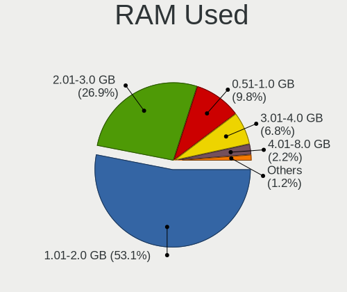
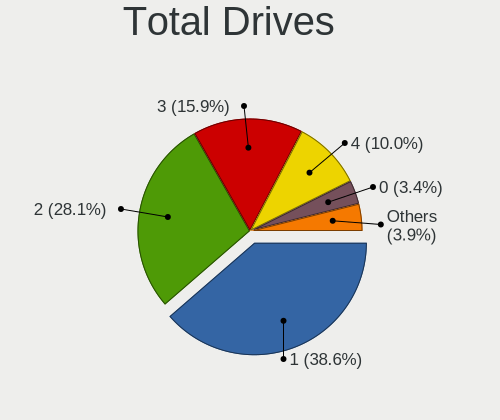
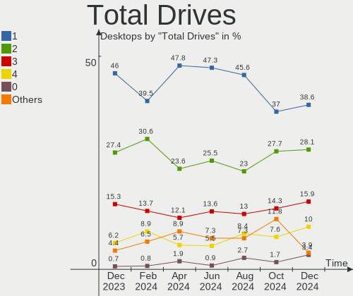
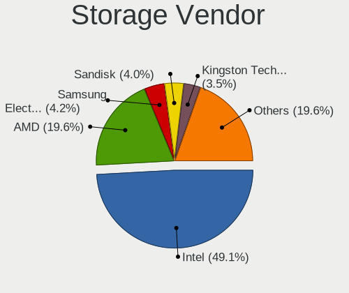
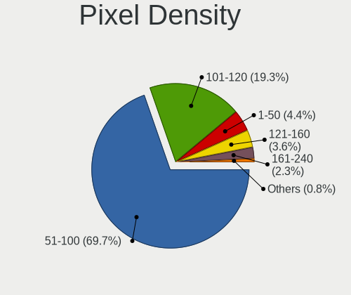

OpenMandriva - Hardware Trends (Desktops)
-----------------------------------------

A project to identify most popular hardware characteristics and track their change
over time based on data collected by Linux users at https://Linux-Hardware.org.

Anyone can contribute to this report by the [hw-probe](https://github.com/linuxhw/hw-probe) tool:

    sudo -E hw-probe -all -upload

This report is for one last month. Overall report since the beginning of time: [TestDays](https://github.com/linuxhw/TestDays)

Period: Aug, 2023.

Contents
--------

* [ System ](#system)
  - [ OS                       ](#os)
  - [ OS Family                ](#os-family)
  - [ Kernel                   ](#kernel)
  - [ Kernel Family            ](#kernel-family)
  - [ Kernel Major Ver.        ](#kernel-major-ver)
  - [ Arch                     ](#arch)
  - [ DE                       ](#de)
  - [ Display Server           ](#display-server)
  - [ Display Manager          ](#display-manager)
  - [ OS Lang                  ](#os-lang)
  - [ Boot Mode                ](#boot-mode)
  - [ Filesystem               ](#filesystem)
  - [ Part. scheme             ](#part-scheme)
  - [ Dual Boot with Linux/BSD ](#dual-boot-with-linuxbsd)
  - [ Dual Boot (Win)          ](#dual-boot-win)

* [ Board ](#board)
  - [ Vendor                   ](#vendor)
  - [ Model                    ](#model)
  - [ Model Family             ](#model-family)
  - [ MFG Year                 ](#mfg-year)
  - [ Form Factor              ](#form-factor)
  - [ Secure Boot              ](#secure-boot)
  - [ Coreboot                 ](#coreboot)
  - [ RAM Size                 ](#ram-size)
  - [ RAM Used                 ](#ram-used)
  - [ Total Drives             ](#total-drives)
  - [ Has CD-ROM               ](#has-cd-rom)
  - [ Has Ethernet             ](#has-ethernet)
  - [ Has WiFi                 ](#has-wifi)
  - [ Has Bluetooth            ](#has-bluetooth)

* [ Location ](#location)
  - [ Country                  ](#country)
  - [ City                     ](#city)

* [ Drives ](#drives)
  - [ Drive Vendor             ](#drive-vendor)
  - [ Drive Model              ](#drive-model)
  - [ HDD Vendor               ](#hdd-vendor)
  - [ SSD Vendor               ](#ssd-vendor)
  - [ Drive Kind               ](#drive-kind)
  - [ Drive Connector          ](#drive-connector)
  - [ Drive Size               ](#drive-size)
  - [ Space Total              ](#space-total)
  - [ Space Used               ](#space-used)
  - [ Malfunc. Drives          ](#malfunc-drives)
  - [ Malfunc. Drive Vendor    ](#malfunc-drive-vendor)
  - [ Malfunc. HDD Vendor      ](#malfunc-hdd-vendor)
  - [ Malfunc. Drive Kind      ](#malfunc-drive-kind)
  - [ Failed Drives            ](#failed-drives)
  - [ Failed Drive Vendor      ](#failed-drive-vendor)
  - [ Drive Status             ](#drive-status)

* [ Storage controller ](#storage-controller)
  - [ Storage Vendor           ](#storage-vendor)
  - [ Storage Model            ](#storage-model)
  - [ Storage Kind             ](#storage-kind)

* [ Processor ](#processor)
  - [ CPU Vendor               ](#cpu-vendor)
  - [ CPU Model                ](#cpu-model)
  - [ CPU Model Family         ](#cpu-model-family)
  - [ CPU Cores                ](#cpu-cores)
  - [ CPU Sockets              ](#cpu-sockets)
  - [ CPU Threads              ](#cpu-threads)
  - [ CPU Op-Modes             ](#cpu-op-modes)
  - [ CPU Microcode            ](#cpu-microcode)
  - [ CPU Microarch            ](#cpu-microarch)

* [ Graphics ](#graphics)
  - [ GPU Vendor               ](#gpu-vendor)
  - [ GPU Model                ](#gpu-model)
  - [ GPU Combo                ](#gpu-combo)
  - [ GPU Driver               ](#gpu-driver)
  - [ GPU Memory               ](#gpu-memory)

* [ Monitor ](#monitor)
  - [ Monitor Vendor           ](#monitor-vendor)
  - [ Monitor Model            ](#monitor-model)
  - [ Monitor Resolution       ](#monitor-resolution)
  - [ Monitor Diagonal         ](#monitor-diagonal)
  - [ Monitor Width            ](#monitor-width)
  - [ Aspect Ratio             ](#aspect-ratio)
  - [ Monitor Area             ](#monitor-area)
  - [ Pixel Density            ](#pixel-density)
  - [ Multiple Monitors        ](#multiple-monitors)

* [ Network ](#network)
  - [ Net Controller Vendor    ](#net-controller-vendor)
  - [ Net Controller Model     ](#net-controller-model)
  - [ Wireless Vendor          ](#wireless-vendor)
  - [ Wireless Model           ](#wireless-model)
  - [ Ethernet Vendor          ](#ethernet-vendor)
  - [ Ethernet Model           ](#ethernet-model)
  - [ Net Controller Kind      ](#net-controller-kind)
  - [ Used Controller          ](#used-controller)
  - [ NICs                     ](#nics)
  - [ IPv6                     ](#ipv6)

* [ Bluetooth ](#bluetooth)
  - [ Bluetooth Vendor         ](#bluetooth-vendor)
  - [ Bluetooth Model          ](#bluetooth-model)

* [ Sound ](#sound)
  - [ Sound Vendor             ](#sound-vendor)
  - [ Sound Model              ](#sound-model)

* [ Memory ](#memory)
  - [ Memory Vendor            ](#memory-vendor)
  - [ Memory Model             ](#memory-model)
  - [ Memory Kind              ](#memory-kind)
  - [ Memory Form Factor       ](#memory-form-factor)
  - [ Memory Size              ](#memory-size)
  - [ Memory Speed             ](#memory-speed)

* [ Printers & scanners ](#printers--scanners)
  - [ Printer Vendor           ](#printer-vendor)
  - [ Printer Model            ](#printer-model)
  - [ Scanner Vendor           ](#scanner-vendor)
  - [ Scanner Model            ](#scanner-model)

* [ Camera ](#camera)
  - [ Camera Vendor            ](#camera-vendor)
  - [ Camera Model             ](#camera-model)

* [ Security ](#security)
  - [ Fingerprint Vendor       ](#fingerprint-vendor)
  - [ Fingerprint Model        ](#fingerprint-model)
  - [ Chipcard Vendor          ](#chipcard-vendor)
  - [ Chipcard Model           ](#chipcard-model)

* [ Unsupported ](#unsupported)
  - [ Unsupported Devices      ](#unsupported-devices)
  - [ Unsupported Device Types ](#unsupported-device-types)

System
------

OS
--

Installed operating systems

| Name               | Desktops | Percent |
|--------------------|----------|---------|
| OpenMandriva 23.08 | 216      | 67.92%  |
| OpenMandriva 23.03 | 43       | 13.52%  |
| OpenMandriva 4.3   | 21       | 6.6%    |
| OpenMandriva 23.07 | 14       | 4.4%    |
| OpenMandriva 23.90 | 13       | 4.09%   |
| OpenMandriva 23.01 | 5        | 1.57%   |
| OpenMandriva 4.2   | 4        | 1.26%   |
| OpenMandriva 23.06 | 2        | 0.63%   |

OS Family
---------

OS without a version

| Name         | Desktops | Percent |
|--------------|----------|---------|
| OpenMandriva | 318      | 100%    |

Kernel
------

Version of the Linux kernel

| Version                      | Desktops | Percent |
|------------------------------|----------|---------|
| 6.4.11-desktop-1omv2390      | 151      | 47.48%  |
| 6.4.8-desktop-2omv2390       | 74       | 23.27%  |
| 6.2.6-desktop-1omv2390       | 45       | 14.15%  |
| 5.16.7-desktop-1omv4003      | 15       | 4.72%   |
| 6.3.5-desktop-3omv2390       | 14       | 4.4%    |
| 5.16.13-desktop-1omv4003     | 6        | 1.89%   |
| 6.1.1-desktop-1omv2290       | 4        | 1.26%   |
| 5.10.14-desktop-1omv4002     | 4        | 1.26%   |
| 6.4.7-desktop-1omv2390       | 2        | 0.63%   |
| 6.5.0-desktop-1omv2390       | 1        | 0.31%   |
| 6.5.0-desktop-0.rc7.1omv2390 | 1        | 0.31%   |
| 6.1.4-desktop-1omv2301       | 1        | 0.31%   |

Kernel Family
-------------

Linux kernel without a distro release

| Version | Desktops | Percent |
|---------|----------|---------|
| 6.4.11  | 151      | 47.48%  |
| 6.4.8   | 74       | 23.27%  |
| 6.2.6   | 45       | 14.15%  |
| 5.16.7  | 15       | 4.72%   |
| 6.3.5   | 14       | 4.4%    |
| 5.16.13 | 6        | 1.89%   |
| 6.1.1   | 4        | 1.26%   |
| 5.10.14 | 4        | 1.26%   |
| 6.5.0   | 2        | 0.63%   |
| 6.4.7   | 2        | 0.63%   |
| 6.1.4   | 1        | 0.31%   |

Kernel Major Ver.
-----------------

Linux kernel major version

| Version | Desktops | Percent |
|---------|----------|---------|
| 6.4     | 227      | 71.38%  |
| 6.2     | 45       | 14.15%  |
| 5.16    | 21       | 6.6%    |
| 6.3     | 14       | 4.4%    |
| 6.1     | 5        | 1.57%   |
| 5.10    | 4        | 1.26%   |
| 6.5     | 2        | 0.63%   |

Arch
----

OS architecture (x86_64, i586, etc.)

| Name   | Desktops | Percent |
|--------|----------|---------|
| x86_64 | 318      | 100%    |

DE
--

Desktop Environment

| Name    | Desktops | Percent |
|---------|----------|---------|
| KDE5    | 242      | 76.1%   |
| GNOME   | 40       | 12.58%  |
| LXQt    | 24       | 7.55%   |
| Unknown | 10       | 3.14%   |
| Budgie  | 2        | 0.63%   |

Display Server
--------------

X11 or Wayland

| Name    | Desktops | Percent |
|---------|----------|---------|
| Wayland | 229      | 72.01%  |
| X11     | 89       | 27.99%  |

Display Manager
---------------

SDDM, LightDM, etc.

| Name | Desktops | Percent |
|------|----------|---------|
| SDDM | 278      | 87.42%  |
| GDM  | 40       | 12.58%  |

OS Lang
-------

Language

| Lang  | Desktops | Percent |
|-------|----------|---------|
| en_US | 133      | 41.82%  |
| pt_BR | 27       | 8.49%   |
| de_DE | 25       | 7.86%   |
| ru_RU | 21       | 6.6%    |
| fr_FR | 19       | 5.97%   |
| en_GB | 15       | 4.72%   |
| it_IT | 12       | 3.77%   |
| pl_PL | 10       | 3.14%   |
| es_ES | 9        | 2.83%   |
| es_VE | 6        | 1.89%   |
| en_CA | 5        | 1.57%   |
| pt_PT | 3        | 0.94%   |
| es_AR | 3        | 0.94%   |
| en_AU | 3        | 0.94%   |
| nl_BE | 2        | 0.63%   |
| hu_HU | 2        | 0.63%   |
| fr_BE | 2        | 0.63%   |
| es_MX | 2        | 0.63%   |
| de_CH | 2        | 0.63%   |
| de_AT | 2        | 0.63%   |
| uk_UA | 1        | 0.31%   |
| tr_TR | 1        | 0.31%   |
| ru_UA | 1        | 0.31%   |
| nl_NL | 1        | 0.31%   |
| ja_JP | 1        | 0.31%   |
| fr_CA | 1        | 0.31%   |
| es_CL | 1        | 0.31%   |
| en_ZA | 1        | 0.31%   |
| en_SG | 1        | 0.31%   |
| en_IN | 1        | 0.31%   |
| en_IE | 1        | 0.31%   |
| en_DK | 1        | 0.31%   |
| da_DK | 1        | 0.31%   |
| cs_CZ | 1        | 0.31%   |
| ar_SA | 1        | 0.31%   |

Boot Mode
---------

EFI or BIOS

| Mode | Desktops | Percent |
|------|----------|---------|
| EFI  | 163      | 51.26%  |
| BIOS | 155      | 48.74%  |

Filesystem
----------

Type of filesystem

| Type     | Desktops | Percent |
|----------|----------|---------|
| Overlay  | 148      | 46.54%  |
| Ext4     | 148      | 46.54%  |
| Btrfs    | 11       | 3.46%   |
| Xfs      | 4        | 1.26%   |
| Jfs      | 3        | 0.94%   |
| Reiserfs | 1        | 0.31%   |
| F2fs     | 1        | 0.31%   |
| Ext3     | 1        | 0.31%   |
| Ext2     | 1        | 0.31%   |

Part. scheme
------------

Scheme of partitioning

| Type | Desktops | Percent |
|------|----------|---------|
| GPT  | 256      | 80.5%   |
| MBR  | 62       | 19.5%   |

Dual Boot with Linux/BSD
------------------------

Hosting more than one Linux/BSD

| Dual boot | Desktops | Percent |
|-----------|----------|---------|
| Yes       | 185      | 58.18%  |
| No        | 133      | 41.82%  |

Dual Boot (Win)
---------------

Hosting Linux and Windows

| Dual boot | Desktops | Percent |
|-----------|----------|---------|
| No        | 176      | 55.35%  |
| Yes       | 142      | 44.65%  |

Board
-----

Vendor
------

Motherboard manufacturer

| Name                                 | Desktops | Percent |
|--------------------------------------|----------|---------|
| ASUSTek Computer                     | 75       | 23.58%  |
| MSI                                  | 45       | 14.15%  |
| Gigabyte Technology                  | 44       | 13.84%  |
| Hewlett-Packard                      | 32       | 10.06%  |
| Dell                                 | 23       | 7.23%   |
| ASRock                               | 20       | 6.29%   |
| Intel                                | 15       | 4.72%   |
| Lenovo                               | 10       | 3.14%   |
| Acer                                 | 8        | 2.52%   |
| Fujitsu                              | 7        | 2.2%    |
| Foxconn                              | 6        | 1.89%   |
| Positivo                             | 3        | 0.94%   |
| Pegatron                             | 3        | 0.94%   |
| Medion                               | 3        | 0.94%   |
| Biostar                              | 3        | 0.94%   |
| Red Hat                              | 2        | 0.63%   |
| ECS                                  | 2        | 0.63%   |
| ViewSonic                            | 1        | 0.31%   |
| Shuttle                              | 1        | 0.31%   |
| Shenzhen Meigao Electronic Equipment | 1        | 0.31%   |
| PCWare                               | 1        | 0.31%   |
| OEM                                  | 1        | 0.31%   |
| Megaware                             | 1        | 0.31%   |
| MANCER                               | 1        | 0.31%   |
| Kobian                               | 1        | 0.31%   |
| Itautec                              | 1        | 0.31%   |
| Huanan                               | 1        | 0.31%   |
| HC Technology.                       | 1        | 0.31%   |
| GEEKOM                               | 1        | 0.31%   |
| Digiboard                            | 1        | 0.31%   |
| AZW                                  | 1        | 0.31%   |
| Apple                                | 1        | 0.31%   |
| AMD                                  | 1        | 0.31%   |
| Unknown                              | 1        | 0.31%   |

Model
-----

Motherboard model

| Name                                       | Desktops | Percent |
|--------------------------------------------|----------|---------|
| Dell OptiPlex 7010                         | 4        | 1.26%   |
| Intel H81                                  | 3        | 0.94%   |
| ASUS All Series                            | 3        | 0.94%   |
| Red Hat KVM                                | 2        | 0.63%   |
| MSI MS-7C91                                | 2        | 0.63%   |
| MSI MS-7C56                                | 2        | 0.63%   |
| MSI MS-7C52                                | 2        | 0.63%   |
| MSI MS-7C51                                | 2        | 0.63%   |
| MSI MS-7B79                                | 2        | 0.63%   |
| MSI MS-7721                                | 2        | 0.63%   |
| Intel H61                                  | 2        | 0.63%   |
| HP Z400 Workstation                        | 2        | 0.63%   |
| HP Slim Desktop S01-pF2xxx                 | 2        | 0.63%   |
| HP Slim Desktop S01-aF0xxx                 | 2        | 0.63%   |
| HP ProDesk 600 G1 SFF                      | 2        | 0.63%   |
| HP Pavilion Gaming Desktop TG01-1xxx       | 2        | 0.63%   |
| HP EliteDesk 705 G1 SFF                    | 2        | 0.63%   |
| HP Desktop M01-F1xxx                       | 2        | 0.63%   |
| Gigabyte X570 AORUS ELITE                  | 2        | 0.63%   |
| Gigabyte X299 AORUS Gaming                 | 2        | 0.63%   |
| Gigabyte G31M-ES2L                         | 2        | 0.63%   |
| Fujitsu ESPRIMO P910                       | 2        | 0.63%   |
| Dell OptiPlex 9020                         | 2        | 0.63%   |
| Dell OptiPlex 755                          | 2        | 0.63%   |
| Dell OptiPlex 7050                         | 2        | 0.63%   |
| ASUS SABERTOOTH 990FX R2.0                 | 2        | 0.63%   |
| ASUS ROG STRIX X570-F GAMING               | 2        | 0.63%   |
| ASUS PRIME X570-P                          | 2        | 0.63%   |
| ASUS PRIME X299-DELUXE II                  | 2        | 0.63%   |
| ASUS M5A99X EVO R2.0                       | 2        | 0.63%   |
| Acer Veriton L670G                         | 2        | 0.63%   |
| ViewSonic VPC14-WP                         | 1        | 0.31%   |
| Shuttle 1009859_1400415                    | 1        | 0.31%   |
| Shenzhen Meigao Electronic Equipment UM560 | 1        | 0.31%   |
| Positivo POS-PQ45AU                        | 1        | 0.31%   |
| Positivo POS-PIG41BA                       | 1        | 0.31%   |
| Positivo ONE500                            | 1        | 0.31%   |
| Pegatron WC912AA-ABZ p6300it               | 1        | 0.31%   |
| Pegatron IPM41-D3                          | 1        | 0.31%   |
| Pegatron 2A73h                             | 1        | 0.31%   |

Model Family
------------

Motherboard model prefix

| Name                                       | Desktops | Percent |
|--------------------------------------------|----------|---------|
| Dell OptiPlex                              | 17       | 5.35%   |
| ASUS PRIME                                 | 12       | 3.77%   |
| ASUS TUF                                   | 8        | 2.52%   |
| Lenovo ThinkCentre                         | 6        | 1.89%   |
| HP Compaq                                  | 6        | 1.89%   |
| Fujitsu ESPRIMO                            | 6        | 1.89%   |
| HP Slim                                    | 5        | 1.57%   |
| HP ProDesk                                 | 5        | 1.57%   |
| ASUS ROG                                   | 5        | 1.57%   |
| Acer Aspire                                | 5        | 1.57%   |
| HP EliteDesk                               | 4        | 1.26%   |
| Gigabyte B450M                             | 4        | 1.26%   |
| Intel H81                                  | 3        | 0.94%   |
| HP Pavilion                                | 3        | 0.94%   |
| Dell Vostro                                | 3        | 0.94%   |
| ASUS All                                   | 3        | 0.94%   |
| Acer Veriton                               | 3        | 0.94%   |
| Red Hat KVM                                | 2        | 0.63%   |
| MSI MS-7C91                                | 2        | 0.63%   |
| MSI MS-7C56                                | 2        | 0.63%   |
| MSI MS-7C52                                | 2        | 0.63%   |
| MSI MS-7C51                                | 2        | 0.63%   |
| MSI MS-7B79                                | 2        | 0.63%   |
| MSI MS-7721                                | 2        | 0.63%   |
| Intel H61                                  | 2        | 0.63%   |
| HP Z400                                    | 2        | 0.63%   |
| HP Desktop                                 | 2        | 0.63%   |
| Gigabyte X570                              | 2        | 0.63%   |
| Gigabyte X299                              | 2        | 0.63%   |
| Gigabyte G31M-ES2L                         | 2        | 0.63%   |
| Gigabyte B550M                             | 2        | 0.63%   |
| Foxconn Pro                                | 2        | 0.63%   |
| Dell Inspiron                              | 2        | 0.63%   |
| ASUS SABERTOOTH                            | 2        | 0.63%   |
| ASUS P8Z68-V                               | 2        | 0.63%   |
| ASUS M5A99X                                | 2        | 0.63%   |
| ASUS M5A78L-M                              | 2        | 0.63%   |
| ViewSonic VPC14-WP                         | 1        | 0.31%   |
| Shuttle 1009859                            | 1        | 0.31%   |
| Shenzhen Meigao Electronic Equipment UM560 | 1        | 0.31%   |

MFG Year
--------

Motherboard manufacture year

| Year | Desktops | Percent |
|------|----------|---------|
| 2012 | 38       | 11.95%  |
| 2020 | 32       | 10.06%  |
| 2014 | 25       | 7.86%   |
| 2019 | 24       | 7.55%   |
| 2013 | 23       | 7.23%   |
| 2010 | 22       | 6.92%   |
| 2018 | 21       | 6.6%    |
| 2009 | 18       | 5.66%   |
| 2011 | 17       | 5.35%   |
| 2021 | 16       | 5.03%   |
| 2008 | 15       | 4.72%   |
| 2022 | 13       | 4.09%   |
| 2017 | 12       | 3.77%   |
| 2016 | 12       | 3.77%   |
| 2007 | 11       | 3.46%   |
| 2015 | 9        | 2.83%   |
| 2023 | 7        | 2.2%    |
| 2005 | 2        | 0.63%   |
| 2006 | 1        | 0.31%   |

Form Factor
-----------

Physical design of the computer

| Name    | Desktops | Percent |
|---------|----------|---------|
| Desktop | 318      | 100%    |

Secure Boot
-----------

Enabled or disabled

| State    | Desktops | Percent |
|----------|----------|---------|
| Disabled | 318      | 100%    |

Coreboot
--------

Have coreboot on board

| Used | Desktops | Percent |
|------|----------|---------|
| No   | 318      | 100%    |

RAM Size
--------

Total RAM memory

| Size in GB      | Desktops | Percent |
|-----------------|----------|---------|
| 16.01-24.0      | 72       | 22.64%  |
| 8.01-16.0       | 71       | 22.33%  |
| 4.01-8.0        | 57       | 17.92%  |
| 3.01-4.0        | 48       | 15.09%  |
| 32.01-64.0      | 39       | 12.26%  |
| 24.01-32.0      | 11       | 3.46%   |
| 1.01-2.0        | 11       | 3.46%   |
| 2.01-3.0        | 4        | 1.26%   |
| 64.01-256.0     | 3        | 0.94%   |
| More than 256.0 | 2        | 0.63%   |

RAM Used
--------

Used RAM memory

| Used GB  | Desktops | Percent |
|----------|----------|---------|
| 1.01-2.0 | 188      | 59.12%  |
| 2.01-3.0 | 84       | 26.42%  |
| 0.51-1.0 | 27       | 8.49%   |
| 3.01-4.0 | 10       | 3.14%   |
| 4.01-8.0 | 5        | 1.57%   |
| 0.01-0.5 | 4        | 1.26%   |

Total Drives
------------

Number of drives on board

| Drives | Desktops | Percent |
|--------|----------|---------|
| 1      | 135      | 42.45%  |
| 2      | 81       | 25.47%  |
| 3      | 43       | 13.52%  |
| 4      | 25       | 7.86%   |
| 5      | 13       | 4.09%   |
| 6      | 9        | 2.83%   |
| 0      | 5        | 1.57%   |
| 10     | 2        | 0.63%   |
| 7      | 2        | 0.63%   |
| 13     | 1        | 0.31%   |
| 11     | 1        | 0.31%   |
| 9      | 1        | 0.31%   |

Has CD-ROM
----------

Has CD-ROM on board

| Presented | Desktops | Percent |
|-----------|----------|---------|
| Yes       | 165      | 51.89%  |
| No        | 153      | 48.11%  |

Has Ethernet
------------

Has Ethernet on board

| Presented | Desktops | Percent |
|-----------|----------|---------|
| Yes       | 314      | 98.74%  |
| No        | 4        | 1.26%   |

Has WiFi
--------

Has WiFi module

| Presented | Desktops | Percent |
|-----------|----------|---------|
| No        | 189      | 59.43%  |
| Yes       | 129      | 40.57%  |

Has Bluetooth
-------------

Has Bluetooth module

| Presented | Desktops | Percent |
|-----------|----------|---------|
| No        | 231      | 72.64%  |
| Yes       | 87       | 27.36%  |

Location
--------

Country
-------

Geographic location (country)

| Country            | Desktops | Percent |
|--------------------|----------|---------|
| USA                | 40       | 12.58%  |
| Brazil             | 36       | 11.32%  |
| Germany            | 35       | 11.01%  |
| Russia             | 26       | 8.18%   |
| France             | 23       | 7.23%   |
| Italy              | 15       | 4.72%   |
| Spain              | 12       | 3.77%   |
| Poland             | 11       | 3.46%   |
| Canada             | 11       | 3.46%   |
| UK                 | 10       | 3.14%   |
| Netherlands        | 7        | 2.2%    |
| Venezuela          | 6        | 1.89%   |
| Australia          | 6        | 1.89%   |
| Romania            | 5        | 1.57%   |
| Japan              | 5        | 1.57%   |
| Hungary            | 5        | 1.57%   |
| Belgium            | 5        | 1.57%   |
| Mexico             | 4        | 1.26%   |
| Finland            | 4        | 1.26%   |
| Argentina          | 4        | 1.26%   |
| Ukraine            | 3        | 0.94%   |
| Thailand           | 3        | 0.94%   |
| Slovenia           | 3        | 0.94%   |
| Denmark            | 3        | 0.94%   |
| Switzerland        | 2        | 0.63%   |
| Singapore          | 2        | 0.63%   |
| Saudi Arabia       | 2        | 0.63%   |
| Portugal           | 2        | 0.63%   |
| Norway             | 2        | 0.63%   |
| Greece             | 2        | 0.63%   |
| Dominican Republic | 2        | 0.63%   |
| Czechia            | 2        | 0.63%   |
| Austria            | 2        | 0.63%   |
| Turkey             | 1        | 0.31%   |
| South Africa       | 1        | 0.31%   |
| Slovakia           | 1        | 0.31%   |
| Serbia             | 1        | 0.31%   |
| Morocco            | 1        | 0.31%   |
| Malaysia           | 1        | 0.31%   |
| Kazakhstan         | 1        | 0.31%   |

City
----

Geographic location (city)

| City                   | Desktops | Percent |
|------------------------|----------|---------|
| San Cristóbal         | 5        | 1.57%   |
| Berlin                 | 5        | 1.57%   |
| Sao Paulo              | 4        | 1.26%   |
| Rome                   | 4        | 1.26%   |
| Oak Park               | 3        | 0.94%   |
| Novosibirsk            | 3        | 0.94%   |
| Moscow                 | 3        | 0.94%   |
| Melbourne              | 3        | 0.94%   |
| Youngstown             | 2        | 0.63%   |
| Vallenay               | 2        | 0.63%   |
| Târgu Mureş          | 2        | 0.63%   |
| St. Petersburg         | 2        | 0.63%   |
| St Petersburg          | 2        | 0.63%   |
| Singapore              | 2        | 0.63%   |
| Simferopol             | 2        | 0.63%   |
| Sankt Pölten          | 2        | 0.63%   |
| Rouen                  | 2        | 0.63%   |
| Rio de Janeiro         | 2        | 0.63%   |
| Perm                   | 2        | 0.63%   |
| Milan                  | 2        | 0.63%   |
| Lucas do Rio Verde     | 2        | 0.63%   |
| Los Angeles            | 2        | 0.63%   |
| Hamburg                | 2        | 0.63%   |
| Duque de Caxias        | 2        | 0.63%   |
| Chelyabinsk            | 2        | 0.63%   |
| Braga                  | 2        | 0.63%   |
| Boulogne               | 2        | 0.63%   |
| Athens                 | 2        | 0.63%   |
| Zuidwolde              | 1        | 0.31%   |
| Zofingen               | 1        | 0.31%   |
| Zhigulevsk             | 1        | 0.31%   |
| Zaragoza               | 1        | 0.31%   |
| Yelabuga               | 1        | 0.31%   |
| Yekaterinburg          | 1        | 0.31%   |
| Yarragon               | 1        | 0.31%   |
| Wroclaw                | 1        | 0.31%   |
| Workington             | 1        | 0.31%   |
| Warsaw                 | 1        | 0.31%   |
| Volgograd              | 1        | 0.31%   |
| Villingen-Schwenningen | 1        | 0.31%   |

Drives
------

Drive Vendor
------------

Hard drive vendors

| Vendor                      | Desktops | Drives | Percent |
|-----------------------------|----------|--------|---------|
| WDC                         | 92       | 117    | 15.75%  |
| Seagate                     | 85       | 99     | 14.55%  |
| Samsung Electronics         | 76       | 120    | 13.01%  |
| Kingston                    | 33       | 35     | 5.65%   |
| Toshiba                     | 32       | 37     | 5.48%   |
| Crucial                     | 29       | 38     | 4.97%   |
| Hitachi                     | 25       | 26     | 4.28%   |
| SanDisk                     | 21       | 22     | 3.6%    |
| China                       | 15       | 16     | 2.57%   |
| SPCC                        | 12       | 12     | 2.05%   |
| Patriot                     | 9        | 9      | 1.54%   |
| Intel                       | 9        | 9      | 1.54%   |
| A-DATA Technology           | 8        | 8      | 1.37%   |
| Unknown                     | 7        | 12     | 1.2%    |
| PNY                         | 7        | 9      | 1.2%    |
| OCZ                         | 7        | 7      | 1.2%    |
| GOODRAM                     | 6        | 7      | 1.03%   |
| Phison                      | 5        | 5      | 0.86%   |
| Maxtor                      | 5        | 6      | 0.86%   |
| Intenso                     | 5        | 5      | 0.86%   |
| Silicon Motion              | 4        | 5      | 0.68%   |
| Micron Technology           | 4        | 4      | 0.68%   |
| Lexar                       | 4        | 4      | 0.68%   |
| Kingston Technology Company | 4        | 4      | 0.68%   |
| Transcend                   | 3        | 3      | 0.51%   |
| Team                        | 3        | 3      | 0.51%   |
| SK hynix                    | 3        | 3      | 0.51%   |
| KingSpec                    | 3        | 3      | 0.51%   |
| HGST                        | 3        | 4      | 0.51%   |
| Hewlett-Packard             | 3        | 3      | 0.51%   |
| Apacer                      | 3        | 3      | 0.51%   |
| AMD                         | 3        | 3      | 0.51%   |
| Verbatim                    | 2        | 2      | 0.34%   |
| SSK                         | 2        | 2      | 0.34%   |
| Netac                       | 2        | 2      | 0.34%   |
| Min Yi U                    | 2        | 2      | 0.34%   |
| KIOXIA-EXCERIA              | 2        | 2      | 0.34%   |
| JMicron Technology          | 2        | 2      | 0.34%   |
| Integral                    | 2        | 2      | 0.34%   |
| Fujitsu                     | 2        | 3      | 0.34%   |

Drive Model
-----------

Hard drive models

| Model                            | Desktops | Percent |
|----------------------------------|----------|---------|
| Seagate ST1000DM010-2EP102 1TB   | 10       | 1.49%   |
| Kingston SA400S37240G 240GB SSD  | 10       | 1.49%   |
| Toshiba DT01ACA100 1TB           | 7        | 1.04%   |
| Seagate ST500DM002-1BD142 500GB  | 7        | 1.04%   |
| Samsung SSD 860 EVO 250GB        | 6        | 0.89%   |
| WDC WD10EZEX-08WN4A0 1TB         | 5        | 0.75%   |
| Seagate ST2000DM008-2FR102 2TB   | 5        | 0.75%   |
| SanDisk NVMe SSD Drive 1TB       | 5        | 0.75%   |
| Samsung SSD 870 EVO 1TB          | 5        | 0.75%   |
| Samsung SSD 860 EVO 500GB        | 5        | 0.75%   |
| Hitachi HTS543225L9A300 250GB    | 5        | 0.75%   |
| Toshiba HDWD110 1TB              | 4        | 0.6%    |
| Seagate ST3500418AS 500GB        | 4        | 0.6%    |
| Samsung SSD 970 EVO Plus 2TB     | 4        | 0.6%    |
| Samsung SSD 860 EVO 1TB          | 4        | 0.6%    |
| Samsung SSD 850 EVO 500GB        | 4        | 0.6%    |
| Samsung SSD 850 EVO 250GB        | 4        | 0.6%    |
| PNY CS900 120GB SSD              | 4        | 0.6%    |
| Kingston SA400S37480G 480GB SSD  | 4        | 0.6%    |
| Crucial CT500MX500SSD1 500GB     | 4        | 0.6%    |
| Crucial CT250MX500SSD1 250GB     | 4        | 0.6%    |
| WDC WD20EZAZ-00L9GB0 2TB         | 3        | 0.45%   |
| WDC WD10EZEX-60M2NA0 1TB         | 3        | 0.45%   |
| Unknown SD/MMC/MS PRO 1GB        | 3        | 0.45%   |
| Unknown SD/MMC 2GB               | 3        | 0.45%   |
| Unknown M.S./M.S.Pro/HG 16GB     | 3        | 0.45%   |
| Toshiba MQ01ABF050 500GB         | 3        | 0.45%   |
| Toshiba DT01ACA200 2TB           | 3        | 0.45%   |
| Toshiba DT01ACA050 500GB         | 3        | 0.45%   |
| SPCC Solid State Disk 1TB        | 3        | 0.45%   |
| Seagate ST3160815AS 160GB        | 3        | 0.45%   |
| Seagate ST1000DM003-1ER162 1TB   | 3        | 0.45%   |
| Samsung SSD 970 EVO Plus 500GB   | 3        | 0.45%   |
| Samsung SSD 870 QVO 1TB          | 3        | 0.45%   |
| Samsung SSD 870 EVO 500GB        | 3        | 0.45%   |
| Samsung SSD 840 EVO 120GB        | 3        | 0.45%   |
| Samsung HD161HJ 160GB            | 3        | 0.45%   |
| Samsung HD103UJ 1TB              | 3        | 0.45%   |
| Patriot Burst 480GB SSD          | 3        | 0.45%   |
| Kingston SV300S37A120G 120GB SSD | 3        | 0.45%   |

HDD Vendor
----------

Hard disk drive vendors

| Vendor              | Desktops | Drives | Percent |
|---------------------|----------|--------|---------|
| WDC                 | 82       | 99     | 31.54%  |
| Seagate             | 81       | 95     | 31.15%  |
| Toshiba             | 30       | 35     | 11.54%  |
| Hitachi             | 25       | 26     | 9.62%   |
| Samsung Electronics | 16       | 16     | 6.15%   |
| Maxtor              | 5        | 6      | 1.92%   |
| Unknown             | 3        | 3      | 1.15%   |
| HGST                | 3        | 4      | 1.15%   |
| Min Yi U            | 2        | 2      | 0.77%   |
| Fujitsu             | 2        | 3      | 0.77%   |
| Apple               | 2        | 2      | 0.77%   |
| WD MediaMax         | 1        | 1      | 0.38%   |
| USB3.0              | 1        | 1      | 0.38%   |
| StoreJet            | 1        | 1      | 0.38%   |
| Intenso             | 1        | 1      | 0.38%   |
| IBM/Hitachi         | 1        | 1      | 0.38%   |
| IB-AC703            | 1        | 1      | 0.38%   |
| HGST HTS            | 1        | 1      | 0.38%   |
| ExcelStor           | 1        | 1      | 0.38%   |
| DAS                 | 1        | 4      | 0.38%   |

SSD Vendor
----------

Solid state drive vendors

| Vendor              | Desktops | Drives | Percent |
|---------------------|----------|--------|---------|
| Samsung Electronics | 44       | 69     | 18.33%  |
| Kingston            | 28       | 30     | 11.67%  |
| Crucial             | 25       | 26     | 10.42%  |
| China               | 15       | 16     | 6.25%   |
| SanDisk             | 11       | 11     | 4.58%   |
| WDC                 | 10       | 12     | 4.17%   |
| SPCC                | 9        | 9      | 3.75%   |
| A-DATA Technology   | 8        | 8      | 3.33%   |
| PNY                 | 7        | 9      | 2.92%   |
| Patriot             | 7        | 7      | 2.92%   |
| OCZ                 | 7        | 7      | 2.92%   |
| Intel               | 6        | 6      | 2.5%    |
| GOODRAM             | 6        | 7      | 2.5%    |
| Micron Technology   | 4        | 4      | 1.67%   |
| Intenso             | 4        | 4      | 1.67%   |
| Transcend           | 3        | 3      | 1.25%   |
| Lexar               | 3        | 3      | 1.25%   |
| KingSpec            | 3        | 3      | 1.25%   |
| AMD                 | 3        | 3      | 1.25%   |
| Verbatim            | 2        | 2      | 0.83%   |
| Team                | 2        | 2      | 0.83%   |
| Netac               | 2        | 2      | 0.83%   |
| JMicron Technology  | 2        | 2      | 0.83%   |
| Integral            | 2        | 2      | 0.83%   |
| Hewlett-Packard     | 2        | 2      | 0.83%   |
| Emtec               | 2        | 2      | 0.83%   |
| XrayDisk            | 1        | 1      | 0.42%   |
| Wellcomm            | 1        | 1      | 0.42%   |
| WALRAM              | 1        | 1      | 0.42%   |
| Toshiba             | 1        | 1      | 0.42%   |
| TEXTORM             | 1        | 1      | 0.42%   |
| T-FORCE             | 1        | 1      | 0.42%   |
| Smartbuy            | 1        | 1      | 0.42%   |
| SK hynix            | 1        | 1      | 0.42%   |
| PNY USB             | 1        | 1      | 0.42%   |
| ORTIAL              | 1        | 1      | 0.42%   |
| KODAK               | 1        | 1      | 0.42%   |
| KIOXIA-EXCERIA      | 1        | 1      | 0.42%   |
| KingFast            | 1        | 1      | 0.42%   |
| KingDian            | 1        | 1      | 0.42%   |

Drive Kind
----------

HDD or SSD

| Kind    | Desktops | Drives | Percent |
|---------|----------|--------|---------|
| HDD     | 200      | 303    | 42.19%  |
| SSD     | 189      | 274    | 39.87%  |
| NVMe    | 75       | 110    | 15.82%  |
| Unknown | 10       | 15     | 2.11%   |

Drive Connector
---------------

SATA, SAS, NVMe, etc.

| Type | Desktops | Drives | Percent |
|------|----------|--------|---------|
| SATA | 288      | 552    | 73.47%  |
| NVMe | 75       | 110    | 19.13%  |
| SAS  | 29       | 40     | 7.4%    |

Drive Size
----------

Size of hard drive

| Size in TB | Desktops | Drives | Percent |
|------------|----------|--------|---------|
| 0.01-0.5   | 230      | 339    | 55.96%  |
| 0.51-1.0   | 123      | 163    | 29.93%  |
| 1.01-2.0   | 38       | 45     | 9.25%   |
| 3.01-4.0   | 7        | 10     | 1.7%    |
| 2.01-3.0   | 7        | 10     | 1.7%    |
| 4.01-10.0  | 5        | 9      | 1.22%   |
| 10.01-20.0 | 1        | 1      | 0.24%   |

Space Total
-----------

Amount of disk space available on the file system

| Size in GB     | Desktops | Percent |
|----------------|----------|---------|
| 1-20           | 108      | 33.96%  |
| 101-250        | 68       | 21.38%  |
| 251-500        | 43       | 13.52%  |
| 501-1000       | 32       | 10.06%  |
| 51-100         | 18       | 5.66%   |
| 21-50          | 16       | 5.03%   |
| Unknown        | 12       | 3.77%   |
| 1001-2000      | 11       | 3.46%   |
| 2001-3000      | 6        | 1.89%   |
| More than 3000 | 4        | 1.26%   |

Space Used
----------

Amount of used disk space

| Used GB        | Desktops | Percent |
|----------------|----------|---------|
| 1-20           | 247      | 77.67%  |
| 21-50          | 17       | 5.35%   |
| Unknown        | 12       | 3.77%   |
| 101-250        | 11       | 3.46%   |
| 251-500        | 10       | 3.14%   |
| 51-100         | 8        | 2.52%   |
| 501-1000       | 7        | 2.2%    |
| 1001-2000      | 4        | 1.26%   |
| More than 3000 | 1        | 0.31%   |
| 2001-3000      | 1        | 0.31%   |

Malfunc. Drives
---------------

Drive models with a malfunction

| Model                             | Desktops | Drives | Percent |
|-----------------------------------|----------|--------|---------|
| Hitachi HTS543225L9A300 250GB     | 4        | 4      | 3.33%   |
| Seagate ST500DM002-1BD142 500GB   | 3        | 3      | 2.5%    |
| WDC WD5000AAKX-75U6AA0 500GB      | 2        | 2      | 1.67%   |
| WDC WD10EALX-009BA0 1TB           | 2        | 2      | 1.67%   |
| WDC WD10EADS-00L5B1 1TB           | 2        | 2      | 1.67%   |
| Toshiba DT01ACA050 500GB          | 2        | 2      | 1.67%   |
| Seagate ST3500418AS 500GB         | 2        | 2      | 1.67%   |
| Seagate ST3160815AS 160GB         | 2        | 2      | 1.67%   |
| Samsung Electronics HD161HJ 160GB | 2        | 2      | 1.67%   |
| Samsung Electronics HD103UJ 1TB   | 2        | 2      | 1.67%   |
| Kingston SV300S37A120G 120GB SSD  | 2        | 2      | 1.67%   |
| JMicron Technology Generic 1TB    | 2        | 2      | 1.67%   |
| Hitachi HDS721050CLA362 500GB     | 2        | 2      | 1.67%   |
| WDC WD7500AADS-00M2B0 752GB       | 1        | 1      | 0.83%   |
| WDC WD6402AAEX-00Y9A0 640GB       | 1        | 1      | 0.83%   |
| WDC WD6400AAKS-22A7B2 640GB       | 1        | 1      | 0.83%   |
| WDC WD5000AVCS-632DY1 500GB       | 1        | 1      | 0.83%   |
| WDC WD5000AAKX-08U6AA0 500GB      | 1        | 1      | 0.83%   |
| WDC WD5000AAKS-60Z1A0 500GB       | 1        | 1      | 0.83%   |
| WDC WD5000AAKS-00WWPA0 500GB      | 1        | 1      | 0.83%   |
| WDC WD5000AAKS-00V1A0 500GB       | 1        | 1      | 0.83%   |
| WDC WD5000AAKS-00A7B2 500GB       | 1        | 1      | 0.83%   |
| WDC WD5000AAKS-007AA0 500GB       | 1        | 1      | 0.83%   |
| WDC WD5000AADS-00S9B0 500GB       | 1        | 1      | 0.83%   |
| WDC WD40PURX-64GVNY0 4TB          | 1        | 1      | 0.83%   |
| WDC WD3200BEVT-26A23T0 320GB      | 1        | 1      | 0.83%   |
| WDC WD3200AAKS-00B3A0 320GB       | 1        | 1      | 0.83%   |
| WDC WD3200AAJS-56B4A0 320GB       | 1        | 1      | 0.83%   |
| WDC WD3200AAJS-00L7A0 320GB       | 1        | 1      | 0.83%   |
| WDC WD20EARS-00J2GB0 2TB          | 1        | 1      | 0.83%   |
| WDC WD15EADS-00S2B0 1TB           | 1        | 1      | 0.83%   |
| WDC WD1200BEVS-60RST0 120GB       | 1        | 1      | 0.83%   |
| WDC WD10PURZ-85U8XY0 1TB          | 1        | 1      | 0.83%   |
| WDC WD10JPVX-22JC3T0 1TB          | 1        | 1      | 0.83%   |
| WDC WD10EZEX-60ZF5A0 1TB          | 1        | 1      | 0.83%   |
| WDC WD10EZEX-60M2NA0 1TB          | 1        | 1      | 0.83%   |
| WDC WD10EZEX-22RKKA0 1TB          | 1        | 1      | 0.83%   |
| WDC WD10EZEX-00RKKA0 1TB          | 1        | 1      | 0.83%   |
| WDC WD10EADS-00P8B0 1TB           | 1        | 1      | 0.83%   |
| Toshiba MQ01ABD100 1TB            | 1        | 1      | 0.83%   |

Malfunc. Drive Vendor
---------------------

Vendors of faulty drives

| Vendor              | Desktops | Drives | Percent |
|---------------------|----------|--------|---------|
| WDC                 | 30       | 32     | 25.64%  |
| Seagate             | 29       | 30     | 24.79%  |
| Hitachi             | 14       | 14     | 11.97%  |
| Toshiba             | 10       | 11     | 8.55%   |
| Samsung Electronics | 10       | 10     | 8.55%   |
| Maxtor              | 4        | 4      | 3.42%   |
| SanDisk             | 3        | 3      | 2.56%   |
| Kingston            | 3        | 3      | 2.56%   |
| JMicron Technology  | 2        | 2      | 1.71%   |
| China               | 2        | 2      | 1.71%   |
| SPCC                | 1        | 1      | 0.85%   |
| Netac               | 1        | 1      | 0.85%   |
| Micron Technology   | 1        | 1      | 0.85%   |
| Intenso             | 1        | 1      | 0.85%   |
| IBM/Hitachi         | 1        | 1      | 0.85%   |
| HGST                | 1        | 1      | 0.85%   |
| ExcelStor           | 1        | 1      | 0.85%   |
| Dogfish             | 1        | 1      | 0.85%   |
| C300-CTF            | 1        | 1      | 0.85%   |
| A-DATA Technology   | 1        | 1      | 0.85%   |

Malfunc. HDD Vendor
-------------------

Vendors of faulty HDD drives

| Vendor              | Desktops | Drives | Percent |
|---------------------|----------|--------|---------|
| WDC                 | 30       | 32     | 30.61%  |
| Seagate             | 29       | 30     | 29.59%  |
| Hitachi             | 14       | 14     | 14.29%  |
| Toshiba             | 10       | 11     | 10.2%   |
| Samsung Electronics | 8        | 8      | 8.16%   |
| Maxtor              | 4        | 4      | 4.08%   |
| IBM/Hitachi         | 1        | 1      | 1.02%   |
| HGST                | 1        | 1      | 1.02%   |
| ExcelStor           | 1        | 1      | 1.02%   |

Malfunc. Drive Kind
-------------------

Kinds of faulty drives

| Kind | Desktops | Drives | Percent |
|------|----------|--------|---------|
| HDD  | 83       | 102    | 81.37%  |
| SSD  | 17       | 17     | 16.67%  |
| NVMe | 2        | 2      | 1.96%   |

Failed Drives
-------------

Failed drive models

| Model                        | Desktops | Drives | Percent |
|------------------------------|----------|--------|---------|
| WDC WD800JD-00MSA1 80GB      | 1        | 1      | 16.67%  |
| WDC WD3200BPVT-22JJ5T0 320GB | 1        | 1      | 16.67%  |
| WDC WD1002FAEX-00Z3A0 1TB    | 1        | 1      | 16.67%  |
| Seagate ST3320613AS 320GB    | 1        | 1      | 16.67%  |
| Seagate ST3250318AS 250GB    | 1        | 1      | 16.67%  |
| Seagate ST31000528AS 1TB     | 1        | 1      | 16.67%  |

Failed Drive Vendor
-------------------

Failed drive vendors

| Vendor  | Desktops | Drives | Percent |
|---------|----------|--------|---------|
| WDC     | 3        | 3      | 50%     |
| Seagate | 3        | 3      | 50%     |

Drive Status
------------

Number of failed and malfunc. drives

| Status   | Desktops | Drives | Percent |
|----------|----------|--------|---------|
| Works    | 262      | 532    | 65.66%  |
| Malfunc  | 100      | 121    | 25.06%  |
| Detected | 31       | 43     | 7.77%   |
| Failed   | 6        | 6      | 1.5%    |

Storage controller
------------------

Storage Vendor
--------------

Storage controller vendors

| Vendor                        | Desktops | Percent |
|-------------------------------|----------|---------|
| Intel                         | 210      | 48.17%  |
| AMD                           | 99       | 22.71%  |
| Samsung Electronics           | 26       | 5.96%   |
| SanDisk                       | 16       | 3.67%   |
| JMicron Technology            | 12       | 2.75%   |
| Phison Electronics            | 10       | 2.29%   |
| ASMedia Technology            | 10       | 2.29%   |
| Kingston Technology Company   | 9        | 2.06%   |
| Nvidia                        | 8        | 1.83%   |
| Silicon Motion                | 7        | 1.61%   |
| Micron/Crucial Technology     | 5        | 1.15%   |
| Marvell Technology Group      | 5        | 1.15%   |
| Seagate Technology            | 3        | 0.69%   |
| MAXIO Technology (Hangzhou)   | 3        | 0.69%   |
| VIA Technologies              | 2        | 0.46%   |
| SK hynix                      | 2        | 0.46%   |
| Realtek Semiconductor         | 2        | 0.46%   |
| KIOXIA                        | 2        | 0.46%   |
| Toshiba America Info Systems  | 1        | 0.23%   |
| Micron Technology             | 1        | 0.23%   |
| Lite-On Technology            | 1        | 0.23%   |
| Integrated Technology Express | 1        | 0.23%   |
| Broadcom / LSI                | 1        | 0.23%   |

Storage Model
-------------

Storage controller models

| Model                                                                                   | Desktops | Percent |
|-----------------------------------------------------------------------------------------|----------|---------|
| AMD FCH SATA Controller [AHCI mode]                                                     | 50       | 9.06%   |
| AMD 400 Series Chipset SATA Controller                                                  | 25       | 4.53%   |
| Intel NM10/ICH7 Family SATA Controller [IDE mode]                                       | 23       | 4.17%   |
| Intel 7 Series/C210 Series Chipset Family 6-port SATA Controller [AHCI mode]            | 21       | 3.8%    |
| Intel 8 Series/C220 Series Chipset Family 6-port SATA Controller 1 [AHCI mode]          | 20       | 3.62%   |
| Intel 82801G (ICH7 Family) IDE Controller                                               | 16       | 2.9%    |
| Intel 6 Series/C200 Series Chipset Family 6 port Desktop SATA AHCI Controller           | 16       | 2.9%    |
| AMD SB7x0/SB8x0/SB9x0 IDE Controller                                                    | 16       | 2.9%    |
| Samsung NVMe SSD Controller SM981/PM981/PM983                                           | 15       | 2.72%   |
| Intel Q170/Q150/B150/H170/H110/Z170/CM236 Chipset SATA Controller [AHCI Mode]           | 13       | 2.36%   |
| AMD SB7x0/SB8x0/SB9x0 SATA Controller [IDE mode]                                        | 13       | 2.36%   |
| Intel SATA Controller [RAID mode]                                                       | 12       | 2.17%   |
| AMD 500 Series Chipset SATA Controller                                                  | 12       | 2.17%   |
| AMD SB7x0/SB8x0/SB9x0 SATA Controller [AHCI mode]                                       | 11       | 1.99%   |
| Intel 200 Series PCH SATA controller [AHCI mode]                                        | 10       | 1.81%   |
| ASMedia ASM1062 Serial ATA Controller                                                   | 10       | 1.81%   |
| Intel Cannon Lake PCH SATA AHCI Controller                                              | 9        | 1.63%   |
| AMD FCH SATA Controller D                                                               | 9        | 1.63%   |
| Silicon Motion SM2263EN/SM2263XT (DRAM-less) NVMe SSD Controllers                       | 7        | 1.27%   |
| JMicron JMB363 SATA/IDE Controller                                                      | 7        | 1.27%   |
| Intel 400 Series Chipset Family SATA AHCI Controller                                    | 7        | 1.27%   |
| Samsung NVMe SSD Controller PM9A1/PM9A3/980PRO                                          | 6        | 1.09%   |
| Phison PS5013 E13 NVMe Controller                                                       | 6        | 1.09%   |
| Intel Alder Lake-S PCH SATA Controller [AHCI Mode]                                      | 6        | 1.09%   |
| Intel 82801JI (ICH10 Family) 4 port SATA IDE Controller #1                              | 6        | 1.09%   |
| Intel 82801JI (ICH10 Family) 2 port SATA IDE Controller #2                              | 6        | 1.09%   |
| SanDisk WD Black SN770 / PC SN740 256GB / PC SN560 (DRAM-less) NVMe SSD                 | 5        | 0.91%   |
| Micron/Crucial P2 [Nick P2] / P3 / P3 Plus NVMe PCIe SSD (DRAM-less)                    | 5        | 0.91%   |
| JMicron JMB368 IDE controller                                                           | 5        | 0.91%   |
| Intel Volume Management Device NVMe RAID Controller                                     | 5        | 0.91%   |
| Intel 9 Series Chipset Family SATA Controller [AHCI Mode]                               | 5        | 0.91%   |
| Intel 7 Series Chipset Family 6-port SATA Controller [AHCI mode]                        | 5        | 0.91%   |
| Intel 6 Series/C200 Series Chipset Family Desktop SATA Controller (IDE mode, ports 4-5) | 5        | 0.91%   |
| Intel 6 Series/C200 Series Chipset Family Desktop SATA Controller (IDE mode, ports 0-3) | 5        | 0.91%   |
| SanDisk WD Blue SN550 NVMe SSD                                                          | 4        | 0.72%   |
| Samsung NVMe SSD Controller 980                                                         | 4        | 0.72%   |
| Kingston Company Company Non-Volatile memory controller                                 | 4        | 0.72%   |
| Intel C610/X99 series chipset 6-Port SATA Controller [AHCI mode]                        | 4        | 0.72%   |
| Intel 82801JD/DO (ICH10 Family) SATA AHCI Controller                                    | 4        | 0.72%   |
| Intel 82801IR/IO/IH (ICH9R/DO/DH) 6 port SATA Controller [AHCI mode]                    | 4        | 0.72%   |

Storage Kind
------------

Kind of storage controller (IDE, SATA, NVMe, SAS, ...)

| Kind | Desktops | Percent |
|------|----------|---------|
| SATA | 248      | 57.14%  |
| IDE  | 89       | 20.51%  |
| NVMe | 76       | 17.51%  |
| RAID | 19       | 4.38%   |
| SAS  | 2        | 0.46%   |

Processor
---------

CPU Vendor
----------

Processor vendors

| Vendor | Desktops | Percent |
|--------|----------|---------|
| Intel  | 213      | 66.98%  |
| AMD    | 105      | 33.02%  |

CPU Model
---------

Processor models

| Model                                       | Desktops | Percent |
|---------------------------------------------|----------|---------|
| Intel Core i5-3470 CPU @ 3.20GHz            | 6        | 1.89%   |
| Intel Core i5-10400 CPU @ 2.90GHz           | 6        | 1.89%   |
| AMD Ryzen 5 5600G with Radeon Graphics      | 6        | 1.89%   |
| Intel Core i7-4790 CPU @ 3.60GHz            | 5        | 1.57%   |
| Intel Core i7-3770 CPU @ 3.40GHz            | 5        | 1.57%   |
| Intel Core i3-10100 CPU @ 3.60GHz           | 5        | 1.57%   |
| AMD Ryzen 7 5700G with Radeon Graphics      | 5        | 1.57%   |
| Intel Core i5-6500 CPU @ 3.20GHz            | 4        | 1.26%   |
| Intel Core i5-4570 CPU @ 3.20GHz            | 4        | 1.26%   |
| Intel Core 2 Quad CPU Q6600 @ 2.40GHz       | 4        | 1.26%   |
| Intel Core 2 Duo CPU E8400 @ 3.00GHz        | 4        | 1.26%   |
| AMD Ryzen 7 3700X 8-Core Processor          | 4        | 1.26%   |
| AMD Ryzen 5 3600 6-Core Processor           | 4        | 1.26%   |
| AMD Ryzen 3 3200G with Radeon Vega Graphics | 4        | 1.26%   |
| AMD FX-8350 Eight-Core Processor            | 4        | 1.26%   |
| Intel Pentium Dual-Core CPU E5400 @ 2.70GHz | 3        | 0.94%   |
| Intel Pentium Dual-Core CPU E5300 @ 2.60GHz | 3        | 0.94%   |
| Intel Core i9-10940X CPU @ 3.30GHz          | 3        | 0.94%   |
| Intel Core i5-4590 CPU @ 3.30GHz            | 3        | 0.94%   |
| Intel Core i5-3570 CPU @ 3.40GHz            | 3        | 0.94%   |
| Intel Core i5-2500K CPU @ 3.30GHz           | 3        | 0.94%   |
| Intel Core i3-3220 CPU @ 3.30GHz            | 3        | 0.94%   |
| Intel Core i3-2100 CPU @ 3.10GHz            | 3        | 0.94%   |
| Intel Core 2 Quad CPU Q8200 @ 2.33GHz       | 3        | 0.94%   |
| Intel Core 2 Duo CPU E7400 @ 2.80GHz        | 3        | 0.94%   |
| AMD Ryzen 9 3900X 12-Core Processor         | 3        | 0.94%   |
| AMD Ryzen 5 1600 Six-Core Processor         | 3        | 0.94%   |
| AMD Ryzen 3 3100 4-Core Processor           | 3        | 0.94%   |
| AMD FX-6300 Six-Core Processor              | 3        | 0.94%   |
| Intel Pentium CPU G4560 @ 3.50GHz           | 2        | 0.63%   |
| Intel Core i7-9700K CPU @ 3.60GHz           | 2        | 0.63%   |
| Intel Core i7-7740X CPU @ 4.30GHz           | 2        | 0.63%   |
| Intel Core i7-4790K CPU @ 4.00GHz           | 2        | 0.63%   |
| Intel Core i7-2600 CPU @ 3.40GHz            | 2        | 0.63%   |
| Intel Core i5-6600 CPU @ 3.30GHz            | 2        | 0.63%   |
| Intel Core i5-4670 CPU @ 3.40GHz            | 2        | 0.63%   |
| Intel Core i5-4590T CPU @ 2.00GHz           | 2        | 0.63%   |
| Intel Core i5-4570S CPU @ 2.90GHz           | 2        | 0.63%   |
| Intel Core i5-4460 CPU @ 3.20GHz            | 2        | 0.63%   |
| Intel Core i5-3570K CPU @ 3.40GHz           | 2        | 0.63%   |

CPU Model Family
----------------

Processor model prefix

| Model                   | Desktops | Percent |
|-------------------------|----------|---------|
| Intel Core i5           | 64       | 20.13%  |
| Intel Core i7           | 32       | 10.06%  |
| Intel Core i3           | 29       | 9.12%   |
| AMD Ryzen 5             | 24       | 7.55%   |
| Other                   | 14       | 4.4%    |
| Intel Core 2 Duo        | 14       | 4.4%    |
| AMD Ryzen 7             | 14       | 4.4%    |
| Intel Xeon              | 13       | 4.09%   |
| AMD Ryzen 3             | 12       | 3.77%   |
| AMD FX                  | 12       | 3.77%   |
| Intel Pentium Dual-Core | 10       | 3.14%   |
| Intel Core 2 Quad       | 10       | 3.14%   |
| Intel Celeron           | 8        | 2.52%   |
| Intel Pentium           | 6        | 1.89%   |
| AMD Phenom II X4        | 6        | 1.89%   |
| AMD A6                  | 6        | 1.89%   |
| AMD A8                  | 4        | 1.26%   |
| Intel Core i9           | 3        | 0.94%   |
| Intel Core 2            | 3        | 0.94%   |
| AMD Ryzen 9             | 3        | 0.94%   |
| AMD Ryzen 5 PRO         | 3        | 0.94%   |
| AMD Athlon II X2        | 3        | 0.94%   |
| Intel Pentium Gold      | 2        | 0.63%   |
| Intel Pentium 4         | 2        | 0.63%   |
| Intel Atom              | 2        | 0.63%   |
| AMD Athlon 64 X2        | 2        | 0.63%   |
| AMD Athlon              | 2        | 0.63%   |
| AMD A4                  | 2        | 0.63%   |
| AMD A10                 | 2        | 0.63%   |
| Intel Pentium D         | 1        | 0.31%   |
| Intel Genuine           | 1        | 0.31%   |
| AMD Ryzen 3 PRO         | 1        | 0.31%   |
| AMD Quad-Core Opteron   | 1        | 0.31%   |
| AMD Phenom II X6        | 1        | 0.31%   |
| AMD Phenom II X3        | 1        | 0.31%   |
| AMD Phenom              | 1        | 0.31%   |
| AMD E                   | 1        | 0.31%   |
| AMD Athlon II X4        | 1        | 0.31%   |
| AMD Athlon II X3        | 1        | 0.31%   |
| AMD Athlon 64           | 1        | 0.31%   |

CPU Cores
---------

Number of processor cores

| Number | Desktops | Percent |
|--------|----------|---------|
| 4      | 140      | 44.03%  |
| 2      | 82       | 25.79%  |
| 6      | 43       | 13.52%  |
| 8      | 21       | 6.6%    |
| 1      | 11       | 3.46%   |
| 3      | 7        | 2.2%    |
| 14     | 4        | 1.26%   |
| 12     | 4        | 1.26%   |
| 16     | 3        | 0.94%   |
| 10     | 2        | 0.63%   |
| 5      | 1        | 0.31%   |

CPU Sockets
-----------

Number of sockets

| Number | Desktops | Percent |
|--------|----------|---------|
| 1      | 315      | 99.06%  |
| 16     | 1        | 0.31%   |
| 14     | 1        | 0.31%   |
| 2      | 1        | 0.31%   |

CPU Threads
-----------

Threads per core (Hyper-Threading)

| Number | Desktops | Percent |
|--------|----------|---------|
| 2      | 164      | 51.57%  |
| 1      | 153      | 48.11%  |
| 12     | 1        | 0.31%   |

CPU Op-Modes
------------

CPU Operation Modes (32-bit, 64-bit)

| Op mode        | Desktops | Percent |
|----------------|----------|---------|
| 32-bit, 64-bit | 318      | 100%    |

CPU Microcode
-------------

Microcode number

| Number     | Desktops | Percent |
|------------|----------|---------|
| Unknown    | 194      | 61.01%  |
| 0x0a50000d | 9        | 2.83%   |
| 0x08701021 | 8        | 2.52%   |
| 0x08108109 | 8        | 2.52%   |
| 0x08701030 | 7        | 2.2%    |
| 0x010000c8 | 7        | 2.2%    |
| 0x06000822 | 6        | 1.89%   |
| 0x306a9    | 5        | 1.57%   |
| 0x1067a    | 5        | 1.57%   |
| 0x0800820d | 5        | 1.57%   |
| 0x06001119 | 5        | 1.57%   |
| 0x306c3    | 4        | 1.26%   |
| 0x0a20120a | 4        | 1.26%   |
| 0x08600109 | 4        | 1.26%   |
| 0x08001138 | 3        | 0.94%   |
| 0x06003104 | 3        | 0.94%   |
| 0x01000086 | 3        | 0.94%   |
| 0x206a7    | 2        | 0.63%   |
| 0x0a50000c | 2        | 0.63%   |
| 0x08101016 | 2        | 0.63%   |
| 0x06000817 | 2        | 0.63%   |
| 0x010000b6 | 2        | 0.63%   |
| 0x01000065 | 2        | 0.63%   |
| 0x00000000 | 2        | 0.63%   |
| 0xf49      | 1        | 0.31%   |
| 0x90672    | 1        | 0.31%   |
| 0x806ea    | 1        | 0.31%   |
| 0x30673    | 1        | 0.31%   |
| 0x206d7    | 1        | 0.31%   |
| 0x106e5    | 1        | 0.31%   |
| 0x10677    | 1        | 0.31%   |
| 0x10676    | 1        | 0.31%   |
| 0x0a201025 | 1        | 0.31%   |
| 0x08701011 | 1        | 0.31%   |
| 0x08608103 | 1        | 0.31%   |
| 0x0810100b | 1        | 0.31%   |
| 0x08101007 | 1        | 0.31%   |
| 0x08001137 | 1        | 0.31%   |
| 0x07030105 | 1        | 0.31%   |
| 0x07030104 | 1        | 0.31%   |

CPU Microarch
-------------

Microarchitecture

| Name             | Desktops | Percent |
|------------------|----------|---------|
| IvyBridge        | 33       | 10.38%  |
| Haswell          | 31       | 9.75%   |
| Penryn           | 28       | 8.81%   |
| KabyLake         | 23       | 7.23%   |
| Zen 2            | 20       | 6.29%   |
| SandyBridge      | 20       | 6.29%   |
| Zen 3            | 17       | 5.35%   |
| CometLake        | 17       | 5.35%   |
| Piledriver       | 16       | 5.03%   |
| Skylake          | 15       | 4.72%   |
| K10              | 15       | 4.72%   |
| Zen+             | 13       | 4.09%   |
| Core             | 12       | 3.77%   |
| Zen              | 8        | 2.52%   |
| Westmere         | 7        | 2.2%    |
| Alderlake Hybrid | 7        | 2.2%    |
| Steamroller      | 5        | 1.57%   |
| Nehalem          | 4        | 1.26%   |
| Silvermont       | 3        | 0.94%   |
| NetBurst         | 3        | 0.94%   |
| K8 Hammer        | 3        | 0.94%   |
| Unknown          | 3        | 0.94%   |
| Puma             | 2        | 0.63%   |
| K10 Llano        | 2        | 0.63%   |
| Icelake          | 2        | 0.63%   |
| Gracemont        | 2        | 0.63%   |
| Broadwell        | 2        | 0.63%   |
| TigerLake        | 1        | 0.31%   |
| Excavator        | 1        | 0.31%   |
| Bulldozer        | 1        | 0.31%   |
| Bonnell          | 1        | 0.31%   |
| Bobcat           | 1        | 0.31%   |

Graphics
--------

GPU Vendor
----------

Vendors of graphics cards

| Vendor                     | Desktops | Percent |
|----------------------------|----------|---------|
| Intel                      | 121      | 36.67%  |
| AMD                        | 104      | 31.52%  |
| Nvidia                     | 102      | 30.91%  |
| Red Hat                    | 2        | 0.61%   |
| Matrox Electronics Systems | 1        | 0.3%    |

GPU Model
---------

Graphics card models

| Model                                                                       | Desktops | Percent |
|-----------------------------------------------------------------------------|----------|---------|
| Intel Xeon E3-1200 v3/4th Gen Core Processor Integrated Graphics Controller | 20       | 5.88%   |
| Intel Xeon E3-1200 v2/3rd Gen Core processor Graphics Controller            | 12       | 3.53%   |
| Intel 2nd Generation Core Processor Family Integrated Graphics Controller   | 12       | 3.53%   |
| Intel 4 Series Chipset Integrated Graphics Controller                       | 11       | 3.24%   |
| Intel HD Graphics 530                                                       | 10       | 2.94%   |
| AMD Cezanne [Radeon Vega Series / Radeon Vega Mobile Series]                | 10       | 2.94%   |
| Nvidia GP108 [GeForce GT 1030]                                              | 8        | 2.35%   |
| Intel CometLake-S GT2 [UHD Graphics 630]                                    | 8        | 2.35%   |
| Nvidia GP107 [GeForce GTX 1050 Ti]                                          | 7        | 2.06%   |
| AMD Picasso/Raven 2 [Radeon Vega Series / Radeon Vega Mobile Series]        | 7        | 2.06%   |
| AMD Lexa PRO [Radeon 540/540X/550/550X / RX 540X/550/550X]                  | 7        | 2.06%   |
| Nvidia GT218 [GeForce 210]                                                  | 6        | 1.76%   |
| Intel IvyBridge GT2 [HD Graphics 4000]                                      | 6        | 1.76%   |
| AMD Navi 22 [Radeon RX 6700/6700 XT/6750 XT / 6800M/6850M XT]               | 6        | 1.76%   |
| AMD Ellesmere [Radeon RX 470/480/570/570X/580/580X/590]                     | 6        | 1.76%   |
| Nvidia GK208B [GeForce GT 710]                                              | 5        | 1.47%   |
| Intel CoffeeLake-S GT2 [UHD Graphics 630]                                   | 5        | 1.47%   |
| Nvidia GK208B [GeForce GT 730]                                              | 4        | 1.18%   |
| Intel Alder Lake-S GT1 [UHD Graphics 730]                                   | 4        | 1.18%   |
| AMD Raven Ridge [Radeon Vega Series / Radeon Vega Mobile Series]            | 4        | 1.18%   |
| AMD Navi 21 [Radeon RX 6800/6800 XT / 6900 XT]                              | 4        | 1.18%   |
| Nvidia TU117 [GeForce GTX 1650]                                             | 3        | 0.88%   |
| Nvidia GP107 [GeForce GTX 1050]                                             | 3        | 0.88%   |
| Nvidia GM206 [GeForce GTX 950]                                              | 3        | 0.88%   |
| Nvidia GK107 [GeForce GT 740]                                               | 3        | 0.88%   |
| Nvidia GF119 [GeForce GT 610]                                               | 3        | 0.88%   |
| Nvidia GF108 [GeForce GT 730]                                               | 3        | 0.88%   |
| Nvidia G96C [GeForce 9500 GT]                                               | 3        | 0.88%   |
| Intel Atom Processor Z36xxx/Z37xxx Series Graphics & Display                | 3        | 0.88%   |
| Intel 82G33/G31 Express Integrated Graphics Controller                      | 3        | 0.88%   |
| AMD Renoir                                                                  | 3        | 0.88%   |
| AMD Navi 23 [Radeon RX 6600/6600 XT/6600M]                                  | 3        | 0.88%   |
| Red Hat Virtio 1.0 GPU                                                      | 2        | 0.59%   |
| Nvidia TU116 [GeForce GTX 1660 SUPER]                                       | 2        | 0.59%   |
| Nvidia GT218 [GeForce 8400 GS Rev. 3]                                       | 2        | 0.59%   |
| Nvidia GP106 [GeForce GTX 1060 6GB]                                         | 2        | 0.59%   |
| Nvidia GP104 [GeForce GTX 1080]                                             | 2        | 0.59%   |
| Nvidia GM206 [GeForce GTX 960]                                              | 2        | 0.59%   |
| Nvidia GM204 [GeForce GTX 970]                                              | 2        | 0.59%   |
| Nvidia GM107 [GeForce GTX 750]                                              | 2        | 0.59%   |

GPU Combo
---------

Combinations of graphics cards

| Name                   | Desktops | Percent |
|------------------------|----------|---------|
| 1 x Intel              | 108      | 33.96%  |
| 1 x Nvidia             | 91       | 28.62%  |
| 1 x AMD                | 91       | 28.62%  |
| 2 x AMD                | 8        | 2.52%   |
| 2 x Intel              | 5        | 1.57%   |
| Intel + Nvidia         | 4        | 1.26%   |
| AMD + Nvidia           | 4        | 1.26%   |
| 2 x Nvidia             | 2        | 0.63%   |
| 1 x Red Hat            | 2        | 0.63%   |
| 2 x Intel + 1 x Nvidia | 1        | 0.31%   |
| 1 x Matrox             | 1        | 0.31%   |
| Intel + AMD            | 1        | 0.31%   |

GPU Driver
----------

Free vs proprietary

| Driver      | Desktops | Percent |
|-------------|----------|---------|
| Free        | 303      | 95.28%  |
| Unknown     | 10       | 3.14%   |
| Proprietary | 5        | 1.57%   |

GPU Memory
----------

Total video memory

| Size in GB | Desktops | Percent |
|------------|----------|---------|
| Unknown    | 125      | 39.31%  |
| 1.01-2.0   | 56       | 17.61%  |
| 0.51-1.0   | 38       | 11.95%  |
| 0.01-0.5   | 34       | 10.69%  |
| 3.01-4.0   | 25       | 7.86%   |
| 7.01-8.0   | 20       | 6.29%   |
| 8.01-16.0  | 13       | 4.09%   |
| 5.01-6.0   | 6        | 1.89%   |
| 2.01-3.0   | 1        | 0.31%   |

Monitor
-------

Monitor Vendor
--------------

Monitor vendors

| Vendor               | Desktops | Percent |
|----------------------|----------|---------|
| Samsung Electronics  | 51       | 16.56%  |
| Goldstar             | 35       | 11.36%  |
| Philips              | 22       | 7.14%   |
| Hewlett-Packard      | 22       | 7.14%   |
| Dell                 | 22       | 7.14%   |
| Acer                 | 22       | 7.14%   |
| AOC                  | 18       | 5.84%   |
| BenQ                 | 17       | 5.52%   |
| ViewSonic            | 9        | 2.92%   |
| Iiyama               | 9        | 2.92%   |
| Ancor Communications | 8        | 2.6%    |
| Lenovo               | 7        | 2.27%   |
| MSI                  | 6        | 1.95%   |
| Sony                 | 4        | 1.3%    |
| Eizo                 | 4        | 1.3%    |
| RHT                  | 2        | 0.65%   |
| Panasonic            | 2        | 0.65%   |
| Packard Bell         | 2        | 0.65%   |
| NEC Computers        | 2        | 0.65%   |
| Medion Akoya         | 2        | 0.65%   |
| IOD                  | 2        | 0.65%   |
| HKC                  | 2        | 0.65%   |
| Hitachi              | 2        | 0.65%   |
| GRD                  | 2        | 0.65%   |
| eMachines            | 2        | 0.65%   |
| Denver               | 2        | 0.65%   |
| ASUSTek Computer     | 2        | 0.65%   |
| Vizio                | 1        | 0.32%   |
| VIE                  | 1        | 0.32%   |
| Valve                | 1        | 0.32%   |
| Unknown (XXX)        | 1        | 0.32%   |
| Unknown (DDD)        | 1        | 0.32%   |
| UGD                  | 1        | 0.32%   |
| Toshiba              | 1        | 0.32%   |
| Tatung               | 1        | 0.32%   |
| SOG                  | 1        | 0.32%   |
| RTK                  | 1        | 0.32%   |
| RGT                  | 1        | 0.32%   |
| Pixio                | 1        | 0.32%   |
| Novatek              | 1        | 0.32%   |

Monitor Model
-------------

Monitor models

| Model                                                                  | Desktops | Percent |
|------------------------------------------------------------------------|----------|---------|
| Philips PHL 221V8 PHLC211 1920x1080 477x268mm 21.5-inch                | 3        | 0.96%   |
| Dell P2311H DEL4066 1920x1080 509x286mm 23.0-inch                      | 3        | 0.96%   |
| Acer V206HQL ACR0334 1366x768 434x236mm 19.4-inch                      | 3        | 0.96%   |
| Samsung Electronics C32F391 SAM0D35 1920x1080 698x393mm 31.5-inch      | 2        | 0.64%   |
| Samsung Electronics C32F391 SAM0D34 1920x1080 698x393mm 31.5-inch      | 2        | 0.64%   |
| Samsung Electronics C27F390 SAM0D32 1920x1080 598x336mm 27.0-inch      | 2        | 0.64%   |
| Samsung Electronics C24F390 SAM0D2C 1920x1080 521x293mm 23.5-inch      | 2        | 0.64%   |
| RHT QEMU Monitor RHT1234 2048x1152 325x203mm 15.1-inch                 | 2        | 0.64%   |
| Philips PHL 276E8V PHLC18F 3840x2160 600x340mm 27.2-inch               | 2        | 0.64%   |
| Philips PHL 243V5 PHLC0D1 1920x1080 520x290mm 23.4-inch                | 2        | 0.64%   |
| HKC F2145M HKC2251 1920x1080 480x260mm 21.5-inch                       | 2        | 0.64%   |
| GRD GML-2010E GRD952D 1920x1080 443x249mm 20.0-inch                    | 2        | 0.64%   |
| Goldstar ULTRAGEAR GSM775B 1920x1080 698x393mm 31.5-inch               | 2        | 0.64%   |
| Goldstar Ultra HD GSM5B08 3840x2160 600x340mm 27.2-inch                | 2        | 0.64%   |
| Goldstar IPS237 GSM5901 1920x1080 510x290mm 23.1-inch                  | 2        | 0.64%   |
| Goldstar E2250 GSM578D 1920x1080 477x268mm 21.5-inch                   | 2        | 0.64%   |
| Dell S2209W DELA042 1920x1080 477x268mm 21.5-inch                      | 2        | 0.64%   |
| BenQ GL2450H BNQ78A7 1920x1080 531x298mm 24.0-inch                     | 2        | 0.64%   |
| AOC 24G2W1G4 AOC2402 1920x1080 527x296mm 23.8-inch                     | 2        | 0.64%   |
| AOC 24B1W1 AOC2401 1920x1080 527x296mm 23.8-inch                       | 2        | 0.64%   |
| Vizio E280i-A1 VIZ1002 1360x768 607x345mm 27.5-inch                    | 1        | 0.32%   |
| ViewSonic VX3276-QHD VSCE635 2560x1440 698x393mm 31.5-inch             | 1        | 0.32%   |
| ViewSonic VX2758 Series VSCDD35 1920x1080 597x336mm 27.0-inch          | 1        | 0.32%   |
| ViewSonic VX2476 Series VSCD332 1920x1080 527x296mm 23.8-inch          | 1        | 0.32%   |
| ViewSonic VX2452 Series VSCDE2E 1920x1080 521x293mm 23.5-inch          | 1        | 0.32%   |
| ViewSonic VA2445 SERIES VSC712E 1920x1080 521x293mm 23.5-inch          | 1        | 0.32%   |
| ViewSonic VA2405-FHD VSCA939 1920x1080 527x296mm 23.8-inch             | 1        | 0.32%   |
| ViewSonic VA2265 SERIES VSCB330 1920x1080 476x268mm 21.5-inch          | 1        | 0.32%   |
| ViewSonic VA1931 Series VSCAC25 1366x768 410x230mm 18.5-inch           | 1        | 0.32%   |
| ViewSonic IFP7550 VSC36CD 3840x2160 1660x930mm 74.9-inch               | 1        | 0.32%   |
| VIE HORIZON Z21 VIE2150 1920x1080 527x296mm 23.8-inch                  | 1        | 0.32%   |
| Valve Index HMD VLV91A8                                                | 1        | 0.32%   |
| Unknown (XXX) MS82P XXX001A 1360x768 330x210mm 15.4-inch               | 1        | 0.32%   |
| Unknown (DDD) philco DDD9000 1360x768                                  | 1        | 0.32%   |
| UGD CD120FH UGD1215 1920x1080 265x149mm 12.0-inch                      | 1        | 0.32%   |
| Toshiba TV TSB0108 1360x768 698x393mm 31.5-inch                        | 1        | 0.32%   |
| Tatung PC DIVISION V70 (XJ63754) TAT3054 1280x1024 250x190mm 12.4-inch | 1        | 0.32%   |
| Sony TV SNYF301 1920x1080                                              | 1        | 0.32%   |
| Sony TV SNY0902 1920x1080                                              | 1        | 0.32%   |
| Sony SDM-HS95P SNY2500 1280x1024 376x301mm 19.0-inch                   | 1        | 0.32%   |

Monitor Resolution
------------------

Monitor screen resolution

| Resolution         | Desktops | Percent |
|--------------------|----------|---------|
| 1920x1080 (FHD)    | 156      | 51.83%  |
| 3840x2160 (4K)     | 21       | 6.98%   |
| 2560x1440 (QHD)    | 21       | 6.98%   |
| 1280x1024 (SXGA)   | 21       | 6.98%   |
| 1680x1050 (WSXGA+) | 20       | 6.64%   |
| 1366x768 (WXGA)    | 14       | 4.65%   |
| 1600x900 (HD+)     | 9        | 2.99%   |
| 1920x1200 (WUXGA)  | 8        | 2.66%   |
| 1440x900 (WXGA+)   | 8        | 2.66%   |
| 1360x768           | 5        | 1.66%   |
| 3440x1440          | 3        | 1%      |
| 1920x540           | 3        | 1%      |
| 1024x768 (XGA)     | 3        | 1%      |
| 2560x1080          | 2        | 0.66%   |
| 2048x1152          | 2        | 0.66%   |
| 1280x720 (HD)      | 2        | 0.66%   |
| 2560x1600          | 1        | 0.33%   |
| 1600x1200          | 1        | 0.33%   |
| Unknown            | 1        | 0.33%   |

Monitor Diagonal
----------------

Diagonal size in inches

| Inches  | Desktops | Percent |
|---------|----------|---------|
| 23      | 43       | 13.96%  |
| 21      | 43       | 13.96%  |
| 27      | 40       | 12.99%  |
| 24      | 40       | 12.99%  |
| 19      | 21       | 6.82%   |
| 31      | 17       | 5.52%   |
| 22      | 17       | 5.52%   |
| 18      | 16       | 5.19%   |
| 20      | 12       | 3.9%    |
| Unknown | 8        | 2.6%    |
| 17      | 7        | 2.27%   |
| 15      | 7        | 2.27%   |
| 84      | 5        | 1.62%   |
| 54      | 5        | 1.62%   |
| 34      | 4        | 1.3%    |
| 72      | 3        | 0.97%   |
| 40      | 3        | 0.97%   |
| 12      | 3        | 0.97%   |
| 35      | 2        | 0.65%   |
| 32      | 2        | 0.65%   |
| 74      | 1        | 0.32%   |
| 65      | 1        | 0.32%   |
| 52      | 1        | 0.32%   |
| 46      | 1        | 0.32%   |
| 42      | 1        | 0.32%   |
| 41      | 1        | 0.32%   |
| 38      | 1        | 0.32%   |
| 33      | 1        | 0.32%   |
| 29      | 1        | 0.32%   |
| 13      | 1        | 0.32%   |

Monitor Width
-------------

Physical width

| Width in mm | Desktops | Percent |
|-------------|----------|---------|
| 501-600     | 117      | 38.74%  |
| 401-500     | 95       | 31.46%  |
| 601-700     | 18       | 5.96%   |
| 351-400     | 14       | 4.64%   |
| 301-350     | 14       | 4.64%   |
| 1501-2000   | 9        | 2.98%   |
| 701-800     | 8        | 2.65%   |
| 1001-1500   | 8        | 2.65%   |
| Unknown     | 8        | 2.65%   |
| 801-900     | 5        | 1.66%   |
| 201-300     | 4        | 1.32%   |
| 901-1000    | 2        | 0.66%   |

Aspect Ratio
------------

Proportional relationship between the width and the height

| Ratio   | Desktops | Percent |
|---------|----------|---------|
| 16/9    | 219      | 73.74%  |
| 16/10   | 40       | 13.47%  |
| 5/4     | 21       | 7.07%   |
| 4/3     | 6        | 2.02%   |
| 21/9    | 5        | 1.68%   |
| Unknown | 4        | 1.35%   |
| 3/2     | 2        | 0.67%   |

Monitor Area
------------

Area in inch²

| Area in inch² | Desktops | Percent |
|----------------|----------|---------|
| 201-250        | 110      | 36.07%  |
| 151-200        | 48       | 15.74%  |
| 301-350        | 40       | 13.11%  |
| 351-500        | 25       | 8.2%    |
| 141-150        | 20       | 6.56%   |
| 251-300        | 18       | 5.9%    |
| More than 1000 | 16       | 5.25%   |
| 501-1000       | 8        | 2.62%   |
| Unknown        | 8        | 2.62%   |
| 101-110        | 4        | 1.31%   |
| 71-80          | 2        | 0.66%   |
| 111-120        | 2        | 0.66%   |
| 81-90          | 1        | 0.33%   |
| 61-70          | 1        | 0.33%   |
| 131-140        | 1        | 0.33%   |
| 91-100         | 1        | 0.33%   |

Pixel Density
-------------

Pixels per inch

| Density | Desktops | Percent |
|---------|----------|---------|
| 51-100  | 206      | 68.67%  |
| 101-120 | 60       | 20%     |
| 1-50    | 13       | 4.33%   |
| 161-240 | 9        | 3%      |
| Unknown | 8        | 2.67%   |
| 121-160 | 4        | 1.33%   |

Multiple Monitors
-----------------

Total monitors connected

| Total | Desktops | Percent |
|-------|----------|---------|
| 1     | 283      | 88.99%  |
| 2     | 20       | 6.29%   |
| 0     | 12       | 3.77%   |
| 3     | 3        | 0.94%   |

Network
-------

Net Controller Vendor
---------------------

Controller vendors

| Vendor                          | Desktops | Percent |
|---------------------------------|----------|---------|
| Realtek Semiconductor           | 212      | 50.36%  |
| Intel                           | 111      | 26.37%  |
| Qualcomm Atheros                | 21       | 4.99%   |
| TP-Link                         | 11       | 2.61%   |
| Ralink Technology               | 10       | 2.38%   |
| Broadcom                        | 10       | 2.38%   |
| Qualcomm Atheros Communications | 4        | 0.95%   |
| Marvell Technology Group        | 4        | 0.95%   |
| Nvidia                          | 3        | 0.71%   |
| MediaTek                        | 3        | 0.71%   |
| Huawei Technologies             | 3        | 0.71%   |
| D-Link                          | 3        | 0.71%   |
| Broadcom Limited                | 3        | 0.71%   |
| Sigma Sport                     | 2        | 0.48%   |
| Ralink                          | 2        | 0.48%   |
| NetGear                         | 2        | 0.48%   |
| AVM                             | 2        | 0.48%   |
| ASUSTek Computer                | 2        | 0.48%   |
| Aquantia                        | 2        | 0.48%   |
| VIA Technologies                | 1        | 0.24%   |
| Samsung Electronics             | 1        | 0.24%   |
| OPPO Electronics                | 1        | 0.24%   |
| Microsoft                       | 1        | 0.24%   |
| JMicron Technology              | 1        | 0.24%   |
| IMC Networks                    | 1        | 0.24%   |
| Guillemot                       | 1        | 0.24%   |
| BUFFALO                         | 1        | 0.24%   |
| Belkin Components               | 1        | 0.24%   |
| ASIX Electronics                | 1        | 0.24%   |
| 3Com                            | 1        | 0.24%   |

Net Controller Model
--------------------

Controller models

| Model                                                             | Desktops | Percent |
|-------------------------------------------------------------------|----------|---------|
| Realtek RTL8111/8168/8411 PCI Express Gigabit Ethernet Controller | 171      | 35.55%  |
| Realtek RTL810xE PCI Express Fast Ethernet controller             | 19       | 3.95%   |
| Intel 82579LM Gigabit Network Connection (Lewisville)             | 16       | 3.33%   |
| Intel Ethernet Connection I217-LM                                 | 11       | 2.29%   |
| Intel Ethernet Connection (2) I219-V                              | 11       | 2.29%   |
| Realtek RTL8125 2.5GbE Controller                                 | 10       | 2.08%   |
| Realtek RTL8821CE 802.11ac PCIe Wireless Network Adapter          | 8        | 1.66%   |
| Intel Ethernet Controller I225-V                                  | 7        | 1.46%   |
| Intel Dual Band Wireless-AC 3168NGW [Stone Peak]                  | 7        | 1.46%   |
| Realtek RTL-8100/8101L/8139 PCI Fast Ethernet Adapter             | 6        | 1.25%   |
| Ralink MT7601U Wireless Adapter                                   | 6        | 1.25%   |
| Intel Wi-Fi 6 AX210/AX211/AX411 160MHz                            | 6        | 1.25%   |
| Intel Wi-Fi 6 AX200                                               | 6        | 1.25%   |
| Intel 82567LM-3 Gigabit Network Connection                        | 6        | 1.25%   |
| Qualcomm Atheros AR8151 v2.0 Gigabit Ethernet                     | 5        | 1.04%   |
| Intel Wireless-AC 9260                                            | 5        | 1.04%   |
| Intel I211 Gigabit Network Connection                             | 5        | 1.04%   |
| Qualcomm Atheros AR9271 802.11n                                   | 4        | 0.83%   |
| Qualcomm Atheros AR9485 Wireless Network Adapter                  | 4        | 0.83%   |
| Marvell Group 88E8056 PCI-E Gigabit Ethernet Controller           | 4        | 0.83%   |
| Intel Ethernet Connection (7) I219-V                              | 4        | 0.83%   |
| Intel Ethernet Connection (2) I219-LM                             | 4        | 0.83%   |
| Intel 82579V Gigabit Network Connection                           | 4        | 0.83%   |
| Realtek RTL8192EU 802.11b/g/n WLAN Adapter                        | 3        | 0.62%   |
| Realtek 802.11ac NIC                                              | 3        | 0.62%   |
| Qualcomm Atheros AR8131 Gigabit Ethernet                          | 3        | 0.62%   |
| MediaTek MT7921K (RZ608) Wi-Fi 6E 80MHz                           | 3        | 0.62%   |
| Intel Wireless 7260                                               | 3        | 0.62%   |
| Intel 82566DM-2 Gigabit Network Connection                        | 3        | 0.62%   |
| Huawei E353/E3131                                                 | 3        | 0.62%   |
| TP-Link TL-WN823N v2/v3 [Realtek RTL8192EU]                       | 2        | 0.42%   |
| TP-Link TL-WN821N Version 5 RTL8192EU                             | 2        | 0.42%   |
| TP-Link TL-WN722N v2/v3 [Realtek RTL8188EUS]                      | 2        | 0.42%   |
| TP-Link RTL8812AU Archer T4U 802.11ac                             | 2        | 0.42%   |
| Sigma Sport Docking Station Topline 2009                          | 2        | 0.42%   |
| Realtek RTL8822CE 802.11ac PCIe Wireless Network Adapter          | 2        | 0.42%   |
| Realtek RTL8192CE PCIe Wireless Network Adapter                   | 2        | 0.42%   |
| Realtek RTL8191SU 802.11n WLAN Adapter                            | 2        | 0.42%   |
| Realtek RTL8188FTV 802.11b/g/n 1T1R 2.4G WLAN Adapter             | 2        | 0.42%   |
| Realtek RTL8188EE Wireless Network Adapter                        | 2        | 0.42%   |

Wireless Vendor
---------------

Wireless vendors

| Vendor                          | Desktops | Percent |
|---------------------------------|----------|---------|
| Intel                           | 39       | 29.55%  |
| Realtek Semiconductor           | 38       | 28.79%  |
| TP-Link                         | 11       | 8.33%   |
| Ralink Technology               | 10       | 7.58%   |
| Qualcomm Atheros                | 9        | 6.82%   |
| Qualcomm Atheros Communications | 4        | 3.03%   |
| MediaTek                        | 3        | 2.27%   |
| D-Link                          | 3        | 2.27%   |
| Ralink                          | 2        | 1.52%   |
| NetGear                         | 2        | 1.52%   |
| Broadcom                        | 2        | 1.52%   |
| AVM                             | 2        | 1.52%   |
| ASUSTek Computer                | 2        | 1.52%   |
| Microsoft                       | 1        | 0.76%   |
| IMC Networks                    | 1        | 0.76%   |
| Guillemot                       | 1        | 0.76%   |
| BUFFALO                         | 1        | 0.76%   |
| Belkin Components               | 1        | 0.76%   |

Wireless Model
--------------

Wireless models

| Model                                                              | Desktops | Percent |
|--------------------------------------------------------------------|----------|---------|
| Realtek RTL8821CE 802.11ac PCIe Wireless Network Adapter           | 8        | 6.02%   |
| Intel Dual Band Wireless-AC 3168NGW [Stone Peak]                   | 7        | 5.26%   |
| Ralink MT7601U Wireless Adapter                                    | 6        | 4.51%   |
| Intel Wi-Fi 6 AX210/AX211/AX411 160MHz                             | 6        | 4.51%   |
| Intel Wi-Fi 6 AX200                                                | 6        | 4.51%   |
| Intel Wireless-AC 9260                                             | 5        | 3.76%   |
| Qualcomm Atheros AR9271 802.11n                                    | 4        | 3.01%   |
| Qualcomm Atheros AR9485 Wireless Network Adapter                   | 4        | 3.01%   |
| Realtek RTL8192EU 802.11b/g/n WLAN Adapter                         | 3        | 2.26%   |
| Realtek 802.11ac NIC                                               | 3        | 2.26%   |
| MediaTek MT7921K (RZ608) Wi-Fi 6E 80MHz                            | 3        | 2.26%   |
| Intel Wireless 7260                                                | 3        | 2.26%   |
| TP-Link TL-WN823N v2/v3 [Realtek RTL8192EU]                        | 2        | 1.5%    |
| TP-Link TL-WN821N Version 5 RTL8192EU                              | 2        | 1.5%    |
| TP-Link TL-WN722N v2/v3 [Realtek RTL8188EUS]                       | 2        | 1.5%    |
| TP-Link RTL8812AU Archer T4U 802.11ac                              | 2        | 1.5%    |
| Realtek RTL8822CE 802.11ac PCIe Wireless Network Adapter           | 2        | 1.5%    |
| Realtek RTL8192CE PCIe Wireless Network Adapter                    | 2        | 1.5%    |
| Realtek RTL8191SU 802.11n WLAN Adapter                             | 2        | 1.5%    |
| Realtek RTL8188FTV 802.11b/g/n 1T1R 2.4G WLAN Adapter              | 2        | 1.5%    |
| Realtek RTL8188EE Wireless Network Adapter                         | 2        | 1.5%    |
| Realtek RTL8188CE 802.11b/g/n WiFi Adapter                         | 2        | 1.5%    |
| Ralink RT2870/RT3070 Wireless Adapter                              | 2        | 1.5%    |
| Intel Wireless 7265                                                | 2        | 1.5%    |
| Intel Cannon Lake PCH CNVi WiFi                                    | 2        | 1.5%    |
| AVM FRITZ!WLAN AC 860                                              | 2        | 1.5%    |
| ASUS USB-N13 802.11n Network Adapter (rev. B1) [Realtek RTL8192CU] | 2        | 1.5%    |
| TP-Link Archer T4U v2 [Realtek RTL8812AU]                          | 1        | 0.75%   |
| TP-Link AC600 wireless Realtek RTL8811AU [Archer T2U Nano]         | 1        | 0.75%   |
| TP-Link 802.11ac NIC                                               | 1        | 0.75%   |
| Realtek RTL88x2bu [AC1200 Techkey]                                 | 1        | 0.75%   |
| Realtek RTL8852BE PCIe 802.11ax Wireless Network Controller        | 1        | 0.75%   |
| Realtek RTL8852AE 802.11ax PCIe Wireless Network Adapter           | 1        | 0.75%   |
| Realtek RTL8822BE 802.11a/b/g/n/ac WiFi adapter                    | 1        | 0.75%   |
| Realtek RTL8821AE 802.11ac PCIe Wireless Network Adapter           | 1        | 0.75%   |
| Realtek RTL8812AU 802.11a/b/g/n/ac 2T2R DB WLAN Adapter            | 1        | 0.75%   |
| Realtek RTL8812AE 802.11ac PCIe Wireless Network Adapter           | 1        | 0.75%   |
| Realtek RTL8192CU 802.11n WLAN Adapter                             | 1        | 0.75%   |
| Realtek RTL8188SU 802.11n WLAN Adapter                             | 1        | 0.75%   |
| Realtek RTL8188EUS 802.11n Wireless Network Adapter                | 1        | 0.75%   |

Ethernet Vendor
---------------

Ethernet vendors

| Vendor                   | Desktops | Percent |
|--------------------------|----------|---------|
| Realtek Semiconductor    | 204      | 60.9%   |
| Intel                    | 89       | 26.57%  |
| Qualcomm Atheros         | 13       | 3.88%   |
| Broadcom                 | 8        | 2.39%   |
| Marvell Technology Group | 4        | 1.19%   |
| Nvidia                   | 3        | 0.9%    |
| Huawei Technologies      | 3        | 0.9%    |
| Broadcom Limited         | 3        | 0.9%    |
| Aquantia                 | 2        | 0.6%    |
| VIA Technologies         | 1        | 0.3%    |
| Samsung Electronics      | 1        | 0.3%    |
| OPPO Electronics         | 1        | 0.3%    |
| JMicron Technology       | 1        | 0.3%    |
| ASIX Electronics         | 1        | 0.3%    |
| 3Com                     | 1        | 0.3%    |

Ethernet Model
--------------

Ethernet models

| Model                                                             | Desktops | Percent |
|-------------------------------------------------------------------|----------|---------|
| Realtek RTL8111/8168/8411 PCI Express Gigabit Ethernet Controller | 171      | 49.42%  |
| Realtek RTL810xE PCI Express Fast Ethernet controller             | 19       | 5.49%   |
| Intel 82579LM Gigabit Network Connection (Lewisville)             | 16       | 4.62%   |
| Intel Ethernet Connection I217-LM                                 | 11       | 3.18%   |
| Intel Ethernet Connection (2) I219-V                              | 11       | 3.18%   |
| Realtek RTL8125 2.5GbE Controller                                 | 10       | 2.89%   |
| Intel Ethernet Controller I225-V                                  | 7        | 2.02%   |
| Realtek RTL-8100/8101L/8139 PCI Fast Ethernet Adapter             | 6        | 1.73%   |
| Intel 82567LM-3 Gigabit Network Connection                        | 6        | 1.73%   |
| Qualcomm Atheros AR8151 v2.0 Gigabit Ethernet                     | 5        | 1.45%   |
| Intel I211 Gigabit Network Connection                             | 5        | 1.45%   |
| Marvell Group 88E8056 PCI-E Gigabit Ethernet Controller           | 4        | 1.16%   |
| Intel Ethernet Connection (7) I219-V                              | 4        | 1.16%   |
| Intel Ethernet Connection (2) I219-LM                             | 4        | 1.16%   |
| Intel 82579V Gigabit Network Connection                           | 4        | 1.16%   |
| Qualcomm Atheros AR8131 Gigabit Ethernet                          | 3        | 0.87%   |
| Intel 82566DM-2 Gigabit Network Connection                        | 3        | 0.87%   |
| Huawei E353/E3131                                                 | 3        | 0.87%   |
| Qualcomm Atheros Killer E220x Gigabit Ethernet Controller         | 2        | 0.58%   |
| Qualcomm Atheros Attansic L1 Gigabit Ethernet                     | 2        | 0.58%   |
| Intel I210 Gigabit Network Connection                             | 2        | 0.58%   |
| Intel Ethernet Connection (5) I219-LM                             | 2        | 0.58%   |
| Intel Ethernet Connection (12) I219-V                             | 2        | 0.58%   |
| Intel Ethernet Connection (11) I219-V                             | 2        | 0.58%   |
| Broadcom NetXtreme BCM5764M Gigabit Ethernet PCIe                 | 2        | 0.58%   |
| Broadcom NetXtreme BCM5762 Gigabit Ethernet PCIe                  | 2        | 0.58%   |
| Broadcom Limited NetXtreme BCM5722 Gigabit Ethernet PCI Express   | 2        | 0.58%   |
| Aquantia AQC111 NBase-T/IEEE 802.3bz Ethernet Controller [AQtion] | 2        | 0.58%   |
| VIA VT6105/VT6106S [Rhine-III]                                    | 1        | 0.29%   |
| Samsung Galaxy series, misc. (tethering mode)                     | 1        | 0.29%   |
| Realtek RTL8169 PCI Gigabit Ethernet Controller                   | 1        | 0.29%   |
| Realtek RTL8153 Gigabit Ethernet Adapter                          | 1        | 0.29%   |
| Realtek RTL8152 Fast Ethernet Adapter                             | 1        | 0.29%   |
| Qualcomm Atheros AR8152 v2.0 Fast Ethernet                        | 1        | 0.29%   |
| OPPO OnePlus Nord                                                 | 1        | 0.29%   |
| Nvidia MCP73 Ethernet                                             | 1        | 0.29%   |
| Nvidia MCP61 Ethernet                                             | 1        | 0.29%   |
| Nvidia CK804 Ethernet Controller                                  | 1        | 0.29%   |
| Marvell Group 88E8052 PCI-E ASF Gigabit Ethernet Controller       | 1        | 0.29%   |
| JMicron JMC250 PCI Express Gigabit Ethernet Controller            | 1        | 0.29%   |

Net Controller Kind
-------------------

Ethernet, WiFi or modem

| Kind     | Desktops | Percent |
|----------|----------|---------|
| Ethernet | 314      | 70.56%  |
| WiFi     | 129      | 28.99%  |
| Modem    | 2        | 0.45%   |

Used Controller
---------------

Currently used network controller

| Kind     | Desktops | Percent |
|----------|----------|---------|
| Ethernet | 253      | 80.06%  |
| WiFi     | 63       | 19.94%  |

NICs
----

Total network controllers on board

| Total | Desktops | Percent |
|-------|----------|---------|
| 1     | 219      | 68.87%  |
| 2     | 85       | 26.73%  |
| 3     | 10       | 3.14%   |
| 0     | 4        | 1.26%   |

IPv6
----

IPv6 vs IPv4

| Used | Desktops | Percent |
|------|----------|---------|
| No   | 202      | 63.52%  |
| Yes  | 116      | 36.48%  |

Bluetooth
---------

Bluetooth Vendor
----------------

Controller vendors

| Vendor                  | Desktops | Percent |
|-------------------------|----------|---------|
| Intel                   | 37       | 42.53%  |
| Cambridge Silicon Radio | 18       | 20.69%  |
| Realtek Semiconductor   | 16       | 18.39%  |
| Broadcom                | 4        | 4.6%    |
| TP-Link                 | 3        | 3.45%   |
| MediaTek                | 3        | 3.45%   |
| ASUSTek Computer        | 2        | 2.3%    |
| Lite-On Technology      | 1        | 1.15%   |
| IMC Networks            | 1        | 1.15%   |
| Apple                   | 1        | 1.15%   |
| Unknown                 | 1        | 1.15%   |

Bluetooth Model
---------------

Controller models

| Model                                               | Desktops | Percent |
|-----------------------------------------------------|----------|---------|
| Cambridge Silicon Radio Bluetooth Dongle (HCI mode) | 18       | 20.69%  |
| Realtek Bluetooth Radio                             | 10       | 11.49%  |
| Intel Bluetooth Device                              | 7        | 8.05%   |
| Realtek  Bluetooth 4.2 Adapter                      | 6        | 6.9%    |
| Intel Bluetooth wireless interface                  | 6        | 6.9%    |
| Intel AX200 Bluetooth                               | 6        | 6.9%    |
| Intel Wireless-AC 9260 Bluetooth Adapter            | 5        | 5.75%   |
| Intel AX210 Bluetooth                               | 5        | 5.75%   |
| Intel AX201 Bluetooth                               | 4        | 4.6%    |
| TP-Link UB5A Adapter                                | 3        | 3.45%   |
| MediaTek Wireless_Device                            | 3        | 3.45%   |
| Intel Bluetooth 9460/9560 Jefferson Peak (JfP)      | 3        | 3.45%   |
| Broadcom BCM2045 Bluetooth                          | 2        | 2.3%    |
| Lite-On Bluetooth Device                            | 1        | 1.15%   |
| Intel Centrino Bluetooth Wireless Transceiver       | 1        | 1.15%   |
| IMC Networks Bluetooth Radio                        | 1        | 1.15%   |
| Broadcom Bluetooth 3.0 Device                       | 1        | 1.15%   |
| Broadcom BCM20702A0 Bluetooth 4.0                   | 1        | 1.15%   |
| ASUS Broadcom BCM20702A0 Bluetooth                  | 1        | 1.15%   |
| ASUS ASUS USB-BT500                                 | 1        | 1.15%   |
| Apple Built-in Bluetooth 2.0+EDR HCI                | 1        | 1.15%   |
| Unknown                                             | 1        | 1.15%   |

Sound
-----

Sound Vendor
------------

Sound card vendors

| Vendor                                       | Desktops | Percent |
|----------------------------------------------|----------|---------|
| Intel                                        | 206      | 44.11%  |
| AMD                                          | 120      | 25.7%   |
| Nvidia                                       | 93       | 19.91%  |
| C-Media Electronics                          | 11       | 2.36%   |
| Creative Labs                                | 7        | 1.5%    |
| Logitech                                     | 3        | 0.64%   |
| Creative Technology                          | 3        | 0.64%   |
| SAVITECH                                     | 2        | 0.43%   |
| GN Netcom                                    | 2        | 0.43%   |
| ASUSTek Computer                             | 2        | 0.43%   |
| Zoran Co. Personal Media Division (Nogatech) | 1        | 0.21%   |
| Yamaha                                       | 1        | 0.21%   |
| Xilinx                                       | 1        | 0.21%   |
| VIA Technologies                             | 1        | 0.21%   |
| Valve Software                               | 1        | 0.21%   |
| TTGK Technology                              | 1        | 0.21%   |
| Trust                                        | 1        | 0.21%   |
| Samson Technologies                          | 1        | 0.21%   |
| Plantronics                                  | 1        | 0.21%   |
| M-Audio                                      | 1        | 0.21%   |
| Kingston Technology                          | 1        | 0.21%   |
| GYROCOM C&C                                  | 1        | 0.21%   |
| FDUCE PRO AUDIO MADE                         | 1        | 0.21%   |
| EDFIER                                       | 1        | 0.21%   |
| Bose                                         | 1        | 0.21%   |
| BlackWeb                                     | 1        | 0.21%   |
| BEHRINGER International                      | 1        | 0.21%   |
| Areson Technology                            | 1        | 0.21%   |

Sound Model
-----------

Sound card models

| Model                                                                             | Desktops | Percent |
|-----------------------------------------------------------------------------------|----------|---------|
| AMD Family 17h/19h HD Audio Controller                                            | 29       | 5.09%   |
| Intel 7 Series/C216 Chipset Family High Definition Audio Controller               | 27       | 4.74%   |
| AMD SBx00 Azalia (Intel HDA)                                                      | 25       | 4.39%   |
| Intel NM10/ICH7 Family High Definition Audio Controller                           | 23       | 4.04%   |
| Intel 8 Series/C220 Series Chipset High Definition Audio Controller               | 23       | 4.04%   |
| Intel 6 Series/C200 Series Chipset Family High Definition Audio Controller        | 22       | 3.86%   |
| Intel Xeon E3-1200 v3/4th Gen Core Processor HD Audio Controller                  | 21       | 3.68%   |
| AMD Starship/Matisse HD Audio Controller                                          | 18       | 3.16%   |
| AMD Renoir Radeon High Definition Audio Controller                                | 17       | 2.98%   |
| AMD Navi 21/23 HDMI/DP Audio Controller                                           | 15       | 2.63%   |
| AMD FCH Azalia Controller                                                         | 14       | 2.46%   |
| Intel 200 Series PCH HD Audio                                                     | 13       | 2.28%   |
| Intel 100 Series/C230 Series Chipset Family HD Audio Controller                   | 13       | 2.28%   |
| AMD Raven/Raven2/Fenghuang HDMI/DP Audio Controller                               | 11       | 1.93%   |
| Nvidia High Definition Audio Controller                                           | 10       | 1.75%   |
| Nvidia GK208 HDMI/DP Audio Controller                                             | 10       | 1.75%   |
| Intel Comet Lake PCH-V cAVS                                                       | 10       | 1.75%   |
| Nvidia GP107GL High Definition Audio Controller                                   | 9        | 1.58%   |
| Intel 82801JI (ICH10 Family) HD Audio Controller                                  | 9        | 1.58%   |
| AMD Family 17h (Models 00h-0fh) HD Audio Controller                               | 9        | 1.58%   |
| Nvidia GP108 High Definition Audio Controller                                     | 8        | 1.4%    |
| Nvidia GF108 High Definition Audio Controller                                     | 8        | 1.4%    |
| Intel Cannon Lake PCH cAVS                                                        | 8        | 1.4%    |
| AMD Ellesmere HDMI Audio [Radeon RX 470/480 / 570/580/590]                        | 7        | 1.23%   |
| AMD Baffin HDMI/DP Audio [Radeon RX 550 640SP / RX 560/560X]                      | 7        | 1.23%   |
| Intel Alder Lake-S HD Audio Controller                                            | 6        | 1.05%   |
| Intel 9 Series Chipset Family HD Audio Controller                                 | 6        | 1.05%   |
| Intel 82801JD/DO (ICH10 Family) HD Audio Controller                               | 6        | 1.05%   |
| Intel 5 Series/3400 Series Chipset High Definition Audio                          | 6        | 1.05%   |
| AMD Oland/Hainan/Cape Verde/Pitcairn HDMI Audio [Radeon HD 7000 Series]           | 6        | 1.05%   |
| Nvidia GM206 High Definition Audio Controller                                     | 5        | 0.88%   |
| Nvidia GK107 HDMI Audio Controller                                                | 5        | 0.88%   |
| Nvidia GF119 HDMI Audio Controller                                                | 5        | 0.88%   |
| Intel 82801I (ICH9 Family) HD Audio Controller                                    | 5        | 0.88%   |
| Nvidia GM107 High Definition Audio Controller [GeForce 940MX]                     | 4        | 0.7%    |
| Intel Smart Sound Technology (SST) Audio Controller                               | 4        | 0.7%    |
| Intel C610/X99 series chipset HD Audio Controller                                 | 4        | 0.7%    |
| AMD Trinity HDMI Audio Controller                                                 | 4        | 0.7%    |
| AMD Kaveri HDMI/DP Audio Controller                                               | 4        | 0.7%    |
| AMD Caicos HDMI Audio [Radeon HD 6450 / 7450/8450/8490 OEM / R5 230/235/235X OEM] | 4        | 0.7%    |

Memory
------

Memory Vendor
-------------

Memory module vendors

| Vendor                       | Desktops | Percent |
|------------------------------|----------|---------|
| Unknown                      | 61       | 16.44%  |
| Kingston                     | 60       | 16.17%  |
| Samsung Electronics          | 41       | 11.05%  |
| Corsair                      | 34       | 9.16%   |
| SK hynix                     | 31       | 8.36%   |
| G.Skill                      | 28       | 7.55%   |
| Crucial                      | 25       | 6.74%   |
| Micron Technology            | 14       | 3.77%   |
| Team                         | 7        | 1.89%   |
| Nanya Technology             | 7        | 1.89%   |
| A-DATA Technology            | 7        | 1.89%   |
| Patriot                      | 6        | 1.62%   |
| Elpida                       | 5        | 1.35%   |
| Smart                        | 4        | 1.08%   |
| Transcend                    | 3        | 0.81%   |
| Unknown                      | 3        | 0.81%   |
| Silicon Power                | 2        | 0.54%   |
| Red Hat                      | 2        | 0.54%   |
| Kllisre                      | 2        | 0.54%   |
| GOODRAM                      | 2        | 0.54%   |
| Atermiter                    | 2        | 0.54%   |
| AMD                          | 2        | 0.54%   |
| Wodposit                     | 1        | 0.27%   |
| Wilk Elektronik              | 1        | 0.27%   |
| Unknown (FFFF000000000000)   | 1        | 0.27%   |
| Unknown (0x0C97)             | 1        | 0.27%   |
| Unknown (0x0C26)             | 1        | 0.27%   |
| Unknown (0x0B15)             | 1        | 0.27%   |
| Unknown (0B3D)               | 1        | 0.27%   |
| Super Talent                 | 1        | 0.27%   |
| SemsoTai                     | 1        | 0.27%   |
| Ramaxel Technology           | 1        | 0.27%   |
| Pioneer                      | 1        | 0.27%   |
| Patriot Memory (PDP Systems) | 1        | 0.27%   |
| Novatech                     | 1        | 0.27%   |
| Multilaser                   | 1        | 0.27%   |
| LEORICE                      | 1        | 0.27%   |
| KingSpec                     | 1        | 0.27%   |
| High Bridge                  | 1        | 0.27%   |
| HBS                          | 1        | 0.27%   |

Memory Model
------------

Memory module models

| Model                                                  | Desktops | Percent |
|--------------------------------------------------------|----------|---------|
| Unknown RAM Module 2GB DIMM SDRAM                      | 6        | 1.43%   |
| Unknown RAM Module 2GB DIMM 800MT/s                    | 6        | 1.43%   |
| Unknown RAM Module 4GB DIMM 1333MT/s                   | 5        | 1.19%   |
| Unknown RAM Module 2GB DIMM DDR2 667MT/s               | 4        | 0.95%   |
| Micron RAM 8JTF51264AZ-1G6E1 4GB DIMM DDR3 1600MT/s    | 4        | 0.95%   |
| Corsair RAM CMK16GX4M2E3200C16 8GB DIMM DDR4 3200MT/s  | 4        | 0.95%   |
| Unknown RAM Module 8GB DIMM DDR3 1600MT/s              | 3        | 0.71%   |
| Unknown RAM Module 4GB DIMM DDR3 1600MT/s              | 3        | 0.71%   |
| Unknown RAM Module 1GB DIMM DDR2 667MT/s               | 3        | 0.71%   |
| Team RAM TEAMGROUP-UD4-3200 8GB DIMM DDR4 3800MT/s     | 3        | 0.71%   |
| SK hynix RAM HMT351U6CFR8C-PB 4GB DIMM DDR3 1800MT/s   | 3        | 0.71%   |
| Samsung RAM M378B5273DH0-CK0 4GB DIMM DDR3 2200MT/s    | 3        | 0.71%   |
| Samsung RAM M378B5173QH0-CK0 4GB DIMM DDR3 1600MT/s    | 3        | 0.71%   |
| Kingston RAM Module 2GB DIMM DDR2 800MT/s              | 3        | 0.71%   |
| G.Skill RAM F4-3200C16-8GVKB 8192MB DIMM DDR4 3866MT/s | 3        | 0.71%   |
| G.Skill RAM F4-3200C16-8GIS 8GB DIMM DDR4 3200MT/s     | 3        | 0.71%   |
| Corsair RAM CMK16GX4M2B3200C16 8GB DIMM DDR4 3600MT/s  | 3        | 0.71%   |
| Unknown                                                | 3        | 0.71%   |
| Unknown RAM Module 4GB DIMM SDRAM                      | 2        | 0.48%   |
| Unknown RAM Module 4GB DIMM DDR3 1333MT/s              | 2        | 0.48%   |
| Unknown RAM Module 4GB DIMM 1600MT/s                   | 2        | 0.48%   |
| Unknown RAM Module 4GB DIMM 1066MT/s                   | 2        | 0.48%   |
| Unknown RAM Module 2GB SODIMM DDR2 800MT/s             | 2        | 0.48%   |
| Unknown RAM Module 2GB DIMM DDR2                       | 2        | 0.48%   |
| Unknown RAM Module 2GB DIMM 1333MT/s                   | 2        | 0.48%   |
| Unknown RAM Module 2GB DIMM                            | 2        | 0.48%   |
| Unknown RAM Module 1GB DIMM 667MT/s                    | 2        | 0.48%   |
| Team RAM TEAMGROUP-UD4-3600 16GB DIMM DDR4 3733MT/s    | 2        | 0.48%   |
| SK hynix RAM Module 8GB DIMM DDR4 3200MT/s             | 2        | 0.48%   |
| SK hynix RAM HMT451U6BFR8A-PB 4GB DIMM DDR3 1648MT/s   | 2        | 0.48%   |
| SK hynix RAM HMT41GU6MFR8C-PB 8GB DIMM DDR3 1600MT/s   | 2        | 0.48%   |
| SK hynix RAM HMT351U6CFR8C-H9 4GB DIMM DDR3 1600MT/s   | 2        | 0.48%   |
| SK hynix RAM HMT325U6CFR8C-PB 2GB DIMM DDR3 1600MT/s   | 2        | 0.48%   |
| Samsung RAM Module 8GB DIMM DDR4 2667MT/s              | 2        | 0.48%   |
| Samsung RAM M471B5173DB0-YK0 4GB SODIMM DDR3 1600MT/s  | 2        | 0.48%   |
| Samsung RAM M4 70T5663RZ3-CE6 2GB SODIMM DDR2 667MT/s  | 2        | 0.48%   |
| Samsung RAM M378B5673EH1-CH9 2GB DIMM DDR3 1333MT/s    | 2        | 0.48%   |
| Samsung RAM M378B1G73EB0-YK0 8GB DIMM DDR3 1600MT/s    | 2        | 0.48%   |
| Kingston RAM Module 32GB DIMM DDR4 2400MT/s            | 2        | 0.48%   |
| Kingston RAM KHX2400C15/8G 8GB DIMM DDR4 3400MT/s      | 2        | 0.48%   |

Memory Kind
-----------

Memory module kinds

| Kind    | Desktops | Percent |
|---------|----------|---------|
| DDR4    | 129      | 40.19%  |
| DDR3    | 116      | 36.14%  |
| Unknown | 24       | 7.48%   |
| SDRAM   | 23       | 7.17%   |
| DDR2    | 21       | 6.54%   |
| DDR     | 4        | 1.25%   |
| RAM     | 2        | 0.62%   |
| DDR5    | 2        | 0.62%   |

Memory Form Factor
------------------

Physical design of the memory module

| Name   | Desktops | Percent |
|--------|----------|---------|
| DIMM   | 285      | 91.05%  |
| SODIMM | 28       | 8.95%   |

Memory Size
-----------

Memory module size

| Size  | Desktops | Percent |
|-------|----------|---------|
| 8192  | 120      | 34.19%  |
| 4096  | 104      | 29.63%  |
| 2048  | 64       | 18.23%  |
| 16384 | 29       | 8.26%   |
| 1024  | 17       | 4.84%   |
| 32768 | 13       | 3.7%    |
| 512   | 2        | 0.57%   |
| 15616 | 1        | 0.28%   |
| 12333 | 1        | 0.28%   |

Memory Speed
------------

Memory module speed

| Speed   | Desktops | Percent |
|---------|----------|---------|
| 1600    | 62       | 17.13%  |
| 1333    | 44       | 12.15%  |
| 3200    | 36       | 9.94%   |
| 2400    | 21       | 5.8%    |
| 2667    | 20       | 5.52%   |
| 800     | 18       | 4.97%   |
| Unknown | 16       | 4.42%   |
| 667     | 15       | 4.14%   |
| 2133    | 14       | 3.87%   |
| 3600    | 11       | 3.04%   |
| 1867    | 11       | 3.04%   |
| 3733    | 7        | 1.93%   |
| 1866    | 7        | 1.93%   |
| 3400    | 6        | 1.66%   |
| 2666    | 6        | 1.66%   |
| 1800    | 6        | 1.66%   |
| 1066    | 6        | 1.66%   |
| 2933    | 5        | 1.38%   |
| 3800    | 4        | 1.1%    |
| 3000    | 4        | 1.1%    |
| 3866    | 3        | 0.83%   |
| 2800    | 3        | 0.83%   |
| 2200    | 3        | 0.83%   |
| 2000    | 3        | 0.83%   |
| 4000    | 2        | 0.55%   |
| 2048    | 2        | 0.55%   |
| 1648    | 2        | 0.55%   |
| 1334    | 2        | 0.55%   |
| 5600    | 1        | 0.28%   |
| 4800    | 1        | 0.28%   |
| 4266    | 1        | 0.28%   |
| 3666    | 1        | 0.28%   |
| 3466    | 1        | 0.28%   |
| 3333    | 1        | 0.28%   |
| 3266    | 1        | 0.28%   |
| 3151    | 1        | 0.28%   |
| 3066    | 1        | 0.28%   |
| 2934    | 1        | 0.28%   |
| 2866    | 1        | 0.28%   |
| 2747    | 1        | 0.28%   |

Printers & scanners
-------------------

Printer Vendor
--------------

Printer device vendors

| Vendor              | Desktops | Percent |
|---------------------|----------|---------|
| Hewlett-Packard     | 6        | 40%     |
| Brother Industries  | 4        | 26.67%  |
| Canon               | 3        | 20%     |
| Seiko Epson         | 1        | 6.67%   |
| Samsung Electronics | 1        | 6.67%   |

Printer Model
-------------

Printer device models

| Model                        | Desktops | Percent |
|------------------------------|----------|---------|
| Seiko Epson ET-4850 Series   | 1        | 6.67%   |
| Samsung M2020 Series         | 1        | 6.67%   |
| HP LaserJet 1020             | 1        | 6.67%   |
| HP DeskJet 6940 series       | 1        | 6.67%   |
| HP DeskJet 4530 series       | 1        | 6.67%   |
| HP DeskJet 2700 series       | 1        | 6.67%   |
| HP DeskJet 2600 series       | 1        | 6.67%   |
| HP Color LaserJet CP1215     | 1        | 6.67%   |
| Canon PIXMA MG3600 Series    | 1        | 6.67%   |
| Canon LiDE 400               | 1        | 6.67%   |
| Canon G3010 series           | 1        | 6.67%   |
| Brother QL-600 Label Printer | 1        | 6.67%   |
| Brother MFC-L6900DW series   | 1        | 6.67%   |
| Brother MFC-L2700DW          | 1        | 6.67%   |
| Brother DCP-L2550DW series   | 1        | 6.67%   |

Scanner Vendor
--------------

Scanner device vendors

| Vendor          | Desktops | Percent |
|-----------------|----------|---------|
| Canon           | 2        | 66.67%  |
| Hewlett-Packard | 1        | 33.33%  |

Scanner Model
-------------

Scanner device models

| Model                              | Desktops | Percent |
|------------------------------------|----------|---------|
| HP Scanjet G2710                   | 1        | 33.33%  |
| Canon CanoScan N670U/N676U/LiDE 20 | 1        | 33.33%  |
| Canon CanoScan LIDE 25             | 1        | 33.33%  |

Camera
------

Camera Vendor
-------------

Camera device vendors

| Vendor                        | Desktops | Percent |
|-------------------------------|----------|---------|
| Logitech                      | 17       | 42.5%   |
| Microdia                      | 4        | 10%     |
| Microsoft                     | 3        | 7.5%    |
| Hewlett-Packard               | 3        | 7.5%    |
| Bison Electronics             | 2        | 5%      |
| Z-Star Microelectronics       | 1        | 2.5%    |
| WCM_USB                       | 1        | 2.5%    |
| Valve Software                | 1        | 2.5%    |
| Sunplus Innovation Technology | 1        | 2.5%    |
| Samsung Electronics           | 1        | 2.5%    |
| Netchip Technology            | 1        | 2.5%    |
| MacroSilicon                  | 1        | 2.5%    |
| Jieli Technology              | 1        | 2.5%    |
| AVerMedia Technologies        | 1        | 2.5%    |
| Arkmicro Technologies         | 1        | 2.5%    |
| Apple                         | 1        | 2.5%    |

Camera Model
------------

Camera device models

| Model                                         | Desktops | Percent |
|-----------------------------------------------|----------|---------|
| Logitech Webcam C270                          | 5        | 12.5%   |
| Logitech Webcam C310                          | 3        | 7.5%    |
| HP Webcam HD 2300                             | 3        | 7.5%    |
| Logitech HD Webcam C510                       | 2        | 5%      |
| Logitech HD Pro Webcam C920                   | 2        | 5%      |
| Logitech C922 Pro Stream Webcam               | 2        | 5%      |
| Z-Star Venus USB2.0 Camera                    | 1        | 2.5%    |
| WCM_USB WEB CAM                               | 1        | 2.5%    |
| Valve Software 3D Camera                      | 1        | 2.5%    |
| Sunplus Canyon CNS-CWC5 Webcam                | 1        | 2.5%    |
| Samsung Galaxy series, misc. (MTP mode)       | 1        | 2.5%    |
| Netchip Nuroum V11                            | 1        | 2.5%    |
| Microsoft LifeCam VX-500 [1357]               | 1        | 2.5%    |
| Microsoft LifeCam Studio                      | 1        | 2.5%    |
| Microsoft LifeCam HD-3000                     | 1        | 2.5%    |
| Microdia JOYACCESS JA-Webcam                  | 1        | 2.5%    |
| Microdia GC02M2                               | 1        | 2.5%    |
| Microdia Camera                               | 1        | 2.5%    |
| Microdia AUKEY PC-LM3                         | 1        | 2.5%    |
| MacroSilicon MS210x Video Grabber [EasierCAP] | 1        | 2.5%    |
| Logitech Webcam C925e                         | 1        | 2.5%    |
| Logitech HD Webcam C910                       | 1        | 2.5%    |
| Logitech HD Webcam C615                       | 1        | 2.5%    |
| Jieli USB PHY 2.0                             | 1        | 2.5%    |
| Bison HD Webcam                               | 1        | 2.5%    |
| Bison BisonCam, NB Pro                        | 1        | 2.5%    |
| AVerMedia Live Gamer MINI                     | 1        | 2.5%    |
| Arkmicro Webcam Carrefour                     | 1        | 2.5%    |
| Apple iPhone 5/5C/5S/6/SE/7/8/X               | 1        | 2.5%    |

Security
--------

Fingerprint Vendor
------------------

Fingerprint sensor vendors

Zero info for selected period =(

Fingerprint Model
-----------------

Fingerprint sensor models

Zero info for selected period =(

Chipcard Vendor
---------------

Chipcard module vendors

Zero info for selected period =(

Chipcard Model
--------------

Chipcard module models

Zero info for selected period =(

Unsupported
-----------

Unsupported Devices
-------------------

Total unsupported devices on board

| Total | Desktops | Percent |
|-------|----------|---------|
| 0     | 288      | 90.57%  |
| 1     | 26       | 8.18%   |
| 2     | 3        | 0.94%   |
| 3     | 1        | 0.31%   |

Unsupported Device Types
------------------------

Types of unsupported devices

| Type                     | Desktops | Percent |
|--------------------------|----------|---------|
| Graphics card            | 18       | 58.06%  |
| Net/wireless             | 5        | 16.13%  |
| Unassigned class         | 4        | 12.9%   |
| Communication controller | 2        | 6.45%   |
| Multimedia controller    | 1        | 3.23%   |
| Camera                   | 1        | 3.23%   |

