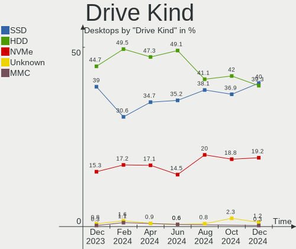
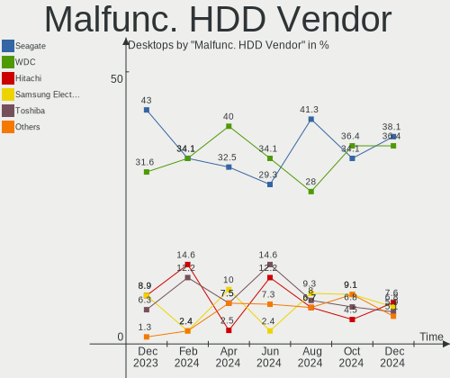
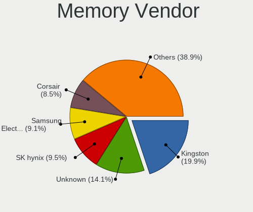
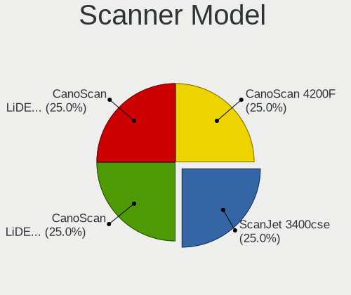

OpenMandriva Hardware Trends (Desktop)
--------------------------------------

A project to identify most popular hardware characteristics and track their change
over time based on data collected by OpenMandriva users at https://Linux-Hardware.org.

Anyone can contribute to the study by uploading probes of their computers by
the [hw-probe](https://github.com/linuxhw/hw-probe) tool:

    sudo -E hw-probe -all -upload

Full-feature report is available here: https://linux-hardware.org/?view=trends&formfactor=desktop

Period: Mar, 2021.

Contents
--------

- [ OS                       ](#os)
- [ OS Family                ](#os-family)
- [ Kernel                   ](#kernel)
- [ Kernel Family            ](#kernel-family)
- [ Kernel Major Ver.        ](#kernel-major-ver)
- [ Arch                     ](#arch)
- [ DE                       ](#de)
- [ Display Server           ](#display-server)
- [ Display Manager          ](#display-manager)
- [ OS Lang                  ](#os-lang)
- [ Boot Mode                ](#boot-mode)
- [ Filesystem               ](#filesystem)
- [ Part. scheme             ](#part-scheme)
- [ Dual Boot with Linux/BSD ](#dual-boot-with-linux/bsd)
- [ Dual Boot (Win)          ](#dual-boot-win)
- [ Country                  ](#country)
- [ City                     ](#city)
- [ Vendor                   ](#vendor)
- [ Model                    ](#model)
- [ Model Family             ](#model-family)
- [ MFG Year                 ](#mfg-year)
- [ Form Factor              ](#form-factor)
- [ Secure Boot              ](#secure-boot)
- [ Coreboot                 ](#coreboot)
- [ RAM Size                 ](#ram-size)
- [ RAM Used                 ](#ram-used)
- [ Has CD-ROM               ](#has-cd-rom)
- [ Total Drives             ](#total-drives)
- [ Has Ethernet             ](#has-ethernet)
- [ Has WiFi                 ](#has-wifi)
- [ Has Bluetooth            ](#has-bluetooth)
- [ Drive Vendor             ](#drive-vendor)
- [ Drive Model              ](#drive-model)
- [ HDD Vendor               ](#hdd-vendor)
- [ SSD Vendor               ](#ssd-vendor)
- [ Drive Kind               ](#drive-kind)
- [ Drive Connector          ](#drive-connector)
- [ Drive Size               ](#drive-size)
- [ Space Total              ](#space-total)
- [ Space Used               ](#space-used)
- [ Malfunc. Drives          ](#malfunc-drives)
- [ Malfunc. Drive Vendor    ](#malfunc-drive-vendor)
- [ Malfunc. HDD Vendor      ](#malfunc-hdd-vendor)
- [ Malfunc. Drive Kind      ](#malfunc-drive-kind)
- [ Failed Drives            ](#failed-drives)
- [ Failed Drive Vendor      ](#failed-drive-vendor)
- [ Drive Status             ](#drive-status)
- [ Storage Vendor           ](#storage-vendor)
- [ Storage Model            ](#storage-model)
- [ Storage Kind             ](#storage-kind)
- [ CPU Vendor               ](#cpu-vendor)
- [ CPU Model                ](#cpu-model)
- [ CPU Model Family         ](#cpu-model-family)
- [ CPU Cores                ](#cpu-cores)
- [ CPU Sockets              ](#cpu-sockets)
- [ CPU Threads              ](#cpu-threads)
- [ CPU Op-Modes             ](#cpu-op-modes)
- [ CPU Microcode            ](#cpu-microcode)
- [ CPU Microarch            ](#cpu-microarch)
- [ GPU Vendor               ](#gpu-vendor)
- [ GPU Model                ](#gpu-model)
- [ GPU Combo                ](#gpu-combo)
- [ GPU Driver               ](#gpu-driver)
- [ GPU Memory               ](#gpu-memory)
- [ Monitor Vendor           ](#monitor-vendor)
- [ Monitor Model            ](#monitor-model)
- [ Monitor Resolution       ](#monitor-resolution)
- [ Monitor Diagonal         ](#monitor-diagonal)
- [ Monitor Width            ](#monitor-width)
- [ Aspect Ratio             ](#aspect-ratio)
- [ Monitor Area             ](#monitor-area)
- [ Pixel Density            ](#pixel-density)
- [ Multiple Monitors        ](#multiple-monitors)
- [ Net Controller Vendor    ](#net-controller-vendor)
- [ Net Controller Model     ](#net-controller-model)
- [ Wireless Vendor          ](#wireless-vendor)
- [ Wireless Model           ](#wireless-model)
- [ Ethernet Vendor          ](#ethernet-vendor)
- [ Ethernet Model           ](#ethernet-model)
- [ Net Controller Kind      ](#net-controller-kind)
- [ Used Controller          ](#used-controller)
- [ NICs                     ](#nics)
- [ IPv6                     ](#ipv6)
- [ Memory Vendor            ](#memory-vendor)
- [ Memory Model             ](#memory-model)
- [ Memory Kind              ](#memory-kind)
- [ Memory Form Factor       ](#memory-form-factor)
- [ Memory Size              ](#memory-size)
- [ Memory Speed             ](#memory-speed)
- [ Sound Vendor             ](#sound-vendor)
- [ Sound Model              ](#sound-model)
- [ Camera Vendor            ](#camera-vendor)
- [ Camera Model             ](#camera-model)
- [ Fingerprint Vendor       ](#fingerprint-vendor)
- [ Fingerprint Model        ](#fingerprint-model)
- [ Chipcard Vendor          ](#chipcard-vendor)
- [ Chipcard Model           ](#chipcard-model)
- [ Printer Vendor           ](#printer-vendor)
- [ Printer Model            ](#printer-model)
- [ Scanner Vendor           ](#scanner-vendor)
- [ Scanner Model            ](#scanner-model)
- [ Bluetooth Vendor         ](#bluetooth-vendor)
- [ Bluetooth Model          ](#bluetooth-model)
- [ Unsupported Devices      ](#unsupported-devices)
- [ Unsupported Device Types ](#unsupported-device-types)

OS
--

Installed operating systems

| Name             | Desktops | Percent |
|------------------|----------|---------|
| OpenMandriva 4.2 | 287      | 100%    |

OS Family
---------

OS without a version

| Name         | Desktops | Percent |
|--------------|----------|---------|
| OpenMandriva | 287      | 100%    |

Kernel
------

Version of the Linux kernel

| Version                       | Desktops | Percent |
|-------------------------------|----------|---------|
| 5.10.14-desktop-1omv4002      | 284      | 98.95%  |
| 5.11.0-desktop-clang-1omv4002 | 2        | 0.7%    |
| 5.10.15-desktop-1omv4002      | 1        | 0.35%   |

Kernel Family
-------------

Linux kernel without a distro release

| Version | Desktops | Percent |
|---------|----------|---------|
| 5.10.14 | 284      | 98.95%  |
| 5.11.0  | 2        | 0.7%    |
| 5.10.15 | 1        | 0.35%   |

Kernel Major Ver.
-----------------

Linux kernel major version

| Version | Desktops | Percent |
|---------|----------|---------|
| 5.10    | 285      | 99.3%   |
| 5.11    | 2        | 0.7%    |

Arch
----

OS architecture (x86_64, i586, etc.)

| Name   | Desktops | Percent |
|--------|----------|---------|
| x86_64 | 287      | 100%    |

DE
--

Desktop Environment

| Name | Desktops | Percent |
|------|----------|---------|
| KDE5 | 287      | 100%    |

Display Server
--------------

X11 or Wayland

| Name    | Desktops | Percent |
|---------|----------|---------|
| X11     | 286      | 99.65%  |
| Wayland | 1        | 0.35%   |

Display Manager
---------------

SDDM, LightDM, etc.

| Name | Desktops | Percent |
|------|----------|---------|
| SDDM | 287      | 100%    |

OS Lang
-------

Language

| Lang  | Desktops | Percent |
|-------|----------|---------|
| en_US | 147      | 51.22%  |
| de_DE | 26       | 9.06%   |
| ru_RU | 22       | 7.67%   |
| fr_FR | 15       | 5.23%   |
| pl_PL | 14       | 4.88%   |
| pt_BR | 11       | 3.83%   |
| it_IT | 7        | 2.44%   |
| es_ES | 6        | 2.09%   |
| cs_CZ | 5        | 1.74%   |
| ru_UA | 4        | 1.39%   |
| pt_PT | 4        | 1.39%   |
| hu_HU | 4        | 1.39%   |
| es_MX | 3        | 1.05%   |
| fr_CA | 2        | 0.7%    |
| fr_BE | 2        | 0.7%    |
| en_HK | 2        | 0.7%    |
| en_GB | 2        | 0.7%    |
| de_AT | 2        | 0.7%    |
| uk_UA | 1        | 0.35%   |
| es_VE | 1        | 0.35%   |
| es_PA | 1        | 0.35%   |
| es_EC | 1        | 0.35%   |
| es_CO | 1        | 0.35%   |
| es_CL | 1        | 0.35%   |
| es_AR | 1        | 0.35%   |
| en_IN | 1        | 0.35%   |
| da_DK | 1        | 0.35%   |

Boot Mode
---------

EFI or BIOS

| Mode | Desktops | Percent |
|------|----------|---------|
| BIOS | 188      | 65.51%  |
| EFI  | 99       | 34.49%  |

Filesystem
----------

Type of filesystem

| Type    | Desktops | Percent |
|---------|----------|---------|
| Overlay | 236      | 82.23%  |
| Ext4    | 50       | 17.42%  |
| Btrfs   | 1        | 0.35%   |

Part. scheme
------------

Scheme of partitioning

| Type | Desktops | Percent |
|------|----------|---------|
| MBR  | 148      | 51.57%  |
| GPT  | 139      | 48.43%  |

Dual Boot with Linux/BSD
------------------------

Hosting more than one Linux/BSD

| Dual boot | Desktops | Percent |
|-----------|----------|---------|
| Yes       | 180      | 62.72%  |
| No        | 107      | 37.28%  |

Dual Boot (Win)
---------------

Hosting Linux and Windows

| Dual boot | Desktops | Percent |
|-----------|----------|---------|
| Yes       | 162      | 56.45%  |
| No        | 125      | 43.55%  |

Country
-------

Geographic location (country)

| Country      | Desktops | Percent |
|--------------|----------|---------|
| Germany      | 42       | 14.63%  |
| Russia       | 33       | 11.5%   |
| USA          | 32       | 11.15%  |
| France       | 21       | 7.32%   |
| Brazil       | 18       | 6.27%   |
| Poland       | 17       | 5.92%   |
| Italy        | 12       | 4.18%   |
| Ukraine      | 11       | 3.83%   |
| Spain        | 10       | 3.48%   |
| Canada       | 10       | 3.48%   |
| UK           | 7        | 2.44%   |
| Czechia      | 5        | 1.74%   |
| Australia    | 5        | 1.74%   |
| Portugal     | 4        | 1.39%   |
| Mexico       | 4        | 1.39%   |
| India        | 4        | 1.39%   |
| Hungary      | 3        | 1.05%   |
| Hong Kong    | 3        | 1.05%   |
| Finland      | 3        | 1.05%   |
| Denmark      | 3        | 1.05%   |
| Belgium      | 3        | 1.05%   |
| Venezuela    | 2        | 0.7%    |
| Sweden       | 2        | 0.7%    |
| Slovakia     | 2        | 0.7%    |
| Japan        | 2        | 0.7%    |
| Colombia     | 2        | 0.7%    |
| Austria      | 2        | 0.7%    |
| Argentina    | 2        | 0.7%    |
| Turkey       | 1        | 0.35%   |
| Taiwan       | 1        | 0.35%   |
| South Korea  | 1        | 0.35%   |
| South Africa | 1        | 0.35%   |
| Serbia       | 1        | 0.35%   |
| Saudi Arabia | 1        | 0.35%   |
| San Marino   | 1        | 0.35%   |
| Panama       | 1        | 0.35%   |
| Norway       | 1        | 0.35%   |
| New Zealand  | 1        | 0.35%   |
| Netherlands  | 1        | 0.35%   |
| Morocco      | 1        | 0.35%   |
| Moldova      | 1        | 0.35%   |
| Kazakhstan   | 1        | 0.35%   |
| Israel       | 1        | 0.35%   |
| Ireland      | 1        | 0.35%   |
| Indonesia    | 1        | 0.35%   |
| Greece       | 1        | 0.35%   |
| Egypt        | 1        | 0.35%   |
| Ecuador      | 1        | 0.35%   |
| Croatia      | 1        | 0.35%   |
| Chile        | 1        | 0.35%   |
| Algeria      | 1        | 0.35%   |

City
----

Geographic location (city)

| City                    | Desktops | Percent |
|-------------------------|----------|---------|
| Moscow                  | 6        | 2.09%   |
| Paris                   | 4        | 1.39%   |
| Yekaterinburg           | 3        | 1.05%   |
| Warsaw                  | 3        | 1.05%   |
| Porto Alegre            | 3        | 1.05%   |
| Jasienica               | 3        | 1.05%   |
| Helsinki                | 3        | 1.05%   |
| Copenhagen              | 3        | 1.05%   |
| Berlin                  | 3        | 1.05%   |
| Vienna                  | 2        | 0.7%    |
| Vicenza                 | 2        | 0.7%    |
| Rostov-on-Don           | 2        | 0.7%    |
| Prague                  | 2        | 0.7%    |
| Plainfield              | 2        | 0.7%    |
| Palermo                 | 2        | 0.7%    |
| Omsk                    | 2        | 0.7%    |
| Lohne                   | 2        | 0.7%    |
| Kharkiv                 | 2        | 0.7%    |
| Heldenstein             | 2        | 0.7%    |
| Dallas                  | 2        | 0.7%    |
| Cologne                 | 2        | 0.7%    |
| Chemnitz                | 2        | 0.7%    |
| Central                 | 2        | 0.7%    |
| Canberra                | 2        | 0.7%    |
| Austin                  | 2        | 0.7%    |
| Angers                  | 2        | 0.7%    |
| Ahmedabad               | 2        | 0.7%    |
| Évreux                 | 1        | 0.35%   |
| Zirndorf                | 1        | 0.35%   |
| Zdana                   | 1        | 0.35%   |
| Zaporozhe               | 1        | 0.35%   |
| Yuzhno-Sakhalinsk       | 1        | 0.35%   |
| Yoshkar-Ola             | 1        | 0.35%   |
| York                    | 1        | 0.35%   |
| Yachi                   | 1        | 0.35%   |
| Willingboro             | 1        | 0.35%   |
| Weyhe                   | 1        | 0.35%   |
| Wakefield               | 1        | 0.35%   |
| Vitória                | 1        | 0.35%   |
| Villefranche-sur-Saône | 1        | 0.35%   |
| Vancouver               | 1        | 0.35%   |
| Ulm                     | 1        | 0.35%   |
| Tyler                   | 1        | 0.35%   |
| Trier                   | 1        | 0.35%   |
| Tours                   | 1        | 0.35%   |
| Torun                   | 1        | 0.35%   |
| Toronto                 | 1        | 0.35%   |
| Torcy                   | 1        | 0.35%   |
| Tomsk                   | 1        | 0.35%   |
| Tolyatti                | 1        | 0.35%   |
| Tolosa                  | 1        | 0.35%   |
| Thessaloniki            | 1        | 0.35%   |
| Teresopolis             | 1        | 0.35%   |
| Taichung                | 1        | 0.35%   |
| São Paulo              | 1        | 0.35%   |
| São José dos Campos   | 1        | 0.35%   |
| Szolnok                 | 1        | 0.35%   |
| Sydney                  | 1        | 0.35%   |
| Surabaya                | 1        | 0.35%   |
| Stuttgart               | 1        | 0.35%   |

Vendor
------

Motherboard manufacturer

| Name                        | Desktops | Percent |
|-----------------------------|----------|---------|
| ASUSTek Computer            | 68       | 23.69%  |
| Gigabyte Technology         | 51       | 17.77%  |
| ASRock                      | 33       | 11.5%   |
| Hewlett-Packard             | 24       | 8.36%   |
| MSI                         | 23       | 8.01%   |
| Dell                        | 20       | 6.97%   |
| Lenovo                      | 16       | 5.57%   |
| Intel                       | 11       | 3.83%   |
| Pegatron                    | 6        | 2.09%   |
| Medion                      | 5        | 1.74%   |
| Biostar                     | 5        | 1.74%   |
| Acer                        | 5        | 1.74%   |
| Fujitsu                     | 4        | 1.39%   |
| Foxconn                     | 4        | 1.39%   |
| ECS                         | 3        | 1.05%   |
| Unknown                     | 3        | 1.05%   |
| PCWare                      | 1        | 0.35%   |
| Huanan                      | 1        | 0.35%   |
| Fujitsu Siemens             | 1        | 0.35%   |
| CASPER BILGISAYAR SISTEMLER | 1        | 0.35%   |
| BESSTAR Tech                | 1        | 0.35%   |
| AZW                         | 1        | 0.35%   |

Model
-----

Motherboard model

| Name                                    | Desktops | Percent |
|-----------------------------------------|----------|---------|
| ASUS All Series                         | 12       | 4.18%   |
| HP Compaq 8200 Elite SFF PC             | 4        | 1.39%   |
| Gigabyte 970A-DS3P                      | 4        | 1.39%   |
| Gigabyte G31M-ES2L                      | 3        | 1.05%   |
| Dell OptiPlex 780                       | 3        | 1.05%   |
| Unknown                                 | 3        | 1.05%   |
| MSI MS-7A40                             | 2        | 0.7%    |
| Medion MS-7728                          | 2        | 0.7%    |
| Intel H61                               | 2        | 0.7%    |
| Gigabyte Z68X-UD3H-B3                   | 2        | 0.7%    |
| Gigabyte GA-78LMT-S2P                   | 2        | 0.7%    |
| Gigabyte B450M GAMING                   | 2        | 0.7%    |
| Gigabyte A320M-S2H                      | 2        | 0.7%    |
| Dell OptiPlex 790                       | 2        | 0.7%    |
| Dell OptiPlex 7010                      | 2        | 0.7%    |
| Dell OptiPlex 380                       | 2        | 0.7%    |
| ASUS P8H67-V                            | 2        | 0.7%    |
| ASRock H61M-DGS                         | 2        | 0.7%    |
| ASRock 970 Pro3 R2.0                    | 2        | 0.7%    |
| Pegatron SERIES                         | 1        | 0.35%   |
| Pegatron Pro 3010 Microtower PC         | 1        | 0.35%   |
| Pegatron p7-1030                        | 1        | 0.35%   |
| Pegatron IPM41-D3                       | 1        | 0.35%   |
| Pegatron h8-1443eg                      | 1        | 0.35%   |
| Pegatron C15B                           | 1        | 0.35%   |
| PCWare IPMH61R3 8MB                     | 1        | 0.35%   |
| MSI Pro, Std, Elt Series                | 1        | 0.35%   |
| MSI p7-1298cb                           | 1        | 0.35%   |
| MSI p6-2317c                            | 1        | 0.35%   |
| MSI MS-7C91                             | 1        | 0.35%   |
| MSI MS-7C88                             | 1        | 0.35%   |
| MSI MS-7C51                             | 1        | 0.35%   |
| MSI MS-7C36                             | 1        | 0.35%   |
| MSI MS-7B84                             | 1        | 0.35%   |
| MSI MS-7B48                             | 1        | 0.35%   |
| MSI MS-7B33                             | 1        | 0.35%   |
| MSI MS-7A67                             | 1        | 0.35%   |
| MSI MS-7A59                             | 1        | 0.35%   |
| MSI MS-7996                             | 1        | 0.35%   |
| MSI MS-7890                             | 1        | 0.35%   |
| MSI MS-7851                             | 1        | 0.35%   |
| MSI MS-7823                             | 1        | 0.35%   |
| MSI MS-7808                             | 1        | 0.35%   |
| MSI MS-7721                             | 1        | 0.35%   |
| MSI MS-7695                             | 1        | 0.35%   |
| MSI MS-7623                             | 1        | 0.35%   |
| MSI Compaq dx2300 Microtower            | 1        | 0.35%   |
| Medion E62009                           | 1        | 0.35%   |
| Medion E32010                           | 1        | 0.35%   |
| Medion Akoya P2150 D MD8331/2489        | 1        | 0.35%   |
| Lenovo V520-15IKL Desktop 10NK002NGE    | 1        | 0.35%   |
| Lenovo ThinkCentre M92p 3209EK4         | 1        | 0.35%   |
| Lenovo ThinkCentre M910s 10MLS1DR00     | 1        | 0.35%   |
| Lenovo ThinkCentre M82 2929A77          | 1        | 0.35%   |
| Lenovo ThinkCentre M71e 3157H2U         | 1        | 0.35%   |
| Lenovo ThinkCentre M710q 10MSS01C00     | 1        | 0.35%   |
| Lenovo ThinkCentre M70e 0833AL2         | 1        | 0.35%   |
| Lenovo ThinkCentre M700 10J0S74K00      | 1        | 0.35%   |
| Lenovo ThinkCentre M58p 3285A1G         | 1        | 0.35%   |
| Lenovo IdeaCentre 510S-08IKL 90GB004RUS | 1        | 0.35%   |

Model Family
------------

Motherboard model prefix

| Name                   | Desktops | Percent |
|------------------------|----------|---------|
| Dell OptiPlex          | 16       | 5.57%   |
| ASUS All               | 12       | 4.18%   |
| HP Compaq              | 11       | 3.83%   |
| Lenovo ThinkCentre     | 8        | 2.79%   |
| ASUS ROG               | 5        | 1.74%   |
| Lenovo IdeaCentre      | 4        | 1.39%   |
| HP EliteDesk           | 4        | 1.39%   |
| Gigabyte X570          | 4        | 1.39%   |
| Gigabyte 970A-DS3P     | 4        | 1.39%   |
| Fujitsu ESPRIMO        | 4        | 1.39%   |
| Intel H61              | 3        | 1.05%   |
| Gigabyte G31M-ES2L     | 3        | 1.05%   |
| Gigabyte B450M         | 3        | 1.05%   |
| Gigabyte A320M-S2H     | 3        | 1.05%   |
| ASUS PRIME             | 3        | 1.05%   |
| ASUS P8H61-M           | 3        | 1.05%   |
| ASUS M5A78L-M          | 3        | 1.05%   |
| Acer Aspire            | 3        | 1.05%   |
| Unknown                | 3        | 1.05%   |
| MSI MS-7A40            | 2        | 0.7%    |
| Medion MS-7728         | 2        | 0.7%    |
| HP ProDesk             | 2        | 0.7%    |
| Gigabyte Z68X-UD3H-B3  | 2        | 0.7%    |
| Gigabyte GA-78LMT-USB3 | 2        | 0.7%    |
| Gigabyte GA-78LMT-S2P  | 2        | 0.7%    |
| Biostar Hi-Fi          | 2        | 0.7%    |
| ASUS P8H67-V           | 2        | 0.7%    |
| ASUS P8B75-M           | 2        | 0.7%    |
| ASUS P5KPL-AM          | 2        | 0.7%    |
| ASUS P5K               | 2        | 0.7%    |
| ASUS P5G41T-M          | 2        | 0.7%    |
| ASUS M5A97             | 2        | 0.7%    |
| ASRock H61M-DGS        | 2        | 0.7%    |
| ASRock AB350           | 2        | 0.7%    |
| ASRock 970             | 2        | 0.7%    |
| Pegatron SERIES        | 1        | 0.35%   |
| Pegatron Pro           | 1        | 0.35%   |
| Pegatron p7-1030       | 1        | 0.35%   |
| Pegatron IPM41-D3      | 1        | 0.35%   |
| Pegatron h8-1443eg     | 1        | 0.35%   |
| Pegatron C15B          | 1        | 0.35%   |
| PCWare IPMH61R3        | 1        | 0.35%   |
| MSI Pro                | 1        | 0.35%   |
| MSI p7-1298cb          | 1        | 0.35%   |
| MSI p6-2317c           | 1        | 0.35%   |
| MSI MS-7C91            | 1        | 0.35%   |
| MSI MS-7C88            | 1        | 0.35%   |
| MSI MS-7C51            | 1        | 0.35%   |
| MSI MS-7C36            | 1        | 0.35%   |
| MSI MS-7B84            | 1        | 0.35%   |
| MSI MS-7B48            | 1        | 0.35%   |
| MSI MS-7B33            | 1        | 0.35%   |
| MSI MS-7A67            | 1        | 0.35%   |
| MSI MS-7A59            | 1        | 0.35%   |
| MSI MS-7996            | 1        | 0.35%   |
| MSI MS-7890            | 1        | 0.35%   |
| MSI MS-7851            | 1        | 0.35%   |
| MSI MS-7823            | 1        | 0.35%   |
| MSI MS-7808            | 1        | 0.35%   |
| MSI MS-7721            | 1        | 0.35%   |

MFG Year
--------

Motherboard manufacture year

| Year | Desktops | Percent |
|------|----------|---------|
| 2012 | 33       | 11.5%   |
| 2018 | 28       | 9.76%   |
| 2014 | 25       | 8.71%   |
| 2013 | 25       | 8.71%   |
| 2020 | 24       | 8.36%   |
| 2011 | 22       | 7.67%   |
| 2019 | 19       | 6.62%   |
| 2015 | 19       | 6.62%   |
| 2010 | 17       | 5.92%   |
| 2009 | 17       | 5.92%   |
| 2016 | 16       | 5.57%   |
| 2008 | 11       | 3.83%   |
| 2017 | 9        | 3.14%   |
| 2021 | 7        | 2.44%   |
| 2007 | 7        | 2.44%   |
| 2006 | 6        | 2.09%   |
| 2005 | 2        | 0.7%    |

Form Factor
-----------

Physical design of the computer

| Name    | Desktops | Percent |
|---------|----------|---------|
| Desktop | 287      | 100%    |

Secure Boot
-----------

Enabled or disabled

| State    | Desktops | Percent |
|----------|----------|---------|
| Disabled | 287      | 100%    |

Coreboot
--------

Have coreboot on board

| Used | Desktops | Percent |
|------|----------|---------|
| No   | 287      | 100%    |

RAM Size
--------

Total RAM memory

| Size in GB  | Desktops | Percent |
|-------------|----------|---------|
| 3.01-4.0    | 83       | 28.92%  |
| 8.01-16.0   | 62       | 21.6%   |
| 16.01-24.0  | 55       | 19.16%  |
| 4.01-8.0    | 41       | 14.29%  |
| 1.01-2.0    | 16       | 5.57%   |
| 32.01-64.0  | 15       | 5.23%   |
| 24.01-32.0  | 8        | 2.79%   |
| 64.01-256.0 | 5        | 1.74%   |
| 0.51-1.0    | 2        | 0.7%    |

RAM Used
--------

Used RAM memory

| Used GB  | Desktops | Percent |
|----------|----------|---------|
| 1.01-2.0 | 220      | 76.66%  |
| 0.51-1.0 | 42       | 14.63%  |
| 2.01-3.0 | 13       | 4.53%   |
| 0.01-0.5 | 9        | 3.14%   |
| 3.01-4.0 | 2        | 0.7%    |
| 4.01-8.0 | 1        | 0.35%   |

Has CD-ROM
----------

Has CD-ROM on board

| Presented | Desktops | Percent |
|-----------|----------|---------|
| Yes       | 192      | 66.9%   |
| No        | 95       | 33.1%   |

Total Drives
------------

Number of drives on board

| Drives | Desktops | Percent |
|--------|----------|---------|
| 1      | 155      | 54.01%  |
| 2      | 66       | 23%     |
| 3      | 34       | 11.85%  |
| 4      | 19       | 6.62%   |
| 5      | 9        | 3.14%   |
| 6      | 3        | 1.05%   |
| 0      | 1        | 0.35%   |

Has Ethernet
------------

Has Ethernet on board

| Presented | Desktops | Percent |
|-----------|----------|---------|
| Yes       | 286      | 99.65%  |
| No        | 1        | 0.35%   |

Has WiFi
--------

Has WiFi module

| Presented | Desktops | Percent |
|-----------|----------|---------|
| No        | 192      | 66.9%   |
| Yes       | 95       | 33.1%   |

Has Bluetooth
-------------

Has Bluetooth module

| Presented | Desktops | Percent |
|-----------|----------|---------|
| No        | 229      | 79.79%  |
| Yes       | 58       | 20.21%  |

Drive Vendor
------------

Hard drive vendors

| Vendor              | Desktops | Drives | Percent |
|---------------------|----------|--------|---------|
| Seagate             | 114      | 139    | 25.91%  |
| WDC                 | 102      | 116    | 23.18%  |
| Samsung Electronics | 51       | 62     | 11.59%  |
| Crucial             | 27       | 36     | 6.14%   |
| Toshiba             | 26       | 32     | 5.91%   |
| Kingston            | 21       | 24     | 4.77%   |
| Hitachi             | 15       | 17     | 3.41%   |
| SanDisk             | 14       | 15     | 3.18%   |
| Intel               | 8        | 9      | 1.82%   |
| China               | 7        | 9      | 1.59%   |
| Intenso             | 5        | 5      | 1.14%   |
| A-DATA Technology   | 5        | 6      | 1.14%   |
| Unknown             | 4        | 5      | 0.91%   |
| Patriot             | 4        | 4      | 0.91%   |
| MAXTOR              | 4        | 6      | 0.91%   |
| Phison              | 3        | 3      | 0.68%   |
| GOODRAM             | 3        | 4      | 0.68%   |
| PNY                 | 2        | 2      | 0.45%   |
| PLEXTOR             | 2        | 4      | 0.45%   |
| OCZ                 | 2        | 2      | 0.45%   |
| Lexar               | 2        | 2      | 0.45%   |
| Apacer              | 2        | 2      | 0.45%   |
| WD MediaMax         | 1        | 1      | 0.23%   |
| Transcend           | 1        | 1      | 0.23%   |
| Team                | 1        | 1      | 0.23%   |
| SPCC                | 1        | 1      | 0.23%   |
| Silicon Motion      | 1        | 1      | 0.23%   |
| RSH-319             | 1        | 1      | 0.23%   |
| QUANTUM             | 1        | 1      | 0.23%   |
| Neo Forza           | 1        | 1      | 0.23%   |
| Micron Technology   | 1        | 1      | 0.23%   |
| LDLC                | 1        | 2      | 0.23%   |
| Kingspeed           | 1        | 1      | 0.23%   |
| KingDian            | 1        | 1      | 0.23%   |
| JMicron             | 1        | 1      | 0.23%   |
| HPE                 | 1        | 1      | 0.23%   |
| Hewlett-Packard     | 1        | 1      | 0.23%   |
| FC-1307             | 1        | 1      | 0.23%   |
| AMD                 | 1        | 1      | 0.23%   |

Drive Model
-----------

Hard drive models

| Model                            | Desktops | Percent |
|----------------------------------|----------|---------|
| Seagate ST500DM002-1BD142 500GB  | 8        | 1.6%    |
| Toshiba HDWD110 1TB              | 7        | 1.4%    |
| Toshiba DT01ACA100 1TB           | 7        | 1.4%    |
| Seagate ST1000DM010-2EP102 1TB   | 6        | 1.2%    |
| Seagate ST1000DM003-1ER162 1TB   | 6        | 1.2%    |
| Kingston SA400S37240G 240GB SSD  | 6        | 1.2%    |
| Seagate ST3500418AS 500GB        | 5        | 1%      |
| Toshiba DT01ACA050 500GB         | 4        | 0.8%    |
| Seagate ST380011A 80GB           | 4        | 0.8%    |
| Seagate ST3250820AS 250GB        | 4        | 0.8%    |
| Seagate ST2000DM001-1CH164 2TB   | 4        | 0.8%    |
| Seagate ST1000DM003-1SB102 1TB   | 4        | 0.8%    |
| Seagate ST1000DM003-1CH162 1TB   | 4        | 0.8%    |
| Samsung HD161HJ 160GB            | 4        | 0.8%    |
| Kingston SA400S37480G 480GB SSD  | 4        | 0.8%    |
| WDC WDS500G3X0C-00SJG0 500GB     | 3        | 0.6%    |
| WDC WDS500G2B0A-00SM50 500GB SSD | 3        | 0.6%    |
| WDC WDS240G2G0A-00JH30 240GB SSD | 3        | 0.6%    |
| WDC WD5000AAKX-001CA0 500GB      | 3        | 0.6%    |
| WDC WD10EZEX-08WN4A0 1TB         | 3        | 0.6%    |
| Seagate ST3500413AS 500GB        | 3        | 0.6%    |
| Seagate ST3360320AS 360GB        | 3        | 0.6%    |
| Seagate ST3320418AS 320GB        | 3        | 0.6%    |
| Seagate ST3160318AS 160GB        | 3        | 0.6%    |
| Seagate ST3000DM001-1ER166 3TB   | 3        | 0.6%    |
| Seagate ST1000DM003-9YN162 1TB   | 3        | 0.6%    |
| Seagate Expansion 1TB            | 3        | 0.6%    |
| Samsung SSD 860 EVO 500GB        | 3        | 0.6%    |
| Samsung SSD 850 EVO 250GB        | 3        | 0.6%    |
| Samsung HD103SJ 1TB              | 3        | 0.6%    |
| Kingston SA400S37120G 120GB SSD  | 3        | 0.6%    |
| Crucial CT500MX500SSD1 500GB     | 3        | 0.6%    |
| Crucial CT250MX500SSD1 250GB     | 3        | 0.6%    |
| Crucial CT240BX500SSD1 240GB     | 3        | 0.6%    |
| Crucial CT1000MX500SSD1 1TB      | 3        | 0.6%    |
| China SATA SSD 120GB             | 3        | 0.6%    |
| WDC WD800JD-60LSA0 80GB          | 2        | 0.4%    |
| WDC WD5000LPCX-00VHAT0 500GB     | 2        | 0.4%    |
| WDC WD5000AZRX-00A8LB0 500GB     | 2        | 0.4%    |
| WDC WD5000AAKX-603CA0 500GB      | 2        | 0.4%    |
| WDC WD2500AAKX-083CA1 250GB      | 2        | 0.4%    |
| WDC WD2500AAJS-75M0A0 250GB      | 2        | 0.4%    |
| WDC WD2500AAJS-08L7A0 250GB      | 2        | 0.4%    |
| WDC WD10EZEX-75WN4A0 1TB         | 2        | 0.4%    |
| WDC WD10EZEX-08M2NA0 1TB         | 2        | 0.4%    |
| WDC WD10EZEX-00BN5A0 1TB         | 2        | 0.4%    |
| WDC WD10EARX-00N0YB0 1TB         | 2        | 0.4%    |
| Unknown SD/MMC/MS PRO 128GB      | 2        | 0.4%    |
| Toshiba DT01ACA200 2TB           | 2        | 0.4%    |
| Seagate ST3250410AS 250GB        | 2        | 0.4%    |
| Seagate ST3250318AS 250GB        | 2        | 0.4%    |
| Seagate ST3250310AS 250GB        | 2        | 0.4%    |
| Seagate ST31000528AS 1TB         | 2        | 0.4%    |
| Seagate ST31000524AS 1TB         | 2        | 0.4%    |
| Seagate ST250DM000-1BD141 250GB  | 2        | 0.4%    |
| Seagate ST2000VM003-1ET164 2TB   | 2        | 0.4%    |
| SanDisk SSD PLUS 480GB           | 2        | 0.4%    |
| SanDisk SSD PLUS 240GB           | 2        | 0.4%    |
| Samsung SSD 970 EVO Plus 500GB   | 2        | 0.4%    |
| Samsung SSD 970 EVO Plus 250GB   | 2        | 0.4%    |

HDD Vendor
----------

Hard disk drive vendors

| Vendor              | Desktops | Drives | Percent |
|---------------------|----------|--------|---------|
| Seagate             | 113      | 138    | 41.54%  |
| WDC                 | 87       | 100    | 31.99%  |
| Toshiba             | 26       | 31     | 9.56%   |
| Samsung Electronics | 23       | 24     | 8.46%   |
| Hitachi             | 15       | 17     | 5.51%   |
| MAXTOR              | 4        | 6      | 1.47%   |
| WD MediaMax         | 1        | 1      | 0.37%   |
| QUANTUM             | 1        | 1      | 0.37%   |
| HPE                 | 1        | 1      | 0.37%   |
| FC-1307             | 1        | 1      | 0.37%   |

SSD Vendor
----------

Solid state drive vendors

| Vendor              | Desktops | Drives | Percent |
|---------------------|----------|--------|---------|
| Crucial             | 24       | 33     | 17.14%  |
| Samsung Electronics | 22       | 27     | 15.71%  |
| Kingston            | 20       | 21     | 14.29%  |
| SanDisk             | 14       | 15     | 10%     |
| WDC                 | 11       | 11     | 7.86%   |
| China               | 7        | 9      | 5%      |
| Intenso             | 5        | 5      | 3.57%   |
| Intel               | 4        | 5      | 2.86%   |
| Patriot             | 3        | 3      | 2.14%   |
| GOODRAM             | 3        | 4      | 2.14%   |
| A-DATA Technology   | 3        | 3      | 2.14%   |
| PNY                 | 2        | 2      | 1.43%   |
| PLEXTOR             | 2        | 4      | 1.43%   |
| OCZ                 | 2        | 2      | 1.43%   |
| Lexar               | 2        | 2      | 1.43%   |
| Apacer              | 2        | 2      | 1.43%   |
| Unknown             | 1        | 1      | 0.71%   |
| Transcend           | 1        | 1      | 0.71%   |
| Toshiba             | 1        | 1      | 0.71%   |
| SPCC                | 1        | 1      | 0.71%   |
| Seagate             | 1        | 1      | 0.71%   |
| RSH-319             | 1        | 1      | 0.71%   |
| Neo Forza           | 1        | 1      | 0.71%   |
| Micron Technology   | 1        | 1      | 0.71%   |
| LDLC                | 1        | 2      | 0.71%   |
| Kingspeed           | 1        | 1      | 0.71%   |
| KingDian            | 1        | 1      | 0.71%   |
| JMicron             | 1        | 1      | 0.71%   |
| Hewlett-Packard     | 1        | 1      | 0.71%   |
| AMD                 | 1        | 1      | 0.71%   |

Drive Kind
----------

HDD or SSD

| Kind    | Desktops | Drives | Percent |
|---------|----------|--------|---------|
| HDD     | 220      | 320    | 59.14%  |
| SSD     | 120      | 163    | 32.26%  |
| NVMe    | 28       | 34     | 7.53%   |
| Unknown | 3        | 4      | 0.81%   |
| MMC     | 1        | 1      | 0.27%   |

Drive Connector
---------------

SATA, SAS, NVMe, etc.

| Type | Desktops | Drives | Percent |
|------|----------|--------|---------|
| SATA | 275      | 475    | 87.3%   |
| NVMe | 28       | 34     | 8.89%   |
| SAS  | 11       | 12     | 3.49%   |
| MMC  | 1        | 1      | 0.32%   |

Drive Size
----------

Size of hard drive

| Size in TB | Desktops | Drives | Percent |
|------------|----------|--------|---------|
| 0.01-0.5   | 220      | 317    | 61.45%  |
| 0.51-1.0   | 92       | 111    | 25.7%   |
| 1.01-2.0   | 28       | 32     | 7.82%   |
| 2.01-3.0   | 11       | 13     | 3.07%   |
| 3.01-4.0   | 4        | 6      | 1.12%   |
| 4.01-10.0  | 3        | 4      | 0.84%   |

Space Total
-----------

Amount of disk space available on the file system

| Size in GB     | Desktops | Percent |
|----------------|----------|---------|
| 1-20           | 123      | 42.86%  |
| Unknown        | 62       | 21.6%   |
| 101-250        | 33       | 11.5%   |
| 251-500        | 23       | 8.01%   |
| 51-100         | 13       | 4.53%   |
| 1001-2000      | 10       | 3.48%   |
| 501-1000       | 10       | 3.48%   |
| 21-50          | 7        | 2.44%   |
| 2001-3000      | 4        | 1.39%   |
| More than 3000 | 2        | 0.7%    |

Space Used
----------

Amount of used disk space

| Used GB        | Desktops | Percent |
|----------------|----------|---------|
| 1-20           | 199      | 69.34%  |
| Unknown        | 62       | 21.6%   |
| 251-500        | 5        | 1.74%   |
| 101-250        | 5        | 1.74%   |
| 1001-2000      | 5        | 1.74%   |
| 501-1000       | 4        | 1.39%   |
| 51-100         | 4        | 1.39%   |
| More than 3000 | 1        | 0.35%   |
| 21-50          | 1        | 0.35%   |
| 2001-3000      | 1        | 0.35%   |

Malfunc. Drives
---------------

Drive models with a malfunction

| Model                               | Desktops | Drives | Percent |
|-------------------------------------|----------|--------|---------|
| Toshiba DT01ACA050 500GB            | 3        | 3      | 3.03%   |
| Seagate ST500DM002-1BD142 500GB     | 3        | 3      | 3.03%   |
| Seagate ST3500418AS 500GB           | 3        | 3      | 3.03%   |
| Seagate ST3250820AS 250GB           | 3        | 3      | 3.03%   |
| Samsung Electronics HD161HJ 160GB   | 3        | 3      | 3.03%   |
| WDC WD800JD-60LSA0 80GB             | 2        | 2      | 2.02%   |
| Seagate ST380011A 80GB              | 2        | 2      | 2.02%   |
| Seagate ST250DM000-1BD141 250GB     | 2        | 2      | 2.02%   |
| Seagate ST1000DM003-1CH162 1TB      | 2        | 3      | 2.02%   |
| WDC WD800JD-22MSA1 80GB             | 1        | 1      | 1.01%   |
| WDC WD5000BPVT-60HXZT1 500GB        | 1        | 1      | 1.01%   |
| WDC WD5000AAKX-08U6AA0 500GB        | 1        | 1      | 1.01%   |
| WDC WD5000AAKX-00U6AA0 500GB        | 1        | 1      | 1.01%   |
| WDC WD5000AAKX-003CA0 500GB         | 1        | 1      | 1.01%   |
| WDC WD5000AAKX-001CA0 500GB         | 1        | 1      | 1.01%   |
| WDC WD5000AAKS-60WWPA0 500GB        | 1        | 1      | 1.01%   |
| WDC WD5000AAKS-00V1A0 500GB         | 1        | 1      | 1.01%   |
| WDC WD3200BEVT-22A23T0 320GB        | 1        | 1      | 1.01%   |
| WDC WD3200AAKS-00B3A0 320GB         | 1        | 1      | 1.01%   |
| WDC WD3200AAJS-00L7A0 320GB         | 1        | 1      | 1.01%   |
| WDC WD2500JB-00REA0 250GB           | 1        | 1      | 1.01%   |
| WDC WD2500BEVT-22A23T0 250GB        | 1        | 1      | 1.01%   |
| WDC WD2500AAKX-083CA1 250GB         | 1        | 1      | 1.01%   |
| WDC WD2500AAJS-75M0A0 250GB         | 1        | 1      | 1.01%   |
| WDC WD2500AAJS-00VTA0 250GB         | 1        | 1      | 1.01%   |
| WDC WD20EZRZ-00Z5HB0 2TB            | 1        | 1      | 1.01%   |
| WDC WD10EZRX-00DC0B0 1TB            | 1        | 1      | 1.01%   |
| WDC WD10EURX-73FH1Y0 1TB            | 1        | 1      | 1.01%   |
| WDC WD10EAVS-00D7B1 1TB             | 1        | 1      | 1.01%   |
| WDC WD10EADS-00L5B1 1TB             | 1        | 1      | 1.01%   |
| Toshiba MQ01ABD050 500GB            | 1        | 1      | 1.01%   |
| Toshiba HDWD110 1TB                 | 1        | 1      | 1.01%   |
| Toshiba DT01ACA100 1TB              | 1        | 1      | 1.01%   |
| Seagate ST98823AS 80GB              | 1        | 1      | 1.01%   |
| Seagate ST9500325AS 500GB           | 1        | 1      | 1.01%   |
| Seagate ST9250315AS 250GB           | 1        | 1      | 1.01%   |
| Seagate ST9160412AS 160GB           | 1        | 1      | 1.01%   |
| Seagate ST8000NC0002-1XX112 8TB     | 1        | 1      | 1.01%   |
| Seagate ST750LM022 HN-M750MBB 752GB | 1        | 1      | 1.01%   |
| Seagate ST500LM021-1KJ152 500GB     | 1        | 1      | 1.01%   |
| Seagate ST3808110AS 80GB            | 1        | 1      | 1.01%   |
| Seagate ST3802110A 80GB             | 1        | 1      | 1.01%   |
| Seagate ST3500413AS 500GB           | 1        | 1      | 1.01%   |
| Seagate ST340810A 40GB              | 1        | 1      | 1.01%   |
| Seagate ST3320813AS 320GB           | 1        | 1      | 1.01%   |
| Seagate ST3320620AS 320GB           | 1        | 1      | 1.01%   |
| Seagate ST3320418AS 320GB           | 1        | 1      | 1.01%   |
| Seagate ST330621A 32GB              | 1        | 1      | 1.01%   |
| Seagate ST3250410AS 250GB           | 1        | 1      | 1.01%   |
| Seagate ST3250318AS 250GB           | 1        | 1      | 1.01%   |
| Seagate ST3250310AS 250GB           | 1        | 1      | 1.01%   |
| Seagate ST3200822AS 200GB           | 1        | 1      | 1.01%   |
| Seagate ST3200820AS 200GB           | 1        | 1      | 1.01%   |
| Seagate ST32000542AS 2TB            | 1        | 1      | 1.01%   |
| Seagate ST3160811AS 160GB           | 1        | 1      | 1.01%   |
| Seagate ST3160318AS 160GB           | 1        | 1      | 1.01%   |
| Seagate ST31000528AS 1TB            | 1        | 1      | 1.01%   |
| Seagate ST31000524AS 1TB            | 1        | 1      | 1.01%   |
| Seagate ST31000333AS 1TB            | 1        | 1      | 1.01%   |
| Seagate ST2000NP0011 2TB            | 1        | 1      | 1.01%   |

Malfunc. Drive Vendor
---------------------

Vendors of faulty drives

| Vendor              | Desktops | Drives | Percent |
|---------------------|----------|--------|---------|
| Seagate             | 44       | 47     | 46.81%  |
| WDC                 | 21       | 23     | 22.34%  |
| Samsung Electronics | 9        | 9      | 9.57%   |
| Toshiba             | 6        | 6      | 6.38%   |
| Hitachi             | 3        | 5      | 3.19%   |
| SanDisk             | 2        | 2      | 2.13%   |
| Maxtor              | 2        | 2      | 2.13%   |
| Kingston            | 2        | 2      | 2.13%   |
| Intel               | 2        | 2      | 2.13%   |
| Crucial             | 2        | 2      | 2.13%   |
| Neo Forza           | 1        | 1      | 1.06%   |

Malfunc. HDD Vendor
-------------------

Vendors of faulty HDD drives

| Vendor              | Desktops | Drives | Percent |
|---------------------|----------|--------|---------|
| Seagate             | 44       | 47     | 51.76%  |
| WDC                 | 21       | 23     | 24.71%  |
| Samsung Electronics | 9        | 9      | 10.59%  |
| Toshiba             | 6        | 6      | 7.06%   |
| Hitachi             | 3        | 5      | 3.53%   |
| Maxtor              | 2        | 2      | 2.35%   |

Malfunc. Drive Kind
-------------------

Kinds of faulty drives

| Kind | Desktops | Drives | Percent |
|------|----------|--------|---------|
| HDD  | 76       | 92     | 89.41%  |
| SSD  | 8        | 8      | 9.41%   |
| NVMe | 1        | 1      | 1.18%   |

Failed Drives
-------------

Failed drive models

| Model                     | Desktops | Drives | Percent |
|---------------------------|----------|--------|---------|
| Seagate ST3500418AS 500GB | 1        | 1      | 50%     |
| Seagate ST3320418AS 320GB | 1        | 1      | 50%     |

Failed Drive Vendor
-------------------

Failed drive vendors

| Vendor  | Desktops | Drives | Percent |
|---------|----------|--------|---------|
| Seagate | 2        | 2      | 100%    |

Drive Status
------------

Number of failed and malfunc. drives

| Status   | Desktops | Drives | Percent |
|----------|----------|--------|---------|
| Works    | 213      | 365    | 63.39%  |
| Malfunc  | 83       | 101    | 24.7%   |
| Detected | 38       | 54     | 11.31%  |
| Failed   | 2        | 2      | 0.6%    |

Storage Vendor
--------------

Storage controller vendors

| Vendor                      | Desktops | Percent |
|-----------------------------|----------|---------|
| Intel                       | 195      | 55.56%  |
| AMD                         | 78       | 22.22%  |
| Nvidia                      | 11       | 3.13%   |
| Marvell Technology Group    | 11       | 3.13%   |
| ASMedia Technology          | 11       | 3.13%   |
| Samsung Electronics         | 9        | 2.56%   |
| JMicron Technology          | 9        | 2.56%   |
| VIA Technologies            | 7        | 1.99%   |
| Sandisk                     | 4        | 1.14%   |
| Phison Electronics          | 4        | 1.14%   |
| Micron/Crucial Technology   | 3        | 0.85%   |
| Kingston Technology Company | 3        | 0.85%   |
| Silicon Motion              | 2        | 0.57%   |
| ADATA Technology            | 2        | 0.57%   |
| Silicon Image               | 1        | 0.28%   |
| Lite-On IT Corp. / Plextor  | 1        | 0.28%   |

Storage Model
-------------

Storage controller models

| Model                                                                                   | Desktops | Percent |
|-----------------------------------------------------------------------------------------|----------|---------|
| AMD FCH SATA Controller [AHCI mode]                                                     | 41       | 8.76%   |
| Intel 8 Series/C220 Series Chipset Family 6-port SATA Controller 1 [AHCI mode]          | 27       | 5.77%   |
| Intel 6 Series/C200 Series Chipset Family 6 port Desktop SATA AHCI Controller           | 27       | 5.77%   |
| Intel NM10/ICH7 Family SATA Controller [IDE mode]                                       | 26       | 5.56%   |
| Intel 82801G (ICH7 Family) IDE Controller                                               | 21       | 4.49%   |
| AMD SB7x0/SB8x0/SB9x0 IDE Controller                                                    | 17       | 3.63%   |
| Intel Q170/Q150/B150/H170/H110/Z170/CM236 Chipset SATA Controller [AHCI Mode]           | 16       | 3.42%   |
| Intel 7 Series/C210 Series Chipset Family 6-port SATA Controller [AHCI mode]            | 16       | 3.42%   |
| AMD SB7x0/SB8x0/SB9x0 SATA Controller [AHCI mode]                                       | 15       | 3.21%   |
| Intel 200 Series PCH SATA controller [AHCI mode]                                        | 12       | 2.56%   |
| AMD SB7x0/SB8x0/SB9x0 SATA Controller [IDE mode]                                        | 12       | 2.56%   |
| ASMedia ASM1062 Serial ATA Controller                                                   | 11       | 2.35%   |
| AMD 400 Series Chipset SATA Controller                                                  | 10       | 2.14%   |
| Intel 6 Series/C200 Series Chipset Family Desktop SATA Controller (IDE mode, ports 4-5) | 9        | 1.92%   |
| Intel 6 Series/C200 Series Chipset Family Desktop SATA Controller (IDE mode, ports 0-3) | 9        | 1.92%   |
| Nvidia MCP61 SATA Controller                                                            | 7        | 1.5%    |
| Nvidia MCP61 IDE                                                                        | 7        | 1.5%    |
| Samsung NVMe SSD Controller SM981/PM981/PM983                                           | 6        | 1.28%   |
| Intel SATA Controller [RAID mode]                                                       | 6        | 1.28%   |
| AMD 300 Series Chipset SATA Controller                                                  | 6        | 1.28%   |
| JMicron JMB363 SATA/IDE Controller                                                      | 5        | 1.07%   |
| Intel Cannon Lake PCH SATA AHCI Controller                                              | 5        | 1.07%   |
| Intel 82801JI (ICH10 Family) 4 port SATA IDE Controller #1                              | 5        | 1.07%   |
| Intel 4 Series Chipset PT IDER Controller                                               | 5        | 1.07%   |
| AMD FCH SATA Controller [IDE mode]                                                      | 5        | 1.07%   |
| Marvell Group 88SE9172 SATA 6Gb/s Controller                                            | 4        | 0.85%   |
| Intel 9 Series Chipset Family SATA Controller [AHCI Mode]                               | 4        | 0.85%   |
| Intel 82801JI (ICH10 Family) 2 port SATA IDE Controller #2                              | 4        | 0.85%   |
| Intel 82801JD/DO (ICH10 Family) 4-port SATA IDE Controller                              | 4        | 0.85%   |
| Intel 82801JD/DO (ICH10 Family) 2-port SATA IDE Controller                              | 4        | 0.85%   |
| Intel 82801HR/HO/HH (ICH8R/DO/DH) 2 port SATA Controller [IDE mode]                     | 4        | 0.85%   |
| Intel 82801H (ICH8 Family) 4 port SATA Controller [IDE mode]                            | 4        | 0.85%   |
| AMD Starship/Matisse Chipset SATA Controller [AHCI mode]                                | 4        | 0.85%   |
| AMD FCH SATA Controller D                                                               | 4        | 0.85%   |
| VIA VT82C586A/B/VT82C686/A/B/VT823x/A/C PIPC Bus Master IDE                             | 3        | 0.64%   |
| Marvell Group 88SE6111/6121 SATA II / PATA Controller                                   | 3        | 0.64%   |
| JMicron JMB368 IDE controller                                                           | 3        | 0.64%   |
| Intel 82801JI (ICH10 Family) SATA AHCI Controller                                       | 3        | 0.64%   |
| Intel 82801I (ICH9 Family) 2 port SATA Controller [IDE mode]                            | 3        | 0.64%   |
| Intel 7 Series/C210 Series Chipset Family 4-port SATA Controller [IDE mode]             | 3        | 0.64%   |
| Intel 7 Series/C210 Series Chipset Family 2-port SATA Controller [IDE mode]             | 3        | 0.64%   |
| Intel 5 Series/3400 Series Chipset PT IDER Controller                                   | 3        | 0.64%   |
| Intel 5 Series/3400 Series Chipset 4 port SATA IDE Controller                           | 3        | 0.64%   |
| Intel 5 Series/3400 Series Chipset 2 port SATA IDE Controller                           | 3        | 0.64%   |
| AMD FCH IDE Controller                                                                  | 3        | 0.64%   |
| VIA VT6421 IDE/SATA Controller                                                          | 2        | 0.43%   |
| VIA VT6415 PATA IDE Host Controller                                                     | 2        | 0.43%   |
| Silicon Motion SM2263EN/SM2263XT SSD Controller                                         | 2        | 0.43%   |
| Sandisk WD Black SN750 / PC SN730 NVMe SSD                                              | 2        | 0.43%   |
| Samsung NVMe SSD Controller SM961/PM961/SM963                                           | 2        | 0.43%   |
| Phison E12 NVMe Controller                                                              | 2        | 0.43%   |
| Nvidia MCP51 Serial ATA Controller                                                      | 2        | 0.43%   |
| Micron/Crucial Non-Volatile memory controller                                           | 2        | 0.43%   |
| Marvell Group 88SE6101/6102 single-port PATA133 interface                               | 2        | 0.43%   |
| Kingston Company A2000 NVMe SSD                                                         | 2        | 0.43%   |
| Intel SSD 600P Series                                                                   | 2        | 0.43%   |
| Intel Celeron/Pentium Silver Processor SATA Controller                                  | 2        | 0.43%   |
| Intel C610/X99 series chipset 6-Port SATA Controller [AHCI mode]                        | 2        | 0.43%   |
| Intel Atom Processor E3800 Series SATA AHCI Controller                                  | 2        | 0.43%   |
| Intel 82801JD/DO (ICH10 Family) SATA AHCI Controller                                    | 2        | 0.43%   |

Storage Kind
------------

Kind of storage controller (IDE, SATA, NVMe, SAS, ...)

| Kind | Desktops | Percent |
|------|----------|---------|
| SATA | 205      | 59.77%  |
| IDE  | 101      | 29.45%  |
| NVMe | 28       | 8.16%   |
| RAID | 9        | 2.62%   |

CPU Vendor
----------

Processor vendors

| Vendor | Desktops | Percent |
|--------|----------|---------|
| Intel  | 197      | 68.64%  |
| AMD    | 90       | 31.36%  |

CPU Model
---------

Processor models

| Model                                       | Desktops | Percent |
|---------------------------------------------|----------|---------|
| Intel Core i3-2120 CPU @ 3.30GHz            | 7        | 2.44%   |
| Intel Core i3-2100 CPU @ 3.10GHz            | 7        | 2.44%   |
| Intel Core i5-3470 CPU @ 3.20GHz            | 6        | 2.09%   |
| Intel Core 2 Duo CPU E7500 @ 2.93GHz        | 6        | 2.09%   |
| AMD FX-8350 Eight-Core Processor            | 6        | 2.09%   |
| Intel Core i3-3220 CPU @ 3.30GHz            | 5        | 1.74%   |
| Intel Core i7-3770 CPU @ 3.40GHz            | 4        | 1.39%   |
| Intel Core i5-3570 CPU @ 3.40GHz            | 4        | 1.39%   |
| Intel Core 2 Quad CPU Q6600 @ 2.40GHz       | 4        | 1.39%   |
| Intel Core 2 Duo CPU E8600 @ 3.33GHz        | 4        | 1.39%   |
| AMD Athlon 64 X2 Dual Core Processor 3800+  | 4        | 1.39%   |
| Intel Pentium Dual-Core CPU E5700 @ 3.00GHz | 3        | 1.05%   |
| Intel Pentium Dual-Core CPU E5300 @ 2.60GHz | 3        | 1.05%   |
| Intel Core i7-4770 CPU @ 3.40GHz            | 3        | 1.05%   |
| Intel Core i5-7400 CPU @ 3.00GHz            | 3        | 1.05%   |
| Intel Core i5-2400 CPU @ 3.10GHz            | 3        | 1.05%   |
| Intel Core i3-4170 CPU @ 3.70GHz            | 3        | 1.05%   |
| Intel Core i3-3240 CPU @ 3.40GHz            | 3        | 1.05%   |
| AMD Ryzen 5 3600 6-Core Processor           | 3        | 1.05%   |
| AMD Athlon 200GE with Radeon Vega Graphics  | 3        | 1.05%   |
| AMD A10-6700 APU with Radeon HD Graphics    | 3        | 1.05%   |
| Intel Pentium Dual-Core CPU E6700 @ 3.20GHz | 2        | 0.7%    |
| Intel Pentium CPU G4400 @ 3.30GHz           | 2        | 0.7%    |
| Intel Pentium CPU G3420 @ 3.20GHz           | 2        | 0.7%    |
| Intel Pentium CPU G3220 @ 3.00GHz           | 2        | 0.7%    |
| Intel Pentium CPU G2020 @ 2.90GHz           | 2        | 0.7%    |
| Intel Core i7-8700 CPU @ 3.20GHz            | 2        | 0.7%    |
| Intel Core i7-7700K CPU @ 4.20GHz           | 2        | 0.7%    |
| Intel Core i7-6700 CPU @ 3.40GHz            | 2        | 0.7%    |
| Intel Core i7-4790 CPU @ 3.60GHz            | 2        | 0.7%    |
| Intel Core i7-4770K CPU @ 3.50GHz           | 2        | 0.7%    |
| Intel Core i7 CPU 860 @ 2.80GHz             | 2        | 0.7%    |
| Intel Core i5-6500 CPU @ 3.20GHz            | 2        | 0.7%    |
| Intel Core i5-4590 CPU @ 3.30GHz            | 2        | 0.7%    |
| Intel Core i5-4570 CPU @ 3.20GHz            | 2        | 0.7%    |
| Intel Core i5-3570K CPU @ 3.40GHz           | 2        | 0.7%    |
| Intel Core i5-3330 CPU @ 3.00GHz            | 2        | 0.7%    |
| Intel Core i3-8100 CPU @ 3.60GHz            | 2        | 0.7%    |
| Intel Core i3-7100 CPU @ 3.90GHz            | 2        | 0.7%    |
| Intel Core i3-6100T CPU @ 3.20GHz           | 2        | 0.7%    |
| Intel Core i3-4160 CPU @ 3.60GHz            | 2        | 0.7%    |
| Intel Core 2 Quad CPU Q9550 @ 2.83GHz       | 2        | 0.7%    |
| Intel Core 2 Duo CPU E8500 @ 3.16GHz        | 2        | 0.7%    |
| Intel Core 2 Duo CPU E8400 @ 3.00GHz        | 2        | 0.7%    |
| Intel Core 2 Duo CPU E7400 @ 2.80GHz        | 2        | 0.7%    |
| Intel Core 2 CPU 6600 @ 2.40GHz             | 2        | 0.7%    |
| Intel Celeron CPU G1840 @ 2.80GHz           | 2        | 0.7%    |
| AMD Ryzen 9 3950X 16-Core Processor         | 2        | 0.7%    |
| AMD Ryzen 9 3900X 12-Core Processor         | 2        | 0.7%    |
| AMD Ryzen 7 2700X Eight-Core Processor      | 2        | 0.7%    |
| AMD Ryzen 7 2700 Eight-Core Processor       | 2        | 0.7%    |
| AMD Ryzen 5 3600X 6-Core Processor          | 2        | 0.7%    |
| AMD Ryzen 5 3350G with Radeon Vega Graphics | 2        | 0.7%    |
| AMD Ryzen 5 2600 Six-Core Processor         | 2        | 0.7%    |
| AMD Ryzen 5 1600X Six-Core Processor        | 2        | 0.7%    |
| AMD Ryzen 3 1200 Quad-Core Processor        | 2        | 0.7%    |
| AMD FX-6300 Six-Core Processor              | 2        | 0.7%    |
| AMD FX-6100 Six-Core Processor              | 2        | 0.7%    |
| AMD Athlon 64 X2 Dual Core Processor 6000+  | 2        | 0.7%    |
| AMD Athlon 64 X2 Dual Core Processor 5000+  | 2        | 0.7%    |

CPU Model Family
----------------

Processor model prefix

| Model                   | Desktops | Percent |
|-------------------------|----------|---------|
| Intel Core i5           | 48       | 16.72%  |
| Intel Core i3           | 40       | 13.94%  |
| Intel Core i7           | 24       | 8.36%   |
| Intel Core 2 Duo        | 19       | 6.62%   |
| Intel Pentium           | 15       | 5.23%   |
| AMD FX                  | 15       | 5.23%   |
| Intel Celeron           | 14       | 4.88%   |
| AMD Ryzen 5             | 13       | 4.53%   |
| Intel Pentium Dual-Core | 11       | 3.83%   |
| AMD Athlon 64 X2        | 10       | 3.48%   |
| Intel Core 2 Quad       | 9        | 3.14%   |
| AMD A10                 | 9        | 3.14%   |
| Intel Xeon              | 6        | 2.09%   |
| Intel Core 2            | 6        | 2.09%   |
| AMD Ryzen 9             | 5        | 1.74%   |
| AMD Ryzen 7             | 5        | 1.74%   |
| AMD Ryzen 3             | 5        | 1.74%   |
| AMD Phenom II X4        | 3        | 1.05%   |
| AMD Athlon II X2        | 3        | 1.05%   |
| AMD Athlon              | 3        | 1.05%   |
| AMD A6                  | 3        | 1.05%   |
| AMD A4                  | 3        | 1.05%   |
| Intel Pentium D         | 2        | 0.7%    |
| Intel Pentium 4         | 2        | 0.7%    |
| AMD Athlon II X4        | 2        | 0.7%    |
| AMD Athlon II X3        | 2        | 0.7%    |
| AMD Athlon 64           | 2        | 0.7%    |
| AMD A8                  | 2        | 0.7%    |
| Intel Atom              | 1        | 0.35%   |
| AMD Ryzen 7 PRO         | 1        | 0.35%   |
| AMD Phenom II X6        | 1        | 0.35%   |
| AMD Phenom II X2        | 1        | 0.35%   |
| AMD Phenom              | 1        | 0.35%   |
| AMD Athlon Dual Core    | 1        | 0.35%   |

CPU Cores
---------

Number of processor cores

| Number | Desktops | Percent |
|--------|----------|---------|
| 2      | 133      | 46.34%  |
| 4      | 103      | 35.89%  |
| 6      | 19       | 6.62%   |
| 1      | 11       | 3.83%   |
| 8      | 7        | 2.44%   |
| 3      | 7        | 2.44%   |
| 16     | 3        | 1.05%   |
| 12     | 3        | 1.05%   |
| 10     | 1        | 0.35%   |

CPU Sockets
-----------

Number of sockets

| Number | Desktops | Percent |
|--------|----------|---------|
| 1      | 286      | 99.65%  |
| 2      | 1        | 0.35%   |

CPU Threads
-----------

Threads per core (Hyper-Threading)

| Number | Desktops | Percent |
|--------|----------|---------|
| 1      | 158      | 55.05%  |
| 2      | 129      | 44.95%  |

CPU Op-Modes
------------

CPU Operation Modes (32-bit, 64-bit)

| Op mode        | Desktops | Percent |
|----------------|----------|---------|
| 32-bit, 64-bit | 286      | 99.65%  |
| Unknown        | 1        | 0.35%   |

CPU Microcode
-------------

Microcode number

| Number     | Desktops | Percent |
|------------|----------|---------|
| 0x1067a    | 34       | 11.85%  |
| 0x306c3    | 32       | 11.15%  |
| 0x306a9    | 32       | 11.15%  |
| 0x206a7    | 25       | 8.71%   |
| Unknown    | 15       | 5.23%   |
| 0x506e3    | 14       | 4.88%   |
| 0x906e9    | 10       | 3.48%   |
| 0x08701021 | 8        | 2.79%   |
| 0x06001119 | 8        | 2.79%   |
| 0x6fb      | 7        | 2.44%   |
| 0x010000c8 | 7        | 2.44%   |
| 0x906ea    | 6        | 2.09%   |
| 0x0800820d | 5        | 1.74%   |
| 0x08701013 | 4        | 1.39%   |
| 0x08108109 | 4        | 1.39%   |
| 0x08001138 | 4        | 1.39%   |
| 0x06000822 | 4        | 1.39%   |
| 0x0600081c | 4        | 1.39%   |
| 0x6f6      | 3        | 1.05%   |
| 0x106e5    | 3        | 1.05%   |
| 0x08101016 | 3        | 1.05%   |
| 0x0600611a | 3        | 1.05%   |
| 0x06003106 | 3        | 1.05%   |
| 0xf65      | 2        | 0.7%    |
| 0x906eb    | 2        | 0.7%    |
| 0x706a1    | 2        | 0.7%    |
| 0x6fd      | 2        | 0.7%    |
| 0x6f2      | 2        | 0.7%    |
| 0x406c4    | 2        | 0.7%    |
| 0x306f2    | 2        | 0.7%    |
| 0x30678    | 2        | 0.7%    |
| 0xf4a      | 1        | 0.35%   |
| 0xf49      | 1        | 0.35%   |
| 0xf47      | 1        | 0.35%   |
| 0xa0655    | 1        | 0.35%   |
| 0xa0653    | 1        | 0.35%   |
| 0x906ed    | 1        | 0.35%   |
| 0x506c9    | 1        | 0.35%   |
| 0x206c2    | 1        | 0.35%   |
| 0x20655    | 1        | 0.35%   |
| 0x20652    | 1        | 0.35%   |
| 0x106ca    | 1        | 0.35%   |
| 0x10677    | 1        | 0.35%   |
| 0x10676    | 1        | 0.35%   |
| 0x0a201009 | 1        | 0.35%   |
| 0x08600103 | 1        | 0.35%   |
| 0x08108102 | 1        | 0.35%   |
| 0x08008204 | 1        | 0.35%   |
| 0x07030105 | 1        | 0.35%   |
| 0x06001116 | 1        | 0.35%   |
| 0x0600110f | 1        | 0.35%   |
| 0x06000852 | 1        | 0.35%   |
| 0x0600081f | 1        | 0.35%   |
| 0x06000817 | 1        | 0.35%   |
| 0x06000803 | 1        | 0.35%   |
| 0x06000629 | 1        | 0.35%   |
| 0x06000626 | 1        | 0.35%   |
| 0x03000025 | 1        | 0.35%   |
| 0x03000014 | 1        | 0.35%   |
| 0x010000c9 | 1        | 0.35%   |

CPU Microarch
-------------

Microarchitecture

| Name          | Desktops | Percent |
|---------------|----------|---------|
| Penryn        | 36       | 12.54%  |
| Haswell       | 34       | 11.85%  |
| IvyBridge     | 32       | 11.15%  |
| SandyBridge   | 25       | 8.71%   |
| Piledriver    | 22       | 7.67%   |
| KabyLake      | 19       | 6.62%   |
| Skylake       | 15       | 5.23%   |
| Core          | 14       | 4.88%   |
| Zen 2         | 13       | 4.53%   |
| K8 Hammer     | 13       | 4.53%   |
| K10           | 12       | 4.18%   |
| Zen+          | 11       | 3.83%   |
| Zen           | 7        | 2.44%   |
| Silvermont    | 5        | 1.74%   |
| NetBurst      | 5        | 1.74%   |
| Westmere      | 3        | 1.05%   |
| Steamroller   | 3        | 1.05%   |
| Nehalem       | 3        | 1.05%   |
| Excavator     | 3        | 1.05%   |
| K10 Llano     | 2        | 0.7%    |
| Goldmont plus | 2        | 0.7%    |
| CometLake     | 2        | 0.7%    |
| Bulldozer     | 2        | 0.7%    |
| Zen 3         | 1        | 0.35%   |
| Puma          | 1        | 0.35%   |
| Goldmont      | 1        | 0.35%   |
| Bonnell       | 1        | 0.35%   |

GPU Vendor
----------

Vendors of graphics cards

| Vendor           | Desktops | Percent |
|------------------|----------|---------|
| Nvidia           | 111      | 37%     |
| Intel            | 109      | 36.33%  |
| AMD              | 79       | 26.33%  |
| VIA Technologies | 1        | 0.33%   |

GPU Model
---------

Graphics card models

| Model                                                                                    | Desktops | Percent |
|------------------------------------------------------------------------------------------|----------|---------|
| Intel 2nd Generation Core Processor Family Integrated Graphics Controller                | 19       | 6.19%   |
| Intel Xeon E3-1200 v3/4th Gen Core Processor Integrated Graphics Controller              | 15       | 4.89%   |
| Intel 4 Series Chipset Integrated Graphics Controller                                    | 15       | 4.89%   |
| Intel Xeon E3-1200 v2/3rd Gen Core processor Graphics Controller                         | 14       | 4.56%   |
| Nvidia GT218 [GeForce 210]                                                               | 10       | 3.26%   |
| Intel HD Graphics 530                                                                    | 9        | 2.93%   |
| Nvidia GP107 [GeForce GTX 1050 Ti]                                                       | 8        | 2.61%   |
| AMD Ellesmere [Radeon RX 470/480/570/570X/580/580X/590]                                  | 7        | 2.28%   |
| Nvidia GK208B [GeForce GT 730]                                                           | 6        | 1.95%   |
| Nvidia GP108 [GeForce GT 1030]                                                           | 5        | 1.63%   |
| Intel HD Graphics 630                                                                    | 5        | 1.63%   |
| AMD Picasso                                                                              | 5        | 1.63%   |
| Nvidia GP107 [GeForce GTX 1050]                                                          | 4        | 1.3%    |
| Nvidia GK208B [GeForce GT 710]                                                           | 4        | 1.3%    |
| Nvidia G96C [GeForce 9400 GT]                                                            | 4        | 1.3%    |
| Intel CometLake-S GT2 [UHD Graphics 630]                                                 | 4        | 1.3%    |
| Intel 4th Generation Core Processor Family Integrated Graphics Controller                | 4        | 1.3%    |
| AMD Oland PRO [Radeon R7 240/340]                                                        | 4        | 1.3%    |
| Nvidia GP106 [GeForce GTX 1060 6GB]                                                      | 3        | 0.98%   |
| Nvidia GK107 [GeForce GTX 650]                                                           | 3        | 0.98%   |
| Nvidia GF119 [GeForce GT 610]                                                            | 3        | 0.98%   |
| Nvidia GF108 [GeForce GT 730]                                                            | 3        | 0.98%   |
| Nvidia GF108 [GeForce GT 430]                                                            | 3        | 0.98%   |
| Nvidia G94 [GeForce 9600 GT]                                                             | 3        | 0.98%   |
| Nvidia G84 [GeForce 8600 GT]                                                             | 3        | 0.98%   |
| Intel Atom/Celeron/Pentium Processor x5-E8000/J3xxx/N3xxx Integrated Graphics Controller | 3        | 0.98%   |
| AMD Tobago PRO [Radeon R7 360 / R9 360 OEM]                                              | 3        | 0.98%   |
| AMD RS780L [Radeon 3000]                                                                 | 3        | 0.98%   |
| AMD Kaveri [Radeon R7 Graphics]                                                          | 3        | 0.98%   |
| AMD Baffin [Radeon RX 550 640SP / RX 560/560X]                                           | 3        | 0.98%   |
| Nvidia TU116 [GeForce GTX 1650 SUPER]                                                    | 2        | 0.65%   |
| Nvidia GT218 [GeForce 8400 GS Rev. 3]                                                    | 2        | 0.65%   |
| Nvidia GT216 [GeForce GT 220]                                                            | 2        | 0.65%   |
| Nvidia GM107 [GeForce GTX 750 Ti]                                                        | 2        | 0.65%   |
| Nvidia GK208B [GeForce GT 720]                                                           | 2        | 0.65%   |
| Nvidia GK104 [GeForce GTX 760]                                                           | 2        | 0.65%   |
| Nvidia GF108 [GeForce GT 630]                                                            | 2        | 0.65%   |
| Nvidia C61 [GeForce 7025 / nForce 630a]                                                  | 2        | 0.65%   |
| Intel HD Graphics 510                                                                    | 2        | 0.65%   |
| Intel GeminiLake [UHD Graphics 600]                                                      | 2        | 0.65%   |
| Intel CoffeeLake-S GT2 [UHD Graphics 630]                                                | 2        | 0.65%   |
| Intel Atom Processor Z36xxx/Z37xxx Series Graphics & Display                             | 2        | 0.65%   |
| AMD Wani [Radeon R5/R6/R7 Graphics]                                                      | 2        | 0.65%   |
| AMD RV730 XT [Radeon HD 4670]                                                            | 2        | 0.65%   |
| AMD RV730 PRO [Radeon HD 4650]                                                           | 2        | 0.65%   |
| AMD RV710 [Radeon HD 4350/4550]                                                          | 2        | 0.65%   |
| AMD RV610 [Radeon HD 2400 PRO/XT]                                                        | 2        | 0.65%   |
| AMD RS880 [Radeon HD 4250]                                                               | 2        | 0.65%   |
| AMD Richland [Radeon HD 8670D]                                                           | 2        | 0.65%   |
| AMD Raven Ridge [Radeon Vega Series / Radeon Vega Mobile Series]                         | 2        | 0.65%   |
| AMD Juniper XT [Radeon HD 6770]                                                          | 2        | 0.65%   |
| AMD Juniper XT [Radeon HD 5770]                                                          | 2        | 0.65%   |
| AMD Caicos PRO [Radeon HD 7450]                                                          | 2        | 0.65%   |
| AMD Baffin [Radeon RX 460/560D / Pro 450/455/460/555/555X/560/560X]                      | 2        | 0.65%   |
| VIA Technologies P4M890 [S3 UniChrome Pro]                                               | 1        | 0.33%   |
| Nvidia TU117 [GeForce GTX 1650]                                                          | 1        | 0.33%   |
| Nvidia TU116 [GeForce GTX 1660]                                                          | 1        | 0.33%   |
| Nvidia TU116 [GeForce GTX 1660 SUPER]                                                    | 1        | 0.33%   |
| Nvidia TU106 [GeForce RTX 2070]                                                          | 1        | 0.33%   |
| Nvidia TU106 [GeForce GTX 1650]                                                          | 1        | 0.33%   |

GPU Combo
---------

Combinations of graphics cards

| Name           | Desktops | Percent |
|----------------|----------|---------|
| 1 x Nvidia     | 102      | 35.54%  |
| 1 x Intel      | 99       | 34.49%  |
| 1 x AMD        | 70       | 24.39%  |
| 2 x AMD        | 6        | 2.09%   |
| Intel + Nvidia | 5        | 1.74%   |
| AMD + Nvidia   | 3        | 1.05%   |
| 2 x Nvidia     | 1        | 0.35%   |
| 1 x VIA        | 1        | 0.35%   |

GPU Driver
----------

Free vs proprietary

| Driver      | Desktops | Percent |
|-------------|----------|---------|
| Free        | 279      | 97.21%  |
| Unknown     | 6        | 2.09%   |
| Proprietary | 2        | 0.7%    |

GPU Memory
----------

Total video memory

| Size in GB | Desktops | Percent |
|------------|----------|---------|
| Unknown    | 103      | 35.89%  |
| 1.01-2.0   | 58       | 20.21%  |
| 0.51-1.0   | 45       | 15.68%  |
| 0.01-0.5   | 43       | 14.98%  |
| 3.01-4.0   | 23       | 8.01%   |
| 7.01-8.0   | 9        | 3.14%   |
| 5.01-6.0   | 4        | 1.39%   |
| 4.01-5.0   | 1        | 0.35%   |
| 8.01-16.0  | 1        | 0.35%   |

Monitor Vendor
--------------

Monitor vendors

| Vendor               | Desktops | Percent |
|----------------------|----------|---------|
| Samsung Electronics  | 46       | 16.73%  |
| Goldstar             | 39       | 14.18%  |
| Dell                 | 21       | 7.64%   |
| Acer                 | 21       | 7.64%   |
| Hewlett-Packard      | 20       | 7.27%   |
| Philips              | 19       | 6.91%   |
| Ancor Communications | 15       | 5.45%   |
| AOC                  | 13       | 4.73%   |
| BenQ                 | 12       | 4.36%   |
| Iiyama               | 6        | 2.18%   |
| ViewSonic            | 4        | 1.45%   |
| HannStar             | 4        | 1.45%   |
| Unknown              | 3        | 1.09%   |
| Lenovo               | 3        | 1.09%   |
| Fujitsu Siemens      | 3        | 1.09%   |
| ASUSTek Computer     | 3        | 1.09%   |
| Vestel Elektronik    | 2        | 0.73%   |
| Sony                 | 2        | 0.73%   |
| Sceptre Tech         | 2        | 0.73%   |
| MStar                | 2        | 0.73%   |
| Medion               | 2        | 0.73%   |
| Eizo                 | 2        | 0.73%   |
| AZALEA               | 2        | 0.73%   |
| Westinghouse         | 1        | 0.36%   |
| Vizio                | 1        | 0.36%   |
| STD                  | 1        | 0.36%   |
| Sanyo                | 1        | 0.36%   |
| SAC                  | 1        | 0.36%   |
| Ruijiang             | 1        | 0.36%   |
| RIS                  | 1        | 0.36%   |
| Proview              | 1        | 0.36%   |
| Packard Bell         | 1        | 0.36%   |
| OOO                  | 1        | 0.36%   |
| NECCI                | 1        | 0.36%   |
| NEC Computers        | 1        | 0.36%   |
| NCS                  | 1        | 0.36%   |
| MSI                  | 1        | 0.36%   |
| Medion Akoya         | 1        | 0.36%   |
| LOE                  | 1        | 0.36%   |
| JWY                  | 1        | 0.36%   |
| ITE                  | 1        | 0.36%   |
| Hyundai ImageQuest   | 1        | 0.36%   |
| HKC                  | 1        | 0.36%   |
| HIK                  | 1        | 0.36%   |
| Grundig              | 1        | 0.36%   |
| Gateway              | 1        | 0.36%   |
| eMachines            | 1        | 0.36%   |
| Elgato               | 1        | 0.36%   |
| Element              | 1        | 0.36%   |
| CTX                  | 1        | 0.36%   |
| Chimei Innolux       | 1        | 0.36%   |
| Belinea              | 1        | 0.36%   |

Monitor Model
-------------

Monitor models

| Model                                                                  | Desktops | Percent |
|------------------------------------------------------------------------|----------|---------|
| Vestel Elektronik 50UHD_LCD_TV VES3700 3840x2160 1872x1053mm 84.6-inch | 2        | 0.72%   |
| Samsung Electronics SyncMaster SAM03D0 1440x900 410x257mm 19.1-inch    | 2        | 0.72%   |
| Samsung Electronics S24R35x SAM100E 1920x1080 530x300mm 24.0-inch      | 2        | 0.72%   |
| Samsung Electronics LCD Monitor SAM0B30 1920x1080 890x500mm 40.2-inch  | 2        | 0.72%   |
| Samsung Electronics C32F391 SAM0D34 1920x1080 698x393mm 31.5-inch      | 2        | 0.72%   |
| MStar TV_MONITOR MST0030 1440x900 1150x650mm 52.0-inch                 | 2        | 0.72%   |
| Hewlett-Packard V270 HPN3521 1920x1080 598x336mm 27.0-inch             | 2        | 0.72%   |
| Hewlett-Packard LE1901w HWP2842 1440x900 410x256mm 19.0-inch           | 2        | 0.72%   |
| Hewlett-Packard Compaq WF1907 HWP26A4 1440x900 408x255mm 18.9-inch     | 2        | 0.72%   |
| HannStar HSG1141 HSP001C 1920x1080 590x370mm 27.4-inch                 | 2        | 0.72%   |
| Goldstar IPS FULLHD GSM5AB8 1920x1080 480x270mm 21.7-inch              | 2        | 0.72%   |
| Goldstar IPS FULLHD GSM5AB7 1920x1080 480x270mm 21.7-inch              | 2        | 0.72%   |
| Dell SE178WFP DELD017 1440x900 370x230mm 17.2-inch                     | 2        | 0.72%   |
| Dell P2011H DEL4069 1600x900 443x249mm 20.0-inch                       | 2        | 0.72%   |
| AZALEA LNKG V2HA01 LKM18FB 1920x1440 531x299mm 24.0-inch               | 2        | 0.72%   |
| ASUSTek Computer VA249 AUS24C1 1920x1080 527x296mm 23.8-inch           | 2        | 0.72%   |
| Ancor Communications ASUS VC239 ACI23C4 1920x1080 510x290mm 23.1-inch  | 2        | 0.72%   |
| Ancor Communications ASUS VA325 ACI32FA 1920x1080 698x393mm 31.5-inch  | 2        | 0.72%   |
| Acer V226HQL ACR0335 1920x1080 477x268mm 21.5-inch                     | 2        | 0.72%   |
| Acer AL1916W ACRAD80 1440x900 410x257mm 19.1-inch                      | 2        | 0.72%   |
| Westinghouse LD-2480 WDT191E 1920x1080 1150x650mm 52.0-inch            | 1        | 0.36%   |
| Vizio E601i-A3 VIZ0092 1920x1080 1329x748mm 60.0-inch                  | 1        | 0.36%   |
| ViewSonic VA926 Series VSC7D20 1280x1024 376x301mm 19.0-inch           | 1        | 0.36%   |
| ViewSonic VA902 VSC1B1C 1280x1024 376x301mm 19.0-inch                  | 1        | 0.36%   |
| ViewSonic VA2407 SERIES VSC8C31 1920x1080 521x293mm 23.5-inch          | 1        | 0.36%   |
| ViewSonic VA2248 SERIES VSC0E28 1920x1080 477x268mm 21.5-inch          | 1        | 0.36%   |
| Unknown LCD Monitor SAMSUNG 3840x2160                                  | 1        | 0.36%   |
| Unknown LCD Monitor FFFF 2288x1287 2550x2550mm 142.0-inch              | 1        | 0.36%   |
| Unknown L7AK2A 1742 1280x1024 338x271mm 17.1-inch                      | 1        | 0.36%   |
| STD STD HDMI TV STD00C7 1920x1080 698x392mm 31.5-inch                  | 1        | 0.36%   |
| Sony TV SNY4602 1360x768 1600x900mm 72.3-inch                          | 1        | 0.36%   |
| Sony TV SNY3402 1360x768 708x398mm 32.0-inch                           | 1        | 0.36%   |
| Sceptre Tech E24 SPT09A2 1920x1080 575x323mm 26.0-inch                 | 1        | 0.36%   |
| Sceptre Tech E22 SPT08D5 1920x1080 521x293mm 23.5-inch                 | 1        | 0.36%   |
| Sanyo LCD SAN0BA2 1360x768 760x450mm 34.8-inch                         | 1        | 0.36%   |
| Samsung Electronics U28E590 SAM0C4D 3840x2160 607x345mm 27.5-inch      | 1        | 0.36%   |
| Samsung Electronics T27D590 SAM0B7B 1920x1080 598x336mm 27.0-inch      | 1        | 0.36%   |
| Samsung Electronics SyncMaster SAM059A 1920x1080 477x268mm 21.5-inch   | 1        | 0.36%   |
| Samsung Electronics SyncMaster SAM0564 1024x768 410x230mm 18.5-inch    | 1        | 0.36%   |
| Samsung Electronics SyncMaster SAM055E 1920x1080 510x290mm 23.1-inch   | 1        | 0.36%   |
| Samsung Electronics SyncMaster SAM0499 1600x900 443x249mm 20.0-inch    | 1        | 0.36%   |
| Samsung Electronics SyncMaster SAM0472 1440x900 367x229mm 17.0-inch    | 1        | 0.36%   |
| Samsung Electronics SyncMaster SAM0428 1680x1050 459x296mm 21.5-inch   | 1        | 0.36%   |
| Samsung Electronics SyncMaster SAM03E5 1680x1050 470x300mm 22.0-inch   | 1        | 0.36%   |
| Samsung Electronics SyncMaster SAM03CF 1280x1024 338x270mm 17.0-inch   | 1        | 0.36%   |
| Samsung Electronics SyncMaster SAM037C 1680x1050 474x296mm 22.0-inch   | 1        | 0.36%   |
| Samsung Electronics SyncMaster SAM0372 1680x1050 459x296mm 21.5-inch   | 1        | 0.36%   |
| Samsung Electronics SyncMaster SAM021B 1400x1050 408x300mm 19.9-inch   | 1        | 0.36%   |
| Samsung Electronics SyncMaster SAM01E1 1280x1024 376x301mm 19.0-inch   | 1        | 0.36%   |
| Samsung Electronics SyncMaster SAM0022 1280x1024 312x234mm 15.4-inch   | 1        | 0.36%   |
| Samsung Electronics SyncMaster SAM001B 1280x1024 338x270mm 17.0-inch   | 1        | 0.36%   |
| Samsung Electronics SMS23A550H SAM07C9 1920x1080 509x286mm 23.0-inch   | 1        | 0.36%   |
| Samsung Electronics SMBX2450L SAM0720 1920x1080 521x293mm 23.5-inch    | 1        | 0.36%   |
| Samsung Electronics SMB1930N SAM0632 1366x768 410x230mm 18.5-inch      | 1        | 0.36%   |
| Samsung Electronics SMB1630N SAM0630 1366x768 344x194mm 15.5-inch      | 1        | 0.36%   |
| Samsung Electronics S24F350 SAM0D21 1680x1050 520x290mm 23.4-inch      | 1        | 0.36%   |
| Samsung Electronics S24E390 SAM0C19 1920x1080 521x293mm 23.5-inch      | 1        | 0.36%   |
| Samsung Electronics S24E310 SAM0C2F 1920x1080 521x293mm 23.5-inch      | 1        | 0.36%   |
| Samsung Electronics S24E310 SAM0C2E 1920x1080 521x293mm 23.5-inch      | 1        | 0.36%   |
| Samsung Electronics S24D330 SAM0D92 1920x1080 531x299mm 24.0-inch      | 1        | 0.36%   |

Monitor Resolution
------------------

Monitor screen resolution

| Resolution         | Desktops | Percent |
|--------------------|----------|---------|
| 1920x1080 (FHD)    | 146      | 53.48%  |
| 1280x1024 (SXGA)   | 22       | 8.06%   |
| 1440x900 (WXGA+)   | 20       | 7.33%   |
| 1680x1050 (WSXGA+) | 19       | 6.96%   |
| 1366x768 (WXGA)    | 15       | 5.49%   |
| 3840x2160 (4K)     | 13       | 4.76%   |
| 2560x1440 (QHD)    | 9        | 3.3%    |
| 1600x900 (HD+)     | 8        | 2.93%   |
| 1360x768           | 6        | 2.2%    |
| 1920x1200 (WUXGA)  | 3        | 1.1%    |
| 3440x1440          | 2        | 0.73%   |
| 1920x540           | 2        | 0.73%   |
| 2560x1080          | 1        | 0.37%   |
| 2288x1287          | 1        | 0.37%   |
| 2048x1152          | 1        | 0.37%   |
| 1600x1200          | 1        | 0.37%   |
| 1400x1050          | 1        | 0.37%   |
| 1280x960           | 1        | 0.37%   |
| 1280x768           | 1        | 0.37%   |
| 1280x720 (HD)      | 1        | 0.37%   |

Monitor Diagonal
----------------

Diagonal size in inches

| Inches  | Desktops | Percent |
|---------|----------|---------|
| 23      | 50       | 18.05%  |
| 21      | 45       | 16.25%  |
| 27      | 27       | 9.75%   |
| 19      | 25       | 9.03%   |
| 24      | 21       | 7.58%   |
| 18      | 20       | 7.22%   |
| 17      | 17       | 6.14%   |
| 22      | 14       | 5.05%   |
| 31      | 11       | 3.97%   |
| 20      | 10       | 3.61%   |
| 15      | 5        | 1.81%   |
| 34      | 4        | 1.44%   |
| Unknown | 4        | 1.44%   |
| 84      | 3        | 1.08%   |
| 52      | 3        | 1.08%   |
| 32      | 3        | 1.08%   |
| 72      | 2        | 0.72%   |
| 40      | 2        | 0.72%   |
| 26      | 2        | 0.72%   |
| 25      | 2        | 0.72%   |
| 142     | 1        | 0.36%   |
| 65      | 1        | 0.36%   |
| 60      | 1        | 0.36%   |
| 57      | 1        | 0.36%   |
| 54      | 1        | 0.36%   |
| 39      | 1        | 0.36%   |
| 28      | 1        | 0.36%   |

Monitor Width
-------------

Physical width

| Width in mm    | Desktops | Percent |
|----------------|----------|---------|
| 401-500        | 105      | 38.46%  |
| 501-600        | 95       | 34.8%   |
| 301-350        | 18       | 6.59%   |
| 601-700        | 14       | 5.13%   |
| 351-400        | 14       | 5.13%   |
| 701-800        | 7        | 2.56%   |
| 1001-1500      | 7        | 2.56%   |
| 1501-2000      | 5        | 1.83%   |
| Unknown        | 4        | 1.47%   |
| 801-900        | 3        | 1.1%    |
| More than 2000 | 1        | 0.37%   |

Aspect Ratio
------------

Proportional relationship between the width and the height

| Ratio   | Desktops | Percent |
|---------|----------|---------|
| 16/9    | 192      | 70.85%  |
| 16/10   | 43       | 15.87%  |
| 5/4     | 22       | 8.12%   |
| 4/3     | 6        | 2.21%   |
| 3/2     | 3        | 1.11%   |
| 21/9    | 3        | 1.11%   |
| 1.00    | 1        | 0.37%   |
| Unknown | 1        | 0.37%   |

Monitor Area
------------

Area in inch²

| Area in inch² | Desktops | Percent |
|----------------|----------|---------|
| 201-250        | 112      | 40.73%  |
| 151-200        | 53       | 19.27%  |
| 141-150        | 29       | 10.55%  |
| 301-350        | 28       | 10.18%  |
| 351-500        | 18       | 6.55%   |
| More than 1000 | 13       | 4.73%   |
| 251-300        | 6        | 2.18%   |
| 501-1000       | 4        | 1.45%   |
| Unknown        | 4        | 1.45%   |
| 131-140        | 3        | 1.09%   |
| 111-120        | 2        | 0.73%   |
| 101-110        | 2        | 0.73%   |
| 91-100         | 1        | 0.36%   |

Pixel Density
-------------

Pixels per inch

| Density | Desktops | Percent |
|---------|----------|---------|
| 51-100  | 190      | 70.37%  |
| 101-120 | 56       | 20.74%  |
| 1-50    | 13       | 4.81%   |
| 121-160 | 5        | 1.85%   |
| Unknown | 4        | 1.48%   |
| 161-240 | 2        | 0.74%   |

Multiple Monitors
-----------------

Total monitors connected

| Total | Desktops | Percent |
|-------|----------|---------|
| 1     | 266      | 92.68%  |
| 2     | 17       | 5.92%   |
| 0     | 3        | 1.05%   |
| 4     | 1        | 0.35%   |

Net Controller Vendor
---------------------

Controller vendors

| Vendor                          | Desktops | Percent |
|---------------------------------|----------|---------|
| Realtek Semiconductor           | 177      | 46.95%  |
| Intel                           | 87       | 23.08%  |
| Qualcomm Atheros                | 35       | 9.28%   |
| Nvidia                          | 10       | 2.65%   |
| Broadcom Inc. and subsidiaries  | 10       | 2.65%   |
| Qualcomm Atheros Communications | 8        | 2.12%   |
| Ralink                          | 7        | 1.86%   |
| Ralink Technology               | 5        | 1.33%   |
| TP-Link                         | 4        | 1.06%   |
| NetGear                         | 4        | 1.06%   |
| VIA Technologies                | 3        | 0.8%    |
| D-Link System                   | 3        | 0.8%    |
| D-Link                          | 3        | 0.8%    |
| Samsung Electronics             | 2        | 0.53%   |
| Microsoft                       | 2        | 0.53%   |
| Huawei Technologies             | 2        | 0.53%   |
| Edimax Technology               | 2        | 0.53%   |
| ZyXEL Communications            | 1        | 0.27%   |
| Xiaomi                          | 1        | 0.27%   |
| MediaTek                        | 1        | 0.27%   |
| Marvell Technology Group        | 1        | 0.27%   |
| IMC Networks                    | 1        | 0.27%   |
| Guillemot                       | 1        | 0.27%   |
| DisplayLink                     | 1        | 0.27%   |
| BUFFALO                         | 1        | 0.27%   |
| Broadcom Limited                | 1        | 0.27%   |
| Belkin Components               | 1        | 0.27%   |
| ASUSTek Computer                | 1        | 0.27%   |
| Aquantia                        | 1        | 0.27%   |
| 3Com                            | 1        | 0.27%   |

Net Controller Model
--------------------

Controller models

| Model                                                                 | Desktops | Percent |
|-----------------------------------------------------------------------|----------|---------|
| Realtek RTL8111/8168/8411 PCI Express Gigabit Ethernet Controller     | 158      | 38.54%  |
| Intel 82579LM Gigabit Network Connection (Lewisville)                 | 17       | 4.15%   |
| Intel Ethernet Connection (2) I219-V                                  | 10       | 2.44%   |
| Realtek RTL810xE PCI Express Fast Ethernet controller                 | 9        | 2.2%    |
| Intel Wi-Fi 6 AX200                                                   | 9        | 2.2%    |
| Intel I211 Gigabit Network Connection                                 | 8        | 1.95%   |
| Qualcomm Atheros AR9271 802.11n                                       | 7        | 1.71%   |
| Qualcomm Atheros AR8161 Gigabit Ethernet                              | 7        | 1.71%   |
| Nvidia MCP61 Ethernet                                                 | 7        | 1.71%   |
| Intel 82567LM-3 Gigabit Network Connection                            | 7        | 1.71%   |
| Intel 82579V Gigabit Network Connection                               | 6        | 1.46%   |
| Qualcomm Atheros AR8151 v2.0 Gigabit Ethernet                         | 5        | 1.22%   |
| Intel Ethernet Connection I217-LM                                     | 5        | 1.22%   |
| Qualcomm Atheros AR8131 Gigabit Ethernet                              | 4        | 0.98%   |
| Intel Ethernet Connection (2) I219-LM                                 | 4        | 0.98%   |
| Realtek RTL8723BE PCIe Wireless Network Adapter                       | 3        | 0.73%   |
| Realtek RTL8192CE PCIe Wireless Network Adapter                       | 3        | 0.73%   |
| Realtek RTL8188EUS 802.11n Wireless Network Adapter                   | 3        | 0.73%   |
| Realtek RTL8125 2.5GbE Controller                                     | 3        | 0.73%   |
| Ralink RT5370 Wireless Adapter                                        | 3        | 0.73%   |
| Qualcomm Atheros Killer E220x Gigabit Ethernet Controller             | 3        | 0.73%   |
| Qualcomm Atheros AR9485 Wireless Network Adapter                      | 3        | 0.73%   |
| Qualcomm Atheros AR8121/AR8113/AR8114 Gigabit or Fast Ethernet        | 3        | 0.73%   |
| Intel Dual Band Wireless-AC 3165 Plus Bluetooth                       | 3        | 0.73%   |
| VIA VT6102/VT6103 [Rhine-II]                                          | 2        | 0.49%   |
| Realtek RTL8821AE 802.11ac PCIe Wireless Network Adapter              | 2        | 0.49%   |
| Realtek RTL8192CU 802.11n WLAN Adapter                                | 2        | 0.49%   |
| Realtek RTL8188CE 802.11b/g/n WiFi Adapter                            | 2        | 0.49%   |
| Realtek RTL8169 PCI Gigabit Ethernet Controller                       | 2        | 0.49%   |
| Realtek RTL-8100/8101L/8139 PCI Fast Ethernet Adapter                 | 2        | 0.49%   |
| Ralink RT5390R 802.11bgn PCIe Wireless Network Adapter                | 2        | 0.49%   |
| Ralink RT5390 Wireless 802.11n 1T/1R PCIe                             | 2        | 0.49%   |
| Qualcomm Atheros Attansic L1 Gigabit Ethernet                         | 2        | 0.49%   |
| Qualcomm Atheros AR9462 Wireless Network Adapter                      | 2        | 0.49%   |
| NetGear A6100 AC600 DB Wireless Adapter [Realtek RTL8811AU]           | 2        | 0.49%   |
| Intel Wireless 3165                                                   | 2        | 0.49%   |
| Intel NM10/ICH7 Family LAN Controller                                 | 2        | 0.49%   |
| Intel Ethernet Controller I225-V                                      | 2        | 0.49%   |
| Intel Ethernet Connection I217-V                                      | 2        | 0.49%   |
| Intel Dual Band Wireless-AC 3168NGW [Stone Peak]                      | 2        | 0.49%   |
| Intel 82578DC Gigabit Network Connection                              | 2        | 0.49%   |
| Intel 82566DC Gigabit Network Connection                              | 2        | 0.49%   |
| Huawei E353/E3131                                                     | 2        | 0.49%   |
| D-Link System DGE-528T Gigabit Ethernet Adapter                       | 2        | 0.49%   |
| Broadcom Inc. and subsidiaries NetLink BCM57780 Gigabit Ethernet PCIe | 2        | 0.49%   |
| ZyXEL 802.11bg                                                        | 1        | 0.24%   |
| Xiaomi Mi/Redmi series (RNDIS + ADB)                                  | 1        | 0.24%   |
| VIA VT6105/VT6106S [Rhine-III]                                        | 1        | 0.24%   |
| TP-Link TL-WN822N Version 4 RTL8192EU                                 | 1        | 0.24%   |
| TP-Link TL-WN722N v2/v3 [Realtek RTL8188EUS]                          | 1        | 0.24%   |
| TP-Link Archer T4U ver.3                                              | 1        | 0.24%   |
| TP-Link AC600 wireless Realtek RTL8811AU [Archer T2U Nano]            | 1        | 0.24%   |
| Samsung GT-I9070 (network tethering, USB debugging enabled)           | 1        | 0.24%   |
| Samsung Galaxy series, misc. (tethering mode)                         | 1        | 0.24%   |
| Realtek RTL8821CE 802.11ac PCIe Wireless Network Adapter              | 1        | 0.24%   |
| Realtek RTL8812AU 802.11a/b/g/n/ac 2T2R DB WLAN Adapter               | 1        | 0.24%   |
| Realtek RTL8723AE PCIe Wireless Network Adapter                       | 1        | 0.24%   |
| Realtek RTL8192EE PCIe Wireless Network Adapter                       | 1        | 0.24%   |
| Realtek RTL8188EE Wireless Network Adapter                            | 1        | 0.24%   |
| Realtek RTL8188CUS 802.11n WLAN Adapter                               | 1        | 0.24%   |

Wireless Vendor
---------------

Wireless vendors

| Vendor                          | Desktops | Percent |
|---------------------------------|----------|---------|
| Realtek Semiconductor           | 23       | 23.23%  |
| Intel                           | 22       | 22.22%  |
| Qualcomm Atheros                | 9        | 9.09%   |
| Qualcomm Atheros Communications | 8        | 8.08%   |
| Ralink                          | 7        | 7.07%   |
| Ralink Technology               | 5        | 5.05%   |
| TP-Link                         | 4        | 4.04%   |
| NetGear                         | 4        | 4.04%   |
| D-Link                          | 3        | 3.03%   |
| Microsoft                       | 2        | 2.02%   |
| Edimax Technology               | 2        | 2.02%   |
| Broadcom Inc. and subsidiaries  | 2        | 2.02%   |
| ZyXEL Communications            | 1        | 1.01%   |
| MediaTek                        | 1        | 1.01%   |
| IMC Networks                    | 1        | 1.01%   |
| Guillemot                       | 1        | 1.01%   |
| D-Link System                   | 1        | 1.01%   |
| BUFFALO                         | 1        | 1.01%   |
| Belkin Components               | 1        | 1.01%   |
| ASUSTek Computer                | 1        | 1.01%   |

Wireless Model
--------------

Wireless models

| Model                                                                         | Desktops | Percent |
|-------------------------------------------------------------------------------|----------|---------|
| Intel Wi-Fi 6 AX200                                                           | 9        | 9.09%   |
| Qualcomm Atheros AR9271 802.11n                                               | 7        | 7.07%   |
| Realtek RTL8723BE PCIe Wireless Network Adapter                               | 3        | 3.03%   |
| Realtek RTL8192CE PCIe Wireless Network Adapter                               | 3        | 3.03%   |
| Realtek RTL8188EUS 802.11n Wireless Network Adapter                           | 3        | 3.03%   |
| Ralink RT5370 Wireless Adapter                                                | 3        | 3.03%   |
| Qualcomm Atheros AR9485 Wireless Network Adapter                              | 3        | 3.03%   |
| Intel Dual Band Wireless-AC 3165 Plus Bluetooth                               | 3        | 3.03%   |
| Realtek RTL8821AE 802.11ac PCIe Wireless Network Adapter                      | 2        | 2.02%   |
| Realtek RTL8192CU 802.11n WLAN Adapter                                        | 2        | 2.02%   |
| Realtek RTL8188CE 802.11b/g/n WiFi Adapter                                    | 2        | 2.02%   |
| Ralink RT5390R 802.11bgn PCIe Wireless Network Adapter                        | 2        | 2.02%   |
| Ralink RT5390 Wireless 802.11n 1T/1R PCIe                                     | 2        | 2.02%   |
| Qualcomm Atheros AR9462 Wireless Network Adapter                              | 2        | 2.02%   |
| NetGear A6100 AC600 DB Wireless Adapter [Realtek RTL8811AU]                   | 2        | 2.02%   |
| Intel Wireless 3165                                                           | 2        | 2.02%   |
| Intel Dual Band Wireless-AC 3168NGW [Stone Peak]                              | 2        | 2.02%   |
| ZyXEL 802.11bg                                                                | 1        | 1.01%   |
| TP-Link TL-WN822N Version 4 RTL8192EU                                         | 1        | 1.01%   |
| TP-Link TL-WN722N v2/v3 [Realtek RTL8188EUS]                                  | 1        | 1.01%   |
| TP-Link Archer T4U ver.3                                                      | 1        | 1.01%   |
| TP-Link AC600 wireless Realtek RTL8811AU [Archer T2U Nano]                    | 1        | 1.01%   |
| Realtek RTL8821CE 802.11ac PCIe Wireless Network Adapter                      | 1        | 1.01%   |
| Realtek RTL8812AU 802.11a/b/g/n/ac 2T2R DB WLAN Adapter                       | 1        | 1.01%   |
| Realtek RTL8723AE PCIe Wireless Network Adapter                               | 1        | 1.01%   |
| Realtek RTL8192EE PCIe Wireless Network Adapter                               | 1        | 1.01%   |
| Realtek RTL8188EE Wireless Network Adapter                                    | 1        | 1.01%   |
| Realtek RTL8188CUS 802.11n WLAN Adapter                                       | 1        | 1.01%   |
| Realtek RTL8187B Wireless 802.11g 54Mbps Network Adapter                      | 1        | 1.01%   |
| Realtek RTL8187 Wireless Adapter                                              | 1        | 1.01%   |
| Ralink RT5572 Wireless Adapter                                                | 1        | 1.01%   |
| Ralink MT7601U Wireless Adapter                                               | 1        | 1.01%   |
| Ralink RT5392 PCIe Wireless Network Adapter                                   | 1        | 1.01%   |
| Ralink RT3290 Wireless 802.11n 1T/1R PCIe                                     | 1        | 1.01%   |
| Ralink RT3090 Wireless 802.11n 1T/1R PCIe                                     | 1        | 1.01%   |
| Qualcomm Atheros QCA6174 802.11ac Wireless Network Adapter                    | 1        | 1.01%   |
| Qualcomm Atheros TP-Link TL-WN322G v3 / TL-WN422G v2 802.11g [Atheros AR9271] | 1        | 1.01%   |
| Qualcomm Atheros AR93xx Wireless Network Adapter                              | 1        | 1.01%   |
| Qualcomm Atheros AR928X Wireless Network Adapter (PCI-Express)                | 1        | 1.01%   |
| Qualcomm Atheros AR9285 Wireless Network Adapter (PCI-Express)                | 1        | 1.01%   |
| NetGear WNA1100 Wireless-N 150 [Atheros AR9271]                               | 1        | 1.01%   |
| NetGear A6210                                                                 | 1        | 1.01%   |
| Microsoft XBOX ACC                                                            | 1        | 1.01%   |
| Microsoft Xbox 360 Wireless Adapter                                           | 1        | 1.01%   |
| MediaTek WiFi                                                                 | 1        | 1.01%   |
| Intel Wireless-AC 9560 [Jefferson Peak]                                       | 1        | 1.01%   |
| Intel Wireless-AC 9260                                                        | 1        | 1.01%   |
| Intel Wireless 8260                                                           | 1        | 1.01%   |
| Intel Wireless 7265                                                           | 1        | 1.01%   |
| Intel Wireless 7260                                                           | 1        | 1.01%   |
| Intel Centrino Advanced-N 6205 [Taylor Peak]                                  | 1        | 1.01%   |
| IMC Networks Mediao 802.11n WLAN [Realtek RTL8191SU]                          | 1        | 1.01%   |
| Guillemot HWGUSB2-54-LB                                                       | 1        | 1.01%   |
| Edimax EW-7811Un 802.11n Wireless Adapter [Realtek RTL8188CUS]                | 1        | 1.01%   |
| Edimax EW-7711UTn nLite Wireless Adapter [Ralink RT3070]                      | 1        | 1.01%   |
| D-Link System AirPlus G DWL-G122 Wireless Adapter(rev.E1) [Ralink RT2070]     | 1        | 1.01%   |
| D-Link DWA-160 802.11abgn Xtreme N Dual Band Adapter(rev.B2) [Ralink RT5572]  | 1        | 1.01%   |
| D-Link DWA-125 Wireless N 150 Adapter(rev.B1) [Ralink RT5370]                 | 1        | 1.01%   |
| D-Link DWA-123 Wireless N 150 Adapter (rev.D1)                                | 1        | 1.01%   |
| BUFFALO BUFFALO WLI-UC-G                                                      | 1        | 1.01%   |

Ethernet Vendor
---------------

Ethernet vendors

| Vendor                         | Desktops | Percent |
|--------------------------------|----------|---------|
| Realtek Semiconductor          | 173      | 56.35%  |
| Intel                          | 74       | 24.1%   |
| Qualcomm Atheros               | 27       | 8.79%   |
| Nvidia                         | 10       | 3.26%   |
| Broadcom Inc. and subsidiaries | 8        | 2.61%   |
| VIA Technologies               | 3        | 0.98%   |
| Samsung Electronics            | 2        | 0.65%   |
| Huawei Technologies            | 2        | 0.65%   |
| D-Link System                  | 2        | 0.65%   |
| Xiaomi                         | 1        | 0.33%   |
| Marvell Technology Group       | 1        | 0.33%   |
| DisplayLink                    | 1        | 0.33%   |
| Broadcom Limited               | 1        | 0.33%   |
| Aquantia                       | 1        | 0.33%   |
| 3Com                           | 1        | 0.33%   |

Ethernet Model
--------------

Ethernet models

| Model                                                                         | Desktops | Percent |
|-------------------------------------------------------------------------------|----------|---------|
| Realtek RTL8111/8168/8411 PCI Express Gigabit Ethernet Controller             | 158      | 50.8%   |
| Intel 82579LM Gigabit Network Connection (Lewisville)                         | 17       | 5.47%   |
| Intel Ethernet Connection (2) I219-V                                          | 10       | 3.22%   |
| Realtek RTL810xE PCI Express Fast Ethernet controller                         | 9        | 2.89%   |
| Intel I211 Gigabit Network Connection                                         | 8        | 2.57%   |
| Qualcomm Atheros AR8161 Gigabit Ethernet                                      | 7        | 2.25%   |
| Nvidia MCP61 Ethernet                                                         | 7        | 2.25%   |
| Intel 82567LM-3 Gigabit Network Connection                                    | 7        | 2.25%   |
| Intel 82579V Gigabit Network Connection                                       | 6        | 1.93%   |
| Qualcomm Atheros AR8151 v2.0 Gigabit Ethernet                                 | 5        | 1.61%   |
| Intel Ethernet Connection I217-LM                                             | 5        | 1.61%   |
| Qualcomm Atheros AR8131 Gigabit Ethernet                                      | 4        | 1.29%   |
| Intel Ethernet Connection (2) I219-LM                                         | 4        | 1.29%   |
| Realtek RTL8125 2.5GbE Controller                                             | 3        | 0.96%   |
| Qualcomm Atheros Killer E220x Gigabit Ethernet Controller                     | 3        | 0.96%   |
| Qualcomm Atheros AR8121/AR8113/AR8114 Gigabit or Fast Ethernet                | 3        | 0.96%   |
| VIA VT6102/VT6103 [Rhine-II]                                                  | 2        | 0.64%   |
| Realtek RTL8169 PCI Gigabit Ethernet Controller                               | 2        | 0.64%   |
| Realtek RTL-8100/8101L/8139 PCI Fast Ethernet Adapter                         | 2        | 0.64%   |
| Qualcomm Atheros Attansic L1 Gigabit Ethernet                                 | 2        | 0.64%   |
| Intel NM10/ICH7 Family LAN Controller                                         | 2        | 0.64%   |
| Intel Ethernet Controller I225-V                                              | 2        | 0.64%   |
| Intel Ethernet Connection I217-V                                              | 2        | 0.64%   |
| Intel 82578DC Gigabit Network Connection                                      | 2        | 0.64%   |
| Intel 82566DC Gigabit Network Connection                                      | 2        | 0.64%   |
| Huawei E353/E3131                                                             | 2        | 0.64%   |
| D-Link System DGE-528T Gigabit Ethernet Adapter                               | 2        | 0.64%   |
| Broadcom Inc. and subsidiaries NetLink BCM57780 Gigabit Ethernet PCIe         | 2        | 0.64%   |
| Xiaomi Mi/Redmi series (RNDIS + ADB)                                          | 1        | 0.32%   |
| VIA VT6105/VT6106S [Rhine-III]                                                | 1        | 0.32%   |
| Samsung GT-I9070 (network tethering, USB debugging enabled)                   | 1        | 0.32%   |
| Samsung Galaxy series, misc. (tethering mode)                                 | 1        | 0.32%   |
| Realtek RTL8153 Gigabit Ethernet Adapter                                      | 1        | 0.32%   |
| Qualcomm Atheros Killer E2400 Gigabit Ethernet Controller                     | 1        | 0.32%   |
| Qualcomm Atheros AR8152 v2.0 Fast Ethernet                                    | 1        | 0.32%   |
| Qualcomm Atheros AR8151 v1.0 Gigabit Ethernet                                 | 1        | 0.32%   |
| Nvidia MCP65 Ethernet                                                         | 1        | 0.32%   |
| Nvidia MCP51 Ethernet Controller                                              | 1        | 0.32%   |
| Nvidia CK804 Ethernet Controller                                              | 1        | 0.32%   |
| Marvell Group 88E8057 PCI-E Gigabit Ethernet Controller                       | 1        | 0.32%   |
| Intel I210 Gigabit Network Connection                                         | 1        | 0.32%   |
| Intel Ethernet Connection (7) I219-V                                          | 1        | 0.32%   |
| Intel Ethernet Connection (2) I218-LM                                         | 1        | 0.32%   |
| Intel 82578DM Gigabit Network Connection                                      | 1        | 0.32%   |
| Intel 82574L Gigabit Network Connection                                       | 1        | 0.32%   |
| Intel 82566DM Gigabit Network Connection                                      | 1        | 0.32%   |
| Intel 82562ET/EZ/GT/GZ - PRO/100 VE (LOM) Ethernet Controller                 | 1        | 0.32%   |
| Intel 82545GM Gigabit Ethernet Controller                                     | 1        | 0.32%   |
| Intel 82541PI Gigabit Ethernet Controller                                     | 1        | 0.32%   |
| DisplayLink Plugable UD-3900                                                  | 1        | 0.32%   |
| Broadcom Limited NetXtreme BCM5754 Gigabit Ethernet PCI Express               | 1        | 0.32%   |
| Broadcom Inc. and subsidiaries NetXtreme II BCM5706 Gigabit Ethernet          | 1        | 0.32%   |
| Broadcom Inc. and subsidiaries NetXtreme BCM5764M Gigabit Ethernet PCIe       | 1        | 0.32%   |
| Broadcom Inc. and subsidiaries NetXtreme BCM5761 Gigabit Ethernet PCIe        | 1        | 0.32%   |
| Broadcom Inc. and subsidiaries NetXtreme BCM5754 Gigabit Ethernet PCI Express | 1        | 0.32%   |
| Broadcom Inc. and subsidiaries NetXtreme BCM5751 Gigabit Ethernet PCI Express | 1        | 0.32%   |
| Broadcom Inc. and subsidiaries BCM4401-B0 100Base-TX                          | 1        | 0.32%   |
| Aquantia AQC107 NBase-T/IEEE 802.3bz Ethernet Controller [AQtion]             | 1        | 0.32%   |
| 3Com 3c905C-TX/TX-M [Tornado]                                                 | 1        | 0.32%   |

Net Controller Kind
-------------------

Ethernet, WiFi or modem

| Kind     | Desktops | Percent |
|----------|----------|---------|
| Ethernet | 286      | 75.07%  |
| WiFi     | 95       | 24.93%  |

Used Controller
---------------

Currently used network controller

| Kind     | Desktops | Percent |
|----------|----------|---------|
| Ethernet | 245      | 85.66%  |
| WiFi     | 41       | 14.34%  |

NICs
----

Total network controllers on board

| Total | Desktops | Percent |
|-------|----------|---------|
| 1     | 215      | 74.91%  |
| 2     | 61       | 21.25%  |
| 3     | 10       | 3.48%   |
| 0     | 1        | 0.35%   |

IPv6
----

IPv6 vs IPv4

| Used | Desktops | Percent |
|------|----------|---------|
| No   | 210      | 73.17%  |
| Yes  | 77       | 26.83%  |

Memory Vendor
-------------

Memory module vendors

| Vendor              | Desktops | Percent |
|---------------------|----------|---------|
| Unknown             | 86       | 25.98%  |
| Kingston            | 57       | 17.22%  |
| Samsung Electronics | 42       | 12.69%  |
| SK Hynix            | 26       | 7.85%   |
| Crucial             | 22       | 6.65%   |
| Corsair             | 22       | 6.65%   |
| Micron Technology   | 17       | 5.14%   |
| G.Skill             | 15       | 4.53%   |
| Nanya Technology    | 7        | 2.11%   |
| Ramaxel Technology  | 4        | 1.21%   |
| GeIL                | 3        | 0.91%   |
| A-DATA Technology   | 3        | 0.91%   |
| Unknown (ABCD)      | 2        | 0.6%    |
| Unifosa             | 2        | 0.6%    |
| Team                | 2        | 0.6%    |
| Qimonda             | 2        | 0.6%    |
| Patriot             | 2        | 0.6%    |
| GOODRAM             | 2        | 0.6%    |
| Elpida              | 2        | 0.6%    |
| Apacer              | 2        | 0.6%    |
| Unknown (AB)        | 1        | 0.3%    |
| Transcend           | 1        | 0.3%    |
| TeamGroup           | 1        | 0.3%    |
| Super Talent        | 1        | 0.3%    |
| Smart               | 1        | 0.3%    |
| Silicon Power       | 1        | 0.3%    |
| Sesame              | 1        | 0.3%    |
| PNY                 | 1        | 0.3%    |
| Panram              | 1        | 0.3%    |
| Infineon            | 1        | 0.3%    |
| AMD                 | 1        | 0.3%    |

Memory Model
------------

Memory module models

| Model                                                          | Desktops | Percent |
|----------------------------------------------------------------|----------|---------|
| Unknown RAM Module 2GB DIMM DDR2 800MT/s                       | 8        | 2.22%   |
| Unknown RAM Module 2GB DIMM 800MT/s                            | 7        | 1.94%   |
| Unknown RAM Module 4GB DIMM DDR3 1600MT/s                      | 5        | 1.39%   |
| Unknown RAM Module 4GB DIMM 1333MT/s                           | 5        | 1.39%   |
| Unknown RAM Module 2GB DIMM SDRAM                              | 5        | 1.39%   |
| Unknown RAM Module 4GB DIMM 1600MT/s                           | 4        | 1.11%   |
| Unknown RAM Module 1GB DIMM SDRAM                              | 4        | 1.11%   |
| Samsung RAM M378A1K43CB2-CTD 8GB DIMM DDR4 3200MT/s            | 4        | 1.11%   |
| Unknown RAM Module 2GB DIMM DDR3 1333MT/s                      | 3        | 0.83%   |
| Unknown RAM Module 2GB DIMM DDR2 667MT/s                       | 3        | 0.83%   |
| Unknown RAM Module 2GB DIMM 667MT/s                            | 3        | 0.83%   |
| Unknown RAM Module 2GB DIMM                                    | 3        | 0.83%   |
| Unknown RAM Module 1GB DIMM DDR2 800MT/s                       | 3        | 0.83%   |
| Samsung RAM M378B5673FH0-CF8 2GB DIMM DDR3 1067MT/s            | 3        | 0.83%   |
| Samsung RAM M378B5173DB0-CK0 4GB DIMM DDR3 1600MT/s            | 3        | 0.83%   |
| Micron RAM 16JTF51264AZ-1G6M1 4GB DIMM DDR3 1600MT/s           | 3        | 0.83%   |
| Kingston RAM 99U5584-005.A00LF 4GB DIMM DDR3 1600MT/s          | 3        | 0.83%   |
| Unknown RAM Module 8GB DIMM 1600MT/s                           | 2        | 0.55%   |
| Unknown RAM Module 4GB DIMM DDR3 1333MT/s                      | 2        | 0.55%   |
| Unknown RAM Module 2GB DIMM DDR2                               | 2        | 0.55%   |
| Unknown RAM Module 2GB DIMM 1333MT/s                           | 2        | 0.55%   |
| Unknown RAM Module 1GB DIMM DDR2                               | 2        | 0.55%   |
| Unknown RAM Module 1GB DIMM 800MT/s                            | 2        | 0.55%   |
| Unknown RAM Module 1GB DIMM 400MT/s                            | 2        | 0.55%   |
| Unknown (ABCD) RAM 123456789012345678 2GB DIMM LPDDR4 2400MT/s | 2        | 0.55%   |
| SK Hynix RAM HMT41GU6BFR8A-PB 8GB DIMM DDR3 2000MT/s           | 2        | 0.55%   |
| SK Hynix RAM HMT351U6EFR8C-PB 4GB DIMM DDR3 1800MT/s           | 2        | 0.55%   |
| SK Hynix RAM HMA41GU6AFR8N-TF 8GB DIMM DDR4 2465MT/s           | 2        | 0.55%   |
| Samsung RAM M378B5773DH0-CH9 2GB DIMM DDR3 1333MT/s            | 2        | 0.55%   |
| Samsung RAM M378B5273DH0-CK0 4GB DIMM DDR3 2200MT/s            | 2        | 0.55%   |
| Samsung RAM M378B5173CB0-CK0 4GB DIMM DDR3 2000MT/s            | 2        | 0.55%   |
| Samsung RAM M378B1G73EB0-YK0 8GB DIMM DDR3 1600MT/s            | 2        | 0.55%   |
| Samsung RAM M378A5244CB0-CRC 4GB DIMM DDR4 2400MT/s            | 2        | 0.55%   |
| Micron RAM Module 2GB DIMM DDR3 1333MT/s                       | 2        | 0.55%   |
| Micron RAM 8JTF25664AZ-1G6M1 2GB DIMM DDR3 1600MT/s            | 2        | 0.55%   |
| Micron RAM 16JTF1G64AZ-1G6E1 8192MB DIMM DDR3 1600MT/s         | 2        | 0.55%   |
| Kingston RAM Module 2GB DIMM DDR2 533MT/s                      | 2        | 0.55%   |
| Kingston RAM KHX2133C14D4/4G 4GB DIMM DDR4 2933MT/s            | 2        | 0.55%   |
| Kingston RAM KHX1600C9D3/4GX 4GB DIMM DDR3 2400MT/s            | 2        | 0.55%   |
| Kingston RAM 99U5474-010.A00LF 2GB DIMM DDR3 1333MT/s          | 2        | 0.55%   |
| Kingston RAM 99U5471-056.A00LF 8GB DIMM DDR3 1600MT/s          | 2        | 0.55%   |
| GeIL RAM CL11-11-11 D3-1600 8GB DIMM DDR3 1600MT/s             | 2        | 0.55%   |
| G.Skill RAM F4-3200C16-8GVKB 8GB DIMM DDR4 3200MT/s            | 2        | 0.55%   |
| G.Skill RAM F3-1600C11-8GNT 8GB DIMM DDR3 1600MT/s             | 2        | 0.55%   |
| Crucial RAM CT8G4DFS832A.M8FJ 8GB DIMM DDR4 3200MT/s           | 2        | 0.55%   |
| Crucial RAM CT51264BA160B.C16F 4GB DIMM DDR3 1600MT/s          | 2        | 0.55%   |
| Crucial RAM BLS8G3D1609DS1S00. 8192MB DIMM DDR3 1600MT/s       | 2        | 0.55%   |
| Corsair RAM CMK16GX4M2B3000C15 8GB DIMM DDR4 3466MT/s          | 2        | 0.55%   |
| A-DATA RAM Module 4GB DIMM DDR3 1333MT/s                       | 2        | 0.55%   |
| Unknown RAM Module 8GB DIMM DDR4 2400MT/s                      | 1        | 0.28%   |
| Unknown RAM Module 8GB DIMM DDR3 1866MT/s                      | 1        | 0.28%   |
| Unknown RAM Module 8GB DIMM DDR3 1600MT/s                      | 1        | 0.28%   |
| Unknown RAM Module 8GB DIMM DDR3 1333MT/s                      | 1        | 0.28%   |
| Unknown RAM Module 512MB DIMM DDR 533MT/s                      | 1        | 0.28%   |
| Unknown RAM Module 512MB DIMM 533MT/s                          | 1        | 0.28%   |
| Unknown RAM Module 4GB SODIMM DDR2                             | 1        | 0.28%   |
| Unknown RAM Module 4GB DIMM SDRAM                              | 1        | 0.28%   |
| Unknown RAM Module 4GB DIMM DDR2 266MT/s                       | 1        | 0.28%   |
| Unknown RAM Module 4GB DIMM 400MT/s                            | 1        | 0.28%   |
| Unknown RAM Module 2GB SODIMM DDR2 800MT/s                     | 1        | 0.28%   |

Memory Kind
-----------

Memory module kinds

| Kind    | Desktops | Percent |
|---------|----------|---------|
| DDR3    | 132      | 46.15%  |
| DDR4    | 69       | 24.13%  |
| DDR2    | 33       | 11.54%  |
| Unknown | 31       | 10.84%  |
| SDRAM   | 14       | 4.9%    |
| LPDDR4  | 3        | 1.05%   |
| DDR     | 3        | 1.05%   |
| LPDDR3  | 1        | 0.35%   |

Memory Form Factor
------------------

Physical design of the memory module

| Name   | Desktops | Percent |
|--------|----------|---------|
| DIMM   | 263      | 93.93%  |
| SODIMM | 16       | 5.71%   |
| RIMM   | 1        | 0.36%   |

Memory Size
-----------

Memory module size

| Size  | Desktops | Percent |
|-------|----------|---------|
| 4096  | 102      | 32.69%  |
| 8192  | 88       | 28.21%  |
| 2048  | 79       | 25.32%  |
| 1024  | 23       | 7.37%   |
| 16384 | 13       | 4.17%   |
| 512   | 4        | 1.28%   |
| 32768 | 3        | 0.96%   |

Memory Speed
------------

Memory module speed

| Speed   | Desktops | Percent |
|---------|----------|---------|
| 1600    | 80       | 25.48%  |
| 1333    | 56       | 17.83%  |
| 800     | 26       | 8.28%   |
| 667     | 17       | 5.41%   |
| Unknown | 17       | 5.41%   |
| 2400    | 16       | 5.1%    |
| 2133    | 14       | 4.46%   |
| 3200    | 12       | 3.82%   |
| 2667    | 11       | 3.5%    |
| 1067    | 5        | 1.59%   |
| 533     | 5        | 1.59%   |
| 3000    | 4        | 1.27%   |
| 2933    | 4        | 1.27%   |
| 2000    | 4        | 1.27%   |
| 1800    | 4        | 1.27%   |
| 1066    | 4        | 1.27%   |
| 400     | 4        | 1.27%   |
| 3600    | 3        | 0.96%   |
| 1867    | 3        | 0.96%   |
| 3533    | 2        | 0.64%   |
| 3466    | 2        | 0.64%   |
| 2666    | 2        | 0.64%   |
| 2465    | 2        | 0.64%   |
| 2200    | 2        | 0.64%   |
| 1866    | 2        | 0.64%   |
| 266     | 2        | 0.64%   |
| 3800    | 1        | 0.32%   |
| 3500    | 1        | 0.32%   |
| 3400    | 1        | 0.32%   |
| 3334    | 1        | 0.32%   |
| 3333    | 1        | 0.32%   |
| 3100    | 1        | 0.32%   |
| 3066    | 1        | 0.32%   |
| 2747    | 1        | 0.32%   |
| 2448    | 1        | 0.32%   |
| 2048    | 1        | 0.32%   |
| 1639    | 1        | 0.32%   |

Sound Vendor
------------

Sound card vendors

| Vendor                                          | Desktops | Percent |
|-------------------------------------------------|----------|---------|
| Intel                                           | 191      | 43.61%  |
| AMD                                             | 101      | 23.06%  |
| Nvidia                                          | 100      | 22.83%  |
| C-Media Electronics                             | 15       | 3.42%   |
| Creative Labs                                   | 9        | 2.05%   |
| VIA Technologies                                | 3        | 0.68%   |
| Texas Instruments                               | 3        | 0.68%   |
| Logitech                                        | 3        | 0.68%   |
| JMTek                                           | 2        | 0.46%   |
| Tenx Technology                                 | 1        | 0.23%   |
| Syntek                                          | 1        | 0.23%   |
| Razer USA                                       | 1        | 0.23%   |
| Midiplus                                        | 1        | 0.23%   |
| M-Audio                                         | 1        | 0.23%   |
| Licensed by Sony Computer Entertainment America | 1        | 0.23%   |
| Insignia (Best Buy)                             | 1        | 0.23%   |
| Ensoniq                                         | 1        | 0.23%   |
| DigiTech                                        | 1        | 0.23%   |
| Bose                                            | 1        | 0.23%   |
| ASUSTek Computer                                | 1        | 0.23%   |

Sound Model
-----------

Sound card models

| Model                                                                                             | Desktops | Percent |
|---------------------------------------------------------------------------------------------------|----------|---------|
| Intel 6 Series/C200 Series Chipset Family High Definition Audio Controller                        | 34       | 6.76%   |
| Intel NM10/ICH7 Family High Definition Audio Controller                                           | 28       | 5.57%   |
| Intel 8 Series/C220 Series Chipset High Definition Audio Controller                               | 27       | 5.37%   |
| AMD SBx00 Azalia (Intel HDA)                                                                      | 24       | 4.77%   |
| Intel 7 Series/C216 Chipset Family High Definition Audio Controller                               | 21       | 4.17%   |
| Intel Xeon E3-1200 v3/4th Gen Core Processor HD Audio Controller                                  | 20       | 3.98%   |
| Intel 100 Series/C230 Series Chipset Family HD Audio Controller                                   | 17       | 3.38%   |
| AMD FCH Azalia Controller                                                                         | 17       | 3.38%   |
| Nvidia High Definition Audio Controller                                                           | 13       | 2.58%   |
| AMD Starship/Matisse HD Audio Controller                                                          | 13       | 2.58%   |
| Nvidia GP107GL High Definition Audio Controller                                                   | 12       | 2.39%   |
| Nvidia GK208 HDMI/DP Audio Controller                                                             | 12       | 2.39%   |
| Nvidia GF108 High Definition Audio Controller                                                     | 11       | 2.19%   |
| Intel 200 Series PCH HD Audio                                                                     | 11       | 2.19%   |
| Intel 82801JI (ICH10 Family) HD Audio Controller                                                  | 9        | 1.79%   |
| AMD Family 17h (Models 10h-1fh) HD Audio Controller                                               | 9        | 1.79%   |
| AMD Family 17h (Models 00h-0fh) HD Audio Controller                                               | 9        | 1.79%   |
| Intel 82801JD/DO (ICH10 Family) HD Audio Controller                                               | 7        | 1.39%   |
| AMD Raven/Raven2/Fenghuang HDMI/DP Audio Controller                                               | 7        | 1.39%   |
| AMD Ellesmere HDMI Audio [Radeon RX 470/480 / 570/580/590]                                        | 7        | 1.39%   |
| Nvidia MCP61 High Definition Audio                                                                | 6        | 1.19%   |
| AMD RV710/730 HDMI Audio [Radeon HD 4000 series]                                                  | 6        | 1.19%   |
| AMD Oland/Hainan/Cape Verde/Pitcairn HDMI Audio [Radeon HD 7000 Series]                           | 6        | 1.19%   |
| AMD Juniper HDMI Audio [Radeon HD 5700 Series]                                                    | 6        | 1.19%   |
| AMD Baffin HDMI/DP Audio [Radeon RX 550 640SP / RX 560/560X]                                      | 6        | 1.19%   |
| Nvidia GP108 High Definition Audio Controller                                                     | 5        | 0.99%   |
| Nvidia GK107 HDMI Audio Controller                                                                | 5        | 0.99%   |
| Intel Cannon Lake PCH cAVS                                                                        | 5        | 0.99%   |
| Intel 82801I (ICH9 Family) HD Audio Controller                                                    | 5        | 0.99%   |
| Intel 5 Series/3400 Series Chipset High Definition Audio                                          | 5        | 0.99%   |
| C-Media Electronics CMI8738/CMI8768 PCI Audio                                                     | 5        | 0.99%   |
| Nvidia TU116 High Definition Audio Controller                                                     | 4        | 0.8%    |
| Nvidia GP106 High Definition Audio Controller                                                     | 4        | 0.8%    |
| Nvidia GK104 HDMI Audio Controller                                                                | 4        | 0.8%    |
| Intel 9 Series Chipset Family HD Audio Controller                                                 | 4        | 0.8%    |
| Intel 82801H (ICH8 Family) HD Audio Controller                                                    | 4        | 0.8%    |
| Creative Labs Sound Core3D [Sound Blaster Recon3D / Z-Series]                                     | 4        | 0.8%    |
| AMD Caicos HDMI Audio [Radeon HD 6450 / 7450/8450/8490 OEM / R5 230/235/235X OEM]                 | 4        | 0.8%    |
| Nvidia GM107 High Definition Audio Controller [GeForce 940MX]                                     | 3        | 0.6%    |
| Nvidia GK106 HDMI Audio Controller                                                                | 3        | 0.6%    |
| Nvidia GF119 HDMI Audio Controller                                                                | 3        | 0.6%    |
| Intel Atom/Celeron/Pentium Processor x5-E8000/J3xxx/N3xxx Series High Definition Audio Controller | 3        | 0.6%    |
| AMD Turks HDMI Audio [Radeon HD 6500/6600 / 6700M Series]                                         | 3        | 0.6%    |
| AMD Trinity HDMI Audio Controller                                                                 | 3        | 0.6%    |
| AMD Tobago HDMI Audio [Radeon R7 360 / R9 360 OEM]                                                | 3        | 0.6%    |
| AMD Kaveri HDMI/DP Audio Controller                                                               | 3        | 0.6%    |
| Nvidia TU106 High Definition Audio Controller                                                     | 2        | 0.4%    |
| Nvidia GT216 HDMI Audio Controller                                                                | 2        | 0.4%    |
| Nvidia GM204 High Definition Audio Controller                                                     | 2        | 0.4%    |
| Nvidia GF110 High Definition Audio Controller                                                     | 2        | 0.4%    |
| Nvidia GF106 High Definition Audio Controller                                                     | 2        | 0.4%    |
| Intel Celeron/Pentium Silver Processor High Definition Audio                                      | 2        | 0.4%    |
| Intel C610/X99 series chipset HD Audio Controller                                                 | 2        | 0.4%    |
| Intel Atom Processor Z36xxx/Z37xxx Series High Definition Audio Controller                        | 2        | 0.4%    |
| Creative Labs EMU10k1 [Sound Blaster Live! Series]                                                | 2        | 0.4%    |
| C-Media Electronics CMI8788 [Oxygen HD Audio]                                                     | 2        | 0.4%    |
| C-Media Electronics Audio Adapter                                                                 | 2        | 0.4%    |
| AMD RS780 HDMI Audio [Radeon 3000/3100 / HD 3200/3300]                                            | 2        | 0.4%    |
| AMD Kabini HDMI/DP Audio                                                                          | 2        | 0.4%    |
| AMD Family 15h (Models 60h-6fh) Audio Controller                                                  | 2        | 0.4%    |

Camera Vendor
-------------

Camera device vendors

| Vendor                      | Desktops | Percent |
|-----------------------------|----------|---------|
| Logitech                    | 16       | 35.56%  |
| Microsoft                   | 4        | 8.89%   |
| Microdia                    | 4        | 8.89%   |
| Realtek Semiconductor       | 3        | 6.67%   |
| KYE Systems (Mouse Systems) | 2        | 4.44%   |
| Chicony Electronics         | 2        | 4.44%   |
| Aveo Technology             | 2        | 4.44%   |
| Z-Star Microelectronics     | 1        | 2.22%   |
| WaveRider Communications    | 1        | 2.22%   |
| Unknown                     | 1        | 2.22%   |
| Sweex                       | 1        | 2.22%   |
| Huawei Technologies         | 1        | 2.22%   |
| Genesys Logic               | 1        | 2.22%   |
| Generalplus Technology      | 1        | 2.22%   |
| GEMBIRD                     | 1        | 2.22%   |
| eMPIA Technology            | 1        | 2.22%   |
| Creative Technology         | 1        | 2.22%   |
| ARC International           | 1        | 2.22%   |
| Apple                       | 1        | 2.22%   |

Camera Model
------------

Camera device models

| Model                                             | Desktops | Percent |
|---------------------------------------------------|----------|---------|
| Logitech Webcam C170                              | 3        | 6.67%   |
| Logitech HD Pro Webcam C920                       | 3        | 6.67%   |
| Realtek FULL HD 1080P Webcam                      | 2        | 4.44%   |
| Microsoft LifeCam Cinema                          | 2        | 4.44%   |
| Microdia Integrated Camera                        | 2        | 4.44%   |
| Logitech HD Webcam C525                           | 2        | 4.44%   |
| KYE Systems (Mouse Systems) FaceCam 1000X         | 2        | 4.44%   |
| Z-Star A4 TECH USB2.0 PC Camera J                 | 1        | 2.22%   |
| WaveRider USB 2.0 Camera                          | 1        | 2.22%   |
| Sweex USB keyboard                                | 1        | 2.22%   |
| Realtek Streaming Webcam                          | 1        | 2.22%   |
| Microsoft LifeCam VX-7000 (UVC-compliant)         | 1        | 2.22%   |
| Microsoft LifeCam HD-3000                         | 1        | 2.22%   |
| Microdia NEXIGO HD Webcam                         | 1        | 2.22%   |
| Microdia Camera                                   | 1        | 2.22%   |
| Logitech Webcam C270                              | 1        | 2.22%   |
| Logitech Webcam C120                              | 1        | 2.22%   |
| Logitech QuickCam Sphere                          | 1        | 2.22%   |
| Logitech QuickCam Pro 5000                        | 1        | 2.22%   |
| Logitech QuickCam 3000 Pro [pwc]                  | 1        | 2.22%   |
| Logitech Portable Webcam C905                     | 1        | 2.22%   |
| Logitech Mic (Fusion)                             | 1        | 2.22%   |
| Logitech Logitech Webcam C160                     | 1        | 2.22%   |
| Huawei UVC Camera                                 | 1        | 2.22%   |
| Genesys Logic Camera                              | 1        | 2.22%   |
| Generalplus GENERAL WEBCAM                        | 1        | 2.22%   |
| GEMBIRD Generic UVC 1.00 camera [AppoTech AX2311] | 1        | 2.22%   |
| eMPIA M035 Compact Web Cam                        | 1        | 2.22%   |
| Creative Live! Cam Sync HD [VF0770]               | 1        | 2.22%   |
| Chicony USB2.0 HD UVC WebCam                      | 1        | 2.22%   |
| Chicony HP High Definition 1MP Webcam             | 1        | 2.22%   |
| Aveo USB2.0 Camera                                | 1        | 2.22%   |
| Aveo Camera                                       | 1        | 2.22%   |
| ARC International Camera                          | 1        | 2.22%   |
| Apple iPhone 5/5C/5S/6/SE                         | 1        | 2.22%   |
| Unknown                                           | 1        | 2.22%   |

Fingerprint Vendor
------------------

Fingerprint sensor vendors

| Vendor    | Desktops | Percent |
|-----------|----------|---------|
| AuthenTec | 1        | 100%    |

Fingerprint Model
-----------------

Fingerprint sensor models

| Model             | Desktops | Percent |
|-------------------|----------|---------|
| AuthenTec AES1600 | 1        | 100%    |

Chipcard Vendor
---------------

Chipcard module vendors

| Vendor                   | Desktops | Percent |
|--------------------------|----------|---------|
| Reiner SCT Kartensysteme | 1        | 100%    |

Chipcard Model
--------------

Chipcard module models

| Model                                                                      | Desktops | Percent |
|----------------------------------------------------------------------------|----------|---------|
| Reiner SCT Kartensysteme cyberJack RFID basis contactless smartcard reader | 1        | 100%    |

Printer Vendor
--------------

Printer device vendors

| Vendor              | Desktops | Percent |
|---------------------|----------|---------|
| Hewlett-Packard     | 8        | 44.44%  |
| Samsung Electronics | 3        | 16.67%  |
| Seiko Epson         | 2        | 11.11%  |
| Canon               | 2        | 11.11%  |
| Brother Industries  | 2        | 11.11%  |
| Prolific Technology | 1        | 5.56%   |

Printer Model
-------------

Printer device models

| Model                              | Desktops | Percent |
|------------------------------------|----------|---------|
| Seiko Epson L365 Series            | 1        | 5.56%   |
| Seiko Epson L120 Series            | 1        | 5.56%   |
| Samsung SCX-4300 Series            | 1        | 5.56%   |
| Samsung SCX-4200 series            | 1        | 5.56%   |
| Samsung M2020 Series               | 1        | 5.56%   |
| Prolific PL2305 Parallel Port      | 1        | 5.56%   |
| HP Officejet 4500 G510n-z          | 1        | 5.56%   |
| HP LaserJet P1006                  | 1        | 5.56%   |
| HP LaserJet 1300                   | 1        | 5.56%   |
| HP LaserJet 1200                   | 1        | 5.56%   |
| HP DeskJet Plus 4100 series        | 1        | 5.56%   |
| HP DeskJet 5650c                   | 1        | 5.56%   |
| HP DeskJet 5150c                   | 1        | 5.56%   |
| HP DeskJet 2620 All-in-One Printer | 1        | 5.56%   |
| Canon iP4800 series                | 1        | 5.56%   |
| Canon iP3500 series                | 1        | 5.56%   |
| Brother HL-5370DW series           | 1        | 5.56%   |
| Brother HL-2270DW Laser Printer    | 1        | 5.56%   |

Scanner Vendor
--------------

Scanner device vendors

| Vendor          | Desktops | Percent |
|-----------------|----------|---------|
| Hewlett-Packard | 4        | 36.36%  |
| Canon           | 4        | 36.36%  |
| Seiko Epson     | 2        | 18.18%  |
| Mustek Systems  | 1        | 9.09%   |

Scanner Model
-------------

Scanner device models

| Model                                             | Desktops | Percent |
|---------------------------------------------------|----------|---------|
| Canon CanoScan LiDE 100                           | 2        | 18.18%  |
| Seiko Epson GT-F650 [GT-S600/Perfection V10/V100] | 1        | 9.09%   |
| Seiko Epson GT-7400U [Perfection 1270]            | 1        | 9.09%   |
| Mustek Systems ScanExpress 1200 UB                | 1        | 9.09%   |
| HP ScanJet G4010                                  | 1        | 9.09%   |
| HP ScanJet 4370                                   | 1        | 9.09%   |
| HP ScanJet 3670                                   | 1        | 9.09%   |
| HP PSC 1200                                       | 1        | 9.09%   |
| Canon CanoScan LiDE 70                            | 1        | 9.09%   |
| Canon CanoScan LIDE 25                            | 1        | 9.09%   |

Bluetooth Vendor
----------------

Controller vendors

| Vendor                          | Desktops | Percent |
|---------------------------------|----------|---------|
| Cambridge Silicon Radio         | 21       | 36.21%  |
| Intel                           | 20       | 34.48%  |
| ASUSTek Computer                | 4        | 6.9%    |
| Realtek Semiconductor           | 3        | 5.17%   |
| IMC Networks                    | 3        | 5.17%   |
| Lite-On Technology              | 2        | 3.45%   |
| Broadcom                        | 2        | 3.45%   |
| Realtek                         | 1        | 1.72%   |
| Ralink                          | 1        | 1.72%   |
| Qualcomm Atheros Communications | 1        | 1.72%   |

Bluetooth Model
---------------

Controller models

| Model                                               | Desktops | Percent |
|-----------------------------------------------------|----------|---------|
| Cambridge Silicon Radio Bluetooth Dongle (HCI mode) | 21       | 36.21%  |
| Intel AX200 Bluetooth                               | 9        | 15.52%  |
| Intel Bluetooth wireless interface                  | 8        | 13.79%  |
| Lite-On Bluetooth Device                            | 2        | 3.45%   |
| Intel Bluetooth Device                              | 2        | 3.45%   |
| Realtek RTL8723B Bluetooth                          | 1        | 1.72%   |
| Realtek  Bluetooth 4.2 Adapter                      | 1        | 1.72%   |
| Realtek Bluetooth Radio                             | 1        | 1.72%   |
| Realtek Bluetooth Radio                             | 1        | 1.72%   |
| Ralink RT3290 Bluetooth                             | 1        | 1.72%   |
| Qualcomm Atheros Bluetooth USB Host Controller      | 1        | 1.72%   |
| Intel Bluetooth 9460/9560 Jefferson Peak (JfP)      | 1        | 1.72%   |
| IMC Networks Bluetooth Radio                        | 1        | 1.72%   |
| IMC Networks Bluetooth                              | 1        | 1.72%   |
| IMC Networks 802.11n WLAN Adapter                   | 1        | 1.72%   |
| Broadcom BCM20702A0 Bluetooth 4.0                   | 1        | 1.72%   |
| Broadcom BCM2035 Bluetooth dongle                   | 1        | 1.72%   |
| ASUS Qualcomm Bluetooth 4.1                         | 1        | 1.72%   |
| ASUS Broadcom BCM20702A0 Bluetooth                  | 1        | 1.72%   |
| ASUS Bluetooth Adapter                              | 1        | 1.72%   |
| ASUS BCM20702A0                                     | 1        | 1.72%   |

Unsupported Devices
-------------------

Total unsupported devices on board

| Total | Desktops | Percent |
|-------|----------|---------|
| 0     | 270      | 94.08%  |
| 1     | 16       | 5.57%   |
| 2     | 1        | 0.35%   |

Unsupported Device Types
------------------------

Types of unsupported devices

| Type                  | Desktops | Percent |
|-----------------------|----------|---------|
| Net/wireless          | 5        | 27.78%  |
| Graphics card         | 5        | 27.78%  |
| Multimedia controller | 3        | 16.67%  |
| Unassigned class      | 2        | 11.11%  |
| Fingerprint reader    | 1        | 5.56%   |
| Chipcard              | 1        | 5.56%   |
| Bluetooth             | 1        | 5.56%   |

