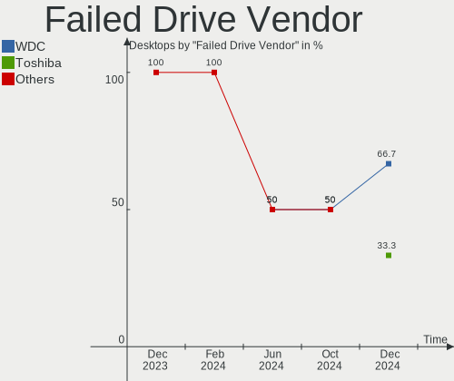

OpenMandriva Hardware Trends (Desktop)
--------------------------------------

A project to identify most popular hardware characteristics and track their change
over time based on data collected by OpenMandriva users at https://Linux-Hardware.org.

Anyone can contribute to the study by uploading probes of their computers by
the [hw-probe](https://github.com/linuxhw/hw-probe) tool:

    sudo -E hw-probe -all -upload

Full-feature report is available here: https://linux-hardware.org/?view=trends&formfactor=desktop

Period: Apr, 2021.

Contents
--------

- [ OS                       ](#os)
- [ OS Family                ](#os-family)
- [ Kernel                   ](#kernel)
- [ Kernel Family            ](#kernel-family)
- [ Kernel Major Ver.        ](#kernel-major-ver)
- [ Arch                     ](#arch)
- [ DE                       ](#de)
- [ Display Server           ](#display-server)
- [ Display Manager          ](#display-manager)
- [ OS Lang                  ](#os-lang)
- [ Boot Mode                ](#boot-mode)
- [ Filesystem               ](#filesystem)
- [ Part. scheme             ](#part-scheme)
- [ Dual Boot with Linux/BSD ](#dual-boot-with-linux/bsd)
- [ Dual Boot (Win)          ](#dual-boot-win)
- [ Country                  ](#country)
- [ City                     ](#city)
- [ Vendor                   ](#vendor)
- [ Model                    ](#model)
- [ Model Family             ](#model-family)
- [ MFG Year                 ](#mfg-year)
- [ Form Factor              ](#form-factor)
- [ Secure Boot              ](#secure-boot)
- [ Coreboot                 ](#coreboot)
- [ RAM Size                 ](#ram-size)
- [ RAM Used                 ](#ram-used)
- [ Has CD-ROM               ](#has-cd-rom)
- [ Total Drives             ](#total-drives)
- [ Has Ethernet             ](#has-ethernet)
- [ Has WiFi                 ](#has-wifi)
- [ Has Bluetooth            ](#has-bluetooth)
- [ Drive Vendor             ](#drive-vendor)
- [ Drive Model              ](#drive-model)
- [ HDD Vendor               ](#hdd-vendor)
- [ SSD Vendor               ](#ssd-vendor)
- [ Drive Kind               ](#drive-kind)
- [ Drive Connector          ](#drive-connector)
- [ Drive Size               ](#drive-size)
- [ Space Total              ](#space-total)
- [ Space Used               ](#space-used)
- [ Malfunc. Drives          ](#malfunc-drives)
- [ Malfunc. Drive Vendor    ](#malfunc-drive-vendor)
- [ Malfunc. HDD Vendor      ](#malfunc-hdd-vendor)
- [ Malfunc. Drive Kind      ](#malfunc-drive-kind)
- [ Failed Drives            ](#failed-drives)
- [ Failed Drive Vendor      ](#failed-drive-vendor)
- [ Drive Status             ](#drive-status)
- [ Storage Vendor           ](#storage-vendor)
- [ Storage Model            ](#storage-model)
- [ Storage Kind             ](#storage-kind)
- [ CPU Vendor               ](#cpu-vendor)
- [ CPU Model                ](#cpu-model)
- [ CPU Model Family         ](#cpu-model-family)
- [ CPU Cores                ](#cpu-cores)
- [ CPU Sockets              ](#cpu-sockets)
- [ CPU Threads              ](#cpu-threads)
- [ CPU Op-Modes             ](#cpu-op-modes)
- [ CPU Microcode            ](#cpu-microcode)
- [ CPU Microarch            ](#cpu-microarch)
- [ GPU Vendor               ](#gpu-vendor)
- [ GPU Model                ](#gpu-model)
- [ GPU Combo                ](#gpu-combo)
- [ GPU Driver               ](#gpu-driver)
- [ GPU Memory               ](#gpu-memory)
- [ Monitor Vendor           ](#monitor-vendor)
- [ Monitor Model            ](#monitor-model)
- [ Monitor Resolution       ](#monitor-resolution)
- [ Monitor Diagonal         ](#monitor-diagonal)
- [ Monitor Width            ](#monitor-width)
- [ Aspect Ratio             ](#aspect-ratio)
- [ Monitor Area             ](#monitor-area)
- [ Pixel Density            ](#pixel-density)
- [ Multiple Monitors        ](#multiple-monitors)
- [ Net Controller Vendor    ](#net-controller-vendor)
- [ Net Controller Model     ](#net-controller-model)
- [ Wireless Vendor          ](#wireless-vendor)
- [ Wireless Model           ](#wireless-model)
- [ Ethernet Vendor          ](#ethernet-vendor)
- [ Ethernet Model           ](#ethernet-model)
- [ Net Controller Kind      ](#net-controller-kind)
- [ Used Controller          ](#used-controller)
- [ NICs                     ](#nics)
- [ IPv6                     ](#ipv6)
- [ Memory Vendor            ](#memory-vendor)
- [ Memory Model             ](#memory-model)
- [ Memory Kind              ](#memory-kind)
- [ Memory Form Factor       ](#memory-form-factor)
- [ Memory Size              ](#memory-size)
- [ Memory Speed             ](#memory-speed)
- [ Sound Vendor             ](#sound-vendor)
- [ Sound Model              ](#sound-model)
- [ Camera Vendor            ](#camera-vendor)
- [ Camera Model             ](#camera-model)
- [ Fingerprint Vendor       ](#fingerprint-vendor)
- [ Fingerprint Model        ](#fingerprint-model)
- [ Chipcard Vendor          ](#chipcard-vendor)
- [ Chipcard Model           ](#chipcard-model)
- [ Printer Vendor           ](#printer-vendor)
- [ Printer Model            ](#printer-model)
- [ Scanner Vendor           ](#scanner-vendor)
- [ Scanner Model            ](#scanner-model)
- [ Bluetooth Vendor         ](#bluetooth-vendor)
- [ Bluetooth Model          ](#bluetooth-model)
- [ Unsupported Devices      ](#unsupported-devices)
- [ Unsupported Device Types ](#unsupported-device-types)

OS
--

Installed operating systems

| Name              | Desktops | Percent |
|-------------------|----------|---------|
| OpenMandriva 4.2  | 185      | 98.4%   |
| OpenMandriva 4.50 | 2        | 1.06%   |
| OpenMandriva 4.1  | 1        | 0.53%   |

OS Family
---------

OS without a version

| Name         | Desktops | Percent |
|--------------|----------|---------|
| OpenMandriva | 188      | 100%    |

Kernel
------

Version of the Linux kernel

| Version                        | Desktops | Percent |
|--------------------------------|----------|---------|
| 5.10.14-desktop-1omv4002       | 182      | 96.81%  |
| 5.11.12-desktop-1omv4002       | 2        | 1.06%   |
| 5.11.11-desktop-clang-1omv4050 | 2        | 1.06%   |
| 5.5.0-desktop-1omv4001         | 1        | 0.53%   |
| 5.11.0-desktop-clang-1omv4002  | 1        | 0.53%   |

Kernel Family
-------------

Linux kernel without a distro release

| Version | Desktops | Percent |
|---------|----------|---------|
| 5.10.14 | 182      | 96.81%  |
| 5.11.12 | 2        | 1.06%   |
| 5.11.11 | 2        | 1.06%   |
| 5.5.0   | 1        | 0.53%   |
| 5.11.0  | 1        | 0.53%   |

Kernel Major Ver.
-----------------

Linux kernel major version

| Version | Desktops | Percent |
|---------|----------|---------|
| 5.10    | 182      | 96.81%  |
| 5.11    | 5        | 2.66%   |
| 5.5     | 1        | 0.53%   |

Arch
----

OS architecture (x86_64, i586, etc.)

| Name   | Desktops | Percent |
|--------|----------|---------|
| x86_64 | 188      | 100%    |

DE
--

Desktop Environment

| Name | Desktops | Percent |
|------|----------|---------|
| KDE5 | 188      | 100%    |

Display Server
--------------

X11 or Wayland

| Name | Desktops | Percent |
|------|----------|---------|
| X11  | 188      | 100%    |

Display Manager
---------------

SDDM, LightDM, etc.

| Name | Desktops | Percent |
|------|----------|---------|
| SDDM | 188      | 100%    |

OS Lang
-------

Language

| Lang  | Desktops | Percent |
|-------|----------|---------|
| en_US | 95       | 50.53%  |
| fr_FR | 14       | 7.45%   |
| de_DE | 14       | 7.45%   |
| pl_PL | 13       | 6.91%   |
| ru_RU | 10       | 5.32%   |
| pt_BR | 7        | 3.72%   |
| it_IT | 6        | 3.19%   |
| hu_HU | 5        | 2.66%   |
| es_ES | 3        | 1.6%    |
| en_GB | 3        | 1.6%    |
| cs_CZ | 3        | 1.6%    |
| es_VE | 2        | 1.06%   |
| es_MX | 2        | 1.06%   |
| es_AR | 2        | 1.06%   |
| en_IN | 2        | 1.06%   |
| uk_UA | 1        | 0.53%   |
| nl_BE | 1        | 0.53%   |
| fr_CA | 1        | 0.53%   |
| es_CL | 1        | 0.53%   |
| en_ZA | 1        | 0.53%   |
| de_AT | 1        | 0.53%   |
| da_DK | 1        | 0.53%   |

Boot Mode
---------

EFI or BIOS

| Mode | Desktops | Percent |
|------|----------|---------|
| BIOS | 127      | 67.55%  |
| EFI  | 61       | 32.45%  |

Filesystem
----------

Type of filesystem

| Type    | Desktops | Percent |
|---------|----------|---------|
| Overlay | 155      | 82.45%  |
| Ext4    | 31       | 16.49%  |
| Xfs     | 1        | 0.53%   |
| Btrfs   | 1        | 0.53%   |

Part. scheme
------------

Scheme of partitioning

| Type    | Desktops | Percent |
|---------|----------|---------|
| MBR     | 96       | 51.06%  |
| GPT     | 91       | 48.4%   |
| Unknown | 1        | 0.53%   |

Dual Boot with Linux/BSD
------------------------

Hosting more than one Linux/BSD

| Dual boot | Desktops | Percent |
|-----------|----------|---------|
| Yes       | 107      | 56.91%  |
| No        | 81       | 43.09%  |

Dual Boot (Win)
---------------

Hosting Linux and Windows

| Dual boot | Desktops | Percent |
|-----------|----------|---------|
| Yes       | 103      | 54.79%  |
| No        | 85       | 45.21%  |

Country
-------

Geographic location (country)

| Country             | Desktops | Percent |
|---------------------|----------|---------|
| Poland              | 21       | 11.17%  |
| USA                 | 20       | 10.64%  |
| Germany             | 20       | 10.64%  |
| Russia              | 17       | 9.04%   |
| France              | 14       | 7.45%   |
| Brazil              | 12       | 6.38%   |
| UK                  | 11       | 5.85%   |
| Italy               | 11       | 5.85%   |
| Spain               | 6        | 3.19%   |
| Hungary             | 6        | 3.19%   |
| Ukraine             | 5        | 2.66%   |
| Czechia             | 5        | 2.66%   |
| India               | 4        | 2.13%   |
| Canada              | 4        | 2.13%   |
| Netherlands         | 3        | 1.6%    |
| Belgium             | 3        | 1.6%    |
| Argentina           | 3        | 1.6%    |
| Venezuela           | 2        | 1.06%   |
| Mexico              | 2        | 1.06%   |
| Greece              | 2        | 1.06%   |
| Austria             | 2        | 1.06%   |
| Trinidad and Tobago | 1        | 0.53%   |
| South Africa        | 1        | 0.53%   |
| Singapore           | 1        | 0.53%   |
| Romania             | 1        | 0.53%   |
| Norway              | 1        | 0.53%   |
| Malaysia            | 1        | 0.53%   |
| Lithuania           | 1        | 0.53%   |
| Japan               | 1        | 0.53%   |
| Finland             | 1        | 0.53%   |
| Egypt               | 1        | 0.53%   |
| Denmark             | 1        | 0.53%   |
| Chile               | 1        | 0.53%   |
| Bulgaria            | 1        | 0.53%   |
| Australia           | 1        | 0.53%   |
| Algeria             | 1        | 0.53%   |

City
----

Geographic location (city)

| City                  | Desktops | Percent |
|-----------------------|----------|---------|
| St Petersburg         | 5        | 2.66%   |
| Wroclaw               | 4        | 2.13%   |
| Warsaw                | 3        | 1.6%    |
| São Paulo            | 3        | 1.6%    |
| Milan                 | 3        | 1.6%    |
| Kyiv                  | 3        | 1.6%    |
| Budapest              | 3        | 1.6%    |
| Česká Lípa         | 2        | 1.06%   |
| Saratov               | 2        | 1.06%   |
| Sankt Augustin        | 2        | 1.06%   |
| Moscow                | 2        | 1.06%   |
| London                | 2        | 1.06%   |
| Krakow                | 2        | 1.06%   |
| Kazan’              | 2        | 1.06%   |
| Šiauliai             | 1        | 0.53%   |
| Zadni Treban          | 1        | 0.53%   |
| Zabrze                | 1        | 0.53%   |
| Yuzhnyy               | 1        | 0.53%   |
| Xanthi                | 1        | 0.53%   |
| Winzeln               | 1        | 0.53%   |
| Winchester            | 1        | 0.53%   |
| Wakefield             | 1        | 0.53%   |
| Villaggio Montegrappa | 1        | 0.53%   |
| Vicenza               | 1        | 0.53%   |
| Veliky Novgorod       | 1        | 0.53%   |
| Valencia              | 1        | 0.53%   |
| Ufa                   | 1        | 0.53%   |
| Tunapuna              | 1        | 0.53%   |
| Tumkūr               | 1        | 0.53%   |
| Trzebnica             | 1        | 0.53%   |
| Trier                 | 1        | 0.53%   |
| Tczew                 | 1        | 0.53%   |
| Tavaux                | 1        | 0.53%   |
| Swidnica              | 1        | 0.53%   |
| Sweet Water           | 1        | 0.53%   |
| Stuttgart             | 1        | 0.53%   |
| Stroudsburg           | 1        | 0.53%   |
| Stirling              | 1        | 0.53%   |
| Stains                | 1        | 0.53%   |
| Spittal an der Drau   | 1        | 0.53%   |
| Sparbu                | 1        | 0.53%   |
| Sofia                 | 1        | 0.53%   |
| Sochi                 | 1        | 0.53%   |
| Slough                | 1        | 0.53%   |
| Singapore             | 1        | 0.53%   |
| Sao Vicente de Minas  | 1        | 0.53%   |
| Santiago              | 1        | 0.53%   |
| Sankt Pölten         | 1        | 0.53%   |
| San Martin            | 1        | 0.53%   |
| Saint-Lin-Laurentides | 1        | 0.53%   |
| Saint Joseph          | 1        | 0.53%   |
| Rzeszów              | 1        | 0.53%   |
| Ruda Śląska         | 1        | 0.53%   |
| Royal Oak             | 1        | 0.53%   |
| Rouen                 | 1        | 0.53%   |
| Roszke                | 1        | 0.53%   |
| Rome                  | 1        | 0.53%   |
| Roaillan              | 1        | 0.53%   |
| Rio Bonito            | 1        | 0.53%   |
| Ringsted              | 1        | 0.53%   |

Vendor
------

Motherboard manufacturer

| Name                | Desktops | Percent |
|---------------------|----------|---------|
| ASUSTek Computer    | 46       | 24.47%  |
| Gigabyte Technology | 39       | 20.74%  |
| MSI                 | 18       | 9.57%   |
| ASRock              | 15       | 7.98%   |
| Dell                | 14       | 7.45%   |
| Hewlett-Packard     | 11       | 5.85%   |
| Lenovo              | 8        | 4.26%   |
| Intel               | 7        | 3.72%   |
| Pegatron            | 6        | 3.19%   |
| Fujitsu             | 5        | 2.66%   |
| Acer                | 4        | 2.13%   |
| Supermicro          | 2        | 1.06%   |
| Unknown             | 2        | 1.06%   |
| ZOTAC               | 1        | 0.53%   |
| Semp Toshiba        | 1        | 0.53%   |
| Pyramid             | 1        | 0.53%   |
| Positivo            | 1        | 0.53%   |
| Packard Bell        | 1        | 0.53%   |
| Medion              | 1        | 0.53%   |
| Gateway             | 1        | 0.53%   |
| Fujitsu Siemens     | 1        | 0.53%   |
| Biostar             | 1        | 0.53%   |
| BESSTAR Tech        | 1        | 0.53%   |
| AMD                 | 1        | 0.53%   |

Model
-----

Motherboard model

| Name                                     | Desktops | Percent |
|------------------------------------------|----------|---------|
| ASUS All Series                          | 5        | 2.66%   |
| MSI MS-7817                              | 4        | 2.13%   |
| Gigabyte A320M-S2H                       | 4        | 2.13%   |
| HP Compaq Pro 6300 SFF                   | 3        | 1.6%    |
| Gigabyte GA-990XA-UD3                    | 2        | 1.06%   |
| Gigabyte B450M DS3H                      | 2        | 1.06%   |
| Dell OptiPlex 780                        | 2        | 1.06%   |
| Dell OptiPlex 755                        | 2        | 1.06%   |
| Dell OptiPlex 7010                       | 2        | 1.06%   |
| ASUS P5Q                                 | 2        | 1.06%   |
| Unknown                                  | 2        | 1.06%   |
| ZOTAC AMD HUDSON-M1                      | 1        | 0.53%   |
| Supermicro X9SRE/X9SRE-3F/X9SRi/X9SRi-3F | 1        | 0.53%   |
| Supermicro X8SIE                         | 1        | 0.53%   |
| Semp Toshiba STI                         | 1        | 0.53%   |
| Pyramid Control Unit DAU G5              | 1        | 0.53%   |
| Positivo OMNI H3-01768                   | 1        | 0.53%   |
| Pegatron WE301AA-ABF p6215fr             | 1        | 0.53%   |
| Pegatron p6715fr                         | 1        | 0.53%   |
| Pegatron KQ437AA-ABA IQ506               | 1        | 0.53%   |
| Pegatron HPE-480t                        | 1        | 0.53%   |
| Pegatron Compaq dx2400 Microtower PC     | 1        | 0.53%   |
| Pegatron APX85-GS                        | 1        | 0.53%   |
| Packard Bell ixtreme M5740               | 1        | 0.53%   |
| MSI MS-7C79                              | 1        | 0.53%   |
| MSI MS-7C36                              | 1        | 0.53%   |
| MSI MS-7C13                              | 1        | 0.53%   |
| MSI MS-7B85                              | 1        | 0.53%   |
| MSI MS-7B79                              | 1        | 0.53%   |
| MSI MS-7A39                              | 1        | 0.53%   |
| MSI MS-7A34                              | 1        | 0.53%   |
| MSI MS-7994                              | 1        | 0.53%   |
| MSI MS-7758                              | 1        | 0.53%   |
| MSI MS-7693                              | 1        | 0.53%   |
| MSI MS-7641                              | 1        | 0.53%   |
| MSI MS-7418                              | 1        | 0.53%   |
| MSI MS-7360                              | 1        | 0.53%   |
| MSI MS-7235                              | 1        | 0.53%   |
| Medion E33004                            | 1        | 0.53%   |
| Lenovo ThinkCentre M91p 7033WE1          | 1        | 0.53%   |
| Lenovo ThinkCentre M77 1990RZ2           | 1        | 0.53%   |
| Lenovo ThinkCentre M73 10B4S0M800        | 1        | 0.53%   |
| Lenovo ThinkCentre M58 7373WB7           | 1        | 0.53%   |
| Lenovo IdeaCentre K430 10086             | 1        | 0.53%   |
| Lenovo IdeaCentre 310S-08ASR 90G90081UK  | 1        | 0.53%   |
| Lenovo IdeaCentre 310S-08ASR 90G90073GE  | 1        | 0.53%   |
| Lenovo H220                              | 1        | 0.53%   |
| Intel H61                                | 1        | 0.53%   |
| Intel H55 INTEL                          | 1        | 0.53%   |
| Intel DP55WB AAE64798-205                | 1        | 0.53%   |
| Intel D34010WYK H14771-302               | 1        | 0.53%   |
| Intel D33217GKE G76540-202               | 1        | 0.53%   |
| Intel ChiefRiver                         | 1        | 0.53%   |
| Intel B75                                | 1        | 0.53%   |
| HP Z420 Workstation                      | 1        | 0.53%   |
| HP Slim Desktop 290-p0xxx                | 1        | 0.53%   |
| HP Pavilion Desktop TP01-1xxx            | 1        | 0.53%   |
| HP EliteDesk 705 G3 SFF                  | 1        | 0.53%   |
| HP Compaq Elite 8300 SFF                 | 1        | 0.53%   |
| HP Compaq dc7800p Small Form Factor      | 1        | 0.53%   |

Model Family
------------

Motherboard model prefix

| Name                   | Desktops | Percent |
|------------------------|----------|---------|
| Dell OptiPlex          | 9        | 4.79%   |
| HP Compaq              | 6        | 3.19%   |
| ASUS PRIME             | 6        | 3.19%   |
| Fujitsu ESPRIMO        | 5        | 2.66%   |
| ASUS All               | 5        | 2.66%   |
| MSI MS-7817            | 4        | 2.13%   |
| Lenovo ThinkCentre     | 4        | 2.13%   |
| Gigabyte A320M-S2H     | 4        | 2.13%   |
| Lenovo IdeaCentre      | 3        | 1.6%    |
| ASUS TUF               | 3        | 1.6%    |
| ASUS P8P67             | 3        | 1.6%    |
| ASUS P5Q               | 3        | 1.6%    |
| Gigabyte GA-990XA-UD3  | 2        | 1.06%   |
| Gigabyte GA-78LMT-USB3 | 2        | 1.06%   |
| Gigabyte B450M         | 2        | 1.06%   |
| Dell Precision         | 2        | 1.06%   |
| ASUS ROG               | 2        | 1.06%   |
| ASUS M5A78L-M          | 2        | 1.06%   |
| Acer Aspire            | 2        | 1.06%   |
| Unknown                | 2        | 1.06%   |
| ZOTAC AMD              | 1        | 0.53%   |
| Supermicro X9SRE       | 1        | 0.53%   |
| Supermicro X8SIE       | 1        | 0.53%   |
| Semp Toshiba STI       | 1        | 0.53%   |
| Pyramid Control        | 1        | 0.53%   |
| Positivo OMNI          | 1        | 0.53%   |
| Pegatron WE301AA-ABF   | 1        | 0.53%   |
| Pegatron p6715fr       | 1        | 0.53%   |
| Pegatron KQ437AA-ABA   | 1        | 0.53%   |
| Pegatron HPE-480t      | 1        | 0.53%   |
| Pegatron Compaq        | 1        | 0.53%   |
| Pegatron APX85-GS      | 1        | 0.53%   |
| Packard Bell ixtreme   | 1        | 0.53%   |
| MSI MS-7C79            | 1        | 0.53%   |
| MSI MS-7C36            | 1        | 0.53%   |
| MSI MS-7C13            | 1        | 0.53%   |
| MSI MS-7B85            | 1        | 0.53%   |
| MSI MS-7B79            | 1        | 0.53%   |
| MSI MS-7A39            | 1        | 0.53%   |
| MSI MS-7A34            | 1        | 0.53%   |
| MSI MS-7994            | 1        | 0.53%   |
| MSI MS-7758            | 1        | 0.53%   |
| MSI MS-7693            | 1        | 0.53%   |
| MSI MS-7641            | 1        | 0.53%   |
| MSI MS-7418            | 1        | 0.53%   |
| MSI MS-7360            | 1        | 0.53%   |
| MSI MS-7235            | 1        | 0.53%   |
| Medion E33004          | 1        | 0.53%   |
| Lenovo H220            | 1        | 0.53%   |
| Intel H61              | 1        | 0.53%   |
| Intel H55              | 1        | 0.53%   |
| Intel DP55WB           | 1        | 0.53%   |
| Intel D34010WYK        | 1        | 0.53%   |
| Intel D33217GKE        | 1        | 0.53%   |
| Intel ChiefRiver       | 1        | 0.53%   |
| Intel B75              | 1        | 0.53%   |
| HP Z420                | 1        | 0.53%   |
| HP Slim                | 1        | 0.53%   |
| HP Pavilion            | 1        | 0.53%   |
| HP EliteDesk           | 1        | 0.53%   |

MFG Year
--------

Motherboard manufacture year

| Year | Desktops | Percent |
|------|----------|---------|
| 2012 | 21       | 11.17%  |
| 2020 | 19       | 10.11%  |
| 2014 | 17       | 9.04%   |
| 2010 | 17       | 9.04%   |
| 2009 | 15       | 7.98%   |
| 2018 | 14       | 7.45%   |
| 2019 | 13       | 6.91%   |
| 2013 | 13       | 6.91%   |
| 2011 | 12       | 6.38%   |
| 2015 | 10       | 5.32%   |
| 2016 | 9        | 4.79%   |
| 2017 | 8        | 4.26%   |
| 2008 | 7        | 3.72%   |
| 2021 | 6        | 3.19%   |
| 2007 | 5        | 2.66%   |
| 2006 | 1        | 0.53%   |
| 2005 | 1        | 0.53%   |

Form Factor
-----------

Physical design of the computer

| Name    | Desktops | Percent |
|---------|----------|---------|
| Desktop | 188      | 100%    |

Secure Boot
-----------

Enabled or disabled

| State    | Desktops | Percent |
|----------|----------|---------|
| Disabled | 188      | 100%    |

Coreboot
--------

Have coreboot on board

| Used | Desktops | Percent |
|------|----------|---------|
| No   | 188      | 100%    |

RAM Size
--------

Total RAM memory

| Size in GB  | Desktops | Percent |
|-------------|----------|---------|
| 8.01-16.0   | 61       | 32.45%  |
| 3.01-4.0    | 45       | 23.94%  |
| 16.01-24.0  | 34       | 18.09%  |
| 4.01-8.0    | 32       | 17.02%  |
| 32.01-64.0  | 7        | 3.72%   |
| 1.01-2.0    | 6        | 3.19%   |
| 2.01-3.0    | 2        | 1.06%   |
| 64.01-256.0 | 1        | 0.53%   |

RAM Used
--------

Used RAM memory

| Used GB  | Desktops | Percent |
|----------|----------|---------|
| 1.01-2.0 | 138      | 73.4%   |
| 0.51-1.0 | 26       | 13.83%  |
| 2.01-3.0 | 15       | 7.98%   |
| 0.01-0.5 | 8        | 4.26%   |
| 3.01-4.0 | 1        | 0.53%   |

Has CD-ROM
----------

Has CD-ROM on board

| Presented | Desktops | Percent |
|-----------|----------|---------|
| Yes       | 119      | 63.3%   |
| No        | 69       | 36.7%   |

Total Drives
------------

Number of drives on board

| Drives | Desktops | Percent |
|--------|----------|---------|
| 1      | 84       | 44.68%  |
| 2      | 55       | 29.26%  |
| 3      | 30       | 15.96%  |
| 4      | 6        | 3.19%   |
| 6      | 5        | 2.66%   |
| 5      | 5        | 2.66%   |
| 0      | 2        | 1.06%   |
| 8      | 1        | 0.53%   |

Has Ethernet
------------

Has Ethernet on board

| Presented | Desktops | Percent |
|-----------|----------|---------|
| Yes       | 187      | 99.47%  |
| No        | 1        | 0.53%   |

Has WiFi
--------

Has WiFi module

| Presented | Desktops | Percent |
|-----------|----------|---------|
| No        | 119      | 63.3%   |
| Yes       | 69       | 36.7%   |

Has Bluetooth
-------------

Has Bluetooth module

| Presented | Desktops | Percent |
|-----------|----------|---------|
| No        | 150      | 79.79%  |
| Yes       | 38       | 20.21%  |

Drive Vendor
------------

Hard drive vendors

| Vendor              | Desktops | Drives | Percent |
|---------------------|----------|--------|---------|
| WDC                 | 80       | 102    | 25%     |
| Seagate             | 79       | 92     | 24.69%  |
| Samsung Electronics | 33       | 40     | 10.31%  |
| Kingston            | 15       | 15     | 4.69%   |
| Toshiba             | 13       | 16     | 4.06%   |
| Crucial             | 13       | 14     | 4.06%   |
| Hitachi             | 11       | 11     | 3.44%   |
| A-DATA Technology   | 9        | 10     | 2.81%   |
| SanDisk             | 6        | 6      | 1.88%   |
| PNY                 | 6        | 6      | 1.88%   |
| Maxtor              | 5        | 5      | 1.56%   |
| GOODRAM             | 4        | 4      | 1.25%   |
| China               | 4        | 5      | 1.25%   |
| XPG                 | 3        | 4      | 0.94%   |
| Patriot             | 3        | 3      | 0.94%   |
| HGST                | 3        | 3      | 0.94%   |
| Apacer              | 3        | 3      | 0.94%   |
| Unknown             | 2        | 3      | 0.63%   |
| Team                | 2        | 2      | 0.63%   |
| SPCC                | 2        | 2      | 0.63%   |
| Phison Electronics  | 2        | 3      | 0.63%   |
| Phison              | 2        | 2      | 0.63%   |
| KingSpec            | 2        | 2      | 0.63%   |
| Intenso             | 2        | 2      | 0.63%   |
| Intel               | 2        | 2      | 0.63%   |
| Fujitsu             | 2        | 2      | 0.63%   |
| Corsair             | 2        | 2      | 0.63%   |
| XrayDisk            | 1        | 1      | 0.31%   |
| Verbatim            | 1        | 1      | 0.31%   |
| USB                 | 1        | 1      | 0.31%   |
| Smartbuy            | 1        | 1      | 0.31%   |
| PLEXTOR             | 1        | 1      | 0.31%   |
| OCZ                 | 1        | 1      | 0.31%   |
| Netac               | 1        | 1      | 0.31%   |
| Micron Technology   | 1        | 1      | 0.31%   |
| Colorful            | 1        | 1      | 0.31%   |
| AMD                 | 1        | 1      | 0.31%   |

Drive Model
-----------

Hard drive models

| Model                            | Desktops | Percent |
|----------------------------------|----------|---------|
| Seagate ST500DM002-1BD142 500GB  | 8        | 2.24%   |
| Seagate ST1000DM010-2EP102 1TB   | 6        | 1.68%   |
| WDC WD20EZRZ-00Z5HB0 2TB         | 5        | 1.4%    |
| Seagate ST2000DM008-2FR102 2TB   | 5        | 1.4%    |
| WDC WD10EZEX-22MFCA0 1TB         | 4        | 1.12%   |
| Samsung HD103SI 1TB              | 4        | 1.12%   |
| WDC WD6400AAKS-22A7B2 640GB      | 3        | 0.84%   |
| WDC WD10EZEX-21WN4A0 1TB         | 3        | 0.84%   |
| WDC WD10EZEX-08WN4A0 1TB         | 3        | 0.84%   |
| WDC WD10EZEX-00MFCA0 1TB         | 3        | 0.84%   |
| Toshiba DT01ACA100 1TB           | 3        | 0.84%   |
| Toshiba DT01ACA050 500GB         | 3        | 0.84%   |
| Seagate ST3500418AS 500GB        | 3        | 0.84%   |
| Seagate ST3500414CS 500GB        | 3        | 0.84%   |
| Seagate ST3160815AS 160GB        | 3        | 0.84%   |
| Seagate ST31500341AS 1TB         | 3        | 0.84%   |
| A-DATA SU630 240GB SSD           | 3        | 0.84%   |
| XPG GAMMIX S11 Pro 2TB           | 2        | 0.56%   |
| WDC WDS500G1B0A-00H9H0 500GB SSD | 2        | 0.56%   |
| WDC WDS240G2G0A-00JH30 240GB SSD | 2        | 0.56%   |
| WDC WDS100T2B0A-00SM50 1TB SSD   | 2        | 0.56%   |
| WDC WD5000AAKX-60U6AA0 500GB     | 2        | 0.56%   |
| WDC WD5000AAKX-003CA0 500GB      | 2        | 0.56%   |
| WDC WD1003FZEX-00MK2A0 1TB       | 2        | 0.56%   |
| Seagate ST500LT012-1DG142 500GB  | 2        | 0.56%   |
| Seagate ST4000DM004-2CV104 4TB   | 2        | 0.56%   |
| Seagate ST3250318AS 250GB        | 2        | 0.56%   |
| Seagate ST3250312AS 250GB        | 2        | 0.56%   |
| Seagate ST3250310AS 250GB        | 2        | 0.56%   |
| Seagate ST31000528AS 1TB         | 2        | 0.56%   |
| Seagate ST250DM000-1BD141 250GB  | 2        | 0.56%   |
| Seagate ST1000DX001-1CM162 1TB   | 2        | 0.56%   |
| Seagate ST1000DM003-1SB10C 1TB   | 2        | 0.56%   |
| Seagate ST1000DM003-1SB102 1TB   | 2        | 0.56%   |
| Samsung SSD 860 EVO 500GB        | 2        | 0.56%   |
| Samsung SSD 860 EVO 1TB          | 2        | 0.56%   |
| Samsung SSD 840 EVO 250GB        | 2        | 0.56%   |
| Samsung SSD 840 EVO 120GB        | 2        | 0.56%   |
| Samsung HD502IJ 500GB            | 2        | 0.56%   |
| Samsung HD502HJ 500GB            | 2        | 0.56%   |
| Samsung HD322GJ 320GB            | 2        | 0.56%   |
| PNY CS900 250GB SSD              | 2        | 0.56%   |
| PNY CS1311 240GB SSD             | 2        | 0.56%   |
| Phison PCIe SSD 1TB              | 2        | 0.56%   |
| Kingston SV300S37A120G 120GB SSD | 2        | 0.56%   |
| Kingston SA400S37240G 240GB SSD  | 2        | 0.56%   |
| Intenso SSD 128GB                | 2        | 0.56%   |
| Hitachi HDT722516DLA380 164GB    | 2        | 0.56%   |
| Hitachi HDS721010CLA332 1TB      | 2        | 0.56%   |
| Crucial CT480BX500SSD1 480GB     | 2        | 0.56%   |
| China SSD 120GB                  | 2        | 0.56%   |
| XrayDisk SSD 120GB               | 1        | 0.28%   |
| XPG SX950U 240GB SSD             | 1        | 0.28%   |
| WDC WDS500G2B0C-00PXH0 500GB     | 1        | 0.28%   |
| WDC WDS500G2B0A-00SM50 500GB SSD | 1        | 0.28%   |
| WDC WDS240G2G0B-00EPW0 240GB SSD | 1        | 0.28%   |
| WDC WDS120G1G0A-00SS50 120GB SSD | 1        | 0.28%   |
| WDC WD800JB-00JJC0 80GB          | 1        | 0.28%   |
| WDC WD800BB-00JHC0 80GB          | 1        | 0.28%   |
| WDC WD8004FRYZ-01VAEB0 8TB       | 1        | 0.28%   |

HDD Vendor
----------

Hard disk drive vendors

| Vendor              | Desktops | Drives | Percent |
|---------------------|----------|--------|---------|
| Seagate             | 77       | 89     | 38.89%  |
| WDC                 | 73       | 92     | 36.87%  |
| Samsung Electronics | 16       | 17     | 8.08%   |
| Hitachi             | 11       | 11     | 5.56%   |
| Toshiba             | 10       | 13     | 5.05%   |
| Maxtor              | 5        | 5      | 2.53%   |
| HGST                | 3        | 3      | 1.52%   |
| Fujitsu             | 2        | 2      | 1.01%   |
| China               | 1        | 1      | 0.51%   |

SSD Vendor
----------

Solid state drive vendors

| Vendor              | Desktops | Drives | Percent |
|---------------------|----------|--------|---------|
| Samsung Electronics | 15       | 19     | 14.56%  |
| Kingston            | 14       | 14     | 13.59%  |
| Crucial             | 12       | 13     | 11.65%  |
| WDC                 | 8        | 9      | 7.77%   |
| A-DATA Technology   | 8        | 9      | 7.77%   |
| SanDisk             | 6        | 6      | 5.83%   |
| PNY                 | 6        | 6      | 5.83%   |
| GOODRAM             | 4        | 4      | 3.88%   |
| Toshiba             | 3        | 3      | 2.91%   |
| Patriot             | 3        | 3      | 2.91%   |
| China               | 3        | 4      | 2.91%   |
| Team                | 2        | 2      | 1.94%   |
| KingSpec            | 2        | 2      | 1.94%   |
| Intenso             | 2        | 2      | 1.94%   |
| Intel               | 2        | 2      | 1.94%   |
| Apacer              | 2        | 2      | 1.94%   |
| XrayDisk            | 1        | 1      | 0.97%   |
| XPG                 | 1        | 1      | 0.97%   |
| Verbatim            | 1        | 1      | 0.97%   |
| SPCC                | 1        | 1      | 0.97%   |
| Smartbuy            | 1        | 1      | 0.97%   |
| OCZ                 | 1        | 1      | 0.97%   |
| Netac               | 1        | 1      | 0.97%   |
| Micron Technology   | 1        | 1      | 0.97%   |
| Corsair             | 1        | 1      | 0.97%   |
| Colorful            | 1        | 1      | 0.97%   |
| AMD                 | 1        | 1      | 0.97%   |

Drive Kind
----------

HDD or SSD

| Kind    | Desktops | Drives | Percent |
|---------|----------|--------|---------|
| HDD     | 154      | 233    | 59.69%  |
| SSD     | 84       | 111    | 32.56%  |
| NVMe    | 16       | 22     | 6.2%    |
| Unknown | 4        | 5      | 1.55%   |

Drive Connector
---------------

SATA, SAS, NVMe, etc.

| Type | Desktops | Drives | Percent |
|------|----------|--------|---------|
| SATA | 184      | 342    | 89.32%  |
| NVMe | 16       | 22     | 7.77%   |
| SAS  | 6        | 7      | 2.91%   |

Drive Size
----------

Size of hard drive

| Size in TB | Desktops | Drives | Percent |
|------------|----------|--------|---------|
| 0.01-0.5   | 152      | 211    | 59.14%  |
| 0.51-1.0   | 66       | 87     | 25.68%  |
| 1.01-2.0   | 26       | 30     | 10.12%  |
| 3.01-4.0   | 6        | 8      | 2.33%   |
| 4.01-10.0  | 4        | 5      | 1.56%   |
| 2.01-3.0   | 3        | 3      | 1.17%   |

Space Total
-----------

Amount of disk space available on the file system

| Size in GB     | Desktops | Percent |
|----------------|----------|---------|
| 1-20           | 85       | 45.21%  |
| Unknown        | 38       | 20.21%  |
| 101-250        | 22       | 11.7%   |
| 251-500        | 20       | 10.64%  |
| 501-1000       | 10       | 5.32%   |
| 21-50          | 5        | 2.66%   |
| 51-100         | 4        | 2.13%   |
| 1001-2000      | 3        | 1.6%    |
| More than 3000 | 1        | 0.53%   |

Space Used
----------

Amount of used disk space

| Used GB  | Desktops | Percent |
|----------|----------|---------|
| 1-20     | 137      | 72.87%  |
| Unknown  | 38       | 20.21%  |
| 101-250  | 4        | 2.13%   |
| 501-1000 | 4        | 2.13%   |
| 251-500  | 2        | 1.06%   |
| 51-100   | 2        | 1.06%   |
| 21-50    | 1        | 0.53%   |

Malfunc. Drives
---------------

Drive models with a malfunction

| Model                                        | Desktops | Drives | Percent |
|----------------------------------------------|----------|--------|---------|
| WDC WD6400AAKS-22A7B2 640GB                  | 3        | 3      | 3.53%   |
| Seagate ST500DM002-1BD142 500GB              | 3        | 3      | 3.53%   |
| WDC WD5000AAKX-003CA0 500GB                  | 2        | 2      | 2.35%   |
| WDC WD10EZEX-00MFCA0 1TB                     | 2        | 2      | 2.35%   |
| Seagate ST31500341AS 1TB                     | 2        | 2      | 2.35%   |
| Seagate ST1000DX001-1CM162 1TB               | 2        | 2      | 2.35%   |
| Samsung Electronics HD322GJ 320GB            | 2        | 2      | 2.35%   |
| Samsung Electronics HD103SI 1TB              | 2        | 2      | 2.35%   |
| Hitachi HDT722516DLA380 164GB                | 2        | 2      | 2.35%   |
| WDC WDS500G1B0A-00H9H0 500GB SSD             | 1        | 1      | 1.18%   |
| WDC WDS100T2B0A-00SM50 1TB SSD               | 1        | 1      | 1.18%   |
| WDC WD800JB-00JJC0 80GB                      | 1        | 1      | 1.18%   |
| WDC WD5000AAKX-75U6AA0 500GB                 | 1        | 1      | 1.18%   |
| WDC WD5000AAKX-08U6AA0 500GB                 | 1        | 1      | 1.18%   |
| WDC WD5000AAKX-001CA0 500GB                  | 1        | 2      | 1.18%   |
| WDC WD5000AAKS-00V6A0 500GB                  | 1        | 1      | 1.18%   |
| WDC WD5000AAKS-00D2B0 500GB                  | 1        | 1      | 1.18%   |
| WDC WD5000AADS-56S9B1 500GB                  | 1        | 1      | 1.18%   |
| WDC WD40EFRX-68N32N0 4TB                     | 1        | 1      | 1.18%   |
| WDC WD4000AAKS-00TMA0 400GB                  | 1        | 1      | 1.18%   |
| WDC WD3200JB-00KFA0 320GB                    | 1        | 1      | 1.18%   |
| WDC WD3200AAKS-61L9A0 320GB                  | 1        | 1      | 1.18%   |
| WDC WD3200AAKS-00SBA0 320GB                  | 1        | 1      | 1.18%   |
| WDC WD30EZRX-00DC0B0 3TB                     | 1        | 1      | 1.18%   |
| WDC WD2500KS-00MJB0 250GB                    | 1        | 1      | 1.18%   |
| WDC WD2500AAKX-083CA1 250GB                  | 1        | 1      | 1.18%   |
| WDC WD20EZRZ-00Z5HB0 2TB                     | 1        | 1      | 1.18%   |
| WDC WD20EARX-00PASB0 2TB                     | 1        | 1      | 1.18%   |
| WDC WD20EARS-60MVWB0 2TB                     | 1        | 1      | 1.18%   |
| WDC WD2002FAEX-007BA0 2TB                    | 1        | 1      | 1.18%   |
| WDC WD1600AAJB-56WRA0 160GB                  | 1        | 1      | 1.18%   |
| WDC WD10EARX-00N0YB0 1TB                     | 1        | 1      | 1.18%   |
| WDC WD10EARS-00MVWB0 1TB                     | 1        | 1      | 1.18%   |
| WDC WD10EALX-009BA0 1TB                      | 1        | 1      | 1.18%   |
| WDC WD10EADS-22M2B0 1TB                      | 1        | 1      | 1.18%   |
| WDC WD10EADS-00L5B1 1TB                      | 1        | 1      | 1.18%   |
| WDC WD10EACS-00D6B0 1TB                      | 1        | 1      | 1.18%   |
| Toshiba DT01ACA100 1TB                       | 1        | 1      | 1.18%   |
| Seagate ST9500325AS 500GB                    | 1        | 1      | 1.18%   |
| Seagate ST500LT012-9WS142 500GB              | 1        | 1      | 1.18%   |
| Seagate ST500DM002-1SB10A 500GB              | 1        | 1      | 1.18%   |
| Seagate ST4000DM004-2CV104 4TB               | 1        | 1      | 1.18%   |
| Seagate ST380211AS 80GB                      | 1        | 1      | 1.18%   |
| Seagate ST3500418AS 500GB                    | 1        | 1      | 1.18%   |
| Seagate ST3500414CS 500GB                    | 1        | 1      | 1.18%   |
| Seagate ST3320820AS 320GB                    | 1        | 1      | 1.18%   |
| Seagate ST3320418AS 320GB                    | 1        | 1      | 1.18%   |
| Seagate ST3250820AS 250GB                    | 1        | 2      | 1.18%   |
| Seagate ST3250310AS 250GB                    | 1        | 1      | 1.18%   |
| Seagate ST3160815AS 160GB                    | 1        | 1      | 1.18%   |
| Seagate ST3160813AS 160GB                    | 1        | 1      | 1.18%   |
| Seagate ST3160318AS 160GB                    | 1        | 1      | 1.18%   |
| Seagate ST31000524AS 1TB                     | 1        | 1      | 1.18%   |
| Seagate ST3000DM001-1CH166 3TB               | 1        | 1      | 1.18%   |
| Seagate ST2000DM008-2FR102 2TB               | 1        | 1      | 1.18%   |
| Seagate ST1500DL003-9VT16L 1TB               | 1        | 1      | 1.18%   |
| Seagate ST1000DM003-1SB102 1TB               | 1        | 1      | 1.18%   |
| Samsung Electronics SSD 840 PRO Series 512GB | 1        | 1      | 1.18%   |
| Samsung Electronics HM321HI 320GB            | 1        | 1      | 1.18%   |
| Samsung Electronics HD502IJ 500GB            | 1        | 1      | 1.18%   |

Malfunc. Drive Vendor
---------------------

Vendors of faulty drives

| Vendor              | Desktops | Drives | Percent |
|---------------------|----------|--------|---------|
| WDC                 | 32       | 36     | 39.51%  |
| Seagate             | 26       | 27     | 32.1%   |
| Samsung Electronics | 7        | 8      | 8.64%   |
| Hitachi             | 5        | 5      | 6.17%   |
| China               | 3        | 3      | 3.7%    |
| MAXTOR              | 2        | 2      | 2.47%   |
| Crucial             | 2        | 2      | 2.47%   |
| Toshiba             | 1        | 1      | 1.23%   |
| OCZ                 | 1        | 1      | 1.23%   |
| Fujitsu             | 1        | 1      | 1.23%   |
| Colorful            | 1        | 1      | 1.23%   |

Malfunc. HDD Vendor
-------------------

Vendors of faulty HDD drives

| Vendor              | Desktops | Drives | Percent |
|---------------------|----------|--------|---------|
| WDC                 | 30       | 34     | 41.67%  |
| Seagate             | 26       | 27     | 36.11%  |
| Samsung Electronics | 6        | 7      | 8.33%   |
| Hitachi             | 5        | 5      | 6.94%   |
| MAXTOR              | 2        | 2      | 2.78%   |
| Toshiba             | 1        | 1      | 1.39%   |
| Fujitsu             | 1        | 1      | 1.39%   |
| China               | 1        | 1      | 1.39%   |

Malfunc. Drive Kind
-------------------

Kinds of faulty drives

| Kind | Desktops | Drives | Percent |
|------|----------|--------|---------|
| HDD  | 61       | 78     | 87.14%  |
| SSD  | 9        | 9      | 12.86%  |

Failed Drives
-------------

Failed drive models

| Model                       | Desktops | Drives | Percent |
|-----------------------------|----------|--------|---------|
| Hitachi HDS721010CLA332 1TB | 1        | 1      | 100%    |

Failed Drive Vendor
-------------------

Failed drive vendors

| Vendor  | Desktops | Drives | Percent |
|---------|----------|--------|---------|
| Hitachi | 1        | 1      | 100%    |

Drive Status
------------

Number of failed and malfunc. drives

| Status   | Desktops | Drives | Percent |
|----------|----------|--------|---------|
| Works    | 142      | 253    | 61.21%  |
| Malfunc  | 67       | 87     | 28.88%  |
| Detected | 22       | 30     | 9.48%   |
| Failed   | 1        | 1      | 0.43%   |

Storage Vendor
--------------

Storage controller vendors

| Vendor                           | Desktops | Percent |
|----------------------------------|----------|---------|
| Intel                            | 118      | 50.64%  |
| AMD                              | 62       | 26.61%  |
| JMicron Technology               | 13       | 5.58%   |
| Marvell Technology Group         | 11       | 4.72%   |
| Phison Electronics               | 5        | 2.15%   |
| Nvidia                           | 5        | 2.15%   |
| Samsung Electronics              | 4        | 1.72%   |
| ASMedia Technology               | 4        | 1.72%   |
| VIA Technologies                 | 2        | 0.86%   |
| ADATA Technology                 | 2        | 0.86%   |
| Silicon Motion                   | 1        | 0.43%   |
| Silicon Integrated Systems [SiS] | 1        | 0.43%   |
| Seagate Technology               | 1        | 0.43%   |
| Sandisk                          | 1        | 0.43%   |
| Micron/Crucial Technology        | 1        | 0.43%   |
| Lite-On Technology               | 1        | 0.43%   |
| Kingston Technology Company      | 1        | 0.43%   |

Storage Model
-------------

Storage controller models

| Model                                                                                   | Desktops | Percent |
|-----------------------------------------------------------------------------------------|----------|---------|
| AMD FCH SATA Controller [AHCI mode]                                                     | 34       | 10.4%   |
| Intel 8 Series/C220 Series Chipset Family 6-port SATA Controller 1 [AHCI mode]          | 16       | 4.89%   |
| AMD SB7x0/SB8x0/SB9x0 IDE Controller                                                    | 16       | 4.89%   |
| AMD SB7x0/SB8x0/SB9x0 SATA Controller [IDE mode]                                        | 12       | 3.67%   |
| Intel NM10/ICH7 Family SATA Controller [IDE mode]                                       | 11       | 3.36%   |
| Intel 7 Series/C210 Series Chipset Family 6-port SATA Controller [AHCI mode]            | 11       | 3.36%   |
| AMD SB7x0/SB8x0/SB9x0 SATA Controller [AHCI mode]                                       | 11       | 3.36%   |
| Intel 6 Series/C200 Series Chipset Family 6 port Desktop SATA AHCI Controller           | 10       | 3.06%   |
| Intel 82801G (ICH7 Family) IDE Controller                                               | 9        | 2.75%   |
| AMD 400 Series Chipset SATA Controller                                                  | 9        | 2.75%   |
| JMicron JMB363 SATA/IDE Controller                                                      | 7        | 2.14%   |
| Intel SATA Controller [RAID mode]                                                       | 7        | 2.14%   |
| Intel Q170/Q150/B150/H170/H110/Z170/CM236 Chipset SATA Controller [AHCI Mode]           | 7        | 2.14%   |
| AMD FCH SATA Controller D                                                               | 7        | 2.14%   |
| Intel 5 Series/3400 Series Chipset 4 port SATA IDE Controller                           | 6        | 1.83%   |
| Intel 5 Series/3400 Series Chipset 2 port SATA IDE Controller                           | 6        | 1.83%   |
| AMD 300 Series Chipset SATA Controller                                                  | 6        | 1.83%   |
| Marvell Group 88SE6111/6121 SATA II / PATA Controller                                   | 5        | 1.53%   |
| Intel 82801JI (ICH10 Family) SATA AHCI Controller                                       | 5        | 1.53%   |
| Phison E12 NVMe Controller                                                              | 4        | 1.22%   |
| Intel 82801JI (ICH10 Family) 4 port SATA IDE Controller #1                              | 4        | 1.22%   |
| Intel 82801JI (ICH10 Family) 2 port SATA IDE Controller #2                              | 4        | 1.22%   |
| Intel 82801I (ICH9 Family) 2 port SATA Controller [IDE mode]                            | 4        | 1.22%   |
| Intel 6 Series/C200 Series Chipset Family Desktop SATA Controller (IDE mode, ports 4-5) | 4        | 1.22%   |
| Intel 6 Series/C200 Series Chipset Family Desktop SATA Controller (IDE mode, ports 0-3) | 4        | 1.22%   |
| Intel 4 Series Chipset PT IDER Controller                                               | 4        | 1.22%   |
| ASMedia ASM1062 Serial ATA Controller                                                   | 4        | 1.22%   |
| AMD FCH IDE Controller                                                                  | 4        | 1.22%   |
| Samsung NVMe SSD Controller SM981/PM981/PM983                                           | 3        | 0.92%   |
| Marvell Group 88SE9172 SATA 6Gb/s Controller                                            | 3        | 0.92%   |
| JMicron JMB368 IDE controller                                                           | 3        | 0.92%   |
| JMicron JMB362 SATA Controller                                                          | 3        | 0.92%   |
| Intel 9 Series Chipset Family SATA Controller [AHCI Mode]                               | 3        | 0.92%   |
| Intel 82Q35 Express PT IDER Controller                                                  | 3        | 0.92%   |
| Intel 82801IR/IO/IH (ICH9R/DO/DH) 4 port SATA Controller [IDE mode]                     | 3        | 0.92%   |
| Intel 82801HR/HO/HH (ICH8R/DO/DH) 2 port SATA Controller [IDE mode]                     | 3        | 0.92%   |
| Intel 82801H (ICH8 Family) 4 port SATA Controller [IDE mode]                            | 3        | 0.92%   |
| Intel 7 Series/C210 Series Chipset Family 4-port SATA Controller [IDE mode]             | 3        | 0.92%   |
| Intel 7 Series/C210 Series Chipset Family 2-port SATA Controller [IDE mode]             | 3        | 0.92%   |
| Intel 5 Series/3400 Series Chipset 6 port SATA AHCI Controller                          | 3        | 0.92%   |
| Intel 200 Series PCH SATA controller [AHCI mode]                                        | 3        | 0.92%   |
| Intel Comet Lake SATA AHCI Controller                                                   | 2        | 0.61%   |
| Intel Cannon Lake PCH SATA AHCI Controller                                              | 2        | 0.61%   |
| Intel C600/X79 series chipset 6-Port SATA AHCI Controller                               | 2        | 0.61%   |
| Intel 82801JD/DO (ICH10 Family) SATA AHCI Controller                                    | 2        | 0.61%   |
| Intel 82801IR/IO/IH (ICH9R/DO/DH) 6 port SATA Controller [AHCI mode]                    | 2        | 0.61%   |
| Intel 7 Series Chipset Family 6-port SATA Controller [AHCI mode]                        | 2        | 0.61%   |
| AMD Starship/Matisse Chipset SATA Controller [AHCI mode]                                | 2        | 0.61%   |
| ADATA XPG SX8200 Pro PCIe Gen3x4 M.2 2280 Solid State Drive                             | 2        | 0.61%   |
| VIA VT82C586A/B/VT82C686/A/B/VT823x/A/C PIPC Bus Master IDE                             | 1        | 0.31%   |
| VIA VT8237A SATA 2-Port Controller                                                      | 1        | 0.31%   |
| VIA VT6415 PATA IDE Host Controller                                                     | 1        | 0.31%   |
| Silicon Motion SM2263EN/SM2263XT SSD Controller                                         | 1        | 0.31%   |
| Silicon Integrated Systems [SiS] SATA Controller / IDE mode                             | 1        | 0.31%   |
| Silicon Integrated Systems [SiS] 5513 IDE Controller                                    | 1        | 0.31%   |
| Seagate FireCuda 520 SSD                                                                | 1        | 0.31%   |
| Sandisk WD Blue SN550 NVMe SSD                                                          | 1        | 0.31%   |
| Samsung NVMe SSD Controller SM961/PM961/SM963                                           | 1        | 0.31%   |
| Phison PS5013 E13 NVMe Controller                                                       | 1        | 0.31%   |
| Phison E7 NVMe Controller                                                               | 1        | 0.31%   |

Storage Kind
------------

Kind of storage controller (IDE, SATA, NVMe, SAS, ...)

| Kind | Desktops | Percent |
|------|----------|---------|
| SATA | 136      | 56.9%   |
| IDE  | 77       | 32.22%  |
| NVMe | 16       | 6.69%   |
| RAID | 9        | 3.77%   |
| SAS  | 1        | 0.42%   |

CPU Vendor
----------

Processor vendors

| Vendor | Desktops | Percent |
|--------|----------|---------|
| Intel  | 121      | 64.36%  |
| AMD    | 67       | 35.64%  |

CPU Model
---------

Processor models

| Model                                        | Desktops | Percent |
|----------------------------------------------|----------|---------|
| Intel Core 2 Duo CPU E8400 @ 3.00GHz         | 7        | 3.72%   |
| AMD Ryzen 5 1600 Six-Core Processor          | 5        | 2.66%   |
| AMD Ryzen 5 3400G with Radeon Vega Graphics  | 4        | 2.13%   |
| Intel Core i7-2600 CPU @ 3.40GHz             | 3        | 1.6%    |
| Intel Core i5-4440 CPU @ 3.10GHz             | 3        | 1.6%    |
| Intel Core i5-3470 CPU @ 3.20GHz             | 3        | 1.6%    |
| Intel Core i3-3220 CPU @ 3.30GHz             | 3        | 1.6%    |
| Intel Core i3-2100 CPU @ 3.10GHz             | 3        | 1.6%    |
| Intel Core 2 Quad CPU Q6600 @ 2.40GHz        | 3        | 1.6%    |
| Intel Core 2 CPU 6400 @ 2.13GHz              | 3        | 1.6%    |
| AMD FX-4300 Quad-Core Processor              | 3        | 1.6%    |
| Intel Pentium Dual-Core CPU E5700 @ 3.00GHz  | 2        | 1.06%   |
| Intel Pentium Dual CPU E2140 @ 1.60GHz       | 2        | 1.06%   |
| Intel Pentium CPU G4400 @ 3.30GHz            | 2        | 1.06%   |
| Intel Core i7-4790 CPU @ 3.60GHz             | 2        | 1.06%   |
| Intel Core i7-3610QE CPU @ 2.30GHz           | 2        | 1.06%   |
| Intel Core i5-6500 CPU @ 3.20GHz             | 2        | 1.06%   |
| Intel Core i5-4590 CPU @ 3.30GHz             | 2        | 1.06%   |
| Intel Core i5-2500K CPU @ 3.30GHz            | 2        | 1.06%   |
| Intel Core i5-2400 CPU @ 3.10GHz             | 2        | 1.06%   |
| Intel Core i5-10400 CPU @ 2.90GHz            | 2        | 1.06%   |
| Intel Core i5 CPU 750 @ 2.67GHz              | 2        | 1.06%   |
| Intel Core i3-4150 CPU @ 3.50GHz             | 2        | 1.06%   |
| Intel Core i3 CPU 540 @ 3.07GHz              | 2        | 1.06%   |
| Intel Core 2 Quad CPU Q9400 @ 2.66GHz        | 2        | 1.06%   |
| Intel Core 2 Duo CPU E7500 @ 2.93GHz         | 2        | 1.06%   |
| AMD Ryzen 7 3700X 8-Core Processor           | 2        | 1.06%   |
| AMD Ryzen 5 2600 Six-Core Processor          | 2        | 1.06%   |
| AMD Ryzen 5 2400G with Radeon Vega Graphics  | 2        | 1.06%   |
| AMD FX-8350 Eight-Core Processor             | 2        | 1.06%   |
| AMD FX-6300 Six-Core Processor               | 2        | 1.06%   |
| AMD Athlon II X4 645 Processor               | 2        | 1.06%   |
| AMD A9-9425 RADEON R5, 5 COMPUTE CORES 2C+3G | 2        | 1.06%   |
| Intel Xeon CPU X3440 @ 2.53GHz               | 1        | 0.53%   |
| Intel Xeon CPU W5590 @ 3.33GHz               | 1        | 0.53%   |
| Intel Xeon CPU W3690 @ 3.47GHz               | 1        | 0.53%   |
| Intel Xeon CPU E5-2620 v2 @ 2.10GHz          | 1        | 0.53%   |
| Intel Xeon CPU E5-1603 0 @ 2.80GHz           | 1        | 0.53%   |
| Intel Pentium Dual-Core CPU E6500 @ 2.93GHz  | 1        | 0.53%   |
| Intel Pentium Dual-Core CPU E5300 @ 2.60GHz  | 1        | 0.53%   |
| Intel Pentium Dual-Core CPU E5200 @ 2.50GHz  | 1        | 0.53%   |
| Intel Pentium Dual CPU E2220 @ 2.40GHz       | 1        | 0.53%   |
| Intel Pentium CPU G640 @ 2.80GHz             | 1        | 0.53%   |
| Intel Pentium CPU G620 @ 2.60GHz             | 1        | 0.53%   |
| Intel Pentium CPU G4560 @ 3.50GHz            | 1        | 0.53%   |
| Intel Pentium CPU G3420 @ 3.20GHz            | 1        | 0.53%   |
| Intel Pentium CPU G3220 @ 3.00GHz            | 1        | 0.53%   |
| Intel Pentium CPU G2130 @ 3.20GHz            | 1        | 0.53%   |
| Intel Pentium 4 CPU 3.60GHz                  | 1        | 0.53%   |
| Intel Genuine CPU 230 @ 1.60GHz              | 1        | 0.53%   |
| Intel Core i7-8700K CPU @ 3.70GHz            | 1        | 0.53%   |
| Intel Core i7-6700K CPU @ 4.00GHz            | 1        | 0.53%   |
| Intel Core i7-6700 CPU @ 3.40GHz             | 1        | 0.53%   |
| Intel Core i7-4790K CPU @ 4.00GHz            | 1        | 0.53%   |
| Intel Core i7-4770K CPU @ 3.50GHz            | 1        | 0.53%   |
| Intel Core i7-4770 CPU @ 3.40GHz             | 1        | 0.53%   |
| Intel Core i7-3820 CPU @ 3.60GHz             | 1        | 0.53%   |
| Intel Core i7-3770 CPU @ 3.40GHz             | 1        | 0.53%   |
| Intel Core i7-2700K CPU @ 3.50GHz            | 1        | 0.53%   |
| Intel Core i7-10700K CPU @ 3.80GHz           | 1        | 0.53%   |

CPU Model Family
----------------

Processor model prefix

| Model                   | Desktops | Percent |
|-------------------------|----------|---------|
| Intel Core i5           | 30       | 15.96%  |
| Intel Core i7           | 19       | 10.11%  |
| Intel Core i3           | 18       | 9.57%   |
| AMD Ryzen 5             | 16       | 8.51%   |
| Intel Core 2 Duo        | 15       | 7.98%   |
| AMD FX                  | 11       | 5.85%   |
| Intel Pentium           | 8        | 4.26%   |
| Intel Core 2 Quad       | 7        | 3.72%   |
| Intel Xeon              | 5        | 2.66%   |
| Intel Pentium Dual-Core | 5        | 2.66%   |
| Intel Celeron           | 5        | 2.66%   |
| AMD Athlon II X2        | 5        | 2.66%   |
| Intel Core 2            | 4        | 2.13%   |
| AMD Ryzen 7             | 4        | 2.13%   |
| AMD Ryzen 3             | 4        | 2.13%   |
| AMD Athlon II X4        | 4        | 2.13%   |
| Other                   | 3        | 1.6%    |
| Intel Pentium Dual      | 3        | 1.6%    |
| AMD A8                  | 3        | 1.6%    |
| AMD Phenom II X4        | 2        | 1.06%   |
| AMD E                   | 2        | 1.06%   |
| AMD A4                  | 2        | 1.06%   |
| AMD A10                 | 2        | 1.06%   |
| Intel Pentium 4         | 1        | 0.53%   |
| Intel Genuine           | 1        | 0.53%   |
| AMD Ryzen 9             | 1        | 0.53%   |
| AMD Ryzen 5 PRO         | 1        | 0.53%   |
| AMD Phenom              | 1        | 0.53%   |
| AMD E1                  | 1        | 0.53%   |
| AMD Athlon II X3        | 1        | 0.53%   |
| AMD Athlon 64 X2        | 1        | 0.53%   |
| AMD Athlon 64           | 1        | 0.53%   |
| AMD Athlon              | 1        | 0.53%   |
| AMD A6                  | 1        | 0.53%   |

CPU Cores
---------

Number of processor cores

| Number | Desktops | Percent |
|--------|----------|---------|
| 2      | 80       | 42.55%  |
| 4      | 75       | 39.89%  |
| 6      | 17       | 9.04%   |
| 1      | 7        | 3.72%   |
| 8      | 5        | 2.66%   |
| 3      | 3        | 1.6%    |
| 12     | 1        | 0.53%   |

CPU Sockets
-----------

Number of sockets

| Number | Desktops | Percent |
|--------|----------|---------|
| 1      | 188      | 100%    |

CPU Threads
-----------

Threads per core (Hyper-Threading)

| Number | Desktops | Percent |
|--------|----------|---------|
| 1      | 97       | 51.6%   |
| 2      | 91       | 48.4%   |

CPU Op-Modes
------------

CPU Operation Modes (32-bit, 64-bit)

| Op mode        | Desktops | Percent |
|----------------|----------|---------|
| 32-bit, 64-bit | 188      | 100%    |

CPU Microcode
-------------

Microcode number

| Number     | Desktops | Percent |
|------------|----------|---------|
| 0x306c3    | 20       | 10.64%  |
| 0x306a9    | 16       | 8.51%   |
| 0x206a7    | 15       | 7.98%   |
| 0x1067a    | 15       | 7.98%   |
| Unknown    | 8        | 4.26%   |
| 0x506e3    | 7        | 3.72%   |
| 0x6fd      | 5        | 2.66%   |
| 0x6fb      | 5        | 2.66%   |
| 0x08108109 | 5        | 2.66%   |
| 0x0800820d | 5        | 2.66%   |
| 0x106e5    | 4        | 2.13%   |
| 0x08701021 | 4        | 2.13%   |
| 0x06001119 | 4        | 2.13%   |
| 0x06000822 | 4        | 2.13%   |
| 0xa0653    | 3        | 1.6%    |
| 0x6f2      | 3        | 1.6%    |
| 0x20652    | 3        | 1.6%    |
| 0x10676    | 3        | 1.6%    |
| 0x08101016 | 3        | 1.6%    |
| 0x010000c8 | 3        | 1.6%    |
| 0x906eb    | 2        | 1.06%   |
| 0x906ea    | 2        | 1.06%   |
| 0x206d7    | 2        | 1.06%   |
| 0x20655    | 2        | 1.06%   |
| 0x10677    | 2        | 1.06%   |
| 0x0a201009 | 2        | 1.06%   |
| 0x0810100b | 2        | 1.06%   |
| 0x08001138 | 2        | 1.06%   |
| 0x08001137 | 2        | 1.06%   |
| 0x06003106 | 2        | 1.06%   |
| 0x0600081c | 2        | 1.06%   |
| 0x06000629 | 2        | 1.06%   |
| 0xf64      | 1        | 0.53%   |
| 0xa0655    | 1        | 0.53%   |
| 0x906ed    | 1        | 0.53%   |
| 0x906e9    | 1        | 0.53%   |
| 0x6f6      | 1        | 0.53%   |
| 0x406c3    | 1        | 0.53%   |
| 0x40651    | 1        | 0.53%   |
| 0x306e4    | 1        | 0.53%   |
| 0x206c2    | 1        | 0.53%   |
| 0x106c2    | 1        | 0.53%   |
| 0x106a5    | 1        | 0.53%   |
| 0x0800820c | 1        | 0.53%   |
| 0x08001136 | 1        | 0.53%   |
| 0x07030106 | 1        | 0.53%   |
| 0x06006705 | 1        | 0.53%   |
| 0x06006704 | 1        | 0.53%   |
| 0x0600611a | 1        | 0.53%   |
| 0x06006118 | 1        | 0.53%   |
| 0x06003104 | 1        | 0.53%   |
| 0x06000626 | 1        | 0.53%   |
| 0x05000029 | 1        | 0.53%   |
| 0x05000028 | 1        | 0.53%   |
| 0x010000db | 1        | 0.53%   |
| 0x010000c7 | 1        | 0.53%   |
| 0x010000c6 | 1        | 0.53%   |
| 0x010000b6 | 1        | 0.53%   |
| 0x01000095 | 1        | 0.53%   |
| 0x01000086 | 1        | 0.53%   |

CPU Microarch
-------------

Microarchitecture

| Name        | Desktops | Percent |
|-------------|----------|---------|
| Haswell     | 21       | 11.17%  |
| Penryn      | 20       | 10.64%  |
| SandyBridge | 17       | 9.04%   |
| IvyBridge   | 17       | 9.04%   |
| Core        | 14       | 7.45%   |
| K10         | 13       | 6.91%   |
| Piledriver  | 12       | 6.38%   |
| Zen+        | 11       | 5.85%   |
| Zen         | 10       | 5.32%   |
| Skylake     | 7        | 3.72%   |
| Westmere    | 6        | 3.19%   |
| Nehalem     | 6        | 3.19%   |
| KabyLake    | 6        | 3.19%   |
| Zen 2       | 4        | 2.13%   |
| Excavator   | 4        | 2.13%   |
| CometLake   | 4        | 2.13%   |
| Steamroller | 3        | 1.6%    |
| Bulldozer   | 3        | 1.6%    |
| Zen 3       | 2        | 1.06%   |
| K8 Hammer   | 2        | 1.06%   |
| Bobcat      | 2        | 1.06%   |
| Silvermont  | 1        | 0.53%   |
| Puma        | 1        | 0.53%   |
| NetBurst    | 1        | 0.53%   |
| Bonnell     | 1        | 0.53%   |

GPU Vendor
----------

Vendors of graphics cards

| Vendor                     | Desktops | Percent |
|----------------------------|----------|---------|
| Nvidia                     | 72       | 37.5%   |
| AMD                        | 66       | 34.38%  |
| Intel                      | 52       | 27.08%  |
| Matrox Electronics Systems | 2        | 1.04%   |

GPU Model
---------

Graphics card models

| Model                                                                       | Desktops | Percent |
|-----------------------------------------------------------------------------|----------|---------|
| Nvidia GK208B [GeForce GT 710]                                              | 13       | 6.67%   |
| Intel Xeon E3-1200 v3/4th Gen Core Processor Integrated Graphics Controller | 12       | 6.15%   |
| Intel 4 Series Chipset Integrated Graphics Controller                       | 8        | 4.1%    |
| Intel Xeon E3-1200 v2/3rd Gen Core processor Graphics Controller            | 7        | 3.59%   |
| Intel 2nd Generation Core Processor Family Integrated Graphics Controller   | 5        | 2.56%   |
| AMD Raven Ridge [Radeon Vega Series / Radeon Vega Mobile Series]            | 5        | 2.56%   |
| Nvidia GP106 [GeForce GTX 1060 3GB]                                         | 3        | 1.54%   |
| Nvidia GM107 [GeForce GTX 750 Ti]                                           | 3        | 1.54%   |
| Nvidia GF119 [GeForce GT 610]                                               | 3        | 1.54%   |
| Nvidia G94 [GeForce 9600 GT]                                                | 3        | 1.54%   |
| Intel CometLake-S GT2 [UHD Graphics 630]                                    | 3        | 1.54%   |
| Intel 3rd Gen Core processor Graphics Controller                            | 3        | 1.54%   |
| AMD Turks PRO [Radeon HD 6570/7570/8550 / R5 230]                           | 3        | 1.54%   |
| AMD Tobago PRO [Radeon R7 360 / R9 360 OEM]                                 | 3        | 1.54%   |
| AMD RS780L [Radeon 3000]                                                    | 3        | 1.54%   |
| AMD Picasso                                                                 | 3        | 1.54%   |
| AMD Juniper XT [Radeon HD 5770]                                             | 3        | 1.54%   |
| AMD Ellesmere [Radeon RX 470/480/570/570X/580/580X/590]                     | 3        | 1.54%   |
| AMD Cedar [Radeon HD 5000/6000/7350/8350 Series]                            | 3        | 1.54%   |
| Nvidia GT218 [GeForce 8400 GS Rev. 3]                                       | 2        | 1.03%   |
| Nvidia GT218 [GeForce 405]                                                  | 2        | 1.03%   |
| Nvidia GP107 [GeForce GTX 1050]                                             | 2        | 1.03%   |
| Nvidia GP107 [GeForce GTX 1050 Ti]                                          | 2        | 1.03%   |
| Nvidia GM206 [GeForce GTX 960]                                              | 2        | 1.03%   |
| Nvidia GK107 [GeForce GTX 650]                                              | 2        | 1.03%   |
| Nvidia GK107 [GeForce GT 640]                                               | 2        | 1.03%   |
| Nvidia GK104 [GeForce GTX 670]                                              | 2        | 1.03%   |
| Nvidia GF108 [GeForce GT 620]                                               | 2        | 1.03%   |
| Nvidia G92 [GeForce 9800 GT]                                                | 2        | 1.03%   |
| Matrox Electronics Systems MGA G200eW WPCM450                               | 2        | 1.03%   |
| Intel Core Processor Integrated Graphics Controller                         | 2        | 1.03%   |
| Intel CoffeeLake-S GT1 [UHD Graphics 610]                                   | 2        | 1.03%   |
| Intel 82Q35 Express Integrated Graphics Controller                          | 2        | 1.03%   |
| Intel 4th Generation Core Processor Family Integrated Graphics Controller   | 2        | 1.03%   |
| AMD Wrestler [Radeon HD 6310]                                               | 2        | 1.03%   |
| AMD Wani [Radeon R5/R6/R7 Graphics]                                         | 2        | 1.03%   |
| AMD Stoney [Radeon R2/R3/R4/R5 Graphics]                                    | 2        | 1.03%   |
| AMD RS880 [Radeon HD 4200]                                                  | 2        | 1.03%   |
| AMD Navi 10 [Radeon RX 5600 OEM/5600 XT / 5700/5700 XT]                     | 2        | 1.03%   |
| AMD Kaveri [Radeon R7 Graphics]                                             | 2        | 1.03%   |
| AMD Caicos [Radeon HD 6450/7450/8450 / R5 230 OEM]                          | 2        | 1.03%   |
| Nvidia TU117 [GeForce GTX 1650]                                             | 1        | 0.51%   |
| Nvidia TU116 [GeForce GTX 1650 SUPER]                                       | 1        | 0.51%   |
| Nvidia GT218 [GeForce 210]                                                  | 1        | 0.51%   |
| Nvidia GT200GL [Quadro FX 5800]                                             | 1        | 0.51%   |
| Nvidia GP107GL [Quadro P600]                                                | 1        | 0.51%   |
| Nvidia GP104 [GeForce GTX 1070 Ti]                                          | 1        | 0.51%   |
| Nvidia GP104 [GeForce GTX 1060 6GB]                                         | 1        | 0.51%   |
| Nvidia GP104 [GeForce GTX 1060 3GB]                                         | 1        | 0.51%   |
| Nvidia GM204 [GeForce GTX 980]                                              | 1        | 0.51%   |
| Nvidia GM204 [GeForce GTX 970]                                              | 1        | 0.51%   |
| Nvidia GM107 [GeForce GTX 745]                                              | 1        | 0.51%   |
| Nvidia GK208B [GeForce GT 720]                                              | 1        | 0.51%   |
| Nvidia GK106 [GeForce GTX 650 Ti]                                           | 1        | 0.51%   |
| Nvidia GF119 [NVS 310]                                                      | 1        | 0.51%   |
| Nvidia GF119 [GeForce GT 520]                                               | 1        | 0.51%   |
| Nvidia GF116 [GeForce GTS 450 Rev. 2]                                       | 1        | 0.51%   |
| Nvidia GF108 [GeForce GT 730]                                               | 1        | 0.51%   |
| Nvidia GF108 [GeForce GT 630]                                               | 1        | 0.51%   |
| Nvidia GF108 [GeForce GT 430]                                               | 1        | 0.51%   |

GPU Combo
---------

Combinations of graphics cards

| Name            | Desktops | Percent |
|-----------------|----------|---------|
| 1 x Nvidia      | 69       | 36.7%   |
| 1 x AMD         | 62       | 32.98%  |
| 1 x Intel       | 50       | 26.6%   |
| 2 x AMD         | 3        | 1.6%    |
| Nvidia + Matrox | 1        | 0.53%   |
| 1 x Matrox      | 1        | 0.53%   |
| Intel + Nvidia  | 1        | 0.53%   |
| AMD + Nvidia    | 1        | 0.53%   |

GPU Driver
----------

Free vs proprietary

| Driver  | Desktops | Percent |
|---------|----------|---------|
| Free    | 181      | 96.28%  |
| Unknown | 7        | 3.72%   |

GPU Memory
----------

Total video memory

| Size in GB | Desktops | Percent |
|------------|----------|---------|
| Unknown    | 55       | 29.26%  |
| 0.51-1.0   | 42       | 22.34%  |
| 1.01-2.0   | 39       | 20.74%  |
| 0.01-0.5   | 28       | 14.89%  |
| 3.01-4.0   | 13       | 6.91%   |
| 7.01-8.0   | 5        | 2.66%   |
| 2.01-3.0   | 4        | 2.13%   |
| 5.01-6.0   | 2        | 1.06%   |

Monitor Vendor
--------------

Monitor vendors

| Vendor               | Desktops | Percent |
|----------------------|----------|---------|
| Samsung Electronics  | 37       | 19.27%  |
| Goldstar             | 25       | 13.02%  |
| Hewlett-Packard      | 18       | 9.38%   |
| BenQ                 | 18       | 9.38%   |
| Acer                 | 16       | 8.33%   |
| AOC                  | 10       | 5.21%   |
| Dell                 | 8        | 4.17%   |
| Philips              | 6        | 3.13%   |
| Ancor Communications | 6        | 3.13%   |
| Lenovo               | 4        | 2.08%   |
| Iiyama               | 4        | 2.08%   |
| HannStar             | 4        | 2.08%   |
| ViewSonic            | 3        | 1.56%   |
| NEC Computers        | 3        | 1.56%   |
| Vizio                | 2        | 1.04%   |
| Sony                 | 2        | 1.04%   |
| Sharp                | 2        | 1.04%   |
| Panasonic            | 2        | 1.04%   |
| Fujitsu Siemens      | 2        | 1.04%   |
| Eizo                 | 2        | 1.04%   |
| ___                  | 1        | 0.52%   |
| Vestel Elektronik    | 1        | 0.52%   |
| Unknown (XXX)        | 1        | 0.52%   |
| Unknown              | 1        | 0.52%   |
| Toshiba              | 1        | 0.52%   |
| SKY                  | 1        | 0.52%   |
| Sceptre Tech         | 1        | 0.52%   |
| RIS                  | 1        | 0.52%   |
| Packard Bell         | 1        | 0.52%   |
| ONN                  | 1        | 0.52%   |
| KTC                  | 1        | 0.52%   |
| Insignia             | 1        | 0.52%   |
| GDH                  | 1        | 0.52%   |
| CGC                  | 1        | 0.52%   |
| CDR                  | 1        | 0.52%   |
| Belinea              | 1        | 0.52%   |
| ASUSTek Computer     | 1        | 0.52%   |
| Arnos Instruments    | 1        | 0.52%   |

Monitor Model
-------------

Monitor models

| Model                                                                                 | Desktops | Percent |
|---------------------------------------------------------------------------------------|----------|---------|
| Samsung Electronics SA300/SA350 SAM07D1 1920x1080 477x268mm 21.5-inch                 | 2        | 1.03%   |
| Samsung Electronics S24F350 SAM0D21 1680x1050 520x290mm 23.4-inch                     | 2        | 1.03%   |
| NEC Computers E222W NEC6777 1680x1050 474x296mm 22.0-inch                             | 2        | 1.03%   |
| Hewlett-Packard w2007 HWP26A6 1680x1050 433x271mm 20.1-inch                           | 2        | 1.03%   |
| Hewlett-Packard LA2306 HWP294B 1920x1080 510x290mm 23.1-inch                          | 2        | 1.03%   |
| Hewlett-Packard LA2306 HWP2949 1920x1080 509x286mm 23.0-inch                          | 2        | 1.03%   |
| HannStar HH251 HSD2211 1920x1080 543x305mm 24.5-inch                                  | 2        | 1.03%   |
| Goldstar FULL HD GSM5B55 1920x1080 480x270mm 21.7-inch                                | 2        | 1.03%   |
| AOC 2770 AOC2770 1920x1080 598x336mm 27.0-inch                                        | 2        | 1.03%   |
| ___ Monitor ranges (GTF): 48-62Hz V, 14-68kHz H, max dotclock 150MHz ___9000 1440x900 | 1        | 0.52%   |
| Vizio D32h-F0 VIZ1028 1366x768 698x392mm 31.5-inch                                    | 1        | 0.52%   |
| Vizio D32f-F1 VIZ1027 1920x1080 698x392mm 31.5-inch                                   | 1        | 0.52%   |
| ViewSonic VX3276-FHD VSCE735 1920x1080 698x393mm 31.5-inch                            | 1        | 0.52%   |
| ViewSonic VX2260WM VSCFC21 1920x1080 477x268mm 21.5-inch                              | 1        | 0.52%   |
| ViewSonic N1930w VSC6721 1024x768 410x256mm 19.0-inch                                 | 1        | 0.52%   |
| Vestel Elektronik 50UHD_LCD_TV VES3700 3840x2160 1872x1053mm 84.6-inch                | 1        | 0.52%   |
| Unknown LCD TV 9000 1360x768 1600x900mm 72.3-inch                                     | 1        | 0.52%   |
| Unknown (XXX) MS82PV XXX001A 1360x768 330x210mm 15.4-inch                             | 1        | 0.52%   |
| Toshiba TV TSB0108 1920x1080 890x500mm 40.2-inch                                      | 1        | 0.52%   |
| Sony TV SNYEE01 1920x1080 1600x900mm 72.3-inch                                        | 1        | 0.52%   |
| Sony TV SNYA401 1920x1080 1600x900mm 72.3-inch                                        | 1        | 0.52%   |
| SKY TV-monitor SKY1302 1920x1080 885x498mm 40.0-inch                                  | 1        | 0.52%   |
| Sharp LC-46LE540U SHP4654 1920x1080 1018x573mm 46.0-inch                              | 1        | 0.52%   |
| Sharp LC-40LE433U SHP1366 1920x1080 890x500mm 40.2-inch                               | 1        | 0.52%   |
| Sceptre Tech H32 SPT0CB8 1920x1080 575x323mm 26.0-inch                                | 1        | 0.52%   |
| Samsung Electronics V32F390 SAM0D5A 1920x1080 698x393mm 31.5-inch                     | 1        | 0.52%   |
| Samsung Electronics U32J59x SAM0F52 3840x2160 697x392mm 31.5-inch                     | 1        | 0.52%   |
| Samsung Electronics U32H85x SAM0E3B 3840x2160 700x390mm 31.5-inch                     | 1        | 0.52%   |
| Samsung Electronics T27D390 SAM0B71 1920x1080 598x336mm 27.0-inch                     | 1        | 0.52%   |
| Samsung Electronics T24D390 SAM0B6E 1920x1080 520x290mm 23.4-inch                     | 1        | 0.52%   |
| Samsung Electronics SyncMaster SAM0610 1920x1080                                      | 1        | 0.52%   |
| Samsung Electronics SyncMaster SAM060A 1920x1080                                      | 1        | 0.52%   |
| Samsung Electronics SyncMaster SAM050B 1920x1080 477x268mm 21.5-inch                  | 1        | 0.52%   |
| Samsung Electronics SyncMaster SAM03F5 1920x1200                                      | 1        | 0.52%   |
| Samsung Electronics SyncMaster SAM03F4 1920x1200 518x324mm 24.1-inch                  | 1        | 0.52%   |
| Samsung Electronics SyncMaster SAM02AD 1440x900 410x257mm 19.1-inch                   | 1        | 0.52%   |
| Samsung Electronics SyncMaster SAM027F 1680x1050 474x296mm 22.0-inch                  | 1        | 0.52%   |
| Samsung Electronics SyncMaster SAM027D 1680x1050 433x271mm 20.1-inch                  | 1        | 0.52%   |
| Samsung Electronics SyncMaster SAM022A 1280x1024 338x270mm 17.0-inch                  | 1        | 0.52%   |
| Samsung Electronics SyncMaster SAM01DF 1280x1024 376x301mm 19.0-inch                  | 1        | 0.52%   |
| Samsung Electronics SyncMaster SAM011E 1280x1024 338x270mm 17.0-inch                  | 1        | 0.52%   |
| Samsung Electronics SyncMaster SAM0115 1280x1024 376x301mm 19.0-inch                  | 1        | 0.52%   |
| Samsung Electronics SMBX2235 SAM0700 1920x1080 477x268mm 21.5-inch                    | 1        | 0.52%   |
| Samsung Electronics SMB2230 SAM063F 1920x1080 477x268mm 21.5-inch                     | 1        | 0.52%   |
| Samsung Electronics SMB1930N SAM0632 1366x768 410x230mm 18.5-inch                     | 1        | 0.52%   |
| Samsung Electronics S27C350 SAM0A3E 1920x1080 598x336mm 27.0-inch                     | 1        | 0.52%   |
| Samsung Electronics S24F350 SAM0D20 1920x1080 521x293mm 23.5-inch                     | 1        | 0.52%   |
| Samsung Electronics S24E500 SAM0D0F 1920x1080 521x293mm 23.5-inch                     | 1        | 0.52%   |
| Samsung Electronics S24D330 SAM0D92 1920x1080 531x299mm 24.0-inch                     | 1        | 0.52%   |
| Samsung Electronics S23B550 SAM0919 1920x1080 510x287mm 23.0-inch                     | 1        | 0.52%   |
| Samsung Electronics S22F350 SAM0D1A 1920x1080 480x270mm 21.7-inch                     | 1        | 0.52%   |
| Samsung Electronics S22E450 SAM0C93 1920x1080 477x268mm 21.5-inch                     | 1        | 0.52%   |
| Samsung Electronics LCD Monitor SAM0D3B 4096x2160 950x540mm 43.0-inch                 | 1        | 0.52%   |
| Samsung Electronics LCD Monitor SAM0C39 1920x1080 1050x590mm 47.4-inch                | 1        | 0.52%   |
| Samsung Electronics C32F391 SAM0D34 1920x1080 698x393mm 31.5-inch                     | 1        | 0.52%   |
| Samsung Electronics C24FG7x SAM0E43 1920x1080 532x304mm 24.1-inch                     | 1        | 0.52%   |
| Samsung Electronics C24F390 SAM0D2D 1920x1080 521x293mm 23.5-inch                     | 1        | 0.52%   |
| Samsung Electronics C24F390 SAM0D2C 1920x1080 520x290mm 23.4-inch                     | 1        | 0.52%   |
| Samsung Electronics C24B550 SAM0956 1920x1080 531x299mm 24.0-inch                     | 1        | 0.52%   |
| RIS D185W1-8E RIS0709 1366x768 410x230mm 18.5-inch                                    | 1        | 0.52%   |

Monitor Resolution
------------------

Monitor screen resolution

| Resolution         | Desktops | Percent |
|--------------------|----------|---------|
| 1920x1080 (FHD)    | 97       | 51.32%  |
| 1280x1024 (SXGA)   | 24       | 12.7%   |
| 1680x1050 (WSXGA+) | 18       | 9.52%   |
| 1440x900 (WXGA+)   | 10       | 5.29%   |
| 3840x2160 (4K)     | 8        | 4.23%   |
| 1366x768 (WXGA)    | 8        | 4.23%   |
| 2560x1440 (QHD)    | 6        | 3.17%   |
| 1600x900 (HD+)     | 6        | 3.17%   |
| 1920x1200 (WUXGA)  | 3        | 1.59%   |
| 1360x768           | 3        | 1.59%   |
| 1600x1200          | 2        | 1.06%   |
| 2560x1600          | 1        | 0.53%   |
| 1920x540           | 1        | 0.53%   |
| 1280x720 (HD)      | 1        | 0.53%   |
| 1024x768 (XGA)     | 1        | 0.53%   |

Monitor Diagonal
----------------

Diagonal size in inches

| Inches  | Desktops | Percent |
|---------|----------|---------|
| 23      | 31       | 16.15%  |
| 21      | 30       | 15.63%  |
| 19      | 19       | 9.9%    |
| 24      | 18       | 9.38%   |
| 17      | 16       | 8.33%   |
| 31      | 13       | 6.77%   |
| 27      | 13       | 6.77%   |
| 22      | 13       | 6.77%   |
| 18      | 9        | 4.69%   |
| 20      | 8        | 4.17%   |
| 72      | 4        | 2.08%   |
| Unknown | 4        | 2.08%   |
| 84      | 2        | 1.04%   |
| 40      | 2        | 1.04%   |
| 32      | 2        | 1.04%   |
| 29      | 2        | 1.04%   |
| 49      | 1        | 0.52%   |
| 47      | 1        | 0.52%   |
| 46      | 1        | 0.52%   |
| 25      | 1        | 0.52%   |
| 16      | 1        | 0.52%   |
| 15      | 1        | 0.52%   |

Monitor Width
-------------

Physical width

| Width in mm | Desktops | Percent |
|-------------|----------|---------|
| 401-500     | 71       | 37.37%  |
| 501-600     | 57       | 30%     |
| 601-700     | 17       | 8.95%   |
| 301-350     | 16       | 8.42%   |
| 351-400     | 12       | 6.32%   |
| 1501-2000   | 6        | 3.16%   |
| Unknown     | 4        | 2.11%   |
| 1001-1500   | 3        | 1.58%   |
| 801-900     | 2        | 1.05%   |
| 701-800     | 2        | 1.05%   |

Aspect Ratio
------------

Proportional relationship between the width and the height

| Ratio | Desktops | Percent |
|-------|----------|---------|
| 16/9  | 126      | 67.74%  |
| 16/10 | 30       | 16.13%  |
| 5/4   | 25       | 13.44%  |
| 3/2   | 4        | 2.15%   |
| 4/3   | 1        | 0.54%   |

Monitor Area
------------

Area in inch²

| Area in inch² | Desktops | Percent |
|----------------|----------|---------|
| 201-250        | 69       | 36.32%  |
| 151-200        | 44       | 23.16%  |
| 141-150        | 22       | 11.58%  |
| 351-500        | 17       | 8.95%   |
| 301-350        | 13       | 6.84%   |
| More than 1000 | 7        | 3.68%   |
| 251-300        | 7        | 3.68%   |
| 501-1000       | 4        | 2.11%   |
| Unknown        | 4        | 2.11%   |
| 131-140        | 1        | 0.53%   |
| 111-120        | 1        | 0.53%   |
| 101-110        | 1        | 0.53%   |

Pixel Density
-------------

Pixels per inch

| Density | Desktops | Percent |
|---------|----------|---------|
| 51-100  | 131      | 71.2%   |
| 101-120 | 34       | 18.48%  |
| 1-50    | 10       | 5.43%   |
| 121-160 | 4        | 2.17%   |
| Unknown | 4        | 2.17%   |
| 161-240 | 1        | 0.54%   |

Multiple Monitors
-----------------

Total monitors connected

| Total | Desktops | Percent |
|-------|----------|---------|
| 1     | 173      | 92.02%  |
| 2     | 12       | 6.38%   |
| 0     | 2        | 1.06%   |
| 3     | 1        | 0.53%   |

Net Controller Vendor
---------------------

Controller vendors

| Vendor                           | Desktops | Percent |
|----------------------------------|----------|---------|
| Realtek Semiconductor            | 124      | 50.41%  |
| Intel                            | 51       | 20.73%  |
| Qualcomm Atheros                 | 24       | 9.76%   |
| Ralink                           | 9        | 3.66%   |
| Broadcom                         | 6        | 2.44%   |
| TP-Link                          | 5        | 2.03%   |
| Nvidia                           | 4        | 1.63%   |
| Qualcomm Atheros Communications  | 2        | 0.81%   |
| D-Link System                    | 2        | 0.81%   |
| VIA Technologies                 | 1        | 0.41%   |
| Sitecom Europe                   | 1        | 0.41%   |
| Silicon Integrated Systems [SiS] | 1        | 0.41%   |
| Ralink Technology                | 1        | 0.41%   |
| PEAK-System Technik              | 1        | 0.41%   |
| NetGear                          | 1        | 0.41%   |
| Motorola PCS                     | 1        | 0.41%   |
| Microsoft                        | 1        | 0.41%   |
| MediaTek                         | 1        | 0.41%   |
| Marvell Technology Group         | 1        | 0.41%   |
| Linksys                          | 1        | 0.41%   |
| IBM                              | 1        | 0.41%   |
| Guillemot                        | 1        | 0.41%   |
| D-Link                           | 1        | 0.41%   |
| Belkin Components                | 1        | 0.41%   |
| ASIX Electronics                 | 1        | 0.41%   |
| Aquantia                         | 1        | 0.41%   |
| Afatech                          | 1        | 0.41%   |
| 3Com                             | 1        | 0.41%   |

Net Controller Model
--------------------

Controller models

| Model                                                                          | Desktops | Percent |
|--------------------------------------------------------------------------------|----------|---------|
| Realtek RTL8111/8168/8411 PCI Express Gigabit Ethernet Controller              | 108      | 38.99%  |
| Intel 82579LM Gigabit Network Connection (Lewisville)                          | 12       | 4.33%   |
| Realtek RTL810xE PCI Express Fast Ethernet controller                          | 8        | 2.89%   |
| Qualcomm Atheros AR8121/AR8113/AR8114 Gigabit or Fast Ethernet                 | 6        | 2.17%   |
| Intel Ethernet Connection (2) I219-V                                           | 6        | 2.17%   |
| Intel Wi-Fi 6 AX200                                                            | 4        | 1.44%   |
| Intel I211 Gigabit Network Connection                                          | 4        | 1.44%   |
| Realtek RTL8821CE 802.11ac PCIe Wireless Network Adapter                       | 3        | 1.08%   |
| Realtek RTL-8100/8101L/8139 PCI Fast Ethernet Adapter                          | 3        | 1.08%   |
| Qualcomm Atheros AR9227 Wireless Network Adapter                               | 3        | 1.08%   |
| Intel 82574L Gigabit Network Connection                                        | 3        | 1.08%   |
| Intel 82567LM-3 Gigabit Network Connection                                     | 3        | 1.08%   |
| Broadcom NetXtreme BCM5761 Gigabit Ethernet PCIe                               | 3        | 1.08%   |
| TP-Link TL-WN722N v2                                                           | 2        | 0.72%   |
| Realtek RTL8192EE PCIe Wireless Network Adapter                                | 2        | 0.72%   |
| Realtek RTL8192CU 802.11n WLAN Adapter                                         | 2        | 0.72%   |
| Realtek RTL8192CE PCIe Wireless Network Adapter                                | 2        | 0.72%   |
| Realtek RTL8188EUS 802.11n Wireless Network Adapter                            | 2        | 0.72%   |
| Realtek RTL8188EE Wireless Network Adapter                                     | 2        | 0.72%   |
| Realtek RTL8188CE 802.11b/g/n WiFi Adapter                                     | 2        | 0.72%   |
| Realtek RTL8125 2.5GbE Controller                                              | 2        | 0.72%   |
| Ralink RT3090 Wireless 802.11n 1T/1R PCIe                                      | 2        | 0.72%   |
| Ralink RT2790 Wireless 802.11n 1T/2R PCIe                                      | 2        | 0.72%   |
| Qualcomm Atheros QCA8171 Gigabit Ethernet                                      | 2        | 0.72%   |
| Qualcomm Atheros Killer E220x Gigabit Ethernet Controller                      | 2        | 0.72%   |
| Qualcomm Atheros AR9271 802.11n                                                | 2        | 0.72%   |
| Qualcomm Atheros AR9485 Wireless Network Adapter                               | 2        | 0.72%   |
| Qualcomm Atheros AR8151 v2.0 Gigabit Ethernet                                  | 2        | 0.72%   |
| Qualcomm Atheros AR5413/AR5414 Wireless Network Adapter [AR5006X(S) 802.11abg] | 2        | 0.72%   |
| Intel Wireless-AC 9260                                                         | 2        | 0.72%   |
| Intel Ethernet Connection I217-V                                               | 2        | 0.72%   |
| Intel 82579V Gigabit Network Connection                                        | 2        | 0.72%   |
| Intel 82578DC Gigabit Network Connection                                       | 2        | 0.72%   |
| Intel 82567LF-3 Gigabit Network Connection                                     | 2        | 0.72%   |
| Intel 82566DM-2 Gigabit Network Connection                                     | 2        | 0.72%   |
| VIA VT6102/VT6103 [Rhine-II]                                                   | 1        | 0.36%   |
| TP-Link UE300 10/100/1000 LAN (ethernet mode) [Realtek RTL8153]                | 1        | 0.36%   |
| TP-Link TL-WN823N v2/v3 [Realtek RTL8192EU]                                    | 1        | 0.36%   |
| TP-Link Archer T3U [Realtek RTL8812BU]                                         | 1        | 0.36%   |
| TP-Link AC600 wireless Realtek RTL8811AU [Archer T2U Nano]                     | 1        | 0.36%   |
| Sitecom Europe 802.11n WLAN Adapter                                            | 1        | 0.36%   |
| Silicon Integrated Systems [SiS] 191 Gigabit Ethernet Adapter                  | 1        | 0.36%   |
| Realtek RTL88x2bu [AC1200 Techkey]                                             | 1        | 0.36%   |
| Realtek RTL8822CE 802.11ac PCIe Wireless Network Adapter                       | 1        | 0.36%   |
| Realtek RTL8812AU 802.11a/b/g/n/ac 2T2R DB WLAN Adapter                        | 1        | 0.36%   |
| Realtek RTL8812AE 802.11ac PCIe Wireless Network Adapter                       | 1        | 0.36%   |
| Realtek RTL8192EU 802.11b/g/n WLAN Adapter                                     | 1        | 0.36%   |
| Realtek RTL8191SU 802.11n WLAN Adapter                                         | 1        | 0.36%   |
| Realtek RTL8188CUS 802.11n WLAN Adapter                                        | 1        | 0.36%   |
| Realtek RTL8169 PCI Gigabit Ethernet Controller                                | 1        | 0.36%   |
| Realtek 802.11ac NIC                                                           | 1        | 0.36%   |
| Ralink RT5370 Wireless Adapter                                                 | 1        | 0.36%   |
| Ralink RT5392 PCIe Wireless Network Adapter                                    | 1        | 0.36%   |
| Ralink RT5360 Wireless 802.11n 1T/1R                                           | 1        | 0.36%   |
| Ralink RT2800 802.11n PCI                                                      | 1        | 0.36%   |
| Ralink RT2561/RT61 rev B 802.11g                                               | 1        | 0.36%   |
| Ralink RT2561/RT61 802.11g PCI                                                 | 1        | 0.36%   |
| Qualcomm Atheros QCA9565 / AR9565 Wireless Network Adapter                     | 1        | 0.36%   |
| Qualcomm Atheros QCA6174 802.11ac Wireless Network Adapter                     | 1        | 0.36%   |
| Qualcomm Atheros Attansic L1 Gigabit Ethernet                                  | 1        | 0.36%   |

Wireless Vendor
---------------

Wireless vendors

| Vendor                          | Desktops | Percent |
|---------------------------------|----------|---------|
| Realtek Semiconductor           | 21       | 30%     |
| Qualcomm Atheros                | 12       | 17.14%  |
| Intel                           | 11       | 15.71%  |
| Ralink                          | 9        | 12.86%  |
| TP-Link                         | 5        | 7.14%   |
| Qualcomm Atheros Communications | 2        | 2.86%   |
| Sitecom Europe                  | 1        | 1.43%   |
| Ralink Technology               | 1        | 1.43%   |
| NetGear                         | 1        | 1.43%   |
| Microsoft                       | 1        | 1.43%   |
| Linksys                         | 1        | 1.43%   |
| Guillemot                       | 1        | 1.43%   |
| D-Link System                   | 1        | 1.43%   |
| D-Link                          | 1        | 1.43%   |
| Broadcom                        | 1        | 1.43%   |
| Belkin Components               | 1        | 1.43%   |

Wireless Model
--------------

Wireless models

| Model                                                                          | Desktops | Percent |
|--------------------------------------------------------------------------------|----------|---------|
| Intel Wi-Fi 6 AX200                                                            | 4        | 5.56%   |
| Realtek RTL8821CE 802.11ac PCIe Wireless Network Adapter                       | 3        | 4.17%   |
| Qualcomm Atheros AR9227 Wireless Network Adapter                               | 3        | 4.17%   |
| TP-Link TL-WN722N v2                                                           | 2        | 2.78%   |
| Realtek RTL8192EE PCIe Wireless Network Adapter                                | 2        | 2.78%   |
| Realtek RTL8192CU 802.11n WLAN Adapter                                         | 2        | 2.78%   |
| Realtek RTL8192CE PCIe Wireless Network Adapter                                | 2        | 2.78%   |
| Realtek RTL8188EUS 802.11n Wireless Network Adapter                            | 2        | 2.78%   |
| Realtek RTL8188EE Wireless Network Adapter                                     | 2        | 2.78%   |
| Realtek RTL8188CE 802.11b/g/n WiFi Adapter                                     | 2        | 2.78%   |
| Ralink RT3090 Wireless 802.11n 1T/1R PCIe                                      | 2        | 2.78%   |
| Ralink RT2790 Wireless 802.11n 1T/2R PCIe                                      | 2        | 2.78%   |
| Qualcomm Atheros AR9271 802.11n                                                | 2        | 2.78%   |
| Qualcomm Atheros AR9485 Wireless Network Adapter                               | 2        | 2.78%   |
| Qualcomm Atheros AR5413/AR5414 Wireless Network Adapter [AR5006X(S) 802.11abg] | 2        | 2.78%   |
| Intel Wireless-AC 9260                                                         | 2        | 2.78%   |
| TP-Link TL-WN823N v2/v3 [Realtek RTL8192EU]                                    | 1        | 1.39%   |
| TP-Link Archer T3U [Realtek RTL8812BU]                                         | 1        | 1.39%   |
| TP-Link AC600 wireless Realtek RTL8811AU [Archer T2U Nano]                     | 1        | 1.39%   |
| Sitecom Europe 802.11n WLAN Adapter                                            | 1        | 1.39%   |
| Realtek RTL88x2bu [AC1200 Techkey]                                             | 1        | 1.39%   |
| Realtek RTL8822CE 802.11ac PCIe Wireless Network Adapter                       | 1        | 1.39%   |
| Realtek RTL8812AU 802.11a/b/g/n/ac 2T2R DB WLAN Adapter                        | 1        | 1.39%   |
| Realtek RTL8812AE 802.11ac PCIe Wireless Network Adapter                       | 1        | 1.39%   |
| Realtek RTL8192EU 802.11b/g/n WLAN Adapter                                     | 1        | 1.39%   |
| Realtek RTL8191SU 802.11n WLAN Adapter                                         | 1        | 1.39%   |
| Realtek RTL8188CUS 802.11n WLAN Adapter                                        | 1        | 1.39%   |
| Realtek 802.11ac NIC                                                           | 1        | 1.39%   |
| Ralink RT5370 Wireless Adapter                                                 | 1        | 1.39%   |
| Ralink RT5392 PCIe Wireless Network Adapter                                    | 1        | 1.39%   |
| Ralink RT5360 Wireless 802.11n 1T/1R                                           | 1        | 1.39%   |
| Ralink RT2800 802.11n PCI                                                      | 1        | 1.39%   |
| Ralink RT2561/RT61 rev B 802.11g                                               | 1        | 1.39%   |
| Ralink RT2561/RT61 802.11g PCI                                                 | 1        | 1.39%   |
| Qualcomm Atheros QCA9565 / AR9565 Wireless Network Adapter                     | 1        | 1.39%   |
| Qualcomm Atheros QCA6174 802.11ac Wireless Network Adapter                     | 1        | 1.39%   |
| Qualcomm Atheros AR93xx Wireless Network Adapter                               | 1        | 1.39%   |
| Qualcomm Atheros AR242x / AR542x Wireless Network Adapter (PCI-Express)        | 1        | 1.39%   |
| Qualcomm Atheros AR2413/AR2414 Wireless Network Adapter [AR5005G(S) 802.11bg]  | 1        | 1.39%   |
| NetGear A6210                                                                  | 1        | 1.39%   |
| Microsoft XBOX ACC                                                             | 1        | 1.39%   |
| Linksys WUSB54GC v1 802.11g Adapter [Ralink RT73]                              | 1        | 1.39%   |
| Intel Wireless-AC 9560 [Jefferson Peak]                                        | 1        | 1.39%   |
| Intel Wireless 8265 / 8275                                                     | 1        | 1.39%   |
| Intel Wireless 7265                                                            | 1        | 1.39%   |
| Intel Comet Lake PCH CNVi WiFi                                                 | 1        | 1.39%   |
| Intel Centrino Ultimate-N 6300                                                 | 1        | 1.39%   |
| Guillemot Hercules HWNUp-150 802.11n Wireless N Pico [Realtek RTL8188CUS]      | 1        | 1.39%   |
| D-Link System AirPlus G DWL-G122 Wireless Adapter(rev.E1) [Ralink RT2070]      | 1        | 1.39%   |
| D-Link DWA-140 RangeBooster N Adapter(rev.B3) [Ralink RT5372]                  | 1        | 1.39%   |
| Broadcom BCM4360 802.11ac Wireless Network Adapter                             | 1        | 1.39%   |
| Belkin Components F5D8053 N Wireless USB Adapter v1000/v4000 [Ralink RT2870]   | 1        | 1.39%   |

Ethernet Vendor
---------------

Ethernet vendors

| Vendor                           | Desktops | Percent |
|----------------------------------|----------|---------|
| Realtek Semiconductor            | 119      | 61.03%  |
| Intel                            | 44       | 22.56%  |
| Qualcomm Atheros                 | 14       | 7.18%   |
| Broadcom                         | 5        | 2.56%   |
| Nvidia                           | 4        | 2.05%   |
| VIA Technologies                 | 1        | 0.51%   |
| TP-Link                          | 1        | 0.51%   |
| Silicon Integrated Systems [SiS] | 1        | 0.51%   |
| MediaTek                         | 1        | 0.51%   |
| Marvell Technology Group         | 1        | 0.51%   |
| D-Link System                    | 1        | 0.51%   |
| ASIX Electronics                 | 1        | 0.51%   |
| Aquantia                         | 1        | 0.51%   |
| 3Com                             | 1        | 0.51%   |

Ethernet Model
--------------

Ethernet models

| Model                                                             | Desktops | Percent |
|-------------------------------------------------------------------|----------|---------|
| Realtek RTL8111/8168/8411 PCI Express Gigabit Ethernet Controller | 108      | 53.73%  |
| Intel 82579LM Gigabit Network Connection (Lewisville)             | 12       | 5.97%   |
| Realtek RTL810xE PCI Express Fast Ethernet controller             | 8        | 3.98%   |
| Qualcomm Atheros AR8121/AR8113/AR8114 Gigabit or Fast Ethernet    | 6        | 2.99%   |
| Intel Ethernet Connection (2) I219-V                              | 6        | 2.99%   |
| Intel I211 Gigabit Network Connection                             | 4        | 1.99%   |
| Realtek RTL-8100/8101L/8139 PCI Fast Ethernet Adapter             | 3        | 1.49%   |
| Intel 82574L Gigabit Network Connection                           | 3        | 1.49%   |
| Intel 82567LM-3 Gigabit Network Connection                        | 3        | 1.49%   |
| Broadcom NetXtreme BCM5761 Gigabit Ethernet PCIe                  | 3        | 1.49%   |
| Realtek RTL8125 2.5GbE Controller                                 | 2        | 1%      |
| Qualcomm Atheros QCA8171 Gigabit Ethernet                         | 2        | 1%      |
| Qualcomm Atheros Killer E220x Gigabit Ethernet Controller         | 2        | 1%      |
| Qualcomm Atheros AR8151 v2.0 Gigabit Ethernet                     | 2        | 1%      |
| Intel Ethernet Connection I217-V                                  | 2        | 1%      |
| Intel 82579V Gigabit Network Connection                           | 2        | 1%      |
| Intel 82578DC Gigabit Network Connection                          | 2        | 1%      |
| Intel 82567LF-3 Gigabit Network Connection                        | 2        | 1%      |
| Intel 82566DM-2 Gigabit Network Connection                        | 2        | 1%      |
| VIA VT6102/VT6103 [Rhine-II]                                      | 1        | 0.5%    |
| TP-Link UE300 10/100/1000 LAN (ethernet mode) [Realtek RTL8153]   | 1        | 0.5%    |
| Silicon Integrated Systems [SiS] 191 Gigabit Ethernet Adapter     | 1        | 0.5%    |
| Realtek RTL8169 PCI Gigabit Ethernet Controller                   | 1        | 0.5%    |
| Qualcomm Atheros Attansic L1 Gigabit Ethernet                     | 1        | 0.5%    |
| Qualcomm Atheros AR8131 Gigabit Ethernet                          | 1        | 0.5%    |
| Nvidia MCP77 Ethernet                                             | 1        | 0.5%    |
| Nvidia MCP61 Ethernet                                             | 1        | 0.5%    |
| Nvidia MCP55 Ethernet                                             | 1        | 0.5%    |
| Nvidia CK804 Ethernet Controller                                  | 1        | 0.5%    |
| MediaTek GS100                                                    | 1        | 0.5%    |
| Marvell Group 88E8071 PCI-E Gigabit Ethernet Controller           | 1        | 0.5%    |
| Intel I350 Gigabit Network Connection                             | 1        | 0.5%    |
| Intel Ethernet Connection I218-V                                  | 1        | 0.5%    |
| Intel Ethernet Connection I217-LM                                 | 1        | 0.5%    |
| Intel Ethernet Connection (7) I219-V                              | 1        | 0.5%    |
| Intel Ethernet Connection (2) I218-V                              | 1        | 0.5%    |
| Intel 82576 Gigabit Network Connection                            | 1        | 0.5%    |
| Intel 82567V-2 Gigabit Network Connection                         | 1        | 0.5%    |
| Intel 82566DC Gigabit Network Connection                          | 1        | 0.5%    |
| Intel 82557/8/9/0/1 Ethernet Pro 100                              | 1        | 0.5%    |
| D-Link System Gigabit Ethernet Adapter                            | 1        | 0.5%    |
| Broadcom NetXtreme BCM5762 Gigabit Ethernet PCIe                  | 1        | 0.5%    |
| Broadcom NetXtreme BCM5754 Gigabit Ethernet PCI Express           | 1        | 0.5%    |
| ASIX AX88772B                                                     | 1        | 0.5%    |
| Aquantia AQC107 NBase-T/IEEE 802.3bz Ethernet Controller [AQtion] | 1        | 0.5%    |
| 3Com 3c905 100BaseTX [Boomerang]                                  | 1        | 0.5%    |

Net Controller Kind
-------------------

Ethernet, WiFi or modem

| Kind     | Desktops | Percent |
|----------|----------|---------|
| Ethernet | 187      | 71.92%  |
| WiFi     | 69       | 26.54%  |
| Unknown  | 4        | 1.54%   |

Used Controller
---------------

Currently used network controller

| Kind     | Desktops | Percent |
|----------|----------|---------|
| Ethernet | 146      | 79.35%  |
| WiFi     | 38       | 20.65%  |

NICs
----

Total network controllers on board

| Total | Desktops | Percent |
|-------|----------|---------|
| 1     | 128      | 68.09%  |
| 2     | 53       | 28.19%  |
| 3     | 4        | 2.13%   |
| 7     | 1        | 0.53%   |
| 4     | 1        | 0.53%   |
| 0     | 1        | 0.53%   |

IPv6
----

IPv6 vs IPv4

| Used | Desktops | Percent |
|------|----------|---------|
| No   | 145      | 77.13%  |
| Yes  | 43       | 22.87%  |

Memory Vendor
-------------

Memory module vendors

| Vendor                  | Desktops | Percent |
|-------------------------|----------|---------|
| Unknown                 | 60       | 26.55%  |
| Kingston                | 40       | 17.7%   |
| Samsung Electronics     | 28       | 12.39%  |
| SK Hynix                | 15       | 6.64%   |
| Crucial                 | 15       | 6.64%   |
| Corsair                 | 15       | 6.64%   |
| Micron Technology       | 9        | 3.98%   |
| G.Skill                 | 8        | 3.54%   |
| A-DATA Technology       | 5        | 2.21%   |
| Elpida                  | 4        | 1.77%   |
| Nanya Technology        | 3        | 1.33%   |
| Apacer                  | 3        | 1.33%   |
| Team                    | 2        | 0.88%   |
| GOODRAM                 | 2        | 0.88%   |
| Unknown (000000000CE80) | 1        | 0.44%   |
| Unifosa                 | 1        | 0.44%   |
| Transcend               | 1        | 0.44%   |
| Toshiba                 | 1        | 0.44%   |
| Thermaltake             | 1        | 0.44%   |
| Smart                   | 1        | 0.44%   |
| SHARETRONIC             | 1        | 0.44%   |
| Ramaxel Technology      | 1        | 0.44%   |
| Qimonda                 | 1        | 0.44%   |
| PLEXHD                  | 1        | 0.44%   |
| MCI Computer            | 1        | 0.44%   |
| Kreton                  | 1        | 0.44%   |
| Kingmax                 | 1        | 0.44%   |
| Hitachi                 | 1        | 0.44%   |
| ATP                     | 1        | 0.44%   |
| AMI                     | 1        | 0.44%   |
| Aeneon                  | 1        | 0.44%   |

Memory Model
------------

Memory module models

| Model                                                               | Desktops | Percent |
|---------------------------------------------------------------------|----------|---------|
| Unknown RAM Module 4GB DIMM DDR3 1333MT/s                           | 5        | 2.05%   |
| Unknown RAM Module 2GB DIMM 1333MT/s                                | 5        | 2.05%   |
| Unknown RAM Module 4GB DIMM 1600MT/s                                | 3        | 1.23%   |
| Unknown RAM Module 4GB DIMM 1333MT/s                                | 3        | 1.23%   |
| Unknown RAM Module 2GB DIMM DDR2 800MT/s                            | 3        | 1.23%   |
| Unknown RAM Module 2GB DIMM DDR2                                    | 3        | 1.23%   |
| Unknown RAM Module 2GB DIMM 800MT/s                                 | 3        | 1.23%   |
| Unknown RAM Module 1GB DIMM SDRAM                                   | 3        | 1.23%   |
| Unknown RAM Module 1GB DIMM 800MT/s                                 | 3        | 1.23%   |
| Samsung RAM M378A1K43CB2-CTD 8GB DIMM DDR4 3200MT/s                 | 3        | 1.23%   |
| Kingston RAM 99U5474-028.A00LF 4GB DIMM DDR3 1600MT/s               | 3        | 1.23%   |
| Unknown RAM Module 4GB DIMM SDRAM                                   | 2        | 0.82%   |
| Unknown RAM Module 4GB DIMM 1066MT/s                                | 2        | 0.82%   |
| Unknown RAM Module 2GB DIMM SDRAM                                   | 2        | 0.82%   |
| Unknown RAM Module 2GB DIMM DDR2 400MT/s                            | 2        | 0.82%   |
| Unknown RAM Module 2GB DIMM DDR 667MT/s                             | 2        | 0.82%   |
| Unknown RAM Module 2GB DIMM 1066MT/s                                | 2        | 0.82%   |
| SK Hynix RAM HMT351U6CFR8C-H9 4096MB DIMM DDR3 1600MT/s             | 2        | 0.82%   |
| Samsung RAM Module 2GB DIMM DDR3 1333MT/s                           | 2        | 0.82%   |
| Samsung RAM M393B5673FH0-CH9 2GB DIMM DDR3 1333MT/s                 | 2        | 0.82%   |
| Samsung RAM M378B5673FH0-CH9 2048MB DIMM DDR3 1600MT/s              | 2        | 0.82%   |
| Samsung RAM M378B5273CH0-CK0 4GB DIMM DDR3 2000MT/s                 | 2        | 0.82%   |
| Kingston RAM KHX1866C10D3/8G 8GB DIMM DDR3 2133MT/s                 | 2        | 0.82%   |
| Kingston RAM KHX1866C10D3/4G 4096MB DIMM DDR3 1866MT/s              | 2        | 0.82%   |
| Kingston RAM KHX1600C9D3/4GX 4096MB DIMM DDR3 2400MT/s              | 2        | 0.82%   |
| Kingston RAM KHX1600C10D3/4G 4GB DIMM DDR3 1866MT/s                 | 2        | 0.82%   |
| Crucial RAM CT4G4DFS824A.C8FDD2 4GB DIMM DDR4 3000MT/s              | 2        | 0.82%   |
| Corsair RAM CMZ8GX3M1A1600C10 8GB DIMM DDR3 1600MT/s                | 2        | 0.82%   |
| Unknown RAM Module 8GB DIMM DDR4 2400MT/s                           | 1        | 0.41%   |
| Unknown RAM Module 8GB DIMM DDR3 800MT/s                            | 1        | 0.41%   |
| Unknown RAM Module 8GB DIMM DDR3 1600MT/s                           | 1        | 0.41%   |
| Unknown RAM Module 8GB DIMM DDR3 1333MT/s                           | 1        | 0.41%   |
| Unknown RAM Module 8GB DIMM DDR                                     | 1        | 0.41%   |
| Unknown RAM Module 512MB DIMM 800MT/s                               | 1        | 0.41%   |
| Unknown RAM Module 4GB DIMM SDRAM 400MT/s                           | 1        | 0.41%   |
| Unknown RAM Module 4GB DIMM 667MT/s                                 | 1        | 0.41%   |
| Unknown RAM Module 4GB DIMM                                         | 1        | 0.41%   |
| Unknown RAM Module 2GB DIMM DDR3 1333MT/s                           | 1        | 0.41%   |
| Unknown RAM Module 2GB DIMM DDR2 667MT/s                            | 1        | 0.41%   |
| Unknown RAM Module 2GB DIMM DDR2 200MT/s                            | 1        | 0.41%   |
| Unknown RAM Module 2GB DIMM DDR 800MT/s                             | 1        | 0.41%   |
| Unknown RAM Module 2GB DIMM DDR 1333MT/s                            | 1        | 0.41%   |
| Unknown RAM Module 2GB DIMM 667MT/s                                 | 1        | 0.41%   |
| Unknown RAM Module 2GB DIMM 41632MT/s                               | 1        | 0.41%   |
| Unknown RAM Module 2GB DIMM 400MT/s                                 | 1        | 0.41%   |
| Unknown RAM Module 1GB DIMM SDRAM 667MT/s                           | 1        | 0.41%   |
| Unknown RAM Module 1GB DIMM DDR2 800MT/s                            | 1        | 0.41%   |
| Unknown RAM Module 1GB DIMM DDR2 667MT/s                            | 1        | 0.41%   |
| Unknown RAM Module 1GB DIMM DDR 800MT/s                             | 1        | 0.41%   |
| Unknown RAM Module 1GB DIMM DDR 667MT/s                             | 1        | 0.41%   |
| Unknown RAM Module 1GB DIMM 66MT/s                                  | 1        | 0.41%   |
| Unknown RAM Module 1GB DIMM                                         | 1        | 0.41%   |
| Unknown RAM BN10B517 2048MB DIMM DDR3 1333MT/s                      | 1        | 0.41%   |
| Unknown RAM BL4G24C16U4B.8FE 4GB DIMM DDR4 2400MT/s                 | 1        | 0.41%   |
| Unknown (000000000CE80) RAM M378B5773CH0-CH9 2GB DIMM DDR3 1066MT/s | 1        | 0.41%   |
| Unifosa RAM Module 4GB DIMM DDR3 1333MT/s                           | 1        | 0.41%   |
| Transcend RAM JM1333KLN-2G 2GB DIMM 1333MT/s                        | 1        | 0.41%   |
| Toshiba RAM KHX1600C9D3/4GX 4GB DIMM DDR3 1067MT/s                  | 1        | 0.41%   |
| Thermaltake RAM R009D408GX2-4000C19A 8GB DIMM DDR4 3600MT/s         | 1        | 0.41%   |
| Team RAM TEAMGROUP-UD3 4GB DIMM DDR3 1600MT/s                       | 1        | 0.41%   |

Memory Kind
-----------

Memory module kinds

| Kind    | Desktops | Percent |
|---------|----------|---------|
| DDR3    | 84       | 43.75%  |
| DDR4    | 48       | 25%     |
| Unknown | 25       | 13.02%  |
| DDR2    | 16       | 8.33%   |
| SDRAM   | 13       | 6.77%   |
| DDR     | 6        | 3.13%   |

Memory Form Factor
------------------

Physical design of the memory module

| Name   | Desktops | Percent |
|--------|----------|---------|
| DIMM   | 180      | 95.74%  |
| SODIMM | 8        | 4.26%   |

Memory Size
-----------

Memory module size

| Size  | Desktops | Percent |
|-------|----------|---------|
| 4096  | 74       | 34.58%  |
| 2048  | 63       | 29.44%  |
| 8192  | 46       | 21.5%   |
| 1024  | 20       | 9.35%   |
| 16384 | 9        | 4.21%   |
| 32768 | 1        | 0.47%   |
| 512   | 1        | 0.47%   |

Memory Speed
------------

Memory module speed

| Speed   | Desktops | Percent |
|---------|----------|---------|
| 1333    | 47       | 21.86%  |
| 1600    | 39       | 18.14%  |
| 800     | 16       | 7.44%   |
| Unknown | 13       | 6.05%   |
| 2400    | 12       | 5.58%   |
| 3200    | 11       | 5.12%   |
| 667     | 11       | 5.12%   |
| 2133    | 10       | 4.65%   |
| 3000    | 5        | 2.33%   |
| 2933    | 5        | 2.33%   |
| 2666    | 5        | 2.33%   |
| 1066    | 5        | 2.33%   |
| 3600    | 4        | 1.86%   |
| 2667    | 4        | 1.86%   |
| 1067    | 4        | 1.86%   |
| 400     | 4        | 1.86%   |
| 1866    | 3        | 1.4%    |
| 2048    | 2        | 0.93%   |
| 2000    | 2        | 0.93%   |
| 41632   | 1        | 0.47%   |
| 3533    | 1        | 0.47%   |
| 3334    | 1        | 0.47%   |
| 3266    | 1        | 0.47%   |
| 3100    | 1        | 0.47%   |
| 2800    | 1        | 0.47%   |
| 2733    | 1        | 0.47%   |
| 2200    | 1        | 0.47%   |
| 1800    | 1        | 0.47%   |
| 1648    | 1        | 0.47%   |
| 1639    | 1        | 0.47%   |
| 200     | 1        | 0.47%   |
| 66      | 1        | 0.47%   |

Sound Vendor
------------

Sound card vendors

| Vendor                                          | Desktops | Percent |
|-------------------------------------------------|----------|---------|
| Intel                                           | 114      | 40.28%  |
| AMD                                             | 80       | 28.27%  |
| Nvidia                                          | 62       | 21.91%  |
| Creative Labs                                   | 8        | 2.83%   |
| C-Media Electronics                             | 5        | 1.77%   |
| Logitech                                        | 3        | 1.06%   |
| VIA Technologies                                | 1        | 0.35%   |
| SteelSeries ApS                                 | 1        | 0.35%   |
| Silicon Integrated Systems [SiS]                | 1        | 0.35%   |
| Samson Technologies                             | 1        | 0.35%   |
| Razer USA                                       | 1        | 0.35%   |
| Medeli Electronics                              | 1        | 0.35%   |
| Licensed by Sony Computer Entertainment America | 1        | 0.35%   |
| KORG                                            | 1        | 0.35%   |
| JMTek                                           | 1        | 0.35%   |
| Blue Microphones                                | 1        | 0.35%   |
| ASUSTek Computer                                | 1        | 0.35%   |

Sound Model
-----------

Sound card models

| Model                                                                             | Desktops | Percent |
|-----------------------------------------------------------------------------------|----------|---------|
| AMD SBx00 Azalia (Intel HDA)                                                      | 22       | 6.53%   |
| Intel 8 Series/C220 Series Chipset High Definition Audio Controller               | 17       | 5.04%   |
| Intel 7 Series/C216 Chipset Family High Definition Audio Controller               | 17       | 5.04%   |
| Nvidia GK208 HDMI/DP Audio Controller                                             | 14       | 4.15%   |
| Intel Xeon E3-1200 v3/4th Gen Core Processor HD Audio Controller                  | 13       | 3.86%   |
| Intel 6 Series/C200 Series Chipset Family High Definition Audio Controller        | 13       | 3.86%   |
| Intel NM10/ICH7 Family High Definition Audio Controller                           | 11       | 3.26%   |
| Intel 82801JI (ICH10 Family) HD Audio Controller                                  | 10       | 2.97%   |
| AMD Family 17h (Models 10h-1fh) HD Audio Controller                               | 10       | 2.97%   |
| AMD Family 17h (Models 00h-0fh) HD Audio Controller                               | 10       | 2.97%   |
| Intel 5 Series/3400 Series Chipset High Definition Audio                          | 8        | 2.37%   |
| AMD Raven/Raven2/Fenghuang HDMI/DP Audio Controller                               | 8        | 2.37%   |
| AMD FCH Azalia Controller                                                         | 8        | 2.37%   |
| Intel 100 Series/C230 Series Chipset Family HD Audio Controller                   | 7        | 2.08%   |
| AMD Starship/Matisse HD Audio Controller                                          | 6        | 1.78%   |
| Nvidia High Definition Audio Controller                                           | 5        | 1.48%   |
| Nvidia GP107GL High Definition Audio Controller                                   | 5        | 1.48%   |
| Nvidia GF119 HDMI Audio Controller                                                | 5        | 1.48%   |
| Nvidia GF108 High Definition Audio Controller                                     | 5        | 1.48%   |
| Intel 82801JD/DO (ICH10 Family) HD Audio Controller                               | 5        | 1.48%   |
| Intel 82801I (ICH9 Family) HD Audio Controller                                    | 5        | 1.48%   |
| AMD Oland/Hainan/Cape Verde/Pitcairn HDMI Audio [Radeon HD 7000 Series]           | 5        | 1.48%   |
| Nvidia GM107 High Definition Audio Controller [GeForce 940MX]                     | 4        | 1.19%   |
| Nvidia GK107 HDMI Audio Controller                                                | 4        | 1.19%   |
| Intel 82801H (ICH8 Family) HD Audio Controller                                    | 4        | 1.19%   |
| Intel 200 Series PCH HD Audio                                                     | 4        | 1.19%   |
| AMD Turks HDMI Audio [Radeon HD 6500/6600 / 6700M Series]                         | 4        | 1.19%   |
| AMD Family 15h (Models 60h-6fh) Audio Controller                                  | 4        | 1.19%   |
| Nvidia GP106 High Definition Audio Controller                                     | 3        | 0.89%   |
| Nvidia GP104 High Definition Audio Controller                                     | 3        | 0.89%   |
| Intel Comet Lake PCH cAVS                                                         | 3        | 0.89%   |
| Intel 9 Series Chipset Family HD Audio Controller                                 | 3        | 0.89%   |
| Creative Labs CA0108/CA10300 [Sound Blaster Audigy Series]                        | 3        | 0.89%   |
| AMD Tobago HDMI Audio [Radeon R7 360 / R9 360 OEM]                                | 3        | 0.89%   |
| AMD Navi 10 HDMI Audio                                                            | 3        | 0.89%   |
| AMD Kaveri HDMI/DP Audio Controller                                               | 3        | 0.89%   |
| AMD Kabini HDMI/DP Audio                                                          | 3        | 0.89%   |
| AMD Juniper HDMI Audio [Radeon HD 5700 Series]                                    | 3        | 0.89%   |
| AMD Ellesmere HDMI Audio [Radeon RX 470/480 / 570/580/590]                        | 3        | 0.89%   |
| AMD Cedar HDMI Audio [Radeon HD 5400/6300/7300 Series]                            | 3        | 0.89%   |
| AMD Caicos HDMI Audio [Radeon HD 6450 / 7450/8450/8490 OEM / R5 230/235/235X OEM] | 3        | 0.89%   |
| Nvidia GM206 High Definition Audio Controller                                     | 2        | 0.59%   |
| Nvidia GM204 High Definition Audio Controller                                     | 2        | 0.59%   |
| Nvidia GK104 HDMI Audio Controller                                                | 2        | 0.59%   |
| Intel Cannon Lake PCH cAVS                                                        | 2        | 0.59%   |
| Intel C600/X79 series chipset High Definition Audio Controller                    | 2        | 0.59%   |
| Creative Labs EMU20k2 [Sound Blaster X-Fi Titanium Series]                        | 2        | 0.59%   |
| C-Media Electronics CMI8738/CMI8768 PCI Audio                                     | 2        | 0.59%   |
| AMD Wrestler HDMI Audio                                                           | 2        | 0.59%   |
| AMD Redwood HDMI Audio [Radeon HD 5000 Series]                                    | 2        | 0.59%   |
| AMD High Definition Audio Controller                                              | 2        | 0.59%   |
| AMD Barts HDMI Audio [Radeon HD 6790/6850/6870 / 7720 OEM]                        | 2        | 0.59%   |
| AMD Baffin HDMI/DP Audio [Radeon RX 550 640SP / RX 560/560X]                      | 2        | 0.59%   |
| VIA Technologies VX900/VT8xxx High Definition Audio Controller                    | 1        | 0.3%    |
| SteelSeries ApS Arctis 7 wireless adapter                                         | 1        | 0.3%    |
| Silicon Integrated Systems [SiS] Azalia Audio Controller                          | 1        | 0.3%    |
| Samson Technologies Meteor condenser microphone                                   | 1        | 0.3%    |
| Razer USA Razer USB Sound Card                                                    | 1        | 0.3%    |
| Nvidia TU116 High Definition Audio Controller                                     | 1        | 0.3%    |
| Nvidia TU107 GeForce GTX 1650 High Definition Audio Controller                    | 1        | 0.3%    |

Camera Vendor
-------------

Camera device vendors

| Vendor                        | Desktops | Percent |
|-------------------------------|----------|---------|
| Logitech                      | 5        | 29.41%  |
| Microsoft                     | 2        | 11.76%  |
| Z-Star Microelectronics       | 1        | 5.88%   |
| WCM_USB                       | 1        | 5.88%   |
| Sunplus Innovation Technology | 1        | 5.88%   |
| Microdia                      | 1        | 5.88%   |
| KYE Systems (Mouse Systems)   | 1        | 5.88%   |
| Creative Technology           | 1        | 5.88%   |
| Chicony Electronics           | 1        | 5.88%   |
| Aveo Technology               | 1        | 5.88%   |
| ARC International             | 1        | 5.88%   |
| A4Tech                        | 1        | 5.88%   |

Camera Model
------------

Camera device models

| Model                                  | Desktops | Percent |
|----------------------------------------|----------|---------|
| Logitech Webcam C270                   | 2        | 11.76%  |
| Z-Star Venus USB2.0 Camera             | 1        | 5.88%   |
| WCM_USB WEB CAM                        | 1        | 5.88%   |
| Sunplus Aukey-PC-LM1E Camera           | 1        | 5.88%   |
| Microsoft LifeCam VX-5000              | 1        | 5.88%   |
| Microsoft LifeCam HD-3000              | 1        | 5.88%   |
| Microdia Sonix USB 2.0 Camera          | 1        | 5.88%   |
| Logitech Webcam C310                   | 1        | 5.88%   |
| Logitech HD Webcam C615                | 1        | 5.88%   |
| Logitech C922 Pro Stream Webcam        | 1        | 5.88%   |
| KYE Systems (Mouse Systems) iSlim 321R | 1        | 5.88%   |
| Creative Live! Cam Optia               | 1        | 5.88%   |
| Chicony CNF7042                        | 1        | 5.88%   |
| Aveo UVC camera (Bresser microscope)   | 1        | 5.88%   |
| ARC International Camera               | 1        | 5.88%   |
| A4Tech HD 720P PC Camera               | 1        | 5.88%   |

Fingerprint Vendor
------------------

Fingerprint sensor vendors

Zero info for selected period =(

Fingerprint Model
-----------------

Fingerprint sensor models

Zero info for selected period =(

Chipcard Vendor
---------------

Chipcard module vendors

Zero info for selected period =(

Chipcard Model
--------------

Chipcard module models

Zero info for selected period =(

Printer Vendor
--------------

Printer device vendors

| Vendor              | Desktops | Percent |
|---------------------|----------|---------|
| Hewlett-Packard     | 6        | 75%     |
| Samsung Electronics | 1        | 12.5%   |
| Ricoh               | 1        | 12.5%   |

Printer Model
-------------

Printer device models

| Model                                | Desktops | Percent |
|--------------------------------------|----------|---------|
| Samsung ML-1640 Series Laser Printer | 1        | 12.5%   |
| Ricoh Printing Support               | 1        | 12.5%   |
| HP Smart Tank Plus 650 series        | 1        | 12.5%   |
| HP Officejet 4620 series             | 1        | 12.5%   |
| HP LaserJet 2300d                    | 1        | 12.5%   |
| HP ENVY 4510 series                  | 1        | 12.5%   |
| HP DeskJet F4200 series              | 1        | 12.5%   |
| HP DeskJet 2700 series               | 1        | 12.5%   |

Scanner Vendor
--------------

Scanner device vendors

| Vendor      | Desktops | Percent |
|-------------|----------|---------|
| Canon       | 3        | 75%     |
| Seiko Epson | 1        | 25%     |

Scanner Model
-------------

Scanner device models

| Model                                                   | Desktops | Percent |
|---------------------------------------------------------|----------|---------|
| Canon CanoScan LiDE 210                                 | 2        | 50%     |
| Seiko Epson GT-F730 [GT-S630/Perfection V33/V330 Photo] | 1        | 25%     |
| Canon CanoScan LiDE 200                                 | 1        | 25%     |

Bluetooth Vendor
----------------

Controller vendors

| Vendor                          | Desktops | Percent |
|---------------------------------|----------|---------|
| Cambridge Silicon Radio         | 13       | 34.21%  |
| Intel                           | 10       | 26.32%  |
| ASUSTek Computer                | 5        | 13.16%  |
| Realtek Semiconductor           | 3        | 7.89%   |
| Broadcom                        | 3        | 7.89%   |
| Qualcomm Atheros Communications | 2        | 5.26%   |
| Lite-On Technology              | 1        | 2.63%   |
| Hewlett-Packard                 | 1        | 2.63%   |

Bluetooth Model
---------------

Controller models

| Model                                               | Desktops | Percent |
|-----------------------------------------------------|----------|---------|
| Cambridge Silicon Radio Bluetooth Dongle (HCI mode) | 13       | 34.21%  |
| Intel Bluetooth Device                              | 6        | 15.79%  |
| Realtek Bluetooth Radio                             | 2        | 5.26%   |
| Intel Wireless-AC 9260 Bluetooth Adapter            | 2        | 5.26%   |
| Broadcom BCM20702A0 Bluetooth 4.0                   | 2        | 5.26%   |
| ASUS Bluetooth Adapter                              | 2        | 5.26%   |
| Realtek  Bluetooth 4.2 Adapter                      | 1        | 2.63%   |
| Qualcomm Atheros AR3012 Bluetooth 4.0               | 1        | 2.63%   |
| Qualcomm Atheros AR3011 Bluetooth                   | 1        | 2.63%   |
| Lite-On Bluetooth Device                            | 1        | 2.63%   |
| Intel Bluetooth wireless interface                  | 1        | 2.63%   |
| Intel Bluetooth 9460/9560 Jefferson Peak (JfP)      | 1        | 2.63%   |
| HP Bluetooth 2.0 Interface [Broadcom BCM2045]       | 1        | 2.63%   |
| Broadcom BCM2045 Bluetooth                          | 1        | 2.63%   |
| ASUS Qualcomm Bluetooth 4.1                         | 1        | 2.63%   |
| ASUS Broadcom BCM20702A0 Bluetooth                  | 1        | 2.63%   |
| ASUS Bluetooth Radio                                | 1        | 2.63%   |

Unsupported Devices
-------------------

Total unsupported devices on board

| Total | Desktops | Percent |
|-------|----------|---------|
| 0     | 176      | 93.62%  |
| 1     | 9        | 4.79%   |
| 2     | 3        | 1.6%    |

Unsupported Device Types
------------------------

Types of unsupported devices

| Type                     | Desktops | Percent |
|--------------------------|----------|---------|
| Graphics card            | 7        | 43.75%  |
| Net/wireless             | 5        | 31.25%  |
| Communication controller | 2        | 12.5%   |
| Network                  | 1        | 6.25%   |
| Multimedia controller    | 1        | 6.25%   |

