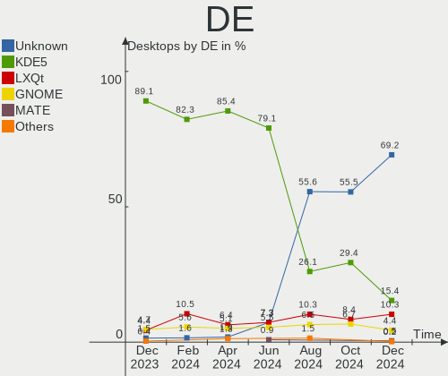
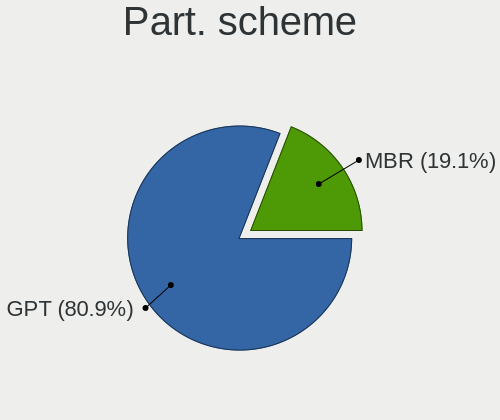
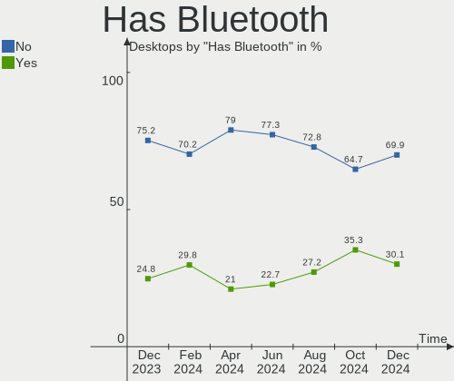
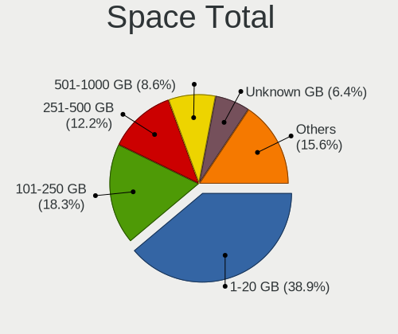
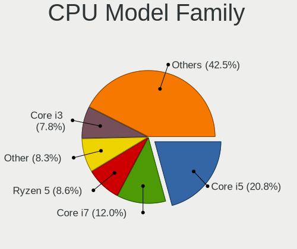
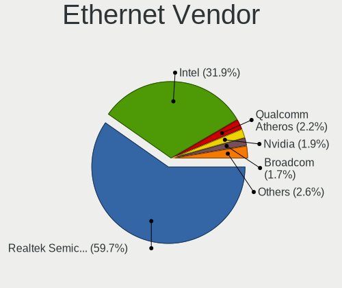

OpenMandriva - Hardware Trends (Desktops)
-----------------------------------------

A project to identify most popular hardware characteristics and track their change
over time based on data collected by Linux users at https://Linux-Hardware.org.

Anyone can contribute to this report by the [hw-probe](https://github.com/linuxhw/hw-probe) tool:

    sudo -E hw-probe -all -upload

This report is for one last month. Overall report since the beginning of time: [TestDays](https://github.com/linuxhw/TestDays)

Period: Dec, 2023.

Contents
--------

* [ System ](#system)
  - [ OS                       ](#os)
  - [ OS Family                ](#os-family)
  - [ Kernel                   ](#kernel)
  - [ Kernel Family            ](#kernel-family)
  - [ Kernel Major Ver.        ](#kernel-major-ver)
  - [ Arch                     ](#arch)
  - [ DE                       ](#de)
  - [ Display Server           ](#display-server)
  - [ Display Manager          ](#display-manager)
  - [ OS Lang                  ](#os-lang)
  - [ Boot Mode                ](#boot-mode)
  - [ Filesystem               ](#filesystem)
  - [ Part. scheme             ](#part-scheme)
  - [ Dual Boot with Linux/BSD ](#dual-boot-with-linuxbsd)
  - [ Dual Boot (Win)          ](#dual-boot-win)

* [ Board ](#board)
  - [ Vendor                   ](#vendor)
  - [ Model                    ](#model)
  - [ Model Family             ](#model-family)
  - [ MFG Year                 ](#mfg-year)
  - [ Form Factor              ](#form-factor)
  - [ Secure Boot              ](#secure-boot)
  - [ Coreboot                 ](#coreboot)
  - [ RAM Size                 ](#ram-size)
  - [ RAM Used                 ](#ram-used)
  - [ Total Drives             ](#total-drives)
  - [ Has CD-ROM               ](#has-cd-rom)
  - [ Has Ethernet             ](#has-ethernet)
  - [ Has WiFi                 ](#has-wifi)
  - [ Has Bluetooth            ](#has-bluetooth)

* [ Location ](#location)
  - [ Country                  ](#country)
  - [ City                     ](#city)

* [ Drives ](#drives)
  - [ Drive Vendor             ](#drive-vendor)
  - [ Drive Model              ](#drive-model)
  - [ HDD Vendor               ](#hdd-vendor)
  - [ SSD Vendor               ](#ssd-vendor)
  - [ Drive Kind               ](#drive-kind)
  - [ Drive Connector          ](#drive-connector)
  - [ Drive Size               ](#drive-size)
  - [ Space Total              ](#space-total)
  - [ Space Used               ](#space-used)
  - [ Malfunc. Drives          ](#malfunc-drives)
  - [ Malfunc. Drive Vendor    ](#malfunc-drive-vendor)
  - [ Malfunc. HDD Vendor      ](#malfunc-hdd-vendor)
  - [ Malfunc. Drive Kind      ](#malfunc-drive-kind)
  - [ Failed Drives            ](#failed-drives)
  - [ Failed Drive Vendor      ](#failed-drive-vendor)
  - [ Drive Status             ](#drive-status)

* [ Storage controller ](#storage-controller)
  - [ Storage Vendor           ](#storage-vendor)
  - [ Storage Model            ](#storage-model)
  - [ Storage Kind             ](#storage-kind)

* [ Processor ](#processor)
  - [ CPU Vendor               ](#cpu-vendor)
  - [ CPU Model                ](#cpu-model)
  - [ CPU Model Family         ](#cpu-model-family)
  - [ CPU Cores                ](#cpu-cores)
  - [ CPU Sockets              ](#cpu-sockets)
  - [ CPU Threads              ](#cpu-threads)
  - [ CPU Op-Modes             ](#cpu-op-modes)
  - [ CPU Microcode            ](#cpu-microcode)
  - [ CPU Microarch            ](#cpu-microarch)

* [ Graphics ](#graphics)
  - [ GPU Vendor               ](#gpu-vendor)
  - [ GPU Model                ](#gpu-model)
  - [ GPU Combo                ](#gpu-combo)
  - [ GPU Driver               ](#gpu-driver)
  - [ GPU Memory               ](#gpu-memory)

* [ Monitor ](#monitor)
  - [ Monitor Vendor           ](#monitor-vendor)
  - [ Monitor Model            ](#monitor-model)
  - [ Monitor Resolution       ](#monitor-resolution)
  - [ Monitor Diagonal         ](#monitor-diagonal)
  - [ Monitor Width            ](#monitor-width)
  - [ Aspect Ratio             ](#aspect-ratio)
  - [ Monitor Area             ](#monitor-area)
  - [ Pixel Density            ](#pixel-density)
  - [ Multiple Monitors        ](#multiple-monitors)

* [ Network ](#network)
  - [ Net Controller Vendor    ](#net-controller-vendor)
  - [ Net Controller Model     ](#net-controller-model)
  - [ Wireless Vendor          ](#wireless-vendor)
  - [ Wireless Model           ](#wireless-model)
  - [ Ethernet Vendor          ](#ethernet-vendor)
  - [ Ethernet Model           ](#ethernet-model)
  - [ Net Controller Kind      ](#net-controller-kind)
  - [ Used Controller          ](#used-controller)
  - [ NICs                     ](#nics)
  - [ IPv6                     ](#ipv6)

* [ Bluetooth ](#bluetooth)
  - [ Bluetooth Vendor         ](#bluetooth-vendor)
  - [ Bluetooth Model          ](#bluetooth-model)

* [ Sound ](#sound)
  - [ Sound Vendor             ](#sound-vendor)
  - [ Sound Model              ](#sound-model)

* [ Memory ](#memory)
  - [ Memory Vendor            ](#memory-vendor)
  - [ Memory Model             ](#memory-model)
  - [ Memory Kind              ](#memory-kind)
  - [ Memory Form Factor       ](#memory-form-factor)
  - [ Memory Size              ](#memory-size)
  - [ Memory Speed             ](#memory-speed)

* [ Printers & scanners ](#printers--scanners)
  - [ Printer Vendor           ](#printer-vendor)
  - [ Printer Model            ](#printer-model)
  - [ Scanner Vendor           ](#scanner-vendor)
  - [ Scanner Model            ](#scanner-model)

* [ Camera ](#camera)
  - [ Camera Vendor            ](#camera-vendor)
  - [ Camera Model             ](#camera-model)

* [ Security ](#security)
  - [ Fingerprint Vendor       ](#fingerprint-vendor)
  - [ Fingerprint Model        ](#fingerprint-model)
  - [ Chipcard Vendor          ](#chipcard-vendor)
  - [ Chipcard Model           ](#chipcard-model)

* [ Unsupported ](#unsupported)
  - [ Unsupported Devices      ](#unsupported-devices)
  - [ Unsupported Device Types ](#unsupported-device-types)

System
------

OS
--

Installed operating systems

| Name               | Desktops | Percent |
|--------------------|----------|---------|
| OpenMandriva 5.0   | 100      | 36.5%   |
| OpenMandriva 23.08 | 76       | 27.74%  |
| OpenMandriva 23.11 | 55       | 20.07%  |
| OpenMandriva 23.03 | 14       | 5.11%   |
| OpenMandriva 4.2   | 7        | 2.55%   |
| OpenMandriva 23.90 | 7        | 2.55%   |
| OpenMandriva 4.3   | 6        | 2.19%   |
| OpenMandriva 23.01 | 5        | 1.82%   |
| OpenMandriva 4.90  | 1        | 0.36%   |
| OpenMandriva 4.50  | 1        | 0.36%   |
| OpenMandriva 23.06 | 1        | 0.36%   |
| OpenMandriva 22.12 | 1        | 0.36%   |

OS Family
---------

OS without a version

| Name         | Desktops | Percent |
|--------------|----------|---------|
| OpenMandriva | 274      | 100%    |

Kernel
------

Version of the Linux kernel

| Version                      | Desktops | Percent |
|------------------------------|----------|---------|
| 6.6.2-desktop-1omv2390       | 149      | 54.38%  |
| 6.4.11-desktop-1omv2390      | 71       | 25.91%  |
| 6.2.6-desktop-1omv2390       | 14       | 5.11%   |
| 6.4.8-desktop-2omv2390       | 10       | 3.65%   |
| 5.10.14-desktop-1omv4002     | 7        | 2.55%   |
| 5.16.7-desktop-1omv4003      | 5        | 1.82%   |
| 6.1.1-desktop-1omv2290       | 4        | 1.46%   |
| 6.6.3-desktop-1omv2390       | 2        | 0.73%   |
| 6.6.1-desktop-1omv2390       | 2        | 0.73%   |
| 6.7.0-desktop-0.rc2.1omv2390 | 1        | 0.36%   |
| 6.6.6-desktop-1omv2390       | 1        | 0.36%   |
| 6.6.4-desktop-1omv2390       | 1        | 0.36%   |
| 6.6.2-desktop-gcc-1omv2390   | 1        | 0.36%   |
| 6.3.5-desktop-3omv2390       | 1        | 0.36%   |
| 6.2.1-desktop-1omv2390       | 1        | 0.36%   |
| 6.0.10-desktop-2omv22090     | 1        | 0.36%   |
| 5.18.12-desktop-3omv4090     | 1        | 0.36%   |
| 5.16.13-desktop-1omv4003     | 1        | 0.36%   |
| 5.14.14-desktop-1omv4050     | 1        | 0.36%   |

Kernel Family
-------------

Linux kernel without a distro release

| Version | Desktops | Percent |
|---------|----------|---------|
| 6.6.2   | 150      | 54.74%  |
| 6.4.11  | 71       | 25.91%  |
| 6.2.6   | 14       | 5.11%   |
| 6.4.8   | 10       | 3.65%   |
| 5.10.14 | 7        | 2.55%   |
| 5.16.7  | 5        | 1.82%   |
| 6.1.1   | 4        | 1.46%   |
| 6.6.3   | 2        | 0.73%   |
| 6.6.1   | 2        | 0.73%   |
| 6.7.0   | 1        | 0.36%   |
| 6.6.6   | 1        | 0.36%   |
| 6.6.4   | 1        | 0.36%   |
| 6.3.5   | 1        | 0.36%   |
| 6.2.1   | 1        | 0.36%   |
| 6.0.10  | 1        | 0.36%   |
| 5.18.12 | 1        | 0.36%   |
| 5.16.13 | 1        | 0.36%   |
| 5.14.14 | 1        | 0.36%   |

Kernel Major Ver.
-----------------

Linux kernel major version

| Version | Desktops | Percent |
|---------|----------|---------|
| 6.6     | 156      | 56.93%  |
| 6.4     | 81       | 29.56%  |
| 6.2     | 15       | 5.47%   |
| 5.10    | 7        | 2.55%   |
| 5.16    | 6        | 2.19%   |
| 6.1     | 4        | 1.46%   |
| 6.7     | 1        | 0.36%   |
| 6.3     | 1        | 0.36%   |
| 6.0     | 1        | 0.36%   |
| 5.18    | 1        | 0.36%   |
| 5.14    | 1        | 0.36%   |

Arch
----

OS architecture (x86_64, i586, etc.)

| Name   | Desktops | Percent |
|--------|----------|---------|
| x86_64 | 274      | 100%    |

DE
--

Desktop Environment

| Name     | Desktops | Percent |
|----------|----------|---------|
| KDE5     | 244      | 89.05%  |
| GNOME    | 13       | 4.74%   |
| LXQt     | 12       | 4.38%   |
| Unknown  | 4        | 1.46%   |
| Cinnamon | 1        | 0.36%   |

Display Server
--------------

X11 or Wayland

| Name    | Desktops | Percent |
|---------|----------|---------|
| Wayland | 235      | 85.77%  |
| X11     | 38       | 13.87%  |
| Unknown | 1        | 0.36%   |

Display Manager
---------------

SDDM, LightDM, etc.

| Name | Desktops | Percent |
|------|----------|---------|
| SDDM | 261      | 95.26%  |
| GDM  | 13       | 4.74%   |

OS Lang
-------

Language

| Lang  | Desktops | Percent |
|-------|----------|---------|
| en_US | 131      | 47.81%  |
| ru_RU | 19       | 6.93%   |
| pl_PL | 17       | 6.2%    |
| de_DE | 15       | 5.47%   |
| it_IT | 14       | 5.11%   |
| fr_FR | 11       | 4.01%   |
| es_ES | 11       | 4.01%   |
| pt_BR | 10       | 3.65%   |
| en_GB | 7        | 2.55%   |
| es_MX | 4        | 1.46%   |
| fr_CA | 3        | 1.09%   |
| es_CO | 3        | 1.09%   |
| en_CA | 3        | 1.09%   |
| cs_CZ | 3        | 1.09%   |
| tr_TR | 2        | 0.73%   |
| es_DO | 2        | 0.73%   |
| es_AR | 2        | 0.73%   |
| en_IN | 2        | 0.73%   |
| zh_TW | 1        | 0.36%   |
| sk_SK | 1        | 0.36%   |
| ro_RO | 1        | 0.36%   |
| nl_NL | 1        | 0.36%   |
| nb_NO | 1        | 0.36%   |
| ja_JP | 1        | 0.36%   |
| hu_HU | 1        | 0.36%   |
| es_CR | 1        | 0.36%   |
| es_CL | 1        | 0.36%   |
| es_BO | 1        | 0.36%   |
| en_SG | 1        | 0.36%   |
| en_IL | 1        | 0.36%   |
| en_HK | 1        | 0.36%   |
| en_AU | 1        | 0.36%   |
| ar_DZ | 1        | 0.36%   |

Boot Mode
---------

EFI or BIOS

| Mode | Desktops | Percent |
|------|----------|---------|
| EFI  | 146      | 53.28%  |
| BIOS | 128      | 46.72%  |

Filesystem
----------

Type of filesystem

| Type    | Desktops | Percent |
|---------|----------|---------|
| Ext4    | 146      | 53.28%  |
| Overlay | 113      | 41.24%  |
| Btrfs   | 7        | 2.55%   |
| Xfs     | 4        | 1.46%   |
| F2fs    | 2        | 0.73%   |
| Ext3    | 2        | 0.73%   |

Part. scheme
------------

Scheme of partitioning

| Type    | Desktops | Percent |
|---------|----------|---------|
| GPT     | 195      | 71.17%  |
| MBR     | 78       | 28.47%  |
| Unknown | 1        | 0.36%   |

Dual Boot with Linux/BSD
------------------------

Hosting more than one Linux/BSD

| Dual boot | Desktops | Percent |
|-----------|----------|---------|
| No        | 144      | 52.55%  |
| Yes       | 130      | 47.45%  |

Dual Boot (Win)
---------------

Hosting Linux and Windows

| Dual boot | Desktops | Percent |
|-----------|----------|---------|
| No        | 139      | 50.73%  |
| Yes       | 135      | 49.27%  |

Board
-----

Vendor
------

Motherboard manufacturer

| Name                | Desktops | Percent |
|---------------------|----------|---------|
| ASUSTek Computer    | 62       | 22.63%  |
| Gigabyte Technology | 39       | 14.23%  |
| Hewlett-Packard     | 37       | 13.5%   |
| MSI                 | 26       | 9.49%   |
| Dell                | 26       | 9.49%   |
| ASRock              | 17       | 6.2%    |
| Lenovo              | 15       | 5.47%   |
| Intel               | 12       | 4.38%   |
| Acer                | 8        | 2.92%   |
| Foxconn             | 6        | 2.19%   |
| Fujitsu             | 5        | 1.82%   |
| Pegatron            | 3        | 1.09%   |
| eMachines           | 2        | 0.73%   |
| ECS                 | 2        | 0.73%   |
| Biostar             | 2        | 0.73%   |
| AMI                 | 2        | 0.73%   |
| Unknown             | 2        | 0.73%   |
| Positivo            | 1        | 0.36%   |
| MouseComputer       | 1        | 0.36%   |
| Medion              | 1        | 0.36%   |
| MACHINIST           | 1        | 0.36%   |
| Lenovo Product      | 1        | 0.36%   |
| JUXIESHI            | 1        | 0.36%   |
| FIC                 | 1        | 0.36%   |
| Daten Tecnologia    | 1        | 0.36%   |

Model
-----

Motherboard model

| Name                          | Desktops | Percent |
|-------------------------------|----------|---------|
| ASUS All Series               | 6        | 2.19%   |
| Dell OptiPlex 7010            | 4        | 1.46%   |
| Intel H61                     | 3        | 1.09%   |
| Unknown                       | 3        | 1.09%   |
| MSI MS-7C56                   | 2        | 0.73%   |
| MSI MS-7B86                   | 2        | 0.73%   |
| MSI MS-7A38                   | 2        | 0.73%   |
| MSI MS-7693                   | 2        | 0.73%   |
| MSI MS-7680                   | 2        | 0.73%   |
| Intel X99                     | 2        | 0.73%   |
| HP Z200 Workstation           | 2        | 0.73%   |
| HP ProDesk 600 G2 DM          | 2        | 0.73%   |
| HP EliteDesk 800 G1 USDT      | 2        | 0.73%   |
| HP EliteDesk 800 G1 SFF       | 2        | 0.73%   |
| HP Compaq 8200 Elite SFF PC   | 2        | 0.73%   |
| Gigabyte GA-870A-UD3          | 2        | 0.73%   |
| Dell OptiPlex 780             | 2        | 0.73%   |
| Dell OptiPlex 380             | 2        | 0.73%   |
| Dell OptiPlex 3020            | 2        | 0.73%   |
| Dell OptiPlex 3010            | 2        | 0.73%   |
| ASUS SABERTOOTH 990FX R2.0    | 2        | 0.73%   |
| ASUS ROG STRIX B550-F GAMING  | 2        | 0.73%   |
| ASUS PRIME B550-PLUS          | 2        | 0.73%   |
| ASUS PRIME A320M-K            | 2        | 0.73%   |
| ASRock G41M-VS3               | 2        | 0.73%   |
| AMI Intel                     | 2        | 0.73%   |
| Positivo Positivo Master D380 | 1        | 0.36%   |
| Pegatron VC903AA-ABF p6145fr  | 1        | 0.36%   |
| Pegatron HPE-505cs            | 1        | 0.36%   |
| Pegatron 305-5139cn           | 1        | 0.36%   |
| MSI Pro 3130 Microtower PC    | 1        | 0.36%   |
| MSI MS-7D78                   | 1        | 0.36%   |
| MSI MS-7D67                   | 1        | 0.36%   |
| MSI MS-7D54                   | 1        | 0.36%   |
| MSI MS-7C94                   | 1        | 0.36%   |
| MSI MS-7C91                   | 1        | 0.36%   |
| MSI MS-7C02                   | 1        | 0.36%   |
| MSI MS-7B78                   | 1        | 0.36%   |
| MSI MS-7A34                   | 1        | 0.36%   |
| MSI MS-7903                   | 1        | 0.36%   |

Model Family
------------

Motherboard model prefix

| Name                 | Desktops | Percent |
|----------------------|----------|---------|
| Dell OptiPlex        | 19       | 6.93%   |
| ASUS PRIME           | 15       | 5.47%   |
| HP Compaq            | 11       | 4.01%   |
| Lenovo ThinkCentre   | 10       | 3.65%   |
| HP EliteDesk         | 8        | 2.92%   |
| ASUS ROG             | 6        | 2.19%   |
| ASUS All             | 6        | 2.19%   |
| HP ProDesk           | 5        | 1.82%   |
| Acer Aspire          | 5        | 1.82%   |
| Intel H61            | 4        | 1.46%   |
| ASUS M5A78L-M        | 4        | 1.46%   |
| Fujitsu ESPRIMO      | 3        | 1.09%   |
| Dell Inspiron        | 3        | 1.09%   |
| ASUS TUF             | 3        | 1.09%   |
| ASUS P8H61-M         | 3        | 1.09%   |
| Unknown              | 3        | 1.09%   |
| MSI MS-7C56          | 2        | 0.73%   |
| MSI MS-7B86          | 2        | 0.73%   |
| MSI MS-7A38          | 2        | 0.73%   |
| MSI MS-7693          | 2        | 0.73%   |
| MSI MS-7680          | 2        | 0.73%   |
| Lenovo IdeaCentre    | 2        | 0.73%   |
| Intel X99            | 2        | 0.73%   |
| HP Z200              | 2        | 0.73%   |
| HP Pavilion          | 2        | 0.73%   |
| Gigabyte X570        | 2        | 0.73%   |
| Gigabyte GA-870A-UD3 | 2        | 0.73%   |
| Gigabyte B550        | 2        | 0.73%   |
| Gigabyte B450        | 2        | 0.73%   |
| Dell Vostro          | 2        | 0.73%   |
| ASUS SABERTOOTH      | 2        | 0.73%   |
| ASUS M5A97           | 2        | 0.73%   |
| ASRock G41M-VS3      | 2        | 0.73%   |
| AMI Intel            | 2        | 0.73%   |
| Positivo Positivo    | 1        | 0.36%   |
| Pegatron VC903AA-ABF | 1        | 0.36%   |
| Pegatron HPE-505cs   | 1        | 0.36%   |
| Pegatron 305-5139cn  | 1        | 0.36%   |
| MSI Pro              | 1        | 0.36%   |
| MSI MS-7D78          | 1        | 0.36%   |

MFG Year
--------

Motherboard manufacture year

| Year | Desktops | Percent |
|------|----------|---------|
| 2013 | 27       | 9.85%   |
| 2012 | 27       | 9.85%   |
| 2011 | 27       | 9.85%   |
| 2010 | 21       | 7.66%   |
| 2020 | 20       | 7.3%    |
| 2014 | 20       | 7.3%    |
| 2019 | 17       | 6.2%    |
| 2018 | 17       | 6.2%    |
| 2017 | 15       | 5.47%   |
| 2009 | 15       | 5.47%   |
| 2015 | 13       | 4.74%   |
| 2021 | 11       | 4.01%   |
| 2016 | 10       | 3.65%   |
| 2023 | 9        | 3.28%   |
| 2022 | 9        | 3.28%   |
| 2007 | 8        | 2.92%   |
| 2008 | 4        | 1.46%   |
| 2006 | 3        | 1.09%   |
| 2005 | 1        | 0.36%   |

Form Factor
-----------

Physical design of the computer

| Name    | Desktops | Percent |
|---------|----------|---------|
| Desktop | 274      | 100%    |

Secure Boot
-----------

Enabled or disabled

| State    | Desktops | Percent |
|----------|----------|---------|
| Disabled | 274      | 100%    |

Coreboot
--------

Have coreboot on board

| Used | Desktops | Percent |
|------|----------|---------|
| No   | 274      | 100%    |

RAM Size
--------

Total RAM memory

| Size in GB  | Desktops | Percent |
|-------------|----------|---------|
| 8.01-16.0   | 66       | 24.09%  |
| 4.01-8.0    | 55       | 20.07%  |
| 16.01-24.0  | 53       | 19.34%  |
| 3.01-4.0    | 43       | 15.69%  |
| 32.01-64.0  | 35       | 12.77%  |
| 24.01-32.0  | 9        | 3.28%   |
| 64.01-256.0 | 7        | 2.55%   |
| 1.01-2.0    | 4        | 1.46%   |
| 2.01-3.0    | 1        | 0.36%   |
| 0.51-1.0    | 1        | 0.36%   |

RAM Used
--------

Used RAM memory

| Used GB  | Desktops | Percent |
|----------|----------|---------|
| 1.01-2.0 | 173      | 63.14%  |
| 2.01-3.0 | 56       | 20.44%  |
| 0.51-1.0 | 25       | 9.12%   |
| 3.01-4.0 | 7        | 2.55%   |
| 0.01-0.5 | 7        | 2.55%   |
| 4.01-8.0 | 6        | 2.19%   |

Total Drives
------------

Number of drives on board

| Drives | Desktops | Percent |
|--------|----------|---------|
| 1      | 126      | 45.99%  |
| 2      | 75       | 27.37%  |
| 3      | 42       | 15.33%  |
| 4      | 17       | 6.2%    |
| 6      | 5        | 1.82%   |
| 5      | 5        | 1.82%   |
| 0      | 2        | 0.73%   |
| 9      | 1        | 0.36%   |
| 8      | 1        | 0.36%   |

Has CD-ROM
----------

Has CD-ROM on board

| Presented | Desktops | Percent |
|-----------|----------|---------|
| Yes       | 143      | 52.19%  |
| No        | 131      | 47.81%  |

Has Ethernet
------------

Has Ethernet on board

| Presented | Desktops | Percent |
|-----------|----------|---------|
| Yes       | 268      | 97.81%  |
| No        | 6        | 2.19%   |

Has WiFi
--------

Has WiFi module

| Presented | Desktops | Percent |
|-----------|----------|---------|
| No        | 164      | 59.85%  |
| Yes       | 110      | 40.15%  |

Has Bluetooth
-------------

Has Bluetooth module

| Presented | Desktops | Percent |
|-----------|----------|---------|
| No        | 206      | 75.18%  |
| Yes       | 68       | 24.82%  |

Location
--------

Country
-------

Geographic location (country)

| Country            | Desktops | Percent |
|--------------------|----------|---------|
| USA                | 42       | 15.33%  |
| Poland             | 24       | 8.76%   |
| Russia             | 21       | 7.66%   |
| Germany            | 19       | 6.93%   |
| Italy              | 18       | 6.57%   |
| Brazil             | 18       | 6.57%   |
| France             | 12       | 4.38%   |
| Spain              | 11       | 4.01%   |
| Canada             | 9        | 3.28%   |
| Mexico             | 7        | 2.55%   |
| Japan              | 5        | 1.82%   |
| China              | 5        | 1.82%   |
| Sweden             | 4        | 1.46%   |
| Israel             | 4        | 1.46%   |
| Hungary            | 4        | 1.46%   |
| Czechia            | 4        | 1.46%   |
| Colombia           | 4        | 1.46%   |
| Belgium            | 4        | 1.46%   |
| UK                 | 3        | 1.09%   |
| Singapore          | 3        | 1.09%   |
| India              | 3        | 1.09%   |
| Greece             | 3        | 1.09%   |
| Australia          | 3        | 1.09%   |
| Ukraine            | 2        | 0.73%   |
| Turkey             | 2        | 0.73%   |
| Taiwan             | 2        | 0.73%   |
| Serbia             | 2        | 0.73%   |
| Romania            | 2        | 0.73%   |
| Portugal           | 2        | 0.73%   |
| Peru               | 2        | 0.73%   |
| Netherlands        | 2        | 0.73%   |
| Egypt              | 2        | 0.73%   |
| Dominican Republic | 2        | 0.73%   |
| Croatia            | 2        | 0.73%   |
| Chile              | 2        | 0.73%   |
| Argentina          | 2        | 0.73%   |
| Thailand           | 1        | 0.36%   |
| Switzerland        | 1        | 0.36%   |
| South Africa       | 1        | 0.36%   |
| Slovenia           | 1        | 0.36%   |

City
----

Geographic location (city)

| City              | Desktops | Percent |
|-------------------|----------|---------|
| Warsaw            | 6        | 2.19%   |
| Moscow            | 6        | 2.19%   |
| Citrus Heights    | 5        | 1.82%   |
| Munich            | 4        | 1.46%   |
| Singapore         | 3        | 1.09%   |
| Rome              | 3        | 1.09%   |
| Rio de Janeiro    | 3        | 1.09%   |
| Milan             | 3        | 1.09%   |
| Hemet             | 3        | 1.09%   |
| Dresden           | 3        | 1.09%   |
| Brasília         | 3        | 1.09%   |
| Begijnendijk      | 3        | 1.09%   |
| Barcelona         | 3        | 1.09%   |
| Wangen            | 2        | 0.73%   |
| Turin             | 2        | 0.73%   |
| Słupsk           | 2        | 0.73%   |
| Santiago          | 2        | 0.73%   |
| Perm              | 2        | 0.73%   |
| Oxie              | 2        | 0.73%   |
| Neptune City      | 2        | 0.73%   |
| Montreal          | 2        | 0.73%   |
| Lodz              | 2        | 0.73%   |
| Lisbon            | 2        | 0.73%   |
| Lima              | 2        | 0.73%   |
| Hickory           | 2        | 0.73%   |
| Cairo             | 2        | 0.73%   |
| Budapest          | 2        | 0.73%   |
| Bogotá           | 2        | 0.73%   |
| Athens            | 2        | 0.73%   |
| Zwartewaal        | 1        | 0.36%   |
| Zalaegerszeg      | 1        | 0.36%   |
| Zabrze            | 1        | 0.36%   |
| Yuzhno-Sakhalinsk | 1        | 0.36%   |
| Yogyakarta        | 1        | 0.36%   |
| Yakutsk           | 1        | 0.36%   |
| Wuhan             | 1        | 0.36%   |
| Wroclaw           | 1        | 0.36%   |
| Wolsztyn          | 1        | 0.36%   |
| Volos             | 1        | 0.36%   |
| Volgograd         | 1        | 0.36%   |

Drives
------

Drive Vendor
------------

Hard drive vendors

| Vendor              | Desktops | Drives | Percent |
|---------------------|----------|--------|---------|
| Seagate             | 82       | 104    | 17.75%  |
| WDC                 | 79       | 102    | 17.1%   |
| Samsung Electronics | 60       | 76     | 12.99%  |
| Kingston            | 43       | 47     | 9.31%   |
| Toshiba             | 19       | 20     | 4.11%   |
| Hitachi             | 19       | 20     | 4.11%   |
| Crucial             | 15       | 16     | 3.25%   |
| SanDisk             | 9        | 10     | 1.95%   |
| A-DATA Technology   | 9        | 10     | 1.95%   |
| SPCC                | 6        | 8      | 1.3%    |
| GOODRAM             | 6        | 6      | 1.3%    |
| Team                | 5        | 5      | 1.08%   |
| PNY                 | 5        | 5      | 1.08%   |
| Patriot             | 5        | 5      | 1.08%   |
| Micron Technology   | 5        | 5      | 1.08%   |
| Emtec               | 5        | 5      | 1.08%   |
| Unknown             | 4        | 4      | 0.87%   |
| JMicron Technology  | 4        | 4      | 0.87%   |
| HPQ                 | 4        | 4      | 0.87%   |
| China               | 4        | 5      | 0.87%   |
| Unknown             | 4        | 4      | 0.87%   |
| WALRAM              | 3        | 3      | 0.65%   |
| Verbatim            | 3        | 3      | 0.65%   |
| Netac               | 3        | 3      | 0.65%   |
| Corsair             | 3        | 3      | 0.65%   |
| SUNEAST             | 2        | 2      | 0.43%   |
| Phison              | 2        | 3      | 0.43%   |
| Lexar               | 2        | 2      | 0.43%   |
| KingSpec            | 2        | 2      | 0.43%   |
| Intel               | 2        | 2      | 0.43%   |
| Fanxiang            | 2        | 2      | 0.43%   |
| XrayDisk            | 1        | 2      | 0.22%   |
| XPG                 | 1        | 1      | 0.22%   |
| Vaseky              | 1        | 1      | 0.22%   |
| TSA                 | 1        | 1      | 0.22%   |
| Transcend           | 1        | 1      | 0.22%   |
| TO Exter            | 1        | 1      | 0.22%   |
| Timetec             | 1        | 1      | 0.22%   |
| tecmiyo             | 1        | 1      | 0.22%   |
| T-FORCE             | 1        | 1      | 0.22%   |

Drive Model
-----------

Hard drive models

| Model                            | Desktops | Percent |
|----------------------------------|----------|---------|
| Seagate ST500DM002-1BD142 500GB  | 12       | 2.29%   |
| Kingston SA400S37480G 480GB SSD  | 8        | 1.53%   |
| Kingston SA400S37240G 240GB SSD  | 7        | 1.34%   |
| Kingston SA400S37120G 120GB SSD  | 7        | 1.34%   |
| Toshiba DT01ACA050 500GB         | 6        | 1.15%   |
| Seagate ST2000DM001-1ER164 2TB   | 6        | 1.15%   |
| Seagate ST1000DM010-2EP102 1TB   | 6        | 1.15%   |
| Samsung SSD 870 EVO 500GB        | 6        | 1.15%   |
| Samsung SSD 860 EVO 250GB        | 5        | 0.96%   |
| Kingston SV300S37A120G 120GB SSD | 5        | 0.96%   |
| WDC WD10EZEX-08WN4A0 1TB         | 4        | 0.76%   |
| Seagate ST1000DM003-1ER162 1TB   | 4        | 0.76%   |
| HPQ BF450DASTK 450GB             | 4        | 0.76%   |
| Unknown                          | 4        | 0.76%   |
| WDC WDS500G2B0C-00PXH0 500GB     | 3        | 0.57%   |
| WDC WD5000AAKX-001CA0 500GB      | 3        | 0.57%   |
| WDC WD10EZRX-00L4HB0 1TB         | 3        | 0.57%   |
| Unknown SD/MMC/MS PRO 512GB      | 3        | 0.57%   |
| Toshiba DT01ACA200 2TB           | 3        | 0.57%   |
| Seagate ST500LT012-1DG142 500GB  | 3        | 0.57%   |
| Seagate ST3500418AS 500GB        | 3        | 0.57%   |
| Seagate ST1000DM003-9YN162 1TB   | 3        | 0.57%   |
| Samsung SSD 870 QVO 1TB          | 3        | 0.57%   |
| Samsung SSD 860 EVO 500GB        | 3        | 0.57%   |
| Samsung SSD 850 EVO 500GB        | 3        | 0.57%   |
| JMicron Generic 2TB              | 3        | 0.57%   |
| Hitachi HTS545025B9SA00 250GB    | 3        | 0.57%   |
| Crucial CT240BX500SSD1 240GB     | 3        | 0.57%   |
| Crucial CT120BX500SSD1 120GB     | 3        | 0.57%   |
| WDC WDS500G2B0A-00SM50 500GB SSD | 2        | 0.38%   |
| WDC WD5000BPVT-00HXZT1 500GB     | 2        | 0.38%   |
| WDC WD5000AAKX-75U6AA0 500GB     | 2        | 0.38%   |
| WDC WD5000AAKX-08U6AA0 500GB     | 2        | 0.38%   |
| WDC WD10JPVX-22JC3T0 1TB         | 2        | 0.38%   |
| WDC WD10EZEX-60WN4A1 1TB         | 2        | 0.38%   |
| WDC WD10EZEX-00WN4A0 1TB         | 2        | 0.38%   |
| Verbatim Vi550 S3 SSD 512GB      | 2        | 0.38%   |
| Toshiba HDWD130 3TB              | 2        | 0.38%   |
| Toshiba HDWD120 2TB              | 2        | 0.38%   |
| Toshiba HDWD110 1TB              | 2        | 0.38%   |

HDD Vendor
----------

Hard disk drive vendors

| Vendor              | Desktops | Drives | Percent |
|---------------------|----------|--------|---------|
| Seagate             | 80       | 102    | 37.74%  |
| WDC                 | 70       | 84     | 33.02%  |
| Hitachi             | 19       | 20     | 8.96%   |
| Toshiba             | 18       | 19     | 8.49%   |
| Samsung Electronics | 15       | 16     | 7.08%   |
| HPQ                 | 4        | 4      | 1.89%   |
| Unknown             | 3        | 3      | 1.42%   |
| TO Exter            | 1        | 1      | 0.47%   |
| Maxtor              | 1        | 1      | 0.47%   |
| KESU                | 1        | 1      | 0.47%   |

SSD Vendor
----------

Solid state drive vendors

| Vendor              | Desktops | Drives | Percent |
|---------------------|----------|--------|---------|
| Kingston            | 35       | 36     | 18.42%  |
| Samsung Electronics | 32       | 41     | 16.84%  |
| Crucial             | 11       | 12     | 5.79%   |
| WDC                 | 10       | 11     | 5.26%   |
| SPCC                | 6        | 7      | 3.16%   |
| SanDisk             | 6        | 7      | 3.16%   |
| GOODRAM             | 6        | 6      | 3.16%   |
| A-DATA Technology   | 6        | 7      | 3.16%   |
| Emtec               | 5        | 5      | 2.63%   |
| PNY                 | 4        | 4      | 2.11%   |
| Patriot             | 4        | 4      | 2.11%   |
| Micron Technology   | 4        | 4      | 2.11%   |
| China               | 4        | 5      | 2.11%   |
| Unknown             | 4        | 4      | 2.11%   |
| Verbatim            | 3        | 3      | 1.58%   |
| JMicron Technology  | 3        | 3      | 1.58%   |
| Team                | 2        | 2      | 1.05%   |
| SUNEAST             | 2        | 2      | 1.05%   |
| Netac               | 2        | 2      | 1.05%   |
| KingSpec            | 2        | 2      | 1.05%   |
| Intel               | 2        | 2      | 1.05%   |
| Fanxiang            | 2        | 2      | 1.05%   |
| XrayDisk            | 1        | 2      | 0.53%   |
| WALRAM              | 1        | 1      | 0.53%   |
| Vaseky              | 1        | 1      | 0.53%   |
| TSA                 | 1        | 1      | 0.53%   |
| Transcend           | 1        | 1      | 0.53%   |
| tecmiyo             | 1        | 1      | 0.53%   |
| T-FORCE             | 1        | 1      | 0.53%   |
| Smartbuy            | 1        | 1      | 0.53%   |
| SK hynix            | 1        | 1      | 0.53%   |
| POWER               | 1        | 1      | 0.53%   |
| PNY USB             | 1        | 1      | 0.53%   |
| OCZ                 | 1        | 1      | 0.53%   |
| NTC                 | 1        | 1      | 0.53%   |
| Mushkin             | 1        | 1      | 0.53%   |
| LITEONIT            | 1        | 1      | 0.53%   |
| LITEON              | 1        | 1      | 0.53%   |
| Lexar               | 1        | 1      | 0.53%   |
| Kingmax             | 1        | 1      | 0.53%   |

Drive Kind
----------

HDD or SSD

| Kind    | Desktops | Drives | Percent |
|---------|----------|--------|---------|
| HDD     | 171      | 251    | 44.42%  |
| SSD     | 151      | 208    | 39.22%  |
| NVMe    | 59       | 75     | 15.32%  |
| Unknown | 3        | 3      | 0.78%   |
| MMC     | 1        | 1      | 0.26%   |

Drive Connector
---------------

SATA, SAS, NVMe, etc.

| Type | Desktops | Drives | Percent |
|------|----------|--------|---------|
| SATA | 247      | 438    | 74.85%  |
| NVMe | 58       | 73     | 17.58%  |
| SAS  | 24       | 26     | 7.27%   |
| MMC  | 1        | 1      | 0.3%    |

Drive Size
----------

Size of hard drive

| Size in TB | Desktops | Drives | Percent |
|------------|----------|--------|---------|
| 0.01-0.5   | 198      | 279    | 58.24%  |
| 0.51-1.0   | 87       | 115    | 25.59%  |
| 1.01-2.0   | 34       | 41     | 10%     |
| 3.01-4.0   | 8        | 11     | 2.35%   |
| 2.01-3.0   | 8        | 8      | 2.35%   |
| 4.01-10.0  | 3        | 3      | 0.88%   |
| 10.01-20.0 | 2        | 2      | 0.59%   |

Space Total
-----------

Amount of disk space available on the file system

| Size in GB     | Desktops | Percent |
|----------------|----------|---------|
| 1-20           | 67       | 24.45%  |
| 101-250        | 64       | 23.36%  |
| 251-500        | 43       | 15.69%  |
| 21-50          | 22       | 8.03%   |
| 51-100         | 19       | 6.93%   |
| Unknown        | 19       | 6.93%   |
| 501-1000       | 18       | 6.57%   |
| 1001-2000      | 12       | 4.38%   |
| More than 3000 | 7        | 2.55%   |
| 2001-3000      | 3        | 1.09%   |

Space Used
----------

Amount of used disk space

| Used GB        | Desktops | Percent |
|----------------|----------|---------|
| 1-20           | 193      | 70.44%  |
| Unknown        | 19       | 6.93%   |
| 21-50          | 17       | 6.2%    |
| 101-250        | 14       | 5.11%   |
| 51-100         | 9        | 3.28%   |
| 251-500        | 6        | 2.19%   |
| 0              | 6        | 2.19%   |
| 501-1000       | 5        | 1.82%   |
| 1001-2000      | 3        | 1.09%   |
| More than 3000 | 1        | 0.36%   |
| 2001-3000      | 1        | 0.36%   |

Malfunc. Drives
---------------

Drive models with a malfunction

| Model                                 | Desktops | Drives | Percent |
|---------------------------------------|----------|--------|---------|
| Seagate ST500DM002-1BD142 500GB       | 7        | 7      | 7.07%   |
| WDC WD5000AAKX-001CA0 500GB           | 3        | 3      | 3.03%   |
| Toshiba DT01ACA050 500GB              | 3        | 3      | 3.03%   |
| Samsung Electronics SSD 870 EVO 500GB | 3        | 3      | 3.03%   |
| Seagate ST3500418AS 500GB             | 2        | 2      | 2.02%   |
| Seagate ST250DM000-1BD141 250GB       | 2        | 2      | 2.02%   |
| Seagate ST1000DM003-1ER162 1TB        | 2        | 4      | 2.02%   |
| WDC WD800JB-32JJC0 80GB               | 1        | 1      | 1.01%   |
| WDC WD6401AALS-00L3B2 640GB           | 1        | 1      | 1.01%   |
| WDC WD6400AAKS-22A7B2 640GB           | 1        | 1      | 1.01%   |
| WDC WD60EFRX-68MYMN1 6TB              | 1        | 1      | 1.01%   |
| WDC WD5002ABYS-02B1B0 500GB           | 1        | 1      | 1.01%   |
| WDC WD5000BPVT-00HXZT1 500GB          | 1        | 1      | 1.01%   |
| WDC WD5000AAVS-22G9B1 500GB           | 1        | 2      | 1.01%   |
| WDC WD5000AAKX-08U6AA0 500GB          | 1        | 1      | 1.01%   |
| WDC WD5000AAKX-07U6AA1 500GB          | 1        | 1      | 1.01%   |
| WDC WD5000AAKX-003CA0 500GB           | 1        | 1      | 1.01%   |
| WDC WD40EFRX-68WT0N0 4TB              | 1        | 1      | 1.01%   |
| WDC WD3200AAKS-61L9A0 320GB           | 1        | 1      | 1.01%   |
| WDC WD3200AAJS-56M0A0 320GB           | 1        | 1      | 1.01%   |
| WDC WD3200AAJS-00L7A0 320GB           | 1        | 1      | 1.01%   |
| WDC WD2500YS-01SHB1 256GB             | 1        | 1      | 1.01%   |
| WDC WD20PURZ-85GU6Y0 2TB              | 1        | 1      | 1.01%   |
| WDC WD20EFRX-68AX9N0 2TB              | 1        | 1      | 1.01%   |
| WDC WD1600AAJS-00YZCA0 160GB          | 1        | 1      | 1.01%   |
| WDC WD15EARS-00Z5B1 1TB               | 1        | 1      | 1.01%   |
| WDC WD10SPZX-08Z10 1TB                | 1        | 1      | 1.01%   |
| WDC WD10EZEX-60WN4A1 1TB              | 1        | 1      | 1.01%   |
| WDC WD10EZEX-00BN5A0 1TB              | 1        | 1      | 1.01%   |
| WDC WD10EURS-630AB1 1TB               | 1        | 1      | 1.01%   |
| WDC WD10EADS-65M2B0 1TB               | 1        | 1      | 1.01%   |
| WDC WD1002FAEX-00Y9A0 1TB             | 1        | 1      | 1.01%   |
| WDC WD Green 2.5 480GB                | 1        | 1      | 1.01%   |
| WDC WD Green 2.5 240GB SSD            | 1        | 1      | 1.01%   |
| WDC WD Blue SA510 2.5 1000GB SSD      | 1        | 1      | 1.01%   |
| Toshiba MQ01ABD050V 500GB             | 1        | 1      | 1.01%   |
| Toshiba MK3259GSXP 320GB              | 1        | 1      | 1.01%   |
| SUNEAST SE800 SSD 320GB               | 1        | 1      | 1.01%   |
| SPCC Solid State Disk 128GB           | 1        | 1      | 1.01%   |
| Seagate ST9500325AS 500GB             | 1        | 1      | 1.01%   |

Malfunc. Drive Vendor
---------------------

Vendors of faulty drives

| Vendor              | Desktops | Drives | Percent |
|---------------------|----------|--------|---------|
| Seagate             | 34       | 38     | 36.17%  |
| WDC                 | 28       | 32     | 29.79%  |
| Samsung Electronics | 12       | 12     | 12.77%  |
| Hitachi             | 7        | 8      | 7.45%   |
| Toshiba             | 5        | 5      | 5.32%   |
| Kingston            | 2        | 2      | 2.13%   |
| SUNEAST             | 1        | 1      | 1.06%   |
| SPCC                | 1        | 1      | 1.06%   |
| SanDisk             | 1        | 1      | 1.06%   |
| Netac               | 1        | 1      | 1.06%   |
| Maxtor              | 1        | 1      | 1.06%   |
| Hewlett-Packard     | 1        | 1      | 1.06%   |

Malfunc. HDD Vendor
-------------------

Vendors of faulty HDD drives

| Vendor              | Desktops | Drives | Percent |
|---------------------|----------|--------|---------|
| Seagate             | 34       | 38     | 43.04%  |
| WDC                 | 25       | 29     | 31.65%  |
| Samsung Electronics | 7        | 7      | 8.86%   |
| Hitachi             | 7        | 8      | 8.86%   |
| Toshiba             | 5        | 5      | 6.33%   |
| Maxtor              | 1        | 1      | 1.27%   |

Malfunc. Drive Kind
-------------------

Kinds of faulty drives

| Kind | Desktops | Drives | Percent |
|------|----------|--------|---------|
| HDD  | 74       | 88     | 83.15%  |
| SSD  | 13       | 13     | 14.61%  |
| NVMe | 2        | 2      | 2.25%   |

Failed Drives
-------------

Failed drive models

| Model                           | Desktops | Drives | Percent |
|---------------------------------|----------|--------|---------|
| Seagate ST3500418AS 500GB       | 1        | 1      | 50%     |
| Samsung Electronics HD103SJ 1TB | 1        | 1      | 50%     |

Failed Drive Vendor
-------------------

Failed drive vendors

| Vendor              | Desktops | Drives | Percent |
|---------------------|----------|--------|---------|
| Seagate             | 1        | 1      | 50%     |
| Samsung Electronics | 1        | 1      | 50%     |

Drive Status
------------

Number of failed and malfunc. drives

| Status   | Desktops | Drives | Percent |
|----------|----------|--------|---------|
| Works    | 235      | 410    | 68.31%  |
| Malfunc  | 86       | 103    | 25%     |
| Detected | 21       | 23     | 6.1%    |
| Failed   | 2        | 2      | 0.58%   |

Storage controller
------------------

Storage Vendor
--------------

Storage controller vendors

| Vendor                        | Desktops | Percent |
|-------------------------------|----------|---------|
| Intel                         | 176      | 48.75%  |
| AMD                           | 90       | 24.93%  |
| Samsung Electronics           | 17       | 4.71%   |
| Kingston Technology Company   | 11       | 3.05%   |
| Phison Electronics            | 9        | 2.49%   |
| SanDisk                       | 8        | 2.22%   |
| Marvell Technology Group      | 8        | 2.22%   |
| JMicron Technology            | 7        | 1.94%   |
| ASMedia Technology            | 7        | 1.94%   |
| Silicon Motion                | 5        | 1.39%   |
| Micron/Crucial Technology     | 4        | 1.11%   |
| VIA Technologies              | 2        | 0.55%   |
| Realtek Semiconductor         | 2        | 0.55%   |
| Nvidia                        | 2        | 0.55%   |
| MAXIO Technology (Hangzhou)   | 2        | 0.55%   |
| ADATA Technology              | 2        | 0.55%   |
| Toshiba America Info Systems  | 1        | 0.28%   |
| Shenzhen Longsys Electronics  | 1        | 0.28%   |
| Seagate Technology            | 1        | 0.28%   |
| Micron Technology             | 1        | 0.28%   |
| LSI Logic / Symbios Logic     | 1        | 0.28%   |
| KIOXIA                        | 1        | 0.28%   |
| Integrated Technology Express | 1        | 0.28%   |
| Broadcom / LSI                | 1        | 0.28%   |
| Biwin Storage Technology      | 1        | 0.28%   |

Storage Model
-------------

Storage controller models

| Model                                                                                   | Desktops | Percent |
|-----------------------------------------------------------------------------------------|----------|---------|
| AMD FCH SATA Controller [AHCI mode]                                                     | 36       | 8.2%    |
| Intel 6 Series/C200 Series Chipset Family 6 port Desktop SATA AHCI Controller           | 26       | 5.92%   |
| Intel 8 Series/C220 Series Chipset Family 6-port SATA Controller 1 [AHCI mode]          | 25       | 5.69%   |
| Intel 7 Series/C210 Series Chipset Family 6-port SATA Controller [AHCI mode]            | 16       | 3.64%   |
| AMD SB7x0/SB8x0/SB9x0 SATA Controller [AHCI mode]                                       | 16       | 3.64%   |
| AMD SB7x0/SB8x0/SB9x0 IDE Controller                                                    | 15       | 3.42%   |
| AMD 500 Series Chipset SATA Controller                                                  | 15       | 3.42%   |
| Intel NM10/ICH7 Family SATA Controller [IDE mode]                                       | 14       | 3.19%   |
| AMD 400 Series Chipset SATA Controller                                                  | 14       | 3.19%   |
| Intel 82801G (ICH7 Family) IDE Controller                                               | 12       | 2.73%   |
| Intel Q170/Q150/B150/H170/H110/Z170/CM236 Chipset SATA Controller [AHCI Mode]           | 11       | 2.51%   |
| Intel 200 Series PCH SATA controller [AHCI mode]                                        | 10       | 2.28%   |
| AMD SB7x0/SB8x0/SB9x0 SATA Controller [IDE mode]                                        | 9        | 2.05%   |
| Samsung NVMe SSD Controller SM981/PM981/PM983                                           | 8        | 1.82%   |
| Intel 6 Series/C200 Series Chipset Family Desktop SATA Controller (IDE mode, ports 4-5) | 8        | 1.82%   |
| Intel 6 Series/C200 Series Chipset Family Desktop SATA Controller (IDE mode, ports 0-3) | 8        | 1.82%   |
| Intel SATA Controller [RAID mode]                                                       | 7        | 1.59%   |
| Intel 5 Series/3400 Series Chipset 6 port SATA AHCI Controller                          | 6        | 1.37%   |
| AMD FCH SATA Controller D                                                               | 6        | 1.37%   |
| Samsung NVMe SSD Controller PM9A1/PM9A3/980PRO                                          | 5        | 1.14%   |
| JMicron JMB363 SATA/IDE Controller                                                      | 5        | 1.14%   |
| Intel Cannon Lake PCH SATA AHCI Controller                                              | 5        | 1.14%   |
| Intel Alder Lake-S PCH SATA Controller [AHCI Mode]                                      | 5        | 1.14%   |
| ASMedia ASM1062 Serial ATA Controller                                                   | 5        | 1.14%   |
| AMD 300 Series Chipset SATA Controller                                                  | 5        | 1.14%   |
| Silicon Motion SM2263EN/SM2263XT (DRAM-less) NVMe SSD Controllers                       | 4        | 0.91%   |
| Intel 400 Series Chipset Family SATA AHCI Controller                                    | 4        | 0.91%   |
| SanDisk Ultra 3D / WD Blue SN550 NVMe SSD                                               | 3        | 0.68%   |
| Samsung NVMe SSD Controller 980 (DRAM-less)                                             | 3        | 0.68%   |
| Phison PS5013-E13 PCIe3 NVMe Controller (DRAM-less)                                     | 3        | 0.68%   |
| Phison E16 PCIe4 NVMe Controller                                                        | 3        | 0.68%   |
| Kingston Company KC3000/FURY Renegade NVMe SSD E18                                      | 3        | 0.68%   |
| Kingston Company A2000 NVMe SSD SM2263EN                                                | 3        | 0.68%   |
| Intel 9 Series Chipset Family SATA Controller [AHCI Mode]                               | 3        | 0.68%   |
| Intel 82801JI (ICH10 Family) SATA AHCI Controller                                       | 3        | 0.68%   |
| Intel 82801JD/DO (ICH10 Family) SATA AHCI Controller                                    | 3        | 0.68%   |
| AMD FCH IDE Controller                                                                  | 3        | 0.68%   |
| Samsung NVMe SSD Controller SM961/PM961/SM963                                           | 2        | 0.46%   |
| Phison E12 NVMe Controller                                                              | 2        | 0.46%   |
| Nvidia MCP61 SATA Controller                                                            | 2        | 0.46%   |

Storage Kind
------------

Kind of storage controller (IDE, SATA, NVMe, SAS, ...)

| Kind | Desktops | Percent |
|------|----------|---------|
| SATA | 221      | 61.39%  |
| IDE  | 65       | 18.06%  |
| NVMe | 57       | 15.83%  |
| RAID | 16       | 4.44%   |
| SAS  | 1        | 0.28%   |

Processor
---------

CPU Vendor
----------

Processor vendors

| Vendor | Desktops | Percent |
|--------|----------|---------|
| Intel  | 180      | 65.69%  |
| AMD    | 94       | 34.31%  |

CPU Model
---------

Processor models

| Model                                  | Desktops | Percent |
|----------------------------------------|----------|---------|
| Intel Core i5-4570 CPU @ 3.20GHz       | 7        | 2.55%   |
| Intel Core i5-3470 CPU @ 3.20GHz       | 7        | 2.55%   |
| Intel Core i3-2120 CPU @ 3.30GHz       | 5        | 1.82%   |
| Intel Core i3-2100 CPU @ 3.10GHz       | 5        | 1.82%   |
| Intel Core i7-4790 CPU @ 3.60GHz       | 4        | 1.46%   |
| Intel Core i7-3770 CPU @ 3.40GHz       | 4        | 1.46%   |
| Intel Core 2 Duo CPU E8400 @ 3.00GHz   | 4        | 1.46%   |
| AMD Ryzen 7 5800X 8-Core Processor     | 4        | 1.46%   |
| AMD Ryzen 5 5600G with Radeon Graphics | 4        | 1.46%   |
| AMD Ryzen 5 3600 6-Core Processor      | 4        | 1.46%   |
| AMD FX-6300 Six-Core Processor         | 4        | 1.46%   |
| Intel Core i7-6700 CPU @ 3.40GHz       | 3        | 1.09%   |
| Intel Core i7-2600 CPU @ 3.40GHz       | 3        | 1.09%   |
| Intel Core i5-7400 CPU @ 3.00GHz       | 3        | 1.09%   |
| Intel Core i5-4590S CPU @ 3.00GHz      | 3        | 1.09%   |
| Intel Core i5 CPU 650 @ 3.20GHz        | 3        | 1.09%   |
| Intel Core i3-3240 CPU @ 3.40GHz       | 3        | 1.09%   |
| Intel Core 2 Duo CPU E7500 @ 2.93GHz   | 3        | 1.09%   |
| AMD Ryzen 9 3900X 12-Core Processor    | 3        | 1.09%   |
| AMD Ryzen 5 5600 6-Core Processor      | 3        | 1.09%   |
| AMD FX-8350 Eight-Core Processor       | 3        | 1.09%   |
| AMD FX-6100 Six-Core Processor         | 3        | 1.09%   |
| AMD Athlon II X2 250 Processor         | 3        | 1.09%   |
| Intel Pentium CPU G2030 @ 3.00GHz      | 2        | 0.73%   |
| Intel Core i7-8700 CPU @ 3.20GHz       | 2        | 0.73%   |
| Intel Core i7-7700 CPU @ 3.60GHz       | 2        | 0.73%   |
| Intel Core i7-3770K CPU @ 3.50GHz      | 2        | 0.73%   |
| Intel Core i5-9400F CPU @ 2.90GHz      | 2        | 0.73%   |
| Intel Core i5-4590 CPU @ 3.30GHz       | 2        | 0.73%   |
| Intel Core i5-2500K CPU @ 3.30GHz      | 2        | 0.73%   |
| Intel Core i5-2500 CPU @ 3.30GHz       | 2        | 0.73%   |
| Intel Core i5-2400 CPU @ 3.10GHz       | 2        | 0.73%   |
| Intel Core i5-10400 CPU @ 2.90GHz      | 2        | 0.73%   |
| Intel Core i5 CPU 760 @ 2.80GHz        | 2        | 0.73%   |
| Intel Core i3-4160 CPU @ 3.60GHz       | 2        | 0.73%   |
| Intel Core i3-3220 CPU @ 3.30GHz       | 2        | 0.73%   |
| Intel Core i3-10100 CPU @ 3.60GHz      | 2        | 0.73%   |
| Intel Core i3 CPU 560 @ 3.33GHz        | 2        | 0.73%   |
| Intel Core 2 Quad CPU Q8300 @ 2.50GHz  | 2        | 0.73%   |
| Intel Celeron CPU G3900T @ 2.60GHz     | 2        | 0.73%   |

CPU Model Family
----------------

Processor model prefix

| Model                   | Desktops | Percent |
|-------------------------|----------|---------|
| Intel Core i5           | 55       | 20.07%  |
| Intel Core i3           | 31       | 11.31%  |
| Intel Core i7           | 27       | 9.85%   |
| AMD Ryzen 5             | 22       | 8.03%   |
| Intel Xeon              | 15       | 5.47%   |
| AMD Ryzen 7             | 14       | 5.11%   |
| AMD FX                  | 14       | 5.11%   |
| Intel Celeron           | 12       | 4.38%   |
| Intel Core 2 Duo        | 11       | 4.01%   |
| Other                   | 8        | 2.92%   |
| AMD Ryzen 9             | 7        | 2.55%   |
| Intel Pentium           | 6        | 2.19%   |
| AMD Athlon II X2        | 5        | 1.82%   |
| Intel Pentium Dual-Core | 4        | 1.46%   |
| Intel Core 2 Quad       | 4        | 1.46%   |
| AMD Ryzen 3             | 4        | 1.46%   |
| AMD Phenom II X4        | 4        | 1.46%   |
| AMD A8                  | 4        | 1.46%   |
| AMD Athlon 64 X2        | 3        | 1.09%   |
| AMD A4                  | 3        | 1.09%   |
| AMD A10                 | 3        | 1.09%   |
| Intel Pentium 4         | 2        | 0.73%   |
| Intel Core 2            | 2        | 0.73%   |
| Intel Pentium Gold      | 1        | 0.36%   |
| Intel Pentium Dual      | 1        | 0.36%   |
| Intel Core i9           | 1        | 0.36%   |
| AMD Ryzen Threadripper  | 1        | 0.36%   |
| AMD Ryzen 3 PRO         | 1        | 0.36%   |
| AMD PRO A10             | 1        | 0.36%   |
| AMD Phenom II X2        | 1        | 0.36%   |
| AMD GX                  | 1        | 0.36%   |
| AMD E1                  | 1        | 0.36%   |
| AMD E                   | 1        | 0.36%   |
| AMD Athlon X4           | 1        | 0.36%   |
| AMD Athlon II X4        | 1        | 0.36%   |
| AMD Athlon Dual Core    | 1        | 0.36%   |
| AMD Athlon              | 1        | 0.36%   |

CPU Cores
---------

Number of processor cores

| Number | Desktops | Percent |
|--------|----------|---------|
| 4      | 110      | 40.15%  |
| 2      | 88       | 32.12%  |
| 6      | 30       | 10.95%  |
| 8      | 19       | 6.93%   |
| 3      | 7        | 2.55%   |
| 12     | 6        | 2.19%   |
| 16     | 4        | 1.46%   |
| 10     | 4        | 1.46%   |
| 14     | 3        | 1.09%   |
| 1      | 3        | 1.09%   |

CPU Sockets
-----------

Number of sockets

| Number | Desktops | Percent |
|--------|----------|---------|
| 1      | 273      | 99.64%  |
| 2      | 1        | 0.36%   |

CPU Threads
-----------

Threads per core (Hyper-Threading)

| Number | Desktops | Percent |
|--------|----------|---------|
| 2      | 152      | 55.47%  |
| 1      | 122      | 44.53%  |

CPU Op-Modes
------------

CPU Operation Modes (32-bit, 64-bit)

| Op mode        | Desktops | Percent |
|----------------|----------|---------|
| 32-bit, 64-bit | 274      | 100%    |

CPU Microcode
-------------

Microcode number

| Number     | Desktops | Percent |
|------------|----------|---------|
| Unknown    | 172      | 62.77%  |
| 0x0a20120a | 6        | 2.19%   |
| 0x08701030 | 6        | 2.19%   |
| 0x0800820d | 6        | 2.19%   |
| 0x06000822 | 5        | 1.82%   |
| 0x010000b6 | 5        | 1.82%   |
| 0x306c3    | 4        | 1.46%   |
| 0x1067a    | 4        | 1.46%   |
| 0x0a20120e | 4        | 1.46%   |
| 0x06001119 | 4        | 1.46%   |
| 0x010000c8 | 4        | 1.46%   |
| 0x206a7    | 3        | 1.09%   |
| 0x0a50000d | 3        | 1.09%   |
| 0x0a201025 | 3        | 1.09%   |
| 0x08701021 | 3        | 1.09%   |
| 0x08108109 | 3        | 1.09%   |
| 0x0a50000c | 2        | 0.73%   |
| 0x08101016 | 2        | 0.73%   |
| 0x06006705 | 2        | 0.73%   |
| 0x0600611a | 2        | 0.73%   |
| 0x06003106 | 2        | 0.73%   |
| 0x0600081c | 2        | 0.73%   |
| 0x06000629 | 2        | 0.73%   |
| 0xa0653    | 1        | 0.36%   |
| 0x406c4    | 1        | 0.36%   |
| 0x306a9    | 1        | 0.36%   |
| 0x0a601206 | 1        | 0.36%   |
| 0x0a601203 | 1        | 0.36%   |
| 0x0a404102 | 1        | 0.36%   |
| 0x0a201205 | 1        | 0.36%   |
| 0x0a201016 | 1        | 0.36%   |
| 0x08600106 | 1        | 0.36%   |
| 0x08600103 | 1        | 0.36%   |
| 0x08008206 | 1        | 0.36%   |
| 0x08001138 | 1        | 0.36%   |
| 0x08001137 | 1        | 0.36%   |
| 0x08001129 | 1        | 0.36%   |
| 0x07030105 | 1        | 0.36%   |
| 0x0700010b | 1        | 0.36%   |
| 0x06001116 | 1        | 0.36%   |

CPU Microarch
-------------

Microarchitecture

| Name             | Desktops | Percent |
|------------------|----------|---------|
| Haswell          | 34       | 12.41%  |
| IvyBridge        | 28       | 10.22%  |
| SandyBridge      | 25       | 9.12%   |
| Penryn           | 21       | 7.66%   |
| Zen 3            | 20       | 7.3%    |
| KabyLake         | 18       | 6.57%   |
| Piledriver       | 14       | 5.11%   |
| Zen 2            | 11       | 4.01%   |
| K10              | 11       | 4.01%   |
| Zen+             | 10       | 3.65%   |
| Westmere         | 9        | 3.28%   |
| Skylake          | 9        | 3.28%   |
| CometLake        | 7        | 2.55%   |
| Zen              | 6        | 2.19%   |
| Nehalem          | 6        | 2.19%   |
| Alderlake Hybrid | 6        | 2.19%   |
| Bulldozer        | 5        | 1.82%   |
| K8 Hammer        | 4        | 1.46%   |
| Excavator        | 4        | 1.46%   |
| Core             | 4        | 1.46%   |
| Silvermont       | 3        | 1.09%   |
| Broadwell        | 3        | 1.09%   |
| Unknown          | 3        | 1.09%   |
| Steamroller      | 2        | 0.73%   |
| NetBurst         | 2        | 0.73%   |
| Icelake          | 2        | 0.73%   |
| Tremont          | 1        | 0.36%   |
| Puma             | 1        | 0.36%   |
| K10 Llano        | 1        | 0.36%   |
| Jaguar           | 1        | 0.36%   |
| Goldmont plus    | 1        | 0.36%   |
| Goldmont         | 1        | 0.36%   |
| Bobcat           | 1        | 0.36%   |

Graphics
--------

GPU Vendor
----------

Vendors of graphics cards

| Vendor                               | Desktops | Percent |
|--------------------------------------|----------|---------|
| Intel                                | 108      | 37.89%  |
| Nvidia                               | 88       | 30.88%  |
| AMD                                  | 87       | 30.53%  |
| NVidia / SGS Thomson (Joint Venture) | 2        | 0.7%    |

GPU Model
---------

Graphics card models

| Model                                                                       | Desktops | Percent |
|-----------------------------------------------------------------------------|----------|---------|
| Intel Xeon E3-1200 v3/4th Gen Core Processor Integrated Graphics Controller | 21       | 7.27%   |
| Intel 2nd Generation Core Processor Family Integrated Graphics Controller   | 16       | 5.54%   |
| Intel Xeon E3-1200 v2/3rd Gen Core processor Graphics Controller            | 13       | 4.5%    |
| AMD Cedar [Radeon HD 5000/6000/7350/8350 Series]                            | 10       | 3.46%   |
| Intel 4 Series Chipset Integrated Graphics Controller                       | 9        | 3.11%   |
| Intel HD Graphics 530                                                       | 6        | 2.08%   |
| AMD Navi 23 [Radeon RX 6600/6600 XT/6600M]                                  | 6        | 2.08%   |
| AMD Ellesmere [Radeon RX 470/480/570/570X/580/580X/590]                     | 6        | 2.08%   |
| Nvidia GP107 [GeForce GTX 1050 Ti]                                          | 5        | 1.73%   |
| Intel CoffeeLake-S GT2 [UHD Graphics 630]                                   | 5        | 1.73%   |
| Nvidia TU117 [GeForce GTX 1650]                                             | 4        | 1.38%   |
| Nvidia GT218 [GeForce 210]                                                  | 4        | 1.38%   |
| Nvidia GP106 [GeForce GTX 1060 3GB]                                         | 4        | 1.38%   |
| Nvidia GK208B [GeForce GT 710]                                              | 4        | 1.38%   |
| Intel CometLake-S GT2 [UHD Graphics 630]                                    | 4        | 1.38%   |
| Intel 4th Generation Core Processor Family Integrated Graphics Controller   | 4        | 1.38%   |
| AMD Cezanne [Radeon Vega Series / Radeon Vega Mobile Series]                | 4        | 1.38%   |
| AMD Caicos [Radeon HD 6450/7450/8450 / R5 230 OEM]                          | 4        | 1.38%   |
| Nvidia GK208B [GeForce GT 730]                                              | 3        | 1.04%   |
| Nvidia GA106 [GeForce RTX 3060 Lite Hash Rate]                              | 3        | 1.04%   |
| Intel HD Graphics 630                                                       | 3        | 1.04%   |
| Intel Core Processor Integrated Graphics Controller                         | 3        | 1.04%   |
| Intel AlderLake-S GT1                                                       | 3        | 1.04%   |
| AMD Picasso/Raven 2 [Radeon Vega Series / Radeon Vega Mobile Series]        | 3        | 1.04%   |
| AMD Navi 32 [Radeon RX 7700 XT / 7800 XT]                                   | 3        | 1.04%   |
| AMD Navi 22 [Radeon RX 6700/6700 XT/6750 XT / 6800M/6850M XT]               | 3        | 1.04%   |
| AMD Navi 10 [Radeon RX 5600 OEM/5600 XT / 5700/5700 XT]                     | 3        | 1.04%   |
| AMD Baffin [Radeon RX 460/560D / Pro 450/455/460/555/555X/560/560X]         | 3        | 1.04%   |
| Nvidia TU116 [GeForce GTX 1660]                                             | 2        | 0.69%   |
| Nvidia TU116 [GeForce GTX 1660 SUPER]                                       | 2        | 0.69%   |
| Nvidia GP108 [GeForce GT 1030]                                              | 2        | 0.69%   |
| Nvidia GP106 [GeForce GTX 1060 6GB]                                         | 2        | 0.69%   |
| Nvidia GM206 [GeForce GTX 950]                                              | 2        | 0.69%   |
| Nvidia GM204 [GeForce GTX 970]                                              | 2        | 0.69%   |
| Nvidia GM107 [GeForce GTX 750 Ti]                                           | 2        | 0.69%   |
| Nvidia GK107GL [Quadro K600]                                                | 2        | 0.69%   |
| Nvidia GK107 [GeForce GTX 650]                                              | 2        | 0.69%   |
| Nvidia GF106 [GeForce GTS 450]                                              | 2        | 0.69%   |
| Nvidia GA104 [GeForce RTX 3070 Ti]                                          | 2        | 0.69%   |
| Nvidia GA104 [GeForce RTX 3070 Lite Hash Rate]                              | 2        | 0.69%   |

GPU Combo
---------

Combinations of graphics cards

| Name                                          | Desktops | Percent |
|-----------------------------------------------|----------|---------|
| 1 x Intel                                     | 92       | 33.58%  |
| 1 x Nvidia                                    | 80       | 29.2%   |
| 1 x AMD                                       | 80       | 29.2%   |
| Intel + Nvidia                                | 7        | 2.55%   |
| 2 x Intel                                     | 6        | 2.19%   |
| 2 x AMD                                       | 4        | 1.46%   |
| Intel + AMD                                   | 3        | 1.09%   |
| 1 x NVidia / SGS Thomson (Joint Venture)      | 1        | 0.36%   |
| Nvidia + NVidia / SGS Thomson (Joint Venture) | 1        | 0.36%   |

GPU Driver
----------

Free vs proprietary

| Driver      | Desktops | Percent |
|-------------|----------|---------|
| Free        | 268      | 97.81%  |
| Unknown     | 4        | 1.46%   |
| Proprietary | 2        | 0.73%   |

GPU Memory
----------

Total video memory

| Size in GB | Desktops | Percent |
|------------|----------|---------|
| Unknown    | 103      | 37.59%  |
| 1.01-2.0   | 35       | 12.77%  |
| 0.51-1.0   | 35       | 12.77%  |
| 0.01-0.5   | 33       | 12.04%  |
| 3.01-4.0   | 26       | 9.49%   |
| 7.01-8.0   | 18       | 6.57%   |
| 8.01-16.0  | 10       | 3.65%   |
| 5.01-6.0   | 9        | 3.28%   |
| 2.01-3.0   | 5        | 1.82%   |

Monitor
-------

Monitor Vendor
--------------

Monitor vendors

| Vendor               | Desktops | Percent |
|----------------------|----------|---------|
| Samsung Electronics  | 46       | 17.16%  |
| Dell                 | 34       | 12.69%  |
| Goldstar             | 30       | 11.19%  |
| Acer                 | 23       | 8.58%   |
| Hewlett-Packard      | 21       | 7.84%   |
| AOC                  | 13       | 4.85%   |
| Philips              | 12       | 4.48%   |
| NEC Computers        | 8        | 2.99%   |
| Sony                 | 6        | 2.24%   |
| BenQ                 | 6        | 2.24%   |
| ASUSTek Computer     | 6        | 2.24%   |
| ViewSonic            | 5        | 1.87%   |
| Lenovo               | 5        | 1.87%   |
| Iiyama               | 5        | 1.87%   |
| Ancor Communications | 5        | 1.87%   |
| Sharp                | 4        | 1.49%   |
| Packard Bell         | 3        | 1.12%   |
| MSI                  | 3        | 1.12%   |
| Unknown (XXX)        | 2        | 0.75%   |
| RTK                  | 2        | 0.75%   |
| HUAWEI               | 2        | 0.75%   |
| Gigabyte Technology  | 2        | 0.75%   |
| GDH                  | 2        | 0.75%   |
| Fujitsu Siemens      | 2        | 0.75%   |
| Denver               | 2        | 0.75%   |
| Vestel Elektronik    | 1        | 0.37%   |
| Unknown              | 1        | 0.37%   |
| Toshiba              | 1        | 0.37%   |
| STA                  | 1        | 0.37%   |
| Roku                 | 1        | 0.37%   |
| RGT                  | 1        | 0.37%   |
| Panasonic            | 1        | 0.37%   |
| OEM                  | 1        | 0.37%   |
| MStar                | 1        | 0.37%   |
| Medion               | 1        | 0.37%   |
| KUP                  | 1        | 0.37%   |
| JCH                  | 1        | 0.37%   |
| HKK                  | 1        | 0.37%   |
| Eizo                 | 1        | 0.37%   |
| DWL                  | 1        | 0.37%   |

Monitor Model
-------------

Monitor models

| Model                                                                  | Desktops | Percent |
|------------------------------------------------------------------------|----------|---------|
| AOC 27G2G4 AOC2702 1920x1080 598x336mm 27.0-inch                       | 5        | 1.86%   |
| NEC Computers EA244WMi NEC68D6 1920x1200 519x324mm 24.1-inch           | 3        | 1.12%   |
| Sharp HDMI SHP4192 1920x1080 708x398mm 32.0-inch                       | 2        | 0.74%   |
| Philips 244E PHLC036 1920x1080 521x293mm 23.5-inch                     | 2        | 0.74%   |
| HUAWEI AD80HW HWV2402 1920x1080 527x296mm 23.8-inch                    | 2        | 0.74%   |
| Goldstar W2252 GSM567D 1920x1080 474x296mm 22.0-inch                   | 2        | 0.74%   |
| Goldstar LG Ultra HD GSM5B09 3840x2160 600x340mm 27.2-inch             | 2        | 0.74%   |
| Goldstar E2350 GSM5791 1920x1080 510x290mm 23.1-inch                   | 2        | 0.74%   |
| Dell P2312H DEL4077 1920x1080 510x287mm 23.0-inch                      | 2        | 0.74%   |
| Dell P2219H DELA115 1920x1080 476x267mm 21.5-inch                      | 2        | 0.74%   |
| Dell D2015H DELF063 1920x1080 440x240mm 19.7-inch                      | 2        | 0.74%   |
| Acer K222HQL ACR03E1 1920x1080 477x268mm 21.5-inch                     | 2        | 0.74%   |
| Acer G246HL ACR02FF 1920x1080 531x299mm 24.0-inch                      | 2        | 0.74%   |
| Acer AL1716A ACRAD46 1280x1024 338x270mm 17.0-inch                     | 2        | 0.74%   |
| ViewSonic XG2703-GS VSCBA32 2560x1440 598x336mm 27.0-inch              | 1        | 0.37%   |
| ViewSonic VX2370 SERIES VSC342C 1920x1080 509x286mm 23.0-inch          | 1        | 0.37%   |
| ViewSonic VA2447-FHD VSC303B 1920x1080 527x296mm 23.8-inch             | 1        | 0.37%   |
| ViewSonic VA2055 Series VSC3C31 1920x1080 435x239mm 19.5-inch          | 1        | 0.37%   |
| ViewSonic VA2012wSERIES VSC6A1C 1680x1050 433x271mm 20.1-inch          | 1        | 0.37%   |
| Vestel Elektronik 55UHD_LCD_TV VES3700 3840x2160 1872x1053mm 84.6-inch | 1        | 0.37%   |
| Unknown LCD Monitor FFFF 2288x1287 2550x2550mm 142.0-inch              | 1        | 0.37%   |
| Unknown (XXX) Union TV XXX2841 1920x1080 1209x680mm 54.6-inch          | 1        | 0.37%   |
| Unknown (XXX) GH-JEF223SH-L XXX44C6 1680x1050 480x270mm 21.7-inch      | 1        | 0.37%   |
| Toshiba FG780-FK LCDE780 1280x1024 340x270mm 17.1-inch                 | 1        | 0.37%   |
| STA SEMP LEDTV STA0030 1920x1080 708x398mm 32.0-inch                   | 1        | 0.37%   |
| Sony TV SNYDC02 1920x1080 708x398mm 32.0-inch                          | 1        | 0.37%   |
| Sony TV SNYDB01 1920x1080                                              | 1        | 0.37%   |
| Sony TV SNY9B01 1360x768                                               | 1        | 0.37%   |
| Sony TV *00 SNY3F05 3840x2160 1882x1058mm 85.0-inch                    | 1        | 0.37%   |
| Sony PCVD-15XA1 SNY1A52 1024x768 304x228mm 15.0-inch                   | 1        | 0.37%   |
| Sony CPD-E220E SNY1770 1600x1200 312x234mm 15.4-inch                   | 1        | 0.37%   |
| Sharp LCD SHP0FFC 1600x1200                                            | 1        | 0.37%   |
| Sharp HDMI SHP1022 1920x1080 820x460mm 37.0-inch                       | 1        | 0.37%   |
| Samsung Electronics U32J59x SAM0F52 3840x2160 697x392mm 31.5-inch      | 1        | 0.37%   |
| Samsung Electronics U28E590 SAM0C4D 3840x2160 610x350mm 27.7-inch      | 1        | 0.37%   |
| Samsung Electronics T27C350 SAM0AC3 1920x1080 598x336mm 27.0-inch      | 1        | 0.37%   |
| Samsung Electronics T24C300 SAM0A9B 1920x1080 531x299mm 24.0-inch      | 1        | 0.37%   |
| Samsung Electronics SyncMaster SAM0656 1920x1080 510x287mm 23.0-inch   | 1        | 0.37%   |
| Samsung Electronics SyncMaster SAM05C8 1920x1080 521x293mm 23.5-inch   | 1        | 0.37%   |
| Samsung Electronics SyncMaster SAM058F 1920x1080 477x268mm 21.5-inch   | 1        | 0.37%   |

Monitor Resolution
------------------

Monitor screen resolution

| Resolution         | Desktops | Percent |
|--------------------|----------|---------|
| 1920x1080 (FHD)    | 137      | 52.09%  |
| 1280x1024 (SXGA)   | 29       | 11.03%  |
| 3840x2160 (4K)     | 22       | 8.37%   |
| 2560x1440 (QHD)    | 19       | 7.22%   |
| 1680x1050 (WSXGA+) | 17       | 6.46%   |
| 1600x900 (HD+)     | 7        | 2.66%   |
| 1366x768 (WXGA)    | 6        | 2.28%   |
| 1920x1200 (WUXGA)  | 5        | 1.9%    |
| 1440x900 (WXGA+)   | 5        | 1.9%    |
| 3440x1440          | 4        | 1.52%   |
| 1360x768           | 3        | 1.14%   |
| 2560x1080          | 2        | 0.76%   |
| 1920x540           | 2        | 0.76%   |
| 1024x768 (XGA)     | 2        | 0.76%   |
| 2560x1600          | 1        | 0.38%   |
| 2288x1287          | 1        | 0.38%   |
| 1600x1200          | 1        | 0.38%   |

Monitor Diagonal
----------------

Diagonal size in inches

| Inches  | Desktops | Percent |
|---------|----------|---------|
| 27      | 40       | 15.04%  |
| 23      | 40       | 15.04%  |
| 21      | 40       | 15.04%  |
| 24      | 26       | 9.77%   |
| 19      | 20       | 7.52%   |
| 17      | 17       | 6.39%   |
| 31      | 14       | 5.26%   |
| 22      | 12       | 4.51%   |
| 20      | 10       | 3.76%   |
| 34      | 5        | 1.88%   |
| 18      | 5        | 1.88%   |
| Unknown | 5        | 1.88%   |
| 32      | 4        | 1.5%    |
| 84      | 3        | 1.13%   |
| 15      | 3        | 1.13%   |
| 72      | 2        | 0.75%   |
| 54      | 2        | 0.75%   |
| 52      | 2        | 0.75%   |
| 46      | 2        | 0.75%   |
| 40      | 2        | 0.75%   |
| 37      | 2        | 0.75%   |
| 29      | 2        | 0.75%   |
| 142     | 1        | 0.38%   |
| 85      | 1        | 0.38%   |
| 49      | 1        | 0.38%   |
| 48      | 1        | 0.38%   |
| 43      | 1        | 0.38%   |
| 28      | 1        | 0.38%   |
| 25      | 1        | 0.38%   |
| 16      | 1        | 0.38%   |

Monitor Width
-------------

Physical width

| Width in mm    | Desktops | Percent |
|----------------|----------|---------|
| 501-600        | 102      | 38.64%  |
| 401-500        | 78       | 29.55%  |
| 301-350        | 21       | 7.95%   |
| 601-700        | 19       | 7.2%    |
| 351-400        | 10       | 3.79%   |
| 701-800        | 9        | 3.41%   |
| 1001-1500      | 8        | 3.03%   |
| 1501-2000      | 6        | 2.27%   |
| Unknown        | 5        | 1.89%   |
| 801-900        | 4        | 1.52%   |
| More than 2000 | 1        | 0.38%   |
| 901-1000       | 1        | 0.38%   |

Aspect Ratio
------------

Proportional relationship between the width and the height

| Ratio   | Desktops | Percent |
|---------|----------|---------|
| 16/9    | 186      | 71.54%  |
| 16/10   | 30       | 11.54%  |
| 5/4     | 27       | 10.38%  |
| 21/9    | 6        | 2.31%   |
| 4/3     | 5        | 1.92%   |
| 3/2     | 3        | 1.15%   |
| 32/9    | 1        | 0.38%   |
| 1.00    | 1        | 0.38%   |
| Unknown | 1        | 0.38%   |

Monitor Area
------------

Area in inch²

| Area in inch² | Desktops | Percent |
|----------------|----------|---------|
| 201-250        | 101      | 38.11%  |
| 301-350        | 41       | 15.47%  |
| 151-200        | 41       | 15.47%  |
| 351-500        | 25       | 9.43%   |
| 141-150        | 21       | 7.92%   |
| More than 1000 | 12       | 4.53%   |
| 501-1000       | 8        | 3.02%   |
| 251-300        | 7        | 2.64%   |
| Unknown        | 5        | 1.89%   |
| 101-110        | 2        | 0.75%   |
| 131-140        | 1        | 0.38%   |
| 111-120        | 1        | 0.38%   |

Pixel Density
-------------

Pixels per inch

| Density | Desktops | Percent |
|---------|----------|---------|
| 51-100  | 174      | 67.97%  |
| 101-120 | 58       | 22.66%  |
| 1-50    | 11       | 4.3%    |
| 121-160 | 5        | 1.95%   |
| Unknown | 5        | 1.95%   |
| 161-240 | 3        | 1.17%   |

Multiple Monitors
-----------------

Total monitors connected

| Total | Desktops | Percent |
|-------|----------|---------|
| 1     | 247      | 90.15%  |
| 2     | 16       | 5.84%   |
| 0     | 10       | 3.65%   |
| 3     | 1        | 0.36%   |

Network
-------

Net Controller Vendor
---------------------

Controller vendors

| Vendor                          | Desktops | Percent |
|---------------------------------|----------|---------|
| Realtek Semiconductor           | 181      | 50.42%  |
| Intel                           | 93       | 25.91%  |
| Qualcomm Atheros                | 21       | 5.85%   |
| Broadcom                        | 13       | 3.62%   |
| Ralink Technology               | 12       | 3.34%   |
| TP-Link                         | 7        | 1.95%   |
| Ralink                          | 4        | 1.11%   |
| Qualcomm Atheros Communications | 4        | 1.11%   |
| MediaTek                        | 4        | 1.11%   |
| Xiaomi                          | 2        | 0.56%   |
| Nvidia                          | 2        | 0.56%   |
| Marvell Technology Group        | 2        | 0.56%   |
| D-Link                          | 2        | 0.56%   |
| Aquantia                        | 2        | 0.56%   |
| VIA Technologies                | 1        | 0.28%   |
| Qualcomm                        | 1        | 0.28%   |
| NetGear                         | 1        | 0.28%   |
| Mercucys                        | 1        | 0.28%   |
| Emtec                           | 1        | 0.28%   |
| D-Link System                   | 1        | 0.28%   |
| BUFFALO                         | 1        | 0.28%   |
| Broadcom Limited                | 1        | 0.28%   |
| Belkin Components               | 1        | 0.28%   |
| ASIX Electronics                | 1        | 0.28%   |

Net Controller Model
--------------------

Controller models

| Model                                                                                | Desktops | Percent |
|--------------------------------------------------------------------------------------|----------|---------|
| Realtek RTL8111/8168/8411 PCI Express Gigabit Ethernet Controller                    | 138      | 33.58%  |
| Intel 82579LM Gigabit Network Connection (Lewisville)                                | 20       | 4.87%   |
| Realtek RTL8125 2.5GbE Controller                                                    | 18       | 4.38%   |
| Intel Ethernet Connection I217-LM                                                    | 12       | 2.92%   |
| Realtek RTL810xE PCI Express Fast Ethernet controller                                | 11       | 2.68%   |
| Intel I211 Gigabit Network Connection                                                | 9        | 2.19%   |
| Realtek 802.11ac NIC                                                                 | 8        | 1.95%   |
| Realtek RTL8188EUS 802.11n Wireless Network Adapter                                  | 7        | 1.7%    |
| Intel Wi-Fi 6 AX200                                                                  | 7        | 1.7%    |
| Intel Ethernet Connection (2) I219-V                                                 | 7        | 1.7%    |
| Realtek RTL88x2bu [AC1200 Techkey]                                                   | 6        | 1.46%   |
| Ralink MT7601U Wireless Adapter                                                      | 6        | 1.46%   |
| Realtek RTL8821CE 802.11ac PCIe Wireless Network Adapter                             | 5        | 1.22%   |
| Qualcomm Atheros AR8151 v2.0 Gigabit Ethernet                                        | 4        | 0.97%   |
| Intel Ethernet Controller I225-V                                                     | 4        | 0.97%   |
| Intel Ethernet Connection I217-V                                                     | 4        | 0.97%   |
| Intel Ethernet Connection (2) I219-LM                                                | 4        | 0.97%   |
| Intel 82567LM-3 Gigabit Network Connection                                           | 4        | 0.97%   |
| Realtek RTL8188FTV 802.11b/g/n 1T1R 2.4G WLAN Adapter                                | 3        | 0.73%   |
| Realtek RTL-8100/8101L/8139 PCI Fast Ethernet Adapter                                | 3        | 0.73%   |
| Ralink RT2870/RT3070 Wireless Adapter                                                | 3        | 0.73%   |
| Ralink RT3090 Wireless 802.11n 1T/1R PCIe                                            | 3        | 0.73%   |
| Qualcomm Atheros AR8152 v2.0 Fast Ethernet                                           | 3        | 0.73%   |
| Intel Wi-Fi 6 AX210/AX211/AX411 160MHz                                               | 3        | 0.73%   |
| Intel Dual Band Wireless-AC 3168NGW [Stone Peak]                                     | 3        | 0.73%   |
| Intel Alder Lake-S PCH CNVi WiFi                                                     | 3        | 0.73%   |
| Intel 82578DM Gigabit Network Connection                                             | 3        | 0.73%   |
| Broadcom NetXtreme BCM5761 Gigabit Ethernet PCIe                                     | 3        | 0.73%   |
| TP-Link TL-WN823N v2/v3 [Realtek RTL8192EU]                                          | 2        | 0.49%   |
| TP-Link AC600 wireless Realtek RTL8811AU [Archer T2U Nano]                           | 2        | 0.49%   |
| Realtek RTL8852BE PCIe 802.11ax Wireless Network Controller                          | 2        | 0.49%   |
| Realtek RTL8192EE PCIe Wireless Network Adapter                                      | 2        | 0.49%   |
| Realtek RTL8169 PCI Gigabit Ethernet Controller                                      | 2        | 0.49%   |
| Realtek RTL8153 Gigabit Ethernet Adapter                                             | 2        | 0.49%   |
| Realtek RTL-8110SC/8169SC Gigabit Ethernet                                           | 2        | 0.49%   |
| Qualcomm Atheros QCA9565 / AR9565 Wireless Network Adapter                           | 2        | 0.49%   |
| Qualcomm Atheros QCA9377 802.11ac Wireless Network Adapter                           | 2        | 0.49%   |
| Qualcomm Atheros Killer E220x Gigabit Ethernet Controller                            | 2        | 0.49%   |
| Qualcomm Atheros TP-Link TL-WN821N v3 / TL-WN822N v2 802.11n [Atheros AR7010+AR9287] | 2        | 0.49%   |
| Qualcomm Atheros AR9271 802.11n                                                      | 2        | 0.49%   |

Wireless Vendor
---------------

Wireless vendors

| Vendor                          | Desktops | Percent |
|---------------------------------|----------|---------|
| Realtek Semiconductor           | 40       | 35.09%  |
| Intel                           | 25       | 21.93%  |
| Ralink Technology               | 12       | 10.53%  |
| Qualcomm Atheros                | 9        | 7.89%   |
| TP-Link                         | 7        | 6.14%   |
| Ralink                          | 4        | 3.51%   |
| Qualcomm Atheros Communications | 4        | 3.51%   |
| MediaTek                        | 4        | 3.51%   |
| D-Link                          | 2        | 1.75%   |
| Broadcom                        | 2        | 1.75%   |
| NetGear                         | 1        | 0.88%   |
| Mercucys                        | 1        | 0.88%   |
| D-Link System                   | 1        | 0.88%   |
| BUFFALO                         | 1        | 0.88%   |
| Belkin Components               | 1        | 0.88%   |

Wireless Model
--------------

Wireless models

| Model                                                                                | Desktops | Percent |
|--------------------------------------------------------------------------------------|----------|---------|
| Realtek 802.11ac NIC                                                                 | 8        | 6.9%    |
| Realtek RTL8188EUS 802.11n Wireless Network Adapter                                  | 7        | 6.03%   |
| Intel Wi-Fi 6 AX200                                                                  | 7        | 6.03%   |
| Realtek RTL88x2bu [AC1200 Techkey]                                                   | 6        | 5.17%   |
| Ralink MT7601U Wireless Adapter                                                      | 6        | 5.17%   |
| Realtek RTL8821CE 802.11ac PCIe Wireless Network Adapter                             | 5        | 4.31%   |
| Realtek RTL8188FTV 802.11b/g/n 1T1R 2.4G WLAN Adapter                                | 3        | 2.59%   |
| Ralink RT2870/RT3070 Wireless Adapter                                                | 3        | 2.59%   |
| Ralink RT3090 Wireless 802.11n 1T/1R PCIe                                            | 3        | 2.59%   |
| Intel Wi-Fi 6 AX210/AX211/AX411 160MHz                                               | 3        | 2.59%   |
| Intel Dual Band Wireless-AC 3168NGW [Stone Peak]                                     | 3        | 2.59%   |
| Intel Alder Lake-S PCH CNVi WiFi                                                     | 3        | 2.59%   |
| TP-Link TL-WN823N v2/v3 [Realtek RTL8192EU]                                          | 2        | 1.72%   |
| TP-Link AC600 wireless Realtek RTL8811AU [Archer T2U Nano]                           | 2        | 1.72%   |
| Realtek RTL8852BE PCIe 802.11ax Wireless Network Controller                          | 2        | 1.72%   |
| Realtek RTL8192EE PCIe Wireless Network Adapter                                      | 2        | 1.72%   |
| Qualcomm Atheros QCA9565 / AR9565 Wireless Network Adapter                           | 2        | 1.72%   |
| Qualcomm Atheros QCA9377 802.11ac Wireless Network Adapter                           | 2        | 1.72%   |
| Qualcomm Atheros TP-Link TL-WN821N v3 / TL-WN822N v2 802.11n [Atheros AR7010+AR9287] | 2        | 1.72%   |
| Qualcomm Atheros AR9271 802.11n                                                      | 2        | 1.72%   |
| Qualcomm Atheros AR9485 Wireless Network Adapter                                     | 2        | 1.72%   |
| MediaTek MT7922 802.11ax PCI Express Wireless Network Adapter                        | 2        | 1.72%   |
| MediaTek MT7921K (RZ608) Wi-Fi 6E 80MHz                                              | 2        | 1.72%   |
| Intel Wireless 7265                                                                  | 2        | 1.72%   |
| D-Link 802.11ac NIC                                                                  | 2        | 1.72%   |
| TP-Link TL-WN821N Version 5 RTL8192EU                                                | 1        | 0.86%   |
| TP-Link TL-WN722N v2/v3 [Realtek RTL8188EUS]                                         | 1        | 0.86%   |
| TP-Link Archer T4U ver.3                                                             | 1        | 0.86%   |
| Realtek RTL8821CE PCIe 802.11ac Wireless Network Controller                          | 1        | 0.86%   |
| Realtek RTL8821AE 802.11ac PCIe Wireless Network Adapter                             | 1        | 0.86%   |
| Realtek RTL8723BE PCIe Wireless Network Adapter                                      | 1        | 0.86%   |
| Realtek RTL8192CU 802.11n WLAN Adapter                                               | 1        | 0.86%   |
| Realtek RTL8188SU 802.11n WLAN Adapter                                               | 1        | 0.86%   |
| Realtek RTL8188EE Wireless Network Adapter                                           | 1        | 0.86%   |
| Realtek RTL8188CUS 802.11n WLAN Adapter                                              | 1        | 0.86%   |
| Realtek RTL8187 Wireless Adapter                                                     | 1        | 0.86%   |
| Realtek RTL-8185 IEEE 802.11a/b/g Wireless LAN Controller                            | 1        | 0.86%   |
| Ralink RT5572 Wireless Adapter                                                       | 1        | 0.86%   |
| Ralink RT5370 Wireless Adapter                                                       | 1        | 0.86%   |
| Ralink RT2070 Wireless Adapter                                                       | 1        | 0.86%   |

Ethernet Vendor
---------------

Ethernet vendors

| Vendor                   | Desktops | Percent |
|--------------------------|----------|---------|
| Realtek Semiconductor    | 168      | 59.36%  |
| Intel                    | 78       | 27.56%  |
| Qualcomm Atheros         | 14       | 4.95%   |
| Broadcom                 | 11       | 3.89%   |
| Xiaomi                   | 2        | 0.71%   |
| Nvidia                   | 2        | 0.71%   |
| Marvell Technology Group | 2        | 0.71%   |
| Aquantia                 | 2        | 0.71%   |
| VIA Technologies         | 1        | 0.35%   |
| Qualcomm                 | 1        | 0.35%   |
| Broadcom Limited         | 1        | 0.35%   |
| ASIX Electronics         | 1        | 0.35%   |

Ethernet Model
--------------

Ethernet models

| Model                                                             | Desktops | Percent |
|-------------------------------------------------------------------|----------|---------|
| Realtek RTL8111/8168/8411 PCI Express Gigabit Ethernet Controller | 138      | 46.94%  |
| Intel 82579LM Gigabit Network Connection (Lewisville)             | 20       | 6.8%    |
| Realtek RTL8125 2.5GbE Controller                                 | 18       | 6.12%   |
| Intel Ethernet Connection I217-LM                                 | 12       | 4.08%   |
| Realtek RTL810xE PCI Express Fast Ethernet controller             | 11       | 3.74%   |
| Intel I211 Gigabit Network Connection                             | 9        | 3.06%   |
| Intel Ethernet Connection (2) I219-V                              | 7        | 2.38%   |
| Qualcomm Atheros AR8151 v2.0 Gigabit Ethernet                     | 4        | 1.36%   |
| Intel Ethernet Controller I225-V                                  | 4        | 1.36%   |
| Intel Ethernet Connection I217-V                                  | 4        | 1.36%   |
| Intel Ethernet Connection (2) I219-LM                             | 4        | 1.36%   |
| Intel 82567LM-3 Gigabit Network Connection                        | 4        | 1.36%   |
| Realtek RTL-8100/8101L/8139 PCI Fast Ethernet Adapter             | 3        | 1.02%   |
| Qualcomm Atheros AR8152 v2.0 Fast Ethernet                        | 3        | 1.02%   |
| Intel 82578DM Gigabit Network Connection                          | 3        | 1.02%   |
| Broadcom NetXtreme BCM5761 Gigabit Ethernet PCIe                  | 3        | 1.02%   |
| Realtek RTL8169 PCI Gigabit Ethernet Controller                   | 2        | 0.68%   |
| Realtek RTL8153 Gigabit Ethernet Adapter                          | 2        | 0.68%   |
| Realtek RTL-8110SC/8169SC Gigabit Ethernet                        | 2        | 0.68%   |
| Qualcomm Atheros Killer E220x Gigabit Ethernet Controller         | 2        | 0.68%   |
| Nvidia MCP61 Ethernet                                             | 2        | 0.68%   |
| Marvell Group 88E8056 PCI-E Gigabit Ethernet Controller           | 2        | 0.68%   |
| Intel Ethernet Connection (7) I219-V                              | 2        | 0.68%   |
| Intel Ethernet Connection (12) I219-V                             | 2        | 0.68%   |
| Intel 82579V Gigabit Network Connection                           | 2        | 0.68%   |
| Broadcom NetLink BCM57780 Gigabit Ethernet PCIe                   | 2        | 0.68%   |
| Aquantia AQC107 NBase-T/IEEE 802.3bz Ethernet Controller [AQtion] | 2        | 0.68%   |
| Xiaomi Mi/Redmi series (RNDIS)                                    | 1        | 0.34%   |
| Xiaomi Mi/Redmi series (RNDIS + ADB)                              | 1        | 0.34%   |
| VIA VT6102/VT6103 [Rhine-II]                                      | 1        | 0.34%   |
| Realtek USB 10/100/1G/2.5G LAN                                    | 1        | 0.34%   |
| Qualcomm FP3                                                      | 1        | 0.34%   |
| Qualcomm Atheros QCA8171 Gigabit Ethernet                         | 1        | 0.34%   |
| Qualcomm Atheros Killer E2400 Gigabit Ethernet Controller         | 1        | 0.34%   |
| Qualcomm Atheros Attansic L2 Fast Ethernet                        | 1        | 0.34%   |
| Qualcomm Atheros Attansic L1 Gigabit Ethernet                     | 1        | 0.34%   |
| Qualcomm Atheros AR8121/AR8113/AR8114 Gigabit or Fast Ethernet    | 1        | 0.34%   |
| Intel I210 Gigabit Network Connection                             | 1        | 0.34%   |
| Intel Ethernet Connection (5) I219-LM                             | 1        | 0.34%   |
| Intel Ethernet Connection (2) I218-LM                             | 1        | 0.34%   |

Net Controller Kind
-------------------

Ethernet, WiFi or modem

| Kind     | Desktops | Percent |
|----------|----------|---------|
| Ethernet | 268      | 70.71%  |
| WiFi     | 110      | 29.02%  |
| Unknown  | 1        | 0.26%   |

Used Controller
---------------

Currently used network controller

| Kind     | Desktops | Percent |
|----------|----------|---------|
| Ethernet | 212      | 77.94%  |
| WiFi     | 60       | 22.06%  |

NICs
----

Total network controllers on board

| Total | Desktops | Percent |
|-------|----------|---------|
| 1     | 197      | 71.9%   |
| 2     | 67       | 24.45%  |
| 3     | 4        | 1.46%   |
| 0     | 4        | 1.46%   |
| 5     | 1        | 0.36%   |
| 4     | 1        | 0.36%   |

IPv6
----

IPv6 vs IPv4

| Used | Desktops | Percent |
|------|----------|---------|
| No   | 193      | 70.44%  |
| Yes  | 81       | 29.56%  |

Bluetooth
---------

Bluetooth Vendor
----------------

Controller vendors

| Vendor                          | Desktops | Percent |
|---------------------------------|----------|---------|
| Cambridge Silicon Radio         | 22       | 31.88%  |
| Intel                           | 21       | 30.43%  |
| Realtek Semiconductor           | 9        | 13.04%  |
| Broadcom                        | 4        | 5.8%    |
| Qualcomm Atheros Communications | 3        | 4.35%   |
| MediaTek                        | 3        | 4.35%   |
| ASUSTek Computer                | 2        | 2.9%    |
| TP-Link                         | 1        | 1.45%   |
| Lite-On Technology              | 1        | 1.45%   |
| Integrated System Solution      | 1        | 1.45%   |
| IMC Networks                    | 1        | 1.45%   |
| Actions                         | 1        | 1.45%   |

Bluetooth Model
---------------

Controller models

| Model                                                 | Desktops | Percent |
|-------------------------------------------------------|----------|---------|
| Cambridge Silicon Radio Bluetooth Dongle (HCI mode)   | 22       | 31.88%  |
| Realtek Bluetooth Radio                               | 6        | 8.7%    |
| Intel AX200 Bluetooth                                 | 6        | 8.7%    |
| Intel Bluetooth wireless interface                    | 4        | 5.8%    |
| Intel Bluetooth Device                                | 4        | 5.8%    |
| Realtek  Bluetooth 4.2 Adapter                        | 3        | 4.35%   |
| Qualcomm Atheros  Bluetooth Device                    | 3        | 4.35%   |
| MediaTek Wireless_Device                              | 3        | 4.35%   |
| Intel Wireless-AC 3168 Bluetooth                      | 3        | 4.35%   |
| Intel AX210 Bluetooth                                 | 2        | 2.9%    |
| TP-Link UB500 Adapter                                 | 1        | 1.45%   |
| Lite-On Qualcomm Atheros QCA9377 Bluetooth            | 1        | 1.45%   |
| Intel Wireless-AC 9260 Bluetooth Adapter              | 1        | 1.45%   |
| Intel Bluetooth 9460/9560 Jefferson Peak (JfP)        | 1        | 1.45%   |
| Integrated System Solution KY-BT100 Bluetooth Adapter | 1        | 1.45%   |
| IMC Networks Bluetooth Radio                          | 1        | 1.45%   |
| Broadcom HP Portable Bumble Bee                       | 1        | 1.45%   |
| Broadcom Bluetooth 3.0 Device                         | 1        | 1.45%   |
| Broadcom Bluetooth 2.1 Device                         | 1        | 1.45%   |
| Broadcom BCM20702A0 Bluetooth 4.0                     | 1        | 1.45%   |
| ASUS Broadcom BCM20702A0 Bluetooth                    | 1        | 1.45%   |
| ASUS Bluetooth Device                                 | 1        | 1.45%   |
| Actions general adapter                               | 1        | 1.45%   |

Sound
-----

Sound Vendor
------------

Sound card vendors

| Vendor                      | Desktops | Percent |
|-----------------------------|----------|---------|
| Intel                       | 174      | 41.93%  |
| AMD                         | 114      | 27.47%  |
| Nvidia                      | 78       | 18.8%   |
| C-Media Electronics         | 16       | 3.86%   |
| Creative Labs               | 5        | 1.2%    |
| Texas Instruments           | 2        | 0.48%   |
| Tenx Technology             | 2        | 0.48%   |
| Micro Star International    | 2        | 0.48%   |
| Kingston Technology         | 2        | 0.48%   |
| JMTek                       | 2        | 0.48%   |
| Generalplus Technology      | 2        | 0.48%   |
| FiiO Electronics Technology | 2        | 0.48%   |
| VIA Technologies            | 1        | 0.24%   |
| Realtek Semiconductor       | 1        | 0.24%   |
| Razer USA                   | 1        | 0.24%   |
| Nordic Semiconductor ASA    | 1        | 0.24%   |
| MosArt Semiconductor        | 1        | 0.24%   |
| Mark of the Unicorn         | 1        | 0.24%   |
| Hewlett-Packard             | 1        | 0.24%   |
| fifine Microphone           | 1        | 0.24%   |
| Creative Technology         | 1        | 0.24%   |
| Corsair                     | 1        | 0.24%   |
| CMX Systems                 | 1        | 0.24%   |
| BR23                        | 1        | 0.24%   |
| ASUSTek Computer            | 1        | 0.24%   |
| Unknown                     | 1        | 0.24%   |

Sound Model
-----------

Sound card models

| Model                                                                             | Desktops | Percent |
|-----------------------------------------------------------------------------------|----------|---------|
| Intel 6 Series/C200 Series Chipset Family High Definition Audio Controller        | 33       | 6.57%   |
| Intel 8 Series/C220 Series Chipset High Definition Audio Controller               | 31       | 6.18%   |
| AMD SBx00 Azalia (Intel HDA)                                                      | 27       | 5.38%   |
| Intel Xeon E3-1200 v3/4th Gen Core Processor HD Audio Controller                  | 24       | 4.78%   |
| AMD Starship/Matisse HD Audio Controller                                          | 22       | 4.38%   |
| Intel 7 Series/C216 Chipset Family High Definition Audio Controller               | 17       | 3.39%   |
| AMD Family 17h/19h HD Audio Controller                                            | 16       | 3.19%   |
| Intel NM10/ICH7 Family High Definition Audio Controller                           | 11       | 2.19%   |
| Intel 5 Series/3400 Series Chipset High Definition Audio                          | 11       | 2.19%   |
| Intel 200 Series PCH HD Audio                                                     | 11       | 2.19%   |
| Intel 100 Series/C230 Series Chipset Family HD Audio Controller                   | 11       | 2.19%   |
| AMD Navi 21/23 HDMI/DP Audio Controller                                           | 10       | 1.99%   |
| AMD Family 17h (Models 00h-0fh) HD Audio Controller                               | 10       | 1.99%   |
| AMD FCH Azalia Controller                                                         | 9        | 1.79%   |
| AMD Cedar HDMI Audio [Radeon HD 5400/6300/7300 Series]                            | 9        | 1.79%   |
| Nvidia GK208 HDMI/DP Audio Controller                                             | 8        | 1.59%   |
| Nvidia High Definition Audio Controller                                           | 7        | 1.39%   |
| Nvidia GK107 HDMI Audio Controller                                                | 7        | 1.39%   |
| AMD Renoir Radeon High Definition Audio Controller                                | 7        | 1.39%   |
| AMD Ellesmere HDMI Audio [Radeon RX 470/480 / 570/580/590]                        | 7        | 1.39%   |
| Nvidia GP107GL High Definition Audio Controller                                   | 6        | 1.2%    |
| Nvidia GP106 High Definition Audio Controller                                     | 6        | 1.2%    |
| Intel 82801JI (ICH10 Family) HD Audio Controller                                  | 6        | 1.2%    |
| AMD Caicos HDMI Audio [Radeon HD 6450 / 7450/8450/8490 OEM / R5 230/235/235X OEM] | 6        | 1.2%    |
| AMD Baffin HDMI/DP Audio [Radeon RX 550 640SP / RX 560/560X]                      | 6        | 1.2%    |
| Nvidia GA104 High Definition Audio Controller                                     | 5        | 1%      |
| Intel Comet Lake PCH-V cAVS                                                       | 5        | 1%      |
| Intel Cannon Lake PCH cAVS                                                        | 5        | 1%      |
| AMD Raven/Raven2/Fenghuang HDMI/DP Audio Controller                               | 5        | 1%      |
| AMD Oland/Hainan/Cape Verde/Pitcairn HDMI Audio [Radeon HD 7000 Series]           | 5        | 1%      |
| Nvidia TU116 High Definition Audio Controller                                     | 4        | 0.8%    |
| Nvidia TU107 GeForce GTX 1650 High Definition Audio Controller                    | 4        | 0.8%    |
| Nvidia GM107 High Definition Audio Controller [GeForce 940MX]                     | 4        | 0.8%    |
| Nvidia GF106 High Definition Audio Controller                                     | 4        | 0.8%    |
| Intel Alder Lake-S HD Audio Controller                                            | 4        | 0.8%    |
| Intel 82801JD/DO (ICH10 Family) HD Audio Controller                               | 4        | 0.8%    |
| AMD Navi 10 HDMI Audio                                                            | 4        | 0.8%    |
| AMD Kabini HDMI/DP Audio                                                          | 4        | 0.8%    |
| AMD Family 15h (Models 60h-6fh) Audio Controller                                  | 4        | 0.8%    |
| Nvidia GM206 High Definition Audio Controller                                     | 3        | 0.6%    |

Memory
------

Memory Vendor
-------------

Memory module vendors

| Vendor              | Desktops | Percent |
|---------------------|----------|---------|
| Kingston            | 61       | 17.38%  |
| SK hynix            | 50       | 14.25%  |
| Unknown             | 44       | 12.54%  |
| Samsung Electronics | 35       | 9.97%   |
| Micron Technology   | 26       | 7.41%   |
| G.Skill             | 20       | 5.7%    |
| Crucial             | 18       | 5.13%   |
| Corsair             | 16       | 4.56%   |
| Ramaxel Technology  | 9        | 2.56%   |
| Nanya Technology    | 9        | 2.56%   |
| Patriot             | 8        | 2.28%   |
| Unknown             | 8        | 2.28%   |
| A-DATA Technology   | 6        | 1.71%   |
| GOODRAM             | 5        | 1.42%   |
| Elpida              | 4        | 1.14%   |
| Team                | 3        | 0.85%   |
| Smart               | 3        | 0.85%   |
| Unknown (ABCD)      | 2        | 0.57%   |
| Transcend           | 2        | 0.57%   |
| Teikon              | 2        | 0.57%   |
| Patriot Memory      | 2        | 0.57%   |
| Apacer              | 2        | 0.57%   |
| Ankowall            | 2        | 0.57%   |
| AMD                 | 2        | 0.57%   |
| Unifosa             | 1        | 0.28%   |
| tigo                | 1        | 0.28%   |
| Silicon Power       | 1        | 0.28%   |
| Panram              | 1        | 0.28%   |
| Hikvision           | 1        | 0.28%   |
| Hewlett-Packard     | 1        | 0.28%   |
| Golden Empire       | 1        | 0.28%   |
| Atermiter           | 1        | 0.28%   |
| 2C0C0938D64355CB    | 1        | 0.28%   |
| 2C0C0938D64355C8    | 1        | 0.28%   |
| 2C0C0938D64355B4    | 1        | 0.28%   |
| 2C0C0938D64355B2    | 1        | 0.28%   |

Memory Model
------------

Memory module models

| Model                                                          | Desktops | Percent |
|----------------------------------------------------------------|----------|---------|
| Unknown                                                        | 8        | 2.03%   |
| Micron RAM 8JTF51264AZ-1G6E1 4GB DIMM DDR3 1600MT/s            | 6        | 1.52%   |
| Unknown RAM Module 4GB DIMM 1333MT/s                           | 5        | 1.27%   |
| Unknown RAM Module 4GB DIMM DDR3 1333MT/s                      | 4        | 1.02%   |
| Unknown RAM Module 2GB DIMM 1333MT/s                           | 4        | 1.02%   |
| SK hynix RAM HMT451U6BFR8A-PB 4GB DIMM DDR3 1600MT/s           | 4        | 1.02%   |
| SK hynix RAM HMT451U6AFR8A-PB 4GB DIMM DDR3 1600MT/s           | 3        | 0.76%   |
| SK hynix RAM HMT351U6CFR8C-PB 4GB DIMM DDR3 1800MT/s           | 3        | 0.76%   |
| SK hynix RAM HMT325U6CFR8C-PB 2GB DIMM DDR3 1600MT/s           | 3        | 0.76%   |
| Samsung RAM M378B5773CH0-CH9 2GB DIMM DDR3 1867MT/s            | 3        | 0.76%   |
| Samsung RAM M378B5173QH0-CK0 4GB DIMM DDR3 1600MT/s            | 3        | 0.76%   |
| Kingston RAM KHX1600C9D3/4GX 4096MB DIMM DDR3 1600MT/s         | 3        | 0.76%   |
| Kingston RAM 99U5471-012.A00LF 4GB DIMM DDR3 1600MT/s          | 3        | 0.76%   |
| G.Skill RAM F4-3200C16-8GIS 8GB DIMM DDR4 3200MT/s             | 3        | 0.76%   |
| Unknown RAM Module 4GB DIMM SDRAM                              | 2        | 0.51%   |
| Unknown RAM Module 4GB DIMM 667MT/s                            | 2        | 0.51%   |
| Unknown RAM Module 2GB DIMM DDR2 800MT/s                       | 2        | 0.51%   |
| Unknown RAM Module 2GB DIMM DDR 1333MT/s                       | 2        | 0.51%   |
| Unknown RAM Module 2GB DIMM 800MT/s                            | 2        | 0.51%   |
| Unknown RAM Module 2GB DIMM 1600MT/s                           | 2        | 0.51%   |
| Unknown RAM Module 1GB DIMM                                    | 2        | 0.51%   |
| Unknown (ABCD) RAM 123456789012345678 2GB DIMM LPDDR4 2400MT/s | 2        | 0.51%   |
| SK hynix RAM HMT451U6BFR8C-PB 4GB DIMM DDR3 1600MT/s           | 2        | 0.51%   |
| SK hynix RAM HMT451U6AFR8C-PB 4GB DIMM DDR3 1600MT/s           | 2        | 0.51%   |
| SK hynix RAM HMT351U7BFR8C-H9 4GB DIMM DDR3 1333MT/s           | 2        | 0.51%   |
| SK hynix RAM HMT351U6EFR8C-PB 4GB DIMM DDR3 1800MT/s           | 2        | 0.51%   |
| SK hynix RAM HMT125U6TFR8C-H9 2GB DIMM DDR3 1333MT/s           | 2        | 0.51%   |
| SK hynix RAM HMA851U6AFR6N-UH 4GB DIMM DDR4 2400MT/s           | 2        | 0.51%   |
| Samsung RAM Module 2GB DIMM DDR3 1333MT/s                      | 2        | 0.51%   |
| Samsung RAM M471B5173EB0-YK0 4GB SODIMM DDR3 1600MT/s          | 2        | 0.51%   |
| Samsung RAM M378B5773DH0-CH9 2GB DIMM DDR3 1333MT/s            | 2        | 0.51%   |
| Samsung RAM M378B5673EH1-CH9 2GB DIMM DDR3 1333MT/s            | 2        | 0.51%   |
| Samsung RAM M378B5273DH0-CK0 4GB DIMM DDR3 2200MT/s            | 2        | 0.51%   |
| Samsung RAM M378B1G73EB0-CK0 8GB DIMM DDR3 1600MT/s            | 2        | 0.51%   |
| Samsung RAM M378A1K43CB2-CTD 8GB DIMM DDR4 3266MT/s            | 2        | 0.51%   |
| Ramaxel RAM RMR5030MN68F9F1600 4GB DIMM DDR3 1600MT/s          | 2        | 0.51%   |
| Ramaxel RAM RMR5030ME68F9F1600 4GB DIMM DDR3 1600MT/s          | 2        | 0.51%   |
| Nanya RAM NT2GC64B88B0NF-CG 2GB DIMM DDR3 1333MT/s             | 2        | 0.51%   |
| Micron RAM 16JTF25664AZ-1G4G1 2GB DIMM 1400MT/s                | 2        | 0.51%   |
| Kingston RAM KHX1866C10D3/8G 8GB DIMM DDR3 2133MT/s            | 2        | 0.51%   |

Memory Kind
-----------

Memory module kinds

| Kind    | Desktops | Percent |
|---------|----------|---------|
| DDR3    | 123      | 44.24%  |
| DDR4    | 94       | 33.81%  |
| Unknown | 21       | 7.55%   |
| SDRAM   | 14       | 5.04%   |
| DDR2    | 11       | 3.96%   |
| DDR     | 7        | 2.52%   |
| DDR5    | 5        | 1.8%    |
| LPDDR4  | 2        | 0.72%   |
| DRAM    | 1        | 0.36%   |

Memory Form Factor
------------------

Physical design of the memory module

| Name    | Desktops | Percent |
|---------|----------|---------|
| DIMM    | 254      | 93.73%  |
| SODIMM  | 16       | 5.9%    |
| FB-DIMM | 1        | 0.37%   |

Memory Size
-----------

Memory module size

| Size  | Desktops | Percent |
|-------|----------|---------|
| 8192  | 101      | 31.96%  |
| 4096  | 101      | 31.96%  |
| 2048  | 62       | 19.62%  |
| 16384 | 33       | 10.44%  |
| 1024  | 10       | 3.16%   |
| 32768 | 8        | 2.53%   |
| 512   | 1        | 0.32%   |

Memory Speed
------------

Memory module speed

| Speed   | Desktops | Percent |
|---------|----------|---------|
| 1600    | 74       | 22.77%  |
| 1333    | 60       | 18.46%  |
| 3200    | 24       | 7.38%   |
| 2400    | 22       | 6.77%   |
| 2133    | 14       | 4.31%   |
| 2667    | 13       | 4%      |
| 800     | 10       | 3.08%   |
| 667     | 9        | 2.77%   |
| Unknown | 9        | 2.77%   |
| 3400    | 8        | 2.46%   |
| 3600    | 7        | 2.15%   |
| 2666    | 6        | 1.85%   |
| 1800    | 6        | 1.85%   |
| 1866    | 5        | 1.54%   |
| 2933    | 4        | 1.23%   |
| 1867    | 4        | 1.23%   |
| 1648    | 4        | 1.23%   |
| 1066    | 4        | 1.23%   |
| 3866    | 3        | 0.92%   |
| 3733    | 3        | 0.92%   |
| 1400    | 3        | 0.92%   |
| 3800    | 2        | 0.62%   |
| 3666    | 2        | 0.62%   |
| 3266    | 2        | 0.62%   |
| 2200    | 2        | 0.62%   |
| 1334    | 2        | 0.62%   |
| 333     | 2        | 0.62%   |
| 52217   | 1        | 0.31%   |
| 49926   | 1        | 0.31%   |
| 6400    | 1        | 0.31%   |
| 6000    | 1        | 0.31%   |
| 5808    | 1        | 0.31%   |
| 5200    | 1        | 0.31%   |
| 4800    | 1        | 0.31%   |
| 4000    | 1        | 0.31%   |
| 3933    | 1        | 0.31%   |
| 3533    | 1        | 0.31%   |
| 3466    | 1        | 0.31%   |
| 3334    | 1        | 0.31%   |
| 3333    | 1        | 0.31%   |

Printers & scanners
-------------------

Printer Vendor
--------------

Printer device vendors

| Vendor              | Desktops | Percent |
|---------------------|----------|---------|
| Hewlett-Packard     | 7        | 38.89%  |
| Canon               | 4        | 22.22%  |
| Brother Industries  | 4        | 22.22%  |
| Samsung Electronics | 2        | 11.11%  |
| Seiko Epson         | 1        | 5.56%   |

Printer Model
-------------

Printer device models

| Model                        | Desktops | Percent |
|------------------------------|----------|---------|
| Seiko Epson L6270 Series     | 1        | 5.56%   |
| Samsung SCX-6x55X Series     | 1        | 5.56%   |
| Samsung M2070 Series         | 1        | 5.56%   |
| HP OfficeJet Pro 7740 series | 1        | 5.56%   |
| HP LaserJet 3390             | 1        | 5.56%   |
| HP LaserJet 1018             | 1        | 5.56%   |
| HP ENVY 4520 series          | 1        | 5.56%   |
| HP DeskJet 4670 series       | 1        | 5.56%   |
| HP DeskJet 3630 series       | 1        | 5.56%   |
| HP DeskJet 2600 series       | 1        | 5.56%   |
| Canon TS6100 series          | 1        | 5.56%   |
| Canon TR4500 series          | 1        | 5.56%   |
| Canon PIXMA MG3600 Series    | 1        | 5.56%   |
| Canon CanoScan LiDE 300      | 1        | 5.56%   |
| Brother MFC-L2690DW          | 1        | 5.56%   |
| Brother MFC-J1010DW          | 1        | 5.56%   |
| Brother HL-2140 series       | 1        | 5.56%   |
| Brother HL-1210W series      | 1        | 5.56%   |

Scanner Vendor
--------------

Scanner device vendors

| Vendor | Desktops | Percent |
|--------|----------|---------|
| Canon  | 3        | 100%    |

Scanner Model
-------------

Scanner device models

| Model                   | Desktops | Percent |
|-------------------------|----------|---------|
| Canon CanoScan 1220U    | 2        | 66.67%  |
| Canon CanoScan LiDE 100 | 1        | 33.33%  |

Camera
------

Camera Vendor
-------------

Camera device vendors

| Vendor                      | Desktops | Percent |
|-----------------------------|----------|---------|
| Logitech                    | 16       | 50%     |
| Microsoft                   | 3        | 9.38%   |
| Z-Star Microelectronics     | 2        | 6.25%   |
| Samsung Electronics         | 1        | 3.13%   |
| Microdia                    | 1        | 3.13%   |
| Linux Foundation            | 1        | 3.13%   |
| Lenovo                      | 1        | 3.13%   |
| Hopewin Electronic Material | 1        | 3.13%   |
| Generalplus Technology      | 1        | 3.13%   |
| GEMBIRD                     | 1        | 3.13%   |
| Creative Technology         | 1        | 3.13%   |
| Creality 3D Technology      | 1        | 3.13%   |
| Chicony Electronics         | 1        | 3.13%   |
| ARC International           | 1        | 3.13%   |

Camera Model
------------

Camera device models

| Model                                             | Desktops | Percent |
|---------------------------------------------------|----------|---------|
| Logitech Webcam C310                              | 3        | 9.38%   |
| Logitech HD Pro Webcam C920                       | 3        | 9.38%   |
| Z-Star Lenovo ThinkCentre Web Camera              | 1        | 3.13%   |
| Z-Star Integrated Camera                          | 1        | 3.13%   |
| Samsung Galaxy series, misc. (MTP mode)           | 1        | 3.13%   |
| Microsoft LifeCam VX-5000                         | 1        | 3.13%   |
| Microsoft LifeCam Studio                          | 1        | 3.13%   |
| Microsoft LifeCam HD-5000                         | 1        | 3.13%   |
| Microdia Integrated Camera                        | 1        | 3.13%   |
| Logitech Webcam C930e                             | 1        | 3.13%   |
| Logitech Webcam C270                              | 1        | 3.13%   |
| Logitech Webcam C210                              | 1        | 3.13%   |
| Logitech Webcam C170                              | 1        | 3.13%   |
| Logitech StreamCam                                | 1        | 3.13%   |
| Logitech Portable Webcam C905                     | 1        | 3.13%   |
| Logitech HD Webcam C910                           | 1        | 3.13%   |
| Logitech HD Webcam C615                           | 1        | 3.13%   |
| Logitech HD Webcam C525                           | 1        | 3.13%   |
| Logitech BRIO Ultra HD Webcam                     | 1        | 3.13%   |
| Linux Foundation EEM Gadget                       | 1        | 3.13%   |
| Lenovo Lenovo 500 RGB Camera                      | 1        | 3.13%   |
| Hopewin Electronic Material Integrated RGB Camera | 1        | 3.13%   |
| Generalplus GENERAL WEBCAM                        | 1        | 3.13%   |
| GEMBIRD USB2.0 PC CAMERA                          | 1        | 3.13%   |
| Creative Live! Cam Sync 1080p V2                  | 1        | 3.13%   |
| Creality 3D CREALITY CAM                          | 1        | 3.13%   |
| Chicony HP WebCam                                 | 1        | 3.13%   |
| ARC International Camera                          | 1        | 3.13%   |

Security
--------

Fingerprint Vendor
------------------

Fingerprint sensor vendors

Zero info for selected period =(

Fingerprint Model
-----------------

Fingerprint sensor models

Zero info for selected period =(

Chipcard Vendor
---------------

Chipcard module vendors

| Vendor                | Desktops | Percent |
|-----------------------|----------|---------|
| Gemalto (was Gemplus) | 1        | 100%    |

Chipcard Model
--------------

Chipcard module models

| Model                                             | Desktops | Percent |
|---------------------------------------------------|----------|---------|
| Gemalto (was Gemplus) GemPC Twin SmartCard Reader | 1        | 100%    |

Unsupported
-----------

Unsupported Devices
-------------------

Total unsupported devices on board

| Total | Desktops | Percent |
|-------|----------|---------|
| 0     | 250      | 91.24%  |
| 1     | 24       | 8.76%   |

Unsupported Device Types
------------------------

Types of unsupported devices

| Type                     | Desktops | Percent |
|--------------------------|----------|---------|
| Graphics card            | 11       | 45.83%  |
| Net/wireless             | 3        | 12.5%   |
| Communication controller | 3        | 12.5%   |
| Unassigned class         | 2        | 8.33%   |
| Multimedia controller    | 2        | 8.33%   |
| Storage/raid             | 1        | 4.17%   |
| Network                  | 1        | 4.17%   |
| Chipcard                 | 1        | 4.17%   |

