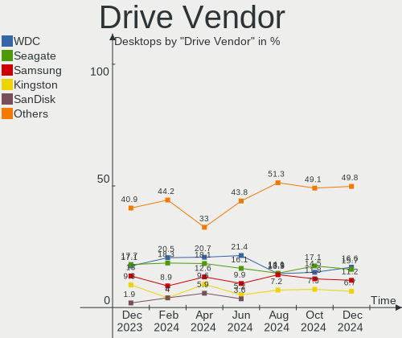
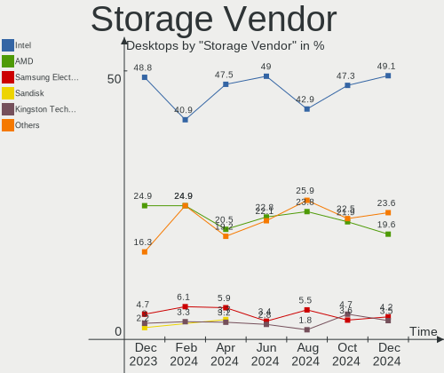
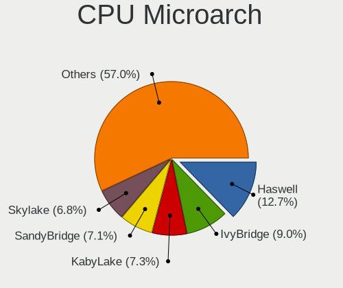
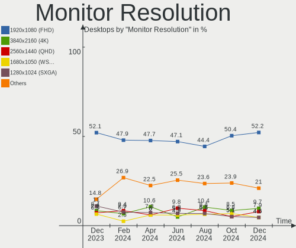

OpenMandriva Hardware Trends (Desktops)
---------------------------------------

A project to identify most popular hardware characteristics and track their change
over time based on data collected by OpenMandriva users at https://Linux-Hardware.org.

Anyone can contribute to this report by the [hw-probe](https://github.com/linuxhw/hw-probe) tool:

    sudo -E hw-probe -all -upload

Full-feature report is available here: https://linux-hardware.org/?view=trends

Period: Jan, 2022.

Contents
--------

* [ System ](#system)
  - [ OS                       ](#os)
  - [ OS Family                ](#os-family)
  - [ Kernel                   ](#kernel)
  - [ Kernel Family            ](#kernel-family)
  - [ Kernel Major Ver.        ](#kernel-major-ver)
  - [ Arch                     ](#arch)
  - [ DE                       ](#de)
  - [ Display Server           ](#display-server)
  - [ Display Manager          ](#display-manager)
  - [ OS Lang                  ](#os-lang)
  - [ Boot Mode                ](#boot-mode)
  - [ Filesystem               ](#filesystem)
  - [ Part. scheme             ](#part-scheme)
  - [ Dual Boot with Linux/BSD ](#dual-boot-with-linuxbsd)
  - [ Dual Boot (Win)          ](#dual-boot-win)

* [ Board ](#board)
  - [ Vendor                   ](#vendor)
  - [ Model                    ](#model)
  - [ Model Family             ](#model-family)
  - [ MFG Year                 ](#mfg-year)
  - [ Form Factor              ](#form-factor)
  - [ Secure Boot              ](#secure-boot)
  - [ Coreboot                 ](#coreboot)
  - [ RAM Size                 ](#ram-size)
  - [ RAM Used                 ](#ram-used)
  - [ Total Drives             ](#total-drives)
  - [ Has CD-ROM               ](#has-cd-rom)
  - [ Has Ethernet             ](#has-ethernet)
  - [ Has WiFi                 ](#has-wifi)
  - [ Has Bluetooth            ](#has-bluetooth)

* [ Location ](#location)
  - [ Country                  ](#country)
  - [ City                     ](#city)

* [ Drives ](#drives)
  - [ Drive Vendor             ](#drive-vendor)
  - [ Drive Model              ](#drive-model)
  - [ HDD Vendor               ](#hdd-vendor)
  - [ SSD Vendor               ](#ssd-vendor)
  - [ Drive Kind               ](#drive-kind)
  - [ Drive Connector          ](#drive-connector)
  - [ Drive Size               ](#drive-size)
  - [ Space Total              ](#space-total)
  - [ Space Used               ](#space-used)
  - [ Malfunc. Drives          ](#malfunc-drives)
  - [ Malfunc. Drive Vendor    ](#malfunc-drive-vendor)
  - [ Malfunc. HDD Vendor      ](#malfunc-hdd-vendor)
  - [ Malfunc. Drive Kind      ](#malfunc-drive-kind)
  - [ Failed Drives            ](#failed-drives)
  - [ Failed Drive Vendor      ](#failed-drive-vendor)
  - [ Drive Status             ](#drive-status)

* [ Storage controller ](#storage-controller)
  - [ Storage Vendor           ](#storage-vendor)
  - [ Storage Model            ](#storage-model)
  - [ Storage Kind             ](#storage-kind)

* [ Processor ](#processor)
  - [ CPU Vendor               ](#cpu-vendor)
  - [ CPU Model                ](#cpu-model)
  - [ CPU Model Family         ](#cpu-model-family)
  - [ CPU Cores                ](#cpu-cores)
  - [ CPU Sockets              ](#cpu-sockets)
  - [ CPU Threads              ](#cpu-threads)
  - [ CPU Op-Modes             ](#cpu-op-modes)
  - [ CPU Microcode            ](#cpu-microcode)
  - [ CPU Microarch            ](#cpu-microarch)

* [ Graphics ](#graphics)
  - [ GPU Vendor               ](#gpu-vendor)
  - [ GPU Model                ](#gpu-model)
  - [ GPU Combo                ](#gpu-combo)
  - [ GPU Driver               ](#gpu-driver)
  - [ GPU Memory               ](#gpu-memory)

* [ Monitor ](#monitor)
  - [ Monitor Vendor           ](#monitor-vendor)
  - [ Monitor Model            ](#monitor-model)
  - [ Monitor Resolution       ](#monitor-resolution)
  - [ Monitor Diagonal         ](#monitor-diagonal)
  - [ Monitor Width            ](#monitor-width)
  - [ Aspect Ratio             ](#aspect-ratio)
  - [ Monitor Area             ](#monitor-area)
  - [ Pixel Density            ](#pixel-density)
  - [ Multiple Monitors        ](#multiple-monitors)

* [ Network ](#network)
  - [ Net Controller Vendor    ](#net-controller-vendor)
  - [ Net Controller Model     ](#net-controller-model)
  - [ Wireless Vendor          ](#wireless-vendor)
  - [ Wireless Model           ](#wireless-model)
  - [ Ethernet Vendor          ](#ethernet-vendor)
  - [ Ethernet Model           ](#ethernet-model)
  - [ Net Controller Kind      ](#net-controller-kind)
  - [ Used Controller          ](#used-controller)
  - [ NICs                     ](#nics)
  - [ IPv6                     ](#ipv6)

* [ Bluetooth ](#bluetooth)
  - [ Bluetooth Vendor         ](#bluetooth-vendor)
  - [ Bluetooth Model          ](#bluetooth-model)

* [ Sound ](#sound)
  - [ Sound Vendor             ](#sound-vendor)
  - [ Sound Model              ](#sound-model)

* [ Memory ](#memory)
  - [ Memory Vendor            ](#memory-vendor)
  - [ Memory Model             ](#memory-model)
  - [ Memory Kind              ](#memory-kind)
  - [ Memory Form Factor       ](#memory-form-factor)
  - [ Memory Size              ](#memory-size)
  - [ Memory Speed             ](#memory-speed)

* [ Printers & scanners ](#printers--scanners)
  - [ Printer Vendor           ](#printer-vendor)
  - [ Printer Model            ](#printer-model)
  - [ Scanner Vendor           ](#scanner-vendor)
  - [ Scanner Model            ](#scanner-model)

* [ Camera ](#camera)
  - [ Camera Vendor            ](#camera-vendor)
  - [ Camera Model             ](#camera-model)

* [ Security ](#security)
  - [ Fingerprint Vendor       ](#fingerprint-vendor)
  - [ Fingerprint Model        ](#fingerprint-model)
  - [ Chipcard Vendor          ](#chipcard-vendor)
  - [ Chipcard Model           ](#chipcard-model)

* [ Unsupported ](#unsupported)
  - [ Unsupported Devices      ](#unsupported-devices)
  - [ Unsupported Device Types ](#unsupported-device-types)

System
------

OS
--

Installed operating systems

| Name              | Desktops | Percent |
|-------------------|----------|---------|
| OpenMandriva 4.2  | 78       | 84.78%  |
| OpenMandriva 4.50 | 14       | 15.22%  |

OS Family
---------

OS without a version

| Name         | Desktops | Percent |
|--------------|----------|---------|
| OpenMandriva | 92       | 100%    |

Kernel
------

Version of the Linux kernel

| Version                  | Desktops | Percent |
|--------------------------|----------|---------|
| 5.10.14-desktop-1omv4002 | 73       | 79.35%  |
| 5.12.4-desktop-1omv4050  | 9        | 9.78%   |
| 5.11.12-desktop-1omv4002 | 5        | 5.43%   |
| 5.14.7-desktop-1omv4050  | 4        | 4.35%   |
| 5.14.14-desktop-1omv4050 | 1        | 1.09%   |

Kernel Family
-------------

Linux kernel without a distro release

| Version | Desktops | Percent |
|---------|----------|---------|
| 5.10.14 | 73       | 79.35%  |
| 5.12.4  | 9        | 9.78%   |
| 5.11.12 | 5        | 5.43%   |
| 5.14.7  | 4        | 4.35%   |
| 5.14.14 | 1        | 1.09%   |

Kernel Major Ver.
-----------------

Linux kernel major version

| Version | Desktops | Percent |
|---------|----------|---------|
| 5.10    | 73       | 79.35%  |
| 5.12    | 9        | 9.78%   |
| 5.14    | 5        | 5.43%   |
| 5.11    | 5        | 5.43%   |

Arch
----

OS architecture (x86_64, i586, etc.)

| Name   | Desktops | Percent |
|--------|----------|---------|
| x86_64 | 92       | 100%    |

DE
--

Desktop Environment

| Name | Desktops | Percent |
|------|----------|---------|
| KDE5 | 92       | 100%    |

Display Server
--------------

X11 or Wayland

| Name | Desktops | Percent |
|------|----------|---------|
| X11  | 92       | 100%    |

Display Manager
---------------

SDDM, LightDM, etc.

| Name | Desktops | Percent |
|------|----------|---------|
| SDDM | 92       | 100%    |

OS Lang
-------

Language

| Lang  | Desktops | Percent |
|-------|----------|---------|
| en_US | 46       | 50%     |
| ru_RU | 8        | 8.7%    |
| pl_PL | 7        | 7.61%   |
| fr_FR | 7        | 7.61%   |
| it_IT | 4        | 4.35%   |
| en_AU | 3        | 3.26%   |
| de_DE | 3        | 3.26%   |
| hu_HU | 2        | 2.17%   |
| fr_CA | 2        | 2.17%   |
| en_GB | 2        | 2.17%   |
| tr_TR | 1        | 1.09%   |
| es_MX | 1        | 1.09%   |
| es_ES | 1        | 1.09%   |
| es_DO | 1        | 1.09%   |
| es_CO | 1        | 1.09%   |
| de_CH | 1        | 1.09%   |
| de_AT | 1        | 1.09%   |
| cs_CZ | 1        | 1.09%   |

Boot Mode
---------

EFI or BIOS

| Mode | Desktops | Percent |
|------|----------|---------|
| BIOS | 62       | 67.39%  |
| EFI  | 30       | 32.61%  |

Filesystem
----------

Type of filesystem

| Type    | Desktops | Percent |
|---------|----------|---------|
| Overlay | 76       | 82.61%  |
| Ext4    | 16       | 17.39%  |

Part. scheme
------------

Scheme of partitioning

| Type | Desktops | Percent |
|------|----------|---------|
| GPT  | 47       | 51.09%  |
| MBR  | 45       | 48.91%  |

Dual Boot with Linux/BSD
------------------------

Hosting more than one Linux/BSD

| Dual boot | Desktops | Percent |
|-----------|----------|---------|
| Yes       | 53       | 57.61%  |
| No        | 39       | 42.39%  |

Dual Boot (Win)
---------------

Hosting Linux and Windows

| Dual boot | Desktops | Percent |
|-----------|----------|---------|
| No        | 47       | 51.09%  |
| Yes       | 45       | 48.91%  |

Board
-----

Vendor
------

Motherboard manufacturer

| Name                | Desktops | Percent |
|---------------------|----------|---------|
| ASUSTek Computer    | 26       | 28.26%  |
| Gigabyte Technology | 14       | 15.22%  |
| MSI                 | 12       | 13.04%  |
| Dell                | 9        | 9.78%   |
| ASRock              | 9        | 9.78%   |
| Hewlett-Packard     | 4        | 4.35%   |
| Acer                | 4        | 4.35%   |
| Pegatron            | 2        | 2.17%   |
| Fujitsu Siemens     | 2        | 2.17%   |
| Foxconn             | 2        | 2.17%   |
| Wortmann AG         | 1        | 1.09%   |
| Seco                | 1        | 1.09%   |
| Medion              | 1        | 1.09%   |
| MACHINIST           | 1        | 1.09%   |
| Inventec            | 1        | 1.09%   |
| Intel               | 1        | 1.09%   |
| Gateway             | 1        | 1.09%   |
| Alienware           | 1        | 1.09%   |

Model
-----

Motherboard model

| Name                                   | Desktops | Percent |
|----------------------------------------|----------|---------|
| Dell OptiPlex 9020                     | 2        | 2.17%   |
| ASUS TUF GAMING X570-PLUS              | 2        | 2.17%   |
| ASUS M5A78L-M/USB3                     | 2        | 2.17%   |
| ASUS All Series                        | 2        | 2.17%   |
| Wortmann AG TERRA_PC                   | 1        | 1.09%   |
| Seco C40                               | 1        | 1.09%   |
| Pegatron p7-1110                       | 1        | 1.09%   |
| Pegatron IPM31G                        | 1        | 1.09%   |
| MSI p6626it-m                          | 1        | 1.09%   |
| MSI MS-7C51                            | 1        | 1.09%   |
| MSI MS-7C37                            | 1        | 1.09%   |
| MSI MS-7B86                            | 1        | 1.09%   |
| MSI MS-7A15                            | 1        | 1.09%   |
| MSI MS-7891                            | 1        | 1.09%   |
| MSI MS-7693                            | 1        | 1.09%   |
| MSI MS-7680                            | 1        | 1.09%   |
| MSI MS-7641                            | 1        | 1.09%   |
| MSI MS-7593                            | 1        | 1.09%   |
| MSI MS-7576                            | 1        | 1.09%   |
| MSI B250 Gaming Nightblade 3 (MS-B910) | 1        | 1.09%   |
| Medion MS-7713                         | 1        | 1.09%   |
| MACHINIST B75 PRO V1.0                 | 1        | 1.09%   |
| Inventec DQ Class                      | 1        | 1.09%   |
| Intel DG41RQ AAE54511-203              | 1        | 1.09%   |
| HP OMEN by Desktop PC 880-p0xx         | 1        | 1.09%   |
| HP EliteDesk 800 G1 SFF                | 1        | 1.09%   |
| HP Compaq Pro 6300 SFF                 | 1        | 1.09%   |
| HP Compaq dc5850 Small Form Factor     | 1        | 1.09%   |
| Gigabyte Z97X-Gaming 7                 | 1        | 1.09%   |
| Gigabyte Z370 HD3                      | 1        | 1.09%   |
| Gigabyte M61SME-S2                     | 1        | 1.09%   |
| Gigabyte M52S-S3P                      | 1        | 1.09%   |
| Gigabyte H81N                          | 1        | 1.09%   |
| Gigabyte H57M-USB3                     | 1        | 1.09%   |
| Gigabyte GA-780T-D3L                   | 1        | 1.09%   |
| Gigabyte F2A88XM-HD3P                  | 1        | 1.09%   |
| Gigabyte B450M S2H                     | 1        | 1.09%   |
| Gigabyte B450M DS3H                    | 1        | 1.09%   |
| Gigabyte B450 AORUS ELITE              | 1        | 1.09%   |
| Gigabyte B150M-D3H                     | 1        | 1.09%   |
| Gigabyte 970A-DS3P                     | 1        | 1.09%   |
| Gigabyte 9047-900-0012                 | 1        | 1.09%   |
| Gateway DX4320                         | 1        | 1.09%   |
| Fujitsu Siemens ESPRIMO E5730          | 1        | 1.09%   |
| Fujitsu Siemens D2464-B1               | 1        | 1.09%   |
| Foxconn BK450AA-ABA HPE-235f           | 1        | 1.09%   |
| Foxconn A76GMV                         | 1        | 1.09%   |
| Dell OptiPlex 9010                     | 1        | 1.09%   |
| Dell OptiPlex 780                      | 1        | 1.09%   |
| Dell OptiPlex 740                      | 1        | 1.09%   |
| Dell OptiPlex 7010                     | 1        | 1.09%   |
| Dell OptiPlex 390                      | 1        | 1.09%   |
| Dell OptiPlex 380                      | 1        | 1.09%   |
| Dell Inspiron 3847                     | 1        | 1.09%   |
| ASUS Z170-K                            | 1        | 1.09%   |
| ASUS V-P5G31                           | 1        | 1.09%   |
| ASUS ProArt X570-CREATOR WIFI          | 1        | 1.09%   |
| ASUS PRIME B450M-A                     | 1        | 1.09%   |
| ASUS PRIME B360M-A                     | 1        | 1.09%   |
| ASUS P8Z77-V PRO                       | 1        | 1.09%   |

Model Family
------------

Motherboard model prefix

| Name                     | Desktops | Percent |
|--------------------------|----------|---------|
| Dell OptiPlex            | 8        | 8.7%    |
| Acer Aspire              | 3        | 3.26%   |
| HP Compaq                | 2        | 2.17%   |
| Gigabyte B450M           | 2        | 2.17%   |
| ASUS TUF                 | 2        | 2.17%   |
| ASUS PRIME               | 2        | 2.17%   |
| ASUS P5G41T-M            | 2        | 2.17%   |
| ASUS M5A78L-M            | 2        | 2.17%   |
| ASUS All                 | 2        | 2.17%   |
| Wortmann AG TERRA        | 1        | 1.09%   |
| Seco C40                 | 1        | 1.09%   |
| Pegatron p7-1110         | 1        | 1.09%   |
| Pegatron IPM31G          | 1        | 1.09%   |
| MSI p6626it-m            | 1        | 1.09%   |
| MSI MS-7C51              | 1        | 1.09%   |
| MSI MS-7C37              | 1        | 1.09%   |
| MSI MS-7B86              | 1        | 1.09%   |
| MSI MS-7A15              | 1        | 1.09%   |
| MSI MS-7891              | 1        | 1.09%   |
| MSI MS-7693              | 1        | 1.09%   |
| MSI MS-7680              | 1        | 1.09%   |
| MSI MS-7641              | 1        | 1.09%   |
| MSI MS-7593              | 1        | 1.09%   |
| MSI MS-7576              | 1        | 1.09%   |
| MSI B250                 | 1        | 1.09%   |
| Medion MS-7713           | 1        | 1.09%   |
| MACHINIST B75            | 1        | 1.09%   |
| Inventec DQ              | 1        | 1.09%   |
| Intel DG41RQ             | 1        | 1.09%   |
| HP OMEN                  | 1        | 1.09%   |
| HP EliteDesk             | 1        | 1.09%   |
| Gigabyte Z97X-Gaming     | 1        | 1.09%   |
| Gigabyte Z370            | 1        | 1.09%   |
| Gigabyte M61SME-S2       | 1        | 1.09%   |
| Gigabyte M52S-S3P        | 1        | 1.09%   |
| Gigabyte H81N            | 1        | 1.09%   |
| Gigabyte H57M-USB3       | 1        | 1.09%   |
| Gigabyte GA-780T-D3L     | 1        | 1.09%   |
| Gigabyte F2A88XM-HD3P    | 1        | 1.09%   |
| Gigabyte B450            | 1        | 1.09%   |
| Gigabyte B150M-D3H       | 1        | 1.09%   |
| Gigabyte 970A-DS3P       | 1        | 1.09%   |
| Gigabyte 9047-900-0012   | 1        | 1.09%   |
| Gateway DX4320           | 1        | 1.09%   |
| Fujitsu Siemens ESPRIMO  | 1        | 1.09%   |
| Fujitsu Siemens D2464-B1 | 1        | 1.09%   |
| Foxconn BK450AA-ABA      | 1        | 1.09%   |
| Foxconn A76GMV           | 1        | 1.09%   |
| Dell Inspiron            | 1        | 1.09%   |
| ASUS Z170-K              | 1        | 1.09%   |
| ASUS V-P5G31             | 1        | 1.09%   |
| ASUS ProArt              | 1        | 1.09%   |
| ASUS P8Z77-V             | 1        | 1.09%   |
| ASUS P8H67-M             | 1        | 1.09%   |
| ASUS P8H67-I             | 1        | 1.09%   |
| ASUS P5K-VM              | 1        | 1.09%   |
| ASUS P5K-E               | 1        | 1.09%   |
| ASUS P5GC-MX             | 1        | 1.09%   |
| ASUS M4A89GTD-PRO        | 1        | 1.09%   |
| ASUS M2N-MX              | 1        | 1.09%   |

MFG Year
--------

Motherboard manufacture year

| Year | Desktops | Percent |
|------|----------|---------|
| 2010 | 14       | 15.22%  |
| 2013 | 9        | 9.78%   |
| 2012 | 8        | 8.7%    |
| 2011 | 8        | 8.7%    |
| 2007 | 8        | 8.7%    |
| 2019 | 7        | 7.61%   |
| 2015 | 7        | 7.61%   |
| 2018 | 6        | 6.52%   |
| 2016 | 6        | 6.52%   |
| 2014 | 5        | 5.43%   |
| 2021 | 4        | 4.35%   |
| 2009 | 4        | 4.35%   |
| 2008 | 3        | 3.26%   |
| 2006 | 2        | 2.17%   |
| 2017 | 1        | 1.09%   |

Form Factor
-----------

Physical design of the computer

| Name    | Desktops | Percent |
|---------|----------|---------|
| Desktop | 92       | 100%    |

Secure Boot
-----------

Enabled or disabled

| State    | Desktops | Percent |
|----------|----------|---------|
| Disabled | 92       | 100%    |

Coreboot
--------

Have coreboot on board

| Used | Desktops | Percent |
|------|----------|---------|
| No   | 92       | 100%    |

RAM Size
--------

Total RAM memory

| Size in GB | Desktops | Percent |
|------------|----------|---------|
| 3.01-4.0   | 25       | 27.17%  |
| 16.01-24.0 | 23       | 25%     |
| 8.01-16.0  | 20       | 21.74%  |
| 4.01-8.0   | 17       | 18.48%  |
| 32.01-64.0 | 3        | 3.26%   |
| 1.01-2.0   | 3        | 3.26%   |
| 24.01-32.0 | 1        | 1.09%   |

RAM Used
--------

Used RAM memory

| Used GB  | Desktops | Percent |
|----------|----------|---------|
| 1.01-2.0 | 69       | 75%     |
| 0.51-1.0 | 19       | 20.65%  |
| 2.01-3.0 | 2        | 2.17%   |
| 0.01-0.5 | 2        | 2.17%   |

Total Drives
------------

Number of drives on board

| Drives | Desktops | Percent |
|--------|----------|---------|
| 1      | 36       | 39.13%  |
| 2      | 34       | 36.96%  |
| 3      | 11       | 11.96%  |
| 0      | 5        | 5.43%   |
| 4      | 4        | 4.35%   |
| 8      | 2        | 2.17%   |

Has CD-ROM
----------

Has CD-ROM on board

| Presented | Desktops | Percent |
|-----------|----------|---------|
| Yes       | 64       | 69.57%  |
| No        | 28       | 30.43%  |

Has Ethernet
------------

Has Ethernet on board

| Presented | Desktops | Percent |
|-----------|----------|---------|
| Yes       | 91       | 98.91%  |
| No        | 1        | 1.09%   |

Has WiFi
--------

Has WiFi module

| Presented | Desktops | Percent |
|-----------|----------|---------|
| No        | 59       | 64.13%  |
| Yes       | 33       | 35.87%  |

Has Bluetooth
-------------

Has Bluetooth module

| Presented | Desktops | Percent |
|-----------|----------|---------|
| No        | 73       | 79.35%  |
| Yes       | 19       | 20.65%  |

Location
--------

Country
-------

Geographic location (country)

| Country               | Desktops | Percent |
|-----------------------|----------|---------|
| USA                   | 15       | 16.3%   |
| Russia                | 12       | 13.04%  |
| France                | 10       | 10.87%  |
| Poland                | 8        | 8.7%    |
| Italy                 | 5        | 5.43%   |
| Germany               | 5        | 5.43%   |
| Australia             | 4        | 4.35%   |
| Sweden                | 3        | 3.26%   |
| Romania               | 3        | 3.26%   |
| Canada                | 3        | 3.26%   |
| Ukraine               | 2        | 2.17%   |
| Netherlands           | 2        | 2.17%   |
| Hungary               | 2        | 2.17%   |
| Bulgaria              | 2        | 2.17%   |
| Austria               | 2        | 2.17%   |
| UK                    | 1        | 1.09%   |
| Turkey                | 1        | 1.09%   |
| Switzerland           | 1        | 1.09%   |
| Spain                 | 1        | 1.09%   |
| Slovakia              | 1        | 1.09%   |
| Portugal              | 1        | 1.09%   |
| Palestinian Territory | 1        | 1.09%   |
| Norway                | 1        | 1.09%   |
| Mexico                | 1        | 1.09%   |
| Finland               | 1        | 1.09%   |
| Dominican Republic    | 1        | 1.09%   |
| Czechia               | 1        | 1.09%   |
| Colombia              | 1        | 1.09%   |
| Brazil                | 1        | 1.09%   |

City
----

Geographic location (city)

| City                      | Desktops | Percent |
|---------------------------|----------|---------|
| Vienna                    | 2        | 2.17%   |
| Saint-Fons                | 2        | 2.17%   |
| Niort                     | 2        | 2.17%   |
| Moscow                    | 2        | 2.17%   |
| Milan                     | 2        | 2.17%   |
| Zl?­n                     | 1        | 1.09%   |
| Yekaterinburg             | 1        | 1.09%   |
| Wroclaw                   | 1        | 1.09%   |
| Vaxjo                     | 1        | 1.09%   |
| Uppsala                   | 1        | 1.09%   |
| Ulan-Ude                  | 1        | 1.09%   |
| Ukrainka                  | 1        | 1.09%   |
| Uithuizen                 | 1        | 1.09%   |
| Tychy                     | 1        | 1.09%   |
| Tver                      | 1        | 1.09%   |
| Torrance                  | 1        | 1.09%   |
| Tomah                     | 1        | 1.09%   |
| Timi?™oara                | 1        | 1.09%   |
| Szczecin                  | 1        | 1.09%   |
| Sydney                    | 1        | 1.09%   |
| Stavropol                 | 1        | 1.09%   |
| Staszow                   | 1        | 1.09%   |
| St Petersburg             | 1        | 1.09%   |
| Spokane                   | 1        | 1.09%   |
| Someren                   | 1        | 1.09%   |
| Sofia                     | 1        | 1.09%   |
| Simferopol                | 1        | 1.09%   |
| Seattle                   | 1        | 1.09%   |
| San Francisco de Macor?­s | 1        | 1.09%   |
| Saltsjoebaden             | 1        | 1.09%   |
| Salo                      | 1        | 1.09%   |
| Saint-Benoit-sur-Loire    | 1        | 1.09%   |
| Ru??omberok               | 1        | 1.09%   |
| Reggio Emilia             | 1        | 1.09%   |
| Razgrad                   | 1        | 1.09%   |
| Radauti                   | 1        | 1.09%   |
| Qalqilyah                 | 1        | 1.09%   |
| Pindobacu                 | 1        | 1.09%   |
| Philadelphia              | 1        | 1.09%   |
| Perth                     | 1        | 1.09%   |
| P?‚ock                    | 1        | 1.09%   |
| Paimpol                   | 1        | 1.09%   |
| Niagara Falls             | 1        | 1.09%   |
| New Port Richey           | 1        | 1.09%   |
| Napierville               | 1        | 1.09%   |
| Murcia                    | 1        | 1.09%   |
| Monter?­a                 | 1        | 1.09%   |
| Mesa                      | 1        | 1.09%   |
| Melbourne                 | 1        | 1.09%   |
| Maura                     | 1        | 1.09%   |
| Matane                    | 1        | 1.09%   |
| Manchester                | 1        | 1.09%   |
| Maloyaroslavets           | 1        | 1.09%   |
| Lubenia                   | 1        | 1.09%   |
| Leipzig                   | 1        | 1.09%   |
| Latina                    | 1        | 1.09%   |
| Konolfingen               | 1        | 1.09%   |
| Khabarovsk                | 1        | 1.09%   |
| Kemerovo                  | 1        | 1.09%   |
| Kazan?ˆ™                  | 1        | 1.09%   |

Drives
------

Drive Vendor
------------

Hard drive vendors

| Vendor              | Desktops | Drives | Percent |
|---------------------|----------|--------|---------|
| WDC                 | 35       | 46     | 25%     |
| Seagate             | 25       | 37     | 17.86%  |
| Samsung Electronics | 20       | 23     | 14.29%  |
| Toshiba             | 10       | 11     | 7.14%   |
| Kingston            | 10       | 11     | 7.14%   |
| Hitachi             | 6        | 6      | 4.29%   |
| GOODRAM             | 4        | 6      | 2.86%   |
| Unknown             | 3        | 3      | 2.14%   |
| SanDisk             | 3        | 3      | 2.14%   |
| Intel               | 3        | 4      | 2.14%   |
| Crucial             | 3        | 3      | 2.14%   |
| MAXTOR              | 2        | 2      | 1.43%   |
| Transcend           | 1        | 1      | 0.71%   |
| Team                | 1        | 1      | 0.71%   |
| TCSUNBOW            | 1        | 1      | 0.71%   |
| Reeinno             | 1        | 1      | 0.71%   |
| PNY                 | 1        | 1      | 0.71%   |
| Phison              | 1        | 2      | 0.71%   |
| Patriot             | 1        | 1      | 0.71%   |
| MyDigitalSSD        | 1        | 1      | 0.71%   |
| Micron Technology   | 1        | 1      | 0.71%   |
| IBM/Hitachi         | 1        | 1      | 0.71%   |
| HGST                | 1        | 1      | 0.71%   |
| HEORIADY            | 1        | 1      | 0.71%   |
| FOXLINE             | 1        | 1      | 0.71%   |
| China               | 1        | 1      | 0.71%   |
| ASMT                | 1        | 1      | 0.71%   |
| Apacer              | 1        | 1      | 0.71%   |

Drive Model
-----------

Hard drive models

| Model                            | Desktops | Percent |
|----------------------------------|----------|---------|
| Unknown SD/MMC/MS PRO 128GB      | 3        | 1.82%   |
| Toshiba DT01ACA200 2TB           | 3        | 1.82%   |
| Samsung SSD 870 EVO 500GB        | 3        | 1.82%   |
| Kingston SA400S37240G 240GB SSD  | 3        | 1.82%   |
| WDC WD800JD-75MSA3 80GB          | 2        | 1.21%   |
| WDC WD3200AAKS-75L9A0 320GB      | 2        | 1.21%   |
| WDC WD20EZRX-00D8PB0 2TB         | 2        | 1.21%   |
| WDC WD10EZEX-08WN4A0 1TB         | 2        | 1.21%   |
| WDC WD10EADS-65L5B1 1TB          | 2        | 1.21%   |
| WDC WD1003FZEX-00K3CA0 1TB       | 2        | 1.21%   |
| Seagate ST500DM002-1BD142 500GB  | 2        | 1.21%   |
| Seagate ST3500418AS 500GB        | 2        | 1.21%   |
| Seagate ST3320620AS 320GB        | 2        | 1.21%   |
| Seagate ST1000DM003-1CH162 1TB   | 2        | 1.21%   |
| Samsung MZALQ256HAJD-000L2 256GB | 2        | 1.21%   |
| Kingston SUV400S37120G 120GB SSD | 2        | 1.21%   |
| Kingston SHFS37A120G 120GB SSD   | 2        | 1.21%   |
| WDC WDS240G2G0C-00AJM0 240GB     | 1        | 0.61%   |
| WDC WDS240G2G0B-00EPW0 240GB SSD | 1        | 0.61%   |
| WDC WDS240G2G0A-00JH30 240GB SSD | 1        | 0.61%   |
| WDC WDBNCE0010PNC 1TB SSD        | 1        | 0.61%   |
| WDC WD60PURX-64WY0Y1 6TB         | 1        | 0.61%   |
| WDC WD5000BPVT-22HXZT1 500GB     | 1        | 0.61%   |
| WDC WD5000AAKX-75U6AA0 500GB     | 1        | 0.61%   |
| WDC WD5000AAKX-22ERMA0 500GB     | 1        | 0.61%   |
| WDC WD5000AAKX-00ERMA0 500GB     | 1        | 0.61%   |
| WDC WD5000AAKX-001CA0 500GB      | 1        | 0.61%   |
| WDC WD5000AAKS-07YGA0 500GB      | 1        | 0.61%   |
| WDC WD4005FZBX-00K5WB0 4TB       | 1        | 0.61%   |
| WDC WD3200AVVS-63L2B0 320GB      | 1        | 0.61%   |
| WDC WD30EFRX-68EUZN0 3TB         | 1        | 0.61%   |
| WDC WD2500BEVT-22ZCT0 250GB      | 1        | 0.61%   |
| WDC WD2500BEKT-75PVMT1 250GB     | 1        | 0.61%   |
| WDC WD20EARX-00PASB0 2TB         | 1        | 0.61%   |
| WDC WD1600AAJS-60B4A0 160GB      | 1        | 0.61%   |
| WDC WD1600AAJS-07M0A0 160GB      | 1        | 0.61%   |
| WDC WD1600AAJS-00PSA0 160GB      | 1        | 0.61%   |
| WDC WD1600AAJS-00L7A0 160GB      | 1        | 0.61%   |
| WDC WD15EADS-22P8B0 1TB          | 1        | 0.61%   |
| WDC WD10EZRZ-00HTKB0 1TB         | 1        | 0.61%   |
| WDC WD10EZEX-60WN4A0 1TB         | 1        | 0.61%   |
| WDC WD10EZEX-60M2NA0 1TB         | 1        | 0.61%   |
| WDC WD10EZEX-22MFCA0 1TB         | 1        | 0.61%   |
| WDC WD10EZEX-00BBHA0 1TB         | 1        | 0.61%   |
| WDC WD10EADS-65M2B1 1TB          | 1        | 0.61%   |
| WDC WD10EACS-00D6B1 1TB          | 1        | 0.61%   |
| WDC WD easystore 240GB SSD       | 1        | 0.61%   |
| Transcend TS64GSSD320 64GB       | 1        | 0.61%   |
| Toshiba MQ04ABF100 1TB           | 1        | 0.61%   |
| Toshiba MQ01ABF050M 500GB        | 1        | 0.61%   |
| Toshiba MK3252GSX 320GB          | 1        | 0.61%   |
| Toshiba MK2546GSX 250GB          | 1        | 0.61%   |
| Toshiba HDWE140 4TB              | 1        | 0.61%   |
| Toshiba HDWD110 1TB              | 1        | 0.61%   |
| Toshiba DT01ACA100 1TB           | 1        | 0.61%   |
| Toshiba DT01ACA050 500GB         | 1        | 0.61%   |
| Team T253X1240G 240GB SSD        | 1        | 0.61%   |
| TCSUNBOW X3 240GB SSD            | 1        | 0.61%   |
| Seagate STM3250318AS 250GB       | 1        | 0.61%   |
| Seagate ST500LT012-1DG142 500GB  | 1        | 0.61%   |

HDD Vendor
----------

Hard disk drive vendors

| Vendor              | Desktops | Drives | Percent |
|---------------------|----------|--------|---------|
| WDC                 | 31       | 41     | 36.9%   |
| Seagate             | 24       | 36     | 28.57%  |
| Toshiba             | 10       | 11     | 11.9%   |
| Samsung Electronics | 6        | 6      | 7.14%   |
| Hitachi             | 6        | 6      | 7.14%   |
| Unknown             | 3        | 3      | 3.57%   |
| MAXTOR              | 2        | 2      | 2.38%   |
| IBM/Hitachi         | 1        | 1      | 1.19%   |
| HGST                | 1        | 1      | 1.19%   |

SSD Vendor
----------

Solid state drive vendors

| Vendor              | Desktops | Drives | Percent |
|---------------------|----------|--------|---------|
| Samsung Electronics | 10       | 12     | 21.28%  |
| Kingston            | 10       | 11     | 21.28%  |
| WDC                 | 4        | 4      | 8.51%   |
| GOODRAM             | 4        | 6      | 8.51%   |
| Crucial             | 3        | 3      | 6.38%   |
| SanDisk             | 2        | 2      | 4.26%   |
| Transcend           | 1        | 1      | 2.13%   |
| Team                | 1        | 1      | 2.13%   |
| TCSUNBOW            | 1        | 1      | 2.13%   |
| Reeinno             | 1        | 1      | 2.13%   |
| PNY                 | 1        | 1      | 2.13%   |
| Patriot             | 1        | 1      | 2.13%   |
| MyDigitalSSD        | 1        | 1      | 2.13%   |
| Micron Technology   | 1        | 1      | 2.13%   |
| Intel               | 1        | 2      | 2.13%   |
| HEORIADY            | 1        | 1      | 2.13%   |
| FOXLINE             | 1        | 1      | 2.13%   |
| China               | 1        | 1      | 2.13%   |
| ASMT                | 1        | 1      | 2.13%   |
| Apacer              | 1        | 1      | 2.13%   |

Drive Kind
----------

HDD or SSD

| Kind | Desktops | Drives | Percent |
|------|----------|--------|---------|
| HDD  | 62       | 107    | 53.45%  |
| SSD  | 44       | 53     | 37.93%  |
| NVMe | 9        | 11     | 7.76%   |
| MMC  | 1        | 1      | 0.86%   |

Drive Connector
---------------

SATA, SAS, NVMe, etc.

| Type | Desktops | Drives | Percent |
|------|----------|--------|---------|
| SATA | 85       | 155    | 85%     |
| NVMe | 9        | 11     | 9%      |
| SAS  | 5        | 5      | 5%      |
| MMC  | 1        | 1      | 1%      |

Drive Size
----------

Size of hard drive

| Size in TB | Desktops | Drives | Percent |
|------------|----------|--------|---------|
| 0.01-0.5   | 73       | 108    | 61.34%  |
| 0.51-1.0   | 32       | 36     | 26.89%  |
| 1.01-2.0   | 9        | 9      | 7.56%   |
| 3.01-4.0   | 3        | 5      | 2.52%   |
| 2.01-3.0   | 1        | 1      | 0.84%   |
| 4.01-10.0  | 1        | 1      | 0.84%   |

Space Total
-----------

Amount of disk space available on the file system

| Size in GB | Desktops | Percent |
|------------|----------|---------|
| 1-20       | 47       | 51.09%  |
| Unknown    | 24       | 26.09%  |
| 101-250    | 11       | 11.96%  |
| 251-500    | 6        | 6.52%   |
| 501-1000   | 2        | 2.17%   |
| 21-50      | 1        | 1.09%   |
| 2001-3000  | 1        | 1.09%   |

Space Used
----------

Amount of used disk space

| Used GB  | Desktops | Percent |
|----------|----------|---------|
| 1-20     | 66       | 71.74%  |
| Unknown  | 24       | 26.09%  |
| 101-250  | 1        | 1.09%   |
| 501-1000 | 1        | 1.09%   |

Malfunc. Drives
---------------

Drive models with a malfunction

| Model                                | Desktops | Drives | Percent |
|--------------------------------------|----------|--------|---------|
| WDC WD5000BPVT-22HXZT1 500GB         | 1        | 1      | 3.13%   |
| WDC WD5000AAKX-001CA0 500GB          | 1        | 1      | 3.13%   |
| WDC WD5000AAKS-07YGA0 500GB          | 1        | 1      | 3.13%   |
| WDC WD30EFRX-68EUZN0 3TB             | 1        | 1      | 3.13%   |
| WDC WD2500BEKT-75PVMT1 250GB         | 1        | 1      | 3.13%   |
| WDC WD1600AAJS-60B4A0 160GB          | 1        | 1      | 3.13%   |
| WDC WD1600AAJS-00L7A0 160GB          | 1        | 1      | 3.13%   |
| WDC WD10EZRZ-00HTKB0 1TB             | 1        | 1      | 3.13%   |
| WDC WD10EZEX-60M2NA0 1TB             | 1        | 1      | 3.13%   |
| Toshiba MQ04ABF100 1TB               | 1        | 1      | 3.13%   |
| Toshiba MK3252GSX 320GB              | 1        | 1      | 3.13%   |
| Toshiba MK2546GSX 250GB              | 1        | 1      | 3.13%   |
| Toshiba DT01ACA100 1TB               | 1        | 1      | 3.13%   |
| Seagate ST500LT012-1DG142 500GB      | 1        | 1      | 3.13%   |
| Seagate ST500DM002-1BD142 500GB      | 1        | 1      | 3.13%   |
| Seagate ST3500418AS 500GB            | 1        | 1      | 3.13%   |
| Seagate ST3400820AS 400GB            | 1        | 1      | 3.13%   |
| Seagate ST340014A 40GB               | 1        | 1      | 3.13%   |
| Seagate ST3360320AS 360GB            | 1        | 1      | 3.13%   |
| Seagate ST320LT012-9WS14C 320GB      | 1        | 1      | 3.13%   |
| Seagate ST31000528AS 1TB             | 1        | 1      | 3.13%   |
| Samsung Electronics SSD 970 EVO 1TB  | 1        | 1      | 3.13%   |
| Samsung Electronics HN-M750MBB 752GB | 1        | 1      | 3.13%   |
| Samsung Electronics HD320KJ 320GB    | 1        | 1      | 3.13%   |
| MAXTOR STM3160815AS 160GB            | 1        | 1      | 3.13%   |
| MAXTOR 6L160M0 164GB                 | 1        | 1      | 3.13%   |
| Kingston SUV400S37240G 240GB SSD     | 1        | 1      | 3.13%   |
| Kingston SNV425S264GB SSD            | 1        | 1      | 3.13%   |
| Kingston SHFS37A120G 120GB SSD       | 1        | 1      | 3.13%   |
| Intel SSDPEKKW128G7 128GB            | 1        | 1      | 3.13%   |
| Hitachi HDS721680PLA380 80GB         | 1        | 1      | 3.13%   |
| Hitachi HDS5C1010CLA382 1TB          | 1        | 1      | 3.13%   |

Malfunc. Drive Vendor
---------------------

Vendors of faulty drives

| Vendor              | Desktops | Drives | Percent |
|---------------------|----------|--------|---------|
| WDC                 | 8        | 9      | 28.57%  |
| Seagate             | 6        | 8      | 21.43%  |
| Toshiba             | 3        | 4      | 10.71%  |
| Samsung Electronics | 3        | 3      | 10.71%  |
| Kingston            | 3        | 3      | 10.71%  |
| MAXTOR              | 2        | 2      | 7.14%   |
| Hitachi             | 2        | 2      | 7.14%   |
| Intel               | 1        | 1      | 3.57%   |

Malfunc. HDD Vendor
-------------------

Vendors of faulty HDD drives

| Vendor              | Desktops | Drives | Percent |
|---------------------|----------|--------|---------|
| WDC                 | 8        | 9      | 34.78%  |
| Seagate             | 6        | 8      | 26.09%  |
| Toshiba             | 3        | 4      | 13.04%  |
| Samsung Electronics | 2        | 2      | 8.7%    |
| MAXTOR              | 2        | 2      | 8.7%    |
| Hitachi             | 2        | 2      | 8.7%    |

Malfunc. Drive Kind
-------------------

Kinds of faulty drives

| Kind | Desktops | Drives | Percent |
|------|----------|--------|---------|
| HDD  | 19       | 27     | 79.17%  |
| SSD  | 3        | 3      | 12.5%   |
| NVMe | 2        | 2      | 8.33%   |

Failed Drives
-------------

Failed drive models

| Model                      | Desktops | Drives | Percent |
|----------------------------|----------|--------|---------|
| Seagate STM3250318AS 250GB | 1        | 1      | 100%    |

Failed Drive Vendor
-------------------

Failed drive vendors

| Vendor  | Desktops | Drives | Percent |
|---------|----------|--------|---------|
| Seagate | 1        | 1      | 100%    |

Drive Status
------------

Number of failed and malfunc. drives

| Status   | Desktops | Drives | Percent |
|----------|----------|--------|---------|
| Works    | 74       | 126    | 67.27%  |
| Malfunc  | 23       | 32     | 20.91%  |
| Detected | 12       | 13     | 10.91%  |
| Failed   | 1        | 1      | 0.91%   |

Storage controller
------------------

Storage Vendor
--------------

Storage controller vendors

| Vendor                   | Desktops | Percent |
|--------------------------|----------|---------|
| Intel                    | 47       | 43.12%  |
| AMD                      | 36       | 33.03%  |
| Nvidia                   | 9        | 8.26%   |
| Samsung Electronics      | 4        | 3.67%   |
| JMicron Technology       | 4        | 3.67%   |
| ASMedia Technology       | 4        | 3.67%   |
| Marvell Technology Group | 2        | 1.83%   |
| Silicon Image            | 1        | 0.92%   |
| Seagate Technology       | 1        | 0.92%   |
| Sandisk                  | 1        | 0.92%   |

Storage Model
-------------

Storage controller models

| Model                                                                                   | Desktops | Percent |
|-----------------------------------------------------------------------------------------|----------|---------|
| AMD FCH SATA Controller [AHCI mode]                                                     | 18       | 11.69%  |
| AMD SB7x0/SB8x0/SB9x0 IDE Controller                                                    | 10       | 6.49%   |
| Intel NM10/ICH7 Family SATA Controller [IDE mode]                                       | 8        | 5.19%   |
| Intel 82801G (ICH7 Family) IDE Controller                                               | 8        | 5.19%   |
| AMD SB7x0/SB8x0/SB9x0 SATA Controller [IDE mode]                                        | 7        | 4.55%   |
| AMD SB7x0/SB8x0/SB9x0 SATA Controller [AHCI mode]                                       | 7        | 4.55%   |
| AMD 400 Series Chipset SATA Controller                                                  | 6        | 3.9%    |
| Intel Q170/Q150/B150/H170/H110/Z170/CM236 Chipset SATA Controller [AHCI Mode]           | 5        | 3.25%   |
| Intel 8 Series/C220 Series Chipset Family 6-port SATA Controller 1 [AHCI mode]          | 5        | 3.25%   |
| Intel 7 Series/C210 Series Chipset Family 6-port SATA Controller [AHCI mode]            | 5        | 3.25%   |
| Nvidia MCP61 SATA Controller                                                            | 4        | 2.6%    |
| Nvidia MCP61 IDE                                                                        | 4        | 2.6%    |
| Samsung NVMe SSD Controller 980                                                         | 3        | 1.95%   |
| Intel SATA Controller [RAID mode]                                                       | 3        | 1.95%   |
| Intel 6 Series/C200 Series Chipset Family Desktop SATA Controller (IDE mode, ports 4-5) | 3        | 1.95%   |
| Intel 6 Series/C200 Series Chipset Family Desktop SATA Controller (IDE mode, ports 0-3) | 3        | 1.95%   |
| Intel 6 Series/C200 Series Chipset Family 6 port Desktop SATA AHCI Controller           | 3        | 1.95%   |
| ASMedia ASM1062 Serial ATA Controller                                                   | 3        | 1.95%   |
| Nvidia MCP51 Serial ATA Controller                                                      | 2        | 1.3%    |
| JMicron JMB363 SATA/IDE Controller                                                      | 2        | 1.3%    |
| Intel 9 Series Chipset Family SATA Controller [AHCI Mode]                               | 2        | 1.3%    |
| Intel 82801I (ICH9 Family) 2 port SATA Controller [IDE mode]                            | 2        | 1.3%    |
| Intel 5 Series/3400 Series Chipset 6 port SATA AHCI Controller                          | 2        | 1.3%    |
| Intel 4 Series Chipset PT IDER Controller                                               | 2        | 1.3%    |
| Intel 200 Series PCH SATA controller [AHCI mode]                                        | 2        | 1.3%    |
| Silicon Image SiI 3132 Serial ATA Raid II Controller                                    | 1        | 0.65%   |
| Seagate Non-Volatile memory controller                                                  | 1        | 0.65%   |
| Sandisk Non-Volatile memory controller                                                  | 1        | 0.65%   |
| Samsung NVMe SSD Controller SM981/PM981/PM983                                           | 1        | 0.65%   |
| Nvidia MCP78S [GeForce 8200] IDE                                                        | 1        | 0.65%   |
| Nvidia MCP78S [GeForce 8200] AHCI Controller                                            | 1        | 0.65%   |
| Nvidia MCP55 SATA Controller                                                            | 1        | 0.65%   |
| Nvidia MCP55 IDE                                                                        | 1        | 0.65%   |
| Nvidia MCP51 IDE                                                                        | 1        | 0.65%   |
| Nvidia CK804 Serial ATA Controller                                                      | 1        | 0.65%   |
| Nvidia CK804 IDE                                                                        | 1        | 0.65%   |
| Marvell Group 88SE9172 SATA 6Gb/s Controller                                            | 1        | 0.65%   |
| Marvell Group 88SE6111/6121 SATA II / PATA Controller                                   | 1        | 0.65%   |
| JMicron JMB368 IDE controller                                                           | 1        | 0.65%   |
| JMicron JMB361 AHCI/IDE                                                                 | 1        | 0.65%   |
| Intel SSD 660P Series                                                                   | 1        | 0.65%   |
| Intel SSD 600P Series                                                                   | 1        | 0.65%   |
| Intel Cannon Lake PCH SATA AHCI Controller                                              | 1        | 0.65%   |
| Intel 82801JI (ICH10 Family) 4 port SATA IDE Controller #1                              | 1        | 0.65%   |
| Intel 82801JI (ICH10 Family) 2 port SATA IDE Controller #2                              | 1        | 0.65%   |
| Intel 82801JD/DO (ICH10 Family) 4-port SATA IDE Controller                              | 1        | 0.65%   |
| Intel 82801JD/DO (ICH10 Family) 2-port SATA IDE Controller                              | 1        | 0.65%   |
| Intel 82801IR/IO/IH (ICH9R/DO/DH) 4 port SATA Controller [IDE mode]                     | 1        | 0.65%   |
| Intel 82801IB (ICH9) 2 port SATA Controller [IDE mode]                                  | 1        | 0.65%   |
| Intel 82801HM/HEM (ICH8M/ICH8M-E) SATA Controller [IDE mode]                            | 1        | 0.65%   |
| Intel 82801HM/HEM (ICH8M/ICH8M-E) IDE Controller                                        | 1        | 0.65%   |
| Intel 7 Series Chipset Family 6-port SATA Controller [AHCI mode]                        | 1        | 0.65%   |
| Intel 500 Series Chipset Family SATA AHCI Controller                                    | 1        | 0.65%   |
| Intel 400 Series Chipset Family SATA AHCI Controller                                    | 1        | 0.65%   |
| ASMedia SATA controller                                                                 | 1        | 0.65%   |
| AMD SB7x0/SB8x0/SB9x0 SATA Controller [Non-RAID5 mode]                                  | 1        | 0.65%   |
| AMD FCH SATA Controller [RAID mode]                                                     | 1        | 0.65%   |
| AMD FCH SATA Controller D                                                               | 1        | 0.65%   |
| AMD FCH IDE Controller                                                                  | 1        | 0.65%   |
| AMD 300 Series Chipset SATA Controller                                                  | 1        | 0.65%   |

Storage Kind
------------

Kind of storage controller (IDE, SATA, NVMe, SAS, ...)

| Kind | Desktops | Percent |
|------|----------|---------|
| SATA | 63       | 53.85%  |
| IDE  | 40       | 34.19%  |
| NVMe | 8        | 6.84%   |
| RAID | 6        | 5.13%   |

Processor
---------

CPU Vendor
----------

Processor vendors

| Vendor | Desktops | Percent |
|--------|----------|---------|
| Intel  | 48       | 52.17%  |
| AMD    | 44       | 47.83%  |

CPU Model
---------

Processor models

| Model                                          | Desktops | Percent |
|------------------------------------------------|----------|---------|
| Intel Pentium Dual-Core CPU E5400 @ 2.70GHz    | 2        | 2.17%   |
| Intel Core i7-4790K CPU @ 4.00GHz              | 2        | 2.17%   |
| Intel Core i5-3470 CPU @ 3.20GHz               | 2        | 2.17%   |
| Intel Core i5-2500 CPU @ 3.30GHz               | 2        | 2.17%   |
| AMD Phenom II X6 1055T Processor               | 2        | 2.17%   |
| AMD Phenom II X6 1035T Processor               | 2        | 2.17%   |
| AMD FX-8320 Eight-Core Processor               | 2        | 2.17%   |
| AMD Athlon II X4 640 Processor                 | 2        | 2.17%   |
| AMD Athlon 64 X2 Dual Core Processor 4400+     | 2        | 2.17%   |
| AMD Athlon 64 Processor 3500+                  | 2        | 2.17%   |
| Intel Pentium Dual-Core CPU E5500 @ 2.80GHz    | 1        | 1.09%   |
| Intel Pentium Dual-Core CPU E5200 @ 2.50GHz    | 1        | 1.09%   |
| Intel Pentium CPU G850 @ 2.90GHz               | 1        | 1.09%   |
| Intel Pentium CPU G620 @ 2.60GHz               | 1        | 1.09%   |
| Intel Pentium CPU G4400 @ 3.30GHz              | 1        | 1.09%   |
| Intel Genuine CPU 2140 @ 1.60GHz               | 1        | 1.09%   |
| Intel Core i7-8700 CPU @ 3.20GHz               | 1        | 1.09%   |
| Intel Core i7-7700 CPU @ 3.60GHz               | 1        | 1.09%   |
| Intel Core i7-6700 CPU @ 3.40GHz               | 1        | 1.09%   |
| Intel Core i7-4770 CPU @ 3.40GHz               | 1        | 1.09%   |
| Intel Core i7-3770K CPU @ 3.50GHz              | 1        | 1.09%   |
| Intel Core i7-3770 CPU @ 3.40GHz               | 1        | 1.09%   |
| Intel Core i7 CPU 950 @ 3.07GHz                | 1        | 1.09%   |
| Intel Core i7 CPU 860 @ 2.80GHz                | 1        | 1.09%   |
| Intel Core i5-9600KF CPU @ 3.70GHz             | 1        | 1.09%   |
| Intel Core i5-6500 CPU @ 3.20GHz               | 1        | 1.09%   |
| Intel Core i5-6400 CPU @ 2.70GHz               | 1        | 1.09%   |
| Intel Core i5-4590S CPU @ 3.00GHz              | 1        | 1.09%   |
| Intel Core i5-4590 CPU @ 3.30GHz               | 1        | 1.09%   |
| Intel Core i5-4570S CPU @ 2.90GHz              | 1        | 1.09%   |
| Intel Core i5-4570 CPU @ 3.20GHz               | 1        | 1.09%   |
| Intel Core i5-3570 CPU @ 3.40GHz               | 1        | 1.09%   |
| Intel Core i5-3330 CPU @ 3.00GHz               | 1        | 1.09%   |
| Intel Core i5 CPU 760 @ 2.80GHz                | 1        | 1.09%   |
| Intel Core i3-4150T CPU @ 3.00GHz              | 1        | 1.09%   |
| Intel Core i3-2120 CPU @ 3.30GHz               | 1        | 1.09%   |
| Intel Core i3-2100 CPU @ 3.10GHz               | 1        | 1.09%   |
| Intel Core i3-10100F CPU @ 3.60GHz             | 1        | 1.09%   |
| Intel Core i3-10100 CPU @ 3.60GHz              | 1        | 1.09%   |
| Intel Core 2 Quad CPU Q9550 @ 2.83GHz          | 1        | 1.09%   |
| Intel Core 2 Quad CPU Q8400 @ 2.66GHz          | 1        | 1.09%   |
| Intel Core 2 Quad CPU Q6600 @ 2.40GHz          | 1        | 1.09%   |
| Intel Core 2 Duo CPU E8400 @ 3.00GHz           | 1        | 1.09%   |
| Intel Core 2 Duo CPU E7500 @ 2.93GHz           | 1        | 1.09%   |
| Intel Core 2 Duo CPU E4700 @ 2.60GHz           | 1        | 1.09%   |
| Intel Core 2 Duo CPU E4500 @ 2.20GHz           | 1        | 1.09%   |
| Intel Core 2 CPU 4300 @ 1.80GHz                | 1        | 1.09%   |
| Intel Celeron CPU G3950 @ 3.00GHz              | 1        | 1.09%   |
| Intel Celeron CPU 1007U @ 1.50GHz              | 1        | 1.09%   |
| Intel Atom CPU D525 @ 1.80GHz                  | 1        | 1.09%   |
| AMD Ryzen Embedded V1605B with Radeon Vega Gfx | 1        | 1.09%   |
| AMD Ryzen 9 5900X 12-Core Processor            | 1        | 1.09%   |
| AMD Ryzen 9 3900X 12-Core Processor            | 1        | 1.09%   |
| AMD Ryzen 7 3700X 8-Core Processor             | 1        | 1.09%   |
| AMD Ryzen 5 5600G with Radeon Graphics         | 1        | 1.09%   |
| AMD Ryzen 5 3600X 6-Core Processor             | 1        | 1.09%   |
| AMD Ryzen 5 3600 6-Core Processor              | 1        | 1.09%   |
| AMD Ryzen 5 3400G with Radeon Vega Graphics    | 1        | 1.09%   |
| AMD Ryzen 5 1400 Quad-Core Processor           | 1        | 1.09%   |
| AMD Ryzen 3 3200G with Radeon Vega Graphics    | 1        | 1.09%   |

CPU Model Family
----------------

Processor model prefix

| Model                   | Desktops | Percent |
|-------------------------|----------|---------|
| Intel Core i5           | 14       | 15.22%  |
| Intel Core i7           | 10       | 10.87%  |
| Intel Core i3           | 5        | 5.43%   |
| AMD Ryzen 5             | 5        | 5.43%   |
| AMD A8                  | 5        | 5.43%   |
| Intel Pentium Dual-Core | 4        | 4.35%   |
| Intel Core 2 Duo        | 4        | 4.35%   |
| AMD Phenom II X6        | 4        | 4.35%   |
| AMD FX                  | 4        | 4.35%   |
| Intel Pentium           | 3        | 3.26%   |
| Intel Core 2 Quad       | 3        | 3.26%   |
| AMD Ryzen 3             | 3        | 3.26%   |
| AMD Athlon 64 X2        | 3        | 3.26%   |
| Intel Celeron           | 2        | 2.17%   |
| AMD Ryzen 9             | 2        | 2.17%   |
| AMD Phenom II X4        | 2        | 2.17%   |
| AMD Phenom              | 2        | 2.17%   |
| AMD Athlon II X4        | 2        | 2.17%   |
| AMD Athlon 64           | 2        | 2.17%   |
| AMD Athlon              | 2        | 2.17%   |
| Intel Genuine           | 1        | 1.09%   |
| Intel Core 2            | 1        | 1.09%   |
| Intel Atom              | 1        | 1.09%   |
| AMD Ryzen Embedded      | 1        | 1.09%   |
| AMD Ryzen 7             | 1        | 1.09%   |
| AMD Phenom II X3        | 1        | 1.09%   |
| AMD GX                  | 1        | 1.09%   |
| AMD Athlon II X2        | 1        | 1.09%   |
| AMD Athlon Dual Core    | 1        | 1.09%   |
| AMD A6                  | 1        | 1.09%   |
| AMD A4                  | 1        | 1.09%   |

CPU Cores
---------

Number of processor cores

| Number | Desktops | Percent |
|--------|----------|---------|
| 4      | 45       | 48.91%  |
| 2      | 30       | 32.61%  |
| 6      | 8        | 8.7%    |
| 1      | 4        | 4.35%   |
| 12     | 2        | 2.17%   |
| 3      | 2        | 2.17%   |
| 8      | 1        | 1.09%   |

CPU Sockets
-----------

Number of sockets

| Number | Desktops | Percent |
|--------|----------|---------|
| 1      | 92       | 100%    |

CPU Threads
-----------

Threads per core (Hyper-Threading)

| Number | Desktops | Percent |
|--------|----------|---------|
| 1      | 57       | 61.96%  |
| 2      | 35       | 38.04%  |

CPU Op-Modes
------------

CPU Operation Modes (32-bit, 64-bit)

| Op mode        | Desktops | Percent |
|----------------|----------|---------|
| 32-bit, 64-bit | 92       | 100%    |

CPU Microcode
-------------

Microcode number

| Number     | Desktops | Percent |
|------------|----------|---------|
| 0x306c3    | 8        | 8.7%    |
| 0x306a9    | 7        | 7.61%   |
| 0x1067a    | 7        | 7.61%   |
| Unknown    | 7        | 7.61%   |
| 0x206a7    | 6        | 6.52%   |
| 0x010000c8 | 5        | 5.43%   |
| 0x506e3    | 4        | 4.35%   |
| 0x08701021 | 4        | 4.35%   |
| 0x06001119 | 4        | 4.35%   |
| 0x010000bf | 3        | 3.26%   |
| 0xa0653    | 2        | 2.17%   |
| 0x906e9    | 2        | 2.17%   |
| 0x6fb      | 2        | 2.17%   |
| 0x6f2      | 2        | 2.17%   |
| 0x106e5    | 2        | 2.17%   |
| 0x08108109 | 2        | 2.17%   |
| 0x01000095 | 2        | 2.17%   |
| 0x906ed    | 1        | 1.09%   |
| 0x906ea    | 1        | 1.09%   |
| 0x6fd      | 1        | 1.09%   |
| 0x106ca    | 1        | 1.09%   |
| 0x106a5    | 1        | 1.09%   |
| 0x10676    | 1        | 1.09%   |
| 0x0a50000c | 1        | 1.09%   |
| 0x08101016 | 1        | 1.09%   |
| 0x0810100b | 1        | 1.09%   |
| 0x08001138 | 1        | 1.09%   |
| 0x08001136 | 1        | 1.09%   |
| 0x0700010f | 1        | 1.09%   |
| 0x0700010b | 1        | 1.09%   |
| 0x0600611a | 1        | 1.09%   |
| 0x06003106 | 1        | 1.09%   |
| 0x06000852 | 1        | 1.09%   |
| 0x0600081c | 1        | 1.09%   |
| 0x0600063d | 1        | 1.09%   |
| 0x06000629 | 1        | 1.09%   |
| 0x03000027 | 1        | 1.09%   |
| 0x010000dc | 1        | 1.09%   |
| 0x010000b6 | 1        | 1.09%   |
| 0x01000083 | 1        | 1.09%   |

CPU Microarch
-------------

Microarchitecture

| Name        | Desktops | Percent |
|-------------|----------|---------|
| K10         | 13       | 14.13%  |
| Penryn      | 8        | 8.7%    |
| Haswell     | 8        | 8.7%    |
| IvyBridge   | 7        | 7.61%   |
| SandyBridge | 6        | 6.52%   |
| Piledriver  | 6        | 6.52%   |
| K8 Hammer   | 6        | 6.52%   |
| Core        | 5        | 5.43%   |
| Zen 2       | 4        | 4.35%   |
| Zen         | 4        | 4.35%   |
| Skylake     | 4        | 4.35%   |
| KabyLake    | 4        | 4.35%   |
| Nehalem     | 3        | 3.26%   |
| Zen+        | 2        | 2.17%   |
| Zen 3       | 2        | 2.17%   |
| Jaguar      | 2        | 2.17%   |
| CometLake   | 2        | 2.17%   |
| Bulldozer   | 2        | 2.17%   |
| Steamroller | 1        | 1.09%   |
| K10 Llano   | 1        | 1.09%   |
| Excavator   | 1        | 1.09%   |
| Bonnell     | 1        | 1.09%   |

Graphics
--------

GPU Vendor
----------

Vendors of graphics cards

| Vendor | Desktops | Percent |
|--------|----------|---------|
| Nvidia | 34       | 36.96%  |
| AMD    | 33       | 35.87%  |
| Intel  | 25       | 27.17%  |

GPU Model
---------

Graphics card models

| Model                                                                       | Desktops | Percent |
|-----------------------------------------------------------------------------|----------|---------|
| Intel Xeon E3-1200 v3/4th Gen Core Processor Integrated Graphics Controller | 5        | 5.38%   |
| Intel 2nd Generation Core Processor Family Integrated Graphics Controller   | 4        | 4.3%    |
| AMD Ellesmere [Radeon RX 470/480/570/570X/580/580X/590]                     | 4        | 4.3%    |
| Nvidia GT218 [GeForce 210]                                                  | 3        | 3.23%   |
| Nvidia GK208B [GeForce GT 710]                                              | 3        | 3.23%   |
| Nvidia GK106 [GeForce GTX 650 Ti]                                           | 3        | 3.23%   |
| Intel HD Graphics 530                                                       | 3        | 3.23%   |
| Intel 4 Series Chipset Integrated Graphics Controller                       | 3        | 3.23%   |
| Nvidia GP107 [GeForce GTX 1050 Ti]                                          | 2        | 2.15%   |
| Nvidia GM107 [GeForce GTX 750 Ti]                                           | 2        | 2.15%   |
| Nvidia GF119 [GeForce GT 610]                                               | 2        | 2.15%   |
| Intel Xeon E3-1200 v2/3rd Gen Core processor Graphics Controller            | 2        | 2.15%   |
| AMD RV730 XT [Radeon HD 4670]                                               | 2        | 2.15%   |
| AMD RS880 [Radeon HD 4250]                                                  | 2        | 2.15%   |
| AMD Richland [Radeon HD 8570D]                                              | 2        | 2.15%   |
| AMD Redwood XT [Radeon HD 5670/5690/5730]                                   | 2        | 2.15%   |
| AMD Redwood PRO [Radeon HD 5550/5570/5630/6510/6610/7570]                   | 2        | 2.15%   |
| AMD Picasso/Raven 2 [Radeon Vega Series / Radeon Vega Mobile Series]        | 2        | 2.15%   |
| Nvidia TU117 [GeForce GTX 1650]                                             | 1        | 1.08%   |
| Nvidia TU116 [GeForce GTX 1660 SUPER]                                       | 1        | 1.08%   |
| Nvidia TU116 [GeForce GTX 1650]                                             | 1        | 1.08%   |
| Nvidia GT218 [ION]                                                          | 1        | 1.08%   |
| Nvidia GT216 [GeForce GT 220]                                               | 1        | 1.08%   |
| Nvidia GT200 [GeForce GTX 260]                                              | 1        | 1.08%   |
| Nvidia GP108 [GeForce GT 1030]                                              | 1        | 1.08%   |
| Nvidia GP106 [GeForce GTX 1060 6GB]                                         | 1        | 1.08%   |
| Nvidia GM206 [GeForce GTX 960]                                              | 1        | 1.08%   |
| Nvidia GK104 [GeForce GTX 670]                                              | 1        | 1.08%   |
| Nvidia GF119 [GeForce GT 520]                                               | 1        | 1.08%   |
| Nvidia GF110 [GeForce GTX 560 Ti 448 Cores]                                 | 1        | 1.08%   |
| Nvidia GF108 [GeForce GT 430]                                               | 1        | 1.08%   |
| Nvidia GF108 [GeForce GT 420]                                               | 1        | 1.08%   |
| Nvidia G98 [GeForce 8400 GS Rev. 2]                                         | 1        | 1.08%   |
| Nvidia G84 [GeForce 8600 GT]                                                | 1        | 1.08%   |
| Nvidia G84 [GeForce 8600 GTS]                                               | 1        | 1.08%   |
| Nvidia G84 [GeForce 8600 GS]                                                | 1        | 1.08%   |
| Nvidia C77 [GeForce 8200]                                                   | 1        | 1.08%   |
| Intel IvyBridge GT2 [HD Graphics 4000]                                      | 1        | 1.08%   |
| Intel HD Graphics 610                                                       | 1        | 1.08%   |
| Intel HD Graphics 510                                                       | 1        | 1.08%   |
| Intel CometLake-S GT2 [UHD Graphics 630]                                    | 1        | 1.08%   |
| Intel CoffeeLake-S GT2 [UHD Graphics 630]                                   | 1        | 1.08%   |
| Intel 82G33/G31 Express Integrated Graphics Controller                      | 1        | 1.08%   |
| Intel 4th Generation Core Processor Family Integrated Graphics Controller   | 1        | 1.08%   |
| Intel 3rd Gen Core processor Graphics Controller                            | 1        | 1.08%   |
| AMD Wani [Radeon R5/R6/R7 Graphics]                                         | 1        | 1.08%   |
| AMD Vega 10 XL/XT [Radeon RX Vega 56/64]                                    | 1        | 1.08%   |
| AMD Trinity 2 [Radeon HD 7540D]                                             | 1        | 1.08%   |
| AMD RV630 XT [Radeon HD 2600 XT]                                            | 1        | 1.08%   |
| AMD RV610 [Radeon HD 2400 PRO]                                              | 1        | 1.08%   |
| AMD RV570 [Radeon X1950 GT] (Secondary)                                     | 1        | 1.08%   |
| AMD RV570 [Radeon X1950 GT]                                                 | 1        | 1.08%   |
| AMD RS780L [Radeon 3000]                                                    | 1        | 1.08%   |
| AMD RS780C [Radeon 3100]                                                    | 1        | 1.08%   |
| AMD Richland [Radeon HD 8370D]                                              | 1        | 1.08%   |
| AMD Raven Ridge [Radeon Vega Series / Radeon Vega Mobile Series]            | 1        | 1.08%   |
| AMD Navi 23 [Radeon RX 6600/6600 XT/6600M]                                  | 1        | 1.08%   |
| AMD Kaveri [Radeon R7 Graphics]                                             | 1        | 1.08%   |
| AMD Kabini [Radeon HD 8400 / R3 Series]                                     | 1        | 1.08%   |
| AMD Kabini [Radeon HD 8330E]                                                | 1        | 1.08%   |

GPU Combo
---------

Combinations of graphics cards

| Name       | Desktops | Percent |
|------------|----------|---------|
| 1 x Nvidia | 34       | 36.96%  |
| 1 x AMD    | 32       | 34.78%  |
| 1 x Intel  | 25       | 27.17%  |
| 2 x AMD    | 1        | 1.09%   |

GPU Driver
----------

Free vs proprietary

| Driver      | Desktops | Percent |
|-------------|----------|---------|
| Free        | 89       | 96.74%  |
| Unknown     | 2        | 2.17%   |
| Proprietary | 1        | 1.09%   |

GPU Memory
----------

Total video memory

| Size in GB | Desktops | Percent |
|------------|----------|---------|
| Unknown    | 26       | 28.26%  |
| 0.51-1.0   | 22       | 23.91%  |
| 0.01-0.5   | 20       | 21.74%  |
| 1.01-2.0   | 11       | 11.96%  |
| 3.01-4.0   | 7        | 7.61%   |
| 7.01-8.0   | 4        | 4.35%   |
| 5.01-6.0   | 2        | 2.17%   |

Monitor
-------

Monitor Vendor
--------------

Monitor vendors

| Vendor               | Desktops | Percent |
|----------------------|----------|---------|
| Samsung Electronics  | 24       | 26.37%  |
| Goldstar             | 12       | 13.19%  |
| Acer                 | 8        | 8.79%   |
| AOC                  | 6        | 6.59%   |
| Ancor Communications | 6        | 6.59%   |
| Hewlett-Packard      | 5        | 5.49%   |
| Dell                 | 5        | 5.49%   |
| Philips              | 4        | 4.4%    |
| BenQ                 | 4        | 4.4%    |
| Vizio                | 2        | 2.2%    |
| IBM                  | 2        | 2.2%    |
| Eizo                 | 2        | 2.2%    |
| ViewSonic            | 1        | 1.1%    |
| Sceptre Tech         | 1        | 1.1%    |
| Panasonic            | 1        | 1.1%    |
| Packard Bell         | 1        | 1.1%    |
| Onkyo                | 1        | 1.1%    |
| Lenovo               | 1        | 1.1%    |
| KTC                  | 1        | 1.1%    |
| Iiyama               | 1        | 1.1%    |
| Daewoo               | 1        | 1.1%    |
| Compal               | 1        | 1.1%    |
| ASUSTek Computer     | 1        | 1.1%    |

Monitor Model
-------------

Monitor models

| Model                                                                 | Desktops | Percent |
|-----------------------------------------------------------------------|----------|---------|
| Samsung Electronics C27F390 SAM0D32 1920x1080 598x336mm 27.0-inch     | 3        | 3.26%   |
| Samsung Electronics LCD Monitor SAM0902 1920x1080 890x500mm 40.2-inch | 2        | 2.17%   |
| AOC 2270W AOC2270 1920x1080 477x268mm 21.5-inch                       | 2        | 2.17%   |
| Vizio E60-E3 VIZ1018 3840x2160 1330x748mm 60.1-inch                   | 1        | 1.09%   |
| Vizio D24f-G1 VIZ1027 1920x1080 527x296mm 23.8-inch                   | 1        | 1.09%   |
| ViewSonic VX2252 Series VSCDC2E 1920x1080 477x268mm 21.5-inch         | 1        | 1.09%   |
| Sceptre Tech Sceptre C27 SPT0AD7 1920x1080 598x336mm 27.0-inch        | 1        | 1.09%   |
| Samsung Electronics T22D390 SAM0B69 1920x1080 477x268mm 21.5-inch     | 1        | 1.09%   |
| Samsung Electronics SyncMaster SAM05CD 1920x1080                      | 1        | 1.09%   |
| Samsung Electronics SyncMaster SAM0572 1280x1024 376x301mm 19.0-inch  | 1        | 1.09%   |
| Samsung Electronics SyncMaster SAM04DE 1920x1080 477x268mm 21.5-inch  | 1        | 1.09%   |
| Samsung Electronics SyncMaster SAM0471 1360x768 344x194mm 15.5-inch   | 1        | 1.09%   |
| Samsung Electronics SyncMaster SAM037B 1680x1050 474x296mm 22.0-inch  | 1        | 1.09%   |
| Samsung Electronics SyncMaster SAM034F 1440x900 428x255mm 19.6-inch   | 1        | 1.09%   |
| Samsung Electronics SyncMaster SAM030D 1680x1050 474x296mm 22.0-inch  | 1        | 1.09%   |
| Samsung Electronics SyncMaster SAM027F 1680x1050 474x296mm 22.0-inch  | 1        | 1.09%   |
| Samsung Electronics SyncMaster SAM0216 1280x1024 338x270mm 17.0-inch  | 1        | 1.09%   |
| Samsung Electronics SyncMaster SAM01E1 1280x1024 376x301mm 19.0-inch  | 1        | 1.09%   |
| Samsung Electronics SyncMaster SAM011E 1280x1024 338x270mm 17.0-inch  | 1        | 1.09%   |
| Samsung Electronics SyncMaster SAM010C 1280x1024 338x270mm 17.0-inch  | 1        | 1.09%   |
| Samsung Electronics SMS24A350H SAM07D6 1920x1080 531x299mm 24.0-inch  | 1        | 1.09%   |
| Samsung Electronics S22D390 SAM0B63 1920x1080 477x268mm 21.5-inch     | 1        | 1.09%   |
| Samsung Electronics S22D300 SAM0B3B 1920x1080 477x268mm 21.5-inch     | 1        | 1.09%   |
| Samsung Electronics LCD Monitor SAM0503 1920x1080                     | 1        | 1.09%   |
| Samsung Electronics C32F391 SAM0D34 1920x1080 700x390mm 31.5-inch     | 1        | 1.09%   |
| Samsung Electronics C27H71x SAM0DD2 2560x1440 597x336mm 27.0-inch     | 1        | 1.09%   |
| Philips PHL 242V8 PHLC219 1920x1080 527x296mm 23.8-inch               | 1        | 1.09%   |
| Philips LCD Monitor PHLC0B1 1920x1080 480x270mm 21.7-inch             | 1        | 1.09%   |
| Philips 248XLFH PHLC095 1920x1080 521x293mm 23.5-inch                 | 1        | 1.09%   |
| Philips 170C PHLC011 1280x1024 338x270mm 17.0-inch                    | 1        | 1.09%   |
| Panasonic TV MEIA296 3840x2160 698x392mm 31.5-inch                    | 1        | 1.09%   |
| Packard Bell PKB MAE200W PKB5063 1680x1050 433x271mm 20.1-inch        | 1        | 1.09%   |
| Onkyo TX-NR626 ONK0D61 1360x768 760x450mm 34.8-inch                   | 1        | 1.09%   |
| Lenovo L22e-30 LEN66CB 1920x1080 476x268mm 21.5-inch                  | 1        | 1.09%   |
| KTC 55'TV KTC5500 1920x1080 1209x680mm 54.6-inch                      | 1        | 1.09%   |
| Iiyama PL3270Q IVM7607 2560x1440 698x393mm 31.5-inch                  | 1        | 1.09%   |
| IBM T120 IBM4945 1600x1200 400x300mm 19.7-inch                        | 1        | 1.09%   |
| IBM L171 IBM24C9 1280x1024 337x270mm 17.0-inch                        | 1        | 1.09%   |
| Hewlett-Packard Z23i HWP308F 1920x1080 509x286mm 23.0-inch            | 1        | 1.09%   |
| Hewlett-Packard w2448h HWP2814 1920x1200 518x324mm 24.1-inch          | 1        | 1.09%   |
| Hewlett-Packard LA2205 HWP2848 1680x1050 473x296mm 22.0-inch          | 1        | 1.09%   |
| Hewlett-Packard 24w HPN3431 1920x1080 527x296mm 23.8-inch             | 1        | 1.09%   |
| Hewlett-Packard 22w HPN3430 1920x1080 476x268mm 21.5-inch             | 1        | 1.09%   |
| Goldstar W2042 GSM4E7F 1680x1050 434x270mm 20.1-inch                  | 1        | 1.09%   |
| Goldstar StudioWorks 7 75N GSM42B9 1280x1024 310x230mm 15.2-inch      | 1        | 1.09%   |
| Goldstar MP59G GSM5B34 1920x1080 480x270mm 21.7-inch                  | 1        | 1.09%   |
| Goldstar LG FULL HD GSM5B55 1920x1080 480x270mm 21.7-inch             | 1        | 1.09%   |
| Goldstar LG FULL HD GSM5B54 1920x1080 480x270mm 21.7-inch             | 1        | 1.09%   |
| Goldstar L1953S GSM4B3E 1280x1024 338x270mm 17.0-inch                 | 1        | 1.09%   |
| Goldstar L1952TQ GSM4B16 1280x1024 376x301mm 19.0-inch                | 1        | 1.09%   |
| Goldstar L1920P GSM4A7B 1280x1024 376x301mm 19.0-inch                 | 1        | 1.09%   |
| Goldstar L1715S GSM436F 1280x1024 338x270mm 17.0-inch                 | 1        | 1.09%   |
| Goldstar L1710B GSM4358 1280x1024 338x270mm 17.0-inch                 | 1        | 1.09%   |
| Goldstar FULL HD GSM5AB9 1920x1080 480x270mm 21.7-inch                | 1        | 1.09%   |
| Goldstar E2350 GSM5790 1920x1080 510x290mm 23.1-inch                  | 1        | 1.09%   |
| Goldstar 22EN33 GSM597C 1920x1080 480x270mm 21.7-inch                 | 1        | 1.09%   |
| Eizo S2202W ENC1975 1680x1050 474x297mm 22.0-inch                     | 1        | 1.09%   |
| Eizo EV2316W ENC2394 1920x1080 510x287mm 23.0-inch                    | 1        | 1.09%   |
| Dell SE2719H DELF10C 1920x1080 598x336mm 27.0-inch                    | 1        | 1.09%   |
| Dell S2721HS DEL41FA 1920x1080 598x336mm 27.0-inch                    | 1        | 1.09%   |

Monitor Resolution
------------------

Monitor screen resolution

| Resolution         | Desktops | Percent |
|--------------------|----------|---------|
| 1920x1080 (FHD)    | 52       | 56.52%  |
| 1280x1024 (SXGA)   | 13       | 14.13%  |
| 1680x1050 (WSXGA+) | 8        | 8.7%    |
| 3840x2160 (4K)     | 5        | 5.43%   |
| 1440x900 (WXGA+)   | 3        | 3.26%   |
| 2560x1440 (QHD)    | 2        | 2.17%   |
| 1366x768 (WXGA)    | 2        | 2.17%   |
| 1024x768 (XGA)     | 2        | 2.17%   |
| 3840x1080          | 1        | 1.09%   |
| 2048x1152          | 1        | 1.09%   |
| 1920x1200 (WUXGA)  | 1        | 1.09%   |
| 1600x1200          | 1        | 1.09%   |
| 1360x768           | 1        | 1.09%   |

Monitor Diagonal
----------------

Diagonal size in inches

| Inches  | Desktops | Percent |
|---------|----------|---------|
| 21      | 21       | 22.83%  |
| 24      | 12       | 13.04%  |
| 27      | 10       | 10.87%  |
| 19      | 10       | 10.87%  |
| 23      | 7        | 7.61%   |
| 17      | 7        | 7.61%   |
| 22      | 6        | 6.52%   |
| 54      | 3        | 3.26%   |
| 15      | 3        | 3.26%   |
| 31      | 2        | 2.17%   |
| 20      | 2        | 2.17%   |
| 18      | 2        | 2.17%   |
| Unknown | 2        | 2.17%   |
| 84      | 1        | 1.09%   |
| 74      | 1        | 1.09%   |
| 72      | 1        | 1.09%   |
| 49      | 1        | 1.09%   |
| 48      | 1        | 1.09%   |

Monitor Width
-------------

Physical width

| Width in mm | Desktops | Percent |
|-------------|----------|---------|
| 401-500     | 33       | 36.26%  |
| 501-600     | 29       | 31.87%  |
| 301-350     | 10       | 10.99%  |
| 351-400     | 7        | 7.69%   |
| 1001-1500   | 5        | 5.49%   |
| 1501-2000   | 3        | 3.3%    |
| 601-700     | 2        | 2.2%    |
| Unknown     | 2        | 2.2%    |

Aspect Ratio
------------

Proportional relationship between the width and the height

| Ratio | Desktops | Percent |
|-------|----------|---------|
| 16/9  | 63       | 68.48%  |
| 5/4   | 13       | 14.13%  |
| 16/10 | 12       | 13.04%  |
| 4/3   | 3        | 3.26%   |
| 32/9  | 1        | 1.09%   |

Monitor Area
------------

Area in inch²

| Area in inch² | Desktops | Percent |
|----------------|----------|---------|
| 201-250        | 34       | 38.2%   |
| 151-200        | 20       | 22.47%  |
| 301-350        | 10       | 11.24%  |
| 141-150        | 8        | 8.99%   |
| More than 1000 | 7        | 7.87%   |
| 351-500        | 2        | 2.25%   |
| 251-300        | 2        | 2.25%   |
| 101-110        | 2        | 2.25%   |
| Unknown        | 2        | 2.25%   |
| 111-120        | 1        | 1.12%   |
| 501-1000       | 1        | 1.12%   |

Pixel Density
-------------

Pixels per inch

| Density | Desktops | Percent |
|---------|----------|---------|
| 51-100  | 56       | 63.64%  |
| 101-120 | 25       | 28.41%  |
| 1-50    | 5        | 5.68%   |
| Unknown | 2        | 2.27%   |

Multiple Monitors
-----------------

Total monitors connected

| Total | Desktops | Percent |
|-------|----------|---------|
| 1     | 84       | 91.3%   |
| 2     | 7        | 7.61%   |
| 0     | 1        | 1.09%   |

Network
-------

Net Controller Vendor
---------------------

Controller vendors

| Vendor                          | Desktops | Percent |
|---------------------------------|----------|---------|
| Realtek Semiconductor           | 61       | 48.41%  |
| Intel                           | 21       | 16.67%  |
| Qualcomm Atheros                | 8        | 6.35%   |
| Nvidia                          | 7        | 5.56%   |
| Ralink                          | 5        | 3.97%   |
| Ralink Technology               | 4        | 3.17%   |
| 3Com                            | 4        | 3.17%   |
| Broadcom                        | 3        | 2.38%   |
| Marvell Technology Group        | 2        | 1.59%   |
| TP-Link                         | 1        | 0.79%   |
| Qualcomm Atheros Communications | 1        | 0.79%   |
| IMC Networks                    | 1        | 0.79%   |
| DisplayLink                     | 1        | 0.79%   |
| D-Link System                   | 1        | 0.79%   |
| D-Link                          | 1        | 0.79%   |
| Broadcom Limited                | 1        | 0.79%   |
| Belkin Components               | 1        | 0.79%   |
| ASUSTek Computer                | 1        | 0.79%   |
| ASIX Electronics                | 1        | 0.79%   |
| Aquantia                        | 1        | 0.79%   |

Net Controller Model
--------------------

Controller models

| Model                                                                      | Desktops | Percent |
|----------------------------------------------------------------------------|----------|---------|
| Realtek RTL8111/8168/8411 PCI Express Gigabit Ethernet Controller          | 54       | 40.91%  |
| Ralink MT7601U Wireless Adapter                                            | 4        | 3.03%   |
| Nvidia MCP61 Ethernet                                                      | 3        | 2.27%   |
| Intel Ethernet Connection I217-LM                                          | 3        | 2.27%   |
| Intel Ethernet Connection (2) I219-V                                       | 3        | 2.27%   |
| Intel 82579LM Gigabit Network Connection (Lewisville)                      | 3        | 2.27%   |
| Realtek RTL8187 Wireless Adapter                                           | 2        | 1.52%   |
| Realtek RTL810xE PCI Express Fast Ethernet controller                      | 2        | 1.52%   |
| Qualcomm Atheros Killer E220x Gigabit Ethernet Controller                  | 2        | 1.52%   |
| Marvell Group 88E8056 PCI-E Gigabit Ethernet Controller                    | 2        | 1.52%   |
| 3Com 3c905C-TX/TX-M [Tornado]                                              | 2        | 1.52%   |
| TP-Link Archer T2U PLUS [RTL8821AU]                                        | 1        | 0.76%   |
| Realtek RTL8192EE PCIe Wireless Network Adapter                            | 1        | 0.76%   |
| Realtek RTL8192CE PCIe Wireless Network Adapter                            | 1        | 0.76%   |
| Realtek RTL8191SU 802.11n WLAN Adapter                                     | 1        | 0.76%   |
| Realtek RTL8188CE 802.11b/g/n WiFi Adapter                                 | 1        | 0.76%   |
| Realtek RTL8169 PCI Gigabit Ethernet Controller                            | 1        | 0.76%   |
| Realtek RTL8125 2.5GbE Controller                                          | 1        | 0.76%   |
| Realtek RTL-8100/8101L/8139 PCI Fast Ethernet Adapter                      | 1        | 0.76%   |
| Ralink RT5390 Wireless 802.11n 1T/1R PCIe                                  | 1        | 0.76%   |
| Ralink RT3090 Wireless 802.11n 1T/1R PCIe                                  | 1        | 0.76%   |
| Ralink RT3062 Wireless 802.11n 2T/2R                                       | 1        | 0.76%   |
| Ralink RT2790 Wireless 802.11n 1T/2R PCIe                                  | 1        | 0.76%   |
| Ralink RT2600 802.11 MIMO                                                  | 1        | 0.76%   |
| Qualcomm Atheros QCA9565 / AR9565 Wireless Network Adapter                 | 1        | 0.76%   |
| Qualcomm Atheros AR9271 802.11n                                            | 1        | 0.76%   |
| Qualcomm Atheros Attansic L2 Fast Ethernet                                 | 1        | 0.76%   |
| Qualcomm Atheros Attansic L1 Gigabit Ethernet                              | 1        | 0.76%   |
| Qualcomm Atheros AR93xx Wireless Network Adapter                           | 1        | 0.76%   |
| Qualcomm Atheros AR8161 Gigabit Ethernet                                   | 1        | 0.76%   |
| Qualcomm Atheros AR8151 v2.0 Gigabit Ethernet                              | 1        | 0.76%   |
| Nvidia MCP77 Ethernet                                                      | 1        | 0.76%   |
| Nvidia MCP55 Ethernet                                                      | 1        | 0.76%   |
| Nvidia MCP51 Ethernet Controller                                           | 1        | 0.76%   |
| Nvidia CK804 Ethernet Controller                                           | 1        | 0.76%   |
| Intel Wireless-AC 9260                                                     | 1        | 0.76%   |
| Intel Wireless 7265                                                        | 1        | 0.76%   |
| Intel Wireless 7260                                                        | 1        | 0.76%   |
| Intel Wireless 3165                                                        | 1        | 0.76%   |
| Intel Wi-Fi 6 AX210/AX211/AX411 160MHz                                     | 1        | 0.76%   |
| Intel Wi-Fi 6 AX200                                                        | 1        | 0.76%   |
| Intel Ethernet Controller I225-V                                           | 1        | 0.76%   |
| Intel Dual Band Wireless-AC 3168NGW [Stone Peak]                           | 1        | 0.76%   |
| Intel Centrino Wireless-N 100                                              | 1        | 0.76%   |
| Intel 82579V Gigabit Network Connection                                    | 1        | 0.76%   |
| Intel 82576 Gigabit Network Connection                                     | 1        | 0.76%   |
| Intel 82567LM-3 Gigabit Network Connection                                 | 1        | 0.76%   |
| Intel 82567LF-3 Gigabit Network Connection                                 | 1        | 0.76%   |
| Intel 82541PI Gigabit Ethernet Controller                                  | 1        | 0.76%   |
| IMC Networks Mediao 802.11n WLAN [Realtek RTL8191SU]                       | 1        | 0.76%   |
| DisplayLink LAPDOCK                                                        | 1        | 0.76%   |
| D-Link System DWA-126 802.11n Wireless Adapter [Atheros AR9271]            | 1        | 0.76%   |
| D-Link DWA-131 Wireless N Nano Adapter (Rev. E1) [Realtek RTL8192EU]       | 1        | 0.76%   |
| Broadcom NetXtreme BCM5754 Gigabit Ethernet PCI Express                    | 1        | 0.76%   |
| Broadcom NetLink BCM57780 Gigabit Ethernet PCIe                            | 1        | 0.76%   |
| Broadcom Limited NetXtreme BCM5754 Gigabit Ethernet PCI Express            | 1        | 0.76%   |
| Broadcom BCM43217 802.11b/g/n                                              | 1        | 0.76%   |
| Belkin Components F5D8053 N Wireless USB Adapter v6000 [Realtek RTL8192SU] | 1        | 0.76%   |
| ASUS WL-167G v3 802.11n Adapter [Realtek RTL8188SU]                        | 1        | 0.76%   |
| ASIX AX88772                                                               | 1        | 0.76%   |

Wireless Vendor
---------------

Wireless vendors

| Vendor                          | Desktops | Percent |
|---------------------------------|----------|---------|
| Intel                           | 8        | 24.24%  |
| Realtek Semiconductor           | 6        | 18.18%  |
| Ralink                          | 5        | 15.15%  |
| Ralink Technology               | 4        | 12.12%  |
| Qualcomm Atheros                | 2        | 6.06%   |
| TP-Link                         | 1        | 3.03%   |
| Qualcomm Atheros Communications | 1        | 3.03%   |
| IMC Networks                    | 1        | 3.03%   |
| D-Link System                   | 1        | 3.03%   |
| D-Link                          | 1        | 3.03%   |
| Broadcom                        | 1        | 3.03%   |
| Belkin Components               | 1        | 3.03%   |
| ASUSTek Computer                | 1        | 3.03%   |

Wireless Model
--------------

Wireless models

| Model                                                                      | Desktops | Percent |
|----------------------------------------------------------------------------|----------|---------|
| Ralink MT7601U Wireless Adapter                                            | 4        | 12.12%  |
| Realtek RTL8187 Wireless Adapter                                           | 2        | 6.06%   |
| TP-Link Archer T2U PLUS [RTL8821AU]                                        | 1        | 3.03%   |
| Realtek RTL8192EE PCIe Wireless Network Adapter                            | 1        | 3.03%   |
| Realtek RTL8192CE PCIe Wireless Network Adapter                            | 1        | 3.03%   |
| Realtek RTL8191SU 802.11n WLAN Adapter                                     | 1        | 3.03%   |
| Realtek RTL8188CE 802.11b/g/n WiFi Adapter                                 | 1        | 3.03%   |
| Ralink RT5390 Wireless 802.11n 1T/1R PCIe                                  | 1        | 3.03%   |
| Ralink RT3090 Wireless 802.11n 1T/1R PCIe                                  | 1        | 3.03%   |
| Ralink RT3062 Wireless 802.11n 2T/2R                                       | 1        | 3.03%   |
| Ralink RT2790 Wireless 802.11n 1T/2R PCIe                                  | 1        | 3.03%   |
| Ralink RT2600 802.11 MIMO                                                  | 1        | 3.03%   |
| Qualcomm Atheros QCA9565 / AR9565 Wireless Network Adapter                 | 1        | 3.03%   |
| Qualcomm Atheros AR9271 802.11n                                            | 1        | 3.03%   |
| Qualcomm Atheros AR93xx Wireless Network Adapter                           | 1        | 3.03%   |
| Intel Wireless-AC 9260                                                     | 1        | 3.03%   |
| Intel Wireless 7265                                                        | 1        | 3.03%   |
| Intel Wireless 7260                                                        | 1        | 3.03%   |
| Intel Wireless 3165                                                        | 1        | 3.03%   |
| Intel Wi-Fi 6 AX210/AX211/AX411 160MHz                                     | 1        | 3.03%   |
| Intel Wi-Fi 6 AX200                                                        | 1        | 3.03%   |
| Intel Dual Band Wireless-AC 3168NGW [Stone Peak]                           | 1        | 3.03%   |
| Intel Centrino Wireless-N 100                                              | 1        | 3.03%   |
| IMC Networks Mediao 802.11n WLAN [Realtek RTL8191SU]                       | 1        | 3.03%   |
| D-Link System DWA-126 802.11n Wireless Adapter [Atheros AR9271]            | 1        | 3.03%   |
| D-Link DWA-131 Wireless N Nano Adapter (Rev. E1) [Realtek RTL8192EU]       | 1        | 3.03%   |
| Broadcom BCM43217 802.11b/g/n                                              | 1        | 3.03%   |
| Belkin Components F5D8053 N Wireless USB Adapter v6000 [Realtek RTL8192SU] | 1        | 3.03%   |
| ASUS WL-167G v3 802.11n Adapter [Realtek RTL8188SU]                        | 1        | 3.03%   |

Ethernet Vendor
---------------

Ethernet vendors

| Vendor                   | Desktops | Percent |
|--------------------------|----------|---------|
| Realtek Semiconductor    | 58       | 59.18%  |
| Intel                    | 15       | 15.31%  |
| Nvidia                   | 7        | 7.14%   |
| Qualcomm Atheros         | 6        | 6.12%   |
| 3Com                     | 4        | 4.08%   |
| Marvell Technology Group | 2        | 2.04%   |
| Broadcom                 | 2        | 2.04%   |
| DisplayLink              | 1        | 1.02%   |
| Broadcom Limited         | 1        | 1.02%   |
| ASIX Electronics         | 1        | 1.02%   |
| Aquantia                 | 1        | 1.02%   |

Ethernet Model
--------------

Ethernet models

| Model                                                             | Desktops | Percent |
|-------------------------------------------------------------------|----------|---------|
| Realtek RTL8111/8168/8411 PCI Express Gigabit Ethernet Controller | 54       | 54.55%  |
| Nvidia MCP61 Ethernet                                             | 3        | 3.03%   |
| Intel Ethernet Connection I217-LM                                 | 3        | 3.03%   |
| Intel Ethernet Connection (2) I219-V                              | 3        | 3.03%   |
| Intel 82579LM Gigabit Network Connection (Lewisville)             | 3        | 3.03%   |
| Realtek RTL810xE PCI Express Fast Ethernet controller             | 2        | 2.02%   |
| Qualcomm Atheros Killer E220x Gigabit Ethernet Controller         | 2        | 2.02%   |
| Marvell Group 88E8056 PCI-E Gigabit Ethernet Controller           | 2        | 2.02%   |
| 3Com 3c905C-TX/TX-M [Tornado]                                     | 2        | 2.02%   |
| Realtek RTL8169 PCI Gigabit Ethernet Controller                   | 1        | 1.01%   |
| Realtek RTL8125 2.5GbE Controller                                 | 1        | 1.01%   |
| Realtek RTL-8100/8101L/8139 PCI Fast Ethernet Adapter             | 1        | 1.01%   |
| Qualcomm Atheros Attansic L2 Fast Ethernet                        | 1        | 1.01%   |
| Qualcomm Atheros Attansic L1 Gigabit Ethernet                     | 1        | 1.01%   |
| Qualcomm Atheros AR8161 Gigabit Ethernet                          | 1        | 1.01%   |
| Qualcomm Atheros AR8151 v2.0 Gigabit Ethernet                     | 1        | 1.01%   |
| Nvidia MCP77 Ethernet                                             | 1        | 1.01%   |
| Nvidia MCP55 Ethernet                                             | 1        | 1.01%   |
| Nvidia MCP51 Ethernet Controller                                  | 1        | 1.01%   |
| Nvidia CK804 Ethernet Controller                                  | 1        | 1.01%   |
| Intel Ethernet Controller I225-V                                  | 1        | 1.01%   |
| Intel 82579V Gigabit Network Connection                           | 1        | 1.01%   |
| Intel 82576 Gigabit Network Connection                            | 1        | 1.01%   |
| Intel 82567LM-3 Gigabit Network Connection                        | 1        | 1.01%   |
| Intel 82567LF-3 Gigabit Network Connection                        | 1        | 1.01%   |
| Intel 82541PI Gigabit Ethernet Controller                         | 1        | 1.01%   |
| DisplayLink LAPDOCK                                               | 1        | 1.01%   |
| Broadcom NetXtreme BCM5754 Gigabit Ethernet PCI Express           | 1        | 1.01%   |
| Broadcom NetLink BCM57780 Gigabit Ethernet PCIe                   | 1        | 1.01%   |
| Broadcom Limited NetXtreme BCM5754 Gigabit Ethernet PCI Express   | 1        | 1.01%   |
| ASIX AX88772                                                      | 1        | 1.01%   |
| Aquantia Ethernet controller                                      | 1        | 1.01%   |
| 3Com 3c905B 100BaseTX [Cyclone]                                   | 1        | 1.01%   |
| 3Com 3c905 100BaseTX [Boomerang]                                  | 1        | 1.01%   |

Net Controller Kind
-------------------

Ethernet, WiFi or modem

| Kind     | Desktops | Percent |
|----------|----------|---------|
| Ethernet | 92       | 73.6%   |
| WiFi     | 33       | 26.4%   |

Used Controller
---------------

Currently used network controller

| Kind     | Desktops | Percent |
|----------|----------|---------|
| Ethernet | 77       | 82.8%   |
| WiFi     | 16       | 17.2%   |

NICs
----

Total network controllers on board

| Total | Desktops | Percent |
|-------|----------|---------|
| 1     | 64       | 69.57%  |
| 2     | 25       | 27.17%  |
| 3     | 2        | 2.17%   |
| 0     | 1        | 1.09%   |

IPv6
----

IPv6 vs IPv4

| Used | Desktops | Percent |
|------|----------|---------|
| No   | 70       | 76.09%  |
| Yes  | 22       | 23.91%  |

Bluetooth
---------

Bluetooth Vendor
----------------

Controller vendors

| Vendor                          | Desktops | Percent |
|---------------------------------|----------|---------|
| Intel                           | 6        | 31.58%  |
| Cambridge Silicon Radio         | 6        | 31.58%  |
| Broadcom                        | 3        | 15.79%  |
| Unknown                         | 1        | 5.26%   |
| Qualcomm Atheros Communications | 1        | 5.26%   |
| Primax Electronics              | 1        | 5.26%   |
| ASUSTek Computer                | 1        | 5.26%   |

Bluetooth Model
---------------

Controller models

| Model                                               | Desktops | Percent |
|-----------------------------------------------------|----------|---------|
| Cambridge Silicon Radio Bluetooth Dongle (HCI mode) | 6        | 31.58%  |
| Intel Bluetooth Device                              | 4        | 21.05%  |
| Broadcom BCM20702A0 Bluetooth 4.0                   | 3        | 15.79%  |
| Unknown Bluetooth Device                            | 1        | 5.26%   |
| Qualcomm Atheros AR9462 Bluetooth                   | 1        | 5.26%   |
| Primax Rocketfish RF-FLBTAD Bluetooth Adapter       | 1        | 5.26%   |
| Intel Wireless-AC 9260 Bluetooth Adapter            | 1        | 5.26%   |
| Intel Wireless-AC 3168 Bluetooth                    | 1        | 5.26%   |
| ASUS Broadcom BCM20702A0 Bluetooth                  | 1        | 5.26%   |

Sound
-----

Sound Vendor
------------

Sound card vendors

| Vendor              | Desktops | Percent |
|---------------------|----------|---------|
| Intel               | 45       | 32.85%  |
| AMD                 | 42       | 30.66%  |
| Nvidia              | 33       | 24.09%  |
| C-Media Electronics | 5        | 3.65%   |
| Logitech            | 3        | 2.19%   |
| Creative Labs       | 3        | 2.19%   |
| Yamaha              | 1        | 0.73%   |
| QinHeng Electronics | 1        | 0.73%   |
| Kingston Technology | 1        | 0.73%   |
| Focusrite-Novation  | 1        | 0.73%   |
| Dell                | 1        | 0.73%   |
| Afatech             | 1        | 0.73%   |

Sound Model
-----------

Sound card models

| Model                                                                      | Desktops | Percent |
|----------------------------------------------------------------------------|----------|---------|
| AMD SBx00 Azalia (Intel HDA)                                               | 14       | 8.19%   |
| Intel NM10/ICH7 Family High Definition Audio Controller                    | 8        | 4.68%   |
| AMD FCH Azalia Controller                                                  | 8        | 4.68%   |
| Intel 7 Series/C216 Chipset Family High Definition Audio Controller        | 7        | 4.09%   |
| Intel Xeon E3-1200 v3/4th Gen Core Processor HD Audio Controller           | 6        | 3.51%   |
| Intel 8 Series/C220 Series Chipset High Definition Audio Controller        | 6        | 3.51%   |
| Intel 6 Series/C200 Series Chipset Family High Definition Audio Controller | 6        | 3.51%   |
| Intel 100 Series/C230 Series Chipset Family HD Audio Controller            | 5        | 2.92%   |
| AMD Starship/Matisse HD Audio Controller                                   | 5        | 2.92%   |
| AMD Family 17h (Models 10h-1fh) HD Audio Controller                        | 5        | 2.92%   |
| Nvidia MCP61 High Definition Audio                                         | 4        | 2.34%   |
| Nvidia High Definition Audio Controller                                    | 4        | 2.34%   |
| AMD Trinity HDMI Audio Controller                                          | 4        | 2.34%   |
| AMD Redwood HDMI Audio [Radeon HD 5000 Series]                             | 4        | 2.34%   |
| AMD Ellesmere HDMI Audio [Radeon RX 470/480 / 570/580/590]                 | 4        | 2.34%   |
| Nvidia GK208 HDMI/DP Audio Controller                                      | 3        | 1.75%   |
| Nvidia GK106 HDMI Audio Controller                                         | 3        | 1.75%   |
| Nvidia GF119 HDMI Audio Controller                                         | 3        | 1.75%   |
| AMD Raven/Raven2/Fenghuang HDMI/DP Audio Controller                        | 3        | 1.75%   |
| AMD Kabini HDMI/DP Audio                                                   | 3        | 1.75%   |
| Nvidia TU116 High Definition Audio Controller                              | 2        | 1.17%   |
| Nvidia MCP51 High Definition Audio                                         | 2        | 1.17%   |
| Nvidia GP107GL High Definition Audio Controller                            | 2        | 1.17%   |
| Nvidia GM107 High Definition Audio Controller [GeForce 940MX]              | 2        | 1.17%   |
| Nvidia GF108 High Definition Audio Controller                              | 2        | 1.17%   |
| Intel 9 Series Chipset Family HD Audio Controller                          | 2        | 1.17%   |
| Intel 82801JD/DO (ICH10 Family) HD Audio Controller                        | 2        | 1.17%   |
| Intel 200 Series PCH HD Audio                                              | 2        | 1.17%   |
| C-Media Electronics Audio Adapter (Unitek Y-247A)                          | 2        | 1.17%   |
| AMD RV710/730 HDMI Audio [Radeon HD 4000 series]                           | 2        | 1.17%   |
| AMD RS880 HDMI Audio [Radeon HD 4200 Series]                               | 2        | 1.17%   |
| AMD Family 17h (Models 00h-0fh) HD Audio Controller                        | 2        | 1.17%   |
| Yamaha MG-XU                                                               | 1        | 0.58%   |
| QinHeng Electronics CH345 MIDI adapter                                     | 1        | 0.58%   |
| Nvidia TU107 GeForce GTX 1650 High Definition Audio Controller             | 1        | 0.58%   |
| Nvidia MCP72XE/MCP72P/MCP78U/MCP78S High Definition Audio                  | 1        | 0.58%   |
| Nvidia MCP55 High Definition Audio                                         | 1        | 0.58%   |
| Nvidia GT216 HDMI Audio Controller                                         | 1        | 0.58%   |
| Nvidia GP108 High Definition Audio Controller                              | 1        | 0.58%   |
| Nvidia GP106 High Definition Audio Controller                              | 1        | 0.58%   |
| Nvidia GM206 High Definition Audio Controller                              | 1        | 0.58%   |
| Nvidia GK104 HDMI Audio Controller                                         | 1        | 0.58%   |
| Nvidia GF110 High Definition Audio Controller                              | 1        | 0.58%   |
| Logitech [G533 Wireless Headset Dongle]                                    | 1        | 0.58%   |
| Logitech QuickCam Pro 5000                                                 | 1        | 0.58%   |
| Logitech G35 Headset                                                       | 1        | 0.58%   |
| Kingston Technology HyperX 7.1 Audio                                       | 1        | 0.58%   |
| Intel USB PnP Sound Device                                                 | 1        | 0.58%   |
| Intel Comet Lake PCH-V cAVS                                                | 1        | 0.58%   |
| Intel Cannon Lake PCH cAVS                                                 | 1        | 0.58%   |
| Intel 82801JI (ICH10 Family) HD Audio Controller                           | 1        | 0.58%   |
| Intel 82801I (ICH9 Family) HD Audio Controller                             | 1        | 0.58%   |
| Intel 82801H (ICH8 Family) HD Audio Controller                             | 1        | 0.58%   |
| Intel 5 Series/3400 Series Chipset High Definition Audio                   | 1        | 0.58%   |
| Focusrite-Novation Scarlett Solo (3rd Gen.)                                | 1        | 0.58%   |
| Dell PROFESSIONAL SOUND BAR AE515                                          | 1        | 0.58%   |
| Creative Labs Sound Core3D [Sound Blaster Recon3D / Z-Series]              | 1        | 0.58%   |
| Creative Labs EMU20k2 [Sound Blaster X-Fi Titanium Series]                 | 1        | 0.58%   |
| Creative Labs EMU10k1 [Sound Blaster Live! Series]                         | 1        | 0.58%   |
| C-Media Electronics CMI8788 [Oxygen HD Audio]                              | 1        | 0.58%   |

Memory
------

Memory Vendor
-------------

Memory module vendors

| Vendor              | Desktops | Percent |
|---------------------|----------|---------|
| Unknown             | 22       | 19.13%  |
| Kingston            | 14       | 12.17%  |
| Samsung Electronics | 12       | 10.43%  |
| Corsair             | 10       | 8.7%    |
| SK Hynix            | 9        | 7.83%   |
| G.Skill             | 7        | 6.09%   |
| Unknown             | 7        | 6.09%   |
| Crucial             | 6        | 5.22%   |
| Micron Technology   | 5        | 4.35%   |
| Patriot             | 3        | 2.61%   |
| GOODRAM             | 3        | 2.61%   |
| Ramaxel Technology  | 2        | 1.74%   |
| Elpida              | 2        | 1.74%   |
| Unknown (8AF1)      | 1        | 0.87%   |
| Silicon Power       | 1        | 0.87%   |
| Qumo                | 1        | 0.87%   |
| Qimonda             | 1        | 0.87%   |
| PLEXHD              | 1        | 0.87%   |
| Nanya Technology    | 1        | 0.87%   |
| Hyundai lnc         | 1        | 0.87%   |
| GIGA-BYTE           | 1        | 0.87%   |
| GeIL                | 1        | 0.87%   |
| ASint Technology    | 1        | 0.87%   |
| Apacer              | 1        | 0.87%   |
| AMD                 | 1        | 0.87%   |
| A-DATA Technology   | 1        | 0.87%   |

Memory Model
------------

Memory module models

| Model                                                                   | Desktops | Percent |
|-------------------------------------------------------------------------|----------|---------|
| Unknown                                                                 | 7        | 5.74%   |
| Unknown RAM Module 2GB DIMM 1333MT/s                                    | 3        | 2.46%   |
| Unknown RAM Module 1GB DIMM 667MT/s                                     | 3        | 2.46%   |
| Unknown RAM Module 4GB DIMM DDR3 1333MT/s                               | 2        | 1.64%   |
| Unknown RAM Module 2GB DIMM SDRAM                                       | 2        | 1.64%   |
| Unknown RAM Module 2GB DIMM DDR2 667MT/s                                | 2        | 1.64%   |
| Samsung RAM M378B5273DH0-CH9 4GB DIMM DDR3 2133MT/s                     | 2        | 1.64%   |
| Corsair RAM CMK16GX4M2A2666C16 8GB DIMM DDR4 3200MT/s                   | 2        | 1.64%   |
| Unknown RAM Module 8GB DIMM DDR3 1600MT/s                               | 1        | 0.82%   |
| Unknown RAM Module 8GB DIMM 1600MT/s                                    | 1        | 0.82%   |
| Unknown RAM Module 4GB DIMM DDR3 1600MT/s                               | 1        | 0.82%   |
| Unknown RAM Module 4GB DIMM 1333MT/s                                    | 1        | 0.82%   |
| Unknown RAM Module 4GB DIMM                                             | 1        | 0.82%   |
| Unknown RAM Module 2GB SODIMM DDR2 667MT/s                              | 1        | 0.82%   |
| Unknown RAM Module 2GB DIMM DDR3 1066MT/s                               | 1        | 0.82%   |
| Unknown RAM Module 2GB DIMM DDR2 800MT/s                                | 1        | 0.82%   |
| Unknown RAM Module 2GB DIMM DDR 667MT/s                                 | 1        | 0.82%   |
| Unknown RAM Module 2GB DIMM 667MT/s                                     | 1        | 0.82%   |
| Unknown RAM Module 1GB DIMM DDR2 266MT/s                                | 1        | 0.82%   |
| Unknown (8AF1) RAM Module 8GB DIMM DDR3                                 | 1        | 0.82%   |
| SK Hynix RAM Module 1GB DIMM DDR3 1066MT/s                              | 1        | 0.82%   |
| SK Hynix RAM HYMP125U64CP8-S6 2GB DIMM DDR2 400MT/s                     | 1        | 0.82%   |
| SK Hynix RAM HMT451U6BFR8A-PB 4096MB DIMM DDR3 1600MT/s                 | 1        | 0.82%   |
| SK Hynix RAM HMT451S6BFR8C-PB 4GB SODIMM DDR3 1600MT/s                  | 1        | 0.82%   |
| SK Hynix RAM HMT351U6EFR8C-PB 4GB DIMM DDR3 1800MT/s                    | 1        | 0.82%   |
| SK Hynix RAM HMT351U6CFR8C-H9 4GB DIMM DDR3 1600MT/s                    | 1        | 0.82%   |
| SK Hynix RAM HMT325U6CFR8C-H9 2GB DIMM DDR3 1600MT/s                    | 1        | 0.82%   |
| SK Hynix RAM HMA81GU6CJR8N-VK 8GB DIMM DDR4 2667MT/s                    | 1        | 0.82%   |
| SK Hynix RAM 48594D503132355536344350382D53362020 2GB DIMM DDR2 800MT/s | 1        | 0.82%   |
| SK Hynix RAM 48594D503131325536344350382D53362020 1GB DIMM DDR2 800MT/s | 1        | 0.82%   |
| Silicon Power RAM SP008GBLTU160N02 8GB DIMM DDR3 1600MT/s               | 1        | 0.82%   |
| Samsung RAM Module 2GB DIMM DDR3 400MT/s                                | 1        | 0.82%   |
| Samsung RAM Module 1GB DIMM DDR3 1066MT/s                               | 1        | 0.82%   |
| Samsung RAM M378B5773DH0-CH9 2GB DIMM DDR3 1333MT/s                     | 1        | 0.82%   |
| Samsung RAM M378B5773CH0-CH9 2GB DIMM 1867MT/s                          | 1        | 0.82%   |
| Samsung RAM M378B5673FH0-CH9 2GB DIMM DDR3 1600MT/s                     | 1        | 0.82%   |
| Samsung RAM M378B5273EB0-CK0 4GB DIMM DDR3 1800MT/s                     | 1        | 0.82%   |
| Samsung RAM M378B5173EB0-YK0 4GB DIMM DDR3 1600MT/s                     | 1        | 0.82%   |
| Samsung RAM M378B5173DB0-CK0 4096MB DIMM DDR3 1600MT/s                  | 1        | 0.82%   |
| Samsung RAM M378B1G73EB0-YK0 8GB DIMM DDR3 1600MT/s                     | 1        | 0.82%   |
| Samsung RAM M378A5244CB0-CRC 4GB DIMM DDR4 2400MT/s                     | 1        | 0.82%   |
| Samsung RAM M378A1K43CB2-CTD 8192MB DIMM DDR4 3200MT/s                  | 1        | 0.82%   |
| Samsung RAM M3 78T5663EH3-CF7 2GB DIMM DDR2 2048MT/s                    | 1        | 0.82%   |
| Ramaxel RAM RMR5030MN68F9F1600 4GB DIMM DDR3 1600MT/s                   | 1        | 0.82%   |
| Ramaxel RAM RMR1870EC58E9F1333 4GB DIMM DDR3 1333MT/s                   | 1        | 0.82%   |
| Qumo RAM QUM3S-8G1600C11 8GB DIMM DDR3 1333MT/s                         | 1        | 0.82%   |
| Qimonda RAM 64T128020HU3SB 1024MB DIMM DDR2 667MT/s                     | 1        | 0.82%   |
| PLEXHD RAM Module 8GB DIMM DDR3 800MT/s                                 | 1        | 0.82%   |
| Patriot RAM PSD34G1600L2S 4GB SODIMM DDR3 1600MT/s                      | 1        | 0.82%   |
| Patriot RAM PSD34G16002 4GB DIMM DDR3 1600MT/s                          | 1        | 0.82%   |
| Patriot RAM PSD34G13332 ...... 4GB DIMM DDR3 1333MT/s                   | 1        | 0.82%   |
| Nanya RAM M2S4G64CB8HG4N-DI 4GB SODIMM DDR3 1600MT/s                    | 1        | 0.82%   |
| Micron RAM Module 8GB DIMM DDR3 1600MT/s                                | 1        | 0.82%   |
| Micron RAM 8KTF25664AZ-1G4M1 2GB DIMM DDR3 1333MT/s                     | 1        | 0.82%   |
| Micron RAM 16KTF51264AZ-1G6M1 4GB DIMM DDR3 1600MT/s                    | 1        | 0.82%   |
| Micron RAM 16JTF51264AZ-1G4M1 4096MB DIMM DDR3 1333MT/s                 | 1        | 0.82%   |
| Micron RAM 16JTF25664AZ-1G4G1 2048MB DIMM DDR3 1400MT/s                 | 1        | 0.82%   |
| Kingston RAM MSI24D4U7S8MB-8 8GB DIMM DDR4 2400MT/s                     | 1        | 0.82%   |
| Kingston RAM MSI24D4S7S8MB-8 8GB SODIMM DDR4 2400MT/s                   | 1        | 0.82%   |
| Kingston RAM Module 8GB DIMM DDR4 2667MT/s                              | 1        | 0.82%   |

Memory Kind
-----------

Memory module kinds

| Kind    | Desktops | Percent |
|---------|----------|---------|
| DDR3    | 42       | 44.21%  |
| DDR4    | 23       | 24.21%  |
| DDR2    | 11       | 11.58%  |
| Unknown | 10       | 10.53%  |
| SDRAM   | 7        | 7.37%   |
| DRAM    | 1        | 1.05%   |
| DDR     | 1        | 1.05%   |

Memory Form Factor
------------------

Physical design of the memory module

| Name   | Desktops | Percent |
|--------|----------|---------|
| DIMM   | 88       | 94.62%  |
| SODIMM | 5        | 5.38%   |

Memory Size
-----------

Memory module size

| Size  | Desktops | Percent |
|-------|----------|---------|
| 8192  | 31       | 30.39%  |
| 4096  | 29       | 28.43%  |
| 2048  | 28       | 27.45%  |
| 1024  | 9        | 8.82%   |
| 16384 | 4        | 3.92%   |
| 64    | 1        | 0.98%   |

Memory Speed
------------

Memory module speed

| Speed   | Desktops | Percent |
|---------|----------|---------|
| 1600    | 27       | 25.23%  |
| 1333    | 18       | 16.82%  |
| 667     | 9        | 8.41%   |
| 3200    | 8        | 7.48%   |
| 2133    | 6        | 5.61%   |
| 2667    | 5        | 4.67%   |
| 800     | 5        | 4.67%   |
| Unknown | 4        | 3.74%   |
| 2400    | 3        | 2.8%    |
| 1800    | 3        | 2.8%    |
| 2666    | 2        | 1.87%   |
| 2048    | 2        | 1.87%   |
| 6400    | 1        | 0.93%   |
| 3600    | 1        | 0.93%   |
| 3533    | 1        | 0.93%   |
| 3466    | 1        | 0.93%   |
| 3400    | 1        | 0.93%   |
| 3266    | 1        | 0.93%   |
| 1872    | 1        | 0.93%   |
| 1867    | 1        | 0.93%   |
| 1866    | 1        | 0.93%   |
| 1400    | 1        | 0.93%   |
| 1067    | 1        | 0.93%   |
| 1066    | 1        | 0.93%   |
| 400     | 1        | 0.93%   |
| 266     | 1        | 0.93%   |
| 133     | 1        | 0.93%   |

Printers & scanners
-------------------

Printer Vendor
--------------

Printer device vendors

| Vendor             | Desktops | Percent |
|--------------------|----------|---------|
| Seiko Epson        | 3        | 42.86%  |
| Brother Industries | 2        | 28.57%  |
| Hewlett-Packard    | 1        | 14.29%  |
| Canon              | 1        | 14.29%  |

Printer Model
-------------

Printer device models

| Model                             | Desktops | Percent |
|-----------------------------------|----------|---------|
| Seiko Epson XP-243 245 247 Series | 1        | 14.29%  |
| Seiko Epson XP-235 Series         | 1        | 14.29%  |
| Seiko Epson WF-2510 Series        | 1        | 14.29%  |
| HP Printing Support               | 1        | 14.29%  |
| Canon iP7200 series               | 1        | 14.29%  |
| Brother HL-L2390DW                | 1        | 14.29%  |
| Brother HL-2030 Laser Printer     | 1        | 14.29%  |

Scanner Vendor
--------------

Scanner device vendors

| Vendor | Desktops | Percent |
|--------|----------|---------|
| Canon  | 1        | 100%    |

Scanner Model
-------------

Scanner device models

| Model                   | Desktops | Percent |
|-------------------------|----------|---------|
| Canon CanoScan LiDE 120 | 1        | 100%    |

Camera
------

Camera Vendor
-------------

Camera device vendors

| Vendor              | Desktops | Percent |
|---------------------|----------|---------|
| Logitech            | 5        | 62.5%   |
| Pixart Imaging      | 2        | 25%     |
| Creative Technology | 1        | 12.5%   |

Camera Model
------------

Camera device models

| Model                                | Desktops | Percent |
|--------------------------------------|----------|---------|
| Pixart Imaging GE 1.3 MP MiniCam Pro | 2        | 25%     |
| Logitech Webcam C310                 | 2        | 25%     |
| Logitech Webcam C300                 | 1        | 12.5%   |
| Logitech Webcam C270                 | 1        | 12.5%   |
| Logitech HD Pro Webcam C920          | 1        | 12.5%   |
| Creative Live! Cam Sync HD [VF0770]  | 1        | 12.5%   |

Security
--------

Fingerprint Vendor
------------------

Fingerprint sensor vendors

Zero info for selected period =(

Fingerprint Model
-----------------

Fingerprint sensor models

Zero info for selected period =(

Chipcard Vendor
---------------

Chipcard module vendors

Zero info for selected period =(

Chipcard Model
--------------

Chipcard module models

Zero info for selected period =(

Unsupported
-----------

Unsupported Devices
-------------------

Total unsupported devices on board

| Total | Desktops | Percent |
|-------|----------|---------|
| 0     | 89       | 96.74%  |
| 1     | 3        | 3.26%   |

Unsupported Device Types
------------------------

Types of unsupported devices

| Type          | Desktops | Percent |
|---------------|----------|---------|
| Graphics card | 2        | 66.67%  |
| Net/wireless  | 1        | 33.33%  |

