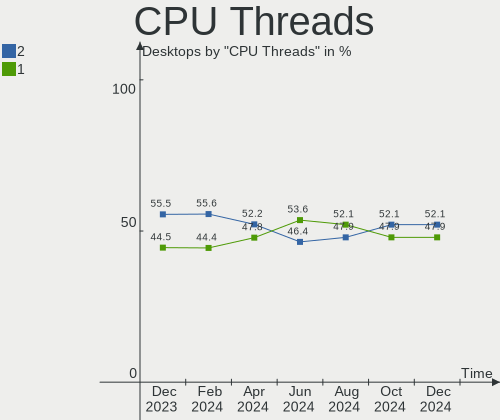
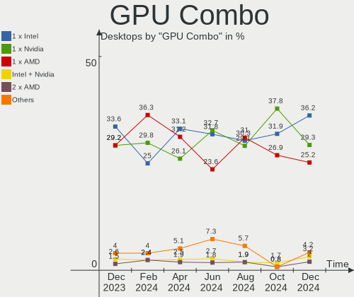
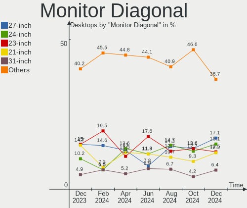
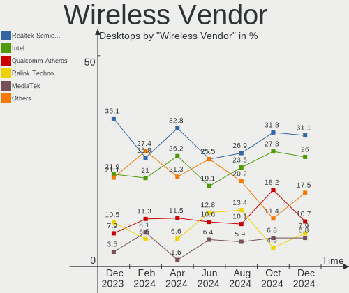
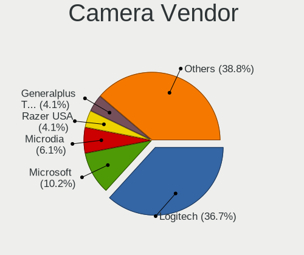

OpenMandriva - Hardware Trends (Desktops)
-----------------------------------------

A project to identify most popular hardware characteristics and track their change
over time based on data collected by Linux users at https://Linux-Hardware.org.

Anyone can contribute to this report by the [hw-probe](https://github.com/linuxhw/hw-probe) tool:

    sudo -E hw-probe -all -upload

This report is for one last month. Overall report since the beginning of time: [TestDays](https://github.com/linuxhw/TestDays)

Period: May, 2023.

Contents
--------

* [ System ](#system)
  - [ OS                       ](#os)
  - [ OS Family                ](#os-family)
  - [ Kernel                   ](#kernel)
  - [ Kernel Family            ](#kernel-family)
  - [ Kernel Major Ver.        ](#kernel-major-ver)
  - [ Arch                     ](#arch)
  - [ DE                       ](#de)
  - [ Display Server           ](#display-server)
  - [ Display Manager          ](#display-manager)
  - [ OS Lang                  ](#os-lang)
  - [ Boot Mode                ](#boot-mode)
  - [ Filesystem               ](#filesystem)
  - [ Part. scheme             ](#part-scheme)
  - [ Dual Boot with Linux/BSD ](#dual-boot-with-linuxbsd)
  - [ Dual Boot (Win)          ](#dual-boot-win)

* [ Board ](#board)
  - [ Vendor                   ](#vendor)
  - [ Model                    ](#model)
  - [ Model Family             ](#model-family)
  - [ MFG Year                 ](#mfg-year)
  - [ Form Factor              ](#form-factor)
  - [ Secure Boot              ](#secure-boot)
  - [ Coreboot                 ](#coreboot)
  - [ RAM Size                 ](#ram-size)
  - [ RAM Used                 ](#ram-used)
  - [ Total Drives             ](#total-drives)
  - [ Has CD-ROM               ](#has-cd-rom)
  - [ Has Ethernet             ](#has-ethernet)
  - [ Has WiFi                 ](#has-wifi)
  - [ Has Bluetooth            ](#has-bluetooth)

* [ Location ](#location)
  - [ Country                  ](#country)
  - [ City                     ](#city)

* [ Drives ](#drives)
  - [ Drive Vendor             ](#drive-vendor)
  - [ Drive Model              ](#drive-model)
  - [ HDD Vendor               ](#hdd-vendor)
  - [ SSD Vendor               ](#ssd-vendor)
  - [ Drive Kind               ](#drive-kind)
  - [ Drive Connector          ](#drive-connector)
  - [ Drive Size               ](#drive-size)
  - [ Space Total              ](#space-total)
  - [ Space Used               ](#space-used)
  - [ Malfunc. Drives          ](#malfunc-drives)
  - [ Malfunc. Drive Vendor    ](#malfunc-drive-vendor)
  - [ Malfunc. HDD Vendor      ](#malfunc-hdd-vendor)
  - [ Malfunc. Drive Kind      ](#malfunc-drive-kind)
  - [ Failed Drives            ](#failed-drives)
  - [ Failed Drive Vendor      ](#failed-drive-vendor)
  - [ Drive Status             ](#drive-status)

* [ Storage controller ](#storage-controller)
  - [ Storage Vendor           ](#storage-vendor)
  - [ Storage Model            ](#storage-model)
  - [ Storage Kind             ](#storage-kind)

* [ Processor ](#processor)
  - [ CPU Vendor               ](#cpu-vendor)
  - [ CPU Model                ](#cpu-model)
  - [ CPU Model Family         ](#cpu-model-family)
  - [ CPU Cores                ](#cpu-cores)
  - [ CPU Sockets              ](#cpu-sockets)
  - [ CPU Threads              ](#cpu-threads)
  - [ CPU Op-Modes             ](#cpu-op-modes)
  - [ CPU Microcode            ](#cpu-microcode)
  - [ CPU Microarch            ](#cpu-microarch)

* [ Graphics ](#graphics)
  - [ GPU Vendor               ](#gpu-vendor)
  - [ GPU Model                ](#gpu-model)
  - [ GPU Combo                ](#gpu-combo)
  - [ GPU Driver               ](#gpu-driver)
  - [ GPU Memory               ](#gpu-memory)

* [ Monitor ](#monitor)
  - [ Monitor Vendor           ](#monitor-vendor)
  - [ Monitor Model            ](#monitor-model)
  - [ Monitor Resolution       ](#monitor-resolution)
  - [ Monitor Diagonal         ](#monitor-diagonal)
  - [ Monitor Width            ](#monitor-width)
  - [ Aspect Ratio             ](#aspect-ratio)
  - [ Monitor Area             ](#monitor-area)
  - [ Pixel Density            ](#pixel-density)
  - [ Multiple Monitors        ](#multiple-monitors)

* [ Network ](#network)
  - [ Net Controller Vendor    ](#net-controller-vendor)
  - [ Net Controller Model     ](#net-controller-model)
  - [ Wireless Vendor          ](#wireless-vendor)
  - [ Wireless Model           ](#wireless-model)
  - [ Ethernet Vendor          ](#ethernet-vendor)
  - [ Ethernet Model           ](#ethernet-model)
  - [ Net Controller Kind      ](#net-controller-kind)
  - [ Used Controller          ](#used-controller)
  - [ NICs                     ](#nics)
  - [ IPv6                     ](#ipv6)

* [ Bluetooth ](#bluetooth)
  - [ Bluetooth Vendor         ](#bluetooth-vendor)
  - [ Bluetooth Model          ](#bluetooth-model)

* [ Sound ](#sound)
  - [ Sound Vendor             ](#sound-vendor)
  - [ Sound Model              ](#sound-model)

* [ Memory ](#memory)
  - [ Memory Vendor            ](#memory-vendor)
  - [ Memory Model             ](#memory-model)
  - [ Memory Kind              ](#memory-kind)
  - [ Memory Form Factor       ](#memory-form-factor)
  - [ Memory Size              ](#memory-size)
  - [ Memory Speed             ](#memory-speed)

* [ Printers & scanners ](#printers--scanners)
  - [ Printer Vendor           ](#printer-vendor)
  - [ Printer Model            ](#printer-model)
  - [ Scanner Vendor           ](#scanner-vendor)
  - [ Scanner Model            ](#scanner-model)

* [ Camera ](#camera)
  - [ Camera Vendor            ](#camera-vendor)
  - [ Camera Model             ](#camera-model)

* [ Security ](#security)
  - [ Fingerprint Vendor       ](#fingerprint-vendor)
  - [ Fingerprint Model        ](#fingerprint-model)
  - [ Chipcard Vendor          ](#chipcard-vendor)
  - [ Chipcard Model           ](#chipcard-model)

* [ Unsupported ](#unsupported)
  - [ Unsupported Devices      ](#unsupported-devices)
  - [ Unsupported Device Types ](#unsupported-device-types)

System
------

OS
--

Installed operating systems

| Name               | Desktops | Percent |
|--------------------|----------|---------|
| OpenMandriva 23.03 | 126      | 71.59%  |
| OpenMandriva 4.3   | 24       | 13.64%  |
| OpenMandriva 4.2   | 7        | 3.98%   |
| OpenMandriva 23.01 | 7        | 3.98%   |
| OpenMandriva 23.90 | 5        | 2.84%   |
| OpenMandriva 4.90  | 3        | 1.7%    |
| OpenMandriva 4.50  | 3        | 1.7%    |
| OpenMandriva 22.90 | 1        | 0.57%   |

OS Family
---------

OS without a version

| Name         | Desktops | Percent |
|--------------|----------|---------|
| OpenMandriva | 176      | 100%    |

Kernel
------

Version of the Linux kernel

| Version                     | Desktops | Percent |
|-----------------------------|----------|---------|
| 6.2.6-desktop-1omv2390      | 125      | 71.02%  |
| 5.16.13-desktop-1omv4003    | 14       | 7.95%   |
| 5.16.7-desktop-1omv4003     | 11       | 6.25%   |
| 6.1.1-desktop-1omv2290      | 5        | 2.84%   |
| 5.10.14-desktop-1omv4002    | 5        | 2.84%   |
| 5.18.12-desktop-3omv4090    | 3        | 1.7%    |
| 6.1.4-desktop-1omv2301      | 2        | 1.14%   |
| 5.11.12-desktop-1omv4002    | 2        | 1.14%   |
| 6.3.3-desktop-2omv2390      | 1        | 0.57%   |
| 6.3.0-desktop-2omv2390      | 1        | 0.57%   |
| 6.3.0-desktop-1omv2390      | 1        | 0.57%   |
| 6.2.10-desktop-2.0omv4.9mjn | 1        | 0.57%   |
| 6.0.8-desktop-2omv22090     | 1        | 0.57%   |
| 5.19.5-desktop-1omv4090     | 1        | 0.57%   |
| 5.19.12-desktop-2omv4090    | 1        | 0.57%   |
| 5.18.13-desktop-1omv4090    | 1        | 0.57%   |
| 5.12.4-desktop-1omv4050     | 1        | 0.57%   |

Kernel Family
-------------

Linux kernel without a distro release

| Version | Desktops | Percent |
|---------|----------|---------|
| 6.2.6   | 125      | 71.02%  |
| 5.16.13 | 14       | 7.95%   |
| 5.16.7  | 11       | 6.25%   |
| 6.1.1   | 5        | 2.84%   |
| 5.10.14 | 5        | 2.84%   |
| 5.18.12 | 3        | 1.7%    |
| 6.3.0   | 2        | 1.14%   |
| 6.1.4   | 2        | 1.14%   |
| 5.11.12 | 2        | 1.14%   |
| 6.3.3   | 1        | 0.57%   |
| 6.2.10  | 1        | 0.57%   |
| 6.0.8   | 1        | 0.57%   |
| 5.19.5  | 1        | 0.57%   |
| 5.19.12 | 1        | 0.57%   |
| 5.18.13 | 1        | 0.57%   |
| 5.12.4  | 1        | 0.57%   |

Kernel Major Ver.
-----------------

Linux kernel major version

| Version | Desktops | Percent |
|---------|----------|---------|
| 6.2     | 126      | 71.59%  |
| 5.16    | 25       | 14.2%   |
| 6.1     | 7        | 3.98%   |
| 5.10    | 5        | 2.84%   |
| 5.18    | 4        | 2.27%   |
| 6.3     | 3        | 1.7%    |
| 5.19    | 2        | 1.14%   |
| 5.11    | 2        | 1.14%   |
| 6.0     | 1        | 0.57%   |
| 5.12    | 1        | 0.57%   |

Arch
----

OS architecture (x86_64, i586, etc.)

| Name   | Desktops | Percent |
|--------|----------|---------|
| x86_64 | 176      | 100%    |

DE
--

Desktop Environment

| Name     | Desktops | Percent |
|----------|----------|---------|
| KDE5     | 157      | 89.2%   |
| LXQt     | 9        | 5.11%   |
| GNOME    | 9        | 5.11%   |
| Cinnamon | 1        | 0.57%   |

Display Server
--------------

X11 or Wayland

| Name    | Desktops | Percent |
|---------|----------|---------|
| X11     | 167      | 94.89%  |
| Wayland | 9        | 5.11%   |

Display Manager
---------------

SDDM, LightDM, etc.

| Name | Desktops | Percent |
|------|----------|---------|
| SDDM | 167      | 94.89%  |
| GDM  | 9        | 5.11%   |

OS Lang
-------

Language

| Lang  | Desktops | Percent |
|-------|----------|---------|
| en_US | 82       | 46.59%  |
| ru_RU | 14       | 7.95%   |
| de_DE | 13       | 7.39%   |
| pl_PL | 11       | 6.25%   |
| fr_FR | 11       | 6.25%   |
| pt_BR | 8        | 4.55%   |
| it_IT | 5        | 2.84%   |
| en_GB | 5        | 2.84%   |
| es_MX | 4        | 2.27%   |
| cs_CZ | 4        | 2.27%   |
| hu_HU | 3        | 1.7%    |
| es_ES | 3        | 1.7%    |
| en_AU | 3        | 1.7%    |
| fr_CA | 2        | 1.14%   |
| UTF-8 | 1        | 0.57%   |
| sk_SK | 1        | 0.57%   |
| ja_JP | 1        | 0.57%   |
| fr_BE | 1        | 0.57%   |
| es_AR | 1        | 0.57%   |
| en_CA | 1        | 0.57%   |
| de_AT | 1        | 0.57%   |
| da_DK | 1        | 0.57%   |

Boot Mode
---------

EFI or BIOS

| Mode | Desktops | Percent |
|------|----------|---------|
| BIOS | 96       | 54.55%  |
| EFI  | 80       | 45.45%  |

Filesystem
----------

Type of filesystem

| Type    | Desktops | Percent |
|---------|----------|---------|
| Ext4    | 93       | 52.84%  |
| Overlay | 72       | 40.91%  |
| Btrfs   | 7        | 3.98%   |
| Xfs     | 2        | 1.14%   |
| Jfs     | 1        | 0.57%   |
| Ext3    | 1        | 0.57%   |

Part. scheme
------------

Scheme of partitioning

| Type | Desktops | Percent |
|------|----------|---------|
| GPT  | 121      | 68.75%  |
| MBR  | 55       | 31.25%  |

Dual Boot with Linux/BSD
------------------------

Hosting more than one Linux/BSD

| Dual boot | Desktops | Percent |
|-----------|----------|---------|
| Yes       | 107      | 60.8%   |
| No        | 69       | 39.2%   |

Dual Boot (Win)
---------------

Hosting Linux and Windows

| Dual boot | Desktops | Percent |
|-----------|----------|---------|
| Yes       | 92       | 52.27%  |
| No        | 84       | 47.73%  |

Board
-----

Vendor
------

Motherboard manufacturer

| Name                | Desktops | Percent |
|---------------------|----------|---------|
| ASUSTek Computer    | 39       | 22.16%  |
| Gigabyte Technology | 35       | 19.89%  |
| ASRock              | 18       | 10.23%  |
| MSI                 | 16       | 9.09%   |
| Hewlett-Packard     | 13       | 7.39%   |
| Dell                | 13       | 7.39%   |
| Intel               | 6        | 3.41%   |
| Lenovo              | 5        | 2.84%   |
| Foxconn             | 5        | 2.84%   |
| Acer                | 5        | 2.84%   |
| Unknown             | 4        | 2.27%   |
| Fujitsu Siemens     | 3        | 1.7%    |
| BESSTAR Tech        | 3        | 1.7%    |
| Pegatron            | 2        | 1.14%   |
| Wistron             | 1        | 0.57%   |
| TPV-INVENTA         | 1        | 0.57%   |
| Shuttle             | 1        | 0.57%   |
| Maxtang             | 1        | 0.57%   |
| MAXSUN              | 1        | 0.57%   |
| Inventec            | 1        | 0.57%   |
| Gateway             | 1        | 0.57%   |
| Fujitsu             | 1        | 0.57%   |
| Alienware           | 1        | 0.57%   |

Model
-----

Motherboard model

| Name                                      | Desktops | Percent |
|-------------------------------------------|----------|---------|
| Unknown                                   | 4        | 2.27%   |
| Intel H61                                 | 2        | 1.14%   |
| Intel B75                                 | 2        | 1.14%   |
| Gigabyte GA-78LMT-USB3                    | 2        | 1.14%   |
| Gigabyte B360M-DS3H                       | 2        | 1.14%   |
| Foxconn G41MD                             | 2        | 1.14%   |
| Dell OptiPlex 9020                        | 2        | 1.14%   |
| BESSTAR Tech UM350                        | 2        | 1.14%   |
| ASUS TUF Gaming X570-PLUS                 | 2        | 1.14%   |
| ASUS SABERTOOTH 990FX R2.0                | 2        | 1.14%   |
| ASUS All Series                           | 2        | 1.14%   |
| ASRock B450M Steel Legend                 | 2        | 1.14%   |
| ASRock A320M-HDV R4.0                     | 2        | 1.14%   |
| Wistron ProLiant ML110 G6                 | 1        | 0.57%   |
| TPV-INVENTA Pro 1005 Series All-in-One PC | 1        | 0.57%   |
| Shuttle SZ77                              | 1        | 0.57%   |
| Pegatron Pro 3010 Microtower PC           | 1        | 0.57%   |
| Pegatron NP185AAR-ABA CQ5110F             | 1        | 0.57%   |
| MSI MS-7D18                               | 1        | 0.57%   |
| MSI MS-7D11                               | 1        | 0.57%   |
| MSI MS-7C96                               | 1        | 0.57%   |
| MSI MS-7C95                               | 1        | 0.57%   |
| MSI MS-7C91                               | 1        | 0.57%   |
| MSI MS-7C34                               | 1        | 0.57%   |
| MSI MS-7C02                               | 1        | 0.57%   |
| MSI MS-7B86                               | 1        | 0.57%   |
| MSI MS-7A70                               | 1        | 0.57%   |
| MSI MS-7A38                               | 1        | 0.57%   |
| MSI MS-7A15                               | 1        | 0.57%   |
| MSI MS-7996                               | 1        | 0.57%   |
| MSI MS-7695                               | 1        | 0.57%   |
| MSI MS-7681                               | 1        | 0.57%   |
| MSI MS-7641                               | 1        | 0.57%   |
| MSI MS-7025                               | 1        | 0.57%   |
| Maxtang FP650                             | 1        | 0.57%   |
| MAXSUN MS-A86FX FS M.3                    | 1        | 0.57%   |
| Lenovo ThinkStation E32 30A0S00W00        | 1        | 0.57%   |
| Lenovo ThinkCentre M75s Gen 2 11JAS1J200  | 1        | 0.57%   |
| Lenovo ThinkCentre M73 10B7A1GWCS         | 1        | 0.57%   |
| Lenovo ThinkCentre M71e 5033A1U           | 1        | 0.57%   |

Model Family
------------

Motherboard model prefix

| Name                    | Desktops | Percent |
|-------------------------|----------|---------|
| Dell OptiPlex           | 8        | 4.55%   |
| HP Compaq               | 6        | 3.41%   |
| Lenovo ThinkCentre      | 4        | 2.27%   |
| ASUS PRIME              | 4        | 2.27%   |
| Unknown                 | 4        | 2.27%   |
| Fujitsu Siemens ESPRIMO | 3        | 1.7%    |
| Dell Precision          | 3        | 1.7%    |
| ASUS TUF                | 3        | 1.7%    |
| Acer Aspire             | 3        | 1.7%    |
| Intel H61               | 2        | 1.14%   |
| Intel B75               | 2        | 1.14%   |
| HP Pavilion             | 2        | 1.14%   |
| Gigabyte X570S          | 2        | 1.14%   |
| Gigabyte H410M          | 2        | 1.14%   |
| Gigabyte GA-78LMT-USB3  | 2        | 1.14%   |
| Gigabyte B550M          | 2        | 1.14%   |
| Gigabyte B450M          | 2        | 1.14%   |
| Gigabyte B360M-DS3H     | 2        | 1.14%   |
| Foxconn G41MD           | 2        | 1.14%   |
| BESSTAR Tech UM350      | 2        | 1.14%   |
| ASUS SABERTOOTH         | 2        | 1.14%   |
| ASUS ROG                | 2        | 1.14%   |
| ASUS P8Z77-V            | 2        | 1.14%   |
| ASUS P5G41T-M           | 2        | 1.14%   |
| ASUS All                | 2        | 1.14%   |
| ASRock B450M            | 2        | 1.14%   |
| ASRock A320M-HDV        | 2        | 1.14%   |
| Acer Veriton            | 2        | 1.14%   |
| Wistron ProLiant        | 1        | 0.57%   |
| TPV-INVENTA Pro         | 1        | 0.57%   |
| Shuttle SZ77            | 1        | 0.57%   |
| Pegatron Pro            | 1        | 0.57%   |
| Pegatron NP185AAR-ABA   | 1        | 0.57%   |
| MSI MS-7D18             | 1        | 0.57%   |
| MSI MS-7D11             | 1        | 0.57%   |
| MSI MS-7C96             | 1        | 0.57%   |
| MSI MS-7C95             | 1        | 0.57%   |
| MSI MS-7C91             | 1        | 0.57%   |
| MSI MS-7C34             | 1        | 0.57%   |
| MSI MS-7C02             | 1        | 0.57%   |

MFG Year
--------

Motherboard manufacture year

| Year | Desktops | Percent |
|------|----------|---------|
| 2012 | 17       | 9.66%   |
| 2009 | 16       | 9.09%   |
| 2021 | 14       | 7.95%   |
| 2019 | 13       | 7.39%   |
| 2013 | 13       | 7.39%   |
| 2010 | 13       | 7.39%   |
| 2018 | 12       | 6.82%   |
| 2011 | 12       | 6.82%   |
| 2017 | 11       | 6.25%   |
| 2022 | 10       | 5.68%   |
| 2020 | 9        | 5.11%   |
| 2008 | 9        | 5.11%   |
| 2014 | 7        | 3.98%   |
| 2016 | 6        | 3.41%   |
| 2007 | 5        | 2.84%   |
| 2006 | 4        | 2.27%   |
| 2015 | 3        | 1.7%    |
| 2023 | 1        | 0.57%   |
| 2005 | 1        | 0.57%   |

Form Factor
-----------

Physical design of the computer

| Name    | Desktops | Percent |
|---------|----------|---------|
| Desktop | 176      | 100%    |

Secure Boot
-----------

Enabled or disabled

| State    | Desktops | Percent |
|----------|----------|---------|
| Disabled | 176      | 100%    |

Coreboot
--------

Have coreboot on board

| Used | Desktops | Percent |
|------|----------|---------|
| No   | 176      | 100%    |

RAM Size
--------

Total RAM memory

| Size in GB  | Desktops | Percent |
|-------------|----------|---------|
| 16.01-24.0  | 45       | 25.57%  |
| 8.01-16.0   | 39       | 22.16%  |
| 3.01-4.0    | 34       | 19.32%  |
| 4.01-8.0    | 25       | 14.2%   |
| 32.01-64.0  | 12       | 6.82%   |
| 64.01-256.0 | 8        | 4.55%   |
| 1.01-2.0    | 7        | 3.98%   |
| 2.01-3.0    | 3        | 1.7%    |
| 24.01-32.0  | 2        | 1.14%   |
| 0.51-1.0    | 1        | 0.57%   |

RAM Used
--------

Used RAM memory

| Used GB    | Desktops | Percent |
|------------|----------|---------|
| 1.01-2.0   | 114      | 64.77%  |
| 2.01-3.0   | 34       | 19.32%  |
| 0.51-1.0   | 14       | 7.95%   |
| 3.01-4.0   | 7        | 3.98%   |
| 0.01-0.5   | 5        | 2.84%   |
| 4.01-8.0   | 1        | 0.57%   |
| 32.01-64.0 | 1        | 0.57%   |

Total Drives
------------

Number of drives on board

| Drives | Desktops | Percent |
|--------|----------|---------|
| 1      | 63       | 35.8%   |
| 2      | 60       | 34.09%  |
| 3      | 21       | 11.93%  |
| 4      | 13       | 7.39%   |
| 5      | 6        | 3.41%   |
| 0      | 5        | 2.84%   |
| 6      | 3        | 1.7%    |
| 8      | 2        | 1.14%   |
| 7      | 2        | 1.14%   |
| 13     | 1        | 0.57%   |

Has CD-ROM
----------

Has CD-ROM on board

| Presented | Desktops | Percent |
|-----------|----------|---------|
| Yes       | 90       | 51.14%  |
| No        | 86       | 48.86%  |

Has Ethernet
------------

Has Ethernet on board

| Presented | Desktops | Percent |
|-----------|----------|---------|
| Yes       | 174      | 98.86%  |
| No        | 2        | 1.14%   |

Has WiFi
--------

Has WiFi module

| Presented | Desktops | Percent |
|-----------|----------|---------|
| No        | 110      | 62.5%   |
| Yes       | 66       | 37.5%   |

Has Bluetooth
-------------

Has Bluetooth module

| Presented | Desktops | Percent |
|-----------|----------|---------|
| No        | 135      | 76.7%   |
| Yes       | 41       | 23.3%   |

Location
--------

Country
-------

Geographic location (country)

| Country        | Desktops | Percent |
|----------------|----------|---------|
| USA            | 22       | 12.5%   |
| Germany        | 17       | 9.66%   |
| France         | 15       | 8.52%   |
| Russia         | 14       | 7.95%   |
| Poland         | 14       | 7.95%   |
| Brazil         | 14       | 7.95%   |
| Canada         | 10       | 5.68%   |
| Italy          | 7        | 3.98%   |
| Japan          | 6        | 3.41%   |
| UK             | 3        | 1.7%    |
| Sweden         | 3        | 1.7%    |
| Spain          | 3        | 1.7%    |
| Slovakia       | 3        | 1.7%    |
| Romania        | 3        | 1.7%    |
| India          | 3        | 1.7%    |
| Hungary        | 3        | 1.7%    |
| Czechia        | 3        | 1.7%    |
| Australia      | 3        | 1.7%    |
| Argentina      | 3        | 1.7%    |
| Portugal       | 2        | 1.14%   |
| Norway         | 2        | 1.14%   |
| Mexico         | 2        | 1.14%   |
| Malaysia       | 2        | 1.14%   |
| Chile          | 2        | 1.14%   |
| Azerbaijan     | 2        | 1.14%   |
| Ukraine        | 1        | 0.57%   |
| Netherlands    | 1        | 0.57%   |
| Jamaica        | 1        | 0.57%   |
| Indonesia      | 1        | 0.57%   |
| Iceland        | 1        | 0.57%   |
| Hong Kong      | 1        | 0.57%   |
| Greece         | 1        | 0.57%   |
| Egypt          | 1        | 0.57%   |
| Denmark        | 1        | 0.57%   |
| Congo Republic | 1        | 0.57%   |
| China          | 1        | 0.57%   |
| Belgium        | 1        | 0.57%   |
| Belarus        | 1        | 0.57%   |
| Austria        | 1        | 0.57%   |
| Algeria        | 1        | 0.57%   |

City
----

Geographic location (city)

| City                    | Desktops | Percent |
|-------------------------|----------|---------|
| Montreal                | 5        | 2.84%   |
| Moscow                  | 3        | 1.7%    |
| Milan                   | 3        | 1.7%    |
| Sydney                  | 2        | 1.14%   |
| Rio de Janeiro          | 2        | 1.14%   |
| Lisbon                  | 2        | 1.14%   |
| Essen                   | 2        | 1.14%   |
| Dolny Ohaj              | 2        | 1.14%   |
| Bezancourt              | 2        | 1.14%   |
| Berlin                  | 2        | 1.14%   |
| Baku                    | 2        | 1.14%   |
| Zabrze                  | 1        | 0.57%   |
| Yuen Long               | 1        | 0.57%   |
| Yokohama                | 1        | 0.57%   |
| Wroclaw                 | 1        | 0.57%   |
| Woodford Green          | 1        | 0.57%   |
| Wisla                   | 1        | 0.57%   |
| Williamsburg            | 1        | 0.57%   |
| Waxahachie              | 1        | 0.57%   |
| Warsaw                  | 1        | 0.57%   |
| Voronezh                | 1        | 0.57%   |
| Villefranche-sur-Saône | 1        | 0.57%   |
| Vikhorevka              | 1        | 0.57%   |
| Valencia                | 1        | 0.57%   |
| Ulm                     | 1        | 0.57%   |
| Ufa                     | 1        | 0.57%   |
| Toulouse                | 1        | 0.57%   |
| Tomsk                   | 1        | 0.57%   |
| Tolga                   | 1        | 0.57%   |
| Thessaloniki            | 1        | 0.57%   |
| Târgu Mureş           | 1        | 0.57%   |
| Szczecin                | 1        | 0.57%   |
| Sterling Heights        | 1        | 0.57%   |
| Stary Oskol             | 1        | 0.57%   |
| St Petersburg           | 1        | 0.57%   |
| Smolensk                | 1        | 0.57%   |
| Shimorenjaku            | 1        | 0.57%   |
| Seville                 | 1        | 0.57%   |
| Sevastopol              | 1        | 0.57%   |
| Seattle                 | 1        | 0.57%   |

Drives
------

Drive Vendor
------------

Hard drive vendors

| Vendor              | Desktops | Drives | Percent |
|---------------------|----------|--------|---------|
| WDC                 | 69       | 95     | 21.23%  |
| Seagate             | 60       | 74     | 18.46%  |
| Samsung Electronics | 35       | 47     | 10.77%  |
| Kingston            | 22       | 25     | 6.77%   |
| Toshiba             | 18       | 19     | 5.54%   |
| SanDisk             | 12       | 14     | 3.69%   |
| Crucial             | 11       | 12     | 3.38%   |
| Hitachi             | 10       | 11     | 3.08%   |
| China               | 8        | 8      | 2.46%   |
| A-DATA Technology   | 7        | 7      | 2.15%   |
| SPCC                | 6        | 8      | 1.85%   |
| HGST                | 4        | 5      | 1.23%   |
| Unknown             | 3        | 3      | 0.92%   |
| SK hynix            | 3        | 3      | 0.92%   |
| Realtek             | 3        | 3      | 0.92%   |
| PNY                 | 3        | 3      | 0.92%   |
| Patriot             | 3        | 3      | 0.92%   |
| Lexar               | 3        | 3      | 0.92%   |
| Intenso             | 3        | 3      | 0.92%   |
| Intel               | 3        | 3      | 0.92%   |
| WD MediaMax         | 2        | 2      | 0.62%   |
| Transcend           | 2        | 2      | 0.62%   |
| SUNEAST             | 2        | 2      | 0.62%   |
| Phison              | 2        | 2      | 0.62%   |
| Netac               | 2        | 2      | 0.62%   |
| Maxtor              | 2        | 2      | 0.62%   |
| GOODRAM             | 2        | 2      | 0.62%   |
| Gigabyte Technology | 2        | 2      | 0.62%   |
| Corsair             | 2        | 2      | 0.62%   |
| AGI                 | 2        | 2      | 0.62%   |
| XPG                 | 1        | 1      | 0.31%   |
| USB                 | 1        | 1      | 0.31%   |
| TO Exter            | 1        | 1      | 0.31%   |
| Team                | 1        | 1      | 0.31%   |
| Space ke            | 1        | 1      | 0.31%   |
| Silicon Motion      | 1        | 1      | 0.31%   |
| SAGE                | 1        | 1      | 0.31%   |
| SABRENT             | 1        | 1      | 0.31%   |
| QUANTUM             | 1        | 1      | 0.31%   |
| Neo                 | 1        | 1      | 0.31%   |

Drive Model
-----------

Hard drive models

| Model                               | Desktops | Percent |
|-------------------------------------|----------|---------|
| Seagate ST500DM002-1BD142 500GB     | 6        | 1.59%   |
| Toshiba DT01ACA100 1TB              | 5        | 1.33%   |
| Kingston SV300S37A120G 120GB SSD    | 5        | 1.33%   |
| Seagate ST1000DM003-1CH162 1TB      | 4        | 1.06%   |
| WDC WD5000AAKX-001CA0 500GB         | 3        | 0.8%    |
| WDC WD10EZEX-00WN4A0 1TB            | 3        | 0.8%    |
| Unknown SD/MMC/MS PRO 64GB          | 3        | 0.8%    |
| Toshiba DT01ACA050 500GB            | 3        | 0.8%    |
| Seagate ST2000DM008-2FR102 2TB      | 3        | 0.8%    |
| Kingston SA400S37480G 480GB SSD     | 3        | 0.8%    |
| Crucial CT480BX500SSD1 480GB        | 3        | 0.8%    |
| Crucial CT240BX500SSD1 240GB        | 3        | 0.8%    |
| Crucial CT1000BX500SSD1 1TB         | 3        | 0.8%    |
| WDC WDS500G2B0A-00SM50 500GB SSD    | 2        | 0.53%   |
| WDC WDS100T2B0A-00SM50 1TB SSD      | 2        | 0.53%   |
| WDC WD2500AAKX-753CA1 250GB         | 2        | 0.53%   |
| WDC WD2500AAJS-75M0A0 250GB         | 2        | 0.53%   |
| WDC WD10JPCX-24UE4T0 1TB            | 2        | 0.53%   |
| WDC WD10EZEX-60WN4A0 1TB            | 2        | 0.53%   |
| WDC WD1002FAEX-00Z3A0 1TB           | 2        | 0.53%   |
| Toshiba MQ01ABF050 500GB            | 2        | 0.53%   |
| Toshiba MQ01ABD100 1TB              | 2        | 0.53%   |
| SPCC Solid State Disk 256GB         | 2        | 0.53%   |
| SPCC M.2 PCIe SSD 256GB             | 2        | 0.53%   |
| Seagate ST500LM012 HN-M500MBB 500GB | 2        | 0.53%   |
| Seagate ST4000DM004-2CV104 4TB      | 2        | 0.53%   |
| Seagate ST3500414CS 500GB           | 2        | 0.53%   |
| Seagate ST3500413AS 500GB           | 2        | 0.53%   |
| Seagate ST31000528AS 1TB            | 2        | 0.53%   |
| Seagate ST250DM000-1BC141 250GB     | 2        | 0.53%   |
| Seagate ST2000DM006-2DM164 2TB      | 2        | 0.53%   |
| Seagate ST2000DM001-1ER164 2TB      | 2        | 0.53%   |
| Seagate ST1000DX001-1NS162 1TB      | 2        | 0.53%   |
| Seagate ST1000DM010-2EP102 1TB      | 2        | 0.53%   |
| Seagate Expansion Desk 4TB          | 2        | 0.53%   |
| Seagate Expansion 1TB               | 2        | 0.53%   |
| Seagate BUP Slim BK 2TB             | 2        | 0.53%   |
| SanDisk SSD PLUS 1000GB             | 2        | 0.53%   |
| SanDisk Portable SSD 1TB            | 2        | 0.53%   |
| Samsung SSD 980 500GB               | 2        | 0.53%   |

HDD Vendor
----------

Hard disk drive vendors

| Vendor              | Desktops | Drives | Percent |
|---------------------|----------|--------|---------|
| WDC                 | 59       | 78     | 34.71%  |
| Seagate             | 59       | 73     | 34.71%  |
| Toshiba             | 18       | 19     | 10.59%  |
| Hitachi             | 10       | 11     | 5.88%   |
| Samsung Electronics | 9        | 9      | 5.29%   |
| HGST                | 4        | 5      | 2.35%   |
| Unknown             | 3        | 3      | 1.76%   |
| WD MediaMax         | 2        | 2      | 1.18%   |
| Maxtor              | 2        | 2      | 1.18%   |
| USB                 | 1        | 1      | 0.59%   |
| SAGE                | 1        | 1      | 0.59%   |
| SABRENT             | 1        | 1      | 0.59%   |
| QUANTUM             | 1        | 1      | 0.59%   |

SSD Vendor
----------

Solid state drive vendors

| Vendor              | Desktops | Drives | Percent |
|---------------------|----------|--------|---------|
| Kingston            | 17       | 19     | 14.53%  |
| Samsung Electronics | 15       | 20     | 12.82%  |
| SanDisk             | 11       | 12     | 9.4%    |
| Crucial             | 10       | 10     | 8.55%   |
| WDC                 | 9        | 11     | 7.69%   |
| China               | 8        | 8      | 6.84%   |
| A-DATA Technology   | 7        | 7      | 5.98%   |
| SPCC                | 5        | 6      | 4.27%   |
| PNY                 | 3        | 3      | 2.56%   |
| Patriot             | 3        | 3      | 2.56%   |
| Intenso             | 3        | 3      | 2.56%   |
| SUNEAST             | 2        | 2      | 1.71%   |
| SK hynix            | 2        | 2      | 1.71%   |
| Netac               | 2        | 2      | 1.71%   |
| Intel               | 2        | 2      | 1.71%   |
| GOODRAM             | 2        | 2      | 1.71%   |
| AGI                 | 2        | 2      | 1.71%   |
| Transcend           | 1        | 1      | 0.85%   |
| TO Exter            | 1        | 1      | 0.85%   |
| Team                | 1        | 1      | 0.85%   |
| Seagate             | 1        | 1      | 0.85%   |
| Neo                 | 1        | 1      | 0.85%   |
| Lexar               | 1        | 1      | 0.85%   |
| KingSpec            | 1        | 1      | 0.85%   |
| Kingmax             | 1        | 1      | 0.85%   |
| Hanye               | 1        | 1      | 0.85%   |
| Gigabyte Technology | 1        | 1      | 0.85%   |
| faspeed             | 1        | 1      | 0.85%   |
| Dogfish             | 1        | 1      | 0.85%   |
| Corsair             | 1        | 1      | 0.85%   |
| Apacer              | 1        | 1      | 0.85%   |

Drive Kind
----------

HDD or SSD

| Kind    | Desktops | Drives | Percent |
|---------|----------|--------|---------|
| HDD     | 126      | 206    | 49.22%  |
| SSD     | 88       | 128    | 34.38%  |
| NVMe    | 41       | 53     | 16.02%  |
| Unknown | 1        | 1      | 0.39%   |

Drive Connector
---------------

SATA, SAS, NVMe, etc.

| Type | Desktops | Drives | Percent |
|------|----------|--------|---------|
| SATA | 166      | 308    | 72.17%  |
| NVMe | 40       | 50     | 17.39%  |
| SAS  | 24       | 30     | 10.43%  |

Drive Size
----------

Size of hard drive

| Size in TB | Desktops | Drives | Percent |
|------------|----------|--------|---------|
| 0.01-0.5   | 125      | 187    | 51.87%  |
| 0.51-1.0   | 82       | 103    | 34.02%  |
| 1.01-2.0   | 19       | 25     | 7.88%   |
| 3.01-4.0   | 8        | 9      | 3.32%   |
| 2.01-3.0   | 4        | 6      | 1.66%   |
| 4.01-10.0  | 2        | 2      | 0.83%   |
| 10.01-20.0 | 1        | 2      | 0.41%   |

Space Total
-----------

Amount of disk space available on the file system

| Size in GB     | Desktops | Percent |
|----------------|----------|---------|
| 1-20           | 47       | 26.7%   |
| 101-250        | 31       | 17.61%  |
| 251-500        | 24       | 13.64%  |
| 51-100         | 18       | 10.23%  |
| 501-1000       | 15       | 8.52%   |
| 1001-2000      | 12       | 6.82%   |
| 21-50          | 11       | 6.25%   |
| Unknown        | 11       | 6.25%   |
| More than 3000 | 4        | 2.27%   |
| 2001-3000      | 3        | 1.7%    |

Space Used
----------

Amount of used disk space

| Used GB        | Desktops | Percent |
|----------------|----------|---------|
| 1-20           | 124      | 70.45%  |
| 21-50          | 16       | 9.09%   |
| Unknown        | 11       | 6.25%   |
| 101-250        | 8        | 4.55%   |
| 501-1000       | 5        | 2.84%   |
| 251-500        | 4        | 2.27%   |
| 51-100         | 4        | 2.27%   |
| More than 3000 | 3        | 1.7%    |
| 1001-2000      | 1        | 0.57%   |

Malfunc. Drives
---------------

Drive models with a malfunction

| Model                             | Desktops | Drives | Percent |
|-----------------------------------|----------|--------|---------|
| WDC WD5000AAKX-001CA0 500GB       | 2        | 2      | 3.77%   |
| Seagate ST3500413AS 500GB         | 2        | 2      | 3.77%   |
| Samsung Electronics HD502HI 500GB | 2        | 2      | 3.77%   |
| WDC WD800BB-75JHC0 80GB           | 1        | 1      | 1.89%   |
| WDC WD5000LPVT-00FMCT0 500GB      | 1        | 1      | 1.89%   |
| WDC WD5000BPVT-22A1YT0 500GB      | 1        | 1      | 1.89%   |
| WDC WD5000AVCS-632DY1 500GB       | 1        | 1      | 1.89%   |
| WDC WD5000AAVS-22G9B1 500GB       | 1        | 2      | 1.89%   |
| WDC WD5000AAKX-75U6AA0 500GB      | 1        | 1      | 1.89%   |
| WDC WD2500AAJS-75M0A0 250GB       | 1        | 1      | 1.89%   |
| WDC WD2500AAJS-00L7A0 250GB       | 1        | 1      | 1.89%   |
| WDC WD20SPZX-22CRAT0 2TB          | 1        | 1      | 1.89%   |
| WDC WD20PURZ-85GU6Y0 2TB          | 1        | 1      | 1.89%   |
| WDC WD1600JS-60MHB5 160GB         | 1        | 1      | 1.89%   |
| WDC WD1600AAJS-55M0A0 160GB       | 1        | 1      | 1.89%   |
| WDC WD15EADS-22P8B0 1TB           | 1        | 1      | 1.89%   |
| WDC WD10PURX-64E5EY0 1TB          | 1        | 1      | 1.89%   |
| WDC WD10EZEX-60ZF5A0 1TB          | 1        | 1      | 1.89%   |
| WDC WD10EZEX-08WN4A0 1TB          | 1        | 1      | 1.89%   |
| WDC WD10EARS-00Y5B1 1TB           | 1        | 1      | 1.89%   |
| WDC WD1002FAEX-00Z3A0 1TB         | 1        | 1      | 1.89%   |
| WDC WD Blue SA510 2.5 1TB SSD     | 1        | 1      | 1.89%   |
| WD MediaMax WL1500GSA6472B 1TB    | 1        | 1      | 1.89%   |
| Toshiba MQ04ABF100 1TB            | 1        | 1      | 1.89%   |
| Toshiba MK6459GSXP 640GB          | 1        | 1      | 1.89%   |
| Seagate ST500DM002-1BD142 500GB   | 1        | 1      | 1.89%   |
| Seagate ST3500418AS 500GB         | 1        | 1      | 1.89%   |
| Seagate ST3500312CS 500GB         | 1        | 1      | 1.89%   |
| Seagate ST3320813AS 320GB         | 1        | 1      | 1.89%   |
| Seagate ST33000651AS 3TB          | 1        | 1      | 1.89%   |
| Seagate ST3250318AS 250GB         | 1        | 1      | 1.89%   |
| Seagate ST3160215SCE 160GB        | 1        | 1      | 1.89%   |
| Seagate ST31000524AS 1TB          | 1        | 1      | 1.89%   |
| Seagate ST2000DM001-1ER164 2TB    | 1        | 1      | 1.89%   |
| Seagate ST1000LM014-1EJ164 1TB    | 1        | 1      | 1.89%   |
| Samsung Electronics SP2504C 250GB | 1        | 1      | 1.89%   |
| Samsung Electronics HD252HJ 250GB | 1        | 1      | 1.89%   |
| Samsung Electronics HD250HJ 250GB | 1        | 1      | 1.89%   |
| SAGE 3639S 1TB                    | 1        | 1      | 1.89%   |
| QUANTUM FIREBALLlct15 20 20GB     | 1        | 1      | 1.89%   |

Malfunc. Drive Vendor
---------------------

Vendors of faulty drives

| Vendor              | Desktops | Drives | Percent |
|---------------------|----------|--------|---------|
| WDC                 | 20       | 22     | 38.46%  |
| Seagate             | 12       | 12     | 23.08%  |
| Samsung Electronics | 5        | 5      | 9.62%   |
| Hitachi             | 3        | 3      | 5.77%   |
| Toshiba             | 2        | 2      | 3.85%   |
| Kingston            | 2        | 2      | 3.85%   |
| HGST                | 2        | 2      | 3.85%   |
| A-DATA Technology   | 2        | 2      | 3.85%   |
| WD MediaMax         | 1        | 1      | 1.92%   |
| SAGE                | 1        | 1      | 1.92%   |
| QUANTUM             | 1        | 1      | 1.92%   |
| China               | 1        | 1      | 1.92%   |

Malfunc. HDD Vendor
-------------------

Vendors of faulty HDD drives

| Vendor              | Desktops | Drives | Percent |
|---------------------|----------|--------|---------|
| WDC                 | 19       | 21     | 41.3%   |
| Seagate             | 12       | 12     | 26.09%  |
| Samsung Electronics | 5        | 5      | 10.87%  |
| Hitachi             | 3        | 3      | 6.52%   |
| Toshiba             | 2        | 2      | 4.35%   |
| HGST                | 2        | 2      | 4.35%   |
| WD MediaMax         | 1        | 1      | 2.17%   |
| SAGE                | 1        | 1      | 2.17%   |
| QUANTUM             | 1        | 1      | 2.17%   |

Malfunc. Drive Kind
-------------------

Kinds of faulty drives

| Kind | Desktops | Drives | Percent |
|------|----------|--------|---------|
| HDD  | 41       | 48     | 87.23%  |
| SSD  | 6        | 6      | 12.77%  |

Failed Drives
-------------

Failed drive models

Zero info for selected period =(

Failed Drive Vendor
-------------------

Failed drive vendors

Zero info for selected period =(

Drive Status
------------

Number of failed and malfunc. drives

| Status   | Desktops | Drives | Percent |
|----------|----------|--------|---------|
| Works    | 151      | 308    | 69.91%  |
| Malfunc  | 46       | 54     | 21.3%   |
| Detected | 19       | 26     | 8.8%    |

Storage controller
------------------

Storage Vendor
--------------

Storage controller vendors

| Vendor                       | Desktops | Percent |
|------------------------------|----------|---------|
| Intel                        | 111      | 46.64%  |
| AMD                          | 58       | 24.37%  |
| Samsung Electronics          | 14       | 5.88%   |
| SanDisk                      | 7        | 2.94%   |
| Kingston Technology Company  | 7        | 2.94%   |
| ASMedia Technology           | 7        | 2.94%   |
| JMicron Technology           | 6        | 2.52%   |
| Phison Electronics           | 5        | 2.1%    |
| VIA Technologies             | 4        | 1.68%   |
| Nvidia                       | 4        | 1.68%   |
| Marvell Technology Group     | 3        | 1.26%   |
| Silicon Motion               | 2        | 0.84%   |
| MAXIO Technology (Hangzhou)  | 2        | 0.84%   |
| Adaptec                      | 2        | 0.84%   |
| Toshiba America Info Systems | 1        | 0.42%   |
| SK hynix                     | 1        | 0.42%   |
| Shenzhen Longsys Electronics | 1        | 0.42%   |
| Micron/Crucial Technology    | 1        | 0.42%   |
| Micron Technology            | 1        | 0.42%   |
| ADATA Technology             | 1        | 0.42%   |

Storage Model
-------------

Storage controller models

| Model                                                                                   | Desktops | Percent |
|-----------------------------------------------------------------------------------------|----------|---------|
| AMD FCH SATA Controller [AHCI mode]                                                     | 27       | 8.63%   |
| Intel NM10/ICH7 Family SATA Controller [IDE mode]                                       | 14       | 4.47%   |
| Intel 82801G (ICH7 Family) IDE Controller                                               | 13       | 4.15%   |
| Intel 8 Series/C220 Series Chipset Family 6-port SATA Controller 1 [AHCI mode]          | 11       | 3.51%   |
| AMD SB7x0/SB8x0/SB9x0 IDE Controller                                                    | 10       | 3.19%   |
| AMD 500 Series Chipset SATA Controller                                                  | 9        | 2.88%   |
| Intel 7 Series/C210 Series Chipset Family 6-port SATA Controller [AHCI mode]            | 8        | 2.56%   |
| Intel 200 Series PCH SATA controller [AHCI mode]                                        | 8        | 2.56%   |
| AMD SB7x0/SB8x0/SB9x0 SATA Controller [IDE mode]                                        | 8        | 2.56%   |
| AMD SB7x0/SB8x0/SB9x0 SATA Controller [AHCI mode]                                       | 8        | 2.56%   |
| AMD 400 Series Chipset SATA Controller                                                  | 8        | 2.56%   |
| Intel 6 Series/C200 Series Chipset Family Desktop SATA Controller (IDE mode, ports 4-5) | 7        | 2.24%   |
| Intel 6 Series/C200 Series Chipset Family Desktop SATA Controller (IDE mode, ports 0-3) | 7        | 2.24%   |
| Intel 6 Series/C200 Series Chipset Family 6 port Desktop SATA AHCI Controller           | 7        | 2.24%   |
| Intel 500 Series Chipset Family SATA AHCI Controller                                    | 7        | 2.24%   |
| Intel 4 Series Chipset PT IDER Controller                                               | 7        | 2.24%   |
| ASMedia ASM1062 Serial ATA Controller                                                   | 7        | 2.24%   |
| Intel Q170/Q150/B150/H170/H110/Z170/CM236 Chipset SATA Controller [AHCI Mode]           | 6        | 1.92%   |
| Samsung NVMe SSD Controller 980                                                         | 5        | 1.6%    |
| VIA VT6415 PATA IDE Host Controller                                                     | 4        | 1.28%   |
| Samsung NVMe SSD Controller SM981/PM981/PM983                                           | 4        | 1.28%   |
| Intel 82801JI (ICH10 Family) SATA AHCI Controller                                       | 4        | 1.28%   |
| Intel 82801JD/DO (ICH10 Family) SATA AHCI Controller                                    | 4        | 1.28%   |
| Intel 82801JD/DO (ICH10 Family) 4-port SATA IDE Controller                              | 4        | 1.28%   |
| Intel 82801JD/DO (ICH10 Family) 2-port SATA IDE Controller                              | 4        | 1.28%   |
| AMD FCH SATA Controller D                                                               | 4        | 1.28%   |
| Samsung NVMe SSD Controller SM961/PM961/SM963                                           | 3        | 0.96%   |
| Samsung NVMe SSD Controller PM9A1/PM9A3/980PRO                                          | 3        | 0.96%   |
| Kingston Company A2000 NVMe SSD                                                         | 3        | 0.96%   |
| JMicron JMB363 SATA/IDE Controller                                                      | 3        | 0.96%   |
| Intel SATA Controller [RAID mode]                                                       | 3        | 0.96%   |
| Intel Cannon Lake PCH SATA AHCI Controller                                              | 3        | 0.96%   |
| Intel 82801H (ICH8 Family) 4 port SATA Controller [IDE mode]                            | 3        | 0.96%   |
| Intel 7 Series/C210 Series Chipset Family 4-port SATA Controller [IDE mode]             | 3        | 0.96%   |
| Intel 7 Series/C210 Series Chipset Family 2-port SATA Controller [IDE mode]             | 3        | 0.96%   |
| SanDisk WD Blue SN550 NVMe SSD                                                          | 2        | 0.64%   |
| Phison E16 PCIe4 NVMe Controller                                                        | 2        | 0.64%   |
| Phison E12 NVMe Controller                                                              | 2        | 0.64%   |
| Nvidia MCP61 SATA Controller                                                            | 2        | 0.64%   |
| MAXIO (Hangzhou) NVMe SSD Controller MAP1202                                            | 2        | 0.64%   |

Storage Kind
------------

Kind of storage controller (IDE, SATA, NVMe, SAS, ...)

| Kind | Desktops | Percent |
|------|----------|---------|
| SATA | 130      | 55.08%  |
| IDE  | 60       | 25.42%  |
| NVMe | 40       | 16.95%  |
| RAID | 4        | 1.69%   |
| SCSI | 2        | 0.85%   |

Processor
---------

CPU Vendor
----------

Processor vendors

| Vendor | Desktops | Percent |
|--------|----------|---------|
| Intel  | 112      | 63.64%  |
| AMD    | 64       | 36.36%  |

CPU Model
---------

Processor models

| Model                                         | Desktops | Percent |
|-----------------------------------------------|----------|---------|
| Intel Core 2 Duo CPU E8400 @ 3.00GHz          | 10       | 5.68%   |
| AMD Ryzen 5 3600 6-Core Processor             | 5        | 2.84%   |
| AMD Ryzen 5 5600X 6-Core Processor            | 4        | 2.27%   |
| Intel Pentium CPU G620 @ 2.60GHz              | 3        | 1.7%    |
| Intel Core i7-7700 CPU @ 3.60GHz              | 3        | 1.7%    |
| Intel Core i5-3330 CPU @ 3.00GHz              | 3        | 1.7%    |
| Intel Core 2 Duo CPU E8200 @ 2.66GHz          | 3        | 1.7%    |
| Intel Core 2 Duo CPU E7400 @ 2.80GHz          | 3        | 1.7%    |
| Intel 11th Gen Core i5-11400 @ 2.60GHz        | 3        | 1.7%    |
| AMD Ryzen 7 3700X 8-Core Processor            | 3        | 1.7%    |
| AMD Ryzen 5 5600G with Radeon Graphics        | 3        | 1.7%    |
| AMD Ryzen 5 2600 Six-Core Processor           | 3        | 1.7%    |
| AMD FX-8350 Eight-Core Processor              | 3        | 1.7%    |
| AMD FX-6300 Six-Core Processor                | 3        | 1.7%    |
| Intel Core i7-4790 CPU @ 3.60GHz              | 2        | 1.14%   |
| Intel Core i7-2600 CPU @ 3.40GHz              | 2        | 1.14%   |
| Intel Core i5-4570 CPU @ 3.20GHz              | 2        | 1.14%   |
| Intel Core i5-4460 CPU @ 3.20GHz              | 2        | 1.14%   |
| Intel Core i5-3570 CPU @ 3.40GHz              | 2        | 1.14%   |
| Intel Core i5-3470 CPU @ 3.20GHz              | 2        | 1.14%   |
| Intel Core i5 CPU 750 @ 2.67GHz               | 2        | 1.14%   |
| Intel Core i5 CPU 650 @ 3.20GHz               | 2        | 1.14%   |
| Intel Core i3-3240 CPU @ 3.40GHz              | 2        | 1.14%   |
| Intel Core i3-2120 CPU @ 3.30GHz              | 2        | 1.14%   |
| Intel Core i3-2100 CPU @ 3.10GHz              | 2        | 1.14%   |
| Intel Core 2 Quad CPU Q6600 @ 2.40GHz         | 2        | 1.14%   |
| Intel Core 2 CPU 6300 @ 1.86GHz               | 2        | 1.14%   |
| AMD Ryzen 5 3550H with Radeon Vega Mobile Gfx | 2        | 1.14%   |
| AMD Athlon II X2 260 Processor                | 2        | 1.14%   |
| Intel Xeon CPU X5650 @ 2.67GHz                | 1        | 0.57%   |
| Intel Xeon CPU X3430 @ 2.40GHz                | 1        | 0.57%   |
| Intel Pentium Silver N6005 @ 2.00GHz          | 1        | 0.57%   |
| Intel Pentium Dual-Core CPU E6600 @ 3.06GHz   | 1        | 0.57%   |
| Intel Pentium Dual-Core CPU E6300 @ 2.80GHz   | 1        | 0.57%   |
| Intel Pentium Dual-Core CPU E5700 @ 3.00GHz   | 1        | 0.57%   |
| Intel Pentium Dual-Core CPU E5300 @ 2.60GHz   | 1        | 0.57%   |
| Intel Pentium CPU G3220 @ 3.00GHz             | 1        | 0.57%   |
| Intel Core i9-9900 CPU @ 3.10GHz              | 1        | 0.57%   |
| Intel Core i9-7900X CPU @ 3.30GHz             | 1        | 0.57%   |
| Intel Core i7-9700 CPU @ 3.00GHz              | 1        | 0.57%   |

CPU Model Family
----------------

Processor model prefix

| Model                   | Desktops | Percent |
|-------------------------|----------|---------|
| Intel Core i5           | 28       | 15.91%  |
| AMD Ryzen 5             | 21       | 11.93%  |
| Intel Core i3           | 18       | 10.23%  |
| Intel Core 2 Duo        | 18       | 10.23%  |
| Intel Core i7           | 16       | 9.09%   |
| AMD FX                  | 8        | 4.55%   |
| Other                   | 7        | 3.98%   |
| Intel Core 2 Quad       | 5        | 2.84%   |
| Intel Pentium Dual-Core | 4        | 2.27%   |
| Intel Pentium           | 4        | 2.27%   |
| Intel Celeron           | 4        | 2.27%   |
| AMD Ryzen 9             | 4        | 2.27%   |
| AMD Ryzen 7             | 4        | 2.27%   |
| AMD A8                  | 4        | 2.27%   |
| Intel Core 2            | 3        | 1.7%    |
| AMD Athlon II X2        | 3        | 1.7%    |
| AMD Athlon 64 X2        | 3        | 1.7%    |
| Intel Xeon              | 2        | 1.14%   |
| Intel Core i9           | 2        | 1.14%   |
| AMD Ryzen 3             | 2        | 1.14%   |
| AMD Phenom II X6        | 2        | 1.14%   |
| AMD Athlon              | 2        | 1.14%   |
| Intel Pentium Silver    | 1        | 0.57%   |
| Intel Atom              | 1        | 0.57%   |
| AMD Ryzen 5 PRO         | 1        | 0.57%   |
| AMD PRO A10             | 1        | 0.57%   |
| AMD Phenom II X4        | 1        | 0.57%   |
| AMD G                   | 1        | 0.57%   |
| AMD E                   | 1        | 0.57%   |
| AMD Athlon X4           | 1        | 0.57%   |
| AMD Athlon II X4        | 1        | 0.57%   |
| AMD Athlon 64           | 1        | 0.57%   |
| AMD A6                  | 1        | 0.57%   |
| AMD A12                 | 1        | 0.57%   |

CPU Cores
---------

Number of processor cores

| Number | Desktops | Percent |
|--------|----------|---------|
| 2      | 65       | 36.93%  |
| 4      | 53       | 30.11%  |
| 6      | 35       | 19.89%  |
| 8      | 8        | 4.55%   |
| 1      | 6        | 3.41%   |
| 3      | 4        | 2.27%   |
| 12     | 2        | 1.14%   |
| 16     | 1        | 0.57%   |
| 14     | 1        | 0.57%   |
| 10     | 1        | 0.57%   |

CPU Sockets
-----------

Number of sockets

| Number | Desktops | Percent |
|--------|----------|---------|
| 1      | 176      | 100%    |

CPU Threads
-----------

Threads per core (Hyper-Threading)

| Number | Desktops | Percent |
|--------|----------|---------|
| 2      | 90       | 51.14%  |
| 1      | 82       | 46.59%  |
| 8      | 2        | 1.14%   |
| 4      | 2        | 1.14%   |

CPU Op-Modes
------------

CPU Operation Modes (32-bit, 64-bit)

| Op mode        | Desktops | Percent |
|----------------|----------|---------|
| 32-bit, 64-bit | 176      | 100%    |

CPU Microcode
-------------

Microcode number

| Number     | Desktops | Percent |
|------------|----------|---------|
| Unknown    | 91       | 51.7%   |
| 0x08701021 | 8        | 4.55%   |
| 0x306a9    | 6        | 3.41%   |
| 0x206a7    | 5        | 2.84%   |
| 0x06000822 | 5        | 2.84%   |
| 0x08108109 | 4        | 2.27%   |
| 0x010000c8 | 4        | 2.27%   |
| 0x306c3    | 3        | 1.7%    |
| 0x1067a    | 3        | 1.7%    |
| 0x0a50000d | 3        | 1.7%    |
| 0x0800820d | 3        | 1.7%    |
| 0x0a201025 | 2        | 1.14%   |
| 0x0a201016 | 2        | 1.14%   |
| 0x08701030 | 2        | 1.14%   |
| 0x0600611a | 2        | 1.14%   |
| 0x06001119 | 2        | 1.14%   |
| 0x06000852 | 2        | 1.14%   |
| 0x010000bf | 2        | 1.14%   |
| 0xa0653    | 1        | 0.57%   |
| 0x906ed    | 1        | 0.57%   |
| 0x6fd      | 1        | 0.57%   |
| 0x6f2      | 1        | 0.57%   |
| 0x206c2    | 1        | 0.57%   |
| 0x106e5    | 1        | 0.57%   |
| 0x106ca    | 1        | 0.57%   |
| 0x10676    | 1        | 0.57%   |
| 0x0a601203 | 1        | 0.57%   |
| 0x0a50000c | 1        | 0.57%   |
| 0x0a20120a | 1        | 0.57%   |
| 0x0a201204 | 1        | 0.57%   |
| 0x0a201009 | 1        | 0.57%   |
| 0x08600106 | 1        | 0.57%   |
| 0x08600103 | 1        | 0.57%   |
| 0x08101016 | 1        | 0.57%   |
| 0x0800820b | 1        | 0.57%   |
| 0x07030105 | 1        | 0.57%   |
| 0x06006705 | 1        | 0.57%   |
| 0x06006118 | 1        | 0.57%   |
| 0x06003106 | 1        | 0.57%   |
| 0x0600081c | 1        | 0.57%   |

CPU Microarch
-------------

Microarchitecture

| Name             | Desktops | Percent |
|------------------|----------|---------|
| Penryn           | 24       | 13.64%  |
| IvyBridge        | 14       | 7.95%   |
| Zen 2            | 12       | 6.82%   |
| SandyBridge      | 12       | 6.82%   |
| KabyLake         | 12       | 6.82%   |
| Haswell          | 12       | 6.82%   |
| Zen 3            | 11       | 6.25%   |
| Piledriver       | 10       | 5.68%   |
| Zen+             | 8        | 4.55%   |
| K10              | 8        | 4.55%   |
| Core             | 7        | 3.98%   |
| CometLake        | 7        | 3.98%   |
| Skylake          | 6        | 3.41%   |
| Westmere         | 4        | 2.27%   |
| Nehalem          | 4        | 2.27%   |
| K8 Hammer        | 4        | 2.27%   |
| Icelake          | 4        | 2.27%   |
| Excavator        | 4        | 2.27%   |
| Bobcat           | 2        | 1.14%   |
| Alderlake Hybrid | 2        | 1.14%   |
| Zen              | 1        | 0.57%   |
| Tremont          | 1        | 0.57%   |
| Steamroller      | 1        | 0.57%   |
| Silvermont       | 1        | 0.57%   |
| Puma             | 1        | 0.57%   |
| K10 Llano        | 1        | 0.57%   |
| Goldmont         | 1        | 0.57%   |
| Bonnell          | 1        | 0.57%   |
| Unknown          | 1        | 0.57%   |

Graphics
--------

GPU Vendor
----------

Vendors of graphics cards

| Vendor | Desktops | Percent |
|--------|----------|---------|
| Intel  | 65       | 36.31%  |
| Nvidia | 61       | 34.08%  |
| AMD    | 53       | 29.61%  |

GPU Model
---------

Graphics card models

| Model                                                                       | Desktops | Percent |
|-----------------------------------------------------------------------------|----------|---------|
| Intel 4 Series Chipset Integrated Graphics Controller                       | 13       | 7.26%   |
| Intel Xeon E3-1200 v3/4th Gen Core Processor Integrated Graphics Controller | 8        | 4.47%   |
| Intel 2nd Generation Core Processor Family Integrated Graphics Controller   | 8        | 4.47%   |
| Intel Xeon E3-1200 v2/3rd Gen Core processor Graphics Controller            | 7        | 3.91%   |
| AMD Cedar [Radeon HD 5000/6000/7350/8350 Series]                            | 6        | 3.35%   |
| Nvidia GP107 [GeForce GTX 1050 Ti]                                          | 5        | 2.79%   |
| Nvidia GP106 [GeForce GTX 1060 6GB]                                         | 5        | 2.79%   |
| AMD Ellesmere [Radeon RX 470/480/570/570X/580/580X/590]                     | 5        | 2.79%   |
| Nvidia GP108 [GeForce GT 1030]                                              | 4        | 2.23%   |
| AMD Picasso/Raven 2 [Radeon Vega Series / Radeon Vega Mobile Series]        | 4        | 2.23%   |
| Nvidia GT218 [GeForce 210]                                                  | 3        | 1.68%   |
| Nvidia GP107 [GeForce GTX 1050]                                             | 3        | 1.68%   |
| Nvidia GP104 [GeForce GTX 1070]                                             | 3        | 1.68%   |
| Nvidia GK208B [GeForce GT 730]                                              | 3        | 1.68%   |
| Nvidia GK208B [GeForce GT 710]                                              | 3        | 1.68%   |
| Intel CometLake-S GT2 [UHD Graphics 630]                                    | 3        | 1.68%   |
| Intel CoffeeLake-S GT2 [UHD Graphics 630]                                   | 3        | 1.68%   |
| AMD RS880 [Radeon HD 4250]                                                  | 3        | 1.68%   |
| AMD Navi 22 [Radeon RX 6700/6700 XT/6750 XT / 6800M/6850M XT]               | 3        | 1.68%   |
| AMD Cezanne [Radeon Vega Series / Radeon Vega Mobile Series]                | 3        | 1.68%   |
| Nvidia GM204 [GeForce GTX 970]                                              | 2        | 1.12%   |
| Nvidia GA104 [GeForce RTX 3070 Lite Hash Rate]                              | 2        | 1.12%   |
| Nvidia G96C [GeForce 9500 GT]                                               | 2        | 1.12%   |
| Nvidia G92 [GeForce 9800 GT]                                                | 2        | 1.12%   |
| Intel RocketLake-S GT1 [UHD Graphics 730]                                   | 2        | 1.12%   |
| Intel HD Graphics 630                                                       | 2        | 1.12%   |
| Intel HD Graphics 530                                                       | 2        | 1.12%   |
| Intel 82Q963/Q965 Integrated Graphics Controller                            | 2        | 1.12%   |
| Intel 82G33/G31 Express Integrated Graphics Controller                      | 2        | 1.12%   |
| Intel 4th Generation Core Processor Family Integrated Graphics Controller   | 2        | 1.12%   |
| AMD RV770 [Radeon HD 4850]                                                  | 2        | 1.12%   |
| AMD RS780L [Radeon 3000]                                                    | 2        | 1.12%   |
| AMD Lexa PRO [Radeon 540/540X/550/550X / RX 540X/550/550X]                  | 2        | 1.12%   |
| Nvidia TU116 [GeForce GTX 1660]                                             | 1        | 0.56%   |
| Nvidia TU116 [GeForce GTX 1660 SUPER]                                       | 1        | 0.56%   |
| Nvidia NV44A [GeForce 6200]                                                 | 1        | 0.56%   |
| Nvidia GP106 [GeForce GTX 1060 3GB]                                         | 1        | 0.56%   |
| Nvidia GM206 [GeForce GTX 960]                                              | 1        | 0.56%   |
| Nvidia GM204 [GeForce GTX 980]                                              | 1        | 0.56%   |
| Nvidia GM107 [GeForce GTX 750 Ti]                                           | 1        | 0.56%   |

GPU Combo
---------

Combinations of graphics cards

| Name           | Desktops | Percent |
|----------------|----------|---------|
| 1 x Nvidia     | 59       | 33.52%  |
| 1 x Intel      | 54       | 30.68%  |
| 1 x AMD        | 51       | 28.98%  |
| 2 x Intel      | 9        | 5.11%   |
| Intel + Nvidia | 1        | 0.57%   |
| Intel + AMD    | 1        | 0.57%   |
| AMD + Nvidia   | 1        | 0.57%   |

GPU Driver
----------

Free vs proprietary

| Driver      | Desktops | Percent |
|-------------|----------|---------|
| Free        | 168      | 95.45%  |
| Proprietary | 4        | 2.27%   |
| Unknown     | 4        | 2.27%   |

GPU Memory
----------

Total video memory

| Size in GB | Desktops | Percent |
|------------|----------|---------|
| Unknown    | 65       | 36.93%  |
| 1.01-2.0   | 31       | 17.61%  |
| 0.01-0.5   | 25       | 14.2%   |
| 0.51-1.0   | 16       | 9.09%   |
| 3.01-4.0   | 15       | 8.52%   |
| 7.01-8.0   | 10       | 5.68%   |
| 5.01-6.0   | 8        | 4.55%   |
| 8.01-16.0  | 4        | 2.27%   |
| 2.01-3.0   | 1        | 0.57%   |
| 16.01-24.0 | 1        | 0.57%   |

Monitor
-------

Monitor Vendor
--------------

Monitor vendors

| Vendor               | Desktops | Percent |
|----------------------|----------|---------|
| Samsung Electronics  | 36       | 20.45%  |
| Goldstar             | 24       | 13.64%  |
| Dell                 | 16       | 9.09%   |
| Hewlett-Packard      | 15       | 8.52%   |
| Acer                 | 14       | 7.95%   |
| BenQ                 | 10       | 5.68%   |
| AOC                  | 9        | 5.11%   |
| ViewSonic            | 7        | 3.98%   |
| Philips              | 6        | 3.41%   |
| ASUSTek Computer     | 6        | 3.41%   |
| Ancor Communications | 5        | 2.84%   |
| Seiki                | 4        | 2.27%   |
| Iiyama               | 3        | 1.7%    |
| RTK                  | 2        | 1.14%   |
| UMC                  | 1        | 0.57%   |
| Sony                 | 1        | 0.57%   |
| Sharp                | 1        | 0.57%   |
| Sceptre Tech         | 1        | 0.57%   |
| SAC                  | 1        | 0.57%   |
| RGT                  | 1        | 0.57%   |
| Princeton            | 1        | 0.57%   |
| Pixio                | 1        | 0.57%   |
| Optoma               | 1        | 0.57%   |
| NEC Computers        | 1        | 0.57%   |
| NCS                  | 1        | 0.57%   |
| LG Electronics       | 1        | 0.57%   |
| LaCie                | 1        | 0.57%   |
| KTC                  | 1        | 0.57%   |
| HUAWEI               | 1        | 0.57%   |
| HIK                  | 1        | 0.57%   |
| HGC                  | 1        | 0.57%   |
| HannStar             | 1        | 0.57%   |
| Unknown              | 1        | 0.57%   |

Monitor Model
-------------

Monitor models

| Model                                                                   | Desktops | Percent |
|-------------------------------------------------------------------------|----------|---------|
| Seiki SE20HY SEK0CA8 1360x768 440x250mm 19.9-inch                       | 4        | 2.22%   |
| Samsung Electronics SyncMaster SAM0527 1600x900 443x250mm 20.0-inch     | 2        | 1.11%   |
| Samsung Electronics SyncMaster SAM0304 1680x1050 494x320mm 23.2-inch    | 2        | 1.11%   |
| Samsung Electronics SMB2230W SAM0640 1680x1050 474x296mm 22.0-inch      | 2        | 1.11%   |
| RTK TV RTK0001 3840x2160                                                | 2        | 1.11%   |
| Acer X193W ACR0036 1440x900 410x265mm 19.2-inch                         | 2        | 1.11%   |
| ViewSonic VX3211-2K VSCF634 2560x1440 698x392mm 31.5-inch               | 1        | 0.56%   |
| ViewSonic VP3268a-4K VSCAF3B 3840x2160 697x392mm 31.5-inch              | 1        | 0.56%   |
| ViewSonic VG2239 Series VSCC42B 1920x1080 477x268mm 21.5-inch           | 1        | 0.56%   |
| ViewSonic VG2230wm VSCA21E 1680x1050 474x296mm 22.0-inch                | 1        | 0.56%   |
| ViewSonic VA2248 SERIES VSC0E28 1920x1080 477x268mm 21.5-inch           | 1        | 0.56%   |
| ViewSonic VA1926wSERIES VSC5920 1440x900 410x256mm 19.0-inch            | 1        | 0.56%   |
| ViewSonic LCD Monitor XG2705-2K                                         | 1        | 0.56%   |
| ViewSonic LCD Monitor XG2405                                            | 1        | 0.56%   |
| UMC TV UMCC032 1920x1080 702x396mm 31.7-inch                            | 1        | 0.56%   |
| Sony TV SNY3002 1920x1080 886x498mm 40.0-inch                           | 1        | 0.56%   |
| Sharp HDMI SHP115F 1920x1080 1096x616mm 49.5-inch                       | 1        | 0.56%   |
| Sceptre Tech Sceptre Y27 SPT0AB9 2560x1440 597x336mm 27.0-inch          | 1        | 0.56%   |
| Samsung Electronics U32R59x SAM0F96 3840x2160 697x392mm 31.5-inch       | 1        | 0.56%   |
| Samsung Electronics SyncMaster SAM050B 1920x1080 477x268mm 21.5-inch    | 1        | 0.56%   |
| Samsung Electronics SyncMaster SAM04E5 1920x1080 477x268mm 21.5-inch    | 1        | 0.56%   |
| Samsung Electronics SyncMaster SAM04DE 1920x1080 477x268mm 21.5-inch    | 1        | 0.56%   |
| Samsung Electronics SyncMaster SAM02E3 1440x900 367x229mm 17.0-inch     | 1        | 0.56%   |
| Samsung Electronics SyncMaster SAM0259 1280x1024 376x301mm 19.0-inch    | 1        | 0.56%   |
| Samsung Electronics SyncMaster SAM01E1 1280x1024 376x301mm 19.0-inch    | 1        | 0.56%   |
| Samsung Electronics SMS24A450 SAM083A 1920x1200 518x324mm 24.1-inch     | 1        | 0.56%   |
| Samsung Electronics SMS19A100 SAM0867 1366x768 410x230mm 18.5-inch      | 1        | 0.56%   |
| Samsung Electronics SMB2430HD SAM0711 1920x1080 531x299mm 24.0-inch     | 1        | 0.56%   |
| Samsung Electronics SAMTRON STN0023 1280x1024 338x270mm 17.0-inch       | 1        | 0.56%   |
| Samsung Electronics S24F350 SAM0D21 1920x1080 521x293mm 23.5-inch       | 1        | 0.56%   |
| Samsung Electronics S24E390 SAM0C19 1920x1080 521x293mm 23.5-inch       | 1        | 0.56%   |
| Samsung Electronics S24E310 SAM0C2F 1920x1080 521x293mm 23.5-inch       | 1        | 0.56%   |
| Samsung Electronics S24D330 SAM0D92 1920x1080 531x299mm 24.0-inch       | 1        | 0.56%   |
| Samsung Electronics S22D300 SAM0B3F 1920x1080 477x268mm 21.5-inch       | 1        | 0.56%   |
| Samsung Electronics S22C330 SAM0A6D 1920x1080 477x268mm 21.5-inch       | 1        | 0.56%   |
| Samsung Electronics S22C300 SAM0A20 1920x1080 477x268mm 21.5-inch       | 1        | 0.56%   |
| Samsung Electronics S20C300 SAM0A19 1600x900 432x240mm 19.5-inch        | 1        | 0.56%   |
| Samsung Electronics Odyssey G6 SAM7236 2560x1440 698x392mm 31.5-inch    | 1        | 0.56%   |
| Samsung Electronics LF24T35 SAM707D 1920x1080 528x297mm 23.9-inch       | 1        | 0.56%   |
| Samsung Electronics LCD Monitor SAM7129 3840x2160 1872x1053mm 84.6-inch | 1        | 0.56%   |

Monitor Resolution
------------------

Monitor screen resolution

| Resolution         | Desktops | Percent |
|--------------------|----------|---------|
| 1920x1080 (FHD)    | 79       | 46.47%  |
| 1680x1050 (WSXGA+) | 16       | 9.41%   |
| 3840x2160 (4K)     | 12       | 7.06%   |
| 2560x1440 (QHD)    | 10       | 5.88%   |
| 1280x1024 (SXGA)   | 10       | 5.88%   |
| 1600x900 (HD+)     | 8        | 4.71%   |
| 1440x900 (WXGA+)   | 8        | 4.71%   |
| 1360x768           | 8        | 4.71%   |
| 1366x768 (WXGA)    | 6        | 3.53%   |
| 1920x1200 (WUXGA)  | 5        | 2.94%   |
| 3440x1440          | 2        | 1.18%   |
| 8320x1440          | 1        | 0.59%   |
| 2560x1600          | 1        | 0.59%   |
| 2560x1080          | 1        | 0.59%   |
| 2288x1287          | 1        | 0.59%   |
| 1600x1200          | 1        | 0.59%   |
| Unknown            | 1        | 0.59%   |

Monitor Diagonal
----------------

Diagonal size in inches

| Inches  | Desktops | Percent |
|---------|----------|---------|
| 21      | 27       | 15.7%   |
| 24      | 25       | 14.53%  |
| 27      | 22       | 12.79%  |
| 23      | 20       | 11.63%  |
| 22      | 11       | 6.4%    |
| 19      | 10       | 5.81%   |
| 31      | 9        | 5.23%   |
| 18      | 9        | 5.23%   |
| 20      | 7        | 4.07%   |
| 17      | 7        | 4.07%   |
| Unknown | 5        | 2.91%   |
| 39      | 4        | 2.33%   |
| 32      | 3        | 1.74%   |
| 72      | 2        | 1.16%   |
| 40      | 2        | 1.16%   |
| 34      | 2        | 1.16%   |
| 84      | 1        | 0.58%   |
| 49      | 1        | 0.58%   |
| 48      | 1        | 0.58%   |
| 29      | 1        | 0.58%   |
| 28      | 1        | 0.58%   |
| 15      | 1        | 0.58%   |
| 12      | 1        | 0.58%   |

Monitor Width
-------------

Physical width

| Width in mm | Desktops | Percent |
|-------------|----------|---------|
| 401-500     | 62       | 36.47%  |
| 501-600     | 61       | 35.88%  |
| 601-700     | 13       | 7.65%   |
| 301-350     | 7        | 4.12%   |
| 801-900     | 6        | 3.53%   |
| 701-800     | 5        | 2.94%   |
| 351-400     | 5        | 2.94%   |
| Unknown     | 5        | 2.94%   |
| 1501-2000   | 3        | 1.76%   |
| 1001-1500   | 2        | 1.18%   |
| 201-300     | 1        | 0.59%   |

Aspect Ratio
------------

Proportional relationship between the width and the height

| Ratio   | Desktops | Percent |
|---------|----------|---------|
| 16/9    | 118      | 70.24%  |
| 16/10   | 25       | 14.88%  |
| 5/4     | 11       | 6.55%   |
| 3/2     | 5        | 2.98%   |
| 4/3     | 3        | 1.79%   |
| 21/9    | 3        | 1.79%   |
| Unknown | 3        | 1.79%   |

Monitor Area
------------

Area in inch²

| Area in inch² | Desktops | Percent |
|----------------|----------|---------|
| 201-250        | 66       | 39.29%  |
| 151-200        | 24       | 14.29%  |
| 301-350        | 22       | 13.1%   |
| 351-500        | 14       | 8.33%   |
| 141-150        | 13       | 7.74%   |
| 251-300        | 10       | 5.95%   |
| 501-1000       | 6        | 3.57%   |
| More than 1000 | 5        | 2.98%   |
| Unknown        | 5        | 2.98%   |
| 71-80          | 1        | 0.6%    |
| 131-140        | 1        | 0.6%    |
| 101-110        | 1        | 0.6%    |

Pixel Density
-------------

Pixels per inch

| Density | Desktops | Percent |
|---------|----------|---------|
| 51-100  | 106      | 63.1%   |
| 101-120 | 36       | 21.43%  |
| 1-50    | 11       | 6.55%   |
| 121-160 | 8        | 4.76%   |
| Unknown | 5        | 2.98%   |
| 161-240 | 2        | 1.19%   |

Multiple Monitors
-----------------

Total monitors connected

| Total | Desktops | Percent |
|-------|----------|---------|
| 1     | 156      | 88.64%  |
| 2     | 17       | 9.66%   |
| 0     | 2        | 1.14%   |
| 4     | 1        | 0.57%   |

Network
-------

Net Controller Vendor
---------------------

Controller vendors

| Vendor                          | Desktops | Percent |
|---------------------------------|----------|---------|
| Realtek Semiconductor           | 123      | 51.68%  |
| Intel                           | 59       | 24.79%  |
| Qualcomm Atheros                | 18       | 7.56%   |
| Broadcom                        | 5        | 2.1%    |
| Ralink                          | 4        | 1.68%   |
| MediaTek                        | 4        | 1.68%   |
| Qualcomm Atheros Communications | 3        | 1.26%   |
| Nvidia                          | 3        | 1.26%   |
| Xiaomi                          | 2        | 0.84%   |
| TP-Link                         | 2        | 0.84%   |
| Ralink Technology               | 2        | 0.84%   |
| D-Link                          | 2        | 0.84%   |
| Wilocity                        | 1        | 0.42%   |
| T & A Mobile Phones             | 1        | 0.42%   |
| Sweex                           | 1        | 0.42%   |
| Microsoft                       | 1        | 0.42%   |
| Marvell Technology Group        | 1        | 0.42%   |
| Fitbit                          | 1        | 0.42%   |
| Edimax Technology               | 1        | 0.42%   |
| BUFFALO                         | 1        | 0.42%   |
| AVM                             | 1        | 0.42%   |
| ASUSTek Computer                | 1        | 0.42%   |
| Aquantia                        | 1        | 0.42%   |

Net Controller Model
--------------------

Controller models

| Model                                                                         | Desktops | Percent |
|-------------------------------------------------------------------------------|----------|---------|
| Realtek RTL8111/8168/8411 PCI Express Gigabit Ethernet Controller             | 94       | 35.88%  |
| Realtek RTL8125 2.5GbE Controller                                             | 9        | 3.44%   |
| Realtek RTL810xE PCI Express Fast Ethernet controller                         | 8        | 3.05%   |
| Realtek RTL8188EUS 802.11n Wireless Network Adapter                           | 6        | 2.29%   |
| Intel 82567LM-3 Gigabit Network Connection                                    | 6        | 2.29%   |
| Intel I211 Gigabit Network Connection                                         | 5        | 1.91%   |
| Intel Ethernet Controller I225-V                                              | 5        | 1.91%   |
| Realtek 802.11ac NIC                                                          | 4        | 1.53%   |
| Qualcomm Atheros AR8151 v2.0 Gigabit Ethernet                                 | 4        | 1.53%   |
| Intel Wireless 7265                                                           | 4        | 1.53%   |
| Intel Ethernet Connection I217-LM                                             | 4        | 1.53%   |
| Intel Ethernet Connection (2) I219-V                                          | 4        | 1.53%   |
| Intel Dual Band Wireless-AC 3168NGW [Stone Peak]                              | 4        | 1.53%   |
| Realtek RTL-8100/8101L/8139 PCI Fast Ethernet Adapter                         | 3        | 1.15%   |
| Qualcomm Atheros AR9271 802.11n                                               | 3        | 1.15%   |
| Qualcomm Atheros Attansic L1 Gigabit Ethernet                                 | 3        | 1.15%   |
| MediaTek MT7921K (RZ608) Wi-Fi 6E 80MHz                                       | 3        | 1.15%   |
| Intel Wi-Fi 6 AX210/AX211/AX411 160MHz                                        | 3        | 1.15%   |
| Intel Wi-Fi 6 AX200                                                           | 3        | 1.15%   |
| Intel 82579V Gigabit Network Connection                                       | 3        | 1.15%   |
| Xiaomi Mi/Redmi series (RNDIS)                                                | 2        | 0.76%   |
| Realtek RTL88x2bu [AC1200 Techkey]                                            | 2        | 0.76%   |
| Realtek RTL8821CE 802.11ac PCIe Wireless Network Adapter                      | 2        | 0.76%   |
| Realtek RTL8188CUS 802.11n WLAN Adapter                                       | 2        | 0.76%   |
| Realtek Killer E3000 2.5GbE Controller                                        | 2        | 0.76%   |
| Qualcomm Atheros QCA9377 802.11ac Wireless Network Adapter                    | 2        | 0.76%   |
| Qualcomm Atheros Killer E2500 Gigabit Ethernet Controller                     | 2        | 0.76%   |
| Qualcomm Atheros AR2413/AR2414 Wireless Network Adapter [AR5005G(S) 802.11bg] | 2        | 0.76%   |
| Intel Wireless 7260                                                           | 2        | 0.76%   |
| Intel Ethernet Controller I226-V                                              | 2        | 0.76%   |
| Intel Ethernet Connection I217-V                                              | 2        | 0.76%   |
| Intel Ethernet Connection (14) I219-V                                         | 2        | 0.76%   |
| Intel 82579LM Gigabit Network Connection (Lewisville)                         | 2        | 0.76%   |
| Intel 82567LF-3 Gigabit Network Connection                                    | 2        | 0.76%   |
| Intel 82566DM Gigabit Network Connection                                      | 2        | 0.76%   |
| Wilocity Wil6200 802.11ad Wireless Network Adapter                            | 1        | 0.38%   |
| TP-Link TL-WN821N Version 5 RTL8192EU                                         | 1        | 0.38%   |
| TP-Link 802.11ac NIC                                                          | 1        | 0.38%   |
| T & A Mobile Phones Alcatel 1                                                 | 1        | 0.38%   |
| Sweex 802.11 n WLAN                                                           | 1        | 0.38%   |

Wireless Vendor
---------------

Wireless vendors

| Vendor                          | Desktops | Percent |
|---------------------------------|----------|---------|
| Intel                           | 20       | 28.99%  |
| Realtek Semiconductor           | 18       | 26.09%  |
| Qualcomm Atheros                | 7        | 10.14%  |
| Ralink                          | 4        | 5.8%    |
| Qualcomm Atheros Communications | 3        | 4.35%   |
| MediaTek                        | 3        | 4.35%   |
| TP-Link                         | 2        | 2.9%    |
| Ralink Technology               | 2        | 2.9%    |
| D-Link                          | 2        | 2.9%    |
| Wilocity                        | 1        | 1.45%   |
| Sweex                           | 1        | 1.45%   |
| Microsoft                       | 1        | 1.45%   |
| Edimax Technology               | 1        | 1.45%   |
| BUFFALO                         | 1        | 1.45%   |
| Broadcom                        | 1        | 1.45%   |
| AVM                             | 1        | 1.45%   |
| ASUSTek Computer                | 1        | 1.45%   |

Wireless Model
--------------

Wireless models

| Model                                                                         | Desktops | Percent |
|-------------------------------------------------------------------------------|----------|---------|
| Realtek RTL8188EUS 802.11n Wireless Network Adapter                           | 6        | 8.45%   |
| Realtek 802.11ac NIC                                                          | 4        | 5.63%   |
| Intel Wireless 7265                                                           | 4        | 5.63%   |
| Intel Dual Band Wireless-AC 3168NGW [Stone Peak]                              | 4        | 5.63%   |
| Qualcomm Atheros AR9271 802.11n                                               | 3        | 4.23%   |
| MediaTek MT7921K (RZ608) Wi-Fi 6E 80MHz                                       | 3        | 4.23%   |
| Intel Wi-Fi 6 AX210/AX211/AX411 160MHz                                        | 3        | 4.23%   |
| Intel Wi-Fi 6 AX200                                                           | 3        | 4.23%   |
| Realtek RTL88x2bu [AC1200 Techkey]                                            | 2        | 2.82%   |
| Realtek RTL8821CE 802.11ac PCIe Wireless Network Adapter                      | 2        | 2.82%   |
| Realtek RTL8188CUS 802.11n WLAN Adapter                                       | 2        | 2.82%   |
| Qualcomm Atheros QCA9377 802.11ac Wireless Network Adapter                    | 2        | 2.82%   |
| Qualcomm Atheros AR2413/AR2414 Wireless Network Adapter [AR5005G(S) 802.11bg] | 2        | 2.82%   |
| Intel Wireless 7260                                                           | 2        | 2.82%   |
| Wilocity Wil6200 802.11ad Wireless Network Adapter                            | 1        | 1.41%   |
| TP-Link TL-WN821N Version 5 RTL8192EU                                         | 1        | 1.41%   |
| TP-Link 802.11ac NIC                                                          | 1        | 1.41%   |
| Sweex 802.11 n WLAN                                                           | 1        | 1.41%   |
| Realtek RTL8812AU 802.11a/b/g/n/ac 2T2R DB WLAN Adapter                       | 1        | 1.41%   |
| Realtek RTL8723BE PCIe Wireless Network Adapter                               | 1        | 1.41%   |
| Realtek RTL8192EE PCIe Wireless Network Adapter                               | 1        | 1.41%   |
| Ralink RT5572 Wireless Adapter                                                | 1        | 1.41%   |
| Ralink MT7601U Wireless Adapter                                               | 1        | 1.41%   |
| Ralink RT5390 Wireless 802.11n 1T/1R PCIe                                     | 1        | 1.41%   |
| Ralink RT3090 Wireless 802.11n 1T/1R PCIe                                     | 1        | 1.41%   |
| Ralink RT3060 Wireless 802.11n 1T/1R                                          | 1        | 1.41%   |
| Ralink RT2561/RT61 802.11g PCI                                                | 1        | 1.41%   |
| Qualcomm Atheros QCA6174 802.11ac Wireless Network Adapter                    | 1        | 1.41%   |
| Qualcomm Atheros AR9485 Wireless Network Adapter                              | 1        | 1.41%   |
| Qualcomm Atheros AR5212/5213/2414 Wireless Network Adapter                    | 1        | 1.41%   |
| Microsoft Xbox 360 Wireless Adapter                                           | 1        | 1.41%   |
| Intel Wireless-AC 9260                                                        | 1        | 1.41%   |
| Intel Wireless 8265 / 8275                                                    | 1        | 1.41%   |
| Intel Wireless 3165                                                           | 1        | 1.41%   |
| Intel Wi-Fi 6 AX201 160MHz                                                    | 1        | 1.41%   |
| Intel Centrino Advanced-N 6205 [Taylor Peak]                                  | 1        | 1.41%   |
| Edimax 802.11ac WLAN Adapter                                                  | 1        | 1.41%   |
| D-Link DWA-140 RangeBooster N Adapter(rev.B3) [Ralink RT5372]                 | 1        | 1.41%   |
| D-Link DWA-131 Wireless N Nano Adapter (Rev. E1) [Realtek RTL8192EU]          | 1        | 1.41%   |
| BUFFALO WLI-UC-GNM Wireless LAN Adapter [Ralink RT8070]                       | 1        | 1.41%   |

Ethernet Vendor
---------------

Ethernet vendors

| Vendor                   | Desktops | Percent |
|--------------------------|----------|---------|
| Realtek Semiconductor    | 113      | 61.41%  |
| Intel                    | 45       | 24.46%  |
| Qualcomm Atheros         | 13       | 7.07%   |
| Broadcom                 | 4        | 2.17%   |
| Nvidia                   | 3        | 1.63%   |
| Xiaomi                   | 2        | 1.09%   |
| T & A Mobile Phones      | 1        | 0.54%   |
| MediaTek                 | 1        | 0.54%   |
| Marvell Technology Group | 1        | 0.54%   |
| Aquantia                 | 1        | 0.54%   |

Ethernet Model
--------------

Ethernet models

| Model                                                             | Desktops | Percent |
|-------------------------------------------------------------------|----------|---------|
| Realtek RTL8111/8168/8411 PCI Express Gigabit Ethernet Controller | 94       | 49.47%  |
| Realtek RTL8125 2.5GbE Controller                                 | 9        | 4.74%   |
| Realtek RTL810xE PCI Express Fast Ethernet controller             | 8        | 4.21%   |
| Intel 82567LM-3 Gigabit Network Connection                        | 6        | 3.16%   |
| Intel I211 Gigabit Network Connection                             | 5        | 2.63%   |
| Intel Ethernet Controller I225-V                                  | 5        | 2.63%   |
| Qualcomm Atheros AR8151 v2.0 Gigabit Ethernet                     | 4        | 2.11%   |
| Intel Ethernet Connection I217-LM                                 | 4        | 2.11%   |
| Intel Ethernet Connection (2) I219-V                              | 4        | 2.11%   |
| Realtek RTL-8100/8101L/8139 PCI Fast Ethernet Adapter             | 3        | 1.58%   |
| Qualcomm Atheros Attansic L1 Gigabit Ethernet                     | 3        | 1.58%   |
| Intel 82579V Gigabit Network Connection                           | 3        | 1.58%   |
| Xiaomi Mi/Redmi series (RNDIS)                                    | 2        | 1.05%   |
| Realtek Killer E3000 2.5GbE Controller                            | 2        | 1.05%   |
| Qualcomm Atheros Killer E2500 Gigabit Ethernet Controller         | 2        | 1.05%   |
| Intel Ethernet Controller I226-V                                  | 2        | 1.05%   |
| Intel Ethernet Connection I217-V                                  | 2        | 1.05%   |
| Intel Ethernet Connection (14) I219-V                             | 2        | 1.05%   |
| Intel 82579LM Gigabit Network Connection (Lewisville)             | 2        | 1.05%   |
| Intel 82567LF-3 Gigabit Network Connection                        | 2        | 1.05%   |
| Intel 82566DM Gigabit Network Connection                          | 2        | 1.05%   |
| T & A Mobile Phones Alcatel 1                                     | 1        | 0.53%   |
| Realtek RTL8169 PCI Gigabit Ethernet Controller                   | 1        | 0.53%   |
| Realtek Killer E2600 Gigabit Ethernet Controller                  | 1        | 0.53%   |
| Qualcomm Atheros AR8161 Gigabit Ethernet                          | 1        | 0.53%   |
| Qualcomm Atheros AR8152 v2.0 Fast Ethernet                        | 1        | 0.53%   |
| Qualcomm Atheros AR8131 Gigabit Ethernet                          | 1        | 0.53%   |
| Qualcomm Atheros AR8121/AR8113/AR8114 Gigabit or Fast Ethernet    | 1        | 0.53%   |
| Nvidia MCP61 Ethernet                                             | 1        | 0.53%   |
| Nvidia MCP51 Ethernet Controller                                  | 1        | 0.53%   |
| Nvidia CK8S Ethernet Controller                                   | 1        | 0.53%   |
| MediaTek TECNO SPARK 9T                                           | 1        | 0.53%   |
| Marvell Group 88E8001 Gigabit Ethernet Controller                 | 1        | 0.53%   |
| Intel Ethernet Connection (7) I219-V                              | 1        | 0.53%   |
| Intel Ethernet Connection (14) I219-LM                            | 1        | 0.53%   |
| Intel Ethernet Connection (12) I219-V                             | 1        | 0.53%   |
| Intel 82578DM Gigabit Network Connection                          | 1        | 0.53%   |
| Intel 82578DC Gigabit Network Connection                          | 1        | 0.53%   |
| Intel 82567V-2 Gigabit Network Connection                         | 1        | 0.53%   |
| Intel 82566DM-2 Gigabit Network Connection                        | 1        | 0.53%   |

Net Controller Kind
-------------------

Ethernet, WiFi or modem

| Kind     | Desktops | Percent |
|----------|----------|---------|
| Ethernet | 174      | 72.2%   |
| WiFi     | 66       | 27.39%  |
| Modem    | 1        | 0.41%   |

Used Controller
---------------

Currently used network controller

| Kind     | Desktops | Percent |
|----------|----------|---------|
| Ethernet | 144      | 82.29%  |
| WiFi     | 31       | 17.71%  |

NICs
----

Total network controllers on board

| Total | Desktops | Percent |
|-------|----------|---------|
| 1     | 124      | 70.45%  |
| 2     | 43       | 24.43%  |
| 3     | 4        | 2.27%   |
| 0     | 3        | 1.7%    |
| 4     | 2        | 1.14%   |

IPv6
----

IPv6 vs IPv4

| Used | Desktops | Percent |
|------|----------|---------|
| No   | 117      | 66.48%  |
| Yes  | 59       | 33.52%  |

Bluetooth
---------

Bluetooth Vendor
----------------

Controller vendors

| Vendor                          | Desktops | Percent |
|---------------------------------|----------|---------|
| Intel                           | 18       | 43.9%   |
| Cambridge Silicon Radio         | 12       | 29.27%  |
| Realtek Semiconductor           | 3        | 7.32%   |
| MediaTek                        | 3        | 7.32%   |
| ASUSTek Computer                | 2        | 4.88%   |
| Qualcomm Atheros Communications | 1        | 2.44%   |
| IMC Networks                    | 1        | 2.44%   |
| Broadcom                        | 1        | 2.44%   |

Bluetooth Model
---------------

Controller models

| Model                                               | Desktops | Percent |
|-----------------------------------------------------|----------|---------|
| Cambridge Silicon Radio Bluetooth Dongle (HCI mode) | 12       | 28.57%  |
| Intel Bluetooth wireless interface                  | 8        | 19.05%  |
| Intel Wireless-AC 3168 Bluetooth                    | 4        | 9.52%   |
| MediaTek Wireless_Device                            | 3        | 7.14%   |
| Intel AX210 Bluetooth                               | 3        | 7.14%   |
| Intel AX200 Bluetooth                               | 3        | 7.14%   |
| Realtek Bluetooth Radio                             | 2        | 4.76%   |
| Realtek  Bluetooth 4.2 Adapter                      | 1        | 2.38%   |
| Qualcomm Atheros  Bluetooth Device                  | 1        | 2.38%   |
| Intel AX201 Bluetooth                               | 1        | 2.38%   |
| IMC Networks Bluetooth Device                       | 1        | 2.38%   |
| Broadcom BCM20702A0 Bluetooth 4.0                   | 1        | 2.38%   |
| ASUS Bluetooth Device                               | 1        | 2.38%   |
| ASUS BCM20702A0                                     | 1        | 2.38%   |

Sound
-----

Sound Vendor
------------

Sound card vendors

| Vendor                                        | Desktops | Percent |
|-----------------------------------------------|----------|---------|
| Intel                                         | 111      | 40.51%  |
| AMD                                           | 74       | 27.01%  |
| Nvidia                                        | 53       | 19.34%  |
| C-Media Electronics                           | 10       | 3.65%   |
| Creative Labs                                 | 5        | 1.82%   |
| Texas Instruments                             | 3        | 1.09%   |
| SteelSeries ApS                               | 3        | 1.09%   |
| Logitech                                      | 3        | 1.09%   |
| Schiit Audio                                  | 2        | 0.73%   |
| Kingston Technology                           | 2        | 0.73%   |
| Yamaha                                        | 1        | 0.36%   |
| Tenx Technology                               | 1        | 0.36%   |
| Samson Technologies                           | 1        | 0.36%   |
| ROCCAT                                        | 1        | 0.36%   |
| Nordic Semiconductor ASA                      | 1        | 0.36%   |
| DSEA A/S                                      | 1        | 0.36%   |
| Beijing Chushifengmang Technology Development | 1        | 0.36%   |
| ASRock                                        | 1        | 0.36%   |

Sound Model
-----------

Sound card models

| Model                                                                      | Desktops | Percent |
|----------------------------------------------------------------------------|----------|---------|
| AMD SBx00 Azalia (Intel HDA)                                               | 18       | 5.57%   |
| AMD Starship/Matisse HD Audio Controller                                   | 17       | 5.26%   |
| Intel 6 Series/C200 Series Chipset Family High Definition Audio Controller | 15       | 4.64%   |
| Intel NM10/ICH7 Family High Definition Audio Controller                    | 14       | 4.33%   |
| AMD Family 17h/19h HD Audio Controller                                     | 12       | 3.72%   |
| Intel 8 Series/C220 Series Chipset High Definition Audio Controller        | 11       | 3.41%   |
| Intel 7 Series/C216 Chipset Family High Definition Audio Controller        | 11       | 3.41%   |
| Nvidia GP107GL High Definition Audio Controller                            | 8        | 2.48%   |
| Intel Xeon E3-1200 v3/4th Gen Core Processor HD Audio Controller           | 8        | 2.48%   |
| Intel 82801JD/DO (ICH10 Family) HD Audio Controller                        | 8        | 2.48%   |
| Intel 200 Series PCH HD Audio                                              | 8        | 2.48%   |
| Intel 100 Series/C230 Series Chipset Family HD Audio Controller            | 7        | 2.17%   |
| AMD Cedar HDMI Audio [Radeon HD 5400/6300/7300 Series]                     | 7        | 2.17%   |
| Nvidia GP106 High Definition Audio Controller                              | 6        | 1.86%   |
| Nvidia GK208 HDMI/DP Audio Controller                                      | 6        | 1.86%   |
| AMD Renoir Radeon High Definition Audio Controller                         | 6        | 1.86%   |
| Intel 82801JI (ICH10 Family) HD Audio Controller                           | 5        | 1.55%   |
| Intel 5 Series/3400 Series Chipset High Definition Audio                   | 5        | 1.55%   |
| AMD Raven/Raven2/Fenghuang HDMI/DP Audio Controller                        | 5        | 1.55%   |
| AMD Navi 21/23 HDMI/DP Audio Controller                                    | 5        | 1.55%   |
| AMD FCH Azalia Controller                                                  | 5        | 1.55%   |
| AMD Ellesmere HDMI Audio [Radeon RX 470/480 / 570/580/590]                 | 5        | 1.55%   |
| AMD Baffin HDMI/DP Audio [Radeon RX 550 640SP / RX 560/560X]               | 5        | 1.55%   |
| Nvidia GP108 High Definition Audio Controller                              | 4        | 1.24%   |
| Nvidia GA104 High Definition Audio Controller                              | 4        | 1.24%   |
| Intel Tiger Lake-H HD Audio Controller                                     | 4        | 1.24%   |
| Intel 82801H (ICH8 Family) HD Audio Controller                             | 4        | 1.24%   |
| AMD Family 17h (Models 00h-0fh) HD Audio Controller                        | 4        | 1.24%   |
| AMD Family 15h (Models 60h-6fh) Audio Controller                           | 4        | 1.24%   |
| Nvidia High Definition Audio Controller                                    | 3        | 0.93%   |
| Nvidia GP104 High Definition Audio Controller                              | 3        | 0.93%   |
| Nvidia GM204 High Definition Audio Controller                              | 3        | 0.93%   |
| Nvidia GK107 HDMI Audio Controller                                         | 3        | 0.93%   |
| Intel Smart Sound Technology (SST) Audio Controller                        | 3        | 0.93%   |
| Intel Cannon Lake PCH cAVS                                                 | 3        | 0.93%   |
| Intel 82801I (ICH9 Family) HD Audio Controller                             | 3        | 0.93%   |
| C-Media Electronics CMI8788 [Oxygen HD Audio]                              | 3        | 0.93%   |
| C-Media Electronics Audio Adapter (Unitek Y-247A)                          | 3        | 0.93%   |
| AMD Oland/Hainan/Cape Verde/Pitcairn HDMI Audio [Radeon HD 7000 Series]    | 3        | 0.93%   |
| Texas Instruments PCM2902 Audio Codec                                      | 2        | 0.62%   |

Memory
------

Memory Vendor
-------------

Memory module vendors

| Vendor              | Desktops | Percent |
|---------------------|----------|---------|
| Kingston            | 39       | 19.4%   |
| Unknown             | 36       | 17.91%  |
| Samsung Electronics | 19       | 9.45%   |
| Corsair             | 16       | 7.96%   |
| SK hynix            | 13       | 6.47%   |
| G.Skill             | 12       | 5.97%   |
| A-DATA Technology   | 11       | 5.47%   |
| Micron Technology   | 10       | 4.98%   |
| Crucial             | 9        | 4.48%   |
| Nanya Technology    | 6        | 2.99%   |
| Unknown             | 5        | 2.49%   |
| Team                | 4        | 1.99%   |
| Patriot             | 3        | 1.49%   |
| Hikvision           | 2        | 1%      |
| Apacer              | 2        | 1%      |
| AMD                 | 2        | 1%      |
| Wilk                | 1        | 0.5%    |
| Unknown (ABCD)      | 1        | 0.5%    |
| Unknown (0x0B79)    | 1        | 0.5%    |
| Unknown (04E9)      | 1        | 0.5%    |
| Silicon Power       | 1        | 0.5%    |
| SemsoTai            | 1        | 0.5%    |
| PUSKILL             | 1        | 0.5%    |
| Multilaser          | 1        | 0.5%    |
| GOODRAM             | 1        | 0.5%    |
| Elpida              | 1        | 0.5%    |
| Aeneon              | 1        | 0.5%    |
| A Force             | 1        | 0.5%    |

Memory Model
------------

Memory module models

| Model                                                     | Desktops | Percent |
|-----------------------------------------------------------|----------|---------|
| Unknown RAM Module 2GB DIMM SDRAM                         | 5        | 2.21%   |
| Unknown                                                   | 5        | 2.21%   |
| Unknown RAM Module 4GB DIMM 1333MT/s                      | 4        | 1.77%   |
| Unknown RAM Module 4GB DIMM 1600MT/s                      | 3        | 1.33%   |
| Samsung RAM M378B5673FH0-CH9 2GB DIMM 1600MT/s            | 3        | 1.33%   |
| Kingston RAM KHX1866C10D3/8G 8GB DIMM DDR3 2133MT/s       | 3        | 1.33%   |
| Unknown RAM Module 4GB DIMM DDR3 1333MT/s                 | 2        | 0.88%   |
| Unknown RAM Module 4GB DIMM 1066MT/s                      | 2        | 0.88%   |
| Unknown RAM Module 2GB DIMM DDR2 800MT/s                  | 2        | 0.88%   |
| Unknown RAM Module 2GB DIMM 1333MT/s                      | 2        | 0.88%   |
| Unknown RAM Module 1GB DIMM SDRAM                         | 2        | 0.88%   |
| Unknown RAM Module 1GB DIMM DDR2 800MT/s                  | 2        | 0.88%   |
| Team RAM TEAMGROUP-UD4-2666 16384MB DIMM DDR4 2933MT/s    | 2        | 0.88%   |
| SK hynix RAM Module 2GB DIMM DDR3 1333MT/s                | 2        | 0.88%   |
| SK hynix RAM HMT451U6BFR8A-PB 4096MB DIMM DDR3 1648MT/s   | 2        | 0.88%   |
| SK hynix RAM HMA81GU6AFR8N-UH 8GB DIMM DDR4 2400MT/s      | 2        | 0.88%   |
| Samsung RAM Module 2GB DIMM DDR3 1333MT/s                 | 2        | 0.88%   |
| Samsung RAM M378B5673FH0-CF8 2GB DIMM DDR3 1067MT/s       | 2        | 0.88%   |
| Samsung RAM M378B5173QH0-CK0 4GB DIMM DDR3 1600MT/s       | 2        | 0.88%   |
| Samsung RAM M378B5173DB0-CK0 4GB DIMM DDR3 1600MT/s       | 2        | 0.88%   |
| Nanya RAM NT2GT64U8HD0BY-AD 2GB DIMM DDR2 2048MT/s        | 2        | 0.88%   |
| Micron RAM 8ATF1G64AZ-2G6E1 8GB DIMM DDR4 2667MT/s        | 2        | 0.88%   |
| Micron RAM 16JTF1G64AZ-1G6E1 8GB DIMM DDR3 1600MT/s       | 2        | 0.88%   |
| Kingston RAM KF3200C16D4/8GX 8GB DIMM DDR4 3600MT/s       | 2        | 0.88%   |
| G.Skill RAM F3-12800CL9-4GBXL 4GB DIMM DDR3 1867MT/s      | 2        | 0.88%   |
| Crucial RAM CT8G4SFS832A.C8FR 8GB SODIMM DDR4 3200MT/s    | 2        | 0.88%   |
| Crucial RAM CT16G4SFRA32A.M16FR 16GB SODIMM DDR4 3200MT/s | 2        | 0.88%   |
| Corsair RAM CMK16GX4M2B3200C16 8GB DIMM DDR4 3600MT/s     | 2        | 0.88%   |
| A-DATA RAM Module 4GB DIMM DDR3 1333MT/s                  | 2        | 0.88%   |
| A-DATA RAM DDR4 3200 8GB DIMM DDR4 3600MT/s               | 2        | 0.88%   |
| Wilk RAM IRX3000D464L16S/8G 8GB DIMM DDR4 3200MT/s        | 1        | 0.44%   |
| Unknown RAM Module 8GB DIMM DDR4 2400MT/s                 | 1        | 0.44%   |
| Unknown RAM Module 8GB DIMM DDR3 1600MT/s                 | 1        | 0.44%   |
| Unknown RAM Module 8GB DIMM 1066MT/s                      | 1        | 0.44%   |
| Unknown RAM Module 512MB DIMM 66MT/s                      | 1        | 0.44%   |
| Unknown RAM Module 512MB DIMM                             | 1        | 0.44%   |
| Unknown RAM Module 4GB DIMM SDRAM                         | 1        | 0.44%   |
| Unknown RAM Module 4GB DIMM DDR2 800MT/s                  | 1        | 0.44%   |
| Unknown RAM Module 4GB DIMM 400MT/s                       | 1        | 0.44%   |
| Unknown RAM Module 2GB DIMM DDR3 1600MT/s                 | 1        | 0.44%   |

Memory Kind
-----------

Memory module kinds

| Kind    | Desktops | Percent |
|---------|----------|---------|
| DDR4    | 67       | 37.22%  |
| DDR3    | 54       | 30%     |
| DDR2    | 20       | 11.11%  |
| SDRAM   | 17       | 9.44%   |
| Unknown | 16       | 8.89%   |
| DDR5    | 3        | 1.67%   |
| DDR     | 2        | 1.11%   |
| LPDDR4  | 1        | 0.56%   |

Memory Form Factor
------------------

Physical design of the memory module

| Name   | Desktops | Percent |
|--------|----------|---------|
| DIMM   | 167      | 94.89%  |
| SODIMM | 9        | 5.11%   |

Memory Size
-----------

Memory module size

| Size  | Desktops | Percent |
|-------|----------|---------|
| 8192  | 59       | 29.35%  |
| 4096  | 56       | 27.86%  |
| 2048  | 40       | 19.9%   |
| 16384 | 20       | 9.95%   |
| 1024  | 15       | 7.46%   |
| 32768 | 8        | 3.98%   |
| 512   | 3        | 1.49%   |

Memory Speed
------------

Memory module speed

| Speed   | Desktops | Percent |
|---------|----------|---------|
| 1600    | 31       | 15.82%  |
| 1333    | 28       | 14.29%  |
| 3200    | 13       | 6.63%   |
| 2400    | 13       | 6.63%   |
| 2133    | 13       | 6.63%   |
| Unknown | 12       | 6.12%   |
| 3600    | 10       | 5.1%    |
| 2667    | 9        | 4.59%   |
| 667     | 9        | 4.59%   |
| 800     | 7        | 3.57%   |
| 2933    | 5        | 2.55%   |
| 3000    | 3        | 1.53%   |
| 1867    | 3        | 1.53%   |
| 1866    | 3        | 1.53%   |
| 1648    | 3        | 1.53%   |
| 1067    | 3        | 1.53%   |
| 1066    | 3        | 1.53%   |
| 49926   | 2        | 1.02%   |
| 4800    | 2        | 1.02%   |
| 3400    | 2        | 1.02%   |
| 2733    | 2        | 1.02%   |
| 2666    | 2        | 1.02%   |
| 2048    | 2        | 1.02%   |
| 5808    | 1        | 0.51%   |
| 4266    | 1        | 0.51%   |
| 3800    | 1        | 0.51%   |
| 3666    | 1        | 0.51%   |
| 3534    | 1        | 0.51%   |
| 3466    | 1        | 0.51%   |
| 3266    | 1        | 0.51%   |
| 3151    | 1        | 0.51%   |
| 2727    | 1        | 0.51%   |
| 2200    | 1        | 0.51%   |
| 2000    | 1        | 0.51%   |
| 1776    | 1        | 0.51%   |
| 1334    | 1        | 0.51%   |
| 400     | 1        | 0.51%   |
| 133     | 1        | 0.51%   |
| 66      | 1        | 0.51%   |

Printers & scanners
-------------------

Printer Vendor
--------------

Printer device vendors

| Vendor             | Desktops | Percent |
|--------------------|----------|---------|
| Brother Industries | 6        | 50%     |
| Hewlett-Packard    | 3        | 25%     |
| Seiko Epson        | 2        | 16.67%  |
| Canon              | 1        | 8.33%   |

Printer Model
-------------

Printer device models

| Model                      | Desktops | Percent |
|----------------------------|----------|---------|
| Seiko Epson L3110 Series   | 1        | 8.33%   |
| Seiko Epson ET-2710 Series | 1        | 8.33%   |
| HP OfficeJet 3830 series   | 1        | 8.33%   |
| HP LaserJet CP 1025nw      | 1        | 8.33%   |
| HP Laser 107a              | 1        | 8.33%   |
| Canon GX7000 series        | 1        | 8.33%   |
| Brother HL-L2390DW         | 1        | 8.33%   |
| Brother HL-5140 series     | 1        | 8.33%   |
| Brother HL-1200 series     | 1        | 8.33%   |
| Brother DCP-T310           | 1        | 8.33%   |
| Brother DCP-J152W          | 1        | 8.33%   |
| Brother DCP-8085DN         | 1        | 8.33%   |

Scanner Vendor
--------------

Scanner device vendors

| Vendor | Desktops | Percent |
|--------|----------|---------|
| Canon  | 2        | 100%    |

Scanner Model
-------------

Scanner device models

| Model                   | Desktops | Percent |
|-------------------------|----------|---------|
| Canon CanoScan LiDE 210 | 1        | 50%     |
| Canon CanoScan 1220U    | 1        | 50%     |

Camera
------

Camera Vendor
-------------

Camera device vendors

| Vendor                        | Desktops | Percent |
|-------------------------------|----------|---------|
| Logitech                      | 5        | 25%     |
| Microdia                      | 2        | 10%     |
| Generalplus Technology        | 2        | 10%     |
| Z-Star Microelectronics       | 1        | 5%      |
| Unknown                       | 1        | 5%      |
| Sunplus Innovation Technology | 1        | 5%      |
| KYE Systems (Mouse Systems)   | 1        | 5%      |
| eMPIA Technology              | 1        | 5%      |
| Creative Technology           | 1        | 5%      |
| Chicony Electronics           | 1        | 5%      |
| AVerMedia Technologies        | 1        | 5%      |
| Aveo Technology               | 1        | 5%      |
| ARC International             | 1        | 5%      |
| A4Tech                        | 1        | 5%      |

Camera Model
------------

Camera device models

| Model                                          | Desktops | Percent |
|------------------------------------------------|----------|---------|
| Logitech Webcam C270                           | 3        | 15%     |
| Generalplus GENERAL WEBCAM                     | 2        | 10%     |
| Z-Star A4 TECH USB2.0 PC Camera J              | 1        | 5%      |
| Unknown HD camera                              | 1        | 5%      |
| Sunplus Full HD webcam                         | 1        | 5%      |
| Microdia Webcam Vitade AF                      | 1        | 5%      |
| Microdia Camera                                | 1        | 5%      |
| Logitech HD Pro Webcam C920                    | 1        | 5%      |
| Logitech B525 HD Webcam                        | 1        | 5%      |
| KYE Systems (Mouse Systems) Genius eFace 1325R | 1        | 5%      |
| eMPIA M035 Compact Web Cam                     | 1        | 5%      |
| Creative Live! Cam Sync 1080p                  | 1        | 5%      |
| Chicony HP 0.3MP Webcam                        | 1        | 5%      |
| AVerMedia Live Gamer Portable 2 Plus           | 1        | 5%      |
| Aveo USB2.0 Camera                             | 1        | 5%      |
| ARC International Camera                       | 1        | 5%      |
| A4Tech FHD 1080P PC Camera                     | 1        | 5%      |

Security
--------

Fingerprint Vendor
------------------

Fingerprint sensor vendors

Zero info for selected period =(

Fingerprint Model
-----------------

Fingerprint sensor models

Zero info for selected period =(

Chipcard Vendor
---------------

Chipcard module vendors

Zero info for selected period =(

Chipcard Model
--------------

Chipcard module models

Zero info for selected period =(

Unsupported
-----------

Unsupported Devices
-------------------

Total unsupported devices on board

| Total | Desktops | Percent |
|-------|----------|---------|
| 0     | 162      | 92.05%  |
| 1     | 13       | 7.39%   |
| 2     | 1        | 0.57%   |

Unsupported Device Types
------------------------

Types of unsupported devices

| Type             | Desktops | Percent |
|------------------|----------|---------|
| Graphics card    | 8        | 57.14%  |
| Net/wireless     | 5        | 35.71%  |
| Unassigned class | 1        | 7.14%   |

