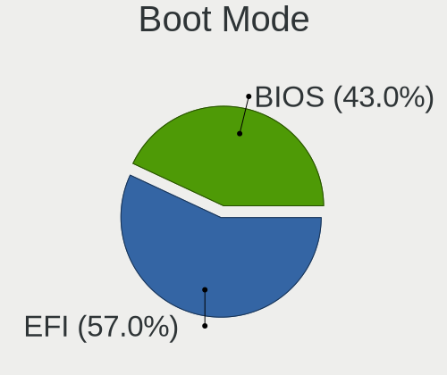
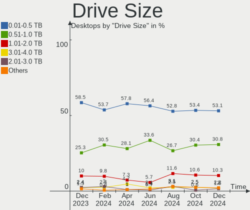
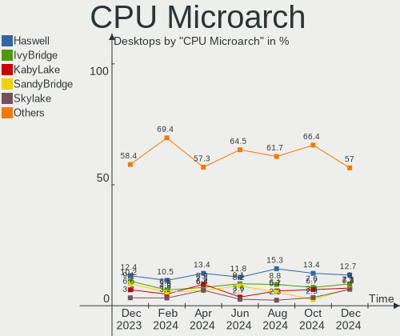

OpenMandriva Hardware Trends (Desktops)
---------------------------------------

A project to identify most popular hardware characteristics and track their change
over time based on data collected by OpenMandriva users at https://Linux-Hardware.org.

Anyone can contribute to this report by the [hw-probe](https://github.com/linuxhw/hw-probe) tool:

    sudo -E hw-probe -all -upload

Full-feature report is available here: https://linux-hardware.org/?view=trends

Period: Dec, 2021.

Contents
--------

* [ System ](#system)
  - [ OS                       ](#os)
  - [ OS Family                ](#os-family)
  - [ Kernel                   ](#kernel)
  - [ Kernel Family            ](#kernel-family)
  - [ Kernel Major Ver.        ](#kernel-major-ver)
  - [ Arch                     ](#arch)
  - [ DE                       ](#de)
  - [ Display Server           ](#display-server)
  - [ Display Manager          ](#display-manager)
  - [ OS Lang                  ](#os-lang)
  - [ Boot Mode                ](#boot-mode)
  - [ Filesystem               ](#filesystem)
  - [ Part. scheme             ](#part-scheme)
  - [ Dual Boot with Linux/BSD ](#dual-boot-with-linuxbsd)
  - [ Dual Boot (Win)          ](#dual-boot-win)

* [ Board ](#board)
  - [ Vendor                   ](#vendor)
  - [ Model                    ](#model)
  - [ Model Family             ](#model-family)
  - [ MFG Year                 ](#mfg-year)
  - [ Form Factor              ](#form-factor)
  - [ Secure Boot              ](#secure-boot)
  - [ Coreboot                 ](#coreboot)
  - [ RAM Size                 ](#ram-size)
  - [ RAM Used                 ](#ram-used)
  - [ Total Drives             ](#total-drives)
  - [ Has CD-ROM               ](#has-cd-rom)
  - [ Has Ethernet             ](#has-ethernet)
  - [ Has WiFi                 ](#has-wifi)
  - [ Has Bluetooth            ](#has-bluetooth)

* [ Location ](#location)
  - [ Country                  ](#country)
  - [ City                     ](#city)

* [ Drives ](#drives)
  - [ Drive Vendor             ](#drive-vendor)
  - [ Drive Model              ](#drive-model)
  - [ HDD Vendor               ](#hdd-vendor)
  - [ SSD Vendor               ](#ssd-vendor)
  - [ Drive Kind               ](#drive-kind)
  - [ Drive Connector          ](#drive-connector)
  - [ Drive Size               ](#drive-size)
  - [ Space Total              ](#space-total)
  - [ Space Used               ](#space-used)
  - [ Malfunc. Drives          ](#malfunc-drives)
  - [ Malfunc. Drive Vendor    ](#malfunc-drive-vendor)
  - [ Malfunc. HDD Vendor      ](#malfunc-hdd-vendor)
  - [ Malfunc. Drive Kind      ](#malfunc-drive-kind)
  - [ Failed Drives            ](#failed-drives)
  - [ Failed Drive Vendor      ](#failed-drive-vendor)
  - [ Drive Status             ](#drive-status)

* [ Storage controller ](#storage-controller)
  - [ Storage Vendor           ](#storage-vendor)
  - [ Storage Model            ](#storage-model)
  - [ Storage Kind             ](#storage-kind)

* [ Processor ](#processor)
  - [ CPU Vendor               ](#cpu-vendor)
  - [ CPU Model                ](#cpu-model)
  - [ CPU Model Family         ](#cpu-model-family)
  - [ CPU Cores                ](#cpu-cores)
  - [ CPU Sockets              ](#cpu-sockets)
  - [ CPU Threads              ](#cpu-threads)
  - [ CPU Op-Modes             ](#cpu-op-modes)
  - [ CPU Microcode            ](#cpu-microcode)
  - [ CPU Microarch            ](#cpu-microarch)

* [ Graphics ](#graphics)
  - [ GPU Vendor               ](#gpu-vendor)
  - [ GPU Model                ](#gpu-model)
  - [ GPU Combo                ](#gpu-combo)
  - [ GPU Driver               ](#gpu-driver)
  - [ GPU Memory               ](#gpu-memory)

* [ Monitor ](#monitor)
  - [ Monitor Vendor           ](#monitor-vendor)
  - [ Monitor Model            ](#monitor-model)
  - [ Monitor Resolution       ](#monitor-resolution)
  - [ Monitor Diagonal         ](#monitor-diagonal)
  - [ Monitor Width            ](#monitor-width)
  - [ Aspect Ratio             ](#aspect-ratio)
  - [ Monitor Area             ](#monitor-area)
  - [ Pixel Density            ](#pixel-density)
  - [ Multiple Monitors        ](#multiple-monitors)

* [ Network ](#network)
  - [ Net Controller Vendor    ](#net-controller-vendor)
  - [ Net Controller Model     ](#net-controller-model)
  - [ Wireless Vendor          ](#wireless-vendor)
  - [ Wireless Model           ](#wireless-model)
  - [ Ethernet Vendor          ](#ethernet-vendor)
  - [ Ethernet Model           ](#ethernet-model)
  - [ Net Controller Kind      ](#net-controller-kind)
  - [ Used Controller          ](#used-controller)
  - [ NICs                     ](#nics)
  - [ IPv6                     ](#ipv6)

* [ Bluetooth ](#bluetooth)
  - [ Bluetooth Vendor         ](#bluetooth-vendor)
  - [ Bluetooth Model          ](#bluetooth-model)

* [ Sound ](#sound)
  - [ Sound Vendor             ](#sound-vendor)
  - [ Sound Model              ](#sound-model)

* [ Memory ](#memory)
  - [ Memory Vendor            ](#memory-vendor)
  - [ Memory Model             ](#memory-model)
  - [ Memory Kind              ](#memory-kind)
  - [ Memory Form Factor       ](#memory-form-factor)
  - [ Memory Size              ](#memory-size)
  - [ Memory Speed             ](#memory-speed)

* [ Printers & scanners ](#printers--scanners)
  - [ Printer Vendor           ](#printer-vendor)
  - [ Printer Model            ](#printer-model)
  - [ Scanner Vendor           ](#scanner-vendor)
  - [ Scanner Model            ](#scanner-model)

* [ Camera ](#camera)
  - [ Camera Vendor            ](#camera-vendor)
  - [ Camera Model             ](#camera-model)

* [ Security ](#security)
  - [ Fingerprint Vendor       ](#fingerprint-vendor)
  - [ Fingerprint Model        ](#fingerprint-model)
  - [ Chipcard Vendor          ](#chipcard-vendor)
  - [ Chipcard Model           ](#chipcard-model)

* [ Unsupported ](#unsupported)
  - [ Unsupported Devices      ](#unsupported-devices)
  - [ Unsupported Device Types ](#unsupported-device-types)

System
------

OS
--

Installed operating systems

| Name              | Desktops | Percent |
|-------------------|----------|---------|
| OpenMandriva 4.2  | 86       | 82.69%  |
| OpenMandriva 4.50 | 18       | 17.31%  |

OS Family
---------

OS without a version

| Name         | Desktops | Percent |
|--------------|----------|---------|
| OpenMandriva | 104      | 100%    |

Kernel
------

Version of the Linux kernel

| Version                  | Desktops | Percent |
|--------------------------|----------|---------|
| 5.10.14-desktop-1omv4002 | 81       | 77.88%  |
| 5.12.4-desktop-1omv4050  | 8        | 7.69%   |
| 5.14.7-desktop-1omv4050  | 6        | 5.77%   |
| 5.11.12-desktop-1omv4002 | 5        | 4.81%   |
| 5.14.14-desktop-1omv4050 | 3        | 2.88%   |
| 5.5.12-desktop-1omv4001  | 1        | 0.96%   |

Kernel Family
-------------

Linux kernel without a distro release

| Version | Desktops | Percent |
|---------|----------|---------|
| 5.10.14 | 81       | 77.88%  |
| 5.12.4  | 8        | 7.69%   |
| 5.14.7  | 6        | 5.77%   |
| 5.11.12 | 5        | 4.81%   |
| 5.14.14 | 3        | 2.88%   |
| 5.5.12  | 1        | 0.96%   |

Kernel Major Ver.
-----------------

Linux kernel major version

| Version | Desktops | Percent |
|---------|----------|---------|
| 5.10    | 81       | 77.88%  |
| 5.14    | 9        | 8.65%   |
| 5.12    | 8        | 7.69%   |
| 5.11    | 5        | 4.81%   |
| 5.5     | 1        | 0.96%   |

Arch
----

OS architecture (x86_64, i586, etc.)

| Name   | Desktops | Percent |
|--------|----------|---------|
| x86_64 | 104      | 100%    |

DE
--

Desktop Environment

| Name | Desktops | Percent |
|------|----------|---------|
| KDE5 | 103      | 99.04%  |
| LXQt | 1        | 0.96%   |

Display Server
--------------

X11 or Wayland

| Name    | Desktops | Percent |
|---------|----------|---------|
| X11     | 101      | 97.12%  |
| Wayland | 3        | 2.88%   |

Display Manager
---------------

SDDM, LightDM, etc.

| Name | Desktops | Percent |
|------|----------|---------|
| SDDM | 104      | 100%    |

OS Lang
-------

Language

| Lang  | Desktops | Percent |
|-------|----------|---------|
| en_US | 49       | 47.12%  |
| ru_RU | 9        | 8.65%   |
| pt_BR | 8        | 7.69%   |
| fr_FR | 7        | 6.73%   |
| de_DE | 6        | 5.77%   |
| pl_PL | 4        | 3.85%   |
| hu_HU | 4        | 3.85%   |
| it_IT | 2        | 1.92%   |
| es_MX | 2        | 1.92%   |
| en_AU | 2        | 1.92%   |
| cs_CZ | 2        | 1.92%   |
| tr_TR | 1        | 0.96%   |
| ru_UA | 1        | 0.96%   |
| ro_RO | 1        | 0.96%   |
| nl_NL | 1        | 0.96%   |
| es_ES | 1        | 0.96%   |
| es_EC | 1        | 0.96%   |
| en_CA | 1        | 0.96%   |
| de_CH | 1        | 0.96%   |
| da_DK | 1        | 0.96%   |

Boot Mode
---------

EFI or BIOS

| Mode | Desktops | Percent |
|------|----------|---------|
| BIOS | 77       | 74.04%  |
| EFI  | 27       | 25.96%  |

Filesystem
----------

Type of filesystem

| Type    | Desktops | Percent |
|---------|----------|---------|
| Overlay | 78       | 75%     |
| Ext4    | 23       | 22.12%  |
| F2fs    | 1        | 0.96%   |
| Ext2    | 1        | 0.96%   |
| Btrfs   | 1        | 0.96%   |

Part. scheme
------------

Scheme of partitioning

| Type | Desktops | Percent |
|------|----------|---------|
| GPT  | 56       | 53.85%  |
| MBR  | 48       | 46.15%  |

Dual Boot with Linux/BSD
------------------------

Hosting more than one Linux/BSD

| Dual boot | Desktops | Percent |
|-----------|----------|---------|
| Yes       | 58       | 55.77%  |
| No        | 46       | 44.23%  |

Dual Boot (Win)
---------------

Hosting Linux and Windows

| Dual boot | Desktops | Percent |
|-----------|----------|---------|
| Yes       | 59       | 56.73%  |
| No        | 45       | 43.27%  |

Board
-----

Vendor
------

Motherboard manufacturer

| Name                | Desktops | Percent |
|---------------------|----------|---------|
| ASUSTek Computer    | 25       | 24.04%  |
| Gigabyte Technology | 16       | 15.38%  |
| ASRock              | 16       | 15.38%  |
| MSI                 | 14       | 13.46%  |
| Hewlett-Packard     | 7        | 6.73%   |
| Dell                | 7        | 6.73%   |
| Lenovo              | 3        | 2.88%   |
| Intel               | 3        | 2.88%   |
| Biostar             | 3        | 2.88%   |
| Unknown             | 2        | 1.92%   |
| ZOTAC               | 1        | 0.96%   |
| RKM                 | 1        | 0.96%   |
| Pegatron            | 1        | 0.96%   |
| OEM                 | 1        | 0.96%   |
| Huanan              | 1        | 0.96%   |
| Gateway             | 1        | 0.96%   |
| Fujitsu             | 1        | 0.96%   |
| Acer                | 1        | 0.96%   |

Model
-----

Motherboard model

| Name                                | Desktops | Percent |
|-------------------------------------|----------|---------|
| ASUS All Series                     | 3        | 2.88%   |
| ASRock H470M-HDV                    | 2        | 1.92%   |
| Unknown                             | 2        | 1.92%   |
| ZOTAC H55                           | 1        | 0.96%   |
| RKM MK36S                           | 1        | 0.96%   |
| Pegatron FK570AA-ABA a6628f         | 1        | 0.96%   |
| OEM B75                             | 1        | 0.96%   |
| MSI p6-2312ef                       | 1        | 0.96%   |
| MSI MS-7C09                         | 1        | 0.96%   |
| MSI MS-7B86                         | 1        | 0.96%   |
| MSI MS-7B85                         | 1        | 0.96%   |
| MSI MS-7B84                         | 1        | 0.96%   |
| MSI MS-7A38                         | 1        | 0.96%   |
| MSI MS-7922                         | 1        | 0.96%   |
| MSI MS-7895                         | 1        | 0.96%   |
| MSI MS-7891                         | 1        | 0.96%   |
| MSI MS-7821                         | 1        | 0.96%   |
| MSI MS-7788                         | 1        | 0.96%   |
| MSI MS-7721                         | 1        | 0.96%   |
| MSI MS-7529                         | 1        | 0.96%   |
| MSI Compaq dx2300 Microtower        | 1        | 0.96%   |
| Lenovo ThinkStation E20 4220RF8     | 1        | 0.96%   |
| Lenovo H530 10130                   | 1        | 0.96%   |
| Lenovo H430                         | 1        | 0.96%   |
| Intel MAHOBAY                       | 1        | 0.96%   |
| Intel DP35DP AAD81073-208           | 1        | 0.96%   |
| Intel DG41RQ AAE54511-205           | 1        | 0.96%   |
| Huanan B85                          | 1        | 0.96%   |
| HP xw4600 Workstation               | 1        | 0.96%   |
| HP xw4300 Workstation               | 1        | 0.96%   |
| HP ProDesk 405 G4 SFF               | 1        | 0.96%   |
| HP ProDesk 400 G2 MT                | 1        | 0.96%   |
| HP ProDesk 400 G1 SFF               | 1        | 0.96%   |
| HP Compaq dc7700p Small Form Factor | 1        | 0.96%   |
| HP 550-157nf                        | 1        | 0.96%   |
| Gigabyte Z590 VISION G              | 1        | 0.96%   |
| Gigabyte X570 AORUS ELITE WIFI      | 1        | 0.96%   |
| Gigabyte M61SME-S2                  | 1        | 0.96%   |
| Gigabyte H81M-DS2                   | 1        | 0.96%   |
| Gigabyte H61M-S2-B3                 | 1        | 0.96%   |
| Gigabyte H270M-Gaming3              | 1        | 0.96%   |
| Gigabyte H110M-DS2                  | 1        | 0.96%   |
| Gigabyte GB-BMCE-4500C              | 1        | 0.96%   |
| Gigabyte G41M-ES2L                  | 1        | 0.96%   |
| Gigabyte G31M-ES2L                  | 1        | 0.96%   |
| Gigabyte G31M-ES2C                  | 1        | 0.96%   |
| Gigabyte B75M-D3H                   | 1        | 0.96%   |
| Gigabyte B560 AORUS PRO AX          | 1        | 0.96%   |
| Gigabyte B450M S2H                  | 1        | 0.96%   |
| Gigabyte B450 AORUS ELITE V2        | 1        | 0.96%   |
| Gigabyte 8I945GZME-RH               | 1        | 0.96%   |
| Gateway DT55                        | 1        | 0.96%   |
| Fujitsu FUTRO S900                  | 1        | 0.96%   |
| Dell Vostro 270s                    | 1        | 0.96%   |
| Dell Vostro 260                     | 1        | 0.96%   |
| Dell Precision WorkStation T3500    | 1        | 0.96%   |
| Dell OptiPlex GX620                 | 1        | 0.96%   |
| Dell OptiPlex 960                   | 1        | 0.96%   |
| Dell OptiPlex 7050                  | 1        | 0.96%   |
| Dell OptiPlex 380                   | 1        | 0.96%   |

Model Family
------------

Motherboard model prefix

| Name                   | Desktops | Percent |
|------------------------|----------|---------|
| Dell OptiPlex          | 4        | 3.85%   |
| HP ProDesk             | 3        | 2.88%   |
| ASUS All               | 3        | 2.88%   |
| Dell Vostro            | 2        | 1.92%   |
| ASUS TUF               | 2        | 1.92%   |
| ASUS PRIME             | 2        | 1.92%   |
| ASRock H470M-HDV       | 2        | 1.92%   |
| Unknown                | 2        | 1.92%   |
| ZOTAC H55              | 1        | 0.96%   |
| RKM MK36S              | 1        | 0.96%   |
| Pegatron FK570AA-ABA   | 1        | 0.96%   |
| OEM B75                | 1        | 0.96%   |
| MSI p6-2312ef          | 1        | 0.96%   |
| MSI MS-7C09            | 1        | 0.96%   |
| MSI MS-7B86            | 1        | 0.96%   |
| MSI MS-7B85            | 1        | 0.96%   |
| MSI MS-7B84            | 1        | 0.96%   |
| MSI MS-7A38            | 1        | 0.96%   |
| MSI MS-7922            | 1        | 0.96%   |
| MSI MS-7895            | 1        | 0.96%   |
| MSI MS-7891            | 1        | 0.96%   |
| MSI MS-7821            | 1        | 0.96%   |
| MSI MS-7788            | 1        | 0.96%   |
| MSI MS-7721            | 1        | 0.96%   |
| MSI MS-7529            | 1        | 0.96%   |
| MSI Compaq             | 1        | 0.96%   |
| Lenovo ThinkStation    | 1        | 0.96%   |
| Lenovo H530            | 1        | 0.96%   |
| Lenovo H430            | 1        | 0.96%   |
| Intel MAHOBAY          | 1        | 0.96%   |
| Intel DP35DP           | 1        | 0.96%   |
| Intel DG41RQ           | 1        | 0.96%   |
| Huanan B85             | 1        | 0.96%   |
| HP xw4600              | 1        | 0.96%   |
| HP xw4300              | 1        | 0.96%   |
| HP Compaq              | 1        | 0.96%   |
| HP 550-157nf           | 1        | 0.96%   |
| Gigabyte Z590          | 1        | 0.96%   |
| Gigabyte X570          | 1        | 0.96%   |
| Gigabyte M61SME-S2     | 1        | 0.96%   |
| Gigabyte H81M-DS2      | 1        | 0.96%   |
| Gigabyte H61M-S2-B3    | 1        | 0.96%   |
| Gigabyte H270M-Gaming3 | 1        | 0.96%   |
| Gigabyte H110M-DS2     | 1        | 0.96%   |
| Gigabyte GB-BMCE-4500C | 1        | 0.96%   |
| Gigabyte G41M-ES2L     | 1        | 0.96%   |
| Gigabyte G31M-ES2L     | 1        | 0.96%   |
| Gigabyte G31M-ES2C     | 1        | 0.96%   |
| Gigabyte B75M-D3H      | 1        | 0.96%   |
| Gigabyte B560          | 1        | 0.96%   |
| Gigabyte B450M         | 1        | 0.96%   |
| Gigabyte B450          | 1        | 0.96%   |
| Gigabyte 8I945GZME-RH  | 1        | 0.96%   |
| Gateway DT55           | 1        | 0.96%   |
| Fujitsu FUTRO          | 1        | 0.96%   |
| Dell Precision         | 1        | 0.96%   |
| Biostar NF520-A2       | 1        | 0.96%   |
| Biostar A960D+V2       | 1        | 0.96%   |
| Biostar A68N-5600E     | 1        | 0.96%   |
| ASUS Z170M-PLUS        | 1        | 0.96%   |

MFG Year
--------

Motherboard manufacture year

| Year | Desktops | Percent |
|------|----------|---------|
| 2021 | 13       | 12.5%   |
| 2009 | 9        | 8.65%   |
| 2019 | 8        | 7.69%   |
| 2020 | 7        | 6.73%   |
| 2013 | 7        | 6.73%   |
| 2012 | 7        | 6.73%   |
| 2008 | 7        | 6.73%   |
| 2018 | 6        | 5.77%   |
| 2016 | 6        | 5.77%   |
| 2014 | 6        | 5.77%   |
| 2011 | 6        | 5.77%   |
| 2010 | 6        | 5.77%   |
| 2015 | 5        | 4.81%   |
| 2006 | 4        | 3.85%   |
| 2017 | 3        | 2.88%   |
| 2007 | 3        | 2.88%   |
| 2005 | 1        | 0.96%   |

Form Factor
-----------

Physical design of the computer

| Name    | Desktops | Percent |
|---------|----------|---------|
| Desktop | 104      | 100%    |

Secure Boot
-----------

Enabled or disabled

| State    | Desktops | Percent |
|----------|----------|---------|
| Disabled | 104      | 100%    |

Coreboot
--------

Have coreboot on board

| Used | Desktops | Percent |
|------|----------|---------|
| No   | 104      | 100%    |

RAM Size
--------

Total RAM memory

| Size in GB  | Desktops | Percent |
|-------------|----------|---------|
| 3.01-4.0    | 29       | 27.88%  |
| 4.01-8.0    | 22       | 21.15%  |
| 8.01-16.0   | 22       | 21.15%  |
| 16.01-24.0  | 16       | 15.38%  |
| 1.01-2.0    | 7        | 6.73%   |
| 32.01-64.0  | 6        | 5.77%   |
| 64.01-256.0 | 1        | 0.96%   |
| 0.51-1.0    | 1        | 0.96%   |

RAM Used
--------

Used RAM memory

| Used GB  | Desktops | Percent |
|----------|----------|---------|
| 1.01-2.0 | 71       | 68.27%  |
| 0.51-1.0 | 19       | 18.27%  |
| 0.01-0.5 | 7        | 6.73%   |
| 2.01-3.0 | 6        | 5.77%   |
| 3.01-4.0 | 1        | 0.96%   |

Total Drives
------------

Number of drives on board

| Drives | Desktops | Percent |
|--------|----------|---------|
| 1      | 58       | 55.77%  |
| 2      | 22       | 21.15%  |
| 3      | 15       | 14.42%  |
| 4      | 4        | 3.85%   |
| 5      | 3        | 2.88%   |
| 8      | 1        | 0.96%   |
| 6      | 1        | 0.96%   |

Has CD-ROM
----------

Has CD-ROM on board

| Presented | Desktops | Percent |
|-----------|----------|---------|
| Yes       | 64       | 61.54%  |
| No        | 40       | 38.46%  |

Has Ethernet
------------

Has Ethernet on board

| Presented | Desktops | Percent |
|-----------|----------|---------|
| Yes       | 104      | 100%    |

Has WiFi
--------

Has WiFi module

| Presented | Desktops | Percent |
|-----------|----------|---------|
| No        | 68       | 65.38%  |
| Yes       | 36       | 34.62%  |

Has Bluetooth
-------------

Has Bluetooth module

| Presented | Desktops | Percent |
|-----------|----------|---------|
| No        | 87       | 83.65%  |
| Yes       | 17       | 16.35%  |

Location
--------

Country
-------

Geographic location (country)

| Country      | Desktops | Percent |
|--------------|----------|---------|
| Russia       | 15       | 14.42%  |
| Germany      | 10       | 9.62%   |
| Brazil       | 10       | 9.62%   |
| France       | 9        | 8.65%   |
| Poland       | 6        | 5.77%   |
| Hungary      | 5        | 4.81%   |
| USA          | 4        | 3.85%   |
| Serbia       | 4        | 3.85%   |
| Ukraine      | 3        | 2.88%   |
| Moldova      | 3        | 2.88%   |
| Turkey       | 2        | 1.92%   |
| Switzerland  | 2        | 1.92%   |
| Netherlands  | 2        | 1.92%   |
| Mexico       | 2        | 1.92%   |
| Italy        | 2        | 1.92%   |
| Greece       | 2        | 1.92%   |
| Czechia      | 2        | 1.92%   |
| Canada       | 2        | 1.92%   |
| Australia    | 2        | 1.92%   |
| Vietnam      | 1        | 0.96%   |
| UK           | 1        | 0.96%   |
| Taiwan       | 1        | 0.96%   |
| Spain        | 1        | 0.96%   |
| South Africa | 1        | 0.96%   |
| Slovakia     | 1        | 0.96%   |
| Romania      | 1        | 0.96%   |
| Portugal     | 1        | 0.96%   |
| Martinique   | 1        | 0.96%   |
| Latvia       | 1        | 0.96%   |
| India        | 1        | 0.96%   |
| Ecuador      | 1        | 0.96%   |
| Denmark      | 1        | 0.96%   |
| Croatia      | 1        | 0.96%   |
| Chile        | 1        | 0.96%   |
| Belarus      | 1        | 0.96%   |
| Barbados     | 1        | 0.96%   |

City
----

Geographic location (city)

| City                   | Desktops | Percent |
|------------------------|----------|---------|
| Warsaw                 | 2        | 1.92%   |
| Porto Alegre           | 2        | 1.92%   |
| Paris                  | 2        | 1.92%   |
| Moscow                 | 2        | 1.92%   |
| Chisinau               | 2        | 1.92%   |
| Chalcis                | 2        | 1.92%   |
| Belgrade               | 2        | 1.92%   |
| As                     | 2        | 1.92%   |
| Arkhangelsk            | 2        | 1.92%   |
| Zutphen                | 1        | 0.96%   |
| Zurich                 | 1        | 0.96%   |
| Zaraysk                | 1        | 0.96%   |
| Zagreb                 | 1        | 0.96%   |
| Yessentuki             | 1        | 0.96%   |
| Vorden                 | 1        | 0.96%   |
| Venancio Aires         | 1        | 0.96%   |
| Vancouver              | 1        | 0.96%   |
| Uitenhage              | 1        | 0.96%   |
| Tver                   | 1        | 0.96%   |
| Toluca                 | 1        | 0.96%   |
| Tiefenort              | 1        | 0.96%   |
| The Bronx              | 1        | 0.96%   |
| Targoviste             | 1        | 0.96%   |
| Talant                 | 1        | 0.96%   |
| Stuttgart              | 1        | 0.96%   |
| St Petersburg          | 1        | 0.96%   |
| Schupfen               | 1        | 0.96%   |
| Schafflund             | 1        | 0.96%   |
| S??o Paulo             | 1        | 0.96%   |
| Sao Joao de Meriti     | 1        | 0.96%   |
| Sao Felix do Coribe    | 1        | 0.96%   |
| Samsun                 | 1        | 0.96%   |
| Salem                  | 1        | 0.96%   |
| Sainte-Luce            | 1        | 0.96%   |
| Saint-Pierre-des-Corps | 1        | 0.96%   |
| Rome                   | 1        | 0.96%   |
| Riga                   | 1        | 0.96%   |
| Remscheid              | 1        | 0.96%   |
| Quito                  | 1        | 0.96%   |
| Puettlingen            | 1        | 0.96%   |
| Poznan                 | 1        | 0.96%   |
| Petit-Couronne         | 1        | 0.96%   |
| Perth                  | 1        | 0.96%   |
| Ohringen               | 1        | 0.96%   |
| Nuremberg              | 1        | 0.96%   |
| Novokuznetsk           | 1        | 0.96%   |
| Novi Sad               | 1        | 0.96%   |
| Nizhniy Novgorod       | 1        | 0.96%   |
| New Taipei             | 1        | 0.96%   |
| Nal'chik               | 1        | 0.96%   |
| Mulhouse               | 1        | 0.96%   |
| Mosonmagyar??v??r      | 1        | 0.96%   |
| Linda a Velha          | 1        | 0.96%   |
| Kyiv                   | 1        | 0.96%   |
| Krasnoyarsk            | 1        | 0.96%   |
| Ivano-Frankivsk        | 1        | 0.96%   |
| Itaborai               | 1        | 0.96%   |
| Hyderabad              | 1        | 0.96%   |
| Houston                | 1        | 0.96%   |
| Ho Chi Minh City       | 1        | 0.96%   |

Drives
------

Drive Vendor
------------

Hard drive vendors

| Vendor              | Desktops | Drives | Percent |
|---------------------|----------|--------|---------|
| WDC                 | 34       | 40     | 20%     |
| Seagate             | 34       | 37     | 20%     |
| Samsung Electronics | 26       | 33     | 15.29%  |
| Kingston            | 14       | 15     | 8.24%   |
| Toshiba             | 11       | 11     | 6.47%   |
| Hitachi             | 8        | 9      | 4.71%   |
| MAXTOR              | 5        | 6      | 2.94%   |
| SanDisk             | 4        | 4      | 2.35%   |
| A-DATA Technology   | 4        | 4      | 2.35%   |
| Apacer              | 3        | 3      | 1.76%   |
| Unknown             | 2        | 2      | 1.18%   |
| Patriot             | 2        | 2      | 1.18%   |
| JMicron             | 2        | 2      | 1.18%   |
| Hewlett-Packard     | 2        | 2      | 1.18%   |
| Fujitsu             | 2        | 2      | 1.18%   |
| VERICO              | 1        | 1      | 0.59%   |
| Transcend           | 1        | 1      | 0.59%   |
| SPCC                | 1        | 1      | 0.59%   |
| SMI                 | 1        | 1      | 0.59%   |
| SK Hynix            | 1        | 1      | 0.59%   |
| PNY                 | 1        | 1      | 0.59%   |
| Netac               | 1        | 1      | 0.59%   |
| Micron Technology   | 1        | 2      | 0.59%   |
| Leven               | 1        | 1      | 0.59%   |
| KingFast            | 1        | 2      | 0.59%   |
| InnoDisk            | 1        | 1      | 0.59%   |
| HGST                | 1        | 1      | 0.59%   |
| GOODRAM             | 1        | 1      | 0.59%   |
| Crucial             | 1        | 1      | 0.59%   |
| China               | 1        | 1      | 0.59%   |
| AFOX                | 1        | 1      | 0.59%   |
| 1TB                 | 1        | 1      | 0.59%   |

Drive Model
-----------

Hard drive models

| Model                            | Desktops | Percent |
|----------------------------------|----------|---------|
| Seagate ST1000DM010-2EP102 1TB   | 5        | 2.66%   |
| Toshiba DT01ACA050 500GB         | 3        | 1.6%    |
| Samsung HD322HJ 320GB            | 3        | 1.6%    |
| Samsung HD103SJ 1TB              | 3        | 1.6%    |
| Kingston SV300S37A120G 120GB SSD | 3        | 1.6%    |
| WDC WD10EZEX-08WN4A0 1TB         | 2        | 1.06%   |
| Toshiba MG03ACA100 1TB           | 2        | 1.06%   |
| Toshiba HDWD110 1TB              | 2        | 1.06%   |
| Toshiba DT01ACA100 1TB           | 2        | 1.06%   |
| Seagate ST500DM002-1BD142 500GB  | 2        | 1.06%   |
| Seagate ST380811AS 80GB          | 2        | 1.06%   |
| Seagate ST3500418AS 500GB        | 2        | 1.06%   |
| Seagate ST1000DM003-1CH162 1TB   | 2        | 1.06%   |
| Samsung SSD 860 QVO 1TB          | 2        | 1.06%   |
| Samsung HD502HI 500GB            | 2        | 1.06%   |
| Patriot Burst 120GB SSD          | 2        | 1.06%   |
| Kingston SHFS37A120G 120GB SSD   | 2        | 1.06%   |
| Kingston SA400S37120G 120GB SSD  | 2        | 1.06%   |
| Kingston SA400M8240G 240GB SSD   | 2        | 1.06%   |
| JMicron Tech 250GB               | 2        | 1.06%   |
| Hitachi HDP725050GLA360 500GB    | 2        | 1.06%   |
| WDC WDS500G2B0C-00PXH0 500GB     | 1        | 0.53%   |
| WDC WDS500G2B0B 500GB SSD        | 1        | 0.53%   |
| WDC WDS500G2B0A-00SM50 500GB SSD | 1        | 0.53%   |
| WDC WDS500G1X0E-00AFY0 500GB     | 1        | 0.53%   |
| WDC WDS240G2G0B-00EPW0 240GB SSD | 1        | 0.53%   |
| WDC WD800JD-60LSA5 80GB          | 1        | 0.53%   |
| WDC WD800JB-00JJC0 80GB          | 1        | 0.53%   |
| WDC WD800BB-00JHC0 80GB          | 1        | 0.53%   |
| WDC WD7500AACS-00D6B0 752GB      | 1        | 0.53%   |
| WDC WD5000LPLX-60ZNTT2 500GB     | 1        | 0.53%   |
| WDC WD5000LPCX-24C6HT0 500GB     | 1        | 0.53%   |
| WDC WD5000AZRX-00L4HB0 500GB     | 1        | 0.53%   |
| WDC WD5000AAKX-00U6AA0 500GB     | 1        | 0.53%   |
| WDC WD5000AAKX-003CA0 500GB      | 1        | 0.53%   |
| WDC WD5000AAKX-001CA0 500GB      | 1        | 0.53%   |
| WDC WD50 00LPCX-21VHAT0 500GB    | 1        | 0.53%   |
| WDC WD3200AVVS-63L2B0 320GB      | 1        | 0.53%   |
| WDC WD3200AAJS-60M0A1 320GB      | 1        | 0.53%   |
| WDC WD3200AAJB-00J3A0 320GB      | 1        | 0.53%   |
| WDC WD30EZRZ-00Z5HB0 3TB         | 1        | 0.53%   |
| WDC WD30EZRZ-00GXCB0 3TB         | 1        | 0.53%   |
| WDC WD30EFRX-68EUZN0 3TB         | 1        | 0.53%   |
| WDC WD2500JS-60MHB5 250GB        | 1        | 0.53%   |
| WDC WD2500BEVT-80A23T0 250GB     | 1        | 0.53%   |
| WDC WD2500AAKX-753CA1 250GB      | 1        | 0.53%   |
| WDC WD2500AAKX-603CA0 250GB      | 1        | 0.53%   |
| WDC WD2500AAKS-60B3A0 250GB      | 1        | 0.53%   |
| WDC WD20EZRZ-00Z5HB0 2TB         | 1        | 0.53%   |
| WDC WD20EARX-00PASB0 2TB         | 1        | 0.53%   |
| WDC WD20EARS-00MVWB0 2TB         | 1        | 0.53%   |
| WDC WD1600AAJS-60PSA0 160GB      | 1        | 0.53%   |
| WDC WD1600AAJS-22L7A0 160GB      | 1        | 0.53%   |
| WDC WD1600AAJS-00L7A0 160GB      | 1        | 0.53%   |
| WDC WD10EZEX-60ZF5A0 1TB         | 1        | 0.53%   |
| WDC WD10EZEX-21M2NA0 1TB         | 1        | 0.53%   |
| WDC WD10EZEX-00RKKA0 1TB         | 1        | 0.53%   |
| WDC WD10EZEX-00BN5A0 1TB         | 1        | 0.53%   |
| WDC ROM MODEL-UN 6GB             | 1        | 0.53%   |
| VERICO SSD 240GB                 | 1        | 0.53%   |

HDD Vendor
----------

Hard disk drive vendors

| Vendor              | Desktops | Drives | Percent |
|---------------------|----------|--------|---------|
| Seagate             | 33       | 36     | 30.56%  |
| WDC                 | 31       | 35     | 28.7%   |
| Samsung Electronics | 16       | 19     | 14.81%  |
| Toshiba             | 10       | 10     | 9.26%   |
| Hitachi             | 8        | 9      | 7.41%   |
| MAXTOR              | 5        | 6      | 4.63%   |
| Fujitsu             | 2        | 2      | 1.85%   |
| Unknown             | 1        | 1      | 0.93%   |
| HGST                | 1        | 1      | 0.93%   |
| Hewlett-Packard     | 1        | 1      | 0.93%   |

SSD Vendor
----------

Solid state drive vendors

| Vendor              | Desktops | Drives | Percent |
|---------------------|----------|--------|---------|
| Kingston            | 12       | 13     | 23.08%  |
| Samsung Electronics | 10       | 11     | 19.23%  |
| SanDisk             | 4        | 4      | 7.69%   |
| A-DATA Technology   | 3        | 3      | 5.77%   |
| WDC                 | 2        | 3      | 3.85%   |
| Patriot             | 2        | 2      | 3.85%   |
| Apacer              | 2        | 2      | 3.85%   |
| VERICO              | 1        | 1      | 1.92%   |
| Transcend           | 1        | 1      | 1.92%   |
| Toshiba             | 1        | 1      | 1.92%   |
| SMI                 | 1        | 1      | 1.92%   |
| SK Hynix            | 1        | 1      | 1.92%   |
| PNY                 | 1        | 1      | 1.92%   |
| Netac               | 1        | 1      | 1.92%   |
| Micron Technology   | 1        | 2      | 1.92%   |
| Leven               | 1        | 1      | 1.92%   |
| KingFast            | 1        | 2      | 1.92%   |
| InnoDisk            | 1        | 1      | 1.92%   |
| Hewlett-Packard     | 1        | 1      | 1.92%   |
| GOODRAM             | 1        | 1      | 1.92%   |
| Crucial             | 1        | 1      | 1.92%   |
| China               | 1        | 1      | 1.92%   |
| AFOX                | 1        | 1      | 1.92%   |
| 1TB                 | 1        | 1      | 1.92%   |

Drive Kind
----------

HDD or SSD

| Kind    | Desktops | Drives | Percent |
|---------|----------|--------|---------|
| HDD     | 81       | 120    | 58.7%   |
| SSD     | 43       | 57     | 31.16%  |
| NVMe    | 10       | 10     | 7.25%   |
| Unknown | 3        | 3      | 2.17%   |
| MMC     | 1        | 1      | 0.72%   |

Drive Connector
---------------

SATA, SAS, NVMe, etc.

| Type | Desktops | Drives | Percent |
|------|----------|--------|---------|
| SATA | 101      | 174    | 85.59%  |
| NVMe | 10       | 10     | 8.47%   |
| SAS  | 6        | 6      | 5.08%   |
| MMC  | 1        | 1      | 0.85%   |

Drive Size
----------

Size of hard drive

| Size in TB | Desktops | Drives | Percent |
|------------|----------|--------|---------|
| 0.01-0.5   | 81       | 120    | 62.79%  |
| 0.51-1.0   | 34       | 41     | 26.36%  |
| 1.01-2.0   | 10       | 11     | 7.75%   |
| 2.01-3.0   | 3        | 3      | 2.33%   |
| 4.01-10.0  | 1        | 2      | 0.78%   |

Space Total
-----------

Amount of disk space available on the file system

| Size in GB | Desktops | Percent |
|------------|----------|---------|
| 1-20       | 49       | 47.12%  |
| Unknown    | 15       | 14.42%  |
| 101-250    | 13       | 12.5%   |
| 251-500    | 9        | 8.65%   |
| 1001-2000  | 5        | 4.81%   |
| 51-100     | 5        | 4.81%   |
| 501-1000   | 4        | 3.85%   |
| 21-50      | 3        | 2.88%   |
| 2001-3000  | 1        | 0.96%   |

Space Used
----------

Amount of used disk space

| Used GB   | Desktops | Percent |
|-----------|----------|---------|
| 1-20      | 76       | 73.08%  |
| Unknown   | 15       | 14.42%  |
| 101-250   | 4        | 3.85%   |
| 51-100    | 3        | 2.88%   |
| 251-500   | 2        | 1.92%   |
| 501-1000  | 2        | 1.92%   |
| 21-50     | 1        | 0.96%   |
| 1001-2000 | 1        | 0.96%   |

Malfunc. Drives
---------------

Drive models with a malfunction

| Model                             | Desktops | Drives | Percent |
|-----------------------------------|----------|--------|---------|
| Seagate ST380811AS 80GB           | 2        | 2      | 3.57%   |
| Samsung Electronics HD322HJ 320GB | 2        | 2      | 3.57%   |
| WDC WDS500G2B0A-00SM50 500GB SSD  | 1        | 1      | 1.79%   |
| WDC WD800BB-00JHC0 80GB           | 1        | 1      | 1.79%   |
| WDC WD5000AAKX-003CA0 500GB       | 1        | 1      | 1.79%   |
| WDC WD5000AAKX-001CA0 500GB       | 1        | 1      | 1.79%   |
| WDC WD3200AAJB-00J3A0 320GB       | 1        | 1      | 1.79%   |
| WDC WD30EZRZ-00GXCB0 3TB          | 1        | 1      | 1.79%   |
| WDC WD2500BEVT-80A23T0 250GB      | 1        | 1      | 1.79%   |
| WDC WD2500AAKX-753CA1 250GB       | 1        | 1      | 1.79%   |
| WDC WD2500AAKX-603CA0 250GB       | 1        | 1      | 1.79%   |
| WDC WD20EZRZ-00Z5HB0 2TB          | 1        | 1      | 1.79%   |
| WDC WD20EARX-00PASB0 2TB          | 1        | 1      | 1.79%   |
| WDC WD20EARS-00MVWB0 2TB          | 1        | 1      | 1.79%   |
| WDC WD1600AAJS-22L7A0 160GB       | 1        | 1      | 1.79%   |
| WDC WD10EZEX-60ZF5A0 1TB          | 1        | 1      | 1.79%   |
| WDC WD10EZEX-00BN5A0 1TB          | 1        | 1      | 1.79%   |
| Toshiba DT01ACA100 1TB            | 1        | 1      | 1.79%   |
| Toshiba DT01ACA050 500GB          | 1        | 1      | 1.79%   |
| SK Hynix SC210 2.5 7MM 128GB SSD  | 1        | 1      | 1.79%   |
| Seagate ST500DM002-1BD142 500GB   | 1        | 1      | 1.79%   |
| Seagate ST380215AS 80GB           | 1        | 1      | 1.79%   |
| Seagate ST3750330AS 752GB         | 1        | 1      | 1.79%   |
| Seagate ST3250310AS 250GB         | 1        | 1      | 1.79%   |
| Seagate ST3160812A 160GB          | 1        | 1      | 1.79%   |
| Seagate ST31000524AS 1TB          | 1        | 1      | 1.79%   |
| Seagate ST2000DL003-9VT166 2TB    | 1        | 1      | 1.79%   |
| Seagate ST1000DM003-1ER162 1TB    | 1        | 1      | 1.79%   |
| SanDisk SSD PLUS 240GB            | 1        | 1      | 1.79%   |
| Samsung Electronics SP2504C 250GB | 1        | 1      | 1.79%   |
| Samsung Electronics HD642JJ 640GB | 1        | 1      | 1.79%   |
| Samsung Electronics HD502HJ 500GB | 1        | 1      | 1.79%   |
| Samsung Electronics HD502HI 500GB | 1        | 1      | 1.79%   |
| Samsung Electronics HD321KJ 320GB | 1        | 1      | 1.79%   |
| Samsung Electronics HD300LJ 304GB | 1        | 1      | 1.79%   |
| Samsung Electronics HD250HJ 250GB | 1        | 1      | 1.79%   |
| Samsung Electronics HD103UJ 1TB   | 1        | 1      | 1.79%   |
| Samsung Electronics HD103SJ 1TB   | 1        | 1      | 1.79%   |
| Samsung Electronics HD040GJ 40GB  | 1        | 1      | 1.79%   |
| MAXTOR STM380811AS 80GB           | 1        | 1      | 1.79%   |
| MAXTOR STM3160811AS 160GB         | 1        | 1      | 1.79%   |
| MAXTOR STM3160215AS 160GB         | 1        | 1      | 1.79%   |
| MAXTOR 6Y060L0 64GB               | 1        | 1      | 1.79%   |
| MAXTOR 6L160P0 160GB              | 1        | 1      | 1.79%   |
| Kingston SV200S3128G 128GB SSD    | 1        | 1      | 1.79%   |
| Kingston SA400S37120G 120GB SSD   | 1        | 1      | 1.79%   |
| Hitachi HTS547550A9E384 500GB     | 1        | 1      | 1.79%   |
| Hitachi HTS545050A7E380 500GB     | 1        | 1      | 1.79%   |
| Hitachi HTS543232A7A384 320GB     | 1        | 1      | 1.79%   |
| Hitachi HDT722525DLA380 250GB     | 1        | 1      | 1.79%   |
| Hitachi HDS5C3020BLE630 2TB       | 1        | 1      | 1.79%   |
| Hitachi HDP725050GLA360 500GB     | 1        | 1      | 1.79%   |
| Hewlett-Packard GB0500EAFYL 500GB | 1        | 1      | 1.79%   |
| Fujitsu MHK2120AT 12GB            | 1        | 1      | 1.79%   |

Malfunc. Drive Vendor
---------------------

Vendors of faulty drives

| Vendor              | Desktops | Drives | Percent |
|---------------------|----------|--------|---------|
| WDC                 | 14       | 15     | 25.93%  |
| Samsung Electronics | 12       | 12     | 22.22%  |
| Seagate             | 10       | 10     | 18.52%  |
| MAXTOR              | 5        | 5      | 9.26%   |
| Hitachi             | 5        | 6      | 9.26%   |
| Toshiba             | 2        | 2      | 3.7%    |
| Kingston            | 2        | 2      | 3.7%    |
| SK Hynix            | 1        | 1      | 1.85%   |
| SanDisk             | 1        | 1      | 1.85%   |
| Hewlett-Packard     | 1        | 1      | 1.85%   |
| Fujitsu             | 1        | 1      | 1.85%   |

Malfunc. HDD Vendor
-------------------

Vendors of faulty HDD drives

| Vendor              | Desktops | Drives | Percent |
|---------------------|----------|--------|---------|
| WDC                 | 13       | 14     | 26.53%  |
| Samsung Electronics | 12       | 12     | 24.49%  |
| Seagate             | 10       | 10     | 20.41%  |
| MAXTOR              | 5        | 5      | 10.2%   |
| Hitachi             | 5        | 6      | 10.2%   |
| Toshiba             | 2        | 2      | 4.08%   |
| Hewlett-Packard     | 1        | 1      | 2.04%   |
| Fujitsu             | 1        | 1      | 2.04%   |

Malfunc. Drive Kind
-------------------

Kinds of faulty drives

| Kind | Desktops | Drives | Percent |
|------|----------|--------|---------|
| HDD  | 41       | 51     | 89.13%  |
| SSD  | 5        | 5      | 10.87%  |

Failed Drives
-------------

Failed drive models

Zero info for selected period =(

Failed Drive Vendor
-------------------

Failed drive vendors

Zero info for selected period =(

Drive Status
------------

Number of failed and malfunc. drives

| Status   | Desktops | Drives | Percent |
|----------|----------|--------|---------|
| Works    | 71       | 112    | 53.38%  |
| Malfunc  | 46       | 56     | 34.59%  |
| Detected | 16       | 23     | 12.03%  |

Storage controller
------------------

Storage Vendor
--------------

Storage controller vendors

| Vendor                      | Desktops | Percent |
|-----------------------------|----------|---------|
| Intel                       | 73       | 60.83%  |
| AMD                         | 24       | 20%     |
| Nvidia                      | 5        | 4.17%   |
| Marvell Technology Group    | 4        | 3.33%   |
| Samsung Electronics         | 3        | 2.5%    |
| Sandisk                     | 2        | 1.67%   |
| Phison Electronics          | 2        | 1.67%   |
| Kingston Technology Company | 2        | 1.67%   |
| JMicron Technology          | 2        | 1.67%   |
| ASMedia Technology          | 2        | 1.67%   |
| Realtek Semiconductor       | 1        | 0.83%   |

Storage Model
-------------

Storage controller models

| Model                                                                                   | Desktops | Percent |
|-----------------------------------------------------------------------------------------|----------|---------|
| Intel NM10/ICH7 Family SATA Controller [IDE mode]                                       | 19       | 11.38%  |
| Intel 82801G (ICH7 Family) IDE Controller                                               | 17       | 10.18%  |
| AMD FCH SATA Controller [AHCI mode]                                                     | 16       | 9.58%   |
| AMD 400 Series Chipset SATA Controller                                                  | 8        | 4.79%   |
| Intel 8 Series/C220 Series Chipset Family 6-port SATA Controller 1 [AHCI mode]          | 7        | 4.19%   |
| Intel Q170/Q150/B150/H170/H110/Z170/CM236 Chipset SATA Controller [AHCI Mode]           | 4        | 2.4%    |
| Intel 7 Series/C210 Series Chipset Family 6-port SATA Controller [AHCI mode]            | 4        | 2.4%    |
| Intel 500 Series Chipset Family SATA AHCI Controller                                    | 4        | 2.4%    |
| Intel 82801I (ICH9 Family) 2 port SATA Controller [IDE mode]                            | 3        | 1.8%    |
| Intel 7 Series/C210 Series Chipset Family 4-port SATA Controller [IDE mode]             | 3        | 1.8%    |
| Intel 7 Series/C210 Series Chipset Family 2-port SATA Controller [IDE mode]             | 3        | 1.8%    |
| Intel 6 Series/C200 Series Chipset Family Desktop SATA Controller (IDE mode, ports 4-5) | 3        | 1.8%    |
| Intel 6 Series/C200 Series Chipset Family Desktop SATA Controller (IDE mode, ports 0-3) | 3        | 1.8%    |
| Intel 6 Series/C200 Series Chipset Family 6 port Desktop SATA AHCI Controller           | 3        | 1.8%    |
| Intel 5 Series/3400 Series Chipset 6 port SATA AHCI Controller                          | 3        | 1.8%    |
| Intel 200 Series PCH SATA controller [AHCI mode]                                        | 3        | 1.8%    |
| AMD SB7x0/SB8x0/SB9x0 SATA Controller [IDE mode]                                        | 3        | 1.8%    |
| AMD SB7x0/SB8x0/SB9x0 IDE Controller                                                    | 3        | 1.8%    |
| Samsung NVMe SSD Controller 980                                                         | 2        | 1.2%    |
| Nvidia MCP61 SATA Controller                                                            | 2        | 1.2%    |
| Nvidia MCP61 IDE                                                                        | 2        | 1.2%    |
| Marvell Group 88SE6101/6102 single-port PATA133 interface                               | 2        | 1.2%    |
| Intel SATA Controller [RAID mode]                                                       | 2        | 1.2%    |
| Intel Comet Lake SATA AHCI Controller                                                   | 2        | 1.2%    |
| Intel 9 Series Chipset Family SATA Controller [AHCI Mode]                               | 2        | 1.2%    |
| Intel 82801IR/IO/IH (ICH9R/DO/DH) 4 port SATA Controller [IDE mode]                     | 2        | 1.2%    |
| ASMedia ASM1062 Serial ATA Controller                                                   | 2        | 1.2%    |
| AMD SB7x0/SB8x0/SB9x0 SATA Controller [AHCI mode]                                       | 2        | 1.2%    |
| Sandisk WD PC SN810 / Black SN850 NVMe SSD                                              | 1        | 0.6%    |
| Sandisk WD Blue SN550 NVMe SSD                                                          | 1        | 0.6%    |
| Samsung NVMe SSD Controller SM981/PM981/PM983                                           | 1        | 0.6%    |
| Realtek Realtek Non-Volatile memory controller                                          | 1        | 0.6%    |
| Phison PS5013 E13 NVMe Controller                                                       | 1        | 0.6%    |
| Phison E12 NVMe Controller                                                              | 1        | 0.6%    |
| Nvidia MCP73 SATA Controller (IDE mode)                                                 | 1        | 0.6%    |
| Nvidia MCP73 IDE Controller                                                             | 1        | 0.6%    |
| Nvidia MCP65 SATA Controller                                                            | 1        | 0.6%    |
| Nvidia MCP65 IDE                                                                        | 1        | 0.6%    |
| Nvidia CK804 Serial ATA Controller                                                      | 1        | 0.6%    |
| Nvidia CK804 IDE                                                                        | 1        | 0.6%    |
| Marvell Group 88SE9215 PCIe 2.0 x1 4-port SATA 6 Gb/s Controller                        | 1        | 0.6%    |
| Marvell Group 88SE6111/6121 SATA II / PATA Controller                                   | 1        | 0.6%    |
| Kingston Company KC2000 NVMe SSD                                                        | 1        | 0.6%    |
| Kingston Company A2000 NVMe SSD                                                         | 1        | 0.6%    |
| JMicron JMB361 AHCI/IDE                                                                 | 1        | 0.6%    |
| JMicron JMB360 AHCI Controller                                                          | 1        | 0.6%    |
| Intel Volume Management Device NVMe RAID Controller                                     | 1        | 0.6%    |
| Intel Sunrise Point-LP SATA Controller [AHCI mode]                                      | 1        | 0.6%    |
| Intel NM10/ICH7 Family SATA Controller [AHCI mode]                                      | 1        | 0.6%    |
| Intel Jasper Lake SATA AHCI Controller                                                  | 1        | 0.6%    |
| Intel C610/X99 series chipset sSATA Controller [AHCI mode]                              | 1        | 0.6%    |
| Intel C610/X99 series chipset 6-Port SATA Controller [AHCI mode]                        | 1        | 0.6%    |
| Intel Atom/Celeron/Pentium Processor x5-E8000/J3xxx/N3xxx Series SATA Controller        | 1        | 0.6%    |
| Intel Atom Processor E3800 Series SATA AHCI Controller                                  | 1        | 0.6%    |
| Intel 82Q963/Q965 PT IDER Controller                                                    | 1        | 0.6%    |
| Intel 82801JI (ICH10 Family) SATA AHCI Controller                                       | 1        | 0.6%    |
| Intel 82801JI (ICH10 Family) 4 port SATA IDE Controller #1                              | 1        | 0.6%    |
| Intel 82801JI (ICH10 Family) 2 port SATA IDE Controller #2                              | 1        | 0.6%    |
| Intel 82801IR/IO/IH (ICH9R/DO/DH) 6 port SATA Controller [AHCI mode]                    | 1        | 0.6%    |
| Intel 82801IB (ICH9) 2 port SATA Controller [IDE mode]                                  | 1        | 0.6%    |

Storage Kind
------------

Kind of storage controller (IDE, SATA, NVMe, SAS, ...)

| Kind | Desktops | Percent |
|------|----------|---------|
| SATA | 65       | 54.62%  |
| IDE  | 41       | 34.45%  |
| NVMe | 10       | 8.4%    |
| RAID | 3        | 2.52%   |

Processor
---------

CPU Vendor
----------

Processor vendors

| Vendor | Desktops | Percent |
|--------|----------|---------|
| Intel  | 76       | 73.08%  |
| AMD    | 28       | 26.92%  |

CPU Model
---------

Processor models

| Model                                       | Desktops | Percent |
|---------------------------------------------|----------|---------|
| Intel Core 2 Duo CPU E8400 @ 3.00GHz        | 6        | 5.77%   |
| Intel Core i3-4130 CPU @ 3.40GHz            | 3        | 2.88%   |
| AMD Ryzen 5 3600 6-Core Processor           | 3        | 2.88%   |
| Intel Pentium D CPU 3.00GHz                 | 2        | 1.92%   |
| Intel Pentium 4 CPU 3.20GHz                 | 2        | 1.92%   |
| Intel Core i5-4440 CPU @ 3.10GHz            | 2        | 1.92%   |
| Intel Core i3-3220 CPU @ 3.30GHz            | 2        | 1.92%   |
| Intel Core i3-10100 CPU @ 3.60GHz           | 2        | 1.92%   |
| Intel Core 2 Duo CPU E7300 @ 2.66GHz        | 2        | 1.92%   |
| Intel Core 2 Duo CPU E7200 @ 2.53GHz        | 2        | 1.92%   |
| Intel Core 2 Duo CPU E4500 @ 2.20GHz        | 2        | 1.92%   |
| AMD Ryzen 7 3700X 8-Core Processor          | 2        | 1.92%   |
| AMD A8-6600K APU with Radeon HD Graphics    | 2        | 1.92%   |
| Intel Xeon CPU X3440 @ 2.53GHz              | 1        | 0.96%   |
| Intel Xeon CPU W3530 @ 2.80GHz              | 1        | 0.96%   |
| Intel Xeon CPU E5440 @ 2.83GHz              | 1        | 0.96%   |
| Intel Pentium Dual-Core CPU E5400 @ 2.70GHz | 1        | 0.96%   |
| Intel Pentium Dual CPU E2160 @ 1.80GHz      | 1        | 0.96%   |
| Intel Pentium CPU N3700 @ 1.60GHz           | 1        | 0.96%   |
| Intel Pentium CPU G640 @ 2.80GHz            | 1        | 0.96%   |
| Intel Pentium CPU G4400 @ 3.30GHz           | 1        | 0.96%   |
| Intel Pentium CPU G3260 @ 3.30GHz           | 1        | 0.96%   |
| Intel Pentium CPU G2030 @ 3.00GHz           | 1        | 0.96%   |
| Intel Pentium 4 CPU 3.40GHz                 | 1        | 0.96%   |
| Intel Core i7-7700 CPU @ 3.60GHz            | 1        | 0.96%   |
| Intel Core i7-7567U CPU @ 3.50GHz           | 1        | 0.96%   |
| Intel Core i7-6800K CPU @ 3.40GHz           | 1        | 0.96%   |
| Intel Core i7-6700K CPU @ 4.00GHz           | 1        | 0.96%   |
| Intel Core i7-4790K CPU @ 4.00GHz           | 1        | 0.96%   |
| Intel Core i7-3770K CPU @ 3.50GHz           | 1        | 0.96%   |
| Intel Core i7-3770 CPU @ 3.40GHz            | 1        | 0.96%   |
| Intel Core i5-7500 CPU @ 3.40GHz            | 1        | 0.96%   |
| Intel Core i5-6400 CPU @ 2.70GHz            | 1        | 0.96%   |
| Intel Core i5-4690 CPU @ 3.50GHz            | 1        | 0.96%   |
| Intel Core i5-3570 CPU @ 3.40GHz            | 1        | 0.96%   |
| Intel Core i5-3550 CPU @ 3.30GHz            | 1        | 0.96%   |
| Intel Core i5-3470 CPU @ 3.20GHz            | 1        | 0.96%   |
| Intel Core i5-2500 CPU @ 3.30GHz            | 1        | 0.96%   |
| Intel Core i5-2400 CPU @ 3.10GHz            | 1        | 0.96%   |
| Intel Core i5-10600K CPU @ 4.10GHz          | 1        | 0.96%   |
| Intel Core i5 CPU 650 @ 3.20GHz             | 1        | 0.96%   |
| Intel Core i3-9100F CPU @ 3.60GHz           | 1        | 0.96%   |
| Intel Core i3-9100 CPU @ 3.60GHz            | 1        | 0.96%   |
| Intel Core i3-7100 CPU @ 3.90GHz            | 1        | 0.96%   |
| Intel Core i3-4160T CPU @ 3.10GHz           | 1        | 0.96%   |
| Intel Core i3-4160 CPU @ 3.60GHz            | 1        | 0.96%   |
| Intel Core i3-3240 CPU @ 3.40GHz            | 1        | 0.96%   |
| Intel Core i3 CPU 530 @ 2.93GHz             | 1        | 0.96%   |
| Intel Core 2 Quad CPU Q9650 @ 3.00GHz       | 1        | 0.96%   |
| Intel Core 2 Duo CPU E8500 @ 3.16GHz        | 1        | 0.96%   |
| Intel Core 2 Duo CPU E7500 @ 2.93GHz        | 1        | 0.96%   |
| Intel Core 2 Duo CPU E7400 @ 2.80GHz        | 1        | 0.96%   |
| Intel Core 2 Duo CPU E6550 @ 2.33GHz        | 1        | 0.96%   |
| Intel Core 2 Duo CPU E4600 @ 2.40GHz        | 1        | 0.96%   |
| Intel Core 2 CPU 6600 @ 2.40GHz             | 1        | 0.96%   |
| Intel Core 2 CPU 6300 @ 1.86GHz             | 1        | 0.96%   |
| Intel Celeron N4500 @ 1.10GHz               | 1        | 0.96%   |
| Intel Celeron CPU J1900 @ 1.99GHz           | 1        | 0.96%   |
| Intel Celeron CPU G1610 @ 2.60GHz           | 1        | 0.96%   |
| Intel Atom x5-Z8300 CPU @ 1.44GHz           | 1        | 0.96%   |

CPU Model Family
----------------

Processor model prefix

| Model                   | Desktops | Percent |
|-------------------------|----------|---------|
| Intel Core 2 Duo        | 17       | 16.35%  |
| Intel Core i3           | 14       | 13.46%  |
| Intel Core i5           | 12       | 11.54%  |
| Intel Core i7           | 7        | 6.73%   |
| Other                   | 5        | 4.81%   |
| Intel Pentium           | 5        | 4.81%   |
| AMD Ryzen 5             | 5        | 4.81%   |
| AMD A8                  | 4        | 3.85%   |
| Intel Xeon              | 3        | 2.88%   |
| Intel Pentium 4         | 3        | 2.88%   |
| Intel Celeron           | 3        | 2.88%   |
| AMD Athlon II X2        | 3        | 2.88%   |
| Intel Pentium D         | 2        | 1.92%   |
| Intel Core 2            | 2        | 1.92%   |
| AMD Ryzen 7             | 2        | 1.92%   |
| AMD Ryzen 3             | 2        | 1.92%   |
| Intel Pentium Dual-Core | 1        | 0.96%   |
| Intel Pentium Dual      | 1        | 0.96%   |
| Intel Core 2 Quad       | 1        | 0.96%   |
| Intel Atom              | 1        | 0.96%   |
| AMD Ryzen 9             | 1        | 0.96%   |
| AMD Ryzen 5 PRO         | 1        | 0.96%   |
| AMD Phenom II X6        | 1        | 0.96%   |
| AMD Phenom              | 1        | 0.96%   |
| AMD G                   | 1        | 0.96%   |
| AMD Athlon X4           | 1        | 0.96%   |
| AMD Athlon II X3        | 1        | 0.96%   |
| AMD Athlon 64 X2        | 1        | 0.96%   |
| AMD Athlon 64           | 1        | 0.96%   |
| AMD A6                  | 1        | 0.96%   |
| AMD A4                  | 1        | 0.96%   |

CPU Cores
---------

Number of processor cores

| Number | Desktops | Percent |
|--------|----------|---------|
| 2      | 48       | 46.15%  |
| 4      | 31       | 29.81%  |
| 6      | 10       | 9.62%   |
| 1      | 9        | 8.65%   |
| 8      | 3        | 2.88%   |
| 12     | 2        | 1.92%   |
| 3      | 1        | 0.96%   |

CPU Sockets
-----------

Number of sockets

| Number | Desktops | Percent |
|--------|----------|---------|
| 1      | 104      | 100%    |

CPU Threads
-----------

Threads per core (Hyper-Threading)

| Number | Desktops | Percent |
|--------|----------|---------|
| 1      | 59       | 56.73%  |
| 2      | 45       | 43.27%  |

CPU Op-Modes
------------

CPU Operation Modes (32-bit, 64-bit)

| Op mode        | Desktops | Percent |
|----------------|----------|---------|
| 32-bit, 64-bit | 104      | 100%    |

CPU Microcode
-------------

Microcode number

| Number     | Desktops | Percent |
|------------|----------|---------|
| 0x306c3    | 10       | 9.62%   |
| 0x306a9    | 10       | 9.62%   |
| 0x1067a    | 10       | 9.62%   |
| 0x10676    | 6        | 5.77%   |
| 0x6fd      | 4        | 3.85%   |
| 0x06003106 | 4        | 3.85%   |
| Unknown    | 4        | 3.85%   |
| 0xa0671    | 3        | 2.88%   |
| 0x906e9    | 3        | 2.88%   |
| 0x506e3    | 3        | 2.88%   |
| 0x206a7    | 3        | 2.88%   |
| 0x08701021 | 3        | 2.88%   |
| 0x08701013 | 3        | 2.88%   |
| 0xf43      | 2        | 1.92%   |
| 0xa0653    | 2        | 1.92%   |
| 0x6f6      | 2        | 1.92%   |
| 0x406c3    | 2        | 1.92%   |
| 0x0800820d | 2        | 1.92%   |
| 0x06001119 | 2        | 1.92%   |
| 0x010000c7 | 2        | 1.92%   |
| 0xf64      | 1        | 0.96%   |
| 0xf62      | 1        | 0.96%   |
| 0xa0655    | 1        | 0.96%   |
| 0x906eb    | 1        | 0.96%   |
| 0x906ea    | 1        | 0.96%   |
| 0x906c0    | 1        | 0.96%   |
| 0x90672    | 1        | 0.96%   |
| 0x806e9    | 1        | 0.96%   |
| 0x6fb      | 1        | 0.96%   |
| 0x406f1    | 1        | 0.96%   |
| 0x30678    | 1        | 0.96%   |
| 0x20655    | 1        | 0.96%   |
| 0x20652    | 1        | 0.96%   |
| 0x106e5    | 1        | 0.96%   |
| 0x106a5    | 1        | 0.96%   |
| 0x08101016 | 1        | 0.96%   |
| 0x0810100b | 1        | 0.96%   |
| 0x07030106 | 1        | 0.96%   |
| 0x06001116 | 1        | 0.96%   |
| 0x05000101 | 1        | 0.96%   |
| 0x010000dc | 1        | 0.96%   |
| 0x010000c8 | 1        | 0.96%   |
| 0x010000b6 | 1        | 0.96%   |
| 0x01000083 | 1        | 0.96%   |

CPU Microarch
-------------

Microarchitecture

| Name        | Desktops | Percent |
|-------------|----------|---------|
| Penryn      | 16       | 15.38%  |
| IvyBridge   | 10       | 9.62%   |
| Haswell     | 10       | 9.62%   |
| Zen 2       | 7        | 6.73%   |
| Core        | 7        | 6.73%   |
| KabyLake    | 6        | 5.77%   |
| K10         | 6        | 5.77%   |
| NetBurst    | 5        | 4.81%   |
| Steamroller | 4        | 3.85%   |
| Skylake     | 3        | 2.88%   |
| Silvermont  | 3        | 2.88%   |
| SandyBridge | 3        | 2.88%   |
| Piledriver  | 3        | 2.88%   |
| CometLake   | 3        | 2.88%   |
| Unknown     | 3        | 2.88%   |
| Zen+        | 2        | 1.92%   |
| Zen         | 2        | 1.92%   |
| Westmere    | 2        | 1.92%   |
| Nehalem     | 2        | 1.92%   |
| K8 Hammer   | 2        | 1.92%   |
| Tremont     | 1        | 0.96%   |
| Puma        | 1        | 0.96%   |
| Icelake     | 1        | 0.96%   |
| Broadwell   | 1        | 0.96%   |
| Bobcat      | 1        | 0.96%   |

Graphics
--------

GPU Vendor
----------

Vendors of graphics cards

| Vendor | Desktops | Percent |
|--------|----------|---------|
| Intel  | 41       | 37.61%  |
| Nvidia | 40       | 36.7%   |
| AMD    | 28       | 25.69%  |

GPU Model
---------

Graphics card models

| Model                                                                                    | Desktops | Percent |
|------------------------------------------------------------------------------------------|----------|---------|
| Nvidia GK208B [GeForce GT 710]                                                           | 7        | 6.31%   |
| Intel 4th Generation Core Processor Family Integrated Graphics Controller                | 5        | 4.5%    |
| Nvidia GT218 [GeForce 210]                                                               | 3        | 2.7%    |
| Nvidia GP108 [GeForce GT 1030]                                                           | 3        | 2.7%    |
| Intel Xeon E3-1200 v2/3rd Gen Core processor Graphics Controller                         | 3        | 2.7%    |
| Intel HD Graphics 630                                                                    | 3        | 2.7%    |
| Intel CometLake-S GT2 [UHD Graphics 630]                                                 | 3        | 2.7%    |
| Intel 82G33/G31 Express Integrated Graphics Controller                                   | 3        | 2.7%    |
| Intel 4 Series Chipset Integrated Graphics Controller                                    | 3        | 2.7%    |
| Intel 2nd Generation Core Processor Family Integrated Graphics Controller                | 3        | 2.7%    |
| AMD Cedar [Radeon HD 5000/6000/7350/8350 Series]                                         | 3        | 2.7%    |
| Nvidia GK208B [GeForce GT 730]                                                           | 2        | 1.8%    |
| Nvidia GF108 [GeForce GT 630]                                                            | 2        | 1.8%    |
| Nvidia G86 [GeForce 8500 GT]                                                             | 2        | 1.8%    |
| Intel Xeon E3-1200 v3/4th Gen Core Processor Integrated Graphics Controller              | 2        | 1.8%    |
| Intel RocketLake-S GT1 [UHD Graphics 750]                                                | 2        | 1.8%    |
| Intel HD Graphics 530                                                                    | 2        | 1.8%    |
| Intel Atom/Celeron/Pentium Processor x5-E8000/J3xxx/N3xxx Integrated Graphics Controller | 2        | 1.8%    |
| AMD Richland [Radeon HD 8570D]                                                           | 2        | 1.8%    |
| AMD Redwood XT [Radeon HD 5670/5690/5730]                                                | 2        | 1.8%    |
| AMD Raven Ridge [Radeon Vega Series / Radeon Vega Mobile Series]                         | 2        | 1.8%    |
| AMD Kaveri [Radeon R7 Graphics]                                                          | 2        | 1.8%    |
| AMD Ellesmere [Radeon RX 470/480/570/570X/580/580X/590]                                  | 2        | 1.8%    |
| AMD Caicos [Radeon HD 6450/7450/8450 / R5 230 OEM]                                       | 2        | 1.8%    |
| Nvidia TU117 [GeForce GTX 1650]                                                          | 1        | 0.9%    |
| Nvidia TU116 [GeForce GTX 1660 SUPER]                                                    | 1        | 0.9%    |
| Nvidia TU106 [GeForce RTX 2060 SUPER]                                                    | 1        | 0.9%    |
| Nvidia GT218 [GeForce 8400 GS Rev. 3]                                                    | 1        | 0.9%    |
| Nvidia GT215 [GeForce GT 240]                                                            | 1        | 0.9%    |
| Nvidia GP106 [GeForce GTX 1060 6GB]                                                      | 1        | 0.9%    |
| Nvidia GP106 [GeForce GTX 1060 3GB]                                                      | 1        | 0.9%    |
| Nvidia GM206 [GeForce GTX 950]                                                           | 1        | 0.9%    |
| Nvidia GM204 [GeForce GTX 970]                                                           | 1        | 0.9%    |
| Nvidia GK107 [GeForce GT 640 OEM]                                                        | 1        | 0.9%    |
| Nvidia GK107 [GeForce GT 630 OEM]                                                        | 1        | 0.9%    |
| Nvidia GK106 [GeForce GTX 660]                                                           | 1        | 0.9%    |
| Nvidia GK106 [GeForce GTX 650 Ti]                                                        | 1        | 0.9%    |
| Nvidia GK104 [GeForce GTX 770]                                                           | 1        | 0.9%    |
| Nvidia GK104 [GeForce GTX 670]                                                           | 1        | 0.9%    |
| Nvidia GF108 [GeForce GT 730]                                                            | 1        | 0.9%    |
| Nvidia GF100GL [Quadro 5000]                                                             | 1        | 0.9%    |
| Nvidia G96C [GeForce 9500 GT]                                                            | 1        | 0.9%    |
| Nvidia G92 [GeForce GTS 240]                                                             | 1        | 0.9%    |
| Nvidia G84GL [Quadro FX 1700]                                                            | 1        | 0.9%    |
| Nvidia G84 [GeForce 8600 GT]                                                             | 1        | 0.9%    |
| Intel JasperLake [UHD Graphics]                                                          | 1        | 0.9%    |
| Intel Iris Plus Graphics 650                                                             | 1        | 0.9%    |
| Intel HD Graphics 510                                                                    | 1        | 0.9%    |
| Intel Core Processor Integrated Graphics Controller                                      | 1        | 0.9%    |
| Intel CoffeeLake-S GT2 [UHD Graphics 630]                                                | 1        | 0.9%    |
| Intel Atom Processor Z36xxx/Z37xxx Series Graphics & Display                             | 1        | 0.9%    |
| Intel AlderLake-S GT1                                                                    | 1        | 0.9%    |
| Intel 82Q963/Q965 Integrated Graphics Controller                                         | 1        | 0.9%    |
| Intel 82946GZ/GL Integrated Graphics Controller                                          | 1        | 0.9%    |
| Intel 82945G/GZ Integrated Graphics Controller                                           | 1        | 0.9%    |
| AMD Wrestler [Radeon HD 6250]                                                            | 1        | 0.9%    |
| AMD Trinity 2 [Radeon HD 7480D]                                                          | 1        | 0.9%    |
| AMD RV730 PRO [Radeon HD 4650]                                                           | 1        | 0.9%    |
| AMD RV630 PRO [Radeon HD 2600 PRO]                                                       | 1        | 0.9%    |
| AMD RV516 [Radeon X1300/X1550 Series] (Secondary)                                        | 1        | 0.9%    |

GPU Combo
---------

Combinations of graphics cards

| Name           | Desktops | Percent |
|----------------|----------|---------|
| 1 x Nvidia     | 38       | 36.54%  |
| 1 x Intel      | 37       | 35.58%  |
| 1 x AMD        | 23       | 22.12%  |
| 2 x AMD        | 2        | 1.92%   |
| Intel + AMD    | 2        | 1.92%   |
| Intel + Nvidia | 1        | 0.96%   |
| AMD + Nvidia   | 1        | 0.96%   |

GPU Driver
----------

Free vs proprietary

| Driver  | Desktops | Percent |
|---------|----------|---------|
| Free    | 96       | 92.31%  |
| Unknown | 8        | 7.69%   |

GPU Memory
----------

Total video memory

| Size in GB | Desktops | Percent |
|------------|----------|---------|
| Unknown    | 39       | 37.5%   |
| 1.01-2.0   | 20       | 19.23%  |
| 0.51-1.0   | 20       | 19.23%  |
| 0.01-0.5   | 14       | 13.46%  |
| 3.01-4.0   | 4        | 3.85%   |
| 7.01-8.0   | 3        | 2.88%   |
| 5.01-6.0   | 2        | 1.92%   |
| 2.01-3.0   | 2        | 1.92%   |

Monitor
-------

Monitor Vendor
--------------

Monitor vendors

| Vendor               | Desktops | Percent |
|----------------------|----------|---------|
| Samsung Electronics  | 15       | 15.46%  |
| Goldstar             | 15       | 15.46%  |
| Acer                 | 11       | 11.34%  |
| Hewlett-Packard      | 8        | 8.25%   |
| Dell                 | 8        | 8.25%   |
| Philips              | 7        | 7.22%   |
| AOC                  | 6        | 6.19%   |
| BenQ                 | 5        | 5.15%   |
| Ancor Communications | 5        | 5.15%   |
| ViewSonic            | 3        | 3.09%   |
| KTC                  | 2        | 2.06%   |
| Iiyama               | 2        | 2.06%   |
| Vizio                | 1        | 1.03%   |
| Sony                 | 1        | 1.03%   |
| NEC Computers        | 1        | 1.03%   |
| Lenovo               | 1        | 1.03%   |
| Huion                | 1        | 1.03%   |
| HCL                  | 1        | 1.03%   |
| Eizo                 | 1        | 1.03%   |
| DENON                | 1        | 1.03%   |
| CTV                  | 1        | 1.03%   |
| Arnos Instruments    | 1        | 1.03%   |

Monitor Model
-------------

Monitor models

| Model                                                                 | Desktops | Percent |
|-----------------------------------------------------------------------|----------|---------|
| Philips PHL 243V7 PHLC155 1920x1080 530x300mm 24.0-inch               | 2        | 2.06%   |
| AOC 27G2G4 AOC2702 1920x1080 598x336mm 27.0-inch                      | 2        | 2.06%   |
| Acer K272HL ACR0523 1920x1080 600x340mm 27.2-inch                     | 2        | 2.06%   |
| Vizio E601i-A3 VIZ0092 1920x1080 1329x748mm 60.0-inch                 | 1        | 1.03%   |
| ViewSonic VX2718-2KPC VSCB73A 2560x1440 598x336mm 27.0-inch           | 1        | 1.03%   |
| ViewSonic VA925 SERIES VSC8F29 1280x1024 380x300mm 19.1-inch          | 1        | 1.03%   |
| ViewSonic VA503 SERIES VSCEF1D 1024x768 300x230mm 14.9-inch           | 1        | 1.03%   |
| Sony TV SNY4803 1920x1080 1107x623mm 50.0-inch                        | 1        | 1.03%   |
| Samsung Electronics U32R59x SAM0F94 3840x2160 697x392mm 31.5-inch     | 1        | 1.03%   |
| Samsung Electronics SyncMaster SAM060B 1920x1080 510x290mm 23.1-inch  | 1        | 1.03%   |
| Samsung Electronics SyncMaster SAM0472 1440x900 367x229mm 17.0-inch   | 1        | 1.03%   |
| Samsung Electronics SyncMaster SAM0466 1920x1200 518x324mm 24.1-inch  | 1        | 1.03%   |
| Samsung Electronics SyncMaster SAM0115 1280x1024 376x301mm 19.0-inch  | 1        | 1.03%   |
| Samsung Electronics SyncMaster SAM0029 1280x1024 312x234mm 15.4-inch  | 1        | 1.03%   |
| Samsung Electronics SMB1930N SAM0632 1366x768 410x230mm 18.5-inch     | 1        | 1.03%   |
| Samsung Electronics SA300/SA350 SAM0795 1920x1080 521x293mm 23.5-inch | 1        | 1.03%   |
| Samsung Electronics S24F350 SAM0D20 1920x1080 521x293mm 23.5-inch     | 1        | 1.03%   |
| Samsung Electronics S24D300 SAM0B43 1920x1080 531x299mm 24.0-inch     | 1        | 1.03%   |
| Samsung Electronics S24C350 SAM0A3A 1920x1080 531x299mm 24.0-inch     | 1        | 1.03%   |
| Samsung Electronics LCD Monitor SAM0C3C 1920x1080 700x390mm 31.5-inch | 1        | 1.03%   |
| Samsung Electronics LCD Monitor SAM0503 1920x1080                     | 1        | 1.03%   |
| Samsung Electronics C34H89x SAM0E25 3440x1440 797x333mm 34.0-inch     | 1        | 1.03%   |
| Samsung Electronics C32F391 SAM0D34 1920x1080 698x393mm 31.5-inch     | 1        | 1.03%   |
| Philips PHL 234E5 PHLC0C7 1920x1080 509x286mm 23.0-inch               | 1        | 1.03%   |
| Philips PHL 226E9Q PHLC17D 1920x1080 476x268mm 21.5-inch              | 1        | 1.03%   |
| Philips FTV PHL01EA 1920x1080 1440x810mm 65.0-inch                    | 1        | 1.03%   |
| Philips 200VW PHL0852 1680x1050 474x296mm 22.0-inch                   | 1        | 1.03%   |
| Philips 192E PHLC032 1366x768 413x234mm 18.7-inch                     | 1        | 1.03%   |
| NEC Computers LCD1970NX NEC6662 1280x1024 376x301mm 19.0-inch         | 1        | 1.03%   |
| Lenovo LEN L171p LEN4BD9 1280x1024 360x300mm 18.4-inch                | 1        | 1.03%   |
| KTC 55'TV KTC5500 1920x1080 1209x680mm 54.6-inch                      | 1        | 1.03%   |
| KTC 39'TV KTC3900 1360x768 708x398mm 32.0-inch                        | 1        | 1.03%   |
| Iiyama PL2492H IVM612F 1920x1080 530x300mm 24.0-inch                  | 1        | 1.03%   |
| Iiyama PL1902 IVM4832 1280x1024 380x300mm 19.1-inch                   | 1        | 1.03%   |
| Huion GT-133 HAT1330 1920x1080 294x165mm 13.3-inch                    | 1        | 1.03%   |
| Hewlett-Packard X24c HPN36B8 1920x1080 521x293mm 23.5-inch            | 1        | 1.03%   |
| Hewlett-Packard w2448h HWP2814 1920x1200 518x324mm 24.1-inch          | 1        | 1.03%   |
| Hewlett-Packard P221 HWP3057 1920x1080 480x270mm 21.7-inch            | 1        | 1.03%   |
| Hewlett-Packard P201 HWP3055 1600x900 443x249mm 20.0-inch             | 1        | 1.03%   |
| Hewlett-Packard OMEN by HP 25 HPN3426 1920x1080 543x302mm 24.5-inch   | 1        | 1.03%   |
| Hewlett-Packard LA2405 HWP284B 1920x1200 518x324mm 24.1-inch          | 1        | 1.03%   |
| Hewlett-Packard LA2306 HWP294A 1920x1080 510x287mm 23.0-inch          | 1        | 1.03%   |
| Hewlett-Packard 27fw HPN354A 1920x1080 598x336mm 27.0-inch            | 1        | 1.03%   |
| HCL HCM710LSA HCM57EA 1280x1024 340x270mm 17.1-inch                   | 1        | 1.03%   |
| Goldstar W2343 GSM5700 1920x1080 474x296mm 22.0-inch                  | 1        | 1.03%   |
| Goldstar W2252 GSM567E 1680x1050 474x296mm 22.0-inch                  | 1        | 1.03%   |
| Goldstar W2243 GSM56FE 1920x1080 477x269mm 21.6-inch                  | 1        | 1.03%   |
| Goldstar W2242 GSM5678 1680x1050 474x296mm 22.0-inch                  | 1        | 1.03%   |
| Goldstar W2234 GSM56B8 1680x1050 474x296mm 22.0-inch                  | 1        | 1.03%   |
| Goldstar W1943 GSM4BAD 1024x768 410x230mm 18.5-inch                   | 1        | 1.03%   |
| Goldstar ULTRAWIDE GSM7770 2560x1080 798x334mm 34.1-inch              | 1        | 1.03%   |
| Goldstar M1962DP GSM4BEC 1360x768 410x230mm 18.5-inch                 | 1        | 1.03%   |
| Goldstar LG ULTRAWIDE GSM59F1 1920x1080 580x240mm 24.7-inch           | 1        | 1.03%   |
| Goldstar L1953TR GSM4B43 1280x1024 338x270mm 17.0-inch                | 1        | 1.03%   |
| Goldstar HDR 4K GSM7707 3840x2160 600x340mm 27.2-inch                 | 1        | 1.03%   |
| Goldstar FULL HD GSM5B55 1920x1080 480x270mm 21.7-inch                | 1        | 1.03%   |
| Goldstar FULL HD GSM5B54 1920x1080 480x270mm 21.7-inch                | 1        | 1.03%   |
| Goldstar EW224 GSM5843 1920x1080 477x268mm 21.5-inch                  | 1        | 1.03%   |
| Goldstar 23M45 GSM5A41 1920x1080 510x290mm 23.1-inch                  | 1        | 1.03%   |
| Eizo EV2316W ENC2394 1920x1080 510x287mm 23.0-inch                    | 1        | 1.03%   |

Monitor Resolution
------------------

Monitor screen resolution

| Resolution         | Desktops | Percent |
|--------------------|----------|---------|
| 1920x1080 (FHD)    | 46       | 48.42%  |
| 1280x1024 (SXGA)   | 13       | 13.68%  |
| 3840x2160 (4K)     | 7        | 7.37%   |
| 1680x1050 (WSXGA+) | 7        | 7.37%   |
| 1366x768 (WXGA)    | 6        | 6.32%   |
| 1360x768           | 4        | 4.21%   |
| 1920x1200 (WUXGA)  | 3        | 3.16%   |
| 1440x900 (WXGA+)   | 3        | 3.16%   |
| 2560x1080          | 2        | 2.11%   |
| 3440x1440          | 1        | 1.05%   |
| 2560x1440 (QHD)    | 1        | 1.05%   |
| 1600x900 (HD+)     | 1        | 1.05%   |
| 1024x768 (XGA)     | 1        | 1.05%   |

Monitor Diagonal
----------------

Diagonal size in inches

| Inches  | Desktops | Percent |
|---------|----------|---------|
| 23      | 17       | 17.53%  |
| 24      | 16       | 16.49%  |
| 21      | 10       | 10.31%  |
| 19      | 10       | 10.31%  |
| 27      | 9        | 9.28%   |
| 18      | 8        | 8.25%   |
| 22      | 5        | 5.15%   |
| 15      | 4        | 4.12%   |
| 34      | 3        | 3.09%   |
| 31      | 3        | 3.09%   |
| 17      | 3        | 3.09%   |
| 32      | 2        | 2.06%   |
| 72      | 1        | 1.03%   |
| 65      | 1        | 1.03%   |
| 60      | 1        | 1.03%   |
| 55      | 1        | 1.03%   |
| 54      | 1        | 1.03%   |
| 20      | 1        | 1.03%   |
| Unknown | 1        | 1.03%   |

Monitor Width
-------------

Physical width

| Width in mm | Desktops | Percent |
|-------------|----------|---------|
| 501-600     | 39       | 41.05%  |
| 401-500     | 25       | 26.32%  |
| 351-400     | 11       | 11.58%  |
| 301-350     | 6        | 6.32%   |
| 701-800     | 5        | 5.26%   |
| 1001-1500   | 4        | 4.21%   |
| 601-700     | 3        | 3.16%   |
| 1501-2000   | 1        | 1.05%   |
| Unknown     | 1        | 1.05%   |

Aspect Ratio
------------

Proportional relationship between the width and the height

| Ratio | Desktops | Percent |
|-------|----------|---------|
| 16/9  | 64       | 68.09%  |
| 16/10 | 11       | 11.7%   |
| 5/4   | 10       | 10.64%  |
| 21/9  | 3        | 3.19%   |
| 6/5   | 2        | 2.13%   |
| 4/3   | 2        | 2.13%   |
| 3/2   | 2        | 2.13%   |

Monitor Area
------------

Area in inch

| Area in inch | Desktops | Percent |
|----------------|----------|---------|
| 201-250        | 42       | 43.3%   |
| 151-200        | 15       | 15.46%  |
| 301-350        | 9        | 9.28%   |
| 351-500        | 8        | 8.25%   |
| 141-150        | 8        | 8.25%   |
| More than 1000 | 5        | 5.15%   |
| 251-300        | 4        | 4.12%   |
| 101-110        | 2        | 2.06%   |
| 131-140        | 1        | 1.03%   |
| 111-120        | 1        | 1.03%   |
| 91-100         | 1        | 1.03%   |
| Unknown        | 1        | 1.03%   |

Pixel Density
-------------

Pixels per inch

| Density | Desktops | Percent |
|---------|----------|---------|
| 51-100  | 68       | 73.12%  |
| 101-120 | 14       | 15.05%  |
| 1-50    | 7        | 7.53%   |
| 121-160 | 2        | 2.15%   |
| 161-240 | 1        | 1.08%   |
| Unknown | 1        | 1.08%   |

Multiple Monitors
-----------------

Total monitors connected

| Total | Desktops | Percent |
|-------|----------|---------|
| 1     | 93       | 89.42%  |
| 2     | 5        | 4.81%   |
| 0     | 4        | 3.85%   |
| 3     | 2        | 1.92%   |

Network
-------

Net Controller Vendor
---------------------

Controller vendors

| Vendor                     | Desktops | Percent |
|----------------------------|----------|---------|
| Realtek Semiconductor      | 65       | 49.62%  |
| Intel                      | 24       | 18.32%  |
| Qualcomm Atheros           | 14       | 10.69%  |
| Broadcom                   | 6        | 4.58%   |
| Nvidia                     | 5        | 3.82%   |
| Ralink Technology          | 4        | 3.05%   |
| Ralink                     | 4        | 3.05%   |
| Marvell Technology Group   | 2        | 1.53%   |
| D-Link                     | 2        | 1.53%   |
| ZTE WCDMA Technologies MSM | 1        | 0.76%   |
| TP-Link                    | 1        | 0.76%   |
| Huawei Technologies        | 1        | 0.76%   |
| Broadcom Limited           | 1        | 0.76%   |
| ASIX Electronics           | 1        | 0.76%   |

Net Controller Model
--------------------

Controller models

| Model                                                                   | Desktops | Percent |
|-------------------------------------------------------------------------|----------|---------|
| Realtek RTL8111/8168/8411 PCI Express Gigabit Ethernet Controller       | 53       | 36.81%  |
| Realtek RTL810xE PCI Express Fast Ethernet controller                   | 8        | 5.56%   |
| Realtek RTL8125 2.5GbE Controller                                       | 4        | 2.78%   |
| Intel Ethernet Connection (2) I219-V                                    | 3        | 2.08%   |
| Realtek RTL8188EUS 802.11n Wireless Network Adapter                     | 2        | 1.39%   |
| Ralink RT2870/RT3070 Wireless Adapter                                   | 2        | 1.39%   |
| Qualcomm Atheros QCA6174 802.11ac Wireless Network Adapter              | 2        | 1.39%   |
| Qualcomm Atheros Attansic L1 Gigabit Ethernet                           | 2        | 1.39%   |
| Nvidia MCP61 Ethernet                                                   | 2        | 1.39%   |
| Intel I211 Gigabit Network Connection                                   | 2        | 1.39%   |
| Intel Ethernet Controller I225-V                                        | 2        | 1.39%   |
| Intel Ethernet Connection (2) I218-V                                    | 2        | 1.39%   |
| Intel 82579V Gigabit Network Connection                                 | 2        | 1.39%   |
| Intel 82578DM Gigabit Network Connection                                | 2        | 1.39%   |
| ZTE WCDMA MSM USB SCSI CD-ROM                                           | 1        | 0.69%   |
| TP-Link Archer T2U PLUS [RTL8821AU]                                     | 1        | 0.69%   |
| Realtek RTL88x2bu [AC1200 Techkey]                                      | 1        | 0.69%   |
| Realtek RTL8821CE 802.11ac PCIe Wireless Network Adapter                | 1        | 0.69%   |
| Realtek RTL8821AE 802.11ac PCIe Wireless Network Adapter                | 1        | 0.69%   |
| Realtek RTL8192CE PCIe Wireless Network Adapter                         | 1        | 0.69%   |
| Realtek RTL8188EE Wireless Network Adapter                              | 1        | 0.69%   |
| Realtek RTL8188CUS 802.11n WLAN Adapter                                 | 1        | 0.69%   |
| Ralink RT2501/RT2573 Wireless Adapter                                   | 1        | 0.69%   |
| Ralink MT7601U Wireless Adapter                                         | 1        | 0.69%   |
| Ralink RT5360 Wireless 802.11n 1T/1R                                    | 1        | 0.69%   |
| Ralink RT3090 Wireless 802.11n 1T/1R PCIe                               | 1        | 0.69%   |
| Ralink RT2800 802.11n PCI                                               | 1        | 0.69%   |
| Ralink RT2600 802.11 MIMO                                               | 1        | 0.69%   |
| Qualcomm Atheros QCA8171 Gigabit Ethernet                               | 1        | 0.69%   |
| Qualcomm Atheros Killer E220x Gigabit Ethernet Controller               | 1        | 0.69%   |
| Qualcomm Atheros Attansic L2 Fast Ethernet                              | 1        | 0.69%   |
| Qualcomm Atheros AR93xx Wireless Network Adapter                        | 1        | 0.69%   |
| Qualcomm Atheros AR9285 Wireless Network Adapter (PCI-Express)          | 1        | 0.69%   |
| Qualcomm Atheros AR8161 Gigabit Ethernet                                | 1        | 0.69%   |
| Qualcomm Atheros AR8151 v2.0 Gigabit Ethernet                           | 1        | 0.69%   |
| Qualcomm Atheros AR8121/AR8113/AR8114 Gigabit or Fast Ethernet          | 1        | 0.69%   |
| Qualcomm Atheros AR5212/5213/2414 Wireless Network Adapter              | 1        | 0.69%   |
| Qualcomm Atheros AR242x / AR542x Wireless Network Adapter (PCI-Express) | 1        | 0.69%   |
| Qualcomm Atheros AR2417 Wireless Network Adapter [AR5007G 802.11bg]     | 1        | 0.69%   |
| Nvidia MCP73 Ethernet                                                   | 1        | 0.69%   |
| Nvidia MCP65 Ethernet                                                   | 1        | 0.69%   |
| Nvidia CK804 Ethernet Controller                                        | 1        | 0.69%   |
| Marvell Group 88E8052 PCI-E ASF Gigabit Ethernet Controller             | 1        | 0.69%   |
| Marvell Group 88E8001 Gigabit Ethernet Controller                       | 1        | 0.69%   |
| Intel Wireless-AC 9260                                                  | 1        | 0.69%   |
| Intel Wireless 3160                                                     | 1        | 0.69%   |
| Intel WiFi Link 5100                                                    | 1        | 0.69%   |
| Intel Wi-Fi 6 AX210/AX211/AX411 160MHz                                  | 1        | 0.69%   |
| Intel Wi-Fi 6 AX200                                                     | 1        | 0.69%   |
| Intel Tiger Lake PCH CNVi WiFi                                          | 1        | 0.69%   |
| Intel NM10/ICH7 Family LAN Controller                                   | 1        | 0.69%   |
| Intel Ethernet Connection (5) I219-LM                                   | 1        | 0.69%   |
| Intel Ethernet Connection (14) I219-V                                   | 1        | 0.69%   |
| Intel Dual Band Wireless-AC 3168NGW [Stone Peak]                        | 1        | 0.69%   |
| Intel 82572EI Gigabit Ethernet Controller (Copper)                      | 1        | 0.69%   |
| Intel 82567LM-3 Gigabit Network Connection                              | 1        | 0.69%   |
| Intel 82566DM Gigabit Network Connection                                | 1        | 0.69%   |
| Intel 82566DC-2 Gigabit Network Connection                              | 1        | 0.69%   |
| Intel 600 Series Chipset Family Wireless-AC 9560                        | 1        | 0.69%   |
| Huawei ELE-AL00                                                         | 1        | 0.69%   |

Wireless Vendor
---------------

Wireless vendors

| Vendor                | Desktops | Percent |
|-----------------------|----------|---------|
| Realtek Semiconductor | 8        | 22.22%  |
| Intel                 | 8        | 22.22%  |
| Qualcomm Atheros      | 7        | 19.44%  |
| Ralink Technology     | 4        | 11.11%  |
| Ralink                | 4        | 11.11%  |
| D-Link                | 2        | 5.56%   |
| Broadcom              | 2        | 5.56%   |
| TP-Link               | 1        | 2.78%   |

Wireless Model
--------------

Wireless models

| Model                                                                   | Desktops | Percent |
|-------------------------------------------------------------------------|----------|---------|
| Realtek RTL8188EUS 802.11n Wireless Network Adapter                     | 2        | 5.56%   |
| Ralink RT2870/RT3070 Wireless Adapter                                   | 2        | 5.56%   |
| Qualcomm Atheros QCA6174 802.11ac Wireless Network Adapter              | 2        | 5.56%   |
| TP-Link Archer T2U PLUS [RTL8821AU]                                     | 1        | 2.78%   |
| Realtek RTL88x2bu [AC1200 Techkey]                                      | 1        | 2.78%   |
| Realtek RTL8821CE 802.11ac PCIe Wireless Network Adapter                | 1        | 2.78%   |
| Realtek RTL8821AE 802.11ac PCIe Wireless Network Adapter                | 1        | 2.78%   |
| Realtek RTL8192CE PCIe Wireless Network Adapter                         | 1        | 2.78%   |
| Realtek RTL8188EE Wireless Network Adapter                              | 1        | 2.78%   |
| Realtek RTL8188CUS 802.11n WLAN Adapter                                 | 1        | 2.78%   |
| Ralink RT2501/RT2573 Wireless Adapter                                   | 1        | 2.78%   |
| Ralink MT7601U Wireless Adapter                                         | 1        | 2.78%   |
| Ralink RT5360 Wireless 802.11n 1T/1R                                    | 1        | 2.78%   |
| Ralink RT3090 Wireless 802.11n 1T/1R PCIe                               | 1        | 2.78%   |
| Ralink RT2800 802.11n PCI                                               | 1        | 2.78%   |
| Ralink RT2600 802.11 MIMO                                               | 1        | 2.78%   |
| Qualcomm Atheros AR93xx Wireless Network Adapter                        | 1        | 2.78%   |
| Qualcomm Atheros AR9285 Wireless Network Adapter (PCI-Express)          | 1        | 2.78%   |
| Qualcomm Atheros AR5212/5213/2414 Wireless Network Adapter              | 1        | 2.78%   |
| Qualcomm Atheros AR242x / AR542x Wireless Network Adapter (PCI-Express) | 1        | 2.78%   |
| Qualcomm Atheros AR2417 Wireless Network Adapter [AR5007G 802.11bg]     | 1        | 2.78%   |
| Intel Wireless-AC 9260                                                  | 1        | 2.78%   |
| Intel Wireless 3160                                                     | 1        | 2.78%   |
| Intel WiFi Link 5100                                                    | 1        | 2.78%   |
| Intel Wi-Fi 6 AX210/AX211/AX411 160MHz                                  | 1        | 2.78%   |
| Intel Wi-Fi 6 AX200                                                     | 1        | 2.78%   |
| Intel Tiger Lake PCH CNVi WiFi                                          | 1        | 2.78%   |
| Intel Dual Band Wireless-AC 3168NGW [Stone Peak]                        | 1        | 2.78%   |
| Intel 600 Series Chipset Family Wireless-AC 9560                        | 1        | 2.78%   |
| D-Link DWA-125 Wireless N 150 Adapter(rev.A3) [Ralink RT5370]           | 1        | 2.78%   |
| D-Link AirPlus G DWL-G122 Wireless Adapter(rev.B1) [Ralink RT2571]      | 1        | 2.78%   |
| Broadcom BCM4352 802.11ac Wireless Network Adapter                      | 1        | 2.78%   |
| Broadcom BCM43228 802.11a/b/g/n                                         | 1        | 2.78%   |

Ethernet Vendor
---------------

Ethernet vendors

| Vendor                     | Desktops | Percent |
|----------------------------|----------|---------|
| Realtek Semiconductor      | 65       | 60.19%  |
| Intel                      | 20       | 18.52%  |
| Qualcomm Atheros           | 8        | 7.41%   |
| Nvidia                     | 5        | 4.63%   |
| Broadcom                   | 4        | 3.7%    |
| Marvell Technology Group   | 2        | 1.85%   |
| ZTE WCDMA Technologies MSM | 1        | 0.93%   |
| Huawei Technologies        | 1        | 0.93%   |
| Broadcom Limited           | 1        | 0.93%   |
| ASIX Electronics           | 1        | 0.93%   |

Ethernet Model
--------------

Ethernet models

| Model                                                             | Desktops | Percent |
|-------------------------------------------------------------------|----------|---------|
| Realtek RTL8111/8168/8411 PCI Express Gigabit Ethernet Controller | 53       | 49.07%  |
| Realtek RTL810xE PCI Express Fast Ethernet controller             | 8        | 7.41%   |
| Realtek RTL8125 2.5GbE Controller                                 | 4        | 3.7%    |
| Intel Ethernet Connection (2) I219-V                              | 3        | 2.78%   |
| Qualcomm Atheros Attansic L1 Gigabit Ethernet                     | 2        | 1.85%   |
| Nvidia MCP61 Ethernet                                             | 2        | 1.85%   |
| Intel I211 Gigabit Network Connection                             | 2        | 1.85%   |
| Intel Ethernet Controller I225-V                                  | 2        | 1.85%   |
| Intel Ethernet Connection (2) I218-V                              | 2        | 1.85%   |
| Intel 82579V Gigabit Network Connection                           | 2        | 1.85%   |
| Intel 82578DM Gigabit Network Connection                          | 2        | 1.85%   |
| ZTE WCDMA MSM USB SCSI CD-ROM                                     | 1        | 0.93%   |
| Qualcomm Atheros QCA8171 Gigabit Ethernet                         | 1        | 0.93%   |
| Qualcomm Atheros Killer E220x Gigabit Ethernet Controller         | 1        | 0.93%   |
| Qualcomm Atheros Attansic L2 Fast Ethernet                        | 1        | 0.93%   |
| Qualcomm Atheros AR8161 Gigabit Ethernet                          | 1        | 0.93%   |
| Qualcomm Atheros AR8151 v2.0 Gigabit Ethernet                     | 1        | 0.93%   |
| Qualcomm Atheros AR8121/AR8113/AR8114 Gigabit or Fast Ethernet    | 1        | 0.93%   |
| Nvidia MCP73 Ethernet                                             | 1        | 0.93%   |
| Nvidia MCP65 Ethernet                                             | 1        | 0.93%   |
| Nvidia CK804 Ethernet Controller                                  | 1        | 0.93%   |
| Marvell Group 88E8052 PCI-E ASF Gigabit Ethernet Controller       | 1        | 0.93%   |
| Marvell Group 88E8001 Gigabit Ethernet Controller                 | 1        | 0.93%   |
| Intel NM10/ICH7 Family LAN Controller                             | 1        | 0.93%   |
| Intel Ethernet Connection (5) I219-LM                             | 1        | 0.93%   |
| Intel Ethernet Connection (14) I219-V                             | 1        | 0.93%   |
| Intel 82572EI Gigabit Ethernet Controller (Copper)                | 1        | 0.93%   |
| Intel 82567LM-3 Gigabit Network Connection                        | 1        | 0.93%   |
| Intel 82566DM Gigabit Network Connection                          | 1        | 0.93%   |
| Intel 82566DC-2 Gigabit Network Connection                        | 1        | 0.93%   |
| Huawei ELE-AL00                                                   | 1        | 0.93%   |
| Broadcom NetXtreme BCM5761 Gigabit Ethernet PCIe                  | 1        | 0.93%   |
| Broadcom NetXtreme BCM5752 Gigabit Ethernet PCI Express           | 1        | 0.93%   |
| Broadcom NetXtreme BCM5751 Gigabit Ethernet PCI Express           | 1        | 0.93%   |
| Broadcom NetLink BCM57780 Gigabit Ethernet PCIe                   | 1        | 0.93%   |
| Broadcom Limited NetXtreme BCM5755 Gigabit Ethernet PCI Express   | 1        | 0.93%   |
| ASIX AX88772B                                                     | 1        | 0.93%   |

Net Controller Kind
-------------------

Ethernet, WiFi or modem

| Kind     | Desktops | Percent |
|----------|----------|---------|
| Ethernet | 104      | 74.29%  |
| WiFi     | 36       | 25.71%  |

Used Controller
---------------

Currently used network controller

| Kind     | Desktops | Percent |
|----------|----------|---------|
| Ethernet | 89       | 86.41%  |
| WiFi     | 14       | 13.59%  |

NICs
----

Total network controllers on board

| Total | Desktops | Percent |
|-------|----------|---------|
| 1     | 79       | 75.96%  |
| 2     | 24       | 23.08%  |
| 3     | 1        | 0.96%   |

IPv6
----

IPv6 vs IPv4

| Used | Desktops | Percent |
|------|----------|---------|
| No   | 70       | 67.31%  |
| Yes  | 34       | 32.69%  |

Bluetooth
---------

Bluetooth Vendor
----------------

Controller vendors

| Vendor                          | Desktops | Percent |
|---------------------------------|----------|---------|
| Intel                           | 5        | 29.41%  |
| IMC Networks                    | 2        | 11.76%  |
| Cambridge Silicon Radio         | 2        | 11.76%  |
| Broadcom                        | 2        | 11.76%  |
| ASUSTek Computer                | 2        | 11.76%  |
| Qualcomm Atheros Communications | 1        | 5.88%   |
| Hewlett-Packard                 | 1        | 5.88%   |
| Dynex                           | 1        | 5.88%   |
| Belkin Components               | 1        | 5.88%   |

Bluetooth Model
---------------

Controller models

| Model                                                    | Desktops | Percent |
|----------------------------------------------------------|----------|---------|
| IMC Networks Bluetooth Radio                             | 2        | 11.76%  |
| Cambridge Silicon Radio Bluetooth Dongle (HCI mode)      | 2        | 11.76%  |
| Qualcomm Atheros  Bluetooth Device                       | 1        | 5.88%   |
| Intel Wireless-AC 9260 Bluetooth Adapter                 | 1        | 5.88%   |
| Intel Wireless-AC 3168 Bluetooth                         | 1        | 5.88%   |
| Intel Bluetooth wireless interface                       | 1        | 5.88%   |
| Intel Bluetooth Device                                   | 1        | 5.88%   |
| Intel AX200 Bluetooth                                    | 1        | 5.88%   |
| HP Atheros AR9285 Malbec Bluetooth Adapter               | 1        | 5.88%   |
| Dynex Bluetooth 4.0 Adapter [Broadcom, 1.12, BCM20702A0] | 1        | 5.88%   |
| Broadcom BCM92045B3 ROM                                  | 1        | 5.88%   |
| Broadcom BCM2045 Bluetooth                               | 1        | 5.88%   |
| Belkin Components F8T065BF Mini Bluetooth 4.0 Adapter    | 1        | 5.88%   |
| ASUS Qualcomm Bluetooth 4.1                              | 1        | 5.88%   |
| ASUS BCM20702A0                                          | 1        | 5.88%   |

Sound
-----

Sound Vendor
------------

Sound card vendors

| Vendor                 | Desktops | Percent |
|------------------------|----------|---------|
| Intel                  | 72       | 47.06%  |
| Nvidia                 | 37       | 24.18%  |
| AMD                    | 33       | 21.57%  |
| Creative Labs          | 3        | 1.96%   |
| Giga-Byte Technology   | 2        | 1.31%   |
| C-Media Electronics    | 2        | 1.31%   |
| SAVITECH               | 1        | 0.65%   |
| Razer USA              | 1        | 0.65%   |
| Generalplus Technology | 1        | 0.65%   |
| Focusrite-Novation     | 1        | 0.65%   |

Sound Model
-----------

Sound card models

| Model                                                                                             | Desktops | Percent |
|---------------------------------------------------------------------------------------------------|----------|---------|
| Intel NM10/ICH7 Family High Definition Audio Controller                                           | 18       | 10.53%  |
| Nvidia GK208 HDMI/DP Audio Controller                                                             | 9        | 5.26%   |
| Intel 8 Series/C220 Series Chipset High Definition Audio Controller                               | 8        | 4.68%   |
| Intel 7 Series/C216 Chipset Family High Definition Audio Controller                               | 7        | 4.09%   |
| AMD Starship/Matisse HD Audio Controller                                                          | 7        | 4.09%   |
| AMD FCH Azalia Controller                                                                         | 7        | 4.09%   |
| Intel 6 Series/C200 Series Chipset Family High Definition Audio Controller                        | 6        | 3.51%   |
| Nvidia High Definition Audio Controller                                                           | 5        | 2.92%   |
| AMD SBx00 Azalia (Intel HDA)                                                                      | 5        | 2.92%   |
| Intel Xeon E3-1200 v3/4th Gen Core Processor HD Audio Controller                                  | 4        | 2.34%   |
| Intel 200 Series PCH HD Audio                                                                     | 4        | 2.34%   |
| Intel 100 Series/C230 Series Chipset Family HD Audio Controller                                   | 4        | 2.34%   |
| AMD Oland/Hainan/Cape Verde/Pitcairn HDMI Audio [Radeon HD 7000 Series]                           | 4        | 2.34%   |
| Nvidia GP108 High Definition Audio Controller                                                     | 3        | 1.75%   |
| Nvidia GF108 High Definition Audio Controller                                                     | 3        | 1.75%   |
| Intel Tiger Lake-H HD Audio Controller                                                            | 3        | 1.75%   |
| Intel 82801I (ICH9 Family) HD Audio Controller                                                    | 3        | 1.75%   |
| Intel 5 Series/3400 Series Chipset High Definition Audio                                          | 3        | 1.75%   |
| AMD Cedar HDMI Audio [Radeon HD 5400/6300/7300 Series]                                            | 3        | 1.75%   |
| Nvidia MCP61 High Definition Audio                                                                | 2        | 1.17%   |
| Nvidia GP106 High Definition Audio Controller                                                     | 2        | 1.17%   |
| Nvidia GK107 HDMI Audio Controller                                                                | 2        | 1.17%   |
| Nvidia GK106 HDMI Audio Controller                                                                | 2        | 1.17%   |
| Nvidia GK104 HDMI Audio Controller                                                                | 2        | 1.17%   |
| Intel Comet Lake PCH cAVS                                                                         | 2        | 1.17%   |
| Intel 9 Series Chipset Family HD Audio Controller                                                 | 2        | 1.17%   |
| Intel 82801JI (ICH10 Family) HD Audio Controller                                                  | 2        | 1.17%   |
| Giga-Byte Technology USB Audio                                                                    | 2        | 1.17%   |
| Creative Labs EMU20k1 [Sound Blaster X-Fi Series]                                                 | 2        | 1.17%   |
| AMD Redwood HDMI Audio [Radeon HD 5000 Series]                                                    | 2        | 1.17%   |
| AMD Raven/Raven2/Fenghuang HDMI/DP Audio Controller                                               | 2        | 1.17%   |
| AMD Kaveri HDMI/DP Audio Controller                                                               | 2        | 1.17%   |
| AMD Family 17h (Models 10h-1fh) HD Audio Controller                                               | 2        | 1.17%   |
| AMD Family 17h (Models 00h-0fh) HD Audio Controller                                               | 2        | 1.17%   |
| AMD Ellesmere HDMI Audio [Radeon RX 470/480 / 570/580/590]                                        | 2        | 1.17%   |
| AMD Caicos HDMI Audio [Radeon HD 6450 / 7450/8450/8490 OEM / R5 230/235/235X OEM]                 | 2        | 1.17%   |
| SAVITECH USB Audio                                                                                | 1        | 0.58%   |
| Razer USA Kraken 7.1 Chroma                                                                       | 1        | 0.58%   |
| Nvidia TU116 High Definition Audio Controller                                                     | 1        | 0.58%   |
| Nvidia TU107 GeForce GTX 1650 High Definition Audio Controller                                    | 1        | 0.58%   |
| Nvidia TU106 High Definition Audio Controller                                                     | 1        | 0.58%   |
| Nvidia MCP73 High Definition Audio                                                                | 1        | 0.58%   |
| Nvidia MCP65 High Definition Audio                                                                | 1        | 0.58%   |
| Nvidia GM206 High Definition Audio Controller                                                     | 1        | 0.58%   |
| Nvidia GM204 High Definition Audio Controller                                                     | 1        | 0.58%   |
| Nvidia GF100 High Definition Audio Controller                                                     | 1        | 0.58%   |
| Nvidia CK804 AC'97 Audio Controller                                                               | 1        | 0.58%   |
| Intel Sunrise Point-LP HD Audio                                                                   | 1        | 0.58%   |
| Intel Jasper Lake HD Graphics SGPC                                                                | 1        | 0.58%   |
| Intel C610/X99 series chipset HD Audio Controller                                                 | 1        | 0.58%   |
| Intel Audio device                                                                                | 1        | 0.58%   |
| Intel Atom/Celeron/Pentium Processor x5-E8000/J3xxx/N3xxx Series High Definition Audio Controller | 1        | 0.58%   |
| Intel Atom Processor Z36xxx/Z37xxx Series High Definition Audio Controller                        | 1        | 0.58%   |
| Intel 82801JD/DO (ICH10 Family) HD Audio Controller                                               | 1        | 0.58%   |
| Intel 82801H (ICH8 Family) HD Audio Controller                                                    | 1        | 0.58%   |
| Intel 82801G (ICH7 Family) AC'97 Audio Controller                                                 | 1        | 0.58%   |
| Intel 600 Series Chipset Family Smart Sound Technology (SST) Audio Controller                     | 1        | 0.58%   |
| Generalplus Technology USB Audio Device                                                           | 1        | 0.58%   |
| Focusrite-Novation Scarlett 2i2 Camera                                                            | 1        | 0.58%   |
| Creative Labs EMU10k1 [Sound Blaster Live! Series]                                                | 1        | 0.58%   |

Memory
------

Memory Vendor
-------------

Memory module vendors

| Vendor              | Desktops | Percent |
|---------------------|----------|---------|
| Unknown             | 32       | 26.23%  |
| Kingston            | 23       | 18.85%  |
| Crucial             | 9        | 7.38%   |
| Samsung Electronics | 8        | 6.56%   |
| SK Hynix            | 7        | 5.74%   |
| Micron Technology   | 7        | 5.74%   |
| G.Skill             | 7        | 5.74%   |
| Corsair             | 6        | 4.92%   |
| Nanya Technology    | 3        | 2.46%   |
| Apacer              | 3        | 2.46%   |
| Foxline             | 2        | 1.64%   |
| AMD                 | 2        | 1.64%   |
| A-DATA Technology   | 2        | 1.64%   |
| Unknown             | 2        | 1.64%   |
| Uroad               | 1        | 0.82%   |
| Transcend           | 1        | 0.82%   |
| Super Talent        | 1        | 0.82%   |
| Smart               | 1        | 0.82%   |
| Qimonda             | 1        | 0.82%   |
| PNY                 | 1        | 0.82%   |
| Patriot             | 1        | 0.82%   |
| GeIL                | 1        | 0.82%   |
| Atermiter           | 1        | 0.82%   |

Memory Model
------------

Memory module models

| Model                                                  | Desktops | Percent |
|--------------------------------------------------------|----------|---------|
| Unknown RAM Module 2GB DIMM SDRAM                      | 6        | 4.44%   |
| Unknown RAM Module 4GB DIMM DDR3 1600MT/s              | 3        | 2.22%   |
| Unknown RAM Module 2GB DIMM DDR2 800MT/s               | 3        | 2.22%   |
| Unknown RAM Module 2GB DIMM 800MT/s                    | 3        | 2.22%   |
| Unknown RAM Module 4GB DIMM 667MT/s                    | 2        | 1.48%   |
| Unknown RAM Module 1GB DIMM DDR2 667MT/s               | 2        | 1.48%   |
| Unknown RAM Module 1GB DIMM 667MT/s                    | 2        | 1.48%   |
| SK Hynix RAM HMT351U6CFR8C-PB 4GB DIMM DDR3 1800MT/s   | 2        | 1.48%   |
| Samsung RAM M378B5773DH0-CH9 2GB DIMM DDR3 1333MT/s    | 2        | 1.48%   |
| Kingston RAM KHX1866C10D3/8G 8GB DIMM DDR3 1867MT/s    | 2        | 1.48%   |
| G.Skill RAM F4-3200C16-8GIS 8192MB DIMM DDR4 3200MT/s  | 2        | 1.48%   |
| Foxline RAM QUM4U-8G2666P19 8GB DIMM DDR4 2667MT/s     | 2        | 1.48%   |
| Crucial RAM BLS8G4D30AESBK.M8FE 8GB DIMM DDR4 3600MT/s | 2        | 1.48%   |
| Unknown                                                | 2        | 1.48%   |
| Uroad RAM 8GB16C1600L 8GB SODIMM DDR3 1600MT/s         | 1        | 0.74%   |
| Unknown RAM Module 8GB DIMM DDR3 1600MT/s              | 1        | 0.74%   |
| Unknown RAM Module 512MB DIMM 66MT/s                   | 1        | 0.74%   |
| Unknown RAM Module 512MB DIMM 333MT/s                  | 1        | 0.74%   |
| Unknown RAM Module 4GB DIMM DDR 1333MT/s               | 1        | 0.74%   |
| Unknown RAM Module 4GB DIMM 1333MT/s                   | 1        | 0.74%   |
| Unknown RAM Module 2GB DIMM DDR2 667MT/s               | 1        | 0.74%   |
| Unknown RAM Module 2GB DIMM DDR2 333MT/s               | 1        | 0.74%   |
| Unknown RAM Module 2GB DIMM DDR 800MT/s                | 1        | 0.74%   |
| Unknown RAM Module 2GB DIMM 667MT/s                    | 1        | 0.74%   |
| Unknown RAM Module 2GB DIMM 1333MT/s                   | 1        | 0.74%   |
| Unknown RAM Module 2GB DIMM                            | 1        | 0.74%   |
| Unknown RAM Module 256MB DIMM 333MT/s                  | 1        | 0.74%   |
| Unknown RAM Module 1GB DIMM SDRAM 667MT/s              | 1        | 0.74%   |
| Unknown RAM Module 1GB DIMM SDRAM                      | 1        | 0.74%   |
| Unknown RAM Module 1GB DIMM 66MT/s                     | 1        | 0.74%   |
| Unknown RAM Module 1GB DIMM                            | 1        | 0.74%   |
| Transcend RAM TS512MLK64V6H 4GB DIMM DDR3 1600MT/s     | 1        | 0.74%   |
| Super Talent RAM SUPERTALENT02 4GB DIMM DDR3 1333MT/s  | 1        | 0.74%   |
| Smart RAM SH564568FH8N0QHSCR 2GB DIMM 1333MT/s         | 1        | 0.74%   |
| SK Hynix RAM Module 8GB DIMM DDR4 2667MT/s             | 1        | 0.74%   |
| SK Hynix RAM HMT451U6BFR8A-PB 4GB DIMM DDR3 1600MT/s   | 1        | 0.74%   |
| SK Hynix RAM HMT41GU6MFR8C-PB 8GB DIMM DDR3 1600MT/s   | 1        | 0.74%   |
| SK Hynix RAM HMT325U6CFR8C-PB 2GB DIMM DDR3 1600MT/s   | 1        | 0.74%   |
| SK Hynix RAM HMAA1GU6CJR6N-XN 8GB DIMM DDR4 3200MT/s   | 1        | 0.74%   |
| Samsung RAM Module 2GB DIMM DDR3 1066MT/s              | 1        | 0.74%   |
| Samsung RAM Module 1GB DIMM DDR3 1066MT/s              | 1        | 0.74%   |
| Samsung RAM M391B5773CH0-YH9 2GB DIMM DDR3 1333MT/s    | 1        | 0.74%   |
| Samsung RAM M378B5773DH0-CK0 2GB DIMM DDR3 1600MT/s    | 1        | 0.74%   |
| Samsung RAM M378B5773CH0-CK0 2GB DIMM DDR3 1600MT/s    | 1        | 0.74%   |
| Samsung RAM M378B5173DB0-CK0 4GB DIMM DDR3 1600MT/s    | 1        | 0.74%   |
| Samsung RAM M3 78T5663DZ3-CE6 2GB DIMM DDR2 667MT/s    | 1        | 0.74%   |
| Samsung RAM M3 78T2953EZ3-CE6 1GB DIMM DDR2 667MT/s    | 1        | 0.74%   |
| Samsung RAM M3 78T2863QZS-CF7 1GB DIMM DDR2 800MT/s    | 1        | 0.74%   |
| Qimonda RAM 64T128000EU2.5C2 1GB DIMM DDR2 800MT/s     | 1        | 0.74%   |
| PNY RAM Module 2GB DIMM DDR2 800MT/s                   | 1        | 0.74%   |
| Patriot RAM PSD32G16002 2GB DIMM DDR3 1600MT/s         | 1        | 0.74%   |
| Nanya RAM NT4GC64B8HG0NF-DI 4GB DIMM DDR3 1600MT/s     | 1        | 0.74%   |
| Nanya RAM M2X4G64CB8HG5N-DG 4GB DIMM DDR3 1867MT/s     | 1        | 0.74%   |
| Nanya RAM M2F4G64CB88C7N-DI 4GB DIMM DDR3 1600MT/s     | 1        | 0.74%   |
| Micron RAM Module 4GB DIMM DDR3 1600MT/s               | 1        | 0.74%   |
| Micron RAM CT51264BD160BJ.M8F 4GB DIMM DDR3 1600MT/s   | 1        | 0.74%   |
| Micron RAM 8KTF25664HZ-1G4M1 2GB SODIMM DDR3 1334MT/s  | 1        | 0.74%   |
| Micron RAM 8JTF51264AZ-1G6E1 4GB DIMM DDR3 1600MT/s    | 1        | 0.74%   |
| Micron RAM 8JTF25664AZ-1G6M1 2GB DIMM DDR3 1600MT/s    | 1        | 0.74%   |
| Micron RAM 18HTF25672AY-800E1 2GB DIMM DDR2 800MT/s    | 1        | 0.74%   |

Memory Kind
-----------

Memory module kinds

| Kind    | Desktops | Percent |
|---------|----------|---------|
| DDR3    | 40       | 37.74%  |
| DDR4    | 25       | 23.58%  |
| DDR2    | 13       | 12.26%  |
| Unknown | 13       | 12.26%  |
| SDRAM   | 12       | 11.32%  |
| DDR     | 3        | 2.83%   |

Memory Form Factor
------------------

Physical design of the memory module

| Name   | Desktops | Percent |
|--------|----------|---------|
| DIMM   | 100      | 97.09%  |
| SODIMM | 3        | 2.91%   |

Memory Size
-----------

Memory module size

| Size  | Desktops | Percent |
|-------|----------|---------|
| 8192  | 34       | 28.57%  |
| 2048  | 34       | 28.57%  |
| 4096  | 30       | 25.21%  |
| 1024  | 13       | 10.92%  |
| 16384 | 4        | 3.36%   |
| 512   | 2        | 1.68%   |
| 32768 | 1        | 0.84%   |
| 256   | 1        | 0.84%   |

Memory Speed
------------

Memory module speed

| Speed   | Desktops | Percent |
|---------|----------|---------|
| 1600    | 31       | 25.62%  |
| 800     | 13       | 10.74%  |
| 1333    | 12       | 9.92%   |
| 667     | 10       | 8.26%   |
| Unknown | 8        | 6.61%   |
| 2667    | 6        | 4.96%   |
| 2133    | 6        | 4.96%   |
| 3600    | 5        | 4.13%   |
| 3200    | 5        | 4.13%   |
| 2400    | 5        | 4.13%   |
| 1867    | 3        | 2.48%   |
| 1800    | 2        | 1.65%   |
| 333     | 2        | 1.65%   |
| 43889   | 1        | 0.83%   |
| 4800    | 1        | 0.83%   |
| 3733    | 1        | 0.83%   |
| 3466    | 1        | 0.83%   |
| 3000    | 1        | 0.83%   |
| 2933    | 1        | 0.83%   |
| 2448    | 1        | 0.83%   |
| 2048    | 1        | 0.83%   |
| 1334    | 1        | 0.83%   |
| 1067    | 1        | 0.83%   |
| 1066    | 1        | 0.83%   |
| 533     | 1        | 0.83%   |
| 66      | 1        | 0.83%   |

Printers & scanners
-------------------

Printer Vendor
--------------

Printer device vendors

| Vendor              | Desktops | Percent |
|---------------------|----------|---------|
| Samsung Electronics | 1        | 25%     |
| QinHeng Electronics | 1        | 25%     |
| Dymo-CoStar         | 1        | 25%     |
| Canon               | 1        | 25%     |

Printer Model
-------------

Printer device models

| Model                               | Desktops | Percent |
|-------------------------------------|----------|---------|
| Samsung ML-2010P Mono Laser Printer | 1        | 25%     |
| QinHeng CH340S                      | 1        | 25%     |
| Dymo-CoStar LabelWriter 450         | 1        | 25%     |
| Canon G3010 series                  | 1        | 25%     |

Scanner Vendor
--------------

Scanner device vendors

Zero info for selected period =(

Scanner Model
-------------

Scanner device models

Zero info for selected period =(

Camera
------

Camera Vendor
-------------

Camera device vendors

| Vendor                  | Desktops | Percent |
|-------------------------|----------|---------|
| Microsoft               | 3        | 23.08%  |
| Logitech                | 3        | 23.08%  |
| Microdia                | 2        | 15.38%  |
| Aveo Technology         | 2        | 15.38%  |
| Z-Star Microelectronics | 1        | 7.69%   |
| Trust                   | 1        | 7.69%   |
| GEMBIRD                 | 1        | 7.69%   |

Camera Model
------------

Camera device models

| Model                                             | Desktops | Percent |
|---------------------------------------------------|----------|---------|
| Microsoft LifeCam HD-3000                         | 2        | 15.38%  |
| Z-Star Venus USB2.0 Camera                        | 1        | 7.69%   |
| Trust Full HD Webcam                              | 1        | 7.69%   |
| Microsoft Microsoft? LifeCam Studio              | 1        | 7.69%   |
| Microdia Webcam Vitade AF                         | 1        | 7.69%   |
| Microdia PC Microscope camera                     | 1        | 7.69%   |
| Logitech Webcam C270                              | 1        | 7.69%   |
| Logitech Webcam C170                              | 1        | 7.69%   |
| Logitech QuickCam Pro 5000                        | 1        | 7.69%   |
| GEMBIRD Generic UVC 1.00 camera [AppoTech AX2311] | 1        | 7.69%   |
| Aveo USB2.0 Camera                                | 1        | 7.69%   |
| Aveo Camera                                       | 1        | 7.69%   |

Security
--------

Fingerprint Vendor
------------------

Fingerprint sensor vendors

Zero info for selected period =(

Fingerprint Model
-----------------

Fingerprint sensor models

Zero info for selected period =(

Chipcard Vendor
---------------

Chipcard module vendors

| Vendor                    | Desktops | Percent |
|---------------------------|----------|---------|
| SCM Microsystems          | 1        | 33.33%  |
| Fujitsu Siemens Computers | 1        | 33.33%  |
| Alcor Micro               | 1        | 33.33%  |

Chipcard Model
--------------

Chipcard module models

| Model                                         | Desktops | Percent |
|-----------------------------------------------|----------|---------|
| SCM Microsystems SCR335 SmartCard Reader      | 1        | 33.33%  |
| Fujitsu Siemens Computers SmartCard Reader 2A | 1        | 33.33%  |
| Alcor Micro AU9540 Smartcard Reader           | 1        | 33.33%  |

Unsupported
-----------

Unsupported Devices
-------------------

Total unsupported devices on board

| Total | Desktops | Percent |
|-------|----------|---------|
| 0     | 86       | 82.69%  |
| 1     | 17       | 16.35%  |
| 3     | 1        | 0.96%   |

Unsupported Device Types
------------------------

Types of unsupported devices

| Type                     | Desktops | Percent |
|--------------------------|----------|---------|
| Graphics card            | 9        | 45%     |
| Communication controller | 4        | 20%     |
| Net/wireless             | 3        | 15%     |
| Chipcard                 | 3        | 15%     |
| Unassigned class         | 1        | 5%      |

