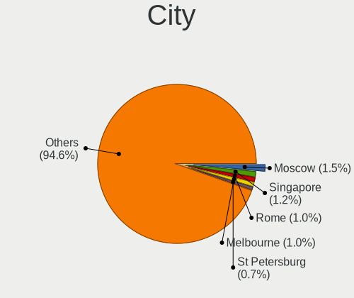
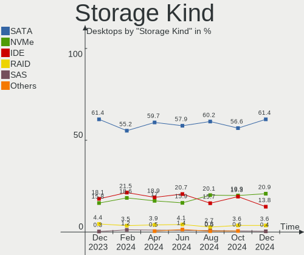
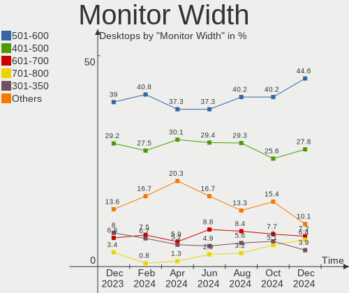
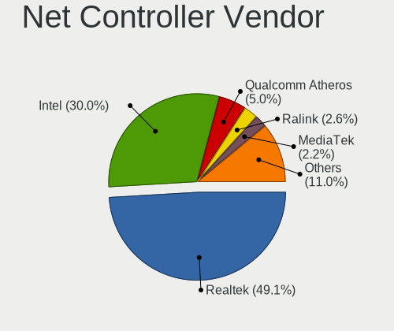
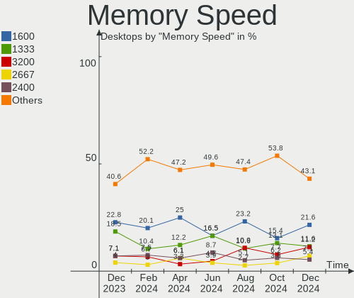

OpenMandriva - Hardware Trends (Desktops)
-----------------------------------------

A project to identify most popular hardware characteristics and track their change
over time based on data collected by Linux users at https://Linux-Hardware.org.

Anyone can contribute to this report by the [hw-probe](https://github.com/linuxhw/hw-probe) tool:

    sudo -E hw-probe -all -upload

This report is for one last month. Overall report since the beginning of time: [TestCoverage](https://github.com/linuxhw/TestCoverage)

Period: May, 2022.

Contents
--------

* [ System ](#system)
  - [ OS                       ](#os)
  - [ OS Family                ](#os-family)
  - [ Kernel                   ](#kernel)
  - [ Kernel Family            ](#kernel-family)
  - [ Kernel Major Ver.        ](#kernel-major-ver)
  - [ Arch                     ](#arch)
  - [ DE                       ](#de)
  - [ Display Server           ](#display-server)
  - [ Display Manager          ](#display-manager)
  - [ OS Lang                  ](#os-lang)
  - [ Boot Mode                ](#boot-mode)
  - [ Filesystem               ](#filesystem)
  - [ Part. scheme             ](#part-scheme)
  - [ Dual Boot with Linux/BSD ](#dual-boot-with-linuxbsd)
  - [ Dual Boot (Win)          ](#dual-boot-win)

* [ Board ](#board)
  - [ Vendor                   ](#vendor)
  - [ Model                    ](#model)
  - [ Model Family             ](#model-family)
  - [ MFG Year                 ](#mfg-year)
  - [ Form Factor              ](#form-factor)
  - [ Secure Boot              ](#secure-boot)
  - [ Coreboot                 ](#coreboot)
  - [ RAM Size                 ](#ram-size)
  - [ RAM Used                 ](#ram-used)
  - [ Total Drives             ](#total-drives)
  - [ Has CD-ROM               ](#has-cd-rom)
  - [ Has Ethernet             ](#has-ethernet)
  - [ Has WiFi                 ](#has-wifi)
  - [ Has Bluetooth            ](#has-bluetooth)

* [ Location ](#location)
  - [ Country                  ](#country)
  - [ City                     ](#city)

* [ Drives ](#drives)
  - [ Drive Vendor             ](#drive-vendor)
  - [ Drive Model              ](#drive-model)
  - [ HDD Vendor               ](#hdd-vendor)
  - [ SSD Vendor               ](#ssd-vendor)
  - [ Drive Kind               ](#drive-kind)
  - [ Drive Connector          ](#drive-connector)
  - [ Drive Size               ](#drive-size)
  - [ Space Total              ](#space-total)
  - [ Space Used               ](#space-used)
  - [ Malfunc. Drives          ](#malfunc-drives)
  - [ Malfunc. Drive Vendor    ](#malfunc-drive-vendor)
  - [ Malfunc. HDD Vendor      ](#malfunc-hdd-vendor)
  - [ Malfunc. Drive Kind      ](#malfunc-drive-kind)
  - [ Failed Drives            ](#failed-drives)
  - [ Failed Drive Vendor      ](#failed-drive-vendor)
  - [ Drive Status             ](#drive-status)

* [ Storage controller ](#storage-controller)
  - [ Storage Vendor           ](#storage-vendor)
  - [ Storage Model            ](#storage-model)
  - [ Storage Kind             ](#storage-kind)

* [ Processor ](#processor)
  - [ CPU Vendor               ](#cpu-vendor)
  - [ CPU Model                ](#cpu-model)
  - [ CPU Model Family         ](#cpu-model-family)
  - [ CPU Cores                ](#cpu-cores)
  - [ CPU Sockets              ](#cpu-sockets)
  - [ CPU Threads              ](#cpu-threads)
  - [ CPU Op-Modes             ](#cpu-op-modes)
  - [ CPU Microcode            ](#cpu-microcode)
  - [ CPU Microarch            ](#cpu-microarch)

* [ Graphics ](#graphics)
  - [ GPU Vendor               ](#gpu-vendor)
  - [ GPU Model                ](#gpu-model)
  - [ GPU Combo                ](#gpu-combo)
  - [ GPU Driver               ](#gpu-driver)
  - [ GPU Memory               ](#gpu-memory)

* [ Monitor ](#monitor)
  - [ Monitor Vendor           ](#monitor-vendor)
  - [ Monitor Model            ](#monitor-model)
  - [ Monitor Resolution       ](#monitor-resolution)
  - [ Monitor Diagonal         ](#monitor-diagonal)
  - [ Monitor Width            ](#monitor-width)
  - [ Aspect Ratio             ](#aspect-ratio)
  - [ Monitor Area             ](#monitor-area)
  - [ Pixel Density            ](#pixel-density)
  - [ Multiple Monitors        ](#multiple-monitors)

* [ Network ](#network)
  - [ Net Controller Vendor    ](#net-controller-vendor)
  - [ Net Controller Model     ](#net-controller-model)
  - [ Wireless Vendor          ](#wireless-vendor)
  - [ Wireless Model           ](#wireless-model)
  - [ Ethernet Vendor          ](#ethernet-vendor)
  - [ Ethernet Model           ](#ethernet-model)
  - [ Net Controller Kind      ](#net-controller-kind)
  - [ Used Controller          ](#used-controller)
  - [ NICs                     ](#nics)
  - [ IPv6                     ](#ipv6)

* [ Bluetooth ](#bluetooth)
  - [ Bluetooth Vendor         ](#bluetooth-vendor)
  - [ Bluetooth Model          ](#bluetooth-model)

* [ Sound ](#sound)
  - [ Sound Vendor             ](#sound-vendor)
  - [ Sound Model              ](#sound-model)

* [ Memory ](#memory)
  - [ Memory Vendor            ](#memory-vendor)
  - [ Memory Model             ](#memory-model)
  - [ Memory Kind              ](#memory-kind)
  - [ Memory Form Factor       ](#memory-form-factor)
  - [ Memory Size              ](#memory-size)
  - [ Memory Speed             ](#memory-speed)

* [ Printers & scanners ](#printers--scanners)
  - [ Printer Vendor           ](#printer-vendor)
  - [ Printer Model            ](#printer-model)
  - [ Scanner Vendor           ](#scanner-vendor)
  - [ Scanner Model            ](#scanner-model)

* [ Camera ](#camera)
  - [ Camera Vendor            ](#camera-vendor)
  - [ Camera Model             ](#camera-model)

* [ Security ](#security)
  - [ Fingerprint Vendor       ](#fingerprint-vendor)
  - [ Fingerprint Model        ](#fingerprint-model)
  - [ Chipcard Vendor          ](#chipcard-vendor)
  - [ Chipcard Model           ](#chipcard-model)

* [ Unsupported ](#unsupported)
  - [ Unsupported Devices      ](#unsupported-devices)
  - [ Unsupported Device Types ](#unsupported-device-types)

System
------

OS
--

Installed operating systems

| Name              | Desktops | Percent |
|-------------------|----------|---------|
| OpenMandriva 4.3  | 110      | 89.43%  |
| OpenMandriva 4.2  | 12       | 9.76%   |
| OpenMandriva 4.90 | 1        | 0.81%   |

OS Family
---------

OS without a version

| Name         | Desktops | Percent |
|--------------|----------|---------|
| OpenMandriva | 123      | 100%    |

Kernel
------

Version of the Linux kernel

| Version                  | Desktops | Percent |
|--------------------------|----------|---------|
| 5.16.7-desktop-1omv4003  | 101      | 82.11%  |
| 5.10.14-desktop-1omv4002 | 11       | 8.94%   |
| 5.16.13-desktop-1omv4003 | 7        | 5.69%   |
| 5.17.7-desktop-1omv4090  | 2        | 1.63%   |
| 5.17.1-desktop-2omv4050  | 1        | 0.81%   |
| 5.11.12-desktop-1omv4002 | 1        | 0.81%   |

Kernel Family
-------------

Linux kernel without a distro release

| Version | Desktops | Percent |
|---------|----------|---------|
| 5.16.7  | 101      | 82.11%  |
| 5.10.14 | 11       | 8.94%   |
| 5.16.13 | 7        | 5.69%   |
| 5.17.7  | 2        | 1.63%   |
| 5.17.1  | 1        | 0.81%   |
| 5.11.12 | 1        | 0.81%   |

Kernel Major Ver.
-----------------

Linux kernel major version

| Version | Desktops | Percent |
|---------|----------|---------|
| 5.16    | 108      | 87.8%   |
| 5.10    | 11       | 8.94%   |
| 5.17    | 3        | 2.44%   |
| 5.11    | 1        | 0.81%   |

Arch
----

OS architecture (x86_64, i586, etc.)

| Name   | Desktops | Percent |
|--------|----------|---------|
| x86_64 | 123      | 100%    |

DE
--

Desktop Environment

| Name    | Desktops | Percent |
|---------|----------|---------|
| KDE5    | 122      | 99.19%  |
| Unknown | 1        | 0.81%   |

Display Server
--------------

X11 or Wayland

| Name    | Desktops | Percent |
|---------|----------|---------|
| X11     | 120      | 97.56%  |
| Wayland | 3        | 2.44%   |

Display Manager
---------------

SDDM, LightDM, etc.

| Name | Desktops | Percent |
|------|----------|---------|
| SDDM | 123      | 100%    |

OS Lang
-------

Language

| Lang  | Desktops | Percent |
|-------|----------|---------|
| en_US | 68       | 55.28%  |
| pt_BR | 10       | 8.13%   |
| de_DE | 10       | 8.13%   |
| ru_RU | 8        | 6.5%    |
| it_IT | 5        | 4.07%   |
| es_ES | 5        | 4.07%   |
| pl_PL | 4        | 3.25%   |
| fr_FR | 4        | 3.25%   |
| de_AT | 2        | 1.63%   |
| pt_PT | 1        | 0.81%   |
| hu_HU | 1        | 0.81%   |
| es_PE | 1        | 0.81%   |
| es_MX | 1        | 0.81%   |
| es_AR | 1        | 0.81%   |
| en_CA | 1        | 0.81%   |
| en_AU | 1        | 0.81%   |

Boot Mode
---------

EFI or BIOS

| Mode | Desktops | Percent |
|------|----------|---------|
| BIOS | 72       | 58.54%  |
| EFI  | 51       | 41.46%  |

Filesystem
----------

Type of filesystem

| Type    | Desktops | Percent |
|---------|----------|---------|
| Overlay | 105      | 85.37%  |
| Ext4    | 18       | 14.63%  |

Part. scheme
------------

Scheme of partitioning

| Type    | Desktops | Percent |
|---------|----------|---------|
| GPT     | 64       | 52.03%  |
| MBR     | 57       | 46.34%  |
| Unknown | 2        | 1.63%   |

Dual Boot with Linux/BSD
------------------------

Hosting more than one Linux/BSD

| Dual boot | Desktops | Percent |
|-----------|----------|---------|
| Yes       | 69       | 56.1%   |
| No        | 54       | 43.9%   |

Dual Boot (Win)
---------------

Hosting Linux and Windows

| Dual boot | Desktops | Percent |
|-----------|----------|---------|
| Yes       | 77       | 62.6%   |
| No        | 46       | 37.4%   |

Board
-----

Vendor
------

Motherboard manufacturer

| Name                | Desktops | Percent |
|---------------------|----------|---------|
| ASUSTek Computer    | 28       | 22.76%  |
| Gigabyte Technology | 21       | 17.07%  |
| MSI                 | 16       | 13.01%  |
| Hewlett-Packard     | 11       | 8.94%   |
| Lenovo              | 10       | 8.13%   |
| ASRock              | 8        | 6.5%    |
| Dell                | 7        | 5.69%   |
| Positivo            | 6        | 4.88%   |
| Intel               | 5        | 4.07%   |
| Fujitsu             | 2        | 1.63%   |
| Biostar             | 2        | 1.63%   |
| Acer                | 2        | 1.63%   |
| Fujitsu Siemens     | 1        | 0.81%   |
| Foxconn             | 1        | 0.81%   |
| EVGA                | 1        | 0.81%   |
| BESSTAR Tech        | 1        | 0.81%   |
| Unknown             | 1        | 0.81%   |

Model
-----

Motherboard model

| Name                                 | Desktops | Percent |
|--------------------------------------|----------|---------|
| ASUS All Series                      | 3        | 2.44%   |
| Positivo POS-PIQ57BQ                 | 2        | 1.63%   |
| MSI MS-7235                          | 2        | 1.63%   |
| ASRock A88M-G                        | 2        | 1.63%   |
| Positivo POS-PIH81DI                 | 1        | 0.81%   |
| Positivo POS-PIG41BA                 | 1        | 0.81%   |
| Positivo POS-PARS760GCD              | 1        | 0.81%   |
| Positivo POS-EIBTPDC                 | 1        | 0.81%   |
| MSI MS-7D09                          | 1        | 0.81%   |
| MSI MS-7C79                          | 1        | 0.81%   |
| MSI MS-7B86                          | 1        | 0.81%   |
| MSI MS-7B38                          | 1        | 0.81%   |
| MSI MS-7B24                          | 1        | 0.81%   |
| MSI MS-7A40                          | 1        | 0.81%   |
| MSI MS-7982                          | 1        | 0.81%   |
| MSI MS-7821                          | 1        | 0.81%   |
| MSI MS-7693                          | 1        | 0.81%   |
| MSI MS-7641                          | 1        | 0.81%   |
| MSI MS-7576                          | 1        | 0.81%   |
| MSI MS-7309                          | 1        | 0.81%   |
| MSI MS-7267                          | 1        | 0.81%   |
| MSI FQ679AA-ABM SG3613LA             | 1        | 0.81%   |
| Lenovo V530S-07ICR 11BM0020MX        | 1        | 0.81%   |
| Lenovo V520-15IKL 10NK001XIV         | 1        | 0.81%   |
| Lenovo ThinkStation P500 30A6S0RT00  | 1        | 0.81%   |
| Lenovo ThinkCentre M90p 5536WAZ      | 1        | 0.81%   |
| Lenovo ThinkCentre M75s-1 11AAS04700 | 1        | 0.81%   |
| Lenovo ThinkCentre M73 10B6001SUS    | 1        | 0.81%   |
| Lenovo ThinkCentre M58 7360WQK       | 1        | 0.81%   |
| Lenovo ThinkCentre M57 9181A28       | 1        | 0.81%   |
| Lenovo ThinkCentre M57 00P4496       | 1        | 0.81%   |
| Lenovo H520 10094                    | 1        | 0.81%   |
| Intel DP67BA AAG10219-300            | 1        | 0.81%   |
| Intel DH55HC AAE70933-505            | 1        | 0.81%   |
| Intel DG43GT AAE62768-300            | 1        | 0.81%   |
| Intel DG31PR AAE58249-306            | 1        | 0.81%   |
| Intel D2500HN AAG81480-500           | 1        | 0.81%   |
| HP Z440 Workstation                  | 1        | 0.81%   |
| HP Z240 Tower Workstation            | 1        | 0.81%   |
| HP ProDesk 600 G1 SFF                | 1        | 0.81%   |
| HP EliteDesk 800 G2 DM 65W           | 1        | 0.81%   |
| HP EliteDesk 800 G1 SFF              | 1        | 0.81%   |
| HP EliteDesk 700 G1 SFF              | 1        | 0.81%   |
| HP Elite Slice                       | 1        | 0.81%   |
| HP Compaq dc7800p Small Form Factor  | 1        | 0.81%   |
| HP Compaq 8200 Elite SFF PC          | 1        | 0.81%   |
| HP Compaq 6005 Pro MT PC             | 1        | 0.81%   |
| HP 750-114                           | 1        | 0.81%   |
| Gigabyte Z77P-D3                     | 1        | 0.81%   |
| Gigabyte Z68XP-UD3                   | 1        | 0.81%   |
| Gigabyte Z390 AORUS ELITE            | 1        | 0.81%   |
| Gigabyte X570 AORUS PRO              | 1        | 0.81%   |
| Gigabyte X38-DQ6                     | 1        | 0.81%   |
| Gigabyte P55-UD3R                    | 1        | 0.81%   |
| Gigabyte H55M-S2                     | 1        | 0.81%   |
| Gigabyte GA-MA78GM-S2H               | 1        | 0.81%   |
| Gigabyte GA-MA770-UD3                | 1        | 0.81%   |
| Gigabyte GA-E6010N                   | 1        | 0.81%   |
| Gigabyte DPA/CFA 950                 | 1        | 0.81%   |
| Gigabyte B85M-D3H-A                  | 1        | 0.81%   |

Model Family
------------

Motherboard model prefix

| Name                    | Desktops | Percent |
|-------------------------|----------|---------|
| Lenovo ThinkCentre      | 6        | 4.88%   |
| Dell OptiPlex           | 5        | 4.07%   |
| ASUS PRIME              | 5        | 4.07%   |
| HP EliteDesk            | 3        | 2.44%   |
| HP Compaq               | 3        | 2.44%   |
| ASUS All                | 3        | 2.44%   |
| Positivo POS-PIQ57BQ    | 2        | 1.63%   |
| MSI MS-7235             | 2        | 1.63%   |
| Fujitsu ESPRIMO         | 2        | 1.63%   |
| ASUS TUF                | 2        | 1.63%   |
| ASUS ROG                | 2        | 1.63%   |
| ASRock A88M-G           | 2        | 1.63%   |
| Acer Aspire             | 2        | 1.63%   |
| Positivo POS-PIH81DI    | 1        | 0.81%   |
| Positivo POS-PIG41BA    | 1        | 0.81%   |
| Positivo POS-PARS760GCD | 1        | 0.81%   |
| Positivo POS-EIBTPDC    | 1        | 0.81%   |
| MSI MS-7D09             | 1        | 0.81%   |
| MSI MS-7C79             | 1        | 0.81%   |
| MSI MS-7B86             | 1        | 0.81%   |
| MSI MS-7B38             | 1        | 0.81%   |
| MSI MS-7B24             | 1        | 0.81%   |
| MSI MS-7A40             | 1        | 0.81%   |
| MSI MS-7982             | 1        | 0.81%   |
| MSI MS-7821             | 1        | 0.81%   |
| MSI MS-7693             | 1        | 0.81%   |
| MSI MS-7641             | 1        | 0.81%   |
| MSI MS-7576             | 1        | 0.81%   |
| MSI MS-7309             | 1        | 0.81%   |
| MSI MS-7267             | 1        | 0.81%   |
| MSI FQ679AA-ABM         | 1        | 0.81%   |
| Lenovo V530S-07ICR      | 1        | 0.81%   |
| Lenovo V520-15IKL       | 1        | 0.81%   |
| Lenovo ThinkStation     | 1        | 0.81%   |
| Lenovo H520             | 1        | 0.81%   |
| Intel DP67BA            | 1        | 0.81%   |
| Intel DH55HC            | 1        | 0.81%   |
| Intel DG43GT            | 1        | 0.81%   |
| Intel DG31PR            | 1        | 0.81%   |
| Intel D2500HN           | 1        | 0.81%   |
| HP Z440                 | 1        | 0.81%   |
| HP Z240                 | 1        | 0.81%   |
| HP ProDesk              | 1        | 0.81%   |
| HP Elite                | 1        | 0.81%   |
| HP 750-114              | 1        | 0.81%   |
| Gigabyte Z77P-D3        | 1        | 0.81%   |
| Gigabyte Z68XP-UD3      | 1        | 0.81%   |
| Gigabyte Z390           | 1        | 0.81%   |
| Gigabyte X570           | 1        | 0.81%   |
| Gigabyte X38-DQ6        | 1        | 0.81%   |
| Gigabyte P55-UD3R       | 1        | 0.81%   |
| Gigabyte H55M-S2        | 1        | 0.81%   |
| Gigabyte GA-MA78GM-S2H  | 1        | 0.81%   |
| Gigabyte GA-MA770-UD3   | 1        | 0.81%   |
| Gigabyte GA-E6010N      | 1        | 0.81%   |
| Gigabyte DPA            | 1        | 0.81%   |
| Gigabyte B85M-D3H-A     | 1        | 0.81%   |
| Gigabyte B75N           | 1        | 0.81%   |
| Gigabyte B560M          | 1        | 0.81%   |
| Gigabyte B550M          | 1        | 0.81%   |

MFG Year
--------

Motherboard manufacture year

| Year | Desktops | Percent |
|------|----------|---------|
| 2016 | 13       | 10.57%  |
| 2010 | 12       | 9.76%   |
| 2012 | 11       | 8.94%   |
| 2020 | 10       | 8.13%   |
| 2015 | 8        | 6.5%    |
| 2008 | 8        | 6.5%    |
| 2007 | 8        | 6.5%    |
| 2018 | 7        | 5.69%   |
| 2014 | 7        | 5.69%   |
| 2013 | 7        | 5.69%   |
| 2011 | 7        | 5.69%   |
| 2021 | 6        | 4.88%   |
| 2019 | 6        | 4.88%   |
| 2006 | 5        | 4.07%   |
| 2009 | 4        | 3.25%   |
| 2017 | 3        | 2.44%   |
| 2022 | 1        | 0.81%   |

Form Factor
-----------

Physical design of the computer

| Name    | Desktops | Percent |
|---------|----------|---------|
| Desktop | 123      | 100%    |

Secure Boot
-----------

Enabled or disabled

| State    | Desktops | Percent |
|----------|----------|---------|
| Disabled | 123      | 100%    |

Coreboot
--------

Have coreboot on board

| Used | Desktops | Percent |
|------|----------|---------|
| No   | 123      | 100%    |

RAM Size
--------

Total RAM memory

| Size in GB  | Desktops | Percent |
|-------------|----------|---------|
| 8.01-16.0   | 37       | 30.08%  |
| 3.01-4.0    | 23       | 18.7%   |
| 16.01-24.0  | 21       | 17.07%  |
| 4.01-8.0    | 19       | 15.45%  |
| 32.01-64.0  | 14       | 11.38%  |
| 1.01-2.0    | 4        | 3.25%   |
| 24.01-32.0  | 2        | 1.63%   |
| 64.01-256.0 | 2        | 1.63%   |
| 0.51-1.0    | 1        | 0.81%   |

RAM Used
--------

Used RAM memory

| Used GB  | Desktops | Percent |
|----------|----------|---------|
| 1.01-2.0 | 80       | 65.04%  |
| 0.51-1.0 | 28       | 22.76%  |
| 2.01-3.0 | 9        | 7.32%   |
| 0.01-0.5 | 3        | 2.44%   |
| 4.01-8.0 | 2        | 1.63%   |
| 3.01-4.0 | 1        | 0.81%   |

Total Drives
------------

Number of drives on board

| Drives | Desktops | Percent |
|--------|----------|---------|
| 1      | 54       | 43.9%   |
| 2      | 30       | 24.39%  |
| 3      | 18       | 14.63%  |
| 5      | 8        | 6.5%    |
| 4      | 6        | 4.88%   |
| 0      | 6        | 4.88%   |
| 6      | 1        | 0.81%   |

Has CD-ROM
----------

Has CD-ROM on board

| Presented | Desktops | Percent |
|-----------|----------|---------|
| Yes       | 74       | 60.16%  |
| No        | 49       | 39.84%  |

Has Ethernet
------------

Has Ethernet on board

| Presented | Desktops | Percent |
|-----------|----------|---------|
| Yes       | 122      | 99.19%  |
| No        | 1        | 0.81%   |

Has WiFi
--------

Has WiFi module

| Presented | Desktops | Percent |
|-----------|----------|---------|
| No        | 81       | 65.85%  |
| Yes       | 42       | 34.15%  |

Has Bluetooth
-------------

Has Bluetooth module

| Presented | Desktops | Percent |
|-----------|----------|---------|
| No        | 102      | 82.93%  |
| Yes       | 21       | 17.07%  |

Location
--------

Country
-------

Geographic location (country)

| Country      | Desktops | Percent |
|--------------|----------|---------|
| Brazil       | 16       | 13.01%  |
| USA          | 12       | 9.76%   |
| Germany      | 12       | 9.76%   |
| Russia       | 11       | 8.94%   |
| France       | 7        | 5.69%   |
| Spain        | 6        | 4.88%   |
| Italy        | 6        | 4.88%   |
| Poland       | 5        | 4.07%   |
| Mexico       | 3        | 2.44%   |
| Japan        | 3        | 2.44%   |
| Canada       | 3        | 2.44%   |
| Ukraine      | 2        | 1.63%   |
| Taiwan       | 2        | 1.63%   |
| Sweden       | 2        | 1.63%   |
| Portugal     | 2        | 1.63%   |
| Peru         | 2        | 1.63%   |
| Indonesia    | 2        | 1.63%   |
| Hungary      | 2        | 1.63%   |
| Estonia      | 2        | 1.63%   |
| Austria      | 2        | 1.63%   |
| Argentina    | 2        | 1.63%   |
| Uruguay      | 1        | 0.81%   |
| UK           | 1        | 0.81%   |
| Turkey       | 1        | 0.81%   |
| Tunisia      | 1        | 0.81%   |
| Syria        | 1        | 0.81%   |
| Switzerland  | 1        | 0.81%   |
| Slovakia     | 1        | 0.81%   |
| Saudi Arabia | 1        | 0.81%   |
| Romania      | 1        | 0.81%   |
| New Zealand  | 1        | 0.81%   |
| Israel       | 1        | 0.81%   |
| Ireland      | 1        | 0.81%   |
| Iran         | 1        | 0.81%   |
| Finland      | 1        | 0.81%   |
| Egypt        | 1        | 0.81%   |
| Czechia      | 1        | 0.81%   |
| China        | 1        | 0.81%   |
| Belarus      | 1        | 0.81%   |
| Azerbaijan   | 1        | 0.81%   |

City
----

Geographic location (city)

| City                  | Desktops | Percent |
|-----------------------|----------|---------|
| Sao Paulo             | 4        | 3.25%   |
| Worms                 | 2        | 1.63%   |
| Vienna                | 2        | 1.63%   |
| Tartu                 | 2        | 1.63%   |
| Sundsvall             | 2        | 1.63%   |
| Reda                  | 2        | 1.63%   |
| Lima                  | 2        | 1.63%   |
| Zaragoza              | 1        | 0.81%   |
| Zamrsk                | 1        | 0.81%   |
| Yoshkar-Ola           | 1        | 0.81%   |
| Wroclaw               | 1        | 0.81%   |
| Washington            | 1        | 0.81%   |
| Warsaw                | 1        | 0.81%   |
| Uelzen                | 1        | 0.81%   |
| Tuxtla Gutiérrez     | 1        | 0.81%   |
| Tunis                 | 1        | 0.81%   |
| Tillicoultry          | 1        | 0.81%   |
| Texcoco               | 1        | 0.81%   |
| Taranto               | 1        | 0.81%   |
| Taoyuan District      | 1        | 0.81%   |
| Tanta                 | 1        | 0.81%   |
| Tampere               | 1        | 0.81%   |
| Talavera de la Reina  | 1        | 0.81%   |
| Taito                 | 1        | 0.81%   |
| Surrey                | 1        | 0.81%   |
| Surgut                | 1        | 0.81%   |
| Suresnes              | 1        | 0.81%   |
| Sudak                 | 1        | 0.81%   |
| Simferopol            | 1        | 0.81%   |
| Shinjuku              | 1        | 0.81%   |
| Setúbal              | 1        | 0.81%   |
| Serris                | 1        | 0.81%   |
| Serra                 | 1        | 0.81%   |
| Sao Jose do Rio Preto | 1        | 0.81%   |
| Sao Jose              | 1        | 0.81%   |
| Saginaw               | 1        | 0.81%   |
| Saarbrücken          | 1        | 0.81%   |
| Rosario               | 1        | 0.81%   |
| Riyadh                | 1        | 0.81%   |
| Raunheim              | 1        | 0.81%   |
| Porto                 | 1        | 0.81%   |
| Pliezhausen           | 1        | 0.81%   |
| Pinhais               | 1        | 0.81%   |
| Piazzola sul Brenta   | 1        | 0.81%   |
| Perm                  | 1        | 0.81%   |
| Paris                 | 1        | 0.81%   |
| Osaka                 | 1        | 0.81%   |
| Orenburg              | 1        | 0.81%   |
| Odessa                | 1        | 0.81%   |
| Niterói              | 1        | 0.81%   |
| Munchenstein          | 1        | 0.81%   |
| Moscow                | 1        | 0.81%   |
| Morki                 | 1        | 0.81%   |
| Montevideo            | 1        | 0.81%   |
| Minneapolis           | 1        | 0.81%   |
| Milan                 | 1        | 0.81%   |
| Mexico City           | 1        | 0.81%   |
| Marseille             | 1        | 0.81%   |
| Marília              | 1        | 0.81%   |
| Marcon                | 1        | 0.81%   |

Drives
------

Drive Vendor
------------

Hard drive vendors

| Vendor              | Desktops | Drives | Percent |
|---------------------|----------|--------|---------|
| Seagate             | 43       | 56     | 21.5%   |
| WDC                 | 36       | 49     | 18%     |
| Samsung Electronics | 28       | 33     | 14%     |
| Kingston            | 19       | 20     | 9.5%    |
| Crucial             | 11       | 15     | 5.5%    |
| SanDisk             | 8        | 8      | 4%      |
| Toshiba             | 7        | 7      | 3.5%    |
| Hitachi             | 5        | 5      | 2.5%    |
| China               | 4        | 6      | 2%      |
| A-DATA Technology   | 4        | 4      | 2%      |
| Unknown             | 3        | 3      | 1.5%    |
| Intel               | 3        | 3      | 1.5%    |
| SPCC                | 2        | 2      | 1%      |
| PLEXTOR             | 2        | 2      | 1%      |
| Phison              | 2        | 2      | 1%      |
| KIOXIA-EXCERIA      | 2        | 2      | 1%      |
| Apacer              | 2        | 3      | 1%      |
| XPG                 | 1        | 1      | 0.5%    |
| VERICO              | 1        | 1      | 0.5%    |
| Teclast             | 1        | 1      | 0.5%    |
| Team                | 1        | 1      | 0.5%    |
| SuperMicro          | 1        | 1      | 0.5%    |
| Smartbuy            | 1        | 1      | 0.5%    |
| SABRENT             | 1        | 1      | 0.5%    |
| PNY                 | 1        | 1      | 0.5%    |
| Patriot             | 1        | 1      | 0.5%    |
| OCZ                 | 1        | 1      | 0.5%    |
| Micron Technology   | 1        | 1      | 0.5%    |
| LITEONIT            | 1        | 1      | 0.5%    |
| Lexar               | 1        | 1      | 0.5%    |
| KingDian            | 1        | 1      | 0.5%    |
| JetFlash            | 1        | 1      | 0.5%    |
| Intenso             | 1        | 1      | 0.5%    |
| i-FlashDisk         | 1        | 1      | 0.5%    |
| HGST                | 1        | 1      | 0.5%    |
| Corsair             | 1        | 1      | 0.5%    |

Drive Model
-----------

Hard drive models

| Model                            | Desktops | Percent |
|----------------------------------|----------|---------|
| Seagate ST1000DM003-1ER162 1TB   | 6        | 2.6%    |
| Kingston SA400S37240G 240GB SSD  | 6        | 2.6%    |
| Seagate ST500DM002-1BD142 500GB  | 4        | 1.73%   |
| Unknown SD/MMC/MS PRO 999GB      | 3        | 1.3%    |
| Toshiba DT01ACA100 1TB           | 3        | 1.3%    |
| Seagate ST1000DM010-2EP102 1TB   | 3        | 1.3%    |
| Kingston SV300S37A120G 120GB SSD | 3        | 1.3%    |
| Crucial CT480BX500SSD1 480GB     | 3        | 1.3%    |
| WDC WDS250G2B0A-00SM50 250GB SSD | 2        | 0.87%   |
| WDC WD10EZEX-08WN4A0 1TB         | 2        | 0.87%   |
| Seagate ST380815AS 80GB          | 2        | 0.87%   |
| Seagate ST3500418AS 500GB        | 2        | 0.87%   |
| Seagate ST3320620AS 320GB        | 2        | 0.87%   |
| Seagate ST3250318AS 250GB        | 2        | 0.87%   |
| Seagate ST31000528AS 1TB         | 2        | 0.87%   |
| Seagate ST1000DM003-9YN162 1TB   | 2        | 0.87%   |
| Seagate ST1000DM003-1CH162 1TB   | 2        | 0.87%   |
| SanDisk SSD PLUS 240GB           | 2        | 0.87%   |
| Samsung SSD 870 EVO 500GB        | 2        | 0.87%   |
| Samsung SSD 860 EVO 250GB        | 2        | 0.87%   |
| Samsung SSD 850 EVO 500GB        | 2        | 0.87%   |
| Samsung HD502HJ 500GB            | 2        | 0.87%   |
| Kingston SV300S37A60G 64GB SSD   | 2        | 0.87%   |
| Kingston SA400S37120G 120GB SSD  | 2        | 0.87%   |
| Crucial CT500MX500SSD1 500GB     | 2        | 0.87%   |
| Crucial CT1000MX500SSD1 1TB      | 2        | 0.87%   |
| XPG GAMMIX S11 Pro 256GB         | 1        | 0.43%   |
| WDC WDS500G3X0C-00SJG0 500GB     | 1        | 0.43%   |
| WDC WDS500G2B0B-00YS70 500GB SSD | 1        | 0.43%   |
| WDC WDS250G2X0C-00L350 250GB     | 1        | 0.43%   |
| WDC WDS100T2B0A-00SM50 1TB SSD   | 1        | 0.43%   |
| WDC WDBRPG5000ANC-WRSN 500GB     | 1        | 0.43%   |
| WDC WD800JD-00MSA1 80GB          | 1        | 0.43%   |
| WDC WD800BB-00JHC0 80GB          | 1        | 0.43%   |
| WDC WD800BB-00FJA0 80GB          | 1        | 0.43%   |
| WDC WD60EFRX-68MYMN1 6TB         | 1        | 0.43%   |
| WDC WD5003ABYZ-011FA0 500GB      | 1        | 0.43%   |
| WDC WD5001AALS-00L3B2 500GB      | 1        | 0.43%   |
| WDC WD5000LPLX-66ZNTT0 500GB     | 1        | 0.43%   |
| WDC WD5000LPCX-16VHAT1 500GB     | 1        | 0.43%   |
| WDC WD5000AZLX-08K2TA0 500GB     | 1        | 0.43%   |
| WDC WD5000AAKX-00ERMA0 500GB     | 1        | 0.43%   |
| WDC WD5000AAKS-75A7B0 500GB      | 1        | 0.43%   |
| WDC WD5000AAKS-22TMA0 500GB      | 1        | 0.43%   |
| WDC WD5000AAKS-00V1A0 500GB      | 1        | 0.43%   |
| WDC WD5000AAKS-00TMA0 500GB      | 1        | 0.43%   |
| WDC WD5000AAKS-00A7B2 500GB      | 1        | 0.43%   |
| WDC WD5000AADS-00S9B0 500GB      | 1        | 0.43%   |
| WDC WD5000AADS-00M2B0 500GB      | 1        | 0.43%   |
| WDC WD40EFRX-68WT0N0 4TB         | 1        | 0.43%   |
| WDC WD4005FZBX-00K5WB0 4TB       | 1        | 0.43%   |
| WDC WD3200AAJS-00YZCA0 320GB     | 1        | 0.43%   |
| WDC WD3200AAJS-00B4A0 320GB      | 1        | 0.43%   |
| WDC WD3200AAJB-00J3A0 320GB      | 1        | 0.43%   |
| WDC WD30EZRX-00DC0B0 3TB         | 1        | 0.43%   |
| WDC WD2500AAKX-08U6AA0 250GB     | 1        | 0.43%   |
| WDC WD2500AAKX-07U6AA0 250GB     | 1        | 0.43%   |
| WDC WD2500AAJS-00YZCA0 250GB     | 1        | 0.43%   |
| WDC WD1600AAJS-08WAA0 160GB      | 1        | 0.43%   |
| WDC WD1600AABS-00PRA0 160GB      | 1        | 0.43%   |

HDD Vendor
----------

Hard disk drive vendors

| Vendor              | Desktops | Drives | Percent |
|---------------------|----------|--------|---------|
| Seagate             | 41       | 54     | 41.41%  |
| WDC                 | 32       | 42     | 32.32%  |
| Samsung Electronics | 10       | 10     | 10.1%   |
| Toshiba             | 6        | 6      | 6.06%   |
| Hitachi             | 5        | 5      | 5.05%   |
| Unknown             | 3        | 3      | 3.03%   |
| SABRENT             | 1        | 1      | 1.01%   |
| HGST                | 1        | 1      | 1.01%   |

SSD Vendor
----------

Solid state drive vendors

| Vendor              | Desktops | Drives | Percent |
|---------------------|----------|--------|---------|
| Kingston            | 17       | 18     | 21.52%  |
| Samsung Electronics | 12       | 15     | 15.19%  |
| Crucial             | 9        | 13     | 11.39%  |
| SanDisk             | 7        | 7      | 8.86%   |
| WDC                 | 4        | 4      | 5.06%   |
| China               | 4        | 6      | 5.06%   |
| A-DATA Technology   | 3        | 3      | 3.8%    |
| Intel               | 2        | 2      | 2.53%   |
| Apacer              | 2        | 2      | 2.53%   |
| VERICO              | 1        | 1      | 1.27%   |
| Toshiba             | 1        | 1      | 1.27%   |
| Team                | 1        | 1      | 1.27%   |
| SuperMicro          | 1        | 1      | 1.27%   |
| SPCC                | 1        | 1      | 1.27%   |
| Smartbuy            | 1        | 1      | 1.27%   |
| Seagate             | 1        | 1      | 1.27%   |
| PNY                 | 1        | 1      | 1.27%   |
| PLEXTOR             | 1        | 1      | 1.27%   |
| PHISON              | 1        | 1      | 1.27%   |
| Patriot             | 1        | 1      | 1.27%   |
| OCZ                 | 1        | 1      | 1.27%   |
| Micron Technology   | 1        | 1      | 1.27%   |
| LITEONIT            | 1        | 1      | 1.27%   |
| Lexar               | 1        | 1      | 1.27%   |
| KIOXIA-EXCERIA      | 1        | 1      | 1.27%   |
| KingDian            | 1        | 1      | 1.27%   |
| Intenso             | 1        | 1      | 1.27%   |
| i-FlashDisk         | 1        | 1      | 1.27%   |

Drive Kind
----------

HDD or SSD

| Kind    | Desktops | Drives | Percent |
|---------|----------|--------|---------|
| HDD     | 82       | 122    | 49.7%   |
| SSD     | 59       | 89     | 35.76%  |
| NVMe    | 23       | 27     | 13.94%  |
| Unknown | 1        | 1      | 0.61%   |

Drive Connector
---------------

SATA, SAS, NVMe, etc.

| Type | Desktops | Drives | Percent |
|------|----------|--------|---------|
| SATA | 112      | 203    | 77.78%  |
| NVMe | 23       | 27     | 15.97%  |
| SAS  | 9        | 9      | 6.25%   |

Drive Size
----------

Size of hard drive

| Size in TB | Desktops | Drives | Percent |
|------------|----------|--------|---------|
| 0.01-0.5   | 92       | 137    | 63.89%  |
| 0.51-1.0   | 36       | 57     | 25%     |
| 1.01-2.0   | 8        | 8      | 5.56%   |
| 3.01-4.0   | 3        | 4      | 2.08%   |
| 4.01-10.0  | 3        | 3      | 2.08%   |
| 2.01-3.0   | 2        | 2      | 1.39%   |

Space Total
-----------

Amount of disk space available on the file system

| Size in GB     | Desktops | Percent |
|----------------|----------|---------|
| 1-20           | 60       | 48.78%  |
| Unknown        | 24       | 19.51%  |
| 251-500        | 11       | 8.94%   |
| 101-250        | 10       | 8.13%   |
| 51-100         | 5        | 4.07%   |
| 1001-2000      | 4        | 3.25%   |
| 501-1000       | 4        | 3.25%   |
| 21-50          | 3        | 2.44%   |
| More than 3000 | 2        | 1.63%   |

Space Used
----------

Amount of used disk space

| Used GB   | Desktops | Percent |
|-----------|----------|---------|
| 1-20      | 86       | 69.92%  |
| Unknown   | 24       | 19.51%  |
| 21-50     | 4        | 3.25%   |
| 1001-2000 | 3        | 2.44%   |
| 101-250   | 2        | 1.63%   |
| 51-100    | 2        | 1.63%   |
| 2001-3000 | 1        | 0.81%   |
| 501-1000  | 1        | 0.81%   |

Malfunc. Drives
---------------

Drive models with a malfunction

| Model                                 | Desktops | Drives | Percent |
|---------------------------------------|----------|--------|---------|
| Seagate ST500DM002-1BD142 500GB       | 4        | 5      | 9.09%   |
| Seagate ST1000DM003-9YN162 1TB        | 2        | 2      | 4.55%   |
| WDC WD800JD-00MSA1 80GB               | 1        | 1      | 2.27%   |
| WDC WD800BB-00FJA0 80GB               | 1        | 1      | 2.27%   |
| WDC WD60EFRX-68MYMN1 6TB              | 1        | 1      | 2.27%   |
| WDC WD5003ABYZ-011FA0 500GB           | 1        | 1      | 2.27%   |
| WDC WD5001AALS-00L3B2 500GB           | 1        | 1      | 2.27%   |
| WDC WD5000AAKX-00ERMA0 500GB          | 1        | 1      | 2.27%   |
| WDC WD5000AAKS-75A7B0 500GB           | 1        | 1      | 2.27%   |
| WDC WD5000AAKS-00V1A0 500GB           | 1        | 1      | 2.27%   |
| WDC WD5000AAKS-00A7B2 500GB           | 1        | 1      | 2.27%   |
| WDC WD3200AAJS-00YZCA0 320GB          | 1        | 1      | 2.27%   |
| WDC WD2500AAJS-00YZCA0 250GB          | 1        | 1      | 2.27%   |
| WDC WD10EZEX-08WN4A0 1TB              | 1        | 1      | 2.27%   |
| WDC WD10EADS-22M2B0 1TB               | 1        | 1      | 2.27%   |
| WDC WD10EADS-00L5B1 1TB               | 1        | 1      | 2.27%   |
| SPCC M.2 PCIe SSD 256GB               | 1        | 1      | 2.27%   |
| Seagate ST9320325AS 320GB             | 1        | 1      | 2.27%   |
| Seagate ST3750640NS 752GB             | 1        | 2      | 2.27%   |
| Seagate ST3500418AS 500GB             | 1        | 1      | 2.27%   |
| Seagate ST3500413AS 500GB             | 1        | 1      | 2.27%   |
| Seagate ST3250318AS 250GB             | 1        | 1      | 2.27%   |
| Seagate ST3250310AS 250GB             | 1        | 1      | 2.27%   |
| Seagate ST3160811AS 160GB             | 1        | 1      | 2.27%   |
| Seagate ST310212A 10GB                | 1        | 1      | 2.27%   |
| Seagate ST31000528AS 1TB              | 1        | 1      | 2.27%   |
| Seagate ST1000DM010-2EP102 1TB        | 1        | 1      | 2.27%   |
| Seagate ST1000DM003-1CH162 1TB        | 1        | 1      | 2.27%   |
| SanDisk SSD PLUS 480GB                | 1        | 1      | 2.27%   |
| Samsung Electronics SP0842N 80GB      | 1        | 1      | 2.27%   |
| Samsung Electronics HE253GJ 250GB     | 1        | 1      | 2.27%   |
| Samsung Electronics HD502IJ 500GB     | 1        | 1      | 2.27%   |
| Samsung Electronics HD502HJ 500GB     | 1        | 1      | 2.27%   |
| Samsung Electronics HD252HJ 250GB     | 1        | 1      | 2.27%   |
| Samsung Electronics HD080HJ 80GB      | 1        | 1      | 2.27%   |
| Intel SSDSA2M160G2GC 160GB            | 1        | 1      | 2.27%   |
| Hitachi HDS721032CLA362 320GB         | 1        | 1      | 2.27%   |
| HGST HTS545050A7E680 500GB            | 1        | 1      | 2.27%   |
| Crucial CT128MX100SSD1 128GB          | 1        | 1      | 2.27%   |
| A-DATA Technology SP900NS38 256GB SSD | 1        | 1      | 2.27%   |

Malfunc. Drive Vendor
---------------------

Vendors of faulty drives

| Vendor              | Desktops | Drives | Percent |
|---------------------|----------|--------|---------|
| Seagate             | 16       | 19     | 40%     |
| WDC                 | 11       | 14     | 27.5%   |
| Samsung Electronics | 6        | 6      | 15%     |
| SPCC                | 1        | 1      | 2.5%    |
| SanDisk             | 1        | 1      | 2.5%    |
| Intel               | 1        | 1      | 2.5%    |
| Hitachi             | 1        | 1      | 2.5%    |
| HGST                | 1        | 1      | 2.5%    |
| Crucial             | 1        | 1      | 2.5%    |
| A-DATA Technology   | 1        | 1      | 2.5%    |

Malfunc. HDD Vendor
-------------------

Vendors of faulty HDD drives

| Vendor              | Desktops | Drives | Percent |
|---------------------|----------|--------|---------|
| Seagate             | 16       | 19     | 45.71%  |
| WDC                 | 11       | 14     | 31.43%  |
| Samsung Electronics | 6        | 6      | 17.14%  |
| Hitachi             | 1        | 1      | 2.86%   |
| HGST                | 1        | 1      | 2.86%   |

Malfunc. Drive Kind
-------------------

Kinds of faulty drives

| Kind | Desktops | Drives | Percent |
|------|----------|--------|---------|
| HDD  | 34       | 41     | 87.18%  |
| SSD  | 4        | 4      | 10.26%  |
| NVMe | 1        | 1      | 2.56%   |

Failed Drives
-------------

Failed drive models

| Model                   | Desktops | Drives | Percent |
|-------------------------|----------|--------|---------|
| Seagate ST980811AS 80GB | 1        | 1      | 100%    |

Failed Drive Vendor
-------------------

Failed drive vendors

| Vendor  | Desktops | Drives | Percent |
|---------|----------|--------|---------|
| Seagate | 1        | 1      | 100%    |

Drive Status
------------

Number of failed and malfunc. drives

| Status   | Desktops | Drives | Percent |
|----------|----------|--------|---------|
| Works    | 98       | 180    | 66.22%  |
| Malfunc  | 39       | 46     | 26.35%  |
| Detected | 10       | 12     | 6.76%   |
| Failed   | 1        | 1      | 0.68%   |

Storage controller
------------------

Storage Vendor
--------------

Storage controller vendors

| Vendor                      | Desktops | Percent |
|-----------------------------|----------|---------|
| Intel                       | 81       | 49.09%  |
| AMD                         | 35       | 21.21%  |
| Marvell Technology Group    | 8        | 4.85%   |
| Samsung Electronics         | 7        | 4.24%   |
| Nvidia                      | 6        | 3.64%   |
| JMicron Technology          | 5        | 3.03%   |
| Sandisk                     | 3        | 1.82%   |
| Phison Electronics          | 3        | 1.82%   |
| VIA Technologies            | 2        | 1.21%   |
| Realtek Semiconductor       | 2        | 1.21%   |
| Micron/Crucial Technology   | 2        | 1.21%   |
| Kingston Technology Company | 2        | 1.21%   |
| ASMedia Technology          | 2        | 1.21%   |
| Silicon Motion              | 1        | 0.61%   |
| Silicon Image               | 1        | 0.61%   |
| Seagate Technology          | 1        | 0.61%   |
| Lite-On Technology          | 1        | 0.61%   |
| Lite-On IT Corp. / Plextor  | 1        | 0.61%   |
| KIOXIA                      | 1        | 0.61%   |
| ADATA Technology            | 1        | 0.61%   |

Storage Model
-------------

Storage controller models

| Model                                                                          | Desktops | Percent |
|--------------------------------------------------------------------------------|----------|---------|
| AMD FCH SATA Controller [AHCI mode]                                            | 17       | 7.87%   |
| Intel Q170/Q150/B150/H170/H110/Z170/CM236 Chipset SATA Controller [AHCI Mode]  | 11       | 5.09%   |
| Intel 8 Series/C220 Series Chipset Family 6-port SATA Controller 1 [AHCI mode] | 10       | 4.63%   |
| Intel 6 Series/C200 Series Chipset Family 6 port Desktop SATA AHCI Controller  | 8        | 3.7%    |
| AMD SB7x0/SB8x0/SB9x0 SATA Controller [AHCI mode]                              | 7        | 3.24%   |
| Intel NM10/ICH7 Family SATA Controller [IDE mode]                              | 6        | 2.78%   |
| Intel 200 Series PCH SATA controller [AHCI mode]                               | 6        | 2.78%   |
| AMD SB7x0/SB8x0/SB9x0 IDE Controller                                           | 6        | 2.78%   |
| Intel 82801IR/IO/IH (ICH9R/DO/DH) 4 port SATA Controller [IDE mode]            | 5        | 2.31%   |
| Intel 82801I (ICH9 Family) 2 port SATA Controller [IDE mode]                   | 5        | 2.31%   |
| Intel 82801G (ICH7 Family) IDE Controller                                      | 5        | 2.31%   |
| Intel 5 Series/3400 Series Chipset 6 port SATA AHCI Controller                 | 5        | 2.31%   |
| AMD 500 Series Chipset SATA Controller                                         | 5        | 2.31%   |
| AMD 400 Series Chipset SATA Controller                                         | 5        | 2.31%   |
| Samsung NVMe SSD Controller SM981/PM981/PM983                                  | 4        | 1.85%   |
| Nvidia MCP61 SATA Controller                                                   | 4        | 1.85%   |
| Nvidia MCP61 IDE                                                               | 4        | 1.85%   |
| Intel SATA Controller [RAID mode]                                              | 4        | 1.85%   |
| Samsung NVMe SSD Controller 980                                                | 3        | 1.39%   |
| Marvell Group 88SE6111/6121 SATA II / PATA Controller                          | 3        | 1.39%   |
| JMicron JMB363 SATA/IDE Controller                                             | 3        | 1.39%   |
| Intel 82801JI (ICH10 Family) 4 port SATA IDE Controller #1                     | 3        | 1.39%   |
| Intel 82801JI (ICH10 Family) 2 port SATA IDE Controller #2                     | 3        | 1.39%   |
| Intel 7 Series/C210 Series Chipset Family 6-port SATA Controller [AHCI mode]   | 3        | 1.39%   |
| Intel 5 Series/3400 Series Chipset PT IDER Controller                          | 3        | 1.39%   |
| Sandisk WD Black SN750 / PC SN730 NVMe SSD                                     | 2        | 0.93%   |
| Phison Electronics Non-Volatile memory controller                              | 2        | 0.93%   |
| Micron/Crucial P2 NVMe PCIe SSD                                                | 2        | 0.93%   |
| JMicron JMB361 AHCI/IDE                                                        | 2        | 0.93%   |
| Intel Comet Lake SATA AHCI Controller                                          | 2        | 0.93%   |
| Intel Cannon Lake PCH SATA AHCI Controller                                     | 2        | 0.93%   |
| Intel C610/X99 series chipset 6-Port SATA Controller [AHCI mode]               | 2        | 0.93%   |
| Intel 82Q35 Express PT IDER Controller                                         | 2        | 0.93%   |
| Intel 82801HR/HO/HH (ICH8R/DO/DH) 2 port SATA Controller [IDE mode]            | 2        | 0.93%   |
| Intel 82801H (ICH8 Family) 4 port SATA Controller [IDE mode]                   | 2        | 0.93%   |
| Intel 500 Series Chipset Family SATA AHCI Controller                           | 2        | 0.93%   |
| Intel 5 Series/3400 Series Chipset 4 port SATA IDE Controller                  | 2        | 0.93%   |
| Intel 5 Series/3400 Series Chipset 2 port SATA IDE Controller                  | 2        | 0.93%   |
| Intel 400 Series Chipset Family SATA AHCI Controller                           | 2        | 0.93%   |
| Intel 4 Series Chipset PT IDER Controller                                      | 2        | 0.93%   |
| ASMedia ASM1062 Serial ATA Controller                                          | 2        | 0.93%   |
| AMD SB7x0/SB8x0/SB9x0 SATA Controller [IDE mode]                               | 2        | 0.93%   |
| VIA VT82C586A/B/VT82C686/A/B/VT823x/A/C PIPC Bus Master IDE                    | 1        | 0.46%   |
| VIA VT6415 PATA IDE Host Controller                                            | 1        | 0.46%   |
| VIA VIA VT6420 SATA RAID Controller                                            | 1        | 0.46%   |
| Silicon Motion SM2263EN/SM2263XT SSD Controller                                | 1        | 0.46%   |
| Silicon Image SiI 3132 Serial ATA Raid II Controller                           | 1        | 0.46%   |
| Seagate FireCuda 530 SSD                                                       | 1        | 0.46%   |
| Sandisk WD Black 2018/SN750 / PC SN720 NVMe SSD                                | 1        | 0.46%   |
| Realtek RTS5763DL NVMe SSD Controller                                          | 1        | 0.46%   |
| Realtek Realtek Non-Volatile memory controller                                 | 1        | 0.46%   |
| Phison E16 PCIe4 NVMe Controller                                               | 1        | 0.46%   |
| Nvidia MCP55 SATA Controller                                                   | 1        | 0.46%   |
| Nvidia MCP55 IDE                                                               | 1        | 0.46%   |
| Nvidia MCP51 Serial ATA Controller                                             | 1        | 0.46%   |
| Nvidia MCP51 IDE                                                               | 1        | 0.46%   |
| Marvell Group 88SE9215 PCIe 2.0 x1 4-port SATA 6 Gb/s Controller               | 1        | 0.46%   |
| Marvell Group 88SE9182 PCIe 2.0 x2 2-port SATA 6 Gb/s Controller               | 1        | 0.46%   |
| Marvell Group 88SE9172 SATA 6Gb/s Controller                                   | 1        | 0.46%   |
| Marvell Group 88SE9125 PCIe SATA 6.0 Gb/s controller                           | 1        | 0.46%   |

Storage Kind
------------

Kind of storage controller (IDE, SATA, NVMe, SAS, ...)

| Kind | Desktops | Percent |
|------|----------|---------|
| SATA | 92       | 55.42%  |
| IDE  | 44       | 26.51%  |
| NVMe | 23       | 13.86%  |
| RAID | 7        | 4.22%   |

Processor
---------

CPU Vendor
----------

Processor vendors

| Vendor | Desktops | Percent |
|--------|----------|---------|
| Intel  | 82       | 66.67%  |
| AMD    | 41       | 33.33%  |

CPU Model
---------

Processor models

| Model                                       | Desktops | Percent |
|---------------------------------------------|----------|---------|
| Intel Core i5-6500 CPU @ 3.20GHz            | 3        | 2.44%   |
| Intel Core i5-4590 CPU @ 3.30GHz            | 3        | 2.44%   |
| Intel Core 2 CPU 6600 @ 2.40GHz             | 3        | 2.44%   |
| AMD FX-8350 Eight-Core Processor            | 3        | 2.44%   |
| Intel Pentium Dual-Core CPU E5300 @ 2.60GHz | 2        | 1.63%   |
| Intel Pentium Dual CPU E2200 @ 2.20GHz      | 2        | 1.63%   |
| Intel Pentium CPU G4400 @ 3.30GHz           | 2        | 1.63%   |
| Intel Core i7-10700 CPU @ 2.90GHz           | 2        | 1.63%   |
| Intel Core i5-6500T CPU @ 2.50GHz           | 2        | 1.63%   |
| Intel Core i5-3570K CPU @ 3.40GHz           | 2        | 1.63%   |
| Intel Core i5-3470 CPU @ 3.20GHz            | 2        | 1.63%   |
| Intel Core i5-2400 CPU @ 3.10GHz            | 2        | 1.63%   |
| Intel Core i5 CPU 650 @ 3.20GHz             | 2        | 1.63%   |
| Intel Core i3-6100 CPU @ 3.70GHz            | 2        | 1.63%   |
| Intel Core 2 Quad CPU Q8400 @ 2.66GHz       | 2        | 1.63%   |
| Intel Core 2 Quad CPU Q6600 @ 2.40GHz       | 2        | 1.63%   |
| Intel Core 2 Duo CPU E8400 @ 3.00GHz        | 2        | 1.63%   |
| AMD Phenom II X4 955 Processor              | 2        | 1.63%   |
| AMD Athlon 64 X2 Dual Core Processor 5600+  | 2        | 1.63%   |
| Intel Xeon CPU E5-1650 v3 @ 3.50GHz         | 1        | 0.81%   |
| Intel Xeon CPU E5-1620 v3 @ 3.50GHz         | 1        | 0.81%   |
| Intel Pentium Gold G5620 CPU @ 4.00GHz      | 1        | 0.81%   |
| Intel Pentium Dual CPU E2160 @ 1.80GHz      | 1        | 0.81%   |
| Intel Pentium D CPU 3.00GHz                 | 1        | 0.81%   |
| Intel Pentium CPU G620 @ 2.60GHz            | 1        | 0.81%   |
| Intel Pentium CPU G4560T @ 2.90GHz          | 1        | 0.81%   |
| Intel Pentium CPU G3450 @ 3.40GHz           | 1        | 0.81%   |
| Intel Pentium CPU G2130 @ 3.20GHz           | 1        | 0.81%   |
| Intel Pentium 4 CPU 3.20GHz                 | 1        | 0.81%   |
| Intel Core i9-10900K CPU @ 3.70GHz          | 1        | 0.81%   |
| Intel Core i7-7700 CPU @ 3.60GHz            | 1        | 0.81%   |
| Intel Core i7-4770 CPU @ 3.40GHz            | 1        | 0.81%   |
| Intel Core i7-3770K CPU @ 3.50GHz           | 1        | 0.81%   |
| Intel Core i7 CPU 860 @ 2.80GHz             | 1        | 0.81%   |
| Intel Core i5-9400F CPU @ 2.90GHz           | 1        | 0.81%   |
| Intel Core i5-8400 CPU @ 2.80GHz            | 1        | 0.81%   |
| Intel Core i5-7600 CPU @ 3.50GHz            | 1        | 0.81%   |
| Intel Core i5-7400 CPU @ 3.00GHz            | 1        | 0.81%   |
| Intel Core i5-6600T CPU @ 2.70GHz           | 1        | 0.81%   |
| Intel Core i5-6400 CPU @ 2.70GHz            | 1        | 0.81%   |
| Intel Core i5-4570 CPU @ 3.20GHz            | 1        | 0.81%   |
| Intel Core i5-4460S CPU @ 2.90GHz           | 1        | 0.81%   |
| Intel Core i5-4460 CPU @ 3.20GHz            | 1        | 0.81%   |
| Intel Core i5-4430 CPU @ 3.00GHz            | 1        | 0.81%   |
| Intel Core i5-3330 CPU @ 3.00GHz            | 1        | 0.81%   |
| Intel Core i5-2500 CPU @ 3.30GHz            | 1        | 0.81%   |
| Intel Core i5 CPU 760 @ 2.80GHz             | 1        | 0.81%   |
| Intel Core i5 CPU 660 @ 3.33GHz             | 1        | 0.81%   |
| Intel Core i3-9100F CPU @ 3.60GHz           | 1        | 0.81%   |
| Intel Core i3-8350K CPU @ 4.00GHz           | 1        | 0.81%   |
| Intel Core i3-7100 CPU @ 3.90GHz            | 1        | 0.81%   |
| Intel Core i3-4160 CPU @ 3.60GHz            | 1        | 0.81%   |
| Intel Core i3-4130 CPU @ 3.40GHz            | 1        | 0.81%   |
| Intel Core i3-3240 CPU @ 3.40GHz            | 1        | 0.81%   |
| Intel Core i3-3220 CPU @ 3.30GHz            | 1        | 0.81%   |
| Intel Core i3-10105T CPU @ 3.00GHz          | 1        | 0.81%   |
| Intel Core i3 CPU 540 @ 3.07GHz             | 1        | 0.81%   |
| Intel Core i3 CPU 530 @ 2.93GHz             | 1        | 0.81%   |
| Intel Core 2 Quad CPU Q9400 @ 2.66GHz       | 1        | 0.81%   |
| Intel Core 2 Quad CPU Q9300 @ 2.50GHz       | 1        | 0.81%   |

CPU Model Family
----------------

Processor model prefix

| Model                   | Desktops | Percent |
|-------------------------|----------|---------|
| Intel Core i5           | 30       | 24.39%  |
| Intel Core i3           | 12       | 9.76%   |
| Intel Pentium           | 6        | 4.88%   |
| Intel Core i7           | 6        | 4.88%   |
| Intel Core 2 Quad       | 6        | 4.88%   |
| AMD Athlon 64 X2        | 6        | 4.88%   |
| AMD Ryzen 5             | 5        | 4.07%   |
| AMD Phenom II X4        | 5        | 4.07%   |
| Intel Core 2            | 4        | 3.25%   |
| AMD Ryzen 7             | 4        | 3.25%   |
| Other                   | 3        | 2.44%   |
| Intel Pentium Dual      | 3        | 2.44%   |
| Intel Core 2 Duo        | 3        | 2.44%   |
| AMD FX                  | 3        | 2.44%   |
| AMD Athlon              | 3        | 2.44%   |
| Intel Xeon              | 2        | 1.63%   |
| Intel Pentium Dual-Core | 2        | 1.63%   |
| AMD Ryzen 3             | 2        | 1.63%   |
| AMD A6                  | 2        | 1.63%   |
| Intel Pentium Gold      | 1        | 0.81%   |
| Intel Pentium D         | 1        | 0.81%   |
| Intel Pentium 4         | 1        | 0.81%   |
| Intel Core i9           | 1        | 0.81%   |
| Intel Celeron           | 1        | 0.81%   |
| Intel Atom              | 1        | 0.81%   |
| AMD Ryzen 9             | 1        | 0.81%   |
| AMD Ryzen 5 PRO         | 1        | 0.81%   |
| AMD PRO A10             | 1        | 0.81%   |
| AMD Phenom II X3        | 1        | 0.81%   |
| AMD Phenom II X2        | 1        | 0.81%   |
| AMD E1                  | 1        | 0.81%   |
| AMD Athlon X4           | 1        | 0.81%   |
| AMD Athlon II X4        | 1        | 0.81%   |
| AMD A8                  | 1        | 0.81%   |
| AMD A4                  | 1        | 0.81%   |

CPU Cores
---------

Number of processor cores

| Number | Desktops | Percent |
|--------|----------|---------|
| 4      | 56       | 45.53%  |
| 2      | 47       | 38.21%  |
| 6      | 8        | 6.5%    |
| 8      | 7        | 5.69%   |
| 1      | 2        | 1.63%   |
| 16     | 1        | 0.81%   |
| 10     | 1        | 0.81%   |
| 3      | 1        | 0.81%   |

CPU Sockets
-----------

Number of sockets

| Number | Desktops | Percent |
|--------|----------|---------|
| 1      | 123      | 100%    |

CPU Threads
-----------

Threads per core (Hyper-Threading)

| Number | Desktops | Percent |
|--------|----------|---------|
| 1      | 75       | 60.98%  |
| 2      | 48       | 39.02%  |

CPU Op-Modes
------------

CPU Operation Modes (32-bit, 64-bit)

| Op mode        | Desktops | Percent |
|----------------|----------|---------|
| 32-bit, 64-bit | 122      | 99.19%  |
| Unknown        | 1        | 0.81%   |

CPU Microcode
-------------

Microcode number

| Number     | Desktops | Percent |
|------------|----------|---------|
| 0x506e3    | 11       | 8.94%   |
| 0x306c3    | 11       | 8.94%   |
| 0x306a9    | 9        | 7.32%   |
| 0x1067a    | 7        | 5.69%   |
| Unknown    | 6        | 4.88%   |
| 0x906e9    | 5        | 4.07%   |
| 0x6fb      | 4        | 3.25%   |
| 0x206a7    | 4        | 3.25%   |
| 0x010000b6 | 4        | 3.25%   |
| 0xa0655    | 3        | 2.44%   |
| 0x906ea    | 3        | 2.44%   |
| 0x6f6      | 3        | 2.44%   |
| 0x20655    | 3        | 2.44%   |
| 0x08701021 | 3        | 2.44%   |
| 0x08101016 | 3        | 2.44%   |
| 0x010000c8 | 3        | 2.44%   |
| 0xa0671    | 2        | 1.63%   |
| 0x906eb    | 2        | 1.63%   |
| 0x6fd      | 2        | 1.63%   |
| 0x306f2    | 2        | 1.63%   |
| 0x20652    | 2        | 1.63%   |
| 0x106e5    | 2        | 1.63%   |
| 0x0a50000c | 2        | 1.63%   |
| 0x08108109 | 2        | 1.63%   |
| 0x0800820d | 2        | 1.63%   |
| 0x07030106 | 2        | 1.63%   |
| 0x0700010b | 2        | 1.63%   |
| 0xf65      | 1        | 0.81%   |
| 0xf62      | 1        | 0.81%   |
| 0xa0653    | 1        | 0.81%   |
| 0x30678    | 1        | 0.81%   |
| 0x30661    | 1        | 0.81%   |
| 0x10677    | 1        | 0.81%   |
| 0x10676    | 1        | 0.81%   |
| 0x0a20120a | 1        | 0.81%   |
| 0x08600106 | 1        | 0.81%   |
| 0x08001129 | 1        | 0.81%   |
| 0x07030105 | 1        | 0.81%   |
| 0x0600611a | 1        | 0.81%   |
| 0x0600610e | 1        | 0.81%   |
| 0x06003106 | 1        | 0.81%   |
| 0x06001119 | 1        | 0.81%   |
| 0x06000852 | 1        | 0.81%   |
| 0x06000822 | 1        | 0.81%   |
| 0x06000803 | 1        | 0.81%   |
| 0x010000c6 | 1        | 0.81%   |

CPU Microarch
-------------

Microarchitecture

| Name        | Desktops | Percent |
|-------------|----------|---------|
| Haswell     | 13       | 10.57%  |
| Skylake     | 11       | 8.94%   |
| KabyLake    | 10       | 8.13%   |
| Penryn      | 9        | 7.32%   |
| IvyBridge   | 9        | 7.32%   |
| Core        | 9        | 7.32%   |
| K10         | 8        | 6.5%    |
| K8 Hammer   | 6        | 4.88%   |
| Westmere    | 5        | 4.07%   |
| Zen+        | 4        | 3.25%   |
| Zen 2       | 4        | 3.25%   |
| Zen         | 4        | 3.25%   |
| SandyBridge | 4        | 3.25%   |
| Piledriver  | 4        | 3.25%   |
| CometLake   | 4        | 3.25%   |
| Zen 3       | 3        | 2.44%   |
| Puma        | 3        | 2.44%   |
| NetBurst    | 2        | 1.63%   |
| Nehalem     | 2        | 1.63%   |
| Jaguar      | 2        | 1.63%   |
| Icelake     | 2        | 1.63%   |
| Excavator   | 2        | 1.63%   |
| Steamroller | 1        | 0.81%   |
| Silvermont  | 1        | 0.81%   |
| Bonnell     | 1        | 0.81%   |

Graphics
--------

GPU Vendor
----------

Vendors of graphics cards

| Vendor           | Desktops | Percent |
|------------------|----------|---------|
| Nvidia           | 49       | 38.58%  |
| Intel            | 46       | 36.22%  |
| AMD              | 31       | 24.41%  |
| VIA Technologies | 1        | 0.79%   |

GPU Model
---------

Graphics card models

| Model                                                                         | Desktops | Percent |
|-------------------------------------------------------------------------------|----------|---------|
| Intel HD Graphics 530                                                         | 9        | 7.09%   |
| Nvidia GK208B [GeForce GT 710]                                                | 6        | 4.72%   |
| Intel Xeon E3-1200 v3/4th Gen Core Processor Integrated Graphics Controller   | 6        | 4.72%   |
| Intel Xeon E3-1200 v2/3rd Gen Core processor Graphics Controller              | 5        | 3.94%   |
| Intel 4 Series Chipset Integrated Graphics Controller                         | 4        | 3.15%   |
| Nvidia GT218 [GeForce 210]                                                    | 3        | 2.36%   |
| Nvidia GK106 [GeForce GTX 660]                                                | 3        | 2.36%   |
| Intel CoffeeLake-S GT2 [UHD Graphics 630]                                     | 3        | 2.36%   |
| Intel 82Q35 Express Integrated Graphics Controller                            | 3        | 2.36%   |
| AMD Raven Ridge [Radeon Vega Series / Radeon Vega Mobile Series]              | 3        | 2.36%   |
| Nvidia GP108 [GeForce GT 1030]                                                | 2        | 1.57%   |
| Nvidia GP106 [GeForce GTX 1060 6GB]                                           | 2        | 1.57%   |
| Nvidia GM204 [GeForce GTX 970]                                                | 2        | 1.57%   |
| Nvidia GF108 [GeForce GT 620]                                                 | 2        | 1.57%   |
| Nvidia GF108 [GeForce GT 440]                                                 | 2        | 1.57%   |
| Nvidia GF108 [GeForce GT 430]                                                 | 2        | 1.57%   |
| Nvidia GF106GL [Quadro 2000]                                                  | 2        | 1.57%   |
| Intel HD Graphics 630                                                         | 2        | 1.57%   |
| Intel Core Processor Integrated Graphics Controller                           | 2        | 1.57%   |
| Intel 82G33/G31 Express Integrated Graphics Controller                        | 2        | 1.57%   |
| Intel 4th Generation Core Processor Family Integrated Graphics Controller     | 2        | 1.57%   |
| Intel 2nd Generation Core Processor Family Integrated Graphics Controller     | 2        | 1.57%   |
| AMD Turks XT [Radeon HD 6670/7670]                                            | 2        | 1.57%   |
| AMD RS780L [Radeon 3000]                                                      | 2        | 1.57%   |
| AMD Picasso/Raven 2 [Radeon Vega Series / Radeon Vega Mobile Series]          | 2        | 1.57%   |
| AMD Navi 10 [Radeon RX 5600 OEM/5600 XT / 5700/5700 XT]                       | 2        | 1.57%   |
| AMD Lexa PRO [Radeon 540/540X/550/550X / RX 540X/550/550X]                    | 2        | 1.57%   |
| VIA Technologies CN700/P4M800 Pro/P4M800 CE/VN800 Graphics [S3 UniChrome Pro] | 1        | 0.79%   |
| Nvidia TU117 [GeForce GTX 1650]                                               | 1        | 0.79%   |
| Nvidia TU106 [GeForce GTX 1650]                                               | 1        | 0.79%   |
| Nvidia GT215 [GeForce GT 320]                                                 | 1        | 0.79%   |
| Nvidia GP107GL [Quadro P400]                                                  | 1        | 0.79%   |
| Nvidia GP107 [GeForce GTX 1050]                                               | 1        | 0.79%   |
| Nvidia GP107 [GeForce GTX 1050 Ti]                                            | 1        | 0.79%   |
| Nvidia GP106 [GeForce GTX 1060 3GB]                                           | 1        | 0.79%   |
| Nvidia GP104 [GeForce GTX 1070]                                               | 1        | 0.79%   |
| Nvidia GM206 [GeForce GTX 960]                                                | 1        | 0.79%   |
| Nvidia GM107 [GeForce GTX 750 Ti]                                             | 1        | 0.79%   |
| Nvidia GK208B [GeForce GT 730]                                                | 1        | 0.79%   |
| Nvidia GK110GL [Quadro K5200]                                                 | 1        | 0.79%   |
| Nvidia GF119 [GeForce GT 610]                                                 | 1        | 0.79%   |
| Nvidia GF119 [GeForce GT 520]                                                 | 1        | 0.79%   |
| Nvidia GF108 [GeForce GT 630]                                                 | 1        | 0.79%   |
| Nvidia GA102 [GeForce RTX 3090]                                               | 1        | 0.79%   |
| Nvidia G98 [GeForce 8400 GS Rev. 2]                                           | 1        | 0.79%   |
| Nvidia G96C [GeForce 9500 GT]                                                 | 1        | 0.79%   |
| Nvidia G96C [GeForce 9400 GT]                                                 | 1        | 0.79%   |
| Nvidia G94 [GeForce 9600 GT]                                                  | 1        | 0.79%   |
| Nvidia G92 [GeForce 9800 GT]                                                  | 1        | 0.79%   |
| Nvidia G86 [GeForce 8500 GT]                                                  | 1        | 0.79%   |
| Nvidia C51 [GeForce 6150 LE]                                                  | 1        | 0.79%   |
| Intel IvyBridge GT2 [HD Graphics 4000]                                        | 1        | 0.79%   |
| Intel HD Graphics 610                                                         | 1        | 0.79%   |
| Intel CometLake-S GT2 [UHD Graphics 630]                                      | 1        | 0.79%   |
| Intel Atom Processor Z36xxx/Z37xxx Series Graphics & Display                  | 1        | 0.79%   |
| Intel Atom Processor D2xxx/N2xxx Integrated Graphics Controller               | 1        | 0.79%   |
| Intel 82945G/GZ Integrated Graphics Controller                                | 1        | 0.79%   |
| AMD Wani [Radeon R5/R6/R7 Graphics]                                           | 1        | 0.79%   |
| AMD RV670 [Radeon HD 3870]                                                    | 1        | 0.79%   |
| AMD RS880 [Radeon HD 4200]                                                    | 1        | 0.79%   |

GPU Combo
---------

Combinations of graphics cards

| Name           | Desktops | Percent |
|----------------|----------|---------|
| 1 x Nvidia     | 48       | 39.02%  |
| 1 x Intel      | 42       | 34.15%  |
| 1 x AMD        | 31       | 25.2%   |
| 1 x VIA        | 1        | 0.81%   |
| Intel + Nvidia | 1        | 0.81%   |

GPU Driver
----------

Free vs proprietary

| Driver      | Desktops | Percent |
|-------------|----------|---------|
| Free        | 116      | 94.31%  |
| Unknown     | 6        | 4.88%   |
| Proprietary | 1        | 0.81%   |

GPU Memory
----------

Total video memory

| Size in GB | Desktops | Percent |
|------------|----------|---------|
| Unknown    | 46       | 37.4%   |
| 1.01-2.0   | 25       | 20.33%  |
| 0.51-1.0   | 19       | 15.45%  |
| 0.01-0.5   | 15       | 12.2%   |
| 3.01-4.0   | 8        | 6.5%    |
| 7.01-8.0   | 6        | 4.88%   |
| 5.01-6.0   | 2        | 1.63%   |
| 2.01-3.0   | 1        | 0.81%   |
| 16.01-24.0 | 1        | 0.81%   |

Monitor
-------

Monitor Vendor
--------------

Monitor vendors

| Vendor               | Desktops | Percent |
|----------------------|----------|---------|
| Samsung Electronics  | 17       | 13.6%   |
| Goldstar             | 17       | 13.6%   |
| Dell                 | 10       | 8%      |
| Ancor Communications | 10       | 8%      |
| Acer                 | 9        | 7.2%    |
| ViewSonic            | 7        | 5.6%    |
| BenQ                 | 7        | 5.6%    |
| Philips              | 6        | 4.8%    |
| Hewlett-Packard      | 6        | 4.8%    |
| Unknown (XXX)        | 4        | 3.2%    |
| AOC                  | 4        | 3.2%    |
| Sony                 | 3        | 2.4%    |
| Vestel Elektronik    | 2        | 1.6%    |
| Sceptre Tech         | 2        | 1.6%    |
| Xiaomi               | 1        | 0.8%    |
| Valve                | 1        | 0.8%    |
| Unknown              | 1        | 0.8%    |
| Positivo             | 1        | 0.8%    |
| Plain Tree Systems   | 1        | 0.8%    |
| Panasonic            | 1        | 0.8%    |
| OLT                  | 1        | 0.8%    |
| NEC Computers        | 1        | 0.8%    |
| MSI                  | 1        | 0.8%    |
| IOD                  | 1        | 0.8%    |
| Iiyama               | 1        | 0.8%    |
| Hitachi              | 1        | 0.8%    |
| HB@                  | 1        | 0.8%    |
| HannStar             | 1        | 0.8%    |
| GDH                  | 1        | 0.8%    |
| Fujitsu Siemens      | 1        | 0.8%    |
| Envision             | 1        | 0.8%    |
| Eizo                 | 1        | 0.8%    |
| CHD                  | 1        | 0.8%    |
| Arnos Instruments    | 1        | 0.8%    |
| Aosiman              | 1        | 0.8%    |

Monitor Model
-------------

Monitor models

| Model                                                                 | Desktops | Percent |
|-----------------------------------------------------------------------|----------|---------|
| ViewSonic VA703-4Series VSC6A1E 1280x1024 341x274mm 17.2-inch         | 2        | 1.56%   |
| Vestel Elektronik 22W_LCD_TV VES3700 1920x540                         | 2        | 1.56%   |
| Unknown (XXX) Union TV XXX2841 1920x1080 1209x680mm 54.6-inch         | 2        | 1.56%   |
| Unknown (XXX) SMART TV XXX2851 3840x2160                              | 2        | 1.56%   |
| Goldstar L1742 GSM449B 1280x1024 338x270mm 17.0-inch                  | 2        | 1.56%   |
| Acer KA240Y ACR08A8 1920x1080 527x296mm 23.8-inch                     | 2        | 1.56%   |
| Xiaomi Mi TV XMD009A 3440x1440 480x270mm 21.7-inch                    | 1        | 0.78%   |
| ViewSonic VX2703 SERIES VSCF62B 1920x1080 597x336mm 27.0-inch         | 1        | 0.78%   |
| ViewSonic VX2452 Series VSCDE2E 1920x1080 521x293mm 23.5-inch         | 1        | 0.78%   |
| ViewSonic VA2719 Series VSCC132 1920x1080 598x336mm 27.0-inch         | 1        | 0.78%   |
| ViewSonic VA2710-FHD VSCA736 1920x1080 598x336mm 27.0-inch            | 1        | 0.78%   |
| ViewSonic VA2033 SERIES VSC2027 1600x900 443x249mm 20.0-inch          | 1        | 0.78%   |
| Valve Index HMD VLV91A8                                               | 1        | 0.78%   |
| Unknown SMART TV 0563 1920x1080 1209x680mm 54.6-inch                  | 1        | 0.78%   |
| Sony TV SNY7402 1920x1080 1018x573mm 46.0-inch                        | 1        | 0.78%   |
| Sony TV SNY6604 1920x1080                                             | 1        | 0.78%   |
| Sony AVAMP SNY9301 1280x720 708x398mm 32.0-inch                       | 1        | 0.78%   |
| Sceptre Tech Sceptre P30 SPT0BCC 2560x1080 690x291mm 29.5-inch        | 1        | 0.78%   |
| Sceptre Tech Sceptre F24 SPT09AB 1920x1080 530x290mm 23.8-inch        | 1        | 0.78%   |
| Samsung Electronics T20C310 SAM0AE8 1600x900 432x240mm 19.5-inch      | 1        | 0.78%   |
| Samsung Electronics SyncMaster SAM0567 1600x900 443x249mm 20.0-inch   | 1        | 0.78%   |
| Samsung Electronics SyncMaster SAM052A 1920x1080 510x287mm 23.0-inch  | 1        | 0.78%   |
| Samsung Electronics SyncMaster SAM02E3 1440x900 367x229mm 17.0-inch   | 1        | 0.78%   |
| Samsung Electronics SyncMaster SAM0253 1280x1024 376x301mm 19.0-inch  | 1        | 0.78%   |
| Samsung Electronics SMS19A100 SAM0867 1366x768 410x230mm 18.5-inch    | 1        | 0.78%   |
| Samsung Electronics SMB2240W SAM0698 1680x1050 474x296mm 22.0-inch    | 1        | 0.78%   |
| Samsung Electronics SA300/SA350 SAM0791 1920x1080 510x287mm 23.0-inch | 1        | 0.78%   |
| Samsung Electronics S24R35x SAM100E 1920x1080 530x300mm 24.0-inch     | 1        | 0.78%   |
| Samsung Electronics S24F350 SAM0D20 1920x1080 521x293mm 23.5-inch     | 1        | 0.78%   |
| Samsung Electronics S24E310 SAM0C2E 1920x1080 521x293mm 23.5-inch     | 1        | 0.78%   |
| Samsung Electronics LCD Monitor SAM71B4 3840x2160 950x540mm 43.0-inch | 1        | 0.78%   |
| Samsung Electronics LCD Monitor SAM7017 3840x2160 950x540mm 43.0-inch | 1        | 0.78%   |
| Samsung Electronics LCD Monitor SAM0992 1920x1080 890x500mm 40.2-inch | 1        | 0.78%   |
| Samsung Electronics LCD Monitor SAM07D0 1360x768 700x390mm 31.5-inch  | 1        | 0.78%   |
| Samsung Electronics C32JG5x SAM0F55 2560x1440 697x392mm 31.5-inch     | 1        | 0.78%   |
| Samsung Electronics C24F390 SAM0D2C 1920x1080 521x293mm 23.5-inch     | 1        | 0.78%   |
| Positivo UNION NON1500 1360x768 344x194mm 15.5-inch                   | 1        | 0.78%   |
| Plain Tree Systems Monitor PTS06A5 1280x1024 337x270mm 17.0-inch      | 1        | 0.78%   |
| Philips PHL 346B1C PHL095C 3440x1440 797x334mm 34.0-inch              | 1        | 0.78%   |
| Philips PHL 226V6 PHLC11D 1920x1080 477x268mm 21.5-inch               | 1        | 0.78%   |
| Philips LCD Monitor PHL08B0 1920x1080 530x300mm 24.0-inch             | 1        | 0.78%   |
| Philips 221E PHLC02F 1920x1080 476x268mm 21.5-inch                    | 1        | 0.78%   |
| Philips 191EL PHLC050 1366x768 410x230mm 18.5-inch                    | 1        | 0.78%   |
| Philips 170S PHL086A 1280x1024 337x270mm 17.0-inch                    | 1        | 0.78%   |
| Panasonic TV MEIA296 1360x768                                         | 1        | 0.78%   |
| OLT MR17F06N OLT1706 1280x1024 338x270mm 17.0-inch                    | 1        | 0.78%   |
| NEC Computers LCD1512 NEC660D 1024x768 304x228mm 15.0-inch            | 1        | 0.78%   |
| MSI Optix MAG27CQ MSI1462 2560x1440 597x336mm 27.0-inch               | 1        | 0.78%   |
| IOD EX-LD2071T IOD150D 1920x1080 458x258mm 20.7-inch                  | 1        | 0.78%   |
| Iiyama PL2792H IVM6638 1920x1080 598x336mm 27.0-inch                  | 1        | 0.78%   |
| Iiyama PL2790 IVM6616 1920x1080 598x336mm 27.0-inch                   | 1        | 0.78%   |
| Hitachi HISENSE HEC002F 3840x2160 1872x1053mm 84.6-inch               | 1        | 0.78%   |
| Hewlett-Packard w1907 HWP26A2 1440x900 408x255mm 18.9-inch            | 1        | 0.78%   |
| Hewlett-Packard V270 HPN3521 1920x1080 598x336mm 27.0-inch            | 1        | 0.78%   |
| Hewlett-Packard LE1901w HWP2842 1440x900 410x256mm 19.0-inch          | 1        | 0.78%   |
| Hewlett-Packard LA1951 HWP285A 1280x1024 380x300mm 19.1-inch          | 1        | 0.78%   |
| Hewlett-Packard E243i HPN3463 1920x1200 518x324mm 24.1-inch           | 1        | 0.78%   |
| Hewlett-Packard Compaq W220q HWP2809 1680x1050 473x296mm 22.0-inch    | 1        | 0.78%   |
| HB@ HBTV-32D03HD HB@0B01 1920x540 708x398mm 32.0-inch                 | 1        | 0.78%   |
| HannStar HK241DPB HSD2E41 1920x1080 521x293mm 23.5-inch               | 1        | 0.78%   |

Monitor Resolution
------------------

Monitor screen resolution

| Resolution         | Desktops | Percent |
|--------------------|----------|---------|
| 1920x1080 (FHD)    | 58       | 46.77%  |
| 1280x1024 (SXGA)   | 14       | 11.29%  |
| 3840x2160 (4K)     | 12       | 9.68%   |
| 1440x900 (WXGA+)   | 7        | 5.65%   |
| 1680x1050 (WSXGA+) | 5        | 4.03%   |
| 1600x900 (HD+)     | 5        | 4.03%   |
| 1366x768 (WXGA)    | 5        | 4.03%   |
| 1360x768           | 4        | 3.23%   |
| 3440x1440          | 3        | 2.42%   |
| 2560x1440 (QHD)    | 2        | 1.61%   |
| 1920x1200 (WUXGA)  | 2        | 1.61%   |
| 2560x1600          | 1        | 0.81%   |
| 2560x1080          | 1        | 0.81%   |
| 1920x540           | 1        | 0.81%   |
| 1600x1200          | 1        | 0.81%   |
| 1280x720 (HD)      | 1        | 0.81%   |
| 1024x768 (XGA)     | 1        | 0.81%   |
| Unknown            | 1        | 0.81%   |

Monitor Diagonal
----------------

Diagonal size in inches

| Inches  | Desktops | Percent |
|---------|----------|---------|
| 23      | 20       | 16%     |
| 27      | 15       | 12%     |
| 17      | 14       | 11.2%   |
| 21      | 13       | 10.4%   |
| 19      | 9        | 7.2%    |
| 24      | 7        | 5.6%    |
| 18      | 7        | 5.6%    |
| 84      | 6        | 4.8%    |
| 54      | 5        | 4%      |
| 32      | 5        | 4%      |
| 22      | 5        | 4%      |
| 20      | 4        | 3.2%    |
| 31      | 3        | 2.4%    |
| 15      | 3        | 2.4%    |
| 46      | 2        | 1.6%    |
| 34      | 2        | 1.6%    |
| 29      | 2        | 1.6%    |
| 72      | 1        | 0.8%    |
| 26      | 1        | 0.8%    |
| Unknown | 1        | 0.8%    |

Monitor Width
-------------

Physical width

| Width in mm | Desktops | Percent |
|-------------|----------|---------|
| 501-600     | 42       | 33.87%  |
| 401-500     | 35       | 28.23%  |
| 301-350     | 14       | 11.29%  |
| 701-800     | 7        | 5.65%   |
| 1501-2000   | 7        | 5.65%   |
| 1001-1500   | 7        | 5.65%   |
| 601-700     | 6        | 4.84%   |
| 351-400     | 5        | 4.03%   |
| Unknown     | 1        | 0.81%   |

Aspect Ratio
------------

Proportional relationship between the width and the height

| Ratio   | Desktops | Percent |
|---------|----------|---------|
| 16/9    | 85       | 70.25%  |
| 16/10   | 16       | 13.22%  |
| 5/4     | 11       | 9.09%   |
| 4/3     | 3        | 2.48%   |
| 21/9    | 3        | 2.48%   |
| 6/5     | 2        | 1.65%   |
| Unknown | 1        | 0.83%   |

Monitor Area
------------

Area in inch²

| Area in inch² | Desktops | Percent |
|----------------|----------|---------|
| 201-250        | 36       | 29.27%  |
| 141-150        | 19       | 15.45%  |
| 151-200        | 18       | 14.63%  |
| 301-350        | 17       | 13.82%  |
| More than 1000 | 12       | 9.76%   |
| 351-500        | 11       | 8.94%   |
| 251-300        | 2        | 1.63%   |
| 131-140        | 2        | 1.63%   |
| 101-110        | 2        | 1.63%   |
| 501-1000       | 2        | 1.63%   |
| 111-120        | 1        | 0.81%   |
| Unknown        | 1        | 0.81%   |

Pixel Density
-------------

Pixels per inch

| Density | Desktops | Percent |
|---------|----------|---------|
| 51-100  | 86       | 71.07%  |
| 101-120 | 20       | 16.53%  |
| 1-50    | 9        | 7.44%   |
| 121-160 | 4        | 3.31%   |
| 161-240 | 1        | 0.83%   |
| Unknown | 1        | 0.83%   |

Multiple Monitors
-----------------

Total monitors connected

| Total | Desktops | Percent |
|-------|----------|---------|
| 1     | 110      | 89.43%  |
| 2     | 7        | 5.69%   |
| 3     | 3        | 2.44%   |
| 0     | 3        | 2.44%   |

Network
-------

Net Controller Vendor
---------------------

Controller vendors

| Vendor                          | Desktops | Percent |
|---------------------------------|----------|---------|
| Realtek Semiconductor           | 75       | 46.3%   |
| Intel                           | 51       | 31.48%  |
| Qualcomm Atheros                | 8        | 4.94%   |
| Ralink Technology               | 6        | 3.7%    |
| Nvidia                          | 6        | 3.7%    |
| Ralink                          | 3        | 1.85%   |
| TP-Link                         | 2        | 1.23%   |
| Marvell Technology Group        | 2        | 1.23%   |
| Broadcom                        | 2        | 1.23%   |
| VIA Technologies                | 1        | 0.62%   |
| Qualcomm Atheros Communications | 1        | 0.62%   |
| OnePlus Technology (Shenzhen)   | 1        | 0.62%   |
| Motorola PCS                    | 1        | 0.62%   |
| HTC (High Tech Computer)        | 1        | 0.62%   |
| Edimax Technology               | 1        | 0.62%   |
| AVM                             | 1        | 0.62%   |

Net Controller Model
--------------------

Controller models

| Model                                                                                | Desktops | Percent |
|--------------------------------------------------------------------------------------|----------|---------|
| Realtek RTL8111/8168/8411 PCI Express Gigabit Ethernet Controller                    | 60       | 33.52%  |
| Intel I211 Gigabit Network Connection                                                | 5        | 2.79%   |
| Intel Ethernet Connection (2) I219-V                                                 | 5        | 2.79%   |
| Intel Dual Band Wireless-AC 3168NGW [Stone Peak]                                     | 5        | 2.79%   |
| Nvidia MCP61 Ethernet                                                                | 4        | 2.23%   |
| Intel Ethernet Controller I225-V                                                     | 4        | 2.23%   |
| Intel Ethernet Connection (2) I219-LM                                                | 4        | 2.23%   |
| Realtek RTL8188EUS 802.11n Wireless Network Adapter                                  | 3        | 1.68%   |
| Realtek RTL8125 2.5GbE Controller                                                    | 3        | 1.68%   |
| Realtek RTL810xE PCI Express Fast Ethernet controller                                | 3        | 1.68%   |
| Ralink RT5370 Wireless Adapter                                                       | 3        | 1.68%   |
| Intel Wireless-AC 9260                                                               | 3        | 1.68%   |
| Intel Ethernet Connection I217-LM                                                    | 3        | 1.68%   |
| Intel 82579LM Gigabit Network Connection (Lewisville)                                | 3        | 1.68%   |
| Intel 82578DM Gigabit Network Connection                                             | 3        | 1.68%   |
| Intel 82566DM-2 Gigabit Network Connection                                           | 3        | 1.68%   |
| Realtek RTL8192CU 802.11n WLAN Adapter                                               | 2        | 1.12%   |
| Realtek RTL8191SU 802.11n WLAN Adapter                                               | 2        | 1.12%   |
| Realtek RTL8188EE Wireless Network Adapter                                           | 2        | 1.12%   |
| Realtek RTL8169 PCI Gigabit Ethernet Controller                                      | 2        | 1.12%   |
| Realtek RTL-8110SC/8169SC Gigabit Ethernet                                           | 2        | 1.12%   |
| Qualcomm Atheros Killer E220x Gigabit Ethernet Controller                            | 2        | 1.12%   |
| Qualcomm Atheros AR8121/AR8113/AR8114 Gigabit or Fast Ethernet                       | 2        | 1.12%   |
| Intel Wireless 3165                                                                  | 2        | 1.12%   |
| Intel Ethernet Connection (2) I218-LM                                                | 2        | 1.12%   |
| Intel Comet Lake PCH CNVi WiFi                                                       | 2        | 1.12%   |
| Intel 82578DC Gigabit Network Connection                                             | 2        | 1.12%   |
| Intel 82567LM-3 Gigabit Network Connection                                           | 2        | 1.12%   |
| VIA VT6102/VT6103 [Rhine-II]                                                         | 1        | 0.56%   |
| TP-Link USB 10/100/1000 LAN                                                          | 1        | 0.56%   |
| TP-Link 802.11ac WLAN Adapter                                                        | 1        | 0.56%   |
| Realtek RTL8192EE PCIe Wireless Network Adapter                                      | 1        | 0.56%   |
| Realtek RTL8192CE PCIe Wireless Network Adapter                                      | 1        | 0.56%   |
| Realtek 802.11ac NIC                                                                 | 1        | 0.56%   |
| Ralink RT5572 Wireless Adapter                                                       | 1        | 0.56%   |
| Ralink RT2870/RT3070 Wireless Adapter                                                | 1        | 0.56%   |
| Ralink MT7610U ("Archer T2U" 2.4G+5G WLAN Adapter                                    | 1        | 0.56%   |
| Ralink RT3060 Wireless 802.11n 1T/1R                                                 | 1        | 0.56%   |
| Ralink RT2790 Wireless 802.11n 1T/2R PCIe                                            | 1        | 0.56%   |
| Ralink RT2561/RT61 802.11g PCI                                                       | 1        | 0.56%   |
| Qualcomm Atheros TP-Link TL-WN821N v3 / TL-WN822N v2 802.11n [Atheros AR7010+AR9287] | 1        | 0.56%   |
| Qualcomm Atheros AR9485 Wireless Network Adapter                                     | 1        | 0.56%   |
| Qualcomm Atheros AR9462 Wireless Network Adapter                                     | 1        | 0.56%   |
| Qualcomm Atheros AR922X Wireless Network Adapter                                     | 1        | 0.56%   |
| Qualcomm Atheros AR5416 Wireless Network Adapter [AR5008 802.11(a)bgn]               | 1        | 0.56%   |
| OnePlus (Shenzhen) OnePlus                                                           | 1        | 0.56%   |
| Nvidia MCP55 Ethernet                                                                | 1        | 0.56%   |
| Nvidia MCP51 Ethernet Controller                                                     | 1        | 0.56%   |
| Motorola PCS moto g(6) play                                                          | 1        | 0.56%   |
| Marvell Group Yukon Optima 88E8059 [PCIe Gigabit Ethernet Controller with AVB]       | 1        | 0.56%   |
| Marvell Group 88E8056 PCI-E Gigabit Ethernet Controller                              | 1        | 0.56%   |
| Marvell Group 88E8055 PCI-E Gigabit Ethernet Controller                              | 1        | 0.56%   |
| Intel Wireless 8260                                                                  | 1        | 0.56%   |
| Intel Wireless 7265                                                                  | 1        | 0.56%   |
| Intel Wi-Fi 6 AX200                                                                  | 1        | 0.56%   |
| Intel Ethernet Connection I217-V                                                     | 1        | 0.56%   |
| Intel Ethernet Connection (7) I219-V                                                 | 1        | 0.56%   |
| Intel Ethernet Connection (12) I219-V                                                | 1        | 0.56%   |
| Intel Ethernet Connection (11) I219-LM                                               | 1        | 0.56%   |
| Intel Dual Band Wireless-AC 3165 Plus Bluetooth                                      | 1        | 0.56%   |

Wireless Vendor
---------------

Wireless vendors

| Vendor                          | Desktops | Percent |
|---------------------------------|----------|---------|
| Intel                           | 16       | 35.56%  |
| Realtek Semiconductor           | 12       | 26.67%  |
| Ralink Technology               | 6        | 13.33%  |
| Qualcomm Atheros                | 4        | 8.89%   |
| Ralink                          | 3        | 6.67%   |
| TP-Link                         | 1        | 2.22%   |
| Qualcomm Atheros Communications | 1        | 2.22%   |
| Edimax Technology               | 1        | 2.22%   |
| AVM                             | 1        | 2.22%   |

Wireless Model
--------------

Wireless models

| Model                                                                                | Desktops | Percent |
|--------------------------------------------------------------------------------------|----------|---------|
| Intel Dual Band Wireless-AC 3168NGW [Stone Peak]                                     | 5        | 11.11%  |
| Realtek RTL8188EUS 802.11n Wireless Network Adapter                                  | 3        | 6.67%   |
| Ralink RT5370 Wireless Adapter                                                       | 3        | 6.67%   |
| Intel Wireless-AC 9260                                                               | 3        | 6.67%   |
| Realtek RTL8192CU 802.11n WLAN Adapter                                               | 2        | 4.44%   |
| Realtek RTL8191SU 802.11n WLAN Adapter                                               | 2        | 4.44%   |
| Realtek RTL8188EE Wireless Network Adapter                                           | 2        | 4.44%   |
| Intel Wireless 3165                                                                  | 2        | 4.44%   |
| Intel Comet Lake PCH CNVi WiFi                                                       | 2        | 4.44%   |
| TP-Link 802.11ac WLAN Adapter                                                        | 1        | 2.22%   |
| Realtek RTL8192EE PCIe Wireless Network Adapter                                      | 1        | 2.22%   |
| Realtek RTL8192CE PCIe Wireless Network Adapter                                      | 1        | 2.22%   |
| Realtek 802.11ac NIC                                                                 | 1        | 2.22%   |
| Ralink RT5572 Wireless Adapter                                                       | 1        | 2.22%   |
| Ralink RT2870/RT3070 Wireless Adapter                                                | 1        | 2.22%   |
| Ralink MT7610U ("Archer T2U" 2.4G+5G WLAN Adapter                                    | 1        | 2.22%   |
| Ralink RT3060 Wireless 802.11n 1T/1R                                                 | 1        | 2.22%   |
| Ralink RT2790 Wireless 802.11n 1T/2R PCIe                                            | 1        | 2.22%   |
| Ralink RT2561/RT61 802.11g PCI                                                       | 1        | 2.22%   |
| Qualcomm Atheros TP-Link TL-WN821N v3 / TL-WN822N v2 802.11n [Atheros AR7010+AR9287] | 1        | 2.22%   |
| Qualcomm Atheros AR9485 Wireless Network Adapter                                     | 1        | 2.22%   |
| Qualcomm Atheros AR9462 Wireless Network Adapter                                     | 1        | 2.22%   |
| Qualcomm Atheros AR922X Wireless Network Adapter                                     | 1        | 2.22%   |
| Qualcomm Atheros AR5416 Wireless Network Adapter [AR5008 802.11(a)bgn]               | 1        | 2.22%   |
| Intel Wireless 8260                                                                  | 1        | 2.22%   |
| Intel Wireless 7265                                                                  | 1        | 2.22%   |
| Intel Wi-Fi 6 AX200                                                                  | 1        | 2.22%   |
| Intel Dual Band Wireless-AC 3165 Plus Bluetooth                                      | 1        | 2.22%   |
| Edimax EW-7811Un 802.11n Wireless Adapter [Realtek RTL8188CUS]                       | 1        | 2.22%   |
| AVM FRITZ WLAN N v2 [RT5572/rt2870.bin]                                              | 1        | 2.22%   |

Ethernet Vendor
---------------

Ethernet vendors

| Vendor                        | Desktops | Percent |
|-------------------------------|----------|---------|
| Realtek Semiconductor         | 67       | 52.34%  |
| Intel                         | 42       | 32.81%  |
| Nvidia                        | 6        | 4.69%   |
| Qualcomm Atheros              | 4        | 3.13%   |
| Marvell Technology Group      | 2        | 1.56%   |
| Broadcom                      | 2        | 1.56%   |
| VIA Technologies              | 1        | 0.78%   |
| TP-Link                       | 1        | 0.78%   |
| OnePlus Technology (Shenzhen) | 1        | 0.78%   |
| Motorola PCS                  | 1        | 0.78%   |
| HTC (High Tech Computer)      | 1        | 0.78%   |

Ethernet Model
--------------

Ethernet models

| Model                                                                          | Desktops | Percent |
|--------------------------------------------------------------------------------|----------|---------|
| Realtek RTL8111/8168/8411 PCI Express Gigabit Ethernet Controller              | 60       | 44.78%  |
| Intel I211 Gigabit Network Connection                                          | 5        | 3.73%   |
| Intel Ethernet Connection (2) I219-V                                           | 5        | 3.73%   |
| Nvidia MCP61 Ethernet                                                          | 4        | 2.99%   |
| Intel Ethernet Controller I225-V                                               | 4        | 2.99%   |
| Intel Ethernet Connection (2) I219-LM                                          | 4        | 2.99%   |
| Realtek RTL8125 2.5GbE Controller                                              | 3        | 2.24%   |
| Realtek RTL810xE PCI Express Fast Ethernet controller                          | 3        | 2.24%   |
| Intel Ethernet Connection I217-LM                                              | 3        | 2.24%   |
| Intel 82579LM Gigabit Network Connection (Lewisville)                          | 3        | 2.24%   |
| Intel 82578DM Gigabit Network Connection                                       | 3        | 2.24%   |
| Intel 82566DM-2 Gigabit Network Connection                                     | 3        | 2.24%   |
| Realtek RTL8169 PCI Gigabit Ethernet Controller                                | 2        | 1.49%   |
| Realtek RTL-8110SC/8169SC Gigabit Ethernet                                     | 2        | 1.49%   |
| Qualcomm Atheros Killer E220x Gigabit Ethernet Controller                      | 2        | 1.49%   |
| Qualcomm Atheros AR8121/AR8113/AR8114 Gigabit or Fast Ethernet                 | 2        | 1.49%   |
| Intel Ethernet Connection (2) I218-LM                                          | 2        | 1.49%   |
| Intel 82578DC Gigabit Network Connection                                       | 2        | 1.49%   |
| Intel 82567LM-3 Gigabit Network Connection                                     | 2        | 1.49%   |
| VIA VT6102/VT6103 [Rhine-II]                                                   | 1        | 0.75%   |
| TP-Link USB 10/100/1000 LAN                                                    | 1        | 0.75%   |
| OnePlus (Shenzhen) OnePlus                                                     | 1        | 0.75%   |
| Nvidia MCP55 Ethernet                                                          | 1        | 0.75%   |
| Nvidia MCP51 Ethernet Controller                                               | 1        | 0.75%   |
| Motorola PCS moto g(6) play                                                    | 1        | 0.75%   |
| Marvell Group Yukon Optima 88E8059 [PCIe Gigabit Ethernet Controller with AVB] | 1        | 0.75%   |
| Marvell Group 88E8056 PCI-E Gigabit Ethernet Controller                        | 1        | 0.75%   |
| Marvell Group 88E8055 PCI-E Gigabit Ethernet Controller                        | 1        | 0.75%   |
| Intel Ethernet Connection I217-V                                               | 1        | 0.75%   |
| Intel Ethernet Connection (7) I219-V                                           | 1        | 0.75%   |
| Intel Ethernet Connection (12) I219-V                                          | 1        | 0.75%   |
| Intel Ethernet Connection (11) I219-LM                                         | 1        | 0.75%   |
| Intel 82579V Gigabit Network Connection                                        | 1        | 0.75%   |
| Intel 82574L Gigabit Network Connection                                        | 1        | 0.75%   |
| Intel 82567V-2 Gigabit Network Connection                                      | 1        | 0.75%   |
| Intel 82562V-2 10/100 Network Connection                                       | 1        | 0.75%   |
| HTC (High Tech Computer) MEDIACOM PhonePad G501                                | 1        | 0.75%   |
| Broadcom NetXtreme BCM5761 Gigabit Ethernet PCIe                               | 1        | 0.75%   |
| Broadcom NetLink BCM57788 Gigabit Ethernet PCIe                                | 1        | 0.75%   |

Net Controller Kind
-------------------

Ethernet, WiFi or modem

| Kind     | Desktops | Percent |
|----------|----------|---------|
| Ethernet | 122      | 74.39%  |
| WiFi     | 42       | 25.61%  |

Used Controller
---------------

Currently used network controller

| Kind     | Desktops | Percent |
|----------|----------|---------|
| Ethernet | 110      | 90.16%  |
| WiFi     | 12       | 9.84%   |

NICs
----

Total network controllers on board

| Total | Desktops | Percent |
|-------|----------|---------|
| 1     | 87       | 70.73%  |
| 2     | 33       | 26.83%  |
| 3     | 3        | 2.44%   |

IPv6
----

IPv6 vs IPv4

| Used | Desktops | Percent |
|------|----------|---------|
| No   | 84       | 68.29%  |
| Yes  | 39       | 31.71%  |

Bluetooth
---------

Bluetooth Vendor
----------------

Controller vendors

| Vendor                  | Desktops | Percent |
|-------------------------|----------|---------|
| Intel                   | 14       | 66.67%  |
| Cambridge Silicon Radio | 3        | 14.29%  |
| ASUSTek Computer        | 2        | 9.52%   |
| Realtek Semiconductor   | 1        | 4.76%   |
| Foxconn / Hon Hai       | 1        | 4.76%   |

Bluetooth Model
---------------

Controller models

| Model                                               | Desktops | Percent |
|-----------------------------------------------------|----------|---------|
| Intel Bluetooth wireless interface                  | 5        | 23.81%  |
| Intel Wireless-AC 9260 Bluetooth Adapter            | 3        | 14.29%  |
| Intel Wireless-AC 3168 Bluetooth                    | 3        | 14.29%  |
| Cambridge Silicon Radio Bluetooth Dongle (HCI mode) | 3        | 14.29%  |
| Intel AX201 Bluetooth                               | 2        | 9.52%   |
| ASUS Broadcom BCM20702A0 Bluetooth                  | 2        | 9.52%   |
| Realtek Bluetooth Radio                             | 1        | 4.76%   |
| Intel AX200 Bluetooth                               | 1        | 4.76%   |
| Foxconn / Hon Hai Bluetooth Device                  | 1        | 4.76%   |

Sound
-----

Sound Vendor
------------

Sound card vendors

| Vendor                 | Desktops | Percent |
|------------------------|----------|---------|
| Intel                  | 78       | 40.84%  |
| Nvidia                 | 46       | 24.08%  |
| AMD                    | 41       | 21.47%  |
| C-Media Electronics    | 5        | 2.62%   |
| Logitech               | 4        | 2.09%   |
| Creative Labs          | 4        | 2.09%   |
| VIA Technologies       | 2        | 1.05%   |
| ZOOM                   | 1        | 0.52%   |
| Valve Software         | 1        | 0.52%   |
| Unknown                | 1        | 0.52%   |
| Texas Instruments      | 1        | 0.52%   |
| ROCCAT                 | 1        | 0.52%   |
| Kingston Technology    | 1        | 0.52%   |
| JMTek                  | 1        | 0.52%   |
| Hewlett-Packard        | 1        | 0.52%   |
| GN Netcom              | 1        | 0.52%   |
| Generalplus Technology | 1        | 0.52%   |
| Alesis                 | 1        | 0.52%   |

Sound Model
-----------

Sound card models

| Model                                                                       | Desktops | Percent |
|-----------------------------------------------------------------------------|----------|---------|
| Intel 100 Series/C230 Series Chipset Family HD Audio Controller             | 13       | 5.86%   |
| AMD SBx00 Azalia (Intel HDA)                                                | 11       | 4.95%   |
| Intel 8 Series/C220 Series Chipset High Definition Audio Controller         | 9        | 4.05%   |
| Intel Xeon E3-1200 v3/4th Gen Core Processor HD Audio Controller            | 8        | 3.6%    |
| Intel 6 Series/C200 Series Chipset Family High Definition Audio Controller  | 8        | 3.6%    |
| AMD FCH Azalia Controller                                                   | 8        | 3.6%    |
| AMD Family 17h/19h HD Audio Controller                                      | 8        | 3.6%    |
| Nvidia GK208 HDMI/DP Audio Controller                                       | 7        | 3.15%   |
| Nvidia GF108 High Definition Audio Controller                               | 7        | 3.15%   |
| Intel NM10/ICH7 Family High Definition Audio Controller                     | 6        | 2.7%    |
| Intel 5 Series/3400 Series Chipset High Definition Audio                    | 6        | 2.7%    |
| Intel 200 Series PCH HD Audio                                               | 6        | 2.7%    |
| Intel 82801I (ICH9 Family) HD Audio Controller                              | 5        | 2.25%   |
| Intel 7 Series/C216 Chipset Family High Definition Audio Controller         | 5        | 2.25%   |
| AMD Raven/Raven2/Fenghuang HDMI/DP Audio Controller                         | 5        | 2.25%   |
| Nvidia MCP61 High Definition Audio                                          | 4        | 1.8%    |
| Nvidia High Definition Audio Controller                                     | 4        | 1.8%    |
| Intel 82801JI (ICH10 Family) HD Audio Controller                            | 4        | 1.8%    |
| AMD Kabini HDMI/DP Audio                                                    | 4        | 1.8%    |
| Nvidia GP107GL High Definition Audio Controller                             | 3        | 1.35%   |
| Nvidia GP106 High Definition Audio Controller                               | 3        | 1.35%   |
| Nvidia GK106 HDMI Audio Controller                                          | 3        | 1.35%   |
| AMD Starship/Matisse HD Audio Controller                                    | 3        | 1.35%   |
| AMD Renoir Radeon High Definition Audio Controller                          | 3        | 1.35%   |
| AMD Navi 10 HDMI Audio                                                      | 3        | 1.35%   |
| AMD Baffin HDMI/DP Audio [Radeon RX 550 640SP / RX 560/560X]                | 3        | 1.35%   |
| Nvidia GP108 High Definition Audio Controller                               | 2        | 0.9%    |
| Nvidia GM204 High Definition Audio Controller                               | 2        | 0.9%    |
| Nvidia GF119 HDMI Audio Controller                                          | 2        | 0.9%    |
| Nvidia GF106 High Definition Audio Controller                               | 2        | 0.9%    |
| Intel Tiger Lake-H HD Audio Controller                                      | 2        | 0.9%    |
| Intel Comet Lake PCH-V cAVS                                                 | 2        | 0.9%    |
| Intel Comet Lake PCH cAVS                                                   | 2        | 0.9%    |
| Intel Cannon Lake PCH cAVS                                                  | 2        | 0.9%    |
| Intel C610/X99 series chipset HD Audio Controller                           | 2        | 0.9%    |
| Intel 82801JD/DO (ICH10 Family) HD Audio Controller                         | 2        | 0.9%    |
| Intel 82801H (ICH8 Family) HD Audio Controller                              | 2        | 0.9%    |
| Creative Labs CA0106/CA0111 [SB Live!/Audigy/X-Fi Series]                   | 2        | 0.9%    |
| AMD Turks HDMI Audio [Radeon HD 6500/6600 / 6700M Series]                   | 2        | 0.9%    |
| AMD Redwood HDMI Audio [Radeon HD 5000 Series]                              | 2        | 0.9%    |
| AMD Juniper HDMI Audio [Radeon HD 5700 Series]                              | 2        | 0.9%    |
| AMD Family 17h (Models 00h-0fh) HD Audio Controller                         | 2        | 0.9%    |
| ZOOM Handy Recorder stereo mix                                              | 1        | 0.45%   |
| VIA Technologies VT8233/A/8235/8237 AC97 Audio Controller                   | 1        | 0.45%   |
| VIA Technologies VT1720/24 [Envy24PT/HT] PCI Multi-Channel Audio Controller | 1        | 0.45%   |
| Valve Software Valve VR Radio & HMD Mic                                     | 1        | 0.45%   |
| Unknown USB MIDI Interface                                                  | 1        | 0.45%   |
| Texas Instruments PCM2900C Audio CODEC                                      | 1        | 0.45%   |
| ROCCAT Elo 7.1 Air                                                          | 1        | 0.45%   |
| Nvidia TU107 GeForce GTX 1650 High Definition Audio Controller              | 1        | 0.45%   |
| Nvidia TU106 High Definition Audio Controller                               | 1        | 0.45%   |
| Nvidia MCP51 High Definition Audio                                          | 1        | 0.45%   |
| Nvidia GP104 High Definition Audio Controller                               | 1        | 0.45%   |
| Nvidia GM206 High Definition Audio Controller                               | 1        | 0.45%   |
| Nvidia GM107 High Definition Audio Controller [GeForce 940MX]               | 1        | 0.45%   |
| Nvidia GK110 High Definition Audio Controller                               | 1        | 0.45%   |
| Nvidia GA102 High Definition Audio Controller                               | 1        | 0.45%   |
| Logitech Logitech USB Microphone                                            | 1        | 0.45%   |
| Logitech Headset H390                                                       | 1        | 0.45%   |
| Logitech G733 Gaming Headset                                                | 1        | 0.45%   |

Memory
------

Memory Vendor
-------------

Memory module vendors

| Vendor                | Desktops | Percent |
|-----------------------|----------|---------|
| Unknown               | 27       | 18.62%  |
| Kingston              | 26       | 17.93%  |
| Samsung Electronics   | 19       | 13.1%   |
| SK Hynix              | 13       | 8.97%   |
| Crucial               | 12       | 8.28%   |
| Corsair               | 8        | 5.52%   |
| Micron Technology     | 5        | 3.45%   |
| Nanya Technology      | 4        | 2.76%   |
| Unknown               | 4        | 2.76%   |
| Patriot               | 3        | 2.07%   |
| G.Skill               | 3        | 2.07%   |
| Teikon                | 2        | 1.38%   |
| Team                  | 2        | 1.38%   |
| Ramaxel Technology    | 2        | 1.38%   |
| Kingmax               | 2        | 1.38%   |
| A-DATA Technology     | 2        | 1.38%   |
| Unknown (09D5)        | 1        | 0.69%   |
| Smart Modular         | 1        | 0.69%   |
| Silicon Power         | 1        | 0.69%   |
| Ramos Technology      | 1        | 0.69%   |
| Qimonda               | 1        | 0.69%   |
| PDPSystems            | 1        | 0.69%   |
| OCZ                   | 1        | 0.69%   |
| Novatech              | 1        | 0.69%   |
| MemoWise              | 1        | 0.69%   |
| Kingmax Semiconductor | 1        | 0.69%   |
| Hitachi               | 1        | 0.69%   |

Memory Model
------------

Memory module models

| Model                                                                          | Desktops | Percent |
|--------------------------------------------------------------------------------|----------|---------|
| Unknown RAM Module 2GB DIMM 800MT/s                                            | 4        | 2.37%   |
| Unknown                                                                        | 4        | 2.37%   |
| Unknown RAM Module 2GB DIMM DDR 800MT/s                                        | 3        | 1.78%   |
| Unknown RAM Module 2GB DIMM 1333MT/s                                           | 3        | 1.78%   |
| Unknown RAM Module 2GB DIMM SDRAM                                              | 2        | 1.18%   |
| Unknown RAM Module 2GB DIMM DDR3 1333MT/s                                      | 2        | 1.18%   |
| Unknown RAM Module 2GB DIMM DDR2 800MT/s                                       | 2        | 1.18%   |
| Unknown RAM Module 1GB DIMM DDR2 800MT/s                                       | 2        | 1.18%   |
| Unknown RAM Module 1GB DIMM DDR                                                | 2        | 1.18%   |
| Samsung RAM M378B5773DH0-CH9 2GB DIMM DDR3 1333MT/s                            | 2        | 1.18%   |
| Samsung RAM M378B5673FH0-CH9 2GB DIMM DDR3 1600MT/s                            | 2        | 1.18%   |
| Nanya RAM M2F4G64CB8HG4N-CG 4GB DIMM DDR3 1333MT/s                             | 2        | 1.18%   |
| Kingston RAM Module 4GB DIMM DDR3 1333MT/s                                     | 2        | 1.18%   |
| Kingston RAM KHX2933C17D4/8G 8GB DIMM DDR4 3200MT/s                            | 2        | 1.18%   |
| Kingston RAM KHX1600C10D3/8G 4096MB DIMM DDR3 1600MT/s                         | 2        | 1.18%   |
| Crucial RAM CT8G4DFD8213.C16FBR2 8GB DIMM DDR4 2133MT/s                        | 2        | 1.18%   |
| Crucial RAM CT51264BD160B.M16F 4GB DIMM DDR3 1600MT/s                          | 2        | 1.18%   |
| Unknown RAM Module 4GB DIMM DDR3 1600MT/s                                      | 1        | 0.59%   |
| Unknown RAM Module 4GB DIMM DDR3 1333MT/s                                      | 1        | 0.59%   |
| Unknown RAM Module 4GB DIMM 1333MT/s                                           | 1        | 0.59%   |
| Unknown RAM Module 2GB DIMM DDR3 1066MT/s                                      | 1        | 0.59%   |
| Unknown RAM Module 2GB DIMM DDR2 667MT/s                                       | 1        | 0.59%   |
| Unknown RAM Module 2GB DIMM DDR2 533MT/s                                       | 1        | 0.59%   |
| Unknown RAM Module 2GB DIMM DDR2                                               | 1        | 0.59%   |
| Unknown RAM Module 2GB DIMM 667MT/s                                            | 1        | 0.59%   |
| Unknown RAM Module 1GB DIMM DDR2 533MT/s                                       | 1        | 0.59%   |
| Unknown RAM Module 1GB DIMM DDR2                                               | 1        | 0.59%   |
| Unknown RAM 3600 C18 Series 16GB DIMM DDR4 2933MT/s                            | 1        | 0.59%   |
| Unknown (09D5) RAM Module 8GB DIMM DDR4 2400MT/s                               | 1        | 0.59%   |
| Teikon RAM TMT451U6BFR8C-PBHJ 4GB DIMM DDR3 1600MT/s                           | 1        | 0.59%   |
| Teikon RAM TMT451U6BFR8C-PBAJ 4GB DIMM DDR3 800MT/s                            | 1        | 0.59%   |
| Team RAM TEAMGROUP-UD4-2400 8192MB DIMM DDR4 3007MT/s                          | 1        | 0.59%   |
| Team RAM TEAMGROUP-SD4-2400 16GB SODIMM DDR4 8400MT/s                          | 1        | 0.59%   |
| Smart Modular RAM 53473536343634384647384E30494C2D5A31 512MB DIMM DDR2 667MT/s | 1        | 0.59%   |
| Smart Modular RAM 53473536343238384647384E364B46535152 1GB DIMM DDR2 667MT/s   | 1        | 0.59%   |
| SK Hynix RAM Module 2GB DIMM DDR3 1333MT/s                                     | 1        | 0.59%   |
| SK Hynix RAM Module 16GB SODIMM DDR4 2133MT/s                                  | 1        | 0.59%   |
| SK Hynix RAM HYMP112U64CP8-S6 1GB DIMM DDR2 800MT/s                            | 1        | 0.59%   |
| SK Hynix RAM HMT41GU6MFR8C-PB 8GB DIMM DDR3 1600MT/s                           | 1        | 0.59%   |
| SK Hynix RAM HMT351U6CFR8C-H9 4GB DIMM DDR3 1600MT/s                           | 1        | 0.59%   |
| SK Hynix RAM HMT325U7CFR8A-H9 2GB DIMM DDR3 1333MT/s                           | 1        | 0.59%   |
| SK Hynix RAM HMT125U6BFR8C-H9 2GB DIMM DDR3 1333MT/s                           | 1        | 0.59%   |
| SK Hynix RAM HMT125U6BFR8C-G7 2GB SODIMM DDR3 1066MT/s                         | 1        | 0.59%   |
| SK Hynix RAM HMT112U6AFP8C-H9 1GB DIMM DDR3 667MT/s                            | 1        | 0.59%   |
| SK Hynix RAM HMA82GS6JJR8N-VK 16GB SODIMM DDR4 2667MT/s                        | 1        | 0.59%   |
| SK Hynix RAM HMA451U6AFR8N-TF 4GB DIMM DDR4 2133MT/s                           | 1        | 0.59%   |
| SK Hynix RAM HMA451R7MFR8N-TF 4GB DIMM DDR4 2133MT/s                           | 1        | 0.59%   |
| SK Hynix RAM HMA41GR7MFR4N-TF 8GB DIMM DDR4 2667MT/s                           | 1        | 0.59%   |
| SK Hynix RAM DMT351E6CFR8C-H9 4GB DIMM DDR3 1333MT/s                           | 1        | 0.59%   |
| Silicon Power RAM SP008GBLFU240B02 8GB DIMM DDR4 2400MT/s                      | 1        | 0.59%   |
| Silicon Power RAM Module 8GB DIMM DDR4 2400MT/s                                | 1        | 0.59%   |
| Samsung RAM Module 8GB SODIMM DDR4 2133MT/s                                    | 1        | 0.59%   |
| Samsung RAM Module 8GB DIMM DDR4 2133MT/s                                      | 1        | 0.59%   |
| Samsung RAM Module 2GB DIMM DDR3 1333MT/s                                      | 1        | 0.59%   |
| Samsung RAM Module 16GB SODIMM DDR4 2133MT/s                                   | 1        | 0.59%   |
| Samsung RAM M378B5773QB0-CK0 2GB DIMM DDR3 1600MT/s                            | 1        | 0.59%   |
| Samsung RAM M378B5773CH0-CK0 2GB DIMM DDR3 1600MT/s                            | 1        | 0.59%   |
| Samsung RAM M378B5673EH1-CH9 2048MB DIMM DDR3 1333MT/s                         | 1        | 0.59%   |
| Samsung RAM M378B5273DH0-CK0 4GB DIMM DDR3 2200MT/s                            | 1        | 0.59%   |
| Samsung RAM M378B5273DH0-CH9 4GB DIMM DDR3 2133MT/s                            | 1        | 0.59%   |

Memory Kind
-----------

Memory module kinds

| Kind    | Desktops | Percent |
|---------|----------|---------|
| DDR4    | 44       | 35.2%   |
| DDR3    | 44       | 35.2%   |
| DDR2    | 13       | 10.4%   |
| Unknown | 10       | 8%      |
| SDRAM   | 9        | 7.2%    |
| DDR     | 5        | 4%      |

Memory Form Factor
------------------

Physical design of the memory module

| Name   | Desktops | Percent |
|--------|----------|---------|
| DIMM   | 115      | 94.26%  |
| SODIMM | 7        | 5.74%   |

Memory Size
-----------

Memory module size

| Size  | Desktops | Percent |
|-------|----------|---------|
| 4096  | 39       | 27.86%  |
| 8192  | 34       | 24.29%  |
| 2048  | 34       | 24.29%  |
| 16384 | 16       | 11.43%  |
| 1024  | 13       | 9.29%   |
| 32768 | 2        | 1.43%   |
| 512   | 2        | 1.43%   |

Memory Speed
------------

Memory module speed

| Speed   | Desktops | Percent |
|---------|----------|---------|
| 1333    | 25       | 17.48%  |
| 1600    | 22       | 15.38%  |
| 800     | 16       | 11.19%  |
| 2133    | 13       | 9.09%   |
| 3200    | 10       | 6.99%   |
| 2400    | 7        | 4.9%    |
| 2667    | 6        | 4.2%    |
| 667     | 6        | 4.2%    |
| Unknown | 6        | 4.2%    |
| 3600    | 3        | 2.1%    |
| 1867    | 3        | 2.1%    |
| 3466    | 2        | 1.4%    |
| 2933    | 2        | 1.4%    |
| 1866    | 2        | 1.4%    |
| 1067    | 2        | 1.4%    |
| 1066    | 2        | 1.4%    |
| 41632   | 1        | 0.7%    |
| 8400    | 1        | 0.7%    |
| 4333    | 1        | 0.7%    |
| 3800    | 1        | 0.7%    |
| 3467    | 1        | 0.7%    |
| 3334    | 1        | 0.7%    |
| 3266    | 1        | 0.7%    |
| 3007    | 1        | 0.7%    |
| 3000    | 1        | 0.7%    |
| 2666    | 1        | 0.7%    |
| 2200    | 1        | 0.7%    |
| 2134    | 1        | 0.7%    |
| 2048    | 1        | 0.7%    |
| 2000    | 1        | 0.7%    |
| 533     | 1        | 0.7%    |
| 133     | 1        | 0.7%    |

Printers & scanners
-------------------

Printer Vendor
--------------

Printer device vendors

| Vendor                | Desktops | Percent |
|-----------------------|----------|---------|
| Brother Industries    | 3        | 33.33%  |
| Seiko Epson           | 2        | 22.22%  |
| Ricoh                 | 1        | 11.11%  |
| Lexmark International | 1        | 11.11%  |
| Hewlett-Packard       | 1        | 11.11%  |
| Canon                 | 1        | 11.11%  |

Printer Model
-------------

Printer device models

| Model                         | Desktops | Percent |
|-------------------------------|----------|---------|
| Seiko Epson L395 Series       | 1        | 11.11%  |
| Seiko Epson L365 Series       | 1        | 11.11%  |
| Ricoh SP 211                  | 1        | 11.11%  |
| Lexmark International B2236dw | 1        | 11.11%  |
| HP DeskJet 3830 series        | 1        | 11.11%  |
| Canon PIXMA MP190             | 1        | 11.11%  |
| Brother HL-3040CN series      | 1        | 11.11%  |
| Brother DCP-T420W             | 1        | 11.11%  |
| Brother DCP-T310              | 1        | 11.11%  |

Scanner Vendor
--------------

Scanner device vendors

| Vendor | Desktops | Percent |
|--------|----------|---------|
| Canon  | 2        | 100%    |

Scanner Model
-------------

Scanner device models

| Model                              | Desktops | Percent |
|------------------------------------|----------|---------|
| Canon CanoScan N670U/N676U/LiDE 20 | 1        | 50%     |
| Canon CanoScan N1240U/LiDE 30      | 1        | 50%     |

Camera
------

Camera Vendor
-------------

Camera device vendors

| Vendor                 | Desktops | Percent |
|------------------------|----------|---------|
| Logitech               | 7        | 43.75%  |
| Realtek Semiconductor  | 2        | 12.5%   |
| Valve Software         | 1        | 6.25%   |
| Unknown                | 1        | 6.25%   |
| Silicon Motion         | 1        | 6.25%   |
| Microsoft              | 1        | 6.25%   |
| Microdia               | 1        | 6.25%   |
| MacroSilicon           | 1        | 6.25%   |
| Generalplus Technology | 1        | 6.25%   |

Camera Model
------------

Camera device models

| Model                            | Desktops | Percent |
|----------------------------------|----------|---------|
| Logitech Webcam C270             | 2        | 11.76%  |
| Valve Software 3D Camera         | 1        | 5.88%   |
| Unknown HD camera                | 1        | 5.88%   |
| Silicon Motion 300k Pixel Camera | 1        | 5.88%   |
| Realtek USB Camera               | 1        | 5.88%   |
| Realtek Realtek USB MIC          | 1        | 5.88%   |
| Realtek Full HD Webcam           | 1        | 5.88%   |
| Microsoft LifeCam HD-3000        | 1        | 5.88%   |
| Microdia Document Scanner        | 1        | 5.88%   |
| MacroSilicon USB Video           | 1        | 5.88%   |
| Logitech Webcam C310             | 1        | 5.88%   |
| Logitech Webcam B500             | 1        | 5.88%   |
| Logitech HD Webcam C615          | 1        | 5.88%   |
| Logitech HD Webcam C525          | 1        | 5.88%   |
| Logitech HD Pro Webcam C920      | 1        | 5.88%   |
| Generalplus CAMERA - UVC         | 1        | 5.88%   |

Security
--------

Fingerprint Vendor
------------------

Fingerprint sensor vendors

Zero info for selected period =(

Fingerprint Model
-----------------

Fingerprint sensor models

Zero info for selected period =(

Chipcard Vendor
---------------

Chipcard module vendors

| Vendor                | Desktops | Percent |
|-----------------------|----------|---------|
| Realtek Semiconductor | 1        | 50%     |
| Cherry                | 1        | 50%     |

Chipcard Model
--------------

Chipcard module models

| Model                                             | Desktops | Percent |
|---------------------------------------------------|----------|---------|
| Realtek Semiconductor Smart Card Reader Interface | 1        | 50%     |
| Cherry Smart Terminal XX44                        | 1        | 50%     |

Unsupported
-----------

Unsupported Devices
-------------------

Total unsupported devices on board

| Total | Desktops | Percent |
|-------|----------|---------|
| 0     | 110      | 89.43%  |
| 1     | 12       | 9.76%   |
| 2     | 1        | 0.81%   |

Unsupported Device Types
------------------------

Types of unsupported devices

| Type                     | Desktops | Percent |
|--------------------------|----------|---------|
| Graphics card            | 6        | 46.15%  |
| Unassigned class         | 2        | 15.38%  |
| Net/wireless             | 2        | 15.38%  |
| Communication controller | 2        | 15.38%  |
| Chipcard                 | 1        | 7.69%   |

