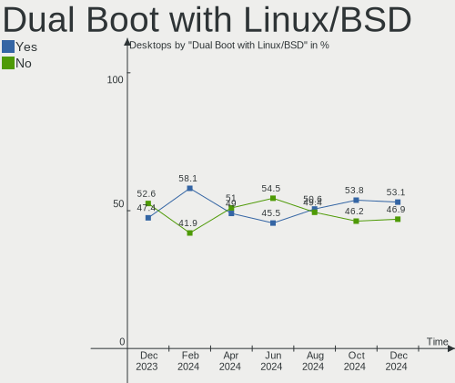
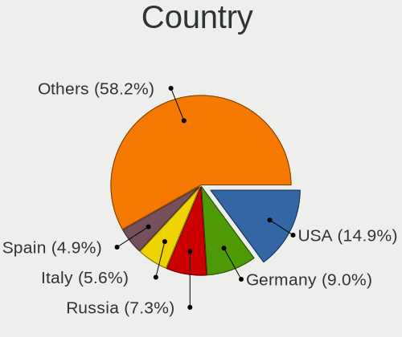
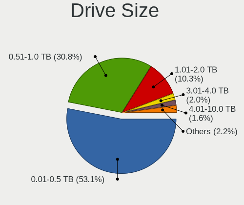
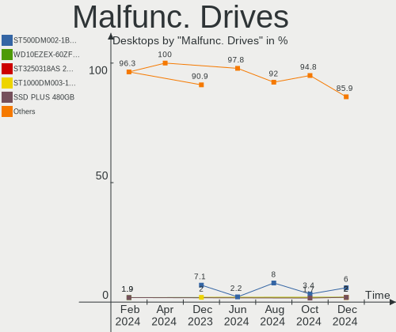
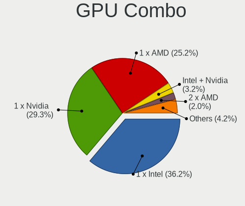
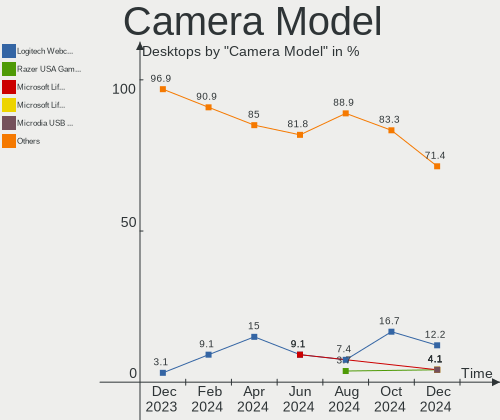

OpenMandriva - Hardware Trends (Desktops)
-----------------------------------------

A project to identify most popular hardware characteristics and track their change
over time based on data collected by Linux users at https://Linux-Hardware.org.

Anyone can contribute to this report by the [hw-probe](https://github.com/linuxhw/hw-probe) tool:

    sudo -E hw-probe -all -upload

This report is for one last month. Overall report since the beginning of time: [TestCoverage](https://github.com/linuxhw/TestCoverage)

Period: Jun, 2022.

Contents
--------

* [ System ](#system)
  - [ OS                       ](#os)
  - [ OS Family                ](#os-family)
  - [ Kernel                   ](#kernel)
  - [ Kernel Family            ](#kernel-family)
  - [ Kernel Major Ver.        ](#kernel-major-ver)
  - [ Arch                     ](#arch)
  - [ DE                       ](#de)
  - [ Display Server           ](#display-server)
  - [ Display Manager          ](#display-manager)
  - [ OS Lang                  ](#os-lang)
  - [ Boot Mode                ](#boot-mode)
  - [ Filesystem               ](#filesystem)
  - [ Part. scheme             ](#part-scheme)
  - [ Dual Boot with Linux/BSD ](#dual-boot-with-linuxbsd)
  - [ Dual Boot (Win)          ](#dual-boot-win)

* [ Board ](#board)
  - [ Vendor                   ](#vendor)
  - [ Model                    ](#model)
  - [ Model Family             ](#model-family)
  - [ MFG Year                 ](#mfg-year)
  - [ Form Factor              ](#form-factor)
  - [ Secure Boot              ](#secure-boot)
  - [ Coreboot                 ](#coreboot)
  - [ RAM Size                 ](#ram-size)
  - [ RAM Used                 ](#ram-used)
  - [ Total Drives             ](#total-drives)
  - [ Has CD-ROM               ](#has-cd-rom)
  - [ Has Ethernet             ](#has-ethernet)
  - [ Has WiFi                 ](#has-wifi)
  - [ Has Bluetooth            ](#has-bluetooth)

* [ Location ](#location)
  - [ Country                  ](#country)
  - [ City                     ](#city)

* [ Drives ](#drives)
  - [ Drive Vendor             ](#drive-vendor)
  - [ Drive Model              ](#drive-model)
  - [ HDD Vendor               ](#hdd-vendor)
  - [ SSD Vendor               ](#ssd-vendor)
  - [ Drive Kind               ](#drive-kind)
  - [ Drive Connector          ](#drive-connector)
  - [ Drive Size               ](#drive-size)
  - [ Space Total              ](#space-total)
  - [ Space Used               ](#space-used)
  - [ Malfunc. Drives          ](#malfunc-drives)
  - [ Malfunc. Drive Vendor    ](#malfunc-drive-vendor)
  - [ Malfunc. HDD Vendor      ](#malfunc-hdd-vendor)
  - [ Malfunc. Drive Kind      ](#malfunc-drive-kind)
  - [ Failed Drives            ](#failed-drives)
  - [ Failed Drive Vendor      ](#failed-drive-vendor)
  - [ Drive Status             ](#drive-status)

* [ Storage controller ](#storage-controller)
  - [ Storage Vendor           ](#storage-vendor)
  - [ Storage Model            ](#storage-model)
  - [ Storage Kind             ](#storage-kind)

* [ Processor ](#processor)
  - [ CPU Vendor               ](#cpu-vendor)
  - [ CPU Model                ](#cpu-model)
  - [ CPU Model Family         ](#cpu-model-family)
  - [ CPU Cores                ](#cpu-cores)
  - [ CPU Sockets              ](#cpu-sockets)
  - [ CPU Threads              ](#cpu-threads)
  - [ CPU Op-Modes             ](#cpu-op-modes)
  - [ CPU Microcode            ](#cpu-microcode)
  - [ CPU Microarch            ](#cpu-microarch)

* [ Graphics ](#graphics)
  - [ GPU Vendor               ](#gpu-vendor)
  - [ GPU Model                ](#gpu-model)
  - [ GPU Combo                ](#gpu-combo)
  - [ GPU Driver               ](#gpu-driver)
  - [ GPU Memory               ](#gpu-memory)

* [ Monitor ](#monitor)
  - [ Monitor Vendor           ](#monitor-vendor)
  - [ Monitor Model            ](#monitor-model)
  - [ Monitor Resolution       ](#monitor-resolution)
  - [ Monitor Diagonal         ](#monitor-diagonal)
  - [ Monitor Width            ](#monitor-width)
  - [ Aspect Ratio             ](#aspect-ratio)
  - [ Monitor Area             ](#monitor-area)
  - [ Pixel Density            ](#pixel-density)
  - [ Multiple Monitors        ](#multiple-monitors)

* [ Network ](#network)
  - [ Net Controller Vendor    ](#net-controller-vendor)
  - [ Net Controller Model     ](#net-controller-model)
  - [ Wireless Vendor          ](#wireless-vendor)
  - [ Wireless Model           ](#wireless-model)
  - [ Ethernet Vendor          ](#ethernet-vendor)
  - [ Ethernet Model           ](#ethernet-model)
  - [ Net Controller Kind      ](#net-controller-kind)
  - [ Used Controller          ](#used-controller)
  - [ NICs                     ](#nics)
  - [ IPv6                     ](#ipv6)

* [ Bluetooth ](#bluetooth)
  - [ Bluetooth Vendor         ](#bluetooth-vendor)
  - [ Bluetooth Model          ](#bluetooth-model)

* [ Sound ](#sound)
  - [ Sound Vendor             ](#sound-vendor)
  - [ Sound Model              ](#sound-model)

* [ Memory ](#memory)
  - [ Memory Vendor            ](#memory-vendor)
  - [ Memory Model             ](#memory-model)
  - [ Memory Kind              ](#memory-kind)
  - [ Memory Form Factor       ](#memory-form-factor)
  - [ Memory Size              ](#memory-size)
  - [ Memory Speed             ](#memory-speed)

* [ Printers & scanners ](#printers--scanners)
  - [ Printer Vendor           ](#printer-vendor)
  - [ Printer Model            ](#printer-model)
  - [ Scanner Vendor           ](#scanner-vendor)
  - [ Scanner Model            ](#scanner-model)

* [ Camera ](#camera)
  - [ Camera Vendor            ](#camera-vendor)
  - [ Camera Model             ](#camera-model)

* [ Security ](#security)
  - [ Fingerprint Vendor       ](#fingerprint-vendor)
  - [ Fingerprint Model        ](#fingerprint-model)
  - [ Chipcard Vendor          ](#chipcard-vendor)
  - [ Chipcard Model           ](#chipcard-model)

* [ Unsupported ](#unsupported)
  - [ Unsupported Devices      ](#unsupported-devices)
  - [ Unsupported Device Types ](#unsupported-device-types)

System
------

OS
--

Installed operating systems

| Name              | Desktops | Percent |
|-------------------|----------|---------|
| OpenMandriva 4.3  | 136      | 93.15%  |
| OpenMandriva 4.2  | 8        | 5.48%   |
| OpenMandriva 4.90 | 1        | 0.68%   |
| OpenMandriva 4.50 | 1        | 0.68%   |

OS Family
---------

OS without a version

| Name         | Desktops | Percent |
|--------------|----------|---------|
| OpenMandriva | 146      | 100%    |

Kernel
------

Version of the Linux kernel

| Version                  | Desktops | Percent |
|--------------------------|----------|---------|
| 5.16.7-desktop-1omv4003  | 129      | 88.36%  |
| 5.10.14-desktop-1omv4002 | 8        | 5.48%   |
| 5.16.13-desktop-1omv4003 | 7        | 4.79%   |
| 5.18.1-server-1omv4090   | 1        | 0.68%   |
| 5.12.4-desktop-1omv4050  | 1        | 0.68%   |

Kernel Family
-------------

Linux kernel without a distro release

| Version | Desktops | Percent |
|---------|----------|---------|
| 5.16.7  | 129      | 88.36%  |
| 5.10.14 | 8        | 5.48%   |
| 5.16.13 | 7        | 4.79%   |
| 5.18.1  | 1        | 0.68%   |
| 5.12.4  | 1        | 0.68%   |

Kernel Major Ver.
-----------------

Linux kernel major version

| Version | Desktops | Percent |
|---------|----------|---------|
| 5.16    | 136      | 93.15%  |
| 5.10    | 8        | 5.48%   |
| 5.18    | 1        | 0.68%   |
| 5.12    | 1        | 0.68%   |

Arch
----

OS architecture (x86_64, i586, etc.)

| Name   | Desktops | Percent |
|--------|----------|---------|
| x86_64 | 146      | 100%    |

DE
--

Desktop Environment

| Name | Desktops | Percent |
|------|----------|---------|
| KDE5 | 145      | 99.32%  |
| LXQt | 1        | 0.68%   |

Display Server
--------------

X11 or Wayland

| Name    | Desktops | Percent |
|---------|----------|---------|
| X11     | 143      | 97.95%  |
| Wayland | 3        | 2.05%   |

Display Manager
---------------

SDDM, LightDM, etc.

| Name | Desktops | Percent |
|------|----------|---------|
| SDDM | 146      | 100%    |

OS Lang
-------

Language

| Lang  | Desktops | Percent |
|-------|----------|---------|
| en_US | 86       | 58.9%   |
| ru_RU | 12       | 8.22%   |
| fr_FR | 9        | 6.16%   |
| de_DE | 8        | 5.48%   |
| pt_BR | 5        | 3.42%   |
| pl_PL | 4        | 2.74%   |
| en_CA | 4        | 2.74%   |
| it_IT | 3        | 2.05%   |
| fr_CA | 2        | 1.37%   |
| fr_BE | 2        | 1.37%   |
| es_CO | 2        | 1.37%   |
| da_DK | 2        | 1.37%   |
| uk_UA | 1        | 0.68%   |
| es_VE | 1        | 0.68%   |
| es_ES | 1        | 0.68%   |
| es_AR | 1        | 0.68%   |
| en_IL | 1        | 0.68%   |
| en_GB | 1        | 0.68%   |
| cs_CZ | 1        | 0.68%   |

Boot Mode
---------

EFI or BIOS

| Mode | Desktops | Percent |
|------|----------|---------|
| BIOS | 82       | 56.16%  |
| EFI  | 64       | 43.84%  |

Filesystem
----------

Type of filesystem

| Type    | Desktops | Percent |
|---------|----------|---------|
| Overlay | 128      | 87.67%  |
| Ext4    | 18       | 12.33%  |

Part. scheme
------------

Scheme of partitioning

| Type    | Desktops | Percent |
|---------|----------|---------|
| GPT     | 92       | 63.01%  |
| MBR     | 53       | 36.3%   |
| Unknown | 1        | 0.68%   |

Dual Boot with Linux/BSD
------------------------

Hosting more than one Linux/BSD

| Dual boot | Desktops | Percent |
|-----------|----------|---------|
| Yes       | 94       | 64.38%  |
| No        | 52       | 35.62%  |

Dual Boot (Win)
---------------

Hosting Linux and Windows

| Dual boot | Desktops | Percent |
|-----------|----------|---------|
| Yes       | 85       | 58.22%  |
| No        | 61       | 41.78%  |

Board
-----

Vendor
------

Motherboard manufacturer

| Name                | Desktops | Percent |
|---------------------|----------|---------|
| ASUSTek Computer    | 47       | 32.19%  |
| Gigabyte Technology | 25       | 17.12%  |
| MSI                 | 17       | 11.64%  |
| ASRock              | 13       | 8.9%    |
| Hewlett-Packard     | 9        | 6.16%   |
| Dell                | 8        | 5.48%   |
| Intel               | 6        | 4.11%   |
| Acer                | 4        | 2.74%   |
| Lenovo              | 3        | 2.05%   |
| Foxconn             | 3        | 2.05%   |
| MACHINIST           | 2        | 1.37%   |
| Shuttle             | 1        | 0.68%   |
| Packard Bell        | 1        | 0.68%   |
| OEM                 | 1        | 0.68%   |
| Medion              | 1        | 0.68%   |
| langchao            | 1        | 0.68%   |
| Fujitsu             | 1        | 0.68%   |
| ECS                 | 1        | 0.68%   |
| Biostar             | 1        | 0.68%   |
| Unknown             | 1        | 0.68%   |

Model
-----

Motherboard model

| Name                                                             | Desktops | Percent |
|------------------------------------------------------------------|----------|---------|
| ASUS SABERTOOTH Z77                                              | 10       | 6.85%   |
| MSI MS-7360                                                      | 2        | 1.37%   |
| Dell OptiPlex 7010                                               | 2        | 1.37%   |
| ASUS ROG STRIX B550-I GAMING                                     | 2        | 1.37%   |
| ASUS PRIME A320M-K                                               | 2        | 1.37%   |
| ASUS M5A97 PLUS                                                  | 2        | 1.37%   |
| Shuttle DL10J                                                    | 1        | 0.68%   |
| Packard Bell IMEDIA D4001 FR                                     | 1        | 0.68%   |
| OEM H110                                                         | 1        | 0.68%   |
| MSI MS-7C95                                                      | 1        | 0.68%   |
| MSI MS-7C91                                                      | 1        | 0.68%   |
| MSI MS-7C52                                                      | 1        | 0.68%   |
| MSI MS-7C37                                                      | 1        | 0.68%   |
| MSI MS-7C09                                                      | 1        | 0.68%   |
| MSI MS-7A36                                                      | 1        | 0.68%   |
| MSI MS-7984                                                      | 1        | 0.68%   |
| MSI MS-7817                                                      | 1        | 0.68%   |
| MSI MS-7786                                                      | 1        | 0.68%   |
| MSI MS-7758                                                      | 1        | 0.68%   |
| MSI MS-7721                                                      | 1        | 0.68%   |
| MSI MS-7636                                                      | 1        | 0.68%   |
| MSI MS-7612                                                      | 1        | 0.68%   |
| MSI MS-7599                                                      | 1        | 0.68%   |
| MSI MS-7255                                                      | 1        | 0.68%   |
| Medion Akoya P5372 H/B728                                        | 1        | 0.68%   |
| MACHINIST X99-RS9 V2.0                                           | 1        | 0.68%   |
| MACHINIST X79 (INTEL Xeon E5/Corei7 DMI2 - C600/C200 Cipset V309 | 1        | 0.68%   |
| Lenovo V530S-07ICB 10TX00AVMG                                    | 1        | 0.68%   |
| Lenovo ThinkCentre M73 10AXS2WY00                                | 1        | 0.68%   |
| Lenovo ThinkCentre M58p 9965A5G                                  | 1        | 0.68%   |
| langchao 12345                                                   | 1        | 0.68%   |
| Intel H61                                                        | 1        | 0.68%   |
| Intel DP43BF AAE78171-302                                        | 1        | 0.68%   |
| Intel DH77KC AAG39641-401                                        | 1        | 0.68%   |
| Intel DH67BL AAG10189-211                                        | 1        | 0.68%   |
| Intel DG33FB AAD81072-306                                        | 1        | 0.68%   |
| Intel D2700DC AAG32420-602                                       | 1        | 0.68%   |
| HP Slim Desktop S01-aF1xxx                                       | 1        | 0.68%   |
| HP Slim Desktop 290-p0xxx                                        | 1        | 0.68%   |
| HP ProDesk 600 G1 SFF                                            | 1        | 0.68%   |
| HP ProDesk 400 G1 SFF                                            | 1        | 0.68%   |
| HP Pavilion Desktop 590-p0xxx                                    | 1        | 0.68%   |
| HP EliteDesk 800 G2 SFF                                          | 1        | 0.68%   |
| HP EliteDesk 800 G1 SFF                                          | 1        | 0.68%   |
| HP Compaq 8000 Elite SFF PC                                      | 1        | 0.68%   |
| HP Compaq 6005 Pro SFF PC                                        | 1        | 0.68%   |
| Gigabyte Z87X-UD3H                                               | 1        | 0.68%   |
| Gigabyte Z690 UD                                                 | 1        | 0.68%   |
| Gigabyte X58A-UD3R                                               | 1        | 0.68%   |
| Gigabyte X570S UD                                                | 1        | 0.68%   |
| Gigabyte X570S AORUS PRO AX                                      | 1        | 0.68%   |
| Gigabyte X570 AORUS PRO WIFI                                     | 1        | 0.68%   |
| Gigabyte P55A-UD3                                                | 1        | 0.68%   |
| Gigabyte H61M-HD2                                                | 1        | 0.68%   |
| Gigabyte H510M H                                                 | 1        | 0.68%   |
| Gigabyte H470 HD3                                                | 1        | 0.68%   |
| Gigabyte H410M S2 V3                                             | 1        | 0.68%   |
| Gigabyte H110M-S2H                                               | 1        | 0.68%   |
| Gigabyte GA-MA78LMT-S2                                           | 1        | 0.68%   |
| Gigabyte GA-880GM-USB3                                           | 1        | 0.68%   |

Model Family
------------

Motherboard model prefix

| Name                   | Desktops | Percent |
|------------------------|----------|---------|
| ASUS SABERTOOTH        | 11       | 7.53%   |
| ASUS PRIME             | 8        | 5.48%   |
| ASUS ROG               | 7        | 4.79%   |
| Dell OptiPlex          | 5        | 3.42%   |
| ASUS TUF               | 3        | 2.05%   |
| Acer Aspire            | 3        | 2.05%   |
| MSI MS-7360            | 2        | 1.37%   |
| Lenovo ThinkCentre     | 2        | 1.37%   |
| HP Slim                | 2        | 1.37%   |
| HP ProDesk             | 2        | 1.37%   |
| HP EliteDesk           | 2        | 1.37%   |
| HP Compaq              | 2        | 1.37%   |
| Gigabyte X570S         | 2        | 1.37%   |
| ASUS M5A97             | 2        | 1.37%   |
| Shuttle DL10J          | 1        | 0.68%   |
| Packard Bell IMEDIA    | 1        | 0.68%   |
| OEM H110               | 1        | 0.68%   |
| MSI MS-7C95            | 1        | 0.68%   |
| MSI MS-7C91            | 1        | 0.68%   |
| MSI MS-7C52            | 1        | 0.68%   |
| MSI MS-7C37            | 1        | 0.68%   |
| MSI MS-7C09            | 1        | 0.68%   |
| MSI MS-7A36            | 1        | 0.68%   |
| MSI MS-7984            | 1        | 0.68%   |
| MSI MS-7817            | 1        | 0.68%   |
| MSI MS-7786            | 1        | 0.68%   |
| MSI MS-7758            | 1        | 0.68%   |
| MSI MS-7721            | 1        | 0.68%   |
| MSI MS-7636            | 1        | 0.68%   |
| MSI MS-7612            | 1        | 0.68%   |
| MSI MS-7599            | 1        | 0.68%   |
| MSI MS-7255            | 1        | 0.68%   |
| Medion Akoya           | 1        | 0.68%   |
| MACHINIST X99-RS9      | 1        | 0.68%   |
| MACHINIST X79          | 1        | 0.68%   |
| Lenovo V530S-07ICB     | 1        | 0.68%   |
| langchao 12345         | 1        | 0.68%   |
| Intel H61              | 1        | 0.68%   |
| Intel DP43BF           | 1        | 0.68%   |
| Intel DH77KC           | 1        | 0.68%   |
| Intel DH67BL           | 1        | 0.68%   |
| Intel DG33FB           | 1        | 0.68%   |
| Intel D2700DC          | 1        | 0.68%   |
| HP Pavilion            | 1        | 0.68%   |
| Gigabyte Z87X-UD3H     | 1        | 0.68%   |
| Gigabyte Z690          | 1        | 0.68%   |
| Gigabyte X58A-UD3R     | 1        | 0.68%   |
| Gigabyte X570          | 1        | 0.68%   |
| Gigabyte P55A-UD3      | 1        | 0.68%   |
| Gigabyte H61M-HD2      | 1        | 0.68%   |
| Gigabyte H510M         | 1        | 0.68%   |
| Gigabyte H470          | 1        | 0.68%   |
| Gigabyte H410M         | 1        | 0.68%   |
| Gigabyte H110M-S2H     | 1        | 0.68%   |
| Gigabyte GA-MA78LMT-S2 | 1        | 0.68%   |
| Gigabyte GA-880GM-USB3 | 1        | 0.68%   |
| Gigabyte G41MT-S2      | 1        | 0.68%   |
| Gigabyte F2A88XN-WIFI  | 1        | 0.68%   |
| Gigabyte F2A88XM-D3H   | 1        | 0.68%   |
| Gigabyte F2A88X-D3H    | 1        | 0.68%   |

MFG Year
--------

Motherboard manufacture year

| Year | Desktops | Percent |
|------|----------|---------|
| 2012 | 19       | 13.01%  |
| 2013 | 16       | 10.96%  |
| 2010 | 13       | 8.9%    |
| 2018 | 11       | 7.53%   |
| 2021 | 10       | 6.85%   |
| 2019 | 10       | 6.85%   |
| 2014 | 10       | 6.85%   |
| 2020 | 9        | 6.16%   |
| 2011 | 8        | 5.48%   |
| 2016 | 7        | 4.79%   |
| 2009 | 7        | 4.79%   |
| 2017 | 6        | 4.11%   |
| 2015 | 6        | 4.11%   |
| 2006 | 5        | 3.42%   |
| 2007 | 4        | 2.74%   |
| 2022 | 3        | 2.05%   |
| 2008 | 2        | 1.37%   |

Form Factor
-----------

Physical design of the computer

| Name    | Desktops | Percent |
|---------|----------|---------|
| Desktop | 146      | 100%    |

Secure Boot
-----------

Enabled or disabled

| State    | Desktops | Percent |
|----------|----------|---------|
| Disabled | 146      | 100%    |

Coreboot
--------

Have coreboot on board

| Used | Desktops | Percent |
|------|----------|---------|
| No   | 146      | 100%    |

RAM Size
--------

Total RAM memory

| Size in GB  | Desktops | Percent |
|-------------|----------|---------|
| 4.01-8.0    | 34       | 23.29%  |
| 8.01-16.0   | 31       | 21.23%  |
| 32.01-64.0  | 24       | 16.44%  |
| 16.01-24.0  | 23       | 15.75%  |
| 3.01-4.0    | 22       | 15.07%  |
| 24.01-32.0  | 4        | 2.74%   |
| 1.01-2.0    | 4        | 2.74%   |
| 2.01-3.0    | 2        | 1.37%   |
| 64.01-256.0 | 2        | 1.37%   |

RAM Used
--------

Used RAM memory

| Used GB  | Desktops | Percent |
|----------|----------|---------|
| 1.01-2.0 | 99       | 67.81%  |
| 0.51-1.0 | 31       | 21.23%  |
| 2.01-3.0 | 11       | 7.53%   |
| 0.01-0.5 | 3        | 2.05%   |
| 3.01-4.0 | 2        | 1.37%   |

Total Drives
------------

Number of drives on board

| Drives | Desktops | Percent |
|--------|----------|---------|
| 1      | 64       | 43.84%  |
| 2      | 33       | 22.6%   |
| 3      | 22       | 15.07%  |
| 4      | 9        | 6.16%   |
| 5      | 6        | 4.11%   |
| 0      | 5        | 3.42%   |
| 7      | 4        | 2.74%   |
| 6      | 2        | 1.37%   |
| 12     | 1        | 0.68%   |

Has CD-ROM
----------

Has CD-ROM on board

| Presented | Desktops | Percent |
|-----------|----------|---------|
| Yes       | 86       | 58.9%   |
| No        | 60       | 41.1%   |

Has Ethernet
------------

Has Ethernet on board

| Presented | Desktops | Percent |
|-----------|----------|---------|
| Yes       | 146      | 100%    |

Has WiFi
--------

Has WiFi module

| Presented | Desktops | Percent |
|-----------|----------|---------|
| No        | 86       | 58.9%   |
| Yes       | 60       | 41.1%   |

Has Bluetooth
-------------

Has Bluetooth module

| Presented | Desktops | Percent |
|-----------|----------|---------|
| No        | 114      | 78.08%  |
| Yes       | 32       | 21.92%  |

Location
--------

Country
-------

Geographic location (country)

| Country      | Desktops | Percent |
|--------------|----------|---------|
| USA          | 16       | 10.96%  |
| France       | 16       | 10.96%  |
| Poland       | 14       | 9.59%   |
| Germany      | 13       | 8.9%    |
| Russia       | 12       | 8.22%   |
| Brazil       | 7        | 4.79%   |
| Italy        | 5        | 3.42%   |
| UK           | 4        | 2.74%   |
| India        | 4        | 2.74%   |
| Canada       | 4        | 2.74%   |
| Australia    | 4        | 2.74%   |
| Netherlands  | 3        | 2.05%   |
| Mexico       | 3        | 2.05%   |
| Greece       | 3        | 2.05%   |
| Colombia     | 3        | 2.05%   |
| Sweden       | 2        | 1.37%   |
| Indonesia    | 2        | 1.37%   |
| Egypt        | 2        | 1.37%   |
| Denmark      | 2        | 1.37%   |
| Czechia      | 2        | 1.37%   |
| Belgium      | 2        | 1.37%   |
| Venezuela    | 1        | 0.68%   |
| Uruguay      | 1        | 0.68%   |
| Ukraine      | 1        | 0.68%   |
| Turkey       | 1        | 0.68%   |
| Switzerland  | 1        | 0.68%   |
| Spain        | 1        | 0.68%   |
| South Africa | 1        | 0.68%   |
| Saint Lucia  | 1        | 0.68%   |
| Philippines  | 1        | 0.68%   |
| Peru         | 1        | 0.68%   |
| Pakistan     | 1        | 0.68%   |
| Norway       | 1        | 0.68%   |
| Martinique   | 1        | 0.68%   |
| Malaysia     | 1        | 0.68%   |
| Japan        | 1        | 0.68%   |
| Israel       | 1        | 0.68%   |
| Hungary      | 1        | 0.68%   |
| Estonia      | 1        | 0.68%   |
| China        | 1        | 0.68%   |
| Bulgaria     | 1        | 0.68%   |
| Benin        | 1        | 0.68%   |
| Belarus      | 1        | 0.68%   |
| Argentina    | 1        | 0.68%   |

City
----

Geographic location (city)

| City                     | Desktops | Percent |
|--------------------------|----------|---------|
| Strzyzow                 | 10       | 6.85%   |
| Moscow                   | 3        | 2.05%   |
| Thessaloniki             | 2        | 1.37%   |
| Cherbourg-Octeville      | 2        | 1.37%   |
| Bogotá                  | 2        | 1.37%   |
| Zwijndrecht              | 1        | 0.68%   |
| Yessentukskaya           | 1        | 0.68%   |
| Wolverhampton            | 1        | 0.68%   |
| Weimar                   | 1        | 0.68%   |
| Warsaw                   | 1        | 0.68%   |
| Velke Mezirici           | 1        | 0.68%   |
| Valderrobres             | 1        | 0.68%   |
| Uppsala                  | 1        | 0.68%   |
| Tulsa                    | 1        | 0.68%   |
| Tulancingo               | 1        | 0.68%   |
| Trois-Rivières          | 1        | 0.68%   |
| Tholey                   | 1        | 0.68%   |
| Tel Aviv                 | 1        | 0.68%   |
| Sydney                   | 1        | 0.68%   |
| Stirling                 | 1        | 0.68%   |
| Stavropol                | 1        | 0.68%   |
| St. Moritz               | 1        | 0.68%   |
| Smolensk                 | 1        | 0.68%   |
| Slagelse                 | 1        | 0.68%   |
| Sevastopol               | 1        | 0.68%   |
| Septemvri                | 1        | 0.68%   |
| Seattle                  | 1        | 0.68%   |
| Schwieberdingen          | 1        | 0.68%   |
| Schechingen              | 1        | 0.68%   |
| Saumur                   | 1        | 0.68%   |
| Sao Paulo                | 1        | 0.68%   |
| Sao José dos Campos     | 1        | 0.68%   |
| San Jose                 | 1        | 0.68%   |
| San Biagio di Callalta   | 1        | 0.68%   |
| San Antonio              | 1        | 0.68%   |
| Saint-Vaast-en-Cambresis | 1        | 0.68%   |
| Saint-Joseph             | 1        | 0.68%   |
| Saarbrücken             | 1        | 0.68%   |
| Rio de Janeiro           | 1        | 0.68%   |
| Queretaro                | 1        | 0.68%   |
| Pune                     | 1        | 0.68%   |
| Prokop'yevsk             | 1        | 0.68%   |
| Pearl River              | 1        | 0.68%   |
| Pärnu                   | 1        | 0.68%   |
| Paris                    | 1        | 0.68%   |
| Papendrecht              | 1        | 0.68%   |
| Panderma                 | 1        | 0.68%   |
| Palakkad                 | 1        | 0.68%   |
| Örebro                  | 1        | 0.68%   |
| Oldenburg                | 1        | 0.68%   |
| Oklahoma City            | 1        | 0.68%   |
| Novy Urengoy             | 1        | 0.68%   |
| Nîmes                   | 1        | 0.68%   |
| Nagoya                   | 1        | 0.68%   |
| Mysen                    | 1        | 0.68%   |
| Munich                   | 1        | 0.68%   |
| Montreal                 | 1        | 0.68%   |
| Moers                    | 1        | 0.68%   |
| Minsk                    | 1        | 0.68%   |
| Mereville                | 1        | 0.68%   |

Drives
------

Drive Vendor
------------

Hard drive vendors

| Vendor              | Desktops | Drives | Percent |
|---------------------|----------|--------|---------|
| Seagate             | 46       | 70     | 18.55%  |
| Samsung Electronics | 44       | 46     | 17.74%  |
| WDC                 | 43       | 58     | 17.34%  |
| Crucial             | 15       | 21     | 6.05%   |
| Toshiba             | 14       | 15     | 5.65%   |
| SanDisk             | 12       | 14     | 4.84%   |
| Kingston            | 11       | 13     | 4.44%   |
| Hitachi             | 11       | 12     | 4.44%   |
| Goodram             | 4        | 4      | 1.61%   |
| ASMT                | 4        | 4      | 1.61%   |
| Unknown             | 3        | 5      | 1.21%   |
| OCZ                 | 3        | 3      | 1.21%   |
| Gigabyte Technology | 3        | 3      | 1.21%   |
| Corsair             | 3        | 3      | 1.21%   |
| A-DATA Technology   | 3        | 4      | 1.21%   |
| SPCC                | 2        | 2      | 0.81%   |
| Patriot             | 2        | 3      | 0.81%   |
| Netac               | 2        | 2      | 0.81%   |
| Maxtor              | 2        | 2      | 0.81%   |
| JMicron Technology  | 2        | 3      | 0.81%   |
| XPG                 | 1        | 1      | 0.4%    |
| USB3.0              | 1        | 1      | 0.4%    |
| TCSUNBOW            | 1        | 1      | 0.4%    |
| PNY                 | 1        | 1      | 0.4%    |
| Magnetic Data       | 1        | 1      | 0.4%    |
| LITEONIT            | 1        | 1      | 0.4%    |
| Leven               | 1        | 1      | 0.4%    |
| LaCie               | 1        | 2      | 0.4%    |
| KingDian            | 1        | 1      | 0.4%    |
| Intenso             | 1        | 1      | 0.4%    |
| Inateck             | 1        | 1      | 0.4%    |
| IBM/Hitachi         | 1        | 1      | 0.4%    |
| HGST                | 1        | 2      | 0.4%    |
| Hewlett-Packard     | 1        | 1      | 0.4%    |
| GLOWAY              | 1        | 1      | 0.4%    |
| Faspeed             | 1        | 1      | 0.4%    |
| EMTEC               | 1        | 1      | 0.4%    |
| China               | 1        | 1      | 0.4%    |
| Unknown             | 1        | 1      | 0.4%    |

Drive Model
-----------

Hard drive models

| Model                                | Desktops | Percent |
|--------------------------------------|----------|---------|
| Seagate ST2000DM008-2FR102 2TB       | 7        | 2.39%   |
| Toshiba DT01ACA050 500GB             | 5        | 1.71%   |
| Seagate ST1000DM010-2EP102 1TB       | 5        | 1.71%   |
| Samsung SSD 850 EVO 250GB            | 5        | 1.71%   |
| Crucial CT500MX500SSD1 500GB         | 5        | 1.71%   |
| Seagate ST1000DM003-1ER162 1TB       | 4        | 1.37%   |
| Kingston SV300S37A120G 120GB SSD     | 4        | 1.37%   |
| ASMT 2135 120GB SSD                  | 4        | 1.37%   |
| WDC WD3200AAJS-00L7A0 320GB          | 3        | 1.02%   |
| Seagate ST92505610AS 250GB           | 3        | 1.02%   |
| Seagate ST500DM002-1BD142 500GB      | 3        | 1.02%   |
| Seagate ST1000DM003-1CH162 1TB       | 3        | 1.02%   |
| Samsung SSD 860 EVO 500GB            | 3        | 1.02%   |
| Samsung SSD 840 EVO 250GB            | 3        | 1.02%   |
| Goodram SSD 120GB                    | 3        | 1.02%   |
| WDC WDS100T1X0E-00AFY0 1TB           | 2        | 0.68%   |
| WDC WD30EZRX-00D8PB0 3TB             | 2        | 0.68%   |
| WDC WD10EZRZ-00HTKB0 1TB             | 2        | 0.68%   |
| WDC WD10EZRX-00A8LB0 1TB             | 2        | 0.68%   |
| WDC WD10EZEX-00BBHA0 1TB             | 2        | 0.68%   |
| Seagate ST4000DM004-2CV104 4TB       | 2        | 0.68%   |
| Seagate ST2000LM007-1R8174 2TB       | 2        | 0.68%   |
| Seagate ST1000DM003-1SB102 1TB       | 2        | 0.68%   |
| SanDisk SDSSDA120G 120GB             | 2        | 0.68%   |
| SanDisk NVMe SSD Drive 500GB         | 2        | 0.68%   |
| Samsung SSD 970 EVO Plus 500GB       | 2        | 0.68%   |
| Samsung SSD 860 EVO 250GB            | 2        | 0.68%   |
| Samsung HD502HI 500GB                | 2        | 0.68%   |
| Samsung HD501LJ 500GB                | 2        | 0.68%   |
| Samsung HD204UI 2TB                  | 2        | 0.68%   |
| Samsung HD103SJ 1TB                  | 2        | 0.68%   |
| OCZ VERTEX4 128GB SSD                | 2        | 0.68%   |
| Kingston SA400S37120G 120GB SSD      | 2        | 0.68%   |
| JMicron Generic 2TB                  | 2        | 0.68%   |
| Gigabyte GP-GSTFS31240GNTD 240GB SSD | 2        | 0.68%   |
| Crucial CT480BX500SSD1 480GB         | 2        | 0.68%   |
| Crucial CT1000MX500SSD1 1TB          | 2        | 0.68%   |
| XPG GAMMIX S11 240GB                 | 1        | 0.34%   |
| WDC WDS500G3XHC-00SJG0 500GB         | 1        | 0.34%   |
| WDC WDS250G2B0B 250GB SSD            | 1        | 0.34%   |
| WDC WDS240G2G0A-00JH30 240GB SSD     | 1        | 0.34%   |
| WDC WDS240G1G0A-00SS50 240GB SSD     | 1        | 0.34%   |
| WDC WDS100T3X0C-00SJG0 1TB           | 1        | 0.34%   |
| WDC WDBRPG0010BNC-WRSN 1TB           | 1        | 0.34%   |
| WDC WDBNCE2500PNC 250GB SSD          | 1        | 0.34%   |
| WDC WD5000BHTZ-04JCPV0 500GB         | 1        | 0.34%   |
| WDC WD5000AZLX-60K2TA1 500GB         | 1        | 0.34%   |
| WDC WD5000AAKX-75U6AA0 500GB         | 1        | 0.34%   |
| WDC WD5000AAKX-07U6AA0 500GB         | 1        | 0.34%   |
| WDC WD5000AAKS-22YGA0 500GB          | 1        | 0.34%   |
| WDC WD40EZRZ-00GXCB0 4TB             | 1        | 0.34%   |
| WDC WD40EZRX-00SPEB0 4TB             | 1        | 0.34%   |
| WDC WD40EZAZ-00ZGHB0 4TB             | 1        | 0.34%   |
| WDC WD40EZAZ-00SF3B0 4TB             | 1        | 0.34%   |
| WDC WD40EFAX-68JH4N1 4TB             | 1        | 0.34%   |
| WDC WD3201ABYS-01B9A0 320GB          | 1        | 0.34%   |
| WDC WD3200BEVT-22ZCT0 320GB          | 1        | 0.34%   |
| WDC WD3200AAKS-00B3A0 320GB          | 1        | 0.34%   |
| WDC WD3200AAJS-00B4A0 320GB          | 1        | 0.34%   |
| WDC WD30EZRX-00SPEB0 3TB             | 1        | 0.34%   |

HDD Vendor
----------

Hard disk drive vendors

| Vendor              | Desktops | Drives | Percent |
|---------------------|----------|--------|---------|
| Seagate             | 46       | 67     | 35.66%  |
| WDC                 | 37       | 49     | 28.68%  |
| Toshiba             | 14       | 15     | 10.85%  |
| Samsung Electronics | 12       | 13     | 9.3%    |
| Hitachi             | 11       | 12     | 8.53%   |
| Maxtor              | 2        | 2      | 1.55%   |
| JMicron Technology  | 2        | 3      | 1.55%   |
| Unknown             | 1        | 1      | 0.78%   |
| Magnetic Data       | 1        | 1      | 0.78%   |
| Inateck             | 1        | 1      | 0.78%   |
| IBM/Hitachi         | 1        | 1      | 0.78%   |
| HGST                | 1        | 2      | 0.78%   |

SSD Vendor
----------

Solid state drive vendors

| Vendor              | Desktops | Drives | Percent |
|---------------------|----------|--------|---------|
| Samsung Electronics | 27       | 27     | 28.72%  |
| Crucial             | 13       | 17     | 13.83%  |
| SanDisk             | 9        | 10     | 9.57%   |
| Kingston            | 9        | 10     | 9.57%   |
| WDC                 | 4        | 4      | 4.26%   |
| ASMT                | 4        | 4      | 4.26%   |
| OCZ                 | 3        | 3      | 3.19%   |
| Goodram             | 3        | 3      | 3.19%   |
| SPCC                | 2        | 2      | 2.13%   |
| Patriot             | 2        | 3      | 2.13%   |
| Gigabyte Technology | 2        | 2      | 2.13%   |
| A-DATA Technology   | 2        | 2      | 2.13%   |
| USB3.0              | 1        | 1      | 1.06%   |
| TCSUNBOW            | 1        | 1      | 1.06%   |
| PNY                 | 1        | 1      | 1.06%   |
| Netac               | 1        | 1      | 1.06%   |
| LITEONIT            | 1        | 1      | 1.06%   |
| Leven               | 1        | 1      | 1.06%   |
| KingDian            | 1        | 1      | 1.06%   |
| Intenso             | 1        | 1      | 1.06%   |
| GLOWAY              | 1        | 1      | 1.06%   |
| Faspeed             | 1        | 1      | 1.06%   |
| EMTEC               | 1        | 1      | 1.06%   |
| Corsair             | 1        | 1      | 1.06%   |
| China               | 1        | 1      | 1.06%   |
| Unknown             | 1        | 1      | 1.06%   |

Drive Kind
----------

HDD or SSD

| Kind    | Desktops | Drives | Percent |
|---------|----------|--------|---------|
| HDD     | 97       | 167    | 47.78%  |
| SSD     | 75       | 101    | 36.95%  |
| NVMe    | 27       | 32     | 13.3%   |
| Unknown | 4        | 8      | 1.97%   |

Drive Connector
---------------

SATA, SAS, NVMe, etc.

| Type | Desktops | Drives | Percent |
|------|----------|--------|---------|
| SATA | 129      | 257    | 76.79%  |
| NVMe | 27       | 32     | 16.07%  |
| SAS  | 12       | 19     | 7.14%   |

Drive Size
----------

Size of hard drive

| Size in TB | Desktops | Drives | Percent |
|------------|----------|--------|---------|
| 0.01-0.5   | 101      | 152    | 55.19%  |
| 0.51-1.0   | 47       | 61     | 25.68%  |
| 1.01-2.0   | 18       | 27     | 9.84%   |
| 3.01-4.0   | 7        | 14     | 3.83%   |
| 2.01-3.0   | 6        | 8      | 3.28%   |
| 4.01-10.0  | 3        | 5      | 1.64%   |
| 10.01-20.0 | 1        | 1      | 0.55%   |

Space Total
-----------

Amount of disk space available on the file system

| Size in GB     | Desktops | Percent |
|----------------|----------|---------|
| 1-20           | 87       | 59.59%  |
| Unknown        | 19       | 13.01%  |
| 101-250        | 12       | 8.22%   |
| 21-50          | 11       | 7.53%   |
| 251-500        | 6        | 4.11%   |
| 501-1000       | 6        | 4.11%   |
| 51-100         | 3        | 2.05%   |
| More than 3000 | 1        | 0.68%   |
| 1001-2000      | 1        | 0.68%   |

Space Used
----------

Amount of used disk space

| Used GB  | Desktops | Percent |
|----------|----------|---------|
| 1-20     | 114      | 78.08%  |
| Unknown  | 19       | 13.01%  |
| 51-100   | 5        | 3.42%   |
| 21-50    | 3        | 2.05%   |
| 501-1000 | 3        | 2.05%   |
| 251-500  | 1        | 0.68%   |
| 101-250  | 1        | 0.68%   |

Malfunc. Drives
---------------

Drive models with a malfunction

| Model                                 | Desktops | Drives | Percent |
|---------------------------------------|----------|--------|---------|
| Seagate ST92505610AS 250GB            | 3        | 3      | 5.56%   |
| Goodram SSD 120GB                     | 3        | 3      | 5.56%   |
| WDC WD3200AAJS-00L7A0 320GB           | 2        | 2      | 3.7%    |
| Seagate ST500DM002-1BD142 500GB       | 2        | 2      | 3.7%    |
| Samsung Electronics HD502HI 500GB     | 2        | 2      | 3.7%    |
| OCZ VERTEX4 128GB SSD                 | 2        | 2      | 3.7%    |
| WDC WD5000AZLX-60K2TA1 500GB          | 1        | 1      | 1.85%   |
| WDC WD5000AAKX-07U6AA0 500GB          | 1        | 1      | 1.85%   |
| WDC WD40EZRX-00SPEB0 4TB              | 1        | 1      | 1.85%   |
| WDC WD3201ABYS-01B9A0 320GB           | 1        | 1      | 1.85%   |
| WDC WD3200AAKS-00B3A0 320GB           | 1        | 1      | 1.85%   |
| WDC WD20EARS-00MVWB0 2TB              | 1        | 1      | 1.85%   |
| WDC WD1600AAJS-00L7A0 160GB           | 1        | 1      | 1.85%   |
| WDC WD15EARS-00MVWB0 1TB              | 1        | 1      | 1.85%   |
| WDC WD10EZRX-00A8LB0 1TB              | 1        | 1      | 1.85%   |
| WDC WD10EZEX-75M2NA0 1TB              | 1        | 1      | 1.85%   |
| WDC WD10EZEX-08WN4A0 1TB              | 1        | 1      | 1.85%   |
| WDC WD10EZEX-00RKKA0 1TB              | 1        | 1      | 1.85%   |
| WDC WD10EALX-009BA0 1TB               | 1        | 1      | 1.85%   |
| WDC WD10EALS-002BA0 1TB               | 1        | 1      | 1.85%   |
| WDC WD10EADS-00M2B0 1TB               | 1        | 1      | 1.85%   |
| Toshiba MK3259GSXP 320GB              | 1        | 1      | 1.85%   |
| TCSUNBOW X3 120GB SSD                 | 1        | 1      | 1.85%   |
| Seagate ST9500325AS 500GB             | 1        | 1      | 1.85%   |
| Seagate ST9250410AS 250GB             | 1        | 1      | 1.85%   |
| Seagate ST3500841A 500GB              | 1        | 1      | 1.85%   |
| Seagate ST3320820AS 320GB             | 1        | 1      | 1.85%   |
| Seagate ST3250820SCE 250GB            | 1        | 1      | 1.85%   |
| Seagate ST250DM000-1BD141 250GB       | 1        | 1      | 1.85%   |
| Seagate ST1000DM003-9YN162 1TB        | 1        | 1      | 1.85%   |
| Seagate ST1000DM003-1SB102 1TB        | 1        | 1      | 1.85%   |
| SanDisk SDSSDXP240G 240GB             | 1        | 1      | 1.85%   |
| Samsung Electronics SP2504C 250GB     | 1        | 1      | 1.85%   |
| Samsung Electronics HD501LJ 500GB     | 1        | 1      | 1.85%   |
| Samsung Electronics HD322HJ 320GB     | 1        | 1      | 1.85%   |
| Samsung Electronics HD161HJ 160GB     | 1        | 1      | 1.85%   |
| Patriot Burst Elite 240GB SSD         | 1        | 1      | 1.85%   |
| Maxtor STM3320613AS 320GB             | 1        | 1      | 1.85%   |
| LITEONIT LCM-128M3S 2.5 7mm 128GB SSD | 1        | 1      | 1.85%   |
| Kingston SHFS37A120G 120GB SSD        | 1        | 1      | 1.85%   |
| IBM/Hitachi IC35L060AVV207-0 64GB     | 1        | 1      | 1.85%   |
| Hitachi HDT721032SLA380 320GB         | 1        | 1      | 1.85%   |
| Hitachi HDS721050CLA362 500GB         | 1        | 1      | 1.85%   |
| Hitachi HDE721010SLA330 1TB           | 1        | 1      | 1.85%   |
| China SSD 180GB                       | 1        | 1      | 1.85%   |
| ASMT 2135 120GB SSD                   | 1        | 1      | 1.85%   |

Malfunc. Drive Vendor
---------------------

Vendors of faulty drives

| Vendor              | Desktops | Drives | Percent |
|---------------------|----------|--------|---------|
| WDC                 | 15       | 17     | 28.85%  |
| Seagate             | 13       | 13     | 25%     |
| Samsung Electronics | 6        | 6      | 11.54%  |
| Hitachi             | 3        | 3      | 5.77%   |
| Goodram             | 3        | 3      | 5.77%   |
| OCZ                 | 2        | 2      | 3.85%   |
| Toshiba             | 1        | 1      | 1.92%   |
| TCSUNBOW            | 1        | 1      | 1.92%   |
| SanDisk             | 1        | 1      | 1.92%   |
| Patriot             | 1        | 1      | 1.92%   |
| Maxtor              | 1        | 1      | 1.92%   |
| LITEONIT            | 1        | 1      | 1.92%   |
| Kingston            | 1        | 1      | 1.92%   |
| IBM/Hitachi         | 1        | 1      | 1.92%   |
| China               | 1        | 1      | 1.92%   |
| ASMT                | 1        | 1      | 1.92%   |

Malfunc. HDD Vendor
-------------------

Vendors of faulty HDD drives

| Vendor              | Desktops | Drives | Percent |
|---------------------|----------|--------|---------|
| WDC                 | 15       | 17     | 37.5%   |
| Seagate             | 13       | 13     | 32.5%   |
| Samsung Electronics | 6        | 6      | 15%     |
| Hitachi             | 3        | 3      | 7.5%    |
| Toshiba             | 1        | 1      | 2.5%    |
| Maxtor              | 1        | 1      | 2.5%    |
| IBM/Hitachi         | 1        | 1      | 2.5%    |

Malfunc. Drive Kind
-------------------

Kinds of faulty drives

| Kind | Desktops | Drives | Percent |
|------|----------|--------|---------|
| HDD  | 36       | 42     | 75%     |
| SSD  | 12       | 12     | 25%     |

Failed Drives
-------------

Failed drive models

| Model                           | Desktops | Drives | Percent |
|---------------------------------|----------|--------|---------|
| Samsung Electronics HD103SJ 1TB | 1        | 1      | 100%    |

Failed Drive Vendor
-------------------

Failed drive vendors

| Vendor              | Desktops | Drives | Percent |
|---------------------|----------|--------|---------|
| Samsung Electronics | 1        | 1      | 100%    |

Drive Status
------------

Number of failed and malfunc. drives

| Status   | Desktops | Drives | Percent |
|----------|----------|--------|---------|
| Works    | 118      | 231    | 65.56%  |
| Malfunc  | 47       | 54     | 26.11%  |
| Detected | 14       | 22     | 7.78%   |
| Failed   | 1        | 1      | 0.56%   |

Storage controller
------------------

Storage Vendor
--------------

Storage controller vendors

| Vendor                        | Desktops | Percent |
|-------------------------------|----------|---------|
| Intel                         | 89       | 41.59%  |
| AMD                           | 51       | 23.83%  |
| JMicron Technology            | 14       | 6.54%   |
| ASMedia Technology            | 12       | 5.61%   |
| Marvell Technology Group      | 9        | 4.21%   |
| SanDisk                       | 8        | 3.74%   |
| Samsung Electronics           | 6        | 2.8%    |
| Nvidia                        | 5        | 2.34%   |
| Micron/Crucial Technology     | 4        | 1.87%   |
| Silicon Motion                | 3        | 1.4%    |
| Phison Electronics            | 3        | 1.4%    |
| Kingston Technology Company   | 3        | 1.4%    |
| VIA Technologies              | 2        | 0.93%   |
| Seagate Technology            | 1        | 0.47%   |
| MAXIO Technology (Hangzhou)   | 1        | 0.47%   |
| Integrated Technology Express | 1        | 0.47%   |
| Broadcom / LSI                | 1        | 0.47%   |
| ADATA Technology              | 1        | 0.47%   |

Storage Model
-------------

Storage controller models

| Model                                                                                   | Desktops | Percent |
|-----------------------------------------------------------------------------------------|----------|---------|
| AMD FCH SATA Controller [AHCI mode]                                                     | 25       | 9.62%   |
| JMicron JMB363 SATA/IDE Controller                                                      | 13       | 5%      |
| Intel 8 Series/C220 Series Chipset Family 6-port SATA Controller 1 [AHCI mode]          | 13       | 5%      |
| Intel 7 Series/C210 Series Chipset Family 6-port SATA Controller [AHCI mode]            | 13       | 5%      |
| ASMedia ASM1062 Serial ATA Controller                                                   | 12       | 4.62%   |
| AMD SB7x0/SB8x0/SB9x0 SATA Controller [AHCI mode]                                       | 12       | 4.62%   |
| AMD 500 Series Chipset SATA Controller                                                  | 10       | 3.85%   |
| Intel Q170/Q150/B150/H170/H110/Z170/CM236 Chipset SATA Controller [AHCI Mode]           | 8        | 3.08%   |
| AMD SB7x0/SB8x0/SB9x0 IDE Controller                                                    | 8        | 3.08%   |
| Intel NM10/ICH7 Family SATA Controller [IDE mode]                                       | 7        | 2.69%   |
| Intel SATA Controller [RAID mode]                                                       | 6        | 2.31%   |
| AMD FCH SATA Controller D                                                               | 6        | 2.31%   |
| AMD 400 Series Chipset SATA Controller                                                  | 5        | 1.92%   |
| Samsung NVMe SSD Controller SM981/PM981/PM983                                           | 4        | 1.54%   |
| Intel Cannon Lake PCH SATA AHCI Controller                                              | 4        | 1.54%   |
| Intel 82801G (ICH7 Family) IDE Controller                                               | 4        | 1.54%   |
| Intel 6 Series/C200 Series Chipset Family 6 port Desktop SATA AHCI Controller           | 4        | 1.54%   |
| Intel 200 Series PCH SATA controller [AHCI mode]                                        | 4        | 1.54%   |
| SanDisk WD Blue SN570 NVMe SSD                                                          | 3        | 1.15%   |
| Intel 6 Series/C200 Series Chipset Family Desktop SATA Controller (IDE mode, ports 4-5) | 3        | 1.15%   |
| Intel 6 Series/C200 Series Chipset Family Desktop SATA Controller (IDE mode, ports 0-3) | 3        | 1.15%   |
| Intel 5 Series/3400 Series Chipset 6 port SATA AHCI Controller                          | 3        | 1.15%   |
| Intel 4 Series Chipset PT IDER Controller                                               | 3        | 1.15%   |
| AMD FCH IDE Controller                                                                  | 3        | 1.15%   |
| Silicon Motion SM2262/SM2262EN SSD Controller                                           | 2        | 0.77%   |
| SanDisk WD PC SN810 / Black SN850 NVMe SSD                                              | 2        | 0.77%   |
| SanDisk WD Black SN750 / PC SN730 NVMe SSD                                              | 2        | 0.77%   |
| Phison E16 PCIe4 NVMe Controller                                                        | 2        | 0.77%   |
| Nvidia MCP78S [GeForce 8200] IDE                                                        | 2        | 0.77%   |
| Micron/Crucial Non-Volatile memory controller                                           | 2        | 0.77%   |
| Marvell Group 88SE9172 SATA 6Gb/s Controller                                            | 2        | 0.77%   |
| Marvell Group 88SE6111/6121 SATA II / PATA Controller                                   | 2        | 0.77%   |
| Marvell Group 88SE6101/6102 single-port PATA133 interface                               | 2        | 0.77%   |
| Intel Celeron/Pentium Silver Processor SATA Controller                                  | 2        | 0.77%   |
| Intel 82801JI (ICH10 Family) 4 port SATA IDE Controller #1                              | 2        | 0.77%   |
| Intel 82801JI (ICH10 Family) 2 port SATA IDE Controller #2                              | 2        | 0.77%   |
| Intel 82801JD/DO (ICH10 Family) SATA AHCI Controller                                    | 2        | 0.77%   |
| Intel 82801IB (ICH9) 2 port SATA Controller [IDE mode]                                  | 2        | 0.77%   |
| Intel 82801I (ICH9 Family) 2 port SATA Controller [IDE mode]                            | 2        | 0.77%   |
| Intel 7 Series/C210 Series Chipset Family 4-port SATA Controller [IDE mode]             | 2        | 0.77%   |
| Intel 7 Series/C210 Series Chipset Family 2-port SATA Controller [IDE mode]             | 2        | 0.77%   |
| Intel 500 Series Chipset Family SATA AHCI Controller                                    | 2        | 0.77%   |
| VIA VT82C586A/B/VT82C686/A/B/VT823x/A/C PIPC Bus Master IDE                             | 1        | 0.38%   |
| VIA VT8237A SATA 2-Port Controller                                                      | 1        | 0.38%   |
| VIA VT6421 IDE/SATA Controller                                                          | 1        | 0.38%   |
| Silicon Motion SM2263EN/SM2263XT SSD Controller                                         | 1        | 0.38%   |
| Seagate Non-Volatile memory controller                                                  | 1        | 0.38%   |
| SanDisk WD Black 2018/SN750 / PC SN720 NVMe SSD                                         | 1        | 0.38%   |
| Samsung NVMe SSD Controller SM961/PM961/SM963                                           | 1        | 0.38%   |
| Samsung NVMe SSD Controller SM951/PM951                                                 | 1        | 0.38%   |
| Phison NVMe Storage Controller                                                          | 1        | 0.38%   |
| Nvidia MCP78S [GeForce 8200] SATA Controller (non-AHCI mode)                            | 1        | 0.38%   |
| Nvidia MCP78S [GeForce 8200] AHCI Controller                                            | 1        | 0.38%   |
| Nvidia MCP73 IDE Controller                                                             | 1        | 0.38%   |
| Nvidia MCP61 SATA Controller                                                            | 1        | 0.38%   |
| Nvidia MCP61 IDE                                                                        | 1        | 0.38%   |
| Nvidia MCP51 Serial ATA Controller                                                      | 1        | 0.38%   |
| Nvidia MCP51 IDE                                                                        | 1        | 0.38%   |
| Nvidia GeForce 7100/nForce 630i SATA                                                    | 1        | 0.38%   |
| Micron/Crucial P2 NVMe PCIe SSD                                                         | 1        | 0.38%   |

Storage Kind
------------

Kind of storage controller (IDE, SATA, NVMe, SAS, ...)

| Kind | Desktops | Percent |
|------|----------|---------|
| SATA | 116      | 56.86%  |
| IDE  | 52       | 25.49%  |
| NVMe | 27       | 13.24%  |
| RAID | 8        | 3.92%   |
| SAS  | 1        | 0.49%   |

Processor
---------

CPU Vendor
----------

Processor vendors

| Vendor | Desktops | Percent |
|--------|----------|---------|
| Intel  | 91       | 62.33%  |
| AMD    | 55       | 37.67%  |

CPU Model
---------

Processor models

| Model                                       | Desktops | Percent |
|---------------------------------------------|----------|---------|
| Intel Core i5-3570K CPU @ 3.40GHz           | 11       | 7.53%   |
| Intel Core 2 Duo CPU E8400 @ 3.00GHz        | 4        | 2.74%   |
| AMD Ryzen 5 3600 6-Core Processor           | 4        | 2.74%   |
| AMD Ryzen 3 2200G with Radeon Vega Graphics | 4        | 2.74%   |
| Intel Core i3-7100 CPU @ 3.90GHz            | 3        | 2.05%   |
| AMD Ryzen 5 1600 Six-Core Processor         | 3        | 2.05%   |
| AMD Phenom II X4 955 Processor              | 3        | 2.05%   |
| AMD FX-8350 Eight-Core Processor            | 3        | 2.05%   |
| AMD FX-6300 Six-Core Processor              | 3        | 2.05%   |
| Intel Core i7-6700K CPU @ 4.00GHz           | 2        | 1.37%   |
| Intel Core i7-4770 CPU @ 3.40GHz            | 2        | 1.37%   |
| Intel Core i5-7400 CPU @ 3.00GHz            | 2        | 1.37%   |
| Intel Core i5-3330 CPU @ 3.00GHz            | 2        | 1.37%   |
| Intel Core i5-10400 CPU @ 2.90GHz           | 2        | 1.37%   |
| Intel Core i3-9100 CPU @ 3.60GHz            | 2        | 1.37%   |
| Intel Core i3-4160 CPU @ 3.60GHz            | 2        | 1.37%   |
| Intel Core i3-4150T CPU @ 3.00GHz           | 2        | 1.37%   |
| Intel Core i3-4130 CPU @ 3.40GHz            | 2        | 1.37%   |
| Intel Core i3-2120 CPU @ 3.30GHz            | 2        | 1.37%   |
| Intel Core 2 Quad CPU Q9550 @ 2.83GHz       | 2        | 1.37%   |
| Intel Core 2 Quad CPU Q6600 @ 2.40GHz       | 2        | 1.37%   |
| Intel Core 2 Duo CPU E7400 @ 2.80GHz        | 2        | 1.37%   |
| Intel Core 2 CPU 6300 @ 1.86GHz             | 2        | 1.37%   |
| AMD Ryzen 9 5900X 12-Core Processor         | 2        | 1.37%   |
| AMD Ryzen 7 3700X 8-Core Processor          | 2        | 1.37%   |
| Intel Xeon CPU X5690 @ 3.47GHz              | 1        | 0.68%   |
| Intel Xeon CPU X3480 @ 3.07GHz              | 1        | 0.68%   |
| Intel Xeon CPU E5-2620 v3 @ 2.40GHz         | 1        | 0.68%   |
| Intel Xeon CPU E5-2420 0 @ 1.90GHz          | 1        | 0.68%   |
| Intel Pentium Gold G5400 CPU @ 3.70GHz      | 1        | 0.68%   |
| Intel Pentium Dual-Core CPU E6600 @ 3.06GHz | 1        | 0.68%   |
| Intel Pentium Dual-Core CPU E5500 @ 2.80GHz | 1        | 0.68%   |
| Intel Pentium Dual CPU E2220 @ 2.40GHz      | 1        | 0.68%   |
| Intel Pentium Dual CPU E2180 @ 2.00GHz      | 1        | 0.68%   |
| Intel Pentium CPU G620 @ 2.60GHz            | 1        | 0.68%   |
| Intel Pentium CPU G3260 @ 3.30GHz           | 1        | 0.68%   |
| Intel Pentium CPU G3250 @ 3.20GHz           | 1        | 0.68%   |
| Intel Core i9-9900K CPU @ 3.60GHz           | 1        | 0.68%   |
| Intel Core i7-8700 CPU @ 3.20GHz            | 1        | 0.68%   |
| Intel Core i7-6700 CPU @ 3.40GHz            | 1        | 0.68%   |
| Intel Core i7-4790K CPU @ 4.00GHz           | 1        | 0.68%   |
| Intel Core i7-4790 CPU @ 3.60GHz            | 1        | 0.68%   |
| Intel Core i7-4770K CPU @ 3.50GHz           | 1        | 0.68%   |
| Intel Core i7-2600 CPU @ 3.40GHz            | 1        | 0.68%   |
| Intel Core i7 CPU 930 @ 2.80GHz             | 1        | 0.68%   |
| Intel Core i5-9400F CPU @ 2.90GHz           | 1        | 0.68%   |
| Intel Core i5-6400 CPU @ 2.70GHz            | 1        | 0.68%   |
| Intel Core i5-4570 CPU @ 3.20GHz            | 1        | 0.68%   |
| Intel Core i5-4460 CPU @ 3.20GHz            | 1        | 0.68%   |
| Intel Core i5-3550 CPU @ 3.30GHz            | 1        | 0.68%   |
| Intel Core i5-3450 CPU @ 3.10GHz            | 1        | 0.68%   |
| Intel Core i5-2500K CPU @ 3.30GHz           | 1        | 0.68%   |
| Intel Core i5-2400 CPU @ 3.10GHz            | 1        | 0.68%   |
| Intel Core i5-2320 CPU @ 3.00GHz            | 1        | 0.68%   |
| Intel Core i5-10400F CPU @ 2.90GHz          | 1        | 0.68%   |
| Intel Core i3-6100 CPU @ 3.70GHz            | 1        | 0.68%   |
| Intel Core i3-3240 CPU @ 3.40GHz            | 1        | 0.68%   |
| Intel Core i3-3220 CPU @ 3.30GHz            | 1        | 0.68%   |
| Intel Core i3-10100 CPU @ 3.60GHz           | 1        | 0.68%   |
| Intel Core i3 CPU 560 @ 3.33GHz             | 1        | 0.68%   |

CPU Model Family
----------------

Processor model prefix

| Model                   | Desktops | Percent |
|-------------------------|----------|---------|
| Intel Core i5           | 27       | 18.49%  |
| Intel Core i3           | 20       | 13.7%   |
| Intel Core i7           | 11       | 7.53%   |
| AMD Ryzen 5             | 9        | 6.16%   |
| AMD FX                  | 8        | 5.48%   |
| AMD Ryzen 7             | 7        | 4.79%   |
| Intel Core 2 Duo        | 6        | 4.11%   |
| Intel Celeron           | 5        | 3.42%   |
| AMD Ryzen 3             | 5        | 3.42%   |
| Intel Xeon              | 4        | 2.74%   |
| Intel Core 2 Quad       | 4        | 2.74%   |
| AMD Phenom II X4        | 4        | 2.74%   |
| Other                   | 3        | 2.05%   |
| Intel Pentium           | 3        | 2.05%   |
| AMD Ryzen 9             | 3        | 2.05%   |
| AMD A10                 | 3        | 2.05%   |
| Intel Pentium Dual-Core | 2        | 1.37%   |
| Intel Pentium Dual      | 2        | 1.37%   |
| Intel Core 2            | 2        | 1.37%   |
| Intel Atom              | 2        | 1.37%   |
| AMD Ryzen 5 PRO         | 2        | 1.37%   |
| AMD A8                  | 2        | 1.37%   |
| AMD A4                  | 2        | 1.37%   |
| Intel Pentium Gold      | 1        | 0.68%   |
| Intel Core i9           | 1        | 0.68%   |
| AMD Ryzen Threadripper  | 1        | 0.68%   |
| AMD Phenom II X6        | 1        | 0.68%   |
| AMD Phenom II X2        | 1        | 0.68%   |
| AMD E2                  | 1        | 0.68%   |
| AMD Athlon II X4        | 1        | 0.68%   |
| AMD Athlon II X2        | 1        | 0.68%   |
| AMD Athlon 64 X2        | 1        | 0.68%   |
| AMD A6                  | 1        | 0.68%   |

CPU Cores
---------

Number of processor cores

| Number | Desktops | Percent |
|--------|----------|---------|
| 4      | 57       | 39.04%  |
| 2      | 49       | 33.56%  |
| 6      | 21       | 14.38%  |
| 8      | 8        | 5.48%   |
| 3      | 5        | 3.42%   |
| 12     | 3        | 2.05%   |
| 1      | 2        | 1.37%   |
| 16     | 1        | 0.68%   |

CPU Sockets
-----------

Number of sockets

| Number | Desktops | Percent |
|--------|----------|---------|
| 1      | 146      | 100%    |

CPU Threads
-----------

Threads per core (Hyper-Threading)

| Number | Desktops | Percent |
|--------|----------|---------|
| 2      | 77       | 52.74%  |
| 1      | 69       | 47.26%  |

CPU Op-Modes
------------

CPU Operation Modes (32-bit, 64-bit)

| Op mode        | Desktops | Percent |
|----------------|----------|---------|
| 32-bit, 64-bit | 146      | 100%    |

CPU Microcode
-------------

Microcode number

| Number     | Desktops | Percent |
|------------|----------|---------|
| 0x306a9    | 16       | 10.96%  |
| 0x306c3    | 15       | 10.27%  |
| 0x1067a    | 9        | 6.16%   |
| 0x206a7    | 7        | 4.79%   |
| 0x08701021 | 6        | 4.11%   |
| 0x906e9    | 5        | 3.42%   |
| 0x506e3    | 5        | 3.42%   |
| 0xa0653    | 4        | 2.74%   |
| 0x06001119 | 4        | 2.74%   |
| 0x06000822 | 4        | 2.74%   |
| 0x906eb    | 3        | 2.05%   |
| 0x20655    | 3        | 2.05%   |
| 0x0a50000c | 3        | 2.05%   |
| 0x0a201016 | 3        | 2.05%   |
| 0x0800820d | 3        | 2.05%   |
| 0x010000c8 | 3        | 2.05%   |
| 0x010000b6 | 3        | 2.05%   |
| 0x906ed    | 2        | 1.37%   |
| 0x906ea    | 2        | 1.37%   |
| 0x6fd      | 2        | 1.37%   |
| 0x6fb      | 2        | 1.37%   |
| 0x6f6      | 2        | 1.37%   |
| 0x0a20120a | 2        | 1.37%   |
| 0x08101016 | 2        | 1.37%   |
| 0x08001129 | 2        | 1.37%   |
| 0x06003106 | 2        | 1.37%   |
| 0x00000000 | 2        | 1.37%   |
| Unknown    | 2        | 1.37%   |
| 0x90675    | 1        | 0.68%   |
| 0x806e9    | 1        | 0.68%   |
| 0x706a8    | 1        | 0.68%   |
| 0x706a1    | 1        | 0.68%   |
| 0x306f2    | 1        | 0.68%   |
| 0x30678    | 1        | 0.68%   |
| 0x30661    | 1        | 0.68%   |
| 0x206d7    | 1        | 0.68%   |
| 0x206c2    | 1        | 0.68%   |
| 0x106e5    | 1        | 0.68%   |
| 0x106ca    | 1        | 0.68%   |
| 0x106a5    | 1        | 0.68%   |
| 0x10677    | 1        | 0.68%   |
| 0x08701013 | 1        | 0.68%   |
| 0x08600106 | 1        | 0.68%   |
| 0x0810100b | 1        | 0.68%   |
| 0x08101007 | 1        | 0.68%   |
| 0x08001138 | 1        | 0.68%   |
| 0x08001137 | 1        | 0.68%   |
| 0x07030106 | 1        | 0.68%   |
| 0x07030105 | 1        | 0.68%   |
| 0x0600611a | 1        | 0.68%   |
| 0x0600081c | 1        | 0.68%   |
| 0x06000817 | 1        | 0.68%   |
| 0x06000609 | 1        | 0.68%   |
| 0x03000027 | 1        | 0.68%   |
| 0x010000c6 | 1        | 0.68%   |
| 0x010000bf | 1        | 0.68%   |

CPU Microarch
-------------

Microarchitecture

| Name             | Desktops | Percent |
|------------------|----------|---------|
| IvyBridge        | 17       | 11.64%  |
| Haswell          | 16       | 10.96%  |
| KabyLake         | 13       | 8.9%    |
| Piledriver       | 11       | 7.53%   |
| Penryn           | 10       | 6.85%   |
| Zen 3            | 8        | 5.48%   |
| Zen 2            | 8        | 5.48%   |
| Zen              | 8        | 5.48%   |
| SandyBridge      | 8        | 5.48%   |
| K10              | 8        | 5.48%   |
| Core             | 6        | 4.11%   |
| Skylake          | 5        | 3.42%   |
| Westmere         | 4        | 2.74%   |
| CometLake        | 4        | 2.74%   |
| Zen+             | 3        | 2.05%   |
| Steamroller      | 3        | 2.05%   |
| Puma             | 2        | 1.37%   |
| Nehalem          | 2        | 1.37%   |
| Goldmont plus    | 2        | 1.37%   |
| Bonnell          | 2        | 1.37%   |
| Silvermont       | 1        | 0.68%   |
| K8 Hammer        | 1        | 0.68%   |
| K10 Llano        | 1        | 0.68%   |
| Excavator        | 1        | 0.68%   |
| Bulldozer        | 1        | 0.68%   |
| Alderlake Hybrid | 1        | 0.68%   |

Graphics
--------

GPU Vendor
----------

Vendors of graphics cards

| Vendor | Desktops | Percent |
|--------|----------|---------|
| Nvidia | 55       | 36.67%  |
| AMD    | 54       | 36%     |
| Intel  | 41       | 27.33%  |

GPU Model
---------

Graphics card models

| Model                                                                       | Desktops | Percent |
|-----------------------------------------------------------------------------|----------|---------|
| Nvidia GK208B [GeForce GT 710]                                              | 8        | 5.23%   |
| Nvidia GP108 [GeForce GT 1030]                                              | 6        | 3.92%   |
| Intel Xeon E3-1200 v3/4th Gen Core Processor Integrated Graphics Controller | 5        | 3.27%   |
| Intel 4th Generation Core Processor Family Integrated Graphics Controller   | 5        | 3.27%   |
| Intel Xeon E3-1200 v2/3rd Gen Core processor Graphics Controller            | 4        | 2.61%   |
| Intel 4 Series Chipset Integrated Graphics Controller                       | 4        | 2.61%   |
| AMD Raven Ridge [Radeon Vega Series / Radeon Vega Mobile Series]            | 4        | 2.61%   |
| AMD Ellesmere [Radeon RX 470/480/570/570X/580/580X/590]                     | 4        | 2.61%   |
| AMD Cape Verde XT [Radeon HD 7770/8760 / R7 250X]                           | 4        | 2.61%   |
| Nvidia GP107 [GeForce GTX 1050]                                             | 3        | 1.96%   |
| Nvidia GF119 [GeForce GT 610]                                               | 3        | 1.96%   |
| Intel HD Graphics 630                                                       | 3        | 1.96%   |
| Intel CoffeeLake-S GT2 [UHD Graphics 630]                                   | 3        | 1.96%   |
| AMD Oland PRO [Radeon R7 240/340 / Radeon 520]                              | 3        | 1.96%   |
| AMD Navi 10 [Radeon RX 5600 OEM/5600 XT / 5700/5700 XT]                     | 3        | 1.96%   |
| AMD Caicos PRO [Radeon HD 7450]                                             | 3        | 1.96%   |
| Nvidia TU106 [GeForce RTX 2060 Rev. A]                                      | 2        | 1.31%   |
| Nvidia GT215 [GeForce GT 240]                                               | 2        | 1.31%   |
| Nvidia GP106 [GeForce GTX 1060 3GB]                                         | 2        | 1.31%   |
| Nvidia GM206 [GeForce GTX 960]                                              | 2        | 1.31%   |
| Nvidia GF116 [GeForce GTX 550 Ti]                                           | 2        | 1.31%   |
| Intel HD Graphics 530                                                       | 2        | 1.31%   |
| Intel GeminiLake [UHD Graphics 600]                                         | 2        | 1.31%   |
| Intel CometLake-S GT2 [UHD Graphics 630]                                    | 2        | 1.31%   |
| Intel CoffeeLake-S GT1 [UHD Graphics 610]                                   | 2        | 1.31%   |
| Intel 2nd Generation Core Processor Family Integrated Graphics Controller   | 2        | 1.31%   |
| AMD Pitcairn PRO [Radeon HD 7850 / R7 265 / R9 270 1024SP]                  | 2        | 1.31%   |
| AMD Navi 14 [Radeon RX 5500/5500M / Pro 5500M]                              | 2        | 1.31%   |
| AMD Kaveri [Radeon R7 Graphics]                                             | 2        | 1.31%   |
| AMD Cezanne                                                                 | 2        | 1.31%   |
| AMD Baffin [Radeon RX 550 640SP / RX 560/560X]                              | 2        | 1.31%   |
| Nvidia TU106 [GeForce GTX 1650]                                             | 1        | 0.65%   |
| Nvidia TU104 [GeForce RTX 2080 Rev. A]                                      | 1        | 0.65%   |
| Nvidia GT218 [ION]                                                          | 1        | 0.65%   |
| Nvidia GT218 [GeForce 210]                                                  | 1        | 0.65%   |
| Nvidia GP107 [GeForce GTX 1050 Ti]                                          | 1        | 0.65%   |
| Nvidia GM204 [GeForce GTX 970]                                              | 1        | 0.65%   |
| Nvidia GM107 [GeForce GTX 750 Ti]                                           | 1        | 0.65%   |
| Nvidia GK208B [GeForce GT 730]                                              | 1        | 0.65%   |
| Nvidia GK208B [GeForce GT 720]                                              | 1        | 0.65%   |
| Nvidia GK106 [GeForce GTX 660]                                              | 1        | 0.65%   |
| Nvidia GF119 [GeForce GT 705]                                               | 1        | 0.65%   |
| Nvidia GF119 [GeForce GT 625 OEM]                                           | 1        | 0.65%   |
| Nvidia GF119 [GeForce GT 520]                                               | 1        | 0.65%   |
| Nvidia GF119 [GeForce 510]                                                  | 1        | 0.65%   |
| Nvidia GF108 [GeForce GT 730]                                               | 1        | 0.65%   |
| Nvidia GF108 [GeForce GT 630]                                               | 1        | 0.65%   |
| Nvidia GF100 [GeForce GTX 470]                                              | 1        | 0.65%   |
| Nvidia GA106 [GeForce RTX 3060 Lite Hash Rate]                              | 1        | 0.65%   |
| Nvidia GA106 [Geforce RTX 3050]                                             | 1        | 0.65%   |
| Nvidia GA104 [GeForce RTX 3070 Ti]                                          | 1        | 0.65%   |
| Nvidia G98 [GeForce 9300 GE]                                                | 1        | 0.65%   |
| Nvidia G94 [GeForce 9600 GT]                                                | 1        | 0.65%   |
| Nvidia G92 [GeForce 9800 GT]                                                | 1        | 0.65%   |
| Nvidia G92 [GeForce 8800 GT]                                                | 1        | 0.65%   |
| Nvidia C77 [nForce 780a/980a SLI]                                           | 1        | 0.65%   |
| Nvidia C51PV [GeForce 6150]                                                 | 1        | 0.65%   |
| Intel VGA compatible controller                                             | 1        | 0.65%   |
| Intel Kaby Lake-U GT1 Integrated Graphics Controller                        | 1        | 0.65%   |
| Intel IvyBridge GT2 [HD Graphics 4000]                                      | 1        | 0.65%   |

GPU Combo
---------

Combinations of graphics cards

| Name        | Desktops | Percent |
|-------------|----------|---------|
| 1 x Nvidia  | 54       | 36.99%  |
| 1 x AMD     | 51       | 34.93%  |
| 1 x Intel   | 37       | 25.34%  |
| 2 x AMD     | 2        | 1.37%   |
| 2 x Nvidia  | 1        | 0.68%   |
| Intel + AMD | 1        | 0.68%   |

GPU Driver
----------

Free vs proprietary

| Driver  | Desktops | Percent |
|---------|----------|---------|
| Free    | 135      | 92.47%  |
| Unknown | 11       | 7.53%   |

GPU Memory
----------

Total video memory

| Size in GB | Desktops | Percent |
|------------|----------|---------|
| Unknown    | 46       | 31.51%  |
| 0.51-1.0   | 32       | 21.92%  |
| 1.01-2.0   | 31       | 21.23%  |
| 0.01-0.5   | 14       | 9.59%   |
| 7.01-8.0   | 10       | 6.85%   |
| 3.01-4.0   | 7        | 4.79%   |
| 5.01-6.0   | 3        | 2.05%   |
| 2.01-3.0   | 2        | 1.37%   |
| 8.01-16.0  | 1        | 0.68%   |

Monitor
-------

Monitor Vendor
--------------

Monitor vendors

| Vendor               | Desktops | Percent |
|----------------------|----------|---------|
| Samsung Electronics  | 22       | 16.18%  |
| Philips              | 21       | 15.44%  |
| Acer                 | 14       | 10.29%  |
| Dell                 | 9        | 6.62%   |
| Goldstar             | 8        | 5.88%   |
| Hewlett-Packard      | 7        | 5.15%   |
| BenQ                 | 7        | 5.15%   |
| ViewSonic            | 5        | 3.68%   |
| AOC                  | 5        | 3.68%   |
| Sony                 | 3        | 2.21%   |
| Medion               | 3        | 2.21%   |
| Lenovo               | 3        | 2.21%   |
| MSI                  | 2        | 1.47%   |
| HannStar             | 2        | 1.47%   |
| Gateway              | 2        | 1.47%   |
| Fujitsu Siemens      | 2        | 1.47%   |
| ASUSTek Computer     | 2        | 1.47%   |
| Ancor Communications | 2        | 1.47%   |
| ___                  | 1        | 0.74%   |
| Vizio                | 1        | 0.74%   |
| VIE                  | 1        | 0.74%   |
| Unknown              | 1        | 0.74%   |
| Toshiba              | 1        | 0.74%   |
| SKG                  | 1        | 0.74%   |
| Sharp                | 1        | 0.74%   |
| RS                   | 1        | 0.74%   |
| Planar               | 1        | 0.74%   |
| Packard Bell         | 1        | 0.74%   |
| NEC Computers        | 1        | 0.74%   |
| Mi                   | 1        | 0.74%   |
| Medion Akoya         | 1        | 0.74%   |
| JCH                  | 1        | 0.74%   |
| Insignia             | 1        | 0.74%   |
| Iiyama               | 1        | 0.74%   |
| Apple                | 1        | 0.74%   |

Monitor Model
-------------

Monitor models

| Model                                                                 | Desktops | Percent |
|-----------------------------------------------------------------------|----------|---------|
| Philips 273PQPY PHLC096 1920x1080 597x336mm 27.0-inch                 | 9        | 6.52%   |
| Philips PHL 243V5 PHLC0D1 1920x1080 521x293mm 23.5-inch               | 2        | 1.45%   |
| Philips PHL 233V5 PHLC0D0 1920x1080 509x286mm 23.0-inch               | 2        | 1.45%   |
| MSI Optix MAG27C MSI1462 1920x1080 598x336mm 27.0-inch                | 2        | 1.45%   |
| ___ LCD TV ___0101 1360x768                                           | 1        | 0.72%   |
| Vizio VW32L HDTV40A VIZ0035 1280x720 700x390mm 31.5-inch              | 1        | 0.72%   |
| ViewSonic VX3276-QHD VSCE635 2560x1440 698x393mm 31.5-inch            | 1        | 0.72%   |
| ViewSonic VG2239 Series VSCC42B 1920x1080 477x268mm 21.5-inch         | 1        | 0.72%   |
| ViewSonic VE710b VSCF618 1280x1024 338x270mm 17.0-inch                | 1        | 0.72%   |
| ViewSonic VA2448 SERIES VSC3828 1920x1080 521x293mm 23.5-inch         | 1        | 0.72%   |
| ViewSonic VA1938 Series VSC0626 1366x768 410x230mm 18.5-inch          | 1        | 0.72%   |
| VIE A/G1956 VIE1850 1366x768 414x257mm 19.2-inch                      | 1        | 0.72%   |
| Unknown LCD TV 0101 1920x1080 1600x900mm 72.3-inch                    | 1        | 0.72%   |
| Toshiba LCD-MONITOR LCDE980 1440x900 408x255mm 18.9-inch              | 1        | 0.72%   |
| Sony TV SNYEE01 1920x1080                                             | 1        | 0.72%   |
| Sony TV SNYEB01 1360x768                                              | 1        | 0.72%   |
| Sony TV SNY2601 1360x768 710x400mm 32.1-inch                          | 1        | 0.72%   |
| SKG 32'TV SKG3200 1360x768 698x392mm 31.5-inch                        | 1        | 0.72%   |
| Sharp HDMI SHP1022 1920x1080 820x460mm 37.0-inch                      | 1        | 0.72%   |
| Samsung Electronics SyncMaster SAM0322 1440x900 428x255mm 19.6-inch   | 1        | 0.72%   |
| Samsung Electronics SyncMaster SAM030F 1680x1050 474x296mm 22.0-inch  | 1        | 0.72%   |
| Samsung Electronics SyncMaster SAM010C 1280x1024 338x270mm 17.0-inch  | 1        | 0.72%   |
| Samsung Electronics SyncMaster SAM0017 1024x768 304x228mm 15.0-inch   | 1        | 0.72%   |
| Samsung Electronics SMS19A100 SAM0867 1366x768 410x230mm 18.5-inch    | 1        | 0.72%   |
| Samsung Electronics SMB2330H SAM064B 1920x1080                        | 1        | 0.72%   |
| Samsung Electronics SM2333T SAM0737 1920x1080 510x290mm 23.1-inch     | 1        | 0.72%   |
| Samsung Electronics S32F351 SAM0D24 1920x1080 698x393mm 31.5-inch     | 1        | 0.72%   |
| Samsung Electronics S27E450 SAM0CA6 1920x1080 598x336mm 27.0-inch     | 1        | 0.72%   |
| Samsung Electronics S27D360 SAM0B27 1920x1080 598x336mm 27.0-inch     | 1        | 0.72%   |
| Samsung Electronics S24E450 SAM0C81 1920x1080 531x299mm 24.0-inch     | 1        | 0.72%   |
| Samsung Electronics S24D390 SAM0B65 1920x1080 521x293mm 23.5-inch     | 1        | 0.72%   |
| Samsung Electronics S24D300 SAM0B45 1920x1080 521x293mm 23.5-inch     | 1        | 0.72%   |
| Samsung Electronics S24C450 SAM09CF 1920x1200 518x324mm 24.1-inch     | 1        | 0.72%   |
| Samsung Electronics S24C300 SAM0A28 1920x1080 531x299mm 24.0-inch     | 1        | 0.72%   |
| Samsung Electronics S22E390 SAM0C18 1920x1080 477x268mm 21.5-inch     | 1        | 0.72%   |
| Samsung Electronics S22B150 SAM08A3 1920x1080 477x268mm 21.5-inch     | 1        | 0.72%   |
| Samsung Electronics S20C300 SAM0A19 1600x900 432x240mm 19.5-inch      | 1        | 0.72%   |
| Samsung Electronics S20C300 SAM0A18 1600x900 432x240mm 19.5-inch      | 1        | 0.72%   |
| Samsung Electronics LF27T35 SAM707F 1920x1080 598x337mm 27.0-inch     | 1        | 0.72%   |
| Samsung Electronics LCD Monitor SAM7102 3840x2160 700x390mm 31.5-inch | 1        | 0.72%   |
| Samsung Electronics LCD Monitor SAM08FC 1366x768 700x390mm 31.5-inch  | 1        | 0.72%   |
| Samsung Electronics LC27T55 SAM701E 1920x1080 609x349mm 27.6-inch     | 1        | 0.72%   |
| Samsung Electronics C24F390 SAM0D2C 1920x1080 521x293mm 23.5-inch     | 1        | 0.72%   |
| RS LE22A3 BTC22A3 1680x1050 473x296mm 22.0-inch                       | 1        | 0.72%   |
| Planar PXN2490MW PLN2490 2560x1440 576x360mm 26.7-inch                | 1        | 0.72%   |
| Philips PHL 243V7 PHLC155 1920x1080 527x296mm 23.8-inch               | 1        | 0.72%   |
| Philips PHL 241E1 PHLC207 1920x1080 527x296mm 23.8-inch               | 1        | 0.72%   |
| Philips PHL 223V5 PHLC0CF 1920x1080 477x268mm 21.5-inch               | 1        | 0.72%   |
| Philips 273ELH PHLC07D 1920x1080 598x336mm 27.0-inch                  | 1        | 0.72%   |
| Philips 246EL2SBH PHLC074 1920x1080 521x293mm 23.5-inch               | 1        | 0.72%   |
| Philips 236VL PHLC082 1920x1080 509x286mm 23.0-inch                   | 1        | 0.72%   |
| Philips 226V4 PHLC0B1 1920x1080 477x268mm 21.5-inch                   | 1        | 0.72%   |
| Philips 220E PHLC02E 1920x1080 476x268mm 21.5-inch                    | 1        | 0.72%   |
| Packard Bell Viseo223DX PKB0385 1920x1080 477x268mm 21.5-inch         | 1        | 0.72%   |
| NEC Computers LCD2690WUXi2 NEC675D 1920x1200 550x344mm 25.5-inch      | 1        | 0.72%   |
| Mi Monitor XMI23C3 1920x1080 527x293mm 23.7-inch                      | 1        | 0.72%   |
| Medion MD7212AZ MED493D 1280x1024 359x287mm 18.1-inch                 | 1        | 0.72%   |
| Medion MD32119PR MED89C2 1280x1024 376x301mm 19.0-inch                | 1        | 0.72%   |
| Medion MD 20165 MED3624 1920x1080 478x269mm 21.6-inch                 | 1        | 0.72%   |
| Medion Akoya MD20581 MEC7201 1920x1080 597x336mm 27.0-inch            | 1        | 0.72%   |

Monitor Resolution
------------------

Monitor screen resolution

| Resolution         | Desktops | Percent |
|--------------------|----------|---------|
| 1920x1080 (FHD)    | 71       | 52.59%  |
| 1366x768 (WXGA)    | 12       | 8.89%   |
| 2560x1440 (QHD)    | 10       | 7.41%   |
| 1280x1024 (SXGA)   | 7        | 5.19%   |
| 3840x2160 (4K)     | 6        | 4.44%   |
| 1440x900 (WXGA+)   | 6        | 4.44%   |
| 1920x1200 (WUXGA)  | 5        | 3.7%    |
| 1680x1050 (WSXGA+) | 4        | 2.96%   |
| 1600x900 (HD+)     | 4        | 2.96%   |
| 1360x768           | 4        | 2.96%   |
| 3440x1440          | 3        | 2.22%   |
| 2560x1080          | 1        | 0.74%   |
| 2048x1152          | 1        | 0.74%   |
| 1024x768 (XGA)     | 1        | 0.74%   |

Monitor Diagonal
----------------

Diagonal size in inches

| Inches  | Desktops | Percent |
|---------|----------|---------|
| 27      | 29       | 21.48%  |
| 23      | 18       | 13.33%  |
| 21      | 17       | 12.59%  |
| 24      | 14       | 10.37%  |
| 18      | 11       | 8.15%   |
| 19      | 10       | 7.41%   |
| 31      | 8        | 5.93%   |
| 17      | 4        | 2.96%   |
| 72      | 3        | 2.22%   |
| 34      | 3        | 2.22%   |
| 22      | 3        | 2.22%   |
| 20      | 3        | 2.22%   |
| 32      | 2        | 1.48%   |
| 15      | 2        | 1.48%   |
| 37      | 1        | 0.74%   |
| 36      | 1        | 0.74%   |
| 35      | 1        | 0.74%   |
| 33      | 1        | 0.74%   |
| 29      | 1        | 0.74%   |
| 26      | 1        | 0.74%   |
| 25      | 1        | 0.74%   |
| Unknown | 1        | 0.74%   |

Monitor Width
-------------

Physical width

| Width in mm | Desktops | Percent |
|-------------|----------|---------|
| 501-600     | 61       | 45.19%  |
| 401-500     | 41       | 30.37%  |
| 601-700     | 11       | 8.15%   |
| 701-800     | 7        | 5.19%   |
| 301-350     | 6        | 4.44%   |
| 351-400     | 3        | 2.22%   |
| 1501-2000   | 3        | 2.22%   |
| 801-900     | 2        | 1.48%   |
| Unknown     | 1        | 0.74%   |

Aspect Ratio
------------

Proportional relationship between the width and the height

| Ratio | Desktops | Percent |
|-------|----------|---------|
| 16/9  | 103      | 77.44%  |
| 16/10 | 17       | 12.78%  |
| 5/4   | 7        | 5.26%   |
| 21/9  | 4        | 3.01%   |
| 4/3   | 1        | 0.75%   |
| 3/2   | 1        | 0.75%   |

Monitor Area
------------

Area in inch²

| Area in inch² | Desktops | Percent |
|----------------|----------|---------|
| 201-250        | 46       | 34.07%  |
| 301-350        | 30       | 22.22%  |
| 151-200        | 20       | 14.81%  |
| 351-500        | 15       | 11.11%  |
| 141-150        | 11       | 8.15%   |
| 251-300        | 5        | 3.7%    |
| More than 1000 | 3        | 2.22%   |
| 101-110        | 2        | 1.48%   |
| 501-1000       | 2        | 1.48%   |
| Unknown        | 1        | 0.74%   |

Pixel Density
-------------

Pixels per inch

| Density | Desktops | Percent |
|---------|----------|---------|
| 51-100  | 90       | 69.23%  |
| 101-120 | 27       | 20.77%  |
| 1-50    | 6        | 4.62%   |
| 121-160 | 4        | 3.08%   |
| 161-240 | 2        | 1.54%   |
| Unknown | 1        | 0.77%   |

Multiple Monitors
-----------------

Total monitors connected

| Total | Desktops | Percent |
|-------|----------|---------|
| 1     | 131      | 89.73%  |
| 2     | 11       | 7.53%   |
| 0     | 4        | 2.74%   |

Network
-------

Net Controller Vendor
---------------------

Controller vendors

| Vendor                          | Desktops | Percent |
|---------------------------------|----------|---------|
| Realtek Semiconductor           | 91       | 43.75%  |
| Intel                           | 55       | 26.44%  |
| Qualcomm Atheros                | 24       | 11.54%  |
| Ralink Technology               | 7        | 3.37%   |
| Nvidia                          | 5        | 2.4%    |
| TP-Link                         | 3        | 1.44%   |
| Huawei Technologies             | 3        | 1.44%   |
| Broadcom                        | 3        | 1.44%   |
| VIA Technologies                | 2        | 0.96%   |
| Ralink                          | 2        | 0.96%   |
| Qualcomm Atheros Communications | 2        | 0.96%   |
| D-Link System                   | 2        | 0.96%   |
| ZTE WCDMA Technologies MSM      | 1        | 0.48%   |
| Wilocity                        | 1        | 0.48%   |
| NetGear                         | 1        | 0.48%   |
| D-Link                          | 1        | 0.48%   |
| Chu Yuen Enterprise             | 1        | 0.48%   |
| Broadcom Limited                | 1        | 0.48%   |
| ASUSTek Computer                | 1        | 0.48%   |
| Aquantia                        | 1        | 0.48%   |
| 3Com                            | 1        | 0.48%   |

Net Controller Model
--------------------

Controller models

| Model                                                                          | Desktops | Percent |
|--------------------------------------------------------------------------------|----------|---------|
| Realtek RTL8111/8168/8411 PCI Express Gigabit Ethernet Controller              | 78       | 34.51%  |
| Intel 82579V Gigabit Network Connection                                        | 12       | 5.31%   |
| Qualcomm Atheros AR93xx Wireless Network Adapter                               | 10       | 4.42%   |
| Intel Wi-Fi 6 AX200                                                            | 8        | 3.54%   |
| Realtek RTL8125 2.5GbE Controller                                              | 6        | 2.65%   |
| Intel I211 Gigabit Network Connection                                          | 6        | 2.65%   |
| Intel Ethernet Connection (2) I219-V                                           | 6        | 2.65%   |
| Realtek RTL8192CU 802.11n WLAN Adapter                                         | 3        | 1.33%   |
| Ralink MT7601U Wireless Adapter                                                | 3        | 1.33%   |
| Intel Ethernet Controller I225-V                                               | 3        | 1.33%   |
| Intel Ethernet Connection I217-V                                               | 3        | 1.33%   |
| Intel Ethernet Connection I217-LM                                              | 3        | 1.33%   |
| Intel 82567LM-3 Gigabit Network Connection                                     | 3        | 1.33%   |
| Realtek RTL8821CE 802.11ac PCIe Wireless Network Adapter                       | 2        | 0.88%   |
| Realtek RTL8188EUS 802.11n Wireless Network Adapter                            | 2        | 0.88%   |
| Realtek RTL810xE PCI Express Fast Ethernet controller                          | 2        | 0.88%   |
| Qualcomm Atheros QCA9565 / AR9565 Wireless Network Adapter                     | 2        | 0.88%   |
| Qualcomm Atheros AR5212/5213/2414 Wireless Network Adapter                     | 2        | 0.88%   |
| Nvidia MCP77 Ethernet                                                          | 2        | 0.88%   |
| Intel 82579LM Gigabit Network Connection (Lewisville)                          | 2        | 0.88%   |
| Huawei E353/E3131                                                              | 2        | 0.88%   |
| Broadcom NetXtreme BCM5761 Gigabit Ethernet PCIe                               | 2        | 0.88%   |
| ZTE WCDMA MSM SCSI CD-ROM 2.31                                                 | 1        | 0.44%   |
| Wilocity Wil6200 802.11ad Wireless Network Adapter                             | 1        | 0.44%   |
| VIA VT6120/VT6121/VT6122 Gigabit Ethernet Adapter                              | 1        | 0.44%   |
| VIA VT6102/VT6103 [Rhine-II]                                                   | 1        | 0.44%   |
| TP-Link TL-WN823N v2/v3 [Realtek RTL8192EU]                                    | 1        | 0.44%   |
| TP-Link TL-WN722N v2/v3 [Realtek RTL8188EUS]                                   | 1        | 0.44%   |
| TP-Link Archer T2U PLUS [RTL8821AU]                                            | 1        | 0.44%   |
| Realtek RTL8822BE 802.11a/b/g/n/ac WiFi adapter                                | 1        | 0.44%   |
| Realtek RTL8192EE PCIe Wireless Network Adapter                                | 1        | 0.44%   |
| Realtek RTL8192CE PCIe Wireless Network Adapter                                | 1        | 0.44%   |
| Realtek RTL8188EE Wireless Network Adapter                                     | 1        | 0.44%   |
| Realtek RTL8188CUS 802.11n WLAN Adapter                                        | 1        | 0.44%   |
| Realtek RTL8169 PCI Gigabit Ethernet Controller                                | 1        | 0.44%   |
| Realtek RTL-8110SC/8169SC Gigabit Ethernet                                     | 1        | 0.44%   |
| Realtek RTL-8100/8101L/8139 PCI Fast Ethernet Adapter                          | 1        | 0.44%   |
| Ralink RT5572 Wireless Adapter                                                 | 1        | 0.44%   |
| Ralink RT3072 Wireless Adapter                                                 | 1        | 0.44%   |
| Ralink RT2501/RT2573 Wireless Adapter                                          | 1        | 0.44%   |
| Ralink RT2070 Wireless Adapter                                                 | 1        | 0.44%   |
| Ralink RT5360 Wireless 802.11n 1T/1R                                           | 1        | 0.44%   |
| Ralink RT2760 Wireless 802.11n 1T/2R                                           | 1        | 0.44%   |
| Qualcomm Atheros QCA6174 802.11ac Wireless Network Adapter                     | 1        | 0.44%   |
| Qualcomm Atheros Killer E220x Gigabit Ethernet Controller                      | 1        | 0.44%   |
| Qualcomm Atheros TP-Link TL-WN322G v3 / TL-WN422G v2 802.11g [Atheros AR9271]  | 1        | 0.44%   |
| Qualcomm Atheros AR9271 802.11n                                                | 1        | 0.44%   |
| Qualcomm Atheros Attansic L2 Fast Ethernet                                     | 1        | 0.44%   |
| Qualcomm Atheros AR9287 Wireless Network Adapter (PCI-Express)                 | 1        | 0.44%   |
| Qualcomm Atheros AR9227 Wireless Network Adapter                               | 1        | 0.44%   |
| Qualcomm Atheros AR8151 v1.0 Gigabit Ethernet                                  | 1        | 0.44%   |
| Qualcomm Atheros AR8131 Gigabit Ethernet                                       | 1        | 0.44%   |
| Qualcomm Atheros AR8121/AR8113/AR8114 Gigabit or Fast Ethernet                 | 1        | 0.44%   |
| Qualcomm Atheros AR5413/AR5414 Wireless Network Adapter [AR5006X(S) 802.11abg] | 1        | 0.44%   |
| Qualcomm Atheros AR2417 Wireless Network Adapter [AR5007G 802.11bg]            | 1        | 0.44%   |
| Nvidia MCP73 Ethernet                                                          | 1        | 0.44%   |
| Nvidia MCP61 Ethernet                                                          | 1        | 0.44%   |
| Nvidia MCP51 Ethernet Controller                                               | 1        | 0.44%   |
| NetGear A6100 AC600 DB Wireless Adapter [Realtek RTL8811AU]                    | 1        | 0.44%   |
| Intel Wireless-AC 9260                                                         | 1        | 0.44%   |

Wireless Vendor
---------------

Wireless vendors

| Vendor                          | Desktops | Percent |
|---------------------------------|----------|---------|
| Qualcomm Atheros                | 19       | 29.69%  |
| Intel                           | 14       | 21.88%  |
| Realtek Semiconductor           | 11       | 17.19%  |
| Ralink Technology               | 7        | 10.94%  |
| TP-Link                         | 3        | 4.69%   |
| Ralink                          | 2        | 3.13%   |
| Qualcomm Atheros Communications | 2        | 3.13%   |
| Wilocity                        | 1        | 1.56%   |
| NetGear                         | 1        | 1.56%   |
| D-Link                          | 1        | 1.56%   |
| Chu Yuen Enterprise             | 1        | 1.56%   |
| Broadcom                        | 1        | 1.56%   |
| ASUSTek Computer                | 1        | 1.56%   |

Wireless Model
--------------

Wireless models

| Model                                                                          | Desktops | Percent |
|--------------------------------------------------------------------------------|----------|---------|
| Qualcomm Atheros AR93xx Wireless Network Adapter                               | 10       | 15.15%  |
| Intel Wi-Fi 6 AX200                                                            | 8        | 12.12%  |
| Realtek RTL8192CU 802.11n WLAN Adapter                                         | 3        | 4.55%   |
| Ralink MT7601U Wireless Adapter                                                | 3        | 4.55%   |
| Realtek RTL8821CE 802.11ac PCIe Wireless Network Adapter                       | 2        | 3.03%   |
| Realtek RTL8188EUS 802.11n Wireless Network Adapter                            | 2        | 3.03%   |
| Qualcomm Atheros QCA9565 / AR9565 Wireless Network Adapter                     | 2        | 3.03%   |
| Qualcomm Atheros AR5212/5213/2414 Wireless Network Adapter                     | 2        | 3.03%   |
| Wilocity Wil6200 802.11ad Wireless Network Adapter                             | 1        | 1.52%   |
| TP-Link TL-WN823N v2/v3 [Realtek RTL8192EU]                                    | 1        | 1.52%   |
| TP-Link TL-WN722N v2/v3 [Realtek RTL8188EUS]                                   | 1        | 1.52%   |
| TP-Link Archer T2U PLUS [RTL8821AU]                                            | 1        | 1.52%   |
| Realtek RTL8822BE 802.11a/b/g/n/ac WiFi adapter                                | 1        | 1.52%   |
| Realtek RTL8192EE PCIe Wireless Network Adapter                                | 1        | 1.52%   |
| Realtek RTL8192CE PCIe Wireless Network Adapter                                | 1        | 1.52%   |
| Realtek RTL8188EE Wireless Network Adapter                                     | 1        | 1.52%   |
| Realtek RTL8188CUS 802.11n WLAN Adapter                                        | 1        | 1.52%   |
| Ralink RT5572 Wireless Adapter                                                 | 1        | 1.52%   |
| Ralink RT3072 Wireless Adapter                                                 | 1        | 1.52%   |
| Ralink RT2501/RT2573 Wireless Adapter                                          | 1        | 1.52%   |
| Ralink RT2070 Wireless Adapter                                                 | 1        | 1.52%   |
| Ralink RT5360 Wireless 802.11n 1T/1R                                           | 1        | 1.52%   |
| Ralink RT2760 Wireless 802.11n 1T/2R                                           | 1        | 1.52%   |
| Qualcomm Atheros QCA6174 802.11ac Wireless Network Adapter                     | 1        | 1.52%   |
| Qualcomm Atheros TP-Link TL-WN322G v3 / TL-WN422G v2 802.11g [Atheros AR9271]  | 1        | 1.52%   |
| Qualcomm Atheros AR9271 802.11n                                                | 1        | 1.52%   |
| Qualcomm Atheros AR9287 Wireless Network Adapter (PCI-Express)                 | 1        | 1.52%   |
| Qualcomm Atheros AR9227 Wireless Network Adapter                               | 1        | 1.52%   |
| Qualcomm Atheros AR5413/AR5414 Wireless Network Adapter [AR5006X(S) 802.11abg] | 1        | 1.52%   |
| Qualcomm Atheros AR2417 Wireless Network Adapter [AR5007G 802.11bg]            | 1        | 1.52%   |
| NetGear A6100 AC600 DB Wireless Adapter [Realtek RTL8811AU]                    | 1        | 1.52%   |
| Intel Wireless-AC 9260                                                         | 1        | 1.52%   |
| Intel Wireless 8260                                                            | 1        | 1.52%   |
| Intel Wireless 7260                                                            | 1        | 1.52%   |
| Intel Dual Band Wireless-AC 3168NGW [Stone Peak]                               | 1        | 1.52%   |
| Intel Comet Lake PCH CNVi WiFi                                                 | 1        | 1.52%   |
| Intel Centrino Advanced-N 6205 [Taylor Peak]                                   | 1        | 1.52%   |
| Intel Cannon Lake PCH CNVi WiFi                                                | 1        | 1.52%   |
| D-Link DWA-131 Wireless N Nano Adapter (Rev. E1) [Realtek RTL8192EU]           | 1        | 1.52%   |
| Chu Yuen Enterprise GN-WB32L 802.11n USB WLAN Card                             | 1        | 1.52%   |
| Broadcom BCM4360 802.11ac Wireless Network Adapter                             | 1        | 1.52%   |
| ASUS USB-N13 802.11n Network Adapter (rev. B1) [Realtek RTL8192CU]             | 1        | 1.52%   |

Ethernet Vendor
---------------

Ethernet vendors

| Vendor                     | Desktops | Percent |
|----------------------------|----------|---------|
| Realtek Semiconductor      | 88       | 55.7%   |
| Intel                      | 47       | 29.75%  |
| Qualcomm Atheros           | 5        | 3.16%   |
| Nvidia                     | 5        | 3.16%   |
| Huawei Technologies        | 3        | 1.9%    |
| VIA Technologies           | 2        | 1.27%   |
| D-Link System              | 2        | 1.27%   |
| Broadcom                   | 2        | 1.27%   |
| ZTE WCDMA Technologies MSM | 1        | 0.63%   |
| Broadcom Limited           | 1        | 0.63%   |
| Aquantia                   | 1        | 0.63%   |
| 3Com                       | 1        | 0.63%   |

Ethernet Model
--------------

Ethernet models

| Model                                                                         | Desktops | Percent |
|-------------------------------------------------------------------------------|----------|---------|
| Realtek RTL8111/8168/8411 PCI Express Gigabit Ethernet Controller             | 78       | 48.75%  |
| Intel 82579V Gigabit Network Connection                                       | 12       | 7.5%    |
| Realtek RTL8125 2.5GbE Controller                                             | 6        | 3.75%   |
| Intel I211 Gigabit Network Connection                                         | 6        | 3.75%   |
| Intel Ethernet Connection (2) I219-V                                          | 6        | 3.75%   |
| Intel Ethernet Controller I225-V                                              | 3        | 1.88%   |
| Intel Ethernet Connection I217-V                                              | 3        | 1.88%   |
| Intel Ethernet Connection I217-LM                                             | 3        | 1.88%   |
| Intel 82567LM-3 Gigabit Network Connection                                    | 3        | 1.88%   |
| Realtek RTL810xE PCI Express Fast Ethernet controller                         | 2        | 1.25%   |
| Nvidia MCP77 Ethernet                                                         | 2        | 1.25%   |
| Intel 82579LM Gigabit Network Connection (Lewisville)                         | 2        | 1.25%   |
| Huawei E353/E3131                                                             | 2        | 1.25%   |
| Broadcom NetXtreme BCM5761 Gigabit Ethernet PCIe                              | 2        | 1.25%   |
| ZTE WCDMA MSM SCSI CD-ROM 2.31                                                | 1        | 0.63%   |
| VIA VT6120/VT6121/VT6122 Gigabit Ethernet Adapter                             | 1        | 0.63%   |
| VIA VT6102/VT6103 [Rhine-II]                                                  | 1        | 0.63%   |
| Realtek RTL8169 PCI Gigabit Ethernet Controller                               | 1        | 0.63%   |
| Realtek RTL-8110SC/8169SC Gigabit Ethernet                                    | 1        | 0.63%   |
| Realtek RTL-8100/8101L/8139 PCI Fast Ethernet Adapter                         | 1        | 0.63%   |
| Qualcomm Atheros Killer E220x Gigabit Ethernet Controller                     | 1        | 0.63%   |
| Qualcomm Atheros Attansic L2 Fast Ethernet                                    | 1        | 0.63%   |
| Qualcomm Atheros AR8151 v1.0 Gigabit Ethernet                                 | 1        | 0.63%   |
| Qualcomm Atheros AR8131 Gigabit Ethernet                                      | 1        | 0.63%   |
| Qualcomm Atheros AR8121/AR8113/AR8114 Gigabit or Fast Ethernet                | 1        | 0.63%   |
| Nvidia MCP73 Ethernet                                                         | 1        | 0.63%   |
| Nvidia MCP61 Ethernet                                                         | 1        | 0.63%   |
| Nvidia MCP51 Ethernet Controller                                              | 1        | 0.63%   |
| Intel Ethernet Connection (7) I219-V                                          | 1        | 0.63%   |
| Intel Ethernet Connection (6) I219-V                                          | 1        | 0.63%   |
| Intel Ethernet Connection (2) I219-LM                                         | 1        | 0.63%   |
| Intel Ethernet Connection (2) I218-V                                          | 1        | 0.63%   |
| Intel Ethernet Connection (11) I219-V                                         | 1        | 0.63%   |
| Intel 82574L Gigabit Network Connection                                       | 1        | 0.63%   |
| Intel 82572EI Gigabit Ethernet Controller (Copper)                            | 1        | 0.63%   |
| Intel 82571EB/82571GB Gigabit Ethernet Controller D0/D1 (copper applications) | 1        | 0.63%   |
| Intel 82566DC-2 Gigabit Network Connection                                    | 1        | 0.63%   |
| Intel 82557/8/9/0/1 Ethernet Pro 100                                          | 1        | 0.63%   |
| Huawei Ideos (tethering mode)                                                 | 1        | 0.63%   |
| D-Link System RTL8139 Ethernet                                                | 1        | 0.63%   |
| D-Link System DGE-528T Gigabit Ethernet Adapter                               | 1        | 0.63%   |
| Broadcom Limited NetLink BCM57788 Gigabit Ethernet PCIe                       | 1        | 0.63%   |
| Aquantia AQC107 NBase-T/IEEE 802.3bz Ethernet Controller [AQtion]             | 1        | 0.63%   |
| 3Com 3c905C-TX/TX-M [Tornado]                                                 | 1        | 0.63%   |

Net Controller Kind
-------------------

Ethernet, WiFi or modem

| Kind     | Desktops | Percent |
|----------|----------|---------|
| Ethernet | 146      | 70.87%  |
| WiFi     | 60       | 29.13%  |

Used Controller
---------------

Currently used network controller

| Kind     | Desktops | Percent |
|----------|----------|---------|
| Ethernet | 123      | 85.42%  |
| WiFi     | 21       | 14.58%  |

NICs
----

Total network controllers on board

| Total | Desktops | Percent |
|-------|----------|---------|
| 1     | 95       | 65.07%  |
| 2     | 48       | 32.88%  |
| 3     | 2        | 1.37%   |
| 4     | 1        | 0.68%   |

IPv6
----

IPv6 vs IPv4

| Used | Desktops | Percent |
|------|----------|---------|
| No   | 99       | 67.81%  |
| Yes  | 47       | 32.19%  |

Bluetooth
---------

Bluetooth Vendor
----------------

Controller vendors

| Vendor                          | Desktops | Percent |
|---------------------------------|----------|---------|
| Intel                           | 11       | 33.33%  |
| Cambridge Silicon Radio         | 10       | 30.3%   |
| Realtek Semiconductor           | 4        | 12.12%  |
| ASUSTek Computer                | 3        | 9.09%   |
| Broadcom                        | 2        | 6.06%   |
| Qualcomm Atheros Communications | 1        | 3.03%   |
| Lite-On Technology              | 1        | 3.03%   |
| Apple                           | 1        | 3.03%   |

Bluetooth Model
---------------

Controller models

| Model                                               | Desktops | Percent |
|-----------------------------------------------------|----------|---------|
| Cambridge Silicon Radio Bluetooth Dongle (HCI mode) | 10       | 30.3%   |
| Intel AX200 Bluetooth                               | 5        | 15.15%  |
| Realtek  Bluetooth 4.2 Adapter                      | 2        | 6.06%   |
| Realtek Bluetooth Radio                             | 2        | 6.06%   |
| Intel Bluetooth wireless interface                  | 2        | 6.06%   |
| Qualcomm Atheros AR9462 Bluetooth                   | 1        | 3.03%   |
| Lite-On Atheros AR3012 Bluetooth                    | 1        | 3.03%   |
| Intel Wireless-AC 9260 Bluetooth Adapter            | 1        | 3.03%   |
| Intel Wireless-AC 3168 Bluetooth                    | 1        | 3.03%   |
| Intel Bluetooth Device                              | 1        | 3.03%   |
| Intel Bluetooth 9460/9560 Jefferson Peak (JfP)      | 1        | 3.03%   |
| Broadcom BCM92046DG-CL1ROM Bluetooth 2.1 Adapter    | 1        | 3.03%   |
| Broadcom BCM20702A0 Bluetooth 4.0                   | 1        | 3.03%   |
| ASUS Bluetooth Radio                                | 1        | 3.03%   |
| ASUS Bluetooth Device                               | 1        | 3.03%   |
| ASUS ASUS USB-BT500                                 | 1        | 3.03%   |
| Apple Bluetooth USB Host Controller                 | 1        | 3.03%   |

Sound
-----

Sound Vendor
------------

Sound card vendors

| Vendor              | Desktops | Percent |
|---------------------|----------|---------|
| Intel               | 88       | 38.6%   |
| AMD                 | 70       | 30.7%   |
| Nvidia              | 54       | 23.68%  |
| Creative Labs       | 4        | 1.75%   |
| C-Media Electronics | 2        | 0.88%   |
| Yamaha              | 1        | 0.44%   |
| Sony                | 1        | 0.44%   |
| Samson Technologies | 1        | 0.44%   |
| Razer USA           | 1        | 0.44%   |
| MCS                 | 1        | 0.44%   |
| Logitech            | 1        | 0.44%   |
| JMTek               | 1        | 0.44%   |
| GN Netcom           | 1        | 0.44%   |
| Creative Technology | 1        | 0.44%   |
| Unknown             | 1        | 0.44%   |

Sound Model
-----------

Sound card models

| Model                                                                             | Desktops | Percent |
|-----------------------------------------------------------------------------------|----------|---------|
| Intel 7 Series/C216 Chipset Family High Definition Audio Controller               | 17       | 6.37%   |
| Intel 8 Series/C220 Series Chipset High Definition Audio Controller               | 15       | 5.62%   |
| AMD SBx00 Azalia (Intel HDA)                                                      | 13       | 4.87%   |
| AMD Oland/Hainan/Cape Verde/Pitcairn HDMI Audio [Radeon HD 7000 Series]           | 12       | 4.49%   |
| AMD Starship/Matisse HD Audio Controller                                          | 11       | 4.12%   |
| Nvidia GK208 HDMI/DP Audio Controller                                             | 10       | 3.75%   |
| AMD FCH Azalia Controller                                                         | 9        | 3.37%   |
| Intel 6 Series/C200 Series Chipset Family High Definition Audio Controller        | 8        | 3%      |
| AMD Family 17h/19h HD Audio Controller                                            | 8        | 3%      |
| Nvidia GF119 HDMI Audio Controller                                                | 7        | 2.62%   |
| Intel Xeon E3-1200 v3/4th Gen Core Processor HD Audio Controller                  | 7        | 2.62%   |
| Intel NM10/ICH7 Family High Definition Audio Controller                           | 7        | 2.62%   |
| Intel 100 Series/C230 Series Chipset Family HD Audio Controller                   | 7        | 2.62%   |
| AMD Family 17h (Models 00h-0fh) HD Audio Controller                               | 7        | 2.62%   |
| Nvidia GP108 High Definition Audio Controller                                     | 6        | 2.25%   |
| Intel Cannon Lake PCH cAVS                                                        | 5        | 1.87%   |
| AMD Navi 10 HDMI Audio                                                            | 5        | 1.87%   |
| Nvidia High Definition Audio Controller                                           | 4        | 1.5%    |
| Nvidia GP107GL High Definition Audio Controller                                   | 4        | 1.5%    |
| Intel 82801JI (ICH10 Family) HD Audio Controller                                  | 4        | 1.5%    |
| Intel 5 Series/3400 Series Chipset High Definition Audio                          | 4        | 1.5%    |
| Intel 200 Series PCH HD Audio                                                     | 4        | 1.5%    |
| AMD Renoir Radeon High Definition Audio Controller                                | 4        | 1.5%    |
| AMD Raven/Raven2/Fenghuang HDMI/DP Audio Controller                               | 4        | 1.5%    |
| AMD Ellesmere HDMI Audio [Radeon RX 470/480 / 570/580/590]                        | 4        | 1.5%    |
| Nvidia TU106 High Definition Audio Controller                                     | 3        | 1.12%   |
| Intel 82801JD/DO (ICH10 Family) HD Audio Controller                               | 3        | 1.12%   |
| Intel 82801I (ICH9 Family) HD Audio Controller                                    | 3        | 1.12%   |
| AMD Trinity HDMI Audio Controller                                                 | 3        | 1.12%   |
| AMD Kabini HDMI/DP Audio                                                          | 3        | 1.12%   |
| AMD Caicos HDMI Audio [Radeon HD 6450 / 7450/8450/8490 OEM / R5 230/235/235X OEM] | 3        | 1.12%   |
| AMD Baffin HDMI/DP Audio [Radeon RX 550 640SP / RX 560/560X]                      | 3        | 1.12%   |
| Nvidia MCP72XE/MCP72P/MCP78U/MCP78S High Definition Audio                         | 2        | 0.75%   |
| Nvidia GP106 High Definition Audio Controller                                     | 2        | 0.75%   |
| Nvidia GM206 High Definition Audio Controller                                     | 2        | 0.75%   |
| Nvidia GF116 High Definition Audio Controller                                     | 2        | 0.75%   |
| Nvidia GF108 High Definition Audio Controller                                     | 2        | 0.75%   |
| Nvidia Audio device                                                               | 2        | 0.75%   |
| Intel Comet Lake PCH cAVS                                                         | 2        | 0.75%   |
| Intel Celeron/Pentium Silver Processor High Definition Audio                      | 2        | 0.75%   |
| Intel Audio device                                                                | 2        | 0.75%   |
| Creative Labs EMU20k2 [Sound Blaster X-Fi Titanium Series]                        | 2        | 0.75%   |
| AMD RV710/730 HDMI Audio [Radeon HD 4000 series]                                  | 2        | 0.75%   |
| AMD Kaveri HDMI/DP Audio Controller                                               | 2        | 0.75%   |
| AMD Juniper HDMI Audio [Radeon HD 5700 Series]                                    | 2        | 0.75%   |
| AMD Cedar HDMI Audio [Radeon HD 5400/6300/7300 Series]                            | 2        | 0.75%   |
| Yamaha Steinberg UR22mkII                                                         | 1        | 0.37%   |
| Sony Wireless Controller                                                          | 1        | 0.37%   |
| Samson Technologies Meteor condenser microphone                                   | 1        | 0.37%   |
| Razer USA Kraken 7.1 Chroma                                                       | 1        | 0.37%   |
| Nvidia TU104 HD Audio Controller                                                  | 1        | 0.37%   |
| Nvidia MCP73 High Definition Audio                                                | 1        | 0.37%   |
| Nvidia MCP61 High Definition Audio                                                | 1        | 0.37%   |
| Nvidia MCP51 High Definition Audio                                                | 1        | 0.37%   |
| Nvidia GM204 High Definition Audio Controller                                     | 1        | 0.37%   |
| Nvidia GM107 High Definition Audio Controller [GeForce 940MX]                     | 1        | 0.37%   |
| Nvidia GK106 HDMI Audio Controller                                                | 1        | 0.37%   |
| Nvidia GF100 High Definition Audio Controller                                     | 1        | 0.37%   |
| Nvidia GA104 High Definition Audio Controller                                     | 1        | 0.37%   |
| MCS NuPrime uDSD                                                                  | 1        | 0.37%   |

Memory
------

Memory Vendor
-------------

Memory module vendors

| Vendor              | Desktops | Percent |
|---------------------|----------|---------|
| Kingston            | 37       | 21.76%  |
| Unknown             | 29       | 17.06%  |
| Corsair             | 16       | 9.41%   |
| Samsung Electronics | 14       | 8.24%   |
| Crucial             | 12       | 7.06%   |
| Micron Technology   | 11       | 6.47%   |
| G.Skill             | 11       | 6.47%   |
| SK hynix            | 7        | 4.12%   |
| Transcend           | 4        | 2.35%   |
| Patriot             | 4        | 2.35%   |
| Goodram             | 3        | 1.76%   |
| A-DATA Technology   | 3        | 1.76%   |
| Unifosa             | 2        | 1.18%   |
| Team                | 2        | 1.18%   |
| Smart               | 2        | 1.18%   |
| Silicon Power       | 2        | 1.18%   |
| Elpida              | 2        | 1.18%   |
| Unknown             | 2        | 1.18%   |
| Wilk Elektronik     | 1        | 0.59%   |
| Unknown (094A)      | 1        | 0.59%   |
| Texas_Instrument    | 1        | 0.59%   |
| Nanya Technology    | 1        | 0.59%   |
| Kingmax             | 1        | 0.59%   |
| GeIL                | 1        | 0.59%   |
| CSX                 | 1        | 0.59%   |

Memory Model
------------

Memory module models

| Model                                                          | Desktops | Percent |
|----------------------------------------------------------------|----------|---------|
| Kingston RAM 9905403-559.A00LF 8GB DIMM DDR3 1600MT/s          | 11       | 5.88%   |
| Samsung RAM M378B5173QH0-CK0 4096MB DIMM DDR3 1866MT/s         | 3        | 1.6%    |
| Kingston RAM KHX2400C15/8G 8GB DIMM DDR4 2933MT/s              | 3        | 1.6%    |
| Unknown RAM Module 8GB DIMM 1600MT/s                           | 2        | 1.07%   |
| Unknown RAM Module 4GB DIMM DDR3 1333MT/s                      | 2        | 1.07%   |
| Unknown RAM Module 4GB DIMM 400MT/s                            | 2        | 1.07%   |
| Unknown RAM Module 4GB DIMM 1333MT/s                           | 2        | 1.07%   |
| Unknown RAM Module 2GB DIMM SDRAM                              | 2        | 1.07%   |
| Unknown RAM Module 2GB DIMM 800MT/s                            | 2        | 1.07%   |
| Unknown RAM Module 2GB DIMM 400MT/s                            | 2        | 1.07%   |
| Unknown RAM Module 1GB DIMM SDRAM                              | 2        | 1.07%   |
| Samsung RAM M378B5173DB0-CK0 4GB DIMM DDR3 1600MT/s            | 2        | 1.07%   |
| Samsung RAM M378A5244CB0-CTD 4GB DIMM DDR4 3334MT/s            | 2        | 1.07%   |
| Micron RAM 8JTF51264AZ-1G6E1 4GB DIMM DDR3 1600MT/s            | 2        | 1.07%   |
| Kingston RAM KHX1600C10D3/8G 8GB DIMM DDR3 1600MT/s            | 2        | 1.07%   |
| Kingston RAM 99U5474-028.A00LF 4GB DIMM DDR3 1600MT/s          | 2        | 1.07%   |
| G.Skill RAM F4-3200C16-8GIS 8192MB DIMM DDR4 3200MT/s          | 2        | 1.07%   |
| G.Skill RAM F4-3200C16-16GIS 16GB DIMM DDR4 3600MT/s           | 2        | 1.07%   |
| Corsair RAM CMK4GX4M1A2400C14 4GB DIMM DDR4 3007MT/s           | 2        | 1.07%   |
| Corsair RAM CMK32GX4M2B3200C16 16GB DIMM DDR4 3400MT/s         | 2        | 1.07%   |
| A-DATA RAM Module 4GB DIMM DDR3 1333MT/s                       | 2        | 1.07%   |
| Unknown                                                        | 2        | 1.07%   |
| Wilk Elektronik RAM IRP3600D4V64L18S/8G 8GB DIMM DDR4 3600MT/s | 1        | 0.53%   |
| Unknown RAM Module 8GB DIMM DDR4 2667MT/s                      | 1        | 0.53%   |
| Unknown RAM Module 8GB DIMM 667MT/s                            | 1        | 0.53%   |
| Unknown RAM Module 4GB DIMM SDRAM                              | 1        | 0.53%   |
| Unknown RAM Module 4GB DIMM DDR3 1066MT/s                      | 1        | 0.53%   |
| Unknown RAM Module 4GB DIMM 667MT/s                            | 1        | 0.53%   |
| Unknown RAM Module 2GB DIMM SDRAM 800MT/s                      | 1        | 0.53%   |
| Unknown RAM Module 2GB DIMM DRAM 800MT/s                       | 1        | 0.53%   |
| Unknown RAM Module 2GB DIMM DDR3 1333MT/s                      | 1        | 0.53%   |
| Unknown RAM Module 2GB DIMM DDR2 800MT/s                       | 1        | 0.53%   |
| Unknown RAM Module 2GB DIMM DDR2 333MT/s                       | 1        | 0.53%   |
| Unknown RAM Module 2GB DIMM DDR2 1067MT/s                      | 1        | 0.53%   |
| Unknown RAM Module 2GB DIMM DDR2                               | 1        | 0.53%   |
| Unknown RAM Module 2GB DIMM DDR 1333MT/s                       | 1        | 0.53%   |
| Unknown RAM Module 2GB DIMM                                    | 1        | 0.53%   |
| Unknown RAM Module 1GB DIMM SDRAM 800MT/s                      | 1        | 0.53%   |
| Unknown RAM Module 1GB DIMM DDR3 1333MT/s                      | 1        | 0.53%   |
| Unknown RAM Module 1GB DIMM DDR2 333MT/s                       | 1        | 0.53%   |
| Unknown RAM Module 1GB DIMM DDR 1333MT/s                       | 1        | 0.53%   |
| Unknown (094A) RAM ZFWY8G1600LNB 8GB SODIMM DDR3 1600MT/s      | 1        | 0.53%   |
| Unifosa RAM GU672203EP0200 1GB SODIMM DDR3 1333MT/s            | 1        | 0.53%   |
| Unifosa RAM GU512303EP0202 2GB DIMM DDR3 1333MT/s              | 1        | 0.53%   |
| Transcend RAM TS512MLK64V6H 4GB DIMM DDR3 1600MT/s             | 1        | 0.53%   |
| Transcend RAM TS1GLK64V6H 8GB DIMM DDR3 1600MT/s               | 1        | 0.53%   |
| Transcend RAM Module 2GB DIMM DDR2 800MT/s                     | 1        | 0.53%   |
| Transcend RAM JM2666HLB-16G 16GB DIMM DDR4 2667MT/s            | 1        | 0.53%   |
| Transcend RAM JM2400HLH-4G 4GB DIMM DDR4 2400MT/s              | 1        | 0.53%   |
| Texas_Instrument RAM TXS8G1M2666C19 8GB SODIMM DDR4 2400MT/s   | 1        | 0.53%   |
| Team RAM TEAMGROUP-UD4-2666 8192MB DIMM DDR4 2667MT/s          | 1        | 0.53%   |
| Team RAM TEAMGROUP-UD4-2400 8GB DIMM DDR4 3007MT/s             | 1        | 0.53%   |
| Smart RAM SH564568FH8N0QHSCG 2GB DIMM DDR3                     | 1        | 0.53%   |
| Smart RAM SH564128FH8N6TNSQG 4GB DIMM DDR3                     | 1        | 0.53%   |
| Smart RAM SF464128CK8I6GKSEG 4GB DIMM DDR4 2400MT/s            | 1        | 0.53%   |
| SK hynix RAM Module 8GB DIMM DDR4 2133MT/s                     | 1        | 0.53%   |
| SK hynix RAM Module 4GB SODIMM DDR4 2400MT/s                   | 1        | 0.53%   |
| SK hynix RAM Module 2GB DIMM DDR2 800MT/s                      | 1        | 0.53%   |
| SK hynix RAM HMT451U6AFR8C-PB 4GB DIMM DDR3 1600MT/s           | 1        | 0.53%   |
| SK hynix RAM HMT351U6CFR8C-PB 4GB DIMM DDR3 1800MT/s           | 1        | 0.53%   |

Memory Kind
-----------

Memory module kinds

| Kind    | Desktops | Percent |
|---------|----------|---------|
| DDR3    | 67       | 45.27%  |
| DDR4    | 51       | 34.46%  |
| Unknown | 14       | 9.46%   |
| SDRAM   | 8        | 5.41%   |
| DDR2    | 6        | 4.05%   |
| DRAM    | 1        | 0.68%   |
| DDR     | 1        | 0.68%   |

Memory Form Factor
------------------

Physical design of the memory module

| Name   | Desktops | Percent |
|--------|----------|---------|
| DIMM   | 138      | 95.17%  |
| SODIMM | 7        | 4.83%   |

Memory Size
-----------

Memory module size

| Size  | Desktops | Percent |
|-------|----------|---------|
| 8192  | 60       | 36.59%  |
| 4096  | 52       | 31.71%  |
| 2048  | 29       | 17.68%  |
| 16384 | 15       | 9.15%   |
| 1024  | 8        | 4.88%   |

Memory Speed
------------

Memory module speed

| Speed   | Desktops | Percent |
|---------|----------|---------|
| 1600    | 40       | 24.54%  |
| 1333    | 24       | 14.72%  |
| 3600    | 10       | 6.13%   |
| 3200    | 8        | 4.91%   |
| 2400    | 8        | 4.91%   |
| 800     | 8        | 4.91%   |
| Unknown | 7        | 4.29%   |
| 2667    | 6        | 3.68%   |
| 1866    | 6        | 3.68%   |
| 2133    | 5        | 3.07%   |
| 1867    | 4        | 2.45%   |
| 3400    | 3        | 1.84%   |
| 3007    | 3        | 1.84%   |
| 2933    | 3        | 1.84%   |
| 667     | 3        | 1.84%   |
| 400     | 3        | 1.84%   |
| 3334    | 2        | 1.23%   |
| 2666    | 2        | 1.23%   |
| 1800    | 2        | 1.23%   |
| 4800    | 1        | 0.61%   |
| 3733    | 1        | 0.61%   |
| 3666    | 1        | 0.61%   |
| 3533    | 1        | 0.61%   |
| 3500    | 1        | 0.61%   |
| 3466    | 1        | 0.61%   |
| 3266    | 1        | 0.61%   |
| 3000    | 1        | 0.61%   |
| 2800    | 1        | 0.61%   |
| 2747    | 1        | 0.61%   |
| 2176    | 1        | 0.61%   |
| 1639    | 1        | 0.61%   |
| 1067    | 1        | 0.61%   |
| 1066    | 1        | 0.61%   |
| 533     | 1        | 0.61%   |
| 333     | 1        | 0.61%   |

Printers & scanners
-------------------

Printer Vendor
--------------

Printer device vendors

| Vendor             | Desktops | Percent |
|--------------------|----------|---------|
| Hewlett-Packard    | 5        | 83.33%  |
| Brother Industries | 1        | 16.67%  |

Printer Model
-------------

Printer device models

| Model                    | Desktops | Percent |
|--------------------------|----------|---------|
| HP PSC 1400              | 1        | 16.67%  |
| HP OfficeJet 8010 series | 1        | 16.67%  |
| HP LaserJet 1010         | 1        | 16.67%  |
| HP DeskJet 4670 series   | 1        | 16.67%  |
| HP Deskjet 1050 J410     | 1        | 16.67%  |
| Brother DCP-T510W        | 1        | 16.67%  |

Scanner Vendor
--------------

Scanner device vendors

| Vendor          | Desktops | Percent |
|-----------------|----------|---------|
| Hewlett-Packard | 1        | 100%    |

Scanner Model
-------------

Scanner device models

| Model            | Desktops | Percent |
|------------------|----------|---------|
| HP ScanJet 2400c | 1        | 100%    |

Camera
------

Camera Vendor
-------------

Camera device vendors

| Vendor                  | Desktops | Percent |
|-------------------------|----------|---------|
| Logitech                | 6        | 37.5%   |
| Z-Star Microelectronics | 2        | 12.5%   |
| Unknown                 | 2        | 12.5%   |
| Generalplus Technology  | 2        | 12.5%   |
| SunplusIT               | 1        | 6.25%   |
| Samsung Electronics     | 1        | 6.25%   |
| Microdia                | 1        | 6.25%   |
| Jieli Technology        | 1        | 6.25%   |

Camera Model
------------

Camera device models

| Model                                   | Desktops | Percent |
|-----------------------------------------|----------|---------|
| Unknown HD camera                       | 2        | 12.5%   |
| Logitech Webcam C270                    | 2        | 12.5%   |
| Generalplus GENERAL WEBCAM              | 2        | 12.5%   |
| Z-Star Venus USB2.0 Camera              | 1        | 6.25%   |
| Z-Star A4 TECH USB2.0 PC Camera J       | 1        | 6.25%   |
| SunplusIT USB 2.0 Camera                | 1        | 6.25%   |
| Samsung Galaxy series, misc. (MTP mode) | 1        | 6.25%   |
| Microdia Camera                         | 1        | 6.25%   |
| Logitech Webcam Pro 9000                | 1        | 6.25%   |
| Logitech Webcam C930e                   | 1        | 6.25%   |
| Logitech Webcam C925e                   | 1        | 6.25%   |
| Logitech HD Webcam C525                 | 1        | 6.25%   |
| Jieli USB PHY 2.0                       | 1        | 6.25%   |

Security
--------

Fingerprint Vendor
------------------

Fingerprint sensor vendors

| Vendor | Desktops | Percent |
|--------|----------|---------|
| Upek   | 1        | 100%    |

Fingerprint Model
-----------------

Fingerprint sensor models

| Model                                                  | Desktops | Percent |
|--------------------------------------------------------|----------|---------|
| Upek Biometric Touchchip/Touchstrip Fingerprint Sensor | 1        | 100%    |

Chipcard Vendor
---------------

Chipcard module vendors

| Vendor | Desktops | Percent |
|--------|----------|---------|
| BIT4ID | 1        | 100%    |

Chipcard Model
--------------

Chipcard module models

| Model                 | Desktops | Percent |
|-----------------------|----------|---------|
| BIT4ID miniLector EVO | 1        | 100%    |

Unsupported
-----------

Unsupported Devices
-------------------

Total unsupported devices on board

| Total | Desktops | Percent |
|-------|----------|---------|
| 0     | 129      | 88.36%  |
| 1     | 15       | 10.27%  |
| 6     | 1        | 0.68%   |
| 2     | 1        | 0.68%   |

Unsupported Device Types
------------------------

Types of unsupported devices

| Type                     | Desktops | Percent |
|--------------------------|----------|---------|
| Graphics card            | 11       | 52.38%  |
| Net/wireless             | 3        | 14.29%  |
| Bluetooth                | 2        | 9.52%   |
| Sound                    | 1        | 4.76%   |
| Network                  | 1        | 4.76%   |
| Fingerprint reader       | 1        | 4.76%   |
| Communication controller | 1        | 4.76%   |
| Chipcard                 | 1        | 4.76%   |

