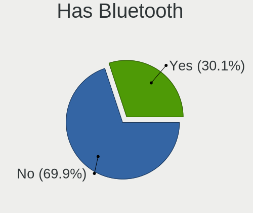
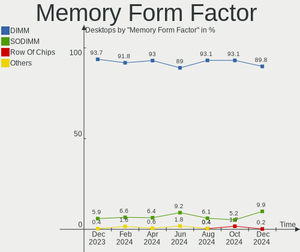

OpenMandriva - Hardware Trends (Desktops)
-----------------------------------------

A project to identify most popular hardware characteristics and track their change
over time based on data collected by Linux users at https://Linux-Hardware.org.

Anyone can contribute to this report by the [hw-probe](https://github.com/linuxhw/hw-probe) tool:

    sudo -E hw-probe -all -upload

This report is for one last month. Overall report since the beginning of time: [TestCoverage](https://github.com/linuxhw/TestCoverage)

Period: Jul, 2022.

Contents
--------

* [ System ](#system)
  - [ OS                       ](#os)
  - [ OS Family                ](#os-family)
  - [ Kernel                   ](#kernel)
  - [ Kernel Family            ](#kernel-family)
  - [ Kernel Major Ver.        ](#kernel-major-ver)
  - [ Arch                     ](#arch)
  - [ DE                       ](#de)
  - [ Display Server           ](#display-server)
  - [ Display Manager          ](#display-manager)
  - [ OS Lang                  ](#os-lang)
  - [ Boot Mode                ](#boot-mode)
  - [ Filesystem               ](#filesystem)
  - [ Part. scheme             ](#part-scheme)
  - [ Dual Boot with Linux/BSD ](#dual-boot-with-linuxbsd)
  - [ Dual Boot (Win)          ](#dual-boot-win)

* [ Board ](#board)
  - [ Vendor                   ](#vendor)
  - [ Model                    ](#model)
  - [ Model Family             ](#model-family)
  - [ MFG Year                 ](#mfg-year)
  - [ Form Factor              ](#form-factor)
  - [ Secure Boot              ](#secure-boot)
  - [ Coreboot                 ](#coreboot)
  - [ RAM Size                 ](#ram-size)
  - [ RAM Used                 ](#ram-used)
  - [ Total Drives             ](#total-drives)
  - [ Has CD-ROM               ](#has-cd-rom)
  - [ Has Ethernet             ](#has-ethernet)
  - [ Has WiFi                 ](#has-wifi)
  - [ Has Bluetooth            ](#has-bluetooth)

* [ Location ](#location)
  - [ Country                  ](#country)
  - [ City                     ](#city)

* [ Drives ](#drives)
  - [ Drive Vendor             ](#drive-vendor)
  - [ Drive Model              ](#drive-model)
  - [ HDD Vendor               ](#hdd-vendor)
  - [ SSD Vendor               ](#ssd-vendor)
  - [ Drive Kind               ](#drive-kind)
  - [ Drive Connector          ](#drive-connector)
  - [ Drive Size               ](#drive-size)
  - [ Space Total              ](#space-total)
  - [ Space Used               ](#space-used)
  - [ Malfunc. Drives          ](#malfunc-drives)
  - [ Malfunc. Drive Vendor    ](#malfunc-drive-vendor)
  - [ Malfunc. HDD Vendor      ](#malfunc-hdd-vendor)
  - [ Malfunc. Drive Kind      ](#malfunc-drive-kind)
  - [ Failed Drives            ](#failed-drives)
  - [ Failed Drive Vendor      ](#failed-drive-vendor)
  - [ Drive Status             ](#drive-status)

* [ Storage controller ](#storage-controller)
  - [ Storage Vendor           ](#storage-vendor)
  - [ Storage Model            ](#storage-model)
  - [ Storage Kind             ](#storage-kind)

* [ Processor ](#processor)
  - [ CPU Vendor               ](#cpu-vendor)
  - [ CPU Model                ](#cpu-model)
  - [ CPU Model Family         ](#cpu-model-family)
  - [ CPU Cores                ](#cpu-cores)
  - [ CPU Sockets              ](#cpu-sockets)
  - [ CPU Threads              ](#cpu-threads)
  - [ CPU Op-Modes             ](#cpu-op-modes)
  - [ CPU Microcode            ](#cpu-microcode)
  - [ CPU Microarch            ](#cpu-microarch)

* [ Graphics ](#graphics)
  - [ GPU Vendor               ](#gpu-vendor)
  - [ GPU Model                ](#gpu-model)
  - [ GPU Combo                ](#gpu-combo)
  - [ GPU Driver               ](#gpu-driver)
  - [ GPU Memory               ](#gpu-memory)

* [ Monitor ](#monitor)
  - [ Monitor Vendor           ](#monitor-vendor)
  - [ Monitor Model            ](#monitor-model)
  - [ Monitor Resolution       ](#monitor-resolution)
  - [ Monitor Diagonal         ](#monitor-diagonal)
  - [ Monitor Width            ](#monitor-width)
  - [ Aspect Ratio             ](#aspect-ratio)
  - [ Monitor Area             ](#monitor-area)
  - [ Pixel Density            ](#pixel-density)
  - [ Multiple Monitors        ](#multiple-monitors)

* [ Network ](#network)
  - [ Net Controller Vendor    ](#net-controller-vendor)
  - [ Net Controller Model     ](#net-controller-model)
  - [ Wireless Vendor          ](#wireless-vendor)
  - [ Wireless Model           ](#wireless-model)
  - [ Ethernet Vendor          ](#ethernet-vendor)
  - [ Ethernet Model           ](#ethernet-model)
  - [ Net Controller Kind      ](#net-controller-kind)
  - [ Used Controller          ](#used-controller)
  - [ NICs                     ](#nics)
  - [ IPv6                     ](#ipv6)

* [ Bluetooth ](#bluetooth)
  - [ Bluetooth Vendor         ](#bluetooth-vendor)
  - [ Bluetooth Model          ](#bluetooth-model)

* [ Sound ](#sound)
  - [ Sound Vendor             ](#sound-vendor)
  - [ Sound Model              ](#sound-model)

* [ Memory ](#memory)
  - [ Memory Vendor            ](#memory-vendor)
  - [ Memory Model             ](#memory-model)
  - [ Memory Kind              ](#memory-kind)
  - [ Memory Form Factor       ](#memory-form-factor)
  - [ Memory Size              ](#memory-size)
  - [ Memory Speed             ](#memory-speed)

* [ Printers & scanners ](#printers--scanners)
  - [ Printer Vendor           ](#printer-vendor)
  - [ Printer Model            ](#printer-model)
  - [ Scanner Vendor           ](#scanner-vendor)
  - [ Scanner Model            ](#scanner-model)

* [ Camera ](#camera)
  - [ Camera Vendor            ](#camera-vendor)
  - [ Camera Model             ](#camera-model)

* [ Security ](#security)
  - [ Fingerprint Vendor       ](#fingerprint-vendor)
  - [ Fingerprint Model        ](#fingerprint-model)
  - [ Chipcard Vendor          ](#chipcard-vendor)
  - [ Chipcard Model           ](#chipcard-model)

* [ Unsupported ](#unsupported)
  - [ Unsupported Devices      ](#unsupported-devices)
  - [ Unsupported Device Types ](#unsupported-device-types)

System
------

OS
--

Installed operating systems

| Name              | Desktops | Percent |
|-------------------|----------|---------|
| OpenMandriva 4.3  | 150      | 61.98%  |
| OpenMandriva 4.90 | 86       | 35.54%  |
| OpenMandriva 4.2  | 6        | 2.48%   |

OS Family
---------

OS without a version

| Name         | Desktops | Percent |
|--------------|----------|---------|
| OpenMandriva | 242      | 100%    |

Kernel
------

Version of the Linux kernel

| Version                     | Desktops | Percent |
|-----------------------------|----------|---------|
| 5.16.7-desktop-1omv4003     | 141      | 58.26%  |
| 5.18.12-desktop-3omv4090    | 84       | 34.71%  |
| 5.16.13-desktop-1omv4003    | 8        | 3.31%   |
| 5.10.14-desktop-1omv4002    | 5        | 2.07%   |
| 5.18.9-desktop-gcc-1omv4090 | 1        | 0.41%   |
| 5.18.13-desktop-1omv4090    | 1        | 0.41%   |
| 5.17.1-desktop-2omv4050     | 1        | 0.41%   |
| 5.11.12-desktop-1omv4002    | 1        | 0.41%   |

Kernel Family
-------------

Linux kernel without a distro release

| Version | Desktops | Percent |
|---------|----------|---------|
| 5.16.7  | 141      | 58.26%  |
| 5.18.12 | 84       | 34.71%  |
| 5.16.13 | 8        | 3.31%   |
| 5.10.14 | 5        | 2.07%   |
| 5.18.9  | 1        | 0.41%   |
| 5.18.13 | 1        | 0.41%   |
| 5.17.1  | 1        | 0.41%   |
| 5.11.12 | 1        | 0.41%   |

Kernel Major Ver.
-----------------

Linux kernel major version

| Version | Desktops | Percent |
|---------|----------|---------|
| 5.16    | 149      | 61.57%  |
| 5.18    | 86       | 35.54%  |
| 5.10    | 5        | 2.07%   |
| 5.17    | 1        | 0.41%   |
| 5.11    | 1        | 0.41%   |

Arch
----

OS architecture (x86_64, i586, etc.)

| Name   | Desktops | Percent |
|--------|----------|---------|
| x86_64 | 242      | 100%    |

DE
--

Desktop Environment

| Name    | Desktops | Percent |
|---------|----------|---------|
| KDE5    | 239      | 98.76%  |
| LXQt    | 2        | 0.83%   |
| Unknown | 1        | 0.41%   |

Display Server
--------------

X11 or Wayland

| Name    | Desktops | Percent |
|---------|----------|---------|
| X11     | 239      | 98.76%  |
| Wayland | 3        | 1.24%   |

Display Manager
---------------

SDDM, LightDM, etc.

| Name | Desktops | Percent |
|------|----------|---------|
| SDDM | 242      | 100%    |

OS Lang
-------

Language

| Lang  | Desktops | Percent |
|-------|----------|---------|
| en_US | 157      | 64.88%  |
| ru_RU | 20       | 8.26%   |
| de_DE | 12       | 4.96%   |
| pt_BR | 9        | 3.72%   |
| fr_FR | 9        | 3.72%   |
| it_IT | 5        | 2.07%   |
| hu_HU | 5        | 2.07%   |
| en_GB | 5        | 2.07%   |
| en_AU | 4        | 1.65%   |
| pl_PL | 3        | 1.24%   |
| es_AR | 3        | 1.24%   |
| tr_TR | 1        | 0.41%   |
| pt_PT | 1        | 0.41%   |
| fr_BE | 1        | 0.41%   |
| es_ES | 1        | 0.41%   |
| es_DO | 1        | 0.41%   |
| en_CA | 1        | 0.41%   |
| en_AG | 1        | 0.41%   |
| de_CH | 1        | 0.41%   |
| de_AT | 1        | 0.41%   |
| cs_CZ | 1        | 0.41%   |

Boot Mode
---------

EFI or BIOS

| Mode | Desktops | Percent |
|------|----------|---------|
| BIOS | 130      | 53.72%  |
| EFI  | 112      | 46.28%  |

Filesystem
----------

Type of filesystem

| Type    | Desktops | Percent |
|---------|----------|---------|
| Overlay | 209      | 86.36%  |
| Ext4    | 33       | 13.64%  |

Part. scheme
------------

Scheme of partitioning

| Type    | Desktops | Percent |
|---------|----------|---------|
| GPT     | 142      | 58.68%  |
| MBR     | 97       | 40.08%  |
| Unknown | 3        | 1.24%   |

Dual Boot with Linux/BSD
------------------------

Hosting more than one Linux/BSD

| Dual boot | Desktops | Percent |
|-----------|----------|---------|
| Yes       | 159      | 65.7%   |
| No        | 83       | 34.3%   |

Dual Boot (Win)
---------------

Hosting Linux and Windows

| Dual boot | Desktops | Percent |
|-----------|----------|---------|
| Yes       | 123      | 50.83%  |
| No        | 119      | 49.17%  |

Board
-----

Vendor
------

Motherboard manufacturer

| Name                | Desktops | Percent |
|---------------------|----------|---------|
| ASUSTek Computer    | 45       | 18.6%   |
| Gigabyte Technology | 41       | 16.94%  |
| MSI                 | 29       | 11.98%  |
| ASRock              | 27       | 11.16%  |
| Hewlett-Packard     | 21       | 8.68%   |
| Dell                | 21       | 8.68%   |
| Acer                | 11       | 4.55%   |
| Intel               | 9        | 3.72%   |
| Lenovo              | 8        | 3.31%   |
| Pegatron            | 6        | 2.48%   |
| Foxconn             | 5        | 2.07%   |
| Fujitsu             | 3        | 1.24%   |
| PCWare              | 2        | 0.83%   |
| ECS                 | 2        | 0.83%   |
| Biostar             | 2        | 0.83%   |
| Unknown             | 2        | 0.83%   |
| Wistron             | 1        | 0.41%   |
| PCChips             | 1        | 0.41%   |
| Login Informatica   | 1        | 0.41%   |
| eMachines           | 1        | 0.41%   |
| Digiboard           | 1        | 0.41%   |
| Colorful Technology | 1        | 0.41%   |
| BESSTAR Tech        | 1        | 0.41%   |
| AZW                 | 1        | 0.41%   |

Model
-----

Motherboard model

| Name                                    | Desktops | Percent |
|-----------------------------------------|----------|---------|
| MSI MS-7C02                             | 3        | 1.24%   |
| MSI MS-7A74                             | 3        | 1.24%   |
| HP Compaq 8200 Elite SFF PC             | 3        | 1.24%   |
| Gigabyte X570 AORUS MASTER              | 3        | 1.24%   |
| Dell OptiPlex 780                       | 3        | 1.24%   |
| ASUS All Series                         | 3        | 1.24%   |
| MSI MS-7B79                             | 2        | 0.83%   |
| MSI MS-7592                             | 2        | 0.83%   |
| Gigabyte B75M-D3H                       | 2        | 0.83%   |
| Dell OptiPlex 3020                      | 2        | 0.83%   |
| Dell OptiPlex 3010                      | 2        | 0.83%   |
| ASUS TUF Gaming B550-PLUS               | 2        | 0.83%   |
| ASUS ROG STRIX B550-F GAMING            | 2        | 0.83%   |
| ASUS H110M-R                            | 2        | 0.83%   |
| ASRock B450M Steel Legend               | 2        | 0.83%   |
| ASRock AB350 Pro4                       | 2        | 0.83%   |
| Unknown                                 | 2        | 0.83%   |
| Wistron ProLiant ML110 G5               | 1        | 0.41%   |
| Pegatron Pro 3010 Microtower PC         | 1        | 0.41%   |
| Pegatron p2-1394                        | 1        | 0.41%   |
| Pegatron NY799AA-ABA p6243w             | 1        | 0.41%   |
| Pegatron IPM41-D3                       | 1        | 0.41%   |
| Pegatron FL448AA-ACB a6652ru            | 1        | 0.41%   |
| Pegatron FK821AA-ABA a6632f             | 1        | 0.41%   |
| PCWare PW-945GCX                        | 1        | 0.41%   |
| PCWare IPMH61R2                         | 1        | 0.41%   |
| PCChips A15G                            | 1        | 0.41%   |
| MSI MS-7C96                             | 1        | 0.41%   |
| MSI MS-7C91                             | 1        | 0.41%   |
| MSI MS-7C83                             | 1        | 0.41%   |
| MSI MS-7C75                             | 1        | 0.41%   |
| MSI MS-7C56                             | 1        | 0.41%   |
| MSI MS-7C09                             | 1        | 0.41%   |
| MSI MS-7B86                             | 1        | 0.41%   |
| MSI MS-7A70                             | 1        | 0.41%   |
| MSI MS-7A32                             | 1        | 0.41%   |
| MSI MS-7A15                             | 1        | 0.41%   |
| MSI MS-7998                             | 1        | 0.41%   |
| MSI MS-7996                             | 1        | 0.41%   |
| MSI MS-7914                             | 1        | 0.41%   |
| MSI MS-7895                             | 1        | 0.41%   |
| MSI MS-7865                             | 1        | 0.41%   |
| MSI MS-7817                             | 1        | 0.41%   |
| MSI MS-7721                             | 1        | 0.41%   |
| MSI MS-7693                             | 1        | 0.41%   |
| MSI MS-7529                             | 1        | 0.41%   |
| Login Informatica LOG-H310M-G           | 1        | 0.41%   |
| Lenovo V520-15IKL 10NKS05400            | 1        | 0.41%   |
| Lenovo ThinkCentre M93p 10AA0022EU      | 1        | 0.41%   |
| Lenovo ThinkCentre M92p 3238BK7         | 1        | 0.41%   |
| Lenovo ThinkCentre M92p 2121D5U         | 1        | 0.41%   |
| Lenovo ThinkCentre M58p 6137B28         | 1        | 0.41%   |
| Lenovo ThinkCentre A61 9144A23          | 1        | 0.41%   |
| Lenovo IdeaCentre 510A-15ICB 90HV0003US | 1        | 0.41%   |
| Lenovo IdeaCentre 300S-08IHH 90F1006CSP | 1        | 0.41%   |
| Intel X79                               | 1        | 0.41%   |
| Intel H61                               | 1        | 0.41%   |
| Intel DQ77MK                            | 1        | 0.41%   |
| Intel DQ35MP AAD82086-702               | 1        | 0.41%   |
| Intel DH67VR AAG27177-201               | 1        | 0.41%   |

Model Family
------------

Motherboard model prefix

| Name                          | Desktops | Percent |
|-------------------------------|----------|---------|
| Dell OptiPlex                 | 14       | 5.79%   |
| ASUS PRIME                    | 9        | 3.72%   |
| HP Compaq                     | 7        | 2.89%   |
| ASUS ROG                      | 6        | 2.48%   |
| Lenovo ThinkCentre            | 5        | 2.07%   |
| HP EliteDesk                  | 5        | 2.07%   |
| ASUS TUF                      | 5        | 2.07%   |
| Acer Veriton                  | 5        | 2.07%   |
| Acer Aspire                   | 5        | 2.07%   |
| MSI MS-7C02                   | 3        | 1.24%   |
| MSI MS-7A74                   | 3        | 1.24%   |
| Gigabyte X570                 | 3        | 1.24%   |
| ASUS All                      | 3        | 1.24%   |
| ASRock B450M                  | 3        | 1.24%   |
| MSI MS-7B79                   | 2        | 0.83%   |
| MSI MS-7592                   | 2        | 0.83%   |
| Lenovo IdeaCentre             | 2        | 0.83%   |
| HP Pavilion                   | 2        | 0.83%   |
| Gigabyte B75M-D3H             | 2        | 0.83%   |
| Fujitsu ESPRIMO               | 2        | 0.83%   |
| Foxconn Pro                   | 2        | 0.83%   |
| Dell Studio                   | 2        | 0.83%   |
| Dell Precision                | 2        | 0.83%   |
| Dell Inspiron                 | 2        | 0.83%   |
| ASUS SABERTOOTH               | 2        | 0.83%   |
| ASUS M5A97                    | 2        | 0.83%   |
| ASUS H110M-R                  | 2        | 0.83%   |
| ASRock AB350                  | 2        | 0.83%   |
| ASRock A320M-HDV              | 2        | 0.83%   |
| Unknown                       | 2        | 0.83%   |
| Wistron ProLiant              | 1        | 0.41%   |
| Pegatron Pro                  | 1        | 0.41%   |
| Pegatron p2-1394              | 1        | 0.41%   |
| Pegatron NY799AA-ABA          | 1        | 0.41%   |
| Pegatron IPM41-D3             | 1        | 0.41%   |
| Pegatron FL448AA-ACB          | 1        | 0.41%   |
| Pegatron FK821AA-ABA          | 1        | 0.41%   |
| PCWare PW-945GCX              | 1        | 0.41%   |
| PCWare IPMH61R2               | 1        | 0.41%   |
| PCChips A15G                  | 1        | 0.41%   |
| MSI MS-7C96                   | 1        | 0.41%   |
| MSI MS-7C91                   | 1        | 0.41%   |
| MSI MS-7C83                   | 1        | 0.41%   |
| MSI MS-7C75                   | 1        | 0.41%   |
| MSI MS-7C56                   | 1        | 0.41%   |
| MSI MS-7C09                   | 1        | 0.41%   |
| MSI MS-7B86                   | 1        | 0.41%   |
| MSI MS-7A70                   | 1        | 0.41%   |
| MSI MS-7A32                   | 1        | 0.41%   |
| MSI MS-7A15                   | 1        | 0.41%   |
| MSI MS-7998                   | 1        | 0.41%   |
| MSI MS-7996                   | 1        | 0.41%   |
| MSI MS-7914                   | 1        | 0.41%   |
| MSI MS-7895                   | 1        | 0.41%   |
| MSI MS-7865                   | 1        | 0.41%   |
| MSI MS-7817                   | 1        | 0.41%   |
| MSI MS-7721                   | 1        | 0.41%   |
| MSI MS-7693                   | 1        | 0.41%   |
| MSI MS-7529                   | 1        | 0.41%   |
| Login Informatica LOG-H310M-G | 1        | 0.41%   |

MFG Year
--------

Motherboard manufacture year

| Year | Desktops | Percent |
|------|----------|---------|
| 2020 | 23       | 9.5%    |
| 2011 | 22       | 9.09%   |
| 2018 | 21       | 8.68%   |
| 2012 | 21       | 8.68%   |
| 2019 | 20       | 8.26%   |
| 2013 | 19       | 7.85%   |
| 2009 | 19       | 7.85%   |
| 2010 | 18       | 7.44%   |
| 2017 | 13       | 5.37%   |
| 2014 | 12       | 4.96%   |
| 2015 | 11       | 4.55%   |
| 2021 | 10       | 4.13%   |
| 2008 | 10       | 4.13%   |
| 2016 | 9        | 3.72%   |
| 2007 | 6        | 2.48%   |
| 2006 | 4        | 1.65%   |
| 2022 | 3        | 1.24%   |
| 2005 | 1        | 0.41%   |

Form Factor
-----------

Physical design of the computer

| Name    | Desktops | Percent |
|---------|----------|---------|
| Desktop | 242      | 100%    |

Secure Boot
-----------

Enabled or disabled

| State    | Desktops | Percent |
|----------|----------|---------|
| Disabled | 242      | 100%    |

Coreboot
--------

Have coreboot on board

| Used | Desktops | Percent |
|------|----------|---------|
| No   | 242      | 100%    |

RAM Size
--------

Total RAM memory

| Size in GB  | Desktops | Percent |
|-------------|----------|---------|
| 8.01-16.0   | 55       | 22.73%  |
| 4.01-8.0    | 49       | 20.25%  |
| 16.01-24.0  | 49       | 20.25%  |
| 3.01-4.0    | 47       | 19.42%  |
| 32.01-64.0  | 20       | 8.26%   |
| 24.01-32.0  | 9        | 3.72%   |
| 64.01-256.0 | 6        | 2.48%   |
| 1.01-2.0    | 4        | 1.65%   |
| 2.01-3.0    | 3        | 1.24%   |

RAM Used
--------

Used RAM memory

| Used GB  | Desktops | Percent |
|----------|----------|---------|
| 1.01-2.0 | 182      | 75.21%  |
| 0.51-1.0 | 37       | 15.29%  |
| 2.01-3.0 | 16       | 6.61%   |
| 3.01-4.0 | 3        | 1.24%   |
| 0.01-0.5 | 3        | 1.24%   |
| 4.01-8.0 | 1        | 0.41%   |

Total Drives
------------

Number of drives on board

| Drives | Desktops | Percent |
|--------|----------|---------|
| 1      | 101      | 41.74%  |
| 2      | 66       | 27.27%  |
| 3      | 38       | 15.7%   |
| 4      | 17       | 7.02%   |
| 0      | 7        | 2.89%   |
| 5      | 6        | 2.48%   |
| 6      | 5        | 2.07%   |
| 9      | 1        | 0.41%   |
| 7      | 1        | 0.41%   |

Has CD-ROM
----------

Has CD-ROM on board

| Presented | Desktops | Percent |
|-----------|----------|---------|
| Yes       | 135      | 55.79%  |
| No        | 107      | 44.21%  |

Has Ethernet
------------

Has Ethernet on board

| Presented | Desktops | Percent |
|-----------|----------|---------|
| Yes       | 239      | 98.76%  |
| No        | 3        | 1.24%   |

Has WiFi
--------

Has WiFi module

| Presented | Desktops | Percent |
|-----------|----------|---------|
| No        | 162      | 66.94%  |
| Yes       | 80       | 33.06%  |

Has Bluetooth
-------------

Has Bluetooth module

| Presented | Desktops | Percent |
|-----------|----------|---------|
| No        | 183      | 75.62%  |
| Yes       | 59       | 24.38%  |

Location
--------

Country
-------

Geographic location (country)

| Country                | Desktops | Percent |
|------------------------|----------|---------|
| USA                    | 51       | 21.07%  |
| Russia                 | 26       | 10.74%  |
| Germany                | 21       | 8.68%   |
| Brazil                 | 17       | 7.02%   |
| France                 | 16       | 6.61%   |
| UK                     | 9        | 3.72%   |
| Poland                 | 9        | 3.72%   |
| Australia              | 8        | 3.31%   |
| Italy                  | 7        | 2.89%   |
| Hungary                | 6        | 2.48%   |
| Canada                 | 6        | 2.48%   |
| Netherlands            | 4        | 1.65%   |
| Argentina              | 4        | 1.65%   |
| Sweden                 | 3        | 1.24%   |
| Spain                  | 3        | 1.24%   |
| North Macedonia        | 3        | 1.24%   |
| Japan                  | 3        | 1.24%   |
| Thailand               | 2        | 0.83%   |
| Taiwan                 | 2        | 0.83%   |
| Portugal               | 2        | 0.83%   |
| Kazakhstan             | 2        | 0.83%   |
| Greece                 | 2        | 0.83%   |
| Egypt                  | 2        | 0.83%   |
| Dominican Republic     | 2        | 0.83%   |
| Czechia                | 2        | 0.83%   |
| China                  | 2        | 0.83%   |
| Austria                | 2        | 0.83%   |
| Uruguay                | 1        | 0.41%   |
| Ukraine                | 1        | 0.41%   |
| U.S. Virgin Islands    | 1        | 0.41%   |
| Turkey                 | 1        | 0.41%   |
| Switzerland            | 1        | 0.41%   |
| St Kitts and Nevis     | 1        | 0.41%   |
| South Africa           | 1        | 0.41%   |
| Slovenia               | 1        | 0.41%   |
| Slovakia               | 1        | 0.41%   |
| Serbia                 | 1        | 0.41%   |
| Puerto Rico            | 1        | 0.41%   |
| Peru                   | 1        | 0.41%   |
| Mexico                 | 1        | 0.41%   |
| Martinique             | 1        | 0.41%   |
| Jamaica                | 1        | 0.41%   |
| Israel                 | 1        | 0.41%   |
| Ireland                | 1        | 0.41%   |
| Indonesia              | 1        | 0.41%   |
| Estonia                | 1        | 0.41%   |
| Croatia                | 1        | 0.41%   |
| Chile                  | 1        | 0.41%   |
| Bulgaria               | 1        | 0.41%   |
| Bosnia and Herzegovina | 1        | 0.41%   |
| Belgium                | 1        | 0.41%   |
| Belarus                | 1        | 0.41%   |
| Algeria                | 1        | 0.41%   |

City
----

Geographic location (city)

| City                 | Desktops | Percent |
|----------------------|----------|---------|
| Moscow               | 5        | 2.07%   |
| Skopje               | 3        | 1.24%   |
| Rio de Janeiro       | 3        | 1.24%   |
| Vienna               | 2        | 0.83%   |
| Sydney               | 2        | 0.83%   |
| Sao Paulo            | 2        | 0.83%   |
| Santee               | 2        | 0.83%   |
| San Jose             | 2        | 0.83%   |
| San Antonio          | 2        | 0.83%   |
| Poznan               | 2        | 0.83%   |
| Nizhniy Novgorod     | 2        | 0.83%   |
| Nîmes               | 2        | 0.83%   |
| New Taipei           | 2        | 0.83%   |
| Manchester           | 2        | 0.83%   |
| Krakow               | 2        | 0.83%   |
| Duque de Caxias      | 2        | 0.83%   |
| Delft                | 2        | 0.83%   |
| Cairo                | 2        | 0.83%   |
| Buenos Aires         | 2        | 0.83%   |
| Belo Horizonte       | 2        | 0.83%   |
| Bangkok              | 2        | 0.83%   |
| Athens               | 2        | 0.83%   |
| Zagreb               | 1        | 0.41%   |
| York                 | 1        | 0.41%   |
| Yessentuki           | 1        | 0.41%   |
| Yekaterinburg        | 1        | 0.41%   |
| Yarragon             | 1        | 0.41%   |
| Wroclaw              | 1        | 0.41%   |
| Windsor              | 1        | 0.41%   |
| Winchester           | 1        | 0.41%   |
| Wichita              | 1        | 0.41%   |
| Wesel                | 1        | 0.41%   |
| Weimar               | 1        | 0.41%   |
| Washington           | 1        | 0.41%   |
| Warsaw               | 1        | 0.41%   |
| Volgograd            | 1        | 0.41%   |
| Voelklingen          | 1        | 0.41%   |
| Vladimir             | 1        | 0.41%   |
| Vitré               | 1        | 0.41%   |
| Virginia Beach       | 1        | 0.41%   |
| Virden               | 1        | 0.41%   |
| Verfeil              | 1        | 0.41%   |
| Vélizy-Villacoublay | 1        | 0.41%   |
| Varna                | 1        | 0.41%   |
| Uberaba              | 1        | 0.41%   |
| Turlock              | 1        | 0.41%   |
| Tula                 | 1        | 0.41%   |
| Tucson               | 1        | 0.41%   |
| Tsubame              | 1        | 0.41%   |
| Tsimlyansk           | 1        | 0.41%   |
| Trenton              | 1        | 0.41%   |
| Toul                 | 1        | 0.41%   |
| Toronto              | 1        | 0.41%   |
| Tomsk                | 1        | 0.41%   |
| Tianxinpu            | 1        | 0.41%   |
| The Colony           | 1        | 0.41%   |
| Tel Aviv             | 1        | 0.41%   |
| Surprise             | 1        | 0.41%   |
| Suita                | 1        | 0.41%   |
| Strzyzow             | 1        | 0.41%   |

Drives
------

Drive Vendor
------------

Hard drive vendors

| Vendor              | Desktops | Drives | Percent |
|---------------------|----------|--------|---------|
| WDC                 | 90       | 113    | 21.9%   |
| Seagate             | 72       | 98     | 17.52%  |
| Samsung Electronics | 54       | 66     | 13.14%  |
| Toshiba             | 22       | 22     | 5.35%   |
| Crucial             | 22       | 26     | 5.35%   |
| Kingston            | 17       | 20     | 4.14%   |
| Hitachi             | 17       | 17     | 4.14%   |
| SanDisk             | 15       | 16     | 3.65%   |
| A-DATA Technology   | 12       | 12     | 2.92%   |
| China               | 7        | 8      | 1.7%    |
| HGST                | 6        | 7      | 1.46%   |
| Gigabyte Technology | 6        | 8      | 1.46%   |
| Unknown             | 5        | 5      | 1.22%   |
| Unknown             | 4        | 6      | 0.97%   |
| PNY                 | 4        | 4      | 0.97%   |
| Phison              | 4        | 4      | 0.97%   |
| OCZ                 | 4        | 4      | 0.97%   |
| Maxtor              | 4        | 4      | 0.97%   |
| Intel               | 4        | 4      | 0.97%   |
| GOODRAM             | 3        | 3      | 0.73%   |
| Corsair             | 3        | 3      | 0.73%   |
| Lexar               | 2        | 2      | 0.49%   |
| JMicron Technology  | 2        | 2      | 0.49%   |
| Fujitsu             | 2        | 2      | 0.49%   |
| ASMT                | 2        | 2      | 0.49%   |
| Apacer              | 2        | 2      | 0.49%   |
| Zheino              | 1        | 2      | 0.24%   |
| XrayDisk            | 1        | 1      | 0.24%   |
| XPG                 | 1        | 2      | 0.24%   |
| VERICO              | 1        | 1      | 0.24%   |
| TO Exter            | 1        | 1      | 0.24%   |
| TEXTORM             | 1        | 1      | 0.24%   |
| Team                | 1        | 1      | 0.24%   |
| SSD 32GB            | 1        | 1      | 0.24%   |
| SSD 120G            | 1        | 1      | 0.24%   |
| SPCC M.2            | 1        | 1      | 0.24%   |
| SPCC                | 1        | 1      | 0.24%   |
| SK hynix            | 1        | 1      | 0.24%   |
| Silicon Motion      | 1        | 1      | 0.24%   |
| SABRENT             | 1        | 1      | 0.24%   |
| Realtek             | 1        | 1      | 0.24%   |
| Plextor             | 1        | 1      | 0.24%   |
| Patriot             | 1        | 1      | 0.24%   |
| NGFF                | 1        | 1      | 0.24%   |
| Min Yi U            | 1        | 1      | 0.24%   |
| KIOXIA-EXCERIA      | 1        | 1      | 0.24%   |
| Intenso             | 1        | 1      | 0.24%   |
| INNOVATION IT       | 1        | 1      | 0.24%   |
| HS-SSD-C100         | 1        | 1      | 0.24%   |
| Hewlett-Packard     | 1        | 1      | 0.24%   |
| GeIL                | 1        | 1      | 0.24%   |
| addlink             | 1        | 1      | 0.24%   |

Drive Model
-----------

Hard drive models

| Model                                | Desktops | Percent |
|--------------------------------------|----------|---------|
| Seagate ST500DM002-1BD142 500GB      | 8        | 1.71%   |
| Kingston SA400S37240G 240GB SSD      | 7        | 1.5%    |
| WDC WD10EZEX-08WN4A0 1TB             | 6        | 1.28%   |
| Seagate ST1000DM010-2EP102 1TB       | 6        | 1.28%   |
| Crucial CT500MX500SSD1 500GB         | 6        | 1.28%   |
| Crucial CT1000MX500SSD1 1TB          | 6        | 1.28%   |
| WDC WD10EZEX-00BN5A0 1TB             | 5        | 1.07%   |
| Samsung SSD 850 EVO 250GB            | 5        | 1.07%   |
| Unknown                              | 5        | 1.07%   |
| Toshiba DT01ACA050 500GB             | 4        | 0.85%   |
| Seagate Expansion 1TB                | 4        | 0.85%   |
| Samsung SSD 860 EVO 500GB            | 4        | 0.85%   |
| Samsung SSD 860 EVO 250GB            | 4        | 0.85%   |
| Toshiba MQ01ABD100 1TB               | 3        | 0.64%   |
| Toshiba DT01ACA100 1TB               | 3        | 0.64%   |
| Seagate ST3320620AS 320GB            | 3        | 0.64%   |
| Seagate ST2000DM008-2FR102 2TB       | 3        | 0.64%   |
| Seagate ST1000DM003-1SB102 1TB       | 3        | 0.64%   |
| SanDisk SDSSDA120G 120GB             | 3        | 0.64%   |
| HGST HTS721010A9E630 1TB             | 3        | 0.64%   |
| A-DATA SU630 240GB SSD               | 3        | 0.64%   |
| WDC WDS500G2B0A-00SM50 500GB SSD     | 2        | 0.43%   |
| WDC WD5000AAKS-00V1A0 500GB          | 2        | 0.43%   |
| WDC WD5000AADS-00S9B0 500GB          | 2        | 0.43%   |
| WDC WD30EZRX-00SPEB0 3TB             | 2        | 0.43%   |
| WDC WD2002FAEX-007BA0 2TB            | 2        | 0.43%   |
| WDC WD1600AAJS-08L7A0 160GB          | 2        | 0.43%   |
| WDC WD10EZEX-75WN4A0 1TB             | 2        | 0.43%   |
| WDC WD10EZEX-08M2NA0 1TB             | 2        | 0.43%   |
| WDC PC SN520 SDAPNUW-256G-1006 256GB | 2        | 0.43%   |
| Unknown SD/MMC/MS PRO 64GB           | 2        | 0.43%   |
| Toshiba HDWD130 3TB                  | 2        | 0.43%   |
| Seagate ST3500418AS 500GB            | 2        | 0.43%   |
| Seagate ST2000DM006-2DM164 2TB       | 2        | 0.43%   |
| Seagate ST2000DM001-1ER164 2TB       | 2        | 0.43%   |
| Seagate ST2000DM001-1CH164 2TB       | 2        | 0.43%   |
| Seagate ST1000VM002-1CT162 1TB       | 2        | 0.43%   |
| Seagate ST1000DX001-1NS162 1TB       | 2        | 0.43%   |
| Seagate ST1000DM003-1ER162 1TB       | 2        | 0.43%   |
| Seagate ST1000DM003-1CH162 1TB       | 2        | 0.43%   |
| SanDisk SDSSDA240G 240GB             | 2        | 0.43%   |
| SanDisk NVMe SSD Drive 500GB         | 2        | 0.43%   |
| Samsung SSD 970 EVO Plus 500GB       | 2        | 0.43%   |
| Samsung SSD 860 QVO 1TB              | 2        | 0.43%   |
| Samsung SSD 860 EVO 1TB              | 2        | 0.43%   |
| Samsung HD322HJ 320GB                | 2        | 0.43%   |
| Samsung HD161HJ 160GB                | 2        | 0.43%   |
| Samsung HD160JJ/ 160GB               | 2        | 0.43%   |
| Samsung HD103UJ 1TB                  | 2        | 0.43%   |
| Samsung HD103SI 1TB                  | 2        | 0.43%   |
| PNY CS900 240GB SSD                  | 2        | 0.43%   |
| OCZ TRION100 240GB SSD               | 2        | 0.43%   |
| Kingston SV300S37A60G 64GB SSD       | 2        | 0.43%   |
| Kingston SV300S37A120G 120GB SSD     | 2        | 0.43%   |
| Kingston SUV400S37120G 120GB SSD     | 2        | 0.43%   |
| Hitachi HTS545050B9A300 500GB        | 2        | 0.43%   |
| Hitachi HTS543232A7A384 320GB        | 2        | 0.43%   |
| Hitachi HDS721010CLA630 1TB          | 2        | 0.43%   |
| Gigabyte GP-AG4500G 500GB            | 2        | 0.43%   |
| Crucial CT480BX500SSD1 480GB         | 2        | 0.43%   |

HDD Vendor
----------

Hard disk drive vendors

| Vendor              | Desktops | Drives | Percent |
|---------------------|----------|--------|---------|
| WDC                 | 78       | 91     | 35.14%  |
| Seagate             | 70       | 95     | 31.53%  |
| Toshiba             | 20       | 20     | 9.01%   |
| Samsung Electronics | 20       | 21     | 9.01%   |
| Hitachi             | 17       | 17     | 7.66%   |
| HGST                | 6        | 7      | 2.7%    |
| Maxtor              | 4        | 4      | 1.8%    |
| Unknown             | 2        | 2      | 0.9%    |
| SABRENT             | 1        | 1      | 0.45%   |
| Intenso             | 1        | 1      | 0.45%   |
| Fujitsu             | 1        | 1      | 0.45%   |
| ASMT                | 1        | 1      | 0.45%   |
| Unknown             | 1        | 1      | 0.45%   |

SSD Vendor
----------

Solid state drive vendors

| Vendor              | Desktops | Drives | Percent |
|---------------------|----------|--------|---------|
| Samsung Electronics | 27       | 32     | 19.71%  |
| Crucial             | 19       | 21     | 13.87%  |
| Kingston            | 14       | 17     | 10.22%  |
| SanDisk             | 11       | 12     | 8.03%   |
| A-DATA Technology   | 10       | 10     | 7.3%    |
| China               | 7        | 8      | 5.11%   |
| WDC                 | 6        | 7      | 4.38%   |
| OCZ                 | 4        | 4      | 2.92%   |
| PNY                 | 3        | 3      | 2.19%   |
| GOODRAM             | 3        | 3      | 2.19%   |
| Toshiba             | 2        | 2      | 1.46%   |
| Lexar               | 2        | 2      | 1.46%   |
| Intel               | 2        | 2      | 1.46%   |
| Gigabyte Technology | 2        | 2      | 1.46%   |
| Corsair             | 2        | 2      | 1.46%   |
| Unknown             | 2        | 2      | 1.46%   |
| Zheino              | 1        | 2      | 0.73%   |
| VERICO              | 1        | 1      | 0.73%   |
| TO Exter            | 1        | 1      | 0.73%   |
| TEXTORM             | 1        | 1      | 0.73%   |
| Team                | 1        | 1      | 0.73%   |
| SPCC M.2            | 1        | 1      | 0.73%   |
| SPCC                | 1        | 1      | 0.73%   |
| Seagate             | 1        | 1      | 0.73%   |
| Plextor             | 1        | 1      | 0.73%   |
| Patriot             | 1        | 1      | 0.73%   |
| NGFF                | 1        | 1      | 0.73%   |
| Min Yi U            | 1        | 1      | 0.73%   |
| KIOXIA-EXCERIA      | 1        | 1      | 0.73%   |
| JMicron Technology  | 1        | 1      | 0.73%   |
| INNOVATION IT       | 1        | 1      | 0.73%   |
| HS-SSD-C100         | 1        | 1      | 0.73%   |
| Hewlett-Packard     | 1        | 1      | 0.73%   |
| GeIL                | 1        | 1      | 0.73%   |
| Fujitsu             | 1        | 1      | 0.73%   |
| ASMT                | 1        | 1      | 0.73%   |
| Apacer              | 1        | 1      | 0.73%   |

Drive Kind
----------

HDD or SSD

| Kind    | Desktops | Drives | Percent |
|---------|----------|--------|---------|
| HDD     | 179      | 262    | 52.19%  |
| SSD     | 107      | 151    | 31.2%   |
| NVMe    | 49       | 64     | 14.29%  |
| Unknown | 8        | 11     | 2.33%   |

Drive Connector
---------------

SATA, SAS, NVMe, etc.

| Type | Desktops | Drives | Percent |
|------|----------|--------|---------|
| SATA | 226      | 390    | 74.83%  |
| NVMe | 49       | 63     | 16.23%  |
| SAS  | 27       | 35     | 8.94%   |

Drive Size
----------

Size of hard drive

| Size in TB | Desktops | Drives | Percent |
|------------|----------|--------|---------|
| 0.01-0.5   | 177      | 253    | 58.22%  |
| 0.51-1.0   | 86       | 110    | 28.29%  |
| 1.01-2.0   | 25       | 29     | 8.22%   |
| 2.01-3.0   | 8        | 11     | 2.63%   |
| 3.01-4.0   | 5        | 5      | 1.64%   |
| 4.01-10.0  | 3        | 5      | 0.99%   |

Space Total
-----------

Amount of disk space available on the file system

| Size in GB     | Desktops | Percent |
|----------------|----------|---------|
| 1-20           | 139      | 57.44%  |
| 101-250        | 31       | 12.81%  |
| Unknown        | 27       | 11.16%  |
| 251-500        | 16       | 6.61%   |
| 21-50          | 11       | 4.55%   |
| 51-100         | 7        | 2.89%   |
| 501-1000       | 6        | 2.48%   |
| 2001-3000      | 2        | 0.83%   |
| 1001-2000      | 2        | 0.83%   |
| More than 3000 | 1        | 0.41%   |

Space Used
----------

Amount of used disk space

| Used GB        | Desktops | Percent |
|----------------|----------|---------|
| 1-20           | 194      | 80.17%  |
| Unknown        | 27       | 11.16%  |
| 21-50          | 8        | 3.31%   |
| 101-250        | 4        | 1.65%   |
| 251-500        | 2        | 0.83%   |
| 1001-2000      | 2        | 0.83%   |
| 501-1000       | 2        | 0.83%   |
| 51-100         | 2        | 0.83%   |
| More than 3000 | 1        | 0.41%   |

Malfunc. Drives
---------------

Drive models with a malfunction

| Model                                       | Desktops | Drives | Percent |
|---------------------------------------------|----------|--------|---------|
| Seagate ST500DM002-1BD142 500GB             | 4        | 4      | 4.88%   |
| WDC WD5000AADS-00S9B0 500GB                 | 2        | 2      | 2.44%   |
| WDC WD2002FAEX-007BA0 2TB                   | 2        | 2      | 2.44%   |
| Seagate ST1000VM002-1CT162 1TB              | 2        | 2      | 2.44%   |
| Samsung Electronics HD160JJ/ 160GB          | 2        | 2      | 2.44%   |
| Hitachi HTS545050B9A300 500GB               | 2        | 2      | 2.44%   |
| Hitachi HDS721010CLA630 1TB                 | 2        | 2      | 2.44%   |
| WDC WDS200T2B0A-00SM50 2TB SSD              | 1        | 1      | 1.22%   |
| WDC WD800BD-00MRA1 80GB                     | 1        | 1      | 1.22%   |
| WDC WD5003ABYZ-011FA0 500GB                 | 1        | 1      | 1.22%   |
| WDC WD5000LPVT-22G33T0 500GB                | 1        | 1      | 1.22%   |
| WDC WD5000AVDS-63U7B1 500GB                 | 1        | 1      | 1.22%   |
| WDC WD5000AURX-63UY4Y0 500GB                | 1        | 1      | 1.22%   |
| WDC WD5000AAKX-22ERMA0 500GB                | 1        | 1      | 1.22%   |
| WDC WD5000AAKX-08U6AA0 500GB                | 1        | 1      | 1.22%   |
| WDC WD5000AAKS-00V1A0 500GB                 | 1        | 1      | 1.22%   |
| WDC WD5000AAKS-00A7B0 500GB                 | 1        | 1      | 1.22%   |
| WDC WD400BB-23DEA0 40GB                     | 1        | 1      | 1.22%   |
| WDC WD3200AAKX-073CA0 320GB                 | 1        | 1      | 1.22%   |
| WDC WD3200AAJS-40VWA1 320GB                 | 1        | 1      | 1.22%   |
| WDC WD3200AAJS-22L7A0 320GB                 | 1        | 1      | 1.22%   |
| WDC WD2500BEKT-75A25T0 250GB                | 1        | 1      | 1.22%   |
| WDC WD1600AAJS-22L7A0 160GB                 | 1        | 1      | 1.22%   |
| WDC WD10EZEX-75M2NA0 1TB                    | 1        | 1      | 1.22%   |
| WDC WD10EZEX-60ZF5A0 1TB                    | 1        | 1      | 1.22%   |
| WDC WD10EZEX-22MFCA0 1TB                    | 1        | 1      | 1.22%   |
| WDC WD10EZEX-08M2NA0 1TB                    | 1        | 1      | 1.22%   |
| WDC WD10EAVS-00D7B1 1TB                     | 1        | 1      | 1.22%   |
| Toshiba THNSNK128GCS8 SATA 128GB SSD        | 1        | 1      | 1.22%   |
| Toshiba MQ01ABD100 1TB                      | 1        | 1      | 1.22%   |
| Toshiba MK3252GSX 320GB                     | 1        | 1      | 1.22%   |
| Toshiba MK1665GSX 160GB                     | 1        | 1      | 1.22%   |
| Toshiba MK1255GSX H 120GB                   | 1        | 1      | 1.22%   |
| Toshiba DT01ACA050 500GB                    | 1        | 1      | 1.22%   |
| TEXTORM B5 120GB SSD                        | 1        | 1      | 1.22%   |
| SPCC 2.5" SSD 512GB                         | 1        | 1      | 1.22%   |
| SK hynix BC501 HFM256GDJTNG-8310A 256GB     | 1        | 1      | 1.22%   |
| Seagate ST9320320AS 320GB                   | 1        | 1      | 1.22%   |
| Seagate ST500LT012-1DG142 500GB             | 1        | 1      | 1.22%   |
| Seagate ST4000DX001-1CE168 4TB              | 1        | 1      | 1.22%   |
| Seagate ST3500410AS 500GB                   | 1        | 1      | 1.22%   |
| Seagate ST3320620AS 320GB                   | 1        | 1      | 1.22%   |
| Seagate ST33000651AS 3TB                    | 1        | 1      | 1.22%   |
| Seagate ST3250620NS 250GB                   | 1        | 1      | 1.22%   |
| Seagate ST31000520AS 1TB                    | 1        | 1      | 1.22%   |
| Seagate ST2000NP0011 2TB                    | 1        | 1      | 1.22%   |
| Seagate ST2000DX002-2DV164 2TB              | 1        | 1      | 1.22%   |
| Seagate ST2000DX 002-2DV164 2TB             | 1        | 1      | 1.22%   |
| Seagate ST1000DX001-1NS162 1TB              | 1        | 1      | 1.22%   |
| Seagate ST1000DM003-1CH162 1TB              | 1        | 1      | 1.22%   |
| SanDisk SDSSDA240G 240GB                    | 1        | 1      | 1.22%   |
| Samsung Electronics SSD PM810 2.5 7mm 128GB | 1        | 1      | 1.22%   |
| Samsung Electronics SP0411C 40GB            | 1        | 1      | 1.22%   |
| Samsung Electronics HD502HI 500GB           | 1        | 1      | 1.22%   |
| Samsung Electronics HD322HJ 320GB           | 1        | 1      | 1.22%   |
| Samsung Electronics HD250HJ 250GB           | 1        | 1      | 1.22%   |
| Samsung Electronics HD161HJ 160GB           | 1        | 1      | 1.22%   |
| Samsung Electronics HD103UJ 1TB             | 1        | 1      | 1.22%   |
| Samsung Electronics HD103SI 1TB             | 1        | 1      | 1.22%   |
| Samsung Electronics HD040GJ/ 40GB           | 1        | 1      | 1.22%   |

Malfunc. Drive Vendor
---------------------

Vendors of faulty drives

| Vendor              | Desktops | Drives | Percent |
|---------------------|----------|--------|---------|
| WDC                 | 24       | 25     | 30%     |
| Seagate             | 18       | 19     | 22.5%   |
| Samsung Electronics | 11       | 11     | 13.75%  |
| Hitachi             | 7        | 7      | 8.75%   |
| Toshiba             | 6        | 6      | 7.5%    |
| Maxtor              | 3        | 3      | 3.75%   |
| Kingston            | 2        | 2      | 2.5%    |
| HGST                | 2        | 2      | 2.5%    |
| TEXTORM             | 1        | 1      | 1.25%   |
| SPCC                | 1        | 1      | 1.25%   |
| SK hynix            | 1        | 1      | 1.25%   |
| SanDisk             | 1        | 1      | 1.25%   |
| GOODRAM             | 1        | 1      | 1.25%   |
| China               | 1        | 1      | 1.25%   |
| A-DATA Technology   | 1        | 1      | 1.25%   |

Malfunc. HDD Vendor
-------------------

Vendors of faulty HDD drives

| Vendor              | Desktops | Drives | Percent |
|---------------------|----------|--------|---------|
| WDC                 | 23       | 24     | 33.82%  |
| Seagate             | 18       | 19     | 26.47%  |
| Samsung Electronics | 10       | 10     | 14.71%  |
| Hitachi             | 7        | 7      | 10.29%  |
| Toshiba             | 5        | 5      | 7.35%   |
| Maxtor              | 3        | 3      | 4.41%   |
| HGST                | 2        | 2      | 2.94%   |

Malfunc. Drive Kind
-------------------

Kinds of faulty drives

| Kind | Desktops | Drives | Percent |
|------|----------|--------|---------|
| HDD  | 63       | 70     | 84%     |
| SSD  | 11       | 11     | 14.67%  |
| NVMe | 1        | 1      | 1.33%   |

Failed Drives
-------------

Failed drive models

Zero info for selected period =(

Failed Drive Vendor
-------------------

Failed drive vendors

Zero info for selected period =(

Drive Status
------------

Number of failed and malfunc. drives

| Status   | Desktops | Drives | Percent |
|----------|----------|--------|---------|
| Works    | 203      | 371    | 67.22%  |
| Malfunc  | 71       | 82     | 23.51%  |
| Detected | 28       | 35     | 9.27%   |

Storage controller
------------------

Storage Vendor
--------------

Storage controller vendors

| Vendor                      | Desktops | Percent |
|-----------------------------|----------|---------|
| Intel                       | 158      | 49.69%  |
| AMD                         | 75       | 23.58%  |
| SanDisk                     | 16       | 5.03%   |
| Samsung Electronics         | 12       | 3.77%   |
| Phison Electronics          | 11       | 3.46%   |
| JMicron Technology          | 11       | 3.46%   |
| Nvidia                      | 9        | 2.83%   |
| Marvell Technology Group    | 6        | 1.89%   |
| ASMedia Technology          | 6        | 1.89%   |
| Micron/Crucial Technology   | 4        | 1.26%   |
| Kingston Technology Company | 3        | 0.94%   |
| ADATA Technology            | 3        | 0.94%   |
| Silicon Motion              | 2        | 0.63%   |
| SK hynix                    | 1        | 0.31%   |
| Micron Technology           | 1        | 0.31%   |

Storage Model
-------------

Storage controller models

| Model                                                                                   | Desktops | Percent |
|-----------------------------------------------------------------------------------------|----------|---------|
| AMD FCH SATA Controller [AHCI mode]                                                     | 42       | 10.37%  |
| Intel 200 Series PCH SATA controller [AHCI mode]                                        | 19       | 4.69%   |
| Intel 6 Series/C200 Series Chipset Family 6 port Desktop SATA AHCI Controller           | 18       | 4.44%   |
| AMD 400 Series Chipset SATA Controller                                                  | 16       | 3.95%   |
| Intel 8 Series/C220 Series Chipset Family 6-port SATA Controller 1 [AHCI mode]          | 15       | 3.7%    |
| Intel NM10/ICH7 Family SATA Controller [IDE mode]                                       | 13       | 3.21%   |
| Intel 7 Series/C210 Series Chipset Family 6-port SATA Controller [AHCI mode]            | 12       | 2.96%   |
| AMD 500 Series Chipset SATA Controller                                                  | 10       | 2.47%   |
| Intel SATA Controller [RAID mode]                                                       | 9        | 2.22%   |
| Intel 6 Series/C200 Series Chipset Family Desktop SATA Controller (IDE mode, ports 4-5) | 9        | 2.22%   |
| Intel 6 Series/C200 Series Chipset Family Desktop SATA Controller (IDE mode, ports 0-3) | 9        | 2.22%   |
| Intel 82801G (ICH7 Family) IDE Controller                                               | 8        | 1.98%   |
| AMD SB7x0/SB8x0/SB9x0 IDE Controller                                                    | 8        | 1.98%   |
| Samsung NVMe SSD Controller SM981/PM981/PM983                                           | 7        | 1.73%   |
| Intel Q170/Q150/B150/H170/H110/Z170/CM236 Chipset SATA Controller [AHCI Mode]           | 7        | 1.73%   |
| AMD SB7x0/SB8x0/SB9x0 SATA Controller [IDE mode]                                        | 7        | 1.73%   |
| AMD SB7x0/SB8x0/SB9x0 SATA Controller [AHCI mode]                                       | 7        | 1.73%   |
| Intel 9 Series Chipset Family SATA Controller [AHCI Mode]                               | 6        | 1.48%   |
| Nvidia MCP61 SATA Controller                                                            | 5        | 1.23%   |
| JMicron JMB363 SATA/IDE Controller                                                      | 5        | 1.23%   |
| Intel Cannon Lake PCH SATA AHCI Controller                                              | 5        | 1.23%   |
| Intel 82801I (ICH9 Family) 2 port SATA Controller [IDE mode]                            | 5        | 1.23%   |
| Intel 4 Series Chipset PT IDER Controller                                               | 5        | 1.23%   |
| ASMedia ASM1062 Serial ATA Controller                                                   | 5        | 1.23%   |
| AMD FCH IDE Controller                                                                  | 5        | 1.23%   |
| AMD 300 Series Chipset SATA Controller                                                  | 5        | 1.23%   |
| Phison E16 PCIe4 NVMe Controller                                                        | 4        | 0.99%   |
| Phison E12 NVMe Controller                                                              | 4        | 0.99%   |
| Nvidia MCP61 IDE                                                                        | 4        | 0.99%   |
| Intel 82801JI (ICH10 Family) SATA AHCI Controller                                       | 4        | 0.99%   |
| Intel 82801JI (ICH10 Family) 4 port SATA IDE Controller #1                              | 4        | 0.99%   |
| Intel 82801JI (ICH10 Family) 2 port SATA IDE Controller #2                              | 4        | 0.99%   |
| Intel 500 Series Chipset Family SATA AHCI Controller                                    | 4        | 0.99%   |
| AMD FCH SATA Controller D                                                               | 4        | 0.99%   |
| SanDisk WD PC SN810 / Black SN850 NVMe SSD                                              | 3        | 0.74%   |
| SanDisk WD Blue SN550 NVMe SSD                                                          | 3        | 0.74%   |
| SanDisk WD Blue SN500 / PC SN520 NVMe SSD                                               | 3        | 0.74%   |
| SanDisk Non-Volatile memory controller                                                  | 3        | 0.74%   |
| JMicron JMB368 IDE controller                                                           | 3        | 0.74%   |
| Intel Celeron/Pentium Silver Processor SATA Controller                                  | 3        | 0.74%   |
| Intel 82801IB (ICH9) 2 port SATA Controller [IDE mode]                                  | 3        | 0.74%   |
| Intel 7 Series/C210 Series Chipset Family 4-port SATA Controller [IDE mode]             | 3        | 0.74%   |
| Intel 7 Series/C210 Series Chipset Family 2-port SATA Controller [IDE mode]             | 3        | 0.74%   |
| AMD FCH SATA Controller [IDE mode]                                                      | 3        | 0.74%   |
| ADATA XPG SX8200 Pro PCIe Gen3x4 M.2 2280 Solid State Drive                             | 3        | 0.74%   |
| SanDisk WD Black SN750 / PC SN730 NVMe SSD                                              | 2        | 0.49%   |
| Samsung NVMe SSD Controller 980                                                         | 2        | 0.49%   |
| Phison PS5013 E13 NVMe Controller                                                       | 2        | 0.49%   |
| Micron/Crucial NVMe Controller                                                          | 2        | 0.49%   |
| Kingston Company A2000 NVMe SSD                                                         | 2        | 0.49%   |
| Intel 82801JD/DO (ICH10 Family) SATA AHCI Controller                                    | 2        | 0.49%   |
| Intel 82801JD/DO (ICH10 Family) 4-port SATA IDE Controller                              | 2        | 0.49%   |
| Intel 82801JD/DO (ICH10 Family) 2-port SATA IDE Controller                              | 2        | 0.49%   |
| Intel 82801IR/IO/IH (ICH9R/DO/DH) 4 port SATA Controller [IDE mode]                     | 2        | 0.49%   |
| Intel 5 Series/3400 Series Chipset 6 port SATA AHCI Controller                          | 2        | 0.49%   |
| Intel 5 Series/3400 Series Chipset 4 port SATA IDE Controller                           | 2        | 0.49%   |
| Intel 5 Series/3400 Series Chipset 2 port SATA IDE Controller                           | 2        | 0.49%   |
| SK hynix BC501 NVMe Solid State Drive                                                   | 1        | 0.25%   |
| Silicon Motion SM2263EN/SM2263XT SSD Controller                                         | 1        | 0.25%   |
| Silicon Motion SM2262/SM2262EN SSD Controller                                           | 1        | 0.25%   |

Storage Kind
------------

Kind of storage controller (IDE, SATA, NVMe, SAS, ...)

| Kind | Desktops | Percent |
|------|----------|---------|
| SATA | 182      | 57.59%  |
| IDE  | 71       | 22.47%  |
| NVMe | 49       | 15.51%  |
| RAID | 14       | 4.43%   |

Processor
---------

CPU Vendor
----------

Processor vendors

| Vendor | Desktops | Percent |
|--------|----------|---------|
| Intel  | 159      | 65.7%   |
| AMD    | 83       | 34.3%   |

CPU Model
---------

Processor models

| Model                                           | Desktops | Percent |
|-------------------------------------------------|----------|---------|
| AMD Ryzen 7 5700G with Radeon Graphics          | 6        | 2.48%   |
| Intel Core i5-2400 CPU @ 3.10GHz                | 5        | 2.07%   |
| Intel Pentium CPU G4560 @ 3.50GHz               | 4        | 1.65%   |
| Intel Core i7-2600 CPU @ 3.40GHz                | 4        | 1.65%   |
| Intel Core i5-9400F CPU @ 2.90GHz               | 4        | 1.65%   |
| Intel Core i5-4570 CPU @ 3.20GHz                | 4        | 1.65%   |
| Intel Core 2 Duo CPU E8400 @ 3.00GHz            | 4        | 1.65%   |
| AMD Ryzen 5 3600 6-Core Processor               | 4        | 1.65%   |
| AMD Athlon 3000G with Radeon Vega Graphics      | 4        | 1.65%   |
| Intel Core i7-7700 CPU @ 3.60GHz                | 3        | 1.24%   |
| Intel Core i7-4790K CPU @ 4.00GHz               | 3        | 1.24%   |
| Intel Core i5-4590T CPU @ 2.00GHz               | 3        | 1.24%   |
| Intel Core i5-3470 CPU @ 3.20GHz                | 3        | 1.24%   |
| Intel Core 2 Quad CPU Q6600 @ 2.40GHz           | 3        | 1.24%   |
| Intel 11th Gen Core i5-11400 @ 2.60GHz          | 3        | 1.24%   |
| AMD Ryzen 7 2700X Eight-Core Processor          | 3        | 1.24%   |
| AMD Ryzen 5 5600X 6-Core Processor              | 3        | 1.24%   |
| AMD Ryzen 5 3400G with Radeon Vega Graphics     | 3        | 1.24%   |
| Intel Pentium Gold G5400 CPU @ 3.70GHz          | 2        | 0.83%   |
| Intel Pentium Dual-Core CPU E5300 @ 2.60GHz     | 2        | 0.83%   |
| Intel Pentium Dual CPU E2220 @ 2.40GHz          | 2        | 0.83%   |
| Intel Core i7-8700K CPU @ 3.70GHz               | 2        | 0.83%   |
| Intel Core i7-3770 CPU @ 3.40GHz                | 2        | 0.83%   |
| Intel Core i5-8400 CPU @ 2.80GHz                | 2        | 0.83%   |
| Intel Core i5-7500 CPU @ 3.40GHz                | 2        | 0.83%   |
| Intel Core i5-3570K CPU @ 3.40GHz               | 2        | 0.83%   |
| Intel Core i5-3470T CPU @ 2.90GHz               | 2        | 0.83%   |
| Intel Core i5-2310 CPU @ 2.90GHz                | 2        | 0.83%   |
| Intel Core i5-10400 CPU @ 2.90GHz               | 2        | 0.83%   |
| Intel Core i3-8100 CPU @ 3.60GHz                | 2        | 0.83%   |
| Intel Core i3-3225 CPU @ 3.30GHz                | 2        | 0.83%   |
| Intel Core i3-3220 CPU @ 3.30GHz                | 2        | 0.83%   |
| Intel Core i3-2120 CPU @ 3.30GHz                | 2        | 0.83%   |
| Intel Core i3-2100 CPU @ 3.10GHz                | 2        | 0.83%   |
| Intel Core 2 Quad CPU Q9550 @ 2.83GHz           | 2        | 0.83%   |
| Intel Core 2 Duo CPU E7500 @ 2.93GHz            | 2        | 0.83%   |
| Intel Core 2 Duo CPU E7400 @ 2.80GHz            | 2        | 0.83%   |
| Intel Celeron J4125 CPU @ 2.00GHz               | 2        | 0.83%   |
| AMD Ryzen 7 3700X 8-Core Processor              | 2        | 0.83%   |
| AMD Ryzen 5 5600G with Radeon Graphics          | 2        | 0.83%   |
| AMD Ryzen 5 3600X 6-Core Processor              | 2        | 0.83%   |
| AMD Ryzen 5 1600 Six-Core Processor             | 2        | 0.83%   |
| AMD Athlon II X2 240 Processor                  | 2        | 0.83%   |
| AMD Athlon 64 X2 Dual Core Processor 5000+      | 2        | 0.83%   |
| AMD A8-5600K APU with Radeon HD Graphics        | 2        | 0.83%   |
| AMD A10-7850K Radeon R7, 12 Compute Cores 4C+8G | 2        | 0.83%   |
| Intel Xeon CPU W3530 @ 2.80GHz                  | 1        | 0.41%   |
| Intel Xeon CPU L5420 @ 2.50GHz                  | 1        | 0.41%   |
| Intel Xeon CPU E5-2696 v2 @ 2.50GHz             | 1        | 0.41%   |
| Intel Xeon CPU E5-1620 v3 @ 3.50GHz             | 1        | 0.41%   |
| Intel Xeon CPU E3-1241 v3 @ 3.50GHz             | 1        | 0.41%   |
| Intel Xeon CPU E3-1230 V2 @ 3.30GHz             | 1        | 0.41%   |
| Intel Xeon CPU E3-1226 v3 @ 3.30GHz             | 1        | 0.41%   |
| Intel Xeon CPU E3-1225 v5 @ 3.30GHz             | 1        | 0.41%   |
| Intel Pentium Dual-Core CPU E5800 @ 3.20GHz     | 1        | 0.41%   |
| Intel Pentium Dual-Core CPU E5700 @ 3.00GHz     | 1        | 0.41%   |
| Intel Pentium Dual-Core CPU E5400 @ 2.70GHz     | 1        | 0.41%   |
| Intel Pentium Dual-Core CPU E5200 @ 2.50GHz     | 1        | 0.41%   |
| Intel Pentium Dual CPU E2200 @ 2.20GHz          | 1        | 0.41%   |
| Intel Pentium Dual CPU E2140 @ 1.60GHz          | 1        | 0.41%   |

CPU Model Family
----------------

Processor model prefix

| Model                   | Desktops | Percent |
|-------------------------|----------|---------|
| Intel Core i5           | 46       | 19.01%  |
| Intel Core i7           | 25       | 10.33%  |
| AMD Ryzen 5             | 20       | 8.26%   |
| Intel Core i3           | 18       | 7.44%   |
| AMD Ryzen 7             | 15       | 6.2%    |
| Intel Pentium           | 11       | 4.55%   |
| Intel Celeron           | 11       | 4.55%   |
| Intel Core 2 Duo        | 10       | 4.13%   |
| Intel Xeon              | 8        | 3.31%   |
| Intel Core 2 Quad       | 8        | 3.31%   |
| Intel Pentium Dual-Core | 6        | 2.48%   |
| AMD A8                  | 6        | 2.48%   |
| Other                   | 5        | 2.07%   |
| AMD FX                  | 5        | 2.07%   |
| AMD Athlon              | 5        | 2.07%   |
| Intel Pentium Dual      | 4        | 1.65%   |
| AMD Athlon II X2        | 4        | 1.65%   |
| AMD A10                 | 4        | 1.65%   |
| Intel Core 2            | 3        | 1.24%   |
| AMD Ryzen 9             | 3        | 1.24%   |
| AMD Ryzen 5 PRO         | 3        | 1.24%   |
| AMD Athlon 64 X2        | 3        | 1.24%   |
| Intel Pentium Gold      | 2        | 0.83%   |
| AMD Ryzen 3             | 2        | 0.83%   |
| AMD Phenom II X4        | 2        | 0.83%   |
| AMD Phenom              | 2        | 0.83%   |
| AMD Athlon 64           | 2        | 0.83%   |
| Intel Core i9           | 1        | 0.41%   |
| Intel Atom              | 1        | 0.41%   |
| AMD Sempron             | 1        | 0.41%   |
| AMD Phenom II X6        | 1        | 0.41%   |
| AMD Phenom II X2        | 1        | 0.41%   |
| AMD E                   | 1        | 0.41%   |
| AMD Athlon X4           | 1        | 0.41%   |
| AMD A6                  | 1        | 0.41%   |
| AMD A4                  | 1        | 0.41%   |

CPU Cores
---------

Number of processor cores

| Number | Desktops | Percent |
|--------|----------|---------|
| 4      | 89       | 36.78%  |
| 2      | 88       | 36.36%  |
| 6      | 34       | 14.05%  |
| 8      | 19       | 7.85%   |
| 1      | 8        | 3.31%   |
| 12     | 2        | 0.83%   |
| 16     | 1        | 0.41%   |
| 3      | 1        | 0.41%   |

CPU Sockets
-----------

Number of sockets

| Number | Desktops | Percent |
|--------|----------|---------|
| 1      | 242      | 100%    |

CPU Threads
-----------

Threads per core (Hyper-Threading)

| Number | Desktops | Percent |
|--------|----------|---------|
| 2      | 125      | 51.65%  |
| 1      | 115      | 47.52%  |
| 6      | 1        | 0.41%   |
| 4      | 1        | 0.41%   |

CPU Op-Modes
------------

CPU Operation Modes (32-bit, 64-bit)

| Op mode        | Desktops | Percent |
|----------------|----------|---------|
| 32-bit, 64-bit | 242      | 100%    |

CPU Microcode
-------------

Microcode number

| Number     | Desktops | Percent |
|------------|----------|---------|
| 0x206a7    | 26       | 10.74%  |
| 0x306c3    | 22       | 9.09%   |
| 0x1067a    | 21       | 8.68%   |
| 0x306a9    | 17       | 7.02%   |
| 0x906ea    | 12       | 4.96%   |
| 0x906e9    | 10       | 4.13%   |
| 0x08701021 | 9        | 3.72%   |
| Unknown    | 9        | 3.72%   |
| 0x0800820d | 7        | 2.89%   |
| 0x0a50000d | 5        | 2.07%   |
| 0x08108109 | 5        | 2.07%   |
| 0xa0671    | 4        | 1.65%   |
| 0x6fd      | 4        | 1.65%   |
| 0x6fb      | 4        | 1.65%   |
| 0x106a5    | 4        | 1.65%   |
| 0x0a201016 | 4        | 1.65%   |
| 0xa0655    | 3        | 1.24%   |
| 0x506e3    | 3        | 1.24%   |
| 0x0a50000c | 3        | 1.24%   |
| 0x08101016 | 3        | 1.24%   |
| 0x06003106 | 3        | 1.24%   |
| 0x06001119 | 3        | 1.24%   |
| 0xa0653    | 2        | 0.83%   |
| 0x906eb    | 2        | 0.83%   |
| 0x706a8    | 2        | 0.83%   |
| 0x6f6      | 2        | 0.83%   |
| 0x106e5    | 2        | 0.83%   |
| 0x10676    | 2        | 0.83%   |
| 0x08108102 | 2        | 0.83%   |
| 0x0600611a | 2        | 0.83%   |
| 0x06000822 | 2        | 0.83%   |
| 0x010000b7 | 2        | 0.83%   |
| 0x010000b6 | 2        | 0.83%   |
| 0x906ed    | 1        | 0.41%   |
| 0x906ec    | 1        | 0.41%   |
| 0x706a1    | 1        | 0.41%   |
| 0x6f2      | 1        | 0.41%   |
| 0x40671    | 1        | 0.41%   |
| 0x40651    | 1        | 0.41%   |
| 0x306f2    | 1        | 0.41%   |
| 0x306e4    | 1        | 0.41%   |
| 0x306d4    | 1        | 0.41%   |
| 0x30678    | 1        | 0.41%   |
| 0x20655    | 1        | 0.41%   |
| 0x20652    | 1        | 0.41%   |
| 0x106c2    | 1        | 0.41%   |
| 0x106a4    | 1        | 0.41%   |
| 0x10677    | 1        | 0.41%   |
| 0x0a50000b | 1        | 0.41%   |
| 0x0a201009 | 1        | 0.41%   |
| 0x08701013 | 1        | 0.41%   |
| 0x08600106 | 1        | 0.41%   |
| 0x0810100b | 1        | 0.41%   |
| 0x0800820b | 1        | 0.41%   |
| 0x08001129 | 1        | 0.41%   |
| 0x08001126 | 1        | 0.41%   |
| 0x0800111c | 1        | 0.41%   |
| 0x0700010b | 1        | 0.41%   |
| 0x06003104 | 1        | 0.41%   |
| 0x06003103 | 1        | 0.41%   |

CPU Microarch
-------------

Microarchitecture

| Name          | Desktops | Percent |
|---------------|----------|---------|
| KabyLake      | 28       | 11.57%  |
| SandyBridge   | 26       | 10.74%  |
| Penryn        | 24       | 9.92%   |
| Haswell       | 24       | 9.92%   |
| IvyBridge     | 18       | 7.44%   |
| Zen+          | 15       | 6.2%    |
| Zen 3         | 14       | 5.79%   |
| Zen 2         | 11       | 4.55%   |
| Core          | 11       | 4.55%   |
| K10           | 10       | 4.13%   |
| Piledriver    | 9        | 3.72%   |
| Zen           | 7        | 2.89%   |
| Nehalem       | 7        | 2.89%   |
| K8 Hammer     | 6        | 2.48%   |
| Steamroller   | 5        | 2.07%   |
| CometLake     | 5        | 2.07%   |
| Icelake       | 4        | 1.65%   |
| Skylake       | 3        | 1.24%   |
| Goldmont plus | 3        | 1.24%   |
| Westmere      | 2        | 0.83%   |
| Excavator     | 2        | 0.83%   |
| Broadwell     | 2        | 0.83%   |
| Silvermont    | 1        | 0.41%   |
| K10 Llano     | 1        | 0.41%   |
| Jaguar        | 1        | 0.41%   |
| Bulldozer     | 1        | 0.41%   |
| Bonnell       | 1        | 0.41%   |
| Bobcat        | 1        | 0.41%   |

Graphics
--------

GPU Vendor
----------

Vendors of graphics cards

| Vendor                     | Desktops | Percent |
|----------------------------|----------|---------|
| Nvidia                     | 90       | 36.29%  |
| Intel                      | 79       | 31.85%  |
| AMD                        | 78       | 31.45%  |
| Matrox Electronics Systems | 1        | 0.4%    |

GPU Model
---------

Graphics card models

| Model                                                                       | Desktops | Percent |
|-----------------------------------------------------------------------------|----------|---------|
| Intel 2nd Generation Core Processor Family Integrated Graphics Controller   | 17       | 6.8%    |
| Intel Xeon E3-1200 v3/4th Gen Core Processor Integrated Graphics Controller | 11       | 4.4%    |
| Nvidia GP107 [GeForce GTX 1050 Ti]                                          | 10       | 4%      |
| Intel 4 Series Chipset Integrated Graphics Controller                       | 10       | 4%      |
| Nvidia GT218 [GeForce 210]                                                  | 8        | 3.2%    |
| Nvidia GK208B [GeForce GT 710]                                              | 8        | 3.2%    |
| AMD Ellesmere [Radeon RX 470/480/570/570X/580/580X/590]                     | 8        | 3.2%    |
| Intel Xeon E3-1200 v2/3rd Gen Core processor Graphics Controller            | 7        | 2.8%    |
| AMD Picasso/Raven 2 [Radeon Vega Series / Radeon Vega Mobile Series]        | 7        | 2.8%    |
| AMD Cezanne                                                                 | 7        | 2.8%    |
| Nvidia GP108 [GeForce GT 1030]                                              | 5        | 2%      |
| Intel HD Graphics 630                                                       | 5        | 2%      |
| Nvidia GM107 [GeForce GTX 750 Ti]                                           | 4        | 1.6%    |
| Nvidia GK104 [GeForce GTX 760]                                              | 4        | 1.6%    |
| Intel HD Graphics 610                                                       | 4        | 1.6%    |
| Intel CoffeeLake-S GT2 [UHD Graphics 630]                                   | 4        | 1.6%    |
| Nvidia GP106 [GeForce GTX 1060 3GB]                                         | 3        | 1.2%    |
| Nvidia GK208B [GeForce GT 730]                                              | 3        | 1.2%    |
| Intel GeminiLake [UHD Graphics 600]                                         | 3        | 1.2%    |
| AMD Raven Ridge [Radeon Vega Series / Radeon Vega Mobile Series]            | 3        | 1.2%    |
| AMD Oland PRO [Radeon R7 240/340 / Radeon 520]                              | 3        | 1.2%    |
| AMD Kaveri [Radeon R7 Graphics]                                             | 3        | 1.2%    |
| AMD Cedar [Radeon HD 5000/6000/7350/8350 Series]                            | 3        | 1.2%    |
| Nvidia TU116 [GeForce GTX 1660 Ti]                                          | 2        | 0.8%    |
| Nvidia GK107 [GeForce GTX 650]                                              | 2        | 0.8%    |
| Nvidia GF119 [GeForce GT 610]                                               | 2        | 0.8%    |
| Intel RocketLake-S GT1 [UHD Graphics 730]                                   | 2        | 0.8%    |
| Intel IvyBridge GT2 [HD Graphics 4000]                                      | 2        | 0.8%    |
| Intel CometLake-S GT2 [UHD Graphics 630]                                    | 2        | 0.8%    |
| Intel 82G33/G31 Express Integrated Graphics Controller                      | 2        | 0.8%    |
| AMD Tobago PRO [Radeon R7 360 / R9 360 OEM]                                 | 2        | 0.8%    |
| AMD Navi 23 [Radeon RX 6600/6600 XT/6600M]                                  | 2        | 0.8%    |
| AMD Navi 10 [Radeon RX 5600 OEM/5600 XT / 5700/5700 XT]                     | 2        | 0.8%    |
| AMD Lexa PRO [Radeon 540/540X/550/550X / RX 540X/550/550X]                  | 2        | 0.8%    |
| AMD Fiji [Radeon R9 FURY / NANO Series]                                     | 2        | 0.8%    |
| AMD Caicos [Radeon HD 6450/7450/8450 / R5 230 OEM]                          | 2        | 0.8%    |
| Nvidia TU117 [GeForce GTX 1650]                                             | 1        | 0.4%    |
| Nvidia TU116 [GeForce GTX 1660 SUPER]                                       | 1        | 0.4%    |
| Nvidia TU116 [GeForce GTX 1650 SUPER]                                       | 1        | 0.4%    |
| Nvidia TU106 [GeForce RTX 2070 Rev. A]                                      | 1        | 0.4%    |
| Nvidia TU106 [GeForce RTX 2060 Rev. A]                                      | 1        | 0.4%    |
| Nvidia GT218 [GeForce 8400 GS Rev. 3]                                       | 1        | 0.4%    |
| Nvidia GT218 [GeForce 405]                                                  | 1        | 0.4%    |
| Nvidia GT215 [GeForce GT 240]                                               | 1        | 0.4%    |
| Nvidia GP107 [GeForce GTX 1050]                                             | 1        | 0.4%    |
| Nvidia GP104 [GeForce GTX 1080]                                             | 1        | 0.4%    |
| Nvidia GM204 [GeForce GTX 970]                                              | 1        | 0.4%    |
| Nvidia GM107GL [Quadro K620]                                                | 1        | 0.4%    |
| Nvidia GM107GL [Quadro K2200]                                               | 1        | 0.4%    |
| Nvidia GM107 [GeForce GTX 745]                                              | 1        | 0.4%    |
| Nvidia GK208B [GeForce GT 720]                                              | 1        | 0.4%    |
| Nvidia GK107 [GeForce GT 630 OEM]                                           | 1        | 0.4%    |
| Nvidia GK104 [GeForce GTX 770]                                              | 1        | 0.4%    |
| Nvidia GF119 [NVS 310]                                                      | 1        | 0.4%    |
| Nvidia GF119 [GeForce GT 520]                                               | 1        | 0.4%    |
| Nvidia GF110 [GeForce GTX 570 Rev. 2]                                       | 1        | 0.4%    |
| Nvidia GF108 [GeForce GT 630]                                               | 1        | 0.4%    |
| Nvidia GF108 [GeForce GT 530]                                               | 1        | 0.4%    |
| Nvidia GF108 [GeForce GT 440]                                               | 1        | 0.4%    |
| Nvidia GF108 [GeForce GT 430]                                               | 1        | 0.4%    |

GPU Combo
---------

Combinations of graphics cards

| Name           | Desktops | Percent |
|----------------|----------|---------|
| 1 x Nvidia     | 86       | 35.54%  |
| 1 x AMD        | 75       | 30.99%  |
| 1 x Intel      | 70       | 28.93%  |
| 2 x Intel      | 4        | 1.65%   |
| 2 x AMD        | 2        | 0.83%   |
| Intel + Nvidia | 2        | 0.83%   |
| 2 x Nvidia     | 1        | 0.41%   |
| 1 x Matrox     | 1        | 0.41%   |
| AMD + Nvidia   | 1        | 0.41%   |

GPU Driver
----------

Free vs proprietary

| Driver  | Desktops | Percent |
|---------|----------|---------|
| Free    | 230      | 95.04%  |
| Unknown | 12       | 4.96%   |

GPU Memory
----------

Total video memory

| Size in GB | Desktops | Percent |
|------------|----------|---------|
| Unknown    | 84       | 34.71%  |
| 1.01-2.0   | 46       | 19.01%  |
| 0.51-1.0   | 32       | 13.22%  |
| 0.01-0.5   | 30       | 12.4%   |
| 3.01-4.0   | 26       | 10.74%  |
| 7.01-8.0   | 13       | 5.37%   |
| 5.01-6.0   | 5        | 2.07%   |
| 2.01-3.0   | 3        | 1.24%   |
| 8.01-16.0  | 3        | 1.24%   |

Monitor
-------

Monitor Vendor
--------------

Monitor vendors

| Vendor               | Desktops | Percent |
|----------------------|----------|---------|
| Samsung Electronics  | 42       | 17.57%  |
| Goldstar             | 24       | 10.04%  |
| Acer                 | 22       | 9.21%   |
| Hewlett-Packard      | 21       | 8.79%   |
| Dell                 | 19       | 7.95%   |
| AOC                  | 15       | 6.28%   |
| BenQ                 | 13       | 5.44%   |
| Ancor Communications | 13       | 5.44%   |
| Philips              | 12       | 5.02%   |
| ViewSonic            | 8        | 3.35%   |
| Iiyama               | 8        | 3.35%   |
| Sony                 | 4        | 1.67%   |
| Lenovo               | 4        | 1.67%   |
| Sceptre Tech         | 3        | 1.26%   |
| Vizio                | 2        | 0.84%   |
| SAC                  | 2        | 0.84%   |
| NEC Computers        | 2        | 0.84%   |
| ASUSTek Computer     | 2        | 0.84%   |
| ___                  | 1        | 0.42%   |
| Viotek               | 1        | 0.42%   |
| Unknown              | 1        | 0.42%   |
| Toshiba              | 1        | 0.42%   |
| TCL                  | 1        | 0.42%   |
| SNC                  | 1        | 0.42%   |
| Seiki                | 1        | 0.42%   |
| RTK                  | 1        | 0.42%   |
| RIS                  | 1        | 0.42%   |
| Panasonic            | 1        | 0.42%   |
| LOS                  | 1        | 0.42%   |
| InnoLux Display      | 1        | 0.42%   |
| Huion                | 1        | 0.42%   |
| HannStar             | 1        | 0.42%   |
| Gigabyte Technology  | 1        | 0.42%   |
| Element              | 1        | 0.42%   |
| Denver               | 1        | 0.42%   |
| Daewoo               | 1        | 0.42%   |
| CTX                  | 1        | 0.42%   |
| CHD                  | 1        | 0.42%   |
| Arnos Instruments    | 1        | 0.42%   |
| AOD                  | 1        | 0.42%   |
| AGO                  | 1        | 0.42%   |

Monitor Model
-------------

Monitor models

| Model                                                                 | Desktops | Percent |
|-----------------------------------------------------------------------|----------|---------|
| Goldstar FULL HD GSM5B55 1920x1080 480x270mm 21.7-inch                | 3        | 1.23%   |
| ViewSonic VG2448 VSC3B35 1920x1080 527x296mm 23.8-inch                | 2        | 0.82%   |
| SAC LED MONITOR SAC952D 1920x1080 480x270mm 21.7-inch                 | 2        | 0.82%   |
| Philips PHL 252B9 PHL092C 1920x1200 535x339mm 24.9-inch               | 2        | 0.82%   |
| Lenovo LCD Monitor LEN1144 1920x1200 518x324mm 24.1-inch              | 2        | 0.82%   |
| AOC Q3279WG5B AOC3279 2560x1440 725x428mm 33.1-inch                   | 2        | 0.82%   |
| AOC 24G1WG4 AOC2401 1920x1080 521x293mm 23.5-inch                     | 2        | 0.82%   |
| AOC 2476WM AOC2476 1920x1080 521x293mm 23.5-inch                      | 2        | 0.82%   |
| AOC 2270W AOC2270 1920x1080 477x268mm 21.5-inch                       | 2        | 0.82%   |
| Ancor Communications VX238 ACI23C1 1920x1080 510x290mm 23.1-inch      | 2        | 0.82%   |
| Ancor Communications ASUS VP228 ACI22C3 1920x1080 476x268mm 21.5-inch | 2        | 0.82%   |
| ___ LCD TV ___9000 1360x768                                           | 1        | 0.41%   |
| Vizio E320-A0 VIZ0095 1366x768 697x392mm 31.5-inch                    | 1        | 0.41%   |
| Vizio E240AR VIZ0089 1360x768 477x268mm 21.5-inch                     | 1        | 0.41%   |
| Viotek GFV22CB VTK0236 1920x1080 476x267mm 21.5-inch                  | 1        | 0.41%   |
| ViewSonic VX3211 SERIES VSCF534 1920x1080 698x392mm 31.5-inch         | 1        | 0.41%   |
| ViewSonic VX2778 Series VSC8432 2560x1440 597x336mm 27.0-inch         | 1        | 0.41%   |
| ViewSonic VX2457 VSCB931 1920x1080 521x293mm 23.5-inch                | 1        | 0.41%   |
| ViewSonic VX2253 Series VSC0A28 1920x1080 476x268mm 21.5-inch         | 1        | 0.41%   |
| ViewSonic VG2732 SERIES VSC2A29 1920x1080 598x336mm 27.0-inch         | 1        | 0.41%   |
| ViewSonic VA2038 SERIES VSC6C26 1600x900 443x249mm 20.0-inch          | 1        | 0.41%   |
| Unknown LCD TV 9000 1360x768 1600x900mm 72.3-inch                     | 1        | 0.41%   |
| Toshiba TV TSB0108 1920x1080 1594x900mm 72.1-inch                     | 1        | 0.41%   |
| TCL LCD TV TCL0030 1920x1080 708x398mm 32.0-inch                      | 1        | 0.41%   |
| Sony TV SNYEE01 1920x1080                                             | 1        | 0.41%   |
| Sony TV SNY2801 1920x1080                                             | 1        | 0.41%   |
| Sony TV SNY0001 1920x540 735x420mm 33.3-inch                          | 1        | 0.41%   |
| Sony TV *00 SNY3F05 3840x2160 1218x685mm 55.0-inch                    | 1        | 0.41%   |
| Sony SDM-S74 SNY2C70 1280x1024 359x287mm 18.1-inch                    | 1        | 0.41%   |
| SNC SKP_E20-32 SNC3200 1920x1080 854x480mm 38.6-inch                  | 1        | 0.41%   |
| Seiki SE24FA01-R SEK2420 1920x1080 521x293mm 23.5-inch                | 1        | 0.41%   |
| Sceptre Tech Sceptre N43 SPT110C 3840x2160 575x323mm 26.0-inch        | 1        | 0.41%   |
| Sceptre Tech Sceptre H40 SPT0FF1 1920x1080 575x323mm 26.0-inch        | 1        | 0.41%   |
| Sceptre Tech E248W-1920 SPT099D 1920x1080 443x249mm 20.0-inch         | 1        | 0.41%   |
| Samsung Electronics U32H85x SAM0E3C 3840x2160 697x392mm 31.5-inch     | 1        | 0.41%   |
| Samsung Electronics U28E590 SAM0C4D 3840x2160 607x345mm 27.5-inch     | 1        | 0.41%   |
| Samsung Electronics T22C300 SAM0AB1 1920x1080 477x268mm 21.5-inch     | 1        | 0.41%   |
| Samsung Electronics SyncMaster SAM0598 1360x768 410x230mm 18.5-inch   | 1        | 0.41%   |
| Samsung Electronics SyncMaster SAM0587 1920x1200 518x324mm 24.1-inch  | 1        | 0.41%   |
| Samsung Electronics SyncMaster SAM0531 1920x1080 477x268mm 21.5-inch  | 1        | 0.41%   |
| Samsung Electronics SyncMaster SAM050B 1920x1080 477x268mm 21.5-inch  | 1        | 0.41%   |
| Samsung Electronics SyncMaster SAM04E5 1920x1080 477x268mm 21.5-inch  | 1        | 0.41%   |
| Samsung Electronics SyncMaster SAM04DE 1920x1080 477x268mm 21.5-inch  | 1        | 0.41%   |
| Samsung Electronics SyncMaster SAM0489 1680x1050                      | 1        | 0.41%   |
| Samsung Electronics SyncMaster SAM0301 1680x1050 459x296mm 21.5-inch  | 1        | 0.41%   |
| Samsung Electronics SyncMaster SAM021D 1680x1050 433x271mm 20.1-inch  | 1        | 0.41%   |
| Samsung Electronics SyncMaster SAM01E1 1280x1024 376x301mm 19.0-inch  | 1        | 0.41%   |
| Samsung Electronics SyncMaster SAM01CE 1024x768 304x228mm 15.0-inch   | 1        | 0.41%   |
| Samsung Electronics SyncMaster SAM01B8 1280x1024 338x270mm 17.0-inch  | 1        | 0.41%   |
| Samsung Electronics SyncMaster SAM0194 1280x1024 376x301mm 19.0-inch  | 1        | 0.41%   |
| Samsung Electronics SyncMaster SAM011E 1280x1024 338x270mm 17.0-inch  | 1        | 0.41%   |
| Samsung Electronics SyncMaster SAM0021 1280x1024 340x270mm 17.1-inch  | 1        | 0.41%   |
| Samsung Electronics SMS19A200 SAM0830 1440x900 408x255mm 18.9-inch    | 1        | 0.41%   |
| Samsung Electronics SMB2230H SAM0647 1920x1080 477x268mm 21.5-inch    | 1        | 0.41%   |
| Samsung Electronics S27F350 SAM0D22 1920x1080 598x336mm 27.0-inch     | 1        | 0.41%   |
| Samsung Electronics S27D590 SAM0BE9 1920x1080 598x336mm 27.0-inch     | 1        | 0.41%   |
| Samsung Electronics S24E390 SAM0C1A 1920x1080 521x293mm 23.5-inch     | 1        | 0.41%   |
| Samsung Electronics S24D360 SAM0B25 1920x1080 521x293mm 23.5-inch     | 1        | 0.41%   |
| Samsung Electronics S24B350 SAM08DA 1920x1080 531x299mm 24.0-inch     | 1        | 0.41%   |
| Samsung Electronics S22E390 SAM0C18 1920x1080 477x268mm 21.5-inch     | 1        | 0.41%   |

Monitor Resolution
------------------

Monitor screen resolution

| Resolution         | Desktops | Percent |
|--------------------|----------|---------|
| 1920x1080 (FHD)    | 123      | 53.95%  |
| 1280x1024 (SXGA)   | 23       | 10.09%  |
| 3840x2160 (4K)     | 16       | 7.02%   |
| 2560x1440 (QHD)    | 15       | 6.58%   |
| 1680x1050 (WSXGA+) | 10       | 4.39%   |
| 1440x900 (WXGA+)   | 8        | 3.51%   |
| 1360x768           | 8        | 3.51%   |
| 1600x900 (HD+)     | 7        | 3.07%   |
| 1920x1200 (WUXGA)  | 6        | 2.63%   |
| 1366x768 (WXGA)    | 4        | 1.75%   |
| 1920x540           | 3        | 1.32%   |
| 1024x768 (XGA)     | 2        | 0.88%   |
| 3840x1200          | 1        | 0.44%   |
| 1600x1200          | 1        | 0.44%   |
| 1280x720 (HD)      | 1        | 0.44%   |

Monitor Diagonal
----------------

Diagonal size in inches

| Inches  | Desktops | Percent |
|---------|----------|---------|
| 21      | 39       | 16.46%  |
| 23      | 34       | 14.35%  |
| 27      | 31       | 13.08%  |
| 24      | 29       | 12.24%  |
| 31      | 15       | 6.33%   |
| 19      | 15       | 6.33%   |
| 17      | 12       | 5.06%   |
| 18      | 11       | 4.64%   |
| 22      | 9        | 3.8%    |
| 20      | 8        | 3.38%   |
| 15      | 5        | 2.11%   |
| 84      | 4        | 1.69%   |
| 25      | 4        | 1.69%   |
| 72      | 3        | 1.27%   |
| 33      | 3        | 1.27%   |
| 32      | 3        | 1.27%   |
| 26      | 2        | 0.84%   |
| Unknown | 2        | 0.84%   |
| 65      | 1        | 0.42%   |
| 54      | 1        | 0.42%   |
| 46      | 1        | 0.42%   |
| 43      | 1        | 0.42%   |
| 38      | 1        | 0.42%   |
| 36      | 1        | 0.42%   |
| 28      | 1        | 0.42%   |
| 12      | 1        | 0.42%   |

Monitor Width
-------------

Physical width

| Width in mm | Desktops | Percent |
|-------------|----------|---------|
| 501-600     | 90       | 39.13%  |
| 401-500     | 72       | 31.3%   |
| 601-700     | 19       | 8.26%   |
| 301-350     | 17       | 7.39%   |
| 351-400     | 10       | 4.35%   |
| 701-800     | 7        | 3.04%   |
| 1501-2000   | 7        | 3.04%   |
| 1001-1500   | 4        | 1.74%   |
| Unknown     | 2        | 0.87%   |
| 801-900     | 1        | 0.43%   |
| 201-300     | 1        | 0.43%   |

Aspect Ratio
------------

Proportional relationship between the width and the height

| Ratio | Desktops | Percent |
|-------|----------|---------|
| 16/9  | 170      | 75.89%  |
| 16/10 | 26       | 11.61%  |
| 5/4   | 22       | 9.82%   |
| 4/3   | 4        | 1.79%   |
| 3/2   | 1        | 0.45%   |
| 3.20  | 1        | 0.45%   |

Monitor Area
------------

Area in inch²

| Area in inch² | Desktops | Percent |
|----------------|----------|---------|
| 201-250        | 84       | 35.9%   |
| 151-200        | 41       | 17.52%  |
| 301-350        | 31       | 13.25%  |
| 351-500        | 22       | 9.4%    |
| 141-150        | 19       | 8.12%   |
| 251-300        | 16       | 6.84%   |
| More than 1000 | 9        | 3.85%   |
| 101-110        | 4        | 1.71%   |
| 501-1000       | 4        | 1.71%   |
| Unknown        | 2        | 0.85%   |
| 71-80          | 1        | 0.43%   |
| 91-100         | 1        | 0.43%   |

Pixel Density
-------------

Pixels per inch

| Density | Desktops | Percent |
|---------|----------|---------|
| 51-100  | 163      | 70.87%  |
| 101-120 | 47       | 20.43%  |
| 1-50    | 8        | 3.48%   |
| 121-160 | 6        | 2.61%   |
| 161-240 | 4        | 1.74%   |
| Unknown | 2        | 0.87%   |

Multiple Monitors
-----------------

Total monitors connected

| Total | Desktops | Percent |
|-------|----------|---------|
| 1     | 216      | 89.26%  |
| 2     | 17       | 7.02%   |
| 0     | 6        | 2.48%   |
| 3     | 2        | 0.83%   |
| 7     | 1        | 0.41%   |

Network
-------

Net Controller Vendor
---------------------

Controller vendors

| Vendor                          | Desktops | Percent |
|---------------------------------|----------|---------|
| Realtek Semiconductor           | 157      | 50%     |
| Intel                           | 85       | 27.07%  |
| Qualcomm Atheros                | 18       | 5.73%   |
| Ralink Technology               | 9        | 2.87%   |
| Nvidia                          | 8        | 2.55%   |
| Broadcom Limited                | 4        | 1.27%   |
| Broadcom                        | 4        | 1.27%   |
| Ralink                          | 3        | 0.96%   |
| MediaTek                        | 3        | 0.96%   |
| Marvell Technology Group        | 3        | 0.96%   |
| Samsung Electronics             | 2        | 0.64%   |
| Microsoft                       | 2        | 0.64%   |
| Linksys                         | 2        | 0.64%   |
| Huawei Technologies             | 2        | 0.64%   |
| Aquantia                        | 2        | 0.64%   |
| Xiaomi                          | 1        | 0.32%   |
| VIA Technologies                | 1        | 0.32%   |
| TP-Link                         | 1        | 0.32%   |
| Qualcomm Atheros Communications | 1        | 0.32%   |
| Qualcomm                        | 1        | 0.32%   |
| NetGear                         | 1        | 0.32%   |
| D-Link System                   | 1        | 0.32%   |
| D-Link                          | 1        | 0.32%   |
| Adnaco Technology               | 1        | 0.32%   |
| 3Com                            | 1        | 0.32%   |

Net Controller Model
--------------------

Controller models

| Model                                                             | Desktops | Percent |
|-------------------------------------------------------------------|----------|---------|
| Realtek RTL8111/8168/8411 PCI Express Gigabit Ethernet Controller | 130      | 37.14%  |
| Intel 82579LM Gigabit Network Connection (Lewisville)             | 13       | 3.71%   |
| Realtek RTL8125 2.5GbE Controller                                 | 12       | 3.43%   |
| Intel Wi-Fi 6 AX200                                               | 11       | 3.14%   |
| Intel Ethernet Connection I217-LM                                 | 8        | 2.29%   |
| Intel Ethernet Connection (2) I219-V                              | 7        | 2%      |
| Intel 82567LM-3 Gigabit Network Connection                        | 7        | 2%      |
| Realtek RTL810xE PCI Express Fast Ethernet controller             | 6        | 1.71%   |
| Ralink MT7601U Wireless Adapter                                   | 6        | 1.71%   |
| Nvidia MCP61 Ethernet                                             | 4        | 1.14%   |
| Intel I211 Gigabit Network Connection                             | 4        | 1.14%   |
| Intel Ethernet Controller I225-V                                  | 4        | 1.14%   |
| Intel Ethernet Connection (7) I219-V                              | 4        | 1.14%   |
| Intel 82579V Gigabit Network Connection                           | 4        | 1.14%   |
| Realtek RTL88x2bu [AC1200 Techkey]                                | 3        | 0.86%   |
| Realtek RTL8821CE 802.11ac PCIe Wireless Network Adapter          | 3        | 0.86%   |
| Realtek RTL-8100/8101L/8139 PCI Fast Ethernet Adapter             | 3        | 0.86%   |
| Qualcomm Atheros AR8152 v2.0 Fast Ethernet                        | 3        | 0.86%   |
| Intel Wireless 7260                                               | 3        | 0.86%   |
| Intel Ethernet Connection (2) I218-V                              | 3        | 0.86%   |
| Samsung Galaxy series, misc. (tethering mode)                     | 2        | 0.57%   |
| Realtek RTL8821AE 802.11ac PCIe Wireless Network Adapter          | 2        | 0.57%   |
| Realtek RTL8192EU 802.11b/g/n WLAN Adapter                        | 2        | 0.57%   |
| Realtek RTL8188EUS 802.11n Wireless Network Adapter               | 2        | 0.57%   |
| Realtek RTL8188CE 802.11b/g/n WiFi Adapter                        | 2        | 0.57%   |
| Realtek RTL-8110SC/8169SC Gigabit Ethernet                        | 2        | 0.57%   |
| Ralink RT5370 Wireless Adapter                                    | 2        | 0.57%   |
| Qualcomm Atheros QCA9377 802.11ac Wireless Network Adapter        | 2        | 0.57%   |
| Qualcomm Atheros QCA8171 Gigabit Ethernet                         | 2        | 0.57%   |
| Qualcomm Atheros AR9462 Wireless Network Adapter                  | 2        | 0.57%   |
| Qualcomm Atheros AR8151 v2.0 Gigabit Ethernet                     | 2        | 0.57%   |
| Nvidia MCP79 Ethernet                                             | 2        | 0.57%   |
| Microsoft Xbox 360 Wireless Adapter                               | 2        | 0.57%   |
| MediaTek MT7612U 802.11a/b/g/n/ac Wireless Adapter                | 2        | 0.57%   |
| Marvell Group 88E8056 PCI-E Gigabit Ethernet Controller           | 2        | 0.57%   |
| Intel Wireless 7265                                               | 2        | 0.57%   |
| Intel Ethernet Connection I217-V                                  | 2        | 0.57%   |
| Intel Dual Band Wireless-AC 3168NGW [Stone Peak]                  | 2        | 0.57%   |
| Intel 82557/8/9/0/1 Ethernet Pro 100                              | 2        | 0.57%   |
| Broadcom NetXtreme BCM5761 Gigabit Ethernet PCIe                  | 2        | 0.57%   |
| Broadcom Limited NetXtreme BCM5722 Gigabit Ethernet PCI Express   | 2        | 0.57%   |
| Xiaomi Mi/Redmi series (RNDIS)                                    | 1        | 0.29%   |
| VIA VT6105/VT6106S [Rhine-III]                                    | 1        | 0.29%   |
| TP-Link TL-WN722N v2/v3 [Realtek RTL8188EUS]                      | 1        | 0.29%   |
| Realtek RTL8822CE 802.11ac PCIe Wireless Network Adapter          | 1        | 0.29%   |
| Realtek RTL8822BE 802.11a/b/g/n/ac WiFi adapter                   | 1        | 0.29%   |
| Realtek RTL8812AE 802.11ac PCIe Wireless Network Adapter          | 1        | 0.29%   |
| Realtek RTL8192EE PCIe Wireless Network Adapter                   | 1        | 0.29%   |
| Realtek RTL8192CU 802.11n WLAN Adapter                            | 1        | 0.29%   |
| Realtek RTL8191SU 802.11n WLAN Adapter                            | 1        | 0.29%   |
| Realtek RTL8188EE Wireless Network Adapter                        | 1        | 0.29%   |
| Realtek RTL8188CUS 802.11n WLAN Adapter                           | 1        | 0.29%   |
| Realtek RTL8187B Wireless 802.11g 54Mbps Network Adapter          | 1        | 0.29%   |
| Realtek RTL8169 PCI Gigabit Ethernet Controller                   | 1        | 0.29%   |
| Realtek 802.11ac NIC                                              | 1        | 0.29%   |
| Ralink RT2870 Wireless Adapter                                    | 1        | 0.29%   |
| Ralink RT3290 Wireless 802.11n 1T/1R PCIe                         | 1        | 0.29%   |
| Ralink RT3060 Wireless 802.11n 1T/1R                              | 1        | 0.29%   |
| Ralink RT2790 Wireless 802.11n 1T/2R PCIe                         | 1        | 0.29%   |
| Qualcomm BENGAL-QRD _SN:C5464635                                  | 1        | 0.29%   |

Wireless Vendor
---------------

Wireless vendors

| Vendor                          | Desktops | Percent |
|---------------------------------|----------|---------|
| Intel                           | 28       | 33.73%  |
| Realtek Semiconductor           | 24       | 28.92%  |
| Ralink Technology               | 9        | 10.84%  |
| Qualcomm Atheros                | 7        | 8.43%   |
| Ralink                          | 3        | 3.61%   |
| MediaTek                        | 3        | 3.61%   |
| Microsoft                       | 2        | 2.41%   |
| Linksys                         | 2        | 2.41%   |
| TP-Link                         | 1        | 1.2%    |
| Qualcomm Atheros Communications | 1        | 1.2%    |
| NetGear                         | 1        | 1.2%    |
| D-Link System                   | 1        | 1.2%    |
| D-Link                          | 1        | 1.2%    |

Wireless Model
--------------

Wireless models

| Model                                                                      | Desktops | Percent |
|----------------------------------------------------------------------------|----------|---------|
| Intel Wi-Fi 6 AX200                                                        | 11       | 13.25%  |
| Ralink MT7601U Wireless Adapter                                            | 6        | 7.23%   |
| Realtek RTL88x2bu [AC1200 Techkey]                                         | 3        | 3.61%   |
| Realtek RTL8821CE 802.11ac PCIe Wireless Network Adapter                   | 3        | 3.61%   |
| Intel Wireless 7260                                                        | 3        | 3.61%   |
| Realtek RTL8821AE 802.11ac PCIe Wireless Network Adapter                   | 2        | 2.41%   |
| Realtek RTL8192EU 802.11b/g/n WLAN Adapter                                 | 2        | 2.41%   |
| Realtek RTL8188EUS 802.11n Wireless Network Adapter                        | 2        | 2.41%   |
| Realtek RTL8188CE 802.11b/g/n WiFi Adapter                                 | 2        | 2.41%   |
| Ralink RT5370 Wireless Adapter                                             | 2        | 2.41%   |
| Qualcomm Atheros QCA9377 802.11ac Wireless Network Adapter                 | 2        | 2.41%   |
| Qualcomm Atheros AR9462 Wireless Network Adapter                           | 2        | 2.41%   |
| Microsoft Xbox 360 Wireless Adapter                                        | 2        | 2.41%   |
| MediaTek MT7612U 802.11a/b/g/n/ac Wireless Adapter                         | 2        | 2.41%   |
| Intel Wireless 7265                                                        | 2        | 2.41%   |
| Intel Dual Band Wireless-AC 3168NGW [Stone Peak]                           | 2        | 2.41%   |
| TP-Link TL-WN722N v2/v3 [Realtek RTL8188EUS]                               | 1        | 1.2%    |
| Realtek RTL8822CE 802.11ac PCIe Wireless Network Adapter                   | 1        | 1.2%    |
| Realtek RTL8822BE 802.11a/b/g/n/ac WiFi adapter                            | 1        | 1.2%    |
| Realtek RTL8812AE 802.11ac PCIe Wireless Network Adapter                   | 1        | 1.2%    |
| Realtek RTL8192EE PCIe Wireless Network Adapter                            | 1        | 1.2%    |
| Realtek RTL8192CU 802.11n WLAN Adapter                                     | 1        | 1.2%    |
| Realtek RTL8191SU 802.11n WLAN Adapter                                     | 1        | 1.2%    |
| Realtek RTL8188EE Wireless Network Adapter                                 | 1        | 1.2%    |
| Realtek RTL8188CUS 802.11n WLAN Adapter                                    | 1        | 1.2%    |
| Realtek RTL8187B Wireless 802.11g 54Mbps Network Adapter                   | 1        | 1.2%    |
| Realtek 802.11ac NIC                                                       | 1        | 1.2%    |
| Ralink RT2870 Wireless Adapter                                             | 1        | 1.2%    |
| Ralink RT3290 Wireless 802.11n 1T/1R PCIe                                  | 1        | 1.2%    |
| Ralink RT3060 Wireless 802.11n 1T/1R                                       | 1        | 1.2%    |
| Ralink RT2790 Wireless 802.11n 1T/2R PCIe                                  | 1        | 1.2%    |
| Qualcomm Atheros AR9271 802.11n                                            | 1        | 1.2%    |
| Qualcomm Atheros AR93xx Wireless Network Adapter                           | 1        | 1.2%    |
| Qualcomm Atheros AR5212/5213/2414 Wireless Network Adapter                 | 1        | 1.2%    |
| Qualcomm Atheros AR2417 Wireless Network Adapter [AR5007G 802.11bg]        | 1        | 1.2%    |
| NetGear WNDA3100v3 802.11abgn 2x2:2 [MediaTek MT7632U]                     | 1        | 1.2%    |
| MediaTek MT7921 802.11ax PCI Express Wireless Network Adapter              | 1        | 1.2%    |
| Linksys WUSB54G v4 802.11g Adapter [Ralink RT2500USB]                      | 1        | 1.2%    |
| Linksys AE6000 802.11a/b/g/n/ac Wireless Adapter [MediaTek MT7610U]        | 1        | 1.2%    |
| Intel Wireless-AC 9260                                                     | 1        | 1.2%    |
| Intel Wireless 8260                                                        | 1        | 1.2%    |
| Intel Wireless 3165                                                        | 1        | 1.2%    |
| Intel Wireless 3160                                                        | 1        | 1.2%    |
| Intel Wi-Fi 6 AX210/AX211/AX411 160MHz                                     | 1        | 1.2%    |
| Intel Tiger Lake PCH CNVi WiFi                                             | 1        | 1.2%    |
| Intel Centrino Wireless-N 2230                                             | 1        | 1.2%    |
| Intel Centrino Wireless-N 105                                              | 1        | 1.2%    |
| Intel Centrino Advanced-N 6235                                             | 1        | 1.2%    |
| Intel Cannon Lake PCH CNVi WiFi                                            | 1        | 1.2%    |
| D-Link System AirPlus G DWL-G122 Wireless Adapter(rev.C1) [Ralink RT2571W] | 1        | 1.2%    |
| D-Link DWA-140 RangeBooster N Adapter(rev.B3) [Ralink RT5372]              | 1        | 1.2%    |

Ethernet Vendor
---------------

Ethernet vendors

| Vendor                   | Desktops | Percent |
|--------------------------|----------|---------|
| Realtek Semiconductor    | 149      | 57.53%  |
| Intel                    | 67       | 25.87%  |
| Qualcomm Atheros         | 13       | 5.02%   |
| Nvidia                   | 8        | 3.09%   |
| Broadcom Limited         | 4        | 1.54%   |
| Broadcom                 | 4        | 1.54%   |
| Marvell Technology Group | 3        | 1.16%   |
| Samsung Electronics      | 2        | 0.77%   |
| Huawei Technologies      | 2        | 0.77%   |
| Aquantia                 | 2        | 0.77%   |
| Xiaomi                   | 1        | 0.39%   |
| VIA Technologies         | 1        | 0.39%   |
| Qualcomm                 | 1        | 0.39%   |
| Adnaco Technology        | 1        | 0.39%   |
| 3Com                     | 1        | 0.39%   |

Ethernet Model
--------------

Ethernet models

| Model                                                                         | Desktops | Percent |
|-------------------------------------------------------------------------------|----------|---------|
| Realtek RTL8111/8168/8411 PCI Express Gigabit Ethernet Controller             | 130      | 48.69%  |
| Intel 82579LM Gigabit Network Connection (Lewisville)                         | 13       | 4.87%   |
| Realtek RTL8125 2.5GbE Controller                                             | 12       | 4.49%   |
| Intel Ethernet Connection I217-LM                                             | 8        | 3%      |
| Intel Ethernet Connection (2) I219-V                                          | 7        | 2.62%   |
| Intel 82567LM-3 Gigabit Network Connection                                    | 7        | 2.62%   |
| Realtek RTL810xE PCI Express Fast Ethernet controller                         | 6        | 2.25%   |
| Nvidia MCP61 Ethernet                                                         | 4        | 1.5%    |
| Intel I211 Gigabit Network Connection                                         | 4        | 1.5%    |
| Intel Ethernet Controller I225-V                                              | 4        | 1.5%    |
| Intel Ethernet Connection (7) I219-V                                          | 4        | 1.5%    |
| Intel 82579V Gigabit Network Connection                                       | 4        | 1.5%    |
| Realtek RTL-8100/8101L/8139 PCI Fast Ethernet Adapter                         | 3        | 1.12%   |
| Qualcomm Atheros AR8152 v2.0 Fast Ethernet                                    | 3        | 1.12%   |
| Intel Ethernet Connection (2) I218-V                                          | 3        | 1.12%   |
| Samsung Galaxy series, misc. (tethering mode)                                 | 2        | 0.75%   |
| Realtek RTL-8110SC/8169SC Gigabit Ethernet                                    | 2        | 0.75%   |
| Qualcomm Atheros QCA8171 Gigabit Ethernet                                     | 2        | 0.75%   |
| Qualcomm Atheros AR8151 v2.0 Gigabit Ethernet                                 | 2        | 0.75%   |
| Nvidia MCP79 Ethernet                                                         | 2        | 0.75%   |
| Marvell Group 88E8056 PCI-E Gigabit Ethernet Controller                       | 2        | 0.75%   |
| Intel Ethernet Connection I217-V                                              | 2        | 0.75%   |
| Intel 82557/8/9/0/1 Ethernet Pro 100                                          | 2        | 0.75%   |
| Broadcom NetXtreme BCM5761 Gigabit Ethernet PCIe                              | 2        | 0.75%   |
| Broadcom Limited NetXtreme BCM5722 Gigabit Ethernet PCI Express               | 2        | 0.75%   |
| Xiaomi Mi/Redmi series (RNDIS)                                                | 1        | 0.37%   |
| VIA VT6105/VT6106S [Rhine-III]                                                | 1        | 0.37%   |
| Realtek RTL8169 PCI Gigabit Ethernet Controller                               | 1        | 0.37%   |
| Qualcomm BENGAL-QRD _SN:C5464635                                              | 1        | 0.37%   |
| Qualcomm Atheros Killer E2500 Gigabit Ethernet Controller                     | 1        | 0.37%   |
| Qualcomm Atheros Killer E220x Gigabit Ethernet Controller                     | 1        | 0.37%   |
| Qualcomm Atheros Attansic L1 Gigabit Ethernet                                 | 1        | 0.37%   |
| Qualcomm Atheros AR8151 v1.0 Gigabit Ethernet                                 | 1        | 0.37%   |
| Qualcomm Atheros AR8131 Gigabit Ethernet                                      | 1        | 0.37%   |
| Qualcomm Atheros AR8121/AR8113/AR8114 Gigabit or Fast Ethernet                | 1        | 0.37%   |
| Nvidia MCP65 Ethernet                                                         | 1        | 0.37%   |
| Nvidia MCP51 Ethernet Controller                                              | 1        | 0.37%   |
| Marvell Group 88E8071 PCI-E Gigabit Ethernet Controller                       | 1        | 0.37%   |
| Intel Ethernet Connection I218-V                                              | 1        | 0.37%   |
| Intel Ethernet Connection (5) I219-LM                                         | 1        | 0.37%   |
| Intel Ethernet Connection (2) I218-LM                                         | 1        | 0.37%   |
| Intel Ethernet Connection (12) I219-V                                         | 1        | 0.37%   |
| Intel Ethernet Connection (11) I219-V                                         | 1        | 0.37%   |
| Intel 82578DC Gigabit Network Connection                                      | 1        | 0.37%   |
| Intel 82576 Gigabit Network Connection                                        | 1        | 0.37%   |
| Intel 82574L Gigabit Network Connection                                       | 1        | 0.37%   |
| Intel 82571EB/82571GB Gigabit Ethernet Controller D0/D1 (copper applications) | 1        | 0.37%   |
| Intel 82567V-2 Gigabit Network Connection                                     | 1        | 0.37%   |
| Intel 82567LF-2 Gigabit Network Connection                                    | 1        | 0.37%   |
| Intel 82566DM-2 Gigabit Network Connection                                    | 1        | 0.37%   |
| Huawei LYA-L09                                                                | 1        | 0.37%   |
| Huawei E353/E3131                                                             | 1        | 0.37%   |
| Broadcom NetXtreme BCM5755 Gigabit Ethernet PCI Express                       | 1        | 0.37%   |
| Broadcom NetLink BCM57788 Gigabit Ethernet PCIe                               | 1        | 0.37%   |
| Broadcom Limited NetXtreme BCM5761 Gigabit Ethernet PCIe                      | 1        | 0.37%   |
| Broadcom Limited NetXtreme BCM5755 Gigabit Ethernet PCI Express               | 1        | 0.37%   |
| Aquantia AQC113CS NBase-T/IEEE 802.3bz Ethernet Controller [AQtion]           | 1        | 0.37%   |
| Aquantia AQC108 NBase-T/IEEE 802.3bz Ethernet Controller [AQtion]             | 1        | 0.37%   |
| Adnaco Ethernet controller                                                    | 1        | 0.37%   |
| 3Com 3c905C-TX/TX-M [Tornado]                                                 | 1        | 0.37%   |

Net Controller Kind
-------------------

Ethernet, WiFi or modem

| Kind     | Desktops | Percent |
|----------|----------|---------|
| Ethernet | 239      | 74.92%  |
| WiFi     | 80       | 25.08%  |

Used Controller
---------------

Currently used network controller

| Kind     | Desktops | Percent |
|----------|----------|---------|
| Ethernet | 211      | 87.55%  |
| WiFi     | 30       | 12.45%  |

NICs
----

Total network controllers on board

| Total | Desktops | Percent |
|-------|----------|---------|
| 1     | 169      | 69.83%  |
| 2     | 64       | 26.45%  |
| 3     | 6        | 2.48%   |
| 0     | 2        | 0.83%   |
| 4     | 1        | 0.41%   |

IPv6
----

IPv6 vs IPv4

| Used | Desktops | Percent |
|------|----------|---------|
| No   | 163      | 67.36%  |
| Yes  | 79       | 32.64%  |

Bluetooth
---------

Bluetooth Vendor
----------------

Controller vendors

| Vendor                          | Desktops | Percent |
|---------------------------------|----------|---------|
| Intel                           | 24       | 40%     |
| Cambridge Silicon Radio         | 12       | 20%     |
| Realtek Semiconductor           | 6        | 10%     |
| IMC Networks                    | 4        | 6.67%   |
| ASUSTek Computer                | 4        | 6.67%   |
| Qualcomm Atheros Communications | 2        | 3.33%   |
| Broadcom                        | 2        | 3.33%   |
| TP-Link                         | 1        | 1.67%   |
| Ralink                          | 1        | 1.67%   |
| Primax Electronics              | 1        | 1.67%   |
| MediaTek                        | 1        | 1.67%   |
| Lite-On Technology              | 1        | 1.67%   |
| Integrated System Solution      | 1        | 1.67%   |

Bluetooth Model
---------------

Controller models

| Model                                                 | Desktops | Percent |
|-------------------------------------------------------|----------|---------|
| Cambridge Silicon Radio Bluetooth Dongle (HCI mode)   | 12       | 20%     |
| Intel AX200 Bluetooth                                 | 10       | 16.67%  |
| Intel Bluetooth wireless interface                    | 6        | 10%     |
| Realtek Bluetooth Radio                               | 4        | 6.67%   |
| IMC Networks Bluetooth Radio                          | 3        | 5%      |
| Intel Wireless-AC 3168 Bluetooth                      | 2        | 3.33%   |
| Intel Centrino Bluetooth Wireless Transceiver         | 2        | 3.33%   |
| ASUS Broadcom BCM20702A0 Bluetooth                    | 2        | 3.33%   |
| TP-Link TP-hink UB500 Adapter                         | 1        | 1.67%   |
| Realtek  Bluetooth 4.2 Adapter                        | 1        | 1.67%   |
| Realtek Bluetooth 5.1 Radio                           | 1        | 1.67%   |
| Ralink RT3290 Bluetooth                               | 1        | 1.67%   |
| Qualcomm Atheros  Bluetooth Device                    | 1        | 1.67%   |
| Qualcomm Atheros AR3011 Bluetooth                     | 1        | 1.67%   |
| Primax Rocketfish RF-FLBTAD Bluetooth Adapter         | 1        | 1.67%   |
| MediaTek Wireless_Device                              | 1        | 1.67%   |
| Lite-On Qualcomm Atheros QCA9377 Bluetooth            | 1        | 1.67%   |
| Intel Bluetooth Device                                | 1        | 1.67%   |
| Intel Bluetooth 9460/9560 Jefferson Peak (JfP)        | 1        | 1.67%   |
| Intel AX210 Bluetooth                                 | 1        | 1.67%   |
| Intel AX201 Bluetooth                                 | 1        | 1.67%   |
| Integrated System Solution KY-BT100 Bluetooth Adapter | 1        | 1.67%   |
| IMC Networks Bluetooth Device                         | 1        | 1.67%   |
| Broadcom BCM92046DG-CL1ROM Bluetooth 2.1 Adapter      | 1        | 1.67%   |
| Broadcom BCM20702A0 Bluetooth 4.0                     | 1        | 1.67%   |
| ASUS Bluetooth Device                                 | 1        | 1.67%   |
| ASUS ASUS USB-BT500                                   | 1        | 1.67%   |

Sound
-----

Sound Vendor
------------

Sound card vendors

| Vendor                      | Desktops | Percent |
|-----------------------------|----------|---------|
| Intel                       | 154      | 40.31%  |
| AMD                         | 104      | 27.23%  |
| Nvidia                      | 85       | 22.25%  |
| C-Media Electronics         | 11       | 2.88%   |
| Logitech                    | 5        | 1.31%   |
| Creative Labs               | 4        | 1.05%   |
| Texas Instruments           | 3        | 0.79%   |
| Generalplus Technology      | 3        | 0.79%   |
| Creative Technology         | 3        | 0.79%   |
| Tenx Technology             | 1        | 0.26%   |
| PreSonus Audio Electronics  | 1        | 0.26%   |
| KTMicro                     | 1        | 0.26%   |
| GN Netcom                   | 1        | 0.26%   |
| FiiO Electronics Technology | 1        | 0.26%   |
| Emotiva                     | 1        | 0.26%   |
| DigiTech                    | 1        | 0.26%   |
| Cooler Master               | 1        | 0.26%   |
| Audient                     | 1        | 0.26%   |
| Altec Lansing Technologies  | 1        | 0.26%   |

Sound Model
-----------

Sound card models

| Model                                                                             | Desktops | Percent |
|-----------------------------------------------------------------------------------|----------|---------|
| Intel 6 Series/C200 Series Chipset Family High Definition Audio Controller        | 27       | 6.11%   |
| AMD Family 17h/19h HD Audio Controller                                            | 20       | 4.52%   |
| Intel 200 Series PCH HD Audio                                                     | 18       | 4.07%   |
| Intel 8 Series/C220 Series Chipset High Definition Audio Controller               | 17       | 3.85%   |
| Intel 7 Series/C216 Chipset Family High Definition Audio Controller               | 17       | 3.85%   |
| AMD SBx00 Azalia (Intel HDA)                                                      | 15       | 3.39%   |
| Intel NM10/ICH7 Family High Definition Audio Controller                           | 14       | 3.17%   |
| AMD Starship/Matisse HD Audio Controller                                          | 14       | 3.17%   |
| Nvidia GK208 HDMI/DP Audio Controller                                             | 12       | 2.71%   |
| Intel Xeon E3-1200 v3/4th Gen Core Processor HD Audio Controller                  | 12       | 2.71%   |
| AMD FCH Azalia Controller                                                         | 12       | 2.71%   |
| Nvidia High Definition Audio Controller                                           | 11       | 2.49%   |
| Nvidia GP107GL High Definition Audio Controller                                   | 11       | 2.49%   |
| AMD Family 17h (Models 00h-0fh) HD Audio Controller                               | 11       | 2.49%   |
| Intel 82801JI (ICH10 Family) HD Audio Controller                                  | 10       | 2.26%   |
| AMD Renoir Radeon High Definition Audio Controller                                | 10       | 2.26%   |
| AMD Raven/Raven2/Fenghuang HDMI/DP Audio Controller                               | 10       | 2.26%   |
| AMD Ellesmere HDMI Audio [Radeon RX 470/480 / 570/580/590]                        | 8        | 1.81%   |
| Nvidia GM107 High Definition Audio Controller [GeForce 940MX]                     | 7        | 1.58%   |
| Intel 82801JD/DO (ICH10 Family) HD Audio Controller                               | 7        | 1.58%   |
| Intel 100 Series/C230 Series Chipset Family HD Audio Controller                   | 7        | 1.58%   |
| Intel 9 Series Chipset Family HD Audio Controller                                 | 6        | 1.36%   |
| Intel 82801I (ICH9 Family) HD Audio Controller                                    | 6        | 1.36%   |
| AMD Oland/Hainan/Cape Verde/Pitcairn HDMI Audio [Radeon HD 7000 Series]           | 6        | 1.36%   |
| Nvidia MCP61 High Definition Audio                                                | 5        | 1.13%   |
| Nvidia GP108 High Definition Audio Controller                                     | 5        | 1.13%   |
| Nvidia GK104 HDMI Audio Controller                                                | 5        | 1.13%   |
| Intel Cannon Lake PCH cAVS                                                        | 5        | 1.13%   |
| Nvidia TU116 High Definition Audio Controller                                     | 4        | 0.9%    |
| Nvidia GF119 HDMI Audio Controller                                                | 4        | 0.9%    |
| Nvidia GF108 High Definition Audio Controller                                     | 4        | 0.9%    |
| Intel 5 Series/3400 Series Chipset High Definition Audio                          | 4        | 0.9%    |
| AMD Navi 21/23 HDMI/DP Audio Controller                                           | 4        | 0.9%    |
| AMD Cedar HDMI Audio [Radeon HD 5400/6300/7300 Series]                            | 4        | 0.9%    |
| Nvidia GP106 High Definition Audio Controller                                     | 3        | 0.68%   |
| Nvidia GK107 HDMI Audio Controller                                                | 3        | 0.68%   |
| Intel Celeron/Pentium Silver Processor High Definition Audio                      | 3        | 0.68%   |
| Generalplus Technology USB Audio Device                                           | 3        | 0.68%   |
| C-Media Electronics Audio Adapter (Unitek Y-247A)                                 | 3        | 0.68%   |
| AMD Tobago HDMI Audio [Radeon R7 360 / R9 360 OEM]                                | 3        | 0.68%   |
| AMD Redwood HDMI Audio [Radeon HD 5000 Series]                                    | 3        | 0.68%   |
| AMD Navi 10 HDMI Audio                                                            | 3        | 0.68%   |
| AMD Baffin HDMI/DP Audio [Radeon RX 550 640SP / RX 560/560X]                      | 3        | 0.68%   |
| Texas Instruments PCM2902 Audio Codec                                             | 2        | 0.45%   |
| Nvidia TU106 High Definition Audio Controller                                     | 2        | 0.45%   |
| Nvidia MCP79 High Definition Audio                                                | 2        | 0.45%   |
| Intel Tiger Lake-H HD Audio Controller                                            | 2        | 0.45%   |
| Intel Comet Lake PCH-V cAVS                                                       | 2        | 0.45%   |
| Intel Comet Lake PCH cAVS                                                         | 2        | 0.45%   |
| Intel Broadwell-U Audio Controller                                                | 2        | 0.45%   |
| Intel Audio device                                                                | 2        | 0.45%   |
| Creative Labs CA0106/CA0111 [SB Live!/Audigy/X-Fi Series]                         | 2        | 0.45%   |
| C-Media Electronics CMI8738/CMI8768 PCI Audio                                     | 2        | 0.45%   |
| AMD RV770 HDMI Audio [Radeon HD 4850/4870]                                        | 2        | 0.45%   |
| AMD RV710/730 HDMI Audio [Radeon HD 4000 series]                                  | 2        | 0.45%   |
| AMD Kaveri HDMI/DP Audio Controller                                               | 2        | 0.45%   |
| AMD Juniper HDMI Audio [Radeon HD 5700 Series]                                    | 2        | 0.45%   |
| AMD Fiji HDMI/DP Audio [Radeon R9 Nano / FURY/FURY X]                             | 2        | 0.45%   |
| AMD Caicos HDMI Audio [Radeon HD 6450 / 7450/8450/8490 OEM / R5 230/235/235X OEM] | 2        | 0.45%   |
| Texas Instruments SMSL AD18 AMP                                                   | 1        | 0.23%   |

Memory
------

Memory Vendor
-------------

Memory module vendors

| Vendor              | Desktops | Percent |
|---------------------|----------|---------|
| Unknown             | 48       | 16.78%  |
| Kingston            | 42       | 14.69%  |
| Samsung Electronics | 32       | 11.19%  |
| G.Skill             | 30       | 10.49%  |
| SK hynix            | 27       | 9.44%   |
| Crucial             | 25       | 8.74%   |
| Corsair             | 20       | 6.99%   |
| Micron Technology   | 9        | 3.15%   |
| Transcend           | 6        | 2.1%    |
| Team                | 6        | 2.1%    |
| Patriot             | 5        | 1.75%   |
| A-DATA Technology   | 5        | 1.75%   |
| Unknown             | 5        | 1.75%   |
| PNY                 | 3        | 1.05%   |
| Nanya Technology    | 3        | 1.05%   |
| Smart               | 2        | 0.7%    |
| Ramaxel Technology  | 2        | 0.7%    |
| Kingmax             | 2        | 0.7%    |
| GOODRAM             | 2        | 0.7%    |
| Elpida              | 2        | 0.7%    |
| Unifosa             | 1        | 0.35%   |
| Ramsta              | 1        | 0.35%   |
| Ramos Technology    | 1        | 0.35%   |
| Qumo                | 1        | 0.35%   |
| KETECH              | 1        | 0.35%   |
| Hikvision           | 1        | 0.35%   |
| Hewlett-Packard     | 1        | 0.35%   |
| Gigabyte Technology | 1        | 0.35%   |
| Axiom               | 1        | 0.35%   |
| AMD                 | 1        | 0.35%   |

Memory Model
------------

Memory module models

| Model                                                  | Desktops | Percent |
|--------------------------------------------------------|----------|---------|
| Unknown RAM Module 4GB DIMM 1333MT/s                   | 5        | 1.61%   |
| G.Skill RAM F4-3200C16-8GVKB 8GB DIMM DDR4 3200MT/s    | 5        | 1.61%   |
| Unknown                                                | 5        | 1.61%   |
| Unknown RAM Module 2GB DIMM SDRAM                      | 4        | 1.29%   |
| SK hynix RAM HMT351U6BFR8C-H9 4GB DIMM DDR3 1333MT/s   | 4        | 1.29%   |
| Unknown RAM Module 2GB DIMM DDR2 800MT/s               | 3        | 0.97%   |
| Unknown RAM Module 2GB DIMM 800MT/s                    | 3        | 0.97%   |
| Unknown RAM Module 2GB DIMM                            | 3        | 0.97%   |
| Unknown RAM Module 1GB DIMM 667MT/s                    | 3        | 0.97%   |
| SK hynix RAM HMT451S6BFR8A-PB 4GB SODIMM DDR3 1600MT/s | 3        | 0.97%   |
| Samsung RAM M471B5173QH0-YK0 4GB SODIMM DDR3 1600MT/s  | 3        | 0.97%   |
| Samsung RAM M378B5773CH0-CH9 2GB DIMM DDR3 1867MT/s    | 3        | 0.97%   |
| Samsung RAM M378B5273CH0-CH9 4GB DIMM DDR3 1867MT/s    | 3        | 0.97%   |
| Kingston RAM KHX1600C9D3/4GX 4GB DIMM DDR3 2400MT/s    | 3        | 0.97%   |
| G.Skill RAM F3-10666CL9-4GBNT 4GB DIMM DDR3 1400MT/s   | 3        | 0.97%   |
| Corsair RAM CMK16GX4M2B3200C16 8GB DIMM DDR4 3600MT/s  | 3        | 0.97%   |
| Unknown RAM Module 4GB DIMM DDR3 1333MT/s              | 2        | 0.65%   |
| Unknown RAM Module 4GB DIMM 1066MT/s                   | 2        | 0.65%   |
| Unknown RAM Module 1GB DIMM 800MT/s                    | 2        | 0.65%   |
| Team RAM TEAMGROUP-UD4-3200 16GB DIMM DDR4 3200MT/s    | 2        | 0.65%   |
| Team RAM TEAMGROUP-UD4-2666 8GB DIMM DDR4 2667MT/s     | 2        | 0.65%   |
| SK hynix RAM Module 4GB DIMM DDR3 1333MT/s             | 2        | 0.65%   |
| SK hynix RAM HMT451U6AFR8C-PB 4GB DIMM DDR3 1600MT/s   | 2        | 0.65%   |
| SK hynix RAM HMT351U6CFR8C-H9 4GB DIMM DDR3 1600MT/s   | 2        | 0.65%   |
| Samsung RAM Module 8GB DIMM DDR4 2667MT/s              | 2        | 0.65%   |
| Samsung RAM M378B5273CH0-CK0 4GB DIMM DDR3 2000MT/s    | 2        | 0.65%   |
| Samsung RAM M378B5173QH0-CK0 4GB DIMM DDR3 1866MT/s    | 2        | 0.65%   |
| Patriot RAM PSD34G13332 4GB DIMM DDR3 1600MT/s         | 2        | 0.65%   |
| Kingston RAM KHX3200C16D4/8GX 8GB DIMM DDR4 3600MT/s   | 2        | 0.65%   |
| Kingston RAM KHX3200C16D4/4GX 4GB DIMM DDR4 3600MT/s   | 2        | 0.65%   |
| Kingston RAM KF3200C16D4/8GX 8GB DIMM DDR4 3600MT/s    | 2        | 0.65%   |
| Kingston RAM 99U5584-005.A00LF 4GB DIMM DDR3 1600MT/s  | 2        | 0.65%   |
| G.Skill RAM F4-3000C16-8GISB 8GB DIMM DDR4 3200MT/s    | 2        | 0.65%   |
| Crucial RAM BLS8G3D1609DS1S00. 8GB DIMM DDR3 1600MT/s  | 2        | 0.65%   |
| Crucial RAM BL8G36C16U4B.M8FE1 8GB DIMM DDR4 3733MT/s  | 2        | 0.65%   |
| Crucial RAM BL8G32C16U4B.8FE 8192MB DIMM DDR4 3466MT/s | 2        | 0.65%   |
| Corsair RAM CMV4GX3M1A1600C11 4GB DIMM DDR3 1600MT/s   | 2        | 0.65%   |
| Unknown RAM Module 512MB DIMM DDR2 533MT/s             | 1        | 0.32%   |
| Unknown RAM Module 4GB DIMM SDRAM 1066MT/s             | 1        | 0.32%   |
| Unknown RAM Module 4GB DIMM DDR3 800MT/s               | 1        | 0.32%   |
| Unknown RAM Module 4GB DIMM DDR3 667MT/s               | 1        | 0.32%   |
| Unknown RAM Module 4GB DIMM DDR3 1600MT/s              | 1        | 0.32%   |
| Unknown RAM Module 4GB DIMM DDR3 1067MT/s              | 1        | 0.32%   |
| Unknown RAM Module 4GB DIMM DDR3 1066MT/s              | 1        | 0.32%   |
| Unknown RAM Module 4GB DIMM DDR2 800MT/s               | 1        | 0.32%   |
| Unknown RAM Module 4GB DIMM 667MT/s                    | 1        | 0.32%   |
| Unknown RAM Module 2GB DIMM SDRAM 800MT/s              | 1        | 0.32%   |
| Unknown RAM Module 2GB DIMM SDRAM 1066MT/s             | 1        | 0.32%   |
| Unknown RAM Module 2GB DIMM DDR3 667MT/s               | 1        | 0.32%   |
| Unknown RAM Module 2GB DIMM DDR3 1333MT/s              | 1        | 0.32%   |
| Unknown RAM Module 2GB DIMM DDR2 266MT/s               | 1        | 0.32%   |
| Unknown RAM Module 2GB DIMM DDR2                       | 1        | 0.32%   |
| Unknown RAM Module 2GB DIMM DDR 667MT/s                | 1        | 0.32%   |
| Unknown RAM Module 2GB DIMM DDR 1333MT/s               | 1        | 0.32%   |
| Unknown RAM Module 2GB DIMM 667MT/s                    | 1        | 0.32%   |
| Unknown RAM Module 2GB DIMM 400MT/s                    | 1        | 0.32%   |
| Unknown RAM Module 2GB DIMM 1333MT/s                   | 1        | 0.32%   |
| Unknown RAM Module 1GB DIMM SDRAM 800MT/s              | 1        | 0.32%   |
| Unknown RAM Module 1GB DIMM DDR2 800MT/s               | 1        | 0.32%   |
| Unknown RAM Module 1GB DIMM DDR2 667MT/s               | 1        | 0.32%   |

Memory Kind
-----------

Memory module kinds

| Kind    | Desktops | Percent |
|---------|----------|---------|
| DDR3    | 94       | 38.52%  |
| DDR4    | 92       | 37.7%   |
| Unknown | 21       | 8.61%   |
| DDR2    | 18       | 7.38%   |
| SDRAM   | 16       | 6.56%   |
| DDR     | 3        | 1.23%   |

Memory Form Factor
------------------

Physical design of the memory module

| Name   | Desktops | Percent |
|--------|----------|---------|
| DIMM   | 219      | 91.63%  |
| SODIMM | 20       | 8.37%   |

Memory Size
-----------

Memory module size

| Size  | Desktops | Percent |
|-------|----------|---------|
| 4096  | 91       | 34.6%   |
| 8192  | 73       | 27.76%  |
| 2048  | 49       | 18.63%  |
| 16384 | 24       | 9.13%   |
| 1024  | 18       | 6.84%   |
| 32768 | 6        | 2.28%   |
| 512   | 2        | 0.76%   |

Memory Speed
------------

Memory module speed

| Speed   | Desktops | Percent |
|---------|----------|---------|
| 1600    | 45       | 16.25%  |
| 1333    | 42       | 15.16%  |
| 2667    | 21       | 7.58%   |
| 800     | 18       | 6.5%    |
| 3200    | 16       | 5.78%   |
| 2400    | 16       | 5.78%   |
| 3600    | 15       | 5.42%   |
| 2133    | 11       | 3.97%   |
| 667     | 11       | 3.97%   |
| 3466    | 8        | 2.89%   |
| 1867    | 8        | 2.89%   |
| Unknown | 8        | 2.89%   |
| 1866    | 7        | 2.53%   |
| 1066    | 6        | 2.17%   |
| 3000    | 5        | 1.81%   |
| 2666    | 4        | 1.44%   |
| 3733    | 3        | 1.08%   |
| 2933    | 3        | 1.08%   |
| 2048    | 3        | 1.08%   |
| 1400    | 3        | 1.08%   |
| 3066    | 2        | 0.72%   |
| 2000    | 2        | 0.72%   |
| 1334    | 2        | 0.72%   |
| 1067    | 2        | 0.72%   |
| 333     | 2        | 0.72%   |
| 57535   | 1        | 0.36%   |
| 49926   | 1        | 0.36%   |
| 3866    | 1        | 0.36%   |
| 3334    | 1        | 0.36%   |
| 3151    | 1        | 0.36%   |
| 3067    | 1        | 0.36%   |
| 2866    | 1        | 0.36%   |
| 2800    | 1        | 0.36%   |
| 2134    | 1        | 0.36%   |
| 1639    | 1        | 0.36%   |
| 1332    | 1        | 0.36%   |
| 533     | 1        | 0.36%   |
| 400     | 1        | 0.36%   |
| 266     | 1        | 0.36%   |

Printers & scanners
-------------------

Printer Vendor
--------------

Printer device vendors

| Vendor              | Desktops | Percent |
|---------------------|----------|---------|
| Hewlett-Packard     | 8        | 47.06%  |
| Brother Industries  | 4        | 23.53%  |
| Canon               | 3        | 17.65%  |
| Samsung Electronics | 1        | 5.88%   |
| NXP Semiconductors  | 1        | 5.88%   |

Printer Model
-------------

Printer device models

| Model                               | Desktops | Percent |
|-------------------------------------|----------|---------|
| Samsung ML-2010P Mono Laser Printer | 1        | 5.88%   |
| NXP Semiconductors Printer-80       | 1        | 5.88%   |
| HP PhotoSmart P1000                 | 1        | 5.88%   |
| HP OfficeJet 6950                   | 1        | 5.88%   |
| HP LaserJet Professional P1102w     | 1        | 5.88%   |
| HP LaserJet 400 M401dne             | 1        | 5.88%   |
| HP DeskJet 5650c                    | 1        | 5.88%   |
| HP DeskJet 2620 All-in-One Printer  | 1        | 5.88%   |
| HP Deskjet 2540 series              | 1        | 5.88%   |
| HP Deskjet 1050 J410                | 1        | 5.88%   |
| Canon TS3100 series                 | 1        | 5.88%   |
| Canon GX7000 series                 | 1        | 5.88%   |
| Canon G3020 series                  | 1        | 5.88%   |
| Brother MFC-L2710DW series          | 1        | 5.88%   |
| Brother MFC-J475DW                  | 1        | 5.88%   |
| Brother HL-5250DN Printer           | 1        | 5.88%   |
| Brother DCP-7010                    | 1        | 5.88%   |

Scanner Vendor
--------------

Scanner device vendors

| Vendor      | Desktops | Percent |
|-------------|----------|---------|
| Canon       | 3        | 75%     |
| Seiko Epson | 1        | 25%     |

Scanner Model
-------------

Scanner device models

| Model                                         | Desktops | Percent |
|-----------------------------------------------|----------|---------|
| Seiko Epson GT-9300UF [Perfection 2400 PHOTO] | 1        | 25%     |
| Canon CanoScan LiDE 60                        | 1        | 25%     |
| Canon CanoScan LiDE 210                       | 1        | 25%     |
| Canon CanoScan LiDE 110                       | 1        | 25%     |

Camera
------

Camera Vendor
-------------

Camera device vendors

| Vendor                        | Desktops | Percent |
|-------------------------------|----------|---------|
| Logitech                      | 15       | 41.67%  |
| Microsoft                     | 3        | 8.33%   |
| Microdia                      | 3        | 8.33%   |
| ARC International             | 3        | 8.33%   |
| Z-Star Microelectronics       | 2        | 5.56%   |
| Chicony Electronics           | 2        | 5.56%   |
| Sunplus Innovation Technology | 1        | 2.78%   |
| Sonix Technology              | 1        | 2.78%   |
| Realtek Semiconductor         | 1        | 2.78%   |
| KYE Systems (Mouse Systems)   | 1        | 2.78%   |
| Hewlett-Packard               | 1        | 2.78%   |
| AVerMedia Technologies        | 1        | 2.78%   |
| Aveo Technology               | 1        | 2.78%   |
| Apple                         | 1        | 2.78%   |

Camera Model
------------

Camera device models

| Model                                    | Desktops | Percent |
|------------------------------------------|----------|---------|
| Logitech Webcam C270                     | 3        | 8.33%   |
| Logitech HD Webcam C525                  | 3        | 8.33%   |
| ARC International Camera                 | 3        | 8.33%   |
| Logitech HD Pro Webcam C920              | 2        | 5.56%   |
| Logitech BRIO Ultra HD Webcam            | 2        | 5.56%   |
| Z-Star Vimicro USB2.0 UVC PC Camera      | 1        | 2.78%   |
| Z-Star Vimicro USB Camera (Altair)       | 1        | 2.78%   |
| Sunplus HD 720P webcam                   | 1        | 2.78%   |
| Sonix USB Camera                         | 1        | 2.78%   |
| Realtek HP 2.0MP High Definition Webcam  | 1        | 2.78%   |
| Microsoft LifeCam VX-800                 | 1        | 2.78%   |
| Microsoft LifeCam HD-3000                | 1        | 2.78%   |
| Microsoft LifeCam Cinema                 | 1        | 2.78%   |
| Microdia Sonix USB 2.0 Camera            | 1        | 2.78%   |
| Microdia HDP Webcam USB                  | 1        | 2.78%   |
| Microdia Camera                          | 1        | 2.78%   |
| Logitech Webcam C930e                    | 1        | 2.78%   |
| Logitech Webcam C200                     | 1        | 2.78%   |
| Logitech Webcam C170                     | 1        | 2.78%   |
| Logitech StreamCam                       | 1        | 2.78%   |
| Logitech HD Webcam C510                  | 1        | 2.78%   |
| KYE Systems (Mouse Systems) USB20 Camera | 1        | 2.78%   |
| HP Webcam HD 2300                        | 1        | 2.78%   |
| Chicony HP 720p HD Monitor Webcam        | 1        | 2.78%   |
| Chicony HP 1.0MP High Definition Webcam  | 1        | 2.78%   |
| AVerMedia Live Gamer Portable 2 Plus     | 1        | 2.78%   |
| Aveo USB2.0 Camera                       | 1        | 2.78%   |
| Apple iPhone 5/5C/5S/6/SE                | 1        | 2.78%   |

Security
--------

Fingerprint Vendor
------------------

Fingerprint sensor vendors

Zero info for selected period =(

Fingerprint Model
-----------------

Fingerprint sensor models

Zero info for selected period =(

Chipcard Vendor
---------------

Chipcard module vendors

| Vendor                | Desktops | Percent |
|-----------------------|----------|---------|
| Gemalto (was Gemplus) | 1        | 100%    |

Chipcard Model
--------------

Chipcard module models

| Model                                            | Desktops | Percent |
|--------------------------------------------------|----------|---------|
| Gemalto (was Gemplus) GemPC Key SmartCard Reader | 1        | 100%    |

Unsupported
-----------

Unsupported Devices
-------------------

Total unsupported devices on board

| Total | Desktops | Percent |
|-------|----------|---------|
| 0     | 214      | 88.43%  |
| 1     | 28       | 11.57%  |

Unsupported Device Types
------------------------

Types of unsupported devices

| Type                     | Desktops | Percent |
|--------------------------|----------|---------|
| Graphics card            | 15       | 53.57%  |
| Net/wireless             | 5        | 17.86%  |
| Communication controller | 3        | 10.71%  |
| Bluetooth                | 2        | 7.14%   |
| Unassigned class         | 1        | 3.57%   |
| Net/ethernet             | 1        | 3.57%   |
| Chipcard                 | 1        | 3.57%   |

