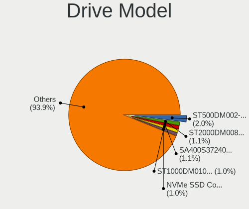
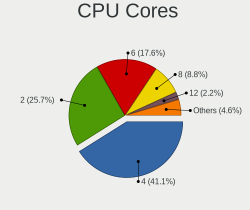
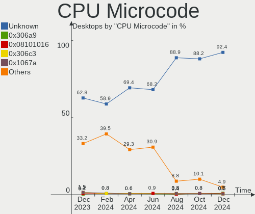
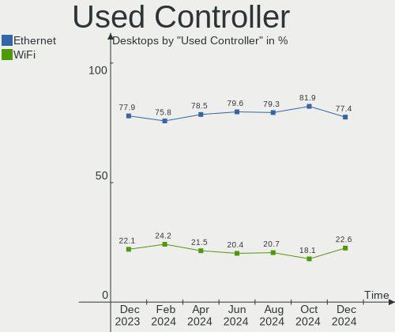
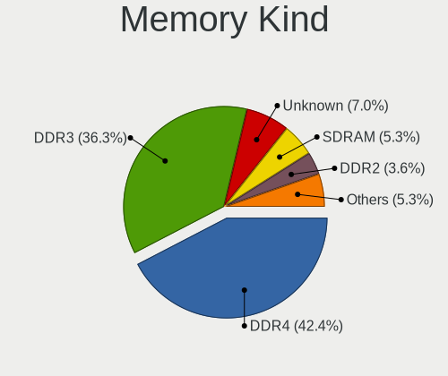
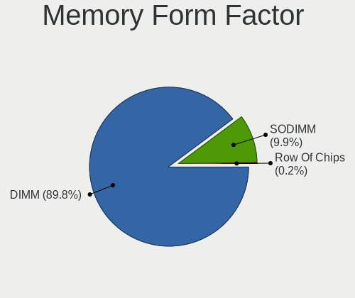
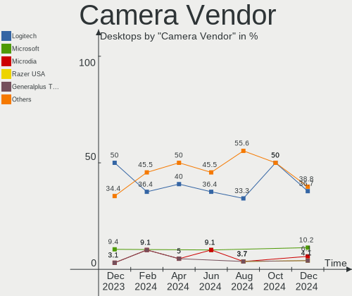

OpenMandriva Hardware Trends (Desktops)
---------------------------------------

A project to identify most popular hardware characteristics and track their change
over time based on data collected by OpenMandriva users at https://Linux-Hardware.org.

Anyone can contribute to this report by the [hw-probe](https://github.com/linuxhw/hw-probe) tool:

    sudo -E hw-probe -all -upload

Full-feature report is available here: https://linux-hardware.org/?view=trends&formfactor=desktop

Period: Aug, 2021.

Contents
--------

* [ System ](#system)
  - [ OS                       ](#os)
  - [ OS Family                ](#os-family)
  - [ Kernel                   ](#kernel)
  - [ Kernel Family            ](#kernel-family)
  - [ Kernel Major Ver.        ](#kernel-major-ver)
  - [ Arch                     ](#arch)
  - [ DE                       ](#de)
  - [ Display Server           ](#display-server)
  - [ Display Manager          ](#display-manager)
  - [ OS Lang                  ](#os-lang)
  - [ Boot Mode                ](#boot-mode)
  - [ Filesystem               ](#filesystem)
  - [ Part. scheme             ](#part-scheme)
  - [ Dual Boot with Linux/BSD ](#dual-boot-with-linuxbsd)
  - [ Dual Boot (Win)          ](#dual-boot-win)

* [ Board ](#board)
  - [ Vendor                   ](#vendor)
  - [ Model                    ](#model)
  - [ Model Family             ](#model-family)
  - [ MFG Year                 ](#mfg-year)
  - [ Form Factor              ](#form-factor)
  - [ Secure Boot              ](#secure-boot)
  - [ Coreboot                 ](#coreboot)
  - [ RAM Size                 ](#ram-size)
  - [ RAM Used                 ](#ram-used)
  - [ Total Drives             ](#total-drives)
  - [ Has CD-ROM               ](#has-cd-rom)
  - [ Has Ethernet             ](#has-ethernet)
  - [ Has WiFi                 ](#has-wifi)
  - [ Has Bluetooth            ](#has-bluetooth)

* [ Location ](#location)
  - [ Country                  ](#country)
  - [ City                     ](#city)

* [ Drives ](#drives)
  - [ Drive Vendor             ](#drive-vendor)
  - [ Drive Model              ](#drive-model)
  - [ HDD Vendor               ](#hdd-vendor)
  - [ SSD Vendor               ](#ssd-vendor)
  - [ Drive Kind               ](#drive-kind)
  - [ Drive Connector          ](#drive-connector)
  - [ Drive Size               ](#drive-size)
  - [ Space Total              ](#space-total)
  - [ Space Used               ](#space-used)
  - [ Malfunc. Drives          ](#malfunc-drives)
  - [ Malfunc. Drive Vendor    ](#malfunc-drive-vendor)
  - [ Malfunc. HDD Vendor      ](#malfunc-hdd-vendor)
  - [ Malfunc. Drive Kind      ](#malfunc-drive-kind)
  - [ Failed Drives            ](#failed-drives)
  - [ Failed Drive Vendor      ](#failed-drive-vendor)
  - [ Drive Status             ](#drive-status)

* [ Storage controller ](#storage-controller)
  - [ Storage Vendor           ](#storage-vendor)
  - [ Storage Model            ](#storage-model)
  - [ Storage Kind             ](#storage-kind)

* [ Processor ](#processor)
  - [ CPU Vendor               ](#cpu-vendor)
  - [ CPU Model                ](#cpu-model)
  - [ CPU Model Family         ](#cpu-model-family)
  - [ CPU Cores                ](#cpu-cores)
  - [ CPU Sockets              ](#cpu-sockets)
  - [ CPU Threads              ](#cpu-threads)
  - [ CPU Op-Modes             ](#cpu-op-modes)
  - [ CPU Microcode            ](#cpu-microcode)
  - [ CPU Microarch            ](#cpu-microarch)

* [ Graphics ](#graphics)
  - [ GPU Vendor               ](#gpu-vendor)
  - [ GPU Model                ](#gpu-model)
  - [ GPU Combo                ](#gpu-combo)
  - [ GPU Driver               ](#gpu-driver)
  - [ GPU Memory               ](#gpu-memory)

* [ Monitor ](#monitor)
  - [ Monitor Vendor           ](#monitor-vendor)
  - [ Monitor Model            ](#monitor-model)
  - [ Monitor Resolution       ](#monitor-resolution)
  - [ Monitor Diagonal         ](#monitor-diagonal)
  - [ Monitor Width            ](#monitor-width)
  - [ Aspect Ratio             ](#aspect-ratio)
  - [ Monitor Area             ](#monitor-area)
  - [ Pixel Density            ](#pixel-density)
  - [ Multiple Monitors        ](#multiple-monitors)

* [ Network ](#network)
  - [ Net Controller Vendor    ](#net-controller-vendor)
  - [ Net Controller Model     ](#net-controller-model)
  - [ Wireless Vendor          ](#wireless-vendor)
  - [ Wireless Model           ](#wireless-model)
  - [ Ethernet Vendor          ](#ethernet-vendor)
  - [ Ethernet Model           ](#ethernet-model)
  - [ Net Controller Kind      ](#net-controller-kind)
  - [ Used Controller          ](#used-controller)
  - [ NICs                     ](#nics)
  - [ IPv6                     ](#ipv6)

* [ Bluetooth ](#bluetooth)
  - [ Bluetooth Vendor         ](#bluetooth-vendor)
  - [ Bluetooth Model          ](#bluetooth-model)

* [ Sound ](#sound)
  - [ Sound Vendor             ](#sound-vendor)
  - [ Sound Model              ](#sound-model)

* [ Memory ](#memory)
  - [ Memory Vendor            ](#memory-vendor)
  - [ Memory Model             ](#memory-model)
  - [ Memory Kind              ](#memory-kind)
  - [ Memory Form Factor       ](#memory-form-factor)
  - [ Memory Size              ](#memory-size)
  - [ Memory Speed             ](#memory-speed)

* [ Printers & scanners ](#printers--scanners)
  - [ Printer Vendor           ](#printer-vendor)
  - [ Printer Model            ](#printer-model)
  - [ Scanner Vendor           ](#scanner-vendor)
  - [ Scanner Model            ](#scanner-model)

* [ Camera ](#camera)
  - [ Camera Vendor            ](#camera-vendor)
  - [ Camera Model             ](#camera-model)

* [ Security ](#security)
  - [ Fingerprint Vendor       ](#fingerprint-vendor)
  - [ Fingerprint Model        ](#fingerprint-model)
  - [ Chipcard Vendor          ](#chipcard-vendor)
  - [ Chipcard Model           ](#chipcard-model)

* [ Unsupported ](#unsupported)
  - [ Unsupported Devices      ](#unsupported-devices)
  - [ Unsupported Device Types ](#unsupported-device-types)

System
------

OS
--

Installed operating systems

| Name              | Desktops | Percent |
|-------------------|----------|---------|
| OpenMandriva 4.2  | 115      | 86.47%  |
| OpenMandriva 4.50 | 18       | 13.53%  |

OS Family
---------

OS without a version

| Name         | Desktops | Percent |
|--------------|----------|---------|
| OpenMandriva | 133      | 100%    |

Kernel
------

Version of the Linux kernel

| Version                       | Desktops | Percent |
|-------------------------------|----------|---------|
| 5.10.14-desktop-1omv4002      | 112      | 84.21%  |
| 5.12.4-desktop-1omv4050       | 16       | 12.03%  |
| 5.11.12-desktop-1omv4002      | 3        | 2.26%   |
| 5.12.7-desktop-clang-1omv4003 | 1        | 0.75%   |
| 5.12.7-desktop-1omv4003       | 1        | 0.75%   |

Kernel Family
-------------

Linux kernel without a distro release

| Version | Desktops | Percent |
|---------|----------|---------|
| 5.10.14 | 112      | 84.21%  |
| 5.12.4  | 16       | 12.03%  |
| 5.11.12 | 3        | 2.26%   |
| 5.12.7  | 2        | 1.5%    |

Kernel Major Ver.
-----------------

Linux kernel major version

| Version | Desktops | Percent |
|---------|----------|---------|
| 5.10    | 112      | 84.21%  |
| 5.12    | 18       | 13.53%  |
| 5.11    | 3        | 2.26%   |

Arch
----

OS architecture (x86_64, i586, etc.)

| Name   | Desktops | Percent |
|--------|----------|---------|
| x86_64 | 133      | 100%    |

DE
--

Desktop Environment

| Name | Desktops | Percent |
|------|----------|---------|
| KDE5 | 133      | 100%    |

Display Server
--------------

X11 or Wayland

| Name    | Desktops | Percent |
|---------|----------|---------|
| X11     | 132      | 99.25%  |
| Wayland | 1        | 0.75%   |

Display Manager
---------------

SDDM, LightDM, etc.

| Name | Desktops | Percent |
|------|----------|---------|
| SDDM | 133      | 100%    |

OS Lang
-------

Language

| Lang  | Desktops | Percent |
|-------|----------|---------|
| en_US | 71       | 53.38%  |
| ru_RU | 11       | 8.27%   |
| fr_FR | 10       | 7.52%   |
| de_DE | 8        | 6.02%   |
| pt_BR | 5        | 3.76%   |
| pl_PL | 5        | 3.76%   |
| it_IT | 5        | 3.76%   |
| es_ES | 5        | 3.76%   |
| hu_HU | 2        | 1.5%    |
| es_AR | 2        | 1.5%    |
| en_ZA | 2        | 1.5%    |
| it_CH | 1        | 0.75%   |
| fr_CA | 1        | 0.75%   |
| fr_BE | 1        | 0.75%   |
| es_SV | 1        | 0.75%   |
| en_GB | 1        | 0.75%   |
| cs_CZ | 1        | 0.75%   |
| ar_EG | 1        | 0.75%   |

Boot Mode
---------

EFI or BIOS

| Mode | Desktops | Percent |
|------|----------|---------|
| BIOS | 90       | 67.67%  |
| EFI  | 43       | 32.33%  |

Filesystem
----------

Type of filesystem

| Type    | Desktops | Percent |
|---------|----------|---------|
| Overlay | 113      | 84.96%  |
| Ext4    | 17       | 12.78%  |
| Btrfs   | 2        | 1.5%    |
| Ext3    | 1        | 0.75%   |

Part. scheme
------------

Scheme of partitioning

| Type | Desktops | Percent |
|------|----------|---------|
| GPT  | 68       | 51.13%  |
| MBR  | 65       | 48.87%  |

Dual Boot with Linux/BSD
------------------------

Hosting more than one Linux/BSD

| Dual boot | Desktops | Percent |
|-----------|----------|---------|
| Yes       | 81       | 60.9%   |
| No        | 52       | 39.1%   |

Dual Boot (Win)
---------------

Hosting Linux and Windows

| Dual boot | Desktops | Percent |
|-----------|----------|---------|
| No        | 67       | 50.38%  |
| Yes       | 66       | 49.62%  |

Board
-----

Vendor
------

Motherboard manufacturer

| Name                | Desktops | Percent |
|---------------------|----------|---------|
| ASUSTek Computer    | 35       | 26.32%  |
| Gigabyte Technology | 29       | 21.8%   |
| Dell                | 13       | 9.77%   |
| ASRock              | 12       | 9.02%   |
| Hewlett-Packard     | 9        | 6.77%   |
| MSI                 | 8        | 6.02%   |
| Acer                | 4        | 3.01%   |
| Lenovo              | 3        | 2.26%   |
| Intel               | 3        | 2.26%   |
| Foxconn             | 3        | 2.26%   |
| Medion              | 2        | 1.5%    |
| Fujitsu             | 2        | 1.5%    |
| Toshiba             | 1        | 0.75%   |
| Sony                | 1        | 0.75%   |
| Positivo            | 1        | 0.75%   |
| PCWare              | 1        | 0.75%   |
| Megaware            | 1        | 0.75%   |
| Itautec             | 1        | 0.75%   |
| ECS                 | 1        | 0.75%   |
| Biostar             | 1        | 0.75%   |
| ABIT                | 1        | 0.75%   |
| Unknown             | 1        | 0.75%   |

Model
-----

Motherboard model

| Name                               | Desktops | Percent |
|------------------------------------|----------|---------|
| ASUS All Series                    | 4        | 3.01%   |
| Dell OptiPlex 780                  | 3        | 2.26%   |
| Gigabyte B450M DS3H                | 2        | 1.5%    |
| Dell OptiPlex 7010                 | 2        | 1.5%    |
| ASUS A_F_K31DA_K31DAG_K20DA        | 2        | 1.5%    |
| Acer Aspire XC-603G                | 2        | 1.5%    |
| Toshiba 4810350                    | 1        | 0.75%   |
| Sony VGX-TP20E                     | 1        | 0.75%   |
| Positivo POS-PIQ77CL               | 1        | 0.75%   |
| PCWare APM-A320G                   | 1        | 0.75%   |
| MSI MS-7C52                        | 1        | 0.75%   |
| MSI MS-7C02                        | 1        | 0.75%   |
| MSI MS-7B90                        | 1        | 0.75%   |
| MSI MS-7895                        | 1        | 0.75%   |
| MSI MS-7793                        | 1        | 0.75%   |
| MSI MS-7721                        | 1        | 0.75%   |
| MSI MS-7641                        | 1        | 0.75%   |
| MSI 500-222el                      | 1        | 0.75%   |
| Megaware OEM                       | 1        | 0.75%   |
| Medion MS-7800                     | 1        | 0.75%   |
| Medion MD34472/C971                | 1        | 0.75%   |
| Lenovo V530-15ICR 11BH000NMC       | 1        | 0.75%   |
| Lenovo ThinkCentre M93p 10AAS0R301 | 1        | 0.75%   |
| Lenovo ThinkCentre M72e 3264CL1    | 1        | 0.75%   |
| Itautec Infoway ST-4254            | 1        | 0.75%   |
| Intel DH61WW AAG23116-204          | 1        | 0.75%   |
| Intel DG31PR AAD97573-205          | 1        | 0.75%   |
| Intel D54250WYK H13922-303         | 1        | 0.75%   |
| HP Z420 Workstation                | 1        | 0.75%   |
| HP t520 Flexible Series TC         | 1        | 0.75%   |
| HP EliteDesk 800 G1 TWR            | 1        | 0.75%   |
| HP EliteDesk 800 G1 SFF            | 1        | 0.75%   |
| HP Compaq Pro 6300 SFF             | 1        | 0.75%   |
| HP Compaq Elite 8300 CMT           | 1        | 0.75%   |
| HP Compaq dx7300 Microtower        | 1        | 0.75%   |
| HP Compaq 6005 Pro SFF PC          | 1        | 0.75%   |
| HP Compaq 6000 Pro SFF PC          | 1        | 0.75%   |
| Gigabyte Z77-DS3H                  | 1        | 0.75%   |
| Gigabyte Z390 GAMING X             | 1        | 0.75%   |
| Gigabyte Z170-HD3P                 | 1        | 0.75%   |
| Gigabyte X99-UD3P-CF               | 1        | 0.75%   |
| Gigabyte X58A-UD3R                 | 1        | 0.75%   |
| Gigabyte M61PME-S2P                | 1        | 0.75%   |
| Gigabyte J3455N-D3H                | 1        | 0.75%   |
| Gigabyte H97M-D3H                  | 1        | 0.75%   |
| Gigabyte H97-HD3                   | 1        | 0.75%   |
| Gigabyte H61M-S2PV                 | 1        | 0.75%   |
| Gigabyte H61M-S1                   | 1        | 0.75%   |
| Gigabyte H110M-S2H                 | 1        | 0.75%   |
| Gigabyte GA-MA790X-UD3P            | 1        | 0.75%   |
| Gigabyte GA-MA78LMT-US2H           | 1        | 0.75%   |
| Gigabyte GA-990FXA-UD3             | 1        | 0.75%   |
| Gigabyte GA-890FXA-UD5             | 1        | 0.75%   |
| Gigabyte G41MT-S2PT                | 1        | 0.75%   |
| Gigabyte G31M-ES2L                 | 1        | 0.75%   |
| Gigabyte G1.Sniper H6              | 1        | 0.75%   |
| Gigabyte F2A88XM-HD3P              | 1        | 0.75%   |
| Gigabyte F2A88XM-D3HP              | 1        | 0.75%   |
| Gigabyte EP45-UD3R                 | 1        | 0.75%   |
| Gigabyte B365M DS3H                | 1        | 0.75%   |

Model Family
------------

Motherboard model prefix

| Name                     | Desktops | Percent |
|--------------------------|----------|---------|
| Dell OptiPlex            | 9        | 6.77%   |
| HP Compaq                | 5        | 3.76%   |
| ASUS All                 | 4        | 3.01%   |
| Acer Aspire              | 4        | 3.01%   |
| ASUS PRIME               | 3        | 2.26%   |
| ASUS P8Z77-V             | 3        | 2.26%   |
| ASUS M5A78L-M            | 3        | 2.26%   |
| Lenovo ThinkCentre       | 2        | 1.5%    |
| HP EliteDesk             | 2        | 1.5%    |
| Gigabyte B450M           | 2        | 1.5%    |
| Fujitsu ESPRIMO          | 2        | 1.5%    |
| ASUS ROG                 | 2        | 1.5%    |
| ASUS A                   | 2        | 1.5%    |
| Toshiba 4810350          | 1        | 0.75%   |
| Sony VGX-TP20E           | 1        | 0.75%   |
| Positivo POS-PIQ77CL     | 1        | 0.75%   |
| PCWare APM-A320G         | 1        | 0.75%   |
| MSI MS-7C52              | 1        | 0.75%   |
| MSI MS-7C02              | 1        | 0.75%   |
| MSI MS-7B90              | 1        | 0.75%   |
| MSI MS-7895              | 1        | 0.75%   |
| MSI MS-7793              | 1        | 0.75%   |
| MSI MS-7721              | 1        | 0.75%   |
| MSI MS-7641              | 1        | 0.75%   |
| MSI 500-222el            | 1        | 0.75%   |
| Megaware OEM             | 1        | 0.75%   |
| Medion MS-7800           | 1        | 0.75%   |
| Medion MD34472           | 1        | 0.75%   |
| Lenovo V530-15ICR        | 1        | 0.75%   |
| Itautec Infoway          | 1        | 0.75%   |
| Intel DH61WW             | 1        | 0.75%   |
| Intel DG31PR             | 1        | 0.75%   |
| Intel D54250WYK          | 1        | 0.75%   |
| HP Z420                  | 1        | 0.75%   |
| HP t520                  | 1        | 0.75%   |
| Gigabyte Z77-DS3H        | 1        | 0.75%   |
| Gigabyte Z390            | 1        | 0.75%   |
| Gigabyte Z170-HD3P       | 1        | 0.75%   |
| Gigabyte X99-UD3P-CF     | 1        | 0.75%   |
| Gigabyte X58A-UD3R       | 1        | 0.75%   |
| Gigabyte M61PME-S2P      | 1        | 0.75%   |
| Gigabyte J3455N-D3H      | 1        | 0.75%   |
| Gigabyte H97M-D3H        | 1        | 0.75%   |
| Gigabyte H97-HD3         | 1        | 0.75%   |
| Gigabyte H61M-S2PV       | 1        | 0.75%   |
| Gigabyte H61M-S1         | 1        | 0.75%   |
| Gigabyte H110M-S2H       | 1        | 0.75%   |
| Gigabyte GA-MA790X-UD3P  | 1        | 0.75%   |
| Gigabyte GA-MA78LMT-US2H | 1        | 0.75%   |
| Gigabyte GA-990FXA-UD3   | 1        | 0.75%   |
| Gigabyte GA-890FXA-UD5   | 1        | 0.75%   |
| Gigabyte G41MT-S2PT      | 1        | 0.75%   |
| Gigabyte G31M-ES2L       | 1        | 0.75%   |
| Gigabyte G1.Sniper       | 1        | 0.75%   |
| Gigabyte F2A88XM-HD3P    | 1        | 0.75%   |
| Gigabyte F2A88XM-D3HP    | 1        | 0.75%   |
| Gigabyte EP45-UD3R       | 1        | 0.75%   |
| Gigabyte B365M           | 1        | 0.75%   |
| Gigabyte B250M-Gaming5   | 1        | 0.75%   |
| Gigabyte AB350M-Gaming   | 1        | 0.75%   |

MFG Year
--------

Motherboard manufacture year

| Year | Desktops | Percent |
|------|----------|---------|
| 2012 | 19       | 14.29%  |
| 2019 | 13       | 9.77%   |
| 2014 | 13       | 9.77%   |
| 2013 | 12       | 9.02%   |
| 2018 | 9        | 6.77%   |
| 2016 | 9        | 6.77%   |
| 2020 | 8        | 6.02%   |
| 2015 | 8        | 6.02%   |
| 2010 | 8        | 6.02%   |
| 2011 | 7        | 5.26%   |
| 2008 | 7        | 5.26%   |
| 2009 | 6        | 4.51%   |
| 2017 | 5        | 3.76%   |
| 2007 | 4        | 3.01%   |
| 2021 | 3        | 2.26%   |
| 2005 | 2        | 1.5%    |

Form Factor
-----------

Physical design of the computer

| Name    | Desktops | Percent |
|---------|----------|---------|
| Desktop | 133      | 100%    |

Secure Boot
-----------

Enabled or disabled

| State    | Desktops | Percent |
|----------|----------|---------|
| Disabled | 133      | 100%    |

Coreboot
--------

Have coreboot on board

| Used | Desktops | Percent |
|------|----------|---------|
| No   | 133      | 100%    |

RAM Size
--------

Total RAM memory

| Size in GB  | Desktops | Percent |
|-------------|----------|---------|
| 8.01-16.0   | 36       | 27.07%  |
| 3.01-4.0    | 32       | 24.06%  |
| 16.01-24.0  | 23       | 17.29%  |
| 4.01-8.0    | 22       | 16.54%  |
| 1.01-2.0    | 10       | 7.52%   |
| 32.01-64.0  | 4        | 3.01%   |
| 24.01-32.0  | 3        | 2.26%   |
| 64.01-256.0 | 2        | 1.5%    |
| 2.01-3.0    | 1        | 0.75%   |

RAM Used
--------

Used RAM memory

| Used GB  | Desktops | Percent |
|----------|----------|---------|
| 1.01-2.0 | 87       | 65.41%  |
| 0.51-1.0 | 27       | 20.3%   |
| 2.01-3.0 | 11       | 8.27%   |
| 0.01-0.5 | 8        | 6.02%   |

Total Drives
------------

Number of drives on board

| Drives | Desktops | Percent |
|--------|----------|---------|
| 1      | 72       | 54.14%  |
| 2      | 32       | 24.06%  |
| 3      | 15       | 11.28%  |
| 4      | 5        | 3.76%   |
| 7      | 3        | 2.26%   |
| 0      | 3        | 2.26%   |
| 5      | 2        | 1.5%    |
| 6      | 1        | 0.75%   |

Has CD-ROM
----------

Has CD-ROM on board

| Presented | Desktops | Percent |
|-----------|----------|---------|
| Yes       | 89       | 66.92%  |
| No        | 44       | 33.08%  |

Has Ethernet
------------

Has Ethernet on board

| Presented | Desktops | Percent |
|-----------|----------|---------|
| Yes       | 132      | 99.25%  |
| No        | 1        | 0.75%   |

Has WiFi
--------

Has WiFi module

| Presented | Desktops | Percent |
|-----------|----------|---------|
| No        | 91       | 68.42%  |
| Yes       | 42       | 31.58%  |

Has Bluetooth
-------------

Has Bluetooth module

| Presented | Desktops | Percent |
|-----------|----------|---------|
| No        | 107      | 80.45%  |
| Yes       | 26       | 19.55%  |

Location
--------

Country
-------

Geographic location (country)

| Country      | Desktops | Percent |
|--------------|----------|---------|
| USA          | 17       | 12.78%  |
| France       | 12       | 9.02%   |
| Russia       | 10       | 7.52%   |
| Germany      | 10       | 7.52%   |
| Brazil       | 10       | 7.52%   |
| Spain        | 7        | 5.26%   |
| Poland       | 7        | 5.26%   |
| Italy        | 7        | 5.26%   |
| Canada       | 5        | 3.76%   |
| Argentina    | 5        | 3.76%   |
| Hungary      | 3        | 2.26%   |
| Egypt        | 3        | 2.26%   |
| Czechia      | 3        | 2.26%   |
| Belgium      | 3        | 2.26%   |
| UK           | 2        | 1.5%    |
| Sweden       | 2        | 1.5%    |
| South Africa | 2        | 1.5%    |
| Morocco      | 2        | 1.5%    |
| Mexico       | 2        | 1.5%    |
| Latvia       | 2        | 1.5%    |
| Greece       | 2        | 1.5%    |
| Bulgaria     | 2        | 1.5%    |
| Belarus      | 2        | 1.5%    |
| Australia    | 2        | 1.5%    |
| Ukraine      | 1        | 0.75%   |
| Serbia       | 1        | 0.75%   |
| Romania      | 1        | 0.75%   |
| Peru         | 1        | 0.75%   |
| Norway       | 1        | 0.75%   |
| Netherlands  | 1        | 0.75%   |
| Malaysia     | 1        | 0.75%   |
| Lithuania    | 1        | 0.75%   |
| Guatemala    | 1        | 0.75%   |
| El Salvador  | 1        | 0.75%   |
| Bangladesh   | 1        | 0.75%   |

City
----

Geographic location (city)

| City                   | Desktops | Percent |
|------------------------|----------|---------|
| S??o Paulo             | 4        | 3.01%   |
| Milan                  | 3        | 2.26%   |
| Volgograd              | 2        | 1.5%    |
| Riga                   | 2        | 1.5%    |
| Casablanca             | 2        | 1.5%    |
| Brno                   | 2        | 1.5%    |
| Barcelona              | 2        | 1.5%    |
| Aswan                  | 2        | 1.5%    |
| Wendelstein            | 1        | 0.75%   |
| Warsaw                 | 1        | 0.75%   |
| Voronezh               | 1        | 0.75%   |
| Valladolid             | 1        | 0.75%   |
| Thionville             | 1        | 0.75%   |
| Thessaloniki           | 1        | 0.75%   |
| Teckomatorp            | 1        | 0.75%   |
| Tampa                  | 1        | 0.75%   |
| Szeksz??rd             | 1        | 0.75%   |
| Surbourg               | 1        | 0.75%   |
| Stara Zagora           | 1        | 0.75%   |
| St Petersburg          | 1        | 0.75%   |
| Springfield            | 1        | 0.75%   |
| Springdale             | 1        | 0.75%   |
| Santa Fe               | 1        | 0.75%   |
| Santa Cruz de Tenerife | 1        | 0.75%   |
| Sandefjord             | 1        | 0.75%   |
| San Juan               | 1        | 0.75%   |
| San Jose               | 1        | 0.75%   |
| San Francisco          | 1        | 0.75%   |
| Saint-Jude             | 1        | 0.75%   |
| Rzesz??w               | 1        | 0.75%   |
| Rotterdam              | 1        | 0.75%   |
| Rostov-on-Don          | 1        | 0.75%   |
| Rome                   | 1        | 0.75%   |
| Rio de Janeiro         | 1        | 0.75%   |
| Rennes                 | 1        | 0.75%   |
| Reconquista            | 1        | 0.75%   |
| Queen Creek            | 1        | 0.75%   |
| Pskov                  | 1        | 0.75%   |
| Poznan                 | 1        | 0.75%   |
| Porto Alegre           | 1        | 0.75%   |
| Perpignan              | 1        | 0.75%   |
| Paynesville            | 1        | 0.75%   |
| Paisley                | 1        | 0.75%   |
| Osasco                 | 1        | 0.75%   |
| Omsk                   | 1        | 0.75%   |
| Odessa                 | 1        | 0.75%   |
| Nuremberg              | 1        | 0.75%   |
| Norsborg               | 1        | 0.75%   |
| New Albany             | 1        | 0.75%   |
| Nepean                 | 1        | 0.75%   |
| Namur                  | 1        | 0.75%   |
| Muria?©                | 1        | 0.75%   |
| Mulgoa                 | 1        | 0.75%   |
| Mragowo                | 1        | 0.75%   |
| Moweaqua               | 1        | 0.75%   |
| Moscow                 | 1        | 0.75%   |
| Morelia                | 1        | 0.75%   |
| Montreal               | 1        | 0.75%   |
| Mogilev                | 1        | 0.75%   |
| Minsk                  | 1        | 0.75%   |

Drives
------

Drive Vendor
------------

Hard drive vendors

| Vendor              | Desktops | Drives | Percent |
|---------------------|----------|--------|---------|
| Seagate             | 51       | 65     | 26.02%  |
| WDC                 | 42       | 53     | 21.43%  |
| Samsung Electronics | 17       | 23     | 8.67%   |
| Kingston            | 16       | 17     | 8.16%   |
| Toshiba             | 13       | 15     | 6.63%   |
| Hitachi             | 12       | 14     | 6.12%   |
| SanDisk             | 7        | 7      | 3.57%   |
| A-DATA Technology   | 6        | 6      | 3.06%   |
| Crucial             | 3        | 3      | 1.53%   |
| China               | 3        | 3      | 1.53%   |
| Unknown             | 2        | 2      | 1.02%   |
| Team                | 2        | 2      | 1.02%   |
| SPCC                | 2        | 2      | 1.02%   |
| JMicron             | 2        | 2      | 1.02%   |
| Intel               | 2        | 2      | 1.02%   |
| Apacer              | 2        | 2      | 1.02%   |
| XrayDisk            | 1        | 1      | 0.51%   |
| TPH00800640GB       | 1        | 1      | 0.51%   |
| SK Hynix            | 1        | 1      | 0.51%   |
| PNY                 | 1        | 1      | 0.51%   |
| Patriot             | 1        | 1      | 0.51%   |
| OCZ                 | 1        | 1      | 0.51%   |
| Maxtor              | 1        | 1      | 0.51%   |
| LDLC                | 1        | 1      | 0.51%   |
| Kingmax             | 1        | 1      | 0.51%   |
| KingDian            | 1        | 2      | 0.51%   |
| Intenso             | 1        | 1      | 0.51%   |
| Hewlett-Packard     | 1        | 1      | 0.51%   |
| GOODRAM             | 1        | 1      | 0.51%   |
| AMD                 | 1        | 1      | 0.51%   |

Drive Model
-----------

Hard drive models

| Model                            | Desktops | Percent |
|----------------------------------|----------|---------|
| Kingston SA400S37240G 240GB SSD  | 6        | 2.68%   |
| Seagate ST500DM002-1BD142 500GB  | 5        | 2.23%   |
| Seagate ST1000DM010-2EP102 1TB   | 5        | 2.23%   |
| Toshiba DT01ACA050 500GB         | 4        | 1.79%   |
| Toshiba DT01ACA200 2TB           | 3        | 1.34%   |
| Toshiba DT01ACA100 1TB           | 3        | 1.34%   |
| Samsung SSD 850 EVO 250GB        | 3        | 1.34%   |
| Samsung HD103UJ 1TB              | 3        | 1.34%   |
| WDC WDS240G2G0A-00JH30 240GB SSD | 2        | 0.89%   |
| WDC WD10EZEX-21M2NA0 1TB         | 2        | 0.89%   |
| Unknown SD/MMC/MS PRO 128GB      | 2        | 0.89%   |
| Seagate ST500LM021-1KJ152 500GB  | 2        | 0.89%   |
| Seagate ST3250318AS 250GB        | 2        | 0.89%   |
| Seagate ST31000528AS 1TB         | 2        | 0.89%   |
| Seagate ST3000DM001-1ER166 3TB   | 2        | 0.89%   |
| Seagate ST2000DM008-2FR102 2TB   | 2        | 0.89%   |
| Seagate ST2000DM001-1CH164 2TB   | 2        | 0.89%   |
| Seagate ST1000LM048-2E7172 1TB   | 2        | 0.89%   |
| Seagate ST1000DM003-1SB102 1TB   | 2        | 0.89%   |
| Samsung SSD 870 EVO 500GB        | 2        | 0.89%   |
| Samsung HD154UI 1TB              | 2        | 0.89%   |
| Kingston SV300S37A120G 120GB SSD | 2        | 0.89%   |
| Kingston SA400S37480G 480GB SSD  | 2        | 0.89%   |
| Kingston SA400S37120G 120GB SSD  | 2        | 0.89%   |
| JMicron Generic 2TB              | 2        | 0.89%   |
| Hitachi HDS721050DLE630 500GB    | 2        | 0.89%   |
| A-DATA SU650 120GB SSD           | 2        | 0.89%   |
| XrayDisk SSD 128GB               | 1        | 0.45%   |
| WDC WDS500G2B0A-00SM50 500GB SSD | 1        | 0.45%   |
| WDC WDS500G2B0A 500GB SSD        | 1        | 0.45%   |
| WDC WDS250G1B0A-00H9H0 250GB SSD | 1        | 0.45%   |
| WDC WDS120G2G0B-00EPW0 120GB SSD | 1        | 0.45%   |
| WDC WDS100T2B0C-00PXH0 1TB       | 1        | 0.45%   |
| WDC WDS100T2B0A-00SM50 1TB SSD   | 1        | 0.45%   |
| WDC WDBRPG5000ANC-WRSN 500GB     | 1        | 0.45%   |
| WDC WDBNCE5000PNC 500GB SSD      | 1        | 0.45%   |
| WDC WD800BB-75JHC0 80GB          | 1        | 0.45%   |
| WDC WD6401AALS-00E8B0 640GB      | 1        | 0.45%   |
| WDC WD6400AAKS-65Z7B0 640GB      | 1        | 0.45%   |
| WDC WD60EFAX-68SHWN0 6TB         | 1        | 0.45%   |
| WDC WD5002AALX-00J37A0 500GB     | 1        | 0.45%   |
| WDC WD5000AZRX-00L4HB0 500GB     | 1        | 0.45%   |
| WDC WD5000AZRX-00A8LB0 500GB     | 1        | 0.45%   |
| WDC WD5000AZLX-60K2TA1 500GB     | 1        | 0.45%   |
| WDC WD5000AVVS-63H0B1 500GB      | 1        | 0.45%   |
| WDC WD5000AAKX-75U6AA0 500GB     | 1        | 0.45%   |
| WDC WD5000AAKX-60U6AA0 500GB     | 1        | 0.45%   |
| WDC WD5000AAKX-08U6AA0 500GB     | 1        | 0.45%   |
| WDC WD5000AAKX-009FA0 500GB      | 1        | 0.45%   |
| WDC WD5000AAKX-001CA0 500GB      | 1        | 0.45%   |
| WDC WD5000AADS-00S9B0 500GB      | 1        | 0.45%   |
| WDC WD40EMAZ-11LW3B0 4TB         | 1        | 0.45%   |
| WDC WD400BD-75LRA0 40GB          | 1        | 0.45%   |
| WDC WD3200LPVX-22V0TT0 320GB     | 1        | 0.45%   |
| WDC WD3200JS-22PDB0 320GB        | 1        | 0.45%   |
| WDC WD3200BPVT-60JJ5T0 320GB     | 1        | 0.45%   |
| WDC WD3200AAJS-65B4A0 320GB      | 1        | 0.45%   |
| WDC WD3200AAJS-22B4A0 320GB      | 1        | 0.45%   |
| WDC WD3200AAJS-00RYA0 320GB      | 1        | 0.45%   |
| WDC WD2502ABYS-02B7A0 256GB      | 1        | 0.45%   |

HDD Vendor
----------

Hard disk drive vendors

| Vendor              | Desktops | Drives | Percent |
|---------------------|----------|--------|---------|
| Seagate             | 51       | 65     | 42.15%  |
| WDC                 | 36       | 43     | 29.75%  |
| Toshiba             | 12       | 14     | 9.92%   |
| Hitachi             | 12       | 14     | 9.92%   |
| Samsung Electronics | 7        | 10     | 5.79%   |
| TPH00800640GB       | 1        | 1      | 0.83%   |
| Maxtor              | 1        | 1      | 0.83%   |
| Hewlett-Packard     | 1        | 1      | 0.83%   |

SSD Vendor
----------

Solid state drive vendors

| Vendor              | Desktops | Drives | Percent |
|---------------------|----------|--------|---------|
| Kingston            | 14       | 15     | 21.54%  |
| Samsung Electronics | 8        | 10     | 12.31%  |
| SanDisk             | 7        | 7      | 10.77%  |
| WDC                 | 6        | 8      | 9.23%   |
| A-DATA Technology   | 5        | 5      | 7.69%   |
| China               | 3        | 3      | 4.62%   |
| Team                | 2        | 2      | 3.08%   |
| SPCC                | 2        | 2      | 3.08%   |
| JMicron             | 2        | 2      | 3.08%   |
| Intel               | 2        | 2      | 3.08%   |
| Crucial             | 2        | 2      | 3.08%   |
| Apacer              | 2        | 2      | 3.08%   |
| XrayDisk            | 1        | 1      | 1.54%   |
| SK Hynix            | 1        | 1      | 1.54%   |
| PNY                 | 1        | 1      | 1.54%   |
| OCZ                 | 1        | 1      | 1.54%   |
| LDLC                | 1        | 1      | 1.54%   |
| Kingmax             | 1        | 1      | 1.54%   |
| KingDian            | 1        | 2      | 1.54%   |
| Intenso             | 1        | 1      | 1.54%   |
| GOODRAM             | 1        | 1      | 1.54%   |
| AMD                 | 1        | 1      | 1.54%   |

Drive Kind
----------

HDD or SSD

| Kind    | Desktops | Drives | Percent |
|---------|----------|--------|---------|
| HDD     | 105      | 149    | 61.4%   |
| SSD     | 54       | 71     | 31.58%  |
| NVMe    | 10       | 11     | 5.85%   |
| Unknown | 2        | 2      | 1.17%   |

Drive Connector
---------------

SATA, SAS, NVMe, etc.

| Type | Desktops | Drives | Percent |
|------|----------|--------|---------|
| SATA | 124      | 214    | 89.21%  |
| NVMe | 10       | 11     | 7.19%   |
| SAS  | 5        | 8      | 3.6%    |

Drive Size
----------

Size of hard drive

| Size in TB | Desktops | Drives | Percent |
|------------|----------|--------|---------|
| 0.01-0.5   | 103      | 138    | 60.95%  |
| 0.51-1.0   | 41       | 53     | 24.26%  |
| 1.01-2.0   | 17       | 20     | 10.06%  |
| 3.01-4.0   | 3        | 4      | 1.78%   |
| 2.01-3.0   | 3        | 3      | 1.78%   |
| 4.01-10.0  | 2        | 2      | 1.18%   |

Space Total
-----------

Amount of disk space available on the file system

| Size in GB     | Desktops | Percent |
|----------------|----------|---------|
| 1-20           | 61       | 45.86%  |
| Unknown        | 29       | 21.8%   |
| 101-250        | 19       | 14.29%  |
| 251-500        | 10       | 7.52%   |
| 21-50          | 6        | 4.51%   |
| 51-100         | 4        | 3.01%   |
| More than 3000 | 1        | 0.75%   |
| 2001-3000      | 1        | 0.75%   |
| 1001-2000      | 1        | 0.75%   |
| 501-1000       | 1        | 0.75%   |

Space Used
----------

Amount of used disk space

| Used GB  | Desktops | Percent |
|----------|----------|---------|
| 1-20     | 92       | 69.17%  |
| Unknown  | 29       | 21.8%   |
| 101-250  | 5        | 3.76%   |
| 251-500  | 2        | 1.5%    |
| 21-50    | 2        | 1.5%    |
| 51-100   | 2        | 1.5%    |
| 501-1000 | 1        | 0.75%   |

Malfunc. Drives
---------------

Drive models with a malfunction

| Model                            | Desktops | Drives | Percent |
|----------------------------------|----------|--------|---------|
| Seagate ST500DM002-1BD142 500GB  | 3        | 3      | 6.82%   |
| Seagate ST500LM021-1KJ152 500GB  | 2        | 2      | 4.55%   |
| Samsung Electronics HD103UJ 1TB  | 2        | 2      | 4.55%   |
| Hitachi HDS721050DLE630 500GB    | 2        | 2      | 4.55%   |
| WDC WD800BB-75JHC0 80GB          | 1        | 1      | 2.27%   |
| WDC WD6400AAKS-65Z7B0 640GB      | 1        | 1      | 2.27%   |
| WDC WD5000AVVS-63H0B1 500GB      | 1        | 1      | 2.27%   |
| WDC WD5000AAKX-75U6AA0 500GB     | 1        | 1      | 2.27%   |
| WDC WD5000AAKX-60U6AA0 500GB     | 1        | 1      | 2.27%   |
| WDC WD5000AAKX-009FA0 500GB      | 1        | 1      | 2.27%   |
| WDC WD5000AADS-00S9B0 500GB      | 1        | 1      | 2.27%   |
| WDC WD2502ABYS-02B7A0 256GB      | 1        | 1      | 2.27%   |
| WDC WD2500AAJS-00YZCA0 250GB     | 1        | 1      | 2.27%   |
| WDC WD20EARS-00MVWB0 2TB         | 1        | 1      | 2.27%   |
| WDC WD1600JS-75NCB3 160GB        | 1        | 1      | 2.27%   |
| WDC WD1600AAJS-00M0A0 160GB      | 1        | 1      | 2.27%   |
| Toshiba MK1646GSX 160GB          | 1        | 1      | 2.27%   |
| Toshiba DT01ACA100 1TB           | 1        | 1      | 2.27%   |
| SK Hynix SH920 2.5 7MM 512GB SSD | 1        | 1      | 2.27%   |
| Seagate ST9500325AS 500GB        | 1        | 1      | 2.27%   |
| Seagate ST3500418AS 500GB        | 1        | 1      | 2.27%   |
| Seagate ST3500413AS 500GB        | 1        | 1      | 2.27%   |
| Seagate ST3500312CS 500GB        | 1        | 1      | 2.27%   |
| Seagate ST3320418AS 320GB        | 1        | 1      | 2.27%   |
| Seagate ST3250823AS 250GB        | 1        | 1      | 2.27%   |
| Seagate ST3250312AS 250GB        | 1        | 1      | 2.27%   |
| Seagate ST3250310AS 250GB        | 1        | 1      | 2.27%   |
| Seagate ST320DM001 HD322GJ 320GB | 1        | 1      | 2.27%   |
| Seagate ST2000DM001-1CH164 2TB   | 1        | 1      | 2.27%   |
| Seagate ST2000DL003-9VT166 2TB   | 1        | 1      | 2.27%   |
| Seagate ST1000VM002-1CT162 1TB   | 1        | 1      | 2.27%   |
| Seagate ST1000NC001-1DY162 1TB   | 1        | 1      | 2.27%   |
| Seagate ST1000DX001-1CM162 1TB   | 1        | 1      | 2.27%   |
| Seagate ST1000DM010-2EP102 1TB   | 1        | 1      | 2.27%   |
| Samsung Electronics HD080HJ 80GB | 1        | 1      | 2.27%   |
| Hitachi HDT721010SLA360 1TB      | 1        | 1      | 2.27%   |
| Hitachi HDS5C1050CLA382 500GB    | 1        | 1      | 2.27%   |
| China SSD 120GB                  | 1        | 1      | 2.27%   |
| Apacer AS350 512GB SSD           | 1        | 1      | 2.27%   |

Malfunc. Drive Vendor
---------------------

Vendors of faulty drives

| Vendor              | Desktops | Drives | Percent |
|---------------------|----------|--------|---------|
| Seagate             | 19       | 20     | 44.19%  |
| WDC                 | 12       | 12     | 27.91%  |
| Hitachi             | 4        | 4      | 9.3%    |
| Samsung Electronics | 3        | 3      | 6.98%   |
| Toshiba             | 2        | 2      | 4.65%   |
| SK Hynix            | 1        | 1      | 2.33%   |
| China               | 1        | 1      | 2.33%   |
| Apacer              | 1        | 1      | 2.33%   |

Malfunc. HDD Vendor
-------------------

Vendors of faulty HDD drives

| Vendor              | Desktops | Drives | Percent |
|---------------------|----------|--------|---------|
| Seagate             | 19       | 20     | 47.5%   |
| WDC                 | 12       | 12     | 30%     |
| Hitachi             | 4        | 4      | 10%     |
| Samsung Electronics | 3        | 3      | 7.5%    |
| Toshiba             | 2        | 2      | 5%      |

Malfunc. Drive Kind
-------------------

Kinds of faulty drives

| Kind | Desktops | Drives | Percent |
|------|----------|--------|---------|
| HDD  | 38       | 41     | 92.68%  |
| SSD  | 3        | 3      | 7.32%   |

Failed Drives
-------------

Failed drive models

| Model                         | Desktops | Drives | Percent |
|-------------------------------|----------|--------|---------|
| TPH00800640GB 640GB           | 1        | 1      | 33.33%  |
| Seagate ST31000528AS 1TB      | 1        | 1      | 33.33%  |
| Kingston SMS200S360G 64GB SSD | 1        | 1      | 33.33%  |

Failed Drive Vendor
-------------------

Failed drive vendors

| Vendor        | Desktops | Drives | Percent |
|---------------|----------|--------|---------|
| TPH00800640GB | 1        | 1      | 33.33%  |
| Seagate       | 1        | 1      | 33.33%  |
| Kingston      | 1        | 1      | 33.33%  |

Drive Status
------------

Number of failed and malfunc. drives

| Status   | Desktops | Drives | Percent |
|----------|----------|--------|---------|
| Works    | 95       | 156    | 61.29%  |
| Malfunc  | 40       | 44     | 25.81%  |
| Detected | 17       | 30     | 10.97%  |
| Failed   | 3        | 3      | 1.94%   |

Storage controller
------------------

Storage Vendor
--------------

Storage controller vendors

| Vendor                       | Desktops | Percent |
|------------------------------|----------|---------|
| Intel                        | 78       | 47.85%  |
| AMD                          | 45       | 27.61%  |
| Nvidia                       | 9        | 5.52%   |
| JMicron Technology           | 7        | 4.29%   |
| ASMedia Technology           | 5        | 3.07%   |
| Marvell Technology Group     | 4        | 2.45%   |
| VIA Technologies             | 3        | 1.84%   |
| Sandisk                      | 2        | 1.23%   |
| Samsung Electronics          | 2        | 1.23%   |
| Kingston Technology Company  | 2        | 1.23%   |
| Toshiba America Info Systems | 1        | 0.61%   |
| Realtek Semiconductor        | 1        | 0.61%   |
| Phison Electronics           | 1        | 0.61%   |
| Micron Technology            | 1        | 0.61%   |
| Broadcom / LSI               | 1        | 0.61%   |
| 3ware                        | 1        | 0.61%   |

Storage Model
-------------

Storage controller models

| Model                                                                          | Desktops | Percent |
|--------------------------------------------------------------------------------|----------|---------|
| AMD FCH SATA Controller [AHCI mode]                                            | 26       | 11.66%  |
| AMD SB7x0/SB8x0/SB9x0 IDE Controller                                           | 11       | 4.93%   |
| Intel 7 Series/C210 Series Chipset Family 6-port SATA Controller [AHCI mode]   | 10       | 4.48%   |
| Intel NM10/ICH7 Family SATA Controller [IDE mode]                              | 9        | 4.04%   |
| AMD SB7x0/SB8x0/SB9x0 SATA Controller [IDE mode]                               | 9        | 4.04%   |
| JMicron JMB363 SATA/IDE Controller                                             | 7        | 3.14%   |
| Intel 82801G (ICH7 Family) IDE Controller                                      | 7        | 3.14%   |
| Intel 6 Series/C200 Series Chipset Family 6 port Desktop SATA AHCI Controller  | 7        | 3.14%   |
| AMD SB7x0/SB8x0/SB9x0 SATA Controller [AHCI mode]                              | 7        | 3.14%   |
| Intel Q170/Q150/B150/H170/H110/Z170/CM236 Chipset SATA Controller [AHCI Mode]  | 6        | 2.69%   |
| Intel 9 Series Chipset Family SATA Controller [AHCI Mode]                      | 6        | 2.69%   |
| Intel 8 Series/C220 Series Chipset Family 6-port SATA Controller 1 [AHCI mode] | 6        | 2.69%   |
| Nvidia MCP61 SATA Controller                                                   | 5        | 2.24%   |
| Nvidia MCP61 IDE                                                               | 5        | 2.24%   |
| Intel SATA Controller [RAID mode]                                              | 5        | 2.24%   |
| Intel 200 Series PCH SATA controller [AHCI mode]                               | 5        | 2.24%   |
| ASMedia ASM1062 Serial ATA Controller                                          | 5        | 2.24%   |
| AMD FCH SATA Controller D                                                      | 5        | 2.24%   |
| AMD 400 Series Chipset SATA Controller                                         | 5        | 2.24%   |
| Intel 4 Series Chipset PT IDER Controller                                      | 4        | 1.79%   |
| Intel Cannon Lake PCH SATA AHCI Controller                                     | 3        | 1.35%   |
| Intel 82801IR/IO/IH (ICH9R/DO/DH) 4 port SATA Controller [IDE mode]            | 3        | 1.35%   |
| Intel 82801I (ICH9 Family) 2 port SATA Controller [IDE mode]                   | 3        | 1.35%   |
| Samsung NVMe SSD Controller SM981/PM981/PM983                                  | 2        | 0.9%    |
| Nvidia MCP78S [GeForce 8200] IDE                                               | 2        | 0.9%    |
| Marvell Group 88SE9215 PCIe 2.0 x1 4-port SATA 6 Gb/s Controller               | 2        | 0.9%    |
| Kingston Company A2000 NVMe SSD                                                | 2        | 0.9%    |
| Intel Atom Processor E3800 Series SATA AHCI Controller                         | 2        | 0.9%    |
| Intel 82801JI (ICH10 Family) 4 port SATA IDE Controller #1                     | 2        | 0.9%    |
| Intel 82801JI (ICH10 Family) 2 port SATA IDE Controller #2                     | 2        | 0.9%    |
| Intel 82801JD/DO (ICH10 Family) 4-port SATA IDE Controller                     | 2        | 0.9%    |
| Intel 82801JD/DO (ICH10 Family) 2-port SATA IDE Controller                     | 2        | 0.9%    |
| AMD 300 Series Chipset SATA Controller                                         | 2        | 0.9%    |
| VIA VT82C586A/B/VT82C686/A/B/VT823x/A/C PIPC Bus Master IDE                    | 1        | 0.45%   |
| VIA VT8237/8251 Serial ATA Controller                                          | 1        | 0.45%   |
| VIA VT6421 IDE/SATA Controller                                                 | 1        | 0.45%   |
| VIA VT6415 PATA IDE Host Controller                                            | 1        | 0.45%   |
| Toshiba America Info Systems BG3 NVMe SSD Controller                           | 1        | 0.45%   |
| Sandisk WD Blue SN550 NVMe SSD                                                 | 1        | 0.45%   |
| Sandisk WD Black SN750 / PC SN730 NVMe SSD                                     | 1        | 0.45%   |
| Samsung NVMe SSD Controller SM961/PM961/SM963                                  | 1        | 0.45%   |
| Realtek RTS5763DL NVMe SSD Controller                                          | 1        | 0.45%   |
| Phison NVMe Storage Controller                                                 | 1        | 0.45%   |
| Nvidia MCP78S [GeForce 8200] SATA Controller (non-AHCI mode)                   | 1        | 0.45%   |
| Nvidia MCP78S [GeForce 8200] AHCI Controller                                   | 1        | 0.45%   |
| Nvidia MCP73 SATA Controller (IDE mode)                                        | 1        | 0.45%   |
| Nvidia MCP73 IDE Controller                                                    | 1        | 0.45%   |
| Nvidia CK804 Serial ATA Controller                                             | 1        | 0.45%   |
| Nvidia CK804 IDE                                                               | 1        | 0.45%   |
| Micron Non-Volatile memory controller                                          | 1        | 0.45%   |
| Marvell Group 88SE91A3 SATA-600 Controller                                     | 1        | 0.45%   |
| Marvell Group 88SE6111/6121 SATA II / PATA Controller                          | 1        | 0.45%   |
| JMicron JMB368 IDE controller                                                  | 1        | 0.45%   |
| Intel Celeron/Pentium Silver Processor SATA Controller                         | 1        | 0.45%   |
| Intel Celeron N3350/Pentium N4200/Atom E3900 Series SATA AHCI Controller       | 1        | 0.45%   |
| Intel C610/X99 series chipset 6-Port SATA Controller [AHCI mode]               | 1        | 0.45%   |
| Intel C600/X79 series chipset SATA RAID Controller                             | 1        | 0.45%   |
| Intel 82Q35 Express PT IDER Controller                                         | 1        | 0.45%   |
| Intel 82801JD/DO (ICH10 Family) SATA AHCI Controller                           | 1        | 0.45%   |
| Intel 82801IBM/IEM (ICH9M/ICH9M-E) 4 port SATA Controller [AHCI mode]          | 1        | 0.45%   |

Storage Kind
------------

Kind of storage controller (IDE, SATA, NVMe, SAS, ...)

| Kind | Desktops | Percent |
|------|----------|---------|
| SATA | 100      | 59.88%  |
| IDE  | 47       | 28.14%  |
| NVMe | 10       | 5.99%   |
| RAID | 9        | 5.39%   |
| SAS  | 1        | 0.6%    |

Processor
---------

CPU Vendor
----------

Processor vendors

| Vendor | Desktops | Percent |
|--------|----------|---------|
| Intel  | 80       | 60.15%  |
| AMD    | 53       | 39.85%  |

CPU Model
---------

Processor models

| Model                                       | Desktops | Percent |
|---------------------------------------------|----------|---------|
| Intel Core i5-3570 CPU @ 3.40GHz            | 3        | 2.26%   |
| Intel Core i3-6100 CPU @ 3.70GHz            | 3        | 2.26%   |
| Intel Core 2 Duo CPU E7500 @ 2.93GHz        | 3        | 2.26%   |
| AMD FX-8350 Eight-Core Processor            | 3        | 2.26%   |
| Intel Pentium Gold G5400 CPU @ 3.70GHz      | 2        | 1.5%    |
| Intel Pentium Dual-Core CPU E5700 @ 3.00GHz | 2        | 1.5%    |
| Intel Core i7-9700K CPU @ 3.60GHz           | 2        | 1.5%    |
| Intel Core i5-4460 CPU @ 3.20GHz            | 2        | 1.5%    |
| Intel Core i5-3570K CPU @ 3.40GHz           | 2        | 1.5%    |
| Intel Core i5-3470 CPU @ 3.20GHz            | 2        | 1.5%    |
| Intel Core i3-4150 CPU @ 3.50GHz            | 2        | 1.5%    |
| Intel Core i3-3220 CPU @ 3.30GHz            | 2        | 1.5%    |
| AMD Sempron 145 Processor                   | 2        | 1.5%    |
| AMD Ryzen 5 3600 6-Core Processor           | 2        | 1.5%    |
| AMD Ryzen 5 2600 Six-Core Processor         | 2        | 1.5%    |
| AMD FX-6100 Six-Core Processor              | 2        | 1.5%    |
| AMD Athlon II X4 640 Processor              | 2        | 1.5%    |
| AMD Athlon II X2 250 Processor              | 2        | 1.5%    |
| AMD Athlon 3000G with Radeon Vega Graphics  | 2        | 1.5%    |
| AMD A4-6210 APU with AMD Radeon R3 Graphics | 2        | 1.5%    |
| Intel Xeon CPU E5-1620 0 @ 3.60GHz          | 1        | 0.75%   |
| Intel Pentium Gold G6400 CPU @ 4.00GHz      | 1        | 0.75%   |
| Intel Pentium Dual-Core CPU E6600 @ 3.06GHz | 1        | 0.75%   |
| Intel Pentium Dual CPU E2180 @ 2.00GHz      | 1        | 0.75%   |
| Intel Pentium Dual CPU E2140 @ 1.60GHz      | 1        | 0.75%   |
| Intel Pentium CPU J2900 @ 2.41GHz           | 1        | 0.75%   |
| Intel Pentium CPU G620 @ 2.60GHz            | 1        | 0.75%   |
| Intel Pentium CPU G4400 @ 3.30GHz           | 1        | 0.75%   |
| Intel Pentium CPU G3220T @ 2.60GHz          | 1        | 0.75%   |
| Intel Pentium CPU G2020 @ 2.90GHz           | 1        | 0.75%   |
| Intel Pentium 4 CPU 3.20GHz                 | 1        | 0.75%   |
| Intel Core i7-8700K CPU @ 3.70GHz           | 1        | 0.75%   |
| Intel Core i7-7700 CPU @ 3.60GHz            | 1        | 0.75%   |
| Intel Core i7-6800K CPU @ 3.40GHz           | 1        | 0.75%   |
| Intel Core i7-6700K CPU @ 4.00GHz           | 1        | 0.75%   |
| Intel Core i7-4790K CPU @ 4.00GHz           | 1        | 0.75%   |
| Intel Core i7-4770K CPU @ 3.50GHz           | 1        | 0.75%   |
| Intel Core i7-4770 CPU @ 3.40GHz            | 1        | 0.75%   |
| Intel Core i7-2600 CPU @ 3.40GHz            | 1        | 0.75%   |
| Intel Core i7 CPU 950 @ 3.07GHz             | 1        | 0.75%   |
| Intel Core i5-8400 CPU @ 2.80GHz            | 1        | 0.75%   |
| Intel Core i5-7500 CPU @ 3.40GHz            | 1        | 0.75%   |
| Intel Core i5-6600K CPU @ 3.50GHz           | 1        | 0.75%   |
| Intel Core i5-4690K CPU @ 3.50GHz           | 1        | 0.75%   |
| Intel Core i5-4590 CPU @ 3.30GHz            | 1        | 0.75%   |
| Intel Core i5-4570S CPU @ 2.90GHz           | 1        | 0.75%   |
| Intel Core i5-4570 CPU @ 3.20GHz            | 1        | 0.75%   |
| Intel Core i5-4250U CPU @ 1.30GHz           | 1        | 0.75%   |
| Intel Core i5-3470T CPU @ 2.90GHz           | 1        | 0.75%   |
| Intel Core i5-3450 CPU @ 3.10GHz            | 1        | 0.75%   |
| Intel Core i5-2500 CPU @ 3.30GHz            | 1        | 0.75%   |
| Intel Core i5-2400 CPU @ 3.10GHz            | 1        | 0.75%   |
| Intel Core i5 CPU 650 @ 3.20GHz             | 1        | 0.75%   |
| Intel Core i3-9100F CPU @ 3.60GHz           | 1        | 0.75%   |
| Intel Core i3-8100 CPU @ 3.60GHz            | 1        | 0.75%   |
| Intel Core i3-3240 CPU @ 3.40GHz            | 1        | 0.75%   |
| Intel Core i3-2120 CPU @ 3.30GHz            | 1        | 0.75%   |
| Intel Core 2 Quad CPU Q9650 @ 3.00GHz       | 1        | 0.75%   |
| Intel Core 2 Quad CPU Q9550 @ 2.83GHz       | 1        | 0.75%   |
| Intel Core 2 Quad CPU Q8400 @ 2.66GHz       | 1        | 0.75%   |

CPU Model Family
----------------

Processor model prefix

| Model                   | Desktops | Percent |
|-------------------------|----------|---------|
| Intel Core i5           | 22       | 16.54%  |
| Intel Core i7           | 11       | 8.27%   |
| Intel Core i3           | 11       | 8.27%   |
| Intel Core 2 Duo        | 9        | 6.77%   |
| AMD FX                  | 8        | 6.02%   |
| AMD Ryzen 5             | 6        | 4.51%   |
| Intel Pentium           | 5        | 3.76%   |
| Intel Celeron           | 5        | 3.76%   |
| AMD A8                  | 5        | 3.76%   |
| AMD Athlon II X2        | 4        | 3.01%   |
| Intel Pentium Gold      | 3        | 2.26%   |
| Intel Pentium Dual-Core | 3        | 2.26%   |
| Intel Core 2 Quad       | 3        | 2.26%   |
| AMD Sempron             | 3        | 2.26%   |
| AMD Ryzen 7             | 3        | 2.26%   |
| AMD Athlon 64 X2        | 3        | 2.26%   |
| AMD Athlon              | 3        | 2.26%   |
| AMD A4                  | 3        | 2.26%   |
| Intel Pentium Dual      | 2        | 1.5%    |
| AMD Ryzen 3             | 2        | 1.5%    |
| AMD Athlon II X4        | 2        | 1.5%    |
| AMD A10                 | 2        | 1.5%    |
| Other                   | 1        | 0.75%   |
| Intel Xeon              | 1        | 0.75%   |
| Intel Pentium 4         | 1        | 0.75%   |
| Intel Core 2 Extreme    | 1        | 0.75%   |
| Intel Core 2            | 1        | 0.75%   |
| Intel Celeron Dual-Core | 1        | 0.75%   |
| AMD Ryzen 9             | 1        | 0.75%   |
| AMD Phenom II X6        | 1        | 0.75%   |
| AMD Phenom II X4        | 1        | 0.75%   |
| AMD Phenom              | 1        | 0.75%   |
| AMD GX                  | 1        | 0.75%   |
| AMD E                   | 1        | 0.75%   |
| AMD Athlon X4           | 1        | 0.75%   |
| AMD Athlon 64           | 1        | 0.75%   |
| AMD A6                  | 1        | 0.75%   |

CPU Cores
---------

Number of processor cores

| Number | Desktops | Percent |
|--------|----------|---------|
| 2      | 59       | 44.36%  |
| 4      | 50       | 37.59%  |
| 6      | 9        | 6.77%   |
| 1      | 6        | 4.51%   |
| 8      | 5        | 3.76%   |
| 3      | 3        | 2.26%   |
| 12     | 1        | 0.75%   |

CPU Sockets
-----------

Number of sockets

| Number | Desktops | Percent |
|--------|----------|---------|
| 1      | 133      | 100%    |

CPU Threads
-----------

Threads per core (Hyper-Threading)

| Number | Desktops | Percent |
|--------|----------|---------|
| 1      | 77       | 57.89%  |
| 2      | 56       | 42.11%  |

CPU Op-Modes
------------

CPU Operation Modes (32-bit, 64-bit)

| Op mode        | Desktops | Percent |
|----------------|----------|---------|
| 32-bit, 64-bit | 133      | 100%    |

CPU Microcode
-------------

Microcode number

| Number     | Desktops | Percent |
|------------|----------|---------|
| 0x306c3    | 13       | 9.77%   |
| 0x306a9    | 13       | 9.77%   |
| 0x1067a    | 13       | 9.77%   |
| 0x506e3    | 6        | 4.51%   |
| 0x206a7    | 5        | 3.76%   |
| 0x06001119 | 5        | 3.76%   |
| Unknown    | 5        | 3.76%   |
| 0x906ea    | 4        | 3.01%   |
| 0x6fd      | 4        | 3.01%   |
| 0x010000b6 | 4        | 3.01%   |
| 0x0800820d | 3        | 2.26%   |
| 0x06000822 | 3        | 2.26%   |
| 0x906ed    | 2        | 1.5%    |
| 0x906eb    | 2        | 1.5%    |
| 0x906e9    | 2        | 1.5%    |
| 0x10677    | 2        | 1.5%    |
| 0x10676    | 2        | 1.5%    |
| 0x08701021 | 2        | 1.5%    |
| 0x08108109 | 2        | 1.5%    |
| 0x07030105 | 2        | 1.5%    |
| 0x06003106 | 2        | 1.5%    |
| 0x06000629 | 2        | 1.5%    |
| 0x010000c8 | 2        | 1.5%    |
| 0x00000000 | 2        | 1.5%    |
| 0xf43      | 1        | 0.75%   |
| 0xa0653    | 1        | 0.75%   |
| 0x706a1    | 1        | 0.75%   |
| 0x6f2      | 1        | 0.75%   |
| 0x506c9    | 1        | 0.75%   |
| 0x40651    | 1        | 0.75%   |
| 0x30678    | 1        | 0.75%   |
| 0x30673    | 1        | 0.75%   |
| 0x206d7    | 1        | 0.75%   |
| 0x20652    | 1        | 0.75%   |
| 0x106a5    | 1        | 0.75%   |
| 0x08701013 | 1        | 0.75%   |
| 0x08600103 | 1        | 0.75%   |
| 0x08108102 | 1        | 0.75%   |
| 0x08101016 | 1        | 0.75%   |
| 0x0800820b | 1        | 0.75%   |
| 0x08001137 | 1        | 0.75%   |
| 0x08001126 | 1        | 0.75%   |
| 0x07030104 | 1        | 0.75%   |
| 0x0700010b | 1        | 0.75%   |
| 0x06003104 | 1        | 0.75%   |
| 0x06001116 | 1        | 0.75%   |
| 0x0600081c | 1        | 0.75%   |
| 0x06000626 | 1        | 0.75%   |
| 0x05000028 | 1        | 0.75%   |
| 0x03000027 | 1        | 0.75%   |
| 0x010000c7 | 1        | 0.75%   |
| 0x010000c6 | 1        | 0.75%   |
| 0x010000bf | 1        | 0.75%   |
| 0x01000095 | 1        | 0.75%   |
| 0x01000083 | 1        | 0.75%   |

CPU Microarch
-------------

Microarchitecture

| Name          | Desktops | Percent |
|---------------|----------|---------|
| Penryn        | 17       | 12.78%  |
| Haswell       | 14       | 10.53%  |
| IvyBridge     | 13       | 9.77%   |
| K10           | 12       | 9.02%   |
| Piledriver    | 11       | 8.27%   |
| KabyLake      | 10       | 7.52%   |
| Zen+          | 7        | 5.26%   |
| Skylake       | 6        | 4.51%   |
| SandyBridge   | 6        | 4.51%   |
| Core          | 5        | 3.76%   |
| Zen 2         | 4        | 3.01%   |
| K8 Hammer     | 4        | 3.01%   |
| Zen           | 3        | 2.26%   |
| Steamroller   | 3        | 2.26%   |
| Puma          | 3        | 2.26%   |
| Bulldozer     | 3        | 2.26%   |
| Silvermont    | 2        | 1.5%    |
| Westmere      | 1        | 0.75%   |
| NetBurst      | 1        | 0.75%   |
| Nehalem       | 1        | 0.75%   |
| K10 Llano     | 1        | 0.75%   |
| Jaguar        | 1        | 0.75%   |
| Goldmont plus | 1        | 0.75%   |
| Goldmont      | 1        | 0.75%   |
| CometLake     | 1        | 0.75%   |
| Broadwell     | 1        | 0.75%   |
| Bobcat        | 1        | 0.75%   |

Graphics
--------

GPU Vendor
----------

Vendors of graphics cards

| Vendor | Desktops | Percent |
|--------|----------|---------|
| Nvidia | 55       | 40.44%  |
| AMD    | 41       | 30.15%  |
| Intel  | 40       | 29.41%  |

GPU Model
---------

Graphics card models

| Model                                                                       | Desktops | Percent |
|-----------------------------------------------------------------------------|----------|---------|
| Intel Xeon E3-1200 v2/3rd Gen Core processor Graphics Controller            | 7        | 5%      |
| Intel Xeon E3-1200 v3/4th Gen Core Processor Integrated Graphics Controller | 5        | 3.57%   |
| Intel 4 Series Chipset Integrated Graphics Controller                       | 5        | 3.57%   |
| Nvidia GK208B [GeForce GT 730]                                              | 4        | 2.86%   |
| Intel 82G33/G31 Express Integrated Graphics Controller                      | 4        | 2.86%   |
| Nvidia GP107 [GeForce GTX 1050 Ti]                                          | 3        | 2.14%   |
| Nvidia GT218 [GeForce 210]                                                  | 2        | 1.43%   |
| Nvidia GT215 [GeForce GT 240]                                               | 2        | 1.43%   |
| Nvidia GP104 [GeForce GTX 1080]                                             | 2        | 1.43%   |
| Nvidia GM206 [GeForce GTX 950]                                              | 2        | 1.43%   |
| Nvidia G92 [GeForce GTS 250]                                                | 2        | 1.43%   |
| Intel HD Graphics 630                                                       | 2        | 1.43%   |
| Intel HD Graphics 530                                                       | 2        | 1.43%   |
| Intel CoffeeLake-S GT2 [UHD Graphics 630]                                   | 2        | 1.43%   |
| Intel Atom Processor Z36xxx/Z37xxx Series Graphics & Display                | 2        | 1.43%   |
| Intel 4th Generation Core Processor Family Integrated Graphics Controller   | 2        | 1.43%   |
| AMD Turks PRO [Radeon HD 6570/7570/8550 / R5 230]                           | 2        | 1.43%   |
| AMD RV710 [Radeon HD 4350/4550]                                             | 2        | 1.43%   |
| AMD RS880 [Radeon HD 4200]                                                  | 2        | 1.43%   |
| AMD RS780L [Radeon 3000]                                                    | 2        | 1.43%   |
| AMD Richland [Radeon HD 8570D]                                              | 2        | 1.43%   |
| AMD Picasso                                                                 | 2        | 1.43%   |
| AMD Navi 10 [Radeon RX 5600 OEM/5600 XT / 5700/5700 XT]                     | 2        | 1.43%   |
| AMD Kaveri [Radeon R7 Graphics]                                             | 2        | 1.43%   |
| Nvidia TU117 [GeForce GTX 1650]                                             | 1        | 0.71%   |
| Nvidia TU116 [GeForce GTX 1660]                                             | 1        | 0.71%   |
| Nvidia TU104 [GeForce RTX 2080 SUPER]                                       | 1        | 0.71%   |
| Nvidia GT216 [GeForce GT 220]                                               | 1        | 0.71%   |
| Nvidia GP108 [GeForce GT 1030]                                              | 1        | 0.71%   |
| Nvidia GP107GL [Quadro P620]                                                | 1        | 0.71%   |
| Nvidia GP107 [GeForce GTX 1050]                                             | 1        | 0.71%   |
| Nvidia GP106 [GeForce GTX 1060 6GB]                                         | 1        | 0.71%   |
| Nvidia GP106 [GeForce GTX 1060 3GB]                                         | 1        | 0.71%   |
| Nvidia GP104 [GeForce GTX 1070]                                             | 1        | 0.71%   |
| Nvidia GP102 [GeForce GTX 1080 Ti]                                          | 1        | 0.71%   |
| Nvidia GM206 [GeForce GTX 960]                                              | 1        | 0.71%   |
| Nvidia GM204 [GeForce GTX 970]                                              | 1        | 0.71%   |
| Nvidia GM107 [GeForce GTX 750 Ti]                                           | 1        | 0.71%   |
| Nvidia GK208B [GeForce GT 710]                                              | 1        | 0.71%   |
| Nvidia GK208 [GeForce GT 630 Rev. 2]                                        | 1        | 0.71%   |
| Nvidia GK107GL [Quadro K2000]                                               | 1        | 0.71%   |
| Nvidia GK107 [GeForce GTX 650]                                              | 1        | 0.71%   |
| Nvidia GK107 [GeForce GT 740]                                               | 1        | 0.71%   |
| Nvidia GK107 [GeForce GT 640]                                               | 1        | 0.71%   |
| Nvidia GK106 [GeForce GTX 660]                                              | 1        | 0.71%   |
| Nvidia GK106 [GeForce GTX 645 OEM]                                          | 1        | 0.71%   |
| Nvidia GK104 [GeForce GTX 760]                                              | 1        | 0.71%   |
| Nvidia GF119 [GeForce GT 610]                                               | 1        | 0.71%   |
| Nvidia GF119 [GeForce GT 520]                                               | 1        | 0.71%   |
| Nvidia GF108 [GeForce GT 730]                                               | 1        | 0.71%   |
| Nvidia GF108 [GeForce GT 630]                                               | 1        | 0.71%   |
| Nvidia GF108 [GeForce GT 530]                                               | 1        | 0.71%   |
| Nvidia GF108 [GeForce GT 430]                                               | 1        | 0.71%   |
| Nvidia GF106 [GeForce GTS 450]                                              | 1        | 0.71%   |
| Nvidia G98 [GeForce 9300 GE]                                                | 1        | 0.71%   |
| Nvidia G96C [GeForce 9500 GT]                                               | 1        | 0.71%   |
| Nvidia G86M [GeForce 8400M GT]                                              | 1        | 0.71%   |
| Nvidia G86 [Quadro NVS 290]                                                 | 1        | 0.71%   |
| Nvidia G86 [GeForce 8500 GT]                                                | 1        | 0.71%   |
| Nvidia G80 [GeForce 8800 GTS]                                               | 1        | 0.71%   |

GPU Combo
---------

Combinations of graphics cards

| Name           | Desktops | Percent |
|----------------|----------|---------|
| 1 x Nvidia     | 53       | 39.85%  |
| 1 x Intel      | 37       | 27.82%  |
| 1 x AMD        | 37       | 27.82%  |
| 2 x AMD        | 4        | 3.01%   |
| Intel + Nvidia | 2        | 1.5%    |

GPU Driver
----------

Free vs proprietary

| Driver      | Desktops | Percent |
|-------------|----------|---------|
| Free        | 125      | 93.98%  |
| Unknown     | 7        | 5.26%   |
| Proprietary | 1        | 0.75%   |

GPU Memory
----------

Total video memory

| Size in GB | Desktops | Percent |
|------------|----------|---------|
| Unknown    | 40       | 30.08%  |
| 0.51-1.0   | 27       | 20.3%   |
| 0.01-0.5   | 24       | 18.05%  |
| 1.01-2.0   | 23       | 17.29%  |
| 7.01-8.0   | 7        | 5.26%   |
| 3.01-4.0   | 7        | 5.26%   |
| 5.01-6.0   | 2        | 1.5%    |
| 8.01-16.0  | 2        | 1.5%    |
| 2.01-3.0   | 1        | 0.75%   |

Monitor
-------

Monitor Vendor
--------------

Monitor vendors

| Vendor                  | Desktops | Percent |
|-------------------------|----------|---------|
| Goldstar                | 21       | 17.21%  |
| Samsung Electronics     | 19       | 15.57%  |
| Dell                    | 15       | 12.3%   |
| Hewlett-Packard         | 10       | 8.2%    |
| AOC                     | 9        | 7.38%   |
| Acer                    | 7        | 5.74%   |
| ViewSonic               | 6        | 4.92%   |
| Ancor Communications    | 6        | 4.92%   |
| Philips                 | 5        | 4.1%    |
| BenQ                    | 3        | 2.46%   |
| Packard Bell            | 2        | 1.64%   |
| HannStar                | 2        | 1.64%   |
| Fujitsu Siemens         | 2        | 1.64%   |
| ___                     | 1        | 0.82%   |
| Westinghouse            | 1        | 0.82%   |
| Vestel Elektronik       | 1        | 0.82%   |
| Unknown                 | 1        | 0.82%   |
| Sun                     | 1        | 0.82%   |
| SAC                     | 1        | 0.82%   |
| RIS                     | 1        | 0.82%   |
| NEC Computers           | 1        | 0.82%   |
| Mi                      | 1        | 0.82%   |
| Lenovo                  | 1        | 0.82%   |
| Iiyama                  | 1        | 0.82%   |
| Eizo                    | 1        | 0.82%   |
| Compal                  | 1        | 0.82%   |
| Chi Mei Optoelectronics | 1        | 0.82%   |
| Belinea                 | 1        | 0.82%   |

Monitor Model
-------------

Monitor models

| Model                                                                                 | Desktops | Percent |
|---------------------------------------------------------------------------------------|----------|---------|
| Samsung Electronics SA300/SA350 SAM0788 1366x768 410x230mm 18.5-inch                  | 2        | 1.61%   |
| Packard Bell Viseo 190W PKB00DF 1366x768 409x230mm 18.5-inch                          | 2        | 1.61%   |
| Goldstar MP59G GSM5B34 1920x1080 480x270mm 21.7-inch                                  | 2        | 1.61%   |
| ___ Monitor ranges (GTF): 48-62Hz V, 14-68kHz H, max dotclock 150MHz ___9000 1440x900 | 1        | 0.81%   |
| Westinghouse LCD Monitor WET0154 1360x768 760x450mm 34.8-inch                         | 1        | 0.81%   |
| ViewSonic VX2263 Series VSC692F 1920x1080 476x268mm 21.5-inch                         | 1        | 0.81%   |
| ViewSonic VX2250 SERIES VSCCB25 1920x1080 477x268mm 21.5-inch                         | 1        | 0.81%   |
| ViewSonic VX2033WM VSC0323 1600x900 440x250mm 19.9-inch                               | 1        | 0.81%   |
| ViewSonic VP2468 Series VSCB032 1920x1080 527x296mm 23.8-inch                         | 1        | 0.81%   |
| ViewSonic VE155b VSC260A 1024x768 304x228mm 15.0-inch                                 | 1        | 0.81%   |
| ViewSonic VA2261 VSC0F30 1920x1080 477x268mm 21.5-inch                                | 1        | 0.81%   |
| Vestel Elektronik 50UHD_LCD_TV VES3700 3840x2160 1872x1053mm 84.6-inch                | 1        | 0.81%   |
| Unknown LCD TV 9000 1360x768 1600x900mm 72.3-inch                                     | 1        | 0.81%   |
| Sun PN17JO SUN0589 1280x1024 295x236mm 14.9-inch                                      | 1        | 0.81%   |
| Samsung Electronics SyncMaster SAM0598 1360x768 410x230mm 18.5-inch                   | 1        | 0.81%   |
| Samsung Electronics SyncMaster SAM0586 1920x1200 518x324mm 24.1-inch                  | 1        | 0.81%   |
| Samsung Electronics SyncMaster SAM0572 1280x1024 376x301mm 19.0-inch                  | 1        | 0.81%   |
| Samsung Electronics SyncMaster SAM056A 1440x900 470x300mm 22.0-inch                   | 1        | 0.81%   |
| Samsung Electronics SyncMaster SAM044C 1680x1050 474x296mm 22.0-inch                  | 1        | 0.81%   |
| Samsung Electronics SyncMaster SAM0304 1680x1050 494x320mm 23.2-inch                  | 1        | 0.81%   |
| Samsung Electronics SyncMaster SAM0285 1440x900 410x257mm 19.1-inch                   | 1        | 0.81%   |
| Samsung Electronics SME1920NR SAM06A4 1280x1024 376x301mm 19.0-inch                   | 1        | 0.81%   |
| Samsung Electronics SMBX2031 SAM076B 1600x900 443x249mm 20.0-inch                     | 1        | 0.81%   |
| Samsung Electronics SMB1920NW SAM06A5 1920x1080 410x260mm 19.1-inch                   | 1        | 0.81%   |
| Samsung Electronics SA300/SA350 SAM078A 1366x768 410x230mm 18.5-inch                  | 1        | 0.81%   |
| Samsung Electronics S27F350 SAM0D22 1920x1080 598x336mm 27.0-inch                     | 1        | 0.81%   |
| Samsung Electronics S24D330 SAM0D92 1920x1080 531x299mm 24.0-inch                     | 1        | 0.81%   |
| Samsung Electronics S22D300 SAM0B3B 1920x1080 477x268mm 21.5-inch                     | 1        | 0.81%   |
| Samsung Electronics S19F350 SAM0D46 1366x768 410x230mm 18.5-inch                      | 1        | 0.81%   |
| Samsung Electronics S19B150 SAM08A2 1366x768 410x230mm 18.5-inch                      | 1        | 0.81%   |
| Samsung Electronics LCD Monitor SAM0E35 1920x1080 1210x680mm 54.6-inch                | 1        | 0.81%   |
| SAC HDMI SAC2700 2560x1440 596x335mm 26.9-inch                                        | 1        | 0.81%   |
| RIS D185W1-8E RIS0709 1366x768 410x230mm 18.5-inch                                    | 1        | 0.81%   |
| Philips PHL 276E7 PHLC108 1920x1080 598x336mm 27.0-inch                               | 1        | 0.81%   |
| Philips LCD Monitor PHLC081 1920x1080 480x270mm 21.7-inch                             | 1        | 0.81%   |
| Philips 227E4Q PHLC0A9 1920x1080 477x268mm 21.5-inch                                  | 1        | 0.81%   |
| Philips 221E PHLC055 1920x1080 480x270mm 21.7-inch                                    | 1        | 0.81%   |
| Philips 170S PHL086A 1280x1024 337x270mm 17.0-inch                                    | 1        | 0.81%   |
| NEC Computers EA193Mi NEC6957 1280x1024 375x300mm 18.9-inch                           | 1        | 0.81%   |
| Mi Redmi Monitor XMI23C3 1920x1080 527x293mm 23.7-inch                                | 1        | 0.81%   |
| Lenovo LT1952p Wide LEN0990 1440x900 408x255mm 18.9-inch                              | 1        | 0.81%   |
| Iiyama PL2280W IVM561F 1680x1050 474x296mm 22.0-inch                                  | 1        | 0.81%   |
| Hewlett-Packard w2216 HWP280C 1680x1050 465x291mm 21.6-inch                           | 1        | 0.81%   |
| Hewlett-Packard w1907 HWP26A2 1440x900 408x255mm 18.9-inch                            | 1        | 0.81%   |
| Hewlett-Packard OMEN by HP 25 HPN3425 1920x1080 543x302mm 24.5-inch                   | 1        | 0.81%   |
| Hewlett-Packard LE1711 HWP2856 1280x960 340x270mm 17.1-inch                           | 1        | 0.81%   |
| Hewlett-Packard L1706 HWP265C 1280x1024 340x270mm 17.1-inch                           | 1        | 0.81%   |
| Hewlett-Packard E241i HWP3122 1920x1080 518x324mm 24.1-inch                           | 1        | 0.81%   |
| Hewlett-Packard E221c HWP3093 1920x1080 497x292mm 22.7-inch                           | 1        | 0.81%   |
| Hewlett-Packard 27w HPN3495 1920x1080 598x336mm 27.0-inch                             | 1        | 0.81%   |
| Hewlett-Packard 24uh HWP3220 1920x1080 531x299mm 24.0-inch                            | 1        | 0.81%   |
| Hewlett-Packard 2310 HWP288F 1920x1080 510x287mm 23.0-inch                            | 1        | 0.81%   |
| HannStar HZ194A HSD6677 1366x768 410x230mm 18.5-inch                                  | 1        | 0.81%   |
| HannStar Hanns.G HW191 HSD8991 1440x900 408x255mm 18.9-inch                           | 1        | 0.81%   |
| Goldstar W2243 GSM56FE 1920x1080 477x269mm 21.6-inch                                  | 1        | 0.81%   |
| Goldstar W2240 GSM57A0 1920x1080 477x268mm 21.5-inch                                  | 1        | 0.81%   |
| Goldstar W1943 GSM4BAD 1024x768 410x230mm 18.5-inch                                   | 1        | 0.81%   |
| Goldstar ULTRAWIDE GSM5AE2 3440x1440 800x335mm 34.1-inch                              | 1        | 0.81%   |
| Goldstar Ultra HD GSM5B08 3840x2160 600x340mm 27.2-inch                               | 1        | 0.81%   |
| Goldstar TV GSM0002 1920x1080 1150x650mm 52.0-inch                                    | 1        | 0.81%   |

Monitor Resolution
------------------

Monitor screen resolution

| Resolution         | Desktops | Percent |
|--------------------|----------|---------|
| 1920x1080 (FHD)    | 50       | 40.65%  |
| 1366x768 (WXGA)    | 13       | 10.57%  |
| 1440x900 (WXGA+)   | 10       | 8.13%   |
| 1280x1024 (SXGA)   | 10       | 8.13%   |
| 1680x1050 (WSXGA+) | 9        | 7.32%   |
| 1600x900 (HD+)     | 9        | 7.32%   |
| 1920x1200 (WUXGA)  | 6        | 4.88%   |
| 3840x2160 (4K)     | 5        | 4.07%   |
| 1360x768           | 4        | 3.25%   |
| 2560x1440 (QHD)    | 3        | 2.44%   |
| 3440x1440          | 1        | 0.81%   |
| 2560x1080          | 1        | 0.81%   |
| 1280x960           | 1        | 0.81%   |
| 1024x768 (XGA)     | 1        | 0.81%   |

Monitor Diagonal
----------------

Diagonal size in inches

| Inches  | Desktops | Percent |
|---------|----------|---------|
| 21      | 19       | 15.57%  |
| 18      | 17       | 13.93%  |
| 19      | 16       | 13.11%  |
| 23      | 14       | 11.48%  |
| 24      | 13       | 10.66%  |
| 27      | 9        | 7.38%   |
| 22      | 7        | 5.74%   |
| 17      | 6        | 4.92%   |
| 20      | 5        | 4.1%    |
| 34      | 3        | 2.46%   |
| 26      | 2        | 1.64%   |
| Unknown | 2        | 1.64%   |
| 84      | 1        | 0.82%   |
| 72      | 1        | 0.82%   |
| 54      | 1        | 0.82%   |
| 52      | 1        | 0.82%   |
| 33      | 1        | 0.82%   |
| 31      | 1        | 0.82%   |
| 25      | 1        | 0.82%   |
| 15      | 1        | 0.82%   |
| 14      | 1        | 0.82%   |

Monitor Width
-------------

Physical width

| Width in mm | Desktops | Percent |
|-------------|----------|---------|
| 401-500     | 61       | 50.83%  |
| 501-600     | 35       | 29.17%  |
| 301-350     | 7        | 5.83%   |
| 701-800     | 4        | 3.33%   |
| 351-400     | 4        | 3.33%   |
| 601-700     | 2        | 1.67%   |
| 1501-2000   | 2        | 1.67%   |
| 1001-1500   | 2        | 1.67%   |
| Unknown     | 2        | 1.67%   |
| 201-300     | 1        | 0.83%   |

Aspect Ratio
------------

Proportional relationship between the width and the height

| Ratio   | Desktops | Percent |
|---------|----------|---------|
| 16/9    | 80       | 66.67%  |
| 16/10   | 24       | 20%     |
| 5/4     | 11       | 9.17%   |
| 21/9    | 2        | 1.67%   |
| 4/3     | 1        | 0.83%   |
| 3/2     | 1        | 0.83%   |
| Unknown | 1        | 0.83%   |

Monitor Area
------------

Area in inch²

| Area in inch² | Desktops | Percent |
|----------------|----------|---------|
| 201-250        | 41       | 33.88%  |
| 151-200        | 30       | 24.79%  |
| 141-150        | 19       | 15.7%   |
| 301-350        | 10       | 8.26%   |
| 251-300        | 8        | 6.61%   |
| More than 1000 | 4        | 3.31%   |
| 351-500        | 4        | 3.31%   |
| 101-110        | 2        | 1.65%   |
| Unknown        | 2        | 1.65%   |
| 501-1000       | 1        | 0.83%   |

Pixel Density
-------------

Pixels per inch

| Density | Desktops | Percent |
|---------|----------|---------|
| 51-100  | 89       | 73.55%  |
| 101-120 | 22       | 18.18%  |
| 1-50    | 4        | 3.31%   |
| 161-240 | 3        | 2.48%   |
| Unknown | 2        | 1.65%   |
| 121-160 | 1        | 0.83%   |

Multiple Monitors
-----------------

Total monitors connected

| Total | Desktops | Percent |
|-------|----------|---------|
| 1     | 124      | 93.23%  |
| 2     | 6        | 4.51%   |
| 0     | 2        | 1.5%    |
| 3     | 1        | 0.75%   |

Network
-------

Net Controller Vendor
---------------------

Controller vendors

| Vendor                   | Desktops | Percent |
|--------------------------|----------|---------|
| Realtek Semiconductor    | 81       | 47.09%  |
| Intel                    | 39       | 22.67%  |
| Qualcomm Atheros         | 15       | 8.72%   |
| Ralink Technology        | 10       | 5.81%   |
| Nvidia                   | 9        | 5.23%   |
| TP-Link                  | 4        | 2.33%   |
| Broadcom                 | 4        | 2.33%   |
| ASUSTek Computer         | 2        | 1.16%   |
| VIA Technologies         | 1        | 0.58%   |
| Samsung Electronics      | 1        | 0.58%   |
| NetGear                  | 1        | 0.58%   |
| Marvell Technology Group | 1        | 0.58%   |
| Huawei Technologies      | 1        | 0.58%   |
| HMD Global               | 1        | 0.58%   |
| D-Link                   | 1        | 0.58%   |
| Belkin Components        | 1        | 0.58%   |

Net Controller Model
--------------------

Controller models

| Model                                                                   | Desktops | Percent |
|-------------------------------------------------------------------------|----------|---------|
| Realtek RTL8111/8168/8411 PCI Express Gigabit Ethernet Controller       | 74       | 39.57%  |
| Intel 82579LM Gigabit Network Connection (Lewisville)                   | 8        | 4.28%   |
| Ralink RT2870/RT3070 Wireless Adapter                                   | 5        | 2.67%   |
| Nvidia MCP61 Ethernet                                                   | 5        | 2.67%   |
| Intel Ethernet Connection I217-LM                                       | 5        | 2.67%   |
| Realtek RTL810xE PCI Express Fast Ethernet controller                   | 4        | 2.14%   |
| Intel 82567LM-3 Gigabit Network Connection                              | 4        | 2.14%   |
| Ralink MT7601U Wireless Adapter                                         | 3        | 1.6%    |
| Intel I211 Gigabit Network Connection                                   | 3        | 1.6%    |
| Intel Ethernet Connection (7) I219-V                                    | 3        | 1.6%    |
| Realtek RTL8821AE 802.11ac PCIe Wireless Network Adapter                | 2        | 1.07%   |
| Realtek RTL8812AE 802.11ac PCIe Wireless Network Adapter                | 2        | 1.07%   |
| Realtek RTL8188CUS 802.11n WLAN Adapter                                 | 2        | 1.07%   |
| Qualcomm Atheros QCA9565 / AR9565 Wireless Network Adapter              | 2        | 1.07%   |
| Qualcomm Atheros QCA8171 Gigabit Ethernet                               | 2        | 1.07%   |
| Qualcomm Atheros AR9287 Wireless Network Adapter (PCI-Express)          | 2        | 1.07%   |
| Qualcomm Atheros AR8161 Gigabit Ethernet                                | 2        | 1.07%   |
| Nvidia MCP77 Ethernet                                                   | 2        | 1.07%   |
| Intel Ethernet Connection (2) I219-V                                    | 2        | 1.07%   |
| Intel Ethernet Connection (2) I218-V                                    | 2        | 1.07%   |
| Intel Cannon Lake PCH CNVi WiFi                                         | 2        | 1.07%   |
| VIA VT6102/VT6103 [Rhine-II]                                            | 1        | 0.53%   |
| TP-Link WiFi                                                            | 1        | 0.53%   |
| TP-Link TL-WN823N v2/v3 [Realtek RTL8192EU]                             | 1        | 0.53%   |
| TP-Link M7200                                                           | 1        | 0.53%   |
| TP-Link Archer T3U [Realtek RTL8812BU]                                  | 1        | 0.53%   |
| Samsung Galaxy series, misc. (tethering mode)                           | 1        | 0.53%   |
| Realtek RTL88x2bu [AC1200 Techkey]                                      | 1        | 0.53%   |
| Realtek RTL8812AU 802.11a/b/g/n/ac 2T2R DB WLAN Adapter                 | 1        | 0.53%   |
| Realtek RTL8188FTV 802.11b/g/n 1T1R 2.4G WLAN Adapter                   | 1        | 0.53%   |
| Realtek RTL8188EUS 802.11n Wireless Network Adapter                     | 1        | 0.53%   |
| Realtek RTL8125 2.5GbE Controller                                       | 1        | 0.53%   |
| Realtek RTL-8110SC/8169SC Gigabit Ethernet                              | 1        | 0.53%   |
| Realtek RTL-8100/8101L/8139 PCI Fast Ethernet Adapter                   | 1        | 0.53%   |
| Ralink RT5572 Wireless Adapter                                          | 1        | 0.53%   |
| Ralink RT5370 Wireless Adapter                                          | 1        | 0.53%   |
| Qualcomm Atheros QCA6174 802.11ac Wireless Network Adapter              | 1        | 0.53%   |
| Qualcomm Atheros Killer E220x Gigabit Ethernet Controller               | 1        | 0.53%   |
| Qualcomm Atheros Attansic L1 Gigabit Ethernet                           | 1        | 0.53%   |
| Qualcomm Atheros AR9485 Wireless Network Adapter                        | 1        | 0.53%   |
| Qualcomm Atheros AR9285 Wireless Network Adapter (PCI-Express)          | 1        | 0.53%   |
| Qualcomm Atheros AR9227 Wireless Network Adapter                        | 1        | 0.53%   |
| Qualcomm Atheros AR8151 v2.0 Gigabit Ethernet                           | 1        | 0.53%   |
| Qualcomm Atheros AR242x / AR542x Wireless Network Adapter (PCI-Express) | 1        | 0.53%   |
| Nvidia MCP73 Ethernet                                                   | 1        | 0.53%   |
| Nvidia CK804 Ethernet Controller                                        | 1        | 0.53%   |
| NetGear LB1120-100NAS                                                   | 1        | 0.53%   |
| Marvell Group 88E8056 PCI-E Gigabit Ethernet Controller                 | 1        | 0.53%   |
| Marvell Group 88E8052 PCI-E ASF Gigabit Ethernet Controller             | 1        | 0.53%   |
| Intel Wireless 8265 / 8275                                              | 1        | 0.53%   |
| Intel Wi-Fi 6 AX200                                                     | 1        | 0.53%   |
| Intel Ethernet Connection I218-V                                        | 1        | 0.53%   |
| Intel Ethernet Connection I217-V                                        | 1        | 0.53%   |
| Intel Ethernet Connection (11) I219-V                                   | 1        | 0.53%   |
| Intel Dual Band Wireless-AC 3168NGW [Stone Peak]                        | 1        | 0.53%   |
| Intel 82579V Gigabit Network Connection                                 | 1        | 0.53%   |
| Intel 82578DC Gigabit Network Connection                                | 1        | 0.53%   |
| Intel 82574L Gigabit Network Connection                                 | 1        | 0.53%   |
| Intel 82567LM Gigabit Network Connection                                | 1        | 0.53%   |
| Intel 82566DM-2 Gigabit Network Connection                              | 1        | 0.53%   |

Wireless Vendor
---------------

Wireless vendors

| Vendor                | Desktops | Percent |
|-----------------------|----------|---------|
| Realtek Semiconductor | 10       | 23.26%  |
| Ralink Technology     | 10       | 23.26%  |
| Qualcomm Atheros      | 9        | 20.93%  |
| Intel                 | 5        | 11.63%  |
| TP-Link               | 3        | 6.98%   |
| Broadcom              | 2        | 4.65%   |
| ASUSTek Computer      | 2        | 4.65%   |
| D-Link                | 1        | 2.33%   |
| Belkin Components     | 1        | 2.33%   |

Wireless Model
--------------

Wireless models

| Model                                                                   | Desktops | Percent |
|-------------------------------------------------------------------------|----------|---------|
| Ralink RT2870/RT3070 Wireless Adapter                                   | 5        | 11.63%  |
| Ralink MT7601U Wireless Adapter                                         | 3        | 6.98%   |
| Realtek RTL8821AE 802.11ac PCIe Wireless Network Adapter                | 2        | 4.65%   |
| Realtek RTL8812AE 802.11ac PCIe Wireless Network Adapter                | 2        | 4.65%   |
| Realtek RTL8188CUS 802.11n WLAN Adapter                                 | 2        | 4.65%   |
| Qualcomm Atheros QCA9565 / AR9565 Wireless Network Adapter              | 2        | 4.65%   |
| Qualcomm Atheros AR9287 Wireless Network Adapter (PCI-Express)          | 2        | 4.65%   |
| Intel Cannon Lake PCH CNVi WiFi                                         | 2        | 4.65%   |
| TP-Link WiFi                                                            | 1        | 2.33%   |
| TP-Link TL-WN823N v2/v3 [Realtek RTL8192EU]                             | 1        | 2.33%   |
| TP-Link Archer T3U [Realtek RTL8812BU]                                  | 1        | 2.33%   |
| Realtek RTL88x2bu [AC1200 Techkey]                                      | 1        | 2.33%   |
| Realtek RTL8812AU 802.11a/b/g/n/ac 2T2R DB WLAN Adapter                 | 1        | 2.33%   |
| Realtek RTL8188FTV 802.11b/g/n 1T1R 2.4G WLAN Adapter                   | 1        | 2.33%   |
| Realtek RTL8188EUS 802.11n Wireless Network Adapter                     | 1        | 2.33%   |
| Ralink RT5572 Wireless Adapter                                          | 1        | 2.33%   |
| Ralink RT5370 Wireless Adapter                                          | 1        | 2.33%   |
| Qualcomm Atheros QCA6174 802.11ac Wireless Network Adapter              | 1        | 2.33%   |
| Qualcomm Atheros AR9485 Wireless Network Adapter                        | 1        | 2.33%   |
| Qualcomm Atheros AR9285 Wireless Network Adapter (PCI-Express)          | 1        | 2.33%   |
| Qualcomm Atheros AR9227 Wireless Network Adapter                        | 1        | 2.33%   |
| Qualcomm Atheros AR242x / AR542x Wireless Network Adapter (PCI-Express) | 1        | 2.33%   |
| Intel Wireless 8265 / 8275                                              | 1        | 2.33%   |
| Intel Wi-Fi 6 AX200                                                     | 1        | 2.33%   |
| Intel Dual Band Wireless-AC 3168NGW [Stone Peak]                        | 1        | 2.33%   |
| D-Link DWA-123 Wireless N 150 Adapter (rev.D1)                          | 1        | 2.33%   |
| Broadcom BCM4360 802.11ac Wireless Network Adapter                      | 1        | 2.33%   |
| Broadcom BCM4352 802.11ac Wireless Network Adapter                      | 1        | 2.33%   |
| Belkin Components F5D7050 Wireless G Adapter v3000 [Ralink RT2571W]     | 1        | 2.33%   |
| ASUS N10 Nano 802.11n Network Adapter [Realtek RTL8192CU]               | 1        | 2.33%   |
| ASUS AC51 802.11a/b/g/n/ac Wireless Adapter [Mediatek MT7610U]          | 1        | 2.33%   |

Ethernet Vendor
---------------

Ethernet vendors

| Vendor                   | Desktops | Percent |
|--------------------------|----------|---------|
| Realtek Semiconductor    | 79       | 56.43%  |
| Intel                    | 36       | 25.71%  |
| Nvidia                   | 9        | 6.43%   |
| Qualcomm Atheros         | 7        | 5%      |
| Broadcom                 | 2        | 1.43%   |
| VIA Technologies         | 1        | 0.71%   |
| TP-Link                  | 1        | 0.71%   |
| Samsung Electronics      | 1        | 0.71%   |
| NetGear                  | 1        | 0.71%   |
| Marvell Technology Group | 1        | 0.71%   |
| Huawei Technologies      | 1        | 0.71%   |
| HMD Global               | 1        | 0.71%   |

Ethernet Model
--------------

Ethernet models

| Model                                                             | Desktops | Percent |
|-------------------------------------------------------------------|----------|---------|
| Realtek RTL8111/8168/8411 PCI Express Gigabit Ethernet Controller | 74       | 51.39%  |
| Intel 82579LM Gigabit Network Connection (Lewisville)             | 8        | 5.56%   |
| Nvidia MCP61 Ethernet                                             | 5        | 3.47%   |
| Intel Ethernet Connection I217-LM                                 | 5        | 3.47%   |
| Realtek RTL810xE PCI Express Fast Ethernet controller             | 4        | 2.78%   |
| Intel 82567LM-3 Gigabit Network Connection                        | 4        | 2.78%   |
| Intel I211 Gigabit Network Connection                             | 3        | 2.08%   |
| Intel Ethernet Connection (7) I219-V                              | 3        | 2.08%   |
| Qualcomm Atheros QCA8171 Gigabit Ethernet                         | 2        | 1.39%   |
| Qualcomm Atheros AR8161 Gigabit Ethernet                          | 2        | 1.39%   |
| Nvidia MCP77 Ethernet                                             | 2        | 1.39%   |
| Intel Ethernet Connection (2) I219-V                              | 2        | 1.39%   |
| Intel Ethernet Connection (2) I218-V                              | 2        | 1.39%   |
| VIA VT6102/VT6103 [Rhine-II]                                      | 1        | 0.69%   |
| TP-Link M7200                                                     | 1        | 0.69%   |
| Samsung Galaxy series, misc. (tethering mode)                     | 1        | 0.69%   |
| Realtek RTL8125 2.5GbE Controller                                 | 1        | 0.69%   |
| Realtek RTL-8110SC/8169SC Gigabit Ethernet                        | 1        | 0.69%   |
| Realtek RTL-8100/8101L/8139 PCI Fast Ethernet Adapter             | 1        | 0.69%   |
| Qualcomm Atheros Killer E220x Gigabit Ethernet Controller         | 1        | 0.69%   |
| Qualcomm Atheros Attansic L1 Gigabit Ethernet                     | 1        | 0.69%   |
| Qualcomm Atheros AR8151 v2.0 Gigabit Ethernet                     | 1        | 0.69%   |
| Nvidia MCP73 Ethernet                                             | 1        | 0.69%   |
| Nvidia CK804 Ethernet Controller                                  | 1        | 0.69%   |
| NetGear LB1120-100NAS                                             | 1        | 0.69%   |
| Marvell Group 88E8056 PCI-E Gigabit Ethernet Controller           | 1        | 0.69%   |
| Marvell Group 88E8052 PCI-E ASF Gigabit Ethernet Controller       | 1        | 0.69%   |
| Intel Ethernet Connection I218-V                                  | 1        | 0.69%   |
| Intel Ethernet Connection I217-V                                  | 1        | 0.69%   |
| Intel Ethernet Connection (11) I219-V                             | 1        | 0.69%   |
| Intel 82579V Gigabit Network Connection                           | 1        | 0.69%   |
| Intel 82578DC Gigabit Network Connection                          | 1        | 0.69%   |
| Intel 82574L Gigabit Network Connection                           | 1        | 0.69%   |
| Intel 82567LM Gigabit Network Connection                          | 1        | 0.69%   |
| Intel 82566DM-2 Gigabit Network Connection                        | 1        | 0.69%   |
| Intel 82566DM Gigabit Network Connection                          | 1        | 0.69%   |
| Intel 82562V 10/100 Network Connection                            | 1        | 0.69%   |
| Huawei MYA-U29                                                    | 1        | 0.69%   |
| HMD Global Nokia 8.1                                              | 1        | 0.69%   |
| Broadcom NetXtreme BCM5761 Gigabit Ethernet PCIe                  | 1        | 0.69%   |
| Broadcom NetXtreme BCM5751 Gigabit Ethernet PCI Express           | 1        | 0.69%   |

Net Controller Kind
-------------------

Ethernet, WiFi or modem

| Kind     | Desktops | Percent |
|----------|----------|---------|
| Ethernet | 132      | 75.86%  |
| WiFi     | 42       | 24.14%  |

Used Controller
---------------

Currently used network controller

| Kind     | Desktops | Percent |
|----------|----------|---------|
| Ethernet | 113      | 86.92%  |
| WiFi     | 17       | 13.08%  |

NICs
----

Total network controllers on board

| Total | Desktops | Percent |
|-------|----------|---------|
| 1     | 104      | 78.2%   |
| 2     | 26       | 19.55%  |
| 3     | 2        | 1.5%    |
| 0     | 1        | 0.75%   |

IPv6
----

IPv6 vs IPv4

| Used | Desktops | Percent |
|------|----------|---------|
| No   | 100      | 75.19%  |
| Yes  | 33       | 24.81%  |

Bluetooth
---------

Bluetooth Vendor
----------------

Controller vendors

| Vendor                          | Desktops | Percent |
|---------------------------------|----------|---------|
| Cambridge Silicon Radio         | 12       | 46.15%  |
| Intel                           | 4        | 15.38%  |
| Qualcomm Atheros Communications | 3        | 11.54%  |
| IMC Networks                    | 2        | 7.69%   |
| Broadcom                        | 2        | 7.69%   |
| Dynex                           | 1        | 3.85%   |
| Belkin Components               | 1        | 3.85%   |
| ASUSTek Computer                | 1        | 3.85%   |

Bluetooth Model
---------------

Controller models

| Model                                                    | Desktops | Percent |
|----------------------------------------------------------|----------|---------|
| Cambridge Silicon Radio Bluetooth Dongle (HCI mode)      | 12       | 46.15%  |
| Qualcomm Atheros  Bluetooth Device                       | 3        | 11.54%  |
| Intel Bluetooth 9460/9560 Jefferson Peak (JfP)           | 2        | 7.69%   |
| IMC Networks Bluetooth Radio                             | 2        | 7.69%   |
| Intel Wireless-AC 3168 Bluetooth                         | 1        | 3.85%   |
| Intel Bluetooth wireless interface                       | 1        | 3.85%   |
| Dynex Bluetooth 4.0 Adapter [Broadcom, 1.12, BCM20702A0] | 1        | 3.85%   |
| Broadcom Bluetooth 2.0+EDR dongle                        | 1        | 3.85%   |
| Broadcom BCM20702A0 Bluetooth 4.0                        | 1        | 3.85%   |
| Belkin Components Bluetooth Mini Dongle                  | 1        | 3.85%   |
| ASUS Broadcom BCM20702A0 Bluetooth                       | 1        | 3.85%   |

Sound
-----

Sound Vendor
------------

Sound card vendors

| Vendor              | Desktops | Percent |
|---------------------|----------|---------|
| Intel               | 78       | 38.24%  |
| AMD                 | 56       | 27.45%  |
| Nvidia              | 50       | 24.51%  |
| C-Media Electronics | 7        | 3.43%   |
| Creative Labs       | 4        | 1.96%   |
| Texas Instruments   | 2        | 0.98%   |
| JMTek               | 2        | 0.98%   |
| VIA Technologies    | 1        | 0.49%   |
| Meizu               | 1        | 0.49%   |
| Logitech            | 1        | 0.49%   |
| Guillemot           | 1        | 0.49%   |
| Dell                | 1        | 0.49%   |

Sound Model
-----------

Sound card models

| Model                                                                             | Desktops | Percent |
|-----------------------------------------------------------------------------------|----------|---------|
| AMD SBx00 Azalia (Intel HDA)                                                      | 17       | 6.94%   |
| AMD FCH Azalia Controller                                                         | 14       | 5.71%   |
| Intel 7 Series/C216 Chipset Family High Definition Audio Controller               | 10       | 4.08%   |
| Intel NM10/ICH7 Family High Definition Audio Controller                           | 9        | 3.67%   |
| Intel 6 Series/C200 Series Chipset Family High Definition Audio Controller        | 8        | 3.27%   |
| Intel Xeon E3-1200 v3/4th Gen Core Processor HD Audio Controller                  | 7        | 2.86%   |
| Intel 8 Series/C220 Series Chipset High Definition Audio Controller               | 7        | 2.86%   |
| Nvidia GK208 HDMI/DP Audio Controller                                             | 6        | 2.45%   |
| Intel 9 Series Chipset Family HD Audio Controller                                 | 6        | 2.45%   |
| Intel 200 Series PCH HD Audio                                                     | 6        | 2.45%   |
| Intel 100 Series/C230 Series Chipset Family HD Audio Controller                   | 6        | 2.45%   |
| AMD Oland/Hainan/Cape Verde/Pitcairn HDMI Audio [Radeon HD 7000 Series]           | 6        | 2.45%   |
| AMD Family 17h (Models 00h-0fh) HD Audio Controller                               | 6        | 2.45%   |
| Nvidia GP107GL High Definition Audio Controller                                   | 5        | 2.04%   |
| AMD Family 17h (Models 10h-1fh) HD Audio Controller                               | 5        | 2.04%   |
| Nvidia MCP61 High Definition Audio                                                | 4        | 1.63%   |
| Nvidia High Definition Audio Controller                                           | 4        | 1.63%   |
| Nvidia GK107 HDMI Audio Controller                                                | 4        | 1.63%   |
| Intel Cannon Lake PCH cAVS                                                        | 4        | 1.63%   |
| Intel 82801JD/DO (ICH10 Family) HD Audio Controller                               | 4        | 1.63%   |
| Intel 82801I (ICH9 Family) HD Audio Controller                                    | 4        | 1.63%   |
| AMD Trinity HDMI Audio Controller                                                 | 4        | 1.63%   |
| Nvidia GP104 High Definition Audio Controller                                     | 3        | 1.22%   |
| Nvidia GM206 High Definition Audio Controller                                     | 3        | 1.22%   |
| Nvidia GF119 HDMI Audio Controller                                                | 3        | 1.22%   |
| Nvidia GF108 High Definition Audio Controller                                     | 3        | 1.22%   |
| AMD Turks HDMI Audio [Radeon HD 6500/6600 / 6700M Series]                         | 3        | 1.22%   |
| AMD Starship/Matisse HD Audio Controller                                          | 3        | 1.22%   |
| AMD Raven/Raven2/Fenghuang HDMI/DP Audio Controller                               | 3        | 1.22%   |
| AMD Navi 10 HDMI Audio                                                            | 3        | 1.22%   |
| AMD Kabini HDMI/DP Audio                                                          | 3        | 1.22%   |
| Nvidia MCP72XE/MCP72P/MCP78U/MCP78S High Definition Audio                         | 2        | 0.82%   |
| Nvidia GP106 High Definition Audio Controller                                     | 2        | 0.82%   |
| Nvidia GK106 HDMI Audio Controller                                                | 2        | 0.82%   |
| Intel Atom Processor Z36xxx/Z37xxx Series High Definition Audio Controller        | 2        | 0.82%   |
| Intel 82801JI (ICH10 Family) HD Audio Controller                                  | 2        | 0.82%   |
| Intel 82801H (ICH8 Family) HD Audio Controller                                    | 2        | 0.82%   |
| Creative Labs CA0106/CA0111 [SB Live!/Audigy/X-Fi Series]                         | 2        | 0.82%   |
| AMD RV710/730 HDMI Audio [Radeon HD 4000 series]                                  | 2        | 0.82%   |
| AMD RS880 HDMI Audio [Radeon HD 4200 Series]                                      | 2        | 0.82%   |
| AMD Kaveri HDMI/DP Audio Controller                                               | 2        | 0.82%   |
| AMD Caicos HDMI Audio [Radeon HD 6450 / 7450/8450/8490 OEM / R5 230/235/235X OEM] | 2        | 0.82%   |
| AMD Baffin HDMI/DP Audio [Radeon RX 550 640SP / RX 560/560X]                      | 2        | 0.82%   |
| VIA Technologies VX900/VT8xxx High Definition Audio Controller                    | 1        | 0.41%   |
| Texas Instruments SMSL AD18 AMP                                                   | 1        | 0.41%   |
| Texas Instruments PCM2902 Audio Codec                                             | 1        | 0.41%   |
| Texas Instruments PCM2900C Audio CODEC                                            | 1        | 0.41%   |
| Nvidia TU116 High Definition Audio Controller                                     | 1        | 0.41%   |
| Nvidia TU107 GeForce GTX 1650 High Definition Audio Controller                    | 1        | 0.41%   |
| Nvidia TU104 HD Audio Controller                                                  | 1        | 0.41%   |
| Nvidia MCP73 High Definition Audio                                                | 1        | 0.41%   |
| Nvidia GT216 HDMI Audio Controller                                                | 1        | 0.41%   |
| Nvidia GP108 High Definition Audio Controller                                     | 1        | 0.41%   |
| Nvidia GP102 HDMI Audio Controller                                                | 1        | 0.41%   |
| Nvidia GM204 High Definition Audio Controller                                     | 1        | 0.41%   |
| Nvidia GM107 High Definition Audio Controller [GeForce 940MX]                     | 1        | 0.41%   |
| Nvidia GK104 HDMI Audio Controller                                                | 1        | 0.41%   |
| Nvidia GF106 High Definition Audio Controller                                     | 1        | 0.41%   |
| Nvidia CK804 AC'97 Audio Controller                                               | 1        | 0.41%   |
| Meizu HiFi DAC Headphone Amplifier                                                | 1        | 0.41%   |

Memory
------

Memory Vendor
-------------

Memory module vendors

| Vendor              | Desktops | Percent |
|---------------------|----------|---------|
| Unknown             | 39       | 23.93%  |
| Kingston            | 27       | 16.56%  |
| Samsung Electronics | 19       | 11.66%  |
| SK Hynix            | 14       | 8.59%   |
| Crucial             | 11       | 6.75%   |
| Micron Technology   | 9        | 5.52%   |
| G.Skill             | 8        | 4.91%   |
| Corsair             | 8        | 4.91%   |
| A-DATA Technology   | 5        | 3.07%   |
| Team                | 3        | 1.84%   |
| Patriot             | 3        | 1.84%   |
| Nanya Technology    | 3        | 1.84%   |
| Ramaxel Technology  | 2        | 1.23%   |
| Transcend           | 1        | 0.61%   |
| Smart               | 1        | 0.61%   |
| Qimonda             | 1        | 0.61%   |
| Kingmax             | 1        | 0.61%   |
| Infineon            | 1        | 0.61%   |
| GOODRAM             | 1        | 0.61%   |
| GeIL                | 1        | 0.61%   |
| Elpida              | 1        | 0.61%   |
| Avant               | 1        | 0.61%   |
| Atermiter           | 1        | 0.61%   |
| Asgard              | 1        | 0.61%   |
| AMD                 | 1        | 0.61%   |

Memory Model
------------

Memory module models

| Model                                                    | Desktops | Percent |
|----------------------------------------------------------|----------|---------|
| Unknown RAM Module 2GB DIMM DDR2 800MT/s                 | 4        | 2.17%   |
| Unknown RAM Module 2GB DIMM 800MT/s                      | 4        | 2.17%   |
| Unknown RAM Module 4GB DIMM 1600MT/s                     | 3        | 1.63%   |
| Unknown RAM Module 2GB DIMM SDRAM                        | 3        | 1.63%   |
| Samsung RAM M378B5673FH0-CH9 2GB DIMM DDR3 1600MT/s      | 3        | 1.63%   |
| Unknown RAM Module 8GB DIMM 1600MT/s                     | 2        | 1.09%   |
| Unknown RAM Module 4GB DIMM 400MT/s                      | 2        | 1.09%   |
| Unknown RAM Module 1GB DIMM DDR2 667MT/s                 | 2        | 1.09%   |
| Unknown RAM Module 1GB DIMM 800MT/s                      | 2        | 1.09%   |
| SK Hynix RAM HMT125U6BFR8C-G7 2GB DIMM DDR3 1066MT/s     | 2        | 1.09%   |
| Samsung RAM M379B5273DH0-YK0 4GB DIMM DDR3 1600MT/s      | 2        | 1.09%   |
| Samsung RAM M378A1K43CB2-CRC 8GB DIMM DDR4 3500MT/s      | 2        | 1.09%   |
| Micron RAM 8JTF51264AZ-1G6E1 4096MB DIMM DDR3 1600MT/s   | 2        | 1.09%   |
| Kingston RAM KHX2400C15D4/4G 4GB DIMM DDR4 3151MT/s      | 2        | 1.09%   |
| Kingston RAM KHX1866C10D3/8G 8192MB DIMM DDR3 2133MT/s   | 2        | 1.09%   |
| Kingston RAM 99U5471-020.A00LF 4096MB DIMM DDR3 1600MT/s | 2        | 1.09%   |
| Crucial RAM BLS8G3D1609DS1S00. 8192MB DIMM DDR3 1600MT/s | 2        | 1.09%   |
| Corsair RAM CMK16GX4M2B3000C15 8GB DIMM DDR4 3466MT/s    | 2        | 1.09%   |
| A-DATA RAM Module 8GB DIMM DDR4 2667MT/s                 | 2        | 1.09%   |
| Unknown RAM N3D02F1333E 2GB DIMM DDR3 667MT/s            | 1        | 0.54%   |
| Unknown RAM Module 8GB SODIMM DDR3 1333MT/s              | 1        | 0.54%   |
| Unknown RAM Module 8GB DIMM DDR3 1066MT/s                | 1        | 0.54%   |
| Unknown RAM Module 512MB DIMM DDR 667MT/s                | 1        | 0.54%   |
| Unknown RAM Module 512MB DIMM                            | 1        | 0.54%   |
| Unknown RAM Module 4GB DIMM DDR3 1333MT/s                | 1        | 0.54%   |
| Unknown RAM Module 4GB DIMM DDR2 533MT/s                 | 1        | 0.54%   |
| Unknown RAM Module 4GB DIMM 800MT/s                      | 1        | 0.54%   |
| Unknown RAM Module 4GB DIMM 1333MT/s                     | 1        | 0.54%   |
| Unknown RAM Module 4GB DIMM 1066MT/s                     | 1        | 0.54%   |
| Unknown RAM Module 4GB DIMM                              | 1        | 0.54%   |
| Unknown RAM Module 2GB DIMM DDR3 800MT/s                 | 1        | 0.54%   |
| Unknown RAM Module 2GB DIMM DDR3 1066MT/s                | 1        | 0.54%   |
| Unknown RAM Module 2GB DIMM DDR 800MT/s                  | 1        | 0.54%   |
| Unknown RAM Module 2GB DIMM DDR 667MT/s                  | 1        | 0.54%   |
| Unknown RAM Module 2GB DIMM 5354MT/s                     | 1        | 0.54%   |
| Unknown RAM Module 2GB DIMM 400MT/s                      | 1        | 0.54%   |
| Unknown RAM Module 2GB DIMM 1333MT/s                     | 1        | 0.54%   |
| Unknown RAM Module 2GB DIMM 1066MT/s                     | 1        | 0.54%   |
| Unknown RAM Module 256MB DIMM                            | 1        | 0.54%   |
| Unknown RAM Module 1GB SODIMM DDR2                       | 1        | 0.54%   |
| Unknown RAM Module 1GB DIMM DDR2 800MT/s                 | 1        | 0.54%   |
| Unknown RAM Module 1GB DIMM 1600MT/s                     | 1        | 0.54%   |
| Unknown RAM Module 1GB DIMM 1066MT/s                     | 1        | 0.54%   |
| Unknown RAM Module 1GB DIMM                              | 1        | 0.54%   |
| Unknown RAM 1333LL Series 2GB DIMM DDR3 1066MT/s         | 1        | 0.54%   |
| Transcend RAM JM3200HLG-8G 8GB DIMM DDR4 2933MT/s        | 1        | 0.54%   |
| Team RAM TEAMGROUP-UD4-3200 8GB DIMM DDR4 3200MT/s       | 1        | 0.54%   |
| Team RAM TEAMGROUP-UD4-2666 8GB DIMM DDR4 2667MT/s       | 1        | 0.54%   |
| Team RAM TEAMGROUP-UD3 4GB DIMM DDR3 1600MT/s            | 1        | 0.54%   |
| Smart RAM SH564128FH8N6TNFQG 4GB DIMM DDR3 1600MT/s      | 1        | 0.54%   |
| SK Hynix RAM Module 4GB SODIMM DDR3 1333MT/s             | 1        | 0.54%   |
| SK Hynix RAM HMT41GU6MFR8C-PB 8GB DIMM DDR3 1600MT/s     | 1        | 0.54%   |
| SK Hynix RAM HMT41GU6BFR8A-PB 8GB DIMM DDR3 1600MT/s     | 1        | 0.54%   |
| SK Hynix RAM HMT41GS6DFR8A-PB 8GB SODIMM DDR3 1600MT/s   | 1        | 0.54%   |
| SK Hynix RAM HMT351U6EFR8C-PB 4GB DIMM DDR3 1800MT/s     | 1        | 0.54%   |
| SK Hynix RAM HMT351U6BFR8C-H9 4GB DIMM DDR3 1333MT/s     | 1        | 0.54%   |
| SK Hynix RAM HMT325U7BFR8A-H9 2GB DIMM DDR3 1333MT/s     | 1        | 0.54%   |
| SK Hynix RAM HMT325U6CFR8C-H9 2GB DIMM DDR3 1600MT/s     | 1        | 0.54%   |
| SK Hynix RAM HMT125U6TFR8C-G7 2GB DIMM DDR3 1066MT/s     | 1        | 0.54%   |
| SK Hynix RAM HMT125U6BFR8C-H9 2GB DIMM DDR3 1333MT/s     | 1        | 0.54%   |

Memory Kind
-----------

Memory module kinds

| Kind    | Desktops | Percent |
|---------|----------|---------|
| DDR3    | 64       | 46.72%  |
| DDR4    | 32       | 23.36%  |
| Unknown | 19       | 13.87%  |
| DDR2    | 10       | 7.3%    |
| SDRAM   | 9        | 6.57%   |
| DDR     | 3        | 2.19%   |

Memory Form Factor
------------------

Physical design of the memory module

| Name   | Desktops | Percent |
|--------|----------|---------|
| DIMM   | 121      | 91.67%  |
| SODIMM | 11       | 8.33%   |

Memory Size
-----------

Memory module size

| Size  | Desktops | Percent |
|-------|----------|---------|
| 4096  | 53       | 33.54%  |
| 2048  | 41       | 25.95%  |
| 8192  | 39       | 24.68%  |
| 1024  | 13       | 8.23%   |
| 16384 | 6        | 3.8%    |
| 512   | 4        | 2.53%   |
| 32768 | 1        | 0.63%   |
| 256   | 1        | 0.63%   |

Memory Speed
------------

Memory module speed

| Speed   | Desktops | Percent |
|---------|----------|---------|
| 1600    | 44       | 27.85%  |
| 1333    | 24       | 15.19%  |
| 800     | 12       | 7.59%   |
| 1066    | 9        | 5.7%    |
| 2400    | 8        | 5.06%   |
| 3200    | 6        | 3.8%    |
| 2667    | 6        | 3.8%    |
| 2133    | 6        | 3.8%    |
| Unknown | 6        | 3.8%    |
| 667     | 5        | 3.16%   |
| 1867    | 4        | 2.53%   |
| 1866    | 4        | 2.53%   |
| 400     | 3        | 1.9%    |
| 3600    | 2        | 1.27%   |
| 3500    | 2        | 1.27%   |
| 3466    | 2        | 1.27%   |
| 3151    | 2        | 1.27%   |
| 2933    | 2        | 1.27%   |
| 533     | 2        | 1.27%   |
| 5354    | 1        | 0.63%   |
| 3334    | 1        | 0.63%   |
| 3000    | 1        | 0.63%   |
| 2134    | 1        | 0.63%   |
| 2048    | 1        | 0.63%   |
| 1800    | 1        | 0.63%   |
| 1778    | 1        | 0.63%   |
| 1400    | 1        | 0.63%   |
| 333     | 1        | 0.63%   |

Printers & scanners
-------------------

Printer Vendor
--------------

Printer device vendors

| Vendor              | Desktops | Percent |
|---------------------|----------|---------|
| Canon               | 2        | 25%     |
| Brother Industries  | 2        | 25%     |
| Samsung Electronics | 1        | 12.5%   |
| QinHeng Electronics | 1        | 12.5%   |
| Prolific Technology | 1        | 12.5%   |
| Hewlett-Packard     | 1        | 12.5%   |

Printer Model
-------------

Printer device models

| Model                         | Desktops | Percent |
|-------------------------------|----------|---------|
| Samsung SCX-4650 4x21S Series | 1        | 12.5%   |
| QinHeng CH340S                | 1        | 12.5%   |
| Prolific PL2305 Parallel Port | 1        | 12.5%   |
| HP LaserJet 1018              | 1        | 12.5%   |
| Canon PIXMA MG3600 Series     | 1        | 12.5%   |
| Canon LiDE 300                | 1        | 12.5%   |
| Brother Printer               | 1        | 12.5%   |
| Brother HL-L2360D series      | 1        | 12.5%   |

Scanner Vendor
--------------

Scanner device vendors

| Vendor          | Desktops | Percent |
|-----------------|----------|---------|
| Hewlett-Packard | 1        | 100%    |

Scanner Model
-------------

Scanner device models

| Model            | Desktops | Percent |
|------------------|----------|---------|
| HP ScanJet 4570c | 1        | 100%    |

Camera
------

Camera Vendor
-------------

Camera device vendors

| Vendor                        | Desktops | Percent |
|-------------------------------|----------|---------|
| Logitech                      | 10       | 45.45%  |
| GEMBIRD                       | 3        | 13.64%  |
| Z-Star Microelectronics       | 2        | 9.09%   |
| Microdia                      | 2        | 9.09%   |
| Tobii Technology AB           | 1        | 4.55%   |
| Sunplus Innovation Technology | 1        | 4.55%   |
| Samsung Electronics           | 1        | 4.55%   |
| MacroSilicon                  | 1        | 4.55%   |
| Creative Technology           | 1        | 4.55%   |

Camera Model
------------

Camera device models

| Model                                             | Desktops | Percent |
|---------------------------------------------------|----------|---------|
| Logitech Webcam C270                              | 5        | 22.73%  |
| Z-Star Vimicro USB Camera (Altair)                | 2        | 9.09%   |
| Logitech Webcam C170                              | 2        | 9.09%   |
| GEMBIRD USB2.0 PC CAMERA                          | 2        | 9.09%   |
| Tobii AB EyeChip                                  | 1        | 4.55%   |
| Sunplus Integrated_Webcam_HD                      | 1        | 4.55%   |
| Samsung Galaxy series, misc. (MTP mode)           | 1        | 4.55%   |
| Microdia USB 2.0 Camera                           | 1        | 4.55%   |
| Microdia Camera                                   | 1        | 4.55%   |
| MacroSilicon USB Video                            | 1        | 4.55%   |
| Logitech Webcam Pro 9000                          | 1        | 4.55%   |
| Logitech Webcam C310                              | 1        | 4.55%   |
| Logitech QuickCam Pro 9000                        | 1        | 4.55%   |
| GEMBIRD Generic UVC 1.00 camera [AppoTech AX2311] | 1        | 4.55%   |
| Creative Live! Cam Chat HD [VF0700]               | 1        | 4.55%   |

Security
--------

Fingerprint Vendor
------------------

Fingerprint sensor vendors

Zero info for selected period =(

Fingerprint Model
-----------------

Fingerprint sensor models

Zero info for selected period =(

Chipcard Vendor
---------------

Chipcard module vendors

| Vendor                            | Desktops | Percent |
|-----------------------------------|----------|---------|
| VASCO Data Security International | 1        | 100%    |

Chipcard Model
--------------

Chipcard module models

| Model                                                           | Desktops | Percent |
|-----------------------------------------------------------------|----------|---------|
| VASCO Data Security International Digipass 905 SmartCard Reader | 1        | 100%    |

Unsupported
-----------

Unsupported Devices
-------------------

Total unsupported devices on board

| Total | Desktops | Percent |
|-------|----------|---------|
| 0     | 115      | 86.47%  |
| 1     | 17       | 12.78%  |
| 2     | 1        | 0.75%   |

Unsupported Device Types
------------------------

Types of unsupported devices

| Type                     | Desktops | Percent |
|--------------------------|----------|---------|
| Graphics card            | 8        | 42.11%  |
| Net/wireless             | 4        | 21.05%  |
| Unassigned class         | 2        | 10.53%  |
| Sound                    | 1        | 5.26%   |
| Multimedia controller    | 1        | 5.26%   |
| Communication controller | 1        | 5.26%   |
| Chipcard                 | 1        | 5.26%   |
| Camera                   | 1        | 5.26%   |

