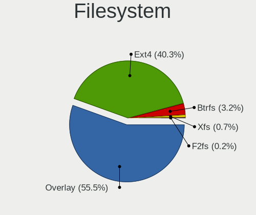
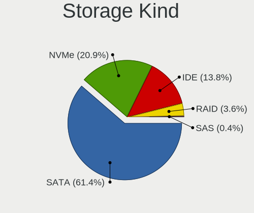
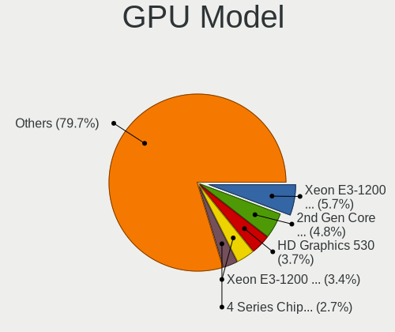
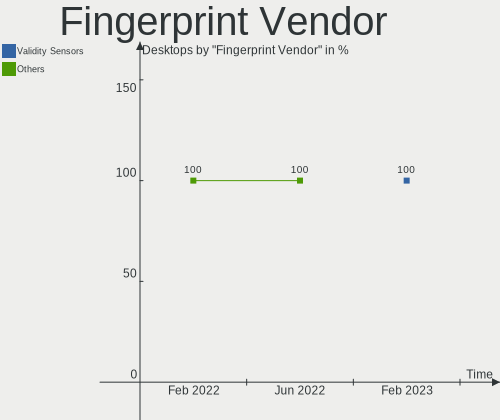
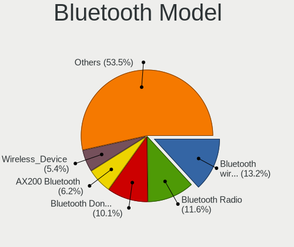

OpenMandriva Hardware Trends (Desktop)
--------------------------------------

A project to identify most popular hardware characteristics and track their change
over time based on data collected by OpenMandriva users at https://Linux-Hardware.org.

Anyone can contribute to the study by uploading probes of their computers by
the [hw-probe](https://github.com/linuxhw/hw-probe) tool:

    sudo -E hw-probe -all -upload

Full-feature report is available here: https://linux-hardware.org/?view=trends&formfactor=desktop

Period: Feb, 2021.

Contents
--------

- [ OS                       ](#os)
- [ OS Family                ](#os-family)
- [ Kernel                   ](#kernel)
- [ Kernel Family            ](#kernel-family)
- [ Kernel Major Ver.        ](#kernel-major-ver)
- [ Arch                     ](#arch)
- [ DE                       ](#de)
- [ Display Server           ](#display-server)
- [ Display Manager          ](#display-manager)
- [ OS Lang                  ](#os-lang)
- [ Boot Mode                ](#boot-mode)
- [ Filesystem               ](#filesystem)
- [ Part. scheme             ](#part-scheme)
- [ Dual Boot with Linux/BSD ](#dual-boot-with-linux/bsd)
- [ Dual Boot (Win)          ](#dual-boot-win)
- [ Country                  ](#country)
- [ City                     ](#city)
- [ Vendor                   ](#vendor)
- [ Model                    ](#model)
- [ Model Family             ](#model-family)
- [ MFG Year                 ](#mfg-year)
- [ Form Factor              ](#form-factor)
- [ Secure Boot              ](#secure-boot)
- [ Coreboot                 ](#coreboot)
- [ RAM Size                 ](#ram-size)
- [ RAM Used                 ](#ram-used)
- [ Has CD-ROM               ](#has-cd-rom)
- [ Total Drives             ](#total-drives)
- [ Has Ethernet             ](#has-ethernet)
- [ Drive Vendor             ](#drive-vendor)
- [ Drive Model              ](#drive-model)
- [ HDD Vendor               ](#hdd-vendor)
- [ SSD Vendor               ](#ssd-vendor)
- [ Drive Kind               ](#drive-kind)
- [ Drive Connector          ](#drive-connector)
- [ Drive Size               ](#drive-size)
- [ Space Total              ](#space-total)
- [ Space Used               ](#space-used)
- [ Malfunc. Drives          ](#malfunc-drives)
- [ Malfunc. Drive Vendor    ](#malfunc-drive-vendor)
- [ Malfunc. HDD Vendor      ](#malfunc-hdd-vendor)
- [ Malfunc. Drive Kind      ](#malfunc-drive-kind)
- [ Failed Drives            ](#failed-drives)
- [ Failed Drive Vendor      ](#failed-drive-vendor)
- [ Drive Status             ](#drive-status)
- [ Storage Vendor           ](#storage-vendor)
- [ Storage Model            ](#storage-model)
- [ Storage Kind             ](#storage-kind)
- [ CPU Vendor               ](#cpu-vendor)
- [ CPU Model                ](#cpu-model)
- [ CPU Model Family         ](#cpu-model-family)
- [ CPU Cores                ](#cpu-cores)
- [ CPU Sockets              ](#cpu-sockets)
- [ CPU Threads              ](#cpu-threads)
- [ CPU Op-Modes             ](#cpu-op-modes)
- [ CPU Microcode            ](#cpu-microcode)
- [ CPU Microarch            ](#cpu-microarch)
- [ GPU Vendor               ](#gpu-vendor)
- [ GPU Model                ](#gpu-model)
- [ GPU Combo                ](#gpu-combo)
- [ GPU Driver               ](#gpu-driver)
- [ GPU Memory               ](#gpu-memory)
- [ Monitor Vendor           ](#monitor-vendor)
- [ Monitor Model            ](#monitor-model)
- [ Monitor Resolution       ](#monitor-resolution)
- [ Monitor Diagonal         ](#monitor-diagonal)
- [ Monitor Width            ](#monitor-width)
- [ Aspect Ratio             ](#aspect-ratio)
- [ Monitor Area             ](#monitor-area)
- [ Pixel Density            ](#pixel-density)
- [ Multiple Monitors        ](#multiple-monitors)
- [ Net Controller Vendor    ](#net-controller-vendor)
- [ Net Controller Model     ](#net-controller-model)
- [ Wireless Vendor          ](#wireless-vendor)
- [ Wireless Model           ](#wireless-model)
- [ Ethernet Vendor          ](#ethernet-vendor)
- [ Ethernet Model           ](#ethernet-model)
- [ Net Controller Kind      ](#net-controller-kind)
- [ Used Controller          ](#used-controller)
- [ NICs                     ](#nics)
- [ Memory Vendor            ](#memory-vendor)
- [ Memory Model             ](#memory-model)
- [ Memory Kind              ](#memory-kind)
- [ Memory Form Factor       ](#memory-form-factor)
- [ Memory Size              ](#memory-size)
- [ Memory Speed             ](#memory-speed)
- [ Sound Vendor             ](#sound-vendor)
- [ Sound Model              ](#sound-model)
- [ Camera Vendor            ](#camera-vendor)
- [ Camera Model             ](#camera-model)
- [ Fingerprint Vendor       ](#fingerprint-vendor)
- [ Fingerprint Model        ](#fingerprint-model)
- [ Chipcard Vendor          ](#chipcard-vendor)
- [ Chipcard Model           ](#chipcard-model)
- [ Printer Vendor           ](#printer-vendor)
- [ Printer Model            ](#printer-model)
- [ Scanner Vendor           ](#scanner-vendor)
- [ Scanner Model            ](#scanner-model)
- [ Bluetooth Vendor         ](#bluetooth-vendor)
- [ Bluetooth Model          ](#bluetooth-model)
- [ Unsupported Devices      ](#unsupported-devices)
- [ Unsupported Device Types ](#unsupported-device-types)

OS
--

Installed operating systems

| Name             | Desktops | Percent |
|------------------|----------|---------|
| OpenMandriva 4.2 | 537      | 99.44%  |
| OpenMandriva 4.1 | 3        | 0.56%   |

OS Family
---------

OS without a version

| Name         | Desktops | Percent |
|--------------|----------|---------|
| OpenMandriva | 540      | 100%    |

Kernel
------

Version of the Linux kernel

| Version                       | Desktops | Percent |
|-------------------------------|----------|---------|
| 5.10.14-desktop-1omv4002      | 532      | 98.52%  |
| 5.10.13-desktop-1omv4002      | 5        | 0.93%   |
| 5.5.12-desktop-1omv4001       | 2        | 0.37%   |
| 5.11.0-desktop-clang-1omv4002 | 1        | 0.19%   |

Kernel Family
-------------

Linux kernel without a distro release

| Version | Desktops | Percent |
|---------|----------|---------|
| 5.10.14 | 532      | 98.52%  |
| 5.10.13 | 5        | 0.93%   |
| 5.5.12  | 2        | 0.37%   |
| 5.11.0  | 1        | 0.19%   |

Kernel Major Ver.
-----------------

Linux kernel major version

| Version | Desktops | Percent |
|---------|----------|---------|
| 5.10    | 537      | 99.44%  |
| 5.5     | 2        | 0.37%   |
| 5.11    | 1        | 0.19%   |

Arch
----

OS architecture (x86_64, i586, etc.)

| Name   | Desktops | Percent |
|--------|----------|---------|
| x86_64 | 540      | 100%    |

DE
--

Desktop Environment

| Name | Desktops | Percent |
|------|----------|---------|
| KDE5 | 540      | 100%    |

Display Server
--------------

X11 or Wayland

| Name    | Desktops | Percent |
|---------|----------|---------|
| X11     | 539      | 99.81%  |
| Wayland | 1        | 0.19%   |

Display Manager
---------------

SDDM, LightDM, etc.

| Name | Desktops | Percent |
|------|----------|---------|
| SDDM | 540      | 100%    |

OS Lang
-------

Language

| Lang    | Desktops | Percent |
|---------|----------|---------|
| en_US   | 279      | 51.67%  |
| de_DE   | 56       | 10.37%  |
| ru_RU   | 44       | 8.15%   |
| fr_FR   | 25       | 4.63%   |
| pl_PL   | 20       | 3.7%    |
| pt_BR   | 18       | 3.33%   |
| es_ES   | 18       | 3.33%   |
| it_IT   | 13       | 2.41%   |
| es_AR   | 6        | 1.11%   |
| en_GB   | 6        | 1.11%   |
| de_AT   | 6        | 1.11%   |
| cs_CZ   | 6        | 1.11%   |
| de_CH   | 5        | 0.93%   |
| nl_NL   | 4        | 0.74%   |
| hu_HU   | 4        | 0.74%   |
| en_HK   | 3        | 0.56%   |
| en_CA   | 3        | 0.56%   |
| en_AU   | 3        | 0.56%   |
| ru_UA   | 2        | 0.37%   |
| ro_RO   | 2        | 0.37%   |
| nb_NO   | 2        | 0.37%   |
| fr_CA   | 2        | 0.37%   |
| fr_BE   | 2        | 0.37%   |
| es_PE   | 2        | 0.37%   |
| en_IL   | 2        | 0.37%   |
| it_CH   | 1        | 0.19%   |
| es_MX   | 1        | 0.19%   |
| es_DO   | 1        | 0.19%   |
| en_AG   | 1        | 0.19%   |
| de_LI   | 1        | 0.19%   |
| da_DK   | 1        | 0.19%   |
| Unknown | 1        | 0.19%   |

Boot Mode
---------

EFI or BIOS

| Mode | Desktops | Percent |
|------|----------|---------|
| BIOS | 339      | 62.78%  |
| EFI  | 201      | 37.22%  |

Filesystem
----------

Type of filesystem

| Type    | Desktops | Percent |
|---------|----------|---------|
| Overlay | 468      | 86.67%  |
| Ext4    | 66       | 12.22%  |
| Btrfs   | 3        | 0.56%   |
| Ext3    | 2        | 0.37%   |
| Jfs     | 1        | 0.19%   |

Part. scheme
------------

Scheme of partitioning

| Type    | Desktops | Percent |
|---------|----------|---------|
| GPT     | 294      | 54.44%  |
| MBR     | 244      | 45.19%  |
| Unknown | 2        | 0.37%   |

Dual Boot with Linux/BSD
------------------------

Hosting more than one Linux/BSD

| Dual boot | Desktops | Percent |
|-----------|----------|---------|
| Yes       | 388      | 71.85%  |
| No        | 152      | 28.15%  |

Dual Boot (Win)
---------------

Hosting Linux and Windows

| Dual boot | Desktops | Percent |
|-----------|----------|---------|
| Yes       | 295      | 54.63%  |
| No        | 245      | 45.37%  |

Country
-------

Geographic location (country)

| Country               | Desktops | Percent |
|-----------------------|----------|---------|
| Germany               | 88       | 16.3%   |
| USA                   | 50       | 9.26%   |
| Russia                | 44       | 8.15%   |
| Brazil                | 32       | 5.93%   |
| France                | 31       | 5.74%   |
| Spain                 | 27       | 5%      |
| Poland                | 25       | 4.63%   |
| Italy                 | 23       | 4.26%   |
| Canada                | 16       | 2.96%   |
| UK                    | 14       | 2.59%   |
| Greece                | 12       | 2.22%   |
| Hungary               | 9        | 1.67%   |
| Argentina             | 9        | 1.67%   |
| Ukraine               | 8        | 1.48%   |
| Switzerland           | 8        | 1.48%   |
| Netherlands           | 8        | 1.48%   |
| Austria               | 8        | 1.48%   |
| Japan                 | 7        | 1.3%    |
| Czech Republic        | 7        | 1.3%    |
| Romania               | 6        | 1.11%   |
| Israel                | 6        | 1.11%   |
| Belarus               | 6        | 1.11%   |
| Australia             | 6        | 1.11%   |
| Thailand              | 5        | 0.93%   |
| Sweden                | 4        | 0.74%   |
| Serbia                | 4        | 0.74%   |
| Norway                | 4        | 0.74%   |
| India                 | 4        | 0.74%   |
| Hong Kong             | 4        | 0.74%   |
| Finland               | 4        | 0.74%   |
| Bulgaria              | 4        | 0.74%   |
| Belgium               | 4        | 0.74%   |
| Slovakia              | 3        | 0.56%   |
| Puerto Rico           | 3        | 0.56%   |
| Portugal              | 3        | 0.56%   |
| Peru                  | 3        | 0.56%   |
| Mexico                | 3        | 0.56%   |
| Costa Rica            | 3        | 0.56%   |
| Slovenia              | 2        | 0.37%   |
| Saudi Arabia          | 2        | 0.37%   |
| Philippines           | 2        | 0.37%   |
| New Zealand           | 2        | 0.37%   |
| Jamaica               | 2        | 0.37%   |
| Ireland               | 2        | 0.37%   |
| Estonia               | 2        | 0.37%   |
| Dominican Republic    | 2        | 0.37%   |
| Denmark               | 2        | 0.37%   |
| China                 | 2        | 0.37%   |
| Unknown               | 2        | 0.37%   |
| Singapore             | 1        | 0.19%   |
| Paraguay              | 1        | 0.19%   |
| Palestinian Territory | 1        | 0.19%   |
| Pakistan              | 1        | 0.19%   |
| Moldova, Republic of  | 1        | 0.19%   |
| Madagascar            | 1        | 0.19%   |
| Lithuania             | 1        | 0.19%   |
| Kazakhstan            | 1        | 0.19%   |
| Iran                  | 1        | 0.19%   |
| Iceland               | 1        | 0.19%   |
| Egypt                 | 1        | 0.19%   |

City
----

Geographic location (city)

| City              | Desktops | Percent |
|-------------------|----------|---------|
| Moscow            | 10       | 1.85%   |
| Berlin            | 7        | 1.3%    |
| Rio de Janeiro    | 6        | 1.11%   |
| Frankfurt am Main | 5        | 0.93%   |
| Vienna            | 4        | 0.74%   |
| Thessaloniki      | 4        | 0.74%   |
| São Paulo        | 4        | 0.74%   |
| St Petersburg     | 4        | 0.74%   |
| Milan             | 4        | 0.74%   |
| Barcelona         | 4        | 0.74%   |
| Stuttgart         | 3        | 0.56%   |
| Paris             | 3        | 0.56%   |
| Munich            | 3        | 0.56%   |
| Madrid            | 3        | 0.56%   |
| Londrina          | 3        | 0.56%   |
| Leipzig           | 3        | 0.56%   |
| Dnipro            | 3        | 0.56%   |
| Buenos Aires      | 3        | 0.56%   |
| Athens            | 3        | 0.56%   |
| Adelaide          | 3        | 0.56%   |
| Tel Aviv          | 2        | 0.37%   |
| Tampere           | 2        | 0.37%   |
| Sofia             | 2        | 0.37%   |
| Salamanca         | 2        | 0.37%   |
| Rome              | 2        | 0.37%   |
| Prague            | 2        | 0.37%   |
| Poznan            | 2        | 0.37%   |
| Polatsk           | 2        | 0.37%   |
| Perm              | 2        | 0.37%   |
| Palo del Colle    | 2        | 0.37%   |
| Minsk             | 2        | 0.37%   |
| Lugo              | 2        | 0.37%   |
| Los Angeles       | 2        | 0.37%   |
| Lima              | 2        | 0.37%   |
| Landsberg am Lech | 2        | 0.37%   |
| Krakow            | 2        | 0.37%   |
| Kassel            | 2        | 0.37%   |
| Juiz de Fora      | 2        | 0.37%   |
| Helsinki          | 2        | 0.37%   |
| Hamburg           | 2        | 0.37%   |
| Hadera            | 2        | 0.37%   |
| Graz              | 2        | 0.37%   |
| Farmington        | 2        | 0.37%   |
| Eustis            | 2        | 0.37%   |
| Düsseldorf       | 2        | 0.37%   |
| Colomiers         | 2        | 0.37%   |
| Cittadella        | 2        | 0.37%   |
| Chiang Mai        | 2        | 0.37%   |
| Central           | 2        | 0.37%   |
| Brohl             | 2        | 0.37%   |
| Bristol           | 2        | 0.37%   |
| Bologna           | 2        | 0.37%   |
| Barnaul           | 2        | 0.37%   |
| Bangkok           | 2        | 0.37%   |
| Unknown           | 2        | 0.37%   |
| Środa Śląska   | 1        | 0.19%   |
| Zielona Góra     | 1        | 0.19%   |
| Zdunska Wola      | 1        | 0.19%   |
| Zakynthos         | 1        | 0.19%   |
| Yuen Long         | 1        | 0.19%   |

Vendor
------

Motherboard manufacturer

| Name                | Desktops | Percent |
|---------------------|----------|---------|
| ASUSTek Computer    | 153      | 28.33%  |
| Gigabyte Technology | 100      | 18.52%  |
| MSI                 | 61       | 11.3%   |
| ASRock              | 55       | 10.19%  |
| Dell                | 41       | 7.59%   |
| Hewlett-Packard     | 38       | 7.04%   |
| Lenovo              | 19       | 3.52%   |
| Acer                | 13       | 2.41%   |
| Intel               | 9        | 1.67%   |
| Biostar             | 9        | 1.67%   |
| Medion              | 7        | 1.3%    |
| Pegatron            | 5        | 0.93%   |
| Fujitsu             | 5        | 0.93%   |
| Foxconn             | 4        | 0.74%   |
| ECS                 | 4        | 0.74%   |
| Shuttle             | 2        | 0.37%   |
| Positivo            | 2        | 0.37%   |
| Packard Bell        | 2        | 0.37%   |
| Supermicro          | 1        | 0.19%   |
| PCWare              | 1        | 0.19%   |
| PCChips             | 1        | 0.19%   |
| LIVEFAN             | 1        | 0.19%   |
| HEDYCOMPUTER        | 1        | 0.19%   |
| Gateway             | 1        | 0.19%   |
| eMachines           | 1        | 0.19%   |
| AZW                 | 1        | 0.19%   |
| AMD                 | 1        | 0.19%   |
| ABIT                | 1        | 0.19%   |
| Unknown             | 1        | 0.19%   |

Model
-----

Motherboard model

| Name                        | Desktops | Percent |
|-----------------------------|----------|---------|
| Dell OptiPlex 780           | 6        | 1.11%   |
| Dell OptiPlex 7010          | 5        | 0.93%   |
| ASUS PRIME X470-PRO         | 5        | 0.93%   |
| ASUS PRIME B450M-A          | 5        | 0.93%   |
| ASUS All Series             | 5        | 0.93%   |
| MSI MS-7817                 | 4        | 0.74%   |
| Gigabyte B450 AORUS ELITE   | 4        | 0.74%   |
| ASUS PRIME B350-PLUS        | 4        | 0.74%   |
| ASUS PRIME A320M-K          | 4        | 0.74%   |
| MSI MS-7C02                 | 3        | 0.56%   |
| MSI MS-7B86                 | 3        | 0.56%   |
| MSI MS-7A38                 | 3        | 0.56%   |
| HP EliteDesk 800 G1 SFF     | 3        | 0.56%   |
| Gigabyte X570 AORUS ELITE   | 3        | 0.56%   |
| Gigabyte GA-78LMT-USB3 6.0  | 3        | 0.56%   |
| Gigabyte B450 AORUS PRO     | 3        | 0.56%   |
| Dell OptiPlex 790           | 3        | 0.56%   |
| Dell OptiPlex 3040          | 3        | 0.56%   |
| ASUS TUF GAMING X570-PLUS   | 3        | 0.56%   |
| ASUS M5A78L-M/USB3          | 3        | 0.56%   |
| ASUS M5A78L-M PLUS/USB3     | 3        | 0.56%   |
| MSI MS-7C52                 | 2        | 0.37%   |
| MSI MS-7C37                 | 2        | 0.37%   |
| MSI MS-7A15                 | 2        | 0.37%   |
| MSI MS-7850                 | 2        | 0.37%   |
| MSI MS-7721                 | 2        | 0.37%   |
| Medion MS-7728              | 2        | 0.37%   |
| HP Compaq Pro 6300 SFF      | 2        | 0.37%   |
| HP Compaq 8000 Elite SFF PC | 2        | 0.37%   |
| Gigabyte G31M-ES2L          | 2        | 0.37%   |
| Gigabyte B450M DS3H         | 2        | 0.37%   |
| Gigabyte B450 AORUS M       | 2        | 0.37%   |
| Gigabyte B365M DS3H         | 2        | 0.37%   |
| Gigabyte A320M-S2H V2       | 2        | 0.37%   |
| Gigabyte A320M-HD2          | 2        | 0.37%   |
| Gigabyte 970A-DS3P          | 2        | 0.37%   |
| Dell Vostro 220 Series      | 2        | 0.37%   |
| Dell OptiPlex 390           | 2        | 0.37%   |
| Biostar G31M+               | 2        | 0.37%   |
| Biostar A320MH              | 2        | 0.37%   |
| ASUS VM65                   | 2        | 0.37%   |
| ASUS ROG CROSSHAIR VII HERO | 2        | 0.37%   |
| ASUS PRIME Z390M-PLUS       | 2        | 0.37%   |
| ASUS PRIME X570-P           | 2        | 0.37%   |
| ASUS P8H77-V                | 2        | 0.37%   |
| ASUS M5A97 R2.0             | 2        | 0.37%   |
| ASUS H110M-K                | 2        | 0.37%   |
| ASUS A8N-E                  | 2        | 0.37%   |
| ASRock Q1900M               | 2        | 0.37%   |
| ASRock H81M-DGS R2.0        | 2        | 0.37%   |
| ASRock H61M-HG4             | 2        | 0.37%   |
| ASRock FM2A88X Extreme6+    | 2        | 0.37%   |
| ASRock FM2A68M-DG3+         | 2        | 0.37%   |
| ASRock A88M-G               | 2        | 0.37%   |
| ASRock 970 Pro3 R2.0        | 2        | 0.37%   |
| Acer Aspire M3920           | 2        | 0.37%   |
| Supermicro H8SMI            | 1        | 0.19%   |
| Shuttle SFM27               | 1        | 0.19%   |
| Shuttle DH370               | 1        | 0.19%   |
| Positivo POS-EIBTPDC        | 1        | 0.19%   |

Model Family
------------

Motherboard model prefix

| Name                   | Desktops | Percent |
|------------------------|----------|---------|
| ASUS PRIME             | 34       | 6.3%    |
| Dell OptiPlex          | 31       | 5.74%   |
| HP Compaq              | 15       | 2.78%   |
| Lenovo ThinkCentre     | 14       | 2.59%   |
| Gigabyte B450          | 10       | 1.85%   |
| Acer Aspire            | 10       | 1.85%   |
| ASUS ROG               | 9        | 1.67%   |
| ASUS M5A78L-M          | 9        | 1.67%   |
| HP EliteDesk           | 7        | 1.3%    |
| ASUS TUF               | 7        | 1.3%    |
| Gigabyte X570          | 5        | 0.93%   |
| Fujitsu ESPRIMO        | 5        | 0.93%   |
| ASUS P8H61-M           | 5        | 0.93%   |
| ASUS All               | 5        | 0.93%   |
| MSI MS-7817            | 4        | 0.74%   |
| Gigabyte GA-78LMT-USB3 | 4        | 0.74%   |
| Dell Vostro            | 4        | 0.74%   |
| ASUS P8Z77-V           | 4        | 0.74%   |
| MSI MS-7C02            | 3        | 0.56%   |
| MSI MS-7B86            | 3        | 0.56%   |
| MSI MS-7A38            | 3        | 0.56%   |
| Lenovo IdeaCentre      | 3        | 0.56%   |
| HP Pavilion            | 3        | 0.56%   |
| Gigabyte A320M-S2H     | 3        | 0.56%   |
| Dell Inspiron          | 3        | 0.56%   |
| ASUS P8H77-V           | 3        | 0.56%   |
| ASRock 970             | 3        | 0.56%   |
| MSI MS-7C52            | 2        | 0.37%   |
| MSI MS-7C37            | 2        | 0.37%   |
| MSI MS-7A15            | 2        | 0.37%   |
| MSI MS-7850            | 2        | 0.37%   |
| MSI MS-7721            | 2        | 0.37%   |
| MSI KBL-U              | 2        | 0.37%   |
| Medion MS-7728         | 2        | 0.37%   |
| HP ProDesk             | 2        | 0.37%   |
| Gigabyte Z390          | 2        | 0.37%   |
| Gigabyte G31M-ES2L     | 2        | 0.37%   |
| Gigabyte B450M         | 2        | 0.37%   |
| Gigabyte B365M         | 2        | 0.37%   |
| Gigabyte A320M-HD2     | 2        | 0.37%   |
| Gigabyte 970A-DS3P     | 2        | 0.37%   |
| Dell Precision         | 2        | 0.37%   |
| Biostar G31M+          | 2        | 0.37%   |
| Biostar A320MH         | 2        | 0.37%   |
| ASUS VM65              | 2        | 0.37%   |
| ASUS Rampage           | 2        | 0.37%   |
| ASUS P9X79             | 2        | 0.37%   |
| ASUS P5Q               | 2        | 0.37%   |
| ASUS P5G41T-M          | 2        | 0.37%   |
| ASUS M5A97             | 2        | 0.37%   |
| ASUS M5A78L            | 2        | 0.37%   |
| ASUS H110M-K           | 2        | 0.37%   |
| ASUS F1A55-M           | 2        | 0.37%   |
| ASUS A8N-E             | 2        | 0.37%   |
| ASRock Q1900M          | 2        | 0.37%   |
| ASRock H81M-HDS        | 2        | 0.37%   |
| ASRock H81M-DGS        | 2        | 0.37%   |
| ASRock H61M-HG4        | 2        | 0.37%   |
| ASRock FM2A88X         | 2        | 0.37%   |
| ASRock FM2A68M-DG3+    | 2        | 0.37%   |

MFG Year
--------

Motherboard manufacture year

| Year | Desktops | Percent |
|------|----------|---------|
| 2020 | 71       | 13.15%  |
| 2019 | 57       | 10.56%  |
| 2014 | 48       | 8.89%   |
| 2012 | 48       | 8.89%   |
| 2011 | 44       | 8.15%   |
| 2013 | 42       | 7.78%   |
| 2018 | 41       | 7.59%   |
| 2010 | 38       | 7.04%   |
| 2016 | 34       | 6.3%    |
| 2009 | 26       | 4.81%   |
| 2015 | 25       | 4.63%   |
| 2017 | 22       | 4.07%   |
| 2008 | 12       | 2.22%   |
| 2007 | 12       | 2.22%   |
| 2021 | 11       | 2.04%   |
| 2006 | 9        | 1.67%   |

Form Factor
-----------

Physical design of the computer

| Name    | Desktops | Percent |
|---------|----------|---------|
| Desktop | 540      | 100%    |

Secure Boot
-----------

Enabled or disabled

| State    | Desktops | Percent |
|----------|----------|---------|
| Disabled | 540      | 100%    |

Coreboot
--------

Have coreboot on board

| Used | Desktops | Percent |
|------|----------|---------|
| No   | 540      | 100%    |

RAM Size
--------

Total RAM memory

| Size in GB  | Desktops | Percent |
|-------------|----------|---------|
| 8.01-16.0   | 131      | 24.26%  |
| 3.01-4.0    | 122      | 22.59%  |
| 16.01-24.0  | 120      | 22.22%  |
| 4.01-8.0    | 95       | 17.59%  |
| 32.01-64.0  | 40       | 7.41%   |
| 1.01-2.0    | 14       | 2.59%   |
| 64.01-256.0 | 8        | 1.48%   |
| 2.01-3.0    | 7        | 1.3%    |
| 24.01-32.0  | 3        | 0.56%   |

RAM Used
--------

Used RAM memory

| Used GB  | Desktops | Percent |
|----------|----------|---------|
| 1.01-2.0 | 427      | 79.07%  |
| 0.51-1.0 | 73       | 13.52%  |
| 2.01-3.0 | 27       | 5%      |
| 0.01-0.5 | 10       | 1.85%   |
| 4.01-8.0 | 2        | 0.37%   |
| 3.01-4.0 | 1        | 0.19%   |

Has CD-ROM
----------

Has CD-ROM on board

| Presented | Desktops | Percent |
|-----------|----------|---------|
| Yes       | 359      | 66.48%  |
| No        | 181      | 33.52%  |

Total Drives
------------

Number of drives on board

| Drives | Desktops | Percent |
|--------|----------|---------|
| 1      | 226      | 41.85%  |
| 2      | 133      | 24.63%  |
| 3      | 86       | 15.93%  |
| 4      | 59       | 10.93%  |
| 5      | 19       | 3.52%   |
| 0      | 7        | 1.3%    |
| 6      | 6        | 1.11%   |
| 18     | 1        | 0.19%   |
| 9      | 1        | 0.19%   |
| 8      | 1        | 0.19%   |
| 7      | 1        | 0.19%   |

Has Ethernet
------------

Has Ethernet on board

| Presented | Desktops | Percent |
|-----------|----------|---------|
| Yes       | 535      | 99.07%  |
| No        | 5        | 0.93%   |

Drive Vendor
------------

Hard drive vendors

| Vendor              | Desktops | Drives | Percent |
|---------------------|----------|--------|---------|
| WDC                 | 213      | 282    | 22.21%  |
| Seagate             | 177      | 220    | 18.46%  |
| Samsung Electronics | 137      | 185    | 14.29%  |
| Toshiba             | 66       | 72     | 6.88%   |
| Kingston            | 54       | 62     | 5.63%   |
| Crucial             | 46       | 56     | 4.8%    |
| Hitachi             | 44       | 46     | 4.59%   |
| SanDisk             | 40       | 43     | 4.17%   |
| Unknown             | 15       | 15     | 1.56%   |
| A-DATA Technology   | 14       | 14     | 1.46%   |
| Intenso             | 13       | 13     | 1.36%   |
| Patriot             | 11       | 12     | 1.15%   |
| Intel               | 10       | 11     | 1.04%   |
| Transcend           | 9        | 9      | 0.94%   |
| Maxtor              | 8        | 8      | 0.83%   |
| Corsair             | 8        | 8      | 0.83%   |
| PNY                 | 7        | 8      | 0.73%   |
| GOODRAM             | 7        | 7      | 0.73%   |
| China               | 7        | 7      | 0.73%   |
| HGST                | 6        | 7      | 0.63%   |
| PLEXTOR             | 4        | 4      | 0.42%   |
| OCZ                 | 4        | 4      | 0.42%   |
| Gigabyte Technology | 4        | 4      | 0.42%   |
| SPCC                | 3        | 3      | 0.31%   |
| Phison              | 3        | 3      | 0.31%   |
| Hewlett-Packard     | 3        | 4      | 0.31%   |
| DOGGO               | 3        | 3      | 0.31%   |
| XPG                 | 2        | 2      | 0.21%   |
| WD MediaMax         | 2        | 2      | 0.21%   |
| Silicon Motion      | 2        | 3      | 0.21%   |
| QUMO                | 2        | 2      | 0.21%   |
| JMicron             | 2        | 2      | 0.21%   |
| Fujitsu             | 2        | 2      | 0.21%   |
| ASMedia             | 2        | 2      | 0.21%   |
| Zheino              | 1        | 1      | 0.1%    |
| XrayDisk            | 1        | 1      | 0.1%    |
| ViperTeq            | 1        | 1      | 0.1%    |
| Vaseky              | 1        | 1      | 0.1%    |
| Tigo                | 1        | 1      | 0.1%    |
| Team                | 1        | 1      | 0.1%    |
| TCSUNBOW            | 1        | 1      | 0.1%    |
| Super Talent        | 1        | 1      | 0.1%    |
| SK Hynix            | 1        | 1      | 0.1%    |
| Realtek             | 1        | 1      | 0.1%    |
| Platinet            | 1        | 1      | 0.1%    |
| NGFF                | 1        | 1      | 0.1%    |
| Netac               | 1        | 1      | 0.1%    |
| Mushkin             | 1        | 1      | 0.1%    |
| LITEONIT            | 1        | 1      | 0.1%    |
| KingSpec            | 1        | 1      | 0.1%    |
| KingFast            | 1        | 1      | 0.1%    |
| KingDian            | 1        | 1      | 0.1%    |
| KESU                | 1        | 1      | 0.1%    |
| JetFlash            | 1        | 1      | 0.1%    |
| INNOVATION IT       | 1        | 1      | 0.1%    |
| IBM/Hitachi         | 1        | 1      | 0.1%    |
| faspeed             | 1        | 1      | 0.1%    |
| External            | 1        | 1      | 0.1%    |
| DOGFISH             | 1        | 1      | 0.1%    |
| Colorful            | 1        | 1      | 0.1%    |

Drive Model
-----------

Hard drive models

| Model                            | Desktops | Percent |
|----------------------------------|----------|---------|
| Seagate ST500DM002-1BD142 500GB  | 19       | 1.71%   |
| Toshiba DT01ACA100 1TB           | 16       | 1.44%   |
| WDC WD10EZEX-08WN4A0 1TB         | 12       | 1.08%   |
| Samsung SSD 860 EVO 500GB        | 12       | 1.08%   |
| Kingston SA400S37240G 240GB SSD  | 12       | 1.08%   |
| Seagate ST1000DM010-2EP102 1TB   | 10       | 0.9%    |
| Seagate ST3500418AS 500GB        | 9        | 0.81%   |
| Kingston SV300S37A120G 120GB SSD | 9        | 0.81%   |
| Toshiba HDWD110 1TB              | 8        | 0.72%   |
| Toshiba DT01ACA200 2TB           | 8        | 0.72%   |
| Seagate ST1000DM003-9YN162 1TB   | 8        | 0.72%   |
| Samsung SSD 850 EVO 250GB        | 8        | 0.72%   |
| Unknown SD/MMC/MS PRO 64GB       | 7        | 0.63%   |
| Seagate ST2000DM006-2DM164 2TB   | 7        | 0.63%   |
| Seagate ST1000DM003-1CH162 1TB   | 7        | 0.63%   |
| Crucial CT240BX500SSD1 240GB     | 7        | 0.63%   |
| WDC WDS240G2G0A-00JH30 240GB SSD | 6        | 0.54%   |
| WDC WD5000AAKX-60U6AA0 500GB     | 6        | 0.54%   |
| WDC WD10EZEX-00BN5A0 1TB         | 6        | 0.54%   |
| WDC WD10EADS-00L5B1 1TB          | 6        | 0.54%   |
| Toshiba DT01ACA050 500GB         | 6        | 0.54%   |
| Samsung SSD 960 EVO 250GB        | 6        | 0.54%   |
| Samsung SSD 860 EVO 250GB        | 6        | 0.54%   |
| Samsung SSD 850 EVO 500GB        | 6        | 0.54%   |
| Samsung HD103SJ 1TB              | 6        | 0.54%   |
| Kingston SA400S37480G 480GB SSD  | 6        | 0.54%   |
| Kingston SA400S37120G 120GB SSD  | 6        | 0.54%   |
| WDC WD20EZRZ-00Z5HB0 2TB         | 5        | 0.45%   |
| Seagate ST3500413AS 500GB        | 5        | 0.45%   |
| SanDisk SSD PLUS 240GB           | 5        | 0.45%   |
| Samsung SSD 970 EVO Plus 500GB   | 5        | 0.45%   |
| Samsung SSD 850 PRO 256GB        | 5        | 0.45%   |
| WDC WD20PURX-64P6ZY0 2TB         | 4        | 0.36%   |
| WDC WD10EZEX-22MFCA0 1TB         | 4        | 0.36%   |
| WDC WD10EARS-22Y5B1 1TB          | 4        | 0.36%   |
| Seagate ST3500312CS 500GB        | 4        | 0.36%   |
| Seagate ST1000DM003-1SB10C 1TB   | 4        | 0.36%   |
| Seagate ST1000DM003-1ER162 1TB   | 4        | 0.36%   |
| Samsung SSD 970 EVO 250GB        | 4        | 0.36%   |
| Samsung SSD 860 EVO 1TB          | 4        | 0.36%   |
| Samsung HD103SI 1TB              | 4        | 0.36%   |
| Kingston SUV400S37240G 240GB SSD | 4        | 0.36%   |
| Hitachi HDS721050CLA362 500GB    | 4        | 0.36%   |
| Crucial CT480BX500SSD1 480GB     | 4        | 0.36%   |
| Crucial CT256MX100SSD1 256GB     | 4        | 0.36%   |
| Crucial CT120BX500SSD1 120GB     | 4        | 0.36%   |
| Crucial CT1000MX500SSD1 1TB      | 4        | 0.36%   |
| WDC WDS500G2B0A-00SM50 500GB SSD | 3        | 0.27%   |
| WDC WDS240G2G0B-00EPW0 240GB SSD | 3        | 0.27%   |
| WDC WDS100T2B0C-00PXH0 1TB       | 3        | 0.27%   |
| WDC WDS100T2B0A-00SM50 1TB SSD   | 3        | 0.27%   |
| WDC WD5000AAKX-603CA0 500GB      | 3        | 0.27%   |
| WDC WD5000AADS-00S9B0 500GB      | 3        | 0.27%   |
| WDC WD40EZRZ-00GXCB0 4TB         | 3        | 0.27%   |
| WDC WD20EZRX-00D8PB0 2TB         | 3        | 0.27%   |
| WDC WD10EZEX-21M2NA0 1TB         | 3        | 0.27%   |
| WDC WD10EZEX-00WN4A0 1TB         | 3        | 0.27%   |
| WDC WD10EZEX-00RKKA0 1TB         | 3        | 0.27%   |
| WDC WD10EAVS-00D7B1 1TB          | 3        | 0.27%   |
| WDC WD10EADS-00M2B0 1TB          | 3        | 0.27%   |

HDD Vendor
----------

Hard disk drive vendors

| Vendor              | Desktops | Drives | Percent |
|---------------------|----------|--------|---------|
| WDC                 | 191      | 235    | 35.24%  |
| Seagate             | 177      | 219    | 32.66%  |
| Toshiba             | 59       | 64     | 10.89%  |
| Samsung Electronics | 46       | 48     | 8.49%   |
| Hitachi             | 44       | 46     | 8.12%   |
| MAXTOR              | 8        | 8      | 1.48%   |
| HGST                | 6        | 7      | 1.11%   |
| WD MediaMax         | 2        | 2      | 0.37%   |
| Hewlett-Packard     | 2        | 2      | 0.37%   |
| Fujitsu             | 2        | 2      | 0.37%   |
| ASMedia             | 2        | 2      | 0.37%   |
| Unknown             | 1        | 1      | 0.18%   |
| KESU                | 1        | 1      | 0.18%   |
| IBM/Hitachi         | 1        | 1      | 0.18%   |

SSD Vendor
----------

Solid state drive vendors

| Vendor              | Desktops | Drives | Percent |
|---------------------|----------|--------|---------|
| Samsung Electronics | 71       | 97     | 19.72%  |
| Kingston            | 48       | 55     | 13.33%  |
| Crucial             | 43       | 51     | 11.94%  |
| SanDisk             | 39       | 41     | 10.83%  |
| WDC                 | 27       | 29     | 7.5%    |
| A-DATA Technology   | 14       | 14     | 3.89%   |
| Intenso             | 13       | 13     | 3.61%   |
| Patriot             | 10       | 11     | 2.78%   |
| Transcend           | 9        | 9      | 2.5%    |
| PNY                 | 7        | 8      | 1.94%   |
| GOODRAM             | 7        | 7      | 1.94%   |
| China               | 7        | 7      | 1.94%   |
| Unknown             | 6        | 6      | 1.67%   |
| Toshiba             | 6        | 6      | 1.67%   |
| Intel               | 6        | 6      | 1.67%   |
| Corsair             | 5        | 5      | 1.39%   |
| PLEXTOR             | 4        | 4      | 1.11%   |
| OCZ                 | 4        | 4      | 1.11%   |
| DOGGO               | 3        | 3      | 0.83%   |
| SPCC                | 2        | 2      | 0.56%   |
| QUMO                | 2        | 2      | 0.56%   |
| Gigabyte Technology | 2        | 2      | 0.56%   |
| Zheino              | 1        | 1      | 0.28%   |
| XrayDisk            | 1        | 1      | 0.28%   |
| ViperTeq            | 1        | 1      | 0.28%   |
| Vaseky              | 1        | 1      | 0.28%   |
| Tigo                | 1        | 1      | 0.28%   |
| Team                | 1        | 1      | 0.28%   |
| TCSUNBOW            | 1        | 1      | 0.28%   |
| Super Talent        | 1        | 1      | 0.28%   |
| SK Hynix            | 1        | 1      | 0.28%   |
| Platinet            | 1        | 1      | 0.28%   |
| NGFF                | 1        | 1      | 0.28%   |
| Netac               | 1        | 1      | 0.28%   |
| Mushkin             | 1        | 1      | 0.28%   |
| LITEONIT            | 1        | 1      | 0.28%   |
| KingSpec            | 1        | 1      | 0.28%   |
| KingFast            | 1        | 1      | 0.28%   |
| KingDian            | 1        | 1      | 0.28%   |
| JMicron             | 1        | 1      | 0.28%   |
| INNOVATION IT       | 1        | 1      | 0.28%   |
| faspeed             | 1        | 1      | 0.28%   |
| External            | 1        | 1      | 0.28%   |
| DOGFISH             | 1        | 1      | 0.28%   |
| Colorful            | 1        | 1      | 0.28%   |
| Apacer              | 1        | 1      | 0.28%   |
| AFOX                | 1        | 1      | 0.28%   |

Drive Kind
----------

HDD or SSD

| Kind    | Desktops | Drives | Percent |
|---------|----------|--------|---------|
| HDD     | 408      | 638    | 53.26%  |
| SSD     | 275      | 407    | 35.9%   |
| NVMe    | 70       | 96     | 9.14%   |
| Unknown | 11       | 11     | 1.44%   |
| MMC     | 2        | 2      | 0.26%   |

Drive Connector
---------------

SATA, SAS, NVMe, etc.

| Type | Desktops | Drives | Percent |
|------|----------|--------|---------|
| SATA | 521      | 1024   | 84.03%  |
| NVMe | 70       | 95     | 11.29%  |
| SAS  | 27       | 33     | 4.35%   |
| MMC  | 2        | 2      | 0.32%   |

Drive Size
----------

Size of hard drive

| Size in TB | Desktops | Drives | Percent |
|------------|----------|--------|---------|
| 0.01-0.5   | 403      | 627    | 54.68%  |
| 0.51-1.0   | 219      | 279    | 29.72%  |
| 1.01-2.0   | 71       | 87     | 9.63%   |
| 2.01-3.0   | 19       | 22     | 2.58%   |
| 3.01-4.0   | 15       | 18     | 2.04%   |
| 4.01-10.0  | 7        | 9      | 0.95%   |
| 10.01-20.0 | 3        | 3      | 0.41%   |

Space Total
-----------

Amount of disk space available on the file system

| Size in GB     | Desktops | Percent |
|----------------|----------|---------|
| 1-20           | 297      | 55%     |
| Unknown        | 93       | 17.22%  |
| 101-250        | 50       | 9.26%   |
| 251-500        | 32       | 5.93%   |
| 501-1000       | 23       | 4.26%   |
| 51-100         | 16       | 2.96%   |
| 21-50          | 14       | 2.59%   |
| 1001-2000      | 10       | 1.85%   |
| 2001-3000      | 3        | 0.56%   |
| More than 3000 | 2        | 0.37%   |

Space Used
----------

Amount of used disk space

| Used GB        | Desktops | Percent |
|----------------|----------|---------|
| 1-20           | 404      | 74.81%  |
| Unknown        | 93       | 17.22%  |
| 21-50          | 10       | 1.85%   |
| 51-100         | 8        | 1.48%   |
| 251-500        | 7        | 1.3%    |
| 101-250        | 7        | 1.3%    |
| 1001-2000      | 5        | 0.93%   |
| 501-1000       | 4        | 0.74%   |
| More than 3000 | 2        | 0.37%   |

Malfunc. Drives
---------------

Drive models with a malfunction

| Model                              | Desktops | Drives | Percent |
|------------------------------------|----------|--------|---------|
| Seagate ST500DM002-1BD142 500GB    | 6        | 6      | 2.79%   |
| Seagate ST3500418AS 500GB          | 6        | 7      | 2.79%   |
| Toshiba DT01ACA050 500GB           | 3        | 3      | 1.4%    |
| Seagate ST31000528AS 1TB           | 3        | 3      | 1.4%    |
| Samsung Electronics HD103SJ 1TB    | 3        | 3      | 1.4%    |
| Kingston SV300S37A120G 120GB SSD   | 3        | 3      | 1.4%    |
| Hitachi HDS721050CLA362 500GB      | 3        | 3      | 1.4%    |
| WDC WD5000AAKX-603CA0 500GB        | 2        | 2      | 0.93%   |
| WDC WD5000AADS-00S9B0 500GB        | 2        | 2      | 0.93%   |
| WDC WD20PURX-64P6ZY0 2TB           | 2        | 2      | 0.93%   |
| WDC WD20EARS-00MVWB0 2TB           | 2        | 2      | 0.93%   |
| WDC WD10EZEX-08M2NA0 1TB           | 2        | 2      | 0.93%   |
| WDC WD10EARX-00N0YB0 1TB           | 2        | 2      | 0.93%   |
| WDC WD10EARS-22Y5B1 1TB            | 2        | 2      | 0.93%   |
| WDC WD10EADS-00L5B1 1TB            | 2        | 2      | 0.93%   |
| Seagate ST3500630AS 500GB          | 2        | 2      | 0.93%   |
| Seagate ST3320418AS 320GB          | 2        | 2      | 0.93%   |
| Seagate ST31000524AS 1TB           | 2        | 2      | 0.93%   |
| Seagate ST1000LM024 HN-M101MBB 1TB | 2        | 2      | 0.93%   |
| Seagate ST1000DM003-9YN162 1TB     | 2        | 2      | 0.93%   |
| SanDisk SDSSDA120G 120GB           | 2        | 2      | 0.93%   |
| Samsung Electronics HD501LJ 500GB  | 2        | 2      | 0.93%   |
| Samsung Electronics HD250HJ 250GB  | 2        | 2      | 0.93%   |
| Samsung Electronics HD103SI 1TB    | 2        | 2      | 0.93%   |
| Maxtor 6Y160P0 164GB               | 2        | 2      | 0.93%   |
| Kingston SA400S37480G 480GB SSD    | 2        | 3      | 0.93%   |
| Hitachi HDS721680PLA380 80GB       | 2        | 2      | 0.93%   |
| XPG SPECTRIX S40G 512GB            | 1        | 1      | 0.47%   |
| WDC WDS240G2G0B-00EPW0 240GB SSD   | 1        | 1      | 0.47%   |
| WDC WD800BB-22JHA0 80GB            | 1        | 1      | 0.47%   |
| WDC WD6400BEVT-22A0RT0 640GB       | 1        | 1      | 0.47%   |
| WDC WD6400AAKS-22A7B2 640GB        | 1        | 1      | 0.47%   |
| WDC WD6400AAKS-07A7B0 640GB        | 1        | 1      | 0.47%   |
| WDC WD6400AACS-00G8B1 640GB        | 1        | 1      | 0.47%   |
| WDC WD5003ABYZ-011FA0 500GB        | 1        | 1      | 0.47%   |
| WDC WD5002AALX-00J37A0 500GB       | 1        | 1      | 0.47%   |
| WDC WD5000LPCX-60VHAT0 500GB       | 1        | 1      | 0.47%   |
| WDC WD5000BPVT-22HXZT1 500GB       | 1        | 1      | 0.47%   |
| WDC WD5000BPKT-75PK4T0 500GB       | 1        | 1      | 0.47%   |
| WDC WD5000AVVS-63H0B1 500GB        | 1        | 1      | 0.47%   |
| WDC WD5000AAVS-00ZTB0 500GB        | 1        | 1      | 0.47%   |
| WDC WD5000AAKX-60U6AA0 500GB       | 1        | 1      | 0.47%   |
| WDC WD5000AAKX-08ERMA0 500GB       | 1        | 1      | 0.47%   |
| WDC WD5000AAKX-003CA0 500GB        | 1        | 1      | 0.47%   |
| WDC WD5000AAKS-60Z1A0 500GB        | 1        | 1      | 0.47%   |
| WDC WD5000AAKS-00V1A0 500GB        | 1        | 1      | 0.47%   |
| WDC WD5000AAKS-00A7B0 500GB        | 1        | 1      | 0.47%   |
| WDC WD5000AAKB-00H8A0 500GB        | 1        | 1      | 0.47%   |
| WDC WD3200JD-60KLB0 320GB          | 1        | 1      | 0.47%   |
| WDC WD3200AAKS-00B3A0 320GB        | 1        | 1      | 0.47%   |
| WDC WD3200AAJS-56M0A0 320GB        | 1        | 1      | 0.47%   |
| WDC WD3200AAJS-08L7A0 320GB        | 1        | 1      | 0.47%   |
| WDC WD30EZRX-00SPEB0 3TB           | 1        | 1      | 0.47%   |
| WDC WD30EFRX-68EUZN0 3TB           | 1        | 1      | 0.47%   |
| WDC WD2500AAKX-753CA1 250GB        | 1        | 1      | 0.47%   |
| WDC WD2500AAKS-00F0A0 250GB        | 1        | 1      | 0.47%   |
| WDC WD2500AAJS-60Z0A0 250GB        | 1        | 1      | 0.47%   |
| WDC WD20PURZ-85GU6Y0 2TB           | 1        | 1      | 0.47%   |
| WDC WD20EZRZ-60Z5HB0 2TB           | 1        | 1      | 0.47%   |
| WDC WD20EVDS-63T3B0 2TB            | 1        | 1      | 0.47%   |

Malfunc. Drive Vendor
---------------------

Vendors of faulty drives

| Vendor              | Desktops | Drives | Percent |
|---------------------|----------|--------|---------|
| WDC                 | 68       | 74     | 33.01%  |
| Seagate             | 58       | 62     | 28.16%  |
| Samsung Electronics | 25       | 26     | 12.14%  |
| Hitachi             | 18       | 19     | 8.74%   |
| Kingston            | 8        | 9      | 3.88%   |
| Toshiba             | 7        | 7      | 3.4%    |
| Maxtor              | 5        | 5      | 2.43%   |
| SanDisk             | 3        | 3      | 1.46%   |
| A-DATA Technology   | 3        | 3      | 1.46%   |
| Intenso             | 2        | 2      | 0.97%   |
| XPG                 | 1        | 1      | 0.49%   |
| WD MediaMax         | 1        | 1      | 0.49%   |
| Team                | 1        | 1      | 0.49%   |
| HGST                | 1        | 1      | 0.49%   |
| GOODRAM             | 1        | 1      | 0.49%   |
| Fujitsu             | 1        | 1      | 0.49%   |
| faspeed             | 1        | 1      | 0.49%   |
| Crucial             | 1        | 1      | 0.49%   |
| Corsair             | 1        | 1      | 0.49%   |

Malfunc. HDD Vendor
-------------------

Vendors of faulty HDD drives

| Vendor              | Desktops | Drives | Percent |
|---------------------|----------|--------|---------|
| WDC                 | 68       | 73     | 37.78%  |
| Seagate             | 58       | 62     | 32.22%  |
| Samsung Electronics | 21       | 22     | 11.67%  |
| Hitachi             | 18       | 19     | 10%     |
| Toshiba             | 7        | 7      | 3.89%   |
| Maxtor              | 5        | 5      | 2.78%   |
| WD MediaMax         | 1        | 1      | 0.56%   |
| HGST                | 1        | 1      | 0.56%   |
| Fujitsu             | 1        | 1      | 0.56%   |

Malfunc. Drive Kind
-------------------

Kinds of faulty drives

| Kind | Desktops | Drives | Percent |
|------|----------|--------|---------|
| HDD  | 159      | 191    | 85.48%  |
| SSD  | 25       | 26     | 13.44%  |
| NVMe | 2        | 2      | 1.08%   |

Failed Drives
-------------

Failed drive models

| Model                     | Desktops | Drives | Percent |
|---------------------------|----------|--------|---------|
| MAXTOR STM3500320AS 500GB | 1        | 1      | 100%    |

Failed Drive Vendor
-------------------

Failed drive vendors

| Vendor | Desktops | Drives | Percent |
|--------|----------|--------|---------|
| MAXTOR | 1        | 1      | 100%    |

Drive Status
------------

Number of failed and malfunc. drives

| Status   | Desktops | Drives | Percent |
|----------|----------|--------|---------|
| Works    | 430      | 843    | 63.42%  |
| Malfunc  | 178      | 219    | 26.25%  |
| Detected | 69       | 91     | 10.18%  |
| Failed   | 1        | 1      | 0.15%   |

Storage Vendor
--------------

Storage controller vendors

| Vendor                       | Desktops | Percent |
|------------------------------|----------|---------|
| Intel                        | 316      | 46.75%  |
| AMD                          | 205      | 30.33%  |
| Samsung Electronics          | 33       | 4.88%   |
| Nvidia                       | 20       | 2.96%   |
| ASMedia Technology           | 19       | 2.81%   |
| JMicron Technology           | 18       | 2.66%   |
| Marvell Technology Group     | 13       | 1.92%   |
| Sandisk                      | 12       | 1.78%   |
| Phison Electronics           | 9        | 1.33%   |
| VIA Technologies             | 6        | 0.89%   |
| Kingston Technology Company  | 6        | 0.89%   |
| Silicon Motion               | 5        | 0.74%   |
| Micron/Crucial Technology    | 5        | 0.74%   |
| Toshiba America Info Systems | 1        | 0.15%   |
| Silicon Image                | 1        | 0.15%   |
| Seagate Technology           | 1        | 0.15%   |
| Realtek Semiconductor        | 1        | 0.15%   |
| LSI Logic / Symbios Logic    | 1        | 0.15%   |
| Lite-On IT Corp. / Plextor   | 1        | 0.15%   |
| Broadcom / LSI               | 1        | 0.15%   |
| ADATA Technology             | 1        | 0.15%   |
| Adaptec                      | 1        | 0.15%   |

Storage Model
-------------

Storage controller models

| Model                                                                                   | Desktops | Percent |
|-----------------------------------------------------------------------------------------|----------|---------|
| AMD FCH SATA Controller [AHCI mode]                                                     | 121      | 12.9%   |
| AMD SB7x0/SB8x0/SB9x0 IDE Controller                                                    | 52       | 5.54%   |
| Intel 8 Series/C220 Series Chipset Family 6-port SATA Controller 1 [AHCI mode]          | 45       | 4.8%    |
| AMD 400 Series Chipset SATA Controller                                                  | 45       | 4.8%    |
| AMD SB7x0/SB8x0/SB9x0 SATA Controller [IDE mode]                                        | 36       | 3.84%   |
| Intel 6 Series/C200 Series Chipset Family 6 port Desktop SATA AHCI Controller           | 32       | 3.41%   |
| Intel NM10/ICH7 Family SATA Controller [IDE mode]                                       | 29       | 3.09%   |
| Intel 7 Series/C210 Series Chipset Family 6-port SATA Controller [AHCI mode]            | 29       | 3.09%   |
| AMD SB7x0/SB8x0/SB9x0 SATA Controller [AHCI mode]                                       | 28       | 2.99%   |
| Samsung NVMe SSD Controller SM981/PM981/PM983                                           | 21       | 2.24%   |
| Intel 6 Series/C200 Series Chipset Family Desktop SATA Controller (IDE mode, ports 4-5) | 19       | 2.03%   |
| Intel 6 Series/C200 Series Chipset Family Desktop SATA Controller (IDE mode, ports 0-3) | 19       | 2.03%   |
| Intel Cannon Lake PCH SATA AHCI Controller                                              | 18       | 1.92%   |
| Intel 82801G (ICH7 Family) IDE Controller                                               | 18       | 1.92%   |
| Intel 200 Series PCH SATA controller [AHCI mode]                                        | 18       | 1.92%   |
| AMD FCH SATA Controller D                                                               | 18       | 1.92%   |
| ASMedia ASM1062 Serial ATA Controller                                                   | 17       | 1.81%   |
| Intel Q170/Q150/B150/H170/H110/Z170/CM236 Chipset SATA Controller [AHCI Mode]           | 16       | 1.71%   |
| AMD 300 Series Chipset SATA Controller                                                  | 14       | 1.49%   |
| Intel 4 Series Chipset PT IDER Controller                                               | 13       | 1.39%   |
| Samsung NVMe SSD Controller SM961/PM961/SM963                                           | 11       | 1.17%   |
| Nvidia MCP61 SATA Controller                                                            | 11       | 1.17%   |
| Nvidia MCP61 IDE                                                                        | 11       | 1.17%   |
| Intel SATA Controller [RAID mode]                                                       | 11       | 1.17%   |
| Intel 82801JD/DO (ICH10 Family) SATA AHCI Controller                                    | 9        | 0.96%   |
| Intel 5 Series/3400 Series Chipset 4 port SATA IDE Controller                           | 9        | 0.96%   |
| Intel 5 Series/3400 Series Chipset 2 port SATA IDE Controller                           | 9        | 0.96%   |
| Intel 7 Series/C210 Series Chipset Family 4-port SATA Controller [IDE mode]             | 8        | 0.85%   |
| Intel 7 Series/C210 Series Chipset Family 2-port SATA Controller [IDE mode]             | 8        | 0.85%   |
| AMD FCH IDE Controller                                                                  | 8        | 0.85%   |
| JMicron JMB363 SATA/IDE Controller                                                      | 7        | 0.75%   |
| Intel 82801JI (ICH10 Family) SATA AHCI Controller                                       | 7        | 0.75%   |
| Intel 82801JI (ICH10 Family) 4 port SATA IDE Controller #1                              | 7        | 0.75%   |
| Intel 82801I (ICH9 Family) 2 port SATA Controller [IDE mode]                            | 7        | 0.75%   |
| VIA VT6415 PATA IDE Host Controller                                                     | 6        | 0.64%   |
| Sandisk WD Blue SN550 NVMe SSD                                                          | 6        | 0.64%   |
| Intel Atom Processor E3800 Series SATA AHCI Controller                                  | 6        | 0.64%   |
| Intel 9 Series Chipset Family SATA Controller [AHCI Mode]                               | 6        | 0.64%   |
| Intel 82801JI (ICH10 Family) 2 port SATA IDE Controller #2                              | 6        | 0.64%   |
| AMD SATA controller                                                                     | 6        | 0.64%   |
| Micron/Crucial P1 NVMe PCIe SSD                                                         | 5        | 0.53%   |
| JMicron JMB368 IDE controller                                                           | 5        | 0.53%   |
| Intel Sunrise Point-LP SATA Controller [AHCI mode]                                      | 5        | 0.53%   |
| Intel 82801JD/DO (ICH10 Family) 4-port SATA IDE Controller                              | 5        | 0.53%   |
| Intel 82801JD/DO (ICH10 Family) 2-port SATA IDE Controller                              | 5        | 0.53%   |
| AMD FCH SATA Controller [IDE mode]                                                      | 5        | 0.53%   |
| Silicon Motion SM2263EN/SM2263XT SSD Controller                                         | 4        | 0.43%   |
| Sandisk WD Black 2018/SN750 / PC SN720 NVMe SSD                                         | 4        | 0.43%   |
| Phison E16 PCIe4 NVMe Controller                                                        | 4        | 0.43%   |
| Kingston Company A2000 NVMe SSD                                                         | 4        | 0.43%   |
| Intel 82801IR/IO/IH (ICH9R/DO/DH) 4 port SATA Controller [IDE mode]                     | 4        | 0.43%   |
| AMD X370 Series Chipset SATA Controller                                                 | 4        | 0.43%   |
| Phison E12 NVMe Controller                                                              | 3        | 0.32%   |
| Marvell Group 88SE9123 PCIe SATA 6.0 Gb/s controller                                    | 3        | 0.32%   |
| Marvell Group 88SE6111/6121 SATA II / PATA Controller                                   | 3        | 0.32%   |
| JMicron JMB361 AHCI/IDE                                                                 | 3        | 0.32%   |
| Intel C600/X79 series chipset 6-Port SATA AHCI Controller                               | 3        | 0.32%   |
| Intel 82801IB (ICH9) 2 port SATA Controller [IDE mode]                                  | 3        | 0.32%   |
| Intel 8 Series SATA Controller 1 [AHCI mode]                                            | 3        | 0.32%   |
| Intel 400 Series Chipset Family SATA AHCI Controller                                    | 3        | 0.32%   |

Storage Kind
------------

Kind of storage controller (IDE, SATA, NVMe, SAS, ...)

| Kind | Desktops | Percent |
|------|----------|---------|
| SATA | 420      | 60.61%  |
| IDE  | 186      | 26.84%  |
| NVMe | 69       | 9.96%   |
| RAID | 15       | 2.16%   |
| SCSI | 2        | 0.29%   |
| SAS  | 1        | 0.14%   |

CPU Vendor
----------

Processor vendors

| Vendor | Desktops | Percent |
|--------|----------|---------|
| Intel  | 319      | 59.07%  |
| AMD    | 221      | 40.93%  |

CPU Model
---------

Processor models

| Model                                       | Desktops | Percent |
|---------------------------------------------|----------|---------|
| AMD Ryzen 5 3600 6-Core Processor           | 13       | 2.41%   |
| AMD Ryzen 5 2400G with Radeon Vega Graphics | 12       | 2.22%   |
| AMD FX-8350 Eight-Core Processor            | 9        | 1.67%   |
| Intel Core 2 Duo CPU E8400 @ 3.00GHz        | 8        | 1.48%   |
| Intel Core 2 Duo CPU E7500 @ 2.93GHz        | 8        | 1.48%   |
| AMD Ryzen 7 2700X Eight-Core Processor      | 8        | 1.48%   |
| AMD Ryzen 3 2200G with Radeon Vega Graphics | 8        | 1.48%   |
| Intel Core i5-3470 CPU @ 3.20GHz            | 7        | 1.3%    |
| AMD Phenom II X4 955 Processor              | 7        | 1.3%    |
| Intel Core i5-2400 CPU @ 3.10GHz            | 6        | 1.11%   |
| Intel Core i3-3220 CPU @ 3.30GHz            | 6        | 1.11%   |
| Intel Core i3-2100 CPU @ 3.10GHz            | 6        | 1.11%   |
| Intel Core i7-9700 CPU @ 3.00GHz            | 5        | 0.93%   |
| Intel Core i7-4790 CPU @ 3.60GHz            | 5        | 0.93%   |
| Intel Core i5-4460 CPU @ 3.20GHz            | 5        | 0.93%   |
| Intel Core i5-3570K CPU @ 3.40GHz           | 5        | 0.93%   |
| Intel Core i3-2120 CPU @ 3.30GHz            | 5        | 0.93%   |
| Intel Core 2 Quad CPU Q8300 @ 2.50GHz       | 5        | 0.93%   |
| Intel Celeron CPU J1900 @ 1.99GHz           | 5        | 0.93%   |
| AMD Ryzen 7 2700 Eight-Core Processor       | 5        | 0.93%   |
| AMD Ryzen 7 1700 Eight-Core Processor       | 5        | 0.93%   |
| AMD Ryzen 5 1600 Six-Core Processor         | 5        | 0.93%   |
| AMD Ryzen 3 3200G with Radeon Vega Graphics | 5        | 0.93%   |
| AMD Athlon II X2 250 Processor              | 5        | 0.93%   |
| Intel Pentium CPU G630 @ 2.70GHz            | 4        | 0.74%   |
| Intel Pentium CPU G2030 @ 3.00GHz           | 4        | 0.74%   |
| Intel Core i7-3770 CPU @ 3.40GHz            | 4        | 0.74%   |
| Intel Core i5-4570 CPU @ 3.20GHz            | 4        | 0.74%   |
| Intel Core i5-3570 CPU @ 3.40GHz            | 4        | 0.74%   |
| Intel Core i5-2300 CPU @ 2.80GHz            | 4        | 0.74%   |
| Intel Core i3-7100 CPU @ 3.90GHz            | 4        | 0.74%   |
| Intel Core i3-4170 CPU @ 3.70GHz            | 4        | 0.74%   |
| AMD Ryzen 9 3900X 12-Core Processor         | 4        | 0.74%   |
| AMD Ryzen 7 3800X 8-Core Processor          | 4        | 0.74%   |
| AMD Ryzen 5 3600X 6-Core Processor          | 4        | 0.74%   |
| AMD Ryzen 5 2600 Six-Core Processor         | 4        | 0.74%   |
| Intel Pentium Dual-Core CPU E5500 @ 2.80GHz | 3        | 0.56%   |
| Intel Core i7-8700K CPU @ 3.70GHz           | 3        | 0.56%   |
| Intel Core i7-8700 CPU @ 3.20GHz            | 3        | 0.56%   |
| Intel Core i7-7700 CPU @ 3.60GHz            | 3        | 0.56%   |
| Intel Core i7-3820 CPU @ 3.60GHz            | 3        | 0.56%   |
| Intel Core i7-2600K CPU @ 3.40GHz           | 3        | 0.56%   |
| Intel Core i7-2600 CPU @ 3.40GHz            | 3        | 0.56%   |
| Intel Core i5-9400F CPU @ 2.90GHz           | 3        | 0.56%   |
| Intel Core i5-4440 CPU @ 3.10GHz            | 3        | 0.56%   |
| Intel Core i5-2500 CPU @ 3.30GHz            | 3        | 0.56%   |
| Intel Core i5-2320 CPU @ 3.00GHz            | 3        | 0.56%   |
| Intel Core i3-4160 CPU @ 3.60GHz            | 3        | 0.56%   |
| Intel Core i3 CPU 530 @ 2.93GHz             | 3        | 0.56%   |
| Intel Core 2 Quad CPU Q9550 @ 2.83GHz       | 3        | 0.56%   |
| Intel Core 2 Duo CPU E8500 @ 3.16GHz        | 3        | 0.56%   |
| Intel Core 2 Duo CPU E6550 @ 2.33GHz        | 3        | 0.56%   |
| Intel Celeron CPU E3400 @ 2.60GHz           | 3        | 0.56%   |
| AMD Ryzen 7 3700X 8-Core Processor          | 3        | 0.56%   |
| AMD Phenom II X6 1090T Processor            | 3        | 0.56%   |
| AMD FX-4100 Quad-Core Processor             | 3        | 0.56%   |
| AMD Athlon II X2 245 Processor              | 3        | 0.56%   |
| AMD Athlon 64 X2 Dual Core Processor 3800+  | 3        | 0.56%   |
| AMD Athlon 3000G with Radeon Vega Graphics  | 3        | 0.56%   |
| Intel Pentium Dual-Core CPU E6700 @ 3.20GHz | 2        | 0.37%   |

CPU Model Family
----------------

Processor model prefix

| Model                   | Desktops | Percent |
|-------------------------|----------|---------|
| Intel Core i5           | 90       | 16.67%  |
| Intel Core i3           | 53       | 9.81%   |
| Intel Core i7           | 51       | 9.44%   |
| AMD Ryzen 5             | 43       | 7.96%   |
| AMD Ryzen 7             | 27       | 5%      |
| Intel Core 2 Duo        | 26       | 4.81%   |
| AMD FX                  | 24       | 4.44%   |
| Intel Celeron           | 22       | 4.07%   |
| Intel Pentium           | 21       | 3.89%   |
| AMD Ryzen 3             | 17       | 3.15%   |
| Intel Core 2 Quad       | 15       | 2.78%   |
| Intel Pentium Dual-Core | 14       | 2.59%   |
| AMD Phenom II X4        | 14       | 2.59%   |
| AMD A10                 | 14       | 2.59%   |
| AMD Athlon II X2        | 12       | 2.22%   |
| AMD Athlon 64 X2        | 8        | 1.48%   |
| Intel Xeon              | 7        | 1.3%    |
| AMD Athlon              | 7        | 1.3%    |
| AMD A4                  | 7        | 1.3%    |
| AMD Ryzen 9             | 6        | 1.11%   |
| AMD Phenom              | 6        | 1.11%   |
| AMD Phenom II X6        | 5        | 0.93%   |
| AMD A8                  | 5        | 0.93%   |
| AMD A6                  | 5        | 0.93%   |
| Intel Pentium 4         | 4        | 0.74%   |
| Intel Atom              | 4        | 0.74%   |
| Intel Pentium Dual      | 3        | 0.56%   |
| Intel Pentium D         | 3        | 0.56%   |
| AMD E                   | 3        | 0.56%   |
| AMD Athlon II X4        | 3        | 0.56%   |
| Intel Pentium Gold      | 2        | 0.37%   |
| Intel Core i9           | 2        | 0.37%   |
| Intel Core 2            | 2        | 0.37%   |
| AMD Ryzen Threadripper  | 2        | 0.37%   |
| AMD Athlon X4           | 2        | 0.37%   |
| AMD Athlon Dual Core    | 2        | 0.37%   |
| AMD Athlon 64           | 2        | 0.37%   |
| AMD Ryzen 7 PRO         | 1        | 0.19%   |
| AMD Ryzen 3 PRO         | 1        | 0.19%   |
| AMD Quad-Core Opteron   | 1        | 0.19%   |
| AMD Phenom II X3        | 1        | 0.19%   |
| AMD Phenom II X2        | 1        | 0.19%   |
| AMD E2                  | 1        | 0.19%   |
| AMD Athlon II X3        | 1        | 0.19%   |

CPU Cores
---------

Number of processor cores

| Number | Desktops | Percent |
|--------|----------|---------|
| 4      | 213      | 39.44%  |
| 2      | 199      | 36.85%  |
| 6      | 55       | 10.19%  |
| 8      | 38       | 7.04%   |
| 1      | 16       | 2.96%   |
| 3      | 9        | 1.67%   |
| 12     | 5        | 0.93%   |
| 16     | 3        | 0.56%   |
| 24     | 1        | 0.19%   |
| 10     | 1        | 0.19%   |

CPU Sockets
-----------

Number of sockets

| Number | Desktops | Percent |
|--------|----------|---------|
| 1      | 538      | 99.63%  |
| 2      | 2        | 0.37%   |

CPU Threads
-----------

Threads per core (Hyper-Threading)

| Number | Desktops | Percent |
|--------|----------|---------|
| 1      | 290      | 53.7%   |
| 2      | 250      | 46.3%   |

CPU Op-Modes
------------

CPU Operation Modes (32-bit, 64-bit)

| Op mode        | Desktops | Percent |
|----------------|----------|---------|
| 32-bit, 64-bit | 540      | 100%    |

CPU Microcode
-------------

Microcode number

| Number     | Desktops | Percent |
|------------|----------|---------|
| 0x306c3    | 52       | 9.63%   |
| 0x206a7    | 45       | 8.33%   |
| 0x1067a    | 45       | 8.33%   |
| 0x306a9    | 44       | 8.15%   |
| 0x08701021 | 26       | 4.81%   |
| Unknown    | 21       | 3.89%   |
| 0x906ea    | 17       | 3.15%   |
| 0x08101016 | 16       | 2.96%   |
| 0x0800820d | 15       | 2.78%   |
| 0x010000c8 | 15       | 2.78%   |
| 0x906e9    | 13       | 2.41%   |
| 0x06001119 | 13       | 2.41%   |
| 0x506e3    | 10       | 1.85%   |
| 0x08001138 | 10       | 1.85%   |
| 0x08108109 | 8        | 1.48%   |
| 0x06003106 | 7        | 1.3%    |
| 0x906ed    | 6        | 1.11%   |
| 0x08701013 | 6        | 1.11%   |
| 0x06000822 | 6        | 1.11%   |
| 0x806e9    | 5        | 0.93%   |
| 0x6fd      | 5        | 0.93%   |
| 0x106e5    | 5        | 0.93%   |
| 0x0810100b | 5        | 0.93%   |
| 0x0800820b | 5        | 0.93%   |
| 0x06000852 | 5        | 0.93%   |
| 0x906eb    | 4        | 0.74%   |
| 0x6fb      | 4        | 0.74%   |
| 0x20652    | 4        | 0.74%   |
| 0x10677    | 4        | 0.74%   |
| 0x10676    | 4        | 0.74%   |
| 0x08001137 | 4        | 0.74%   |
| 0x06000817 | 4        | 0.74%   |
| 0x010000c6 | 4        | 0.74%   |
| 0x010000bf | 4        | 0.74%   |
| 0x010000b6 | 4        | 0.74%   |
| 0x00000000 | 4        | 0.74%   |
| 0xa0653    | 3        | 0.56%   |
| 0x40651    | 3        | 0.56%   |
| 0x30678    | 3        | 0.56%   |
| 0x206d7    | 3        | 0.56%   |
| 0x106a5    | 3        | 0.56%   |
| 0x0600611a | 3        | 0.56%   |
| 0x0600081c | 3        | 0.56%   |
| 0x06000629 | 3        | 0.56%   |
| 0x01000083 | 3        | 0.56%   |
| 0xf49      | 2        | 0.37%   |
| 0xf47      | 2        | 0.37%   |
| 0xf41      | 2        | 0.37%   |
| 0xa0655    | 2        | 0.37%   |
| 0x906ec    | 2        | 0.37%   |
| 0x506c9    | 2        | 0.37%   |
| 0x406c4    | 2        | 0.37%   |
| 0x30679    | 2        | 0.37%   |
| 0x30673    | 2        | 0.37%   |
| 0x20655    | 2        | 0.37%   |
| 0x106c2    | 2        | 0.37%   |
| 0x06003104 | 2        | 0.37%   |
| 0x05000101 | 2        | 0.37%   |
| 0x03000027 | 2        | 0.37%   |
| 0xf65      | 1        | 0.19%   |

CPU Microarch
-------------

Microarchitecture

| Name        | Desktops | Percent |
|-------------|----------|---------|
| Haswell     | 56       | 10.37%  |
| Penryn      | 53       | 9.81%   |
| KabyLake    | 50       | 9.26%   |
| SandyBridge | 48       | 8.89%   |
| IvyBridge   | 45       | 8.33%   |
| K10         | 44       | 8.15%   |
| Zen         | 38       | 7.04%   |
| Zen 2       | 34       | 6.3%    |
| Piledriver  | 34       | 6.3%    |
| Zen+        | 30       | 5.56%   |
| K8 Hammer   | 12       | 2.22%   |
| Core        | 12       | 2.22%   |
| Skylake     | 11       | 2.04%   |
| Silvermont  | 10       | 1.85%   |
| Steamroller | 9        | 1.67%   |
| NetBurst    | 8        | 1.48%   |
| Nehalem     | 8        | 1.48%   |
| Westmere    | 7        | 1.3%    |
| Excavator   | 5        | 0.93%   |
| CometLake   | 5        | 0.93%   |
| Bulldozer   | 5        | 0.93%   |
| Bobcat      | 4        | 0.74%   |
| Bonnell     | 3        | 0.56%   |
| K10 Llano   | 2        | 0.37%   |
| Jaguar      | 2        | 0.37%   |
| Goldmont    | 2        | 0.37%   |
| Puma        | 1        | 0.19%   |
| Broadwell   | 1        | 0.19%   |
| Unknown     | 1        | 0.19%   |

GPU Vendor
----------

Vendors of graphics cards

| Vendor | Desktops | Percent |
|--------|----------|---------|
| Nvidia | 218      | 39.35%  |
| AMD    | 171      | 30.87%  |
| Intel  | 165      | 29.78%  |

GPU Model
---------

Graphics card models

| Model                                                                                    | Desktops | Percent |
|------------------------------------------------------------------------------------------|----------|---------|
| Intel Xeon E3-1200 v3/4th Gen Core Processor Integrated Graphics Controller              | 27       | 4.78%   |
| Intel Xeon E3-1200 v2/3rd Gen Core processor Graphics Controller                         | 24       | 4.25%   |
| Intel 4 Series Chipset Integrated Graphics Controller                                    | 24       | 4.25%   |
| Nvidia GT218 [GeForce 210]                                                               | 21       | 3.72%   |
| Nvidia GK208B [GeForce GT 710]                                                           | 19       | 3.36%   |
| Intel 2nd Generation Core Processor Family Integrated Graphics Controller                | 19       | 3.36%   |
| AMD Raven Ridge [Radeon Vega Series / Radeon Vega Mobile Series]                         | 19       | 3.36%   |
| AMD Ellesmere [Radeon RX 470/480/570/570X/580/580X/590]                                  | 14       | 2.48%   |
| Nvidia GP107 [GeForce GTX 1050 Ti]                                                       | 10       | 1.77%   |
| Intel CometLake-S GT2 [UHD Graphics 630]                                                 | 10       | 1.77%   |
| Nvidia GP104 [GeForce GTX 1070]                                                          | 8        | 1.42%   |
| Nvidia GF119 [GeForce GT 610]                                                            | 8        | 1.42%   |
| Intel HD Graphics 530                                                                    | 8        | 1.42%   |
| AMD Caicos [Radeon HD 6450/7450/8450 / R5 230 OEM]                                       | 8        | 1.42%   |
| Nvidia GP108 [GeForce GT 1030]                                                           | 7        | 1.24%   |
| Nvidia GK208B [GeForce GT 730]                                                           | 7        | 1.24%   |
| Intel Atom Processor Z36xxx/Z37xxx Series Graphics & Display                             | 7        | 1.24%   |
| AMD Kaveri [Radeon R7 Graphics]                                                          | 7        | 1.24%   |
| AMD Cedar [Radeon HD 5000/6000/7350/8350 Series]                                         | 7        | 1.24%   |
| AMD Baffin [Radeon RX 550 640SP / RX 560/560X]                                           | 7        | 1.24%   |
| Nvidia GT218 [GeForce 8400 GS Rev. 3]                                                    | 6        | 1.06%   |
| Nvidia GP106 [GeForce GTX 1060 6GB]                                                      | 6        | 1.06%   |
| Intel HD Graphics 630                                                                    | 6        | 1.06%   |
| AMD Picasso                                                                              | 6        | 1.06%   |
| Nvidia TU116 [GeForce GTX 1660]                                                          | 5        | 0.88%   |
| Nvidia GM206 [GeForce GTX 960]                                                           | 5        | 0.88%   |
| Intel CoffeeLake-S GT2 [UHD Graphics 630]                                                | 5        | 0.88%   |
| Intel 4th Generation Core Processor Family Integrated Graphics Controller                | 5        | 0.88%   |
| AMD RS880 [Radeon HD 4200]                                                               | 5        | 0.88%   |
| AMD RS780L [Radeon 3000]                                                                 | 5        | 0.88%   |
| AMD Richland [Radeon HD 8470D]                                                           | 5        | 0.88%   |
| Nvidia TU117 [GeForce GTX 1650]                                                          | 4        | 0.71%   |
| Nvidia GM107 [GeForce GTX 750 Ti]                                                        | 4        | 0.71%   |
| Nvidia GF108 [GeForce GT 630]                                                            | 4        | 0.71%   |
| Nvidia G98 [GeForce 8400 GS Rev. 2]                                                      | 4        | 0.71%   |
| Nvidia G96C [GeForce 9500 GT]                                                            | 4        | 0.71%   |
| Intel HD Graphics 620                                                                    | 4        | 0.71%   |
| Intel Core Processor Integrated Graphics Controller                                      | 4        | 0.71%   |
| Intel 82G33/G31 Express Integrated Graphics Controller                                   | 4        | 0.71%   |
| Intel 82945G/GZ Integrated Graphics Controller                                           | 4        | 0.71%   |
| AMD Wani [Radeon R5/R6/R7 Graphics]                                                      | 4        | 0.71%   |
| AMD Turks PRO [Radeon HD 6570/7570/8550]                                                 | 4        | 0.71%   |
| AMD Pitcairn PRO [Radeon HD 7850 / R7 265 / R9 270 1024SP]                               | 4        | 0.71%   |
| Nvidia TU116 [GeForce GTX 1650 SUPER]                                                    | 3        | 0.53%   |
| Nvidia TU106 [GeForce RTX 2060 Rev. A]                                                   | 3        | 0.53%   |
| Nvidia TU104 [GeForce RTX 2070 SUPER]                                                    | 3        | 0.53%   |
| Nvidia GP107 [GeForce GTX 1050]                                                          | 3        | 0.53%   |
| Nvidia GP106 [GeForce GTX 1060 3GB]                                                      | 3        | 0.53%   |
| Nvidia GM204 [GeForce GTX 970]                                                           | 3        | 0.53%   |
| Nvidia GM107 [GeForce GTX 750]                                                           | 3        | 0.53%   |
| Nvidia GM107 [GeForce GTX 745]                                                           | 3        | 0.53%   |
| Nvidia GK107 [GeForce GTX 650]                                                           | 3        | 0.53%   |
| Nvidia GK104 [GeForce GTX 760]                                                           | 3        | 0.53%   |
| Nvidia GF119 [GeForce GT 520]                                                            | 3        | 0.53%   |
| Nvidia GF116 [GeForce GTX 550 Ti]                                                        | 3        | 0.53%   |
| Nvidia GF108 [GeForce GT 440]                                                            | 3        | 0.53%   |
| Nvidia GF108 [GeForce GT 430]                                                            | 3        | 0.53%   |
| Intel Haswell-ULT Integrated Graphics Controller                                         | 3        | 0.53%   |
| Intel Atom/Celeron/Pentium Processor x5-E8000/J3xxx/N3xxx Integrated Graphics Controller | 3        | 0.53%   |
| AMD Vega 10 XL/XT [Radeon RX Vega 56/64]                                                 | 3        | 0.53%   |

GPU Combo
---------

Combinations of graphics cards

| Name           | Desktops | Percent |
|----------------|----------|---------|
| 1 x Nvidia     | 206      | 38.15%  |
| 1 x Intel      | 158      | 29.26%  |
| 1 x AMD        | 155      | 28.7%   |
| 2 x AMD        | 9        | 1.67%   |
| AMD + Nvidia   | 6        | 1.11%   |
| Intel + Nvidia | 4        | 0.74%   |
| 2 x Nvidia     | 2        | 0.37%   |

GPU Driver
----------

Free vs proprietary

| Driver  | Desktops | Percent |
|---------|----------|---------|
| Free    | 533      | 98.7%   |
| Unknown | 7        | 1.3%    |

GPU Memory
----------

Total video memory

| Size in GB | Desktops | Percent |
|------------|----------|---------|
| Unknown    | 162      | 30%     |
| 0.51-1.0   | 113      | 20.93%  |
| 1.01-2.0   | 99       | 18.33%  |
| 0.01-0.5   | 73       | 13.52%  |
| 7.01-8.0   | 35       | 6.48%   |
| 3.01-4.0   | 35       | 6.48%   |
| 5.01-6.0   | 16       | 2.96%   |
| 2.01-3.0   | 7        | 1.3%    |

Monitor Vendor
--------------

Monitor vendors

| Vendor                  | Desktops | Percent |
|-------------------------|----------|---------|
| Samsung Electronics     | 111      | 20.56%  |
| Goldstar                | 70       | 12.96%  |
| Hewlett-Packard         | 43       | 7.96%   |
| Philips                 | 41       | 7.59%   |
| Dell                    | 40       | 7.41%   |
| Acer                    | 38       | 7.04%   |
| Ancor Communications    | 24       | 4.44%   |
| AOC                     | 23       | 4.26%   |
| BenQ                    | 22       | 4.07%   |
| Fujitsu Siemens         | 14       | 2.59%   |
| ViewSonic               | 11       | 2.04%   |
| Iiyama                  | 11       | 2.04%   |
| Sony                    | 9        | 1.67%   |
| ASUSTek Computer        | 8        | 1.48%   |
| Vestel Elektronik       | 7        | 1.3%    |
| Eizo                    | 7        | 1.3%    |
| NEC Computers           | 6        | 1.11%   |
| AMO                     | 4        | 0.74%   |
| MStar                   | 3        | 0.56%   |
| Medion                  | 3        | 0.56%   |
| Lenovo                  | 3        | 0.56%   |
| Belinea                 | 3        | 0.56%   |
| Sceptre Tech            | 2        | 0.37%   |
| RTK                     | 2        | 0.37%   |
| MiTAC                   | 2        | 0.37%   |
| HannStar                | 2        | 0.37%   |
| AU Optronics            | 2        | 0.37%   |
| WYT                     | 1        | 0.19%   |
| Vizio                   | 1        | 0.19%   |
| VIE                     | 1        | 0.19%   |
| Toshiba                 | 1        | 0.19%   |
| TCL                     | 1        | 0.19%   |
| Targa Visionary         | 1        | 0.19%   |
| Sharp                   | 1        | 0.19%   |
| RS                      | 1        | 0.19%   |
| Rolsen                  | 1        | 0.19%   |
| PRI                     | 1        | 0.19%   |
| Positivo                | 1        | 0.19%   |
| Pioneer                 | 1        | 0.19%   |
| Packard Bell            | 1        | 0.19%   |
| Novatek                 | 1        | 0.19%   |
| Mitsubishi              | 1        | 0.19%   |
| Mi                      | 1        | 0.19%   |
| MBB                     | 1        | 0.19%   |
| Marantz                 | 1        | 0.19%   |
| KTC                     | 1        | 0.19%   |
| Insignia                | 1        | 0.19%   |
| InnoLux Display         | 1        | 0.19%   |
| HKC                     | 1        | 0.19%   |
| Hitachi                 | 1        | 0.19%   |
| Element                 | 1        | 0.19%   |
| DENON                   | 1        | 0.19%   |
| Compal                  | 1        | 0.19%   |
| Chi Mei Optoelectronics | 1        | 0.19%   |
| CHD                     | 1        | 0.19%   |
| AVX                     | 1        | 0.19%   |

Monitor Model
-------------

Monitor models

| Model                                                                  | Desktops | Percent |
|------------------------------------------------------------------------|----------|---------|
| Vestel Elektronik 50UHD_LCD_TV VES3700 3840x2160 1872x1053mm 84.6-inch | 7        | 1.28%   |
| Samsung Electronics C24F390 SAM0D2C 1920x1080 520x290mm 23.4-inch      | 7        | 1.28%   |
| Goldstar FULL HD GSM5B55 1920x1080 480x270mm 21.7-inch                 | 5        | 0.91%   |
| Samsung Electronics S24F350 SAM0D20 1920x1080 521x293mm 23.5-inch      | 4        | 0.73%   |
| Samsung Electronics C27F390 SAM0D32 1920x1080 600x340mm 27.2-inch      | 4        | 0.73%   |
| Samsung Electronics U28E590 SAM0C4D 3840x2160 607x345mm 27.5-inch      | 3        | 0.55%   |
| Hewlett-Packard w2207 HWP26A8 1680x1050 473x296mm 22.0-inch            | 3        | 0.55%   |
| Goldstar LG ULTRAWIDE GSM59F1 1920x1080 580x240mm 24.7-inch            | 3        | 0.55%   |
| Goldstar IPS FULLHD GSM5AB8 1920x1080 480x270mm 21.7-inch              | 3        | 0.55%   |
| Goldstar 2D FHD LG TV GSM59C6 1920x1080 509x286mm 23.0-inch            | 3        | 0.55%   |
| Dell U2412M DELA07A 1920x1200 518x324mm 24.1-inch                      | 3        | 0.55%   |
| Dell 2209WA DELF011 1680x1050 474x296mm 22.0-inch                      | 3        | 0.55%   |
| AOC 2236 AOC2236 1920x1080 477x268mm 21.5-inch                         | 3        | 0.55%   |
| AMO HS241P AMO2800 2560x1440 620x349mm 28.0-inch                       | 3        | 0.55%   |
| Samsung Electronics SyncMaster SAM0522 1600x900 443x249mm 20.0-inch    | 2        | 0.37%   |
| Samsung Electronics SyncMaster SAM011F 1280x1024 376x301mm 19.0-inch   | 2        | 0.37%   |
| Samsung Electronics SME1920N SAM06A3 1366x768 410x230mm 18.5-inch      | 2        | 0.37%   |
| Samsung Electronics S27C350 SAM0A3E 1920x1080 598x336mm 27.0-inch      | 2        | 0.37%   |
| Philips PHL BDM3201FD PHLC12E 1920x1080 698x393mm 31.5-inch            | 2        | 0.37%   |
| Philips PHL 272E1 PHLC210 1920x1080 598x336mm 27.0-inch                | 2        | 0.37%   |
| Philips PHL 247E6 PHLC0E7 1920x1080 521x293mm 23.5-inch                | 2        | 0.37%   |
| Philips PHL 223V5 PHLC0CF 1920x1080 480x270mm 21.7-inch                | 2        | 0.37%   |
| Philips 236VL PHLC082 1920x1080 509x286mm 23.0-inch                    | 2        | 0.37%   |
| Philips 222EL PHLC052 1920x1080 476x268mm 21.5-inch                    | 2        | 0.37%   |
| MStar TV_MONITOR MST0030 1440x900 1150x650mm 52.0-inch                 | 2        | 0.37%   |
| Hewlett-Packard 27w HPN3494 1920x1080 598x336mm 27.0-inch              | 2        | 0.37%   |
| Goldstar W2343 GSM5701 1920x1080 510x290mm 23.1-inch                   | 2        | 0.37%   |
| Goldstar W2243 GSM56FE 1920x1080 477x269mm 21.6-inch                   | 2        | 0.37%   |
| Goldstar Ultra HD GSM5B09 3840x2160 600x340mm 27.2-inch                | 2        | 0.37%   |
| Goldstar Ultra HD GSM5B08 3840x2160 600x340mm 27.2-inch                | 2        | 0.37%   |
| Goldstar E1940 GSM4BD6 1360x768 406x229mm 18.4-inch                    | 2        | 0.37%   |
| Goldstar 2D FHD LG TV GSM59C4 1680x1050 510x290mm 23.1-inch            | 2        | 0.37%   |
| Fujitsu Siemens B24W-5 ECO FUS07D4 1920x1200 518x324mm 24.1-inch       | 2        | 0.37%   |
| Dell ST2410 DELA05C 1920x1080 531x299mm 24.0-inch                      | 2        | 0.37%   |
| BenQ GL2580 BNQ78E5 1920x1080 544x303mm 24.5-inch                      | 2        | 0.37%   |
| BenQ E2420HD BNQ7916 1920x1080 531x299mm 24.0-inch                     | 2        | 0.37%   |
| ASUSTek Computer VG245 AUS24A1 1920x1080 531x299mm 24.0-inch           | 2        | 0.37%   |
| AOC 936W AOC1936 1366x768 410x230mm 18.5-inch                          | 2        | 0.37%   |
| AOC 2270W AOC2270 1920x1080 477x268mm 21.5-inch                        | 2        | 0.37%   |
| Ancor Communications VS278 ACI27A1 1920x1080 598x336mm 27.0-inch       | 2        | 0.37%   |
| Ancor Communications VE248 ACI2494 1920x1080 531x299mm 24.0-inch       | 2        | 0.37%   |
| Ancor Communications ASUS VS247 ACI249A 1920x1080 521x293mm 23.5-inch  | 2        | 0.37%   |
| Ancor Communications ASUS VP228 ACI22C3 1920x1080 480x270mm 21.7-inch  | 2        | 0.37%   |
| Acer K242HQL ACR042E 1920x1080 521x293mm 23.5-inch                     | 2        | 0.37%   |
| Acer H236HL ACR0318 1920x1080 509x286mm 23.0-inch                      | 2        | 0.37%   |
| Acer G235H ACR0113 1920x1080 510x287mm 23.0-inch                       | 2        | 0.37%   |
| Acer AL2216W ACRAD74 1680x1050 473x296mm 22.0-inch                     | 2        | 0.37%   |
| WYT MNT-ANALOG WYT0323 1280x1024 330x270mm 16.8-inch                   | 1        | 0.18%   |
| Vizio D32h-D1 VIZ1002 1360x768 697x392mm 31.5-inch                     | 1        | 0.18%   |
| ViewSonic VX2476 Series VSCD332 1920x1080 527x296mm 23.8-inch          | 1        | 0.18%   |
| ViewSonic VX2458 Series VSC36AF 1920x1080 521x293mm 23.5-inch          | 1        | 0.18%   |
| ViewSonic VX2270 SERIES VSCE02C 1920x1080 476x267mm 21.5-inch          | 1        | 0.18%   |
| ViewSonic VP191s VSCB916 1280x1024 376x301mm 19.0-inch                 | 1        | 0.18%   |
| ViewSonic VE510b VSC3319 1024x768 304x228mm 15.0-inch                  | 1        | 0.18%   |
| ViewSonic VA2719-2K VSC6B34 2560x1440 597x336mm 27.0-inch              | 1        | 0.18%   |
| ViewSonic VA2710-FHD VSCA736 1920x1080 598x336mm 27.0-inch             | 1        | 0.18%   |
| ViewSonic VA2616w-2 VSC3221 1920x1200 550x344mm 25.5-inch              | 1        | 0.18%   |
| ViewSonic VA2407 SERIES VSC8C31 1920x1080 521x293mm 23.5-inch          | 1        | 0.18%   |
| ViewSonic VA2226w-3 VSC2051 1680x1050 495x291mm 22.6-inch              | 1        | 0.18%   |
| ViewSonic LCD Monitor VSCDE2E 1920x1080 520x290mm 23.4-inch            | 1        | 0.18%   |

Monitor Resolution
------------------

Monitor screen resolution

| Resolution         | Desktops | Percent |
|--------------------|----------|---------|
| 1920x1080 (FHD)    | 274      | 51.02%  |
| 1280x1024 (SXGA)   | 51       | 9.5%    |
| 1680x1050 (WSXGA+) | 47       | 8.75%   |
| 3840x2160 (4K)     | 33       | 6.15%   |
| 2560x1440 (QHD)    | 27       | 5.03%   |
| 1366x768 (WXGA)    | 26       | 4.84%   |
| 1440x900 (WXGA+)   | 17       | 3.17%   |
| 1600x900 (HD+)     | 16       | 2.98%   |
| 1920x1200 (WUXGA)  | 15       | 2.79%   |
| 1360x768           | 8        | 1.49%   |
| 2560x1080          | 5        | 0.93%   |
| 1600x1200          | 4        | 0.74%   |
| 1024x768 (XGA)     | 3        | 0.56%   |
| 3440x1440          | 2        | 0.37%   |
| 3840x1600          | 1        | 0.19%   |
| 3840x1080          | 1        | 0.19%   |
| 2560x1600          | 1        | 0.19%   |
| 2048x1536          | 1        | 0.19%   |
| 2048x1152          | 1        | 0.19%   |
| 1920x540           | 1        | 0.19%   |
| 1536x2048          | 1        | 0.19%   |
| 1280x960           | 1        | 0.19%   |
| 1280x768           | 1        | 0.19%   |

Monitor Diagonal
----------------

Diagonal size in inches

| Inches  | Desktops | Percent |
|---------|----------|---------|
| 23      | 96       | 17.68%  |
| 21      | 69       | 12.71%  |
| 24      | 68       | 12.52%  |
| 27      | 61       | 11.23%  |
| 19      | 38       | 7%      |
| 22      | 35       | 6.45%   |
| 18      | 35       | 6.45%   |
| 20      | 27       | 4.97%   |
| 17      | 27       | 4.97%   |
| 31      | 15       | 2.76%   |
| 84      | 11       | 2.03%   |
| 32      | 7        | 1.29%   |
| 15      | 7        | 1.29%   |
| Unknown | 7        | 1.29%   |
| 34      | 6        | 1.1%    |
| 54      | 5        | 0.92%   |
| 28      | 5        | 0.92%   |
| 52      | 3        | 0.55%   |
| 25      | 3        | 0.55%   |
| 72      | 2        | 0.37%   |
| 40      | 2        | 0.37%   |
| 37      | 2        | 0.37%   |
| 16      | 2        | 0.37%   |
| 74      | 1        | 0.18%   |
| 55      | 1        | 0.18%   |
| 48      | 1        | 0.18%   |
| 46      | 1        | 0.18%   |
| 39      | 1        | 0.18%   |
| 38      | 1        | 0.18%   |
| 33      | 1        | 0.18%   |
| 30      | 1        | 0.18%   |
| 29      | 1        | 0.18%   |
| 26      | 1        | 0.18%   |

Monitor Width
-------------

Physical width

| Width in mm | Desktops | Percent |
|-------------|----------|---------|
| 501-600     | 215      | 40.26%  |
| 401-500     | 176      | 32.96%  |
| 301-350     | 32       | 5.99%   |
| 351-400     | 31       | 5.81%   |
| 601-700     | 29       | 5.43%   |
| 1501-2000   | 14       | 2.62%   |
| 701-800     | 13       | 2.43%   |
| 1001-1500   | 11       | 2.06%   |
| Unknown     | 7        | 1.31%   |
| 801-900     | 6        | 1.12%   |

Aspect Ratio
------------

Proportional relationship between the width and the height

| Ratio | Desktops | Percent |
|-------|----------|---------|
| 16/9  | 370      | 69.81%  |
| 16/10 | 83       | 15.66%  |
| 5/4   | 48       | 9.06%   |
| 4/3   | 12       | 2.26%   |
| 21/9  | 8        | 1.51%   |
| 3/2   | 5        | 0.94%   |
| 6/5   | 2        | 0.38%   |
| 32/9  | 1        | 0.19%   |
| 0.75  | 1        | 0.19%   |

Monitor Area
------------

Area in inch²

| Area in inch² | Desktops | Percent |
|----------------|----------|---------|
| 201-250        | 219      | 40.93%  |
| 151-200        | 93       | 17.38%  |
| 301-350        | 67       | 12.52%  |
| 141-150        | 52       | 9.72%   |
| 351-500        | 30       | 5.61%   |
| 251-300        | 25       | 4.67%   |
| More than 1000 | 23       | 4.3%    |
| 501-1000       | 8        | 1.5%    |
| Unknown        | 7        | 1.31%   |
| 101-110        | 6        | 1.12%   |
| 131-140        | 3        | 0.56%   |
| 111-120        | 2        | 0.37%   |

Pixel Density
-------------

Pixels per inch

| Density | Desktops | Percent |
|---------|----------|---------|
| 51-100  | 388      | 73.62%  |
| 101-120 | 96       | 18.22%  |
| 121-160 | 16       | 3.04%   |
| 1-50    | 15       | 2.85%   |
| Unknown | 7        | 1.33%   |
| 161-240 | 5        | 0.95%   |

Multiple Monitors
-----------------

Total monitors connected

| Total | Desktops | Percent |
|-------|----------|---------|
| 1     | 507      | 93.89%  |
| 2     | 29       | 5.37%   |
| 3     | 2        | 0.37%   |
| 0     | 2        | 0.37%   |

Net Controller Vendor
---------------------

Controller vendors

| Vendor                            | Desktops | Percent |
|-----------------------------------|----------|---------|
| Realtek Semiconductor             | 351      | 51.47%  |
| Intel                             | 169      | 24.78%  |
| Qualcomm Atheros                  | 57       | 8.36%   |
| Nvidia                            | 16       | 2.35%   |
| Ralink Technology                 | 15       | 2.2%    |
| TP-Link                           | 13       | 1.91%   |
| Broadcom Inc. and subsidiaries    | 11       | 1.61%   |
| Marvell Technology Group          | 8        | 1.17%   |
| Ralink                            | 6        | 0.88%   |
| Broadcom Limited                  | 5        | 0.73%   |
| Qualcomm Atheros Communications   | 3        | 0.44%   |
| D-Link System                     | 3        | 0.44%   |
| ZTE WCDMA Technologies MSM        | 2        | 0.29%   |
| Motorola PCS                      | 2        | 0.29%   |
| MediaTek                          | 2        | 0.29%   |
| D-Link                            | 2        | 0.29%   |
| AVM                               | 2        | 0.29%   |
| ZyDAS                             | 1        | 0.15%   |
| Wilocity                          | 1        | 0.15%   |
| Wacom                             | 1        | 0.15%   |
| Sundance Technology Inc / IC Plus | 1        | 0.15%   |
| Motorola                          | 1        | 0.15%   |
| Microsoft                         | 1        | 0.15%   |
| JMicron Technology                | 1        | 0.15%   |
| IMC Networks                      | 1        | 0.15%   |
| HMD Global                        | 1        | 0.15%   |
| Foxconn / Hon Hai                 | 1        | 0.15%   |
| Edimax Technology                 | 1        | 0.15%   |
| Belkin Components                 | 1        | 0.15%   |
| ASUSTek Computer                  | 1        | 0.15%   |
| Aquantia                          | 1        | 0.15%   |
| 3Com                              | 1        | 0.15%   |

Net Controller Model
--------------------

Controller models

| Model                                                             | Desktops | Percent |
|-------------------------------------------------------------------|----------|---------|
| Realtek RTL8111/8168/8411 PCI Express Gigabit Ethernet Controller | 309      | 41.53%  |
| Intel I211 Gigabit Network Connection                             | 30       | 4.03%   |
| Intel 82579LM Gigabit Network Connection (Lewisville)             | 21       | 2.82%   |
| Intel 82567LM-3 Gigabit Network Connection                        | 16       | 2.15%   |
| Realtek RTL-8100/8101L/8139 PCI Fast Ethernet Adapter             | 15       | 2.02%   |
| Intel 82579V Gigabit Network Connection                           | 15       | 2.02%   |
| Intel Ethernet Connection (2) I219-V                              | 13       | 1.75%   |
| Realtek RTL810xE PCI Express Fast Ethernet controller             | 12       | 1.61%   |
| Intel Ethernet Connection I217-LM                                 | 12       | 1.61%   |
| Intel Wi-Fi 6 AX200                                               | 11       | 1.48%   |
| Nvidia MCP61 Ethernet                                             | 9        | 1.21%   |
| Intel Ethernet Connection (7) I219-V                              | 8        | 1.08%   |
| Qualcomm Atheros AR8151 v2.0 Gigabit Ethernet                     | 7        | 0.94%   |
| Qualcomm Atheros AR9287 Wireless Network Adapter (PCI-Express)    | 6        | 0.81%   |
| Intel Dual Band Wireless-AC 3168NGW [Stone Peak]                  | 6        | 0.81%   |
| TP-Link TL-WN722N v2/v3 [Realtek RTL8188EUS]                      | 5        | 0.67%   |
| Realtek RTL8821AE 802.11ac PCIe Wireless Network Adapter          | 5        | 0.67%   |
| Realtek RTL8169 PCI Gigabit Ethernet Controller                   | 5        | 0.67%   |
| Realtek RTL8125 2.5GbE Controller                                 | 5        | 0.67%   |
| Ralink MT7601U Wireless Adapter                                   | 5        | 0.67%   |
| Qualcomm Atheros AR8121/AR8113/AR8114 Gigabit or Fast Ethernet    | 5        | 0.67%   |
| Intel Wireless-AC 9260                                            | 5        | 0.67%   |
| Intel 82574L Gigabit Network Connection                           | 5        | 0.67%   |
| Realtek RTL8192EE PCIe Wireless Network Adapter                   | 4        | 0.54%   |
| Realtek RTL8188EUS 802.11n Wireless Network Adapter               | 4        | 0.54%   |
| Ralink RT5370 Wireless Adapter                                    | 4        | 0.54%   |
| Qualcomm Atheros QCA8171 Gigabit Ethernet                         | 4        | 0.54%   |
| Qualcomm Atheros AR9485 Wireless Network Adapter                  | 4        | 0.54%   |
| Qualcomm Atheros AR93xx Wireless Network Adapter                  | 4        | 0.54%   |
| Qualcomm Atheros AR8152 v2.0 Fast Ethernet                        | 4        | 0.54%   |
| Marvell Group 88E8056 PCI-E Gigabit Ethernet Controller           | 4        | 0.54%   |
| Intel Wireless-AC 9560 [Jefferson Peak]                           | 4        | 0.54%   |
| Intel Wireless 8260                                               | 4        | 0.54%   |
| Realtek RTL88x2bu [AC1200 Techkey]                                | 3        | 0.4%    |
| Realtek RTL8812AE 802.11ac PCIe Wireless Network Adapter          | 3        | 0.4%    |
| Realtek RTL8192CU 802.11n WLAN Adapter                            | 3        | 0.4%    |
| Realtek RTL8188EE Wireless Network Adapter                        | 3        | 0.4%    |
| Qualcomm Atheros AR9271 802.11n                                   | 3        | 0.4%    |
| Qualcomm Atheros AR8161 Gigabit Ethernet                          | 3        | 0.4%    |
| Marvell Group 88E8071 PCI-E Gigabit Ethernet Controller           | 3        | 0.4%    |
| Intel Wireless 7265                                               | 3        | 0.4%    |
| Intel Wireless 7260                                               | 3        | 0.4%    |
| Intel Ethernet Connection I217-V                                  | 3        | 0.4%    |
| Intel Ethernet Connection (7) I219-LM                             | 3        | 0.4%    |
| Intel 82578DC Gigabit Network Connection                          | 3        | 0.4%    |
| TP-Link TL-WN823N v2/v3 [Realtek RTL8192EU]                       | 2        | 0.27%   |
| TP-Link Archer T4U ver.3                                          | 2        | 0.27%   |
| Realtek RTL8821CE 802.11ac PCIe Wireless Network Adapter          | 2        | 0.27%   |
| Realtek RTL8191SU 802.11n WLAN Adapter                            | 2        | 0.27%   |
| Realtek RTL-8110SC/8169SC Gigabit Ethernet                        | 2        | 0.27%   |
| Ralink RT2870/RT3070 Wireless Adapter                             | 2        | 0.27%   |
| Ralink RT2790 Wireless 802.11n 1T/2R PCIe                         | 2        | 0.27%   |
| Qualcomm Atheros QCA9565 / AR9565 Wireless Network Adapter        | 2        | 0.27%   |
| Qualcomm Atheros QCA6174 802.11ac Wireless Network Adapter        | 2        | 0.27%   |
| Qualcomm Atheros Killer E2500 Gigabit Ethernet Controller         | 2        | 0.27%   |
| Qualcomm Atheros Killer E220x Gigabit Ethernet Controller         | 2        | 0.27%   |
| Qualcomm Atheros AR9462 Wireless Network Adapter                  | 2        | 0.27%   |
| Qualcomm Atheros AR9285 Wireless Network Adapter (PCI-Express)    | 2        | 0.27%   |
| Qualcomm Atheros AR9227 Wireless Network Adapter                  | 2        | 0.27%   |
| Qualcomm Atheros AR8131 Gigabit Ethernet                          | 2        | 0.27%   |

Wireless Vendor
---------------

Wireless vendors

| Vendor                          | Desktops | Percent |
|---------------------------------|----------|---------|
| Intel                           | 43       | 26.71%  |
| Realtek Semiconductor           | 36       | 22.36%  |
| Qualcomm Atheros                | 29       | 18.01%  |
| Ralink Technology               | 15       | 9.32%   |
| TP-Link                         | 13       | 8.07%   |
| Ralink                          | 6        | 3.73%   |
| Qualcomm Atheros Communications | 3        | 1.86%   |
| D-Link System                   | 2        | 1.24%   |
| D-Link                          | 2        | 1.24%   |
| Broadcom Inc. and subsidiaries  | 2        | 1.24%   |
| AVM                             | 2        | 1.24%   |
| ZyDAS                           | 1        | 0.62%   |
| Wilocity                        | 1        | 0.62%   |
| Wacom                           | 1        | 0.62%   |
| Microsoft                       | 1        | 0.62%   |
| IMC Networks                    | 1        | 0.62%   |
| Edimax Technology               | 1        | 0.62%   |
| Belkin Components               | 1        | 0.62%   |
| ASUSTek Computer                | 1        | 0.62%   |

Wireless Model
--------------

Wireless models

| Model                                                                         | Desktops | Percent |
|-------------------------------------------------------------------------------|----------|---------|
| Intel Wi-Fi 6 AX200                                                           | 11       | 6.79%   |
| Qualcomm Atheros AR9287 Wireless Network Adapter (PCI-Express)                | 6        | 3.7%    |
| Intel Dual Band Wireless-AC 3168NGW [Stone Peak]                              | 6        | 3.7%    |
| TP-Link TL-WN722N v2/v3 [Realtek RTL8188EUS]                                  | 5        | 3.09%   |
| Realtek RTL8821AE 802.11ac PCIe Wireless Network Adapter                      | 5        | 3.09%   |
| Ralink MT7601U Wireless Adapter                                               | 5        | 3.09%   |
| Intel Wireless-AC 9260                                                        | 5        | 3.09%   |
| Realtek RTL8192EE PCIe Wireless Network Adapter                               | 4        | 2.47%   |
| Realtek RTL8188EUS 802.11n Wireless Network Adapter                           | 4        | 2.47%   |
| Ralink RT5370 Wireless Adapter                                                | 4        | 2.47%   |
| Qualcomm Atheros AR9485 Wireless Network Adapter                              | 4        | 2.47%   |
| Qualcomm Atheros AR93xx Wireless Network Adapter                              | 4        | 2.47%   |
| Intel Wireless-AC 9560 [Jefferson Peak]                                       | 4        | 2.47%   |
| Intel Wireless 8260                                                           | 4        | 2.47%   |
| Realtek RTL88x2bu [AC1200 Techkey]                                            | 3        | 1.85%   |
| Realtek RTL8812AE 802.11ac PCIe Wireless Network Adapter                      | 3        | 1.85%   |
| Realtek RTL8192CU 802.11n WLAN Adapter                                        | 3        | 1.85%   |
| Realtek RTL8188EE Wireless Network Adapter                                    | 3        | 1.85%   |
| Qualcomm Atheros AR9271 802.11n                                               | 3        | 1.85%   |
| Intel Wireless 7265                                                           | 3        | 1.85%   |
| Intel Wireless 7260                                                           | 3        | 1.85%   |
| TP-Link TL-WN823N v2/v3 [Realtek RTL8192EU]                                   | 2        | 1.23%   |
| TP-Link Archer T4U ver.3                                                      | 2        | 1.23%   |
| Realtek RTL8821CE 802.11ac PCIe Wireless Network Adapter                      | 2        | 1.23%   |
| Realtek RTL8191SU 802.11n WLAN Adapter                                        | 2        | 1.23%   |
| Ralink RT2870/RT3070 Wireless Adapter                                         | 2        | 1.23%   |
| Ralink RT2790 Wireless 802.11n 1T/2R PCIe                                     | 2        | 1.23%   |
| Qualcomm Atheros QCA9565 / AR9565 Wireless Network Adapter                    | 2        | 1.23%   |
| Qualcomm Atheros QCA6174 802.11ac Wireless Network Adapter                    | 2        | 1.23%   |
| Qualcomm Atheros AR9462 Wireless Network Adapter                              | 2        | 1.23%   |
| Qualcomm Atheros AR9285 Wireless Network Adapter (PCI-Express)                | 2        | 1.23%   |
| Qualcomm Atheros AR9227 Wireless Network Adapter                              | 2        | 1.23%   |
| Qualcomm Atheros AR2413/AR2414 Wireless Network Adapter [AR5005G(S) 802.11bg] | 2        | 1.23%   |
| Intel Wireless 8265 / 8275                                                    | 2        | 1.23%   |
| Intel Wireless 3165                                                           | 2        | 1.23%   |
| AVM FRITZ WLAN N v2 [RT5572/rt2870.bin]                                       | 2        | 1.23%   |
| ZyDAS ZD1211B 802.11g                                                         | 1        | 0.62%   |
| Wilocity Wil6200 802.11ad Wireless Network Adapter                            | 1        | 0.62%   |
| Wacom ACK-40401 [Wireless Accessory Kit]                                      | 1        | 0.62%   |
| TP-Link TL-WN821N v5/v6 [RTL8192EU]                                           | 1        | 0.62%   |
| TP-Link RTL8812AU Archer T4U 802.11ac                                         | 1        | 0.62%   |
| TP-Link Archer T3U [Realtek RTL8812BU]                                        | 1        | 0.62%   |
| TP-Link 802.11ac WLAN Adapter                                                 | 1        | 0.62%   |
| Realtek RTL8822CE 802.11ac PCIe Wireless Network Adapter                      | 1        | 0.62%   |
| Realtek RTL8822BE 802.11a/b/g/n/ac WiFi adapter                               | 1        | 0.62%   |
| Realtek RTL8812AU 802.11a/b/g/n/ac 2T2R DB WLAN Adapter                       | 1        | 0.62%   |
| Realtek RTL8191SEvB Wireless LAN Controller                                   | 1        | 0.62%   |
| Realtek RTL8188SU 802.11n WLAN Adapter                                        | 1        | 0.62%   |
| Realtek RTL8188FTV 802.11b/g/n 1T1R 2.4G WLAN Adapter                         | 1        | 0.62%   |
| Realtek RTL8188ETV Wireless LAN 802.11n Network Adapter                       | 1        | 0.62%   |
| Realtek RTL8188CE 802.11b/g/n WiFi Adapter                                    | 1        | 0.62%   |
| Ralink RT5372 Wireless Adapter                                                | 1        | 0.62%   |
| Ralink RT2870 Wireless Adapter                                                | 1        | 0.62%   |
| Ralink RT2770 Wireless Adapter                                                | 1        | 0.62%   |
| Ralink MT7610U ("Archer T2U" 2.4G+5G WLAN Adapter                             | 1        | 0.62%   |
| Ralink RT5390R 802.11bgn PCIe Wireless Network Adapter                        | 1        | 0.62%   |
| Ralink RT5390 Wireless 802.11n 1T/1R PCIe                                     | 1        | 0.62%   |
| Ralink RT3090 Wireless 802.11n 1T/1R PCIe                                     | 1        | 0.62%   |
| Ralink RT2561/RT61 rev B 802.11g                                              | 1        | 0.62%   |
| Qualcomm Atheros AR928X Wireless Network Adapter (PCI-Express)                | 1        | 0.62%   |

Ethernet Vendor
---------------

Ethernet vendors

| Vendor                            | Desktops | Percent |
|-----------------------------------|----------|---------|
| Realtek Semiconductor             | 342      | 60.42%  |
| Intel                             | 143      | 25.27%  |
| Qualcomm Atheros                  | 31       | 5.48%   |
| Nvidia                            | 16       | 2.83%   |
| Broadcom Inc. and subsidiaries    | 9        | 1.59%   |
| Marvell Technology Group          | 8        | 1.41%   |
| Broadcom Limited                  | 5        | 0.88%   |
| Motorola PCS                      | 2        | 0.35%   |
| MediaTek                          | 2        | 0.35%   |
| ZTE WCDMA Technologies MSM        | 1        | 0.18%   |
| Sundance Technology Inc / IC Plus | 1        | 0.18%   |
| JMicron Technology                | 1        | 0.18%   |
| HMD Global                        | 1        | 0.18%   |
| Foxconn / Hon Hai                 | 1        | 0.18%   |
| D-Link System                     | 1        | 0.18%   |
| Aquantia                          | 1        | 0.18%   |
| 3Com                              | 1        | 0.18%   |

Ethernet Model
--------------

Ethernet models

| Model                                                                         | Desktops | Percent |
|-------------------------------------------------------------------------------|----------|---------|
| Realtek RTL8111/8168/8411 PCI Express Gigabit Ethernet Controller             | 309      | 53.28%  |
| Intel I211 Gigabit Network Connection                                         | 30       | 5.17%   |
| Intel 82579LM Gigabit Network Connection (Lewisville)                         | 21       | 3.62%   |
| Intel 82567LM-3 Gigabit Network Connection                                    | 16       | 2.76%   |
| Realtek RTL-8100/8101L/8139 PCI Fast Ethernet Adapter                         | 15       | 2.59%   |
| Intel 82579V Gigabit Network Connection                                       | 15       | 2.59%   |
| Intel Ethernet Connection (2) I219-V                                          | 13       | 2.24%   |
| Realtek RTL810xE PCI Express Fast Ethernet controller                         | 12       | 2.07%   |
| Intel Ethernet Connection I217-LM                                             | 12       | 2.07%   |
| Nvidia MCP61 Ethernet                                                         | 9        | 1.55%   |
| Intel Ethernet Connection (7) I219-V                                          | 8        | 1.38%   |
| Qualcomm Atheros AR8151 v2.0 Gigabit Ethernet                                 | 7        | 1.21%   |
| Realtek RTL8169 PCI Gigabit Ethernet Controller                               | 5        | 0.86%   |
| Realtek RTL8125 2.5GbE Controller                                             | 5        | 0.86%   |
| Qualcomm Atheros AR8121/AR8113/AR8114 Gigabit or Fast Ethernet                | 5        | 0.86%   |
| Intel 82574L Gigabit Network Connection                                       | 5        | 0.86%   |
| Qualcomm Atheros QCA8171 Gigabit Ethernet                                     | 4        | 0.69%   |
| Qualcomm Atheros AR8152 v2.0 Fast Ethernet                                    | 4        | 0.69%   |
| Marvell Group 88E8056 PCI-E Gigabit Ethernet Controller                       | 4        | 0.69%   |
| Qualcomm Atheros AR8161 Gigabit Ethernet                                      | 3        | 0.52%   |
| Marvell Group 88E8071 PCI-E Gigabit Ethernet Controller                       | 3        | 0.52%   |
| Intel Ethernet Connection I217-V                                              | 3        | 0.52%   |
| Intel Ethernet Connection (7) I219-LM                                         | 3        | 0.52%   |
| Intel 82578DC Gigabit Network Connection                                      | 3        | 0.52%   |
| Realtek RTL-8110SC/8169SC Gigabit Ethernet                                    | 2        | 0.34%   |
| Qualcomm Atheros Killer E2500 Gigabit Ethernet Controller                     | 2        | 0.34%   |
| Qualcomm Atheros Killer E220x Gigabit Ethernet Controller                     | 2        | 0.34%   |
| Qualcomm Atheros AR8131 Gigabit Ethernet                                      | 2        | 0.34%   |
| Nvidia MCP77 Ethernet                                                         | 2        | 0.34%   |
| Nvidia MCP55 Ethernet                                                         | 2        | 0.34%   |
| Nvidia CK804 Ethernet Controller                                              | 2        | 0.34%   |
| Motorola PCS Moto G (5)                                                       | 2        | 0.34%   |
| MediaTek TECNO CAMON 15 Air                                                   | 2        | 0.34%   |
| Intel Ethernet Controller I225-V                                              | 2        | 0.34%   |
| Intel 82567V-2 Gigabit Network Connection                                     | 2        | 0.34%   |
| Intel 82567LF-3 Gigabit Network Connection                                    | 2        | 0.34%   |
| Broadcom Limited NetXtreme BCM5754 Gigabit Ethernet PCI Express               | 2        | 0.34%   |
| Broadcom Inc. and subsidiaries NetXtreme BCM5761 Gigabit Ethernet PCIe        | 2        | 0.34%   |
| Broadcom Inc. and subsidiaries NetXtreme BCM5751 Gigabit Ethernet PCI Express | 2        | 0.34%   |
| Broadcom Inc. and subsidiaries NetLink BCM57781 Gigabit Ethernet PCIe         | 2        | 0.34%   |
| ZTE WCDMA MSM CD-Rom                                                          | 1        | 0.17%   |
| Sundance Inc / IC Plus IC Plus IP100A Integrated 10/100 Ethernet MAC + PHY    | 1        | 0.17%   |
| Realtek RTL8152 Fast Ethernet Adapter                                         | 1        | 0.17%   |
| Qualcomm Atheros Attansic L2 Fast Ethernet                                    | 1        | 0.17%   |
| Qualcomm Atheros Attansic L1 Gigabit Ethernet                                 | 1        | 0.17%   |
| Nvidia MCP51 Ethernet Controller                                              | 1        | 0.17%   |
| Marvell Group 88E8057 PCI-E Gigabit Ethernet Controller                       | 1        | 0.17%   |
| Marvell Group 88E8001 Gigabit Ethernet Controller                             | 1        | 0.17%   |
| JMicron JMC260 PCI Express Fast Ethernet Controller                           | 1        | 0.17%   |
| Intel I210 Gigabit Network Connection                                         | 1        | 0.17%   |
| Intel Ethernet Connection (6) I219-V                                          | 1        | 0.17%   |
| Intel Ethernet Connection (5) I219-V                                          | 1        | 0.17%   |
| Intel Ethernet Connection (2) I218-V                                          | 1        | 0.17%   |
| Intel Ethernet Connection (12) I219-V                                         | 1        | 0.17%   |
| Intel Ethernet Connection (11) I219-V                                         | 1        | 0.17%   |
| Intel 82578DM Gigabit Network Connection                                      | 1        | 0.17%   |
| Intel 82573L Gigabit Ethernet Controller                                      | 1        | 0.17%   |
| Intel 82572EI Gigabit Ethernet Controller (Copper)                            | 1        | 0.17%   |
| Intel 82566DM-2 Gigabit Network Connection                                    | 1        | 0.17%   |
| Intel 82562V-2 10/100 Network Connection                                      | 1        | 0.17%   |

Net Controller Kind
-------------------

Ethernet, WiFi or modem

| Kind     | Desktops | Percent |
|----------|----------|---------|
| Ethernet | 535      | 77.42%  |
| WiFi     | 154      | 22.29%  |
| Modem    | 2        | 0.29%   |

Used Controller
---------------

Currently used network controller

| Kind     | Desktops | Percent |
|----------|----------|---------|
| Ethernet | 478      | 88.52%  |
| WiFi     | 62       | 11.48%  |

NICs
----

Total network controllers on board

| Total | Desktops | Percent |
|-------|----------|---------|
| 1     | 399      | 73.89%  |
| 2     | 125      | 23.15%  |
| 3     | 9        | 1.67%   |
| 0     | 5        | 0.93%   |
| 4     | 2        | 0.37%   |

Memory Vendor
-------------

Memory module vendors

| Vendor              | Desktops | Percent |
|---------------------|----------|---------|
| Unknown             | 145      | 23.73%  |
| Kingston            | 117      | 19.15%  |
| Corsair             | 60       | 9.82%   |
| Samsung Electronics | 56       | 9.17%   |
| SK Hynix            | 42       | 6.87%   |
| Crucial             | 41       | 6.71%   |
| G.Skill             | 35       | 5.73%   |
| Micron Technology   | 23       | 3.76%   |
| A-DATA Technology   | 10       | 1.64%   |
| Patriot             | 9        | 1.47%   |
| Nanya Technology    | 9        | 1.47%   |
| Team                | 6        | 0.98%   |
| GOODRAM             | 6        | 0.98%   |
| Elpida              | 6        | 0.98%   |
| Transcend           | 5        | 0.82%   |
| Apacer              | 4        | 0.65%   |
| Unifosa             | 3        | 0.49%   |
| Avant               | 3        | 0.49%   |
| Smart               | 2        | 0.33%   |
| Silicon Power       | 2        | 0.33%   |
| Ramaxel Technology  | 2        | 0.33%   |
| Goldkey             | 2        | 0.33%   |
| AMD                 | 2        | 0.33%   |
| Unknown (ABCD)      | 1        | 0.16%   |
| Unknown (AB)        | 1        | 0.16%   |
| Unknown (82B5)      | 1        | 0.16%   |
| Unknown (090D)      | 1        | 0.16%   |
| Unknown (02B5)      | 1        | 0.16%   |
| Toshiba             | 1        | 0.16%   |
| TakeMS              | 1        | 0.16%   |
| Swissbit            | 1        | 0.16%   |
| Smart Modular       | 1        | 0.16%   |
| RZX                 | 1        | 0.16%   |
| ProMos              | 1        | 0.16%   |
| PNY                 | 1        | 0.16%   |
| Panram              | 1        | 0.16%   |
| OCZ                 | 1        | 0.16%   |
| Mushkin             | 1        | 0.16%   |
| KomputerBay         | 1        | 0.16%   |
| Kingmax             | 1        | 0.16%   |
| Intersil            | 1        | 0.16%   |
| Infineon            | 1        | 0.16%   |
| Goldenmars          | 1        | 0.16%   |
| atermiter           | 1        | 0.16%   |

Memory Model
------------

Memory module models

| Model                                                    | Desktops | Percent |
|----------------------------------------------------------|----------|---------|
| Unknown RAM Module 4GB DIMM DDR3 1333MT/s                | 11       | 1.61%   |
| Unknown RAM Module 2GB DIMM 800MT/s                      | 10       | 1.47%   |
| Unknown RAM Module 4GB DIMM 1333MT/s                     | 9        | 1.32%   |
| Unknown RAM Module 8GB DIMM DDR3 1333MT/s                | 8        | 1.17%   |
| Unknown RAM Module 2GB DIMM 1333MT/s                     | 8        | 1.17%   |
| Unknown RAM Module 4GB DIMM 1600MT/s                     | 7        | 1.03%   |
| SK Hynix RAM HMT351U6CFR8C-PB 4GB DIMM DDR3 1800MT/s     | 7        | 1.03%   |
| Samsung RAM M378B5673FH0-CH9 2048MB DIMM DDR3 1600MT/s   | 7        | 1.03%   |
| Corsair RAM CMK16GX4M2B3000C15 8GB DIMM DDR4 3466MT/s    | 7        | 1.03%   |
| Unknown RAM Module 2GB DIMM DDR2 800MT/s                 | 6        | 0.88%   |
| Samsung RAM M378B5173QH0-CK0 4GB DIMM DDR3 1866MT/s      | 6        | 0.88%   |
| Kingston RAM KHX1600C9D3/4GX 4GB DIMM DDR3 2400MT/s      | 6        | 0.88%   |
| Corsair RAM CMK16GX4M2B3200C16 8GB DIMM DDR4 3266MT/s    | 6        | 0.88%   |
| Unknown RAM Module 2GB DIMM SDRAM                        | 5        | 0.73%   |
| Micron RAM 8JTF51264AZ-1G6E1 4GB DIMM DDR3 1600MT/s      | 5        | 0.73%   |
| Kingston RAM KHX1600C10D3/8G 8GB DIMM DDR3 1867MT/s      | 5        | 0.73%   |
| Kingston RAM 9905471-001.A01LF 2GB DIMM DDR3 1600MT/s    | 5        | 0.73%   |
| Unknown RAM Module 2GB DIMM 400MT/s                      | 4        | 0.59%   |
| Unknown RAM Module 1GB DIMM SDRAM                        | 4        | 0.59%   |
| Unknown RAM Module 1GB DIMM 667MT/s                      | 4        | 0.59%   |
| Kingston RAM 99U5474-028.A00LF 4GB DIMM DDR3 1333MT/s    | 4        | 0.59%   |
| G.Skill RAM F4-3200C16-16GVK 16GB DIMM DDR4 3600MT/s     | 4        | 0.59%   |
| G.Skill RAM F4-3000C16-8GISB 8GB DIMM DDR4 3200MT/s      | 4        | 0.59%   |
| Corsair RAM CMK16GX4M2A2666C16 8GB DIMM DDR4 3200MT/s    | 4        | 0.59%   |
| Unknown RAM Module 8GB DIMM 1600MT/s                     | 3        | 0.44%   |
| Unknown RAM Module 4GB DIMM DDR3 1600MT/s                | 3        | 0.44%   |
| Unknown RAM Module 4GB DIMM 667MT/s                      | 3        | 0.44%   |
| Unknown RAM Module 2GB DIMM DDR2 533MT/s                 | 3        | 0.44%   |
| Unknown RAM Module 2GB DIMM DDR2 1067MT/s                | 3        | 0.44%   |
| Unknown RAM Module 2GB DIMM DDR 1333MT/s                 | 3        | 0.44%   |
| Unknown RAM Module 2GB DIMM 667MT/s                      | 3        | 0.44%   |
| SK Hynix RAM HMT451U6AFR8C-PB 4096MB DIMM DDR3 1600MT/s  | 3        | 0.44%   |
| Samsung RAM M471B5173DB0-YK0 4GB SODIMM DDR3 1600MT/s    | 3        | 0.44%   |
| Samsung RAM M378B5773DH0-CH9 2048MB DIMM DDR3 1333MT/s   | 3        | 0.44%   |
| Samsung RAM M378B5673EH1-CH9 2GB DIMM DDR3 1333MT/s      | 3        | 0.44%   |
| Samsung RAM M378B5173DB0-CK0 4096MB DIMM DDR3 1600MT/s   | 3        | 0.44%   |
| Kingston RAM KHX2666C16/8G 8192MB DIMM DDR4 3000MT/s     | 3        | 0.44%   |
| Kingston RAM KHX2400C15/8G 8192MB DIMM DDR4 2933MT/s     | 3        | 0.44%   |
| Kingston RAM KHX2133C11D3/4GX 4GB DIMM DDR3 2134MT/s     | 3        | 0.44%   |
| Kingston RAM 99U5584-010.A00LF 4GB DIMM DDR3 1600MT/s    | 3        | 0.44%   |
| Kingston RAM 99U5584-005.A00LF 4GB DIMM DDR3 1600MT/s    | 3        | 0.44%   |
| Kingston RAM 99U5474-026.A00LF 4GB DIMM DDR3 1333MT/s    | 3        | 0.44%   |
| Kingston RAM 99U5471-020.A00LF 4096MB DIMM DDR3 1600MT/s | 3        | 0.44%   |
| G.Skill RAM F4-3200C16-8GVKB 8GB DIMM DDR4 3200MT/s      | 3        | 0.44%   |
| Crucial RAM CT51264BA160BJ.C8F 4GB DIMM DDR3 1600MT/s    | 3        | 0.44%   |
| Corsair RAM CMX8GX3M2A1333C9 4GB DIMM DDR3 1333MT/s      | 3        | 0.44%   |
| Corsair RAM CMK16GX4M2A2400C16 8GB DIMM DDR4 2933MT/s    | 3        | 0.44%   |
| Unknown RAM Module 512MB DIMM SDRAM                      | 2        | 0.29%   |
| Unknown RAM Module 512MB DIMM 667MT/s                    | 2        | 0.29%   |
| Unknown RAM Module 4GB DIMM SDRAM                        | 2        | 0.29%   |
| Unknown RAM Module 4GB DIMM 400MT/s                      | 2        | 0.29%   |
| Unknown RAM Module 2GB DIMM DDR3 1333MT/s                | 2        | 0.29%   |
| Unknown RAM Module 2GB DIMM DDR2 667MT/s                 | 2        | 0.29%   |
| Unknown RAM Module 2GB DIMM DDR2 333MT/s                 | 2        | 0.29%   |
| Unknown RAM Module 2GB DIMM DDR2                         | 2        | 0.29%   |
| Unknown RAM Module 1GB DIMM DDR2 800MT/s                 | 2        | 0.29%   |
| Unknown RAM Module 1GB DIMM DDR2 667MT/s                 | 2        | 0.29%   |
| Unknown RAM Module 1GB DIMM DDR2                         | 2        | 0.29%   |
| Unknown RAM Module 1GB DIMM 800MT/s                      | 2        | 0.29%   |
| Team RAM TEAMGROUP-UD4-3200 16384MB DIMM DDR4 3200MT/s   | 2        | 0.29%   |

Memory Kind
-----------

Memory module kinds

| Kind    | Desktops | Percent |
|---------|----------|---------|
| DDR3    | 232      | 43.04%  |
| DDR4    | 173      | 32.1%   |
| Unknown | 64       | 11.87%  |
| DDR2    | 40       | 7.42%   |
| SDRAM   | 17       | 3.15%   |
| DDR     | 12       | 2.23%   |
| LPDDR4  | 1        | 0.19%   |

Memory Form Factor
------------------

Physical design of the memory module

| Name   | Desktops | Percent |
|--------|----------|---------|
| DIMM   | 512      | 95.7%   |
| SODIMM | 22       | 4.11%   |
| RIMM   | 1        | 0.19%   |

Memory Size
-----------

Memory module size

| Size  | Desktops | Percent |
|-------|----------|---------|
| 4096  | 211      | 35.82%  |
| 8192  | 164      | 27.84%  |
| 2048  | 120      | 20.37%  |
| 16384 | 46       | 7.81%   |
| 1024  | 36       | 6.11%   |
| 512   | 9        | 1.53%   |
| 32768 | 3        | 0.51%   |

Memory Speed
------------

Memory module speed

| Speed   | Desktops | Percent |
|---------|----------|---------|
| 1600    | 127      | 21.2%   |
| 1333    | 117      | 19.53%  |
| 2400    | 43       | 7.18%   |
| 3200    | 33       | 5.51%   |
| 800     | 29       | 4.84%   |
| 667     | 25       | 4.17%   |
| 2133    | 20       | 3.34%   |
| Unknown | 20       | 3.34%   |
| 2667    | 17       | 2.84%   |
| 3600    | 15       | 2.5%    |
| 1067    | 13       | 2.17%   |
| 1867    | 12       | 2%      |
| 2666    | 11       | 1.84%   |
| 400     | 11       | 1.84%   |
| 1800    | 10       | 1.67%   |
| 3000    | 9        | 1.5%    |
| 2933    | 9        | 1.5%    |
| 1866    | 9        | 1.5%    |
| 533     | 8        | 1.34%   |
| 3466    | 7        | 1.17%   |
| 1066    | 7        | 1.17%   |
| 3266    | 6        | 1%      |
| 2134    | 5        | 0.83%   |
| 333     | 4        | 0.67%   |
| 3400    | 3        | 0.5%    |
| 2800    | 3        | 0.5%    |
| 2200    | 3        | 0.5%    |
| 49926   | 2        | 0.33%   |
| 3733    | 2        | 0.33%   |
| 3533    | 2        | 0.33%   |
| 3333    | 2        | 0.33%   |
| 3100    | 2        | 0.33%   |
| 2000    | 2        | 0.33%   |
| 3800    | 1        | 0.17%   |
| 3666    | 1        | 0.17%   |
| 3467    | 1        | 0.17%   |
| 3334    | 1        | 0.17%   |
| 3066    | 1        | 0.17%   |
| 3007    | 1        | 0.17%   |
| 2132    | 1        | 0.17%   |
| 2048    | 1        | 0.17%   |
| 1648    | 1        | 0.17%   |
| 1400    | 1        | 0.17%   |
| 133     | 1        | 0.17%   |

Sound Vendor
------------

Sound card vendors

| Vendor                               | Desktops | Percent |
|--------------------------------------|----------|---------|
| Intel                                | 306      | 38.01%  |
| AMD                                  | 234      | 29.07%  |
| Nvidia                               | 206      | 25.59%  |
| Creative Labs                        | 16       | 1.99%   |
| C-Media Electronics                  | 12       | 1.49%   |
| VIA Technologies                     | 3        | 0.37%   |
| Logitech                             | 3        | 0.37%   |
| Generalplus Technology               | 3        | 0.37%   |
| Yamaha                               | 2        | 0.25%   |
| Texas Instruments                    | 2        | 0.25%   |
| JMTek                                | 2        | 0.25%   |
| Creative Technology                  | 2        | 0.25%   |
| UCQ01000                             | 1        | 0.12%   |
| Turtle Beach                         | 1        | 0.12%   |
| Thesycon Systemsoftware & Consulting | 1        | 0.12%   |
| Syntek                               | 1        | 0.12%   |
| Sony                                 | 1        | 0.12%   |
| Samson Technologies                  | 1        | 0.12%   |
| ROCCAT                               | 1        | 0.12%   |
| PS Audio                             | 1        | 0.12%   |
| PreSonus Audio Electronics           | 1        | 0.12%   |
| M-Audio                              | 1        | 0.12%   |
| Focusrite-Novation                   | 1        | 0.12%   |
| Bose                                 | 1        | 0.12%   |
| B & W Group                          | 1        | 0.12%   |
| ASUSTek Computer                     | 1        | 0.12%   |

Sound Model
-----------

Sound card models

| Model                                                                             | Desktops | Percent |
|-----------------------------------------------------------------------------------|----------|---------|
| AMD SBx00 Azalia (Intel HDA)                                                      | 63       | 6.51%   |
| Intel 6 Series/C200 Series Chipset Family High Definition Audio Controller        | 49       | 5.06%   |
| Intel 8 Series/C220 Series Chipset High Definition Audio Controller               | 46       | 4.75%   |
| Intel 7 Series/C216 Chipset Family High Definition Audio Controller               | 37       | 3.82%   |
| AMD Family 17h (Models 00h-0fh) HD Audio Controller                               | 37       | 3.82%   |
| AMD Starship/Matisse HD Audio Controller                                          | 33       | 3.41%   |
| Nvidia High Definition Audio Controller                                           | 31       | 3.2%    |
| AMD Family 17h (Models 10h-1fh) HD Audio Controller                               | 30       | 3.1%    |
| AMD FCH Azalia Controller                                                         | 28       | 2.89%   |
| Nvidia GK208 HDMI/DP Audio Controller                                             | 27       | 2.79%   |
| Intel NM10/ICH7 Family High Definition Audio Controller                           | 27       | 2.79%   |
| Intel Xeon E3-1200 v3/4th Gen Core Processor HD Audio Controller                  | 26       | 2.69%   |
| AMD Raven/Raven2/Fenghuang HDMI/DP Audio Controller                               | 25       | 2.58%   |
| Intel Cannon Lake PCH cAVS                                                        | 19       | 1.96%   |
| Intel 82801JD/DO (ICH10 Family) HD Audio Controller                               | 18       | 1.86%   |
| Intel 200 Series PCH HD Audio                                                     | 18       | 1.86%   |
| AMD Oland/Hainan/Cape Verde/Pitcairn HDMI Audio [Radeon HD 7000 Series]           | 17       | 1.76%   |
| Intel 100 Series/C230 Series Chipset Family HD Audio Controller                   | 16       | 1.65%   |
| Nvidia GF119 HDMI Audio Controller                                                | 14       | 1.45%   |
| Intel 82801JI (ICH10 Family) HD Audio Controller                                  | 14       | 1.45%   |
| AMD Ellesmere HDMI Audio [Radeon RX 470/480 / 570/580/590]                        | 14       | 1.45%   |
| Nvidia GP107GL High Definition Audio Controller                                   | 13       | 1.34%   |
| Nvidia GF108 High Definition Audio Controller                                     | 13       | 1.34%   |
| Nvidia GP104 High Definition Audio Controller                                     | 12       | 1.24%   |
| Nvidia TU116 High Definition Audio Controller                                     | 11       | 1.14%   |
| Nvidia MCP61 High Definition Audio                                                | 11       | 1.14%   |
| Intel 5 Series/3400 Series Chipset High Definition Audio                          | 11       | 1.14%   |
| AMD Baffin HDMI/DP Audio [Radeon RX 550 640SP / RX 560/560X]                      | 11       | 1.14%   |
| Nvidia GM107 High Definition Audio Controller [GeForce 940MX]                     | 10       | 1.03%   |
| Intel 82801I (ICH9 Family) HD Audio Controller                                    | 10       | 1.03%   |
| AMD Trinity HDMI Audio Controller                                                 | 10       | 1.03%   |
| Nvidia GP106 High Definition Audio Controller                                     | 9        | 0.93%   |
| AMD Caicos HDMI Audio [Radeon HD 6450 / 7450/8450/8490 OEM / R5 230/235/235X OEM] | 9        | 0.93%   |
| Nvidia GP108 High Definition Audio Controller                                     | 7        | 0.72%   |
| Nvidia GM206 High Definition Audio Controller                                     | 7        | 0.72%   |
| Nvidia GK107 HDMI Audio Controller                                                | 7        | 0.72%   |
| Nvidia GK104 HDMI Audio Controller                                                | 7        | 0.72%   |
| Intel Atom Processor Z36xxx/Z37xxx Series High Definition Audio Controller        | 7        | 0.72%   |
| AMD RS880 HDMI Audio [Radeon HD 4200 Series]                                      | 7        | 0.72%   |
| AMD RS780 HDMI Audio [Radeon 3000/3100 / HD 3200/3300]                            | 7        | 0.72%   |
| AMD Kaveri HDMI/DP Audio Controller                                               | 7        | 0.72%   |
| AMD Kabini HDMI/DP Audio                                                          | 7        | 0.72%   |
| AMD Cedar HDMI Audio [Radeon HD 5400/6300/7300 Series]                            | 6        | 0.62%   |
| Nvidia TU106 High Definition Audio Controller                                     | 5        | 0.52%   |
| Intel Sunrise Point-LP HD Audio                                                   | 5        | 0.52%   |
| Intel 9 Series Chipset Family HD Audio Controller                                 | 5        | 0.52%   |
| C-Media Electronics CMI8788 [Oxygen HD Audio]                                     | 5        | 0.52%   |
| AMD Turks HDMI Audio [Radeon HD 6500/6600 / 6700M Series]                         | 5        | 0.52%   |
| AMD Navi 10 HDMI Audio                                                            | 5        | 0.52%   |
| AMD Family 15h (Models 60h-6fh) Audio Controller                                  | 5        | 0.52%   |
| Nvidia TU107 GeForce GTX 1650 High Definition Audio Controller                    | 4        | 0.41%   |
| Nvidia TU104 HD Audio Controller                                                  | 4        | 0.41%   |
| Nvidia GT216 HDMI Audio Controller                                                | 4        | 0.41%   |
| Nvidia GM204 High Definition Audio Controller                                     | 4        | 0.41%   |
| AMD RV710/730 HDMI Audio [Radeon HD 4000 series]                                  | 4        | 0.41%   |
| Nvidia GF116 High Definition Audio Controller                                     | 3        | 0.31%   |
| Intel Haswell-ULT HD Audio Controller                                             | 3        | 0.31%   |
| Intel Comet Lake PCH cAVS                                                         | 3        | 0.31%   |
| Intel C600/X79 series chipset High Definition Audio Controller                    | 3        | 0.31%   |
| Intel 8 Series HD Audio Controller                                                | 3        | 0.31%   |

Camera Vendor
-------------

Camera device vendors

| Vendor                        | Desktops | Percent |
|-------------------------------|----------|---------|
| Logitech                      | 27       | 34.62%  |
| Microdia                      | 11       | 14.1%   |
| Microsoft                     | 8        | 10.26%  |
| Z-Star Microelectronics       | 5        | 6.41%   |
| Cubeternet                    | 3        | 3.85%   |
| Trust                         | 2        | 2.56%   |
| Sunplus Innovation Technology | 2        | 2.56%   |
| Generalplus Technology        | 2        | 2.56%   |
| Creative Technology           | 2        | 2.56%   |
| Chicony Electronics           | 2        | 2.56%   |
| Aveo Technology               | 2        | 2.56%   |
| YGTek                         | 1        | 1.28%   |
| Xiongmai                      | 1        | 1.28%   |
| Teslong Camera                | 1        | 1.28%   |
| Sweex                         | 1        | 1.28%   |
| Sonix Technology              | 1        | 1.28%   |
| Realtek Semiconductor         | 1        | 1.28%   |
| Linux Foundation              | 1        | 1.28%   |
| Huawei Technologies           | 1        | 1.28%   |
| Genesys Logic                 | 1        | 1.28%   |
| GEMBIRD                       | 1        | 1.28%   |
| AVerMedia Technologies        | 1        | 1.28%   |
| Arkmicro Technologies         | 1        | 1.28%   |

Camera Model
------------

Camera device models

| Model                                             | Desktops | Percent |
|---------------------------------------------------|----------|---------|
| Logitech Webcam C310                              | 5        | 6.41%   |
| Logitech Webcam C270                              | 5        | 6.41%   |
| Microdia Sonix USB 2.0 Camera                     | 3        | 3.85%   |
| Microdia Camera                                   | 3        | 3.85%   |
| Logitech QuickCam Pro 9000                        | 3        | 3.85%   |
| Microsoft LifeCam VX-5000                         | 2        | 2.56%   |
| Microsoft LifeCam HD-3000                         | 2        | 2.56%   |
| Microsoft LifeCam Cinema                          | 2        | 2.56%   |
| Microdia Webcam Vitade AF                         | 2        | 2.56%   |
| Microdia USB Camera                               | 2        | 2.56%   |
| Logitech Webcam C170                              | 2        | 2.56%   |
| Logitech HD Pro Webcam C920                       | 2        | 2.56%   |
| Cubeternet USB2.0 Camera                          | 2        | 2.56%   |
| Aveo USB2.0 Camera                                | 2        | 2.56%   |
| Z-Star Vimicro USB Camera (Altair)                | 1        | 1.28%   |
| Z-Star Venus USB2.0 Camera                        | 1        | 1.28%   |
| Z-Star Sirius USB2.0 Camera                       | 1        | 1.28%   |
| Z-Star Integrated Camera                          | 1        | 1.28%   |
| Z-Star Full HD 1080P PC Camera                    | 1        | 1.28%   |
| YGTek webcam                                      | 1        | 1.28%   |
| Xiongmai web camera                               | 1        | 1.28%   |
| Trust Webcam                                      | 1        | 1.28%   |
| Trust 17676 Webcam                                | 1        | 1.28%   |
| Teslong Camera Teslong Camera                     | 1        | 1.28%   |
| Sweex WC060 Series HD Webcam                      | 1        | 1.28%   |
| Sunplus Full HD webcam                            | 1        | 1.28%   |
| Sunplus Aukey-PC-LM1E Camera                      | 1        | 1.28%   |
| Sonix USB Camera                                  | 1        | 1.28%   |
| Realtek Full HD webcam                            | 1        | 1.28%   |
| Microsoft Microsoft LifeCam HD-5001             | 1        | 1.28%   |
| Microsoft LifeCam Studio                          | 1        | 1.28%   |
| Microdia Integrated Camera                        | 1        | 1.28%   |
| Logitech Webcam C920-C                            | 1        | 1.28%   |
| Logitech Webcam C600                              | 1        | 1.28%   |
| Logitech Webcam C300                              | 1        | 1.28%   |
| Logitech Webcam C250                              | 1        | 1.28%   |
| Logitech Webcam C200                              | 1        | 1.28%   |
| Logitech HD Webcam C910                           | 1        | 1.28%   |
| Logitech HD Webcam C615                           | 1        | 1.28%   |
| Logitech HD Webcam C525                           | 1        | 1.28%   |
| Logitech HD Webcam C510                           | 1        | 1.28%   |
| Logitech C505 HD Webcam                           | 1        | 1.28%   |
| Linux Foundation EEM Gadget                       | 1        | 1.28%   |
| Huawei HiCamera                                   | 1        | 1.28%   |
| Genesys Logic Camera                              | 1        | 1.28%   |
| Generalplus GENERAL WEBCAM                        | 1        | 1.28%   |
| Generalplus 808 Camera #9 (web-cam mode)          | 1        | 1.28%   |
| GEMBIRD Generic UVC 1.00 camera [AppoTech AX2311] | 1        | 1.28%   |
| Cubeternet GL-UPC822 UVC WebCam                   | 1        | 1.28%   |
| Creative VF0415 Live! Cam Vid. IM Ultra           | 1        | 1.28%   |
| Creative Live! Cam Chat HD [VF0700]               | 1        | 1.28%   |
| Chicony Webcam 3300                               | 1        | 1.28%   |
| Chicony Gateway USB 2.0 Webcam                    | 1        | 1.28%   |
| AVerMedia USB Device                              | 1        | 1.28%   |
| Arkmicro USB2.0 PC CAMERA                         | 1        | 1.28%   |

Fingerprint Vendor
------------------

Fingerprint sensor vendors

| Vendor           | Desktops | Percent |
|------------------|----------|---------|
| Validity Sensors | 1        | 50%     |
| Upek             | 1        | 50%     |

Fingerprint Model
-----------------

Fingerprint sensor models

| Model                                                  | Desktops | Percent |
|--------------------------------------------------------|----------|---------|
| Validity Sensors VFS 5011 fingerprint sensor           | 1        | 50%     |
| Upek Biometric Touchchip/Touchstrip Fingerprint Sensor | 1        | 50%     |

Chipcard Vendor
---------------

Chipcard module vendors

| Vendor      | Desktops | Percent |
|-------------|----------|---------|
| Alcor Micro | 2        | 50%     |
| OmniKey     | 1        | 25%     |
| BIT4ID      | 1        | 25%     |

Chipcard Model
--------------

Chipcard module models

| Model                               | Desktops | Percent |
|-------------------------------------|----------|---------|
| Alcor Micro AU9540 Smartcard Reader | 2        | 50%     |
| OmniKey CardMan 1021                | 1        | 25%     |
| BIT4ID miniLector EVO               | 1        | 25%     |

Printer Vendor
--------------

Printer device vendors

| Vendor              | Desktops | Percent |
|---------------------|----------|---------|
| Hewlett-Packard     | 21       | 42%     |
| Brother Industries  | 10       | 20%     |
| Seiko Epson         | 6        | 12%     |
| Canon               | 6        | 12%     |
| Samsung Electronics | 5        | 10%     |
| Oki Data            | 1        | 2%      |
| Dymo-CoStar         | 1        | 2%      |

Printer Model
-------------

Printer device models

| Model                                                      | Desktops | Percent |
|------------------------------------------------------------|----------|---------|
| HP ENVY 4520 series                                        | 2        | 4%      |
| HP DeskJet 845c                                            | 2        | 4%      |
| HP DeskJet 3630 series                                     | 2        | 4%      |
| Seiko Epson XP-243 245 247 Series                          | 1        | 2%      |
| Seiko Epson WF-2530 Series                                 | 1        | 2%      |
| Seiko Epson USB2.0 Printer (Hi-speed)                      | 1        | 2%      |
| Seiko Epson ME 340 Series/Stylus NX130 Series              | 1        | 2%      |
| Seiko Epson L375 Series                                    | 1        | 2%      |
| Seiko Epson ET-4750 [WorkForce ET-4750 EcoTank All-in-One] | 1        | 2%      |
| Samsung ML-1710 Printer                                    | 1        | 2%      |
| Samsung ML-1670 Series                                     | 1        | 2%      |
| Samsung ML-1640 Series Laser Printer                       | 1        | 2%      |
| Samsung M2070 Series                                       | 1        | 2%      |
| Samsung C43x Series                                        | 1        | 2%      |
| Oki Data USB Device                                        | 1        | 2%      |
| HP Smart Tank Plus 550 series                              | 1        | 2%      |
| HP OfficeJet Pro 7720 series                               | 1        | 2%      |
| HP OfficeJet Pro 6960                                      | 1        | 2%      |
| HP Officejet 6600                                          | 1        | 2%      |
| HP OfficeJet 4650 series                                   | 1        | 2%      |
| HP LaserJet Pro M148f-M149f                                | 1        | 2%      |
| HP LaserJet P2015 series                                   | 1        | 2%      |
| HP LaserJet P1102                                          | 1        | 2%      |
| HP LaserJet P1006                                          | 1        | 2%      |
| HP LaserJet 1020                                           | 1        | 2%      |
| HP LaserJet 1000                                           | 1        | 2%      |
| HP Deskjet F4500 series                                    | 1        | 2%      |
| HP DeskJet 916C                                            | 1        | 2%      |
| HP DeskJet 2130 series                                     | 1        | 2%      |
| HP Deskjet 1000 J110 series                                | 1        | 2%      |
| Dymo-CoStar DYMO LabelWriter 4XL                           | 1        | 2%      |
| Canon TS3100 series                                        | 1        | 2%      |
| Canon PIXMA MX920 Series                                   | 1        | 2%      |
| Canon PIXMA MX530 Series                                   | 1        | 2%      |
| Canon PIXMA MX490 Series                                   | 1        | 2%      |
| Canon PIXMA MG3500 Series                                  | 1        | 2%      |
| Canon LBP6030w/6018w                                       | 1        | 2%      |
| Brother MFC-J5335DW                                        | 1        | 2%      |
| Brother MFC-J470DW                                         | 1        | 2%      |
| Brother MFC-J435W                                          | 1        | 2%      |
| Brother HL-L2370DN series                                  | 1        | 2%      |
| Brother HL-L2315D series                                   | 1        | 2%      |
| Brother HL-5140 series                                     | 1        | 2%      |
| Brother HL-3140CW series                                   | 1        | 2%      |
| Brother HL-2140 series                                     | 1        | 2%      |
| Brother DCP-T710W                                          | 1        | 2%      |
| Brother DCP-1510                                           | 1        | 2%      |

Scanner Vendor
--------------

Scanner device vendors

| Vendor                      | Desktops | Percent |
|-----------------------------|----------|---------|
| Canon                       | 8        | 47.06%  |
| Hewlett-Packard             | 3        | 17.65%  |
| Mustek Systems              | 2        | 11.76%  |
| Seiko Epson                 | 1        | 5.88%   |
| Plustek                     | 1        | 5.88%   |
| KYE Systems (Mouse Systems) | 1        | 5.88%   |
| AGFA-Gevaert NV             | 1        | 5.88%   |

Scanner Model
-------------

Scanner device models

| Model                                                    | Desktops | Percent |
|----------------------------------------------------------|----------|---------|
| Canon CanoScan LiDE 210                                  | 3        | 17.65%  |
| Seiko Epson GT-F500/GT-F550 [Perfection 2480/2580 PHOTO] | 1        | 5.88%   |
| Plustek 600DPI USB Scanner                               | 1        | 5.88%   |
| Mustek Systems ScanExpress 1200 UB                       | 1        | 5.88%   |
| Mustek Systems BearPaw 1200 CU Plus                      | 1        | 5.88%   |
| KYE Systems (Mouse Systems) ColorPage-Vivid4             | 1        | 5.88%   |
| HP ScanJet 3800c                                         | 1        | 5.88%   |
| HP ScanJet 2300c                                         | 1        | 5.88%   |
| HP ScanJet 2200c                                         | 1        | 5.88%   |
| Canon CanoScan N650U/N656U                               | 1        | 5.88%   |
| Canon CanoScan LiDE 700F                                 | 1        | 5.88%   |
| Canon CanoScan LiDE 220                                  | 1        | 5.88%   |
| Canon CanoScan LiDE 120                                  | 1        | 5.88%   |
| Canon CanoScan LiDE 110                                  | 1        | 5.88%   |
| AGFA-Gevaert NV SnapScan e20                             | 1        | 5.88%   |

Bluetooth Vendor
----------------

Controller vendors

| Vendor                          | Desktops | Percent |
|---------------------------------|----------|---------|
| Intel                           | 42       | 38.53%  |
| Cambridge Silicon Radio         | 36       | 33.03%  |
| ASUSTek Computer                | 9        | 8.26%   |
| Realtek Semiconductor           | 7        | 6.42%   |
| Broadcom                        | 6        | 5.5%    |
| Qualcomm Atheros Communications | 3        | 2.75%   |
| Lite-On Technology              | 3        | 2.75%   |
| Integrated System Solution      | 1        | 0.92%   |
| IMC Networks                    | 1        | 0.92%   |
| i.Tech Dynamic Limited          | 1        | 0.92%   |

Bluetooth Model
---------------

Controller models

| Model                                               | Desktops | Percent |
|-----------------------------------------------------|----------|---------|
| Cambridge Silicon Radio Bluetooth Dongle (HCI mode) | 36       | 33.03%  |
| Intel Bluetooth wireless interface                  | 15       | 13.76%  |
| Intel AX200 Bluetooth                               | 10       | 9.17%   |
| Intel Wireless-AC 3168 Bluetooth                    | 7        | 6.42%   |
| Intel Wireless-AC 9260 Bluetooth Adapter            | 5        | 4.59%   |
| Intel Bluetooth 9460/9560 Jefferson Peak (JfP)      | 5        | 4.59%   |
| Broadcom BCM20702A0 Bluetooth 4.0                   | 5        | 4.59%   |
| Realtek Bluetooth Radio                             | 4        | 3.67%   |
| ASUS Bluetooth Radio                                | 4        | 3.67%   |
| Realtek  Bluetooth 4.2 Adapter                      | 2        | 1.83%   |
| Lite-On Bluetooth Device                            | 2        | 1.83%   |
| ASUS Broadcom BCM20702A0 Bluetooth                  | 2        | 1.83%   |
| ASUS Bluetooth Adapter                              | 2        | 1.83%   |
| Realtek RTL8822BE Bluetooth 4.2 Adapter             | 1        | 0.92%   |
| Qualcomm Atheros  Bluetooth Device                  | 1        | 0.92%   |
| Qualcomm Atheros QCA61x4 Bluetooth 4.0              | 1        | 0.92%   |
| Qualcomm Atheros AR3011 Bluetooth                   | 1        | 0.92%   |
| Lite-On Atheros AR3012 Bluetooth                    | 1        | 0.92%   |
| Integrated System Solution Bluetooth Device         | 1        | 0.92%   |
| IMC Networks Bluetooth Radio                        | 1        | 0.92%   |
| i.Tech Dynamic Limited BlueCON U2                   | 1        | 0.92%   |
| Broadcom BCM2035 Bluetooth dongle                   | 1        | 0.92%   |
| ASUS Bluetooth Device                               | 1        | 0.92%   |

Unsupported Devices
-------------------

Total unsupported devices on board

| Total | Desktops | Percent |
|-------|----------|---------|
| 0     | 504      | 93.33%  |
| 1     | 34       | 6.3%    |
| 2     | 2        | 0.37%   |

Unsupported Device Types
------------------------

Types of unsupported devices

| Type                     | Desktops | Percent |
|--------------------------|----------|---------|
| Net/wireless             | 10       | 26.32%  |
| Graphics card            | 9        | 23.68%  |
| Chipcard                 | 4        | 10.53%  |
| Multimedia controller    | 3        | 7.89%   |
| Communication controller | 3        | 7.89%   |
| Unassigned class         | 2        | 5.26%   |
| Fingerprint reader       | 2        | 5.26%   |
| Card reader              | 2        | 5.26%   |
| Storage                  | 1        | 2.63%   |
| Sound                    | 1        | 2.63%   |
| Modem                    | 1        | 2.63%   |

