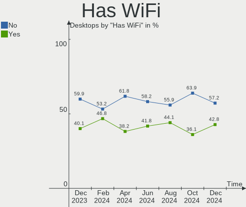
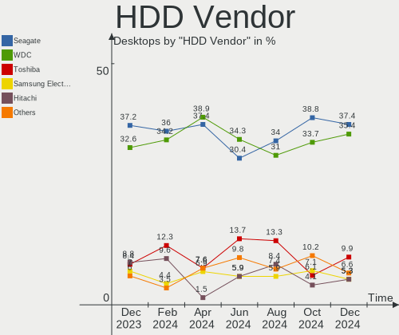
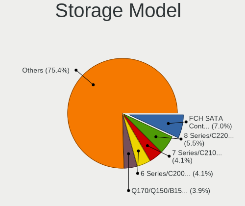
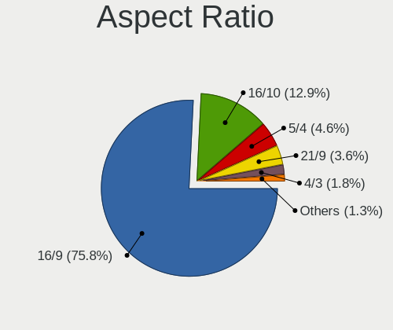
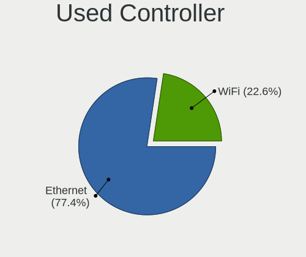

OpenMandriva Hardware Trends (Desktops)
---------------------------------------

A project to identify most popular hardware characteristics and track their change
over time based on data collected by OpenMandriva users at https://Linux-Hardware.org.

Anyone can contribute to this report by the [hw-probe](https://github.com/linuxhw/hw-probe) tool:

    sudo -E hw-probe -all -upload

Full-feature report is available here: https://linux-hardware.org/?view=trends

Period: Nov, 2021.

Contents
--------

* [ System ](#system)
  - [ OS                       ](#os)
  - [ OS Family                ](#os-family)
  - [ Kernel                   ](#kernel)
  - [ Kernel Family            ](#kernel-family)
  - [ Kernel Major Ver.        ](#kernel-major-ver)
  - [ Arch                     ](#arch)
  - [ DE                       ](#de)
  - [ Display Server           ](#display-server)
  - [ Display Manager          ](#display-manager)
  - [ OS Lang                  ](#os-lang)
  - [ Boot Mode                ](#boot-mode)
  - [ Filesystem               ](#filesystem)
  - [ Part. scheme             ](#part-scheme)
  - [ Dual Boot with Linux/BSD ](#dual-boot-with-linuxbsd)
  - [ Dual Boot (Win)          ](#dual-boot-win)

* [ Board ](#board)
  - [ Vendor                   ](#vendor)
  - [ Model                    ](#model)
  - [ Model Family             ](#model-family)
  - [ MFG Year                 ](#mfg-year)
  - [ Form Factor              ](#form-factor)
  - [ Secure Boot              ](#secure-boot)
  - [ Coreboot                 ](#coreboot)
  - [ RAM Size                 ](#ram-size)
  - [ RAM Used                 ](#ram-used)
  - [ Total Drives             ](#total-drives)
  - [ Has CD-ROM               ](#has-cd-rom)
  - [ Has Ethernet             ](#has-ethernet)
  - [ Has WiFi                 ](#has-wifi)
  - [ Has Bluetooth            ](#has-bluetooth)

* [ Location ](#location)
  - [ Country                  ](#country)
  - [ City                     ](#city)

* [ Drives ](#drives)
  - [ Drive Vendor             ](#drive-vendor)
  - [ Drive Model              ](#drive-model)
  - [ HDD Vendor               ](#hdd-vendor)
  - [ SSD Vendor               ](#ssd-vendor)
  - [ Drive Kind               ](#drive-kind)
  - [ Drive Connector          ](#drive-connector)
  - [ Drive Size               ](#drive-size)
  - [ Space Total              ](#space-total)
  - [ Space Used               ](#space-used)
  - [ Malfunc. Drives          ](#malfunc-drives)
  - [ Malfunc. Drive Vendor    ](#malfunc-drive-vendor)
  - [ Malfunc. HDD Vendor      ](#malfunc-hdd-vendor)
  - [ Malfunc. Drive Kind      ](#malfunc-drive-kind)
  - [ Failed Drives            ](#failed-drives)
  - [ Failed Drive Vendor      ](#failed-drive-vendor)
  - [ Drive Status             ](#drive-status)

* [ Storage controller ](#storage-controller)
  - [ Storage Vendor           ](#storage-vendor)
  - [ Storage Model            ](#storage-model)
  - [ Storage Kind             ](#storage-kind)

* [ Processor ](#processor)
  - [ CPU Vendor               ](#cpu-vendor)
  - [ CPU Model                ](#cpu-model)
  - [ CPU Model Family         ](#cpu-model-family)
  - [ CPU Cores                ](#cpu-cores)
  - [ CPU Sockets              ](#cpu-sockets)
  - [ CPU Threads              ](#cpu-threads)
  - [ CPU Op-Modes             ](#cpu-op-modes)
  - [ CPU Microcode            ](#cpu-microcode)
  - [ CPU Microarch            ](#cpu-microarch)

* [ Graphics ](#graphics)
  - [ GPU Vendor               ](#gpu-vendor)
  - [ GPU Model                ](#gpu-model)
  - [ GPU Combo                ](#gpu-combo)
  - [ GPU Driver               ](#gpu-driver)
  - [ GPU Memory               ](#gpu-memory)

* [ Monitor ](#monitor)
  - [ Monitor Vendor           ](#monitor-vendor)
  - [ Monitor Model            ](#monitor-model)
  - [ Monitor Resolution       ](#monitor-resolution)
  - [ Monitor Diagonal         ](#monitor-diagonal)
  - [ Monitor Width            ](#monitor-width)
  - [ Aspect Ratio             ](#aspect-ratio)
  - [ Monitor Area             ](#monitor-area)
  - [ Pixel Density            ](#pixel-density)
  - [ Multiple Monitors        ](#multiple-monitors)

* [ Network ](#network)
  - [ Net Controller Vendor    ](#net-controller-vendor)
  - [ Net Controller Model     ](#net-controller-model)
  - [ Wireless Vendor          ](#wireless-vendor)
  - [ Wireless Model           ](#wireless-model)
  - [ Ethernet Vendor          ](#ethernet-vendor)
  - [ Ethernet Model           ](#ethernet-model)
  - [ Net Controller Kind      ](#net-controller-kind)
  - [ Used Controller          ](#used-controller)
  - [ NICs                     ](#nics)
  - [ IPv6                     ](#ipv6)

* [ Bluetooth ](#bluetooth)
  - [ Bluetooth Vendor         ](#bluetooth-vendor)
  - [ Bluetooth Model          ](#bluetooth-model)

* [ Sound ](#sound)
  - [ Sound Vendor             ](#sound-vendor)
  - [ Sound Model              ](#sound-model)

* [ Memory ](#memory)
  - [ Memory Vendor            ](#memory-vendor)
  - [ Memory Model             ](#memory-model)
  - [ Memory Kind              ](#memory-kind)
  - [ Memory Form Factor       ](#memory-form-factor)
  - [ Memory Size              ](#memory-size)
  - [ Memory Speed             ](#memory-speed)

* [ Printers & scanners ](#printers--scanners)
  - [ Printer Vendor           ](#printer-vendor)
  - [ Printer Model            ](#printer-model)
  - [ Scanner Vendor           ](#scanner-vendor)
  - [ Scanner Model            ](#scanner-model)

* [ Camera ](#camera)
  - [ Camera Vendor            ](#camera-vendor)
  - [ Camera Model             ](#camera-model)

* [ Security ](#security)
  - [ Fingerprint Vendor       ](#fingerprint-vendor)
  - [ Fingerprint Model        ](#fingerprint-model)
  - [ Chipcard Vendor          ](#chipcard-vendor)
  - [ Chipcard Model           ](#chipcard-model)

* [ Unsupported ](#unsupported)
  - [ Unsupported Devices      ](#unsupported-devices)
  - [ Unsupported Device Types ](#unsupported-device-types)

System
------

OS
--

Installed operating systems

| Name              | Desktops | Percent |
|-------------------|----------|---------|
| OpenMandriva 4.2  | 106      | 88.33%  |
| OpenMandriva 4.50 | 14       | 11.67%  |

OS Family
---------

OS without a version

| Name         | Desktops | Percent |
|--------------|----------|---------|
| OpenMandriva | 120      | 100%    |

Kernel
------

Version of the Linux kernel

| Version                  | Desktops | Percent |
|--------------------------|----------|---------|
| 5.10.14-desktop-1omv4002 | 103      | 85.83%  |
| 5.12.4-desktop-1omv4050  | 6        | 5%      |
| 5.14.7-desktop-1omv4050  | 5        | 4.17%   |
| 5.14.14-desktop-1omv4050 | 3        | 2.5%    |
| 5.11.12-desktop-1omv4002 | 3        | 2.5%    |

Kernel Family
-------------

Linux kernel without a distro release

| Version | Desktops | Percent |
|---------|----------|---------|
| 5.10.14 | 103      | 85.83%  |
| 5.12.4  | 6        | 5%      |
| 5.14.7  | 5        | 4.17%   |
| 5.14.14 | 3        | 2.5%    |
| 5.11.12 | 3        | 2.5%    |

Kernel Major Ver.
-----------------

Linux kernel major version

| Version | Desktops | Percent |
|---------|----------|---------|
| 5.10    | 103      | 85.83%  |
| 5.14    | 8        | 6.67%   |
| 5.12    | 6        | 5%      |
| 5.11    | 3        | 2.5%    |

Arch
----

OS architecture (x86_64, i586, etc.)

| Name   | Desktops | Percent |
|--------|----------|---------|
| x86_64 | 120      | 100%    |

DE
--

Desktop Environment

| Name | Desktops | Percent |
|------|----------|---------|
| KDE5 | 119      | 99.17%  |
| LXQt | 1        | 0.83%   |

Display Server
--------------

X11 or Wayland

| Name    | Desktops | Percent |
|---------|----------|---------|
| X11     | 116      | 96.67%  |
| Wayland | 4        | 3.33%   |

Display Manager
---------------

SDDM, LightDM, etc.

| Name | Desktops | Percent |
|------|----------|---------|
| SDDM | 120      | 100%    |

OS Lang
-------

Language

| Lang  | Desktops | Percent |
|-------|----------|---------|
| en_US | 68       | 56.67%  |
| pt_BR | 10       | 8.33%   |
| ru_RU | 9        | 7.5%    |
| fr_FR | 6        | 5%      |
| de_DE | 6        | 5%      |
| pl_PL | 3        | 2.5%    |
| it_IT | 3        | 2.5%    |
| cs_CZ | 3        | 2.5%    |
| nl_NL | 2        | 1.67%   |
| es_ES | 2        | 1.67%   |
| es_AR | 2        | 1.67%   |
| ru_UA | 1        | 0.83%   |
| it_CH | 1        | 0.83%   |
| hu_HU | 1        | 0.83%   |
| fr_CA | 1        | 0.83%   |
| de_CH | 1        | 0.83%   |
| de_AT | 1        | 0.83%   |

Boot Mode
---------

EFI or BIOS

| Mode | Desktops | Percent |
|------|----------|---------|
| BIOS | 80       | 66.67%  |
| EFI  | 40       | 33.33%  |

Filesystem
----------

Type of filesystem

| Type    | Desktops | Percent |
|---------|----------|---------|
| Overlay | 107      | 89.17%  |
| Ext4    | 13       | 10.83%  |

Part. scheme
------------

Scheme of partitioning

| Type    | Desktops | Percent |
|---------|----------|---------|
| GPT     | 70       | 58.33%  |
| MBR     | 49       | 40.83%  |
| Unknown | 1        | 0.83%   |

Dual Boot with Linux/BSD
------------------------

Hosting more than one Linux/BSD

| Dual boot | Desktops | Percent |
|-----------|----------|---------|
| Yes       | 69       | 57.5%   |
| No        | 51       | 42.5%   |

Dual Boot (Win)
---------------

Hosting Linux and Windows

| Dual boot | Desktops | Percent |
|-----------|----------|---------|
| Yes       | 70       | 58.33%  |
| No        | 50       | 41.67%  |

Board
-----

Vendor
------

Motherboard manufacturer

| Name                | Desktops | Percent |
|---------------------|----------|---------|
| ASUSTek Computer    | 34       | 28.33%  |
| MSI                 | 18       | 15%     |
| Gigabyte Technology | 17       | 14.17%  |
| ASRock              | 13       | 10.83%  |
| Hewlett-Packard     | 8        | 6.67%   |
| Dell                | 7        | 5.83%   |
| Lenovo              | 6        | 5%      |
| Biostar             | 3        | 2.5%    |
| Alienware           | 2        | 1.67%   |
| Acer                | 2        | 1.67%   |
| Supermicro          | 1        | 0.83%   |
| Semp Toshiba        | 1        | 0.83%   |
| Pegatron            | 1        | 0.83%   |
| MouseComputer       | 1        | 0.83%   |
| Medion              | 1        | 0.83%   |
| LattePanda          | 1        | 0.83%   |
| INTELBRAS           | 1        | 0.83%   |
| Intel               | 1        | 0.83%   |
| Fujitsu             | 1        | 0.83%   |
| Foxconn             | 1        | 0.83%   |

Model
-----

Motherboard model

| Name                                    | Desktops | Percent |
|-----------------------------------------|----------|---------|
| ASUS All Series                         | 6        | 5%      |
| MSI MS-7C52                             | 2        | 1.67%   |
| MSI MS-7C37                             | 2        | 1.67%   |
| Gigabyte H61M-DS2                       | 2        | 1.67%   |
| Gigabyte B75M-D2V                       | 2        | 1.67%   |
| Dell OptiPlex 390                       | 2        | 1.67%   |
| ASUS SABERTOOTH 990FX R2.0              | 2        | 1.67%   |
| Supermicro C2SBX                        | 1        | 0.83%   |
| Semp Toshiba STI                        | 1        | 0.83%   |
| Pegatron h9-1183                        | 1        | 0.83%   |
| MSI MS-7D09                             | 1        | 0.83%   |
| MSI MS-7C08                             | 1        | 0.83%   |
| MSI MS-7B89                             | 1        | 0.83%   |
| MSI MS-7B86                             | 1        | 0.83%   |
| MSI MS-7B84                             | 1        | 0.83%   |
| MSI MS-7B07                             | 1        | 0.83%   |
| MSI MS-7A33                             | 1        | 0.83%   |
| MSI MS-7972                             | 1        | 0.83%   |
| MSI MS-7918                             | 1        | 0.83%   |
| MSI MS-7845                             | 1        | 0.83%   |
| MSI MS-7817                             | 1        | 0.83%   |
| MSI MS-7758                             | 1        | 0.83%   |
| MSI MS-7721                             | 1        | 0.83%   |
| MSI MS-7529                             | 1        | 0.83%   |
| MouseComputer B360M                     | 1        | 0.83%   |
| Medion MS-7621                          | 1        | 0.83%   |
| Lenovo ThinkStation S30 4351FE5         | 1        | 0.83%   |
| Lenovo ThinkCentre M90p 5450A26         | 1        | 0.83%   |
| Lenovo IdeaCentre C5 14IMB05 90R70000US | 1        | 0.83%   |
| Lenovo IdeaCentre 3 07ADA05 90MV009MGE  | 1        | 0.83%   |
| Lenovo H520S 10093                      | 1        | 0.83%   |
| Lenovo H420                             | 1        | 0.83%   |
| LattePanda Delta                        | 1        | 0.83%   |
| INTELBRAS IE-G31TM7                     | 1        | 0.83%   |
| Intel H61                               | 1        | 0.83%   |
| HP Pavilion Desktop PC 570-p0xx         | 1        | 0.83%   |
| HP EliteDesk 800 G2 SFF                 | 1        | 0.83%   |
| HP EliteDesk 800 G1 SFF                 | 1        | 0.83%   |
| HP EliteDesk 705 G1 SFF                 | 1        | 0.83%   |
| HP Compaq dc7900 Small Form Factor      | 1        | 0.83%   |
| HP Compaq dc7700 Small Form Factor      | 1        | 0.83%   |
| HP Compaq dc7700 Convertible Minitower  | 1        | 0.83%   |
| HP Compaq 6005 Pro SFF PC               | 1        | 0.83%   |
| Gigabyte Z590 AORUS ELITE AX            | 1        | 0.83%   |
| Gigabyte Z270X-Gaming K5                | 1        | 0.83%   |
| Gigabyte PH67A-UD3-B3                   | 1        | 0.83%   |
| Gigabyte P41T-D3P                       | 1        | 0.83%   |
| Gigabyte P31-ES3G                       | 1        | 0.83%   |
| Gigabyte H55M-S2                        | 1        | 0.83%   |
| Gigabyte H310M S2H 2.0                  | 1        | 0.83%   |
| Gigabyte GA-E6010N                      | 1        | 0.83%   |
| Gigabyte GA-990FXA-UD3                  | 1        | 0.83%   |
| Gigabyte GA-870A-UD3                    | 1        | 0.83%   |
| Gigabyte G41M-ES2H                      | 1        | 0.83%   |
| Gigabyte B75M-D3H                       | 1        | 0.83%   |
| Gigabyte 970A-DS3P                      | 1        | 0.83%   |
| Fujitsu ESPRIMO_P556                    | 1        | 0.83%   |
| Foxconn Pro 3400 Series MT              | 1        | 0.83%   |
| Dell Precision T1700                    | 1        | 0.83%   |
| Dell OptiPlex 760                       | 1        | 0.83%   |

Model Family
------------

Motherboard model prefix

| Name                   | Desktops | Percent |
|------------------------|----------|---------|
| ASUS All               | 6        | 5%      |
| Dell OptiPlex          | 5        | 4.17%   |
| HP Compaq              | 4        | 3.33%   |
| ASUS ROG               | 4        | 3.33%   |
| HP EliteDesk           | 3        | 2.5%    |
| MSI MS-7C52            | 2        | 1.67%   |
| MSI MS-7C37            | 2        | 1.67%   |
| Lenovo IdeaCentre      | 2        | 1.67%   |
| Gigabyte H61M-DS2      | 2        | 1.67%   |
| Gigabyte B75M-D2V      | 2        | 1.67%   |
| ASUS SABERTOOTH        | 2        | 1.67%   |
| ASUS P5VD2-MX          | 2        | 1.67%   |
| ASUS M5A78L-M          | 2        | 1.67%   |
| ASRock B450M           | 2        | 1.67%   |
| Alienware Aurora       | 2        | 1.67%   |
| Acer Aspire            | 2        | 1.67%   |
| Supermicro C2SBX       | 1        | 0.83%   |
| Semp Toshiba STI       | 1        | 0.83%   |
| Pegatron h9-1183       | 1        | 0.83%   |
| MSI MS-7D09            | 1        | 0.83%   |
| MSI MS-7C08            | 1        | 0.83%   |
| MSI MS-7B89            | 1        | 0.83%   |
| MSI MS-7B86            | 1        | 0.83%   |
| MSI MS-7B84            | 1        | 0.83%   |
| MSI MS-7B07            | 1        | 0.83%   |
| MSI MS-7A33            | 1        | 0.83%   |
| MSI MS-7972            | 1        | 0.83%   |
| MSI MS-7918            | 1        | 0.83%   |
| MSI MS-7845            | 1        | 0.83%   |
| MSI MS-7817            | 1        | 0.83%   |
| MSI MS-7758            | 1        | 0.83%   |
| MSI MS-7721            | 1        | 0.83%   |
| MSI MS-7529            | 1        | 0.83%   |
| MouseComputer B360M    | 1        | 0.83%   |
| Medion MS-7621         | 1        | 0.83%   |
| Lenovo ThinkStation    | 1        | 0.83%   |
| Lenovo ThinkCentre     | 1        | 0.83%   |
| Lenovo H520S           | 1        | 0.83%   |
| Lenovo H420            | 1        | 0.83%   |
| LattePanda Delta       | 1        | 0.83%   |
| INTELBRAS IE-G31TM7    | 1        | 0.83%   |
| Intel H61              | 1        | 0.83%   |
| HP Pavilion            | 1        | 0.83%   |
| Gigabyte Z590          | 1        | 0.83%   |
| Gigabyte Z270X-Gaming  | 1        | 0.83%   |
| Gigabyte PH67A-UD3-B3  | 1        | 0.83%   |
| Gigabyte P41T-D3P      | 1        | 0.83%   |
| Gigabyte P31-ES3G      | 1        | 0.83%   |
| Gigabyte H55M-S2       | 1        | 0.83%   |
| Gigabyte H310M         | 1        | 0.83%   |
| Gigabyte GA-E6010N     | 1        | 0.83%   |
| Gigabyte GA-990FXA-UD3 | 1        | 0.83%   |
| Gigabyte GA-870A-UD3   | 1        | 0.83%   |
| Gigabyte G41M-ES2H     | 1        | 0.83%   |
| Gigabyte B75M-D3H      | 1        | 0.83%   |
| Gigabyte 970A-DS3P     | 1        | 0.83%   |
| Fujitsu ESPRIMO        | 1        | 0.83%   |
| Foxconn Pro            | 1        | 0.83%   |
| Dell Precision         | 1        | 0.83%   |
| Dell DM061             | 1        | 0.83%   |

MFG Year
--------

Motherboard manufacture year

| Year | Desktops | Percent |
|------|----------|---------|
| 2020 | 15       | 12.5%   |
| 2021 | 14       | 11.67%  |
| 2015 | 11       | 9.17%   |
| 2012 | 11       | 9.17%   |
| 2010 | 9        | 7.5%    |
| 2013 | 8        | 6.67%   |
| 2011 | 8        | 6.67%   |
| 2016 | 7        | 5.83%   |
| 2007 | 7        | 5.83%   |
| 2018 | 6        | 5%      |
| 2008 | 6        | 5%      |
| 2019 | 5        | 4.17%   |
| 2014 | 5        | 4.17%   |
| 2017 | 4        | 3.33%   |
| 2009 | 4        | 3.33%   |

Form Factor
-----------

Physical design of the computer

| Name    | Desktops | Percent |
|---------|----------|---------|
| Desktop | 120      | 100%    |

Secure Boot
-----------

Enabled or disabled

| State    | Desktops | Percent |
|----------|----------|---------|
| Disabled | 120      | 100%    |

Coreboot
--------

Have coreboot on board

| Used | Desktops | Percent |
|------|----------|---------|
| No   | 120      | 100%    |

RAM Size
--------

Total RAM memory

| Size in GB  | Desktops | Percent |
|-------------|----------|---------|
| 4.01-8.0    | 26       | 21.67%  |
| 3.01-4.0    | 23       | 19.17%  |
| 16.01-24.0  | 22       | 18.33%  |
| 8.01-16.0   | 22       | 18.33%  |
| 32.01-64.0  | 12       | 10%     |
| 1.01-2.0    | 9        | 7.5%    |
| 64.01-256.0 | 3        | 2.5%    |
| 2.01-3.0    | 2        | 1.67%   |
| 24.01-32.0  | 1        | 0.83%   |

RAM Used
--------

Used RAM memory

| Used GB  | Desktops | Percent |
|----------|----------|---------|
| 1.01-2.0 | 84       | 70%     |
| 0.51-1.0 | 21       | 17.5%   |
| 0.01-0.5 | 7        | 5.83%   |
| 2.01-3.0 | 6        | 5%      |
| 4.01-8.0 | 1        | 0.83%   |
| 3.01-4.0 | 1        | 0.83%   |

Total Drives
------------

Number of drives on board

| Drives  | Desktops | Percent |
|---------|----------|---------|
| 1       | 56       | 46.67%  |
| 2       | 29       | 24.17%  |
| 3       | 20       | 16.67%  |
| 4       | 5        | 4.17%   |
| 5       | 3        | 2.5%    |
| 7       | 2        | 1.67%   |
| 0       | 2        | 1.67%   |
| 8       | 1        | 0.83%   |
| 6       | 1        | 0.83%   |
| Unknown | 1        | 0.83%   |

Has CD-ROM
----------

Has CD-ROM on board

| Presented | Desktops | Percent |
|-----------|----------|---------|
| Yes       | 83       | 69.17%  |
| No        | 37       | 30.83%  |

Has Ethernet
------------

Has Ethernet on board

| Presented | Desktops | Percent |
|-----------|----------|---------|
| Yes       | 120      | 100%    |

Has WiFi
--------

Has WiFi module

| Presented | Desktops | Percent |
|-----------|----------|---------|
| No        | 93       | 77.5%   |
| Yes       | 27       | 22.5%   |

Has Bluetooth
-------------

Has Bluetooth module

| Presented | Desktops | Percent |
|-----------|----------|---------|
| No        | 92       | 76.67%  |
| Yes       | 28       | 23.33%  |

Location
--------

Country
-------

Geographic location (country)

| Country     | Desktops | Percent |
|-------------|----------|---------|
| Russia      | 15       | 12.5%   |
| Brazil      | 14       | 11.67%  |
| Germany     | 13       | 10.83%  |
| USA         | 12       | 10%     |
| France      | 11       | 9.17%   |
| Canada      | 6        | 5%      |
| Poland      | 5        | 4.17%   |
| Italy       | 5        | 4.17%   |
| Czechia     | 4        | 3.33%   |
| Switzerland | 3        | 2.5%    |
| Spain       | 3        | 2.5%    |
| UK          | 2        | 1.67%   |
| Netherlands | 2        | 1.67%   |
| Japan       | 2        | 1.67%   |
| Iran        | 2        | 1.67%   |
| Hungary     | 2        | 1.67%   |
| Finland     | 2        | 1.67%   |
| Argentina   | 2        | 1.67%   |
| Uruguay     | 1        | 0.83%   |
| Ukraine     | 1        | 0.83%   |
| Taiwan      | 1        | 0.83%   |
| Serbia      | 1        | 0.83%   |
| Puerto Rico | 1        | 0.83%   |
| Norway      | 1        | 0.83%   |
| Malaysia    | 1        | 0.83%   |
| Ireland     | 1        | 0.83%   |
| India       | 1        | 0.83%   |
| Hong Kong   | 1        | 0.83%   |
| Georgia     | 1        | 0.83%   |
| China       | 1        | 0.83%   |
| Bangladesh  | 1        | 0.83%   |
| Austria     | 1        | 0.83%   |
| Australia   | 1        | 0.83%   |

City
----

Geographic location (city)

| City                     | Desktops | Percent |
|--------------------------|----------|---------|
| Zurich                   | 2        | 1.67%   |
| Utrecht                  | 2        | 1.67%   |
| Sorriso                  | 2        | 1.67%   |
| S??o Paulo               | 2        | 1.67%   |
| Rennes                   | 2        | 1.67%   |
| Nizhniy Novgorod         | 2        | 1.67%   |
| Moscow                   | 2        | 1.67%   |
| Deep River               | 2        | 1.67%   |
| Zolotar?«vka             | 1        | 0.83%   |
| Z?‚otoryja               | 1        | 0.83%   |
| Zabrze                   | 1        | 0.83%   |
| Yekaterinburg            | 1        | 0.83%   |
| Wuppertal                | 1        | 0.83%   |
| Villeneuve-les-Maguelone | 1        | 0.83%   |
| Villemoustaussou         | 1        | 0.83%   |
| Vienna                   | 1        | 0.83%   |
| Versailleux              | 1        | 0.83%   |
| Venancio Aires           | 1        | 0.83%   |
| Ulan-Ude                 | 1        | 0.83%   |
| Szentlorinc              | 1        | 0.83%   |
| Surrey                   | 1        | 0.83%   |
| Stuttgart                | 1        | 0.83%   |
| St Petersburg            | 1        | 0.83%   |
| Sosnowiec                | 1        | 0.83%   |
| Serdobsk                 | 1        | 0.83%   |
| S??o Bernardo do Campo   | 1        | 0.83%   |
| Saransk                  | 1        | 0.83%   |
| Sao Jeronimo da Serra    | 1        | 0.83%   |
| Santana Do Araguaia      | 1        | 0.83%   |
| Santa Luzia              | 1        | 0.83%   |
| San Rafael               | 1        | 0.83%   |
| San Jose                 | 1        | 0.83%   |
| Saint-Lin-Laurentides    | 1        | 0.83%   |
| Rosolini                 | 1        | 0.83%   |
| Rosario                  | 1        | 0.83%   |
| Reggio Emilia            | 1        | 0.83%   |
| Pittsburg                | 1        | 0.83%   |
| Phoenix                  | 1        | 0.83%   |
| Perm                     | 1        | 0.83%   |
| Pearl River              | 1        | 0.83%   |
| P?©cs                    | 1        | 0.83%   |
| Padova                   | 1        | 0.83%   |
| Oslo                     | 1        | 0.83%   |
| Osasco                   | 1        | 0.83%   |
| Novosibirsk              | 1        | 0.83%   |
| Nova Igua?§u             | 1        | 0.83%   |
| Norwich                  | 1        | 0.83%   |
| New Taipei               | 1        | 0.83%   |
| New Iberia               | 1        | 0.83%   |
| New Belgrade             | 1        | 0.83%   |
| Najaf??b??d              | 1        | 0.83%   |
| Munich                   | 1        | 0.83%   |
| Montevideo               | 1        | 0.83%   |
| Mieuxce                  | 1        | 0.83%   |
| Melbourne                | 1        | 0.83%   |
| Meiningen                | 1        | 0.83%   |
| Manresa                  | 1        | 0.83%   |
| Lyon                     | 1        | 0.83%   |
| Luckenwalde              | 1        | 0.83%   |
| Litom?›?™ice             | 1        | 0.83%   |

Drives
------

Drive Vendor
------------

Hard drive vendors

| Vendor              | Desktops | Drives | Percent |
|---------------------|----------|--------|---------|
| WDC                 | 53       | 65     | 27.89%  |
| Seagate             | 46       | 61     | 24.21%  |
| Samsung Electronics | 21       | 30     | 11.05%  |
| Toshiba             | 9        | 9      | 4.74%   |
| Kingston            | 9        | 12     | 4.74%   |
| Hitachi             | 9        | 9      | 4.74%   |
| Crucial             | 9        | 10     | 4.74%   |
| Unknown             | 5        | 7      | 2.63%   |
| MAXTOR              | 5        | 5      | 2.63%   |
| SanDisk             | 4        | 6      | 2.11%   |
| KIOXIA-EXCERIA      | 2        | 2      | 1.05%   |
| Intenso             | 2        | 2      | 1.05%   |
| Hewlett-Packard     | 2        | 3      | 1.05%   |
| China               | 2        | 2      | 1.05%   |
| A-DATA Technology   | 2        | 2      | 1.05%   |
| PNY                 | 1        | 1      | 0.53%   |
| PLEXTOR             | 1        | 1      | 0.53%   |
| Phison Electronics  | 1        | 1      | 0.53%   |
| Phison              | 1        | 1      | 0.53%   |
| LITEON              | 1        | 1      | 0.53%   |
| LaCie               | 1        | 1      | 0.53%   |
| KingDian            | 1        | 1      | 0.53%   |
| GOODRAM             | 1        | 1      | 0.53%   |
| External            | 1        | 1      | 0.53%   |
| Colorful            | 1        | 1      | 0.53%   |

Drive Model
-----------

Hard drive models

| Model                            | Desktops | Percent |
|----------------------------------|----------|---------|
| Seagate ST500DM002-1BD142 500GB  | 4        | 1.77%   |
| Seagate ST3500418AS 500GB        | 4        | 1.77%   |
| WDC WD10EADS-00L5B1 1TB          | 3        | 1.33%   |
| Seagate ST4000DM004-2CV104 4TB   | 3        | 1.33%   |
| Samsung SSD 860 QVO 1TB          | 3        | 1.33%   |
| Samsung SSD 860 EVO 250GB        | 3        | 1.33%   |
| Kingston SA400S37240G 240GB SSD  | 3        | 1.33%   |
| WDC WD5000AAKX-08ERMA0 500GB     | 2        | 0.88%   |
| WDC WD5000AAKX-001CA0 500GB      | 2        | 0.88%   |
| WDC WD20EZRZ-00Z5HB0 2TB         | 2        | 0.88%   |
| WDC WD10EZEX-75WN4A1 1TB         | 2        | 0.88%   |
| WDC WD10EZEX-08WN4A0 1TB         | 2        | 0.88%   |
| WDC WD10EZEX-00BN5A0 1TB         | 2        | 0.88%   |
| WDC WD10EFRX-68PJCN0 1TB         | 2        | 0.88%   |
| WDC WD10EARS-00MVWB0 1TB         | 2        | 0.88%   |
| WDC WD1002FAEX-00Z3A0 1TB        | 2        | 0.88%   |
| Unknown SD/MMC 16GB              | 2        | 0.88%   |
| Unknown M.S./M.S.Pro/HG 16GB     | 2        | 0.88%   |
| Toshiba DT01ACA200 2TB           | 2        | 0.88%   |
| Seagate ST3500413AS 500GB        | 2        | 0.88%   |
| Seagate ST3160815AS 160GB        | 2        | 0.88%   |
| Seagate ST2000DM008-2FR102 2TB   | 2        | 0.88%   |
| Seagate ST2000DM001-9YN164 2TB   | 2        | 0.88%   |
| Seagate ST2000DM001-1ER164 2TB   | 2        | 0.88%   |
| Seagate ST1000DM010-2EP102 1TB   | 2        | 0.88%   |
| Seagate ST1000DM003-9YN162 1TB   | 2        | 0.88%   |
| Samsung SSD 850 EVO 500GB        | 2        | 0.88%   |
| Samsung HD322HJ 320GB            | 2        | 0.88%   |
| Kingston SA400S37480G 480GB SSD  | 2        | 0.88%   |
| Crucial CT500MX500SSD1 500GB     | 2        | 0.88%   |
| Crucial CT480BX500SSD1 480GB     | 2        | 0.88%   |
| WDC WDS500G3XHC-00SJG0 500GB     | 1        | 0.44%   |
| WDC WDS500G2B0C-00PXH0 500GB     | 1        | 0.44%   |
| WDC WDS480G2G0A-00JH30 480GB SSD | 1        | 0.44%   |
| WDC WDS250G2B0A-00SM50 250GB SSD | 1        | 0.44%   |
| WDC WDS250G2B0A 250GB SSD        | 1        | 0.44%   |
| WDC WDS240G2G0A-00JH30 240GB SSD | 1        | 0.44%   |
| WDC WDS120G2G0B-00EPW0 120GB SSD | 1        | 0.44%   |
| WDC WDS100T2B0A-00SM50 1TB SSD   | 1        | 0.44%   |
| WDC WDS100T1X0E-00AFY0 1TB       | 1        | 0.44%   |
| WDC WDBNCE2500PNC-WRSN 250GB SSD | 1        | 0.44%   |
| WDC WD800JD-75JNA0 80GB          | 1        | 0.44%   |
| WDC WD800BB-00JHC0 80GB          | 1        | 0.44%   |
| WDC WD6400BPVT-22HXZT3 640GB     | 1        | 0.44%   |
| WDC WD6400AAKS-65A7B2 640GB      | 1        | 0.44%   |
| WDC WD60EZAZ-00ZGHB0 6TB         | 1        | 0.44%   |
| WDC WD5001AALS-00E3A0 500GB      | 1        | 0.44%   |
| WDC WD5000LUCT-63RC2Y0 500GB     | 1        | 0.44%   |
| WDC WD5000AAKX-60U6AA0 500GB     | 1        | 0.44%   |
| WDC WD5000AAKX-083CA1 500GB      | 1        | 0.44%   |
| WDC WD5000AAKX-00ERMA0 500GB     | 1        | 0.44%   |
| WDC WD5000AAKS-75A7B0 500GB      | 1        | 0.44%   |
| WDC WD40EFRX-68WT0N0 4TB         | 1        | 0.44%   |
| WDC WD400BD-75LRA0 40GB          | 1        | 0.44%   |
| WDC WD3200BEVT-22ZCT0 320GB      | 1        | 0.44%   |
| WDC WD3200AAKS-00B3A0 320GB      | 1        | 0.44%   |
| WDC WD3200AAJS-65M0A0 320GB      | 1        | 0.44%   |
| WDC WD3200AAJS-00RYA0 320GB      | 1        | 0.44%   |
| WDC WD2500AAKX-753CA1 250GB      | 1        | 0.44%   |
| WDC WD1600JS-60MHB5 160GB        | 1        | 0.44%   |

HDD Vendor
----------

Hard disk drive vendors

| Vendor              | Desktops | Drives | Percent |
|---------------------|----------|--------|---------|
| WDC                 | 47       | 55     | 38.21%  |
| Seagate             | 46       | 61     | 37.4%   |
| Hitachi             | 9        | 9      | 7.32%   |
| Toshiba             | 8        | 8      | 6.5%    |
| Samsung Electronics | 6        | 6      | 4.88%   |
| MAXTOR              | 5        | 5      | 4.07%   |
| Unknown             | 1        | 1      | 0.81%   |
| External            | 1        | 1      | 0.81%   |

SSD Vendor
----------

Solid state drive vendors

| Vendor              | Desktops | Drives | Percent |
|---------------------|----------|--------|---------|
| Samsung Electronics | 11       | 15     | 20.75%  |
| Kingston            | 9        | 12     | 16.98%  |
| Crucial             | 8        | 9      | 15.09%  |
| WDC                 | 6        | 7      | 11.32%  |
| SanDisk             | 4        | 6      | 7.55%   |
| Intenso             | 2        | 2      | 3.77%   |
| China               | 2        | 2      | 3.77%   |
| A-DATA Technology   | 2        | 2      | 3.77%   |
| Unknown             | 1        | 1      | 1.89%   |
| Toshiba             | 1        | 1      | 1.89%   |
| PNY                 | 1        | 1      | 1.89%   |
| PLEXTOR             | 1        | 1      | 1.89%   |
| KIOXIA-EXCERIA      | 1        | 1      | 1.89%   |
| KingDian            | 1        | 1      | 1.89%   |
| Hewlett-Packard     | 1        | 1      | 1.89%   |
| GOODRAM             | 1        | 1      | 1.89%   |
| Colorful            | 1        | 1      | 1.89%   |

Drive Kind
----------

HDD or SSD

| Kind    | Desktops | Drives | Percent |
|---------|----------|--------|---------|
| HDD     | 98       | 146    | 60.12%  |
| SSD     | 47       | 64     | 28.83%  |
| NVMe    | 14       | 19     | 8.59%   |
| Unknown | 3        | 5      | 1.84%   |
| MMC     | 1        | 1      | 0.61%   |

Drive Connector
---------------

SATA, SAS, NVMe, etc.

| Type | Desktops | Drives | Percent |
|------|----------|--------|---------|
| SATA | 113      | 203    | 83.09%  |
| NVMe | 14       | 19     | 10.29%  |
| SAS  | 8        | 12     | 5.88%   |
| MMC  | 1        | 1      | 0.74%   |

Drive Size
----------

Size of hard drive

| Size in TB | Desktops | Drives | Percent |
|------------|----------|--------|---------|
| 0.01-0.5   | 85       | 120    | 53.46%  |
| 0.51-1.0   | 47       | 62     | 29.56%  |
| 1.01-2.0   | 16       | 17     | 10.06%  |
| 3.01-4.0   | 8        | 8      | 5.03%   |
| 2.01-3.0   | 1        | 1      | 0.63%   |
| 10.01-20.0 | 1        | 1      | 0.63%   |
| 4.01-10.0  | 1        | 1      | 0.63%   |

Space Total
-----------

Amount of disk space available on the file system

| Size in GB     | Desktops | Percent |
|----------------|----------|---------|
| 1-20           | 48       | 40%     |
| Unknown        | 33       | 27.5%   |
| 251-500        | 10       | 8.33%   |
| 101-250        | 10       | 8.33%   |
| 51-100         | 5        | 4.17%   |
| 21-50          | 4        | 3.33%   |
| 501-1000       | 4        | 3.33%   |
| More than 3000 | 2        | 1.67%   |
| 2001-3000      | 2        | 1.67%   |
| 1001-2000      | 2        | 1.67%   |

Space Used
----------

Amount of used disk space

| Used GB   | Desktops | Percent |
|-----------|----------|---------|
| 1-20      | 75       | 62.5%   |
| Unknown   | 33       | 27.5%   |
| 51-100    | 4        | 3.33%   |
| 21-50     | 2        | 1.67%   |
| 2001-3000 | 2        | 1.67%   |
| 101-250   | 2        | 1.67%   |
| 1001-2000 | 1        | 0.83%   |
| 501-1000  | 1        | 0.83%   |

Malfunc. Drives
---------------

Drive models with a malfunction

| Model                             | Desktops | Drives | Percent |
|-----------------------------------|----------|--------|---------|
| WDC WD5000AAKX-001CA0 500GB       | 2        | 2      | 5.13%   |
| WDC WD10EADS-00L5B1 1TB           | 2        | 2      | 5.13%   |
| Seagate ST500DM002-1BD142 500GB   | 2        | 2      | 5.13%   |
| WDC WDS120G2G0B-00EPW0 120GB SSD  | 1        | 1      | 2.56%   |
| WDC WD5000AAKX-60U6AA0 500GB      | 1        | 1      | 2.56%   |
| WDC WD5000AAKX-083CA1 500GB       | 1        | 1      | 2.56%   |
| WDC WD5000AAKX-00ERMA0 500GB      | 1        | 1      | 2.56%   |
| WDC WD5000AAKS-75A7B0 500GB       | 1        | 1      | 2.56%   |
| WDC WD3200BEVT-22ZCT0 320GB       | 1        | 1      | 2.56%   |
| WDC WD3200AAJS-65M0A0 320GB       | 1        | 1      | 2.56%   |
| WDC WD2500AAKX-753CA1 250GB       | 1        | 1      | 2.56%   |
| WDC WD10JPVT-00MS8T0 1TB          | 1        | 1      | 2.56%   |
| WDC WD10EZEX-60WN4A0 1TB          | 1        | 1      | 2.56%   |
| WDC WD10EARS-00MVWB0 1TB          | 1        | 1      | 2.56%   |
| WDC WD1003FZEX-00MK2A0 1TB        | 1        | 1      | 2.56%   |
| Toshiba MK1252GSX 120GB           | 1        | 1      | 2.56%   |
| Toshiba DT01ACA100 1TB            | 1        | 1      | 2.56%   |
| Seagate ST9120823AS 120GB         | 1        | 1      | 2.56%   |
| Seagate ST500LT0 12-1DG142 500GB  | 1        | 1      | 2.56%   |
| Seagate ST4000NM0053 4TB          | 1        | 1      | 2.56%   |
| Seagate ST4000NM0033-9ZM170 4TB   | 1        | 1      | 2.56%   |
| Seagate ST3500418AS 500GB         | 1        | 1      | 2.56%   |
| Seagate ST3500413AS 500GB         | 1        | 1      | 2.56%   |
| Seagate ST3250311SV 250GB         | 1        | 1      | 2.56%   |
| Seagate ST3160815AS 160GB         | 1        | 1      | 2.56%   |
| Seagate ST31000528AS 1TB          | 1        | 1      | 2.56%   |
| Seagate ST2000VM003-1ET164 2TB    | 1        | 1      | 2.56%   |
| Seagate ST2000DM001-9YN164 2TB    | 1        | 1      | 2.56%   |
| Seagate ST2000DM001-1CH164 2TB    | 1        | 1      | 2.56%   |
| Seagate ST1000DM003-9YN162 1TB    | 1        | 1      | 2.56%   |
| Seagate ST1000DL002-9TT153 1TB    | 1        | 1      | 2.56%   |
| Samsung Electronics HD322HJ 320GB | 1        | 1      | 2.56%   |
| PLEXTOR PX-128M6Pro 128GB SSD     | 1        | 1      | 2.56%   |
| MAXTOR STM3500630AS 500GB         | 1        | 1      | 2.56%   |
| MAXTOR 6L080M0 80GB               | 1        | 1      | 2.56%   |
| Hitachi HDS5C3020BLE630 2TB       | 1        | 1      | 2.56%   |

Malfunc. Drive Vendor
---------------------

Vendors of faulty drives

| Vendor              | Desktops | Drives | Percent |
|---------------------|----------|--------|---------|
| WDC                 | 15       | 16     | 41.67%  |
| Seagate             | 14       | 16     | 38.89%  |
| Toshiba             | 2        | 2      | 5.56%   |
| MAXTOR              | 2        | 2      | 5.56%   |
| Samsung Electronics | 1        | 1      | 2.78%   |
| PLEXTOR             | 1        | 1      | 2.78%   |
| Hitachi             | 1        | 1      | 2.78%   |

Malfunc. HDD Vendor
-------------------

Vendors of faulty HDD drives

| Vendor              | Desktops | Drives | Percent |
|---------------------|----------|--------|---------|
| WDC                 | 14       | 15     | 41.18%  |
| Seagate             | 14       | 16     | 41.18%  |
| Toshiba             | 2        | 2      | 5.88%   |
| MAXTOR              | 2        | 2      | 5.88%   |
| Samsung Electronics | 1        | 1      | 2.94%   |
| Hitachi             | 1        | 1      | 2.94%   |

Malfunc. Drive Kind
-------------------

Kinds of faulty drives

| Kind | Desktops | Drives | Percent |
|------|----------|--------|---------|
| HDD  | 32       | 37     | 94.12%  |
| SSD  | 2        | 2      | 5.88%   |

Failed Drives
-------------

Failed drive models

Zero info for selected period =(

Failed Drive Vendor
-------------------

Failed drive vendors

Zero info for selected period =(

Drive Status
------------

Number of failed and malfunc. drives

| Status   | Desktops | Drives | Percent |
|----------|----------|--------|---------|
| Works    | 92       | 176    | 65.71%  |
| Malfunc  | 34       | 39     | 24.29%  |
| Detected | 14       | 20     | 10%     |

Storage controller
------------------

Storage Vendor
--------------

Storage controller vendors

| Vendor                        | Desktops | Percent |
|-------------------------------|----------|---------|
| Intel                         | 79       | 53.02%  |
| AMD                           | 35       | 23.49%  |
| ASMedia Technology            | 6        | 4.03%   |
| Samsung Electronics           | 5        | 3.36%   |
| Nvidia                        | 4        | 2.68%   |
| JMicron Technology            | 4        | 2.68%   |
| Sandisk                       | 3        | 2.01%   |
| Marvell Technology Group      | 3        | 2.01%   |
| VIA Technologies              | 2        | 1.34%   |
| Phison Electronics            | 2        | 1.34%   |
| Silicon Image                 | 1        | 0.67%   |
| Micron/Crucial Technology     | 1        | 0.67%   |
| Lite-On Technology            | 1        | 0.67%   |
| KIOXIA                        | 1        | 0.67%   |
| Integrated Technology Express | 1        | 0.67%   |
| Biwin Storage Technology      | 1        | 0.67%   |

Storage Model
-------------

Storage controller models

| Model                                                                                   | Desktops | Percent |
|-----------------------------------------------------------------------------------------|----------|---------|
| AMD FCH SATA Controller [AHCI mode]                                                     | 19       | 9.45%   |
| Intel NM10/ICH7 Family SATA Controller [IDE mode]                                       | 10       | 4.98%   |
| Intel Q170/Q150/B150/H170/H110/Z170/CM236 Chipset SATA Controller [AHCI Mode]           | 8        | 3.98%   |
| Intel 82801G (ICH7 Family) IDE Controller                                               | 8        | 3.98%   |
| Intel 8 Series/C220 Series Chipset Family 6-port SATA Controller 1 [AHCI mode]          | 8        | 3.98%   |
| Intel 6 Series/C200 Series Chipset Family Desktop SATA Controller (IDE mode, ports 4-5) | 7        | 3.48%   |
| Intel 6 Series/C200 Series Chipset Family Desktop SATA Controller (IDE mode, ports 0-3) | 7        | 3.48%   |
| Intel 6 Series/C200 Series Chipset Family 6 port Desktop SATA AHCI Controller           | 7        | 3.48%   |
| Intel 7 Series/C210 Series Chipset Family 6-port SATA Controller [AHCI mode]            | 6        | 2.99%   |
| ASMedia ASM1062 Serial ATA Controller                                                   | 6        | 2.99%   |
| AMD SB7x0/SB8x0/SB9x0 SATA Controller [AHCI mode]                                       | 6        | 2.99%   |
| Intel 9 Series Chipset Family SATA Controller [AHCI Mode]                               | 5        | 2.49%   |
| AMD SB7x0/SB8x0/SB9x0 SATA Controller [IDE mode]                                        | 5        | 2.49%   |
| AMD SB7x0/SB8x0/SB9x0 IDE Controller                                                    | 5        | 2.49%   |
| AMD 400 Series Chipset SATA Controller                                                  | 5        | 2.49%   |
| Intel 200 Series PCH SATA controller [AHCI mode]                                        | 4        | 1.99%   |
| AMD FCH SATA Controller D                                                               | 4        | 1.99%   |
| Nvidia MCP61 SATA Controller                                                            | 3        | 1.49%   |
| Nvidia MCP61 IDE                                                                        | 3        | 1.49%   |
| JMicron JMB363 SATA/IDE Controller                                                      | 3        | 1.49%   |
| Intel SATA Controller [RAID mode]                                                       | 3        | 1.49%   |
| Intel 7 Series/C210 Series Chipset Family 4-port SATA Controller [IDE mode]             | 3        | 1.49%   |
| Intel 7 Series/C210 Series Chipset Family 2-port SATA Controller [IDE mode]             | 3        | 1.49%   |
| Intel 500 Series Chipset Family SATA AHCI Controller                                    | 3        | 1.49%   |
| VIA VT82C586A/B/VT82C686/A/B/VT823x/A/C PIPC Bus Master IDE                             | 2        | 1%      |
| Samsung NVMe SSD Controller SM981/PM981/PM983                                           | 2        | 1%      |
| Samsung NVMe SSD Controller PM9A1/PM9A3/980PRO                                          | 2        | 1%      |
| Samsung NVMe SSD Controller 980                                                         | 2        | 1%      |
| Phison E12 NVMe Controller                                                              | 2        | 1%      |
| JMicron JMB368 IDE controller                                                           | 2        | 1%      |
| Intel 82801IR/IO/IH (ICH9R/DO/DH) 6 port SATA Controller [AHCI mode]                    | 2        | 1%      |
| Intel 82801H (ICH8 Family) 4 port SATA Controller [IDE mode]                            | 2        | 1%      |
| Intel 5 Series/3400 Series Chipset 4 port SATA IDE Controller                           | 2        | 1%      |
| Intel 5 Series/3400 Series Chipset 2 port SATA IDE Controller                           | 2        | 1%      |
| Intel 4 Series Chipset PT IDER Controller                                               | 2        | 1%      |
| AMD FCH IDE Controller                                                                  | 2        | 1%      |
| VIA VT8237A SATA 2-Port Controller                                                      | 1        | 0.5%    |
| VIA Serial ATA Controller                                                               | 1        | 0.5%    |
| Silicon Image PCI0680 Ultra ATA-133 Host Controller                                     | 1        | 0.5%    |
| Sandisk WD PC SN810 / Black SN850 NVMe SSD                                              | 1        | 0.5%    |
| Sandisk WD Blue SN550 NVMe SSD                                                          | 1        | 0.5%    |
| Sandisk WD Black 2018/SN750 / PC SN720 NVMe SSD                                         | 1        | 0.5%    |
| Samsung NVMe SSD Controller SM961/PM961/SM963                                           | 1        | 0.5%    |
| Nvidia MCP79 AHCI Controller                                                            | 1        | 0.5%    |
| Micron/Crucial NVMe Controller                                                          | 1        | 0.5%    |
| Marvell Group 88SE9215 PCIe 2.0 x1 4-port SATA 6 Gb/s Controller                        | 1        | 0.5%    |
| Marvell Group 88SE9120 SATA 6Gb/s Controller                                            | 1        | 0.5%    |
| Marvell Group 88SE6111/6121 SATA II / PATA Controller                                   | 1        | 0.5%    |
| Lite-On Lite-On Non-Volatile memory controller                                          | 1        | 0.5%    |
| KIOXIA NVMe SSD                                                                         | 1        | 0.5%    |
| Intel Comet Lake SATA AHCI Controller                                                   | 1        | 0.5%    |
| Intel Comet Lake PCH-H RAID                                                             | 1        | 0.5%    |
| Intel Celeron/Pentium Silver Processor SATA Controller                                  | 1        | 0.5%    |
| Intel Cannon Lake PCH SATA AHCI Controller                                              | 1        | 0.5%    |
| Intel C604/X79 series chipset 4-Port SATA/SAS Storage Control Unit                      | 1        | 0.5%    |
| Intel C600/X79 series chipset IDE-r Controller                                          | 1        | 0.5%    |
| Intel C600/X79 series chipset 4-Port SATA IDE Controller                                | 1        | 0.5%    |
| Intel C600/X79 series chipset 2-Port SATA IDE Controller                                | 1        | 0.5%    |
| Intel 82Q35 Express PT IDER Controller                                                  | 1        | 0.5%    |
| Intel 82801JD/DO (ICH10 Family) SATA AHCI Controller                                    | 1        | 0.5%    |

Storage Kind
------------

Kind of storage controller (IDE, SATA, NVMe, SAS, ...)

| Kind | Desktops | Percent |
|------|----------|---------|
| SATA | 85       | 57.05%  |
| IDE  | 44       | 29.53%  |
| NVMe | 14       | 9.4%    |
| RAID | 5        | 3.36%   |
| SAS  | 1        | 0.67%   |

Processor
---------

CPU Vendor
----------

Processor vendors

| Vendor | Desktops | Percent |
|--------|----------|---------|
| Intel  | 82       | 68.33%  |
| AMD    | 38       | 31.67%  |

CPU Model
---------

Processor models

| Model                                       | Desktops | Percent |
|---------------------------------------------|----------|---------|
| Intel Pentium Dual-Core CPU E5200 @ 2.50GHz | 3        | 2.5%    |
| Intel Pentium CPU G3258 @ 3.20GHz           | 3        | 2.5%    |
| Intel Core i7-3770K CPU @ 3.50GHz           | 3        | 2.5%    |
| Intel Pentium CPU G620 @ 2.60GHz            | 2        | 1.67%   |
| Intel Core i7-4770 CPU @ 3.40GHz            | 2        | 1.67%   |
| Intel Core i5-7400 CPU @ 3.00GHz            | 2        | 1.67%   |
| Intel Core i5-6500 CPU @ 3.20GHz            | 2        | 1.67%   |
| Intel Core i5-3330 CPU @ 3.00GHz            | 2        | 1.67%   |
| Intel Core i5-2320 CPU @ 3.00GHz            | 2        | 1.67%   |
| Intel Core i3-4330 CPU @ 3.50GHz            | 2        | 1.67%   |
| Intel Core i3-2120 CPU @ 3.30GHz            | 2        | 1.67%   |
| Intel Core i3 CPU 540 @ 3.07GHz             | 2        | 1.67%   |
| Intel Core 2 Quad CPU Q6600 @ 2.40GHz       | 2        | 1.67%   |
| Intel 11th Gen Core i9-11900K @ 3.50GHz     | 2        | 1.67%   |
| AMD Ryzen 9 5900X 12-Core Processor         | 2        | 1.67%   |
| AMD Ryzen 7 3700X 8-Core Processor          | 2        | 1.67%   |
| AMD Ryzen 5 3600 6-Core Processor           | 2        | 1.67%   |
| AMD Phenom II X4 955 Processor              | 2        | 1.67%   |
| AMD FX-8350 Eight-Core Processor            | 2        | 1.67%   |
| AMD A8-6600K APU with Radeon HD Graphics    | 2        | 1.67%   |
| Intel Xeon CPU X3363 @ 2.83GHz              | 1        | 0.83%   |
| Intel Xeon CPU E5-1620 v2 @ 3.70GHz         | 1        | 0.83%   |
| Intel Xeon CPU E3-1226 v3 @ 3.30GHz         | 1        | 0.83%   |
| Intel Pentium Gold G5400 CPU @ 3.70GHz      | 1        | 0.83%   |
| Intel Pentium Dual-Core CPU T4500 @ 2.30GHz | 1        | 0.83%   |
| Intel Pentium Dual-Core CPU E6600 @ 3.06GHz | 1        | 0.83%   |
| Intel Pentium Dual-Core CPU E5400 @ 2.70GHz | 1        | 0.83%   |
| Intel Pentium D CPU 3.00GHz                 | 1        | 0.83%   |
| Intel Pentium CPU G840 @ 2.80GHz            | 1        | 0.83%   |
| Intel Pentium CPU G4400 @ 3.30GHz           | 1        | 0.83%   |
| Intel Pentium CPU G2020 @ 2.90GHz           | 1        | 0.83%   |
| Intel Core i7-8700K CPU @ 3.70GHz           | 1        | 0.83%   |
| Intel Core i7-7700 CPU @ 3.60GHz            | 1        | 0.83%   |
| Intel Core i7-6700 CPU @ 3.40GHz            | 1        | 0.83%   |
| Intel Core i7-4790 CPU @ 3.60GHz            | 1        | 0.83%   |
| Intel Core i7-4770K CPU @ 3.50GHz           | 1        | 0.83%   |
| Intel Core i5-9400F CPU @ 2.90GHz           | 1        | 0.83%   |
| Intel Core i5-8400 CPU @ 2.80GHz            | 1        | 0.83%   |
| Intel Core i5-7600K CPU @ 3.80GHz           | 1        | 0.83%   |
| Intel Core i5-4590 CPU @ 3.30GHz            | 1        | 0.83%   |
| Intel Core i5-4460S CPU @ 2.90GHz           | 1        | 0.83%   |
| Intel Core i5-3570 CPU @ 3.40GHz            | 1        | 0.83%   |
| Intel Core i5-3550 CPU @ 3.30GHz            | 1        | 0.83%   |
| Intel Core i5-3470 CPU @ 3.20GHz            | 1        | 0.83%   |
| Intel Core i5-3340 CPU @ 3.10GHz            | 1        | 0.83%   |
| Intel Core i5-2500 CPU @ 3.30GHz            | 1        | 0.83%   |
| Intel Core i5-2400 CPU @ 3.10GHz            | 1        | 0.83%   |
| Intel Core i5-10400F CPU @ 2.90GHz          | 1        | 0.83%   |
| Intel Core i5 CPU 650 @ 3.20GHz             | 1        | 0.83%   |
| Intel Core i3-6100 CPU @ 3.70GHz            | 1        | 0.83%   |
| Intel Core i3-4170 CPU @ 3.70GHz            | 1        | 0.83%   |
| Intel Core i3-4130 CPU @ 3.40GHz            | 1        | 0.83%   |
| Intel Core i3-2105 CPU @ 3.10GHz            | 1        | 0.83%   |
| Intel Core i3-2100 CPU @ 3.10GHz            | 1        | 0.83%   |
| Intel Core i3-10100 CPU @ 3.60GHz           | 1        | 0.83%   |
| Intel Core 2 Quad CPU Q9650 @ 3.00GHz       | 1        | 0.83%   |
| Intel Core 2 Quad CPU Q9300 @ 2.50GHz       | 1        | 0.83%   |
| Intel Core 2 Quad CPU Q8300 @ 2.50GHz       | 1        | 0.83%   |
| Intel Core 2 Duo CPU E8400 @ 3.00GHz        | 1        | 0.83%   |
| Intel Core 2 Duo CPU E7500 @ 2.93GHz        | 1        | 0.83%   |

CPU Model Family
----------------

Processor model prefix

| Model                   | Desktops | Percent |
|-------------------------|----------|---------|
| Intel Core i5           | 21       | 17.5%   |
| Intel Core i3           | 12       | 10%     |
| Intel Core i7           | 10       | 8.33%   |
| Intel Pentium           | 8        | 6.67%   |
| AMD Ryzen 5             | 7        | 5.83%   |
| Intel Pentium Dual-Core | 6        | 5%      |
| Other                   | 5        | 4.17%   |
| Intel Core 2 Quad       | 5        | 4.17%   |
| Intel Core 2 Duo        | 5        | 4.17%   |
| AMD FX                  | 5        | 4.17%   |
| Intel Celeron           | 4        | 3.33%   |
| AMD Phenom II X4        | 4        | 3.33%   |
| AMD A8                  | 4        | 3.33%   |
| Intel Xeon              | 3        | 2.5%    |
| AMD Ryzen 7             | 3        | 2.5%    |
| Intel Core 2            | 2        | 1.67%   |
| AMD Ryzen 9             | 2        | 1.67%   |
| AMD Ryzen 3             | 2        | 1.67%   |
| AMD Athlon II X2        | 2        | 1.67%   |
| AMD Athlon 64 X2        | 2        | 1.67%   |
| AMD A10                 | 2        | 1.67%   |
| Intel Pentium Gold      | 1        | 0.83%   |
| Intel Pentium D         | 1        | 0.83%   |
| AMD Sempron             | 1        | 0.83%   |
| AMD Phenom II X6        | 1        | 0.83%   |
| AMD E1                  | 1        | 0.83%   |
| AMD A6                  | 1        | 0.83%   |

CPU Cores
---------

Number of processor cores

| Number | Desktops | Percent |
|--------|----------|---------|
| 2      | 50       | 41.67%  |
| 4      | 48       | 40%     |
| 6      | 11       | 9.17%   |
| 8      | 6        | 5%      |
| 12     | 2        | 1.67%   |
| 1      | 2        | 1.67%   |
| 3      | 1        | 0.83%   |

CPU Sockets
-----------

Number of sockets

| Number | Desktops | Percent |
|--------|----------|---------|
| 1      | 120      | 100%    |

CPU Threads
-----------

Threads per core (Hyper-Threading)

| Number | Desktops | Percent |
|--------|----------|---------|
| 1      | 66       | 55%     |
| 2      | 54       | 45%     |

CPU Op-Modes
------------

CPU Operation Modes (32-bit, 64-bit)

| Op mode        | Desktops | Percent |
|----------------|----------|---------|
| 32-bit, 64-bit | 120      | 100%    |

CPU Microcode
-------------

Microcode number

| Number     | Desktops | Percent |
|------------|----------|---------|
| 0x306c3    | 14       | 11.67%  |
| 0x306a9    | 12       | 10%     |
| 0x1067a    | 12       | 10%     |
| 0x206a7    | 11       | 9.17%   |
| 0x506e3    | 5        | 4.17%   |
| 0xa0671    | 4        | 3.33%   |
| 0x906ea    | 4        | 3.33%   |
| 0x906e9    | 4        | 3.33%   |
| 0x06001119 | 4        | 3.33%   |
| 0x010000c8 | 4        | 3.33%   |
| Unknown    | 4        | 3.33%   |
| 0x08701021 | 3        | 2.5%    |
| 0x6fd      | 2        | 1.67%   |
| 0x6fb      | 2        | 1.67%   |
| 0x20655    | 2        | 1.67%   |
| 0x0a201009 | 2        | 1.67%   |
| 0x08108109 | 2        | 1.67%   |
| 0x0600611a | 2        | 1.67%   |
| 0x06000822 | 2        | 1.67%   |
| 0xf65      | 1        | 0.83%   |
| 0xa0655    | 1        | 0.83%   |
| 0xa0653    | 1        | 0.83%   |
| 0x706a8    | 1        | 0.83%   |
| 0x6f6      | 1        | 0.83%   |
| 0x6f2      | 1        | 0.83%   |
| 0x306e4    | 1        | 0.83%   |
| 0x20652    | 1        | 0.83%   |
| 0x10677    | 1        | 0.83%   |
| 0x10676    | 1        | 0.83%   |
| 0x0a201016 | 1        | 0.83%   |
| 0x0870100a | 1        | 0.83%   |
| 0x08200103 | 1        | 0.83%   |
| 0x08101016 | 1        | 0.83%   |
| 0x0800820c | 1        | 0.83%   |
| 0x08001138 | 1        | 0.83%   |
| 0x08001126 | 1        | 0.83%   |
| 0x07030106 | 1        | 0.83%   |
| 0x06003109 | 1        | 0.83%   |
| 0x0600081c | 1        | 0.83%   |
| 0x0600063d | 1        | 0.83%   |
| 0x06000629 | 1        | 0.83%   |
| 0x010000bf | 1        | 0.83%   |
| 0x010000b6 | 1        | 0.83%   |
| 0x00000000 | 1        | 0.83%   |

CPU Microarch
-------------

Microarchitecture

| Name          | Desktops | Percent |
|---------------|----------|---------|
| Penryn        | 14       | 11.67%  |
| Haswell       | 14       | 11.67%  |
| IvyBridge     | 13       | 10.83%  |
| SandyBridge   | 11       | 9.17%   |
| KabyLake      | 8        | 6.67%   |
| Piledriver    | 7        | 5.83%   |
| K10           | 7        | 5.83%   |
| Core          | 6        | 5%      |
| Zen 2         | 5        | 4.17%   |
| Skylake       | 5        | 4.17%   |
| Zen           | 4        | 3.33%   |
| Unknown       | 4        | 3.33%   |
| Zen+          | 3        | 2.5%    |
| Zen 3         | 3        | 2.5%    |
| Westmere      | 3        | 2.5%    |
| K8 Hammer     | 3        | 2.5%    |
| Excavator     | 2        | 1.67%   |
| CometLake     | 2        | 1.67%   |
| Bulldozer     | 2        | 1.67%   |
| Steamroller   | 1        | 0.83%   |
| Puma          | 1        | 0.83%   |
| NetBurst      | 1        | 0.83%   |
| Goldmont plus | 1        | 0.83%   |

Graphics
--------

GPU Vendor
----------

Vendors of graphics cards

| Vendor           | Desktops | Percent |
|------------------|----------|---------|
| Nvidia           | 57       | 44.88%  |
| Intel            | 39       | 30.71%  |
| AMD              | 30       | 23.62%  |
| VIA Technologies | 1        | 0.79%   |

GPU Model
---------

Graphics card models

| Model                                                                       | Desktops | Percent |
|-----------------------------------------------------------------------------|----------|---------|
| Intel 2nd Generation Core Processor Family Integrated Graphics Controller   | 7        | 5.43%   |
| Intel Xeon E3-1200 v3/4th Gen Core Processor Integrated Graphics Controller | 6        | 4.65%   |
| Nvidia GK107 [GeForce GTX 650]                                              | 5        | 3.88%   |
| Intel Xeon E3-1200 v2/3rd Gen Core processor Graphics Controller            | 5        | 3.88%   |
| AMD Ellesmere [Radeon RX 470/480/570/570X/580/580X/590]                     | 5        | 3.88%   |
| Nvidia GK208B [GeForce GT 710]                                              | 4        | 3.1%    |
| Intel HD Graphics 530                                                       | 4        | 3.1%    |
| Nvidia GP108 [GeForce GT 1030]                                              | 3        | 2.33%   |
| Nvidia GP107 [GeForce GTX 1050 Ti]                                          | 3        | 2.33%   |
| Nvidia GF119 [GeForce GT 610]                                               | 3        | 2.33%   |
| Intel HD Graphics 630                                                       | 3        | 2.33%   |
| Intel Core Processor Integrated Graphics Controller                         | 3        | 2.33%   |
| AMD Picasso/Raven 2 [Radeon Vega Series / Radeon Vega Mobile Series]        | 3        | 2.33%   |
| Nvidia NV43 [GeForce 6600]                                                  | 2        | 1.55%   |
| Nvidia GM107 [GeForce GTX 750 Ti]                                           | 2        | 1.55%   |
| Nvidia GF114 [GeForce GTX 560 Ti]                                           | 2        | 1.55%   |
| Nvidia G98 [GeForce 8400 GS Rev. 2]                                         | 2        | 1.55%   |
| Intel 82G33/G31 Express Integrated Graphics Controller                      | 2        | 1.55%   |
| Intel 4 Series Chipset Integrated Graphics Controller                       | 2        | 1.55%   |
| AMD Richland [Radeon HD 8570D]                                              | 2        | 1.55%   |
| AMD Cedar [Radeon HD 5000/6000/7350/8350 Series]                            | 2        | 1.55%   |
| AMD Caicos [Radeon HD 6450/7450/8450 / R5 230 OEM]                          | 2        | 1.55%   |
| AMD Baffin [Radeon RX 550 640SP / RX 560/560X]                              | 2        | 1.55%   |
| VIA Technologies P4M890 [S3 UniChrome Pro]                                  | 1        | 0.78%   |
| Nvidia TU117 [GeForce GTX 1650]                                             | 1        | 0.78%   |
| Nvidia TU116 [GeForce GTX 1660]                                             | 1        | 0.78%   |
| Nvidia TU116 [GeForce GTX 1660 SUPER]                                       | 1        | 0.78%   |
| Nvidia TU106 [GeForce RTX 2060 SUPER]                                       | 1        | 0.78%   |
| Nvidia GT218 [GeForce G210]                                                 | 1        | 0.78%   |
| Nvidia GT218 [GeForce 8400 GS Rev. 3]                                       | 1        | 0.78%   |
| Nvidia GT218 [GeForce 210]                                                  | 1        | 0.78%   |
| Nvidia GT215 [GeForce GT 240]                                               | 1        | 0.78%   |
| Nvidia GP107 [GeForce GTX 1050]                                             | 1        | 0.78%   |
| Nvidia GP106 [GeForce GTX 1060 6GB]                                         | 1        | 0.78%   |
| Nvidia GP106 [GeForce GTX 1060 3GB]                                         | 1        | 0.78%   |
| Nvidia GP104 [GeForce GTX 1080]                                             | 1        | 0.78%   |
| Nvidia GP104 [GeForce GTX 1070]                                             | 1        | 0.78%   |
| Nvidia GP102 [GeForce GTX 1080 Ti]                                          | 1        | 0.78%   |
| Nvidia GM206 [GeForce GTX 960]                                              | 1        | 0.78%   |
| Nvidia GM206 [GeForce GTX 950]                                              | 1        | 0.78%   |
| Nvidia GK208B [GeForce GT 730]                                              | 1        | 0.78%   |
| Nvidia GK107GL [Quadro K420]                                                | 1        | 0.78%   |
| Nvidia GK107 [GeForce GT 740]                                               | 1        | 0.78%   |
| Nvidia GK107 [GeForce GT 640]                                               | 1        | 0.78%   |
| Nvidia GK106 [GeForce GTX 660]                                              | 1        | 0.78%   |
| Nvidia GF119 [GeForce 605]                                                  | 1        | 0.78%   |
| Nvidia GF108 [GeForce GT 730]                                               | 1        | 0.78%   |
| Nvidia GF108 [GeForce GT 430]                                               | 1        | 0.78%   |
| Nvidia GF106 [GeForce GTS 450]                                              | 1        | 0.78%   |
| Nvidia GA106 [GeForce RTX 3060]                                             | 1        | 0.78%   |
| Nvidia GA102 [GeForce RTX 3090]                                             | 1        | 0.78%   |
| Nvidia GA102 [GeForce RTX 3080]                                             | 1        | 0.78%   |
| Nvidia G96C [GeForce 9500 GT]                                               | 1        | 0.78%   |
| Nvidia G84 [GeForce 8600 GT]                                                | 1        | 0.78%   |
| Nvidia C79 [GeForce 9100M G]                                                | 1        | 0.78%   |
| Nvidia C61 [GeForce 7025 / nForce 630a]                                     | 1        | 0.78%   |
| Intel HD Graphics 510                                                       | 1        | 0.78%   |
| Intel GeminiLake [UHD Graphics 600]                                         | 1        | 0.78%   |
| Intel CometLake-S GT2 [UHD Graphics 630]                                    | 1        | 0.78%   |
| Intel CoffeeLake-S GT2 [UHD Graphics 630]                                   | 1        | 0.78%   |

GPU Combo
---------

Combinations of graphics cards

| Name           | Desktops | Percent |
|----------------|----------|---------|
| 1 x Nvidia     | 55       | 45.83%  |
| 1 x Intel      | 32       | 26.67%  |
| 1 x AMD        | 29       | 24.17%  |
| 2 x Nvidia     | 1        | 0.83%   |
| 2 x AMD        | 1        | 0.83%   |
| 1 x VIA        | 1        | 0.83%   |
| Intel + Nvidia | 1        | 0.83%   |

GPU Driver
----------

Free vs proprietary

| Driver  | Desktops | Percent |
|---------|----------|---------|
| Free    | 112      | 93.33%  |
| Unknown | 8        | 6.67%   |

GPU Memory
----------

Total video memory

| Size in GB | Desktops | Percent |
|------------|----------|---------|
| Unknown    | 38       | 31.67%  |
| 0.51-1.0   | 24       | 20%     |
| 1.01-2.0   | 20       | 16.67%  |
| 0.01-0.5   | 19       | 15.83%  |
| 7.01-8.0   | 7        | 5.83%   |
| 3.01-4.0   | 7        | 5.83%   |
| 5.01-6.0   | 3        | 2.5%    |
| 2.01-3.0   | 1        | 0.83%   |
| 8.01-16.0  | 1        | 0.83%   |

Monitor
-------

Monitor Vendor
--------------

Monitor vendors

| Vendor               | Desktops | Percent |
|----------------------|----------|---------|
| Samsung Electronics  | 28       | 23.73%  |
| Goldstar             | 19       | 16.1%   |
| Dell                 | 10       | 8.47%   |
| Hewlett-Packard      | 8        | 6.78%   |
| Acer                 | 8        | 6.78%   |
| Ancor Communications | 7        | 5.93%   |
| Philips              | 6        | 5.08%   |
| BenQ                 | 6        | 5.08%   |
| AOC                  | 4        | 3.39%   |
| ViewSonic            | 3        | 2.54%   |
| Iiyama               | 3        | 2.54%   |
| Toshiba              | 2        | 1.69%   |
| NEC Computers        | 2        | 1.69%   |
| Westinghouse         | 1        | 0.85%   |
| TVW                  | 1        | 0.85%   |
| Sceptre Tech         | 1        | 0.85%   |
| S2-Tek               | 1        | 0.85%   |
| NUL                  | 1        | 0.85%   |
| Mitsubishi           | 1        | 0.85%   |
| Hyundai ImageQuest   | 1        | 0.85%   |
| GL_                  | 1        | 0.85%   |
| Element              | 1        | 0.85%   |
| ASUSTek Computer     | 1        | 0.85%   |
| Apple                | 1        | 0.85%   |
| AIO                  | 1        | 0.85%   |

Monitor Model
-------------

Monitor models

| Model                                                                | Desktops | Percent |
|----------------------------------------------------------------------|----------|---------|
| Samsung Electronics U28E590 SAM0C4C 3840x2160 608x345mm 27.5-inch    | 2        | 1.67%   |
| Iiyama PLG2488H IVM6117 1920x1080 530x300mm 24.0-inch                | 2        | 1.67%   |
| Goldstar W2240 GSM57A0 1920x1080 477x268mm 21.5-inch                 | 2        | 1.67%   |
| Goldstar FULL HD GSM5B55 1920x1080 480x270mm 21.7-inch               | 2        | 1.67%   |
| Dell U2312HM DEL4071 1920x1080 510x287mm 23.0-inch                   | 2        | 1.67%   |
| Acer G246HL ACR02FF 1920x1080 531x299mm 24.0-inch                    | 2        | 1.67%   |
| Westinghouse WDE LCM-17v2 WDE1702 1280x1024 338x270mm 17.0-inch      | 1        | 0.83%   |
| ViewSonic VX2276 Series VSC2F32 1920x1080 476x268mm 21.5-inch        | 1        | 0.83%   |
| ViewSonic VG2732 Series VSC2A29 1920x1080 598x336mm 27.0-inch        | 1        | 0.83%   |
| ViewSonic VA2231 Series VSCBB25 1920x1080 477x268mm 21.5-inch        | 1        | 0.83%   |
| TVW LCD MONITOR TVW0190 1920x540 708x398mm 32.0-inch                 | 1        | 0.83%   |
| Toshiba TV TSB0205 1360x768 930x523mm 42.0-inch                      | 1        | 0.83%   |
| Toshiba LCD-MONITOR LCD1885 1366x768 410x230mm 18.5-inch             | 1        | 0.83%   |
| Sceptre Tech Sceptre H40 SPT0FF1 1920x1080 575x323mm 26.0-inch       | 1        | 0.83%   |
| Samsung Electronics U28E590 SAM0C4D 3840x2160 607x345mm 27.5-inch    | 1        | 0.83%   |
| Samsung Electronics U28D590 SAM0B80 3840x2160 607x345mm 27.5-inch    | 1        | 0.83%   |
| Samsung Electronics SyncMaster SAM060B 1920x1080 510x290mm 23.1-inch | 1        | 0.83%   |
| Samsung Electronics SyncMaster SAM04D5 1920x540                      | 1        | 0.83%   |
| Samsung Electronics SyncMaster SAM044C 1680x1050 474x296mm 22.0-inch | 1        | 0.83%   |
| Samsung Electronics SyncMaster SAM036E 1280x1024 376x301mm 19.0-inch | 1        | 0.83%   |
| Samsung Electronics SyncMaster SAM02E3 1440x900 367x229mm 17.0-inch  | 1        | 0.83%   |
| Samsung Electronics SyncMaster SAM0258 1280x1024 376x301mm 19.0-inch | 1        | 0.83%   |
| Samsung Electronics SyncMaster SAM0159 1280x1024 338x270mm 17.0-inch | 1        | 0.83%   |
| Samsung Electronics SyncMaster SAM011E 1280x1024 338x270mm 17.0-inch | 1        | 0.83%   |
| Samsung Electronics SyncMaster SAM00BB 1280x1024 376x301mm 19.0-inch | 1        | 0.83%   |
| Samsung Electronics SMBX2331 SAM076E 1920x1080 509x286mm 23.0-inch   | 1        | 0.83%   |
| Samsung Electronics SMBX2231 SAM076D 1920x1080 477x268mm 21.5-inch   | 1        | 0.83%   |
| Samsung Electronics SMB2230N SAM0635 1920x1080 477x268mm 21.5-inch   | 1        | 0.83%   |
| Samsung Electronics SMB2030N SAM0634 1440x900 440x250mm 19.9-inch    | 1        | 0.83%   |
| Samsung Electronics S27F350 SAM0D23 1920x1080 598x336mm 27.0-inch    | 1        | 0.83%   |
| Samsung Electronics S24F350 SAM0D20 1920x1080 521x293mm 23.5-inch    | 1        | 0.83%   |
| Samsung Electronics S24E450 SAM0C7F 1920x1080 521x293mm 23.5-inch    | 1        | 0.83%   |
| Samsung Electronics S24C450 SAM09CA 1920x1080 531x299mm 24.0-inch    | 1        | 0.83%   |
| Samsung Electronics S22E391 SAM0C0E 1920x1080 477x268mm 21.5-inch    | 1        | 0.83%   |
| Samsung Electronics S22C450 SAM09C5 1920x1080 477x268mm 21.5-inch    | 1        | 0.83%   |
| Samsung Electronics S22C350 SAM0A32 1920x1080 477x268mm 21.5-inch    | 1        | 0.83%   |
| Samsung Electronics S22B300 SAM08AB 1920x1080 477x268mm 21.5-inch    | 1        | 0.83%   |
| Samsung Electronics S19C300 SAM0A13 1366x768 410x230mm 18.5-inch     | 1        | 0.83%   |
| Samsung Electronics LU28R55 SAM1016 3840x2160 632x360mm 28.6-inch    | 1        | 0.83%   |
| Samsung Electronics LCD Monitor SAM052F 1360x768 410x256mm 19.0-inch | 1        | 0.83%   |
| Samsung Electronics C32JG5x SAM0F53 2560x1440 697x392mm 31.5-inch    | 1        | 0.83%   |
| S2-Tek TV STK531A 1920x1080 930x530mm 42.1-inch                      | 1        | 0.83%   |
| Philips PHL 277E6 PHLC0E6 1920x1080 598x336mm 27.0-inch              | 1        | 0.83%   |
| Philips PHL 276E6 PHLC0FA 1920x1080 598x336mm 27.0-inch              | 1        | 0.83%   |
| Philips 247ELH PHLC085 1920x1080 521x293mm 23.5-inch                 | 1        | 0.83%   |
| Philips 229CQ PHLC09E 1920x1080 480x268mm 21.6-inch                  | 1        | 0.83%   |
| Philips 190VW PHLC021 1440x900 408x255mm 18.9-inch                   | 1        | 0.83%   |
| Philips 170S PHL0839 1280x1024 338x270mm 17.0-inch                   | 1        | 0.83%   |
| NUL Checksum: 0xd6 (valid) NUL0001 1280x1024 338x270mm 17.0-inch     | 1        | 0.83%   |
| NEC Computers LCD73V NEC66C2 1280x1024 338x270mm 17.0-inch           | 1        | 0.83%   |
| NEC Computers LCD1760NX NEC65ED 1280x1024 338x270mm 17.0-inch        | 1        | 0.83%   |
| Mitsubishi RDT233WLM MEL483D 1920x1080 509x286mm 23.0-inch           | 1        | 0.83%   |
| Iiyama PLX2483H IVM6114 1920x1080 531x299mm 24.0-inch                | 1        | 0.83%   |
| Hyundai ImageQuest L19T IQT0195 1280x1024 376x301mm 19.0-inch        | 1        | 0.83%   |
| Hewlett-Packard S1931 HWP2917 1366x768 410x230mm 18.5-inch           | 1        | 0.83%   |
| Hewlett-Packard M27f FHD HPN370A 1920x1080 597x336mm 27.0-inch       | 1        | 0.83%   |
| Hewlett-Packard LE1851w HWP2840 1366x768 413x234mm 18.7-inch         | 1        | 0.83%   |
| Hewlett-Packard LA1951 HWP285B 1280x960 380x300mm 19.1-inch          | 1        | 0.83%   |
| Hewlett-Packard 2511 HWP293E 1920x1080 553x311mm 25.0-inch           | 1        | 0.83%   |
| Hewlett-Packard 23cw HWP3188 1920x1080 509x286mm 23.0-inch           | 1        | 0.83%   |

Monitor Resolution
------------------

Monitor screen resolution

| Resolution         | Desktops | Percent |
|--------------------|----------|---------|
| 1920x1080 (FHD)    | 59       | 52.21%  |
| 1280x1024 (SXGA)   | 15       | 13.27%  |
| 1366x768 (WXGA)    | 7        | 6.19%   |
| 3840x2160 (4K)     | 6        | 5.31%   |
| 1680x1050 (WSXGA+) | 5        | 4.42%   |
| 1440x900 (WXGA+)   | 5        | 4.42%   |
| 2560x1440 (QHD)    | 3        | 2.65%   |
| 1920x1200 (WUXGA)  | 3        | 2.65%   |
| 1600x900 (HD+)     | 3        | 2.65%   |
| 1920x540           | 2        | 1.77%   |
| 1360x768           | 2        | 1.77%   |
| 2560x1080          | 1        | 0.88%   |
| 1280x960           | 1        | 0.88%   |
| 1280x720 (HD)      | 1        | 0.88%   |

Monitor Diagonal
----------------

Diagonal size in inches

| Inches  | Desktops | Percent |
|---------|----------|---------|
| 21      | 22       | 18.49%  |
| 23      | 19       | 15.97%  |
| 24      | 17       | 14.29%  |
| 27      | 12       | 10.08%  |
| 19      | 11       | 9.24%   |
| 17      | 10       | 8.4%    |
| 18      | 8        | 6.72%   |
| 22      | 6        | 5.04%   |
| 26      | 2        | 1.68%   |
| 20      | 2        | 1.68%   |
| 15      | 2        | 1.68%   |
| 72      | 1        | 0.84%   |
| 42      | 1        | 0.84%   |
| 34      | 1        | 0.84%   |
| 32      | 1        | 0.84%   |
| 31      | 1        | 0.84%   |
| 28      | 1        | 0.84%   |
| 25      | 1        | 0.84%   |
| Unknown | 1        | 0.84%   |

Monitor Width
-------------

Physical width

| Width in mm | Desktops | Percent |
|-------------|----------|---------|
| 501-600     | 42       | 37.17%  |
| 401-500     | 41       | 36.28%  |
| 301-350     | 11       | 9.73%   |
| 351-400     | 8        | 7.08%   |
| 601-700     | 6        | 5.31%   |
| 701-800     | 2        | 1.77%   |
| 1501-2000   | 1        | 0.88%   |
| 901-1000    | 1        | 0.88%   |
| Unknown     | 1        | 0.88%   |

Aspect Ratio
------------

Proportional relationship between the width and the height

| Ratio | Desktops | Percent |
|-------|----------|---------|
| 16/9  | 76       | 69.09%  |
| 16/10 | 16       | 14.55%  |
| 5/4   | 15       | 13.64%  |
| 4/3   | 1        | 0.91%   |
| 32/9  | 1        | 0.91%   |
| 21/9  | 1        | 0.91%   |

Monitor Area
------------

Area in inch²

| Area in inch² | Desktops | Percent |
|----------------|----------|---------|
| 201-250        | 47       | 41.23%  |
| 151-200        | 25       | 21.93%  |
| 141-150        | 14       | 12.28%  |
| 301-350        | 12       | 10.53%  |
| 251-300        | 6        | 5.26%   |
| 351-500        | 4        | 3.51%   |
| More than 1000 | 1        | 0.88%   |
| 131-140        | 1        | 0.88%   |
| 101-110        | 1        | 0.88%   |
| 501-1000       | 1        | 0.88%   |
| 91-100         | 1        | 0.88%   |
| Unknown        | 1        | 0.88%   |

Pixel Density
-------------

Pixels per inch

| Density | Desktops | Percent |
|---------|----------|---------|
| 51-100  | 76       | 69.72%  |
| 101-120 | 25       | 22.94%  |
| 121-160 | 6        | 5.5%    |
| 1-50    | 1        | 0.92%   |
| Unknown | 1        | 0.92%   |

Multiple Monitors
-----------------

Total monitors connected

| Total | Desktops | Percent |
|-------|----------|---------|
| 1     | 102      | 85%     |
| 2     | 9        | 7.5%    |
| 0     | 6        | 5%      |
| 5     | 1        | 0.83%   |
| 4     | 1        | 0.83%   |
| 3     | 1        | 0.83%   |

Network
-------

Net Controller Vendor
---------------------

Controller vendors

| Vendor                          | Desktops | Percent |
|---------------------------------|----------|---------|
| Realtek Semiconductor           | 77       | 51.68%  |
| Intel                           | 31       | 20.81%  |
| Qualcomm Atheros                | 15       | 10.07%  |
| Broadcom                        | 4        | 2.68%   |
| Nvidia                          | 3        | 2.01%   |
| VIA Technologies                | 2        | 1.34%   |
| Ralink Technology               | 2        | 1.34%   |
| Ralink                          | 2        | 1.34%   |
| NetGear                         | 2        | 1.34%   |
| Marvell Technology Group        | 2        | 1.34%   |
| ICS Advent                      | 2        | 1.34%   |
| Qualcomm Atheros Communications | 1        | 0.67%   |
| Philips (or NXP)                | 1        | 0.67%   |
| OPPO Electronics                | 1        | 0.67%   |
| Huawei Technologies             | 1        | 0.67%   |
| Exar                            | 1        | 0.67%   |
| ASIX Electronics                | 1        | 0.67%   |
| 3Com                            | 1        | 0.67%   |

Net Controller Model
--------------------

Controller models

| Model                                                             | Desktops | Percent |
|-------------------------------------------------------------------|----------|---------|
| Realtek RTL8111/8168/8411 PCI Express Gigabit Ethernet Controller | 64       | 40.51%  |
| Realtek RTL810xE PCI Express Fast Ethernet controller             | 4        | 2.53%   |
| Intel Ethernet Connection (2) I218-V                              | 4        | 2.53%   |
| Qualcomm Atheros AR8151 v2.0 Gigabit Ethernet                     | 3        | 1.9%    |
| Nvidia MCP61 Ethernet                                             | 3        | 1.9%    |
| VIA VT6102/VT6103 [Rhine-II]                                      | 2        | 1.27%   |
| Realtek RTL8822CE 802.11ac PCIe Wireless Network Adapter          | 2        | 1.27%   |
| Realtek RTL8125 2.5GbE Controller                                 | 2        | 1.27%   |
| Ralink MT7601U Wireless Adapter                                   | 2        | 1.27%   |
| Qualcomm Atheros Killer E220x Gigabit Ethernet Controller         | 2        | 1.27%   |
| Qualcomm Atheros Attansic L1 Gigabit Ethernet                     | 2        | 1.27%   |
| Qualcomm Atheros AR8121/AR8113/AR8114 Gigabit or Fast Ethernet    | 2        | 1.27%   |
| Intel Ethernet Controller I225-V                                  | 2        | 1.27%   |
| Intel Ethernet Connection I217-LM                                 | 2        | 1.27%   |
| Intel Ethernet Connection (2) I219-V                              | 2        | 1.27%   |
| Intel 82579V Gigabit Network Connection                           | 2        | 1.27%   |
| Intel 82579LM Gigabit Network Connection (Lewisville)             | 2        | 1.27%   |
| Intel 82567LM-3 Gigabit Network Connection                        | 2        | 1.27%   |
| Intel 82566DM-2 Gigabit Network Connection                        | 2        | 1.27%   |
| Intel 82566DM Gigabit Network Connection                          | 2        | 1.27%   |
| ICS Advent DM9601 Fast Ethernet Adapter                           | 2        | 1.27%   |
| Realtek USB 10/100/1G/2.5G LAN                                    | 1        | 0.63%   |
| Realtek RTL8821CE 802.11ac PCIe Wireless Network Adapter          | 1        | 0.63%   |
| Realtek RTL8192EE PCIe Wireless Network Adapter                   | 1        | 0.63%   |
| Realtek RTL8191SEvB Wireless LAN Controller                       | 1        | 0.63%   |
| Realtek RTL8188EUS 802.11n Wireless Network Adapter               | 1        | 0.63%   |
| Realtek RTL8188CUS 802.11n WLAN Adapter                           | 1        | 0.63%   |
| Realtek RTL8188CE 802.11b/g/n WiFi Adapter                        | 1        | 0.63%   |
| Realtek RTL8152 Fast Ethernet Adapter                             | 1        | 0.63%   |
| Realtek RTL-8110SC/8169SC Gigabit Ethernet                        | 1        | 0.63%   |
| Realtek RTL-8100/8101L/8139 PCI Fast Ethernet Adapter             | 1        | 0.63%   |
| Realtek Killer E3000 2.5GbE Controller                            | 1        | 0.63%   |
| Realtek 802.11ac NIC                                              | 1        | 0.63%   |
| Ralink RT3090 Wireless 802.11n 1T/1R PCIe                         | 1        | 0.63%   |
| Ralink RT3062 Wireless 802.11n 2T/2R                              | 1        | 0.63%   |
| Qualcomm Atheros QCA8171 Gigabit Ethernet                         | 1        | 0.63%   |
| Qualcomm Atheros Killer E2500 Gigabit Ethernet Controller         | 1        | 0.63%   |
| Qualcomm Atheros Killer E2400 Gigabit Ethernet Controller         | 1        | 0.63%   |
| Qualcomm Atheros AR9271 802.11n                                   | 1        | 0.63%   |
| Qualcomm Atheros Attansic L2 Fast Ethernet                        | 1        | 0.63%   |
| Qualcomm Atheros AR9485 Wireless Network Adapter                  | 1        | 0.63%   |
| Qualcomm Atheros AR93xx Wireless Network Adapter                  | 1        | 0.63%   |
| Qualcomm Atheros AR8161 Gigabit Ethernet                          | 1        | 0.63%   |
| Philips (or NXP) 802.11n Wireless Adapter                         | 1        | 0.63%   |
| OPPO RMX2027                                                      | 1        | 0.63%   |
| NetGear LB1120-100NAS                                             | 1        | 0.63%   |
| NetGear A6100 AC600 DB Wireless Adapter [Realtek RTL8811AU]       | 1        | 0.63%   |
| Marvell Group 88E8071 PCI-E Gigabit Ethernet Controller           | 1        | 0.63%   |
| Marvell Group 88E8056 PCI-E Gigabit Ethernet Controller           | 1        | 0.63%   |
| Intel Wireless-AC 9260                                            | 1        | 0.63%   |
| Intel Wireless 3165                                               | 1        | 0.63%   |
| Intel Wi-Fi 6 AX210/AX211/AX411 160MHz                            | 1        | 0.63%   |
| Intel Wi-Fi 6 AX200                                               | 1        | 0.63%   |
| Intel Tiger Lake PCH CNVi WiFi                                    | 1        | 0.63%   |
| Intel I211 Gigabit Network Connection                             | 1        | 0.63%   |
| Intel Gemini Lake PCH CNVi WiFi                                   | 1        | 0.63%   |
| Intel Ethernet Connection (7) I219-V                              | 1        | 0.63%   |
| Intel Ethernet Connection (2) I219-LM                             | 1        | 0.63%   |
| Intel Comet Lake PCH CNVi WiFi                                    | 1        | 0.63%   |
| Intel 82578DM Gigabit Network Connection                          | 1        | 0.63%   |

Wireless Vendor
---------------

Wireless vendors

| Vendor                          | Desktops | Percent |
|---------------------------------|----------|---------|
| Realtek Semiconductor           | 9        | 33.33%  |
| Intel                           | 7        | 25.93%  |
| Ralink Technology               | 2        | 7.41%   |
| Ralink                          | 2        | 7.41%   |
| Qualcomm Atheros                | 2        | 7.41%   |
| Broadcom                        | 2        | 7.41%   |
| Qualcomm Atheros Communications | 1        | 3.7%    |
| Philips (or NXP)                | 1        | 3.7%    |
| NetGear                         | 1        | 3.7%    |

Wireless Model
--------------

Wireless models

| Model                                                       | Desktops | Percent |
|-------------------------------------------------------------|----------|---------|
| Realtek RTL8822CE 802.11ac PCIe Wireless Network Adapter    | 2        | 7.41%   |
| Ralink MT7601U Wireless Adapter                             | 2        | 7.41%   |
| Realtek RTL8821CE 802.11ac PCIe Wireless Network Adapter    | 1        | 3.7%    |
| Realtek RTL8192EE PCIe Wireless Network Adapter             | 1        | 3.7%    |
| Realtek RTL8191SEvB Wireless LAN Controller                 | 1        | 3.7%    |
| Realtek RTL8188EUS 802.11n Wireless Network Adapter         | 1        | 3.7%    |
| Realtek RTL8188CUS 802.11n WLAN Adapter                     | 1        | 3.7%    |
| Realtek RTL8188CE 802.11b/g/n WiFi Adapter                  | 1        | 3.7%    |
| Realtek 802.11ac NIC                                        | 1        | 3.7%    |
| Ralink RT3090 Wireless 802.11n 1T/1R PCIe                   | 1        | 3.7%    |
| Ralink RT3062 Wireless 802.11n 2T/2R                        | 1        | 3.7%    |
| Qualcomm Atheros AR9271 802.11n                             | 1        | 3.7%    |
| Qualcomm Atheros AR9485 Wireless Network Adapter            | 1        | 3.7%    |
| Qualcomm Atheros AR93xx Wireless Network Adapter            | 1        | 3.7%    |
| Philips (or NXP) 802.11n Wireless Adapter                   | 1        | 3.7%    |
| NetGear A6100 AC600 DB Wireless Adapter [Realtek RTL8811AU] | 1        | 3.7%    |
| Intel Wireless-AC 9260                                      | 1        | 3.7%    |
| Intel Wireless 3165                                         | 1        | 3.7%    |
| Intel Wi-Fi 6 AX210/AX211/AX411 160MHz                      | 1        | 3.7%    |
| Intel Wi-Fi 6 AX200                                         | 1        | 3.7%    |
| Intel Tiger Lake PCH CNVi WiFi                              | 1        | 3.7%    |
| Intel Gemini Lake PCH CNVi WiFi                             | 1        | 3.7%    |
| Intel Comet Lake PCH CNVi WiFi                              | 1        | 3.7%    |
| Broadcom BCM4352 802.11ac Wireless Network Adapter          | 1        | 3.7%    |
| Broadcom BCM43225 802.11b/g/n                               | 1        | 3.7%    |

Ethernet Vendor
---------------

Ethernet vendors

| Vendor                   | Desktops | Percent |
|--------------------------|----------|---------|
| Realtek Semiconductor    | 74       | 57.36%  |
| Intel                    | 25       | 19.38%  |
| Qualcomm Atheros         | 14       | 10.85%  |
| Nvidia                   | 3        | 2.33%   |
| VIA Technologies         | 2        | 1.55%   |
| Marvell Technology Group | 2        | 1.55%   |
| ICS Advent               | 2        | 1.55%   |
| Broadcom                 | 2        | 1.55%   |
| OPPO Electronics         | 1        | 0.78%   |
| NetGear                  | 1        | 0.78%   |
| Huawei Technologies      | 1        | 0.78%   |
| ASIX Electronics         | 1        | 0.78%   |
| 3Com                     | 1        | 0.78%   |

Ethernet Model
--------------

Ethernet models

| Model                                                             | Desktops | Percent |
|-------------------------------------------------------------------|----------|---------|
| Realtek RTL8111/8168/8411 PCI Express Gigabit Ethernet Controller | 64       | 49.23%  |
| Realtek RTL810xE PCI Express Fast Ethernet controller             | 4        | 3.08%   |
| Intel Ethernet Connection (2) I218-V                              | 4        | 3.08%   |
| Qualcomm Atheros AR8151 v2.0 Gigabit Ethernet                     | 3        | 2.31%   |
| Nvidia MCP61 Ethernet                                             | 3        | 2.31%   |
| VIA VT6102/VT6103 [Rhine-II]                                      | 2        | 1.54%   |
| Realtek RTL8125 2.5GbE Controller                                 | 2        | 1.54%   |
| Qualcomm Atheros Killer E220x Gigabit Ethernet Controller         | 2        | 1.54%   |
| Qualcomm Atheros Attansic L1 Gigabit Ethernet                     | 2        | 1.54%   |
| Qualcomm Atheros AR8121/AR8113/AR8114 Gigabit or Fast Ethernet    | 2        | 1.54%   |
| Intel Ethernet Controller I225-V                                  | 2        | 1.54%   |
| Intel Ethernet Connection I217-LM                                 | 2        | 1.54%   |
| Intel Ethernet Connection (2) I219-V                              | 2        | 1.54%   |
| Intel 82579V Gigabit Network Connection                           | 2        | 1.54%   |
| Intel 82579LM Gigabit Network Connection (Lewisville)             | 2        | 1.54%   |
| Intel 82567LM-3 Gigabit Network Connection                        | 2        | 1.54%   |
| Intel 82566DM-2 Gigabit Network Connection                        | 2        | 1.54%   |
| Intel 82566DM Gigabit Network Connection                          | 2        | 1.54%   |
| ICS Advent DM9601 Fast Ethernet Adapter                           | 2        | 1.54%   |
| Realtek USB 10/100/1G/2.5G LAN                                    | 1        | 0.77%   |
| Realtek RTL8152 Fast Ethernet Adapter                             | 1        | 0.77%   |
| Realtek RTL-8110SC/8169SC Gigabit Ethernet                        | 1        | 0.77%   |
| Realtek RTL-8100/8101L/8139 PCI Fast Ethernet Adapter             | 1        | 0.77%   |
| Realtek Killer E3000 2.5GbE Controller                            | 1        | 0.77%   |
| Qualcomm Atheros QCA8171 Gigabit Ethernet                         | 1        | 0.77%   |
| Qualcomm Atheros Killer E2500 Gigabit Ethernet Controller         | 1        | 0.77%   |
| Qualcomm Atheros Killer E2400 Gigabit Ethernet Controller         | 1        | 0.77%   |
| Qualcomm Atheros Attansic L2 Fast Ethernet                        | 1        | 0.77%   |
| Qualcomm Atheros AR8161 Gigabit Ethernet                          | 1        | 0.77%   |
| OPPO RMX2027                                                      | 1        | 0.77%   |
| NetGear LB1120-100NAS                                             | 1        | 0.77%   |
| Marvell Group 88E8071 PCI-E Gigabit Ethernet Controller           | 1        | 0.77%   |
| Marvell Group 88E8056 PCI-E Gigabit Ethernet Controller           | 1        | 0.77%   |
| Intel I211 Gigabit Network Connection                             | 1        | 0.77%   |
| Intel Ethernet Connection (7) I219-V                              | 1        | 0.77%   |
| Intel Ethernet Connection (2) I219-LM                             | 1        | 0.77%   |
| Intel 82578DM Gigabit Network Connection                          | 1        | 0.77%   |
| Intel 82562V 10/100 Network Connection                            | 1        | 0.77%   |
| Huawei DRA-L01                                                    | 1        | 0.77%   |
| Broadcom NetXtreme BCM5762 Gigabit Ethernet PCIe                  | 1        | 0.77%   |
| Broadcom NetXtreme BCM5761 Gigabit Ethernet PCIe                  | 1        | 0.77%   |
| ASIX AX88179 Gigabit Ethernet                                     | 1        | 0.77%   |
| 3Com 3c905C-TX/TX-M [Tornado]                                     | 1        | 0.77%   |

Net Controller Kind
-------------------

Ethernet, WiFi or modem

| Kind     | Desktops | Percent |
|----------|----------|---------|
| Ethernet | 120      | 81.08%  |
| WiFi     | 27       | 18.24%  |
| Modem    | 1        | 0.68%   |

Used Controller
---------------

Currently used network controller

| Kind     | Desktops | Percent |
|----------|----------|---------|
| Ethernet | 109      | 91.6%   |
| WiFi     | 10       | 8.4%    |

NICs
----

Total network controllers on board

| Total | Desktops | Percent |
|-------|----------|---------|
| 1     | 100      | 83.33%  |
| 2     | 19       | 15.83%  |
| 3     | 1        | 0.83%   |

IPv6
----

IPv6 vs IPv4

| Used | Desktops | Percent |
|------|----------|---------|
| No   | 85       | 70.83%  |
| Yes  | 35       | 29.17%  |

Bluetooth
---------

Bluetooth Vendor
----------------

Controller vendors

| Vendor                     | Desktops | Percent |
|----------------------------|----------|---------|
| Cambridge Silicon Radio    | 11       | 39.29%  |
| Intel                      | 8        | 28.57%  |
| Realtek Semiconductor      | 3        | 10.71%  |
| Broadcom                   | 3        | 10.71%  |
| Integrated System Solution | 1        | 3.57%   |
| Belkin Components          | 1        | 3.57%   |
| ASUSTek Computer           | 1        | 3.57%   |

Bluetooth Model
---------------

Controller models

| Model                                                 | Desktops | Percent |
|-------------------------------------------------------|----------|---------|
| Cambridge Silicon Radio Bluetooth Dongle (HCI mode)   | 11       | 39.29%  |
| Realtek Bluetooth Radio                               | 2        | 7.14%   |
| Intel Bluetooth Device                                | 2        | 7.14%   |
| Realtek  Bluetooth 4.2 Adapter                        | 1        | 3.57%   |
| Intel Wireless-AC 9260 Bluetooth Adapter              | 1        | 3.57%   |
| Intel Wireless-AC 3168 Bluetooth                      | 1        | 3.57%   |
| Intel Bluetooth wireless interface                    | 1        | 3.57%   |
| Intel Bluetooth 9460/9560 Jefferson Peak (JfP)        | 1        | 3.57%   |
| Intel AX210 Bluetooth                                 | 1        | 3.57%   |
| Intel AX200 Bluetooth                                 | 1        | 3.57%   |
| Integrated System Solution KY-BT100 Bluetooth Adapter | 1        | 3.57%   |
| Broadcom HP Bluethunder                               | 1        | 3.57%   |
| Broadcom BCM92046DG-CL1ROM Bluetooth 2.1 UHE Dongle   | 1        | 3.57%   |
| Broadcom BCM2045 Bluetooth                            | 1        | 3.57%   |
| Belkin Components Bluetooth Mini Dongle               | 1        | 3.57%   |
| ASUS ASUS USB-BT500                                   | 1        | 3.57%   |

Sound
-----

Sound Vendor
------------

Sound card vendors

| Vendor              | Desktops | Percent |
|---------------------|----------|---------|
| Intel               | 79       | 39.5%   |
| Nvidia              | 52       | 26%     |
| AMD                 | 47       | 23.5%   |
| C-Media Electronics | 6        | 3%      |
| VIA Technologies    | 3        | 1.5%    |
| Texas Instruments   | 3        | 1.5%    |
| Ensoniq             | 2        | 1%      |
| ASUSTek Computer    | 2        | 1%      |
| Razer USA           | 1        | 0.5%    |
| Meizu               | 1        | 0.5%    |
| EDIFIER Technology  | 1        | 0.5%    |
| Creative Technology | 1        | 0.5%    |
| Creative Labs       | 1        | 0.5%    |
| Arturia             | 1        | 0.5%    |

Sound Model
-----------

Sound card models

| Model                                                                             | Desktops | Percent |
|-----------------------------------------------------------------------------------|----------|---------|
| Intel 6 Series/C200 Series Chipset Family High Definition Audio Controller        | 14       | 6.39%   |
| AMD SBx00 Azalia (Intel HDA)                                                      | 12       | 5.48%   |
| Intel NM10/ICH7 Family High Definition Audio Controller                           | 10       | 4.57%   |
| Intel 8 Series/C220 Series Chipset High Definition Audio Controller               | 9        | 4.11%   |
| Intel 7 Series/C216 Chipset Family High Definition Audio Controller               | 9        | 4.11%   |
| Nvidia GK107 HDMI Audio Controller                                                | 8        | 3.65%   |
| Intel 100 Series/C230 Series Chipset Family HD Audio Controller                   | 8        | 3.65%   |
| AMD Starship/Matisse HD Audio Controller                                          | 7        | 3.2%    |
| AMD FCH Azalia Controller                                                         | 6        | 2.74%   |
| Nvidia GK208 HDMI/DP Audio Controller                                             | 5        | 2.28%   |
| Intel 9 Series Chipset Family HD Audio Controller                                 | 5        | 2.28%   |
| AMD Ellesmere HDMI Audio [Radeon RX 470/480 / 570/580/590]                        | 5        | 2.28%   |
| Nvidia High Definition Audio Controller                                           | 4        | 1.83%   |
| Nvidia GP107GL High Definition Audio Controller                                   | 4        | 1.83%   |
| Nvidia GF119 HDMI Audio Controller                                                | 4        | 1.83%   |
| Intel 200 Series PCH HD Audio                                                     | 4        | 1.83%   |
| AMD Family 17h (Models 10h-1fh) HD Audio Controller                               | 4        | 1.83%   |
| AMD Cedar HDMI Audio [Radeon HD 5400/6300/7300 Series]                            | 4        | 1.83%   |
| Texas Instruments PCM2902 Audio Codec                                             | 3        | 1.37%   |
| Nvidia MCP61 High Definition Audio                                                | 3        | 1.37%   |
| Nvidia GP108 High Definition Audio Controller                                     | 3        | 1.37%   |
| Intel Xeon E3-1200 v3/4th Gen Core Processor HD Audio Controller                  | 3        | 1.37%   |
| Intel Tiger Lake-H HD Audio Controller                                            | 3        | 1.37%   |
| Intel 82801I (ICH9 Family) HD Audio Controller                                    | 3        | 1.37%   |
| Intel 82801H (ICH8 Family) HD Audio Controller                                    | 3        | 1.37%   |
| Intel 5 Series/3400 Series Chipset High Definition Audio                          | 3        | 1.37%   |
| AMD Trinity HDMI Audio Controller                                                 | 3        | 1.37%   |
| AMD Raven/Raven2/Fenghuang HDMI/DP Audio Controller                               | 3        | 1.37%   |
| AMD Family 17h (Models 00h-0fh) HD Audio Controller                               | 3        | 1.37%   |
| AMD Caicos HDMI Audio [Radeon HD 6450 / 7450/8450/8490 OEM / R5 230/235/235X OEM] | 3        | 1.37%   |
| AMD Baffin HDMI/DP Audio [Radeon RX 550 640SP / RX 560/560X]                      | 3        | 1.37%   |
| VIA Technologies VX900/VT8xxx High Definition Audio Controller                    | 2        | 0.91%   |
| Nvidia TU116 High Definition Audio Controller                                     | 2        | 0.91%   |
| Nvidia GP106 High Definition Audio Controller                                     | 2        | 0.91%   |
| Nvidia GP104 High Definition Audio Controller                                     | 2        | 0.91%   |
| Nvidia GM206 High Definition Audio Controller                                     | 2        | 0.91%   |
| Nvidia GM107 High Definition Audio Controller [GeForce 940MX]                     | 2        | 0.91%   |
| Nvidia GF114 HDMI Audio Controller                                                | 2        | 0.91%   |
| Nvidia GF108 High Definition Audio Controller                                     | 2        | 0.91%   |
| Nvidia GA102 High Definition Audio Controller                                     | 2        | 0.91%   |
| Intel 82801JD/DO (ICH10 Family) HD Audio Controller                               | 2        | 0.91%   |
| C-Media Electronics CMI8788 [Oxygen HD Audio]                                     | 2        | 0.91%   |
| AMD Family 15h (Models 60h-6fh) Audio Controller                                  | 2        | 0.91%   |
| VIA Technologies ICE1712 [Envy24] PCI Multi-Channel I/O Controller                | 1        | 0.46%   |
| Razer USA Nommo Chroma                                                            | 1        | 0.46%   |
| Nvidia TU107 GeForce GTX 1650 High Definition Audio Controller                    | 1        | 0.46%   |
| Nvidia TU106 High Definition Audio Controller                                     | 1        | 0.46%   |
| Nvidia MCP79 High Definition Audio                                                | 1        | 0.46%   |
| Nvidia GP102 HDMI Audio Controller                                                | 1        | 0.46%   |
| Nvidia GK106 HDMI Audio Controller                                                | 1        | 0.46%   |
| Nvidia GF106 High Definition Audio Controller                                     | 1        | 0.46%   |
| Nvidia Audio device                                                               | 1        | 0.46%   |
| Meizu HiFi DAC Headphone Amplifier                                                | 1        | 0.46%   |
| Intel Comet Lake PCH-V cAVS                                                       | 1        | 0.46%   |
| Intel Comet Lake PCH cAVS                                                         | 1        | 0.46%   |
| Intel Celeron/Pentium Silver Processor High Definition Audio                      | 1        | 0.46%   |
| Intel Cannon Lake PCH cAVS                                                        | 1        | 0.46%   |
| Intel C600/X79 series chipset High Definition Audio Controller                    | 1        | 0.46%   |
| Intel Audio device                                                                | 1        | 0.46%   |
| Ensoniq ES1371/ES1373 / Creative Labs CT2518                                      | 1        | 0.46%   |

Memory
------

Memory Vendor
-------------

Memory module vendors

| Vendor              | Desktops | Percent |
|---------------------|----------|---------|
| Unknown             | 30       | 22.73%  |
| Kingston            | 29       | 21.97%  |
| SK Hynix            | 11       | 8.33%   |
| Corsair             | 11       | 8.33%   |
| Micron Technology   | 8        | 6.06%   |
| Crucial             | 8        | 6.06%   |
| Samsung Electronics | 6        | 4.55%   |
| G.Skill             | 6        | 4.55%   |
| GOODRAM             | 3        | 2.27%   |
| A-DATA Technology   | 3        | 2.27%   |
| Team                | 2        | 1.52%   |
| Patriot             | 2        | 1.52%   |
| Nanya Technology    | 2        | 1.52%   |
| Kingmax             | 2        | 1.52%   |
| GeIL                | 2        | 1.52%   |
| AMD                 | 2        | 1.52%   |
| Unknown (ABCD)      | 1        | 0.76%   |
| Smart               | 1        | 0.76%   |
| Qimonda             | 1        | 0.76%   |
| Kreton              | 1        | 0.76%   |
| Unknown             | 1        | 0.76%   |

Memory Model
------------

Memory module models

| Model                                                             | Desktops | Percent |
|-------------------------------------------------------------------|----------|---------|
| Unknown RAM Module 1GB DIMM DDR2 533MT/s                          | 3        | 2.01%   |
| Unknown RAM Module 4GB DIMM 1333MT/s                              | 2        | 1.34%   |
| Unknown RAM Module 2GB DIMM SDRAM                                 | 2        | 1.34%   |
| Unknown RAM Module 2GB DIMM DDR2 800MT/s                          | 2        | 1.34%   |
| Unknown RAM Module 2GB DIMM DDR2 533MT/s                          | 2        | 1.34%   |
| Unknown RAM Module 1GB DIMM DDR2 667MT/s                          | 2        | 1.34%   |
| Kingston RAM KHX2666C16/8G 8192MB DIMM DDR4 3200MT/s              | 2        | 1.34%   |
| Kingston RAM KHX1866C10D3/4G 4GB DIMM DDR3                        | 2        | 1.34%   |
| Kingston RAM KHX1600C10D3/4G 4096MB DIMM DDR3 1866MT/s            | 2        | 1.34%   |
| GeIL RAM CL11-11-11 D3-1600 4GB DIMM DDR3 1600MT/s                | 2        | 1.34%   |
| Crucial RAM CT16G4DFRA266.C8FE 16GB DIMM DDR4 2667MT/s            | 2        | 1.34%   |
| Crucial RAM BLS4G3D1609DS1S00. 4GB DIMM DDR3 1600MT/s             | 2        | 1.34%   |
| Unknown RAM Module 8GB DIMM DDR4 2667MT/s                         | 1        | 0.67%   |
| Unknown RAM Module 8GB DIMM DDR3 1600MT/s                         | 1        | 0.67%   |
| Unknown RAM Module 8GB DIMM DDR3 1333MT/s                         | 1        | 0.67%   |
| Unknown RAM Module 8GB DIMM 667MT/s                               | 1        | 0.67%   |
| Unknown RAM Module 4GB DIMM DDR3 1600MT/s                         | 1        | 0.67%   |
| Unknown RAM Module 4GB DIMM DDR3 1333MT/s                         | 1        | 0.67%   |
| Unknown RAM Module 4GB DIMM 1066MT/s                              | 1        | 0.67%   |
| Unknown RAM Module 4GB DIMM                                       | 1        | 0.67%   |
| Unknown RAM Module 2GB DIMM DDR3 1333MT/s                         | 1        | 0.67%   |
| Unknown RAM Module 2GB DIMM DDR2 667MT/s                          | 1        | 0.67%   |
| Unknown RAM Module 2GB DIMM DDR2 200MT/s                          | 1        | 0.67%   |
| Unknown RAM Module 2GB DIMM DDR2                                  | 1        | 0.67%   |
| Unknown RAM Module 2GB DIMM DDR 1333MT/s                          | 1        | 0.67%   |
| Unknown RAM Module 2GB DIMM 800MT/s                               | 1        | 0.67%   |
| Unknown RAM Module 2GB DIMM 400MT/s                               | 1        | 0.67%   |
| Unknown RAM Module 2GB DIMM 1600MT/s                              | 1        | 0.67%   |
| Unknown RAM Module 2GB DIMM 1333MT/s                              | 1        | 0.67%   |
| Unknown RAM Module 2GB DIMM                                       | 1        | 0.67%   |
| Unknown RAM Module 1GB DIMM SDRAM                                 | 1        | 0.67%   |
| Unknown RAM Module 1GB DIMM DDR2 800MT/s                          | 1        | 0.67%   |
| Unknown RAM Module 1GB DIMM DDR2                                  | 1        | 0.67%   |
| Unknown RAM Module 1GB DIMM 800MT/s                               | 1        | 0.67%   |
| Unknown (ABCD) RAM 123456789012345678 2048MB DIMM LPDDR3 2400MT/s | 1        | 0.67%   |
| Team RAM TEAMGROUP-UD4-3200 8GB DIMM DDR4 3200MT/s                | 1        | 0.67%   |
| Team RAM TEAMGROUP-UD4-2666 8GB DIMM DDR4 2667MT/s                | 1        | 0.67%   |
| Smart RAM SG564288FG8N6KF-Z1 1GB DIMM DDR2 800MT/s                | 1        | 0.67%   |
| SK Hynix RAM Module 4GB DIMM DDR4 2133MT/s                        | 1        | 0.67%   |
| SK Hynix RAM Module 4GB DIMM DDR3 1333MT/s                        | 1        | 0.67%   |
| SK Hynix RAM HYMP125U64CP8-S5 2GB DIMM DDR2 800MT/s               | 1        | 0.67%   |
| SK Hynix RAM HYMP112U64CP8-S6 1GB DIMM DDR2 800MT/s               | 1        | 0.67%   |
| SK Hynix RAM HMT451U6BFR8A-PB 4096MB DIMM DDR3 1600MT/s           | 1        | 0.67%   |
| SK Hynix RAM HMT41GU7BFR8A-PB 8GB DIMM DDR3 1600MT/s              | 1        | 0.67%   |
| SK Hynix RAM HMT351U6EFR8C-PB 4096MB DIMM DDR3 1800MT/s           | 1        | 0.67%   |
| SK Hynix RAM HMT351U6CFR8C-PB 4GB DIMM DDR3 1800MT/s              | 1        | 0.67%   |
| SK Hynix RAM HMT325U6CFR8C-H9 2048MB DIMM DDR3 1333MT/s           | 1        | 0.67%   |
| SK Hynix RAM HMT125S6BFR8C-H9 2048MB DIMM SDRAM 4199MT/s          | 1        | 0.67%   |
| SK Hynix RAM HMA851U6AFR6N-UH 4GB DIMM DDR4 2400MT/s              | 1        | 0.67%   |
| SK Hynix RAM HMA851S6DJR6N-XN 4GB SODIMM DDR4 3200MT/s            | 1        | 0.67%   |
| Samsung RAM M391B5673EH1-CH9 2GB DIMM DDR3 1333MT/s               | 1        | 0.67%   |
| Samsung RAM M391B5173QH0-YK0 4GB DIMM DDR3 1600MT/s               | 1        | 0.67%   |
| Samsung RAM M378B5773CH0-CH9 2048MB DIMM DDR3 1867MT/s            | 1        | 0.67%   |
| Samsung RAM M378A5244CB0-CVF 4GB DIMM DDR4 2933MT/s               | 1        | 0.67%   |
| Samsung RAM M378A1K43DB2-CVF 8192MB DIMM DDR4 2933MT/s            | 1        | 0.67%   |
| Samsung RAM M378A1K43CB2-CRC 8192MB DIMM DDR4 3500MT/s            | 1        | 0.67%   |
| Samsung RAM M3 78T5663EH3-CF7 2GB DIMM DDR2 2048MT/s              | 1        | 0.67%   |
| Qimonda RAM 64T256020EU2.5C2 2GB DIMM DDR 800MT/s                 | 1        | 0.67%   |
| Patriot RAM PSD32G16002 2GB DIMM DDR3 1600MT/s                    | 1        | 0.67%   |
| Patriot RAM 3600 C18 Series 32GB DIMM DDR4 3600MT/s               | 1        | 0.67%   |

Memory Kind
-----------

Memory module kinds

| Kind    | Desktops | Percent |
|---------|----------|---------|
| DDR3    | 49       | 41.18%  |
| DDR4    | 36       | 30.25%  |
| DDR2    | 16       | 13.45%  |
| Unknown | 10       | 8.4%    |
| SDRAM   | 6        | 5.04%   |
| LPDDR4  | 1        | 0.84%   |
| DDR     | 1        | 0.84%   |

Memory Form Factor
------------------

Physical design of the memory module

| Name   | Desktops | Percent |
|--------|----------|---------|
| DIMM   | 117      | 99.15%  |
| SODIMM | 1        | 0.85%   |

Memory Size
-----------

Memory module size

| Size  | Desktops | Percent |
|-------|----------|---------|
| 8192  | 38       | 28.57%  |
| 4096  | 37       | 27.82%  |
| 2048  | 33       | 24.81%  |
| 16384 | 11       | 8.27%   |
| 1024  | 11       | 8.27%   |
| 32768 | 2        | 1.5%    |
| 512   | 1        | 0.75%   |

Memory Speed
------------

Memory module speed

| Speed   | Desktops | Percent |
|---------|----------|---------|
| 1600    | 27       | 20.15%  |
| 1333    | 22       | 16.42%  |
| 800     | 11       | 8.21%   |
| 2667    | 9        | 6.72%   |
| 3200    | 8        | 5.97%   |
| 2133    | 8        | 5.97%   |
| 3600    | 5        | 3.73%   |
| 2400    | 5        | 3.73%   |
| 667     | 5        | 3.73%   |
| Unknown | 5        | 3.73%   |
| 2666    | 4        | 2.99%   |
| 2933    | 3        | 2.24%   |
| 533     | 3        | 2.24%   |
| 3000    | 2        | 1.49%   |
| 2048    | 2        | 1.49%   |
| 1867    | 2        | 1.49%   |
| 1866    | 2        | 1.49%   |
| 1800    | 2        | 1.49%   |
| 1066    | 2        | 1.49%   |
| 400     | 2        | 1.49%   |
| 4199    | 1        | 0.75%   |
| 3500    | 1        | 0.75%   |
| 2800    | 1        | 0.75%   |
| 2747    | 1        | 0.75%   |
| 200     | 1        | 0.75%   |

Printers & scanners
-------------------

Printer Vendor
--------------

Printer device vendors

| Vendor             | Desktops | Percent |
|--------------------|----------|---------|
| Canon              | 3        | 50%     |
| Brother Industries | 2        | 33.33%  |
| Hewlett-Packard    | 1        | 16.67%  |

Printer Model
-------------

Printer device models

| Model                   | Desktops | Percent |
|-------------------------|----------|---------|
| HP DeskJet 2700 series  | 1        | 16.67%  |
| Canon PIXMA MP495       | 1        | 16.67%  |
| Canon PIXMA MP280       | 1        | 16.67%  |
| Canon MF4200 series     | 1        | 16.67%  |
| Brother MFC-L2700DW     | 1        | 16.67%  |
| Brother HL-1210W series | 1        | 16.67%  |

Scanner Vendor
--------------

Scanner device vendors

Zero info for selected period =(

Scanner Model
-------------

Scanner device models

Zero info for selected period =(

Camera
------

Camera Vendor
-------------

Camera device vendors

| Vendor                        | Desktops | Percent |
|-------------------------------|----------|---------|
| Logitech                      | 10       | 52.63%  |
| Z-Star Microelectronics       | 1        | 5.26%   |
| WCM_USB                       | 1        | 5.26%   |
| Sunplus Innovation Technology | 1        | 5.26%   |
| Spreadtrum Communications     | 1        | 5.26%   |
| Realtek Semiconductor         | 1        | 5.26%   |
| IMC Networks                  | 1        | 5.26%   |
| Cubeternet                    | 1        | 5.26%   |
| Apple                         | 1        | 5.26%   |
| A4Tech                        | 1        | 5.26%   |

Camera Model
------------

Camera device models

| Model                                  | Desktops | Percent |
|----------------------------------------|----------|---------|
| Logitech Webcam C270                   | 3        | 15.79%  |
| Logitech HD Pro Webcam C920            | 3        | 15.79%  |
| Z-Star A4 TECH USB2.0 PC Camera J      | 1        | 5.26%   |
| WCM_USB WEB CAM                        | 1        | 5.26%   |
| Sunplus FULL HD webcam                 | 1        | 5.26%   |
| Spreadtrum Twist 3                     | 1        | 5.26%   |
| Realtek WEB CAMERA M9 Pro              | 1        | 5.26%   |
| Logitech Webcam C930e                  | 1        | 5.26%   |
| Logitech Webcam C310                   | 1        | 5.26%   |
| Logitech QuickCam Communicate MP/S5500 | 1        | 5.26%   |
| Logitech HD Webcam C525                | 1        | 5.26%   |
| IMC Networks USB 2.0 Camera            | 1        | 5.26%   |
| Cubeternet USB2.0 Camera               | 1        | 5.26%   |
| Apple iPhone 5/5C/5S/6/SE              | 1        | 5.26%   |
| A4Tech FHD 1080P PC Camera             | 1        | 5.26%   |

Security
--------

Fingerprint Vendor
------------------

Fingerprint sensor vendors

Zero info for selected period =(

Fingerprint Model
-----------------

Fingerprint sensor models

Zero info for selected period =(

Chipcard Vendor
---------------

Chipcard module vendors

Zero info for selected period =(

Chipcard Model
--------------

Chipcard module models

Zero info for selected period =(

Unsupported
-----------

Unsupported Devices
-------------------

Total unsupported devices on board

| Total | Desktops | Percent |
|-------|----------|---------|
| 0     | 108      | 90%     |
| 1     | 11       | 9.17%   |
| 2     | 1        | 0.83%   |

Unsupported Device Types
------------------------

Types of unsupported devices

| Type                     | Desktops | Percent |
|--------------------------|----------|---------|
| Graphics card            | 7        | 58.33%  |
| Communication controller | 2        | 16.67%  |
| Net/wireless             | 1        | 8.33%   |
| Multimedia controller    | 1        | 8.33%   |
| Camera                   | 1        | 8.33%   |

