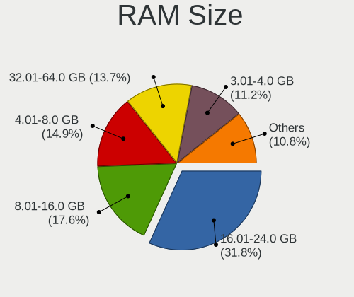
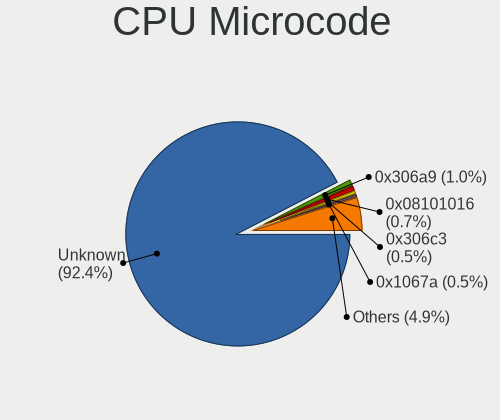
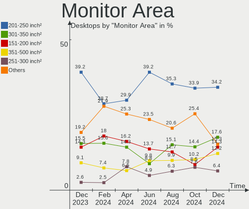
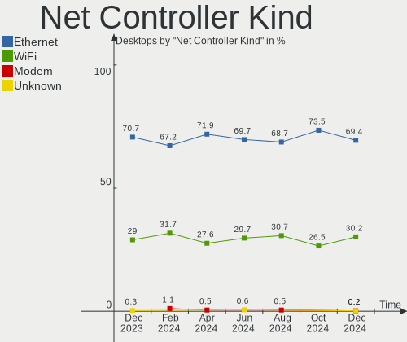
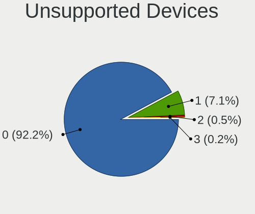

OpenMandriva - Hardware Trends (Desktops)
-----------------------------------------

A project to identify most popular hardware characteristics and track their change
over time based on data collected by Linux users at https://Linux-Hardware.org.

Anyone can contribute to this report by the [hw-probe](https://github.com/linuxhw/hw-probe) tool:

    sudo -E hw-probe -all -upload

This report is for one last month. Overall report since the beginning of time: [TestDays](https://github.com/linuxhw/TestDays)

Period: Mar, 2023.

Contents
--------

* [ System ](#system)
  - [ OS                       ](#os)
  - [ OS Family                ](#os-family)
  - [ Kernel                   ](#kernel)
  - [ Kernel Family            ](#kernel-family)
  - [ Kernel Major Ver.        ](#kernel-major-ver)
  - [ Arch                     ](#arch)
  - [ DE                       ](#de)
  - [ Display Server           ](#display-server)
  - [ Display Manager          ](#display-manager)
  - [ OS Lang                  ](#os-lang)
  - [ Boot Mode                ](#boot-mode)
  - [ Filesystem               ](#filesystem)
  - [ Part. scheme             ](#part-scheme)
  - [ Dual Boot with Linux/BSD ](#dual-boot-with-linuxbsd)
  - [ Dual Boot (Win)          ](#dual-boot-win)

* [ Board ](#board)
  - [ Vendor                   ](#vendor)
  - [ Model                    ](#model)
  - [ Model Family             ](#model-family)
  - [ MFG Year                 ](#mfg-year)
  - [ Form Factor              ](#form-factor)
  - [ Secure Boot              ](#secure-boot)
  - [ Coreboot                 ](#coreboot)
  - [ RAM Size                 ](#ram-size)
  - [ RAM Used                 ](#ram-used)
  - [ Total Drives             ](#total-drives)
  - [ Has CD-ROM               ](#has-cd-rom)
  - [ Has Ethernet             ](#has-ethernet)
  - [ Has WiFi                 ](#has-wifi)
  - [ Has Bluetooth            ](#has-bluetooth)

* [ Location ](#location)
  - [ Country                  ](#country)
  - [ City                     ](#city)

* [ Drives ](#drives)
  - [ Drive Vendor             ](#drive-vendor)
  - [ Drive Model              ](#drive-model)
  - [ HDD Vendor               ](#hdd-vendor)
  - [ SSD Vendor               ](#ssd-vendor)
  - [ Drive Kind               ](#drive-kind)
  - [ Drive Connector          ](#drive-connector)
  - [ Drive Size               ](#drive-size)
  - [ Space Total              ](#space-total)
  - [ Space Used               ](#space-used)
  - [ Malfunc. Drives          ](#malfunc-drives)
  - [ Malfunc. Drive Vendor    ](#malfunc-drive-vendor)
  - [ Malfunc. HDD Vendor      ](#malfunc-hdd-vendor)
  - [ Malfunc. Drive Kind      ](#malfunc-drive-kind)
  - [ Failed Drives            ](#failed-drives)
  - [ Failed Drive Vendor      ](#failed-drive-vendor)
  - [ Drive Status             ](#drive-status)

* [ Storage controller ](#storage-controller)
  - [ Storage Vendor           ](#storage-vendor)
  - [ Storage Model            ](#storage-model)
  - [ Storage Kind             ](#storage-kind)

* [ Processor ](#processor)
  - [ CPU Vendor               ](#cpu-vendor)
  - [ CPU Model                ](#cpu-model)
  - [ CPU Model Family         ](#cpu-model-family)
  - [ CPU Cores                ](#cpu-cores)
  - [ CPU Sockets              ](#cpu-sockets)
  - [ CPU Threads              ](#cpu-threads)
  - [ CPU Op-Modes             ](#cpu-op-modes)
  - [ CPU Microcode            ](#cpu-microcode)
  - [ CPU Microarch            ](#cpu-microarch)

* [ Graphics ](#graphics)
  - [ GPU Vendor               ](#gpu-vendor)
  - [ GPU Model                ](#gpu-model)
  - [ GPU Combo                ](#gpu-combo)
  - [ GPU Driver               ](#gpu-driver)
  - [ GPU Memory               ](#gpu-memory)

* [ Monitor ](#monitor)
  - [ Monitor Vendor           ](#monitor-vendor)
  - [ Monitor Model            ](#monitor-model)
  - [ Monitor Resolution       ](#monitor-resolution)
  - [ Monitor Diagonal         ](#monitor-diagonal)
  - [ Monitor Width            ](#monitor-width)
  - [ Aspect Ratio             ](#aspect-ratio)
  - [ Monitor Area             ](#monitor-area)
  - [ Pixel Density            ](#pixel-density)
  - [ Multiple Monitors        ](#multiple-monitors)

* [ Network ](#network)
  - [ Net Controller Vendor    ](#net-controller-vendor)
  - [ Net Controller Model     ](#net-controller-model)
  - [ Wireless Vendor          ](#wireless-vendor)
  - [ Wireless Model           ](#wireless-model)
  - [ Ethernet Vendor          ](#ethernet-vendor)
  - [ Ethernet Model           ](#ethernet-model)
  - [ Net Controller Kind      ](#net-controller-kind)
  - [ Used Controller          ](#used-controller)
  - [ NICs                     ](#nics)
  - [ IPv6                     ](#ipv6)

* [ Bluetooth ](#bluetooth)
  - [ Bluetooth Vendor         ](#bluetooth-vendor)
  - [ Bluetooth Model          ](#bluetooth-model)

* [ Sound ](#sound)
  - [ Sound Vendor             ](#sound-vendor)
  - [ Sound Model              ](#sound-model)

* [ Memory ](#memory)
  - [ Memory Vendor            ](#memory-vendor)
  - [ Memory Model             ](#memory-model)
  - [ Memory Kind              ](#memory-kind)
  - [ Memory Form Factor       ](#memory-form-factor)
  - [ Memory Size              ](#memory-size)
  - [ Memory Speed             ](#memory-speed)

* [ Printers & scanners ](#printers--scanners)
  - [ Printer Vendor           ](#printer-vendor)
  - [ Printer Model            ](#printer-model)
  - [ Scanner Vendor           ](#scanner-vendor)
  - [ Scanner Model            ](#scanner-model)

* [ Camera ](#camera)
  - [ Camera Vendor            ](#camera-vendor)
  - [ Camera Model             ](#camera-model)

* [ Security ](#security)
  - [ Fingerprint Vendor       ](#fingerprint-vendor)
  - [ Fingerprint Model        ](#fingerprint-model)
  - [ Chipcard Vendor          ](#chipcard-vendor)
  - [ Chipcard Model           ](#chipcard-model)

* [ Unsupported ](#unsupported)
  - [ Unsupported Devices      ](#unsupported-devices)
  - [ Unsupported Device Types ](#unsupported-device-types)

System
------

OS
--

Installed operating systems

| Name               | Desktops | Percent |
|--------------------|----------|---------|
| OpenMandriva 23.03 | 172      | 46.49%  |
| OpenMandriva 23.01 | 126      | 34.05%  |
| OpenMandriva 4.3   | 47       | 12.7%   |
| OpenMandriva 4.2   | 17       | 4.59%   |
| OpenMandriva 4.50  | 3        | 0.81%   |
| OpenMandriva 23.90 | 3        | 0.81%   |
| OpenMandriva 4.90  | 2        | 0.54%   |

OS Family
---------

OS without a version

| Name         | Desktops | Percent |
|--------------|----------|---------|
| OpenMandriva | 370      | 100%    |

Kernel
------

Version of the Linux kernel

| Version                      | Desktops | Percent |
|------------------------------|----------|---------|
| 6.2.6-desktop-1omv2390       | 141      | 38.11%  |
| 6.1.1-desktop-1omv2290       | 123      | 33.24%  |
| 5.16.7-desktop-1omv4003      | 31       | 8.38%   |
| 6.2.2-desktop-1omv2390       | 19       | 5.14%   |
| 5.16.13-desktop-1omv4003     | 15       | 4.05%   |
| 5.10.14-desktop-1omv4002     | 13       | 3.51%   |
| 6.2.1-desktop-1omv2390       | 6        | 1.62%   |
| 5.11.12-desktop-1omv4002     | 5        | 1.35%   |
| 6.1.4-desktop-1omv2301       | 4        | 1.08%   |
| 6.2.8-desktop-1omv2390       | 2        | 0.54%   |
| 6.2.0-desktop-0.rc2.1omv2301 | 2        | 0.54%   |
| 5.19.12-desktop-2omv4090     | 2        | 0.54%   |
| 5.18.12-desktop-3omv4090     | 2        | 0.54%   |
| 6.1.9-desktop-1omv2390       | 1        | 0.27%   |
| 6.1.11-desktop-1omv2390      | 1        | 0.27%   |
| 5.19.5-desktop-1omv4090      | 1        | 0.27%   |
| 5.16.13-desktop-1omv4050     | 1        | 0.27%   |
| 5.14.7-desktop-1omv4050      | 1        | 0.27%   |

Kernel Family
-------------

Linux kernel without a distro release

| Version | Desktops | Percent |
|---------|----------|---------|
| 6.2.6   | 141      | 38.11%  |
| 6.1.1   | 123      | 33.24%  |
| 5.16.7  | 31       | 8.38%   |
| 6.2.2   | 19       | 5.14%   |
| 5.16.13 | 16       | 4.32%   |
| 5.10.14 | 13       | 3.51%   |
| 6.2.1   | 6        | 1.62%   |
| 5.11.12 | 5        | 1.35%   |
| 6.1.4   | 4        | 1.08%   |
| 6.2.8   | 2        | 0.54%   |
| 6.2.0   | 2        | 0.54%   |
| 5.19.12 | 2        | 0.54%   |
| 5.18.12 | 2        | 0.54%   |
| 6.1.9   | 1        | 0.27%   |
| 6.1.11  | 1        | 0.27%   |
| 5.19.5  | 1        | 0.27%   |
| 5.14.7  | 1        | 0.27%   |

Kernel Major Ver.
-----------------

Linux kernel major version

| Version | Desktops | Percent |
|---------|----------|---------|
| 6.2     | 170      | 45.95%  |
| 6.1     | 129      | 34.86%  |
| 5.16    | 47       | 12.7%   |
| 5.10    | 13       | 3.51%   |
| 5.11    | 5        | 1.35%   |
| 5.19    | 3        | 0.81%   |
| 5.18    | 2        | 0.54%   |
| 5.14    | 1        | 0.27%   |

Arch
----

OS architecture (x86_64, i586, etc.)

| Name   | Desktops | Percent |
|--------|----------|---------|
| x86_64 | 370      | 100%    |

DE
--

Desktop Environment

| Name   | Desktops | Percent |
|--------|----------|---------|
| KDE5   | 323      | 87.3%   |
| GNOME  | 33       | 8.92%   |
| LXQt   | 12       | 3.24%   |
| Budgie | 2        | 0.54%   |

Display Server
--------------

X11 or Wayland

| Name    | Desktops | Percent |
|---------|----------|---------|
| X11     | 338      | 91.35%  |
| Wayland | 32       | 8.65%   |

Display Manager
---------------

SDDM, LightDM, etc.

| Name    | Desktops | Percent |
|---------|----------|---------|
| SDDM    | 336      | 90.81%  |
| GDM     | 33       | 8.92%   |
| LightDM | 1        | 0.27%   |

OS Lang
-------

Language

| Lang  | Desktops | Percent |
|-------|----------|---------|
| en_US | 176      | 47.57%  |
| de_DE | 39       | 10.54%  |
| ru_RU | 28       | 7.57%   |
| fr_FR | 20       | 5.41%   |
| en_GB | 12       | 3.24%   |
| pt_BR | 11       | 2.97%   |
| pl_PL | 10       | 2.7%    |
| it_IT | 9        | 2.43%   |
| es_ES | 8        | 2.16%   |
| en_CA | 8        | 2.16%   |
| en_AU | 7        | 1.89%   |
| hu_HU | 4        | 1.08%   |
| es_CO | 3        | 0.81%   |
| en_IN | 3        | 0.81%   |
| de_CH | 3        | 0.81%   |
| de_AT | 3        | 0.81%   |
| pt_PT | 2        | 0.54%   |
| nl_NL | 2        | 0.54%   |
| nl_BE | 2        | 0.54%   |
| ja_JP | 2        | 0.54%   |
| es_CL | 2        | 0.54%   |
| es_AR | 2        | 0.54%   |
| cs_CZ | 2        | 0.54%   |
| UTF-8 | 1        | 0.27%   |
| ru_UA | 1        | 0.27%   |
| fr_CA | 1        | 0.27%   |
| fr_BE | 1        | 0.27%   |
| es_UY | 1        | 0.27%   |
| es_SV | 1        | 0.27%   |
| es_MX | 1        | 0.27%   |
| es_DO | 1        | 0.27%   |
| en_SG | 1        | 0.27%   |
| en_HK | 1        | 0.27%   |
| en_AG | 1        | 0.27%   |
| ar_IQ | 1        | 0.27%   |

Boot Mode
---------

EFI or BIOS

| Mode | Desktops | Percent |
|------|----------|---------|
| EFI  | 190      | 51.35%  |
| BIOS | 180      | 48.65%  |

Filesystem
----------

Type of filesystem

| Type    | Desktops | Percent |
|---------|----------|---------|
| Overlay | 179      | 48.38%  |
| Ext4    | 175      | 47.3%   |
| Btrfs   | 9        | 2.43%   |
| Xfs     | 4        | 1.08%   |
| F2fs    | 2        | 0.54%   |
| Ext3    | 1        | 0.27%   |

Part. scheme
------------

Scheme of partitioning

| Type | Desktops | Percent |
|------|----------|---------|
| GPT  | 272      | 73.51%  |
| MBR  | 98       | 26.49%  |

Dual Boot with Linux/BSD
------------------------

Hosting more than one Linux/BSD

| Dual boot | Desktops | Percent |
|-----------|----------|---------|
| Yes       | 222      | 60%     |
| No        | 148      | 40%     |

Dual Boot (Win)
---------------

Hosting Linux and Windows

| Dual boot | Desktops | Percent |
|-----------|----------|---------|
| Yes       | 190      | 51.35%  |
| No        | 180      | 48.65%  |

Board
-----

Vendor
------

Motherboard manufacturer

| Name                | Desktops | Percent |
|---------------------|----------|---------|
| ASUSTek Computer    | 85       | 22.97%  |
| Gigabyte Technology | 73       | 19.73%  |
| Dell                | 34       | 9.19%   |
| Hewlett-Packard     | 33       | 8.92%   |
| MSI                 | 32       | 8.65%   |
| ASRock              | 26       | 7.03%   |
| Lenovo              | 23       | 6.22%   |
| Fujitsu             | 9        | 2.43%   |
| Intel               | 7        | 1.89%   |
| Acer                | 7        | 1.89%   |
| Pegatron            | 6        | 1.62%   |
| Medion              | 4        | 1.08%   |
| Unknown             | 4        | 1.08%   |
| PCWare              | 3        | 0.81%   |
| Packard Bell        | 3        | 0.81%   |
| Foxconn             | 3        | 0.81%   |
| Biostar             | 3        | 0.81%   |
| Fujitsu Siemens     | 2        | 0.54%   |
| ECS                 | 2        | 0.54%   |
| Wistron             | 1        | 0.27%   |
| WinFast             | 1        | 0.27%   |
| Shuttle             | 1        | 0.27%   |
| OEM_MB              | 1        | 0.27%   |
| OEM                 | 1        | 0.27%   |
| Inventec            | 1        | 0.27%   |
| EPoX Computer       | 1        | 0.27%   |
| Digiboard           | 1        | 0.27%   |
| DFI                 | 1        | 0.27%   |
| Chuwi               | 1        | 0.27%   |
| BESSTAR Tech        | 1        | 0.27%   |

Model
-----

Motherboard model

| Name                              | Desktops | Percent |
|-----------------------------------|----------|---------|
| ASUS All Series                   | 7        | 1.89%   |
| Unknown                           | 5        | 1.35%   |
| HP EliteDesk 800 G1 SFF           | 4        | 1.08%   |
| Dell OptiPlex 9020                | 4        | 1.08%   |
| Gigabyte B450M DS3H               | 3        | 0.81%   |
| ASUS PRIME A320M-K                | 3        | 0.81%   |
| MSI MS-7C56                       | 2        | 0.54%   |
| MSI MS-7C37                       | 2        | 0.54%   |
| MSI MS-7A15                       | 2        | 0.54%   |
| MSI MS-7850                       | 2        | 0.54%   |
| MSI MS-7817                       | 2        | 0.54%   |
| MSI MS-7721                       | 2        | 0.54%   |
| HP Z640 Workstation               | 2        | 0.54%   |
| HP Compaq Elite 8300 SFF          | 2        | 0.54%   |
| Gigabyte H81M-H                   | 2        | 0.54%   |
| Gigabyte G31M-ES2C                | 2        | 0.54%   |
| Gigabyte B85M-HD3                 | 2        | 0.54%   |
| Gigabyte B550 AORUS ELITE V2      | 2        | 0.54%   |
| Gigabyte B250M-DS3H               | 2        | 0.54%   |
| Fujitsu Siemens MS-7504VP-PV      | 2        | 0.54%   |
| Dell Vostro 3900                  | 2        | 0.54%   |
| Dell OptiPlex 3070                | 2        | 0.54%   |
| Dell OptiPlex 3020                | 2        | 0.54%   |
| Dell OptiPlex 3010                | 2        | 0.54%   |
| ASUS TUF Gaming B550M-PLUS        | 2        | 0.54%   |
| ASUS TUF Gaming B550-PLUS WIFI II | 2        | 0.54%   |
| ASUS ROG STRIX B450-F GAMING      | 2        | 0.54%   |
| ASUS PRIME X370-PRO               | 2        | 0.54%   |
| ASUS PRIME A320M-K/BR             | 2        | 0.54%   |
| ASUS P8H67                        | 2        | 0.54%   |
| ASUS P5W DH Deluxe                | 2        | 0.54%   |
| ASRock 970A-G                     | 2        | 0.54%   |
| Acer Predator G3-605              | 2        | 0.54%   |
| Wistron ProLiant ML110 G5         | 1        | 0.27%   |
| WinFast 6100M2MA                  | 1        | 0.27%   |
| Shuttle XH270                     | 1        | 0.27%   |
| Pegatron p7-1110                  | 1        | 0.27%   |
| Pegatron p7-1017de                | 1        | 0.27%   |
| Pegatron p6-2120                  | 1        | 0.27%   |
| Pegatron h8-1210eb                | 1        | 0.27%   |

Model Family
------------

Motherboard model prefix

| Name                         | Desktops | Percent |
|------------------------------|----------|---------|
| ASUS PRIME                   | 25       | 6.76%   |
| Dell OptiPlex                | 24       | 6.49%   |
| Lenovo ThinkCentre           | 10       | 2.7%    |
| HP Compaq                    | 9        | 2.43%   |
| Fujitsu ESPRIMO              | 8        | 2.16%   |
| HP EliteDesk                 | 7        | 1.89%   |
| ASUS All                     | 7        | 1.89%   |
| Lenovo IdeaCentre            | 6        | 1.62%   |
| Gigabyte B450M               | 6        | 1.62%   |
| ASUS TUF                     | 6        | 1.62%   |
| ASUS M5A78L-M                | 5        | 1.35%   |
| Unknown                      | 5        | 1.35%   |
| HP Pavilion                  | 4        | 1.08%   |
| Gigabyte B550                | 4        | 1.08%   |
| Dell Precision               | 4        | 1.08%   |
| Packard Bell IMEDIA          | 3        | 0.81%   |
| HP ProDesk                   | 3        | 0.81%   |
| Gigabyte H310M               | 3        | 0.81%   |
| Dell Vostro                  | 3        | 0.81%   |
| ASUS ROG                     | 3        | 0.81%   |
| Acer Veriton                 | 3        | 0.81%   |
| MSI MS-7C56                  | 2        | 0.54%   |
| MSI MS-7C37                  | 2        | 0.54%   |
| MSI MS-7A15                  | 2        | 0.54%   |
| MSI MS-7850                  | 2        | 0.54%   |
| MSI MS-7817                  | 2        | 0.54%   |
| MSI MS-7721                  | 2        | 0.54%   |
| Lenovo ThinkStation          | 2        | 0.54%   |
| HP Z640                      | 2        | 0.54%   |
| Gigabyte H81M-H              | 2        | 0.54%   |
| Gigabyte H410M               | 2        | 0.54%   |
| Gigabyte G31M-ES2C           | 2        | 0.54%   |
| Gigabyte B85M-HD3            | 2        | 0.54%   |
| Gigabyte B550M               | 2        | 0.54%   |
| Gigabyte B250M-DS3H          | 2        | 0.54%   |
| Gigabyte A520M               | 2        | 0.54%   |
| Fujitsu Siemens MS-7504VP-PV | 2        | 0.54%   |
| Dell Inspiron                | 2        | 0.54%   |
| ASUS P8Z77-V                 | 2        | 0.54%   |
| ASUS P8H67                   | 2        | 0.54%   |

MFG Year
--------

Motherboard manufacture year

| Year | Desktops | Percent |
|------|----------|---------|
| 2012 | 43       | 11.62%  |
| 2013 | 42       | 11.35%  |
| 2018 | 32       | 8.65%   |
| 2020 | 29       | 7.84%   |
| 2017 | 27       | 7.3%    |
| 2021 | 24       | 6.49%   |
| 2011 | 24       | 6.49%   |
| 2010 | 22       | 5.95%   |
| 2009 | 22       | 5.95%   |
| 2019 | 21       | 5.68%   |
| 2015 | 19       | 5.14%   |
| 2014 | 17       | 4.59%   |
| 2016 | 15       | 4.05%   |
| 2008 | 11       | 2.97%   |
| 2022 | 7        | 1.89%   |
| 2007 | 7        | 1.89%   |
| 2006 | 7        | 1.89%   |
| 2005 | 1        | 0.27%   |

Form Factor
-----------

Physical design of the computer

| Name    | Desktops | Percent |
|---------|----------|---------|
| Desktop | 370      | 100%    |

Secure Boot
-----------

Enabled or disabled

| State    | Desktops | Percent |
|----------|----------|---------|
| Disabled | 370      | 100%    |

Coreboot
--------

Have coreboot on board

| Used | Desktops | Percent |
|------|----------|---------|
| No   | 370      | 100%    |

RAM Size
--------

Total RAM memory

| Size in GB  | Desktops | Percent |
|-------------|----------|---------|
| 16.01-24.0  | 90       | 24.32%  |
| 8.01-16.0   | 82       | 22.16%  |
| 4.01-8.0    | 81       | 21.89%  |
| 3.01-4.0    | 54       | 14.59%  |
| 32.01-64.0  | 41       | 11.08%  |
| 24.01-32.0  | 11       | 2.97%   |
| 2.01-3.0    | 4        | 1.08%   |
| 1.01-2.0    | 4        | 1.08%   |
| 64.01-256.0 | 3        | 0.81%   |

RAM Used
--------

Used RAM memory

| Used GB   | Desktops | Percent |
|-----------|----------|---------|
| 1.01-2.0  | 249      | 67.3%   |
| 2.01-3.0  | 80       | 21.62%  |
| 0.51-1.0  | 24       | 6.49%   |
| 3.01-4.0  | 11       | 2.97%   |
| 4.01-8.0  | 2        | 0.54%   |
| 8.01-16.0 | 2        | 0.54%   |
| 0.01-0.5  | 2        | 0.54%   |

Total Drives
------------

Number of drives on board

| Drives | Desktops | Percent |
|--------|----------|---------|
| 1      | 145      | 39.19%  |
| 2      | 109      | 29.46%  |
| 3      | 47       | 12.7%   |
| 4      | 37       | 10%     |
| 5      | 15       | 4.05%   |
| 0      | 8        | 2.16%   |
| 6      | 4        | 1.08%   |
| 7      | 2        | 0.54%   |
| 13     | 1        | 0.27%   |
| 9      | 1        | 0.27%   |
| 8      | 1        | 0.27%   |

Has CD-ROM
----------

Has CD-ROM on board

| Presented | Desktops | Percent |
|-----------|----------|---------|
| Yes       | 206      | 55.68%  |
| No        | 164      | 44.32%  |

Has Ethernet
------------

Has Ethernet on board

| Presented | Desktops | Percent |
|-----------|----------|---------|
| Yes       | 365      | 98.65%  |
| No        | 5        | 1.35%   |

Has WiFi
--------

Has WiFi module

| Presented | Desktops | Percent |
|-----------|----------|---------|
| No        | 221      | 59.73%  |
| Yes       | 149      | 40.27%  |

Has Bluetooth
-------------

Has Bluetooth module

| Presented | Desktops | Percent |
|-----------|----------|---------|
| No        | 278      | 75.14%  |
| Yes       | 92       | 24.86%  |

Location
--------

Country
-------

Geographic location (country)

| Country             | Desktops | Percent |
|---------------------|----------|---------|
| Germany             | 51       | 13.78%  |
| USA                 | 45       | 12.16%  |
| Russia              | 35       | 9.46%   |
| France              | 24       | 6.49%   |
| Poland              | 19       | 5.14%   |
| Canada              | 15       | 4.05%   |
| Italy               | 14       | 3.78%   |
| Finland             | 14       | 3.78%   |
| Brazil              | 14       | 3.78%   |
| UK                  | 13       | 3.51%   |
| Spain               | 9        | 2.43%   |
| Australia           | 9        | 2.43%   |
| India               | 7        | 1.89%   |
| Japan               | 6        | 1.62%   |
| Slovakia            | 5        | 1.35%   |
| Taiwan              | 4        | 1.08%   |
| Sweden              | 4        | 1.08%   |
| Hungary             | 4        | 1.08%   |
| Belgium             | 4        | 1.08%   |
| Austria             | 4        | 1.08%   |
| Switzerland         | 3        | 0.81%   |
| Portugal            | 3        | 0.81%   |
| Netherlands         | 3        | 0.81%   |
| Malaysia            | 3        | 0.81%   |
| Colombia            | 3        | 0.81%   |
| China               | 3        | 0.81%   |
| Belarus             | 3        | 0.81%   |
| Uruguay             | 2        | 0.54%   |
| Ukraine             | 2        | 0.54%   |
| Slovenia            | 2        | 0.54%   |
| Puerto Rico         | 2        | 0.54%   |
| Norway              | 2        | 0.54%   |
| El Salvador         | 2        | 0.54%   |
| Denmark             | 2        | 0.54%   |
| Czechia             | 2        | 0.54%   |
| Chile               | 2        | 0.54%   |
| Argentina           | 2        | 0.54%   |
| Tunisia             | 1        | 0.27%   |
| Trinidad and Tobago | 1        | 0.27%   |
| Thailand            | 1        | 0.27%   |

City
----

Geographic location (city)

| City                  | Desktops | Percent |
|-----------------------|----------|---------|
| Moscow                | 7        | 1.89%   |
| Helsinki              | 6        | 1.62%   |
| Warsaw                | 5        | 1.35%   |
| Vienna                | 3        | 0.81%   |
| Milan                 | 3        | 0.81%   |
| Madrid                | 3        | 0.81%   |
| Le Grand-Quevilly     | 3        | 0.81%   |
| Hamburg               | 3        | 0.81%   |
| Wroclaw               | 2        | 0.54%   |
| Uxbridge              | 2        | 0.54%   |
| Uusikaupunki          | 2        | 0.54%   |
| Tula                  | 2        | 0.54%   |
| Sydney                | 2        | 0.54%   |
| St Petersburg         | 2        | 0.54%   |
| Sao Bernardo do Campo | 2        | 0.54%   |
| San Salvador          | 2        | 0.54%   |
| San José             | 2        | 0.54%   |
| San Antonio           | 2        | 0.54%   |
| Salem                 | 2        | 0.54%   |
| Rome                  | 2        | 0.54%   |
| Oslo                  | 2        | 0.54%   |
| Novokuznetsk          | 2        | 0.54%   |
| Nova Gorica           | 2        | 0.54%   |
| Mississauga           | 2        | 0.54%   |
| Melbourne             | 2        | 0.54%   |
| Ludwigsburg           | 2        | 0.54%   |
| Le Beausset           | 2        | 0.54%   |
| Krasnodar             | 2        | 0.54%   |
| Kaohsiung City        | 2        | 0.54%   |
| Kansas City           | 2        | 0.54%   |
| Hanover               | 2        | 0.54%   |
| Freyung               | 2        | 0.54%   |
| Farnborough           | 2        | 0.54%   |
| Debrecen              | 2        | 0.54%   |
| Citrus Heights        | 2        | 0.54%   |
| Chuorinkan            | 2        | 0.54%   |
| Chennai               | 2        | 0.54%   |
| Berlin                | 2        | 0.54%   |
| Armenia               | 2        | 0.54%   |
| Zwickau               | 1        | 0.27%   |

Drives
------

Drive Vendor
------------

Hard drive vendors

| Vendor              | Desktops | Drives | Percent |
|---------------------|----------|--------|---------|
| WDC                 | 129      | 160    | 19.37%  |
| Seagate             | 113      | 139    | 16.97%  |
| Samsung Electronics | 77       | 105    | 11.56%  |
| Crucial             | 41       | 45     | 6.16%   |
| Toshiba             | 38       | 40     | 5.71%   |
| Kingston            | 38       | 43     | 5.71%   |
| SanDisk             | 29       | 35     | 4.35%   |
| Hitachi             | 26       | 30     | 3.9%    |
| A-DATA Technology   | 19       | 20     | 2.85%   |
| SPCC                | 9        | 10     | 1.35%   |
| HGST                | 9        | 10     | 1.35%   |
| PNY                 | 8        | 8      | 1.2%    |
| Unknown             | 7        | 9      | 1.05%   |
| Maxtor              | 7        | 7      | 1.05%   |
| SK hynix            | 6        | 6      | 0.9%    |
| China               | 6        | 7      | 0.9%    |
| Apacer              | 6        | 6      | 0.9%    |
| Team                | 5        | 5      | 0.75%   |
| Patriot             | 4        | 4      | 0.6%    |
| OCZ                 | 4        | 6      | 0.6%    |
| Intel               | 4        | 4      | 0.6%    |
| GOODRAM             | 4        | 4      | 0.6%    |
| Gigabyte Technology | 4        | 4      | 0.6%    |
| XrayDisk            | 3        | 3      | 0.45%   |
| XPG                 | 3        | 4      | 0.45%   |
| SABRENT             | 3        | 3      | 0.45%   |
| Micron Technology   | 3        | 3      | 0.45%   |
| JMicron Technology  | 3        | 3      | 0.45%   |
| Intenso             | 3        | 6      | 0.45%   |
| Corsair             | 3        | 3      | 0.45%   |
| Transcend           | 2        | 2      | 0.3%    |
| Pioneer             | 2        | 2      | 0.3%    |
| Netac               | 2        | 2      | 0.3%    |
| LITEON              | 2        | 2      | 0.3%    |
| KingFast            | 2        | 2      | 0.3%    |
| Hewlett-Packard     | 2        | 2      | 0.3%    |
| Fujitsu             | 2        | 2      | 0.3%    |
| Emtec               | 2        | 3      | 0.3%    |
| Unknown             | 2        | 2      | 0.3%    |
| ZEPLIN              | 1        | 1      | 0.15%   |

Drive Model
-----------

Hard drive models

| Model                                   | Desktops | Percent |
|-----------------------------------------|----------|---------|
| Toshiba DT01ACA100 1TB                  | 12       | 1.58%   |
| Seagate ST1000DM010-2EP102 1TB          | 12       | 1.58%   |
| Seagate ST500DM002-1BD142 500GB         | 10       | 1.32%   |
| WDC WD10EZEX-08WN4A0 1TB                | 8        | 1.05%   |
| Kingston SA400S37240G 240GB SSD         | 8        | 1.05%   |
| Seagate ST3500418AS 500GB               | 7        | 0.92%   |
| Seagate ST2000DM008-2FR102 2TB          | 7        | 0.92%   |
| Samsung SSD 850 EVO 500GB               | 7        | 0.92%   |
| Crucial CT240BX500SSD1 240GB            | 7        | 0.92%   |
| WDC WDBNCE5000PNC 500GB SSD             | 6        | 0.79%   |
| Samsung SSD 970 EVO Plus 1TB            | 6        | 0.79%   |
| Toshiba DT01ACA050 500GB                | 5        | 0.66%   |
| Seagate ST2000DM001-1ER164 2TB          | 5        | 0.66%   |
| Kingston SA400S37120G 120GB SSD         | 5        | 0.66%   |
| Crucial CT500MX500SSD1 500GB            | 5        | 0.66%   |
| Crucial CT120BX500SSD1 120GB            | 5        | 0.66%   |
| WDC WDS240G2G0A-00JH30 240GB SSD        | 4        | 0.53%   |
| Seagate ST500DM002-1BC142 500GB         | 4        | 0.53%   |
| Seagate ST1000DM003-1SB102 1TB          | 4        | 0.53%   |
| Seagate ST1000DM003-1CH162 1TB          | 4        | 0.53%   |
| SanDisk SSD PLUS 1000GB                 | 4        | 0.53%   |
| SanDisk SDSSDA240G 240GB                | 4        | 0.53%   |
| Samsung SSD 980 500GB                   | 4        | 0.53%   |
| Samsung SSD 860 EVO 500GB               | 4        | 0.53%   |
| Samsung SSD 860 EVO 250GB               | 4        | 0.53%   |
| Kingston SA400S37480G 480GB SSD         | 4        | 0.53%   |
| Crucial CT480BX500SSD1 480GB            | 4        | 0.53%   |
| Crucial CT1000MX500SSD1 1TB             | 4        | 0.53%   |
| XPG GAMMIX S11 Pro 256GB                | 3        | 0.4%    |
| WDC WD5000AAKX-00ERMA0 500GB            | 3        | 0.4%    |
| WDC WD10EZEX-00WN4A0 1TB                | 3        | 0.4%    |
| SPCC Solid State Disk 512GB             | 3        | 0.4%    |
| SK hynix BC501 HFM128GDJTNG-8310A 128GB | 3        | 0.4%    |
| Seagate ST4000DM004-2CV104 4TB          | 3        | 0.4%    |
| Seagate ST2000DM008-2UB102 2TB          | 3        | 0.4%    |
| Seagate ST1000DM003-1ER162 1TB          | 3        | 0.4%    |
| SanDisk SSD PLUS 480GB                  | 3        | 0.4%    |
| Samsung SSD 970 EVO Plus 250GB          | 3        | 0.4%    |
| Samsung HD502HJ 500GB                   | 3        | 0.4%    |
| PNY CS900 120GB SSD                     | 3        | 0.4%    |

HDD Vendor
----------

Hard disk drive vendors

| Vendor              | Desktops | Drives | Percent |
|---------------------|----------|--------|---------|
| Seagate             | 113      | 139    | 34.66%  |
| WDC                 | 107      | 126    | 32.82%  |
| Toshiba             | 34       | 36     | 10.43%  |
| Hitachi             | 26       | 30     | 7.98%   |
| Samsung Electronics | 21       | 23     | 6.44%   |
| HGST                | 9        | 10     | 2.76%   |
| Maxtor              | 6        | 6      | 1.84%   |
| Unknown             | 2        | 2      | 0.61%   |
| SABRENT             | 2        | 2      | 0.61%   |
| Fujitsu             | 2        | 2      | 0.61%   |
| T-CREATE            | 1        | 1      | 0.31%   |
| Super Talent        | 1        | 1      | 0.31%   |
| IBM/Hitachi         | 1        | 1      | 0.31%   |
| ASMT                | 1        | 1      | 0.31%   |

SSD Vendor
----------

Solid state drive vendors

| Vendor              | Desktops | Drives | Percent |
|---------------------|----------|--------|---------|
| Samsung Electronics | 41       | 52     | 16.02%  |
| Crucial             | 35       | 37     | 13.67%  |
| Kingston            | 28       | 31     | 10.94%  |
| SanDisk             | 25       | 31     | 9.77%   |
| WDC                 | 22       | 26     | 8.59%   |
| A-DATA Technology   | 15       | 16     | 5.86%   |
| PNY                 | 7        | 7      | 2.73%   |
| SPCC                | 6        | 6      | 2.34%   |
| China               | 6        | 7      | 2.34%   |
| Apacer              | 6        | 6      | 2.34%   |
| Team                | 4        | 4      | 1.56%   |
| OCZ                 | 4        | 6      | 1.56%   |
| XrayDisk            | 3        | 3      | 1.17%   |
| Toshiba             | 3        | 3      | 1.17%   |
| Patriot             | 3        | 3      | 1.17%   |
| Micron Technology   | 3        | 3      | 1.17%   |
| GOODRAM             | 3        | 3      | 1.17%   |
| Gigabyte Technology | 3        | 3      | 1.17%   |
| Pioneer             | 2        | 2      | 0.78%   |
| Netac               | 2        | 2      | 0.78%   |
| LITEON              | 2        | 2      | 0.78%   |
| KingFast            | 2        | 2      | 0.78%   |
| JMicron Technology  | 2        | 2      | 0.78%   |
| Emtec               | 2        | 2      | 0.78%   |
| Corsair             | 2        | 2      | 0.78%   |
| Unknown             | 2        | 2      | 0.78%   |
| ZEPLIN              | 1        | 1      | 0.39%   |
| XSTAR               | 1        | 1      | 0.39%   |
| VERICO              | 1        | 1      | 0.39%   |
| Verbatim            | 1        | 1      | 0.39%   |
| ValueTech           | 1        | 1      | 0.39%   |
| Transcend           | 1        | 1      | 0.39%   |
| Teclast             | 1        | 1      | 0.39%   |
| SABRENT             | 1        | 1      | 0.39%   |
| Reeinno             | 1        | 1      | 0.39%   |
| PNY CS90            | 1        | 1      | 0.39%   |
| Plextor             | 1        | 1      | 0.39%   |
| Maxtor              | 1        | 1      | 0.39%   |
| Leven               | 1        | 1      | 0.39%   |
| KLEVV               | 1        | 1      | 0.39%   |

Drive Kind
----------

HDD or SSD

| Kind    | Desktops | Drives | Percent |
|---------|----------|--------|---------|
| HDD     | 255      | 380    | 46.7%   |
| SSD     | 197      | 289    | 36.08%  |
| NVMe    | 85       | 105    | 15.57%  |
| Unknown | 6        | 9      | 1.1%    |
| MMC     | 3        | 3      | 0.55%   |

Drive Connector
---------------

SATA, SAS, NVMe, etc.

| Type | Desktops | Drives | Percent |
|------|----------|--------|---------|
| SATA | 336      | 640    | 74.01%  |
| NVMe | 84       | 103    | 18.5%   |
| SAS  | 31       | 40     | 6.83%   |
| MMC  | 3        | 3      | 0.66%   |

Drive Size
----------

Size of hard drive

| Size in TB | Desktops | Drives | Percent |
|------------|----------|--------|---------|
| 0.01-0.5   | 261      | 402    | 55.53%  |
| 0.51-1.0   | 143      | 184    | 30.43%  |
| 1.01-2.0   | 47       | 58     | 10%     |
| 3.01-4.0   | 9        | 13     | 1.91%   |
| 4.01-10.0  | 6        | 7      | 1.28%   |
| 2.01-3.0   | 4        | 5      | 0.85%   |

Space Total
-----------

Amount of disk space available on the file system

| Size in GB     | Desktops | Percent |
|----------------|----------|---------|
| 1-20           | 112      | 30.27%  |
| 101-250        | 66       | 17.84%  |
| 251-500        | 57       | 15.41%  |
| 501-1000       | 37       | 10%     |
| Unknown        | 33       | 8.92%   |
| 51-100         | 21       | 5.68%   |
| 21-50          | 20       | 5.41%   |
| 1001-2000      | 12       | 3.24%   |
| 2001-3000      | 7        | 1.89%   |
| More than 3000 | 5        | 1.35%   |

Space Used
----------

Amount of used disk space

| Used GB        | Desktops | Percent |
|----------------|----------|---------|
| 1-20           | 260      | 70.27%  |
| Unknown        | 33       | 8.92%   |
| 21-50          | 25       | 6.76%   |
| 101-250        | 17       | 4.59%   |
| 501-1000       | 12       | 3.24%   |
| 51-100         | 10       | 2.7%    |
| 251-500        | 7        | 1.89%   |
| 1001-2000      | 3        | 0.81%   |
| 2001-3000      | 2        | 0.54%   |
| More than 3000 | 1        | 0.27%   |

Malfunc. Drives
---------------

Drive models with a malfunction

| Model                            | Desktops | Drives | Percent |
|----------------------------------|----------|--------|---------|
| Seagate ST3500418AS 500GB        | 6        | 6      | 4.72%   |
| Seagate ST500DM002-1BD142 500GB  | 5        | 5      | 3.94%   |
| Seagate ST1000DM010-2EP102 1TB   | 4        | 4      | 3.15%   |
| Hitachi HDS721010CLA332 1TB      | 3        | 3      | 2.36%   |
| WDC WD6400AAKS-00E4A0 640GB      | 2        | 2      | 1.57%   |
| WDC WD5000AAKX-75U6AA0 500GB     | 2        | 2      | 1.57%   |
| WDC WD3200AAJS-22RYA0 320GB      | 2        | 2      | 1.57%   |
| WDC WD20EARS-00MVWB0 2TB         | 2        | 2      | 1.57%   |
| Toshiba DT01ACA100 1TB           | 2        | 2      | 1.57%   |
| Seagate ST3500414CS 500GB        | 2        | 2      | 1.57%   |
| Seagate ST31000528AS 1TB         | 2        | 2      | 1.57%   |
| Seagate ST2000DM001-9YN164 2TB   | 2        | 2      | 1.57%   |
| Seagate ST1000DM003-1CH162 1TB   | 2        | 2      | 1.57%   |
| Maxtor STM3250310AS 250GB        | 2        | 2      | 1.57%   |
| Hitachi HTS543216L9SA00 160GB    | 2        | 2      | 1.57%   |
| Hitachi HDS721050CLA362 500GB    | 2        | 2      | 1.57%   |
| XSTAR SSD 128GB                  | 1        | 1      | 0.79%   |
| XrayDisk SSD 120GB               | 1        | 1      | 0.79%   |
| WDC WDS240G2G0A-00JH30 240GB SSD | 1        | 1      | 0.79%   |
| WDC WDS120G2G0A-00JH30 120GB SSD | 1        | 1      | 0.79%   |
| WDC WDS100T2G0A-00JH30 1TB SSD   | 1        | 1      | 0.79%   |
| WDC WD800JD-22LSA0 80GB          | 1        | 1      | 0.79%   |
| WDC WD7500AAVS-00D7B1 752GB      | 1        | 1      | 0.79%   |
| WDC WD5000LPVT-22G33T0 500GB     | 1        | 1      | 0.79%   |
| WDC WD5000AAVS-00ZTB0 500GB      | 1        | 1      | 0.79%   |
| WDC WD5000AAKX-08U6AA0 500GB     | 1        | 1      | 0.79%   |
| WDC WD5000AAKX-08ERMA0 500GB     | 1        | 1      | 0.79%   |
| WDC WD5000AAKX-00ERMA0 500GB     | 1        | 1      | 0.79%   |
| WDC WD5000AAKX-001CA0 500GB      | 1        | 1      | 0.79%   |
| WDC WD40EFRX-68N32N0 4TB         | 1        | 1      | 0.79%   |
| WDC WD3200YS-01PGB0 320GB        | 1        | 1      | 0.79%   |
| WDC WD3200AVVS-62L2B0 320GB      | 1        | 1      | 0.79%   |
| WDC WD3200AAJS-60M0A1 320GB      | 1        | 1      | 0.79%   |
| WDC WD3200AAJS-00B4A0 320GB      | 1        | 1      | 0.79%   |
| WDC WD2500JD-00HBB0 250GB        | 1        | 1      | 0.79%   |
| WDC WD2500AAKX-753CA1 250GB      | 1        | 1      | 0.79%   |
| WDC WD1600BB-00GUC0 160GB        | 1        | 1      | 0.79%   |
| WDC WD10EZEX-75WN4A1 1TB         | 1        | 1      | 0.79%   |
| WDC WD10EZEX-00RKKA0 1TB         | 1        | 1      | 0.79%   |
| WDC WD10EFRX-68FYTN0 1TB         | 1        | 1      | 0.79%   |

Malfunc. Drive Vendor
---------------------

Vendors of faulty drives

| Vendor              | Desktops | Drives | Percent |
|---------------------|----------|--------|---------|
| Seagate             | 49       | 50     | 39.2%   |
| WDC                 | 30       | 32     | 24%     |
| Hitachi             | 14       | 14     | 11.2%   |
| Samsung Electronics | 8        | 8      | 6.4%    |
| Maxtor              | 4        | 4      | 3.2%    |
| Kingston            | 4        | 4      | 3.2%    |
| Toshiba             | 2        | 2      | 1.6%    |
| SanDisk             | 2        | 2      | 1.6%    |
| Crucial             | 2        | 2      | 1.6%    |
| XSTAR               | 1        | 1      | 0.8%    |
| XrayDisk            | 1        | 1      | 0.8%    |
| Team                | 1        | 1      | 0.8%    |
| Netac               | 1        | 1      | 0.8%    |
| KLEVV               | 1        | 1      | 0.8%    |
| KingFast            | 1        | 1      | 0.8%    |
| IBM/Hitachi         | 1        | 1      | 0.8%    |
| HGST                | 1        | 1      | 0.8%    |
| Hewlett-Packard     | 1        | 1      | 0.8%    |
| Fujitsu             | 1        | 1      | 0.8%    |

Malfunc. HDD Vendor
-------------------

Vendors of faulty HDD drives

| Vendor              | Desktops | Drives | Percent |
|---------------------|----------|--------|---------|
| Seagate             | 49       | 50     | 46.67%  |
| WDC                 | 27       | 29     | 25.71%  |
| Hitachi             | 14       | 14     | 13.33%  |
| Samsung Electronics | 6        | 6      | 5.71%   |
| Maxtor              | 4        | 4      | 3.81%   |
| Toshiba             | 2        | 2      | 1.9%    |
| IBM/Hitachi         | 1        | 1      | 0.95%   |
| HGST                | 1        | 1      | 0.95%   |
| Fujitsu             | 1        | 1      | 0.95%   |

Malfunc. Drive Kind
-------------------

Kinds of faulty drives

| Kind | Desktops | Drives | Percent |
|------|----------|--------|---------|
| HDD  | 97       | 108    | 82.91%  |
| SSD  | 17       | 17     | 14.53%  |
| NVMe | 3        | 3      | 2.56%   |

Failed Drives
-------------

Failed drive models

| Model                                            | Desktops | Drives | Percent |
|--------------------------------------------------|----------|--------|---------|
| Samsung Electronics MZNTY128HDHP-00000 128GB SSD | 1        | 1      | 25%     |
| Samsung Electronics HD753LJ 752GB                | 1        | 1      | 25%     |
| Samsung Electronics HD252HJ 250GB                | 1        | 1      | 25%     |
| Samsung Electronics HD103UJ 1TB                  | 1        | 1      | 25%     |

Failed Drive Vendor
-------------------

Failed drive vendors

| Vendor              | Desktops | Drives | Percent |
|---------------------|----------|--------|---------|
| Samsung Electronics | 4        | 4      | 100%    |

Drive Status
------------

Number of failed and malfunc. drives

| Status   | Desktops | Drives | Percent |
|----------|----------|--------|---------|
| Works    | 316      | 611    | 67.67%  |
| Malfunc  | 113      | 128    | 24.2%   |
| Detected | 34       | 43     | 7.28%   |
| Failed   | 4        | 4      | 0.86%   |

Storage controller
------------------

Storage Vendor
--------------

Storage controller vendors

| Vendor                       | Desktops | Percent |
|------------------------------|----------|---------|
| Intel                        | 244      | 47.84%  |
| AMD                          | 110      | 21.57%  |
| Samsung Electronics          | 25       | 4.9%    |
| ASMedia Technology           | 19       | 3.73%   |
| Nvidia                       | 14       | 2.75%   |
| JMicron Technology           | 13       | 2.55%   |
| SanDisk                      | 12       | 2.35%   |
| Phison Electronics           | 11       | 2.16%   |
| Kingston Technology Company  | 11       | 2.16%   |
| Micron/Crucial Technology    | 8        | 1.57%   |
| VIA Technologies             | 7        | 1.37%   |
| ADATA Technology             | 7        | 1.37%   |
| Silicon Motion               | 6        | 1.18%   |
| SK hynix                     | 4        | 0.78%   |
| Marvell Technology Group     | 4        | 0.78%   |
| MAXIO Technology (Hangzhou)  | 3        | 0.59%   |
| Broadcom / LSI               | 3        | 0.59%   |
| Realtek Semiconductor        | 2        | 0.39%   |
| Promise Technology           | 2        | 0.39%   |
| Toshiba America Info Systems | 1        | 0.2%    |
| Silicon Image                | 1        | 0.2%    |
| Shenzhen Longsys Electronics | 1        | 0.2%    |
| KIOXIA                       | 1        | 0.2%    |
| Biwin Storage Technology     | 1        | 0.2%    |

Storage Model
-------------

Storage controller models

| Model                                                                                   | Desktops | Percent |
|-----------------------------------------------------------------------------------------|----------|---------|
| AMD FCH SATA Controller [AHCI mode]                                                     | 56       | 8.82%   |
| Intel 8 Series/C220 Series Chipset Family 6-port SATA Controller 1 [AHCI mode]          | 40       | 6.3%    |
| Intel 200 Series PCH SATA controller [AHCI mode]                                        | 26       | 4.09%   |
| Intel 6 Series/C200 Series Chipset Family 6 port Desktop SATA AHCI Controller           | 24       | 3.78%   |
| AMD 500 Series Chipset SATA Controller                                                  | 22       | 3.46%   |
| Intel 7 Series/C210 Series Chipset Family 6-port SATA Controller [AHCI mode]            | 18       | 2.83%   |
| AMD 400 Series Chipset SATA Controller                                                  | 18       | 2.83%   |
| Intel NM10/ICH7 Family SATA Controller [IDE mode]                                       | 17       | 2.68%   |
| ASMedia ASM1062 Serial ATA Controller                                                   | 16       | 2.52%   |
| Samsung NVMe SSD Controller SM981/PM981/PM983                                           | 14       | 2.2%    |
| Intel Cannon Lake PCH SATA AHCI Controller                                              | 14       | 2.2%    |
| AMD SB7x0/SB8x0/SB9x0 SATA Controller [AHCI mode]                                       | 14       | 2.2%    |
| AMD SB7x0/SB8x0/SB9x0 IDE Controller                                                    | 14       | 2.2%    |
| Intel Q170/Q150/B150/H170/H110/Z170/CM236 Chipset SATA Controller [AHCI Mode]           | 11       | 1.73%   |
| Intel 82801G (ICH7 Family) IDE Controller                                               | 11       | 1.73%   |
| Intel 6 Series/C200 Series Chipset Family Desktop SATA Controller (IDE mode, ports 4-5) | 11       | 1.73%   |
| Intel 6 Series/C200 Series Chipset Family Desktop SATA Controller (IDE mode, ports 0-3) | 11       | 1.73%   |
| AMD FCH SATA Controller D                                                               | 11       | 1.73%   |
| AMD SB7x0/SB8x0/SB9x0 SATA Controller [IDE mode]                                        | 10       | 1.57%   |
| Intel SATA Controller [RAID mode]                                                       | 9        | 1.42%   |
| Intel 5 Series/3400 Series Chipset 4 port SATA IDE Controller                           | 9        | 1.42%   |
| Intel 5 Series/3400 Series Chipset 2 port SATA IDE Controller                           | 8        | 1.26%   |
| JMicron JMB363 SATA/IDE Controller                                                      | 7        | 1.1%    |
| AMD 300 Series Chipset SATA Controller                                                  | 7        | 1.1%    |
| ADATA XPG SX8200 Pro PCIe Gen3x4 M.2 2280 Solid State Drive                             | 7        | 1.1%    |
| Silicon Motion SM2263EN/SM2263XT SSD Controller                                         | 6        | 0.94%   |
| Samsung NVMe SSD Controller 980                                                         | 6        | 0.94%   |
| Intel 5 Series/3400 Series Chipset 6 port SATA AHCI Controller                          | 6        | 0.94%   |
| Nvidia MCP61 SATA Controller                                                            | 5        | 0.79%   |
| Micron/Crucial P2 NVMe PCIe SSD                                                         | 5        | 0.79%   |
| JMicron JMB368 IDE controller                                                           | 5        | 0.79%   |
| Intel 9 Series Chipset Family SATA Controller [AHCI Mode]                               | 5        | 0.79%   |
| Intel 4 Series Chipset PT IDER Controller                                               | 5        | 0.79%   |
| Phison PS5013 E13 NVMe Controller                                                       | 4        | 0.63%   |
| Phison E12 NVMe Controller                                                              | 4        | 0.63%   |
| Nvidia MCP61 IDE                                                                        | 4        | 0.63%   |
| Kingston Company A2000 NVMe SSD                                                         | 4        | 0.63%   |
| Intel C600/X79 series chipset 6-Port SATA AHCI Controller                               | 4        | 0.63%   |
| Intel 7 Series/C210 Series Chipset Family 4-port SATA Controller [IDE mode]             | 4        | 0.63%   |
| Intel 7 Series/C210 Series Chipset Family 2-port SATA Controller [IDE mode]             | 4        | 0.63%   |

Storage Kind
------------

Kind of storage controller (IDE, SATA, NVMe, SAS, ...)

| Kind | Desktops | Percent |
|------|----------|---------|
| SATA | 292      | 58.75%  |
| IDE  | 97       | 19.52%  |
| NVMe | 84       | 16.9%   |
| RAID | 18       | 3.62%   |
| SAS  | 5        | 1.01%   |
| SCSI | 1        | 0.2%    |

Processor
---------

CPU Vendor
----------

Processor vendors

| Vendor | Desktops | Percent |
|--------|----------|---------|
| Intel  | 250      | 67.57%  |
| AMD    | 120      | 32.43%  |

CPU Model
---------

Processor models

| Model                                       | Desktops | Percent |
|---------------------------------------------|----------|---------|
| AMD Ryzen 5 5600G with Radeon Graphics      | 11       | 2.97%   |
| Intel Core i7-8700 CPU @ 3.20GHz            | 7        | 1.89%   |
| Intel Core i7-4790 CPU @ 3.60GHz            | 7        | 1.89%   |
| Intel Core i7-3770 CPU @ 3.40GHz            | 6        | 1.62%   |
| Intel Core 2 Quad CPU Q6600 @ 2.40GHz       | 6        | 1.62%   |
| Intel Core 2 Duo CPU E8400 @ 3.00GHz        | 6        | 1.62%   |
| Intel Core i7-2600 CPU @ 3.40GHz            | 5        | 1.35%   |
| Intel Core i3-2120 CPU @ 3.30GHz            | 5        | 1.35%   |
| AMD Ryzen 5 2600 Six-Core Processor         | 5        | 1.35%   |
| Intel Pentium CPU G4400 @ 3.30GHz           | 4        | 1.08%   |
| Intel Core i5-4570 CPU @ 3.20GHz            | 4        | 1.08%   |
| Intel Core i5-3470 CPU @ 3.20GHz            | 4        | 1.08%   |
| Intel Core i5-10400 CPU @ 2.90GHz           | 4        | 1.08%   |
| Intel Core i3-7100 CPU @ 3.90GHz            | 4        | 1.08%   |
| AMD Ryzen 7 5700G with Radeon Graphics      | 4        | 1.08%   |
| AMD Ryzen 5 3600 6-Core Processor           | 4        | 1.08%   |
| AMD Ryzen 5 2400G with Radeon Vega Graphics | 4        | 1.08%   |
| AMD Athlon 3000G with Radeon Vega Graphics  | 4        | 1.08%   |
| Intel Xeon CPU E5-2620 v4 @ 2.10GHz         | 3        | 0.81%   |
| Intel Core i7-9700 CPU @ 3.00GHz            | 3        | 0.81%   |
| Intel Core i7-8700K CPU @ 3.70GHz           | 3        | 0.81%   |
| Intel Core i7 CPU 860 @ 2.80GHz             | 3        | 0.81%   |
| Intel Core i5-7400 CPU @ 3.00GHz            | 3        | 0.81%   |
| Intel Core i5-6500 CPU @ 3.20GHz            | 3        | 0.81%   |
| Intel Core i5-4590 CPU @ 3.30GHz            | 3        | 0.81%   |
| Intel Core i5-4570S CPU @ 2.90GHz           | 3        | 0.81%   |
| Intel Core i5-2320 CPU @ 3.00GHz            | 3        | 0.81%   |
| Intel Core i3-9100 CPU @ 3.60GHz            | 3        | 0.81%   |
| Intel Core i3-8100 CPU @ 3.60GHz            | 3        | 0.81%   |
| Intel Core i3 CPU 540 @ 3.07GHz             | 3        | 0.81%   |
| Intel Core i3 CPU 530 @ 2.93GHz             | 3        | 0.81%   |
| AMD Ryzen 7 3700X 8-Core Processor          | 3        | 0.81%   |
| AMD Ryzen 7 2700X Eight-Core Processor      | 3        | 0.81%   |
| AMD Ryzen 3 1200 Quad-Core Processor        | 3        | 0.81%   |
| AMD FX-8350 Eight-Core Processor            | 3        | 0.81%   |
| AMD Athlon II X4 640 Processor              | 3        | 0.81%   |
| Intel Pentium D CPU 3.00GHz                 | 2        | 0.54%   |
| Intel Pentium CPU G630 @ 2.70GHz            | 2        | 0.54%   |
| Intel Pentium CPU G3220 @ 3.00GHz           | 2        | 0.54%   |
| Intel Core i7-7700 CPU @ 3.60GHz            | 2        | 0.54%   |

CPU Model Family
----------------

Processor model prefix

| Model                   | Desktops | Percent |
|-------------------------|----------|---------|
| Intel Core i5           | 65       | 17.57%  |
| Intel Core i7           | 54       | 14.59%  |
| Intel Core i3           | 46       | 12.43%  |
| AMD Ryzen 5             | 37       | 10%     |
| Intel Pentium           | 18       | 4.86%   |
| AMD FX                  | 18       | 4.86%   |
| AMD Ryzen 7             | 16       | 4.32%   |
| Intel Xeon              | 15       | 4.05%   |
| Intel Core 2 Duo        | 12       | 3.24%   |
| Intel Core 2 Quad       | 11       | 2.97%   |
| Intel Celeron           | 10       | 2.7%    |
| AMD Ryzen 3             | 7        | 1.89%   |
| Intel Pentium Dual-Core | 5        | 1.35%   |
| AMD A8                  | 5        | 1.35%   |
| Other                   | 4        | 1.08%   |
| AMD Ryzen 9             | 4        | 1.08%   |
| AMD Athlon II X4        | 4        | 1.08%   |
| AMD Athlon 64 X2        | 4        | 1.08%   |
| AMD Athlon              | 4        | 1.08%   |
| Intel Pentium Gold      | 3        | 0.81%   |
| Intel Core 2            | 3        | 0.81%   |
| AMD A4                  | 3        | 0.81%   |
| Intel Pentium D         | 2        | 0.54%   |
| AMD Ryzen 5 PRO         | 2        | 0.54%   |
| AMD Phenom II X6        | 2        | 0.54%   |
| AMD Phenom              | 2        | 0.54%   |
| AMD Athlon II X2        | 2        | 0.54%   |
| AMD A10                 | 2        | 0.54%   |
| Intel Pentium Silver    | 1        | 0.27%   |
| Intel Pentium Dual      | 1        | 0.27%   |
| Intel Pentium 4         | 1        | 0.27%   |
| AMD Ryzen 3 PRO         | 1        | 0.27%   |
| AMD Phenom II X2        | 1        | 0.27%   |
| AMD G                   | 1        | 0.27%   |
| AMD Athlon X4           | 1        | 0.27%   |
| AMD Athlon II X3        | 1        | 0.27%   |
| AMD Athlon 64           | 1        | 0.27%   |
| AMD A6                  | 1        | 0.27%   |

CPU Cores
---------

Number of processor cores

| Number | Desktops | Percent |
|--------|----------|---------|
| 4      | 154      | 41.62%  |
| 2      | 118      | 31.89%  |
| 6      | 53       | 14.32%  |
| 8      | 19       | 5.14%   |
| 1      | 10       | 2.7%    |
| 3      | 6        | 1.62%   |
| 16     | 4        | 1.08%   |
| 12     | 4        | 1.08%   |
| 20     | 1        | 0.27%   |
| 10     | 1        | 0.27%   |

CPU Sockets
-----------

Number of sockets

| Number | Desktops | Percent |
|--------|----------|---------|
| 1      | 366      | 98.92%  |
| 2      | 4        | 1.08%   |

CPU Threads
-----------

Threads per core (Hyper-Threading)

| Number | Desktops | Percent |
|--------|----------|---------|
| 2      | 208      | 56.22%  |
| 1      | 159      | 42.97%  |
| 8      | 2        | 0.54%   |
| 12     | 1        | 0.27%   |

CPU Op-Modes
------------

CPU Operation Modes (32-bit, 64-bit)

| Op mode        | Desktops | Percent |
|----------------|----------|---------|
| 32-bit, 64-bit | 370      | 100%    |

CPU Microcode
-------------

Microcode number

| Number     | Desktops | Percent |
|------------|----------|---------|
| Unknown    | 131      | 35.41%  |
| 0x306c3    | 22       | 5.95%   |
| 0x206a7    | 20       | 5.41%   |
| 0x306a9    | 16       | 4.32%   |
| 0x0a50000d | 11       | 2.97%   |
| 0x08701021 | 11       | 2.97%   |
| 0x0800820d | 10       | 2.7%    |
| 0x1067a    | 9        | 2.43%   |
| 0x08108109 | 7        | 1.89%   |
| 0x106e5    | 6        | 1.62%   |
| 0x0a50000c | 6        | 1.62%   |
| 0xa0653    | 5        | 1.35%   |
| 0x906e9    | 5        | 1.35%   |
| 0x506e3    | 5        | 1.35%   |
| 0x906eb    | 4        | 1.08%   |
| 0x6fb      | 4        | 1.08%   |
| 0x20652    | 4        | 1.08%   |
| 0x08600106 | 4        | 1.08%   |
| 0x06003106 | 4        | 1.08%   |
| 0x06001119 | 4        | 1.08%   |
| 0x06000822 | 4        | 1.08%   |
| 0x010000c8 | 4        | 1.08%   |
| 0x906ea    | 3        | 0.81%   |
| 0x6f6      | 3        | 0.81%   |
| 0x0a201016 | 3        | 0.81%   |
| 0x08101016 | 3        | 0.81%   |
| 0x0810100b | 3        | 0.81%   |
| 0x00000000 | 3        | 0.81%   |
| 0xf44      | 2        | 0.54%   |
| 0x6fd      | 2        | 0.54%   |
| 0x406f1    | 2        | 0.54%   |
| 0x20655    | 2        | 0.54%   |
| 0x10677    | 2        | 0.54%   |
| 0x08108102 | 2        | 0.54%   |
| 0x08001138 | 2        | 0.54%   |
| 0x0600611a | 2        | 0.54%   |
| 0x0600081c | 2        | 0.54%   |
| 0x06000817 | 2        | 0.54%   |
| 0xf65      | 1        | 0.27%   |
| 0xa0655    | 1        | 0.27%   |

CPU Microarch
-------------

Microarchitecture

| Name             | Desktops | Percent |
|------------------|----------|---------|
| Haswell          | 49       | 13.24%  |
| KabyLake         | 43       | 11.62%  |
| SandyBridge      | 33       | 8.92%   |
| IvyBridge        | 30       | 8.11%   |
| Zen 3            | 22       | 5.95%   |
| Penryn           | 22       | 5.95%   |
| Zen+             | 20       | 5.41%   |
| Piledriver       | 20       | 5.41%   |
| Zen 2            | 16       | 4.32%   |
| Skylake          | 15       | 4.05%   |
| Core             | 14       | 3.78%   |
| Zen              | 12       | 3.24%   |
| K10              | 12       | 3.24%   |
| CometLake        | 11       | 2.97%   |
| Westmere         | 10       | 2.7%    |
| Nehalem          | 8        | 2.16%   |
| K8 Hammer        | 5        | 1.35%   |
| Steamroller      | 4        | 1.08%   |
| NetBurst         | 3        | 0.81%   |
| Goldmont plus    | 3        | 0.81%   |
| Excavator        | 3        | 0.81%   |
| Bulldozer        | 3        | 0.81%   |
| Broadwell        | 3        | 0.81%   |
| Silvermont       | 2        | 0.54%   |
| Alderlake Hybrid | 2        | 0.54%   |
| K10 Llano        | 1        | 0.27%   |
| Icelake          | 1        | 0.27%   |
| Goldmont         | 1        | 0.27%   |
| Bobcat           | 1        | 0.27%   |
| Unknown          | 1        | 0.27%   |

Graphics
--------

GPU Vendor
----------

Vendors of graphics cards

| Vendor                     | Desktops | Percent |
|----------------------------|----------|---------|
| Nvidia                     | 142      | 36.88%  |
| Intel                      | 134      | 34.81%  |
| AMD                        | 107      | 27.79%  |
| Matrox Electronics Systems | 1        | 0.26%   |
| ATI Technologies           | 1        | 0.26%   |

GPU Model
---------

Graphics card models

| Model                                                                       | Desktops | Percent |
|-----------------------------------------------------------------------------|----------|---------|
| Intel Xeon E3-1200 v3/4th Gen Core Processor Integrated Graphics Controller | 24       | 6.11%   |
| Intel 2nd Generation Core Processor Family Integrated Graphics Controller   | 17       | 4.33%   |
| Intel CoffeeLake-S GT2 [UHD Graphics 630]                                   | 16       | 4.07%   |
| Intel Xeon E3-1200 v2/3rd Gen Core processor Graphics Controller            | 15       | 3.82%   |
| AMD Cezanne [Radeon Vega Series / Radeon Vega Mobile Series]                | 14       | 3.56%   |
| Nvidia GK208B [GeForce GT 710]                                              | 13       | 3.31%   |
| Intel 4 Series Chipset Integrated Graphics Controller                       | 11       | 2.8%    |
| Nvidia GP107 [GeForce GTX 1050 Ti]                                          | 9        | 2.29%   |
| Intel HD Graphics 630                                                       | 7        | 1.78%   |
| AMD Ellesmere [Radeon RX 470/480/570/570X/580/580X/590]                     | 7        | 1.78%   |
| AMD Raven Ridge [Radeon Vega Series / Radeon Vega Mobile Series]            | 6        | 1.53%   |
| AMD Picasso/Raven 2 [Radeon Vega Series / Radeon Vega Mobile Series]        | 6        | 1.53%   |
| Nvidia TU117 [GeForce GTX 1650]                                             | 5        | 1.27%   |
| Nvidia GK208B [GeForce GT 730]                                              | 5        | 1.27%   |
| Intel IvyBridge GT2 [HD Graphics 4000]                                      | 5        | 1.27%   |
| Intel HD Graphics 530                                                       | 5        | 1.27%   |
| Intel CometLake-S GT2 [UHD Graphics 630]                                    | 5        | 1.27%   |
| AMD Lexa PRO [Radeon 540/540X/550/550X / RX 540X/550/550X]                  | 5        | 1.27%   |
| AMD Caicos [Radeon HD 6450/7450/8450 / R5 230 OEM]                          | 5        | 1.27%   |
| Nvidia GT218 [GeForce 210]                                                  | 4        | 1.02%   |
| Nvidia GP108 [GeForce GT 1030]                                              | 4        | 1.02%   |
| Nvidia GP107 [GeForce GTX 1050]                                             | 4        | 1.02%   |
| Nvidia GP106 [GeForce GTX 1060 6GB]                                         | 4        | 1.02%   |
| Nvidia GM206 [GeForce GTX 960]                                              | 4        | 1.02%   |
| Nvidia G98 [GeForce 8400 GS Rev. 2]                                         | 4        | 1.02%   |
| Intel HD Graphics 510                                                       | 4        | 1.02%   |
| Intel 4th Generation Core Processor Family Integrated Graphics Controller   | 4        | 1.02%   |
| AMD Cedar [Radeon HD 5000/6000/7350/8350 Series]                            | 4        | 1.02%   |
| Nvidia TU116 [GeForce GTX 1660]                                             | 3        | 0.76%   |
| Nvidia TU116 [GeForce GTX 1660 SUPER]                                       | 3        | 0.76%   |
| Nvidia GF119 [GeForce GT 610]                                               | 3        | 0.76%   |
| Nvidia GF108 [GeForce GT 630]                                               | 3        | 0.76%   |
| Nvidia GF108 [GeForce GT 430]                                               | 3        | 0.76%   |
| Nvidia G96C [GeForce 9500 GT]                                               | 3        | 0.76%   |
| Intel Core Processor Integrated Graphics Controller                         | 3        | 0.76%   |
| AMD Navi 24 [Radeon RX 6400/6500 XT/6500M]                                  | 3        | 0.76%   |
| AMD Navi 10 [Radeon RX 5600 OEM/5600 XT / 5700/5700 XT]                     | 3        | 0.76%   |
| AMD Kaveri [Radeon R7 Graphics]                                             | 3        | 0.76%   |
| Nvidia GT216 [GeForce GT 220]                                               | 2        | 0.51%   |
| Nvidia GP106 [GeForce GTX 1060 3GB]                                         | 2        | 0.51%   |

GPU Combo
---------

Combinations of graphics cards

| Name           | Desktops | Percent |
|----------------|----------|---------|
| 1 x Nvidia     | 132      | 35.68%  |
| 1 x Intel      | 115      | 31.08%  |
| 1 x AMD        | 96       | 25.95%  |
| Intel + Nvidia | 10       | 2.7%    |
| 2 x AMD        | 8        | 2.16%   |
| 2 x Intel      | 4        | 1.08%   |
| Intel + AMD    | 4        | 1.08%   |
| 1 x Matrox     | 1        | 0.27%   |

GPU Driver
----------

Free vs proprietary

| Driver      | Desktops | Percent |
|-------------|----------|---------|
| Free        | 350      | 94.59%  |
| Proprietary | 12       | 3.24%   |
| Unknown     | 8        | 2.16%   |

GPU Memory
----------

Total video memory

| Size in GB | Desktops | Percent |
|------------|----------|---------|
| Unknown    | 129      | 34.86%  |
| 1.01-2.0   | 62       | 16.76%  |
| 0.51-1.0   | 58       | 15.68%  |
| 0.01-0.5   | 43       | 11.62%  |
| 3.01-4.0   | 34       | 9.19%   |
| 7.01-8.0   | 21       | 5.68%   |
| 5.01-6.0   | 13       | 3.51%   |
| 8.01-16.0  | 7        | 1.89%   |
| 2.01-3.0   | 2        | 0.54%   |
| 4.01-5.0   | 1        | 0.27%   |

Monitor
-------

Monitor Vendor
--------------

Monitor vendors

| Vendor               | Desktops | Percent |
|----------------------|----------|---------|
| Samsung Electronics  | 53       | 14.32%  |
| Goldstar             | 42       | 11.35%  |
| Hewlett-Packard      | 33       | 8.92%   |
| Dell                 | 30       | 8.11%   |
| Acer                 | 28       | 7.57%   |
| AOC                  | 25       | 6.76%   |
| BenQ                 | 24       | 6.49%   |
| Philips              | 21       | 5.68%   |
| ASUSTek Computer     | 13       | 3.51%   |
| Ancor Communications | 13       | 3.51%   |
| Iiyama               | 11       | 2.97%   |
| ViewSonic            | 8        | 2.16%   |
| Lenovo               | 8        | 2.16%   |
| Unknown              | 4        | 1.08%   |
| Sony                 | 4        | 1.08%   |
| Sharp                | 3        | 0.81%   |
| Fujitsu Siemens      | 3        | 0.81%   |
| Xiaomi               | 2        | 0.54%   |
| Vestel               | 2        | 0.54%   |
| MSI                  | 2        | 0.54%   |
| MiTAC                | 2        | 0.54%   |
| Medion               | 2        | 0.54%   |
| HUAWEI               | 2        | 0.54%   |
| Hitachi              | 2        | 0.54%   |
| HannStar             | 2        | 0.54%   |
| Fujitsu              | 2        | 0.54%   |
| Eizo                 | 2        | 0.54%   |
| Unknown              | 2        | 0.54%   |
| Vizio                | 1        | 0.27%   |
| UTV                  | 1        | 0.27%   |
| TXD                  | 1        | 0.27%   |
| Sceptre Tech         | 1        | 0.27%   |
| Pioneer              | 1        | 0.27%   |
| NCS                  | 1        | 0.27%   |
| MStar                | 1        | 0.27%   |
| Medion Akoya         | 1        | 0.27%   |
| LG Electronics       | 1        | 0.27%   |
| Lenovo Group Limited | 1        | 0.27%   |
| Konka                | 1        | 0.27%   |
| JINGLITAI            | 1        | 0.27%   |

Monitor Model
-------------

Monitor models

| Model                                                                 | Desktops | Percent |
|-----------------------------------------------------------------------|----------|---------|
| Samsung Electronics S24F350 SAM0D20 1920x1080 521x293mm 23.5-inch     | 3        | 0.8%    |
| Philips PHL 243V7 PHLC155 1920x1080 527x296mm 23.8-inch               | 3        | 0.8%    |
| Goldstar FULL HD GSM5B55 1920x1080 480x270mm 21.7-inch                | 3        | 0.8%    |
| Acer K242HL ACR03E3 1920x1080 531x299mm 24.0-inch                     | 3        | 0.8%    |
| Samsung Electronics C32F391 SAM0D34 1920x1080 698x393mm 31.5-inch     | 2        | 0.53%   |
| Samsung Electronics C27F390 SAM0D32 1920x1080 598x336mm 27.0-inch     | 2        | 0.53%   |
| MSI Optix G241VC MSI1462 1920x1080 521x294mm 23.6-inch                | 2        | 0.53%   |
| Lenovo D24-20 LEN66AE 1920x1080 527x296mm 23.8-inch                   | 2        | 0.53%   |
| Iiyama PL2730H IVM663A 1920x1080 598x336mm 27.0-inch                  | 2        | 0.53%   |
| Hewlett-Packard LP2475w HWP26F7 1920x1200 546x352mm 25.6-inch         | 2        | 0.53%   |
| HannStar Hanns.G HH191 HSD213F 1280x1024 376x301mm 19.0-inch          | 2        | 0.53%   |
| Goldstar IPS FULLHD GSM5AB6 1920x1080 480x270mm 21.7-inch             | 2        | 0.53%   |
| Fujitsu VL-200SSWL FUJ4911 1600x900 442x249mm 20.0-inch               | 2        | 0.53%   |
| Dell E193FP DEL700E 1280x1024 338x270mm 17.0-inch                     | 2        | 0.53%   |
| BenQ GW2480 BNQ78E7 1920x1080 527x296mm 23.8-inch                     | 2        | 0.53%   |
| BenQ GW2270 BNQ78DB 1920x1080 476x268mm 21.5-inch                     | 2        | 0.53%   |
| ASUSTek Computer VP278 AUS27AE 1920x1080 598x336mm 27.0-inch          | 2        | 0.53%   |
| ASUSTek Computer VG245 AUS24A1 1920x1080 531x299mm 24.0-inch          | 2        | 0.53%   |
| ASUSTek Computer VA27EHE AUS27D2 1920x1080 598x336mm 27.0-inch        | 2        | 0.53%   |
| AOC G2460 AOC246A 1920x1080 531x299mm 24.0-inch                       | 2        | 0.53%   |
| AOC 2343 AOC2343 1920x1080 509x286mm 23.0-inch                        | 2        | 0.53%   |
| Ancor Communications VS248 ACI2498 1920x1080 531x299mm 24.0-inch      | 2        | 0.53%   |
| Ancor Communications ASUS VS247 ACI249A 1920x1080 521x293mm 23.5-inch | 2        | 0.53%   |
| Acer S242HL ACR0216 1920x1080 531x299mm 24.0-inch                     | 2        | 0.53%   |
| Acer S230HL ACR0280 1920x1080 509x286mm 23.0-inch                     | 2        | 0.53%   |
| Acer KA220HQ ACR0497 1920x1080 477x268mm 21.5-inch                    | 2        | 0.53%   |
| Unknown                                                               | 2        | 0.53%   |
| Xiaomi Mi TV XMD00E1 1360x768 708x398mm 32.0-inch                     | 1        | 0.27%   |
| Xiaomi Mi TV XMD009A 2224x1668 341x192mm 15.4-inch                    | 1        | 0.27%   |
| Vizio M55Q6-J01 VIZ1039 3840x2160 1209x680mm 54.6-inch                | 1        | 0.27%   |
| ViewSonic VX3211-4K VSCC336 3840x2160 698x393mm 31.5-inch             | 1        | 0.27%   |
| ViewSonic VX2718-2KPC VSCB73A 2560x1440 598x336mm 27.0-inch           | 1        | 0.27%   |
| ViewSonic VX2435wm VSCBD1E 1920x1200 518x324mm 24.1-inch              | 1        | 0.27%   |
| ViewSonic VG2732 Series VSC2A29 1920x1080 598x336mm 27.0-inch         | 1        | 0.27%   |
| ViewSonic VG2440 VSCF63A 1920x1080 521x293mm 23.5-inch                | 1        | 0.27%   |
| ViewSonic VG2439 Series VSCD22B 1920x1080 521x293mm 23.5-inch         | 1        | 0.27%   |
| ViewSonic VA2055 Series VSC3C31 1920x1080 435x239mm 19.5-inch         | 1        | 0.27%   |
| ViewSonic LCD Monitor VX2778 Series 5120x1440                         | 1        | 0.27%   |
| Vestel LCD Monitor 43UHD_LCD_TV                                       | 1        | 0.27%   |
| Vestel LCD Monitor 32W_LCD_TV 1920x1080                               | 1        | 0.27%   |

Monitor Resolution
------------------

Monitor screen resolution

| Resolution         | Desktops | Percent |
|--------------------|----------|---------|
| 1920x1080 (FHD)    | 206      | 57.06%  |
| 3840x2160 (4K)     | 30       | 8.31%   |
| 1280x1024 (SXGA)   | 23       | 6.37%   |
| 1920x1200 (WUXGA)  | 17       | 4.71%   |
| 1680x1050 (WSXGA+) | 16       | 4.43%   |
| 2560x1440 (QHD)    | 14       | 3.88%   |
| 1440x900 (WXGA+)   | 12       | 3.32%   |
| 1366x768 (WXGA)    | 10       | 2.77%   |
| 1600x900 (HD+)     | 7        | 1.94%   |
| 1360x768           | 7        | 1.94%   |
| 3440x1440          | 4        | 1.11%   |
| 2560x1080          | 3        | 0.83%   |
| Unknown            | 2        | 0.55%   |
| 5760x2160          | 1        | 0.28%   |
| 5120x1440          | 1        | 0.28%   |
| 4480x2023          | 1        | 0.28%   |
| 2560x1600          | 1        | 0.28%   |
| 2288x1287          | 1        | 0.28%   |
| 1920x540           | 1        | 0.28%   |
| 1280x960           | 1        | 0.28%   |
| 1280x768           | 1        | 0.28%   |
| 1280x720 (HD)      | 1        | 0.28%   |
| 1024x768 (XGA)     | 1        | 0.28%   |

Monitor Diagonal
----------------

Diagonal size in inches

| Inches  | Desktops | Percent |
|---------|----------|---------|
| 24      | 68       | 18.48%  |
| 23      | 53       | 14.4%   |
| 27      | 51       | 13.86%  |
| 21      | 49       | 13.32%  |
| 19      | 30       | 8.15%   |
| Unknown | 15       | 4.08%   |
| 22      | 13       | 3.53%   |
| 18      | 12       | 3.26%   |
| 31      | 11       | 2.99%   |
| 20      | 9        | 2.45%   |
| 40      | 6        | 1.63%   |
| 34      | 6        | 1.63%   |
| 25      | 5        | 1.36%   |
| 17      | 5        | 1.36%   |
| 84      | 4        | 1.09%   |
| 72      | 4        | 1.09%   |
| 54      | 3        | 0.82%   |
| 52      | 3        | 0.82%   |
| 39      | 2        | 0.54%   |
| 32      | 2        | 0.54%   |
| 26      | 2        | 0.54%   |
| 15      | 2        | 0.54%   |
| 142     | 1        | 0.27%   |
| 69      | 1        | 0.27%   |
| 65      | 1        | 0.27%   |
| 60      | 1        | 0.27%   |
| 58      | 1        | 0.27%   |
| 50      | 1        | 0.27%   |
| 46      | 1        | 0.27%   |
| 36      | 1        | 0.27%   |
| 33      | 1        | 0.27%   |
| 29      | 1        | 0.27%   |
| 28      | 1        | 0.27%   |
| 14      | 1        | 0.27%   |
| 12      | 1        | 0.27%   |

Monitor Width
-------------

Physical width

| Width in mm    | Desktops | Percent |
|----------------|----------|---------|
| 501-600        | 165      | 45.83%  |
| 401-500        | 95       | 26.39%  |
| 601-700        | 19       | 5.28%   |
| 351-400        | 18       | 5%      |
| Unknown        | 15       | 4.17%   |
| 1001-1500      | 11       | 3.06%   |
| 701-800        | 10       | 2.78%   |
| 1501-2000      | 9        | 2.5%    |
| 801-900        | 8        | 2.22%   |
| 301-350        | 7        | 1.94%   |
| 201-300        | 2        | 0.56%   |
| More than 2000 | 1        | 0.28%   |

Aspect Ratio
------------

Proportional relationship between the width and the height

| Ratio   | Desktops | Percent |
|---------|----------|---------|
| 16/9    | 250      | 70.62%  |
| 16/10   | 59       | 16.67%  |
| 5/4     | 23       | 6.5%    |
| Unknown | 12       | 3.39%   |
| 21/9    | 6        | 1.69%   |
| 4/3     | 3        | 0.85%   |
| 1.00    | 1        | 0.28%   |

Monitor Area
------------

Area in inch²

| Area in inch² | Desktops | Percent |
|----------------|----------|---------|
| 201-250        | 137      | 37.23%  |
| 151-200        | 55       | 14.95%  |
| 301-350        | 52       | 14.13%  |
| 251-300        | 39       | 10.6%   |
| More than 1000 | 20       | 5.43%   |
| 351-500        | 20       | 5.43%   |
| 141-150        | 15       | 4.08%   |
| Unknown        | 15       | 4.08%   |
| 501-1000       | 11       | 2.99%   |
| 101-110        | 2        | 0.54%   |
| 71-80          | 1        | 0.27%   |
| 91-100         | 1        | 0.27%   |

Pixel Density
-------------

Pixels per inch

| Density | Desktops | Percent |
|---------|----------|---------|
| 51-100  | 250      | 69.64%  |
| 101-120 | 60       | 16.71%  |
| 1-50    | 17       | 4.74%   |
| Unknown | 15       | 4.18%   |
| 121-160 | 11       | 3.06%   |
| 161-240 | 6        | 1.67%   |

Multiple Monitors
-----------------

Total monitors connected

| Total | Desktops | Percent |
|-------|----------|---------|
| 1     | 337      | 91.08%  |
| 2     | 25       | 6.76%   |
| 0     | 6        | 1.62%   |
| 4     | 1        | 0.27%   |
| 3     | 1        | 0.27%   |

Network
-------

Net Controller Vendor
---------------------

Controller vendors

| Vendor                                | Desktops | Percent |
|---------------------------------------|----------|---------|
| Realtek Semiconductor                 | 250      | 50.51%  |
| Intel                                 | 116      | 23.43%  |
| Qualcomm Atheros                      | 31       | 6.26%   |
| Ralink Technology                     | 17       | 3.43%   |
| Nvidia                                | 12       | 2.42%   |
| Broadcom                              | 10       | 2.02%   |
| TP-Link                               | 5        | 1.01%   |
| MediaTek                              | 5        | 1.01%   |
| D-Link                                | 5        | 1.01%   |
| Broadcom Limited                      | 5        | 1.01%   |
| ASUSTek Computer                      | 5        | 1.01%   |
| Ralink                                | 4        | 0.81%   |
| Qualcomm Atheros Communications       | 4        | 0.81%   |
| Marvell Technology Group              | 4        | 0.81%   |
| D-Link System                         | 3        | 0.61%   |
| Belkin Components                     | 3        | 0.61%   |
| NetGear                               | 2        | 0.4%    |
| Xiaomi                                | 1        | 0.2%    |
| VIA Technologies                      | 1        | 0.2%    |
| THEC64 Joystick                       | 1        | 0.2%    |
| Tenda                                 | 1        | 0.2%    |
| Senao                                 | 1        | 0.2%    |
| Samsung Electronics                   | 1        | 0.2%    |
| Microsoft                             | 1        | 0.2%    |
| Linksys                               | 1        | 0.2%    |
| IMC Networks                          | 1        | 0.2%    |
| Huawei Technologies                   | 1        | 0.2%    |
| Edimax Technology                     | 1        | 0.2%    |
| AVM                                   | 1        | 0.2%    |
| ASIX Electronics                      | 1        | 0.2%    |
| 802.11g Adapter [Linksys WUSB54GC v3] | 1        | 0.2%    |

Net Controller Model
--------------------

Controller models

| Model                                                                   | Desktops | Percent |
|-------------------------------------------------------------------------|----------|---------|
| Realtek RTL8111/8168/8411 PCI Express Gigabit Ethernet Controller       | 207      | 37.3%   |
| Realtek RTL8125 2.5GbE Controller                                       | 16       | 2.88%   |
| Intel 82579LM Gigabit Network Connection (Lewisville)                   | 16       | 2.88%   |
| Intel Ethernet Connection I217-LM                                       | 11       | 1.98%   |
| Ralink MT7601U Wireless Adapter                                         | 9        | 1.62%   |
| Intel Wi-Fi 6 AX200                                                     | 9        | 1.62%   |
| Intel I211 Gigabit Network Connection                                   | 9        | 1.62%   |
| Realtek RTL810xE PCI Express Fast Ethernet controller                   | 8        | 1.44%   |
| Realtek RTL8188EUS 802.11n Wireless Network Adapter                     | 6        | 1.08%   |
| Intel Wireless 3165                                                     | 6        | 1.08%   |
| Intel Ethernet Connection I217-V                                        | 6        | 1.08%   |
| Intel Ethernet Connection (7) I219-V                                    | 6        | 1.08%   |
| Intel Ethernet Connection (2) I219-V                                    | 6        | 1.08%   |
| Realtek RTL8821AE 802.11ac PCIe Wireless Network Adapter                | 5        | 0.9%    |
| Realtek RTL8192EE PCIe Wireless Network Adapter                         | 5        | 0.9%    |
| Realtek RTL8169 PCI Gigabit Ethernet Controller                         | 5        | 0.9%    |
| Nvidia MCP61 Ethernet                                                   | 5        | 0.9%    |
| Intel 82579V Gigabit Network Connection                                 | 5        | 0.9%    |
| Intel 82567LM-3 Gigabit Network Connection                              | 5        | 0.9%    |
| Realtek RTL8821CE 802.11ac PCIe Wireless Network Adapter                | 4        | 0.72%   |
| Realtek RTL-8100/8101L/8139 PCI Fast Ethernet Adapter                   | 4        | 0.72%   |
| Intel Wireless 7265                                                     | 4        | 0.72%   |
| Intel Ethernet Controller I225-V                                        | 4        | 0.72%   |
| Intel Dual Band Wireless-AC 3168NGW [Stone Peak]                        | 4        | 0.72%   |
| TP-Link TL-WN722N v2/v3 [Realtek RTL8188EUS]                            | 3        | 0.54%   |
| Realtek RTL8188CE 802.11b/g/n WiFi Adapter                              | 3        | 0.54%   |
| Realtek RTL8153 Gigabit Ethernet Adapter                                | 3        | 0.54%   |
| Realtek 802.11ac NIC                                                    | 3        | 0.54%   |
| Qualcomm Atheros AR9485 Wireless Network Adapter                        | 3        | 0.54%   |
| Qualcomm Atheros AR8161 Gigabit Ethernet                                | 3        | 0.54%   |
| Qualcomm Atheros AR8151 v2.0 Gigabit Ethernet                           | 3        | 0.54%   |
| Nvidia MCP73 Ethernet                                                   | 3        | 0.54%   |
| MediaTek MT7921 802.11ax PCI Express Wireless Network Adapter           | 3        | 0.54%   |
| Marvell Group 88E8053 PCI-E Gigabit Ethernet Controller                 | 3        | 0.54%   |
| Intel Wireless-AC 9260                                                  | 3        | 0.54%   |
| Intel I210 Gigabit Network Connection                                   | 3        | 0.54%   |
| Intel Ethernet Connection (2) I218-LM                                   | 3        | 0.54%   |
| Intel Dual Band Wireless-AC 3165 Plus Bluetooth                         | 3        | 0.54%   |
| Intel 82578DM Gigabit Network Connection                                | 3        | 0.54%   |
| Belkin Components F7D1101 v1 Basic Wireless Adapter [Realtek RTL8188SU] | 3        | 0.54%   |

Wireless Vendor
---------------

Wireless vendors

| Vendor                                | Desktops | Percent |
|---------------------------------------|----------|---------|
| Realtek Semiconductor                 | 46       | 29.11%  |
| Intel                                 | 38       | 24.05%  |
| Ralink Technology                     | 17       | 10.76%  |
| Qualcomm Atheros                      | 14       | 8.86%   |
| TP-Link                               | 5        | 3.16%   |
| MediaTek                              | 5        | 3.16%   |
| D-Link                                | 5        | 3.16%   |
| ASUSTek Computer                      | 5        | 3.16%   |
| Ralink                                | 4        | 2.53%   |
| Qualcomm Atheros Communications       | 4        | 2.53%   |
| Belkin Components                     | 3        | 1.9%    |
| NetGear                               | 2        | 1.27%   |
| Tenda                                 | 1        | 0.63%   |
| Senao                                 | 1        | 0.63%   |
| Microsoft                             | 1        | 0.63%   |
| Linksys                               | 1        | 0.63%   |
| IMC Networks                          | 1        | 0.63%   |
| Edimax Technology                     | 1        | 0.63%   |
| D-Link System                         | 1        | 0.63%   |
| Broadcom                              | 1        | 0.63%   |
| AVM                                   | 1        | 0.63%   |
| 802.11g Adapter [Linksys WUSB54GC v3] | 1        | 0.63%   |

Wireless Model
--------------

Wireless models

| Model                                                                                | Desktops | Percent |
|--------------------------------------------------------------------------------------|----------|---------|
| Ralink MT7601U Wireless Adapter                                                      | 9        | 5.59%   |
| Intel Wi-Fi 6 AX200                                                                  | 9        | 5.59%   |
| Realtek RTL8188EUS 802.11n Wireless Network Adapter                                  | 6        | 3.73%   |
| Intel Wireless 3165                                                                  | 6        | 3.73%   |
| Realtek RTL8821AE 802.11ac PCIe Wireless Network Adapter                             | 5        | 3.11%   |
| Realtek RTL8192EE PCIe Wireless Network Adapter                                      | 5        | 3.11%   |
| Realtek RTL8821CE 802.11ac PCIe Wireless Network Adapter                             | 4        | 2.48%   |
| Intel Wireless 7265                                                                  | 4        | 2.48%   |
| Intel Dual Band Wireless-AC 3168NGW [Stone Peak]                                     | 4        | 2.48%   |
| TP-Link TL-WN722N v2/v3 [Realtek RTL8188EUS]                                         | 3        | 1.86%   |
| Realtek RTL8188CE 802.11b/g/n WiFi Adapter                                           | 3        | 1.86%   |
| Realtek 802.11ac NIC                                                                 | 3        | 1.86%   |
| Qualcomm Atheros AR9485 Wireless Network Adapter                                     | 3        | 1.86%   |
| MediaTek MT7921 802.11ax PCI Express Wireless Network Adapter                        | 3        | 1.86%   |
| Intel Wireless-AC 9260                                                               | 3        | 1.86%   |
| Intel Dual Band Wireless-AC 3165 Plus Bluetooth                                      | 3        | 1.86%   |
| Belkin Components F7D1101 v1 Basic Wireless Adapter [Realtek RTL8188SU]              | 3        | 1.86%   |
| Realtek RTL88x2bu [AC1200 Techkey]                                                   | 2        | 1.24%   |
| Realtek RTL8822CE 802.11ac PCIe Wireless Network Adapter                             | 2        | 1.24%   |
| Realtek RTL8822BE 802.11a/b/g/n/ac WiFi adapter                                      | 2        | 1.24%   |
| Realtek RTL8812AU 802.11a/b/g/n/ac 2T2R DB WLAN Adapter                              | 2        | 1.24%   |
| Realtek RTL8812AE 802.11ac PCIe Wireless Network Adapter                             | 2        | 1.24%   |
| Realtek RTL8723BU 802.11b/g/n WLAN Adapter                                           | 2        | 1.24%   |
| Realtek RTL8192EU 802.11b/g/n WLAN Adapter                                           | 2        | 1.24%   |
| Realtek RTL8192CU 802.11n WLAN Adapter                                               | 2        | 1.24%   |
| Ralink RT5370 Wireless Adapter                                                       | 2        | 1.24%   |
| Ralink MT7610U ("Archer T2U" 2.4G+5G WLAN Adapter                                    | 2        | 1.24%   |
| Ralink RT3062 Wireless 802.11n 2T/2R                                                 | 2        | 1.24%   |
| Qualcomm Atheros QCA9377 802.11ac Wireless Network Adapter                           | 2        | 1.24%   |
| Qualcomm Atheros TP-Link TL-WN821N v3 / TL-WN822N v2 802.11n [Atheros AR7010+AR9287] | 2        | 1.24%   |
| Qualcomm Atheros AR9271 802.11n                                                      | 2        | 1.24%   |
| Qualcomm Atheros AR93xx Wireless Network Adapter                                     | 2        | 1.24%   |
| Qualcomm Atheros AR9285 Wireless Network Adapter (PCI-Express)                       | 2        | 1.24%   |
| MediaTek MT7921K (RZ608) Wi-Fi 6E 80MHz                                              | 2        | 1.24%   |
| Intel Wireless 8260                                                                  | 2        | 1.24%   |
| Intel Wi-Fi 6 AX210/AX211/AX411 160MHz                                               | 2        | 1.24%   |
| Intel Cannon Lake PCH CNVi WiFi                                                      | 2        | 1.24%   |
| D-Link DWA-123 Wireless N 150 Adapter (rev.D1)                                       | 2        | 1.24%   |
| ASUS USB-N53 802.11abgn Network Adapter [Ralink RT3572]                              | 2        | 1.24%   |
| TP-Link Archer T2U PLUS [RTL8821AU]                                                  | 1        | 0.62%   |

Ethernet Vendor
---------------

Ethernet vendors

| Vendor                   | Desktops | Percent |
|--------------------------|----------|---------|
| Realtek Semiconductor    | 238      | 62.47%  |
| Intel                    | 88       | 23.1%   |
| Qualcomm Atheros         | 18       | 4.72%   |
| Nvidia                   | 12       | 3.15%   |
| Broadcom                 | 9        | 2.36%   |
| Broadcom Limited         | 5        | 1.31%   |
| Marvell Technology Group | 4        | 1.05%   |
| D-Link System            | 2        | 0.52%   |
| Xiaomi                   | 1        | 0.26%   |
| VIA Technologies         | 1        | 0.26%   |
| Samsung Electronics      | 1        | 0.26%   |
| Huawei Technologies      | 1        | 0.26%   |
| ASIX Electronics         | 1        | 0.26%   |

Ethernet Model
--------------

Ethernet models

| Model                                                             | Desktops | Percent |
|-------------------------------------------------------------------|----------|---------|
| Realtek RTL8111/8168/8411 PCI Express Gigabit Ethernet Controller | 207      | 52.67%  |
| Realtek RTL8125 2.5GbE Controller                                 | 16       | 4.07%   |
| Intel 82579LM Gigabit Network Connection (Lewisville)             | 16       | 4.07%   |
| Intel Ethernet Connection I217-LM                                 | 11       | 2.8%    |
| Intel I211 Gigabit Network Connection                             | 9        | 2.29%   |
| Realtek RTL810xE PCI Express Fast Ethernet controller             | 8        | 2.04%   |
| Intel Ethernet Connection I217-V                                  | 6        | 1.53%   |
| Intel Ethernet Connection (7) I219-V                              | 6        | 1.53%   |
| Intel Ethernet Connection (2) I219-V                              | 6        | 1.53%   |
| Realtek RTL8169 PCI Gigabit Ethernet Controller                   | 5        | 1.27%   |
| Nvidia MCP61 Ethernet                                             | 5        | 1.27%   |
| Intel 82579V Gigabit Network Connection                           | 5        | 1.27%   |
| Intel 82567LM-3 Gigabit Network Connection                        | 5        | 1.27%   |
| Realtek RTL-8100/8101L/8139 PCI Fast Ethernet Adapter             | 4        | 1.02%   |
| Intel Ethernet Controller I225-V                                  | 4        | 1.02%   |
| Realtek RTL8153 Gigabit Ethernet Adapter                          | 3        | 0.76%   |
| Qualcomm Atheros AR8161 Gigabit Ethernet                          | 3        | 0.76%   |
| Qualcomm Atheros AR8151 v2.0 Gigabit Ethernet                     | 3        | 0.76%   |
| Nvidia MCP73 Ethernet                                             | 3        | 0.76%   |
| Marvell Group 88E8053 PCI-E Gigabit Ethernet Controller           | 3        | 0.76%   |
| Intel I210 Gigabit Network Connection                             | 3        | 0.76%   |
| Intel Ethernet Connection (2) I218-LM                             | 3        | 0.76%   |
| Intel 82578DM Gigabit Network Connection                          | 3        | 0.76%   |
| Qualcomm Atheros QCA8171 Gigabit Ethernet                         | 2        | 0.51%   |
| Qualcomm Atheros AR8132 Fast Ethernet                             | 2        | 0.51%   |
| Qualcomm Atheros AR8121/AR8113/AR8114 Gigabit or Fast Ethernet    | 2        | 0.51%   |
| Intel Ethernet Connection (5) I219-LM                             | 2        | 0.51%   |
| Intel Ethernet Connection (2) I219-LM                             | 2        | 0.51%   |
| Intel Ethernet Connection (2) I218-V                              | 2        | 0.51%   |
| Intel Ethernet Connection (14) I219-V                             | 2        | 0.51%   |
| Intel 82572EI Gigabit Ethernet Controller (Copper)                | 2        | 0.51%   |
| Broadcom NetXtreme BCM5754 Gigabit Ethernet PCI Express           | 2        | 0.51%   |
| Broadcom NetLink BCM57788 Gigabit Ethernet PCIe                   | 2        | 0.51%   |
| Broadcom NetLink BCM57781 Gigabit Ethernet PCIe                   | 2        | 0.51%   |
| Broadcom Limited NetXtreme BCM5755 Gigabit Ethernet PCI Express   | 2        | 0.51%   |
| Broadcom Limited NetXtreme BCM5722 Gigabit Ethernet PCI Express   | 2        | 0.51%   |
| Xiaomi Mi/Redmi series (RNDIS)                                    | 1        | 0.25%   |
| VIA VT6102/VT6103 [Rhine-II]                                      | 1        | 0.25%   |
| Samsung Galaxy series, misc. (tethering mode)                     | 1        | 0.25%   |
| Realtek Killer E3000 2.5GbE Controller                            | 1        | 0.25%   |

Net Controller Kind
-------------------

Ethernet, WiFi or modem

| Kind     | Desktops | Percent |
|----------|----------|---------|
| Ethernet | 365      | 70.87%  |
| WiFi     | 149      | 28.93%  |
| Unknown  | 1        | 0.19%   |

Used Controller
---------------

Currently used network controller

| Kind     | Desktops | Percent |
|----------|----------|---------|
| Ethernet | 286      | 78.36%  |
| WiFi     | 79       | 21.64%  |

NICs
----

Total network controllers on board

| Total | Desktops | Percent |
|-------|----------|---------|
| 1     | 250      | 67.57%  |
| 2     | 109      | 29.46%  |
| 3     | 6        | 1.62%   |
| 0     | 4        | 1.08%   |
| 5     | 1        | 0.27%   |

IPv6
----

IPv6 vs IPv4

| Used | Desktops | Percent |
|------|----------|---------|
| No   | 264      | 71.35%  |
| Yes  | 106      | 28.65%  |

Bluetooth
---------

Bluetooth Vendor
----------------

Controller vendors

| Vendor                          | Desktops | Percent |
|---------------------------------|----------|---------|
| Intel                           | 34       | 35.42%  |
| Cambridge Silicon Radio         | 24       | 25%     |
| Realtek Semiconductor           | 14       | 14.58%  |
| ASUSTek Computer                | 6        | 6.25%   |
| IMC Networks                    | 5        | 5.21%   |
| Qualcomm Atheros Communications | 4        | 4.17%   |
| MediaTek                        | 3        | 3.13%   |
| TP-Link                         | 1        | 1.04%   |
| Primax Electronics              | 1        | 1.04%   |
| Integrated System Solution      | 1        | 1.04%   |
| Dynex                           | 1        | 1.04%   |
| Broadcom                        | 1        | 1.04%   |
| Accel Semiconductor             | 1        | 1.04%   |

Bluetooth Model
---------------

Controller models

| Model                                                    | Desktops | Percent |
|----------------------------------------------------------|----------|---------|
| Cambridge Silicon Radio Bluetooth Dongle (HCI mode)      | 24       | 25%     |
| Intel Bluetooth wireless interface                       | 15       | 15.63%  |
| Realtek Bluetooth Radio                                  | 8        | 8.33%   |
| Intel AX200 Bluetooth                                    | 8        | 8.33%   |
| ASUS ASUS USB-BT500                                      | 4        | 4.17%   |
| Realtek  Bluetooth 4.2 Adapter                           | 3        | 3.13%   |
| Qualcomm Atheros  Bluetooth Device                       | 3        | 3.13%   |
| MediaTek Wireless_Device                                 | 3        | 3.13%   |
| Intel Wireless-AC 3168 Bluetooth                         | 3        | 3.13%   |
| IMC Networks Bluetooth Radio                             | 3        | 3.13%   |
| Realtek RTL8821A Bluetooth                               | 2        | 2.08%   |
| Intel Wireless-AC 9260 Bluetooth Adapter                 | 2        | 2.08%   |
| Intel Bluetooth 9460/9560 Jefferson Peak (JfP)           | 2        | 2.08%   |
| Intel AX210 Bluetooth                                    | 2        | 2.08%   |
| IMC Networks Wireless_Device                             | 2        | 2.08%   |
| TP-Link UB500 Adapter                                    | 1        | 1.04%   |
| Realtek Bluetooth 5.1 Radio                              | 1        | 1.04%   |
| Qualcomm Atheros AR3012 Bluetooth 4.0                    | 1        | 1.04%   |
| Primax Rocketfish RF-FLBTAD Bluetooth Adapter            | 1        | 1.04%   |
| Intel Bluetooth Device                                   | 1        | 1.04%   |
| Intel AX201 Bluetooth                                    | 1        | 1.04%   |
| Integrated System Solution Bluetooth Device              | 1        | 1.04%   |
| Dynex Bluetooth 4.0 Adapter [Broadcom, 1.12, BCM20702A0] | 1        | 1.04%   |
| Broadcom Bluetooth 3.0 Dongle                            | 1        | 1.04%   |
| ASUS Broadcom BCM20702A0 Bluetooth                       | 1        | 1.04%   |
| ASUS Bluetooth Radio                                     | 1        | 1.04%   |
| Accel Bluetooth Device                                   | 1        | 1.04%   |

Sound
-----

Sound Vendor
------------

Sound card vendors

| Vendor                                       | Desktops | Percent |
|----------------------------------------------|----------|---------|
| Intel                                        | 240      | 41.52%  |
| AMD                                          | 138      | 23.88%  |
| Nvidia                                       | 133      | 23.01%  |
| Creative Labs                                | 14       | 2.42%   |
| C-Media Electronics                          | 11       | 1.9%    |
| Creative Technology                          | 4        | 0.69%   |
| JMTek                                        | 3        | 0.52%   |
| Tenx Technology                              | 2        | 0.35%   |
| Native Instruments                           | 2        | 0.35%   |
| Generalplus Technology                       | 2        | 0.35%   |
| Zoran Co. Personal Media Division (Nogatech) | 1        | 0.17%   |
| XMOS                                         | 1        | 0.17%   |
| Xilinx                                       | 1        | 0.17%   |
| VIA Technologies                             | 1        | 0.17%   |
| USB-Speaker                                  | 1        | 0.17%   |
| UCQ01000                                     | 1        | 0.17%   |
| Texas Instruments                            | 1        | 0.17%   |
| Sterling                                     | 1        | 0.17%   |
| ROCCAT                                       | 1        | 0.17%   |
| RATOC System                                 | 1        | 0.17%   |
| Plantronics                                  | 1        | 0.17%   |
| Phonic                                       | 1        | 0.17%   |
| Micronas                                     | 1        | 0.17%   |
| Micro Star International                     | 1        | 0.17%   |
| Medeli Electronics                           | 1        | 0.17%   |
| Logic3 / SpectraVideo                        | 1        | 0.17%   |
| Lenovo                                       | 1        | 0.17%   |
| KTMicro                                      | 1        | 0.17%   |
| JBL                                          | 1        | 0.17%   |
| GN Netcom                                    | 1        | 0.17%   |
| Focusrite-Novation                           | 1        | 0.17%   |
| Digidesign                                   | 1        | 0.17%   |
| Dell                                         | 1        | 0.17%   |
| Corsair                                      | 1        | 0.17%   |
| BEHRINGER International                      | 1        | 0.17%   |
| AudioQuest                                   | 1        | 0.17%   |
| Audient                                      | 1        | 0.17%   |
| ATI Technologies                             | 1        | 0.17%   |
| ASUSTek Computer                             | 1        | 0.17%   |

Sound Model
-----------

Sound card models

| Model                                                                             | Desktops | Percent |
|-----------------------------------------------------------------------------------|----------|---------|
| Intel 8 Series/C220 Series Chipset High Definition Audio Controller               | 41       | 5.99%   |
| AMD Family 17h/19h HD Audio Controller                                            | 38       | 5.55%   |
| Intel 6 Series/C200 Series Chipset Family High Definition Audio Controller        | 35       | 5.11%   |
| Intel 200 Series PCH HD Audio                                                     | 28       | 4.09%   |
| Intel Xeon E3-1200 v3/4th Gen Core Processor HD Audio Controller                  | 24       | 3.5%    |
| Intel 7 Series/C216 Chipset Family High Definition Audio Controller               | 23       | 3.36%   |
| AMD SBx00 Azalia (Intel HDA)                                                      | 23       | 3.36%   |
| AMD Renoir Radeon High Definition Audio Controller                                | 21       | 3.07%   |
| Nvidia GK208 HDMI/DP Audio Controller                                             | 20       | 2.92%   |
| Intel NM10/ICH7 Family High Definition Audio Controller                           | 19       | 2.77%   |
| AMD Starship/Matisse HD Audio Controller                                          | 17       | 2.48%   |
| Intel 5 Series/3400 Series Chipset High Definition Audio                          | 16       | 2.34%   |
| AMD Family 17h (Models 00h-0fh) HD Audio Controller                               | 16       | 2.34%   |
| Nvidia GP107GL High Definition Audio Controller                                   | 14       | 2.04%   |
| Intel Cannon Lake PCH cAVS                                                        | 13       | 1.9%    |
| Intel 100 Series/C230 Series Chipset Family HD Audio Controller                   | 13       | 1.9%    |
| AMD Raven/Raven2/Fenghuang HDMI/DP Audio Controller                               | 12       | 1.75%   |
| Nvidia GF108 High Definition Audio Controller                                     | 11       | 1.61%   |
| AMD FCH Azalia Controller                                                         | 11       | 1.61%   |
| AMD Oland/Hainan/Cape Verde/Pitcairn HDMI Audio [Radeon HD 7000 Series]           | 10       | 1.46%   |
| AMD Baffin HDMI/DP Audio [Radeon RX 550 640SP / RX 560/560X]                      | 10       | 1.46%   |
| Nvidia TU116 High Definition Audio Controller                                     | 8        | 1.17%   |
| Nvidia High Definition Audio Controller                                           | 7        | 1.02%   |
| Nvidia GP106 High Definition Audio Controller                                     | 7        | 1.02%   |
| AMD Navi 21/23 HDMI/DP Audio Controller                                           | 7        | 1.02%   |
| AMD Ellesmere HDMI Audio [Radeon RX 470/480 / 570/580/590]                        | 7        | 1.02%   |
| Nvidia GM107 High Definition Audio Controller [GeForce 940MX]                     | 6        | 0.88%   |
| Nvidia GK107 HDMI Audio Controller                                                | 6        | 0.88%   |
| Nvidia GF119 HDMI Audio Controller                                                | 6        | 0.88%   |
| AMD Caicos HDMI Audio [Radeon HD 6450 / 7450/8450/8490 OEM / R5 230/235/235X OEM] | 6        | 0.88%   |
| Nvidia TU107 GeForce GTX 1650 High Definition Audio Controller                    | 5        | 0.73%   |
| Nvidia MCP61 High Definition Audio                                                | 5        | 0.73%   |
| Intel 82801JD/DO (ICH10 Family) HD Audio Controller                               | 5        | 0.73%   |
| Intel 82801I (ICH9 Family) HD Audio Controller                                    | 5        | 0.73%   |
| AMD Trinity HDMI Audio Controller                                                 | 5        | 0.73%   |
| Nvidia GP108 High Definition Audio Controller                                     | 4        | 0.58%   |
| Nvidia GM206 High Definition Audio Controller                                     | 4        | 0.58%   |
| Nvidia GA104 High Definition Audio Controller                                     | 4        | 0.58%   |
| Intel Comet Lake PCH-V cAVS                                                       | 4        | 0.58%   |
| Intel Comet Lake PCH cAVS                                                         | 4        | 0.58%   |

Memory
------

Memory Vendor
-------------

Memory module vendors

| Vendor                       | Desktops | Percent |
|------------------------------|----------|---------|
| Kingston                     | 84       | 19.72%  |
| Unknown                      | 69       | 16.2%   |
| Samsung Electronics          | 51       | 11.97%  |
| SK hynix                     | 39       | 9.15%   |
| Crucial                      | 39       | 9.15%   |
| Corsair                      | 32       | 7.51%   |
| Micron Technology            | 28       | 6.57%   |
| G.Skill                      | 19       | 4.46%   |
| A-DATA Technology            | 11       | 2.58%   |
| Patriot                      | 7        | 1.64%   |
| Unknown                      | 6        | 1.41%   |
| Ramaxel Technology           | 5        | 1.17%   |
| Team                         | 4        | 0.94%   |
| Unifosa                      | 3        | 0.7%    |
| GOODRAM                      | 3        | 0.7%    |
| Elpida                       | 2        | 0.47%   |
| Avant                        | 2        | 0.47%   |
| AMD                          | 2        | 0.47%   |
| Wilk Elektronik              | 1        | 0.23%   |
| Unknown (ABCD)               | 1        | 0.23%   |
| Unknown (83CB)               | 1        | 0.23%   |
| Transcend                    | 1        | 0.23%   |
| Toshiba                      | 1        | 0.23%   |
| Smart                        | 1        | 0.23%   |
| Silicon Power                | 1        | 0.23%   |
| SanDisk                      | 1        | 0.23%   |
| Patriot Memory (PDP Systems) | 1        | 0.23%   |
| Netac                        | 1        | 0.23%   |
| Neo Forza                    | 1        | 0.23%   |
| Nanya Technology             | 1        | 0.23%   |
| Multilaser                   | 1        | 0.23%   |
| Huanan                       | 1        | 0.23%   |
| Hikvision                    | 1        | 0.23%   |
| GeIL                         | 1        | 0.23%   |
| Atermiter                    | 1        | 0.23%   |
| Apacer                       | 1        | 0.23%   |
| A Force                      | 1        | 0.23%   |
| 89670000802C                 | 1        | 0.23%   |

Memory Model
------------

Memory module models

| Model                                                 | Desktops | Percent |
|-------------------------------------------------------|----------|---------|
| Unknown RAM Module 2GB DIMM SDRAM                     | 6        | 1.27%   |
| Unknown                                               | 6        | 1.27%   |
| Unknown RAM Module 2GB DIMM 800MT/s                   | 5        | 1.06%   |
| Unknown RAM Module 4GB DIMM DDR3 1333MT/s             | 4        | 0.85%   |
| Unknown RAM Module 4GB DIMM 400MT/s                   | 4        | 0.85%   |
| Unknown RAM Module 2GB DIMM 1333MT/s                  | 4        | 0.85%   |
| Samsung RAM M378B5773DH0-CH9 2GB DIMM DDR3 1333MT/s   | 4        | 0.85%   |
| Samsung RAM M378A1K43CB2-CTD 8GB DIMM DDR4 3266MT/s   | 4        | 0.85%   |
| Kingston RAM KHX3200C16D4/4GX 4GB DIMM DDR4 3600MT/s  | 4        | 0.85%   |
| Kingston RAM KHX2666C16/8G 8GB DIMM DDR4 3466MT/s     | 4        | 0.85%   |
| Kingston RAM KHX1600C10D3/8G 8GB DIMM DDR3 1600MT/s   | 4        | 0.85%   |
| Corsair RAM CMK16GX4M2B3200C16 8GB DIMM DDR4 3600MT/s | 4        | 0.85%   |
| Unknown RAM Module 4GB DIMM SDRAM                     | 3        | 0.64%   |
| Unknown RAM Module 4GB DIMM DDR3 1600MT/s             | 3        | 0.64%   |
| Unknown RAM Module 1GB DIMM 667MT/s                   | 3        | 0.64%   |
| SK hynix RAM HMT451U6BFR8C-PB 4GB DIMM DDR3 1600MT/s  | 3        | 0.64%   |
| SK hynix RAM HMT451U6AFR8C-PB 4GB DIMM DDR3 1600MT/s  | 3        | 0.64%   |
| SK hynix RAM HMA81GU6CJR8N-VK 8GB DIMM DDR4 2667MT/s  | 3        | 0.64%   |
| Samsung RAM M378B5673EH1-CH9 2GB DIMM DDR3 1333MT/s   | 3        | 0.64%   |
| Samsung RAM M378B5273DH0-CH9 4GB DIMM DDR3 2133MT/s   | 3        | 0.64%   |
| Samsung RAM M378B5173QH0-CK0 4GB DIMM DDR3 1600MT/s   | 3        | 0.64%   |
| Micron RAM 16JTF51264AZ-1G4M1 4GB DIMM DDR3 1333MT/s  | 3        | 0.64%   |
| Kingston RAM KHX2133C14/8G 8GB DIMM DDR4 2400MT/s     | 3        | 0.64%   |
| Kingston RAM KF3200C16D4/8GX 8GB DIMM DDR4 3600MT/s   | 3        | 0.64%   |
| Kingston RAM 99U5471-054.A00LF 8GB DIMM DDR3 1600MT/s | 3        | 0.64%   |
| A-DATA RAM DDR4 3200 8GB DIMM DDR4 3400MT/s           | 3        | 0.64%   |
| Unknown RAM Module 8GB DIMM DDR3 1600MT/s             | 2        | 0.42%   |
| Unknown RAM Module 4GB DIMM 1600MT/s                  | 2        | 0.42%   |
| Unknown RAM Module 4GB DIMM 1333MT/s                  | 2        | 0.42%   |
| Unknown RAM Module 2GB DIMM DDR3 1333MT/s             | 2        | 0.42%   |
| Unknown RAM Module 2GB DIMM DDR2 800MT/s              | 2        | 0.42%   |
| Unknown RAM Module 2GB DIMM DDR2 667MT/s              | 2        | 0.42%   |
| Unknown RAM Module 2GB DIMM DDR 1333MT/s              | 2        | 0.42%   |
| Unifosa RAM GU512303EP0202 2GB DIMM DDR3 1333MT/s     | 2        | 0.42%   |
| Team RAM TEAMGROUP-UD3-1600 8GB DIMM DDR3 1600MT/s    | 2        | 0.42%   |
| SK hynix RAM HMT41GU6BFR8C-PB 8GB DIMM DDR3 1600MT/s  | 2        | 0.42%   |
| SK hynix RAM HMT351U6CFR8C-PB 4GB DIMM DDR3 1800MT/s  | 2        | 0.42%   |
| SK hynix RAM HMT125U6TFR8C-H9 2GB DIMM DDR3 1333MT/s  | 2        | 0.42%   |
| SK hynix RAM HMA81GU6AFR8N-UH 8GB DIMM DDR4 2400MT/s  | 2        | 0.42%   |
| SK hynix RAM HMA41GR7MFR8N-TF 8GB DIMM DDR4 2133MT/s  | 2        | 0.42%   |

Memory Kind
-----------

Memory module kinds

| Kind    | Desktops | Percent |
|---------|----------|---------|
| DDR4    | 147      | 38.89%  |
| DDR3    | 146      | 38.62%  |
| Unknown | 30       | 7.94%   |
| SDRAM   | 29       | 7.67%   |
| DDR2    | 15       | 3.97%   |
| DDR     | 8        | 2.12%   |
| DDR5    | 2        | 0.53%   |
| LPDDR4  | 1        | 0.26%   |

Memory Form Factor
------------------

Physical design of the memory module

| Name   | Desktops | Percent |
|--------|----------|---------|
| DIMM   | 339      | 92.88%  |
| SODIMM | 25       | 6.85%   |
| RIMM   | 1        | 0.27%   |

Memory Size
-----------

Memory module size

| Size  | Desktops | Percent |
|-------|----------|---------|
| 8192  | 166      | 40.79%  |
| 4096  | 119      | 29.24%  |
| 2048  | 67       | 16.46%  |
| 16384 | 29       | 7.13%   |
| 1024  | 18       | 4.42%   |
| 32768 | 6        | 1.47%   |
| 512   | 2        | 0.49%   |

Memory Speed
------------

Memory module speed

| Speed   | Desktops | Percent |
|---------|----------|---------|
| 1600    | 94       | 22.38%  |
| 1333    | 60       | 14.29%  |
| 2400    | 33       | 7.86%   |
| 2667    | 26       | 6.19%   |
| 3600    | 23       | 5.48%   |
| 2133    | 21       | 5%      |
| 3200    | 17       | 4.05%   |
| 800     | 15       | 3.57%   |
| Unknown | 15       | 3.57%   |
| 667     | 14       | 3.33%   |
| 1866    | 8        | 1.9%    |
| 2666    | 7        | 1.67%   |
| 3466    | 6        | 1.43%   |
| 3400    | 6        | 1.43%   |
| 3000    | 6        | 1.43%   |
| 2933    | 6        | 1.43%   |
| 1867    | 6        | 1.43%   |
| 400     | 6        | 1.43%   |
| 3266    | 5        | 1.19%   |
| 1800    | 4        | 0.95%   |
| 1067    | 4        | 0.95%   |
| 3733    | 3        | 0.71%   |
| 3666    | 3        | 0.71%   |
| 3333    | 3        | 0.71%   |
| 3066    | 2        | 0.48%   |
| 2800    | 2        | 0.48%   |
| 2733    | 2        | 0.48%   |
| 1639    | 2        | 0.48%   |
| 1066    | 2        | 0.48%   |
| 49926   | 1        | 0.24%   |
| 4802    | 1        | 0.24%   |
| 4800    | 1        | 0.24%   |
| 4333    | 1        | 0.24%   |
| 3866    | 1        | 0.24%   |
| 3800    | 1        | 0.24%   |
| 3533    | 1        | 0.24%   |
| 3151    | 1        | 0.24%   |
| 3100    | 1        | 0.24%   |
| 2465    | 1        | 0.24%   |
| 2448    | 1        | 0.24%   |

Printers & scanners
-------------------

Printer Vendor
--------------

Printer device vendors

| Vendor                | Desktops | Percent |
|-----------------------|----------|---------|
| Hewlett-Packard       | 7        | 28%     |
| Canon                 | 6        | 24%     |
| Brother Industries    | 5        | 20%     |
| Samsung Electronics   | 3        | 12%     |
| Seiko Epson           | 2        | 8%      |
| Lexmark International | 2        | 8%      |

Printer Model
-------------

Printer device models

| Model                            | Desktops | Percent |
|----------------------------------|----------|---------|
| HP DeskJet 5650c                 | 2        | 8%      |
| Seiko Epson XP-7100 Series       | 1        | 4%      |
| Seiko Epson XP-2150 Series       | 1        | 4%      |
| Samsung ML-1710 Printer          | 1        | 4%      |
| Samsung M267x 287x Series        | 1        | 4%      |
| Samsung M2070 Series             | 1        | 4%      |
| Lexmark International E360d      | 1        | 4%      |
| Lexmark International E120(n)    | 1        | 4%      |
| HP LaserJet Pro M148f-M149f      | 1        | 4%      |
| HP LaserJet P1005                | 1        | 4%      |
| HP ENVY Inspire 7900 series      | 1        | 4%      |
| HP DeskJet 2600 series           | 1        | 4%      |
| HP DeskJet 2130 series           | 1        | 4%      |
| Canon TS5100 series              | 1        | 4%      |
| Canon TR8500 series              | 1        | 4%      |
| Canon TR7500 series              | 1        | 4%      |
| Canon LiDE 400                   | 1        | 4%      |
| Canon LaserShot LBP-1120 Printer | 1        | 4%      |
| Canon G3000 series               | 1        | 4%      |
| Brother MFC-J435W                | 1        | 4%      |
| Brother MFC-7460DN               | 1        | 4%      |
| Brother HL-5370DW series         | 1        | 4%      |
| Brother HL-3140CW series         | 1        | 4%      |
| Brother DCP-1510                 | 1        | 4%      |

Scanner Vendor
--------------

Scanner device vendors

| Vendor                      | Desktops | Percent |
|-----------------------------|----------|---------|
| Hewlett-Packard             | 1        | 50%     |
| Acer Peripherals (now BenQ) | 1        | 50%     |

Scanner Model
-------------

Scanner device models

| Model                                    | Desktops | Percent |
|------------------------------------------|----------|---------|
| HP ScanJet 3670                          | 1        | 50%     |
| Acer Peripherals (now BenQ) Prisa 1240UT | 1        | 50%     |

Camera
------

Camera Vendor
-------------

Camera device vendors

| Vendor                        | Desktops | Percent |
|-------------------------------|----------|---------|
| Logitech                      | 21       | 42%     |
| Microsoft                     | 5        | 10%     |
| Microdia                      | 5        | 10%     |
| Realtek Semiconductor         | 2        | 4%      |
| KYE Systems (Mouse Systems)   | 2        | 4%      |
| Chicony Electronics           | 2        | 4%      |
| Z-Star Microelectronics       | 1        | 2%      |
| webcam                        | 1        | 2%      |
| Sunplus Innovation Technology | 1        | 2%      |
| Sonix Technology              | 1        | 2%      |
| LG Electronics                | 1        | 2%      |
| Hewlett-Packard               | 1        | 2%      |
| Generalplus Technology        | 1        | 2%      |
| GEMBIRD                       | 1        | 2%      |
| Creative Technology           | 1        | 2%      |
| AVerMedia Technologies        | 1        | 2%      |
| Aveo Technology               | 1        | 2%      |
| Apple                         | 1        | 2%      |
| A4Tech                        | 1        | 2%      |

Camera Model
------------

Camera device models

| Model                                                 | Desktops | Percent |
|-------------------------------------------------------|----------|---------|
| Logitech Webcam C270                                  | 8        | 16%     |
| Microsoft LifeCam HD-3000                             | 2        | 4%      |
| Microdia USB 2.0 Camera                               | 2        | 4%      |
| Logitech C922 Pro Stream Webcam                       | 2        | 4%      |
| Z-Star NMG 3M Webcam                                  | 1        | 2%      |
| webcam webcam                                         | 1        | 2%      |
| Sunplus Full HD webcam                                | 1        | 2%      |
| Sonix USB Camera                                      | 1        | 2%      |
| Realtek USB Camera                                    | 1        | 2%      |
| Realtek HP 1.0MP High Definition Webcam               | 1        | 2%      |
| Microsoft Microsoft LifeCam HD-5001                 | 1        | 2%      |
| Microsoft LifeCam VX-800                              | 1        | 2%      |
| Microsoft LifeCam Cinema                              | 1        | 2%      |
| Microdia Webcam Vitade AF                             | 1        | 2%      |
| Microdia USB Live camera                              | 1        | 2%      |
| Microdia NexiGo HD Webcam                             | 1        | 2%      |
| Logitech Webcam C925e                                 | 1        | 2%      |
| Logitech Webcam C600                                  | 1        | 2%      |
| Logitech Webcam C210                                  | 1        | 2%      |
| Logitech Webcam C200                                  | 1        | 2%      |
| Logitech Webcam C120                                  | 1        | 2%      |
| Logitech Webcam B500                                  | 1        | 2%      |
| Logitech Portable Webcam C905                         | 1        | 2%      |
| Logitech HD Webcam C615                               | 1        | 2%      |
| Logitech HD Webcam C525                               | 1        | 2%      |
| Logitech HD Pro Webcam C920                           | 1        | 2%      |
| Logitech BRIO Ultra HD Webcam                         | 1        | 2%      |
| LG LM-X420xxx/G2/G3 Android Phone (MTP/download mode) | 1        | 2%      |
| KYE Systems (Mouse Systems) WideCam 1050              | 1        | 2%      |
| KYE Systems (Mouse Systems) USB20 Camera              | 1        | 2%      |
| HP USB Webcam                                         | 1        | 2%      |
| Generalplus GENERAL WEBCAM                            | 1        | 2%      |
| GEMBIRD USB2.0 PC CAMERA                              | 1        | 2%      |
| Creative Live! Cam Sync HD [VF0770]                   | 1        | 2%      |
| Chicony HP High Definition 1MP Webcam                 | 1        | 2%      |
| Chicony HP Deluxe Webcam KQ246AA                      | 1        | 2%      |
| AVerMedia PW310O Webcam                               | 1        | 2%      |
| Aveo USB2.0 Camera                                    | 1        | 2%      |
| Apple iPhone 5/5C/5S/6/SE/7/8/X                       | 1        | 2%      |
| A4Tech FHD 1080P PC Camera                            | 1        | 2%      |

Security
--------

Fingerprint Vendor
------------------

Fingerprint sensor vendors

Zero info for selected period =(

Fingerprint Model
-----------------

Fingerprint sensor models

Zero info for selected period =(

Chipcard Vendor
---------------

Chipcard module vendors

| Vendor                | Desktops | Percent |
|-----------------------|----------|---------|
| SCM Microsystems      | 1        | 50%     |
| Gemalto (was Gemplus) | 1        | 50%     |

Chipcard Model
--------------

Chipcard module models

| Model                                             | Desktops | Percent |
|---------------------------------------------------|----------|---------|
| SCM Microsystems SCR333 SmartCard Reader          | 1        | 50%     |
| Gemalto (was Gemplus) GemPC Twin SmartCard Reader | 1        | 50%     |

Unsupported
-----------

Unsupported Devices
-------------------

Total unsupported devices on board

| Total | Desktops | Percent |
|-------|----------|---------|
| 0     | 339      | 91.62%  |
| 1     | 28       | 7.57%   |
| 2     | 2        | 0.54%   |
| 3     | 1        | 0.27%   |

Unsupported Device Types
------------------------

Types of unsupported devices

| Type                     | Desktops | Percent |
|--------------------------|----------|---------|
| Graphics card            | 14       | 41.18%  |
| Net/wireless             | 9        | 26.47%  |
| Unassigned class         | 4        | 11.76%  |
| Communication controller | 2        | 5.88%   |
| Chipcard                 | 2        | 5.88%   |
| Camera                   | 2        | 5.88%   |
| Multimedia controller    | 1        | 2.94%   |

