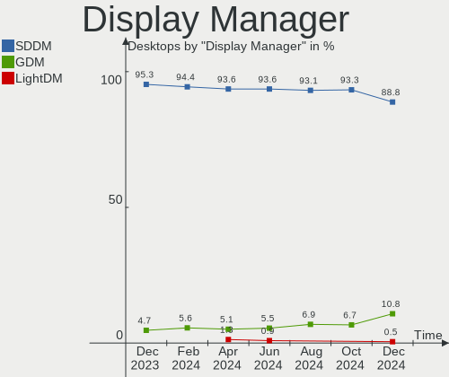
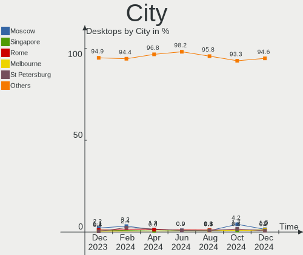

OpenMandriva Hardware Trends (Desktops)
---------------------------------------

A project to identify most popular hardware characteristics and track their change
over time based on data collected by OpenMandriva users at https://Linux-Hardware.org.

Anyone can contribute to this report by the [hw-probe](https://github.com/linuxhw/hw-probe) tool:

    sudo -E hw-probe -all -upload

This report is for one last month. Overall report since the beginning of time: [TestCoverage](https://github.com/linuxhw/TestCoverage)

Period: Apr, 2022.

Contents
--------

* [ System ](#system)
  - [ OS                       ](#os)
  - [ OS Family                ](#os-family)
  - [ Kernel                   ](#kernel)
  - [ Kernel Family            ](#kernel-family)
  - [ Kernel Major Ver.        ](#kernel-major-ver)
  - [ Arch                     ](#arch)
  - [ DE                       ](#de)
  - [ Display Server           ](#display-server)
  - [ Display Manager          ](#display-manager)
  - [ OS Lang                  ](#os-lang)
  - [ Boot Mode                ](#boot-mode)
  - [ Filesystem               ](#filesystem)
  - [ Part. scheme             ](#part-scheme)
  - [ Dual Boot with Linux/BSD ](#dual-boot-with-linuxbsd)
  - [ Dual Boot (Win)          ](#dual-boot-win)

* [ Board ](#board)
  - [ Vendor                   ](#vendor)
  - [ Model                    ](#model)
  - [ Model Family             ](#model-family)
  - [ MFG Year                 ](#mfg-year)
  - [ Form Factor              ](#form-factor)
  - [ Secure Boot              ](#secure-boot)
  - [ Coreboot                 ](#coreboot)
  - [ RAM Size                 ](#ram-size)
  - [ RAM Used                 ](#ram-used)
  - [ Total Drives             ](#total-drives)
  - [ Has CD-ROM               ](#has-cd-rom)
  - [ Has Ethernet             ](#has-ethernet)
  - [ Has WiFi                 ](#has-wifi)
  - [ Has Bluetooth            ](#has-bluetooth)

* [ Location ](#location)
  - [ Country                  ](#country)
  - [ City                     ](#city)

* [ Drives ](#drives)
  - [ Drive Vendor             ](#drive-vendor)
  - [ Drive Model              ](#drive-model)
  - [ HDD Vendor               ](#hdd-vendor)
  - [ SSD Vendor               ](#ssd-vendor)
  - [ Drive Kind               ](#drive-kind)
  - [ Drive Connector          ](#drive-connector)
  - [ Drive Size               ](#drive-size)
  - [ Space Total              ](#space-total)
  - [ Space Used               ](#space-used)
  - [ Malfunc. Drives          ](#malfunc-drives)
  - [ Malfunc. Drive Vendor    ](#malfunc-drive-vendor)
  - [ Malfunc. HDD Vendor      ](#malfunc-hdd-vendor)
  - [ Malfunc. Drive Kind      ](#malfunc-drive-kind)
  - [ Failed Drives            ](#failed-drives)
  - [ Failed Drive Vendor      ](#failed-drive-vendor)
  - [ Drive Status             ](#drive-status)

* [ Storage controller ](#storage-controller)
  - [ Storage Vendor           ](#storage-vendor)
  - [ Storage Model            ](#storage-model)
  - [ Storage Kind             ](#storage-kind)

* [ Processor ](#processor)
  - [ CPU Vendor               ](#cpu-vendor)
  - [ CPU Model                ](#cpu-model)
  - [ CPU Model Family         ](#cpu-model-family)
  - [ CPU Cores                ](#cpu-cores)
  - [ CPU Sockets              ](#cpu-sockets)
  - [ CPU Threads              ](#cpu-threads)
  - [ CPU Op-Modes             ](#cpu-op-modes)
  - [ CPU Microcode            ](#cpu-microcode)
  - [ CPU Microarch            ](#cpu-microarch)

* [ Graphics ](#graphics)
  - [ GPU Vendor               ](#gpu-vendor)
  - [ GPU Model                ](#gpu-model)
  - [ GPU Combo                ](#gpu-combo)
  - [ GPU Driver               ](#gpu-driver)
  - [ GPU Memory               ](#gpu-memory)

* [ Monitor ](#monitor)
  - [ Monitor Vendor           ](#monitor-vendor)
  - [ Monitor Model            ](#monitor-model)
  - [ Monitor Resolution       ](#monitor-resolution)
  - [ Monitor Diagonal         ](#monitor-diagonal)
  - [ Monitor Width            ](#monitor-width)
  - [ Aspect Ratio             ](#aspect-ratio)
  - [ Monitor Area             ](#monitor-area)
  - [ Pixel Density            ](#pixel-density)
  - [ Multiple Monitors        ](#multiple-monitors)

* [ Network ](#network)
  - [ Net Controller Vendor    ](#net-controller-vendor)
  - [ Net Controller Model     ](#net-controller-model)
  - [ Wireless Vendor          ](#wireless-vendor)
  - [ Wireless Model           ](#wireless-model)
  - [ Ethernet Vendor          ](#ethernet-vendor)
  - [ Ethernet Model           ](#ethernet-model)
  - [ Net Controller Kind      ](#net-controller-kind)
  - [ Used Controller          ](#used-controller)
  - [ NICs                     ](#nics)
  - [ IPv6                     ](#ipv6)

* [ Bluetooth ](#bluetooth)
  - [ Bluetooth Vendor         ](#bluetooth-vendor)
  - [ Bluetooth Model          ](#bluetooth-model)

* [ Sound ](#sound)
  - [ Sound Vendor             ](#sound-vendor)
  - [ Sound Model              ](#sound-model)

* [ Memory ](#memory)
  - [ Memory Vendor            ](#memory-vendor)
  - [ Memory Model             ](#memory-model)
  - [ Memory Kind              ](#memory-kind)
  - [ Memory Form Factor       ](#memory-form-factor)
  - [ Memory Size              ](#memory-size)
  - [ Memory Speed             ](#memory-speed)

* [ Printers & scanners ](#printers--scanners)
  - [ Printer Vendor           ](#printer-vendor)
  - [ Printer Model            ](#printer-model)
  - [ Scanner Vendor           ](#scanner-vendor)
  - [ Scanner Model            ](#scanner-model)

* [ Camera ](#camera)
  - [ Camera Vendor            ](#camera-vendor)
  - [ Camera Model             ](#camera-model)

* [ Security ](#security)
  - [ Fingerprint Vendor       ](#fingerprint-vendor)
  - [ Fingerprint Model        ](#fingerprint-model)
  - [ Chipcard Vendor          ](#chipcard-vendor)
  - [ Chipcard Model           ](#chipcard-model)

* [ Unsupported ](#unsupported)
  - [ Unsupported Devices      ](#unsupported-devices)
  - [ Unsupported Device Types ](#unsupported-device-types)

System
------

OS
--

Installed operating systems

| Name              | Desktops | Percent |
|-------------------|----------|---------|
| OpenMandriva 4.3  | 132      | 83.02%  |
| OpenMandriva 4.2  | 24       | 15.09%  |
| OpenMandriva 4.50 | 3        | 1.89%   |

OS Family
---------

OS without a version

| Name         | Desktops | Percent |
|--------------|----------|---------|
| OpenMandriva | 159      | 100%    |

Kernel
------

Version of the Linux kernel

| Version                  | Desktops | Percent |
|--------------------------|----------|---------|
| 5.16.7-desktop-1omv4003  | 126      | 79.25%  |
| 5.10.14-desktop-1omv4002 | 24       | 15.09%  |
| 5.16.13-desktop-1omv4003 | 5        | 3.14%   |
| 5.16.8-desktop-1omv4050  | 1        | 0.63%   |
| 5.16.3-desktop-2omv4050  | 1        | 0.63%   |
| 5.14.14-desktop-1omv4050 | 1        | 0.63%   |
| 5.12.4-desktop-1omv4050  | 1        | 0.63%   |

Kernel Family
-------------

Linux kernel without a distro release

| Version | Desktops | Percent |
|---------|----------|---------|
| 5.16.7  | 126      | 79.25%  |
| 5.10.14 | 24       | 15.09%  |
| 5.16.13 | 5        | 3.14%   |
| 5.16.8  | 1        | 0.63%   |
| 5.16.3  | 1        | 0.63%   |
| 5.14.14 | 1        | 0.63%   |
| 5.12.4  | 1        | 0.63%   |

Kernel Major Ver.
-----------------

Linux kernel major version

| Version | Desktops | Percent |
|---------|----------|---------|
| 5.16    | 133      | 83.65%  |
| 5.10    | 24       | 15.09%  |
| 5.14    | 1        | 0.63%   |
| 5.12    | 1        | 0.63%   |

Arch
----

OS architecture (x86_64, i586, etc.)

| Name   | Desktops | Percent |
|--------|----------|---------|
| x86_64 | 159      | 100%    |

DE
--

Desktop Environment

| Name    | Desktops | Percent |
|---------|----------|---------|
| KDE5    | 158      | 99.37%  |
| Unknown | 1        | 0.63%   |

Display Server
--------------

X11 or Wayland

| Name    | Desktops | Percent |
|---------|----------|---------|
| X11     | 157      | 98.74%  |
| Wayland | 2        | 1.26%   |

Display Manager
---------------

SDDM, LightDM, etc.

| Name | Desktops | Percent |
|------|----------|---------|
| SDDM | 159      | 100%    |

OS Lang
-------

Language

| Lang  | Desktops | Percent |
|-------|----------|---------|
| en_US | 84       | 52.83%  |
| ru_RU | 15       | 9.43%   |
| de_DE | 13       | 8.18%   |
| pt_BR | 8        | 5.03%   |
| fr_FR | 7        | 4.4%    |
| pl_PL | 6        | 3.77%   |
| cs_CZ | 6        | 3.77%   |
| fr_CA | 3        | 1.89%   |
| es_ES | 3        | 1.89%   |
| tr_TR | 2        | 1.26%   |
| it_IT | 2        | 1.26%   |
| hu_HU | 2        | 1.26%   |
| de_AT | 2        | 1.26%   |
| pt_PT | 1        | 0.63%   |
| es_VE | 1        | 0.63%   |
| es_MX | 1        | 0.63%   |
| es_AR | 1        | 0.63%   |
| en_ZA | 1        | 0.63%   |
| en_CA | 1        | 0.63%   |

Boot Mode
---------

EFI or BIOS

| Mode | Desktops | Percent |
|------|----------|---------|
| BIOS | 101      | 63.52%  |
| EFI  | 58       | 36.48%  |

Filesystem
----------

Type of filesystem

| Type     | Desktops | Percent |
|----------|----------|---------|
| Overlay  | 136      | 85.53%  |
| Ext4     | 22       | 13.84%  |
| Reiserfs | 1        | 0.63%   |

Part. scheme
------------

Scheme of partitioning

| Type | Desktops | Percent |
|------|----------|---------|
| GPT  | 93       | 58.49%  |
| MBR  | 66       | 41.51%  |

Dual Boot with Linux/BSD
------------------------

Hosting more than one Linux/BSD

| Dual boot | Desktops | Percent |
|-----------|----------|---------|
| Yes       | 91       | 57.23%  |
| No        | 68       | 42.77%  |

Dual Boot (Win)
---------------

Hosting Linux and Windows

| Dual boot | Desktops | Percent |
|-----------|----------|---------|
| Yes       | 91       | 57.23%  |
| No        | 68       | 42.77%  |

Board
-----

Vendor
------

Motherboard manufacturer

| Name                | Desktops | Percent |
|---------------------|----------|---------|
| ASUSTek Computer    | 35       | 22.01%  |
| Gigabyte Technology | 27       | 16.98%  |
| Dell                | 16       | 10.06%  |
| MSI                 | 15       | 9.43%   |
| Hewlett-Packard     | 12       | 7.55%   |
| ASRock              | 12       | 7.55%   |
| Lenovo              | 10       | 6.29%   |
| Intel               | 6        | 3.77%   |
| Foxconn             | 5        | 3.14%   |
| Fujitsu             | 4        | 2.52%   |
| Acer                | 3        | 1.89%   |
| Pegatron            | 2        | 1.26%   |
| ECS                 | 2        | 1.26%   |
| Biostar             | 2        | 1.26%   |
| Unknown             | 2        | 1.26%   |
| Positivo            | 1        | 0.63%   |
| Itautec             | 1        | 0.63%   |
| GALAX               | 1        | 0.63%   |
| Fujitsu Siemens     | 1        | 0.63%   |
| EPoX Computer       | 1        | 0.63%   |
| Alienware           | 1        | 0.63%   |

Model
-----

Motherboard model

| Name                                   | Desktops | Percent |
|----------------------------------------|----------|---------|
| Dell OptiPlex 3020                     | 5        | 3.14%   |
| Gigabyte B450M DS3H                    | 2        | 1.26%   |
| Dell OptiPlex 7020                     | 2        | 1.26%   |
| ASUS ROG STRIX B550-F GAMING           | 2        | 1.26%   |
| ASUS PRIME B450-PLUS                   | 2        | 1.26%   |
| ASUS All Series                        | 2        | 1.26%   |
| Unknown                                | 2        | 1.26%   |
| Positivo POS-MI945AA                   | 1        | 0.63%   |
| Pegatron VG267AA-ABF p6244fr           | 1        | 0.63%   |
| Pegatron Compaq dx2400 Microtower PC   | 1        | 0.63%   |
| MSI MS-7D59                            | 1        | 0.63%   |
| MSI MS-7D22                            | 1        | 0.63%   |
| MSI MS-7C84                            | 1        | 0.63%   |
| MSI MS-7C56                            | 1        | 0.63%   |
| MSI MS-7C52                            | 1        | 0.63%   |
| MSI MS-7B48                            | 1        | 0.63%   |
| MSI MS-7994                            | 1        | 0.63%   |
| MSI MS-7977                            | 1        | 0.63%   |
| MSI MS-7971                            | 1        | 0.63%   |
| MSI MS-7850                            | 1        | 0.63%   |
| MSI MS-7721                            | 1        | 0.63%   |
| MSI MS-7593                            | 1        | 0.63%   |
| MSI MS-7577                            | 1        | 0.63%   |
| MSI MS-7529                            | 1        | 0.63%   |
| MSI MS-7369                            | 1        | 0.63%   |
| Lenovo ThinkStation C20 4263BA7        | 1        | 0.63%   |
| Lenovo ThinkCentre M93p 10AAS1BN00     | 1        | 0.63%   |
| Lenovo ThinkCentre M910s 10MLS3XR01    | 1        | 0.63%   |
| Lenovo ThinkCentre M73 10B00013US      | 1        | 0.63%   |
| Lenovo ThinkCentre M71e 5033A3U        | 1        | 0.63%   |
| Lenovo ThinkCentre M710s 10M8S1TG00    | 1        | 0.63%   |
| Lenovo ThinkCentre M58p 7484ANU        | 1        | 0.63%   |
| Lenovo ThinkCentre M58p 6234CZ6        | 1        | 0.63%   |
| Lenovo ThinkCentre M58 7627AD5         | 1        | 0.63%   |
| Lenovo ThinkCentre E73 10DR001EIX      | 1        | 0.63%   |
| Itautec ST 4265                        | 1        | 0.63%   |
| Intel X79 V2.72B                       | 1        | 0.63%   |
| Intel H81                              | 1        | 0.63%   |
| Intel H61                              | 1        | 0.63%   |
| Intel DH61WW AAG23116-204              | 1        | 0.63%   |
| Intel DH61CR AAG14064-204              | 1        | 0.63%   |
| Intel DG45ID AAE27729-310              | 1        | 0.63%   |
| HP Z230 Tower Workstation              | 1        | 0.63%   |
| HP Slim Desktop S01-pF0xxx             | 1        | 0.63%   |
| HP ProDesk 600 G4 SFF                  | 1        | 0.63%   |
| HP ProDesk 600 G1 TWR                  | 1        | 0.63%   |
| HP ProDesk 400 G7 Small Form Factor PC | 1        | 0.63%   |
| HP ProDesk 400 G1 SFF                  | 1        | 0.63%   |
| HP EliteDesk 705 G1 SFF                | 1        | 0.63%   |
| HP Compaq Pro 6305 SFF                 | 1        | 0.63%   |
| HP Compaq Elite 8300 SFF               | 1        | 0.63%   |
| HP Compaq dc5800 Small Form Factor     | 1        | 0.63%   |
| HP Compaq 8100 Elite SFF PC            | 1        | 0.63%   |
| HP Compaq 6200 Pro SFF PC              | 1        | 0.63%   |
| Gigabyte Z77M-D3H-MVP                  | 1        | 0.63%   |
| Gigabyte Z690 UD AX                    | 1        | 0.63%   |
| Gigabyte Z390 GAMING X                 | 1        | 0.63%   |
| Gigabyte P35C-DS3R                     | 1        | 0.63%   |
| Gigabyte M68MT-S2                      | 1        | 0.63%   |
| Gigabyte H97M-D3H                      | 1        | 0.63%   |

Model Family
------------

Motherboard model prefix

| Name                      | Desktops | Percent |
|---------------------------|----------|---------|
| Lenovo ThinkCentre        | 9        | 5.66%   |
| Dell OptiPlex             | 9        | 5.66%   |
| ASUS PRIME                | 6        | 3.77%   |
| HP Compaq                 | 5        | 3.14%   |
| HP ProDesk                | 4        | 2.52%   |
| ASUS ROG                  | 4        | 2.52%   |
| Acer Aspire               | 3        | 1.89%   |
| Gigabyte B450M            | 2        | 1.26%   |
| Gigabyte B450             | 2        | 1.26%   |
| Fujitsu ESPRIMO           | 2        | 1.26%   |
| Dell Precision            | 2        | 1.26%   |
| Dell Inspiron             | 2        | 1.26%   |
| ASUS TUF                  | 2        | 1.26%   |
| ASUS P5KPL-AM             | 2        | 1.26%   |
| ASUS All                  | 2        | 1.26%   |
| Unknown                   | 2        | 1.26%   |
| Positivo POS-MI945AA      | 1        | 0.63%   |
| Pegatron VG267AA-ABF      | 1        | 0.63%   |
| Pegatron Compaq           | 1        | 0.63%   |
| MSI MS-7D59               | 1        | 0.63%   |
| MSI MS-7D22               | 1        | 0.63%   |
| MSI MS-7C84               | 1        | 0.63%   |
| MSI MS-7C56               | 1        | 0.63%   |
| MSI MS-7C52               | 1        | 0.63%   |
| MSI MS-7B48               | 1        | 0.63%   |
| MSI MS-7994               | 1        | 0.63%   |
| MSI MS-7977               | 1        | 0.63%   |
| MSI MS-7971               | 1        | 0.63%   |
| MSI MS-7850               | 1        | 0.63%   |
| MSI MS-7721               | 1        | 0.63%   |
| MSI MS-7593               | 1        | 0.63%   |
| MSI MS-7577               | 1        | 0.63%   |
| MSI MS-7529               | 1        | 0.63%   |
| MSI MS-7369               | 1        | 0.63%   |
| Lenovo ThinkStation       | 1        | 0.63%   |
| Itautec ST                | 1        | 0.63%   |
| Intel X79                 | 1        | 0.63%   |
| Intel H81                 | 1        | 0.63%   |
| Intel H61                 | 1        | 0.63%   |
| Intel DH61WW              | 1        | 0.63%   |
| Intel DH61CR              | 1        | 0.63%   |
| Intel DG45ID              | 1        | 0.63%   |
| HP Z230                   | 1        | 0.63%   |
| HP Slim                   | 1        | 0.63%   |
| HP EliteDesk              | 1        | 0.63%   |
| Gigabyte Z77M-D3H-MVP     | 1        | 0.63%   |
| Gigabyte Z690             | 1        | 0.63%   |
| Gigabyte Z390             | 1        | 0.63%   |
| Gigabyte P35C-DS3R        | 1        | 0.63%   |
| Gigabyte M68MT-S2         | 1        | 0.63%   |
| Gigabyte H97M-D3H         | 1        | 0.63%   |
| Gigabyte H81M-S2PV        | 1        | 0.63%   |
| Gigabyte H61M-S1          | 1        | 0.63%   |
| Gigabyte H55M-S2HP        | 1        | 0.63%   |
| Gigabyte H410M            | 1        | 0.63%   |
| Gigabyte GB-BPCE-3455     | 1        | 0.63%   |
| Gigabyte GB-BACE-3000-SBE | 1        | 0.63%   |
| Gigabyte GA-A55M-S2V      | 1        | 0.63%   |
| Gigabyte GA-78LMT-USB3    | 1        | 0.63%   |
| Gigabyte G41MT-ES2L       | 1        | 0.63%   |

MFG Year
--------

Motherboard manufacture year

| Year | Desktops | Percent |
|------|----------|---------|
| 2013 | 19       | 11.95%  |
| 2018 | 14       | 8.81%   |
| 2014 | 14       | 8.81%   |
| 2010 | 13       | 8.18%   |
| 2011 | 12       | 7.55%   |
| 2009 | 11       | 6.92%   |
| 2017 | 10       | 6.29%   |
| 2012 | 10       | 6.29%   |
| 2021 | 9        | 5.66%   |
| 2020 | 9        | 5.66%   |
| 2008 | 7        | 4.4%    |
| 2006 | 7        | 4.4%    |
| 2015 | 6        | 3.77%   |
| 2007 | 6        | 3.77%   |
| 2019 | 5        | 3.14%   |
| 2016 | 4        | 2.52%   |
| 2022 | 3        | 1.89%   |

Form Factor
-----------

Physical design of the computer

| Name    | Desktops | Percent |
|---------|----------|---------|
| Desktop | 159      | 100%    |

Secure Boot
-----------

Enabled or disabled

| State    | Desktops | Percent |
|----------|----------|---------|
| Disabled | 159      | 100%    |

Coreboot
--------

Have coreboot on board

| Used | Desktops | Percent |
|------|----------|---------|
| No   | 159      | 100%    |

RAM Size
--------

Total RAM memory

| Size in GB  | Desktops | Percent |
|-------------|----------|---------|
| 3.01-4.0    | 41       | 25.79%  |
| 8.01-16.0   | 39       | 24.53%  |
| 4.01-8.0    | 30       | 18.87%  |
| 16.01-24.0  | 28       | 17.61%  |
| 32.01-64.0  | 13       | 8.18%   |
| 64.01-256.0 | 4        | 2.52%   |
| 1.01-2.0    | 3        | 1.89%   |
| 24.01-32.0  | 1        | 0.63%   |

RAM Used
--------

Used RAM memory

| Used GB   | Desktops | Percent |
|-----------|----------|---------|
| 1.01-2.0  | 102      | 64.15%  |
| 0.51-1.0  | 41       | 25.79%  |
| 2.01-3.0  | 12       | 7.55%   |
| 4.01-8.0  | 1        | 0.63%   |
| 3.01-4.0  | 1        | 0.63%   |
| 8.01-16.0 | 1        | 0.63%   |
| 0.01-0.5  | 1        | 0.63%   |

Total Drives
------------

Number of drives on board

| Drives | Desktops | Percent |
|--------|----------|---------|
| 1      | 77       | 48.43%  |
| 2      | 43       | 27.04%  |
| 3      | 21       | 13.21%  |
| 4      | 9        | 5.66%   |
| 5      | 4        | 2.52%   |
| 0      | 3        | 1.89%   |
| 6      | 2        | 1.26%   |

Has CD-ROM
----------

Has CD-ROM on board

| Presented | Desktops | Percent |
|-----------|----------|---------|
| Yes       | 98       | 61.64%  |
| No        | 61       | 38.36%  |

Has Ethernet
------------

Has Ethernet on board

| Presented | Desktops | Percent |
|-----------|----------|---------|
| Yes       | 158      | 99.37%  |
| No        | 1        | 0.63%   |

Has WiFi
--------

Has WiFi module

| Presented | Desktops | Percent |
|-----------|----------|---------|
| No        | 109      | 68.55%  |
| Yes       | 50       | 31.45%  |

Has Bluetooth
-------------

Has Bluetooth module

| Presented | Desktops | Percent |
|-----------|----------|---------|
| No        | 132      | 83.02%  |
| Yes       | 27       | 16.98%  |

Location
--------

Country
-------

Geographic location (country)

| Country             | Desktops | Percent |
|---------------------|----------|---------|
| Germany             | 19       | 11.95%  |
| USA                 | 18       | 11.32%  |
| Russia              | 16       | 10.06%  |
| Poland              | 11       | 6.92%   |
| Brazil              | 11       | 6.92%   |
| Italy               | 7        | 4.4%    |
| Czechia             | 7        | 4.4%    |
| France              | 6        | 3.77%   |
| Costa Rica          | 6        | 3.77%   |
| Canada              | 5        | 3.14%   |
| Ukraine             | 4        | 2.52%   |
| Sweden              | 4        | 2.52%   |
| Spain               | 4        | 2.52%   |
| Mexico              | 3        | 1.89%   |
| Hungary             | 3        | 1.89%   |
| Turkey              | 2        | 1.26%   |
| Serbia              | 2        | 1.26%   |
| Portugal            | 2        | 1.26%   |
| Egypt               | 2        | 1.26%   |
| Bulgaria            | 2        | 1.26%   |
| Australia           | 2        | 1.26%   |
| Argentina           | 2        | 1.26%   |
| Venezuela           | 1        | 0.63%   |
| UK                  | 1        | 0.63%   |
| Trinidad and Tobago | 1        | 0.63%   |
| South Africa        | 1        | 0.63%   |
| Peru                | 1        | 0.63%   |
| New Zealand         | 1        | 0.63%   |
| Netherlands         | 1        | 0.63%   |
| Namibia             | 1        | 0.63%   |
| Malaysia            | 1        | 0.63%   |
| India               | 1        | 0.63%   |
| Hong Kong           | 1        | 0.63%   |
| Guadeloupe          | 1        | 0.63%   |
| Greece              | 1        | 0.63%   |
| Finland             | 1        | 0.63%   |
| Ecuador             | 1        | 0.63%   |
| Croatia             | 1        | 0.63%   |
| Colombia            | 1        | 0.63%   |
| Belgium             | 1        | 0.63%   |
| Bangladesh          | 1        | 0.63%   |
| Azerbaijan          | 1        | 0.63%   |
| Algeria             | 1        | 0.63%   |

City
----

Geographic location (city)

| City                     | Desktops | Percent |
|--------------------------|----------|---------|
| Heredia                  | 5        | 3.14%   |
| Moscow                   | 4        | 2.52%   |
| Prague                   | 3        | 1.89%   |
| Warsaw                   | 2        | 1.26%   |
| Terrebonne               | 2        | 1.26%   |
| Sydney                   | 2        | 1.26%   |
| Stuttgart                | 2        | 1.26%   |
| St Petersburg            | 2        | 1.26%   |
| Rome                     | 2        | 1.26%   |
| Porto Alegre             | 2        | 1.26%   |
| Offenbach                | 2        | 1.26%   |
| Madrid                   | 2        | 1.26%   |
| Zheleznogorsk            | 1        | 0.63%   |
| Zagreb                   | 1        | 0.63%   |
| Yukon                    | 1        | 0.63%   |
| Yevpatoriya              | 1        | 0.63%   |
| Yekaterinburg            | 1        | 0.63%   |
| Windhoek                 | 1        | 0.63%   |
| Villeurbanne             | 1        | 0.63%   |
| Veretz                   | 1        | 0.63%   |
| Valega                   | 1        | 0.63%   |
| Uppsala                  | 1        | 0.63%   |
| Ufa                      | 1        | 0.63%   |
| Trois-Rivières          | 1        | 0.63%   |
| Toulouse                 | 1        | 0.63%   |
| Tilton                   | 1        | 0.63%   |
| Tikhvin                  | 1        | 0.63%   |
| Tatabánya               | 1        | 0.63%   |
| Sundsvall                | 1        | 0.63%   |
| Sugar Land               | 1        | 0.63%   |
| Strzyzow                 | 1        | 0.63%   |
| Strausberg               | 1        | 0.63%   |
| Stockholm                | 1        | 0.63%   |
| Springdale               | 1        | 0.63%   |
| Simferopol               | 1        | 0.63%   |
| Shepherdsville           | 1        | 0.63%   |
| Seattle                  | 1        | 0.63%   |
| Saransk                  | 1        | 0.63%   |
| Sao Paulo                | 1        | 0.63%   |
| Santiago de Cali         | 1        | 0.63%   |
| San Pedro                | 1        | 0.63%   |
| Saint-Julien-en-Genevois | 1        | 0.63%   |
| Rzeszów                 | 1        | 0.63%   |
| Ruda Śląska            | 1        | 0.63%   |
| Rovereto                 | 1        | 0.63%   |
| Rostock                  | 1        | 0.63%   |
| Rochester                | 1        | 0.63%   |
| Rio de Janeiro           | 1        | 0.63%   |
| Rietberg                 | 1        | 0.63%   |
| Ribeirao Preto           | 1        | 0.63%   |
| Rho                      | 1        | 0.63%   |
| Regensburg               | 1        | 0.63%   |
| Razgrad                  | 1        | 0.63%   |
| Raisio                   | 1        | 0.63%   |
| Port of Spain            | 1        | 0.63%   |
| Plovdiv                  | 1        | 0.63%   |
| Pinellas Park            | 1        | 0.63%   |
| Pielgrzymka              | 1        | 0.63%   |
| Pau                      | 1        | 0.63%   |
| Paris                    | 1        | 0.63%   |

Drives
------

Drive Vendor
------------

Hard drive vendors

| Vendor              | Desktops | Drives | Percent |
|---------------------|----------|--------|---------|
| WDC                 | 53       | 64     | 21.37%  |
| Seagate             | 52       | 61     | 20.97%  |
| Samsung Electronics | 22       | 31     | 8.87%   |
| Kingston            | 16       | 18     | 6.45%   |
| A-DATA Technology   | 14       | 14     | 5.65%   |
| Hitachi             | 12       | 13     | 4.84%   |
| Toshiba             | 11       | 11     | 4.44%   |
| SanDisk             | 10       | 13     | 4.03%   |
| Crucial             | 6        | 6      | 2.42%   |
| MAXTOR              | 5        | 8      | 2.02%   |
| China               | 4        | 5      | 1.61%   |
| Apacer              | 4        | 4      | 1.61%   |
| SPCC                | 3        | 3      | 1.21%   |
| Intel               | 3        | 3      | 1.21%   |
| Unknown             | 2        | 3      | 0.81%   |
| Micron Technology   | 2        | 2      | 0.81%   |
| KingSpec            | 2        | 2      | 0.81%   |
| Hewlett-Packard     | 2        | 2      | 0.81%   |
| GOODRAM             | 2        | 3      | 0.81%   |
| Fujitsu             | 2        | 2      | 0.81%   |
| Transcend           | 1        | 1      | 0.4%    |
| Team                | 1        | 1      | 0.4%    |
| Silicon Motion      | 1        | 2      | 0.4%    |
| QUANTUM             | 1        | 1      | 0.4%    |
| Phison              | 1        | 2      | 0.4%    |
| Patriot             | 1        | 1      | 0.4%    |
| OCZ                 | 1        | 1      | 0.4%    |
| Netac               | 1        | 1      | 0.4%    |
| LITEON              | 1        | 1      | 0.4%    |
| KIOXIA              | 1        | 1      | 0.4%    |
| JMicron             | 1        | 1      | 0.4%    |
| Intenso             | 1        | 1      | 0.4%    |
| HGST                | 1        | 1      | 0.4%    |
| GLOWAY              | 1        | 1      | 0.4%    |
| External            | 1        | 1      | 0.4%    |
| ExcelStor           | 1        | 1      | 0.4%    |
| Corsair             | 1        | 1      | 0.4%    |
| Colorful            | 1        | 1      | 0.4%    |
| AXIOM               | 1        | 1      | 0.4%    |
| AMD                 | 1        | 1      | 0.4%    |
| Unknown             | 1        | 1      | 0.4%    |

Drive Model
-----------

Hard drive models

| Model                            | Desktops | Percent |
|----------------------------------|----------|---------|
| Seagate ST500DM002-1BD142 500GB  | 6        | 2.15%   |
| Seagate ST1000DM010-2EP102 1TB   | 6        | 2.15%   |
| Kingston SA400S37240G 240GB SSD  | 5        | 1.79%   |
| A-DATA SU630 480GB SSD           | 5        | 1.79%   |
| Toshiba DT01ACA050 500GB         | 4        | 1.43%   |
| WDC WDS100T2B0C-00PXH0 1TB       | 3        | 1.08%   |
| Seagate ST3500413AS 500GB        | 3        | 1.08%   |
| Seagate ST2000DM008-2FR102 2TB   | 3        | 1.08%   |
| Seagate ST2000DM001-1ER164 2TB   | 3        | 1.08%   |
| Samsung SSD 870 EVO 1TB          | 3        | 1.08%   |
| Kingston SV300S37A120G 120GB SSD | 3        | 1.08%   |
| WDC WDS500G2B0A-00SM50 500GB SSD | 2        | 0.72%   |
| WDC WD800BB-00JHC0 80GB          | 2        | 0.72%   |
| WDC WD5000AAKX-60U6AA0 500GB     | 2        | 0.72%   |
| WDC WD5000AAKX-001CA0 500GB      | 2        | 0.72%   |
| WDC WD10EZEX-60WN4A0 1TB         | 2        | 0.72%   |
| WDC WD10EZEX-08WN4A0 1TB         | 2        | 0.72%   |
| WDC WD10EZEX-00WN4A0 1TB         | 2        | 0.72%   |
| WDC WD10EADS-22M2B0 1TB          | 2        | 0.72%   |
| Toshiba DT01ACA200 2TB           | 2        | 0.72%   |
| Seagate ST380011A 80GB           | 2        | 0.72%   |
| Seagate ST31000524AS 1TB         | 2        | 0.72%   |
| Seagate ST1000DM003-1SB10C 1TB   | 2        | 0.72%   |
| Seagate ST1000DM003-1SB102 1TB   | 2        | 0.72%   |
| MAXTOR STM3320820AS 320GB        | 2        | 0.72%   |
| Kingston SA400S37120G 120GB SSD  | 2        | 0.72%   |
| Kingston SA2000M8250G 250GB      | 2        | 0.72%   |
| Hitachi HDP725050GLA360 500GB    | 2        | 0.72%   |
| Apacer 32GB SATA Flash Drive SSD | 2        | 0.72%   |
| A-DATA SU630 240GB SSD           | 2        | 0.72%   |
| WDC WUH721818ALE6L4 18TB         | 1        | 0.36%   |
| WDC WDS500G3X0C-00SJG0 500GB     | 1        | 0.36%   |
| WDC WDS240G1G0A-00SS50 240GB SSD | 1        | 0.36%   |
| WDC WDS100T3X0C-00SJG0 1TB       | 1        | 0.36%   |
| WDC WD800JD-22LSA0 80GB          | 1        | 0.36%   |
| WDC WD800JD-00LSA0 80GB          | 1        | 0.36%   |
| WDC WD800BD-00LRA1 80GB          | 1        | 0.36%   |
| WDC WD7500AADS-00M2B0 752GB      | 1        | 0.36%   |
| WDC WD6400AAKS-00A7B2 640GB      | 1        | 0.36%   |
| WDC WD5003ABYX-01WERA1 500GB     | 1        | 0.36%   |
| WDC WD5003ABYX-01WERA0 500GB     | 1        | 0.36%   |
| WDC WD5000LPSX-00A6WT0 500GB     | 1        | 0.36%   |
| WDC WD5000LPLX-75ZNTT0 500GB     | 1        | 0.36%   |
| WDC WD5000AZLX-60K2TA0 500GB     | 1        | 0.36%   |
| WDC WD5000AAKX-00ERMA0 500GB     | 1        | 0.36%   |
| WDC WD5000AAKS-07YGA0 500GB      | 1        | 0.36%   |
| WDC WD5000AADS-00S9B0 500GB      | 1        | 0.36%   |
| WDC WD40EZRZ-22GXCB0 4TB         | 1        | 0.36%   |
| WDC WD3200AVJS-63B6A0 320GB      | 1        | 0.36%   |
| WDC WD3000HLFS-75G6U1 304GB      | 1        | 0.36%   |
| WDC WD2500BEVT-00A23T0 250GB     | 1        | 0.36%   |
| WDC WD2500AAKX-083CA1 250GB      | 1        | 0.36%   |
| WDC WD2500AAKS-00L6A0 250GB      | 1        | 0.36%   |
| WDC WD20EARX-22PASB0 2TB         | 1        | 0.36%   |
| WDC WD20EARX-00PASB0 2TB         | 1        | 0.36%   |
| WDC WD2003FZEX-00SRLA0 2TB       | 1        | 0.36%   |
| WDC WD1600BEVT-24A23T0 160GB     | 1        | 0.36%   |
| WDC WD1600AAJS-08L7A0 160GB      | 1        | 0.36%   |
| WDC WD1600AAJS-00L7A0 160GB      | 1        | 0.36%   |
| WDC WD1600AABS-00PRA0 160GB      | 1        | 0.36%   |

HDD Vendor
----------

Hard disk drive vendors

| Vendor              | Desktops | Drives | Percent |
|---------------------|----------|--------|---------|
| Seagate             | 50       | 59     | 35.21%  |
| WDC                 | 48       | 56     | 33.8%   |
| Hitachi             | 12       | 13     | 8.45%   |
| Toshiba             | 10       | 10     | 7.04%   |
| Samsung Electronics | 10       | 13     | 7.04%   |
| MAXTOR              | 5        | 8      | 3.52%   |
| Fujitsu             | 2        | 2      | 1.41%   |
| Unknown             | 1        | 1      | 0.7%    |
| QUANTUM             | 1        | 1      | 0.7%    |
| HGST                | 1        | 1      | 0.7%    |
| ExcelStor           | 1        | 1      | 0.7%    |
| Unknown             | 1        | 1      | 0.7%    |

SSD Vendor
----------

Solid state drive vendors

| Vendor              | Desktops | Drives | Percent |
|---------------------|----------|--------|---------|
| Kingston            | 14       | 14     | 17.07%  |
| A-DATA Technology   | 13       | 13     | 15.85%  |
| SanDisk             | 9        | 12     | 10.98%  |
| Samsung Electronics | 9        | 13     | 10.98%  |
| Crucial             | 5        | 5      | 6.1%    |
| China               | 4        | 5      | 4.88%   |
| Apacer              | 4        | 4      | 4.88%   |
| WDC                 | 3        | 3      | 3.66%   |
| SPCC                | 2        | 2      | 2.44%   |
| Micron Technology   | 2        | 2      | 2.44%   |
| KingSpec            | 2        | 2      | 2.44%   |
| Hewlett-Packard     | 2        | 2      | 2.44%   |
| GOODRAM             | 2        | 2      | 2.44%   |
| Transcend           | 1        | 1      | 1.22%   |
| Team                | 1        | 1      | 1.22%   |
| Seagate             | 1        | 1      | 1.22%   |
| Patriot             | 1        | 1      | 1.22%   |
| OCZ                 | 1        | 1      | 1.22%   |
| LITEON              | 1        | 1      | 1.22%   |
| Intenso             | 1        | 1      | 1.22%   |
| Intel               | 1        | 1      | 1.22%   |
| GLOWAY              | 1        | 1      | 1.22%   |
| External            | 1        | 1      | 1.22%   |
| Colorful            | 1        | 1      | 1.22%   |

Drive Kind
----------

HDD or SSD

| Kind    | Desktops | Drives | Percent |
|---------|----------|--------|---------|
| HDD     | 115      | 166    | 53.74%  |
| SSD     | 72       | 90     | 33.64%  |
| NVMe    | 24       | 31     | 11.21%  |
| Unknown | 3        | 4      | 1.4%    |

Drive Connector
---------------

SATA, SAS, NVMe, etc.

| Type | Desktops | Drives | Percent |
|------|----------|--------|---------|
| SATA | 151      | 250    | 82.07%  |
| NVMe | 24       | 31     | 13.04%  |
| SAS  | 9        | 10     | 4.89%   |

Drive Size
----------

Size of hard drive

| Size in TB | Desktops | Drives | Percent |
|------------|----------|--------|---------|
| 0.01-0.5   | 125      | 167    | 63.78%  |
| 0.51-1.0   | 49       | 63     | 25%     |
| 1.01-2.0   | 17       | 20     | 8.67%   |
| 3.01-4.0   | 4        | 5      | 2.04%   |
| 10.01-20.0 | 1        | 1      | 0.51%   |

Space Total
-----------

Amount of disk space available on the file system

| Size in GB     | Desktops | Percent |
|----------------|----------|---------|
| 1-20           | 81       | 50.94%  |
| Unknown        | 26       | 16.35%  |
| 101-250        | 19       | 11.95%  |
| 251-500        | 11       | 6.92%   |
| 501-1000       | 10       | 6.29%   |
| 51-100         | 5        | 3.14%   |
| 21-50          | 4        | 2.52%   |
| More than 3000 | 2        | 1.26%   |
| 1001-2000      | 1        | 0.63%   |

Space Used
----------

Amount of used disk space

| Used GB   | Desktops | Percent |
|-----------|----------|---------|
| 1-20      | 118      | 74.21%  |
| Unknown   | 26       | 16.35%  |
| 101-250   | 4        | 2.52%   |
| 21-50     | 3        | 1.89%   |
| 51-100    | 3        | 1.89%   |
| 1001-2000 | 2        | 1.26%   |
| 501-1000  | 2        | 1.26%   |
| 251-500   | 1        | 0.63%   |

Malfunc. Drives
---------------

Drive models with a malfunction

| Model                                               | Desktops | Drives | Percent |
|-----------------------------------------------------|----------|--------|---------|
| Seagate ST3500413AS 500GB                           | 3        | 3      | 4.35%   |
| Seagate ST500DM002-1BD142 500GB                     | 2        | 2      | 2.9%    |
| Seagate ST1000DM003-1SB102 1TB                      | 2        | 2      | 2.9%    |
| Kingston SV300S37A120G 120GB SSD                    | 2        | 2      | 2.9%    |
| WDC WD800JD-22LSA0 80GB                             | 1        | 1      | 1.45%   |
| WDC WD800JD-00LSA0 80GB                             | 1        | 1      | 1.45%   |
| WDC WD800BD-00LRA1 80GB                             | 1        | 1      | 1.45%   |
| WDC WD800BB-00JHC0 80GB                             | 1        | 1      | 1.45%   |
| WDC WD7500AADS-00M2B0 752GB                         | 1        | 1      | 1.45%   |
| WDC WD5000AAKX-001CA0 500GB                         | 1        | 1      | 1.45%   |
| WDC WD3200AVJS-63B6A0 320GB                         | 1        | 1      | 1.45%   |
| WDC WD20EARX-22PASB0 2TB                            | 1        | 1      | 1.45%   |
| WDC WD1600AAJS-08L7A0 160GB                         | 1        | 1      | 1.45%   |
| WDC WD1600AAJS-00L7A0 160GB                         | 1        | 1      | 1.45%   |
| WDC WD10EZEX-60WN4A0 1TB                            | 1        | 1      | 1.45%   |
| WDC WD10EADX-22TDHB0 1TB                            | 1        | 1      | 1.45%   |
| WDC WD10EADS-65L5B1 1TB                             | 1        | 1      | 1.45%   |
| WDC WD10EADS-22M2B0 1TB                             | 1        | 1      | 1.45%   |
| WDC WD10EADS-00P8B0 1TB                             | 1        | 1      | 1.45%   |
| WDC WD1003FBYX-01Y7B1 1TB                           | 1        | 1      | 1.45%   |
| Toshiba DT01ACA050 500GB                            | 1        | 1      | 1.45%   |
| Seagate ST9500325AS 500GB                           | 1        | 1      | 1.45%   |
| Seagate ST9320423AS 320GB                           | 1        | 1      | 1.45%   |
| Seagate ST9320325AS 320GB                           | 1        | 1      | 1.45%   |
| Seagate ST92505610AS 250GB                          | 1        | 1      | 1.45%   |
| Seagate ST9160310AS 160GB                           | 1        | 1      | 1.45%   |
| Seagate ST500LT012-9WS142 500GB                     | 1        | 1      | 1.45%   |
| Seagate ST380215A 80GB                              | 1        | 1      | 1.45%   |
| Seagate ST380011A 80GB                              | 1        | 1      | 1.45%   |
| Seagate ST3750640AS 752GB                           | 1        | 1      | 1.45%   |
| Seagate ST3500412AS 500GB                           | 1        | 1      | 1.45%   |
| Seagate ST340014A 40GB                              | 1        | 1      | 1.45%   |
| Seagate ST3250410AS 250GB                           | 1        | 1      | 1.45%   |
| Seagate ST31000528AS 1TB                            | 1        | 1      | 1.45%   |
| Seagate ST31000520AS 1TB                            | 1        | 1      | 1.45%   |
| Seagate ST2000DM001-9YN164 2TB                      | 1        | 1      | 1.45%   |
| Seagate ST2000DM001-1ER164 2TB                      | 1        | 1      | 1.45%   |
| Seagate ST1000DX001-1CM162 1TB                      | 1        | 1      | 1.45%   |
| Seagate ST1000DM010-2EP102 1TB                      | 1        | 1      | 1.45%   |
| SanDisk SSD PLUS 240GB                              | 1        | 1      | 1.45%   |
| SanDisk SSD PLUS 120 GB                             | 1        | 1      | 1.45%   |
| Samsung Electronics SSD 870 EVO 1TB                 | 1        | 1      | 1.45%   |
| Samsung Electronics SP2504C 250GB                   | 1        | 1      | 1.45%   |
| Samsung Electronics SP0842N 80GB                    | 1        | 1      | 1.45%   |
| Samsung Electronics HD753LJ 752GB                   | 1        | 1      | 1.45%   |
| Samsung Electronics HD502IJ 500GB                   | 1        | 1      | 1.45%   |
| QUANTUM FIREBALLlct20 30 32GB                       | 1        | 1      | 1.45%   |
| Micron Technology MTFDDAV256TDL-1AW1ZABHA 256GB SSD | 1        | 1      | 1.45%   |
| MAXTOR STM380211AS 80GB                             | 1        | 1      | 1.45%   |
| MAXTOR STM3320820AS 320GB                           | 1        | 1      | 1.45%   |
| MAXTOR STM3250310AS 250GB                           | 1        | 1      | 1.45%   |
| MAXTOR STM3160815AS 160GB                           | 1        | 1      | 1.45%   |
| Kingston SVP200S37A120G 120GB SSD                   | 1        | 1      | 1.45%   |
| Kingston SA400S37480G 480GB SSD                     | 1        | 1      | 1.45%   |
| KingSpec P3-128 128GB SSD                           | 1        | 1      | 1.45%   |
| Intel SSDSC2BW120A3F 120GB                          | 1        | 1      | 1.45%   |
| Hitachi HTS545032B9SA02 320GB                       | 1        | 1      | 1.45%   |
| Hitachi HDS721050DLE630 500GB                       | 1        | 1      | 1.45%   |
| Hitachi HDS721010CLA332 1TB                         | 1        | 1      | 1.45%   |
| Hitachi HDP725050GLAT80 500GB                       | 1        | 1      | 1.45%   |

Malfunc. Drive Vendor
---------------------

Vendors of faulty drives

| Vendor              | Desktops | Drives | Percent |
|---------------------|----------|--------|---------|
| Seagate             | 23       | 25     | 34.33%  |
| WDC                 | 16       | 16     | 23.88%  |
| Samsung Electronics | 5        | 5      | 7.46%   |
| MAXTOR              | 4        | 4      | 5.97%   |
| Kingston            | 4        | 4      | 5.97%   |
| Hitachi             | 4        | 4      | 5.97%   |
| SanDisk             | 2        | 2      | 2.99%   |
| Toshiba             | 1        | 1      | 1.49%   |
| QUANTUM             | 1        | 1      | 1.49%   |
| Micron Technology   | 1        | 1      | 1.49%   |
| KingSpec            | 1        | 1      | 1.49%   |
| Intel               | 1        | 1      | 1.49%   |
| Hewlett-Packard     | 1        | 1      | 1.49%   |
| GLOWAY              | 1        | 1      | 1.49%   |
| Fujitsu             | 1        | 1      | 1.49%   |
| Unknown             | 1        | 1      | 1.49%   |

Malfunc. HDD Vendor
-------------------

Vendors of faulty HDD drives

| Vendor              | Desktops | Drives | Percent |
|---------------------|----------|--------|---------|
| Seagate             | 23       | 25     | 41.82%  |
| WDC                 | 16       | 16     | 29.09%  |
| Samsung Electronics | 4        | 4      | 7.27%   |
| MAXTOR              | 4        | 4      | 7.27%   |
| Hitachi             | 4        | 4      | 7.27%   |
| Toshiba             | 1        | 1      | 1.82%   |
| QUANTUM             | 1        | 1      | 1.82%   |
| Fujitsu             | 1        | 1      | 1.82%   |
| Unknown             | 1        | 1      | 1.82%   |

Malfunc. Drive Kind
-------------------

Kinds of faulty drives

| Kind | Desktops | Drives | Percent |
|------|----------|--------|---------|
| HDD  | 47       | 57     | 81.03%  |
| SSD  | 11       | 12     | 18.97%  |

Failed Drives
-------------

Failed drive models

| Model                           | Desktops | Drives | Percent |
|---------------------------------|----------|--------|---------|
| Samsung Electronics HD103UJ 1TB | 1        | 1      | 50%     |
| Hitachi HDP725050GLA360 500GB   | 1        | 1      | 50%     |

Failed Drive Vendor
-------------------

Failed drive vendors

| Vendor              | Desktops | Drives | Percent |
|---------------------|----------|--------|---------|
| Samsung Electronics | 1        | 1      | 50%     |
| Hitachi             | 1        | 1      | 50%     |

Drive Status
------------

Number of failed and malfunc. drives

| Status   | Desktops | Drives | Percent |
|----------|----------|--------|---------|
| Works    | 126      | 211    | 65.63%  |
| Malfunc  | 56       | 69     | 29.17%  |
| Detected | 8        | 9      | 4.17%   |
| Failed   | 2        | 2      | 1.04%   |

Storage controller
------------------

Storage Vendor
--------------

Storage controller vendors

| Vendor                       | Desktops | Percent |
|------------------------------|----------|---------|
| Intel                        | 110      | 55%     |
| AMD                          | 38       | 19%     |
| Nvidia                       | 10       | 5%      |
| JMicron Technology           | 8        | 4%      |
| Sandisk                      | 6        | 3%      |
| Silicon Motion               | 5        | 2.5%    |
| Samsung Electronics          | 4        | 2%      |
| ASMedia Technology           | 4        | 2%      |
| Phison Electronics           | 3        | 1.5%    |
| Marvell Technology Group     | 3        | 1.5%    |
| Kingston Technology Company  | 3        | 1.5%    |
| Toshiba America Info Systems | 2        | 1%      |
| VIA Technologies             | 1        | 0.5%    |
| Micron/Crucial Technology    | 1        | 0.5%    |
| LSI Logic / Symbios Logic    | 1        | 0.5%    |
| ADATA Technology             | 1        | 0.5%    |

Storage Model
-------------

Storage controller models

| Model                                                                                   | Desktops | Percent |
|-----------------------------------------------------------------------------------------|----------|---------|
| AMD FCH SATA Controller [AHCI mode]                                                     | 24       | 8.89%   |
| Intel 8 Series/C220 Series Chipset Family 6-port SATA Controller 1 [AHCI mode]          | 21       | 7.78%   |
| Intel NM10/ICH7 Family SATA Controller [IDE mode]                                       | 16       | 5.93%   |
| Intel 82801G (ICH7 Family) IDE Controller                                               | 12       | 4.44%   |
| Intel 6 Series/C200 Series Chipset Family 6 port Desktop SATA AHCI Controller           | 8        | 2.96%   |
| AMD 400 Series Chipset SATA Controller                                                  | 8        | 2.96%   |
| Intel Q170/Q150/B150/H170/H110/Z170/CM236 Chipset SATA Controller [AHCI Mode]           | 7        | 2.59%   |
| Intel 200 Series PCH SATA controller [AHCI mode]                                        | 7        | 2.59%   |
| Intel 6 Series/C200 Series Chipset Family Desktop SATA Controller (IDE mode, ports 4-5) | 6        | 2.22%   |
| Intel 6 Series/C200 Series Chipset Family Desktop SATA Controller (IDE mode, ports 0-3) | 6        | 2.22%   |
| AMD 500 Series Chipset SATA Controller                                                  | 6        | 2.22%   |
| Nvidia MCP61 SATA Controller                                                            | 5        | 1.85%   |
| JMicron JMB363 SATA/IDE Controller                                                      | 5        | 1.85%   |
| Intel 500 Series Chipset Family SATA AHCI Controller                                    | 5        | 1.85%   |
| AMD SB7x0/SB8x0/SB9x0 IDE Controller                                                    | 5        | 1.85%   |
| Silicon Motion SM2263EN/SM2263XT SSD Controller                                         | 4        | 1.48%   |
| Nvidia MCP61 IDE                                                                        | 4        | 1.48%   |
| ASMedia ASM1062 Serial ATA Controller                                                   | 4        | 1.48%   |
| AMD FCH SATA Controller D                                                               | 4        | 1.48%   |
| Sandisk WD Blue SN550 NVMe SSD                                                          | 3        | 1.11%   |
| Samsung NVMe SSD Controller SM981/PM981/PM983                                           | 3        | 1.11%   |
| Phison E12 NVMe Controller                                                              | 3        | 1.11%   |
| Kingston Company A2000 NVMe SSD                                                         | 3        | 1.11%   |
| Intel SATA Controller [RAID mode]                                                       | 3        | 1.11%   |
| Intel Alder Lake-S PCH SATA Controller [AHCI Mode]                                      | 3        | 1.11%   |
| Intel 82801JI (ICH10 Family) 4 port SATA IDE Controller #1                              | 3        | 1.11%   |
| Intel 82801JI (ICH10 Family) 2 port SATA IDE Controller #2                              | 3        | 1.11%   |
| Intel 7 Series/C210 Series Chipset Family 6-port SATA Controller [AHCI mode]            | 3        | 1.11%   |
| Intel 7 Series/C210 Series Chipset Family 4-port SATA Controller [IDE mode]             | 3        | 1.11%   |
| Intel 7 Series/C210 Series Chipset Family 2-port SATA Controller [IDE mode]             | 3        | 1.11%   |
| Intel 4 Series Chipset PT IDER Controller                                               | 3        | 1.11%   |
| AMD SB7x0/SB8x0/SB9x0 SATA Controller [IDE mode]                                        | 3        | 1.11%   |
| AMD SB7x0/SB8x0/SB9x0 SATA Controller [AHCI mode]                                       | 3        | 1.11%   |
| Sandisk WD Black SN750 / PC SN730 NVMe SSD                                              | 2        | 0.74%   |
| Intel Cannon Lake PCH SATA AHCI Controller                                              | 2        | 0.74%   |
| Intel 9 Series Chipset Family SATA Controller [AHCI Mode]                               | 2        | 0.74%   |
| Intel 82801JI (ICH10 Family) SATA AHCI Controller                                       | 2        | 0.74%   |
| Intel 82801JD/DO (ICH10 Family) SATA AHCI Controller                                    | 2        | 0.74%   |
| Intel 82801JD/DO (ICH10 Family) 4-port SATA IDE Controller                              | 2        | 0.74%   |
| Intel 82801JD/DO (ICH10 Family) 2-port SATA IDE Controller                              | 2        | 0.74%   |
| Intel 82801I (ICH9 Family) 2 port SATA Controller [IDE mode]                            | 2        | 0.74%   |
| Intel 82801HR/HO/HH (ICH8R/DO/DH) 2 port SATA Controller [IDE mode]                     | 2        | 0.74%   |
| Intel 82801H (ICH8 Family) 4 port SATA Controller [IDE mode]                            | 2        | 0.74%   |
| Intel 8 Series/C220 Series Chipset Family 4-port SATA Controller 1 [IDE mode]           | 2        | 0.74%   |
| AMD FCH IDE Controller                                                                  | 2        | 0.74%   |
| AMD 300 Series Chipset SATA Controller                                                  | 2        | 0.74%   |
| VIA VT82C586A/B/VT82C686/A/B/VT823x/A/C PIPC Bus Master IDE                             | 1        | 0.37%   |
| VIA VIA VT6420 SATA RAID Controller                                                     | 1        | 0.37%   |
| Toshiba America Info Systems Toshiba America Info Non-Volatile memory controller        | 1        | 0.37%   |
| Toshiba America Info Systems BG3 NVMe SSD Controller                                    | 1        | 0.37%   |
| Silicon Motion SM2262/SM2262EN SSD Controller                                           | 1        | 0.37%   |
| Sandisk WD Blue SN570 NVMe SSD                                                          | 1        | 0.37%   |
| Samsung NVMe SSD Controller PM9A1/PM9A3/980PRO                                          | 1        | 0.37%   |
| Phison E7 NVMe Controller                                                               | 1        | 0.37%   |
| Nvidia MCP79 SATA Controller                                                            | 1        | 0.37%   |
| Nvidia MCP67 IDE Controller                                                             | 1        | 0.37%   |
| Nvidia MCP67 AHCI Controller                                                            | 1        | 0.37%   |
| Nvidia MCP65 AHCI Controller                                                            | 1        | 0.37%   |
| Nvidia MCP55 SATA Controller                                                            | 1        | 0.37%   |
| Nvidia MCP55 IDE                                                                        | 1        | 0.37%   |

Storage Kind
------------

Kind of storage controller (IDE, SATA, NVMe, SAS, ...)

| Kind | Desktops | Percent |
|------|----------|---------|
| SATA | 110      | 55.56%  |
| IDE  | 59       | 29.8%   |
| NVMe | 24       | 12.12%  |
| RAID | 5        | 2.53%   |

Processor
---------

CPU Vendor
----------

Processor vendors

| Vendor | Desktops | Percent |
|--------|----------|---------|
| Intel  | 112      | 70.44%  |
| AMD    | 47       | 29.56%  |

CPU Model
---------

Processor models

| Model                                       | Desktops | Percent |
|---------------------------------------------|----------|---------|
| Intel Core i5-4590 CPU @ 3.30GHz            | 9        | 5.66%   |
| Intel Core i3-4130 CPU @ 3.40GHz            | 6        | 3.77%   |
| Intel Core 2 Duo CPU E8500 @ 3.16GHz        | 3        | 1.89%   |
| Intel Pentium Dual-Core CPU E5300 @ 2.60GHz | 2        | 1.26%   |
| Intel Pentium CPU G2020 @ 2.90GHz           | 2        | 1.26%   |
| Intel Core i7-8700K CPU @ 3.70GHz           | 2        | 1.26%   |
| Intel Core i7-2600K CPU @ 3.40GHz           | 2        | 1.26%   |
| Intel Core i7-2600 CPU @ 3.40GHz            | 2        | 1.26%   |
| Intel Core i5-7400 CPU @ 3.00GHz            | 2        | 1.26%   |
| Intel Core i5-2400 CPU @ 3.10GHz            | 2        | 1.26%   |
| Intel Core i5 CPU 650 @ 3.20GHz             | 2        | 1.26%   |
| Intel Core i3-2120 CPU @ 3.30GHz            | 2        | 1.26%   |
| Intel Core i3-10105 CPU @ 3.70GHz           | 2        | 1.26%   |
| AMD Ryzen 5 2600 Six-Core Processor         | 2        | 1.26%   |
| AMD Phenom II X4 965 Processor              | 2        | 1.26%   |
| AMD Athlon 3000G with Radeon Vega Graphics  | 2        | 1.26%   |
| Intel Xeon CPU X5460 @ 3.16GHz              | 1        | 0.63%   |
| Intel Xeon CPU W3565 @ 3.20GHz              | 1        | 0.63%   |
| Intel Xeon CPU E5620 @ 2.40GHz              | 1        | 0.63%   |
| Intel Xeon CPU E5-2640 v2 @ 2.00GHz         | 1        | 0.63%   |
| Intel Xeon CPU E5-2630 v4 @ 2.20GHz         | 1        | 0.63%   |
| Intel Xeon CPU E3-1271 v3 @ 3.60GHz         | 1        | 0.63%   |
| Intel Xeon CPU E3-1245 v3 @ 3.40GHz         | 1        | 0.63%   |
| Intel Pentium Dual-Core CPU E6700 @ 3.20GHz | 1        | 0.63%   |
| Intel Pentium Dual-Core CPU E6600 @ 3.06GHz | 1        | 0.63%   |
| Intel Pentium Dual-Core CPU E6300 @ 2.80GHz | 1        | 0.63%   |
| Intel Pentium Dual-Core CPU E5800 @ 3.20GHz | 1        | 0.63%   |
| Intel Pentium Dual-Core CPU E5500 @ 2.80GHz | 1        | 0.63%   |
| Intel Pentium Dual-Core CPU E5400 @ 2.70GHz | 1        | 0.63%   |
| Intel Pentium Dual-Core CPU E5200 @ 2.50GHz | 1        | 0.63%   |
| Intel Pentium Dual CPU E2180 @ 2.00GHz      | 1        | 0.63%   |
| Intel Pentium CPU G840 @ 2.80GHz            | 1        | 0.63%   |
| Intel Pentium CPU G620 @ 2.60GHz            | 1        | 0.63%   |
| Intel Pentium CPU G4400 @ 3.30GHz           | 1        | 0.63%   |
| Intel Pentium CPU G2030 @ 3.00GHz           | 1        | 0.63%   |
| Intel Pentium CPU E5400 @ 2.70GHz           | 1        | 0.63%   |
| Intel Pentium 4 CPU 3.20GHz                 | 1        | 0.63%   |
| Intel Pentium 4 CPU 3.00GHz                 | 1        | 0.63%   |
| Intel Genuine CPU U2300 @ 1.20GHz           | 1        | 0.63%   |
| Intel Genuine CPU 2160 @ 1.80GHz            | 1        | 0.63%   |
| Intel Core i7-8700 CPU @ 3.20GHz            | 1        | 0.63%   |
| Intel Core i7-7700 CPU @ 3.60GHz            | 1        | 0.63%   |
| Intel Core i7-6700K CPU @ 4.00GHz           | 1        | 0.63%   |
| Intel Core i7-6700 CPU @ 3.40GHz            | 1        | 0.63%   |
| Intel Core i7-4790K CPU @ 4.00GHz           | 1        | 0.63%   |
| Intel Core i7-4765T CPU @ 2.00GHz           | 1        | 0.63%   |
| Intel Core i7-3770 CPU @ 3.40GHz            | 1        | 0.63%   |
| Intel Core i7-10700 CPU @ 2.90GHz           | 1        | 0.63%   |
| Intel Core i7 CPU 940 @ 2.93GHz             | 1        | 0.63%   |
| Intel Core i7 CPU 920 @ 2.67GHz             | 1        | 0.63%   |
| Intel Core i5-9400F CPU @ 2.90GHz           | 1        | 0.63%   |
| Intel Core i5-9400 CPU @ 2.90GHz            | 1        | 0.63%   |
| Intel Core i5-8500 CPU @ 3.00GHz            | 1        | 0.63%   |
| Intel Core i5-7600K CPU @ 3.80GHz           | 1        | 0.63%   |
| Intel Core i5-6600K CPU @ 3.50GHz           | 1        | 0.63%   |
| Intel Core i5-6600 CPU @ 3.30GHz            | 1        | 0.63%   |
| Intel Core i5-4690K CPU @ 3.50GHz           | 1        | 0.63%   |
| Intel Core i5-4570S CPU @ 2.90GHz           | 1        | 0.63%   |
| Intel Core i5-4570 CPU @ 3.20GHz            | 1        | 0.63%   |
| Intel Core i5-4460S CPU @ 2.90GHz           | 1        | 0.63%   |

CPU Model Family
----------------

Processor model prefix

| Model                   | Desktops | Percent |
|-------------------------|----------|---------|
| Intel Core i5           | 32       | 20.13%  |
| Intel Core i7           | 16       | 10.06%  |
| Intel Core i3           | 15       | 9.43%   |
| AMD Ryzen 5             | 10       | 6.29%   |
| Intel Pentium Dual-Core | 9        | 5.66%   |
| Intel Xeon              | 7        | 4.4%    |
| Intel Pentium           | 7        | 4.4%    |
| Intel Core 2 Duo        | 7        | 4.4%    |
| Intel Celeron           | 5        | 3.14%   |
| Other                   | 4        | 2.52%   |
| Intel Core 2 Quad       | 4        | 2.52%   |
| AMD Ryzen 7             | 4        | 2.52%   |
| AMD Athlon II X2        | 4        | 2.52%   |
| AMD Ryzen 3             | 3        | 1.89%   |
| AMD Phenom II X4        | 3        | 1.89%   |
| AMD Athlon 64 X2        | 3        | 1.89%   |
| AMD A8                  | 3        | 1.89%   |
| AMD A10                 | 3        | 1.89%   |
| Intel Pentium 4         | 2        | 1.26%   |
| Intel Genuine           | 2        | 1.26%   |
| AMD Ryzen 9             | 2        | 1.26%   |
| AMD FX                  | 2        | 1.26%   |
| AMD Athlon              | 2        | 1.26%   |
| AMD A4                  | 2        | 1.26%   |
| Intel Pentium Dual      | 1        | 0.63%   |
| Intel Core 2            | 1        | 0.63%   |
| AMD Ryzen Threadripper  | 1        | 0.63%   |
| AMD Ryzen 7 PRO         | 1        | 0.63%   |
| AMD Phenom II X3        | 1        | 0.63%   |
| AMD GX                  | 1        | 0.63%   |
| AMD Athlon II X4        | 1        | 0.63%   |
| AMD Athlon Dual Core    | 1        | 0.63%   |

CPU Cores
---------

Number of processor cores

| Number | Desktops | Percent |
|--------|----------|---------|
| 2      | 64       | 40.25%  |
| 4      | 59       | 37.11%  |
| 6      | 17       | 10.69%  |
| 8      | 8        | 5.03%   |
| 12     | 3        | 1.89%   |
| 1      | 3        | 1.89%   |
| 16     | 2        | 1.26%   |
| 3      | 2        | 1.26%   |
| 20     | 1        | 0.63%   |

CPU Sockets
-----------

Number of sockets

| Number | Desktops | Percent |
|--------|----------|---------|
| 1      | 157      | 98.74%  |
| 2      | 2        | 1.26%   |

CPU Threads
-----------

Threads per core (Hyper-Threading)

| Number | Desktops | Percent |
|--------|----------|---------|
| 1      | 83       | 52.2%   |
| 2      | 76       | 47.8%   |

CPU Op-Modes
------------

CPU Operation Modes (32-bit, 64-bit)

| Op mode        | Desktops | Percent |
|----------------|----------|---------|
| 32-bit, 64-bit | 159      | 100%    |

CPU Microcode
-------------

Microcode number

| Number     | Desktops | Percent |
|------------|----------|---------|
| 0x306c3    | 26       | 16.35%  |
| 0x1067a    | 19       | 11.95%  |
| 0x206a7    | 12       | 7.55%   |
| 0x306a9    | 8        | 5.03%   |
| Unknown    | 7        | 4.4%    |
| 0x906ea    | 6        | 3.77%   |
| 0x506e3    | 6        | 3.77%   |
| 0x906e9    | 4        | 2.52%   |
| 0x08701021 | 4        | 2.52%   |
| 0x08001138 | 4        | 2.52%   |
| 0x06003106 | 4        | 2.52%   |
| 0xa0653    | 3        | 1.89%   |
| 0x90672    | 3        | 1.89%   |
| 0x0a201016 | 3        | 1.89%   |
| 0x0800820d | 3        | 1.89%   |
| 0x010000c8 | 3        | 1.89%   |
| 0x010000b6 | 3        | 1.89%   |
| 0xa0655    | 2        | 1.26%   |
| 0x6fd      | 2        | 1.26%   |
| 0x6f2      | 2        | 1.26%   |
| 0x20655    | 2        | 1.26%   |
| 0x106a5    | 2        | 1.26%   |
| 0x10676    | 2        | 1.26%   |
| 0x08108109 | 2        | 1.26%   |
| 0x08101016 | 2        | 1.26%   |
| 0x06001119 | 2        | 1.26%   |
| 0xf65      | 1        | 0.63%   |
| 0xf43      | 1        | 0.63%   |
| 0xa0671    | 1        | 0.63%   |
| 0x506c9    | 1        | 0.63%   |
| 0x406f1    | 1        | 0.63%   |
| 0x406c3    | 1        | 0.63%   |
| 0x40651    | 1        | 0.63%   |
| 0x306e4    | 1        | 0.63%   |
| 0x206c2    | 1        | 0.63%   |
| 0x106a4    | 1        | 0.63%   |
| 0x10677    | 1        | 0.63%   |
| 0x0a50000c | 1        | 0.63%   |
| 0x0a50000b | 1        | 0.63%   |
| 0x0810100b | 1        | 0.63%   |
| 0x0800820b | 1        | 0.63%   |
| 0x08001129 | 1        | 0.63%   |
| 0x0700010b | 1        | 0.63%   |
| 0x0600111f | 1        | 0.63%   |
| 0x06000822 | 1        | 0.63%   |
| 0x0600081f | 1        | 0.63%   |
| 0x03000027 | 1        | 0.63%   |
| 0x010000c6 | 1        | 0.63%   |
| 0x00000000 | 1        | 0.63%   |

CPU Microarch
-------------

Microarchitecture

| Name             | Desktops | Percent |
|------------------|----------|---------|
| Haswell          | 27       | 16.98%  |
| Penryn           | 23       | 14.47%  |
| SandyBridge      | 12       | 7.55%   |
| KabyLake         | 10       | 6.29%   |
| K10              | 9        | 5.66%   |
| IvyBridge        | 9        | 5.66%   |
| Zen              | 8        | 5.03%   |
| Skylake          | 7        | 4.4%    |
| Zen+             | 6        | 3.77%   |
| Zen 3            | 5        | 3.14%   |
| Piledriver       | 5        | 3.14%   |
| CometLake        | 5        | 3.14%   |
| Zen 2            | 4        | 2.52%   |
| Steamroller      | 4        | 2.52%   |
| K8 Hammer        | 4        | 2.52%   |
| Core             | 4        | 2.52%   |
| Westmere         | 3        | 1.89%   |
| Nehalem          | 3        | 1.89%   |
| Alderlake Hybrid | 3        | 1.89%   |
| NetBurst         | 2        | 1.26%   |
| Silvermont       | 1        | 0.63%   |
| K10 Llano        | 1        | 0.63%   |
| Jaguar           | 1        | 0.63%   |
| Icelake          | 1        | 0.63%   |
| Goldmont         | 1        | 0.63%   |
| Broadwell        | 1        | 0.63%   |

Graphics
--------

GPU Vendor
----------

Vendors of graphics cards

| Vendor           | Desktops | Percent |
|------------------|----------|---------|
| Intel            | 62       | 37.8%   |
| Nvidia           | 54       | 32.93%  |
| AMD              | 47       | 28.66%  |
| VIA Technologies | 1        | 0.61%   |

GPU Model
---------

Graphics card models

| Model                                                                         | Desktops | Percent |
|-------------------------------------------------------------------------------|----------|---------|
| Intel Xeon E3-1200 v3/4th Gen Core Processor Integrated Graphics Controller   | 14       | 8.48%   |
| Intel 4 Series Chipset Integrated Graphics Controller                         | 8        | 4.85%   |
| Intel 2nd Generation Core Processor Family Integrated Graphics Controller     | 8        | 4.85%   |
| Nvidia GK208B [GeForce GT 710]                                                | 7        | 4.24%   |
| Intel Xeon E3-1200 v2/3rd Gen Core processor Graphics Controller              | 5        | 3.03%   |
| Intel 4th Generation Core Processor Family Integrated Graphics Controller     | 5        | 3.03%   |
| Nvidia GT218 [GeForce 210]                                                    | 4        | 2.42%   |
| AMD Kaveri [Radeon R7 Graphics]                                               | 4        | 2.42%   |
| AMD Ellesmere [Radeon RX 470/480/570/570X/580/580X/590]                       | 4        | 2.42%   |
| Nvidia GP108 [GeForce GT 1030]                                                | 3        | 1.82%   |
| Nvidia GP107 [GeForce GTX 1050 Ti]                                            | 3        | 1.82%   |
| Nvidia GP106 [GeForce GTX 1060 6GB]                                           | 3        | 1.82%   |
| Intel HD Graphics 630                                                         | 3        | 1.82%   |
| Intel HD Graphics 530                                                         | 3        | 1.82%   |
| Intel CometLake-S GT2 [UHD Graphics 630]                                      | 3        | 1.82%   |
| Intel CoffeeLake-S GT2 [UHD Graphics 630]                                     | 3        | 1.82%   |
| AMD Raven Ridge [Radeon Vega Series / Radeon Vega Mobile Series]              | 3        | 1.82%   |
| AMD Cedar [Radeon HD 5000/6000/7350/8350 Series]                              | 3        | 1.82%   |
| Nvidia TU116 [GeForce GTX 1660 SUPER]                                         | 2        | 1.21%   |
| Nvidia GF108 [GeForce GT 630]                                                 | 2        | 1.21%   |
| Nvidia G96C [GeForce 9500 GT]                                                 | 2        | 1.21%   |
| Intel HD Graphics 510                                                         | 2        | 1.21%   |
| Intel AlderLake-S GT1                                                         | 2        | 1.21%   |
| AMD RS880 [Radeon HD 4250]                                                    | 2        | 1.21%   |
| AMD Oland PRO [Radeon R7 240/340 / Radeon 520]                                | 2        | 1.21%   |
| AMD Lexa PRO [Radeon 540/540X/550/550X / RX 540X/550/550X]                    | 2        | 1.21%   |
| AMD Cezanne                                                                   | 2        | 1.21%   |
| AMD Cape Verde PRO [Radeon HD 7750/8740 / R7 250E]                            | 2        | 1.21%   |
| AMD Caicos PRO [Radeon HD 7450]                                               | 2        | 1.21%   |
| VIA Technologies CN700/P4M800 Pro/P4M800 CE/VN800 Graphics [S3 UniChrome Pro] | 1        | 0.61%   |
| Nvidia TU117 [GeForce GTX 1650]                                               | 1        | 0.61%   |
| Nvidia TU116 [GeForce GTX 1650 SUPER]                                         | 1        | 0.61%   |
| Nvidia TU102 [GeForce RTX 2080 Ti Rev. A]                                     | 1        | 0.61%   |
| Nvidia NV43 [GeForce 6600 GT]                                                 | 1        | 0.61%   |
| Nvidia GT218 [GeForce 405]                                                    | 1        | 0.61%   |
| Nvidia GT216 [GeForce GT 220]                                                 | 1        | 0.61%   |
| Nvidia GT200 [GeForce GTX 280]                                                | 1        | 0.61%   |
| Nvidia GP104 [GeForce GTX 1070 Ti]                                            | 1        | 0.61%   |
| Nvidia GM206GL [Quadro M2000]                                                 | 1        | 0.61%   |
| Nvidia GM206 [GeForce GTX 960]                                                | 1        | 0.61%   |
| Nvidia GM206 [GeForce GTX 950]                                                | 1        | 0.61%   |
| Nvidia GM204 [GeForce GTX 970]                                                | 1        | 0.61%   |
| Nvidia GM107 [GeForce GTX 750 Ti]                                             | 1        | 0.61%   |
| Nvidia GK208B [GeForce GT 730]                                                | 1        | 0.61%   |
| Nvidia GK208B [GeForce GT 720]                                                | 1        | 0.61%   |
| Nvidia GK208 [GeForce GT 630 Rev. 2]                                          | 1        | 0.61%   |
| Nvidia GK107 [GeForce GTX 650]                                                | 1        | 0.61%   |
| Nvidia GF108 [GeForce GT 730]                                                 | 1        | 0.61%   |
| Nvidia GA104 [GeForce RTX 3070 Ti]                                            | 1        | 0.61%   |
| Nvidia GA104 [GeForce RTX 3060]                                               | 1        | 0.61%   |
| Nvidia G98 [GeForce 8400 GS Rev. 2]                                           | 1        | 0.61%   |
| Nvidia G96CGL [Quadro FX 580]                                                 | 1        | 0.61%   |
| Nvidia G96C [GeForce 9400 GT]                                                 | 1        | 0.61%   |
| Nvidia G94 [GeForce 9600 GT]                                                  | 1        | 0.61%   |
| Nvidia G86 [GeForce 8500 GT]                                                  | 1        | 0.61%   |
| Nvidia G72 [GeForce 7300 LE]                                                  | 1        | 0.61%   |
| Nvidia G71 [GeForce 7900 GS]                                                  | 1        | 0.61%   |
| Nvidia C79 [ION]                                                              | 1        | 0.61%   |
| Intel IvyBridge GT2 [HD Graphics 4000]                                        | 1        | 0.61%   |
| Intel HD Graphics 500                                                         | 1        | 0.61%   |

GPU Combo
---------

Combinations of graphics cards

| Name           | Desktops | Percent |
|----------------|----------|---------|
| 1 x Intel      | 57       | 35.85%  |
| 1 x Nvidia     | 52       | 32.7%   |
| 1 x AMD        | 46       | 28.93%  |
| Intel + Nvidia | 2        | 1.26%   |
| 2 x AMD        | 1        | 0.63%   |
| 1 x VIA        | 1        | 0.63%   |

GPU Driver
----------

Free vs proprietary

| Driver      | Desktops | Percent |
|-------------|----------|---------|
| Free        | 149      | 93.71%  |
| Unknown     | 9        | 5.66%   |
| Proprietary | 1        | 0.63%   |

GPU Memory
----------

Total video memory

| Size in GB | Desktops | Percent |
|------------|----------|---------|
| Unknown    | 66       | 41.51%  |
| 1.01-2.0   | 24       | 15.09%  |
| 0.51-1.0   | 23       | 14.47%  |
| 0.01-0.5   | 19       | 11.95%  |
| 3.01-4.0   | 12       | 7.55%   |
| 7.01-8.0   | 6        | 3.77%   |
| 5.01-6.0   | 5        | 3.14%   |
| 8.01-16.0  | 3        | 1.89%   |
| 2.01-3.0   | 1        | 0.63%   |

Monitor
-------

Monitor Vendor
--------------

Monitor vendors

| Vendor               | Desktops | Percent |
|----------------------|----------|---------|
| Samsung Electronics  | 26       | 16.56%  |
| AOC                  | 19       | 12.1%   |
| Hewlett-Packard      | 18       | 11.46%  |
| Goldstar             | 16       | 10.19%  |
| Dell                 | 15       | 9.55%   |
| Philips              | 9        | 5.73%   |
| Acer                 | 8        | 5.1%    |
| BenQ                 | 7        | 4.46%   |
| Ancor Communications | 6        | 3.82%   |
| ViewSonic            | 4        | 2.55%   |
| Iiyama               | 3        | 1.91%   |
| Sony                 | 2        | 1.27%   |
| NEC Computers        | 2        | 1.27%   |
| Toshiba              | 1        | 0.64%   |
| Sharp                | 1        | 0.64%   |
| Sceptre Tech         | 1        | 0.64%   |
| Sanyo                | 1        | 0.64%   |
| RTK                  | 1        | 0.64%   |
| RS                   | 1        | 0.64%   |
| Panasonic            | 1        | 0.64%   |
| NFREN                | 1        | 0.64%   |
| NCS                  | 1        | 0.64%   |
| MSI                  | 1        | 0.64%   |
| MMP                  | 1        | 0.64%   |
| Lenovo               | 1        | 0.64%   |
| Kogan                | 1        | 0.64%   |
| Insignia             | 1        | 0.64%   |
| HKC                  | 1        | 0.64%   |
| Hitachi              | 1        | 0.64%   |
| HannStar             | 1        | 0.64%   |
| Fujitsu Siemens      | 1        | 0.64%   |
| Eizo                 | 1        | 0.64%   |
| CTV                  | 1        | 0.64%   |
| Belinea              | 1        | 0.64%   |
| AMO                  | 1        | 0.64%   |

Monitor Model
-------------

Monitor models

| Model                                                                   | Desktops | Percent |
|-------------------------------------------------------------------------|----------|---------|
| AOC 2370 AOC2370 1920x1080 509x286mm 23.0-inch                          | 5        | 3.13%   |
| Samsung Electronics C27F390 SAM0D32 1920x1080 598x336mm 27.0-inch       | 2        | 1.25%   |
| Philips PHL 243V5 PHLC0D1 1920x1080 521x293mm 23.5-inch                 | 2        | 1.25%   |
| Philips PHL 223V5 PHLC0CF 1920x1080 477x268mm 21.5-inch                 | 2        | 1.25%   |
| NEC Computers LCD224WM NEC6733 1680x1050 474x296mm 22.0-inch            | 2        | 1.25%   |
| Goldstar FULL HD GSM5B55 1920x1080 480x270mm 21.7-inch                  | 2        | 1.25%   |
| BenQ G2220HD BNQ7820 1920x1080 477x268mm 21.5-inch                      | 2        | 1.25%   |
| ViewSonic VX2758 Series VSC35DD 1920x1080 597x336mm 27.0-inch           | 1        | 0.63%   |
| ViewSonic VX2235wm-5 VSC591E 1680x1050 474x296mm 22.0-inch              | 1        | 0.63%   |
| ViewSonic VP2250wb VSC5320 1920x1080 465x291mm 21.6-inch                | 1        | 0.63%   |
| ViewSonic TD2220 VSC052C 1920x1080 480x270mm 21.7-inch                  | 1        | 0.63%   |
| Toshiba A293Wd LCD2216 1920x1080 476x268mm 21.5-inch                    | 1        | 0.63%   |
| Sony TV SNY2C02 1920x1080 1018x573mm 46.0-inch                          | 1        | 0.63%   |
| Sony SDM-HS94P SNY1B90 1280x1024 376x301mm 19.0-inch                    | 1        | 0.63%   |
| Sharp LC-32LB480U SHP3263 1920x1080 698x392mm 31.5-inch                 | 1        | 0.63%   |
| Sceptre Tech Sceptre C32 SPT0CC1 1920x1080 708x398mm 32.0-inch          | 1        | 0.63%   |
| Sanyo LCD MONITOR SAN07BE 1280x1024 350x270mm 17.4-inch                 | 1        | 0.63%   |
| Samsung Electronics T19B300 SAM0928 1366x768 410x230mm 18.5-inch        | 1        | 0.63%   |
| Samsung Electronics SyncMaster SAM0601 1600x900                         | 1        | 0.63%   |
| Samsung Electronics SyncMaster SAM0527 1600x900 443x250mm 20.0-inch     | 1        | 0.63%   |
| Samsung Electronics SyncMaster SAM036F 1440x900 428x255mm 19.6-inch     | 1        | 0.63%   |
| Samsung Electronics SyncMaster SAM02B6 1920x1200 518x324mm 24.1-inch    | 1        | 0.63%   |
| Samsung Electronics SyncMaster SAM027F 1680x1050 474x296mm 22.0-inch    | 1        | 0.63%   |
| Samsung Electronics SyncMaster SAM01B8 1280x1024 338x270mm 17.0-inch    | 1        | 0.63%   |
| Samsung Electronics SyncMaster SAM00A3 1280x1024 338x270mm 17.0-inch    | 1        | 0.63%   |
| Samsung Electronics SyncMaster SAM0094 1280x1024 338x270mm 17.0-inch    | 1        | 0.63%   |
| Samsung Electronics SyncMaster SAM0022 1280x1024 312x234mm 15.4-inch    | 1        | 0.63%   |
| Samsung Electronics SMT22A350 SAM07A7 1920x1080 477x268mm 21.5-inch     | 1        | 0.63%   |
| Samsung Electronics SMC23A750X SAM07F8 1920x1080 510x287mm 23.0-inch    | 1        | 0.63%   |
| Samsung Electronics SMB2430H SAM064C 1920x1080 531x299mm 24.0-inch      | 1        | 0.63%   |
| Samsung Electronics SMB1920NW SAM06A5 1440x900 408x255mm 18.9-inch      | 1        | 0.63%   |
| Samsung Electronics SA300/SA350 SAM078E 1920x1080 477x268mm 21.5-inch   | 1        | 0.63%   |
| Samsung Electronics S24R35x SAM100E 1920x1080 530x300mm 24.0-inch       | 1        | 0.63%   |
| Samsung Electronics S24E650 SAM0CC2 1920x1200 518x324mm 24.1-inch       | 1        | 0.63%   |
| Samsung Electronics S22F350 SAM0D1A 1920x1080 477x268mm 21.5-inch       | 1        | 0.63%   |
| Samsung Electronics S22D300 SAM0B3E 1920x1080 477x268mm 21.5-inch       | 1        | 0.63%   |
| Samsung Electronics Q80A SAM713F 3840x2160 1872x1053mm 84.6-inch        | 1        | 0.63%   |
| Samsung Electronics LCD Monitor SAM0DFA 3840x2160 1872x1053mm 84.6-inch | 1        | 0.63%   |
| Samsung Electronics LCD Monitor SAM0D49 1920x1080 480x270mm 21.7-inch   | 1        | 0.63%   |
| Samsung Electronics LCD Monitor SAM0677 1360x768 410x256mm 19.0-inch    | 1        | 0.63%   |
| Samsung Electronics F24G3xTF SAM710A 1920x1080 527x296mm 23.8-inch      | 1        | 0.63%   |
| Samsung Electronics C24F390 SAM0D2C 1920x1080 521x293mm 23.5-inch       | 1        | 0.63%   |
| RTK LCD Monitor RTK1D1A 1920x1080 1020x570mm 46.0-inch                  | 1        | 0.63%   |
| RS LE2262 BTC2262 1680x1050 470x290mm 21.7-inch                         | 1        | 0.63%   |
| Philips PHL 226E9Q PHLC17D 1920x1080 477x268mm 21.5-inch                | 1        | 0.63%   |
| Philips PHL 224E5 PHLC0C6 1920x1080 476x268mm 21.5-inch                 | 1        | 0.63%   |
| Philips 220P4LPY PHL08C1 1680x1050 470x300mm 22.0-inch                  | 1        | 0.63%   |
| Philips 170S PHL082B 1280x1024 338x270mm 17.0-inch                      | 1        | 0.63%   |
| Philips 107T5 PHLE013 1280x960 306x230mm 15.1-inch                      | 1        | 0.63%   |
| Panasonic TV MEIA296 3840x2160 1280x720mm 57.8-inch                     | 1        | 0.63%   |
| NFREN 191M NFC38E0 1280x1024 361x288mm 18.2-inch                        | 1        | 0.63%   |
| NCS LCD Monitor NCS2275 1920x1080 256x192mm 12.6-inch                   | 1        | 0.63%   |
| MSI Wind Net MSI7459 1600x900 462x272mm 21.1-inch                       | 1        | 0.63%   |
| MMP FP-989WD MMP9996 1440x900 408x255mm 18.9-inch                       | 1        | 0.63%   |
| Lenovo L2250p Wide LEN0A0C 1680x1050 474x296mm 22.0-inch                | 1        | 0.63%   |
| Kogan KAMN27RQ1LA KGN0ABC 2560x1440 597x336mm 27.0-inch                 | 1        | 0.63%   |
| Insignia NS-39D40SNA14 BBY3943 1920x1080 853x480mm 38.5-inch            | 1        | 0.63%   |
| Iiyama PLX2783H IVM6611 1920x1080 598x336mm 27.0-inch                   | 1        | 0.63%   |
| Iiyama PL2760H IVM664A 1920x1080 598x336mm 27.0-inch                    | 1        | 0.63%   |
| Iiyama PL2480H IVM610B 1920x1080 520x290mm 23.4-inch                    | 1        | 0.63%   |

Monitor Resolution
------------------

Monitor screen resolution

| Resolution         | Desktops | Percent |
|--------------------|----------|---------|
| 1920x1080 (FHD)    | 76       | 49.67%  |
| 1280x1024 (SXGA)   | 17       | 11.11%  |
| 1680x1050 (WSXGA+) | 10       | 6.54%   |
| 1440x900 (WXGA+)   | 9        | 5.88%   |
| 3840x2160 (4K)     | 8        | 5.23%   |
| 1600x900 (HD+)     | 7        | 4.58%   |
| 2560x1440 (QHD)    | 6        | 3.92%   |
| 1366x768 (WXGA)    | 6        | 3.92%   |
| 1920x1200 (WUXGA)  | 5        | 3.27%   |
| 2560x1080          | 2        | 1.31%   |
| 1360x768           | 2        | 1.31%   |
| 3440x1440          | 1        | 0.65%   |
| 1920x540           | 1        | 0.65%   |
| 1600x1200          | 1        | 0.65%   |
| 1280x960           | 1        | 0.65%   |
| 1024x768 (XGA)     | 1        | 0.65%   |

Monitor Diagonal
----------------

Diagonal size in inches

| Inches  | Desktops | Percent |
|---------|----------|---------|
| 21      | 25       | 15.82%  |
| 23      | 24       | 15.19%  |
| 24      | 18       | 11.39%  |
| 19      | 18       | 11.39%  |
| 27      | 16       | 10.13%  |
| 22      | 10       | 6.33%   |
| 18      | 10       | 6.33%   |
| 17      | 7        | 4.43%   |
| 31      | 4        | 2.53%   |
| 20      | 4        | 2.53%   |
| 15      | 4        | 2.53%   |
| 84      | 3        | 1.9%    |
| 34      | 3        | 1.9%    |
| 40      | 2        | 1.27%   |
| 55      | 1        | 0.63%   |
| 48      | 1        | 0.63%   |
| 46      | 1        | 0.63%   |
| 42      | 1        | 0.63%   |
| 38      | 1        | 0.63%   |
| 35      | 1        | 0.63%   |
| 32      | 1        | 0.63%   |
| 25      | 1        | 0.63%   |
| 12      | 1        | 0.63%   |
| Unknown | 1        | 0.63%   |

Monitor Width
-------------

Physical width

| Width in mm | Desktops | Percent |
|-------------|----------|---------|
| 401-500     | 57       | 36.77%  |
| 501-600     | 56       | 36.13%  |
| 351-400     | 11       | 7.1%    |
| 301-350     | 10       | 6.45%   |
| 701-800     | 5        | 3.23%   |
| 601-700     | 4        | 2.58%   |
| 801-900     | 3        | 1.94%   |
| 1501-2000   | 3        | 1.94%   |
| 1001-1500   | 3        | 1.94%   |
| 201-300     | 1        | 0.65%   |
| 901-1000    | 1        | 0.65%   |
| Unknown     | 1        | 0.65%   |

Aspect Ratio
------------

Proportional relationship between the width and the height

| Ratio | Desktops | Percent |
|-------|----------|---------|
| 16/9  | 99       | 65.56%  |
| 16/10 | 25       | 16.56%  |
| 5/4   | 15       | 9.93%   |
| 4/3   | 7        | 4.64%   |
| 21/9  | 3        | 1.99%   |
| 2.01  | 1        | 0.66%   |
| 1.96  | 1        | 0.66%   |

Monitor Area
------------

Area in inch²

| Area in inch² | Desktops | Percent |
|----------------|----------|---------|
| 201-250        | 62       | 40.26%  |
| 151-200        | 31       | 20.13%  |
| 301-350        | 16       | 10.39%  |
| 141-150        | 13       | 8.44%   |
| 351-500        | 9        | 5.84%   |
| 251-300        | 7        | 4.55%   |
| 501-1000       | 6        | 3.9%    |
| More than 1000 | 4        | 2.6%    |
| 111-120        | 2        | 1.3%    |
| 101-110        | 2        | 1.3%    |
| 71-80          | 1        | 0.65%   |
| Unknown        | 1        | 0.65%   |

Pixel Density
-------------

Pixels per inch

| Density | Desktops | Percent |
|---------|----------|---------|
| 51-100  | 111      | 74%     |
| 101-120 | 31       | 20.67%  |
| 1-50    | 4        | 2.67%   |
| 121-160 | 2        | 1.33%   |
| 161-240 | 1        | 0.67%   |
| Unknown | 1        | 0.67%   |

Multiple Monitors
-----------------

Total monitors connected

| Total | Desktops | Percent |
|-------|----------|---------|
| 1     | 141      | 88.68%  |
| 2     | 11       | 6.92%   |
| 0     | 4        | 2.52%   |
| 3     | 3        | 1.89%   |

Network
-------

Net Controller Vendor
---------------------

Controller vendors

| Vendor                          | Desktops | Percent |
|---------------------------------|----------|---------|
| Realtek Semiconductor           | 99       | 48.29%  |
| Intel                           | 51       | 24.88%  |
| Qualcomm Atheros                | 9        | 4.39%   |
| Nvidia                          | 7        | 3.41%   |
| Ralink Technology               | 5        | 2.44%   |
| Broadcom                        | 5        | 2.44%   |
| TP-Link                         | 4        | 1.95%   |
| Qualcomm Atheros Communications | 4        | 1.95%   |
| Ralink                          | 3        | 1.46%   |
| D-Link System                   | 3        | 1.46%   |
| Broadcom Limited                | 3        | 1.46%   |
| VIA Technologies                | 2        | 0.98%   |
| Huawei Technologies             | 2        | 0.98%   |
| D-Link                          | 2        | 0.98%   |
| ZyDAS                           | 1        | 0.49%   |
| Xiaomi                          | 1        | 0.49%   |
| Sangoma Technologies            | 1        | 0.49%   |
| Motorola PCS                    | 1        | 0.49%   |
| MediaTek                        | 1        | 0.49%   |
| Marvell Technology Group        | 1        | 0.49%   |

Net Controller Model
--------------------

Controller models

| Model                                                                                | Desktops | Percent |
|--------------------------------------------------------------------------------------|----------|---------|
| Realtek RTL8111/8168/8411 PCI Express Gigabit Ethernet Controller                    | 82       | 36.61%  |
| Realtek RTL8125 2.5GbE Controller                                                    | 7        | 3.13%   |
| Intel Ethernet Connection I217-LM                                                    | 7        | 3.13%   |
| Realtek RTL810xE PCI Express Fast Ethernet controller                                | 6        | 2.68%   |
| Nvidia MCP61 Ethernet                                                                | 5        | 2.23%   |
| Intel Wi-Fi 6 AX200                                                                  | 4        | 1.79%   |
| Intel I211 Gigabit Network Connection                                                | 4        | 1.79%   |
| Intel Ethernet Connection (2) I219-V                                                 | 4        | 1.79%   |
| Intel 82567LM-3 Gigabit Network Connection                                           | 4        | 1.79%   |
| Realtek RTL8188EUS 802.11n Wireless Network Adapter                                  | 3        | 1.34%   |
| Qualcomm Atheros AR9271 802.11n                                                      | 3        | 1.34%   |
| Intel 82579V Gigabit Network Connection                                              | 3        | 1.34%   |
| Intel 82579LM Gigabit Network Connection (Lewisville)                                | 3        | 1.34%   |
| Realtek RTL8188EE Wireless Network Adapter                                           | 2        | 0.89%   |
| Realtek RTL8188CUS 802.11n WLAN Adapter                                              | 2        | 0.89%   |
| Ralink RT5370 Wireless Adapter                                                       | 2        | 0.89%   |
| Ralink RT2790 Wireless 802.11n 1T/2R PCIe                                            | 2        | 0.89%   |
| Qualcomm Atheros AR8151 v2.0 Gigabit Ethernet                                        | 2        | 0.89%   |
| Intel Wireless-AC 9260                                                               | 2        | 0.89%   |
| Intel Wireless 7260                                                                  | 2        | 0.89%   |
| Intel Ethernet Controller I225-V                                                     | 2        | 0.89%   |
| Intel Ethernet Connection I217-V                                                     | 2        | 0.89%   |
| Intel Alder Lake-S PCH CNVi WiFi                                                     | 2        | 0.89%   |
| Broadcom NetXtreme BCM5761 Gigabit Ethernet PCIe                                     | 2        | 0.89%   |
| ZyDAS ZD1211B 802.11g                                                                | 1        | 0.45%   |
| Xiaomi Mi/Redmi series (RNDIS)                                                       | 1        | 0.45%   |
| VIA VT6105/VT6106S [Rhine-III]                                                       | 1        | 0.45%   |
| VIA VT6102/VT6103 [Rhine-II]                                                         | 1        | 0.45%   |
| TP-Link TL-WN823N v2/v3 [Realtek RTL8192EU]                                          | 1        | 0.45%   |
| TP-Link TL-WN821N v5/v6 [RTL8192EU]                                                  | 1        | 0.45%   |
| TP-Link Archer T9UH v1 [Realtek RTL8814AU]                                           | 1        | 0.45%   |
| TP-Link AC600 wireless Realtek RTL8811AU [Archer T2U Nano]                           | 1        | 0.45%   |
| Sangoma A200/Remora FXO/FXS Analog AFT card                                          | 1        | 0.45%   |
| Realtek RTL8821CE 802.11ac PCIe Wireless Network Adapter                             | 1        | 0.45%   |
| Realtek RTL8192EU 802.11b/g/n WLAN Adapter                                           | 1        | 0.45%   |
| Realtek RTL8192EE PCIe Wireless Network Adapter                                      | 1        | 0.45%   |
| Realtek RTL8192CE PCIe Wireless Network Adapter                                      | 1        | 0.45%   |
| Realtek RTL8191SEvA Wireless LAN Controller                                          | 1        | 0.45%   |
| Realtek RTL8188ETV Wireless LAN 802.11n Network Adapter                              | 1        | 0.45%   |
| Realtek RTL8188CE 802.11b/g/n WiFi Adapter                                           | 1        | 0.45%   |
| Realtek RTL8169 PCI Gigabit Ethernet Controller                                      | 1        | 0.45%   |
| Realtek RTL-8100/8101L/8139 PCI Fast Ethernet Adapter                                | 1        | 0.45%   |
| Realtek 802.11ac NIC                                                                 | 1        | 0.45%   |
| Ralink RT2870/RT3070 Wireless Adapter                                                | 1        | 0.45%   |
| Ralink RT2501/RT2573 Wireless Adapter                                                | 1        | 0.45%   |
| Ralink MT7601U Wireless Adapter                                                      | 1        | 0.45%   |
| Ralink RT2561/RT61 802.11g PCI                                                       | 1        | 0.45%   |
| Qualcomm Atheros QCA8171 Gigabit Ethernet                                            | 1        | 0.45%   |
| Qualcomm Atheros QCA6174 802.11ac Wireless Network Adapter                           | 1        | 0.45%   |
| Qualcomm Atheros Killer E2500 Gigabit Ethernet Controller                            | 1        | 0.45%   |
| Qualcomm Atheros Killer E2400 Gigabit Ethernet Controller                            | 1        | 0.45%   |
| Qualcomm Atheros TP-Link TL-WN821N v3 / TL-WN822N v2 802.11n [Atheros AR7010+AR9287] | 1        | 0.45%   |
| Qualcomm Atheros AR93xx Wireless Network Adapter                                     | 1        | 0.45%   |
| Qualcomm Atheros AR8152 v2.0 Fast Ethernet                                           | 1        | 0.45%   |
| Qualcomm Atheros AR8131 Gigabit Ethernet                                             | 1        | 0.45%   |
| Qualcomm Atheros AR8121/AR8113/AR8114 Gigabit or Fast Ethernet                       | 1        | 0.45%   |
| Nvidia MCP79 Ethernet                                                                | 1        | 0.45%   |
| Nvidia MCP51 Ethernet Controller                                                     | 1        | 0.45%   |
| Motorola PCS moto g(30)                                                              | 1        | 0.45%   |
| MediaTek NOA N2                                                                      | 1        | 0.45%   |

Wireless Vendor
---------------

Wireless vendors

| Vendor                          | Desktops | Percent |
|---------------------------------|----------|---------|
| Realtek Semiconductor           | 15       | 29.41%  |
| Intel                           | 14       | 27.45%  |
| Ralink Technology               | 5        | 9.8%    |
| TP-Link                         | 4        | 7.84%   |
| Qualcomm Atheros Communications | 4        | 7.84%   |
| Ralink                          | 3        | 5.88%   |
| Qualcomm Atheros                | 2        | 3.92%   |
| D-Link                          | 2        | 3.92%   |
| ZyDAS                           | 1        | 1.96%   |
| D-Link System                   | 1        | 1.96%   |

Wireless Model
--------------

Wireless models

| Model                                                                                       | Desktops | Percent |
|---------------------------------------------------------------------------------------------|----------|---------|
| Intel Wi-Fi 6 AX200                                                                         | 4        | 7.84%   |
| Realtek RTL8188EUS 802.11n Wireless Network Adapter                                         | 3        | 5.88%   |
| Qualcomm Atheros AR9271 802.11n                                                             | 3        | 5.88%   |
| Realtek RTL8188EE Wireless Network Adapter                                                  | 2        | 3.92%   |
| Realtek RTL8188CUS 802.11n WLAN Adapter                                                     | 2        | 3.92%   |
| Ralink RT5370 Wireless Adapter                                                              | 2        | 3.92%   |
| Ralink RT2790 Wireless 802.11n 1T/2R PCIe                                                   | 2        | 3.92%   |
| Intel Wireless-AC 9260                                                                      | 2        | 3.92%   |
| Intel Wireless 7260                                                                         | 2        | 3.92%   |
| Intel Alder Lake-S PCH CNVi WiFi                                                            | 2        | 3.92%   |
| ZyDAS ZD1211B 802.11g                                                                       | 1        | 1.96%   |
| TP-Link TL-WN823N v2/v3 [Realtek RTL8192EU]                                                 | 1        | 1.96%   |
| TP-Link TL-WN821N v5/v6 [RTL8192EU]                                                         | 1        | 1.96%   |
| TP-Link Archer T9UH v1 [Realtek RTL8814AU]                                                  | 1        | 1.96%   |
| TP-Link AC600 wireless Realtek RTL8811AU [Archer T2U Nano]                                  | 1        | 1.96%   |
| Realtek RTL8821CE 802.11ac PCIe Wireless Network Adapter                                    | 1        | 1.96%   |
| Realtek RTL8192EU 802.11b/g/n WLAN Adapter                                                  | 1        | 1.96%   |
| Realtek RTL8192EE PCIe Wireless Network Adapter                                             | 1        | 1.96%   |
| Realtek RTL8192CE PCIe Wireless Network Adapter                                             | 1        | 1.96%   |
| Realtek RTL8191SEvA Wireless LAN Controller                                                 | 1        | 1.96%   |
| Realtek RTL8188ETV Wireless LAN 802.11n Network Adapter                                     | 1        | 1.96%   |
| Realtek RTL8188CE 802.11b/g/n WiFi Adapter                                                  | 1        | 1.96%   |
| Realtek 802.11ac NIC                                                                        | 1        | 1.96%   |
| Ralink RT2870/RT3070 Wireless Adapter                                                       | 1        | 1.96%   |
| Ralink RT2501/RT2573 Wireless Adapter                                                       | 1        | 1.96%   |
| Ralink MT7601U Wireless Adapter                                                             | 1        | 1.96%   |
| Ralink RT2561/RT61 802.11g PCI                                                              | 1        | 1.96%   |
| Qualcomm Atheros QCA6174 802.11ac Wireless Network Adapter                                  | 1        | 1.96%   |
| Qualcomm Atheros TP-Link TL-WN821N v3 / TL-WN822N v2 802.11n [Atheros AR7010+AR9287]        | 1        | 1.96%   |
| Qualcomm Atheros AR93xx Wireless Network Adapter                                            | 1        | 1.96%   |
| Intel Wireless 8265 / 8275                                                                  | 1        | 1.96%   |
| Intel Wireless 7265                                                                         | 1        | 1.96%   |
| Intel Tiger Lake PCH CNVi WiFi                                                              | 1        | 1.96%   |
| Intel Dual Band Wireless-AC 3168NGW [Stone Peak]                                            | 1        | 1.96%   |
| D-Link System DWA-160 802.11abgn Xtreme N Dual Band Adapter(rev.A2) [Atheros AR9170+AR9104] | 1        | 1.96%   |
| D-Link DWA-160 802.11abgn Xtreme N Dual Band Adapter(rev.B2) [Ralink RT5572]                | 1        | 1.96%   |
| D-Link DWA-123 Wireless N 150 Adapter (rev.D1)                                              | 1        | 1.96%   |

Ethernet Vendor
---------------

Ethernet vendors

| Vendor                   | Desktops | Percent |
|--------------------------|----------|---------|
| Realtek Semiconductor    | 95       | 56.55%  |
| Intel                    | 40       | 23.81%  |
| Qualcomm Atheros         | 8        | 4.76%   |
| Nvidia                   | 7        | 4.17%   |
| Broadcom                 | 5        | 2.98%   |
| Broadcom Limited         | 3        | 1.79%   |
| VIA Technologies         | 2        | 1.19%   |
| Huawei Technologies      | 2        | 1.19%   |
| D-Link System            | 2        | 1.19%   |
| Xiaomi                   | 1        | 0.6%    |
| Motorola PCS             | 1        | 0.6%    |
| MediaTek                 | 1        | 0.6%    |
| Marvell Technology Group | 1        | 0.6%    |

Ethernet Model
--------------

Ethernet models

| Model                                                             | Desktops | Percent |
|-------------------------------------------------------------------|----------|---------|
| Realtek RTL8111/8168/8411 PCI Express Gigabit Ethernet Controller | 82       | 47.67%  |
| Realtek RTL8125 2.5GbE Controller                                 | 7        | 4.07%   |
| Intel Ethernet Connection I217-LM                                 | 7        | 4.07%   |
| Realtek RTL810xE PCI Express Fast Ethernet controller             | 6        | 3.49%   |
| Nvidia MCP61 Ethernet                                             | 5        | 2.91%   |
| Intel I211 Gigabit Network Connection                             | 4        | 2.33%   |
| Intel Ethernet Connection (2) I219-V                              | 4        | 2.33%   |
| Intel 82567LM-3 Gigabit Network Connection                        | 4        | 2.33%   |
| Intel 82579V Gigabit Network Connection                           | 3        | 1.74%   |
| Intel 82579LM Gigabit Network Connection (Lewisville)             | 3        | 1.74%   |
| Qualcomm Atheros AR8151 v2.0 Gigabit Ethernet                     | 2        | 1.16%   |
| Intel Ethernet Controller I225-V                                  | 2        | 1.16%   |
| Intel Ethernet Connection I217-V                                  | 2        | 1.16%   |
| Broadcom NetXtreme BCM5761 Gigabit Ethernet PCIe                  | 2        | 1.16%   |
| Xiaomi Mi/Redmi series (RNDIS)                                    | 1        | 0.58%   |
| VIA VT6105/VT6106S [Rhine-III]                                    | 1        | 0.58%   |
| VIA VT6102/VT6103 [Rhine-II]                                      | 1        | 0.58%   |
| Realtek RTL8169 PCI Gigabit Ethernet Controller                   | 1        | 0.58%   |
| Realtek RTL-8100/8101L/8139 PCI Fast Ethernet Adapter             | 1        | 0.58%   |
| Qualcomm Atheros QCA8171 Gigabit Ethernet                         | 1        | 0.58%   |
| Qualcomm Atheros Killer E2500 Gigabit Ethernet Controller         | 1        | 0.58%   |
| Qualcomm Atheros Killer E2400 Gigabit Ethernet Controller         | 1        | 0.58%   |
| Qualcomm Atheros AR8152 v2.0 Fast Ethernet                        | 1        | 0.58%   |
| Qualcomm Atheros AR8131 Gigabit Ethernet                          | 1        | 0.58%   |
| Qualcomm Atheros AR8121/AR8113/AR8114 Gigabit or Fast Ethernet    | 1        | 0.58%   |
| Nvidia MCP79 Ethernet                                             | 1        | 0.58%   |
| Nvidia MCP51 Ethernet Controller                                  | 1        | 0.58%   |
| Motorola PCS moto g(30)                                           | 1        | 0.58%   |
| MediaTek NOA N2                                                   | 1        | 0.58%   |
| Marvell Group 88E8056 PCI-E Gigabit Ethernet Controller           | 1        | 0.58%   |
| Intel Ethernet Connection (7) I219-V                              | 1        | 0.58%   |
| Intel Ethernet Connection (7) I219-LM                             | 1        | 0.58%   |
| Intel Ethernet Connection (5) I219-LM                             | 1        | 0.58%   |
| Intel Ethernet Connection (2) I219-LM                             | 1        | 0.58%   |
| Intel Ethernet Connection (14) I219-V                             | 1        | 0.58%   |
| Intel Ethernet Connection (11) I219-V                             | 1        | 0.58%   |
| Intel Ethernet Connection (11) I219-LM                            | 1        | 0.58%   |
| Intel Ethernet Connection (10) I219-V                             | 1        | 0.58%   |
| Intel 82578DM Gigabit Network Connection                          | 1        | 0.58%   |
| Intel 82567LF-2 Gigabit Network Connection                        | 1        | 0.58%   |
| Intel 82566DM-2 Gigabit Network Connection                        | 1        | 0.58%   |
| Intel 82566DC Gigabit Network Connection                          | 1        | 0.58%   |
| Intel 82541PI Gigabit Ethernet Controller                         | 1        | 0.58%   |
| Huawei JNY-LX1                                                    | 1        | 0.58%   |
| Huawei E353/E3131                                                 | 1        | 0.58%   |
| D-Link System RTL8139 Ethernet                                    | 1        | 0.58%   |
| D-Link System DGE-530T Gigabit Ethernet Adapter (rev 11)          | 1        | 0.58%   |
| Broadcom NetXtreme BCM5762 Gigabit Ethernet PCIe                  | 1        | 0.58%   |
| Broadcom NetLink BCM57781 Gigabit Ethernet PCIe                   | 1        | 0.58%   |
| Broadcom NetLink BCM57780 Gigabit Ethernet PCIe                   | 1        | 0.58%   |
| Broadcom Limited NetXtreme BCM5761 Gigabit Ethernet PCIe          | 1        | 0.58%   |
| Broadcom Limited NetXtreme BCM5755 Gigabit Ethernet PCI Express   | 1        | 0.58%   |
| Broadcom Limited NetXtreme BCM5751 Gigabit Ethernet PCI Express   | 1        | 0.58%   |

Net Controller Kind
-------------------

Ethernet, WiFi or modem

| Kind     | Desktops | Percent |
|----------|----------|---------|
| Ethernet | 158      | 75.6%   |
| WiFi     | 50       | 23.92%  |
| Unknown  | 1        | 0.48%   |

Used Controller
---------------

Currently used network controller

| Kind     | Desktops | Percent |
|----------|----------|---------|
| Ethernet | 138      | 88.46%  |
| WiFi     | 18       | 11.54%  |

NICs
----

Total network controllers on board

| Total | Desktops | Percent |
|-------|----------|---------|
| 1     | 116      | 72.96%  |
| 2     | 41       | 25.79%  |
| 3     | 1        | 0.63%   |
| 0     | 1        | 0.63%   |

IPv6
----

IPv6 vs IPv4

| Used | Desktops | Percent |
|------|----------|---------|
| No   | 120      | 75.47%  |
| Yes  | 39       | 24.53%  |

Bluetooth
---------

Bluetooth Vendor
----------------

Controller vendors

| Vendor                          | Desktops | Percent |
|---------------------------------|----------|---------|
| Intel                           | 13       | 48.15%  |
| Cambridge Silicon Radio         | 9        | 33.33%  |
| Realtek Semiconductor           | 2        | 7.41%   |
| Qualcomm Atheros Communications | 1        | 3.7%    |
| Dell                            | 1        | 3.7%    |
| ASUSTek Computer                | 1        | 3.7%    |

Bluetooth Model
---------------

Controller models

| Model                                               | Desktops | Percent |
|-----------------------------------------------------|----------|---------|
| Cambridge Silicon Radio Bluetooth Dongle (HCI mode) | 9        | 33.33%  |
| Intel Bluetooth wireless interface                  | 4        | 14.81%  |
| Intel Bluetooth Device                              | 3        | 11.11%  |
| Intel AX200 Bluetooth                               | 3        | 11.11%  |
| Intel Wireless-AC 9260 Bluetooth Adapter            | 2        | 7.41%   |
| Realtek  Bluetooth 4.2 Adapter                      | 1        | 3.7%    |
| Realtek Bluetooth Radio                             | 1        | 3.7%    |
| Qualcomm Atheros  Bluetooth Device                  | 1        | 3.7%    |
| Intel Wireless-AC 3168 Bluetooth                    | 1        | 3.7%    |
| Dell BT Mini-Receiver                               | 1        | 3.7%    |
| ASUS ASUS USB-BT500                                 | 1        | 3.7%    |

Sound
-----

Sound Vendor
------------

Sound card vendors

| Vendor                 | Desktops | Percent |
|------------------------|----------|---------|
| Intel                  | 106      | 44.73%  |
| AMD                    | 60       | 25.32%  |
| Nvidia                 | 47       | 19.83%  |
| C-Media Electronics    | 8        | 3.38%   |
| Creative Labs          | 7        | 2.95%   |
| Texas Instruments      | 2        | 0.84%   |
| GN Netcom              | 2        | 0.84%   |
| XMOS                   | 1        | 0.42%   |
| VIA Technologies       | 1        | 0.42%   |
| Plantronics            | 1        | 0.42%   |
| GYROCOM C&C            | 1        | 0.42%   |
| Generalplus Technology | 1        | 0.42%   |

Sound Model
-----------

Sound card models

| Model                                                                             | Desktops | Percent |
|-----------------------------------------------------------------------------------|----------|---------|
| Intel 8 Series/C220 Series Chipset High Definition Audio Controller               | 24       | 8.39%   |
| Intel Xeon E3-1200 v3/4th Gen Core Processor HD Audio Controller                  | 18       | 6.29%   |
| Intel NM10/ICH7 Family High Definition Audio Controller                           | 16       | 5.59%   |
| Intel 6 Series/C200 Series Chipset Family High Definition Audio Controller        | 14       | 4.9%    |
| Nvidia GK208 HDMI/DP Audio Controller                                             | 10       | 3.5%    |
| AMD FCH Azalia Controller                                                         | 9        | 3.15%   |
| AMD Family 17h (Models 00h-0fh) HD Audio Controller                               | 9        | 3.15%   |
| Intel 200 Series PCH HD Audio                                                     | 7        | 2.45%   |
| AMD Starship/Matisse HD Audio Controller                                          | 7        | 2.45%   |
| Intel 7 Series/C216 Chipset Family High Definition Audio Controller               | 6        | 2.1%    |
| AMD Oland/Hainan/Cape Verde/Pitcairn HDMI Audio [Radeon HD 7000 Series]           | 6        | 2.1%    |
| AMD Family 17h/19h HD Audio Controller                                            | 6        | 2.1%    |
| Nvidia MCP61 High Definition Audio                                                | 5        | 1.75%   |
| Nvidia High Definition Audio Controller                                           | 5        | 1.75%   |
| Intel 82801JI (ICH10 Family) HD Audio Controller                                  | 5        | 1.75%   |
| Intel 100 Series/C230 Series Chipset Family HD Audio Controller                   | 5        | 1.75%   |
| AMD SBx00 Azalia (Intel HDA)                                                      | 5        | 1.75%   |
| Intel Audio device                                                                | 4        | 1.4%    |
| Intel 82801JD/DO (ICH10 Family) HD Audio Controller                               | 4        | 1.4%    |
| AMD Raven/Raven2/Fenghuang HDMI/DP Audio Controller                               | 4        | 1.4%    |
| AMD Kaveri HDMI/DP Audio Controller                                               | 4        | 1.4%    |
| AMD Ellesmere HDMI Audio [Radeon RX 470/480 / 570/580/590]                        | 4        | 1.4%    |
| AMD Cedar HDMI Audio [Radeon HD 5400/6300/7300 Series]                            | 4        | 1.4%    |
| Nvidia TU116 High Definition Audio Controller                                     | 3        | 1.05%   |
| Nvidia GP108 High Definition Audio Controller                                     | 3        | 1.05%   |
| Nvidia GP107GL High Definition Audio Controller                                   | 3        | 1.05%   |
| Nvidia GP106 High Definition Audio Controller                                     | 3        | 1.05%   |
| Nvidia GM206 High Definition Audio Controller                                     | 3        | 1.05%   |
| Nvidia GF108 High Definition Audio Controller                                     | 3        | 1.05%   |
| Intel Alder Lake-S HD Audio Controller                                            | 3        | 1.05%   |
| Intel 82801I (ICH9 Family) HD Audio Controller                                    | 3        | 1.05%   |
| AMD Caicos HDMI Audio [Radeon HD 6450 / 7450/8450/8490 OEM / R5 230/235/235X OEM] | 3        | 1.05%   |
| AMD Baffin HDMI/DP Audio [Radeon RX 550 640SP / RX 560/560X]                      | 3        | 1.05%   |
| Nvidia GA104 High Definition Audio Controller                                     | 2        | 0.7%    |
| Intel Cannon Lake PCH cAVS                                                        | 2        | 0.7%    |
| Intel 9 Series Chipset Family HD Audio Controller                                 | 2        | 0.7%    |
| Intel 82801H (ICH8 Family) HD Audio Controller                                    | 2        | 0.7%    |
| Intel 5 Series/3400 Series Chipset High Definition Audio                          | 2        | 0.7%    |
| Creative Labs Sound Core3D [Sound Blaster Recon3D / Z-Series]                     | 2        | 0.7%    |
| Creative Labs EMU10k1 [Sound Blaster Live! Series]                                | 2        | 0.7%    |
| C-Media Electronics CMI8738/CMI8768 PCI Audio                                     | 2        | 0.7%    |
| AMD Turks HDMI Audio [Radeon HD 6500/6600 / 6700M Series]                         | 2        | 0.7%    |
| AMD Trinity HDMI Audio Controller                                                 | 2        | 0.7%    |
| AMD RV710/730 HDMI Audio [Radeon HD 4000 series]                                  | 2        | 0.7%    |
| AMD RS880 HDMI Audio [Radeon HD 4200 Series]                                      | 2        | 0.7%    |
| AMD Renoir Radeon High Definition Audio Controller                                | 2        | 0.7%    |
| AMD Navi 21/23 HDMI/DP Audio Controller                                           | 2        | 0.7%    |
| XMOS T1 USB DAC                                                                   | 1        | 0.35%   |
| VIA Technologies VT8233/A/8235/8237 AC97 Audio Controller                         | 1        | 0.35%   |
| Texas Instruments PCM2902 Audio Codec                                             | 1        | 0.35%   |
| Texas Instruments PCM2702 16-bit stereo audio DAC                                 | 1        | 0.35%   |
| Plantronics C310-M                                                                | 1        | 0.35%   |
| Nvidia TU107 GeForce GTX 1650 High Definition Audio Controller                    | 1        | 0.35%   |
| Nvidia TU102 High Definition Audio Controller                                     | 1        | 0.35%   |
| Nvidia MCP79 High Definition Audio                                                | 1        | 0.35%   |
| Nvidia MCP67 High Definition Audio                                                | 1        | 0.35%   |
| Nvidia MCP65 High Definition Audio                                                | 1        | 0.35%   |
| Nvidia MCP55 High Definition Audio                                                | 1        | 0.35%   |
| Nvidia MCP51 High Definition Audio                                                | 1        | 0.35%   |
| Nvidia GT216 HDMI Audio Controller                                                | 1        | 0.35%   |

Memory
------

Memory Vendor
-------------

Memory module vendors

| Vendor                       | Desktops | Percent |
|------------------------------|----------|---------|
| Kingston                     | 40       | 21.05%  |
| Unknown                      | 37       | 19.47%  |
| Samsung Electronics          | 25       | 13.16%  |
| Micron Technology            | 17       | 8.95%   |
| SK Hynix                     | 12       | 6.32%   |
| G.Skill                      | 11       | 5.79%   |
| Crucial                      | 9        | 4.74%   |
| Corsair                      | 7        | 3.68%   |
| Unknown                      | 5        | 2.63%   |
| Patriot                      | 4        | 2.11%   |
| Team                         | 3        | 1.58%   |
| A-DATA Technology            | 3        | 1.58%   |
| Ramaxel Technology           | 2        | 1.05%   |
| AMD                          | 2        | 1.05%   |
| Unknown (00009B050000)       | 1        | 0.53%   |
| Unifosa                      | 1        | 0.53%   |
| TIMETEC                      | 1        | 0.53%   |
| Swissbit                     | 1        | 0.53%   |
| Smart                        | 1        | 0.53%   |
| Patriot Memory (PDP Systems) | 1        | 0.53%   |
| OCZ                          | 1        | 0.53%   |
| Nanya Technology             | 1        | 0.53%   |
| M                            | 1        | 0.53%   |
| I T T                        | 1        | 0.53%   |
| GOODRAM                      | 1        | 0.53%   |
| GEIL                         | 1        | 0.53%   |
| Elpida                       | 1        | 0.53%   |

Memory Model
------------

Memory module models

| Model                                                               | Desktops | Percent |
|---------------------------------------------------------------------|----------|---------|
| Micron RAM 8KTF51264AZ-1G6E1 4GB DIMM DDR3 1600MT/s                 | 6        | 2.84%   |
| Unknown                                                             | 5        | 2.37%   |
| Unknown RAM Module 4GB DIMM DDR3 1600MT/s                           | 3        | 1.42%   |
| Unknown RAM Module 4GB DIMM 1333MT/s                                | 3        | 1.42%   |
| Unknown RAM Module 2GB DIMM SDRAM                                   | 3        | 1.42%   |
| Unknown RAM Module 2GB DIMM DDR2 800MT/s                            | 3        | 1.42%   |
| Unknown RAM Module 2GB DIMM DDR2 667MT/s                            | 3        | 1.42%   |
| Unknown RAM Module 2GB DIMM 400MT/s                                 | 3        | 1.42%   |
| Unknown RAM Module 2GB DIMM 1066MT/s                                | 3        | 1.42%   |
| Kingston RAM KHX2400C15/8G 8GB DIMM DDR4 2933MT/s                   | 3        | 1.42%   |
| Kingston RAM 9905584-015.A00LF 4GB DIMM DDR3 1600MT/s               | 3        | 1.42%   |
| Kingston RAM 9905402-174.A00G 4GB DIMM DDR3 1600MT/s                | 3        | 1.42%   |
| Unknown RAM Module 8GB DIMM DDR3 1600MT/s                           | 2        | 0.95%   |
| Unknown RAM Module 4GB DIMM DDR3 1333MT/s                           | 2        | 0.95%   |
| Unknown RAM Module 2GB DIMM DDR2 1067MT/s                           | 2        | 0.95%   |
| Unknown RAM Module 2GB DIMM 1333MT/s                                | 2        | 0.95%   |
| Unknown RAM Module 1GB DIMM 800MT/s                                 | 2        | 0.95%   |
| SK Hynix RAM HMT351U6EFR8C-PB 4096MB DIMM DDR3 1800MT/s             | 2        | 0.95%   |
| Samsung RAM M378B5273DH0-CH9 4GB DIMM DDR3 2133MT/s                 | 2        | 0.95%   |
| Samsung RAM M378B5173DB0-CK0 4GB DIMM DDR3 1600MT/s                 | 2        | 0.95%   |
| Patriot RAM PSD22G80026 2GB DIMM DDR 800MT/s                        | 2        | 0.95%   |
| Micron RAM 8JTF25664AZ-1G6M1 2GB DIMM DDR3 1600MT/s                 | 2        | 0.95%   |
| Kingston RAM Module 8GB DIMM DDR3 1600MT/s                          | 2        | 0.95%   |
| Kingston RAM KHX1600C10D3/8G 8GB DIMM DDR3 1600MT/s                 | 2        | 0.95%   |
| Kingston RAM KF3200C16D4/8GX 8GB DIMM DDR4 3200MT/s                 | 2        | 0.95%   |
| Unknown RAM Module 512MB DIMM DDR2 533MT/s                          | 1        | 0.47%   |
| Unknown RAM Module 512MB DIMM                                       | 1        | 0.47%   |
| Unknown RAM Module 4GB DIMM 400MT/s                                 | 1        | 0.47%   |
| Unknown RAM Module 4GB DIMM 1066MT/s                                | 1        | 0.47%   |
| Unknown RAM Module 2GB DIMM SDRAM 533MT/s                           | 1        | 0.47%   |
| Unknown RAM Module 2GB DIMM DDR3 1333MT/s                           | 1        | 0.47%   |
| Unknown RAM Module 2GB DIMM DDR2 400MT/s                            | 1        | 0.47%   |
| Unknown RAM Module 2GB DIMM DDR2                                    | 1        | 0.47%   |
| Unknown RAM Module 2GB DIMM 800MT/s                                 | 1        | 0.47%   |
| Unknown RAM Module 1GB DIMM SDRAM                                   | 1        | 0.47%   |
| Unknown RAM Module 1GB DIMM DDR2 800MT/s                            | 1        | 0.47%   |
| Unknown RAM Module 1GB DIMM DDR2 667MT/s                            | 1        | 0.47%   |
| Unknown RAM Module 1GB DIMM DDR2 533MT/s                            | 1        | 0.47%   |
| Unknown RAM Module 1GB DIMM                                         | 1        | 0.47%   |
| Unknown (00009B050000) RAM CT8G4DFS8266.M8FE 8GB DIMM DDR4 2666MT/s | 1        | 0.47%   |
| Unifosa RAM GU342G0ALEPR692C6F 2GB DIMM DDR2 800MT/s                | 1        | 0.47%   |
| TIMETEC RAM UD3-1600 8GB DIMM DDR3 1600MT/s                         | 1        | 0.47%   |
| Team RAM Vulcan-2133 4GB DIMM DDR3 2132MT/s                         | 1        | 0.47%   |
| Team RAM TEAMGROUP-UD4-2666 4GB DIMM DDR4 2667MT/s                  | 1        | 0.47%   |
| Team RAM TEAMGROUP-UD3-1600 8GB DIMM DDR3 1600MT/s                  | 1        | 0.47%   |
| Swissbit RAM MEU25664D6BC2EP-30 2GB DIMM DDR 667MT/s                | 1        | 0.47%   |
| Smart RAM SH564128FH8N6TNSQR 4GB DIMM DDR3 1600MT/s                 | 1        | 0.47%   |
| SK Hynix RAM Module 8GB DIMM DDR4 3200MT/s                          | 1        | 0.47%   |
| SK Hynix RAM Module 4GB SODIMM DDR3 1600MT/s                        | 1        | 0.47%   |
| SK Hynix RAM Module 16GB DIMM DDR4 2667MT/s                         | 1        | 0.47%   |
| SK Hynix RAM HYMP512U64CP8-Y5 1GB DIMM DDR 667MT/s                  | 1        | 0.47%   |
| SK Hynix RAM HYMP112U64CP8-Y5 1GB DIMM DDR2 1639MT/s                | 1        | 0.47%   |
| SK Hynix RAM HMT451U7AFR8A-PB 4GB DIMM DDR3 1600MT/s                | 1        | 0.47%   |
| SK Hynix RAM HMT451U6AFR8C-PB 4096MB DIMM DDR3 1600MT/s             | 1        | 0.47%   |
| SK Hynix RAM HMT125U6TFR8C-H9 2GB DIMM DDR3 1333MT/s                | 1        | 0.47%   |
| SK Hynix RAM HMT125U6TFR8C-G7 2GB DIMM DDR3 1066MT/s                | 1        | 0.47%   |
| SK Hynix RAM HMA82GR7AFR8N-UH 16GB RIMM DDR4 2400MT/s               | 1        | 0.47%   |
| SK Hynix RAM HMA41GU6AFR8N-TF 8GB DIMM DDR4 2133MT/s                | 1        | 0.47%   |
| Samsung RAM Module 8GB DIMM DDR4 2667MT/s                           | 1        | 0.47%   |
| Samsung RAM M471B5173EB0-YK0 4GB SODIMM DDR3 1600MT/s               | 1        | 0.47%   |

Memory Kind
-----------

Memory module kinds

| Kind    | Desktops | Percent |
|---------|----------|---------|
| DDR3    | 67       | 41.88%  |
| DDR4    | 49       | 30.63%  |
| DDR2    | 17       | 10.63%  |
| Unknown | 16       | 10%     |
| SDRAM   | 10       | 6.25%   |
| DDR     | 1        | 0.63%   |

Memory Form Factor
------------------

Physical design of the memory module

| Name   | Desktops | Percent |
|--------|----------|---------|
| DIMM   | 150      | 96.15%  |
| SODIMM | 5        | 3.21%   |
| RIMM   | 1        | 0.64%   |

Memory Size
-----------

Memory module size

| Size  | Desktops | Percent |
|-------|----------|---------|
| 4096  | 58       | 32.95%  |
| 8192  | 47       | 26.7%   |
| 2048  | 42       | 23.86%  |
| 16384 | 15       | 8.52%   |
| 1024  | 11       | 6.25%   |
| 512   | 2        | 1.14%   |
| 32768 | 1        | 0.57%   |

Memory Speed
------------

Memory module speed

| Speed   | Desktops | Percent |
|---------|----------|---------|
| 1600    | 47       | 25.97%  |
| 1333    | 21       | 11.6%   |
| 3200    | 11       | 6.08%   |
| 800     | 11       | 6.08%   |
| 2400    | 10       | 5.52%   |
| 2133    | 9        | 4.97%   |
| 2667    | 7        | 3.87%   |
| 3600    | 6        | 3.31%   |
| 667     | 6        | 3.31%   |
| 1066    | 5        | 2.76%   |
| 400     | 5        | 2.76%   |
| Unknown | 5        | 2.76%   |
| 3000    | 3        | 1.66%   |
| 2933    | 3        | 1.66%   |
| 1867    | 3        | 1.66%   |
| 1800    | 3        | 1.66%   |
| 1067    | 3        | 1.66%   |
| 533     | 3        | 1.66%   |
| 3400    | 2        | 1.1%    |
| 3066    | 2        | 1.1%    |
| 57535   | 1        | 0.55%   |
| 4800    | 1        | 0.55%   |
| 4266    | 1        | 0.55%   |
| 4199    | 1        | 0.55%   |
| 4133    | 1        | 0.55%   |
| 3866    | 1        | 0.55%   |
| 3733    | 1        | 0.55%   |
| 3500    | 1        | 0.55%   |
| 3466    | 1        | 0.55%   |
| 3151    | 1        | 0.55%   |
| 2733    | 1        | 0.55%   |
| 2666    | 1        | 0.55%   |
| 2200    | 1        | 0.55%   |
| 2132    | 1        | 0.55%   |
| 1866    | 1        | 0.55%   |
| 1639    | 1        | 0.55%   |

Printers & scanners
-------------------

Printer Vendor
--------------

Printer device vendors

| Vendor              | Desktops | Percent |
|---------------------|----------|---------|
| Hewlett-Packard     | 4        | 40%     |
| Canon               | 2        | 20%     |
| Samsung Electronics | 1        | 10%     |
| QinHeng Electronics | 1        | 10%     |
| Kyocera             | 1        | 10%     |
| Brother Industries  | 1        | 10%     |

Printer Model
-------------

Printer device models

| Model                       | Desktops | Percent |
|-----------------------------|----------|---------|
| Samsung M2070 Series        | 1        | 10%     |
| QinHeng CH340S              | 1        | 10%     |
| Kyocera ECOSYS P2040dw      | 1        | 10%     |
| HP LaserJet P1005           | 1        | 10%     |
| HP LaserJet 1020            | 1        | 10%     |
| HP LaserJet 1010            | 1        | 10%     |
| HP ENVY Inspire 7900 series | 1        | 10%     |
| Canon PIXMA MX920 Series    | 1        | 10%     |
| Canon MF632C/634C           | 1        | 10%     |
| Brother HL-5370DW series    | 1        | 10%     |

Scanner Vendor
--------------

Scanner device vendors

| Vendor         | Desktops | Percent |
|----------------|----------|---------|
| Mustek Systems | 1        | 50%     |
| Canon          | 1        | 50%     |

Scanner Model
-------------

Scanner device models

| Model                              | Desktops | Percent |
|------------------------------------|----------|---------|
| Mustek Systems ScanExpress 1200 CU | 1        | 50%     |
| Canon CanoScan LiDE 120            | 1        | 50%     |

Camera
------

Camera Vendor
-------------

Camera device vendors

| Vendor                      | Desktops | Percent |
|-----------------------------|----------|---------|
| Logitech                    | 5        | 27.78%  |
| Microsoft                   | 3        | 16.67%  |
| Microdia                    | 3        | 16.67%  |
| KYE Systems (Mouse Systems) | 2        | 11.11%  |
| Hewlett-Packard             | 2        | 11.11%  |
| Generalplus Technology      | 1        | 5.56%   |
| Arkmicro Technologies       | 1        | 5.56%   |
| Apple                       | 1        | 5.56%   |

Camera Model
------------

Camera device models

| Model                                    | Desktops | Percent |
|------------------------------------------|----------|---------|
| Microsoft LifeCam HD-3000                | 2        | 11.11%  |
| Microdia Camera                          | 2        | 11.11%  |
| Logitech Webcam C270                     | 2        | 11.11%  |
| Microsoft LifeCam Studio                 | 1        | 5.56%   |
| Microdia Webcam Vitade AF                | 1        | 5.56%   |
| Logitech QuickCam Pro 4000               | 1        | 5.56%   |
| Logitech HD Webcam C525                  | 1        | 5.56%   |
| Logitech C922 Pro Stream Webcam          | 1        | 5.56%   |
| KYE Systems (Mouse Systems) FaceCam 311  | 1        | 5.56%   |
| KYE Systems (Mouse Systems) FaceCam 2000 | 1        | 5.56%   |
| HP Webcam HD-2200                        | 1        | 5.56%   |
| HP HD-4110 Webcam                        | 1        | 5.56%   |
| Generalplus GENERAL WEBCAM               | 1        | 5.56%   |
| Arkmicro USB2.0 PC CAMERA                | 1        | 5.56%   |
| Apple iPhone 5/5C/5S/6/SE                | 1        | 5.56%   |

Security
--------

Fingerprint Vendor
------------------

Fingerprint sensor vendors

Zero info for selected period =(

Fingerprint Model
-----------------

Fingerprint sensor models

Zero info for selected period =(

Chipcard Vendor
---------------

Chipcard module vendors

| Vendor      | Desktops | Percent |
|-------------|----------|---------|
| Alcor Micro | 1        | 100%    |

Chipcard Model
--------------

Chipcard module models

| Model                        | Desktops | Percent |
|------------------------------|----------|---------|
| Alcor Micro Watchdata W 1981 | 1        | 100%    |

Unsupported
-----------

Unsupported Devices
-------------------

Total unsupported devices on board

| Total | Desktops | Percent |
|-------|----------|---------|
| 0     | 141      | 88.68%  |
| 1     | 17       | 10.69%  |
| 2     | 1        | 0.63%   |

Unsupported Device Types
------------------------

Types of unsupported devices

| Type                     | Desktops | Percent |
|--------------------------|----------|---------|
| Graphics card            | 10       | 58.82%  |
| Net/wireless             | 2        | 11.76%  |
| Communication controller | 2        | 11.76%  |
| Unassigned class         | 1        | 5.88%   |
| Network                  | 1        | 5.88%   |
| Chipcard                 | 1        | 5.88%   |

