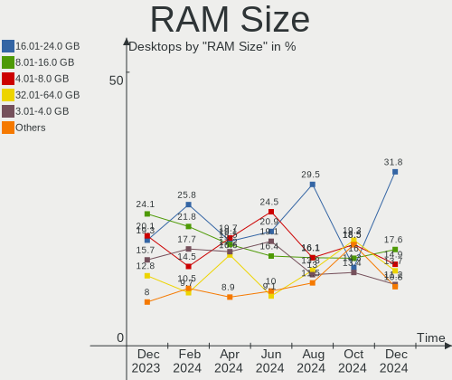
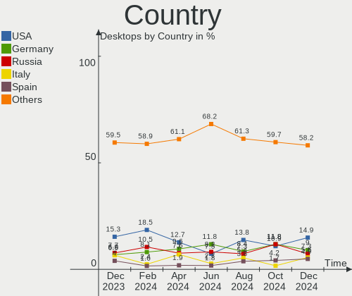
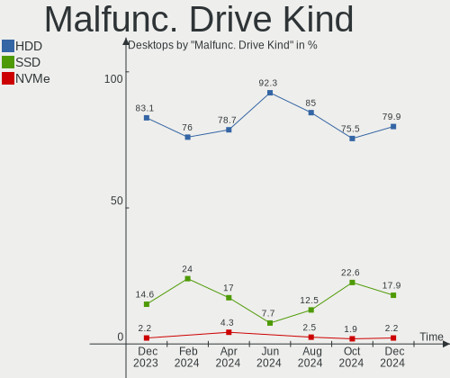
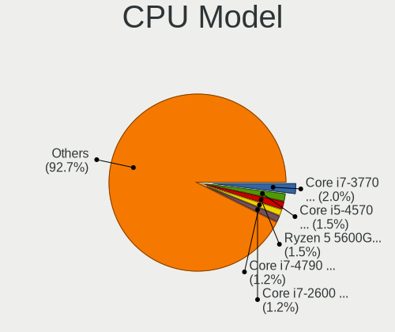
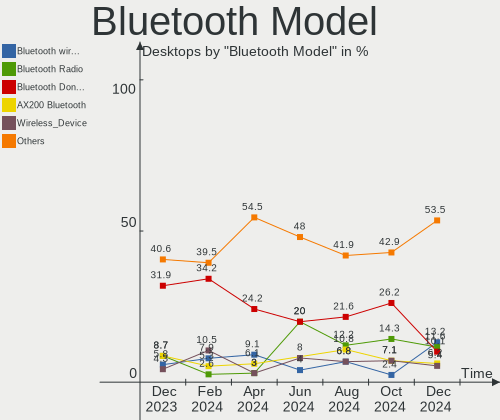
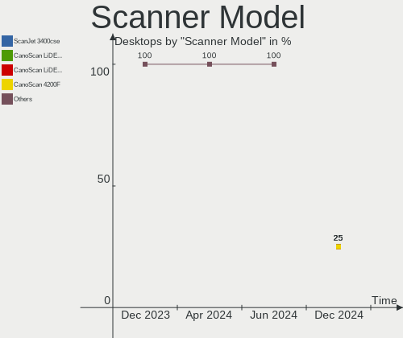

OpenMandriva - Hardware Trends (Desktops)
-----------------------------------------

A project to identify most popular hardware characteristics and track their change
over time based on data collected by Linux users at https://Linux-Hardware.org.

Anyone can contribute to this report by the [hw-probe](https://github.com/linuxhw/hw-probe) tool:

    sudo -E hw-probe -all -upload

This report is for one last month. Overall report since the beginning of time: [TestDays](https://github.com/linuxhw/TestDays)

Period: Feb, 2023.

Contents
--------

* [ System ](#system)
  - [ OS                       ](#os)
  - [ OS Family                ](#os-family)
  - [ Kernel                   ](#kernel)
  - [ Kernel Family            ](#kernel-family)
  - [ Kernel Major Ver.        ](#kernel-major-ver)
  - [ Arch                     ](#arch)
  - [ DE                       ](#de)
  - [ Display Server           ](#display-server)
  - [ Display Manager          ](#display-manager)
  - [ OS Lang                  ](#os-lang)
  - [ Boot Mode                ](#boot-mode)
  - [ Filesystem               ](#filesystem)
  - [ Part. scheme             ](#part-scheme)
  - [ Dual Boot with Linux/BSD ](#dual-boot-with-linuxbsd)
  - [ Dual Boot (Win)          ](#dual-boot-win)

* [ Board ](#board)
  - [ Vendor                   ](#vendor)
  - [ Model                    ](#model)
  - [ Model Family             ](#model-family)
  - [ MFG Year                 ](#mfg-year)
  - [ Form Factor              ](#form-factor)
  - [ Secure Boot              ](#secure-boot)
  - [ Coreboot                 ](#coreboot)
  - [ RAM Size                 ](#ram-size)
  - [ RAM Used                 ](#ram-used)
  - [ Total Drives             ](#total-drives)
  - [ Has CD-ROM               ](#has-cd-rom)
  - [ Has Ethernet             ](#has-ethernet)
  - [ Has WiFi                 ](#has-wifi)
  - [ Has Bluetooth            ](#has-bluetooth)

* [ Location ](#location)
  - [ Country                  ](#country)
  - [ City                     ](#city)

* [ Drives ](#drives)
  - [ Drive Vendor             ](#drive-vendor)
  - [ Drive Model              ](#drive-model)
  - [ HDD Vendor               ](#hdd-vendor)
  - [ SSD Vendor               ](#ssd-vendor)
  - [ Drive Kind               ](#drive-kind)
  - [ Drive Connector          ](#drive-connector)
  - [ Drive Size               ](#drive-size)
  - [ Space Total              ](#space-total)
  - [ Space Used               ](#space-used)
  - [ Malfunc. Drives          ](#malfunc-drives)
  - [ Malfunc. Drive Vendor    ](#malfunc-drive-vendor)
  - [ Malfunc. HDD Vendor      ](#malfunc-hdd-vendor)
  - [ Malfunc. Drive Kind      ](#malfunc-drive-kind)
  - [ Failed Drives            ](#failed-drives)
  - [ Failed Drive Vendor      ](#failed-drive-vendor)
  - [ Drive Status             ](#drive-status)

* [ Storage controller ](#storage-controller)
  - [ Storage Vendor           ](#storage-vendor)
  - [ Storage Model            ](#storage-model)
  - [ Storage Kind             ](#storage-kind)

* [ Processor ](#processor)
  - [ CPU Vendor               ](#cpu-vendor)
  - [ CPU Model                ](#cpu-model)
  - [ CPU Model Family         ](#cpu-model-family)
  - [ CPU Cores                ](#cpu-cores)
  - [ CPU Sockets              ](#cpu-sockets)
  - [ CPU Threads              ](#cpu-threads)
  - [ CPU Op-Modes             ](#cpu-op-modes)
  - [ CPU Microcode            ](#cpu-microcode)
  - [ CPU Microarch            ](#cpu-microarch)

* [ Graphics ](#graphics)
  - [ GPU Vendor               ](#gpu-vendor)
  - [ GPU Model                ](#gpu-model)
  - [ GPU Combo                ](#gpu-combo)
  - [ GPU Driver               ](#gpu-driver)
  - [ GPU Memory               ](#gpu-memory)

* [ Monitor ](#monitor)
  - [ Monitor Vendor           ](#monitor-vendor)
  - [ Monitor Model            ](#monitor-model)
  - [ Monitor Resolution       ](#monitor-resolution)
  - [ Monitor Diagonal         ](#monitor-diagonal)
  - [ Monitor Width            ](#monitor-width)
  - [ Aspect Ratio             ](#aspect-ratio)
  - [ Monitor Area             ](#monitor-area)
  - [ Pixel Density            ](#pixel-density)
  - [ Multiple Monitors        ](#multiple-monitors)

* [ Network ](#network)
  - [ Net Controller Vendor    ](#net-controller-vendor)
  - [ Net Controller Model     ](#net-controller-model)
  - [ Wireless Vendor          ](#wireless-vendor)
  - [ Wireless Model           ](#wireless-model)
  - [ Ethernet Vendor          ](#ethernet-vendor)
  - [ Ethernet Model           ](#ethernet-model)
  - [ Net Controller Kind      ](#net-controller-kind)
  - [ Used Controller          ](#used-controller)
  - [ NICs                     ](#nics)
  - [ IPv6                     ](#ipv6)

* [ Bluetooth ](#bluetooth)
  - [ Bluetooth Vendor         ](#bluetooth-vendor)
  - [ Bluetooth Model          ](#bluetooth-model)

* [ Sound ](#sound)
  - [ Sound Vendor             ](#sound-vendor)
  - [ Sound Model              ](#sound-model)

* [ Memory ](#memory)
  - [ Memory Vendor            ](#memory-vendor)
  - [ Memory Model             ](#memory-model)
  - [ Memory Kind              ](#memory-kind)
  - [ Memory Form Factor       ](#memory-form-factor)
  - [ Memory Size              ](#memory-size)
  - [ Memory Speed             ](#memory-speed)

* [ Printers & scanners ](#printers--scanners)
  - [ Printer Vendor           ](#printer-vendor)
  - [ Printer Model            ](#printer-model)
  - [ Scanner Vendor           ](#scanner-vendor)
  - [ Scanner Model            ](#scanner-model)

* [ Camera ](#camera)
  - [ Camera Vendor            ](#camera-vendor)
  - [ Camera Model             ](#camera-model)

* [ Security ](#security)
  - [ Fingerprint Vendor       ](#fingerprint-vendor)
  - [ Fingerprint Model        ](#fingerprint-model)
  - [ Chipcard Vendor          ](#chipcard-vendor)
  - [ Chipcard Model           ](#chipcard-model)

* [ Unsupported ](#unsupported)
  - [ Unsupported Devices      ](#unsupported-devices)
  - [ Unsupported Device Types ](#unsupported-device-types)

System
------

OS
--

Installed operating systems

| Name               | Desktops | Percent |
|--------------------|----------|---------|
| OpenMandriva 23.01 | 197      | 67.7%   |
| OpenMandriva 4.3   | 67       | 23.02%  |
| OpenMandriva 4.2   | 13       | 4.47%   |
| OpenMandriva 23.90 | 11       | 3.78%   |
| OpenMandriva 4.50  | 1        | 0.34%   |
| OpenMandriva 22.12 | 1        | 0.34%   |
| OpenMandriva 22.11 | 1        | 0.34%   |

OS Family
---------

OS without a version

| Name         | Desktops | Percent |
|--------------|----------|---------|
| OpenMandriva | 291      | 100%    |

Kernel
------

Version of the Linux kernel

| Version                      | Desktops | Percent |
|------------------------------|----------|---------|
| 6.1.1-desktop-1omv2290       | 138      | 47.42%  |
| 6.1.4-desktop-1omv2301       | 53       | 18.21%  |
| 5.16.13-desktop-1omv4003     | 44       | 15.12%  |
| 5.16.7-desktop-1omv4003      | 24       | 8.25%   |
| 5.10.14-desktop-1omv4002     | 8        | 2.75%   |
| 6.2.1-desktop-1omv2390       | 5        | 1.72%   |
| 5.11.12-desktop-1omv4002     | 5        | 1.72%   |
| 6.1.11-desktop-1omv2390      | 4        | 1.37%   |
| 6.2.0-desktop-0.rc2.1omv2301 | 3        | 1.03%   |
| 6.2.0-desktop-0.rc8.1omv2390 | 1        | 0.34%   |
| 6.1.9-desktop-1omv2390       | 1        | 0.34%   |
| 6.1.8-desktop-1omv2390       | 1        | 0.34%   |
| 6.1.5-desktop-1omv2390       | 1        | 0.34%   |
| 6.0.10-desktop-2omv22090     | 1        | 0.34%   |
| 5.19.5-desktop-1omv4090      | 1        | 0.34%   |
| 5.17.1-desktop-2omv4050      | 1        | 0.34%   |

Kernel Family
-------------

Linux kernel without a distro release

| Version | Desktops | Percent |
|---------|----------|---------|
| 6.1.1   | 138      | 47.42%  |
| 6.1.4   | 53       | 18.21%  |
| 5.16.13 | 44       | 15.12%  |
| 5.16.7  | 24       | 8.25%   |
| 5.10.14 | 8        | 2.75%   |
| 6.2.1   | 5        | 1.72%   |
| 5.11.12 | 5        | 1.72%   |
| 6.2.0   | 4        | 1.37%   |
| 6.1.11  | 4        | 1.37%   |
| 6.1.9   | 1        | 0.34%   |
| 6.1.8   | 1        | 0.34%   |
| 6.1.5   | 1        | 0.34%   |
| 6.0.10  | 1        | 0.34%   |
| 5.19.5  | 1        | 0.34%   |
| 5.17.1  | 1        | 0.34%   |

Kernel Major Ver.
-----------------

Linux kernel major version

| Version | Desktops | Percent |
|---------|----------|---------|
| 6.1     | 198      | 68.04%  |
| 5.16    | 68       | 23.37%  |
| 6.2     | 9        | 3.09%   |
| 5.10    | 8        | 2.75%   |
| 5.11    | 5        | 1.72%   |
| 6.0     | 1        | 0.34%   |
| 5.19    | 1        | 0.34%   |
| 5.17    | 1        | 0.34%   |

Arch
----

OS architecture (x86_64, i586, etc.)

| Name   | Desktops | Percent |
|--------|----------|---------|
| x86_64 | 291      | 100%    |

DE
--

Desktop Environment

| Name     | Desktops | Percent |
|----------|----------|---------|
| KDE5     | 272      | 93.47%  |
| GNOME    | 16       | 5.5%    |
| LXQt     | 1        | 0.34%   |
| Cinnamon | 1        | 0.34%   |
| Budgie   | 1        | 0.34%   |

Display Server
--------------

X11 or Wayland

| Name    | Desktops | Percent |
|---------|----------|---------|
| X11     | 274      | 94.16%  |
| Wayland | 17       | 5.84%   |

Display Manager
---------------

SDDM, LightDM, etc.

| Name    | Desktops | Percent |
|---------|----------|---------|
| SDDM    | 274      | 94.16%  |
| GDM     | 16       | 5.5%    |
| Unknown | 1        | 0.34%   |

OS Lang
-------

Language

| Lang  | Desktops | Percent |
|-------|----------|---------|
| en_US | 117      | 40.21%  |
| fr_FR | 28       | 9.62%   |
| ru_RU | 19       | 6.53%   |
| de_DE | 18       | 6.19%   |
| it_IT | 17       | 5.84%   |
| pt_BR | 16       | 5.5%    |
| en_GB | 16       | 5.5%    |
| pl_PL | 14       | 4.81%   |
| es_MX | 6        | 2.06%   |
| es_ES | 5        | 1.72%   |
| en_CA | 5        | 1.72%   |
| cs_CZ | 4        | 1.37%   |
| de_CH | 3        | 1.03%   |
| tr_TR | 2        | 0.69%   |
| pt_PT | 2        | 0.69%   |
| nl_NL | 2        | 0.69%   |
| fr_CH | 2        | 0.69%   |
| de_AT | 2        | 0.69%   |
| da_DK | 2        | 0.69%   |
| ru_UA | 1        | 0.34%   |
| es_VE | 1        | 0.34%   |
| es_CO | 1        | 0.34%   |
| es_AR | 1        | 0.34%   |
| en_ZA | 1        | 0.34%   |
| en_SG | 1        | 0.34%   |
| en_NZ | 1        | 0.34%   |
| en_IE | 1        | 0.34%   |
| en_AU | 1        | 0.34%   |
| ar_EG | 1        | 0.34%   |
| ar_DZ | 1        | 0.34%   |

Boot Mode
---------

EFI or BIOS

| Mode | Desktops | Percent |
|------|----------|---------|
| BIOS | 146      | 50.17%  |
| EFI  | 145      | 49.83%  |

Filesystem
----------

Type of filesystem

| Type    | Desktops | Percent |
|---------|----------|---------|
| Ext4    | 158      | 54.3%   |
| Overlay | 114      | 39.18%  |
| Btrfs   | 9        | 3.09%   |
| Xfs     | 5        | 1.72%   |
| Jfs     | 2        | 0.69%   |
| F2fs    | 2        | 0.69%   |
| Tmpfs   | 1        | 0.34%   |

Part. scheme
------------

Scheme of partitioning

| Type    | Desktops | Percent |
|---------|----------|---------|
| GPT     | 205      | 70.45%  |
| MBR     | 85       | 29.21%  |
| Unknown | 1        | 0.34%   |

Dual Boot with Linux/BSD
------------------------

Hosting more than one Linux/BSD

| Dual boot | Desktops | Percent |
|-----------|----------|---------|
| Yes       | 168      | 57.73%  |
| No        | 123      | 42.27%  |

Dual Boot (Win)
---------------

Hosting Linux and Windows

| Dual boot | Desktops | Percent |
|-----------|----------|---------|
| Yes       | 156      | 53.61%  |
| No        | 135      | 46.39%  |

Board
-----

Vendor
------

Motherboard manufacturer

| Name                | Desktops | Percent |
|---------------------|----------|---------|
| ASUSTek Computer    | 78       | 26.8%   |
| Gigabyte Technology | 48       | 16.49%  |
| MSI                 | 44       | 15.12%  |
| ASRock              | 26       | 8.93%   |
| Hewlett-Packard     | 23       | 7.9%    |
| Dell                | 17       | 5.84%   |
| Lenovo              | 9        | 3.09%   |
| Acer                | 9        | 3.09%   |
| Intel               | 5        | 1.72%   |
| Foxconn             | 5        | 1.72%   |
| Fujitsu             | 4        | 1.37%   |
| Biostar             | 4        | 1.37%   |
| Unknown             | 4        | 1.37%   |
| Pegatron            | 2        | 0.69%   |
| Quanta              | 1        | 0.34%   |
| Philco              | 1        | 0.34%   |
| Medion              | 1        | 0.34%   |
| LG Electronics      | 1        | 0.34%   |
| Lenovo Product      | 1        | 0.34%   |
| Hardkernel          | 1        | 0.34%   |
| EVGA                | 1        | 0.34%   |
| eMachines           | 1        | 0.34%   |
| Colorful Technology | 1        | 0.34%   |
| BESSTAR Tech        | 1        | 0.34%   |
| Apple               | 1        | 0.34%   |
| AOpen               | 1        | 0.34%   |
| AMI                 | 1        | 0.34%   |

Model
-----

Motherboard model

| Name                               | Desktops | Percent |
|------------------------------------|----------|---------|
| ASUS All Series                    | 8        | 2.75%   |
| Unknown                            | 5        | 1.72%   |
| MSI MS-7C96                        | 2        | 0.69%   |
| MSI MS-7B89                        | 2        | 0.69%   |
| MSI MS-7B84                        | 2        | 0.69%   |
| MSI MS-7A33                        | 2        | 0.69%   |
| MSI MS-7821                        | 2        | 0.69%   |
| MSI MS-7721                        | 2        | 0.69%   |
| MSI MS-7680                        | 2        | 0.69%   |
| MSI MS-7592                        | 2        | 0.69%   |
| Intel H61                          | 2        | 0.69%   |
| HP Compaq dc7900 Small Form Factor | 2        | 0.69%   |
| HP Compaq 8200 Elite SFF PC        | 2        | 0.69%   |
| Gigabyte G31M-S2L                  | 2        | 0.69%   |
| Dell OptiPlex 780                  | 2        | 0.69%   |
| Dell OptiPlex 7010                 | 2        | 0.69%   |
| Dell Inspiron 3891                 | 2        | 0.69%   |
| ASUS TUF Gaming B550-PLUS          | 2        | 0.69%   |
| ASUS PRIME X399-A                  | 2        | 0.69%   |
| ASUS P8B75-V                       | 2        | 0.69%   |
| ASUS P5K                           | 2        | 0.69%   |
| ASUS M4A89GTD-PRO/USB3             | 2        | 0.69%   |
| ASRock FM2A58M-VG3+ R2.0           | 2        | 0.69%   |
| ASRock 880GM-LE FX                 | 2        | 0.69%   |
| Acer Aspire M5800/M3800            | 2        | 0.69%   |
| Quanta 120-1200er                  | 1        | 0.34%   |
| Philco DTC-A55                     | 1        | 0.34%   |
| Pegatron Pro 3010 Microtower PC    | 1        | 0.34%   |
| Pegatron IPM31G                    | 1        | 0.34%   |
| MSI p6610it                        | 1        | 0.34%   |
| MSI MS-7D36                        | 1        | 0.34%   |
| MSI MS-7D22                        | 1        | 0.34%   |
| MSI MS-7C90                        | 1        | 0.34%   |
| MSI MS-7C80                        | 1        | 0.34%   |
| MSI MS-7C79                        | 1        | 0.34%   |
| MSI MS-7C52                        | 1        | 0.34%   |
| MSI MS-7C37                        | 1        | 0.34%   |
| MSI MS-7C02                        | 1        | 0.34%   |
| MSI MS-7B98                        | 1        | 0.34%   |
| MSI MS-7B86                        | 1        | 0.34%   |

Model Family
------------

Motherboard model prefix

| Name                   | Desktops | Percent |
|------------------------|----------|---------|
| ASUS PRIME             | 14       | 4.81%   |
| HP Compaq              | 10       | 3.44%   |
| Dell OptiPlex          | 8        | 2.75%   |
| ASUS All               | 8        | 2.75%   |
| Acer Aspire            | 7        | 2.41%   |
| Lenovo ThinkCentre     | 6        | 2.06%   |
| ASUS ROG               | 6        | 2.06%   |
| Dell Inspiron          | 5        | 1.72%   |
| ASUS TUF               | 5        | 1.72%   |
| Unknown                | 5        | 1.72%   |
| HP ProDesk             | 4        | 1.37%   |
| Fujitsu ESPRIMO        | 4        | 1.37%   |
| Gigabyte B550          | 3        | 1.03%   |
| MSI MS-7C96            | 2        | 0.69%   |
| MSI MS-7B89            | 2        | 0.69%   |
| MSI MS-7B84            | 2        | 0.69%   |
| MSI MS-7A33            | 2        | 0.69%   |
| MSI MS-7821            | 2        | 0.69%   |
| MSI MS-7721            | 2        | 0.69%   |
| MSI MS-7680            | 2        | 0.69%   |
| MSI MS-7592            | 2        | 0.69%   |
| Intel H61              | 2        | 0.69%   |
| HP Desktop             | 2        | 0.69%   |
| Gigabyte H410M         | 2        | 0.69%   |
| Gigabyte GA-78LMT-USB3 | 2        | 0.69%   |
| Gigabyte G31M-S2L      | 2        | 0.69%   |
| Gigabyte A320M-S2H     | 2        | 0.69%   |
| Dell Precision         | 2        | 0.69%   |
| ASUS P8Z68-V           | 2        | 0.69%   |
| ASUS P8H61-M           | 2        | 0.69%   |
| ASUS P8B75-V           | 2        | 0.69%   |
| ASUS P5K               | 2        | 0.69%   |
| ASUS P5G41T-M          | 2        | 0.69%   |
| ASUS M5A78L            | 2        | 0.69%   |
| ASUS M4A89GTD-PRO      | 2        | 0.69%   |
| ASRock FM2A58M-VG3+    | 2        | 0.69%   |
| ASRock B450M           | 2        | 0.69%   |
| ASRock AB350           | 2        | 0.69%   |
| ASRock A320M-HDV       | 2        | 0.69%   |
| ASRock 880GM-LE        | 2        | 0.69%   |

MFG Year
--------

Motherboard manufacture year

| Year | Desktops | Percent |
|------|----------|---------|
| 2018 | 29       | 9.97%   |
| 2014 | 24       | 8.25%   |
| 2013 | 24       | 8.25%   |
| 2011 | 24       | 8.25%   |
| 2017 | 22       | 7.56%   |
| 2012 | 21       | 7.22%   |
| 2021 | 20       | 6.87%   |
| 2020 | 20       | 6.87%   |
| 2009 | 19       | 6.53%   |
| 2010 | 18       | 6.19%   |
| 2016 | 14       | 4.81%   |
| 2019 | 12       | 4.12%   |
| 2008 | 11       | 3.78%   |
| 2006 | 9        | 3.09%   |
| 2015 | 8        | 2.75%   |
| 2007 | 8        | 2.75%   |
| 2022 | 6        | 2.06%   |
| 2023 | 1        | 0.34%   |
| 2005 | 1        | 0.34%   |

Form Factor
-----------

Physical design of the computer

| Name    | Desktops | Percent |
|---------|----------|---------|
| Desktop | 291      | 100%    |

Secure Boot
-----------

Enabled or disabled

| State    | Desktops | Percent |
|----------|----------|---------|
| Disabled | 291      | 100%    |

Coreboot
--------

Have coreboot on board

| Used | Desktops | Percent |
|------|----------|---------|
| No   | 290      | 99.66%  |
| Yes  | 1        | 0.34%   |

RAM Size
--------

Total RAM memory

| Size in GB  | Desktops | Percent |
|-------------|----------|---------|
| 8.01-16.0   | 79       | 27.15%  |
| 4.01-8.0    | 58       | 19.93%  |
| 16.01-24.0  | 58       | 19.93%  |
| 3.01-4.0    | 37       | 12.71%  |
| 32.01-64.0  | 35       | 12.03%  |
| 64.01-256.0 | 12       | 4.12%   |
| 24.01-32.0  | 5        | 1.72%   |
| 1.01-2.0    | 5        | 1.72%   |
| 2.01-3.0    | 2        | 0.69%   |

RAM Used
--------

Used RAM memory

| Used GB    | Desktops | Percent |
|------------|----------|---------|
| 1.01-2.0   | 179      | 61.51%  |
| 2.01-3.0   | 66       | 22.68%  |
| 0.51-1.0   | 21       | 7.22%   |
| 3.01-4.0   | 12       | 4.12%   |
| 4.01-8.0   | 5        | 1.72%   |
| 0.01-0.5   | 5        | 1.72%   |
| 8.01-16.0  | 2        | 0.69%   |
| 16.01-24.0 | 1        | 0.34%   |

Total Drives
------------

Number of drives on board

| Drives | Desktops | Percent |
|--------|----------|---------|
| 1      | 114      | 39.18%  |
| 2      | 84       | 28.87%  |
| 3      | 40       | 13.75%  |
| 4      | 23       | 7.9%    |
| 5      | 13       | 4.47%   |
| 0      | 6        | 2.06%   |
| 6      | 5        | 1.72%   |
| 8      | 3        | 1.03%   |
| 9      | 2        | 0.69%   |
| 7      | 1        | 0.34%   |

Has CD-ROM
----------

Has CD-ROM on board

| Presented | Desktops | Percent |
|-----------|----------|---------|
| Yes       | 175      | 60.14%  |
| No        | 116      | 39.86%  |

Has Ethernet
------------

Has Ethernet on board

| Presented | Desktops | Percent |
|-----------|----------|---------|
| Yes       | 289      | 99.31%  |
| No        | 2        | 0.69%   |

Has WiFi
--------

Has WiFi module

| Presented | Desktops | Percent |
|-----------|----------|---------|
| No        | 194      | 66.67%  |
| Yes       | 97       | 33.33%  |

Has Bluetooth
-------------

Has Bluetooth module

| Presented | Desktops | Percent |
|-----------|----------|---------|
| No        | 220      | 75.6%   |
| Yes       | 71       | 24.4%   |

Location
--------

Country
-------

Geographic location (country)

| Country      | Desktops | Percent |
|--------------|----------|---------|
| USA          | 32       | 11%     |
| France       | 29       | 9.97%   |
| Russia       | 25       | 8.59%   |
| Italy        | 23       | 7.9%    |
| Germany      | 23       | 7.9%    |
| Poland       | 19       | 6.53%   |
| Brazil       | 17       | 5.84%   |
| UK           | 11       | 3.78%   |
| Canada       | 10       | 3.44%   |
| Finland      | 9        | 3.09%   |
| Switzerland  | 6        | 2.06%   |
| Spain        | 6        | 2.06%   |
| Mexico       | 5        | 1.72%   |
| Czechia      | 5        | 1.72%   |
| Indonesia    | 4        | 1.37%   |
| Venezuela    | 3        | 1.03%   |
| Turkey       | 3        | 1.03%   |
| Serbia       | 3        | 1.03%   |
| Portugal     | 3        | 1.03%   |
| Netherlands  | 3        | 1.03%   |
| India        | 3        | 1.03%   |
| Ukraine      | 2        | 0.69%   |
| South Africa | 2        | 0.69%   |
| Slovakia     | 2        | 0.69%   |
| Romania      | 2        | 0.69%   |
| Lithuania    | 2        | 0.69%   |
| Japan        | 2        | 0.69%   |
| Ireland      | 2        | 0.69%   |
| Iceland      | 2        | 0.69%   |
| Denmark      | 2        | 0.69%   |
| Costa Rica   | 2        | 0.69%   |
| Colombia     | 2        | 0.69%   |
| Austria      | 2        | 0.69%   |
| Australia    | 2        | 0.69%   |
| Argentina    | 2        | 0.69%   |
| Thailand     | 1        | 0.34%   |
| Sweden       | 1        | 0.34%   |
| South Korea  | 1        | 0.34%   |
| Singapore    | 1        | 0.34%   |
| Philippines  | 1        | 0.34%   |

City
----

Geographic location (city)

| City             | Desktops | Percent |
|------------------|----------|---------|
| Moscow           | 5        | 1.72%   |
| Rio de Janeiro   | 4        | 1.37%   |
| Helsinki         | 4        | 1.37%   |
| Berlin           | 4        | 1.37%   |
| Stavropol        | 3        | 1.03%   |
| Sao Paulo        | 3        | 1.03%   |
| Milano           | 3        | 1.03%   |
| Burlington       | 3        | 1.03%   |
| Bialystok        | 3        | 1.03%   |
| Zurich           | 2        | 0.69%   |
| Vienna           | 2        | 0.69%   |
| Turin            | 2        | 0.69%   |
| St Petersburg    | 2        | 0.69%   |
| San Pedro        | 2        | 0.69%   |
| Reykjavik        | 2        | 0.69%   |
| Poznan           | 2        | 0.69%   |
| Paris            | 2        | 0.69%   |
| Nurmo            | 2        | 0.69%   |
| Nizhniy Novgorod | 2        | 0.69%   |
| Munich           | 2        | 0.69%   |
| Mazancowice      | 2        | 0.69%   |
| Krakow           | 2        | 0.69%   |
| Klaipėda        | 2        | 0.69%   |
| Johannesburg     | 2        | 0.69%   |
| Fahrni           | 2        | 0.69%   |
| Escazu           | 2        | 0.69%   |
| Caracas          | 2        | 0.69%   |
| Bogotá          | 2        | 0.69%   |
| Antibes          | 2        | 0.69%   |
| Ankara           | 2        | 0.69%   |
| Zapopan          | 1        | 0.34%   |
| Zamboanga City   | 1        | 0.34%   |
| Wilmington       | 1        | 0.34%   |
| Wigton           | 1        | 0.34%   |
| West Fargo       | 1        | 0.34%   |
| Warsaw           | 1        | 0.34%   |
| Volgograd        | 1        | 0.34%   |
| Vladivostok      | 1        | 0.34%   |
| Verchen          | 1        | 0.34%   |
| Veikkola         | 1        | 0.34%   |

Drives
------

Drive Vendor
------------

Hard drive vendors

| Vendor              | Desktops | Drives | Percent |
|---------------------|----------|--------|---------|
| Seagate             | 103      | 129    | 19.22%  |
| WDC                 | 102      | 150    | 19.03%  |
| Samsung Electronics | 62       | 68     | 11.57%  |
| Kingston            | 36       | 39     | 6.72%   |
| Toshiba             | 27       | 29     | 5.04%   |
| Crucial             | 26       | 31     | 4.85%   |
| Hitachi             | 24       | 27     | 4.48%   |
| SanDisk             | 18       | 21     | 3.36%   |
| China               | 12       | 12     | 2.24%   |
| PNY                 | 10       | 11     | 1.87%   |
| A-DATA Technology   | 10       | 10     | 1.87%   |
| Intel               | 7        | 7      | 1.31%   |
| GOODRAM             | 7        | 7      | 1.31%   |
| Unknown             | 6        | 6      | 1.12%   |
| Patriot             | 5        | 5      | 0.93%   |
| Maxtor              | 5        | 5      | 0.93%   |
| Gigabyte Technology | 5        | 5      | 0.93%   |
| Transcend           | 4        | 4      | 0.75%   |
| SK hynix            | 4        | 4      | 0.75%   |
| Hewlett-Packard     | 4        | 4      | 0.75%   |
| Corsair             | 4        | 4      | 0.75%   |
| XrayDisk            | 3        | 3      | 0.56%   |
| Team                | 3        | 3      | 0.56%   |
| Silicon Motion      | 3        | 3      | 0.56%   |
| Phison              | 3        | 3      | 0.56%   |
| Vaseky              | 2        | 2      | 0.37%   |
| Pioneer             | 2        | 2      | 0.37%   |
| OCZ                 | 2        | 2      | 0.37%   |
| Lexar               | 2        | 2      | 0.37%   |
| HGST                | 2        | 4      | 0.37%   |
| GLOWAY              | 2        | 2      | 0.37%   |
| Colorful            | 2        | 2      | 0.37%   |
| Apacer              | 2        | 2      | 0.37%   |
| Unknown             | 2        | 2      | 0.37%   |
| Zheino              | 1        | 1      | 0.19%   |
| XPG                 | 1        | 1      | 0.19%   |
| WD MediaMax         | 1        | 1      | 0.19%   |
| T-FORCE             | 1        | 1      | 0.19%   |
| Smartbuy            | 1        | 1      | 0.19%   |
| SFAS                | 1        | 1      | 0.19%   |

Drive Model
-----------

Hard drive models

| Model                             | Desktops | Percent |
|-----------------------------------|----------|---------|
| Seagate ST1000DM010-2EP102 1TB    | 11       | 1.8%    |
| Seagate ST2000DM008-2FR102 2TB    | 9        | 1.48%   |
| Seagate ST500DM002-1BD142 500GB   | 8        | 1.31%   |
| Seagate ST3500418AS 500GB         | 8        | 1.31%   |
| Samsung SSD 850 EVO 500GB         | 7        | 1.15%   |
| Kingston SA400S37240G 240GB SSD   | 7        | 1.15%   |
| WDC WD10EZEX-00BN5A0 1TB          | 5        | 0.82%   |
| Kingston SV300S37A120G 120GB SSD  | 5        | 0.82%   |
| Crucial CT500MX500SSD1 500GB      | 5        | 0.82%   |
| WDC WDS240G2G0A-00JH30 240GB SSD  | 4        | 0.66%   |
| WDC WD20EZRZ-00Z5HB0 2TB          | 4        | 0.66%   |
| Unknown SD/MMC/MS PRO 16GB        | 4        | 0.66%   |
| Toshiba DT01ACA050 500GB          | 4        | 0.66%   |
| Seagate ST16000NM001G-2KK103 16TB | 4        | 0.66%   |
| Kingston SA400S37480G 480GB SSD   | 4        | 0.66%   |
| Hitachi HDS721010CLA332 1TB       | 4        | 0.66%   |
| WDC WD10EZEX-60WN4A0 1TB          | 3        | 0.49%   |
| Toshiba DT01ACA200 2TB            | 3        | 0.49%   |
| Toshiba DT01ACA100 1TB            | 3        | 0.49%   |
| Seagate ST500LT012-9WS142 500GB   | 3        | 0.49%   |
| Seagate ST31000528AS 1TB          | 3        | 0.49%   |
| Seagate ST2000DM001-1CH164 2TB    | 3        | 0.49%   |
| Seagate ST1000DM003-1CH162 1TB    | 3        | 0.49%   |
| SanDisk NVMe SSD Drive 1TB        | 3        | 0.49%   |
| Samsung SSD 860 EVO 250GB         | 3        | 0.49%   |
| Samsung SSD 830 Series 128GB      | 3        | 0.49%   |
| Kingston SV300S37A60G 64GB SSD    | 3        | 0.49%   |
| Kingston SA400S37120G 120GB SSD   | 3        | 0.49%   |
| Hitachi HDS722020ALA330 2TB       | 3        | 0.49%   |
| GOODRAM SSDPR-CX400-128-G2 128GB  | 3        | 0.49%   |
| Crucial CT250MX500SSD1 250GB      | 3        | 0.49%   |
| XrayDisk SSD 256GB                | 2        | 0.33%   |
| WDC WDS500G2B0C-00PXH0 500GB      | 2        | 0.33%   |
| WDC WDS120G2G0A-00JH30 120GB SSD  | 2        | 0.33%   |
| WDC WDS100T2B0C-00PXH0 1TB        | 2        | 0.33%   |
| WDC WD6004FZWX-00BKVA0 6TB        | 2        | 0.33%   |
| WDC WD5000AZLX-08K2TA0 500GB      | 2        | 0.33%   |
| WDC WD5000AAKX-75U6AA0 500GB      | 2        | 0.33%   |
| WDC WD5000AAKX-08U6AA0 500GB      | 2        | 0.33%   |
| WDC WD5000AAKX-083CA1 500GB       | 2        | 0.33%   |

HDD Vendor
----------

Hard disk drive vendors

| Vendor              | Desktops | Drives | Percent |
|---------------------|----------|--------|---------|
| Seagate             | 100      | 123    | 37.59%  |
| WDC                 | 87       | 122    | 32.71%  |
| Hitachi             | 24       | 27     | 9.02%   |
| Toshiba             | 23       | 25     | 8.65%   |
| Samsung Electronics | 12       | 12     | 4.51%   |
| Maxtor              | 5        | 5      | 1.88%   |
| Unknown             | 4        | 4      | 1.5%    |
| Hewlett-Packard     | 4        | 4      | 1.5%    |
| HGST                | 2        | 4      | 0.75%   |
| WD MediaMax         | 1        | 1      | 0.38%   |
| SABRENT             | 1        | 1      | 0.38%   |
| JMicron Technology  | 1        | 1      | 0.38%   |
| HPE                 | 1        | 1      | 0.38%   |
| China               | 1        | 1      | 0.38%   |

SSD Vendor
----------

Solid state drive vendors

| Vendor              | Desktops | Drives | Percent |
|---------------------|----------|--------|---------|
| Samsung Electronics | 33       | 36     | 17.19%  |
| Kingston            | 33       | 35     | 17.19%  |
| Crucial             | 16       | 18     | 8.33%   |
| SanDisk             | 13       | 16     | 6.77%   |
| China               | 11       | 11     | 5.73%   |
| WDC                 | 10       | 11     | 5.21%   |
| PNY                 | 10       | 11     | 5.21%   |
| A-DATA Technology   | 9        | 9      | 4.69%   |
| GOODRAM             | 7        | 7      | 3.65%   |
| Patriot             | 5        | 5      | 2.6%    |
| Transcend           | 4        | 4      | 2.08%   |
| Toshiba             | 3        | 3      | 1.56%   |
| Intel               | 3        | 3      | 1.56%   |
| XrayDisk            | 2        | 2      | 1.04%   |
| Vaseky              | 2        | 2      | 1.04%   |
| Team                | 2        | 2      | 1.04%   |
| Pioneer             | 2        | 2      | 1.04%   |
| OCZ                 | 2        | 2      | 1.04%   |
| Lexar               | 2        | 2      | 1.04%   |
| GLOWAY              | 2        | 2      | 1.04%   |
| Gigabyte Technology | 2        | 2      | 1.04%   |
| Corsair             | 2        | 2      | 1.04%   |
| Colorful            | 2        | 2      | 1.04%   |
| Unknown             | 2        | 2      | 1.04%   |
| Zheino              | 1        | 1      | 0.52%   |
| Smartbuy            | 1        | 1      | 0.52%   |
| SK hynix            | 1        | 1      | 0.52%   |
| SFAS                | 1        | 1      | 0.52%   |
| Seagate             | 1        | 1      | 0.52%   |
| Ramos Technology    | 1        | 1      | 0.52%   |
| Leven               | 1        | 1      | 0.52%   |
| LDLC                | 1        | 1      | 0.52%   |
| KIOXIA-EXCERIA      | 1        | 1      | 0.52%   |
| Global              | 1        | 1      | 0.52%   |
| CHN25SATAS1         | 1        | 1      | 0.52%   |
| ASMT                | 1        | 1      | 0.52%   |
| Apacer              | 1        | 1      | 0.52%   |

Drive Kind
----------

HDD or SSD

| Kind    | Desktops | Drives | Percent |
|---------|----------|--------|---------|
| HDD     | 200      | 331    | 47.96%  |
| SSD     | 146      | 204    | 35.01%  |
| NVMe    | 65       | 93     | 15.59%  |
| Unknown | 4        | 4      | 0.96%   |
| MMC     | 2        | 3      | 0.48%   |

Drive Connector
---------------

SATA, SAS, NVMe, etc.

| Type | Desktops | Drives | Percent |
|------|----------|--------|---------|
| SATA | 267      | 521    | 76.07%  |
| NVMe | 65       | 91     | 18.52%  |
| SAS  | 17       | 20     | 4.84%   |
| MMC  | 2        | 3      | 0.57%   |

Drive Size
----------

Size of hard drive

| Size in TB | Desktops | Drives | Percent |
|------------|----------|--------|---------|
| 0.01-0.5   | 210      | 309    | 53.57%  |
| 0.51-1.0   | 108      | 135    | 27.55%  |
| 1.01-2.0   | 40       | 50     | 10.2%   |
| 3.01-4.0   | 14       | 15     | 3.57%   |
| 2.01-3.0   | 11       | 11     | 2.81%   |
| 4.01-10.0  | 5        | 9      | 1.28%   |
| 10.01-20.0 | 4        | 6      | 1.02%   |

Space Total
-----------

Amount of disk space available on the file system

| Size in GB     | Desktops | Percent |
|----------------|----------|---------|
| 1-20           | 76       | 26.12%  |
| 101-250        | 59       | 20.27%  |
| 251-500        | 35       | 12.03%  |
| 501-1000       | 27       | 9.28%   |
| 51-100         | 26       | 8.93%   |
| 21-50          | 24       | 8.25%   |
| Unknown        | 18       | 6.19%   |
| 1001-2000      | 17       | 5.84%   |
| More than 3000 | 7        | 2.41%   |
| 2001-3000      | 2        | 0.69%   |

Space Used
----------

Amount of used disk space

| Used GB        | Desktops | Percent |
|----------------|----------|---------|
| 1-20           | 200      | 68.73%  |
| 21-50          | 21       | 7.22%   |
| Unknown        | 18       | 6.19%   |
| 51-100         | 13       | 4.47%   |
| 251-500        | 11       | 3.78%   |
| 101-250        | 11       | 3.78%   |
| 501-1000       | 9        | 3.09%   |
| 1001-2000      | 4        | 1.37%   |
| More than 3000 | 3        | 1.03%   |
| 2001-3000      | 1        | 0.34%   |

Malfunc. Drives
---------------

Drive models with a malfunction

| Model                            | Desktops | Drives | Percent |
|----------------------------------|----------|--------|---------|
| Seagate ST500DM002-1BD142 500GB  | 4        | 4      | 3.48%   |
| Seagate ST3500418AS 500GB        | 4        | 4      | 3.48%   |
| Seagate ST500LT012-9WS142 500GB  | 3        | 3      | 2.61%   |
| Hitachi HDS721010CLA332 1TB      | 3        | 3      | 2.61%   |
| WDC WD20EZRZ-00Z5HB0 2TB         | 2        | 2      | 1.74%   |
| WDC WD20EARS-00MVWB0 2TB         | 2        | 2      | 1.74%   |
| WDC WD10EARS-00Y5B1 1TB          | 2        | 2      | 1.74%   |
| Toshiba DT01ACA050 500GB         | 2        | 2      | 1.74%   |
| Seagate ST3500630AS 500GB        | 2        | 2      | 1.74%   |
| Seagate ST31000528AS 1TB         | 2        | 3      | 1.74%   |
| SanDisk SSD PLUS 480GB           | 2        | 3      | 1.74%   |
| Samsung Electronics HD103UJ 1TB  | 2        | 2      | 1.74%   |
| Kingston SV300S37A120G 120GB SSD | 2        | 2      | 1.74%   |
| Hitachi HDS722020ALA330 2TB      | 2        | 2      | 1.74%   |
| WDC WDS240G2G0B-00EPW0 240GB SSD | 1        | 1      | 0.87%   |
| WDC WDS240G2G0A-00JH30 240GB SSD | 1        | 1      | 0.87%   |
| WDC WD7500AARS-00Y5B1 752GB      | 1        | 1      | 0.87%   |
| WDC WD6400AAKS-65Z7B0 640GB      | 1        | 1      | 0.87%   |
| WDC WD6400AAKS-65A7B2 640GB      | 1        | 1      | 0.87%   |
| WDC WD6400AAKS-22A7B2 640GB      | 1        | 1      | 0.87%   |
| WDC WD5002ABYS-02B1B0 500GB      | 1        | 1      | 0.87%   |
| WDC WD5000AVDS-73U7B1 500GB      | 1        | 1      | 0.87%   |
| WDC WD5000AAKX-75U6AA0 500GB     | 1        | 1      | 0.87%   |
| WDC WD5000AAKX-001CA0 500GB      | 1        | 1      | 0.87%   |
| WDC WD5000AAKS-75A7B0 500GB      | 1        | 1      | 0.87%   |
| WDC WD5000AAKS-00V1A0 500GB      | 1        | 1      | 0.87%   |
| WDC WD3200AAKX-001CA0 320GB      | 1        | 1      | 0.87%   |
| WDC WD3200AAKS-00L9A0 320GB      | 1        | 1      | 0.87%   |
| WDC WD3200AAKS-00B3A0 320GB      | 1        | 1      | 0.87%   |
| WDC WD3200AAJS-00V4A0 320GB      | 1        | 1      | 0.87%   |
| WDC WD20PURZ-85GU6Y0 2TB         | 1        | 1      | 0.87%   |
| WDC WD20PURX-64P6ZYO 2TB         | 1        | 1      | 0.87%   |
| WDC WD20EZRX-00D8PB0 2TB         | 1        | 1      | 0.87%   |
| WDC WD2000JD-22HBB0 200GB        | 1        | 1      | 0.87%   |
| WDC WD15EARS-60MVWB0 1TB         | 1        | 1      | 0.87%   |
| WDC WD10JPVX-75JC3T0 1TB         | 1        | 1      | 0.87%   |
| WDC WD10EURX-83UY4Y0 1TB         | 1        | 1      | 0.87%   |
| WDC WD10EALX-009BA0 1TB          | 1        | 1      | 0.87%   |
| WDC WD1002FAEX-00Z3A0 1TB        | 1        | 1      | 0.87%   |
| WDC WD1001FALS-00J7B0 1TB        | 1        | 1      | 0.87%   |

Malfunc. Drive Vendor
---------------------

Vendors of faulty drives

| Vendor              | Desktops | Drives | Percent |
|---------------------|----------|--------|---------|
| Seagate             | 31       | 33     | 28.44%  |
| WDC                 | 30       | 34     | 27.52%  |
| Hitachi             | 14       | 15     | 12.84%  |
| Samsung Electronics | 7        | 7      | 6.42%   |
| Maxtor              | 5        | 5      | 4.59%   |
| Kingston            | 5        | 5      | 4.59%   |
| Toshiba             | 4        | 4      | 3.67%   |
| Hewlett-Packard     | 4        | 4      | 3.67%   |
| SanDisk             | 2        | 3      | 1.83%   |
| Crucial             | 2        | 2      | 1.83%   |
| Netac               | 1        | 1      | 0.92%   |
| HGST                | 1        | 3      | 0.92%   |
| Corsair             | 1        | 1      | 0.92%   |
| CHN25SATAS1         | 1        | 1      | 0.92%   |
| A-DATA Technology   | 1        | 1      | 0.92%   |

Malfunc. HDD Vendor
-------------------

Vendors of faulty HDD drives

| Vendor              | Desktops | Drives | Percent |
|---------------------|----------|--------|---------|
| Seagate             | 31       | 33     | 33.7%   |
| WDC                 | 27       | 31     | 29.35%  |
| Hitachi             | 14       | 15     | 15.22%  |
| Samsung Electronics | 6        | 6      | 6.52%   |
| Maxtor              | 5        | 5      | 5.43%   |
| Toshiba             | 4        | 4      | 4.35%   |
| Hewlett-Packard     | 4        | 4      | 4.35%   |
| HGST                | 1        | 3      | 1.09%   |

Malfunc. Drive Kind
-------------------

Kinds of faulty drives

| Kind | Desktops | Drives | Percent |
|------|----------|--------|---------|
| HDD  | 77       | 101    | 81.91%  |
| SSD  | 16       | 17     | 17.02%  |
| NVMe | 1        | 1      | 1.06%   |

Failed Drives
-------------

Failed drive models

| Model                           | Desktops | Drives | Percent |
|---------------------------------|----------|--------|---------|
| WDC WD800JD-00LSA0 80GB         | 1        | 1      | 33.33%  |
| Seagate ST3500418AS 500GB       | 1        | 1      | 33.33%  |
| Samsung Electronics SSD 980 1TB | 1        | 1      | 33.33%  |

Failed Drive Vendor
-------------------

Failed drive vendors

| Vendor              | Desktops | Drives | Percent |
|---------------------|----------|--------|---------|
| WDC                 | 1        | 1      | 33.33%  |
| Seagate             | 1        | 1      | 33.33%  |
| Samsung Electronics | 1        | 1      | 33.33%  |

Drive Status
------------

Number of failed and malfunc. drives

| Status   | Desktops | Drives | Percent |
|----------|----------|--------|---------|
| Works    | 241      | 475    | 66.39%  |
| Malfunc  | 91       | 119    | 25.07%  |
| Detected | 28       | 38     | 7.71%   |
| Failed   | 3        | 3      | 0.83%   |

Storage controller
------------------

Storage Vendor
--------------

Storage controller vendors

| Vendor                         | Desktops | Percent |
|--------------------------------|----------|---------|
| Intel                          | 185      | 44.69%  |
| AMD                            | 96       | 23.19%  |
| JMicron Technology             | 20       | 4.83%   |
| Samsung Electronics            | 19       | 4.59%   |
| SanDisk                        | 15       | 3.62%   |
| Nvidia                         | 12       | 2.9%    |
| Micron/Crucial Technology      | 11       | 2.66%   |
| ASMedia Technology             | 11       | 2.66%   |
| Phison Electronics             | 9        | 2.17%   |
| Silicon Motion                 | 7        | 1.69%   |
| Marvell Technology Group       | 7        | 1.69%   |
| Kingston Technology Company    | 4        | 0.97%   |
| SK hynix                       | 3        | 0.72%   |
| Seagate Technology             | 2        | 0.48%   |
| Integrated Technology Express  | 2        | 0.48%   |
| ADATA Technology               | 2        | 0.48%   |
| VIA Technologies               | 1        | 0.24%   |
| Toshiba America Info Systems   | 1        | 0.24%   |
| Solid State Storage Technology | 1        | 0.24%   |
| Silicon Image                  | 1        | 0.24%   |
| Realtek Semiconductor          | 1        | 0.24%   |
| Promise Technology             | 1        | 0.24%   |
| MAXIO Technology (Hangzhou)    | 1        | 0.24%   |
| LSI Logic / Symbios Logic      | 1        | 0.24%   |
| Broadcom / LSI                 | 1        | 0.24%   |

Storage Model
-------------

Storage controller models

| Model                                                                                   | Desktops | Percent |
|-----------------------------------------------------------------------------------------|----------|---------|
| AMD FCH SATA Controller [AHCI mode]                                                     | 52       | 9.87%   |
| Intel 8 Series/C220 Series Chipset Family 6-port SATA Controller 1 [AHCI mode]          | 26       | 4.93%   |
| Intel 6 Series/C200 Series Chipset Family 6 port Desktop SATA AHCI Controller           | 18       | 3.42%   |
| AMD SB7x0/SB8x0/SB9x0 IDE Controller                                                    | 16       | 3.04%   |
| Intel NM10/ICH7 Family SATA Controller [IDE mode]                                       | 14       | 2.66%   |
| AMD 400 Series Chipset SATA Controller                                                  | 14       | 2.66%   |
| Intel SATA Controller [RAID mode]                                                       | 13       | 2.47%   |
| JMicron JMB363 SATA/IDE Controller                                                      | 12       | 2.28%   |
| Intel 7 Series/C210 Series Chipset Family 6-port SATA Controller [AHCI mode]            | 12       | 2.28%   |
| AMD 500 Series Chipset SATA Controller                                                  | 12       | 2.28%   |
| Intel Q170/Q150/B150/H170/H110/Z170/CM236 Chipset SATA Controller [AHCI Mode]           | 11       | 2.09%   |
| ASMedia ASM1062 Serial ATA Controller                                                   | 11       | 2.09%   |
| Intel 82801G (ICH7 Family) IDE Controller                                               | 10       | 1.9%    |
| AMD SB7x0/SB8x0/SB9x0 SATA Controller [IDE mode]                                        | 10       | 1.9%    |
| AMD SB7x0/SB8x0/SB9x0 SATA Controller [AHCI mode]                                       | 10       | 1.9%    |
| Nvidia MCP61 SATA Controller                                                            | 8        | 1.52%   |
| Nvidia MCP61 IDE                                                                        | 8        | 1.52%   |
| Intel 200 Series PCH SATA controller [AHCI mode]                                        | 8        | 1.52%   |
| AMD 300 Series Chipset SATA Controller                                                  | 8        | 1.52%   |
| Silicon Motion SM2263EN/SM2263XT SSD Controller                                         | 7        | 1.33%   |
| Samsung NVMe SSD Controller SM981/PM981/PM983                                           | 7        | 1.33%   |
| Intel 6 Series/C200 Series Chipset Family Desktop SATA Controller (IDE mode, ports 4-5) | 7        | 1.33%   |
| Intel 500 Series Chipset Family SATA AHCI Controller                                    | 7        | 1.33%   |
| Samsung NVMe SSD Controller 980                                                         | 6        | 1.14%   |
| Micron/Crucial P2 NVMe PCIe SSD                                                         | 6        | 1.14%   |
| Intel Cannon Lake PCH SATA AHCI Controller                                              | 6        | 1.14%   |
| Intel Alder Lake-S PCH SATA Controller [AHCI Mode]                                      | 6        | 1.14%   |
| Intel 9 Series Chipset Family SATA Controller [AHCI Mode]                               | 6        | 1.14%   |
| Intel 82801I (ICH9 Family) 2 port SATA Controller [IDE mode]                            | 6        | 1.14%   |
| Intel 6 Series/C200 Series Chipset Family Desktop SATA Controller (IDE mode, ports 0-3) | 6        | 1.14%   |
| AMD FCH SATA Controller D                                                               | 6        | 1.14%   |
| SanDisk WD Blue SN550 NVMe SSD                                                          | 5        | 0.95%   |
| Intel C610/X99 series chipset 6-Port SATA Controller [AHCI mode]                        | 5        | 0.95%   |
| Intel 5 Series/3400 Series Chipset 6 port SATA AHCI Controller                          | 5        | 0.95%   |
| Intel 82801JI (ICH10 Family) SATA AHCI Controller                                       | 4        | 0.76%   |
| Intel 4 Series Chipset PT IDER Controller                                               | 4        | 0.76%   |
| AMD FCH IDE Controller                                                                  | 4        | 0.76%   |
| SanDisk WD Blue SN570 NVMe SSD                                                          | 3        | 0.57%   |
| Samsung NVMe SSD Controller SM961/PM961/SM963                                           | 3        | 0.57%   |
| Samsung NVMe SSD Controller PM9A1/PM9A3/980PRO                                          | 3        | 0.57%   |

Storage Kind
------------

Kind of storage controller (IDE, SATA, NVMe, SAS, ...)

| Kind | Desktops | Percent |
|------|----------|---------|
| SATA | 228      | 56.72%  |
| IDE  | 86       | 21.39%  |
| NVMe | 65       | 16.17%  |
| RAID | 21       | 5.22%   |
| SAS  | 2        | 0.5%    |

Processor
---------

CPU Vendor
----------

Processor vendors

| Vendor | Desktops | Percent |
|--------|----------|---------|
| Intel  | 183      | 62.89%  |
| AMD    | 108      | 37.11%  |

CPU Model
---------

Processor models

| Model                                       | Desktops | Percent |
|---------------------------------------------|----------|---------|
| Intel Core i5-4570 CPU @ 3.20GHz            | 6        | 2.06%   |
| Intel Core i5-2400 CPU @ 3.10GHz            | 6        | 2.06%   |
| Intel Core 2 Duo CPU E8400 @ 3.00GHz        | 5        | 1.72%   |
| Intel Core i7-3770 CPU @ 3.40GHz            | 4        | 1.37%   |
| Intel Core i5-3470 CPU @ 3.20GHz            | 4        | 1.37%   |
| Intel Pentium Dual-Core CPU E5300 @ 2.60GHz | 3        | 1.03%   |
| Intel Core i7-8700 CPU @ 3.20GHz            | 3        | 1.03%   |
| Intel Core i7-7700 CPU @ 3.60GHz            | 3        | 1.03%   |
| Intel Core i7-4770 CPU @ 3.40GHz            | 3        | 1.03%   |
| Intel Core i5-7500 CPU @ 3.40GHz            | 3        | 1.03%   |
| Intel Core i5-2500K CPU @ 3.30GHz           | 3        | 1.03%   |
| Intel Core i5 CPU 650 @ 3.20GHz             | 3        | 1.03%   |
| Intel Core i3-4170 CPU @ 3.70GHz            | 3        | 1.03%   |
| Intel Core i3-4150 CPU @ 3.50GHz            | 3        | 1.03%   |
| Intel Core i3-4130 CPU @ 3.40GHz            | 3        | 1.03%   |
| Intel Core i3-2100 CPU @ 3.10GHz            | 3        | 1.03%   |
| Intel Core 2 Quad CPU Q6600 @ 2.40GHz       | 3        | 1.03%   |
| Intel 11th Gen Core i5-11400 @ 2.60GHz      | 3        | 1.03%   |
| AMD Ryzen 7 5700G with Radeon Graphics      | 3        | 1.03%   |
| AMD Ryzen 5 3600 6-Core Processor           | 3        | 1.03%   |
| AMD Ryzen 5 2400G with Radeon Vega Graphics | 3        | 1.03%   |
| AMD FX-8350 Eight-Core Processor            | 3        | 1.03%   |
| Intel Pentium Dual-Core CPU E5200 @ 2.50GHz | 2        | 0.69%   |
| Intel Pentium CPU J3710 @ 1.60GHz           | 2        | 0.69%   |
| Intel Core i7-6700 CPU @ 3.40GHz            | 2        | 0.69%   |
| Intel Core i7-4790 CPU @ 3.60GHz            | 2        | 0.69%   |
| Intel Core i5-8400 CPU @ 2.80GHz            | 2        | 0.69%   |
| Intel Core i5-6500T CPU @ 2.50GHz           | 2        | 0.69%   |
| Intel Core i5-4670K CPU @ 3.40GHz           | 2        | 0.69%   |
| Intel Core i5-4590T CPU @ 2.00GHz           | 2        | 0.69%   |
| Intel Core i5-4590 CPU @ 3.30GHz            | 2        | 0.69%   |
| Intel Core i5-4460 CPU @ 3.20GHz            | 2        | 0.69%   |
| Intel Core i5-3570K CPU @ 3.40GHz           | 2        | 0.69%   |
| Intel Core i5-3330 CPU @ 3.00GHz            | 2        | 0.69%   |
| Intel Core i5-10400F CPU @ 2.90GHz          | 2        | 0.69%   |
| Intel Core i5-10400 CPU @ 2.90GHz           | 2        | 0.69%   |
| Intel Core i3-9100F CPU @ 3.60GHz           | 2        | 0.69%   |
| Intel Core i3-2120 CPU @ 3.30GHz            | 2        | 0.69%   |
| Intel Core i3 CPU 550 @ 3.20GHz             | 2        | 0.69%   |
| Intel Core 2 Quad CPU Q9300 @ 2.50GHz       | 2        | 0.69%   |

CPU Model Family
----------------

Processor model prefix

| Model                   | Desktops | Percent |
|-------------------------|----------|---------|
| Intel Core i5           | 59       | 20.27%  |
| Intel Core i3           | 28       | 9.62%   |
| Intel Core i7           | 24       | 8.25%   |
| AMD Ryzen 5             | 23       | 7.9%    |
| Intel Core 2 Duo        | 14       | 4.81%   |
| Other                   | 11       | 3.78%   |
| AMD FX                  | 11       | 3.78%   |
| Intel Xeon              | 10       | 3.44%   |
| AMD Ryzen 7             | 10       | 3.44%   |
| AMD Ryzen 3             | 10       | 3.44%   |
| Intel Core 2 Quad       | 9        | 3.09%   |
| Intel Pentium Dual-Core | 8        | 2.75%   |
| AMD Ryzen 9             | 7        | 2.41%   |
| Intel Celeron           | 6        | 2.06%   |
| AMD Phenom II X4        | 5        | 1.72%   |
| AMD A10                 | 5        | 1.72%   |
| Intel Pentium           | 4        | 1.37%   |
| Intel Core 2            | 4        | 1.37%   |
| AMD Athlon II X2        | 4        | 1.37%   |
| AMD Athlon 64 X2        | 4        | 1.37%   |
| AMD A8                  | 4        | 1.37%   |
| AMD Phenom II X6        | 3        | 1.03%   |
| AMD Athlon II X4        | 3        | 1.03%   |
| AMD Athlon              | 3        | 1.03%   |
| AMD A4                  | 3        | 1.03%   |
| Intel Pentium Dual      | 2        | 0.69%   |
| Intel Core i9           | 2        | 0.69%   |
| AMD Ryzen Threadripper  | 2        | 0.69%   |
| AMD Athlon X4           | 2        | 0.69%   |
| AMD A6                  | 2        | 0.69%   |
| Intel Pentium Gold      | 1        | 0.34%   |
| Intel Pentium 4         | 1        | 0.34%   |
| Intel Atom              | 1        | 0.34%   |
| AMD Ryzen 7 PRO         | 1        | 0.34%   |
| AMD Ryzen 3 PRO         | 1        | 0.34%   |
| AMD E1                  | 1        | 0.34%   |
| AMD E                   | 1        | 0.34%   |
| AMD Dual Core Opteron   | 1        | 0.34%   |
| AMD Athlon II X3        | 1        | 0.34%   |

CPU Cores
---------

Number of processor cores

| Number | Desktops | Percent |
|--------|----------|---------|
| 4      | 130      | 44.67%  |
| 2      | 84       | 28.87%  |
| 6      | 34       | 11.68%  |
| 8      | 17       | 5.84%   |
| 12     | 7        | 2.41%   |
| 1      | 7        | 2.41%   |
| 16     | 4        | 1.37%   |
| 3      | 4        | 1.37%   |
| 24     | 2        | 0.69%   |
| 28     | 1        | 0.34%   |
| 10     | 1        | 0.34%   |

CPU Sockets
-----------

Number of sockets

| Number | Desktops | Percent |
|--------|----------|---------|
| 1      | 287      | 98.63%  |
| 2      | 4        | 1.37%   |

CPU Threads
-----------

Threads per core (Hyper-Threading)

| Number | Desktops | Percent |
|--------|----------|---------|
| 2      | 152      | 52.23%  |
| 1      | 138      | 47.42%  |
| 12     | 1        | 0.34%   |

CPU Op-Modes
------------

CPU Operation Modes (32-bit, 64-bit)

| Op mode        | Desktops | Percent |
|----------------|----------|---------|
| 32-bit, 64-bit | 291      | 100%    |

CPU Microcode
-------------

Microcode number

| Number     | Desktops | Percent |
|------------|----------|---------|
| 0x306c3    | 31       | 10.65%  |
| 0x1067a    | 21       | 7.22%   |
| 0x206a7    | 20       | 6.87%   |
| 0x306a9    | 18       | 6.19%   |
| Unknown    | 12       | 4.12%   |
| 0x906ea    | 9        | 3.09%   |
| 0x906e9    | 9        | 3.09%   |
| 0x506e3    | 7        | 2.41%   |
| 0x08701021 | 7        | 2.41%   |
| 0x20655    | 6        | 2.06%   |
| 0x08600106 | 6        | 2.06%   |
| 0x0800820d | 6        | 2.06%   |
| 0x06001119 | 6        | 2.06%   |
| 0x010000c8 | 6        | 2.06%   |
| 0xa0653    | 5        | 1.72%   |
| 0x08101016 | 5        | 1.72%   |
| 0x90672    | 4        | 1.37%   |
| 0x6fb      | 4        | 1.37%   |
| 0x6f6      | 4        | 1.37%   |
| 0x10676    | 4        | 1.37%   |
| 0x08108109 | 4        | 1.37%   |
| 0x08001138 | 4        | 1.37%   |
| 0x0700010b | 4        | 1.37%   |
| 0x06003106 | 4        | 1.37%   |
| 0x06000822 | 4        | 1.37%   |
| 0xa0671    | 3        | 1.03%   |
| 0x906ed    | 3        | 1.03%   |
| 0x6fd      | 3        | 1.03%   |
| 0x406f1    | 3        | 1.03%   |
| 0x406c4    | 3        | 1.03%   |
| 0x106e5    | 3        | 1.03%   |
| 0x0a50000d | 3        | 1.03%   |
| 0x0800820b | 3        | 1.03%   |
| 0x0600611a | 3        | 1.03%   |
| 0x06000852 | 3        | 1.03%   |
| 0x010000c6 | 3        | 1.03%   |
| 0x706a1    | 2        | 0.69%   |
| 0x506c9    | 2        | 0.69%   |
| 0x306f2    | 2        | 0.69%   |
| 0x106a5    | 2        | 0.69%   |

CPU Microarch
-------------

Microarchitecture

| Name             | Desktops | Percent |
|------------------|----------|---------|
| Haswell          | 36       | 12.37%  |
| Penryn           | 28       | 9.62%   |
| KabyLake         | 22       | 7.56%   |
| SandyBridge      | 20       | 6.87%   |
| IvyBridge        | 19       | 6.53%   |
| Piledriver       | 16       | 5.5%    |
| K10              | 16       | 5.5%    |
| Zen+             | 14       | 4.81%   |
| Zen 3            | 14       | 4.81%   |
| Zen 2            | 14       | 4.81%   |
| Zen              | 12       | 4.12%   |
| Core             | 11       | 3.78%   |
| Skylake          | 7        | 2.41%   |
| CometLake        | 7        | 2.41%   |
| Westmere         | 6        | 2.06%   |
| Alderlake Hybrid | 6        | 2.06%   |
| Steamroller      | 5        | 1.72%   |
| Nehalem          | 5        | 1.72%   |
| K8 Hammer        | 5        | 1.72%   |
| Jaguar           | 4        | 1.37%   |
| Icelake          | 4        | 1.37%   |
| Excavator        | 4        | 1.37%   |
| Silvermont       | 3        | 1.03%   |
| Goldmont         | 3        | 1.03%   |
| Broadwell        | 3        | 1.03%   |
| Goldmont plus    | 2        | 0.69%   |
| Bulldozer        | 2        | 0.69%   |
| NetBurst         | 1        | 0.34%   |
| K10 Llano        | 1        | 0.34%   |
| Bobcat           | 1        | 0.34%   |

Graphics
--------

GPU Vendor
----------

Vendors of graphics cards

| Vendor                     | Desktops | Percent |
|----------------------------|----------|---------|
| Nvidia                     | 117      | 38.87%  |
| Intel                      | 95       | 31.56%  |
| AMD                        | 87       | 28.9%   |
| Matrox Electronics Systems | 1        | 0.33%   |
| ATI Technologies           | 1        | 0.33%   |

GPU Model
---------

Graphics card models

| Model                                                                                    | Desktops | Percent |
|------------------------------------------------------------------------------------------|----------|---------|
| Intel Xeon E3-1200 v3/4th Gen Core Processor Integrated Graphics Controller              | 17       | 5.57%   |
| Nvidia GK208B [GeForce GT 710]                                                           | 10       | 3.28%   |
| Intel 4 Series Chipset Integrated Graphics Controller                                    | 10       | 3.28%   |
| Intel 2nd Generation Core Processor Family Integrated Graphics Controller                | 10       | 3.28%   |
| Nvidia GT218 [GeForce 210]                                                               | 8        | 2.62%   |
| Intel Xeon E3-1200 v2/3rd Gen Core processor Graphics Controller                         | 8        | 2.62%   |
| Intel 4th Generation Core Processor Family Integrated Graphics Controller                | 8        | 2.62%   |
| Nvidia GP108 [GeForce GT 1030]                                                           | 6        | 1.97%   |
| Nvidia GK208B [GeForce GT 730]                                                           | 6        | 1.97%   |
| AMD Ellesmere [Radeon RX 470/480/570/570X/580/580X/590]                                  | 6        | 1.97%   |
| AMD Caicos [Radeon HD 6450/7450/8450 / R5 230 OEM]                                       | 6        | 1.97%   |
| Nvidia GP107 [GeForce GTX 1050]                                                          | 5        | 1.64%   |
| Nvidia GM107 [GeForce GTX 750 Ti]                                                        | 5        | 1.64%   |
| Intel CoffeeLake-S GT2 [UHD Graphics 630]                                                | 5        | 1.64%   |
| AMD Picasso/Raven 2 [Radeon Vega Series / Radeon Vega Mobile Series]                     | 5        | 1.64%   |
| Nvidia GP107 [GeForce GTX 1050 Ti]                                                       | 4        | 1.31%   |
| Intel HD Graphics 630                                                                    | 4        | 1.31%   |
| Intel HD Graphics 530                                                                    | 4        | 1.31%   |
| AMD Renoir                                                                               | 4        | 1.31%   |
| AMD Raven Ridge [Radeon Vega Series / Radeon Vega Mobile Series]                         | 4        | 1.31%   |
| AMD Cezanne [Radeon Vega Series / Radeon Vega Mobile Series]                             | 4        | 1.31%   |
| AMD Baffin [Radeon RX 550 640SP / RX 560/560X]                                           | 4        | 1.31%   |
| Nvidia TU116 [GeForce GTX 1660 SUPER]                                                    | 3        | 0.98%   |
| Nvidia TU116 [GeForce GTX 1650 SUPER]                                                    | 3        | 0.98%   |
| Nvidia GP106 [GeForce GTX 1060 6GB]                                                      | 3        | 0.98%   |
| Nvidia GM206 [GeForce GTX 960]                                                           | 3        | 0.98%   |
| Nvidia GF108 [GeForce GT 630]                                                            | 3        | 0.98%   |
| Intel RocketLake-S GT1 [UHD Graphics 730]                                                | 3        | 0.98%   |
| Intel HD Graphics 500                                                                    | 3        | 0.98%   |
| Intel Core Processor Integrated Graphics Controller                                      | 3        | 0.98%   |
| Intel Atom/Celeron/Pentium Processor x5-E8000/J3xxx/N3xxx Integrated Graphics Controller | 3        | 0.98%   |
| Intel AlderLake-S GT1                                                                    | 3        | 0.98%   |
| AMD Lexa PRO [Radeon 540/540X/550/550X / RX 540X/550/550X]                               | 3        | 0.98%   |
| AMD Kabini [Radeon HD 8400 / R3 Series]                                                  | 3        | 0.98%   |
| Nvidia TU117 [GeForce GTX 1650]                                                          | 2        | 0.66%   |
| Nvidia GT215 [GeForce GT 240]                                                            | 2        | 0.66%   |
| Nvidia GK107GL [Quadro K600]                                                             | 2        | 0.66%   |
| Nvidia GK107 [GeForce GTX 650]                                                           | 2        | 0.66%   |
| Nvidia GK106 [GeForce GTX 660]                                                           | 2        | 0.66%   |
| Nvidia GF119 [GeForce GT 610]                                                            | 2        | 0.66%   |

GPU Combo
---------

Combinations of graphics cards

| Name               | Desktops | Percent |
|--------------------|----------|---------|
| 1 x Nvidia         | 109      | 37.46%  |
| 1 x AMD            | 81       | 27.84%  |
| 1 x Intel          | 79       | 27.15%  |
| 2 x Intel          | 7        | 2.41%   |
| Intel + Nvidia     | 5        | 1.72%   |
| 2 x AMD            | 3        | 1.03%   |
| Intel + AMD        | 3        | 1.03%   |
| 2 x Nvidia         | 1        | 0.34%   |
| 1 x Matrox         | 1        | 0.34%   |
| Intel + 2 x Nvidia | 1        | 0.34%   |
| AMD + Nvidia       | 1        | 0.34%   |

GPU Driver
----------

Free vs proprietary

| Driver      | Desktops | Percent |
|-------------|----------|---------|
| Free        | 276      | 94.85%  |
| Unknown     | 10       | 3.44%   |
| Proprietary | 5        | 1.72%   |

GPU Memory
----------

Total video memory

| Size in GB | Desktops | Percent |
|------------|----------|---------|
| Unknown    | 96       | 32.99%  |
| 1.01-2.0   | 55       | 18.9%   |
| 0.51-1.0   | 54       | 18.56%  |
| 0.01-0.5   | 35       | 12.03%  |
| 3.01-4.0   | 23       | 7.9%    |
| 7.01-8.0   | 19       | 6.53%   |
| 5.01-6.0   | 7        | 2.41%   |
| 2.01-3.0   | 1        | 0.34%   |
| 8.01-16.0  | 1        | 0.34%   |

Monitor
-------

Monitor Vendor
--------------

Monitor vendors

| Vendor               | Desktops | Percent |
|----------------------|----------|---------|
| Samsung Electronics  | 52       | 18.18%  |
| Goldstar             | 34       | 11.89%  |
| Hewlett-Packard      | 26       | 9.09%   |
| Acer                 | 22       | 7.69%   |
| Philips              | 16       | 5.59%   |
| Dell                 | 16       | 5.59%   |
| AOC                  | 16       | 5.59%   |
| BenQ                 | 14       | 4.9%    |
| Iiyama               | 13       | 4.55%   |
| Ancor Communications | 10       | 3.5%    |
| ViewSonic            | 8        | 2.8%    |
| ASUSTek Computer     | 7        | 2.45%   |
| Fujitsu Siemens      | 5        | 1.75%   |
| Lenovo               | 4        | 1.4%    |
| Sony                 | 3        | 1.05%   |
| Medion               | 3        | 1.05%   |
| Eizo                 | 3        | 1.05%   |
| VIE                  | 2        | 0.7%    |
| RTK                  | 2        | 0.7%    |
| NEC Computers        | 2        | 0.7%    |
| HannStar             | 2        | 0.7%    |
| Compal               | 2        | 0.7%    |
| Vestel Elektronik    | 1        | 0.35%   |
| Unknown (XXX)        | 1        | 0.35%   |
| Toshiba              | 1        | 0.35%   |
| Tatung               | 1        | 0.35%   |
| SKG                  | 1        | 0.35%   |
| Sharp                | 1        | 0.35%   |
| S2-Tek               | 1        | 0.35%   |
| Polaroid             | 1        | 0.35%   |
| Panasonic            | 1        | 0.35%   |
| Packard Bell         | 1        | 0.35%   |
| Mitsubishi           | 1        | 0.35%   |
| MiTAC                | 1        | 0.35%   |
| Mi                   | 1        | 0.35%   |
| LRX                  | 1        | 0.35%   |
| JRY                  | 1        | 0.35%   |
| IOD                  | 1        | 0.35%   |
| Idek Iiyama          | 1        | 0.35%   |
| Hyundai ImageQuest   | 1        | 0.35%   |

Monitor Model
-------------

Monitor models

| Model                                                                  | Desktops | Percent |
|------------------------------------------------------------------------|----------|---------|
| Samsung Electronics SyncMaster SAM0273 1440x900 410x257mm 19.1-inch    | 3        | 1.03%   |
| Samsung Electronics C32F391 SAM0D34 1920x1080 698x393mm 31.5-inch      | 3        | 1.03%   |
| Hewlett-Packard w1907 HWP26A2 1440x900 408x255mm 18.9-inch             | 3        | 1.03%   |
| AOC 27G2G4 AOC2702 1920x1080 598x336mm 27.0-inch                       | 3        | 1.03%   |
| ViewSonic VX2363 Series VSC6B2F 1920x1080 509x286mm 23.0-inch          | 2        | 0.69%   |
| Samsung Electronics U28E850 SAM0CCB 3840x2160 607x345mm 27.5-inch      | 2        | 0.69%   |
| Samsung Electronics C34H89x SAM0E26 3440x1440 797x333mm 34.0-inch      | 2        | 0.69%   |
| Philips PHL 276E8V PHLC18F 3840x2160 597x336mm 27.0-inch               | 2        | 0.69%   |
| Philips PHL 243V7 PHLC155 1920x1080 527x296mm 23.8-inch                | 2        | 0.69%   |
| Philips PHL 223V5 PHLC0CF 1920x1080 477x268mm 21.5-inch                | 2        | 0.69%   |
| Goldstar Ultra HD GSM5B09 3840x2160 600x340mm 27.2-inch                | 2        | 0.69%   |
| Goldstar IPS FULLHD GSM5AB8 1920x1080 480x270mm 21.7-inch              | 2        | 0.69%   |
| Goldstar FHD GSM5BC9 1920x1080 480x270mm 21.7-inch                     | 2        | 0.69%   |
| ViewSonic VX3211-4K VSCC336 3840x2160 698x393mm 31.5-inch              | 1        | 0.34%   |
| ViewSonic VX2478 Series VSCE032 2560x1440 526x296mm 23.8-inch          | 1        | 0.34%   |
| ViewSonic VX2250 SERIES VSCCB25 1920x1080 477x268mm 21.5-inch          | 1        | 0.34%   |
| ViewSonic VA2448 SERIES VSC3828 1920x1080 521x293mm 23.5-inch          | 1        | 0.34%   |
| ViewSonic VA2431 Series VSCD824 1920x1080 521x293mm 23.5-inch          | 1        | 0.34%   |
| ViewSonic N1930w VSC6721 1024x768 410x256mm 19.0-inch                  | 1        | 0.34%   |
| VIE A/G1956 VIE1850 1366x768 414x257mm 19.2-inch                       | 1        | 0.34%   |
| VIE 2256 VIEE003 1920x1080 473x296mm 22.0-inch                         | 1        | 0.34%   |
| Vestel Elektronik 42 FHD_LCD-TV VES3700 1920x540                       | 1        | 0.34%   |
| Unknown (XXX) Union TV XXX2841 1920x1080 1209x680mm 54.6-inch          | 1        | 0.34%   |
| Toshiba 43FHD_LCD_TV TSB3700 1920x1080 1360x768mm 61.5-inch            | 1        | 0.34%   |
| Tatung PC DIVISION V70 (XJ63754) TAT3054 1280x1024 250x190mm 12.4-inch | 1        | 0.34%   |
| Sony TV SNY5803 1360x768                                               | 1        | 0.34%   |
| Sony SDM-HS95P SNY2500 1280x1024 376x301mm 19.0-inch                   | 1        | 0.34%   |
| Sony PCVD-15XA1 SNY1A52 1024x768 304x228mm 15.0-inch                   | 1        | 0.34%   |
| SKG Q3202S SKG3202 1920x1080 698x392mm 31.5-inch                       | 1        | 0.34%   |
| Sharp HDMI SHP1022 1920x1080 820x460mm 37.0-inch                       | 1        | 0.34%   |
| Samsung Electronics U32J59x SAM0F35 3840x2160 697x392mm 31.5-inch      | 1        | 0.34%   |
| Samsung Electronics T27C370 SAM0ADE 1920x1080 598x336mm 27.0-inch      | 1        | 0.34%   |
| Samsung Electronics T24C310 SAM0AEA 1920x1080 531x299mm 24.0-inch      | 1        | 0.34%   |
| Samsung Electronics SyncMaster SAM060D 1920x1080                       | 1        | 0.34%   |
| Samsung Electronics SyncMaster SAM0602 1920x1080 476x268mm 21.5-inch   | 1        | 0.34%   |
| Samsung Electronics SyncMaster SAM059A 1920x1080 477x268mm 21.5-inch   | 1        | 0.34%   |
| Samsung Electronics SyncMaster SAM0370 1680x1050 459x296mm 21.5-inch   | 1        | 0.34%   |
| Samsung Electronics SyncMaster SAM0304 1680x1050 494x320mm 23.2-inch   | 1        | 0.34%   |
| Samsung Electronics SyncMaster SAM0301 1680x1050 459x296mm 21.5-inch   | 1        | 0.34%   |
| Samsung Electronics SyncMaster SAM02B5 1920x1200 518x324mm 24.1-inch   | 1        | 0.34%   |

Monitor Resolution
------------------

Monitor screen resolution

| Resolution         | Desktops | Percent |
|--------------------|----------|---------|
| 1920x1080 (FHD)    | 131      | 46.45%  |
| 3840x2160 (4K)     | 29       | 10.28%  |
| 1280x1024 (SXGA)   | 29       | 10.28%  |
| 1440x900 (WXGA+)   | 19       | 6.74%   |
| 2560x1440 (QHD)    | 17       | 6.03%   |
| 1680x1050 (WSXGA+) | 14       | 4.96%   |
| 1366x768 (WXGA)    | 13       | 4.61%   |
| 1920x1200 (WUXGA)  | 7        | 2.48%   |
| 3440x1440          | 5        | 1.77%   |
| 1600x900 (HD+)     | 5        | 1.77%   |
| 1360x768           | 3        | 1.06%   |
| 2560x1080          | 2        | 0.71%   |
| 1920x540           | 2        | 0.71%   |
| 3200x1080          | 1        | 0.35%   |
| 2560x1600          | 1        | 0.35%   |
| 1280x960           | 1        | 0.35%   |
| 1280x720 (HD)      | 1        | 0.35%   |
| 1024x768 (XGA)     | 1        | 0.35%   |
| Unknown            | 1        | 0.35%   |

Monitor Diagonal
----------------

Diagonal size in inches

| Inches  | Desktops | Percent |
|---------|----------|---------|
| 23      | 44       | 15.44%  |
| 27      | 41       | 14.39%  |
| 24      | 35       | 12.28%  |
| 19      | 34       | 11.93%  |
| 21      | 33       | 11.58%  |
| 31      | 18       | 6.32%   |
| 17      | 14       | 4.91%   |
| 22      | 11       | 3.86%   |
| 18      | 11       | 3.86%   |
| 34      | 6        | 2.11%   |
| 20      | 6        | 2.11%   |
| Unknown | 6        | 2.11%   |
| 84      | 4        | 1.4%    |
| 15      | 3        | 1.05%   |
| 72      | 2        | 0.7%    |
| 25      | 2        | 0.7%    |
| 16      | 2        | 0.7%    |
| 63      | 1        | 0.35%   |
| 57      | 1        | 0.35%   |
| 54      | 1        | 0.35%   |
| 47      | 1        | 0.35%   |
| 42      | 1        | 0.35%   |
| 40      | 1        | 0.35%   |
| 39      | 1        | 0.35%   |
| 37      | 1        | 0.35%   |
| 35      | 1        | 0.35%   |
| 32      | 1        | 0.35%   |
| 29      | 1        | 0.35%   |
| 28      | 1        | 0.35%   |
| 12      | 1        | 0.35%   |

Monitor Width
-------------

Physical width

| Width in mm | Desktops | Percent |
|-------------|----------|---------|
| 501-600     | 109      | 39.35%  |
| 401-500     | 78       | 28.16%  |
| 601-700     | 25       | 9.03%   |
| 351-400     | 20       | 7.22%   |
| 301-350     | 17       | 6.14%   |
| 701-800     | 7        | 2.53%   |
| 1501-2000   | 6        | 2.17%   |
| Unknown     | 6        | 2.17%   |
| 801-900     | 4        | 1.44%   |
| 1001-1500   | 3        | 1.08%   |
| 201-300     | 1        | 0.36%   |
| 901-1000    | 1        | 0.36%   |

Aspect Ratio
------------

Proportional relationship between the width and the height

| Ratio   | Desktops | Percent |
|---------|----------|---------|
| 16/9    | 184      | 66.43%  |
| 16/10   | 42       | 15.16%  |
| 5/4     | 29       | 10.47%  |
| 21/9    | 7        | 2.53%   |
| Unknown | 5        | 1.81%   |
| 3/2     | 4        | 1.44%   |
| 4/3     | 3        | 1.08%   |
| 6/5     | 1        | 0.36%   |
| 32/9    | 1        | 0.36%   |
| 0.56    | 1        | 0.36%   |

Monitor Area
------------

Area in inch²

| Area in inch² | Desktops | Percent |
|----------------|----------|---------|
| 201-250        | 103      | 36.65%  |
| 151-200        | 52       | 18.51%  |
| 301-350        | 41       | 14.59%  |
| 351-500        | 28       | 9.96%   |
| 141-150        | 20       | 7.12%   |
| 251-300        | 10       | 3.56%   |
| More than 1000 | 9        | 3.2%    |
| Unknown        | 6        | 2.14%   |
| 501-1000       | 5        | 1.78%   |
| 101-110        | 3        | 1.07%   |
| 131-140        | 2        | 0.71%   |
| 71-80          | 1        | 0.36%   |
| 111-120        | 1        | 0.36%   |

Pixel Density
-------------

Pixels per inch

| Density | Desktops | Percent |
|---------|----------|---------|
| 51-100  | 196      | 71.01%  |
| 101-120 | 49       | 17.75%  |
| 121-160 | 13       | 4.71%   |
| 1-50    | 7        | 2.54%   |
| Unknown | 6        | 2.17%   |
| 161-240 | 5        | 1.81%   |

Multiple Monitors
-----------------

Total monitors connected

| Total | Desktops | Percent |
|-------|----------|---------|
| 1     | 253      | 86.94%  |
| 2     | 27       | 9.28%   |
| 0     | 10       | 3.44%   |
| 3     | 1        | 0.34%   |

Network
-------

Net Controller Vendor
---------------------

Controller vendors

| Vendor                          | Desktops | Percent |
|---------------------------------|----------|---------|
| Realtek Semiconductor           | 199      | 52.09%  |
| Intel                           | 94       | 24.61%  |
| Qualcomm Atheros                | 28       | 7.33%   |
| Nvidia                          | 10       | 2.62%   |
| Ralink Technology               | 7        | 1.83%   |
| Broadcom                        | 7        | 1.83%   |
| Marvell Technology Group        | 6        | 1.57%   |
| Ralink                          | 5        | 1.31%   |
| TP-Link                         | 4        | 1.05%   |
| Huawei Technologies             | 3        | 0.79%   |
| D-Link                          | 2        | 0.52%   |
| Belkin Components               | 2        | 0.52%   |
| ASUSTek Computer                | 2        | 0.52%   |
| Xiaomi                          | 1        | 0.26%   |
| VIA Technologies                | 1        | 0.26%   |
| T & A Mobile Phones             | 1        | 0.26%   |
| Qualcomm Atheros Communications | 1        | 0.26%   |
| OPPO                            | 1        | 0.26%   |
| NetGear                         | 1        | 0.26%   |
| Mercucys                        | 1        | 0.26%   |
| MediaTek                        | 1        | 0.26%   |
| LG Electronics                  | 1        | 0.26%   |
| DisplayLink                     | 1        | 0.26%   |
| D-Link System                   | 1        | 0.26%   |
| Aquantia                        | 1        | 0.26%   |
| 3Com                            | 1        | 0.26%   |

Net Controller Model
--------------------

Controller models

| Model                                                             | Desktops | Percent |
|-------------------------------------------------------------------|----------|---------|
| Realtek RTL8111/8168/8411 PCI Express Gigabit Ethernet Controller | 173      | 41.29%  |
| Realtek RTL8125 2.5GbE Controller                                 | 13       | 3.1%    |
| Realtek RTL8188EUS 802.11n Wireless Network Adapter               | 9        | 2.15%   |
| Intel I211 Gigabit Network Connection                             | 9        | 2.15%   |
| Intel Ethernet Connection I217-LM                                 | 9        | 2.15%   |
| Intel 82579LM Gigabit Network Connection (Lewisville)             | 9        | 2.15%   |
| Intel Wi-Fi 6 AX200                                               | 8        | 1.91%   |
| Nvidia MCP61 Ethernet                                             | 7        | 1.67%   |
| Intel Ethernet Controller I225-V                                  | 5        | 1.19%   |
| Intel Dual Band Wireless-AC 3168NGW [Stone Peak]                  | 5        | 1.19%   |
| Intel 82567LM-3 Gigabit Network Connection                        | 5        | 1.19%   |
| Realtek RTL810xE PCI Express Fast Ethernet controller             | 4        | 0.95%   |
| Ralink MT7601U Wireless Adapter                                   | 4        | 0.95%   |
| Qualcomm Atheros Killer E220x Gigabit Ethernet Controller         | 4        | 0.95%   |
| Marvell Group 88E8056 PCI-E Gigabit Ethernet Controller           | 4        | 0.95%   |
| Intel Ethernet Connection (7) I219-V                              | 4        | 0.95%   |
| Intel 82579V Gigabit Network Connection                           | 4        | 0.95%   |
| Realtek RTL8821AE 802.11ac PCIe Wireless Network Adapter          | 3        | 0.72%   |
| Qualcomm Atheros AR9287 Wireless Network Adapter (PCI-Express)    | 3        | 0.72%   |
| Qualcomm Atheros AR8151 v2.0 Gigabit Ethernet                     | 3        | 0.72%   |
| Intel Tiger Lake PCH CNVi WiFi                                    | 3        | 0.72%   |
| Intel Ethernet Connection I217-V                                  | 3        | 0.72%   |
| Intel Ethernet Connection (2) I219-V                              | 3        | 0.72%   |
| Intel Alder Lake-S PCH CNVi WiFi                                  | 3        | 0.72%   |
| Intel 82566DM-2 Gigabit Network Connection                        | 3        | 0.72%   |
| Intel 82562V 10/100 Network Connection                            | 3        | 0.72%   |
| TP-Link UE300 10/100/1000 LAN (ethernet mode) [Realtek RTL8153]   | 2        | 0.48%   |
| Realtek RTL8812AE 802.11ac PCIe Wireless Network Adapter          | 2        | 0.48%   |
| Realtek RTL8723BE PCIe Wireless Network Adapter                   | 2        | 0.48%   |
| Realtek RTL8192CU 802.11n WLAN Adapter                            | 2        | 0.48%   |
| Realtek RTL8188CUS 802.11n WLAN Adapter                           | 2        | 0.48%   |
| Realtek RTL-8100/8101L/8139 PCI Fast Ethernet Adapter             | 2        | 0.48%   |
| Ralink RT5370 Wireless Adapter                                    | 2        | 0.48%   |
| Ralink RT3090 Wireless 802.11n 1T/1R PCIe                         | 2        | 0.48%   |
| Qualcomm Atheros QCA9565 / AR9565 Wireless Network Adapter        | 2        | 0.48%   |
| Qualcomm Atheros Attansic L1 Gigabit Ethernet                     | 2        | 0.48%   |
| Qualcomm Atheros AR9485 Wireless Network Adapter                  | 2        | 0.48%   |
| Qualcomm Atheros AR9285 Wireless Network Adapter (PCI-Express)    | 2        | 0.48%   |
| Qualcomm Atheros AR9227 Wireless Network Adapter                  | 2        | 0.48%   |
| Qualcomm Atheros AR8131 Gigabit Ethernet                          | 2        | 0.48%   |

Wireless Vendor
---------------

Wireless vendors

| Vendor                          | Desktops | Percent |
|---------------------------------|----------|---------|
| Intel                           | 29       | 28.71%  |
| Realtek Semiconductor           | 27       | 26.73%  |
| Qualcomm Atheros                | 16       | 15.84%  |
| Ralink Technology               | 7        | 6.93%   |
| Ralink                          | 5        | 4.95%   |
| Broadcom                        | 4        | 3.96%   |
| TP-Link                         | 2        | 1.98%   |
| D-Link                          | 2        | 1.98%   |
| Belkin Components               | 2        | 1.98%   |
| ASUSTek Computer                | 2        | 1.98%   |
| Qualcomm Atheros Communications | 1        | 0.99%   |
| NetGear                         | 1        | 0.99%   |
| Mercucys                        | 1        | 0.99%   |
| MediaTek                        | 1        | 0.99%   |
| LG Electronics                  | 1        | 0.99%   |

Wireless Model
--------------

Wireless models

| Model                                                                         | Desktops | Percent |
|-------------------------------------------------------------------------------|----------|---------|
| Realtek RTL8188EUS 802.11n Wireless Network Adapter                           | 9        | 8.91%   |
| Intel Wi-Fi 6 AX200                                                           | 8        | 7.92%   |
| Intel Dual Band Wireless-AC 3168NGW [Stone Peak]                              | 5        | 4.95%   |
| Ralink MT7601U Wireless Adapter                                               | 4        | 3.96%   |
| Realtek RTL8821AE 802.11ac PCIe Wireless Network Adapter                      | 3        | 2.97%   |
| Qualcomm Atheros AR9287 Wireless Network Adapter (PCI-Express)                | 3        | 2.97%   |
| Intel Tiger Lake PCH CNVi WiFi                                                | 3        | 2.97%   |
| Intel Alder Lake-S PCH CNVi WiFi                                              | 3        | 2.97%   |
| Realtek RTL8812AE 802.11ac PCIe Wireless Network Adapter                      | 2        | 1.98%   |
| Realtek RTL8723BE PCIe Wireless Network Adapter                               | 2        | 1.98%   |
| Realtek RTL8192CU 802.11n WLAN Adapter                                        | 2        | 1.98%   |
| Realtek RTL8188CUS 802.11n WLAN Adapter                                       | 2        | 1.98%   |
| Ralink RT5370 Wireless Adapter                                                | 2        | 1.98%   |
| Ralink RT3090 Wireless 802.11n 1T/1R PCIe                                     | 2        | 1.98%   |
| Qualcomm Atheros QCA9565 / AR9565 Wireless Network Adapter                    | 2        | 1.98%   |
| Qualcomm Atheros AR9485 Wireless Network Adapter                              | 2        | 1.98%   |
| Qualcomm Atheros AR9285 Wireless Network Adapter (PCI-Express)                | 2        | 1.98%   |
| Qualcomm Atheros AR9227 Wireless Network Adapter                              | 2        | 1.98%   |
| Intel Wireless 7265                                                           | 2        | 1.98%   |
| Intel Wireless 7260                                                           | 2        | 1.98%   |
| TP-Link TL-WN722N v2/v3 [Realtek RTL8188EUS]                                  | 1        | 0.99%   |
| TP-Link AC600 wireless Realtek RTL8811AU [Archer T2U Nano]                    | 1        | 0.99%   |
| Realtek RTL8822BE 802.11a/b/g/n/ac WiFi adapter                               | 1        | 0.99%   |
| Realtek RTL8821CE 802.11ac PCIe Wireless Network Adapter                      | 1        | 0.99%   |
| Realtek RTL8192CE PCIe Wireless Network Adapter                               | 1        | 0.99%   |
| Realtek RTL8191SU 802.11n WLAN Adapter                                        | 1        | 0.99%   |
| Realtek RTL8188RU 802.11n WLAN Adapter                                        | 1        | 0.99%   |
| Realtek RTL8188EE Wireless Network Adapter                                    | 1        | 0.99%   |
| Realtek RTL-8185 IEEE 802.11a/b/g Wireless LAN Controller                     | 1        | 0.99%   |
| Ralink RT2870/RT3070 Wireless Adapter                                         | 1        | 0.99%   |
| Ralink RT5390 Wireless 802.11n 1T/1R PCIe                                     | 1        | 0.99%   |
| Ralink RT5360 Wireless 802.11n 1T/1R                                          | 1        | 0.99%   |
| Ralink RT2790 Wireless 802.11n 1T/2R PCIe                                     | 1        | 0.99%   |
| Qualcomm Atheros QCA9377 802.11ac Wireless Network Adapter                    | 1        | 0.99%   |
| Qualcomm Atheros QCA6174 802.11ac Wireless Network Adapter                    | 1        | 0.99%   |
| Qualcomm Atheros AR9271 802.11n                                               | 1        | 0.99%   |
| Qualcomm Atheros AR93xx Wireless Network Adapter                              | 1        | 0.99%   |
| Qualcomm Atheros AR2417 Wireless Network Adapter [AR5007G 802.11bg]           | 1        | 0.99%   |
| Qualcomm Atheros AR2413/AR2414 Wireless Network Adapter [AR5005G(S) 802.11bg] | 1        | 0.99%   |
| NetGear WG111v2 54 Mbps Wireless [RealTek RTL8187L]                           | 1        | 0.99%   |

Ethernet Vendor
---------------

Ethernet vendors

| Vendor                   | Desktops | Percent |
|--------------------------|----------|---------|
| Realtek Semiconductor    | 194      | 61.78%  |
| Intel                    | 76       | 24.2%   |
| Qualcomm Atheros         | 12       | 3.82%   |
| Nvidia                   | 10       | 3.18%   |
| Marvell Technology Group | 6        | 1.91%   |
| Huawei Technologies      | 3        | 0.96%   |
| Broadcom                 | 3        | 0.96%   |
| TP-Link                  | 2        | 0.64%   |
| Xiaomi                   | 1        | 0.32%   |
| VIA Technologies         | 1        | 0.32%   |
| T & A Mobile Phones      | 1        | 0.32%   |
| OPPO                     | 1        | 0.32%   |
| DisplayLink              | 1        | 0.32%   |
| D-Link System            | 1        | 0.32%   |
| Aquantia                 | 1        | 0.32%   |
| 3Com                     | 1        | 0.32%   |

Ethernet Model
--------------

Ethernet models

| Model                                                                          | Desktops | Percent |
|--------------------------------------------------------------------------------|----------|---------|
| Realtek RTL8111/8168/8411 PCI Express Gigabit Ethernet Controller              | 173      | 54.4%   |
| Realtek RTL8125 2.5GbE Controller                                              | 13       | 4.09%   |
| Intel I211 Gigabit Network Connection                                          | 9        | 2.83%   |
| Intel Ethernet Connection I217-LM                                              | 9        | 2.83%   |
| Intel 82579LM Gigabit Network Connection (Lewisville)                          | 9        | 2.83%   |
| Nvidia MCP61 Ethernet                                                          | 7        | 2.2%    |
| Intel Ethernet Controller I225-V                                               | 5        | 1.57%   |
| Intel 82567LM-3 Gigabit Network Connection                                     | 5        | 1.57%   |
| Realtek RTL810xE PCI Express Fast Ethernet controller                          | 4        | 1.26%   |
| Qualcomm Atheros Killer E220x Gigabit Ethernet Controller                      | 4        | 1.26%   |
| Marvell Group 88E8056 PCI-E Gigabit Ethernet Controller                        | 4        | 1.26%   |
| Intel Ethernet Connection (7) I219-V                                           | 4        | 1.26%   |
| Intel 82579V Gigabit Network Connection                                        | 4        | 1.26%   |
| Qualcomm Atheros AR8151 v2.0 Gigabit Ethernet                                  | 3        | 0.94%   |
| Intel Ethernet Connection I217-V                                               | 3        | 0.94%   |
| Intel Ethernet Connection (2) I219-V                                           | 3        | 0.94%   |
| Intel 82566DM-2 Gigabit Network Connection                                     | 3        | 0.94%   |
| Intel 82562V 10/100 Network Connection                                         | 3        | 0.94%   |
| TP-Link UE300 10/100/1000 LAN (ethernet mode) [Realtek RTL8153]                | 2        | 0.63%   |
| Realtek RTL-8100/8101L/8139 PCI Fast Ethernet Adapter                          | 2        | 0.63%   |
| Qualcomm Atheros Attansic L1 Gigabit Ethernet                                  | 2        | 0.63%   |
| Qualcomm Atheros AR8131 Gigabit Ethernet                                       | 2        | 0.63%   |
| Nvidia MCP77 Ethernet                                                          | 2        | 0.63%   |
| Intel Ethernet Connection (2) I218-V                                           | 2        | 0.63%   |
| Intel Ethernet Connection (2) I218-LM                                          | 2        | 0.63%   |
| Intel Ethernet Connection (17) I219-V                                          | 2        | 0.63%   |
| Intel Ethernet Connection (14) I219-V                                          | 2        | 0.63%   |
| Intel 82578DC Gigabit Network Connection                                       | 2        | 0.63%   |
| Intel 82567V-2 Gigabit Network Connection                                      | 2        | 0.63%   |
| Huawei E353/E3131                                                              | 2        | 0.63%   |
| Xiaomi Mi/Redmi series (RNDIS)                                                 | 1        | 0.31%   |
| VIA VT6105/VT6106S [Rhine-III]                                                 | 1        | 0.31%   |
| T & A Mobile Phones Android                                                    | 1        | 0.31%   |
| Realtek RTL8169 PCI Gigabit Ethernet Controller                                | 1        | 0.31%   |
| Realtek RTL8153 Gigabit Ethernet Adapter                                       | 1        | 0.31%   |
| Realtek RTL-8110SC/8169SC Gigabit Ethernet                                     | 1        | 0.31%   |
| Qualcomm Atheros AR8121/AR8113/AR8114 Gigabit or Fast Ethernet                 | 1        | 0.31%   |
| OPPO CPH1923                                                                   | 1        | 0.31%   |
| Nvidia MCP51 Ethernet Controller                                               | 1        | 0.31%   |
| Marvell Group Yukon Optima 88E8059 [PCIe Gigabit Ethernet Controller with AVB] | 1        | 0.31%   |

Net Controller Kind
-------------------

Ethernet, WiFi or modem

| Kind     | Desktops | Percent |
|----------|----------|---------|
| Ethernet | 289      | 74.68%  |
| WiFi     | 98       | 25.32%  |

Used Controller
---------------

Currently used network controller

| Kind     | Desktops | Percent |
|----------|----------|---------|
| Ethernet | 242      | 87.05%  |
| WiFi     | 36       | 12.95%  |

NICs
----

Total network controllers on board

| Total | Desktops | Percent |
|-------|----------|---------|
| 1     | 206      | 70.79%  |
| 2     | 77       | 26.46%  |
| 3     | 8        | 2.75%   |

IPv6
----

IPv6 vs IPv4

| Used | Desktops | Percent |
|------|----------|---------|
| No   | 194      | 66.67%  |
| Yes  | 97       | 33.33%  |

Bluetooth
---------

Bluetooth Vendor
----------------

Controller vendors

| Vendor                          | Desktops | Percent |
|---------------------------------|----------|---------|
| Intel                           | 27       | 36.99%  |
| Cambridge Silicon Radio         | 19       | 26.03%  |
| Realtek Semiconductor           | 9        | 12.33%  |
| ASUSTek Computer                | 4        | 5.48%   |
| IMC Networks                    | 3        | 4.11%   |
| Broadcom                        | 3        | 4.11%   |
| TP-Link                         | 1        | 1.37%   |
| Qualcomm Atheros Communications | 1        | 1.37%   |
| Qcom                            | 1        | 1.37%   |
| MediaTek                        | 1        | 1.37%   |
| Integrated System Solution      | 1        | 1.37%   |
| Dynex                           | 1        | 1.37%   |
| Belkin Components               | 1        | 1.37%   |
| Apple                           | 1        | 1.37%   |

Bluetooth Model
---------------

Controller models

| Model                                                    | Desktops | Percent |
|----------------------------------------------------------|----------|---------|
| Cambridge Silicon Radio Bluetooth Dongle (HCI mode)      | 19       | 26.03%  |
| Intel AX201 Bluetooth                                    | 7        | 9.59%   |
| Intel AX200 Bluetooth                                    | 7        | 9.59%   |
| Intel Bluetooth wireless interface                       | 6        | 8.22%   |
| Realtek Bluetooth Radio                                  | 5        | 6.85%   |
| Intel Wireless-AC 3168 Bluetooth                         | 4        | 5.48%   |
| Realtek RTL8821A Bluetooth                               | 2        | 2.74%   |
| Realtek  Bluetooth 4.2 Adapter                           | 2        | 2.74%   |
| IMC Networks Bluetooth Radio                             | 2        | 2.74%   |
| Broadcom BCM20702A0 Bluetooth 4.0                        | 2        | 2.74%   |
| ASUS ASUS USB-BT500                                      | 2        | 2.74%   |
| TP-Link TPuLink UB500 Adapter                            | 1        | 1.37%   |
| Qualcomm Atheros  Bluetooth Device                       | 1        | 1.37%   |
| Qcom Broadcom Bluetooth USB                              | 1        | 1.37%   |
| MediaTek Wireless_Device                                 | 1        | 1.37%   |
| Intel Wireless-AC 9260 Bluetooth Adapter                 | 1        | 1.37%   |
| Intel Bluetooth 9460/9560 Jefferson Peak (JfP)           | 1        | 1.37%   |
| Intel AX210 Bluetooth                                    | 1        | 1.37%   |
| Integrated System Solution Bluetooth Device              | 1        | 1.37%   |
| IMC Networks Bluetooth Device                            | 1        | 1.37%   |
| Dynex Bluetooth 4.0 Adapter [Broadcom, 1.12, BCM20702A0] | 1        | 1.37%   |
| Broadcom Bluetooth 2.1 Device                            | 1        | 1.37%   |
| Belkin Components Bluetooth Mini Dongle                  | 1        | 1.37%   |
| ASUS Qualcomm Bluetooth 4.1                              | 1        | 1.37%   |
| ASUS Bluetooth Adapter                                   | 1        | 1.37%   |
| Apple Bluetooth HCI MacBookPro (HID mode)                | 1        | 1.37%   |

Sound
-----

Sound Vendor
------------

Sound card vendors

| Vendor                     | Desktops | Percent |
|----------------------------|----------|---------|
| Intel                      | 177      | 38.73%  |
| AMD                        | 119      | 26.04%  |
| Nvidia                     | 111      | 24.29%  |
| C-Media Electronics        | 21       | 4.6%    |
| Creative Labs              | 6        | 1.31%   |
| Generalplus Technology     | 3        | 0.66%   |
| Tenx Technology            | 2        | 0.44%   |
| Razer USA                  | 2        | 0.44%   |
| Logitech                   | 2        | 0.44%   |
| XMOS                       | 1        | 0.22%   |
| Texas Instruments          | 1        | 0.22%   |
| SteelSeries ApS            | 1        | 0.22%   |
| QinHeng Electronics        | 1        | 0.22%   |
| PreSonus Audio Electronics | 1        | 0.22%   |
| Plantronics                | 1        | 0.22%   |
| Kingston Technology        | 1        | 0.22%   |
| JMTek                      | 1        | 0.22%   |
| iCreate Technologies       | 1        | 0.22%   |
| Creative Technology        | 1        | 0.22%   |
| BEHRINGER International    | 1        | 0.22%   |
| ATI Technologies           | 1        | 0.22%   |
| ASUSTek Computer           | 1        | 0.22%   |
| Alesis                     | 1        | 0.22%   |

Sound Model
-----------

Sound card models

| Model                                                                             | Desktops | Percent |
|-----------------------------------------------------------------------------------|----------|---------|
| Intel 8 Series/C220 Series Chipset High Definition Audio Controller               | 25       | 4.53%   |
| Intel Xeon E3-1200 v3/4th Gen Core Processor HD Audio Controller                  | 24       | 4.35%   |
| Intel 6 Series/C200 Series Chipset Family High Definition Audio Controller        | 23       | 4.17%   |
| AMD Family 17h/19h HD Audio Controller                                            | 23       | 4.17%   |
| AMD SBx00 Azalia (Intel HDA)                                                      | 20       | 3.62%   |
| AMD FCH Azalia Controller                                                         | 18       | 3.26%   |
| Nvidia GK208 HDMI/DP Audio Controller                                             | 16       | 2.9%    |
| Intel 7 Series/C216 Chipset Family High Definition Audio Controller               | 15       | 2.72%   |
| AMD Starship/Matisse HD Audio Controller                                          | 15       | 2.72%   |
| AMD Family 17h (Models 00h-0fh) HD Audio Controller                               | 15       | 2.72%   |
| Nvidia High Definition Audio Controller                                           | 14       | 2.54%   |
| Intel NM10/ICH7 Family High Definition Audio Controller                           | 14       | 2.54%   |
| AMD Renoir Radeon High Definition Audio Controller                                | 13       | 2.36%   |
| Intel 100 Series/C230 Series Chipset Family HD Audio Controller                   | 10       | 1.81%   |
| Nvidia GP107GL High Definition Audio Controller                                   | 9        | 1.63%   |
| Intel Cannon Lake PCH cAVS                                                        | 9        | 1.63%   |
| Intel 82801JI (ICH10 Family) HD Audio Controller                                  | 9        | 1.63%   |
| Intel 200 Series PCH HD Audio                                                     | 9        | 1.63%   |
| AMD Raven/Raven2/Fenghuang HDMI/DP Audio Controller                               | 9        | 1.63%   |
| AMD Baffin HDMI/DP Audio [Radeon RX 550 640SP / RX 560/560X]                      | 9        | 1.63%   |
| Intel 5 Series/3400 Series Chipset High Definition Audio                          | 8        | 1.45%   |
| Nvidia TU116 High Definition Audio Controller                                     | 7        | 1.27%   |
| Nvidia MCP61 High Definition Audio                                                | 7        | 1.27%   |
| Nvidia GF108 High Definition Audio Controller                                     | 7        | 1.27%   |
| Intel 82801I (ICH9 Family) HD Audio Controller                                    | 7        | 1.27%   |
| C-Media Electronics CMI8788 [Oxygen HD Audio]                                     | 7        | 1.27%   |
| AMD Caicos HDMI Audio [Radeon HD 6450 / 7450/8450/8490 OEM / R5 230/235/235X OEM] | 7        | 1.27%   |
| Nvidia GP108 High Definition Audio Controller                                     | 6        | 1.09%   |
| Nvidia GM107 High Definition Audio Controller [GeForce 940MX]                     | 6        | 1.09%   |
| Nvidia GK107 HDMI Audio Controller                                                | 6        | 1.09%   |
| Intel Alder Lake-S HD Audio Controller                                            | 6        | 1.09%   |
| Intel 9 Series Chipset Family HD Audio Controller                                 | 6        | 1.09%   |
| AMD Kabini HDMI/DP Audio                                                          | 6        | 1.09%   |
| AMD Ellesmere HDMI Audio [Radeon RX 470/480 / 570/580/590]                        | 6        | 1.09%   |
| Intel 82801JD/DO (ICH10 Family) HD Audio Controller                               | 5        | 0.91%   |
| Intel 82801H (ICH8 Family) HD Audio Controller                                    | 5        | 0.91%   |
| AMD Oland/Hainan/Cape Verde/Pitcairn HDMI Audio [Radeon HD 7000 Series]           | 5        | 0.91%   |
| AMD Navi 21/23 HDMI/DP Audio Controller                                           | 5        | 0.91%   |
| Nvidia GP106 High Definition Audio Controller                                     | 4        | 0.72%   |
| Nvidia GM206 High Definition Audio Controller                                     | 4        | 0.72%   |

Memory
------

Memory Vendor
-------------

Memory module vendors

| Vendor                       | Desktops | Percent |
|------------------------------|----------|---------|
| Unknown                      | 67       | 18.16%  |
| Kingston                     | 67       | 18.16%  |
| SK hynix                     | 33       | 8.94%   |
| Samsung Electronics          | 31       | 8.4%    |
| G.Skill                      | 31       | 8.4%    |
| Crucial                      | 29       | 7.86%   |
| Corsair                      | 29       | 7.86%   |
| Micron Technology            | 18       | 4.88%   |
| Patriot                      | 8        | 2.17%   |
| A-DATA Technology            | 8        | 2.17%   |
| Unknown                      | 7        | 1.9%    |
| Nanya Technology             | 6        | 1.63%   |
| Team                         | 4        | 1.08%   |
| GOODRAM                      | 4        | 1.08%   |
| Smart                        | 3        | 0.81%   |
| Patriot Memory (PDP Systems) | 2        | 0.54%   |
| Elpida                       | 2        | 0.54%   |
| Apacer                       | 2        | 0.54%   |
| AMD                          | 2        | 0.54%   |
| V-Color                      | 1        | 0.27%   |
| Unknown (ABCD)               | 1        | 0.27%   |
| Unknown (AB)                 | 1        | 0.27%   |
| Unknown (8AA1)               | 1        | 0.27%   |
| Unknown (0x02BA)             | 1        | 0.27%   |
| Transcend                    | 1        | 0.27%   |
| Ramaxel Technology           | 1        | 0.27%   |
| Qimonda                      | 1        | 0.27%   |
| PNY                          | 1        | 0.27%   |
| Panram                       | 1        | 0.27%   |
| KETECH                       | 1        | 0.27%   |
| JOY-IT                       | 1        | 0.27%   |
| Hewlett-Packard              | 1        | 0.27%   |
| Foxline                      | 1        | 0.27%   |
| CSX                          | 1        | 0.27%   |
| Avant                        | 1        | 0.27%   |

Memory Model
------------

Memory module models

| Model                                                 | Desktops | Percent |
|-------------------------------------------------------|----------|---------|
| Unknown RAM Module 4GB DIMM 1333MT/s                  | 9        | 2.27%   |
| Unknown RAM Module 2GB DIMM 800MT/s                   | 9        | 2.27%   |
| Unknown                                               | 7        | 1.76%   |
| Unknown RAM Module 4GB DIMM DDR3 1333MT/s             | 5        | 1.26%   |
| Unknown RAM Module 2GB DIMM DDR2 800MT/s              | 5        | 1.26%   |
| Kingston RAM KHX2400C15/8G 8GB DIMM DDR4 3400MT/s     | 4        | 1.01%   |
| Kingston RAM 99U5474-028.A00LF 4GB DIMM DDR3 1333MT/s | 4        | 1.01%   |
| Unknown RAM Module 2GB DIMM 1333MT/s                  | 3        | 0.76%   |
| SK hynix RAM HMT351U6CFR8C-PB 4GB DIMM DDR3 1800MT/s  | 3        | 0.76%   |
| Micron RAM 8JTF51264AZ-1G6E1 4GB DIMM DDR3 1600MT/s   | 3        | 0.76%   |
| Kingston RAM 9905471-006.A00LF 4GB DIMM DDR3 1333MT/s | 3        | 0.76%   |
| G.Skill RAM F4-3000C16-8GISB 8GB DIMM DDR4 3200MT/s   | 3        | 0.76%   |
| Unknown RAM Module 8GB DIMM DDR3 1600MT/s             | 2        | 0.5%    |
| Unknown RAM Module 4GB DIMM DDR4 2133MT/s             | 2        | 0.5%    |
| Unknown RAM Module 4GB DIMM DDR3 667MT/s              | 2        | 0.5%    |
| Unknown RAM Module 4GB DIMM                           | 2        | 0.5%    |
| Unknown RAM Module 2GB DIMM SDRAM 533MT/s             | 2        | 0.5%    |
| Unknown RAM Module 2GB DIMM SDRAM                     | 2        | 0.5%    |
| Unknown RAM Module 2GB DIMM DDR2 667MT/s              | 2        | 0.5%    |
| Unknown RAM Module 2GB DIMM DDR 800MT/s               | 2        | 0.5%    |
| Unknown RAM Module 1GB DIMM DDR2 800MT/s              | 2        | 0.5%    |
| Team RAM TEAMGROUP-UD4-3200 8GB DIMM DDR4 3800MT/s    | 2        | 0.5%    |
| SK hynix RAM Module 4GB DIMM DDR3 1333MT/s            | 2        | 0.5%    |
| SK hynix RAM HMT125U6TFR8C-H9 2GB DIMM DDR3 1333MT/s  | 2        | 0.5%    |
| SK hynix RAM HMA81GU6AFR8N-UH 8GB DIMM DDR4 2400MT/s  | 2        | 0.5%    |
| SK hynix RAM HMA42GR7MFR4N-TF 16GB DIMM DDR4 2133MT/s | 2        | 0.5%    |
| Samsung RAM M378B5673EH1-CH9 2GB DIMM 1333MT/s        | 2        | 0.5%    |
| Samsung RAM M378B5673EH1-CF8 2GB DIMM DDR3 1067MT/s   | 2        | 0.5%    |
| Samsung RAM M378A5143EB1-CPB 4GB DIMM DDR4 2400MT/s   | 2        | 0.5%    |
| Samsung RAM M378A1K43CB2-CRC 8GB DIMM DDR4 3500MT/s   | 2        | 0.5%    |
| Samsung RAM M3 78T5663EH3-CF7 2GB DIMM DDR2 800MT/s   | 2        | 0.5%    |
| Patriot RAM PSD34G160081 4GB DIMM DDR3 1600MT/s       | 2        | 0.5%    |
| Micron RAM Module 2GB DIMM DDR3 1333MT/s              | 2        | 0.5%    |
| Micron RAM 4ATF51264AZ-3G2R1 4GB DIMM DDR4 3200MT/s   | 2        | 0.5%    |
| Kingston RAM KHX3200C16D4/8GX 8GB DIMM DDR4 3600MT/s  | 2        | 0.5%    |
| Kingston RAM KHX2400C15D4/4G 4GB DIMM DDR4 3151MT/s   | 2        | 0.5%    |
| Kingston RAM KF3200C16D4/16GX 16GB DIMM DDR4 3200MT/s | 2        | 0.5%    |
| Kingston RAM 99U5471-020.A00LF 4GB DIMM DDR3 1600MT/s | 2        | 0.5%    |
| GOODRAM RAM GY1600D364L9S/4G 4GB DIMM DDR3 1600MT/s   | 2        | 0.5%    |
| GOODRAM RAM GR1600D364L11/8G 8GB DIMM DDR3 1600MT/s   | 2        | 0.5%    |

Memory Kind
-----------

Memory module kinds

| Kind    | Desktops | Percent |
|---------|----------|---------|
| DDR3    | 115      | 38.46%  |
| DDR4    | 107      | 35.79%  |
| Unknown | 33       | 11.04%  |
| DDR2    | 19       | 6.35%   |
| SDRAM   | 17       | 5.69%   |
| DDR     | 5        | 1.67%   |
| LPDDR4  | 2        | 0.67%   |
| LPDDR3  | 1        | 0.33%   |

Memory Form Factor
------------------

Physical design of the memory module

| Name    | Desktops | Percent |
|---------|----------|---------|
| DIMM    | 273      | 94.14%  |
| SODIMM  | 14       | 4.83%   |
| RIMM    | 2        | 0.69%   |
| FB-DIMM | 1        | 0.34%   |

Memory Size
-----------

Memory module size

| Size  | Desktops | Percent |
|-------|----------|---------|
| 4096  | 110      | 32.84%  |
| 8192  | 108      | 32.24%  |
| 2048  | 60       | 17.91%  |
| 16384 | 29       | 8.66%   |
| 1024  | 15       | 4.48%   |
| 32768 | 11       | 3.28%   |
| 3072  | 1        | 0.3%    |
| 512   | 1        | 0.3%    |

Memory Speed
------------

Memory module speed

| Speed   | Desktops | Percent |
|---------|----------|---------|
| 1600    | 75       | 21.93%  |
| 1333    | 50       | 14.62%  |
| 3200    | 24       | 7.02%   |
| 800     | 24       | 7.02%   |
| 2400    | 21       | 6.14%   |
| 3600    | 17       | 4.97%   |
| 2667    | 13       | 3.8%    |
| 667     | 13       | 3.8%    |
| 3400    | 12       | 3.51%   |
| 2133    | 8        | 2.34%   |
| Unknown | 8        | 2.34%   |
| 1867    | 7        | 2.05%   |
| 3800    | 5        | 1.46%   |
| 1066    | 5        | 1.46%   |
| 3000    | 4        | 1.17%   |
| 2933    | 4        | 1.17%   |
| 1067    | 4        | 1.17%   |
| 3266    | 3        | 0.88%   |
| 2666    | 3        | 0.88%   |
| 1800    | 3        | 0.88%   |
| 1334    | 3        | 0.88%   |
| 533     | 3        | 0.88%   |
| 400     | 3        | 0.88%   |
| 3733    | 2        | 0.58%   |
| 3500    | 2        | 0.58%   |
| 3151    | 2        | 0.58%   |
| 2800    | 2        | 0.58%   |
| 2048    | 2        | 0.58%   |
| 1866    | 2        | 0.58%   |
| 1648    | 2        | 0.58%   |
| 50410   | 1        | 0.29%   |
| 4800    | 1        | 0.29%   |
| 4199    | 1        | 0.29%   |
| 3666    | 1        | 0.29%   |
| 3534    | 1        | 0.29%   |
| 3466    | 1        | 0.29%   |
| 3333    | 1        | 0.29%   |
| 3001    | 1        | 0.29%   |
| 2866    | 1        | 0.29%   |
| 2600    | 1        | 0.29%   |

Printers & scanners
-------------------

Printer Vendor
--------------

Printer device vendors

| Vendor              | Desktops | Percent |
|---------------------|----------|---------|
| Hewlett-Packard     | 9        | 52.94%  |
| Brother Industries  | 3        | 17.65%  |
| Zebra               | 1        | 5.88%   |
| Samsung Electronics | 1        | 5.88%   |
| Kyocera             | 1        | 5.88%   |
| Dymo-CoStar         | 1        | 5.88%   |
| Canon               | 1        | 5.88%   |

Printer Model
-------------

Printer device models

| Model                            | Desktops | Percent |
|----------------------------------|----------|---------|
| Zebra LP2824                     | 1        | 5.56%   |
| Samsung M2070 Series             | 1        | 5.56%   |
| Kyocera ECOSYS P5021cdw          | 1        | 5.56%   |
| HP OfficeJet 6960                | 1        | 5.56%   |
| HP OfficeJet 6950                | 1        | 5.56%   |
| HP LaserJet P2055 series         | 1        | 5.56%   |
| HP LaserJet 1018                 | 1        | 5.56%   |
| HP ENVY Photo 6200 series        | 1        | 5.56%   |
| HP ENVY 4520 series              | 1        | 5.56%   |
| HP DeskJet F2100 Printer series  | 1        | 5.56%   |
| HP DeskJet 5550                  | 1        | 5.56%   |
| HP DeskJet 3830 series           | 1        | 5.56%   |
| HP Deskjet 1510                  | 1        | 5.56%   |
| Dymo-CoStar DYMO LabelWriter 4XL | 1        | 5.56%   |
| Canon MG2400 series              | 1        | 5.56%   |
| Brother MFC-J470DW               | 1        | 5.56%   |
| Brother HL-2130 series           | 1        | 5.56%   |
| Brother DCP-T710W                | 1        | 5.56%   |

Scanner Vendor
--------------

Scanner device vendors

| Vendor  | Desktops | Percent |
|---------|----------|---------|
| Canon   | 3        | 75%     |
| Fujitsu | 1        | 25%     |

Scanner Model
-------------

Scanner device models

| Model                   | Desktops | Percent |
|-------------------------|----------|---------|
| Fujitsu ScanSnap SV600  | 1        | 25%     |
| Canon CanoScan LiDE 70  | 1        | 25%     |
| Canon CanoScan LiDE 60  | 1        | 25%     |
| Canon CanoScan LiDE 110 | 1        | 25%     |

Camera
------

Camera Vendor
-------------

Camera device vendors

| Vendor                  | Desktops | Percent |
|-------------------------|----------|---------|
| Logitech                | 15       | 34.09%  |
| Microsoft               | 4        | 9.09%   |
| Realtek Semiconductor   | 3        | 6.82%   |
| Microdia                | 2        | 4.55%   |
| Cubeternet              | 2        | 4.55%   |
| Chicony Electronics     | 2        | 4.55%   |
| Alcor Micro             | 2        | 4.55%   |
| Z-Star Microelectronics | 1        | 2.27%   |
| USB3.0 HD Audio Capture | 1        | 2.27%   |
| Trust                   | 1        | 2.27%   |
| Sonix Technology        | 1        | 2.27%   |
| Samsung Electronics     | 1        | 2.27%   |
| Lenovo                  | 1        | 2.27%   |
| Jieli Technology        | 1        | 2.27%   |
| Hewlett-Packard         | 1        | 2.27%   |
| Google                  | 1        | 2.27%   |
| Generalplus Technology  | 1        | 2.27%   |
| GEMBIRD                 | 1        | 2.27%   |
| Fujitsu                 | 1        | 2.27%   |
| Creative Technology     | 1        | 2.27%   |
| Apple                   | 1        | 2.27%   |

Camera Model
------------

Camera device models

| Model                                             | Desktops | Percent |
|---------------------------------------------------|----------|---------|
| Logitech Webcam C270                              | 4        | 9.09%   |
| Logitech HD Webcam C525                           | 4        | 9.09%   |
| Alcor Micro USB 2.0 PC Camera                     | 2        | 4.55%   |
| Z-Star Lenovo ThinkCentre Web Camera              | 1        | 2.27%   |
| USB3.0 HD Audio Capture USB3.0 HD Video Capture   | 1        | 2.27%   |
| Trust WB-6250X Webcam                             | 1        | 2.27%   |
| Sonix USB Camera                                  | 1        | 2.27%   |
| Samsung Galaxy A5 (MTP)                           | 1        | 2.27%   |
| Realtek USB Camera                                | 1        | 2.27%   |
| Realtek HK 5M WebCam K50                          | 1        | 2.27%   |
| Realtek FULL HD 1080P Webcam                      | 1        | 2.27%   |
| Microsoft LifeCam VX-2000                         | 1        | 2.27%   |
| Microsoft LifeCam Studio                          | 1        | 2.27%   |
| Microsoft LifeCam HD-5000                         | 1        | 2.27%   |
| Microsoft LifeCam HD-3000                         | 1        | 2.27%   |
| Microdia Sonix USB 2.0 Camera                     | 1        | 2.27%   |
| Microdia CameraA                                  | 1        | 2.27%   |
| Logitech Webcam C930e                             | 1        | 2.27%   |
| Logitech Webcam C920-C                            | 1        | 2.27%   |
| Logitech Webcam C310                              | 1        | 2.27%   |
| Logitech Webcam C170                              | 1        | 2.27%   |
| Logitech QuickCam Pro 9000                        | 1        | 2.27%   |
| Logitech HD Webcam B910                           | 1        | 2.27%   |
| Logitech HD Pro Webcam C920                       | 1        | 2.27%   |
| Lenovo FHD Webcam Audio                           | 1        | 2.27%   |
| Jieli USB PHY 2.0                                 | 1        | 2.27%   |
| HP Webcam 3110                                    | 1        | 2.27%   |
| Google Nexus/Pixel Device (MTP + debug)           | 1        | 2.27%   |
| Generalplus GENERAL WEBCAM                        | 1        | 2.27%   |
| GEMBIRD Generic UVC 1.00 camera [AppoTech AX2311] | 1        | 2.27%   |
| Fujitsu USB Camera                                | 1        | 2.27%   |
| Cubeternet USB2.0 Camera                          | 1        | 2.27%   |
| Cubeternet GL-UPC822 UVC WebCam                   | 1        | 2.27%   |
| Creative Live! Cam Sync 1080p V2                  | 1        | 2.27%   |
| Chicony LG Webcam                                 | 1        | 2.27%   |
| Chicony HP 0.3MP Webcam                           | 1        | 2.27%   |
| Apple iPhone 5/5C/5S/6/SE                         | 1        | 2.27%   |

Security
--------

Fingerprint Vendor
------------------

Fingerprint sensor vendors

| Vendor           | Desktops | Percent |
|------------------|----------|---------|
| Validity Sensors | 1        | 100%    |

Fingerprint Model
-----------------

Fingerprint sensor models

| Model                                        | Desktops | Percent |
|----------------------------------------------|----------|---------|
| Validity Sensors VFS 5011 fingerprint sensor | 1        | 100%    |

Chipcard Vendor
---------------

Chipcard module vendors

| Vendor | Desktops | Percent |
|--------|----------|---------|
| BIT4ID | 1        | 100%    |

Chipcard Model
--------------

Chipcard module models

| Model                        | Desktops | Percent |
|------------------------------|----------|---------|
| BIT4ID miniLector AIR NFC v3 | 1        | 100%    |

Unsupported
-----------

Unsupported Devices
-------------------

Total unsupported devices on board

| Total | Desktops | Percent |
|-------|----------|---------|
| 0     | 259      | 89%     |
| 1     | 29       | 9.97%   |
| 2     | 3        | 1.03%   |

Unsupported Device Types
------------------------

Types of unsupported devices

| Type                     | Desktops | Percent |
|--------------------------|----------|---------|
| Graphics card            | 18       | 51.43%  |
| Unassigned class         | 5        | 14.29%  |
| Net/wireless             | 4        | 11.43%  |
| Multimedia controller    | 2        | 5.71%   |
| Communication controller | 2        | 5.71%   |
| Storage/raid             | 1        | 2.86%   |
| Fingerprint reader       | 1        | 2.86%   |
| Chipcard                 | 1        | 2.86%   |
| Camera                   | 1        | 2.86%   |

