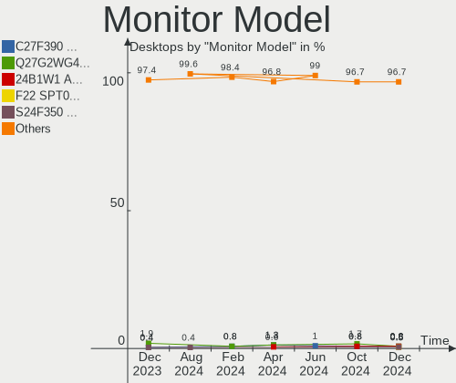

OpenMandriva - Hardware Trends (Desktops)
-----------------------------------------

A project to identify most popular hardware characteristics and track their change
over time based on data collected by Linux users at https://Linux-Hardware.org.

Anyone can contribute to this report by the [hw-probe](https://github.com/linuxhw/hw-probe) tool:

    sudo -E hw-probe -all -upload

This report is for one last month. Overall report since the beginning of time: [TestCoverage](https://github.com/linuxhw/TestCoverage)

Period: Jan, 2023.

Contents
--------

* [ System ](#system)
  - [ OS                       ](#os)
  - [ OS Family                ](#os-family)
  - [ Kernel                   ](#kernel)
  - [ Kernel Family            ](#kernel-family)
  - [ Kernel Major Ver.        ](#kernel-major-ver)
  - [ Arch                     ](#arch)
  - [ DE                       ](#de)
  - [ Display Server           ](#display-server)
  - [ Display Manager          ](#display-manager)
  - [ OS Lang                  ](#os-lang)
  - [ Boot Mode                ](#boot-mode)
  - [ Filesystem               ](#filesystem)
  - [ Part. scheme             ](#part-scheme)
  - [ Dual Boot with Linux/BSD ](#dual-boot-with-linuxbsd)
  - [ Dual Boot (Win)          ](#dual-boot-win)

* [ Board ](#board)
  - [ Vendor                   ](#vendor)
  - [ Model                    ](#model)
  - [ Model Family             ](#model-family)
  - [ MFG Year                 ](#mfg-year)
  - [ Form Factor              ](#form-factor)
  - [ Secure Boot              ](#secure-boot)
  - [ Coreboot                 ](#coreboot)
  - [ RAM Size                 ](#ram-size)
  - [ RAM Used                 ](#ram-used)
  - [ Total Drives             ](#total-drives)
  - [ Has CD-ROM               ](#has-cd-rom)
  - [ Has Ethernet             ](#has-ethernet)
  - [ Has WiFi                 ](#has-wifi)
  - [ Has Bluetooth            ](#has-bluetooth)

* [ Location ](#location)
  - [ Country                  ](#country)
  - [ City                     ](#city)

* [ Drives ](#drives)
  - [ Drive Vendor             ](#drive-vendor)
  - [ Drive Model              ](#drive-model)
  - [ HDD Vendor               ](#hdd-vendor)
  - [ SSD Vendor               ](#ssd-vendor)
  - [ Drive Kind               ](#drive-kind)
  - [ Drive Connector          ](#drive-connector)
  - [ Drive Size               ](#drive-size)
  - [ Space Total              ](#space-total)
  - [ Space Used               ](#space-used)
  - [ Malfunc. Drives          ](#malfunc-drives)
  - [ Malfunc. Drive Vendor    ](#malfunc-drive-vendor)
  - [ Malfunc. HDD Vendor      ](#malfunc-hdd-vendor)
  - [ Malfunc. Drive Kind      ](#malfunc-drive-kind)
  - [ Failed Drives            ](#failed-drives)
  - [ Failed Drive Vendor      ](#failed-drive-vendor)
  - [ Drive Status             ](#drive-status)

* [ Storage controller ](#storage-controller)
  - [ Storage Vendor           ](#storage-vendor)
  - [ Storage Model            ](#storage-model)
  - [ Storage Kind             ](#storage-kind)

* [ Processor ](#processor)
  - [ CPU Vendor               ](#cpu-vendor)
  - [ CPU Model                ](#cpu-model)
  - [ CPU Model Family         ](#cpu-model-family)
  - [ CPU Cores                ](#cpu-cores)
  - [ CPU Sockets              ](#cpu-sockets)
  - [ CPU Threads              ](#cpu-threads)
  - [ CPU Op-Modes             ](#cpu-op-modes)
  - [ CPU Microcode            ](#cpu-microcode)
  - [ CPU Microarch            ](#cpu-microarch)

* [ Graphics ](#graphics)
  - [ GPU Vendor               ](#gpu-vendor)
  - [ GPU Model                ](#gpu-model)
  - [ GPU Combo                ](#gpu-combo)
  - [ GPU Driver               ](#gpu-driver)
  - [ GPU Memory               ](#gpu-memory)

* [ Monitor ](#monitor)
  - [ Monitor Vendor           ](#monitor-vendor)
  - [ Monitor Model            ](#monitor-model)
  - [ Monitor Resolution       ](#monitor-resolution)
  - [ Monitor Diagonal         ](#monitor-diagonal)
  - [ Monitor Width            ](#monitor-width)
  - [ Aspect Ratio             ](#aspect-ratio)
  - [ Monitor Area             ](#monitor-area)
  - [ Pixel Density            ](#pixel-density)
  - [ Multiple Monitors        ](#multiple-monitors)

* [ Network ](#network)
  - [ Net Controller Vendor    ](#net-controller-vendor)
  - [ Net Controller Model     ](#net-controller-model)
  - [ Wireless Vendor          ](#wireless-vendor)
  - [ Wireless Model           ](#wireless-model)
  - [ Ethernet Vendor          ](#ethernet-vendor)
  - [ Ethernet Model           ](#ethernet-model)
  - [ Net Controller Kind      ](#net-controller-kind)
  - [ Used Controller          ](#used-controller)
  - [ NICs                     ](#nics)
  - [ IPv6                     ](#ipv6)

* [ Bluetooth ](#bluetooth)
  - [ Bluetooth Vendor         ](#bluetooth-vendor)
  - [ Bluetooth Model          ](#bluetooth-model)

* [ Sound ](#sound)
  - [ Sound Vendor             ](#sound-vendor)
  - [ Sound Model              ](#sound-model)

* [ Memory ](#memory)
  - [ Memory Vendor            ](#memory-vendor)
  - [ Memory Model             ](#memory-model)
  - [ Memory Kind              ](#memory-kind)
  - [ Memory Form Factor       ](#memory-form-factor)
  - [ Memory Size              ](#memory-size)
  - [ Memory Speed             ](#memory-speed)

* [ Printers & scanners ](#printers--scanners)
  - [ Printer Vendor           ](#printer-vendor)
  - [ Printer Model            ](#printer-model)
  - [ Scanner Vendor           ](#scanner-vendor)
  - [ Scanner Model            ](#scanner-model)

* [ Camera ](#camera)
  - [ Camera Vendor            ](#camera-vendor)
  - [ Camera Model             ](#camera-model)

* [ Security ](#security)
  - [ Fingerprint Vendor       ](#fingerprint-vendor)
  - [ Fingerprint Model        ](#fingerprint-model)
  - [ Chipcard Vendor          ](#chipcard-vendor)
  - [ Chipcard Model           ](#chipcard-model)

* [ Unsupported ](#unsupported)
  - [ Unsupported Devices      ](#unsupported-devices)
  - [ Unsupported Device Types ](#unsupported-device-types)

System
------

OS
--

Installed operating systems

| Name               | Desktops | Percent |
|--------------------|----------|---------|
| OpenMandriva 23.01 | 522      | 87%     |
| OpenMandriva 4.3   | 46       | 7.67%   |
| OpenMandriva 4.2   | 10       | 1.67%   |
| OpenMandriva 22.12 | 10       | 1.67%   |
| OpenMandriva 4.50  | 9        | 1.5%    |
| OpenMandriva 4.90  | 3        | 0.5%    |

OS Family
---------

OS without a version

| Name         | Desktops | Percent |
|--------------|----------|---------|
| OpenMandriva | 600      | 100%    |

Kernel
------

Version of the Linux kernel

| Version                    | Desktops | Percent |
|----------------------------|----------|---------|
| 6.1.1-desktop-1omv2290     | 505      | 84.17%  |
| 5.16.7-desktop-1omv4003    | 44       | 7.33%   |
| 6.0.10-desktop-2omv22090   | 10       | 1.67%   |
| 5.10.14-desktop-1omv4002   | 10       | 1.67%   |
| 6.1.4-desktop-1omv2301     | 8        | 1.33%   |
| 6.1.2-desktop-1omv2301     | 7        | 1.17%   |
| 5.19.12-desktop-2omv4090   | 6        | 1%      |
| 5.18.12-desktop-3omv4090   | 3        | 0.5%    |
| 6.1.4-desktop-gcc-1omv2301 | 2        | 0.33%   |
| 5.16.13-desktop-1omv4003   | 2        | 0.33%   |
| 5.19.5-desktop-1omv4090    | 1        | 0.17%   |
| 5.19.11-desktop-2omv4090   | 1        | 0.17%   |
| 5.12.4-desktop-1omv4050    | 1        | 0.17%   |

Kernel Family
-------------

Linux kernel without a distro release

| Version | Desktops | Percent |
|---------|----------|---------|
| 6.1.1   | 505      | 84.17%  |
| 5.16.7  | 44       | 7.33%   |
| 6.1.4   | 10       | 1.67%   |
| 6.0.10  | 10       | 1.67%   |
| 5.10.14 | 10       | 1.67%   |
| 6.1.2   | 7        | 1.17%   |
| 5.19.12 | 6        | 1%      |
| 5.18.12 | 3        | 0.5%    |
| 5.16.13 | 2        | 0.33%   |
| 5.19.5  | 1        | 0.17%   |
| 5.19.11 | 1        | 0.17%   |
| 5.12.4  | 1        | 0.17%   |

Kernel Major Ver.
-----------------

Linux kernel major version

| Version | Desktops | Percent |
|---------|----------|---------|
| 6.1     | 522      | 87%     |
| 5.16    | 46       | 7.67%   |
| 6.0     | 10       | 1.67%   |
| 5.10    | 10       | 1.67%   |
| 5.19    | 8        | 1.33%   |
| 5.18    | 3        | 0.5%    |
| 5.12    | 1        | 0.17%   |

Arch
----

OS architecture (x86_64, i586, etc.)

| Name   | Desktops | Percent |
|--------|----------|---------|
| x86_64 | 600      | 100%    |

DE
--

Desktop Environment

| Name  | Desktops | Percent |
|-------|----------|---------|
| KDE5  | 503      | 83.83%  |
| GNOME | 95       | 15.83%  |
| XFCE  | 1        | 0.17%   |
| LXQt  | 1        | 0.17%   |

Display Server
--------------

X11 or Wayland

| Name    | Desktops | Percent |
|---------|----------|---------|
| X11     | 506      | 84.33%  |
| Wayland | 94       | 15.67%  |

Display Manager
---------------

SDDM, LightDM, etc.

| Name    | Desktops | Percent |
|---------|----------|---------|
| SDDM    | 504      | 84%     |
| GDM     | 95       | 15.83%  |
| LightDM | 1        | 0.17%   |

OS Lang
-------

Language

| Lang  | Desktops | Percent |
|-------|----------|---------|
| en_US | 351      | 58.5%   |
| de_DE | 39       | 6.5%    |
| ru_RU | 36       | 6%      |
| fr_FR | 36       | 6%      |
| pt_BR | 21       | 3.5%    |
| it_IT | 17       | 2.83%   |
| es_ES | 16       | 2.67%   |
| en_GB | 13       | 2.17%   |
| pl_PL | 11       | 1.83%   |
| cs_CZ | 7        | 1.17%   |
| es_MX | 6        | 1%      |
| nl_NL | 5        | 0.83%   |
| hu_HU | 5        | 0.83%   |
| en_AU | 4        | 0.67%   |
| de_CH | 4        | 0.67%   |
| de_AT | 4        | 0.67%   |
| fr_CA | 3        | 0.5%    |
| en_CA | 3        | 0.5%    |
| tr_TR | 2        | 0.33%   |
| es_VE | 2        | 0.33%   |
| es_CL | 2        | 0.33%   |
| es_AR | 2        | 0.33%   |
| uk_UA | 1        | 0.17%   |
| pt_PT | 1        | 0.17%   |
| fr_BE | 1        | 0.17%   |
| es_UY | 1        | 0.17%   |
| es_PE | 1        | 0.17%   |
| es_GT | 1        | 0.17%   |
| es_CO | 1        | 0.17%   |
| en_NZ | 1        | 0.17%   |
| en_IL | 1        | 0.17%   |
| en_DK | 1        | 0.17%   |
| da_DK | 1        | 0.17%   |

Boot Mode
---------

EFI or BIOS

| Mode | Desktops | Percent |
|------|----------|---------|
| EFI  | 331      | 55.17%  |
| BIOS | 269      | 44.83%  |

Filesystem
----------

Type of filesystem

| Type    | Desktops | Percent |
|---------|----------|---------|
| Overlay | 510      | 85%     |
| Ext4    | 85       | 14.17%  |
| Btrfs   | 5        | 0.83%   |

Part. scheme
------------

Scheme of partitioning

| Type | Desktops | Percent |
|------|----------|---------|
| GPT  | 446      | 74.33%  |
| MBR  | 154      | 25.67%  |

Dual Boot with Linux/BSD
------------------------

Hosting more than one Linux/BSD

| Dual boot | Desktops | Percent |
|-----------|----------|---------|
| Yes       | 402      | 67%     |
| No        | 198      | 33%     |

Dual Boot (Win)
---------------

Hosting Linux and Windows

| Dual boot | Desktops | Percent |
|-----------|----------|---------|
| Yes       | 310      | 51.67%  |
| No        | 290      | 48.33%  |

Board
-----

Vendor
------

Motherboard manufacturer

| Name                                 | Desktops | Percent |
|--------------------------------------|----------|---------|
| ASUSTek Computer                     | 151      | 25.17%  |
| Gigabyte Technology                  | 108      | 18%     |
| MSI                                  | 70       | 11.67%  |
| Hewlett-Packard                      | 55       | 9.17%   |
| ASRock                               | 55       | 9.17%   |
| Dell                                 | 47       | 7.83%   |
| Lenovo                               | 21       | 3.5%    |
| Intel                                | 14       | 2.33%   |
| Acer                                 | 12       | 2%      |
| Fujitsu                              | 10       | 1.67%   |
| Pegatron                             | 9        | 1.5%    |
| ECS                                  | 6        | 1%      |
| Medion                               | 5        | 0.83%   |
| Foxconn                              | 5        | 0.83%   |
| Biostar                              | 3        | 0.5%    |
| BESSTAR Tech                         | 3        | 0.5%    |
| AZW                                  | 3        | 0.5%    |
| Unknown                              | 3        | 0.5%    |
| Semp Toshiba                         | 2        | 0.33%   |
| ViewSonic                            | 1        | 0.17%   |
| SYWZ                                 | 1        | 0.17%   |
| Shuttle                              | 1        | 0.17%   |
| Shenzhen Meigao Electronic Equipment | 1        | 0.17%   |
| PLEXHD                               | 1        | 0.17%   |
| PCWare                               | 1        | 0.17%   |
| OEM                                  | 1        | 0.17%   |
| MACHINIST                            | 1        | 0.17%   |
| Login Informatica                    | 1        | 0.17%   |
| Jetway                               | 1        | 0.17%   |
| HC                                   | 1        | 0.17%   |
| Hardkernel                           | 1        | 0.17%   |
| Gateway                              | 1        | 0.17%   |
| Fujitsu Siemens                      | 1        | 0.17%   |
| EVGA                                 | 1        | 0.17%   |
| ELSKY                                | 1        | 0.17%   |
| Digitron                             | 1        | 0.17%   |
| Alienware                            | 1        | 0.17%   |

Model
-----

Motherboard model

| Name                            | Desktops | Percent |
|---------------------------------|----------|---------|
| ASUS All Series                 | 14       | 2.33%   |
| MSI MS-7C56                     | 6        | 1%      |
| ASUS TUF Gaming X570-PLUS       | 5        | 0.83%   |
| ASUS PRIME B450M-A              | 5        | 0.83%   |
| MSI MS-7D22                     | 4        | 0.67%   |
| MSI MS-7B89                     | 4        | 0.67%   |
| Dell OptiPlex 7010              | 4        | 0.67%   |
| ASUS PRIME A320M-K              | 4        | 0.67%   |
| ASUS M5A97 R2.0                 | 4        | 0.67%   |
| ASRock B450M Pro4               | 4        | 0.67%   |
| Gigabyte B550M DS3H             | 3        | 0.5%    |
| Gigabyte B450 AORUS ELITE       | 3        | 0.5%    |
| Dell OptiPlex 745               | 3        | 0.5%    |
| ASUS TUF Gaming B550-PLUS       | 3        | 0.5%    |
| ASUS PRIME B450M-K II           | 3        | 0.5%    |
| ASUS PRIME B450-PLUS            | 3        | 0.5%    |
| ASUS PRIME B360M-A              | 3        | 0.5%    |
| Unknown                         | 3        | 0.5%    |
| Semp Toshiba STI                | 2        | 0.33%   |
| MSI MS-7D25                     | 2        | 0.33%   |
| MSI MS-7D20                     | 2        | 0.33%   |
| MSI MS-7C94                     | 2        | 0.33%   |
| MSI MS-7C91                     | 2        | 0.33%   |
| MSI MS-7C52                     | 2        | 0.33%   |
| MSI MS-7C02                     | 2        | 0.33%   |
| MSI MS-7B86                     | 2        | 0.33%   |
| MSI MS-7B17                     | 2        | 0.33%   |
| MSI MS-7721                     | 2        | 0.33%   |
| MSI MS-7640                     | 2        | 0.33%   |
| Medion MS-7621                  | 2        | 0.33%   |
| Intel H61                       | 2        | 0.33%   |
| Intel DZ77GA-70K AAG39009-500   | 2        | 0.33%   |
| Intel B75                       | 2        | 0.33%   |
| HP Pavilion Desktop PC 570-p0xx | 2        | 0.33%   |
| HP EliteDesk 800 G1 USDT        | 2        | 0.33%   |
| HP Compaq Pro 6300 SFF          | 2        | 0.33%   |
| HP Compaq Elite 8300 MT         | 2        | 0.33%   |
| HP Compaq dc5850 Microtower     | 2        | 0.33%   |
| Gigabyte Z77-D3H                | 2        | 0.33%   |
| Gigabyte Z390 AORUS MASTER      | 2        | 0.33%   |

Model Family
------------

Motherboard model prefix

| Name                   | Desktops | Percent |
|------------------------|----------|---------|
| ASUS PRIME             | 47       | 7.83%   |
| Dell OptiPlex          | 31       | 5.17%   |
| ASUS TUF               | 20       | 3.33%   |
| HP Compaq              | 15       | 2.5%    |
| ASUS All               | 14       | 2.33%   |
| Lenovo ThinkCentre     | 13       | 2.17%   |
| ASUS ROG               | 13       | 2.17%   |
| HP Pavilion            | 10       | 1.67%   |
| Fujitsu ESPRIMO        | 9        | 1.5%    |
| Acer Aspire            | 9        | 1.5%    |
| HP EliteDesk           | 7        | 1.17%   |
| MSI MS-7C56            | 6        | 1%      |
| HP ProDesk             | 6        | 1%      |
| Gigabyte B450M         | 6        | 1%      |
| ASUS M5A78L-M          | 6        | 1%      |
| ASRock B450M           | 6        | 1%      |
| Gigabyte B550M         | 5        | 0.83%   |
| Gigabyte B450          | 5        | 0.83%   |
| ASUS P8H61-M           | 5        | 0.83%   |
| ASUS M5A97             | 5        | 0.83%   |
| MSI MS-7D22            | 4        | 0.67%   |
| MSI MS-7B89            | 4        | 0.67%   |
| Lenovo IdeaCentre      | 4        | 0.67%   |
| Dell Vostro            | 4        | 0.67%   |
| Dell Precision         | 4        | 0.67%   |
| Gigabyte Z690          | 3        | 0.5%    |
| Gigabyte Z390          | 3        | 0.5%    |
| Gigabyte X570          | 3        | 0.5%    |
| Gigabyte GA-78LMT-USB3 | 3        | 0.5%    |
| Gigabyte A520M         | 3        | 0.5%    |
| Dell Inspiron          | 3        | 0.5%    |
| ASUS P8H77-V           | 3        | 0.5%    |
| ASRock B550M           | 3        | 0.5%    |
| ASRock B450            | 3        | 0.5%    |
| ASRock AB350           | 3        | 0.5%    |
| Acer Veriton           | 3        | 0.5%    |
| Unknown                | 3        | 0.5%    |
| Semp Toshiba STI       | 2        | 0.33%   |
| MSI MS-7D25            | 2        | 0.33%   |
| MSI MS-7D20            | 2        | 0.33%   |

MFG Year
--------

Motherboard manufacture year

| Year | Desktops | Percent |
|------|----------|---------|
| 2018 | 72       | 12%     |
| 2020 | 61       | 10.17%  |
| 2012 | 58       | 9.67%   |
| 2013 | 52       | 8.67%   |
| 2021 | 51       | 8.5%    |
| 2019 | 37       | 6.17%   |
| 2017 | 35       | 5.83%   |
| 2009 | 33       | 5.5%    |
| 2015 | 32       | 5.33%   |
| 2011 | 30       | 5%      |
| 2016 | 28       | 4.67%   |
| 2014 | 28       | 4.67%   |
| 2022 | 25       | 4.17%   |
| 2008 | 25       | 4.17%   |
| 2010 | 16       | 2.67%   |
| 2007 | 11       | 1.83%   |
| 2006 | 6        | 1%      |

Form Factor
-----------

Physical design of the computer

| Name    | Desktops | Percent |
|---------|----------|---------|
| Desktop | 600      | 100%    |

Secure Boot
-----------

Enabled or disabled

| State    | Desktops | Percent |
|----------|----------|---------|
| Disabled | 600      | 100%    |

Coreboot
--------

Have coreboot on board

| Used | Desktops | Percent |
|------|----------|---------|
| No   | 600      | 100%    |

RAM Size
--------

Total RAM memory

| Size in GB  | Desktops | Percent |
|-------------|----------|---------|
| 16.01-24.0  | 166      | 27.67%  |
| 4.01-8.0    | 118      | 19.67%  |
| 8.01-16.0   | 113      | 18.83%  |
| 32.01-64.0  | 76       | 12.67%  |
| 3.01-4.0    | 75       | 12.5%   |
| 64.01-256.0 | 17       | 2.83%   |
| 24.01-32.0  | 16       | 2.67%   |
| 1.01-2.0    | 12       | 2%      |
| 2.01-3.0    | 6        | 1%      |
| 0.51-1.0    | 1        | 0.17%   |

RAM Used
--------

Used RAM memory

| Used GB  | Desktops | Percent |
|----------|----------|---------|
| 1.01-2.0 | 415      | 69.17%  |
| 2.01-3.0 | 138      | 23%     |
| 0.51-1.0 | 23       | 3.83%   |
| 3.01-4.0 | 14       | 2.33%   |
| 0.01-0.5 | 7        | 1.17%   |
| 4.01-8.0 | 3        | 0.5%    |

Total Drives
------------

Number of drives on board

| Drives | Desktops | Percent |
|--------|----------|---------|
| 1      | 224      | 37.33%  |
| 2      | 169      | 28.17%  |
| 3      | 88       | 14.67%  |
| 4      | 53       | 8.83%   |
| 5      | 25       | 4.17%   |
| 6      | 15       | 2.5%    |
| 0      | 13       | 2.17%   |
| 8      | 6        | 1%      |
| 7      | 6        | 1%      |
| 17     | 1        | 0.17%   |

Has CD-ROM
----------

Has CD-ROM on board

| Presented | Desktops | Percent |
|-----------|----------|---------|
| Yes       | 314      | 52.33%  |
| No        | 286      | 47.67%  |

Has Ethernet
------------

Has Ethernet on board

| Presented | Desktops | Percent |
|-----------|----------|---------|
| Yes       | 598      | 99.67%  |
| No        | 2        | 0.33%   |

Has WiFi
--------

Has WiFi module

| Presented | Desktops | Percent |
|-----------|----------|---------|
| No        | 349      | 58.17%  |
| Yes       | 251      | 41.83%  |

Has Bluetooth
-------------

Has Bluetooth module

| Presented | Desktops | Percent |
|-----------|----------|---------|
| No        | 412      | 68.67%  |
| Yes       | 188      | 31.33%  |

Location
--------

Country
-------

Geographic location (country)

| Country      | Desktops | Percent |
|--------------|----------|---------|
| USA          | 116      | 19.33%  |
| Germany      | 60       | 10%     |
| Russia       | 50       | 8.33%   |
| France       | 50       | 8.33%   |
| Brazil       | 34       | 5.67%   |
| Spain        | 27       | 4.5%    |
| Italy        | 26       | 4.33%   |
| Canada       | 26       | 4.33%   |
| UK           | 19       | 3.17%   |
| Poland       | 17       | 2.83%   |
| Australia    | 17       | 2.83%   |
| Mexico       | 12       | 2%      |
| Hungary      | 11       | 1.83%   |
| Netherlands  | 10       | 1.67%   |
| Finland      | 8        | 1.33%   |
| Switzerland  | 6        | 1%      |
| Romania      | 6        | 1%      |
| Czechia      | 6        | 1%      |
| Turkey       | 5        | 0.83%   |
| Japan        | 5        | 0.83%   |
| Austria      | 5        | 0.83%   |
| Slovakia     | 4        | 0.67%   |
| Serbia       | 4        | 0.67%   |
| Greece       | 4        | 0.67%   |
| Egypt        | 4        | 0.67%   |
| Chile        | 4        | 0.67%   |
| Belgium      | 4        | 0.67%   |
| Argentina    | 4        | 0.67%   |
| Venezuela    | 3        | 0.5%    |
| Thailand     | 3        | 0.5%    |
| Saudi Arabia | 3        | 0.5%    |
| Portugal     | 3        | 0.5%    |
| Israel       | 3        | 0.5%    |
| India        | 3        | 0.5%    |
| Taiwan       | 2        | 0.33%   |
| Sweden       | 2        | 0.33%   |
| Norway       | 2        | 0.33%   |
| New Zealand  | 2        | 0.33%   |
| Moldova      | 2        | 0.33%   |
| Kazakhstan   | 2        | 0.33%   |

City
----

Geographic location (city)

| City             | Desktops | Percent |
|------------------|----------|---------|
| Moscow           | 12       | 2%      |
| Melbourne        | 7        | 1.17%   |
| Córdoba         | 7        | 1.17%   |
| Madrid           | 6        | 1%      |
| Berlin           | 6        | 1%      |
| Sao Paulo        | 5        | 0.83%   |
| Rome             | 5        | 0.83%   |
| Novosibirsk      | 5        | 0.83%   |
| Stuttgart        | 4        | 0.67%   |
| Mexico City      | 4        | 0.67%   |
| Curitiba         | 4        | 0.67%   |
| Youngstown       | 3        | 0.5%    |
| Warsaw           | 3        | 0.5%    |
| Sydney           | 3        | 0.5%    |
| Québec          | 3        | 0.5%    |
| Paris            | 3        | 0.5%    |
| Marseille        | 3        | 0.5%    |
| London           | 3        | 0.5%    |
| Laurel           | 3        | 0.5%    |
| Citrus Heights   | 3        | 0.5%    |
| Budapest         | 3        | 0.5%    |
| Bucharest        | 3        | 0.5%    |
| Yaroslavl        | 2        | 0.33%   |
| Wiesbaden        | 2        | 0.33%   |
| Wellington       | 2        | 0.33%   |
| Vienna           | 2        | 0.33%   |
| Torzhok          | 2        | 0.33%   |
| The Hague        | 2        | 0.33%   |
| Tatuí           | 2        | 0.33%   |
| Tampere          | 2        | 0.33%   |
| St Petersburg    | 2        | 0.33%   |
| Sofia            | 2        | 0.33%   |
| Santiago         | 2        | 0.33%   |
| Rotterdam        | 2        | 0.33%   |
| Rio de Janeiro   | 2        | 0.33%   |
| Prattville       | 2        | 0.33%   |
| Prague           | 2        | 0.33%   |
| Phoenix          | 2        | 0.33%   |
| Novoaltaysk      | 2        | 0.33%   |
| Nizhniy Novgorod | 2        | 0.33%   |

Drives
------

Drive Vendor
------------

Hard drive vendors

| Vendor              | Desktops | Drives | Percent |
|---------------------|----------|--------|---------|
| WDC                 | 193      | 253    | 17.42%  |
| Seagate             | 186      | 245    | 16.79%  |
| Samsung Electronics | 135      | 188    | 12.18%  |
| Kingston            | 75       | 88     | 6.77%   |
| Crucial             | 72       | 88     | 6.5%    |
| Toshiba             | 67       | 76     | 6.05%   |
| SanDisk             | 40       | 44     | 3.61%   |
| Hitachi             | 29       | 30     | 2.62%   |
| A-DATA Technology   | 24       | 24     | 2.17%   |
| Unknown             | 17       | 20     | 1.53%   |
| China               | 17       | 20     | 1.53%   |
| PNY                 | 16       | 19     | 1.44%   |
| Patriot             | 15       | 16     | 1.35%   |
| SPCC                | 13       | 20     | 1.17%   |
| Intel               | 13       | 13     | 1.17%   |
| GOODRAM             | 10       | 11     | 0.9%    |
| Intenso             | 9        | 11     | 0.81%   |
| Silicon Motion      | 8        | 8      | 0.72%   |
| Netac               | 8        | 8      | 0.72%   |
| Maxtor              | 7        | 8      | 0.63%   |
| KIOXIA-EXCERIA      | 7        | 7      | 0.63%   |
| Gigabyte Technology | 7        | 8      | 0.63%   |
| Phison              | 6        | 8      | 0.54%   |
| OCZ                 | 6        | 6      | 0.54%   |
| Lexar               | 6        | 6      | 0.54%   |
| HGST                | 6        | 6      | 0.54%   |
| Apacer              | 6        | 7      | 0.54%   |
| Unknown             | 6        | 6      | 0.54%   |
| JMicron Technology  | 5        | 5      | 0.45%   |
| XrayDisk            | 4        | 4      | 0.36%   |
| Transcend           | 4        | 4      | 0.36%   |
| Team                | 4        | 4      | 0.36%   |
| Micron Technology   | 4        | 4      | 0.36%   |
| Emtec               | 4        | 4      | 0.36%   |
| XPG                 | 3        | 3      | 0.27%   |
| USB3.0              | 3        | 3      | 0.27%   |
| SK hynix            | 3        | 3      | 0.27%   |
| Mushkin             | 3        | 3      | 0.27%   |
| Leven               | 3        | 3      | 0.27%   |
| Hewlett-Packard     | 3        | 3      | 0.27%   |

Drive Model
-----------

Hard drive models

| Model                            | Desktops | Percent |
|----------------------------------|----------|---------|
| Kingston SA400S37240G 240GB SSD  | 20       | 1.55%   |
| Seagate ST500DM002-1BD142 500GB  | 17       | 1.32%   |
| Seagate ST2000DM008-2FR102 2TB   | 15       | 1.16%   |
| Kingston SA400S37480G 480GB SSD  | 15       | 1.16%   |
| Seagate ST1000DM010-2EP102 1TB   | 14       | 1.09%   |
| Toshiba DT01ACA100 1TB           | 12       | 0.93%   |
| Crucial CT1000MX500SSD1 1TB      | 12       | 0.93%   |
| Toshiba DT01ACA200 2TB           | 10       | 0.78%   |
| Samsung SSD 860 EVO 500GB        | 10       | 0.78%   |
| Crucial CT500MX500SSD1 500GB     | 10       | 0.78%   |
| Unknown SD/MMC/MS PRO 2GB        | 9        | 0.7%    |
| Toshiba DT01ACA050 500GB         | 9        | 0.7%    |
| Samsung SSD 980 1TB              | 9        | 0.7%    |
| Crucial CT480BX500SSD1 480GB     | 9        | 0.7%    |
| Samsung SSD 970 EVO Plus 500GB   | 8        | 0.62%   |
| Crucial CT240BX500SSD1 240GB     | 8        | 0.62%   |
| WDC WD20EZRZ-00Z5HB0 2TB         | 7        | 0.54%   |
| WDC WD10EZEX-00BN5A0 1TB         | 7        | 0.54%   |
| SanDisk NVMe SSD Drive 500GB     | 7        | 0.54%   |
| WDC WD10EZEX-08WN4A0 1TB         | 6        | 0.47%   |
| Toshiba HDWD110 1TB              | 6        | 0.47%   |
| Seagate ST3500413AS 500GB        | 6        | 0.47%   |
| Seagate ST2000DM001-1ER164 2TB   | 6        | 0.47%   |
| Seagate ST2000DM001-1CH164 2TB   | 6        | 0.47%   |
| Seagate ST1000DM003-1SB102 1TB   | 6        | 0.47%   |
| SanDisk NVMe SSD Drive 1TB       | 6        | 0.47%   |
| Samsung SSD 960 EVO 250GB        | 6        | 0.47%   |
| Samsung SSD 870 EVO 500GB        | 6        | 0.47%   |
| KIOXIA-EXCERIA SATA SSD 480GB    | 6        | 0.47%   |
| Kingston SV300S37A120G 120GB SSD | 6        | 0.47%   |
| Kingston SA400S37120G 120GB SSD  | 6        | 0.47%   |
| Unknown                          | 6        | 0.47%   |
| WDC WD10EZEX-00BBHA0 1TB         | 5        | 0.39%   |
| Toshiba HDWD130 3TB              | 5        | 0.39%   |
| Toshiba HDWD120 2TB              | 5        | 0.39%   |
| Seagate ST31000524AS 1TB         | 5        | 0.39%   |
| Seagate ST1000DM003-1CH162 1TB   | 5        | 0.39%   |
| Samsung SSD 860 EVO 1TB          | 5        | 0.39%   |
| Samsung SSD 850 EVO 500GB        | 5        | 0.39%   |
| PNY CS900 120GB SSD              | 5        | 0.39%   |

HDD Vendor
----------

Hard disk drive vendors

| Vendor              | Desktops | Drives | Percent |
|---------------------|----------|--------|---------|
| Seagate             | 183      | 242    | 36.38%  |
| WDC                 | 156      | 202    | 31.01%  |
| Toshiba             | 61       | 68     | 12.13%  |
| Samsung Electronics | 33       | 37     | 6.56%   |
| Hitachi             | 29       | 30     | 5.77%   |
| Unknown             | 9        | 9      | 1.79%   |
| Maxtor              | 7        | 8      | 1.39%   |
| HGST                | 6        | 6      | 1.19%   |
| USB3.0              | 3        | 3      | 0.6%    |
| Fujitsu             | 3        | 3      | 0.6%    |
| ASMT                | 3        | 3      | 0.6%    |
| Intenso             | 2        | 2      | 0.4%    |
| HGST HTS            | 2        | 2      | 0.4%    |
| ExcelStor           | 2        | 2      | 0.4%    |
| SABRENT             | 1        | 2      | 0.2%    |
| Hewlett-Packard     | 1        | 1      | 0.2%    |
| ASMedia             | 1        | 1      | 0.2%    |
| Unknown             | 1        | 1      | 0.2%    |

SSD Vendor
----------

Solid state drive vendors

| Vendor              | Desktops | Drives | Percent |
|---------------------|----------|--------|---------|
| Samsung Electronics | 66       | 84     | 15.21%  |
| Kingston            | 61       | 71     | 14.06%  |
| Crucial             | 57       | 72     | 13.13%  |
| WDC                 | 30       | 33     | 6.91%   |
| SanDisk             | 27       | 28     | 6.22%   |
| China               | 17       | 20     | 3.92%   |
| A-DATA Technology   | 17       | 17     | 3.92%   |
| Patriot             | 14       | 15     | 3.23%   |
| PNY                 | 13       | 16     | 3%      |
| SPCC                | 11       | 17     | 2.53%   |
| GOODRAM             | 10       | 11     | 2.3%    |
| Intenso             | 8        | 9      | 1.84%   |
| Toshiba             | 7        | 7      | 1.61%   |
| KIOXIA-EXCERIA      | 7        | 7      | 1.61%   |
| OCZ                 | 6        | 6      | 1.38%   |
| Netac               | 5        | 5      | 1.15%   |
| Intel               | 5        | 5      | 1.15%   |
| Apacer              | 5        | 6      | 1.15%   |
| Unknown             | 5        | 5      | 1.15%   |
| XrayDisk            | 4        | 4      | 0.92%   |
| Micron Technology   | 4        | 4      | 0.92%   |
| Gigabyte Technology | 4        | 4      | 0.92%   |
| Transcend           | 3        | 3      | 0.69%   |
| Lexar               | 3        | 3      | 0.69%   |
| Leven               | 3        | 3      | 0.69%   |
| JMicron Technology  | 3        | 3      | 0.69%   |
| TO Exter            | 2        | 2      | 0.46%   |
| Team                | 2        | 2      | 0.46%   |
| KingSpec            | 2        | 2      | 0.46%   |
| Kingchuxing         | 2        | 2      | 0.46%   |
| Emtec               | 2        | 2      | 0.46%   |
| X12                 | 1        | 1      | 0.23%   |
| USB30               | 1        | 1      | 0.23%   |
| TEXTORM             | 1        | 1      | 0.23%   |
| T-FORCE             | 1        | 1      | 0.23%   |
| SUNEAST             | 1        | 1      | 0.23%   |
| Smartbuy            | 1        | 1      | 0.23%   |
| SK hynix            | 1        | 1      | 0.23%   |
| Ramos Technology    | 1        | 1      | 0.23%   |
| R580                | 1        | 1      | 0.23%   |

Drive Kind
----------

HDD or SSD

| Kind    | Desktops | Drives | Percent |
|---------|----------|--------|---------|
| HDD     | 393      | 622    | 42.67%  |
| SSD     | 337      | 498    | 36.59%  |
| NVMe    | 178      | 214    | 19.33%  |
| Unknown | 11       | 14     | 1.19%   |
| MMC     | 2        | 2      | 0.22%   |

Drive Connector
---------------

SATA, SAS, NVMe, etc.

| Type | Desktops | Drives | Percent |
|------|----------|--------|---------|
| SATA | 543      | 1062   | 69.17%  |
| NVMe | 178      | 214    | 22.68%  |
| SAS  | 62       | 72     | 7.9%    |
| MMC  | 2        | 2      | 0.25%   |

Drive Size
----------

Size of hard drive

| Size in TB | Desktops | Drives | Percent |
|------------|----------|--------|---------|
| 0.01-0.5   | 413      | 625    | 52.15%  |
| 0.51-1.0   | 218      | 299    | 27.53%  |
| 1.01-2.0   | 86       | 104    | 10.86%  |
| 2.01-3.0   | 25       | 29     | 3.16%   |
| 4.01-10.0  | 25       | 31     | 3.16%   |
| 3.01-4.0   | 22       | 28     | 2.78%   |
| 10.01-20.0 | 3        | 4      | 0.38%   |

Space Total
-----------

Amount of disk space available on the file system

| Size in GB     | Desktops | Percent |
|----------------|----------|---------|
| 1-20           | 311      | 51.83%  |
| 101-250        | 89       | 14.83%  |
| Unknown        | 62       | 10.33%  |
| 251-500        | 53       | 8.83%   |
| 501-1000       | 29       | 4.83%   |
| 51-100         | 16       | 2.67%   |
| 21-50          | 14       | 2.33%   |
| 1001-2000      | 12       | 2%      |
| More than 3000 | 9        | 1.5%    |
| 2001-3000      | 5        | 0.83%   |

Space Used
----------

Amount of used disk space

| Used GB        | Desktops | Percent |
|----------------|----------|---------|
| 1-20           | 482      | 80.33%  |
| Unknown        | 62       | 10.33%  |
| 101-250        | 13       | 2.17%   |
| 51-100         | 10       | 1.67%   |
| 21-50          | 9        | 1.5%    |
| 251-500        | 8        | 1.33%   |
| 501-1000       | 7        | 1.17%   |
| 2001-3000      | 4        | 0.67%   |
| 1001-2000      | 4        | 0.67%   |
| More than 3000 | 1        | 0.17%   |

Malfunc. Drives
---------------

Drive models with a malfunction

| Model                             | Desktops | Drives | Percent |
|-----------------------------------|----------|--------|---------|
| Seagate ST500DM002-1BD142 500GB   | 7        | 7      | 3.7%    |
| Seagate ST31000524AS 1TB          | 4        | 4      | 2.12%   |
| Seagate ST2000DM001-1CH164 2TB    | 4        | 4      | 2.12%   |
| WDC WD10EADS-65L5B1 1TB           | 3        | 3      | 1.59%   |
| Toshiba DT01ACA050 500GB          | 3        | 3      | 1.59%   |
| Seagate ST3500413AS 500GB         | 3        | 3      | 1.59%   |
| Seagate ST250DM000-1BD141 250GB   | 3        | 3      | 1.59%   |
| Seagate ST2000DL003-9VT166 2TB    | 3        | 3      | 1.59%   |
| Maxtor STM3250310AS 250GB         | 3        | 3      | 1.59%   |
| Unknown                           | 3        | 3      | 1.59%   |
| WDC WD5001AALS-00L3B2 500GB       | 2        | 2      | 1.06%   |
| WDC WD5000AAVS-00N7B0 500GB       | 2        | 2      | 1.06%   |
| WDC WD5000AAKS-00UU3A0 500GB      | 2        | 2      | 1.06%   |
| Seagate STM3250318AS 250GB        | 2        | 2      | 1.06%   |
| Seagate ST3808110AS 80GB          | 2        | 2      | 1.06%   |
| Seagate ST3750640NS 752GB         | 2        | 2      | 1.06%   |
| Seagate ST3320613AS 320GB         | 2        | 2      | 1.06%   |
| Seagate ST31500341AS 1TB          | 2        | 2      | 1.06%   |
| Seagate ST2000DM008-2FR102 2TB    | 2        | 2      | 1.06%   |
| Samsung Electronics HD642JJ 640GB | 2        | 2      | 1.06%   |
| Samsung Electronics HD161HJ 160GB | 2        | 2      | 1.06%   |
| Samsung Electronics HD103UJ 1TB   | 2        | 2      | 1.06%   |
| Kingston SV300S37A120G 120GB SSD  | 2        | 2      | 1.06%   |
| Kingston SA400S37960G 960GB SSD   | 2        | 2      | 1.06%   |
| Hitachi HDP725050GLA360 500GB     | 2        | 3      | 1.06%   |
| HGST HTS725050A7E630 500GB        | 2        | 2      | 1.06%   |
| WDC WDS480G2G0A-00JH30 480GB SSD  | 1        | 1      | 0.53%   |
| WDC WD800JD-60LSA0 80GB           | 1        | 1      | 0.53%   |
| WDC WD800JD-60JRA0 80GB           | 1        | 1      | 0.53%   |
| WDC WD7500BPVT-24HXZT3 752GB      | 1        | 1      | 0.53%   |
| WDC WD7500AAKS-00RBA0 752GB       | 1        | 1      | 0.53%   |
| WDC WD6400AAKS-65Z7B0 640GB       | 1        | 1      | 0.53%   |
| WDC WD6400AAKS-22A7B2 640GB       | 1        | 1      | 0.53%   |
| WDC WD5000AVDS-61U7B1 500GB       | 1        | 1      | 0.53%   |
| WDC WD5000AAKX-75U6AA0 500GB      | 1        | 1      | 0.53%   |
| WDC WD5000AAKX-603CA0 500GB       | 1        | 1      | 0.53%   |
| WDC WD5000AAKX-22ERMA0 500GB      | 1        | 1      | 0.53%   |
| WDC WD5000AAKX-221CA1 500GB       | 1        | 1      | 0.53%   |
| WDC WD5000AAKX-08U6AA0 500GB      | 1        | 1      | 0.53%   |
| WDC WD5000AAKX-083CA1 500GB       | 1        | 1      | 0.53%   |

Malfunc. Drive Vendor
---------------------

Vendors of faulty drives

| Vendor              | Desktops | Drives | Percent |
|---------------------|----------|--------|---------|
| Seagate             | 59       | 68     | 33.15%  |
| WDC                 | 48       | 53     | 26.97%  |
| Samsung Electronics | 15       | 18     | 8.43%   |
| Toshiba             | 9        | 9      | 5.06%   |
| Hitachi             | 9        | 10     | 5.06%   |
| Kingston            | 6        | 6      | 3.37%   |
| Maxtor              | 5        | 6      | 2.81%   |
| A-DATA Technology   | 3        | 3      | 1.69%   |
| Unknown             | 3        | 3      | 1.69%   |
| SanDisk             | 2        | 2      | 1.12%   |
| OCZ                 | 2        | 2      | 1.12%   |
| Intel               | 2        | 2      | 1.12%   |
| HGST                | 2        | 2      | 1.12%   |
| USB3.0              | 1        | 1      | 0.56%   |
| SUNEAST             | 1        | 1      | 0.56%   |
| Patriot             | 1        | 1      | 0.56%   |
| Netac               | 1        | 1      | 0.56%   |
| KingSpec            | 1        | 1      | 0.56%   |
| Initio              | 1        | 1      | 0.56%   |
| Hewlett-Packard     | 1        | 1      | 0.56%   |
| GOODRAM             | 1        | 1      | 0.56%   |
| Crucial             | 1        | 1      | 0.56%   |
| China               | 1        | 1      | 0.56%   |
| C-Series            | 1        | 1      | 0.56%   |
| ASMT                | 1        | 1      | 0.56%   |
| ASMedia             | 1        | 1      | 0.56%   |

Malfunc. HDD Vendor
-------------------

Vendors of faulty HDD drives

| Vendor              | Desktops | Drives | Percent |
|---------------------|----------|--------|---------|
| Seagate             | 59       | 68     | 40.41%  |
| WDC                 | 45       | 50     | 30.82%  |
| Samsung Electronics | 13       | 15     | 8.9%    |
| Toshiba             | 9        | 9      | 6.16%   |
| Hitachi             | 9        | 10     | 6.16%   |
| Maxtor              | 5        | 6      | 3.42%   |
| HGST                | 2        | 2      | 1.37%   |
| USB3.0              | 1        | 1      | 0.68%   |
| Hewlett-Packard     | 1        | 1      | 0.68%   |
| ASMT                | 1        | 1      | 0.68%   |
| ASMedia             | 1        | 1      | 0.68%   |

Malfunc. Drive Kind
-------------------

Kinds of faulty drives

| Kind | Desktops | Drives | Percent |
|------|----------|--------|---------|
| HDD  | 129      | 164    | 81.13%  |
| SSD  | 26       | 29     | 16.35%  |
| NVMe | 4        | 4      | 2.52%   |

Failed Drives
-------------

Failed drive models

| Model                             | Desktops | Drives | Percent |
|-----------------------------------|----------|--------|---------|
| WDC WD7500BPVT-22HXZT3 752GB      | 1        | 1      | 20%     |
| WDC WD5000AAKS-00C8A0 500GB       | 1        | 1      | 20%     |
| Seagate ST3750640NS 752GB         | 1        | 1      | 20%     |
| Samsung Electronics HD502HJ 500GB | 1        | 1      | 20%     |
| Samsung Electronics HD103UJ 1TB   | 1        | 1      | 20%     |

Failed Drive Vendor
-------------------

Failed drive vendors

| Vendor              | Desktops | Drives | Percent |
|---------------------|----------|--------|---------|
| WDC                 | 2        | 2      | 40%     |
| Samsung Electronics | 2        | 2      | 40%     |
| Seagate             | 1        | 1      | 20%     |

Drive Status
------------

Number of failed and malfunc. drives

| Status   | Desktops | Drives | Percent |
|----------|----------|--------|---------|
| Works    | 519      | 1066   | 69.48%  |
| Malfunc  | 155      | 197    | 20.75%  |
| Detected | 68       | 82     | 9.1%    |
| Failed   | 5        | 5      | 0.67%   |

Storage controller
------------------

Storage Vendor
--------------

Storage controller vendors

| Vendor                       | Desktops | Percent |
|------------------------------|----------|---------|
| Intel                        | 365      | 42.99%  |
| AMD                          | 224      | 26.38%  |
| Samsung Electronics          | 57       | 6.71%   |
| SanDisk                      | 31       | 3.65%   |
| ASMedia Technology           | 27       | 3.18%   |
| Silicon Motion               | 20       | 2.36%   |
| Phison Electronics           | 20       | 2.36%   |
| Kingston Technology Company  | 16       | 1.88%   |
| Marvell Technology Group     | 14       | 1.65%   |
| JMicron Technology           | 14       | 1.65%   |
| Nvidia                       | 13       | 1.53%   |
| Micron/Crucial Technology    | 13       | 1.53%   |
| Realtek Semiconductor        | 5        | 0.59%   |
| Shenzhen Longsys Electronics | 4        | 0.47%   |
| ADATA Technology             | 4        | 0.47%   |
| Silicon Image                | 3        | 0.35%   |
| MAXIO Technology (Hangzhou)  | 3        | 0.35%   |
| SK hynix                     | 2        | 0.24%   |
| Seagate Technology           | 2        | 0.24%   |
| Netac Technology             | 2        | 0.24%   |
| Micron Technology            | 2        | 0.24%   |
| Lite-On Technology           | 2        | 0.24%   |
| KIOXIA                       | 2        | 0.24%   |
| VIA Technologies             | 1        | 0.12%   |
| Toshiba America Info Systems | 1        | 0.12%   |
| LSI Logic / Symbios Logic    | 1        | 0.12%   |
| INNOGRIT                     | 1        | 0.12%   |

Storage Model
-------------

Storage controller models

| Model                                                                                   | Desktops | Percent |
|-----------------------------------------------------------------------------------------|----------|---------|
| AMD FCH SATA Controller [AHCI mode]                                                     | 120      | 11.41%  |
| AMD 400 Series Chipset SATA Controller                                                  | 58       | 5.51%   |
| Intel 8 Series/C220 Series Chipset Family 6-port SATA Controller 1 [AHCI mode]          | 45       | 4.28%   |
| Intel Q170/Q150/B150/H170/H110/Z170/CM236 Chipset SATA Controller [AHCI Mode]           | 40       | 3.8%    |
| AMD 500 Series Chipset SATA Controller                                                  | 38       | 3.61%   |
| Samsung NVMe SSD Controller SM981/PM981/PM983                                           | 29       | 2.76%   |
| AMD SB7x0/SB8x0/SB9x0 IDE Controller                                                    | 29       | 2.76%   |
| Intel 7 Series/C210 Series Chipset Family 6-port SATA Controller [AHCI mode]            | 28       | 2.66%   |
| Intel Cannon Lake PCH SATA AHCI Controller                                              | 27       | 2.57%   |
| Intel NM10/ICH7 Family SATA Controller [IDE mode]                                       | 22       | 2.09%   |
| Intel 6 Series/C200 Series Chipset Family 6 port Desktop SATA AHCI Controller           | 22       | 2.09%   |
| AMD SB7x0/SB8x0/SB9x0 SATA Controller [IDE mode]                                        | 22       | 2.09%   |
| Intel 200 Series PCH SATA controller [AHCI mode]                                        | 21       | 2%      |
| ASMedia ASM1062 Serial ATA Controller                                                   | 21       | 2%      |
| AMD SB7x0/SB8x0/SB9x0 SATA Controller [AHCI mode]                                       | 21       | 2%      |
| Intel 82801G (ICH7 Family) IDE Controller                                               | 18       | 1.71%   |
| Silicon Motion SM2263EN/SM2263XT SSD Controller                                         | 17       | 1.62%   |
| Intel Alder Lake-S PCH SATA Controller [AHCI Mode]                                      | 16       | 1.52%   |
| Samsung NVMe SSD Controller 980                                                         | 15       | 1.43%   |
| Intel 500 Series Chipset Family SATA AHCI Controller                                    | 15       | 1.43%   |
| AMD 300 Series Chipset SATA Controller                                                  | 14       | 1.33%   |
| Intel SATA Controller [RAID mode]                                                       | 13       | 1.24%   |
| Intel 9 Series Chipset Family SATA Controller [AHCI Mode]                               | 11       | 1.05%   |
| Intel 6 Series/C200 Series Chipset Family Desktop SATA Controller (IDE mode, ports 4-5) | 11       | 1.05%   |
| Intel 6 Series/C200 Series Chipset Family Desktop SATA Controller (IDE mode, ports 0-3) | 11       | 1.05%   |
| Samsung NVMe SSD Controller SM961/PM961/SM963                                           | 10       | 0.95%   |
| AMD FCH SATA Controller D                                                               | 9        | 0.86%   |
| SanDisk WD Blue SN550 NVMe SSD                                                          | 8        | 0.76%   |
| Samsung NVMe SSD Controller PM9A1/PM9A3/980PRO                                          | 8        | 0.76%   |
| Phison E16 PCIe4 NVMe Controller                                                        | 8        | 0.76%   |
| Nvidia MCP61 SATA Controller                                                            | 8        | 0.76%   |
| Micron/Crucial P2 NVMe PCIe SSD                                                         | 8        | 0.76%   |
| Marvell Group 88SE9172 SATA 6Gb/s Controller                                            | 8        | 0.76%   |
| Phison PS5013 E13 NVMe Controller                                                       | 7        | 0.67%   |
| Nvidia MCP61 IDE                                                                        | 7        | 0.67%   |
| Intel Comet Lake SATA AHCI Controller                                                   | 7        | 0.67%   |
| AMD FCH IDE Controller                                                                  | 7        | 0.67%   |
| SanDisk WD Blue SN570 NVMe SSD                                                          | 6        | 0.57%   |
| Kingston Company Company Non-Volatile memory controller                                 | 6        | 0.57%   |
| Kingston Company A2000 NVMe SSD                                                         | 6        | 0.57%   |

Storage Kind
------------

Kind of storage controller (IDE, SATA, NVMe, SAS, ...)

| Kind | Desktops | Percent |
|------|----------|---------|
| SATA | 515      | 61.46%  |
| NVMe | 177      | 21.12%  |
| IDE  | 121      | 14.44%  |
| RAID | 23       | 2.74%   |
| SAS  | 1        | 0.12%   |
| SCSI | 1        | 0.12%   |

Processor
---------

CPU Vendor
----------

Processor vendors

| Vendor | Desktops | Percent |
|--------|----------|---------|
| Intel  | 365      | 60.83%  |
| AMD    | 235      | 39.17%  |

CPU Model
---------

Processor models

| Model                                  | Desktops | Percent |
|----------------------------------------|----------|---------|
| AMD Ryzen 5 5600G with Radeon Graphics | 14       | 2.33%   |
| AMD Ryzen 5 3600 6-Core Processor      | 13       | 2.17%   |
| AMD Ryzen 7 3700X 8-Core Processor     | 12       | 2%      |
| Intel Core i7-3770 CPU @ 3.40GHz       | 11       | 1.83%   |
| AMD Ryzen 5 5600X 6-Core Processor     | 9        | 1.5%    |
| Intel Core i5-3470 CPU @ 3.20GHz       | 8        | 1.33%   |
| AMD Ryzen 5 2600 Six-Core Processor    | 8        | 1.33%   |
| Intel Core i5-6500 CPU @ 3.20GHz       | 7        | 1.17%   |
| Intel Core i5-4570 CPU @ 3.20GHz       | 7        | 1.17%   |
| Intel Core 2 Duo CPU E7500 @ 2.93GHz   | 7        | 1.17%   |
| AMD FX-8350 Eight-Core Processor       | 7        | 1.17%   |
| Intel Core i7-4790 CPU @ 3.60GHz       | 6        | 1%      |
| Intel Core i5-8400 CPU @ 2.80GHz       | 6        | 1%      |
| Intel Core 2 Duo CPU E8400 @ 3.00GHz   | 6        | 1%      |
| AMD Ryzen 7 5800X 8-Core Processor     | 6        | 1%      |
| AMD Ryzen 5 1600 Six-Core Processor    | 6        | 1%      |
| Intel Pentium CPU G4400 @ 3.30GHz      | 5        | 0.83%   |
| Intel Core i5-7400 CPU @ 3.00GHz       | 5        | 0.83%   |
| Intel Core i5-6400 CPU @ 2.70GHz       | 5        | 0.83%   |
| Intel Core i5-4460 CPU @ 3.20GHz       | 5        | 0.83%   |
| Intel Core i5-10400F CPU @ 2.90GHz     | 5        | 0.83%   |
| Intel Core i5-10400 CPU @ 2.90GHz      | 5        | 0.83%   |
| Intel Core i3-7100 CPU @ 3.90GHz       | 5        | 0.83%   |
| Intel Core i3-3220 CPU @ 3.30GHz       | 5        | 0.83%   |
| Intel Core 2 Quad CPU Q6600 @ 2.40GHz  | 5        | 0.83%   |
| AMD Ryzen 7 5700G with Radeon Graphics | 5        | 0.83%   |
| AMD Ryzen 7 2700 Eight-Core Processor  | 5        | 0.83%   |
| Intel Pentium CPU G4560 @ 3.50GHz      | 4        | 0.67%   |
| Intel Core i7-7700K CPU @ 4.20GHz      | 4        | 0.67%   |
| Intel Core i7-6700K CPU @ 4.00GHz      | 4        | 0.67%   |
| Intel Core i7-6700 CPU @ 3.40GHz       | 4        | 0.67%   |
| Intel Core i5-9400F CPU @ 2.90GHz      | 4        | 0.67%   |
| Intel Core i5-4590 CPU @ 3.30GHz       | 4        | 0.67%   |
| Intel Core i5-3570K CPU @ 3.40GHz      | 4        | 0.67%   |
| Intel Core i5-3570 CPU @ 3.40GHz       | 4        | 0.67%   |
| Intel Core i3-2120 CPU @ 3.30GHz       | 4        | 0.67%   |
| Intel Core i3 CPU 530 @ 2.93GHz        | 4        | 0.67%   |
| AMD Ryzen 9 5950X 16-Core Processor    | 4        | 0.67%   |
| AMD Ryzen 9 5900X 12-Core Processor    | 4        | 0.67%   |
| AMD Ryzen 9 3900X 12-Core Processor    | 4        | 0.67%   |

CPU Model Family
----------------

Processor model prefix

| Model                   | Desktops | Percent |
|-------------------------|----------|---------|
| Intel Core i5           | 114      | 19%     |
| AMD Ryzen 5             | 79       | 13.17%  |
| Intel Core i7           | 64       | 10.67%  |
| Intel Core i3           | 47       | 7.83%   |
| AMD Ryzen 7             | 40       | 6.67%   |
| Other                   | 24       | 4%      |
| Intel Pentium           | 21       | 3.5%    |
| Intel Celeron           | 20       | 3.33%   |
| AMD FX                  | 19       | 3.17%   |
| Intel Core 2 Duo        | 17       | 2.83%   |
| Intel Xeon              | 14       | 2.33%   |
| AMD Ryzen 9             | 14       | 2.33%   |
| Intel Pentium Dual-Core | 12       | 2%      |
| Intel Core 2 Quad       | 12       | 2%      |
| AMD Ryzen 3             | 11       | 1.83%   |
| AMD A4                  | 9        | 1.5%    |
| AMD Phenom II X4        | 7        | 1.17%   |
| AMD A8                  | 6        | 1%      |
| AMD A6                  | 6        | 1%      |
| AMD Athlon II X2        | 5        | 0.83%   |
| Intel Core 2            | 4        | 0.67%   |
| AMD Phenom II X6        | 4        | 0.67%   |
| AMD A10                 | 4        | 0.67%   |
| Intel Pentium Dual      | 3        | 0.5%    |
| Intel Pentium 4         | 3        | 0.5%    |
| Intel Core i9           | 3        | 0.5%    |
| AMD Phenom II X2        | 3        | 0.5%    |
| AMD Phenom              | 3        | 0.5%    |
| AMD Athlon II X3        | 3        | 0.5%    |
| AMD Athlon              | 3        | 0.5%    |
| Intel Pentium Silver    | 2        | 0.33%   |
| Intel Pentium D         | 2        | 0.33%   |
| AMD Ryzen 5 PRO         | 2        | 0.33%   |
| AMD PRO A10             | 2        | 0.33%   |
| AMD Phenom II X3        | 2        | 0.33%   |
| AMD Athlon 64 X2        | 2        | 0.33%   |
| Intel Pentium Gold      | 1        | 0.17%   |
| Intel Celeron D         | 1        | 0.17%   |
| Intel Atom              | 1        | 0.17%   |
| AMD Sempron             | 1        | 0.17%   |

CPU Cores
---------

Number of processor cores

| Number | Desktops | Percent |
|--------|----------|---------|
| 4      | 226      | 37.67%  |
| 2      | 143      | 23.83%  |
| 6      | 121      | 20.17%  |
| 8      | 59       | 9.83%   |
| 1      | 18       | 3%      |
| 12     | 11       | 1.83%   |
| 3      | 10       | 1.67%   |
| 16     | 6        | 1%      |
| 10     | 4        | 0.67%   |
| 28     | 1        | 0.17%   |
| 14     | 1        | 0.17%   |

CPU Sockets
-----------

Number of sockets

| Number | Desktops | Percent |
|--------|----------|---------|
| 1      | 598      | 99.67%  |
| 2      | 2        | 0.33%   |

CPU Threads
-----------

Threads per core (Hyper-Threading)

| Number | Desktops | Percent |
|--------|----------|---------|
| 2      | 339      | 56.5%   |
| 1      | 258      | 43%     |
| 4      | 3        | 0.5%    |

CPU Op-Modes
------------

CPU Operation Modes (32-bit, 64-bit)

| Op mode        | Desktops | Percent |
|----------------|----------|---------|
| 32-bit, 64-bit | 600      | 100%    |

CPU Microcode
-------------

Microcode number

| Number     | Desktops | Percent |
|------------|----------|---------|
| 0x306c3    | 59       | 9.83%   |
| 0x306a9    | 44       | 7.33%   |
| 0x08701021 | 33       | 5.5%    |
| 0x506e3    | 31       | 5.17%   |
| 0x1067a    | 28       | 4.67%   |
| 0x206a7    | 23       | 3.83%   |
| 0x906ea    | 22       | 3.67%   |
| 0x906e9    | 20       | 3.33%   |
| 0x0a50000d | 15       | 2.5%    |
| 0x0a201016 | 15       | 2.5%    |
| 0x0800820d | 15       | 2.5%    |
| Unknown    | 14       | 2.33%   |
| 0xa0653    | 12       | 2%      |
| 0x08001138 | 12       | 2%      |
| 0x08101016 | 11       | 1.83%   |
| 0x06001119 | 10       | 1.67%   |
| 0x06000822 | 9        | 1.5%    |
| 0x90675    | 8        | 1.33%   |
| 0x90672    | 8        | 1.33%   |
| 0x08108109 | 8        | 1.33%   |
| 0xa0655    | 7        | 1.17%   |
| 0x10676    | 7        | 1.17%   |
| 0x0a20120a | 7        | 1.17%   |
| 0x010000c8 | 7        | 1.17%   |
| 0xa0671    | 6        | 1%      |
| 0x306e4    | 6        | 1%      |
| 0x0a50000c | 6        | 1%      |
| 0x08600106 | 6        | 1%      |
| 0x010000b6 | 6        | 1%      |
| 0x906ed    | 5        | 0.83%   |
| 0x6fd      | 5        | 0.83%   |
| 0x6fb      | 5        | 0.83%   |
| 0x906ec    | 4        | 0.67%   |
| 0x906eb    | 4        | 0.67%   |
| 0x906c0    | 4        | 0.67%   |
| 0x706a8    | 4        | 0.67%   |
| 0x306f2    | 4        | 0.67%   |
| 0x20655    | 4        | 0.67%   |
| 0x0a201205 | 4        | 0.67%   |
| 0x06003106 | 4        | 0.67%   |

CPU Microarch
-------------

Microarchitecture

| Name             | Desktops | Percent |
|------------------|----------|---------|
| Haswell          | 64       | 10.67%  |
| KabyLake         | 61       | 10.17%  |
| Zen 3            | 51       | 8.5%    |
| IvyBridge        | 50       | 8.33%   |
| Zen 2            | 43       | 7.17%   |
| Penryn           | 36       | 6%      |
| Skylake          | 33       | 5.5%    |
| Piledriver       | 31       | 5.17%   |
| Zen+             | 29       | 4.83%   |
| K10              | 28       | 4.67%   |
| Zen              | 27       | 4.5%    |
| SandyBridge      | 23       | 3.83%   |
| CometLake        | 21       | 3.5%    |
| Alderlake Hybrid | 17       | 2.83%   |
| Core             | 15       | 2.5%    |
| Westmere         | 7        | 1.17%   |
| Silvermont       | 7        | 1.17%   |
| Steamroller      | 6        | 1%      |
| NetBurst         | 6        | 1%      |
| Icelake          | 6        | 1%      |
| Nehalem          | 5        | 0.83%   |
| Goldmont plus    | 5        | 0.83%   |
| Tremont          | 4        | 0.67%   |
| K8 Hammer        | 4        | 0.67%   |
| K10 Llano        | 4        | 0.67%   |
| Excavator        | 3        | 0.5%    |
| Bobcat           | 3        | 0.5%    |
| Puma             | 2        | 0.33%   |
| Jaguar           | 2        | 0.33%   |
| Broadwell        | 2        | 0.33%   |
| TigerLake        | 1        | 0.17%   |
| Goldmont         | 1        | 0.17%   |
| Bulldozer        | 1        | 0.17%   |
| Bonnell          | 1        | 0.17%   |
| Unknown          | 1        | 0.17%   |

Graphics
--------

GPU Vendor
----------

Vendors of graphics cards

| Vendor                     | Desktops | Percent |
|----------------------------|----------|---------|
| Nvidia                     | 217      | 34.66%  |
| Intel                      | 212      | 33.87%  |
| AMD                        | 196      | 31.31%  |
| Matrox Electronics Systems | 1        | 0.16%   |

GPU Model
---------

Graphics card models

| Model                                                                       | Desktops | Percent |
|-----------------------------------------------------------------------------|----------|---------|
| Intel Xeon E3-1200 v3/4th Gen Core Processor Integrated Graphics Controller | 33       | 5.25%   |
| AMD Ellesmere [Radeon RX 470/480/570/570X/580/580X/590]                     | 25       | 3.98%   |
| Nvidia GK208B [GeForce GT 710]                                              | 19       | 3.03%   |
| Intel 2nd Generation Core Processor Family Integrated Graphics Controller   | 18       | 2.87%   |
| Intel HD Graphics 530                                                       | 17       | 2.71%   |
| Intel CoffeeLake-S GT2 [UHD Graphics 630]                                   | 17       | 2.71%   |
| Nvidia GP108 [GeForce GT 1030]                                              | 16       | 2.55%   |
| Intel Xeon E3-1200 v2/3rd Gen Core processor Graphics Controller            | 16       | 2.55%   |
| AMD Cezanne [Radeon Vega Series / Radeon Vega Mobile Series]                | 16       | 2.55%   |
| Nvidia GP107 [GeForce GTX 1050 Ti]                                          | 14       | 2.23%   |
| Intel 4 Series Chipset Integrated Graphics Controller                       | 13       | 2.07%   |
| Intel HD Graphics 630                                                       | 12       | 1.91%   |
| AMD Navi 23 [Radeon RX 6600/6600 XT/6600M]                                  | 12       | 1.91%   |
| AMD Raven Ridge [Radeon Vega Series / Radeon Vega Mobile Series]            | 11       | 1.75%   |
| Nvidia TU117 [GeForce GTX 1650]                                             | 10       | 1.59%   |
| Nvidia GP107 [GeForce GTX 1050]                                             | 10       | 1.59%   |
| Nvidia GP106 [GeForce GTX 1060 6GB]                                         | 10       | 1.59%   |
| AMD Navi 10 [Radeon RX 5600 OEM/5600 XT / 5700/5700 XT]                     | 10       | 1.59%   |
| Nvidia GT218 [GeForce 210]                                                  | 9        | 1.43%   |
| Intel CometLake-S GT2 [UHD Graphics 630]                                    | 9        | 1.43%   |
| Intel 4th Generation Core Processor Family Integrated Graphics Controller   | 9        | 1.43%   |
| AMD Picasso/Raven 2 [Radeon Vega Series / Radeon Vega Mobile Series]        | 9        | 1.43%   |
| AMD Navi 21 [Radeon RX 6800/6800 XT / 6900 XT]                              | 8        | 1.27%   |
| Nvidia TU116 [GeForce GTX 1660 SUPER]                                       | 7        | 1.11%   |
| Nvidia GK208B [GeForce GT 730]                                              | 7        | 1.11%   |
| Nvidia GF108 [GeForce GT 730]                                               | 7        | 1.11%   |
| Intel IvyBridge GT2 [HD Graphics 4000]                                      | 7        | 1.11%   |
| Nvidia GP106 [GeForce GTX 1060 3GB]                                         | 6        | 0.96%   |
| Intel Alder Lake-S GT1 [UHD Graphics 730]                                   | 6        | 0.96%   |
| AMD Cedar [Radeon HD 5000/6000/7350/8350 Series]                            | 6        | 0.96%   |
| Nvidia GM107 [GeForce GTX 750 Ti]                                           | 5        | 0.8%    |
| Intel 82G33/G31 Express Integrated Graphics Controller                      | 5        | 0.8%    |
| AMD RS780L [Radeon 3000]                                                    | 5        | 0.8%    |
| AMD Renoir                                                                  | 5        | 0.8%    |
| AMD Oland XT [Radeon HD 8670 / R5 340X OEM / R7 250/350/350X OEM]           | 5        | 0.8%    |
| Nvidia GA104 [GeForce RTX 3060 Ti Lite Hash Rate]                           | 4        | 0.64%   |
| Intel JasperLake [UHD Graphics]                                             | 4        | 0.64%   |
| Intel HD Graphics 510                                                       | 4        | 0.64%   |
| Intel GeminiLake [UHD Graphics 600]                                         | 4        | 0.64%   |
| Intel Atom Processor Z36xxx/Z37xxx Series Graphics & Display                | 4        | 0.64%   |

GPU Combo
---------

Combinations of graphics cards

| Name               | Desktops | Percent |
|--------------------|----------|---------|
| 1 x Nvidia         | 200      | 33.33%  |
| 1 x AMD            | 185      | 30.83%  |
| 1 x Intel          | 179      | 29.83%  |
| Intel + Nvidia     | 14       | 2.33%   |
| 2 x Intel          | 9        | 1.5%    |
| Intel + AMD        | 8        | 1.33%   |
| AMD + Nvidia       | 2        | 0.33%   |
| 2 x AMD            | 1        | 0.17%   |
| 1 x Matrox         | 1        | 0.17%   |
| Intel + 2 x Nvidia | 1        | 0.17%   |

GPU Driver
----------

Free vs proprietary

| Driver  | Desktops | Percent |
|---------|----------|---------|
| Free    | 587      | 97.83%  |
| Unknown | 13       | 2.17%   |

GPU Memory
----------

Total video memory

| Size in GB | Desktops | Percent |
|------------|----------|---------|
| Unknown    | 197      | 32.83%  |
| 1.01-2.0   | 113      | 18.83%  |
| 0.51-1.0   | 63       | 10.5%   |
| 7.01-8.0   | 62       | 10.33%  |
| 0.01-0.5   | 62       | 10.33%  |
| 3.01-4.0   | 48       | 8%      |
| 5.01-6.0   | 28       | 4.67%   |
| 8.01-16.0  | 16       | 2.67%   |
| 2.01-3.0   | 6        | 1%      |
| 16.01-24.0 | 3        | 0.5%    |
| 4.01-5.0   | 2        | 0.33%   |

Monitor
-------

Monitor Vendor
--------------

Monitor vendors

| Vendor               | Desktops | Percent |
|----------------------|----------|---------|
| Samsung Electronics  | 95       | 15.99%  |
| Goldstar             | 69       | 11.62%  |
| Hewlett-Packard      | 62       | 10.44%  |
| Dell                 | 51       | 8.59%   |
| Acer                 | 50       | 8.42%   |
| AOC                  | 41       | 6.9%    |
| Philips              | 32       | 5.39%   |
| BenQ                 | 25       | 4.21%   |
| Ancor Communications | 22       | 3.7%    |
| ViewSonic            | 17       | 2.86%   |
| ASUSTek Computer     | 17       | 2.86%   |
| Iiyama               | 12       | 2.02%   |
| Sony                 | 7        | 1.18%   |
| Lenovo               | 7        | 1.18%   |
| Eizo                 | 7        | 1.18%   |
| NEC Computers        | 5        | 0.84%   |
| HannStar             | 5        | 0.84%   |
| Panasonic            | 4        | 0.67%   |
| MSI                  | 4        | 0.67%   |
| Medion               | 4        | 0.67%   |
| Vizio                | 3        | 0.51%   |
| Sceptre Tech         | 3        | 0.51%   |
| Mi                   | 3        | 0.51%   |
| Gigabyte Technology  | 3        | 0.51%   |
| Fujitsu Siemens      | 3        | 0.51%   |
| CVT                  | 3        | 0.51%   |
| Westinghouse         | 2        | 0.34%   |
| IOD                  | 2        | 0.34%   |
| Hitachi              | 2        | 0.34%   |
| Gateway              | 2        | 0.34%   |
| eMachines            | 2        | 0.34%   |
| Vita                 | 1        | 0.17%   |
| Viotek               | 1        | 0.17%   |
| Vestel Elektronik    | 1        | 0.17%   |
| Unknown (ADE)        | 1        | 0.17%   |
| Sunplus              | 1        | 0.17%   |
| Sharp                | 1        | 0.17%   |
| RGT                  | 1        | 0.17%   |
| RCA                  | 1        | 0.17%   |
| Pixio                | 1        | 0.17%   |

Monitor Model
-------------

Monitor models

| Model                                                                   | Desktops | Percent |
|-------------------------------------------------------------------------|----------|---------|
| Samsung Electronics C24F390 SAM0D2C 1920x1080 521x293mm 23.5-inch       | 8        | 1.32%   |
| Samsung Electronics C27F390 SAM0D32 1920x1080 598x336mm 27.0-inch       | 7        | 1.16%   |
| AOC 27G2G4 AOC2702 1920x1080 598x336mm 27.0-inch                        | 6        | 0.99%   |
| Goldstar Ultra HD GSM5B08 3840x2160 600x340mm 27.2-inch                 | 4        | 0.66%   |
| Samsung Electronics U28E590 SAM0C4D 3840x2160 607x345mm 27.5-inch       | 3        | 0.5%    |
| Samsung Electronics S24F350 SAM0D20 1920x1080 521x293mm 23.5-inch       | 3        | 0.5%    |
| Goldstar HDR 4K GSM7707 3840x2160 600x340mm 27.2-inch                   | 3        | 0.5%    |
| Goldstar FULL HD GSM5B55 1920x1080 480x270mm 21.7-inch                  | 3        | 0.5%    |
| AOC 936W AOC1936 1366x768 410x230mm 18.5-inch                           | 3        | 0.5%    |
| AOC 24G2W1G4 AOC2402 1920x1080 527x296mm 23.8-inch                      | 3        | 0.5%    |
| Ancor Communications VS248 ACI2498 1920x1080 531x299mm 24.0-inch        | 3        | 0.5%    |
| Acer V193HQV ACR010C 1366x768 410x230mm 18.5-inch                       | 3        | 0.5%    |
| Sceptre Tech Sceptre F24 SPT09AB 1920x1080 530x290mm 23.8-inch          | 2        | 0.33%   |
| Samsung Electronics S27D390 SAM0B67 1920x1080 598x336mm 27.0-inch       | 2        | 0.33%   |
| Samsung Electronics S22F350 SAM0D1A 1920x1080 477x268mm 21.5-inch       | 2        | 0.33%   |
| Samsung Electronics S19C150 SAM0AE6 1366x768 410x230mm 18.5-inch        | 2        | 0.33%   |
| Samsung Electronics LF24T35 SAM707D 1920x1080 528x297mm 23.9-inch       | 2        | 0.33%   |
| Samsung Electronics LCD Monitor SAM7106 1920x1080 530x300mm 24.0-inch   | 2        | 0.33%   |
| Samsung Electronics LCD Monitor SAM0F09 3840x2160 1872x1053mm 84.6-inch | 2        | 0.33%   |
| Samsung Electronics LCD Monitor SAM07C0 1920x1080 890x500mm 40.2-inch   | 2        | 0.33%   |
| Samsung Electronics C32F391 SAM0D34 1920x1080 698x393mm 31.5-inch       | 2        | 0.33%   |
| Philips PHL 288P6L PHL08F2 3840x2160 621x341mm 27.9-inch                | 2        | 0.33%   |
| Panasonic TV MEIA296 1920x1080 1280x720mm 57.8-inch                     | 2        | 0.33%   |
| NEC Computers EA244WMi NEC68D5 1920x1200 519x324mm 24.1-inch            | 2        | 0.33%   |
| Medion MD 20094 MED3611 1920x1200 550x344mm 25.5-inch                   | 2        | 0.33%   |
| Hewlett-Packard w1907 HWP26A2 1440x900 408x255mm 18.9-inch              | 2        | 0.33%   |
| Hewlett-Packard LA2205 HWP2847 1680x1050 473x296mm 22.0-inch            | 2        | 0.33%   |
| Hewlett-Packard L1950 HWP26E7 1280x1024 380x300mm 19.1-inch             | 2        | 0.33%   |
| Hewlett-Packard L1740 HWP2648 1280x1024 338x270mm 17.0-inch             | 2        | 0.33%   |
| HannStar Hanns.G HA191 HSD4C41 1280x1024 376x301mm 19.0-inch            | 2        | 0.33%   |
| Goldstar W2252 GSM567E 1680x1050 474x296mm 22.0-inch                    | 2        | 0.33%   |
| Goldstar W1952 GSM4B77 1440x900 408x255mm 18.9-inch                     | 2        | 0.33%   |
| Goldstar ULTRAGEAR GSM7766 2560x1440 697x392mm 31.5-inch                | 2        | 0.33%   |
| Goldstar L226WA GSM5635 1680x1050 473x296mm 22.0-inch                   | 2        | 0.33%   |
| Goldstar IPS FULLHD GSM5AB8 1920x1080 480x270mm 21.7-inch               | 2        | 0.33%   |
| Goldstar IPS FULLHD GSM5AB7 1920x1080 480x270mm 21.7-inch               | 2        | 0.33%   |
| Goldstar HDR WFHD GSM7714 2560x1080 798x334mm 34.1-inch                 | 2        | 0.33%   |
| Dell U2711 DELA055 2560x1440 597x336mm 27.0-inch                        | 2        | 0.33%   |
| Dell E176FP DELA014 1280x1024 338x270mm 17.0-inch                       | 2        | 0.33%   |
| CVT CVTE TV CVT0003 1360x768 575x323mm 26.0-inch                        | 2        | 0.33%   |

Monitor Resolution
------------------

Monitor screen resolution

| Resolution         | Desktops | Percent |
|--------------------|----------|---------|
| 1920x1080 (FHD)    | 311      | 53.25%  |
| 3840x2160 (4K)     | 63       | 10.79%  |
| 2560x1440 (QHD)    | 39       | 6.68%   |
| 1280x1024 (SXGA)   | 37       | 6.34%   |
| 1680x1050 (WSXGA+) | 34       | 5.82%   |
| 1366x768 (WXGA)    | 24       | 4.11%   |
| 1440x900 (WXGA+)   | 18       | 3.08%   |
| 1920x1200 (WUXGA)  | 17       | 2.91%   |
| 1600x900 (HD+)     | 13       | 2.23%   |
| 3440x1440          | 9        | 1.54%   |
| 1360x768           | 6        | 1.03%   |
| 2560x1080          | 4        | 0.68%   |
| 1600x1200          | 3        | 0.51%   |
| 1024x768 (XGA)     | 3        | 0.51%   |
| 2288x1287          | 1        | 0.17%   |
| 1920x540           | 1        | 0.17%   |
| 1280x720 (HD)      | 1        | 0.17%   |

Monitor Diagonal
----------------

Diagonal size in inches

| Inches  | Desktops | Percent |
|---------|----------|---------|
| 27      | 105      | 17.71%  |
| 23      | 92       | 15.51%  |
| 24      | 81       | 13.66%  |
| 21      | 69       | 11.64%  |
| 19      | 35       | 5.9%    |
| 31      | 32       | 5.4%    |
| 18      | 25       | 4.22%   |
| 17      | 21       | 3.54%   |
| 22      | 20       | 3.37%   |
| 20      | 20       | 3.37%   |
| 84      | 12       | 2.02%   |
| 40      | 10       | 1.69%   |
| 34      | 9        | 1.52%   |
| 32      | 8        | 1.35%   |
| 15      | 8        | 1.35%   |
| 26      | 5        | 0.84%   |
| 52      | 4        | 0.67%   |
| 25      | 4        | 0.67%   |
| 54      | 3        | 0.51%   |
| 36      | 3        | 0.51%   |
| 35      | 3        | 0.51%   |
| 28      | 3        | 0.51%   |
| 72      | 2        | 0.34%   |
| 46      | 2        | 0.34%   |
| 43      | 2        | 0.34%   |
| 42      | 2        | 0.34%   |
| Unknown | 2        | 0.34%   |
| 74      | 1        | 0.17%   |
| 65      | 1        | 0.17%   |
| 64      | 1        | 0.17%   |
| 59      | 1        | 0.17%   |
| 47      | 1        | 0.17%   |
| 41      | 1        | 0.17%   |
| 38      | 1        | 0.17%   |
| 33      | 1        | 0.17%   |
| 29      | 1        | 0.17%   |
| 16      | 1        | 0.17%   |
| 12      | 1        | 0.17%   |

Monitor Width
-------------

Physical width

| Width in mm | Desktops | Percent |
|-------------|----------|---------|
| 501-600     | 259      | 44.58%  |
| 401-500     | 155      | 26.68%  |
| 601-700     | 50       | 8.61%   |
| 301-350     | 29       | 4.99%   |
| 701-800     | 21       | 3.61%   |
| 351-400     | 17       | 2.93%   |
| 1501-2000   | 15       | 2.58%   |
| 801-900     | 14       | 2.41%   |
| 1001-1500   | 13       | 2.24%   |
| 901-1000    | 5        | 0.86%   |
| Unknown     | 2        | 0.34%   |
| 201-300     | 1        | 0.17%   |

Aspect Ratio
------------

Proportional relationship between the width and the height

| Ratio | Desktops | Percent |
|-------|----------|---------|
| 16/9  | 442      | 77.14%  |
| 16/10 | 68       | 11.87%  |
| 5/4   | 36       | 6.28%   |
| 21/9  | 14       | 2.44%   |
| 4/3   | 8        | 1.4%    |
| 3/2   | 4        | 0.7%    |
| 6/5   | 1        | 0.17%   |

Monitor Area
------------

Area in inch²

| Area in inch² | Desktops | Percent |
|----------------|----------|---------|
| 201-250        | 211      | 35.95%  |
| 301-350        | 109      | 18.57%  |
| 151-200        | 78       | 13.29%  |
| 351-500        | 54       | 9.2%    |
| 141-150        | 43       | 7.33%   |
| 251-300        | 33       | 5.62%   |
| More than 1000 | 25       | 4.26%   |
| 501-1000       | 22       | 3.75%   |
| 101-110        | 5        | 0.85%   |
| 111-120        | 3        | 0.51%   |
| Unknown        | 2        | 0.34%   |
| 71-80          | 1        | 0.17%   |
| 121-130        | 1        | 0.17%   |

Pixel Density
-------------

Pixels per inch

| Density | Desktops | Percent |
|---------|----------|---------|
| 51-100  | 424      | 73.36%  |
| 101-120 | 104      | 17.99%  |
| 1-50    | 18       | 3.11%   |
| 121-160 | 18       | 3.11%   |
| 161-240 | 12       | 2.08%   |
| Unknown | 2        | 0.35%   |

Multiple Monitors
-----------------

Total monitors connected

| Total | Desktops | Percent |
|-------|----------|---------|
| 1     | 543      | 90.5%   |
| 2     | 48       | 8%      |
| 0     | 8        | 1.33%   |
| 3     | 1        | 0.17%   |

Network
-------

Net Controller Vendor
---------------------

Controller vendors

| Vendor                                | Desktops | Percent |
|---------------------------------------|----------|---------|
| Realtek Semiconductor                 | 400      | 49.69%  |
| Intel                                 | 218      | 27.08%  |
| Qualcomm Atheros                      | 53       | 6.58%   |
| Broadcom                              | 26       | 3.23%   |
| Ralink Technology                     | 22       | 2.73%   |
| Nvidia                                | 10       | 1.24%   |
| Ralink                                | 9        | 1.12%   |
| MediaTek                              | 8        | 0.99%   |
| Qualcomm Atheros Communications       | 5        | 0.62%   |
| Broadcom Limited                      | 5        | 0.62%   |
| TP-Link                               | 4        | 0.5%    |
| Belkin Components                     | 4        | 0.5%    |
| ASUSTek Computer                      | 4        | 0.5%    |
| Huawei Technologies                   | 3        | 0.37%   |
| OPPO Electronics                      | 2        | 0.25%   |
| Microsoft                             | 2        | 0.25%   |
| Marvell Technology Group              | 2        | 0.25%   |
| Edimax Technology                     | 2        | 0.25%   |
| D-Link System                         | 2        | 0.25%   |
| AVM                                   | 2        | 0.25%   |
| Aquantia                              | 2        | 0.25%   |
| ZTE WCDMA Technologies MSM            | 1        | 0.12%   |
| SysKonnect                            | 1        | 0.12%   |
| Samsung Electronics                   | 1        | 0.12%   |
| Qualcomm                              | 1        | 0.12%   |
| QinHeng Electronics                   | 1        | 0.12%   |
| Oculus VR                             | 1        | 0.12%   |
| NetGear                               | 1        | 0.12%   |
| Motorola PCS                          | 1        | 0.12%   |
| Mercucys                              | 1        | 0.12%   |
| Mellanox Technologies                 | 1        | 0.12%   |
| Linksys                               | 1        | 0.12%   |
| Lenovo                                | 1        | 0.12%   |
| IMC Networks                          | 1        | 0.12%   |
| HTC (High Tech Computer)              | 1        | 0.12%   |
| Gemtek                                | 1        | 0.12%   |
| DisplayLink                           | 1        | 0.12%   |
| D-Link                                | 1        | 0.12%   |
| ASIX Electronics                      | 1        | 0.12%   |
| 802.11g Adapter [Linksys WUSB54GC v3] | 1        | 0.12%   |

Net Controller Model
--------------------

Controller models

| Model                                                             | Desktops | Percent |
|-------------------------------------------------------------------|----------|---------|
| Realtek RTL8111/8168/8411 PCI Express Gigabit Ethernet Controller | 333      | 36.67%  |
| Realtek RTL8125 2.5GbE Controller                                 | 34       | 3.74%   |
| Intel Wi-Fi 6 AX200                                               | 23       | 2.53%   |
| Intel 82579LM Gigabit Network Connection (Lewisville)             | 21       | 2.31%   |
| Intel Ethernet Connection (2) I219-V                              | 20       | 2.2%    |
| Intel Ethernet Controller I225-V                                  | 19       | 2.09%   |
| Intel I211 Gigabit Network Connection                             | 18       | 1.98%   |
| Intel Ethernet Connection I217-LM                                 | 17       | 1.87%   |
| Realtek RTL810xE PCI Express Fast Ethernet controller             | 16       | 1.76%   |
| Realtek RTL8821CE 802.11ac PCIe Wireless Network Adapter          | 14       | 1.54%   |
| Intel Dual Band Wireless-AC 3168NGW [Stone Peak]                  | 14       | 1.54%   |
| Ralink MT7601U Wireless Adapter                                   | 12       | 1.32%   |
| Intel Ethernet Connection (7) I219-V                              | 12       | 1.32%   |
| Intel Ethernet Connection (2) I218-V                              | 9        | 0.99%   |
| Nvidia MCP61 Ethernet                                             | 8        | 0.88%   |
| Intel Cannon Lake PCH CNVi WiFi                                   | 8        | 0.88%   |
| Realtek RTL8188EUS 802.11n Wireless Network Adapter               | 7        | 0.77%   |
| Intel Wireless-AC 9260                                            | 7        | 0.77%   |
| Intel Wireless 3165                                               | 6        | 0.66%   |
| Intel Wi-Fi 6 AX210/AX211/AX411 160MHz                            | 6        | 0.66%   |
| Intel Ethernet Connection I217-V                                  | 6        | 0.66%   |
| Intel Ethernet Connection (2) I219-LM                             | 6        | 0.66%   |
| Intel 82579V Gigabit Network Connection                           | 6        | 0.66%   |
| Intel 82574L Gigabit Network Connection                           | 6        | 0.66%   |
| Realtek RTL8822CE 802.11ac PCIe Wireless Network Adapter          | 5        | 0.55%   |
| Realtek RTL8192EE PCIe Wireless Network Adapter                   | 5        | 0.55%   |
| Realtek 802.11ac NIC                                              | 5        | 0.55%   |
| Qualcomm Atheros Killer E220x Gigabit Ethernet Controller         | 5        | 0.55%   |
| Intel Wireless 7265                                               | 5        | 0.55%   |
| Intel Wireless 7260                                               | 5        | 0.55%   |
| Intel Ethernet Connection (10) I219-V                             | 5        | 0.55%   |
| Intel 82567LM-3 Gigabit Network Connection                        | 5        | 0.55%   |
| Realtek RTL8812AE 802.11ac PCIe Wireless Network Adapter          | 4        | 0.44%   |
| Qualcomm Atheros AR9271 802.11n                                   | 4        | 0.44%   |
| Qualcomm Atheros AR9287 Wireless Network Adapter (PCI-Express)    | 4        | 0.44%   |
| Qualcomm Atheros AR8161 Gigabit Ethernet                          | 4        | 0.44%   |
| Qualcomm Atheros AR8131 Gigabit Ethernet                          | 4        | 0.44%   |
| Intel Wireless 8260                                               | 4        | 0.44%   |
| Intel 82566DM-2 Gigabit Network Connection                        | 4        | 0.44%   |
| Broadcom NetXtreme BCM5761 Gigabit Ethernet PCIe                  | 4        | 0.44%   |

Wireless Vendor
---------------

Wireless vendors

| Vendor                                | Desktops | Percent |
|---------------------------------------|----------|---------|
| Intel                                 | 91       | 35.55%  |
| Realtek Semiconductor                 | 59       | 23.05%  |
| Qualcomm Atheros                      | 30       | 11.72%  |
| Ralink Technology                     | 22       | 8.59%   |
| Ralink                                | 9        | 3.52%   |
| Broadcom                              | 9        | 3.52%   |
| Qualcomm Atheros Communications       | 5        | 1.95%   |
| MediaTek                              | 5        | 1.95%   |
| TP-Link                               | 4        | 1.56%   |
| Belkin Components                     | 4        | 1.56%   |
| ASUSTek Computer                      | 4        | 1.56%   |
| Microsoft                             | 2        | 0.78%   |
| Edimax Technology                     | 2        | 0.78%   |
| AVM                                   | 2        | 0.78%   |
| NetGear                               | 1        | 0.39%   |
| Mercucys                              | 1        | 0.39%   |
| Linksys                               | 1        | 0.39%   |
| IMC Networks                          | 1        | 0.39%   |
| Gemtek                                | 1        | 0.39%   |
| D-Link System                         | 1        | 0.39%   |
| D-Link                                | 1        | 0.39%   |
| 802.11g Adapter [Linksys WUSB54GC v3] | 1        | 0.39%   |

Wireless Model
--------------

Wireless models

| Model                                                                  | Desktops | Percent |
|------------------------------------------------------------------------|----------|---------|
| Intel Wi-Fi 6 AX200                                                    | 23       | 8.88%   |
| Realtek RTL8821CE 802.11ac PCIe Wireless Network Adapter               | 14       | 5.41%   |
| Intel Dual Band Wireless-AC 3168NGW [Stone Peak]                       | 14       | 5.41%   |
| Ralink MT7601U Wireless Adapter                                        | 12       | 4.63%   |
| Intel Cannon Lake PCH CNVi WiFi                                        | 8        | 3.09%   |
| Realtek RTL8188EUS 802.11n Wireless Network Adapter                    | 7        | 2.7%    |
| Intel Wireless-AC 9260                                                 | 7        | 2.7%    |
| Intel Wireless 3165                                                    | 6        | 2.32%   |
| Intel Wi-Fi 6 AX210/AX211/AX411 160MHz                                 | 6        | 2.32%   |
| Realtek RTL8822CE 802.11ac PCIe Wireless Network Adapter               | 5        | 1.93%   |
| Realtek RTL8192EE PCIe Wireless Network Adapter                        | 5        | 1.93%   |
| Realtek 802.11ac NIC                                                   | 5        | 1.93%   |
| Intel Wireless 7265                                                    | 5        | 1.93%   |
| Intel Wireless 7260                                                    | 5        | 1.93%   |
| Realtek RTL8812AE 802.11ac PCIe Wireless Network Adapter               | 4        | 1.54%   |
| Qualcomm Atheros AR9271 802.11n                                        | 4        | 1.54%   |
| Qualcomm Atheros AR9287 Wireless Network Adapter (PCI-Express)         | 4        | 1.54%   |
| Intel Wireless 8260                                                    | 4        | 1.54%   |
| Broadcom BCM4360 802.11ac Wireless Network Adapter                     | 4        | 1.54%   |
| Realtek RTL8821AE 802.11ac PCIe Wireless Network Adapter               | 3        | 1.16%   |
| Ralink RT5372 Wireless Adapter                                         | 3        | 1.16%   |
| Ralink RT5370 Wireless Adapter                                         | 3        | 1.16%   |
| Ralink RT2870/RT3070 Wireless Adapter                                  | 3        | 1.16%   |
| Qualcomm Atheros QCA9565 / AR9565 Wireless Network Adapter             | 3        | 1.16%   |
| Qualcomm Atheros AR9462 Wireless Network Adapter                       | 3        | 1.16%   |
| Qualcomm Atheros AR928X Wireless Network Adapter (PCI-Express)         | 3        | 1.16%   |
| Qualcomm Atheros AR9285 Wireless Network Adapter (PCI-Express)         | 3        | 1.16%   |
| MediaTek MT7921K (RZ608) Wi-Fi 6E 80MHz                                | 3        | 1.16%   |
| Intel Alder Lake-S PCH CNVi WiFi                                       | 3        | 1.16%   |
| Realtek RTL88x2bu [AC1200 Techkey]                                     | 2        | 0.77%   |
| Realtek RTL8192EU 802.11b/g/n WLAN Adapter                             | 2        | 0.77%   |
| Realtek RTL8191SU 802.11n WLAN Adapter                                 | 2        | 0.77%   |
| Realtek RTL8191SEvB Wireless LAN Controller                            | 2        | 0.77%   |
| Realtek RTL8188EE Wireless Network Adapter                             | 2        | 0.77%   |
| Ralink RT3060 Wireless 802.11n 1T/1R                                   | 2        | 0.77%   |
| Qualcomm Atheros QCA6174 802.11ac Wireless Network Adapter             | 2        | 0.77%   |
| Qualcomm Atheros AR9485 Wireless Network Adapter                       | 2        | 0.77%   |
| Qualcomm Atheros AR93xx Wireless Network Adapter                       | 2        | 0.77%   |
| Qualcomm Atheros AR9227 Wireless Network Adapter                       | 2        | 0.77%   |
| Qualcomm Atheros AR5416 Wireless Network Adapter [AR5008 802.11(a)bgn] | 2        | 0.77%   |

Ethernet Vendor
---------------

Ethernet vendors

| Vendor                     | Desktops | Percent |
|----------------------------|----------|---------|
| Realtek Semiconductor      | 385      | 60.82%  |
| Intel                      | 168      | 26.54%  |
| Qualcomm Atheros           | 24       | 3.79%   |
| Broadcom                   | 17       | 2.69%   |
| Nvidia                     | 10       | 1.58%   |
| Broadcom Limited           | 5        | 0.79%   |
| MediaTek                   | 3        | 0.47%   |
| Huawei Technologies        | 3        | 0.47%   |
| OPPO Electronics           | 2        | 0.32%   |
| Marvell Technology Group   | 2        | 0.32%   |
| Aquantia                   | 2        | 0.32%   |
| ZTE WCDMA Technologies MSM | 1        | 0.16%   |
| SysKonnect                 | 1        | 0.16%   |
| Samsung Electronics        | 1        | 0.16%   |
| Qualcomm                   | 1        | 0.16%   |
| Motorola PCS               | 1        | 0.16%   |
| Mellanox Technologies      | 1        | 0.16%   |
| Lenovo                     | 1        | 0.16%   |
| HTC (High Tech Computer)   | 1        | 0.16%   |
| DisplayLink                | 1        | 0.16%   |
| D-Link System              | 1        | 0.16%   |
| ASIX Electronics           | 1        | 0.16%   |
| 3Com                       | 1        | 0.16%   |

Ethernet Model
--------------

Ethernet models

| Model                                                             | Desktops | Percent |
|-------------------------------------------------------------------|----------|---------|
| Realtek RTL8111/8168/8411 PCI Express Gigabit Ethernet Controller | 333      | 51.47%  |
| Realtek RTL8125 2.5GbE Controller                                 | 34       | 5.26%   |
| Intel 82579LM Gigabit Network Connection (Lewisville)             | 21       | 3.25%   |
| Intel Ethernet Connection (2) I219-V                              | 20       | 3.09%   |
| Intel Ethernet Controller I225-V                                  | 19       | 2.94%   |
| Intel I211 Gigabit Network Connection                             | 18       | 2.78%   |
| Intel Ethernet Connection I217-LM                                 | 17       | 2.63%   |
| Realtek RTL810xE PCI Express Fast Ethernet controller             | 16       | 2.47%   |
| Intel Ethernet Connection (7) I219-V                              | 12       | 1.85%   |
| Intel Ethernet Connection (2) I218-V                              | 9        | 1.39%   |
| Nvidia MCP61 Ethernet                                             | 8        | 1.24%   |
| Intel Ethernet Connection I217-V                                  | 6        | 0.93%   |
| Intel Ethernet Connection (2) I219-LM                             | 6        | 0.93%   |
| Intel 82579V Gigabit Network Connection                           | 6        | 0.93%   |
| Intel 82574L Gigabit Network Connection                           | 6        | 0.93%   |
| Qualcomm Atheros Killer E220x Gigabit Ethernet Controller         | 5        | 0.77%   |
| Intel Ethernet Connection (10) I219-V                             | 5        | 0.77%   |
| Intel 82567LM-3 Gigabit Network Connection                        | 5        | 0.77%   |
| Qualcomm Atheros AR8161 Gigabit Ethernet                          | 4        | 0.62%   |
| Qualcomm Atheros AR8131 Gigabit Ethernet                          | 4        | 0.62%   |
| Intel 82566DM-2 Gigabit Network Connection                        | 4        | 0.62%   |
| Broadcom NetXtreme BCM5761 Gigabit Ethernet PCIe                  | 4        | 0.62%   |
| Broadcom NetXtreme BCM5754 Gigabit Ethernet PCI Express           | 4        | 0.62%   |
| Qualcomm Atheros Killer E2400 Gigabit Ethernet Controller         | 3        | 0.46%   |
| Qualcomm Atheros AR8121/AR8113/AR8114 Gigabit or Fast Ethernet    | 3        | 0.46%   |
| MediaTek File-CD Gadget                                           | 3        | 0.46%   |
| Intel Ethernet Connection (11) I219-V                             | 3        | 0.46%   |
| Broadcom NetLink BCM57780 Gigabit Ethernet PCIe                   | 3        | 0.46%   |
| Realtek RTL8153 Gigabit Ethernet Adapter                          | 2        | 0.31%   |
| Realtek RTL-8100/8101L/8139 PCI Fast Ethernet Adapter             | 2        | 0.31%   |
| Qualcomm Atheros AR8151 v2.0 Gigabit Ethernet                     | 2        | 0.31%   |
| OPPO SDM710-MTP _SN:2396E2D4                                      | 2        | 0.31%   |
| Intel Ethernet Connection (7) I219-LM                             | 2        | 0.31%   |
| Intel Ethernet Connection (14) I219-V                             | 2        | 0.31%   |
| Intel 82578DM Gigabit Network Connection                          | 2        | 0.31%   |
| Huawei ELS-NX9                                                    | 2        | 0.31%   |
| Broadcom NetXtreme BCM5762 Gigabit Ethernet PCIe                  | 2        | 0.31%   |
| Broadcom NetXtreme BCM5751 Gigabit Ethernet PCI Express           | 2        | 0.31%   |
| Broadcom Limited NetXtreme BCM5754 Gigabit Ethernet PCI Express   | 2        | 0.31%   |
| ZTE WCDMA MSM USB SCSI CD-ROM                                     | 1        | 0.15%   |

Net Controller Kind
-------------------

Ethernet, WiFi or modem

| Kind     | Desktops | Percent |
|----------|----------|---------|
| Ethernet | 598      | 70.35%  |
| WiFi     | 250      | 29.41%  |
| Modem    | 2        | 0.24%   |

Used Controller
---------------

Currently used network controller

| Kind     | Desktops | Percent |
|----------|----------|---------|
| Ethernet | 498      | 83.28%  |
| WiFi     | 100      | 16.72%  |

NICs
----

Total network controllers on board

| Total | Desktops | Percent |
|-------|----------|---------|
| 1     | 400      | 66.67%  |
| 2     | 182      | 30.33%  |
| 3     | 14       | 2.33%   |
| 4     | 3        | 0.5%    |
| 6     | 1        | 0.17%   |

IPv6
----

IPv6 vs IPv4

| Used | Desktops | Percent |
|------|----------|---------|
| No   | 405      | 67.5%   |
| Yes  | 195      | 32.5%   |

Bluetooth
---------

Bluetooth Vendor
----------------

Controller vendors

| Vendor                          | Desktops | Percent |
|---------------------------------|----------|---------|
| Intel                           | 84       | 44.68%  |
| Cambridge Silicon Radio         | 39       | 20.74%  |
| Realtek Semiconductor           | 17       | 9.04%   |
| Broadcom                        | 12       | 6.38%   |
| ASUSTek Computer                | 12       | 6.38%   |
| Qualcomm Atheros Communications | 6        | 3.19%   |
| IMC Networks                    | 5        | 2.66%   |
| MediaTek                        | 4        | 2.13%   |
| TP-Link                         | 3        | 1.6%    |
| Belkin Components               | 2        | 1.06%   |
| Realtek                         | 1        | 0.53%   |
| Ralink                          | 1        | 0.53%   |
| Micro Star International        | 1        | 0.53%   |
| Integrated System Solution      | 1        | 0.53%   |

Bluetooth Model
---------------

Controller models

| Model                                                    | Desktops | Percent |
|----------------------------------------------------------|----------|---------|
| Cambridge Silicon Radio Bluetooth Dongle (HCI mode)      | 39       | 20.63%  |
| Intel Bluetooth wireless interface                       | 23       | 12.17%  |
| Intel AX200 Bluetooth                                    | 21       | 11.11%  |
| Intel Wireless-AC 3168 Bluetooth                         | 14       | 7.41%   |
| Realtek Bluetooth Radio                                  | 10       | 5.29%   |
| Intel Bluetooth 9460/9560 Jefferson Peak (JfP)           | 9        | 4.76%   |
| Realtek  Bluetooth 4.2 Adapter                           | 7        | 3.7%    |
| Intel Bluetooth Device                                   | 6        | 3.17%   |
| Intel AX210 Bluetooth                                    | 6        | 3.17%   |
| Broadcom BCM20702A0 Bluetooth 4.0                        | 6        | 3.17%   |
| Intel Wireless-AC 9260 Bluetooth Adapter                 | 5        | 2.65%   |
| ASUS Broadcom BCM20702A0 Bluetooth                       | 5        | 2.65%   |
| MediaTek Wireless_Device                                 | 4        | 2.12%   |
| TP-Link TPuLink UB500 Adapter                            | 3        | 1.59%   |
| Qualcomm Atheros  Bluetooth Device                       | 3        | 1.59%   |
| IMC Networks Bluetooth Radio                             | 3        | 1.59%   |
| ASUS Broadcom BCM20702 Single-Chip Bluetooth 4.0 + LE    | 3        | 1.59%   |
| IMC Networks Wireless_Device                             | 2        | 1.06%   |
| Belkin Components Bluetooth Mini Dongle                  | 2        | 1.06%   |
| ASUS Bluetooth Radio                                     | 2        | 1.06%   |
| Realtek Bluetooth Radio                                  | 1        | 0.53%   |
| Ralink RT3290 Bluetooth                                  | 1        | 0.53%   |
| Qualcomm Atheros QCA61x4 Bluetooth 4.0                   | 1        | 0.53%   |
| Qualcomm Atheros Bluetooth USB Host Controller           | 1        | 0.53%   |
| Qualcomm Atheros AR9462 Bluetooth                        | 1        | 0.53%   |
| Micro Star International MS-6970 BToes Bluetooth adapter | 1        | 0.53%   |
| Intel Centrino Bluetooth Wireless Transceiver            | 1        | 0.53%   |
| Integrated System Solution Bluetooth Device              | 1        | 0.53%   |
| Broadcom HP Portable Bumble Bee                          | 1        | 0.53%   |
| Broadcom Bluetooth 3.0 USB Dongle                        | 1        | 0.53%   |
| Broadcom Bluetooth 3.0 Device                            | 1        | 0.53%   |
| Broadcom BCM92046DG-CL1ROM Bluetooth 2.1 Adapter         | 1        | 0.53%   |
| Broadcom BCM43142A0 Bluetooth Device                     | 1        | 0.53%   |
| Broadcom BCM43142 Bluetooth 4.0                          | 1        | 0.53%   |
| ASUS Qualcomm Bluetooth 4.1                              | 1        | 0.53%   |
| ASUS Bluetooth Device                                    | 1        | 0.53%   |

Sound
-----

Sound Vendor
------------

Sound card vendors

| Vendor                       | Desktops | Percent |
|------------------------------|----------|---------|
| Intel                        | 351      | 37.86%  |
| AMD                          | 262      | 28.26%  |
| Nvidia                       | 208      | 22.44%  |
| C-Media Electronics          | 21       | 2.27%   |
| Creative Labs                | 16       | 1.73%   |
| Logitech                     | 6        | 0.65%   |
| Texas Instruments            | 4        | 0.43%   |
| Generalplus Technology       | 4        | 0.43%   |
| Creative Technology          | 4        | 0.43%   |
| KTMicro                      | 3        | 0.32%   |
| ASUSTek Computer             | 3        | 0.32%   |
| XMOS                         | 2        | 0.22%   |
| Trust                        | 2        | 0.22%   |
| Tenx Technology              | 2        | 0.22%   |
| SAVITECH                     | 2        | 0.22%   |
| Razer USA                    | 2        | 0.22%   |
| Plantronics                  | 2        | 0.22%   |
| JMTek                        | 2        | 0.22%   |
| Jieli Technology             | 2        | 0.22%   |
| GYROCOM C&C                  | 2        | 0.22%   |
| EGO SYStems                  | 2        | 0.22%   |
| BEHRINGER International      | 2        | 0.22%   |
| Samsung Electronics          | 1        | 0.11%   |
| Quanta                       | 1        | 0.11%   |
| Polycom                      | 1        | 0.11%   |
| Philips (or NXP)             | 1        | 0.11%   |
| Nordic Semiconductor ASA     | 1        | 0.11%   |
| Native Instruments           | 1        | 0.11%   |
| Micro Star International     | 1        | 0.11%   |
| M-Audio                      | 1        | 0.11%   |
| Lautsprecher Teufel          | 1        | 0.11%   |
| KORG                         | 1        | 0.11%   |
| Hewlett-Packard              | 1        | 0.11%   |
| Guillemot                    | 1        | 0.11%   |
| GN Netcom                    | 1        | 0.11%   |
| Giga-Byte Technology         | 1        | 0.11%   |
| Formosa Industrial Computing | 1        | 0.11%   |
| DEXP BK-20                   | 1        | 0.11%   |
| Dell                         | 1        | 0.11%   |
| Compal Electronics           | 1        | 0.11%   |

Sound Model
-----------

Sound card models

| Model                                                                                           | Desktops | Percent |
|-------------------------------------------------------------------------------------------------|----------|---------|
| AMD Starship/Matisse HD Audio Controller                                                        | 59       | 5.32%   |
| AMD Family 17h/19h HD Audio Controller                                                          | 51       | 4.6%    |
| Intel 8 Series/C220 Series Chipset High Definition Audio Controller                             | 46       | 4.15%   |
| AMD SBx00 Azalia (Intel HDA)                                                                    | 42       | 3.79%   |
| Intel 100 Series/C230 Series Chipset Family HD Audio Controller                                 | 39       | 3.52%   |
| Intel Xeon E3-1200 v3/4th Gen Core Processor HD Audio Controller                                | 36       | 3.25%   |
| Intel 7 Series/C216 Chipset Family High Definition Audio Controller                             | 34       | 3.07%   |
| Intel 6 Series/C200 Series Chipset Family High Definition Audio Controller                      | 33       | 2.98%   |
| AMD Family 17h (Models 00h-0fh) HD Audio Controller                                             | 32       | 2.89%   |
| AMD Renoir Radeon High Definition Audio Controller                                              | 29       | 2.62%   |
| Intel Cannon Lake PCH cAVS                                                                      | 28       | 2.53%   |
| Nvidia GK208 HDMI/DP Audio Controller                                                           | 26       | 2.35%   |
| AMD Navi 21/23 HDMI/DP Audio Controller                                                         | 26       | 2.35%   |
| AMD FCH Azalia Controller                                                                       | 26       | 2.35%   |
| Nvidia GP107GL High Definition Audio Controller                                                 | 25       | 2.26%   |
| AMD Ellesmere HDMI Audio [Radeon RX 470/480 / 570/580/590]                                      | 25       | 2.26%   |
| Intel 200 Series PCH HD Audio                                                                   | 23       | 2.08%   |
| Intel NM10/ICH7 Family High Definition Audio Controller                                         | 21       | 1.9%    |
| AMD Raven/Raven2/Fenghuang HDMI/DP Audio Controller                                             | 20       | 1.81%   |
| Nvidia GP106 High Definition Audio Controller                                                   | 18       | 1.62%   |
| Nvidia TU116 High Definition Audio Controller                                                   | 16       | 1.44%   |
| Nvidia GP108 High Definition Audio Controller                                                   | 16       | 1.44%   |
| Nvidia High Definition Audio Controller                                                         | 14       | 1.26%   |
| Intel Alder Lake-S HD Audio Controller                                                          | 14       | 1.26%   |
| AMD Oland/Hainan/Cape Verde/Pitcairn HDMI Audio [Radeon HD 7000 Series]                         | 14       | 1.26%   |
| Nvidia GF108 High Definition Audio Controller                                                   | 12       | 1.08%   |
| Intel Audio device                                                                              | 12       | 1.08%   |
| Intel 9 Series Chipset Family HD Audio Controller                                               | 12       | 1.08%   |
| AMD Navi 10 HDMI Audio                                                                          | 12       | 1.08%   |
| Nvidia TU107 GeForce GTX 1650 High Definition Audio Controller                                  | 10       | 0.9%    |
| Intel 82801JI (ICH10 Family) HD Audio Controller                                                | 9        | 0.81%   |
| Intel 5 Series/3400 Series Chipset High Definition Audio                                        | 9        | 0.81%   |
| Creative Labs CA0132 Sound Core3D [Sound Blaster Recon3D / Z-Series / Sound BlasterX AE-5 Plus] | 9        | 0.81%   |
| Nvidia MCP61 High Definition Audio                                                              | 8        | 0.72%   |
| Nvidia GM107 High Definition Audio Controller [GeForce 940MX]                                   | 8        | 0.72%   |
| Intel 82801I (ICH9 Family) HD Audio Controller                                                  | 8        | 0.72%   |
| Intel 82801JD/DO (ICH10 Family) HD Audio Controller                                             | 7        | 0.63%   |
| Intel 82801H (ICH8 Family) HD Audio Controller                                                  | 7        | 0.63%   |
| AMD Cedar HDMI Audio [Radeon HD 5400/6300/7300 Series]                                          | 7        | 0.63%   |
| AMD Baffin HDMI/DP Audio [Radeon RX 550 640SP / RX 560/560X]                                    | 7        | 0.63%   |

Memory
------

Memory Vendor
-------------

Memory module vendors

| Vendor              | Desktops | Percent |
|---------------------|----------|---------|
| Kingston            | 123      | 17.75%  |
| Unknown             | 87       | 12.55%  |
| Corsair             | 84       | 12.12%  |
| SK hynix            | 65       | 9.38%   |
| Samsung Electronics | 65       | 9.38%   |
| G.Skill             | 64       | 9.24%   |
| Crucial             | 53       | 7.65%   |
| Micron Technology   | 35       | 5.05%   |
| A-DATA Technology   | 18       | 2.6%    |
| Team                | 11       | 1.59%   |
| Nanya Technology    | 9        | 1.3%    |
| Ramaxel Technology  | 7        | 1.01%   |
| Unknown             | 7        | 1.01%   |
| GOODRAM             | 5        | 0.72%   |
| Transcend           | 4        | 0.58%   |
| Elpida              | 4        | 0.58%   |
| AMD                 | 4        | 0.58%   |
| Patriot             | 3        | 0.43%   |
| Unknown (ABCD)      | 2        | 0.29%   |
| Swissbit            | 2        | 0.29%   |
| GeIL                | 2        | 0.29%   |
| Apacer              | 2        | 0.29%   |
| Wilk                | 1        | 0.14%   |
| V-GeN               | 1        | 0.14%   |
| Uroad               | 1        | 0.14%   |
| Unknown (0x5846)    | 1        | 0.14%   |
| Unknown (0x0DD5)    | 1        | 0.14%   |
| Unknown (0x0C97)    | 1        | 0.14%   |
| Unknown (0B85)      | 1        | 0.14%   |
| Unknown (0B3D)      | 1        | 0.14%   |
| Unifosa             | 1        | 0.14%   |
| Timetec             | 1        | 0.14%   |
| Strontium           | 1        | 0.14%   |
| Silicon Power       | 1        | 0.14%   |
| Sesame              | 1        | 0.14%   |
| Samsung 3           | 1        | 0.14%   |
| Samsung 1           | 1        | 0.14%   |
| RZX                 | 1        | 0.14%   |
| Qumo                | 1        | 0.14%   |
| Qbex                | 1        | 0.14%   |

Memory Model
------------

Memory module models

| Model                                                 | Desktops | Percent |
|-------------------------------------------------------|----------|---------|
| Corsair RAM CMK16GX4M2B3200C16 8GB DIMM DDR4 3600MT/s | 15       | 1.98%   |
| Unknown RAM Module 2GB DIMM 800MT/s                   | 10       | 1.32%   |
| Kingston RAM KHX1600C9D3/4GX 4GB DIMM DDR3 2400MT/s   | 9        | 1.19%   |
| Micron RAM 8JTF51264AZ-1G6E1 4GB DIMM DDR3 1600MT/s   | 8        | 1.06%   |
| Unknown RAM Module 4GB DIMM 1333MT/s                  | 7        | 0.93%   |
| Unknown RAM Module 2GB DIMM SDRAM                     | 7        | 0.93%   |
| Kingston RAM KHX2400C15/8G 8GB DIMM DDR4 3400MT/s     | 7        | 0.93%   |
| Unknown                                               | 7        | 0.93%   |
| Unknown RAM Module 4GB DIMM DDR3 1333MT/s             | 6        | 0.79%   |
| Kingston RAM KF3200C16D4/8GX 8GB DIMM DDR4 3600MT/s   | 6        | 0.79%   |
| G.Skill RAM F4-3200C16-8GVKB 8GB DIMM DDR4 3866MT/s   | 6        | 0.79%   |
| Unknown RAM Module 4GB DIMM 1600MT/s                  | 5        | 0.66%   |
| Unknown RAM Module 2GB DIMM DDR2 800MT/s              | 5        | 0.66%   |
| SK hynix RAM HMT351U6CFR8C-PB 4GB DIMM DDR3 1800MT/s  | 5        | 0.66%   |
| Kingston RAM KF2666C16D4/8G 8GB DIMM DDR4 2667MT/s    | 5        | 0.66%   |
| G.Skill RAM F4-3000C16-8GISB 8GB DIMM DDR4 3200MT/s   | 5        | 0.66%   |
| Unknown RAM Module 1GB DIMM SDRAM                     | 4        | 0.53%   |
| Team RAM TEAMGROUP-UD4-3200 16GB DIMM DDR4 3800MT/s   | 4        | 0.53%   |
| Kingston RAM KHX2666C16/8G 8GB DIMM DDR4 3466MT/s     | 4        | 0.53%   |
| Kingston RAM KHX2133C14D4/4G 4GB DIMM DDR4 2933MT/s   | 4        | 0.53%   |
| Unknown RAM Module 8GB DIMM DDR3 1600MT/s             | 3        | 0.4%    |
| Unknown RAM Module 8GB DIMM 1600MT/s                  | 3        | 0.4%    |
| Unknown RAM Module 1GB DIMM 800MT/s                   | 3        | 0.4%    |
| Team RAM TEAMGROUP-UD4-3200 8GB DIMM DDR4 3733MT/s    | 3        | 0.4%    |
| SK hynix RAM HMT351U6BFR8C-H9 4GB DIMM DDR3 1333MT/s  | 3        | 0.4%    |
| Samsung RAM Module 8GB DIMM DDR4 2666MT/s             | 3        | 0.4%    |
| Samsung RAM M378B5773DH0-CH9 2GB DIMM DDR3 1333MT/s   | 3        | 0.4%    |
| Samsung RAM M378B5173QH0-CK0 4GB DIMM DDR3 1600MT/s   | 3        | 0.4%    |
| Kingston RAM KHX1600C10D3/8G 8GB DIMM DDR3            | 3        | 0.4%    |
| Kingston RAM KF3200C16D4/32GX 32GB DIMM DDR4 3200MT/s | 3        | 0.4%    |
| Kingston RAM KF3200C16D4/16GX 16GB DIMM DDR4 3200MT/s | 3        | 0.4%    |
| G.Skill RAM F4-3200C16-8GIS 8GB DIMM DDR4 3200MT/s    | 3        | 0.4%    |
| Corsair RAM CMK8GX4M1A2400C16 8GB DIMM DDR4 2800MT/s  | 3        | 0.4%    |
| Corsair RAM CM4X8GD3200C16K2E 8GB DIMM DDR4 3200MT/s  | 3        | 0.4%    |
| Unknown RAM Module 8GB DIMM DDR3 1333MT/s             | 2        | 0.26%   |
| Unknown RAM Module 4GB DIMM SDRAM                     | 2        | 0.26%   |
| Unknown RAM Module 2GB DIMM SDRAM 800MT/s             | 2        | 0.26%   |
| Unknown RAM Module 2GB DIMM DDR2                      | 2        | 0.26%   |
| Unknown RAM Module 2GB DIMM 400MT/s                   | 2        | 0.26%   |
| Unknown RAM Module 2GB DIMM 1066MT/s                  | 2        | 0.26%   |

Memory Kind
-----------

Memory module kinds

| Kind    | Desktops | Percent |
|---------|----------|---------|
| DDR4    | 294      | 48.6%   |
| DDR3    | 196      | 32.4%   |
| Unknown | 37       | 6.12%   |
| SDRAM   | 34       | 5.62%   |
| DDR2    | 28       | 4.63%   |
| DDR5    | 7        | 1.16%   |
| DDR     | 6        | 0.99%   |
| LPDDR4  | 3        | 0.5%    |

Memory Form Factor
------------------

Physical design of the memory module

| Name         | Desktops | Percent |
|--------------|----------|---------|
| DIMM         | 553      | 92.79%  |
| SODIMM       | 41       | 6.88%   |
| Row Of Chips | 1        | 0.17%   |
| FB-DIMM      | 1        | 0.17%   |

Memory Size
-----------

Memory module size

| Size  | Desktops | Percent |
|-------|----------|---------|
| 8192  | 266      | 40.3%   |
| 4096  | 183      | 27.73%  |
| 2048  | 89       | 13.48%  |
| 16384 | 71       | 10.76%  |
| 1024  | 30       | 4.55%   |
| 32768 | 18       | 2.73%   |
| 512   | 3        | 0.45%   |

Memory Speed
------------

Memory module speed

| Speed   | Desktops | Percent |
|---------|----------|---------|
| 1600    | 110      | 16.37%  |
| 1333    | 77       | 11.46%  |
| 3200    | 69       | 10.27%  |
| 2400    | 51       | 7.59%   |
| 2667    | 44       | 6.55%   |
| 3600    | 40       | 5.95%   |
| 2133    | 33       | 4.91%   |
| 800     | 29       | 4.32%   |
| 3400    | 16       | 2.38%   |
| 667     | 15       | 2.23%   |
| Unknown | 15       | 2.23%   |
| 2933    | 14       | 2.08%   |
| 2666    | 13       | 1.93%   |
| 3000    | 12       | 1.79%   |
| 1867    | 12       | 1.79%   |
| 1866    | 12       | 1.79%   |
| 3866    | 7        | 1.04%   |
| 3466    | 6        | 0.89%   |
| 2048    | 6        | 0.89%   |
| 1800    | 6        | 0.89%   |
| 1066    | 6        | 0.89%   |
| 3800    | 5        | 0.74%   |
| 2800    | 5        | 0.74%   |
| 1067    | 5        | 0.74%   |
| 3733    | 4        | 0.6%    |
| 533     | 4        | 0.6%    |
| 400     | 4        | 0.6%    |
| 6000    | 3        | 0.45%   |
| 5200    | 3        | 0.45%   |
| 3666    | 3        | 0.45%   |
| 2733    | 3        | 0.45%   |
| 2000    | 3        | 0.45%   |
| 1639    | 3        | 0.45%   |
| 1334    | 3        | 0.45%   |
| 49926   | 2        | 0.3%    |
| 3500    | 2        | 0.3%    |
| 3334    | 2        | 0.3%    |
| 3007    | 2        | 0.3%    |
| 2747    | 2        | 0.3%    |
| 2465    | 2        | 0.3%    |

Printers & scanners
-------------------

Printer Vendor
--------------

Printer device vendors

| Vendor                | Desktops | Percent |
|-----------------------|----------|---------|
| Hewlett-Packard       | 14       | 35%     |
| Brother Industries    | 12       | 30%     |
| Canon                 | 6        | 15%     |
| Seiko Epson           | 3        | 7.5%    |
| Prolific Technology   | 2        | 5%      |
| QinHeng Electronics   | 1        | 2.5%    |
| Lexmark International | 1        | 2.5%    |
| Kyocera               | 1        | 2.5%    |

Printer Model
-------------

Printer device models

| Model                           | Desktops | Percent |
|---------------------------------|----------|---------|
| Prolific PL2305 Parallel Port   | 2        | 4.88%   |
| HP DeskJet 2700 series          | 2        | 4.88%   |
| Brother HL-L2305 series         | 2        | 4.88%   |
| Seiko Epson ET-2820 Series      | 1        | 2.44%   |
| Seiko Epson ET-2800 Series      | 1        | 2.44%   |
| Seiko Epson ET-2710 Series      | 1        | 2.44%   |
| QinHeng CH340S                  | 1        | 2.44%   |
| Lexmark International E260dn    | 1        | 2.44%   |
| Kyocera ECOSYS P5021cdn         | 1        | 2.44%   |
| HP Smart Tank 750 series        | 1        | 2.44%   |
| HP Smart Tank 7300 series       | 1        | 2.44%   |
| HP Officejet 6600               | 1        | 2.44%   |
| HP Officejet 4630 series        | 1        | 2.44%   |
| HP LaserJet Pro M148f-M149f     | 1        | 2.44%   |
| HP Ink Tank Wireless 410 series | 1        | 2.44%   |
| HP ENVY 5000 series             | 1        | 2.44%   |
| HP DeskJet 990c                 | 1        | 2.44%   |
| HP DeskJet 840c                 | 1        | 2.44%   |
| HP DeskJet 4670 series          | 1        | 2.44%   |
| HP DeskJet 4100 series          | 1        | 2.44%   |
| HP Deskjet 3050A                | 1        | 2.44%   |
| Canon PIXMA MX920 Series        | 1        | 2.44%   |
| Canon PIXMA MX490 Series        | 1        | 2.44%   |
| Canon PIXMA MX410               | 1        | 2.44%   |
| Canon PIXMA MG3200 Series       | 1        | 2.44%   |
| Canon iP5200                    | 1        | 2.44%   |
| Canon CanoScan LiDE 300         | 1        | 2.44%   |
| Brother Printer                 | 1        | 2.44%   |
| Brother MFC-L2710DW series      | 1        | 2.44%   |
| Brother MFC-L2690DW             | 1        | 2.44%   |
| Brother MFC-J491DW              | 1        | 2.44%   |
| Brother MFC-J4335DW             | 1        | 2.44%   |
| Brother HL-L8350CDW series      | 1        | 2.44%   |
| Brother HL-L2360D series        | 1        | 2.44%   |
| Brother HL-5150D series         | 1        | 2.44%   |
| Brother HL-1440 Laser Printer   | 1        | 2.44%   |
| Brother HL-1110 series          | 1        | 2.44%   |
| Brother DCP-L2510D series       | 1        | 2.44%   |

Scanner Vendor
--------------

Scanner device vendors

| Vendor          | Desktops | Percent |
|-----------------|----------|---------|
| Canon           | 4        | 50%     |
| Seiko Epson     | 2        | 25%     |
| Mustek Systems  | 1        | 12.5%   |
| AGFA-Gevaert NV | 1        | 12.5%   |

Scanner Model
-------------

Scanner device models

| Model                                 | Desktops | Percent |
|---------------------------------------|----------|---------|
| Seiko Epson GT-X770 [Perfection V500] | 1        | 12.5%   |
| Seiko Epson GT-F700 [Perfection V350] | 1        | 12.5%   |
| Mustek Systems ScanExpress 1200 UB    | 1        | 12.5%   |
| Canon CanoScan LiDE 220               | 1        | 12.5%   |
| Canon CanoScan LiDE 200               | 1        | 12.5%   |
| Canon CanoScan LiDE 110               | 1        | 12.5%   |
| Canon CanoScan LiDE 100               | 1        | 12.5%   |
| AGFA-Gevaert NV SnapScan e20          | 1        | 12.5%   |

Camera
------

Camera Vendor
-------------

Camera device vendors

| Vendor                                 | Desktops | Percent |
|----------------------------------------|----------|---------|
| Logitech                               | 32       | 35.96%  |
| Microdia                               | 8        | 8.99%   |
| Microsoft                              | 5        | 5.62%   |
| Chicony Electronics                    | 4        | 4.49%   |
| Samsung Electronics                    | 3        | 3.37%   |
| Jieli Technology                       | 3        | 3.37%   |
| Z-Star Microelectronics                | 2        | 2.25%   |
| Hewlett-Packard                        | 2        | 2.25%   |
| Guillemot                              | 2        | 2.25%   |
| Generalplus Technology                 | 2        | 2.25%   |
| GEMBIRD                                | 2        | 2.25%   |
| Creative Technology                    | 2        | 2.25%   |
| ARC International                      | 2        | 2.25%   |
| WaveRider Communications               | 1        | 1.12%   |
| Teslong Camera                         | 1        | 1.12%   |
| Sunplus IT                             | 1        | 1.12%   |
| Sunplus Innovation Technology          | 1        | 1.12%   |
| Realtek Semiconductor                  | 1        | 1.12%   |
| Razer USA                              | 1        | 1.12%   |
| Quanta                                 | 1        | 1.12%   |
| Pyle                                   | 1        | 1.12%   |
| Panasonic (Matsushita)                 | 1        | 1.12%   |
| OPPO Electronics                       | 1        | 1.12%   |
| Nintendo                               | 1        | 1.12%   |
| MacroSilicon                           | 1        | 1.12%   |
| Linux Foundation                       | 1        | 1.12%   |
| LG Electronics                         | 1        | 1.12%   |
| Lenovo                                 | 1        | 1.12%   |
| IMC Networks                           | 1        | 1.12%   |
| Huawei Technologies                    | 1        | 1.12%   |
| Cheng Uei Precision Industry (Foxlink) | 1        | 1.12%   |
| ASUSTek Computer                       | 1        | 1.12%   |
| 2M UVC CAMERA                          | 1        | 1.12%   |

Camera Model
------------

Camera device models

| Model                                     | Desktops | Percent |
|-------------------------------------------|----------|---------|
| Logitech Webcam C270                      | 9        | 10.11%  |
| Logitech Webcam C310                      | 4        | 4.49%   |
| Samsung Galaxy A5 (MTP)                   | 3        | 3.37%   |
| Microsoft LifeCam HD-3000                 | 3        | 3.37%   |
| Microdia USB 2.0 Camera                   | 3        | 3.37%   |
| Logitech Webcam C250                      | 3        | 3.37%   |
| Jieli USB PHY 2.0                         | 3        | 3.37%   |
| Microdia Sonix USB 2.0 Camera             | 2        | 2.25%   |
| Microdia Camera                           | 2        | 2.25%   |
| Logitech Webcam C300                      | 2        | 2.25%   |
| Logitech HD Webcam C910                   | 2        | 2.25%   |
| Logitech HD Pro Webcam C920               | 2        | 2.25%   |
| Logitech C922 Pro Stream Webcam           | 2        | 2.25%   |
| Logitech BRIO 4K Stream Edition           | 2        | 2.25%   |
| HP Webcam HD 2300                         | 2        | 2.25%   |
| Chicony WebCam                            | 2        | 2.25%   |
| Chicony HP High Definition 1MP Webcam     | 2        | 2.25%   |
| ARC International Camera                  | 2        | 2.25%   |
| Z-Star Vimicro USB Camera (Altair)        | 1        | 1.12%   |
| Z-Star Integrated Camera                  | 1        | 1.12%   |
| WaveRider USB 2.0 Camera                  | 1        | 1.12%   |
| Teslong Camera Teslong Camera             | 1        | 1.12%   |
| Sunplus IT AUKEY PC-LM1 USB Camera        | 1        | 1.12%   |
| Sunplus ASUS Webcam                       | 1        | 1.12%   |
| Realtek HP 1.0MP High Definition Webcam   | 1        | 1.12%   |
| Razer USA Razer Kiyo Pro                  | 1        | 1.12%   |
| Quanta HD Camera                          | 1        | 1.12%   |
| Pyle LiveGamer PLINK4                     | 1        | 1.12%   |
| Panasonic (Matsushita) TY-CC20W           | 1        | 1.12%   |
| OPPO RMX3581                              | 1        | 1.12%   |
| Nintendo USB Camera                       | 1        | 1.12%   |
| Microsoft LifeCam VX-7000 (UVC-compliant) | 1        | 1.12%   |
| Microsoft LifeCam Studio                  | 1        | 1.12%   |
| Microdia Webcam Vitade AF                 | 1        | 1.12%   |
| MacroSilicon USB Video                    | 1        | 1.12%   |
| Logitech Webcam Pro 9000                  | 1        | 1.12%   |
| Logitech Webcam C110                      | 1        | 1.12%   |
| Logitech QuickCam E 3500                  | 1        | 1.12%   |
| Logitech HD Webcam C525                   | 1        | 1.12%   |
| Logitech HD Webcam C510                   | 1        | 1.12%   |

Security
--------

Fingerprint Vendor
------------------

Fingerprint sensor vendors

| Vendor         | Desktops | Percent |
|----------------|----------|---------|
| AuthenTec      | 2        | 66.67%  |
| DigitalPersona | 1        | 33.33%  |

Fingerprint Model
-----------------

Fingerprint sensor models

| Model                             | Desktops | Percent |
|-----------------------------------|----------|---------|
| DigitalPersona Fingerprint Reader | 1        | 33.33%  |
| AuthenTec Fingerprint Sensor      | 1        | 33.33%  |
| AuthenTec AES1600                 | 1        | 33.33%  |

Chipcard Vendor
---------------

Chipcard module vendors

| Vendor                   | Desktops | Percent |
|--------------------------|----------|---------|
| SCM Microsystems         | 1        | 25%     |
| Reiner SCT Kartensysteme | 1        | 25%     |
| Realtek Semiconductor    | 1        | 25%     |
| Advanced Card Systems    | 1        | 25%     |

Chipcard Model
--------------

Chipcard module models

| Model                                                                      | Desktops | Percent |
|----------------------------------------------------------------------------|----------|---------|
| SCM Microsystems uTrust 3700 F CL Reader                                   | 1        | 25%     |
| Reiner SCT Kartensysteme cyberJack RFID basis contactless smartcard reader | 1        | 25%     |
| Realtek Semiconductor Smart Card Reader Interface                          | 1        | 25%     |
| Advanced Card Systems ACR38 SmartCard Reader                               | 1        | 25%     |

Unsupported
-----------

Unsupported Devices
-------------------

Total unsupported devices on board

| Total | Desktops | Percent |
|-------|----------|---------|
| 0     | 548      | 91.33%  |
| 1     | 48       | 8%      |
| 2     | 3        | 0.5%    |
| 3     | 1        | 0.17%   |

Unsupported Device Types
------------------------

Types of unsupported devices

| Type                     | Desktops | Percent |
|--------------------------|----------|---------|
| Graphics card            | 22       | 37.93%  |
| Net/wireless             | 14       | 24.14%  |
| Unassigned class         | 5        | 8.62%   |
| Multimedia controller    | 4        | 6.9%    |
| Chipcard                 | 4        | 6.9%    |
| Fingerprint reader       | 3        | 5.17%   |
| Camera                   | 3        | 5.17%   |
| Bluetooth                | 2        | 3.45%   |
| Communication controller | 1        | 1.72%   |

