OpenMandriva - Hardware Trends (Notebooks)
------------------------------------------

A project to identify most popular hardware characteristics and track their change
over time based on data collected by Linux users at https://Linux-Hardware.org.

Anyone can contribute to this report by the [hw-probe](https://github.com/linuxhw/hw-probe) tool:

    sudo -E hw-probe -all -upload

This report is for one last month. Overall report since the beginning of time: [TestDays](https://github.com/linuxhw/TestDays)

Period: Dec, 2025.

Contents
--------

* [ System ](#system)
  - [ OS                       ](#os)
  - [ OS Family                ](#os-family)
  - [ Kernel                   ](#kernel)
  - [ Kernel Family            ](#kernel-family)
  - [ Kernel Major Ver.        ](#kernel-major-ver)
  - [ Arch                     ](#arch)
  - [ DE                       ](#de)
  - [ Display Server           ](#display-server)
  - [ Display Manager          ](#display-manager)
  - [ OS Lang                  ](#os-lang)
  - [ Boot Mode                ](#boot-mode)
  - [ Filesystem               ](#filesystem)
  - [ Part. scheme             ](#part-scheme)
  - [ Dual Boot with Linux/BSD ](#dual-boot-with-linuxbsd)
  - [ Dual Boot (Win)          ](#dual-boot-win)

* [ Board ](#board)
  - [ Vendor                   ](#vendor)
  - [ Model                    ](#model)
  - [ Model Family             ](#model-family)
  - [ MFG Year                 ](#mfg-year)
  - [ Form Factor              ](#form-factor)
  - [ Secure Boot              ](#secure-boot)
  - [ Coreboot                 ](#coreboot)
  - [ RAM Size                 ](#ram-size)
  - [ RAM Used                 ](#ram-used)
  - [ Total Drives             ](#total-drives)
  - [ Has CD-ROM               ](#has-cd-rom)
  - [ Has Ethernet             ](#has-ethernet)
  - [ Has WiFi                 ](#has-wifi)
  - [ Has Bluetooth            ](#has-bluetooth)

* [ Location ](#location)
  - [ Country                  ](#country)
  - [ City                     ](#city)

* [ Drives ](#drives)
  - [ Drive Vendor             ](#drive-vendor)
  - [ Drive Model              ](#drive-model)
  - [ HDD Vendor               ](#hdd-vendor)
  - [ SSD Vendor               ](#ssd-vendor)
  - [ Drive Kind               ](#drive-kind)
  - [ Drive Connector          ](#drive-connector)
  - [ Drive Size               ](#drive-size)
  - [ Space Total              ](#space-total)
  - [ Space Used               ](#space-used)
  - [ Malfunc. Drives          ](#malfunc-drives)
  - [ Malfunc. Drive Vendor    ](#malfunc-drive-vendor)
  - [ Malfunc. HDD Vendor      ](#malfunc-hdd-vendor)
  - [ Malfunc. Drive Kind      ](#malfunc-drive-kind)
  - [ Failed Drives            ](#failed-drives)
  - [ Failed Drive Vendor      ](#failed-drive-vendor)
  - [ Drive Status             ](#drive-status)

* [ Storage controller ](#storage-controller)
  - [ Storage Vendor           ](#storage-vendor)
  - [ Storage Model            ](#storage-model)
  - [ Storage Kind             ](#storage-kind)

* [ Processor ](#processor)
  - [ CPU Vendor               ](#cpu-vendor)
  - [ CPU Model                ](#cpu-model)
  - [ CPU Model Family         ](#cpu-model-family)
  - [ CPU Cores                ](#cpu-cores)
  - [ CPU Sockets              ](#cpu-sockets)
  - [ CPU Threads              ](#cpu-threads)
  - [ CPU Op-Modes             ](#cpu-op-modes)
  - [ CPU Microcode            ](#cpu-microcode)
  - [ CPU Microarch            ](#cpu-microarch)

* [ Graphics ](#graphics)
  - [ GPU Vendor               ](#gpu-vendor)
  - [ GPU Model                ](#gpu-model)
  - [ GPU Combo                ](#gpu-combo)
  - [ GPU Driver               ](#gpu-driver)
  - [ GPU Memory               ](#gpu-memory)

* [ Monitor ](#monitor)
  - [ Monitor Vendor           ](#monitor-vendor)
  - [ Monitor Model            ](#monitor-model)
  - [ Monitor Resolution       ](#monitor-resolution)
  - [ Monitor Diagonal         ](#monitor-diagonal)
  - [ Monitor Width            ](#monitor-width)
  - [ Aspect Ratio             ](#aspect-ratio)
  - [ Monitor Area             ](#monitor-area)
  - [ Pixel Density            ](#pixel-density)
  - [ Multiple Monitors        ](#multiple-monitors)

* [ Network ](#network)
  - [ Net Controller Vendor    ](#net-controller-vendor)
  - [ Net Controller Model     ](#net-controller-model)
  - [ Wireless Vendor          ](#wireless-vendor)
  - [ Wireless Model           ](#wireless-model)
  - [ Ethernet Vendor          ](#ethernet-vendor)
  - [ Ethernet Model           ](#ethernet-model)
  - [ Net Controller Kind      ](#net-controller-kind)
  - [ Used Controller          ](#used-controller)
  - [ NICs                     ](#nics)
  - [ IPv6                     ](#ipv6)

* [ Bluetooth ](#bluetooth)
  - [ Bluetooth Vendor         ](#bluetooth-vendor)
  - [ Bluetooth Model          ](#bluetooth-model)

* [ Sound ](#sound)
  - [ Sound Vendor             ](#sound-vendor)
  - [ Sound Model              ](#sound-model)

* [ Memory ](#memory)
  - [ Memory Vendor            ](#memory-vendor)
  - [ Memory Model             ](#memory-model)
  - [ Memory Kind              ](#memory-kind)
  - [ Memory Form Factor       ](#memory-form-factor)
  - [ Memory Size              ](#memory-size)
  - [ Memory Speed             ](#memory-speed)

* [ Printers & scanners ](#printers--scanners)
  - [ Printer Vendor           ](#printer-vendor)
  - [ Printer Model            ](#printer-model)
  - [ Scanner Vendor           ](#scanner-vendor)
  - [ Scanner Model            ](#scanner-model)

* [ Camera ](#camera)
  - [ Camera Vendor            ](#camera-vendor)
  - [ Camera Model             ](#camera-model)

* [ Security ](#security)
  - [ Fingerprint Vendor       ](#fingerprint-vendor)
  - [ Fingerprint Model        ](#fingerprint-model)
  - [ Chipcard Vendor          ](#chipcard-vendor)
  - [ Chipcard Model           ](#chipcard-model)

* [ Unsupported ](#unsupported)
  - [ Unsupported Devices      ](#unsupported-devices)
  - [ Unsupported Device Types ](#unsupported-device-types)

System
------

OS
--

Installed operating systems

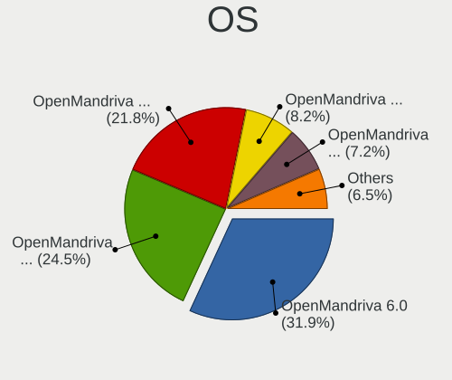

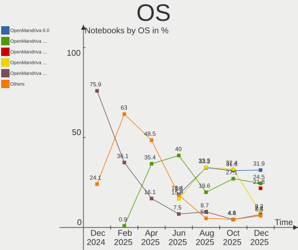

| Name               | Notebooks | Percent |
|--------------------|-----------|---------|
| OpenMandriva 6.0   | 133       | 31.89%  |
| OpenMandriva 25.90 | 102       | 24.46%  |
| OpenMandriva 25.11 | 91        | 21.82%  |
| OpenMandriva 25.06 | 34        | 8.15%   |
| OpenMandriva 24.12 | 30        | 7.19%   |
| OpenMandriva 5.0   | 6         | 1.44%   |
| OpenMandriva 23.08 | 6         | 1.44%   |
| OpenMandriva 24.07 | 5         | 1.2%    |
| OpenMandriva 25.04 | 3         | 0.72%   |
| OpenMandriva 4.3   | 2         | 0.48%   |
| OpenMandriva 4.2   | 1         | 0.24%   |
| OpenMandriva 25.01 | 1         | 0.24%   |
| OpenMandriva 24.90 | 1         | 0.24%   |
| OpenMandriva 24.09 | 1         | 0.24%   |
| OpenMandriva 23.03 | 1         | 0.24%   |

OS Family
---------

OS without a version

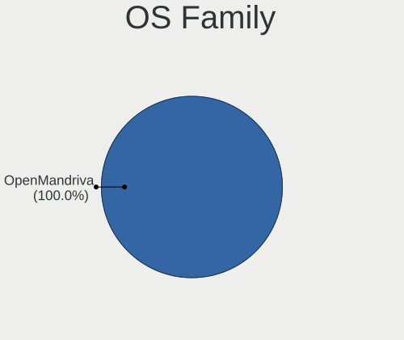

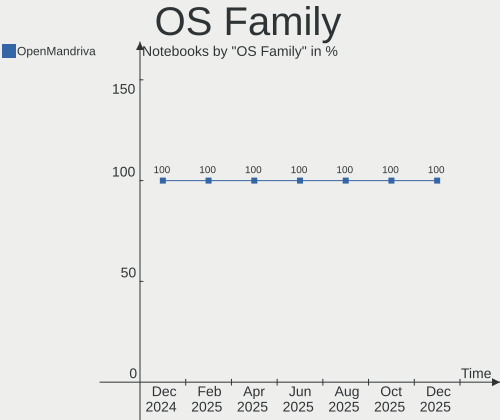

| Name         | Notebooks | Percent |
|--------------|-----------|---------|
| OpenMandriva | 417       | 100%    |

Kernel
------

Version of the Linux kernel

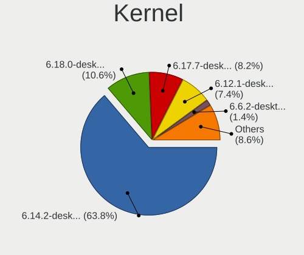

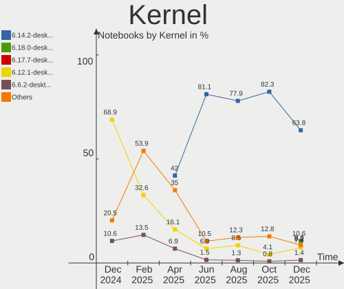

| Version                       | Notebooks | Percent |
|-------------------------------|-----------|---------|
| 6.14.2-desktop-3omv2590       | 266       | 63.79%  |
| 6.18.0-desktop-1omv2590       | 44        | 10.55%  |
| 6.17.7-desktop-1omv2590       | 34        | 8.15%   |
| 6.12.1-desktop-1omv2490       | 31        | 7.43%   |
| 6.6.2-desktop-1omv2390        | 6         | 1.44%   |
| 6.10.0-desktop-1omv2490       | 5         | 1.2%    |
| 6.17.4-desktop-1omv2590       | 4         | 0.96%   |
| 6.15.0-desktop-0.rc2.3omv2590 | 4         | 0.96%   |
| 6.4.8-desktop-2omv2390        | 3         | 0.72%   |
| 6.4.11-desktop-1omv2390       | 3         | 0.72%   |
| 6.18.0-desktop-0.rc4.2omv2590 | 3         | 0.72%   |
| 6.18.1-desktop-1omv2590       | 2         | 0.48%   |
| 5.16.7-desktop-1omv4003       | 2         | 0.48%   |
| 6.2.6-desktop-1omv2390        | 1         | 0.24%   |
| 6.18.2-zen2                   | 1         | 0.24%   |
| 6.17.8-desktop-1omv2590       | 1         | 0.24%   |
| 6.17.2-desktop-1omv2590       | 1         | 0.24%   |
| 6.14.0-desktop-0.rc7.2omv2590 | 1         | 0.24%   |
| 6.13.10-desktop-1omv2590      | 1         | 0.24%   |
| 6.12.9-desktop-1omv2490       | 1         | 0.24%   |
| 6.11.0-desktop-2omv2490       | 1         | 0.24%   |
| 6.10.9-desktop-1omv2490       | 1         | 0.24%   |
| 5.10.14-desktop-1omv4002      | 1         | 0.24%   |

Kernel Family
-------------

Linux kernel without a distro release

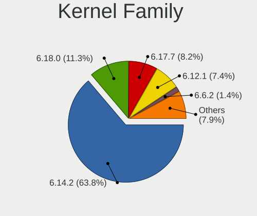

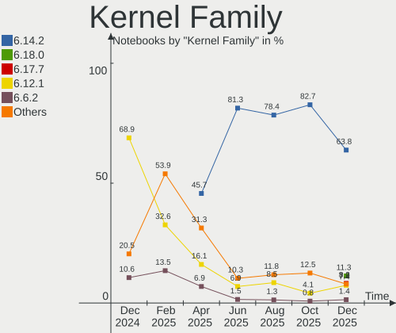

| Version | Notebooks | Percent |
|---------|-----------|---------|
| 6.14.2  | 266       | 63.79%  |
| 6.18.0  | 47        | 11.27%  |
| 6.17.7  | 34        | 8.15%   |
| 6.12.1  | 31        | 7.43%   |
| 6.6.2   | 6         | 1.44%   |
| 6.10.0  | 5         | 1.2%    |
| 6.17.4  | 4         | 0.96%   |
| 6.15.0  | 4         | 0.96%   |
| 6.4.8   | 3         | 0.72%   |
| 6.4.11  | 3         | 0.72%   |
| 6.18.1  | 2         | 0.48%   |
| 5.16.7  | 2         | 0.48%   |
| 6.2.6   | 1         | 0.24%   |
| 6.18.2  | 1         | 0.24%   |
| 6.17.8  | 1         | 0.24%   |
| 6.17.2  | 1         | 0.24%   |
| 6.14.0  | 1         | 0.24%   |
| 6.13.10 | 1         | 0.24%   |
| 6.12.9  | 1         | 0.24%   |
| 6.11.0  | 1         | 0.24%   |
| 6.10.9  | 1         | 0.24%   |
| 5.10.14 | 1         | 0.24%   |

Kernel Major Ver.
-----------------

Linux kernel major version

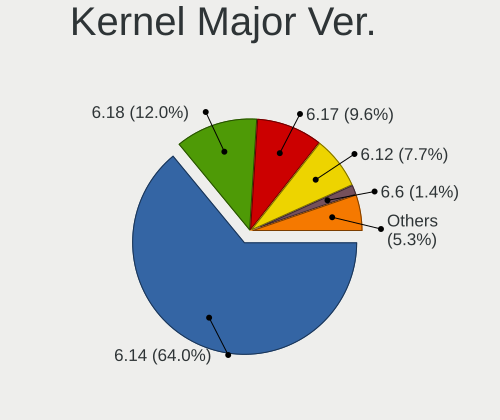

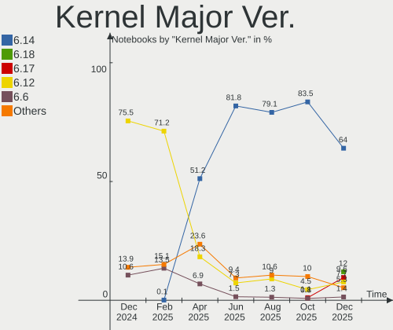

| Version | Notebooks | Percent |
|---------|-----------|---------|
| 6.14    | 267       | 64.03%  |
| 6.18    | 50        | 11.99%  |
| 6.17    | 40        | 9.59%   |
| 6.12    | 32        | 7.67%   |
| 6.6     | 6         | 1.44%   |
| 6.4     | 6         | 1.44%   |
| 6.10    | 6         | 1.44%   |
| 6.15    | 4         | 0.96%   |
| 5.16    | 2         | 0.48%   |
| 6.2     | 1         | 0.24%   |
| 6.13    | 1         | 0.24%   |
| 6.11    | 1         | 0.24%   |
| 5.10    | 1         | 0.24%   |

Arch
----

OS architecture (x86_64, i586, etc.)

| Name   | Notebooks | Percent |
|--------|-----------|---------|
| x86_64 | 417       | 100%    |

DE
--

Desktop Environment

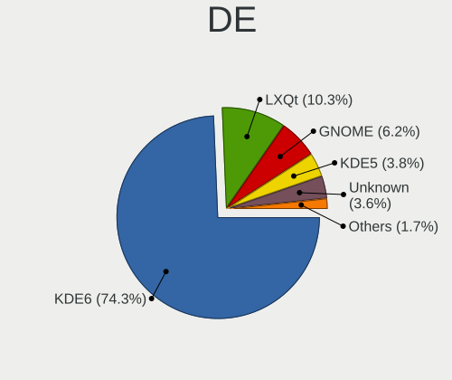

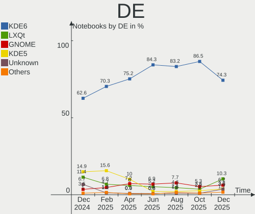

| Name     | Notebooks | Percent |
|----------|-----------|---------|
| KDE6     | 310       | 74.34%  |
| LXQt     | 43        | 10.31%  |
| GNOME    | 26        | 6.24%   |
| KDE5     | 16        | 3.84%   |
| Unknown  | 15        | 3.6%    |
| XFCE     | 3         | 0.72%   |
| Budgie   | 3         | 0.72%   |
| Cinnamon | 1         | 0.24%   |

Display Server
--------------

X11 or Wayland

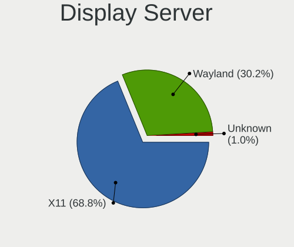

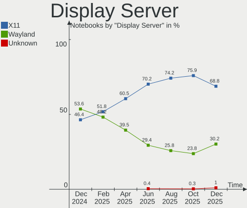

| Name    | Notebooks | Percent |
|---------|-----------|---------|
| X11     | 287       | 68.82%  |
| Wayland | 126       | 30.22%  |
| Unknown | 4         | 0.96%   |

Display Manager
---------------

SDDM, LightDM, etc.

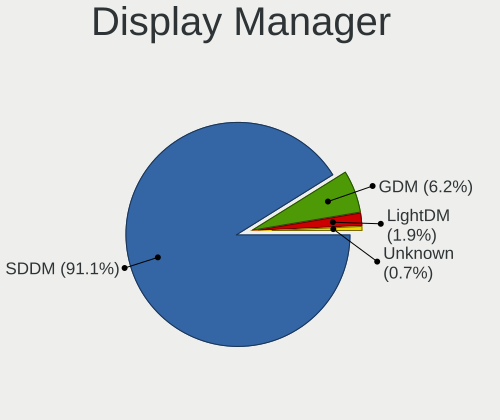

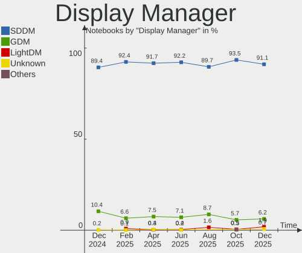

| Name    | Notebooks | Percent |
|---------|-----------|---------|
| SDDM    | 380       | 91.13%  |
| GDM     | 26        | 6.24%   |
| LightDM | 8         | 1.92%   |
| Unknown | 3         | 0.72%   |

OS Lang
-------

Language

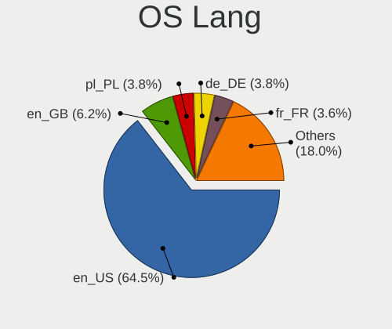

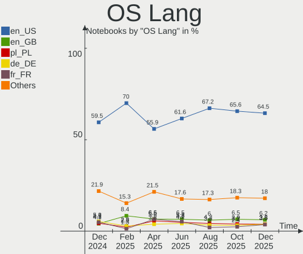

| Lang  | Notebooks | Percent |
|-------|-----------|---------|
| en_US | 269       | 64.51%  |
| en_GB | 26        | 6.24%   |
| pl_PL | 16        | 3.84%   |
| de_DE | 16        | 3.84%   |
| fr_FR | 15        | 3.6%    |
| ru_RU | 12        | 2.88%   |
| it_IT | 9         | 2.16%   |
| en_AU | 8         | 1.92%   |
| pt_BR | 6         | 1.44%   |
| es_MX | 6         | 1.44%   |
| es_ES | 6         | 1.44%   |
| en_CA | 3         | 0.72%   |
| hu_HU | 2         | 0.48%   |
| fr_CH | 2         | 0.48%   |
| en_PH | 2         | 0.48%   |
| en_NZ | 2         | 0.48%   |
| en_IN | 2         | 0.48%   |
| uk_UA | 1         | 0.24%   |
| tr_TR | 1         | 0.24%   |
| sv_SE | 1         | 0.24%   |
| nb_NO | 1         | 0.24%   |
| fr_CA | 1         | 0.24%   |
| fr_BE | 1         | 0.24%   |
| fi_FI | 1         | 0.24%   |
| es_PY | 1         | 0.24%   |
| es_CO | 1         | 0.24%   |
| es_CL | 1         | 0.24%   |
| es_AR | 1         | 0.24%   |
| en_SG | 1         | 0.24%   |
| en_DK | 1         | 0.24%   |
| de_AT | 1         | 0.24%   |
| af_ZA | 1         | 0.24%   |

Boot Mode
---------

EFI or BIOS

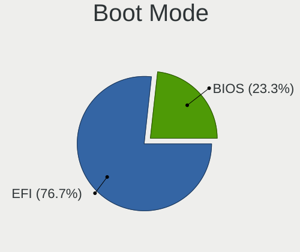

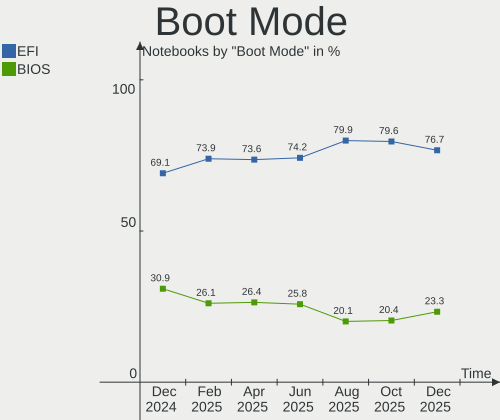

| Mode | Notebooks | Percent |
|------|-----------|---------|
| EFI  | 320       | 76.74%  |
| BIOS | 97        | 23.26%  |

Filesystem
----------

Type of filesystem

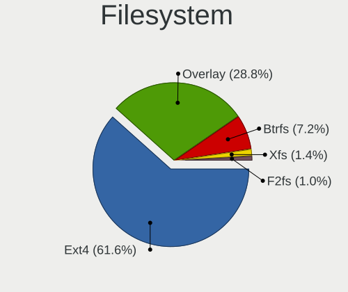

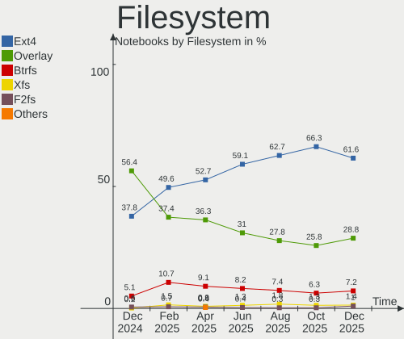

| Type    | Notebooks | Percent |
|---------|-----------|---------|
| Ext4    | 257       | 61.63%  |
| Overlay | 120       | 28.78%  |
| Btrfs   | 30        | 7.19%   |
| Xfs     | 6         | 1.44%   |
| F2fs    | 4         | 0.96%   |

Part. scheme
------------

Scheme of partitioning

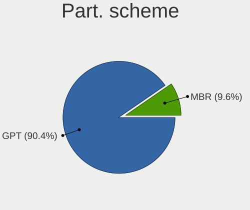

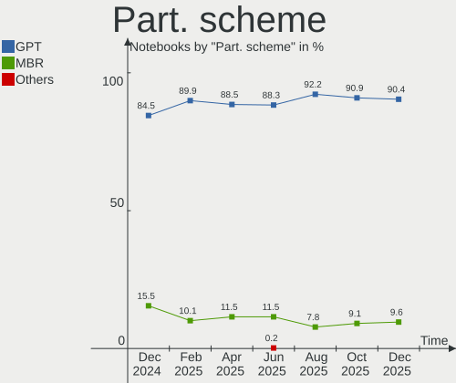

| Type | Notebooks | Percent |
|------|-----------|---------|
| GPT  | 377       | 90.41%  |
| MBR  | 40        | 9.59%   |

Dual Boot with Linux/BSD
------------------------

Hosting more than one Linux/BSD

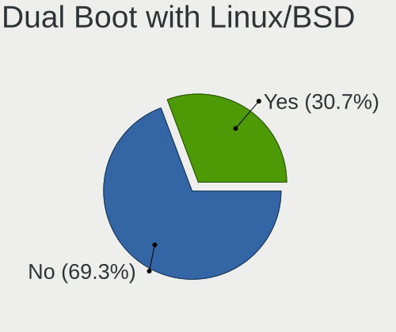

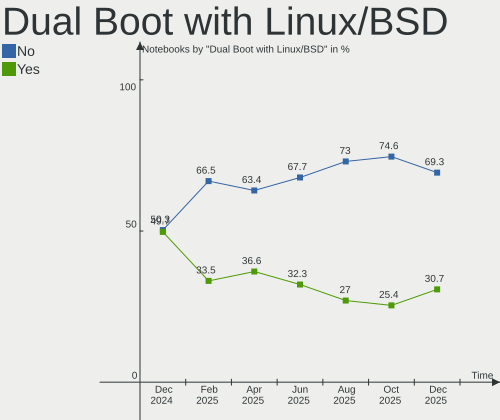

| Dual boot | Notebooks | Percent |
|-----------|-----------|---------|
| No        | 289       | 69.3%   |
| Yes       | 128       | 30.7%   |

Dual Boot (Win)
---------------

Hosting Linux and Windows

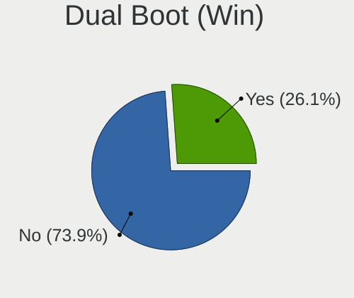

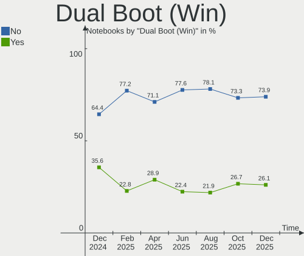

| Dual boot | Notebooks | Percent |
|-----------|-----------|---------|
| No        | 308       | 73.86%  |
| Yes       | 109       | 26.14%  |

Board
-----

Vendor
------

Motherboard manufacturer

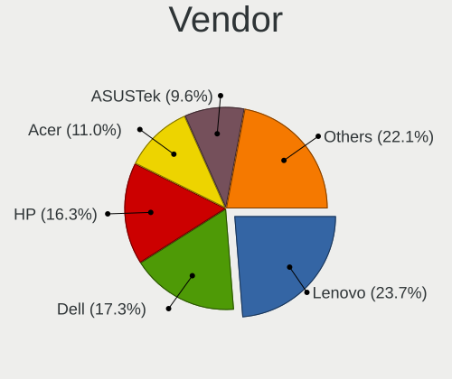

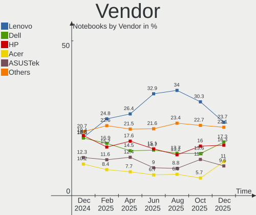

| Name                    | Notebooks | Percent |
|-------------------------|-----------|---------|
| Lenovo                  | 99        | 23.74%  |
| Dell                    | 72        | 17.27%  |
| Hewlett-Packard         | 68        | 16.31%  |
| Acer                    | 46        | 11.03%  |
| ASUSTek Computer        | 40        | 9.59%   |
| Framework               | 11        | 2.64%   |
| Google                  | 9         | 2.16%   |
| Apple                   | 8         | 1.92%   |
| Toshiba                 | 6         | 1.44%   |
| Samsung Electronics     | 5         | 1.2%    |
| MSI                     | 5         | 1.2%    |
| HUAWEI                  | 5         | 1.2%    |
| Unknown                 | 5         | 1.2%    |
| System76                | 3         | 0.72%   |
| Medion                  | 3         | 0.72%   |
| Core Innovations        | 3         | 0.72%   |
| TUXEDO                  | 2         | 0.48%   |
| Packard Bell            | 2         | 0.48%   |
| LG Electronics          | 2         | 0.48%   |
| Fujitsu                 | 2         | 0.48%   |
| eMachines               | 2         | 0.48%   |
| VSAP                    | 1         | 0.24%   |
| VIT                     | 1         | 0.24%   |
| Valve                   | 1         | 0.24%   |
| TongFang                | 1         | 0.24%   |
| SZ ReachingTech Limited | 1         | 0.24%   |
| Star Labs               | 1         | 0.24%   |
| Sony                    | 1         | 0.24%   |
| Panasonic               | 1         | 0.24%   |
| Notebook                | 1         | 0.24%   |
| NEC Computers           | 1         | 0.24%   |
| Metabox                 | 1         | 0.24%   |
| MECHREVO                | 1         | 0.24%   |
| LTD Delovoy Office      | 1         | 0.24%   |
| GPU Company             | 1         | 0.24%   |
| Entroware               | 1         | 0.24%   |
| COM1                    | 1         | 0.24%   |
| Chuwi                   | 1         | 0.24%   |
| American Megatrends     | 1         | 0.24%   |
| Alienware               | 1         | 0.24%   |

Model
-----

Motherboard model

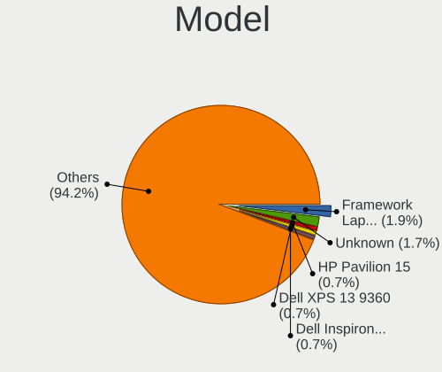

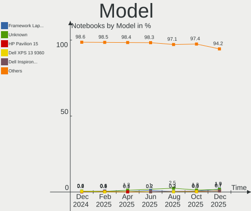

| Name                                       | Notebooks | Percent |
|--------------------------------------------|-----------|---------|
| Framework Laptop 13 (AMD Ryzen 7040Series) | 8         | 1.92%   |
| Unknown                                    | 7         | 1.68%   |
| HP Pavilion 15                             | 3         | 0.72%   |
| Dell XPS 13 9360                           | 3         | 0.72%   |
| Dell Inspiron 3521                         | 3         | 0.72%   |
| Core Innovations CLC14364                  | 3         | 0.72%   |
| System76 Lemur Pro                         | 2         | 0.48%   |
| Medion E11201                              | 2         | 0.48%   |
| Lenovo IdeaPad 3 15ITL6 82H8               | 2         | 0.48%   |
| Lenovo G50-45 80E3                         | 2         | 0.48%   |
| HP ProBook 450 G3                          | 2         | 0.48%   |
| HP Laptop 15-fd0xxx                        | 2         | 0.48%   |
| HP Laptop 15-fc0xxx                        | 2         | 0.48%   |
| HP Laptop 15-bw0xx                         | 2         | 0.48%   |
| HP Laptop 14-dq0xxx                        | 2         | 0.48%   |
| HP 15                                      | 2         | 0.48%   |
| Google Caroline                            | 2         | 0.48%   |
| Google Candy                               | 2         | 0.48%   |
| Dell XPS 15 9560                           | 2         | 0.48%   |
| Dell Precision 7530                        | 2         | 0.48%   |
| Dell Precision 5530                        | 2         | 0.48%   |
| Dell Precision 5510                        | 2         | 0.48%   |
| Dell Latitude 7480                         | 2         | 0.48%   |
| Dell Latitude 7430                         | 2         | 0.48%   |
| Dell Latitude 7300                         | 2         | 0.48%   |
| Dell Latitude 7290                         | 2         | 0.48%   |
| Dell Latitude 5410                         | 2         | 0.48%   |
| Dell Inspiron N5050                        | 2         | 0.48%   |
| ASUS VivoBook_ASUSLaptop X412DA_F412DA     | 2         | 0.48%   |
| ASUS G74Sx                                 | 2         | 0.48%   |
| VSAP VNJH-1402                             | 1         | 0.24%   |
| VIT P2400                                  | 1         | 0.24%   |
| Valve Jupiter                              | 1         | 0.24%   |
| TUXEDO Stellaris Slim 15 Intel Gen6        | 1         | 0.24%   |
| TUXEDO InfinityBook S Gen8                 | 1         | 0.24%   |
| Toshiba TECRA S11                          | 1         | 0.24%   |
| Toshiba TECRA R850                         | 1         | 0.24%   |
| Toshiba Satellite C855-1VV                 | 1         | 0.24%   |
| Toshiba Satellite C55-B                    | 1         | 0.24%   |
| Toshiba QOSMIO X70-A                       | 1         | 0.24%   |

Model Family
------------

Motherboard model prefix

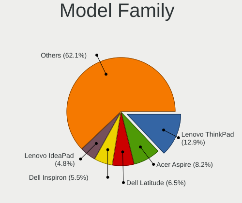

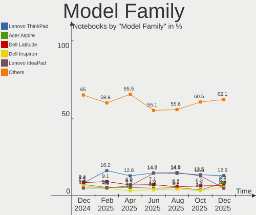

| Name                      | Notebooks | Percent |
|---------------------------|-----------|---------|
| Lenovo ThinkPad           | 54        | 12.95%  |
| Acer Aspire               | 34        | 8.15%   |
| Dell Latitude             | 27        | 6.47%   |
| Dell Inspiron             | 23        | 5.52%   |
| Lenovo IdeaPad            | 20        | 4.8%    |
| HP Laptop                 | 20        | 4.8%    |
| Dell Precision            | 12        | 2.88%   |
| Framework Laptop          | 11        | 2.64%   |
| ASUS VivoBook             | 11        | 2.64%   |
| HP ProBook                | 9         | 2.16%   |
| HP EliteBook              | 9         | 2.16%   |
| Dell XPS                  | 9         | 2.16%   |
| Unknown                   | 7         | 1.68%   |
| HP Pavilion               | 6         | 1.44%   |
| ASUS ROG                  | 5         | 1.2%    |
| Lenovo Legion             | 4         | 0.96%   |
| Lenovo ThinkBook          | 3         | 0.72%   |
| HP ZBook                  | 3         | 0.72%   |
| HP Stream                 | 3         | 0.72%   |
| HP Presario               | 3         | 0.72%   |
| Core Innovations CLC14364 | 3         | 0.72%   |
| ASUS Zenbook              | 3         | 0.72%   |
| ASUS TUF                  | 3         | 0.72%   |
| Acer TravelMate           | 3         | 0.72%   |
| Toshiba TECRA             | 2         | 0.48%   |
| Toshiba Satellite         | 2         | 0.48%   |
| System76 Lemur            | 2         | 0.48%   |
| MSI Katana                | 2         | 0.48%   |
| Medion E11201             | 2         | 0.48%   |
| Lenovo Yoga               | 2         | 0.48%   |
| Lenovo V15                | 2         | 0.48%   |
| Lenovo LOQ                | 2         | 0.48%   |
| Lenovo G50-45             | 2         | 0.48%   |
| HP Victus                 | 2         | 0.48%   |
| HP Compaq                 | 2         | 0.48%   |
| HP 15                     | 2         | 0.48%   |
| Google Caroline           | 2         | 0.48%   |
| Google Candy              | 2         | 0.48%   |
| ASUS G74Sx                | 2         | 0.48%   |
| Apple MacBookPro6         | 2         | 0.48%   |

MFG Year
--------

Motherboard manufacture year

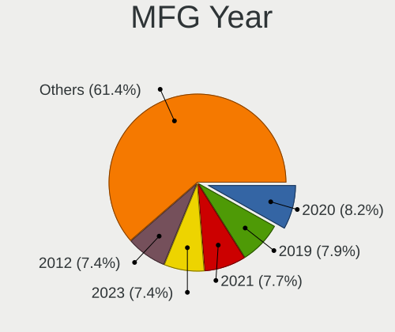

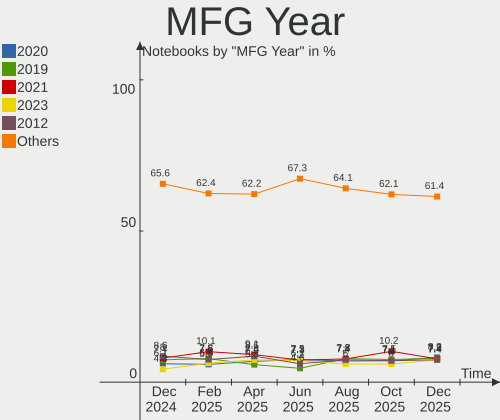

| Year | Notebooks | Percent |
|------|-----------|---------|
| 2020 | 34        | 8.15%   |
| 2019 | 33        | 7.91%   |
| 2021 | 32        | 7.67%   |
| 2023 | 31        | 7.43%   |
| 2012 | 31        | 7.43%   |
| 2011 | 30        | 7.19%   |
| 2022 | 26        | 6.24%   |
| 2024 | 24        | 5.76%   |
| 2017 | 24        | 5.76%   |
| 2025 | 23        | 5.52%   |
| 2018 | 23        | 5.52%   |
| 2013 | 23        | 5.52%   |
| 2015 | 21        | 5.04%   |
| 2016 | 19        | 4.56%   |
| 2010 | 14        | 3.36%   |
| 2014 | 10        | 2.4%    |
| 2009 | 7         | 1.68%   |
| 2008 | 7         | 1.68%   |
| 2007 | 3         | 0.72%   |
| 2006 | 2         | 0.48%   |

Form Factor
-----------

Physical design of the computer

| Name     | Notebooks | Percent |
|----------|-----------|---------|
| Notebook | 417       | 100%    |

Secure Boot
-----------

Enabled or disabled

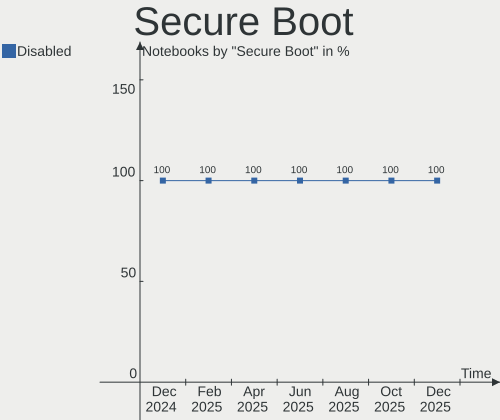

| State    | Notebooks | Percent |
|----------|-----------|---------|
| Disabled | 417       | 100%    |

Coreboot
--------

Have coreboot on board

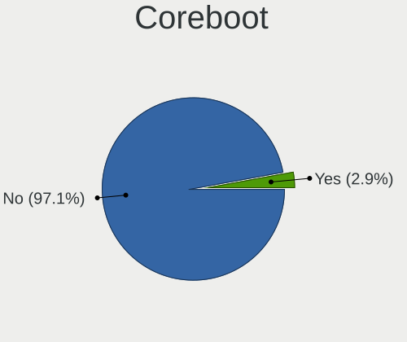

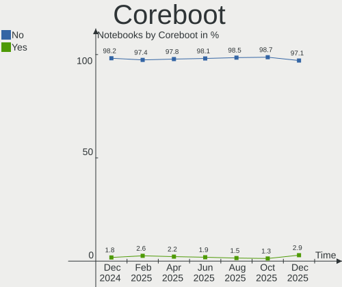

| Used | Notebooks | Percent |
|------|-----------|---------|
| No   | 405       | 97.12%  |
| Yes  | 12        | 2.88%   |

RAM Size
--------

Total RAM memory

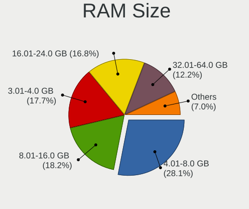

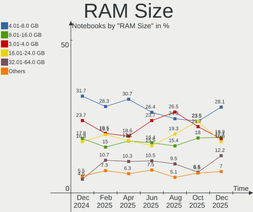

| Size in GB  | Notebooks | Percent |
|-------------|-----------|---------|
| 4.01-8.0    | 117       | 28.06%  |
| 8.01-16.0   | 76        | 18.23%  |
| 3.01-4.0    | 74        | 17.75%  |
| 16.01-24.0  | 70        | 16.79%  |
| 32.01-64.0  | 51        | 12.23%  |
| 64.01-256.0 | 9         | 2.16%   |
| 24.01-32.0  | 8         | 1.92%   |
| 2.01-3.0    | 7         | 1.68%   |
| 1.01-2.0    | 5         | 1.2%    |

RAM Used
--------

Used RAM memory

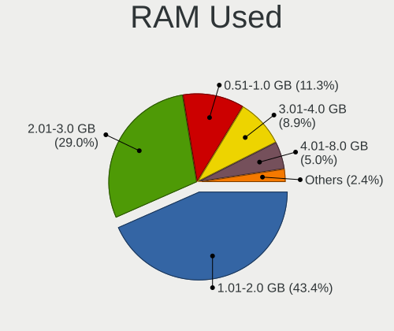

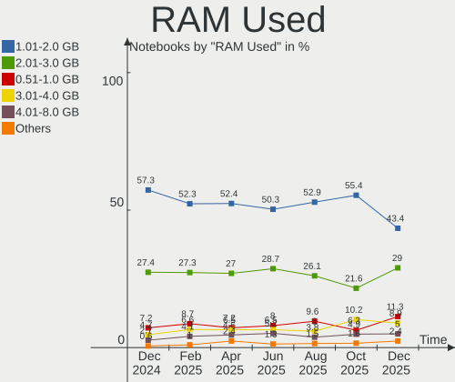

| Used GB    | Notebooks | Percent |
|------------|-----------|---------|
| 1.01-2.0   | 181       | 43.41%  |
| 2.01-3.0   | 121       | 29.02%  |
| 0.51-1.0   | 47        | 11.27%  |
| 3.01-4.0   | 37        | 8.87%   |
| 4.01-8.0   | 21        | 5.04%   |
| 0.01-0.5   | 5         | 1.2%    |
| 8.01-16.0  | 4         | 0.96%   |
| 16.01-24.0 | 1         | 0.24%   |

Total Drives
------------

Number of drives on board

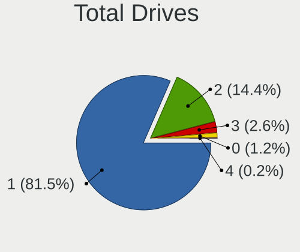

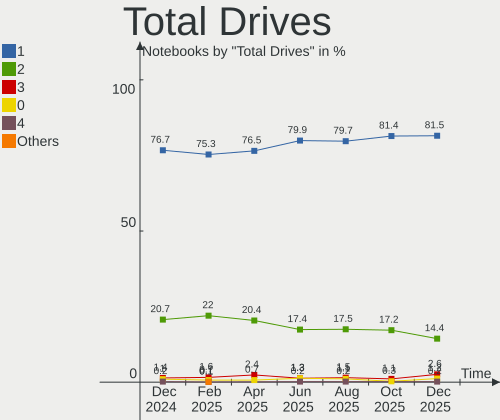

| Drives | Notebooks | Percent |
|--------|-----------|---------|
| 1      | 340       | 81.53%  |
| 2      | 60        | 14.39%  |
| 3      | 11        | 2.64%   |
| 0      | 5         | 1.2%    |
| 4      | 1         | 0.24%   |

Has CD-ROM
----------

Has CD-ROM on board

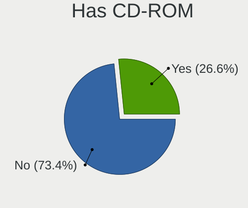

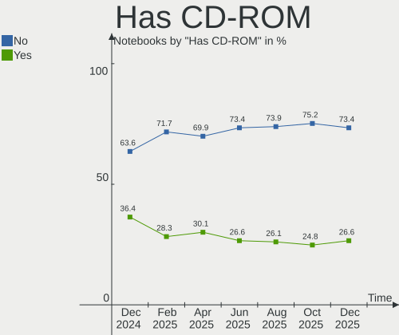

| Presented | Notebooks | Percent |
|-----------|-----------|---------|
| No        | 306       | 73.38%  |
| Yes       | 111       | 26.62%  |

Has Ethernet
------------

Has Ethernet on board

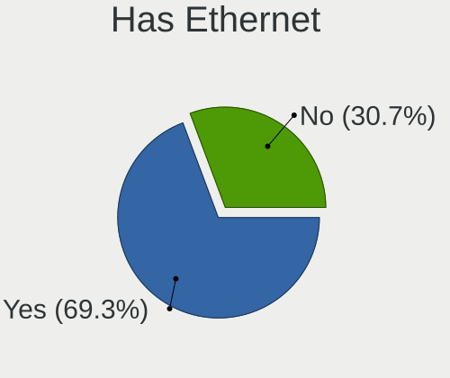

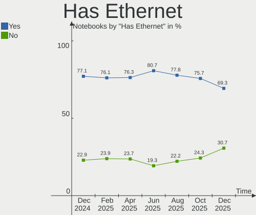

| Presented | Notebooks | Percent |
|-----------|-----------|---------|
| Yes       | 289       | 69.3%   |
| No        | 128       | 30.7%   |

Has WiFi
--------

Has WiFi module

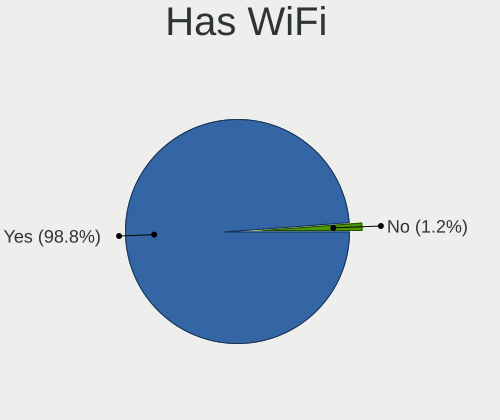

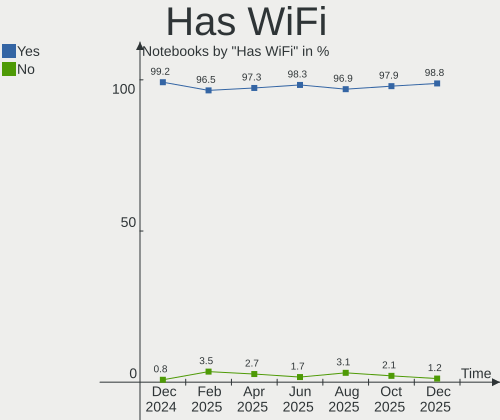

| Presented | Notebooks | Percent |
|-----------|-----------|---------|
| Yes       | 412       | 98.8%   |
| No        | 5         | 1.2%    |

Has Bluetooth
-------------

Has Bluetooth module

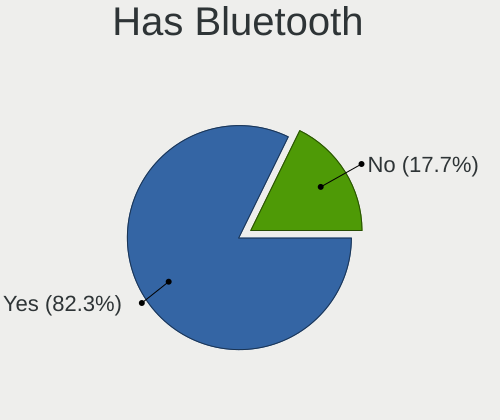

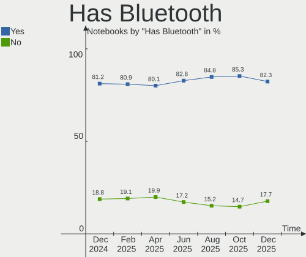

| Presented | Notebooks | Percent |
|-----------|-----------|---------|
| Yes       | 343       | 82.25%  |
| No        | 74        | 17.75%  |

Location
--------

Country
-------

Geographic location (country)

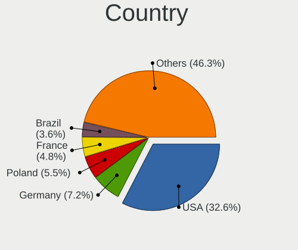

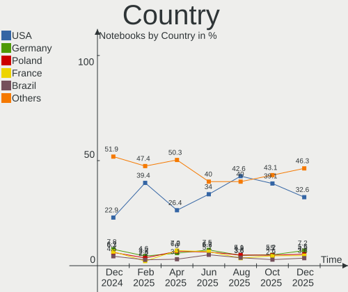

| Country     | Notebooks | Percent |
|-------------|-----------|---------|
| USA         | 136       | 32.61%  |
| Germany     | 30        | 7.19%   |
| Poland      | 23        | 5.52%   |
| France      | 20        | 4.8%    |
| Brazil      | 15        | 3.6%    |
| Australia   | 15        | 3.6%    |
| UK          | 14        | 3.36%   |
| Italy       | 12        | 2.88%   |
| Russia      | 11        | 2.64%   |
| Spain       | 10        | 2.4%    |
| Canada      | 9         | 2.16%   |
| Indonesia   | 8         | 1.92%   |
| Mexico      | 7         | 1.68%   |
| Sweden      | 6         | 1.44%   |
| India       | 4         | 0.96%   |
| Chile       | 4         | 0.96%   |
| Belarus     | 4         | 0.96%   |
| Venezuela   | 3         | 0.72%   |
| Switzerland | 3         | 0.72%   |
| Lithuania   | 3         | 0.72%   |
| Japan       | 3         | 0.72%   |
| Iran        | 3         | 0.72%   |
| Hungary     | 3         | 0.72%   |
| Greece      | 3         | 0.72%   |
| Finland     | 3         | 0.72%   |
| Denmark     | 3         | 0.72%   |
| Croatia     | 3         | 0.72%   |
| China       | 3         | 0.72%   |
| Bulgaria    | 3         | 0.72%   |
| Austria     | 3         | 0.72%   |
| Vietnam     | 2         | 0.48%   |
| Turkey      | 2         | 0.48%   |
| Philippines | 2         | 0.48%   |
| Norway      | 2         | 0.48%   |
| New Zealand | 2         | 0.48%   |
| Netherlands | 2         | 0.48%   |
| Malaysia    | 2         | 0.48%   |
| Czechia     | 2         | 0.48%   |
| Cyprus      | 2         | 0.48%   |
| Colombia    | 2         | 0.48%   |

City
----

Geographic location (city)

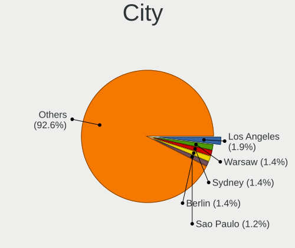

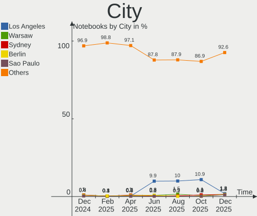

| City              | Notebooks | Percent |
|-------------------|-----------|---------|
| Los Angeles       | 8         | 1.92%   |
| Warsaw            | 6         | 1.44%   |
| Sydney            | 6         | 1.44%   |
| Berlin            | 6         | 1.44%   |
| Sao Paulo         | 5         | 1.2%    |
| Milan             | 4         | 0.96%   |
| Vilnius           | 3         | 0.72%   |
| Torun             | 3         | 0.72%   |
| Paris             | 3         | 0.72%   |
| Orange            | 3         | 0.72%   |
| Minsk             | 3         | 0.72%   |
| Krakow            | 3         | 0.72%   |
| Guyancourt        | 3         | 0.72%   |
| Brisbane          | 3         | 0.72%   |
| Zapopan           | 2         | 0.48%   |
| Vienna            | 2         | 0.48%   |
| Upplands Vasby    | 2         | 0.48%   |
| Topeka            | 2         | 0.48%   |
| Thessaloniki      | 2         | 0.48%   |
| Sofia             | 2         | 0.48%   |
| Seattle           | 2         | 0.48%   |
| Sanford           | 2         | 0.48%   |
| San Francisco     | 2         | 0.48%   |
| Saint Joseph      | 2         | 0.48%   |
| Round Rock        | 2         | 0.48%   |
| Rome              | 2         | 0.48%   |
| Rio de Janeiro    | 2         | 0.48%   |
| Phoenix           | 2         | 0.48%   |
| Olivet            | 2         | 0.48%   |
| Novosibirsk       | 2         | 0.48%   |
| Munich            | 2         | 0.48%   |
| Melbourne         | 2         | 0.48%   |
| London            | 2         | 0.48%   |
| Little Rock       | 2         | 0.48%   |
| Knoxville         | 2         | 0.48%   |
| Karawang          | 2         | 0.48%   |
| Holley            | 2         | 0.48%   |
| Hamburg           | 2         | 0.48%   |
| Frankfurt am Main | 2         | 0.48%   |
| Fairbanks         | 2         | 0.48%   |

Drives
------

Drive Vendor
------------

Hard drive vendors

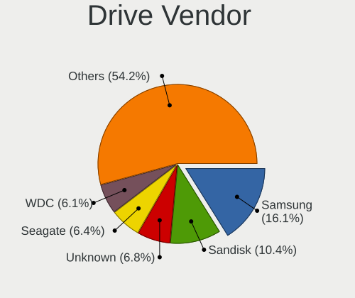

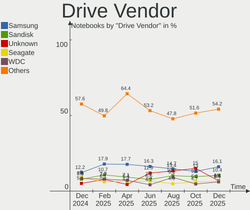

| Vendor                       | Notebooks | Drives | Percent |
|------------------------------|-----------|--------|---------|
| Samsung Electronics          | 76        | 82     | 16.1%   |
| Sandisk                      | 49        | 50     | 10.38%  |
| Unknown                      | 32        | 36     | 6.78%   |
| Seagate                      | 30        | 30     | 6.36%   |
| WDC                          | 29        | 30     | 6.14%   |
| Toshiba                      | 28        | 28     | 5.93%   |
| Micron Technology            | 23        | 23     | 4.87%   |
| Kingston                     | 20        | 20     | 4.24%   |
| SK hynix                     | 19        | 20     | 4.03%   |
| KIOXIA                       | 12        | 12     | 2.54%   |
| China                        | 12        | 12     | 2.54%   |
| Intel                        | 11        | 12     | 2.33%   |
| Crucial                      | 10        | 10     | 2.12%   |
| Kingston Technology Company  | 9         | 9      | 1.91%   |
| Phison Electronics           | 7         | 8      | 1.48%   |
| Micron/Crucial Technology    | 7         | 8      | 1.48%   |
| Hitachi                      | 7         | 7      | 1.48%   |
| HGST                         | 6         | 6      | 1.27%   |
| SPCC                         | 5         | 5      | 1.06%   |
| Patriot                      | 5         | 5      | 1.06%   |
| MAXIO Technology (Hangzhou)  | 5         | 5      | 1.06%   |
| Silicon Motion               | 4         | 4      | 0.85%   |
| PNY                          | 4         | 4      | 0.85%   |
| GOODRAM                      | 4         | 4      | 0.85%   |
| Apple                        | 4         | 4      | 0.85%   |
| A-DATA Technology            | 4         | 4      | 0.85%   |
| Union Memory (Shenzhen)      | 3         | 3      | 0.64%   |
| Team                         | 3         | 3      | 0.64%   |
| Shenzhen Longsys Electronics | 3         | 3      | 0.64%   |
| ADATA Technology             | 3         | 3      | 0.64%   |
| Unknown                      | 3         | 3      | 0.64%   |
| Verbatim                     | 2         | 2      | 0.42%   |
| LITEONIT                     | 2         | 3      | 0.42%   |
| Fujitsu                      | 2         | 2      | 0.42%   |
| Zheino                       | 1         | 1      | 0.21%   |
| XUM                          | 1         | 1      | 0.21%   |
| XRISS                        | 1         | 1      | 0.21%   |
| Wibtek                       | 1         | 1      | 0.21%   |
| WALRAM                       | 1         | 1      | 0.21%   |
| VC-500                       | 1         | 1      | 0.21%   |

Drive Model
-----------

Hard drive models

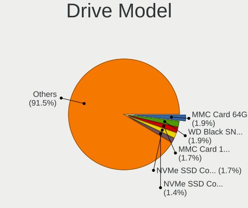

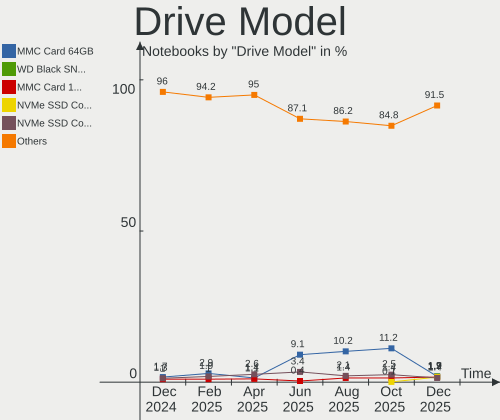

| Model                                                                   | Notebooks | Percent |
|-------------------------------------------------------------------------|-----------|---------|
| Unknown MMC Card  64GB                                                  | 9         | 1.86%   |
| Sandisk WD Black SN770 / PC SN740 256GB / PC SN560 (DRAM-less) NVMe SSD | 9         | 1.86%   |
| Unknown MMC Card  128GB                                                 | 8         | 1.65%   |
| Samsung NVMe SSD Controller 980 (DRAM-less) 256GB                       | 8         | 1.65%   |
| Samsung NVMe SSD Controller SM981/PM981/PM983 1TB                       | 7         | 1.45%   |
| Samsung NVMe SSD Controller PM9A1/PM9A3/980PRO 1TB                      | 7         | 1.45%   |
| Unknown MMC Card  32GB                                                  | 6         | 1.24%   |
| Toshiba XG6 NVMe SSD Controller 1024GB                                  | 6         | 1.24%   |
| Seagate ST1000LM035-1RK172 1TB                                          | 6         | 1.24%   |
| Unknown SD/MMC/MS PRO 2GB                                               | 4         | 0.83%   |
| Unknown MMC Card  16GB                                                  | 4         | 0.83%   |
| Toshiba MQ01ABD100 1TB                                                  | 4         | 0.83%   |
| Seagate ST500LT012-1DG142 500GB                                         | 4         | 0.83%   |
| Sandisk WD Blue SN550 NVMe SSD 1024GB                                   | 4         | 0.83%   |
| Samsung SSD 870 EVO 500GB                                               | 4         | 0.83%   |
| Samsung NVMe SSD Controller SM961/PM961/SM963 1024GB                    | 4         | 0.83%   |
| Kingston SA400S37960G 960GB SSD                                         | 4         | 0.83%   |
| Crucial CT500MX500SSD1 500GB                                            | 4         | 0.83%   |
| WDC WD10JPVX-22JC3T0 1TB                                                | 3         | 0.62%   |
| SK hynix BC501 NVMe Solid State Drive 512GB                             | 3         | 0.62%   |
| Silicon Motion SM2263EN/SM2263XT SSD Controller 512GB                   | 3         | 0.62%   |
| Samsung SSD 840 EVO 250GB                                               | 3         | 0.62%   |
| Samsung NVMe SSD Controller PM9C1a (DRAM-less) 1TB                      | 3         | 0.62%   |
| MAXIO (Hangzhou) NVMe SSD Controller MAP1202 2TB                        | 3         | 0.62%   |
| Kingston Company OM3PDP3 NVMe SSD 256GB                                 | 3         | 0.62%   |
| Intel SSD 660P Series 512GB                                             | 3         | 0.62%   |
| China SATA SSD 512GB                                                    | 3         | 0.62%   |
| Unknown                                                                 | 3         | 0.62%   |
| WDC WD5000LPCX-21VHAT0 500GB                                            | 2         | 0.41%   |
| Unknown MMC Card  256GB                                                 | 2         | 0.41%   |
| Toshiba XG4 NVMe SSD Controller 256GB                                   | 2         | 0.41%   |
| SPCC Solid State Disk 256GB                                             | 2         | 0.41%   |
| SK hynix BC901 NVMe Solid State Drive (DRAM-less) 512GB                 | 2         | 0.41%   |
| SK hynix BC511 512GB                                                    | 2         | 0.41%   |
| Seagate ST9500325AS 500GB                                               | 2         | 0.41%   |
| Seagate ST9320325AS 320GB                                               | 2         | 0.41%   |
| Seagate ST2000LM007-1R8174 2TB                                          | 2         | 0.41%   |
| Seagate ST1000LM048-2E7172 1TB                                          | 2         | 0.41%   |
| Seagate ST1000LM024 HN-M101MBB 1TB                                      | 2         | 0.41%   |
| Sandisk WD Blue SN500 / PC SN520 NVMe SSD 128GB                         | 2         | 0.41%   |

HDD Vendor
----------

Hard disk drive vendors

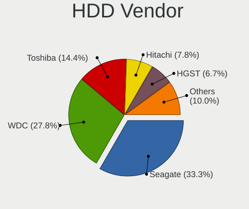

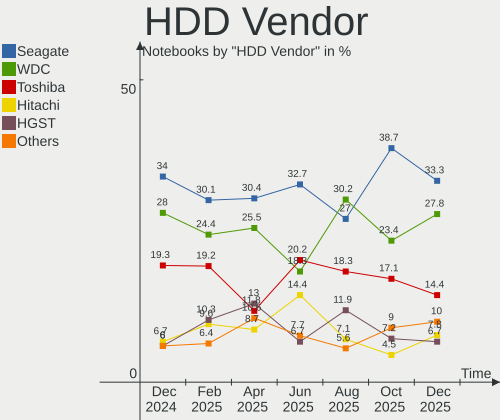

| Vendor              | Notebooks | Drives | Percent |
|---------------------|-----------|--------|---------|
| Seagate             | 30        | 30     | 33.33%  |
| WDC                 | 25        | 26     | 27.78%  |
| Toshiba             | 13        | 13     | 14.44%  |
| Hitachi             | 7         | 7      | 7.78%   |
| HGST                | 6         | 6      | 6.67%   |
| Unknown             | 4         | 4      | 4.44%   |
| Fujitsu             | 2         | 2      | 2.22%   |
| Samsung Electronics | 1         | 1      | 1.11%   |
| KIOXIA              | 1         | 1      | 1.11%   |
| Apple               | 1         | 1      | 1.11%   |

SSD Vendor
----------

Solid state drive vendors

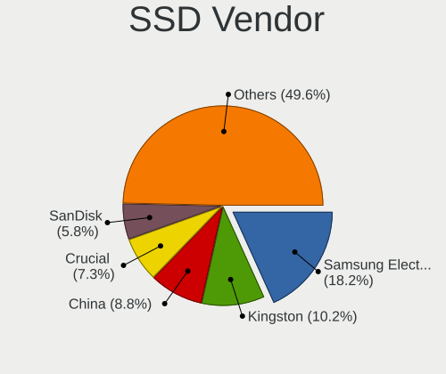

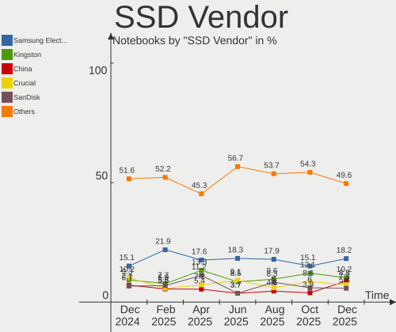

| Vendor              | Notebooks | Drives | Percent |
|---------------------|-----------|--------|---------|
| Samsung Electronics | 25        | 25     | 18.25%  |
| Kingston            | 14        | 14     | 10.22%  |
| China               | 12        | 12     | 8.76%   |
| Crucial             | 10        | 10     | 7.3%    |
| SanDisk             | 8         | 9      | 5.84%   |
| SPCC                | 4         | 4      | 2.92%   |
| PNY                 | 4         | 4      | 2.92%   |
| Patriot             | 4         | 4      | 2.92%   |
| Intel               | 4         | 4      | 2.92%   |
| GOODRAM             | 4         | 4      | 2.92%   |
| A-DATA Technology   | 4         | 4      | 2.92%   |
| WDC                 | 3         | 3      | 2.19%   |
| Team                | 3         | 3      | 2.19%   |
| Apple               | 3         | 3      | 2.19%   |
| Verbatim            | 2         | 2      | 1.46%   |
| Toshiba             | 2         | 2      | 1.46%   |
| LITEONIT            | 2         | 3      | 1.46%   |
| Zheino              | 1         | 1      | 0.73%   |
| XUM                 | 1         | 1      | 0.73%   |
| XRISS               | 1         | 1      | 0.73%   |
| Wibtek              | 1         | 1      | 0.73%   |
| WALRAM              | 1         | 1      | 0.73%   |
| VC-500              | 1         | 1      | 0.73%   |
| TOPGIANT            | 1         | 1      | 0.73%   |
| tecmiyo             | 1         | 1      | 0.73%   |
| Star                | 1         | 1      | 0.73%   |
| Smartbuy            | 1         | 1      | 0.73%   |
| SKIHOTAR            | 1         | 1      | 0.73%   |
| SK hynix            | 1         | 1      | 0.73%   |
| Ramaxel Technology  | 1         | 1      | 0.73%   |
| Palit               | 1         | 1      | 0.73%   |
| Netac               | 1         | 1      | 0.73%   |
| Micron Technology   | 1         | 1      | 0.73%   |
| LITEON              | 1         | 1      | 0.73%   |
| Lexar               | 1         | 1      | 0.73%   |
| Leven               | 1         | 1      | 0.73%   |
| KIOXIA-EXCERIA      | 1         | 1      | 0.73%   |
| Getrich             | 1         | 1      | 0.73%   |
| EDGE                | 1         | 1      | 0.73%   |
| DST6128-SSD         | 1         | 1      | 0.73%   |

Drive Kind
----------

HDD or SSD

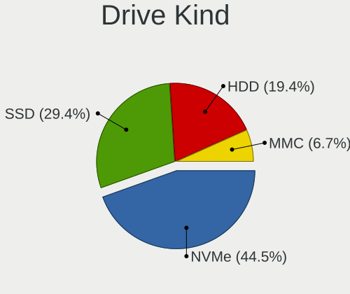

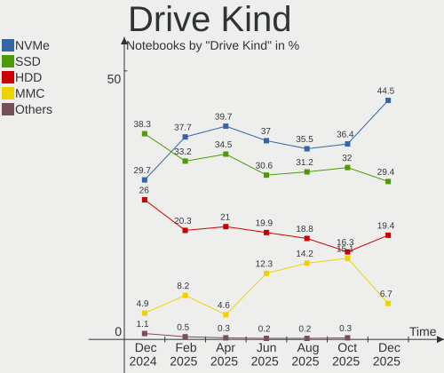

| Kind | Notebooks | Drives | Percent |
|------|-----------|--------|---------|
| NVMe | 200       | 225    | 44.54%  |
| SSD  | 132       | 139    | 29.4%   |
| HDD  | 87        | 91     | 19.38%  |
| MMC  | 30        | 34     | 6.68%   |

Drive Connector
---------------

SATA, SAS, NVMe, etc.

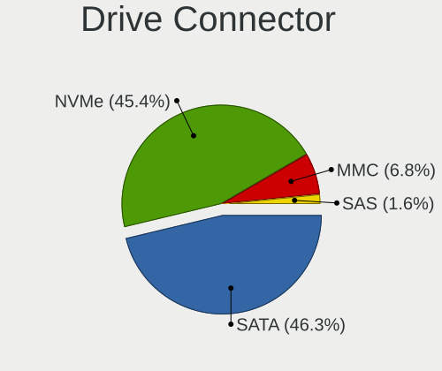

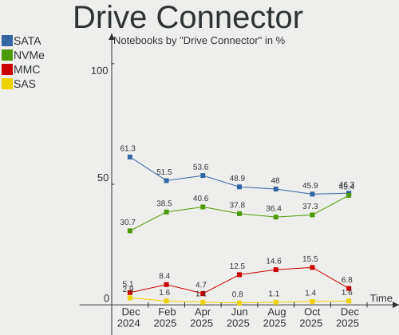

| Type | Notebooks | Drives | Percent |
|------|-----------|--------|---------|
| SATA | 204       | 223    | 46.26%  |
| NVMe | 200       | 225    | 45.35%  |
| MMC  | 30        | 34     | 6.8%    |
| SAS  | 7         | 7      | 1.59%   |

Drive Size
----------

Size of hard drive

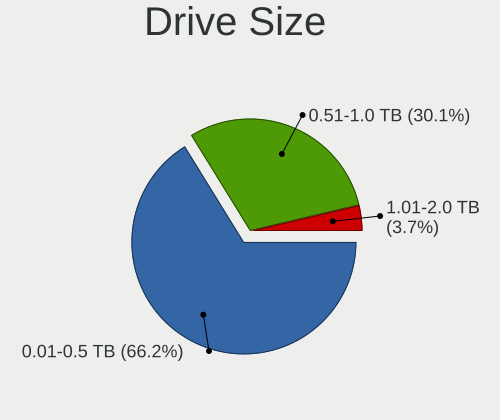

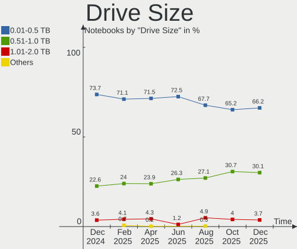

| Size in TB | Notebooks | Drives | Percent |
|------------|-----------|--------|---------|
| 0.01-0.5   | 143       | 154    | 66.2%   |
| 0.51-1.0   | 65        | 68     | 30.09%  |
| 1.01-2.0   | 8         | 8      | 3.7%    |

Space Total
-----------

Amount of disk space available on the file system

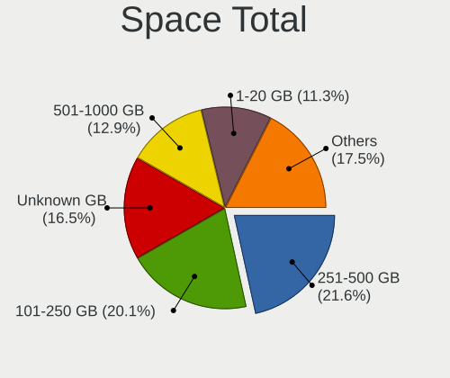

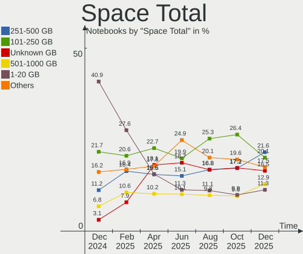

| Size in GB     | Notebooks | Percent |
|----------------|-----------|---------|
| 251-500        | 90        | 21.58%  |
| 101-250        | 84        | 20.14%  |
| Unknown        | 69        | 16.55%  |
| 501-1000       | 54        | 12.95%  |
| 1-20           | 47        | 11.27%  |
| 51-100         | 24        | 5.76%   |
| 1001-2000      | 20        | 4.8%    |
| 21-50          | 11        | 2.64%   |
| 2001-3000      | 11        | 2.64%   |
| More than 3000 | 7         | 1.68%   |

Space Used
----------

Amount of used disk space

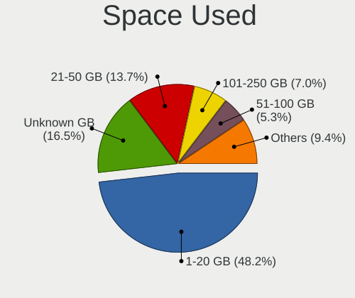

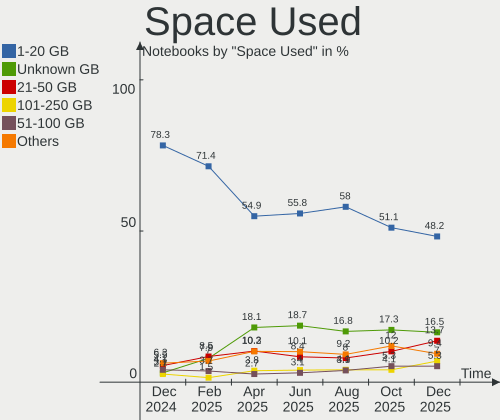

| Used GB        | Notebooks | Percent |
|----------------|-----------|---------|
| 1-20           | 201       | 48.2%   |
| Unknown        | 69        | 16.55%  |
| 21-50          | 57        | 13.67%  |
| 101-250        | 29        | 6.95%   |
| 51-100         | 22        | 5.28%   |
| 0              | 17        | 4.08%   |
| 251-500        | 12        | 2.88%   |
| 1001-2000      | 6         | 1.44%   |
| 501-1000       | 3         | 0.72%   |
| More than 3000 | 1         | 0.24%   |

Malfunc. Drives
---------------

Drive models with a malfunction

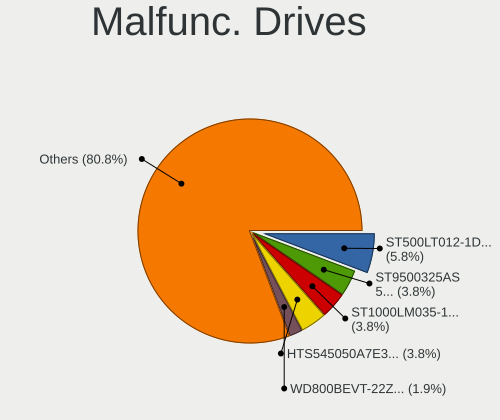

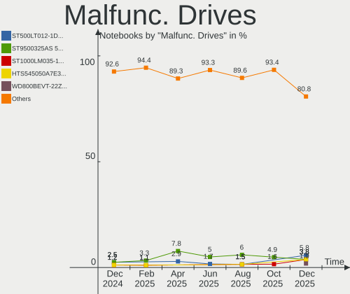

| Model                                                            | Notebooks | Drives | Percent |
|------------------------------------------------------------------|-----------|--------|---------|
| Seagate ST500LT012-1DG142 500GB                                  | 3         | 3      | 5.77%   |
| Seagate ST9500325AS 500GB                                        | 2         | 2      | 3.85%   |
| Seagate ST1000LM035-1RK172 1TB                                   | 2         | 2      | 3.85%   |
| Hitachi HTS545050A7E380 500GB                                    | 2         | 2      | 3.85%   |
| WDC WD800BEVT-22ZCT0 80GB                                        | 1         | 1      | 1.92%   |
| WDC WD5000LPCX-24VHAT0 500GB                                     | 1         | 1      | 1.92%   |
| WDC WD3200BEVT-26A23T0 320GB                                     | 1         | 1      | 1.92%   |
| WDC WD10SPZX-35Z10T0 1TB                                         | 1         | 1      | 1.92%   |
| WDC WD10SPZX-24Z10 1TB                                           | 1         | 1      | 1.92%   |
| WDC WD10JPVX-60JC3T0 1TB                                         | 1         | 1      | 1.92%   |
| Toshiba MQ01ACF050 500GB                                         | 1         | 1      | 1.92%   |
| Toshiba MQ01ABD100 1TB                                           | 1         | 1      | 1.92%   |
| Toshiba MK3276GSX 320GB                                          | 1         | 1      | 1.92%   |
| Toshiba KSG60ZMV512G M.2 2280 512GB SSD                          | 1         | 1      | 1.92%   |
| Seagate ST9500420ASG 500GB                                       | 1         | 1      | 1.92%   |
| Seagate ST9320423AS 320GB                                        | 1         | 1      | 1.92%   |
| Seagate ST9320325AS 320GB                                        | 1         | 1      | 1.92%   |
| Seagate ST9250410AS 250GB                                        | 1         | 1      | 1.92%   |
| Seagate ST9120817AS 120GB                                        | 1         | 1      | 1.92%   |
| Seagate ST750LM022 HN-M750MBB 752GB                              | 1         | 1      | 1.92%   |
| Seagate ST320LT012-9WS14C 320GB                                  | 1         | 1      | 1.92%   |
| Seagate ST2000LM007-1R8174 2TB                                   | 1         | 1      | 1.92%   |
| Seagate ST1000LM024 HN-M101MBB 1TB                               | 1         | 1      | 1.92%   |
| Sandisk WD Black SN850 1TB                                       | 1         | 1      | 1.92%   |
| SanDisk SSD U100 24GB                                            | 1         | 1      | 1.92%   |
| Samsung Electronics SSD 980 1TB                                  | 1         | 1      | 1.92%   |
| Samsung Electronics SSD 840 Series 120GB                         | 1         | 1      | 1.92%   |
| Samsung Electronics NVMe SSD Controller SM961/PM961/SM963 1024GB | 1         | 1      | 1.92%   |
| Samsung Electronics NVMe SSD Controller SM951/PM951 128GB        | 1         | 1      | 1.92%   |
| Samsung Electronics HM321HI 320GB                                | 1         | 1      | 1.92%   |
| Micron Technology 1100_MTFDDAK2T0TBN 2TB SSD                     | 1         | 1      | 1.92%   |
| LITEONIT CMT-128L3M 128GB SSD                                    | 1         | 2      | 1.92%   |
| Kingston SA400S37 240G SSD                                       | 1         | 1      | 1.92%   |
| Intel SSDSCKKF256G8H 256GB                                       | 1         | 1      | 1.92%   |
| Intel SSDSC2BX200G4R 200GB                                       | 1         | 1      | 1.92%   |
| Intel SSDSC2BF180A4L 180GB                                       | 1         | 1      | 1.92%   |
| Hitachi HTS727575A9E364 752GB                                    | 1         | 1      | 1.92%   |
| Hitachi HTS545032B9A300 320GB                                    | 1         | 1      | 1.92%   |
| Hitachi HTS545025B9A300 250GB                                    | 1         | 1      | 1.92%   |
| HGST HTS725050A7E630 500GB                                       | 1         | 1      | 1.92%   |

Malfunc. Drive Vendor
---------------------

Vendors of faulty drives

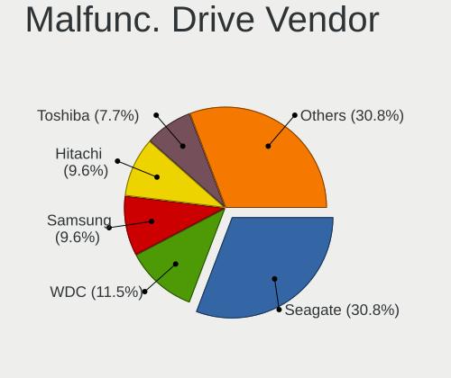

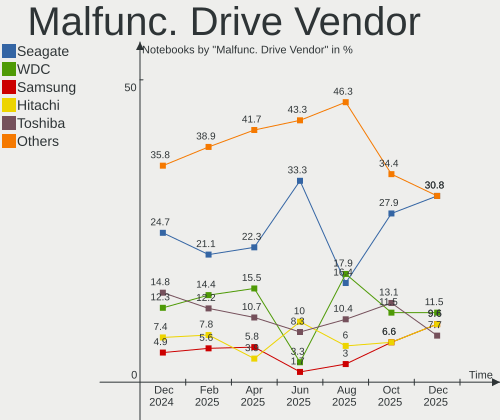

| Vendor              | Notebooks | Drives | Percent |
|---------------------|-----------|--------|---------|
| Seagate             | 16        | 16     | 30.77%  |
| WDC                 | 6         | 6      | 11.54%  |
| Samsung Electronics | 5         | 5      | 9.62%   |
| Hitachi             | 5         | 5      | 9.62%   |
| Toshiba             | 4         | 4      | 7.69%   |
| HGST                | 4         | 4      | 7.69%   |
| Intel               | 3         | 3      | 5.77%   |
| Sandisk             | 2         | 2      | 3.85%   |
| Micron Technology   | 1         | 1      | 1.92%   |
| LITEONIT            | 1         | 2      | 1.92%   |
| Kingston            | 1         | 1      | 1.92%   |
| Fujitsu             | 1         | 1      | 1.92%   |
| Dogfish             | 1         | 1      | 1.92%   |
| Crucial             | 1         | 1      | 1.92%   |
| A-DATA Technology   | 1         | 1      | 1.92%   |

Malfunc. HDD Vendor
-------------------

Vendors of faulty HDD drives

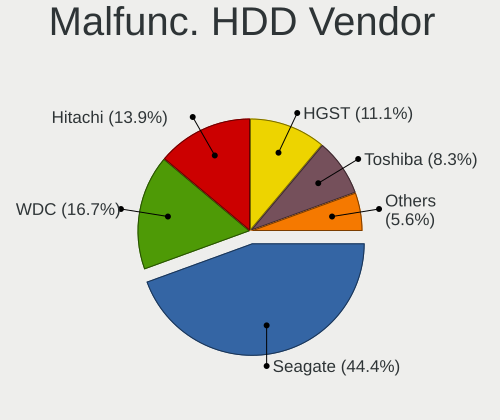

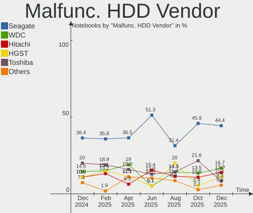

| Vendor              | Notebooks | Drives | Percent |
|---------------------|-----------|--------|---------|
| Seagate             | 16        | 16     | 44.44%  |
| WDC                 | 6         | 6      | 16.67%  |
| Hitachi             | 5         | 5      | 13.89%  |
| HGST                | 4         | 4      | 11.11%  |
| Toshiba             | 3         | 3      | 8.33%   |
| Samsung Electronics | 1         | 1      | 2.78%   |
| Fujitsu             | 1         | 1      | 2.78%   |

Malfunc. Drive Kind
-------------------

Kinds of faulty drives

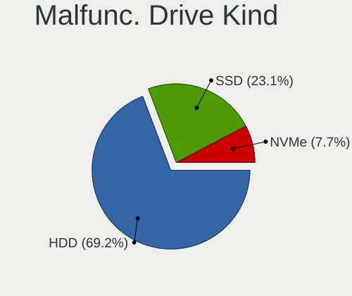

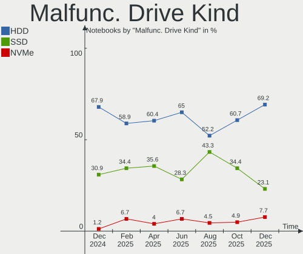

| Kind | Notebooks | Drives | Percent |
|------|-----------|--------|---------|
| HDD  | 36        | 36     | 69.23%  |
| SSD  | 12        | 13     | 23.08%  |
| NVMe | 4         | 4      | 7.69%   |

Failed Drives
-------------

Failed drive models

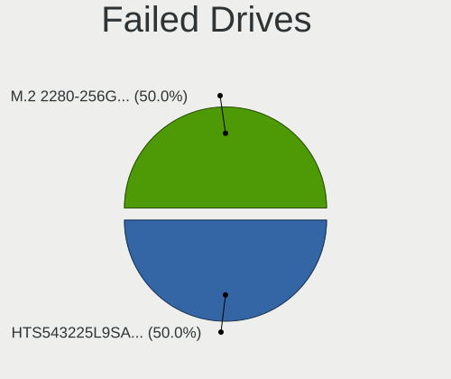

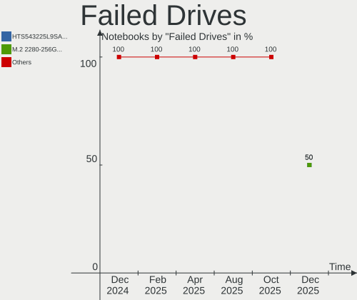

| Model                         | Notebooks | Drives | Percent |
|-------------------------------|-----------|--------|---------|
| Hitachi HTS543225L9SA02 250GB | 1         | 1      | 50%     |
| Unknown                       | 1         | 1      | 50%     |

Failed Drive Vendor
-------------------

Failed drive vendors

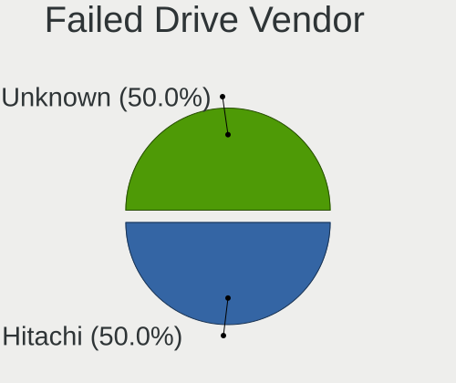

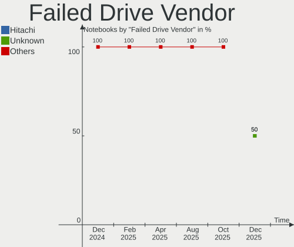

| Vendor  | Notebooks | Drives | Percent |
|---------|-----------|--------|---------|
| Hitachi | 1         | 1      | 50%     |
| Unknown | 1         | 1      | 50%     |

Drive Status
------------

Number of failed and malfunc. drives

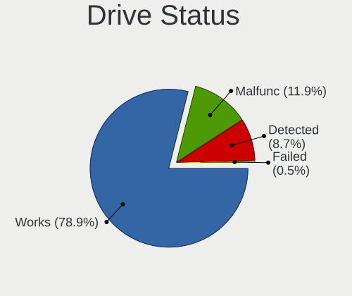

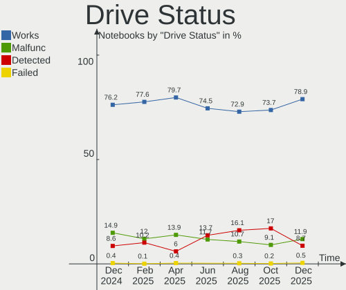

| Status   | Notebooks | Drives | Percent |
|----------|-----------|--------|---------|
| Works    | 345       | 392    | 78.95%  |
| Malfunc  | 52        | 53     | 11.9%   |
| Detected | 38        | 42     | 8.7%    |
| Failed   | 2         | 2      | 0.46%   |

Storage controller
------------------

Storage Vendor
--------------

Storage controller vendors

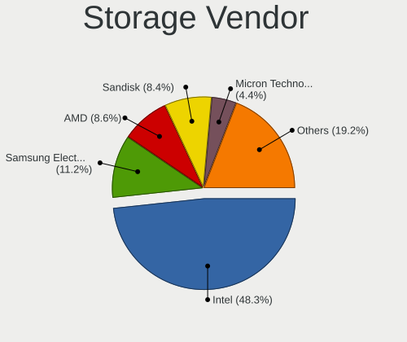

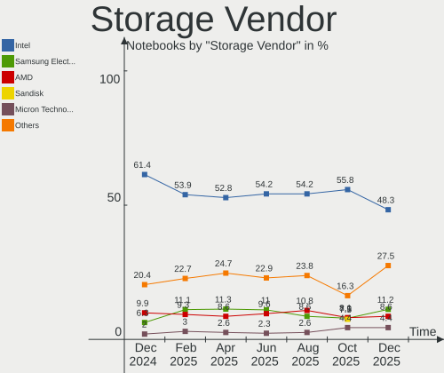

| Vendor                                  | Notebooks | Percent |
|-----------------------------------------|-----------|---------|
| Intel                                   | 242       | 48.3%   |
| Samsung Electronics                     | 56        | 11.18%  |
| AMD                                     | 43        | 8.58%   |
| Sandisk                                 | 42        | 8.38%   |
| Micron Technology                       | 22        | 4.39%   |
| SK hynix                                | 18        | 3.59%   |
| Kingston Technology Company             | 15        | 2.99%   |
| Toshiba America Info Systems            | 12        | 2.4%    |
| KIOXIA                                  | 12        | 2.4%    |
| Phison Electronics                      | 7         | 1.4%    |
| Micron/Crucial Technology               | 7         | 1.4%    |
| MAXIO Technology (Hangzhou)             | 5         | 1%      |
| Silicon Motion                          | 4         | 0.8%    |
| Shenzhen Longsys Electronics            | 3         | 0.6%    |
| ADATA Technology                        | 3         | 0.6%    |
| Union Memory (Shenzhen)                 | 2         | 0.4%    |
| Nvidia                                  | 2         | 0.4%    |
| Solidigm                                | 1         | 0.2%    |
| Shenzhen Unionmemory Information System | 1         | 0.2%    |
| Shenzhen Shichuangyi Electronics        | 1         | 0.2%    |
| Realtek Semiconductor                   | 1         | 0.2%    |
| Lite-On Technology                      | 1         | 0.2%    |
| Hosin Global Electronics                | 1         | 0.2%    |

Storage Model
-------------

Storage controller models

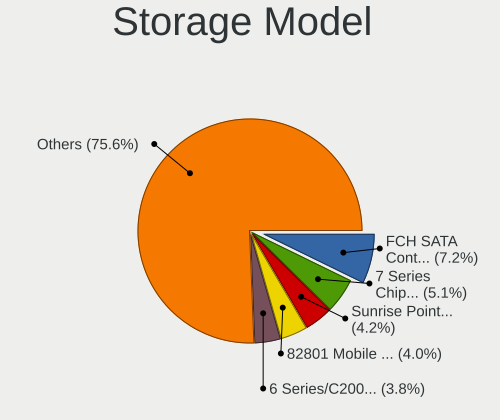

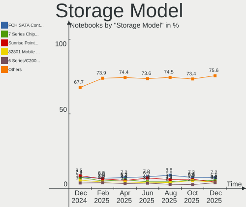

| Model                                                                          | Notebooks | Percent |
|--------------------------------------------------------------------------------|-----------|---------|
| AMD FCH SATA Controller [AHCI mode]                                            | 38        | 7.24%   |
| Intel 7 Series Chipset Family 6-port SATA Controller [AHCI mode]               | 27        | 5.14%   |
| Intel Sunrise Point-LP SATA Controller [AHCI mode]                             | 22        | 4.19%   |
| Intel 82801 Mobile SATA Controller [RAID mode]                                 | 21        | 4%      |
| Intel 6 Series/C200 Series Chipset Family 6 port Mobile SATA AHCI Controller   | 20        | 3.81%   |
| Intel Volume Management Device NVMe RAID Controller                            | 17        | 3.24%   |
| SanDisk WD SN560/SN740/SN770/SN5000 NVMe SSD                                   | 12        | 2.29%   |
| Samsung NVMe SSD Controller 980 (DRAM-less)                                    | 12        | 2.29%   |
| Intel Wildcat Point-LP SATA Controller [AHCI Mode]                             | 12        | 2.29%   |
| Samsung NVMe SSD Controller PM9C1a (DRAM-less)                                 | 10        | 1.9%    |
| Intel 82801IBM/IEM (ICH9M/ICH9M-E) 4 port SATA Controller [AHCI mode]          | 10        | 1.9%    |
| Intel 8 Series SATA Controller 1 [AHCI mode]                                   | 10        | 1.9%    |
| Intel Celeron/Pentium Silver Processor SATA Controller                         | 9         | 1.71%   |
| Intel Cannon Lake Mobile PCH SATA AHCI Controller                              | 9         | 1.71%   |
| Samsung NVMe SSD Controller PM9A1/PM9A3/980PRO                                 | 8         | 1.52%   |
| Intel Celeron N3350/Pentium N4200/Atom E3900 Series SATA AHCI Controller       | 8         | 1.52%   |
| Intel 5 Series/3400 Series Chipset 4 port SATA AHCI Controller                 | 8         | 1.52%   |
| SanDisk Ultra 3D / WD PC SN530, IX SN530, Blue SN550 NVMe SSD (DRAM-less)      | 7         | 1.33%   |
| Samsung NVMe SSD Controller SM981/PM981/PM983                                  | 7         | 1.33%   |
| Intel Tiger Lake-LP SATA Controller                                            | 7         | 1.33%   |
| Toshiba America Info Systems XG6 NVMe SSD Controller                           | 6         | 1.14%   |
| Intel 82801HM/HEM (ICH8M/ICH8M-E) SATA Controller [AHCI mode]                  | 6         | 1.14%   |
| Intel 82801HM/HEM (ICH8M/ICH8M-E) IDE Controller                               | 6         | 1.14%   |
| Samsung NVMe SSD Controller SM961/PM961/SM963                                  | 5         | 0.95%   |
| Samsung NVMe SSD Controller S4LV008[Pascal]                                    | 5         | 0.95%   |
| Micron 2500 NVMe SSD (DRAM-less)                                               | 5         | 0.95%   |
| KIOXIA NVMe SSD Controller BG4 (DRAM-less)                                     | 5         | 0.95%   |
| Intel Jasper Lake SATA AHCI Controller                                         | 5         | 0.95%   |
| Intel Atom Processor E3800 Series SATA AHCI Controller                         | 5         | 0.95%   |
| Intel Alder Lake-P SATA AHCI Controller                                        | 5         | 0.95%   |
| Intel 8 Series/C220 Series Chipset Family 6-port SATA Controller 1 [AHCI mode] | 5         | 0.95%   |
| AMD SB7x0/SB8x0/SB9x0 SATA Controller [AHCI mode]                              | 5         | 0.95%   |
| SK hynix Gold P31/BC711/PC711 NVMe Solid State Drive                           | 4         | 0.76%   |
| Micron 2550 NVMe SSD (DRAM-less)                                               | 4         | 0.76%   |
| Micron 2450 NVMe SSD [HendrixV] (DRAM-less)                                    | 4         | 0.76%   |
| MAXIO (Hangzhou) NVMe SSD Controller MAP1202 (DRAM-less)                       | 4         | 0.76%   |
| Intel Tiger Lake SATA AHCI Controller                                          | 4         | 0.76%   |
| Intel HM170/QM170 Chipset SATA Controller [AHCI Mode]                          | 4         | 0.76%   |
| Intel Comet Lake SATA AHCI Controller                                          | 4         | 0.76%   |
| SK hynix BC901 NVMe Solid State Drive (DRAM-less)                              | 3         | 0.57%   |

Storage Kind
------------

Kind of storage controller (IDE, SATA, NVMe, SAS, ...)

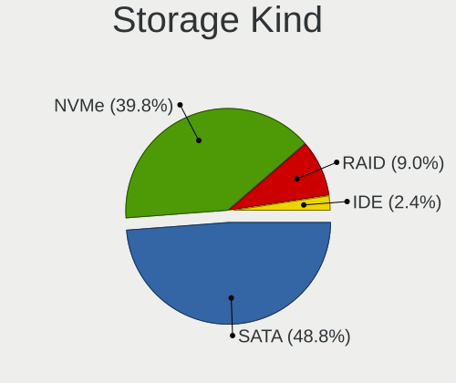

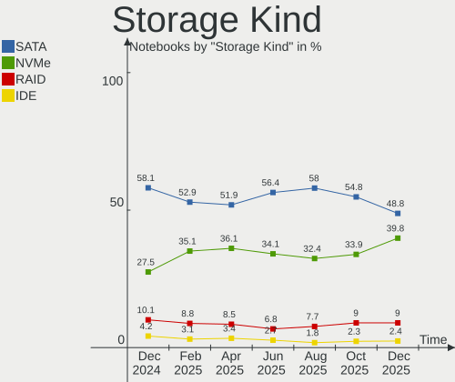

| Kind | Notebooks | Percent |
|------|-----------|---------|
| SATA | 245       | 48.8%   |
| NVMe | 200       | 39.84%  |
| RAID | 45        | 8.96%   |
| IDE  | 12        | 2.39%   |

Processor
---------

CPU Vendor
----------

Processor vendors

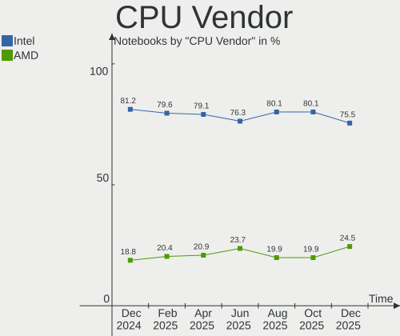

| Vendor | Notebooks | Percent |
|--------|-----------|---------|
| Intel  | 315       | 75.54%  |
| AMD    | 102       | 24.46%  |

CPU Model
---------

Processor models

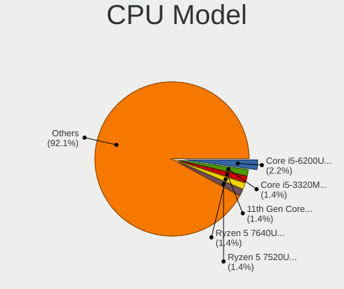

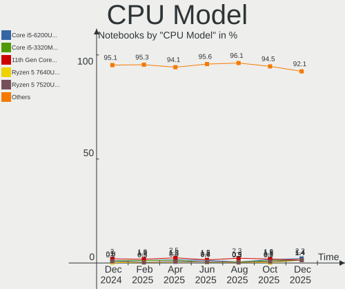

| Model                                         | Notebooks | Percent |
|-----------------------------------------------|-----------|---------|
| Intel Core i5-6200U CPU @ 2.30GHz             | 9         | 2.16%   |
| Intel Core i5-3320M CPU @ 2.60GHz             | 6         | 1.44%   |
| Intel 11th Gen Core i5-1135G7 @ 2.40GHz       | 6         | 1.44%   |
| AMD Ryzen 5 7640U w/ Radeon 760M Graphics     | 6         | 1.44%   |
| AMD Ryzen 5 7520U with Radeon Graphics        | 6         | 1.44%   |
| Intel Core i5-7300U CPU @ 2.60GHz             | 5         | 1.2%    |
| Intel Celeron N4020 CPU @ 1.10GHz             | 5         | 1.2%    |
| Intel Celeron CPU N3350 @ 1.10GHz             | 5         | 1.2%    |
| Intel 11th Gen Core i7-1165G7 @ 2.80GHz       | 5         | 1.2%    |
| Intel Pentium Silver N5030 CPU @ 1.10GHz      | 4         | 0.96%   |
| Intel Core Ultra 7 155H                       | 4         | 0.96%   |
| Intel Core i7-9750H CPU @ 2.60GHz             | 4         | 0.96%   |
| Intel Core i5-7200U CPU @ 2.50GHz             | 4         | 0.96%   |
| Intel Core i5-5200U CPU @ 2.20GHz             | 4         | 0.96%   |
| Intel Core i5-2520M CPU @ 2.50GHz             | 4         | 0.96%   |
| Intel Core i3-1005G1 CPU @ 1.20GHz            | 4         | 0.96%   |
| Intel Celeron N4500 @ 1.10GHz                 | 4         | 0.96%   |
| Intel Celeron N4120 CPU @ 1.10GHz             | 4         | 0.96%   |
| AMD Ryzen 7 PRO 4750U with Radeon Graphics    | 4         | 0.96%   |
| AMD Ryzen 7 3700U with Radeon Vega Mobile Gfx | 4         | 0.96%   |
| Intel Core i7-8850H CPU @ 2.60GHz             | 3         | 0.72%   |
| Intel Core i7-7700HQ CPU @ 2.80GHz            | 3         | 0.72%   |
| Intel Core i7-6820HQ CPU @ 2.70GHz            | 3         | 0.72%   |
| Intel Core i5-8350U CPU @ 1.70GHz             | 3         | 0.72%   |
| Intel Core i5-8300H CPU @ 2.30GHz             | 3         | 0.72%   |
| Intel Core i5-8265U CPU @ 1.60GHz             | 3         | 0.72%   |
| Intel Core i5-6300U CPU @ 2.40GHz             | 3         | 0.72%   |
| Intel Core i5-4300U CPU @ 1.90GHz             | 3         | 0.72%   |
| Intel Core i5-3337U CPU @ 1.80GHz             | 3         | 0.72%   |
| Intel Core i5-2410M CPU @ 2.30GHz             | 3         | 0.72%   |
| Intel Core i5-10210U CPU @ 1.60GHz            | 3         | 0.72%   |
| Intel Core i5 CPU M 520 @ 2.40GHz             | 3         | 0.72%   |
| Intel Celeron CPU N2840 @ 2.16GHz             | 3         | 0.72%   |
| Intel Celeron CPU N2830 @ 2.16GHz             | 3         | 0.72%   |
| Intel 12th Gen Core i5-1240P                  | 3         | 0.72%   |
| Intel 11th Gen Core i7-1185G7 @ 3.00GHz       | 3         | 0.72%   |
| Intel 11th Gen Core i7-11800H @ 2.30GHz       | 3         | 0.72%   |
| Intel 11th Gen Core i5-1145G7 @ 2.60GHz       | 3         | 0.72%   |
| AMD Ryzen 7 PRO 7840U w/ Radeon 780M Graphics | 3         | 0.72%   |
| AMD Ryzen 5 5500U with Radeon Graphics        | 3         | 0.72%   |

CPU Model Family
----------------

Processor model prefix

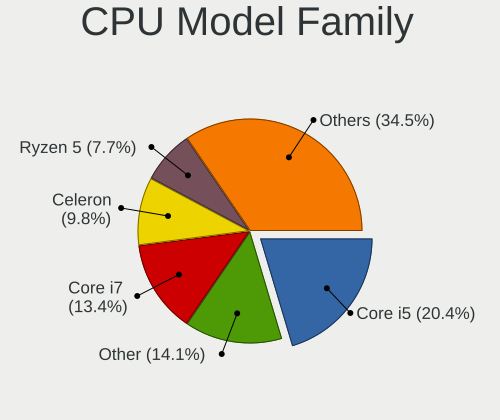

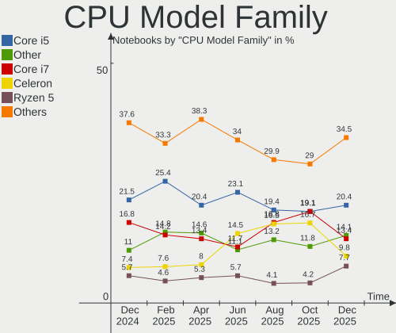

| Model                   | Notebooks | Percent |
|-------------------------|-----------|---------|
| Intel Core i5           | 85        | 20.38%  |
| Other                   | 59        | 14.15%  |
| Intel Core i7           | 56        | 13.43%  |
| Intel Celeron           | 41        | 9.83%   |
| AMD Ryzen 5             | 32        | 7.67%   |
| Intel Core i3           | 28        | 6.71%   |
| AMD Ryzen 7             | 17        | 4.08%   |
| Intel Core              | 14        | 3.36%   |
| Intel Core 2 Duo        | 9         | 2.16%   |
| Intel Pentium           | 8         | 1.92%   |
| AMD Ryzen 7 PRO         | 7         | 1.68%   |
| AMD Ryzen 3             | 7         | 1.68%   |
| AMD Ryzen 9             | 6         | 1.44%   |
| Intel Xeon              | 5         | 1.2%    |
| Intel Pentium Silver    | 4         | 0.96%   |
| AMD Ryzen 5 PRO         | 4         | 0.96%   |
| Intel Pentium Dual-Core | 3         | 0.72%   |
| AMD A8                  | 3         | 0.72%   |
| AMD A6                  | 3         | 0.72%   |
| Intel Genuine           | 2         | 0.48%   |
| Intel Core m3           | 2         | 0.48%   |
| Intel Core i9           | 2         | 0.48%   |
| Intel Atom              | 2         | 0.48%   |
| AMD Phenom II           | 2         | 0.48%   |
| AMD E2                  | 2         | 0.48%   |
| AMD E1                  | 2         | 0.48%   |
| AMD Athlon II           | 2         | 0.48%   |
| AMD Athlon              | 2         | 0.48%   |
| AMD A4                  | 2         | 0.48%   |
| AMD A10                 | 2         | 0.48%   |
| Intel Core M            | 1         | 0.24%   |
| Intel Core 2            | 1         | 0.24%   |
| AMD Ryzen 3 PRO         | 1         | 0.24%   |
| AMD E                   | 1         | 0.24%   |

CPU Cores
---------

Number of processor cores

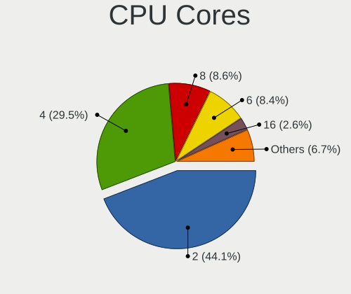

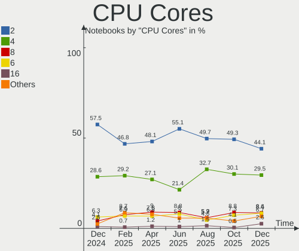

| Number | Notebooks | Percent |
|--------|-----------|---------|
| 2      | 184       | 44.12%  |
| 4      | 123       | 29.5%   |
| 8      | 36        | 8.63%   |
| 6      | 35        | 8.39%   |
| 16     | 11        | 2.64%   |
| 12     | 11        | 2.64%   |
| 10     | 7         | 1.68%   |
| 14     | 4         | 0.96%   |
| 1      | 3         | 0.72%   |
| 24     | 2         | 0.48%   |
| 20     | 1         | 0.24%   |

CPU Sockets
-----------

Number of sockets

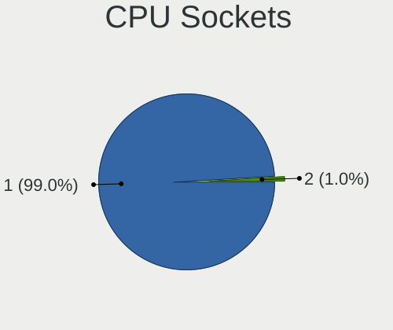

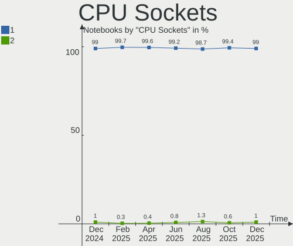

| Number | Notebooks | Percent |
|--------|-----------|---------|
| 1      | 413       | 99.04%  |
| 2      | 4         | 0.96%   |

CPU Threads
-----------

Threads per core (Hyper-Threading)

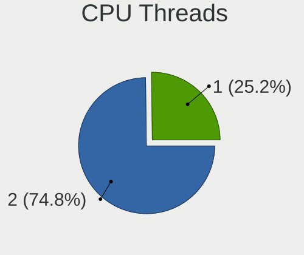

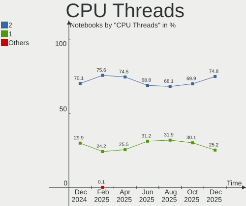

| Number | Notebooks | Percent |
|--------|-----------|---------|
| 2      | 312       | 74.82%  |
| 1      | 105       | 25.18%  |

CPU Op-Modes
------------

CPU Operation Modes (32-bit, 64-bit)

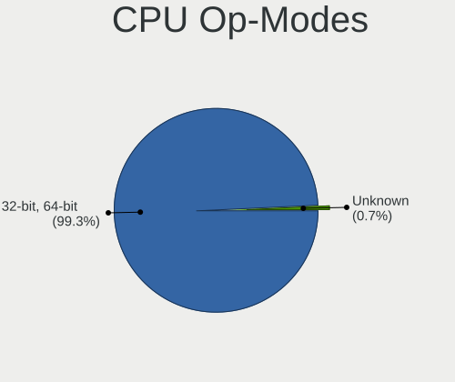

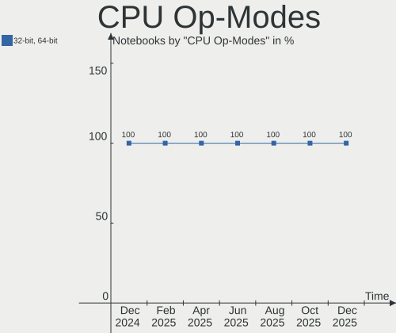

| Op mode        | Notebooks | Percent |
|----------------|-----------|---------|
| 32-bit, 64-bit | 417       | 100%    |

CPU Microcode
-------------

Microcode number

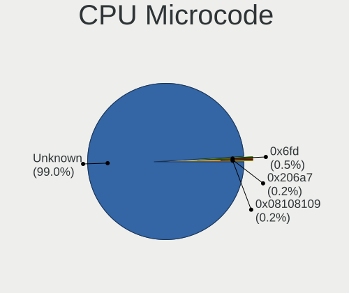

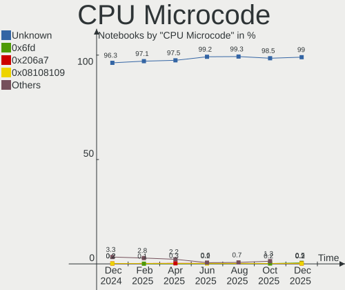

| Number     | Notebooks | Percent |
|------------|-----------|---------|
| Unknown    | 413       | 99.04%  |
| 0x6fd      | 2         | 0.48%   |
| 0x206a7    | 1         | 0.24%   |
| 0x08108109 | 1         | 0.24%   |

CPU Microarch
-------------

Microarchitecture

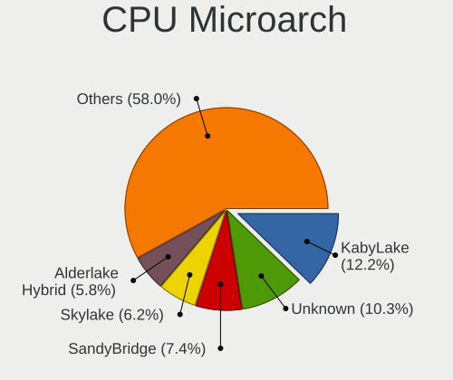

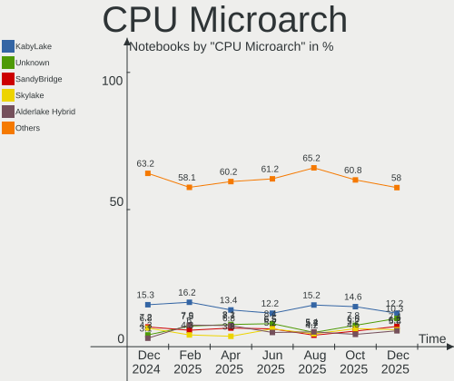

| Name              | Notebooks | Percent |
|-------------------|-----------|---------|
| KabyLake          | 51        | 12.23%  |
| Unknown           | 43        | 10.31%  |
| SandyBridge       | 31        | 7.43%   |
| Skylake           | 26        | 6.24%   |
| Alderlake Hybrid  | 24        | 5.76%   |
| IvyBridge         | 22        | 5.28%   |
| TigerLake         | 21        | 5.04%   |
| Haswell           | 20        | 4.8%    |
| Goldmont plus     | 14        | 3.36%   |
| Broadwell         | 14        | 3.36%   |
| Zen+              | 13        | 3.12%   |
| Penryn            | 13        | 3.12%   |
| Westmere          | 12        | 2.88%   |
| Zen 3             | 11        | 2.64%   |
| Zen 2             | 11        | 2.64%   |
| Silvermont        | 11        | 2.64%   |
| Icelake           | 11        | 2.64%   |
| Meteorlake Hybrid | 10        | 2.4%    |
| Goldmont          | 9         | 2.16%   |
| Puma              | 6         | 1.44%   |
| Gracemont         | 6         | 1.44%   |
| Excavator         | 6         | 1.44%   |
| Tremont           | 5         | 1.2%    |
| Core              | 5         | 1.2%    |
| Zen               | 4         | 0.96%   |
| K10               | 4         | 0.96%   |
| CometLake         | 3         | 0.72%   |
| Piledriver        | 2         | 0.48%   |
| Lunarlake Hybrid  | 2         | 0.48%   |
| Bobcat            | 2         | 0.48%   |
| Nehalem           | 1         | 0.24%   |
| K8 & K10 hybrid   | 1         | 0.24%   |
| K10 Llano         | 1         | 0.24%   |
| Jaguar            | 1         | 0.24%   |
| Bonnell           | 1         | 0.24%   |

Graphics
--------

GPU Vendor
----------

Vendors of graphics cards

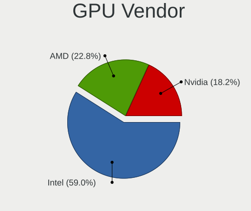

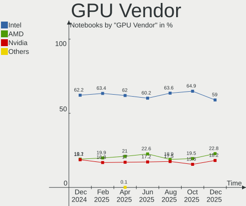

| Vendor | Notebooks | Percent |
|--------|-----------|---------|
| Intel  | 292       | 58.99%  |
| AMD    | 113       | 22.83%  |
| Nvidia | 90        | 18.18%  |

GPU Model
---------

Graphics card models

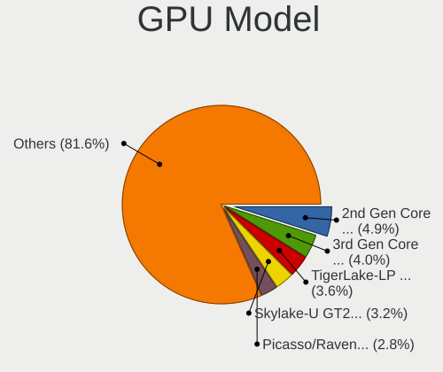

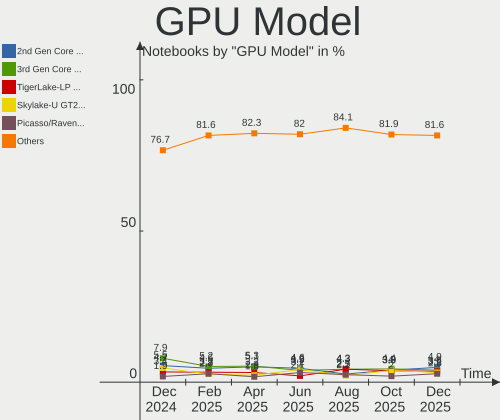

| Model                                                                     | Notebooks | Percent |
|---------------------------------------------------------------------------|-----------|---------|
| Intel 2nd Generation Core Processor Family Integrated Graphics Controller | 25        | 4.94%   |
| Intel 3rd Gen Core processor Graphics Controller                          | 20        | 3.95%   |
| Intel TigerLake-LP GT2 [Iris Xe Graphics]                                 | 18        | 3.56%   |
| Intel Skylake-U GT2 [HD Graphics 520]                                     | 16        | 3.16%   |
| AMD Picasso/Raven 2 [Radeon Vega Series / Radeon Vega Mobile Series]      | 14        | 2.77%   |
| AMD Phoenix1                                                              | 14        | 2.77%   |
| Intel Kaby Lake-U GT2 [HD Graphics 620]                                   | 13        | 2.57%   |
| Intel Haswell-ULT Integrated Graphics Controller                          | 12        | 2.37%   |
| Intel Mobile 4 Series Chipset Integrated Graphics Controller              | 11        | 2.17%   |
| AMD Renoir [Radeon Vega Series / Radeon Vega Mobile Series]               | 11        | 2.17%   |
| Intel GeminiLake [UHD Graphics 600]                                       | 10        | 1.98%   |
| Intel Broadwell-U GT2 [HD Graphics 5500]                                  | 10        | 1.98%   |
| Intel CoffeeLake-H GT2 [UHD Graphics 630]                                 | 9         | 1.78%   |
| Intel Kaby Lake-R GT2 [UHD Graphics 620]                                  | 8         | 1.58%   |
| Intel Atom Processor Z36xxx/Z37xxx Series Graphics & Display              | 8         | 1.58%   |
| AMD Barcelo                                                               | 8         | 1.58%   |
| Intel Core Processor Integrated Graphics Controller                       | 7         | 1.38%   |
| Intel Apollo Lake GT1 [HD Graphics 500]                                   | 7         | 1.38%   |
| AMD Mendocino [Radeon 610M]                                               | 7         | 1.38%   |
| Nvidia TU117M [GeForce GTX 1650 Mobile / Max-Q]                           | 6         | 1.19%   |
| Nvidia AD107M [GeForce RTX 4060 Max-Q / Mobile]                           | 6         | 1.19%   |
| Intel TigerLake-H GT1 [UHD Graphics]                                      | 6         | 1.19%   |
| Intel Raptor Lake-P [Iris Xe Graphics]                                    | 6         | 1.19%   |
| Intel Meteor Lake-P [Intel Arc Graphics]                                  | 6         | 1.19%   |
| Intel JasperLake [UHD Graphics]                                           | 6         | 1.19%   |
| Intel Alder Lake-P GT2 [Iris Xe Graphics]                                 | 6         | 1.19%   |
| Intel 4th Gen Core Processor Integrated Graphics Controller               | 6         | 1.19%   |
| AMD Stoney [Radeon R2/R3/R4/R5 Graphics]                                  | 6         | 1.19%   |
| Intel WhiskeyLake-U GT2 [UHD Graphics 620]                                | 5         | 0.99%   |
| Intel Mobile GM965/GL960 Integrated Graphics Controller (secondary)       | 5         | 0.99%   |
| Intel Mobile GM965/GL960 Integrated Graphics Controller (primary)         | 5         | 0.99%   |
| Intel Iris Plus Graphics G1 (Ice Lake)                                    | 5         | 0.99%   |
| Intel CometLake-U GT2 [UHD Graphics]                                      | 5         | 0.99%   |
| AMD Lucienne                                                              | 5         | 0.99%   |
| AMD HawkPoint1                                                            | 5         | 0.99%   |
| Intel Kaby Lake-H GT2 [HD Graphics 630]                                   | 4         | 0.79%   |
| Intel GeminiLake [UHD Graphics 605]                                       | 4         | 0.79%   |
| Intel Alder Lake-N [UHD Graphics]                                         | 4         | 0.79%   |
| Nvidia GP107M [GeForce GTX 1050 Ti Mobile]                                | 3         | 0.59%   |
| Nvidia GM107GLM [Quadro M2000M]                                           | 3         | 0.59%   |

GPU Combo
---------

Combinations of graphics cards

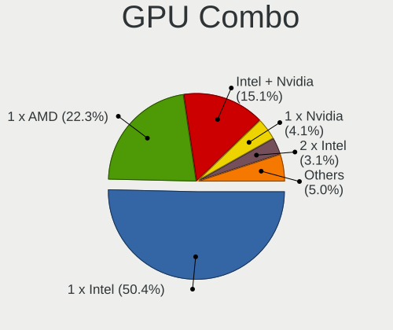

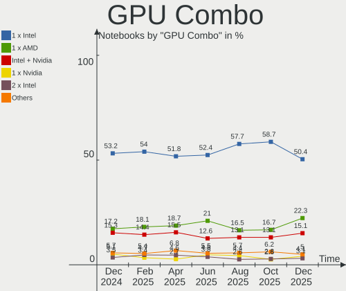

| Name           | Notebooks | Percent |
|----------------|-----------|---------|
| 1 x Intel      | 210       | 50.36%  |
| 1 x AMD        | 93        | 22.3%   |
| Intel + Nvidia | 63        | 15.11%  |
| 1 x Nvidia     | 17        | 4.08%   |
| 2 x Intel      | 13        | 3.12%   |
| AMD + Nvidia   | 9         | 2.16%   |
| Intel + AMD    | 6         | 1.44%   |
| 2 x AMD        | 5         | 1.2%    |
| 2 x Nvidia     | 1         | 0.24%   |

GPU Driver
----------

Free vs proprietary

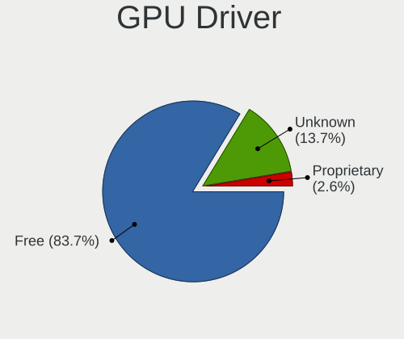

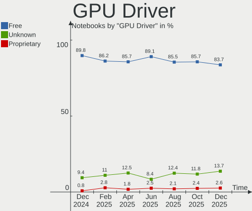

| Driver      | Notebooks | Percent |
|-------------|-----------|---------|
| Free        | 349       | 83.69%  |
| Unknown     | 57        | 13.67%  |
| Proprietary | 11        | 2.64%   |

GPU Memory
----------

Total video memory

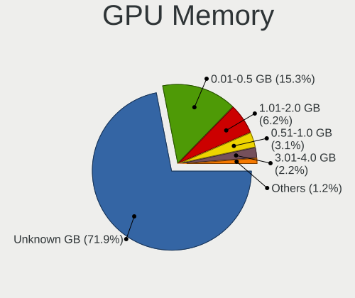

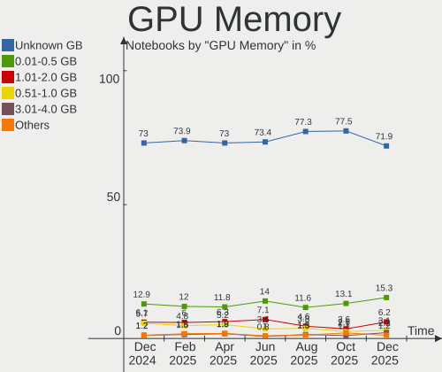

| Size in GB | Notebooks | Percent |
|------------|-----------|---------|
| Unknown    | 300       | 71.94%  |
| 0.01-0.5   | 64        | 15.35%  |
| 1.01-2.0   | 26        | 6.24%   |
| 0.51-1.0   | 13        | 3.12%   |
| 3.01-4.0   | 9         | 2.16%   |
| 7.01-8.0   | 2         | 0.48%   |
| 5.01-6.0   | 2         | 0.48%   |
| 8.01-16.0  | 1         | 0.24%   |

Monitor
-------

Monitor Vendor
--------------

Monitor vendors

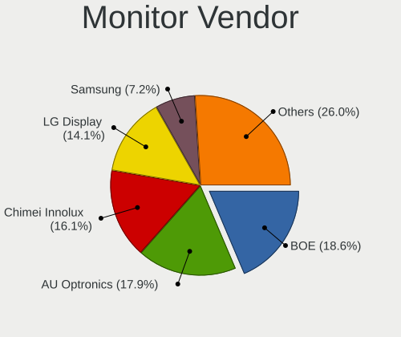

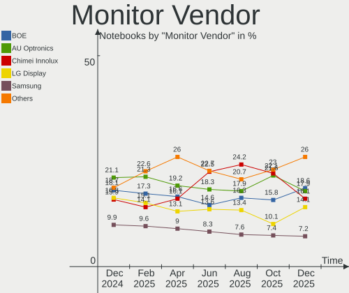

| Vendor                  | Notebooks | Percent |
|-------------------------|-----------|---------|
| BOE                     | 83        | 18.61%  |
| AU Optronics            | 80        | 17.94%  |
| Chimei Innolux          | 72        | 16.14%  |
| LG Display              | 63        | 14.13%  |
| Samsung Electronics     | 32        | 7.17%   |
| Lenovo                  | 23        | 5.16%   |
| Sharp                   | 16        | 3.59%   |
| Apple                   | 8         | 1.79%   |
| InfoVision              | 6         | 1.35%   |
| Chi Mei Optoelectronics | 6         | 1.35%   |
| Goldstar                | 5         | 1.12%   |
| Dell                    | 5         | 1.12%   |
| Hewlett-Packard         | 4         | 0.9%    |
| TMX                     | 3         | 0.67%   |
| RGT                     | 3         | 0.67%   |
| PANDA                   | 3         | 0.67%   |
| MSI                     | 3         | 0.67%   |
| HKC                     | 3         | 0.67%   |
| BenQ                    | 3         | 0.67%   |
| STA                     | 2         | 0.45%   |
| EDO                     | 2         | 0.45%   |
| Acer                    | 2         | 0.45%   |
| VXN                     | 1         | 0.22%   |
| Vizio                   | 1         | 0.22%   |
| ViewSonic               | 1         | 0.22%   |
| Valve                   | 1         | 0.22%   |
| Unknown (XXX)           | 1         | 0.22%   |
| TMA                     | 1         | 0.22%   |
| Panasonic               | 1         | 0.22%   |
| LG Philips              | 1         | 0.22%   |
| KDB                     | 1         | 0.22%   |
| InnoLux Display         | 1         | 0.22%   |
| Hitachi                 | 1         | 0.22%   |
| HannStar                | 1         | 0.22%   |
| GVE                     | 1         | 0.22%   |
| EXP                     | 1         | 0.22%   |
| CVT                     | 1         | 0.22%   |
| CSW                     | 1         | 0.22%   |
| CSOT                    | 1         | 0.22%   |
| Aosiman                 | 1         | 0.22%   |

Monitor Model
-------------

Monitor models

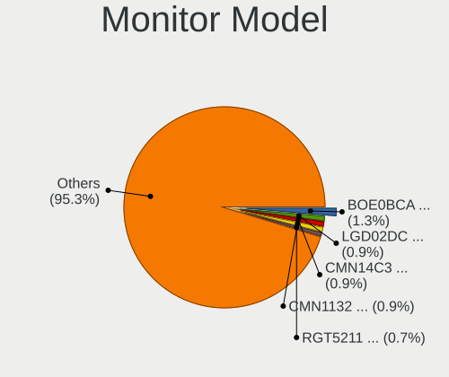

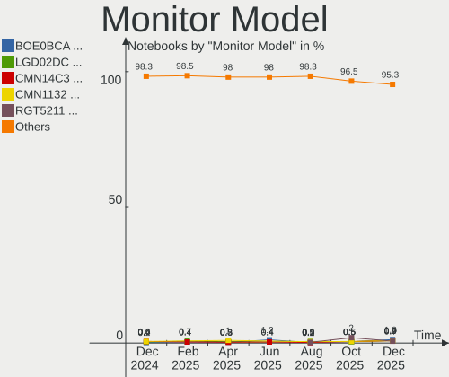

| Model                                                                 | Notebooks | Percent |
|-----------------------------------------------------------------------|-----------|---------|
| BOE LCD Monitor BOE0BCA 2256x1504 285x190mm 13.5-inch                 | 6         | 1.34%   |
| LG Display LCD Monitor LGD02DC 1366x768 344x194mm 15.5-inch           | 4         | 0.89%   |
| Chimei Innolux LCD Monitor CMN14C3 1366x768 309x173mm 13.9-inch       | 4         | 0.89%   |
| Chimei Innolux LCD Monitor CMN1132 1366x768 256x144mm 11.6-inch       | 4         | 0.89%   |
| RGT LCD Monitor RGT5211 1366x768 518x333mm 24.2-inch                  | 3         | 0.67%   |
| LG Display LCD Monitor LGD033A 1366x768 344x194mm 15.5-inch           | 3         | 0.67%   |
| Lenovo LCD Monitor LEN40BA 1920x1080 344x194mm 15.5-inch              | 3         | 0.67%   |
| Lenovo LCD Monitor LEN40A9 1920x1080 309x173mm 13.9-inch              | 3         | 0.67%   |
| Chimei Innolux LCD Monitor CMN15E7 1920x1080 344x193mm 15.5-inch      | 3         | 0.67%   |
| Chimei Innolux LCD Monitor CMN15BE 1366x768 344x193mm 15.5-inch       | 3         | 0.67%   |
| Chimei Innolux LCD Monitor CMN15AB 1366x768 344x193mm 15.5-inch       | 3         | 0.67%   |
| Chimei Innolux LCD Monitor CMN14D4 1920x1080 309x173mm 13.9-inch      | 3         | 0.67%   |
| BOE NE135A1M-NY1 BOE0CB4 2880x1920 285x190mm 13.5-inch                | 3         | 0.67%   |
| BOE LCD Monitor BOE07F7 1920x1080 309x174mm 14.0-inch                 | 3         | 0.67%   |
| AU Optronics LCD Monitor AUO403D 1920x1080 309x174mm 14.0-inch        | 3         | 0.67%   |
| AU Optronics LCD Monitor AUO243D 1920x1080 309x173mm 13.9-inch        | 3         | 0.67%   |
| AU Optronics LCD Monitor AUO21ED 1920x1080 344x193mm 15.5-inch        | 3         | 0.67%   |
| AU Optronics LCD Monitor AUO106C 1366x768 276x155mm 12.5-inch         | 3         | 0.67%   |
| STA LCD Monitor STA8CA7 1366x768 256x144mm 11.6-inch                  | 2         | 0.45%   |
| Sharp LQ123P1JX31 SHP1471 2400x1600 259x173mm 12.3-inch               | 2         | 0.45%   |
| Sharp LCD Monitor SHP149A 1920x1080 344x194mm 15.5-inch               | 2         | 0.45%   |
| Sharp LCD Monitor SHP1476 3840x2160 346x194mm 15.6-inch               | 2         | 0.45%   |
| Sharp LCD Monitor SHP1453 1920x1080 346x194mm 15.6-inch               | 2         | 0.45%   |
| Sharp LCD Monitor SHP1449 1920x1080 294x165mm 13.3-inch               | 2         | 0.45%   |
| Sharp LCD Monitor SHP143B 3840x2160 346x194mm 15.6-inch               | 2         | 0.45%   |
| Samsung Electronics LCD Monitor SEC5441 1280x800 331x207mm 15.4-inch  | 2         | 0.45%   |
| Samsung Electronics LCD Monitor SDC5441 1366x768 344x193mm 15.5-inch  | 2         | 0.45%   |
| Samsung Electronics LCD Monitor SDC4187 1920x1200 302x189mm 14.0-inch | 2         | 0.45%   |
| LG Display LCD Monitor LGD0590 1920x1080 344x194mm 15.5-inch          | 2         | 0.45%   |
| LG Display LCD Monitor LGD04AF 1366x768 344x194mm 15.5-inch           | 2         | 0.45%   |
| LG Display LCD Monitor LGD03B8 1366x768 310x174mm 14.0-inch           | 2         | 0.45%   |
| LG Display LCD Monitor LGD03AB 1366x768 344x194mm 15.5-inch           | 2         | 0.45%   |
| Lenovo LCD Monitor LEN9156 1920x1200 344x215mm 16.0-inch              | 2         | 0.45%   |
| Lenovo LCD Monitor LEN9051 1920x1080 344x194mm 15.5-inch              | 2         | 0.45%   |
| Lenovo LCD Monitor LEN40B1 1600x900 345x194mm 15.6-inch               | 2         | 0.45%   |
| Lenovo LCD Monitor LEN4010 1280x800 261x163mm 12.1-inch               | 2         | 0.45%   |
| InfoVision LCD Monitor IVO8C44 1920x1200 302x189mm 14.0-inch          | 2         | 0.45%   |
| Chimei Innolux LCD Monitor CMN15F5 1920x1080 344x193mm 15.5-inch      | 2         | 0.45%   |
| Chimei Innolux LCD Monitor CMN15DB 1366x768 344x193mm 15.5-inch       | 2         | 0.45%   |
| Chimei Innolux LCD Monitor CMN15C4 1920x1080 344x193mm 15.5-inch      | 2         | 0.45%   |

Monitor Resolution
------------------

Monitor screen resolution

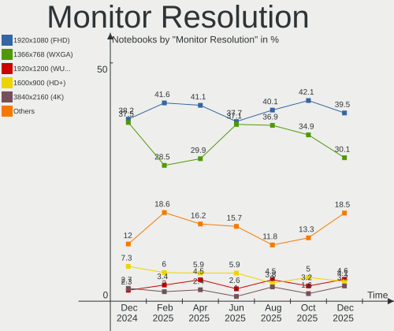

| Resolution         | Notebooks | Percent |
|--------------------|-----------|---------|
| 1920x1080 (FHD)    | 173       | 39.5%   |
| 1366x768 (WXGA)    | 132       | 30.14%  |
| 1920x1200 (WUXGA)  | 20        | 4.57%   |
| 1600x900 (HD+)     | 18        | 4.11%   |
| 3840x2160 (4K)     | 14        | 3.2%    |
| 2560x1600          | 13        | 2.97%   |
| 1280x800 (WXGA)    | 9         | 2.05%   |
| 2256x1504          | 8         | 1.83%   |
| 2880x1800          | 7         | 1.6%    |
| 2560x1440 (QHD)    | 7         | 1.6%    |
| 1440x900 (WXGA+)   | 5         | 1.14%   |
| Unknown            | 5         | 1.14%   |
| 2880x1920          | 4         | 0.91%   |
| 1680x1050 (WSXGA+) | 3         | 0.68%   |
| 3840x2400          | 2         | 0.46%   |
| 3440x1440          | 2         | 0.46%   |
| 3200x1800 (QHD+)   | 2         | 0.46%   |
| 2560x1080          | 2         | 0.46%   |
| 2400x1600          | 2         | 0.46%   |
| 2160x1350          | 2         | 0.46%   |
| 1360x768           | 2         | 0.46%   |
| 800x1280           | 1         | 0.23%   |
| 3456x2160          | 1         | 0.23%   |
| 2560x2880          | 1         | 0.23%   |
| 2520x1680          | 1         | 0.23%   |
| 1280x720 (HD)      | 1         | 0.23%   |
| 1024x600           | 1         | 0.23%   |

Monitor Diagonal
----------------

Diagonal size in inches

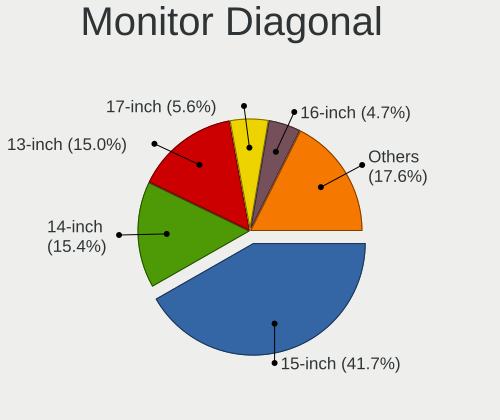

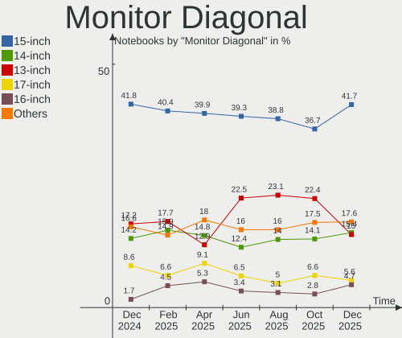

| Inches  | Notebooks | Percent |
|---------|-----------|---------|
| 15      | 187       | 41.74%  |
| 14      | 69        | 15.4%   |
| 13      | 67        | 14.96%  |
| 17      | 25        | 5.58%   |
| 16      | 21        | 4.69%   |
| 24      | 12        | 2.68%   |
| 12      | 12        | 2.68%   |
| 11      | 12        | 2.68%   |
| 21      | 6         | 1.34%   |
| Unknown | 6         | 1.34%   |
| 18      | 5         | 1.12%   |
| 34      | 4         | 0.89%   |
| 27      | 4         | 0.89%   |
| 31      | 3         | 0.67%   |
| 84      | 2         | 0.45%   |
| 26      | 2         | 0.45%   |
| 23      | 2         | 0.45%   |
| 10      | 2         | 0.45%   |
| 74      | 1         | 0.22%   |
| 63      | 1         | 0.22%   |
| 54      | 1         | 0.22%   |
| 28      | 1         | 0.22%   |
| 22      | 1         | 0.22%   |
| 19      | 1         | 0.22%   |
| 7       | 1         | 0.22%   |

Monitor Width
-------------

Physical width

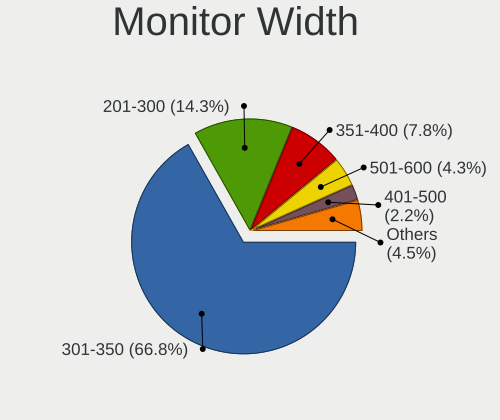

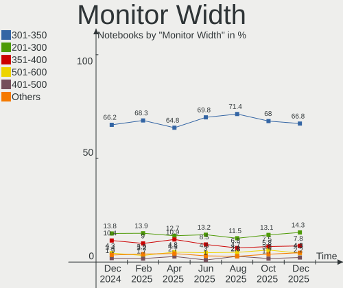

| Width in mm | Notebooks | Percent |
|-------------|-----------|---------|
| 301-350     | 298       | 66.82%  |
| 201-300     | 64        | 14.35%  |
| 351-400     | 35        | 7.85%   |
| 501-600     | 19        | 4.26%   |
| 401-500     | 10        | 2.24%   |
| Unknown     | 6         | 1.35%   |
| 701-800     | 4         | 0.9%    |
| 601-700     | 4         | 0.9%    |
| 1501-2000   | 3         | 0.67%   |
| 1001-1500   | 2         | 0.45%   |
| 1-100       | 1         | 0.22%   |

Aspect Ratio
------------

Proportional relationship between the width and the height

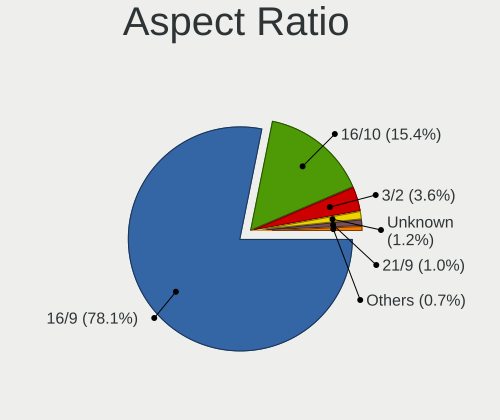

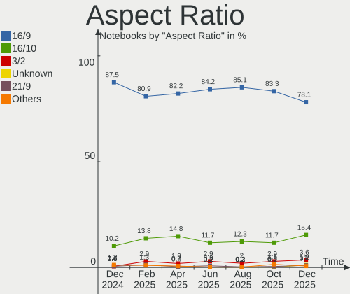

| Ratio   | Notebooks | Percent |
|---------|-----------|---------|
| 16/9    | 329       | 78.15%  |
| 16/10   | 65        | 15.44%  |
| 3/2     | 15        | 3.56%   |
| Unknown | 5         | 1.19%   |
| 21/9    | 4         | 0.95%   |
| 4/3     | 1         | 0.24%   |
| 0.89    | 1         | 0.24%   |
| 0.67    | 1         | 0.24%   |

Monitor Area
------------

Area in inch²

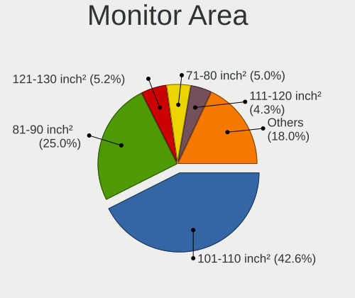

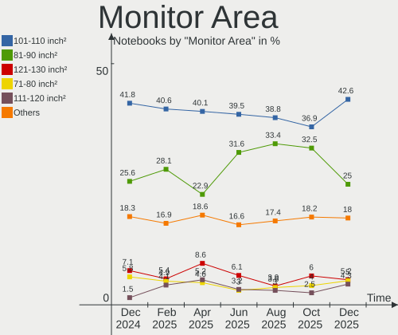

| Area in inch² | Notebooks | Percent |
|----------------|-----------|---------|
| 101-110        | 189       | 42.57%  |
| 81-90          | 111       | 25%     |
| 121-130        | 23        | 5.18%   |
| 71-80          | 22        | 4.95%   |
| 111-120        | 19        | 4.28%   |
| 201-250        | 13        | 2.93%   |
| 61-70          | 12        | 2.7%    |
| 51-60          | 12        | 2.7%    |
| 351-500        | 8         | 1.8%    |
| 251-300        | 6         | 1.35%   |
| Unknown        | 6         | 1.35%   |
| More than 1000 | 5         | 1.13%   |
| 141-150        | 5         | 1.13%   |
| 301-350        | 4         | 0.9%    |
| 41-50          | 2         | 0.45%   |
| 151-200        | 2         | 0.45%   |
| 131-140        | 2         | 0.45%   |
| 91-100         | 2         | 0.45%   |
| 1-40           | 1         | 0.23%   |

Pixel Density
-------------

Pixels per inch

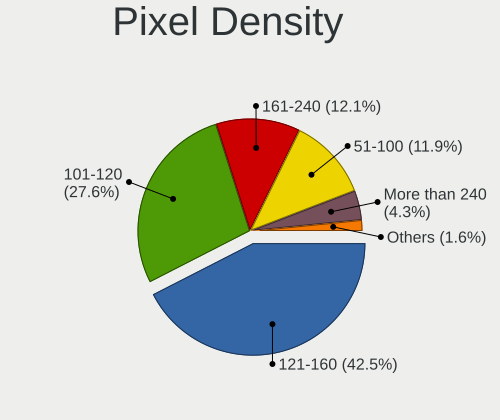

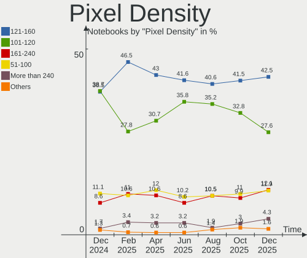

| Density       | Notebooks | Percent |
|---------------|-----------|---------|
| 121-160       | 189       | 42.47%  |
| 101-120       | 123       | 27.64%  |
| 161-240       | 54        | 12.13%  |
| 51-100        | 53        | 11.91%  |
| More than 240 | 19        | 4.27%   |
| Unknown       | 6         | 1.35%   |
| 1-50          | 1         | 0.22%   |

Multiple Monitors
-----------------

Total monitors connected

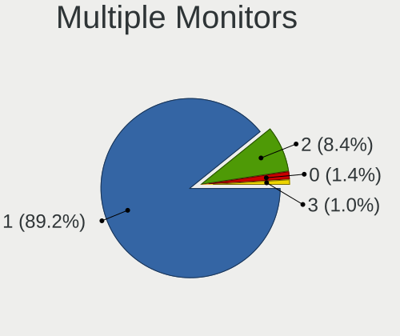

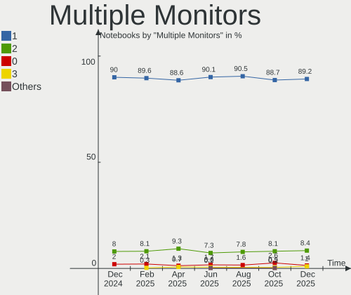

| Total | Notebooks | Percent |
|-------|-----------|---------|
| 1     | 372       | 89.21%  |
| 2     | 35        | 8.39%   |
| 0     | 6         | 1.44%   |
| 3     | 4         | 0.96%   |

Network
-------

Net Controller Vendor
---------------------

Controller vendors

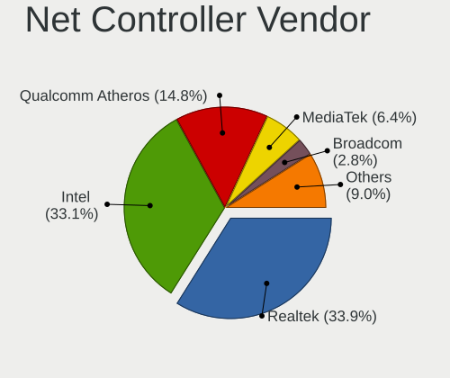

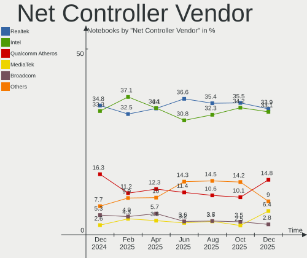

| Vendor                                 | Notebooks | Percent |
|----------------------------------------|-----------|---------|
| Realtek Semiconductor                  | 208       | 33.93%  |
| Intel                                  | 203       | 33.12%  |
| Qualcomm Atheros                       | 91        | 14.85%  |
| MediaTek                               | 39        | 6.36%   |
| Broadcom                               | 17        | 2.77%   |
| ASIX Electronics                       | 12        | 1.96%   |
| Broadcom Limited                       | 8         | 1.31%   |
| Suzhou Motorcomm Electronic Technology | 3         | 0.49%   |
| Ralink                                 | 3         | 0.49%   |
| Qualcomm                               | 3         | 0.49%   |
| Ericsson Business Mobile Networks      | 3         | 0.49%   |
| TP-Link                                | 2         | 0.33%   |
| Shenzhen Goodix Technology             | 2         | 0.33%   |
| Samsung Electronics                    | 2         | 0.33%   |
| Ralink Technology                      | 2         | 0.33%   |
| Nvidia                                 | 2         | 0.33%   |
| Marvell Technology Group               | 2         | 0.33%   |
| ICS Advent                             | 2         | 0.33%   |
| ZyDAS                                  | 1         | 0.16%   |
| Toshiba                                | 1         | 0.16%   |
| Microsoft                              | 1         | 0.16%   |
| Lenovo                                 | 1         | 0.16%   |
| JMicron Technology                     | 1         | 0.16%   |
| Huawei Technologies                    | 1         | 0.16%   |
| Google                                 | 1         | 0.16%   |
| Dell                                   | 1         | 0.16%   |
| D-Link                                 | 1         | 0.16%   |

Net Controller Model
--------------------

Controller models

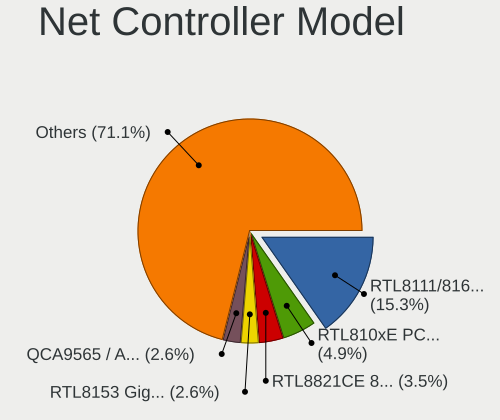

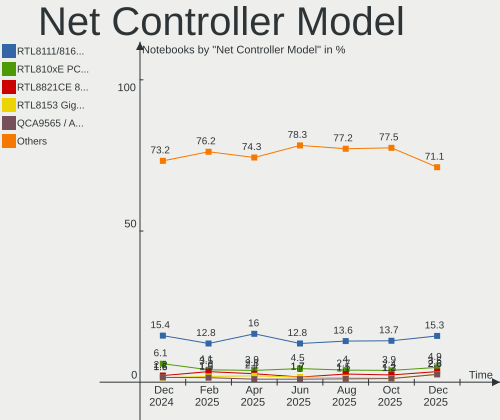

| Model                                                                           | Notebooks | Percent |
|---------------------------------------------------------------------------------|-----------|---------|
| Realtek RTL8111/8168/8211/8411 PCI Express Gigabit Ethernet Controller          | 112       | 15.28%  |
| Realtek RTL810xE PCI Express Fast Ethernet controller                           | 36        | 4.91%   |
| Realtek RTL8821CE 802.11ac PCIe Wireless Network Adapter                        | 26        | 3.55%   |
| Realtek RTL8153 Gigabit Ethernet Adapter                                        | 19        | 2.59%   |
| Qualcomm Atheros QCA9565 / AR9565 Wireless Network Adapter                      | 19        | 2.59%   |
| Intel 82579LM Gigabit Network Connection (Lewisville)                           | 19        | 2.59%   |
| MediaTek MT7922 802.11ax PCI Express Wireless Network Adapter                   | 17        | 2.32%   |
| Intel Wi-Fi 6 AX201                                                             | 16        | 2.18%   |
| Qualcomm Atheros QCA6174 802.11ac Wireless Network Adapter                      | 15        | 2.05%   |
| Intel Centrino Advanced-N 6205 [Taylor Peak]                                    | 15        | 2.05%   |
| Qualcomm Atheros QCA9377 802.11ac Wireless Network Adapter                      | 14        | 1.91%   |
| MediaTek MT7921 802.11ax PCIe Wireless Network Adapter [Filogic 330]            | 13        | 1.77%   |
| Intel Wireless 8265 / 8275                                                      | 13        | 1.77%   |
| Intel Wireless 8260                                                             | 13        | 1.77%   |
| Intel Wi-Fi 6 AX200                                                             | 13        | 1.77%   |
| ASIX AX88179 Gigabit Ethernet                                                   | 12        | 1.64%   |
| Intel Wireless 7265                                                             | 11        | 1.5%    |
| Intel Ethernet Connection (4) I219-LM                                           | 11        | 1.5%    |
| Realtek RTL8822CE 802.11ac PCIe Wireless Network Adapter                        | 10        | 1.36%   |
| Qualcomm Atheros AR9485 Wireless Network Adapter                                | 10        | 1.36%   |
| Intel Wireless 7260                                                             | 10        | 1.36%   |
| Qualcomm Atheros AR9462 Wireless Network Adapter                                | 9         | 1.23%   |
| Qualcomm Atheros AR9285 Wireless Network Adapter (PCI-Express)                  | 8         | 1.09%   |
| Realtek RTL8852BE PCIe 802.11ax Wireless Network Controller                     | 7         | 0.95%   |
| Intel Wireless 3165                                                             | 7         | 0.95%   |
| Intel Raptor Lake PCH CNVi WiFi                                                 | 7         | 0.95%   |
| Intel Gemini Lake PCH CNVi WiFi                                                 | 7         | 0.95%   |
| Intel Alder Lake-P PCH CNVi WiFi                                                | 7         | 0.95%   |
| Intel Wi-Fi 5(802.11ac) Wireless-AC 9x6x [Thunder Peak]                         | 6         | 0.82%   |
| Intel Meteor Lake PCH CNVi WiFi                                                 | 6         | 0.82%   |
| Intel Cannon Lake PCH CNVi WiFi                                                 | 6         | 0.82%   |
| MediaTek MT7925 802.11be 160MHz 2x2 PCIe Wireless Network Adapter [Filogic 360] | 5         | 0.68%   |
| Intel Wi-Fi 6E(802.11ax) AX210/AX1675* 2x2 [Typhoon Peak]                       | 5         | 0.68%   |
| Intel Tiger Lake PCH CNVi WiFi                                                  | 5         | 0.68%   |
| Intel Centrino Wireless-N 2230                                                  | 5         | 0.68%   |
| Realtek RTL8723BE PCIe Wireless Network Adapter                                 | 4         | 0.55%   |
| Realtek RTL8188EE Wireless Network Adapter                                      | 4         | 0.55%   |
| Qualcomm Atheros AR928X Wireless Network Adapter (PCI-Express)                  | 4         | 0.55%   |
| Intel PRO/Wireless 3945ABG [Golan] Network Connection                           | 4         | 0.55%   |
| Intel Ethernet Connection (2) I219-LM                                           | 4         | 0.55%   |

Wireless Vendor
---------------

Wireless vendors

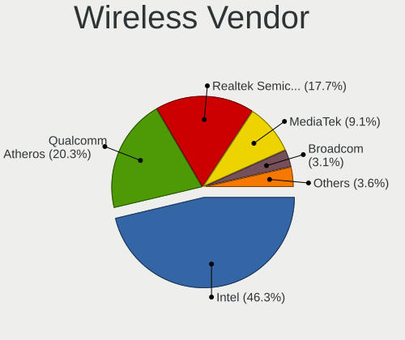

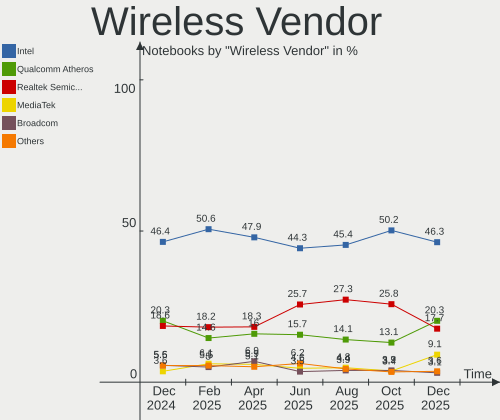

| Vendor                | Notebooks | Percent |
|-----------------------|-----------|---------|
| Intel                 | 194       | 46.3%   |
| Qualcomm Atheros      | 85        | 20.29%  |
| Realtek Semiconductor | 74        | 17.66%  |
| MediaTek              | 38        | 9.07%   |
| Broadcom              | 13        | 3.1%    |
| Ralink                | 3         | 0.72%   |
| Qualcomm              | 3         | 0.72%   |
| Broadcom Limited      | 3         | 0.72%   |
| Ralink Technology     | 2         | 0.48%   |
| ZyDAS                 | 1         | 0.24%   |
| TP-Link               | 1         | 0.24%   |
| Dell                  | 1         | 0.24%   |
| D-Link                | 1         | 0.24%   |

Wireless Model
--------------

Wireless models

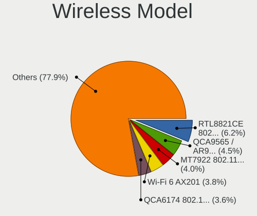

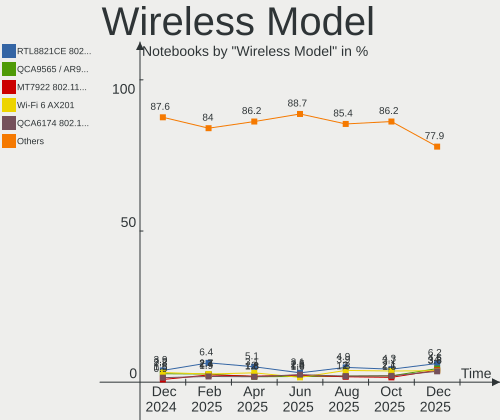

| Model                                                                           | Notebooks | Percent |
|---------------------------------------------------------------------------------|-----------|---------|
| Realtek RTL8821CE 802.11ac PCIe Wireless Network Adapter                        | 26        | 6.19%   |
| Qualcomm Atheros QCA9565 / AR9565 Wireless Network Adapter                      | 19        | 4.52%   |
| MediaTek MT7922 802.11ax PCI Express Wireless Network Adapter                   | 17        | 4.05%   |
| Intel Wi-Fi 6 AX201                                                             | 16        | 3.81%   |
| Qualcomm Atheros QCA6174 802.11ac Wireless Network Adapter                      | 15        | 3.57%   |
| Intel Centrino Advanced-N 6205 [Taylor Peak]                                    | 15        | 3.57%   |
| Qualcomm Atheros QCA9377 802.11ac Wireless Network Adapter                      | 14        | 3.33%   |
| MediaTek MT7921 802.11ax PCIe Wireless Network Adapter [Filogic 330]            | 13        | 3.1%    |
| Intel Wireless 8265 / 8275                                                      | 13        | 3.1%    |
| Intel Wireless 8260                                                             | 13        | 3.1%    |
| Intel Wi-Fi 6 AX200                                                             | 13        | 3.1%    |
| Intel Wireless 7265                                                             | 11        | 2.62%   |
| Realtek RTL8822CE 802.11ac PCIe Wireless Network Adapter                        | 10        | 2.38%   |
| Qualcomm Atheros AR9485 Wireless Network Adapter                                | 10        | 2.38%   |
| Intel Wireless 7260                                                             | 10        | 2.38%   |
| Qualcomm Atheros AR9462 Wireless Network Adapter                                | 9         | 2.14%   |
| Qualcomm Atheros AR9285 Wireless Network Adapter (PCI-Express)                  | 8         | 1.9%    |
| Realtek RTL8852BE PCIe 802.11ax Wireless Network Controller                     | 7         | 1.67%   |
| Intel Wireless 3165                                                             | 7         | 1.67%   |
| Intel Raptor Lake PCH CNVi WiFi                                                 | 7         | 1.67%   |
| Intel Gemini Lake PCH CNVi WiFi                                                 | 7         | 1.67%   |
| Intel Wi-Fi 5(802.11ac) Wireless-AC 9x6x [Thunder Peak]                         | 6         | 1.43%   |
| Intel Meteor Lake PCH CNVi WiFi                                                 | 6         | 1.43%   |
| Intel Cannon Lake PCH CNVi WiFi                                                 | 6         | 1.43%   |
| MediaTek MT7925 802.11be 160MHz 2x2 PCIe Wireless Network Adapter [Filogic 360] | 5         | 1.19%   |
| Intel Wi-Fi 6E(802.11ax) AX210/AX1675* 2x2 [Typhoon Peak]                       | 5         | 1.19%   |
| Intel Tiger Lake PCH CNVi WiFi                                                  | 5         | 1.19%   |
| Intel Centrino Wireless-N 2230                                                  | 5         | 1.19%   |
| Intel Alder Lake-P PCH CNVi WiFi                                                | 5         | 1.19%   |
| Realtek RTL8723BE PCIe Wireless Network Adapter                                 | 4         | 0.95%   |
| Realtek RTL8188EE Wireless Network Adapter                                      | 4         | 0.95%   |
| Qualcomm Atheros AR928X Wireless Network Adapter (PCI-Express)                  | 4         | 0.95%   |
| Intel PRO/Wireless 3945ABG [Golan] Network Connection                           | 4         | 0.95%   |
| Intel Comet Lake PCH-LP CNVi WiFi                                               | 4         | 0.95%   |
| Intel Cannon Point-LP CNVi [Wireless-AC]                                        | 4         | 0.95%   |
| Broadcom BCM4313 802.11bgn Wireless Network Adapter                             | 4         | 0.95%   |
| Realtek 802.11n WLAN Adapter                                                    | 3         | 0.71%   |
| Qualcomm QCNFA765 Wireless Network Adapter                                      | 3         | 0.71%   |
| Qualcomm Atheros AR9287 Wireless Network Adapter (PCI-Express)                  | 3         | 0.71%   |
| Qualcomm Atheros AR242x / AR542x Wireless Network Adapter (PCI-Express)         | 3         | 0.71%   |

Ethernet Vendor
---------------

Ethernet vendors

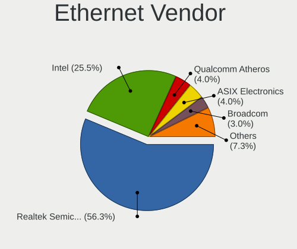

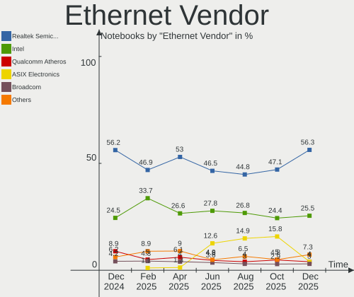

| Vendor                                 | Notebooks | Percent |
|----------------------------------------|-----------|---------|
| Realtek Semiconductor                  | 170       | 56.29%  |
| Intel                                  | 77        | 25.5%   |
| Qualcomm Atheros                       | 12        | 3.97%   |
| ASIX Electronics                       | 12        | 3.97%   |
| Broadcom                               | 9         | 2.98%   |
| Broadcom Limited                       | 5         | 1.66%   |
| Suzhou Motorcomm Electronic Technology | 3         | 0.99%   |
| Samsung Electronics                    | 2         | 0.66%   |
| Nvidia                                 | 2         | 0.66%   |
| Marvell Technology Group               | 2         | 0.66%   |
| ICS Advent                             | 2         | 0.66%   |
| TP-Link                                | 1         | 0.33%   |
| Microsoft                              | 1         | 0.33%   |
| MediaTek                               | 1         | 0.33%   |
| JMicron Technology                     | 1         | 0.33%   |
| Huawei Technologies                    | 1         | 0.33%   |
| Google                                 | 1         | 0.33%   |

Ethernet Model
--------------

Ethernet models

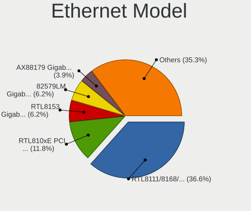

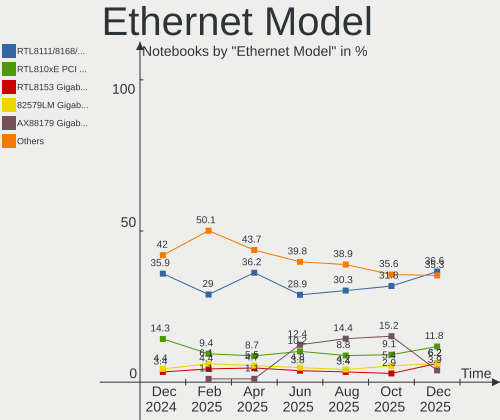

| Model                                                                  | Notebooks | Percent |
|------------------------------------------------------------------------|-----------|---------|
| Realtek RTL8111/8168/8211/8411 PCI Express Gigabit Ethernet Controller | 112       | 36.6%   |
| Realtek RTL810xE PCI Express Fast Ethernet controller                  | 36        | 11.76%  |
| Realtek RTL8153 Gigabit Ethernet Adapter                               | 19        | 6.21%   |
| Intel 82579LM Gigabit Network Connection (Lewisville)                  | 19        | 6.21%   |
| ASIX AX88179 Gigabit Ethernet                                          | 12        | 3.92%   |
| Intel Ethernet Connection (4) I219-LM                                  | 11        | 3.59%   |
| Intel Ethernet Connection (2) I219-LM                                  | 4         | 1.31%   |
| Intel 82577LM Gigabit Network Connection                               | 4         | 1.31%   |
| Suzhou Motorcomm Electronic YT6801 Gigabit Ethernet Controller         | 3         | 0.98%   |
| Realtek RTL8152 Fast Ethernet Adapter                                  | 3         | 0.98%   |
| Qualcomm Atheros AR8161 Gigabit Ethernet                               | 3         | 0.98%   |
| Intel Ethernet Connection I219-LM                                      | 3         | 0.98%   |
| Intel Ethernet Connection I218-LM                                      | 3         | 0.98%   |
| Intel Ethernet Connection I217-LM                                      | 3         | 0.98%   |
| Intel Ethernet Connection (7) I219-LM                                  | 3         | 0.98%   |
| Intel Ethernet Connection (18) I219-LM                                 | 3         | 0.98%   |
| Intel Ethernet Connection (13) I219-LM                                 | 3         | 0.98%   |
| Intel 82567LM Gigabit Network Connection                               | 3         | 0.98%   |
| Broadcom Limited NetLink BCM57780 Gigabit Ethernet PCIe                | 3         | 0.98%   |
| Samsung Galaxy series, misc. (tethering mode)                          | 2         | 0.65%   |
| Qualcomm Atheros AR8132 Fast Ethernet                                  | 2         | 0.65%   |
| Qualcomm Atheros AR8131 Gigabit Ethernet                               | 2         | 0.65%   |
| Intel Ethernet Connection (6) I219-V                                   | 2         | 0.65%   |
| Intel Ethernet Connection (3) I218-LM                                  | 2         | 0.65%   |
| Intel Ethernet Connection (10) I219-V                                  | 2         | 0.65%   |
| Intel Alder Lake-P PCH CNVi WiFi                                       | 2         | 0.65%   |
| ICS Advent 10/100M LAN                                                 | 2         | 0.65%   |
| Broadcom NetXtreme BCM5764M Gigabit Ethernet PCIe                      | 2         | 0.65%   |
| Broadcom NetLink BCM5787M Gigabit Ethernet PCI Express                 | 2         | 0.65%   |
| Broadcom NetLink BCM57780 Gigabit Ethernet PCIe                        | 2         | 0.65%   |
| Broadcom Limited NetLink BCM5787M Gigabit Ethernet PCI Express         | 2         | 0.65%   |
| TP-Link UE300 10/100/1000 LAN (ethernet mode) [Realtek RTL8153]        | 1         | 0.33%   |
| Realtek RTL8852CE PCIe 802.11ax Wireless Network Controller            | 1         | 0.33%   |
| Realtek RTL8125 2.5GbE Controller                                      | 1         | 0.33%   |
| Realtek Killer E2600 GbE Controller                                    | 1         | 0.33%   |
| Qualcomm Atheros QCA8171 Gigabit Ethernet                              | 1         | 0.33%   |
| Qualcomm Atheros Killer E2400 Gigabit Ethernet Controller              | 1         | 0.33%   |
| Qualcomm Atheros AR8152 v2.0 Fast Ethernet                             | 1         | 0.33%   |
| Qualcomm Atheros AR8151 v1.0 Gigabit Ethernet                          | 1         | 0.33%   |
| Qualcomm Atheros AR8121/AR8113/AR8114 Gigabit or Fast Ethernet         | 1         | 0.33%   |

Net Controller Kind
-------------------

Ethernet, WiFi or modem

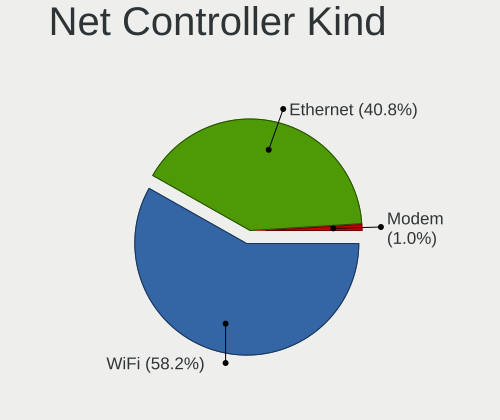

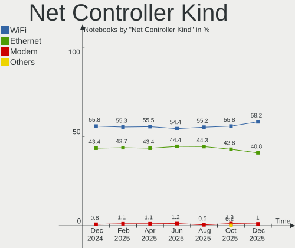

| Kind     | Notebooks | Percent |
|----------|-----------|---------|
| WiFi     | 412       | 58.19%  |
| Ethernet | 289       | 40.82%  |
| Modem    | 7         | 0.99%   |

Used Controller
---------------

Currently used network controller

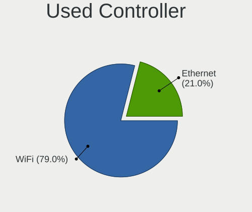

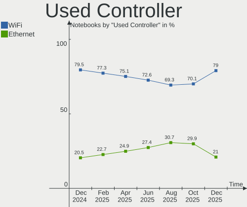

| Kind     | Notebooks | Percent |
|----------|-----------|---------|
| WiFi     | 308       | 78.97%  |
| Ethernet | 82        | 21.03%  |

NICs
----

Total network controllers on board

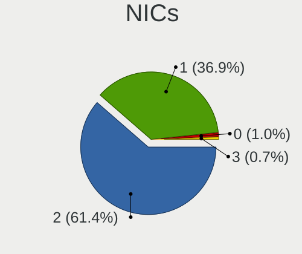

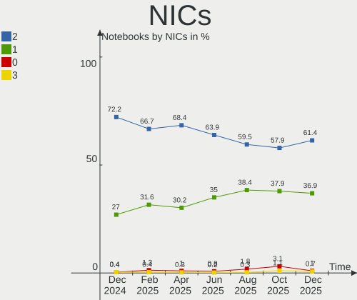

| Total | Notebooks | Percent |
|-------|-----------|---------|
| 2     | 256       | 61.39%  |
| 1     | 154       | 36.93%  |
| 0     | 4         | 0.96%   |
| 3     | 3         | 0.72%   |

IPv6
----

IPv6 vs IPv4

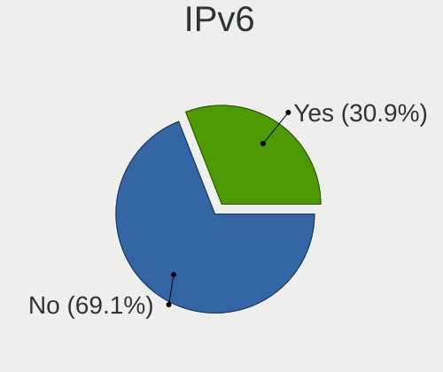

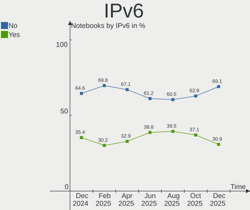

| Used | Notebooks | Percent |
|------|-----------|---------|
| No   | 288       | 69.06%  |
| Yes  | 129       | 30.94%  |

Bluetooth
---------

Bluetooth Vendor
----------------

Controller vendors

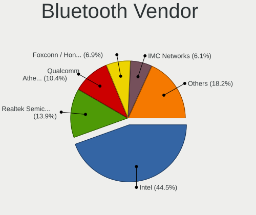

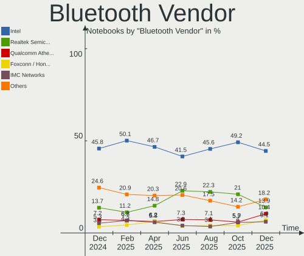

| Vendor                          | Notebooks | Percent |
|---------------------------------|-----------|---------|
| Intel                           | 154       | 44.51%  |
| Realtek Semiconductor           | 48        | 13.87%  |
| Qualcomm Atheros Communications | 36        | 10.4%   |
| Foxconn / Hon Hai               | 24        | 6.94%   |
| IMC Networks                    | 21        | 6.07%   |
| Lite-On Technology              | 12        | 3.47%   |
| Broadcom                        | 12        | 3.47%   |
| MediaTek                        | 11        | 3.18%   |
| Apple                           | 8         | 2.31%   |
| Hewlett-Packard                 | 5         | 1.45%   |
| Toshiba                         | 3         | 0.87%   |
| Dell                            | 3         | 0.87%   |
| USI                             | 2         | 0.58%   |
| TP-Link                         | 2         | 0.58%   |
| Askey Computer                  | 2         | 0.58%   |
| Realtek                         | 1         | 0.29%   |
| ASUSTek Computer                | 1         | 0.29%   |
| Alps Electric                   | 1         | 0.29%   |

Bluetooth Model
---------------

Controller models

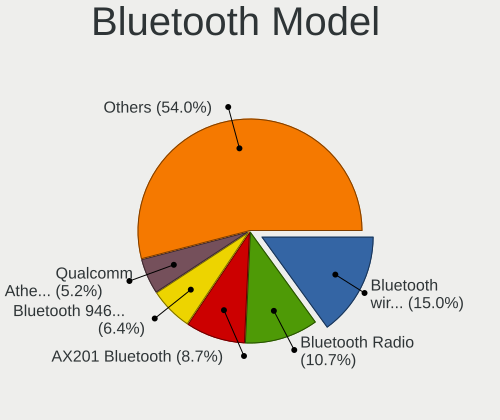

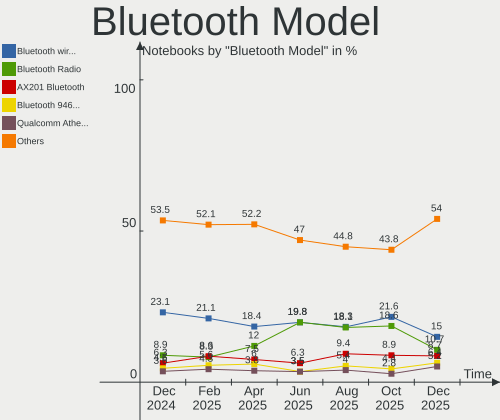

| Model                                          | Notebooks | Percent |
|------------------------------------------------|-----------|---------|
| Intel Bluetooth wireless interface             | 52        | 15.03%  |
| Realtek Bluetooth Radio                        | 37        | 10.69%  |
| Intel AX201 Bluetooth                          | 30        | 8.67%   |
| Intel Bluetooth 9460/9560 Jefferson Peak (JfP) | 22        | 6.36%   |
| Qualcomm Atheros  Bluetooth Device             | 18        | 5.2%    |
| Intel Bluetooth Device                         | 18        | 5.2%    |
| Intel AX200 Bluetooth                          | 13        | 3.76%   |
| MediaTek Wireless_Device                       | 11        | 3.18%   |
| Foxconn / Hon Hai Wireless_Device              | 10        | 2.89%   |
| Realtek  Bluetooth 4.2 Adapter                 | 9         | 2.6%    |
| Foxconn / Hon Hai Bluetooth Device             | 9         | 2.6%    |
| IMC Networks Wireless_Device                   | 8         | 2.31%   |
| IMC Networks Bluetooth Radio                   | 8         | 2.31%   |
| Intel Wireless-AC 9260 Bluetooth Adapter       | 6         | 1.73%   |
| Apple Bluetooth Host Controller                | 6         | 1.73%   |
| Qualcomm Atheros QCA61x4 Bluetooth 4.0         | 5         | 1.45%   |
| Qualcomm Atheros AR3012 Bluetooth 4.0          | 5         | 1.45%   |
| Intel Centrino Bluetooth Wireless Transceiver  | 5         | 1.45%   |
| Intel AX210 Bluetooth                          | 5         | 1.45%   |
| Lite-On Wireless_Device                        | 4         | 1.16%   |
| Lite-On Qualcomm Atheros QCA9377 Bluetooth     | 4         | 1.16%   |
| HP Broadcom 2070 Bluetooth Combo               | 4         | 1.16%   |
| Broadcom BCM2045B (BDC-2.1)                    | 4         | 1.16%   |
| Qualcomm Atheros Bluetooth USB Host Controller | 3         | 0.87%   |
| IMC Networks Bluetooth Device                  | 3         | 0.87%   |
| Foxconn / Hon Hai MediaTek Bluetooth Adapter   | 3         | 0.87%   |
| Broadcom HP Portable SoftSailing               | 3         | 0.87%   |
| Broadcom BCM20702 Bluetooth 4.0 [ThinkPad]     | 3         | 0.87%   |
| USI Bluetooth Device                           | 2         | 0.58%   |
| TP-Link TP-T@- UB500 Adapter                   | 2         | 0.58%   |
| Toshiba Bluetooth Device                       | 2         | 0.58%   |
| Realtek RTL8723B Bluetooth                     | 2         | 0.58%   |
| Qualcomm Atheros AR3012 Bluetooth              | 2         | 0.58%   |
| Qualcomm Atheros AR3011 Bluetooth              | 2         | 0.58%   |
| Intel Wireless-AC 3168 Bluetooth               | 2         | 0.58%   |
| Foxconn / Hon Hai MediaTek MT7921 Bluetooth    | 2         | 0.58%   |
| Dell DW375 Bluetooth Module                    | 2         | 0.58%   |
| Askey Bluetooth Device                         | 2         | 0.58%   |
| Apple Bluetooth USB Host Controller            | 2         | 0.58%   |
| Toshiba RT Bluetooth Radio                     | 1         | 0.29%   |

Sound
-----

Sound Vendor
------------

Sound card vendors

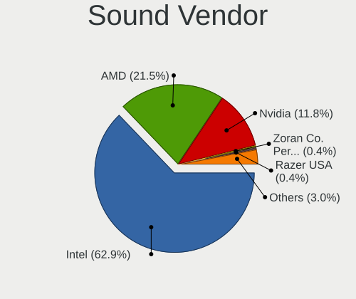

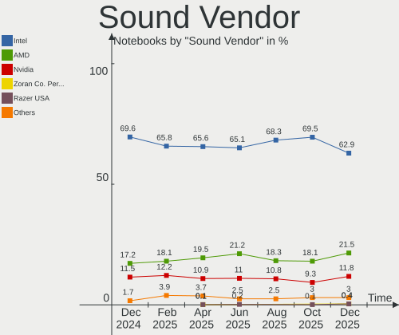

| Vendor                                       | Notebooks | Percent |
|----------------------------------------------|-----------|---------|
| Intel                                        | 313       | 62.85%  |
| AMD                                          | 107       | 21.49%  |
| Nvidia                                       | 59        | 11.85%  |
| Zoran Co. Personal Media Division (Nogatech) | 2         | 0.4%    |
| Razer USA                                    | 2         | 0.4%    |
| DisplayLink                                  | 2         | 0.4%    |
| C-Media Electronics                          | 2         | 0.4%    |
| Walmart                                      | 1         | 0.2%    |
| Thesycon Systemsoftware & Consulting         | 1         | 0.2%    |
| Texas Instruments                            | 1         | 0.2%    |
| Samson Technologies                          | 1         | 0.2%    |
| Realtek Semiconductor                        | 1         | 0.2%    |
| PreSonus Audio Electronics                   | 1         | 0.2%    |
| Logitech                                     | 1         | 0.2%    |
| Lenovo                                       | 1         | 0.2%    |
| KTMicro                                      | 1         | 0.2%    |
| JMTek                                        | 1         | 0.2%    |
| GN Netcom                                    | 1         | 0.2%    |

Sound Model
-----------

Sound card models

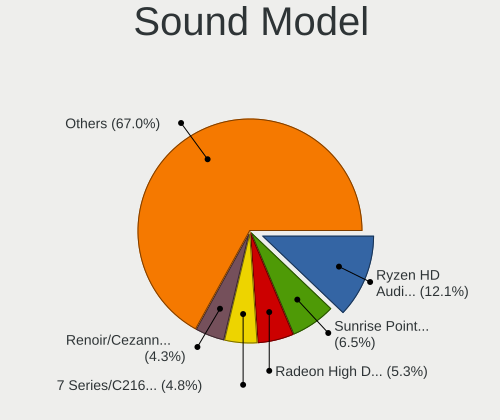

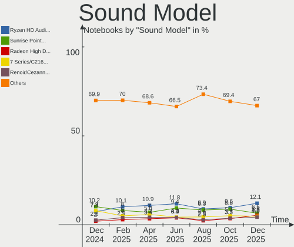

| Model                                                                      | Notebooks | Percent |
|----------------------------------------------------------------------------|-----------|---------|
| AMD Ryzen HD Audio Controller                                              | 76        | 12.12%  |
| Intel Sunrise Point-LP HD Audio                                            | 41        | 6.54%   |
| AMD Radeon High Definition Audio Controller                                | 33        | 5.26%   |
| Intel 7 Series/C216 Chipset Family High Definition Audio Controller        | 30        | 4.78%   |
| AMD Renoir/Cezanne HDMI/DP Audio Controller                                | 27        | 4.31%   |
| Intel 6 Series/C200 Series Chipset Family High Definition Audio Controller | 23        | 3.67%   |
| Intel Tiger Lake-LP Smart Sound Technology Audio Controller                | 21        | 3.35%   |
| AMD Raven/Raven2/Fenghuang HDMI/DP Audio Controller                        | 16        | 2.55%   |
| Intel Wildcat Point-LP High Definition Audio Controller                    | 14        | 2.23%   |
| Intel Celeron/Pentium Silver Processor High Definition Audio               | 14        | 2.23%   |
| Intel Broadwell-U Audio Controller                                         | 14        | 2.23%   |
| Intel 5 Series/3400 Series Chipset High Definition Audio                   | 13        | 2.07%   |
| Intel Haswell-ULT HD Audio Controller                                      | 12        | 1.91%   |
| Intel Cannon Lake PCH cAVS                                                 | 12        | 1.91%   |
| Intel 8 Series HD Audio Controller                                         | 12        | 1.91%   |
| Intel 82801I (ICH9 Family) HD Audio Controller                             | 11        | 1.75%   |
| AMD FCH Azalia Controller                                                  | 11        | 1.75%   |
| Intel Alder Lake PCH-P High Definition Audio Controller                    | 10        | 1.59%   |
| Intel Raptor Lake-P/U/H cAVS                                               | 9         | 1.44%   |
| Intel Meteor Lake-P HD Audio Controller                                    | 9         | 1.44%   |
| Intel Celeron N3350/Pentium N4200/Atom E3900 Series Audio Cluster          | 9         | 1.44%   |
| Nvidia TU107 GeForce GTX 1650 High Definition Audio Controller             | 8         | 1.28%   |
| Intel Atom Processor Z36xxx/Z37xxx Series High Definition Audio Controller | 8         | 1.28%   |
| Intel 8 Series/C220 Series Chipset High Definition Audio Controller        | 8         | 1.28%   |
| Intel 100 Series/C230 Series Chipset Family HD Audio Controller            | 8         | 1.28%   |
| AMD Kabini HDMI/DP Audio                                                   | 7         | 1.12%   |
| Nvidia AD107 High Definition Audio Controller                              | 6         | 0.96%   |
| Intel Xeon E3-1200 v3/4th Gen Core Processor HD Audio Controller           | 6         | 0.96%   |
| Intel Tiger Lake-H HD Audio Controller                                     | 6         | 0.96%   |
| Intel Jasper Lake HD Audio                                                 | 6         | 0.96%   |
| Intel Comet Lake PCH-LP cAVS                                               | 6         | 0.96%   |
| Intel Cannon Point-LP High Definition Audio Controller                     | 6         | 0.96%   |
| Intel Alder Lake-N PCH High Definition Audio Controller                    | 6         | 0.96%   |
| Intel 82801H (ICH8 Family) HD Audio Controller                             | 6         | 0.96%   |
| AMD High Definition Audio Controller                                       | 6         | 0.96%   |
| AMD Family 15h (Models 60h-6fh) Audio Controller                           | 6         | 0.96%   |
| Intel Ice Lake-LP Smart Sound Technology Audio Controller                  | 5         | 0.8%    |
| AMD SBx00 Azalia (Intel HDA)                                               | 5         | 0.8%    |
| Nvidia GM107 High Definition Audio Controller [GeForce 940MX]              | 4         | 0.64%   |
| Intel Raptor Lake High Definition Audio Controller                         | 4         | 0.64%   |

Memory
------

Memory Vendor
-------------

Memory module vendors

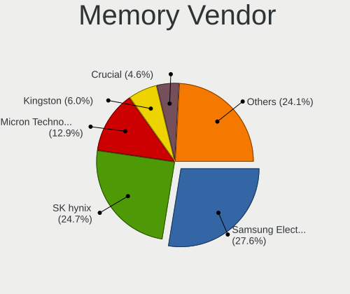

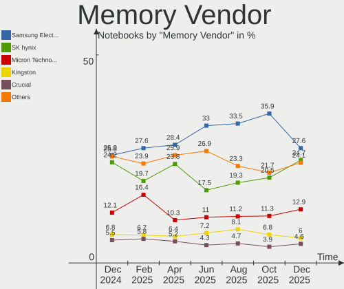

| Vendor                               | Notebooks | Percent |
|--------------------------------------|-----------|---------|
| Samsung Electronics                  | 137       | 27.57%  |
| SK hynix                             | 123       | 24.75%  |
| Micron Technology                    | 64        | 12.88%  |
| Kingston                             | 30        | 6.04%   |
| Crucial                              | 23        | 4.63%   |
| A-DATA Technology                    | 18        | 3.62%   |
| Ramaxel Technology                   | 17        | 3.42%   |
| Unknown                              | 16        | 3.22%   |
| Unknown                              | 12        | 2.41%   |
| Nanya Technology                     | 7         | 1.41%   |
| Unknown (ABCD)                       | 6         | 1.21%   |
| Elpida                               | 6         | 1.21%   |
| Corsair                              | 5         | 1.01%   |
| Apacer                               | 4         | 0.8%    |
| 4ea5                                 | 3         | 0.6%    |
| Smart                                | 2         | 0.4%    |
| Patriot                              | 2         | 0.4%    |
| ASint Technology                     | 2         | 0.4%    |
| Unknown (FFFF000080AD)               | 1         | 0.2%    |
| Unknown (0x0FE9)                     | 1         | 0.2%    |
| Unknown (0x0F94)                     | 1         | 0.2%    |
| Unknown (0x0E9D)                     | 1         | 0.2%    |
| Unknown (0x0080)                     | 1         | 0.2%    |
| Unknown (0000000080CE)               | 1         | 0.2%    |
| Transcend                            | 1         | 0.2%    |
| TOP MEDIA                            | 1         | 0.2%    |
| Timetec                              | 1         | 0.2%    |
| Team                                 | 1         | 0.2%    |
| Smart Brazil                         | 1         | 0.2%    |
| Silicon Power                        | 1         | 0.2%    |
| Patriot Memory (PDP Systems)         | 1         | 0.2%    |
| KingSpec                             | 1         | 0.2%    |
| KingFast                             | 1         | 0.2%    |
| G.Skill                              | 1         | 0.2%    |
| ff                                   | 1         | 0.2%    |
| fef5                                 | 1         | 0.2%    |
| Chun Well Technology Holding Limited | 1         | 0.2%    |
| ChangXin Memory                      | 1         | 0.2%    |

Memory Model
------------

Memory module models

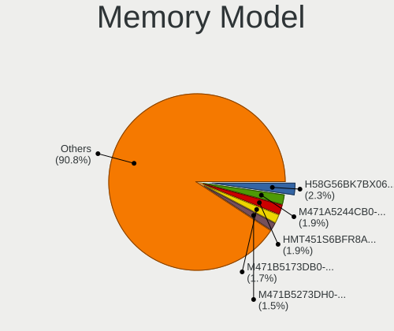

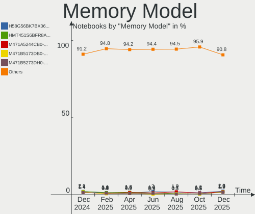

| Model                                                            | Notebooks | Percent |
|------------------------------------------------------------------|-----------|---------|
| Unknown                                                          | 12        | 2.26%   |
| SK hynix RAM HMT451S6BFR8A-PB 4GB SODIMM DDR3 1600MT/s           | 10        | 1.88%   |
| Samsung RAM M471A5244CB0-CWE 4GB SODIMM DDR4 3200MT/s            | 10        | 1.88%   |
| Samsung RAM M471B5173DB0-YK0 4GB SODIMM DDR3 1600MT/s            | 9         | 1.69%   |
| Samsung RAM M471B5273DH0-CH9 4GB SODIMM DDR3 1600MT/s            | 8         | 1.5%    |
| Samsung RAM M471B5173QH0-YK0 4GB SODIMM DDR3 1600MT/s            | 7         | 1.32%   |
| Unknown (ABCD) RAM 123456789012345678 2GB SODIMM LPDDR4 2400MT/s | 6         | 1.13%   |
| Samsung RAM M471A1K43EB1-CWE 8GB SODIMM DDR4 3200MT/s            | 5         | 0.94%   |
| SK hynix RAM HMT451S6AFR8A-PB 4GB SODIMM DDR3 1600MT/s           | 4         | 0.75%   |
| SK hynix RAM HMT425S6AFR6A-PB 2GB SODIMM DDR3 3200MT/s           | 4         | 0.75%   |
| SK hynix RAM HMT41GS6BFR8A-PB 8GB SODIMM DDR3 1600MT/s           | 4         | 0.75%   |
| SK hynix RAM HMA81GS6AFR8N-UH 8GB SODIMM DDR4 2667MT/s           | 4         | 0.75%   |
| Samsung RAM M471B5273DH0-CK0 4GB SODIMM DDR3 2400MT/s            | 4         | 0.75%   |
| Samsung RAM M471A1G44AB0-CWE 8GiB SODIMM DDR4 3200MT/s           | 4         | 0.75%   |
| Ramaxel RAM RMSA3260ME78HAF-2666 8GB SODIMM DDR4 2667MT/s        | 4         | 0.75%   |
| Unknown RAM Module 2GB SODIMM 800MT/s                            | 3         | 0.56%   |
| SK hynix RAM HMT41GS6BFR8A-PB 8GB SODIMM DDR3 2667MT/s           | 3         | 0.56%   |
| SK hynix RAM HMT351S6BFR8C-H9 4GB SODIMM DDR3 1333MT/s           | 3         | 0.56%   |
| SK hynix RAM HMT325S6CFR8C-H9 2GB SODIMM DDR3 1333MT/s           | 3         | 0.56%   |
| SK hynix RAM HMAA1GS6CJR6N-XN 8GB SODIMM DDR4 3200MT/s           | 3         | 0.56%   |
| SK hynix RAM HMA851S6JJR6N-VK 4GB SODIMM DDR4 2667MT/s           | 3         | 0.56%   |
| SK hynix RAM HMA851S6DJR6N-XN 4GB SODIMM DDR4 3200MT/s           | 3         | 0.56%   |
| SK hynix RAM HMA81GS6DJR8N-VK 8GB SODIMM DDR4 2667MT/s           | 3         | 0.56%   |
| SK hynix RAM HMA41GS6AFR8N-TF 8GB SODIMM DDR4 2667MT/s           | 3         | 0.56%   |
| SK hynix RAM H9JCNNNFA5MLYR-N6E 4GB Row Of Chips LPDDR5 6400MT/s | 3         | 0.56%   |
| Samsung RAM M425R2GA3EB0-CWMOD 16GB SODIMM DDR5 5600MT/s         | 3         | 0.56%   |
| Micron RAM 8ATF1G64HZ-2G6E1 8GB SODIMM DDR4 2667MT/s             | 3         | 0.56%   |
| Micron RAM 4ATF51264HZ-2G3B1 4GB SODIMM DDR4 3200MT/s            | 3         | 0.56%   |
| Micron RAM 4ATF1G64HZ-3G2E1 8GB SODIMM DDR4 3200MT/s             | 3         | 0.56%   |
| A-DATA RAM AD5S560016G-SFW 16GiB SODIMM DDR5 5600MT/s            | 3         | 0.56%   |
| Unknown RAM Module 4GB SODIMM DDR4 2133MT/s                      | 2         | 0.38%   |
| Unknown RAM Module 2GB SODIMM DDR2 667MT/s                       | 2         | 0.38%   |
| SK hynix RAM HMT351S6CFR8C-PB 4GB SODIMM DDR3 1600MT/s           | 2         | 0.38%   |
| SK hynix RAM HMT351S6CFR8C-H9 4GB SODIMM DDR3 1334MT/s           | 2         | 0.38%   |
| SK hynix RAM HMT351S6BFR8C-H9 4GB SODIMM 1334MT/s                | 2         | 0.38%   |
| SK hynix RAM HMT325S6CFR8C-PB 2GB SODIMM DDR3 1600MT/s           | 2         | 0.38%   |
| SK hynix RAM HMT325S6BFR8C-H9 2GB SODIMM DDR3 1333MT/s           | 2         | 0.38%   |
| SK hynix RAM HMA851S6DJR6N-XN 4GB Row Of Chips DDR4 3200MT/s     | 2         | 0.38%   |
| SK hynix RAM HMA851S6CJR6N-XN 4GB SODIMM DDR4 3200MT/s           | 2         | 0.38%   |
| SK hynix RAM HMA82GS6AFR8N-UH 16GB SODIMM DDR4 2667MT/s          | 2         | 0.38%   |

Memory Kind
-----------

Memory module kinds

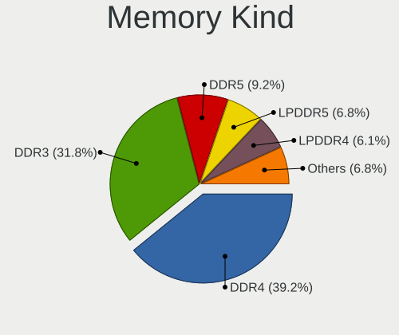

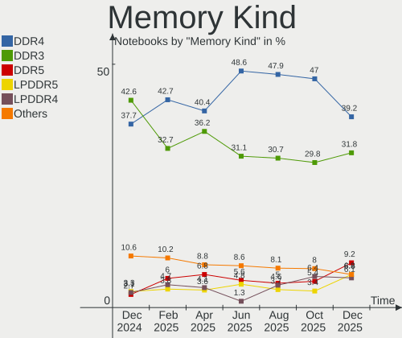

| Kind    | Notebooks | Percent |
|---------|-----------|---------|
| DDR4    | 166       | 39.15%  |
| DDR3    | 135       | 31.84%  |
| DDR5    | 39        | 9.2%    |
| LPDDR5  | 29        | 6.84%   |
| LPDDR4  | 26        | 6.13%   |
| LPDDR3  | 8         | 1.89%   |
| DDR2    | 8         | 1.89%   |
| SDRAM   | 6         | 1.42%   |
| Unknown | 6         | 1.42%   |
| DRAM    | 1         | 0.24%   |

Memory Form Factor
------------------

Physical design of the memory module

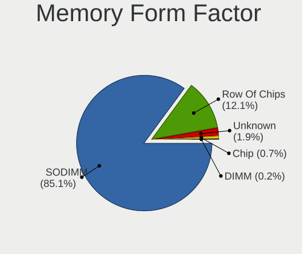

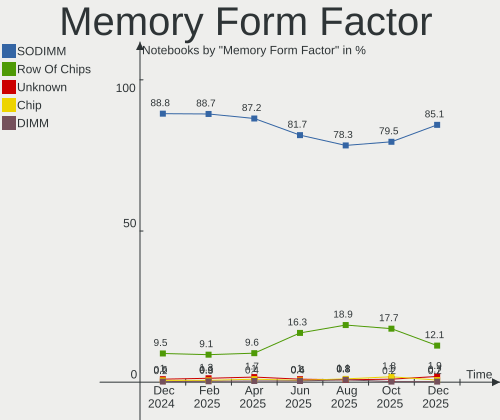

| Name         | Notebooks | Percent |
|--------------|-----------|---------|
| SODIMM       | 360       | 85.11%  |
| Row Of Chips | 51        | 12.06%  |
| Unknown      | 8         | 1.89%   |
| Chip         | 3         | 0.71%   |
| DIMM         | 1         | 0.24%   |

Memory Size
-----------

Memory module size

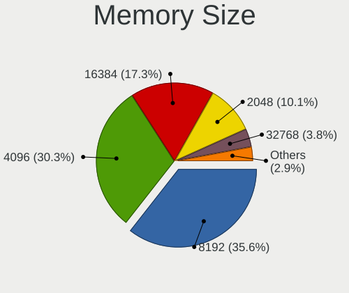

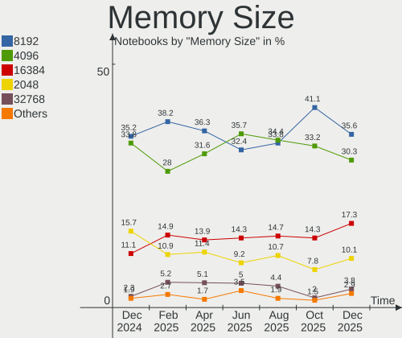

| Size  | Notebooks | Percent |
|-------|-----------|---------|
| 8192  | 169       | 35.58%  |
| 4096  | 144       | 30.32%  |
| 16384 | 82        | 17.26%  |
| 2048  | 48        | 10.11%  |
| 32768 | 18        | 3.79%   |
| 1024  | 10        | 2.11%   |
| 49152 | 2         | 0.42%   |
| 3072  | 2         | 0.42%   |

Memory Speed
------------

Memory module speed

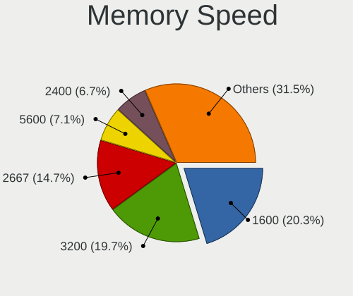

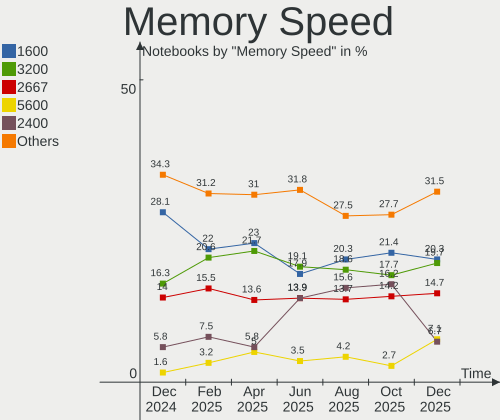

| Speed   | Notebooks | Percent |
|---------|-----------|---------|
| 1600    | 94        | 20.3%   |
| 3200    | 91        | 19.65%  |
| 2667    | 68        | 14.69%  |
| 5600    | 33        | 7.13%   |
| 2400    | 31        | 6.7%    |
| 1334    | 18        | 3.89%   |
| 1333    | 18        | 3.89%   |
| 6400    | 16        | 3.46%   |
| 2133    | 16        | 3.46%   |
| 4267    | 9         | 1.94%   |
| 1067    | 9         | 1.94%   |
| 7500    | 7         | 1.51%   |
| 1867    | 6         | 1.3%    |
| 667     | 6         | 1.3%    |
| 4800    | 5         | 1.08%   |
| 800     | 5         | 1.08%   |
| 4266    | 4         | 0.86%   |
| 4199    | 4         | 0.86%   |
| 8533    | 2         | 0.43%   |
| 8400    | 2         | 0.43%   |
| 7467    | 2         | 0.43%   |
| 3266    | 2         | 0.43%   |
| 2048    | 2         | 0.43%   |
| 1866    | 2         | 0.43%   |
| 1066    | 2         | 0.43%   |
| 5500    | 1         | 0.22%   |
| 5200    | 1         | 0.22%   |
| 3733    | 1         | 0.22%   |
| 2933    | 1         | 0.22%   |
| 1200    | 1         | 0.22%   |
| 975     | 1         | 0.22%   |
| 533     | 1         | 0.22%   |
| 333     | 1         | 0.22%   |
| Unknown | 1         | 0.22%   |

Printers & scanners
-------------------

Printer Vendor
--------------

Printer device vendors

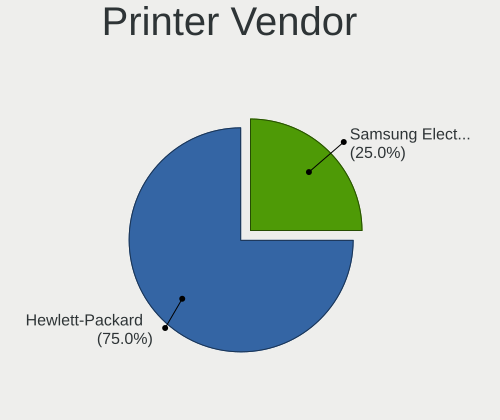

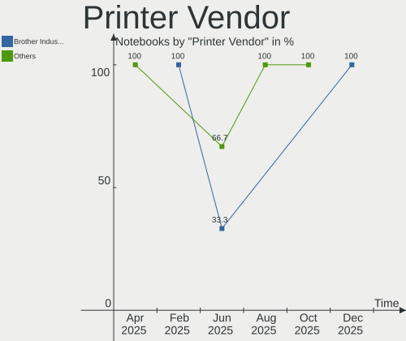

| Vendor             | Notebooks | Percent |
|--------------------|-----------|---------|
| Brother Industries | 1         | 100%    |

Printer Model
-------------

Printer device models

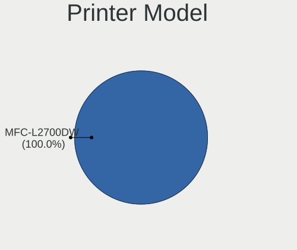

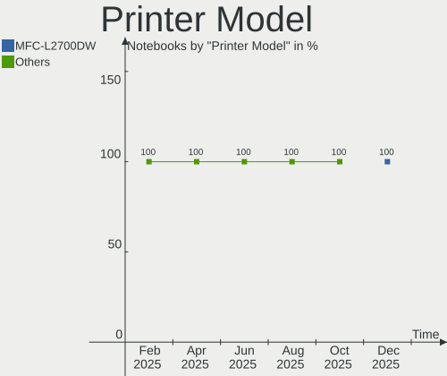

| Model               | Notebooks | Percent |
|---------------------|-----------|---------|
| Brother MFC-L2700DW | 1         | 100%    |

Scanner Vendor
--------------

Scanner device vendors

Zero info for selected period =(

Scanner Model
-------------

Scanner device models

Zero info for selected period =(

Camera
------

Camera Vendor
-------------

Camera device vendors

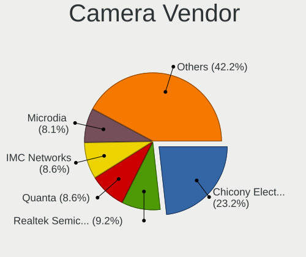

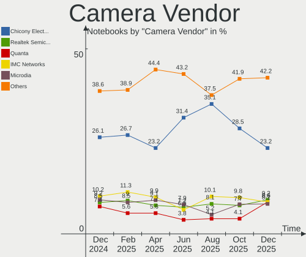

| Vendor                                 | Notebooks | Percent |
|----------------------------------------|-----------|---------|
| Chicony Electronics                    | 86        | 23.24%  |
| Realtek Semiconductor                  | 34        | 9.19%   |
| Quanta                                 | 32        | 8.65%   |
| IMC Networks                           | 32        | 8.65%   |
| Microdia                               | 30        | 8.11%   |
| Bison Electronics                      | 22        | 5.95%   |
| Sunplus Innovation Technology          | 21        | 5.68%   |
| Luxvisions Innotech Limited            | 16        | 4.32%   |
| Syntek                                 | 13        | 3.51%   |
| Suyin                                  | 13        | 3.51%   |
| Cheng Uei Precision Industry (Foxlink) | 10        | 2.7%    |
| Silicon Motion                         | 7         | 1.89%   |
| Sonix Technology                       | 6         | 1.62%   |
| Lite-On Technology                     | 5         | 1.35%   |
| icSpring                               | 5         | 1.35%   |
| Acer                                   | 5         | 1.35%   |
| Primax Electronics                     | 4         | 1.08%   |
| Apple                                  | 4         | 1.08%   |
| Alcor Micro                            | 4         | 1.08%   |
| Lenovo                                 | 3         | 0.81%   |
| Framework                              | 3         | 0.81%   |
| Ricoh                                  | 2         | 0.54%   |
| OYT Tech                               | 2         | 0.54%   |
| ALi                                    | 2         | 0.54%   |
| Unknown                                | 2         | 0.54%   |
| Unknown (3730304231393831325530)       | 1         | 0.27%   |
| ShineTech                              | 1         | 0.27%   |
| SenseTek                               | 1         | 0.27%   |
| Razer USA                              | 1         | 0.27%   |
| Microsoft                              | 1         | 0.27%   |
| Logitech                               | 1         | 0.27%   |
| kingcome                               | 1         | 0.27%   |

Camera Model
------------

Camera device models

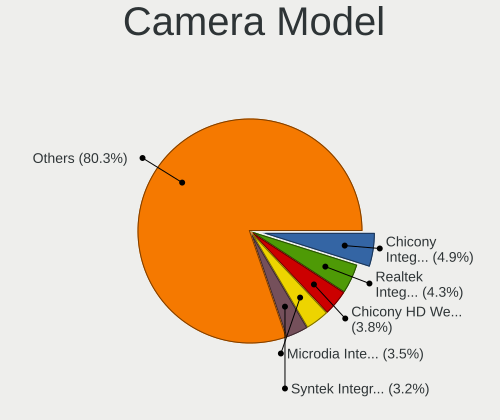

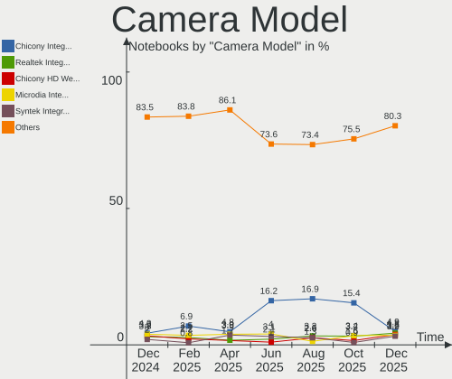

| Model                                         | Notebooks | Percent |
|-----------------------------------------------|-----------|---------|
| Chicony Integrated Camera                     | 18        | 4.86%   |
| Realtek Integrated_Webcam_HD                  | 16        | 4.32%   |
| Chicony HD WebCam                             | 14        | 3.78%   |
| Microdia Integrated_Webcam_HD                 | 13        | 3.51%   |
| Syntek Integrated Camera                      | 12        | 3.24%   |
| IMC Networks USB2.0 HD UVC WebCam             | 12        | 3.24%   |
| IMC Networks Integrated Camera                | 12        | 3.24%   |
| Bison Integrated Camera                       | 9         | 2.43%   |
| Luxvisions Innotech Limited Integrated Camera | 7         | 1.89%   |
| Sunplus Integrated_Webcam_HD                  | 6         | 1.62%   |
| Quanta HP TrueVision HD Camera                | 6         | 1.62%   |
| icSpring camera                               | 5         | 1.35%   |
| Suyin Integrated_Webcam_HD                    | 4         | 1.08%   |
| Quanta VGA WebCam                             | 4         | 1.08%   |
| Quanta HD Webcam                              | 4         | 1.08%   |
| Quanta HD User Facing                         | 4         | 1.08%   |
| Chicony VGA Webcam                            | 4         | 1.08%   |
| Chicony HP TrueVision HD Camera               | 4         | 1.08%   |
| Chicony HP Truevision HD                      | 4         | 1.08%   |
| Chicony HP HD Camera                          | 4         | 1.08%   |
| Suyin Acer/HP Integrated Webcam [CN0314]      | 3         | 0.81%   |
| Sunplus Integrated Webcam                     | 3         | 0.81%   |
| Sonix USB2.0 HD UVC WebCam                    | 3         | 0.81%   |
| Sonix USB2.0 FHD UVC WebCam                   | 3         | 0.81%   |
| Realtek USB Camera                            | 3         | 0.81%   |
| Realtek Integrated Webcam HD                  | 3         | 0.81%   |
| Quanta ACER HD User Facing                    | 3         | 0.81%   |
| Microdia Integrated_Webcam_FHD                | 3         | 0.81%   |
| Microdia Integrated Webcam HD                 | 3         | 0.81%   |
| Microdia Dell Laptop Integrated Webcam HD     | 3         | 0.81%   |
| Framework Laptop Webcam Module (2nd Gen)      | 3         | 0.81%   |
| Chicony EasyCamera                            | 3         | 0.81%   |
| Chicony ACER HD User Facing                   | 3         | 0.81%   |
| Bison SunplusIT Integrated Camera             | 3         | 0.81%   |
| Apple Built-in iSight                         | 3         | 0.81%   |
| Silicon Motion WebCam SC-0311139N             | 2         | 0.54%   |
| Silicon Motion 720p HD Camera                 | 2         | 0.54%   |
| Realtek Lenovo EasyCamera                     | 2         | 0.54%   |
| Realtek HP Truevision HD                      | 2         | 0.54%   |
| Quanta HP True Vision HD Camera               | 2         | 0.54%   |

Security
--------

Fingerprint Vendor
------------------

Fingerprint sensor vendors

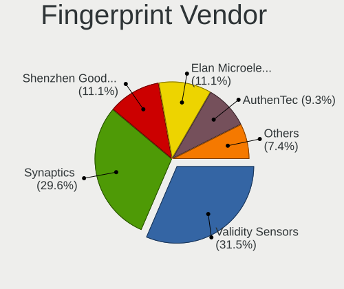

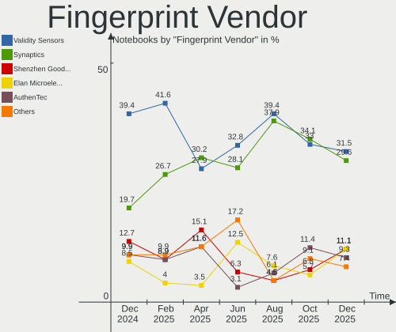

| Vendor                     | Notebooks | Percent |
|----------------------------|-----------|---------|
| Validity Sensors           | 17        | 31.48%  |
| Synaptics                  | 16        | 29.63%  |
| Shenzhen Goodix Technology | 6         | 11.11%  |
| Elan Microelectronics      | 6         | 11.11%  |
| AuthenTec                  | 5         | 9.26%   |
| Upek                       | 1         | 1.85%   |
| STMicroelectronics         | 1         | 1.85%   |
| LighTuning Technology      | 1         | 1.85%   |
| Focal-systems.Corp         | 1         | 1.85%   |

Fingerprint Model
-----------------

Fingerprint sensor models

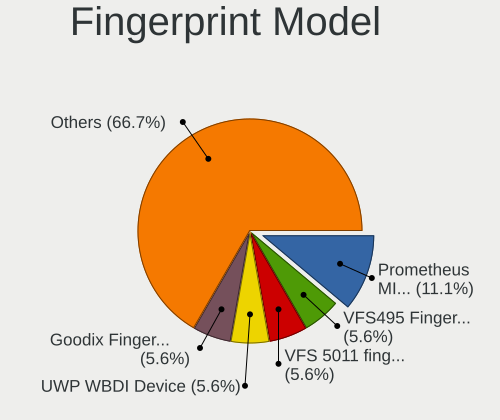

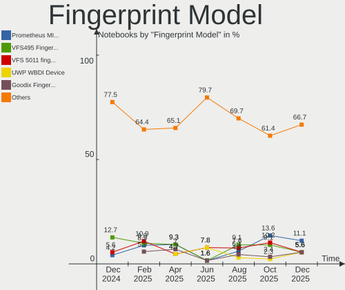

| Model                                                     | Notebooks | Percent |
|-----------------------------------------------------------|-----------|---------|
| Synaptics Prometheus MIS Touch Fingerprint Reader         | 6         | 11.11%  |
| Validity Sensors VFS495 Fingerprint Reader                | 3         | 5.56%   |
| Validity Sensors VFS 5011 fingerprint sensor              | 3         | 5.56%   |
| Synaptics UWP WBDI Device                                 | 3         | 5.56%   |
| Shenzhen Goodix  FingerPrint Device                       | 3         | 5.56%   |
| Elan ELAN:Fingerprint                                     | 3         | 5.56%   |
| Elan ELAN:ARM-M4                                          | 3         | 5.56%   |
| AuthenTec Fingerprint Sensor                              | 3         | 5.56%   |
| Validity Sensors VFS7552 Touch Fingerprint Sensor         | 2         | 3.7%    |
| Validity Sensors VFS7500 Touch Fingerprint Sensor         | 2         | 3.7%    |
| Validity Sensors VFS5011 Fingerprint Reader               | 2         | 3.7%    |
| Validity Sensors VFS471 Fingerprint Reader                | 2         | 3.7%    |
| Validity Sensors VFS451 Fingerprint Reader                | 2         | 3.7%    |
| Synaptics Prometheus Fingerprint Reader                   | 2         | 3.7%    |
| Synaptics Fingerprint reader [HP G6]                      | 2         | 3.7%    |
| Shenzhen Goodix FingerPrint                               | 2         | 3.7%    |
| Validity Sensors VFS491                                   | 1         | 1.85%   |
| Upek Biometric Touchchip/Touchstrip Fingerprint Sensor    | 1         | 1.85%   |
| Synaptics  FS7604 Touch Fingerprint Sensor with PurePrint | 1         | 1.85%   |
| Synaptics Metallica MIS Touch Fingerprint Reader          | 1         | 1.85%   |
| Synaptics FS7604 Touch Fingerprint Sensor with PurePrint  | 1         | 1.85%   |
| STMicroelectronics Fingerprint Reader                     | 1         | 1.85%   |
| Shenzhen Goodix Fingerprint Reader                        | 1         | 1.85%   |
| LighTuning EgisTec Touch Fingerprint Sensor               | 1         | 1.85%   |
| Focal-systems.Corp FT9201Fingerprint.                     | 1         | 1.85%   |
| AuthenTec AES2810                                         | 1         | 1.85%   |
| AuthenTec AES2501 Fingerprint Sensor                      | 1         | 1.85%   |

Chipcard Vendor
---------------

Chipcard module vendors

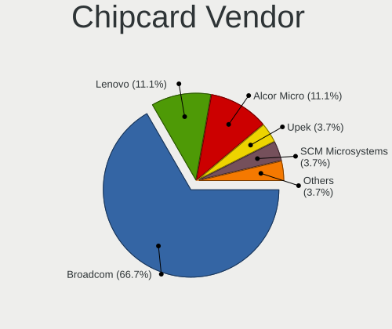

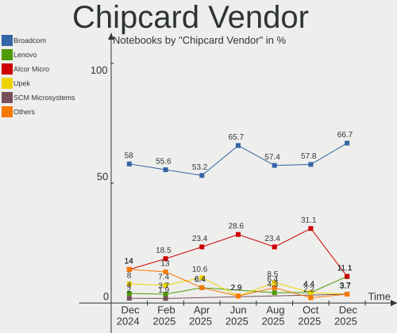

| Vendor           | Notebooks | Percent |
|------------------|-----------|---------|
| Broadcom         | 18        | 66.67%  |
| Lenovo           | 3         | 11.11%  |
| Alcor Micro      | 3         | 11.11%  |
| Upek             | 1         | 3.7%    |
| SCM Microsystems | 1         | 3.7%    |
| O2 Micro         | 1         | 3.7%    |

Chipcard Model
--------------

Chipcard module models

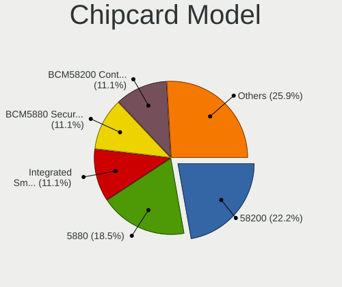

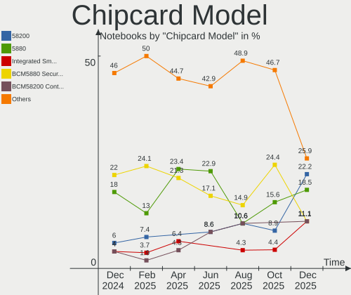

| Model                                                                        | Notebooks | Percent |
|------------------------------------------------------------------------------|-----------|---------|
| Broadcom 58200                                                               | 6         | 22.22%  |
| Broadcom 5880                                                                | 5         | 18.52%  |
| Lenovo Integrated Smart Card Reader                                          | 3         | 11.11%  |
| Broadcom BCM5880 Secure Applications Processor                               | 3         | 11.11%  |
| Broadcom BCM58200 ControlVault 3 (FingerPrint sensor + Contacted SmartCard)  | 3         | 11.11%  |
| Alcor Micro AU9540 Smartcard Reader                                          | 3         | 11.11%  |
| Upek TouchChip Fingerprint Coprocessor (WBF advanced mode)                   | 1         | 3.7%    |
| SCM Microsystems SCR3340 - ExpressCard54 Smart Card Reader                   | 1         | 3.7%    |
| O2 Micro OZ776 CCID Smartcard Reader                                         | 1         | 3.7%    |
| Broadcom BCM5880 Secure Applications Processor with fingerprint swipe sensor | 1         | 3.7%    |

Unsupported
-----------

Unsupported Devices
-------------------

Total unsupported devices on board

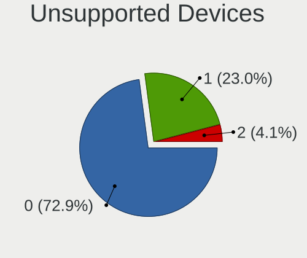

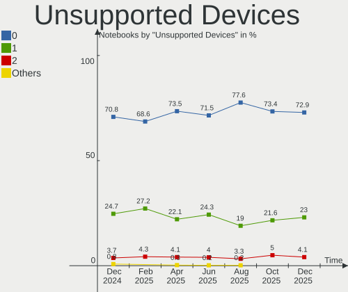

| Total | Notebooks | Percent |
|-------|-----------|---------|
| 0     | 304       | 72.9%   |
| 1     | 96        | 23.02%  |
| 2     | 17        | 4.08%   |

Unsupported Device Types
------------------------

Types of unsupported devices

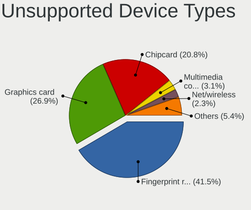

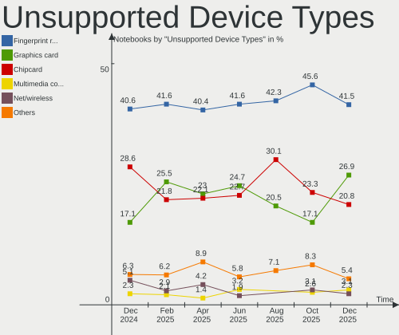

| Type                     | Notebooks | Percent |
|--------------------------|-----------|---------|
| Fingerprint reader       | 54        | 41.54%  |
| Graphics card            | 35        | 26.92%  |
| Chipcard                 | 27        | 20.77%  |
| Multimedia controller    | 4         | 3.08%   |
| Net/wireless             | 3         | 2.31%   |
| Net/ethernet             | 3         | 2.31%   |
| Storage                  | 2         | 1.54%   |
| Communication controller | 1         | 0.77%   |
| Card reader              | 1         | 0.77%   |

