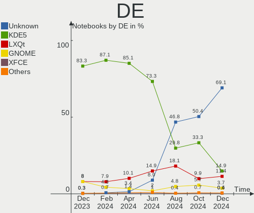
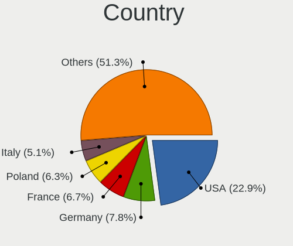
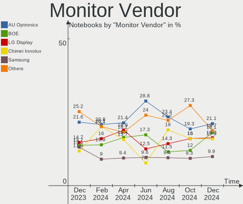
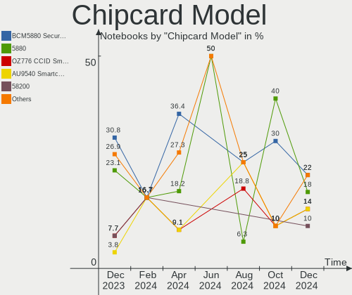
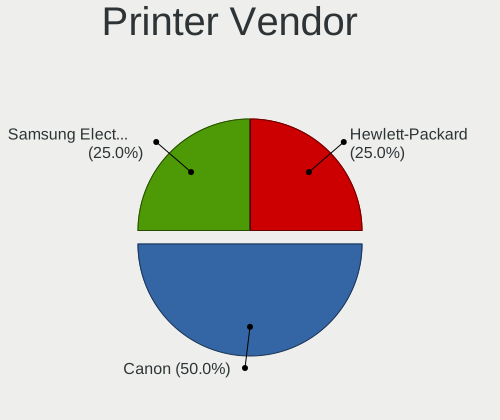

OpenMandriva Hardware Trends (Notebook)
---------------------------------------

A project to identify most popular hardware characteristics and track their change
over time based on data collected by OpenMandriva users at https://Linux-Hardware.org.

Anyone can contribute to the study by uploading probes of their computers by
the [hw-probe](https://github.com/linuxhw/hw-probe) tool:

    sudo -E hw-probe -all -upload

Full-feature report is available here: https://linux-hardware.org/?view=trends&formfactor=notebook

Period: May, 2021.

Contents
--------

- [ OS                       ](#os)
- [ OS Family                ](#os-family)
- [ Kernel                   ](#kernel)
- [ Kernel Family            ](#kernel-family)
- [ Kernel Major Ver.        ](#kernel-major-ver)
- [ Arch                     ](#arch)
- [ DE                       ](#de)
- [ Display Server           ](#display-server)
- [ Display Manager          ](#display-manager)
- [ OS Lang                  ](#os-lang)
- [ Boot Mode                ](#boot-mode)
- [ Filesystem               ](#filesystem)
- [ Part. scheme             ](#part-scheme)
- [ Dual Boot with Linux/BSD ](#dual-boot-with-linux/bsd)
- [ Dual Boot (Win)          ](#dual-boot-win)
- [ Country                  ](#country)
- [ City                     ](#city)
- [ Vendor                   ](#vendor)
- [ Model                    ](#model)
- [ Model Family             ](#model-family)
- [ MFG Year                 ](#mfg-year)
- [ Form Factor              ](#form-factor)
- [ Secure Boot              ](#secure-boot)
- [ Coreboot                 ](#coreboot)
- [ RAM Size                 ](#ram-size)
- [ RAM Used                 ](#ram-used)
- [ Has CD-ROM               ](#has-cd-rom)
- [ Total Drives             ](#total-drives)
- [ Has Ethernet             ](#has-ethernet)
- [ Has WiFi                 ](#has-wifi)
- [ Has Bluetooth            ](#has-bluetooth)
- [ Drive Vendor             ](#drive-vendor)
- [ Drive Model              ](#drive-model)
- [ HDD Vendor               ](#hdd-vendor)
- [ SSD Vendor               ](#ssd-vendor)
- [ Drive Kind               ](#drive-kind)
- [ Drive Connector          ](#drive-connector)
- [ Drive Size               ](#drive-size)
- [ Space Total              ](#space-total)
- [ Space Used               ](#space-used)
- [ Malfunc. Drives          ](#malfunc-drives)
- [ Malfunc. Drive Vendor    ](#malfunc-drive-vendor)
- [ Malfunc. HDD Vendor      ](#malfunc-hdd-vendor)
- [ Malfunc. Drive Kind      ](#malfunc-drive-kind)
- [ Failed Drives            ](#failed-drives)
- [ Failed Drive Vendor      ](#failed-drive-vendor)
- [ Drive Status             ](#drive-status)
- [ Storage Vendor           ](#storage-vendor)
- [ Storage Model            ](#storage-model)
- [ Storage Kind             ](#storage-kind)
- [ CPU Vendor               ](#cpu-vendor)
- [ CPU Model                ](#cpu-model)
- [ CPU Model Family         ](#cpu-model-family)
- [ CPU Cores                ](#cpu-cores)
- [ CPU Sockets              ](#cpu-sockets)
- [ CPU Threads              ](#cpu-threads)
- [ CPU Op-Modes             ](#cpu-op-modes)
- [ CPU Microcode            ](#cpu-microcode)
- [ CPU Microarch            ](#cpu-microarch)
- [ GPU Vendor               ](#gpu-vendor)
- [ GPU Model                ](#gpu-model)
- [ GPU Combo                ](#gpu-combo)
- [ GPU Driver               ](#gpu-driver)
- [ GPU Memory               ](#gpu-memory)
- [ Monitor Vendor           ](#monitor-vendor)
- [ Monitor Model            ](#monitor-model)
- [ Monitor Resolution       ](#monitor-resolution)
- [ Monitor Diagonal         ](#monitor-diagonal)
- [ Monitor Width            ](#monitor-width)
- [ Aspect Ratio             ](#aspect-ratio)
- [ Monitor Area             ](#monitor-area)
- [ Pixel Density            ](#pixel-density)
- [ Multiple Monitors        ](#multiple-monitors)
- [ Net Controller Vendor    ](#net-controller-vendor)
- [ Net Controller Model     ](#net-controller-model)
- [ Wireless Vendor          ](#wireless-vendor)
- [ Wireless Model           ](#wireless-model)
- [ Ethernet Vendor          ](#ethernet-vendor)
- [ Ethernet Model           ](#ethernet-model)
- [ Net Controller Kind      ](#net-controller-kind)
- [ Used Controller          ](#used-controller)
- [ NICs                     ](#nics)
- [ IPv6                     ](#ipv6)
- [ Memory Vendor            ](#memory-vendor)
- [ Memory Model             ](#memory-model)
- [ Memory Kind              ](#memory-kind)
- [ Memory Form Factor       ](#memory-form-factor)
- [ Memory Size              ](#memory-size)
- [ Memory Speed             ](#memory-speed)
- [ Sound Vendor             ](#sound-vendor)
- [ Sound Model              ](#sound-model)
- [ Camera Vendor            ](#camera-vendor)
- [ Camera Model             ](#camera-model)
- [ Fingerprint Vendor       ](#fingerprint-vendor)
- [ Fingerprint Model        ](#fingerprint-model)
- [ Chipcard Vendor          ](#chipcard-vendor)
- [ Chipcard Model           ](#chipcard-model)
- [ Printer Vendor           ](#printer-vendor)
- [ Printer Model            ](#printer-model)
- [ Scanner Vendor           ](#scanner-vendor)
- [ Scanner Model            ](#scanner-model)
- [ Bluetooth Vendor         ](#bluetooth-vendor)
- [ Bluetooth Model          ](#bluetooth-model)
- [ Unsupported Devices      ](#unsupported-devices)
- [ Unsupported Device Types ](#unsupported-device-types)

OS
--

Installed operating systems

| Name              | Notebooks | Percent |
|-------------------|-----------|---------|
| OpenMandriva 4.2  | 163       | 74.09%  |
| OpenMandriva 4.50 | 57        | 25.91%  |

OS Family
---------

OS without a version

| Name         | Notebooks | Percent |
|--------------|-----------|---------|
| OpenMandriva | 220       | 100%    |

Kernel
------

Version of the Linux kernel

| Version                        | Notebooks | Percent |
|--------------------------------|-----------|---------|
| 5.10.14-desktop-1omv4002       | 154       | 70%     |
| 5.12.4-desktop-1omv4050        | 56        | 25.45%  |
| 5.11.12-desktop-1omv4002       | 9         | 4.09%   |
| 5.11.16-desktop-clang-1omv4050 | 1         | 0.45%   |

Kernel Family
-------------

Linux kernel without a distro release

| Version | Notebooks | Percent |
|---------|-----------|---------|
| 5.10.14 | 154       | 70%     |
| 5.12.4  | 56        | 25.45%  |
| 5.11.12 | 9         | 4.09%   |
| 5.11.16 | 1         | 0.45%   |

Kernel Major Ver.
-----------------

Linux kernel major version

| Version | Notebooks | Percent |
|---------|-----------|---------|
| 5.10    | 154       | 70%     |
| 5.12    | 56        | 25.45%  |
| 5.11    | 10        | 4.55%   |

Arch
----

OS architecture (x86_64, i586, etc.)

| Name   | Notebooks | Percent |
|--------|-----------|---------|
| x86_64 | 220       | 100%    |

DE
--

Desktop Environment

| Name | Notebooks | Percent |
|------|-----------|---------|
| KDE5 | 220       | 100%    |

Display Server
--------------

X11 or Wayland

| Name | Notebooks | Percent |
|------|-----------|---------|
| X11  | 220       | 100%    |

Display Manager
---------------

SDDM, LightDM, etc.

| Name | Notebooks | Percent |
|------|-----------|---------|
| SDDM | 220       | 100%    |

OS Lang
-------

Language

| Lang  | Notebooks | Percent |
|-------|-----------|---------|
| en_US | 105       | 47.73%  |
| fr_FR | 21        | 9.55%   |
| de_DE | 19        | 8.64%   |
| ru_RU | 17        | 7.73%   |
| it_IT | 13        | 5.91%   |
| pl_PL | 9         | 4.09%   |
| en_GB | 5         | 2.27%   |
| cs_CZ | 5         | 2.27%   |
| pt_BR | 4         | 1.82%   |
| fr_BE | 3         | 1.36%   |
| es_AR | 3         | 1.36%   |
| es_ES | 2         | 0.91%   |
| de_CH | 2         | 0.91%   |
| de_AT | 2         | 0.91%   |
| nl_NL | 1         | 0.45%   |
| hu_HU | 1         | 0.45%   |
| fr_CH | 1         | 0.45%   |
| es_VE | 1         | 0.45%   |
| es_UY | 1         | 0.45%   |
| es_PE | 1         | 0.45%   |
| es_MX | 1         | 0.45%   |
| es_CL | 1         | 0.45%   |
| en_IN | 1         | 0.45%   |
| da_DK | 1         | 0.45%   |

Boot Mode
---------

EFI or BIOS

| Mode | Notebooks | Percent |
|------|-----------|---------|
| BIOS | 125       | 56.82%  |
| EFI  | 95        | 43.18%  |

Filesystem
----------

Type of filesystem

| Type    | Notebooks | Percent |
|---------|-----------|---------|
| Overlay | 178       | 80.91%  |
| Ext4    | 39        | 17.73%  |
| F2fs    | 1         | 0.45%   |
| Ext3    | 1         | 0.45%   |
| Ext2    | 1         | 0.45%   |

Part. scheme
------------

Scheme of partitioning

| Type | Notebooks | Percent |
|------|-----------|---------|
| GPT  | 129       | 58.64%  |
| MBR  | 91        | 41.36%  |

Dual Boot with Linux/BSD
------------------------

Hosting more than one Linux/BSD

| Dual boot | Notebooks | Percent |
|-----------|-----------|---------|
| Yes       | 120       | 54.55%  |
| No        | 100       | 45.45%  |

Dual Boot (Win)
---------------

Hosting Linux and Windows

| Dual boot | Notebooks | Percent |
|-----------|-----------|---------|
| No        | 125       | 56.82%  |
| Yes       | 95        | 43.18%  |

Country
-------

Geographic location (country)

| Country            | Notebooks | Percent |
|--------------------|-----------|---------|
| Germany            | 27        | 12.27%  |
| France             | 23        | 10.45%  |
| USA                | 19        | 8.64%   |
| Russia             | 14        | 6.36%   |
| Italy              | 14        | 6.36%   |
| Poland             | 13        | 5.91%   |
| Brazil             | 9         | 4.09%   |
| India              | 7         | 3.18%   |
| UK                 | 6         | 2.73%   |
| Mexico             | 5         | 2.27%   |
| Ukraine            | 4         | 1.82%   |
| Spain              | 4         | 1.82%   |
| Finland            | 4         | 1.82%   |
| Czechia            | 4         | 1.82%   |
| Canada             | 4         | 1.82%   |
| Austria            | 4         | 1.82%   |
| Australia          | 4         | 1.82%   |
| Switzerland        | 3         | 1.36%   |
| Japan              | 3         | 1.36%   |
| Denmark            | 3         | 1.36%   |
| Bulgaria           | 3         | 1.36%   |
| Belgium            | 3         | 1.36%   |
| Argentina          | 3         | 1.36%   |
| Venezuela          | 2         | 0.91%   |
| Sweden             | 2         | 0.91%   |
| Slovakia           | 2         | 0.91%   |
| Netherlands        | 2         | 0.91%   |
| Malaysia           | 2         | 0.91%   |
| Ireland            | 2         | 0.91%   |
| China              | 2         | 0.91%   |
| Uruguay            | 1         | 0.45%   |
| Turkey             | 1         | 0.45%   |
| Thailand           | 1         | 0.45%   |
| Taiwan             | 1         | 0.45%   |
| South Korea        | 1         | 0.45%   |
| South Africa       | 1         | 0.45%   |
| Romania            | 1         | 0.45%   |
| Puerto Rico        | 1         | 0.45%   |
| Portugal           | 1         | 0.45%   |
| Peru               | 1         | 0.45%   |
| Panama             | 1         | 0.45%   |
| Pakistan           | 1         | 0.45%   |
| Lithuania          | 1         | 0.45%   |
| Israel             | 1         | 0.45%   |
| Indonesia          | 1         | 0.45%   |
| Hungary            | 1         | 0.45%   |
| Greece             | 1         | 0.45%   |
| Estonia            | 1         | 0.45%   |
| Dominican Republic | 1         | 0.45%   |
| Croatia            | 1         | 0.45%   |
| Chile              | 1         | 0.45%   |
| Bahrain            | 1         | 0.45%   |
| Algeria            | 1         | 0.45%   |

City
----

Geographic location (city)

| City                   | Notebooks | Percent |
|------------------------|-----------|---------|
| Paris                  | 3         | 1.36%   |
| Dortmund               | 3         | 1.36%   |
| Vienna                 | 2         | 0.91%   |
| Thrissur               | 2         | 0.91%   |
| Szczecin               | 2         | 0.91%   |
| Sofia                  | 2         | 0.91%   |
| Salvador               | 2         | 0.91%   |
| Prague                 | 2         | 0.91%   |
| Pocking                | 2         | 0.91%   |
| Manspach               | 2         | 0.91%   |
| Karlsruhe              | 2         | 0.91%   |
| Essen                  | 2         | 0.91%   |
| Dijon                  | 2         | 0.91%   |
| Copenhagen             | 2         | 0.91%   |
| Bialystok              | 2         | 0.91%   |
| Arras                  | 2         | 0.91%   |
| Šiauliai              | 1         | 0.45%   |
| Yekaterinburg          | 1         | 0.45%   |
| Wroclaw                | 1         | 0.45%   |
| Woodstock              | 1         | 0.45%   |
| Wels                   | 1         | 0.45%   |
| Warsaw                 | 1         | 0.45%   |
| Waltershausen          | 1         | 0.45%   |
| Victoria               | 1         | 0.45%   |
| Ulm                    | 1         | 0.45%   |
| Tranbjerg              | 1         | 0.45%   |
| Topoľčany            | 1         | 0.45%   |
| Tomsk                  | 1         | 0.45%   |
| Tiefenbach             | 1         | 0.45%   |
| Thessaloniki           | 1         | 0.45%   |
| Teugn                  | 1         | 0.45%   |
| Ternopil               | 1         | 0.45%   |
| Tarnowskie Gory        | 1         | 0.45%   |
| Taoyuan District       | 1         | 0.45%   |
| Tampere                | 1         | 0.45%   |
| Tallinn                | 1         | 0.45%   |
| São Paulo             | 1         | 0.45%   |
| Surat                  | 1         | 0.45%   |
| St Petersburg          | 1         | 0.45%   |
| Split                  | 1         | 0.45%   |
| Spijkenisse            | 1         | 0.45%   |
| Somerset               | 1         | 0.45%   |
| Siemianowice Śląskie | 1         | 0.45%   |
| Seattle                | 1         | 0.45%   |
| Saratov                | 1         | 0.45%   |
| Santo Domingo Este     | 1         | 0.45%   |
| Santa Maria a Vico     | 1         | 0.45%   |
| San Miguel de Allende  | 1         | 0.45%   |
| San Juan               | 1         | 0.45%   |
| Saint Augustine        | 1         | 0.45%   |
| Rotherham              | 1         | 0.45%   |
| Rostov-on-Don          | 1         | 0.45%   |
| Roseville              | 1         | 0.45%   |
| Roselands              | 1         | 0.45%   |
| Rome                   | 1         | 0.45%   |
| Rockford               | 1         | 0.45%   |
| Riale                  | 1         | 0.45%   |
| Rheine                 | 1         | 0.45%   |
| Reikersdorf            | 1         | 0.45%   |
| Recife                 | 1         | 0.45%   |

Vendor
------

Motherboard manufacturer

| Name                | Notebooks | Percent |
|---------------------|-----------|---------|
| Lenovo              | 48        | 21.82%  |
| Hewlett-Packard     | 42        | 19.09%  |
| Dell                | 31        | 14.09%  |
| ASUSTek Computer    | 26        | 11.82%  |
| Acer                | 22        | 10%     |
| Toshiba             | 10        | 4.55%   |
| MSI                 | 6         | 2.73%   |
| Apple               | 5         | 2.27%   |
| Sony                | 4         | 1.82%   |
| Samsung Electronics | 3         | 1.36%   |
| TUXEDO              | 2         | 0.91%   |
| Packard Bell        | 2         | 0.91%   |
| Notebook            | 2         | 0.91%   |
| NEC Computers       | 2         | 0.91%   |
| Medion              | 2         | 0.91%   |
| Fujitsu Siemens     | 2         | 0.91%   |
| VIT                 | 1         | 0.45%   |
| System76            | 1         | 0.45%   |
| PC Specialist       | 1         | 0.45%   |
| Kruger&Matz         | 1         | 0.45%   |
| INSYS               | 1         | 0.45%   |
| Gateway             | 1         | 0.45%   |
| Fujitsu             | 1         | 0.45%   |
| eMachines           | 1         | 0.45%   |
| Dynabook            | 1         | 0.45%   |
| Chuwi               | 1         | 0.45%   |
| Unknown             | 1         | 0.45%   |

Model
-----

Motherboard model

| Name                                     | Notebooks | Percent |
|------------------------------------------|-----------|---------|
| HP Pavilion dv6                          | 4         | 1.82%   |
| Unknown                                  | 4         | 1.82%   |
| HP Pavilion g6                           | 3         | 1.36%   |
| HP EliteBook 8440p                       | 3         | 1.36%   |
| Dell Latitude D630                       | 3         | 1.36%   |
| Toshiba Satellite C55-B                  | 2         | 0.91%   |
| Lenovo G500 20236                        | 2         | 0.91%   |
| Lenovo G50-45 80E3                       | 2         | 0.91%   |
| HP Pavilion dv5                          | 2         | 0.91%   |
| HP Pavilion 15                           | 2         | 0.91%   |
| Dell Latitude E6430                      | 2         | 0.91%   |
| Dell Latitude E5430 non-vPro             | 2         | 0.91%   |
| Dell Latitude E5250                      | 2         | 0.91%   |
| Dell Inspiron 15-3567                    | 2         | 0.91%   |
| VIT P2400                                | 1         | 0.45%   |
| TUXEDO InfinityBook_S_14_v5              | 1         | 0.45%   |
| Toshiba TECRA A11                        | 1         | 0.45%   |
| Toshiba Satellite M645                   | 1         | 0.45%   |
| Toshiba Satellite L855                   | 1         | 0.45%   |
| Toshiba Satellite L505                   | 1         | 0.45%   |
| Toshiba Satellite L300                   | 1         | 0.45%   |
| Toshiba Satellite C660                   | 1         | 0.45%   |
| Toshiba Satellite C650                   | 1         | 0.45%   |
| Toshiba Satellite C50-A539               | 1         | 0.45%   |
| System76 Serval                          | 1         | 0.45%   |
| Sony VPCEG11FX                           | 1         | 0.45%   |
| Sony VGN-NW240F                          | 1         | 0.45%   |
| Sony SVE1513R1EB                         | 1         | 0.45%   |
| Sony SVE1112M1EW                         | 1         | 0.45%   |
| Samsung R540/R580/R780/SA41/E452         | 1         | 0.45%   |
| Samsung 355V4C/356V4C/3445VC/3545VC      | 1         | 0.45%   |
| Samsung 340XAA/350XAA/550XAA             | 1         | 0.45%   |
| PC Specialist NL40_50CU                  | 1         | 0.45%   |
| Packard Bell EasyNote TK85               | 1         | 0.45%   |
| Packard Bell EasyNote TJ75               | 1         | 0.45%   |
| Notebook W54_55SU1,SUW                   | 1         | 0.45%   |
| Notebook NL40_50CU                       | 1         | 0.45%   |
| NEC Computers PC-VK22TGGCN               | 1         | 0.45%   |
| NEC Computers PC-LL730TG                 | 1         | 0.45%   |
| MSI MS-1638X                             | 1         | 0.45%   |
| MSI Modern 14 B10RBSW                    | 1         | 0.45%   |
| MSI MEGA BOOK GX720                      | 1         | 0.45%   |
| MSI GS75 Stealth 8SF                     | 1         | 0.45%   |
| MSI CX700ND/CX70 0NF/CX70 0NE            | 1         | 0.45%   |
| MSI Bravo 17 A4DDR                       | 1         | 0.45%   |
| Medion Erazer X7841 MD99556              | 1         | 0.45%   |
| Medion E7214                             | 1         | 0.45%   |
| Lenovo V340-17IWL 81RG                   | 1         | 0.45%   |
| Lenovo V145-15AST 81MT                   | 1         | 0.45%   |
| Lenovo V110-15AST 80TD                   | 1         | 0.45%   |
| Lenovo ThinkPad X270 20HNA003CD          | 1         | 0.45%   |
| Lenovo ThinkPad X250 20CLS4CM00          | 1         | 0.45%   |
| Lenovo ThinkPad X240 20AMS5K70K          | 1         | 0.45%   |
| Lenovo ThinkPad X240 20AM006Q00          | 1         | 0.45%   |
| Lenovo ThinkPad X230 23259S9             | 1         | 0.45%   |
| Lenovo ThinkPad X220 4291IR6             | 1         | 0.45%   |
| Lenovo ThinkPad X120e 0611CTO            | 1         | 0.45%   |
| Lenovo ThinkPad X1 Carbon 7th 20R10010US | 1         | 0.45%   |
| Lenovo ThinkPad T530 23942U1             | 1         | 0.45%   |
| Lenovo ThinkPad T500 2089W8J             | 1         | 0.45%   |

Model Family
------------

Motherboard model prefix

| Name                       | Notebooks | Percent |
|----------------------------|-----------|---------|
| Lenovo ThinkPad            | 22        | 10%     |
| Dell Latitude              | 17        | 7.73%   |
| Acer Aspire                | 16        | 7.27%   |
| Lenovo IdeaPad             | 14        | 6.36%   |
| HP Pavilion                | 12        | 5.45%   |
| Dell Inspiron              | 11        | 5%      |
| Toshiba Satellite          | 9         | 4.09%   |
| HP EliteBook               | 8         | 3.64%   |
| HP Compaq                  | 5         | 2.27%   |
| Unknown                    | 4         | 1.82%   |
| HP ProBook                 | 3         | 1.36%   |
| HP Laptop                  | 3         | 1.36%   |
| Packard Bell EasyNote      | 2         | 0.91%   |
| Lenovo G500                | 2         | 0.91%   |
| Lenovo G50-45              | 2         | 0.91%   |
| HP 255                     | 2         | 0.91%   |
| ASUS VivoBook              | 2         | 0.91%   |
| Apple MacBookPro9          | 2         | 0.91%   |
| Acer TravelMate            | 2         | 0.91%   |
| Acer Nitro                 | 2         | 0.91%   |
| VIT P2400                  | 1         | 0.45%   |
| TUXEDO InfinityBook        | 1         | 0.45%   |
| Toshiba TECRA              | 1         | 0.45%   |
| System76 Serval            | 1         | 0.45%   |
| Sony VPCEG11FX             | 1         | 0.45%   |
| Sony VGN-NW240F            | 1         | 0.45%   |
| Sony SVE1513R1EB           | 1         | 0.45%   |
| Sony SVE1112M1EW           | 1         | 0.45%   |
| Samsung R540               | 1         | 0.45%   |
| Samsung 355V4C             | 1         | 0.45%   |
| Samsung 340XAA             | 1         | 0.45%   |
| PC Specialist NL40         | 1         | 0.45%   |
| Notebook W54               | 1         | 0.45%   |
| Notebook NL40              | 1         | 0.45%   |
| NEC Computers PC-VK22TGGCN | 1         | 0.45%   |
| NEC Computers PC-LL730TG   | 1         | 0.45%   |
| MSI MS-1638X               | 1         | 0.45%   |
| MSI Modern                 | 1         | 0.45%   |
| MSI MEGA                   | 1         | 0.45%   |
| MSI GS75                   | 1         | 0.45%   |
| MSI CX700ND                | 1         | 0.45%   |
| MSI Bravo                  | 1         | 0.45%   |
| Medion Erazer              | 1         | 0.45%   |
| Medion E7214               | 1         | 0.45%   |
| Lenovo V340-17IWL          | 1         | 0.45%   |
| Lenovo V145-15AST          | 1         | 0.45%   |
| Lenovo V110-15AST          | 1         | 0.45%   |
| Lenovo G51-35              | 1         | 0.45%   |
| Lenovo B70-80              | 1         | 0.45%   |
| Lenovo B590                | 1         | 0.45%   |
| Lenovo B50-80              | 1         | 0.45%   |
| Lenovo 3000                | 1         | 0.45%   |
| Kruger&Matz KM1405         | 1         | 0.45%   |
| INSYS CD9-G148             | 1         | 0.45%   |
| HP Stream                  | 1         | 0.45%   |
| HP Presario                | 1         | 0.45%   |
| HP Notebook                | 1         | 0.45%   |
| HP HDX                     | 1         | 0.45%   |
| HP G42                     | 1         | 0.45%   |
| HP ENVY                    | 1         | 0.45%   |

MFG Year
--------

Motherboard manufacture year

| Year | Notebooks | Percent |
|------|-----------|---------|
| 2020 | 25        | 11.36%  |
| 2013 | 24        | 10.91%  |
| 2019 | 23        | 10.45%  |
| 2011 | 22        | 10%     |
| 2010 | 22        | 10%     |
| 2018 | 21        | 9.55%   |
| 2009 | 15        | 6.82%   |
| 2012 | 14        | 6.36%   |
| 2016 | 13        | 5.91%   |
| 2021 | 10        | 4.55%   |
| 2014 | 9         | 4.09%   |
| 2015 | 8         | 3.64%   |
| 2008 | 6         | 2.73%   |
| 2017 | 5         | 2.27%   |
| 2007 | 3         | 1.36%   |

Form Factor
-----------

Physical design of the computer

| Name     | Notebooks | Percent |
|----------|-----------|---------|
| Notebook | 220       | 100%    |

Secure Boot
-----------

Enabled or disabled

| State    | Notebooks | Percent |
|----------|-----------|---------|
| Disabled | 220       | 100%    |

Coreboot
--------

Have coreboot on board

| Used | Notebooks | Percent |
|------|-----------|---------|
| No   | 220       | 100%    |

RAM Size
--------

Total RAM memory

| Size in GB | Notebooks | Percent |
|------------|-----------|---------|
| 3.01-4.0   | 84        | 38.18%  |
| 4.01-8.0   | 80        | 36.36%  |
| 8.01-16.0  | 26        | 11.82%  |
| 16.01-24.0 | 14        | 6.36%   |
| 2.01-3.0   | 7         | 3.18%   |
| 32.01-64.0 | 3         | 1.36%   |
| 24.01-32.0 | 3         | 1.36%   |
| 1.01-2.0   | 3         | 1.36%   |

RAM Used
--------

Used RAM memory

| Used GB  | Notebooks | Percent |
|----------|-----------|---------|
| 1.01-2.0 | 189       | 85.91%  |
| 0.51-1.0 | 20        | 9.09%   |
| 2.01-3.0 | 11        | 5%      |

Has CD-ROM
----------

Has CD-ROM on board

| Presented | Notebooks | Percent |
|-----------|-----------|---------|
| Yes       | 133       | 60.45%  |
| No        | 87        | 39.55%  |

Total Drives
------------

Number of drives on board

| Drives | Notebooks | Percent |
|--------|-----------|---------|
| 1      | 160       | 72.73%  |
| 2      | 51        | 23.18%  |
| 3      | 7         | 3.18%   |
| 0      | 2         | 0.91%   |

Has Ethernet
------------

Has Ethernet on board

| Presented | Notebooks | Percent |
|-----------|-----------|---------|
| Yes       | 205       | 93.18%  |
| No        | 15        | 6.82%   |

Has WiFi
--------

Has WiFi module

| Presented | Notebooks | Percent |
|-----------|-----------|---------|
| Yes       | 219       | 99.55%  |
| No        | 1         | 0.45%   |

Has Bluetooth
-------------

Has Bluetooth module

| Presented | Notebooks | Percent |
|-----------|-----------|---------|
| Yes       | 149       | 67.73%  |
| No        | 71        | 32.27%  |

Drive Vendor
------------

Hard drive vendors

| Vendor              | Notebooks | Drives | Percent |
|---------------------|-----------|--------|---------|
| WDC                 | 48        | 49     | 18.6%   |
| Seagate             | 32        | 32     | 12.4%   |
| Samsung Electronics | 31        | 34     | 12.02%  |
| Toshiba             | 27        | 29     | 10.47%  |
| Kingston            | 21        | 22     | 8.14%   |
| Hitachi             | 15        | 15     | 5.81%   |
| Unknown             | 11        | 11     | 4.26%   |
| SanDisk             | 11        | 11     | 4.26%   |
| Crucial             | 11        | 11     | 4.26%   |
| HGST                | 6         | 6      | 2.33%   |
| SPCC                | 4         | 4      | 1.55%   |
| A-DATA Technology   | 4         | 4      | 1.55%   |
| Intenso             | 3         | 3      | 1.16%   |
| China               | 3         | 3      | 1.16%   |
| Apple               | 3         | 4      | 1.16%   |
| SABRENT             | 2         | 2      | 0.78%   |
| OCZ                 | 2         | 2      | 0.78%   |
| Intel               | 2         | 2      | 0.78%   |
| Hewlett-Packard     | 2         | 2      | 0.78%   |
| GOODRAM             | 2         | 2      | 0.78%   |
| Zheino              | 1         | 1      | 0.39%   |
| Wdstars             | 1         | 1      | 0.39%   |
| TCSUNBOW            | 1         | 1      | 0.39%   |
| takeMS              | 1         | 1      | 0.39%   |
| SK Hynix            | 1         | 1      | 0.39%   |
| PNY                 | 1         | 1      | 0.39%   |
| Micron Technology   | 1         | 1      | 0.39%   |
| LITEONIT            | 1         | 1      | 0.39%   |
| KIOXIA-EXCERIA      | 1         | 1      | 0.39%   |
| KingSpec            | 1         | 1      | 0.39%   |
| KingFast            | 1         | 1      | 0.39%   |
| inateck             | 1         | 1      | 0.39%   |
| HS-SSD-E100         | 1         | 1      | 0.39%   |
| Fujitsu             | 1         | 1      | 0.39%   |
| FORESEE             | 1         | 1      | 0.39%   |
| External            | 1         | 1      | 0.39%   |
| EMTEC               | 1         | 1      | 0.39%   |
| Apacer              | 1         | 1      | 0.39%   |

Drive Model
-----------

Hard drive models

| Model                              | Notebooks | Percent |
|------------------------------------|-----------|---------|
| Toshiba MQ01ABF050 500GB           | 6         | 2.28%   |
| Kingston SA400S37120G 120GB SSD    | 5         | 1.9%    |
| Seagate ST9250410AS 250GB          | 4         | 1.52%   |
| Kingston SA400S37480G 480GB SSD    | 4         | 1.52%   |
| Seagate ST500LT012-9WS142 500GB    | 3         | 1.14%   |
| Seagate ST1000LM035-1RK172 1TB     | 3         | 1.14%   |
| HGST HTS545050A7E680 500GB         | 3         | 1.14%   |
| Crucial CT240BX500SSD1 240GB       | 3         | 1.14%   |
| WDC WDS240G2G0A-00JH30 240GB SSD   | 2         | 0.76%   |
| WDC WD7500BPVT-22HXZT1 752GB       | 2         | 0.76%   |
| WDC WD5000LPVX-75V0TT0 500GB       | 2         | 0.76%   |
| WDC WD5000LPCX-24VHAT0 500GB       | 2         | 0.76%   |
| WDC WD5000LPCX-21VHAT0 500GB       | 2         | 0.76%   |
| WDC WD3200BEVT-60ZCT0 320GB        | 2         | 0.76%   |
| WDC WD3200BEVT-22A23T0 320GB       | 2         | 0.76%   |
| WDC WD10SPZX-24Z10 1TB             | 2         | 0.76%   |
| Unknown TA2964  64GB               | 2         | 0.76%   |
| Toshiba MQ04ABF100 1TB             | 2         | 0.76%   |
| Toshiba MQ01ABD100 1TB             | 2         | 0.76%   |
| SPCC Solid State Disk 128GB        | 2         | 0.76%   |
| Seagate ST9500420AS 500GB          | 2         | 0.76%   |
| Seagate ST9500325AS 500GB          | 2         | 0.76%   |
| Seagate ST500LT012-1DG142 500GB    | 2         | 0.76%   |
| Seagate ST1000LM024 HN-M101MBB 1TB | 2         | 0.76%   |
| SanDisk SDSSDHII120G 120GB         | 2         | 0.76%   |
| Samsung SSD 860 EVO 250GB          | 2         | 0.76%   |
| Samsung SSD 860 EVO 1TB            | 2         | 0.76%   |
| Kingston SV300S37A120G 120GB SSD   | 2         | 0.76%   |
| Hitachi HTS723232A7A364 320GB      | 2         | 0.76%   |
| Hitachi HTS547550A9E384 500GB      | 2         | 0.76%   |
| Crucial CT480BX500SSD1 480GB       | 2         | 0.76%   |
| Apple HDD HTS545050A7E362 500GB    | 2         | 0.76%   |
| Zheino CHN-25SATAS3-256 256GB SSD  | 1         | 0.38%   |
| Wdstars ssd nowm720A 512GB         | 1         | 0.38%   |
| WDC WDS500G2B0B-00YS70 500GB SSD   | 1         | 0.38%   |
| WDC WDS480G2G0A-00JH30 480GB SSD   | 1         | 0.38%   |
| WDC WDS250G2B0B-00YS70 250GB SSD   | 1         | 0.38%   |
| WDC WDS250G2B0A-00SM50 250GB SSD   | 1         | 0.38%   |
| WDC WDS120G2G0B-00EPW0 120GB SSD   | 1         | 0.38%   |
| WDC WDS100T3X0C-00SJG0 1TB         | 1         | 0.38%   |
| WDC WDS100T2G0A-00JH30 1TB SSD     | 1         | 0.38%   |
| WDC WDS100T1R0B-68A4Z0 1TB SSD     | 1         | 0.38%   |
| WDC WD7500BPVT-60HXZT1 752GB       | 1         | 0.38%   |
| WDC WD5000LPVX-22V0TT0 500GB       | 1         | 0.38%   |
| WDC WD5000LPSX-08A6W 500GB         | 1         | 0.38%   |
| WDC WD5000LPCX-60VHAT0 500GB       | 1         | 0.38%   |
| WDC WD5000LPCX-22VHAT1 500GB       | 1         | 0.38%   |
| WDC WD5000LPCX-22VHAT0 500GB       | 1         | 0.38%   |
| WDC WD5000LPCX-00VHAT0 500GB       | 1         | 0.38%   |
| WDC WD5000BPVT-80HXZT3 500GB       | 1         | 0.38%   |
| WDC WD5000BPKT-60PK4T0 500GB       | 1         | 0.38%   |
| WDC WD5000BEVT-22ZAT0 500GB        | 1         | 0.38%   |
| WDC WD3200BPVT-22JJ5T0 320GB       | 1         | 0.38%   |
| WDC WD3200BEVT-60ZCT1 320GB        | 1         | 0.38%   |
| WDC WD3200BEVT-60A23T0 320GB       | 1         | 0.38%   |
| WDC WD3200BEVT-22ZCT0 320GB        | 1         | 0.38%   |
| WDC WD3200BEVT-00A0RT0 320GB       | 1         | 0.38%   |
| WDC WD2500BEVT-60ZCT1 250GB        | 1         | 0.38%   |
| WDC WD2500BEVT-60A23T0 250GB       | 1         | 0.38%   |
| WDC WD2500BEKT-75A25T0 250GB       | 1         | 0.38%   |

HDD Vendor
----------

Hard disk drive vendors

| Vendor              | Notebooks | Drives | Percent |
|---------------------|-----------|--------|---------|
| WDC                 | 34        | 34     | 29.31%  |
| Seagate             | 32        | 32     | 27.59%  |
| Toshiba             | 23        | 24     | 19.83%  |
| Hitachi             | 15        | 15     | 12.93%  |
| HGST                | 6         | 6      | 5.17%   |
| Samsung Electronics | 2         | 2      | 1.72%   |
| Apple               | 2         | 2      | 1.72%   |
| Intenso             | 1         | 1      | 0.86%   |
| Fujitsu             | 1         | 1      | 0.86%   |

SSD Vendor
----------

Solid state drive vendors

| Vendor              | Notebooks | Drives | Percent |
|---------------------|-----------|--------|---------|
| Samsung Electronics | 21        | 24     | 20%     |
| Kingston            | 17        | 18     | 16.19%  |
| SanDisk             | 11        | 11     | 10.48%  |
| Crucial             | 10        | 10     | 9.52%   |
| WDC                 | 9         | 9      | 8.57%   |
| A-DATA Technology   | 4         | 4      | 3.81%   |
| Toshiba             | 3         | 3      | 2.86%   |
| SPCC                | 3         | 3      | 2.86%   |
| China               | 3         | 3      | 2.86%   |
| OCZ                 | 2         | 2      | 1.9%    |
| Intenso             | 2         | 2      | 1.9%    |
| GOODRAM             | 2         | 2      | 1.9%    |
| Zheino              | 1         | 1      | 0.95%   |
| Wdstars             | 1         | 1      | 0.95%   |
| Unknown             | 1         | 1      | 0.95%   |
| TCSUNBOW            | 1         | 1      | 0.95%   |
| takeMS              | 1         | 1      | 0.95%   |
| SK Hynix            | 1         | 1      | 0.95%   |
| SABRENT             | 1         | 1      | 0.95%   |
| PNY                 | 1         | 1      | 0.95%   |
| LITEONIT            | 1         | 1      | 0.95%   |
| KIOXIA-EXCERIA      | 1         | 1      | 0.95%   |
| KingSpec            | 1         | 1      | 0.95%   |
| KingFast            | 1         | 1      | 0.95%   |
| Intel               | 1         | 1      | 0.95%   |
| HS-SSD-E100         | 1         | 1      | 0.95%   |
| Hewlett-Packard     | 1         | 1      | 0.95%   |
| FORESEE             | 1         | 1      | 0.95%   |
| EMTEC               | 1         | 1      | 0.95%   |
| Apacer              | 1         | 1      | 0.95%   |

Drive Kind
----------

HDD or SSD

| Kind    | Notebooks | Drives | Percent |
|---------|-----------|--------|---------|
| HDD     | 114       | 117    | 45.06%  |
| SSD     | 102       | 109    | 40.32%  |
| NVMe    | 26        | 29     | 10.28%  |
| MMC     | 9         | 9      | 3.56%   |
| Unknown | 2         | 2      | 0.79%   |

Drive Connector
---------------

SATA, SAS, NVMe, etc.

| Type | Notebooks | Drives | Percent |
|------|-----------|--------|---------|
| SATA | 197       | 219    | 81.74%  |
| NVMe | 26        | 27     | 10.79%  |
| SAS  | 9         | 11     | 3.73%   |
| MMC  | 9         | 9      | 3.73%   |

Drive Size
----------

Size of hard drive

| Size in TB | Notebooks | Drives | Percent |
|------------|-----------|--------|---------|
| 0.01-0.5   | 170       | 183    | 80.19%  |
| 0.51-1.0   | 37        | 38     | 17.45%  |
| 1.01-2.0   | 3         | 3      | 1.42%   |
| 4.01-10.0  | 2         | 2      | 0.94%   |

Space Total
-----------

Amount of disk space available on the file system

| Size in GB | Notebooks | Percent |
|------------|-----------|---------|
| 1-20       | 125       | 56.82%  |
| 101-250    | 29        | 13.18%  |
| 251-500    | 26        | 11.82%  |
| 51-100     | 17        | 7.73%   |
| Unknown    | 10        | 4.55%   |
| 21-50      | 9         | 4.09%   |
| 501-1000   | 4         | 1.82%   |

Space Used
----------

Amount of used disk space

| Used GB | Notebooks | Percent |
|---------|-----------|---------|
| 1-20    | 199       | 90.45%  |
| Unknown | 10        | 4.55%   |
| 21-50   | 4         | 1.82%   |
| 101-250 | 3         | 1.36%   |
| 251-500 | 2         | 0.91%   |
| 51-100  | 2         | 0.91%   |

Malfunc. Drives
---------------

Drive models with a malfunction

| Model                                 | Notebooks | Drives | Percent |
|---------------------------------------|-----------|--------|---------|
| Toshiba MQ01ABF050 500GB              | 3         | 3      | 5.36%   |
| Seagate ST9250410AS 250GB             | 2         | 2      | 3.57%   |
| Seagate ST500LT012-9WS142 500GB       | 2         | 2      | 3.57%   |
| HGST HTS545050A7E680 500GB            | 2         | 2      | 3.57%   |
| WDC WDS240G2G0A-00JH30 240GB SSD      | 1         | 1      | 1.79%   |
| WDC WD7500BPVT-60HXZT1 752GB          | 1         | 1      | 1.79%   |
| WDC WD7500BPVT-22HXZT1 752GB          | 1         | 1      | 1.79%   |
| WDC WD5000LPCX-24VHAT0 500GB          | 1         | 1      | 1.79%   |
| WDC WD5000BPVT-80HXZT3 500GB          | 1         | 1      | 1.79%   |
| WDC WD5000BPKT-60PK4T0 500GB          | 1         | 1      | 1.79%   |
| WDC WD5000BEVT-22ZAT0 500GB           | 1         | 1      | 1.79%   |
| WDC WD3200BEVT-60ZCT1 320GB           | 1         | 1      | 1.79%   |
| WDC WD3200BEVT-60ZCT0 320GB           | 1         | 1      | 1.79%   |
| WDC WD3200BEVT-60A23T0 320GB          | 1         | 1      | 1.79%   |
| WDC WD3200BEVT-22A23T0 320GB          | 1         | 1      | 1.79%   |
| WDC WD2500BEVT-60A23T0 250GB          | 1         | 1      | 1.79%   |
| WDC WD10SPZX-24Z10T0 1TB              | 1         | 1      | 1.79%   |
| WDC WD10JPVX-22JC3T0 1TB              | 1         | 1      | 1.79%   |
| Toshiba MK5059GSXP 500GB              | 1         | 1      | 1.79%   |
| Toshiba MK5055GSX 500GB               | 1         | 1      | 1.79%   |
| Toshiba MK3275GSX 320GB               | 1         | 1      | 1.79%   |
| Toshiba MK3265GSX 320GB               | 1         | 1      | 1.79%   |
| Toshiba MK3261GSYN 320GB              | 1         | 1      | 1.79%   |
| Toshiba MK1655GSXF 160GB              | 1         | 1      | 1.79%   |
| SPCC Solid State Disk 1TB             | 1         | 1      | 1.79%   |
| SK Hynix HFS256G39TND-N210A 256GB SSD | 1         | 1      | 1.79%   |
| Seagate ST9500424AS 500GB             | 1         | 1      | 1.79%   |
| Seagate ST9500420AS 500GB             | 1         | 1      | 1.79%   |
| Seagate ST9500325AS 500GB             | 1         | 1      | 1.79%   |
| Seagate ST750LX003-1AC154 752GB       | 1         | 1      | 1.79%   |
| Seagate ST500LM021-1KJ152 500GB       | 1         | 1      | 1.79%   |
| Seagate ST1000LM035-1RK172 1TB        | 1         | 1      | 1.79%   |
| SanDisk SSD U100 256GB                | 1         | 1      | 1.79%   |
| SanDisk SSD PLUS 240GB                | 1         | 1      | 1.79%   |
| SanDisk SSD P4 32GB                   | 1         | 1      | 1.79%   |
| SanDisk SDSSDX240GG25 240GB           | 1         | 1      | 1.79%   |
| Samsung Electronics HM080GI 80GB      | 1         | 1      | 1.79%   |
| Kingston SV300S37A120G 120GB SSD      | 1         | 1      | 1.79%   |
| Kingston SA400S37480G 480GB SSD       | 1         | 1      | 1.79%   |
| Hitachi HTS725050A9A364 500GB         | 1         | 1      | 1.79%   |
| Hitachi HTS725025A9A364 250GB         | 1         | 1      | 1.79%   |
| Hitachi HTS722016K9A300 160GB         | 1         | 1      | 1.79%   |
| Hitachi HTS547564A9E384 640GB         | 1         | 1      | 1.79%   |
| Hitachi HTS547550A9E384 500GB         | 1         | 1      | 1.79%   |
| Hitachi HTS545032B9A300 320GB         | 1         | 1      | 1.79%   |
| Hitachi HTS545025B9A300 250GB         | 1         | 1      | 1.79%   |
| Hitachi HTS543232A7A384 320GB         | 1         | 1      | 1.79%   |
| Hitachi HTS541616J9SA00 160GB         | 1         | 1      | 1.79%   |
| HGST HTS541010A9E680 1TB              | 1         | 1      | 1.79%   |
| GOODRAM C40 120GB SSD                 | 1         | 1      | 1.79%   |
| China MSATA 16GB SSD                  | 1         | 1      | 1.79%   |

Malfunc. Drive Vendor
---------------------

Vendors of faulty drives

| Vendor              | Notebooks | Drives | Percent |
|---------------------|-----------|--------|---------|
| WDC                 | 14        | 14     | 25%     |
| Seagate             | 10        | 10     | 17.86%  |
| Toshiba             | 9         | 9      | 16.07%  |
| Hitachi             | 9         | 9      | 16.07%  |
| SanDisk             | 4         | 4      | 7.14%   |
| HGST                | 3         | 3      | 5.36%   |
| Kingston            | 2         | 2      | 3.57%   |
| SPCC                | 1         | 1      | 1.79%   |
| SK Hynix            | 1         | 1      | 1.79%   |
| Samsung Electronics | 1         | 1      | 1.79%   |
| GOODRAM             | 1         | 1      | 1.79%   |
| China               | 1         | 1      | 1.79%   |

Malfunc. HDD Vendor
-------------------

Vendors of faulty HDD drives

| Vendor              | Notebooks | Drives | Percent |
|---------------------|-----------|--------|---------|
| WDC                 | 13        | 13     | 28.89%  |
| Seagate             | 10        | 10     | 22.22%  |
| Toshiba             | 9         | 9      | 20%     |
| Hitachi             | 9         | 9      | 20%     |
| HGST                | 3         | 3      | 6.67%   |
| Samsung Electronics | 1         | 1      | 2.22%   |

Malfunc. Drive Kind
-------------------

Kinds of faulty drives

| Kind | Notebooks | Drives | Percent |
|------|-----------|--------|---------|
| HDD  | 45        | 45     | 80.36%  |
| SSD  | 11        | 11     | 19.64%  |

Failed Drives
-------------

Failed drive models

Zero info for selected period =(

Failed Drive Vendor
-------------------

Failed drive vendors

Zero info for selected period =(

Drive Status
------------

Number of failed and malfunc. drives

| Status   | Notebooks | Drives | Percent |
|----------|-----------|--------|---------|
| Works    | 163       | 195    | 69.66%  |
| Malfunc  | 56        | 56     | 23.93%  |
| Detected | 15        | 15     | 6.41%   |

Storage Vendor
--------------

Storage controller vendors

| Vendor                       | Notebooks | Percent |
|------------------------------|-----------|---------|
| Intel                        | 179       | 74.58%  |
| AMD                          | 33        | 13.75%  |
| Samsung Electronics          | 8         | 3.33%   |
| Sandisk                      | 6         | 2.5%    |
| Kingston Technology Company  | 4         | 1.67%   |
| Toshiba America Info Systems | 2         | 0.83%   |
| Nvidia                       | 2         | 0.83%   |
| Silicon Motion               | 1         | 0.42%   |
| Silicon Image                | 1         | 0.42%   |
| Phison Electronics           | 1         | 0.42%   |
| Micron/Crucial Technology    | 1         | 0.42%   |
| Micron Technology            | 1         | 0.42%   |
| Apple                        | 1         | 0.42%   |

Storage Model
-------------

Storage controller models

| Model                                                                            | Notebooks | Percent |
|----------------------------------------------------------------------------------|-----------|---------|
| Intel 7 Series Chipset Family 6-port SATA Controller [AHCI mode]                 | 26        | 10.12%  |
| AMD FCH SATA Controller [AHCI mode]                                              | 26        | 10.12%  |
| Intel 82801IBM/IEM (ICH9M/ICH9M-E) 4 port SATA Controller [AHCI mode]            | 22        | 8.56%   |
| Intel Sunrise Point-LP SATA Controller [AHCI mode]                               | 21        | 8.17%   |
| Intel 5 Series/3400 Series Chipset 4 port SATA AHCI Controller                   | 20        | 7.78%   |
| Intel 6 Series/C200 Series Chipset Family 6 port Mobile SATA AHCI Controller     | 16        | 6.23%   |
| Intel 82801 Mobile SATA Controller [RAID mode]                                   | 10        | 3.89%   |
| Intel 82801HM/HEM (ICH8M/ICH8M-E) IDE Controller                                 | 9         | 3.5%    |
| Intel 8 Series SATA Controller 1 [AHCI mode]                                     | 8         | 3.11%   |
| Intel Wildcat Point-LP SATA Controller [AHCI Mode]                               | 7         | 2.72%   |
| Intel Comet Lake SATA AHCI Controller                                            | 7         | 2.72%   |
| Intel 82801HM/HEM (ICH8M/ICH8M-E) SATA Controller [AHCI mode]                    | 7         | 2.72%   |
| Intel Celeron/Pentium Silver Processor SATA Controller                           | 5         | 1.95%   |
| AMD SB7x0/SB8x0/SB9x0 SATA Controller [AHCI mode]                                | 5         | 1.95%   |
| Samsung NVMe SSD Controller SM981/PM981/PM983                                    | 4         | 1.56%   |
| Intel Atom Processor E3800 Series SATA AHCI Controller                           | 4         | 1.56%   |
| Sandisk WD Blue SN500 / PC SN520 NVMe SSD                                        | 3         | 1.17%   |
| Intel Celeron N3350/Pentium N4200/Atom E3900 Series SATA AHCI Controller         | 3         | 1.17%   |
| Intel Atom/Celeron/Pentium Processor x5-E8000/J3xxx/N3xxx Series SATA Controller | 3         | 1.17%   |
| Intel 8 Series/C220 Series Chipset Family 6-port SATA Controller 1 [AHCI mode]   | 3         | 1.17%   |
| Intel 5 Series/3400 Series Chipset 6 port SATA AHCI Controller                   | 3         | 1.17%   |
| Toshiba America Info Systems BG3 NVMe SSD Controller                             | 2         | 0.78%   |
| Sandisk WD Black SN750 / PC SN730 NVMe SSD                                       | 2         | 0.78%   |
| Samsung NVMe SSD Controller SM961/PM961/SM963                                    | 2         | 0.78%   |
| Samsung NVMe Controller                                                          | 2         | 0.78%   |
| Kingston Company U-SNS8154P3 NVMe SSD                                            | 2         | 0.78%   |
| Kingston Company Company Non-Volatile memory controller                          | 2         | 0.78%   |
| Intel Mobile 4 Series Chipset PT IDER Controller                                 | 2         | 0.78%   |
| Intel Ice Lake-LP SATA Controller [AHCI mode]                                    | 2         | 0.78%   |
| Intel HM170/QM170 Chipset SATA Controller [AHCI Mode]                            | 2         | 0.78%   |
| Intel Cannon Lake Mobile PCH SATA AHCI Controller                                | 2         | 0.78%   |
| Intel 82801HM/HEM (ICH8M/ICH8M-E) SATA Controller [IDE mode]                     | 2         | 0.78%   |
| Silicon Motion SM2263EN/SM2263XT SSD Controller                                  | 1         | 0.39%   |
| Silicon Image SiI 3531 [SATALink/SATARaid] Serial ATA Controller                 | 1         | 0.39%   |
| Sandisk Non-Volatile memory controller                                           | 1         | 0.39%   |
| Phison E12 NVMe Controller                                                       | 1         | 0.39%   |
| Nvidia MCP79 AHCI Controller                                                     | 1         | 0.39%   |
| Nvidia MCP51 Serial ATA Controller                                               | 1         | 0.39%   |
| Nvidia MCP51 IDE                                                                 | 1         | 0.39%   |
| Micron/Crucial P2 NVMe PCIe SSD                                                  | 1         | 0.39%   |
| Micron Non-Volatile memory controller                                            | 1         | 0.39%   |
| Intel SSD 660P Series                                                            | 1         | 0.39%   |
| Intel SATA Controller [RAID mode]                                                | 1         | 0.39%   |
| Intel Mobile PM965/GM965 PT IDER Controller                                      | 1         | 0.39%   |
| Intel Cannon Point-LP SATA Controller [AHCI Mode]                                | 1         | 0.39%   |
| Intel 82801IBM/IEM (ICH9M/ICH9M-E) 2 port SATA Controller [IDE mode]             | 1         | 0.39%   |
| Intel 5 Series/3400 Series Chipset 4 port SATA IDE Controller                    | 1         | 0.39%   |
| Intel 5 Series/3400 Series Chipset 2 port SATA IDE Controller                    | 1         | 0.39%   |
| Intel 200 Series PCH SATA controller [AHCI mode]                                 | 1         | 0.39%   |
| Apple S3X NVMe Controller                                                        | 1         | 0.39%   |
| AMD SB7x0/SB8x0/SB9x0 SATA Controller [IDE mode]                                 | 1         | 0.39%   |
| AMD SB7x0/SB8x0/SB9x0 IDE Controller                                             | 1         | 0.39%   |
| AMD SB600 Non-Raid-5 SATA                                                        | 1         | 0.39%   |
| AMD SB600 IDE                                                                    | 1         | 0.39%   |
| AMD 400 Series Chipset SATA Controller                                           | 1         | 0.39%   |

Storage Kind
------------

Kind of storage controller (IDE, SATA, NVMe, SAS, ...)

| Kind | Notebooks | Percent |
|------|-----------|---------|
| SATA | 197       | 78.49%  |
| NVMe | 26        | 10.36%  |
| IDE  | 16        | 6.37%   |
| RAID | 12        | 4.78%   |

CPU Vendor
----------

Processor vendors

| Vendor | Notebooks | Percent |
|--------|-----------|---------|
| Intel  | 185       | 84.09%  |
| AMD    | 35        | 15.91%  |

CPU Model
---------

Processor models

| Model                                         | Notebooks | Percent |
|-----------------------------------------------|-----------|---------|
| Intel Core i5-10210U CPU @ 1.60GHz            | 6         | 2.73%   |
| Intel Core i5-3230M CPU @ 2.60GHz             | 5         | 2.27%   |
| Intel Core i5-3210M CPU @ 2.50GHz             | 5         | 2.27%   |
| Intel Core 2 Duo CPU P8600 @ 2.40GHz          | 5         | 2.27%   |
| Intel Core i5-8250U CPU @ 1.60GHz             | 4         | 1.82%   |
| Intel Core i5-7200U CPU @ 2.50GHz             | 4         | 1.82%   |
| Intel Core i5-6200U CPU @ 2.30GHz             | 4         | 1.82%   |
| Intel Core i5-3320M CPU @ 2.60GHz             | 4         | 1.82%   |
| Intel Core i3-7020U CPU @ 2.30GHz             | 4         | 1.82%   |
| Intel Core i7-10510U CPU @ 1.80GHz            | 3         | 1.36%   |
| Intel Core i5-5200U CPU @ 2.20GHz             | 3         | 1.36%   |
| Intel Core i5-2450M CPU @ 2.50GHz             | 3         | 1.36%   |
| Intel Core i5 CPU M 540 @ 2.53GHz             | 3         | 1.36%   |
| Intel Core i3-3110M CPU @ 2.40GHz             | 3         | 1.36%   |
| Intel Core i3 CPU M 380 @ 2.53GHz             | 3         | 1.36%   |
| Intel Core i3 CPU M 350 @ 2.27GHz             | 3         | 1.36%   |
| AMD Ryzen 5 3500U with Radeon Vega Mobile Gfx | 3         | 1.36%   |
| Intel Pentium Dual-Core CPU T4500 @ 2.30GHz   | 2         | 0.91%   |
| Intel Pentium Dual-Core CPU T4200 @ 2.00GHz   | 2         | 0.91%   |
| Intel Pentium CPU 2117U @ 1.80GHz             | 2         | 0.91%   |
| Intel Core i7-6700HQ CPU @ 2.60GHz            | 2         | 0.91%   |
| Intel Core i7-4500U CPU @ 1.80GHz             | 2         | 0.91%   |
| Intel Core i7-2620M CPU @ 2.70GHz             | 2         | 0.91%   |
| Intel Core i7 CPU Q 720 @ 1.60GHz             | 2         | 0.91%   |
| Intel Core i5-6300U CPU @ 2.40GHz             | 2         | 0.91%   |
| Intel Core i5-4300U CPU @ 1.90GHz             | 2         | 0.91%   |
| Intel Core i5-4210U CPU @ 1.70GHz             | 2         | 0.91%   |
| Intel Core i5-3340M CPU @ 2.70GHz             | 2         | 0.91%   |
| Intel Core i5-1035G1 CPU @ 1.00GHz            | 2         | 0.91%   |
| Intel Core i5 CPU M 520 @ 2.40GHz             | 2         | 0.91%   |
| Intel Core i5 CPU M 480 @ 2.67GHz             | 2         | 0.91%   |
| Intel Core i5 CPU M 460 @ 2.53GHz             | 2         | 0.91%   |
| Intel Core i3-5005U CPU @ 2.00GHz             | 2         | 0.91%   |
| Intel Core 2 Duo CPU T7500 @ 2.20GHz          | 2         | 0.91%   |
| Intel Core 2 Duo CPU T6400 @ 2.00GHz          | 2         | 0.91%   |
| Intel Core 2 Duo CPU P8400 @ 2.26GHz          | 2         | 0.91%   |
| Intel Celeron N4100 CPU @ 1.10GHz             | 2         | 0.91%   |
| Intel Celeron CPU N3060 @ 1.60GHz             | 2         | 0.91%   |
| Intel Celeron CPU N2840 @ 2.16GHz             | 2         | 0.91%   |
| AMD Ryzen 5 2500U with Radeon Vega Mobile Gfx | 2         | 0.91%   |
| AMD A9-9410 RADEON R5, 5 COMPUTE CORES 2C+3G  | 2         | 0.91%   |
| AMD A8-4500M APU with Radeon HD Graphics      | 2         | 0.91%   |
| Intel Pentium Silver N5000 CPU @ 1.10GHz      | 1         | 0.45%   |
| Intel Pentium Dual-Core CPU T4400 @ 2.20GHz   | 1         | 0.45%   |
| Intel Pentium Dual-Core CPU T4300 @ 2.10GHz   | 1         | 0.45%   |
| Intel Pentium Dual CPU T2330 @ 1.60GHz        | 1         | 0.45%   |
| Intel Pentium CPU P6200 @ 2.13GHz             | 1         | 0.45%   |
| Intel Pentium CPU P6100 @ 2.00GHz             | 1         | 0.45%   |
| Intel Pentium CPU N3710 @ 1.60GHz             | 1         | 0.45%   |
| Intel Pentium CPU N3540 @ 2.16GHz             | 1         | 0.45%   |
| Intel Pentium CPU B950 @ 2.10GHz              | 1         | 0.45%   |
| Intel Pentium CPU 5405U @ 2.30GHz             | 1         | 0.45%   |
| Intel Core i7-9750H CPU @ 2.60GHz             | 1         | 0.45%   |
| Intel Core i7-8750H CPU @ 2.20GHz             | 1         | 0.45%   |
| Intel Core i7-8700K CPU @ 3.70GHz             | 1         | 0.45%   |
| Intel Core i7-8550U CPU @ 1.80GHz             | 1         | 0.45%   |
| Intel Core i7-7500U CPU @ 2.70GHz             | 1         | 0.45%   |
| Intel Core i7-6600U CPU @ 2.60GHz             | 1         | 0.45%   |
| Intel Core i7-5600U CPU @ 2.60GHz             | 1         | 0.45%   |
| Intel Core i7-5500U CPU @ 2.40GHz             | 1         | 0.45%   |

CPU Model Family
----------------

Processor model prefix

| Model                   | Notebooks | Percent |
|-------------------------|-----------|---------|
| Intel Core i5           | 70        | 31.82%  |
| Intel Core i7           | 29        | 13.18%  |
| Intel Core i3           | 28        | 12.73%  |
| Intel Core 2 Duo        | 24        | 10.91%  |
| Intel Celeron           | 17        | 7.73%   |
| Intel Pentium           | 8         | 3.64%   |
| Intel Pentium Dual-Core | 6         | 2.73%   |
| AMD Ryzen 5             | 6         | 2.73%   |
| AMD A8                  | 4         | 1.82%   |
| Other                   | 3         | 1.36%   |
| AMD Ryzen 7             | 3         | 1.36%   |
| AMD E2                  | 3         | 1.36%   |
| AMD E                   | 3         | 1.36%   |
| AMD A4                  | 3         | 1.36%   |
| AMD Turion II Dual-Core | 2         | 0.91%   |
| AMD E1                  | 2         | 0.91%   |
| Intel Pentium Silver    | 1         | 0.45%   |
| Intel Pentium Dual      | 1         | 0.45%   |
| Intel Celeron Dual-Core | 1         | 0.45%   |
| AMD Turion 64 X2 Mobile | 1         | 0.45%   |
| AMD Sempron             | 1         | 0.45%   |
| AMD Ryzen 7 PRO         | 1         | 0.45%   |
| AMD Athlon Neo          | 1         | 0.45%   |
| AMD A6                  | 1         | 0.45%   |
| AMD A10                 | 1         | 0.45%   |

CPU Cores
---------

Number of processor cores

| Number | Notebooks | Percent |
|--------|-----------|---------|
| 2      | 162       | 73.64%  |
| 4      | 48        | 21.82%  |
| 1      | 4         | 1.82%   |
| 8      | 3         | 1.36%   |
| 6      | 3         | 1.36%   |

CPU Sockets
-----------

Number of sockets

| Number | Notebooks | Percent |
|--------|-----------|---------|
| 1      | 220       | 100%    |

CPU Threads
-----------

Threads per core (Hyper-Threading)

| Number | Notebooks | Percent |
|--------|-----------|---------|
| 2      | 138       | 62.73%  |
| 1      | 82        | 37.27%  |

CPU Op-Modes
------------

CPU Operation Modes (32-bit, 64-bit)

| Op mode        | Notebooks | Percent |
|----------------|-----------|---------|
| 32-bit, 64-bit | 220       | 100%    |

CPU Microcode
-------------

Microcode number

| Number     | Notebooks | Percent |
|------------|-----------|---------|
| 0x306a9    | 28        | 12.73%  |
| 0x1067a    | 18        | 8.18%   |
| 0x20655    | 17        | 7.73%   |
| 0x206a7    | 16        | 7.27%   |
| 0x806ec    | 10        | 4.55%   |
| 0x806ea    | 9         | 4.09%   |
| 0x806e9    | 9         | 4.09%   |
| 0x306d4    | 9         | 4.09%   |
| 0x10676    | 9         | 4.09%   |
| 0x40651    | 8         | 3.64%   |
| 0x20652    | 7         | 3.18%   |
| Unknown    | 7         | 3.18%   |
| 0x406e3    | 6         | 2.73%   |
| 0x06006705 | 5         | 2.27%   |
| 0x706e5    | 4         | 1.82%   |
| 0x706a1    | 4         | 1.82%   |
| 0x30678    | 4         | 1.82%   |
| 0x07030105 | 4         | 1.82%   |
| 0x906ea    | 3         | 1.36%   |
| 0x6fd      | 3         | 1.36%   |
| 0x506e3    | 3         | 1.36%   |
| 0x506c9    | 3         | 1.36%   |
| 0x406c4    | 3         | 1.36%   |
| 0x306c3    | 3         | 1.36%   |
| 0x706a8    | 2         | 0.91%   |
| 0x6fb      | 2         | 0.91%   |
| 0x106e5    | 2         | 0.91%   |
| 0x08108109 | 2         | 0.91%   |
| 0x0810100b | 2         | 0.91%   |
| 0x06001116 | 2         | 0.91%   |
| 0x0500010d | 2         | 0.91%   |
| 0x05000028 | 2         | 0.91%   |
| 0x10661    | 1         | 0.45%   |
| 0x08600106 | 1         | 0.45%   |
| 0x08600102 | 1         | 0.45%   |
| 0x08108102 | 1         | 0.45%   |
| 0x08101016 | 1         | 0.45%   |
| 0x0800820d | 1         | 0.45%   |
| 0x07030106 | 1         | 0.45%   |
| 0x07030104 | 1         | 0.45%   |
| 0x06006704 | 1         | 0.45%   |
| 0x06001119 | 1         | 0.45%   |
| 0x05000101 | 1         | 0.45%   |
| 0x02000032 | 1         | 0.45%   |

CPU Microarch
-------------

Microarchitecture

| Name            | Notebooks | Percent |
|-----------------|-----------|---------|
| KabyLake        | 31        | 14.09%  |
| IvyBridge       | 28        | 12.73%  |
| Penryn          | 27        | 12.27%  |
| Westmere        | 24        | 10.91%  |
| SandyBridge     | 17        | 7.73%   |
| Haswell         | 11        | 5%      |
| Skylake         | 10        | 4.55%   |
| Broadwell       | 9         | 4.09%   |
| Silvermont      | 7         | 3.18%   |
| Puma            | 6         | 2.73%   |
| Goldmont plus   | 6         | 2.73%   |
| Excavator       | 6         | 2.73%   |
| Core            | 6         | 2.73%   |
| Zen+            | 5         | 2.27%   |
| Bobcat          | 5         | 2.27%   |
| IceLake         | 4         | 1.82%   |
| Zen             | 3         | 1.36%   |
| Piledriver      | 3         | 1.36%   |
| Goldmont        | 3         | 1.36%   |
| Zen 2           | 2         | 0.91%   |
| Nehalem         | 2         | 0.91%   |
| K8 Hammer       | 2         | 0.91%   |
| K10             | 2         | 0.91%   |
| K8 & K10 hybrid | 1         | 0.45%   |

GPU Vendor
----------

Vendors of graphics cards

| Vendor | Notebooks | Percent |
|--------|-----------|---------|
| Intel  | 163       | 63.18%  |
| AMD    | 55        | 21.32%  |
| Nvidia | 40        | 15.5%   |

GPU Model
---------

Graphics card models

| Model                                                                                    | Notebooks | Percent |
|------------------------------------------------------------------------------------------|-----------|---------|
| Intel 3rd Gen Core processor Graphics Controller                                         | 25        | 9.19%   |
| Intel Mobile 4 Series Chipset Integrated Graphics Controller                             | 19        | 6.99%   |
| Intel Core Processor Integrated Graphics Controller                                      | 18        | 6.62%   |
| Intel 2nd Generation Core Processor Family Integrated Graphics Controller                | 14        | 5.15%   |
| Intel HD Graphics 620                                                                    | 9         | 3.31%   |
| Intel HD Graphics 5500                                                                   | 9         | 3.31%   |
| Intel CometLake-U GT2 [UHD Graphics]                                                     | 9         | 3.31%   |
| Intel Haswell-ULT Integrated Graphics Controller                                         | 8         | 2.94%   |
| Intel UHD Graphics 620                                                                   | 7         | 2.57%   |
| Intel Skylake GT2 [HD Graphics 520]                                                      | 7         | 2.57%   |
| Intel Mobile GM965/GL960 Integrated Graphics Controller (secondary)                      | 6         | 2.21%   |
| Intel Mobile GM965/GL960 Integrated Graphics Controller (primary)                        | 6         | 2.21%   |
| AMD Stoney [Radeon R2/R3/R4/R5 Graphics]                                                 | 6         | 2.21%   |
| Intel GeminiLake [UHD Graphics 600]                                                      | 5         | 1.84%   |
| Nvidia G96CM [GeForce 9600M GT]                                                          | 4         | 1.47%   |
| Intel Atom Processor Z36xxx/Z37xxx Series Graphics & Display                             | 4         | 1.47%   |
| AMD Picasso                                                                              | 4         | 1.47%   |
| AMD Park [Mobility Radeon HD 5430/5450/5470]                                             | 4         | 1.47%   |
| AMD Madison [Mobility Radeon HD 5650/5750 / 6530M/6550M]                                 | 4         | 1.47%   |
| Nvidia GF117M [GeForce 610M/710M/810M/820M / GT 620M/625M/630M/720M]                     | 3         | 1.1%    |
| Intel Iris Plus Graphics G1 (Ice Lake)                                                   | 3         | 1.1%    |
| Intel HD Graphics 530                                                                    | 3         | 1.1%    |
| Intel HD Graphics 500                                                                    | 3         | 1.1%    |
| Intel Atom/Celeron/Pentium Processor x5-E8000/J3xxx/N3xxx Integrated Graphics Controller | 3         | 1.1%    |
| Intel 4th Gen Core Processor Integrated Graphics Controller                              | 3         | 1.1%    |
| AMD Thames [Radeon HD 7500M/7600M Series]                                                | 3         | 1.1%    |
| AMD Seymour [Radeon HD 6400M/7400M Series]                                               | 3         | 1.1%    |
| AMD Raven Ridge [Radeon Vega Series / Radeon Vega Mobile Series]                         | 3         | 1.1%    |
| AMD Mullins [Radeon R4/R5 Graphics]                                                      | 3         | 1.1%    |
| Nvidia GP108M [GeForce MX250]                                                            | 2         | 0.74%   |
| Nvidia GM108M [GeForce 840M]                                                             | 2         | 0.74%   |
| Nvidia GK208M [GeForce GT 740M]                                                          | 2         | 0.74%   |
| Nvidia GF108M [GeForce GT 525M]                                                          | 2         | 0.74%   |
| Intel CoffeeLake-H GT2 [UHD Graphics 630]                                                | 2         | 0.74%   |
| AMD Wrestler [Radeon HD 6310]                                                            | 2         | 0.74%   |
| AMD Whistler [Radeon HD 6630M/6650M/6750M/7670M/7690M]                                   | 2         | 0.74%   |
| AMD Trinity [Radeon HD 7640G]                                                            | 2         | 0.74%   |
| AMD RV620/M82 [Mobility Radeon HD 3450/3470]                                             | 2         | 0.74%   |
| AMD Renoir                                                                               | 2         | 0.74%   |
| AMD Mullins [Radeon R2 Graphics]                                                         | 2         | 0.74%   |
| Nvidia TU117M [GeForce GTX 1650 Mobile / Max-Q]                                          | 1         | 0.37%   |
| Nvidia TU106M [GeForce RTX 2070 Mobile]                                                  | 1         | 0.37%   |
| Nvidia GT216M [GeForce GT 330M]                                                          | 1         | 0.37%   |
| Nvidia GP108M [GeForce MX150]                                                            | 1         | 0.37%   |
| Nvidia GP107M [GeForce MX350]                                                            | 1         | 0.37%   |
| Nvidia GP107M [GeForce GTX 1050 3 GB Max-Q]                                              | 1         | 0.37%   |
| Nvidia GP104BM [GeForce GTX 1080 Mobile]                                                 | 1         | 0.37%   |
| Nvidia GM204M [GeForce GTX 970M]                                                         | 1         | 0.37%   |
| Nvidia GM108M [GeForce MX130]                                                            | 1         | 0.37%   |
| Nvidia GM108M [GeForce MX110]                                                            | 1         | 0.37%   |
| Nvidia GM107M [GeForce 940M]                                                             | 1         | 0.37%   |
| Nvidia GM107 [GeForce 940MX]                                                             | 1         | 0.37%   |
| Nvidia GK208BM [GeForce 920M]                                                            | 1         | 0.37%   |
| Nvidia GK107M [GeForce GT 750M]                                                          | 1         | 0.37%   |
| Nvidia GK107M [GeForce GT 650M Mac Edition]                                              | 1         | 0.37%   |
| Nvidia GK107M [GeForce GT 640M]                                                          | 1         | 0.37%   |
| Nvidia GF119M [NVS 4200M]                                                                | 1         | 0.37%   |
| Nvidia GF108M [NVS 5400M]                                                                | 1         | 0.37%   |
| Nvidia GF108M [GeForce GT 635M]                                                          | 1         | 0.37%   |
| Nvidia GF108M [GeForce GT 620M/630M/635M/640M LE]                                        | 1         | 0.37%   |

GPU Combo
---------

Combinations of graphics cards

| Name           | Notebooks | Percent |
|----------------|-----------|---------|
| 1 x Intel      | 126       | 57.27%  |
| 1 x AMD        | 40        | 18.18%  |
| Intel + Nvidia | 31        | 14.09%  |
| 2 x AMD        | 8         | 3.64%   |
| 1 x Nvidia     | 8         | 3.64%   |
| Intel + AMD    | 6         | 2.73%   |
| AMD + Nvidia   | 1         | 0.45%   |

GPU Driver
----------

Free vs proprietary

| Driver | Notebooks | Percent |
|--------|-----------|---------|
| Free   | 220       | 100%    |

GPU Memory
----------

Total video memory

| Size in GB | Notebooks | Percent |
|------------|-----------|---------|
| Unknown    | 128       | 58.18%  |
| 0.01-0.5   | 32        | 14.55%  |
| 1.01-2.0   | 27        | 12.27%  |
| 0.51-1.0   | 26        | 11.82%  |
| 7.01-8.0   | 3         | 1.36%   |
| 3.01-4.0   | 3         | 1.36%   |
| 2.01-3.0   | 1         | 0.45%   |

Monitor Vendor
--------------

Monitor vendors

| Vendor                  | Notebooks | Percent |
|-------------------------|-----------|---------|
| AU Optronics            | 49        | 21.68%  |
| LG Display              | 42        | 18.58%  |
| Samsung Electronics     | 36        | 15.93%  |
| Chimei Innolux          | 24        | 10.62%  |
| BOE                     | 21        | 9.29%   |
| Chi Mei Optoelectronics | 10        | 4.42%   |
| LG Philips              | 7         | 3.1%    |
| Lenovo                  | 5         | 2.21%   |
| Apple                   | 5         | 2.21%   |
| Sharp                   | 4         | 1.77%   |
| PANDA                   | 3         | 1.33%   |
| Philips                 | 2         | 0.88%   |
| InfoVision              | 2         | 0.88%   |
| Hewlett-Packard         | 2         | 0.88%   |
| Goldstar                | 2         | 0.88%   |
| Dell                    | 2         | 0.88%   |
| Acer                    | 2         | 0.88%   |
| Vizio                   | 1         | 0.44%   |
| ViewSonic               | 1         | 0.44%   |
| Toshiba                 | 1         | 0.44%   |
| InnoLux Display         | 1         | 0.44%   |
| Fujitsu Siemens         | 1         | 0.44%   |
| CPT                     | 1         | 0.44%   |
| Ancor Communications    | 1         | 0.44%   |
| ALP                     | 1         | 0.44%   |

Monitor Model
-------------

Monitor models

| Model                                                                    | Notebooks | Percent |
|--------------------------------------------------------------------------|-----------|---------|
| Samsung Electronics LCD Monitor SEC5441 1366x768 344x194mm 15.5-inch     | 5         | 2.2%    |
| AU Optronics LCD Monitor AUO22EC 1366x768 344x193mm 15.5-inch            | 4         | 1.76%   |
| LG Display LCD Monitor LGD0212 1366x768 309x174mm 14.0-inch              | 3         | 1.32%   |
| Chimei Innolux LCD Monitor CMN15DC 1366x768 344x193mm 15.5-inch          | 3         | 1.32%   |
| Chimei Innolux LCD Monitor CMN15DB 1366x768 344x193mm 15.5-inch          | 3         | 1.32%   |
| AU Optronics LCD Monitor AUO38ED 1920x1080 340x190mm 15.3-inch           | 3         | 1.32%   |
| AU Optronics LCD Monitor AUO139E 1600x900 382x214mm 17.2-inch            | 3         | 1.32%   |
| AU Optronics LCD Monitor AUO119E 1600x900 382x214mm 17.2-inch            | 3         | 1.32%   |
| Samsung Electronics LCD Monitor SEC544B 1600x900 382x214mm 17.2-inch     | 2         | 0.88%   |
| Samsung Electronics LCD Monitor SEC324C 1366x768 353x198mm 15.9-inch     | 2         | 0.88%   |
| Samsung Electronics LCD Monitor SEC3157 1280x800 300x190mm 14.0-inch     | 2         | 0.88%   |
| Samsung Electronics LCD Monitor SEC304C 1920x1080 353x198mm 15.9-inch    | 2         | 0.88%   |
| PANDA LCD Monitor NCP004A 1920x1080 309x174mm 14.0-inch                  | 2         | 0.88%   |
| LG Philips LP154WX4-TLC8 LPL0120 1280x800 331x207mm 15.4-inch            | 2         | 0.88%   |
| LG Philips LP154WX4-TLAB LPL3D01 1280x800 331x207mm 15.4-inch            | 2         | 0.88%   |
| LG Display LP156WH2-TLQ1 LGD021B 1366x768 344x194mm 15.5-inch            | 2         | 0.88%   |
| LG Display LCD Monitor LGD02AC 1366x768 344x194mm 15.5-inch              | 2         | 0.88%   |
| Chimei Innolux LCD Monitor CMN15E3 1920x1080 344x193mm 15.5-inch         | 2         | 0.88%   |
| Chimei Innolux LCD Monitor CMN15BF 1366x768 344x193mm 15.5-inch          | 2         | 0.88%   |
| Chimei Innolux LCD Monitor CMN14D4 1920x1080 309x173mm 13.9-inch         | 2         | 0.88%   |
| Chi Mei Optoelectronics LCD Monitor CMO15A7 1366x768 350x190mm 15.7-inch | 2         | 0.88%   |
| Chi Mei Optoelectronics LCD Monitor CMO15A3 1366x768 344x193mm 15.5-inch | 2         | 0.88%   |
| BOE LCD Monitor BOE07A3 1920x1080 344x193mm 15.5-inch                    | 2         | 0.88%   |
| BOE LCD Monitor BOE061D 1366x768 309x173mm 13.9-inch                     | 2         | 0.88%   |
| AU Optronics LCD Monitor AUO106C 1366x768 277x156mm 12.5-inch            | 2         | 0.88%   |
| Vizio D43-C1 VIZ0098 1920x1080 940x529mm 42.5-inch                       | 1         | 0.44%   |
| ViewSonic VG2021wm-2 VSCD91E 1680x1050 433x270mm 20.1-inch               | 1         | 0.44%   |
| Toshiba LCD Monitor LCD2207 1280x800 287x180mm 13.3-inch                 | 1         | 0.44%   |
| Sharp LQ156M1JW01 SHP14C3 1920x1080 344x194mm 15.5-inch                  | 1         | 0.44%   |
| Sharp LQ133T1JW22 SHP1422 2560x1440 294x165mm 13.3-inch                  | 1         | 0.44%   |
| Sharp LQ133M1JW08 SHP1425 1920x1080 294x165mm 13.3-inch                  | 1         | 0.44%   |
| Sharp LQ133M1JW01 SHP141B 1920x1080 294x165mm 13.3-inch                  | 1         | 0.44%   |
| Samsung Electronics SyncMaster SAM0523 1920x1080 477x268mm 21.5-inch     | 1         | 0.44%   |
| Samsung Electronics SyncMaster SAM02AD 1440x900 410x257mm 19.1-inch      | 1         | 0.44%   |
| Samsung Electronics S27D590 SAM0B49 1920x1080 598x336mm 27.0-inch        | 1         | 0.44%   |
| Samsung Electronics LCD Monitor SEC5145 1280x800 331x207mm 15.4-inch     | 1         | 0.44%   |
| Samsung Electronics LCD Monitor SEC4F45 1280x800 331x207mm 15.4-inch     | 1         | 0.44%   |
| Samsung Electronics LCD Monitor SEC4A41 1280x800 261x163mm 12.1-inch     | 1         | 0.44%   |
| Samsung Electronics LCD Monitor SEC4447 1680x1050 365x228mm 16.9-inch    | 1         | 0.44%   |
| Samsung Electronics LCD Monitor SEC4252 1366x768 344x194mm 15.5-inch     | 1         | 0.44%   |
| Samsung Electronics LCD Monitor SEC4151 1366x768 344x194mm 15.5-inch     | 1         | 0.44%   |
| Samsung Electronics LCD Monitor SEC4149 1366x768 292x174mm 13.4-inch     | 1         | 0.44%   |
| Samsung Electronics LCD Monitor SEC3959 1366x768 344x194mm 15.5-inch     | 1         | 0.44%   |
| Samsung Electronics LCD Monitor SEC3633 1280x800 331x207mm 15.4-inch     | 1         | 0.44%   |
| Samsung Electronics LCD Monitor SEC314A 1920x1080 408x230mm 18.4-inch    | 1         | 0.44%   |
| Samsung Electronics LCD Monitor SEC3142 1366x768 256x144mm 11.6-inch     | 1         | 0.44%   |
| Samsung Electronics LCD Monitor SEC304F 1680x945 409x230mm 18.5-inch     | 1         | 0.44%   |
| Samsung Electronics LCD Monitor SEC3041 1366x768 353x198mm 15.9-inch     | 1         | 0.44%   |
| Samsung Electronics LCD Monitor SDC4E51 1366x768 340x190mm 15.3-inch     | 1         | 0.44%   |
| Samsung Electronics LCD Monitor SDC4752 1366x768 340x190mm 15.3-inch     | 1         | 0.44%   |
| Samsung Electronics LCD Monitor SDC4651 1366x768 344x194mm 15.5-inch     | 1         | 0.44%   |
| Samsung Electronics LCD Monitor SDC4347 1366x768 340x190mm 15.3-inch     | 1         | 0.44%   |
| Samsung Electronics LCD Monitor SDC4146 1366x768 344x194mm 15.5-inch     | 1         | 0.44%   |
| Samsung Electronics LCD Monitor SAM0C39 1920x1080 1050x590mm 47.4-inch   | 1         | 0.44%   |
| Samsung Electronics LC27T55 SAM701E 1920x1080 609x349mm 27.6-inch        | 1         | 0.44%   |
| Samsung Electronics C24F390 SAM0D2C 1920x1080 520x290mm 23.4-inch        | 1         | 0.44%   |
| Philips LCD Monitor PHLC0B1 1920x1080 480x270mm 21.7-inch                | 1         | 0.44%   |
| Philips 220VW PHLC022 1680x1050 460x300mm 21.6-inch                      | 1         | 0.44%   |
| PANDA LM156LF1L03 NCP001C 1920x1080 344x194mm 15.5-inch                  | 1         | 0.44%   |
| LG Philips LCD Monitor LPLA101 1440x900 367x230mm 17.1-inch              | 1         | 0.44%   |

Monitor Resolution
------------------

Monitor screen resolution

| Resolution         | Notebooks | Percent |
|--------------------|-----------|---------|
| 1366x768 (WXGA)    | 95        | 42.79%  |
| 1920x1080 (FHD)    | 63        | 28.38%  |
| 1600x900 (HD+)     | 28        | 12.61%  |
| 1280x800 (WXGA)    | 14        | 6.31%   |
| 1680x1050 (WSXGA+) | 9         | 4.05%   |
| 1440x900 (WXGA+)   | 6         | 2.7%    |
| 1920x1200 (WUXGA)  | 2         | 0.9%    |
| 3840x2160 (4K)     | 1         | 0.45%   |
| 2880x1800          | 1         | 0.45%   |
| 2560x1440 (QHD)    | 1         | 0.45%   |
| 1680x945           | 1         | 0.45%   |
| 1280x1024 (SXGA)   | 1         | 0.45%   |

Monitor Diagonal
----------------

Diagonal size in inches

| Inches | Notebooks | Percent |
|--------|-----------|---------|
| 15     | 101       | 44.49%  |
| 13     | 31        | 13.66%  |
| 17     | 30        | 13.22%  |
| 14     | 28        | 12.33%  |
| 12     | 8         | 3.52%   |
| 21     | 5         | 2.2%    |
| 11     | 5         | 2.2%    |
| 20     | 4         | 1.76%   |
| 27     | 3         | 1.32%   |
| 23     | 3         | 1.32%   |
| 18     | 3         | 1.32%   |
| 22     | 2         | 0.88%   |
| 47     | 1         | 0.44%   |
| 42     | 1         | 0.44%   |
| 24     | 1         | 0.44%   |
| 19     | 1         | 0.44%   |

Monitor Width
-------------

Physical width

| Width in mm | Notebooks | Percent |
|-------------|-----------|---------|
| 301-350     | 138       | 61.06%  |
| 351-400     | 39        | 17.26%  |
| 201-300     | 25        | 11.06%  |
| 401-500     | 15        | 6.64%   |
| 501-600     | 6         | 2.65%   |
| 601-700     | 1         | 0.44%   |
| 1001-1500   | 1         | 0.44%   |
| 901-1000    | 1         | 0.44%   |

Aspect Ratio
------------

Proportional relationship between the width and the height

| Ratio | Notebooks | Percent |
|-------|-----------|---------|
| 16/9  | 183       | 85.51%  |
| 16/10 | 28        | 13.08%  |
| 3/2   | 2         | 0.93%   |
| 5/4   | 1         | 0.47%   |

Monitor Area
------------

Area in inch²

| Area in inch² | Notebooks | Percent |
|----------------|-----------|---------|
| 101-110        | 101       | 44.49%  |
| 81-90          | 47        | 20.7%   |
| 121-130        | 25        | 11.01%  |
| 71-80          | 12        | 5.29%   |
| 201-250        | 11        | 4.85%   |
| 61-70          | 8         | 3.52%   |
| 51-60          | 5         | 2.2%    |
| 151-200        | 5         | 2.2%    |
| 141-150        | 4         | 1.76%   |
| 131-140        | 4         | 1.76%   |
| 301-350        | 3         | 1.32%   |
| 501-1000       | 2         | 0.88%   |

Pixel Density
-------------

Pixels per inch

| Density       | Notebooks | Percent |
|---------------|-----------|---------|
| 101-120       | 106       | 47.32%  |
| 121-160       | 67        | 29.91%  |
| 51-100        | 42        | 18.75%  |
| 161-240       | 6         | 2.68%   |
| More than 240 | 2         | 0.89%   |
| 1-50          | 1         | 0.45%   |

Multiple Monitors
-----------------

Total monitors connected

| Total | Notebooks | Percent |
|-------|-----------|---------|
| 1     | 202       | 91.82%  |
| 2     | 18        | 8.18%   |

Net Controller Vendor
---------------------

Controller vendors

| Vendor                            | Notebooks | Percent |
|-----------------------------------|-----------|---------|
| Realtek Semiconductor             | 116       | 31.35%  |
| Intel                             | 105       | 28.38%  |
| Qualcomm Atheros                  | 83        | 22.43%  |
| Broadcom                          | 31        | 8.38%   |
| Broadcom Limited                  | 11        | 2.97%   |
| Marvell Technology Group          | 7         | 1.89%   |
| Ericsson Business Mobile Networks | 4         | 1.08%   |
| TP-Link                           | 2         | 0.54%   |
| Ralink                            | 2         | 0.54%   |
| JMicron Technology                | 2         | 0.54%   |
| Sierra Wireless                   | 1         | 0.27%   |
| Samsung Electronics               | 1         | 0.27%   |
| Ralink Technology                 | 1         | 0.27%   |
| Nvidia                            | 1         | 0.27%   |
| MediaTek                          | 1         | 0.27%   |
| Dell                              | 1         | 0.27%   |
| D-Link                            | 1         | 0.27%   |

Net Controller Model
--------------------

Controller models

| Model                                                                   | Notebooks | Percent |
|-------------------------------------------------------------------------|-----------|---------|
| Realtek RTL8111/8168/8411 PCI Express Gigabit Ethernet Controller       | 70        | 16.06%  |
| Realtek RTL810xE PCI Express Fast Ethernet controller                   | 38        | 8.72%   |
| Qualcomm Atheros QCA9565 / AR9565 Wireless Network Adapter              | 17        | 3.9%    |
| Qualcomm Atheros QCA9377 802.11ac Wireless Network Adapter              | 15        | 3.44%   |
| Intel 82579LM Gigabit Network Connection (Lewisville)                   | 14        | 3.21%   |
| Qualcomm Atheros AR9285 Wireless Network Adapter (PCI-Express)          | 13        | 2.98%   |
| Qualcomm Atheros AR9485 Wireless Network Adapter                        | 12        | 2.75%   |
| Intel Wireless 8265 / 8275                                              | 10        | 2.29%   |
| Intel Centrino Advanced-N 6205 [Taylor Peak]                            | 10        | 2.29%   |
| Realtek RTL8723BE PCIe Wireless Network Adapter                         | 7         | 1.61%   |
| Intel PRO/Wireless 5100 AGN [Shiloh] Network Connection                 | 7         | 1.61%   |
| Intel Wireless 7265                                                     | 6         | 1.38%   |
| Broadcom BCM4313 802.11bgn Wireless Network Adapter                     | 6         | 1.38%   |
| Realtek RTL8188CE 802.11b/g/n WiFi Adapter                              | 5         | 1.15%   |
| Intel Wireless 8260                                                     | 5         | 1.15%   |
| Intel Wireless 7260                                                     | 5         | 1.15%   |
| Intel PRO/Wireless 4965 AG or AGN [Kedron] Network Connection           | 5         | 1.15%   |
| Intel Centrino Advanced-N 6200                                          | 5         | 1.15%   |
| Intel 82577LM Gigabit Network Connection                                | 5         | 1.15%   |
| Realtek RTL8821CE 802.11ac PCIe Wireless Network Adapter                | 4         | 0.92%   |
| Qualcomm Atheros AR8151 v2.0 Gigabit Ethernet                           | 4         | 0.92%   |
| Intel WiFi Link 5100                                                    | 4         | 0.92%   |
| Intel Ethernet Connection (4) I219-V                                    | 4         | 0.92%   |
| Intel Comet Lake PCH-LP CNVi WiFi                                       | 4         | 0.92%   |
| Broadcom Limited NetLink BCM57780 Gigabit Ethernet PCIe                 | 4         | 0.92%   |
| Realtek RTL8153 Gigabit Ethernet Adapter                                | 3         | 0.69%   |
| Qualcomm Atheros QCA6174 802.11ac Wireless Network Adapter              | 3         | 0.69%   |
| Qualcomm Atheros Killer E2500 Gigabit Ethernet Controller               | 3         | 0.69%   |
| Qualcomm Atheros AR9287 Wireless Network Adapter (PCI-Express)          | 3         | 0.69%   |
| Qualcomm Atheros AR8121/AR8113/AR8114 Gigabit or Fast Ethernet          | 3         | 0.69%   |
| Qualcomm Atheros AR242x / AR542x Wireless Network Adapter (PCI-Express) | 3         | 0.69%   |
| Intel Wireless 3165                                                     | 3         | 0.69%   |
| Intel Wi-Fi 6 AX200                                                     | 3         | 0.69%   |
| Intel PRO/Wireless 3945ABG [Golan] Network Connection                   | 3         | 0.69%   |
| Intel Ethernet Connection I219-LM                                       | 3         | 0.69%   |
| Intel Ethernet Connection (3) I218-LM                                   | 3         | 0.69%   |
| Intel Dual Band Wireless-AC 3168NGW [Stone Peak]                        | 3         | 0.69%   |
| Intel Centrino Ultimate-N 6300                                          | 3         | 0.69%   |
| Intel 82567LM Gigabit Network Connection                                | 3         | 0.69%   |
| Broadcom NetXtreme BCM5755M Gigabit Ethernet PCI Express                | 3         | 0.69%   |
| Broadcom BCM43142 802.11b/g/n                                           | 3         | 0.69%   |
| Realtek RTL8821AE 802.11ac PCIe Wireless Network Adapter                | 2         | 0.46%   |
| Realtek RTL8191SEvB Wireless LAN Controller                             | 2         | 0.46%   |
| Qualcomm Atheros QCA8172 Fast Ethernet                                  | 2         | 0.46%   |
| Qualcomm Atheros AR928X Wireless Network Adapter (PCI-Express)          | 2         | 0.46%   |
| Qualcomm Atheros AR8131 Gigabit Ethernet                                | 2         | 0.46%   |
| Marvell Group 88E8055 PCI-E Gigabit Ethernet Controller                 | 2         | 0.46%   |
| Marvell Group 88E8042 PCI-E Fast Ethernet Controller                    | 2         | 0.46%   |
| Marvell Group 88E8040 PCI-E Fast Ethernet Controller                    | 2         | 0.46%   |
| JMicron JMC250 PCI Express Gigabit Ethernet Controller                  | 2         | 0.46%   |
| Intel Wireless-AC 9260                                                  | 2         | 0.46%   |
| Intel Wireless 3160                                                     | 2         | 0.46%   |
| Intel Ice Lake-LP PCH CNVi WiFi                                         | 2         | 0.46%   |
| Intel Ethernet Connection I218-LM                                       | 2         | 0.46%   |
| Intel Dual Band Wireless-AC 3165 Plus Bluetooth                         | 2         | 0.46%   |
| Intel Centrino Wireless-N 1030 [Rainbow Peak]                           | 2         | 0.46%   |
| Intel Centrino Wireless-N 1000 [Condor Peak]                            | 2         | 0.46%   |
| Intel Centrino Advanced-N 6235                                          | 2         | 0.46%   |
| Intel Centrino Advanced-N + WiMAX 6250 [Kilmer Peak]                    | 2         | 0.46%   |
| Intel 82567LF Gigabit Network Connection                                | 2         | 0.46%   |

Wireless Vendor
---------------

Wireless vendors

| Vendor                | Notebooks | Percent |
|-----------------------|-----------|---------|
| Intel                 | 97        | 43.69%  |
| Qualcomm Atheros      | 71        | 31.98%  |
| Realtek Semiconductor | 24        | 10.81%  |
| Broadcom              | 21        | 9.46%   |
| Broadcom Limited      | 3         | 1.35%   |
| TP-Link               | 2         | 0.9%    |
| Ralink                | 2         | 0.9%    |
| Sierra Wireless       | 1         | 0.45%   |
| Ralink Technology     | 1         | 0.45%   |

Wireless Model
--------------

Wireless models

| Model                                                                   | Notebooks | Percent |
|-------------------------------------------------------------------------|-----------|---------|
| Qualcomm Atheros QCA9565 / AR9565 Wireless Network Adapter              | 17        | 7.66%   |
| Qualcomm Atheros QCA9377 802.11ac Wireless Network Adapter              | 15        | 6.76%   |
| Qualcomm Atheros AR9285 Wireless Network Adapter (PCI-Express)          | 13        | 5.86%   |
| Qualcomm Atheros AR9485 Wireless Network Adapter                        | 12        | 5.41%   |
| Intel Wireless 8265 / 8275                                              | 10        | 4.5%    |
| Intel Centrino Advanced-N 6205 [Taylor Peak]                            | 10        | 4.5%    |
| Realtek RTL8723BE PCIe Wireless Network Adapter                         | 7         | 3.15%   |
| Intel PRO/Wireless 5100 AGN [Shiloh] Network Connection                 | 7         | 3.15%   |
| Intel Wireless 7265                                                     | 6         | 2.7%    |
| Broadcom BCM4313 802.11bgn Wireless Network Adapter                     | 6         | 2.7%    |
| Realtek RTL8188CE 802.11b/g/n WiFi Adapter                              | 5         | 2.25%   |
| Intel Wireless 8260                                                     | 5         | 2.25%   |
| Intel Wireless 7260                                                     | 5         | 2.25%   |
| Intel PRO/Wireless 4965 AG or AGN [Kedron] Network Connection           | 5         | 2.25%   |
| Intel Centrino Advanced-N 6200                                          | 5         | 2.25%   |
| Realtek RTL8821CE 802.11ac PCIe Wireless Network Adapter                | 4         | 1.8%    |
| Intel WiFi Link 5100                                                    | 4         | 1.8%    |
| Intel Comet Lake PCH-LP CNVi WiFi                                       | 4         | 1.8%    |
| Qualcomm Atheros QCA6174 802.11ac Wireless Network Adapter              | 3         | 1.35%   |
| Qualcomm Atheros AR9287 Wireless Network Adapter (PCI-Express)          | 3         | 1.35%   |
| Qualcomm Atheros AR242x / AR542x Wireless Network Adapter (PCI-Express) | 3         | 1.35%   |
| Intel Wireless 3165                                                     | 3         | 1.35%   |
| Intel Wi-Fi 6 AX200                                                     | 3         | 1.35%   |
| Intel PRO/Wireless 3945ABG [Golan] Network Connection                   | 3         | 1.35%   |
| Intel Dual Band Wireless-AC 3168NGW [Stone Peak]                        | 3         | 1.35%   |
| Intel Centrino Ultimate-N 6300                                          | 3         | 1.35%   |
| Broadcom BCM43142 802.11b/g/n                                           | 3         | 1.35%   |
| Realtek RTL8821AE 802.11ac PCIe Wireless Network Adapter                | 2         | 0.9%    |
| Realtek RTL8191SEvB Wireless LAN Controller                             | 2         | 0.9%    |
| Qualcomm Atheros AR928X Wireless Network Adapter (PCI-Express)          | 2         | 0.9%    |
| Intel Wireless-AC 9260                                                  | 2         | 0.9%    |
| Intel Wireless 3160                                                     | 2         | 0.9%    |
| Intel Ice Lake-LP PCH CNVi WiFi                                         | 2         | 0.9%    |
| Intel Dual Band Wireless-AC 3165 Plus Bluetooth                         | 2         | 0.9%    |
| Intel Centrino Wireless-N 1030 [Rainbow Peak]                           | 2         | 0.9%    |
| Intel Centrino Wireless-N 1000 [Condor Peak]                            | 2         | 0.9%    |
| Intel Centrino Advanced-N 6235                                          | 2         | 0.9%    |
| Intel Centrino Advanced-N + WiMAX 6250 [Kilmer Peak]                    | 2         | 0.9%    |
| Broadcom BCM4331 802.11a/b/g/n                                          | 2         | 0.9%    |
| Broadcom BCM43225 802.11b/g/n                                           | 2         | 0.9%    |
| Broadcom BCM43224 802.11a/b/g/n                                         | 2         | 0.9%    |
| Broadcom BCM4322 802.11a/b/g/n Wireless LAN Controller                  | 2         | 0.9%    |
| Broadcom BCM4312 802.11b/g LP-PHY                                       | 2         | 0.9%    |
| TP-Link Archer T3U [Realtek RTL8812BU]                                  | 1         | 0.45%   |
| TP-Link AC600 wireless Realtek RTL8811AU [Archer T2U Nano]              | 1         | 0.45%   |
| Sierra Wireless EM7305 Modem                                            | 1         | 0.45%   |
| Realtek RTL8822BE 802.11a/b/g/n/ac WiFi adapter                         | 1         | 0.45%   |
| Realtek RTL8723DE Wireless Network Adapter                              | 1         | 0.45%   |
| Realtek RTL8723BU 802.11b/g/n WLAN Adapter                              | 1         | 0.45%   |
| Realtek RTL8191SEvA Wireless LAN Controller                             | 1         | 0.45%   |
| Ralink MT7601U Wireless Adapter                                         | 1         | 0.45%   |
| Ralink RT3290 Wireless 802.11n 1T/1R PCIe                               | 1         | 0.45%   |
| Ralink RT2500 Wireless 802.11bg                                         | 1         | 0.45%   |
| Qualcomm Atheros QCA6164 802.11ac Wireless Network Adapter              | 1         | 0.45%   |
| Qualcomm Atheros AR9462 Wireless Network Adapter                        | 1         | 0.45%   |
| Qualcomm Atheros AR93xx Wireless Network Adapter                        | 1         | 0.45%   |
| Intel Ultimate N WiFi Link 5300                                         | 1         | 0.45%   |
| Intel Gemini Lake PCH CNVi WiFi                                         | 1         | 0.45%   |
| Intel Centrino Wireless-N 135                                           | 1         | 0.45%   |
| Intel Centrino Wireless-N 105                                           | 1         | 0.45%   |

Ethernet Vendor
---------------

Ethernet vendors

| Vendor                   | Notebooks | Percent |
|--------------------------|-----------|---------|
| Realtek Semiconductor    | 111       | 53.62%  |
| Intel                    | 43        | 20.77%  |
| Qualcomm Atheros         | 19        | 9.18%   |
| Broadcom                 | 13        | 6.28%   |
| Broadcom Limited         | 8         | 3.86%   |
| Marvell Technology Group | 7         | 3.38%   |
| JMicron Technology       | 2         | 0.97%   |
| Samsung Electronics      | 1         | 0.48%   |
| Nvidia                   | 1         | 0.48%   |
| MediaTek                 | 1         | 0.48%   |
| D-Link                   | 1         | 0.48%   |

Ethernet Model
--------------

Ethernet models

| Model                                                             | Notebooks | Percent |
|-------------------------------------------------------------------|-----------|---------|
| Realtek RTL8111/8168/8411 PCI Express Gigabit Ethernet Controller | 70        | 33.49%  |
| Realtek RTL810xE PCI Express Fast Ethernet controller             | 38        | 18.18%  |
| Intel 82579LM Gigabit Network Connection (Lewisville)             | 14        | 6.7%    |
| Intel 82577LM Gigabit Network Connection                          | 5         | 2.39%   |
| Qualcomm Atheros AR8151 v2.0 Gigabit Ethernet                     | 4         | 1.91%   |
| Intel Ethernet Connection (4) I219-V                              | 4         | 1.91%   |
| Broadcom Limited NetLink BCM57780 Gigabit Ethernet PCIe           | 4         | 1.91%   |
| Realtek RTL8153 Gigabit Ethernet Adapter                          | 3         | 1.44%   |
| Qualcomm Atheros Killer E2500 Gigabit Ethernet Controller         | 3         | 1.44%   |
| Qualcomm Atheros AR8121/AR8113/AR8114 Gigabit or Fast Ethernet    | 3         | 1.44%   |
| Intel Ethernet Connection I219-LM                                 | 3         | 1.44%   |
| Intel Ethernet Connection (3) I218-LM                             | 3         | 1.44%   |
| Intel 82567LM Gigabit Network Connection                          | 3         | 1.44%   |
| Broadcom NetXtreme BCM5755M Gigabit Ethernet PCI Express          | 3         | 1.44%   |
| Qualcomm Atheros QCA8172 Fast Ethernet                            | 2         | 0.96%   |
| Qualcomm Atheros AR8131 Gigabit Ethernet                          | 2         | 0.96%   |
| Marvell Group 88E8055 PCI-E Gigabit Ethernet Controller           | 2         | 0.96%   |
| Marvell Group 88E8042 PCI-E Fast Ethernet Controller              | 2         | 0.96%   |
| Marvell Group 88E8040 PCI-E Fast Ethernet Controller              | 2         | 0.96%   |
| JMicron JMC250 PCI Express Gigabit Ethernet Controller            | 2         | 0.96%   |
| Intel Ethernet Connection I218-LM                                 | 2         | 0.96%   |
| Intel 82567LF Gigabit Network Connection                          | 2         | 0.96%   |
| Broadcom NetXtreme BCM57765 Gigabit Ethernet PCIe                 | 2         | 0.96%   |
| Broadcom NetXtreme BCM5761 Gigabit Ethernet PCIe                  | 2         | 0.96%   |
| Broadcom Limited NetLink BCM5787M Gigabit Ethernet PCI Express    | 2         | 0.96%   |
| Samsung Galaxy series, misc. (tethering mode)                     | 1         | 0.48%   |
| Realtek RTL8152 Fast Ethernet Adapter                             | 1         | 0.48%   |
| Qualcomm Atheros AR8162 Fast Ethernet                             | 1         | 0.48%   |
| Qualcomm Atheros AR8161 Gigabit Ethernet                          | 1         | 0.48%   |
| Qualcomm Atheros AR8152 v1.1 Fast Ethernet                        | 1         | 0.48%   |
| Qualcomm Atheros AR8151 v1.0 Gigabit Ethernet                     | 1         | 0.48%   |
| Qualcomm Atheros AR8132 Fast Ethernet                             | 1         | 0.48%   |
| Nvidia MCP79 Ethernet                                             | 1         | 0.48%   |
| MediaTek A80Pro                                                   | 1         | 0.48%   |
| Marvell Group 88E8057 PCI-E Gigabit Ethernet Controller           | 1         | 0.48%   |
| Intel WiMAX Connection 2400m                                      | 1         | 0.48%   |
| Intel Ethernet Connection I219-V                                  | 1         | 0.48%   |
| Intel Ethernet Connection (4) I219-LM                             | 1         | 0.48%   |
| Intel Ethernet Connection (2) I219-LM                             | 1         | 0.48%   |
| Intel Ethernet Connection (10) I219-V                             | 1         | 0.48%   |
| Intel Centrino Advanced-N + WiMAX 6250                            | 1         | 0.48%   |
| Intel 82577LC Gigabit Network Connection                          | 1         | 0.48%   |
| Intel 82566MM Gigabit Network Connection                          | 1         | 0.48%   |
| D-Link DUB-E100 Fast Ethernet Adapter(rev.B1) [ASIX AX88772]      | 1         | 0.48%   |
| Broadcom NetXtreme BCM57786 Gigabit Ethernet PCIe                 | 1         | 0.48%   |
| Broadcom NetXtreme BCM5764M Gigabit Ethernet PCIe                 | 1         | 0.48%   |
| Broadcom NetXtreme BCM5761e Gigabit Ethernet PCIe                 | 1         | 0.48%   |
| Broadcom NetLink BCM5784M Gigabit Ethernet PCIe                   | 1         | 0.48%   |
| Broadcom NetLink BCM57785 Gigabit Ethernet PCIe                   | 1         | 0.48%   |
| Broadcom NetLink BCM57780 Gigabit Ethernet PCIe                   | 1         | 0.48%   |
| Broadcom Limited NetXtreme BCM5761e Gigabit Ethernet PCIe         | 1         | 0.48%   |
| Broadcom Limited NetLink BCM5906M Fast Ethernet PCI Express       | 1         | 0.48%   |

Net Controller Kind
-------------------

Ethernet, WiFi or modem

| Kind     | Notebooks | Percent |
|----------|-----------|---------|
| WiFi     | 219       | 51.05%  |
| Ethernet | 205       | 47.79%  |
| Modem    | 5         | 1.17%   |

Used Controller
---------------

Currently used network controller

| Kind     | Notebooks | Percent |
|----------|-----------|---------|
| WiFi     | 139       | 64.06%  |
| Ethernet | 78        | 35.94%  |

NICs
----

Total network controllers on board

| Total | Notebooks | Percent |
|-------|-----------|---------|
| 2     | 199       | 90.45%  |
| 1     | 19        | 8.64%   |
| 0     | 2         | 0.91%   |

IPv6
----

IPv6 vs IPv4

| Used | Notebooks | Percent |
|------|-----------|---------|
| No   | 148       | 67.27%  |
| Yes  | 72        | 32.73%  |

Memory Vendor
-------------

Memory module vendors

| Vendor              | Notebooks | Percent |
|---------------------|-----------|---------|
| Samsung Electronics | 76        | 28.15%  |
| SK Hynix            | 61        | 22.59%  |
| Micron Technology   | 25        | 9.26%   |
| Kingston            | 24        | 8.89%   |
| Unknown             | 22        | 8.15%   |
| Elpida              | 14        | 5.19%   |
| Ramaxel Technology  | 9         | 3.33%   |
| Nanya Technology    | 8         | 2.96%   |
| A-DATA Technology   | 6         | 2.22%   |
| Unknown (ABCD)      | 4         | 1.48%   |
| Crucial             | 4         | 1.48%   |
| Corsair             | 3         | 1.11%   |
| CSX                 | 2         | 0.74%   |
| Unknown (8A02)      | 1         | 0.37%   |
| Unknown (7FDA)      | 1         | 0.37%   |
| Teikon              | 1         | 0.37%   |
| SMART Brazil        | 1         | 0.37%   |
| Smart               | 1         | 0.37%   |
| Silicon Power       | 1         | 0.37%   |
| Qimonda             | 1         | 0.37%   |
| Novatech            | 1         | 0.37%   |
| High Bridge         | 1         | 0.37%   |
| G.Skill             | 1         | 0.37%   |
| ASint Technology    | 1         | 0.37%   |
| Apacer              | 1         | 0.37%   |

Memory Model
------------

Memory module models

| Model                                                             | Notebooks | Percent |
|-------------------------------------------------------------------|-----------|---------|
| SK Hynix RAM HMT351S6CFR8C-PB 4GB SODIMM DDR3 1600MT/s            | 6         | 2.08%   |
| Samsung RAM M471B5273DH0-CH9 4GB SODIMM DDR3 1334MT/s             | 6         | 2.08%   |
| Samsung RAM M471B5173DB0-YK0 4096MB SODIMM DDR3 1600MT/s          | 6         | 2.08%   |
| Samsung RAM M471B5673FH0-CH9 2GB SODIMM DDR3 1334MT/s             | 5         | 1.73%   |
| Samsung RAM M471B5273CH0-CH9 4GB SODIMM DDR3 1334MT/s             | 5         | 1.73%   |
| Unknown (ABCD) RAM 123456789012345678 4GB SODIMM LPDDR4 2400MT/s  | 4         | 1.38%   |
| SK Hynix RAM HMA851S6AFR6N-UH 4GB SODIMM DDR4 2400MT/s            | 4         | 1.38%   |
| Samsung RAM M471B5673FH0-CF8 2GB SODIMM DDR3 1067MT/s             | 4         | 1.38%   |
| Samsung RAM M471B5273DH0-CK0 4GB SODIMM DDR3 1600MT/s             | 4         | 1.38%   |
| Samsung RAM M471A5244CB0-CTD 4GB SODIMM DDR4 2667MT/s             | 4         | 1.38%   |
| SK Hynix RAM HMA41GS6AFR8N-TF 8GB SODIMM DDR4 2133MT/s            | 3         | 1.04%   |
| Samsung RAM M471B5673DZ1-CF8 2GB SODIMM 1067MT/s                  | 3         | 1.04%   |
| Samsung RAM M471B5273EB0-CK0 4GB SODIMM DDR3 4199MT/s             | 3         | 1.04%   |
| Samsung RAM M471B5173EB0-YK0 4096MB SODIMM DDR3 1600MT/s          | 3         | 1.04%   |
| Elpida RAM EBJ41UF8BCS0-DJ-F 4096MB SODIMM DDR3 1334MT/s          | 3         | 1.04%   |
| Unknown SODIMM 2GB SODIMM DDR2 667MT/s                            | 2         | 0.69%   |
| Unknown RAM Module 4GB SODIMM DDR3                                | 2         | 0.69%   |
| Unknown RAM Module 2GB SODIMM DDR2 333MT/s                        | 2         | 0.69%   |
| Unknown RAM Module 2GB SODIMM DDR2                                | 2         | 0.69%   |
| SK Hynix RAM Module 4GB SODIMM DDR3 1600MT/s                      | 2         | 0.69%   |
| SK Hynix RAM HYMP125S64CP8-Y5 2GB SODIMM DDR 667MT/s              | 2         | 0.69%   |
| SK Hynix RAM HMT351S6CFR8A-PB 4GB SODIMM DDR3 1600MT/s            | 2         | 0.69%   |
| SK Hynix RAM HMT125S6BFR8C-G7 2GB SODIMM DDR3 1067MT/s            | 2         | 0.69%   |
| SK Hynix RAM HMA81GS6JJR8N-VK 8192MB SODIMM DDR4 2667MT/s         | 2         | 0.69%   |
| SK Hynix RAM HMA81GS6AFR8N-UH 8GB SODIMM DDR4 2400MT/s            | 2         | 0.69%   |
| SK Hynix RAM HMA451S6AFR8N-TF 4GB SODIMM DDR4 2133MT/s            | 2         | 0.69%   |
| Samsung RAM M471B5773CHS-CH9 2GB SODIMM DDR3 4199MT/s             | 2         | 0.69%   |
| Samsung RAM M471B5673EH1-CF8 2048MB SODIMM 4199MT/s               | 2         | 0.69%   |
| Samsung RAM M471B1G73DB0-YK0 8192MB SODIMM DDR3 1600MT/s          | 2         | 0.69%   |
| Ramaxel RAM RMT3170EB68F9W1600 4GB SODIMM DDR3 1600MT/s           | 2         | 0.69%   |
| Ramaxel RAM RMT3150ED58E8W1600 2048MB SODIMM DDR3 1600MT/s        | 2         | 0.69%   |
| Nanya RAM NT4GC64B8HB0NS-CG 4GB SODIMM DDR3 1334MT/s              | 2         | 0.69%   |
| Micron RAM 8KTF51264HZ-1G6E1 4096MB SODIMM DDR3 1600MT/s          | 2         | 0.69%   |
| Micron RAM 8JSF25664HZ-1G4D1 2048MB SODIMM DDR3 1334MT/s          | 2         | 0.69%   |
| Micron RAM 4ATF51264HZ-3G2J1 4GB Row Of Chips DDR4 3200MT/s       | 2         | 0.69%   |
| Micron RAM 4ATF51264HZ-2G3B1 4096MB SODIMM DDR4 2400MT/s          | 2         | 0.69%   |
| Elpida RAM EBJ40UG8EFU0 4GB SODIMM DDR3 1600MT/s                  | 2         | 0.69%   |
| Unknown SODIMM 2GB SODIMM DDR2 533MT/s                            | 1         | 0.35%   |
| Unknown RAM Module 512MB SODIMM DDR2 333MT/s                      | 1         | 0.35%   |
| Unknown RAM Module 4GB SODIMM DDR4 2667MT/s                       | 1         | 0.35%   |
| Unknown RAM Module 4GB SODIMM DDR4 2133MT/s                       | 1         | 0.35%   |
| Unknown RAM Module 4GB SODIMM DDR4 1600MT/s                       | 1         | 0.35%   |
| Unknown RAM Module 4GB SODIMM DDR3 1600MT/s                       | 1         | 0.35%   |
| Unknown RAM Module 4GB SODIMM DDR3 1333MT/s                       | 1         | 0.35%   |
| Unknown RAM Module 4GB SODIMM DDR3 1067MT/s                       | 1         | 0.35%   |
| Unknown RAM Module 4GB SODIMM DDR2 667MT/s                        | 1         | 0.35%   |
| Unknown RAM Module 4GB Chip DDR4 2133MT/s                         | 1         | 0.35%   |
| Unknown RAM Module 2GB SODIMM LPDDR4 2133MT/s                     | 1         | 0.35%   |
| Unknown RAM Module 2GB SODIMM DDR2 800MT/s                        | 1         | 0.35%   |
| Unknown RAM Module 2GB SODIMM DDR2 400MT/s                        | 1         | 0.35%   |
| Unknown RAM Module 2GB SODIMM 800MT/s                             | 1         | 0.35%   |
| Unknown RAM Module 1GB SODIMM DDR2 333MT/s                        | 1         | 0.35%   |
| Unknown RAM AS8E8G73F-8G1 2GB SODIMM DDR2 800MT/s                 | 1         | 0.35%   |
| Unknown (8A02) RAM DDR4 16GB 2400MHz 16384MB SODIMM DDR4 2400MT/s | 1         | 0.35%   |
| Unknown (7FDA) RAM SS3D106-064287T 1GB SODIMM DDR3 1067MT/s       | 1         | 0.35%   |
| Teikon RAM TMT251S6CFR8C-PBHC 4GB SODIMM DDR3 1600MT/s            | 1         | 0.35%   |
| Smart RAM SH5641G8FJ8NWRNSQG 8GB SODIMM DDR3 1600MT/s             | 1         | 0.35%   |
| SMART Brazil RAM SMS4TDC3C0K0446SCG 4096MB SODIMM DDR4 2667MT/s   | 1         | 0.35%   |
| SK Hynix RAM Module 4GB SODIMM DDR3 1067MT/s                      | 1         | 0.35%   |
| SK Hynix RAM Module 2GB SODIMM DDR3 1600MT/s                      | 1         | 0.35%   |

Memory Kind
-----------

Memory module kinds

| Kind    | Notebooks | Percent |
|---------|-----------|---------|
| DDR3    | 115       | 51.57%  |
| DDR4    | 57        | 25.56%  |
| DDR2    | 26        | 11.66%  |
| SDRAM   | 11        | 4.93%   |
| LPDDR4  | 6         | 2.69%   |
| LPDDR3  | 3         | 1.35%   |
| Unknown | 3         | 1.35%   |
| DDR     | 2         | 0.9%    |

Memory Form Factor
------------------

Physical design of the memory module

| Name         | Notebooks | Percent |
|--------------|-----------|---------|
| SODIMM       | 210       | 96.77%  |
| Row Of Chips | 5         | 2.3%    |
| Chip         | 1         | 0.46%   |
| Unknown      | 1         | 0.46%   |

Memory Size
-----------

Memory module size

| Size  | Notebooks | Percent |
|-------|-----------|---------|
| 4096  | 111       | 45.12%  |
| 2048  | 72        | 29.27%  |
| 8192  | 39        | 15.85%  |
| 16384 | 11        | 4.47%   |
| 1024  | 11        | 4.47%   |
| 32768 | 1         | 0.41%   |
| 512   | 1         | 0.41%   |

Memory Speed
------------

Memory module speed

| Speed   | Notebooks | Percent |
|---------|-----------|---------|
| 1600    | 64        | 25.3%   |
| 1334    | 33        | 13.04%  |
| 2667    | 29        | 11.46%  |
| 2400    | 24        | 9.49%   |
| 1333    | 18        | 7.11%   |
| 1067    | 18        | 7.11%   |
| 2133    | 16        | 6.32%   |
| 667     | 11        | 4.35%   |
| 800     | 9         | 3.56%   |
| 4199    | 8         | 3.16%   |
| 3200    | 4         | 1.58%   |
| 975     | 4         | 1.58%   |
| Unknown | 4         | 1.58%   |
| 2048    | 2         | 0.79%   |
| 1066    | 2         | 0.79%   |
| 333     | 2         | 0.79%   |
| 4267    | 1         | 0.4%    |
| 1867    | 1         | 0.4%    |
| 1639    | 1         | 0.4%    |
| 533     | 1         | 0.4%    |
| 400     | 1         | 0.4%    |

Sound Vendor
------------

Sound card vendors

| Vendor             | Notebooks | Percent |
|--------------------|-----------|---------|
| Intel              | 183       | 71.21%  |
| AMD                | 50        | 19.46%  |
| Nvidia             | 20        | 7.78%   |
| Logitech           | 2         | 0.78%   |
| Razer USA          | 1         | 0.39%   |
| Focusrite-Novation | 1         | 0.39%   |

Sound Model
-----------

Sound card models

| Model                                                                                             | Notebooks | Percent |
|---------------------------------------------------------------------------------------------------|-----------|---------|
| Intel 7 Series/C216 Chipset Family High Definition Audio Controller                               | 29        | 9.39%   |
| Intel 5 Series/3400 Series Chipset High Definition Audio                                          | 26        | 8.41%   |
| Intel Sunrise Point-LP HD Audio                                                                   | 25        | 8.09%   |
| Intel 82801I (ICH9 Family) HD Audio Controller                                                    | 23        | 7.44%   |
| Intel 6 Series/C200 Series Chipset Family High Definition Audio Controller                        | 16        | 5.18%   |
| AMD FCH Azalia Controller                                                                         | 11        | 3.56%   |
| Intel Wildcat Point-LP High Definition Audio Controller                                           | 9         | 2.91%   |
| Intel Comet Lake PCH-LP cAVS                                                                      | 9         | 2.91%   |
| Intel Broadwell-U Audio Controller                                                                | 9         | 2.91%   |
| Intel 82801H (ICH8 Family) HD Audio Controller                                                    | 9         | 2.91%   |
| AMD Family 17h (Models 10h-1fh) HD Audio Controller                                               | 9         | 2.91%   |
| Intel Haswell-ULT HD Audio Controller                                                             | 8         | 2.59%   |
| Intel 8 Series HD Audio Controller                                                                | 8         | 2.59%   |
| Nvidia GF108 High Definition Audio Controller                                                     | 7         | 2.27%   |
| AMD SBx00 Azalia (Intel HDA)                                                                      | 7         | 2.27%   |
| AMD Raven/Raven2/Fenghuang HDMI/DP Audio Controller                                               | 6         | 1.94%   |
| AMD Kabini HDMI/DP Audio                                                                          | 6         | 1.94%   |
| AMD High Definition Audio Controller                                                              | 6         | 1.94%   |
| AMD Family 15h (Models 60h-6fh) Audio Controller                                                  | 6         | 1.94%   |
| Intel Celeron/Pentium Silver Processor High Definition Audio                                      | 5         | 1.62%   |
| AMD Wrestler HDMI Audio                                                                           | 5         | 1.62%   |
| Intel Ice Lake-LP Smart Sound Technology Audio Controller                                         | 4         | 1.29%   |
| Intel Atom Processor Z36xxx/Z37xxx Series High Definition Audio Controller                        | 4         | 1.29%   |
| AMD Turks HDMI Audio [Radeon HD 6500/6600 / 6700M Series]                                         | 4         | 1.29%   |
| AMD Redwood HDMI Audio [Radeon HD 5000 Series]                                                    | 4         | 1.29%   |
| AMD Cedar HDMI Audio [Radeon HD 5400/6300/7300 Series]                                            | 4         | 1.29%   |
| Intel Xeon E3-1200 v3/4th Gen Core Processor HD Audio Controller                                  | 3         | 0.97%   |
| Intel Celeron N3350/Pentium N4200/Atom E3900 Series Audio Cluster                                 | 3         | 0.97%   |
| Intel Atom/Celeron/Pentium Processor x5-E8000/J3xxx/N3xxx Series High Definition Audio Controller | 3         | 0.97%   |
| Intel 8 Series/C220 Series Chipset High Definition Audio Controller                               | 3         | 0.97%   |
| Intel 100 Series/C230 Series Chipset Family HD Audio Controller                                   | 3         | 0.97%   |
| AMD Trinity HDMI Audio Controller                                                                 | 3         | 0.97%   |
| Nvidia GM107 High Definition Audio Controller [GeForce 940MX]                                     | 2         | 0.65%   |
| Intel Cannon Lake PCH cAVS                                                                        | 2         | 0.65%   |
| AMD RV710/730 HDMI Audio [Radeon HD 4000 series]                                                  | 2         | 0.65%   |
| Razer USA Megalodon                                                                               | 1         | 0.32%   |
| Nvidia TU107 GeForce GTX 1650 High Definition Audio Controller                                    | 1         | 0.32%   |
| Nvidia TU106 High Definition Audio Controller                                                     | 1         | 0.32%   |
| Nvidia MCP79 High Definition Audio                                                                | 1         | 0.32%   |
| Nvidia MCP51 High Definition Audio                                                                | 1         | 0.32%   |
| Nvidia GT216 HDMI Audio Controller                                                                | 1         | 0.32%   |
| Nvidia GP107GL High Definition Audio Controller                                                   | 1         | 0.32%   |
| Nvidia GP104 High Definition Audio Controller                                                     | 1         | 0.32%   |
| Nvidia GM204 High Definition Audio Controller                                                     | 1         | 0.32%   |
| Nvidia GK208 HDMI/DP Audio Controller                                                             | 1         | 0.32%   |
| Nvidia GK107 HDMI Audio Controller                                                                | 1         | 0.32%   |
| Nvidia GF119 HDMI Audio Controller                                                                | 1         | 0.32%   |
| Logitech Headset H390                                                                             | 1         | 0.32%   |
| Logitech H600 [Wireless Headset]                                                                  | 1         | 0.32%   |
| Intel Cannon Point-LP High Definition Audio Controller                                            | 1         | 0.32%   |
| Intel 200 Series PCH HD Audio                                                                     | 1         | 0.32%   |
| Focusrite-Novation Launch Control XL                                                              | 1         | 0.32%   |
| AMD Vega 10 HDMI Audio [Radeon Vega 56/64]                                                        | 1         | 0.32%   |
| AMD RV630 HDMI Audio [Radeon HD 2600 PRO/XT / HD 3610]                                            | 1         | 0.32%   |
| AMD RV620 HDMI Audio [Radeon HD 3450/3470/3550/3570]                                              | 1         | 0.32%   |
| AMD Renoir Radeon High Definition Audio Controller                                                | 1         | 0.32%   |
| AMD Oland/Hainan/Cape Verde/Pitcairn HDMI Audio [Radeon HD 7000 Series]                           | 1         | 0.32%   |
| AMD Navi 10 HDMI Audio                                                                            | 1         | 0.32%   |
| AMD Juniper HDMI Audio [Radeon HD 5700 Series]                                                    | 1         | 0.32%   |
| AMD Family 17h (Models 00h-0fh) HD Audio Controller                                               | 1         | 0.32%   |

Camera Vendor
-------------

Camera device vendors

| Vendor                                 | Notebooks | Percent |
|----------------------------------------|-----------|---------|
| Chicony Electronics                    | 64        | 34.22%  |
| Acer                                   | 21        | 11.23%  |
| IMC Networks                           | 16        | 8.56%   |
| Microdia                               | 13        | 6.95%   |
| Realtek Semiconductor                  | 12        | 6.42%   |
| Suyin                                  | 11        | 5.88%   |
| Sunplus Innovation Technology          | 8         | 4.28%   |
| Quanta                                 | 8         | 4.28%   |
| Lite-On Technology                     | 5         | 2.67%   |
| Apple                                  | 5         | 2.67%   |
| Syntek                                 | 4         | 2.14%   |
| Alcor Micro                            | 3         | 1.6%    |
| Silicon Motion                         | 2         | 1.07%   |
| Ricoh                                  | 2         | 1.07%   |
| Lenovo                                 | 2         | 1.07%   |
| Importek                               | 2         | 1.07%   |
| ALi                                    | 2         | 1.07%   |
| USB 2.0 Camera                         | 1         | 0.53%   |
| Logitech                               | 1         | 0.53%   |
| Genesys Logic                          | 1         | 0.53%   |
| DigiTech                               | 1         | 0.53%   |
| Cubeternet                             | 1         | 0.53%   |
| Creative Technology                    | 1         | 0.53%   |
| Cheng Uei Precision Industry (Foxlink) | 1         | 0.53%   |

Camera Model
------------

Camera device models

| Model                                                       | Notebooks | Percent |
|-------------------------------------------------------------|-----------|---------|
| Acer Lenovo EasyCamera                                      | 5         | 2.67%   |
| Sunplus Integrated_Webcam_HD                                | 4         | 2.14%   |
| Quanta HP Webcam                                            | 4         | 2.14%   |
| Microdia Integrated_Webcam_HD                               | 4         | 2.14%   |
| IMC Networks Integrated Camera                              | 4         | 2.14%   |
| Chicony USB2.0 VGA UVC WebCam                               | 4         | 2.14%   |
| Chicony Integrated Camera                                   | 4         | 2.14%   |
| Chicony HD WebCam                                           | 4         | 2.14%   |
| Suyin Acer/HP Integrated Webcam [CN0314]                    | 3         | 1.6%    |
| Realtek HD WebCam                                           | 3         | 1.6%    |
| Lite-On Integrated Camera                                   | 3         | 1.6%    |
| IMC Networks USB2.0 HD UVC WebCam                           | 3         | 1.6%    |
| Chicony USB2.0 HD UVC WebCam                                | 3         | 1.6%    |
| Chicony EasyCamera                                          | 3         | 1.6%    |
| Chicony 2.0M UVC Webcam / CNF7129                           | 3         | 1.6%    |
| Acer Integrated Camera                                      | 3         | 1.6%    |
| Syntek Integrated Camera                                    | 2         | 1.07%   |
| Suyin HP Webcam-101                                         | 2         | 1.07%   |
| Realtek USB2.0-Camera                                       | 2         | 1.07%   |
| Realtek USB2.0 VGA UVC WebCam                               | 2         | 1.07%   |
| Realtek Integrated Webcam                                   | 2         | 1.07%   |
| Quanta VGA WebCam                                           | 2         | 1.07%   |
| Quanta HD Webcam                                            | 2         | 1.07%   |
| Microdia Laptop_Integrated_Webcam_E4HD                      | 2         | 1.07%   |
| Microdia Integrated Webcam                                  | 2         | 1.07%   |
| Lite-On TOSHIBA Web Camera - HD                             | 2         | 1.07%   |
| Lenovo Integrated Webcam                                    | 2         | 1.07%   |
| IMC Networks USB2.0 VGA UVC WebCam                          | 2         | 1.07%   |
| Chicony VGA WebCam                                          | 2         | 1.07%   |
| Chicony USB2.0 UVC WebCam                                   | 2         | 1.07%   |
| Chicony USB 2.0 Camera                                      | 2         | 1.07%   |
| Chicony thinkpad t430s camera                               | 2         | 1.07%   |
| Chicony Sony Visual Communication Camera                    | 2         | 1.07%   |
| Chicony HP Webcam                                           | 2         | 1.07%   |
| Chicony HP Truevision HD camera                             | 2         | 1.07%   |
| Chicony HP Truevision HD                                    | 2         | 1.07%   |
| Chicony HP HD Camera                                        | 2         | 1.07%   |
| Chicony 1.3M Webcam                                         | 2         | 1.07%   |
| Apple FaceTime HD Camera                                    | 2         | 1.07%   |
| Apple Built-in iSight                                       | 2         | 1.07%   |
| ALi Gateway Webcam                                          | 2         | 1.07%   |
| Acer HP Webcam                                              | 2         | 1.07%   |
| Acer HD Webcam                                              | 2         | 1.07%   |
| Acer EasyCamera                                             | 2         | 1.07%   |
| Acer BisonCam,NB Pro                                        | 2         | 1.07%   |
| Acer BisonCam, NB Pro                                       | 2         | 1.07%   |
| USB 2.0 Camera USB 2.0 Camera                               | 1         | 0.53%   |
| Syntek Lenovo EasyCamera                                    | 1         | 0.53%   |
| Syntek EasyCamera                                           | 1         | 0.53%   |
| Suyin NEC HD WebCam                                         | 1         | 0.53%   |
| Suyin HP Truevision HD                                      | 1         | 0.53%   |
| Suyin HP Integrated Webcam                                  | 1         | 0.53%   |
| Suyin Asus Integrated Webcam                                | 1         | 0.53%   |
| Suyin Acer/Lenovo Webcam [CN0316]                           | 1         | 0.53%   |
| Suyin 1.3M WebCam (notebook emachines E730, Acer sub-brand) | 1         | 0.53%   |
| Sunplus Laptop_Integrated_Webcam_HD                         | 1         | 0.53%   |
| Sunplus HP Truevision HD                                    | 1         | 0.53%   |
| Sunplus HP HD Webcam [Fixed]                                | 1         | 0.53%   |
| Sunplus Dell HD Webcam                                      | 1         | 0.53%   |
| Silicon Motion WebCam SC-13HDL11939N                        | 1         | 0.53%   |

Fingerprint Vendor
------------------

Fingerprint sensor vendors

| Vendor                     | Notebooks | Percent |
|----------------------------|-----------|---------|
| Validity Sensors           | 17        | 45.95%  |
| AuthenTec                  | 10        | 27.03%  |
| Synaptics                  | 3         | 8.11%   |
| Upek                       | 2         | 5.41%   |
| STMicroelectronics         | 2         | 5.41%   |
| Shenzhen Goodix Technology | 1         | 2.7%    |
| LighTuning Technology      | 1         | 2.7%    |
| Elan Microelectronics      | 1         | 2.7%    |

Fingerprint Model
-----------------

Fingerprint sensor models

| Model                                                                      | Notebooks | Percent |
|----------------------------------------------------------------------------|-----------|---------|
| AuthenTec AES2810                                                          | 5         | 13.51%  |
| AuthenTec AES2501 Fingerprint Sensor                                       | 4         | 10.81%  |
| Validity Sensors VFS471 Fingerprint Reader                                 | 3         | 8.11%   |
| Validity Sensors VFS5011 Fingerprint Reader                                | 2         | 5.41%   |
| Validity Sensors VFS495 Fingerprint Reader                                 | 2         | 5.41%   |
| Validity Sensors VFS451 Fingerprint Reader                                 | 2         | 5.41%   |
| Validity Sensors VFS101 Fingerprint Reader                                 | 2         | 5.41%   |
| Validity Sensors VFS 5011 fingerprint sensor                               | 2         | 5.41%   |
| Upek Biometric Touchchip/Touchstrip Fingerprint Sensor                     | 2         | 5.41%   |
| STMicroelectronics Fingerprint Reader                                      | 2         | 5.41%   |
| Validity Sensors VFS7500 Touch Fingerprint Sensor                          | 1         | 2.7%    |
| Validity Sensors VFS491                                                    | 1         | 2.7%    |
| Validity Sensors Synaptics VFS7552 Touch Fingerprint Sensor with PurePrint | 1         | 2.7%    |
| Validity Sensors Fingerprint scanner                                       | 1         | 2.7%    |
| Synaptics WBDI Device                                                      | 1         | 2.7%    |
| Synaptics Prometheus MIS Touch Fingerprint Reader                          | 1         | 2.7%    |
| Synaptics Metallica MIS Touch Fingerprint Reader                           | 1         | 2.7%    |
| Shenzhen Goodix  FingerPrint Device                                        | 1         | 2.7%    |
| LighTuning Fingerprint Reader                                              | 1         | 2.7%    |
| Elan ELAN:Fingerprint                                                      | 1         | 2.7%    |
| AuthenTec Fingerprint Sensor                                               | 1         | 2.7%    |

Chipcard Vendor
---------------

Chipcard module vendors

| Vendor      | Notebooks | Percent |
|-------------|-----------|---------|
| Broadcom    | 6         | 40%     |
| O2 Micro    | 5         | 33.33%  |
| Upek        | 2         | 13.33%  |
| Alcor Micro | 2         | 13.33%  |

Chipcard Model
--------------

Chipcard module models

| Model                                                                        | Notebooks | Percent |
|------------------------------------------------------------------------------|-----------|---------|
| O2 Micro OZ776 CCID Smartcard Reader                                         | 5         | 33.33%  |
| Broadcom BCM5880 Secure Applications Processor                               | 4         | 26.67%  |
| Upek TouchChip Fingerprint Coprocessor (WBF advanced mode)                   | 2         | 13.33%  |
| Alcor Micro AU9540 Smartcard Reader                                          | 2         | 13.33%  |
| Broadcom BCM5880 Secure Applications Processor with fingerprint swipe sensor | 1         | 6.67%   |
| Broadcom 5880                                                                | 1         | 6.67%   |

Printer Vendor
--------------

Printer device vendors

| Vendor              | Notebooks | Percent |
|---------------------|-----------|---------|
| Hewlett-Packard     | 3         | 75%     |
| Samsung Electronics | 1         | 25%     |

Printer Model
-------------

Printer device models

| Model                     | Notebooks | Percent |
|---------------------------|-----------|---------|
| Samsung SCX-3400 Series   | 1         | 25%     |
| HP ENVY Photo 6200 series | 1         | 25%     |
| HP DeskJet 2300 series    | 1         | 25%     |
| HP Deskjet 2050 J510      | 1         | 25%     |

Scanner Vendor
--------------

Scanner device vendors

Zero info for selected period =(

Scanner Model
-------------

Scanner device models

Zero info for selected period =(

Bluetooth Vendor
----------------

Controller vendors

| Vendor                          | Notebooks | Percent |
|---------------------------------|-----------|---------|
| Intel                           | 50        | 33.56%  |
| Qualcomm Atheros Communications | 19        | 12.75%  |
| Broadcom                        | 15        | 10.07%  |
| Lite-On Technology              | 14        | 9.4%    |
| Realtek Semiconductor           | 12        | 8.05%   |
| Dell                            | 8         | 5.37%   |
| Foxconn / Hon Hai               | 7         | 4.7%    |
| IMC Networks                    | 6         | 4.03%   |
| Toshiba                         | 5         | 3.36%   |
| Hewlett-Packard                 | 4         | 2.68%   |
| Apple                           | 4         | 2.68%   |
| Taiyo Yuden                     | 1         | 0.67%   |
| Ralink                          | 1         | 0.67%   |
| Foxconn International           | 1         | 0.67%   |
| Chicony Electronics             | 1         | 0.67%   |
| Cambridge Silicon Radio         | 1         | 0.67%   |

Bluetooth Model
---------------

Controller models

| Model                                               | Notebooks | Percent |
|-----------------------------------------------------|-----------|---------|
| Intel Bluetooth wireless interface                  | 20        | 13.42%  |
| Intel Bluetooth Device                              | 15        | 10.07%  |
| Qualcomm Atheros  Bluetooth Device                  | 12        | 8.05%   |
| Realtek Bluetooth Radio                             | 9         | 6.04%   |
| Lite-On Qualcomm Atheros QCA9377 Bluetooth          | 7         | 4.7%    |
| Intel Bluetooth 9460/9560 Jefferson Peak (JfP)      | 5         | 3.36%   |
| Qualcomm Atheros AR9462 Bluetooth                   | 4         | 2.68%   |
| Toshiba Bluetooth Device                            | 3         | 2.01%   |
| Lite-On Bluetooth Device                            | 3         | 2.01%   |
| Intel Wireless-AC 3168 Bluetooth                    | 3         | 2.01%   |
| Intel AX200 Bluetooth                               | 3         | 2.01%   |
| IMC Networks Bluetooth Device                       | 3         | 2.01%   |
| Foxconn / Hon Hai Bluetooth USB Host Controller     | 3         | 2.01%   |
| Dell DW375 Bluetooth Module                         | 3         | 2.01%   |
| Broadcom BCM20702 Bluetooth 4.0 [ThinkPad]          | 3         | 2.01%   |
| Broadcom BCM2045B (BDC-2.1)                         | 3         | 2.01%   |
| Realtek RTL8821A Bluetooth                          | 2         | 1.34%   |
| Qualcomm Atheros AR3011 Bluetooth                   | 2         | 1.34%   |
| Lite-On Atheros AR3012 Bluetooth                    | 2         | 1.34%   |
| Intel Wireless-AC 9260 Bluetooth Adapter            | 2         | 1.34%   |
| Intel Centrino Bluetooth Wireless Transceiver       | 2         | 1.34%   |
| IMC Networks Bluetooth Radio                        | 2         | 1.34%   |
| HP Broadcom 2070 Bluetooth Combo                    | 2         | 1.34%   |
| HP Bluetooth 2.0 Interface [Broadcom BCM2045]       | 2         | 1.34%   |
| Dell Wireless 360 Bluetooth                         | 2         | 1.34%   |
| Dell BCM20702A0                                     | 2         | 1.34%   |
| Broadcom BCM2045B (BDC-2.1) [Bluetooth Controller]  | 2         | 1.34%   |
| Apple Bluetooth USB Host Controller                 | 2         | 1.34%   |
| Apple Bluetooth Host Controller                     | 2         | 1.34%   |
| Toshiba Integrated Bluetooth HCI                    | 1         | 0.67%   |
| Toshiba Bluetooth USB Host Controller               | 1         | 0.67%   |
| Taiyo Yuden Bluetooth Device (V2.0+EDR)             | 1         | 0.67%   |
| Realtek  Bluetooth 4.2 Adapter                      | 1         | 0.67%   |
| Ralink RT3290 Bluetooth                             | 1         | 0.67%   |
| Qualcomm Atheros AR3012 Bluetooth 4.0               | 1         | 0.67%   |
| Lite-On Qualcomm Atheros Bluetooth                  | 1         | 0.67%   |
| Lite-On Broadcom BCM43142A0 Bluetooth Device        | 1         | 0.67%   |
| IMC Networks Atheros AR3012 Bluetooth 4.0 Adapter   | 1         | 0.67%   |
| Foxconn International BCM43142A0 Bluetooth module   | 1         | 0.67%   |
| Foxconn / Hon Hai Broadcom Bluetooth 2.1 Device     | 1         | 0.67%   |
| Foxconn / Hon Hai Broadcom BCM20702 Bluetooth       | 1         | 0.67%   |
| Foxconn / Hon Hai Bluetooth Device                  | 1         | 0.67%   |
| Foxconn / Hon Hai Acer Bluetooth module             | 1         | 0.67%   |
| Dell Wireless 355 Bluetooth                         | 1         | 0.67%   |
| Chicony Bluetooth (RTL8723BE)                       | 1         | 0.67%   |
| Cambridge Silicon Radio Bluetooth Dongle (HCI mode) | 1         | 0.67%   |
| Broadcom HP Portable Valentine                      | 1         | 0.67%   |
| Broadcom BCM43142A0 Bluetooth Device                | 1         | 0.67%   |
| Broadcom BCM43142 Bluetooth 4.0                     | 1         | 0.67%   |
| Broadcom BCM20702A0 Bluetooth 4.0                   | 1         | 0.67%   |
| Broadcom BCM2070 Bluetooth Device                   | 1         | 0.67%   |
| Broadcom BCM2070 Bluetooth 2.1 + EDR                | 1         | 0.67%   |
| Broadcom BCM2045 Bluetooth                          | 1         | 0.67%   |

Unsupported Devices
-------------------

Total unsupported devices on board

| Total | Notebooks | Percent |
|-------|-----------|---------|
| 0     | 164       | 74.55%  |
| 1     | 49        | 22.27%  |
| 2     | 7         | 3.18%   |

Unsupported Device Types
------------------------

Types of unsupported devices

| Type               | Notebooks | Percent |
|--------------------|-----------|---------|
| Fingerprint reader | 37        | 58.73%  |
| Chipcard           | 15        | 23.81%  |
| Net/wireless       | 5         | 7.94%   |
| Storage            | 2         | 3.17%   |
| Camera             | 2         | 3.17%   |
| Graphics card      | 1         | 1.59%   |
| Bluetooth          | 1         | 1.59%   |

