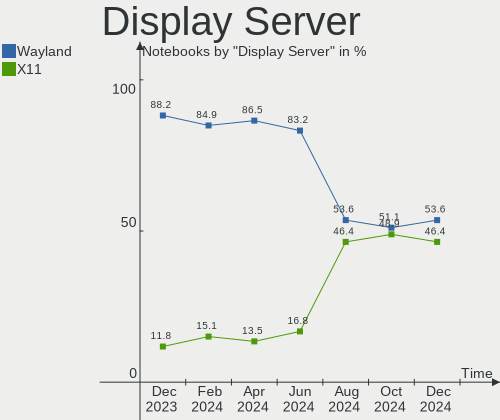
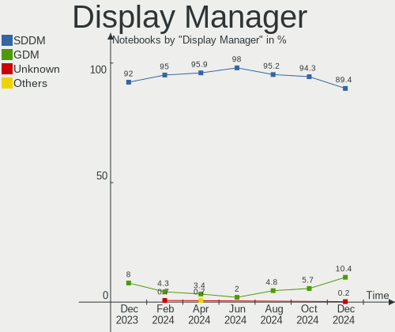
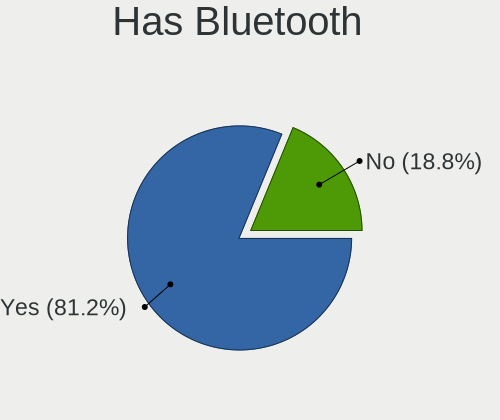
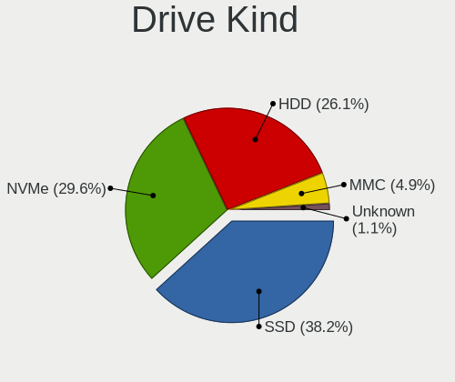
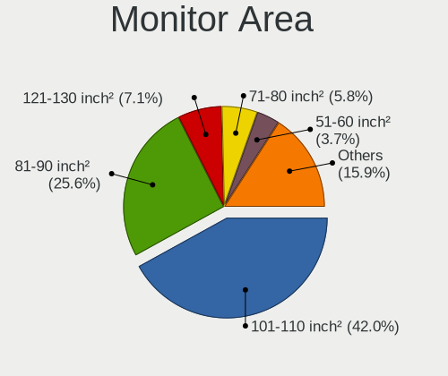
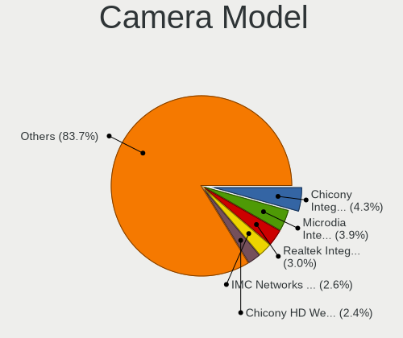

OpenMandriva - Hardware Trends (Notebooks)
------------------------------------------

A project to identify most popular hardware characteristics and track their change
over time based on data collected by Linux users at https://Linux-Hardware.org.

Anyone can contribute to this report by the [hw-probe](https://github.com/linuxhw/hw-probe) tool:

    sudo -E hw-probe -all -upload

This report is for one last month. Overall report since the beginning of time: [TestDays](https://github.com/linuxhw/TestDays)

Period: Dec, 2024.

Contents
--------

* [ System ](#system)
  - [ OS                       ](#os)
  - [ OS Family                ](#os-family)
  - [ Kernel                   ](#kernel)
  - [ Kernel Family            ](#kernel-family)
  - [ Kernel Major Ver.        ](#kernel-major-ver)
  - [ Arch                     ](#arch)
  - [ DE                       ](#de)
  - [ Display Server           ](#display-server)
  - [ Display Manager          ](#display-manager)
  - [ OS Lang                  ](#os-lang)
  - [ Boot Mode                ](#boot-mode)
  - [ Filesystem               ](#filesystem)
  - [ Part. scheme             ](#part-scheme)
  - [ Dual Boot with Linux/BSD ](#dual-boot-with-linuxbsd)
  - [ Dual Boot (Win)          ](#dual-boot-win)

* [ Board ](#board)
  - [ Vendor                   ](#vendor)
  - [ Model                    ](#model)
  - [ Model Family             ](#model-family)
  - [ MFG Year                 ](#mfg-year)
  - [ Form Factor              ](#form-factor)
  - [ Secure Boot              ](#secure-boot)
  - [ Coreboot                 ](#coreboot)
  - [ RAM Size                 ](#ram-size)
  - [ RAM Used                 ](#ram-used)
  - [ Total Drives             ](#total-drives)
  - [ Has CD-ROM               ](#has-cd-rom)
  - [ Has Ethernet             ](#has-ethernet)
  - [ Has WiFi                 ](#has-wifi)
  - [ Has Bluetooth            ](#has-bluetooth)

* [ Location ](#location)
  - [ Country                  ](#country)
  - [ City                     ](#city)

* [ Drives ](#drives)
  - [ Drive Vendor             ](#drive-vendor)
  - [ Drive Model              ](#drive-model)
  - [ HDD Vendor               ](#hdd-vendor)
  - [ SSD Vendor               ](#ssd-vendor)
  - [ Drive Kind               ](#drive-kind)
  - [ Drive Connector          ](#drive-connector)
  - [ Drive Size               ](#drive-size)
  - [ Space Total              ](#space-total)
  - [ Space Used               ](#space-used)
  - [ Malfunc. Drives          ](#malfunc-drives)
  - [ Malfunc. Drive Vendor    ](#malfunc-drive-vendor)
  - [ Malfunc. HDD Vendor      ](#malfunc-hdd-vendor)
  - [ Malfunc. Drive Kind      ](#malfunc-drive-kind)
  - [ Failed Drives            ](#failed-drives)
  - [ Failed Drive Vendor      ](#failed-drive-vendor)
  - [ Drive Status             ](#drive-status)

* [ Storage controller ](#storage-controller)
  - [ Storage Vendor           ](#storage-vendor)
  - [ Storage Model            ](#storage-model)
  - [ Storage Kind             ](#storage-kind)

* [ Processor ](#processor)
  - [ CPU Vendor               ](#cpu-vendor)
  - [ CPU Model                ](#cpu-model)
  - [ CPU Model Family         ](#cpu-model-family)
  - [ CPU Cores                ](#cpu-cores)
  - [ CPU Sockets              ](#cpu-sockets)
  - [ CPU Threads              ](#cpu-threads)
  - [ CPU Op-Modes             ](#cpu-op-modes)
  - [ CPU Microcode            ](#cpu-microcode)
  - [ CPU Microarch            ](#cpu-microarch)

* [ Graphics ](#graphics)
  - [ GPU Vendor               ](#gpu-vendor)
  - [ GPU Model                ](#gpu-model)
  - [ GPU Combo                ](#gpu-combo)
  - [ GPU Driver               ](#gpu-driver)
  - [ GPU Memory               ](#gpu-memory)

* [ Monitor ](#monitor)
  - [ Monitor Vendor           ](#monitor-vendor)
  - [ Monitor Model            ](#monitor-model)
  - [ Monitor Resolution       ](#monitor-resolution)
  - [ Monitor Diagonal         ](#monitor-diagonal)
  - [ Monitor Width            ](#monitor-width)
  - [ Aspect Ratio             ](#aspect-ratio)
  - [ Monitor Area             ](#monitor-area)
  - [ Pixel Density            ](#pixel-density)
  - [ Multiple Monitors        ](#multiple-monitors)

* [ Network ](#network)
  - [ Net Controller Vendor    ](#net-controller-vendor)
  - [ Net Controller Model     ](#net-controller-model)
  - [ Wireless Vendor          ](#wireless-vendor)
  - [ Wireless Model           ](#wireless-model)
  - [ Ethernet Vendor          ](#ethernet-vendor)
  - [ Ethernet Model           ](#ethernet-model)
  - [ Net Controller Kind      ](#net-controller-kind)
  - [ Used Controller          ](#used-controller)
  - [ NICs                     ](#nics)
  - [ IPv6                     ](#ipv6)

* [ Bluetooth ](#bluetooth)
  - [ Bluetooth Vendor         ](#bluetooth-vendor)
  - [ Bluetooth Model          ](#bluetooth-model)

* [ Sound ](#sound)
  - [ Sound Vendor             ](#sound-vendor)
  - [ Sound Model              ](#sound-model)

* [ Memory ](#memory)
  - [ Memory Vendor            ](#memory-vendor)
  - [ Memory Model             ](#memory-model)
  - [ Memory Kind              ](#memory-kind)
  - [ Memory Form Factor       ](#memory-form-factor)
  - [ Memory Size              ](#memory-size)
  - [ Memory Speed             ](#memory-speed)

* [ Printers & scanners ](#printers--scanners)
  - [ Printer Vendor           ](#printer-vendor)
  - [ Printer Model            ](#printer-model)
  - [ Scanner Vendor           ](#scanner-vendor)
  - [ Scanner Model            ](#scanner-model)

* [ Camera ](#camera)
  - [ Camera Vendor            ](#camera-vendor)
  - [ Camera Model             ](#camera-model)

* [ Security ](#security)
  - [ Fingerprint Vendor       ](#fingerprint-vendor)
  - [ Fingerprint Model        ](#fingerprint-model)
  - [ Chipcard Vendor          ](#chipcard-vendor)
  - [ Chipcard Model           ](#chipcard-model)

* [ Unsupported ](#unsupported)
  - [ Unsupported Devices      ](#unsupported-devices)
  - [ Unsupported Device Types ](#unsupported-device-types)

System
------

OS
--

Installed operating systems

| Name               | Notebooks | Percent |
|--------------------|-----------|---------|
| OpenMandriva 24.12 | 388       | 75.93%  |
| OpenMandriva 5.0   | 52        | 10.18%  |
| OpenMandriva 24.07 | 31        | 6.07%   |
| OpenMandriva 23.08 | 21        | 4.11%   |
| OpenMandriva 24.90 | 6         | 1.17%   |
| OpenMandriva 4.3   | 2         | 0.39%   |
| OpenMandriva 24.09 | 2         | 0.39%   |
| OpenMandriva 23.03 | 2         | 0.39%   |
| OpenMandriva 4.2   | 1         | 0.2%    |
| OpenMandriva 24.11 | 1         | 0.2%    |
| OpenMandriva 24.08 | 1         | 0.2%    |
| OpenMandriva 24.04 | 1         | 0.2%    |
| OpenMandriva 24.01 | 1         | 0.2%    |
| OpenMandriva 23.11 | 1         | 0.2%    |
| OpenMandriva 23.09 | 1         | 0.2%    |

OS Family
---------

OS without a version

| Name         | Notebooks | Percent |
|--------------|-----------|---------|
| OpenMandriva | 511       | 100%    |

Kernel
------

Version of the Linux kernel

| Version                       | Notebooks | Percent |
|-------------------------------|-----------|---------|
| 6.12.1-desktop-1omv2490       | 352       | 68.88%  |
| 6.6.2-desktop-1omv2390        | 54        | 10.57%  |
| 6.12.6-desktop-1omv2490       | 32        | 6.26%   |
| 6.10.0-desktop-1omv2490       | 30        | 5.87%   |
| 6.4.8-desktop-2omv2390        | 14        | 2.74%   |
| 6.4.11-desktop-1omv2390       | 9         | 1.76%   |
| 6.13.0-desktop-0.rc1.1omv2490 | 4         | 0.78%   |
| 6.2.6-desktop-1omv2390        | 2         | 0.39%   |
| 6.11.5-desktop-1omv2490       | 2         | 0.39%   |
| 5.16.7-desktop-1omv4003       | 2         | 0.39%   |
| 6.9.7-desktop-1omv2490        | 1         | 0.2%    |
| 6.8.7-desktop-gcc-1omv2490    | 1         | 0.2%    |
| 6.5.5-desktop-1omv2390        | 1         | 0.2%    |
| 6.12.7-desktop-1omv2490       | 1         | 0.2%    |
| 6.12.0-desktop-1omv2490       | 1         | 0.2%    |
| 6.11.3-desktop-1omv2490       | 1         | 0.2%    |
| 6.11.10-amd64                 | 1         | 0.2%    |
| 6.11.0-desktop-2omv2490       | 1         | 0.2%    |
| 6.10.1-desktop-1omv2490       | 1         | 0.2%    |
| 5.10.14-desktop-1omv4002      | 1         | 0.2%    |

Kernel Family
-------------

Linux kernel without a distro release

| Version | Notebooks | Percent |
|---------|-----------|---------|
| 6.12.1  | 352       | 68.88%  |
| 6.6.2   | 54        | 10.57%  |
| 6.12.6  | 32        | 6.26%   |
| 6.10.0  | 30        | 5.87%   |
| 6.4.8   | 14        | 2.74%   |
| 6.4.11  | 9         | 1.76%   |
| 6.13.0  | 4         | 0.78%   |
| 6.2.6   | 2         | 0.39%   |
| 6.11.5  | 2         | 0.39%   |
| 5.16.7  | 2         | 0.39%   |
| 6.9.7   | 1         | 0.2%    |
| 6.8.7   | 1         | 0.2%    |
| 6.5.5   | 1         | 0.2%    |
| 6.12.7  | 1         | 0.2%    |
| 6.12.0  | 1         | 0.2%    |
| 6.11.3  | 1         | 0.2%    |
| 6.11.10 | 1         | 0.2%    |
| 6.11.0  | 1         | 0.2%    |
| 6.10.1  | 1         | 0.2%    |
| 5.10.14 | 1         | 0.2%    |

Kernel Major Ver.
-----------------

Linux kernel major version

| Version | Notebooks | Percent |
|---------|-----------|---------|
| 6.12    | 386       | 75.54%  |
| 6.6     | 54        | 10.57%  |
| 6.10    | 31        | 6.07%   |
| 6.4     | 23        | 4.5%    |
| 6.11    | 5         | 0.98%   |
| 6.13    | 4         | 0.78%   |
| 6.2     | 2         | 0.39%   |
| 5.16    | 2         | 0.39%   |
| 6.9     | 1         | 0.2%    |
| 6.8     | 1         | 0.2%    |
| 6.5     | 1         | 0.2%    |
| 5.10    | 1         | 0.2%    |

Arch
----

OS architecture (x86_64, i586, etc.)

| Name   | Notebooks | Percent |
|--------|-----------|---------|
| x86_64 | 511       | 100%    |

DE
--

Desktop Environment

| Name     | Notebooks | Percent |
|----------|-----------|---------|
| Unknown  | 353       | 69.08%  |
| KDE5     | 76        | 14.87%  |
| LXQt     | 58        | 11.35%  |
| GNOME    | 19        | 3.72%   |
| XFCE     | 2         | 0.39%   |
| Budgie   | 2         | 0.39%   |
| Cinnamon | 1         | 0.2%    |

Display Server
--------------

X11 or Wayland

| Name    | Notebooks | Percent |
|---------|-----------|---------|
| Wayland | 274       | 53.62%  |
| X11     | 237       | 46.38%  |

Display Manager
---------------

SDDM, LightDM, etc.

| Name    | Notebooks | Percent |
|---------|-----------|---------|
| SDDM    | 457       | 89.43%  |
| GDM     | 53        | 10.37%  |
| Unknown | 1         | 0.2%    |

OS Lang
-------

Language

| Lang  | Notebooks | Percent |
|-------|-----------|---------|
| en_US | 304       | 59.49%  |
| de_DE | 27        | 5.28%   |
| fr_FR | 25        | 4.89%   |
| pl_PL | 22        | 4.31%   |
| en_GB | 21        | 4.11%   |
| it_IT | 17        | 3.33%   |
| ru_RU | 14        | 2.74%   |
| pt_BR | 14        | 2.74%   |
| es_ES | 10        | 1.96%   |
| cs_CZ | 10        | 1.96%   |
| en_CA | 7         | 1.37%   |
| en_AU | 6         | 1.17%   |
| tr_TR | 5         | 0.98%   |
| es_AR | 4         | 0.78%   |
| nl_NL | 3         | 0.59%   |
| es_MX | 3         | 0.59%   |
| en_SG | 3         | 0.59%   |
| de_AT | 3         | 0.59%   |
| en_IN | 2         | 0.39%   |
| pt_PT | 1         | 0.2%    |
| fr_CA | 1         | 0.2%    |
| fr_BE | 1         | 0.2%    |
| es_PE | 1         | 0.2%    |
| es_GT | 1         | 0.2%    |
| es_CO | 1         | 0.2%    |
| en_NG | 1         | 0.2%    |
| de_IT | 1         | 0.2%    |
| de_CH | 1         | 0.2%    |
| da_DK | 1         | 0.2%    |
| ca_ES | 1         | 0.2%    |

Boot Mode
---------

EFI or BIOS

| Mode | Notebooks | Percent |
|------|-----------|---------|
| EFI  | 353       | 69.08%  |
| BIOS | 158       | 30.92%  |

Filesystem
----------

Type of filesystem

| Type    | Notebooks | Percent |
|---------|-----------|---------|
| Overlay | 288       | 56.36%  |
| Ext4    | 193       | 37.77%  |
| Btrfs   | 26        | 5.09%   |
| F2fs    | 3         | 0.59%   |
| Xfs     | 1         | 0.2%    |

Part. scheme
------------

Scheme of partitioning

| Type | Notebooks | Percent |
|------|-----------|---------|
| GPT  | 432       | 84.54%  |
| MBR  | 79        | 15.46%  |

Dual Boot with Linux/BSD
------------------------

Hosting more than one Linux/BSD

| Dual boot | Notebooks | Percent |
|-----------|-----------|---------|
| No        | 257       | 50.29%  |
| Yes       | 254       | 49.71%  |

Dual Boot (Win)
---------------

Hosting Linux and Windows

| Dual boot | Notebooks | Percent |
|-----------|-----------|---------|
| No        | 329       | 64.38%  |
| Yes       | 182       | 35.62%  |

Board
-----

Vendor
------

Motherboard manufacturer

| Name                | Notebooks | Percent |
|---------------------|-----------|---------|
| Hewlett-Packard     | 99        | 19.37%  |
| Lenovo              | 96        | 18.79%  |
| Dell                | 95        | 18.59%  |
| ASUSTek Computer    | 63        | 12.33%  |
| Acer                | 52        | 10.18%  |
| Toshiba             | 21        | 4.11%   |
| MSI                 | 9         | 1.76%   |
| Google              | 9         | 1.76%   |
| Fujitsu             | 8         | 1.57%   |
| Apple               | 7         | 1.37%   |
| Samsung Electronics | 5         | 0.98%   |
| Notebook            | 5         | 0.98%   |
| Sony                | 3         | 0.59%   |
| Medion              | 3         | 0.59%   |
| HUAWEI              | 3         | 0.59%   |
| Chuwi               | 3         | 0.59%   |
| TUXEDO              | 2         | 0.39%   |
| NEC Computers       | 2         | 0.39%   |
| LG Electronics      | 2         | 0.39%   |
| Framework           | 2         | 0.39%   |
| Alienware           | 2         | 0.39%   |
| Shuttle             | 1         | 0.2%    |
| Razer               | 1         | 0.2%    |
| Qilive              | 1         | 0.2%    |
| Positivo            | 1         | 0.2%    |
| Panasonic           | 1         | 0.2%    |
| Infinix             | 1         | 0.2%    |
| HONOR               | 1         | 0.2%    |
| GPU Company         | 1         | 0.2%    |
| GPD                 | 1         | 0.2%    |
| Gigabyte Technology | 1         | 0.2%    |
| Gateway             | 1         | 0.2%    |
| Fujitsu Siemens     | 1         | 0.2%    |
| eMachines           | 1         | 0.2%    |
| Digibras            | 1         | 0.2%    |
| Compaq              | 1         | 0.2%    |
| Clevo               | 1         | 0.2%    |
| AZW                 | 1         | 0.2%    |
| AWOW                | 1         | 0.2%    |
| AMI                 | 1         | 0.2%    |

Model
-----

Motherboard model

| Name                          | Notebooks | Percent |
|-------------------------------|-----------|---------|
| HP Notebook                   | 9         | 1.76%   |
| Dell Latitude E6430           | 5         | 0.98%   |
| Lenovo IdeaPad 3 15ITL6 82H8  | 3         | 0.59%   |
| HP Pavilion dv6               | 3         | 0.59%   |
| HP EliteBook 840 G3           | 3         | 0.59%   |
| Dell Latitude E7440           | 3         | 0.59%   |
| Dell Latitude E6500           | 3         | 0.59%   |
| Dell Latitude 7490            | 3         | 0.59%   |
| Dell Latitude 5490            | 3         | 0.59%   |
| Dell Inspiron 5570            | 3         | 0.59%   |
| ASUS X550CC                   | 3         | 0.59%   |
| Apple MacBookPro9,2           | 3         | 0.59%   |
| Acer Aspire A515-51G          | 3         | 0.59%   |
| Unknown                       | 3         | 0.59%   |
| Toshiba Satellite L855        | 2         | 0.39%   |
| Toshiba Satellite L755        | 2         | 0.39%   |
| Lenovo IdeaPad 1 15ALC7 82R4  | 2         | 0.39%   |
| HP ProBook 630 G8 Notebook PC | 2         | 0.39%   |
| HP Pavilion dv5               | 2         | 0.39%   |
| HP Laptop 14-bs0xx            | 2         | 0.39%   |
| HP EliteBook 840 G5           | 2         | 0.39%   |
| Google Gnawty                 | 2         | 0.39%   |
| Google Auron_Paine            | 2         | 0.39%   |
| Dell XPS 13 9360              | 2         | 0.39%   |
| Dell Latitude E6540           | 2         | 0.39%   |
| Dell Latitude E6420           | 2         | 0.39%   |
| Dell Latitude E5530 non-vPro  | 2         | 0.39%   |
| Dell Latitude E5470           | 2         | 0.39%   |
| Dell Latitude E5440           | 2         | 0.39%   |
| Dell Latitude 5400            | 2         | 0.39%   |
| Dell Inspiron 15 5510         | 2         | 0.39%   |
| Dell Inspiron 15 3515         | 2         | 0.39%   |
| Dell Inspiron 13-5368         | 2         | 0.39%   |
| Dell Inspiron 11 - 3147       | 2         | 0.39%   |
| ASUS UX305FA                  | 2         | 0.39%   |
| ASUS K53U                     | 2         | 0.39%   |
| ASUS K53E                     | 2         | 0.39%   |
| Acer TravelMate B117-M        | 2         | 0.39%   |
| Acer Nitro AN517-54           | 2         | 0.39%   |
| Acer Aspire E1-571G           | 2         | 0.39%   |

Model Family
------------

Motherboard model prefix

| Name                | Notebooks | Percent |
|---------------------|-----------|---------|
| Dell Latitude       | 43        | 8.41%   |
| Lenovo ThinkPad     | 42        | 8.22%   |
| Acer Aspire         | 37        | 7.24%   |
| Dell Inspiron       | 32        | 6.26%   |
| Lenovo IdeaPad      | 25        | 4.89%   |
| HP Laptop           | 23        | 4.5%    |
| Toshiba Satellite   | 20        | 3.91%   |
| HP EliteBook        | 20        | 3.91%   |
| HP Pavilion         | 15        | 2.94%   |
| HP ProBook          | 13        | 2.54%   |
| ASUS VivoBook       | 12        | 2.35%   |
| HP Notebook         | 9         | 1.76%   |
| Fujitsu LIFEBOOK    | 7         | 1.37%   |
| Dell XPS            | 7         | 1.37%   |
| Lenovo Yoga         | 6         | 1.17%   |
| Dell Precision      | 6         | 1.17%   |
| ASUS ASUS           | 6         | 1.17%   |
| HP ENVY             | 4         | 0.78%   |
| Acer Swift          | 4         | 0.78%   |
| Acer Nitro          | 4         | 0.78%   |
| Notebook W65        | 3         | 0.59%   |
| MSI Modern          | 3         | 0.59%   |
| Lenovo Legion       | 3         | 0.59%   |
| HP Victus           | 3         | 0.59%   |
| Dell Vostro         | 3         | 0.59%   |
| Dell System         | 3         | 0.59%   |
| ASUS X550CC         | 3         | 0.59%   |
| Apple MacBookPro9   | 3         | 0.59%   |
| Acer TravelMate     | 3         | 0.59%   |
| Acer Predator       | 3         | 0.59%   |
| Unknown             | 3         | 0.59%   |
| Lenovo ThinkBook    | 2         | 0.39%   |
| Google Gnawty       | 2         | 0.39%   |
| Google Auron        | 2         | 0.39%   |
| Framework Laptop    | 2         | 0.39%   |
| ASUS UX305FA        | 2         | 0.39%   |
| ASUS K53U           | 2         | 0.39%   |
| ASUS K53E           | 2         | 0.39%   |
| Apple MacBookPro11  | 2         | 0.39%   |
| TUXEDO InfinityBook | 1         | 0.2%    |

MFG Year
--------

Motherboard manufacture year

| Year | Notebooks | Percent |
|------|-----------|---------|
| 2012 | 44        | 8.61%   |
| 2013 | 43        | 8.41%   |
| 2021 | 41        | 8.02%   |
| 2017 | 38        | 7.44%   |
| 2019 | 36        | 7.05%   |
| 2018 | 36        | 7.05%   |
| 2011 | 36        | 7.05%   |
| 2020 | 31        | 6.07%   |
| 2016 | 31        | 6.07%   |
| 2015 | 27        | 5.28%   |
| 2023 | 25        | 4.89%   |
| 2010 | 25        | 4.89%   |
| 2014 | 24        | 4.7%    |
| 2008 | 22        | 4.31%   |
| 2022 | 19        | 3.72%   |
| 2024 | 14        | 2.74%   |
| 2009 | 12        | 2.35%   |
| 2007 | 7         | 1.37%   |

Form Factor
-----------

Physical design of the computer

| Name     | Notebooks | Percent |
|----------|-----------|---------|
| Notebook | 511       | 100%    |

Secure Boot
-----------

Enabled or disabled

| State    | Notebooks | Percent |
|----------|-----------|---------|
| Disabled | 511       | 100%    |

Coreboot
--------

Have coreboot on board

| Used | Notebooks | Percent |
|------|-----------|---------|
| No   | 502       | 98.24%  |
| Yes  | 9         | 1.76%   |

RAM Size
--------

Total RAM memory

| Size in GB  | Notebooks | Percent |
|-------------|-----------|---------|
| 4.01-8.0    | 162       | 31.7%   |
| 3.01-4.0    | 121       | 23.68%  |
| 8.01-16.0   | 91        | 17.81%  |
| 16.01-24.0  | 86        | 16.83%  |
| 32.01-64.0  | 23        | 4.5%    |
| 1.01-2.0    | 11        | 2.15%   |
| 24.01-32.0  | 10        | 1.96%   |
| 64.01-256.0 | 4         | 0.78%   |
| 2.01-3.0    | 3         | 0.59%   |

RAM Used
--------

Used RAM memory

| Used GB  | Notebooks | Percent |
|----------|-----------|---------|
| 1.01-2.0 | 293       | 57.34%  |
| 2.01-3.0 | 140       | 27.4%   |
| 0.51-1.0 | 37        | 7.24%   |
| 3.01-4.0 | 24        | 4.7%    |
| 4.01-8.0 | 14        | 2.74%   |
| 0.01-0.5 | 3         | 0.59%   |

Total Drives
------------

Number of drives on board

| Drives | Notebooks | Percent |
|--------|-----------|---------|
| 1      | 392       | 76.71%  |
| 2      | 106       | 20.74%  |
| 3      | 7         | 1.37%   |
| 0      | 5         | 0.98%   |
| 4      | 1         | 0.2%    |

Has CD-ROM
----------

Has CD-ROM on board

| Presented | Notebooks | Percent |
|-----------|-----------|---------|
| No        | 324       | 63.41%  |
| Yes       | 187       | 36.59%  |

Has Ethernet
------------

Has Ethernet on board

| Presented | Notebooks | Percent |
|-----------|-----------|---------|
| Yes       | 398       | 77.89%  |
| No        | 113       | 22.11%  |

Has WiFi
--------

Has WiFi module

| Presented | Notebooks | Percent |
|-----------|-----------|---------|
| Yes       | 499       | 97.65%  |
| No        | 12        | 2.35%   |

Has Bluetooth
-------------

Has Bluetooth module

| Presented | Notebooks | Percent |
|-----------|-----------|---------|
| Yes       | 415       | 81.21%  |
| No        | 96        | 18.79%  |

Location
--------

Country
-------

Geographic location (country)

| Country             | Notebooks | Percent |
|---------------------|-----------|---------|
| USA                 | 117       | 22.9%   |
| Germany             | 40        | 7.83%   |
| France              | 34        | 6.65%   |
| Poland              | 32        | 6.26%   |
| Italy               | 26        | 5.09%   |
| Russia              | 25        | 4.89%   |
| Brazil              | 23        | 4.5%    |
| UK                  | 21        | 4.11%   |
| Spain               | 21        | 4.11%   |
| Canada              | 13        | 2.54%   |
| Czechia             | 12        | 2.35%   |
| Australia           | 12        | 2.35%   |
| Indonesia           | 11        | 2.15%   |
| India               | 11        | 2.15%   |
| Mexico              | 10        | 1.96%   |
| Greece              | 9         | 1.76%   |
| Turkey              | 8         | 1.57%   |
| Japan               | 6         | 1.17%   |
| Netherlands         | 5         | 0.98%   |
| Argentina           | 5         | 0.98%   |
| Malaysia            | 4         | 0.78%   |
| Finland             | 4         | 0.78%   |
| Austria             | 4         | 0.78%   |
| Portugal            | 3         | 0.59%   |
| Colombia            | 3         | 0.59%   |
| Belgium             | 3         | 0.59%   |
| Türkiye            | 2         | 0.39%   |
| Switzerland         | 2         | 0.39%   |
| Slovakia            | 2         | 0.39%   |
| Singapore           | 2         | 0.39%   |
| Serbia              | 2         | 0.39%   |
| Romania             | 2         | 0.39%   |
| Peru                | 2         | 0.39%   |
| Morocco             | 2         | 0.39%   |
| Luxembourg          | 2         | 0.39%   |
| Lithuania           | 2         | 0.39%   |
| Israel              | 2         | 0.39%   |
| Iran                | 2         | 0.39%   |
| Croatia             | 2         | 0.39%   |
| Trinidad and Tobago | 1         | 0.2%    |

City
----

Geographic location (city)

| City                  | Notebooks | Percent |
|-----------------------|-----------|---------|
| Paris                 | 6         | 1.17%   |
| Warsaw                | 5         | 0.98%   |
| Sydney                | 5         | 0.98%   |
| Moscow                | 5         | 0.98%   |
| Milan                 | 5         | 0.98%   |
| Istanbul              | 5         | 0.98%   |
| Athens                | 5         | 0.98%   |
| Vienna                | 4         | 0.78%   |
| Topeka                | 4         | 0.78%   |
| Tokyo                 | 4         | 0.78%   |
| Thessaloniki          | 4         | 0.78%   |
| Tacoma                | 4         | 0.78%   |
| Prague                | 4         | 0.78%   |
| Osnabrück            | 4         | 0.78%   |
| Krakow                | 4         | 0.78%   |
| Berlin                | 4         | 0.78%   |
| Yekaterinburg         | 3         | 0.59%   |
| Wroclaw               | 3         | 0.59%   |
| Toronto               | 3         | 0.59%   |
| The Bronx             | 3         | 0.59%   |
| Poznan                | 3         | 0.59%   |
| Katy                  | 3         | 0.59%   |
| Flushing              | 3         | 0.59%   |
| Belton                | 3         | 0.59%   |
| Volzhsky              | 2         | 0.39%   |
| Stuhr                 | 2         | 0.39%   |
| St Petersburg         | 2         | 0.39%   |
| Springfield           | 2         | 0.39%   |
| Singapore             | 2         | 0.39%   |
| Senden                | 2         | 0.39%   |
| Seattle               | 2         | 0.39%   |
| Sao Paulo             | 2         | 0.39%   |
| San Salvador de Jujuy | 2         | 0.39%   |
| Samara                | 2         | 0.39%   |
| Rome                  | 2         | 0.39%   |
| Perth                 | 2         | 0.39%   |
| Périgueux            | 2         | 0.39%   |
| Novosibirsk           | 2         | 0.39%   |
| Milano                | 2         | 0.39%   |
| Madrid                | 2         | 0.39%   |

Drives
------

Drive Vendor
------------

Hard drive vendors

| Vendor                       | Notebooks | Drives | Percent |
|------------------------------|-----------|--------|---------|
| Samsung Electronics          | 72        | 73     | 12.16%  |
| Seagate                      | 53        | 55     | 8.95%   |
| WDC                          | 49        | 49     | 8.28%   |
| SanDisk                      | 47        | 50     | 7.94%   |
| Toshiba                      | 38        | 38     | 6.42%   |
| Unknown                      | 30        | 33     | 5.07%   |
| Kingston                     | 28        | 28     | 4.73%   |
| Intel                        | 25        | 27     | 4.22%   |
| Crucial                      | 24        | 24     | 4.05%   |
| SK hynix                     | 20        | 21     | 3.38%   |
| Micron Technology            | 17        | 17     | 2.87%   |
| China                        | 16        | 16     | 2.7%    |
| Kingston Technology Company  | 10        | 10     | 1.69%   |
| Hitachi                      | 10        | 10     | 1.69%   |
| KIOXIA                       | 9         | 9      | 1.52%   |
| HGST                         | 9         | 9      | 1.52%   |
| SPCC                         | 8         | 8      | 1.35%   |
| PNY                          | 7         | 7      | 1.18%   |
| Micron/Crucial Technology    | 7         | 7      | 1.18%   |
| A-DATA Technology            | 7         | 7      | 1.18%   |
| Silicon Motion               | 6         | 6      | 1.01%   |
| ADATA Technology             | 6         | 6      | 1.01%   |
| Transcend                    | 4         | 4      | 0.68%   |
| Patriot                      | 4         | 4      | 0.68%   |
| MAXIO Technology (Hangzhou)  | 4         | 4      | 0.68%   |
| JMicron Technology           | 4         | 4      | 0.68%   |
| Fujitsu                      | 4         | 4      | 0.68%   |
| Unknown                      | 4         | 4      | 0.68%   |
| USB                          | 3         | 3      | 0.51%   |
| SSSTC                        | 3         | 3      | 0.51%   |
| LITEON                       | 3         | 3      | 0.51%   |
| KingSpec                     | 3         | 3      | 0.51%   |
| Intenso                      | 3         | 3      | 0.51%   |
| GOODRAM                      | 3         | 4      | 0.51%   |
| Apple                        | 3         | 3      | 0.51%   |
| Verbatim                     | 2         | 2      | 0.34%   |
| V-GeN                        | 2         | 2      | 0.34%   |
| Shenzhen Longsys Electronics | 2         | 2      | 0.34%   |
| Realtek Semiconductor        | 2         | 2      | 0.34%   |
| Phison Electronics           | 2         | 2      | 0.34%   |

Drive Model
-----------

Hard drive models

| Model                                                 | Notebooks | Percent |
|-------------------------------------------------------|-----------|---------|
| Unknown MMC Card  64GB                                | 10        | 1.66%   |
| Toshiba MQ01ABD100 1TB                                | 8         | 1.33%   |
| Samsung NVMe SSD Controller SM981/PM981/PM983 512GB   | 8         | 1.33%   |
| Kingston SA400S37240G 240GB SSD                       | 8         | 1.33%   |
| Unknown MMC Card  128GB                               | 6         | 1%      |
| Sandisk WD Blue SN550 NVMe SSD 256GB                  | 6         | 1%      |
| Micron/Crucial P2 NVMe PCIe SSD 500GB                 | 6         | 1%      |
| WDC WD10SPZX-21Z10T0 1TB                              | 5         | 0.83%   |
| Toshiba MQ04ABF100 1TB                                | 5         | 0.83%   |
| Toshiba MQ01ABF050 500GB                              | 5         | 0.83%   |
| Silicon Motion SM2263EN/SM2263XT SSD Controller 256GB | 5         | 0.83%   |
| Seagate ST1000LM035-1RK172 1TB                        | 5         | 0.83%   |
| Intel SSD 660P Series 1024GB                          | 5         | 0.83%   |
| Crucial CT500MX500SSD1 500GB                          | 5         | 0.83%   |
| Unknown MMC Card  16GB                                | 4         | 0.67%   |
| Seagate ST9500420AS 500GB                             | 4         | 0.67%   |
| Seagate ST500LT012-1DG142 500GB                       | 4         | 0.67%   |
| Samsung NVMe SSD Controller SM961/PM961/SM963 256GB   | 4         | 0.67%   |
| HGST HTS545050A7E680 500GB                            | 4         | 0.67%   |
| Unknown                                               | 4         | 0.67%   |
| WDC WD10SPZX-60Z10T0 1TB                              | 3         | 0.5%    |
| USB SanDisk 3.2Gen1 250GB                             | 3         | 0.5%    |
| Unknown MMC Card  32GB                                | 3         | 0.5%    |
| Toshiba KSG60ZMV256G M.2 2280 256GB SSD               | 3         | 0.5%    |
| SPCC Solid State Disk 256GB                           | 3         | 0.5%    |
| Seagate ST9500325AS 500GB                             | 3         | 0.5%    |
| Seagate ST500LT012-9WS142 500GB                       | 3         | 0.5%    |
| Seagate ST1000LM024 HN-M101MBB 1TB                    | 3         | 0.5%    |
| SanDisk SDSSDA240G 240GB                              | 3         | 0.5%    |
| Samsung SSD 870 QVO 1TB                               | 3         | 0.5%    |
| Samsung SSD 860 EVO 500GB                             | 3         | 0.5%    |
| Samsung SSD 850 EVO 250GB                             | 3         | 0.5%    |
| Samsung NVMe SSD Controller PM9A1/PM9A3/980PRO 512GB  | 3         | 0.5%    |
| PNY CS900 120GB SSD                                   | 3         | 0.5%    |
| Micron MTFDHBA512QFD 512GB                            | 3         | 0.5%    |
| Micron 2400_MTFDKBA512QFM 512GB                       | 3         | 0.5%    |
| MAXIO (Hangzhou) NVMe SSD Controller MAP1202 512GB    | 3         | 0.5%    |
| Kingston Company SNV2S1000G 1TB                       | 3         | 0.5%    |
| Kingston SA400S37480G 480GB SSD                       | 3         | 0.5%    |
| Intel SSD Pro 7600p/760p/E 6100p Series 512GB         | 3         | 0.5%    |

HDD Vendor
----------

Hard disk drive vendors

| Vendor              | Notebooks | Drives | Percent |
|---------------------|-----------|--------|---------|
| Seagate             | 51        | 53     | 33.77%  |
| WDC                 | 42        | 42     | 27.81%  |
| Toshiba             | 29        | 29     | 19.21%  |
| Hitachi             | 10        | 10     | 6.62%   |
| HGST                | 9         | 9      | 5.96%   |
| Fujitsu             | 4         | 4      | 2.65%   |
| Samsung Electronics | 2         | 2      | 1.32%   |
| JMicron Technology  | 2         | 2      | 1.32%   |
| Unknown             | 1         | 1      | 0.66%   |
| ASMT                | 1         | 1      | 0.66%   |

SSD Vendor
----------

Solid state drive vendors

| Vendor              | Notebooks | Drives | Percent |
|---------------------|-----------|--------|---------|
| Samsung Electronics | 34        | 34     | 15.18%  |
| Crucial             | 23        | 23     | 10.27%  |
| Kingston            | 21        | 21     | 9.38%   |
| China               | 16        | 16     | 7.14%   |
| SanDisk             | 15        | 15     | 6.7%    |
| SPCC                | 8         | 8      | 3.57%   |
| WDC                 | 7         | 7      | 3.13%   |
| PNY                 | 7         | 7      | 3.13%   |
| Intel               | 7         | 7      | 3.13%   |
| SK hynix            | 6         | 6      | 2.68%   |
| Micron Technology   | 6         | 6      | 2.68%   |
| A-DATA Technology   | 6         | 6      | 2.68%   |
| Toshiba             | 5         | 5      | 2.23%   |
| Transcend           | 4         | 4      | 1.79%   |
| Patriot             | 4         | 4      | 1.79%   |
| Unknown             | 4         | 4      | 1.79%   |
| LITEON              | 3         | 3      | 1.34%   |
| KingSpec            | 3         | 3      | 1.34%   |
| Intenso             | 3         | 3      | 1.34%   |
| GOODRAM             | 3         | 4      | 1.34%   |
| Apple               | 3         | 3      | 1.34%   |
| Verbatim            | 2         | 2      | 0.89%   |
| V-GeN               | 2         | 2      | 0.89%   |
| SSSTC               | 2         | 2      | 0.89%   |
| Netac               | 2         | 2      | 0.89%   |
| Fanxiang            | 2         | 2      | 0.89%   |
| Emtec               | 2         | 2      | 0.89%   |
| Dogfish             | 2         | 2      | 0.89%   |
| 2.5"                | 2         | 2      | 0.89%   |
| StorFly             | 1         | 1      | 0.45%   |
| SCUDA-256GB         | 1         | 1      | 0.45%   |
| Plextor             | 1         | 1      | 0.45%   |
| Phison              | 1         | 1      | 0.45%   |
| OSCOO               | 1         | 1      | 0.45%   |
| OCZ                 | 1         | 1      | 0.45%   |
| Mushkin             | 1         | 1      | 0.45%   |
| MidasForce          | 1         | 1      | 0.45%   |
| LITEONIT            | 1         | 1      | 0.45%   |
| Lexar               | 1         | 1      | 0.45%   |
| KIOXIA-EXCERIA      | 1         | 1      | 0.45%   |

Drive Kind
----------

HDD or SSD

| Kind    | Notebooks | Drives | Percent |
|---------|-----------|--------|---------|
| SSD     | 218       | 225    | 38.25%  |
| NVMe    | 169       | 190    | 29.65%  |
| HDD     | 149       | 153    | 26.14%  |
| MMC     | 28        | 31     | 4.91%   |
| Unknown | 6         | 6      | 1.05%   |

Drive Connector
---------------

SATA, SAS, NVMe, etc.

| Type | Notebooks | Drives | Percent |
|------|-----------|--------|---------|
| SATA | 338       | 369    | 61.34%  |
| NVMe | 169       | 189    | 30.67%  |
| MMC  | 28        | 31     | 5.08%   |
| SAS  | 16        | 16     | 2.9%    |

Drive Size
----------

Size of hard drive

| Size in TB | Notebooks | Drives | Percent |
|------------|-----------|--------|---------|
| 0.01-0.5   | 264       | 282    | 73.74%  |
| 0.51-1.0   | 86        | 88     | 24.02%  |
| 1.01-2.0   | 8         | 8      | 2.23%   |

Space Total
-----------

Amount of disk space available on the file system

| Size in GB     | Notebooks | Percent |
|----------------|-----------|---------|
| 1-20           | 209       | 40.9%   |
| 101-250        | 111       | 21.72%  |
| 251-500        | 57        | 11.15%  |
| 501-1000       | 35        | 6.85%   |
| 51-100         | 30        | 5.87%   |
| 21-50          | 20        | 3.91%   |
| 1001-2000      | 20        | 3.91%   |
| Unknown        | 16        | 3.13%   |
| More than 3000 | 7         | 1.37%   |
| 2001-3000      | 6         | 1.17%   |

Space Used
----------

Amount of used disk space

| Used GB  | Notebooks | Percent |
|----------|-----------|---------|
| 1-20     | 400       | 78.28%  |
| 21-50    | 28        | 5.48%   |
| 51-100   | 21        | 4.11%   |
| 0        | 17        | 3.33%   |
| Unknown  | 16        | 3.13%   |
| 101-250  | 14        | 2.74%   |
| 251-500  | 9         | 1.76%   |
| 501-1000 | 6         | 1.17%   |

Malfunc. Drives
---------------

Drive models with a malfunction

| Model                                       | Notebooks | Drives | Percent |
|---------------------------------------------|-----------|--------|---------|
| Toshiba MQ01ABD100 1TB                      | 3         | 3      | 3.7%    |
| Seagate ST500LT012-9WS142 500GB             | 3         | 3      | 3.7%    |
| HGST HTS545050A7E680 500GB                  | 3         | 3      | 3.7%    |
| Toshiba MQ01ABF050 500GB                    | 2         | 2      | 2.47%   |
| Seagate ST9500325AS 500GB                   | 2         | 2      | 2.47%   |
| Seagate ST500LT012-1DG142 500GB             | 2         | 2      | 2.47%   |
| Seagate ST320LT020-9YG142 320GB             | 2         | 2      | 2.47%   |
| Seagate ST1000LM049-2GH172 1TB              | 2         | 2      | 2.47%   |
| WDC WDS240G2G0A-00JH30 240GB SSD            | 1         | 1      | 1.23%   |
| WDC WDS120G2G0A-00JH30 120GB SSD            | 1         | 1      | 1.23%   |
| WDC WD7500BPVT-00HXZT3 752GB                | 1         | 1      | 1.23%   |
| WDC WD6400BEVT-22A0RT0 640GB                | 1         | 1      | 1.23%   |
| WDC WD5000BPVX-00JC3T0 500GB                | 1         | 1      | 1.23%   |
| WDC WD2500BEVT-75A23T0 250GB                | 1         | 1      | 1.23%   |
| WDC WD2500BEVT-60ZCT1 250GB                 | 1         | 1      | 1.23%   |
| WDC WD10SPZX-60Z10T0 1TB                    | 1         | 1      | 1.23%   |
| WDC WD10JPVX-75JC3T0 1TB                    | 1         | 1      | 1.23%   |
| WDC WD10JPVX-60JC3T1 1TB                    | 1         | 1      | 1.23%   |
| V-GeN V-GEN12AS19AR120SDK 120GB SSD         | 1         | 1      | 1.23%   |
| Toshiba MQ04ABF100 1TB                      | 1         | 1      | 1.23%   |
| Toshiba MQ01ABF032 320GB                    | 1         | 1      | 1.23%   |
| Toshiba MQ01ABD075 752GB                    | 1         | 1      | 1.23%   |
| Toshiba MQ01ABD050 500GB                    | 1         | 1      | 1.23%   |
| Toshiba MK3265GSX 320GB                     | 1         | 1      | 1.23%   |
| Toshiba MK1652GSX 160GB                     | 1         | 1      | 1.23%   |
| Toshiba KSG60ZMV256G M.2 2280 256GB SSD     | 1         | 1      | 1.23%   |
| SSSTC CVB-8D128-HP 128GB SSD                | 1         | 1      | 1.23%   |
| SSSTC CV8-8E128-HP 128GB SSD                | 1         | 1      | 1.23%   |
| SK hynix SC210 2.5 7MM 128GB SSD            | 1         | 1      | 1.23%   |
| Seagate ST9500420AS 500GB                   | 1         | 1      | 1.23%   |
| Seagate ST9320423AS 320GB                   | 1         | 1      | 1.23%   |
| Seagate ST9320325AS 320GB                   | 1         | 1      | 1.23%   |
| Seagate ST9250315AS 250GB                   | 1         | 1      | 1.23%   |
| Seagate ST9120822AS 120GB                   | 1         | 1      | 1.23%   |
| Seagate ST320LT007-9ZV142 320GB             | 1         | 1      | 1.23%   |
| Seagate ST1000LM048-2E7172 1TB              | 1         | 1      | 1.23%   |
| Seagate ST1000LM035-1RK172 1TB              | 1         | 1      | 1.23%   |
| Seagate ST1000LM024 HN-M101MBB 1TB          | 1         | 1      | 1.23%   |
| Samsung Electronics SSD PM810 2.5 7mm 256GB | 1         | 1      | 1.23%   |
| Samsung Electronics SSD 980 1TB             | 1         | 1      | 1.23%   |

Malfunc. Drive Vendor
---------------------

Vendors of faulty drives

| Vendor              | Notebooks | Drives | Percent |
|---------------------|-----------|--------|---------|
| Seagate             | 20        | 20     | 24.69%  |
| Toshiba             | 12        | 12     | 14.81%  |
| WDC                 | 10        | 10     | 12.35%  |
| Hitachi             | 6         | 6      | 7.41%   |
| HGST                | 6         | 6      | 7.41%   |
| Crucial             | 5         | 5      | 6.17%   |
| Samsung Electronics | 4         | 4      | 4.94%   |
| Fujitsu             | 3         | 3      | 3.7%    |
| SSSTC               | 2         | 2      | 2.47%   |
| Micron Technology   | 2         | 2      | 2.47%   |
| Kingston            | 2         | 2      | 2.47%   |
| Intel               | 2         | 2      | 2.47%   |
| A-DATA Technology   | 2         | 2      | 2.47%   |
| V-GeN               | 1         | 1      | 1.23%   |
| SK hynix            | 1         | 1      | 1.23%   |
| Lexar               | 1         | 1      | 1.23%   |
| Dogfish             | 1         | 1      | 1.23%   |
| China               | 1         | 1      | 1.23%   |

Malfunc. HDD Vendor
-------------------

Vendors of faulty HDD drives

| Vendor              | Notebooks | Drives | Percent |
|---------------------|-----------|--------|---------|
| Seagate             | 20        | 20     | 36.36%  |
| Toshiba             | 11        | 11     | 20%     |
| WDC                 | 8         | 8      | 14.55%  |
| Hitachi             | 6         | 6      | 10.91%  |
| HGST                | 6         | 6      | 10.91%  |
| Fujitsu             | 3         | 3      | 5.45%   |
| Samsung Electronics | 1         | 1      | 1.82%   |

Malfunc. Drive Kind
-------------------

Kinds of faulty drives

| Kind | Notebooks | Drives | Percent |
|------|-----------|--------|---------|
| HDD  | 55        | 55     | 67.9%   |
| SSD  | 25        | 25     | 30.86%  |
| NVMe | 1         | 1      | 1.23%   |

Failed Drives
-------------

Failed drive models

| Model                        | Notebooks | Drives | Percent |
|------------------------------|-----------|--------|---------|
| WDC WD5000BPVT-22HXZT1 500GB | 1         | 1      | 50%     |
| WDC WD1600BEVT-75ZCT1 160GB  | 1         | 1      | 50%     |

Failed Drive Vendor
-------------------

Failed drive vendors

| Vendor | Notebooks | Drives | Percent |
|--------|-----------|--------|---------|
| WDC    | 2         | 2      | 100%    |

Drive Status
------------

Number of failed and malfunc. drives

| Status   | Notebooks | Drives | Percent |
|----------|-----------|--------|---------|
| Works    | 410       | 472    | 76.21%  |
| Malfunc  | 80        | 81     | 14.87%  |
| Detected | 46        | 50     | 8.55%   |
| Failed   | 2         | 2      | 0.37%   |

Storage controller
------------------

Storage Vendor
--------------

Storage controller vendors

| Vendor                         | Notebooks | Percent |
|--------------------------------|-----------|---------|
| Intel                          | 361       | 61.39%  |
| AMD                            | 58        | 9.86%   |
| Samsung Electronics            | 37        | 6.29%   |
| SanDisk                        | 31        | 5.27%   |
| Kingston Technology Company    | 17        | 2.89%   |
| SK hynix                       | 14        | 2.38%   |
| Micron Technology              | 12        | 2.04%   |
| KIOXIA                         | 8         | 1.36%   |
| Micron/Crucial Technology      | 7         | 1.19%   |
| ADATA Technology               | 7         | 1.19%   |
| Silicon Motion                 | 6         | 1.02%   |
| Toshiba America Info Systems   | 5         | 0.85%   |
| Phison Electronics             | 5         | 0.85%   |
| MAXIO Technology (Hangzhou)    | 4         | 0.68%   |
| Solid State Storage Technology | 3         | 0.51%   |
| Shenzhen Longsys Electronics   | 2         | 0.34%   |
| Seagate Technology             | 2         | 0.34%   |
| Realtek Semiconductor          | 2         | 0.34%   |
| Nvidia                         | 2         | 0.34%   |
| Union Memory (Shenzhen)        | 1         | 0.17%   |
| Solidigm                       | 1         | 0.17%   |
| Marvell Technology Group       | 1         | 0.17%   |
| Lite-On Technology             | 1         | 0.17%   |
| Unknown                        | 1         | 0.17%   |

Storage Model
-------------

Storage controller models

| Model                                                                            | Notebooks | Percent |
|----------------------------------------------------------------------------------|-----------|---------|
| Intel Sunrise Point-LP SATA Controller [AHCI mode]                               | 54        | 8.48%   |
| Intel 7 Series Chipset Family 6-port SATA Controller [AHCI mode]                 | 47        | 7.38%   |
| AMD FCH SATA Controller [AHCI mode]                                              | 47        | 7.38%   |
| Intel 82801 Mobile SATA Controller [RAID mode]                                   | 35        | 5.49%   |
| Intel Volume Management Device NVMe RAID Controller                              | 26        | 4.08%   |
| Intel 6 Series/C200 Series Chipset Family 6 port Mobile SATA AHCI Controller     | 23        | 3.61%   |
| Intel 82801IBM/IEM (ICH9M/ICH9M-E) 4 port SATA Controller [AHCI mode]            | 20        | 3.14%   |
| Intel 8 Series SATA Controller 1 [AHCI mode]                                     | 17        | 2.67%   |
| Intel 5 Series/3400 Series Chipset 4 port SATA AHCI Controller                   | 17        | 2.67%   |
| Intel Wildcat Point-LP SATA Controller [AHCI Mode]                               | 16        | 2.51%   |
| Intel Tiger Lake-LP SATA Controller                                              | 14        | 2.2%    |
| Intel 8 Series/C220 Series Chipset Family 6-port SATA Controller 1 [AHCI mode]   | 11        | 1.73%   |
| Samsung NVMe SSD Controller 980 (DRAM-less)                                      | 10        | 1.57%   |
| Intel Atom Processor E3800 Series SATA AHCI Controller                           | 9         | 1.41%   |
| AMD SB7x0/SB8x0/SB9x0 SATA Controller [AHCI mode]                                | 9         | 1.41%   |
| SanDisk WD Black SN770 / PC SN740 256GB / PC SN560 (DRAM-less) NVMe SSD          | 8         | 1.26%   |
| Samsung NVMe SSD Controller SM981/PM981/PM983                                    | 8         | 1.26%   |
| Intel 82801HM/HEM (ICH8M/ICH8M-E) IDE Controller                                 | 8         | 1.26%   |
| Samsung NVMe SSD Controller PM9B1 (DRAM-less)                                    | 7         | 1.1%    |
| Intel Celeron/Pentium Silver Processor SATA Controller                           | 7         | 1.1%    |
| Intel Cannon Lake Mobile PCH SATA AHCI Controller                                | 7         | 1.1%    |
| Intel 82801HM/HEM (ICH8M/ICH8M-E) SATA Controller [AHCI mode]                    | 7         | 1.1%    |
| SanDisk Ultra 3D / WD PC SN530, IX SN530, Blue SN550 NVMe SSD (DRAM-less)        | 6         | 0.94%   |
| Micron/Crucial P2 [Nick P2] / P3 / P3 Plus NVMe PCIe SSD (DRAM-less)             | 6         | 0.94%   |
| Intel SSD 660P Series                                                            | 6         | 0.94%   |
| Intel HM170/QM170 Chipset SATA Controller [AHCI Mode]                            | 6         | 0.94%   |
| Intel Cannon Point-LP SATA Controller [AHCI Mode]                                | 6         | 0.94%   |
| Intel Atom/Celeron/Pentium Processor x5-E8000/J3xxx/N3xxx Series SATA Controller | 6         | 0.94%   |
| SK hynix Gold P31/BC711/PC711 NVMe Solid State Drive                             | 5         | 0.78%   |
| Silicon Motion SM2263EN/SM2263XT (DRAM-less) NVMe SSD Controllers                | 5         | 0.78%   |
| Intel Alder Lake-P SATA AHCI Controller                                          | 5         | 0.78%   |
| AMD SB7x0/SB8x0/SB9x0 IDE Controller                                             | 5         | 0.78%   |
| Samsung NVMe SSD Controller SM961/PM961/SM963                                    | 4         | 0.63%   |
| Samsung NVMe SSD Controller PM9A1/PM9A3/980PRO                                   | 4         | 0.63%   |
| Micron 2210 NVMe SSD [Cobain]                                                    | 4         | 0.63%   |
| KIOXIA NVMe SSD Controller BG4 (DRAM-less)                                       | 4         | 0.63%   |
| Intel SSD DC P4101/Pro 7600p/760p/E 6100p Series                                 | 4         | 0.63%   |
| Intel Mobile 4 Series Chipset PT IDER Controller                                 | 4         | 0.63%   |
| Intel Comet Lake SATA AHCI Controller                                            | 4         | 0.63%   |
| Intel Celeron N3350/Pentium N4200/Atom E3900 Series SATA AHCI Controller         | 4         | 0.63%   |

Storage Kind
------------

Kind of storage controller (IDE, SATA, NVMe, SAS, ...)

| Kind | Notebooks | Percent |
|------|-----------|---------|
| SATA | 357       | 58.14%  |
| NVMe | 169       | 27.52%  |
| RAID | 62        | 10.1%   |
| IDE  | 26        | 4.23%   |

Processor
---------

CPU Vendor
----------

Processor vendors

| Vendor | Notebooks | Percent |
|--------|-----------|---------|
| Intel  | 415       | 81.21%  |
| AMD    | 96        | 18.79%  |

CPU Model
---------

Processor models

| Model                                         | Notebooks | Percent |
|-----------------------------------------------|-----------|---------|
| Intel 11th Gen Core i5-1135G7 @ 2.40GHz       | 10        | 1.96%   |
| Intel Core i7-7500U CPU @ 2.70GHz             | 8         | 1.57%   |
| Intel Core i5-7200U CPU @ 2.50GHz             | 8         | 1.57%   |
| Intel Core i3-3110M CPU @ 2.40GHz             | 8         | 1.57%   |
| Intel Celeron CPU N3060 @ 1.60GHz             | 8         | 1.57%   |
| Intel Core i5-8250U CPU @ 1.60GHz             | 6         | 1.17%   |
| Intel Core i5-6300U CPU @ 2.40GHz             | 6         | 1.17%   |
| Intel Core i5-3210M CPU @ 2.50GHz             | 6         | 1.17%   |
| Intel N100                                    | 5         | 0.98%   |
| Intel Core i7-8550U CPU @ 1.80GHz             | 5         | 0.98%   |
| Intel Core i7-6600U CPU @ 2.60GHz             | 5         | 0.98%   |
| Intel Core i7-6500U CPU @ 2.50GHz             | 5         | 0.98%   |
| Intel Core i5-8350U CPU @ 1.70GHz             | 5         | 0.98%   |
| Intel Core i5-6200U CPU @ 2.30GHz             | 5         | 0.98%   |
| Intel Core i5-4200M CPU @ 2.50GHz             | 5         | 0.98%   |
| Intel Core i5-3320M CPU @ 2.60GHz             | 5         | 0.98%   |
| Intel Core i5-2450M CPU @ 2.50GHz             | 5         | 0.98%   |
| Intel Core i3-3217U CPU @ 1.80GHz             | 5         | 0.98%   |
| Intel 11th Gen Core i7-1165G7 @ 2.80GHz       | 5         | 0.98%   |
| AMD Ryzen 5 5500U with Radeon Graphics        | 5         | 0.98%   |
| Intel Pentium Dual-Core CPU T4500 @ 2.30GHz   | 4         | 0.78%   |
| Intel Core i7-8750H CPU @ 2.20GHz             | 4         | 0.78%   |
| Intel Core i7-3520M CPU @ 2.90GHz             | 4         | 0.78%   |
| Intel Core i5-8365U CPU @ 1.60GHz             | 4         | 0.78%   |
| Intel Core i5-2520M CPU @ 2.50GHz             | 4         | 0.78%   |
| Intel Core i5 CPU M 520 @ 2.40GHz             | 4         | 0.78%   |
| Intel Core i3-6100U CPU @ 2.30GHz             | 4         | 0.78%   |
| Intel Core i3-6006U CPU @ 2.00GHz             | 4         | 0.78%   |
| Intel Core i3 CPU M 350 @ 2.27GHz             | 4         | 0.78%   |
| Intel 11th Gen Core i3-1115G4 @ 3.00GHz       | 4         | 0.78%   |
| AMD Ryzen 5 7520U with Radeon Graphics        | 4         | 0.78%   |
| AMD Ryzen 5 3500U with Radeon Vega Mobile Gfx | 4         | 0.78%   |
| Intel Pentium Gold 7505 @ 2.00GHz             | 3         | 0.59%   |
| Intel Pentium CPU B960 @ 2.20GHz              | 3         | 0.59%   |
| Intel Pentium CPU 2020M @ 2.40GHz             | 3         | 0.59%   |
| Intel Core Ultra 7 155H                       | 3         | 0.59%   |
| Intel Core i7-8650U CPU @ 1.90GHz             | 3         | 0.59%   |
| Intel Core i7-7700HQ CPU @ 2.80GHz            | 3         | 0.59%   |
| Intel Core i7-5600U CPU @ 2.60GHz             | 3         | 0.59%   |
| Intel Core i7-3630QM CPU @ 2.40GHz            | 3         | 0.59%   |

CPU Model Family
----------------

Processor model prefix

| Model                   | Notebooks | Percent |
|-------------------------|-----------|---------|
| Intel Core i5           | 110       | 21.53%  |
| Intel Core i7           | 86        | 16.83%  |
| Other                   | 56        | 10.96%  |
| Intel Core i3           | 56        | 10.96%  |
| Intel Celeron           | 38        | 7.44%   |
| AMD Ryzen 5             | 29        | 5.68%   |
| Intel Pentium           | 23        | 4.5%    |
| Intel Core 2 Duo        | 23        | 4.5%    |
| AMD Ryzen 7             | 11        | 2.15%   |
| AMD A6                  | 8         | 1.57%   |
| AMD A4                  | 5         | 0.98%   |
| Intel Pentium Dual-Core | 4         | 0.78%   |
| Intel Core              | 4         | 0.78%   |
| AMD Ryzen 9             | 4         | 0.78%   |
| AMD E                   | 4         | 0.78%   |
| AMD A8                  | 4         | 0.78%   |
| AMD A10                 | 4         | 0.78%   |
| Intel Pentium Silver    | 3         | 0.59%   |
| Intel Pentium Gold      | 3         | 0.59%   |
| Intel Genuine           | 3         | 0.59%   |
| Intel Atom              | 3         | 0.59%   |
| AMD Ryzen 7 PRO         | 3         | 0.59%   |
| AMD Ryzen 3             | 3         | 0.59%   |
| AMD E2                  | 3         | 0.59%   |
| Intel Pentium Dual      | 2         | 0.39%   |
| Intel Core M            | 2         | 0.39%   |
| AMD Turion 64 X2 Mobile | 2         | 0.39%   |
| AMD Ryzen 3 PRO         | 2         | 0.39%   |
| AMD E1                  | 2         | 0.39%   |
| Intel Xeon              | 1         | 0.2%    |
| Intel Celeron Dual-Core | 1         | 0.2%    |
| AMD Turion II           | 1         | 0.2%    |
| AMD Ryzen 5 PRO         | 1         | 0.2%    |
| AMD C-60                | 1         | 0.2%    |
| AMD Athlon X2           | 1         | 0.2%    |
| AMD Athlon II Neo       | 1         | 0.2%    |
| AMD Athlon II Dual-Core | 1         | 0.2%    |
| AMD Athlon II           | 1         | 0.2%    |
| AMD Athlon              | 1         | 0.2%    |
| AMD A12                 | 1         | 0.2%    |

CPU Cores
---------

Number of processor cores

| Number | Notebooks | Percent |
|--------|-----------|---------|
| 2      | 294       | 57.53%  |
| 4      | 146       | 28.57%  |
| 6      | 32        | 6.26%   |
| 8      | 21        | 4.11%   |
| 10     | 7         | 1.37%   |
| 16     | 5         | 0.98%   |
| 14     | 2         | 0.39%   |
| 1      | 2         | 0.39%   |
| 24     | 1         | 0.2%    |
| 12     | 1         | 0.2%    |

CPU Sockets
-----------

Number of sockets

| Number | Notebooks | Percent |
|--------|-----------|---------|
| 1      | 506       | 99.02%  |
| 2      | 5         | 0.98%   |

CPU Threads
-----------

Threads per core (Hyper-Threading)

| Number | Notebooks | Percent |
|--------|-----------|---------|
| 2      | 358       | 70.06%  |
| 1      | 153       | 29.94%  |

CPU Op-Modes
------------

CPU Operation Modes (32-bit, 64-bit)

| Op mode        | Notebooks | Percent |
|----------------|-----------|---------|
| 32-bit, 64-bit | 511       | 100%    |

CPU Microcode
-------------

Microcode number

| Number     | Notebooks | Percent |
|------------|-----------|---------|
| Unknown    | 492       | 96.28%  |
| 0x08608103 | 3         | 0.59%   |
| 0x306c3    | 1         | 0.2%    |
| 0x206a7    | 1         | 0.2%    |
| 0x0a705205 | 1         | 0.2%    |
| 0x0a50000f | 1         | 0.2%    |
| 0x0a50000c | 1         | 0.2%    |
| 0x0a404102 | 1         | 0.2%    |
| 0x08600109 | 1         | 0.2%    |
| 0x08600106 | 1         | 0.2%    |
| 0x0810810d | 1         | 0.2%    |
| 0x08108109 | 1         | 0.2%    |
| 0x0810100b | 1         | 0.2%    |
| 0x06006705 | 1         | 0.2%    |
| 0x0600611a | 1         | 0.2%    |
| 0x06003106 | 1         | 0.2%    |
| 0x03000027 | 1         | 0.2%    |
| 0x010000b6 | 1         | 0.2%    |

CPU Microarch
-------------

Microarchitecture

| Name              | Notebooks | Percent |
|-------------------|-----------|---------|
| KabyLake          | 78        | 15.26%  |
| IvyBridge         | 51        | 9.98%   |
| SandyBridge       | 37        | 7.24%   |
| Haswell           | 36        | 7.05%   |
| Skylake           | 35        | 6.85%   |
| TigerLake         | 29        | 5.68%   |
| Penryn            | 23        | 4.5%    |
| Silvermont        | 22        | 4.31%   |
| Unknown           | 22        | 4.31%   |
| Westmere          | 20        | 3.91%   |
| Broadwell         | 16        | 3.13%   |
| Alderlake Hybrid  | 16        | 3.13%   |
| Zen+              | 12        | 2.35%   |
| Excavator         | 12        | 2.35%   |
| Core              | 11        | 2.15%   |
| IceLake           | 10        | 1.96%   |
| Zen 3             | 9         | 1.76%   |
| Puma              | 9         | 1.76%   |
| Goldmont plus     | 9         | 1.76%   |
| Zen 2             | 7         | 1.37%   |
| Bobcat            | 6         | 1.17%   |
| Zen               | 5         | 0.98%   |
| Gracemont         | 5         | 0.98%   |
| K10               | 4         | 0.78%   |
| Jaguar            | 4         | 0.78%   |
| Goldmont          | 4         | 0.78%   |
| CometLake         | 4         | 0.78%   |
| Meteorlake Hybrid | 3         | 0.59%   |
| Piledriver        | 2         | 0.39%   |
| K8 Hammer         | 2         | 0.39%   |
| Bonnell           | 2         | 0.39%   |
| Tremont           | 1         | 0.2%    |
| Steamroller       | 1         | 0.2%    |
| Nehalem           | 1         | 0.2%    |
| Lunarlake Hybrid  | 1         | 0.2%    |
| K8 & K10 hybrid   | 1         | 0.2%    |
| K10 Llano         | 1         | 0.2%    |

Graphics
--------

GPU Vendor
----------

Vendors of graphics cards

| Vendor | Notebooks | Percent |
|--------|-----------|---------|
| Intel  | 382       | 62.21%  |
| AMD    | 117       | 19.06%  |
| Nvidia | 115       | 18.73%  |

GPU Model
---------

Graphics card models

| Model                                                                                    | Notebooks | Percent |
|------------------------------------------------------------------------------------------|-----------|---------|
| Intel 3rd Gen Core processor Graphics Controller                                         | 49        | 7.89%   |
| Intel 2nd Generation Core Processor Family Integrated Graphics Controller                | 34        | 5.48%   |
| Intel Skylake GT2 [HD Graphics 520]                                                      | 29        | 4.67%   |
| Intel HD Graphics 620                                                                    | 23        | 3.7%    |
| Intel TigerLake-LP GT2 [Iris Xe Graphics]                                                | 21        | 3.38%   |
| Intel UHD Graphics 620                                                                   | 20        | 3.22%   |
| Intel Haswell-ULT Integrated Graphics Controller                                         | 20        | 3.22%   |
| Intel Mobile 4 Series Chipset Integrated Graphics Controller                             | 15        | 2.42%   |
| Intel Core Processor Integrated Graphics Controller                                      | 13        | 2.09%   |
| Intel HD Graphics 5500                                                                   | 12        | 1.93%   |
| Intel 4th Gen Core Processor Integrated Graphics Controller                              | 12        | 1.93%   |
| AMD Picasso/Raven 2 [Radeon Vega Series / Radeon Vega Mobile Series]                     | 12        | 1.93%   |
| Intel Atom/Celeron/Pentium Processor x5-E8000/J3xxx/N3xxx Integrated Graphics Controller | 11        | 1.77%   |
| Intel Atom Processor Z36xxx/Z37xxx Series Graphics & Display                             | 11        | 1.77%   |
| Intel WhiskeyLake-U GT2 [UHD Graphics 620]                                               | 10        | 1.61%   |
| Intel CoffeeLake-H GT2 [UHD Graphics 630]                                                | 9         | 1.45%   |
| AMD Stoney [Radeon R2/R3/R4/R5 Graphics]                                                 | 9         | 1.45%   |
| Intel Tiger Lake-LP GT2 [UHD Graphics G4]                                                | 8         | 1.29%   |
| Intel GeminiLake [UHD Graphics 600]                                                      | 7         | 1.13%   |
| Intel CometLake-U GT2 [UHD Graphics]                                                     | 7         | 1.13%   |
| AMD Renoir [Radeon Vega Series / Radeon Vega Mobile Series]                              | 7         | 1.13%   |
| AMD Mullins [Radeon R4/R5 Graphics]                                                      | 7         | 1.13%   |
| Nvidia GF117M [GeForce 610M/710M/810M/820M / GT 620M/625M/630M/720M]                     | 6         | 0.97%   |
| AMD Topaz XT [Radeon R7 M260/M265 / M340/M360 / M440/M445 / 530/535 / 620/625 Mobile]    | 6         | 0.97%   |
| AMD Lucienne                                                                             | 6         | 0.97%   |
| Nvidia TU117M [GeForce GTX 1650 Mobile / Max-Q]                                          | 5         | 0.81%   |
| Nvidia AD107M [GeForce RTX 4060 Max-Q / Mobile]                                          | 5         | 0.81%   |
| Intel TigerLake-H GT1 [UHD Graphics]                                                     | 5         | 0.81%   |
| Intel Alder Lake-UP3 GT2 [Iris Xe Graphics]                                              | 5         | 0.81%   |
| Intel Alder Lake-N [UHD Graphics]                                                        | 5         | 0.81%   |
| AMD Raven Ridge [Radeon Vega Series / Radeon Vega Mobile Series]                         | 5         | 0.81%   |
| AMD Mendocino                                                                            | 5         | 0.81%   |
| AMD Cezanne [Radeon Vega Series / Radeon Vega Mobile Series]                             | 5         | 0.81%   |
| Nvidia GP107M [GeForce GTX 1050 Ti Mobile]                                               | 4         | 0.64%   |
| Nvidia GF108M [GeForce GT 620M/630M/635M/640M LE]                                        | 4         | 0.64%   |
| Nvidia GA107M [GeForce RTX 3050 Mobile]                                                  | 4         | 0.64%   |
| Intel Iris Plus Graphics G1 (Ice Lake)                                                   | 4         | 0.64%   |
| Intel HD Graphics 630                                                                    | 4         | 0.64%   |
| Intel CometLake-H GT2 [UHD Graphics]                                                     | 4         | 0.64%   |
| AMD Phoenix1                                                                             | 4         | 0.64%   |

GPU Combo
---------

Combinations of graphics cards

| Name           | Notebooks | Percent |
|----------------|-----------|---------|
| 1 x Intel      | 272       | 53.23%  |
| 1 x AMD        | 88        | 17.22%  |
| Intel + Nvidia | 78        | 15.26%  |
| 1 x Nvidia     | 26        | 5.09%   |
| 2 x Intel      | 18        | 3.52%   |
| Intel + AMD    | 14        | 2.74%   |
| AMD + Nvidia   | 10        | 1.96%   |
| 2 x AMD        | 5         | 0.98%   |

GPU Driver
----------

Free vs proprietary

| Driver      | Notebooks | Percent |
|-------------|-----------|---------|
| Free        | 458       | 89.63%  |
| Unknown     | 48        | 9.39%   |
| Proprietary | 5         | 0.98%   |

GPU Memory
----------

Total video memory

| Size in GB | Notebooks | Percent |
|------------|-----------|---------|
| Unknown    | 373       | 72.99%  |
| 0.01-0.5   | 66        | 12.92%  |
| 1.01-2.0   | 31        | 6.07%   |
| 0.51-1.0   | 29        | 5.68%   |
| 3.01-4.0   | 6         | 1.17%   |
| 7.01-8.0   | 3         | 0.59%   |
| 5.01-6.0   | 3         | 0.59%   |

Monitor
-------

Monitor Vendor
--------------

Monitor vendors

| Vendor                  | Notebooks | Percent |
|-------------------------|-----------|---------|
| AU Optronics            | 113       | 21.12%  |
| BOE                     | 97        | 18.13%  |
| LG Display              | 87        | 16.26%  |
| Chimei Innolux          | 85        | 15.89%  |
| Samsung Electronics     | 53        | 9.91%   |
| Chi Mei Optoelectronics | 13        | 2.43%   |
| Sharp                   | 10        | 1.87%   |
| Dell                    | 8         | 1.5%    |
| InfoVision              | 7         | 1.31%   |
| Apple                   | 7         | 1.31%   |
| PANDA                   | 5         | 0.93%   |
| Goldstar                | 5         | 0.93%   |
| Lenovo                  | 4         | 0.75%   |
| Panasonic               | 3         | 0.56%   |
| Hewlett-Packard         | 3         | 0.56%   |
| AOC                     | 3         | 0.56%   |
| ViewSonic               | 2         | 0.37%   |
| Unknown (XXX)           | 2         | 0.37%   |
| Toshiba                 | 2         | 0.37%   |
| LG Philips              | 2         | 0.37%   |
| HKC                     | 2         | 0.37%   |
| HannStar                | 2         | 0.37%   |
| CSO                     | 2         | 0.37%   |
| ___                     | 1         | 0.19%   |
| VOR                     | 1         | 0.19%   |
| Unknown                 | 1         | 0.19%   |
| Sony                    | 1         | 0.19%   |
| SNC                     | 1         | 0.19%   |
| S2-Tek                  | 1         | 0.19%   |
| Roku                    | 1         | 0.19%   |
| Pixio                   | 1         | 0.19%   |
| Philips                 | 1         | 0.19%   |
| MDT                     | 1         | 0.19%   |
| Insignia                | 1         | 0.19%   |
| Iiyama                  | 1         | 0.19%   |
| eMachines               | 1         | 0.19%   |
| Eizo                    | 1         | 0.19%   |
| CSW                     | 1         | 0.19%   |
| CPT                     | 1         | 0.19%   |
| Ancor Communications    | 1         | 0.19%   |

Monitor Model
-------------

Monitor models

| Model                                                                    | Notebooks | Percent |
|--------------------------------------------------------------------------|-----------|---------|
| Chimei Innolux LCD Monitor CMN15F5 1920x1080 344x193mm 15.5-inch         | 8         | 1.49%   |
| AU Optronics LCD Monitor AUO26EC 1366x768 344x193mm 15.5-inch            | 8         | 1.49%   |
| AU Optronics LCD Monitor AUO235C 1366x768 256x144mm 11.6-inch            | 5         | 0.93%   |
| Samsung Electronics LCD Monitor SEC544B 1600x900 382x215mm 17.3-inch     | 4         | 0.75%   |
| Chimei Innolux LCD Monitor CMN15E7 1920x1080 344x193mm 15.5-inch         | 4         | 0.75%   |
| Chimei Innolux LCD Monitor CMN14D4 1920x1080 309x173mm 13.9-inch         | 4         | 0.75%   |
| Chimei Innolux LCD Monitor CMN1482 1600x900 309x174mm 14.0-inch          | 4         | 0.75%   |
| Samsung Electronics LCD Monitor SEC5441 1280x800 286x179mm 13.3-inch     | 3         | 0.56%   |
| LG Display LP156WH2-TLAA LGD0230 1366x768 344x194mm 15.5-inch            | 3         | 0.56%   |
| LG Display LCD Monitor LGD033E 1366x768 309x174mm 14.0-inch              | 3         | 0.56%   |
| Chimei Innolux LCD Monitor CMN15CA 1366x768 344x193mm 15.5-inch          | 3         | 0.56%   |
| Chimei Innolux LCD Monitor CMN14C3 1366x768 309x173mm 13.9-inch          | 3         | 0.56%   |
| Chimei Innolux LCD Monitor CMN1132 1366x768 256x144mm 11.6-inch          | 3         | 0.56%   |
| Chi Mei Optoelectronics LCD Monitor CMO15A7 1366x768 344x193mm 15.5-inch | 3         | 0.56%   |
| BOE LCD Monitor BOE06A9 1920x1080 344x193mm 15.5-inch                    | 3         | 0.56%   |
| BOE LCD Monitor BOE06A4 1366x768 344x194mm 15.5-inch                     | 3         | 0.56%   |
| BOE LCD Monitor BOE0675 1366x768 344x194mm 15.5-inch                     | 3         | 0.56%   |
| BOE LCD Monitor BOE0615 1366x768 309x173mm 13.9-inch                     | 3         | 0.56%   |
| AU Optronics LCD Monitor AUO70EC 1366x768 344x193mm 15.5-inch            | 3         | 0.56%   |
| AU Optronics LCD Monitor AUO38ED 1920x1080 344x193mm 15.5-inch           | 3         | 0.56%   |
| AU Optronics LCD Monitor AUO22EC 1366x768 344x193mm 15.5-inch            | 3         | 0.56%   |
| Samsung Electronics LCD Monitor SEC5442 1440x900 331x207mm 15.4-inch     | 2         | 0.37%   |
| Samsung Electronics LCD Monitor SEC3150 1366x768 344x193mm 15.5-inch     | 2         | 0.37%   |
| LG Display LCD Monitor LGD06FF 1920x1080 344x194mm 15.5-inch             | 2         | 0.37%   |
| LG Display LCD Monitor LGD059D 1920x1080 309x174mm 14.0-inch             | 2         | 0.37%   |
| LG Display LCD Monitor LGD04A7 1920x1080 344x194mm 15.5-inch             | 2         | 0.37%   |
| LG Display LCD Monitor LGD048D 1366x768 256x144mm 11.6-inch              | 2         | 0.37%   |
| LG Display LCD Monitor LGD0437 1920x1080 276x156mm 12.5-inch             | 2         | 0.37%   |
| LG Display LCD Monitor LGD03EA 1920x1080 309x174mm 14.0-inch             | 2         | 0.37%   |
| LG Display LCD Monitor LGD039F 1366x768 345x194mm 15.6-inch              | 2         | 0.37%   |
| LG Display LCD Monitor LGD0396 1600x900 382x215mm 17.3-inch              | 2         | 0.37%   |
| LG Display LCD Monitor LGD0395 1366x768 344x194mm 15.5-inch              | 2         | 0.37%   |
| LG Display LCD Monitor LGD0385 1366x768 309x174mm 14.0-inch              | 2         | 0.37%   |
| LG Display LCD Monitor LGD033B 1366x768 344x194mm 15.5-inch              | 2         | 0.37%   |
| LG Display LCD Monitor LGD033A 1366x768 340x190mm 15.3-inch              | 2         | 0.37%   |
| LG Display LCD Monitor LGD02DC 1366x768 344x194mm 15.5-inch              | 2         | 0.37%   |
| InfoVision LCD Monitor IVO057D 1920x1080 309x174mm 14.0-inch             | 2         | 0.37%   |
| Dell U2723QE DEL4279 3840x2160 597x336mm 27.0-inch                       | 2         | 0.37%   |
| Chimei Innolux LCD Monitor CMN175E 1920x1080 381x214mm 17.2-inch         | 2         | 0.37%   |
| Chimei Innolux LCD Monitor CMN15E6 1366x768 344x193mm 15.5-inch          | 2         | 0.37%   |

Monitor Resolution
------------------

Monitor screen resolution

| Resolution         | Notebooks | Percent |
|--------------------|-----------|---------|
| 1920x1080 (FHD)    | 201       | 38.43%  |
| 1366x768 (WXGA)    | 196       | 37.48%  |
| 1600x900 (HD+)     | 38        | 7.27%   |
| 3840x2160 (4K)     | 14        | 2.68%   |
| 1280x800 (WXGA)    | 14        | 2.68%   |
| 1920x1200 (WUXGA)  | 12        | 2.29%   |
| 1440x900 (WXGA+)   | 10        | 1.91%   |
| 2560x1600          | 7         | 1.34%   |
| 2560x1440 (QHD)    | 6         | 1.15%   |
| 2880x1800          | 4         | 0.76%   |
| 3840x2400          | 2         | 0.38%   |
| 3440x1440          | 2         | 0.38%   |
| 2880x1620          | 2         | 0.38%   |
| 2256x1504          | 2         | 0.38%   |
| 2240x1400          | 2         | 0.38%   |
| 1920x540           | 2         | 0.38%   |
| 1024x600           | 2         | 0.38%   |
| 2560x1080          | 1         | 0.19%   |
| 2288x1287          | 1         | 0.19%   |
| 1680x1050 (WSXGA+) | 1         | 0.19%   |
| 1360x768           | 1         | 0.19%   |
| 1280x720 (HD)      | 1         | 0.19%   |
| 1280x1024 (SXGA)   | 1         | 0.19%   |
| 1024x768 (XGA)     | 1         | 0.19%   |

Monitor Diagonal
----------------

Diagonal size in inches

| Inches  | Notebooks | Percent |
|---------|-----------|---------|
| 15      | 225       | 41.98%  |
| 13      | 92        | 17.16%  |
| 14      | 76        | 14.18%  |
| 17      | 46        | 8.58%   |
| 11      | 20        | 3.73%   |
| 12      | 14        | 2.61%   |
| 27      | 9         | 1.68%   |
| 16      | 9         | 1.68%   |
| 24      | 7         | 1.31%   |
| 21      | 6         | 1.12%   |
| 31      | 5         | 0.93%   |
| 23      | 5         | 0.93%   |
| 19      | 3         | 0.56%   |
| 54      | 2         | 0.37%   |
| 34      | 2         | 0.37%   |
| 26      | 2         | 0.37%   |
| 25      | 2         | 0.37%   |
| 10      | 2         | 0.37%   |
| Unknown | 2         | 0.37%   |
| 86      | 1         | 0.19%   |
| 48      | 1         | 0.19%   |
| 42      | 1         | 0.19%   |
| 40      | 1         | 0.19%   |
| 30      | 1         | 0.19%   |
| 22      | 1         | 0.19%   |
| 18      | 1         | 0.19%   |

Monitor Width
-------------

Physical width

| Width in mm | Notebooks | Percent |
|-------------|-----------|---------|
| 301-350     | 356       | 66.42%  |
| 201-300     | 74        | 13.81%  |
| 351-400     | 56        | 10.45%  |
| 501-600     | 23        | 4.29%   |
| 401-500     | 9         | 1.68%   |
| 601-700     | 8         | 1.49%   |
| 1001-1500   | 4         | 0.75%   |
| 701-800     | 2         | 0.37%   |
| Unknown     | 2         | 0.37%   |
| 801-900     | 1         | 0.19%   |
| 901-1000    | 1         | 0.19%   |

Aspect Ratio
------------

Proportional relationship between the width and the height

| Ratio | Notebooks | Percent |
|-------|-----------|---------|
| 16/9  | 446       | 87.45%  |
| 16/10 | 52        | 10.2%   |
| 3/2   | 3         | 0.59%   |
| 21/9  | 3         | 0.59%   |
| 5/4   | 2         | 0.39%   |
| 4/3   | 2         | 0.39%   |
| 1.96  | 1         | 0.2%    |
| 0.56  | 1         | 0.2%    |

Monitor Area
------------

Area in inch²

| Area in inch² | Notebooks | Percent |
|----------------|-----------|---------|
| 101-110        | 225       | 41.98%  |
| 81-90          | 137       | 25.56%  |
| 121-130        | 38        | 7.09%   |
| 71-80          | 31        | 5.78%   |
| 51-60          | 20        | 3.73%   |
| 201-250        | 17        | 3.17%   |
| 61-70          | 14        | 2.61%   |
| 301-350        | 11        | 2.05%   |
| 351-500        | 8         | 1.49%   |
| 131-140        | 8         | 1.49%   |
| 111-120        | 8         | 1.49%   |
| 151-200        | 4         | 0.75%   |
| More than 1000 | 3         | 0.56%   |
| 251-300        | 3         | 0.56%   |
| 501-1000       | 3         | 0.56%   |
| 41-50          | 2         | 0.37%   |
| 141-150        | 2         | 0.37%   |
| Unknown        | 2         | 0.37%   |

Pixel Density
-------------

Pixels per inch

| Density       | Notebooks | Percent |
|---------------|-----------|---------|
| 121-160       | 206       | 38.72%  |
| 101-120       | 205       | 38.53%  |
| 51-100        | 59        | 11.09%  |
| 161-240       | 46        | 8.65%   |
| More than 240 | 9         | 1.69%   |
| 1-50          | 5         | 0.94%   |
| Unknown       | 2         | 0.38%   |

Multiple Monitors
-----------------

Total monitors connected

| Total | Notebooks | Percent |
|-------|-----------|---------|
| 1     | 460       | 90.02%  |
| 2     | 41        | 8.02%   |
| 0     | 10        | 1.96%   |

Network
-------

Net Controller Vendor
---------------------

Controller vendors

| Vendor                                 | Notebooks | Percent |
|----------------------------------------|-----------|---------|
| Realtek Semiconductor                  | 268       | 34.9%   |
| Intel                                  | 257       | 33.46%  |
| Qualcomm Atheros                       | 126       | 16.41%  |
| Broadcom                               | 41        | 5.34%   |
| MediaTek                               | 20        | 2.6%    |
| Broadcom Limited                       | 9         | 1.17%   |
| TP-Link                                | 5         | 0.65%   |
| Marvell Technology Group               | 5         | 0.65%   |
| Dell                                   | 5         | 0.65%   |
| Sierra Wireless                        | 3         | 0.39%   |
| Ralink Technology                      | 3         | 0.39%   |
| Ralink                                 | 3         | 0.39%   |
| Qualcomm                               | 3         | 0.39%   |
| JMicron Technology                     | 3         | 0.39%   |
| Qualcomm Atheros Communications        | 2         | 0.26%   |
| Lenovo                                 | 2         | 0.26%   |
| Ericsson Business Mobile Networks      | 2         | 0.26%   |
| ZyDAS                                  | 1         | 0.13%   |
| Xiaomi                                 | 1         | 0.13%   |
| T & A Mobile Phones                    | 1         | 0.13%   |
| Suzhou Motorcomm Electronic Technology | 1         | 0.13%   |
| Samsung Electronics                    | 1         | 0.13%   |
| Nvidia                                 | 1         | 0.13%   |
| NetGear                                | 1         | 0.13%   |
| Huawei Technologies                    | 1         | 0.13%   |
| Hewlett-Packard                        | 1         | 0.13%   |
| D-Link System                          | 1         | 0.13%   |
| Attansic Technology                    | 1         | 0.13%   |

Net Controller Model
--------------------

Controller models

| Model                                                                  | Notebooks | Percent |
|------------------------------------------------------------------------|-----------|---------|
| Realtek RTL8111/8168/8211/8411 PCI Express Gigabit Ethernet Controller | 146       | 15.47%  |
| Realtek RTL810xE PCI Express Fast Ethernet controller                  | 58        | 6.14%   |
| Qualcomm Atheros AR9485 Wireless Network Adapter                       | 26        | 2.75%   |
| Qualcomm Atheros AR9285 Wireless Network Adapter (PCI-Express)         | 24        | 2.54%   |
| Qualcomm Atheros QCA9377 802.11ac Wireless Network Adapter             | 22        | 2.33%   |
| Intel Wireless 8265 / 8275                                             | 22        | 2.33%   |
| Realtek RTL8821CE 802.11ac PCIe Wireless Network Adapter               | 21        | 2.22%   |
| Intel Wireless 8260                                                    | 19        | 2.01%   |
| Intel Wireless 7265                                                    | 19        | 2.01%   |
| Intel Centrino Advanced-N 6205 [Taylor Peak]                           | 19        | 2.01%   |
| Intel 82579LM Gigabit Network Connection (Lewisville)                  | 18        | 1.91%   |
| Intel Wireless 7260                                                    | 17        | 1.8%    |
| Intel Wi-Fi 6 AX201                                                    | 17        | 1.8%    |
| Qualcomm Atheros QCA9565 / AR9565 Wireless Network Adapter             | 15        | 1.59%   |
| Realtek RTL8153 Gigabit Ethernet Adapter                               | 14        | 1.48%   |
| Intel Wireless 3165                                                    | 14        | 1.48%   |
| Intel Wi-Fi 6 AX200                                                    | 13        | 1.38%   |
| Intel Ethernet Connection I219-LM                                      | 13        | 1.38%   |
| Realtek RTL8822CE 802.11ac PCIe Wireless Network Adapter               | 12        | 1.27%   |
| Intel Ethernet Connection (4) I219-LM                                  | 12        | 1.27%   |
| Broadcom BCM4313 802.11bgn Wireless Network Adapter                    | 11        | 1.17%   |
| Realtek RTL8852BE PCIe 802.11ax Wireless Network Controller            | 9         | 0.95%   |
| Realtek RTL8723BE PCIe Wireless Network Adapter                        | 9         | 0.95%   |
| Qualcomm Atheros AR8151 v2.0 Gigabit Ethernet                          | 9         | 0.95%   |
| Realtek RTL8723DE Wireless Network Adapter                             | 8         | 0.85%   |
| Qualcomm Atheros QCA6174 802.11ac Wireless Network Adapter             | 8         | 0.85%   |
| MediaTek MT7921 802.11ax PCI Express Wireless Network Adapter          | 8         | 0.85%   |
| Intel Dual Band Wireless-AC 3168NGW [Stone Peak]                       | 8         | 0.85%   |
| Intel 82567LM Gigabit Network Connection                               | 8         | 0.85%   |
| Realtek RTL8188EE Wireless Network Adapter                             | 7         | 0.74%   |
| Realtek RTL8188CE 802.11b/g/n WiFi Adapter                             | 7         | 0.74%   |
| Intel PRO/Wireless 5100 AGN [Shiloh] Network Connection                | 7         | 0.74%   |
| Qualcomm Atheros AR8161 Gigabit Ethernet                               | 6         | 0.64%   |
| MediaTek MT7922 802.11ax PCI Express Wireless Network Adapter          | 6         | 0.64%   |
| Intel Ethernet Connection (3) I218-LM                                  | 6         | 0.64%   |
| Intel Comet Lake PCH-LP CNVi WiFi                                      | 6         | 0.64%   |
| Intel Centrino Wireless-N 2230                                         | 6         | 0.64%   |
| Intel Centrino Advanced-N 6200                                         | 6         | 0.64%   |
| Intel Cannon Lake PCH CNVi WiFi                                        | 6         | 0.64%   |
| Realtek RTL8188EUS 802.11n Wireless Network Adapter                    | 5         | 0.53%   |

Wireless Vendor
---------------

Wireless vendors

| Vendor                          | Notebooks | Percent |
|---------------------------------|-----------|---------|
| Intel                           | 242       | 46.18%  |
| Qualcomm Atheros                | 108       | 20.61%  |
| Realtek Semiconductor           | 96        | 18.32%  |
| Broadcom                        | 30        | 5.73%   |
| MediaTek                        | 19        | 3.63%   |
| TP-Link                         | 5         | 0.95%   |
| Broadcom Limited                | 5         | 0.95%   |
| Sierra Wireless                 | 3         | 0.57%   |
| Ralink Technology               | 3         | 0.57%   |
| Ralink                          | 3         | 0.57%   |
| Dell                            | 3         | 0.57%   |
| Qualcomm Atheros Communications | 2         | 0.38%   |
| Qualcomm                        | 2         | 0.38%   |
| ZyDAS                           | 1         | 0.19%   |
| NetGear                         | 1         | 0.19%   |
| D-Link System                   | 1         | 0.19%   |

Wireless Model
--------------

Wireless models

| Model                                                                   | Notebooks | Percent |
|-------------------------------------------------------------------------|-----------|---------|
| Qualcomm Atheros AR9485 Wireless Network Adapter                        | 26        | 4.95%   |
| Qualcomm Atheros AR9285 Wireless Network Adapter (PCI-Express)          | 24        | 4.57%   |
| Qualcomm Atheros QCA9377 802.11ac Wireless Network Adapter              | 22        | 4.19%   |
| Intel Wireless 8265 / 8275                                              | 22        | 4.19%   |
| Realtek RTL8821CE 802.11ac PCIe Wireless Network Adapter                | 21        | 4%      |
| Intel Wireless 8260                                                     | 19        | 3.62%   |
| Intel Wireless 7265                                                     | 19        | 3.62%   |
| Intel Centrino Advanced-N 6205 [Taylor Peak]                            | 19        | 3.62%   |
| Intel Wireless 7260                                                     | 17        | 3.24%   |
| Intel Wi-Fi 6 AX201                                                     | 17        | 3.24%   |
| Qualcomm Atheros QCA9565 / AR9565 Wireless Network Adapter              | 15        | 2.86%   |
| Intel Wireless 3165                                                     | 14        | 2.67%   |
| Intel Wi-Fi 6 AX200                                                     | 13        | 2.48%   |
| Realtek RTL8822CE 802.11ac PCIe Wireless Network Adapter                | 12        | 2.29%   |
| Broadcom BCM4313 802.11bgn Wireless Network Adapter                     | 11        | 2.1%    |
| Realtek RTL8723BE PCIe Wireless Network Adapter                         | 9         | 1.71%   |
| Realtek RTL8852BE PCIe 802.11ax Wireless Network Controller             | 8         | 1.52%   |
| Realtek RTL8723DE Wireless Network Adapter                              | 8         | 1.52%   |
| Qualcomm Atheros QCA6174 802.11ac Wireless Network Adapter              | 8         | 1.52%   |
| MediaTek MT7921 802.11ax PCI Express Wireless Network Adapter           | 8         | 1.52%   |
| Intel Dual Band Wireless-AC 3168NGW [Stone Peak]                        | 8         | 1.52%   |
| Realtek RTL8188EE Wireless Network Adapter                              | 7         | 1.33%   |
| Realtek RTL8188CE 802.11b/g/n WiFi Adapter                              | 7         | 1.33%   |
| Intel PRO/Wireless 5100 AGN [Shiloh] Network Connection                 | 7         | 1.33%   |
| Intel Comet Lake PCH-LP CNVi WiFi                                       | 6         | 1.14%   |
| Intel Centrino Wireless-N 2230                                          | 6         | 1.14%   |
| Intel Centrino Advanced-N 6200                                          | 6         | 1.14%   |
| Intel Cannon Lake PCH CNVi WiFi                                         | 6         | 1.14%   |
| Realtek RTL8188EUS 802.11n Wireless Network Adapter                     | 5         | 0.95%   |
| MediaTek MT7922 802.11ax PCI Express Wireless Network Adapter           | 5         | 0.95%   |
| Intel Wireless 3160                                                     | 5         | 0.95%   |
| Intel Wi-Fi 6E(802.11ax) AX210/AX1675* 2x2 [Typhoon Peak]               | 5         | 0.95%   |
| Intel Cannon Point-LP CNVi [Wireless-AC]                                | 5         | 0.95%   |
| Broadcom BCM43228 802.11a/b/g/n                                         | 5         | 0.95%   |
| Qualcomm Atheros AR9462 Wireless Network Adapter                        | 4         | 0.76%   |
| Qualcomm Atheros AR9287 Wireless Network Adapter (PCI-Express)          | 4         | 0.76%   |
| Qualcomm Atheros AR242x / AR542x Wireless Network Adapter (PCI-Express) | 4         | 0.76%   |
| Intel WiFi Link 5100                                                    | 4         | 0.76%   |
| Intel Raptor Lake PCH CNVi WiFi                                         | 4         | 0.76%   |
| Intel Centrino Ultimate-N 6300                                          | 4         | 0.76%   |

Ethernet Vendor
---------------

Ethernet vendors

| Vendor                                 | Notebooks | Percent |
|----------------------------------------|-----------|---------|
| Realtek Semiconductor                  | 228       | 55.61%  |
| Intel                                  | 104       | 25.37%  |
| Qualcomm Atheros                       | 36        | 8.78%   |
| Broadcom                               | 17        | 4.15%   |
| Marvell Technology Group               | 5         | 1.22%   |
| Broadcom Limited                       | 4         | 0.98%   |
| JMicron Technology                     | 3         | 0.73%   |
| Lenovo                                 | 2         | 0.49%   |
| Xiaomi                                 | 1         | 0.24%   |
| TP-Link                                | 1         | 0.24%   |
| T & A Mobile Phones                    | 1         | 0.24%   |
| Suzhou Motorcomm Electronic Technology | 1         | 0.24%   |
| Samsung Electronics                    | 1         | 0.24%   |
| Qualcomm                               | 1         | 0.24%   |
| Nvidia                                 | 1         | 0.24%   |
| MediaTek                               | 1         | 0.24%   |
| Huawei Technologies                    | 1         | 0.24%   |
| Hewlett-Packard                        | 1         | 0.24%   |
| Attansic Technology                    | 1         | 0.24%   |

Ethernet Model
--------------

Ethernet models

| Model                                                                          | Notebooks | Percent |
|--------------------------------------------------------------------------------|-----------|---------|
| Realtek RTL8111/8168/8211/8411 PCI Express Gigabit Ethernet Controller         | 146       | 35.18%  |
| Realtek RTL810xE PCI Express Fast Ethernet controller                          | 58        | 13.98%  |
| Intel 82579LM Gigabit Network Connection (Lewisville)                          | 18        | 4.34%   |
| Realtek RTL8153 Gigabit Ethernet Adapter                                       | 14        | 3.37%   |
| Intel Ethernet Connection I219-LM                                              | 13        | 3.13%   |
| Intel Ethernet Connection (4) I219-LM                                          | 12        | 2.89%   |
| Qualcomm Atheros AR8151 v2.0 Gigabit Ethernet                                  | 9         | 2.17%   |
| Intel 82567LM Gigabit Network Connection                                       | 8         | 1.93%   |
| Qualcomm Atheros AR8161 Gigabit Ethernet                                       | 6         | 1.45%   |
| Intel Ethernet Connection (3) I218-LM                                          | 6         | 1.45%   |
| Realtek RTL8152 Fast Ethernet Adapter                                          | 5         | 1.2%    |
| Intel Ethernet Connection I217-LM                                              | 5         | 1.2%    |
| Broadcom NetLink BCM57785 Gigabit Ethernet PCIe                                | 5         | 1.2%    |
| Qualcomm Atheros AR8162 Fast Ethernet                                          | 4         | 0.96%   |
| Qualcomm Atheros AR8131 Gigabit Ethernet                                       | 4         | 0.96%   |
| Intel Ethernet Connection I219-V                                               | 4         | 0.96%   |
| Intel Ethernet Connection I218-LM                                              | 4         | 0.96%   |
| Intel Ethernet Connection (6) I219-LM                                          | 4         | 0.96%   |
| Intel Ethernet Connection (4) I219-V                                           | 4         | 0.96%   |
| Intel CNVi: Wi-Fi                                                              | 4         | 0.96%   |
| Realtek RTL8125 2.5GbE Controller                                              | 3         | 0.72%   |
| Qualcomm Atheros AR8152 v2.0 Fast Ethernet                                     | 3         | 0.72%   |
| JMicron JMC250 PCI Express Gigabit Ethernet Controller                         | 3         | 0.72%   |
| Intel 82577LM Gigabit Network Connection                                       | 3         | 0.72%   |
| Broadcom NetXtreme BCM57765 Gigabit Ethernet PCIe                              | 3         | 0.72%   |
| Broadcom NetXtreme BCM5761 Gigabit Ethernet PCIe                               | 3         | 0.72%   |
| Broadcom Limited NetLink BCM57780 Gigabit Ethernet PCIe                        | 3         | 0.72%   |
| Realtek RTL8852BE PCIe 802.11ax Wireless Network Controller [1T1R]             | 2         | 0.48%   |
| Realtek Killer E2600 GbE Controller                                            | 2         | 0.48%   |
| Qualcomm Atheros QCA8172 Fast Ethernet                                         | 2         | 0.48%   |
| Qualcomm Atheros AR8152 v1.1 Fast Ethernet                                     | 2         | 0.48%   |
| Qualcomm Atheros AR8132 Fast Ethernet                                          | 2         | 0.48%   |
| Marvell Group Yukon Optima 88E8059 [PCIe Gigabit Ethernet Controller with AVB] | 2         | 0.48%   |
| Marvell Group 88E8040 PCI-E Fast Ethernet Controller                           | 2         | 0.48%   |
| Intel Ethernet Connection I217-V                                               | 2         | 0.48%   |
| Intel Ethernet Connection (7) I219-LM                                          | 2         | 0.48%   |
| Intel Ethernet Connection (6) I219-V                                           | 2         | 0.48%   |
| Intel Ethernet Connection (10) I219-LM                                         | 2         | 0.48%   |
| Intel 82579V Gigabit Network Connection                                        | 2         | 0.48%   |
| Xiaomi Mi/Redmi series (RNDIS + ADB)                                           | 1         | 0.24%   |

Net Controller Kind
-------------------

Ethernet, WiFi or modem

| Kind     | Notebooks | Percent |
|----------|-----------|---------|
| WiFi     | 499       | 55.38%  |
| Ethernet | 398       | 44.17%  |
| Modem    | 4         | 0.44%   |

Used Controller
---------------

Currently used network controller

| Kind     | Notebooks | Percent |
|----------|-----------|---------|
| WiFi     | 399       | 78.54%  |
| Ethernet | 109       | 21.46%  |

NICs
----

Total network controllers on board

| Total | Notebooks | Percent |
|-------|-----------|---------|
| 2     | 369       | 72.21%  |
| 1     | 138       | 27.01%  |
| 3     | 2         | 0.39%   |
| 0     | 2         | 0.39%   |

IPv6
----

IPv6 vs IPv4

| Used | Notebooks | Percent |
|------|-----------|---------|
| No   | 330       | 64.58%  |
| Yes  | 181       | 35.42%  |

Bluetooth
---------

Bluetooth Vendor
----------------

Controller vendors

| Vendor                          | Notebooks | Percent |
|---------------------------------|-----------|---------|
| Intel                           | 190       | 45.78%  |
| Realtek Semiconductor           | 57        | 13.73%  |
| Qualcomm Atheros Communications | 30        | 7.23%   |
| Broadcom                        | 24        | 5.78%   |
| IMC Networks                    | 22        | 5.3%    |
| Lite-On Technology              | 21        | 5.06%   |
| Foxconn / Hon Hai               | 14        | 3.37%   |
| Dell                            | 11        | 2.65%   |
| Hewlett-Packard                 | 8         | 1.93%   |
| MediaTek                        | 7         | 1.69%   |
| Apple                           | 7         | 1.69%   |
| Toshiba                         | 5         | 1.2%    |
| Cambridge Silicon Radio         | 5         | 1.2%    |
| ASUSTek Computer                | 3         | 0.72%   |
| Realtek                         | 2         | 0.48%   |
| Fujitsu                         | 2         | 0.48%   |
| Foxconn International           | 2         | 0.48%   |
| USI                             | 1         | 0.24%   |
| Ralink Technology               | 1         | 0.24%   |
| Ralink                          | 1         | 0.24%   |
| Chicony Electronics             | 1         | 0.24%   |
| Unknown                         | 1         | 0.24%   |

Bluetooth Model
---------------

Controller models

| Model                                               | Notebooks | Percent |
|-----------------------------------------------------|-----------|---------|
| Intel Bluetooth wireless interface                  | 96        | 23.13%  |
| Realtek Bluetooth Radio                             | 34        | 8.19%   |
| Intel AX201 Bluetooth                               | 26        | 6.27%   |
| Intel Bluetooth 9460/9560 Jefferson Peak (JfP)      | 19        | 4.58%   |
| Qualcomm Atheros  Bluetooth Device                  | 15        | 3.61%   |
| Realtek  Bluetooth 4.2 Adapter                      | 14        | 3.37%   |
| Intel AX200 Bluetooth                               | 13        | 3.13%   |
| Lite-On Qualcomm Atheros QCA9377 Bluetooth          | 12        | 2.89%   |
| Intel AX211 Bluetooth                               | 12        | 2.89%   |
| Qualcomm Atheros AR3011 Bluetooth                   | 9         | 2.17%   |
| Intel Centrino Bluetooth Wireless Transceiver       | 9         | 2.17%   |
| Intel Wireless-AC 3168 Bluetooth                    | 8         | 1.93%   |
| IMC Networks Bluetooth Radio                        | 8         | 1.93%   |
| MediaTek Wireless_Device                            | 7         | 1.69%   |
| Dell BCM20702A0 Bluetooth Module                    | 7         | 1.69%   |
| IMC Networks Wireless_Device                        | 5         | 1.2%    |
| IMC Networks Bluetooth Device                       | 5         | 1.2%    |
| Cambridge Silicon Radio Bluetooth Dongle (HCI mode) | 5         | 1.2%    |
| Broadcom BCM20702 Bluetooth 4.0 [ThinkPad]          | 5         | 1.2%    |
| HP Broadcom 2070 Bluetooth Combo                    | 4         | 0.96%   |
| HP Bluetooth 2.0 Interface [Broadcom BCM2045]       | 4         | 0.96%   |
| Foxconn / Hon Hai Bluetooth Device                  | 4         | 0.96%   |
| Broadcom BCM2045B (BDC-2.1)                         | 4         | 0.96%   |
| Apple Bluetooth USB Host Controller                 | 4         | 0.96%   |
| Realtek RTL8723B Bluetooth                          | 3         | 0.72%   |
| Realtek 802.11ac WLAN Adapter                       | 3         | 0.72%   |
| Lite-On Wireless_Device                             | 3         | 0.72%   |
| Intel AX210 Bluetooth                               | 3         | 0.72%   |
| IMC Networks Atheros AR3012 Bluetooth 4.0 Adapter   | 3         | 0.72%   |
| Dell DW375 Bluetooth Module                         | 3         | 0.72%   |
| Broadcom HP Portable Bumble Bee                     | 3         | 0.72%   |
| Broadcom BCM2070 Bluetooth 2.1 + EDR                | 3         | 0.72%   |
| ASUS BT-253 Bluetooth Adapter                       | 3         | 0.72%   |
| Apple Bluetooth Host Controller                     | 3         | 0.72%   |
| Toshiba Bluetooth Device                            | 2         | 0.48%   |
| Realtek RTL8821A Bluetooth                          | 2         | 0.48%   |
| Realtek Bluetooth Radio                             | 2         | 0.48%   |
| Qualcomm Atheros QCA61x4 Bluetooth 4.0              | 2         | 0.48%   |
| Qualcomm Atheros AR3012 Bluetooth                   | 2         | 0.48%   |
| Lite-On Bluetooth Radio                             | 2         | 0.48%   |

Sound
-----

Sound Vendor
------------

Sound card vendors

| Vendor              | Notebooks | Percent |
|---------------------|-----------|---------|
| Intel               | 413       | 69.65%  |
| AMD                 | 102       | 17.2%   |
| Nvidia              | 68        | 11.47%  |
| Hewlett-Packard     | 3         | 0.51%   |
| Lenovo              | 2         | 0.34%   |
| VirTouch            | 1         | 0.17%   |
| Tenx Technology     | 1         | 0.17%   |
| Logitech            | 1         | 0.17%   |
| JMTek               | 1         | 0.17%   |
| C-Media Electronics | 1         | 0.17%   |

Sound Model
-----------

Sound card models

| Model                                                                                             | Notebooks | Percent |
|---------------------------------------------------------------------------------------------------|-----------|---------|
| Intel Sunrise Point-LP HD Audio                                                                   | 75        | 10.22%  |
| Intel 7 Series/C216 Chipset Family High Definition Audio Controller                               | 58        | 7.9%    |
| AMD Family 17h/19h/1ah HD Audio Controller                                                        | 54        | 7.36%   |
| Intel 6 Series/C200 Series Chipset Family High Definition Audio Controller                        | 30        | 4.09%   |
| Intel Tiger Lake-LP Smart Sound Technology Audio Controller                                       | 29        | 3.95%   |
| Intel 82801I (ICH9 Family) HD Audio Controller                                                    | 24        | 3.27%   |
| Intel Haswell-ULT HD Audio Controller                                                             | 21        | 2.86%   |
| Intel 8 Series HD Audio Controller                                                                | 21        | 2.86%   |
| Intel 5 Series/3400 Series Chipset High Definition Audio                                          | 21        | 2.86%   |
| AMD Renoir Radeon High Definition Audio Controller                                                | 19        | 2.59%   |
| AMD FCH Azalia Controller                                                                         | 18        | 2.45%   |
| Intel Wildcat Point-LP High Definition Audio Controller                                           | 16        | 2.18%   |
| Intel Broadwell-U Audio Controller                                                                | 16        | 2.18%   |
| AMD Raven/Raven2/Fenghuang HDMI/DP Audio Controller                                               | 16        | 2.18%   |
| AMD Kabini HDMI/DP Audio                                                                          | 16        | 2.18%   |
| Intel 8 Series/C220 Series Chipset High Definition Audio Controller                               | 15        | 2.04%   |
| AMD Rembrandt Radeon High Definition Audio Controller                                             | 15        | 2.04%   |
| Nvidia GF108 High Definition Audio Controller                                                     | 13        | 1.77%   |
| Intel Xeon E3-1200 v3/4th Gen Core Processor HD Audio Controller                                  | 12        | 1.63%   |
| Intel Cannon Point-LP High Definition Audio Controller                                            | 12        | 1.63%   |
| AMD Family 15h (Models 60h-6fh) Audio Controller                                                  | 12        | 1.63%   |
| Intel Atom Processor Z36xxx/Z37xxx Series High Definition Audio Controller                        | 11        | 1.5%    |
| AMD SBx00 Azalia (Intel HDA)                                                                      | 11        | 1.5%    |
| Intel Cannon Lake PCH cAVS                                                                        | 10        | 1.36%   |
| Intel Atom/Celeron/Pentium Processor x5-E8000/J3xxx/N3xxx Series High Definition Audio Controller | 10        | 1.36%   |
| Intel Celeron/Pentium Silver Processor High Definition Audio                                      | 9         | 1.23%   |
| Intel Alder Lake PCH-P High Definition Audio Controller                                           | 9         | 1.23%   |
| Intel 82801H (ICH8 Family) HD Audio Controller                                                    | 9         | 1.23%   |
| AMD High Definition Audio Controller                                                              | 9         | 1.23%   |
| Nvidia GA107 High Definition Audio Controller                                                     | 7         | 0.95%   |
| Intel Comet Lake PCH-LP cAVS                                                                      | 7         | 0.95%   |
| Nvidia High Definition Audio Controller                                                           | 6         | 0.82%   |
| Nvidia AD107 High Definition Audio Controller                                                     | 6         | 0.82%   |
| Intel Raptor Lake-P/U/H cAVS                                                                      | 6         | 0.82%   |
| AMD Wrestler HDMI Audio                                                                           | 6         | 0.82%   |
| Nvidia TU107 GeForce GTX 1650 High Definition Audio Controller                                    | 5         | 0.68%   |
| Intel Tiger Lake-H HD Audio Controller                                                            | 5         | 0.68%   |
| Intel Ice Lake-LP Smart Sound Technology Audio Controller                                         | 5         | 0.68%   |
| Intel CM238 HD Audio Controller                                                                   | 5         | 0.68%   |
| Intel Alder Lake-N PCH High Definition Audio Controller                                           | 5         | 0.68%   |

Memory
------

Memory Vendor
-------------

Memory module vendors

| Vendor                                           | Notebooks | Percent |
|--------------------------------------------------|-----------|---------|
| Samsung Electronics                              | 161       | 25.93%  |
| SK hynix                                         | 150       | 24.15%  |
| Micron Technology                                | 75        | 12.08%  |
| Kingston                                         | 42        | 6.76%   |
| Crucial                                          | 34        | 5.48%   |
| Unknown                                          | 29        | 4.67%   |
| A-DATA Technology                                | 17        | 2.74%   |
| Elpida                                           | 14        | 2.25%   |
| Unknown                                          | 14        | 2.25%   |
| Nanya Technology                                 | 13        | 2.09%   |
| Smart                                            | 7         | 1.13%   |
| Ramaxel Technology                               | 7         | 1.13%   |
| Unknown (ABCD)                                   | 5         | 0.81%   |
| Timetec                                          | 5         | 0.81%   |
| G.Skill                                          | 5         | 0.81%   |
| Transcend                                        | 4         | 0.64%   |
| Patriot                                          | 4         | 0.64%   |
| Corsair                                          | 4         | 0.64%   |
| Teikon                                           | 3         | 0.48%   |
| GOODRAM                                          | 2         | 0.32%   |
| CSX                                              | 2         | 0.32%   |
| Wodposit                                         | 1         | 0.16%   |
| V-GeN                                            | 1         | 0.16%   |
| Unknown (8A6B)                                   | 1         | 0.16%   |
| Unknown (268C)                                   | 1         | 0.16%   |
| Unknown (0x48594D503132355336344350382D59352020) | 1         | 0.16%   |
| Unknown (0x48594D503131325336344350362D59352020) | 1         | 0.16%   |
| Unknown (00000000802C)                           | 1         | 0.16%   |
| Team                                             | 1         | 0.16%   |
| Super Talent                                     | 1         | 0.16%   |
| Standard                                         | 1         | 0.16%   |
| Silicon Power                                    | 1         | 0.16%   |
| SHARETRONIC                                      | 1         | 0.16%   |
| Qumo                                             | 1         | 0.16%   |
| PUSKILL                                          | 1         | 0.16%   |
| PNY                                              | 1         | 0.16%   |
| Netac                                            | 1         | 0.16%   |
| Lexar                                            | 1         | 0.16%   |
| Innodisk                                         | 1         | 0.16%   |
| Golden Empire                                    | 1         | 0.16%   |

Memory Model
------------

Memory module models

| Model                                                            | Notebooks | Percent |
|------------------------------------------------------------------|-----------|---------|
| Unknown                                                          | 14        | 2.12%   |
| SK hynix RAM HMA81GS6AFR8N-UH 8GB SODIMM DDR4 2667MT/s           | 12        | 1.82%   |
| Samsung RAM M471B5173DB0-YK0 4GB SODIMM DDR3 1600MT/s            | 12        | 1.82%   |
| SK hynix RAM HMT451S6BFR8A-PB 4096MB SODIMM DDR3 1600MT/s        | 10        | 1.52%   |
| Samsung RAM M471B5273DH0-CH9 4GB SODIMM DDR3 1334MT/s            | 9         | 1.37%   |
| Samsung RAM M471A5244CB0-CWE 4096MB SODIMM DDR4 3200MT/s         | 9         | 1.37%   |
| Samsung RAM M471A5244CB0-CTD 4GB SODIMM DDR4 3266MT/s            | 7         | 1.06%   |
| SK hynix RAM HMT41GS6BFR8A-PB 8GB SODIMM DDR3 1600MT/s           | 6         | 0.91%   |
| SK hynix RAM HMT351S6CFR8C-PB 4GB SODIMM DDR3 1600MT/s           | 6         | 0.91%   |
| Samsung RAM M471B5173QH0-YK0 4GB SODIMM DDR3 1600MT/s            | 6         | 0.91%   |
| Samsung RAM M471B5173EB0-YK0 4GB SODIMM DDR3 1600MT/s            | 6         | 0.91%   |
| Samsung RAM M471A1K43DB1-CWE 8GB SODIMM DDR4 3200MT/s            | 6         | 0.91%   |
| Unknown (ABCD) RAM 123456789012345678 2GB SODIMM LPDDR3 2400MT/s | 5         | 0.76%   |
| SK hynix RAM HMT351S6EFR8A-PB 4GB SODIMM DDR3 1600MT/s           | 5         | 0.76%   |
| Samsung RAM M4 70T5663EH3-CF7 2GB SODIMM DDR2 975MT/s            | 5         | 0.76%   |
| Nanya RAM NT2GC64B88B0NS-CG 2GB SODIMM DDR3 1334MT/s             | 5         | 0.76%   |
| Micron RAM 4ATF51264HZ-2G3B1 4GB SODIMM DDR4 3200MT/s            | 5         | 0.76%   |
| Micron RAM 16KTF51264HZ-1G6M1 4GB SODIMM DDR3 1600MT/s           | 5         | 0.76%   |
| Unknown RAM Module 8GB SODIMM DDR3 1333MT/s                      | 4         | 0.61%   |
| Unknown RAM Module 2GB SODIMM DDR2 667MT/s                       | 4         | 0.61%   |
| SK hynix RAM Module 2GB SODIMM DDR3 1600MT/s                     | 4         | 0.61%   |
| SK hynix RAM HMT451S6BFR8A-PB 4GB SODIMM DDR3 1600MT/s           | 4         | 0.61%   |
| SK hynix RAM HMT425S6AFR6A-PB 2GB SODIMM DDR3 3200MT/s           | 4         | 0.61%   |
| SK hynix RAM HMAA1GS6CJR6N-XN 8GB SODIMM DDR4 3200MT/s           | 4         | 0.61%   |
| Samsung RAM M471B1G73QH0-YK0 8GB SODIMM DDR3 1600MT/s            | 4         | 0.61%   |
| Samsung RAM M471A1G44AB0-CWE 8GB SODIMM DDR4 3200MT/s            | 4         | 0.61%   |
| Micron RAM 4ATF51264HZ-2G6E1 4GB SODIMM DDR4 2667MT/s            | 4         | 0.61%   |
| Unknown RAM Module 8GB SODIMM DDR3 1600MT/s                      | 3         | 0.46%   |
| SK hynix RAM HMT451S6AFR8A-PB 4GB SODIMM DDR3 1600MT/s           | 3         | 0.46%   |
| SK hynix RAM HMT351S6CFR8A-PB 4GB SODIMM DDR3 1600MT/s           | 3         | 0.46%   |
| SK hynix RAM HMT325S6EFR8A-PB 2GB SODIMM DDR3 1600MT/s           | 3         | 0.46%   |
| SK hynix RAM HMAA1GS6CJR6N-XN 8GB Row Of Chips DDR4 3200MT/s     | 3         | 0.46%   |
| SK hynix RAM HMA851S6CJR6N-VK 4GB Row Of Chips DDR4 2667MT/s     | 3         | 0.46%   |
| SK hynix RAM HMA81GS6JJR8N-VK 8GB SODIMM DDR4 2667MT/s           | 3         | 0.46%   |
| Samsung RAM Module 16GB SODIMM DDR4 3200MT/s                     | 3         | 0.46%   |
| Samsung RAM M471B5773DH0-CH9 2GB SODIMM DDR3 1600MT/s            | 3         | 0.46%   |
| Samsung RAM M471B5674QH0-YK0 2GB SODIMM DDR3 3200MT/s            | 3         | 0.46%   |
| Samsung RAM M471B5273CH0-YK0 4GB SODIMM DDR3 1600MT/s            | 3         | 0.46%   |
| Samsung RAM M471B5273CH0-CH9 4GB SODIMM DDR3 1334MT/s            | 3         | 0.46%   |
| Samsung RAM M471B1G73EB0-YK0 8GB SODIMM DDR3 1600MT/s            | 3         | 0.46%   |

Memory Kind
-----------

Memory module kinds

| Kind    | Notebooks | Percent |
|---------|-----------|---------|
| DDR3    | 221       | 42.83%  |
| DDR4    | 195       | 37.79%  |
| DDR2    | 21        | 4.07%   |
| LPDDR5  | 17        | 3.29%   |
| LPDDR4  | 16        | 3.1%    |
| SDRAM   | 14        | 2.71%   |
| DDR5    | 14        | 2.71%   |
| LPDDR3  | 13        | 2.52%   |
| Unknown | 3         | 0.58%   |
| DDR     | 2         | 0.39%   |

Memory Form Factor
------------------

Physical design of the memory module

| Name         | Notebooks | Percent |
|--------------|-----------|---------|
| SODIMM       | 459       | 88.78%  |
| Row Of Chips | 49        | 9.48%   |
| Unknown      | 5         | 0.97%   |
| Chip         | 3         | 0.58%   |
| DIMM         | 1         | 0.19%   |

Memory Size
-----------

Memory module size

| Size  | Notebooks | Percent |
|-------|-----------|---------|
| 8192  | 200       | 34.97%  |
| 4096  | 194       | 33.92%  |
| 2048  | 90        | 15.73%  |
| 16384 | 65        | 11.36%  |
| 32768 | 12        | 2.1%    |
| 1024  | 9         | 1.57%   |
| 3072  | 2         | 0.35%   |

Memory Speed
------------

Memory module speed

| Speed   | Notebooks | Percent |
|---------|-----------|---------|
| 1600    | 155       | 27.1%   |
| 3200    | 92        | 16.08%  |
| 2667    | 79        | 13.81%  |
| 2400    | 35        | 6.12%   |
| 1334    | 35        | 6.12%   |
| 1333    | 35        | 6.12%   |
| 2133    | 22        | 3.85%   |
| 667     | 14        | 2.45%   |
| 800     | 13        | 2.27%   |
| 6400    | 12        | 2.1%    |
| 2048    | 11        | 1.92%   |
| 5600    | 9         | 1.57%   |
| 1067    | 9         | 1.57%   |
| 4267    | 8         | 1.4%    |
| 1867    | 8         | 1.4%    |
| 3266    | 7         | 1.22%   |
| 4800    | 5         | 0.87%   |
| 8533    | 3         | 0.52%   |
| 4199    | 3         | 0.52%   |
| 1066    | 3         | 0.52%   |
| 975     | 3         | 0.52%   |
| 5500    | 2         | 0.35%   |
| 2933    | 2         | 0.35%   |
| 1866    | 2         | 0.35%   |
| Unknown | 2         | 0.35%   |
| 8400    | 1         | 0.17%   |
| 533     | 1         | 0.17%   |
| 333     | 1         | 0.17%   |

Printers & scanners
-------------------

Printer Vendor
--------------

Printer device vendors

Zero info for selected period =(

Printer Model
-------------

Printer device models

Zero info for selected period =(

Scanner Vendor
--------------

Scanner device vendors

Zero info for selected period =(

Scanner Model
-------------

Scanner device models

Zero info for selected period =(

Camera
------

Camera Vendor
-------------

Camera device vendors

| Vendor                                 | Notebooks | Percent |
|----------------------------------------|-----------|---------|
| Chicony Electronics                    | 120       | 26.14%  |
| IMC Networks                           | 47        | 10.24%  |
| Microdia                               | 42        | 9.15%   |
| Realtek Semiconductor                  | 39        | 8.5%    |
| Quanta                                 | 34        | 7.41%   |
| Sunplus Innovation Technology          | 23        | 5.01%   |
| Cheng Uei Precision Industry (Foxlink) | 22        | 4.79%   |
| Bison Electronics                      | 21        | 4.58%   |
| Suyin                                  | 17        | 3.7%    |
| Lite-On Technology                     | 14        | 3.05%   |
| Syntek                                 | 13        | 2.83%   |
| Importek                               | 9         | 1.96%   |
| Sonix Technology                       | 8         | 1.74%   |
| Luxvisions Innotech Limited            | 8         | 1.74%   |
| Alcor Micro                            | 6         | 1.31%   |
| Silicon Motion                         | 4         | 0.87%   |
| Apple                                  | 4         | 0.87%   |
| Primax Electronics                     | 3         | 0.65%   |
| Lenovo                                 | 3         | 0.65%   |
| DigiTech                               | 3         | 0.65%   |
| SunplusIT                              | 2         | 0.44%   |
| Samsung Electronics                    | 2         | 0.44%   |
| OmniVision Technologies                | 2         | 0.44%   |
| Acer                                   | 2         | 0.44%   |
| Z-Star Microelectronics                | 1         | 0.22%   |
| Shinetech                              | 1         | 0.22%   |
| Shenzhen Kingcome Optoelectronic       | 1         | 0.22%   |
| Ricoh                                  | 1         | 0.22%   |
| Logitech                               | 1         | 0.22%   |
| Intel                                  | 1         | 0.22%   |
| icSpring                               | 1         | 0.22%   |
| HYGD-220831-A                          | 1         | 0.22%   |
| Genesys Logic                          | 1         | 0.22%   |
| ALi                                    | 1         | 0.22%   |
| Unknown                                | 1         | 0.22%   |

Camera Model
------------

Camera device models

| Model                                                   | Notebooks | Percent |
|---------------------------------------------------------|-----------|---------|
| Chicony Integrated Camera                               | 20        | 4.34%   |
| Microdia Integrated_Webcam_HD                           | 18        | 3.9%    |
| Realtek Integrated_Webcam_HD                            | 14        | 3.04%   |
| IMC Networks Integrated Camera                          | 12        | 2.6%    |
| Chicony HD WebCam                                       | 11        | 2.39%   |
| Syntek Integrated Camera                                | 9         | 1.95%   |
| Microdia Integrated Webcam                              | 9         | 1.95%   |
| Sunplus Integrated_Webcam_HD                            | 7         | 1.52%   |
| IMC Networks USB2.0 HD UVC WebCam                       | 7         | 1.52%   |
| Chicony HP TrueVision HD Camera                         | 7         | 1.52%   |
| Chicony FJ Camera                                       | 7         | 1.52%   |
| Sunplus HD WebCam                                       | 6         | 1.3%    |
| Quanta VGA WebCam                                       | 6         | 1.3%    |
| Sonix USB2.0 HD UVC WebCam                              | 5         | 1.08%   |
| Quanta HP HD Camera                                     | 5         | 1.08%   |
| Quanta HD User Facing                                   | 5         | 1.08%   |
| Microdia Integrated Webcam HD                           | 5         | 1.08%   |
| Importek TOSHIBA Web Camera - HD                        | 5         | 1.08%   |
| IMC Networks USB2.0 VGA UVC WebCam                      | 5         | 1.08%   |
| IMC Networks USB2.0 UVC HD Webcam                       | 5         | 1.08%   |
| Chicony HP TrueVision HD                                | 5         | 1.08%   |
| Cheng Uei Precision Industry (Foxlink) HP TrueVision HD | 5         | 1.08%   |
| Bison Integrated Camera                                 | 5         | 1.08%   |
| Realtek Lenovo EasyCamera                               | 4         | 0.87%   |
| Quanta HD Webcam                                        | 4         | 0.87%   |
| Quanta ACER HD User Facing                              | 4         | 0.87%   |
| Lite-On Integrated Camera                               | 4         | 0.87%   |
| Lite-On HP HD Camera                                    | 4         | 0.87%   |
| IMC Networks UVC VGA Webcam                             | 4         | 0.87%   |
| Chicony USB2.0 VGA UVC WebCam                           | 4         | 0.87%   |
| Chicony USB2.0 HD UVC WebCam                            | 4         | 0.87%   |
| Chicony Integrated HD WebCam                            | 4         | 0.87%   |
| Bison Lenovo EasyCamera                                 | 4         | 0.87%   |
| Suyin Asus Integrated Webcam                            | 3         | 0.65%   |
| Sonix USB2.0 FHD UVC WebCam                             | 3         | 0.65%   |
| Realtek HP Truevision HD                                | 3         | 0.65%   |
| Quanta HP Webcam                                        | 3         | 0.65%   |
| Quanta HP TrueVision HD Camera                          | 3         | 0.65%   |
| Microdia USB 2.0 Camera                                 | 3         | 0.65%   |
| IMC Networks HP TrueVision HD Camera                    | 3         | 0.65%   |

Security
--------

Fingerprint Vendor
------------------

Fingerprint sensor vendors

| Vendor                             | Notebooks | Percent |
|------------------------------------|-----------|---------|
| Validity Sensors                   | 28        | 39.44%  |
| Synaptics                          | 14        | 19.72%  |
| Shenzhen Goodix Technology         | 9         | 12.68%  |
| AuthenTec                          | 7         | 9.86%   |
| Elan Microelectronics              | 6         | 8.45%   |
| LighTuning Technology              | 4         | 5.63%   |
| Upek                               | 2         | 2.82%   |
| Realtek USB2.0 Finger Print Bridge | 1         | 1.41%   |

Fingerprint Model
-----------------

Fingerprint sensor models

| Model                                                                      | Notebooks | Percent |
|----------------------------------------------------------------------------|-----------|---------|
| Validity Sensors VFS495 Fingerprint Reader                                 | 9         | 12.68%  |
| Shenzhen Goodix  Fingerprint Device                                        | 7         | 9.86%   |
| Validity Sensors VFS 5011 fingerprint sensor                               | 4         | 5.63%   |
| Elan ELAN:ARM-M4                                                           | 4         | 5.63%   |
| AuthenTec AES2810                                                          | 4         | 5.63%   |
| Validity Sensors Synaptics WBDI                                            | 3         | 4.23%   |
| Validity Sensors Synaptics VFS7552 Touch Fingerprint Sensor with PurePrint | 3         | 4.23%   |
| Validity Sensors Fingerprint scanner                                       | 3         | 4.23%   |
| Synaptics Prometheus MIS Touch Fingerprint Reader                          | 3         | 4.23%   |
| Synaptics Metallica MIS Touch Fingerprint Reader                           | 3         | 4.23%   |
| Synaptics FS7604 Touch Fingerprint Sensor with PurePrint                   | 3         | 4.23%   |
| Validity Sensors VFS5011 Fingerprint Reader                                | 2         | 2.82%   |
| Validity Sensors VFS471 Fingerprint Reader                                 | 2         | 2.82%   |
| Upek Biometric Touchchip/Touchstrip Fingerprint Sensor                     | 2         | 2.82%   |
| Synaptics WBDI                                                             | 2         | 2.82%   |
| Synaptics Fingerprint reader [HP G6]                                       | 2         | 2.82%   |
| LighTuning EgisTec Touch Fingerprint Sensor                                | 2         | 2.82%   |
| Elan ELAN:Fingerprint                                                      | 2         | 2.82%   |
| Validity Sensors VFS451 Fingerprint Reader                                 | 1         | 1.41%   |
| Validity Sensors VFS301 Fingerprint Reader                                 | 1         | 1.41%   |
| Synaptics Prometheus Fingerprint Reader                                    | 1         | 1.41%   |
| Shenzhen Goodix Fingerprint Reader                                         | 1         | 1.41%   |
| Shenzhen Goodix FingerPrint                                                | 1         | 1.41%   |
| Realtek USB2.0 Finger Print Bridge FocalTech Fingerprint Device            | 1         | 1.41%   |
| LighTuning Fingerprint Reader                                              | 1         | 1.41%   |
| LighTuning ES603 Swipe Fingerprint Sensor                                  | 1         | 1.41%   |
| AuthenTec Fingerprint Sensor                                               | 1         | 1.41%   |
| AuthenTec AES2501 Fingerprint Sensor                                       | 1         | 1.41%   |
| AuthenTec AES1600                                                          | 1         | 1.41%   |

Chipcard Vendor
---------------

Chipcard module vendors

| Vendor           | Notebooks | Percent |
|------------------|-----------|---------|
| Broadcom         | 29        | 58%     |
| O2 Micro         | 7         | 14%     |
| Alcor Micro      | 7         | 14%     |
| Upek             | 4         | 8%      |
| Lenovo           | 2         | 4%      |
| SCM Microsystems | 1         | 2%      |

Chipcard Model
--------------

Chipcard module models

| Model                                                                        | Notebooks | Percent |
|------------------------------------------------------------------------------|-----------|---------|
| Broadcom BCM5880 Secure Applications Processor                               | 11        | 22%     |
| Broadcom 5880                                                                | 9         | 18%     |
| O2 Micro OZ776 CCID Smartcard Reader                                         | 7         | 14%     |
| Alcor Micro AU9540 Smartcard Reader                                          | 7         | 14%     |
| Broadcom 58200                                                               | 5         | 10%     |
| Upek TouchChip Fingerprint Coprocessor (WBF advanced mode)                   | 4         | 8%      |
| Broadcom BCM5880 Secure Applications Processor with fingerprint swipe sensor | 4         | 8%      |
| Lenovo Integrated Smart Card Reader                                          | 2         | 4%      |
| SCM Microsystems SCR3340 - ExpressCard54 Smart Card Reader                   | 1         | 2%      |

Unsupported
-----------

Unsupported Devices
-------------------

Total unsupported devices on board

| Total | Notebooks | Percent |
|-------|-----------|---------|
| 0     | 362       | 70.84%  |
| 1     | 126       | 24.66%  |
| 2     | 19        | 3.72%   |
| 3     | 4         | 0.78%   |

Unsupported Device Types
------------------------

Types of unsupported devices

| Type                     | Notebooks | Percent |
|--------------------------|-----------|---------|
| Fingerprint reader       | 71        | 40.57%  |
| Chipcard                 | 50        | 28.57%  |
| Graphics card            | 30        | 17.14%  |
| Net/wireless             | 9         | 5.14%   |
| Multimedia controller    | 4         | 2.29%   |
| Storage                  | 3         | 1.71%   |
| Communication controller | 2         | 1.14%   |
| Card reader              | 2         | 1.14%   |
| Camera                   | 2         | 1.14%   |
| Net/ethernet             | 1         | 0.57%   |
| Bluetooth                | 1         | 0.57%   |

