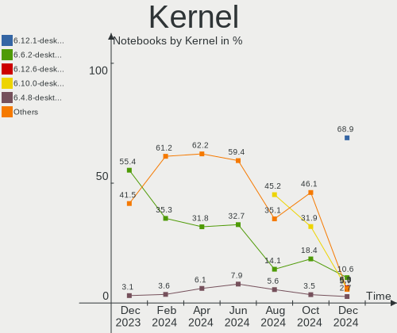
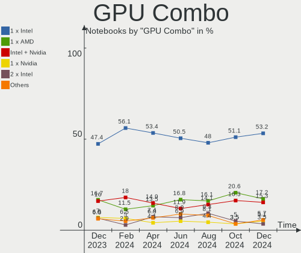
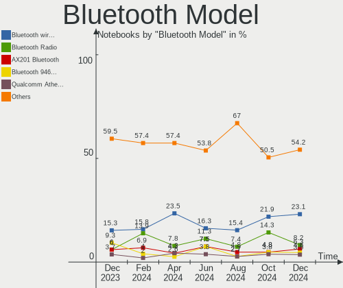

OpenMandriva - Hardware Trends (Notebooks)
------------------------------------------

A project to identify most popular hardware characteristics and track their change
over time based on data collected by Linux users at https://Linux-Hardware.org.

Anyone can contribute to this report by the [hw-probe](https://github.com/linuxhw/hw-probe) tool:

    sudo -E hw-probe -all -upload

This report is for one last month. Overall report since the beginning of time: [TestDays](https://github.com/linuxhw/TestDays)

Period: Sep, 2023.

Contents
--------

* [ System ](#system)
  - [ OS                       ](#os)
  - [ OS Family                ](#os-family)
  - [ Kernel                   ](#kernel)
  - [ Kernel Family            ](#kernel-family)
  - [ Kernel Major Ver.        ](#kernel-major-ver)
  - [ Arch                     ](#arch)
  - [ DE                       ](#de)
  - [ Display Server           ](#display-server)
  - [ Display Manager          ](#display-manager)
  - [ OS Lang                  ](#os-lang)
  - [ Boot Mode                ](#boot-mode)
  - [ Filesystem               ](#filesystem)
  - [ Part. scheme             ](#part-scheme)
  - [ Dual Boot with Linux/BSD ](#dual-boot-with-linuxbsd)
  - [ Dual Boot (Win)          ](#dual-boot-win)

* [ Board ](#board)
  - [ Vendor                   ](#vendor)
  - [ Model                    ](#model)
  - [ Model Family             ](#model-family)
  - [ MFG Year                 ](#mfg-year)
  - [ Form Factor              ](#form-factor)
  - [ Secure Boot              ](#secure-boot)
  - [ Coreboot                 ](#coreboot)
  - [ RAM Size                 ](#ram-size)
  - [ RAM Used                 ](#ram-used)
  - [ Total Drives             ](#total-drives)
  - [ Has CD-ROM               ](#has-cd-rom)
  - [ Has Ethernet             ](#has-ethernet)
  - [ Has WiFi                 ](#has-wifi)
  - [ Has Bluetooth            ](#has-bluetooth)

* [ Location ](#location)
  - [ Country                  ](#country)
  - [ City                     ](#city)

* [ Drives ](#drives)
  - [ Drive Vendor             ](#drive-vendor)
  - [ Drive Model              ](#drive-model)
  - [ HDD Vendor               ](#hdd-vendor)
  - [ SSD Vendor               ](#ssd-vendor)
  - [ Drive Kind               ](#drive-kind)
  - [ Drive Connector          ](#drive-connector)
  - [ Drive Size               ](#drive-size)
  - [ Space Total              ](#space-total)
  - [ Space Used               ](#space-used)
  - [ Malfunc. Drives          ](#malfunc-drives)
  - [ Malfunc. Drive Vendor    ](#malfunc-drive-vendor)
  - [ Malfunc. HDD Vendor      ](#malfunc-hdd-vendor)
  - [ Malfunc. Drive Kind      ](#malfunc-drive-kind)
  - [ Failed Drives            ](#failed-drives)
  - [ Failed Drive Vendor      ](#failed-drive-vendor)
  - [ Drive Status             ](#drive-status)

* [ Storage controller ](#storage-controller)
  - [ Storage Vendor           ](#storage-vendor)
  - [ Storage Model            ](#storage-model)
  - [ Storage Kind             ](#storage-kind)

* [ Processor ](#processor)
  - [ CPU Vendor               ](#cpu-vendor)
  - [ CPU Model                ](#cpu-model)
  - [ CPU Model Family         ](#cpu-model-family)
  - [ CPU Cores                ](#cpu-cores)
  - [ CPU Sockets              ](#cpu-sockets)
  - [ CPU Threads              ](#cpu-threads)
  - [ CPU Op-Modes             ](#cpu-op-modes)
  - [ CPU Microcode            ](#cpu-microcode)
  - [ CPU Microarch            ](#cpu-microarch)

* [ Graphics ](#graphics)
  - [ GPU Vendor               ](#gpu-vendor)
  - [ GPU Model                ](#gpu-model)
  - [ GPU Combo                ](#gpu-combo)
  - [ GPU Driver               ](#gpu-driver)
  - [ GPU Memory               ](#gpu-memory)

* [ Monitor ](#monitor)
  - [ Monitor Vendor           ](#monitor-vendor)
  - [ Monitor Model            ](#monitor-model)
  - [ Monitor Resolution       ](#monitor-resolution)
  - [ Monitor Diagonal         ](#monitor-diagonal)
  - [ Monitor Width            ](#monitor-width)
  - [ Aspect Ratio             ](#aspect-ratio)
  - [ Monitor Area             ](#monitor-area)
  - [ Pixel Density            ](#pixel-density)
  - [ Multiple Monitors        ](#multiple-monitors)

* [ Network ](#network)
  - [ Net Controller Vendor    ](#net-controller-vendor)
  - [ Net Controller Model     ](#net-controller-model)
  - [ Wireless Vendor          ](#wireless-vendor)
  - [ Wireless Model           ](#wireless-model)
  - [ Ethernet Vendor          ](#ethernet-vendor)
  - [ Ethernet Model           ](#ethernet-model)
  - [ Net Controller Kind      ](#net-controller-kind)
  - [ Used Controller          ](#used-controller)
  - [ NICs                     ](#nics)
  - [ IPv6                     ](#ipv6)

* [ Bluetooth ](#bluetooth)
  - [ Bluetooth Vendor         ](#bluetooth-vendor)
  - [ Bluetooth Model          ](#bluetooth-model)

* [ Sound ](#sound)
  - [ Sound Vendor             ](#sound-vendor)
  - [ Sound Model              ](#sound-model)

* [ Memory ](#memory)
  - [ Memory Vendor            ](#memory-vendor)
  - [ Memory Model             ](#memory-model)
  - [ Memory Kind              ](#memory-kind)
  - [ Memory Form Factor       ](#memory-form-factor)
  - [ Memory Size              ](#memory-size)
  - [ Memory Speed             ](#memory-speed)

* [ Printers & scanners ](#printers--scanners)
  - [ Printer Vendor           ](#printer-vendor)
  - [ Printer Model            ](#printer-model)
  - [ Scanner Vendor           ](#scanner-vendor)
  - [ Scanner Model            ](#scanner-model)

* [ Camera ](#camera)
  - [ Camera Vendor            ](#camera-vendor)
  - [ Camera Model             ](#camera-model)

* [ Security ](#security)
  - [ Fingerprint Vendor       ](#fingerprint-vendor)
  - [ Fingerprint Model        ](#fingerprint-model)
  - [ Chipcard Vendor          ](#chipcard-vendor)
  - [ Chipcard Model           ](#chipcard-model)

* [ Unsupported ](#unsupported)
  - [ Unsupported Devices      ](#unsupported-devices)
  - [ Unsupported Device Types ](#unsupported-device-types)

System
------

OS
--

Installed operating systems

| Name               | Notebooks | Percent |
|--------------------|-----------|---------|
| OpenMandriva 23.08 | 177       | 54.8%   |
| OpenMandriva 23.09 | 78        | 24.15%  |
| OpenMandriva 4.3   | 20        | 6.19%   |
| OpenMandriva 23.03 | 19        | 5.88%   |
| OpenMandriva 23.90 | 10        | 3.1%    |
| OpenMandriva 23.01 | 10        | 3.1%    |
| OpenMandriva 4.2   | 7         | 2.17%   |
| OpenMandriva 23.06 | 2         | 0.62%   |

OS Family
---------

OS without a version

| Name         | Notebooks | Percent |
|--------------|-----------|---------|
| OpenMandriva | 323       | 100%    |

Kernel
------

Version of the Linux kernel

| Version                    | Notebooks | Percent |
|----------------------------|-----------|---------|
| 6.4.11-desktop-1omv2390    | 156       | 48.3%   |
| 6.5.0-desktop-1omv2390     | 37        | 11.46%  |
| 6.5.3-desktop-1omv2390     | 24        | 7.43%   |
| 6.4.8-desktop-2omv2390     | 21        | 6.5%    |
| 6.2.6-desktop-1omv2390     | 17        | 5.26%   |
| 6.5.1-desktop-1omv2390     | 12        | 3.72%   |
| 5.16.7-desktop-1omv4003    | 12        | 3.72%   |
| 6.1.1-desktop-1omv2290     | 11        | 3.41%   |
| 6.5.5-desktop-1omv2390     | 7         | 2.17%   |
| 6.5.2-desktop-1omv2390     | 7         | 2.17%   |
| 5.16.13-desktop-1omv4003   | 7         | 2.17%   |
| 5.10.14-desktop-1omv4002   | 7         | 2.17%   |
| 6.3.5-desktop-3omv2390     | 2         | 0.62%   |
| 6.5.0-desktop-2.0omv4.9mjn | 1         | 0.31%   |
| 6.2.1-desktop-1omv2390     | 1         | 0.31%   |
| 5.17.1-desktop-2omv4050    | 1         | 0.31%   |

Kernel Family
-------------

Linux kernel without a distro release

| Version | Notebooks | Percent |
|---------|-----------|---------|
| 6.4.11  | 156       | 48.3%   |
| 6.5.0   | 38        | 11.76%  |
| 6.5.3   | 24        | 7.43%   |
| 6.4.8   | 21        | 6.5%    |
| 6.2.6   | 17        | 5.26%   |
| 6.5.1   | 12        | 3.72%   |
| 5.16.7  | 12        | 3.72%   |
| 6.1.1   | 11        | 3.41%   |
| 6.5.5   | 7         | 2.17%   |
| 6.5.2   | 7         | 2.17%   |
| 5.16.13 | 7         | 2.17%   |
| 5.10.14 | 7         | 2.17%   |
| 6.3.5   | 2         | 0.62%   |
| 6.2.1   | 1         | 0.31%   |
| 5.17.1  | 1         | 0.31%   |

Kernel Major Ver.
-----------------

Linux kernel major version

| Version | Notebooks | Percent |
|---------|-----------|---------|
| 6.4     | 177       | 54.8%   |
| 6.5     | 88        | 27.24%  |
| 5.16    | 19        | 5.88%   |
| 6.2     | 18        | 5.57%   |
| 6.1     | 11        | 3.41%   |
| 5.10    | 7         | 2.17%   |
| 6.3     | 2         | 0.62%   |
| 5.17    | 1         | 0.31%   |

Arch
----

OS architecture (x86_64, i586, etc.)

| Name   | Notebooks | Percent |
|--------|-----------|---------|
| x86_64 | 323       | 100%    |

DE
--

Desktop Environment

| Name     | Notebooks | Percent |
|----------|-----------|---------|
| KDE5     | 256       | 79.26%  |
| LXQt     | 30        | 9.29%   |
| GNOME    | 26        | 8.05%   |
| Unknown  | 7         | 2.17%   |
| Budgie   | 3         | 0.93%   |
| Cinnamon | 1         | 0.31%   |

Display Server
--------------

X11 or Wayland

| Name    | Notebooks | Percent |
|---------|-----------|---------|
| Wayland | 256       | 79.26%  |
| X11     | 67        | 20.74%  |

Display Manager
---------------

SDDM, LightDM, etc.

| Name    | Notebooks | Percent |
|---------|-----------|---------|
| SDDM    | 293       | 90.71%  |
| GDM     | 26        | 8.05%   |
| LightDM | 3         | 0.93%   |
| Unknown | 1         | 0.31%   |

OS Lang
-------

Language

| Lang       | Notebooks | Percent |
|------------|-----------|---------|
| en_US      | 172       | 53.25%  |
| de_DE      | 21        | 6.5%    |
| pt_BR      | 18        | 5.57%   |
| fr_FR      | 18        | 5.57%   |
| ru_RU      | 16        | 4.95%   |
| it_IT      | 12        | 3.72%   |
| en_GB      | 11        | 3.41%   |
| es_MX      | 4         | 1.24%   |
| es_ES      | 4         | 1.24%   |
| pt_PT      | 3         | 0.93%   |
| pl_PL      | 3         | 0.93%   |
| es_CL      | 3         | 0.93%   |
| tr_TR      | 2         | 0.62%   |
| ro_RO      | 2         | 0.62%   |
| nl_BE      | 2         | 0.62%   |
| ja_JP      | 2         | 0.62%   |
| hu_HU      | 2         | 0.62%   |
| es_PE      | 2         | 0.62%   |
| es_CO      | 2         | 0.62%   |
| es_AR      | 2         | 0.62%   |
| en_IN      | 2         | 0.62%   |
| en_CA      | 2         | 0.62%   |
| en_AU      | 2         | 0.62%   |
| de_CH      | 2         | 0.62%   |
| de_AT      | 2         | 0.62%   |
| da_DK      | 2         | 0.62%   |
| cs_CZ      | 2         | 0.62%   |
| ca_ES      | 2         | 0.62%   |
| UTF-8      | 1         | 0.31%   |
| nl_NL      | 1         | 0.31%   |
| ja_JP.UTF8 | 1         | 0.31%   |
| es_VE      | 1         | 0.31%   |
| en_SG      | 1         | 0.31%   |
| en_NZ      | 1         | 0.31%   |

Boot Mode
---------

EFI or BIOS

| Mode | Notebooks | Percent |
|------|-----------|---------|
| EFI  | 192       | 59.44%  |
| BIOS | 131       | 40.56%  |

Filesystem
----------

Type of filesystem

| Type    | Notebooks | Percent |
|---------|-----------|---------|
| Ext4    | 177       | 54.8%   |
| Overlay | 125       | 38.7%   |
| Btrfs   | 15        | 4.64%   |
| Xfs     | 4         | 1.24%   |
| F2fs    | 2         | 0.62%   |

Part. scheme
------------

Scheme of partitioning

| Type    | Notebooks | Percent |
|---------|-----------|---------|
| GPT     | 250       | 77.4%   |
| MBR     | 72        | 22.29%  |
| Unknown | 1         | 0.31%   |

Dual Boot with Linux/BSD
------------------------

Hosting more than one Linux/BSD

| Dual boot | Notebooks | Percent |
|-----------|-----------|---------|
| No        | 196       | 60.68%  |
| Yes       | 127       | 39.32%  |

Dual Boot (Win)
---------------

Hosting Linux and Windows

| Dual boot | Notebooks | Percent |
|-----------|-----------|---------|
| No        | 209       | 64.71%  |
| Yes       | 114       | 35.29%  |

Board
-----

Vendor
------

Motherboard manufacturer

| Name                | Notebooks | Percent |
|---------------------|-----------|---------|
| Lenovo              | 69        | 21.36%  |
| Hewlett-Packard     | 59        | 18.27%  |
| Acer                | 42        | 13%     |
| ASUSTek Computer    | 39        | 12.07%  |
| Dell                | 38        | 11.76%  |
| Toshiba             | 12        | 3.72%   |
| Samsung Electronics | 8         | 2.48%   |
| MSI                 | 7         | 2.17%   |
| Apple               | 7         | 2.17%   |
| Sony                | 3         | 0.93%   |
| LG Electronics      | 3         | 0.93%   |
| Fujitsu             | 3         | 0.93%   |
| Chuwi               | 3         | 0.93%   |
| Positivo            | 2         | 0.62%   |
| Packard Bell        | 2         | 0.62%   |
| Medion              | 2         | 0.62%   |
| Google              | 2         | 0.62%   |
| Compaq              | 2         | 0.62%   |
| VIT                 | 1         | 0.31%   |
| UMAX                | 1         | 0.31%   |
| SLIMBOOK            | 1         | 0.31%   |
| SKIKK               | 1         | 0.31%   |
| Schenker            | 1         | 0.31%   |
| Purism              | 1         | 0.31%   |
| OEGStone            | 1         | 0.31%   |
| Notebook            | 1         | 0.31%   |
| NEC Computers       | 1         | 0.31%   |
| Microtech           | 1         | 0.31%   |
| LIVEFAN             | 1         | 0.31%   |
| HUAWEI              | 1         | 0.31%   |
| GPU Company         | 1         | 0.31%   |
| Gigabyte Technology | 1         | 0.31%   |
| Clevo               | 1         | 0.31%   |
| BGH                 | 1         | 0.31%   |
| AXIOO               | 1         | 0.31%   |
| ALLDOCUBE           | 1         | 0.31%   |
| Alienware           | 1         | 0.31%   |
| Unknown             | 1         | 0.31%   |

Model
-----

Motherboard model

| Name                              | Notebooks | Percent |
|-----------------------------------|-----------|---------|
| HP Notebook                       | 5         | 1.55%   |
| HP Laptop 15s-eq2xxx              | 3         | 0.93%   |
| HP ElitePad 1000 G2               | 3         | 0.93%   |
| ASUS UL80VT                       | 3         | 0.93%   |
| Lenovo V15-IGL 82C3               | 2         | 0.62%   |
| Lenovo V15-ADA 82C7               | 2         | 0.62%   |
| HP Pavilion g6                    | 2         | 0.62%   |
| HP Laptop 17-bs0xx                | 2         | 0.62%   |
| HP 1000                           | 2         | 0.62%   |
| Dell Latitude E7440               | 2         | 0.62%   |
| Dell Latitude E6410               | 2         | 0.62%   |
| Dell Latitude E6400               | 2         | 0.62%   |
| Dell Latitude 5480                | 2         | 0.62%   |
| Dell Inspiron 3542                | 2         | 0.62%   |
| Chuwi GemiBook XPro               | 2         | 0.62%   |
| Apple MacBookPro11,4              | 2         | 0.62%   |
| Acer Nitro AN515-57               | 2         | 0.62%   |
| Acer Aspire E5-571                | 2         | 0.62%   |
| Acer Aspire A315-21               | 2         | 0.62%   |
| Unknown                           | 2         | 0.62%   |
| VIT P2400                         | 1         | 0.31%   |
| UMAX 13Wr                         | 1         | 0.31%   |
| Toshiba Satellite S50t-B          | 1         | 0.31%   |
| Toshiba Satellite Pro R50-B       | 1         | 0.31%   |
| Toshiba Satellite L500            | 1         | 0.31%   |
| Toshiba Satellite L45-B           | 1         | 0.31%   |
| Toshiba Satellite C850-1DZ        | 1         | 0.31%   |
| Toshiba Satellite C850            | 1         | 0.31%   |
| Toshiba Satellite C845D           | 1         | 0.31%   |
| Toshiba Satellite C650            | 1         | 0.31%   |
| Toshiba Satellite C50-B           | 1         | 0.31%   |
| Toshiba Satellite A200            | 1         | 0.31%   |
| Toshiba dynabook Satellite B350/B | 1         | 0.31%   |
| Toshiba dynabook R73/J            | 1         | 0.31%   |
| Sony VPCYB15AG                    | 1         | 0.31%   |
| Sony VPCEB27FX                    | 1         | 0.31%   |
| Sony SVS1512DCXB                  | 1         | 0.31%   |
| SLIMBOOK PROX14-AMD               | 1         | 0.31%   |
| SKIKK Sindri 14                   | 1         | 0.31%   |
| Schenker XMG CORE (M19, GTX 1650) | 1         | 0.31%   |

Model Family
------------

Motherboard model prefix

| Name                  | Notebooks | Percent |
|-----------------------|-----------|---------|
| Lenovo ThinkPad       | 35        | 10.84%  |
| Acer Aspire           | 27        | 8.36%   |
| Lenovo IdeaPad        | 15        | 4.64%   |
| Dell Latitude         | 15        | 4.64%   |
| Dell Inspiron         | 14        | 4.33%   |
| HP EliteBook          | 13        | 4.02%   |
| ASUS VivoBook         | 13        | 4.02%   |
| HP Laptop             | 12        | 3.72%   |
| Toshiba Satellite     | 10        | 3.1%    |
| Acer Nitro            | 7         | 2.17%   |
| HP Pavilion           | 6         | 1.86%   |
| HP ProBook            | 5         | 1.55%   |
| HP Notebook           | 5         | 1.55%   |
| HP Compaq             | 4         | 1.24%   |
| Dell Vostro           | 4         | 1.24%   |
| HP ElitePad           | 3         | 0.93%   |
| Fujitsu LIFEBOOK      | 3         | 0.93%   |
| ASUS UL80VT           | 3         | 0.93%   |
| Apple MacBookPro11    | 3         | 0.93%   |
| Toshiba dynabook      | 2         | 0.62%   |
| Packard Bell EasyNote | 2         | 0.62%   |
| Lenovo V15-IGL        | 2         | 0.62%   |
| Lenovo V15-ADA        | 2         | 0.62%   |
| Lenovo G570           | 2         | 0.62%   |
| HP ENVY               | 2         | 0.62%   |
| HP 1000               | 2         | 0.62%   |
| Dell System           | 2         | 0.62%   |
| Chuwi GemiBook        | 2         | 0.62%   |
| ASUS TUF              | 2         | 0.62%   |
| ASUS ASUS             | 2         | 0.62%   |
| Acer TravelMate       | 2         | 0.62%   |
| Acer Swift            | 2         | 0.62%   |
| Acer Extensa          | 2         | 0.62%   |
| Unknown               | 2         | 0.62%   |
| VIT P2400             | 1         | 0.31%   |
| UMAX 13Wr             | 1         | 0.31%   |
| Sony VPCYB15AG        | 1         | 0.31%   |
| Sony VPCEB27FX        | 1         | 0.31%   |
| Sony SVS1512DCXB      | 1         | 0.31%   |
| SLIMBOOK PROX14-AMD   | 1         | 0.31%   |

MFG Year
--------

Motherboard manufacture year

| Year | Notebooks | Percent |
|------|-----------|---------|
| 2014 | 33        | 10.22%  |
| 2021 | 31        | 9.6%    |
| 2020 | 28        | 8.67%   |
| 2012 | 27        | 8.36%   |
| 2011 | 27        | 8.36%   |
| 2017 | 25        | 7.74%   |
| 2010 | 22        | 6.81%   |
| 2018 | 19        | 5.88%   |
| 2016 | 19        | 5.88%   |
| 2019 | 17        | 5.26%   |
| 2013 | 17        | 5.26%   |
| 2009 | 17        | 5.26%   |
| 2015 | 13        | 4.02%   |
| 2022 | 9         | 2.79%   |
| 2008 | 8         | 2.48%   |
| 2023 | 7         | 2.17%   |
| 2007 | 3         | 0.93%   |
| 2006 | 1         | 0.31%   |

Form Factor
-----------

Physical design of the computer

| Name     | Notebooks | Percent |
|----------|-----------|---------|
| Notebook | 323       | 100%    |

Secure Boot
-----------

Enabled or disabled

| State    | Notebooks | Percent |
|----------|-----------|---------|
| Disabled | 323       | 100%    |

Coreboot
--------

Have coreboot on board

| Used | Notebooks | Percent |
|------|-----------|---------|
| No   | 320       | 99.07%  |
| Yes  | 3         | 0.93%   |

RAM Size
--------

Total RAM memory

| Size in GB  | Notebooks | Percent |
|-------------|-----------|---------|
| 4.01-8.0    | 129       | 39.94%  |
| 3.01-4.0    | 94        | 29.1%   |
| 8.01-16.0   | 51        | 15.79%  |
| 16.01-24.0  | 29        | 8.98%   |
| 32.01-64.0  | 8         | 2.48%   |
| 2.01-3.0    | 6         | 1.86%   |
| 1.01-2.0    | 4         | 1.24%   |
| 24.01-32.0  | 1         | 0.31%   |
| 64.01-256.0 | 1         | 0.31%   |

RAM Used
--------

Used RAM memory

| Used GB  | Notebooks | Percent |
|----------|-----------|---------|
| 1.01-2.0 | 194       | 60.06%  |
| 2.01-3.0 | 75        | 23.22%  |
| 0.51-1.0 | 36        | 11.15%  |
| 3.01-4.0 | 11        | 3.41%   |
| 4.01-8.0 | 6         | 1.86%   |
| 0.01-0.5 | 1         | 0.31%   |

Total Drives
------------

Number of drives on board

| Drives | Notebooks | Percent |
|--------|-----------|---------|
| 1      | 234       | 72.45%  |
| 2      | 69        | 21.36%  |
| 3      | 13        | 4.02%   |
| 0      | 7         | 2.17%   |

Has CD-ROM
----------

Has CD-ROM on board

| Presented | Notebooks | Percent |
|-----------|-----------|---------|
| No        | 200       | 61.92%  |
| Yes       | 123       | 38.08%  |

Has Ethernet
------------

Has Ethernet on board

| Presented | Notebooks | Percent |
|-----------|-----------|---------|
| Yes       | 261       | 80.8%   |
| No        | 62        | 19.2%   |

Has WiFi
--------

Has WiFi module

| Presented | Notebooks | Percent |
|-----------|-----------|---------|
| Yes       | 320       | 99.07%  |
| No        | 3         | 0.93%   |

Has Bluetooth
-------------

Has Bluetooth module

| Presented | Notebooks | Percent |
|-----------|-----------|---------|
| Yes       | 245       | 75.85%  |
| No        | 78        | 24.15%  |

Location
--------

Country
-------

Geographic location (country)

| Country     | Notebooks | Percent |
|-------------|-----------|---------|
| USA         | 34        | 10.53%  |
| Brazil      | 32        | 9.91%   |
| Germany     | 30        | 9.29%   |
| Russia      | 18        | 5.57%   |
| Italy       | 16        | 4.95%   |
| France      | 15        | 4.64%   |
| Spain       | 14        | 4.33%   |
| UK          | 11        | 3.41%   |
| Japan       | 11        | 3.41%   |
| Poland      | 10        | 3.1%    |
| Canada      | 9         | 2.79%   |
| Mexico      | 7         | 2.17%   |
| Indonesia   | 7         | 2.17%   |
| India       | 6         | 1.86%   |
| Bulgaria    | 6         | 1.86%   |
| Finland     | 5         | 1.55%   |
| Belgium     | 5         | 1.55%   |
| Turkey      | 4         | 1.24%   |
| Peru        | 4         | 1.24%   |
| Netherlands | 4         | 1.24%   |
| Hungary     | 4         | 1.24%   |
| Greece      | 4         | 1.24%   |
| Switzerland | 3         | 0.93%   |
| Sweden      | 3         | 0.93%   |
| Romania     | 3         | 0.93%   |
| Portugal    | 3         | 0.93%   |
| Malaysia    | 3         | 0.93%   |
| China       | 3         | 0.93%   |
| Chile       | 3         | 0.93%   |
| Algeria     | 3         | 0.93%   |
| Venezuela   | 2         | 0.62%   |
| Thailand    | 2         | 0.62%   |
| Taiwan      | 2         | 0.62%   |
| Norway      | 2         | 0.62%   |
| Guadeloupe  | 2         | 0.62%   |
| Denmark     | 2         | 0.62%   |
| Czechia     | 2         | 0.62%   |
| Croatia     | 2         | 0.62%   |
| Colombia    | 2         | 0.62%   |
| Austria     | 2         | 0.62%   |

City
----

Geographic location (city)

| City          | Notebooks | Percent |
|---------------|-----------|---------|
| Miura         | 4         | 1.24%   |
| Milan         | 4         | 1.24%   |
| Barcelona     | 4         | 1.24%   |
| Sofia         | 3         | 0.93%   |
| Moscow        | 3         | 0.93%   |
| Milano        | 3         | 0.93%   |
| Helsinki      | 3         | 0.93%   |
| Bengaluru     | 3         | 0.93%   |
| Yekaterinburg | 2         | 0.62%   |
| Wegberg       | 2         | 0.62%   |
| Tyumen        | 2         | 0.62%   |
| Sao Paulo     | 2         | 0.62%   |
| Santiago      | 2         | 0.62%   |
| Salvador      | 2         | 0.62%   |
| Porto Alegre  | 2         | 0.62%   |
| Petit-Bourg   | 2         | 0.62%   |
| Paris         | 2         | 0.62%   |
| New York      | 2         | 0.62%   |
| Montana       | 2         | 0.62%   |
| Melbourne     | 2         | 0.62%   |
| Marília      | 2         | 0.62%   |
| Joinville     | 2         | 0.62%   |
| Ilo           | 2         | 0.62%   |
| Fargo         | 2         | 0.62%   |
| Cuxhaven      | 2         | 0.62%   |
| Curitiba      | 2         | 0.62%   |
| Bordeaux      | 2         | 0.62%   |
| Bogor         | 2         | 0.62%   |
| Bekasi        | 2         | 0.62%   |
| Athens        | 2         | 0.62%   |
| Ålesund      | 2         | 0.62%   |
| Đakovo       | 1         | 0.31%   |
| Zoersel       | 1         | 0.31%   |
| Zipaquirá    | 1         | 0.31%   |
| Zhengzhou     | 1         | 0.31%   |
| Zgierz        | 1         | 0.31%   |
| Yukon         | 1         | 0.31%   |
| Yoshkar-Ola   | 1         | 0.31%   |
| Yiwu          | 1         | 0.31%   |
| Yamanashi     | 1         | 0.31%   |

Drives
------

Drive Vendor
------------

Hard drive vendors

| Vendor                | Notebooks | Drives | Percent |
|-----------------------|-----------|--------|---------|
| WDC                   | 46        | 46     | 12.11%  |
| Samsung Electronics   | 42        | 46     | 11.05%  |
| Seagate               | 34        | 37     | 8.95%   |
| Kingston              | 29        | 30     | 7.63%   |
| Toshiba               | 22        | 23     | 5.79%   |
| SanDisk               | 21        | 22     | 5.53%   |
| Unknown               | 16        | 17     | 4.21%   |
| HGST                  | 15        | 15     | 3.95%   |
| SK hynix              | 13        | 13     | 3.42%   |
| Crucial               | 13        | 13     | 3.42%   |
| Intel                 | 11        | 12     | 2.89%   |
| Hitachi               | 10        | 10     | 2.63%   |
| China                 | 10        | 10     | 2.63%   |
| Micron Technology     | 9         | 9      | 2.37%   |
| Unknown               | 7         | 8      | 1.84%   |
| LITEON                | 5         | 5      | 1.32%   |
| Intenso               | 5         | 5      | 1.32%   |
| A-DATA Technology     | 5         | 5      | 1.32%   |
| SSSTC                 | 4         | 4      | 1.05%   |
| Patriot               | 4         | 4      | 1.05%   |
| KIOXIA                | 4         | 4      | 1.05%   |
| Apple                 | 4         | 4      | 1.05%   |
| SPCC                  | 3         | 3      | 0.79%   |
| Silicon Motion        | 3         | 3      | 0.79%   |
| Emtec                 | 3         | 3      | 0.79%   |
| Verbatim              | 2         | 2      | 0.53%   |
| Team                  | 2         | 2      | 0.53%   |
| T-FORCE               | 2         | 2      | 0.53%   |
| PNY                   | 2         | 2      | 0.53%   |
| Phison                | 2         | 2      | 0.53%   |
| Lexar                 | 2         | 2      | 0.53%   |
| JMicron Technology    | 2         | 2      | 0.53%   |
| GOODRAM               | 2         | 2      | 0.53%   |
| AirDisk               | 2         | 2      | 0.53%   |
| WALRAM                | 1         | 1      | 0.26%   |
| VISIPRO               | 1         | 1      | 0.26%   |
| Vaseky                | 1         | 1      | 0.26%   |
| sobetter              | 1         | 1      | 0.26%   |
| Realtek Semiconductor | 1         | 1      | 0.26%   |
| OCZ-AGIL              | 1         | 1      | 0.26%   |

Drive Model
-----------

Hard drive models

| Model                                 | Notebooks | Percent |
|---------------------------------------|-----------|---------|
| Kingston SA400S37240G 240GB SSD       | 8         | 2.05%   |
| Kingston SA400S37480G 480GB SSD       | 7         | 1.79%   |
| Unknown                               | 7         | 1.79%   |
| Seagate ST9500325AS 500GB             | 6         | 1.53%   |
| HGST HTS545050A7E680 500GB            | 4         | 1.02%   |
| Seagate ST500LT012-1DG142 500GB       | 3         | 0.77%   |
| Seagate ST1000LM035-1RK172 1TB        | 3         | 0.77%   |
| Seagate ST1000LM024 HN-M101MBB 1TB    | 3         | 0.77%   |
| Seagate Expansion HDD 16TB            | 3         | 0.77%   |
| Kingston SV300S37A120G 120GB SSD      | 3         | 0.77%   |
| HGST HTS725050A7E630 500GB            | 3         | 0.77%   |
| Crucial CT500MX500SSD1 500GB          | 3         | 0.77%   |
| A-DATA SU650 240GB SSD                | 3         | 0.77%   |
| WDC WD5000LPVX-22V0TT0 500GB          | 2         | 0.51%   |
| WDC WD3200BPVT-22JJ5T0 320GB          | 2         | 0.51%   |
| WDC WD10SPZX-08Z10 1TB                | 2         | 0.51%   |
| WDC WD10JPVX-60JC3T1 1TB              | 2         | 0.51%   |
| WDC WD10JPVX-22JC3T0 1TB              | 2         | 0.51%   |
| Unknown TA2964  64GB                  | 2         | 0.51%   |
| Unknown SD/MMC/MS PRO 128GB           | 2         | 0.51%   |
| Toshiba MQ04ABF100 1TB                | 2         | 0.51%   |
| Toshiba MQ01ABF050 500GB              | 2         | 0.51%   |
| Toshiba MK1234GSX 120GB               | 2         | 0.51%   |
| Toshiba KBG40ZMT128G MEMORY 128GB     | 2         | 0.51%   |
| SK hynix HFS256G39TND-N210A 256GB SSD | 2         | 0.51%   |
| SK hynix HCG8e  64GB                  | 2         | 0.51%   |
| Seagate ST9320423AS 320GB             | 2         | 0.51%   |
| Seagate ST500LT012-9WS142 500GB       | 2         | 0.51%   |
| SanDisk SSD PLUS 240GB                | 2         | 0.51%   |
| SanDisk SDSSDA120G 120GB              | 2         | 0.51%   |
| SanDisk DF4032  32GB                  | 2         | 0.51%   |
| Samsung SSD 870 EVO 500GB             | 2         | 0.51%   |
| Samsung MZVLQ512HBLU-00BTW 512GB      | 2         | 0.51%   |
| Samsung MZVL41T0HBLB-00BTW 1TB        | 2         | 0.51%   |
| Samsung MZNLN256HCHP-000L7 256GB SSD  | 2         | 0.51%   |
| Samsung MZNLN256HAJQ-000H1 256GB SSD  | 2         | 0.51%   |
| Samsung HM251HI 250GB                 | 2         | 0.51%   |
| Micron 2210_MTFDHBA512QFD 512GB       | 2         | 0.51%   |
| Kingston SUV400S37240G 240GB SSD      | 2         | 0.51%   |
| Hitachi HTS543232A7A384 320GB         | 2         | 0.51%   |

HDD Vendor
----------

Hard disk drive vendors

| Vendor              | Notebooks | Drives | Percent |
|---------------------|-----------|--------|---------|
| Seagate             | 34        | 35     | 29.82%  |
| WDC                 | 33        | 33     | 28.95%  |
| Toshiba             | 15        | 16     | 13.16%  |
| HGST                | 15        | 15     | 13.16%  |
| Hitachi             | 10        | 10     | 8.77%   |
| Samsung Electronics | 3         | 3      | 2.63%   |
| Unknown             | 2         | 2      | 1.75%   |
| Intenso             | 1         | 1      | 0.88%   |
| Fujitsu             | 1         | 1      | 0.88%   |

SSD Vendor
----------

Solid state drive vendors

| Vendor              | Notebooks | Drives | Percent |
|---------------------|-----------|--------|---------|
| Kingston            | 25        | 26     | 15.72%  |
| Samsung Electronics | 22        | 24     | 13.84%  |
| SanDisk             | 17        | 18     | 10.69%  |
| Crucial             | 12        | 12     | 7.55%   |
| China               | 10        | 10     | 6.29%   |
| WDC                 | 7         | 7      | 4.4%    |
| A-DATA Technology   | 5         | 5      | 3.14%   |
| Patriot             | 4         | 4      | 2.52%   |
| LITEON              | 4         | 4      | 2.52%   |
| Intenso             | 4         | 4      | 2.52%   |
| SK hynix            | 3         | 3      | 1.89%   |
| Apple               | 3         | 3      | 1.89%   |
| Verbatim            | 2         | 2      | 1.26%   |
| Toshiba             | 2         | 2      | 1.26%   |
| Team                | 2         | 2      | 1.26%   |
| SPCC                | 2         | 2      | 1.26%   |
| PNY                 | 2         | 2      | 1.26%   |
| Intel               | 2         | 2      | 1.26%   |
| GOODRAM             | 2         | 2      | 1.26%   |
| Emtec               | 2         | 2      | 1.26%   |
| AirDisk             | 2         | 2      | 1.26%   |
| WALRAM              | 1         | 1      | 0.63%   |
| VISIPRO             | 1         | 1      | 0.63%   |
| Vaseky              | 1         | 1      | 0.63%   |
| SSSTC               | 1         | 1      | 0.63%   |
| Seagate             | 1         | 1      | 0.63%   |
| OCZ-AGIL            | 1         | 1      | 0.63%   |
| Netac               | 1         | 1      | 0.63%   |
| MidasForce          | 1         | 1      | 0.63%   |
| Micron Technology   | 1         | 1      | 0.63%   |
| LITEONIT            | 1         | 1      | 0.63%   |
| Lexar               | 1         | 1      | 0.63%   |
| KIOXIA-EXCERIA      | 1         | 1      | 0.63%   |
| KingDian            | 1         | 1      | 0.63%   |
| JMicron Technology  | 1         | 1      | 0.63%   |
| HUSKY               | 1         | 1      | 0.63%   |
| HS-SSD-C100         | 1         | 1      | 0.63%   |
| GeIL                | 1         | 1      | 0.63%   |
| Fanxiang            | 1         | 1      | 0.63%   |
| DIERYA              | 1         | 1      | 0.63%   |

Drive Kind
----------

HDD or SSD

| Kind    | Notebooks | Drives | Percent |
|---------|-----------|--------|---------|
| SSD     | 150       | 163    | 40.87%  |
| HDD     | 110       | 116    | 29.97%  |
| NVMe    | 80        | 84     | 21.8%   |
| MMC     | 22        | 25     | 5.99%   |
| Unknown | 5         | 5      | 1.36%   |

Drive Connector
---------------

SATA, SAS, NVMe, etc.

| Type | Notebooks | Drives | Percent |
|------|-----------|--------|---------|
| SATA | 235       | 262    | 65.46%  |
| NVMe | 80        | 84     | 22.28%  |
| SAS  | 22        | 22     | 6.13%   |
| MMC  | 22        | 25     | 6.13%   |

Drive Size
----------

Size of hard drive

| Size in TB | Notebooks | Drives | Percent |
|------------|-----------|--------|---------|
| 0.01-0.5   | 195       | 214    | 75.58%  |
| 0.51-1.0   | 55        | 56     | 21.32%  |
| 1.01-2.0   | 4         | 5      | 1.55%   |
| 10.01-20.0 | 3         | 3      | 1.16%   |
| 2.01-3.0   | 1         | 1      | 0.39%   |

Space Total
-----------

Amount of disk space available on the file system

| Size in GB     | Notebooks | Percent |
|----------------|-----------|---------|
| 1-20           | 93        | 28.79%  |
| 101-250        | 83        | 25.7%   |
| 251-500        | 50        | 15.48%  |
| 51-100         | 27        | 8.36%   |
| 501-1000       | 24        | 7.43%   |
| 21-50          | 21        | 6.5%    |
| Unknown        | 12        | 3.72%   |
| 1001-2000      | 8         | 2.48%   |
| More than 3000 | 3         | 0.93%   |
| 2001-3000      | 2         | 0.62%   |

Space Used
----------

Amount of used disk space

| Used GB        | Notebooks | Percent |
|----------------|-----------|---------|
| 1-20           | 255       | 78.95%  |
| 21-50          | 20        | 6.19%   |
| 51-100         | 16        | 4.95%   |
| 101-250        | 12        | 3.72%   |
| Unknown        | 12        | 3.72%   |
| 251-500        | 6         | 1.86%   |
| More than 3000 | 1         | 0.31%   |
| 1001-2000      | 1         | 0.31%   |

Malfunc. Drives
---------------

Drive models with a malfunction

| Model                                               | Notebooks | Drives | Percent |
|-----------------------------------------------------|-----------|--------|---------|
| Seagate ST9500325AS 500GB                           | 4         | 4      | 6.9%    |
| HGST HTS545050A7E680 500GB                          | 3         | 3      | 5.17%   |
| Seagate ST500LT012-9WS142 500GB                     | 2         | 2      | 3.45%   |
| Seagate ST500LT012-1DG142 500GB                     | 2         | 2      | 3.45%   |
| Kingston SV300S37A120G 120GB SSD                    | 2         | 2      | 3.45%   |
| HGST HTS725050A7E630 500GB                          | 2         | 2      | 3.45%   |
| WDC WDS240G2G0A-00JH30 240GB SSD                    | 1         | 1      | 1.72%   |
| WDC WD5000LPCX-60VHAT1 500GB                        | 1         | 1      | 1.72%   |
| WDC WD5000BPVT-24HXZT3 500GB                        | 1         | 1      | 1.72%   |
| WDC WD3200BEVT-22A23T0 320GB                        | 1         | 1      | 1.72%   |
| WDC WD1600BEVT-60ZCT1 160GB                         | 1         | 1      | 1.72%   |
| WDC WD1600BEVS-22RST0 160GB                         | 1         | 1      | 1.72%   |
| WDC WD10SPZX-08Z10 1TB                              | 1         | 1      | 1.72%   |
| Toshiba MQ01ABF050 500GB                            | 1         | 1      | 1.72%   |
| Toshiba MK5065GSX 500GB                             | 1         | 1      | 1.72%   |
| Toshiba MK3265GSX 320GB                             | 1         | 1      | 1.72%   |
| Toshiba MK3263GSXN 320GB                            | 1         | 1      | 1.72%   |
| Toshiba MK3259GSXP 320GB                            | 1         | 1      | 1.72%   |
| Toshiba MK1234GSX 120GB                             | 1         | 1      | 1.72%   |
| Toshiba HDWL120 2TB                                 | 1         | 1      | 1.72%   |
| SSSTC CV8-8E128-HP 128GB SSD                        | 1         | 1      | 1.72%   |
| SPCC Solid State Disk 120GB                         | 1         | 1      | 1.72%   |
| SK hynix PC711 HFS001TDE9X073N 1TB                  | 1         | 1      | 1.72%   |
| SK hynix HFS256G39TND-N210A 256GB SSD               | 1         | 1      | 1.72%   |
| SK hynix HFS256G32TNH-73A0A 256GB SSD               | 1         | 1      | 1.72%   |
| Seagate ST9320423AS 320GB                           | 1         | 1      | 1.72%   |
| Seagate ST9160412AS 160GB                           | 1         | 1      | 1.72%   |
| Seagate ST500LM021-1KJ152 500GB                     | 1         | 1      | 1.72%   |
| Seagate ST500LM000-1EJ162 500GB                     | 1         | 1      | 1.72%   |
| Seagate ST2000LM007-1R8174 2TB                      | 1         | 1      | 1.72%   |
| SanDisk SSD U100 256GB                              | 1         | 1      | 1.72%   |
| SanDisk SSD PLUS 240GB                              | 1         | 1      | 1.72%   |
| SanDisk SSD PLUS 120GB                              | 1         | 1      | 1.72%   |
| Samsung Electronics SSD PM810 TM 128GB              | 1         | 1      | 1.72%   |
| OCZ-AGIL ITY3 64GB SSD                              | 1         | 1      | 1.72%   |
| Micron Technology MTFDDAK256MAY-1AH12ABHA 256GB SSD | 1         | 1      | 1.72%   |
| Intel SSDSC2BF240A5L 240GB                          | 1         | 1      | 1.72%   |
| Intel SSDSC2BF180A5L 180GB                          | 1         | 1      | 1.72%   |
| Hitachi HTS723225A7A364 250GB                       | 1         | 1      | 1.72%   |
| Hitachi HTS545032B9A300 320GB                       | 1         | 1      | 1.72%   |

Malfunc. Drive Vendor
---------------------

Vendors of faulty drives

| Vendor              | Notebooks | Drives | Percent |
|---------------------|-----------|--------|---------|
| Seagate             | 13        | 13     | 22.41%  |
| HGST                | 8         | 8      | 13.79%  |
| WDC                 | 7         | 7      | 12.07%  |
| Toshiba             | 7         | 7      | 12.07%  |
| Hitachi             | 5         | 5      | 8.62%   |
| SK hynix            | 3         | 3      | 5.17%   |
| SanDisk             | 3         | 3      | 5.17%   |
| Kingston            | 2         | 2      | 3.45%   |
| Intel               | 2         | 2      | 3.45%   |
| SSSTC               | 1         | 1      | 1.72%   |
| SPCC                | 1         | 1      | 1.72%   |
| Samsung Electronics | 1         | 1      | 1.72%   |
| OCZ-AGIL            | 1         | 1      | 1.72%   |
| Micron Technology   | 1         | 1      | 1.72%   |
| Crucial             | 1         | 1      | 1.72%   |
| China               | 1         | 1      | 1.72%   |
| A-DATA Technology   | 1         | 1      | 1.72%   |

Malfunc. HDD Vendor
-------------------

Vendors of faulty HDD drives

| Vendor  | Notebooks | Drives | Percent |
|---------|-----------|--------|---------|
| Seagate | 13        | 13     | 33.33%  |
| HGST    | 8         | 8      | 20.51%  |
| Toshiba | 7         | 7      | 17.95%  |
| WDC     | 6         | 6      | 15.38%  |
| Hitachi | 5         | 5      | 12.82%  |

Malfunc. Drive Kind
-------------------

Kinds of faulty drives

| Kind | Notebooks | Drives | Percent |
|------|-----------|--------|---------|
| HDD  | 39        | 39     | 67.24%  |
| SSD  | 18        | 18     | 31.03%  |
| NVMe | 1         | 1      | 1.72%   |

Failed Drives
-------------

Failed drive models

| Model                         | Notebooks | Drives | Percent |
|-------------------------------|-----------|--------|---------|
| Toshiba MK1234GSX 120GB       | 1         | 1      | 50%     |
| Hitachi HTS543232A7A384 320GB | 1         | 1      | 50%     |

Failed Drive Vendor
-------------------

Failed drive vendors

| Vendor  | Notebooks | Drives | Percent |
|---------|-----------|--------|---------|
| Toshiba | 1         | 1      | 50%     |
| Hitachi | 1         | 1      | 50%     |

Drive Status
------------

Number of failed and malfunc. drives

| Status   | Notebooks | Drives | Percent |
|----------|-----------|--------|---------|
| Works    | 251       | 286    | 71.31%  |
| Malfunc  | 58        | 58     | 16.48%  |
| Detected | 41        | 47     | 11.65%  |
| Failed   | 2         | 2      | 0.57%   |

Storage controller
------------------

Storage Vendor
--------------

Storage controller vendors

| Vendor                         | Notebooks | Percent |
|--------------------------------|-----------|---------|
| Intel                          | 245       | 67.49%  |
| AMD                            | 43        | 11.85%  |
| Samsung Electronics            | 21        | 5.79%   |
| SK hynix                       | 8         | 2.2%    |
| SanDisk                        | 8         | 2.2%    |
| Micron Technology              | 8         | 2.2%    |
| KIOXIA                         | 6         | 1.65%   |
| Phison Electronics             | 5         | 1.38%   |
| Kingston Technology Company    | 5         | 1.38%   |
| Silicon Motion                 | 4         | 1.1%    |
| Toshiba America Info Systems   | 3         | 0.83%   |
| Solid State Storage Technology | 3         | 0.83%   |
| Shenzhen Longsys Electronics   | 1         | 0.28%   |
| Realtek Semiconductor          | 1         | 0.28%   |
| Micron/Crucial Technology      | 1         | 0.28%   |
| Lite-On Technology             | 1         | 0.28%   |

Storage Model
-------------

Storage controller models

| Model                                                                            | Notebooks | Percent |
|----------------------------------------------------------------------------------|-----------|---------|
| AMD FCH SATA Controller [AHCI mode]                                              | 37        | 9.71%   |
| Intel Sunrise Point-LP SATA Controller [AHCI mode]                               | 30        | 7.87%   |
| Intel 7 Series Chipset Family 6-port SATA Controller [AHCI mode]                 | 27        | 7.09%   |
| Intel 8 Series SATA Controller 1 [AHCI mode]                                     | 22        | 5.77%   |
| Intel 82801 Mobile SATA Controller [RAID mode]                                   | 21        | 5.51%   |
| Intel 6 Series/C200 Series Chipset Family 6 port Mobile SATA AHCI Controller     | 18        | 4.72%   |
| Intel 82801IBM/IEM (ICH9M/ICH9M-E) 4 port SATA Controller [AHCI mode]            | 16        | 4.2%    |
| Intel Wildcat Point-LP SATA Controller [AHCI Mode]                               | 13        | 3.41%   |
| Intel 5 Series/3400 Series Chipset 4 port SATA AHCI Controller                   | 13        | 3.41%   |
| Intel Celeron/Pentium Silver Processor SATA Controller                           | 12        | 3.15%   |
| Intel 8 Series/C220 Series Chipset Family 6-port SATA Controller 1 [AHCI mode]   | 10        | 2.62%   |
| Samsung NVMe SSD Controller 980                                                  | 9         | 2.36%   |
| Intel Volume Management Device NVMe RAID Controller                              | 8         | 2.1%    |
| Intel Tiger Lake-LP SATA Controller                                              | 8         | 2.1%    |
| Samsung NVMe SSD Controller SM981/PM981/PM983                                    | 6         | 1.57%   |
| KIOXIA NVMe SSD Controller BG4 (DRAM-less)                                       | 5         | 1.31%   |
| Micron 2210 NVMe SSD [Cobain]                                                    | 4         | 1.05%   |
| Intel Ice Lake-LP SATA Controller [AHCI mode]                                    | 4         | 1.05%   |
| Intel Atom Processor E3800 Series SATA AHCI Controller                           | 4         | 1.05%   |
| Intel 82801HM/HEM (ICH8M/ICH8M-E) SATA Controller [AHCI mode]                    | 4         | 1.05%   |
| Intel 5 Series/3400 Series Chipset 6 port SATA AHCI Controller                   | 4         | 1.05%   |
| Solid State Storage CL1-3D256-Q11 NVMe SSD M.2                                   | 3         | 0.79%   |
| SK hynix Gold P31/BC711/PC711 NVMe Solid State Drive                             | 3         | 0.79%   |
| Silicon Motion SM2263EN/SM2263XT (DRAM-less) NVMe SSD Controllers                | 3         | 0.79%   |
| SanDisk WD Blue SN550 NVMe SSD                                                   | 3         | 0.79%   |
| Intel NM10/ICH7 Family SATA Controller [AHCI mode]                               | 3         | 0.79%   |
| Intel HM170/QM170 Chipset SATA Controller [AHCI Mode]                            | 3         | 0.79%   |
| Intel Comet Lake SATA AHCI Controller                                            | 3         | 0.79%   |
| Intel Atom/Celeron/Pentium Processor x5-E8000/J3xxx/N3xxx Series SATA Controller | 3         | 0.79%   |
| Intel 82801IBM/IEM (ICH9M/ICH9M-E) 2 port SATA Controller [IDE mode]             | 3         | 0.79%   |
| Intel 82801HM/HEM (ICH8M/ICH8M-E) IDE Controller                                 | 3         | 0.79%   |
| AMD SB7x0/SB8x0/SB9x0 SATA Controller [AHCI mode]                                | 3         | 0.79%   |
| Toshiba America Info Systems BG3 NVMe SSD Controller                             | 2         | 0.52%   |
| SK hynix Platinum P41/PC801 NVMe Solid State Drive                               | 2         | 0.52%   |
| SK hynix BC511 NVMe SSD                                                          | 2         | 0.52%   |
| Samsung NVMe SSD Controller SM961/PM961/SM963                                    | 2         | 0.52%   |
| Samsung NVMe SSD Controller PM9B1                                                | 2         | 0.52%   |
| Phison PS5013 E13 NVMe Controller                                                | 2         | 0.52%   |
| Intel Tiger Lake SATA AHCI Controller                                            | 2         | 0.52%   |
| Intel SSD DC P4101/Pro 7600p/760p/E 6100p Series                                 | 2         | 0.52%   |

Storage Kind
------------

Kind of storage controller (IDE, SATA, NVMe, SAS, ...)

| Kind | Notebooks | Percent |
|------|-----------|---------|
| SATA | 256       | 67.9%   |
| NVMe | 80        | 21.22%  |
| RAID | 31        | 8.22%   |
| IDE  | 10        | 2.65%   |

Processor
---------

CPU Vendor
----------

Processor vendors

| Vendor | Notebooks | Percent |
|--------|-----------|---------|
| Intel  | 266       | 82.35%  |
| AMD    | 57        | 17.65%  |

CPU Model
---------

Processor models

| Model                                       | Notebooks | Percent |
|---------------------------------------------|-----------|---------|
| Intel Core i7-6500U CPU @ 2.50GHz           | 7         | 2.17%   |
| Intel Celeron N4020 CPU @ 1.10GHz           | 7         | 2.17%   |
| Intel 11th Gen Core i5-1135G7 @ 2.40GHz     | 7         | 2.17%   |
| Intel Core i5-4300U CPU @ 1.90GHz           | 6         | 1.86%   |
| Intel Core i5-3210M CPU @ 2.50GHz           | 6         | 1.86%   |
| Intel Core i5-4210U CPU @ 1.70GHz           | 5         | 1.55%   |
| Intel Core i5-3230M CPU @ 2.60GHz           | 5         | 1.55%   |
| Intel Core i3-4005U CPU @ 1.70GHz           | 5         | 1.55%   |
| Intel Pentium Dual-Core CPU T4500 @ 2.30GHz | 4         | 1.24%   |
| Intel Core i5-7200U CPU @ 2.50GHz           | 4         | 1.24%   |
| Intel Core i5-5200U CPU @ 2.20GHz           | 4         | 1.24%   |
| Intel Core i5-2450M CPU @ 2.50GHz           | 4         | 1.24%   |
| Intel Core i5 CPU M 430 @ 2.27GHz           | 4         | 1.24%   |
| Intel Core i3-6006U CPU @ 2.00GHz           | 4         | 1.24%   |
| Intel Core i3-5005U CPU @ 2.00GHz           | 4         | 1.24%   |
| Intel Core i3-1005G1 CPU @ 1.20GHz          | 4         | 1.24%   |
| Intel 11th Gen Core i3-1115G4 @ 3.00GHz     | 4         | 1.24%   |
| Intel Pentium Dual-Core CPU T4400 @ 2.20GHz | 3         | 0.93%   |
| Intel Genuine CPU U7300 @ 1.30GHz           | 3         | 0.93%   |
| Intel Core i7-2670QM CPU @ 2.20GHz          | 3         | 0.93%   |
| Intel Core i5-8350U CPU @ 1.70GHz           | 3         | 0.93%   |
| Intel Core i5-6200U CPU @ 2.30GHz           | 3         | 0.93%   |
| Intel Core i5-10210U CPU @ 1.60GHz          | 3         | 0.93%   |
| Intel Core i5 CPU M 460 @ 2.53GHz           | 3         | 0.93%   |
| Intel Core i3-4000M CPU @ 2.40GHz           | 3         | 0.93%   |
| Intel Core i3-3110M CPU @ 2.40GHz           | 3         | 0.93%   |
| Intel Core i3-2350M CPU @ 2.30GHz           | 3         | 0.93%   |
| Intel Celeron N4000 CPU @ 1.10GHz           | 3         | 0.93%   |
| Intel Atom CPU Z3795 @ 1.60GHz              | 3         | 0.93%   |
| AMD Ryzen 5 5500U with Radeon Graphics      | 3         | 0.93%   |
| AMD Ryzen 3 3250U with Radeon Graphics      | 3         | 0.93%   |
| AMD 3020e with Radeon Graphics              | 3         | 0.93%   |
| Intel Pentium CPU B960 @ 2.20GHz            | 2         | 0.62%   |
| Intel N100                                  | 2         | 0.62%   |
| Intel Core i7-9750H CPU @ 2.60GHz           | 2         | 0.62%   |
| Intel Core i7-7500U CPU @ 2.70GHz           | 2         | 0.62%   |
| Intel Core i7-5500U CPU @ 2.40GHz           | 2         | 0.62%   |
| Intel Core i7-4770HQ CPU @ 2.20GHz          | 2         | 0.62%   |
| Intel Core i7-4600U CPU @ 2.10GHz           | 2         | 0.62%   |
| Intel Core i7-4510U CPU @ 2.00GHz           | 2         | 0.62%   |

CPU Model Family
----------------

Processor model prefix

| Model                   | Notebooks | Percent |
|-------------------------|-----------|---------|
| Intel Core i5           | 87        | 26.93%  |
| Intel Core i7           | 43        | 13.31%  |
| Intel Core i3           | 40        | 12.38%  |
| Intel Celeron           | 30        | 9.29%   |
| Other                   | 27        | 8.36%   |
| Intel Core 2 Duo        | 12        | 3.72%   |
| AMD Ryzen 7             | 11        | 3.41%   |
| Intel Pentium           | 9         | 2.79%   |
| Intel Pentium Dual-Core | 8         | 2.48%   |
| AMD Ryzen 5             | 8         | 2.48%   |
| Intel Atom              | 7         | 2.17%   |
| AMD Ryzen 3             | 6         | 1.86%   |
| AMD A4                  | 4         | 1.24%   |
| Intel Genuine           | 3         | 0.93%   |
| AMD A6                  | 3         | 0.93%   |
| Intel Pentium Silver    | 2         | 0.62%   |
| Intel Pentium Dual      | 2         | 0.62%   |
| AMD Ryzen 7 PRO         | 2         | 0.62%   |
| AMD Ryzen 5 PRO         | 2         | 0.62%   |
| AMD FX                  | 2         | 0.62%   |
| AMD E                   | 2         | 0.62%   |
| AMD Athlon              | 2         | 0.62%   |
| Intel Core m3           | 1         | 0.31%   |
| Intel Core 2 Extreme    | 1         | 0.31%   |
| AMD Turion II           | 1         | 0.31%   |
| AMD Sempron             | 1         | 0.31%   |
| AMD PRO A8              | 1         | 0.31%   |
| AMD Mobile Sempron      | 1         | 0.31%   |
| AMD E2                  | 1         | 0.31%   |
| AMD E1                  | 1         | 0.31%   |
| AMD C-60                | 1         | 0.31%   |
| AMD Athlon X2           | 1         | 0.31%   |
| AMD A8                  | 1         | 0.31%   |

CPU Cores
---------

Number of processor cores

| Number | Notebooks | Percent |
|--------|-----------|---------|
| 2      | 221       | 68.42%  |
| 4      | 70        | 21.67%  |
| 8      | 14        | 4.33%   |
| 6      | 12        | 3.72%   |
| 1      | 5         | 1.55%   |
| 24     | 1         | 0.31%   |

CPU Sockets
-----------

Number of sockets

| Number | Notebooks | Percent |
|--------|-----------|---------|
| 1      | 323       | 100%    |

CPU Threads
-----------

Threads per core (Hyper-Threading)

| Number | Notebooks | Percent |
|--------|-----------|---------|
| 2      | 224       | 69.35%  |
| 1      | 99        | 30.65%  |

CPU Op-Modes
------------

CPU Operation Modes (32-bit, 64-bit)

| Op mode        | Notebooks | Percent |
|----------------|-----------|---------|
| 32-bit, 64-bit | 323       | 100%    |

CPU Microcode
-------------

Microcode number

| Number     | Notebooks | Percent |
|------------|-----------|---------|
| Unknown    | 239       | 73.99%  |
| 0x08108109 | 6         | 1.86%   |
| 0x40651    | 5         | 1.55%   |
| 0x08608103 | 5         | 1.55%   |
| 0x06006705 | 5         | 1.55%   |
| 0x08200103 | 4         | 1.24%   |
| 0x206a7    | 3         | 0.93%   |
| 0x20655    | 3         | 0.93%   |
| 0x0600611a | 3         | 0.93%   |
| 0x6fd      | 2         | 0.62%   |
| 0x406e3    | 2         | 0.62%   |
| 0x306d4    | 2         | 0.62%   |
| 0x306a9    | 2         | 0.62%   |
| 0x1067a    | 2         | 0.62%   |
| 0x0a50000d | 2         | 0.62%   |
| 0x0a50000c | 2         | 0.62%   |
| 0x0a404102 | 2         | 0.62%   |
| 0x08600104 | 2         | 0.62%   |
| 0x08600103 | 2         | 0.62%   |
| 0x08101016 | 2         | 0.62%   |
| 0x0810100b | 2         | 0.62%   |
| 0x07000110 | 2         | 0.62%   |
| 0x06006704 | 2         | 0.62%   |
| 0x806ea    | 1         | 0.31%   |
| 0x806d1    | 1         | 0.31%   |
| 0x706a8    | 1         | 0.31%   |
| 0x706a1    | 1         | 0.31%   |
| 0x406c4    | 1         | 0.31%   |
| 0x406c3    | 1         | 0.31%   |
| 0x306c3    | 1         | 0.31%   |
| 0x10676    | 1         | 0.31%   |
| 0x0a404101 | 1         | 0.31%   |
| 0x08608104 | 1         | 0.31%   |
| 0x08600109 | 1         | 0.31%   |
| 0x08108102 | 1         | 0.31%   |
| 0x08101007 | 1         | 0.31%   |
| 0x07030106 | 1         | 0.31%   |
| 0x06003106 | 1         | 0.31%   |
| 0x0500010d | 1         | 0.31%   |
| 0x05000101 | 1         | 0.31%   |

CPU Microarch
-------------

Microarchitecture

| Name             | Notebooks | Percent |
|------------------|-----------|---------|
| Haswell          | 38        | 11.76%  |
| KabyLake         | 30        | 9.29%   |
| SandyBridge      | 27        | 8.36%   |
| IvyBridge        | 24        | 7.43%   |
| Skylake          | 23        | 7.12%   |
| Penryn           | 19        | 5.88%   |
| Westmere         | 18        | 5.57%   |
| Goldmont plus    | 15        | 4.64%   |
| Broadwell        | 15        | 4.64%   |
| TigerLake        | 14        | 4.33%   |
| Silvermont       | 12        | 3.72%   |
| Unknown          | 12        | 3.72%   |
| Excavator        | 10        | 3.1%    |
| Zen              | 9         | 2.79%   |
| Zen+             | 7         | 2.17%   |
| Core             | 7         | 2.17%   |
| Zen 2            | 5         | 1.55%   |
| IceLake          | 5         | 1.55%   |
| Zen 3            | 4         | 1.24%   |
| CometLake        | 4         | 1.24%   |
| Bonnell          | 4         | 1.24%   |
| Bobcat           | 3         | 0.93%   |
| K10 Llano        | 2         | 0.62%   |
| K10              | 2         | 0.62%   |
| Jaguar           | 2         | 0.62%   |
| Gracemont        | 2         | 0.62%   |
| Goldmont         | 2         | 0.62%   |
| Alderlake Hybrid | 2         | 0.62%   |
| Tremont          | 1         | 0.31%   |
| Steamroller      | 1         | 0.31%   |
| Puma             | 1         | 0.31%   |
| Nehalem          | 1         | 0.31%   |
| K8 Hammer        | 1         | 0.31%   |
| K8 & K10 hybrid  | 1         | 0.31%   |

Graphics
--------

GPU Vendor
----------

Vendors of graphics cards

| Vendor | Notebooks | Percent |
|--------|-----------|---------|
| Intel  | 249       | 64.18%  |
| AMD    | 77        | 19.85%  |
| Nvidia | 62        | 15.98%  |

GPU Model
---------

Graphics card models

| Model                                                                                    | Notebooks | Percent |
|------------------------------------------------------------------------------------------|-----------|---------|
| Intel 2nd Generation Core Processor Family Integrated Graphics Controller                | 25        | 6.33%   |
| Intel Haswell-ULT Integrated Graphics Controller                                         | 24        | 6.08%   |
| Intel 3rd Gen Core processor Graphics Controller                                         | 24        | 6.08%   |
| Intel Skylake GT2 [HD Graphics 520]                                                      | 17        | 4.3%    |
| Intel Mobile 4 Series Chipset Integrated Graphics Controller                             | 16        | 4.05%   |
| Intel HD Graphics 5500                                                                   | 13        | 3.29%   |
| Intel GeminiLake [UHD Graphics 600]                                                      | 13        | 3.29%   |
| Intel Core Processor Integrated Graphics Controller                                      | 12        | 3.04%   |
| AMD Picasso/Raven 2 [Radeon Vega Series / Radeon Vega Mobile Series]                     | 11        | 2.78%   |
| Intel HD Graphics 620                                                                    | 10        | 2.53%   |
| Intel 4th Gen Core Processor Integrated Graphics Controller                              | 10        | 2.53%   |
| Intel TigerLake-LP GT2 [Iris Xe Graphics]                                                | 9         | 2.28%   |
| Intel Atom Processor Z36xxx/Z37xxx Series Graphics & Display                             | 7         | 1.77%   |
| AMD Stoney [Radeon R2/R3/R4/R5 Graphics]                                                 | 7         | 1.77%   |
| Nvidia GF117M [GeForce 610M/710M/810M/820M / GT 620M/625M/630M/720M]                     | 6         | 1.52%   |
| AMD Lucienne                                                                             | 6         | 1.52%   |
| Intel UHD Graphics 620                                                                   | 5         | 1.27%   |
| Intel Iris Plus Graphics G1 (Ice Lake)                                                   | 5         | 1.27%   |
| Intel Atom/Celeron/Pentium Processor x5-E8000/J3xxx/N3xxx Integrated Graphics Controller | 5         | 1.27%   |
| AMD Topaz XT [Radeon R7 M260/M265 / M340/M360 / M440/M445 / 530/535 / 620/625 Mobile]    | 5         | 1.27%   |
| AMD Sun XT [Radeon HD 8670A/8670M/8690M / R5 M330 / M430 / Radeon 520 Mobile]            | 5         | 1.27%   |
| AMD Renoir                                                                               | 5         | 1.27%   |
| AMD Raven Ridge [Radeon Vega Series / Radeon Vega Mobile Series]                         | 5         | 1.27%   |
| Nvidia TU116M [GeForce GTX 1660 Ti Mobile]                                               | 4         | 1.01%   |
| Intel Tiger Lake-LP GT2 [UHD Graphics G4]                                                | 4         | 1.01%   |
| Intel CometLake-U GT2 [UHD Graphics]                                                     | 4         | 1.01%   |
| Intel CometLake-H GT2 [UHD Graphics]                                                     | 4         | 1.01%   |
| Intel CoffeeLake-H GT2 [UHD Graphics 630]                                                | 4         | 1.01%   |
| Nvidia TU117M [GeForce GTX 1650 Mobile / Max-Q]                                          | 3         | 0.76%   |
| Nvidia GT218M [GeForce G210M]                                                            | 3         | 0.76%   |
| Nvidia GF108M [GeForce GT 540M]                                                          | 3         | 0.76%   |
| Nvidia GA106M [GeForce RTX 3060 Mobile / Max-Q]                                          | 3         | 0.76%   |
| Intel TigerLake-H GT1 [UHD Graphics]                                                     | 3         | 0.76%   |
| Intel Mobile GM965/GL960 Integrated Graphics Controller (secondary)                      | 3         | 0.76%   |
| Intel Mobile GM965/GL960 Integrated Graphics Controller (primary)                        | 3         | 0.76%   |
| Intel Atom Processor D4xx/D5xx/N4xx/N5xx Integrated Graphics Controller                  | 3         | 0.76%   |
| AMD Wani [Radeon R5/R6/R7 Graphics]                                                      | 3         | 0.76%   |
| AMD RV710/M92 [Mobility Radeon HD 4530/4570/5145/530v/540v/545v]                         | 3         | 0.76%   |
| AMD Rembrandt [Radeon 680M]                                                              | 3         | 0.76%   |
| AMD Park [Mobility Radeon HD 5430/5450/5470]                                             | 3         | 0.76%   |

GPU Combo
---------

Combinations of graphics cards

| Name           | Notebooks | Percent |
|----------------|-----------|---------|
| 1 x Intel      | 171       | 52.94%  |
| 1 x AMD        | 56        | 17.34%  |
| Intel + Nvidia | 48        | 14.86%  |
| 2 x Intel      | 18        | 5.57%   |
| Intel + AMD    | 12        | 3.72%   |
| 1 x Nvidia     | 9         | 2.79%   |
| AMD + Nvidia   | 5         | 1.55%   |
| 2 x AMD        | 4         | 1.24%   |

GPU Driver
----------

Free vs proprietary

| Driver      | Notebooks | Percent |
|-------------|-----------|---------|
| Free        | 316       | 97.83%  |
| Unknown     | 4         | 1.24%   |
| Proprietary | 3         | 0.93%   |

GPU Memory
----------

Total video memory

| Size in GB | Notebooks | Percent |
|------------|-----------|---------|
| Unknown    | 197       | 60.99%  |
| 0.01-0.5   | 52        | 16.1%   |
| 1.01-2.0   | 33        | 10.22%  |
| 0.51-1.0   | 21        | 6.5%    |
| 3.01-4.0   | 12        | 3.72%   |
| 5.01-6.0   | 5         | 1.55%   |
| 7.01-8.0   | 2         | 0.62%   |
| 2.01-3.0   | 1         | 0.31%   |

Monitor
-------

Monitor Vendor
--------------

Monitor vendors

| Vendor                  | Notebooks | Percent |
|-------------------------|-----------|---------|
| AU Optronics            | 78        | 23.01%  |
| LG Display              | 61        | 17.99%  |
| Chimei Innolux          | 53        | 15.63%  |
| BOE                     | 46        | 13.57%  |
| Samsung Electronics     | 32        | 9.44%   |
| Chi Mei Optoelectronics | 9         | 2.65%   |
| PANDA                   | 7         | 2.06%   |
| Lenovo                  | 7         | 2.06%   |
| Apple                   | 7         | 2.06%   |
| Acer                    | 5         | 1.47%   |
| LG Philips              | 4         | 1.18%   |
| InfoVision              | 4         | 1.18%   |
| Dell                    | 3         | 0.88%   |
| Sony                    | 2         | 0.59%   |
| InnoLux Display         | 2         | 0.59%   |
| Goldstar                | 2         | 0.59%   |
| ASUSTek Computer        | 2         | 0.59%   |
| Xiaomi                  | 1         | 0.29%   |
| Unknown                 | 1         | 0.29%   |
| Toshiba                 | 1         | 0.29%   |
| Sharp                   | 1         | 0.29%   |
| Panasonic               | 1         | 0.29%   |
| Mitsubishi              | 1         | 0.29%   |
| KDC                     | 1         | 0.29%   |
| Iiyama                  | 1         | 0.29%   |
| Hewlett-Packard         | 1         | 0.29%   |
| Fujitsu Siemens         | 1         | 0.29%   |
| CPT                     | 1         | 0.29%   |
| BUFFALO                 | 1         | 0.29%   |
| BenQ                    | 1         | 0.29%   |
| AOC                     | 1         | 0.29%   |
| Ancor Communications    | 1         | 0.29%   |

Monitor Model
-------------

Monitor models

| Model                                                                     | Notebooks | Percent |
|---------------------------------------------------------------------------|-----------|---------|
| LG Display LCD Monitor LGD02DC 1366x768 344x194mm 15.5-inch               | 4         | 1.18%   |
| BOE LCD Monitor BOE0687 1920x1080 344x193mm 15.5-inch                     | 4         | 1.18%   |
| Samsung Electronics LCD Monitor SEC5441 1366x768 344x194mm 15.5-inch      | 3         | 0.88%   |
| LG Display LCD Monitor LGD0456 1366x768 344x194mm 15.5-inch               | 3         | 0.88%   |
| Chimei Innolux LCD Monitor CMN15F5 1920x1080 344x193mm 15.5-inch          | 3         | 0.88%   |
| Chimei Innolux LCD Monitor CMN15E6 1366x768 344x193mm 15.5-inch           | 3         | 0.88%   |
| Chimei Innolux LCD Monitor CMN1521 1920x1080 344x193mm 15.5-inch          | 3         | 0.88%   |
| Chimei Innolux LCD Monitor CMN14D6 1366x768 309x173mm 13.9-inch           | 3         | 0.88%   |
| AU Optronics LCD Monitor AUO70EC 1366x768 340x190mm 15.3-inch             | 3         | 0.88%   |
| AU Optronics LCD Monitor AUO38ED 1920x1080 344x193mm 15.5-inch            | 3         | 0.88%   |
| AU Optronics LCD Monitor AUO303E 1600x900 309x174mm 14.0-inch             | 3         | 0.88%   |
| AU Optronics LCD Monitor AUO26EC 1366x768 344x193mm 15.5-inch             | 3         | 0.88%   |
| AU Optronics LCD Monitor AUO22EC 1366x768 344x193mm 15.5-inch             | 3         | 0.88%   |
| AU Optronics LCD Monitor AUO213C 1366x768 309x174mm 14.0-inch             | 3         | 0.88%   |
| AU Optronics LCD Monitor AUO1AD8 1920x1200 216x136mm 10.0-inch            | 3         | 0.88%   |
| Acer V193HQ ACR00F9 1366x768 410x230mm 18.5-inch                          | 3         | 0.88%   |
| Samsung Electronics LCD Monitor SEC345A 1366x768 309x174mm 14.0-inch      | 2         | 0.59%   |
| Samsung Electronics LCD Monitor SEC3150 1366x768 344x193mm 15.5-inch      | 2         | 0.59%   |
| Samsung Electronics LCD Monitor SDC5441 1366x768 309x174mm 14.0-inch      | 2         | 0.59%   |
| Samsung Electronics LCD Monitor SDC4161 1920x1080 344x194mm 15.5-inch     | 2         | 0.59%   |
| PANDA LCD Monitor NCP004D 1920x1080 344x194mm 15.5-inch                   | 2         | 0.59%   |
| LG Display LCD Monitor LGD046F 1920x1080 345x194mm 15.6-inch              | 2         | 0.59%   |
| LG Display LCD Monitor LGD0385 1366x768 309x174mm 14.0-inch               | 2         | 0.59%   |
| LG Display LCD Monitor LGD033E 1366x768 309x174mm 14.0-inch               | 2         | 0.59%   |
| LG Display LCD Monitor LGD02F2 1366x768 344x194mm 15.5-inch               | 2         | 0.59%   |
| Lenovo LCD Monitor LEN40B0 1366x768 345x194mm 15.6-inch                   | 2         | 0.59%   |
| Lenovo LCD Monitor LEN4033 1440x900 304x190mm 14.1-inch                   | 2         | 0.59%   |
| Goldstar E2351 GSM5872 1920x1080 510x290mm 23.1-inch                      | 2         | 0.59%   |
| Chimei Innolux LCD Monitor CMN1728 1600x900 382x215mm 17.3-inch           | 2         | 0.59%   |
| Chimei Innolux LCD Monitor CMN15E7 1920x1080 344x193mm 15.5-inch          | 2         | 0.59%   |
| Chimei Innolux LCD Monitor CMN15DB 1366x768 344x193mm 15.5-inch           | 2         | 0.59%   |
| Chimei Innolux LCD Monitor CMN15AB 1366x768 344x193mm 15.5-inch           | 2         | 0.59%   |
| Chimei Innolux LCD Monitor CMN14D5 1920x1080 309x173mm 13.9-inch          | 2         | 0.59%   |
| Chi Mei Optoelectronics LCD Monitor CMO1726 1920x1080 382x215mm 17.3-inch | 2         | 0.59%   |
| Chi Mei Optoelectronics LCD Monitor CMO1680 1366x768 344x193mm 15.5-inch  | 2         | 0.59%   |
| BOE LCD Monitor BOE0B09 1920x1080 309x174mm 14.0-inch                     | 2         | 0.59%   |
| BOE LCD Monitor BOE0868 1920x1080 309x174mm 14.0-inch                     | 2         | 0.59%   |
| BOE LCD Monitor BOE07F6 1920x1080 309x174mm 14.0-inch                     | 2         | 0.59%   |
| BOE LCD Monitor BOE06A4 1366x768 344x194mm 15.5-inch                      | 2         | 0.59%   |
| AU Optronics LCD Monitor AUO71EC 1366x768 344x193mm 15.5-inch             | 2         | 0.59%   |

Monitor Resolution
------------------

Monitor screen resolution

| Resolution        | Notebooks | Percent |
|-------------------|-----------|---------|
| 1366x768 (WXGA)   | 151       | 45.21%  |
| 1920x1080 (FHD)   | 122       | 36.53%  |
| 1600x900 (HD+)    | 19        | 5.69%   |
| 1440x900 (WXGA+)  | 8         | 2.4%    |
| 1280x800 (WXGA)   | 7         | 2.1%    |
| 1920x1200 (WUXGA) | 6         | 1.8%    |
| 2880x1800         | 5         | 1.5%    |
| 3840x2160 (4K)    | 3         | 0.9%    |
| 2560x1600         | 3         | 0.9%    |
| 2560x1440 (QHD)   | 3         | 0.9%    |
| 2288x1287         | 2         | 0.6%    |
| 1024x600          | 2         | 0.6%    |
| 3200x1800 (QHD+)  | 1         | 0.3%    |
| 1920x540          | 1         | 0.3%    |
| 1280x1024 (SXGA)  | 1         | 0.3%    |

Monitor Diagonal
----------------

Diagonal size in inches

| Inches | Notebooks | Percent |
|--------|-----------|---------|
| 15     | 142       | 41.89%  |
| 14     | 63        | 18.58%  |
| 13     | 52        | 15.34%  |
| 17     | 27        | 7.96%   |
| 12     | 10        | 2.95%   |
| 23     | 8         | 2.36%   |
| 11     | 8         | 2.36%   |
| 10     | 6         | 1.77%   |
| 24     | 4         | 1.18%   |
| 18     | 4         | 1.18%   |
| 21     | 3         | 0.88%   |
| 19     | 3         | 0.88%   |
| 16     | 3         | 0.88%   |
| 72     | 2         | 0.59%   |
| 27     | 2         | 0.59%   |
| 142    | 1         | 0.29%   |
| 65     | 1         | 0.29%   |

Monitor Width
-------------

Physical width

| Width in mm    | Notebooks | Percent |
|----------------|-----------|---------|
| 301-350        | 236       | 69.62%  |
| 201-300        | 44        | 12.98%  |
| 351-400        | 33        | 9.73%   |
| 501-600        | 13        | 3.83%   |
| 401-500        | 8         | 2.36%   |
| 1501-2000      | 2         | 0.59%   |
| More than 2000 | 1         | 0.29%   |
| 601-700        | 1         | 0.29%   |
| 1001-1500      | 1         | 0.29%   |

Aspect Ratio
------------

Proportional relationship between the width and the height

| Ratio | Notebooks | Percent |
|-------|-----------|---------|
| 16/9  | 289       | 89.75%  |
| 16/10 | 30        | 9.32%   |
| 5/4   | 2         | 0.62%   |
| 1.00  | 1         | 0.31%   |

Monitor Area
------------

Area in inch²

| Area in inch² | Notebooks | Percent |
|----------------|-----------|---------|
| 101-110        | 141       | 41.59%  |
| 81-90          | 98        | 28.91%  |
| 121-130        | 23        | 6.78%   |
| 71-80          | 17        | 5.01%   |
| 201-250        | 13        | 3.83%   |
| 61-70          | 10        | 2.95%   |
| 51-60          | 8         | 2.36%   |
| 41-50          | 6         | 1.77%   |
| More than 1000 | 4         | 1.18%   |
| 151-200        | 4         | 1.18%   |
| 141-150        | 4         | 1.18%   |
| 131-140        | 4         | 1.18%   |
| 111-120        | 3         | 0.88%   |
| 301-350        | 2         | 0.59%   |
| 251-300        | 1         | 0.29%   |
| 91-100         | 1         | 0.29%   |

Pixel Density
-------------

Pixels per inch

| Density       | Notebooks | Percent |
|---------------|-----------|---------|
| 101-120       | 142       | 42.14%  |
| 121-160       | 133       | 39.47%  |
| 51-100        | 35        | 10.39%  |
| 161-240       | 20        | 5.93%   |
| 1-50          | 4         | 1.19%   |
| More than 240 | 3         | 0.89%   |

Multiple Monitors
-----------------

Total monitors connected

| Total | Notebooks | Percent |
|-------|-----------|---------|
| 1     | 290       | 89.78%  |
| 2     | 29        | 8.98%   |
| 0     | 4         | 1.24%   |

Network
-------

Net Controller Vendor
---------------------

Controller vendors

| Vendor                            | Notebooks | Percent |
|-----------------------------------|-----------|---------|
| Realtek Semiconductor             | 172       | 34.61%  |
| Intel                             | 152       | 30.58%  |
| Qualcomm Atheros                  | 92        | 18.51%  |
| Broadcom                          | 32        | 6.44%   |
| MediaTek                          | 8         | 1.61%   |
| Broadcom Limited                  | 8         | 1.61%   |
| Sierra Wireless                   | 7         | 1.41%   |
| JMicron Technology                | 5         | 1.01%   |
| Ralink                            | 3         | 0.6%    |
| Microchip Technology              | 3         | 0.6%    |
| Samsung Electronics               | 2         | 0.4%    |
| Marvell Technology Group          | 2         | 0.4%    |
| ICS Advent                        | 2         | 0.4%    |
| Ericsson Business Mobile Networks | 2         | 0.4%    |
| ZTE WCDMA Technologies MSM        | 1         | 0.2%    |
| TP-Link                           | 1         | 0.2%    |
| Qualcomm                          | 1         | 0.2%    |
| OPPO Electronics                  | 1         | 0.2%    |
| NetGear                           | 1         | 0.2%    |
| Hewlett-Packard                   | 1         | 0.2%    |
| ASIX Electronics                  | 1         | 0.2%    |

Net Controller Model
--------------------

Controller models

| Model                                                             | Notebooks | Percent |
|-------------------------------------------------------------------|-----------|---------|
| Realtek RTL8111/8168/8411 PCI Express Gigabit Ethernet Controller | 92        | 15.41%  |
| Realtek RTL810xE PCI Express Fast Ethernet controller             | 38        | 6.37%   |
| Qualcomm Atheros QCA9565 / AR9565 Wireless Network Adapter        | 18        | 3.02%   |
| Qualcomm Atheros QCA9377 802.11ac Wireless Network Adapter        | 17        | 2.85%   |
| Qualcomm Atheros AR9285 Wireless Network Adapter (PCI-Express)    | 15        | 2.51%   |
| Intel Wireless 7260                                               | 15        | 2.51%   |
| Realtek RTL8822CE 802.11ac PCIe Wireless Network Adapter          | 14        | 2.35%   |
| Realtek RTL8821CE 802.11ac PCIe Wireless Network Adapter          | 13        | 2.18%   |
| Intel Wi-Fi 6 AX201                                               | 11        | 1.84%   |
| Intel 82579LM Gigabit Network Connection (Lewisville)             | 11        | 1.84%   |
| Realtek RTL8188CE 802.11b/g/n WiFi Adapter                        | 9         | 1.51%   |
| Qualcomm Atheros AR9485 Wireless Network Adapter                  | 9         | 1.51%   |
| Intel Wireless 8265 / 8275                                        | 9         | 1.51%   |
| Intel Ethernet Connection I218-LM                                 | 9         | 1.51%   |
| Intel Centrino Advanced-N 6205 [Taylor Peak]                      | 9         | 1.51%   |
| Intel Wireless 7265                                               | 8         | 1.34%   |
| Intel Wireless 8260                                               | 7         | 1.17%   |
| Intel Wireless 3165                                               | 7         | 1.17%   |
| Intel Wireless 3160                                               | 7         | 1.17%   |
| Qualcomm Atheros AR8131 Gigabit Ethernet                          | 6         | 1.01%   |
| Intel Wi-Fi 6 AX200                                               | 6         | 1.01%   |
| Intel 82567LM Gigabit Network Connection                          | 6         | 1.01%   |
| Broadcom BCM4313 802.11bgn Wireless Network Adapter               | 6         | 1.01%   |
| Qualcomm Atheros AR8152 v2.0 Fast Ethernet                        | 5         | 0.84%   |
| Intel Ice Lake-LP PCH CNVi WiFi                                   | 5         | 0.84%   |
| Intel Gemini Lake PCH CNVi WiFi                                   | 5         | 0.84%   |
| Intel Ethernet Connection (4) I219-LM                             | 5         | 0.84%   |
| Intel Centrino Wireless-N 2230                                    | 5         | 0.84%   |
| Intel 82577LM Gigabit Network Connection                          | 5         | 0.84%   |
| Broadcom BCM43142 802.11b/g/n                                     | 5         | 0.84%   |
| Realtek RTL8723DE Wireless Network Adapter                        | 4         | 0.67%   |
| Realtek RTL8723BE PCIe Wireless Network Adapter                   | 4         | 0.67%   |
| Realtek Killer E2600 Gigabit Ethernet Controller                  | 4         | 0.67%   |
| Realtek 802.11n WLAN Adapter                                      | 4         | 0.67%   |
| Qualcomm Atheros QCA6174 802.11ac Wireless Network Adapter        | 4         | 0.67%   |
| Qualcomm Atheros AR928X Wireless Network Adapter (PCI-Express)    | 4         | 0.67%   |
| Qualcomm Atheros AR8151 v2.0 Gigabit Ethernet                     | 4         | 0.67%   |
| MediaTek MT7921 802.11ax PCI Express Wireless Network Adapter     | 4         | 0.67%   |
| Intel Wi-Fi 6 AX210/AX211/AX411 160MHz                            | 4         | 0.67%   |
| Intel PRO/Wireless 5100 AGN [Shiloh] Network Connection           | 4         | 0.67%   |

Wireless Vendor
---------------

Wireless vendors

| Vendor                | Notebooks | Percent |
|-----------------------|-----------|---------|
| Intel                 | 146       | 44.24%  |
| Qualcomm Atheros      | 74        | 22.42%  |
| Realtek Semiconductor | 62        | 18.79%  |
| Broadcom              | 24        | 7.27%   |
| Sierra Wireless       | 7         | 2.12%   |
| MediaTek              | 7         | 2.12%   |
| Broadcom Limited      | 4         | 1.21%   |
| Ralink                | 3         | 0.91%   |
| TP-Link               | 1         | 0.3%    |
| Qualcomm              | 1         | 0.3%    |
| NetGear               | 1         | 0.3%    |

Wireless Model
--------------

Wireless models

| Model                                                          | Notebooks | Percent |
|----------------------------------------------------------------|-----------|---------|
| Qualcomm Atheros QCA9565 / AR9565 Wireless Network Adapter     | 18        | 5.45%   |
| Qualcomm Atheros QCA9377 802.11ac Wireless Network Adapter     | 17        | 5.15%   |
| Qualcomm Atheros AR9285 Wireless Network Adapter (PCI-Express) | 15        | 4.55%   |
| Intel Wireless 7260                                            | 15        | 4.55%   |
| Realtek RTL8822CE 802.11ac PCIe Wireless Network Adapter       | 14        | 4.24%   |
| Realtek RTL8821CE 802.11ac PCIe Wireless Network Adapter       | 13        | 3.94%   |
| Intel Wi-Fi 6 AX201                                            | 11        | 3.33%   |
| Realtek RTL8188CE 802.11b/g/n WiFi Adapter                     | 9         | 2.73%   |
| Qualcomm Atheros AR9485 Wireless Network Adapter               | 9         | 2.73%   |
| Intel Wireless 8265 / 8275                                     | 9         | 2.73%   |
| Intel Centrino Advanced-N 6205 [Taylor Peak]                   | 9         | 2.73%   |
| Intel Wireless 7265                                            | 8         | 2.42%   |
| Intel Wireless 8260                                            | 7         | 2.12%   |
| Intel Wireless 3165                                            | 7         | 2.12%   |
| Intel Wireless 3160                                            | 7         | 2.12%   |
| Intel Wi-Fi 6 AX200                                            | 6         | 1.82%   |
| Broadcom BCM4313 802.11bgn Wireless Network Adapter            | 6         | 1.82%   |
| Intel Ice Lake-LP PCH CNVi WiFi                                | 5         | 1.52%   |
| Intel Gemini Lake PCH CNVi WiFi                                | 5         | 1.52%   |
| Intel Centrino Wireless-N 2230                                 | 5         | 1.52%   |
| Broadcom BCM43142 802.11b/g/n                                  | 5         | 1.52%   |
| Realtek RTL8723DE Wireless Network Adapter                     | 4         | 1.21%   |
| Realtek RTL8723BE PCIe Wireless Network Adapter                | 4         | 1.21%   |
| Realtek 802.11n WLAN Adapter                                   | 4         | 1.21%   |
| Qualcomm Atheros QCA6174 802.11ac Wireless Network Adapter     | 4         | 1.21%   |
| Qualcomm Atheros AR928X Wireless Network Adapter (PCI-Express) | 4         | 1.21%   |
| MediaTek MT7921 802.11ax PCI Express Wireless Network Adapter  | 4         | 1.21%   |
| Intel Wi-Fi 6 AX210/AX211/AX411 160MHz                         | 4         | 1.21%   |
| Intel PRO/Wireless 5100 AGN [Shiloh] Network Connection        | 4         | 1.21%   |
| Intel Dual Band Wireless-AC 3165 Plus Bluetooth                | 4         | 1.21%   |
| Intel Cannon Lake PCH CNVi WiFi                                | 4         | 1.21%   |
| Realtek RTL8192EE PCIe Wireless Network Adapter                | 3         | 0.91%   |
| Realtek RTL8188EE Wireless Network Adapter                     | 3         | 0.91%   |
| Qualcomm Atheros AR9287 Wireless Network Adapter (PCI-Express) | 3         | 0.91%   |
| Intel WiFi Link 5100                                           | 3         | 0.91%   |
| Intel Comet Lake PCH-LP CNVi WiFi                              | 3         | 0.91%   |
| Intel Centrino Wireless-N 1000 [Condor Peak]                   | 3         | 0.91%   |
| Intel Centrino Advanced-N 6200                                 | 3         | 0.91%   |
| Broadcom BCM43602 802.11ac Wireless LAN SoC                    | 3         | 0.91%   |
| Broadcom BCM43225 802.11b/g/n                                  | 3         | 0.91%   |

Ethernet Vendor
---------------

Ethernet vendors

| Vendor                     | Notebooks | Percent |
|----------------------------|-----------|---------|
| Realtek Semiconductor      | 135       | 51.14%  |
| Intel                      | 64        | 24.24%  |
| Qualcomm Atheros           | 30        | 11.36%  |
| Broadcom                   | 12        | 4.55%   |
| JMicron Technology         | 5         | 1.89%   |
| Broadcom Limited           | 4         | 1.52%   |
| Microchip Technology       | 3         | 1.14%   |
| Samsung Electronics        | 2         | 0.76%   |
| Marvell Technology Group   | 2         | 0.76%   |
| ICS Advent                 | 2         | 0.76%   |
| ZTE WCDMA Technologies MSM | 1         | 0.38%   |
| OPPO Electronics           | 1         | 0.38%   |
| MediaTek                   | 1         | 0.38%   |
| Hewlett-Packard            | 1         | 0.38%   |
| ASIX Electronics           | 1         | 0.38%   |

Ethernet Model
--------------

Ethernet models

| Model                                                             | Notebooks | Percent |
|-------------------------------------------------------------------|-----------|---------|
| Realtek RTL8111/8168/8411 PCI Express Gigabit Ethernet Controller | 92        | 34.72%  |
| Realtek RTL810xE PCI Express Fast Ethernet controller             | 38        | 14.34%  |
| Intel 82579LM Gigabit Network Connection (Lewisville)             | 11        | 4.15%   |
| Intel Ethernet Connection I218-LM                                 | 9         | 3.4%    |
| Qualcomm Atheros AR8131 Gigabit Ethernet                          | 6         | 2.26%   |
| Intel 82567LM Gigabit Network Connection                          | 6         | 2.26%   |
| Qualcomm Atheros AR8152 v2.0 Fast Ethernet                        | 5         | 1.89%   |
| Intel Ethernet Connection (4) I219-LM                             | 5         | 1.89%   |
| Intel 82577LM Gigabit Network Connection                          | 5         | 1.89%   |
| Realtek Killer E2600 Gigabit Ethernet Controller                  | 4         | 1.51%   |
| Qualcomm Atheros AR8151 v2.0 Gigabit Ethernet                     | 4         | 1.51%   |
| Intel Ethernet Connection I219-LM                                 | 4         | 1.51%   |
| Qualcomm Atheros AR8162 Fast Ethernet                             | 3         | 1.13%   |
| Qualcomm Atheros AR8152 v1.1 Fast Ethernet                        | 3         | 1.13%   |
| Microchip SMSC9512/9514 Fast Ethernet Adapter                     | 3         | 1.13%   |
| JMicron JMC250 PCI Express Gigabit Ethernet Controller            | 3         | 1.13%   |
| Intel Ethernet Connection I217-LM                                 | 3         | 1.13%   |
| Intel Ethernet Connection (3) I218-LM                             | 3         | 1.13%   |
| Samsung Galaxy series, misc. (tethering mode)                     | 2         | 0.75%   |
| Qualcomm Atheros Killer E220x Gigabit Ethernet Controller         | 2         | 0.75%   |
| Qualcomm Atheros AR8161 Gigabit Ethernet                          | 2         | 0.75%   |
| Qualcomm Atheros AR8151 v1.0 Gigabit Ethernet                     | 2         | 0.75%   |
| Qualcomm Atheros AR8132 Fast Ethernet                             | 2         | 0.75%   |
| JMicron JMC260 PCI Express Fast Ethernet Controller               | 2         | 0.75%   |
| Intel Ethernet Controller I219-V                                  | 2         | 0.75%   |
| Intel Ethernet Connection I219-V                                  | 2         | 0.75%   |
| Intel Ethernet Connection I217-V                                  | 2         | 0.75%   |
| Intel Ethernet Connection (3) I218-V                              | 2         | 0.75%   |
| Intel Ethernet Connection (13) I219-V                             | 2         | 0.75%   |
| Intel 82579V Gigabit Network Connection                           | 2         | 0.75%   |
| Intel 82566MM Gigabit Network Connection                          | 2         | 0.75%   |
| ICS Advent DM9601 Fast Ethernet Adapter                           | 2         | 0.75%   |
| Broadcom NetLink BCM5784M Gigabit Ethernet PCIe                   | 2         | 0.75%   |
| Broadcom NetLink BCM57785 Gigabit Ethernet PCIe                   | 2         | 0.75%   |
| Broadcom NetLink BCM57780 Gigabit Ethernet PCIe                   | 2         | 0.75%   |
| ZTE WCDMA MSM ZTE WCDMA MSM                                       | 1         | 0.38%   |
| Realtek Killer E3000 2.5GbE Controller                            | 1         | 0.38%   |
| Qualcomm Atheros QCA8171 Gigabit Ethernet                         | 1         | 0.38%   |
| OPPO KALAMA-MTP_CID:0437_SN:7EF55BBA                              | 1         | 0.38%   |
| MediaTek Infinix SMART 6 HD                                       | 1         | 0.38%   |

Net Controller Kind
-------------------

Ethernet, WiFi or modem

| Kind     | Notebooks | Percent |
|----------|-----------|---------|
| WiFi     | 320       | 54.89%  |
| Ethernet | 261       | 44.77%  |
| Modem    | 2         | 0.34%   |

Used Controller
---------------

Currently used network controller

| Kind     | Notebooks | Percent |
|----------|-----------|---------|
| WiFi     | 230       | 71.65%  |
| Ethernet | 91        | 28.35%  |

NICs
----

Total network controllers on board

| Total | Notebooks | Percent |
|-------|-----------|---------|
| 2     | 247       | 76.47%  |
| 1     | 66        | 20.43%  |
| 0     | 7         | 2.17%   |
| 3     | 3         | 0.93%   |

IPv6
----

IPv6 vs IPv4

| Used | Notebooks | Percent |
|------|-----------|---------|
| No   | 214       | 66.25%  |
| Yes  | 109       | 33.75%  |

Bluetooth
---------

Bluetooth Vendor
----------------

Controller vendors

| Vendor                          | Notebooks | Percent |
|---------------------------------|-----------|---------|
| Intel                           | 112       | 45.71%  |
| Realtek Semiconductor           | 32        | 13.06%  |
| Qualcomm Atheros Communications | 22        | 8.98%   |
| Lite-On Technology              | 15        | 6.12%   |
| IMC Networks                    | 15        | 6.12%   |
| Foxconn / Hon Hai               | 11        | 4.49%   |
| Broadcom                        | 11        | 4.49%   |
| Apple                           | 6         | 2.45%   |
| Toshiba                         | 4         | 1.63%   |
| Cambridge Silicon Radio         | 4         | 1.63%   |
| Foxconn International           | 3         | 1.22%   |
| Dell                            | 2         | 0.82%   |
| USI                             | 1         | 0.41%   |
| Smart Modular Technologies      | 1         | 0.41%   |
| Realtek                         | 1         | 0.41%   |
| Ralink                          | 1         | 0.41%   |
| MediaTek                        | 1         | 0.41%   |
| Integrated System Solution      | 1         | 0.41%   |
| Hewlett-Packard                 | 1         | 0.41%   |
| Unknown                         | 1         | 0.41%   |

Bluetooth Model
---------------

Controller models

| Model                                                                               | Notebooks | Percent |
|-------------------------------------------------------------------------------------|-----------|---------|
| Intel Bluetooth wireless interface                                                  | 55        | 22.45%  |
| Realtek Bluetooth Radio                                                             | 24        | 9.8%    |
| Intel Bluetooth 9460/9560 Jefferson Peak (JfP)                                      | 18        | 7.35%   |
| Intel AX201 Bluetooth                                                               | 15        | 6.12%   |
| Qualcomm Atheros  Bluetooth Device                                                  | 11        | 4.49%   |
| Realtek  Bluetooth 4.2 Adapter                                                      | 7         | 2.86%   |
| Intel Centrino Bluetooth Wireless Transceiver                                       | 7         | 2.86%   |
| IMC Networks Bluetooth Radio                                                        | 7         | 2.86%   |
| Lite-On Qualcomm Atheros QCA9377 Bluetooth                                          | 5         | 2.04%   |
| Intel AX200 Bluetooth                                                               | 5         | 2.04%   |
| Apple Bluetooth Host Controller                                                     | 5         | 2.04%   |
| Qualcomm Atheros AR9462 Bluetooth                                                   | 4         | 1.63%   |
| Lite-On Bluetooth Device                                                            | 4         | 1.63%   |
| Lite-On Atheros AR3012 Bluetooth                                                    | 4         | 1.63%   |
| Intel AX210 Bluetooth                                                               | 4         | 1.63%   |
| Cambridge Silicon Radio Bluetooth Dongle (HCI mode)                                 | 4         | 1.63%   |
| Broadcom BCM2045B (BDC-2.1)                                                         | 4         | 1.63%   |
| Qualcomm Atheros AR3012 Bluetooth 4.0                                               | 3         | 1.22%   |
| Qualcomm Atheros AR3011 Bluetooth                                                   | 3         | 1.22%   |
| Intel Centrino Advanced-N 6230 Bluetooth adapter                                    | 3         | 1.22%   |
| IMC Networks Wireless_Device                                                        | 3         | 1.22%   |
| IMC Networks Bluetooth Device                                                       | 3         | 1.22%   |
| Foxconn International BCM43142A0 Bluetooth module                                   | 3         | 1.22%   |
| Foxconn / Hon Hai Bluetooth Device                                                  | 3         | 1.22%   |
| Toshiba Bluetooth Device                                                            | 2         | 0.82%   |
| Intel Wireless-AC 9260 Bluetooth Adapter                                            | 2         | 0.82%   |
| Intel Bluetooth Device                                                              | 2         | 0.82%   |
| Foxconn / Hon Hai Foxconn T77H114 BCM2070 [Single-Chip Bluetooth 2.1 + EDR Adapter] | 2         | 0.82%   |
| Foxconn / Hon Hai Broadcom Bluetooth 2.1 Device                                     | 2         | 0.82%   |
| Foxconn / Hon Hai BCM20702A0                                                        | 2         | 0.82%   |
| Broadcom HP Portable SoftSailing                                                    | 2         | 0.82%   |
| Broadcom BCM43142A0 Bluetooth 4.0                                                   | 2         | 0.82%   |
| USI Bluetooth Module BCM92070                                                       | 1         | 0.41%   |
| Toshiba RT Bluetooth Radio                                                          | 1         | 0.41%   |
| Toshiba Askey Bluetooth Module                                                      | 1         | 0.41%   |
| Smart Modular Bluetooth Device                                                      | 1         | 0.41%   |
| Realtek RTL8822BE Bluetooth 4.2 Adapter                                             | 1         | 0.41%   |
| Realtek Bluetooth Radio                                                             | 1         | 0.41%   |
| Ralink RT3290 Bluetooth                                                             | 1         | 0.41%   |
| Qualcomm Atheros AR3012 Bluetooth                                                   | 1         | 0.41%   |

Sound
-----

Sound Vendor
------------

Sound card vendors

| Vendor              | Notebooks | Percent |
|---------------------|-----------|---------|
| Intel               | 263       | 71.66%  |
| AMD                 | 65        | 17.71%  |
| Nvidia              | 34        | 9.26%   |
| VIA Technologies    | 1         | 0.27%   |
| Plantronics         | 1         | 0.27%   |
| Creative Technology | 1         | 0.27%   |
| C-Media Electronics | 1         | 0.27%   |
| Apple               | 1         | 0.27%   |

Sound Model
-----------

Sound card models

| Model                                                                                             | Notebooks | Percent |
|---------------------------------------------------------------------------------------------------|-----------|---------|
| Intel Sunrise Point-LP HD Audio                                                                   | 38        | 8.1%    |
| AMD Family 17h/19h HD Audio Controller                                                            | 34        | 7.25%   |
| Intel 7 Series/C216 Chipset Family High Definition Audio Controller                               | 31        | 6.61%   |
| Intel 8 Series HD Audio Controller                                                                | 25        | 5.33%   |
| Intel Haswell-ULT HD Audio Controller                                                             | 24        | 5.12%   |
| Intel 82801I (ICH9 Family) HD Audio Controller                                                    | 22        | 4.69%   |
| Intel 6 Series/C200 Series Chipset Family High Definition Audio Controller                        | 20        | 4.26%   |
| Intel 5 Series/3400 Series Chipset High Definition Audio                                          | 19        | 4.05%   |
| Intel Wildcat Point-LP High Definition Audio Controller                                           | 15        | 3.2%    |
| Intel Celeron/Pentium Silver Processor High Definition Audio                                      | 15        | 3.2%    |
| Intel Broadwell-U Audio Controller                                                                | 15        | 3.2%    |
| AMD Raven/Raven2/Fenghuang HDMI/DP Audio Controller                                               | 15        | 3.2%    |
| Intel Tiger Lake-LP Smart Sound Technology Audio Controller                                       | 14        | 2.99%   |
| AMD Renoir Radeon High Definition Audio Controller                                                | 14        | 2.99%   |
| Intel 8 Series/C220 Series Chipset High Definition Audio Controller                               | 13        | 2.77%   |
| Intel Xeon E3-1200 v3/4th Gen Core Processor HD Audio Controller                                  | 10        | 2.13%   |
| AMD Family 15h (Models 60h-6fh) Audio Controller                                                  | 10        | 2.13%   |
| Nvidia High Definition Audio Controller                                                           | 7         | 1.49%   |
| AMD High Definition Audio Controller                                                              | 7         | 1.49%   |
| AMD FCH Azalia Controller                                                                         | 7         | 1.49%   |
| AMD SBx00 Azalia (Intel HDA)                                                                      | 6         | 1.28%   |
| AMD Kabini HDMI/DP Audio                                                                          | 6         | 1.28%   |
| Nvidia GF108 High Definition Audio Controller                                                     | 5         | 1.07%   |
| Intel Ice Lake-LP Smart Sound Technology Audio Controller                                         | 5         | 1.07%   |
| Intel Comet Lake PCH-LP cAVS                                                                      | 5         | 1.07%   |
| Intel Atom/Celeron/Pentium Processor x5-E8000/J3xxx/N3xxx Series High Definition Audio Controller | 5         | 1.07%   |
| Nvidia TU116 High Definition Audio Controller                                                     | 4         | 0.85%   |
| Nvidia TU107 GeForce GTX 1650 High Definition Audio Controller                                    | 4         | 0.85%   |
| Intel NM10/ICH7 Family High Definition Audio Controller                                           | 4         | 0.85%   |
| Intel Comet Lake PCH cAVS                                                                         | 4         | 0.85%   |
| Intel Cannon Lake PCH cAVS                                                                        | 4         | 0.85%   |
| Intel Atom Processor Z36xxx/Z37xxx Series High Definition Audio Controller                        | 4         | 0.85%   |
| Intel 82801H (ICH8 Family) HD Audio Controller                                                    | 4         | 0.85%   |
| Nvidia GA106 High Definition Audio Controller                                                     | 3         | 0.64%   |
| Intel Tiger Lake-H HD Audio Controller                                                            | 3         | 0.64%   |
| AMD Rembrandt Radeon High Definition Audio Controller                                             | 3         | 0.64%   |
| AMD Cedar HDMI Audio [Radeon HD 5400/6300/7300 Series]                                            | 3         | 0.64%   |
| Nvidia GP107GL High Definition Audio Controller                                                   | 2         | 0.43%   |
| Nvidia Audio device                                                                               | 2         | 0.43%   |
| Intel Crystal Well HD Audio Controller                                                            | 2         | 0.43%   |

Memory
------

Memory Vendor
-------------

Memory module vendors

| Vendor                 | Notebooks | Percent |
|------------------------|-----------|---------|
| Samsung Electronics    | 109       | 27.81%  |
| SK hynix               | 84        | 21.43%  |
| Micron Technology      | 40        | 10.2%   |
| Kingston               | 37        | 9.44%   |
| Unknown                | 27        | 6.89%   |
| Crucial                | 12        | 3.06%   |
| Elpida                 | 11        | 2.81%   |
| Ramaxel Technology     | 10        | 2.55%   |
| Smart                  | 7         | 1.79%   |
| Unknown (ABCD)         | 6         | 1.53%   |
| Nanya Technology       | 6         | 1.53%   |
| A-DATA Technology      | 5         | 1.28%   |
| Teikon                 | 4         | 1.02%   |
| Corsair                | 4         | 1.02%   |
| Patriot                | 3         | 0.77%   |
| V-GeN                  | 2         | 0.51%   |
| GOODRAM                | 2         | 0.51%   |
| G.Skill                | 2         | 0.51%   |
| ASint Technology       | 2         | 0.51%   |
| Apacer                 | 2         | 0.51%   |
| 4ea5                   | 2         | 0.51%   |
| 48spaces               | 2         | 0.51%   |
| Unknown                | 2         | 0.51%   |
| Unknown (00000000802C) | 1         | 0.26%   |
| Transcend              | 1         | 0.26%   |
| Toshiba                | 1         | 0.26%   |
| Team                   | 1         | 0.26%   |
| Smart Modular          | 1         | 0.26%   |
| PNY                    | 1         | 0.26%   |
| Kllisre                | 1         | 0.26%   |
| HT Micron              | 1         | 0.26%   |
| High Bridge            | 1         | 0.26%   |
| Gold Key               | 1         | 0.26%   |
| ff                     | 1         | 0.26%   |

Memory Model
------------

Memory module models

| Model                                                            | Notebooks | Percent |
|------------------------------------------------------------------|-----------|---------|
| SK hynix RAM HMT451S6BFR8A-PB 4GB SODIMM DDR3 1600MT/s           | 9         | 2.17%   |
| Samsung RAM M471B5273DH0-CH9 4GB SODIMM DDR3 1334MT/s            | 7         | 1.69%   |
| Samsung RAM M471B5173EB0-YK0 4GB SODIMM DDR3 1600MT/s            | 7         | 1.69%   |
| Samsung RAM M471A1K43EB1-CWE 8GB SODIMM DDR4 3200MT/s            | 7         | 1.69%   |
| Samsung RAM M471B5173QH0-YK0 4GB SODIMM DDR3 1600MT/s            | 6         | 1.45%   |
| Unknown (ABCD) RAM 123456789012345678 1GB SODIMM LPDDR4 2400MT/s | 5         | 1.2%    |
| SK hynix RAM HMT41GS6BFR8A-PB 8GB SODIMM DDR3 1600MT/s           | 5         | 1.2%    |
| Samsung RAM M471B5273CH0-CH9 4GB SODIMM DDR3 1334MT/s            | 5         | 1.2%    |
| Samsung RAM M471B5173DB0-YK0 4GB SODIMM DDR3 1600MT/s            | 5         | 1.2%    |
| Samsung RAM M471B1G73QH0-YK0 8GB SODIMM DDR3 1867MT/s            | 5         | 1.2%    |
| Samsung RAM M471A5244CB0-CTD 4GB SODIMM DDR4 3266MT/s            | 5         | 1.2%    |
| Samsung RAM M471A5244CB0-CRC 4GB SODIMM DDR4 2667MT/s            | 5         | 1.2%    |
| Unknown RAM Module 2GB SODIMM DDR2 667MT/s                       | 4         | 0.96%   |
| Unknown RAM Module 2GB SODIMM 800MT/s                            | 4         | 0.96%   |
| Samsung RAM M471B1G73DB0-YK0 8GB SODIMM DDR3 1600MT/s            | 4         | 0.96%   |
| Samsung RAM M471A5244CB0-CWE 4GB Row Of Chips DDR4 3200MT/s      | 4         | 0.96%   |
| Samsung RAM M471A1G44AB0-CWE 8GB SODIMM DDR4 3200MT/s            | 4         | 0.96%   |
| Unknown RAM Module 4GB SODIMM 1066MT/s                           | 3         | 0.72%   |
| SK hynix RAM Module 2GB SODIMM DDR3 1066MT/s                     | 3         | 0.72%   |
| SK hynix RAM HMT451S6AFR8A-PB 4GB SODIMM DDR3 1600MT/s           | 3         | 0.72%   |
| SK hynix RAM HMT351S6EFR8C-PB 4GB SODIMM DDR3 1600MT/s           | 3         | 0.72%   |
| SK hynix RAM HMT351S6CFR8C-PB 4GB SODIMM DDR3 1600MT/s           | 3         | 0.72%   |
| SK hynix RAM HMT325S6BFR8C-H9 2GB SODIMM DDR3 1600MT/s           | 3         | 0.72%   |
| SK hynix RAM HMA851S6AFR6N-UH 4GB SODIMM DDR4 2667MT/s           | 3         | 0.72%   |
| SK hynix RAM HMA81GS6AFR8N-UH 8GB SODIMM DDR4 2667MT/s           | 3         | 0.72%   |
| Samsung RAM M471A5244CB0-CWE 4GB SODIMM DDR4 3200MT/s            | 3         | 0.72%   |
| Samsung RAM M471A5244CB0-CTD 4GB Row Of Chips DDR4 2667MT/s      | 3         | 0.72%   |
| Micron RAM 8KTF51264HZ-1G6E1 4096MB SODIMM DDR3 1600MT/s         | 3         | 0.72%   |
| Elpida RAM EBJ40UG8EFU0-GN-F 4GB SODIMM DDR3 1600MT/s            | 3         | 0.72%   |
| Unknown RAM Module 8GB SODIMM DDR4 2133MT/s                      | 2         | 0.48%   |
| Unknown RAM Module 4GB SODIMM DDR3                               | 2         | 0.48%   |
| Smart RAM SH564128FH8NZPHSCG 4GB SODIMM DDR3 1334MT/s            | 2         | 0.48%   |
| SK hynix RAM Module 8GB SODIMM DDR4 2133MT/s                     | 2         | 0.48%   |
| SK hynix RAM Module 4GB SODIMM DDR3 1600MT/s                     | 2         | 0.48%   |
| SK hynix RAM HYMP125S64CP8-S6 2GB SODIMM DDR2 975MT/s            | 2         | 0.48%   |
| SK hynix RAM HMT425S6CFR6A-PB 2GB SODIMM DDR3 1600MT/s           | 2         | 0.48%   |
| SK hynix RAM HMT41GS6AFR8A-PB 8GB SODIMM DDR3 1600MT/s           | 2         | 0.48%   |
| SK hynix RAM HMT351S6CFR8C-H9 4GB SODIMM DDR3 1334MT/s           | 2         | 0.48%   |
| SK hynix RAM HMT351S6CFR8A-PB 4GB SODIMM DDR3 1600MT/s           | 2         | 0.48%   |
| SK hynix RAM HMAA1GS6CJR6N-XN 8GB SODIMM DDR4 3200MT/s           | 2         | 0.48%   |

Memory Kind
-----------

Memory module kinds

| Kind    | Notebooks | Percent |
|---------|-----------|---------|
| DDR3    | 154       | 47.09%  |
| DDR4    | 112       | 34.25%  |
| LPDDR4  | 17        | 5.2%    |
| DDR2    | 13        | 3.98%   |
| SDRAM   | 9         | 2.75%   |
| Unknown | 9         | 2.75%   |
| LPDDR3  | 5         | 1.53%   |
| DDR5    | 5         | 1.53%   |
| LPDDR5  | 2         | 0.61%   |
| DRAM    | 1         | 0.31%   |

Memory Form Factor
------------------

Physical design of the memory module

| Name         | Notebooks | Percent |
|--------------|-----------|---------|
| SODIMM       | 300       | 92.02%  |
| Row Of Chips | 18        | 5.52%   |
| Chip         | 4         | 1.23%   |
| Unknown      | 3         | 0.92%   |
| DIMM         | 1         | 0.31%   |

Memory Size
-----------

Memory module size

| Size  | Notebooks | Percent |
|-------|-----------|---------|
| 4096  | 151       | 41.94%  |
| 8192  | 117       | 32.5%   |
| 2048  | 59        | 16.39%  |
| 16384 | 21        | 5.83%   |
| 1024  | 9         | 2.5%    |
| 32768 | 3         | 0.83%   |

Memory Speed
------------

Memory module speed

| Speed   | Notebooks | Percent |
|---------|-----------|---------|
| 1600    | 103       | 29.1%   |
| 2667    | 45        | 12.71%  |
| 3200    | 42        | 11.86%  |
| 2400    | 30        | 8.47%   |
| 1334    | 27        | 7.63%   |
| 2133    | 15        | 4.24%   |
| 1333    | 13        | 3.67%   |
| 1067    | 10        | 2.82%   |
| 1066    | 9         | 2.54%   |
| 800     | 9         | 2.54%   |
| 667     | 8         | 2.26%   |
| 4800    | 5         | 1.41%   |
| 4199    | 5         | 1.41%   |
| 3266    | 5         | 1.41%   |
| 1867    | 5         | 1.41%   |
| 2048    | 4         | 1.13%   |
| Unknown | 4         | 1.13%   |
| 4267    | 3         | 0.85%   |
| 975     | 3         | 0.85%   |
| 8400    | 2         | 0.56%   |
| 6400    | 2         | 0.56%   |
| 4266    | 2         | 0.56%   |
| 3733    | 1         | 0.28%   |
| 3000    | 1         | 0.28%   |
| 2933    | 1         | 0.28%   |

Printers & scanners
-------------------

Printer Vendor
--------------

Printer device vendors

| Vendor          | Notebooks | Percent |
|-----------------|-----------|---------|
| Hewlett-Packard | 4         | 66.67%  |
| Seiko Epson     | 1         | 16.67%  |
| Canon           | 1         | 16.67%  |

Printer Model
-------------

Printer device models

| Model                       | Notebooks | Percent |
|-----------------------------|-----------|---------|
| Seiko Epson L120 Series     | 1         | 16.67%  |
| HP LaserJet M14-M17         | 1         | 16.67%  |
| HP DeskJet Plus 6400 series | 1         | 16.67%  |
| HP Deskjet 3540 series      | 1         | 16.67%  |
| HP DeskJet 2600 series      | 1         | 16.67%  |
| Canon LBP2900               | 1         | 16.67%  |

Scanner Vendor
--------------

Scanner device vendors

| Vendor | Notebooks | Percent |
|--------|-----------|---------|
| Canon  | 1         | 100%    |

Scanner Model
-------------

Scanner device models

| Model                    | Notebooks | Percent |
|--------------------------|-----------|---------|
| Canon CanoScan LiDE 600F | 1         | 100%    |

Camera
------

Camera Vendor
-------------

Camera device vendors

| Vendor                                 | Notebooks | Percent |
|----------------------------------------|-----------|---------|
| Chicony Electronics                    | 77        | 26.74%  |
| Realtek Semiconductor                  | 28        | 9.72%   |
| Bison Electronics                      | 22        | 7.64%   |
| IMC Networks                           | 21        | 7.29%   |
| Quanta                                 | 18        | 6.25%   |
| Microdia                               | 17        | 5.9%    |
| Suyin                                  | 13        | 4.51%   |
| Sunplus Innovation Technology          | 10        | 3.47%   |
| Lite-On Technology                     | 9         | 3.13%   |
| Acer                                   | 9         | 3.13%   |
| Cheng Uei Precision Industry (Foxlink) | 8         | 2.78%   |
| Alcor Micro                            | 8         | 2.78%   |
| Syntek                                 | 6         | 2.08%   |
| Luxvisions Innotech Limited            | 6         | 2.08%   |
| Silicon Motion                         | 4         | 1.39%   |
| Lenovo                                 | 4         | 1.39%   |
| Apple                                  | 4         | 1.39%   |
| Importek                               | 3         | 1.04%   |
| ALi                                    | 3         | 1.04%   |
| Unknown                                | 2         | 0.69%   |
| Tripath Technology                     | 2         | 0.69%   |
| Sonix Technology                       | 2         | 0.69%   |
| Samsung Electronics                    | 2         | 0.69%   |
| Ricoh                                  | 2         | 0.69%   |
| Z-Star Microelectronics                | 1         | 0.35%   |
| SunplusIT                              | 1         | 0.35%   |
| Sunplus Technology                     | 1         | 0.35%   |
| Shenzhen Kingcome Optoelectronic       | 1         | 0.35%   |
| Primax Electronics                     | 1         | 0.35%   |
| Genesys Logic                          | 1         | 0.35%   |
| Foxconn / Hon Hai                      | 1         | 0.35%   |
| Alpha Imaging Technology               | 1         | 0.35%   |

Camera Model
------------

Camera device models

| Model                                               | Notebooks | Percent |
|-----------------------------------------------------|-----------|---------|
| Chicony Integrated Camera                           | 13        | 4.51%   |
| Bison Integrated Camera                             | 8         | 2.78%   |
| Realtek Integrated_Webcam_HD                        | 7         | 2.43%   |
| IMC Networks USB2.0 HD UVC WebCam                   | 7         | 2.43%   |
| Chicony HD WebCam                                   | 7         | 2.43%   |
| IMC Networks USB2.0 VGA UVC WebCam                  | 6         | 2.08%   |
| Sunplus Integrated_Webcam_HD                        | 5         | 1.74%   |
| Quanta HD User Facing                               | 5         | 1.74%   |
| Syntek Integrated Camera                            | 4         | 1.39%   |
| Suyin Acer/HP Integrated Webcam [CN0314]            | 4         | 1.39%   |
| Silicon Motion Web Camera                           | 4         | 1.39%   |
| Realtek HD WebCam                                   | 4         | 1.39%   |
| Microdia Integrated_Webcam_HD                       | 4         | 1.39%   |
| Chicony HD User Facing                              | 4         | 1.39%   |
| Bison Lenovo Integrated Webcam                      | 4         | 1.39%   |
| Suyin HP TrueVision HD                              | 3         | 1.04%   |
| Realtek HP Truevision HD                            | 3         | 1.04%   |
| Quanta VGA WebCam                                   | 3         | 1.04%   |
| Quanta HP Webcam                                    | 3         | 1.04%   |
| Luxvisions Innotech Limited HP TrueVision HD Camera | 3         | 1.04%   |
| Lite-On Integrated Camera                           | 3         | 1.04%   |
| Lite-On HP HD Camera                                | 3         | 1.04%   |
| Chicony VGA WebCam                                  | 3         | 1.04%   |
| Chicony UVC 1.00 device HD UVC WebCam               | 3         | 1.04%   |
| Chicony Lenovo EasyCamera                           | 3         | 1.04%   |
| Chicony HP TrueVision HD Camera                     | 3         | 1.04%   |
| Chicony FJ Camera                                   | 3         | 1.04%   |
| Chicony Asus Integrated 0.3M UVC Webcam             | 3         | 1.04%   |
| Bison Lenovo EasyCamera                             | 3         | 1.04%   |
| ALi Gateway Webcam                                  | 3         | 1.04%   |
| Acer Integrated Camera                              | 3         | 1.04%   |
| Unknown ATIV VGA CAMERA                             | 2         | 0.69%   |
| Tripath PC Camera                                   | 2         | 0.69%   |
| Syntek Lenovo EasyCamera                            | 2         | 0.69%   |
| Suyin HP TrueVision HD Integrated Webcam            | 2         | 0.69%   |
| Sunplus HP TrueVision HD                            | 2         | 0.69%   |
| Sonix USB2.0 HD UVC WebCam                          | 2         | 0.69%   |
| Samsung Galaxy series, misc. (MTP mode)             | 2         | 0.69%   |
| Realtek USB2.0 camera                               | 2         | 0.69%   |
| Realtek USB Camera                                  | 2         | 0.69%   |

Security
--------

Fingerprint Vendor
------------------

Fingerprint sensor vendors

| Vendor                             | Notebooks | Percent |
|------------------------------------|-----------|---------|
| Validity Sensors                   | 25        | 52.08%  |
| AuthenTec                          | 6         | 12.5%   |
| Upek                               | 4         | 8.33%   |
| Synaptics                          | 3         | 6.25%   |
| Shenzhen Goodix Technology         | 3         | 6.25%   |
| Elan Microelectronics              | 3         | 6.25%   |
| LighTuning Technology              | 2         | 4.17%   |
| Realtek USB2.0 Finger Print Bridge | 1         | 2.08%   |
| Focal-systems.Corp                 | 1         | 2.08%   |

Fingerprint Model
-----------------

Fingerprint sensor models

| Model                                                                      | Notebooks | Percent |
|----------------------------------------------------------------------------|-----------|---------|
| Validity Sensors VFS 5011 fingerprint sensor                               | 9         | 18.75%  |
| Validity Sensors VFS5011 Fingerprint Reader                                | 4         | 8.33%   |
| Upek Biometric Touchchip/Touchstrip Fingerprint Sensor                     | 4         | 8.33%   |
| Validity Sensors VFS495 Fingerprint Reader                                 | 3         | 6.25%   |
| Validity Sensors Synaptics WBDI                                            | 3         | 6.25%   |
| AuthenTec AES2810                                                          | 3         | 6.25%   |
| Validity Sensors Fingerprint scanner                                       | 2         | 4.17%   |
| Synaptics Metallica MIS Touch Fingerprint Reader                           | 2         | 4.17%   |
| Shenzhen Goodix  FingerPrint Device                                        | 2         | 4.17%   |
| AuthenTec Fingerprint Sensor                                               | 2         | 4.17%   |
| Validity Sensors VFS7500 Touch Fingerprint Sensor                          | 1         | 2.08%   |
| Validity Sensors VFS491                                                    | 1         | 2.08%   |
| Validity Sensors VFS451 Fingerprint Reader                                 | 1         | 2.08%   |
| Validity Sensors Synaptics VFS7552 Touch Fingerprint Sensor with PurePrint | 1         | 2.08%   |
| Synaptics FS7604 Touch Fingerprint Sensor with PurePrint                   | 1         | 2.08%   |
| Shenzhen Goodix Fingerprint Reader                                         | 1         | 2.08%   |
| Realtek USB2.0 Finger Print Bridge FocalTech Fingerprint Device            | 1         | 2.08%   |
| LighTuning Fingerprint Reader                                              | 1         | 2.08%   |
| LighTuning EgisTec Touch Fingerprint Sensor                                | 1         | 2.08%   |
| Focal-systems.Corp FT9201Fingerprint.                                      | 1         | 2.08%   |
| Elan WBF Fingerprint Sensor                                                | 1         | 2.08%   |
| Elan ELAN:Fingerprint                                                      | 1         | 2.08%   |
| Elan ELAN:ARM-M4                                                           | 1         | 2.08%   |
| AuthenTec AES1600                                                          | 1         | 2.08%   |

Chipcard Vendor
---------------

Chipcard module vendors

| Vendor      | Notebooks | Percent |
|-------------|-----------|---------|
| Broadcom    | 10        | 47.62%  |
| Alcor Micro | 5         | 23.81%  |
| O2 Micro    | 3         | 14.29%  |
| Yubico.com  | 2         | 9.52%   |
| Upek        | 1         | 4.76%   |

Chipcard Model
--------------

Chipcard module models

| Model                                                                        | Notebooks | Percent |
|------------------------------------------------------------------------------|-----------|---------|
| Broadcom BCM5880 Secure Applications Processor                               | 5         | 23.81%  |
| Alcor Micro AU9540 Smartcard Reader                                          | 5         | 23.81%  |
| O2 Micro OZ776 CCID Smartcard Reader                                         | 3         | 14.29%  |
| Broadcom 5880                                                                | 3         | 14.29%  |
| Yubico.com Yubikey 4/5 U2F+CCID                                              | 2         | 9.52%   |
| Broadcom BCM5880 Secure Applications Processor with fingerprint swipe sensor | 2         | 9.52%   |
| Upek TouchChip Fingerprint Coprocessor (WBF advanced mode)                   | 1         | 4.76%   |

Unsupported
-----------

Unsupported Devices
-------------------

Total unsupported devices on board

| Total | Notebooks | Percent |
|-------|-----------|---------|
| 0     | 226       | 69.97%  |
| 1     | 81        | 25.08%  |
| 2     | 15        | 4.64%   |
| 3     | 1         | 0.31%   |

Unsupported Device Types
------------------------

Types of unsupported devices

| Type                  | Notebooks | Percent |
|-----------------------|-----------|---------|
| Fingerprint reader    | 48        | 42.86%  |
| Graphics card         | 30        | 26.79%  |
| Chipcard              | 19        | 16.96%  |
| Multimedia controller | 6         | 5.36%   |
| Net/wireless          | 4         | 3.57%   |
| Camera                | 2         | 1.79%   |
| Bluetooth             | 2         | 1.79%   |
| Net/ethernet          | 1         | 0.89%   |

