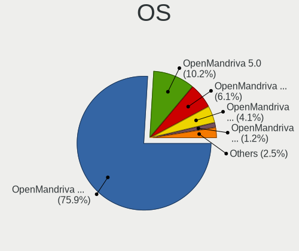
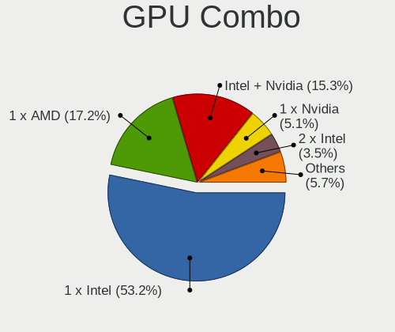
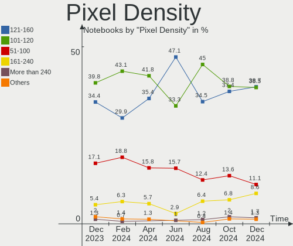
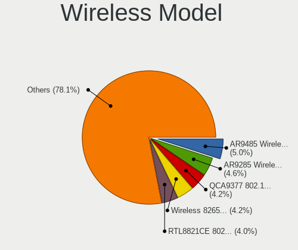

OpenMandriva Hardware Trends (Notebooks)
----------------------------------------

A project to identify most popular hardware characteristics and track their change
over time based on data collected by OpenMandriva users at https://Linux-Hardware.org.

Anyone can contribute to this report by the [hw-probe](https://github.com/linuxhw/hw-probe) tool:

    sudo -E hw-probe -all -upload

Full-feature report is available here: https://linux-hardware.org/?view=trends&formfactor=notebook

Period: Jul, 2021.

Contents
--------

* [ System ](#system)
  - [ OS                       ](#os)
  - [ OS Family                ](#os-family)
  - [ Kernel                   ](#kernel)
  - [ Kernel Family            ](#kernel-family)
  - [ Kernel Major Ver.        ](#kernel-major-ver)
  - [ Arch                     ](#arch)
  - [ DE                       ](#de)
  - [ Display Server           ](#display-server)
  - [ Display Manager          ](#display-manager)
  - [ OS Lang                  ](#os-lang)
  - [ Boot Mode                ](#boot-mode)
  - [ Filesystem               ](#filesystem)
  - [ Part. scheme             ](#part-scheme)
  - [ Dual Boot with Linux/BSD ](#dual-boot-with-linuxbsd)
  - [ Dual Boot (Win)          ](#dual-boot-win)

* [ Board ](#board)
  - [ Vendor                   ](#vendor)
  - [ Model                    ](#model)
  - [ Model Family             ](#model-family)
  - [ MFG Year                 ](#mfg-year)
  - [ Form Factor              ](#form-factor)
  - [ Secure Boot              ](#secure-boot)
  - [ Coreboot                 ](#coreboot)
  - [ RAM Size                 ](#ram-size)
  - [ RAM Used                 ](#ram-used)
  - [ Total Drives             ](#total-drives)
  - [ Has CD-ROM               ](#has-cd-rom)
  - [ Has Ethernet             ](#has-ethernet)
  - [ Has WiFi                 ](#has-wifi)
  - [ Has Bluetooth            ](#has-bluetooth)

* [ Location ](#location)
  - [ Country                  ](#country)
  - [ City                     ](#city)

* [ Drives ](#drives)
  - [ Drive Vendor             ](#drive-vendor)
  - [ Drive Model              ](#drive-model)
  - [ HDD Vendor               ](#hdd-vendor)
  - [ SSD Vendor               ](#ssd-vendor)
  - [ Drive Kind               ](#drive-kind)
  - [ Drive Connector          ](#drive-connector)
  - [ Drive Size               ](#drive-size)
  - [ Space Total              ](#space-total)
  - [ Space Used               ](#space-used)
  - [ Malfunc. Drives          ](#malfunc-drives)
  - [ Malfunc. Drive Vendor    ](#malfunc-drive-vendor)
  - [ Malfunc. HDD Vendor      ](#malfunc-hdd-vendor)
  - [ Malfunc. Drive Kind      ](#malfunc-drive-kind)
  - [ Failed Drives            ](#failed-drives)
  - [ Failed Drive Vendor      ](#failed-drive-vendor)
  - [ Drive Status             ](#drive-status)

* [ Storage controller ](#storage-controller)
  - [ Storage Vendor           ](#storage-vendor)
  - [ Storage Model            ](#storage-model)
  - [ Storage Kind             ](#storage-kind)

* [ Processor ](#processor)
  - [ CPU Vendor               ](#cpu-vendor)
  - [ CPU Model                ](#cpu-model)
  - [ CPU Model Family         ](#cpu-model-family)
  - [ CPU Cores                ](#cpu-cores)
  - [ CPU Sockets              ](#cpu-sockets)
  - [ CPU Threads              ](#cpu-threads)
  - [ CPU Op-Modes             ](#cpu-op-modes)
  - [ CPU Microcode            ](#cpu-microcode)
  - [ CPU Microarch            ](#cpu-microarch)

* [ Graphics ](#graphics)
  - [ GPU Vendor               ](#gpu-vendor)
  - [ GPU Model                ](#gpu-model)
  - [ GPU Combo                ](#gpu-combo)
  - [ GPU Driver               ](#gpu-driver)
  - [ GPU Memory               ](#gpu-memory)

* [ Monitor ](#monitor)
  - [ Monitor Vendor           ](#monitor-vendor)
  - [ Monitor Model            ](#monitor-model)
  - [ Monitor Resolution       ](#monitor-resolution)
  - [ Monitor Diagonal         ](#monitor-diagonal)
  - [ Monitor Width            ](#monitor-width)
  - [ Aspect Ratio             ](#aspect-ratio)
  - [ Monitor Area             ](#monitor-area)
  - [ Pixel Density            ](#pixel-density)
  - [ Multiple Monitors        ](#multiple-monitors)

* [ Network ](#network)
  - [ Net Controller Vendor    ](#net-controller-vendor)
  - [ Net Controller Model     ](#net-controller-model)
  - [ Wireless Vendor          ](#wireless-vendor)
  - [ Wireless Model           ](#wireless-model)
  - [ Ethernet Vendor          ](#ethernet-vendor)
  - [ Ethernet Model           ](#ethernet-model)
  - [ Net Controller Kind      ](#net-controller-kind)
  - [ Used Controller          ](#used-controller)
  - [ NICs                     ](#nics)
  - [ IPv6                     ](#ipv6)

* [ Bluetooth ](#bluetooth)
  - [ Bluetooth Vendor         ](#bluetooth-vendor)
  - [ Bluetooth Model          ](#bluetooth-model)

* [ Sound ](#sound)
  - [ Sound Vendor             ](#sound-vendor)
  - [ Sound Model              ](#sound-model)

* [ Memory ](#memory)
  - [ Memory Vendor            ](#memory-vendor)
  - [ Memory Model             ](#memory-model)
  - [ Memory Kind              ](#memory-kind)
  - [ Memory Form Factor       ](#memory-form-factor)
  - [ Memory Size              ](#memory-size)
  - [ Memory Speed             ](#memory-speed)

* [ Printers & scanners ](#printers-&-scanners)
  - [ Printer Vendor           ](#printer-vendor)
  - [ Printer Model            ](#printer-model)
  - [ Scanner Vendor           ](#scanner-vendor)
  - [ Scanner Model            ](#scanner-model)

* [ Camera ](#camera)
  - [ Camera Vendor            ](#camera-vendor)
  - [ Camera Model             ](#camera-model)

* [ Security ](#security)
  - [ Fingerprint Vendor       ](#fingerprint-vendor)
  - [ Fingerprint Model        ](#fingerprint-model)
  - [ Chipcard Vendor          ](#chipcard-vendor)
  - [ Chipcard Model           ](#chipcard-model)

* [ Unsupported ](#unsupported)
  - [ Unsupported Devices      ](#unsupported-devices)
  - [ Unsupported Device Types ](#unsupported-device-types)

System
------

OS
--

Installed operating systems

| Name              | Notebooks | Percent |
|-------------------|-----------|---------|
| OpenMandriva 4.2  | 152       | 81.28%  |
| OpenMandriva 4.50 | 34        | 18.18%  |
| OpenMandriva 4.1  | 1         | 0.53%   |

OS Family
---------

OS without a version

| Name         | Notebooks | Percent |
|--------------|-----------|---------|
| OpenMandriva | 187       | 100%    |

Kernel
------

Version of the Linux kernel

| Version                       | Notebooks | Percent |
|-------------------------------|-----------|---------|
| 5.10.14-desktop-1omv4002      | 115       | 61.5%   |
| 5.11.12-desktop-1omv4002      | 37        | 19.79%  |
| 5.12.4-desktop-1omv4050       | 25        | 13.37%  |
| 5.12.7-desktop-1omv4003       | 6         | 3.21%   |
| 5.5.12-desktop-1omv4001       | 1         | 0.53%   |
| 5.13.2-desktop-2.0mjn4.5      | 1         | 0.53%   |
| 5.12.8-desktop-clang-1omv4050 | 1         | 0.53%   |
| 5.12.7-desktop-clang-1omv4003 | 1         | 0.53%   |

Kernel Family
-------------

Linux kernel without a distro release

| Version | Notebooks | Percent |
|---------|-----------|---------|
| 5.10.14 | 115       | 61.5%   |
| 5.11.12 | 37        | 19.79%  |
| 5.12.4  | 25        | 13.37%  |
| 5.12.7  | 7         | 3.74%   |
| 5.5.12  | 1         | 0.53%   |
| 5.13.2  | 1         | 0.53%   |
| 5.12.8  | 1         | 0.53%   |

Kernel Major Ver.
-----------------

Linux kernel major version

| Version | Notebooks | Percent |
|---------|-----------|---------|
| 5.10    | 115       | 61.5%   |
| 5.11    | 37        | 19.79%  |
| 5.12    | 33        | 17.65%  |
| 5.5     | 1         | 0.53%   |
| 5.13    | 1         | 0.53%   |

Arch
----

OS architecture (x86_64, i586, etc.)

| Name   | Notebooks | Percent |
|--------|-----------|---------|
| x86_64 | 187       | 100%    |

DE
--

Desktop Environment

| Name | Notebooks | Percent |
|------|-----------|---------|
| KDE5 | 187       | 100%    |

Display Server
--------------

X11 or Wayland

| Name | Notebooks | Percent |
|------|-----------|---------|
| X11  | 187       | 100%    |

Display Manager
---------------

SDDM, LightDM, etc.

| Name | Notebooks | Percent |
|------|-----------|---------|
| SDDM | 187       | 100%    |

OS Lang
-------

Language

| Lang  | Notebooks | Percent |
|-------|-----------|---------|
| en_US | 86        | 45.99%  |
| ru_RU | 14        | 7.49%   |
| fr_FR | 13        | 6.95%   |
| pt_BR | 12        | 6.42%   |
| de_DE | 12        | 6.42%   |
| pl_PL | 11        | 5.88%   |
| es_ES | 8         | 4.28%   |
| en_GB | 6         | 3.21%   |
| es_MX | 3         | 1.6%    |
| it_IT | 2         | 1.07%   |
| fr_BE | 2         | 1.07%   |
| es_UY | 2         | 1.07%   |
| es_AR | 2         | 1.07%   |
| en_IN | 2         | 1.07%   |
| uk_UA | 1         | 0.53%   |
| ru_UA | 1         | 0.53%   |
| ro_RO | 1         | 0.53%   |
| nb_NO | 1         | 0.53%   |
| hu_HU | 1         | 0.53%   |
| fr_CH | 1         | 0.53%   |
| es_CR | 1         | 0.53%   |
| es_CO | 1         | 0.53%   |
| en_SG | 1         | 0.53%   |
| en_NZ | 1         | 0.53%   |
| en_AU | 1         | 0.53%   |
| cs_CZ | 1         | 0.53%   |

Boot Mode
---------

EFI or BIOS

| Mode | Notebooks | Percent |
|------|-----------|---------|
| BIOS | 94        | 50.27%  |
| EFI  | 93        | 49.73%  |

Filesystem
----------

Type of filesystem

| Type    | Notebooks | Percent |
|---------|-----------|---------|
| Overlay | 106       | 56.68%  |
| Ext4    | 77        | 41.18%  |
| F2fs    | 3         | 1.6%    |
| Btrfs   | 1         | 0.53%   |

Part. scheme
------------

Scheme of partitioning

| Type | Notebooks | Percent |
|------|-----------|---------|
| GPT  | 121       | 64.71%  |
| MBR  | 66        | 35.29%  |

Dual Boot with Linux/BSD
------------------------

Hosting more than one Linux/BSD

| Dual boot | Notebooks | Percent |
|-----------|-----------|---------|
| No        | 101       | 54.01%  |
| Yes       | 86        | 45.99%  |

Dual Boot (Win)
---------------

Hosting Linux and Windows

| Dual boot | Notebooks | Percent |
|-----------|-----------|---------|
| No        | 122       | 65.24%  |
| Yes       | 65        | 34.76%  |

Board
-----

Vendor
------

Motherboard manufacturer

| Name                | Notebooks | Percent |
|---------------------|-----------|---------|
| Lenovo              | 44        | 23.53%  |
| Hewlett-Packard     | 38        | 20.32%  |
| Dell                | 24        | 12.83%  |
| ASUSTek Computer    | 24        | 12.83%  |
| Acer                | 20        | 10.7%   |
| Toshiba             | 8         | 4.28%   |
| Sony                | 5         | 2.67%   |
| Fujitsu             | 3         | 1.6%    |
| Apple               | 3         | 1.6%    |
| Samsung Electronics | 2         | 1.07%   |
| Packard Bell        | 2         | 1.07%   |
| Itautec             | 2         | 1.07%   |
| HUAWEI              | 2         | 1.07%   |
| Teclast             | 1         | 0.53%   |
| Star Labs           | 1         | 0.53%   |
| Positivo            | 1         | 0.53%   |
| Philco              | 1         | 0.53%   |
| Panasonic           | 1         | 0.53%   |
| Megaware            | 1         | 0.53%   |
| LG Electronics      | 1         | 0.53%   |
| Fujitsu Siemens     | 1         | 0.53%   |
| Clevo               | 1         | 0.53%   |
| Unknown             | 1         | 0.53%   |

Model
-----

Motherboard model

| Name                                     | Notebooks | Percent |
|------------------------------------------|-----------|---------|
| Lenovo IdeaPad 3 15ADA05 81W1            | 4         | 2.14%   |
| Lenovo B50-10 80QR                       | 2         | 1.07%   |
| Itautec Infoway                          | 2         | 1.07%   |
| HP Pavilion g6                           | 2         | 1.07%   |
| Dell Latitude E5520                      | 2         | 1.07%   |
| ASUS K84C                                | 2         | 1.07%   |
| Toshiba TECRA S11                        | 1         | 0.53%   |
| Toshiba Satellite S855                   | 1         | 0.53%   |
| Toshiba Satellite L755                   | 1         | 0.53%   |
| Toshiba Satellite C850D-11K              | 1         | 0.53%   |
| Toshiba Satellite C660D                  | 1         | 0.53%   |
| Toshiba Satellite C55-A-1P6              | 1         | 0.53%   |
| Toshiba NB550D                           | 1         | 0.53%   |
| Toshiba NB300                            | 1         | 0.53%   |
| Teclast F15S                             | 1         | 0.53%   |
| Star Labs LabTop                         | 1         | 0.53%   |
| Sony VPCEB490X                           | 1         | 0.53%   |
| Sony VGN-FW190E                          | 1         | 0.53%   |
| Sony SVF1521B1EW                         | 1         | 0.53%   |
| Sony SVE14A35CXH                         | 1         | 0.53%   |
| Sony SVE14A1S6EW                         | 1         | 0.53%   |
| Samsung Q430/Q530                        | 1         | 0.53%   |
| Samsung 3570R/370R/470R/450R/510R/4450RV | 1         | 0.53%   |
| Positivo S14BW01                         | 1         | 0.53%   |
| Philco 14I                               | 1         | 0.53%   |
| Panasonic CF-31ACAAA1M                   | 1         | 0.53%   |
| Packard Bell EasyNote TE69KB             | 1         | 0.53%   |
| Packard Bell EasyNote ENTG71BM           | 1         | 0.53%   |
| Megaware W240BU                          | 1         | 0.53%   |
| LG S425-G.BC34P1                         | 1         | 0.53%   |
| Lenovo Z50-70 20354                      | 1         | 0.53%   |
| Lenovo XiaoXinPro 14ITL 2021 82GH        | 1         | 0.53%   |
| Lenovo V15-ADA 82C7                      | 1         | 0.53%   |
| Lenovo V110-15AST 80TD                   | 1         | 0.53%   |
| Lenovo ThinkPad Yoga 11e 20DAS0LA00      | 1         | 0.53%   |
| Lenovo ThinkPad X270 W10DG 20K5S33W00    | 1         | 0.53%   |
| Lenovo ThinkPad X270 20HNA003CD          | 1         | 0.53%   |
| Lenovo ThinkPad X250 20CM003WMS          | 1         | 0.53%   |
| Lenovo ThinkPad X240 20AMA52RUK          | 1         | 0.53%   |
| Lenovo ThinkPad X230 23257Y1             | 1         | 0.53%   |
| Lenovo ThinkPad X220 429144U             | 1         | 0.53%   |
| Lenovo ThinkPad W510 4391BY8             | 1         | 0.53%   |
| Lenovo ThinkPad T500 20823GU             | 1         | 0.53%   |
| Lenovo ThinkPad T470 W10DG 20JM000CUS    | 1         | 0.53%   |
| Lenovo ThinkPad T450 20BUS1KJ0A          | 1         | 0.53%   |
| Lenovo ThinkPad T400 6475WFP             | 1         | 0.53%   |
| Lenovo ThinkPad E520 1143B6G             | 1         | 0.53%   |
| Lenovo QIQY2                             | 1         | 0.53%   |
| Lenovo IdeaPad Z580                      | 1         | 0.53%   |
| Lenovo IdeaPad S145-15AST 81N3           | 1         | 0.53%   |
| Lenovo IdeaPad L340-15IRH Gaming 81LK    | 1         | 0.53%   |
| Lenovo IdeaPad 330-15IKB 81FE            | 1         | 0.53%   |
| Lenovo IdeaPad 320S-14IKB 81BN           | 1         | 0.53%   |
| Lenovo IdeaPad 320-17IKB 80XM            | 1         | 0.53%   |
| Lenovo IdeaPad 320-15IAP 80XR            | 1         | 0.53%   |
| Lenovo IdeaPad 310-15IKB 80TV            | 1         | 0.53%   |
| Lenovo IdeaPad 3 15IML05 81WB            | 1         | 0.53%   |
| Lenovo IdeaPad 110-15IBR 80T7            | 1         | 0.53%   |
| Lenovo IdeaPad 110-14ISK 80UC            | 1         | 0.53%   |
| Lenovo G710 20252                        | 1         | 0.53%   |

Model Family
------------

Motherboard model prefix

| Name                   | Notebooks | Percent |
|------------------------|-----------|---------|
| Lenovo IdeaPad         | 15        | 8.02%   |
| Acer Aspire            | 14        | 7.49%   |
| Lenovo ThinkPad        | 13        | 6.95%   |
| Dell Latitude          | 12        | 6.42%   |
| HP Pavilion            | 9         | 4.81%   |
| Dell Inspiron          | 8         | 4.28%   |
| HP ProBook             | 6         | 3.21%   |
| Toshiba Satellite      | 5         | 2.67%   |
| HP EliteBook           | 5         | 2.67%   |
| HP Laptop              | 4         | 2.14%   |
| Fujitsu LIFEBOOK       | 3         | 1.6%    |
| ASUS VivoBook          | 3         | 1.6%    |
| Packard Bell EasyNote  | 2         | 1.07%   |
| Lenovo B50-10          | 2         | 1.07%   |
| Itautec Infoway        | 2         | 1.07%   |
| HP ENVY                | 2         | 1.07%   |
| HP Compaq              | 2         | 1.07%   |
| ASUS K84C              | 2         | 1.07%   |
| Acer TravelMate        | 2         | 1.07%   |
| Acer Swift             | 2         | 1.07%   |
| Toshiba TECRA          | 1         | 0.53%   |
| Toshiba NB550D         | 1         | 0.53%   |
| Toshiba NB300          | 1         | 0.53%   |
| Teclast F15S           | 1         | 0.53%   |
| Star Labs LabTop       | 1         | 0.53%   |
| Sony VPCEB490X         | 1         | 0.53%   |
| Sony VGN-FW190E        | 1         | 0.53%   |
| Sony SVF1521B1EW       | 1         | 0.53%   |
| Sony SVE14A35CXH       | 1         | 0.53%   |
| Sony SVE14A1S6EW       | 1         | 0.53%   |
| Samsung Q430           | 1         | 0.53%   |
| Samsung 3570R          | 1         | 0.53%   |
| Positivo S14BW01       | 1         | 0.53%   |
| Philco 14I             | 1         | 0.53%   |
| Panasonic CF-31ACAAA1M | 1         | 0.53%   |
| Megaware W240BU        | 1         | 0.53%   |
| LG S425-G.BC34P1       | 1         | 0.53%   |
| Lenovo Z50-70          | 1         | 0.53%   |
| Lenovo XiaoXinPro      | 1         | 0.53%   |
| Lenovo V15-ADA         | 1         | 0.53%   |
| Lenovo V110-15AST      | 1         | 0.53%   |
| Lenovo QIQY2           | 1         | 0.53%   |
| Lenovo G710            | 1         | 0.53%   |
| Lenovo G510            | 1         | 0.53%   |
| Lenovo G50-80          | 1         | 0.53%   |
| Lenovo G50-70m         | 1         | 0.53%   |
| Lenovo G50-70          | 1         | 0.53%   |
| Lenovo G40-45          | 1         | 0.53%   |
| Lenovo Flex            | 1         | 0.53%   |
| Lenovo B590            | 1         | 0.53%   |
| Lenovo B50-30          | 1         | 0.53%   |
| HUAWEI NBLL-WXX9       | 1         | 0.53%   |
| HUAWEI BOHK-WAX9X      | 1         | 0.53%   |
| HP Stream              | 1         | 0.53%   |
| HP Notebook            | 1         | 0.53%   |
| HP G62                 | 1         | 0.53%   |
| HP 635                 | 1         | 0.53%   |
| HP 620                 | 1         | 0.53%   |
| HP 550                 | 1         | 0.53%   |
| HP 250                 | 1         | 0.53%   |

MFG Year
--------

Motherboard manufacture year

| Year | Notebooks | Percent |
|------|-----------|---------|
| 2020 | 26        | 13.9%   |
| 2012 | 21        | 11.23%  |
| 2013 | 16        | 8.56%   |
| 2011 | 16        | 8.56%   |
| 2019 | 14        | 7.49%   |
| 2016 | 14        | 7.49%   |
| 2014 | 14        | 7.49%   |
| 2018 | 11        | 5.88%   |
| 2017 | 10        | 5.35%   |
| 2008 | 10        | 5.35%   |
| 2010 | 9         | 4.81%   |
| 2021 | 8         | 4.28%   |
| 2015 | 7         | 3.74%   |
| 2009 | 7         | 3.74%   |
| 2007 | 4         | 2.14%   |

Form Factor
-----------

Physical design of the computer

| Name     | Notebooks | Percent |
|----------|-----------|---------|
| Notebook | 187       | 100%    |

Secure Boot
-----------

Enabled or disabled

| State    | Notebooks | Percent |
|----------|-----------|---------|
| Disabled | 187       | 100%    |

Coreboot
--------

Have coreboot on board

| Used | Notebooks | Percent |
|------|-----------|---------|
| No   | 187       | 100%    |

RAM Size
--------

Total RAM memory

| Size in GB | Notebooks | Percent |
|------------|-----------|---------|
| 3.01-4.0   | 70        | 37.43%  |
| 4.01-8.0   | 62        | 33.16%  |
| 8.01-16.0  | 21        | 11.23%  |
| 16.01-24.0 | 15        | 8.02%   |
| 1.01-2.0   | 11        | 5.88%   |
| 2.01-3.0   | 5         | 2.67%   |
| 32.01-64.0 | 2         | 1.07%   |
| 24.01-32.0 | 1         | 0.53%   |

RAM Used
--------

Used RAM memory

| Used GB  | Notebooks | Percent |
|----------|-----------|---------|
| 1.01-2.0 | 145       | 77.54%  |
| 2.01-3.0 | 24        | 12.83%  |
| 0.51-1.0 | 12        | 6.42%   |
| 0.01-0.5 | 4         | 2.14%   |
| 4.01-8.0 | 1         | 0.53%   |
| 3.01-4.0 | 1         | 0.53%   |

Total Drives
------------

Number of drives on board

| Drives | Notebooks | Percent |
|--------|-----------|---------|
| 1      | 137       | 73.26%  |
| 2      | 41        | 21.93%  |
| 0      | 6         | 3.21%   |
| 3      | 3         | 1.6%    |

Has CD-ROM
----------

Has CD-ROM on board

| Presented | Notebooks | Percent |
|-----------|-----------|---------|
| Yes       | 95        | 50.8%   |
| No        | 92        | 49.2%   |

Has Ethernet
------------

Has Ethernet on board

| Presented | Notebooks | Percent |
|-----------|-----------|---------|
| Yes       | 169       | 90.37%  |
| No        | 18        | 9.63%   |

Has WiFi
--------

Has WiFi module

| Presented | Notebooks | Percent |
|-----------|-----------|---------|
| Yes       | 186       | 99.47%  |
| No        | 1         | 0.53%   |

Has Bluetooth
-------------

Has Bluetooth module

| Presented | Notebooks | Percent |
|-----------|-----------|---------|
| Yes       | 138       | 73.8%   |
| No        | 49        | 26.2%   |

Location
--------

Country
-------

Geographic location (country)

| Country      | Notebooks | Percent |
|--------------|-----------|---------|
| USA          | 24        | 12.83%  |
| France       | 18        | 9.63%   |
| Brazil       | 18        | 9.63%   |
| Russia       | 15        | 8.02%   |
| Poland       | 15        | 8.02%   |
| Germany      | 12        | 6.42%   |
| Spain        | 8         | 4.28%   |
| UK           | 5         | 2.67%   |
| Mexico       | 4         | 2.14%   |
| Italy        | 4         | 2.14%   |
| India        | 4         | 2.14%   |
| China        | 4         | 2.14%   |
| Belgium      | 4         | 2.14%   |
| Ukraine      | 3         | 1.6%    |
| Norway       | 3         | 1.6%    |
| Indonesia    | 3         | 1.6%    |
| Uruguay      | 2         | 1.07%   |
| Turkey       | 2         | 1.07%   |
| Netherlands  | 2         | 1.07%   |
| Martinique   | 2         | 1.07%   |
| Kazakhstan   | 2         | 1.07%   |
| Czechia      | 2         | 1.07%   |
| Cyprus       | 2         | 1.07%   |
| Costa Rica   | 2         | 1.07%   |
| Colombia     | 2         | 1.07%   |
| Australia    | 2         | 1.07%   |
| Argentina    | 2         | 1.07%   |
| Taiwan       | 1         | 0.53%   |
| Switzerland  | 1         | 0.53%   |
| Sweden       | 1         | 0.53%   |
| South Africa | 1         | 0.53%   |
| Slovenia     | 1         | 0.53%   |
| Slovakia     | 1         | 0.53%   |
| Serbia       | 1         | 0.53%   |
| Saudi Arabia | 1         | 0.53%   |
| Romania      | 1         | 0.53%   |
| Portugal     | 1         | 0.53%   |
| New Zealand  | 1         | 0.53%   |
| Mali         | 1         | 0.53%   |
| Latvia       | 1         | 0.53%   |
| Japan        | 1         | 0.53%   |
| Jamaica      | 1         | 0.53%   |
| Israel       | 1         | 0.53%   |
| Hungary      | 1         | 0.53%   |
| Greece       | 1         | 0.53%   |
| Egypt        | 1         | 0.53%   |
| Croatia      | 1         | 0.53%   |
| Bangladesh   | 1         | 0.53%   |

City
----

Geographic location (city)

| City                | Notebooks | Percent |
|---------------------|-----------|---------|
| Moscow              | 4         | 2.14%   |
| Florence            | 4         | 2.14%   |
| Warsaw              | 3         | 1.6%    |
| Paris               | 3         | 1.6%    |
| Wroclaw             | 2         | 1.07%   |
| St Petersburg       | 2         | 1.07%   |
| Roanoke             | 2         | 1.07%   |
| Queens              | 2         | 1.07%   |
| Pamplona            | 2         | 1.07%   |
| Oslo                | 2         | 1.07%   |
| M??laga             | 2         | 1.07%   |
| Maldonado           | 2         | 1.07%   |
| Limassol            | 2         | 1.07%   |
| Fort-de-France      | 2         | 1.07%   |
| Dessau              | 2         | 1.07%   |
| Denver              | 2         | 1.07%   |
| Zhuhai              | 1         | 0.53%   |
| Z?Öbki              | 1         | 0.53%   |
| Zapopan             | 1         | 0.53%   |
| Yekaterinburg       | 1         | 0.53%   |
| Venerque            | 1         | 0.53%   |
| Târgu Mureş       | 1         | 0.53%   |
| Tucson              | 1         | 0.53%   |
| Tochigi             | 1         | 0.53%   |
| Tiruchi             | 1         | 0.53%   |
| Tijuana             | 1         | 0.53%   |
| Thessaloniki        | 1         | 0.53%   |
| Tecovice            | 1         | 0.53%   |
| Te??filo Otoni      | 1         | 0.53%   |
| Taunton             | 1         | 0.53%   |
| S√£o Paulo          | 1         | 0.53%   |
| S√£o Caetano do Sul | 1         | 0.53%   |
| Sydney              | 1         | 0.53%   |
| Swarzedz            | 1         | 0.53%   |
| Stuttgart           | 1         | 0.53%   |
| Srednyaya Akhtuba   | 1         | 0.53%   |
| Split               | 1         | 0.53%   |
| Shenyang            | 1         | 0.53%   |
| Seynod              | 1         | 0.53%   |
| Severodvinsk        | 1         | 0.53%   |
| Sevastopol’       | 1         | 0.53%   |
| Set√∫bal            | 1         | 0.53%   |
| S??o Paulo          | 1         | 0.53%   |
| Sanford             | 1         | 0.53%   |
| Sacramento          | 1         | 0.53%   |
| Rullstorf           | 1         | 0.53%   |
| Riga                | 1         | 0.53%   |
| Resende             | 1         | 0.53%   |
| Qingdao             | 1         | 0.53%   |
| Puteaux             | 1         | 0.53%   |
| Puck                | 1         | 0.53%   |
| Preston             | 1         | 0.53%   |
| Praia Grande        | 1         | 0.53%   |
| Pouilly-les-Nonains | 1         | 0.53%   |
| Potelieres          | 1         | 0.53%   |
| Porto Alegre        | 1         | 0.53%   |
| Pontianak           | 1         | 0.53%   |
| Poitiers            | 1         | 0.53%   |
| P?©cs               | 1         | 0.53%   |
| Oryol               | 1         | 0.53%   |

Drives
------

Drive Vendor
------------

Hard drive vendors

| Vendor              | Notebooks | Drives | Percent |
|---------------------|-----------|--------|---------|
| WDC                 | 32        | 32     | 15.17%  |
| Seagate             | 29        | 29     | 13.74%  |
| Samsung Electronics | 26        | 28     | 12.32%  |
| Toshiba             | 24        | 25     | 11.37%  |
| Kingston            | 17        | 17     | 8.06%   |
| Hitachi             | 12        | 12     | 5.69%   |
| Unknown             | 11        | 11     | 5.21%   |
| HGST                | 8         | 8      | 3.79%   |
| Crucial             | 8         | 8      | 3.79%   |
| SK Hynix            | 5         | 5      | 2.37%   |
| GOODRAM             | 5         | 5      | 2.37%   |
| Phison              | 4         | 4      | 1.9%    |
| SanDisk             | 3         | 3      | 1.42%   |
| Intel               | 3         | 3      | 1.42%   |
| A-DATA Technology   | 3         | 3      | 1.42%   |
| LITEON              | 2         | 2      | 0.95%   |
| USB                 | 1         | 1      | 0.47%   |
| Union Memory        | 1         | 1      | 0.47%   |
| TEXTORM             | 1         | 1      | 0.47%   |
| takeMS              | 1         | 1      | 0.47%   |
| Star Drive          | 1         | 1      | 0.47%   |
| PNY                 | 1         | 1      | 0.47%   |
| Platinet            | 1         | 1      | 0.47%   |
| Patriot             | 1         | 1      | 0.47%   |
| OCZ                 | 1         | 1      | 0.47%   |
| Micron Technology   | 1         | 1      | 0.47%   |
| KIOXIA              | 1         | 1      | 0.47%   |
| KESU                | 1         | 1      | 0.47%   |
| JMicron             | 1         | 1      | 0.47%   |
| Intenso             | 1         | 1      | 0.47%   |
| Fujitsu             | 1         | 1      | 0.47%   |
| Dogfish             | 1         | 1      | 0.47%   |
| Colorful            | 1         | 1      | 0.47%   |
| China               | 1         | 1      | 0.47%   |
| Apple               | 1         | 1      | 0.47%   |

Drive Model
-----------

Hard drive models

| Model                                 | Notebooks | Percent |
|---------------------------------------|-----------|---------|
| Seagate ST1000LM024 HN-M101MBB 1TB    | 6         | 2.82%   |
| Toshiba MQ01ABF050 500GB              | 4         | 1.88%   |
| Toshiba MQ01ABD075 752GB              | 4         | 1.88%   |
| Phison Sabrent Rocket nano 512GB      | 4         | 1.88%   |
| WDC WD5000LPVX-22V0TT0 500GB          | 3         | 1.41%   |
| Toshiba MQ04ABF100 1TB                | 3         | 1.41%   |
| Seagate ST500LT012-9WS142 500GB       | 3         | 1.41%   |
| Seagate ST500LT012-1DG142 500GB       | 3         | 1.41%   |
| Seagate ST1000LM035-1RK172 1TB        | 3         | 1.41%   |
| Samsung SSD 860 EVO 500GB             | 3         | 1.41%   |
| Kingston SA400S37120G 120GB SSD       | 3         | 1.41%   |
| Hitachi HTS547550A9E384 500GB         | 3         | 1.41%   |
| HGST HTS541010A9E680 1TB              | 3         | 1.41%   |
| WDC WDS500G2B0A-00SM50 500GB SSD      | 2         | 0.94%   |
| WDC WD10JPVX-22JC3T0 1TB              | 2         | 0.94%   |
| Unknown DA4064  64GB                  | 2         | 0.94%   |
| Toshiba MK5059GSXP 500GB              | 2         | 0.94%   |
| SK Hynix HFS256G32TNF-N3A0A 256GB SSD | 2         | 0.94%   |
| Seagate ST9320325AS 320GB             | 2         | 0.94%   |
| Seagate BUP Slim BK 1TB               | 2         | 0.94%   |
| Samsung SSD 850 EVO 250GB             | 2         | 0.94%   |
| Samsung MZVLB512HBJQ-000H1 512GB      | 2         | 0.94%   |
| Kingston SUV400S37240G 240GB SSD      | 2         | 0.94%   |
| Kingston SA400S37960G 960GB SSD       | 2         | 0.94%   |
| Kingston SA400S37240G 240GB SSD       | 2         | 0.94%   |
| Kingston RBUSNS8154P3512GJ1 512GB     | 2         | 0.94%   |
| HGST HTS721010A9E630 1TB              | 2         | 0.94%   |
| HGST HTS545050A7E380 500GB            | 2         | 0.94%   |
| Crucial CT250MX500SSD1 250GB          | 2         | 0.94%   |
| Crucial CT120BX500SSD1 120GB          | 2         | 0.94%   |
| WDC WDS120G2G0A-00JH30 120GB SSD      | 1         | 0.47%   |
| WDC WDS100T2B0C-00PXH0 1TB            | 1         | 0.47%   |
| WDC WD6400BEVT-22A0RT0 640GB          | 1         | 0.47%   |
| WDC WD5000LPLX-60ZNTT1 500GB          | 1         | 0.47%   |
| WDC WD5000LPCX-24VHAT0 500GB          | 1         | 0.47%   |
| WDC WD5000BPVT-22HXZT3 500GB          | 1         | 0.47%   |
| WDC WD5000BEVT-60A0RT0 500GB          | 1         | 0.47%   |
| WDC WD3200LPVX-16V0TT0 320GB          | 1         | 0.47%   |
| WDC WD2500LPVX-22V0TT0 250GB          | 1         | 0.47%   |
| WDC WD2500LPCX-24C6HT0 250GB          | 1         | 0.47%   |
| WDC WD2500BEVS-60UST0 250GB           | 1         | 0.47%   |
| WDC WD1600BJKT-75F4T0 160GB           | 1         | 0.47%   |
| WDC WD1600BEVT-22A23T0 160GB          | 1         | 0.47%   |
| WDC WD16 00BPVT-00ZEST0 160GB         | 1         | 0.47%   |
| WDC WD10SPZX-75Z10T3 1TB              | 1         | 0.47%   |
| WDC WD10SPZX-60Z10T0 1TB              | 1         | 0.47%   |
| WDC WD10SPZX-24Z10T0 1TB              | 1         | 0.47%   |
| WDC WD10SPZX-00Z10T0 1TB              | 1         | 0.47%   |
| WDC WD10JPVX-60JC3T1 1TB              | 1         | 0.47%   |
| WDC WD10JPVX-60JC3T0 1TB              | 1         | 0.47%   |
| WDC WD10JPCX-24UE4T0 1TB              | 1         | 0.47%   |
| WDC PC SN530 SDBPNPZ-512G-1027 512GB  | 1         | 0.47%   |
| WDC PC SN530 SDBPNPZ-256G-1002 256GB  | 1         | 0.47%   |
| WDC PC SN520 SDAPNUW-256G-1006 256GB  | 1         | 0.47%   |
| WDC PC SN520 SDAPMUW-256G-1101 256GB  | 1         | 0.47%   |
| USB 3.1 250GB                         | 1         | 0.47%   |
| Unknown SU16G  16GB                   | 1         | 0.47%   |
| Unknown SS16G  16GB                   | 1         | 0.47%   |
| Unknown SD128  128GB                  | 1         | 0.47%   |
| Unknown SB32G  32GB                   | 1         | 0.47%   |

HDD Vendor
----------

Hard disk drive vendors

| Vendor              | Notebooks | Drives | Percent |
|---------------------|-----------|--------|---------|
| Seagate             | 29        | 29     | 28.16%  |
| WDC                 | 24        | 24     | 23.3%   |
| Toshiba             | 23        | 23     | 22.33%  |
| Hitachi             | 12        | 12     | 11.65%  |
| HGST                | 8         | 8      | 7.77%   |
| Samsung Electronics | 6         | 7      | 5.83%   |
| Fujitsu             | 1         | 1      | 0.97%   |

SSD Vendor
----------

Solid state drive vendors

| Vendor              | Notebooks | Drives | Percent |
|---------------------|-----------|--------|---------|
| Kingston            | 15        | 15     | 20.55%  |
| Samsung Electronics | 13        | 14     | 17.81%  |
| Crucial             | 8         | 8      | 10.96%  |
| GOODRAM             | 5         | 5      | 6.85%   |
| SK Hynix            | 4         | 4      | 5.48%   |
| WDC                 | 3         | 3      | 4.11%   |
| SanDisk             | 3         | 3      | 4.11%   |
| Intel               | 3         | 3      | 4.11%   |
| A-DATA Technology   | 3         | 3      | 4.11%   |
| LITEON              | 2         | 2      | 2.74%   |
| Unknown             | 1         | 1      | 1.37%   |
| Toshiba             | 1         | 1      | 1.37%   |
| TEXTORM             | 1         | 1      | 1.37%   |
| takeMS              | 1         | 1      | 1.37%   |
| PNY                 | 1         | 1      | 1.37%   |
| Platinet            | 1         | 1      | 1.37%   |
| Patriot             | 1         | 1      | 1.37%   |
| OCZ                 | 1         | 1      | 1.37%   |
| Micron Technology   | 1         | 1      | 1.37%   |
| Intenso             | 1         | 1      | 1.37%   |
| Dogfish             | 1         | 1      | 1.37%   |
| Colorful            | 1         | 1      | 1.37%   |
| China               | 1         | 1      | 1.37%   |
| Apple               | 1         | 1      | 1.37%   |

Drive Kind
----------

HDD or SSD

| Kind    | Notebooks | Drives | Percent |
|---------|-----------|--------|---------|
| HDD     | 100       | 104    | 48.08%  |
| SSD     | 72        | 74     | 34.62%  |
| NVMe    | 23        | 23     | 11.06%  |
| MMC     | 10        | 10     | 4.81%   |
| Unknown | 3         | 3      | 1.44%   |

Drive Connector
---------------

SATA, SAS, NVMe, etc.

| Type | Notebooks | Drives | Percent |
|------|-----------|--------|---------|
| SATA | 157       | 174    | 79.7%   |
| NVMe | 23        | 23     | 11.68%  |
| MMC  | 10        | 10     | 5.08%   |
| SAS  | 7         | 7      | 3.55%   |

Drive Size
----------

Size of hard drive

| Size in TB | Notebooks | Drives | Percent |
|------------|-----------|--------|---------|
| 0.01-0.5   | 124       | 132    | 73.37%  |
| 0.51-1.0   | 43        | 44     | 25.44%  |
| 1.01-2.0   | 2         | 2      | 1.18%   |

Space Total
-----------

Amount of disk space available on the file system

| Size in GB | Notebooks | Percent |
|------------|-----------|---------|
| 1-20       | 81        | 43.32%  |
| 251-500    | 30        | 16.04%  |
| 101-250    | 29        | 15.51%  |
| 501-1000   | 15        | 8.02%   |
| 21-50      | 12        | 6.42%   |
| 51-100     | 12        | 6.42%   |
| Unknown    | 5         | 2.67%   |
| 1001-2000  | 3         | 1.6%    |

Space Used
----------

Amount of used disk space

| Used GB  | Notebooks | Percent |
|----------|-----------|---------|
| 1-20     | 144       | 77.01%  |
| 21-50    | 16        | 8.56%   |
| 101-250  | 9         | 4.81%   |
| 51-100   | 7         | 3.74%   |
| Unknown  | 5         | 2.67%   |
| 251-500  | 4         | 2.14%   |
| 501-1000 | 2         | 1.07%   |

Malfunc. Drives
---------------

Drive models with a malfunction

| Model                                 | Notebooks | Drives | Percent |
|---------------------------------------|-----------|--------|---------|
| Seagate ST500LT012-9WS142 500GB       | 3         | 3      | 5.26%   |
| Hitachi HTS547550A9E384 500GB         | 3         | 3      | 5.26%   |
| WDC WD5000LPVX-22V0TT0 500GB          | 2         | 2      | 3.51%   |
| Toshiba MQ01ABD075 752GB              | 2         | 2      | 3.51%   |
| Seagate ST9320325AS 320GB             | 2         | 2      | 3.51%   |
| Seagate ST1000LM024 HN-M101MBB 1TB    | 2         | 2      | 3.51%   |
| HGST HTS541010A9E680 1TB              | 2         | 2      | 3.51%   |
| WDC WD6400BEVT-22A0RT0 640GB          | 1         | 1      | 1.75%   |
| WDC WD5000BEVT-60A0RT0 500GB          | 1         | 1      | 1.75%   |
| WDC WD2500BEVS-60UST0 250GB           | 1         | 1      | 1.75%   |
| WDC WD1600BJKT-75F4T0 160GB           | 1         | 1      | 1.75%   |
| WDC WD1600BEVT-22A23T0 160GB          | 1         | 1      | 1.75%   |
| Toshiba MQ01ABF050 500GB              | 1         | 1      | 1.75%   |
| Toshiba MQ01ABD100 1TB                | 1         | 1      | 1.75%   |
| Toshiba MQ01ABD032 320GB              | 1         | 1      | 1.75%   |
| Toshiba MK6476GSX 640GB               | 1         | 1      | 1.75%   |
| Toshiba MK5075GSX 500GB               | 1         | 1      | 1.75%   |
| Toshiba MK5059GSXP 500GB              | 1         | 1      | 1.75%   |
| Toshiba MK3259GSXP 320GB              | 1         | 1      | 1.75%   |
| Toshiba MK1665GSX 160GB               | 1         | 1      | 1.75%   |
| takeMS SSD UTX-2200 240GB             | 1         | 1      | 1.75%   |
| SK Hynix HFS128G39MNC-2300A 128GB SSD | 1         | 1      | 1.75%   |
| Seagate ST9500325AS 500GB             | 1         | 1      | 1.75%   |
| Seagate ST9250410AS 250GB             | 1         | 1      | 1.75%   |
| Seagate ST500LT012-1DG142 500GB       | 1         | 1      | 1.75%   |
| Seagate ST500LM021-1KJ152 500GB       | 1         | 1      | 1.75%   |
| Seagate ST320LT012-9WS14C 320GB       | 1         | 1      | 1.75%   |
| Seagate ST2000LM007-1R8174 2TB        | 1         | 1      | 1.75%   |
| SanDisk SSD U100 256GB                | 1         | 1      | 1.75%   |
| Samsung Electronics HM641JI 640GB     | 1         | 1      | 1.75%   |
| Samsung Electronics HM500JI 500GB     | 1         | 1      | 1.75%   |
| Samsung Electronics HM320JI 320GB     | 1         | 1      | 1.75%   |
| Samsung Electronics HM250HI 250GB     | 1         | 1      | 1.75%   |
| Samsung Electronics HM160HI 160GB     | 1         | 1      | 1.75%   |
| Platinet SSD 120GB                    | 1         | 1      | 1.75%   |
| LITEON LCH-128V2S-HP 128GB SSD        | 1         | 1      | 1.75%   |
| Kingston SVP200S37A256G 256GB SSD     | 1         | 1      | 1.75%   |
| Intel SSDSA2M160G2HP 160GB            | 1         | 1      | 1.75%   |
| Hitachi HTS723225A7A364 250GB         | 1         | 1      | 1.75%   |
| Hitachi HTS723216L9A360 160GB         | 1         | 1      | 1.75%   |
| Hitachi HTS545032B9SA00 320GB         | 1         | 1      | 1.75%   |
| Hitachi HTS545025B9A300 250GB         | 1         | 1      | 1.75%   |
| Hitachi HTS543216L9SA00 160GB         | 1         | 1      | 1.75%   |
| Hitachi HTS542580K9SA00 80GB          | 1         | 1      | 1.75%   |
| Hitachi HTS542512K9SA00 120GB         | 1         | 1      | 1.75%   |
| HGST HTS545050A7E380 500GB            | 1         | 1      | 1.75%   |
| Crucial M4-CT064M4SSD2 64GB           | 1         | 1      | 1.75%   |
| A-DATA Technology SP900 128GB SSD     | 1         | 1      | 1.75%   |

Malfunc. Drive Vendor
---------------------

Vendors of faulty drives

| Vendor              | Notebooks | Drives | Percent |
|---------------------|-----------|--------|---------|
| Seagate             | 13        | 13     | 22.81%  |
| Toshiba             | 10        | 10     | 17.54%  |
| Hitachi             | 10        | 10     | 17.54%  |
| WDC                 | 7         | 7      | 12.28%  |
| Samsung Electronics | 5         | 5      | 8.77%   |
| HGST                | 3         | 3      | 5.26%   |
| takeMS              | 1         | 1      | 1.75%   |
| SK Hynix            | 1         | 1      | 1.75%   |
| SanDisk             | 1         | 1      | 1.75%   |
| Platinet            | 1         | 1      | 1.75%   |
| LITEON              | 1         | 1      | 1.75%   |
| Kingston            | 1         | 1      | 1.75%   |
| Intel               | 1         | 1      | 1.75%   |
| Crucial             | 1         | 1      | 1.75%   |
| A-DATA Technology   | 1         | 1      | 1.75%   |

Malfunc. HDD Vendor
-------------------

Vendors of faulty HDD drives

| Vendor              | Notebooks | Drives | Percent |
|---------------------|-----------|--------|---------|
| Seagate             | 13        | 13     | 27.08%  |
| Toshiba             | 10        | 10     | 20.83%  |
| Hitachi             | 10        | 10     | 20.83%  |
| WDC                 | 7         | 7      | 14.58%  |
| Samsung Electronics | 5         | 5      | 10.42%  |
| HGST                | 3         | 3      | 6.25%   |

Malfunc. Drive Kind
-------------------

Kinds of faulty drives

| Kind | Notebooks | Drives | Percent |
|------|-----------|--------|---------|
| HDD  | 48        | 48     | 84.21%  |
| SSD  | 9         | 9      | 15.79%  |

Failed Drives
-------------

Failed drive models

Zero info for selected period =(

Failed Drive Vendor
-------------------

Failed drive vendors

Zero info for selected period =(

Drive Status
------------

Number of failed and malfunc. drives

| Status   | Notebooks | Drives | Percent |
|----------|-----------|--------|---------|
| Works    | 126       | 140    | 63.96%  |
| Malfunc  | 56        | 57     | 28.43%  |
| Detected | 15        | 17     | 7.61%   |

Storage controller
------------------

Storage Vendor
--------------

Storage controller vendors

| Vendor                       | Notebooks | Percent |
|------------------------------|-----------|---------|
| Intel                        | 139       | 71.28%  |
| AMD                          | 32        | 16.41%  |
| Samsung Electronics          | 7         | 3.59%   |
| Sandisk                      | 5         | 2.56%   |
| Phison Electronics           | 5         | 2.56%   |
| Kingston Technology Company  | 2         | 1.03%   |
| Union Memory (Shenzhen)      | 1         | 0.51%   |
| Toshiba America Info Systems | 1         | 0.51%   |
| SK Hynix                     | 1         | 0.51%   |
| Marvell Technology Group     | 1         | 0.51%   |
| KIOXIA                       | 1         | 0.51%   |

Storage Model
-------------

Storage controller models

| Model                                                                                  | Notebooks | Percent |
|----------------------------------------------------------------------------------------|-----------|---------|
| Intel 7 Series Chipset Family 6-port SATA Controller [AHCI mode]                       | 24        | 11.48%  |
| AMD FCH SATA Controller [AHCI mode]                                                    | 23        | 11%     |
| Intel 6 Series/C200 Series Chipset Family 6 port Mobile SATA AHCI Controller           | 19        | 9.09%   |
| Intel Sunrise Point-LP SATA Controller [AHCI mode]                                     | 12        | 5.74%   |
| Intel 82801IBM/IEM (ICH9M/ICH9M-E) 4 port SATA Controller [AHCI mode]                  | 12        | 5.74%   |
| Intel 82801HM/HEM (ICH8M/ICH8M-E) SATA Controller [AHCI mode]                          | 9         | 4.31%   |
| Intel 82801HM/HEM (ICH8M/ICH8M-E) IDE Controller                                       | 9         | 4.31%   |
| Intel 82801 Mobile SATA Controller [RAID mode]                                         | 9         | 4.31%   |
| Intel 8 Series SATA Controller 1 [AHCI mode]                                           | 8         | 3.83%   |
| AMD SB7x0/SB8x0/SB9x0 SATA Controller [AHCI mode]                                      | 7         | 3.35%   |
| Intel Atom Processor E3800 Series SATA AHCI Controller                                 | 6         | 2.87%   |
| Intel 8 Series/C220 Series Chipset Family 6-port SATA Controller 1 [AHCI mode]         | 5         | 2.39%   |
| Intel 5 Series/3400 Series Chipset 6 port SATA AHCI Controller                         | 5         | 2.39%   |
| Intel 5 Series/3400 Series Chipset 4 port SATA AHCI Controller                         | 5         | 2.39%   |
| Samsung NVMe SSD Controller SM981/PM981/PM983                                          | 4         | 1.91%   |
| Phison PS5013 E13 NVMe Controller                                                      | 4         | 1.91%   |
| Intel Atom/Celeron/Pentium Processor x5-E8000/J3xxx/N3xxx Series SATA Controller       | 4         | 1.91%   |
| Sandisk WD Blue SN550 NVMe SSD                                                         | 3         | 1.44%   |
| Intel Wildcat Point-LP SATA Controller [AHCI Mode]                                     | 3         | 1.44%   |
| Intel Comet Lake SATA AHCI Controller                                                  | 3         | 1.44%   |
| Intel Celeron/Pentium Silver Processor SATA Controller                                 | 3         | 1.44%   |
| Samsung NVMe SSD Controller SM961/PM961/SM963                                          | 2         | 0.96%   |
| Kingston Company U-SNS8154P3 NVMe SSD                                                  | 2         | 0.96%   |
| Intel Ice Lake-LP SATA Controller [AHCI mode]                                          | 2         | 0.96%   |
| Intel Celeron N3350/Pentium N4200/Atom E3900 Series SATA AHCI Controller               | 2         | 0.96%   |
| Intel 6 Series/C200 Series Chipset Family Mobile SATA Controller (IDE mode, ports 4-5) | 2         | 0.96%   |
| Intel 6 Series/C200 Series Chipset Family Mobile SATA Controller (IDE mode, ports 0-3) | 2         | 0.96%   |
| AMD SB600 Non-Raid-5 SATA                                                              | 2         | 0.96%   |
| AMD SB600 IDE                                                                          | 2         | 0.96%   |
| Union Memory (Shenzhen) Non-Volatile memory controller                                 | 1         | 0.48%   |
| Toshiba America Info Systems BG3 NVMe SSD Controller                                   | 1         | 0.48%   |
| SK Hynix BC501 NVMe Solid State Drive                                                  | 1         | 0.48%   |
| Sandisk WD Blue SN500 / PC SN520 NVMe SSD                                              | 1         | 0.48%   |
| Sandisk PC SN520 NVMe SSD                                                              | 1         | 0.48%   |
| Samsung NVMe Controller                                                                | 1         | 0.48%   |
| Phison E12 NVMe Controller                                                             | 1         | 0.48%   |
| Marvell Group 88SS9183 PCIe SSD Controller                                             | 1         | 0.48%   |
| KIOXIA Non-Volatile memory controller                                                  | 1         | 0.48%   |
| Intel SATA Controller [RAID mode]                                                      | 1         | 0.48%   |
| Intel NM10/ICH7 Family SATA Controller [AHCI mode]                                     | 1         | 0.48%   |
| Intel Mobile 4 Series Chipset PT IDER Controller                                       | 1         | 0.48%   |
| Intel HM170/QM170 Chipset SATA Controller [AHCI Mode]                                  | 1         | 0.48%   |
| Intel Cannon Point-LP SATA Controller [AHCI Mode]                                      | 1         | 0.48%   |
| Intel Cannon Lake Mobile PCH SATA AHCI Controller                                      | 1         | 0.48%   |
| Intel 82801HM/HEM (ICH8M/ICH8M-E) SATA Controller [IDE mode]                           | 1         | 0.48%   |

Storage Kind
------------

Kind of storage controller (IDE, SATA, NVMe, SAS, ...)

| Kind | Notebooks | Percent |
|------|-----------|---------|
| SATA | 159       | 77.18%  |
| NVMe | 23        | 11.17%  |
| IDE  | 14        | 6.8%    |
| RAID | 10        | 4.85%   |

Processor
---------

CPU Vendor
----------

Processor vendors

| Vendor | Notebooks | Percent |
|--------|-----------|---------|
| Intel  | 147       | 78.61%  |
| AMD    | 40        | 21.39%  |

CPU Model
---------

Processor models

| Model                                         | Notebooks | Percent |
|-----------------------------------------------|-----------|---------|
| AMD Ryzen 5 3500U with Radeon Vega Mobile Gfx | 7         | 3.74%   |
| Intel Core i5-7200U CPU @ 2.50GHz             | 5         | 2.67%   |
| Intel Core i5-3230M CPU @ 2.60GHz             | 5         | 2.67%   |
| Intel Core i5-3210M CPU @ 2.50GHz             | 4         | 2.14%   |
| AMD C-60 APU with Radeon HD Graphics          | 4         | 2.14%   |
| Intel Pentium Dual-Core CPU T4500 @ 2.30GHz   | 3         | 1.6%    |
| Intel Core i5-6200U CPU @ 2.30GHz             | 3         | 1.6%    |
| Intel Core i5-5300U CPU @ 2.30GHz             | 3         | 1.6%    |
| Intel Core i5 CPU M 520 @ 2.40GHz             | 3         | 1.6%    |
| Intel Core i3-2350M CPU @ 2.30GHz             | 3         | 1.6%    |
| Intel Core i3-2310M CPU @ 2.10GHz             | 3         | 1.6%    |
| Intel Core i3-1005G1 CPU @ 1.20GHz            | 3         | 1.6%    |
| Intel Pentium CPU B960 @ 2.20GHz              | 2         | 1.07%   |
| Intel Core i7-8565U CPU @ 1.80GHz             | 2         | 1.07%   |
| Intel Core i7-7500U CPU @ 2.70GHz             | 2         | 1.07%   |
| Intel Core i7-2760QM CPU @ 2.40GHz            | 2         | 1.07%   |
| Intel Core i7-10510U CPU @ 1.80GHz            | 2         | 1.07%   |
| Intel Core i5-8250U CPU @ 1.60GHz             | 2         | 1.07%   |
| Intel Core i5-4210U CPU @ 1.70GHz             | 2         | 1.07%   |
| Intel Core i5-3320M CPU @ 2.60GHz             | 2         | 1.07%   |
| Intel Core i5-2520M CPU @ 2.50GHz             | 2         | 1.07%   |
| Intel Core i5-2430M CPU @ 2.40GHz             | 2         | 1.07%   |
| Intel Core i3-3110M CPU @ 2.40GHz             | 2         | 1.07%   |
| Intel Core i3 CPU M 380 @ 2.53GHz             | 2         | 1.07%   |
| Intel Core 2 Duo CPU P8400 @ 2.26GHz          | 2         | 1.07%   |
| Intel Celeron N4000 CPU @ 1.10GHz             | 2         | 1.07%   |
| Intel Celeron CPU N3350 @ 1.10GHz             | 2         | 1.07%   |
| Intel Celeron CPU N3060 @ 1.60GHz             | 2         | 1.07%   |
| Intel Celeron CPU N2840 @ 2.16GHz             | 2         | 1.07%   |
| Intel Celeron CPU 1000M @ 1.80GHz             | 2         | 1.07%   |
| AMD A8-7410 APU with AMD Radeon R5 Graphics   | 2         | 1.07%   |
| Intel Pentium Dual-Core CPU T4200 @ 2.00GHz   | 1         | 0.53%   |
| Intel Pentium Dual CPU T2390 @ 1.86GHz        | 1         | 0.53%   |
| Intel Pentium Dual CPU T2330 @ 1.60GHz        | 1         | 0.53%   |
| Intel Pentium CPU N3710 @ 1.60GHz             | 1         | 0.53%   |
| Intel Pentium CPU N3540 @ 2.16GHz             | 1         | 0.53%   |
| Intel Pentium CPU N3530 @ 2.16GHz             | 1         | 0.53%   |
| Intel Pentium CPU B970 @ 2.30GHz              | 1         | 0.53%   |
| Intel Pentium CPU B950 @ 2.10GHz              | 1         | 0.53%   |
| Intel Pentium CPU B940 @ 2.00GHz              | 1         | 0.53%   |
| Intel Pentium CPU 987 @ 1.50GHz               | 1         | 0.53%   |
| Intel Pentium CPU 3550M @ 2.30GHz             | 1         | 0.53%   |
| Intel Core i7-6700HQ CPU @ 2.60GHz            | 1         | 0.53%   |
| Intel Core i7-6500U CPU @ 2.50GHz             | 1         | 0.53%   |
| Intel Core i7-6498DU CPU @ 2.50GHz            | 1         | 0.53%   |
| Intel Core i7-4710MQ CPU @ 2.50GHz            | 1         | 0.53%   |
| Intel Core i7-4710HQ CPU @ 2.50GHz            | 1         | 0.53%   |
| Intel Core i7-4700MQ CPU @ 2.40GHz            | 1         | 0.53%   |
| Intel Core i7-4510U CPU @ 2.00GHz             | 1         | 0.53%   |
| Intel Core i7-3630QM CPU @ 2.40GHz            | 1         | 0.53%   |
| Intel Core i7-3610QM CPU @ 2.30GHz            | 1         | 0.53%   |
| Intel Core i7-2677M CPU @ 1.80GHz             | 1         | 0.53%   |
| Intel Core i7-2640M CPU @ 2.80GHz             | 1         | 0.53%   |
| Intel Core i7 CPU Q 720 @ 1.60GHz             | 1         | 0.53%   |
| Intel Core i5-9300H CPU @ 2.40GHz             | 1         | 0.53%   |
| Intel Core i5-7Y54 CPU @ 1.20GHz              | 1         | 0.53%   |
| Intel Core i5-7440HQ CPU @ 2.80GHz            | 1         | 0.53%   |
| Intel Core i5-4300U CPU @ 1.90GHz             | 1         | 0.53%   |
| Intel Core i5-4250U CPU @ 1.30GHz             | 1         | 0.53%   |
| Intel Core i5-4200U CPU @ 1.60GHz             | 1         | 0.53%   |

CPU Model Family
----------------

Processor model prefix

| Model                   | Notebooks | Percent |
|-------------------------|-----------|---------|
| Intel Core i5           | 51        | 27.27%  |
| Intel Core i3           | 22        | 11.76%  |
| Intel Celeron           | 21        | 11.23%  |
| Intel Core i7           | 20        | 10.7%   |
| Intel Core 2 Duo        | 13        | 6.95%   |
| Intel Pentium           | 10        | 5.35%   |
| AMD Ryzen 5             | 10        | 5.35%   |
| Other                   | 4         | 2.14%   |
| Intel Pentium Dual-Core | 4         | 2.14%   |
| AMD C-60                | 4         | 2.14%   |
| AMD A6                  | 3         | 1.6%    |
| AMD A4                  | 3         | 1.6%    |
| Intel Pentium Dual      | 2         | 1.07%   |
| AMD Ryzen 7             | 2         | 1.07%   |
| AMD E2                  | 2         | 1.07%   |
| AMD E1                  | 2         | 1.07%   |
| AMD Athlon              | 2         | 1.07%   |
| AMD A8                  | 2         | 1.07%   |
| Intel Core 2            | 1         | 0.53%   |
| Intel Celeron Dual-Core | 1         | 0.53%   |
| Intel Atom              | 1         | 0.53%   |
| AMD V140                | 1         | 0.53%   |
| AMD Turion 64 X2 Mobile | 1         | 0.53%   |
| AMD Ryzen 3             | 1         | 0.53%   |
| AMD E                   | 1         | 0.53%   |
| AMD Athlon II           | 1         | 0.53%   |
| AMD Athlon 64 X2        | 1         | 0.53%   |
| AMD A10                 | 1         | 0.53%   |

CPU Cores
---------

Number of processor cores

| Number | Notebooks | Percent |
|--------|-----------|---------|
| 2      | 137       | 73.26%  |
| 4      | 41        | 21.93%  |
| 1      | 6         | 3.21%   |
| 6      | 2         | 1.07%   |
| 8      | 1         | 0.53%   |

CPU Sockets
-----------

Number of sockets

| Number | Notebooks | Percent |
|--------|-----------|---------|
| 1      | 187       | 100%    |

CPU Threads
-----------

Threads per core (Hyper-Threading)

| Number | Notebooks | Percent |
|--------|-----------|---------|
| 2      | 109       | 58.29%  |
| 1      | 78        | 41.71%  |

CPU Op-Modes
------------

CPU Operation Modes (32-bit, 64-bit)

| Op mode        | Notebooks | Percent |
|----------------|-----------|---------|
| 32-bit, 64-bit | 187       | 100%    |

CPU Microcode
-------------

Microcode number

| Number     | Notebooks | Percent |
|------------|-----------|---------|
| 0x206a7    | 25        | 13.37%  |
| 0x306a9    | 20        | 10.7%   |
| 0x806e9    | 9         | 4.81%   |
| 0x40651    | 9         | 4.81%   |
| 0x1067a    | 9         | 4.81%   |
| 0x08108109 | 9         | 4.81%   |
| 0x20655    | 8         | 4.28%   |
| 0x306c3    | 6         | 3.21%   |
| 0x10676    | 6         | 3.21%   |
| 0x806ec    | 5         | 2.67%   |
| 0x6fd      | 5         | 2.67%   |
| 0x30678    | 5         | 2.67%   |
| Unknown    | 5         | 2.67%   |
| 0x706e5    | 4         | 2.14%   |
| 0x406e3    | 4         | 2.14%   |
| 0x406c4    | 4         | 2.14%   |
| 0x306d4    | 4         | 2.14%   |
| 0x07030105 | 4         | 2.14%   |
| 0x05000119 | 4         | 2.14%   |
| 0x706a1    | 3         | 1.6%    |
| 0x20652    | 3         | 1.6%    |
| 0x06006705 | 3         | 1.6%    |
| 0x806ea    | 2         | 1.07%   |
| 0x506c9    | 2         | 1.07%   |
| 0x08108102 | 2         | 1.07%   |
| 0x06006704 | 2         | 1.07%   |
| 0x06001119 | 2         | 1.07%   |
| 0xa0652    | 1         | 0.53%   |
| 0x906ea    | 1         | 0.53%   |
| 0x906e9    | 1         | 0.53%   |
| 0x806c1    | 1         | 0.53%   |
| 0x706a8    | 1         | 0.53%   |
| 0x6fa      | 1         | 0.53%   |
| 0x506e3    | 1         | 0.53%   |
| 0x406c3    | 1         | 0.53%   |
| 0x30673    | 1         | 0.53%   |
| 0x106e5    | 1         | 0.53%   |
| 0x106ca    | 1         | 0.53%   |
| 0x10661    | 1         | 0.53%   |
| 0x08600106 | 1         | 0.53%   |
| 0x08600104 | 1         | 0.53%   |
| 0x08101007 | 1         | 0.53%   |
| 0x07030104 | 1         | 0.53%   |
| 0x0700010f | 1         | 0.53%   |
| 0x07000106 | 1         | 0.53%   |
| 0x06001116 | 1         | 0.53%   |
| 0x0500010d | 1         | 0.53%   |
| 0x05000029 | 1         | 0.53%   |
| 0x010000c8 | 1         | 0.53%   |
| 0x010000b6 | 1         | 0.53%   |

CPU Microarch
-------------

Microarchitecture

| Name          | Notebooks | Percent |
|---------------|-----------|---------|
| SandyBridge   | 25        | 13.37%  |
| IvyBridge     | 21        | 11.23%  |
| KabyLake      | 18        | 9.63%   |
| Penryn        | 15        | 8.02%   |
| Haswell       | 15        | 8.02%   |
| Zen+          | 11        | 5.88%   |
| Westmere      | 11        | 5.88%   |
| Silvermont    | 11        | 5.88%   |
| Core          | 7         | 3.74%   |
| Skylake       | 6         | 3.21%   |
| Bobcat        | 6         | 3.21%   |
| Puma          | 5         | 2.67%   |
| Excavator     | 5         | 2.67%   |
| IceLake       | 4         | 2.14%   |
| Goldmont plus | 4         | 2.14%   |
| Broadwell     | 4         | 2.14%   |
| Zen 2         | 3         | 1.6%    |
| Piledriver    | 3         | 1.6%    |
| K8 Hammer     | 2         | 1.07%   |
| K10           | 2         | 1.07%   |
| Jaguar        | 2         | 1.07%   |
| Goldmont      | 2         | 1.07%   |
| Zen           | 1         | 0.53%   |
| TigerLake     | 1         | 0.53%   |
| Nehalem       | 1         | 0.53%   |
| CometLake     | 1         | 0.53%   |
| Bonnell       | 1         | 0.53%   |

Graphics
--------

GPU Vendor
----------

Vendors of graphics cards

| Vendor | Notebooks | Percent |
|--------|-----------|---------|
| Intel  | 134       | 59.56%  |
| AMD    | 53        | 23.56%  |
| Nvidia | 38        | 16.89%  |

GPU Model
---------

Graphics card models

| Model                                                                                    | Notebooks | Percent |
|------------------------------------------------------------------------------------------|-----------|---------|
| Intel 2nd Generation Core Processor Family Integrated Graphics Controller                | 21        | 8.86%   |
| Intel 3rd Gen Core processor Graphics Controller                                         | 20        | 8.44%   |
| AMD Picasso                                                                              | 11        | 4.64%   |
| Intel Mobile 4 Series Chipset Integrated Graphics Controller                             | 10        | 4.22%   |
| Intel Haswell-ULT Integrated Graphics Controller                                         | 9         | 3.8%    |
| Intel Mobile GM965/GL960 Integrated Graphics Controller (secondary)                      | 8         | 3.38%   |
| Intel Mobile GM965/GL960 Integrated Graphics Controller (primary)                        | 8         | 3.38%   |
| Intel HD Graphics 620                                                                    | 8         | 3.38%   |
| Intel Core Processor Integrated Graphics Controller                                      | 8         | 3.38%   |
| Intel Atom Processor Z36xxx/Z37xxx Series Graphics & Display                             | 6         | 2.53%   |
| Intel Atom/Celeron/Pentium Processor x5-E8000/J3xxx/N3xxx Integrated Graphics Controller | 5         | 2.11%   |
| AMD Stoney [Radeon R2/R3/R4/R5 Graphics]                                                 | 5         | 2.11%   |
| Nvidia GF117M [GeForce 610M/710M/810M/820M / GT 620M/625M/630M/720M]                     | 4         | 1.69%   |
| Intel Skylake GT2 [HD Graphics 520]                                                      | 4         | 1.69%   |
| Intel HD Graphics 5500                                                                   | 4         | 1.69%   |
| Intel GeminiLake [UHD Graphics 600]                                                      | 4         | 1.69%   |
| Intel 4th Gen Core Processor Integrated Graphics Controller                              | 4         | 1.69%   |
| AMD Wrestler [Radeon HD 6290]                                                            | 4         | 1.69%   |
| Nvidia GM108M [GeForce 920MX]                                                            | 3         | 1.27%   |
| Intel Iris Plus Graphics G1 (Ice Lake)                                                   | 3         | 1.27%   |
| Intel CometLake-U GT2 [UHD Graphics]                                                     | 3         | 1.27%   |
| AMD Renoir                                                                               | 3         | 1.27%   |
| AMD Mullins [Radeon R4/R5 Graphics]                                                      | 3         | 1.27%   |
| AMD Mars [Radeon HD 8670A/8670M/8750M / R7 M370]                                         | 3         | 1.27%   |
| Nvidia GM108M [GeForce 840M]                                                             | 2         | 0.84%   |
| Intel WhiskeyLake-U GT2 [UHD Graphics 620]                                               | 2         | 0.84%   |
| Intel UHD Graphics 620                                                                   | 2         | 0.84%   |
| Intel HD Graphics 500                                                                    | 2         | 0.84%   |
| AMD Topaz XT [Radeon R7 M260/M265 / M340/M360 / M440/M445 / 530/535 / 620/625 Mobile]    | 2         | 0.84%   |
| AMD Thames [Radeon HD 7500M/7600M Series]                                                | 2         | 0.84%   |
| AMD Sun XT [Radeon HD 8670A/8670M/8690M / R5 M330 / M430 / Radeon 520 Mobile]            | 2         | 0.84%   |
| AMD RS880M [Mobility Radeon HD 4225/4250]                                                | 2         | 0.84%   |
| Nvidia TU117M [GeForce GTX 1650 Ti Mobile]                                               | 1         | 0.42%   |
| Nvidia TU117M                                                                            | 1         | 0.42%   |
| Nvidia GT218M [NVS 3100M]                                                                | 1         | 0.42%   |
| Nvidia GT218M [NVS 2100M]                                                                | 1         | 0.42%   |
| Nvidia GT218M [GeForce 310M]                                                             | 1         | 0.42%   |
| Nvidia GT216M [GeForce GT 330M]                                                          | 1         | 0.42%   |
| Nvidia GT216GLM [Quadro FX 880M]                                                         | 1         | 0.42%   |
| Nvidia GP108M [GeForce MX330]                                                            | 1         | 0.42%   |
| Nvidia GP108M [GeForce MX250]                                                            | 1         | 0.42%   |
| Nvidia GP107M [GeForce MX350]                                                            | 1         | 0.42%   |
| Nvidia GP107M [GeForce GTX 1050 3 GB Max-Q]                                              | 1         | 0.42%   |
| Nvidia GM108M [GeForce MX130]                                                            | 1         | 0.42%   |
| Nvidia GM107M [GeForce GTX 960M]                                                         | 1         | 0.42%   |
| Nvidia GM107M [GeForce GTX 950M]                                                         | 1         | 0.42%   |
| Nvidia GM107M [GeForce GTX 860M]                                                         | 1         | 0.42%   |
| Nvidia GM107M [GeForce GTX 850M]                                                         | 1         | 0.42%   |
| Nvidia GM107GLM [Quadro K2200M]                                                          | 1         | 0.42%   |
| Nvidia GK208M [GeForce GT 740M]                                                          | 1         | 0.42%   |
| Nvidia GK107M [GeForce GT 740M]                                                          | 1         | 0.42%   |
| Nvidia GK107M [GeForce GT 650M]                                                          | 1         | 0.42%   |
| Nvidia GF119M [GeForce GT 520M]                                                          | 1         | 0.42%   |
| Nvidia GF108M [GeForce GT 635M]                                                          | 1         | 0.42%   |
| Nvidia GF108M [GeForce GT 540M]                                                          | 1         | 0.42%   |
| Nvidia GF108M [GeForce GT 525M]                                                          | 1         | 0.42%   |
| Nvidia GF108M [GeForce GT 420M]                                                          | 1         | 0.42%   |
| Nvidia GF108GLM [NVS 5200M]                                                              | 1         | 0.42%   |
| Nvidia GF106M [GeForce GTX 460M]                                                         | 1         | 0.42%   |
| Nvidia G98M [GeForce G 105M]                                                             | 1         | 0.42%   |

GPU Combo
---------

Combinations of graphics cards

| Name           | Notebooks | Percent |
|----------------|-----------|---------|
| 1 x Intel      | 97        | 51.87%  |
| 1 x AMD        | 37        | 19.79%  |
| Intel + Nvidia | 26        | 13.9%   |
| 1 x Nvidia     | 11        | 5.88%   |
| Intel + AMD    | 11        | 5.88%   |
| 2 x AMD        | 4         | 2.14%   |
| AMD + Nvidia   | 1         | 0.53%   |

GPU Driver
----------

Free vs proprietary

| Driver  | Notebooks | Percent |
|---------|-----------|---------|
| Free    | 186       | 99.47%  |
| Unknown | 1         | 0.53%   |

GPU Memory
----------

Total video memory

| Size in GB | Notebooks | Percent |
|------------|-----------|---------|
| Unknown    | 100       | 53.48%  |
| 1.01-2.0   | 35        | 18.72%  |
| 0.01-0.5   | 33        | 17.65%  |
| 0.51-1.0   | 15        | 8.02%   |
| 3.01-4.0   | 3         | 1.6%    |
| 2.01-3.0   | 1         | 0.53%   |

Monitor
-------

Monitor Vendor
--------------

Monitor vendors

| Vendor                  | Notebooks | Percent |
|-------------------------|-----------|---------|
| AU Optronics            | 39        | 20.74%  |
| Chimei Innolux          | 36        | 19.15%  |
| LG Display              | 29        | 15.43%  |
| BOE                     | 27        | 14.36%  |
| Samsung Electronics     | 21        | 11.17%  |
| Chi Mei Optoelectronics | 7         | 3.72%   |
| InfoVision              | 4         | 2.13%   |
| LG Philips              | 3         | 1.6%    |
| Lenovo                  | 3         | 1.6%    |
| Apple                   | 3         | 1.6%    |
| PANDA                   | 2         | 1.06%   |
| InnoLux Display         | 2         | 1.06%   |
| CPT                     | 2         | 1.06%   |
| Acer                    | 2         | 1.06%   |
| ViewSonic               | 1         | 0.53%   |
| Toshiba                 | 1         | 0.53%   |
| Sony                    | 1         | 0.53%   |
| Sharp                   | 1         | 0.53%   |
| Philips                 | 1         | 0.53%   |
| Grundig                 | 1         | 0.53%   |
| Dell                    | 1         | 0.53%   |
| AOC                     | 1         | 0.53%   |

Monitor Model
-------------

Monitor models

| Model                                                                 | Notebooks | Percent |
|-----------------------------------------------------------------------|-----------|---------|
| Chimei Innolux LCD Monitor CMN15F5 1920x1080 344x193mm 15.5-inch      | 6         | 3.16%   |
| Samsung Electronics LCD Monitor SEC5441 1366x768 344x194mm 15.5-inch  | 5         | 2.63%   |
| AU Optronics LCD Monitor AUO106C 1366x768 277x156mm 12.5-inch         | 5         | 2.63%   |
| Chimei Innolux LCD Monitor CMN15DB 1366x768 344x193mm 15.5-inch       | 3         | 1.58%   |
| BOE LCD Monitor BOE0675 1366x768 344x194mm 15.5-inch                  | 3         | 1.58%   |
| Samsung Electronics LCD Monitor SEC5541 1366x768 344x193mm 15.5-inch  | 2         | 1.05%   |
| LG Display LCD Monitor LGD039F 1366x768 345x194mm 15.6-inch           | 2         | 1.05%   |
| LG Display LCD Monitor LGD0384 1366x768 344x194mm 15.5-inch           | 2         | 1.05%   |
| LG Display LCD Monitor LGD033F 1366x768 309x174mm 14.0-inch           | 2         | 1.05%   |
| LG Display LCD Monitor LGD02E3 1366x768 344x194mm 15.5-inch           | 2         | 1.05%   |
| Chimei Innolux LCD Monitor CMN15C5 1366x768 344x193mm 15.5-inch       | 2         | 1.05%   |
| Chimei Innolux LCD Monitor CMN15BF 1366x768 344x193mm 15.5-inch       | 2         | 1.05%   |
| BOE LCD Monitor BOE06D3 1366x768 344x194mm 15.5-inch                  | 2         | 1.05%   |
| BOE LCD Monitor BOE0672 1366x768 344x194mm 15.5-inch                  | 2         | 1.05%   |
| BOE LCD Monitor BOE061D 1366x768 309x173mm 13.9-inch                  | 2         | 1.05%   |
| AU Optronics LCD Monitor AUO8074 1280x800 331x207mm 15.4-inch         | 2         | 1.05%   |
| AU Optronics LCD Monitor AUO46EC 1366x768 344x193mm 15.5-inch         | 2         | 1.05%   |
| AU Optronics LCD Monitor AUO40EC 1366x768 340x190mm 15.3-inch         | 2         | 1.05%   |
| AU Optronics LCD Monitor AUO219E 1600x900 382x214mm 17.2-inch         | 2         | 1.05%   |
| ViewSonic VG2021wm-2 VSCD91E 1680x1050 433x270mm 20.1-inch            | 1         | 0.53%   |
| Toshiba LCD Monitor LCD2207 1280x800 287x180mm 13.3-inch              | 1         | 0.53%   |
| Sony TV *02 SNY9403 1920x1080 1218x685mm 55.0-inch                    | 1         | 0.53%   |
| Sharp LQ133M1JW28 SHP1483 1920x1080 294x165mm 13.3-inch               | 1         | 0.53%   |
| Samsung Electronics SyncMaster SAM060A 1920x1080                      | 1         | 0.53%   |
| Samsung Electronics SyncMaster SAM0523 1920x1080 477x268mm 21.5-inch  | 1         | 0.53%   |
| Samsung Electronics SyncMaster SAM0253 1280x1024 376x301mm 19.0-inch  | 1         | 0.53%   |
| Samsung Electronics LCD Monitor SEC544E 1024x600 223x125mm 10.1-inch  | 1         | 0.53%   |
| Samsung Electronics LCD Monitor SEC4542 1280x800 303x190mm 14.1-inch  | 1         | 0.53%   |
| Samsung Electronics LCD Monitor SEC4252 1366x768 344x194mm 15.5-inch  | 1         | 0.53%   |
| Samsung Electronics LCD Monitor SEC4151 1366x768 344x194mm 15.5-inch  | 1         | 0.53%   |
| Samsung Electronics LCD Monitor SEC414C 1366x768 309x174mm 14.0-inch  | 1         | 0.53%   |
| Samsung Electronics LCD Monitor SEC3554 1600x900 382x215mm 17.3-inch  | 1         | 0.53%   |
| Samsung Electronics LCD Monitor SEC324A 1366x768 344x194mm 15.5-inch  | 1         | 0.53%   |
| Samsung Electronics LCD Monitor SEC3152 1366x768 344x194mm 15.5-inch  | 1         | 0.53%   |
| Samsung Electronics LCD Monitor SEC314F 1600x900 382x215mm 17.3-inch  | 1         | 0.53%   |
| Samsung Electronics LCD Monitor SDC4E51 1366x768 340x190mm 15.3-inch  | 1         | 0.53%   |
| Samsung Electronics LCD Monitor SDC324C 1920x1080 344x194mm 15.5-inch | 1         | 0.53%   |
| Samsung Electronics LCD Monitor SAM07BF 1920x1080 886x498mm 40.0-inch | 1         | 0.53%   |
| Samsung Electronics LCD Monitor SAM03A7 1360x768 1600x900mm 72.3-inch | 1         | 0.53%   |
| Philips FTV PHL01EA 1920x1080 1440x810mm 65.0-inch                    | 1         | 0.53%   |
| PANDA LM156LF1L03 NCP001C 1920x1080 344x194mm 15.5-inch               | 1         | 0.53%   |
| PANDA LC133LF1L02 NCP0019 1920x1080 294x165mm 13.3-inch               | 1         | 0.53%   |
| LG Philips LCD Monitor LPLDB00 1280x800 331x207mm 15.4-inch           | 1         | 0.53%   |
| LG Philips LCD Monitor LPL1E01 1280x800 330x210mm 15.4-inch           | 1         | 0.53%   |
| LG Philips LCD Monitor LPL0701 1280x800 331x207mm 15.4-inch           | 1         | 0.53%   |
| LG Display LP156WH2-TLE1 LGDCF01 1366x768 344x194mm 15.5-inch         | 1         | 0.53%   |
| LG Display LCD Monitor LGD0618 1920x1080 344x194mm 15.5-inch          | 1         | 0.53%   |
| LG Display LCD Monitor LGD04FA 1366x768 309x174mm 14.0-inch           | 1         | 0.53%   |
| LG Display LCD Monitor LGD0468 1366x768 340x190mm 15.3-inch           | 1         | 0.53%   |
| LG Display LCD Monitor LGD03F8 1366x768 345x194mm 15.6-inch           | 1         | 0.53%   |
| LG Display LCD Monitor LGD03D9 1366x768 350x190mm 15.7-inch           | 1         | 0.53%   |
| LG Display LCD Monitor LGD0390 1600x900 380x210mm 17.1-inch           | 1         | 0.53%   |
| LG Display LCD Monitor LGD038E 1366x768 340x190mm 15.3-inch           | 1         | 0.53%   |
| LG Display LCD Monitor LGD0385 1366x768 309x174mm 14.0-inch           | 1         | 0.53%   |
| LG Display LCD Monitor LGD0368 1366x768 309x174mm 14.0-inch           | 1         | 0.53%   |
| LG Display LCD Monitor LGD033E 1366x768 309x174mm 14.0-inch           | 1         | 0.53%   |
| LG Display LCD Monitor LGD033A 1366x768 340x190mm 15.3-inch           | 1         | 0.53%   |
| LG Display LCD Monitor LGD0306 1600x900 310x174mm 14.0-inch           | 1         | 0.53%   |
| LG Display LCD Monitor LGD02EB 1366x768 309x174mm 14.0-inch           | 1         | 0.53%   |
| LG Display LCD Monitor LGD02E9 1366x768 309x174mm 14.0-inch           | 1         | 0.53%   |

Monitor Resolution
------------------

Monitor screen resolution

| Resolution         | Notebooks | Percent |
|--------------------|-----------|---------|
| 1366x768 (WXGA)    | 101       | 53.72%  |
| 1920x1080 (FHD)    | 45        | 23.94%  |
| 1600x900 (HD+)     | 16        | 8.51%   |
| 1280x800 (WXGA)    | 14        | 7.45%   |
| 1440x900 (WXGA+)   | 3         | 1.6%    |
| 1680x1050 (WSXGA+) | 2         | 1.06%   |
| 1024x600           | 2         | 1.06%   |
| 3840x2160 (4K)     | 1         | 0.53%   |
| 2256x1504          | 1         | 0.53%   |
| 2240x1400          | 1         | 0.53%   |
| 1920x540           | 1         | 0.53%   |
| 1280x1024 (SXGA)   | 1         | 0.53%   |

Monitor Diagonal
----------------

Diagonal size in inches

| Inches  | Notebooks | Percent |
|---------|-----------|---------|
| 15      | 101       | 53.16%  |
| 13      | 24        | 12.63%  |
| 14      | 23        | 12.11%  |
| 17      | 16        | 8.42%   |
| 12      | 7         | 3.68%   |
| 11      | 4         | 2.11%   |
| 72      | 2         | 1.05%   |
| 23      | 2         | 1.05%   |
| 19      | 2         | 1.05%   |
| 10      | 2         | 1.05%   |
| 65      | 1         | 0.53%   |
| 55      | 1         | 0.53%   |
| 40      | 1         | 0.53%   |
| 27      | 1         | 0.53%   |
| 21      | 1         | 0.53%   |
| 20      | 1         | 0.53%   |
| Unknown | 1         | 0.53%   |

Monitor Width
-------------

Physical width

| Width in mm | Notebooks | Percent |
|-------------|-----------|---------|
| 301-350     | 134       | 70.53%  |
| 351-400     | 22        | 11.58%  |
| 201-300     | 22        | 11.58%  |
| 501-600     | 3         | 1.58%   |
| 401-500     | 3         | 1.58%   |
| 1501-2000   | 2         | 1.05%   |
| 1001-1500   | 2         | 1.05%   |
| 801-900     | 1         | 0.53%   |
| Unknown     | 1         | 0.53%   |

Aspect Ratio
------------

Proportional relationship between the width and the height

| Ratio | Notebooks | Percent |
|-------|-----------|---------|
| 16/9  | 159       | 87.36%  |
| 16/10 | 21        | 11.54%  |
| 5/4   | 1         | 0.55%   |
| 3/2   | 1         | 0.55%   |

Monitor Area
------------

Area in inch²

| Area in inch² | Notebooks | Percent |
|----------------|-----------|---------|
| 101-110        | 101       | 53.16%  |
| 81-90          | 40        | 21.05%  |
| 121-130        | 13        | 6.84%   |
| 71-80          | 7         | 3.68%   |
| 61-70          | 7         | 3.68%   |
| More than 1000 | 4         | 2.11%   |
| 51-60          | 4         | 2.11%   |
| 201-250        | 3         | 1.58%   |
| 151-200        | 3         | 1.58%   |
| 131-140        | 3         | 1.58%   |
| 41-50          | 2         | 1.05%   |
| 301-350        | 1         | 0.53%   |
| 501-1000       | 1         | 0.53%   |
| Unknown        | 1         | 0.53%   |

Pixel Density
-------------

Pixels per inch

| Density | Notebooks | Percent |
|---------|-----------|---------|
| 101-120 | 96        | 51.06%  |
| 121-160 | 51        | 27.13%  |
| 51-100  | 30        | 15.96%  |
| 161-240 | 6         | 3.19%   |
| 1-50    | 4         | 2.13%   |
| Unknown | 1         | 0.53%   |

Multiple Monitors
-----------------

Total monitors connected

| Total | Notebooks | Percent |
|-------|-----------|---------|
| 1     | 175       | 93.58%  |
| 2     | 11        | 5.88%   |
| 0     | 1         | 0.53%   |

Network
-------

Net Controller Vendor
---------------------

Controller vendors

| Vendor                          | Notebooks | Percent |
|---------------------------------|-----------|---------|
| Realtek Semiconductor           | 115       | 37.95%  |
| Intel                           | 69        | 22.77%  |
| Qualcomm Atheros                | 64        | 21.12%  |
| Broadcom                        | 21        | 6.93%   |
| Broadcom Limited                | 9         | 2.97%   |
| Marvell Technology Group        | 7         | 2.31%   |
| Ralink                          | 6         | 1.98%   |
| JMicron Technology              | 3         | 0.99%   |
| Toshiba                         | 1         | 0.33%   |
| Samsung Electronics             | 1         | 0.33%   |
| Qualcomm Atheros Communications | 1         | 0.33%   |
| NetGear                         | 1         | 0.33%   |
| Huawei Technologies             | 1         | 0.33%   |
| Hewlett-Packard                 | 1         | 0.33%   |
| Dell                            | 1         | 0.33%   |
| ASUSTek Computer                | 1         | 0.33%   |
| ASIX Electronics                | 1         | 0.33%   |

Net Controller Model
--------------------

Controller models

| Model                                                                   | Notebooks | Percent |
|-------------------------------------------------------------------------|-----------|---------|
| Realtek RTL8111/8168/8411 PCI Express Gigabit Ethernet Controller       | 59        | 16.21%  |
| Realtek RTL810xE PCI Express Fast Ethernet controller                   | 32        | 8.79%   |
| Qualcomm Atheros QCA9565 / AR9565 Wireless Network Adapter              | 13        | 3.57%   |
| Qualcomm Atheros QCA9377 802.11ac Wireless Network Adapter              | 13        | 3.57%   |
| Qualcomm Atheros AR9285 Wireless Network Adapter (PCI-Express)          | 12        | 3.3%    |
| Intel Centrino Advanced-N 6205 [Taylor Peak]                            | 9         | 2.47%   |
| Qualcomm Atheros AR9485 Wireless Network Adapter                        | 8         | 2.2%    |
| Intel 82579LM Gigabit Network Connection (Lewisville)                   | 8         | 2.2%    |
| Realtek RTL8723BE PCIe Wireless Network Adapter                         | 7         | 1.92%   |
| Realtek RTL8822CE 802.11ac PCIe Wireless Network Adapter                | 6         | 1.65%   |
| Realtek RTL8188CE 802.11b/g/n WiFi Adapter                              | 6         | 1.65%   |
| Qualcomm Atheros AR8161 Gigabit Ethernet                                | 6         | 1.65%   |
| Realtek RTL8821CE 802.11ac PCIe Wireless Network Adapter                | 5         | 1.37%   |
| Realtek RTL8153 Gigabit Ethernet Adapter                                | 5         | 1.37%   |
| Qualcomm Atheros QCA6174 802.11ac Wireless Network Adapter              | 5         | 1.37%   |
| Intel Wireless 8265 / 8275                                              | 5         | 1.37%   |
| Intel Wireless 7265                                                     | 5         | 1.37%   |
| Intel 82577LM Gigabit Network Connection                                | 5         | 1.37%   |
| Broadcom BCM43142 802.11b/g/n                                           | 5         | 1.37%   |
| Intel Wireless 7260                                                     | 4         | 1.1%    |
| Intel PRO/Wireless 3945ABG [Golan] Network Connection                   | 4         | 1.1%    |
| Intel Centrino Advanced-N 6200                                          | 4         | 1.1%    |
| Realtek RTL8723DE Wireless Network Adapter                              | 3         | 0.82%   |
| Ralink RT3290 Wireless 802.11n 1T/1R PCIe                               | 3         | 0.82%   |
| Qualcomm Atheros QCA8172 Fast Ethernet                                  | 3         | 0.82%   |
| Qualcomm Atheros QCA8171 Gigabit Ethernet                               | 3         | 0.82%   |
| Intel Wireless 3160                                                     | 3         | 0.82%   |
| Intel Ethernet Connection (3) I218-LM                                   | 3         | 0.82%   |
| Intel Dual Band Wireless-AC 3165 Plus Bluetooth                         | 3         | 0.82%   |
| Intel Comet Lake PCH-LP CNVi WiFi                                       | 3         | 0.82%   |
| Intel Centrino Wireless-N 1000 [Condor Peak]                            | 3         | 0.82%   |
| Intel 82567LM Gigabit Network Connection                                | 3         | 0.82%   |
| Broadcom Limited BCM4312 802.11b/g LP-PHY                               | 3         | 0.82%   |
| Broadcom BCM4313 802.11bgn Wireless Network Adapter                     | 3         | 0.82%   |
| Realtek RTL8821AE 802.11ac PCIe Wireless Network Adapter                | 2         | 0.55%   |
| Realtek RTL8723AE PCIe Wireless Network Adapter                         | 2         | 0.55%   |
| Realtek RTL8188EUS 802.11n Wireless Network Adapter                     | 2         | 0.55%   |
| Realtek RTL8188EE Wireless Network Adapter                              | 2         | 0.55%   |
| Realtek RTL8187B Wireless 802.11g 54Mbps Network Adapter                | 2         | 0.55%   |
| Realtek RTL8152 Fast Ethernet Adapter                                   | 2         | 0.55%   |
| Ralink RT5390 Wireless 802.11n 1T/1R PCIe                               | 2         | 0.55%   |
| Qualcomm Atheros AR928X Wireless Network Adapter (PCI-Express)          | 2         | 0.55%   |
| Qualcomm Atheros AR8151 v2.0 Gigabit Ethernet                           | 2         | 0.55%   |
| Qualcomm Atheros AR242x / AR542x Wireless Network Adapter (PCI-Express) | 2         | 0.55%   |
| Marvell Group 88E8055 PCI-E Gigabit Ethernet Controller                 | 2         | 0.55%   |
| Marvell Group 88E8040 PCI-E Fast Ethernet Controller                    | 2         | 0.55%   |
| JMicron JMC250 PCI Express Gigabit Ethernet Controller                  | 2         | 0.55%   |
| Intel Wireless 8260                                                     | 2         | 0.55%   |
| Intel PRO/Wireless 5100 AGN [Shiloh] Network Connection                 | 2         | 0.55%   |
| Intel Ethernet Connection I219-V                                        | 2         | 0.55%   |
| Intel Dual Band Wireless-AC 3168NGW [Stone Peak]                        | 2         | 0.55%   |
| Intel Centrino Wireless-N 2230                                          | 2         | 0.55%   |
| Intel Centrino Ultimate-N 6300                                          | 2         | 0.55%   |
| Intel Cannon Point-LP CNVi [Wireless-AC]                                | 2         | 0.55%   |
| Broadcom NetXtreme BCM5761 Gigabit Ethernet PCIe                        | 2         | 0.55%   |
| Broadcom NetLink BCM5787M Gigabit Ethernet PCI Express                  | 2         | 0.55%   |
| Broadcom NetLink BCM5784M Gigabit Ethernet PCIe                         | 2         | 0.55%   |
| Broadcom Limited BCM4313 802.11bgn Wireless Network Adapter             | 2         | 0.55%   |
| Broadcom BCM4312 802.11b/g LP-PHY                                       | 2         | 0.55%   |
| Broadcom BCM4311 802.11b/g WLAN                                         | 2         | 0.55%   |

Wireless Vendor
---------------

Wireless vendors

| Vendor                          | Notebooks | Percent |
|---------------------------------|-----------|---------|
| Intel                           | 66        | 34.74%  |
| Qualcomm Atheros                | 57        | 30%     |
| Realtek Semiconductor           | 37        | 19.47%  |
| Broadcom                        | 14        | 7.37%   |
| Ralink                          | 6         | 3.16%   |
| Broadcom Limited                | 6         | 3.16%   |
| Qualcomm Atheros Communications | 1         | 0.53%   |
| NetGear                         | 1         | 0.53%   |
| Dell                            | 1         | 0.53%   |
| ASUSTek Computer                | 1         | 0.53%   |

Wireless Model
--------------

Wireless models

| Model                                                                   | Notebooks | Percent |
|-------------------------------------------------------------------------|-----------|---------|
| Qualcomm Atheros QCA9565 / AR9565 Wireless Network Adapter              | 13        | 6.81%   |
| Qualcomm Atheros QCA9377 802.11ac Wireless Network Adapter              | 13        | 6.81%   |
| Qualcomm Atheros AR9285 Wireless Network Adapter (PCI-Express)          | 12        | 6.28%   |
| Intel Centrino Advanced-N 6205 [Taylor Peak]                            | 9         | 4.71%   |
| Qualcomm Atheros AR9485 Wireless Network Adapter                        | 8         | 4.19%   |
| Realtek RTL8723BE PCIe Wireless Network Adapter                         | 7         | 3.66%   |
| Realtek RTL8822CE 802.11ac PCIe Wireless Network Adapter                | 6         | 3.14%   |
| Realtek RTL8188CE 802.11b/g/n WiFi Adapter                              | 6         | 3.14%   |
| Realtek RTL8821CE 802.11ac PCIe Wireless Network Adapter                | 5         | 2.62%   |
| Qualcomm Atheros QCA6174 802.11ac Wireless Network Adapter              | 5         | 2.62%   |
| Intel Wireless 8265 / 8275                                              | 5         | 2.62%   |
| Intel Wireless 7265                                                     | 5         | 2.62%   |
| Broadcom BCM43142 802.11b/g/n                                           | 5         | 2.62%   |
| Intel Wireless 7260                                                     | 4         | 2.09%   |
| Intel PRO/Wireless 3945ABG [Golan] Network Connection                   | 4         | 2.09%   |
| Intel Centrino Advanced-N 6200                                          | 4         | 2.09%   |
| Realtek RTL8723DE Wireless Network Adapter                              | 3         | 1.57%   |
| Ralink RT3290 Wireless 802.11n 1T/1R PCIe                               | 3         | 1.57%   |
| Intel Wireless 3160                                                     | 3         | 1.57%   |
| Intel Dual Band Wireless-AC 3165 Plus Bluetooth                         | 3         | 1.57%   |
| Intel Comet Lake PCH-LP CNVi WiFi                                       | 3         | 1.57%   |
| Intel Centrino Wireless-N 1000 [Condor Peak]                            | 3         | 1.57%   |
| Broadcom Limited BCM4312 802.11b/g LP-PHY                               | 3         | 1.57%   |
| Broadcom BCM4313 802.11bgn Wireless Network Adapter                     | 3         | 1.57%   |
| Realtek RTL8821AE 802.11ac PCIe Wireless Network Adapter                | 2         | 1.05%   |
| Realtek RTL8723AE PCIe Wireless Network Adapter                         | 2         | 1.05%   |
| Realtek RTL8188EUS 802.11n Wireless Network Adapter                     | 2         | 1.05%   |
| Realtek RTL8188EE Wireless Network Adapter                              | 2         | 1.05%   |
| Realtek RTL8187B Wireless 802.11g 54Mbps Network Adapter                | 2         | 1.05%   |
| Ralink RT5390 Wireless 802.11n 1T/1R PCIe                               | 2         | 1.05%   |
| Qualcomm Atheros AR928X Wireless Network Adapter (PCI-Express)          | 2         | 1.05%   |
| Qualcomm Atheros AR242x / AR542x Wireless Network Adapter (PCI-Express) | 2         | 1.05%   |
| Intel Wireless 8260                                                     | 2         | 1.05%   |
| Intel PRO/Wireless 5100 AGN [Shiloh] Network Connection                 | 2         | 1.05%   |
| Intel Dual Band Wireless-AC 3168NGW [Stone Peak]                        | 2         | 1.05%   |
| Intel Centrino Wireless-N 2230                                          | 2         | 1.05%   |
| Intel Centrino Ultimate-N 6300                                          | 2         | 1.05%   |
| Intel Cannon Point-LP CNVi [Wireless-AC]                                | 2         | 1.05%   |
| Broadcom Limited BCM4313 802.11bgn Wireless Network Adapter             | 2         | 1.05%   |
| Broadcom BCM4312 802.11b/g LP-PHY                                       | 2         | 1.05%   |
| Broadcom BCM4311 802.11b/g WLAN                                         | 2         | 1.05%   |
| Realtek RTL8822BE 802.11a/b/g/n/ac WiFi adapter                         | 1         | 0.52%   |
| Ralink RT3090 Wireless 802.11n 1T/1R PCIe                               | 1         | 0.52%   |
| Qualcomm Atheros AR9271 802.11n                                         | 1         | 0.52%   |
| Qualcomm Atheros AR9462 Wireless Network Adapter                        | 1         | 0.52%   |
| Qualcomm Atheros AR9287 Wireless Network Adapter (PCI-Express)          | 1         | 0.52%   |
| NetGear A6210                                                           | 1         | 0.52%   |
| Intel Wireless 3165                                                     | 1         | 0.52%   |
| Intel WiFi Link 5100                                                    | 1         | 0.52%   |
| Intel Wi-Fi 6 AX201                                                     | 1         | 0.52%   |
| Intel Wi-Fi 6 AX200                                                     | 1         | 0.52%   |
| Intel PRO/Wireless 4965 AG or AGN [Kedron] Network Connection           | 1         | 0.52%   |
| Intel Ice Lake-LP PCH CNVi WiFi                                         | 1         | 0.52%   |
| Intel Gemini Lake PCH CNVi WiFi                                         | 1         | 0.52%   |
| Intel Comet Lake PCH CNVi WiFi                                          | 1         | 0.52%   |
| Intel Centrino Wireless-N 2200                                          | 1         | 0.52%   |
| Intel Centrino Wireless-N 1030 [Rainbow Peak]                           | 1         | 0.52%   |
| Intel Centrino Advanced-N 6235                                          | 1         | 0.52%   |
| Dell Wireless 5630 (EVDO-HSPA) Mobile Broadband Mini-Card               | 1         | 0.52%   |
| Broadcom Limited BCM4360 802.11ac Wireless Network Adapter              | 1         | 0.52%   |

Ethernet Vendor
---------------

Ethernet vendors

| Vendor                   | Notebooks | Percent |
|--------------------------|-----------|---------|
| Realtek Semiconductor    | 99        | 57.89%  |
| Intel                    | 29        | 16.96%  |
| Qualcomm Atheros         | 16        | 9.36%   |
| Broadcom                 | 11        | 6.43%   |
| Marvell Technology Group | 7         | 4.09%   |
| JMicron Technology       | 3         | 1.75%   |
| Broadcom Limited         | 3         | 1.75%   |
| Samsung Electronics      | 1         | 0.58%   |
| Huawei Technologies      | 1         | 0.58%   |
| ASIX Electronics         | 1         | 0.58%   |

Ethernet Model
--------------

Ethernet models

| Model                                                                          | Notebooks | Percent |
|--------------------------------------------------------------------------------|-----------|---------|
| Realtek RTL8111/8168/8411 PCI Express Gigabit Ethernet Controller              | 59        | 34.5%   |
| Realtek RTL810xE PCI Express Fast Ethernet controller                          | 32        | 18.71%  |
| Intel 82579LM Gigabit Network Connection (Lewisville)                          | 8         | 4.68%   |
| Qualcomm Atheros AR8161 Gigabit Ethernet                                       | 6         | 3.51%   |
| Realtek RTL8153 Gigabit Ethernet Adapter                                       | 5         | 2.92%   |
| Intel 82577LM Gigabit Network Connection                                       | 5         | 2.92%   |
| Qualcomm Atheros QCA8172 Fast Ethernet                                         | 3         | 1.75%   |
| Qualcomm Atheros QCA8171 Gigabit Ethernet                                      | 3         | 1.75%   |
| Intel Ethernet Connection (3) I218-LM                                          | 3         | 1.75%   |
| Intel 82567LM Gigabit Network Connection                                       | 3         | 1.75%   |
| Realtek RTL8152 Fast Ethernet Adapter                                          | 2         | 1.17%   |
| Qualcomm Atheros AR8151 v2.0 Gigabit Ethernet                                  | 2         | 1.17%   |
| Marvell Group 88E8055 PCI-E Gigabit Ethernet Controller                        | 2         | 1.17%   |
| Marvell Group 88E8040 PCI-E Fast Ethernet Controller                           | 2         | 1.17%   |
| JMicron JMC250 PCI Express Gigabit Ethernet Controller                         | 2         | 1.17%   |
| Intel Ethernet Connection I219-V                                               | 2         | 1.17%   |
| Broadcom NetXtreme BCM5761 Gigabit Ethernet PCIe                               | 2         | 1.17%   |
| Broadcom NetLink BCM5787M Gigabit Ethernet PCI Express                         | 2         | 1.17%   |
| Broadcom NetLink BCM5784M Gigabit Ethernet PCIe                                | 2         | 1.17%   |
| Samsung Galaxy series, misc. (tethering mode)                                  | 1         | 0.58%   |
| Realtek RTL-8100/8101L/8139 PCI Fast Ethernet Adapter                          | 1         | 0.58%   |
| Qualcomm Atheros AR8152 v2.0 Fast Ethernet                                     | 1         | 0.58%   |
| Qualcomm Atheros AR8131 Gigabit Ethernet                                       | 1         | 0.58%   |
| Marvell Group Yukon Optima 88E8059 [PCIe Gigabit Ethernet Controller with AVB] | 1         | 0.58%   |
| Marvell Group 88E8071 PCI-E Gigabit Ethernet Controller                        | 1         | 0.58%   |
| Marvell Group 88E8058 PCI-E Gigabit Ethernet Controller                        | 1         | 0.58%   |
| JMicron JMC260 PCI Express Fast Ethernet Controller                            | 1         | 0.58%   |
| Intel Ethernet Connection I218-LM                                              | 1         | 0.58%   |
| Intel Ethernet Connection I217-LM                                              | 1         | 0.58%   |
| Intel Ethernet Connection (6) I219-V                                           | 1         | 0.58%   |
| Intel Ethernet Connection (5) I219-LM                                          | 1         | 0.58%   |
| Intel Ethernet Connection (4) I219-V                                           | 1         | 0.58%   |
| Intel Ethernet Connection (4) I219-LM                                          | 1         | 0.58%   |
| Intel 82579V Gigabit Network Connection                                        | 1         | 0.58%   |
| Intel 82562GT 10/100 Network Connection                                        | 1         | 0.58%   |
| Huawei PRA-LX1                                                                 | 1         | 0.58%   |
| Broadcom NetXtreme BCM57786 Gigabit Ethernet PCIe                              | 1         | 0.58%   |
| Broadcom NetXtreme BCM5764M Gigabit Ethernet PCIe                              | 1         | 0.58%   |
| Broadcom NetXtreme BCM5761e Gigabit Ethernet PCIe                              | 1         | 0.58%   |
| Broadcom NetLink BCM57785 Gigabit Ethernet PCIe                                | 1         | 0.58%   |
| Broadcom Limited NetXtreme BCM5761 Gigabit Ethernet PCIe                       | 1         | 0.58%   |
| Broadcom Limited NetXtreme BCM5755M Gigabit Ethernet PCI Express               | 1         | 0.58%   |
| Broadcom Limited NetLink BCM57781 Gigabit Ethernet PCIe                        | 1         | 0.58%   |
| Broadcom BCM4401-B0 100Base-TX                                                 | 1         | 0.58%   |
| ASIX AX88179 Gigabit Ethernet                                                  | 1         | 0.58%   |

Net Controller Kind
-------------------

Ethernet, WiFi or modem

| Kind     | Notebooks | Percent |
|----------|-----------|---------|
| WiFi     | 186       | 52.1%   |
| Ethernet | 169       | 47.34%  |
| Modem    | 2         | 0.56%   |

Used Controller
---------------

Currently used network controller

| Kind     | Notebooks | Percent |
|----------|-----------|---------|
| WiFi     | 129       | 67.19%  |
| Ethernet | 62        | 32.29%  |
| Modem    | 1         | 0.52%   |

NICs
----

Total network controllers on board

| Total | Notebooks | Percent |
|-------|-----------|---------|
| 2     | 157       | 83.96%  |
| 1     | 30        | 16.04%  |

IPv6
----

IPv6 vs IPv4

| Used | Notebooks | Percent |
|------|-----------|---------|
| No   | 123       | 65.78%  |
| Yes  | 64        | 34.22%  |

Bluetooth
---------

Bluetooth Vendor
----------------

Controller vendors

| Vendor                          | Notebooks | Percent |
|---------------------------------|-----------|---------|
| Intel                           | 38        | 27.54%  |
| Qualcomm Atheros Communications | 22        | 15.94%  |
| Realtek Semiconductor           | 19        | 13.77%  |
| Lite-On Technology              | 12        | 8.7%    |
| Broadcom                        | 9         | 6.52%   |
| IMC Networks                    | 6         | 4.35%   |
| Hewlett-Packard                 | 4         | 2.9%    |
| Foxconn / Hon Hai               | 4         | 2.9%    |
| Cambridge Silicon Radio         | 4         | 2.9%    |
| Toshiba                         | 3         | 2.17%   |
| Ralink                          | 3         | 2.17%   |
| Dell                            | 3         | 2.17%   |
| Apple                           | 3         | 2.17%   |
| Realtek                         | 2         | 1.45%   |
| Foxconn International           | 2         | 1.45%   |
| Chicony Electronics             | 2         | 1.45%   |
| Ralink Technology               | 1         | 0.72%   |
| Alps Electric                   | 1         | 0.72%   |

Bluetooth Model
---------------

Controller models

| Model                                               | Notebooks | Percent |
|-----------------------------------------------------|-----------|---------|
| Intel Bluetooth wireless interface                  | 23        | 16.67%  |
| Realtek Bluetooth Radio                             | 8         | 5.8%    |
| Qualcomm Atheros  Bluetooth Device                  | 8         | 5.8%    |
| Lite-On Qualcomm Atheros QCA9377 Bluetooth          | 7         | 5.07%   |
| Qualcomm Atheros AR3011 Bluetooth                   | 6         | 4.35%   |
| Realtek  Bluetooth 4.2 Adapter                      | 5         | 3.62%   |
| Intel AX201 Bluetooth                               | 5         | 3.62%   |
| Realtek RTL8723B Bluetooth                          | 4         | 2.9%    |
| Qualcomm Atheros QCA61x4 Bluetooth 4.0              | 4         | 2.9%    |
| Lite-On Atheros AR3012 Bluetooth                    | 4         | 2.9%    |
| Intel Bluetooth 9460/9560 Jefferson Peak (JfP)      | 4         | 2.9%    |
| Cambridge Silicon Radio Bluetooth Dongle (HCI mode) | 4         | 2.9%    |
| Ralink RT3290 Bluetooth                             | 3         | 2.17%   |
| HP Broadcom 2070 Bluetooth Combo                    | 3         | 2.17%   |
| Broadcom BCM2045B (BDC-2.1)                         | 3         | 2.17%   |
| Realtek RTL8821A Bluetooth                          | 2         | 1.45%   |
| Realtek Bluetooth Radio                             | 2         | 1.45%   |
| Qualcomm Atheros AR3012 Bluetooth 4.0               | 2         | 1.45%   |
| Intel Wireless-AC 3168 Bluetooth                    | 2         | 1.45%   |
| Intel Centrino Bluetooth Wireless Transceiver       | 2         | 1.45%   |
| IMC Networks Bluetooth Device                       | 2         | 1.45%   |
| IMC Networks Atheros AR3012 Bluetooth 4.0 Adapter   | 2         | 1.45%   |
| Foxconn International BCM43142A0 Bluetooth module   | 2         | 1.45%   |
| Dell BCM20702A0 Bluetooth Module                    | 2         | 1.45%   |
| Chicony Bluetooth Radio                             | 2         | 1.45%   |
| Broadcom BCM2070 Bluetooth 2.1 + EDR                | 2         | 1.45%   |
| Broadcom BCM2045B (BDC-2.1) [Bluetooth Controller]  | 2         | 1.45%   |
| Toshiba RT Bluetooth Radio                          | 1         | 0.72%   |
| Toshiba Integrated Bluetooth HCI                    | 1         | 0.72%   |
| Toshiba Bluetooth Device                            | 1         | 0.72%   |
| Ralink Motorola BC4 Bluetooth 3.0+HS Adapter        | 1         | 0.72%   |
| Qualcomm Atheros AR9462 Bluetooth                   | 1         | 0.72%   |
| Qualcomm Atheros AR3012 Bluetooth                   | 1         | 0.72%   |
| Lite-On Bluetooth Device                            | 1         | 0.72%   |
| Intel Centrino Advanced-N 6230 Bluetooth adapter    | 1         | 0.72%   |
| Intel AX200 Bluetooth                               | 1         | 0.72%   |
| IMC Networks Bluetooth Radio                        | 1         | 0.72%   |
| IMC Networks Atheros AR3012 Bluetooth               | 1         | 0.72%   |
| HP Bluetooth 2.0 Interface [Broadcom BCM2045]       | 1         | 0.72%   |
| Foxconn / Hon Hai Broadcom BCM20702 Bluetooth       | 1         | 0.72%   |
| Foxconn / Hon Hai Bluetooth USB Host Controller     | 1         | 0.72%   |
| Foxconn / Hon Hai Bluetooth Device                  | 1         | 0.72%   |
| Foxconn / Hon Hai BCM43142A0                        | 1         | 0.72%   |
| Dell Wireless 365 Bluetooth                         | 1         | 0.72%   |
| Broadcom HP Portable SoftSailing                    | 1         | 0.72%   |
| Broadcom BCM43142A0 Bluetooth 4.0                   | 1         | 0.72%   |
| Apple Bluetooth USB Host Controller                 | 1         | 0.72%   |
| Apple Bluetooth Host Controller                     | 1         | 0.72%   |
| Apple Bluetooth HCI MacBookPro (HID mode)           | 1         | 0.72%   |
| Alps Electric UGTZ4 Bluetooth                       | 1         | 0.72%   |

Sound
-----

Sound Vendor
------------

Sound card vendors

| Vendor              | Notebooks | Percent |
|---------------------|-----------|---------|
| Intel               | 147       | 70%     |
| AMD                 | 42        | 20%     |
| Nvidia              | 18        | 8.57%   |
| Logitech            | 1         | 0.48%   |
| Creative Technology | 1         | 0.48%   |
| C-Media Electronics | 1         | 0.48%   |

Sound Model
-----------

Sound card models

| Model                                                                                             | Notebooks | Percent |
|---------------------------------------------------------------------------------------------------|-----------|---------|
| Intel 7 Series/C216 Chipset Family High Definition Audio Controller                               | 25        | 9.47%   |
| Intel 6 Series/C200 Series Chipset Family High Definition Audio Controller                        | 21        | 7.95%   |
| Intel Sunrise Point-LP HD Audio                                                                   | 16        | 6.06%   |
| AMD Family 17h (Models 10h-1fh) HD Audio Controller                                               | 15        | 5.68%   |
| Intel 82801I (ICH9 Family) HD Audio Controller                                                    | 12        | 4.55%   |
| Intel 5 Series/3400 Series Chipset High Definition Audio                                          | 12        | 4.55%   |
| AMD Raven/Raven2/Fenghuang HDMI/DP Audio Controller                                               | 12        | 4.55%   |
| AMD FCH Azalia Controller                                                                         | 11        | 4.17%   |
| Intel 82801H (ICH8 Family) HD Audio Controller                                                    | 10        | 3.79%   |
| Intel Haswell-ULT HD Audio Controller                                                             | 9         | 3.41%   |
| Intel 8 Series HD Audio Controller                                                                | 9         | 3.41%   |
| AMD SBx00 Azalia (Intel HDA)                                                                      | 9         | 3.41%   |
| AMD Kabini HDMI/DP Audio                                                                          | 7         | 2.65%   |
| Intel Atom Processor Z36xxx/Z37xxx Series High Definition Audio Controller                        | 6         | 2.27%   |
| Intel 8 Series/C220 Series Chipset High Definition Audio Controller                               | 6         | 2.27%   |
| AMD Wrestler HDMI Audio                                                                           | 6         | 2.27%   |
| Nvidia GF108 High Definition Audio Controller                                                     | 5         | 1.89%   |
| Intel Xeon E3-1200 v3/4th Gen Core Processor HD Audio Controller                                  | 5         | 1.89%   |
| Intel Atom/Celeron/Pentium Processor x5-E8000/J3xxx/N3xxx Series High Definition Audio Controller | 5         | 1.89%   |
| AMD High Definition Audio Controller                                                              | 5         | 1.89%   |
| AMD Family 15h (Models 60h-6fh) Audio Controller                                                  | 5         | 1.89%   |
| Intel Wildcat Point-LP High Definition Audio Controller                                           | 4         | 1.52%   |
| Intel Ice Lake-LP Smart Sound Technology Audio Controller                                         | 4         | 1.52%   |
| Intel Celeron/Pentium Silver Processor High Definition Audio                                      | 4         | 1.52%   |
| Intel Broadwell-U Audio Controller                                                                | 4         | 1.52%   |
| Nvidia High Definition Audio Controller                                                           | 3         | 1.14%   |
| Intel Comet Lake PCH-LP cAVS                                                                      | 3         | 1.14%   |
| AMD Trinity HDMI Audio Controller                                                                 | 3         | 1.14%   |
| Nvidia TU107 GeForce GTX 1650 High Definition Audio Controller                                    | 2         | 0.76%   |
| Nvidia GT216 HDMI Audio Controller                                                                | 2         | 0.76%   |
| Nvidia GK107 HDMI Audio Controller                                                                | 2         | 0.76%   |
| Intel Celeron N3350/Pentium N4200/Atom E3900 Series Audio Cluster                                 | 2         | 0.76%   |
| Intel Cannon Point-LP High Definition Audio Controller                                            | 2         | 0.76%   |
| AMD Renoir Radeon High Definition Audio Controller                                                | 2         | 0.76%   |
| Nvidia GP107GL High Definition Audio Controller                                                   | 1         | 0.38%   |
| Nvidia GM107 High Definition Audio Controller [GeForce 940MX]                                     | 1         | 0.38%   |
| Nvidia GF119 HDMI Audio Controller                                                                | 1         | 0.38%   |
| Nvidia GF106 High Definition Audio Controller                                                     | 1         | 0.38%   |
| Logitech Z305                                                                                     | 1         | 0.38%   |
| Intel Tiger Lake-LP Smart Sound Technology Audio Controller                                       | 1         | 0.38%   |
| Intel NM10/ICH7 Family High Definition Audio Controller                                           | 1         | 0.38%   |
| Intel Comet Lake PCH cAVS                                                                         | 1         | 0.38%   |
| Intel CM238 HD Audio Controller                                                                   | 1         | 0.38%   |
| Intel Cannon Lake PCH cAVS                                                                        | 1         | 0.38%   |
| Intel 100 Series/C230 Series Chipset Family HD Audio Controller                                   | 1         | 0.38%   |
| Creative Technology Sound Blaster Tactic(3D) Alpha                                                | 1         | 0.38%   |
| C-Media Electronics Audio Adapter (Unitek Y-247A)                                                 | 1         | 0.38%   |
| AMD RV620 HDMI Audio [Radeon HD 3450/3470/3550/3570]                                              | 1         | 0.38%   |
| AMD Cedar HDMI Audio [Radeon HD 5400/6300/7300 Series]                                            | 1         | 0.38%   |
| AMD Caicos HDMI Audio [Radeon HD 6450 / 7450/8450/8490 OEM / R5 230/235/235X OEM]                 | 1         | 0.38%   |

Memory
------

Memory Vendor
-------------

Memory module vendors

| Vendor              | Notebooks | Percent |
|---------------------|-----------|---------|
| Samsung Electronics | 59        | 25.43%  |
| SK Hynix            | 48        | 20.69%  |
| Micron Technology   | 25        | 10.78%  |
| Unknown             | 24        | 10.34%  |
| Kingston            | 20        | 8.62%   |
| A-DATA Technology   | 9         | 3.88%   |
| Ramaxel Technology  | 8         | 3.45%   |
| Nanya Technology    | 8         | 3.45%   |
| Elpida              | 8         | 3.45%   |
| Smart               | 5         | 2.16%   |
| Unknown (ABCD)      | 2         | 0.86%   |
| Patriot             | 2         | 0.86%   |
| Crucial             | 2         | 0.86%   |
| ASint Technology    | 2         | 0.86%   |
| Unknown (02BA)      | 1         | 0.43%   |
| Teikon              | 1         | 0.43%   |
| SMART Brazil        | 1         | 0.43%   |
| Silicon Power       | 1         | 0.43%   |
| SHARETRONIC         | 1         | 0.43%   |
| G.Skill             | 1         | 0.43%   |
| Corsair             | 1         | 0.43%   |
| Apacer              | 1         | 0.43%   |
| AMD                 | 1         | 0.43%   |
| 314F000000000000    | 1         | 0.43%   |

Memory Model
------------

Memory module models

| Model                                                               | Notebooks | Percent |
|---------------------------------------------------------------------|-----------|---------|
| Samsung RAM M471B5173EB0-YK0 4GB SODIMM DDR3 1600MT/s               | 6         | 2.46%   |
| Samsung RAM M471B5173DB0-YK0 4096MB SODIMM DDR3 1600MT/s            | 6         | 2.46%   |
| Samsung RAM M471B5273DH0-CH9 4GB SODIMM DDR3 1334MT/s               | 5         | 2.05%   |
| Nanya RAM NT2GC64B88B0NS-CG 2048MB SODIMM DDR3 1334MT/s             | 5         | 2.05%   |
| Unknown RAM Module 2GB SODIMM DDR2 667MT/s                          | 4         | 1.64%   |
| Samsung RAM M471B5173QH0-YK0 4GB SODIMM DDR3 1600MT/s               | 4         | 1.64%   |
| Micron RAM 4ATF51264HZ-2G6E! 4GB SODIMM DDR4 2400MT/s               | 4         | 1.64%   |
| A-DATA RAM Module 16GB Row Of Chips DDR4 2400MT/s                   | 4         | 1.64%   |
| Unknown RAM Module 4GB SODIMM DDR3                                  | 3         | 1.23%   |
| SK Hynix RAM HMT351S6EFR8A-PB 4GB SODIMM DDR3 1600MT/s              | 3         | 1.23%   |
| SK Hynix RAM HMA81GS6AFR8N-UH 8GB SODIMM DDR4 2667MT/s              | 3         | 1.23%   |
| Samsung RAM M471B5273CH0-CH9 4096MB SODIMM DDR3 1334MT/s            | 3         | 1.23%   |
| Samsung RAM M471B1G73QH0-YK0 8GB SODIMM DDR3 1600MT/s               | 3         | 1.23%   |
| Samsung RAM M471A1K43CB1-CRC 8GB SODIMM DDR4 2667MT/s               | 3         | 1.23%   |
| Unknown SODIMM 2GB SODIMM DDR2 667MT/s                              | 2         | 0.82%   |
| Unknown SODIMM 2GB SODIMM DDR2 533MT/s                              | 2         | 0.82%   |
| Unknown RAM Module 1GB SODIMM DDR2 667MT/s                          | 2         | 0.82%   |
| Unknown (ABCD) RAM 123456789012345678 1536MB SODIMM LPDDR3 2400MT/s | 2         | 0.82%   |
| SK Hynix RAM HYMP125S64CP8-S6 2GB SODIMM DDR2 975MT/s               | 2         | 0.82%   |
| SK Hynix RAM HMT451S6AFR8A-PB 4GB SODIMM DDR3 1600MT/s              | 2         | 0.82%   |
| SK Hynix RAM HMT41GS6BFR8A-PB 8GB SODIMM DDR3 1600MT/s              | 2         | 0.82%   |
| SK Hynix RAM HMT41GS6AFR8A-PB 8GB SODIMM DDR3 1600MT/s              | 2         | 0.82%   |
| SK Hynix RAM HMT325S6EFR8A-PB 2GB SODIMM DDR3 1600MT/s              | 2         | 0.82%   |
| SK Hynix RAM HMA851S6JJR6N-VK 4GB SODIMM DDR4 2667MT/s              | 2         | 0.82%   |
| SK Hynix RAM HMA851S6CJR6N-VK 4GB Row Of Chips DDR4 2667MT/s        | 2         | 0.82%   |
| SK Hynix RAM HMA851S6AFR6N-UH 4096MB SODIMM DDR4 2667MT/s           | 2         | 0.82%   |
| Samsung RAM M471B5773DH0-CH9 2048MB SODIMM DDR3 1600MT/s            | 2         | 0.82%   |
| Samsung RAM M471B5673FH0-CF8 2GB SODIMM DDR3 1067MT/s               | 2         | 0.82%   |
| Samsung RAM M471A5244CB0-CRC 4GB SODIMM DDR4 2667MT/s               | 2         | 0.82%   |
| Nanya RAM NT2GT64U8HD0BN-AD 2GB SODIMM DDR2 975MT/s                 | 2         | 0.82%   |
| Micron RAM 16JSF25664HZ-1G1F1 2GB SODIMM DDR3 1067MT/s              | 2         | 0.82%   |
| Kingston RAM ACR16D3LS1NBG/4G 4GB SODIMM DDR3 1600MT/s              | 2         | 0.82%   |
| Elpida RAM EBJ41UF8BCS0-DJ-F 4096MB SODIMM DDR3 1334MT/s            | 2         | 0.82%   |
| Elpida RAM EBJ21UE8BFU0-DJ-F 2048MB SODIMM DDR3 1334MT/s            | 2         | 0.82%   |
| Unknown SODIMM 1GB SODIMM DDR2 533MT/s                              | 1         | 0.41%   |
| Unknown RAM Module 8GB SODIMM DDR3 1333MT/s                         | 1         | 0.41%   |
| Unknown RAM Module 8GB SODIMM DDR3                                  | 1         | 0.41%   |
| Unknown RAM Module 4GB SODIMM DDR4 2400MT/s                         | 1         | 0.41%   |
| Unknown RAM Module 4GB SODIMM DDR4 1600MT/s                         | 1         | 0.41%   |
| Unknown RAM Module 4GB SODIMM DDR3 1600MT/s                         | 1         | 0.41%   |
| Unknown RAM Module 4GB SODIMM DDR3 1067MT/s                         | 1         | 0.41%   |
| Unknown RAM Module 4GB Row Of Chips DDR4 2133MT/s                   | 1         | 0.41%   |
| Unknown RAM Module 2GB SODIMM LPDDR4 2400MT/s                       | 1         | 0.41%   |
| Unknown RAM Module 2GB SODIMM DRAM                                  | 1         | 0.41%   |
| Unknown RAM Module 2GB SODIMM DDR3                                  | 1         | 0.41%   |
| Unknown RAM Module 2GB SODIMM DDR2                                  | 1         | 0.41%   |
| Unknown RAM Module 1GB SODIMM DDR2                                  | 1         | 0.41%   |
| Unknown RAM D3R8GS16B8R 8GB SODIMM DDR3 800MT/s                     | 1         | 0.41%   |
| Unknown (02BA) RAM Module 4GB SODIMM DDR3 1067MT/s                  | 1         | 0.41%   |
| Teikon RAM TMT451S6AFR8A-PBSC 4GB SODIMM DDR3 1600MT/s              | 1         | 0.41%   |
| Smart RAM SH564568FH8NZPHSCR 2GB SODIMM DDR3 1333MT/s               | 1         | 0.41%   |
| Smart RAM SH564128FJ8NWRNSQR 4GB SODIMM DDR3 1600MT/s               | 1         | 0.41%   |
| Smart RAM SH564128FH8NZPHSCR 4GB SODIMM DDR3 1333MT/s               | 1         | 0.41%   |
| Smart RAM SH564128FH8NZPHSCG 4GB SODIMM DDR3 1333MT/s               | 1         | 0.41%   |
| Smart RAM SF564128CJ8NWMNSEG 4GB SODIMM DDR3 1600MT/s               | 1         | 0.41%   |
| SMART Brazil RAM SMS4TDC3C0K0446SCG 4GB SODIMM DDR4 2667MT/s        | 1         | 0.41%   |
| SK Hynix RAM Module 4GB SODIMM DDR3 1067MT/s                        | 1         | 0.41%   |
| SK Hynix RAM Module 1GB SODIMM DDR2 533MT/s                         | 1         | 0.41%   |
| SK Hynix RAM Module 16GB SODIMM DDR4 2667MT/s                       | 1         | 0.41%   |
| SK Hynix RAM HYMP125S64CP8-Y5 2GB SODIMM DDR2 667MT/s               | 1         | 0.41%   |

Memory Kind
-----------

Memory module kinds

| Kind    | Notebooks | Percent |
|---------|-----------|---------|
| DDR3    | 104       | 55.32%  |
| DDR4    | 48        | 25.53%  |
| DDR2    | 20        | 10.64%  |
| LPDDR4  | 7         | 3.72%   |
| SDRAM   | 5         | 2.66%   |
| LPDDR3  | 1         | 0.53%   |
| DRAM    | 1         | 0.53%   |
| DDR     | 1         | 0.53%   |
| Unknown | 1         | 0.53%   |

Memory Form Factor
------------------

Physical design of the memory module

| Name         | Notebooks | Percent |
|--------------|-----------|---------|
| SODIMM       | 178       | 94.18%  |
| Row Of Chips | 11        | 5.82%   |

Memory Size
-----------

Memory module size

| Size  | Notebooks | Percent |
|-------|-----------|---------|
| 4096  | 106       | 49.3%   |
| 2048  | 52        | 24.19%  |
| 8192  | 38        | 17.67%  |
| 1024  | 11        | 5.12%   |
| 16384 | 8         | 3.72%   |

Memory Speed
------------

Memory module speed

| Speed   | Notebooks | Percent |
|---------|-----------|---------|
| 1600    | 64        | 30.77%  |
| 2667    | 33        | 15.87%  |
| 1334    | 23        | 11.06%  |
| 2400    | 18        | 8.65%   |
| 1333    | 13        | 6.25%   |
| 667     | 11        | 5.29%   |
| 1067    | 10        | 4.81%   |
| Unknown | 7         | 3.37%   |
| 2133    | 5         | 2.4%    |
| 3200    | 3         | 1.44%   |
| 2048    | 3         | 1.44%   |
| 975     | 3         | 1.44%   |
| 800     | 3         | 1.44%   |
| 533     | 3         | 1.44%   |
| 4199    | 2         | 0.96%   |
| 1867    | 2         | 0.96%   |
| 4267    | 1         | 0.48%   |
| 3733    | 1         | 0.48%   |
| 1866    | 1         | 0.48%   |
| 1776    | 1         | 0.48%   |
| 1200    | 1         | 0.48%   |

Printers & scanners
-------------------

Printer Vendor
--------------

Printer device vendors

| Vendor              | Notebooks | Percent |
|---------------------|-----------|---------|
| Samsung Electronics | 1         | 100%    |

Printer Model
-------------

Printer device models

| Model                                   | Notebooks | Percent |
|-----------------------------------------|-----------|---------|
| Samsung Xerox Phaser 3117 Laser Printer | 1         | 100%    |

Scanner Vendor
--------------

Scanner device vendors

| Vendor | Notebooks | Percent |
|--------|-----------|---------|
| Canon  | 1         | 100%    |

Scanner Model
-------------

Scanner device models

| Model                         | Notebooks | Percent |
|-------------------------------|-----------|---------|
| Canon CanoScan N1240U/LiDE 30 | 1         | 100%    |

Camera
------

Camera Vendor
-------------

Camera device vendors

| Vendor                                 | Notebooks | Percent |
|----------------------------------------|-----------|---------|
| Chicony Electronics                    | 50        | 30.86%  |
| Acer                                   | 16        | 9.88%   |
| Realtek Semiconductor                  | 14        | 8.64%   |
| IMC Networks                           | 14        | 8.64%   |
| Microdia                               | 10        | 6.17%   |
| Suyin                                  | 8         | 4.94%   |
| Sunplus Innovation Technology          | 7         | 4.32%   |
| Quanta                                 | 6         | 3.7%    |
| Lite-On Technology                     | 6         | 3.7%    |
| Syntek                                 | 5         | 3.09%   |
| Alcor Micro                            | 4         | 2.47%   |
| Ricoh                                  | 3         | 1.85%   |
| Cheng Uei Precision Industry (Foxlink) | 3         | 1.85%   |
| Primax Electronics                     | 2         | 1.23%   |
| Lenovo                                 | 2         | 1.23%   |
| Foxconn / Hon Hai                      | 2         | 1.23%   |
| Silicon Motion                         | 1         | 0.62%   |
| Samsung Electronics                    | 1         | 0.62%   |
| Nebraska Furniture Mart                | 1         | 0.62%   |
| Luxvisions Innotech Limited            | 1         | 0.62%   |
| Importek                               | 1         | 0.62%   |
| DLEQNA19IESZE9                         | 1         | 0.62%   |
| DigiTech                               | 1         | 0.62%   |
| Cubeternet                             | 1         | 0.62%   |
| Apple                                  | 1         | 0.62%   |
| ALi                                    | 1         | 0.62%   |

Camera Model
------------

Camera device models

| Model                                    | Notebooks | Percent |
|------------------------------------------|-----------|---------|
| Chicony Integrated Camera                | 9         | 5.56%   |
| Chicony HD WebCam                        | 7         | 4.32%   |
| Acer Lenovo EasyCamera                   | 6         | 3.7%    |
| Lite-On Integrated Camera                | 3         | 1.85%   |
| IMC Networks USB2.0 VGA UVC WebCam       | 3         | 1.85%   |
| Chicony Integrated HP HD Webcam          | 3         | 1.85%   |
| Chicony HP HD Camera                     | 3         | 1.85%   |
| Alcor Micro Asus Integrated Webcam       | 3         | 1.85%   |
| Acer EasyCamera                          | 3         | 1.85%   |
| Syntek Lenovo EasyCamera                 | 2         | 1.23%   |
| Syntek Integrated Camera                 | 2         | 1.23%   |
| Suyin Acer/HP Integrated Webcam [CN0314] | 2         | 1.23%   |
| Sunplus Asus Webcam                      | 2         | 1.23%   |
| Realtek USB Camera                       | 2         | 1.23%   |
| Realtek Integrated_Webcam_HD             | 2         | 1.23%   |
| Realtek Acer 640 x 480 laptop camera     | 2         | 1.23%   |
| Quanta VGA WebCam                        | 2         | 1.23%   |
| Microdia Laptop_Integrated_Webcam_2M     | 2         | 1.23%   |
| Microdia Integrated_Webcam_HD            | 2         | 1.23%   |
| Microdia Dell Integrated HD Webcam       | 2         | 1.23%   |
| Lite-On TOSHIBA Web Camera - HD          | 2         | 1.23%   |
| IMC Networks USB2.0 HD UVC WebCam        | 2         | 1.23%   |
| IMC Networks ov9734_azurewave_camera     | 2         | 1.23%   |
| Foxconn / Hon Hai USB2.0 Camera          | 2         | 1.23%   |
| Chicony VGA WebCam                       | 2         | 1.23%   |
| Chicony UVC 1.00 device HD UVC WebCam    | 2         | 1.23%   |
| Chicony USB2.0 HD UVC WebCam             | 2         | 1.23%   |
| Chicony HP HD Webcam                     | 2         | 1.23%   |
| Chicony FJ Camera                        | 2         | 1.23%   |
| Chicony EasyCamera                       | 2         | 1.23%   |
| Chicony CNF9055 Toshiba Webcam           | 2         | 1.23%   |
| Acer Lenovo Integrated Webcam            | 2         | 1.23%   |
| Acer Integrated Camera                   | 2         | 1.23%   |
| Acer BisonCam, NB Pro                    | 2         | 1.23%   |
| Syntek USB 2.0 UVC PC Camera             | 1         | 0.62%   |
| Suyin UVC HD Webcam                      | 1         | 0.62%   |
| Suyin USB 2.0 Camera                     | 1         | 0.62%   |
| Suyin Lenovo EasyCamera                  | 1         | 0.62%   |
| Suyin HP TrueVision HD                   | 1         | 0.62%   |
| Suyin HD WebCam                          | 1         | 0.62%   |
| Suyin Acer CrystalEye Webcam             | 1         | 0.62%   |
| Sunplus Laptop Integrated Webcam HD      | 1         | 0.62%   |
| Sunplus HP Wide Vision HD                | 1         | 0.62%   |
| Sunplus HP TrueVision HD Camera          | 1         | 0.62%   |
| Sunplus HP Truevision HD                 | 1         | 0.62%   |
| Sunplus Dell HD Webcam                   | 1         | 0.62%   |
| Silicon Motion HP Webcam-101             | 1         | 0.62%   |
| Samsung Galaxy A5 (MTP)                  | 1         | 0.62%   |
| Ricoh Sony Vaio Integrated Webcam        | 1         | 0.62%   |
| Ricoh Pavilion Webcam                    | 1         | 0.62%   |
| Ricoh Integrated Webcam                  | 1         | 0.62%   |
| Realtek USB2.0-Camera                    | 1         | 0.62%   |
| Realtek USB2.0 VGA UVC WebCam            | 1         | 0.62%   |
| Realtek Integrated Webcam HD             | 1         | 0.62%   |
| Realtek Integrated Webcam                | 1         | 0.62%   |
| Realtek HP Truevision HD                 | 1         | 0.62%   |
| Realtek HP "Truevision HD" laptop camera | 1         | 0.62%   |
| Realtek Front Camera                     | 1         | 0.62%   |
| Realtek EasyCamera                       | 1         | 0.62%   |
| Quanta Laptop_Integrated_Webcam_2HDM     | 1         | 0.62%   |

Security
--------

Fingerprint Vendor
------------------

Fingerprint sensor vendors

| Vendor                     | Notebooks | Percent |
|----------------------------|-----------|---------|
| Validity Sensors           | 13        | 48.15%  |
| AuthenTec                  | 5         | 18.52%  |
| Upek                       | 3         | 11.11%  |
| Shenzhen Goodix Technology | 3         | 11.11%  |
| Synaptics                  | 2         | 7.41%   |
| LighTuning Technology      | 1         | 3.7%    |

Fingerprint Model
-----------------

Fingerprint sensor models

| Model                                                                      | Notebooks | Percent |
|----------------------------------------------------------------------------|-----------|---------|
| Validity Sensors VFS 5011 fingerprint sensor                               | 3         | 11.11%  |
| Shenzhen Goodix  Fingerprint Device                                        | 3         | 11.11%  |
| Validity Sensors VFS471 Fingerprint Reader                                 | 2         | 7.41%   |
| Validity Sensors Swipe Fingerprint Sensor                                  | 2         | 7.41%   |
| Upek Biometric Touchchip/Touchstrip Fingerprint Sensor                     | 2         | 7.41%   |
| AuthenTec AES2810                                                          | 2         | 7.41%   |
| Validity Sensors VFS5011 Fingerprint Reader                                | 1         | 3.7%    |
| Validity Sensors VFS495 Fingerprint Reader                                 | 1         | 3.7%    |
| Validity Sensors VFS491                                                    | 1         | 3.7%    |
| Validity Sensors Synaptics WBDI                                            | 1         | 3.7%    |
| Validity Sensors Synaptics VFS7552 Touch Fingerprint Sensor with PurePrint | 1         | 3.7%    |
| Validity Sensors Synaptics VFS7552 Touch Fingerprint Sensor                | 1         | 3.7%    |
| Upek TCS5B Fingerprint sensor                                              | 1         | 3.7%    |
| Synaptics  VFS7552 Touch Fingerprint Sensor with PurePrint                 | 1         | 3.7%    |
| Synaptics  FS7604 Touch Fingerprint Sensor with PurePrint                  | 1         | 3.7%    |
| LighTuning EgisTec Touch Fingerprint Sensor                                | 1         | 3.7%    |
| AuthenTec Fingerprint Sensor                                               | 1         | 3.7%    |
| AuthenTec AES2501 Fingerprint Sensor                                       | 1         | 3.7%    |
| AuthenTec AES1600                                                          | 1         | 3.7%    |

Chipcard Vendor
---------------

Chipcard module vendors

| Vendor      | Notebooks | Percent |
|-------------|-----------|---------|
| Broadcom    | 6         | 50%     |
| Alcor Micro | 3         | 25%     |
| O2 Micro    | 2         | 16.67%  |
| Lenovo      | 1         | 8.33%   |

Chipcard Model
--------------

Chipcard module models

| Model                                                                        | Notebooks | Percent |
|------------------------------------------------------------------------------|-----------|---------|
| Broadcom BCM5880 Secure Applications Processor                               | 5         | 41.67%  |
| Alcor Micro AU9540 Smartcard Reader                                          | 3         | 25%     |
| O2 Micro OZ776 CCID Smartcard Reader                                         | 2         | 16.67%  |
| Lenovo Integrated Smart Card Reader                                          | 1         | 8.33%   |
| Broadcom BCM5880 Secure Applications Processor with fingerprint swipe sensor | 1         | 8.33%   |

Unsupported
-----------

Unsupported Devices
-------------------

Total unsupported devices on board

| Total | Notebooks | Percent |
|-------|-----------|---------|
| 0     | 140       | 74.87%  |
| 1     | 40        | 21.39%  |
| 2     | 7         | 3.74%   |

Unsupported Device Types
------------------------

Types of unsupported devices

| Type                     | Notebooks | Percent |
|--------------------------|-----------|---------|
| Fingerprint reader       | 27        | 50.94%  |
| Chipcard                 | 11        | 20.75%  |
| Storage                  | 4         | 7.55%   |
| Net/wireless             | 4         | 7.55%   |
| Bluetooth                | 3         | 5.66%   |
| Graphics card            | 2         | 3.77%   |
| Multimedia controller    | 1         | 1.89%   |
| Communication controller | 1         | 1.89%   |

