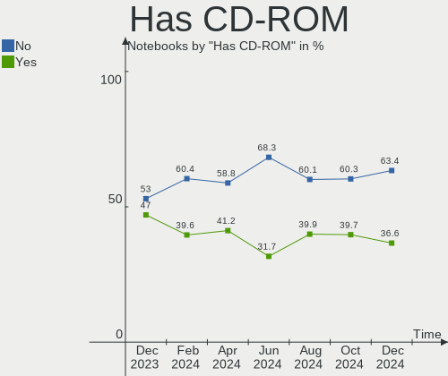
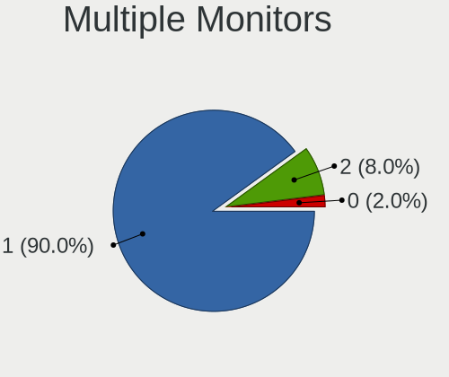
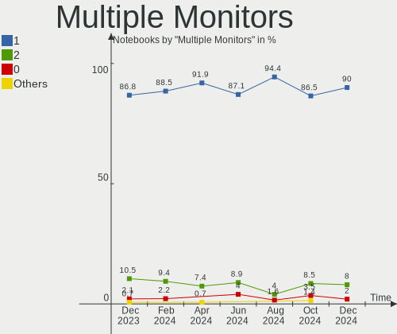
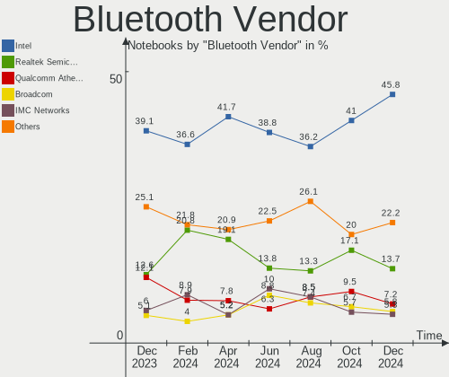
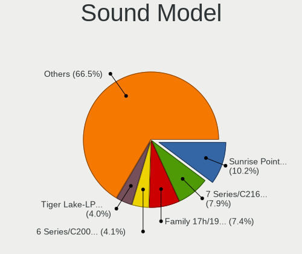
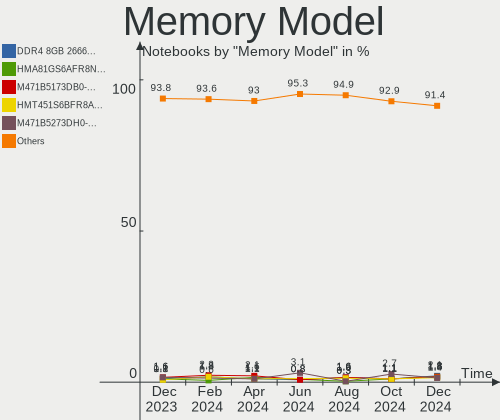

OpenMandriva Hardware Trends (Notebooks)
----------------------------------------

A project to identify most popular hardware characteristics and track their change
over time based on data collected by OpenMandriva users at https://Linux-Hardware.org.

Anyone can contribute to this report by the [hw-probe](https://github.com/linuxhw/hw-probe) tool:

    sudo -E hw-probe -all -upload

Full-feature report is available here: https://linux-hardware.org/?view=trends&formfactor=notebook

Period: Oct, 2021.

Contents
--------

* [ System ](#system)
  - [ OS                       ](#os)
  - [ OS Family                ](#os-family)
  - [ Kernel                   ](#kernel)
  - [ Kernel Family            ](#kernel-family)
  - [ Kernel Major Ver.        ](#kernel-major-ver)
  - [ Arch                     ](#arch)
  - [ DE                       ](#de)
  - [ Display Server           ](#display-server)
  - [ Display Manager          ](#display-manager)
  - [ OS Lang                  ](#os-lang)
  - [ Boot Mode                ](#boot-mode)
  - [ Filesystem               ](#filesystem)
  - [ Part. scheme             ](#part-scheme)
  - [ Dual Boot with Linux/BSD ](#dual-boot-with-linuxbsd)
  - [ Dual Boot (Win)          ](#dual-boot-win)

* [ Board ](#board)
  - [ Vendor                   ](#vendor)
  - [ Model                    ](#model)
  - [ Model Family             ](#model-family)
  - [ MFG Year                 ](#mfg-year)
  - [ Form Factor              ](#form-factor)
  - [ Secure Boot              ](#secure-boot)
  - [ Coreboot                 ](#coreboot)
  - [ RAM Size                 ](#ram-size)
  - [ RAM Used                 ](#ram-used)
  - [ Total Drives             ](#total-drives)
  - [ Has CD-ROM               ](#has-cd-rom)
  - [ Has Ethernet             ](#has-ethernet)
  - [ Has WiFi                 ](#has-wifi)
  - [ Has Bluetooth            ](#has-bluetooth)

* [ Location ](#location)
  - [ Country                  ](#country)
  - [ City                     ](#city)

* [ Drives ](#drives)
  - [ Drive Vendor             ](#drive-vendor)
  - [ Drive Model              ](#drive-model)
  - [ HDD Vendor               ](#hdd-vendor)
  - [ SSD Vendor               ](#ssd-vendor)
  - [ Drive Kind               ](#drive-kind)
  - [ Drive Connector          ](#drive-connector)
  - [ Drive Size               ](#drive-size)
  - [ Space Total              ](#space-total)
  - [ Space Used               ](#space-used)
  - [ Malfunc. Drives          ](#malfunc-drives)
  - [ Malfunc. Drive Vendor    ](#malfunc-drive-vendor)
  - [ Malfunc. HDD Vendor      ](#malfunc-hdd-vendor)
  - [ Malfunc. Drive Kind      ](#malfunc-drive-kind)
  - [ Failed Drives            ](#failed-drives)
  - [ Failed Drive Vendor      ](#failed-drive-vendor)
  - [ Drive Status             ](#drive-status)

* [ Storage controller ](#storage-controller)
  - [ Storage Vendor           ](#storage-vendor)
  - [ Storage Model            ](#storage-model)
  - [ Storage Kind             ](#storage-kind)

* [ Processor ](#processor)
  - [ CPU Vendor               ](#cpu-vendor)
  - [ CPU Model                ](#cpu-model)
  - [ CPU Model Family         ](#cpu-model-family)
  - [ CPU Cores                ](#cpu-cores)
  - [ CPU Sockets              ](#cpu-sockets)
  - [ CPU Threads              ](#cpu-threads)
  - [ CPU Op-Modes             ](#cpu-op-modes)
  - [ CPU Microcode            ](#cpu-microcode)
  - [ CPU Microarch            ](#cpu-microarch)

* [ Graphics ](#graphics)
  - [ GPU Vendor               ](#gpu-vendor)
  - [ GPU Model                ](#gpu-model)
  - [ GPU Combo                ](#gpu-combo)
  - [ GPU Driver               ](#gpu-driver)
  - [ GPU Memory               ](#gpu-memory)

* [ Monitor ](#monitor)
  - [ Monitor Vendor           ](#monitor-vendor)
  - [ Monitor Model            ](#monitor-model)
  - [ Monitor Resolution       ](#monitor-resolution)
  - [ Monitor Diagonal         ](#monitor-diagonal)
  - [ Monitor Width            ](#monitor-width)
  - [ Aspect Ratio             ](#aspect-ratio)
  - [ Monitor Area             ](#monitor-area)
  - [ Pixel Density            ](#pixel-density)
  - [ Multiple Monitors        ](#multiple-monitors)

* [ Network ](#network)
  - [ Net Controller Vendor    ](#net-controller-vendor)
  - [ Net Controller Model     ](#net-controller-model)
  - [ Wireless Vendor          ](#wireless-vendor)
  - [ Wireless Model           ](#wireless-model)
  - [ Ethernet Vendor          ](#ethernet-vendor)
  - [ Ethernet Model           ](#ethernet-model)
  - [ Net Controller Kind      ](#net-controller-kind)
  - [ Used Controller          ](#used-controller)
  - [ NICs                     ](#nics)
  - [ IPv6                     ](#ipv6)

* [ Bluetooth ](#bluetooth)
  - [ Bluetooth Vendor         ](#bluetooth-vendor)
  - [ Bluetooth Model          ](#bluetooth-model)

* [ Sound ](#sound)
  - [ Sound Vendor             ](#sound-vendor)
  - [ Sound Model              ](#sound-model)

* [ Memory ](#memory)
  - [ Memory Vendor            ](#memory-vendor)
  - [ Memory Model             ](#memory-model)
  - [ Memory Kind              ](#memory-kind)
  - [ Memory Form Factor       ](#memory-form-factor)
  - [ Memory Size              ](#memory-size)
  - [ Memory Speed             ](#memory-speed)

* [ Printers & scanners ](#printers--scanners)
  - [ Printer Vendor           ](#printer-vendor)
  - [ Printer Model            ](#printer-model)
  - [ Scanner Vendor           ](#scanner-vendor)
  - [ Scanner Model            ](#scanner-model)

* [ Camera ](#camera)
  - [ Camera Vendor            ](#camera-vendor)
  - [ Camera Model             ](#camera-model)

* [ Security ](#security)
  - [ Fingerprint Vendor       ](#fingerprint-vendor)
  - [ Fingerprint Model        ](#fingerprint-model)
  - [ Chipcard Vendor          ](#chipcard-vendor)
  - [ Chipcard Model           ](#chipcard-model)

* [ Unsupported ](#unsupported)
  - [ Unsupported Devices      ](#unsupported-devices)
  - [ Unsupported Device Types ](#unsupported-device-types)

System
------

OS
--

Installed operating systems

| Name              | Notebooks | Percent |
|-------------------|-----------|---------|
| OpenMandriva 4.2  | 104       | 88.14%  |
| OpenMandriva 4.50 | 14        | 11.86%  |

OS Family
---------

OS without a version

| Name         | Notebooks | Percent |
|--------------|-----------|---------|
| OpenMandriva | 118       | 100%    |

Kernel
------

Version of the Linux kernel

| Version                  | Notebooks | Percent |
|--------------------------|-----------|---------|
| 5.10.14-desktop-1omv4002 | 99        | 83.9%   |
| 5.14.7-desktop-1omv4050  | 12        | 10.17%  |
| 5.11.12-desktop-1omv4002 | 5         | 4.24%   |
| 5.12.4-desktop-1omv4050  | 2         | 1.69%   |

Kernel Family
-------------

Linux kernel without a distro release

| Version | Notebooks | Percent |
|---------|-----------|---------|
| 5.10.14 | 99        | 83.9%   |
| 5.14.7  | 12        | 10.17%  |
| 5.11.12 | 5         | 4.24%   |
| 5.12.4  | 2         | 1.69%   |

Kernel Major Ver.
-----------------

Linux kernel major version

| Version | Notebooks | Percent |
|---------|-----------|---------|
| 5.10    | 99        | 83.9%   |
| 5.14    | 12        | 10.17%  |
| 5.11    | 5         | 4.24%   |
| 5.12    | 2         | 1.69%   |

Arch
----

OS architecture (x86_64, i586, etc.)

| Name   | Notebooks | Percent |
|--------|-----------|---------|
| x86_64 | 118       | 100%    |

DE
--

Desktop Environment

| Name | Notebooks | Percent |
|------|-----------|---------|
| KDE5 | 118       | 100%    |

Display Server
--------------

X11 or Wayland

| Name    | Notebooks | Percent |
|---------|-----------|---------|
| X11     | 117       | 99.15%  |
| Wayland | 1         | 0.85%   |

Display Manager
---------------

SDDM, LightDM, etc.

| Name | Notebooks | Percent |
|------|-----------|---------|
| SDDM | 118       | 100%    |

OS Lang
-------

Language

| Lang  | Notebooks | Percent |
|-------|-----------|---------|
| en_US | 59        | 50%     |
| fr_FR | 10        | 8.47%   |
| cs_CZ | 8         | 6.78%   |
| es_ES | 7         | 5.93%   |
| de_DE | 7         | 5.93%   |
| ru_RU | 6         | 5.08%   |
| pt_BR | 5         | 4.24%   |
| pl_PL | 5         | 4.24%   |
| en_GB | 3         | 2.54%   |
| nl_NL | 1         | 0.85%   |
| it_IT | 1         | 0.85%   |
| hu_HU | 1         | 0.85%   |
| es_PE | 1         | 0.85%   |
| es_BO | 1         | 0.85%   |
| es_AR | 1         | 0.85%   |
| en_IN | 1         | 0.85%   |
| en_CA | 1         | 0.85%   |

Boot Mode
---------

EFI or BIOS

| Mode | Notebooks | Percent |
|------|-----------|---------|
| BIOS | 73        | 61.86%  |
| EFI  | 45        | 38.14%  |

Filesystem
----------

Type of filesystem

| Type    | Notebooks | Percent |
|---------|-----------|---------|
| Overlay | 93        | 78.81%  |
| Ext4    | 25        | 21.19%  |

Part. scheme
------------

Scheme of partitioning

| Type | Notebooks | Percent |
|------|-----------|---------|
| GPT  | 66        | 55.93%  |
| MBR  | 52        | 44.07%  |

Dual Boot with Linux/BSD
------------------------

Hosting more than one Linux/BSD

| Dual boot | Notebooks | Percent |
|-----------|-----------|---------|
| No        | 65        | 55.08%  |
| Yes       | 53        | 44.92%  |

Dual Boot (Win)
---------------

Hosting Linux and Windows

| Dual boot | Notebooks | Percent |
|-----------|-----------|---------|
| No        | 66        | 55.93%  |
| Yes       | 52        | 44.07%  |

Board
-----

Vendor
------

Motherboard manufacturer

| Name                | Notebooks | Percent |
|---------------------|-----------|---------|
| Lenovo              | 29        | 24.58%  |
| ASUSTek Computer    | 22        | 18.64%  |
| Dell                | 16        | 13.56%  |
| Hewlett-Packard     | 12        | 10.17%  |
| Acer                | 10        | 8.47%   |
| Sony                | 5         | 4.24%   |
| Toshiba             | 3         | 2.54%   |
| Samsung Electronics | 3         | 2.54%   |
| Apple               | 3         | 2.54%   |
| Medion              | 2         | 1.69%   |
| Fujitsu             | 2         | 1.69%   |
| eMachines           | 2         | 1.69%   |
| TUXEDO              | 1         | 0.85%   |
| Timi                | 1         | 0.85%   |
| Semp Toshiba        | 1         | 0.85%   |
| Positivo            | 1         | 0.85%   |
| NEC Computers       | 1         | 0.85%   |
| Jumper              | 1         | 0.85%   |
| EVOO                | 1         | 0.85%   |
| ARIMA               | 1         | 0.85%   |
| Alienware           | 1         | 0.85%   |

Model
-----

Motherboard model

| Name                                | Notebooks | Percent |
|-------------------------------------|-----------|---------|
| ASUS UX31E                          | 7         | 5.93%   |
| ASUS K53SM                          | 2         | 1.69%   |
| TUXEDO Aura 15 Gen1                 | 1         | 0.85%   |
| Toshiba Satellite Pro C50-A-1C8     | 1         | 0.85%   |
| Toshiba Satellite P755              | 1         | 0.85%   |
| Toshiba Satellite A505              | 1         | 0.85%   |
| Timi Mi NoteBook Horizon Edition 14 | 1         | 0.85%   |
| Sony VPCS111FM                      | 1         | 0.85%   |
| Sony VPCEH1L8E                      | 1         | 0.85%   |
| Sony VPCEH10EB                      | 1         | 0.85%   |
| Sony VPCEA3S1E                      | 1         | 0.85%   |
| Sony VGN-FW270J                     | 1         | 0.85%   |
| Semp Toshiba IS 1412                | 1         | 0.85%   |
| Samsung R530/R730/R540              | 1         | 0.85%   |
| Samsung R425/R525                   | 1         | 0.85%   |
| Samsung 350V5C/351V5C/3540VC/3440VC | 1         | 0.85%   |
| Positivo S14SL01                    | 1         | 0.85%   |
| NEC Computers PC-LL550VG6R          | 1         | 0.85%   |
| Medion WIM2180                      | 1         | 0.85%   |
| Medion E7417 MD99269                | 1         | 0.85%   |
| Lenovo Z50-70 20354                 | 1         | 0.85%   |
| Lenovo V145-15AST 81MT              | 1         | 0.85%   |
| Lenovo ThinkPad X230 2320HMU        | 1         | 0.85%   |
| Lenovo ThinkPad X220 Tablet 42992PG | 1         | 0.85%   |
| Lenovo ThinkPad X121e 3051RT2       | 1         | 0.85%   |
| Lenovo ThinkPad W520 42844DG        | 1         | 0.85%   |
| Lenovo ThinkPad T61 765818U         | 1         | 0.85%   |
| Lenovo ThinkPad T540p 20BFS31F00    | 1         | 0.85%   |
| Lenovo ThinkPad T530 2429MF7        | 1         | 0.85%   |
| Lenovo ThinkPad T530 2394BK7        | 1         | 0.85%   |
| Lenovo ThinkPad T520 4242A21        | 1         | 0.85%   |
| Lenovo ThinkPad R400 7438T6U        | 1         | 0.85%   |
| Lenovo ThinkPad P70 20ERS00500      | 1         | 0.85%   |
| Lenovo ThinkPad Edge 031928G        | 1         | 0.85%   |
| Lenovo ThinkPad E14 20RA0016SP      | 1         | 0.85%   |
| Lenovo IdeaPad S540-15IML D 81NG    | 1         | 0.85%   |
| Lenovo IdeaPad S340-14IIL 81VV      | 1         | 0.85%   |
| Lenovo IdeaPad 530S-15IKB 81EV      | 1         | 0.85%   |
| Lenovo IdeaPad 330S-15IKB 81F5      | 1         | 0.85%   |
| Lenovo IdeaPad 330-17IKB 81DM       | 1         | 0.85%   |
| Lenovo IdeaPad 330-15IKB 81DE       | 1         | 0.85%   |
| Lenovo IdeaPad 320S-14IKB 81BN      | 1         | 0.85%   |
| Lenovo IdeaPad 3 15ADA05 81W1       | 1         | 0.85%   |
| Lenovo IdeaPad 3 14ADA05 81W0       | 1         | 0.85%   |
| Lenovo G780 2182                    | 1         | 0.85%   |
| Lenovo G700 20251                   | 1         | 0.85%   |
| Lenovo G550 20023                   | 1         | 0.85%   |
| Lenovo G50-45 80E3                  | 1         | 0.85%   |
| Jumper Ezbook X3                    | 1         | 0.85%   |
| HP ProBook 650 G1                   | 1         | 0.85%   |
| HP Pavilion Sleekbook 15 PC         | 1         | 0.85%   |
| HP Pavilion dm4                     | 1         | 0.85%   |
| HP Notebook                         | 1         | 0.85%   |
| HP Laptop 15s-du3xxx                | 1         | 0.85%   |
| HP Laptop 14-bs0xx                  | 1         | 0.85%   |
| HP G70                              | 1         | 0.85%   |
| HP EliteBook Revolve 810 G3         | 1         | 0.85%   |
| HP EliteBook 8570w                  | 1         | 0.85%   |
| HP EliteBook 8470p                  | 1         | 0.85%   |
| HP Compaq nx7300 (GB918ET#ABE)      | 1         | 0.85%   |

Model Family
------------

Motherboard model prefix

| Name                       | Notebooks | Percent |
|----------------------------|-----------|---------|
| Lenovo ThinkPad            | 13        | 11.02%  |
| Lenovo IdeaPad             | 9         | 7.63%   |
| Acer Aspire                | 9         | 7.63%   |
| Dell Inspiron              | 7         | 5.93%   |
| ASUS UX31E                 | 7         | 5.93%   |
| Dell Latitude              | 5         | 4.24%   |
| ASUS VivoBook              | 4         | 3.39%   |
| Toshiba Satellite          | 3         | 2.54%   |
| HP EliteBook               | 3         | 2.54%   |
| HP Pavilion                | 2         | 1.69%   |
| HP Laptop                  | 2         | 1.69%   |
| Fujitsu LIFEBOOK           | 2         | 1.69%   |
| Dell Vostro                | 2         | 1.69%   |
| ASUS K53SM                 | 2         | 1.69%   |
| TUXEDO Aura                | 1         | 0.85%   |
| Timi Mi                    | 1         | 0.85%   |
| Sony VPCS111FM             | 1         | 0.85%   |
| Sony VPCEH1L8E             | 1         | 0.85%   |
| Sony VPCEH10EB             | 1         | 0.85%   |
| Sony VPCEA3S1E             | 1         | 0.85%   |
| Sony VGN-FW270J            | 1         | 0.85%   |
| Semp Toshiba IS            | 1         | 0.85%   |
| Samsung R530               | 1         | 0.85%   |
| Samsung R425               | 1         | 0.85%   |
| Samsung 350V5C             | 1         | 0.85%   |
| Positivo S14SL01           | 1         | 0.85%   |
| NEC Computers PC-LL550VG6R | 1         | 0.85%   |
| Medion WIM2180             | 1         | 0.85%   |
| Medion E7417               | 1         | 0.85%   |
| Lenovo Z50-70              | 1         | 0.85%   |
| Lenovo V145-15AST          | 1         | 0.85%   |
| Lenovo G780                | 1         | 0.85%   |
| Lenovo G700                | 1         | 0.85%   |
| Lenovo G550                | 1         | 0.85%   |
| Lenovo G50-45              | 1         | 0.85%   |
| Jumper Ezbook              | 1         | 0.85%   |
| HP ProBook                 | 1         | 0.85%   |
| HP Notebook                | 1         | 0.85%   |
| HP G70                     | 1         | 0.85%   |
| HP Compaq                  | 1         | 0.85%   |
| HP 15                      | 1         | 0.85%   |
| EVOO EVC141-6              | 1         | 0.85%   |
| eMachines E720             | 1         | 0.85%   |
| eMachines E520             | 1         | 0.85%   |
| Dell Venue                 | 1         | 0.85%   |
| Dell Studio                | 1         | 0.85%   |
| ASUS X751MA                | 1         | 0.85%   |
| ASUS X555LAB               | 1         | 0.85%   |
| ASUS S551LN                | 1         | 0.85%   |
| ASUS PU551JD               | 1         | 0.85%   |
| ASUS M51Vr                 | 1         | 0.85%   |
| ASUS K53BR                 | 1         | 0.85%   |
| ASUS K52JT                 | 1         | 0.85%   |
| ASUS F3Sr                  | 1         | 0.85%   |
| ASUS B121                  | 1         | 0.85%   |
| ARIMA W651UI               | 1         | 0.85%   |
| Apple MacBookPro12         | 1         | 0.85%   |
| Apple MacBookPro11         | 1         | 0.85%   |
| Apple MacBook7             | 1         | 0.85%   |
| Alienware M11x             | 1         | 0.85%   |

MFG Year
--------

Motherboard manufacture year

| Year | Notebooks | Percent |
|------|-----------|---------|
| 2012 | 14        | 11.86%  |
| 2010 | 11        | 9.32%   |
| 2020 | 10        | 8.47%   |
| 2019 | 10        | 8.47%   |
| 2018 | 10        | 8.47%   |
| 2015 | 10        | 8.47%   |
| 2011 | 10        | 8.47%   |
| 2008 | 9         | 7.63%   |
| 2014 | 7         | 5.93%   |
| 2013 | 7         | 5.93%   |
| 2021 | 6         | 5.08%   |
| 2017 | 5         | 4.24%   |
| 2016 | 5         | 4.24%   |
| 2009 | 3         | 2.54%   |
| 2007 | 1         | 0.85%   |

Form Factor
-----------

Physical design of the computer

| Name     | Notebooks | Percent |
|----------|-----------|---------|
| Notebook | 118       | 100%    |

Secure Boot
-----------

Enabled or disabled

| State    | Notebooks | Percent |
|----------|-----------|---------|
| Disabled | 118       | 100%    |

Coreboot
--------

Have coreboot on board

| Used | Notebooks | Percent |
|------|-----------|---------|
| No   | 118       | 100%    |

RAM Size
--------

Total RAM memory

| Size in GB  | Notebooks | Percent |
|-------------|-----------|---------|
| 3.01-4.0    | 49        | 41.53%  |
| 4.01-8.0    | 34        | 28.81%  |
| 8.01-16.0   | 15        | 12.71%  |
| 16.01-24.0  | 8         | 6.78%   |
| 1.01-2.0    | 5         | 4.24%   |
| 2.01-3.0    | 3         | 2.54%   |
| 32.01-64.0  | 2         | 1.69%   |
| 24.01-32.0  | 1         | 0.85%   |
| 64.01-256.0 | 1         | 0.85%   |

RAM Used
--------

Used RAM memory

| Used GB  | Notebooks | Percent |
|----------|-----------|---------|
| 1.01-2.0 | 98        | 83.05%  |
| 0.51-1.0 | 10        | 8.47%   |
| 2.01-3.0 | 8         | 6.78%   |
| 0.01-0.5 | 2         | 1.69%   |

Total Drives
------------

Number of drives on board

| Drives | Notebooks | Percent |
|--------|-----------|---------|
| 1      | 86        | 72.88%  |
| 2      | 25        | 21.19%  |
| 3      | 3         | 2.54%   |
| 0      | 2         | 1.69%   |
| 5      | 1         | 0.85%   |
| 4      | 1         | 0.85%   |

Has CD-ROM
----------

Has CD-ROM on board

| Presented | Notebooks | Percent |
|-----------|-----------|---------|
| Yes       | 59        | 50%     |
| No        | 59        | 50%     |

Has Ethernet
------------

Has Ethernet on board

| Presented | Notebooks | Percent |
|-----------|-----------|---------|
| Yes       | 102       | 86.44%  |
| No        | 16        | 13.56%  |

Has WiFi
--------

Has WiFi module

| Presented | Notebooks | Percent |
|-----------|-----------|---------|
| Yes       | 117       | 99.15%  |
| No        | 1         | 0.85%   |

Has Bluetooth
-------------

Has Bluetooth module

| Presented | Notebooks | Percent |
|-----------|-----------|---------|
| Yes       | 87        | 73.73%  |
| No        | 31        | 26.27%  |

Location
--------

Country
-------

Geographic location (country)

| Country     | Notebooks | Percent |
|-------------|-----------|---------|
| USA         | 13        | 11.02%  |
| France      | 13        | 11.02%  |
| Spain       | 11        | 9.32%   |
| Germany     | 11        | 9.32%   |
| Brazil      | 10        | 8.47%   |
| Poland      | 8         | 6.78%   |
| Czechia     | 8         | 6.78%   |
| Russia      | 6         | 5.08%   |
| India       | 6         | 5.08%   |
| Canada      | 5         | 4.24%   |
| UK          | 3         | 2.54%   |
| Italy       | 3         | 2.54%   |
| Philippines | 2         | 1.69%   |
| Japan       | 2         | 1.69%   |
| Ukraine     | 1         | 0.85%   |
| Taiwan      | 1         | 0.85%   |
| Sweden      | 1         | 0.85%   |
| Peru        | 1         | 0.85%   |
| Netherlands | 1         | 0.85%   |
| Morocco     | 1         | 0.85%   |
| Lithuania   | 1         | 0.85%   |
| Kazakhstan  | 1         | 0.85%   |
| Hungary     | 1         | 0.85%   |
| Hong Kong   | 1         | 0.85%   |
| Guadeloupe  | 1         | 0.85%   |
| Greece      | 1         | 0.85%   |
| El Salvador | 1         | 0.85%   |
| Bolivia     | 1         | 0.85%   |
| Belarus     | 1         | 0.85%   |
| Bahamas     | 1         | 0.85%   |
| Argentina   | 1         | 0.85%   |

City
----

Geographic location (city)

| City                      | Notebooks | Percent |
|---------------------------|-----------|---------|
| Prague                    | 7         | 5.93%   |
| Warsaw                    | 3         | 2.54%   |
| Villanueva de la Canada   | 3         | 2.54%   |
| The Bronx                 | 2         | 1.69%   |
| Solapur                   | 2         | 1.69%   |
| Munich                    | 2         | 1.69%   |
| Madrid                    | 2         | 1.69%   |
| Leck                      | 2         | 1.69%   |
| Berlin                    | 2         | 1.69%   |
| Barcelona                 | 2         | 1.69%   |
| Yaroslavl                 | 1         | 0.85%   |
| Wroclaw                   | 1         | 0.85%   |
| Vilnius                   | 1         | 0.85%   |
| Ulyanovsk                 | 1         | 0.85%   |
| Uberl??ndia               | 1         | 0.85%   |
| Tver                      | 1         | 0.85%   |
| Toulouse                  | 1         | 0.85%   |
| Toronto                   | 1         | 0.85%   |
| Thessaloniki              | 1         | 0.85%   |
| Teresina                  | 1         | 0.85%   |
| Tatu?­                    | 1         | 0.85%   |
| St-Malo                   | 1         | 0.85%   |
| St Petersburg             | 1         | 0.85%   |
| St Helens                 | 1         | 0.85%   |
| Sorocaba                  | 1         | 0.85%   |
| Silla                     | 1         | 0.85%   |
| Siliguri                  | 1         | 0.85%   |
| S??o Paulo                | 1         | 0.85%   |
| Sanl??car de Barrameda    | 1         | 0.85%   |
| Sanford                   | 1         | 0.85%   |
| San Salvador              | 1         | 0.85%   |
| San Diego                 | 1         | 0.85%   |
| Saleilles                 | 1         | 0.85%   |
| Saint-Germain-les-Arpajon | 1         | 0.85%   |
| Sagamihara                | 1         | 0.85%   |
| Rouen                     | 1         | 0.85%   |
| Rio de Janeiro            | 1         | 0.85%   |
| Queens                    | 1         | 0.85%   |
| Poznan                    | 1         | 0.85%   |
| Pickering                 | 1         | 0.85%   |
| Phoenix                   | 1         | 0.85%   |
| Paris                     | 1         | 0.85%   |
| Pardubice                 | 1         | 0.85%   |
| New Taipei                | 1         | 0.85%   |
| Natividade                | 1         | 0.85%   |
| Nassau                    | 1         | 0.85%   |
| Mumbai                    | 1         | 0.85%   |
| Moscow                    | 1         | 0.85%   |
| Morioka                   | 1         | 0.85%   |
| Missao Velha              | 1         | 0.85%   |
| Mielec                    | 1         | 0.85%   |
| Marrubiu                  | 1         | 0.85%   |
| Malappuram                | 1         | 0.85%   |
| Lure                      | 1         | 0.85%   |
| Luce                      | 1         | 0.85%   |
| Lima                      | 1         | 0.85%   |
| Les Abymes                | 1         | 0.85%   |
| Le??n                     | 1         | 0.85%   |
| La Paz                    | 1         | 0.85%   |
| La Canourgue              | 1         | 0.85%   |

Drives
------

Drive Vendor
------------

Hard drive vendors

| Vendor              | Notebooks | Drives | Percent |
|---------------------|-----------|--------|---------|
| WDC                 | 21        | 21     | 14%     |
| Seagate             | 21        | 21     | 14%     |
| Samsung Electronics | 17        | 18     | 11.33%  |
| SanDisk             | 16        | 16     | 10.67%  |
| Toshiba             | 12        | 12     | 8%      |
| SK Hynix            | 7         | 7      | 4.67%   |
| Hitachi             | 7         | 7      | 4.67%   |
| Unknown             | 6         | 6      | 4%      |
| Kingston            | 5         | 5      | 3.33%   |
| Unknown             | 5         | 6      | 3.33%   |
| Intel               | 4         | 6      | 2.67%   |
| HGST                | 4         | 4      | 2.67%   |
| China               | 3         | 3      | 2%      |
| A-DATA Technology   | 3         | 3      | 2%      |
| SPCC                | 2         | 2      | 1.33%   |
| JMicron             | 2         | 2      | 1.33%   |
| GOODRAM             | 2         | 2      | 1.33%   |
| Crucial             | 2         | 2      | 1.33%   |
| Apple               | 2         | 2      | 1.33%   |
| Transcend           | 1         | 1      | 0.67%   |
| PNY                 | 1         | 1      | 0.67%   |
| PLEXTOR             | 1         | 1      | 0.67%   |
| PHISON              | 1         | 1      | 0.67%   |
| Patriot             | 1         | 2      | 0.67%   |
| OCZ                 | 1         | 1      | 0.67%   |
| Corsair             | 1         | 1      | 0.67%   |
| BHT                 | 1         | 1      | 0.67%   |
| ASMT                | 1         | 1      | 0.67%   |

Drive Model
-----------

Hard drive models

| Model                                     | Notebooks | Percent |
|-------------------------------------------|-----------|---------|
| SanDisk SSD U100 256GB                    | 7         | 4.58%   |
| Unknown                                   | 5         | 3.27%   |
| Toshiba MQ01ABD100 1TB                    | 3         | 1.96%   |
| Seagate ST1000LM024 HN-M101MBB 1TB        | 3         | 1.96%   |
| WDC WD10JPVX-22JC3T0 1TB                  | 2         | 1.31%   |
| Toshiba MQ04ABF100 1TB                    | 2         | 1.31%   |
| SPCC Solid State Disk 512GB               | 2         | 1.31%   |
| Seagate ST9500325AS 500GB                 | 2         | 1.31%   |
| Seagate ST500LT012-1DG142 500GB           | 2         | 1.31%   |
| Seagate ST1000LM035-1RK172 1TB            | 2         | 1.31%   |
| SanDisk SSD PLUS 480GB                    | 2         | 1.31%   |
| Samsung SSD 860 EVO 500GB                 | 2         | 1.31%   |
| Kingston SA400S37120G 120GB SSD           | 2         | 1.31%   |
| Intel HBRPEKNX0202AO 32GB                 | 2         | 1.31%   |
| Intel HBRPEKNX0202A 512GB                 | 2         | 1.31%   |
| Hitachi HTS723232A7A364 320GB             | 2         | 1.31%   |
| WDC WDS500G3X0C-00SJG0 500GB              | 1         | 0.65%   |
| WDC WDS120G2G0B-00EPW0 120GB SSD          | 1         | 0.65%   |
| WDC WDS100T2B0C-00PXH0 1TB                | 1         | 0.65%   |
| WDC WD7500BPVT-60HXZT3 752GB              | 1         | 0.65%   |
| WDC WD6400BPVT-22HXZT1 640GB              | 1         | 0.65%   |
| WDC WD5000LPVX-60V0TT0 500GB              | 1         | 0.65%   |
| WDC WD5000LPVX-22V0TT0 500GB              | 1         | 0.65%   |
| WDC WD5000LPCX-24C6HT0 500GB              | 1         | 0.65%   |
| WDC WD5000LPCX-21VHAT0 4X5.8GB            | 1         | 0.65%   |
| WDC WD5000BEVT-35A0RT0 500GB              | 1         | 0.65%   |
| WDC WD20SPZX-75UA7T0 2TB                  | 1         | 0.65%   |
| WDC WD1600BEVT-22ZCT0 160GB               | 1         | 0.65%   |
| WDC WD10SPZX-75Z10T2 1TB                  | 1         | 0.65%   |
| WDC WD10SPZX-24Z10 1TB                    | 1         | 0.65%   |
| WDC WD10JPLX-00MBPT0 1TB                  | 1         | 0.65%   |
| WDC PC SN530 SDBPNPZ-256G-1006 256GB      | 1         | 0.65%   |
| WDC PC SN530 SDBPMPZ-256G-1101 256GB      | 1         | 0.65%   |
| WDC PC SN520 SDAPNUW-512G-1014 512GB      | 1         | 0.65%   |
| WDC PC SN520 SDAPMUW-256G-1101 256GB      | 1         | 0.65%   |
| Unknown SWR256G-301II 256GB SSD           | 1         | 0.65%   |
| Unknown SU16G  16GB                       | 1         | 0.65%   |
| Unknown SR128  128GB                      | 1         | 0.65%   |
| Unknown SD64G  64GB                       | 1         | 0.65%   |
| Unknown SD04G  4GB                        | 1         | 0.65%   |
| Unknown ISOCOM  64GB                      | 1         | 0.65%   |
| Transcend TS128GSSD340 128GB              | 1         | 0.65%   |
| Toshiba TR200 240GB SSD                   | 1         | 0.65%   |
| Toshiba MQ01ABF050 500GB                  | 1         | 0.65%   |
| Toshiba MQ01ABD032 320GB                  | 1         | 0.65%   |
| Toshiba MK5055GSX 500GB                   | 1         | 0.65%   |
| Toshiba MK1234GSX 120GB                   | 1         | 0.65%   |
| Toshiba KXG60ZNV512G 512GB                | 1         | 0.65%   |
| Toshiba KBG40ZNT256G MEMORY 256GB         | 1         | 0.65%   |
| SK Hynix SKHynix_HFS256GD9TNG-L3A0B 256GB | 1         | 0.65%   |
| SK Hynix SKHynix_HFM512GDHTNI-87A0B 512GB | 1         | 0.65%   |
| SK Hynix SHGS31-500GS-2 500GB SSD         | 1         | 0.65%   |
| SK Hynix HFS256G32TNF-N3A0A 256GB SSD     | 1         | 0.65%   |
| SK Hynix HFS128G3AMNB-2200A 128GB SSD     | 1         | 0.65%   |
| SK Hynix HFS128G32TNF-N3A0A 128GB SSD     | 1         | 0.65%   |
| SK Hynix HBG4e  32GB                      | 1         | 0.65%   |
| Seagate ST9500420AS 500GB                 | 1         | 0.65%   |
| Seagate ST9320325AS 320GB                 | 1         | 0.65%   |
| Seagate ST9250827AS 250GB                 | 1         | 0.65%   |
| Seagate ST750LM022 HN-M750MBB 752GB       | 1         | 0.65%   |

HDD Vendor
----------

Hard disk drive vendors

| Vendor              | Notebooks | Drives | Percent |
|---------------------|-----------|--------|---------|
| Seagate             | 20        | 20     | 35.71%  |
| WDC                 | 14        | 14     | 25%     |
| Toshiba             | 9         | 9      | 16.07%  |
| Hitachi             | 7         | 7      | 12.5%   |
| HGST                | 4         | 4      | 7.14%   |
| Samsung Electronics | 1         | 1      | 1.79%   |
| JMicron             | 1         | 1      | 1.79%   |

SSD Vendor
----------

Solid state drive vendors

| Vendor              | Notebooks | Drives | Percent |
|---------------------|-----------|--------|---------|
| SanDisk             | 16        | 16     | 23.53%  |
| Samsung Electronics | 14        | 14     | 20.59%  |
| Kingston            | 5         | 5      | 7.35%   |
| SK Hynix            | 4         | 4      | 5.88%   |
| China               | 3         | 3      | 4.41%   |
| Unknown             | 3         | 3      | 4.41%   |
| SPCC                | 2         | 2      | 2.94%   |
| GOODRAM             | 2         | 2      | 2.94%   |
| Crucial             | 2         | 2      | 2.94%   |
| Apple               | 2         | 2      | 2.94%   |
| A-DATA Technology   | 2         | 2      | 2.94%   |
| WDC                 | 1         | 1      | 1.47%   |
| Unknown             | 1         | 1      | 1.47%   |
| Transcend           | 1         | 1      | 1.47%   |
| Toshiba             | 1         | 1      | 1.47%   |
| Seagate             | 1         | 1      | 1.47%   |
| PNY                 | 1         | 1      | 1.47%   |
| PLEXTOR             | 1         | 1      | 1.47%   |
| PHISON              | 1         | 1      | 1.47%   |
| Patriot             | 1         | 2      | 1.47%   |
| OCZ                 | 1         | 1      | 1.47%   |
| Intel               | 1         | 1      | 1.47%   |
| Corsair             | 1         | 1      | 1.47%   |
| BHT                 | 1         | 1      | 1.47%   |

Drive Kind
----------

HDD or SSD

| Kind    | Notebooks | Drives | Percent |
|---------|-----------|--------|---------|
| SSD     | 62        | 69     | 43.97%  |
| HDD     | 54        | 56     | 38.3%   |
| NVMe    | 16        | 19     | 11.35%  |
| MMC     | 7         | 9      | 4.96%   |
| Unknown | 2         | 2      | 1.42%   |

Drive Connector
---------------

SATA, SAS, NVMe, etc.

| Type | Notebooks | Drives | Percent |
|------|-----------|--------|---------|
| SATA | 107       | 119    | 77.54%  |
| NVMe | 16        | 19     | 11.59%  |
| SAS  | 8         | 8      | 5.8%    |
| MMC  | 7         | 9      | 5.07%   |

Drive Size
----------

Size of hard drive

| Size in TB | Notebooks | Drives | Percent |
|------------|-----------|--------|---------|
| 0.01-0.5   | 86        | 93     | 73.5%   |
| 0.51-1.0   | 28        | 29     | 23.93%  |
| 1.01-2.0   | 3         | 3      | 2.56%   |

Space Total
-----------

Amount of disk space available on the file system

| Size in GB | Notebooks | Percent |
|------------|-----------|---------|
| 1-20       | 65        | 55.08%  |
| 101-250    | 18        | 15.25%  |
| 251-500    | 12        | 10.17%  |
| Unknown    | 8         | 6.78%   |
| 501-1000   | 7         | 5.93%   |
| 51-100     | 5         | 4.24%   |
| 21-50      | 3         | 2.54%   |

Space Used
----------

Amount of used disk space

| Used GB  | Notebooks | Percent |
|----------|-----------|---------|
| 1-20     | 99        | 83.9%   |
| Unknown  | 8         | 6.78%   |
| 21-50    | 6         | 5.08%   |
| 101-250  | 2         | 1.69%   |
| 51-100   | 2         | 1.69%   |
| 501-1000 | 1         | 0.85%   |

Malfunc. Drives
---------------

Drive models with a malfunction

| Model                                 | Notebooks | Drives | Percent |
|---------------------------------------|-----------|--------|---------|
| SanDisk SSD U100 256GB                | 7         | 7      | 22.58%  |
| Seagate ST9500325AS 500GB             | 2         | 2      | 6.45%   |
| WDC WD7500BPVT-60HXZT3 752GB          | 1         | 1      | 3.23%   |
| WDC WD6400BPVT-22HXZT1 640GB          | 1         | 1      | 3.23%   |
| WDC WD5000LPVX-60V0TT0 500GB          | 1         | 1      | 3.23%   |
| Toshiba MQ01ABD100 1TB                | 1         | 1      | 3.23%   |
| Toshiba MK5055GSX 500GB               | 1         | 1      | 3.23%   |
| Toshiba MK1234GSX 120GB               | 1         | 1      | 3.23%   |
| SK Hynix HFS128G3AMNB-2200A 128GB SSD | 1         | 1      | 3.23%   |
| Seagate ST9320325AS 320GB             | 1         | 1      | 3.23%   |
| Seagate ST500LT012-9WS142 500GB       | 1         | 1      | 3.23%   |
| Seagate ST500LM000-1EJ162 500GB       | 1         | 1      | 3.23%   |
| Seagate ST2000LX001-1RG174 2TB        | 1         | 1      | 3.23%   |
| Seagate ST1000LM024 HN-M101MBB 1TB    | 1         | 1      | 3.23%   |
| SanDisk SSD P4 64GB                   | 1         | 1      | 3.23%   |
| Samsung Electronics HM160HI 160GB     | 1         | 1      | 3.23%   |
| PLEXTOR PX-256M5S 256GB SSD           | 1         | 1      | 3.23%   |
| OCZ VERTEX2 64GB SSD                  | 1         | 1      | 3.23%   |
| Hitachi HTS723225L9A360 250GB         | 1         | 1      | 3.23%   |
| Hitachi HTS545050A7E380 500GB         | 1         | 1      | 3.23%   |
| Hitachi HTS542525K9SA00 250GB         | 1         | 1      | 3.23%   |
| Hitachi HTS542512K9SA00 120GB         | 1         | 1      | 3.23%   |
| HGST HTS725050A7E630 500GB            | 1         | 1      | 3.23%   |
| HGST HTS545050A7E680 500GB            | 1         | 1      | 3.23%   |

Malfunc. Drive Vendor
---------------------

Vendors of faulty drives

| Vendor              | Notebooks | Drives | Percent |
|---------------------|-----------|--------|---------|
| SanDisk             | 8         | 8      | 25.81%  |
| Seagate             | 7         | 7      | 22.58%  |
| Hitachi             | 4         | 4      | 12.9%   |
| WDC                 | 3         | 3      | 9.68%   |
| Toshiba             | 3         | 3      | 9.68%   |
| HGST                | 2         | 2      | 6.45%   |
| SK Hynix            | 1         | 1      | 3.23%   |
| Samsung Electronics | 1         | 1      | 3.23%   |
| PLEXTOR             | 1         | 1      | 3.23%   |
| OCZ                 | 1         | 1      | 3.23%   |

Malfunc. HDD Vendor
-------------------

Vendors of faulty HDD drives

| Vendor              | Notebooks | Drives | Percent |
|---------------------|-----------|--------|---------|
| Seagate             | 7         | 7      | 35%     |
| Hitachi             | 4         | 4      | 20%     |
| WDC                 | 3         | 3      | 15%     |
| Toshiba             | 3         | 3      | 15%     |
| HGST                | 2         | 2      | 10%     |
| Samsung Electronics | 1         | 1      | 5%      |

Malfunc. Drive Kind
-------------------

Kinds of faulty drives

| Kind | Notebooks | Drives | Percent |
|------|-----------|--------|---------|
| HDD  | 20        | 20     | 64.52%  |
| SSD  | 11        | 11     | 35.48%  |

Failed Drives
-------------

Failed drive models

Zero info for selected period =(

Failed Drive Vendor
-------------------

Failed drive vendors

Zero info for selected period =(

Drive Status
------------

Number of failed and malfunc. drives

| Status   | Notebooks | Drives | Percent |
|----------|-----------|--------|---------|
| Works    | 89        | 105    | 65.44%  |
| Malfunc  | 30        | 31     | 22.06%  |
| Detected | 17        | 19     | 12.5%   |

Storage controller
------------------

Storage Vendor
--------------

Storage controller vendors

| Vendor                       | Notebooks | Percent |
|------------------------------|-----------|---------|
| Intel                        | 106       | 79.1%   |
| AMD                          | 8         | 5.97%   |
| Sandisk                      | 6         | 4.48%   |
| Samsung Electronics          | 5         | 3.73%   |
| SK Hynix                     | 2         | 1.49%   |
| Nvidia                       | 2         | 1.49%   |
| Toshiba America Info Systems | 1         | 0.75%   |
| Silicon Image                | 1         | 0.75%   |
| Realtek Semiconductor        | 1         | 0.75%   |
| KIOXIA                       | 1         | 0.75%   |
| JMicron Technology           | 1         | 0.75%   |

Storage Model
-------------

Storage controller models

| Model                                                                          | Notebooks | Percent |
|--------------------------------------------------------------------------------|-----------|---------|
| Intel 6 Series/C200 Series Chipset Family 6 port Mobile SATA AHCI Controller   | 17        | 11.64%  |
| Intel 7 Series Chipset Family 6-port SATA Controller [AHCI mode]               | 14        | 9.59%   |
| Intel 82801 Mobile SATA Controller [RAID mode]                                 | 10        | 6.85%   |
| Intel Sunrise Point-LP SATA Controller [AHCI mode]                             | 9         | 6.16%   |
| Intel 82801IBM/IEM (ICH9M/ICH9M-E) 4 port SATA Controller [AHCI mode]          | 7         | 4.79%   |
| Intel Wildcat Point-LP SATA Controller [AHCI Mode]                             | 6         | 4.11%   |
| Intel 82801HM/HEM (ICH8M/ICH8M-E) IDE Controller                               | 6         | 4.11%   |
| Intel 8 Series SATA Controller 1 [AHCI mode]                                   | 6         | 4.11%   |
| Intel 82801HM/HEM (ICH8M/ICH8M-E) SATA Controller [AHCI mode]                  | 5         | 3.42%   |
| Intel 5 Series/3400 Series Chipset 4 port SATA AHCI Controller                 | 5         | 3.42%   |
| AMD FCH SATA Controller [AHCI mode]                                            | 5         | 3.42%   |
| Intel 82801IBM/IEM (ICH9M/ICH9M-E) 2 port SATA Controller [IDE mode]           | 4         | 2.74%   |
| Intel 8 Series/C220 Series Chipset Family 6-port SATA Controller 1 [AHCI mode] | 4         | 2.74%   |
| Intel Celeron N3350/Pentium N4200/Atom E3900 Series SATA AHCI Controller       | 3         | 2.05%   |
| AMD SB7x0/SB8x0/SB9x0 SATA Controller [AHCI mode]                              | 3         | 2.05%   |
| Sandisk WD Blue SN550 NVMe SSD                                                 | 2         | 1.37%   |
| Intel Non-Volatile memory controller                                           | 2         | 1.37%   |
| Intel Ice Lake-LP SATA Controller [AHCI mode]                                  | 2         | 1.37%   |
| Intel Atom Processor E3800 Series SATA AHCI Controller                         | 2         | 1.37%   |
| Intel 82801HM/HEM (ICH8M/ICH8M-E) SATA Controller [IDE mode]                   | 2         | 1.37%   |
| Intel 5 Series/3400 Series Chipset 6 port SATA AHCI Controller                 | 2         | 1.37%   |
| Toshiba America Info Systems XG6 NVMe SSD Controller                           | 1         | 0.68%   |
| SK Hynix Non-Volatile memory controller                                        | 1         | 0.68%   |
| SK Hynix BC511                                                                 | 1         | 0.68%   |
| Silicon Image SiI 3531 [SATALink/SATARaid] Serial ATA Controller               | 1         | 0.68%   |
| Sandisk WD Blue SN500 / PC SN520 NVMe SSD                                      | 1         | 0.68%   |
| Sandisk WD Black SN750 / PC SN730 NVMe SSD                                     | 1         | 0.68%   |
| Sandisk PC SN520 NVMe SSD                                                      | 1         | 0.68%   |
| Sandisk Non-Volatile memory controller                                         | 1         | 0.68%   |
| Samsung NVMe SSD Controller SM981/PM981/PM983                                  | 1         | 0.68%   |
| Samsung NVMe SSD Controller SM961/PM961/SM963                                  | 1         | 0.68%   |
| Samsung NVMe SSD Controller 980                                                | 1         | 0.68%   |
| Samsung Electronics SATA controller                                            | 1         | 0.68%   |
| Samsung Apple PCIe SSD                                                         | 1         | 0.68%   |
| Realtek RTS5763DL NVMe SSD Controller                                          | 1         | 0.68%   |
| Nvidia MCP89 SATA Controller (AHCI mode)                                       | 1         | 0.68%   |
| Nvidia MCP79 AHCI Controller                                                   | 1         | 0.68%   |
| KIOXIA Non-Volatile memory controller                                          | 1         | 0.68%   |
| JMicron JMB360 AHCI Controller                                                 | 1         | 0.68%   |
| Intel Volume Management Device NVMe RAID Controller                            | 1         | 0.68%   |
| Intel Tiger Lake-LP SATA Controller [AHCI mode]                                | 1         | 0.68%   |
| Intel SSD 660P Series                                                          | 1         | 0.68%   |
| Intel Q170/Q150/B150/H170/H110/Z170/CM236 Chipset SATA Controller [AHCI Mode]  | 1         | 0.68%   |
| Intel HM170/QM170 Chipset SATA Controller [AHCI Mode]                          | 1         | 0.68%   |
| Intel Comet Lake SATA AHCI Controller                                          | 1         | 0.68%   |
| Intel Comet Lake PCH-LP SATA RAID Premium Controller                           | 1         | 0.68%   |
| Intel Cannon Point-LP SATA Controller [AHCI Mode]                              | 1         | 0.68%   |
| Intel 82801GBM/GHM (ICH7-M Family) SATA Controller [IDE mode]                  | 1         | 0.68%   |
| Intel 7 Series Chipset Family 4-port SATA Controller [IDE mode]                | 1         | 0.68%   |
| Intel 7 Series Chipset Family 2-port SATA Controller [IDE mode]                | 1         | 0.68%   |
| AMD SB7x0/SB8x0/SB9x0 IDE Controller                                           | 1         | 0.68%   |

Storage Kind
------------

Kind of storage controller (IDE, SATA, NVMe, SAS, ...)

| Kind | Notebooks | Percent |
|------|-----------|---------|
| SATA | 99        | 69.72%  |
| NVMe | 16        | 11.27%  |
| IDE  | 14        | 9.86%   |
| RAID | 13        | 9.15%   |

Processor
---------

CPU Vendor
----------

Processor vendors

| Vendor | Notebooks | Percent |
|--------|-----------|---------|
| Intel  | 108       | 91.53%  |
| AMD    | 10        | 8.47%   |

CPU Model
---------

Processor models

| Model                                        | Notebooks | Percent |
|----------------------------------------------|-----------|---------|
| Intel Core i7-2677M CPU @ 1.80GHz            | 7         | 5.93%   |
| Intel Core i3-6006U CPU @ 2.00GHz            | 4         | 3.39%   |
| Intel Core i5-2450M CPU @ 2.50GHz            | 3         | 2.54%   |
| Intel Core i3-7020U CPU @ 2.30GHz            | 3         | 2.54%   |
| Intel Core 2 Duo CPU P8400 @ 2.26GHz         | 3         | 2.54%   |
| Intel Core i7-10510U CPU @ 1.80GHz           | 2         | 1.69%   |
| Intel Core i5-8250U CPU @ 1.60GHz            | 2         | 1.69%   |
| Intel Core i5-3320M CPU @ 2.60GHz            | 2         | 1.69%   |
| Intel Core i5-3210M CPU @ 2.50GHz            | 2         | 1.69%   |
| Intel Core i5-2520M CPU @ 2.50GHz            | 2         | 1.69%   |
| Intel Core i5-1035G1 CPU @ 1.00GHz           | 2         | 1.69%   |
| Intel Core i5-10210U CPU @ 1.60GHz           | 2         | 1.69%   |
| Intel Core i3-5005U CPU @ 2.00GHz            | 2         | 1.69%   |
| Intel Core i3-4030U CPU @ 1.90GHz            | 2         | 1.69%   |
| Intel Core i3-3110M CPU @ 2.40GHz            | 2         | 1.69%   |
| Intel Core i3-2310M CPU @ 2.10GHz            | 2         | 1.69%   |
| Intel Core 2 Duo CPU T7500 @ 2.20GHz         | 2         | 1.69%   |
| Intel Core 2 Duo CPU T6500 @ 2.10GHz         | 2         | 1.69%   |
| Intel Core 2 Duo CPU P8700 @ 2.53GHz         | 2         | 1.69%   |
| Intel Celeron CPU N3350 @ 1.10GHz            | 2         | 1.69%   |
| AMD Athlon Silver 3050U with Radeon Graphics | 2         | 1.69%   |
| Intel Pentium Gold 7505 @ 2.00GHz            | 1         | 0.85%   |
| Intel Pentium Dual-Core CPU T4400 @ 2.20GHz  | 1         | 0.85%   |
| Intel Pentium Dual-Core CPU T4200 @ 2.00GHz  | 1         | 0.85%   |
| Intel Pentium Dual CPU T3400 @ 2.16GHz       | 1         | 0.85%   |
| Intel Pentium CPU T4300 @ 2.10GHz            | 1         | 0.85%   |
| Intel Pentium CPU P6100 @ 2.00GHz            | 1         | 0.85%   |
| Intel Pentium CPU N3540 @ 2.16GHz            | 1         | 0.85%   |
| Intel Pentium CPU 4415U @ 2.30GHz            | 1         | 0.85%   |
| Intel Pentium CPU 2127U @ 1.90GHz            | 1         | 0.85%   |
| Intel Pentium CPU 2020M @ 2.40GHz            | 1         | 0.85%   |
| Intel Genuine CPU 575 @ 2.00GHz              | 1         | 0.85%   |
| Intel Core i7-8550U CPU @ 1.80GHz            | 1         | 0.85%   |
| Intel Core i7-7700HQ CPU @ 2.80GHz           | 1         | 0.85%   |
| Intel Core i7-6820HQ CPU @ 2.70GHz           | 1         | 0.85%   |
| Intel Core i7-5500U CPU @ 2.40GHz            | 1         | 0.85%   |
| Intel Core i7-4850HQ CPU @ 2.30GHz           | 1         | 0.85%   |
| Intel Core i7-4712MQ CPU @ 2.30GHz           | 1         | 0.85%   |
| Intel Core i7-4710MQ CPU @ 2.50GHz           | 1         | 0.85%   |
| Intel Core i7-4702MQ CPU @ 2.20GHz           | 1         | 0.85%   |
| Intel Core i7-4510U CPU @ 2.00GHz            | 1         | 0.85%   |
| Intel Core i7-3740QM CPU @ 2.70GHz           | 1         | 0.85%   |
| Intel Core i7-3630QM CPU @ 2.40GHz           | 1         | 0.85%   |
| Intel Core i7-2720QM CPU @ 2.20GHz           | 1         | 0.85%   |
| Intel Core i7-2640M CPU @ 2.80GHz            | 1         | 0.85%   |
| Intel Core i7-2630QM CPU @ 2.00GHz           | 1         | 0.85%   |
| Intel Core i7 CPU U 640 @ 1.20GHz            | 1         | 0.85%   |
| Intel Core i5-8265U CPU @ 1.60GHz            | 1         | 0.85%   |
| Intel Core i5-6200U CPU @ 2.30GHz            | 1         | 0.85%   |
| Intel Core i5-5300U CPU @ 2.30GHz            | 1         | 0.85%   |
| Intel Core i5-5257U CPU @ 2.70GHz            | 1         | 0.85%   |
| Intel Core i5-5200U CPU @ 2.20GHz            | 1         | 0.85%   |
| Intel Core i5-4310M CPU @ 2.70GHz            | 1         | 0.85%   |
| Intel Core i5-4300Y CPU @ 1.60GHz            | 1         | 0.85%   |
| Intel Core i5-4210U CPU @ 1.70GHz            | 1         | 0.85%   |
| Intel Core i5-4200U CPU @ 1.60GHz            | 1         | 0.85%   |
| Intel Core i5-3317U CPU @ 1.70GHz            | 1         | 0.85%   |
| Intel Core i5-3230M CPU @ 2.60GHz            | 1         | 0.85%   |
| Intel Core i5-2540M CPU @ 2.60GHz            | 1         | 0.85%   |
| Intel Core i5 CPU U 470 @ 1.33GHz            | 1         | 0.85%   |

CPU Model Family
----------------

Processor model prefix

| Model                   | Notebooks | Percent |
|-------------------------|-----------|---------|
| Intel Core i5           | 30        | 25.42%  |
| Intel Core i7           | 24        | 20.34%  |
| Intel Core i3           | 21        | 17.8%   |
| Intel Core 2 Duo        | 16        | 13.56%  |
| Intel Pentium           | 6         | 5.08%   |
| Intel Celeron           | 5         | 4.24%   |
| Intel Pentium Dual-Core | 2         | 1.69%   |
| AMD E                   | 2         | 1.69%   |
| AMD Athlon              | 2         | 1.69%   |
| Intel Pentium Gold      | 1         | 0.85%   |
| Intel Pentium Dual      | 1         | 0.85%   |
| Intel Genuine           | 1         | 0.85%   |
| Intel Core 2            | 1         | 0.85%   |
| AMD Turion II Dual-Core | 1         | 0.85%   |
| AMD Ryzen 7             | 1         | 0.85%   |
| AMD Ryzen 3             | 1         | 0.85%   |
| AMD A8                  | 1         | 0.85%   |
| AMD A6                  | 1         | 0.85%   |
| AMD A4                  | 1         | 0.85%   |

CPU Cores
---------

Number of processor cores

| Number | Notebooks | Percent |
|--------|-----------|---------|
| 2      | 92        | 77.97%  |
| 4      | 24        | 20.34%  |
| 8      | 1         | 0.85%   |
| 1      | 1         | 0.85%   |

CPU Sockets
-----------

Number of sockets

| Number | Notebooks | Percent |
|--------|-----------|---------|
| 1      | 118       | 100%    |

CPU Threads
-----------

Threads per core (Hyper-Threading)

| Number | Notebooks | Percent |
|--------|-----------|---------|
| 2      | 78        | 66.1%   |
| 1      | 40        | 33.9%   |

CPU Op-Modes
------------

CPU Operation Modes (32-bit, 64-bit)

| Op mode        | Notebooks | Percent |
|----------------|-----------|---------|
| 32-bit, 64-bit | 118       | 100%    |

CPU Microcode
-------------

Microcode number

| Number     | Notebooks | Percent |
|------------|-----------|---------|
| 0x206a7    | 20        | 16.95%  |
| 0x306a9    | 13        | 11.02%  |
| 0x1067a    | 10        | 8.47%   |
| 0x306d4    | 7         | 5.93%   |
| 0x20655    | 6         | 5.08%   |
| 0x406e3    | 5         | 4.24%   |
| 0x40651    | 5         | 4.24%   |
| 0x10676    | 5         | 4.24%   |
| 0x806ec    | 4         | 3.39%   |
| 0x806ea    | 4         | 3.39%   |
| 0x6fd      | 4         | 3.39%   |
| 0x306c3    | 4         | 3.39%   |
| 0x706e5    | 3         | 2.54%   |
| 0x506c9    | 3         | 2.54%   |
| Unknown    | 3         | 2.54%   |
| 0x806e9    | 2         | 1.69%   |
| 0x30678    | 2         | 1.69%   |
| 0x08108109 | 2         | 1.69%   |
| 0x906e9    | 1         | 0.85%   |
| 0x806eb    | 1         | 0.85%   |
| 0x806c1    | 1         | 0.85%   |
| 0x6fb      | 1         | 0.85%   |
| 0x6fa      | 1         | 0.85%   |
| 0x6f2      | 1         | 0.85%   |
| 0x506e3    | 1         | 0.85%   |
| 0x40661    | 1         | 0.85%   |
| 0x20652    | 1         | 0.85%   |
| 0x08600106 | 1         | 0.85%   |
| 0x08108102 | 1         | 0.85%   |
| 0x07030105 | 1         | 0.85%   |
| 0x07030104 | 1         | 0.85%   |
| 0x06006705 | 1         | 0.85%   |
| 0x0500010d | 1         | 0.85%   |
| 0x05000101 | 1         | 0.85%   |

CPU Microarch
-------------

Microarchitecture

| Name        | Notebooks | Percent |
|-------------|-----------|---------|
| SandyBridge | 20        | 16.95%  |
| Penryn      | 15        | 12.71%  |
| KabyLake    | 13        | 11.02%  |
| IvyBridge   | 13        | 11.02%  |
| Haswell     | 11        | 9.32%   |
| Westmere    | 7         | 5.93%   |
| Core        | 7         | 5.93%   |
| Broadwell   | 7         | 5.93%   |
| Skylake     | 6         | 5.08%   |
| Zen+        | 3         | 2.54%   |
| IceLake     | 3         | 2.54%   |
| Goldmont    | 3         | 2.54%   |
| Silvermont  | 2         | 1.69%   |
| Puma        | 2         | 1.69%   |
| Bobcat      | 2         | 1.69%   |
| Zen 2       | 1         | 0.85%   |
| TigerLake   | 1         | 0.85%   |
| K10         | 1         | 0.85%   |
| Excavator   | 1         | 0.85%   |

Graphics
--------

GPU Vendor
----------

Vendors of graphics cards

| Vendor | Notebooks | Percent |
|--------|-----------|---------|
| Intel  | 101       | 69.18%  |
| Nvidia | 25        | 17.12%  |
| AMD    | 20        | 13.7%   |

GPU Model
---------

Graphics card models

| Model                                                                                    | Notebooks | Percent |
|------------------------------------------------------------------------------------------|-----------|---------|
| Intel 2nd Generation Core Processor Family Integrated Graphics Controller                | 21        | 13.55%  |
| Intel 3rd Gen Core processor Graphics Controller                                         | 12        | 7.74%   |
| Intel Mobile 4 Series Chipset Integrated Graphics Controller                             | 11        | 7.1%    |
| Intel Skylake GT2 [HD Graphics 520]                                                      | 5         | 3.23%   |
| Intel HD Graphics 5500                                                                   | 5         | 3.23%   |
| Intel Haswell-ULT Integrated Graphics Controller                                         | 5         | 3.23%   |
| Intel Core Processor Integrated Graphics Controller                                      | 5         | 3.23%   |
| Nvidia GF117M [GeForce 610M/710M/810M/820M / GT 620M/625M/630M/720M]                     | 4         | 2.58%   |
| Intel Mobile GM965/GL960 Integrated Graphics Controller (secondary)                      | 4         | 2.58%   |
| Intel Mobile GM965/GL960 Integrated Graphics Controller (primary)                        | 4         | 2.58%   |
| Intel CometLake-U GT2 [UHD Graphics]                                                     | 4         | 2.58%   |
| Intel 4th Gen Core Processor Integrated Graphics Controller                              | 4         | 2.58%   |
| Nvidia GM108M [GeForce 840M]                                                             | 3         | 1.94%   |
| Intel UHD Graphics 620                                                                   | 3         | 1.94%   |
| Intel Iris Plus Graphics G1 (Ice Lake)                                                   | 3         | 1.94%   |
| Intel HD Graphics 500                                                                    | 3         | 1.94%   |
| AMD Picasso                                                                              | 3         | 1.94%   |
| Nvidia GF108M [NVS 5400M]                                                                | 2         | 1.29%   |
| Intel WhiskeyLake-U GT2 [UHD Graphics 620]                                               | 2         | 1.29%   |
| Intel Iris Graphics 6100                                                                 | 2         | 1.29%   |
| Intel HD Graphics 620                                                                    | 2         | 1.29%   |
| Intel Atom Processor Z36xxx/Z37xxx Series Graphics & Display                             | 2         | 1.29%   |
| AMD Park [Mobility Radeon HD 5430/5450/5470]                                             | 2         | 1.29%   |
| AMD Mullins [Radeon R4/R5 Graphics]                                                      | 2         | 1.29%   |
| Nvidia MCP89 [GeForce 320M]                                                              | 1         | 0.65%   |
| Nvidia GT215M [GeForce GT 335M]                                                          | 1         | 0.65%   |
| Nvidia GP108M [GeForce MX250]                                                            | 1         | 0.65%   |
| Nvidia GP108M [GeForce MX150]                                                            | 1         | 0.65%   |
| Nvidia GP107M [GeForce MX350]                                                            | 1         | 0.65%   |
| Nvidia GP107M [GeForce GTX 1050 Ti Mobile]                                               | 1         | 0.65%   |
| Nvidia GM204GLM [Quadro M4000M]                                                          | 1         | 0.65%   |
| Nvidia GM107M [GeForce GTX 850M]                                                         | 1         | 0.65%   |
| Nvidia GK208M [GeForce GT 730M]                                                          | 1         | 0.65%   |
| Nvidia GK208BM [GeForce 920M]                                                            | 1         | 0.65%   |
| Nvidia GK107M [GeForce GT 750M Mac Edition]                                              | 1         | 0.65%   |
| Nvidia GF119M [NVS 4200M]                                                                | 1         | 0.65%   |
| Nvidia GF108M [GeForce GT 620M/630M/635M/640M LE]                                        | 1         | 0.65%   |
| Nvidia GF108GLM [Quadro 1000M]                                                           | 1         | 0.65%   |
| Nvidia G98M [GeForce 9200M GS]                                                           | 1         | 0.65%   |
| Nvidia G86M [GeForce 9300M G]                                                            | 1         | 0.65%   |
| Nvidia C79 [GeForce 9400M G]                                                             | 1         | 0.65%   |
| Intel Tiger Lake UHD Graphics                                                            | 1         | 0.65%   |
| Intel Mobile 945GM/GMS/GME, 943/940GML Express Integrated Graphics Controller            | 1         | 0.65%   |
| Intel Mobile 945GM/GMS, 943/940GML Express Integrated Graphics Controller                | 1         | 0.65%   |
| Intel Kaby Lake-U GT2f HD 620 Graphics Controller                                        | 1         | 0.65%   |
| Intel Kaby Lake-U GT1 Integrated Graphics Controller                                     | 1         | 0.65%   |
| Intel HD Graphics 630                                                                    | 1         | 0.65%   |
| Intel HD Graphics 530                                                                    | 1         | 0.65%   |
| Intel Haswell-ULT High Definition Audio Controller [HD Graphics]                         | 1         | 0.65%   |
| Intel Atom/Celeron/Pentium Processor x5-E8000/J3xxx/N3xxx Integrated Graphics Controller | 1         | 0.65%   |
| AMD Wrestler [Radeon HD 6320]                                                            | 1         | 0.65%   |
| AMD Wrestler [Radeon HD 6310]                                                            | 1         | 0.65%   |
| AMD Thames [Radeon HD 7550M/7570M/7650M]                                                 | 1         | 0.65%   |
| AMD Thames [Radeon HD 7500M/7600M Series]                                                | 1         | 0.65%   |
| AMD Sun LE [Radeon HD 8550M / R5 M230]                                                   | 1         | 0.65%   |
| AMD Stoney [Radeon R2/R3/R4/R5 Graphics]                                                 | 1         | 0.65%   |
| AMD Seymour [Radeon HD 6400M/7400M Series]                                               | 1         | 0.65%   |
| AMD RV620/M82 [Mobility Radeon HD 3450/3470]                                             | 1         | 0.65%   |
| AMD RV610/M74 [Mobility Radeon HD 2400 XT]                                               | 1         | 0.65%   |
| AMD RV610/M72-S [Mobility Radeon HD 2400]                                                | 1         | 0.65%   |

GPU Combo
---------

Combinations of graphics cards

| Name           | Notebooks | Percent |
|----------------|-----------|---------|
| 1 x Intel      | 75        | 63.56%  |
| Intel + Nvidia | 20        | 16.95%  |
| 1 x AMD        | 14        | 11.86%  |
| 1 x Nvidia     | 4         | 3.39%   |
| 2 x AMD        | 3         | 2.54%   |
| 2 x Nvidia     | 1         | 0.85%   |
| Intel + AMD    | 1         | 0.85%   |

GPU Driver
----------

Free vs proprietary

| Driver  | Notebooks | Percent |
|---------|-----------|---------|
| Free    | 117       | 99.15%  |
| Unknown | 1         | 0.85%   |

GPU Memory
----------

Total video memory

| Size in GB | Notebooks | Percent |
|------------|-----------|---------|
| Unknown    | 78        | 66.1%   |
| 0.01-0.5   | 14        | 11.86%  |
| 1.01-2.0   | 13        | 11.02%  |
| 0.51-1.0   | 10        | 8.47%   |
| 3.01-4.0   | 3         | 2.54%   |

Monitor
-------

Monitor Vendor
--------------

Monitor vendors

| Vendor                  | Notebooks | Percent |
|-------------------------|-----------|---------|
| AU Optronics            | 24        | 19.67%  |
| BOE                     | 19        | 15.57%  |
| LG Display              | 17        | 13.93%  |
| Samsung Electronics     | 14        | 11.48%  |
| Chimei Innolux          | 14        | 11.48%  |
| Lenovo                  | 8         | 6.56%   |
| CPT                     | 8         | 6.56%   |
| LG Philips              | 3         | 2.46%   |
| Apple                   | 3         | 2.46%   |
| Chi Mei Optoelectronics | 2         | 1.64%   |
| Acer                    | 2         | 1.64%   |
| Unknown                 | 1         | 0.82%   |
| Sony                    | 1         | 0.82%   |
| Sharp                   | 1         | 0.82%   |
| PANDA                   | 1         | 0.82%   |
| Panasonic               | 1         | 0.82%   |
| MTD                     | 1         | 0.82%   |
| Eizo                    | 1         | 0.82%   |
| Ancor Communications    | 1         | 0.82%   |

Monitor Model
-------------

Monitor models

| Model                                                                 | Notebooks | Percent |
|-----------------------------------------------------------------------|-----------|---------|
| CPT LCD Monitor COR17DB 1600x900 293x164mm 13.2-inch                  | 7         | 5.69%   |
| Lenovo LCD Monitor LEN40B1 1600x900 344x194mm 15.5-inch               | 3         | 2.44%   |
| Chimei Innolux LCD Monitor CMN1728 1600x900 382x215mm 17.3-inch       | 3         | 2.44%   |
| AU Optronics LCD Monitor AUO26EC 1366x768 344x193mm 15.5-inch         | 3         | 2.44%   |
| AU Optronics LCD Monitor AUO21EC 1366x768 340x190mm 15.3-inch         | 3         | 2.44%   |
| Samsung Electronics LCD Monitor SEC5441 1366x768 344x194mm 15.5-inch  | 2         | 1.63%   |
| Samsung Electronics LCD Monitor SEC3945 1280x800 331x207mm 15.4-inch  | 2         | 1.63%   |
| Samsung Electronics LCD Monitor SEC3245 1366x768 344x194mm 15.5-inch  | 2         | 1.63%   |
| Lenovo LCD Monitor LEN4031 1280x800 303x190mm 14.1-inch               | 2         | 1.63%   |
| AU Optronics LCD Monitor AUO45EC 1366x768 340x190mm 15.3-inch         | 2         | 1.63%   |
| AU Optronics LCD Monitor AUO11EC 1366x768 344x193mm 15.5-inch         | 2         | 1.63%   |
| Unknown LCD Monitor FFFF 2288x1287 2550x2550mm 142.0-inch             | 1         | 0.81%   |
| Sony Nvidia Defaul SNY05FA 1366x768 290x170mm 13.2-inch               | 1         | 0.81%   |
| Sharp LQ156M1JW01 SHP14C3 1920x1080 344x194mm 15.5-inch               | 1         | 0.81%   |
| Samsung Electronics LCD Monitor SEC4457 1440x900 303x190mm 14.1-inch  | 1         | 0.81%   |
| Samsung Electronics LCD Monitor SEC4256 1600x900 382x215mm 17.3-inch  | 1         | 0.81%   |
| Samsung Electronics LCD Monitor SEC334B 1440x900 367x230mm 17.1-inch  | 1         | 0.81%   |
| Samsung Electronics LCD Monitor SEC315A 1366x768 344x194mm 15.5-inch  | 1         | 0.81%   |
| Samsung Electronics LCD Monitor SEC3143 1366x768 256x144mm 11.6-inch  | 1         | 0.81%   |
| Samsung Electronics LCD Monitor SEC3041 1366x768 353x198mm 15.9-inch  | 1         | 0.81%   |
| Samsung Electronics LCD Monitor SDC4C48 1920x1080 409x230mm 18.5-inch | 1         | 0.81%   |
| Samsung Electronics LCD Monitor SDC4447 1366x768 340x190mm 15.3-inch  | 1         | 0.81%   |
| Samsung Electronics LCD Monitor SAM07C0 1920x1080 700x390mm 31.5-inch | 1         | 0.81%   |
| PANDA LCD Monitor NCP0052 1920x1080 309x174mm 14.0-inch               | 1         | 0.81%   |
| Panasonic VVX13F009G00 MEI96A2 1920x1080 290x170mm 13.2-inch          | 1         | 0.81%   |
| MTD LCD Monitor MTD0001 1280x800 303x190mm 14.1-inch                  | 1         | 0.81%   |
| LG Philips LCD Monitor LPLE600 1280x800 330x210mm 15.4-inch           | 1         | 0.81%   |
| LG Philips LCD Monitor LPLE300 1280x800 331x207mm 15.4-inch           | 1         | 0.81%   |
| LG Philips LCD Monitor LPLBC00 1280x800 331x207mm 15.4-inch           | 1         | 0.81%   |
| LG Display LP156WH2-TLAA LGD0230 1366x768 344x194mm 15.5-inch         | 1         | 0.81%   |
| LG Display LCD Monitor LGD05E5 1920x1080 344x194mm 15.5-inch          | 1         | 0.81%   |
| LG Display LCD Monitor LGD0505 1366x768 344x194mm 15.5-inch           | 1         | 0.81%   |
| LG Display LCD Monitor LGD045D 1366x768 345x194mm 15.6-inch           | 1         | 0.81%   |
| LG Display LCD Monitor LGD0430 1366x768 345x194mm 15.6-inch           | 1         | 0.81%   |
| LG Display LCD Monitor LGD03B7 1366x768 309x174mm 14.0-inch           | 1         | 0.81%   |
| LG Display LCD Monitor LGD03A3 1366x768 277x156mm 12.5-inch           | 1         | 0.81%   |
| LG Display LCD Monitor LGD035B 1366x768 309x174mm 14.0-inch           | 1         | 0.81%   |
| LG Display LCD Monitor LGD033A 1366x768 340x190mm 15.3-inch           | 1         | 0.81%   |
| LG Display LCD Monitor LGD0306 1600x900 310x174mm 14.0-inch           | 1         | 0.81%   |
| LG Display LCD Monitor LGD02D8 1366x768 277x156mm 12.5-inch           | 1         | 0.81%   |
| LG Display LCD Monitor LGD0259 1920x1080 350x190mm 15.7-inch          | 1         | 0.81%   |
| LG Display LCD Monitor LGD0214 1600x900 345x194mm 15.6-inch           | 1         | 0.81%   |
| LG Display LCD Monitor LGD01F0 1280x800 261x163mm 12.1-inch           | 1         | 0.81%   |
| LG Display LCD Monitor LGD01E8 1366x768 340x190mm 15.3-inch           | 1         | 0.81%   |
| LG Display LCD Monitor LGD018F 1920x1200 331x207mm 15.4-inch          | 1         | 0.81%   |
| LG Display LCD Monitor LGD0145 1280x800 286x179mm 13.3-inch           | 1         | 0.81%   |
| Lenovo LCD Monitor LEN40B0 1366x768 344x194mm 15.5-inch               | 1         | 0.81%   |
| Lenovo LCD Monitor LEN40A0 1366x768 309x174mm 14.0-inch               | 1         | 0.81%   |
| Lenovo LCD Monitor LEN4011 1280x800 261x163mm 12.1-inch               | 1         | 0.81%   |
| Eizo S1934 ENC2794 1280x1024 375x300mm 18.9-inch                      | 1         | 0.81%   |
| CPT LCD Monitor CPT14C7 1366x768 344x194mm 15.5-inch                  | 1         | 0.81%   |
| Chimei Innolux LCD Monitor CMN1735 1920x1080 382x215mm 17.3-inch      | 1         | 0.81%   |
| Chimei Innolux LCD Monitor CMN15F5 1920x1080 344x193mm 15.5-inch      | 1         | 0.81%   |
| Chimei Innolux LCD Monitor CMN15DB 1366x768 344x193mm 15.5-inch       | 1         | 0.81%   |
| Chimei Innolux LCD Monitor CMN15D7 1920x1080 344x193mm 15.5-inch      | 1         | 0.81%   |
| Chimei Innolux LCD Monitor CMN15CA 1366x768 340x190mm 15.3-inch       | 1         | 0.81%   |
| Chimei Innolux LCD Monitor CMN15C9 1366x768 344x193mm 15.5-inch       | 1         | 0.81%   |
| Chimei Innolux LCD Monitor CMN15BE 1366x768 340x190mm 15.3-inch       | 1         | 0.81%   |
| Chimei Innolux LCD Monitor CMN1515 1920x1080 344x193mm 15.5-inch      | 1         | 0.81%   |
| Chimei Innolux LCD Monitor CMN14FF 1920x1080 309x173mm 13.9-inch      | 1         | 0.81%   |

Monitor Resolution
------------------

Monitor screen resolution

| Resolution        | Notebooks | Percent |
|-------------------|-----------|---------|
| 1366x768 (WXGA)   | 50        | 40.98%  |
| 1920x1080 (FHD)   | 27        | 22.13%  |
| 1600x900 (HD+)    | 21        | 17.21%  |
| 1280x800 (WXGA)   | 15        | 12.3%   |
| 1440x900 (WXGA+)  | 2         | 1.64%   |
| 3840x2160 (4K)    | 1         | 0.82%   |
| 2880x1800         | 1         | 0.82%   |
| 2560x1600         | 1         | 0.82%   |
| 2288x1287         | 1         | 0.82%   |
| 1920x1200 (WUXGA) | 1         | 0.82%   |
| 1280x720 (HD)     | 1         | 0.82%   |
| 1280x1024 (SXGA)  | 1         | 0.82%   |

Monitor Diagonal
----------------

Diagonal size in inches

| Inches | Notebooks | Percent |
|--------|-----------|---------|
| 15     | 66        | 53.66%  |
| 13     | 20        | 16.26%  |
| 14     | 13        | 10.57%  |
| 17     | 11        | 8.94%   |
| 12     | 6         | 4.88%   |
| 23     | 2         | 1.63%   |
| 18     | 2         | 1.63%   |
| 142    | 1         | 0.81%   |
| 40     | 1         | 0.81%   |
| 11     | 1         | 0.81%   |

Monitor Width
-------------

Physical width

| Width in mm    | Notebooks | Percent |
|----------------|-----------|---------|
| 301-350        | 84        | 69.42%  |
| 201-300        | 19        | 15.7%   |
| 351-400        | 13        | 10.74%  |
| 501-600        | 2         | 1.65%   |
| More than 2000 | 1         | 0.83%   |
| 801-900        | 1         | 0.83%   |
| 401-500        | 1         | 0.83%   |

Aspect Ratio
------------

Proportional relationship between the width and the height

| Ratio | Notebooks | Percent |
|-------|-----------|---------|
| 16/9  | 98        | 80.99%  |
| 16/10 | 19        | 15.7%   |
| 5/4   | 2         | 1.65%   |
| 3/2   | 1         | 0.83%   |
| 1.00  | 1         | 0.83%   |

Monitor Area
------------

Area in inch²

| Area in inch² | Notebooks | Percent |
|----------------|-----------|---------|
| 101-110        | 65        | 52.85%  |
| 81-90          | 23        | 18.7%   |
| 71-80          | 10        | 8.13%   |
| 61-70          | 6         | 4.88%   |
| 121-130        | 6         | 4.88%   |
| 131-140        | 4         | 3.25%   |
| 201-250        | 2         | 1.63%   |
| 141-150        | 2         | 1.63%   |
| More than 1000 | 1         | 0.81%   |
| 51-60          | 1         | 0.81%   |
| 151-200        | 1         | 0.81%   |
| 501-1000       | 1         | 0.81%   |
| 91-100         | 1         | 0.81%   |

Pixel Density
-------------

Pixels per inch

| Density       | Notebooks | Percent |
|---------------|-----------|---------|
| 101-120       | 59        | 48.36%  |
| 121-160       | 41        | 33.61%  |
| 51-100        | 18        | 14.75%  |
| 161-240       | 2         | 1.64%   |
| More than 240 | 1         | 0.82%   |
| 1-50          | 1         | 0.82%   |

Multiple Monitors
-----------------

Total monitors connected

| Total | Notebooks | Percent |
|-------|-----------|---------|
| 1     | 113       | 95.76%  |
| 2     | 5         | 4.24%   |

Network
-------

Net Controller Vendor
---------------------

Controller vendors

| Vendor                            | Notebooks | Percent |
|-----------------------------------|-----------|---------|
| Qualcomm Atheros                  | 59        | 27.31%  |
| Realtek Semiconductor             | 57        | 26.39%  |
| Intel                             | 48        | 22.22%  |
| Broadcom                          | 17        | 7.87%   |
| Samsung Electronics               | 8         | 3.7%    |
| Marvell Technology Group          | 4         | 1.85%   |
| Xiaomi                            | 2         | 0.93%   |
| Ralink                            | 2         | 0.93%   |
| Nvidia                            | 2         | 0.93%   |
| Hewlett-Packard                   | 2         | 0.93%   |
| Ericsson Business Mobile Networks | 2         | 0.93%   |
| Dell                              | 2         | 0.93%   |
| Broadcom Limited                  | 2         | 0.93%   |
| Belkin Components                 | 2         | 0.93%   |
| Ralink Technology                 | 1         | 0.46%   |
| Qualcomm                          | 1         | 0.46%   |
| Motorola PCS                      | 1         | 0.46%   |
| JMicron Technology                | 1         | 0.46%   |
| Edimax Technology                 | 1         | 0.46%   |
| ASIX Electronics                  | 1         | 0.46%   |
| Apple                             | 1         | 0.46%   |

Net Controller Model
--------------------

Controller models

| Model                                                                   | Notebooks | Percent |
|-------------------------------------------------------------------------|-----------|---------|
| Realtek RTL8111/8168/8411 PCI Express Gigabit Ethernet Controller       | 38        | 15.45%  |
| Realtek RTL810xE PCI Express Fast Ethernet controller                   | 15        | 6.1%    |
| Qualcomm Atheros QCA9377 802.11ac Wireless Network Adapter              | 11        | 4.47%   |
| Qualcomm Atheros AR9285 Wireless Network Adapter (PCI-Express)          | 11        | 4.47%   |
| Qualcomm Atheros AR9485 Wireless Network Adapter                        | 10        | 4.07%   |
| Intel 82579LM Gigabit Network Connection (Lewisville)                   | 10        | 4.07%   |
| Qualcomm Atheros QCA9565 / AR9565 Wireless Network Adapter              | 9         | 3.66%   |
| Samsung Galaxy series, misc. (tethering mode)                           | 7         | 2.85%   |
| Intel Centrino Advanced-N 6205 [Taylor Peak]                            | 7         | 2.85%   |
| Intel WiFi Link 5100                                                    | 4         | 1.63%   |
| Intel Comet Lake PCH-LP CNVi WiFi                                       | 4         | 1.63%   |
| Qualcomm Atheros QCA6174 802.11ac Wireless Network Adapter              | 3         | 1.22%   |
| Qualcomm Atheros AR928X Wireless Network Adapter (PCI-Express)          | 3         | 1.22%   |
| Qualcomm Atheros AR8162 Fast Ethernet                                   | 3         | 1.22%   |
| Intel Wireless 3160                                                     | 3         | 1.22%   |
| Intel 82567LM Gigabit Network Connection                                | 3         | 1.22%   |
| Broadcom BCM43224 802.11a/b/g/n                                         | 3         | 1.22%   |
| Broadcom BCM43142 802.11b/g/n                                           | 3         | 1.22%   |
| Broadcom BCM4313 802.11bgn Wireless Network Adapter                     | 3         | 1.22%   |
| Xiaomi Mi/Redmi series (RNDIS)                                          | 2         | 0.81%   |
| Realtek RTL8821AE 802.11ac PCIe Wireless Network Adapter                | 2         | 0.81%   |
| Realtek RTL8153 Gigabit Ethernet Adapter                                | 2         | 0.81%   |
| Qualcomm Atheros QCA8172 Fast Ethernet                                  | 2         | 0.81%   |
| Qualcomm Atheros AR9462 Wireless Network Adapter                        | 2         | 0.81%   |
| Qualcomm Atheros AR242x / AR542x Wireless Network Adapter (PCI-Express) | 2         | 0.81%   |
| Marvell Group 88E8040 PCI-E Fast Ethernet Controller                    | 2         | 0.81%   |
| Intel Wireless 8260                                                     | 2         | 0.81%   |
| Intel Wireless 7260                                                     | 2         | 0.81%   |
| Intel Wireless 3165                                                     | 2         | 0.81%   |
| Intel PRO/Wireless 5100 AGN [Shiloh] Network Connection                 | 2         | 0.81%   |
| Intel PRO/Wireless 4965 AG or AGN [Kedron] Network Connection           | 2         | 0.81%   |
| Intel PRO/Wireless 3945ABG [Golan] Network Connection                   | 2         | 0.81%   |
| Intel Ethernet Connection I217-LM                                       | 2         | 0.81%   |
| Intel Dual Band Wireless-AC 3165 Plus Bluetooth                         | 2         | 0.81%   |
| Intel Centrino Wireless-N 2200                                          | 2         | 0.81%   |
| Intel Centrino Ultimate-N 6300                                          | 2         | 0.81%   |
| Intel Cannon Point-LP CNVi [Wireless-AC]                                | 2         | 0.81%   |
| Intel 82579V Gigabit Network Connection                                 | 2         | 0.81%   |
| Ericsson Business Mobile Networks F5521gw                               | 2         | 0.81%   |
| Broadcom NetLink BCM5906M Fast Ethernet PCI Express                     | 2         | 0.81%   |
| Samsung GT-I9070 (network tethering, USB debugging enabled)             | 1         | 0.41%   |
| Realtek RTL88x2bu [AC1200 Techkey]                                      | 1         | 0.41%   |
| Realtek RTL8822BE 802.11a/b/g/n/ac WiFi adapter                         | 1         | 0.41%   |
| Realtek RTL8821CE 802.11ac PCIe Wireless Network Adapter                | 1         | 0.41%   |
| Realtek RTL8723DE Wireless Network Adapter                              | 1         | 0.41%   |
| Realtek RTL8723BU 802.11b/g/n WLAN Adapter                              | 1         | 0.41%   |
| Realtek RTL8723BE PCIe Wireless Network Adapter                         | 1         | 0.41%   |
| Realtek RTL8188CE 802.11b/g/n WiFi Adapter                              | 1         | 0.41%   |
| Realtek RTL8187B Wireless 802.11g 54Mbps Network Adapter                | 1         | 0.41%   |
| Ralink MT7601U Wireless Adapter                                         | 1         | 0.41%   |
| Ralink RT3290 Wireless 802.11n 1T/1R PCIe                               | 1         | 0.41%   |
| Ralink RT2790 Wireless 802.11n 1T/2R PCIe                               | 1         | 0.41%   |
| Qualcomm Mobile Router                                                  | 1         | 0.41%   |
| Qualcomm Atheros Attansic L1 Gigabit Ethernet                           | 1         | 0.41%   |
| Qualcomm Atheros AR8151 v2.0 Gigabit Ethernet                           | 1         | 0.41%   |
| Qualcomm Atheros AR8132 Fast Ethernet                                   | 1         | 0.41%   |
| Qualcomm Atheros AR8131 Gigabit Ethernet                                | 1         | 0.41%   |
| Nvidia MCP89 Ethernet                                                   | 1         | 0.41%   |
| Nvidia MCP79 Ethernet                                                   | 1         | 0.41%   |
| Motorola PCS moto g(7)                                                  | 1         | 0.41%   |

Wireless Vendor
---------------

Wireless vendors

| Vendor                | Notebooks | Percent |
|-----------------------|-----------|---------|
| Qualcomm Atheros      | 51        | 39.84%  |
| Intel                 | 46        | 35.94%  |
| Broadcom              | 13        | 10.16%  |
| Realtek Semiconductor | 10        | 7.81%   |
| Ralink                | 2         | 1.56%   |
| Belkin Components     | 2         | 1.56%   |
| Ralink Technology     | 1         | 0.78%   |
| Edimax Technology     | 1         | 0.78%   |
| Dell                  | 1         | 0.78%   |
| Broadcom Limited      | 1         | 0.78%   |

Wireless Model
--------------

Wireless models

| Model                                                                   | Notebooks | Percent |
|-------------------------------------------------------------------------|-----------|---------|
| Qualcomm Atheros QCA9377 802.11ac Wireless Network Adapter              | 11        | 8.59%   |
| Qualcomm Atheros AR9285 Wireless Network Adapter (PCI-Express)          | 11        | 8.59%   |
| Qualcomm Atheros AR9485 Wireless Network Adapter                        | 10        | 7.81%   |
| Qualcomm Atheros QCA9565 / AR9565 Wireless Network Adapter              | 9         | 7.03%   |
| Intel Centrino Advanced-N 6205 [Taylor Peak]                            | 7         | 5.47%   |
| Intel WiFi Link 5100                                                    | 4         | 3.13%   |
| Intel Comet Lake PCH-LP CNVi WiFi                                       | 4         | 3.13%   |
| Qualcomm Atheros QCA6174 802.11ac Wireless Network Adapter              | 3         | 2.34%   |
| Qualcomm Atheros AR928X Wireless Network Adapter (PCI-Express)          | 3         | 2.34%   |
| Intel Wireless 3160                                                     | 3         | 2.34%   |
| Broadcom BCM43224 802.11a/b/g/n                                         | 3         | 2.34%   |
| Broadcom BCM43142 802.11b/g/n                                           | 3         | 2.34%   |
| Broadcom BCM4313 802.11bgn Wireless Network Adapter                     | 3         | 2.34%   |
| Realtek RTL8821AE 802.11ac PCIe Wireless Network Adapter                | 2         | 1.56%   |
| Qualcomm Atheros AR9462 Wireless Network Adapter                        | 2         | 1.56%   |
| Qualcomm Atheros AR242x / AR542x Wireless Network Adapter (PCI-Express) | 2         | 1.56%   |
| Intel Wireless 8260                                                     | 2         | 1.56%   |
| Intel Wireless 7260                                                     | 2         | 1.56%   |
| Intel Wireless 3165                                                     | 2         | 1.56%   |
| Intel PRO/Wireless 5100 AGN [Shiloh] Network Connection                 | 2         | 1.56%   |
| Intel PRO/Wireless 4965 AG or AGN [Kedron] Network Connection           | 2         | 1.56%   |
| Intel PRO/Wireless 3945ABG [Golan] Network Connection                   | 2         | 1.56%   |
| Intel Dual Band Wireless-AC 3165 Plus Bluetooth                         | 2         | 1.56%   |
| Intel Centrino Wireless-N 2200                                          | 2         | 1.56%   |
| Intel Centrino Ultimate-N 6300                                          | 2         | 1.56%   |
| Intel Cannon Point-LP CNVi [Wireless-AC]                                | 2         | 1.56%   |
| Realtek RTL88x2bu [AC1200 Techkey]                                      | 1         | 0.78%   |
| Realtek RTL8822BE 802.11a/b/g/n/ac WiFi adapter                         | 1         | 0.78%   |
| Realtek RTL8821CE 802.11ac PCIe Wireless Network Adapter                | 1         | 0.78%   |
| Realtek RTL8723DE Wireless Network Adapter                              | 1         | 0.78%   |
| Realtek RTL8723BU 802.11b/g/n WLAN Adapter                              | 1         | 0.78%   |
| Realtek RTL8723BE PCIe Wireless Network Adapter                         | 1         | 0.78%   |
| Realtek RTL8188CE 802.11b/g/n WiFi Adapter                              | 1         | 0.78%   |
| Realtek RTL8187B Wireless 802.11g 54Mbps Network Adapter                | 1         | 0.78%   |
| Ralink MT7601U Wireless Adapter                                         | 1         | 0.78%   |
| Ralink RT3290 Wireless 802.11n 1T/1R PCIe                               | 1         | 0.78%   |
| Ralink RT2790 Wireless 802.11n 1T/2R PCIe                               | 1         | 0.78%   |
| Intel Wireless 7265                                                     | 1         | 0.78%   |
| Intel Wi-Fi 6 AX201                                                     | 1         | 0.78%   |
| Intel Wi-Fi 6 AX200                                                     | 1         | 0.78%   |
| Intel Ice Lake-LP PCH CNVi WiFi                                         | 1         | 0.78%   |
| Intel Centrino Wireless-N 1030 [Rainbow Peak]                           | 1         | 0.78%   |
| Intel Centrino Wireless-N 1000 [Condor Peak]                            | 1         | 0.78%   |
| Intel Centrino Advanced-N 6235                                          | 1         | 0.78%   |
| Intel Centrino Advanced-N 6200                                          | 1         | 0.78%   |
| Edimax EW-7811Un 802.11n Wireless Adapter [Realtek RTL8188CUS]          | 1         | 0.78%   |
| Dell Wireless 5570e HSPA+ (42Mbps) Mobile Broadband Card                | 1         | 0.78%   |
| Broadcom Limited BCM4312 802.11b/g LP-PHY                               | 1         | 0.78%   |
| Broadcom BCM43602 802.11ac Wireless LAN SoC                             | 1         | 0.78%   |
| Broadcom BCM4360 802.11ac Wireless Network Adapter                      | 1         | 0.78%   |
| Broadcom BCM4312 802.11b/g LP-PHY                                       | 1         | 0.78%   |
| Broadcom BCM4311 802.11b/g WLAN                                         | 1         | 0.78%   |
| Belkin Components F7D1101 v1 Basic Wireless Adapter [Realtek RTL8188SU] | 1         | 0.78%   |
| Belkin Components F5D7050 Wireless G Adapter v3000 [Ralink RT2571W]     | 1         | 0.78%   |

Ethernet Vendor
---------------

Ethernet vendors

| Vendor                   | Notebooks | Percent |
|--------------------------|-----------|---------|
| Realtek Semiconductor    | 55        | 48.25%  |
| Intel                    | 21        | 18.42%  |
| Qualcomm Atheros         | 9         | 7.89%   |
| Samsung Electronics      | 8         | 7.02%   |
| Broadcom                 | 6         | 5.26%   |
| Marvell Technology Group | 4         | 3.51%   |
| Xiaomi                   | 2         | 1.75%   |
| Nvidia                   | 2         | 1.75%   |
| Qualcomm                 | 1         | 0.88%   |
| Motorola PCS             | 1         | 0.88%   |
| JMicron Technology       | 1         | 0.88%   |
| Hewlett-Packard          | 1         | 0.88%   |
| Broadcom Limited         | 1         | 0.88%   |
| ASIX Electronics         | 1         | 0.88%   |
| Apple                    | 1         | 0.88%   |

Ethernet Model
--------------

Ethernet models

| Model                                                                          | Notebooks | Percent |
|--------------------------------------------------------------------------------|-----------|---------|
| Realtek RTL8111/8168/8411 PCI Express Gigabit Ethernet Controller              | 38        | 33.33%  |
| Realtek RTL810xE PCI Express Fast Ethernet controller                          | 15        | 13.16%  |
| Intel 82579LM Gigabit Network Connection (Lewisville)                          | 10        | 8.77%   |
| Samsung Galaxy series, misc. (tethering mode)                                  | 7         | 6.14%   |
| Qualcomm Atheros AR8162 Fast Ethernet                                          | 3         | 2.63%   |
| Intel 82567LM Gigabit Network Connection                                       | 3         | 2.63%   |
| Xiaomi Mi/Redmi series (RNDIS)                                                 | 2         | 1.75%   |
| Realtek RTL8153 Gigabit Ethernet Adapter                                       | 2         | 1.75%   |
| Qualcomm Atheros QCA8172 Fast Ethernet                                         | 2         | 1.75%   |
| Marvell Group 88E8040 PCI-E Fast Ethernet Controller                           | 2         | 1.75%   |
| Intel Ethernet Connection I217-LM                                              | 2         | 1.75%   |
| Intel 82579V Gigabit Network Connection                                        | 2         | 1.75%   |
| Broadcom NetLink BCM5906M Fast Ethernet PCI Express                            | 2         | 1.75%   |
| Samsung GT-I9070 (network tethering, USB debugging enabled)                    | 1         | 0.88%   |
| Qualcomm Mobile Router                                                         | 1         | 0.88%   |
| Qualcomm Atheros Attansic L1 Gigabit Ethernet                                  | 1         | 0.88%   |
| Qualcomm Atheros AR8151 v2.0 Gigabit Ethernet                                  | 1         | 0.88%   |
| Qualcomm Atheros AR8132 Fast Ethernet                                          | 1         | 0.88%   |
| Qualcomm Atheros AR8131 Gigabit Ethernet                                       | 1         | 0.88%   |
| Nvidia MCP89 Ethernet                                                          | 1         | 0.88%   |
| Nvidia MCP79 Ethernet                                                          | 1         | 0.88%   |
| Motorola PCS moto g(7)                                                         | 1         | 0.88%   |
| Marvell Group Yukon Optima 88E8059 [PCIe Gigabit Ethernet Controller with AVB] | 1         | 0.88%   |
| Marvell Group 88E8055 PCI-E Gigabit Ethernet Controller                        | 1         | 0.88%   |
| JMicron JMC250 PCI Express Gigabit Ethernet Controller                         | 1         | 0.88%   |
| Intel Ethernet Connection I219-V                                               | 1         | 0.88%   |
| Intel Ethernet Connection (3) I218-LM                                          | 1         | 0.88%   |
| Intel Ethernet Connection (2) I219-LM                                          | 1         | 0.88%   |
| Intel 82566MM Gigabit Network Connection                                       | 1         | 0.88%   |
| HP lt4211 Gobi 4G Module                                                       | 1         | 0.88%   |
| Broadcom NetXtreme BCM5761 Gigabit Ethernet PCIe                               | 1         | 0.88%   |
| Broadcom NetXtreme BCM5755M Gigabit Ethernet PCI Express                       | 1         | 0.88%   |
| Broadcom NetLink BCM5784M Gigabit Ethernet PCIe                                | 1         | 0.88%   |
| Broadcom Limited NetLink BCM57780 Gigabit Ethernet PCIe                        | 1         | 0.88%   |
| Broadcom BCM4401-B0 100Base-TX                                                 | 1         | 0.88%   |
| ASIX AX88179 Gigabit Ethernet                                                  | 1         | 0.88%   |
| Apple Ethernet Adapter [A1277]                                                 | 1         | 0.88%   |

Net Controller Kind
-------------------

Ethernet, WiFi or modem

| Kind     | Notebooks | Percent |
|----------|-----------|---------|
| WiFi     | 123       | 52.34%  |
| Ethernet | 108       | 45.96%  |
| Modem    | 4         | 1.7%    |

Used Controller
---------------

Currently used network controller

| Kind     | Notebooks | Percent |
|----------|-----------|---------|
| WiFi     | 84        | 69.42%  |
| Ethernet | 37        | 30.58%  |

NICs
----

Total network controllers on board

| Total | Notebooks | Percent |
|-------|-----------|---------|
| 2     | 88        | 74.58%  |
| 1     | 29        | 24.58%  |
| 0     | 1         | 0.85%   |

IPv6
----

IPv6 vs IPv4

| Used | Notebooks | Percent |
|------|-----------|---------|
| No   | 78        | 66.1%   |
| Yes  | 40        | 33.9%   |

Bluetooth
---------

Bluetooth Vendor
----------------

Controller vendors

| Vendor                          | Notebooks | Percent |
|---------------------------------|-----------|---------|
| Intel                           | 23        | 24.73%  |
| Qualcomm Atheros Communications | 18        | 19.35%  |
| Broadcom                        | 15        | 16.13%  |
| Lite-On Technology              | 9         | 9.68%   |
| Realtek Semiconductor           | 5         | 5.38%   |
| Foxconn / Hon Hai               | 5         | 5.38%   |
| Foxconn International           | 3         | 3.23%   |
| Dell                            | 3         | 3.23%   |
| Apple                           | 3         | 3.23%   |
| Cambridge Silicon Radio         | 2         | 2.15%   |
| ASUSTek Computer                | 2         | 2.15%   |
| Toshiba                         | 1         | 1.08%   |
| Realtek                         | 1         | 1.08%   |
| Ralink                          | 1         | 1.08%   |
| IMC Networks                    | 1         | 1.08%   |
| Alps Electric                   | 1         | 1.08%   |

Bluetooth Model
---------------

Controller models

| Model                                                                               | Notebooks | Percent |
|-------------------------------------------------------------------------------------|-----------|---------|
| Intel Bluetooth wireless interface                                                  | 10        | 10.75%  |
| Lite-On Bluetooth Device                                                            | 7         | 7.53%   |
| Qualcomm Atheros  Bluetooth Device                                                  | 6         | 6.45%   |
| Qualcomm Atheros AR3011 Bluetooth                                                   | 5         | 5.38%   |
| Broadcom BCM2045B (BDC-2.1)                                                         | 5         | 5.38%   |
| Intel Bluetooth Device                                                              | 4         | 4.3%    |
| Intel Bluetooth 9460/9560 Jefferson Peak (JfP)                                      | 4         | 4.3%    |
| Intel AX201 Bluetooth                                                               | 4         | 4.3%    |
| Realtek Bluetooth Radio                                                             | 3         | 3.23%   |
| Qualcomm Atheros AR3012 Bluetooth 4.0                                               | 3         | 3.23%   |
| Foxconn International BCM43142A0 Bluetooth module                                   | 3         | 3.23%   |
| Foxconn / Hon Hai Bluetooth Device                                                  | 3         | 3.23%   |
| Broadcom BCM20702 Bluetooth 4.0 [ThinkPad]                                          | 3         | 3.23%   |
| Apple Bluetooth Host Controller                                                     | 3         | 3.23%   |
| Qualcomm Atheros QCA61x4 Bluetooth 4.0                                              | 2         | 2.15%   |
| Qualcomm Atheros AR9462 Bluetooth                                                   | 2         | 2.15%   |
| Dell Wireless 360 Bluetooth                                                         | 2         | 2.15%   |
| Cambridge Silicon Radio Bluetooth Dongle (HCI mode)                                 | 2         | 2.15%   |
| Broadcom HP Portable SoftSailing                                                    | 2         | 2.15%   |
| Toshiba Bluetooth Device                                                            | 1         | 1.08%   |
| Realtek RTL8822BE Bluetooth 4.2 Adapter                                             | 1         | 1.08%   |
| Realtek  Bluetooth 4.2 Adapter                                                      | 1         | 1.08%   |
| Realtek Bluetooth Radio                                                             | 1         | 1.08%   |
| Ralink RT3290 Bluetooth                                                             | 1         | 1.08%   |
| Lite-On Qualcomm Atheros Bluetooth                                                  | 1         | 1.08%   |
| Lite-On Atheros AR3012 Bluetooth                                                    | 1         | 1.08%   |
| Intel AX200 Bluetooth                                                               | 1         | 1.08%   |
| IMC Networks Bluetooth Radio                                                        | 1         | 1.08%   |
| Foxconn / Hon Hai Foxconn T77H114 BCM2070 [Single-Chip Bluetooth 2.1 + EDR Adapter] | 1         | 1.08%   |
| Foxconn / Hon Hai BCM20702A0                                                        | 1         | 1.08%   |
| Dell Wireless 355 Bluetooth                                                         | 1         | 1.08%   |
| Broadcom BCM43142 Bluetooth 4.0                                                     | 1         | 1.08%   |
| Broadcom BCM2046 Bluetooth Device                                                   | 1         | 1.08%   |
| Broadcom BCM2045B (BDC-2.1) [Bluetooth Controller]                                  | 1         | 1.08%   |
| Broadcom BCM2045B (BDC-2) [Bluetooth Controller]                                    | 1         | 1.08%   |
| Broadcom BCM2045 Bluetooth                                                          | 1         | 1.08%   |
| ASUS BT-270 Bluetooth Adapter                                                       | 1         | 1.08%   |
| ASUS BT-183 Bluetooth 2.0+EDR adapter                                               | 1         | 1.08%   |
| Alps Electric BCM2046 Bluetooth Device                                              | 1         | 1.08%   |

Sound
-----

Sound Vendor
------------

Sound card vendors

| Vendor              | Notebooks | Percent |
|---------------------|-----------|---------|
| Intel               | 111       | 77.08%  |
| AMD                 | 17        | 11.81%  |
| Nvidia              | 12        | 8.33%   |
| TerraTec Electronic | 1         | 0.69%   |
| Creative Technology | 1         | 0.69%   |
| C-Media Electronics | 1         | 0.69%   |
| Bose                | 1         | 0.69%   |

Sound Model
-----------

Sound card models

| Model                                                                                             | Notebooks | Percent |
|---------------------------------------------------------------------------------------------------|-----------|---------|
| Intel 6 Series/C200 Series Chipset Family High Definition Audio Controller                        | 19        | 11.05%  |
| Intel 7 Series/C216 Chipset Family High Definition Audio Controller                               | 17        | 9.88%   |
| Intel Sunrise Point-LP HD Audio                                                                   | 12        | 6.98%   |
| Intel 82801I (ICH9 Family) HD Audio Controller                                                    | 12        | 6.98%   |
| Intel Wildcat Point-LP High Definition Audio Controller                                           | 7         | 4.07%   |
| Intel Broadwell-U Audio Controller                                                                | 7         | 4.07%   |
| Intel 82801H (ICH8 Family) HD Audio Controller                                                    | 7         | 4.07%   |
| Intel 5 Series/3400 Series Chipset High Definition Audio                                          | 7         | 4.07%   |
| Intel Haswell-ULT HD Audio Controller                                                             | 6         | 3.49%   |
| Intel 8 Series HD Audio Controller                                                                | 6         | 3.49%   |
| Intel 8 Series/C220 Series Chipset High Definition Audio Controller                               | 5         | 2.91%   |
| Nvidia GF108 High Definition Audio Controller                                                     | 4         | 2.33%   |
| Intel Xeon E3-1200 v3/4th Gen Core Processor HD Audio Controller                                  | 4         | 2.33%   |
| Intel Comet Lake PCH-LP cAVS                                                                      | 4         | 2.33%   |
| AMD Family 17h (Models 10h-1fh) HD Audio Controller                                               | 4         | 2.33%   |
| Intel Ice Lake-LP Smart Sound Technology Audio Controller                                         | 3         | 1.74%   |
| Intel Celeron N3350/Pentium N4200/Atom E3900 Series Audio Cluster                                 | 3         | 1.74%   |
| AMD SBx00 Azalia (Intel HDA)                                                                      | 3         | 1.74%   |
| AMD Raven/Raven2/Fenghuang HDMI/DP Audio Controller                                               | 3         | 1.74%   |
| AMD Kabini HDMI/DP Audio                                                                          | 3         | 1.74%   |
| AMD FCH Azalia Controller                                                                         | 3         | 1.74%   |
| AMD Cedar HDMI Audio [Radeon HD 5400/6300/7300 Series]                                            | 3         | 1.74%   |
| Intel Cannon Point-LP High Definition Audio Controller                                            | 2         | 1.16%   |
| Intel Atom Processor Z36xxx/Z37xxx Series High Definition Audio Controller                        | 2         | 1.16%   |
| AMD Wrestler HDMI Audio                                                                           | 2         | 1.16%   |
| TerraTec Electronic AUREON XFIRE8.0 HD                                                            | 1         | 0.58%   |
| Nvidia MCP89 High Definition Audio                                                                | 1         | 0.58%   |
| Nvidia MCP79 High Definition Audio                                                                | 1         | 0.58%   |
| Nvidia High Definition Audio Controller                                                           | 1         | 0.58%   |
| Nvidia GP107GL High Definition Audio Controller                                                   | 1         | 0.58%   |
| Nvidia GM204 High Definition Audio Controller                                                     | 1         | 0.58%   |
| Nvidia GK208 HDMI/DP Audio Controller                                                             | 1         | 0.58%   |
| Nvidia GK107 HDMI Audio Controller                                                                | 1         | 0.58%   |
| Nvidia GF119 HDMI Audio Controller                                                                | 1         | 0.58%   |
| Intel Tiger Lake-LP Smart Sound Technology Audio Controller                                       | 1         | 0.58%   |
| Intel NM10/ICH7 Family High Definition Audio Controller                                           | 1         | 0.58%   |
| Intel CM238 HD Audio Controller                                                                   | 1         | 0.58%   |
| Intel Atom/Celeron/Pentium Processor x5-E8000/J3xxx/N3xxx Series High Definition Audio Controller | 1         | 0.58%   |
| Intel 100 Series/C230 Series Chipset Family HD Audio Controller                                   | 1         | 0.58%   |
| Creative Technology SoundBlaster Live! 24-bit External SB0490                                     | 1         | 0.58%   |
| C-Media Electronics Audio Adapter (Unitek Y-247A)                                                 | 1         | 0.58%   |
| Bose SoundLink Audio                                                                              | 1         | 0.58%   |
| AMD Turks HDMI Audio [Radeon HD 6500/6600 / 6700M Series]                                         | 1         | 0.58%   |
| AMD RV620 HDMI Audio [Radeon HD 3450/3470/3550/3570]                                              | 1         | 0.58%   |
| AMD RV610 HDMI Audio [Radeon HD 2350 PRO / 2400 PRO/XT / HD 3410]                                 | 1         | 0.58%   |
| AMD Renoir Radeon High Definition Audio Controller                                                | 1         | 0.58%   |
| AMD Oland/Hainan/Cape Verde/Pitcairn HDMI Audio [Radeon HD 7000 Series]                           | 1         | 0.58%   |
| AMD High Definition Audio Controller                                                              | 1         | 0.58%   |
| AMD Family 15h (Models 60h-6fh) Audio Controller                                                  | 1         | 0.58%   |

Memory
------

Memory Vendor
-------------

Memory module vendors

| Vendor              | Notebooks | Percent |
|---------------------|-----------|---------|
| SK Hynix            | 32        | 20.92%  |
| Samsung Electronics | 32        | 20.92%  |
| Kingston            | 20        | 13.07%  |
| Unknown             | 13        | 8.5%    |
| Micron Technology   | 13        | 8.5%    |
| Elpida              | 12        | 7.84%   |
| Ramaxel Technology  | 8         | 5.23%   |
| Smart               | 5         | 3.27%   |
| Nanya Technology    | 4         | 2.61%   |
| Crucial             | 3         | 1.96%   |
| Unknown (ABCD)      | 2         | 1.31%   |
| Corsair             | 2         | 1.31%   |
| ASint Technology    | 2         | 1.31%   |
| A-DATA Technology   | 2         | 1.31%   |
| Teikon              | 1         | 0.65%   |
| Team                | 1         | 0.65%   |
| G.Skill             | 1         | 0.65%   |

Memory Model
------------

Memory module models

| Model                                                                     | Notebooks | Percent |
|---------------------------------------------------------------------------|-----------|---------|
| Samsung RAM M471A5244CB0-CTD 4GB SODIMM DDR4 3266MT/s                     | 8         | 4.91%   |
| Elpida RAM Module 2GB SODIMM DDR3 1333MT/s                                | 7         | 4.29%   |
| SK Hynix RAM HMT451S6AFR8A-PB 4GB SODIMM DDR3 1600MT/s                    | 5         | 3.07%   |
| Unknown RAM Module 4GB SODIMM DDR3                                        | 3         | 1.84%   |
| SK Hynix RAM HMT325S6CFR8C-PB 2GB SODIMM DDR3 1600MT/s                    | 3         | 1.84%   |
| Samsung RAM M471B5773DH0-CH9 2GB SODIMM DDR3 1600MT/s                     | 3         | 1.84%   |
| Samsung RAM M471B5273DH0-CH9 4GB SODIMM DDR3 1334MT/s                     | 3         | 1.84%   |
| Ramaxel RAM RMSA3270ME86H9F-2666 4GB SODIMM DDR4 2667MT/s                 | 3         | 1.84%   |
| Micron RAM 4ATF51264HZ-2G6E1 4096MB SODIMM DDR4 2667MT/s                  | 3         | 1.84%   |
| Unknown SODIMM 2GB SODIMM DDR2 667MT/s                                    | 2         | 1.23%   |
| Unknown RAM Module 8GB SODIMM DDR3 1600MT/s                               | 2         | 1.23%   |
| Unknown RAM Module 2GB SODIMM DDR3                                        | 2         | 1.23%   |
| Unknown RAM Module 2GB SODIMM DDR2 800MT/s                                | 2         | 1.23%   |
| Unknown (ABCD) RAM 123456789012345678 2048MB SODIMM DDR3 2400MT/s         | 2         | 1.23%   |
| SK Hynix RAM HYMP125S64CP8-S6 2GB SODIMM DDR2 975MT/s                     | 2         | 1.23%   |
| SK Hynix RAM HMT451S6BFR8A-PB 4GB SODIMM DDR3 1600MT/s                    | 2         | 1.23%   |
| SK Hynix RAM HMT41GS6BFR8A-PB 8192MB SODIMM DDR3 1600MT/s                 | 2         | 1.23%   |
| SK Hynix RAM HMT351S6CFR8C-PB 4096MB SODIMM DDR3 1600MT/s                 | 2         | 1.23%   |
| SK Hynix RAM HMA851S6AFR6N-UH 4GB SODIMM DDR4 2667MT/s                    | 2         | 1.23%   |
| SK Hynix RAM HMA81GS6CJR8N-VK 8GB SODIMM DDR4 2667MT/s                    | 2         | 1.23%   |
| Samsung RAM M471B5273DH0-CK0 4GB SODIMM DDR3 1600MT/s                     | 2         | 1.23%   |
| Samsung RAM M471B5173EB0-YK0 4GB SODIMM DDR3 1600MT/s                     | 2         | 1.23%   |
| Samsung RAM M471B5173DB0-YK0 4GB SODIMM DDR3 1600MT/s                     | 2         | 1.23%   |
| Kingston RAM ACR16D3LS1KFG/4G 4GB SODIMM DDR3 1600MT/s                    | 2         | 1.23%   |
| Kingston RAM ACR16D3LFS1KBG/2G 2GB SODIMM DDR3 1600MT/s                   | 2         | 1.23%   |
| Kingston RAM 99U5428-063.A00LF 8GB SODIMM DDR3 1600MT/s                   | 2         | 1.23%   |
| Unknown RAM Module 2GB SODIMM DDR2 667MT/s                                | 1         | 0.61%   |
| Unknown RAM Module 2GB SODIMM DDR2                                        | 1         | 0.61%   |
| Unknown RAM Module 1GB SODIMM DDR2 800MT/s                                | 1         | 0.61%   |
| Unknown RAM Module 1GB SODIMM DDR2 667MT/s                                | 1         | 0.61%   |
| Teikon RAM TMT451S6BFR8A-PBHC 4GB SODIMM DDR3 1600MT/s                    | 1         | 0.61%   |
| Team RAM Elite-1600 8GB SODIMM DDR3 1600MT/s                              | 1         | 0.61%   |
| Team RAM Elite-1333 8GB SODIMM DDR3 1334MT/s                              | 1         | 0.61%   |
| Smart RAM SH564568FJ8NZRNSDG 2GB SODIMM DDR3 1600MT/s                     | 1         | 0.61%   |
| Smart RAM SH564128FJ8NWRNSQG 4GB SODIMM DDR3 1600MT/s                     | 1         | 0.61%   |
| Smart RAM SH564128FH8NZQNSCG 4GB SODIMM DDR3 1600MT/s                     | 1         | 0.61%   |
| Smart RAM SH564128FH8NZPHSCR 4GB SODIMM DDR3 1333MT/s                     | 1         | 0.61%   |
| Smart RAM SH564128FH8NZPHSCG 4GB SODIMM DDR3 1333MT/s                     | 1         | 0.61%   |
| Smart RAM SG564568FG8NWKFSQR 2GB SODIMM DDR2 800MT/s                      | 1         | 0.61%   |
| Smart RAM SF564128CJ8NWMNSEG 4GB SODIMM DDR3 1600MT/s                     | 1         | 0.61%   |
| SK Hynix RAM Module 8GB SODIMM DDR3 1600MT/s                              | 1         | 0.61%   |
| SK Hynix RAM HYMP325S64AMP8-Y5 2GB SODIMM DDR 667MT/s                     | 1         | 0.61%   |
| SK Hynix RAM HMT451S6AFR8C-PB 4GB SODIMM DDR3 1600MT/s                    | 1         | 0.61%   |
| SK Hynix RAM HMT451S6AFR8A-H9 4GB SODIMM DDR3 1333MT/s                    | 1         | 0.61%   |
| SK Hynix RAM HMT425S6CFR6A-PB 2GB SODIMM DDR3 1600MT/s                    | 1         | 0.61%   |
| SK Hynix RAM HMT425S6AFR6A-PB 2GB SODIMM DDR3 1600MT/s                    | 1         | 0.61%   |
| SK Hynix RAM HMT41GS6AFR8A-PB 8GB SODIMM DDR3 1600MT/s                    | 1         | 0.61%   |
| SK Hynix RAM HMT351S6EFR8A-PB 4096MB SODIMM DDR3 1600MT/s                 | 1         | 0.61%   |
| SK Hynix RAM HMT351S6CFR8C-PB 4GB SODIMM DDR3 1600MT/s                    | 1         | 0.61%   |
| SK Hynix RAM HMT351S6AFR8C-G7 4GB SODIMM DDR3 1067MT/s                    | 1         | 0.61%   |
| SK Hynix RAM HMA81GS6JJR8N-VK 8192MB SODIMM DDR4 2667MT/s                 | 1         | 0.61%   |
| SK Hynix RAM HMA81GS6DJR8N-XN 8GB SODIMM DDR4 3200MT/s                    | 1         | 0.61%   |
| SK Hynix RAM 565656565656565656565656565656565656 1GB SODIMM DDR2 667MT/s | 1         | 0.61%   |
| SK Hynix RAM 303030303030303030303030303030303030 2GB SODIMM DDR2 800MT/s | 1         | 0.61%   |
| Samsung RAM M471B5673FH0-CF8 2GB SODIMM DDR3 1067MT/s                     | 1         | 0.61%   |
| Samsung RAM M471B5673DZ1-CF8 2048MB SODIMM DDR3 1067MT/s                  | 1         | 0.61%   |
| Samsung RAM M471B5273DH0-YK0 4GB SODIMM DDR3 1600MT/s                     | 1         | 0.61%   |
| Samsung RAM M471B5273CH0-CH9 4096MB SODIMM DDR3 1334MT/s                  | 1         | 0.61%   |
| Samsung RAM M471B2873GB0-CH9 1GB SODIMM DDR3 1333MT/s                     | 1         | 0.61%   |
| Samsung RAM M471B1G73QH0-YK0 8GB SODIMM DDR3 2667MT/s                     | 1         | 0.61%   |

Memory Kind
-----------

Memory module kinds

| Kind   | Notebooks | Percent |
|--------|-----------|---------|
| DDR3   | 76        | 61.79%  |
| DDR4   | 25        | 20.33%  |
| DDR2   | 13        | 10.57%  |
| LPDDR4 | 4         | 3.25%   |
| SDRAM  | 3         | 2.44%   |
| DDR    | 2         | 1.63%   |

Memory Form Factor
------------------

Physical design of the memory module

| Name   | Notebooks | Percent |
|--------|-----------|---------|
| SODIMM | 121       | 100%    |

Memory Size
-----------

Memory module size

| Size  | Notebooks | Percent |
|-------|-----------|---------|
| 4096  | 57        | 40.71%  |
| 2048  | 47        | 33.57%  |
| 8192  | 26        | 18.57%  |
| 1024  | 7         | 5%      |
| 16384 | 2         | 1.43%   |
| 32768 | 1         | 0.71%   |

Memory Speed
------------

Memory module speed

| Speed   | Notebooks | Percent |
|---------|-----------|---------|
| 1600    | 47        | 33.81%  |
| 2667    | 17        | 12.23%  |
| 1333    | 16        | 11.51%  |
| 667     | 9         | 6.47%   |
| 3266    | 8         | 5.76%   |
| 1334    | 8         | 5.76%   |
| 1067    | 7         | 5.04%   |
| 2400    | 5         | 3.6%    |
| Unknown | 5         | 3.6%    |
| 3200    | 4         | 2.88%   |
| 800     | 4         | 2.88%   |
| 2048    | 3         | 2.16%   |
| 975     | 3         | 2.16%   |
| 2133    | 1         | 0.72%   |
| 1867    | 1         | 0.72%   |
| 1066    | 1         | 0.72%   |

Printers & scanners
-------------------

Printer Vendor
--------------

Printer device vendors

| Vendor              | Notebooks | Percent |
|---------------------|-----------|---------|
| Hewlett-Packard     | 2         | 50%     |
| Samsung Electronics | 1         | 25%     |
| Brother Industries  | 1         | 25%     |

Printer Model
-------------

Printer device models

| Model                                | Notebooks | Percent |
|--------------------------------------|-----------|---------|
| Samsung ML-1640 Series Laser Printer | 1         | 25%     |
| HP LaserJet 1020                     | 1         | 25%     |
| HP ENVY 4520 series                  | 1         | 25%     |
| Brother MFC-J5330DW                  | 1         | 25%     |

Scanner Vendor
--------------

Scanner device vendors

Zero info for selected period =(

Scanner Model
-------------

Scanner device models

Zero info for selected period =(

Camera
------

Camera Vendor
-------------

Camera device vendors

| Vendor                                 | Notebooks | Percent |
|----------------------------------------|-----------|---------|
| Chicony Electronics                    | 23        | 22.77%  |
| IMC Networks                           | 12        | 11.88%  |
| Acer                                   | 10        | 9.9%    |
| Realtek Semiconductor                  | 9         | 8.91%   |
| Microdia                               | 8         | 7.92%   |
| Suyin                                  | 7         | 6.93%   |
| Sunplus Innovation Technology          | 6         | 5.94%   |
| Syntek                                 | 5         | 4.95%   |
| Cheng Uei Precision Industry (Foxlink) | 4         | 3.96%   |
| Ricoh                                  | 2         | 1.98%   |
| Quanta                                 | 2         | 1.98%   |
| Lenovo                                 | 2         | 1.98%   |
| DigiTech                               | 2         | 1.98%   |
| Alcor Micro                            | 2         | 1.98%   |
| Silicon Motion                         | 1         | 0.99%   |
| OmniVision Technologies                | 1         | 0.99%   |
| Luxvisions Innotech Limited            | 1         | 0.99%   |
| Lite-On Technology                     | 1         | 0.99%   |
| JMicron Technology                     | 1         | 0.99%   |
| Apple                                  | 1         | 0.99%   |
| Alpha Imaging Technology               | 1         | 0.99%   |

Camera Model
------------

Camera device models

| Model                                               | Notebooks | Percent |
|-----------------------------------------------------|-----------|---------|
| Syntek Lenovo EasyCamera                            | 3         | 2.97%   |
| Sunplus HD WebCam                                   | 3         | 2.97%   |
| Microdia Integrated_Webcam_HD                       | 3         | 2.97%   |
| IMC Networks Integrated Camera                      | 3         | 2.97%   |
| Chicony Lenovo Integrated Camera (0.3MP)            | 3         | 2.97%   |
| Acer Integrated Camera                              | 3         | 2.97%   |
| Suyin USB 2.0 Camera                                | 2         | 1.98%   |
| Suyin Acer/HP Integrated Webcam [CN0314]            | 2         | 1.98%   |
| Sunplus HP HD Webcam [Fixed]                        | 2         | 1.98%   |
| Realtek USB Camera                                  | 2         | 1.98%   |
| Realtek Integrated Webcam                           | 2         | 1.98%   |
| IMC Networks UVC VGA Webcam                         | 2         | 1.98%   |
| IMC Networks USB2.0 VGA UVC WebCam                  | 2         | 1.98%   |
| IMC Networks USB2.0 HD UVC WebCam                   | 2         | 1.98%   |
| DigiTech USB 2.0 PC Camera                          | 2         | 1.98%   |
| Chicony VGA WebCam                                  | 2         | 1.98%   |
| Chicony USB2.0 HD UVC WebCam                        | 2         | 1.98%   |
| Chicony Integrated Camera [ThinkPad]                | 2         | 1.98%   |
| Chicony Integrated Camera                           | 2         | 1.98%   |
| Chicony HP Webcam                                   | 2         | 1.98%   |
| Chicony EasyCamera                                  | 2         | 1.98%   |
| Alcor Micro USB 2.0 Camera                          | 2         | 1.98%   |
| Acer Lenovo EasyCamera                              | 2         | 1.98%   |
| Syntek Sonix USB 2.0 Camera                         | 1         | 0.99%   |
| Syntek Integrated Camera                            | 1         | 0.99%   |
| Suyin Sony Visual Communication Camera              | 1         | 0.99%   |
| Suyin Integrated Camera                             | 1         | 0.99%   |
| Suyin HP TrueVision HD Integrated Webcam            | 1         | 0.99%   |
| Sunplus Integrated_Webcam_HD                        | 1         | 0.99%   |
| Silicon Motion WebCam SC-13HDL11939N                | 1         | 0.99%   |
| Ricoh Sony Visual Communication Camera              | 1         | 0.99%   |
| Ricoh Sony Vaio Integrated Webcam                   | 1         | 0.99%   |
| Realtek Laptop_Integrated_Webcam_HD                 | 1         | 0.99%   |
| Realtek Integrated Webcam HD                        | 1         | 0.99%   |
| Realtek HD Webcam - Realtek                         | 1         | 0.99%   |
| Realtek HD WebCam                                   | 1         | 0.99%   |
| Realtek Acer 640 x 480 laptop camera                | 1         | 0.99%   |
| Quanta VGA Webcam                                   | 1         | 0.99%   |
| Quanta HD WebCam                                    | 1         | 0.99%   |
| OmniVision OV2640 Webcam                            | 1         | 0.99%   |
| Microdia Sony Visual Communication Camera           | 1         | 0.99%   |
| Microdia Sonix USB 2.0 Camera                       | 1         | 0.99%   |
| Microdia Laptop_Integrated_Webcam_1.3M              | 1         | 0.99%   |
| Microdia Integrated_Webcam_1.3M                     | 1         | 0.99%   |
| Microdia Integrated Webcam                          | 1         | 0.99%   |
| Luxvisions Innotech Limited HP TrueVision HD Camera | 1         | 0.99%   |
| Lite-On Integrated Camera                           | 1         | 0.99%   |
| Lenovo Integrated Webcam [R5U877]                   | 1         | 0.99%   |
| Lenovo Integrated Webcam                            | 1         | 0.99%   |
| JMicron USB2.0 XGA WebCam                           | 1         | 0.99%   |
| IMC Networks USB2.0 UVC HD Webcam                   | 1         | 0.99%   |
| IMC Networks USB2.0 UVC 2M WebCam                   | 1         | 0.99%   |
| IMC Networks Integrated Webcam                      | 1         | 0.99%   |
| Chicony Webcam                                      | 1         | 0.99%   |
| Chicony TOSHIBA Web Camera - HD                     | 1         | 0.99%   |
| Chicony HP Truevision HD                            | 1         | 0.99%   |
| Chicony HP HD Webcam [Fixed]                        | 1         | 0.99%   |
| Chicony HD WebCam                                   | 1         | 0.99%   |
| Chicony HD User Facing                              | 1         | 0.99%   |
| Chicony CNFA078                                     | 1         | 0.99%   |

Security
--------

Fingerprint Vendor
------------------

Fingerprint sensor vendors

| Vendor                     | Notebooks | Percent |
|----------------------------|-----------|---------|
| Validity Sensors           | 4         | 30.77%  |
| AuthenTec                  | 4         | 30.77%  |
| Shenzhen Goodix Technology | 2         | 15.38%  |
| Upek                       | 1         | 7.69%   |
| Synaptics                  | 1         | 7.69%   |
| STMicroelectronics         | 1         | 7.69%   |

Fingerprint Model
-----------------

Fingerprint sensor models

| Model                                                  | Notebooks | Percent |
|--------------------------------------------------------|-----------|---------|
| Validity Sensors VFS491                                | 2         | 15.38%  |
| AuthenTec AES2810                                      | 2         | 15.38%  |
| Validity Sensors VFS7500 Touch Fingerprint Sensor      | 1         | 7.69%   |
| Validity Sensors VFS Fingerprint sensor                | 1         | 7.69%   |
| Upek Biometric Touchchip/Touchstrip Fingerprint Sensor | 1         | 7.69%   |
| Synaptics  WBDI                                        | 1         | 7.69%   |
| STMicroelectronics Fingerprint Reader                  | 1         | 7.69%   |
| Shenzhen Goodix  FingerPrint Device                    | 1         | 7.69%   |
| Shenzhen Goodix Fingerprint Reader                     | 1         | 7.69%   |
| AuthenTec Fingerprint Sensor                           | 1         | 7.69%   |
| AuthenTec AES1600                                      | 1         | 7.69%   |

Chipcard Vendor
---------------

Chipcard module vendors

| Vendor      | Notebooks | Percent |
|-------------|-----------|---------|
| Broadcom    | 3         | 30%     |
| Upek        | 2         | 20%     |
| O2 Micro    | 2         | 20%     |
| Lenovo      | 2         | 20%     |
| Alcor Micro | 1         | 10%     |

Chipcard Model
--------------

Chipcard module models

| Model                                                                        | Notebooks | Percent |
|------------------------------------------------------------------------------|-----------|---------|
| Upek TouchChip Fingerprint Coprocessor (WBF advanced mode)                   | 2         | 20%     |
| O2 Micro OZ776 CCID Smartcard Reader                                         | 2         | 20%     |
| Lenovo Integrated Smart Card Reader                                          | 2         | 20%     |
| Broadcom BCM5880 Secure Applications Processor                               | 2         | 20%     |
| Broadcom BCM5880 Secure Applications Processor with fingerprint swipe sensor | 1         | 10%     |
| Alcor Micro AU9540 Smartcard Reader                                          | 1         | 10%     |

Unsupported
-----------

Unsupported Devices
-------------------

Total unsupported devices on board

| Total | Notebooks | Percent |
|-------|-----------|---------|
| 0     | 90        | 76.27%  |
| 1     | 24        | 20.34%  |
| 2     | 4         | 3.39%   |

Unsupported Device Types
------------------------

Types of unsupported devices

| Type                  | Notebooks | Percent |
|-----------------------|-----------|---------|
| Fingerprint reader    | 13        | 41.94%  |
| Chipcard              | 9         | 29.03%  |
| Storage               | 2         | 6.45%   |
| Net/wireless          | 2         | 6.45%   |
| Multimedia controller | 2         | 6.45%   |
| Graphics card         | 2         | 6.45%   |
| Bluetooth             | 1         | 3.23%   |

