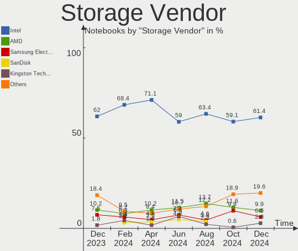
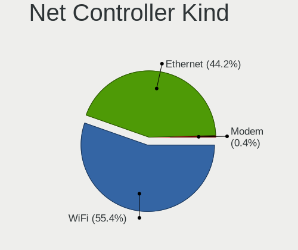
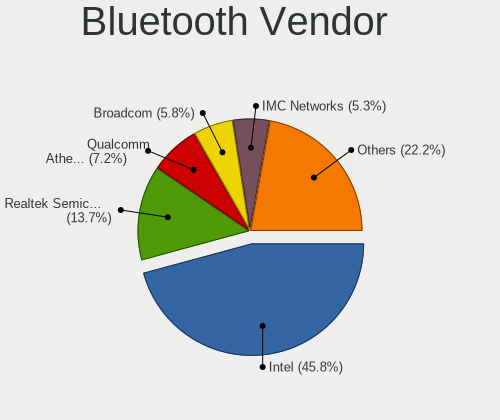
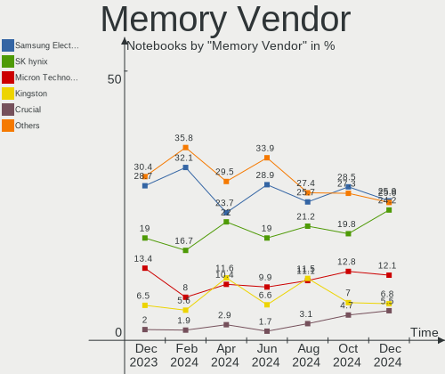
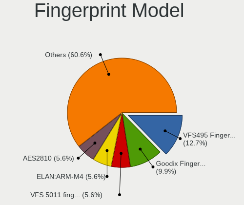
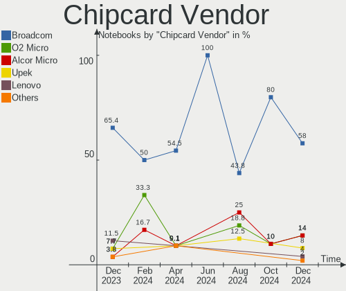

OpenMandriva - Hardware Trends (Notebooks)
------------------------------------------

A project to identify most popular hardware characteristics and track their change
over time based on data collected by Linux users at https://Linux-Hardware.org.

Anyone can contribute to this report by the [hw-probe](https://github.com/linuxhw/hw-probe) tool:

    sudo -E hw-probe -all -upload

This report is for one last month. Overall report since the beginning of time: [TestDays](https://github.com/linuxhw/TestDays)

Period: Mar, 2023.

Contents
--------

* [ System ](#system)
  - [ OS                       ](#os)
  - [ OS Family                ](#os-family)
  - [ Kernel                   ](#kernel)
  - [ Kernel Family            ](#kernel-family)
  - [ Kernel Major Ver.        ](#kernel-major-ver)
  - [ Arch                     ](#arch)
  - [ DE                       ](#de)
  - [ Display Server           ](#display-server)
  - [ Display Manager          ](#display-manager)
  - [ OS Lang                  ](#os-lang)
  - [ Boot Mode                ](#boot-mode)
  - [ Filesystem               ](#filesystem)
  - [ Part. scheme             ](#part-scheme)
  - [ Dual Boot with Linux/BSD ](#dual-boot-with-linuxbsd)
  - [ Dual Boot (Win)          ](#dual-boot-win)

* [ Board ](#board)
  - [ Vendor                   ](#vendor)
  - [ Model                    ](#model)
  - [ Model Family             ](#model-family)
  - [ MFG Year                 ](#mfg-year)
  - [ Form Factor              ](#form-factor)
  - [ Secure Boot              ](#secure-boot)
  - [ Coreboot                 ](#coreboot)
  - [ RAM Size                 ](#ram-size)
  - [ RAM Used                 ](#ram-used)
  - [ Total Drives             ](#total-drives)
  - [ Has CD-ROM               ](#has-cd-rom)
  - [ Has Ethernet             ](#has-ethernet)
  - [ Has WiFi                 ](#has-wifi)
  - [ Has Bluetooth            ](#has-bluetooth)

* [ Location ](#location)
  - [ Country                  ](#country)
  - [ City                     ](#city)

* [ Drives ](#drives)
  - [ Drive Vendor             ](#drive-vendor)
  - [ Drive Model              ](#drive-model)
  - [ HDD Vendor               ](#hdd-vendor)
  - [ SSD Vendor               ](#ssd-vendor)
  - [ Drive Kind               ](#drive-kind)
  - [ Drive Connector          ](#drive-connector)
  - [ Drive Size               ](#drive-size)
  - [ Space Total              ](#space-total)
  - [ Space Used               ](#space-used)
  - [ Malfunc. Drives          ](#malfunc-drives)
  - [ Malfunc. Drive Vendor    ](#malfunc-drive-vendor)
  - [ Malfunc. HDD Vendor      ](#malfunc-hdd-vendor)
  - [ Malfunc. Drive Kind      ](#malfunc-drive-kind)
  - [ Failed Drives            ](#failed-drives)
  - [ Failed Drive Vendor      ](#failed-drive-vendor)
  - [ Drive Status             ](#drive-status)

* [ Storage controller ](#storage-controller)
  - [ Storage Vendor           ](#storage-vendor)
  - [ Storage Model            ](#storage-model)
  - [ Storage Kind             ](#storage-kind)

* [ Processor ](#processor)
  - [ CPU Vendor               ](#cpu-vendor)
  - [ CPU Model                ](#cpu-model)
  - [ CPU Model Family         ](#cpu-model-family)
  - [ CPU Cores                ](#cpu-cores)
  - [ CPU Sockets              ](#cpu-sockets)
  - [ CPU Threads              ](#cpu-threads)
  - [ CPU Op-Modes             ](#cpu-op-modes)
  - [ CPU Microcode            ](#cpu-microcode)
  - [ CPU Microarch            ](#cpu-microarch)

* [ Graphics ](#graphics)
  - [ GPU Vendor               ](#gpu-vendor)
  - [ GPU Model                ](#gpu-model)
  - [ GPU Combo                ](#gpu-combo)
  - [ GPU Driver               ](#gpu-driver)
  - [ GPU Memory               ](#gpu-memory)

* [ Monitor ](#monitor)
  - [ Monitor Vendor           ](#monitor-vendor)
  - [ Monitor Model            ](#monitor-model)
  - [ Monitor Resolution       ](#monitor-resolution)
  - [ Monitor Diagonal         ](#monitor-diagonal)
  - [ Monitor Width            ](#monitor-width)
  - [ Aspect Ratio             ](#aspect-ratio)
  - [ Monitor Area             ](#monitor-area)
  - [ Pixel Density            ](#pixel-density)
  - [ Multiple Monitors        ](#multiple-monitors)

* [ Network ](#network)
  - [ Net Controller Vendor    ](#net-controller-vendor)
  - [ Net Controller Model     ](#net-controller-model)
  - [ Wireless Vendor          ](#wireless-vendor)
  - [ Wireless Model           ](#wireless-model)
  - [ Ethernet Vendor          ](#ethernet-vendor)
  - [ Ethernet Model           ](#ethernet-model)
  - [ Net Controller Kind      ](#net-controller-kind)
  - [ Used Controller          ](#used-controller)
  - [ NICs                     ](#nics)
  - [ IPv6                     ](#ipv6)

* [ Bluetooth ](#bluetooth)
  - [ Bluetooth Vendor         ](#bluetooth-vendor)
  - [ Bluetooth Model          ](#bluetooth-model)

* [ Sound ](#sound)
  - [ Sound Vendor             ](#sound-vendor)
  - [ Sound Model              ](#sound-model)

* [ Memory ](#memory)
  - [ Memory Vendor            ](#memory-vendor)
  - [ Memory Model             ](#memory-model)
  - [ Memory Kind              ](#memory-kind)
  - [ Memory Form Factor       ](#memory-form-factor)
  - [ Memory Size              ](#memory-size)
  - [ Memory Speed             ](#memory-speed)

* [ Printers & scanners ](#printers--scanners)
  - [ Printer Vendor           ](#printer-vendor)
  - [ Printer Model            ](#printer-model)
  - [ Scanner Vendor           ](#scanner-vendor)
  - [ Scanner Model            ](#scanner-model)

* [ Camera ](#camera)
  - [ Camera Vendor            ](#camera-vendor)
  - [ Camera Model             ](#camera-model)

* [ Security ](#security)
  - [ Fingerprint Vendor       ](#fingerprint-vendor)
  - [ Fingerprint Model        ](#fingerprint-model)
  - [ Chipcard Vendor          ](#chipcard-vendor)
  - [ Chipcard Model           ](#chipcard-model)

* [ Unsupported ](#unsupported)
  - [ Unsupported Devices      ](#unsupported-devices)
  - [ Unsupported Device Types ](#unsupported-device-types)

System
------

OS
--

Installed operating systems

| Name               | Notebooks | Percent |
|--------------------|-----------|---------|
| OpenMandriva 23.03 | 168       | 44.68%  |
| OpenMandriva 23.01 | 142       | 37.77%  |
| OpenMandriva 4.3   | 43        | 11.44%  |
| OpenMandriva 4.2   | 13        | 3.46%   |
| OpenMandriva 23.90 | 7         | 1.86%   |
| OpenMandriva 4.90  | 2         | 0.53%   |
| OpenMandriva 4.50  | 1         | 0.27%   |

OS Family
---------

OS without a version

| Name         | Notebooks | Percent |
|--------------|-----------|---------|
| OpenMandriva | 376       | 100%    |

Kernel
------

Version of the Linux kernel

| Version                     | Notebooks | Percent |
|-----------------------------|-----------|---------|
| 6.2.6-desktop-1omv2390      | 141       | 37.5%   |
| 6.1.1-desktop-1omv2290      | 134       | 35.64%  |
| 5.16.7-desktop-1omv4003     | 25        | 6.65%   |
| 6.2.2-desktop-1omv2390      | 20        | 5.32%   |
| 5.16.13-desktop-1omv4003    | 20        | 5.32%   |
| 5.10.14-desktop-1omv4002    | 12        | 3.19%   |
| 6.1.4-desktop-1omv2301      | 9         | 2.39%   |
| 6.2.1-desktop-1omv2390      | 4         | 1.06%   |
| 6.2.7-desktop-1omv2390      | 3         | 0.8%    |
| 6.2.8-desktop-1omv2390      | 2         | 0.53%   |
| 6.2.0-server-0.rc3.1omv2390 | 1         | 0.27%   |
| 6.0.8-desktop-2omv22090     | 1         | 0.27%   |
| 5.19.12-desktop-2omv4090    | 1         | 0.27%   |
| 5.19.0-desktop-1omv4090     | 1         | 0.27%   |
| 5.18.12-desktop-3omv4090    | 1         | 0.27%   |
| 5.11.12-desktop-1omv4002    | 1         | 0.27%   |

Kernel Family
-------------

Linux kernel without a distro release

| Version | Notebooks | Percent |
|---------|-----------|---------|
| 6.2.6   | 141       | 37.5%   |
| 6.1.1   | 134       | 35.64%  |
| 5.16.7  | 25        | 6.65%   |
| 6.2.2   | 20        | 5.32%   |
| 5.16.13 | 20        | 5.32%   |
| 5.10.14 | 12        | 3.19%   |
| 6.1.4   | 9         | 2.39%   |
| 6.2.1   | 4         | 1.06%   |
| 6.2.7   | 3         | 0.8%    |
| 6.2.8   | 2         | 0.53%   |
| 6.2.0   | 1         | 0.27%   |
| 6.0.8   | 1         | 0.27%   |
| 5.19.12 | 1         | 0.27%   |
| 5.19.0  | 1         | 0.27%   |
| 5.18.12 | 1         | 0.27%   |
| 5.11.12 | 1         | 0.27%   |

Kernel Major Ver.
-----------------

Linux kernel major version

| Version | Notebooks | Percent |
|---------|-----------|---------|
| 6.2     | 171       | 45.48%  |
| 6.1     | 143       | 38.03%  |
| 5.16    | 45        | 11.97%  |
| 5.10    | 12        | 3.19%   |
| 5.19    | 2         | 0.53%   |
| 6.0     | 1         | 0.27%   |
| 5.18    | 1         | 0.27%   |
| 5.11    | 1         | 0.27%   |

Arch
----

OS architecture (x86_64, i586, etc.)

| Name   | Notebooks | Percent |
|--------|-----------|---------|
| x86_64 | 376       | 100%    |

DE
--

Desktop Environment

| Name     | Notebooks | Percent |
|----------|-----------|---------|
| KDE5     | 329       | 87.5%   |
| GNOME    | 29        | 7.71%   |
| LXQt     | 12        | 3.19%   |
| Cinnamon | 3         | 0.8%    |
| Unknown  | 2         | 0.53%   |
| Budgie   | 1         | 0.27%   |

Display Server
--------------

X11 or Wayland

| Name    | Notebooks | Percent |
|---------|-----------|---------|
| X11     | 348       | 92.55%  |
| Wayland | 28        | 7.45%   |

Display Manager
---------------

SDDM, LightDM, etc.

| Name | Notebooks | Percent |
|------|-----------|---------|
| SDDM | 346       | 92.02%  |
| GDM  | 30        | 7.98%   |

OS Lang
-------

Language

| Lang  | Notebooks | Percent |
|-------|-----------|---------|
| en_US | 158       | 42.02%  |
| de_DE | 35        | 9.31%   |
| fr_FR | 34        | 9.04%   |
| pl_PL | 24        | 6.38%   |
| ru_RU | 21        | 5.59%   |
| en_GB | 17        | 4.52%   |
| it_IT | 16        | 4.26%   |
| pt_BR | 15        | 3.99%   |
| es_MX | 9         | 2.39%   |
| es_ES | 6         | 1.6%    |
| en_CA | 5         | 1.33%   |
| nl_NL | 3         | 0.8%    |
| nl_BE | 3         | 0.8%    |
| en_IN | 3         | 0.8%    |
| cs_CZ | 3         | 0.8%    |
| tr_TR | 2         | 0.53%   |
| nb_NO | 2         | 0.53%   |
| hu_HU | 2         | 0.53%   |
| es_PE | 2         | 0.53%   |
| es_AR | 2         | 0.53%   |
| en_AU | 2         | 0.53%   |
| de_AT | 2         | 0.53%   |
| pt_PT | 1         | 0.27%   |
| lt_LT | 1         | 0.27%   |
| fr_CH | 1         | 0.27%   |
| fr_CA | 1         | 0.27%   |
| en_ZA | 1         | 0.27%   |
| en_NZ | 1         | 0.27%   |
| en_DK | 1         | 0.27%   |
| en_AG | 1         | 0.27%   |
| da_DK | 1         | 0.27%   |
| ca_ES | 1         | 0.27%   |

Boot Mode
---------

EFI or BIOS

| Mode | Notebooks | Percent |
|------|-----------|---------|
| EFI  | 215       | 57.18%  |
| BIOS | 161       | 42.82%  |

Filesystem
----------

Type of filesystem

| Type    | Notebooks | Percent |
|---------|-----------|---------|
| Ext4    | 196       | 52.13%  |
| Overlay | 159       | 42.29%  |
| Btrfs   | 15        | 3.99%   |
| F2fs    | 4         | 1.06%   |
| Xfs     | 2         | 0.53%   |

Part. scheme
------------

Scheme of partitioning

| Type    | Notebooks | Percent |
|---------|-----------|---------|
| GPT     | 293       | 77.93%  |
| MBR     | 81        | 21.54%  |
| Unknown | 2         | 0.53%   |

Dual Boot with Linux/BSD
------------------------

Hosting more than one Linux/BSD

| Dual boot | Notebooks | Percent |
|-----------|-----------|---------|
| No        | 217       | 57.71%  |
| Yes       | 159       | 42.29%  |

Dual Boot (Win)
---------------

Hosting Linux and Windows

| Dual boot | Notebooks | Percent |
|-----------|-----------|---------|
| No        | 237       | 63.03%  |
| Yes       | 139       | 36.97%  |

Board
-----

Vendor
------

Motherboard manufacturer

| Name                | Notebooks | Percent |
|---------------------|-----------|---------|
| Lenovo              | 78        | 20.74%  |
| Hewlett-Packard     | 57        | 15.16%  |
| Dell                | 56        | 14.89%  |
| Acer                | 54        | 14.36%  |
| ASUSTek Computer    | 38        | 10.11%  |
| Toshiba             | 18        | 4.79%   |
| Samsung Electronics | 8         | 2.13%   |
| Fujitsu             | 7         | 1.86%   |
| Sony                | 6         | 1.6%    |
| Notebook            | 6         | 1.6%    |
| MSI                 | 5         | 1.33%   |
| Fujitsu Siemens     | 4         | 1.06%   |
| Apple               | 4         | 1.06%   |
| TUXEDO              | 3         | 0.8%    |
| Kiano               | 3         | 0.8%    |
| Medion              | 2         | 0.53%   |
| Intel               | 2         | 0.53%   |
| HUAWEI              | 2         | 0.53%   |
| HONOR               | 2         | 0.53%   |
| GPU Company         | 2         | 0.53%   |
| Gigabyte Technology | 2         | 0.53%   |
| Chuwi               | 2         | 0.53%   |
| Unknown             | 2         | 0.53%   |
| Venom               | 1         | 0.27%   |
| TEKNOSERVICE        | 1         | 0.27%   |
| Star Labs           | 1         | 0.27%   |
| Quanta              | 1         | 0.27%   |
| Positivo            | 1         | 0.27%   |
| PC Specialist       | 1         | 0.27%   |
| Packard Bell        | 1         | 0.27%   |
| Microtech           | 1         | 0.27%   |
| METAPHYUNI          | 1         | 0.27%   |
| Google              | 1         | 0.27%   |
| Framework           | 1         | 0.27%   |
| Compaq              | 1         | 0.27%   |
| AZW                 | 1         | 0.27%   |

Model
-----

Motherboard model

| Name                                  | Notebooks | Percent |
|---------------------------------------|-----------|---------|
| Lenovo IdeaPad 3 15ALC6 82KU          | 4         | 1.06%   |
| Dell Latitude 7490                    | 4         | 1.06%   |
| Unknown                               | 4         | 1.06%   |
| Kiano Elegance 14.2                   | 3         | 0.8%    |
| HP Pavilion Notebook                  | 3         | 0.8%    |
| HP Pavilion dv6                       | 3         | 0.8%    |
| HP Compaq Presario CQ60               | 3         | 0.8%    |
| Dell Latitude E6430                   | 3         | 0.8%    |
| Dell Inspiron 15-3567                 | 3         | 0.8%    |
| ASUS UX31E                            | 3         | 0.8%    |
| TUXEDO InfinityBook Pro Gen7 (MK1)    | 2         | 0.53%   |
| Toshiba Satellite L655                | 2         | 0.53%   |
| Sony VPCEH1S1E                        | 2         | 0.53%   |
| Lenovo Yoga Slim 7 Pro 14ACH5 OD 82NK | 2         | 0.53%   |
| Lenovo ThinkPad P1 Gen 4i 20Y3001LUK  | 2         | 0.53%   |
| Lenovo IdeaPad S145-15API 81UT        | 2         | 0.53%   |
| Lenovo IdeaPad 3 15ITL6 82H8          | 2         | 0.53%   |
| Lenovo G570 20079                     | 2         | 0.53%   |
| HUAWEI KPL-W0X                        | 2         | 0.53%   |
| HP Pavilion g6                        | 2         | 0.53%   |
| HP Pavilion Aero Laptop 13-be0xxx     | 2         | 0.53%   |
| HP Notebook                           | 2         | 0.53%   |
| HP EliteBook 840 G3                   | 2         | 0.53%   |
| HP 250 G6 Notebook PC                 | 2         | 0.53%   |
| GPU Company GWTN156-11                | 2         | 0.53%   |
| Fujitsu LIFEBOOK E556                 | 2         | 0.53%   |
| Fujitsu LIFEBOOK AH530                | 2         | 0.53%   |
| Dell Latitude E7440                   | 2         | 0.53%   |
| Dell Latitude E5570                   | 2         | 0.53%   |
| Dell Latitude E5500                   | 2         | 0.53%   |
| Dell Inspiron 1545                    | 2         | 0.53%   |
| ASUS VivoBook_ASUSLaptop X513UA       | 2         | 0.53%   |
| ASUS K72Jr                            | 2         | 0.53%   |
| ASUS K53SJ                            | 2         | 0.53%   |
| Acer Predator PH517-61                | 2         | 0.53%   |
| Acer Aspire V3-571G                   | 2         | 0.53%   |
| Acer Aspire ES1-523                   | 2         | 0.53%   |
| Venom BlackBook Zero 14(L133)         | 1         | 0.27%   |
| TUXEDO Pulse 14 Gen1                  | 1         | 0.27%   |
| Toshiba T20                           | 1         | 0.27%   |

Model Family
------------

Motherboard model prefix

| Name                   | Notebooks | Percent |
|------------------------|-----------|---------|
| Acer Aspire            | 42        | 11.17%  |
| Lenovo IdeaPad         | 28        | 7.45%   |
| Lenovo ThinkPad        | 27        | 7.18%   |
| Dell Latitude          | 23        | 6.12%   |
| HP Pavilion            | 17        | 4.52%   |
| Dell Inspiron          | 17        | 4.52%   |
| Toshiba Satellite      | 13        | 3.46%   |
| HP Laptop              | 8         | 2.13%   |
| ASUS VivoBook          | 8         | 2.13%   |
| HP EliteBook           | 7         | 1.86%   |
| Fujitsu LIFEBOOK       | 7         | 1.86%   |
| Lenovo Yoga            | 6         | 1.6%    |
| HP Compaq              | 6         | 1.6%    |
| Dell Precision         | 6         | 1.6%    |
| HP 250                 | 4         | 1.06%   |
| Dell XPS               | 4         | 1.06%   |
| Acer TravelMate        | 4         | 1.06%   |
| Acer Predator          | 4         | 1.06%   |
| Unknown                | 4         | 1.06%   |
| Kiano Elegance         | 3         | 0.8%    |
| HP ProBook             | 3         | 0.8%    |
| HP ENVY                | 3         | 0.8%    |
| Dell Vostro            | 3         | 0.8%    |
| ASUS UX31E             | 3         | 0.8%    |
| TUXEDO InfinityBook    | 2         | 0.53%   |
| Toshiba dynabook       | 2         | 0.53%   |
| Sony VPCEH1S1E         | 2         | 0.53%   |
| Notebook NL40          | 2         | 0.53%   |
| Lenovo Legion          | 2         | 0.53%   |
| Lenovo G570            | 2         | 0.53%   |
| HUAWEI KPL-W0X         | 2         | 0.53%   |
| HP Notebook            | 2         | 0.53%   |
| GPU Company GWTN156-11 | 2         | 0.53%   |
| Fujitsu Siemens AMILO  | 2         | 0.53%   |
| Dell Studio            | 2         | 0.53%   |
| ASUS TUF               | 2         | 0.53%   |
| ASUS K72Jr             | 2         | 0.53%   |
| ASUS K53SJ             | 2         | 0.53%   |
| Acer Extensa           | 2         | 0.53%   |
| Venom BlackBook        | 1         | 0.27%   |

MFG Year
--------

Motherboard manufacture year

| Year | Notebooks | Percent |
|------|-----------|---------|
| 2011 | 39        | 10.37%  |
| 2021 | 36        | 9.57%   |
| 2015 | 30        | 7.98%   |
| 2012 | 28        | 7.45%   |
| 2019 | 27        | 7.18%   |
| 2018 | 25        | 6.65%   |
| 2008 | 25        | 6.65%   |
| 2013 | 24        | 6.38%   |
| 2017 | 23        | 6.12%   |
| 2016 | 23        | 6.12%   |
| 2020 | 21        | 5.59%   |
| 2010 | 19        | 5.05%   |
| 2014 | 16        | 4.26%   |
| 2022 | 15        | 3.99%   |
| 2007 | 14        | 3.72%   |
| 2009 | 10        | 2.66%   |
| 2004 | 1         | 0.27%   |

Form Factor
-----------

Physical design of the computer

| Name     | Notebooks | Percent |
|----------|-----------|---------|
| Notebook | 376       | 100%    |

Secure Boot
-----------

Enabled or disabled

| State    | Notebooks | Percent |
|----------|-----------|---------|
| Disabled | 376       | 100%    |

Coreboot
--------

Have coreboot on board

| Used | Notebooks | Percent |
|------|-----------|---------|
| No   | 375       | 99.73%  |
| Yes  | 1         | 0.27%   |

RAM Size
--------

Total RAM memory

| Size in GB  | Notebooks | Percent |
|-------------|-----------|---------|
| 4.01-8.0    | 114       | 30.32%  |
| 3.01-4.0    | 106       | 28.19%  |
| 8.01-16.0   | 60        | 15.96%  |
| 16.01-24.0  | 45        | 11.97%  |
| 32.01-64.0  | 20        | 5.32%   |
| 1.01-2.0    | 19        | 5.05%   |
| 24.01-32.0  | 5         | 1.33%   |
| 64.01-256.0 | 4         | 1.06%   |
| 2.01-3.0    | 3         | 0.8%    |

RAM Used
--------

Used RAM memory

| Used GB  | Notebooks | Percent |
|----------|-----------|---------|
| 1.01-2.0 | 257       | 68.35%  |
| 2.01-3.0 | 85        | 22.61%  |
| 3.01-4.0 | 17        | 4.52%   |
| 0.51-1.0 | 17        | 4.52%   |

Total Drives
------------

Number of drives on board

| Drives | Notebooks | Percent |
|--------|-----------|---------|
| 1      | 269       | 71.54%  |
| 2      | 91        | 24.2%   |
| 3      | 11        | 2.93%   |
| 0      | 3         | 0.8%    |
| 7      | 1         | 0.27%   |
| 4      | 1         | 0.27%   |

Has CD-ROM
----------

Has CD-ROM on board

| Presented | Notebooks | Percent |
|-----------|-----------|---------|
| No        | 210       | 55.85%  |
| Yes       | 166       | 44.15%  |

Has Ethernet
------------

Has Ethernet on board

| Presented | Notebooks | Percent |
|-----------|-----------|---------|
| Yes       | 311       | 82.71%  |
| No        | 65        | 17.29%  |

Has WiFi
--------

Has WiFi module

| Presented | Notebooks | Percent |
|-----------|-----------|---------|
| Yes       | 372       | 98.94%  |
| No        | 4         | 1.06%   |

Has Bluetooth
-------------

Has Bluetooth module

| Presented | Notebooks | Percent |
|-----------|-----------|---------|
| Yes       | 272       | 72.34%  |
| No        | 104       | 27.66%  |

Location
--------

Country
-------

Geographic location (country)

| Country             | Notebooks | Percent |
|---------------------|-----------|---------|
| Germany             | 46        | 12.23%  |
| USA                 | 39        | 10.37%  |
| France              | 37        | 9.84%   |
| Poland              | 28        | 7.45%   |
| Russia              | 27        | 7.18%   |
| Italy               | 22        | 5.85%   |
| Brazil              | 22        | 5.85%   |
| UK                  | 12        | 3.19%   |
| Spain               | 12        | 3.19%   |
| Finland             | 12        | 3.19%   |
| Canada              | 10        | 2.66%   |
| Mexico              | 9         | 2.39%   |
| Turkey              | 6         | 1.6%    |
| Netherlands         | 6         | 1.6%    |
| India               | 6         | 1.6%    |
| Czechia             | 6         | 1.6%    |
| Romania             | 5         | 1.33%   |
| Japan               | 5         | 1.33%   |
| Switzerland         | 4         | 1.06%   |
| Norway              | 4         | 1.06%   |
| Hungary             | 4         | 1.06%   |
| Belgium             | 4         | 1.06%   |
| Iran                | 3         | 0.8%    |
| Indonesia           | 3         | 0.8%    |
| Austria             | 3         | 0.8%    |
| Taiwan              | 2         | 0.53%   |
| Sweden              | 2         | 0.53%   |
| Slovakia            | 2         | 0.53%   |
| Portugal            | 2         | 0.53%   |
| Peru                | 2         | 0.53%   |
| New Zealand         | 2         | 0.53%   |
| Luxembourg          | 2         | 0.53%   |
| Denmark             | 2         | 0.53%   |
| Chile               | 2         | 0.53%   |
| Belarus             | 2         | 0.53%   |
| Australia           | 2         | 0.53%   |
| Argentina           | 2         | 0.53%   |
| Trinidad and Tobago | 1         | 0.27%   |
| South Africa        | 1         | 0.27%   |
| Slovenia            | 1         | 0.27%   |

City
----

Geographic location (city)

| City           | Notebooks | Percent |
|----------------|-----------|---------|
| Paris          | 11        | 2.93%   |
| Warsaw         | 10        | 2.66%   |
| Milan          | 5         | 1.33%   |
| Ufa            | 4         | 1.06%   |
| St Petersburg  | 4         | 1.06%   |
| Helsinki       | 4         | 1.06%   |
| Hamburg        | 4         | 1.06%   |
| Cologne        | 4         | 1.06%   |
| Tampere        | 3         | 0.8%    |
| Sao Paulo      | 3         | 0.8%    |
| Rome           | 3         | 0.8%    |
| Moscow         | 3         | 0.8%    |
| Milano         | 3         | 0.8%    |
| Krakow         | 3         | 0.8%    |
| Kettering      | 3         | 0.8%    |
| Granada        | 3         | 0.8%    |
| Bucharest      | 3         | 0.8%    |
| Bochum         | 3         | 0.8%    |
| Berlin         | 3         | 0.8%    |
| Zacatecas City | 2         | 0.53%   |
| Vienna         | 2         | 0.53%   |
| Tokyo          | 2         | 0.53%   |
| Tehran         | 2         | 0.53%   |
| Tauranga       | 2         | 0.53%   |
| Stuttgart      | 2         | 0.53%   |
| Slagelse       | 2         | 0.53%   |
| Seattle        | 2         | 0.53%   |
| Rio de Janeiro | 2         | 0.53%   |
| Reynosa        | 2         | 0.53%   |
| Płock         | 2         | 0.53%   |
| Prague         | 2         | 0.53%   |
| Oslo           | 2         | 0.53%   |
| Luxembourg     | 2         | 0.53%   |
| Lima           | 2         | 0.53%   |
| Krasnodar      | 2         | 0.53%   |
| Kielce         | 2         | 0.53%   |
| Jyväskylä    | 2         | 0.53%   |
| Istanbul       | 2         | 0.53%   |
| Geneva         | 2         | 0.53%   |
| Freeport       | 2         | 0.53%   |

Drives
------

Drive Vendor
------------

Hard drive vendors

| Vendor              | Notebooks | Drives | Percent |
|---------------------|-----------|--------|---------|
| WDC                 | 64        | 70     | 14.1%   |
| Samsung Electronics | 55        | 62     | 12.11%  |
| Seagate             | 51        | 54     | 11.23%  |
| Toshiba             | 33        | 33     | 7.27%   |
| SanDisk             | 29        | 30     | 6.39%   |
| Kingston            | 26        | 26     | 5.73%   |
| Crucial             | 23        | 23     | 5.07%   |
| Unknown             | 17        | 17     | 3.74%   |
| Hitachi             | 14        | 14     | 3.08%   |
| HGST                | 11        | 11     | 2.42%   |
| Micron Technology   | 9         | 9      | 1.98%   |
| Intel               | 9         | 9      | 1.98%   |
| A-DATA Technology   | 9         | 9      | 1.98%   |
| SK hynix            | 8         | 8      | 1.76%   |
| Intenso             | 7         | 7      | 1.54%   |
| Transcend           | 6         | 6      | 1.32%   |
| PNY                 | 6         | 6      | 1.32%   |
| GOODRAM             | 6         | 6      | 1.32%   |
| China               | 6         | 6      | 1.32%   |
| SPCC                | 4         | 4      | 0.88%   |
| JMicron Technology  | 4         | 4      | 0.88%   |
| Patriot             | 3         | 3      | 0.66%   |
| LITEON              | 3         | 3      | 0.66%   |
| Verbatim            | 2         | 2      | 0.44%   |
| SSSTC               | 2         | 2      | 0.44%   |
| Phison              | 2         | 2      | 0.44%   |
| Netac               | 2         | 2      | 0.44%   |
| LITEONIT            | 2         | 2      | 0.44%   |
| KIOXIA              | 2         | 2      | 0.44%   |
| Gigabyte Technology | 2         | 2      | 0.44%   |
| Fujitsu             | 2         | 2      | 0.44%   |
| Emtec               | 2         | 2      | 0.44%   |
| ASMT                | 2         | 2      | 0.44%   |
| Apple               | 2         | 3      | 0.44%   |
| Unknown             | 2         | 2      | 0.44%   |
| ZHITAI              | 1         | 1      | 0.22%   |
| XPG                 | 1         | 1      | 0.22%   |
| Wdstars             | 1         | 1      | 0.22%   |
| VISIPRO             | 1         | 1      | 0.22%   |
| USB                 | 1         | 1      | 0.22%   |

Drive Model
-----------

Hard drive models

| Model                                | Notebooks | Percent |
|--------------------------------------|-----------|---------|
| Kingston SA400S37240G 240GB SSD      | 9         | 1.92%   |
| Seagate ST1000LM035-1RK172 1TB       | 7         | 1.5%    |
| Seagate ST500LT012-1DG142 500GB      | 6         | 1.28%   |
| Seagate ST1000LM024 HN-M101MBB 1TB   | 6         | 1.28%   |
| Crucial CT480BX500SSD1 480GB         | 6         | 1.28%   |
| Toshiba MQ01ABD100 1TB               | 5         | 1.07%   |
| Seagate ST9500325AS 500GB            | 5         | 1.07%   |
| Toshiba MQ04ABF100 1TB               | 4         | 0.85%   |
| SanDisk NVMe SSD Drive 1TB           | 4         | 0.85%   |
| SanDisk DF4032  32GB                 | 4         | 0.85%   |
| Samsung SSD 850 EVO 500GB            | 4         | 0.85%   |
| Micron MTFDHBA512QFD 512GB           | 4         | 0.85%   |
| HGST HTS545050A7E680 500GB           | 4         | 0.85%   |
| WDC WDS120G2G0A-00JH30 120GB SSD     | 3         | 0.64%   |
| WDC WD3200BPVT-22JJ5T0 320GB         | 3         | 0.64%   |
| Transcend TS240GMTS420S 240GB SSD    | 3         | 0.64%   |
| Toshiba MQ01ABD075 752GB             | 3         | 0.64%   |
| SPCC Solid State Disk 256GB          | 3         | 0.64%   |
| SanDisk SSD U100 256GB               | 3         | 0.64%   |
| SanDisk SSD PLUS 1000GB              | 3         | 0.64%   |
| Samsung SSD 980 PRO 1TB              | 3         | 0.64%   |
| Samsung SSD 850 EVO 250GB            | 3         | 0.64%   |
| JMicron Tech 250GB                   | 3         | 0.64%   |
| Crucial CT1000MX500SSD1 1TB          | 3         | 0.64%   |
| A-DATA SU630 240GB SSD               | 3         | 0.64%   |
| WDC WDS500G2B0A-00SM50 500GB SSD     | 2         | 0.43%   |
| WDC WDS240G2G0A-00JH30 240GB SSD     | 2         | 0.43%   |
| WDC WDS120G2G0B-00EPW0 120GB SSD     | 2         | 0.43%   |
| WDC WDS100T2B0C-00PXH0 1TB           | 2         | 0.43%   |
| WDC WD3200BEKT-60V5T1 320GB          | 2         | 0.43%   |
| WDC WD10JPCX-24UE4T0 1TB             | 2         | 0.43%   |
| WDC PC SN530 SDBPNPZ-512G-1006 512GB | 2         | 0.43%   |
| WDC PC SN530 SDBPNPZ-1T00-1002 1TB   | 2         | 0.43%   |
| Unknown SD/MMC/MS PRO 64GB           | 2         | 0.43%   |
| Unknown MMC128  128GB                | 2         | 0.43%   |
| Toshiba MQ01ABF050 500GB             | 2         | 0.43%   |
| Toshiba MK5065GSX 500GB              | 2         | 0.43%   |
| Toshiba MK2555GSX 250GB              | 2         | 0.43%   |
| Seagate ST9250315AS 250GB            | 2         | 0.43%   |
| Seagate ST500LM012 HN-M500MBB 500GB  | 2         | 0.43%   |

HDD Vendor
----------

Hard disk drive vendors

| Vendor   | Notebooks | Drives | Percent |
|----------|-----------|--------|---------|
| Seagate  | 50        | 52     | 34.25%  |
| WDC      | 37        | 39     | 25.34%  |
| Toshiba  | 26        | 26     | 17.81%  |
| Hitachi  | 14        | 14     | 9.59%   |
| HGST     | 11        | 11     | 7.53%   |
| Unknown  | 2         | 2      | 1.37%   |
| Fujitsu  | 2         | 2      | 1.37%   |
| USB      | 1         | 1      | 0.68%   |
| SABRENT  | 1         | 1      | 0.68%   |
| HGST HTS | 1         | 1      | 0.68%   |
| ASMT     | 1         | 1      | 0.68%   |

SSD Vendor
----------

Solid state drive vendors

| Vendor              | Notebooks | Drives | Percent |
|---------------------|-----------|--------|---------|
| Samsung Electronics | 30        | 33     | 15.71%  |
| Kingston            | 22        | 22     | 11.52%  |
| SanDisk             | 18        | 18     | 9.42%   |
| Crucial             | 18        | 18     | 9.42%   |
| WDC                 | 10        | 10     | 5.24%   |
| A-DATA Technology   | 7         | 7      | 3.66%   |
| Transcend           | 6         | 6      | 3.14%   |
| Toshiba             | 6         | 6      | 3.14%   |
| Intenso             | 6         | 6      | 3.14%   |
| China               | 6         | 6      | 3.14%   |
| SK hynix            | 5         | 5      | 2.62%   |
| PNY                 | 5         | 5      | 2.62%   |
| GOODRAM             | 5         | 5      | 2.62%   |
| Intel               | 4         | 4      | 2.09%   |
| SPCC                | 3         | 3      | 1.57%   |
| Patriot             | 3         | 3      | 1.57%   |
| Micron Technology   | 3         | 3      | 1.57%   |
| LITEON              | 3         | 3      | 1.57%   |
| Verbatim            | 2         | 2      | 1.05%   |
| Seagate             | 2         | 2      | 1.05%   |
| Netac               | 2         | 2      | 1.05%   |
| LITEONIT            | 2         | 2      | 1.05%   |
| Emtec               | 2         | 2      | 1.05%   |
| Wdstars             | 1         | 1      | 0.52%   |
| VISIPRO             | 1         | 1      | 0.52%   |
| Star                | 1         | 1      | 0.52%   |
| SSSTC               | 1         | 1      | 0.52%   |
| Phison              | 1         | 1      | 0.52%   |
| OCZ                 | 1         | 1      | 0.52%   |
| Micron_1            | 1         | 1      | 0.52%   |
| Lite-On             | 1         | 1      | 0.52%   |
| LDLC                | 1         | 1      | 0.52%   |
| Kross Elegance      | 1         | 1      | 0.52%   |
| KingSpec            | 1         | 1      | 0.52%   |
| KingFast            | 1         | 1      | 0.52%   |
| JMicron Technology  | 1         | 1      | 0.52%   |
| HS-SSD-C100         | 1         | 1      | 0.52%   |
| Gigabyte Technology | 1         | 1      | 0.52%   |
| ASMT                | 1         | 1      | 0.52%   |
| ASENNO              | 1         | 1      | 0.52%   |

Drive Kind
----------

HDD or SSD

| Kind    | Notebooks | Drives | Percent |
|---------|-----------|--------|---------|
| SSD     | 179       | 194    | 41.53%  |
| HDD     | 140       | 150    | 32.48%  |
| NVMe    | 86        | 101    | 19.95%  |
| MMC     | 22        | 22     | 5.1%    |
| Unknown | 4         | 5      | 0.93%   |

Drive Connector
---------------

SATA, SAS, NVMe, etc.

| Type | Notebooks | Drives | Percent |
|------|-----------|--------|---------|
| SATA | 292       | 324    | 69.03%  |
| NVMe | 85        | 97     | 20.09%  |
| SAS  | 24        | 29     | 5.67%   |
| MMC  | 22        | 22     | 5.2%    |

Drive Size
----------

Size of hard drive

| Size in TB | Notebooks | Drives | Percent |
|------------|-----------|--------|---------|
| 0.01-0.5   | 235       | 251    | 72.98%  |
| 0.51-1.0   | 75        | 80     | 23.29%  |
| 1.01-2.0   | 9         | 10     | 2.8%    |
| 4.01-10.0  | 2         | 2      | 0.62%   |
| 3.01-4.0   | 1         | 1      | 0.31%   |

Space Total
-----------

Amount of disk space available on the file system

| Size in GB     | Notebooks | Percent |
|----------------|-----------|---------|
| 1-20           | 124       | 32.98%  |
| 101-250        | 90        | 23.94%  |
| 251-500        | 57        | 15.16%  |
| 501-1000       | 36        | 9.57%   |
| 51-100         | 27        | 7.18%   |
| 21-50          | 17        | 4.52%   |
| Unknown        | 10        | 2.66%   |
| 1001-2000      | 9         | 2.39%   |
| 2001-3000      | 4         | 1.06%   |
| More than 3000 | 2         | 0.53%   |

Space Used
----------

Amount of used disk space

| Used GB   | Notebooks | Percent |
|-----------|-----------|---------|
| 1-20      | 302       | 80.32%  |
| 21-50     | 21        | 5.59%   |
| 101-250   | 13        | 3.46%   |
| 251-500   | 12        | 3.19%   |
| 51-100    | 11        | 2.93%   |
| Unknown   | 10        | 2.66%   |
| 501-1000  | 5         | 1.33%   |
| 1001-2000 | 2         | 0.53%   |

Malfunc. Drives
---------------

Drive models with a malfunction

| Model                                   | Notebooks | Drives | Percent |
|-----------------------------------------|-----------|--------|---------|
| Seagate ST9500325AS 500GB               | 4         | 4      | 4.82%   |
| Seagate ST1000LM024 HN-M101MBB 1TB      | 4         | 4      | 4.82%   |
| Seagate ST500LT012-1DG142 500GB         | 3         | 3      | 3.61%   |
| Seagate ST1000LM035-1RK172 1TB          | 3         | 3      | 3.61%   |
| SanDisk SSD U100 256GB                  | 3         | 3      | 3.61%   |
| HGST HTS545050A7E680 500GB              | 3         | 3      | 3.61%   |
| WDC WD3200BPVT-22JJ5T0 320GB            | 2         | 2      | 2.41%   |
| Toshiba MQ01ABD075 752GB                | 2         | 2      | 2.41%   |
| Toshiba MK5065GSX 500GB                 | 2         | 2      | 2.41%   |
| Toshiba MK2555GSX 250GB                 | 2         | 2      | 2.41%   |
| Hitachi HTS723232A7A364 320GB           | 2         | 2      | 2.41%   |
| Hitachi HTS545050A7E380 500GB           | 2         | 2      | 2.41%   |
| HGST HTS721010A9E630 1TB                | 2         | 2      | 2.41%   |
| HGST HTS545050A7E380 500GB              | 2         | 2      | 2.41%   |
| WDC WD5000LPVX-22V0TT0 500GB            | 1         | 1      | 1.2%    |
| WDC WD2500BEVT-24A23T0 250GB            | 1         | 1      | 1.2%    |
| WDC WD2500BEVS-75UST0 250GB             | 1         | 1      | 1.2%    |
| WDC WD2500BEVS-60UST0 250GB             | 1         | 1      | 1.2%    |
| WDC WD2500BEKT-60PVMT0 250GB            | 1         | 1      | 1.2%    |
| WDC PC SN730 SDBPNTY-512G-1101 512GB    | 1         | 1      | 1.2%    |
| Toshiba MK1652GSX 160GB                 | 1         | 1      | 1.2%    |
| Toshiba MK1637GSX 160GB                 | 1         | 1      | 1.2%    |
| Toshiba MK1237GSX 120GB                 | 1         | 1      | 1.2%    |
| Toshiba KSG60ZMV512G M.2 2280 512GB SSD | 1         | 1      | 1.2%    |
| SSSTC CV8-8E128-HP 128GB SSD            | 1         | 1      | 1.2%    |
| SK hynix HFS256G32TNH-73A0A 256GB SSD   | 1         | 1      | 1.2%    |
| Seagate STT_FTM56GX25H 256GB SSD        | 1         | 1      | 1.2%    |
| Seagate ST980813AS 80GB                 | 1         | 1      | 1.2%    |
| Seagate ST9320325AS 320GB               | 1         | 1      | 1.2%    |
| Seagate ST9250827AS 250GB               | 1         | 1      | 1.2%    |
| Seagate ST9250320AS 250GB               | 1         | 1      | 1.2%    |
| Seagate ST9250315AS 250GB               | 1         | 1      | 1.2%    |
| Seagate ST750LM022 HN-M750MBB 752GB     | 1         | 1      | 1.2%    |
| Seagate ST500LM000-1EJ162 500GB         | 1         | 1      | 1.2%    |
| Seagate ST320LT007-9ZV142 320GB         | 1         | 1      | 1.2%    |
| Seagate ST250LT003-9YG14C 250GB         | 1         | 1      | 1.2%    |
| Seagate ST2000LX001-1RG174 2TB          | 1         | 1      | 1.2%    |
| Seagate ST1000LM014-1EJ164 1TB          | 1         | 1      | 1.2%    |
| SanDisk SD7UB3Q256G1001 256GB SSD       | 1         | 1      | 1.2%    |
| OCZ AGILITY3 120GB SSD                  | 1         | 1      | 1.2%    |

Malfunc. Drive Vendor
---------------------

Vendors of faulty drives

| Vendor            | Notebooks | Drives | Percent |
|-------------------|-----------|--------|---------|
| Seagate           | 26        | 26     | 31.33%  |
| Toshiba           | 10        | 10     | 12.05%  |
| WDC               | 8         | 8      | 9.64%   |
| Hitachi           | 8         | 8      | 9.64%   |
| HGST              | 8         | 8      | 9.64%   |
| SanDisk           | 4         | 4      | 4.82%   |
| Kingston          | 3         | 3      | 3.61%   |
| Netac             | 2         | 2      | 2.41%   |
| Intel             | 2         | 2      | 2.41%   |
| China             | 2         | 2      | 2.41%   |
| SSSTC             | 1         | 1      | 1.2%    |
| SK hynix          | 1         | 1      | 1.2%    |
| OCZ               | 1         | 1      | 1.2%    |
| Lite-On           | 1         | 1      | 1.2%    |
| Kross Elegance    | 1         | 1      | 1.2%    |
| KingSpec          | 1         | 1      | 1.2%    |
| Intenso           | 1         | 1      | 1.2%    |
| Fujitsu           | 1         | 1      | 1.2%    |
| Crucial           | 1         | 1      | 1.2%    |
| A-DATA Technology | 1         | 1      | 1.2%    |

Malfunc. HDD Vendor
-------------------

Vendors of faulty HDD drives

| Vendor  | Notebooks | Drives | Percent |
|---------|-----------|--------|---------|
| Seagate | 25        | 25     | 43.1%   |
| Toshiba | 9         | 9      | 15.52%  |
| Hitachi | 8         | 8      | 13.79%  |
| HGST    | 8         | 8      | 13.79%  |
| WDC     | 7         | 7      | 12.07%  |
| Fujitsu | 1         | 1      | 1.72%   |

Malfunc. Drive Kind
-------------------

Kinds of faulty drives

| Kind | Notebooks | Drives | Percent |
|------|-----------|--------|---------|
| HDD  | 58        | 58     | 69.88%  |
| SSD  | 24        | 24     | 28.92%  |
| NVMe | 1         | 1      | 1.2%    |

Failed Drives
-------------

Failed drive models

| Model                         | Notebooks | Drives | Percent |
|-------------------------------|-----------|--------|---------|
| Hitachi HTS545016B9A300 160GB | 1         | 1      | 100%    |

Failed Drive Vendor
-------------------

Failed drive vendors

| Vendor  | Notebooks | Drives | Percent |
|---------|-----------|--------|---------|
| Hitachi | 1         | 1      | 100%    |

Drive Status
------------

Number of failed and malfunc. drives

| Status   | Notebooks | Drives | Percent |
|----------|-----------|--------|---------|
| Works    | 289       | 332    | 68.48%  |
| Malfunc  | 83        | 83     | 19.67%  |
| Detected | 49        | 56     | 11.61%  |
| Failed   | 1         | 1      | 0.24%   |

Storage controller
------------------

Storage Vendor
--------------

Storage controller vendors

| Vendor                           | Notebooks | Percent |
|----------------------------------|-----------|---------|
| Intel                            | 282       | 65.43%  |
| AMD                              | 52        | 12.06%  |
| SanDisk                          | 28        | 6.5%    |
| Samsung Electronics              | 26        | 6.03%   |
| Micron Technology                | 6         | 1.39%   |
| Phison Electronics               | 5         | 1.16%   |
| Micron/Crucial Technology        | 5         | 1.16%   |
| Kingston Technology Company      | 5         | 1.16%   |
| SK hynix                         | 3         | 0.7%    |
| Nvidia                           | 3         | 0.7%    |
| ADATA Technology                 | 3         | 0.7%    |
| KIOXIA                           | 2         | 0.46%   |
| Yangtze Memory Technologies      | 1         | 0.23%   |
| Union Memory (Shenzhen)          | 1         | 0.23%   |
| Toshiba America Info Systems     | 1         | 0.23%   |
| Solid State Storage Technology   | 1         | 0.23%   |
| Silicon Motion                   | 1         | 0.23%   |
| Silicon Integrated Systems [SiS] | 1         | 0.23%   |
| Shenzhen Longsys Electronics     | 1         | 0.23%   |
| Realtek Semiconductor            | 1         | 0.23%   |
| JMicron Technology               | 1         | 0.23%   |
| ASMedia Technology               | 1         | 0.23%   |
| Apple                            | 1         | 0.23%   |

Storage Model
-------------

Storage controller models

| Model                                                                            | Notebooks | Percent |
|----------------------------------------------------------------------------------|-----------|---------|
| AMD FCH SATA Controller [AHCI mode]                                              | 49        | 10.56%  |
| Intel Sunrise Point-LP SATA Controller [AHCI mode]                               | 30        | 6.47%   |
| Intel 7 Series Chipset Family 6-port SATA Controller [AHCI mode]                 | 30        | 6.47%   |
| Intel 6 Series/C200 Series Chipset Family 6 port Mobile SATA AHCI Controller     | 29        | 6.25%   |
| Intel 82801 Mobile SATA Controller [RAID mode]                                   | 25        | 5.39%   |
| Intel 82801IBM/IEM (ICH9M/ICH9M-E) 4 port SATA Controller [AHCI mode]            | 24        | 5.17%   |
| Intel Wildcat Point-LP SATA Controller [AHCI Mode]                               | 16        | 3.45%   |
| Intel 5 Series/3400 Series Chipset 4 port SATA AHCI Controller                   | 15        | 3.23%   |
| Intel 82801HM/HEM (ICH8M/ICH8M-E) IDE Controller                                 | 14        | 3.02%   |
| Intel 82801HM/HEM (ICH8M/ICH8M-E) SATA Controller [AHCI mode]                    | 13        | 2.8%    |
| Intel Celeron N3350/Pentium N4200/Atom E3900 Series SATA AHCI Controller         | 10        | 2.16%   |
| Intel Atom/Celeron/Pentium Processor x5-E8000/J3xxx/N3xxx Series SATA Controller | 10        | 2.16%   |
| Intel 8 Series SATA Controller 1 [AHCI mode]                                     | 10        | 2.16%   |
| Samsung NVMe SSD Controller SM981/PM981/PM983                                    | 9         | 1.94%   |
| Samsung NVMe SSD Controller PM9A1/PM9A3/980PRO                                   | 9         | 1.94%   |
| Samsung NVMe SSD Controller 980                                                  | 9         | 1.94%   |
| Intel 8 Series/C220 Series Chipset Family 6-port SATA Controller 1 [AHCI mode]   | 8         | 1.72%   |
| SanDisk WD Blue SN550 NVMe SSD                                                   | 7         | 1.51%   |
| Intel Volume Management Device NVMe RAID Controller                              | 7         | 1.51%   |
| Intel HM170/QM170 Chipset SATA Controller [AHCI Mode]                            | 7         | 1.51%   |
| SanDisk WD Black SN750 / PC SN730 NVMe SSD                                       | 6         | 1.29%   |
| Micron NVMe Storage Controller                                                   | 6         | 1.29%   |
| Intel Celeron/Pentium Silver Processor SATA Controller                           | 6         | 1.29%   |
| Intel Comet Lake SATA AHCI Controller                                            | 5         | 1.08%   |
| Intel Cannon Point-LP SATA Controller [AHCI Mode]                                | 5         | 1.08%   |
| Intel 5 Series/3400 Series Chipset 6 port SATA AHCI Controller                   | 5         | 1.08%   |
| SanDisk NVMe Controller                                                          | 4         | 0.86%   |
| Micron/Crucial P2 NVMe PCIe SSD                                                  | 4         | 0.86%   |
| Intel Q170/Q150/B150/H170/H110/Z170/CM236 Chipset SATA Controller [AHCI Mode]    | 4         | 0.86%   |
| SanDisk WD PC SN810 / Black SN850 NVMe SSD                                       | 3         | 0.65%   |
| Kingston Company Company Non-Volatile memory controller                          | 3         | 0.65%   |
| Intel Tiger Lake-LP SATA Controller                                              | 3         | 0.65%   |
| Intel Atom Processor E3800 Series SATA AHCI Controller                           | 3         | 0.65%   |
| Intel 82801IBM/IEM (ICH9M/ICH9M-E) 2 port SATA Controller [IDE mode]             | 3         | 0.65%   |
| Intel 400 Series Chipset Family SATA AHCI Controller                             | 3         | 0.65%   |
| SanDisk WD Blue SN570 NVMe SSD 1TB                                               | 2         | 0.43%   |
| SanDisk WD Blue SN500 / PC SN520 NVMe SSD                                        | 2         | 0.43%   |
| SanDisk Non-Volatile memory controller                                           | 2         | 0.43%   |
| Phison E16 PCIe4 NVMe Controller                                                 | 2         | 0.43%   |
| Nvidia MCP78S [GeForce 8200] SATA Controller (non-AHCI mode)                     | 2         | 0.43%   |

Storage Kind
------------

Kind of storage controller (IDE, SATA, NVMe, SAS, ...)

| Kind | Notebooks | Percent |
|------|-----------|---------|
| SATA | 295       | 67.05%  |
| NVMe | 85        | 19.32%  |
| RAID | 33        | 7.5%    |
| IDE  | 27        | 6.14%   |

Processor
---------

CPU Vendor
----------

Processor vendors

| Vendor | Notebooks | Percent |
|--------|-----------|---------|
| Intel  | 307       | 81.65%  |
| AMD    | 69        | 18.35%  |

CPU Model
---------

Processor models

| Model                                         | Notebooks | Percent |
|-----------------------------------------------|-----------|---------|
| Intel Core i5-7200U CPU @ 2.50GHz             | 7         | 1.86%   |
| Intel Celeron CPU N3060 @ 1.60GHz             | 6         | 1.6%    |
| Intel Core i7-6700HQ CPU @ 2.60GHz            | 5         | 1.33%   |
| Intel Core i5-3230M CPU @ 2.60GHz             | 5         | 1.33%   |
| Intel Core i3-6006U CPU @ 2.00GHz             | 5         | 1.33%   |
| Intel Celeron CPU N3350 @ 1.10GHz             | 5         | 1.33%   |
| Intel Core i7-5500U CPU @ 2.40GHz             | 4         | 1.06%   |
| Intel Core i7-10750H CPU @ 2.60GHz            | 4         | 1.06%   |
| Intel Core i5-5300U CPU @ 2.30GHz             | 4         | 1.06%   |
| Intel Core i5-2520M CPU @ 2.50GHz             | 4         | 1.06%   |
| Intel Core i5-2430M CPU @ 2.40GHz             | 4         | 1.06%   |
| Intel Core i5-2410M CPU @ 2.30GHz             | 4         | 1.06%   |
| Intel Core i5 CPU M 520 @ 2.40GHz             | 4         | 1.06%   |
| Intel 12th Gen Core i7-12700H                 | 4         | 1.06%   |
| Intel 11th Gen Core i5-1135G7 @ 2.40GHz       | 4         | 1.06%   |
| Intel Pentium Dual-Core CPU T4500 @ 2.30GHz   | 3         | 0.8%    |
| Intel Pentium CPU N4200 @ 1.10GHz             | 3         | 0.8%    |
| Intel Pentium CPU N3710 @ 1.60GHz             | 3         | 0.8%    |
| Intel Core i7-8565U CPU @ 1.80GHz             | 3         | 0.8%    |
| Intel Core i7-8550U CPU @ 1.80GHz             | 3         | 0.8%    |
| Intel Core i7-7500U CPU @ 2.70GHz             | 3         | 0.8%    |
| Intel Core i7-6500U CPU @ 2.50GHz             | 3         | 0.8%    |
| Intel Core i7-5600U CPU @ 2.60GHz             | 3         | 0.8%    |
| Intel Core i7-4710HQ CPU @ 2.50GHz            | 3         | 0.8%    |
| Intel Core i7-2677M CPU @ 1.80GHz             | 3         | 0.8%    |
| Intel Core i7 CPU Q 720 @ 1.60GHz             | 3         | 0.8%    |
| Intel Core i5-8250U CPU @ 1.60GHz             | 3         | 0.8%    |
| Intel Core i5-4200M CPU @ 2.50GHz             | 3         | 0.8%    |
| Intel Core i5-3320M CPU @ 2.60GHz             | 3         | 0.8%    |
| Intel Core i5-3210M CPU @ 2.50GHz             | 3         | 0.8%    |
| Intel Core i3-3217U CPU @ 1.80GHz             | 3         | 0.8%    |
| Intel Core i3-2310M CPU @ 2.10GHz             | 3         | 0.8%    |
| Intel Core i3-10110U CPU @ 2.10GHz            | 3         | 0.8%    |
| Intel Core i3-1005G1 CPU @ 1.20GHz            | 3         | 0.8%    |
| Intel Core i3 CPU M 370 @ 2.40GHz             | 3         | 0.8%    |
| Intel Celeron N4020 CPU @ 1.10GHz             | 3         | 0.8%    |
| AMD Ryzen 7 5800U with Radeon Graphics        | 3         | 0.8%    |
| AMD Ryzen 7 5800H with Radeon Graphics        | 3         | 0.8%    |
| AMD Ryzen 7 5700U with Radeon Graphics        | 3         | 0.8%    |
| AMD Ryzen 5 2500U with Radeon Vega Mobile Gfx | 3         | 0.8%    |

CPU Model Family
----------------

Processor model prefix

| Model                   | Notebooks | Percent |
|-------------------------|-----------|---------|
| Intel Core i5           | 81        | 21.54%  |
| Intel Core i7           | 65        | 17.29%  |
| Intel Core i3           | 41        | 10.9%   |
| Intel Celeron           | 32        | 8.51%   |
| Other                   | 26        | 6.91%   |
| Intel Core 2 Duo        | 26        | 6.91%   |
| Intel Pentium           | 16        | 4.26%   |
| AMD Ryzen 7             | 16        | 4.26%   |
| AMD Ryzen 5             | 10        | 2.66%   |
| AMD Ryzen 3             | 8         | 2.13%   |
| Intel Pentium Dual-Core | 6         | 1.6%    |
| Intel Pentium Dual      | 4         | 1.06%   |
| Intel Celeron Dual-Core | 4         | 1.06%   |
| AMD E1                  | 4         | 1.06%   |
| AMD A10                 | 4         | 1.06%   |
| Intel Atom              | 3         | 0.8%    |
| AMD E2                  | 3         | 0.8%    |
| AMD A6                  | 3         | 0.8%    |
| AMD A4                  | 3         | 0.8%    |
| Intel Pentium Silver    | 2         | 0.53%   |
| Intel Genuine           | 2         | 0.53%   |
| AMD Ryzen 9             | 2         | 0.53%   |
| AMD Ryzen 7 PRO         | 2         | 0.53%   |
| AMD E                   | 2         | 0.53%   |
| AMD A8                  | 2         | 0.53%   |
| Intel Xeon              | 1         | 0.27%   |
| Intel Pentium Gold      | 1         | 0.27%   |
| Intel Core 2            | 1         | 0.27%   |
| AMD Turion 64 Mobile    | 1         | 0.27%   |
| AMD Sempron             | 1         | 0.27%   |
| AMD FX                  | 1         | 0.27%   |
| AMD C-60                | 1         | 0.27%   |
| AMD Athlon              | 1         | 0.27%   |
| AMD A12                 | 1         | 0.27%   |

CPU Cores
---------

Number of processor cores

| Number | Notebooks | Percent |
|--------|-----------|---------|
| 2      | 247       | 65.69%  |
| 4      | 88        | 23.4%   |
| 8      | 20        | 5.32%   |
| 6      | 9         | 2.39%   |
| 14     | 5         | 1.33%   |
| 1      | 4         | 1.06%   |
| 10     | 3         | 0.8%    |

CPU Sockets
-----------

Number of sockets

| Number | Notebooks | Percent |
|--------|-----------|---------|
| 1      | 376       | 100%    |

CPU Threads
-----------

Threads per core (Hyper-Threading)

| Number | Notebooks | Percent |
|--------|-----------|---------|
| 2      | 247       | 65.69%  |
| 1      | 128       | 34.04%  |
| 12     | 1         | 0.27%   |

CPU Op-Modes
------------

CPU Operation Modes (32-bit, 64-bit)

| Op mode        | Notebooks | Percent |
|----------------|-----------|---------|
| 32-bit, 64-bit | 376       | 100%    |

CPU Microcode
-------------

Microcode number

| Number     | Notebooks | Percent |
|------------|-----------|---------|
| Unknown    | 150       | 39.89%  |
| 0x206a7    | 21        | 5.59%   |
| 0x1067a    | 15        | 3.99%   |
| 0x306a9    | 12        | 3.19%   |
| 0x40651    | 9         | 2.39%   |
| 0x6fd      | 8         | 2.13%   |
| 0x806ea    | 7         | 1.86%   |
| 0x406e3    | 7         | 1.86%   |
| 0x306d4    | 7         | 1.86%   |
| 0x306c3    | 7         | 1.86%   |
| 0x20655    | 7         | 1.86%   |
| 0x08608103 | 7         | 1.86%   |
| 0x806e9    | 6         | 1.6%    |
| 0x506c9    | 6         | 1.6%    |
| 0x406c4    | 6         | 1.6%    |
| 0x0a50000c | 6         | 1.6%    |
| 0x806ec    | 5         | 1.33%   |
| 0x20652    | 5         | 1.33%   |
| 0x08108109 | 5         | 1.33%   |
| 0x10676    | 4         | 1.06%   |
| 0x08108102 | 4         | 1.06%   |
| 0x07030105 | 4         | 1.06%   |
| 0x806c1    | 3         | 0.8%    |
| 0x506e3    | 3         | 0.8%    |
| 0x106e5    | 3         | 0.8%    |
| 0x08101007 | 3         | 0.8%    |
| 0x06006705 | 3         | 0.8%    |
| 0x0500010d | 3         | 0.8%    |
| 0x03000027 | 3         | 0.8%    |
| 0xa0652    | 2         | 0.53%   |
| 0x906a3    | 2         | 0.53%   |
| 0x406c3    | 2         | 0.53%   |
| 0x30678    | 2         | 0.53%   |
| 0x0a50000d | 2         | 0.53%   |
| 0x08600106 | 2         | 0.53%   |
| 0x08200103 | 2         | 0.53%   |
| 0x08008206 | 2         | 0.53%   |
| 0x0700010b | 2         | 0.53%   |
| 0x06006704 | 2         | 0.53%   |
| 0x0600611a | 2         | 0.53%   |

CPU Microarch
-------------

Microarchitecture

| Name             | Notebooks | Percent |
|------------------|-----------|---------|
| KabyLake         | 46        | 12.23%  |
| SandyBridge      | 39        | 10.37%  |
| Penryn           | 28        | 7.45%   |
| IvyBridge        | 28        | 7.45%   |
| Skylake          | 22        | 5.85%   |
| Westmere         | 20        | 5.32%   |
| Haswell          | 20        | 5.32%   |
| Broadwell        | 20        | 5.32%   |
| Core             | 17        | 4.52%   |
| Silvermont       | 16        | 4.26%   |
| Zen+             | 12        | 3.19%   |
| TigerLake        | 11        | 2.93%   |
| Unknown          | 11        | 2.93%   |
| Goldmont         | 10        | 2.66%   |
| Zen 3            | 9         | 2.39%   |
| Excavator        | 9         | 2.39%   |
| Alderlake Hybrid | 8         | 2.13%   |
| Goldmont plus    | 7         | 1.86%   |
| Zen              | 6         | 1.6%    |
| IceLake          | 6         | 1.6%    |
| CometLake        | 5         | 1.33%   |
| Puma             | 4         | 1.06%   |
| K10 Llano        | 4         | 1.06%   |
| Bobcat           | 4         | 1.06%   |
| Zen 2            | 3         | 0.8%    |
| Nehalem          | 3         | 0.8%    |
| Jaguar           | 3         | 0.8%    |
| Piledriver       | 2         | 0.53%   |
| K8 & K10 hybrid  | 2         | 0.53%   |
| K8 Hammer        | 1         | 0.27%   |

Graphics
--------

GPU Vendor
----------

Vendors of graphics cards

| Vendor                           | Notebooks | Percent |
|----------------------------------|-----------|---------|
| Intel                            | 270       | 59.87%  |
| Nvidia                           | 90        | 19.96%  |
| AMD                              | 90        | 19.96%  |
| Silicon Integrated Systems [SiS] | 1         | 0.22%   |

GPU Model
---------

Graphics card models

| Model                                                                                    | Notebooks | Percent |
|------------------------------------------------------------------------------------------|-----------|---------|
| Intel 2nd Generation Core Processor Family Integrated Graphics Controller                | 30        | 6.4%    |
| Intel 3rd Gen Core processor Graphics Controller                                         | 26        | 5.54%   |
| Intel Mobile 4 Series Chipset Integrated Graphics Controller                             | 23        | 4.9%    |
| Intel HD Graphics 5500                                                                   | 18        | 3.84%   |
| Intel HD Graphics 620                                                                    | 13        | 2.77%   |
| Intel Atom/Celeron/Pentium Processor x5-E8000/J3xxx/N3xxx Integrated Graphics Controller | 13        | 2.77%   |
| Intel Skylake GT2 [HD Graphics 520]                                                      | 12        | 2.56%   |
| Intel Haswell-ULT Integrated Graphics Controller                                         | 12        | 2.56%   |
| AMD Picasso/Raven 2 [Radeon Vega Series / Radeon Vega Mobile Series]                     | 12        | 2.56%   |
| Intel Mobile GM965/GL960 Integrated Graphics Controller (secondary)                      | 11        | 2.35%   |
| Intel Mobile GM965/GL960 Integrated Graphics Controller (primary)                        | 11        | 2.35%   |
| Intel Core Processor Integrated Graphics Controller                                      | 11        | 2.35%   |
| Intel UHD Graphics 620                                                                   | 10        | 2.13%   |
| AMD Cezanne [Radeon Vega Series / Radeon Vega Mobile Series]                             | 9         | 1.92%   |
| Intel TigerLake-LP GT2 [Iris Xe Graphics]                                                | 8         | 1.71%   |
| AMD Lucienne                                                                             | 8         | 1.71%   |
| Nvidia GF117M [GeForce 610M/710M/810M/820M / GT 620M/625M/630M/720M]                     | 7         | 1.49%   |
| Intel HD Graphics 530                                                                    | 7         | 1.49%   |
| Intel CometLake-U GT2 [UHD Graphics]                                                     | 7         | 1.49%   |
| Intel 4th Gen Core Processor Integrated Graphics Controller                              | 7         | 1.49%   |
| Intel HD Graphics 500                                                                    | 6         | 1.28%   |
| AMD Park [Mobility Radeon HD 5430/5450/5470]                                             | 6         | 1.28%   |
| Intel WhiskeyLake-U GT2 [UHD Graphics 620]                                               | 5         | 1.07%   |
| Intel GeminiLake [UHD Graphics 600]                                                      | 5         | 1.07%   |
| Intel CometLake-H GT2 [UHD Graphics]                                                     | 5         | 1.07%   |
| Intel Alder Lake-P Integrated Graphics Controller                                        | 5         | 1.07%   |
| AMD Stoney [Radeon R2/R3/R4/R5 Graphics]                                                 | 5         | 1.07%   |
| Intel TigerLake-H GT1 [UHD Graphics]                                                     | 4         | 0.85%   |
| Intel Apollo Lake [HD Graphics 505]                                                      | 4         | 0.85%   |
| AMD Wani [Radeon R5/R6/R7 Graphics]                                                      | 4         | 0.85%   |
| AMD Raven Ridge [Radeon Vega Series / Radeon Vega Mobile Series]                         | 4         | 0.85%   |
| Nvidia TU106M [GeForce RTX 2060 Mobile]                                                  | 3         | 0.64%   |
| Nvidia GP107M [GeForce GTX 1050 Mobile]                                                  | 3         | 0.64%   |
| Nvidia GM108M [GeForce 940M]                                                             | 3         | 0.64%   |
| Nvidia GK208M [GeForce GT 740M]                                                          | 3         | 0.64%   |
| Intel Tiger Lake-LP GT2 [UHD Graphics G4]                                                | 3         | 0.64%   |
| Intel Iris Plus Graphics G1 (Ice Lake)                                                   | 3         | 0.64%   |
| Intel HD Graphics 630                                                                    | 3         | 0.64%   |
| Intel CoffeeLake-H GT2 [UHD Graphics 630]                                                | 3         | 0.64%   |
| Intel Atom Processor Z36xxx/Z37xxx Series Graphics & Display                             | 3         | 0.64%   |

GPU Combo
---------

Combinations of graphics cards

| Name           | Notebooks | Percent |
|----------------|-----------|---------|
| 1 x Intel      | 175       | 46.54%  |
| 1 x AMD        | 67        | 17.82%  |
| Intel + Nvidia | 59        | 15.69%  |
| 2 x Intel      | 27        | 7.18%   |
| 1 x Nvidia     | 24        | 6.38%   |
| Intel + AMD    | 9         | 2.39%   |
| 2 x AMD        | 7         | 1.86%   |
| AMD + Nvidia   | 7         | 1.86%   |
| 1 x SiS        | 1         | 0.27%   |

GPU Driver
----------

Free vs proprietary

| Driver      | Notebooks | Percent |
|-------------|-----------|---------|
| Free        | 370       | 98.4%   |
| Proprietary | 3         | 0.8%    |
| Unknown     | 3         | 0.8%    |

GPU Memory
----------

Total video memory

| Size in GB | Notebooks | Percent |
|------------|-----------|---------|
| Unknown    | 207       | 55.05%  |
| 0.01-0.5   | 53        | 14.1%   |
| 1.01-2.0   | 47        | 12.5%   |
| 0.51-1.0   | 36        | 9.57%   |
| 3.01-4.0   | 18        | 4.79%   |
| 5.01-6.0   | 8         | 2.13%   |
| 7.01-8.0   | 6         | 1.6%    |
| 2.01-3.0   | 1         | 0.27%   |

Monitor
-------

Monitor Vendor
--------------

Monitor vendors

| Vendor                  | Notebooks | Percent |
|-------------------------|-----------|---------|
| AU Optronics            | 88        | 23.04%  |
| LG Display              | 60        | 15.71%  |
| Chimei Innolux          | 57        | 14.92%  |
| BOE                     | 50        | 13.09%  |
| Samsung Electronics     | 49        | 12.83%  |
| Chi Mei Optoelectronics | 13        | 3.4%    |
| Sharp                   | 7         | 1.83%   |
| PANDA                   | 7         | 1.83%   |
| LG Philips              | 7         | 1.83%   |
| Lenovo                  | 7         | 1.83%   |
| CPT                     | 4         | 1.05%   |
| Apple                   | 4         | 1.05%   |
| Philips                 | 3         | 0.79%   |
| Goldstar                | 3         | 0.79%   |
| Eizo                    | 3         | 0.79%   |
| Dell                    | 3         | 0.79%   |
| ASUSTek Computer        | 2         | 0.52%   |
| AOC                     | 2         | 0.52%   |
| Xiaomi                  | 1         | 0.26%   |
| Unknown                 | 1         | 0.26%   |
| Toshiba                 | 1         | 0.26%   |
| Toppoly                 | 1         | 0.26%   |
| STA                     | 1         | 0.26%   |
| SKY                     | 1         | 0.26%   |
| Konka                   | 1         | 0.26%   |
| InfoVision              | 1         | 0.26%   |
| Iiyama                  | 1         | 0.26%   |
| Hewlett-Packard         | 1         | 0.26%   |
| Grundig                 | 1         | 0.26%   |
| Ancor Communications    | 1         | 0.26%   |
| Acer                    | 1         | 0.26%   |

Monitor Model
-------------

Monitor models

| Model                                                                    | Notebooks | Percent |
|--------------------------------------------------------------------------|-----------|---------|
| Chimei Innolux LCD Monitor CMN15F5 1920x1080 344x193mm 15.5-inch         | 5         | 1.31%   |
| Chimei Innolux LCD Monitor CMN15DC 1366x768 344x193mm 15.5-inch          | 5         | 1.31%   |
| BOE LCD Monitor BOE06DF 1920x1080 309x173mm 13.9-inch                    | 5         | 1.31%   |
| AU Optronics LCD Monitor AUO61ED 1920x1080 344x194mm 15.5-inch           | 5         | 1.31%   |
| Samsung Electronics LCD Monitor SEC544B 1600x900 310x174mm 14.0-inch     | 4         | 1.05%   |
| LG Display LCD Monitor LGD02DC 1366x768 344x194mm 15.5-inch              | 4         | 1.05%   |
| Chi Mei Optoelectronics LCD Monitor CMO15A7 1366x768 344x193mm 15.5-inch | 4         | 1.05%   |
| AU Optronics LCD Monitor AUO46EC 1366x768 344x193mm 15.5-inch            | 4         | 1.05%   |
| AU Optronics LCD Monitor AUO38ED 1920x1080 344x193mm 15.5-inch           | 4         | 1.05%   |
| AU Optronics LCD Monitor AUO26EC 1366x768 344x193mm 15.5-inch            | 4         | 1.05%   |
| Samsung Electronics LCD Monitor SEC3651 1366x768 344x194mm 15.5-inch     | 3         | 0.79%   |
| Samsung Electronics LCD Monitor SDC4152 2880x1800 302x189mm 14.0-inch    | 3         | 0.79%   |
| PANDA LM156LF1L03 NCP001C 1920x1080 344x194mm 15.5-inch                  | 3         | 0.79%   |
| LG Display LCD Monitor LGD04A7 1920x1080 344x194mm 15.5-inch             | 3         | 0.79%   |
| Eizo EV3285 ENC2979 3840x2160 698x393mm 31.5-inch                        | 3         | 0.79%   |
| CPT LCD Monitor COR17DB 1600x900 293x164mm 13.2-inch                     | 3         | 0.79%   |
| Chimei Innolux LCD Monitor CMN1738 1920x1080 381x214mm 17.2-inch         | 3         | 0.79%   |
| Chimei Innolux LCD Monitor CMN15DB 1366x768 344x193mm 15.5-inch          | 3         | 0.79%   |
| Chimei Innolux LCD Monitor CMN15D5 1920x1080 344x193mm 15.5-inch         | 3         | 0.79%   |
| Chimei Innolux LCD Monitor CMN14D6 1366x768 309x173mm 13.9-inch          | 3         | 0.79%   |
| Chi Mei Optoelectronics LCD Monitor CMO1592 1366x768 344x193mm 15.5-inch | 3         | 0.79%   |
| BOE LCD Monitor BOE0812 1920x1080 344x194mm 15.5-inch                    | 3         | 0.79%   |
| BOE LCD Monitor BOE0675 1366x768 344x194mm 15.5-inch                     | 3         | 0.79%   |
| AU Optronics LCD Monitor AUO81EC 1366x768 344x193mm 15.5-inch            | 3         | 0.79%   |
| Samsung Electronics LCD Monitor SEC5441 1366x768 344x194mm 15.5-inch     | 2         | 0.52%   |
| Samsung Electronics LCD Monitor SEC324A 1366x768 344x194mm 15.5-inch     | 2         | 0.52%   |
| Samsung Electronics LCD Monitor SDC4161 1920x1080 344x194mm 15.5-inch    | 2         | 0.52%   |
| LG Philips LP154WX4-TLAB LPL3D01 1280x800 331x207mm 15.4-inch            | 2         | 0.52%   |
| LG Display LP156WH1-TLA1 LGD6301 1366x768 344x194mm 15.5-inch            | 2         | 0.52%   |
| LG Display LCD Monitor LGD046D 1920x1080 309x174mm 14.0-inch             | 2         | 0.52%   |
| LG Display LCD Monitor LGD039F 1366x768 345x194mm 15.6-inch              | 2         | 0.52%   |
| LG Display LCD Monitor LGD0395 1366x768 344x194mm 15.5-inch              | 2         | 0.52%   |
| LG Display LCD Monitor LGD033A 1366x768 344x194mm 15.5-inch              | 2         | 0.52%   |
| Lenovo LCD Monitor LEN40B0 1366x768 344x194mm 15.5-inch                  | 2         | 0.52%   |
| Goldstar HDR 4K GSM7706 3840x2160 600x340mm 27.2-inch                    | 2         | 0.52%   |
| Chimei Innolux LCD Monitor CMN15CA 1366x768 344x193mm 15.5-inch          | 2         | 0.52%   |
| Chimei Innolux LCD Monitor CMN15C5 1366x768 344x193mm 15.5-inch          | 2         | 0.52%   |
| Chimei Innolux LCD Monitor CMN151E 1920x1080 344x193mm 15.5-inch         | 2         | 0.52%   |
| Chimei Innolux LCD Monitor CMN14D3 1920x1080 309x173mm 13.9-inch         | 2         | 0.52%   |
| Chi Mei Optoelectronics LCD Monitor CMO15A3 1366x768 344x193mm 15.5-inch | 2         | 0.52%   |

Monitor Resolution
------------------

Monitor screen resolution

| Resolution        | Notebooks | Percent |
|-------------------|-----------|---------|
| 1366x768 (WXGA)   | 155       | 41.01%  |
| 1920x1080 (FHD)   | 134       | 35.45%  |
| 1600x900 (HD+)    | 22        | 5.82%   |
| 1280x800 (WXGA)   | 20        | 5.29%   |
| 3840x2160 (4K)    | 11        | 2.91%   |
| 2560x1600         | 8         | 2.12%   |
| 1440x900 (WXGA+)  | 6         | 1.59%   |
| 2560x1440 (QHD)   | 5         | 1.32%   |
| 2880x1800         | 4         | 1.06%   |
| 3840x2400         | 3         | 0.79%   |
| 1920x1200 (WUXGA) | 2         | 0.53%   |
| 3456x2160         | 1         | 0.26%   |
| 2880x1920         | 1         | 0.26%   |
| 2560x1080         | 1         | 0.26%   |
| 2288x1287         | 1         | 0.26%   |
| 2256x1504         | 1         | 0.26%   |
| 1920x540          | 1         | 0.26%   |
| 1680x945          | 1         | 0.26%   |
| 1024x600          | 1         | 0.26%   |

Monitor Diagonal
----------------

Diagonal size in inches

| Inches | Notebooks | Percent |
|--------|-----------|---------|
| 15     | 191       | 50%     |
| 13     | 56        | 14.66%  |
| 14     | 40        | 10.47%  |
| 17     | 36        | 9.42%   |
| 27     | 11        | 2.88%   |
| 12     | 9         | 2.36%   |
| 16     | 7         | 1.83%   |
| 11     | 6         | 1.57%   |
| 18     | 4         | 1.05%   |
| 31     | 3         | 0.79%   |
| 24     | 3         | 0.79%   |
| 23     | 3         | 0.79%   |
| 21     | 2         | 0.52%   |
| 142    | 1         | 0.26%   |
| 84     | 1         | 0.26%   |
| 72     | 1         | 0.26%   |
| 65     | 1         | 0.26%   |
| 54     | 1         | 0.26%   |
| 52     | 1         | 0.26%   |
| 40     | 1         | 0.26%   |
| 34     | 1         | 0.26%   |
| 26     | 1         | 0.26%   |
| 19     | 1         | 0.26%   |
| 10     | 1         | 0.26%   |

Monitor Width
-------------

Physical width

| Width in mm    | Notebooks | Percent |
|----------------|-----------|---------|
| 301-350        | 267       | 70.08%  |
| 351-400        | 43        | 11.29%  |
| 201-300        | 37        | 9.71%   |
| 501-600        | 17        | 4.46%   |
| 401-500        | 6         | 1.57%   |
| 601-700        | 3         | 0.79%   |
| 1001-1500      | 3         | 0.79%   |
| 1501-2000      | 2         | 0.52%   |
| More than 2000 | 1         | 0.26%   |
| 801-900        | 1         | 0.26%   |
| 701-800        | 1         | 0.26%   |

Aspect Ratio
------------

Proportional relationship between the width and the height

| Ratio | Notebooks | Percent |
|-------|-----------|---------|
| 16/9  | 314       | 86.74%  |
| 16/10 | 45        | 12.43%  |
| 3/2   | 1         | 0.28%   |
| 21/9  | 1         | 0.28%   |
| 1.00  | 1         | 0.28%   |

Monitor Area
------------

Area in inch²

| Area in inch² | Notebooks | Percent |
|----------------|-----------|---------|
| 101-110        | 192       | 50.26%  |
| 81-90          | 79        | 20.68%  |
| 121-130        | 31        | 8.12%   |
| 71-80          | 16        | 4.19%   |
| 301-350        | 12        | 3.14%   |
| 61-70          | 9         | 2.36%   |
| 201-250        | 8         | 2.09%   |
| More than 1000 | 6         | 1.57%   |
| 51-60          | 6         | 1.57%   |
| 111-120        | 6         | 1.57%   |
| 131-140        | 5         | 1.31%   |
| 351-500        | 4         | 1.05%   |
| 141-150        | 4         | 1.05%   |
| 41-50          | 1         | 0.26%   |
| 151-200        | 1         | 0.26%   |
| 501-1000       | 1         | 0.26%   |
| 91-100         | 1         | 0.26%   |

Pixel Density
-------------

Pixels per inch

| Density       | Notebooks | Percent |
|---------------|-----------|---------|
| 101-120       | 152       | 40.32%  |
| 121-160       | 139       | 36.87%  |
| 51-100        | 50        | 13.26%  |
| 161-240       | 21        | 5.57%   |
| More than 240 | 10        | 2.65%   |
| 1-50          | 5         | 1.33%   |

Multiple Monitors
-----------------

Total monitors connected

| Total | Notebooks | Percent |
|-------|-----------|---------|
| 1     | 350       | 93.09%  |
| 2     | 22        | 5.85%   |
| 0     | 3         | 0.8%    |
| 3     | 1         | 0.27%   |

Network
-------

Net Controller Vendor
---------------------

Controller vendors

| Vendor                                | Notebooks | Percent |
|---------------------------------------|-----------|---------|
| Realtek Semiconductor                 | 197       | 33.45%  |
| Intel                                 | 188       | 31.92%  |
| Qualcomm Atheros                      | 113       | 19.19%  |
| Broadcom                              | 35        | 5.94%   |
| Broadcom Limited                      | 14        | 2.38%   |
| MediaTek                              | 5         | 0.85%   |
| Marvell Technology Group              | 5         | 0.85%   |
| Samsung Electronics                   | 3         | 0.51%   |
| Ralink                                | 3         | 0.51%   |
| NetGear                               | 3         | 0.51%   |
| Ericsson Business Mobile Networks     | 3         | 0.51%   |
| Dell                                  | 3         | 0.51%   |
| Xiaomi                                | 2         | 0.34%   |
| TP-Link                               | 2         | 0.34%   |
| Nvidia                                | 2         | 0.34%   |
| Huawei Technologies                   | 2         | 0.34%   |
| Spreadtrum Communications             | 1         | 0.17%   |
| Silicon Integrated Systems [SiS]      | 1         | 0.17%   |
| Qualcomm Atheros Communications       | 1         | 0.17%   |
| Qualcomm                              | 1         | 0.17%   |
| Motorola PCS                          | 1         | 0.17%   |
| ICS Advent                            | 1         | 0.17%   |
| Edimax Technology                     | 1         | 0.17%   |
| D-Link System                         | 1         | 0.17%   |
| 802.11g Adapter [Linksys WUSB54GC v3] | 1         | 0.17%   |

Net Controller Model
--------------------

Controller models

| Model                                                                   | Notebooks | Percent |
|-------------------------------------------------------------------------|-----------|---------|
| Realtek RTL8111/8168/8411 PCI Express Gigabit Ethernet Controller       | 115       | 16.31%  |
| Realtek RTL810xE PCI Express Fast Ethernet controller                   | 38        | 5.39%   |
| Qualcomm Atheros QCA9377 802.11ac Wireless Network Adapter              | 23        | 3.26%   |
| Qualcomm Atheros AR9285 Wireless Network Adapter (PCI-Express)          | 17        | 2.41%   |
| Intel Wireless 7265                                                     | 17        | 2.41%   |
| Qualcomm Atheros QCA9565 / AR9565 Wireless Network Adapter              | 16        | 2.27%   |
| Intel 82579LM Gigabit Network Connection (Lewisville)                   | 15        | 2.13%   |
| Qualcomm Atheros AR9485 Wireless Network Adapter                        | 14        | 1.99%   |
| Realtek RTL8153 Gigabit Ethernet Adapter                                | 13        | 1.84%   |
| Intel Wireless 7260                                                     | 13        | 1.84%   |
| Intel Wireless 8265 / 8275                                              | 11        | 1.56%   |
| Intel Wireless 3165                                                     | 11        | 1.56%   |
| Realtek RTL8821CE 802.11ac PCIe Wireless Network Adapter                | 10        | 1.42%   |
| Intel Wireless 8260                                                     | 10        | 1.42%   |
| Intel Dual Band Wireless-AC 3168NGW [Stone Peak]                        | 9         | 1.28%   |
| Intel Centrino Advanced-N 6205 [Taylor Peak]                            | 9         | 1.28%   |
| Broadcom BCM4313 802.11bgn Wireless Network Adapter                     | 9         | 1.28%   |
| Qualcomm Atheros QCA6174 802.11ac Wireless Network Adapter              | 8         | 1.13%   |
| Intel Wi-Fi 6 AX200                                                     | 8         | 1.13%   |
| Realtek RTL8822CE 802.11ac PCIe Wireless Network Adapter                | 7         | 0.99%   |
| Qualcomm Atheros AR8151 v2.0 Gigabit Ethernet                           | 7         | 0.99%   |
| Qualcomm Atheros AR242x / AR542x Wireless Network Adapter (PCI-Express) | 7         | 0.99%   |
| Intel Wireless 3160                                                     | 7         | 0.99%   |
| Intel WiFi Link 5100                                                    | 7         | 0.99%   |
| Intel PRO/Wireless 3945ABG [Golan] Network Connection                   | 7         | 0.99%   |
| Intel Ethernet Connection (3) I218-LM                                   | 7         | 0.99%   |
| Intel Alder Lake-P PCH CNVi WiFi                                        | 7         | 0.99%   |
| Realtek RTL8852AE 802.11ax PCIe Wireless Network Adapter                | 6         | 0.85%   |
| Qualcomm Atheros AR9287 Wireless Network Adapter (PCI-Express)          | 6         | 0.85%   |
| Qualcomm Atheros AR8131 Gigabit Ethernet                                | 6         | 0.85%   |
| Intel Wi-Fi 6 AX201                                                     | 6         | 0.85%   |
| Intel PRO/Wireless 5100 AGN [Shiloh] Network Connection                 | 6         | 0.85%   |
| Intel Centrino Ultimate-N 6300                                          | 6         | 0.85%   |
| Intel 82577LM Gigabit Network Connection                                | 6         | 0.85%   |
| Realtek RTL8821AE 802.11ac PCIe Wireless Network Adapter                | 5         | 0.71%   |
| Realtek RTL8723BU 802.11b/g/n WLAN Adapter                              | 5         | 0.71%   |
| Qualcomm Atheros AR9462 Wireless Network Adapter                        | 5         | 0.71%   |
| Qualcomm Atheros AR928X Wireless Network Adapter (PCI-Express)          | 5         | 0.71%   |
| Qualcomm Atheros AR8152 v2.0 Fast Ethernet                              | 5         | 0.71%   |
| Intel PRO/Wireless 4965 AG or AGN [Kedron] Network Connection           | 5         | 0.71%   |

Wireless Vendor
---------------

Wireless vendors

| Vendor                                | Notebooks | Percent |
|---------------------------------------|-----------|---------|
| Intel                                 | 182       | 47.89%  |
| Qualcomm Atheros                      | 101       | 26.58%  |
| Realtek Semiconductor                 | 58        | 15.26%  |
| Broadcom                              | 19        | 5%      |
| MediaTek                              | 5         | 1.32%   |
| Broadcom Limited                      | 4         | 1.05%   |
| Ralink                                | 3         | 0.79%   |
| TP-Link                               | 1         | 0.26%   |
| Qualcomm Atheros Communications       | 1         | 0.26%   |
| Qualcomm                              | 1         | 0.26%   |
| NetGear                               | 1         | 0.26%   |
| Edimax Technology                     | 1         | 0.26%   |
| Dell                                  | 1         | 0.26%   |
| D-Link System                         | 1         | 0.26%   |
| 802.11g Adapter [Linksys WUSB54GC v3] | 1         | 0.26%   |

Wireless Model
--------------

Wireless models

| Model                                                                   | Notebooks | Percent |
|-------------------------------------------------------------------------|-----------|---------|
| Qualcomm Atheros QCA9377 802.11ac Wireless Network Adapter              | 23        | 6.02%   |
| Qualcomm Atheros AR9285 Wireless Network Adapter (PCI-Express)          | 17        | 4.45%   |
| Intel Wireless 7265                                                     | 17        | 4.45%   |
| Qualcomm Atheros QCA9565 / AR9565 Wireless Network Adapter              | 16        | 4.19%   |
| Qualcomm Atheros AR9485 Wireless Network Adapter                        | 14        | 3.66%   |
| Intel Wireless 7260                                                     | 13        | 3.4%    |
| Intel Wireless 8265 / 8275                                              | 11        | 2.88%   |
| Intel Wireless 3165                                                     | 11        | 2.88%   |
| Realtek RTL8821CE 802.11ac PCIe Wireless Network Adapter                | 10        | 2.62%   |
| Intel Wireless 8260                                                     | 10        | 2.62%   |
| Intel Dual Band Wireless-AC 3168NGW [Stone Peak]                        | 9         | 2.36%   |
| Intel Centrino Advanced-N 6205 [Taylor Peak]                            | 9         | 2.36%   |
| Broadcom BCM4313 802.11bgn Wireless Network Adapter                     | 9         | 2.36%   |
| Qualcomm Atheros QCA6174 802.11ac Wireless Network Adapter              | 8         | 2.09%   |
| Intel Wi-Fi 6 AX200                                                     | 8         | 2.09%   |
| Realtek RTL8822CE 802.11ac PCIe Wireless Network Adapter                | 7         | 1.83%   |
| Qualcomm Atheros AR242x / AR542x Wireless Network Adapter (PCI-Express) | 7         | 1.83%   |
| Intel Wireless 3160                                                     | 7         | 1.83%   |
| Intel WiFi Link 5100                                                    | 7         | 1.83%   |
| Intel PRO/Wireless 3945ABG [Golan] Network Connection                   | 7         | 1.83%   |
| Intel Alder Lake-P PCH CNVi WiFi                                        | 7         | 1.83%   |
| Realtek RTL8852AE 802.11ax PCIe Wireless Network Adapter                | 6         | 1.57%   |
| Qualcomm Atheros AR9287 Wireless Network Adapter (PCI-Express)          | 6         | 1.57%   |
| Intel Wi-Fi 6 AX201                                                     | 6         | 1.57%   |
| Intel PRO/Wireless 5100 AGN [Shiloh] Network Connection                 | 6         | 1.57%   |
| Intel Centrino Ultimate-N 6300                                          | 6         | 1.57%   |
| Realtek RTL8821AE 802.11ac PCIe Wireless Network Adapter                | 5         | 1.31%   |
| Realtek RTL8723BU 802.11b/g/n WLAN Adapter                              | 5         | 1.31%   |
| Qualcomm Atheros AR9462 Wireless Network Adapter                        | 5         | 1.31%   |
| Qualcomm Atheros AR928X Wireless Network Adapter (PCI-Express)          | 5         | 1.31%   |
| Intel PRO/Wireless 4965 AG or AGN [Kedron] Network Connection           | 5         | 1.31%   |
| Intel Comet Lake PCH CNVi WiFi                                          | 5         | 1.31%   |
| Realtek RTL8188EUS 802.11n Wireless Network Adapter                     | 4         | 1.05%   |
| Realtek RTL8188EE Wireless Network Adapter                              | 4         | 1.05%   |
| Intel Centrino Advanced-N 6200                                          | 4         | 1.05%   |
| Realtek RTL8188CE 802.11b/g/n WiFi Adapter                              | 3         | 0.79%   |
| MediaTek MT7921 802.11ax PCI Express Wireless Network Adapter           | 3         | 0.79%   |
| Intel Wireless-AC 9260                                                  | 3         | 0.79%   |
| Intel Wi-Fi 6 AX210/AX211/AX411 160MHz                                  | 3         | 0.79%   |
| Intel Gemini Lake PCH CNVi WiFi                                         | 3         | 0.79%   |

Ethernet Vendor
---------------

Ethernet vendors

| Vendor                           | Notebooks | Percent |
|----------------------------------|-----------|---------|
| Realtek Semiconductor            | 169       | 53.65%  |
| Intel                            | 59        | 18.73%  |
| Qualcomm Atheros                 | 37        | 11.75%  |
| Broadcom                         | 20        | 6.35%   |
| Broadcom Limited                 | 10        | 3.17%   |
| Marvell Technology Group         | 5         | 1.59%   |
| Samsung Electronics              | 3         | 0.95%   |
| Xiaomi                           | 2         | 0.63%   |
| Nvidia                           | 2         | 0.63%   |
| NetGear                          | 2         | 0.63%   |
| TP-Link                          | 1         | 0.32%   |
| Spreadtrum Communications        | 1         | 0.32%   |
| Silicon Integrated Systems [SiS] | 1         | 0.32%   |
| Motorola PCS                     | 1         | 0.32%   |
| ICS Advent                       | 1         | 0.32%   |
| Huawei Technologies              | 1         | 0.32%   |

Ethernet Model
--------------

Ethernet models

| Model                                                             | Notebooks | Percent |
|-------------------------------------------------------------------|-----------|---------|
| Realtek RTL8111/8168/8411 PCI Express Gigabit Ethernet Controller | 115       | 36.28%  |
| Realtek RTL810xE PCI Express Fast Ethernet controller             | 38        | 11.99%  |
| Intel 82579LM Gigabit Network Connection (Lewisville)             | 15        | 4.73%   |
| Realtek RTL8153 Gigabit Ethernet Adapter                          | 13        | 4.1%    |
| Qualcomm Atheros AR8151 v2.0 Gigabit Ethernet                     | 7         | 2.21%   |
| Intel Ethernet Connection (3) I218-LM                             | 7         | 2.21%   |
| Qualcomm Atheros AR8131 Gigabit Ethernet                          | 6         | 1.89%   |
| Intel 82577LM Gigabit Network Connection                          | 6         | 1.89%   |
| Qualcomm Atheros AR8152 v2.0 Fast Ethernet                        | 5         | 1.58%   |
| Intel Ethernet Connection (4) I219-LM                             | 5         | 1.58%   |
| Qualcomm Atheros QCA8172 Fast Ethernet                            | 4         | 1.26%   |
| Intel Ethernet Connection I219-LM                                 | 4         | 1.26%   |
| Intel Ethernet Connection I218-LM                                 | 4         | 1.26%   |
| Broadcom NetLink BCM57785 Gigabit Ethernet PCIe                   | 4         | 1.26%   |
| Broadcom Limited NetLink BCM57780 Gigabit Ethernet PCIe           | 4         | 1.26%   |
| Samsung Galaxy series, misc. (tethering mode)                     | 3         | 0.95%   |
| Qualcomm Atheros AR8162 Fast Ethernet                             | 3         | 0.95%   |
| Qualcomm Atheros AR8161 Gigabit Ethernet                          | 3         | 0.95%   |
| Intel Ethernet Connection I217-LM                                 | 3         | 0.95%   |
| Broadcom NetXtreme BCM57786 Gigabit Ethernet PCIe                 | 3         | 0.95%   |
| Broadcom NetLink BCM5787M Gigabit Ethernet PCI Express            | 3         | 0.95%   |
| Broadcom NetLink BCM57780 Gigabit Ethernet PCIe                   | 3         | 0.95%   |
| Realtek RTL-8100/8101L/8139 PCI Fast Ethernet Adapter             | 2         | 0.63%   |
| Realtek Killer E2600 Gigabit Ethernet Controller                  | 2         | 0.63%   |
| Qualcomm Atheros Killer E2500 Gigabit Ethernet Controller         | 2         | 0.63%   |
| Qualcomm Atheros Killer E2400 Gigabit Ethernet Controller         | 2         | 0.63%   |
| Qualcomm Atheros AR8152 v1.1 Fast Ethernet                        | 2         | 0.63%   |
| Nvidia MCP77 Ethernet                                             | 2         | 0.63%   |
| NetGear LB1120-100NAS                                             | 2         | 0.63%   |
| Marvell Group 88E8055 PCI-E Gigabit Ethernet Controller           | 2         | 0.63%   |
| Marvell Group 88E8040 PCI-E Fast Ethernet Controller              | 2         | 0.63%   |
| Intel Ethernet Connection (4) I219-V                              | 2         | 0.63%   |
| Intel Ethernet Connection (2) I219-LM                             | 2         | 0.63%   |
| Intel 82579V Gigabit Network Connection                           | 2         | 0.63%   |
| Intel 82567LM Gigabit Network Connection                          | 2         | 0.63%   |
| Intel 82566MM Gigabit Network Connection                          | 2         | 0.63%   |
| Broadcom NetXtreme BCM57765 Gigabit Ethernet PCIe                 | 2         | 0.63%   |
| Broadcom NetLink BCM5906M Fast Ethernet PCI Express               | 2         | 0.63%   |
| Broadcom Limited NetLink BCM5787M Gigabit Ethernet PCI Express    | 2         | 0.63%   |
| Xiaomi Mi/Redmi series (RNDIS)                                    | 1         | 0.32%   |

Net Controller Kind
-------------------

Ethernet, WiFi or modem

| Kind     | Notebooks | Percent |
|----------|-----------|---------|
| WiFi     | 372       | 53.99%  |
| Ethernet | 311       | 45.14%  |
| Modem    | 6         | 0.87%   |

Used Controller
---------------

Currently used network controller

| Kind     | Notebooks | Percent |
|----------|-----------|---------|
| WiFi     | 261       | 72.7%   |
| Ethernet | 98        | 27.3%   |

NICs
----

Total network controllers on board

| Total | Notebooks | Percent |
|-------|-----------|---------|
| 2     | 285       | 75.8%   |
| 1     | 80        | 21.28%  |
| 0     | 9         | 2.39%   |
| 3     | 2         | 0.53%   |

IPv6
----

IPv6 vs IPv4

| Used | Notebooks | Percent |
|------|-----------|---------|
| No   | 239       | 63.56%  |
| Yes  | 137       | 36.44%  |

Bluetooth
---------

Bluetooth Vendor
----------------

Controller vendors

| Vendor                          | Notebooks | Percent |
|---------------------------------|-----------|---------|
| Intel                           | 123       | 45.05%  |
| Qualcomm Atheros Communications | 35        | 12.82%  |
| Realtek Semiconductor           | 25        | 9.16%   |
| IMC Networks                    | 17        | 6.23%   |
| Lite-On Technology              | 16        | 5.86%   |
| Broadcom                        | 14        | 5.13%   |
| Foxconn / Hon Hai               | 12        | 4.4%    |
| Hewlett-Packard                 | 8         | 2.93%   |
| Toshiba                         | 5         | 1.83%   |
| Dell                            | 5         | 1.83%   |
| Apple                           | 3         | 1.1%    |
| Chicony Electronics             | 2         | 0.73%   |
| Askey Computer                  | 2         | 0.73%   |
| Ralink                          | 1         | 0.37%   |
| Qcom                            | 1         | 0.37%   |
| Micro Star International        | 1         | 0.37%   |
| MediaTek                        | 1         | 0.37%   |
| ASUSTek Computer                | 1         | 0.37%   |
| Alps Electric                   | 1         | 0.37%   |

Bluetooth Model
---------------

Controller models

| Model                                              | Notebooks | Percent |
|----------------------------------------------------|-----------|---------|
| Intel Bluetooth wireless interface                 | 64        | 23.44%  |
| Qualcomm Atheros  Bluetooth Device                 | 17        | 6.23%   |
| Realtek Bluetooth Radio                            | 14        | 5.13%   |
| Intel AX201 Bluetooth                              | 14        | 5.13%   |
| Intel Bluetooth 9460/9560 Jefferson Peak (JfP)     | 13        | 4.76%   |
| Lite-On Qualcomm Atheros QCA9377 Bluetooth         | 9         | 3.3%    |
| Intel Wireless-AC 3168 Bluetooth                   | 9         | 3.3%    |
| IMC Networks Bluetooth Radio                       | 8         | 2.93%   |
| Qualcomm Atheros AR3011 Bluetooth                  | 7         | 2.56%   |
| Intel AX200 Bluetooth                              | 7         | 2.56%   |
| Realtek RTL8821A Bluetooth                         | 5         | 1.83%   |
| Qualcomm Atheros AR3012 Bluetooth 4.0              | 5         | 1.83%   |
| Intel Bluetooth Device                             | 5         | 1.83%   |
| IMC Networks Bluetooth Device                      | 5         | 1.83%   |
| Foxconn / Hon Hai Bluetooth Device                 | 5         | 1.83%   |
| Realtek  Bluetooth 4.2 Adapter                     | 4         | 1.47%   |
| Qualcomm Atheros QCA61x4 Bluetooth 4.0             | 4         | 1.47%   |
| Lite-On Atheros AR3012 Bluetooth                   | 4         | 1.47%   |
| HP Broadcom 2070 Bluetooth Combo                   | 4         | 1.47%   |
| HP Bluetooth 2.0 Interface [Broadcom BCM2045]      | 4         | 1.47%   |
| Broadcom BCM2045B (BDC-2.1)                        | 4         | 1.47%   |
| Intel Centrino Bluetooth Wireless Transceiver      | 3         | 1.1%    |
| Intel Centrino Advanced-N 6230 Bluetooth adapter   | 3         | 1.1%    |
| Intel AX210 Bluetooth                              | 3         | 1.1%    |
| IMC Networks Atheros AR3012 Bluetooth 4.0 Adapter  | 3         | 1.1%    |
| Dell BCM20702A0 Bluetooth Module                   | 3         | 1.1%    |
| Broadcom BCM20702 Bluetooth 4.0 [ThinkPad]         | 3         | 1.1%    |
| Toshiba Bluetooth Device                           | 2         | 0.73%   |
| Toshiba Askey Bluetooth Module                     | 2         | 0.73%   |
| Qualcomm Atheros AR9462 Bluetooth                  | 2         | 0.73%   |
| Lite-On Wireless_Device                            | 2         | 0.73%   |
| Intel Wireless-AC 9260 Bluetooth Adapter           | 2         | 0.73%   |
| Chicony Bluetooth (RTL8723BE)                      | 2         | 0.73%   |
| Broadcom HP Portable Valentine                     | 2         | 0.73%   |
| Broadcom BCM2045B (BDC-2.1) [Bluetooth Controller] | 2         | 0.73%   |
| Askey Bluetooth Device                             | 2         | 0.73%   |
| Apple Bluetooth USB Host Controller                | 2         | 0.73%   |
| Toshiba RT Bluetooth Radio                         | 1         | 0.37%   |
| Realtek RTL8822BE Bluetooth 4.2 Adapter            | 1         | 0.37%   |
| Realtek RTL8723B Bluetooth                         | 1         | 0.37%   |

Sound
-----

Sound Vendor
------------

Sound card vendors

| Vendor                           | Notebooks | Percent |
|----------------------------------|-----------|---------|
| Intel                            | 304       | 69.25%  |
| AMD                              | 79        | 18%     |
| Nvidia                           | 46        | 10.48%  |
| Creative Technology              | 2         | 0.46%   |
| THX                              | 1         | 0.23%   |
| Texas Instruments                | 1         | 0.23%   |
| Silicon Integrated Systems [SiS] | 1         | 0.23%   |
| Plantronics                      | 1         | 0.23%   |
| No brand                         | 1         | 0.23%   |
| JMTek                            | 1         | 0.23%   |
| Generalplus Technology           | 1         | 0.23%   |
| C-Media Electronics              | 1         | 0.23%   |

Sound Model
-----------

Sound card models

| Model                                                                                             | Notebooks | Percent |
|---------------------------------------------------------------------------------------------------|-----------|---------|
| Intel Sunrise Point-LP HD Audio                                                                   | 39        | 7.2%    |
| AMD Family 17h/19h HD Audio Controller                                                            | 38        | 7.01%   |
| Intel 7 Series/C216 Chipset Family High Definition Audio Controller                               | 35        | 6.46%   |
| Intel 6 Series/C200 Series Chipset Family High Definition Audio Controller                        | 32        | 5.9%    |
| Intel 82801I (ICH9 Family) HD Audio Controller                                                    | 27        | 4.98%   |
| Intel 5 Series/3400 Series Chipset High Definition Audio                                          | 23        | 4.24%   |
| Intel Wildcat Point-LP High Definition Audio Controller                                           | 20        | 3.69%   |
| Intel Broadwell-U Audio Controller                                                                | 20        | 3.69%   |
| AMD Renoir Radeon High Definition Audio Controller                                                | 19        | 3.51%   |
| AMD FCH Azalia Controller                                                                         | 16        | 2.95%   |
| Intel 82801H (ICH8 Family) HD Audio Controller                                                    | 15        | 2.77%   |
| AMD Raven/Raven2/Fenghuang HDMI/DP Audio Controller                                               | 13        | 2.4%    |
| Intel Haswell-ULT HD Audio Controller                                                             | 12        | 2.21%   |
| Intel Atom/Celeron/Pentium Processor x5-E8000/J3xxx/N3xxx Series High Definition Audio Controller | 12        | 2.21%   |
| Intel 8 Series HD Audio Controller                                                                | 12        | 2.21%   |
| Intel Tiger Lake-LP Smart Sound Technology Audio Controller                                       | 11        | 2.03%   |
| AMD Kabini HDMI/DP Audio                                                                          | 11        | 2.03%   |
| Intel Celeron N3350/Pentium N4200/Atom E3900 Series Audio Cluster                                 | 10        | 1.85%   |
| Intel 100 Series/C230 Series Chipset Family HD Audio Controller                                   | 9         | 1.66%   |
| AMD Family 15h (Models 60h-6fh) Audio Controller                                                  | 9         | 1.66%   |
| Intel 8 Series/C220 Series Chipset High Definition Audio Controller                               | 8         | 1.48%   |
| Intel Xeon E3-1200 v3/4th Gen Core Processor HD Audio Controller                                  | 7         | 1.29%   |
| Intel Comet Lake PCH-LP cAVS                                                                      | 7         | 1.29%   |
| Intel Celeron/Pentium Silver Processor High Definition Audio                                      | 7         | 1.29%   |
| Intel Alder Lake PCH-P High Definition Audio Controller                                           | 7         | 1.29%   |
| Nvidia GF108 High Definition Audio Controller                                                     | 6         | 1.11%   |
| Intel Cannon Point-LP High Definition Audio Controller                                            | 6         | 1.11%   |
| AMD Cedar HDMI Audio [Radeon HD 5400/6300/7300 Series]                                            | 6         | 1.11%   |
| Nvidia High Definition Audio Controller                                                           | 5         | 0.92%   |
| Intel Comet Lake PCH cAVS                                                                         | 5         | 0.92%   |
| AMD High Definition Audio Controller                                                              | 5         | 0.92%   |
| Nvidia TU107 GeForce GTX 1650 High Definition Audio Controller                                    | 4         | 0.74%   |
| Nvidia GT216 HDMI Audio Controller                                                                | 4         | 0.74%   |
| Nvidia GP107GL High Definition Audio Controller                                                   | 4         | 0.74%   |
| Intel Tiger Lake-H HD Audio Controller                                                            | 4         | 0.74%   |
| Intel CM238 HD Audio Controller                                                                   | 4         | 0.74%   |
| AMD BeaverCreek HDMI Audio [Radeon HD 6500D and 6400G-6600G series]                               | 4         | 0.74%   |
| Nvidia TU106 High Definition Audio Controller                                                     | 3         | 0.55%   |
| Nvidia GF119 HDMI Audio Controller                                                                | 3         | 0.55%   |
| Intel Ice Lake-LP Smart Sound Technology Audio Controller                                         | 3         | 0.55%   |

Memory
------

Memory Vendor
-------------

Memory module vendors

| Vendor              | Notebooks | Percent |
|---------------------|-----------|---------|
| Samsung Electronics | 113       | 24.51%  |
| SK hynix            | 103       | 22.34%  |
| Micron Technology   | 43        | 9.33%   |
| Kingston            | 40        | 8.68%   |
| Unknown             | 38        | 8.24%   |
| Crucial             | 25        | 5.42%   |
| Ramaxel Technology  | 15        | 3.25%   |
| Elpida              | 15        | 3.25%   |
| Nanya Technology    | 12        | 2.6%    |
| A-DATA Technology   | 10        | 2.17%   |
| Unknown (ABCD)      | 9         | 1.95%   |
| Unknown             | 6         | 1.3%    |
| Smart               | 5         | 1.08%   |
| Corsair             | 5         | 1.08%   |
| Teikon              | 2         | 0.43%   |
| Team                | 2         | 0.43%   |
| Patriot             | 2         | 0.43%   |
| Neo Forza           | 2         | 0.43%   |
| GOODRAM             | 2         | 0.43%   |
| G.Skill             | 2         | 0.43%   |
| Unknown (0xAD0A)    | 1         | 0.22%   |
| Unifosa             | 1         | 0.22%   |
| SHARETRONIC         | 1         | 0.22%   |
| Sesame              | 1         | 0.22%   |
| Qimonda             | 1         | 0.22%   |
| PNY                 | 1         | 0.22%   |
| Melco               | 1         | 0.22%   |
| CSX                 | 1         | 0.22%   |
| Centon              | 1         | 0.22%   |
| ASint Technology    | 1         | 0.22%   |

Memory Model
------------

Memory module models

| Model                                                            | Notebooks | Percent |
|------------------------------------------------------------------|-----------|---------|
| Unknown RAM Module 2GB SODIMM DDR2 667MT/s                       | 9         | 1.81%   |
| Samsung RAM M471B5273DH0-CH9 4GB SODIMM DDR3 1334MT/s            | 9         | 1.81%   |
| Unknown (ABCD) RAM 123456789012345678 2GB SODIMM LPDDR4 2400MT/s | 8         | 1.61%   |
| SK hynix RAM HMT351S6CFR8C-PB 4GB SODIMM DDR3 1600MT/s           | 8         | 1.61%   |
| Samsung RAM M471A5244CB0-CTD 4GB SODIMM DDR4 3266MT/s            | 8         | 1.61%   |
| Samsung RAM M471A5244CB0-CRC 4GB SODIMM DDR4 2667MT/s            | 8         | 1.61%   |
| Samsung RAM M471A1K43CB1-CRC 8GB SODIMM DDR4 2667MT/s            | 8         | 1.61%   |
| SK hynix RAM HMT451S6BFR8A-PB 4GB SODIMM DDR3 1600MT/s           | 7         | 1.41%   |
| Samsung RAM M471B5173EB0-YK0 4GB SODIMM DDR3 1600MT/s            | 7         | 1.41%   |
| Unknown                                                          | 6         | 1.21%   |
| SK hynix RAM HYMP125S64CP8-S6 2GB SODIMM DDR 800MT/s             | 5         | 1.01%   |
| SK hynix RAM HMT351S6EFR8A-PB 4GB SODIMM DDR3 1600MT/s           | 5         | 1.01%   |
| SK hynix RAM HMA81GS6AFR8N-UH 8GB SODIMM DDR4 2667MT/s           | 5         | 1.01%   |
| Samsung RAM M471B5273CH0-CH9 4GB SODIMM DDR3 1334MT/s            | 5         | 1.01%   |
| Samsung RAM M471B1G73QH0-YK0 8GB SODIMM DDR3 1867MT/s            | 5         | 1.01%   |
| Nanya RAM NT4GC64B8HB0NS-CG 4GB SODIMM DDR3 1334MT/s             | 5         | 1.01%   |
| Unknown RAM Module 4GB SODIMM DDR3                               | 4         | 0.81%   |
| SK hynix RAM HMT451S6AFR8A-PB 4GB SODIMM DDR3 1600MT/s           | 4         | 0.81%   |
| SK hynix RAM HMT351S6CFR8C-H9 4GB SODIMM DDR3 1334MT/s           | 4         | 0.81%   |
| SK hynix RAM HMA851S6DJR6N-XN 4GB Row Of Chips DDR4 3200MT/s     | 4         | 0.81%   |
| Samsung RAM M471B5773CHS-CH9 2GB SODIMM DDR3 4199MT/s            | 4         | 0.81%   |
| Samsung RAM M471A1G44AB0-CWE 8GB SODIMM DDR4 3200MT/s            | 4         | 0.81%   |
| Elpida RAM EBJ40UG8BBU0-GN-F 4GB SODIMM DDR3 1600MT/s            | 4         | 0.81%   |
| Unknown RAM Module 4GB SODIMM 800MT/s                            | 3         | 0.6%    |
| Unknown RAM Module 2GB SODIMM 800MT/s                            | 3         | 0.6%    |
| SK hynix RAM HMT451S6DFR8A-PB 4GB SODIMM DDR3 1600MT/s           | 3         | 0.6%    |
| SK hynix RAM HMT351S6BFR8C-H9 4GB SODIMM DDR3 1333MT/s           | 3         | 0.6%    |
| SK hynix RAM HMA81GS6DJR8N-XN 8GB SODIMM DDR4 3200MT/s           | 3         | 0.6%    |
| Samsung RAM Module 8GB SODIMM DDR4 2667MT/s                      | 3         | 0.6%    |
| Samsung RAM M471B5674QH0-YK0 2GB SODIMM DDR3 1600MT/s            | 3         | 0.6%    |
| Samsung RAM M471B5674EB0-YK0 2GB SODIMM DDR3 1600MT/s            | 3         | 0.6%    |
| Samsung RAM M471B5173DB0-YK0 4GB SODIMM DDR3 1600MT/s            | 3         | 0.6%    |
| Samsung RAM M471A5244CB0-CWE 4GB SODIMM DDR4 3200MT/s            | 3         | 0.6%    |
| Samsung RAM M471A1K43DB1-CWE 8GB SODIMM DDR4 3200MT/s            | 3         | 0.6%    |
| Ramaxel RAM RMSA3310MJ86H9F-3200 4096MB SODIMM DDR4 3200MT/s     | 3         | 0.6%    |
| Micron RAM 16KTF1G64HZ-1G6E1 8GB SODIMM DDR3 1600MT/s            | 3         | 0.6%    |
| Elpida RAM Module 2GB SODIMM DDR3 1333MT/s                       | 3         | 0.6%    |
| Crucial RAM CT102464BF160B.C16 8GB SODIMM DDR3 1600MT/s          | 3         | 0.6%    |
| Unknown RAM Module 8GB SODIMM DDR3 1600MT/s                      | 2         | 0.4%    |
| Unknown RAM Module 4GB SODIMM DDR4 2400MT/s                      | 2         | 0.4%    |

Memory Kind
-----------

Memory module kinds

| Kind    | Notebooks | Percent |
|---------|-----------|---------|
| DDR3    | 167       | 44.06%  |
| DDR4    | 131       | 34.56%  |
| DDR2    | 36        | 9.5%    |
| LPDDR4  | 15        | 3.96%   |
| SDRAM   | 11        | 2.9%    |
| Unknown | 5         | 1.32%   |
| LPDDR3  | 4         | 1.06%   |
| DDR5    | 4         | 1.06%   |
| DRAM    | 3         | 0.79%   |
| LPDDR5  | 2         | 0.53%   |
| DDR     | 1         | 0.26%   |

Memory Form Factor
------------------

Physical design of the memory module

| Name         | Notebooks | Percent |
|--------------|-----------|---------|
| SODIMM       | 348       | 91.58%  |
| Row Of Chips | 22        | 5.79%   |
| DIMM         | 5         | 1.32%   |
| Unknown      | 4         | 1.05%   |
| Chip         | 1         | 0.26%   |

Memory Size
-----------

Memory module size

| Size  | Notebooks | Percent |
|-------|-----------|---------|
| 4096  | 170       | 39.35%  |
| 8192  | 126       | 29.17%  |
| 2048  | 82        | 18.98%  |
| 16384 | 31        | 7.18%   |
| 1024  | 15        | 3.47%   |
| 32768 | 7         | 1.62%   |
| 512   | 1         | 0.23%   |

Memory Speed
------------

Memory module speed

| Speed   | Notebooks | Percent |
|---------|-----------|---------|
| 1600    | 113       | 27.03%  |
| 2667    | 59        | 14.11%  |
| 3200    | 48        | 11.48%  |
| 2400    | 39        | 9.33%   |
| 1334    | 34        | 8.13%   |
| 667     | 21        | 5.02%   |
| 1333    | 20        | 4.78%   |
| 800     | 12        | 2.87%   |
| 2133    | 11        | 2.63%   |
| 4199    | 8         | 1.91%   |
| 3266    | 8         | 1.91%   |
| 975     | 8         | 1.91%   |
| Unknown | 8         | 1.91%   |
| 1067    | 6         | 1.44%   |
| 4800    | 4         | 0.96%   |
| 4267    | 3         | 0.72%   |
| 2048    | 3         | 0.72%   |
| 1867    | 3         | 0.72%   |
| 1866    | 2         | 0.48%   |
| 1066    | 2         | 0.48%   |
| 533     | 2         | 0.48%   |
| 6400    | 1         | 0.24%   |
| 5500    | 1         | 0.24%   |
| 4266    | 1         | 0.24%   |
| 333     | 1         | 0.24%   |

Printers & scanners
-------------------

Printer Vendor
--------------

Printer device vendors

| Vendor              | Notebooks | Percent |
|---------------------|-----------|---------|
| Hewlett-Packard     | 2         | 40%     |
| Xerox               | 1         | 20%     |
| Samsung Electronics | 1         | 20%     |
| Brother Industries  | 1         | 20%     |

Printer Model
-------------

Printer device models

| Model                               | Notebooks | Percent |
|-------------------------------------|-----------|---------|
| Xerox WorkCentre 6025               | 1         | 20%     |
| Samsung ML-2010P Mono Laser Printer | 1         | 20%     |
| HP OfficeJet 6950                   | 1         | 20%     |
| HP Deskjet 2050 J510                | 1         | 20%     |
| Brother DCP-7010                    | 1         | 20%     |

Scanner Vendor
--------------

Scanner device vendors

Zero info for selected period =(

Scanner Model
-------------

Scanner device models

Zero info for selected period =(

Camera
------

Camera Vendor
-------------

Camera device vendors

| Vendor                                 | Notebooks | Percent |
|----------------------------------------|-----------|---------|
| Chicony Electronics                    | 86        | 26.79%  |
| IMC Networks                           | 29        | 9.03%   |
| Realtek Semiconductor                  | 26        | 8.1%    |
| Sunplus Innovation Technology          | 22        | 6.85%   |
| Quanta                                 | 21        | 6.54%   |
| Suyin                                  | 20        | 6.23%   |
| Microdia                               | 20        | 6.23%   |
| Acer                                   | 19        | 5.92%   |
| Alcor Micro                            | 13        | 4.05%   |
| Syntek                                 | 11        | 3.43%   |
| Cheng Uei Precision Industry (Foxlink) | 8         | 2.49%   |
| Silicon Motion                         | 6         | 1.87%   |
| Ricoh                                  | 6         | 1.87%   |
| Bison Electronics                      | 6         | 1.87%   |
| Lite-On Technology                     | 4         | 1.25%   |
| Sonix Technology                       | 3         | 0.93%   |
| Importek                               | 3         | 0.93%   |
| ALi                                    | 3         | 0.93%   |
| USB Camera                             | 2         | 0.62%   |
| Lenovo                                 | 2         | 0.62%   |
| Apple                                  | 2         | 0.62%   |
| YGTek                                  | 1         | 0.31%   |
| SunplusIT                              | 1         | 0.31%   |
| Shenzhen Kingcome Optoelectronic       | 1         | 0.31%   |
| OmniVision Technologies                | 1         | 0.31%   |
| MacroSilicon                           | 1         | 0.31%   |
| Luxvisions Innotech Limited            | 1         | 0.31%   |
| Genesys Logic                          | 1         | 0.31%   |
| Generalplus Technology                 | 1         | 0.31%   |
| DigiTech                               | 1         | 0.31%   |

Camera Model
------------

Camera device models

| Model                                                   | Notebooks | Percent |
|---------------------------------------------------------|-----------|---------|
| Chicony Integrated Camera                               | 13        | 4.05%   |
| Chicony HD WebCam                                       | 10        | 3.12%   |
| Sunplus HD WebCam                                       | 9         | 2.8%    |
| Chicony Lenovo EasyCamera                               | 8         | 2.49%   |
| Realtek Integrated_Webcam_HD                            | 7         | 2.18%   |
| Microdia Integrated_Webcam_HD                           | 7         | 2.18%   |
| IMC Networks Integrated Camera                          | 7         | 2.18%   |
| Syntek Integrated Camera                                | 5         | 1.56%   |
| Sunplus Integrated_Webcam_HD                            | 5         | 1.56%   |
| IMC Networks USB2.0 HD UVC WebCam                       | 5         | 1.56%   |
| Chicony VGA Webcam                                      | 5         | 1.56%   |
| Chicony USB2.0 Camera                                   | 5         | 1.56%   |
| Chicony TOSHIBA Web Camera - HD                         | 5         | 1.56%   |
| Acer EasyCamera                                         | 5         | 1.56%   |
| Suyin Acer/HP Integrated Webcam [CN0314]                | 4         | 1.25%   |
| Realtek Integrated Webcam                               | 4         | 1.25%   |
| IMC Networks USB2.0 VGA UVC WebCam                      | 4         | 1.25%   |
| Chicony USB 2.0 Camera                                  | 4         | 1.25%   |
| Alcor Micro USB 2.0 Camera                              | 4         | 1.25%   |
| Syntek Lenovo EasyCamera                                | 3         | 0.93%   |
| Suyin Acer CrystalEye Webcam                            | 3         | 0.93%   |
| Sunplus Laptop Integrated Webcam HD                     | 3         | 0.93%   |
| Realtek USB Camera                                      | 3         | 0.93%   |
| Realtek HP Webcam                                       | 3         | 0.93%   |
| Quanta VGA WebCam                                       | 3         | 0.93%   |
| Quanta HP Webcam                                        | 3         | 0.93%   |
| Quanta HD Webcam                                        | 3         | 0.93%   |
| Lite-On Integrated Camera                               | 3         | 0.93%   |
| Chicony Webcam                                          | 3         | 0.93%   |
| Chicony Lenovo Integrated Camera (0.3MP)                | 3         | 0.93%   |
| Cheng Uei Precision Industry (Foxlink) HP Webcam        | 3         | 0.93%   |
| Cheng Uei Precision Industry (Foxlink) HP Truevision HD | 3         | 0.93%   |
| ALi Gateway Webcam                                      | 3         | 0.93%   |
| Acer Lenovo EasyCamera                                  | 3         | 0.93%   |
| Acer Integrated Camera                                  | 3         | 0.93%   |
| USB Camera USB Camera                                   | 2         | 0.62%   |
| Syntek EasyCamera                                       | 2         | 0.62%   |
| Suyin Sony Visual Communication Camera                  | 2         | 0.62%   |
| Suyin HP TrueVision HD                                  | 2         | 0.62%   |
| Suyin 1.3M HD WebCam                                    | 2         | 0.62%   |

Security
--------

Fingerprint Vendor
------------------

Fingerprint sensor vendors

| Vendor                     | Notebooks | Percent |
|----------------------------|-----------|---------|
| Validity Sensors           | 20        | 37.74%  |
| AuthenTec                  | 7         | 13.21%  |
| Elan Microelectronics      | 6         | 11.32%  |
| Synaptics                  | 5         | 9.43%   |
| Upek                       | 4         | 7.55%   |
| STMicroelectronics         | 3         | 5.66%   |
| Shenzhen Goodix Technology | 3         | 5.66%   |
| LighTuning Technology      | 3         | 5.66%   |
| Samsung Electronics        | 1         | 1.89%   |
| Focal-systems.Corp         | 1         | 1.89%   |

Fingerprint Model
-----------------

Fingerprint sensor models

| Model                                                                      | Notebooks | Percent |
|----------------------------------------------------------------------------|-----------|---------|
| Elan ELAN:ARM-M4                                                           | 5         | 9.43%   |
| Upek Biometric Touchchip/Touchstrip Fingerprint Sensor                     | 4         | 7.55%   |
| Validity Sensors VFS5011 Fingerprint Reader                                | 3         | 5.66%   |
| STMicroelectronics Fingerprint Reader                                      | 3         | 5.66%   |
| AuthenTec AES2501 Fingerprint Sensor                                       | 3         | 5.66%   |
| Validity Sensors VFS495 Fingerprint Reader                                 | 2         | 3.77%   |
| Validity Sensors VFS471 Fingerprint Reader                                 | 2         | 3.77%   |
| Validity Sensors VFS451 Fingerprint Reader                                 | 2         | 3.77%   |
| Validity Sensors VFS 5011 fingerprint sensor                               | 2         | 3.77%   |
| Validity Sensors Swipe Fingerprint Sensor                                  | 2         | 3.77%   |
| Synaptics UWP WBDI Device                                                  | 2         | 3.77%   |
| Synaptics Prometheus MIS Touch Fingerprint Reader                          | 2         | 3.77%   |
| Shenzhen Goodix Fingerprint Reader                                         | 2         | 3.77%   |
| LighTuning ES603 Swipe Fingerprint Sensor                                  | 2         | 3.77%   |
| AuthenTec AES2810                                                          | 2         | 3.77%   |
| Validity Sensors VFS7500 Touch Fingerprint Sensor                          | 1         | 1.89%   |
| Validity Sensors VFS491                                                    | 1         | 1.89%   |
| Validity Sensors VFS301 Fingerprint Reader                                 | 1         | 1.89%   |
| Validity Sensors VFS101 Fingerprint Reader                                 | 1         | 1.89%   |
| Validity Sensors VFS Fingerprint sensor                                    | 1         | 1.89%   |
| Validity Sensors Synaptics WBDI                                            | 1         | 1.89%   |
| Validity Sensors Synaptics VFS7552 Touch Fingerprint Sensor with PurePrint | 1         | 1.89%   |
| Synaptics Metallica MIS Touch Fingerprint Reader                           | 1         | 1.89%   |
| Shenzhen Goodix FingerPrint                                                | 1         | 1.89%   |
| Samsung Fingerprint Sensor Device - 730B                                   | 1         | 1.89%   |
| LighTuning EgisTec Touch Fingerprint Sensor                                | 1         | 1.89%   |
| Focal-systems.Corp FT9201Fingerprint.                                      | 1         | 1.89%   |
| Elan ELAN:Fingerprint                                                      | 1         | 1.89%   |
| AuthenTec AES1660 Fingerprint Sensor                                       | 1         | 1.89%   |
| AuthenTec AES1600                                                          | 1         | 1.89%   |

Chipcard Vendor
---------------

Chipcard module vendors

| Vendor      | Notebooks | Percent |
|-------------|-----------|---------|
| Broadcom    | 16        | 61.54%  |
| O2 Micro    | 5         | 19.23%  |
| Upek        | 2         | 7.69%   |
| Alcor Micro | 2         | 7.69%   |
| Lenovo      | 1         | 3.85%   |

Chipcard Model
--------------

Chipcard module models

| Model                                                                        | Notebooks | Percent |
|------------------------------------------------------------------------------|-----------|---------|
| Broadcom BCM5880 Secure Applications Processor                               | 8         | 30.77%  |
| O2 Micro OZ776 CCID Smartcard Reader                                         | 5         | 19.23%  |
| Broadcom BCM5880 Secure Applications Processor with fingerprint swipe sensor | 4         | 15.38%  |
| Broadcom 5880                                                                | 4         | 15.38%  |
| Upek TouchChip Fingerprint Coprocessor (WBF advanced mode)                   | 2         | 7.69%   |
| Alcor Micro AU9540 Smartcard Reader                                          | 2         | 7.69%   |
| Lenovo Integrated Smart Card Reader                                          | 1         | 3.85%   |

Unsupported
-----------

Unsupported Devices
-------------------

Total unsupported devices on board

| Total | Notebooks | Percent |
|-------|-----------|---------|
| 0     | 259       | 68.88%  |
| 1     | 98        | 26.06%  |
| 2     | 18        | 4.79%   |
| 3     | 1         | 0.27%   |

Unsupported Device Types
------------------------

Types of unsupported devices

| Type                     | Notebooks | Percent |
|--------------------------|-----------|---------|
| Fingerprint reader       | 53        | 39.85%  |
| Graphics card            | 32        | 24.06%  |
| Chipcard                 | 25        | 18.8%   |
| Multimedia controller    | 5         | 3.76%   |
| Bluetooth                | 5         | 3.76%   |
| Storage                  | 4         | 3.01%   |
| Communication controller | 3         | 2.26%   |
| Camera                   | 3         | 2.26%   |
| Net/wireless             | 2         | 1.5%    |
| Flash memory             | 1         | 0.75%   |

