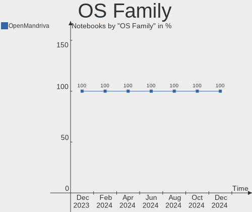
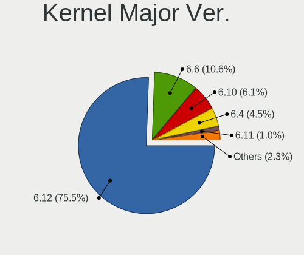
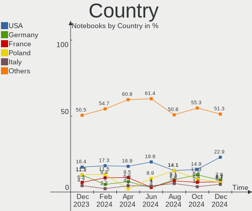
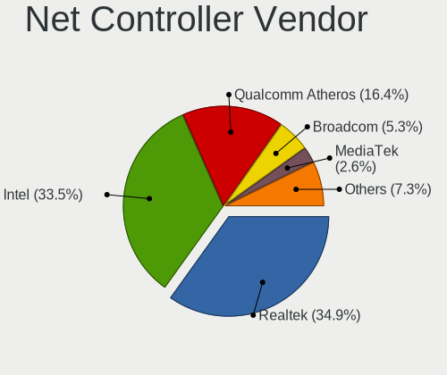
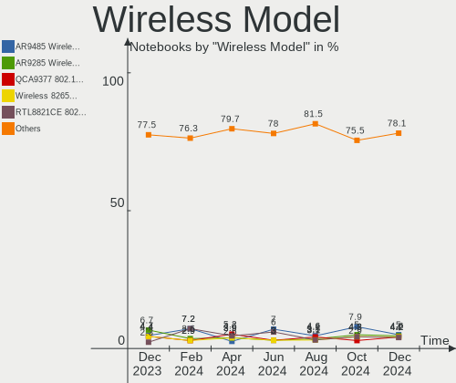

OpenMandriva - Hardware Trends (Notebooks)
------------------------------------------

A project to identify most popular hardware characteristics and track their change
over time based on data collected by Linux users at https://Linux-Hardware.org.

Anyone can contribute to this report by the [hw-probe](https://github.com/linuxhw/hw-probe) tool:

    sudo -E hw-probe -all -upload

This report is for one last month. Overall report since the beginning of time: [TestCoverage](https://github.com/linuxhw/TestCoverage)

Period: Jan, 2023.

Contents
--------

* [ System ](#system)
  - [ OS                       ](#os)
  - [ OS Family                ](#os-family)
  - [ Kernel                   ](#kernel)
  - [ Kernel Family            ](#kernel-family)
  - [ Kernel Major Ver.        ](#kernel-major-ver)
  - [ Arch                     ](#arch)
  - [ DE                       ](#de)
  - [ Display Server           ](#display-server)
  - [ Display Manager          ](#display-manager)
  - [ OS Lang                  ](#os-lang)
  - [ Boot Mode                ](#boot-mode)
  - [ Filesystem               ](#filesystem)
  - [ Part. scheme             ](#part-scheme)
  - [ Dual Boot with Linux/BSD ](#dual-boot-with-linuxbsd)
  - [ Dual Boot (Win)          ](#dual-boot-win)

* [ Board ](#board)
  - [ Vendor                   ](#vendor)
  - [ Model                    ](#model)
  - [ Model Family             ](#model-family)
  - [ MFG Year                 ](#mfg-year)
  - [ Form Factor              ](#form-factor)
  - [ Secure Boot              ](#secure-boot)
  - [ Coreboot                 ](#coreboot)
  - [ RAM Size                 ](#ram-size)
  - [ RAM Used                 ](#ram-used)
  - [ Total Drives             ](#total-drives)
  - [ Has CD-ROM               ](#has-cd-rom)
  - [ Has Ethernet             ](#has-ethernet)
  - [ Has WiFi                 ](#has-wifi)
  - [ Has Bluetooth            ](#has-bluetooth)

* [ Location ](#location)
  - [ Country                  ](#country)
  - [ City                     ](#city)

* [ Drives ](#drives)
  - [ Drive Vendor             ](#drive-vendor)
  - [ Drive Model              ](#drive-model)
  - [ HDD Vendor               ](#hdd-vendor)
  - [ SSD Vendor               ](#ssd-vendor)
  - [ Drive Kind               ](#drive-kind)
  - [ Drive Connector          ](#drive-connector)
  - [ Drive Size               ](#drive-size)
  - [ Space Total              ](#space-total)
  - [ Space Used               ](#space-used)
  - [ Malfunc. Drives          ](#malfunc-drives)
  - [ Malfunc. Drive Vendor    ](#malfunc-drive-vendor)
  - [ Malfunc. HDD Vendor      ](#malfunc-hdd-vendor)
  - [ Malfunc. Drive Kind      ](#malfunc-drive-kind)
  - [ Failed Drives            ](#failed-drives)
  - [ Failed Drive Vendor      ](#failed-drive-vendor)
  - [ Drive Status             ](#drive-status)

* [ Storage controller ](#storage-controller)
  - [ Storage Vendor           ](#storage-vendor)
  - [ Storage Model            ](#storage-model)
  - [ Storage Kind             ](#storage-kind)

* [ Processor ](#processor)
  - [ CPU Vendor               ](#cpu-vendor)
  - [ CPU Model                ](#cpu-model)
  - [ CPU Model Family         ](#cpu-model-family)
  - [ CPU Cores                ](#cpu-cores)
  - [ CPU Sockets              ](#cpu-sockets)
  - [ CPU Threads              ](#cpu-threads)
  - [ CPU Op-Modes             ](#cpu-op-modes)
  - [ CPU Microcode            ](#cpu-microcode)
  - [ CPU Microarch            ](#cpu-microarch)

* [ Graphics ](#graphics)
  - [ GPU Vendor               ](#gpu-vendor)
  - [ GPU Model                ](#gpu-model)
  - [ GPU Combo                ](#gpu-combo)
  - [ GPU Driver               ](#gpu-driver)
  - [ GPU Memory               ](#gpu-memory)

* [ Monitor ](#monitor)
  - [ Monitor Vendor           ](#monitor-vendor)
  - [ Monitor Model            ](#monitor-model)
  - [ Monitor Resolution       ](#monitor-resolution)
  - [ Monitor Diagonal         ](#monitor-diagonal)
  - [ Monitor Width            ](#monitor-width)
  - [ Aspect Ratio             ](#aspect-ratio)
  - [ Monitor Area             ](#monitor-area)
  - [ Pixel Density            ](#pixel-density)
  - [ Multiple Monitors        ](#multiple-monitors)

* [ Network ](#network)
  - [ Net Controller Vendor    ](#net-controller-vendor)
  - [ Net Controller Model     ](#net-controller-model)
  - [ Wireless Vendor          ](#wireless-vendor)
  - [ Wireless Model           ](#wireless-model)
  - [ Ethernet Vendor          ](#ethernet-vendor)
  - [ Ethernet Model           ](#ethernet-model)
  - [ Net Controller Kind      ](#net-controller-kind)
  - [ Used Controller          ](#used-controller)
  - [ NICs                     ](#nics)
  - [ IPv6                     ](#ipv6)

* [ Bluetooth ](#bluetooth)
  - [ Bluetooth Vendor         ](#bluetooth-vendor)
  - [ Bluetooth Model          ](#bluetooth-model)

* [ Sound ](#sound)
  - [ Sound Vendor             ](#sound-vendor)
  - [ Sound Model              ](#sound-model)

* [ Memory ](#memory)
  - [ Memory Vendor            ](#memory-vendor)
  - [ Memory Model             ](#memory-model)
  - [ Memory Kind              ](#memory-kind)
  - [ Memory Form Factor       ](#memory-form-factor)
  - [ Memory Size              ](#memory-size)
  - [ Memory Speed             ](#memory-speed)

* [ Printers & scanners ](#printers--scanners)
  - [ Printer Vendor           ](#printer-vendor)
  - [ Printer Model            ](#printer-model)
  - [ Scanner Vendor           ](#scanner-vendor)
  - [ Scanner Model            ](#scanner-model)

* [ Camera ](#camera)
  - [ Camera Vendor            ](#camera-vendor)
  - [ Camera Model             ](#camera-model)

* [ Security ](#security)
  - [ Fingerprint Vendor       ](#fingerprint-vendor)
  - [ Fingerprint Model        ](#fingerprint-model)
  - [ Chipcard Vendor          ](#chipcard-vendor)
  - [ Chipcard Model           ](#chipcard-model)

* [ Unsupported ](#unsupported)
  - [ Unsupported Devices      ](#unsupported-devices)
  - [ Unsupported Device Types ](#unsupported-device-types)

System
------

OS
--

Installed operating systems

| Name               | Notebooks | Percent |
|--------------------|-----------|---------|
| OpenMandriva 23.01 | 539       | 87.36%  |
| OpenMandriva 4.3   | 52        | 8.43%   |
| OpenMandriva 4.50  | 7         | 1.13%   |
| OpenMandriva 4.90  | 6         | 0.97%   |
| OpenMandriva 4.2   | 6         | 0.97%   |
| OpenMandriva 22.12 | 6         | 0.97%   |
| OpenMandriva 23.90 | 1         | 0.16%   |

OS Family
---------

OS without a version

| Name         | Notebooks | Percent |
|--------------|-----------|---------|
| OpenMandriva | 617       | 100%    |

Kernel
------

Version of the Linux kernel

| Version                  | Notebooks | Percent |
|--------------------------|-----------|---------|
| 6.1.1-desktop-1omv2290   | 527       | 85.41%  |
| 5.16.7-desktop-1omv4003  | 51        | 8.27%   |
| 6.1.4-desktop-1omv2301   | 10        | 1.62%   |
| 6.0.10-desktop-2omv22090 | 6         | 0.97%   |
| 5.10.14-desktop-1omv4002 | 6         | 0.97%   |
| 6.0.2-desktop-1omv4090   | 4         | 0.65%   |
| 5.19.5-desktop-1omv4090  | 3         | 0.49%   |
| 6.1.2-desktop-1omv2301   | 2         | 0.32%   |
| 5.18.12-desktop-3omv4090 | 2         | 0.32%   |
| 6.1.5-desktop-1omv2390   | 1         | 0.16%   |
| 6.0.2-desktop-1omv4050   | 1         | 0.16%   |
| 5.19.12-desktop-2omv4090 | 1         | 0.16%   |
| 5.19.11-desktop-2omv4090 | 1         | 0.16%   |
| 5.16.13-desktop-1omv4003 | 1         | 0.16%   |
| 5.12.4-desktop-1omv4050  | 1         | 0.16%   |

Kernel Family
-------------

Linux kernel without a distro release

| Version | Notebooks | Percent |
|---------|-----------|---------|
| 6.1.1   | 527       | 85.41%  |
| 5.16.7  | 51        | 8.27%   |
| 6.1.4   | 10        | 1.62%   |
| 6.0.10  | 6         | 0.97%   |
| 5.10.14 | 6         | 0.97%   |
| 6.0.2   | 5         | 0.81%   |
| 5.19.5  | 3         | 0.49%   |
| 6.1.2   | 2         | 0.32%   |
| 5.18.12 | 2         | 0.32%   |
| 6.1.5   | 1         | 0.16%   |
| 5.19.12 | 1         | 0.16%   |
| 5.19.11 | 1         | 0.16%   |
| 5.16.13 | 1         | 0.16%   |
| 5.12.4  | 1         | 0.16%   |

Kernel Major Ver.
-----------------

Linux kernel major version

| Version | Notebooks | Percent |
|---------|-----------|---------|
| 6.1     | 540       | 87.52%  |
| 5.16    | 52        | 8.43%   |
| 6.0     | 11        | 1.78%   |
| 5.10    | 6         | 0.97%   |
| 5.19    | 5         | 0.81%   |
| 5.18    | 2         | 0.32%   |
| 5.12    | 1         | 0.16%   |

Arch
----

OS architecture (x86_64, i586, etc.)

| Name   | Notebooks | Percent |
|--------|-----------|---------|
| x86_64 | 617       | 100%    |

DE
--

Desktop Environment

| Name  | Notebooks | Percent |
|-------|-----------|---------|
| KDE5  | 532       | 86.22%  |
| GNOME | 84        | 13.61%  |
| XFCE  | 1         | 0.16%   |

Display Server
--------------

X11 or Wayland

| Name    | Notebooks | Percent |
|---------|-----------|---------|
| X11     | 534       | 86.55%  |
| Wayland | 83        | 13.45%  |

Display Manager
---------------

SDDM, LightDM, etc.

| Name    | Notebooks | Percent |
|---------|-----------|---------|
| SDDM    | 532       | 86.22%  |
| GDM     | 84        | 13.61%  |
| LightDM | 1         | 0.16%   |

OS Lang
-------

Language

| Lang  | Notebooks | Percent |
|-------|-----------|---------|
| en_US | 362       | 58.67%  |
| de_DE | 40        | 6.48%   |
| fr_FR | 39        | 6.32%   |
| pl_PL | 28        | 4.54%   |
| pt_BR | 22        | 3.57%   |
| es_ES | 20        | 3.24%   |
| en_GB | 19        | 3.08%   |
| ru_RU | 15        | 2.43%   |
| it_IT | 7         | 1.13%   |
| cs_CZ | 7         | 1.13%   |
| es_MX | 6         | 0.97%   |
| nl_NL | 5         | 0.81%   |
| es_CO | 4         | 0.65%   |
| pt_PT | 3         | 0.49%   |
| en_AU | 3         | 0.49%   |
| de_CH | 3         | 0.49%   |
| de_AT | 3         | 0.49%   |
| tr_TR | 2         | 0.32%   |
| fr_CA | 2         | 0.32%   |
| es_CL | 2         | 0.32%   |
| es_BO | 2         | 0.32%   |
| en_CA | 2         | 0.32%   |
| en_AG | 2         | 0.32%   |
| ro_RO | 1         | 0.16%   |
| nl_BE | 1         | 0.16%   |
| nl_AW | 1         | 0.16%   |
| nb_NO | 1         | 0.16%   |
| it_CH | 1         | 0.16%   |
| hu_HU | 1         | 0.16%   |
| fr_BE | 1         | 0.16%   |
| es_VE | 1         | 0.16%   |
| es_PE | 1         | 0.16%   |
| es_DO | 1         | 0.16%   |
| es_CU | 1         | 0.16%   |
| es_AR | 1         | 0.16%   |
| en_NZ | 1         | 0.16%   |
| en_NG | 1         | 0.16%   |
| en_IN | 1         | 0.16%   |
| en_IE | 1         | 0.16%   |
| en_DK | 1         | 0.16%   |

Boot Mode
---------

EFI or BIOS

| Mode | Notebooks | Percent |
|------|-----------|---------|
| EFI  | 383       | 62.07%  |
| BIOS | 234       | 37.93%  |

Filesystem
----------

Type of filesystem

| Type    | Notebooks | Percent |
|---------|-----------|---------|
| Overlay | 484       | 78.44%  |
| Ext4    | 118       | 19.12%  |
| Btrfs   | 10        | 1.62%   |
| Xfs     | 3         | 0.49%   |
| F2fs    | 2         | 0.32%   |

Part. scheme
------------

Scheme of partitioning

| Type | Notebooks | Percent |
|------|-----------|---------|
| GPT  | 468       | 75.85%  |
| MBR  | 149       | 24.15%  |

Dual Boot with Linux/BSD
------------------------

Hosting more than one Linux/BSD

| Dual boot | Notebooks | Percent |
|-----------|-----------|---------|
| Yes       | 340       | 55.11%  |
| No        | 277       | 44.89%  |

Dual Boot (Win)
---------------

Hosting Linux and Windows

| Dual boot | Notebooks | Percent |
|-----------|-----------|---------|
| No        | 378       | 61.26%  |
| Yes       | 239       | 38.74%  |

Board
-----

Vendor
------

Motherboard manufacturer

| Name                | Notebooks | Percent |
|---------------------|-----------|---------|
| Lenovo              | 134       | 21.72%  |
| Hewlett-Packard     | 100       | 16.21%  |
| Dell                | 91        | 14.75%  |
| Acer                | 82        | 13.29%  |
| ASUSTek Computer    | 71        | 11.51%  |
| Toshiba             | 24        | 3.89%   |
| MSI                 | 16        | 2.59%   |
| Sony                | 10        | 1.62%   |
| Apple               | 8         | 1.3%    |
| Samsung Electronics | 6         | 0.97%   |
| Unknown             | 5         | 0.81%   |
| TUXEDO              | 4         | 0.65%   |
| Positivo            | 4         | 0.65%   |
| Google              | 4         | 0.65%   |
| Fujitsu             | 4         | 0.65%   |
| Schenker            | 3         | 0.49%   |
| Packard Bell        | 3         | 0.49%   |
| Notebook            | 3         | 0.49%   |
| Medion              | 3         | 0.49%   |
| HUAWEI              | 3         | 0.49%   |
| Gateway             | 3         | 0.49%   |
| eMachines           | 3         | 0.49%   |
| System76            | 2         | 0.32%   |
| Panasonic           | 2         | 0.32%   |
| Itautec             | 2         | 0.32%   |
| Clevo               | 2         | 0.32%   |
| Aquarius            | 2         | 0.32%   |
| Alienware           | 2         | 0.32%   |
| UMAX                | 1         | 0.16%   |
| Star Labs           | 1         | 0.16%   |
| Standard            | 1         | 0.16%   |
| Razer               | 1         | 0.16%   |
| Philco              | 1         | 0.16%   |
| OEGStone            | 1         | 0.16%   |
| ODM                 | 1         | 0.16%   |
| NEC Computers       | 1         | 0.16%   |
| Monster             | 1         | 0.16%   |
| MicroByte           | 1         | 0.16%   |
| Kiano               | 1         | 0.16%   |
| Intel               | 1         | 0.16%   |

Model
-----

Motherboard model

| Name                                    | Notebooks | Percent |
|-----------------------------------------|-----------|---------|
| Unknown                                 | 9         | 1.46%   |
| HP Notebook                             | 6         | 0.97%   |
| ASUS ROG Flow X13 GV301QH_GV301QH       | 5         | 0.81%   |
| Toshiba dynabook T653/46JR              | 4         | 0.65%   |
| Lenovo IdeaPad 5 15ARE05 81YQ           | 3         | 0.49%   |
| Lenovo G505 20240                       | 3         | 0.49%   |
| Lenovo G50-45 80E3                      | 3         | 0.49%   |
| HP Pavilion g6                          | 3         | 0.49%   |
| HP Laptop 15s-eq2xxx                    | 3         | 0.49%   |
| HP EliteBook 8460p                      | 3         | 0.49%   |
| Dell Latitude E6400                     | 3         | 0.49%   |
| Dell Latitude 7490                      | 3         | 0.49%   |
| Dell Inspiron 15-3567                   | 3         | 0.49%   |
| ASUS VivoBook_ASUSLaptop X540MAR_A543MA | 3         | 0.49%   |
| System76 Darter Pro                     | 2         | 0.32%   |
| Lenovo Yoga Slim 7 13ACN5 82CY          | 2         | 0.32%   |
| Lenovo ThinkPad T480s 20L8S02D00        | 2         | 0.32%   |
| Lenovo Legion Y540-15IRH-PG0 81SY       | 2         | 0.32%   |
| Lenovo IdeaPad 330S-15IKB 81F5          | 2         | 0.32%   |
| Lenovo IdeaPad 330-15IKB 81DE           | 2         | 0.32%   |
| Lenovo IdeaPad 3 15ADA05 81W1           | 2         | 0.32%   |
| Itautec Infoway w7535                   | 2         | 0.32%   |
| HP ProBook 440 G8 Notebook PC           | 2         | 0.32%   |
| HP Pavilion dv5                         | 2         | 0.32%   |
| HP Laptop 15-dw3xxx                     | 2         | 0.32%   |
| HP Laptop 15-db0xxx                     | 2         | 0.32%   |
| HP EliteBook 820 G3                     | 2         | 0.32%   |
| HP EliteBook 745 G3                     | 2         | 0.32%   |
| HP EliteBook 2560p                      | 2         | 0.32%   |
| HP Compaq 15                            | 2         | 0.32%   |
| HP 255 G4                               | 2         | 0.32%   |
| eMachines E725                          | 2         | 0.32%   |
| Dell XPS 15 9570                        | 2         | 0.32%   |
| Dell Studio 1558                        | 2         | 0.32%   |
| Dell Latitude E7450                     | 2         | 0.32%   |
| Dell Latitude E6510                     | 2         | 0.32%   |
| Dell Latitude E5430 non-vPro            | 2         | 0.32%   |
| Dell Latitude D630                      | 2         | 0.32%   |
| Dell Latitude 7400                      | 2         | 0.32%   |
| Dell Latitude 5480                      | 2         | 0.32%   |

Model Family
------------

Motherboard model prefix

| Name                  | Notebooks | Percent |
|-----------------------|-----------|---------|
| Acer Aspire           | 66        | 10.7%   |
| Lenovo ThinkPad       | 58        | 9.4%    |
| Dell Latitude         | 38        | 6.16%   |
| Lenovo IdeaPad        | 37        | 6%      |
| Dell Inspiron         | 33        | 5.35%   |
| Toshiba Satellite     | 19        | 3.08%   |
| HP EliteBook          | 19        | 3.08%   |
| ASUS VivoBook         | 19        | 3.08%   |
| HP Laptop             | 15        | 2.43%   |
| HP ProBook            | 14        | 2.27%   |
| HP Pavilion           | 12        | 1.94%   |
| Unknown               | 9         | 1.46%   |
| HP Compaq             | 8         | 1.3%    |
| ASUS ROG              | 8         | 1.3%    |
| Acer Nitro            | 8         | 1.3%    |
| Lenovo Yoga           | 6         | 0.97%   |
| HP Notebook           | 6         | 0.97%   |
| Dell XPS              | 6         | 0.97%   |
| Dell Precision        | 6         | 0.97%   |
| Lenovo Legion         | 5         | 0.81%   |
| ASUS ZenBook          | 5         | 0.81%   |
| Toshiba dynabook      | 4         | 0.65%   |
| HP 255                | 4         | 0.65%   |
| Fujitsu LIFEBOOK      | 4         | 0.65%   |
| MSI Katana            | 3         | 0.49%   |
| Lenovo G505           | 3         | 0.49%   |
| Lenovo G50-45         | 3         | 0.49%   |
| HP ZBook              | 3         | 0.49%   |
| Dell Vostro           | 3         | 0.49%   |
| ASUS TUF              | 3         | 0.49%   |
| ASUS ASUS             | 3         | 0.49%   |
| System76 Darter       | 2         | 0.32%   |
| Schenker XMG          | 2         | 0.32%   |
| Packard Bell EasyNote | 2         | 0.32%   |
| MSI Modern            | 2         | 0.32%   |
| MSI GP70              | 2         | 0.32%   |
| Lenovo ThinkBook      | 2         | 0.32%   |
| Itautec Infoway       | 2         | 0.32%   |
| HP Victus             | 2         | 0.32%   |
| HP Stream             | 2         | 0.32%   |

MFG Year
--------

Motherboard manufacture year

| Year    | Notebooks | Percent |
|---------|-----------|---------|
| 2021    | 61        | 9.89%   |
| 2012    | 58        | 9.4%    |
| 2013    | 54        | 8.75%   |
| 2011    | 53        | 8.59%   |
| 2020    | 48        | 7.78%   |
| 2018    | 42        | 6.81%   |
| 2019    | 40        | 6.48%   |
| 2015    | 39        | 6.32%   |
| 2014    | 36        | 5.83%   |
| 2010    | 36        | 5.83%   |
| 2022    | 33        | 5.35%   |
| 2016    | 32        | 5.19%   |
| 2017    | 26        | 4.21%   |
| 2008    | 22        | 3.57%   |
| 2009    | 19        | 3.08%   |
| 2007    | 14        | 2.27%   |
| 2006    | 2         | 0.32%   |
| Unknown | 2         | 0.32%   |

Form Factor
-----------

Physical design of the computer

| Name     | Notebooks | Percent |
|----------|-----------|---------|
| Notebook | 617       | 100%    |

Secure Boot
-----------

Enabled or disabled

| State    | Notebooks | Percent |
|----------|-----------|---------|
| Disabled | 617       | 100%    |

Coreboot
--------

Have coreboot on board

| Used | Notebooks | Percent |
|------|-----------|---------|
| No   | 608       | 98.54%  |
| Yes  | 9         | 1.46%   |

RAM Size
--------

Total RAM memory

| Size in GB  | Notebooks | Percent |
|-------------|-----------|---------|
| 4.01-8.0    | 189       | 30.63%  |
| 3.01-4.0    | 180       | 29.17%  |
| 8.01-16.0   | 114       | 18.48%  |
| 16.01-24.0  | 75        | 12.16%  |
| 32.01-64.0  | 23        | 3.73%   |
| 1.01-2.0    | 17        | 2.76%   |
| 2.01-3.0    | 9         | 1.46%   |
| 24.01-32.0  | 5         | 0.81%   |
| 64.01-256.0 | 5         | 0.81%   |

RAM Used
--------

Used RAM memory

| Used GB  | Notebooks | Percent |
|----------|-----------|---------|
| 1.01-2.0 | 460       | 74.55%  |
| 2.01-3.0 | 127       | 20.58%  |
| 0.51-1.0 | 14        | 2.27%   |
| 3.01-4.0 | 12        | 1.94%   |
| 4.01-8.0 | 2         | 0.32%   |
| 0.01-0.5 | 2         | 0.32%   |

Total Drives
------------

Number of drives on board

| Drives | Notebooks | Percent |
|--------|-----------|---------|
| 1      | 437       | 70.83%  |
| 2      | 152       | 24.64%  |
| 3      | 19        | 3.08%   |
| 0      | 6         | 0.97%   |
| 4      | 3         | 0.49%   |

Has CD-ROM
----------

Has CD-ROM on board

| Presented | Notebooks | Percent |
|-----------|-----------|---------|
| No        | 342       | 55.43%  |
| Yes       | 275       | 44.57%  |

Has Ethernet
------------

Has Ethernet on board

| Presented | Notebooks | Percent |
|-----------|-----------|---------|
| Yes       | 514       | 83.31%  |
| No        | 103       | 16.69%  |

Has WiFi
--------

Has WiFi module

| Presented | Notebooks | Percent |
|-----------|-----------|---------|
| Yes       | 607       | 98.38%  |
| No        | 10        | 1.62%   |

Has Bluetooth
-------------

Has Bluetooth module

| Presented | Notebooks | Percent |
|-----------|-----------|---------|
| Yes       | 475       | 76.99%  |
| No        | 142       | 23.01%  |

Location
--------

Country
-------

Geographic location (country)

| Country      | Notebooks | Percent |
|--------------|-----------|---------|
| USA          | 77        | 12.48%  |
| Germany      | 61        | 9.89%   |
| France       | 47        | 7.62%   |
| Brazil       | 44        | 7.13%   |
| UK           | 36        | 5.83%   |
| Poland       | 32        | 5.19%   |
| Russia       | 26        | 4.21%   |
| Spain        | 24        | 3.89%   |
| Canada       | 24        | 3.89%   |
| Italy        | 22        | 3.57%   |
| Netherlands  | 14        | 2.27%   |
| Japan        | 13        | 2.11%   |
| Finland      | 11        | 1.78%   |
| Czechia      | 10        | 1.62%   |
| Australia    | 9         | 1.46%   |
| Belgium      | 8         | 1.3%    |
| Slovakia     | 7         | 1.13%   |
| Portugal     | 7         | 1.13%   |
| India        | 7         | 1.13%   |
| Colombia     | 7         | 1.13%   |
| Switzerland  | 6         | 0.97%   |
| Serbia       | 6         | 0.97%   |
| Romania      | 6         | 0.97%   |
| Mexico       | 6         | 0.97%   |
| Indonesia    | 6         | 0.97%   |
| Hungary      | 6         | 0.97%   |
| Greece       | 6         | 0.97%   |
| Turkey       | 5         | 0.81%   |
| Thailand     | 4         | 0.65%   |
| Singapore    | 4         | 0.65%   |
| Malaysia     | 4         | 0.65%   |
| Sweden       | 3         | 0.49%   |
| South Africa | 3         | 0.49%   |
| Norway       | 3         | 0.49%   |
| New Zealand  | 3         | 0.49%   |
| Ireland      | 3         | 0.49%   |
| Denmark      | 3         | 0.49%   |
| Chile        | 3         | 0.49%   |
| Austria      | 3         | 0.49%   |
| Argentina    | 3         | 0.49%   |

City
----

Geographic location (city)

| City          | Notebooks | Percent |
|---------------|-----------|---------|
| Warsaw        | 9         | 1.46%   |
| Amsterdam     | 7         | 1.13%   |
| Prague        | 6         | 0.97%   |
| London        | 6         | 0.97%   |
| Berlin        | 6         | 0.97%   |
| Rome          | 5         | 0.81%   |
| Munich        | 5         | 0.81%   |
| Jakarta       | 5         | 0.81%   |
| Bogotá       | 5         | 0.81%   |
| Singapore     | 4         | 0.65%   |
| Milan         | 4         | 0.65%   |
| Brisbane      | 4         | 0.65%   |
| Birmingham    | 4         | 0.65%   |
| Sao Paulo     | 3         | 0.49%   |
| Paris         | 3         | 0.49%   |
| Nuremberg     | 3         | 0.49%   |
| Nottingham    | 3         | 0.49%   |
| Natal         | 3         | 0.49%   |
| Moscow        | 3         | 0.49%   |
| Limoges       | 3         | 0.49%   |
| Hamburg       | 3         | 0.49%   |
| Dudley        | 3         | 0.49%   |
| Domodedovo    | 3         | 0.49%   |
| Chelyabinsk   | 3         | 0.49%   |
| Chatres       | 3         | 0.49%   |
| Barcelona     | 3         | 0.49%   |
| Zurich        | 2         | 0.32%   |
| Volos         | 2         | 0.32%   |
| Vienna        | 2         | 0.32%   |
| Vancouver     | 2         | 0.32%   |
| Valencia      | 2         | 0.32%   |
| Uberaba       | 2         | 0.32%   |
| Tokyo         | 2         | 0.32%   |
| The Hague     | 2         | 0.32%   |
| Tampere       | 2         | 0.32%   |
| Tacoma        | 2         | 0.32%   |
| Sydney        | 2         | 0.32%   |
| Steinfurt     | 2         | 0.32%   |
| St Petersburg | 2         | 0.32%   |
| Scarborough   | 2         | 0.32%   |

Drives
------

Drive Vendor
------------

Hard drive vendors

| Vendor              | Notebooks | Drives | Percent |
|---------------------|-----------|--------|---------|
| WDC                 | 112       | 113    | 14.83%  |
| Samsung Electronics | 106       | 116    | 14.04%  |
| Seagate             | 67        | 70     | 8.87%   |
| Toshiba             | 60        | 60     | 7.95%   |
| Kingston            | 58        | 58     | 7.68%   |
| SanDisk             | 36        | 37     | 4.77%   |
| Unknown             | 32        | 33     | 4.24%   |
| Crucial             | 30        | 30     | 3.97%   |
| SK hynix            | 23        | 23     | 3.05%   |
| Hitachi             | 23        | 23     | 3.05%   |
| HGST                | 19        | 19     | 2.52%   |
| Micron Technology   | 17        | 17     | 2.25%   |
| A-DATA Technology   | 14        | 16     | 1.85%   |
| KIOXIA              | 12        | 12     | 1.59%   |
| Intel               | 9         | 9      | 1.19%   |
| China               | 9         | 9      | 1.19%   |
| PNY                 | 6         | 6      | 0.79%   |
| Unknown             | 6         | 6      | 0.79%   |
| UMIS                | 5         | 5      | 0.66%   |
| Transcend           | 5         | 5      | 0.66%   |
| Phison              | 5         | 5      | 0.66%   |
| Patriot             | 5         | 5      | 0.66%   |
| SPCC                | 4         | 4      | 0.53%   |
| Lexar               | 4         | 4      | 0.53%   |
| Intenso             | 4         | 4      | 0.53%   |
| GOODRAM             | 4         | 5      | 0.53%   |
| Gigabyte Technology | 4         | 4      | 0.53%   |
| Fujitsu             | 4         | 4      | 0.53%   |
| SSSTC               | 3         | 3      | 0.4%    |
| Silicon Motion      | 3         | 3      | 0.4%    |
| SABRENT             | 3         | 4      | 0.4%    |
| Netac               | 3         | 3      | 0.4%    |
| LITEON              | 3         | 3      | 0.4%    |
| KingSpec            | 3         | 3      | 0.4%    |
| JMicron Technology  | 3         | 3      | 0.4%    |
| Apple               | 3         | 3      | 0.4%    |
| WALRAM              | 2         | 2      | 0.26%   |
| LITEONIT            | 2         | 2      | 0.26%   |
| KIOXIA-EXCERIA      | 2         | 2      | 0.26%   |
| Kingmax             | 2         | 2      | 0.26%   |

Drive Model
-----------

Hard drive models

| Model                                | Notebooks | Percent |
|--------------------------------------|-----------|---------|
| Kingston SA400S37240G 240GB SSD      | 14        | 1.81%   |
| Seagate ST1000LM024 HN-M101MBB 1TB   | 13        | 1.68%   |
| Kingston SA400S37480G 480GB SSD      | 11        | 1.42%   |
| Toshiba MQ01ABF050 500GB             | 10        | 1.3%    |
| Seagate ST500LT012-1DG142 500GB      | 9         | 1.17%   |
| Toshiba MQ01ABD100 1TB               | 8         | 1.04%   |
| HGST HTS721010A9E630 1TB             | 8         | 1.04%   |
| Toshiba MQ04ABF100 1TB               | 7         | 0.91%   |
| WDC WD10JPVX-22JC3T0 1TB             | 6         | 0.78%   |
| Seagate ST1000LM035-1RK172 1TB       | 6         | 0.78%   |
| Crucial CT500MX500SSD1 500GB         | 6         | 0.78%   |
| Unknown                              | 6         | 0.78%   |
| WDC PC SN530 SDBPTPZ-512G-1002 512GB | 5         | 0.65%   |
| Samsung PSSD T7 500GB                | 5         | 0.65%   |
| Samsung MZVLB1T0HBLR-000L2 1TB       | 5         | 0.65%   |
| Hitachi HTS545050B9A300 500GB        | 5         | 0.65%   |
| Crucial CT250MX500SSD1 250GB         | 5         | 0.65%   |
| Toshiba MQ01ABD075 752GB             | 4         | 0.52%   |
| Seagate ST9500325AS 500GB            | 4         | 0.52%   |
| Seagate ST1000LM048-2E7172 1TB       | 4         | 0.52%   |
| SanDisk NVMe SSD Drive 1TB           | 4         | 0.52%   |
| Samsung SSD 860 EVO 250GB            | 4         | 0.52%   |
| Kingston SV300S37A120G 120GB SSD     | 4         | 0.52%   |
| WDC WDS500G2B0A-00SM50 500GB SSD     | 3         | 0.39%   |
| WDC WDBNCE5000PNC 500GB SSD          | 3         | 0.39%   |
| WDC PC SN530 SDBPNPZ-512G-1014 512GB | 3         | 0.39%   |
| WDC PC SN530 SDBPNPZ-256G-1002 256GB | 3         | 0.39%   |
| Unknown TA2964  64GB                 | 3         | 0.39%   |
| UMIS RPJTJ256MEE1OWX 256GB           | 3         | 0.39%   |
| Seagate ST500LM012 HN-M500MBB 500GB  | 3         | 0.39%   |
| SanDisk DF4032  32GB                 | 3         | 0.39%   |
| Samsung SSD 970 EVO Plus 500GB       | 3         | 0.39%   |
| Samsung SSD 850 EVO 500GB            | 3         | 0.39%   |
| Samsung SSD 850 EVO 250GB            | 3         | 0.39%   |
| Samsung Portable SSD T5 1TB          | 3         | 0.39%   |
| Samsung MZVLW256HEHP-000L7 256GB     | 3         | 0.39%   |
| Samsung MZVLQ256HAJD-000H1 256GB     | 3         | 0.39%   |
| KIOXIA KBG40ZNV256G 256GB            | 3         | 0.39%   |
| KIOXIA KBG40ZNS512G NVMe 512GB       | 3         | 0.39%   |
| Kingston SA400S37120G 120GB SSD      | 3         | 0.39%   |

HDD Vendor
----------

Hard disk drive vendors

| Vendor              | Notebooks | Drives | Percent |
|---------------------|-----------|--------|---------|
| WDC                 | 65        | 65     | 27.78%  |
| Seagate             | 64        | 65     | 27.35%  |
| Toshiba             | 47        | 47     | 20.09%  |
| Hitachi             | 23        | 23     | 9.83%   |
| HGST                | 19        | 19     | 8.12%   |
| Samsung Electronics | 4         | 4      | 1.71%   |
| Fujitsu             | 4         | 4      | 1.71%   |
| Unknown             | 2         | 2      | 0.85%   |
| SABRENT             | 2         | 2      | 0.85%   |
| USB                 | 1         | 1      | 0.43%   |
| SAGE                | 1         | 1      | 0.43%   |
| ASMT                | 1         | 1      | 0.43%   |
| Apple               | 1         | 1      | 0.43%   |

SSD Vendor
----------

Solid state drive vendors

| Vendor              | Notebooks | Drives | Percent |
|---------------------|-----------|--------|---------|
| Samsung Electronics | 57        | 61     | 19.32%  |
| Kingston            | 43        | 43     | 14.58%  |
| Crucial             | 27        | 27     | 9.15%   |
| SanDisk             | 26        | 26     | 8.81%   |
| WDC                 | 15        | 15     | 5.08%   |
| A-DATA Technology   | 10        | 10     | 3.39%   |
| China               | 9         | 9      | 3.05%   |
| SK hynix            | 8         | 8      | 2.71%   |
| Toshiba             | 6         | 6      | 2.03%   |
| Transcend           | 5         | 5      | 1.69%   |
| Patriot             | 5         | 5      | 1.69%   |
| Micron Technology   | 5         | 5      | 1.69%   |
| PNY                 | 4         | 4      | 1.36%   |
| Lexar               | 4         | 4      | 1.36%   |
| Intenso             | 4         | 4      | 1.36%   |
| GOODRAM             | 4         | 5      | 1.36%   |
| SPCC                | 3         | 3      | 1.02%   |
| LITEON              | 3         | 3      | 1.02%   |
| KingSpec            | 3         | 3      | 1.02%   |
| Intel               | 3         | 3      | 1.02%   |
| Gigabyte Technology | 3         | 3      | 1.02%   |
| Unknown             | 3         | 3      | 1.02%   |
| WALRAM              | 2         | 2      | 0.68%   |
| Seagate             | 2         | 2      | 0.68%   |
| Netac               | 2         | 2      | 0.68%   |
| LITEONIT            | 2         | 2      | 0.68%   |
| KIOXIA-EXCERIA      | 2         | 2      | 0.68%   |
| Kingmax             | 2         | 2      | 0.68%   |
| KingFast            | 2         | 2      | 0.68%   |
| JMicron Technology  | 2         | 2      | 0.68%   |
| Apple               | 2         | 2      | 0.68%   |
| XrayDisk            | 1         | 1      | 0.34%   |
| Verbatim            | 1         | 1      | 0.34%   |
| V-GeN               | 1         | 1      | 0.34%   |
| USB30               | 1         | 1      | 0.34%   |
| UMAX                | 1         | 1      | 0.34%   |
| Teclast             | 1         | 1      | 0.34%   |
| Team                | 1         | 1      | 0.34%   |
| TCSUNBOW            | 1         | 1      | 0.34%   |
| T-FORCE             | 1         | 1      | 0.34%   |

Drive Kind
----------

HDD or SSD

| Kind    | Notebooks | Drives | Percent |
|---------|-----------|--------|---------|
| SSD     | 273       | 301    | 37.76%  |
| HDD     | 232       | 235    | 32.09%  |
| NVMe    | 172       | 191    | 23.79%  |
| MMC     | 37        | 38     | 5.12%   |
| Unknown | 9         | 11     | 1.24%   |

Drive Connector
---------------

SATA, SAS, NVMe, etc.

| Type | Notebooks | Drives | Percent |
|------|-----------|--------|---------|
| SATA | 456       | 507    | 65.24%  |
| NVMe | 171       | 190    | 24.46%  |
| MMC  | 37        | 38     | 5.29%   |
| SAS  | 35        | 41     | 5.01%   |

Drive Size
----------

Size of hard drive

| Size in TB | Notebooks | Drives | Percent |
|------------|-----------|--------|---------|
| 0.01-0.5   | 345       | 376    | 68.86%  |
| 0.51-1.0   | 147       | 151    | 29.34%  |
| 1.01-2.0   | 5         | 5      | 1%      |
| 3.01-4.0   | 4         | 4      | 0.8%    |

Space Total
-----------

Amount of disk space available on the file system

| Size in GB     | Notebooks | Percent |
|----------------|-----------|---------|
| 1-20           | 333       | 53.97%  |
| 101-250        | 103       | 16.69%  |
| 251-500        | 52        | 8.43%   |
| 501-1000       | 47        | 7.62%   |
| 51-100         | 28        | 4.54%   |
| 21-50          | 27        | 4.38%   |
| Unknown        | 18        | 2.92%   |
| 1001-2000      | 7         | 1.13%   |
| More than 3000 | 1         | 0.16%   |
| 2001-3000      | 1         | 0.16%   |

Space Used
----------

Amount of used disk space

| Used GB   | Notebooks | Percent |
|-----------|-----------|---------|
| 1-20      | 547       | 88.65%  |
| Unknown   | 18        | 2.92%   |
| 51-100    | 15        | 2.43%   |
| 101-250   | 13        | 2.11%   |
| 251-500   | 10        | 1.62%   |
| 21-50     | 7         | 1.13%   |
| 501-1000  | 5         | 0.81%   |
| 1001-2000 | 2         | 0.32%   |

Malfunc. Drives
---------------

Drive models with a malfunction

| Model                                    | Notebooks | Drives | Percent |
|------------------------------------------|-----------|--------|---------|
| Seagate ST1000LM024 HN-M101MBB 1TB       | 5         | 5      | 4.42%   |
| Toshiba MQ01ABF050 500GB                 | 4         | 4      | 3.54%   |
| Toshiba MQ01ABD075 752GB                 | 4         | 4      | 3.54%   |
| Seagate ST9500325AS 500GB                | 3         | 3      | 2.65%   |
| Seagate ST500LT012-1DG142 500GB          | 3         | 3      | 2.65%   |
| Hitachi HTS545050B9A300 500GB            | 3         | 3      | 2.65%   |
| HGST HTS721010A9E630 1TB                 | 3         | 3      | 2.65%   |
| HGST HTS545050A7E680 500GB               | 3         | 3      | 2.65%   |
| Toshiba MQ04ABF100 1TB                   | 2         | 2      | 1.77%   |
| Toshiba MQ01ABD100 1TB                   | 2         | 2      | 1.77%   |
| Toshiba MQ01ABD050 500GB                 | 2         | 2      | 1.77%   |
| Seagate ST9100824AS 100GB                | 2         | 2      | 1.77%   |
| Seagate ST500LM012 HN-M500MBB 500GB      | 2         | 2      | 1.77%   |
| SanDisk SSD U100 256GB                   | 2         | 2      | 1.77%   |
| Hitachi HTS547575A9E384 752GB            | 2         | 2      | 1.77%   |
| XrayDisk SSD 240GB                       | 1         | 1      | 0.88%   |
| WDC WDS240G2G0A-00JH30 240GB SSD         | 1         | 1      | 0.88%   |
| WDC WD7500BPKX-00HPJT0 752GB             | 1         | 1      | 0.88%   |
| WDC WD5000LUCT-62C26Y0 500GB             | 1         | 1      | 0.88%   |
| WDC WD5000LPVX-22V0TT0 500GB             | 1         | 1      | 0.88%   |
| WDC WD5000LPVT-22G33T0 500GB             | 1         | 1      | 0.88%   |
| WDC WD5000LPVT-00G33T0 500GB             | 1         | 1      | 0.88%   |
| WDC WD5000LPCX-24VHAT0 500GB             | 1         | 1      | 0.88%   |
| WDC WD5000BPVT-80HXZT3 500GB             | 1         | 1      | 0.88%   |
| WDC WD3200LPVX-75V0TT0 320GB             | 1         | 1      | 0.88%   |
| WDC WD3200BPVT-22JJ5T0 320GB             | 1         | 1      | 0.88%   |
| WDC WD3200BEVT-22A23T0 320GB             | 1         | 1      | 0.88%   |
| WDC WD2500BEVT-00A23T0 250GB             | 1         | 1      | 0.88%   |
| WDC WD10JPVX-60JC3T0 1TB                 | 1         | 1      | 0.88%   |
| WDC WD10JPVX-22JC3T0 1TB                 | 1         | 1      | 0.88%   |
| WDC WD10JPCX-24UE4T0 1TB                 | 1         | 1      | 0.88%   |
| WDC PC SA530 SDASN8Y-256G-1006 256GB SSD | 1         | 1      | 0.88%   |
| USB 3.1 500GB                            | 1         | 1      | 0.88%   |
| Toshiba THNSNK128GCS8 SATA 128GB SSD     | 1         | 1      | 0.88%   |
| Toshiba MQ02ABF050H 500GB                | 1         | 1      | 0.88%   |
| Toshiba MK5065GSXN 500GB                 | 1         | 1      | 0.88%   |
| Toshiba MK5061GSYN 500GB                 | 1         | 1      | 0.88%   |
| Toshiba MK5059GSXP 500GB                 | 1         | 1      | 0.88%   |
| Toshiba MK3261GSYN 320GB                 | 1         | 1      | 0.88%   |
| Toshiba MK3255GSX 320GB                  | 1         | 1      | 0.88%   |

Malfunc. Drive Vendor
---------------------

Vendors of faulty drives

| Vendor              | Notebooks | Drives | Percent |
|---------------------|-----------|--------|---------|
| Toshiba             | 25        | 25     | 22.12%  |
| Seagate             | 22        | 22     | 19.47%  |
| WDC                 | 16        | 16     | 14.16%  |
| HGST                | 11        | 11     | 9.73%   |
| Hitachi             | 9         | 9      | 7.96%   |
| SanDisk             | 5         | 5      | 4.42%   |
| Samsung Electronics | 4         | 4      | 3.54%   |
| Kingston            | 3         | 3      | 2.65%   |
| Crucial             | 3         | 3      | 2.65%   |
| SK hynix            | 2         | 2      | 1.77%   |
| A-DATA Technology   | 2         | 2      | 1.77%   |
| XrayDisk            | 1         | 1      | 0.88%   |
| USB                 | 1         | 1      | 0.88%   |
| Teclast             | 1         | 1      | 0.88%   |
| SPCC                | 1         | 1      | 0.88%   |
| Plextor             | 1         | 1      | 0.88%   |
| OCZ                 | 1         | 1      | 0.88%   |
| Fujitsu             | 1         | 1      | 0.88%   |
| China               | 1         | 1      | 0.88%   |
| ASMT                | 1         | 1      | 0.88%   |
| Apple               | 1         | 1      | 0.88%   |
| 2-Power             | 1         | 1      | 0.88%   |

Malfunc. HDD Vendor
-------------------

Vendors of faulty HDD drives

| Vendor              | Notebooks | Drives | Percent |
|---------------------|-----------|--------|---------|
| Toshiba             | 24        | 24     | 28.24%  |
| Seagate             | 22        | 22     | 25.88%  |
| WDC                 | 14        | 14     | 16.47%  |
| HGST                | 11        | 11     | 12.94%  |
| Hitachi             | 9         | 9      | 10.59%  |
| Samsung Electronics | 2         | 2      | 2.35%   |
| USB                 | 1         | 1      | 1.18%   |
| Fujitsu             | 1         | 1      | 1.18%   |
| ASMT                | 1         | 1      | 1.18%   |

Malfunc. Drive Kind
-------------------

Kinds of faulty drives

| Kind | Notebooks | Drives | Percent |
|------|-----------|--------|---------|
| HDD  | 84        | 85     | 75%     |
| SSD  | 27        | 27     | 24.11%  |
| NVMe | 1         | 1      | 0.89%   |

Failed Drives
-------------

Failed drive models

| Model                         | Notebooks | Drives | Percent |
|-------------------------------|-----------|--------|---------|
| Hitachi HTS723232A7A364 320GB | 1         | 1      | 100%    |

Failed Drive Vendor
-------------------

Failed drive vendors

| Vendor  | Notebooks | Drives | Percent |
|---------|-----------|--------|---------|
| Hitachi | 1         | 1      | 100%    |

Drive Status
------------

Number of failed and malfunc. drives

| Status   | Notebooks | Drives | Percent |
|----------|-----------|--------|---------|
| Works    | 491       | 582    | 72.96%  |
| Malfunc  | 111       | 113    | 16.49%  |
| Detected | 70        | 80     | 10.4%   |
| Failed   | 1         | 1      | 0.15%   |

Storage controller
------------------

Storage Vendor
--------------

Storage controller vendors

| Vendor                           | Notebooks | Percent |
|----------------------------------|-----------|---------|
| Intel                            | 438       | 61.09%  |
| AMD                              | 97        | 13.53%  |
| Samsung Electronics              | 48        | 6.69%   |
| SanDisk                          | 39        | 5.44%   |
| Kingston Technology Company      | 15        | 2.09%   |
| SK hynix                         | 14        | 1.95%   |
| Micron Technology                | 12        | 1.67%   |
| KIOXIA                           | 11        | 1.53%   |
| Phison Electronics               | 9         | 1.26%   |
| Toshiba America Info Systems     | 8         | 1.12%   |
| Union Memory (Shenzhen)          | 5         | 0.7%    |
| Silicon Motion                   | 4         | 0.56%   |
| Solid State Storage Technology   | 3         | 0.42%   |
| Realtek Semiconductor            | 3         | 0.42%   |
| Nvidia                           | 3         | 0.42%   |
| Micron/Crucial Technology        | 3         | 0.42%   |
| ADATA Technology                 | 2         | 0.28%   |
| Silicon Integrated Systems [SiS] | 1         | 0.14%   |
| Seagate Technology               | 1         | 0.14%   |
| MAXIO Technology (Hangzhou)      | 1         | 0.14%   |

Storage Model
-------------

Storage controller models

| Model                                                                            | Notebooks | Percent |
|----------------------------------------------------------------------------------|-----------|---------|
| AMD FCH SATA Controller [AHCI mode]                                              | 84        | 11.01%  |
| Intel 7 Series Chipset Family 6-port SATA Controller [AHCI mode]                 | 64        | 8.39%   |
| Intel 6 Series/C200 Series Chipset Family 6 port Mobile SATA AHCI Controller     | 40        | 5.24%   |
| Intel Sunrise Point-LP SATA Controller [AHCI mode]                               | 37        | 4.85%   |
| Intel 82801 Mobile SATA Controller [RAID mode]                                   | 30        | 3.93%   |
| Intel 8 Series SATA Controller 1 [AHCI mode]                                     | 27        | 3.54%   |
| Intel 82801IBM/IEM (ICH9M/ICH9M-E) 4 port SATA Controller [AHCI mode]            | 26        | 3.41%   |
| Intel Wildcat Point-LP SATA Controller [AHCI Mode]                               | 20        | 2.62%   |
| Intel Volume Management Device NVMe RAID Controller                              | 20        | 2.62%   |
| Intel Celeron/Pentium Silver Processor SATA Controller                           | 19        | 2.49%   |
| Intel 82801HM/HEM (ICH8M/ICH8M-E) IDE Controller                                 | 16        | 2.1%    |
| Intel 5 Series/3400 Series Chipset 4 port SATA AHCI Controller                   | 16        | 2.1%    |
| Samsung NVMe SSD Controller SM981/PM981/PM983                                    | 15        | 1.97%   |
| Samsung NVMe SSD Controller 980                                                  | 15        | 1.97%   |
| Intel 5 Series/3400 Series Chipset 6 port SATA AHCI Controller                   | 15        | 1.97%   |
| Intel Tiger Lake-LP SATA Controller                                              | 14        | 1.83%   |
| Intel Atom Processor E3800 Series SATA AHCI Controller                           | 14        | 1.83%   |
| Intel 82801HM/HEM (ICH8M/ICH8M-E) SATA Controller [AHCI mode]                    | 14        | 1.83%   |
| Intel 8 Series/C220 Series Chipset Family 6-port SATA Controller 1 [AHCI mode]   | 14        | 1.83%   |
| SanDisk Non-Volatile memory controller                                           | 13        | 1.7%    |
| SanDisk WD Blue SN550 NVMe SSD                                                   | 12        | 1.57%   |
| Micron Non-Volatile memory controller                                            | 12        | 1.57%   |
| Intel HM170/QM170 Chipset SATA Controller [AHCI Mode]                            | 11        | 1.44%   |
| Intel Cannon Lake Mobile PCH SATA AHCI Controller                                | 11        | 1.44%   |
| AMD SB7x0/SB8x0/SB9x0 SATA Controller [AHCI mode]                                | 10        | 1.31%   |
| KIOXIA NVMe SSD Controller BG4                                                   | 9         | 1.18%   |
| Samsung NVMe SSD Controller SM961/PM961/SM963                                    | 8         | 1.05%   |
| Samsung NVMe SSD Controller PM9A1/PM9A3/980PRO                                   | 8         | 1.05%   |
| Kingston Company Company Non-Volatile memory controller                          | 7         | 0.92%   |
| Intel Atom/Celeron/Pentium Processor x5-E8000/J3xxx/N3xxx Series SATA Controller | 7         | 0.92%   |
| SK hynix BC511                                                                   | 6         | 0.79%   |
| SanDisk WD Black SN750 / PC SN730 NVMe SSD                                       | 6         | 0.79%   |
| Intel Ice Lake-LP SATA Controller [AHCI mode]                                    | 6         | 0.79%   |
| Intel 400 Series Chipset Family SATA AHCI Controller                             | 6         | 0.79%   |
| Toshiba America Info Systems XG6 NVMe SSD Controller                             | 4         | 0.52%   |
| Phison E12 NVMe Controller                                                       | 4         | 0.52%   |
| Kingston Company U-SNS8154P3 NVMe SSD                                            | 4         | 0.52%   |
| Intel SSD 660P Series                                                            | 4         | 0.52%   |
| Intel Q170/Q150/B150/H170/H110/Z170/CM236 Chipset SATA Controller [AHCI Mode]    | 4         | 0.52%   |
| Intel Comet Lake SATA AHCI Controller                                            | 4         | 0.52%   |

Storage Kind
------------

Kind of storage controller (IDE, SATA, NVMe, SAS, ...)

| Kind | Notebooks | Percent |
|------|-----------|---------|
| SATA | 486       | 65.68%  |
| NVMe | 170       | 22.97%  |
| RAID | 50        | 6.76%   |
| IDE  | 34        | 4.59%   |

Processor
---------

CPU Vendor
----------

Processor vendors

| Vendor | Notebooks | Percent |
|--------|-----------|---------|
| Intel  | 483       | 78.28%  |
| AMD    | 134       | 21.72%  |

CPU Model
---------

Processor models

| Model                                         | Notebooks | Percent |
|-----------------------------------------------|-----------|---------|
| Intel Core i5-7200U CPU @ 2.50GHz             | 11        | 1.78%   |
| Intel Core i5-8250U CPU @ 1.60GHz             | 10        | 1.62%   |
| Intel Celeron N4020 CPU @ 1.10GHz             | 9         | 1.46%   |
| Intel 11th Gen Core i5-1135G7 @ 2.40GHz       | 9         | 1.46%   |
| Intel Core i5-3320M CPU @ 2.60GHz             | 8         | 1.3%    |
| Intel Core i5-3210M CPU @ 2.50GHz             | 8         | 1.3%    |
| Intel Celeron CPU N2840 @ 2.16GHz             | 8         | 1.3%    |
| Intel Core i7-5500U CPU @ 2.40GHz             | 7         | 1.13%   |
| AMD Ryzen 5 5500U with Radeon Graphics        | 7         | 1.13%   |
| AMD Ryzen 5 3500U with Radeon Vega Mobile Gfx | 7         | 1.13%   |
| Intel Core i7-6700HQ CPU @ 2.60GHz            | 6         | 0.97%   |
| Intel Core i5-6300U CPU @ 2.40GHz             | 6         | 0.97%   |
| Intel Core i5-3230M CPU @ 2.60GHz             | 6         | 0.97%   |
| Intel Core i5-2450M CPU @ 2.50GHz             | 6         | 0.97%   |
| Intel Core i5-2410M CPU @ 2.30GHz             | 6         | 0.97%   |
| Intel Celeron N4000 CPU @ 1.10GHz             | 6         | 0.97%   |
| Intel 12th Gen Core i7-12700H                 | 6         | 0.97%   |
| Intel 11th Gen Core i3-1115G4 @ 3.00GHz       | 6         | 0.97%   |
| AMD Ryzen 7 4700U with Radeon Graphics        | 6         | 0.97%   |
| AMD Ryzen 3 3250U with Radeon Graphics        | 6         | 0.97%   |
| Intel Core i7-9750H CPU @ 2.60GHz             | 5         | 0.81%   |
| Intel Core i7-6500U CPU @ 2.50GHz             | 5         | 0.81%   |
| Intel Core i5-5300U CPU @ 2.30GHz             | 5         | 0.81%   |
| Intel Core i5-4200U CPU @ 1.60GHz             | 5         | 0.81%   |
| Intel Core i5 CPU M 560 @ 2.67GHz             | 5         | 0.81%   |
| Intel Core 2 Duo CPU P8600 @ 2.40GHz          | 5         | 0.81%   |
| Intel 11th Gen Core i7-1165G7 @ 2.80GHz       | 5         | 0.81%   |
| AMD Ryzen 9 5900HS with Radeon Graphics       | 5         | 0.81%   |
| AMD Ryzen 5 2500U with Radeon Vega Mobile Gfx | 5         | 0.81%   |
| Intel Pentium Dual-Core CPU T4500 @ 2.30GHz   | 4         | 0.65%   |
| Intel Core i7-8550U CPU @ 1.80GHz             | 4         | 0.65%   |
| Intel Core i7-7700HQ CPU @ 2.80GHz            | 4         | 0.65%   |
| Intel Core i7-6820HQ CPU @ 2.70GHz            | 4         | 0.65%   |
| Intel Core i7-3610QM CPU @ 2.30GHz            | 4         | 0.65%   |
| Intel Core i7-10750H CPU @ 2.60GHz            | 4         | 0.65%   |
| Intel Core i5-5200U CPU @ 2.20GHz             | 4         | 0.65%   |
| Intel Core i5-4210U CPU @ 1.70GHz             | 4         | 0.65%   |
| Intel Core i5-2540M CPU @ 2.60GHz             | 4         | 0.65%   |
| Intel Core i3-4030U CPU @ 1.90GHz             | 4         | 0.65%   |
| Intel Core i3-2330M CPU @ 2.20GHz             | 4         | 0.65%   |

CPU Model Family
----------------

Processor model prefix

| Model                                | Notebooks | Percent |
|--------------------------------------|-----------|---------|
| Intel Core i5                        | 154       | 24.96%  |
| Intel Core i7                        | 93        | 15.07%  |
| Intel Celeron                        | 60        | 9.72%   |
| Intel Core i3                        | 48        | 7.78%   |
| Other                                | 42        | 6.81%   |
| Intel Core 2 Duo                     | 39        | 6.32%   |
| AMD Ryzen 5                          | 30        | 4.86%   |
| AMD Ryzen 7                          | 26        | 4.21%   |
| Intel Pentium                        | 21        | 3.4%    |
| AMD A6                               | 14        | 2.27%   |
| AMD Ryzen 3                          | 10        | 1.62%   |
| AMD E1                               | 10        | 1.62%   |
| Intel Pentium Dual-Core              | 8         | 1.3%    |
| Intel Atom                           | 7         | 1.13%   |
| AMD Ryzen 9                          | 7         | 1.13%   |
| AMD E                                | 6         | 0.97%   |
| Intel Pentium Dual                   | 4         | 0.65%   |
| AMD A8                               | 4         | 0.65%   |
| Intel Core 2                         | 3         | 0.49%   |
| AMD PRO A10                          | 3         | 0.49%   |
| AMD Athlon II                        | 3         | 0.49%   |
| AMD A4                               | 3         | 0.49%   |
| AMD A10                              | 3         | 0.49%   |
| Intel Pentium Silver                 | 2         | 0.32%   |
| Intel Pentium Gold                   | 2         | 0.32%   |
| AMD Phenom II                        | 2         | 0.32%   |
| AMD E2                               | 2         | 0.32%   |
| AMD A12                              | 2         | 0.32%   |
| Intel Genuine                        | 1         | 0.16%   |
| Intel Core i9                        | 1         | 0.16%   |
| Intel Celeron Dual-Core              | 1         | 0.16%   |
| AMD Turion X2 Ultra Dual-Core Mobile | 1         | 0.16%   |
| AMD Ryzen 7 PRO                      | 1         | 0.16%   |
| AMD PRO A8                           | 1         | 0.16%   |
| AMD C-70                             | 1         | 0.16%   |
| AMD Athlon X2                        | 1         | 0.16%   |
| AMD Athlon                           | 1         | 0.16%   |

CPU Cores
---------

Number of processor cores

| Number | Notebooks | Percent |
|--------|-----------|---------|
| 2      | 375       | 60.78%  |
| 4      | 153       | 24.8%   |
| 8      | 32        | 5.19%   |
| 6      | 28        | 4.54%   |
| 1      | 15        | 2.43%   |
| 14     | 8         | 1.3%    |
| 12     | 2         | 0.32%   |
| 3      | 2         | 0.32%   |
| 16     | 1         | 0.16%   |
| 10     | 1         | 0.16%   |

CPU Sockets
-----------

Number of sockets

| Number | Notebooks | Percent |
|--------|-----------|---------|
| 1      | 617       | 100%    |

CPU Threads
-----------

Threads per core (Hyper-Threading)

| Number | Notebooks | Percent |
|--------|-----------|---------|
| 2      | 404       | 65.48%  |
| 1      | 204       | 33.06%  |
| 4      | 6         | 0.97%   |
| 8      | 2         | 0.32%   |
| 12     | 1         | 0.16%   |

CPU Op-Modes
------------

CPU Operation Modes (32-bit, 64-bit)

| Op mode        | Notebooks | Percent |
|----------------|-----------|---------|
| 32-bit, 64-bit | 617       | 100%    |

CPU Microcode
-------------

Microcode number

| Number     | Notebooks | Percent |
|------------|-----------|---------|
| 0x206a7    | 58        | 9.4%    |
| 0x306a9    | 53        | 8.59%   |
| Unknown    | 31        | 5.02%   |
| 0x40651    | 29        | 4.7%    |
| 0x1067a    | 28        | 4.54%   |
| 0x806c1    | 24        | 3.89%   |
| 0x20655    | 23        | 3.73%   |
| 0x306d4    | 21        | 3.4%    |
| 0x406e3    | 17        | 2.76%   |
| 0x306c3    | 16        | 2.59%   |
| 0x6fd      | 15        | 2.43%   |
| 0x08108109 | 15        | 2.43%   |
| 0x806e9    | 14        | 2.27%   |
| 0x30678    | 14        | 2.27%   |
| 0x806ea    | 13        | 2.11%   |
| 0x706a8    | 13        | 2.11%   |
| 0x0a50000c | 12        | 1.94%   |
| 0x506e3    | 10        | 1.62%   |
| 0x08608103 | 10        | 1.62%   |
| 0x806ec    | 9         | 1.46%   |
| 0x406c4    | 9         | 1.46%   |
| 0x906a3    | 8         | 1.3%    |
| 0x706e5    | 8         | 1.3%    |
| 0x10676    | 8         | 1.3%    |
| 0x08600106 | 8         | 1.3%    |
| 0x0600611a | 8         | 1.3%    |
| 0xa0652    | 7         | 1.13%   |
| 0x906ea    | 7         | 1.13%   |
| 0x706a1    | 7         | 1.13%   |
| 0x20652    | 7         | 1.13%   |
| 0x06006705 | 7         | 1.13%   |
| 0x0500010d | 7         | 1.13%   |
| 0x406c3    | 6         | 0.97%   |
| 0x0810100b | 6         | 0.97%   |
| 0x0700010b | 6         | 0.97%   |
| 0x906ed    | 5         | 0.81%   |
| 0x806eb    | 5         | 0.81%   |
| 0x07030105 | 5         | 0.81%   |
| 0x906e9    | 4         | 0.65%   |
| 0x906c0    | 4         | 0.65%   |

CPU Microarch
-------------

Microarchitecture

| Name             | Notebooks | Percent |
|------------------|-----------|---------|
| KabyLake         | 63        | 10.21%  |
| SandyBridge      | 59        | 9.56%   |
| IvyBridge        | 53        | 8.59%   |
| Haswell          | 45        | 7.29%   |
| Penryn           | 36        | 5.83%   |
| Skylake          | 31        | 5.02%   |
| Westmere         | 30        | 4.86%   |
| Silvermont       | 30        | 4.86%   |
| TigerLake        | 26        | 4.21%   |
| Broadwell        | 23        | 3.73%   |
| Core             | 22        | 3.57%   |
| Zen+             | 21        | 3.4%    |
| Goldmont plus    | 20        | 3.24%   |
| Unknown          | 19        | 3.08%   |
| Zen 3            | 17        | 2.76%   |
| Excavator        | 16        | 2.59%   |
| Zen 2            | 15        | 2.43%   |
| Bobcat           | 11        | 1.78%   |
| Jaguar           | 10        | 1.62%   |
| Alderlake Hybrid | 10        | 1.62%   |
| IceLake          | 9         | 1.46%   |
| Zen              | 8         | 1.3%    |
| Puma             | 8         | 1.3%    |
| CometLake        | 7         | 1.13%   |
| K10              | 5         | 0.81%   |
| Tremont          | 4         | 0.65%   |
| Piledriver       | 4         | 0.65%   |
| Goldmont         | 4         | 0.65%   |
| Nehalem          | 3         | 0.49%   |
| Bonnell          | 3         | 0.49%   |
| K8 & K10 hybrid  | 2         | 0.32%   |
| K10 Llano        | 2         | 0.32%   |
| Steamroller      | 1         | 0.16%   |

Graphics
--------

GPU Vendor
----------

Vendors of graphics cards

| Vendor | Notebooks | Percent |
|--------|-----------|---------|
| Intel  | 446       | 59.79%  |
| AMD    | 165       | 22.12%  |
| Nvidia | 135       | 18.1%   |

GPU Model
---------

Graphics card models

| Model                                                                                    | Notebooks | Percent |
|------------------------------------------------------------------------------------------|-----------|---------|
| Intel 2nd Generation Core Processor Family Integrated Graphics Controller                | 53        | 6.86%   |
| Intel 3rd Gen Core processor Graphics Controller                                         | 49        | 6.34%   |
| Intel Mobile 4 Series Chipset Integrated Graphics Controller                             | 30        | 3.88%   |
| Intel Haswell-ULT Integrated Graphics Controller                                         | 28        | 3.62%   |
| Intel Core Processor Integrated Graphics Controller                                      | 23        | 2.98%   |
| AMD Picasso/Raven 2 [Radeon Vega Series / Radeon Vega Mobile Series]                     | 21        | 2.72%   |
| Intel HD Graphics 5500                                                                   | 19        | 2.46%   |
| Intel Skylake GT2 [HD Graphics 520]                                                      | 18        | 2.33%   |
| Intel GeminiLake [UHD Graphics 600]                                                      | 18        | 2.33%   |
| Intel UHD Graphics 620                                                                   | 17        | 2.2%    |
| Intel TigerLake-LP GT2 [Iris Xe Graphics]                                                | 17        | 2.2%    |
| Intel 4th Gen Core Processor Integrated Graphics Controller                              | 16        | 2.07%   |
| Intel HD Graphics 620                                                                    | 15        | 1.94%   |
| Intel Atom/Celeron/Pentium Processor x5-E8000/J3xxx/N3xxx Integrated Graphics Controller | 15        | 1.94%   |
| Intel Atom Processor Z36xxx/Z37xxx Series Graphics & Display                             | 15        | 1.94%   |
| AMD Renoir                                                                               | 14        | 1.81%   |
| AMD Cezanne [Radeon Vega Series / Radeon Vega Mobile Series]                             | 14        | 1.81%   |
| Intel Mobile GM965/GL960 Integrated Graphics Controller (secondary)                      | 12        | 1.55%   |
| Intel Mobile GM965/GL960 Integrated Graphics Controller (primary)                        | 12        | 1.55%   |
| Intel CoffeeLake-H GT2 [UHD Graphics 630]                                                | 12        | 1.55%   |
| AMD Topaz XT [Radeon R7 M260/M265 / M340/M360 / M440/M445 / 530/535 / 620/625 Mobile]    | 11        | 1.42%   |
| AMD Lucienne                                                                             | 11        | 1.42%   |
| Nvidia TU117M [GeForce GTX 1650 Mobile / Max-Q]                                          | 10        | 1.29%   |
| Intel Tiger Lake-LP GT2 [UHD Graphics G4]                                                | 9         | 1.16%   |
| Intel HD Graphics 530                                                                    | 9         | 1.16%   |
| Intel Alder Lake-P Integrated Graphics Controller                                        | 9         | 1.16%   |
| AMD Wani [Radeon R5/R6/R7 Graphics]                                                      | 9         | 1.16%   |
| Nvidia GA106M [GeForce RTX 3060 Mobile / Max-Q]                                          | 8         | 1.03%   |
| AMD Raven Ridge [Radeon Vega Series / Radeon Vega Mobile Series]                         | 8         | 1.03%   |
| Intel WhiskeyLake-U GT2 [UHD Graphics 620]                                               | 7         | 0.91%   |
| Intel CometLake-U GT2 [UHD Graphics]                                                     | 7         | 0.91%   |
| Intel CometLake-H GT2 [UHD Graphics]                                                     | 7         | 0.91%   |
| AMD Stoney [Radeon R2/R3/R4/R5 Graphics]                                                 | 7         | 0.91%   |
| Nvidia TU117M                                                                            | 6         | 0.78%   |
| Intel Iris Plus Graphics G1 (Ice Lake)                                                   | 6         | 0.78%   |
| AMD Mullins [Radeon R4/R5 Graphics]                                                      | 6         | 0.78%   |
| Nvidia TU106M [GeForce RTX 2060 Mobile]                                                  | 5         | 0.65%   |
| Nvidia GM108M [GeForce 840M]                                                             | 5         | 0.65%   |
| Nvidia GK208BM [GeForce 920M]                                                            | 5         | 0.65%   |
| Nvidia GF108M [GeForce GT 540M]                                                          | 5         | 0.65%   |

GPU Combo
---------

Combinations of graphics cards

| Name           | Notebooks | Percent |
|----------------|-----------|---------|
| 1 x Intel      | 299       | 48.46%  |
| 1 x AMD        | 110       | 17.83%  |
| Intel + Nvidia | 87        | 14.1%   |
| 2 x Intel      | 35        | 5.67%   |
| 1 x Nvidia     | 31        | 5.02%   |
| Intel + AMD    | 25        | 4.05%   |
| AMD + Nvidia   | 17        | 2.76%   |
| 2 x AMD        | 13        | 2.11%   |

GPU Driver
----------

Free vs proprietary

| Driver      | Notebooks | Percent |
|-------------|-----------|---------|
| Free        | 608       | 98.54%  |
| Unknown     | 7         | 1.13%   |
| Proprietary | 2         | 0.32%   |

GPU Memory
----------

Total video memory

| Size in GB | Notebooks | Percent |
|------------|-----------|---------|
| Unknown    | 356       | 57.7%   |
| 0.01-0.5   | 94        | 15.24%  |
| 1.01-2.0   | 72        | 11.67%  |
| 0.51-1.0   | 40        | 6.48%   |
| 3.01-4.0   | 36        | 5.83%   |
| 5.01-6.0   | 14        | 2.27%   |
| 7.01-8.0   | 3         | 0.49%   |
| 2.01-3.0   | 1         | 0.16%   |
| 8.01-16.0  | 1         | 0.16%   |

Monitor
-------

Monitor Vendor
--------------

Monitor vendors

| Vendor                  | Notebooks | Percent |
|-------------------------|-----------|---------|
| AU Optronics            | 144       | 22.05%  |
| LG Display              | 104       | 15.93%  |
| Chimei Innolux          | 96        | 14.7%   |
| BOE                     | 89        | 13.63%  |
| Samsung Electronics     | 66        | 10.11%  |
| Chi Mei Optoelectronics | 26        | 3.98%   |
| Lenovo                  | 18        | 2.76%   |
| PANDA                   | 16        | 2.45%   |
| Sharp                   | 9         | 1.38%   |
| LG Philips              | 8         | 1.23%   |
| Apple                   | 8         | 1.23%   |
| InfoVision              | 7         | 1.07%   |
| Hewlett-Packard         | 7         | 1.07%   |
| Acer                    | 7         | 1.07%   |
| Goldstar                | 6         | 0.92%   |
| Dell                    | 6         | 0.92%   |
| CSO                     | 4         | 0.61%   |
| Panasonic               | 3         | 0.46%   |
| CPT                     | 3         | 0.46%   |
| ViewSonic               | 2         | 0.31%   |
| Sony                    | 2         | 0.31%   |
| IBM                     | 2         | 0.31%   |
| Eizo                    | 2         | 0.31%   |
| ASUSTek Computer        | 2         | 0.31%   |
| Ancor Communications    | 2         | 0.31%   |
| Yamaha                  | 1         | 0.15%   |
| Vizio                   | 1         | 0.15%   |
| Vestel Elektronik       | 1         | 0.15%   |
| Toshiba                 | 1         | 0.15%   |
| TCL                     | 1         | 0.15%   |
| STA                     | 1         | 0.15%   |
| SLD                     | 1         | 0.15%   |
| MSI                     | 1         | 0.15%   |
| KDC                     | 1         | 0.15%   |
| InnoLux Display         | 1         | 0.15%   |
| Iiyama                  | 1         | 0.15%   |
| Hitachi                 | 1         | 0.15%   |
| HannStar                | 1         | 0.15%   |
| AOC                     | 1         | 0.15%   |

Monitor Model
-------------

Monitor models

| Model                                                                     | Notebooks | Percent |
|---------------------------------------------------------------------------|-----------|---------|
| AU Optronics LCD Monitor AUO26EC 1366x768 344x193mm 15.5-inch             | 10        | 1.52%   |
| Samsung Electronics LCD Monitor SEC5441 1366x768 344x194mm 15.5-inch      | 7         | 1.06%   |
| LG Display LCD Monitor LGD02DC 1366x768 344x194mm 15.5-inch               | 7         | 1.06%   |
| Chimei Innolux LCD Monitor CMN15F5 1920x1080 344x193mm 15.5-inch          | 7         | 1.06%   |
| Chimei Innolux LCD Monitor CMN15DB 1366x768 344x193mm 15.5-inch           | 6         | 0.91%   |
| Sharp LQ134N1JW52 SHP151E 1920x1200 288x180mm 13.4-inch                   | 5         | 0.76%   |
| Chimei Innolux LCD Monitor CMN15E7 1920x1080 344x193mm 15.5-inch          | 5         | 0.76%   |
| LG Display LP156WH2-TLAA LGD0230 1366x768 344x194mm 15.5-inch             | 4         | 0.61%   |
| LG Display LCD Monitor LGD039F 1366x768 345x194mm 15.6-inch               | 4         | 0.61%   |
| LG Display LCD Monitor LGD033A 1366x768 344x194mm 15.5-inch               | 4         | 0.61%   |
| Lenovo LCD Monitor LEN40B0 1366x768 344x194mm 15.5-inch                   | 4         | 0.61%   |
| BOE LCD Monitor BOE06A4 1366x768 344x194mm 15.5-inch                      | 4         | 0.61%   |
| AU Optronics LCD Monitor AUO38ED 1920x1080 344x193mm 15.5-inch            | 4         | 0.61%   |
| AU Optronics LCD Monitor AUO21ED 1920x1080 344x194mm 15.5-inch            | 4         | 0.61%   |
| AU Optronics LCD Monitor AUO20EC 1366x768 344x193mm 15.5-inch             | 4         | 0.61%   |
| Samsung Electronics LCD Monitor SEC5541 1366x768 344x193mm 15.5-inch      | 3         | 0.46%   |
| Samsung Electronics LCD Monitor SDC4852 3840x2160 340x190mm 15.3-inch     | 3         | 0.46%   |
| Samsung Electronics LCD Monitor SDC4752 1366x768 344x194mm 15.5-inch      | 3         | 0.46%   |
| PANDA LCD Monitor NCP004D 1920x1080 344x194mm 15.5-inch                   | 3         | 0.46%   |
| PANDA LCD Monitor NCP0046 1920x1080 344x194mm 15.5-inch                   | 3         | 0.46%   |
| Panasonic VVX14P048M00 MEI96A2 3000x2000 285x190mm 13.5-inch              | 3         | 0.46%   |
| LG Display LCD Monitor LGD0563 1920x1080 344x194mm 15.5-inch              | 3         | 0.46%   |
| LG Display LCD Monitor LGD0557 1920x1080 309x174mm 14.0-inch              | 3         | 0.46%   |
| Chimei Innolux LCD Monitor CMN1738 1920x1080 381x214mm 17.2-inch          | 3         | 0.46%   |
| Chimei Innolux LCD Monitor CMN15E6 1366x768 344x193mm 15.5-inch           | 3         | 0.46%   |
| Chimei Innolux LCD Monitor CMN15D5 1920x1080 344x193mm 15.5-inch          | 3         | 0.46%   |
| Chimei Innolux LCD Monitor CMN1130 1366x768 256x144mm 11.6-inch           | 3         | 0.46%   |
| Chi Mei Optoelectronics LCD Monitor CMO1720 1920x1080 382x215mm 17.3-inch | 3         | 0.46%   |
| Chi Mei Optoelectronics LCD Monitor CMO1592 1366x768 344x193mm 15.5-inch  | 3         | 0.46%   |
| BOE LCD Monitor BOE08D7 1920x1080 309x174mm 14.0-inch                     | 3         | 0.46%   |
| BOE LCD Monitor BOE06A5 1366x768 344x194mm 15.5-inch                      | 3         | 0.46%   |
| AU Optronics LCD Monitor AUO978F 1920x1080 382x215mm 17.3-inch            | 3         | 0.46%   |
| AU Optronics LCD Monitor AUO81EC 1366x768 344x193mm 15.5-inch             | 3         | 0.46%   |
| AU Optronics LCD Monitor AUO71EC 1366x768 344x193mm 15.5-inch             | 3         | 0.46%   |
| AU Optronics LCD Monitor AUO2E8D 1920x1080 344x194mm 15.5-inch            | 3         | 0.46%   |
| AU Optronics LCD Monitor AUO21EC 1366x768 344x193mm 15.5-inch             | 3         | 0.46%   |
| AU Optronics LCD Monitor AUO119E 1600x900 382x214mm 17.2-inch             | 3         | 0.46%   |
| Samsung Electronics LCD Monitor SEC4D45 1280x800 331x207mm 15.4-inch      | 2         | 0.3%    |
| Samsung Electronics LCD Monitor SEC454C 1366x768 309x174mm 14.0-inch      | 2         | 0.3%    |
| Samsung Electronics LCD Monitor SEC325A 1366x768 344x194mm 15.5-inch      | 2         | 0.3%    |

Monitor Resolution
------------------

Monitor screen resolution

| Resolution         | Notebooks | Percent |
|--------------------|-----------|---------|
| 1366x768 (WXGA)    | 262       | 41.07%  |
| 1920x1080 (FHD)    | 224       | 35.11%  |
| 1600x900 (HD+)     | 39        | 6.11%   |
| 1280x800 (WXGA)    | 25        | 3.92%   |
| 3840x2160 (4K)     | 19        | 2.98%   |
| 1440x900 (WXGA+)   | 15        | 2.35%   |
| 1920x1200 (WUXGA)  | 10        | 1.57%   |
| 2560x1440 (QHD)    | 9         | 1.41%   |
| 2560x1600          | 8         | 1.25%   |
| 1680x1050 (WSXGA+) | 6         | 0.94%   |
| 1280x1024 (SXGA)   | 3         | 0.47%   |
| 1024x600           | 3         | 0.47%   |
| 2880x1800          | 2         | 0.31%   |
| 1680x945           | 2         | 0.31%   |
| 3840x2400          | 1         | 0.16%   |
| 3440x1440          | 1         | 0.16%   |
| 3200x1800 (QHD+)   | 1         | 0.16%   |
| 2560x1700          | 1         | 0.16%   |
| 2560x1080          | 1         | 0.16%   |
| 2240x1400          | 1         | 0.16%   |
| 2160x1440          | 1         | 0.16%   |
| 1920x550           | 1         | 0.16%   |
| 1920x540           | 1         | 0.16%   |
| 1360x768           | 1         | 0.16%   |
| 1024x768 (XGA)     | 1         | 0.16%   |

Monitor Diagonal
----------------

Diagonal size in inches

| Inches  | Notebooks | Percent |
|---------|-----------|---------|
| 15      | 322       | 49.09%  |
| 14      | 84        | 12.8%   |
| 13      | 78        | 11.89%  |
| 17      | 59        | 8.99%   |
| 12      | 19        | 2.9%    |
| 11      | 19        | 2.9%    |
| 23      | 17        | 2.59%   |
| 24      | 8         | 1.22%   |
| 16      | 8         | 1.22%   |
| 18      | 7         | 1.07%   |
| 31      | 5         | 0.76%   |
| 21      | 5         | 0.76%   |
| 27      | 3         | 0.46%   |
| 19      | 3         | 0.46%   |
| 10      | 3         | 0.46%   |
| Unknown | 3         | 0.46%   |
| 84      | 2         | 0.3%    |
| 54      | 2         | 0.3%    |
| 40      | 2         | 0.3%    |
| 22      | 2         | 0.3%    |
| 20      | 2         | 0.3%    |
| 72      | 1         | 0.15%   |
| 34      | 1         | 0.15%   |
| 25      | 1         | 0.15%   |

Monitor Width
-------------

Physical width

| Width in mm | Notebooks | Percent |
|-------------|-----------|---------|
| 301-350     | 445       | 67.94%  |
| 351-400     | 76        | 11.6%   |
| 201-300     | 74        | 11.3%   |
| 501-600     | 28        | 4.27%   |
| 401-500     | 16        | 2.44%   |
| 601-700     | 5         | 0.76%   |
| 1501-2000   | 3         | 0.46%   |
| Unknown     | 3         | 0.46%   |
| 801-900     | 2         | 0.31%   |
| 1001-1500   | 2         | 0.31%   |
| 701-800     | 1         | 0.15%   |

Aspect Ratio
------------

Proportional relationship between the width and the height

| Ratio | Notebooks | Percent |
|-------|-----------|---------|
| 16/9  | 539       | 87.93%  |
| 16/10 | 63        | 10.28%  |
| 3/2   | 4         | 0.65%   |
| 5/4   | 3         | 0.49%   |
| 32/9  | 2         | 0.33%   |
| 4/3   | 1         | 0.16%   |
| 21/9  | 1         | 0.16%   |

Monitor Area
------------

Area in inch²

| Area in inch² | Notebooks | Percent |
|----------------|-----------|---------|
| 101-110        | 324       | 49.54%  |
| 81-90          | 136       | 20.8%   |
| 121-130        | 50        | 7.65%   |
| 71-80          | 28        | 4.28%   |
| 201-250        | 27        | 4.13%   |
| 51-60          | 19        | 2.91%   |
| 61-70          | 16        | 2.45%   |
| 131-140        | 9         | 1.38%   |
| 151-200        | 7         | 1.07%   |
| 351-500        | 6         | 0.92%   |
| 141-150        | 6         | 0.92%   |
| More than 1000 | 5         | 0.76%   |
| 111-120        | 5         | 0.76%   |
| 41-50          | 3         | 0.46%   |
| 301-350        | 3         | 0.46%   |
| 251-300        | 3         | 0.46%   |
| Unknown        | 3         | 0.46%   |
| 501-1000       | 2         | 0.31%   |
| 91-100         | 2         | 0.31%   |

Pixel Density
-------------

Pixels per inch

| Density       | Notebooks | Percent |
|---------------|-----------|---------|
| 101-120       | 258       | 39.69%  |
| 121-160       | 250       | 38.46%  |
| 51-100        | 94        | 14.46%  |
| 161-240       | 33        | 5.08%   |
| More than 240 | 11        | 1.69%   |
| Unknown       | 3         | 0.46%   |
| 1-50          | 1         | 0.15%   |

Multiple Monitors
-----------------

Total monitors connected

| Total | Notebooks | Percent |
|-------|-----------|---------|
| 1     | 557       | 90.28%  |
| 2     | 58        | 9.4%    |
| 4     | 1         | 0.16%   |
| 3     | 1         | 0.16%   |

Network
-------

Net Controller Vendor
---------------------

Controller vendors

| Vendor                            | Notebooks | Percent |
|-----------------------------------|-----------|---------|
| Realtek Semiconductor             | 333       | 33.33%  |
| Intel                             | 302       | 30.23%  |
| Qualcomm Atheros                  | 178       | 17.82%  |
| Broadcom                          | 74        | 7.41%   |
| Broadcom Limited                  | 14        | 1.4%    |
| MediaTek                          | 11        | 1.1%    |
| Marvell Technology Group          | 11        | 1.1%    |
| Ralink                            | 9         | 0.9%    |
| Ralink Technology                 | 8         | 0.8%    |
| JMicron Technology                | 6         | 0.6%    |
| ASIX Electronics                  | 6         | 0.6%    |
| Samsung Electronics               | 5         | 0.5%    |
| Ericsson Business Mobile Networks | 5         | 0.5%    |
| Dell                              | 5         | 0.5%    |
| OnePlus Technology (Shenzhen)     | 4         | 0.4%    |
| DisplayLink                       | 4         | 0.4%    |
| Sierra Wireless                   | 3         | 0.3%    |
| TP-Link                           | 2         | 0.2%    |
| Nvidia                            | 2         | 0.2%    |
| D-Link System                     | 2         | 0.2%    |
| D-Link                            | 2         | 0.2%    |
| ZTE WCDMA Technologies MSM        | 1         | 0.1%    |
| Xiaomi                            | 1         | 0.1%    |
| Silicon Integrated Systems [SiS]  | 1         | 0.1%    |
| Qcom                              | 1         | 0.1%    |
| Linksys                           | 1         | 0.1%    |
| Huawei Technologies               | 1         | 0.1%    |
| Hewlett-Packard                   | 1         | 0.1%    |
| Fibocom                           | 1         | 0.1%    |
| Elecom                            | 1         | 0.1%    |
| Edimax Technology                 | 1         | 0.1%    |
| Belkin Components                 | 1         | 0.1%    |
| ASUSTek Computer                  | 1         | 0.1%    |
| Arduino SA                        | 1         | 0.1%    |

Net Controller Model
--------------------

Controller models

| Model                                                             | Notebooks | Percent |
|-------------------------------------------------------------------|-----------|---------|
| Realtek RTL8111/8168/8411 PCI Express Gigabit Ethernet Controller | 182       | 15.44%  |
| Realtek RTL810xE PCI Express Fast Ethernet controller             | 69        | 5.85%   |
| Qualcomm Atheros QCA9565 / AR9565 Wireless Network Adapter        | 40        | 3.39%   |
| Qualcomm Atheros AR9485 Wireless Network Adapter                  | 28        | 2.37%   |
| Intel Wi-Fi 6 AX200                                               | 28        | 2.37%   |
| Qualcomm Atheros QCA9377 802.11ac Wireless Network Adapter        | 27        | 2.29%   |
| Qualcomm Atheros AR9285 Wireless Network Adapter (PCI-Express)    | 24        | 2.04%   |
| Realtek RTL8821CE 802.11ac PCIe Wireless Network Adapter          | 22        | 1.87%   |
| Realtek RTL8153 Gigabit Ethernet Adapter                          | 21        | 1.78%   |
| Intel 82579LM Gigabit Network Connection (Lewisville)             | 21        | 1.78%   |
| Intel Wireless 8265 / 8275                                        | 20        | 1.7%    |
| Intel Wireless 7260                                               | 20        | 1.7%    |
| Intel Wi-Fi 6 AX201                                               | 19        | 1.61%   |
| Realtek RTL8822CE 802.11ac PCIe Wireless Network Adapter          | 18        | 1.53%   |
| Intel Wireless 7265                                               | 18        | 1.53%   |
| Intel Wireless 3165                                               | 17        | 1.44%   |
| Intel Centrino Advanced-N 6205 [Taylor Peak]                      | 17        | 1.44%   |
| Realtek RTL8723BE PCIe Wireless Network Adapter                   | 16        | 1.36%   |
| Broadcom BCM4313 802.11bgn Wireless Network Adapter               | 14        | 1.19%   |
| Intel Wireless 3160                                               | 11        | 0.93%   |
| Qualcomm Atheros AR9462 Wireless Network Adapter                  | 10        | 0.85%   |
| Intel Wireless 8260                                               | 10        | 0.85%   |
| Intel 82577LM Gigabit Network Connection                          | 10        | 0.85%   |
| Broadcom NetLink BCM57785 Gigabit Ethernet PCIe                   | 10        | 0.85%   |
| Intel WiFi Link 5100                                              | 9         | 0.76%   |
| Intel Dual Band Wireless-AC 3168NGW [Stone Peak]                  | 9         | 0.76%   |
| Intel Centrino Advanced-N 6200                                    | 9         | 0.76%   |
| Intel 82567LM Gigabit Network Connection                          | 9         | 0.76%   |
| Broadcom NetLink BCM57780 Gigabit Ethernet PCIe                   | 9         | 0.76%   |
| Intel Alder Lake-P PCH CNVi WiFi                                  | 8         | 0.68%   |
| Qualcomm Atheros QCA6174 802.11ac Wireless Network Adapter        | 7         | 0.59%   |
| Qualcomm Atheros AR8162 Fast Ethernet                             | 7         | 0.59%   |
| Intel Ethernet Connection I218-LM                                 | 7         | 0.59%   |
| Intel Ethernet Connection I217-LM                                 | 7         | 0.59%   |
| Intel Ethernet Connection (4) I219-LM                             | 7         | 0.59%   |
| Intel Centrino Wireless-N 1000 [Condor Peak]                      | 7         | 0.59%   |
| Intel Cannon Lake PCH CNVi WiFi                                   | 7         | 0.59%   |
| Broadcom NetXtreme BCM57786 Gigabit Ethernet PCIe                 | 7         | 0.59%   |
| Broadcom BCM43142 802.11b/g/n                                     | 7         | 0.59%   |
| Realtek RTL8125 2.5GbE Controller                                 | 6         | 0.51%   |

Wireless Vendor
---------------

Wireless vendors

| Vendor                            | Notebooks | Percent |
|-----------------------------------|-----------|---------|
| Intel                             | 291       | 45.83%  |
| Qualcomm Atheros                  | 154       | 24.25%  |
| Realtek Semiconductor             | 99        | 15.59%  |
| Broadcom                          | 41        | 6.46%   |
| Ralink                            | 9         | 1.42%   |
| MediaTek                          | 9         | 1.42%   |
| Ralink Technology                 | 8         | 1.26%   |
| Broadcom Limited                  | 7         | 1.1%    |
| Sierra Wireless                   | 3         | 0.47%   |
| TP-Link                           | 2         | 0.31%   |
| D-Link System                     | 2         | 0.31%   |
| D-Link                            | 2         | 0.31%   |
| Qcom                              | 1         | 0.16%   |
| Fibocom                           | 1         | 0.16%   |
| Ericsson Business Mobile Networks | 1         | 0.16%   |
| Elecom                            | 1         | 0.16%   |
| Edimax Technology                 | 1         | 0.16%   |
| Dell                              | 1         | 0.16%   |
| Belkin Components                 | 1         | 0.16%   |
| ASUSTek Computer                  | 1         | 0.16%   |

Wireless Model
--------------

Wireless models

| Model                                                          | Notebooks | Percent |
|----------------------------------------------------------------|-----------|---------|
| Qualcomm Atheros QCA9565 / AR9565 Wireless Network Adapter     | 40        | 6.29%   |
| Qualcomm Atheros AR9485 Wireless Network Adapter               | 28        | 4.4%    |
| Intel Wi-Fi 6 AX200                                            | 28        | 4.4%    |
| Qualcomm Atheros QCA9377 802.11ac Wireless Network Adapter     | 27        | 4.25%   |
| Qualcomm Atheros AR9285 Wireless Network Adapter (PCI-Express) | 24        | 3.77%   |
| Realtek RTL8821CE 802.11ac PCIe Wireless Network Adapter       | 22        | 3.46%   |
| Intel Wireless 8265 / 8275                                     | 20        | 3.14%   |
| Intel Wireless 7260                                            | 20        | 3.14%   |
| Intel Wi-Fi 6 AX201                                            | 19        | 2.99%   |
| Realtek RTL8822CE 802.11ac PCIe Wireless Network Adapter       | 18        | 2.83%   |
| Intel Wireless 7265                                            | 18        | 2.83%   |
| Intel Wireless 3165                                            | 17        | 2.67%   |
| Intel Centrino Advanced-N 6205 [Taylor Peak]                   | 17        | 2.67%   |
| Realtek RTL8723BE PCIe Wireless Network Adapter                | 16        | 2.52%   |
| Broadcom BCM4313 802.11bgn Wireless Network Adapter            | 14        | 2.2%    |
| Intel Wireless 3160                                            | 11        | 1.73%   |
| Qualcomm Atheros AR9462 Wireless Network Adapter               | 10        | 1.57%   |
| Intel Wireless 8260                                            | 10        | 1.57%   |
| Intel WiFi Link 5100                                           | 9         | 1.42%   |
| Intel Dual Band Wireless-AC 3168NGW [Stone Peak]               | 9         | 1.42%   |
| Intel Centrino Advanced-N 6200                                 | 9         | 1.42%   |
| Intel Alder Lake-P PCH CNVi WiFi                               | 8         | 1.26%   |
| Qualcomm Atheros QCA6174 802.11ac Wireless Network Adapter     | 7         | 1.1%    |
| Intel Centrino Wireless-N 1000 [Condor Peak]                   | 7         | 1.1%    |
| Intel Cannon Lake PCH CNVi WiFi                                | 7         | 1.1%    |
| Broadcom BCM43142 802.11b/g/n                                  | 7         | 1.1%    |
| Qualcomm Atheros AR9287 Wireless Network Adapter (PCI-Express) | 6         | 0.94%   |
| Intel PRO/Wireless 3945ABG [Golan] Network Connection          | 6         | 0.94%   |
| Intel Comet Lake PCH-LP CNVi WiFi                              | 6         | 0.94%   |
| Intel Comet Lake PCH CNVi WiFi                                 | 6         | 0.94%   |
| Realtek RTL8723AE PCIe Wireless Network Adapter                | 5         | 0.79%   |
| Realtek RTL8188CE 802.11b/g/n WiFi Adapter                     | 5         | 0.79%   |
| Ralink MT7601U Wireless Adapter                                | 5         | 0.79%   |
| Qualcomm Atheros AR928X Wireless Network Adapter (PCI-Express) | 5         | 0.79%   |
| Intel PRO/Wireless 4965 AG or AGN [Kedron] Network Connection  | 5         | 0.79%   |
| Intel Gemini Lake PCH CNVi WiFi                                | 5         | 0.79%   |
| Intel Cannon Point-LP CNVi [Wireless-AC]                       | 5         | 0.79%   |
| Broadcom BCM4312 802.11b/g LP-PHY                              | 5         | 0.79%   |
| Realtek RTL8852AE 802.11ax PCIe Wireless Network Adapter       | 4         | 0.63%   |
| Realtek RTL8723BU 802.11b/g/n WLAN Adapter                     | 4         | 0.63%   |

Ethernet Vendor
---------------

Ethernet vendors

| Vendor                           | Notebooks | Percent |
|----------------------------------|-----------|---------|
| Realtek Semiconductor            | 283       | 53.7%   |
| Intel                            | 100       | 18.98%  |
| Qualcomm Atheros                 | 48        | 9.11%   |
| Broadcom                         | 44        | 8.35%   |
| Marvell Technology Group         | 11        | 2.09%   |
| Broadcom Limited                 | 7         | 1.33%   |
| JMicron Technology               | 6         | 1.14%   |
| ASIX Electronics                 | 6         | 1.14%   |
| Samsung Electronics              | 5         | 0.95%   |
| OnePlus Technology (Shenzhen)    | 4         | 0.76%   |
| DisplayLink                      | 4         | 0.76%   |
| Nvidia                           | 2         | 0.38%   |
| MediaTek                         | 2         | 0.38%   |
| ZTE WCDMA Technologies MSM       | 1         | 0.19%   |
| Xiaomi                           | 1         | 0.19%   |
| Silicon Integrated Systems [SiS] | 1         | 0.19%   |
| Linksys                          | 1         | 0.19%   |
| Huawei Technologies              | 1         | 0.19%   |

Ethernet Model
--------------

Ethernet models

| Model                                                             | Notebooks | Percent |
|-------------------------------------------------------------------|-----------|---------|
| Realtek RTL8111/8168/8411 PCI Express Gigabit Ethernet Controller | 182       | 34.15%  |
| Realtek RTL810xE PCI Express Fast Ethernet controller             | 69        | 12.95%  |
| Realtek RTL8153 Gigabit Ethernet Adapter                          | 21        | 3.94%   |
| Intel 82579LM Gigabit Network Connection (Lewisville)             | 21        | 3.94%   |
| Intel 82577LM Gigabit Network Connection                          | 10        | 1.88%   |
| Broadcom NetLink BCM57785 Gigabit Ethernet PCIe                   | 10        | 1.88%   |
| Intel 82567LM Gigabit Network Connection                          | 9         | 1.69%   |
| Broadcom NetLink BCM57780 Gigabit Ethernet PCIe                   | 9         | 1.69%   |
| Qualcomm Atheros AR8162 Fast Ethernet                             | 7         | 1.31%   |
| Intel Ethernet Connection I218-LM                                 | 7         | 1.31%   |
| Intel Ethernet Connection I217-LM                                 | 7         | 1.31%   |
| Intel Ethernet Connection (4) I219-LM                             | 7         | 1.31%   |
| Broadcom NetXtreme BCM57786 Gigabit Ethernet PCIe                 | 7         | 1.31%   |
| Realtek RTL8125 2.5GbE Controller                                 | 6         | 1.13%   |
| Intel Ethernet Connection I219-LM                                 | 6         | 1.13%   |
| Intel Ethernet Connection (3) I218-LM                             | 6         | 1.13%   |
| ASIX AX88179 Gigabit Ethernet                                     | 6         | 1.13%   |
| Qualcomm Atheros AR8161 Gigabit Ethernet                          | 5         | 0.94%   |
| Qualcomm Atheros AR8152 v2.0 Fast Ethernet                        | 5         | 0.94%   |
| Qualcomm Atheros AR8152 v1.1 Fast Ethernet                        | 5         | 0.94%   |
| Samsung Galaxy series, misc. (tethering mode)                     | 4         | 0.75%   |
| Realtek Killer E2600 Gigabit Ethernet Controller                  | 4         | 0.75%   |
| Qualcomm Atheros QCA8172 Fast Ethernet                            | 4         | 0.75%   |
| Qualcomm Atheros Killer E2400 Gigabit Ethernet Controller         | 4         | 0.75%   |
| Qualcomm Atheros AR8151 v2.0 Gigabit Ethernet                     | 4         | 0.75%   |
| OnePlus (Shenzhen) OnePlus                                        | 4         | 0.75%   |
| Marvell Group 88E8040 PCI-E Fast Ethernet Controller              | 4         | 0.75%   |
| JMicron JMC250 PCI Express Gigabit Ethernet Controller            | 4         | 0.75%   |
| Realtek RTL-8100/8101L/8139 PCI Fast Ethernet Adapter             | 3         | 0.56%   |
| Qualcomm Atheros QCA8171 Gigabit Ethernet                         | 3         | 0.56%   |
| Qualcomm Atheros Killer E220x Gigabit Ethernet Controller         | 3         | 0.56%   |
| Qualcomm Atheros AR8132 Fast Ethernet                             | 3         | 0.56%   |
| Intel Ethernet Connection (4) I219-V                              | 3         | 0.56%   |
| Intel 82566MM Gigabit Network Connection                          | 3         | 0.56%   |
| Broadcom NetXtreme BCM5762 Gigabit Ethernet PCIe                  | 3         | 0.56%   |
| Broadcom NetXtreme BCM5761 Gigabit Ethernet PCIe                  | 3         | 0.56%   |
| Broadcom NetLink BCM5906M Fast Ethernet PCI Express               | 3         | 0.56%   |
| Broadcom Limited NetLink BCM5787M Gigabit Ethernet PCI Express    | 3         | 0.56%   |
| Realtek RTL8152 Fast Ethernet Adapter                             | 2         | 0.38%   |
| Qualcomm Atheros Killer E2500 Gigabit Ethernet Controller         | 2         | 0.38%   |

Net Controller Kind
-------------------

Ethernet, WiFi or modem

| Kind     | Notebooks | Percent |
|----------|-----------|---------|
| WiFi     | 607       | 53.72%  |
| Ethernet | 513       | 45.4%   |
| Modem    | 10        | 0.88%   |

Used Controller
---------------

Currently used network controller

| Kind     | Notebooks | Percent |
|----------|-----------|---------|
| WiFi     | 437       | 74.32%  |
| Ethernet | 151       | 25.68%  |

NICs
----

Total network controllers on board

| Total | Notebooks | Percent |
|-------|-----------|---------|
| 2     | 477       | 77.31%  |
| 1     | 130       | 21.07%  |
| 0     | 10        | 1.62%   |

IPv6
----

IPv6 vs IPv4

| Used | Notebooks | Percent |
|------|-----------|---------|
| No   | 414       | 67.1%   |
| Yes  | 203       | 32.9%   |

Bluetooth
---------

Bluetooth Vendor
----------------

Controller vendors

| Vendor                          | Notebooks | Percent |
|---------------------------------|-----------|---------|
| Intel                           | 212       | 44.35%  |
| Qualcomm Atheros Communications | 57        | 11.92%  |
| Realtek Semiconductor           | 56        | 11.72%  |
| Lite-On Technology              | 31        | 6.49%   |
| Broadcom                        | 25        | 5.23%   |
| Foxconn / Hon Hai               | 23        | 4.81%   |
| IMC Networks                    | 19        | 3.97%   |
| Hewlett-Packard                 | 11        | 2.3%    |
| Dell                            | 9         | 1.88%   |
| Apple                           | 9         | 1.88%   |
| Toshiba                         | 6         | 1.26%   |
| Cambridge Silicon Radio         | 5         | 1.05%   |
| Alps Electric                   | 4         | 0.84%   |
| Ralink                          | 3         | 0.63%   |
| Foxconn International           | 2         | 0.42%   |
| Chicony Electronics             | 2         | 0.42%   |
| Realtek                         | 1         | 0.21%   |
| MediaTek                        | 1         | 0.21%   |
| Belkin Components               | 1         | 0.21%   |
| Askey Computer                  | 1         | 0.21%   |

Bluetooth Model
---------------

Controller models

| Model                                                                               | Notebooks | Percent |
|-------------------------------------------------------------------------------------|-----------|---------|
| Intel Bluetooth wireless interface                                                  | 95        | 19.87%  |
| Realtek Bluetooth Radio                                                             | 42        | 8.79%   |
| Intel Bluetooth Device                                                              | 35        | 7.32%   |
| Intel Bluetooth 9460/9560 Jefferson Peak (JfP)                                      | 31        | 6.49%   |
| Intel AX200 Bluetooth                                                               | 28        | 5.86%   |
| Qualcomm Atheros  Bluetooth Device                                                  | 23        | 4.81%   |
| Qualcomm Atheros AR3011 Bluetooth                                                   | 13        | 2.72%   |
| Qualcomm Atheros AR3012 Bluetooth 4.0                                               | 12        | 2.51%   |
| Lite-On Bluetooth Device                                                            | 11        | 2.3%    |
| Lite-On Atheros AR3012 Bluetooth                                                    | 11        | 2.3%    |
| Foxconn / Hon Hai Bluetooth Device                                                  | 11        | 2.3%    |
| Intel Wireless-AC 3168 Bluetooth                                                    | 9         | 1.88%   |
| IMC Networks Bluetooth Radio                                                        | 9         | 1.88%   |
| Realtek  Bluetooth 4.2 Adapter                                                      | 8         | 1.67%   |
| Broadcom BCM20702 Bluetooth 4.0 [ThinkPad]                                          | 7         | 1.46%   |
| Intel Centrino Bluetooth Wireless Transceiver                                       | 6         | 1.26%   |
| HP Broadcom 2070 Bluetooth Combo                                                    | 6         | 1.26%   |
| Foxconn / Hon Hai Wireless_Device                                                   | 6         | 1.26%   |
| Qualcomm Atheros AR9462 Bluetooth                                                   | 5         | 1.05%   |
| HP Bluetooth 2.0 Interface [Broadcom BCM2045]                                       | 5         | 1.05%   |
| Cambridge Silicon Radio Bluetooth Dongle (HCI mode)                                 | 5         | 1.05%   |
| Broadcom BCM2045B (BDC-2.1)                                                         | 5         | 1.05%   |
| IMC Networks Atheros AR3012 Bluetooth 4.0 Adapter                                   | 4         | 0.84%   |
| Dell BCM20702A0 Bluetooth Module                                                    | 4         | 0.84%   |
| Apple Bluetooth Host Controller                                                     | 4         | 0.84%   |
| Toshiba RT Bluetooth Radio                                                          | 3         | 0.63%   |
| Realtek RTL8723B Bluetooth                                                          | 3         | 0.63%   |
| Ralink RT3290 Bluetooth                                                             | 3         | 0.63%   |
| Lite-On Bluetooth Radio                                                             | 3         | 0.63%   |
| Intel Centrino Advanced-N 6230 Bluetooth adapter                                    | 3         | 0.63%   |
| Intel AX210 Bluetooth                                                               | 3         | 0.63%   |
| IMC Networks Bluetooth Device                                                       | 3         | 0.63%   |
| Toshiba Bluetooth Device                                                            | 2         | 0.42%   |
| Qualcomm Atheros QCA61x4 Bluetooth 4.0                                              | 2         | 0.42%   |
| Lite-On Atheros Bluetooth                                                           | 2         | 0.42%   |
| Intel Wireless-AC 9260 Bluetooth Adapter                                            | 2         | 0.42%   |
| Foxconn International BCM43142A0 Bluetooth module                                   | 2         | 0.42%   |
| Foxconn / Hon Hai Foxconn T77H114 BCM2070 [Single-Chip Bluetooth 2.1 + EDR Adapter] | 2         | 0.42%   |
| Dell Wireless 360 Bluetooth                                                         | 2         | 0.42%   |
| Dell DW375 Bluetooth Module                                                         | 2         | 0.42%   |

Sound
-----

Sound Vendor
------------

Sound card vendors

| Vendor                               | Notebooks | Percent |
|--------------------------------------|-----------|---------|
| Intel                                | 475       | 66.43%  |
| AMD                                  | 142       | 19.86%  |
| Nvidia                               | 80        | 11.19%  |
| GN Netcom                            | 3         | 0.42%   |
| C-Media Electronics                  | 3         | 0.42%   |
| Realtek Semiconductor                | 2         | 0.28%   |
| Thesycon Systemsoftware & Consulting | 1         | 0.14%   |
| Tenx Technology                      | 1         | 0.14%   |
| Silicon Integrated Systems [SiS]     | 1         | 0.14%   |
| RODE Microphones                     | 1         | 0.14%   |
| Razer USA                            | 1         | 0.14%   |
| MosArt Semiconductor                 | 1         | 0.14%   |
| Lenovo                               | 1         | 0.14%   |
| Creative Technology                  | 1         | 0.14%   |
| Corsair                              | 1         | 0.14%   |
| ASUSTek Computer                     | 1         | 0.14%   |

Sound Model
-----------

Sound card models

| Model                                                                                             | Notebooks | Percent |
|---------------------------------------------------------------------------------------------------|-----------|---------|
| AMD Family 17h/19h HD Audio Controller                                                            | 74        | 8.18%   |
| Intel 7 Series/C216 Chipset Family High Definition Audio Controller                               | 71        | 7.85%   |
| Intel Sunrise Point-LP HD Audio                                                                   | 52        | 5.75%   |
| Intel 6 Series/C200 Series Chipset Family High Definition Audio Controller                        | 41        | 4.53%   |
| AMD Renoir Radeon High Definition Audio Controller                                                | 36        | 3.98%   |
| Intel 82801I (ICH9 Family) HD Audio Controller                                                    | 34        | 3.76%   |
| Intel 5 Series/3400 Series Chipset High Definition Audio                                          | 33        | 3.65%   |
| AMD FCH Azalia Controller                                                                         | 31        | 3.43%   |
| Intel 8 Series HD Audio Controller                                                                | 29        | 3.2%    |
| Intel Haswell-ULT HD Audio Controller                                                             | 28        | 3.09%   |
| AMD Raven/Raven2/Fenghuang HDMI/DP Audio Controller                                               | 27        | 2.98%   |
| AMD Kabini HDMI/DP Audio                                                                          | 27        | 2.98%   |
| Intel Tiger Lake-LP Smart Sound Technology Audio Controller                                       | 26        | 2.87%   |
| Intel Wildcat Point-LP High Definition Audio Controller                                           | 23        | 2.54%   |
| Intel Broadwell-U Audio Controller                                                                | 23        | 2.54%   |
| Intel Celeron/Pentium Silver Processor High Definition Audio                                      | 20        | 2.21%   |
| Intel 82801H (ICH8 Family) HD Audio Controller                                                    | 17        | 1.88%   |
| Intel Xeon E3-1200 v3/4th Gen Core Processor HD Audio Controller                                  | 16        | 1.77%   |
| Intel 8 Series/C220 Series Chipset High Definition Audio Controller                               | 16        | 1.77%   |
| AMD Family 15h (Models 60h-6fh) Audio Controller                                                  | 16        | 1.77%   |
| Intel Atom Processor Z36xxx/Z37xxx Series High Definition Audio Controller                        | 15        | 1.66%   |
| Intel Cannon Lake PCH cAVS                                                                        | 13        | 1.44%   |
| Nvidia TU107 GeForce GTX 1650 High Definition Audio Controller                                    | 12        | 1.33%   |
| AMD SBx00 Azalia (Intel HDA)                                                                      | 12        | 1.33%   |
| Nvidia GF108 High Definition Audio Controller                                                     | 11        | 1.22%   |
| Intel Atom/Celeron/Pentium Processor x5-E8000/J3xxx/N3xxx Series High Definition Audio Controller | 11        | 1.22%   |
| AMD Wrestler HDMI Audio                                                                           | 11        | 1.22%   |
| Intel Alder Lake PCH-P High Definition Audio Controller                                           | 10        | 1.1%    |
| Intel Ice Lake-LP Smart Sound Technology Audio Controller                                         | 9         | 0.99%   |
| Intel 100 Series/C230 Series Chipset Family HD Audio Controller                                   | 9         | 0.99%   |
| Nvidia GA106 High Definition Audio Controller                                                     | 8         | 0.88%   |
| Nvidia TU106 High Definition Audio Controller                                                     | 7         | 0.77%   |
| Intel Comet Lake PCH-LP cAVS                                                                      | 7         | 0.77%   |
| Intel Comet Lake PCH cAVS                                                                         | 7         | 0.77%   |
| Intel Cannon Point-LP High Definition Audio Controller                                            | 7         | 0.77%   |
| AMD High Definition Audio Controller                                                              | 7         | 0.77%   |
| Nvidia GT216 HDMI Audio Controller                                                                | 6         | 0.66%   |
| Nvidia GK208 HDMI/DP Audio Controller                                                             | 6         | 0.66%   |
| Intel NM10/ICH7 Family High Definition Audio Controller                                           | 6         | 0.66%   |
| Intel CM238 HD Audio Controller                                                                   | 6         | 0.66%   |

Memory
------

Memory Vendor
-------------

Memory module vendors

| Vendor              | Notebooks | Percent |
|---------------------|-----------|---------|
| Samsung Electronics | 189       | 25.51%  |
| SK hynix            | 175       | 23.62%  |
| Micron Technology   | 81        | 10.93%  |
| Kingston            | 76        | 10.26%  |
| Unknown             | 56        | 7.56%   |
| Crucial             | 21        | 2.83%   |
| Ramaxel Technology  | 17        | 2.29%   |
| A-DATA Technology   | 17        | 2.29%   |
| Elpida              | 16        | 2.16%   |
| Smart               | 13        | 1.75%   |
| Nanya Technology    | 11        | 1.48%   |
| Corsair             | 8         | 1.08%   |
| Patriot             | 6         | 0.81%   |
| Unknown             | 5         | 0.67%   |
| Unknown (ABCD)      | 4         | 0.54%   |
| V-GeN               | 3         | 0.4%    |
| Toshiba             | 3         | 0.4%    |
| Teikon              | 3         | 0.4%    |
| Smart Brazil        | 3         | 0.4%    |
| Avant               | 3         | 0.4%    |
| Timetec             | 2         | 0.27%   |
| Team                | 2         | 0.27%   |
| SHARETRONIC         | 2         | 0.27%   |
| Neo Forza           | 2         | 0.27%   |
| GOODRAM             | 2         | 0.27%   |
| G.Skill             | 2         | 0.27%   |
| Unknown (8ECE)      | 1         | 0.13%   |
| Unknown (899D)      | 1         | 0.13%   |
| Unknown (0xAD0A)    | 1         | 0.13%   |
| Unknown (0x0B5E)    | 1         | 0.13%   |
| Unknown (0x0080)    | 1         | 0.13%   |
| Unknown (0B38)      | 1         | 0.13%   |
| TwinMOS             | 1         | 0.13%   |
| Transcend           | 1         | 0.13%   |
| PNY                 | 1         | 0.13%   |
| Novatech            | 1         | 0.13%   |
| Kllisre             | 1         | 0.13%   |
| Kingmax             | 1         | 0.13%   |
| Goldkey             | 1         | 0.13%   |
| fef5                | 1         | 0.13%   |

Memory Model
------------

Memory module models

| Model                                                       | Notebooks | Percent |
|-------------------------------------------------------------|-----------|---------|
| Samsung RAM M471B5273DH0-CH9 4GB SODIMM DDR3 1334MT/s       | 14        | 1.75%   |
| Unknown RAM Module 2GB SODIMM DDR2 667MT/s                  | 10        | 1.25%   |
| SK hynix RAM HMT451S6BFR8A-PB 4096MB SODIMM DDR3 1600MT/s   | 10        | 1.25%   |
| Samsung RAM M471B5173QH0-YK0 4GB SODIMM DDR3 1600MT/s       | 10        | 1.25%   |
| SK hynix RAM HMA81GS6AFR8N-UH 8192MB SODIMM DDR4 2667MT/s   | 9         | 1.13%   |
| Samsung RAM M471A5244CB0-CWE 4GB SODIMM DDR4 3200MT/s       | 9         | 1.13%   |
| SK hynix RAM HYMP125S64CP8-S6 2GB SODIMM DDR 800MT/s        | 8         | 1%      |
| SK hynix RAM HMT41GS6BFR8A-PB 8GB SODIMM DDR3 1600MT/s      | 8         | 1%      |
| Samsung RAM M471B5773CHS-CH9 2GB SODIMM DDR3 4199MT/s       | 8         | 1%      |
| SK hynix RAM HMT351S6CFR8C-PB 4GB SODIMM DDR3 1600MT/s      | 7         | 0.88%   |
| SK hynix RAM HMT351S6CFR8C-PB 4096MB SODIMM DDR3 1600MT/s   | 7         | 0.88%   |
| SK hynix RAM HMA851S6DJR6N-XN 4GB SODIMM DDR4 3200MT/s      | 7         | 0.88%   |
| Samsung RAM M471B5173DB0-YK0 4GB SODIMM DDR3 1600MT/s       | 7         | 0.88%   |
| Samsung RAM M471A5244CB0-CTD 4GB SODIMM DDR4 3266MT/s       | 7         | 0.88%   |
| SK hynix RAM HMT451S6AFR8A-PB 4GB SODIMM DDR3 1600MT/s      | 6         | 0.75%   |
| Samsung RAM M471B5273CH0-CK0 4096MB SODIMM DDR3 1600MT/s    | 6         | 0.75%   |
| Samsung RAM M471B5273CH0-CH9 4GB SODIMM DDR3 1334MT/s       | 6         | 0.75%   |
| Samsung RAM M471B1G73QH0-YK0 8GB SODIMM DDR3 1867MT/s       | 6         | 0.75%   |
| Samsung RAM M471A5244CB0-CRC 4GB SODIMM DDR4 2667MT/s       | 6         | 0.75%   |
| Samsung RAM M471A1K43EB1-CWE 8GB SODIMM DDR4 3200MT/s       | 6         | 0.75%   |
| Samsung RAM M471A1G44AB0-CWE 8GB SODIMM DDR4 3200MT/s       | 6         | 0.75%   |
| Samsung RAM M425R1GB4BB0-CQKOL 8GB SODIMM DDR5 4800MT/s     | 6         | 0.75%   |
| SK hynix RAM HMT351S6BFR8C-H9 4GB SODIMM DDR3 1333MT/s      | 5         | 0.63%   |
| Samsung RAM M471B5173EB0-YK0 4GB SODIMM DDR3 1600MT/s       | 5         | 0.63%   |
| Samsung RAM M471A1G44AB0-CWE 8GB Row Of Chips DDR4 3200MT/s | 5         | 0.63%   |
| Micron RAM MT53E1G32D2NP-046 8192MB SODIMM LPDDR4 4266MT/s  | 5         | 0.63%   |
| Micron RAM 4ATF51264HZ-3G2J1 4GB SODIMM DDR4 3200MT/s       | 5         | 0.63%   |
| Micron RAM 4ATF51264HZ-2G6E1 4GB SODIMM DDR4 2667MT/s       | 5         | 0.63%   |
| Unknown                                                     | 5         | 0.63%   |
| Unknown RAM Module 4GB SODIMM DDR3                          | 4         | 0.5%    |
| Unknown RAM Module 2GB SODIMM 800MT/s                       | 4         | 0.5%    |
| Unknown RAM Module 1GB SODIMM LPDDR4 2400MT/s               | 4         | 0.5%    |
| SK hynix RAM Module 8GB SODIMM DDR4 2133MT/s                | 4         | 0.5%    |
| SK hynix RAM HMT451S6BFR8A-PB 4GB SODIMM DDR3 1600MT/s      | 4         | 0.5%    |
| SK hynix RAM HMT351S6CFR8C-H9 4GB SODIMM DDR3 1334MT/s      | 4         | 0.5%    |
| SK hynix RAM HMT325S6BFR8C-H9 2GB SODIMM DDR3 1600MT/s      | 4         | 0.5%    |
| Samsung RAM Module 8GB SODIMM DDR4 2133MT/s                 | 4         | 0.5%    |
| Samsung RAM M471B5673FH0-CF8 2GB SODIMM 1067MT/s            | 4         | 0.5%    |
| Samsung RAM M471B5273DH0-CK0 4GB SODIMM DDR3 1600MT/s       | 4         | 0.5%    |
| Samsung RAM M471B1G73DB0-YK0 8GB SODIMM DDR3 1600MT/s       | 4         | 0.5%    |

Memory Kind
-----------

Memory module kinds

| Kind    | Notebooks | Percent |
|---------|-----------|---------|
| DDR3    | 294       | 47.12%  |
| DDR4    | 213       | 34.13%  |
| DDR2    | 41        | 6.57%   |
| LPDDR4  | 34        | 5.45%   |
| SDRAM   | 16        | 2.56%   |
| Unknown | 13        | 2.08%   |
| DDR5    | 8         | 1.28%   |
| DDR     | 3         | 0.48%   |
| LPDDR3  | 2         | 0.32%   |

Memory Form Factor
------------------

Physical design of the memory module

| Name         | Notebooks | Percent |
|--------------|-----------|---------|
| SODIMM       | 578       | 93.38%  |
| Row Of Chips | 33        | 5.33%   |
| Chip         | 4         | 0.65%   |
| Unknown      | 3         | 0.48%   |
| DIMM         | 1         | 0.16%   |

Memory Size
-----------

Memory module size

| Size  | Notebooks | Percent |
|-------|-----------|---------|
| 4096  | 282       | 41.23%  |
| 8192  | 211       | 30.85%  |
| 2048  | 120       | 17.54%  |
| 16384 | 47        | 6.87%   |
| 1024  | 13        | 1.9%    |
| 32768 | 9         | 1.32%   |
| 512   | 2         | 0.29%   |

Memory Speed
------------

Memory module speed

| Speed   | Notebooks | Percent |
|---------|-----------|---------|
| 1600    | 196       | 28.61%  |
| 3200    | 90        | 13.14%  |
| 2667    | 88        | 12.85%  |
| 1334    | 59        | 8.61%   |
| 2400    | 51        | 7.45%   |
| 1333    | 36        | 5.26%   |
| 667     | 22        | 3.21%   |
| 1067    | 18        | 2.63%   |
| 2133    | 17        | 2.48%   |
| 800     | 16        | 2.34%   |
| 4199    | 11        | 1.61%   |
| 975     | 10        | 1.46%   |
| 4800    | 9         | 1.31%   |
| 4266    | 9         | 1.31%   |
| 1066    | 9         | 1.31%   |
| Unknown | 9         | 1.31%   |
| 4267    | 7         | 1.02%   |
| 3266    | 7         | 1.02%   |
| 2048    | 5         | 0.73%   |
| 533     | 5         | 0.73%   |
| 3000    | 2         | 0.29%   |
| 1867    | 2         | 0.29%   |
| 1866    | 2         | 0.29%   |
| 8400    | 1         | 0.15%   |
| 6400    | 1         | 0.15%   |
| 3733    | 1         | 0.15%   |
| 2933    | 1         | 0.15%   |
| 1596    | 1         | 0.15%   |

Printers & scanners
-------------------

Printer Vendor
--------------

Printer device vendors

| Vendor             | Notebooks | Percent |
|--------------------|-----------|---------|
| Canon              | 3         | 60%     |
| Hewlett-Packard    | 1         | 20%     |
| Brother Industries | 1         | 20%     |

Printer Model
-------------

Printer device models

| Model                     | Notebooks | Percent |
|---------------------------|-----------|---------|
| HP LaserJet 3055          | 1         | 20%     |
| Canon TR8500 series       | 1         | 20%     |
| Canon PIXMA MG3600 Series | 1         | 20%     |
| Canon iP7200 series       | 1         | 20%     |
| Brother MFC-J245          | 1         | 20%     |

Scanner Vendor
--------------

Scanner device vendors

| Vendor      | Notebooks | Percent |
|-------------|-----------|---------|
| Seiko Epson | 1         | 50%     |
| Canon       | 1         | 50%     |

Scanner Model
-------------

Scanner device models

| Model                                               | Notebooks | Percent |
|-----------------------------------------------------|-----------|---------|
| Seiko Epson GT-F520/GT-F570 [Perfection 3590 PHOTO] | 1         | 50%     |
| Canon CanoScan LiDE 110                             | 1         | 50%     |

Camera
------

Camera Vendor
-------------

Camera device vendors

| Vendor                                 | Notebooks | Percent |
|----------------------------------------|-----------|---------|
| Chicony Electronics                    | 139       | 25.74%  |
| IMC Networks                           | 60        | 11.11%  |
| Acer                                   | 47        | 8.7%    |
| Realtek Semiconductor                  | 43        | 7.96%   |
| Microdia                               | 38        | 7.04%   |
| Quanta                                 | 33        | 6.11%   |
| Sunplus Innovation Technology          | 30        | 5.56%   |
| Suyin                                  | 27        | 5%      |
| Syntek                                 | 21        | 3.89%   |
| Cheng Uei Precision Industry (Foxlink) | 20        | 3.7%    |
| Luxvisions Innotech Limited            | 10        | 1.85%   |
| Silicon Motion                         | 9         | 1.67%   |
| Alcor Micro                            | 8         | 1.48%   |
| Lite-On Technology                     | 7         | 1.3%    |
| Apple                                  | 7         | 1.3%    |
| Ricoh                                  | 6         | 1.11%   |
| Logitech                               | 5         | 0.93%   |
| Lenovo                                 | 5         | 0.93%   |
| Z-Star Microelectronics                | 3         | 0.56%   |
| Primax Electronics                     | 3         | 0.56%   |
| OmniVision Technologies                | 3         | 0.56%   |
| Intel                                  | 3         | 0.56%   |
| Importek                               | 3         | 0.56%   |
| Sonix Technology                       | 2         | 0.37%   |
| icSpring                               | 2         | 0.37%   |
| Y Media                                | 1         | 0.19%   |
| SunplusIT                              | 1         | 0.19%   |
| Sunplus Technology                     | 1         | 0.19%   |
| Samsung Electronics                    | 1         | 0.19%   |
| Microsoft                              | 1         | 0.19%   |
| eMeet-200611                           | 1         | 0.19%   |

Camera Model
------------

Camera device models

| Model                                                          | Notebooks | Percent |
|----------------------------------------------------------------|-----------|---------|
| Chicony Integrated Camera                                      | 25        | 4.63%   |
| IMC Networks USB2.0 HD UVC WebCam                              | 19        | 3.52%   |
| IMC Networks Integrated Camera                                 | 14        | 2.59%   |
| Realtek Integrated_Webcam_HD                                   | 12        | 2.22%   |
| Microdia Integrated_Webcam_HD                                  | 12        | 2.22%   |
| Syntek Integrated Camera                                       | 11        | 2.04%   |
| Chicony HD WebCam                                              | 11        | 2.04%   |
| Acer Integrated Camera                                         | 11        | 2.04%   |
| Sunplus Integrated_Webcam_HD                                   | 10        | 1.85%   |
| IMC Networks USB2.0 VGA UVC WebCam                             | 10        | 1.85%   |
| Sunplus HD WebCam                                              | 9         | 1.67%   |
| Microdia Integrated Webcam                                     | 9         | 1.67%   |
| Chicony VGA Webcam                                             | 9         | 1.67%   |
| Acer Lenovo EasyCamera                                         | 9         | 1.67%   |
| Quanta HD User Facing                                          | 8         | 1.48%   |
| Chicony USB2.0 Camera                                          | 8         | 1.48%   |
| Realtek Integrated Webcam HD                                   | 7         | 1.3%    |
| Quanta HD Webcam                                               | 7         | 1.3%    |
| Syntek Lenovo EasyCamera                                       | 6         | 1.11%   |
| Chicony HP TrueVision HD Camera                                | 6         | 1.11%   |
| Chicony HD WebCam (Acer)                                       | 6         | 1.11%   |
| Acer HD Webcam                                                 | 6         | 1.11%   |
| Suyin HD WebCam                                                | 5         | 0.93%   |
| Suyin Acer/HP Integrated Webcam [CN0314]                       | 5         | 0.93%   |
| Chicony HP Webcam                                              | 5         | 0.93%   |
| Sunplus Asus Webcam                                            | 4         | 0.74%   |
| Realtek USB Camera                                             | 4         | 0.74%   |
| Quanta VGA WebCam                                              | 4         | 0.74%   |
| Quanta USB2.0 HD UVC WebCam                                    | 4         | 0.74%   |
| Chicony TOSHIBA Web Camera - HD                                | 4         | 0.74%   |
| Chicony Integrated HP HD Webcam                                | 4         | 0.74%   |
| Chicony HP Truevision HD                                       | 4         | 0.74%   |
| Chicony HP HD Camera                                           | 4         | 0.74%   |
| Chicony HD User Facing                                         | 4         | 0.74%   |
| Chicony 1.3M Webcam                                            | 4         | 0.74%   |
| Cheng Uei Precision Industry (Foxlink) HP TrueVision HD Camera | 4         | 0.74%   |
| Cheng Uei Precision Industry (Foxlink) HP HD Camera            | 4         | 0.74%   |
| Acer EasyCamera                                                | 4         | 0.74%   |
| Acer BisonCam, NB Pro                                          | 4         | 0.74%   |
| Suyin 1.3M WebCam (notebook emachines E730, Acer sub-brand)    | 3         | 0.56%   |

Security
--------

Fingerprint Vendor
------------------

Fingerprint sensor vendors

| Vendor                     | Notebooks | Percent |
|----------------------------|-----------|---------|
| Validity Sensors           | 34        | 43.04%  |
| Shenzhen Goodix Technology | 9         | 11.39%  |
| AuthenTec                  | 9         | 11.39%  |
| Synaptics                  | 8         | 10.13%  |
| Upek                       | 6         | 7.59%   |
| Elan Microelectronics      | 6         | 7.59%   |
| LighTuning Technology      | 4         | 5.06%   |
| STMicroelectronics         | 3         | 3.8%    |

Fingerprint Model
-----------------

Fingerprint sensor models

| Model                                                                      | Notebooks | Percent |
|----------------------------------------------------------------------------|-----------|---------|
| Validity Sensors VFS495 Fingerprint Reader                                 | 10        | 12.66%  |
| Shenzhen Goodix  FingerPrint Device                                        | 8         | 10.13%  |
| Validity Sensors VFS 5011 fingerprint sensor                               | 7         | 8.86%   |
| Upek Biometric Touchchip/Touchstrip Fingerprint Sensor                     | 6         | 7.59%   |
| AuthenTec AES2810                                                          | 5         | 6.33%   |
| Unknown                                                                    | 5         | 6.33%   |
| Validity Sensors VFS471 Fingerprint Reader                                 | 4         | 5.06%   |
| Validity Sensors VFS451 Fingerprint Reader                                 | 4         | 5.06%   |
| Elan ELAN:Fingerprint                                                      | 4         | 5.06%   |
| Validity Sensors Synaptics WBDI                                            | 3         | 3.8%    |
| STMicroelectronics Fingerprint Reader                                      | 3         | 3.8%    |
| Validity Sensors VFS491                                                    | 2         | 2.53%   |
| Synaptics Metallica MIS Touch Fingerprint Reader                           | 2         | 2.53%   |
| LighTuning ES603 Swipe Fingerprint Sensor                                  | 2         | 2.53%   |
| Elan ELAN:ARM-M4                                                           | 2         | 2.53%   |
| Validity Sensors VFS5011 Fingerprint Reader                                | 1         | 1.27%   |
| Validity Sensors VFS101 Fingerprint Reader                                 | 1         | 1.27%   |
| Validity Sensors Synaptics VFS7552 Touch Fingerprint Sensor with PurePrint | 1         | 1.27%   |
| Validity Sensors Fingerprint scanner                                       | 1         | 1.27%   |
| Synaptics Prometheus MIS Touch Fingerprint Reader                          | 1         | 1.27%   |
| Shenzhen Goodix Fingerprint Reader                                         | 1         | 1.27%   |
| LighTuning Fingerprint Reader                                              | 1         | 1.27%   |
| LighTuning EgisTec Touch Fingerprint Sensor                                | 1         | 1.27%   |
| AuthenTec AES2550 Fingerprint Sensor                                       | 1         | 1.27%   |
| AuthenTec AES2501 Fingerprint Sensor                                       | 1         | 1.27%   |
| AuthenTec AES1660 Fingerprint Sensor                                       | 1         | 1.27%   |
| AuthenTec AES1600                                                          | 1         | 1.27%   |

Chipcard Vendor
---------------

Chipcard module vendors

| Vendor                | Notebooks | Percent |
|-----------------------|-----------|---------|
| Broadcom              | 22        | 42.31%  |
| Alcor Micro           | 16        | 30.77%  |
| Upek                  | 7         | 13.46%  |
| O2 Micro              | 3         | 5.77%   |
| Lenovo                | 3         | 5.77%   |
| Gemalto (was Gemplus) | 1         | 1.92%   |

Chipcard Model
--------------

Chipcard module models

| Model                                                                        | Notebooks | Percent |
|------------------------------------------------------------------------------|-----------|---------|
| Alcor Micro AU9540 Smartcard Reader                                          | 16        | 30.77%  |
| Broadcom BCM5880 Secure Applications Processor                               | 8         | 15.38%  |
| Broadcom 5880                                                                | 8         | 15.38%  |
| Upek TouchChip Fingerprint Coprocessor (WBF advanced mode)                   | 7         | 13.46%  |
| O2 Micro OZ776 CCID Smartcard Reader                                         | 3         | 5.77%   |
| Lenovo Integrated Smart Card Reader                                          | 3         | 5.77%   |
| Broadcom BCM5880 Secure Applications Processor with fingerprint swipe sensor | 3         | 5.77%   |
| Broadcom 58200                                                               | 3         | 5.77%   |
| Gemalto (was Gemplus) Compact Smart Card Reader Writer                       | 1         | 1.92%   |

Unsupported
-----------

Unsupported Devices
-------------------

Total unsupported devices on board

| Total | Notebooks | Percent |
|-------|-----------|---------|
| 0     | 437       | 70.83%  |
| 1     | 152       | 24.64%  |
| 2     | 24        | 3.89%   |
| 3     | 3         | 0.49%   |
| 4     | 1         | 0.16%   |

Unsupported Device Types
------------------------

Types of unsupported devices

| Type                     | Notebooks | Percent |
|--------------------------|-----------|---------|
| Fingerprint reader       | 79        | 37.8%   |
| Chipcard                 | 51        | 24.4%   |
| Graphics card            | 49        | 23.44%  |
| Net/wireless             | 16        | 7.66%   |
| Storage                  | 4         | 1.91%   |
| Bluetooth                | 4         | 1.91%   |
| Multimedia controller    | 2         | 0.96%   |
| Sound                    | 1         | 0.48%   |
| Net/ethernet             | 1         | 0.48%   |
| Communication controller | 1         | 0.48%   |
| Camera                   | 1         | 0.48%   |

