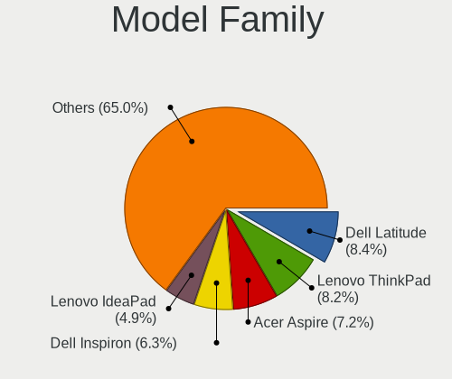
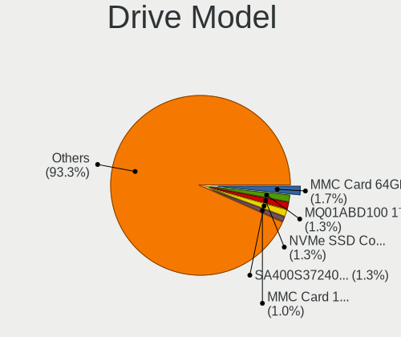
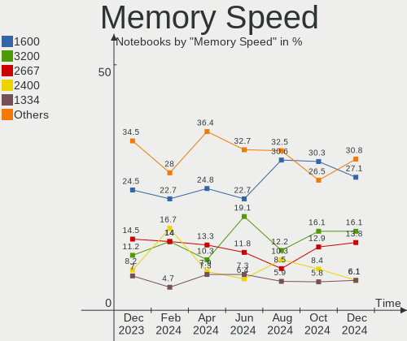

OpenMandriva Hardware Trends (Notebook)
---------------------------------------

A project to identify most popular hardware characteristics and track their change
over time based on data collected by OpenMandriva users at https://Linux-Hardware.org.

Anyone can contribute to the study by uploading probes of their computers by
the [hw-probe](https://github.com/linuxhw/hw-probe) tool:

    sudo -E hw-probe -all -upload

Full-feature report is available here: https://linux-hardware.org/?view=trends&formfactor=notebook

Period: Jun, 2021.

Contents
--------

- [ OS                       ](#os)
- [ OS Family                ](#os-family)
- [ Kernel                   ](#kernel)
- [ Kernel Family            ](#kernel-family)
- [ Kernel Major Ver.        ](#kernel-major-ver)
- [ Arch                     ](#arch)
- [ DE                       ](#de)
- [ Display Server           ](#display-server)
- [ Display Manager          ](#display-manager)
- [ OS Lang                  ](#os-lang)
- [ Boot Mode                ](#boot-mode)
- [ Filesystem               ](#filesystem)
- [ Part. scheme             ](#part-scheme)
- [ Dual Boot with Linux/BSD ](#dual-boot-with-linux/bsd)
- [ Dual Boot (Win)          ](#dual-boot-win)
- [ Country                  ](#country)
- [ City                     ](#city)
- [ Vendor                   ](#vendor)
- [ Model                    ](#model)
- [ Model Family             ](#model-family)
- [ MFG Year                 ](#mfg-year)
- [ Form Factor              ](#form-factor)
- [ Secure Boot              ](#secure-boot)
- [ Coreboot                 ](#coreboot)
- [ RAM Size                 ](#ram-size)
- [ RAM Used                 ](#ram-used)
- [ Has CD-ROM               ](#has-cd-rom)
- [ Total Drives             ](#total-drives)
- [ Has Ethernet             ](#has-ethernet)
- [ Has WiFi                 ](#has-wifi)
- [ Has Bluetooth            ](#has-bluetooth)
- [ Drive Vendor             ](#drive-vendor)
- [ Drive Model              ](#drive-model)
- [ HDD Vendor               ](#hdd-vendor)
- [ SSD Vendor               ](#ssd-vendor)
- [ Drive Kind               ](#drive-kind)
- [ Drive Connector          ](#drive-connector)
- [ Drive Size               ](#drive-size)
- [ Space Total              ](#space-total)
- [ Space Used               ](#space-used)
- [ Malfunc. Drives          ](#malfunc-drives)
- [ Malfunc. Drive Vendor    ](#malfunc-drive-vendor)
- [ Malfunc. HDD Vendor      ](#malfunc-hdd-vendor)
- [ Malfunc. Drive Kind      ](#malfunc-drive-kind)
- [ Failed Drives            ](#failed-drives)
- [ Failed Drive Vendor      ](#failed-drive-vendor)
- [ Drive Status             ](#drive-status)
- [ Storage Vendor           ](#storage-vendor)
- [ Storage Model            ](#storage-model)
- [ Storage Kind             ](#storage-kind)
- [ CPU Vendor               ](#cpu-vendor)
- [ CPU Model                ](#cpu-model)
- [ CPU Model Family         ](#cpu-model-family)
- [ CPU Cores                ](#cpu-cores)
- [ CPU Sockets              ](#cpu-sockets)
- [ CPU Threads              ](#cpu-threads)
- [ CPU Op-Modes             ](#cpu-op-modes)
- [ CPU Microcode            ](#cpu-microcode)
- [ CPU Microarch            ](#cpu-microarch)
- [ GPU Vendor               ](#gpu-vendor)
- [ GPU Model                ](#gpu-model)
- [ GPU Combo                ](#gpu-combo)
- [ GPU Driver               ](#gpu-driver)
- [ GPU Memory               ](#gpu-memory)
- [ Monitor Vendor           ](#monitor-vendor)
- [ Monitor Model            ](#monitor-model)
- [ Monitor Resolution       ](#monitor-resolution)
- [ Monitor Diagonal         ](#monitor-diagonal)
- [ Monitor Width            ](#monitor-width)
- [ Aspect Ratio             ](#aspect-ratio)
- [ Monitor Area             ](#monitor-area)
- [ Pixel Density            ](#pixel-density)
- [ Multiple Monitors        ](#multiple-monitors)
- [ Net Controller Vendor    ](#net-controller-vendor)
- [ Net Controller Model     ](#net-controller-model)
- [ Wireless Vendor          ](#wireless-vendor)
- [ Wireless Model           ](#wireless-model)
- [ Ethernet Vendor          ](#ethernet-vendor)
- [ Ethernet Model           ](#ethernet-model)
- [ Net Controller Kind      ](#net-controller-kind)
- [ Used Controller          ](#used-controller)
- [ NICs                     ](#nics)
- [ IPv6                     ](#ipv6)
- [ Memory Vendor            ](#memory-vendor)
- [ Memory Model             ](#memory-model)
- [ Memory Kind              ](#memory-kind)
- [ Memory Form Factor       ](#memory-form-factor)
- [ Memory Size              ](#memory-size)
- [ Memory Speed             ](#memory-speed)
- [ Sound Vendor             ](#sound-vendor)
- [ Sound Model              ](#sound-model)
- [ Camera Vendor            ](#camera-vendor)
- [ Camera Model             ](#camera-model)
- [ Fingerprint Vendor       ](#fingerprint-vendor)
- [ Fingerprint Model        ](#fingerprint-model)
- [ Chipcard Vendor          ](#chipcard-vendor)
- [ Chipcard Model           ](#chipcard-model)
- [ Printer Vendor           ](#printer-vendor)
- [ Printer Model            ](#printer-model)
- [ Scanner Vendor           ](#scanner-vendor)
- [ Scanner Model            ](#scanner-model)
- [ Bluetooth Vendor         ](#bluetooth-vendor)
- [ Bluetooth Model          ](#bluetooth-model)
- [ Unsupported Devices      ](#unsupported-devices)
- [ Unsupported Device Types ](#unsupported-device-types)

OS
--

Installed operating systems

| Name              | Notebooks | Percent |
|-------------------|-----------|---------|
| OpenMandriva 4.2  | 118       | 81.94%  |
| OpenMandriva 4.50 | 26        | 18.06%  |

OS Family
---------

OS without a version

| Name         | Notebooks | Percent |
|--------------|-----------|---------|
| OpenMandriva | 144       | 100%    |

Kernel
------

Version of the Linux kernel

| Version                  | Notebooks | Percent |
|--------------------------|-----------|---------|
| 5.10.14-desktop-1omv4002 | 110       | 76.39%  |
| 5.12.4-desktop-1omv4050  | 26        | 18.06%  |
| 5.11.12-desktop-1omv4002 | 8         | 5.56%   |

Kernel Family
-------------

Linux kernel without a distro release

| Version | Notebooks | Percent |
|---------|-----------|---------|
| 5.10.14 | 110       | 76.39%  |
| 5.12.4  | 26        | 18.06%  |
| 5.11.12 | 8         | 5.56%   |

Kernel Major Ver.
-----------------

Linux kernel major version

| Version | Notebooks | Percent |
|---------|-----------|---------|
| 5.10    | 110       | 76.39%  |
| 5.12    | 26        | 18.06%  |
| 5.11    | 8         | 5.56%   |

Arch
----

OS architecture (x86_64, i586, etc.)

| Name   | Notebooks | Percent |
|--------|-----------|---------|
| x86_64 | 144       | 100%    |

DE
--

Desktop Environment

| Name | Notebooks | Percent |
|------|-----------|---------|
| KDE5 | 144       | 100%    |

Display Server
--------------

X11 or Wayland

| Name | Notebooks | Percent |
|------|-----------|---------|
| X11  | 144       | 100%    |

Display Manager
---------------

SDDM, LightDM, etc.

| Name | Notebooks | Percent |
|------|-----------|---------|
| SDDM | 144       | 100%    |

OS Lang
-------

Language

| Lang  | Notebooks | Percent |
|-------|-----------|---------|
| en_US | 81        | 56.25%  |
| pt_BR | 9         | 6.25%   |
| de_DE | 8         | 5.56%   |
| ru_RU | 6         | 4.17%   |
| fr_FR | 6         | 4.17%   |
| pl_PL | 5         | 3.47%   |
| it_IT | 3         | 2.08%   |
| es_ES | 3         | 2.08%   |
| es_AR | 3         | 2.08%   |
| en_GB | 2         | 1.39%   |
| en_CA | 2         | 1.39%   |
| ru_UA | 1         | 0.69%   |
| pt_PT | 1         | 0.69%   |
| nl_NL | 1         | 0.69%   |
| nl_BE | 1         | 0.69%   |
| nb_NO | 1         | 0.69%   |
| hu_HU | 1         | 0.69%   |
| fr_CH | 1         | 0.69%   |
| fr_BE | 1         | 0.69%   |
| es_MX | 1         | 0.69%   |
| es_CO | 1         | 0.69%   |
| en_PH | 1         | 0.69%   |
| en_NZ | 1         | 0.69%   |
| en_IN | 1         | 0.69%   |
| en_AG | 1         | 0.69%   |
| da_DK | 1         | 0.69%   |
| cs_CZ | 1         | 0.69%   |

Boot Mode
---------

EFI or BIOS

| Mode | Notebooks | Percent |
|------|-----------|---------|
| BIOS | 80        | 55.56%  |
| EFI  | 64        | 44.44%  |

Filesystem
----------

Type of filesystem

| Type    | Notebooks | Percent |
|---------|-----------|---------|
| Overlay | 106       | 73.61%  |
| Ext4    | 37        | 25.69%  |
| Ext3    | 1         | 0.69%   |

Part. scheme
------------

Scheme of partitioning

| Type    | Notebooks | Percent |
|---------|-----------|---------|
| GPT     | 87        | 60.42%  |
| MBR     | 56        | 38.89%  |
| Unknown | 1         | 0.69%   |

Dual Boot with Linux/BSD
------------------------

Hosting more than one Linux/BSD

| Dual boot | Notebooks | Percent |
|-----------|-----------|---------|
| Yes       | 77        | 53.47%  |
| No        | 67        | 46.53%  |

Dual Boot (Win)
---------------

Hosting Linux and Windows

| Dual boot | Notebooks | Percent |
|-----------|-----------|---------|
| No        | 85        | 59.03%  |
| Yes       | 59        | 40.97%  |

Country
-------

Geographic location (country)

| Country            | Notebooks | Percent |
|--------------------|-----------|---------|
| USA                | 17        | 11.81%  |
| Germany            | 11        | 7.64%   |
| France             | 11        | 7.64%   |
| Brazil             | 11        | 7.64%   |
| Canada             | 9         | 6.25%   |
| Italy              | 8         | 5.56%   |
| Russia             | 6         | 4.17%   |
| Poland             | 6         | 4.17%   |
| UK                 | 5         | 3.47%   |
| Ukraine            | 4         | 2.78%   |
| Spain              | 4         | 2.78%   |
| India              | 4         | 2.78%   |
| Argentina          | 4         | 2.78%   |
| Hungary            | 3         | 2.08%   |
| South Africa       | 2         | 1.39%   |
| Philippines        | 2         | 1.39%   |
| New Zealand        | 2         | 1.39%   |
| Mexico             | 2         | 1.39%   |
| Japan              | 2         | 1.39%   |
| Iran               | 2         | 1.39%   |
| Denmark            | 2         | 1.39%   |
| Czechia            | 2         | 1.39%   |
| China              | 2         | 1.39%   |
| Belgium            | 2         | 1.39%   |
| Vietnam            | 1         | 0.69%   |
| Venezuela          | 1         | 0.69%   |
| Uruguay            | 1         | 0.69%   |
| UAE                | 1         | 0.69%   |
| Turkey             | 1         | 0.69%   |
| Taiwan             | 1         | 0.69%   |
| Sweden             | 1         | 0.69%   |
| Portugal           | 1         | 0.69%   |
| Norway             | 1         | 0.69%   |
| Netherlands        | 1         | 0.69%   |
| Malaysia           | 1         | 0.69%   |
| Madagascar         | 1         | 0.69%   |
| Indonesia          | 1         | 0.69%   |
| Hong Kong          | 1         | 0.69%   |
| Ghana              | 1         | 0.69%   |
| Finland            | 1         | 0.69%   |
| Dominican Republic | 1         | 0.69%   |
| Colombia           | 1         | 0.69%   |
| Bulgaria           | 1         | 0.69%   |
| Austria            | 1         | 0.69%   |
| Australia          | 1         | 0.69%   |

City
----

Geographic location (city)

| City                   | Notebooks | Percent |
|------------------------|-----------|---------|
| Saskatoon              | 3         | 2.08%   |
| Tehran                 | 2         | 1.39%   |
| St Petersburg          | 2         | 1.39%   |
| Rio de Janeiro         | 2         | 1.39%   |
| Palma                  | 2         | 1.39%   |
| Moscow                 | 2         | 1.39%   |
| Montmorency            | 2         | 1.39%   |
| Kyiv                   | 2         | 1.39%   |
| Floersheim             | 2         | 1.39%   |
| Corner Brook           | 2         | 1.39%   |
| Budapest               | 2         | 1.39%   |
| Zlín                  | 1         | 0.69%   |
| Zirndorf               | 1         | 0.69%   |
| Yokohama               | 1         | 0.69%   |
| Yekaterinburg          | 1         | 0.69%   |
| Wroclaw                | 1         | 0.69%   |
| Winnipeg               | 1         | 0.69%   |
| Warsaw                 | 1         | 0.69%   |
| Vinnytsia              | 1         | 0.69%   |
| Vigevano               | 1         | 0.69%   |
| Vienna                 | 1         | 0.69%   |
| Viborg                 | 1         | 0.69%   |
| Tucson                 | 1         | 0.69%   |
| Truro                  | 1         | 0.69%   |
| Torreón               | 1         | 0.69%   |
| Tonopah                | 1         | 0.69%   |
| Taunton                | 1         | 0.69%   |
| Tatabánya             | 1         | 0.69%   |
| Tarnowo Podgorne       | 1         | 0.69%   |
| São Paulo             | 1         | 0.69%   |
| São Luís             | 1         | 0.69%   |
| Strasbourg             | 1         | 0.69%   |
| Stamford               | 1         | 0.69%   |
| St. Catharines         | 1         | 0.69%   |
| Shenyang               | 1         | 0.69%   |
| Sao Goncalo            | 1         | 0.69%   |
| Santo Domingo Este     | 1         | 0.69%   |
| Santiago de Cali       | 1         | 0.69%   |
| San Giuseppe Vesuviano | 1         | 0.69%   |
| San Antonio            | 1         | 0.69%   |
| Salem                  | 1         | 0.69%   |
| Saint-Genis-Pouilly    | 1         | 0.69%   |
| Rocky River            | 1         | 0.69%   |
| Rio das Ostras         | 1         | 0.69%   |
| Prague                 | 1         | 0.69%   |
| Porto Alegre           | 1         | 0.69%   |
| Petaling Jaya          | 1         | 0.69%   |
| Pastrengo              | 1         | 0.69%   |
| Paris                  | 1         | 0.69%   |
| Palmer                 | 1         | 0.69%   |
| Oslo                   | 1         | 0.69%   |
| Odessa                 | 1         | 0.69%   |
| Norwalk                | 1         | 0.69%   |
| Nordhorn               | 1         | 0.69%   |
| Nizhniy Novgorod       | 1         | 0.69%   |
| Niigata                | 1         | 0.69%   |
| New Delhi              | 1         | 0.69%   |
| Nave                   | 1         | 0.69%   |
| Nanjing                | 1         | 0.69%   |
| Mönchengladbach       | 1         | 0.69%   |

Vendor
------

Motherboard manufacturer

| Name                | Notebooks | Percent |
|---------------------|-----------|---------|
| Hewlett-Packard     | 37        | 25.69%  |
| Lenovo              | 22        | 15.28%  |
| Dell                | 20        | 13.89%  |
| Acer                | 14        | 9.72%   |
| ASUSTek Computer    | 11        | 7.64%   |
| Toshiba             | 7         | 4.86%   |
| Samsung Electronics | 7         | 4.86%   |
| Sony                | 3         | 2.08%   |
| Packard Bell        | 2         | 1.39%   |
| Medion              | 2         | 1.39%   |
| Fujitsu             | 2         | 1.39%   |
| Apple               | 2         | 1.39%   |
| Unknown             | 2         | 1.39%   |
| VIT                 | 1         | 0.69%   |
| Purism              | 1         | 0.69%   |
| Positivo            | 1         | 0.69%   |
| Philco              | 1         | 0.69%   |
| Panasonic           | 1         | 0.69%   |
| MSI                 | 1         | 0.69%   |
| Motion Computing    | 1         | 0.69%   |
| Mediacom            | 1         | 0.69%   |
| LG Electronics      | 1         | 0.69%   |
| Intel               | 1         | 0.69%   |
| HUAWEI              | 1         | 0.69%   |
| GPD                 | 1         | 0.69%   |
| eMachines           | 1         | 0.69%   |

Model
-----

Motherboard model

| Name                                       | Notebooks | Percent |
|--------------------------------------------|-----------|---------|
| HP 2000                                    | 3         | 2.08%   |
| Unknown                                    | 3         | 2.08%   |
| Toshiba Satellite L500D                    | 2         | 1.39%   |
| HP Notebook                                | 2         | 1.39%   |
| HP G42                                     | 2         | 1.39%   |
| Dell Latitude E6510                        | 2         | 1.39%   |
| Dell Latitude E6420                        | 2         | 1.39%   |
| Dell Latitude E6400                        | 2         | 1.39%   |
| Dell Latitude 5410                         | 2         | 1.39%   |
| Acer Aspire E5-573                         | 2         | 1.39%   |
| VIT P1400                                  | 1         | 0.69%   |
| Toshiba Satellite S875D                    | 1         | 0.69%   |
| Toshiba Satellite R830                     | 1         | 0.69%   |
| Toshiba Satellite L515                     | 1         | 0.69%   |
| Toshiba NB305                              | 1         | 0.69%   |
| Toshiba dynabook R73/BN                    | 1         | 0.69%   |
| Sony VGN-NR230FE                           | 1         | 0.69%   |
| Sony SVE1713Y1EB                           | 1         | 0.69%   |
| Sony SVE14A3M1RW                           | 1         | 0.69%   |
| Samsung RV415                              | 1         | 0.69%   |
| Samsung R540/R580/R780/SA41/E452/E852      | 1         | 0.69%   |
| Samsung 550P5C/550P7C                      | 1         | 0.69%   |
| Samsung 450R4E/450R5E/450R4V/450R5V/4450RV | 1         | 0.69%   |
| Samsung 3570R/370R/470R/450R/510R/4450RV   | 1         | 0.69%   |
| Samsung 340XAA/350XAA/550XAA               | 1         | 0.69%   |
| Samsung 300E4A/300E5A/300E7A/3430EA/3530EA | 1         | 0.69%   |
| Purism Librem 15 v3                        | 1         | 0.69%   |
| Positivo C14CU51                           | 1         | 0.69%   |
| Philco 14I                                 | 1         | 0.69%   |
| Panasonic CF-C2CQAZXCM                     | 1         | 0.69%   |
| Packard Bell EasyNote TH36                 | 1         | 0.69%   |
| Packard Bell EasyNote TE11HC               | 1         | 0.69%   |
| MSI MS-16G1                                | 1         | 0.69%   |
| Motion Computing C5te                      | 1         | 0.69%   |
| Medion Erazer P7643 MD99977                | 1         | 0.69%   |
| Medion E6411 MD99247                       | 1         | 0.69%   |
| Mediacom SmartBook Pro i5                  | 1         | 0.69%   |
| LG C500-G.AEF5BE1                          | 1         | 0.69%   |
| Lenovo V330-15IKB 81AX                     | 1         | 0.69%   |
| Lenovo V130-14IKB 81HQ                     | 1         | 0.69%   |
| Lenovo ThinkPad X230 23257Y1               | 1         | 0.69%   |
| Lenovo ThinkPad X201 3626RZ4               | 1         | 0.69%   |
| Lenovo ThinkPad T60p 2008UJU               | 1         | 0.69%   |
| Lenovo ThinkPad T460s 20FAS2L60X           | 1         | 0.69%   |
| Lenovo ThinkPad T440s 20ARS1B704           | 1         | 0.69%   |
| Lenovo ThinkPad T420 4236Y19               | 1         | 0.69%   |
| Lenovo ThinkPad T420 42363S6               | 1         | 0.69%   |
| Lenovo ThinkPad T410s 291236G              | 1         | 0.69%   |
| Lenovo ThinkPad L530 24811K2               | 1         | 0.69%   |
| Lenovo ThinkPad Edge 057872G               | 1         | 0.69%   |
| Lenovo ThinkPad 11e 3rd Gen 20GB000SUS     | 1         | 0.69%   |
| Lenovo IdeaPad Y430 20005                  | 1         | 0.69%   |
| Lenovo IdeaPad S340-15APITouch 81QG        | 1         | 0.69%   |
| Lenovo IdeaPad 510-15IKB 80SV              | 1         | 0.69%   |
| Lenovo IdeaPad 310-15ISK 80SM              | 1         | 0.69%   |
| Lenovo IdeaPad 310-14ISK 80UG              | 1         | 0.69%   |
| Lenovo IdeaPad 3 15IML05 81WB              | 1         | 0.69%   |
| Lenovo IdeaPad 130-14IKB 81H6              | 1         | 0.69%   |
| Lenovo IdeaPad 100-15IBD 80QQ              | 1         | 0.69%   |
| Lenovo G50-30 80G0                         | 1         | 0.69%   |

Model Family
------------

Motherboard model prefix

| Name                   | Notebooks | Percent |
|------------------------|-----------|---------|
| Dell Latitude          | 13        | 9.03%   |
| Lenovo ThinkPad        | 11        | 7.64%   |
| Lenovo IdeaPad         | 8         | 5.56%   |
| HP Laptop              | 8         | 5.56%   |
| Acer Aspire            | 8         | 5.56%   |
| Dell Inspiron          | 7         | 4.86%   |
| Toshiba Satellite      | 5         | 3.47%   |
| HP EliteBook           | 5         | 3.47%   |
| HP Pavilion            | 4         | 2.78%   |
| HP Compaq              | 4         | 2.78%   |
| HP 2000                | 3         | 2.08%   |
| Unknown                | 3         | 2.08%   |
| Packard Bell EasyNote  | 2         | 1.39%   |
| HP ProBook             | 2         | 1.39%   |
| HP Notebook            | 2         | 1.39%   |
| HP G42                 | 2         | 1.39%   |
| Acer TravelMate        | 2         | 1.39%   |
| Acer Extensa           | 2         | 1.39%   |
| VIT P1400              | 1         | 0.69%   |
| Toshiba NB305          | 1         | 0.69%   |
| Toshiba dynabook       | 1         | 0.69%   |
| Sony VGN-NR230FE       | 1         | 0.69%   |
| Sony SVE1713Y1EB       | 1         | 0.69%   |
| Sony SVE14A3M1RW       | 1         | 0.69%   |
| Samsung RV415          | 1         | 0.69%   |
| Samsung R540           | 1         | 0.69%   |
| Samsung 550P5C         | 1         | 0.69%   |
| Samsung 450R4E         | 1         | 0.69%   |
| Samsung 3570R          | 1         | 0.69%   |
| Samsung 340XAA         | 1         | 0.69%   |
| Samsung 300E4A         | 1         | 0.69%   |
| Purism Librem          | 1         | 0.69%   |
| Positivo C14CU51       | 1         | 0.69%   |
| Philco 14I             | 1         | 0.69%   |
| Panasonic CF-C2CQAZXCM | 1         | 0.69%   |
| MSI MS-16G1            | 1         | 0.69%   |
| Motion Computing C5te  | 1         | 0.69%   |
| Medion Erazer          | 1         | 0.69%   |
| Medion E6411           | 1         | 0.69%   |
| Mediacom SmartBook     | 1         | 0.69%   |
| LG C500-G.AEF5BE1      | 1         | 0.69%   |
| Lenovo V330-15IKB      | 1         | 0.69%   |
| Lenovo V130-14IKB      | 1         | 0.69%   |
| Lenovo G50-30          | 1         | 0.69%   |
| Intel Infoway          | 1         | 0.69%   |
| HUAWEI HLY-WX9XX       | 1         | 0.69%   |
| HP Stream              | 1         | 0.69%   |
| HP G62                 | 1         | 0.69%   |
| HP ENVY                | 1         | 0.69%   |
| HP 550                 | 1         | 0.69%   |
| HP 245                 | 1         | 0.69%   |
| HP 14                  | 1         | 0.69%   |
| GPD G1618-03           | 1         | 0.69%   |
| Fujitsu LIFEBOOK       | 1         | 0.69%   |
| Fujitsu FMVE01004      | 1         | 0.69%   |
| eMachines E720         | 1         | 0.69%   |
| ASUS ZenBook           | 1         | 0.69%   |
| ASUS X541NA            | 1         | 0.69%   |
| ASUS VivoBook          | 1         | 0.69%   |
| ASUS U41SV             | 1         | 0.69%   |

MFG Year
--------

Motherboard manufacture year

| Year    | Notebooks | Percent |
|---------|-----------|---------|
| 2020    | 16        | 11.11%  |
| 2019    | 16        | 11.11%  |
| 2010    | 15        | 10.42%  |
| 2011    | 13        | 9.03%   |
| 2014    | 11        | 7.64%   |
| 2013    | 10        | 6.94%   |
| 2018    | 9         | 6.25%   |
| 2012    | 9         | 6.25%   |
| 2015    | 8         | 5.56%   |
| 2009    | 8         | 5.56%   |
| 2021    | 7         | 4.86%   |
| 2017    | 6         | 4.17%   |
| 2016    | 6         | 4.17%   |
| 2008    | 4         | 2.78%   |
| 2007    | 4         | 2.78%   |
| 2006    | 1         | 0.69%   |
| Unknown | 1         | 0.69%   |

Form Factor
-----------

Physical design of the computer

| Name     | Notebooks | Percent |
|----------|-----------|---------|
| Notebook | 144       | 100%    |

Secure Boot
-----------

Enabled or disabled

| State    | Notebooks | Percent |
|----------|-----------|---------|
| Disabled | 144       | 100%    |

Coreboot
--------

Have coreboot on board

| Used | Notebooks | Percent |
|------|-----------|---------|
| No   | 143       | 99.31%  |
| Yes  | 1         | 0.69%   |

RAM Size
--------

Total RAM memory

| Size in GB | Notebooks | Percent |
|------------|-----------|---------|
| 3.01-4.0   | 56        | 38.89%  |
| 4.01-8.0   | 34        | 23.61%  |
| 8.01-16.0  | 26        | 18.06%  |
| 1.01-2.0   | 10        | 6.94%   |
| 16.01-24.0 | 9         | 6.25%   |
| 2.01-3.0   | 5         | 3.47%   |
| 32.01-64.0 | 2         | 1.39%   |
| 0.51-1.0   | 2         | 1.39%   |

RAM Used
--------

Used RAM memory

| Used GB  | Notebooks | Percent |
|----------|-----------|---------|
| 1.01-2.0 | 121       | 84.03%  |
| 0.51-1.0 | 15        | 10.42%  |
| 2.01-3.0 | 6         | 4.17%   |
| 0.01-0.5 | 2         | 1.39%   |

Has CD-ROM
----------

Has CD-ROM on board

| Presented | Notebooks | Percent |
|-----------|-----------|---------|
| Yes       | 91        | 63.19%  |
| No        | 53        | 36.81%  |

Total Drives
------------

Number of drives on board

| Drives | Notebooks | Percent |
|--------|-----------|---------|
| 1      | 119       | 82.64%  |
| 2      | 21        | 14.58%  |
| 0      | 3         | 2.08%   |
| 3      | 1         | 0.69%   |

Has Ethernet
------------

Has Ethernet on board

| Presented | Notebooks | Percent |
|-----------|-----------|---------|
| Yes       | 129       | 89.58%  |
| No        | 15        | 10.42%  |

Has WiFi
--------

Has WiFi module

| Presented | Notebooks | Percent |
|-----------|-----------|---------|
| Yes       | 143       | 99.31%  |
| No        | 1         | 0.69%   |

Has Bluetooth
-------------

Has Bluetooth module

| Presented | Notebooks | Percent |
|-----------|-----------|---------|
| Yes       | 97        | 67.36%  |
| No        | 47        | 32.64%  |

Drive Vendor
------------

Hard drive vendors

| Vendor              | Notebooks | Drives | Percent |
|---------------------|-----------|--------|---------|
| Seagate             | 24        | 24     | 15.79%  |
| Toshiba             | 22        | 23     | 14.47%  |
| WDC                 | 16        | 16     | 10.53%  |
| Samsung Electronics | 14        | 14     | 9.21%   |
| Kingston            | 11        | 11     | 7.24%   |
| Hitachi             | 11        | 11     | 7.24%   |
| HGST                | 7         | 7      | 4.61%   |
| SK Hynix            | 5         | 5      | 3.29%   |
| Patriot             | 4         | 4      | 2.63%   |
| Intel               | 4         | 5      | 2.63%   |
| Crucial             | 4         | 4      | 2.63%   |
| Unknown             | 3         | 3      | 1.97%   |
| Union Memory        | 3         | 3      | 1.97%   |
| SanDisk             | 3         | 3      | 1.97%   |
| ShanDianZhe         | 2         | 2      | 1.32%   |
| China               | 2         | 2      | 1.32%   |
| A-DATA Technology   | 2         | 2      | 1.32%   |
| Transcend           | 1         | 1      | 0.66%   |
| TO Exter            | 1         | 1      | 0.66%   |
| SPCC                | 1         | 1      | 0.66%   |
| OCZ                 | 1         | 1      | 0.66%   |
| Micron Technology   | 1         | 1      | 0.66%   |
| Leven               | 1         | 1      | 0.66%   |
| KIOXIA              | 1         | 1      | 0.66%   |
| Intenso             | 1         | 1      | 0.66%   |
| INNOVATION IT       | 1         | 1      | 0.66%   |
| HGST HTS            | 1         | 1      | 0.66%   |
| Hewlett-Packard     | 1         | 1      | 0.66%   |
| Fujitsu             | 1         | 1      | 0.66%   |
| BIWIN               | 1         | 1      | 0.66%   |
| Apple               | 1         | 1      | 0.66%   |
| Apacer              | 1         | 1      | 0.66%   |

Drive Model
-----------

Hard drive models

| Model                                   | Notebooks | Percent |
|-----------------------------------------|-----------|---------|
| Seagate ST1000LM024 HN-M101MBB 1TB      | 5         | 3.25%   |
| Toshiba MQ01ABF050 500GB                | 4         | 2.6%    |
| Toshiba MQ01ABD100 1TB                  | 4         | 2.6%    |
| WDC WD10JPVX-22JC3T0 1TB                | 3         | 1.95%   |
| Seagate ST500LT012-1DG142 500GB         | 3         | 1.95%   |
| Seagate ST320LM001 HN-M320MBB 320GB     | 3         | 1.95%   |
| WDC WD5000LPVX-22V0TT0 500GB            | 2         | 1.3%    |
| WDC WD5000LPCX-75VHAT0 500GB            | 2         | 1.3%    |
| Union Memory UMIS RPJTJ512MEE1OWX 512GB | 2         | 1.3%    |
| Toshiba MQ01ABD050 500GB                | 2         | 1.3%    |
| Toshiba MK2555GSX 250GB                 | 2         | 1.3%    |
| SK Hynix PC611 NVMe 1TB                 | 2         | 1.3%    |
| ShanDianZhe SSD 128GB                   | 2         | 1.3%    |
| Seagate ST9320423AS 320GB               | 2         | 1.3%    |
| Seagate ST9250410AS 250GB               | 2         | 1.3%    |
| Seagate ST9250315AS 250GB               | 2         | 1.3%    |
| Kingston SV300S37A120G 120GB SSD        | 2         | 1.3%    |
| Kingston SUV400S37240G 240GB SSD        | 2         | 1.3%    |
| Kingston SA400S37480G 480GB SSD         | 2         | 1.3%    |
| Kingston SA400S37120G 120GB SSD         | 2         | 1.3%    |
| Hitachi HTS723232A7A364 320GB           | 2         | 1.3%    |
| Hitachi HTS547564A9E384 640GB           | 2         | 1.3%    |
| Hitachi HTS545050B9A300 500GB           | 2         | 1.3%    |
| HGST HTS545050A7E380 500GB              | 2         | 1.3%    |
| HGST HTS541010A9E680 1TB                | 2         | 1.3%    |
| Crucial CT120BX500SSD1 120GB            | 2         | 1.3%    |
| WDC WDS500G2B0A-00SM50 500GB SSD        | 1         | 0.65%   |
| WDC WDS120G2G0B-00EPW0 120GB SSD        | 1         | 0.65%   |
| WDC WD5000BPVT-60HXZT3 500GB            | 1         | 0.65%   |
| WDC WD5000BEVT-60A0RT0 500GB            | 1         | 0.65%   |
| WDC WD3200LPVX-22V0TT0 320GB            | 1         | 0.65%   |
| WDC WD3200BUCT-63TWBY0 320GB            | 1         | 0.65%   |
| WDC WD1600BEVT-75A23T0 160GB            | 1         | 0.65%   |
| WDC WD10JPVX-60JC3T1 1TB                | 1         | 0.65%   |
| WDC WD10JPCX-24UE4T0 1TB                | 1         | 0.65%   |
| Unknown TA2964  64GB                    | 1         | 0.65%   |
| Unknown SD/MMC/MS PRO 128GB             | 1         | 0.65%   |
| Unknown 64GB SATA Flash Drive SSD       | 1         | 0.65%   |
| Union Memory RPFTJ128PDD2EWX 128GB      | 1         | 0.65%   |
| Transcend TS512GMTS430S 512GB SSD       | 1         | 0.65%   |
| Toshiba MQ04ABF100V -63 1TB             | 1         | 0.65%   |
| Toshiba MQ04ABF100 1TB                  | 1         | 0.65%   |
| Toshiba MQ04ABD200 2TB                  | 1         | 0.65%   |
| Toshiba MQ02ABF050H 500GB               | 1         | 0.65%   |
| Toshiba MQ02ABD100H 1TB                 | 1         | 0.65%   |
| Toshiba MQ01ACF050 500GB                | 1         | 0.65%   |
| Toshiba MQ01ABF032 320GB                | 1         | 0.65%   |
| Toshiba MK5061GSY 500GB                 | 1         | 0.65%   |
| Toshiba MK3255GSX 320GB                 | 1         | 0.65%   |
| Toshiba MK1234GSX 120GB                 | 1         | 0.65%   |
| Toshiba KBG30ZMS128G NVMe 128GB         | 1         | 0.65%   |
| TO Exter nal USB 3.0 752GB              | 1         | 0.65%   |
| SPCC Solid State Disk 64GB              | 1         | 0.65%   |
| SK Hynix SC308 SATA 256GB SSD           | 1         | 0.65%   |
| SK Hynix HFM512GD3JX013N 512GB          | 1         | 0.65%   |
| SK Hynix HCG8e  64GB                    | 1         | 0.65%   |
| Seagate ST9750420AS 752GB               | 1         | 0.65%   |
| Seagate ST9500325AS 500GB               | 1         | 0.65%   |
| Seagate ST9250827AS 250GB               | 1         | 0.65%   |
| Seagate ST500LM034-2GH17A 500GB         | 1         | 0.65%   |

HDD Vendor
----------

Hard disk drive vendors

| Vendor              | Notebooks | Drives | Percent |
|---------------------|-----------|--------|---------|
| Seagate             | 24        | 24     | 30%     |
| Toshiba             | 21        | 22     | 26.25%  |
| WDC                 | 14        | 14     | 17.5%   |
| Hitachi             | 11        | 11     | 13.75%  |
| HGST                | 7         | 7      | 8.75%   |
| Samsung Electronics | 1         | 1      | 1.25%   |
| HGST HTS            | 1         | 1      | 1.25%   |
| Fujitsu             | 1         | 1      | 1.25%   |

SSD Vendor
----------

Solid state drive vendors

| Vendor              | Notebooks | Drives | Percent |
|---------------------|-----------|--------|---------|
| Kingston            | 11        | 11     | 20%     |
| Samsung Electronics | 9         | 9      | 16.36%  |
| Patriot             | 4         | 4      | 7.27%   |
| Crucial             | 4         | 4      | 7.27%   |
| SanDisk             | 3         | 3      | 5.45%   |
| Intel               | 3         | 3      | 5.45%   |
| WDC                 | 2         | 2      | 3.64%   |
| ShanDianZhe         | 2         | 2      | 3.64%   |
| China               | 2         | 2      | 3.64%   |
| A-DATA Technology   | 2         | 2      | 3.64%   |
| Unknown             | 1         | 1      | 1.82%   |
| Transcend           | 1         | 1      | 1.82%   |
| TO Exter            | 1         | 1      | 1.82%   |
| SPCC                | 1         | 1      | 1.82%   |
| SK Hynix            | 1         | 1      | 1.82%   |
| OCZ                 | 1         | 1      | 1.82%   |
| Micron Technology   | 1         | 1      | 1.82%   |
| Leven               | 1         | 1      | 1.82%   |
| Intenso             | 1         | 1      | 1.82%   |
| INNOVATION IT       | 1         | 1      | 1.82%   |
| Hewlett-Packard     | 1         | 1      | 1.82%   |
| Apple               | 1         | 1      | 1.82%   |
| Apacer              | 1         | 1      | 1.82%   |

Drive Kind
----------

HDD or SSD

| Kind    | Notebooks | Drives | Percent |
|---------|-----------|--------|---------|
| HDD     | 78        | 81     | 52.7%   |
| SSD     | 53        | 55     | 35.81%  |
| NVMe    | 14        | 15     | 9.46%   |
| MMC     | 2         | 2      | 1.35%   |
| Unknown | 1         | 1      | 0.68%   |

Drive Connector
---------------

SATA, SAS, NVMe, etc.

| Type | Notebooks | Drives | Percent |
|------|-----------|--------|---------|
| SATA | 124       | 133    | 86.11%  |
| NVMe | 14        | 15     | 9.72%   |
| SAS  | 4         | 4      | 2.78%   |
| MMC  | 2         | 2      | 1.39%   |

Drive Size
----------

Size of hard drive

| Size in TB | Notebooks | Drives | Percent |
|------------|-----------|--------|---------|
| 0.01-0.5   | 97        | 101    | 74.62%  |
| 0.51-1.0   | 32        | 34     | 24.62%  |
| 1.01-2.0   | 1         | 1      | 0.77%   |

Space Total
-----------

Amount of disk space available on the file system

| Size in GB | Notebooks | Percent |
|------------|-----------|---------|
| 1-20       | 84        | 58.33%  |
| 101-250    | 22        | 15.28%  |
| 251-500    | 11        | 7.64%   |
| Unknown    | 10        | 6.94%   |
| 501-1000   | 7         | 4.86%   |
| 21-50      | 5         | 3.47%   |
| 51-100     | 3         | 2.08%   |
| 1001-2000  | 2         | 1.39%   |

Space Used
----------

Amount of used disk space

| Used GB   | Notebooks | Percent |
|-----------|-----------|---------|
| 1-20      | 127       | 88.19%  |
| Unknown   | 10        | 6.94%   |
| 21-50     | 4         | 2.78%   |
| 251-500   | 1         | 0.69%   |
| 1001-2000 | 1         | 0.69%   |
| 51-100    | 1         | 0.69%   |

Malfunc. Drives
---------------

Drive models with a malfunction

| Model                               | Notebooks | Drives | Percent |
|-------------------------------------|-----------|--------|---------|
| Toshiba MQ01ABD050 500GB            | 2         | 2      | 6.06%   |
| Seagate ST9250315AS 250GB           | 2         | 2      | 6.06%   |
| Hitachi HTS545050B9A300 500GB       | 2         | 2      | 6.06%   |
| HGST HTS541010A9E680 1TB            | 2         | 2      | 6.06%   |
| WDC WD5000LPVX-22V0TT0 500GB        | 1         | 1      | 3.03%   |
| WDC WD5000BPVT-60HXZT3 500GB        | 1         | 1      | 3.03%   |
| WDC WD5000BEVT-60A0RT0 500GB        | 1         | 1      | 3.03%   |
| WDC WD1600BEVT-75A23T0 160GB        | 1         | 1      | 3.03%   |
| Toshiba MQ02ABF050H 500GB           | 1         | 1      | 3.03%   |
| Toshiba MQ02ABD100H 1TB             | 1         | 1      | 3.03%   |
| Toshiba MQ01ABF050 500GB            | 1         | 1      | 3.03%   |
| Toshiba MQ01ABD100 1TB              | 1         | 1      | 3.03%   |
| Toshiba MK1234GSX 120GB             | 1         | 1      | 3.03%   |
| Seagate ST9500325AS 500GB           | 1         | 1      | 3.03%   |
| Seagate ST9320423AS 320GB           | 1         | 1      | 3.03%   |
| Seagate ST9250827AS 250GB           | 1         | 1      | 3.03%   |
| Seagate ST9250410AS 250GB           | 1         | 1      | 3.03%   |
| Seagate ST500LT012-1DG142 500GB     | 1         | 1      | 3.03%   |
| Seagate ST500LM012 HN-M500MBB 500GB | 1         | 1      | 3.03%   |
| Seagate ST1000LM024 HN-M101MBB 1TB  | 1         | 1      | 3.03%   |
| Intenso SSD 120GB                   | 1         | 1      | 3.03%   |
| Intel SSDSA2M040G2GC 40GB           | 1         | 1      | 3.03%   |
| Intel SSDSA1M080G2LE 80GB           | 1         | 1      | 3.03%   |
| Hitachi HTS727550A9E364 500GB       | 1         | 1      | 3.03%   |
| Hitachi HTS547564A9E384 640GB       | 1         | 1      | 3.03%   |
| HGST HTS725032A7E630 320GB          | 1         | 1      | 3.03%   |
| HGST HTS545050A7E380 500GB          | 1         | 1      | 3.03%   |
| HGST HTS541075A9E680 752GB          | 1         | 1      | 3.03%   |
| A-DATA Technology SP900 128GB SSD   | 1         | 1      | 3.03%   |

Malfunc. Drive Vendor
---------------------

Vendors of faulty drives

| Vendor            | Notebooks | Drives | Percent |
|-------------------|-----------|--------|---------|
| Seagate           | 9         | 9      | 27.27%  |
| Toshiba           | 7         | 7      | 21.21%  |
| HGST              | 5         | 5      | 15.15%  |
| WDC               | 4         | 4      | 12.12%  |
| Hitachi           | 4         | 4      | 12.12%  |
| Intel             | 2         | 2      | 6.06%   |
| Intenso           | 1         | 1      | 3.03%   |
| A-DATA Technology | 1         | 1      | 3.03%   |

Malfunc. HDD Vendor
-------------------

Vendors of faulty HDD drives

| Vendor  | Notebooks | Drives | Percent |
|---------|-----------|--------|---------|
| Seagate | 9         | 9      | 31.03%  |
| Toshiba | 7         | 7      | 24.14%  |
| HGST    | 5         | 5      | 17.24%  |
| WDC     | 4         | 4      | 13.79%  |
| Hitachi | 4         | 4      | 13.79%  |

Malfunc. Drive Kind
-------------------

Kinds of faulty drives

| Kind | Notebooks | Drives | Percent |
|------|-----------|--------|---------|
| HDD  | 29        | 29     | 87.88%  |
| SSD  | 4         | 4      | 12.12%  |

Failed Drives
-------------

Failed drive models

| Model                    | Notebooks | Drives | Percent |
|--------------------------|-----------|--------|---------|
| Toshiba MQ01ABF050 500GB | 1         | 1      | 100%    |

Failed Drive Vendor
-------------------

Failed drive vendors

| Vendor  | Notebooks | Drives | Percent |
|---------|-----------|--------|---------|
| Toshiba | 1         | 1      | 100%    |

Drive Status
------------

Number of failed and malfunc. drives

| Status   | Notebooks | Drives | Percent |
|----------|-----------|--------|---------|
| Works    | 105       | 115    | 72.92%  |
| Malfunc  | 33        | 33     | 22.92%  |
| Detected | 5         | 5      | 3.47%   |
| Failed   | 1         | 1      | 0.69%   |

Storage Vendor
--------------

Storage controller vendors

| Vendor                       | Notebooks | Percent |
|------------------------------|-----------|---------|
| Intel                        | 121       | 81.21%  |
| AMD                          | 14        | 9.4%    |
| Samsung Electronics          | 5         | 3.36%   |
| Union Memory (Shenzhen)      | 3         | 2.01%   |
| SK Hynix                     | 3         | 2.01%   |
| Toshiba America Info Systems | 1         | 0.67%   |
| KIOXIA                       | 1         | 0.67%   |
| Biwin Storage Technology     | 1         | 0.67%   |

Storage Model
-------------

Storage controller models

| Model                                                                                  | Notebooks | Percent |
|----------------------------------------------------------------------------------------|-----------|---------|
| Intel Sunrise Point-LP SATA Controller [AHCI mode]                                     | 18        | 10.98%  |
| Intel 7 Series Chipset Family 6-port SATA Controller [AHCI mode]                       | 17        | 10.37%  |
| Intel 6 Series/C200 Series Chipset Family 6 port Mobile SATA AHCI Controller           | 11        | 6.71%   |
| Intel 82801 Mobile SATA Controller [RAID mode]                                         | 10        | 6.1%    |
| Intel 5 Series/3400 Series Chipset 4 port SATA AHCI Controller                         | 9         | 5.49%   |
| Intel Wildcat Point-LP SATA Controller [AHCI Mode]                                     | 8         | 4.88%   |
| Intel 8 Series SATA Controller 1 [AHCI mode]                                           | 8         | 4.88%   |
| AMD FCH SATA Controller [AHCI mode]                                                    | 8         | 4.88%   |
| Intel 82801IBM/IEM (ICH9M/ICH9M-E) 4 port SATA Controller [AHCI mode]                  | 7         | 4.27%   |
| Intel 82801HM/HEM (ICH8M/ICH8M-E) SATA Controller [AHCI mode]                          | 7         | 4.27%   |
| Intel 82801HM/HEM (ICH8M/ICH8M-E) IDE Controller                                       | 7         | 4.27%   |
| AMD SB7x0/SB8x0/SB9x0 SATA Controller [AHCI mode]                                      | 6         | 3.66%   |
| Intel 5 Series/3400 Series Chipset 6 port SATA AHCI Controller                         | 5         | 3.05%   |
| Union Memory (Shenzhen) Non-Volatile memory controller                                 | 3         | 1.83%   |
| Intel Comet Lake SATA AHCI Controller                                                  | 3         | 1.83%   |
| Intel Celeron N3350/Pentium N4200/Atom E3900 Series SATA AHCI Controller               | 3         | 1.83%   |
| AMD SB7x0/SB8x0/SB9x0 IDE Controller                                                   | 3         | 1.83%   |
| SK Hynix Non-Volatile memory controller                                                | 2         | 1.22%   |
| Samsung NVMe Controller                                                                | 2         | 1.22%   |
| Intel NM10/ICH7 Family SATA Controller [AHCI mode]                                     | 2         | 1.22%   |
| Intel Atom Processor E3800 Series SATA AHCI Controller                                 | 2         | 1.22%   |
| Intel 8 Series/C220 Series Chipset Family 6-port SATA Controller 1 [AHCI mode]         | 2         | 1.22%   |
| Intel 6 Series/C200 Series Chipset Family Mobile SATA Controller (IDE mode, ports 4-5) | 2         | 1.22%   |
| Intel 6 Series/C200 Series Chipset Family Mobile SATA Controller (IDE mode, ports 0-3) | 2         | 1.22%   |
| Toshiba America Info Systems BG3 NVMe SSD Controller                                   | 1         | 0.61%   |
| SK Hynix NVMe SSD Controller                                                           | 1         | 0.61%   |
| Samsung NVMe SSD Controller SM981/PM981/PM983                                          | 1         | 0.61%   |
| Samsung NVMe SSD Controller SM961/PM961/SM963                                          | 1         | 0.61%   |
| Samsung Apple PCIe SSD                                                                 | 1         | 0.61%   |
| KIOXIA Non-Volatile memory controller                                                  | 1         | 0.61%   |
| Intel Non-Volatile memory controller                                                   | 1         | 0.61%   |
| Intel Mobile PM965/GM965 PT IDER Controller                                            | 1         | 0.61%   |
| Intel Celeron/Pentium Silver Processor SATA Controller                                 | 1         | 0.61%   |
| Intel Cannon Point-LP SATA Controller [AHCI Mode]                                      | 1         | 0.61%   |
| Intel Atom/Celeron/Pentium Processor x5-E8000/J3xxx/N3xxx Series SATA Controller       | 1         | 0.61%   |
| Intel 82801IBM/IEM (ICH9M/ICH9M-E) 2 port SATA Controller [IDE mode]                   | 1         | 0.61%   |
| Intel 82801HM/HEM (ICH8M/ICH8M-E) SATA Controller [IDE mode]                           | 1         | 0.61%   |
| Intel 82801GBM/GHM (ICH7-M Family) SATA Controller [IDE mode]                          | 1         | 0.61%   |
| Intel 82801GBM/GHM (ICH7-M Family) SATA Controller [AHCI mode]                         | 1         | 0.61%   |
| Intel 82801G (ICH7 Family) IDE Controller                                              | 1         | 0.61%   |
| Biwin Storage Non-Volatile memory controller                                           | 1         | 0.61%   |

Storage Kind
------------

Kind of storage controller (IDE, SATA, NVMe, SAS, ...)

| Kind | Notebooks | Percent |
|------|-----------|---------|
| SATA | 121       | 75.16%  |
| IDE  | 16        | 9.94%   |
| NVMe | 14        | 8.7%    |
| RAID | 10        | 6.21%   |

CPU Vendor
----------

Processor vendors

| Vendor | Notebooks | Percent |
|--------|-----------|---------|
| Intel  | 124       | 86.11%  |
| AMD    | 20        | 13.89%  |

CPU Model
---------

Processor models

| Model                                         | Notebooks | Percent |
|-----------------------------------------------|-----------|---------|
| Intel Core i5-2540M CPU @ 2.60GHz             | 4         | 2.78%   |
| Intel Pentium CPU B960 @ 2.20GHz              | 3         | 2.08%   |
| Intel Core i7-6500U CPU @ 2.50GHz             | 3         | 2.08%   |
| Intel Core i5-6200U CPU @ 2.30GHz             | 3         | 2.08%   |
| Intel Core i5-2410M CPU @ 2.30GHz             | 3         | 2.08%   |
| Intel Core i5 CPU M 520 @ 2.40GHz             | 3         | 2.08%   |
| Intel Core i3-5005U CPU @ 2.00GHz             | 3         | 2.08%   |
| Intel Core i3-4005U CPU @ 1.70GHz             | 3         | 2.08%   |
| Intel Celeron CPU N3350 @ 1.10GHz             | 3         | 2.08%   |
| Intel Celeron CPU N2840 @ 2.16GHz             | 3         | 2.08%   |
| Intel Pentium Dual-Core CPU T4300 @ 2.10GHz   | 2         | 1.39%   |
| Intel Core i7-6600U CPU @ 2.60GHz             | 2         | 1.39%   |
| Intel Core i7-3632QM CPU @ 2.20GHz            | 2         | 1.39%   |
| Intel Core i7-2630QM CPU @ 2.00GHz            | 2         | 1.39%   |
| Intel Core i7-10810U CPU @ 1.10GHz            | 2         | 1.39%   |
| Intel Core i5-7200U CPU @ 2.50GHz             | 2         | 1.39%   |
| Intel Core i5-5200U CPU @ 2.20GHz             | 2         | 1.39%   |
| Intel Core i5-4210U CPU @ 1.70GHz             | 2         | 1.39%   |
| Intel Core i5-3230M CPU @ 2.60GHz             | 2         | 1.39%   |
| Intel Core i5 CPU M 480 @ 2.67GHz             | 2         | 1.39%   |
| Intel Core i5 CPU M 450 @ 2.40GHz             | 2         | 1.39%   |
| Intel Core i3-6100U CPU @ 2.30GHz             | 2         | 1.39%   |
| Intel Core i3-6006U CPU @ 2.00GHz             | 2         | 1.39%   |
| Intel Core 2 CPU T5600 @ 1.83GHz              | 2         | 1.39%   |
| Intel Atom CPU N455 @ 1.66GHz                 | 2         | 1.39%   |
| AMD Ryzen 7 5700U with Radeon Graphics        | 2         | 1.39%   |
| AMD E2-9000e RADEON R2, 4 COMPUTE CORES 2C+2G | 2         | 1.39%   |
| AMD C-60 APU with Radeon HD Graphics          | 2         | 1.39%   |
| AMD Athlon X2 Dual-Core QL-60                 | 2         | 1.39%   |
| Intel Pentium Dual-Core CPU T4500 @ 2.30GHz   | 1         | 0.69%   |
| Intel Pentium Dual-Core CPU T4200 @ 2.00GHz   | 1         | 0.69%   |
| Intel Pentium Dual CPU T3400 @ 2.16GHz        | 1         | 0.69%   |
| Intel Pentium Dual CPU T2330 @ 1.60GHz        | 1         | 0.69%   |
| Intel Pentium CPU P6100 @ 2.00GHz             | 1         | 0.69%   |
| Intel Pentium CPU N3710 @ 1.60GHz             | 1         | 0.69%   |
| Intel Pentium CPU B970 @ 2.30GHz              | 1         | 0.69%   |
| Intel Core i7-5600U CPU @ 2.60GHz             | 1         | 0.69%   |
| Intel Core i7-5500U CPU @ 2.40GHz             | 1         | 0.69%   |
| Intel Core i7-4700HQ CPU @ 2.40GHz            | 1         | 0.69%   |
| Intel Core i7-4600U CPU @ 2.10GHz             | 1         | 0.69%   |
| Intel Core i7-3630QM CPU @ 2.40GHz            | 1         | 0.69%   |
| Intel Core i7-3615QM CPU @ 2.30GHz            | 1         | 0.69%   |
| Intel Core i7-2670QM CPU @ 2.20GHz            | 1         | 0.69%   |
| Intel Core i7-2620M CPU @ 2.70GHz             | 1         | 0.69%   |
| Intel Core i7-1065G7 CPU @ 1.30GHz            | 1         | 0.69%   |
| Intel Core i7-10510U CPU @ 1.80GHz            | 1         | 0.69%   |
| Intel Core i7 CPU Q 740 @ 1.73GHz             | 1         | 0.69%   |
| Intel Core i7 CPU M 640 @ 2.80GHz             | 1         | 0.69%   |
| Intel Core i7 CPU M 620 @ 2.67GHz             | 1         | 0.69%   |
| Intel Core i7 CPU L 640 @ 2.13GHz             | 1         | 0.69%   |
| Intel Core i5-8250U CPU @ 1.60GHz             | 1         | 0.69%   |
| Intel Core i5-5257U CPU @ 2.70GHz             | 1         | 0.69%   |
| Intel Core i5-4300U CPU @ 1.90GHz             | 1         | 0.69%   |
| Intel Core i5-4300M CPU @ 2.60GHz             | 1         | 0.69%   |
| Intel Core i5-4260U CPU @ 1.40GHz             | 1         | 0.69%   |
| Intel Core i5-3340M CPU @ 2.70GHz             | 1         | 0.69%   |
| Intel Core i5-3337U CPU @ 1.80GHz             | 1         | 0.69%   |
| Intel Core i5-3210M CPU @ 2.50GHz             | 1         | 0.69%   |
| Intel Core i5-2520M CPU @ 2.50GHz             | 1         | 0.69%   |
| Intel Core i5-1035G1 CPU @ 1.00GHz            | 1         | 0.69%   |

CPU Model Family
----------------

Processor model prefix

| Model                   | Notebooks | Percent |
|-------------------------|-----------|---------|
| Intel Core i5           | 37        | 25.69%  |
| Intel Core i7           | 25        | 17.36%  |
| Intel Core i3           | 20        | 13.89%  |
| Intel Celeron           | 17        | 11.81%  |
| Intel Core 2 Duo        | 8         | 5.56%   |
| Intel Pentium           | 6         | 4.17%   |
| AMD E2                  | 5         | 3.47%   |
| Intel Pentium Dual-Core | 4         | 2.78%   |
| AMD Ryzen 7             | 4         | 2.78%   |
| Other                   | 2         | 1.39%   |
| Intel Pentium Dual      | 2         | 1.39%   |
| Intel Core 2            | 2         | 1.39%   |
| Intel Atom              | 2         | 1.39%   |
| AMD Ryzen 5             | 2         | 1.39%   |
| AMD E                   | 2         | 1.39%   |
| AMD C-60                | 2         | 1.39%   |
| AMD Athlon X2           | 2         | 1.39%   |
| AMD A6                  | 1         | 0.69%   |
| AMD A10                 | 1         | 0.69%   |

CPU Cores
---------

Number of processor cores

| Number | Notebooks | Percent |
|--------|-----------|---------|
| 2      | 114       | 79.17%  |
| 4      | 18        | 12.5%   |
| 1      | 6         | 4.17%   |
| 8      | 3         | 2.08%   |
| 6      | 3         | 2.08%   |

CPU Sockets
-----------

Number of sockets

| Number | Notebooks | Percent |
|--------|-----------|---------|
| 1      | 144       | 100%    |

CPU Threads
-----------

Threads per core (Hyper-Threading)

| Number | Notebooks | Percent |
|--------|-----------|---------|
| 2      | 90        | 62.5%   |
| 1      | 54        | 37.5%   |

CPU Op-Modes
------------

CPU Operation Modes (32-bit, 64-bit)

| Op mode        | Notebooks | Percent |
|----------------|-----------|---------|
| 32-bit, 64-bit | 144       | 100%    |

CPU Microcode
-------------

Microcode number

| Number     | Notebooks | Percent |
|------------|-----------|---------|
| 0x206a7    | 19        | 13.19%  |
| 0x306a9    | 13        | 9.03%   |
| 0x406e3    | 12        | 8.33%   |
| 0x20655    | 12        | 8.33%   |
| 0x40651    | 9         | 6.25%   |
| 0x306d4    | 9         | 6.25%   |
| 0x1067a    | 9         | 6.25%   |
| 0x806ea    | 4         | 2.78%   |
| 0x6fd      | 4         | 2.78%   |
| 0x806e9    | 3         | 2.08%   |
| 0x506c9    | 3         | 2.08%   |
| 0x30678    | 3         | 2.08%   |
| 0x20652    | 3         | 2.08%   |
| 0x05000119 | 3         | 2.08%   |
| 0xa0660    | 2         | 1.39%   |
| 0x706e5    | 2         | 1.39%   |
| 0x306c3    | 2         | 1.39%   |
| 0x106ca    | 2         | 1.39%   |
| 0x10661    | 2         | 1.39%   |
| 0x08600106 | 2         | 1.39%   |
| 0x08108102 | 2         | 1.39%   |
| 0x06006705 | 2         | 1.39%   |
| 0x06006704 | 2         | 1.39%   |
| 0x02000057 | 2         | 1.39%   |
| 0x806ec    | 1         | 0.69%   |
| 0x806eb    | 1         | 0.69%   |
| 0x806c1    | 1         | 0.69%   |
| 0x706a8    | 1         | 0.69%   |
| 0x6fb      | 1         | 0.69%   |
| 0x6fa      | 1         | 0.69%   |
| 0x6f6      | 1         | 0.69%   |
| 0x6f2      | 1         | 0.69%   |
| 0x406c4    | 1         | 0.69%   |
| 0x106e5    | 1         | 0.69%   |
| 0x10676    | 1         | 0.69%   |
| 0x08608103 | 1         | 0.69%   |
| 0x08608102 | 1         | 0.69%   |
| 0x07030106 | 1         | 0.69%   |
| 0x0600110f | 1         | 0.69%   |
| 0x0500010d | 1         | 0.69%   |
| 0x05000101 | 1         | 0.69%   |
| 0x03000027 | 1         | 0.69%   |

CPU Microarch
-------------

Microarchitecture

| Name            | Notebooks | Percent |
|-----------------|-----------|---------|
| SandyBridge     | 19        | 13.19%  |
| Westmere        | 15        | 10.42%  |
| IvyBridge       | 13        | 9.03%   |
| Skylake         | 12        | 8.33%   |
| Haswell         | 11        | 7.64%   |
| Penryn          | 10        | 6.94%   |
| Core            | 10        | 6.94%   |
| KabyLake        | 9         | 6.25%   |
| Broadwell       | 9         | 6.25%   |
| Bobcat          | 5         | 3.47%   |
| Silvermont      | 4         | 2.78%   |
| Excavator       | 4         | 2.78%   |
| Goldmont        | 3         | 2.08%   |
| Zen+            | 2         | 1.39%   |
| Zen 2           | 2         | 1.39%   |
| K8 & K10 hybrid | 2         | 1.39%   |
| IceLake         | 2         | 1.39%   |
| CometLake       | 2         | 1.39%   |
| Bonnell         | 2         | 1.39%   |
| Unknown         | 2         | 1.39%   |
| TigerLake       | 1         | 0.69%   |
| Puma            | 1         | 0.69%   |
| Piledriver      | 1         | 0.69%   |
| Nehalem         | 1         | 0.69%   |
| K10 Llano       | 1         | 0.69%   |
| Goldmont plus   | 1         | 0.69%   |

GPU Vendor
----------

Vendors of graphics cards

| Vendor | Notebooks | Percent |
|--------|-----------|---------|
| Intel  | 109       | 66.87%  |
| AMD    | 32        | 19.63%  |
| Nvidia | 22        | 13.5%   |

GPU Model
---------

Graphics card models

| Model                                                                                    | Notebooks | Percent |
|------------------------------------------------------------------------------------------|-----------|---------|
| Intel 2nd Generation Core Processor Family Integrated Graphics Controller                | 16        | 9.36%   |
| Intel Skylake GT2 [HD Graphics 520]                                                      | 12        | 7.02%   |
| Intel Core Processor Integrated Graphics Controller                                      | 11        | 6.43%   |
| Intel 3rd Gen Core processor Graphics Controller                                         | 11        | 6.43%   |
| Intel Mobile 4 Series Chipset Integrated Graphics Controller                             | 9         | 5.26%   |
| Intel Haswell-ULT Integrated Graphics Controller                                         | 9         | 5.26%   |
| Intel HD Graphics 5500                                                                   | 8         | 4.68%   |
| Intel Mobile GM965/GL960 Integrated Graphics Controller (secondary)                      | 5         | 2.92%   |
| Intel Mobile GM965/GL960 Integrated Graphics Controller (primary)                        | 5         | 2.92%   |
| AMD Stoney [Radeon R2/R3/R4/R5 Graphics]                                                 | 4         | 2.34%   |
| Nvidia GF117M [GeForce 610M/710M/810M/820M / GT 620M/625M/630M/720M]                     | 3         | 1.75%   |
| Intel HD Graphics 620                                                                    | 3         | 1.75%   |
| Intel HD Graphics 500                                                                    | 3         | 1.75%   |
| Intel Atom Processor Z36xxx/Z37xxx Series Graphics & Display                             | 3         | 1.75%   |
| Nvidia GT218M [NVS 3100M]                                                                | 2         | 1.17%   |
| Nvidia GF108M [GeForce GT 620M/630M/635M/640M LE]                                        | 2         | 1.17%   |
| Intel UHD Graphics 620                                                                   | 2         | 1.17%   |
| Intel Kaby Lake-U GT1 Integrated Graphics Controller                                     | 2         | 1.17%   |
| Intel Comet Lake UHD Graphics                                                            | 2         | 1.17%   |
| Intel Atom Processor D4xx/D5xx/N4xx/N5xx Integrated Graphics Controller                  | 2         | 1.17%   |
| Intel 4th Gen Core Processor Integrated Graphics Controller                              | 2         | 1.17%   |
| AMD Wrestler [Radeon HD 6290]                                                            | 2         | 1.17%   |
| AMD Thames [Radeon HD 7500M/7600M Series]                                                | 2         | 1.17%   |
| AMD Seymour [Radeon HD 6400M/7400M Series]                                               | 2         | 1.17%   |
| AMD RS780MC [Mobility Radeon HD 3100]                                                    | 2         | 1.17%   |
| AMD Renoir                                                                               | 2         | 1.17%   |
| AMD Picasso                                                                              | 2         | 1.17%   |
| AMD Lucienne                                                                             | 2         | 1.17%   |
| Nvidia GT216M [GeForce GT 325M]                                                          | 1         | 0.58%   |
| Nvidia GP108M [GeForce MX330]                                                            | 1         | 0.58%   |
| Nvidia GP108M [GeForce MX150]                                                            | 1         | 0.58%   |
| Nvidia GM108M [GeForce 940M]                                                             | 1         | 0.58%   |
| Nvidia GM107M [GeForce GTX 950M]                                                         | 1         | 0.58%   |
| Nvidia GM107M [GeForce GTX 850M]                                                         | 1         | 0.58%   |
| Nvidia GM107 [GeForce 940MX]                                                             | 1         | 0.58%   |
| Nvidia GK208BM [GeForce 920M]                                                            | 1         | 0.58%   |
| Nvidia GK107M [GeForce GT 650M Mac Edition]                                              | 1         | 0.58%   |
| Nvidia GF119M [NVS 4200M]                                                                | 1         | 0.58%   |
| Nvidia GF119M [GeForce GT 520MX]                                                         | 1         | 0.58%   |
| Nvidia GF116M [GeForce GT 555M/635M]                                                     | 1         | 0.58%   |
| Nvidia GF108M [GeForce GT 540M]                                                          | 1         | 0.58%   |
| Nvidia GF106M [GeForce GTX 460M]                                                         | 1         | 0.58%   |
| Nvidia G98M [Quadro NVS 160M]                                                            | 1         | 0.58%   |
| Intel WhiskeyLake-U GT2 [UHD Graphics 620]                                               | 1         | 0.58%   |
| Intel TigerLake-LP GT2 [Iris Xe Graphics]                                                | 1         | 0.58%   |
| Intel Mobile GME965/GLE960 Integrated Graphics Controller                                | 1         | 0.58%   |
| Intel Iris Plus Graphics G7                                                              | 1         | 0.58%   |
| Intel Iris Plus Graphics G1 (Ice Lake)                                                   | 1         | 0.58%   |
| Intel Iris Graphics 6100                                                                 | 1         | 0.58%   |
| Intel GeminiLake [UHD Graphics 600]                                                      | 1         | 0.58%   |
| Intel CometLake-U GT2 [UHD Graphics]                                                     | 1         | 0.58%   |
| Intel Atom/Celeron/Pentium Processor x5-E8000/J3xxx/N3xxx Integrated Graphics Controller | 1         | 0.58%   |
| AMD Wrestler [Radeon HD 7340]                                                            | 1         | 0.58%   |
| AMD Wrestler [Radeon HD 6320]                                                            | 1         | 0.58%   |
| AMD Wrestler [Radeon HD 6310]                                                            | 1         | 0.58%   |
| AMD Whistler LE [Radeon HD 6610M/7610M]                                                  | 1         | 0.58%   |
| AMD Trinity [Radeon HD 7660G]                                                            | 1         | 0.58%   |
| AMD Topaz XT [Radeon R7 M260/M265 / M340/M360 / M440/M445 / 530/535 / 620/625 Mobile]    | 1         | 0.58%   |
| AMD Thames [Radeon HD 7550M/7570M/7650M]                                                 | 1         | 0.58%   |
| AMD SuperSumo [Radeon HD 6380G]                                                          | 1         | 0.58%   |

GPU Combo
---------

Combinations of graphics cards

| Name           | Notebooks | Percent |
|----------------|-----------|---------|
| 1 x Intel      | 90        | 62.5%   |
| 1 x AMD        | 26        | 18.06%  |
| Intel + Nvidia | 16        | 11.11%  |
| 1 x Nvidia     | 6         | 4.17%   |
| 2 x AMD        | 3         | 2.08%   |
| Intel + AMD    | 3         | 2.08%   |

GPU Driver
----------

Free vs proprietary

| Driver  | Notebooks | Percent |
|---------|-----------|---------|
| Free    | 143       | 99.31%  |
| Unknown | 1         | 0.69%   |

GPU Memory
----------

Total video memory

| Size in GB | Notebooks | Percent |
|------------|-----------|---------|
| Unknown    | 90        | 62.5%   |
| 0.01-0.5   | 26        | 18.06%  |
| 1.01-2.0   | 16        | 11.11%  |
| 0.51-1.0   | 11        | 7.64%   |
| 3.01-4.0   | 1         | 0.69%   |

Monitor Vendor
--------------

Monitor vendors

| Vendor                  | Notebooks | Percent |
|-------------------------|-----------|---------|
| AU Optronics            | 32        | 21.62%  |
| LG Display              | 30        | 20.27%  |
| Samsung Electronics     | 25        | 16.89%  |
| BOE                     | 20        | 13.51%  |
| Chimei Innolux          | 12        | 8.11%   |
| Chi Mei Optoelectronics | 6         | 4.05%   |
| Lenovo                  | 5         | 3.38%   |
| LG Philips              | 3         | 2.03%   |
| Dell                    | 3         | 2.03%   |
| Unknown (XXX)           | 2         | 1.35%   |
| Apple                   | 2         | 1.35%   |
| Westinghouse            | 1         | 0.68%   |
| ViewSonic               | 1         | 0.68%   |
| Sceptre Tech            | 1         | 0.68%   |
| HYD                     | 1         | 0.68%   |
| Goldstar                | 1         | 0.68%   |
| CPT                     | 1         | 0.68%   |
| ASUSTek Computer        | 1         | 0.68%   |
| Ancor Communications    | 1         | 0.68%   |

Monitor Model
-------------

Monitor models

| Model                                                                  | Notebooks | Percent |
|------------------------------------------------------------------------|-----------|---------|
| Samsung Electronics LCD Monitor SEC5441 1366x768 344x194mm 15.5-inch   | 3         | 2.03%   |
| AU Optronics LCD Monitor AUO70EC 1366x768 340x190mm 15.3-inch          | 3         | 2.03%   |
| Unknown (XXX) K32DLX9HS XXX3200 1366x768 575x323mm 26.0-inch           | 2         | 1.35%   |
| Samsung Electronics LCD Monitor SEC4445 1280x800 331x207mm 15.4-inch   | 2         | 1.35%   |
| LG Display LCD Monitor LGD0456 1366x768 344x194mm 15.5-inch            | 2         | 1.35%   |
| LG Display LCD Monitor LGD0384 1366x768 344x194mm 15.5-inch            | 2         | 1.35%   |
| LG Display LCD Monitor LGD02E9 1366x768 309x174mm 14.0-inch            | 2         | 1.35%   |
| LG Display LCD Monitor LGD02DC 1366x768 344x194mm 15.5-inch            | 2         | 1.35%   |
| BOE LCD Monitor BOE083C 1920x1080 309x173mm 13.9-inch                  | 2         | 1.35%   |
| BOE LCD Monitor BOE0697 1366x768 309x173mm 13.9-inch                   | 2         | 1.35%   |
| BOE LCD Monitor BOE0671 1366x768 344x194mm 15.5-inch                   | 2         | 1.35%   |
| BOE LCD Monitor BOE061D 1366x768 309x173mm 13.9-inch                   | 2         | 1.35%   |
| AU Optronics LCD Monitor AUO46EC 1366x768 344x193mm 15.5-inch          | 2         | 1.35%   |
| AU Optronics LCD Monitor AUO463D 1920x1080 309x174mm 14.0-inch         | 2         | 1.35%   |
| AU Optronics LCD Monitor AUO313C 1366x768 310x170mm 13.9-inch          | 2         | 1.35%   |
| AU Optronics LCD Monitor AUO26EC 1366x768 344x193mm 15.5-inch          | 2         | 1.35%   |
| AU Optronics LCD Monitor AUO219E 1600x900 382x214mm 17.2-inch          | 2         | 1.35%   |
| Westinghouse SK-32H640G WDE6051 1440x900 710x400mm 32.1-inch           | 1         | 0.68%   |
| ViewSonic LCD Monitor VSCEF2D 1920x1080 520x290mm 23.4-inch            | 1         | 0.68%   |
| Sceptre Tech E22 SPT08D5 1920x1080 521x293mm 23.5-inch                 | 1         | 0.68%   |
| Samsung Electronics LCD Monitor SEC5857 1440x900 367x230mm 17.1-inch   | 1         | 0.68%   |
| Samsung Electronics LCD Monitor SEC5741 1280x800 261x163mm 12.1-inch   | 1         | 0.68%   |
| Samsung Electronics LCD Monitor SEC544E 1024x600 223x125mm 10.1-inch   | 1         | 0.68%   |
| Samsung Electronics LCD Monitor SEC544B 1600x900 382x214mm 17.2-inch   | 1         | 0.68%   |
| Samsung Electronics LCD Monitor SEC4754 1280x800 261x163mm 12.1-inch   | 1         | 0.68%   |
| Samsung Electronics LCD Monitor SEC4151 1366x768 344x194mm 15.5-inch   | 1         | 0.68%   |
| Samsung Electronics LCD Monitor SEC3945 1280x800 331x207mm 15.4-inch   | 1         | 0.68%   |
| Samsung Electronics LCD Monitor SEC3859 1366x768 293x165mm 13.2-inch   | 1         | 0.68%   |
| Samsung Electronics LCD Monitor SEC3842 1366x768 309x174mm 14.0-inch   | 1         | 0.68%   |
| Samsung Electronics LCD Monitor SEC3651 1366x768 344x194mm 15.5-inch   | 1         | 0.68%   |
| Samsung Electronics LCD Monitor SEC3441 1366x768 309x174mm 14.0-inch   | 1         | 0.68%   |
| Samsung Electronics LCD Monitor SEC324A 1366x768 344x194mm 15.5-inch   | 1         | 0.68%   |
| Samsung Electronics LCD Monitor SEC3245 1366x768 344x194mm 15.5-inch   | 1         | 0.68%   |
| Samsung Electronics LCD Monitor SEC315A 1366x768 344x194mm 15.5-inch   | 1         | 0.68%   |
| Samsung Electronics LCD Monitor SEC3050 1366x768 309x174mm 14.0-inch   | 1         | 0.68%   |
| Samsung Electronics LCD Monitor SDC4E51 1366x768 340x190mm 15.3-inch   | 1         | 0.68%   |
| Samsung Electronics LCD Monitor SDC4C48 1920x1080 409x230mm 18.5-inch  | 1         | 0.68%   |
| Samsung Electronics LCD Monitor SDC4158 1920x1080 294x165mm 13.3-inch  | 1         | 0.68%   |
| Samsung Electronics LCD Monitor SDC3854 1920x1080 382x215mm 17.3-inch  | 1         | 0.68%   |
| Samsung Electronics LCD Monitor SAM0E35 1920x1080 1210x680mm 54.6-inch | 1         | 0.68%   |
| LG Philips LP154WX4-TLCB LPL3101 1280x800 331x207mm 15.4-inch          | 1         | 0.68%   |
| LG Philips LCD Monitor LPLDB00 1280x800 331x207mm 15.4-inch            | 1         | 0.68%   |
| LG Philips LCD Monitor LPL0132 1280x800 304x190mm 14.1-inch            | 1         | 0.68%   |
| LG Display LCD Monitor LGDD801 1366x768 344x194mm 15.5-inch            | 1         | 0.68%   |
| LG Display LCD Monitor LGD0ABC 1280x800 304x190mm 14.1-inch            | 1         | 0.68%   |
| LG Display LCD Monitor LGD0613 1920x1080 309x174mm 14.0-inch           | 1         | 0.68%   |
| LG Display LCD Monitor LGD0590 1920x1080 344x194mm 15.5-inch           | 1         | 0.68%   |
| LG Display LCD Monitor LGD0521 1920x1080 309x174mm 14.0-inch           | 1         | 0.68%   |
| LG Display LCD Monitor LGD04A1 1920x1080 294x165mm 13.3-inch           | 1         | 0.68%   |
| LG Display LCD Monitor LGD0468 1366x768 340x190mm 15.3-inch            | 1         | 0.68%   |
| LG Display LCD Monitor LGD0465 1366x768 344x194mm 15.5-inch            | 1         | 0.68%   |
| LG Display LCD Monitor LGD045E 1366x768 309x174mm 14.0-inch            | 1         | 0.68%   |
| LG Display LCD Monitor LGD042C 1920x1080 345x194mm 15.6-inch           | 1         | 0.68%   |
| LG Display LCD Monitor LGD0404 1366x768 277x156mm 12.5-inch            | 1         | 0.68%   |
| LG Display LCD Monitor LGD03DE 1600x900 380x210mm 17.1-inch            | 1         | 0.68%   |
| LG Display LCD Monitor LGD0390 1600x900 380x210mm 17.1-inch            | 1         | 0.68%   |
| LG Display LCD Monitor LGD0353 1366x768 345x194mm 15.6-inch            | 1         | 0.68%   |
| LG Display LCD Monitor LGD033F 1366x768 309x174mm 14.0-inch            | 1         | 0.68%   |
| LG Display LCD Monitor LGD02F7 1600x900 382x215mm 17.3-inch            | 1         | 0.68%   |
| LG Display LCD Monitor LGD02F2 1366x768 344x194mm 15.5-inch            | 1         | 0.68%   |

Monitor Resolution
------------------

Monitor screen resolution

| Resolution         | Notebooks | Percent |
|--------------------|-----------|---------|
| 1366x768 (WXGA)    | 71        | 49.31%  |
| 1920x1080 (FHD)    | 35        | 24.31%  |
| 1600x900 (HD+)     | 14        | 9.72%   |
| 1280x800 (WXGA)    | 14        | 9.72%   |
| 1440x900 (WXGA+)   | 5         | 3.47%   |
| 1024x600           | 2         | 1.39%   |
| 1680x1050 (WSXGA+) | 1         | 0.69%   |
| 1400x1050          | 1         | 0.69%   |
| 1024x768 (XGA)     | 1         | 0.69%   |

Monitor Diagonal
----------------

Diagonal size in inches

| Inches | Notebooks | Percent |
|--------|-----------|---------|
| 15     | 63        | 42.57%  |
| 14     | 24        | 16.22%  |
| 13     | 23        | 15.54%  |
| 17     | 14        | 9.46%   |
| 12     | 5         | 3.38%   |
| 23     | 3         | 2.03%   |
| 10     | 3         | 2.03%   |
| 27     | 2         | 1.35%   |
| 26     | 2         | 1.35%   |
| 20     | 2         | 1.35%   |
| 11     | 2         | 1.35%   |
| 54     | 1         | 0.68%   |
| 32     | 1         | 0.68%   |
| 21     | 1         | 0.68%   |
| 18     | 1         | 0.68%   |
| 16     | 1         | 0.68%   |

Monitor Width
-------------

Physical width

| Width in mm | Notebooks | Percent |
|-------------|-----------|---------|
| 301-350     | 98        | 66.22%  |
| 201-300     | 19        | 12.84%  |
| 351-400     | 18        | 12.16%  |
| 501-600     | 7         | 4.73%   |
| 401-500     | 4         | 2.7%    |
| 701-800     | 1         | 0.68%   |
| 1001-1500   | 1         | 0.68%   |

Aspect Ratio
------------

Proportional relationship between the width and the height

| Ratio | Notebooks | Percent |
|-------|-----------|---------|
| 16/9  | 116       | 84.06%  |
| 16/10 | 19        | 13.77%  |
| 4/3   | 2         | 1.45%   |
| 3/2   | 1         | 0.72%   |

Monitor Area
------------

Area in inch²

| Area in inch² | Notebooks | Percent |
|----------------|-----------|---------|
| 101-110        | 64        | 43.24%  |
| 81-90          | 38        | 25.68%  |
| 121-130        | 13        | 8.78%   |
| 71-80          | 7         | 4.73%   |
| 61-70          | 5         | 3.38%   |
| 201-250        | 4         | 2.7%    |
| 51-60          | 3         | 2.03%   |
| 41-50          | 2         | 1.35%   |
| 301-350        | 2         | 1.35%   |
| 251-300        | 2         | 1.35%   |
| 151-200        | 2         | 1.35%   |
| 91-100         | 2         | 1.35%   |
| More than 1000 | 1         | 0.68%   |
| 351-500        | 1         | 0.68%   |
| 141-150        | 1         | 0.68%   |
| 131-140        | 1         | 0.68%   |

Pixel Density
-------------

Pixels per inch

| Density | Notebooks | Percent |
|---------|-----------|---------|
| 101-120 | 78        | 53.06%  |
| 121-160 | 41        | 27.89%  |
| 51-100  | 23        | 15.65%  |
| 161-240 | 3         | 2.04%   |
| 1-50    | 2         | 1.36%   |

Multiple Monitors
-----------------

Total monitors connected

| Total | Notebooks | Percent |
|-------|-----------|---------|
| 1     | 132       | 91.67%  |
| 2     | 12        | 8.33%   |

Net Controller Vendor
---------------------

Controller vendors

| Vendor                   | Notebooks | Percent |
|--------------------------|-----------|---------|
| Realtek Semiconductor    | 80        | 36.87%  |
| Intel                    | 64        | 29.49%  |
| Qualcomm Atheros         | 37        | 17.05%  |
| Broadcom                 | 13        | 5.99%   |
| Ralink                   | 5         | 2.3%    |
| Broadcom Limited         | 5         | 2.3%    |
| Marvell Technology Group | 3         | 1.38%   |
| JMicron Technology       | 2         | 0.92%   |
| TP-Link                  | 1         | 0.46%   |
| T & A Mobile Phones      | 1         | 0.46%   |
| Samsung Electronics      | 1         | 0.46%   |
| Ralink Technology        | 1         | 0.46%   |
| Dell                     | 1         | 0.46%   |
| D-Link System            | 1         | 0.46%   |
| D-Link                   | 1         | 0.46%   |
| Apple                    | 1         | 0.46%   |

Net Controller Model
--------------------

Controller models

| Model                                                             | Notebooks | Percent |
|-------------------------------------------------------------------|-----------|---------|
| Realtek RTL8111/8168/8411 PCI Express Gigabit Ethernet Controller | 39        | 14.03%  |
| Realtek RTL810xE PCI Express Fast Ethernet controller             | 29        | 10.43%  |
| Qualcomm Atheros AR9285 Wireless Network Adapter (PCI-Express)    | 11        | 3.96%   |
| Qualcomm Atheros QCA9377 802.11ac Wireless Network Adapter        | 10        | 3.6%    |
| Intel 82579LM Gigabit Network Connection (Lewisville)             | 10        | 3.6%    |
| Intel Centrino Advanced-N 6205 [Taylor Peak]                      | 9         | 3.24%   |
| Realtek RTL8723BE PCIe Wireless Network Adapter                   | 6         | 2.16%   |
| Intel Wireless 7260                                               | 6         | 2.16%   |
| Intel Centrino Advanced-N 6200                                    | 6         | 2.16%   |
| Intel 82577LM Gigabit Network Connection                          | 6         | 2.16%   |
| Qualcomm Atheros QCA9565 / AR9565 Wireless Network Adapter        | 5         | 1.8%    |
| Qualcomm Atheros AR9485 Wireless Network Adapter                  | 5         | 1.8%    |
| Intel Wireless 7265                                               | 5         | 1.8%    |
| Realtek RTL8822CE 802.11ac PCIe Wireless Network Adapter          | 4         | 1.44%   |
| Realtek RTL8723DE Wireless Network Adapter                        | 4         | 1.44%   |
| Intel PRO/Wireless 3945ABG [Golan] Network Connection             | 4         | 1.44%   |
| Intel Centrino Advanced-N 6235                                    | 4         | 1.44%   |
| Broadcom NetLink BCM57785 Gigabit Ethernet PCIe                   | 4         | 1.44%   |
| Realtek RTL8821CE 802.11ac PCIe Wireless Network Adapter          | 3         | 1.08%   |
| Realtek RTL8192E/RTL8192SE Wireless LAN Controller                | 3         | 1.08%   |
| Realtek RTL8188CE 802.11b/g/n WiFi Adapter                        | 3         | 1.08%   |
| Realtek RTL8152 Fast Ethernet Adapter                             | 3         | 1.08%   |
| Ralink RT3090 Wireless 802.11n 1T/1R PCIe                         | 3         | 1.08%   |
| Qualcomm Atheros AR8151 v2.0 Gigabit Ethernet                     | 3         | 1.08%   |
| Intel Wireless 3160                                               | 3         | 1.08%   |
| Intel Wi-Fi 6 AX200                                               | 3         | 1.08%   |
| Intel Ethernet Connection I218-LM                                 | 3         | 1.08%   |
| Intel Comet Lake PCH-LP CNVi WiFi                                 | 3         | 1.08%   |
| Intel Centrino Wireless-N 1000 [Condor Peak]                      | 3         | 1.08%   |
| Broadcom BCM4312 802.11b/g LP-PHY                                 | 3         | 1.08%   |
| Realtek RTL8723BU 802.11b/g/n WLAN Adapter                        | 2         | 0.72%   |
| Qualcomm Atheros AR928X Wireless Network Adapter (PCI-Express)    | 2         | 0.72%   |
| Qualcomm Atheros AR8132 Fast Ethernet                             | 2         | 0.72%   |
| JMicron JMC250 PCI Express Gigabit Ethernet Controller            | 2         | 0.72%   |
| Intel Wireless 8260                                               | 2         | 0.72%   |
| Intel PRO/Wireless 4965 AG or AGN [Kedron] Network Connection     | 2         | 0.72%   |
| Intel Ethernet Connection I219-LM                                 | 2         | 0.72%   |
| Intel Ethernet Connection (10) I219-LM                            | 2         | 0.72%   |
| Intel Centrino Ultimate-N 6300                                    | 2         | 0.72%   |
| Intel 82567LM Gigabit Network Connection                          | 2         | 0.72%   |
| Intel 82566MM Gigabit Network Connection                          | 2         | 0.72%   |
| Intel 82562GT 10/100 Network Connection                           | 2         | 0.72%   |
| Broadcom BCM4313 802.11bgn Wireless Network Adapter               | 2         | 0.72%   |
| TP-Link UE300 10/100/1000 LAN (ethernet mode) [Realtek RTL8153]   | 1         | 0.36%   |
| T & A Mobile Phones Android                                       | 1         | 0.36%   |
| Samsung Galaxy series, misc. (tethering mode)                     | 1         | 0.36%   |
| Realtek RTL8822BE 802.11a/b/g/n/ac WiFi adapter                   | 1         | 0.36%   |
| Realtek RTL8821AE 802.11ac PCIe Wireless Network Adapter          | 1         | 0.36%   |
| Realtek RTL8723AE PCIe Wireless Network Adapter                   | 1         | 0.36%   |
| Realtek RTL8191SEvA Wireless LAN Controller                       | 1         | 0.36%   |
| Realtek RTL8188FTV 802.11b/g/n 1T1R 2.4G WLAN Adapter             | 1         | 0.36%   |
| Realtek RTL8188EE Wireless Network Adapter                        | 1         | 0.36%   |
| Realtek RTL8187B Wireless 802.11g 54Mbps Network Adapter          | 1         | 0.36%   |
| Ralink MT7601U Wireless Adapter                                   | 1         | 0.36%   |
| Ralink RT5390 Wireless 802.11n 1T/1R PCIe                         | 1         | 0.36%   |
| Ralink RT3290 Wireless 802.11n 1T/1R PCIe                         | 1         | 0.36%   |
| Qualcomm Atheros QCA6174 802.11ac Wireless Network Adapter        | 1         | 0.36%   |
| Qualcomm Atheros AR9462 Wireless Network Adapter                  | 1         | 0.36%   |
| Qualcomm Atheros AR8152 v1.1 Fast Ethernet                        | 1         | 0.36%   |
| Qualcomm Atheros AR8131 Gigabit Ethernet                          | 1         | 0.36%   |

Wireless Vendor
---------------

Wireless vendors

| Vendor                | Notebooks | Percent |
|-----------------------|-----------|---------|
| Intel                 | 59        | 40.41%  |
| Qualcomm Atheros      | 36        | 24.66%  |
| Realtek Semiconductor | 31        | 21.23%  |
| Broadcom              | 9         | 6.16%   |
| Ralink                | 5         | 3.42%   |
| Broadcom Limited      | 3         | 2.05%   |
| Ralink Technology     | 1         | 0.68%   |
| Dell                  | 1         | 0.68%   |
| D-Link System         | 1         | 0.68%   |

Wireless Model
--------------

Wireless models

| Model                                                                       | Notebooks | Percent |
|-----------------------------------------------------------------------------|-----------|---------|
| Qualcomm Atheros AR9285 Wireless Network Adapter (PCI-Express)              | 11        | 7.48%   |
| Qualcomm Atheros QCA9377 802.11ac Wireless Network Adapter                  | 10        | 6.8%    |
| Intel Centrino Advanced-N 6205 [Taylor Peak]                                | 9         | 6.12%   |
| Realtek RTL8723BE PCIe Wireless Network Adapter                             | 6         | 4.08%   |
| Intel Wireless 7260                                                         | 6         | 4.08%   |
| Intel Centrino Advanced-N 6200                                              | 6         | 4.08%   |
| Qualcomm Atheros QCA9565 / AR9565 Wireless Network Adapter                  | 5         | 3.4%    |
| Qualcomm Atheros AR9485 Wireless Network Adapter                            | 5         | 3.4%    |
| Intel Wireless 7265                                                         | 5         | 3.4%    |
| Realtek RTL8822CE 802.11ac PCIe Wireless Network Adapter                    | 4         | 2.72%   |
| Realtek RTL8723DE Wireless Network Adapter                                  | 4         | 2.72%   |
| Intel PRO/Wireless 3945ABG [Golan] Network Connection                       | 4         | 2.72%   |
| Intel Centrino Advanced-N 6235                                              | 4         | 2.72%   |
| Realtek RTL8821CE 802.11ac PCIe Wireless Network Adapter                    | 3         | 2.04%   |
| Realtek RTL8192E/RTL8192SE Wireless LAN Controller                          | 3         | 2.04%   |
| Realtek RTL8188CE 802.11b/g/n WiFi Adapter                                  | 3         | 2.04%   |
| Ralink RT3090 Wireless 802.11n 1T/1R PCIe                                   | 3         | 2.04%   |
| Intel Wireless 3160                                                         | 3         | 2.04%   |
| Intel Wi-Fi 6 AX200                                                         | 3         | 2.04%   |
| Intel Comet Lake PCH-LP CNVi WiFi                                           | 3         | 2.04%   |
| Intel Centrino Wireless-N 1000 [Condor Peak]                                | 3         | 2.04%   |
| Broadcom BCM4312 802.11b/g LP-PHY                                           | 3         | 2.04%   |
| Realtek RTL8723BU 802.11b/g/n WLAN Adapter                                  | 2         | 1.36%   |
| Qualcomm Atheros AR928X Wireless Network Adapter (PCI-Express)              | 2         | 1.36%   |
| Intel Wireless 8260                                                         | 2         | 1.36%   |
| Intel PRO/Wireless 4965 AG or AGN [Kedron] Network Connection               | 2         | 1.36%   |
| Intel Centrino Ultimate-N 6300                                              | 2         | 1.36%   |
| Broadcom BCM4313 802.11bgn Wireless Network Adapter                         | 2         | 1.36%   |
| Realtek RTL8822BE 802.11a/b/g/n/ac WiFi adapter                             | 1         | 0.68%   |
| Realtek RTL8821AE 802.11ac PCIe Wireless Network Adapter                    | 1         | 0.68%   |
| Realtek RTL8723AE PCIe Wireless Network Adapter                             | 1         | 0.68%   |
| Realtek RTL8191SEvA Wireless LAN Controller                                 | 1         | 0.68%   |
| Realtek RTL8188FTV 802.11b/g/n 1T1R 2.4G WLAN Adapter                       | 1         | 0.68%   |
| Realtek RTL8188EE Wireless Network Adapter                                  | 1         | 0.68%   |
| Realtek RTL8187B Wireless 802.11g 54Mbps Network Adapter                    | 1         | 0.68%   |
| Ralink MT7601U Wireless Adapter                                             | 1         | 0.68%   |
| Ralink RT5390 Wireless 802.11n 1T/1R PCIe                                   | 1         | 0.68%   |
| Ralink RT3290 Wireless 802.11n 1T/1R PCIe                                   | 1         | 0.68%   |
| Qualcomm Atheros QCA6174 802.11ac Wireless Network Adapter                  | 1         | 0.68%   |
| Qualcomm Atheros AR9462 Wireless Network Adapter                            | 1         | 0.68%   |
| Qualcomm Atheros AR242x / AR542x Wireless Network Adapter (PCI-Express)     | 1         | 0.68%   |
| Intel Wireless 8265 / 8275                                                  | 1         | 0.68%   |
| Intel Wireless 3165                                                         | 1         | 0.68%   |
| Intel PRO/Wireless 5100 AGN [Shiloh] Network Connection                     | 1         | 0.68%   |
| Intel Dual Band Wireless-AC 3165 Plus Bluetooth                             | 1         | 0.68%   |
| Intel Centrino Wireless-N 2230                                              | 1         | 0.68%   |
| Intel Centrino Wireless-N 130                                               | 1         | 0.68%   |
| Intel Centrino Wireless-N 1030 [Rainbow Peak]                               | 1         | 0.68%   |
| Dell Wireless 5809e Gobi™ 4G LTE Mobile Broadband Card                 | 1         | 0.68%   |
| D-Link System DWA-130 802.11n Wireless N Adapter(rev.E) [Realtek RTL8191SU] | 1         | 0.68%   |
| Broadcom Limited BCM4360 802.11ac Wireless Network Adapter                  | 1         | 0.68%   |
| Broadcom Limited BCM4352 802.11ac Wireless Network Adapter                  | 1         | 0.68%   |
| Broadcom Limited BCM4312 802.11b/g LP-PHY                                   | 1         | 0.68%   |
| Broadcom BCM4331 802.11a/b/g/n                                              | 1         | 0.68%   |
| Broadcom BCM4322 802.11a/b/g/n Wireless LAN Controller                      | 1         | 0.68%   |
| Broadcom BCM43142 802.11b/g/n                                               | 1         | 0.68%   |
| Broadcom BCM4311 802.11b/g WLAN                                             | 1         | 0.68%   |

Ethernet Vendor
---------------

Ethernet vendors

| Vendor                   | Notebooks | Percent |
|--------------------------|-----------|---------|
| Realtek Semiconductor    | 71        | 54.2%   |
| Intel                    | 34        | 25.95%  |
| Qualcomm Atheros         | 7         | 5.34%   |
| Broadcom                 | 7         | 5.34%   |
| Marvell Technology Group | 3         | 2.29%   |
| JMicron Technology       | 2         | 1.53%   |
| Broadcom Limited         | 2         | 1.53%   |
| TP-Link                  | 1         | 0.76%   |
| T & A Mobile Phones      | 1         | 0.76%   |
| Samsung Electronics      | 1         | 0.76%   |
| D-Link                   | 1         | 0.76%   |
| Apple                    | 1         | 0.76%   |

Ethernet Model
--------------

Ethernet models

| Model                                                             | Notebooks | Percent |
|-------------------------------------------------------------------|-----------|---------|
| Realtek RTL8111/8168/8411 PCI Express Gigabit Ethernet Controller | 39        | 29.77%  |
| Realtek RTL810xE PCI Express Fast Ethernet controller             | 29        | 22.14%  |
| Intel 82579LM Gigabit Network Connection (Lewisville)             | 10        | 7.63%   |
| Intel 82577LM Gigabit Network Connection                          | 6         | 4.58%   |
| Broadcom NetLink BCM57785 Gigabit Ethernet PCIe                   | 4         | 3.05%   |
| Realtek RTL8152 Fast Ethernet Adapter                             | 3         | 2.29%   |
| Qualcomm Atheros AR8151 v2.0 Gigabit Ethernet                     | 3         | 2.29%   |
| Intel Ethernet Connection I218-LM                                 | 3         | 2.29%   |
| Qualcomm Atheros AR8132 Fast Ethernet                             | 2         | 1.53%   |
| JMicron JMC250 PCI Express Gigabit Ethernet Controller            | 2         | 1.53%   |
| Intel Ethernet Connection I219-LM                                 | 2         | 1.53%   |
| Intel Ethernet Connection (10) I219-LM                            | 2         | 1.53%   |
| Intel 82567LM Gigabit Network Connection                          | 2         | 1.53%   |
| Intel 82566MM Gigabit Network Connection                          | 2         | 1.53%   |
| Intel 82562GT 10/100 Network Connection                           | 2         | 1.53%   |
| TP-Link UE300 10/100/1000 LAN (ethernet mode) [Realtek RTL8153]   | 1         | 0.76%   |
| T & A Mobile Phones Android                                       | 1         | 0.76%   |
| Samsung Galaxy series, misc. (tethering mode)                     | 1         | 0.76%   |
| Qualcomm Atheros AR8152 v1.1 Fast Ethernet                        | 1         | 0.76%   |
| Qualcomm Atheros AR8131 Gigabit Ethernet                          | 1         | 0.76%   |
| Marvell Group 88E8055 PCI-E Gigabit Ethernet Controller           | 1         | 0.76%   |
| Marvell Group 88E8040 PCI-E Fast Ethernet Controller              | 1         | 0.76%   |
| Marvell Group 88E8039 PCI-E Fast Ethernet Controller              | 1         | 0.76%   |
| Intel Ethernet Connection I217-V                                  | 1         | 0.76%   |
| Intel Ethernet Connection (4) I219-V                              | 1         | 0.76%   |
| Intel Ethernet Connection (3) I218-LM                             | 1         | 0.76%   |
| Intel 82579V Gigabit Network Connection                           | 1         | 0.76%   |
| Intel 82573L Gigabit Ethernet Controller                          | 1         | 0.76%   |
| D-Link DUB-E100 Fast Ethernet Adapter(rev.B1) [ASIX AX88772]      | 1         | 0.76%   |
| Broadcom NetXtreme BCM57765 Gigabit Ethernet PCIe                 | 1         | 0.76%   |
| Broadcom NetLink BCM5906M Fast Ethernet PCI Express               | 1         | 0.76%   |
| Broadcom NetLink BCM5787M Gigabit Ethernet PCI Express            | 1         | 0.76%   |
| Broadcom Limited NetXtreme BCM5761e Gigabit Ethernet PCIe         | 1         | 0.76%   |
| Broadcom Limited BCM4401-B0 100Base-TX                            | 1         | 0.76%   |
| Apple Ethernet Adapter [A1277]                                    | 1         | 0.76%   |

Net Controller Kind
-------------------

Ethernet, WiFi or modem

| Kind     | Notebooks | Percent |
|----------|-----------|---------|
| WiFi     | 143       | 52.77%  |
| Ethernet | 128       | 47.23%  |

Used Controller
---------------

Currently used network controller

| Kind     | Notebooks | Percent |
|----------|-----------|---------|
| WiFi     | 97        | 67.36%  |
| Ethernet | 47        | 32.64%  |

NICs
----

Total network controllers on board

| Total | Notebooks | Percent |
|-------|-----------|---------|
| 2     | 121       | 84.03%  |
| 1     | 21        | 14.58%  |
| 0     | 2         | 1.39%   |

IPv6
----

IPv6 vs IPv4

| Used | Notebooks | Percent |
|------|-----------|---------|
| No   | 103       | 71.53%  |
| Yes  | 41        | 28.47%  |

Memory Vendor
-------------

Memory module vendors

| Vendor              | Notebooks | Percent |
|---------------------|-----------|---------|
| Samsung Electronics | 38        | 21.59%  |
| SK Hynix            | 31        | 17.61%  |
| Kingston            | 22        | 12.5%   |
| Unknown             | 15        | 8.52%   |
| Micron Technology   | 15        | 8.52%   |
| Ramaxel Technology  | 10        | 5.68%   |
| Crucial             | 8         | 4.55%   |
| Elpida              | 6         | 3.41%   |
| A-DATA Technology   | 6         | 3.41%   |
| Nanya Technology    | 5         | 2.84%   |
| Smart               | 3         | 1.7%    |
| Unknown (ABCD)      | 2         | 1.14%   |
| Toshiba             | 2         | 1.14%   |
| G.Skill             | 2         | 1.14%   |
| ASint Technology    | 2         | 1.14%   |
| Apacer              | 2         | 1.14%   |
| AMD                 | 2         | 1.14%   |
| Silicon Power       | 1         | 0.57%   |
| Qimonda             | 1         | 0.57%   |
| High Bridge         | 1         | 0.57%   |
| Corsair             | 1         | 0.57%   |
| A Force             | 1         | 0.57%   |

Memory Model
------------

Memory module models

| Model                                                        | Notebooks | Percent |
|--------------------------------------------------------------|-----------|---------|
| Samsung RAM M471B5173QH0-YK0 4096MB SODIMM DDR3 1600MT/s     | 4         | 2.14%   |
| Samsung RAM M471B5173EB0-YK0 4096MB SODIMM DDR3 1600MT/s     | 4         | 2.14%   |
| Samsung RAM M471B1G73QH0-YK0 8GB SODIMM DDR3 1600MT/s        | 4         | 2.14%   |
| Samsung RAM M471A5244CB0-CRC 4096MB SODIMM DDR4 2667MT/s     | 3         | 1.6%    |
| Nanya RAM NT2GC64B88B0NS-CG 2GB SODIMM DDR3 1334MT/s         | 3         | 1.6%    |
| Micron RAM 4ATF51264HZ-2G6E1 4GB SODIMM DDR4 2667MT/s        | 3         | 1.6%    |
| Crucial RAM CT51264BF160B.C16F 4GB SODIMM DDR3 1600MT/s      | 3         | 1.6%    |
| Unknown RAM Module 4GB SODIMM DDR3 1600MT/s                  | 2         | 1.07%   |
| Unknown (ABCD) RAM 123456789012345678 4GB DIMM DDR4 2400MT/s | 2         | 1.07%   |
| Toshiba RAM 8HTF12864HDY-800G1 1GB SODIMM DDR2 1066MT/s      | 2         | 1.07%   |
| Toshiba RAM 64T128020EDL2.5C2 2GB SODIMM DDR2 1066MT/s       | 2         | 1.07%   |
| SK Hynix RAM HMT41GS6BFR8A-PB 8GB SODIMM DDR3 1600MT/s       | 2         | 1.07%   |
| SK Hynix RAM HMT351S6BFR8C-H9 4GB SODIMM DDR3 1333MT/s       | 2         | 1.07%   |
| SK Hynix RAM HMP125S6EFR8C-S6 2GB SODIMM DDR2 800MT/s        | 2         | 1.07%   |
| SK Hynix RAM HMA82GS6DJR8N-XN 16GB SODIMM DDR4 3200MT/s      | 2         | 1.07%   |
| Samsung RAM M471B5273EB0-CK0 4096MB SODIMM DDR3 4199MT/s     | 2         | 1.07%   |
| Samsung RAM M471B5273DH0-CK0 4GB SODIMM DDR3 1600MT/s        | 2         | 1.07%   |
| Samsung RAM M471B5273DH0-CH9 4096MB SODIMM DDR3 1334MT/s     | 2         | 1.07%   |
| Samsung RAM M471B5173DB0-YK0 4096MB SODIMM DDR3 1600MT/s     | 2         | 1.07%   |
| Samsung RAM M471A5244CB0-CWE 4GB SODIMM DDR4 3200MT/s        | 2         | 1.07%   |
| Samsung RAM M471A5244BB0-CPB 4GB SODIMM DDR4 2400MT/s        | 2         | 1.07%   |
| Ramaxel RAM RMT3170MN68F9F1600 4GB SODIMM DDR3 1600MT/s      | 2         | 1.07%   |
| Micron RAM 4ATF51264HZ-2G3B1 4GB SODIMM DDR4 2400MT/s        | 2         | 1.07%   |
| A-DATA RAM AD73I1C1674EV 4GB SODIMM DDR3 1334MT/s            | 2         | 1.07%   |
| Unknown SODIMM 2GB SODIMM DDR2 667MT/s                       | 1         | 0.53%   |
| Unknown SODIMM 2GB SODIMM DDR2 533MT/s                       | 1         | 0.53%   |
| Unknown SODIMM 1GB SODIMM DDR2 667MT/s                       | 1         | 0.53%   |
| Unknown SODIMM 1GB SODIMM DDR2 533MT/s                       | 1         | 0.53%   |
| Unknown RAM Module 8GB SODIMM DDR3 1600MT/s                  | 1         | 0.53%   |
| Unknown RAM Module 4GB SODIMM DDR3                           | 1         | 0.53%   |
| Unknown RAM Module 4GB Chip DDR4 2133MT/s                    | 1         | 0.53%   |
| Unknown RAM Module 2GB SODIMM DDR2 667MT/s                   | 1         | 0.53%   |
| Unknown RAM Module 2GB SODIMM DDR2                           | 1         | 0.53%   |
| Unknown RAM Module 2GB SODIMM 800MT/s                        | 1         | 0.53%   |
| Unknown RAM Module 1GB SODIMM DDR3 667MT/s                   | 1         | 0.53%   |
| Unknown RAM Module 1GB SODIMM DDR2 667MT/s                   | 1         | 0.53%   |
| Unknown RAM Module 1GB SODIMM DDR2                           | 1         | 0.53%   |
| Unknown RAM Module 1GB SODIMM 667MT/s                        | 1         | 0.53%   |
| Smart RAM SH564568FH8NZPHSCR 2GB SODIMM DDR3 1333MT/s        | 1         | 0.53%   |
| Smart RAM SH564128FJ8NZRNSDR 4GB SODIMM DDR3 1600MT/s        | 1         | 0.53%   |
| Smart RAM SF464128CKHIWDFSEG 4GB SODIMM DDR4 2133MT/s        | 1         | 0.53%   |
| SK Hynix RAM Module 8GB SODIMM DDR4 2133MT/s                 | 1         | 0.53%   |
| SK Hynix RAM Module 4GB SODIMM DDR3 1600MT/s                 | 1         | 0.53%   |
| SK Hynix RAM Module 2GB SODIMM DDR3 1600MT/s                 | 1         | 0.53%   |
| SK Hynix RAM HYMP512S64CP8-Y5 1GB SODIMM DDR2 1639MT/s       | 1         | 0.53%   |
| SK Hynix RAM HYMP125S64CP8-S6 2GB SODIMM DDR 975MT/s         | 1         | 0.53%   |
| SK Hynix RAM HYMP112S64CP6-Y5 1GB SODIMM DDR2 667MT/s        | 1         | 0.53%   |
| SK Hynix RAM HYMP112S64CP6-S6 1GB SODIMM DDR2 975MT/s        | 1         | 0.53%   |
| SK Hynix RAM HMT451S6BFR8A-PB 4GB SODIMM DDR3 1600MT/s       | 1         | 0.53%   |
| SK Hynix RAM HMT425S6AFR6A-PB 2GB SODIMM DDR3 1600MT/s       | 1         | 0.53%   |
| SK Hynix RAM HMT41GS6DFR8A-PB 8GB SODIMM DDR3 1600MT/s       | 1         | 0.53%   |
| SK Hynix RAM HMT41GS6BFR8A-PB 8192MB SODIMM DDR3 1600MT/s    | 1         | 0.53%   |
| SK Hynix RAM HMT351S6CFR8C-PB 4GB SODIMM DDR3 1600MT/s       | 1         | 0.53%   |
| SK Hynix RAM HMT351S6CFR8C-PB 4096MB SODIMM DDR3 1600MT/s    | 1         | 0.53%   |
| SK Hynix RAM HMT351S6CFR8A-PB 4096MB SODIMM DDR3 1600MT/s    | 1         | 0.53%   |
| SK Hynix RAM HMT351S6BFR8C-H9 4096MB SODIMM DDR3 1334MT/s    | 1         | 0.53%   |
| SK Hynix RAM HMT125S6TFR8C-G7 2GB SODIMM DDR3 1067MT/s       | 1         | 0.53%   |
| SK Hynix RAM HMT125S6BFR8C-G7 2GB SODIMM DDR3 1333MT/s       | 1         | 0.53%   |
| SK Hynix RAM HMT112S6BFR6C-H9 1GB SODIMM DDR3 1333MT/s       | 1         | 0.53%   |
| SK Hynix RAM HMA851S6JJR6N-VK 4GB SODIMM DDR4 2400MT/s       | 1         | 0.53%   |

Memory Kind
-----------

Memory module kinds

| Kind    | Notebooks | Percent |
|---------|-----------|---------|
| DDR3    | 83        | 57.24%  |
| DDR4    | 29        | 20%     |
| DDR2    | 20        | 13.79%  |
| SDRAM   | 5         | 3.45%   |
| LPDDR4  | 5         | 3.45%   |
| Unknown | 2         | 1.38%   |
| DDR     | 1         | 0.69%   |

Memory Form Factor
------------------

Physical design of the memory module

| Name         | Notebooks | Percent |
|--------------|-----------|---------|
| SODIMM       | 138       | 95.17%  |
| Row Of Chips | 3         | 2.07%   |
| DIMM         | 2         | 1.38%   |
| Chip         | 2         | 1.38%   |

Memory Size
-----------

Memory module size

| Size  | Notebooks | Percent |
|-------|-----------|---------|
| 4096  | 75        | 46.3%   |
| 2048  | 39        | 24.07%  |
| 8192  | 28        | 17.28%  |
| 1024  | 13        | 8.02%   |
| 16384 | 7         | 4.32%   |

Memory Speed
------------

Memory module speed

| Speed   | Notebooks | Percent |
|---------|-----------|---------|
| 1600    | 53        | 33.13%  |
| 1334    | 17        | 10.63%  |
| 2667    | 16        | 10%     |
| 667     | 15        | 9.38%   |
| 1333    | 13        | 8.13%   |
| 2400    | 10        | 6.25%   |
| 1067    | 6         | 3.75%   |
| 3200    | 5         | 3.13%   |
| 2133    | 4         | 2.5%    |
| 800     | 4         | 2.5%    |
| 4199    | 3         | 1.88%   |
| Unknown | 3         | 1.88%   |
| 1639    | 2         | 1.25%   |
| 1066    | 2         | 1.25%   |
| 975     | 2         | 1.25%   |
| 4267    | 1         | 0.63%   |
| 4266    | 1         | 0.63%   |
| 2048    | 1         | 0.63%   |
| 1200    | 1         | 0.63%   |
| 533     | 1         | 0.63%   |

Sound Vendor
------------

Sound card vendors

| Vendor              | Notebooks | Percent |
|---------------------|-----------|---------|
| Intel               | 124       | 75.15%  |
| AMD                 | 26        | 15.76%  |
| Nvidia              | 12        | 7.27%   |
| JMTek               | 1         | 0.61%   |
| ESS Technology      | 1         | 0.61%   |
| Creative Technology | 1         | 0.61%   |

Sound Model
-----------

Sound card models

| Model                                                                                             | Notebooks | Percent |
|---------------------------------------------------------------------------------------------------|-----------|---------|
| Intel Sunrise Point-LP HD Audio                                                                   | 19        | 9.41%   |
| Intel 7 Series/C216 Chipset Family High Definition Audio Controller                               | 17        | 8.42%   |
| Intel 5 Series/3400 Series Chipset High Definition Audio                                          | 16        | 7.92%   |
| Intel 6 Series/C200 Series Chipset Family High Definition Audio Controller                        | 15        | 7.43%   |
| Intel 82801I (ICH9 Family) HD Audio Controller                                                    | 10        | 4.95%   |
| Intel Wildcat Point-LP High Definition Audio Controller                                           | 9         | 4.46%   |
| Intel Haswell-ULT HD Audio Controller                                                             | 9         | 4.46%   |
| Intel Broadwell-U Audio Controller                                                                | 9         | 4.46%   |
| Intel 8 Series HD Audio Controller                                                                | 9         | 4.46%   |
| Intel 82801H (ICH8 Family) HD Audio Controller                                                    | 8         | 3.96%   |
| AMD SBx00 Azalia (Intel HDA)                                                                      | 6         | 2.97%   |
| AMD Family 17h (Models 10h-1fh) HD Audio Controller                                               | 6         | 2.97%   |
| Intel NM10/ICH7 Family High Definition Audio Controller                                           | 4         | 1.98%   |
| AMD Wrestler HDMI Audio                                                                           | 4         | 1.98%   |
| AMD Renoir Radeon High Definition Audio Controller                                                | 4         | 1.98%   |
| AMD High Definition Audio Controller                                                              | 4         | 1.98%   |
| AMD FCH Azalia Controller                                                                         | 4         | 1.98%   |
| AMD Family 15h (Models 60h-6fh) Audio Controller                                                  | 4         | 1.98%   |
| Nvidia GF108 High Definition Audio Controller                                                     | 3         | 1.49%   |
| Intel Comet Lake PCH-LP cAVS                                                                      | 3         | 1.49%   |
| Intel Celeron N3350/Pentium N4200/Atom E3900 Series Audio Cluster                                 | 3         | 1.49%   |
| Intel Atom Processor Z36xxx/Z37xxx Series High Definition Audio Controller                        | 3         | 1.49%   |
| Nvidia High Definition Audio Controller                                                           | 2         | 0.99%   |
| Intel Xeon E3-1200 v3/4th Gen Core Processor HD Audio Controller                                  | 2         | 0.99%   |
| Intel Ice Lake-LP Smart Sound Technology Audio Controller                                         | 2         | 0.99%   |
| Intel 8 Series/C220 Series Chipset High Definition Audio Controller                               | 2         | 0.99%   |
| AMD Raven/Raven2/Fenghuang HDMI/DP Audio Controller                                               | 2         | 0.99%   |
| AMD Cedar HDMI Audio [Radeon HD 5400/6300/7300 Series]                                            | 2         | 0.99%   |
| AMD Caicos HDMI Audio [Radeon HD 6450 / 7450/8450/8490 OEM / R5 230/235/235X OEM]                 | 2         | 0.99%   |
| Nvidia GT216 HDMI Audio Controller                                                                | 1         | 0.5%    |
| Nvidia GM107 High Definition Audio Controller [GeForce 940MX]                                     | 1         | 0.5%    |
| Nvidia GK208 HDMI/DP Audio Controller                                                             | 1         | 0.5%    |
| Nvidia GK107 HDMI Audio Controller                                                                | 1         | 0.5%    |
| Nvidia GF119 HDMI Audio Controller                                                                | 1         | 0.5%    |
| Nvidia GF116 High Definition Audio Controller                                                     | 1         | 0.5%    |
| Nvidia GF106 High Definition Audio Controller                                                     | 1         | 0.5%    |
| JMTek USB PnP Audio Device                                                                        | 1         | 0.5%    |
| Intel Tiger Lake-LP Smart Sound Technology Audio Controller                                       | 1         | 0.5%    |
| Intel Celeron/Pentium Silver Processor High Definition Audio                                      | 1         | 0.5%    |
| Intel Cannon Point-LP High Definition Audio Controller                                            | 1         | 0.5%    |
| Intel Atom/Celeron/Pentium Processor x5-E8000/J3xxx/N3xxx Series High Definition Audio Controller | 1         | 0.5%    |
| ESS Technology Asus USB DAC                                                                       | 1         | 0.5%    |
| Creative Technology Sound BlasterX H7                                                             | 1         | 0.5%    |
| AMD Turks HDMI Audio [Radeon HD 6500/6600 / 6700M Series]                                         | 1         | 0.5%    |
| AMD Trinity HDMI Audio Controller                                                                 | 1         | 0.5%    |
| AMD RV630 HDMI Audio [Radeon HD 2600 PRO/XT / HD 3610]                                            | 1         | 0.5%    |
| AMD Kabini HDMI/DP Audio                                                                          | 1         | 0.5%    |
| AMD BeaverCreek HDMI Audio [Radeon HD 6500D and 6400G-6600G series]                               | 1         | 0.5%    |

Camera Vendor
-------------

Camera device vendors

| Vendor                                 | Notebooks | Percent |
|----------------------------------------|-----------|---------|
| Chicony Electronics                    | 31        | 25.41%  |
| Suyin                                  | 14        | 11.48%  |
| Cheng Uei Precision Industry (Foxlink) | 10        | 8.2%    |
| Realtek Semiconductor                  | 9         | 7.38%   |
| Sunplus Innovation Technology          | 8         | 6.56%   |
| Acer                                   | 8         | 6.56%   |
| IMC Networks                           | 7         | 5.74%   |
| Silicon Motion                         | 6         | 4.92%   |
| Microdia                               | 5         | 4.1%    |
| Alcor Micro                            | 4         | 3.28%   |
| Syntek                                 | 3         | 2.46%   |
| Lite-On Technology                     | 3         | 2.46%   |
| Ricoh                                  | 2         | 1.64%   |
| Luxvisions Innotech Limited            | 2         | 1.64%   |
| Lenovo                                 | 2         | 1.64%   |
| Genesys Logic                          | 2         | 1.64%   |
| Quanta                                 | 1         | 0.82%   |
| Primax Electronics                     | 1         | 0.82%   |
| DJKCVA1BIDP2RA                         | 1         | 0.82%   |
| DigiTech                               | 1         | 0.82%   |
| Apple                                  | 1         | 0.82%   |
| ALi                                    | 1         | 0.82%   |

Camera Model
------------

Camera device models

| Model                                                       | Notebooks | Percent |
|-------------------------------------------------------------|-----------|---------|
| Chicony HD WebCam                                           | 6         | 4.92%   |
| Sunplus Integrated_Webcam_HD                                | 4         | 3.28%   |
| Realtek Integrated_Webcam_HD                                | 4         | 3.28%   |
| Chicony USB 2.0 Camera                                      | 4         | 3.28%   |
| Chicony Integrated Camera                                   | 4         | 3.28%   |
| Cheng Uei Precision Industry (Foxlink) Webcam               | 3         | 2.46%   |
| Cheng Uei Precision Industry (Foxlink) HP Webcam            | 3         | 2.46%   |
| Acer Integrated Camera                                      | 3         | 2.46%   |
| Syntek Integrated Camera                                    | 2         | 1.64%   |
| Suyin USB 2.0 Camera                                        | 2         | 1.64%   |
| Suyin HP Webcam-101                                         | 2         | 1.64%   |
| Suyin HP Truevision HD                                      | 2         | 1.64%   |
| Suyin Acer/HP Integrated Webcam [CN0314]                    | 2         | 1.64%   |
| Microdia Integrated Webcam                                  | 2         | 1.64%   |
| Luxvisions Innotech Limited HP TrueVision HD Camera         | 2         | 1.64%   |
| Lenovo Integrated Webcam [R5U877]                           | 2         | 1.64%   |
| IMC Networks UVC VGA Webcam                                 | 2         | 1.64%   |
| IMC Networks USB2.0 VGA UVC WebCam                          | 2         | 1.64%   |
| Genesys Logic Camera                                        | 2         | 1.64%   |
| Alcor Micro HD WebCam                                       | 2         | 1.64%   |
| Acer Lenovo EasyCamera                                      | 2         | 1.64%   |
| Acer EasyCamera                                             | 2         | 1.64%   |
| Syntek USB Camera Device                                    | 1         | 0.82%   |
| Suyin UVC HD Webcam                                         | 1         | 0.82%   |
| Suyin HP TrueVision HD Integrated Webcam                    | 1         | 0.82%   |
| Suyin Asus Integrated Webcam                                | 1         | 0.82%   |
| Suyin Acer CrystalEye Webcam                                | 1         | 0.82%   |
| Suyin 1.3M WebCam (notebook emachines E730, Acer sub-brand) | 1         | 0.82%   |
| Suyin 1.3M HD WebCam                                        | 1         | 0.82%   |
| Sunplus Laptop_Integrated_Webcam_FHD                        | 1         | 0.82%   |
| Sunplus Integrated Webcam                                   | 1         | 0.82%   |
| Sunplus HP TrueVision HD Camera                             | 1         | 0.82%   |
| Sunplus HD WebCam                                           | 1         | 0.82%   |
| Silicon Motion WebCam SCB-1100N                             | 1         | 0.82%   |
| Silicon Motion WebCam SC-13HDL11939N                        | 1         | 0.82%   |
| Silicon Motion WebCam SC-10HDD12636N                        | 1         | 0.82%   |
| Silicon Motion WebCam SC-03FFL11939N                        | 1         | 0.82%   |
| Silicon Motion Web Camera                                   | 1         | 0.82%   |
| Silicon Motion HP Webcam-101                                | 1         | 0.82%   |
| Ricoh USB2.0 Camera                                         | 1         | 0.82%   |
| Ricoh HD Webcam                                             | 1         | 0.82%   |
| Realtek USB3.0 UVC 8.0M DocCam                              | 1         | 0.82%   |
| Realtek USB Camera                                          | 1         | 0.82%   |
| Realtek HD WebCam                                           | 1         | 0.82%   |
| Realtek Built-In Video Camera                               | 1         | 0.82%   |
| Realtek 2SF001                                              | 1         | 0.82%   |
| Quanta HP TrueVision HD Camera                              | 1         | 0.82%   |
| Primax HP HD Webcam [Fixed]                                 | 1         | 0.82%   |
| Microdia Webcam SC-10HDD12636P                              | 1         | 0.82%   |
| Microdia Laptop Integrated Webcam HD (Composite Device)     | 1         | 0.82%   |
| Microdia HP Integrated Webcam                               | 1         | 0.82%   |
| Lite-On HP Webcam                                           | 1         | 0.82%   |
| Lite-On HP HD Webcam                                        | 1         | 0.82%   |
| Lite-On HP HD Camera                                        | 1         | 0.82%   |
| IMC Networks USB2.0 HD UVC WebCam                           | 1         | 0.82%   |
| IMC Networks Lenovo EasyCamera                              | 1         | 0.82%   |
| IMC Networks EasyCamera                                     | 1         | 0.82%   |
| DJKCVA1BIDP2RA HP TrueVision HD Camera                      | 1         | 0.82%   |
| DigiTech USB 2.0 PC Camera                                  | 1         | 0.82%   |
| Chicony Webcam-101                                          | 1         | 0.82%   |

Fingerprint Vendor
------------------

Fingerprint sensor vendors

| Vendor                     | Notebooks | Percent |
|----------------------------|-----------|---------|
| Validity Sensors           | 6         | 37.5%   |
| AuthenTec                  | 4         | 25%     |
| Upek                       | 3         | 18.75%  |
| Synaptics                  | 1         | 6.25%   |
| STMicroelectronics         | 1         | 6.25%   |
| Shenzhen Goodix Technology | 1         | 6.25%   |

Fingerprint Model
-----------------

Fingerprint sensor models

| Model                                                  | Notebooks | Percent |
|--------------------------------------------------------|-----------|---------|
| Validity Sensors VFS471 Fingerprint Reader             | 2         | 12.5%   |
| Upek Biometric Touchchip/Touchstrip Fingerprint Sensor | 2         | 12.5%   |
| AuthenTec AES2501 Fingerprint Sensor                   | 2         | 12.5%   |
| Validity Sensors VFS495 Fingerprint Reader             | 1         | 6.25%   |
| Validity Sensors VFS451 Fingerprint Reader             | 1         | 6.25%   |
| Validity Sensors VFS 5011 fingerprint sensor           | 1         | 6.25%   |
| Validity Sensors Swipe Fingerprint Sensor              | 1         | 6.25%   |
| Upek TCS5B Fingerprint sensor                          | 1         | 6.25%   |
| Synaptics  WBDI                                        | 1         | 6.25%   |
| STMicroelectronics Fingerprint Reader                  | 1         | 6.25%   |
| Shenzhen Goodix  FingerPrint Device                    | 1         | 6.25%   |
| AuthenTec AES2810                                      | 1         | 6.25%   |
| AuthenTec AES2550 Fingerprint Sensor                   | 1         | 6.25%   |

Chipcard Vendor
---------------

Chipcard module vendors

| Vendor      | Notebooks | Percent |
|-------------|-----------|---------|
| Broadcom    | 8         | 80%     |
| O2 Micro    | 1         | 10%     |
| Alcor Micro | 1         | 10%     |

Chipcard Model
--------------

Chipcard module models

| Model                                                                        | Notebooks | Percent |
|------------------------------------------------------------------------------|-----------|---------|
| Broadcom BCM5880 Secure Applications Processor                               | 6         | 60%     |
| Broadcom BCM5880 Secure Applications Processor with fingerprint swipe sensor | 2         | 20%     |
| O2 Micro OZ776 CCID Smartcard Reader                                         | 1         | 10%     |
| Alcor Micro AU9540 Smartcard Reader                                          | 1         | 10%     |

Printer Vendor
--------------

Printer device vendors

| Vendor      | Notebooks | Percent |
|-------------|-----------|---------|
| Seiko Epson | 1         | 100%    |

Printer Model
-------------

Printer device models

| Model                    | Notebooks | Percent |
|--------------------------|-----------|---------|
| Seiko Epson L3150 Series | 1         | 100%    |

Scanner Vendor
--------------

Scanner device vendors

Zero info for selected period =(

Scanner Model
-------------

Scanner device models

Zero info for selected period =(

Bluetooth Vendor
----------------

Controller vendors

| Vendor                          | Notebooks | Percent |
|---------------------------------|-----------|---------|
| Intel                           | 30        | 30.93%  |
| Realtek Semiconductor           | 17        | 17.53%  |
| Qualcomm Atheros Communications | 13        | 13.4%   |
| Broadcom                        | 10        | 10.31%  |
| Lite-On Technology              | 5         | 5.15%   |
| Foxconn / Hon Hai               | 5         | 5.15%   |
| Dell                            | 5         | 5.15%   |
| Toshiba                         | 2         | 2.06%   |
| Ralink Technology               | 2         | 2.06%   |
| Hewlett-Packard                 | 2         | 2.06%   |
| Apple                           | 2         | 2.06%   |
| Ralink                          | 1         | 1.03%   |
| IMC Networks                    | 1         | 1.03%   |
| Cambridge Silicon Radio         | 1         | 1.03%   |
| ASUSTek Computer                | 1         | 1.03%   |

Bluetooth Model
---------------

Controller models

| Model                                               | Notebooks | Percent |
|-----------------------------------------------------|-----------|---------|
| Intel Bluetooth wireless interface                  | 18        | 18.56%  |
| Realtek Bluetooth Radio                             | 10        | 10.31%  |
| Qualcomm Atheros  Bluetooth Device                  | 7         | 7.22%   |
| Intel Centrino Bluetooth Wireless Transceiver       | 5         | 5.15%   |
| Dell DW375 Bluetooth Module                         | 5         | 5.15%   |
| Broadcom BCM2045B (BDC-2.1)                         | 5         | 5.15%   |
| Realtek  Bluetooth 4.2 Adapter                      | 4         | 4.12%   |
| Foxconn / Hon Hai Bluetooth Device                  | 4         | 4.12%   |
| Qualcomm Atheros AR3011 Bluetooth                   | 3         | 3.09%   |
| Lite-On Qualcomm Atheros QCA9377 Bluetooth          | 3         | 3.09%   |
| Intel AX200 Bluetooth                               | 3         | 3.09%   |
| Realtek RTL8723B Bluetooth                          | 2         | 2.06%   |
| Ralink Motorola BC4 Bluetooth 3.0+HS Adapter        | 2         | 2.06%   |
| Qualcomm Atheros AR3012 Bluetooth 4.0               | 2         | 2.06%   |
| Intel Centrino Advanced-N 6230 Bluetooth adapter    | 2         | 2.06%   |
| Apple Bluetooth USB Host Controller                 | 2         | 2.06%   |
| Toshiba RT Bluetooth Radio                          | 1         | 1.03%   |
| Toshiba Integrated Bluetooth HCI                    | 1         | 1.03%   |
| Realtek RTL8822BE Bluetooth 4.2 Adapter             | 1         | 1.03%   |
| Ralink RT3290 Bluetooth                             | 1         | 1.03%   |
| Qualcomm Atheros AR9462 Bluetooth                   | 1         | 1.03%   |
| Lite-On Bluetooth Device                            | 1         | 1.03%   |
| Lite-On Atheros AR3012 Bluetooth                    | 1         | 1.03%   |
| Intel Bluetooth Device                              | 1         | 1.03%   |
| Intel Bluetooth 9460/9560 Jefferson Peak (JfP)      | 1         | 1.03%   |
| IMC Networks Bluetooth Radio                        | 1         | 1.03%   |
| HP Broadcom 2070 Bluetooth Combo                    | 1         | 1.03%   |
| HP Bluetooth 2.0 Interface [Broadcom BCM2045]       | 1         | 1.03%   |
| Foxconn / Hon Hai Bluetooth USB Host Controller     | 1         | 1.03%   |
| Cambridge Silicon Radio Bluetooth Dongle (HCI mode) | 1         | 1.03%   |
| Broadcom Bluetooth                                  | 1         | 1.03%   |
| Broadcom BCM43142A0 Bluetooth 4.0                   | 1         | 1.03%   |
| Broadcom BCM20702A0                                 | 1         | 1.03%   |
| Broadcom BCM20702 Bluetooth 4.0 [ThinkPad]          | 1         | 1.03%   |
| Broadcom BCM2045B (BDC-2) [Bluetooth Controller]    | 1         | 1.03%   |
| ASUS BT-253 Bluetooth Adapter                       | 1         | 1.03%   |

Unsupported Devices
-------------------

Total unsupported devices on board

| Total | Notebooks | Percent |
|-------|-----------|---------|
| 0     | 114       | 79.17%  |
| 1     | 27        | 18.75%  |
| 2     | 3         | 2.08%   |

Unsupported Device Types
------------------------

Types of unsupported devices

| Type                  | Notebooks | Percent |
|-----------------------|-----------|---------|
| Fingerprint reader    | 16        | 48.48%  |
| Chipcard              | 10        | 30.3%   |
| Storage               | 3         | 9.09%   |
| Net/wireless          | 1         | 3.03%   |
| Multimedia controller | 1         | 3.03%   |
| Graphics card         | 1         | 3.03%   |
| Bluetooth             | 1         | 3.03%   |

