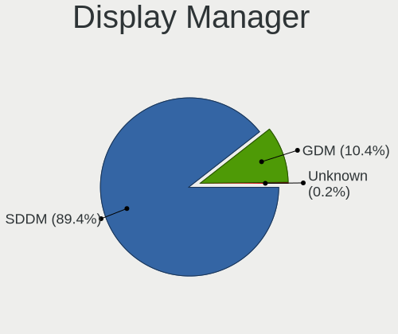
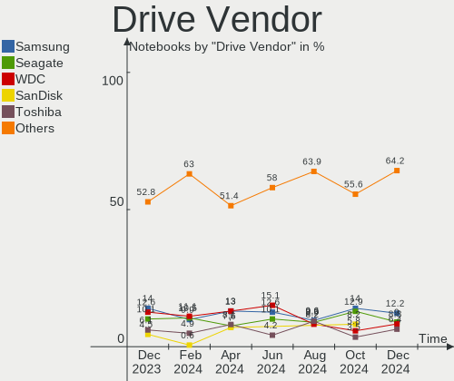
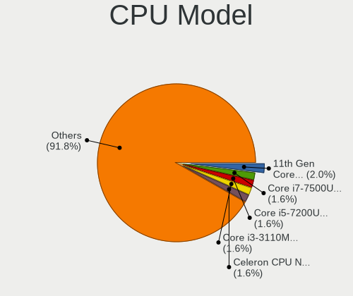
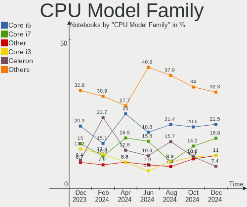
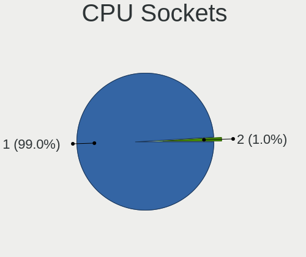
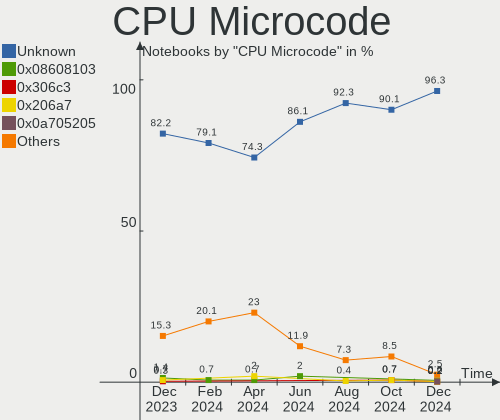
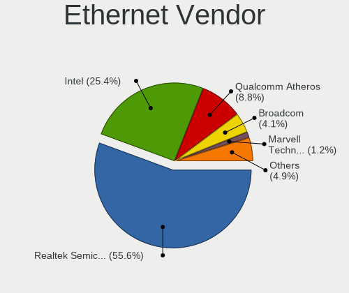

OpenMandriva - Hardware Trends (Notebooks)
------------------------------------------

A project to identify most popular hardware characteristics and track their change
over time based on data collected by Linux users at https://Linux-Hardware.org.

Anyone can contribute to this report by the [hw-probe](https://github.com/linuxhw/hw-probe) tool:

    sudo -E hw-probe -all -upload

This report is for one last month. Overall report since the beginning of time: [TestDays](https://github.com/linuxhw/TestDays)

Period: Oct, 2023.

Contents
--------

* [ System ](#system)
  - [ OS                       ](#os)
  - [ OS Family                ](#os-family)
  - [ Kernel                   ](#kernel)
  - [ Kernel Family            ](#kernel-family)
  - [ Kernel Major Ver.        ](#kernel-major-ver)
  - [ Arch                     ](#arch)
  - [ DE                       ](#de)
  - [ Display Server           ](#display-server)
  - [ Display Manager          ](#display-manager)
  - [ OS Lang                  ](#os-lang)
  - [ Boot Mode                ](#boot-mode)
  - [ Filesystem               ](#filesystem)
  - [ Part. scheme             ](#part-scheme)
  - [ Dual Boot with Linux/BSD ](#dual-boot-with-linuxbsd)
  - [ Dual Boot (Win)          ](#dual-boot-win)

* [ Board ](#board)
  - [ Vendor                   ](#vendor)
  - [ Model                    ](#model)
  - [ Model Family             ](#model-family)
  - [ MFG Year                 ](#mfg-year)
  - [ Form Factor              ](#form-factor)
  - [ Secure Boot              ](#secure-boot)
  - [ Coreboot                 ](#coreboot)
  - [ RAM Size                 ](#ram-size)
  - [ RAM Used                 ](#ram-used)
  - [ Total Drives             ](#total-drives)
  - [ Has CD-ROM               ](#has-cd-rom)
  - [ Has Ethernet             ](#has-ethernet)
  - [ Has WiFi                 ](#has-wifi)
  - [ Has Bluetooth            ](#has-bluetooth)

* [ Location ](#location)
  - [ Country                  ](#country)
  - [ City                     ](#city)

* [ Drives ](#drives)
  - [ Drive Vendor             ](#drive-vendor)
  - [ Drive Model              ](#drive-model)
  - [ HDD Vendor               ](#hdd-vendor)
  - [ SSD Vendor               ](#ssd-vendor)
  - [ Drive Kind               ](#drive-kind)
  - [ Drive Connector          ](#drive-connector)
  - [ Drive Size               ](#drive-size)
  - [ Space Total              ](#space-total)
  - [ Space Used               ](#space-used)
  - [ Malfunc. Drives          ](#malfunc-drives)
  - [ Malfunc. Drive Vendor    ](#malfunc-drive-vendor)
  - [ Malfunc. HDD Vendor      ](#malfunc-hdd-vendor)
  - [ Malfunc. Drive Kind      ](#malfunc-drive-kind)
  - [ Failed Drives            ](#failed-drives)
  - [ Failed Drive Vendor      ](#failed-drive-vendor)
  - [ Drive Status             ](#drive-status)

* [ Storage controller ](#storage-controller)
  - [ Storage Vendor           ](#storage-vendor)
  - [ Storage Model            ](#storage-model)
  - [ Storage Kind             ](#storage-kind)

* [ Processor ](#processor)
  - [ CPU Vendor               ](#cpu-vendor)
  - [ CPU Model                ](#cpu-model)
  - [ CPU Model Family         ](#cpu-model-family)
  - [ CPU Cores                ](#cpu-cores)
  - [ CPU Sockets              ](#cpu-sockets)
  - [ CPU Threads              ](#cpu-threads)
  - [ CPU Op-Modes             ](#cpu-op-modes)
  - [ CPU Microcode            ](#cpu-microcode)
  - [ CPU Microarch            ](#cpu-microarch)

* [ Graphics ](#graphics)
  - [ GPU Vendor               ](#gpu-vendor)
  - [ GPU Model                ](#gpu-model)
  - [ GPU Combo                ](#gpu-combo)
  - [ GPU Driver               ](#gpu-driver)
  - [ GPU Memory               ](#gpu-memory)

* [ Monitor ](#monitor)
  - [ Monitor Vendor           ](#monitor-vendor)
  - [ Monitor Model            ](#monitor-model)
  - [ Monitor Resolution       ](#monitor-resolution)
  - [ Monitor Diagonal         ](#monitor-diagonal)
  - [ Monitor Width            ](#monitor-width)
  - [ Aspect Ratio             ](#aspect-ratio)
  - [ Monitor Area             ](#monitor-area)
  - [ Pixel Density            ](#pixel-density)
  - [ Multiple Monitors        ](#multiple-monitors)

* [ Network ](#network)
  - [ Net Controller Vendor    ](#net-controller-vendor)
  - [ Net Controller Model     ](#net-controller-model)
  - [ Wireless Vendor          ](#wireless-vendor)
  - [ Wireless Model           ](#wireless-model)
  - [ Ethernet Vendor          ](#ethernet-vendor)
  - [ Ethernet Model           ](#ethernet-model)
  - [ Net Controller Kind      ](#net-controller-kind)
  - [ Used Controller          ](#used-controller)
  - [ NICs                     ](#nics)
  - [ IPv6                     ](#ipv6)

* [ Bluetooth ](#bluetooth)
  - [ Bluetooth Vendor         ](#bluetooth-vendor)
  - [ Bluetooth Model          ](#bluetooth-model)

* [ Sound ](#sound)
  - [ Sound Vendor             ](#sound-vendor)
  - [ Sound Model              ](#sound-model)

* [ Memory ](#memory)
  - [ Memory Vendor            ](#memory-vendor)
  - [ Memory Model             ](#memory-model)
  - [ Memory Kind              ](#memory-kind)
  - [ Memory Form Factor       ](#memory-form-factor)
  - [ Memory Size              ](#memory-size)
  - [ Memory Speed             ](#memory-speed)

* [ Printers & scanners ](#printers--scanners)
  - [ Printer Vendor           ](#printer-vendor)
  - [ Printer Model            ](#printer-model)
  - [ Scanner Vendor           ](#scanner-vendor)
  - [ Scanner Model            ](#scanner-model)

* [ Camera ](#camera)
  - [ Camera Vendor            ](#camera-vendor)
  - [ Camera Model             ](#camera-model)

* [ Security ](#security)
  - [ Fingerprint Vendor       ](#fingerprint-vendor)
  - [ Fingerprint Model        ](#fingerprint-model)
  - [ Chipcard Vendor          ](#chipcard-vendor)
  - [ Chipcard Model           ](#chipcard-model)

* [ Unsupported ](#unsupported)
  - [ Unsupported Devices      ](#unsupported-devices)
  - [ Unsupported Device Types ](#unsupported-device-types)

System
------

OS
--

Installed operating systems

| Name               | Notebooks | Percent |
|--------------------|-----------|---------|
| OpenMandriva 23.08 | 76        | 47.5%   |
| OpenMandriva 23.10 | 40        | 25%     |
| OpenMandriva 4.3   | 10        | 6.25%   |
| OpenMandriva 23.01 | 8         | 5%      |
| OpenMandriva 23.09 | 7         | 4.38%   |
| OpenMandriva 23.03 | 6         | 3.75%   |
| OpenMandriva 4.2   | 4         | 2.5%    |
| OpenMandriva 23.90 | 4         | 2.5%    |
| OpenMandriva 23.07 | 2         | 1.25%   |
| OpenMandriva 23.06 | 2         | 1.25%   |
| OpenMandriva 4.50  | 1         | 0.63%   |

OS Family
---------

OS without a version

| Name         | Notebooks | Percent |
|--------------|-----------|---------|
| OpenMandriva | 160       | 100%    |

Kernel
------

Version of the Linux kernel

| Version                      | Notebooks | Percent |
|------------------------------|-----------|---------|
| 6.4.11-desktop-1omv2390      | 68        | 42.5%   |
| 6.5.5-desktop-1omv2390       | 44        | 27.5%   |
| 6.4.8-desktop-2omv2390       | 10        | 6.25%   |
| 6.2.6-desktop-1omv2390       | 7         | 4.38%   |
| 6.1.1-desktop-1omv2290       | 7         | 4.38%   |
| 5.16.7-desktop-1omv4003      | 6         | 3.75%   |
| 5.16.13-desktop-1omv4003     | 4         | 2.5%    |
| 5.10.14-desktop-1omv4002     | 4         | 2.5%    |
| 6.3.5-desktop-3omv2390       | 3         | 1.88%   |
| 6.6.0-desktop-0.rc5.1omv2390 | 1         | 0.63%   |
| 6.5.3-desktop-1omv2390       | 1         | 0.63%   |
| 6.5.2-desktop-1omv2390       | 1         | 0.63%   |
| 6.5.1-desktop-1omv2390       | 1         | 0.63%   |
| 6.4.3-desktop-2omv2390       | 1         | 0.63%   |
| 6.1.4-desktop-1omv2301       | 1         | 0.63%   |
| 5.19.5-desktop-1omv4090      | 1         | 0.63%   |

Kernel Family
-------------

Linux kernel without a distro release

| Version | Notebooks | Percent |
|---------|-----------|---------|
| 6.4.11  | 68        | 42.5%   |
| 6.5.5   | 44        | 27.5%   |
| 6.4.8   | 10        | 6.25%   |
| 6.2.6   | 7         | 4.38%   |
| 6.1.1   | 7         | 4.38%   |
| 5.16.7  | 6         | 3.75%   |
| 5.16.13 | 4         | 2.5%    |
| 5.10.14 | 4         | 2.5%    |
| 6.3.5   | 3         | 1.88%   |
| 6.6.0   | 1         | 0.63%   |
| 6.5.3   | 1         | 0.63%   |
| 6.5.2   | 1         | 0.63%   |
| 6.5.1   | 1         | 0.63%   |
| 6.4.3   | 1         | 0.63%   |
| 6.1.4   | 1         | 0.63%   |
| 5.19.5  | 1         | 0.63%   |

Kernel Major Ver.
-----------------

Linux kernel major version

| Version | Notebooks | Percent |
|---------|-----------|---------|
| 6.4     | 79        | 49.38%  |
| 6.5     | 47        | 29.38%  |
| 5.16    | 10        | 6.25%   |
| 6.1     | 8         | 5%      |
| 6.2     | 7         | 4.38%   |
| 5.10    | 4         | 2.5%    |
| 6.3     | 3         | 1.88%   |
| 6.6     | 1         | 0.63%   |
| 5.19    | 1         | 0.63%   |

Arch
----

OS architecture (x86_64, i586, etc.)

| Name   | Notebooks | Percent |
|--------|-----------|---------|
| x86_64 | 160       | 100%    |

DE
--

Desktop Environment

| Name     | Notebooks | Percent |
|----------|-----------|---------|
| KDE5     | 136       | 85%     |
| LXQt     | 12        | 7.5%    |
| GNOME    | 9         | 5.63%   |
| Unknown  | 2         | 1.25%   |
| Cinnamon | 1         | 0.63%   |

Display Server
--------------

X11 or Wayland

| Name    | Notebooks | Percent |
|---------|-----------|---------|
| Wayland | 119       | 74.38%  |
| X11     | 41        | 25.63%  |

Display Manager
---------------

SDDM, LightDM, etc.

| Name | Notebooks | Percent |
|------|-----------|---------|
| SDDM | 150       | 93.75%  |
| GDM  | 10        | 6.25%   |

OS Lang
-------

Language

| Lang       | Notebooks | Percent |
|------------|-----------|---------|
| en_US      | 73        | 45.63%  |
| fr_FR      | 16        | 10%     |
| en_GB      | 11        | 6.88%   |
| pl_PL      | 10        | 6.25%   |
| de_DE      | 8         | 5%      |
| pt_BR      | 7         | 4.38%   |
| ru_RU      | 5         | 3.13%   |
| it_IT      | 5         | 3.13%   |
| es_MX      | 5         | 3.13%   |
| es_ES      | 5         | 3.13%   |
| tr_TR      | 3         | 1.88%   |
| hu_HU      | 2         | 1.25%   |
| ro_RO      | 1         | 0.63%   |
| pl_PL.UTF8 | 1         | 0.63%   |
| nl_NL      | 1         | 0.63%   |
| es_VE      | 1         | 0.63%   |
| es_AR      | 1         | 0.63%   |
| en_IN      | 1         | 0.63%   |
| en_DK      | 1         | 0.63%   |
| de_AT      | 1         | 0.63%   |
| da_DK      | 1         | 0.63%   |
| cs_CZ      | 1         | 0.63%   |

Boot Mode
---------

EFI or BIOS

| Mode | Notebooks | Percent |
|------|-----------|---------|
| EFI  | 90        | 56.25%  |
| BIOS | 70        | 43.75%  |

Filesystem
----------

Type of filesystem

| Type    | Notebooks | Percent |
|---------|-----------|---------|
| Ext4    | 95        | 59.38%  |
| Overlay | 55        | 34.38%  |
| Btrfs   | 9         | 5.63%   |
| F2fs    | 1         | 0.63%   |

Part. scheme
------------

Scheme of partitioning

| Type | Notebooks | Percent |
|------|-----------|---------|
| GPT  | 125       | 78.13%  |
| MBR  | 35        | 21.88%  |

Dual Boot with Linux/BSD
------------------------

Hosting more than one Linux/BSD

| Dual boot | Notebooks | Percent |
|-----------|-----------|---------|
| No        | 100       | 62.5%   |
| Yes       | 60        | 37.5%   |

Dual Boot (Win)
---------------

Hosting Linux and Windows

| Dual boot | Notebooks | Percent |
|-----------|-----------|---------|
| No        | 95        | 59.38%  |
| Yes       | 65        | 40.63%  |

Board
-----

Vendor
------

Motherboard manufacturer

| Name                | Notebooks | Percent |
|---------------------|-----------|---------|
| Hewlett-Packard     | 35        | 21.88%  |
| Lenovo              | 29        | 18.13%  |
| Dell                | 27        | 16.88%  |
| ASUSTek Computer    | 15        | 9.38%   |
| Toshiba             | 12        | 7.5%    |
| Acer                | 12        | 7.5%    |
| Apple               | 6         | 3.75%   |
| Samsung Electronics | 5         | 3.13%   |
| MSI                 | 4         | 2.5%    |
| Sony                | 2         | 1.25%   |
| Fujitsu             | 2         | 1.25%   |
| Valve               | 1         | 0.63%   |
| Thomson             | 1         | 0.63%   |
| SLIMBOOK            | 1         | 0.63%   |
| Notebook            | 1         | 0.63%   |
| NEC Computers       | 1         | 0.63%   |
| Medion              | 1         | 0.63%   |
| LG Electronics      | 1         | 0.63%   |
| HUAWEI              | 1         | 0.63%   |
| Gateway             | 1         | 0.63%   |
| Compaq              | 1         | 0.63%   |
| Unknown             | 1         | 0.63%   |

Model
-----

Motherboard model

| Name                          | Notebooks | Percent |
|-------------------------------|-----------|---------|
| HP Pavilion g6                | 3         | 1.88%   |
| Unknown                       | 3         | 1.88%   |
| HP TouchSmart tm2             | 2         | 1.25%   |
| HP Pavilion Notebook          | 2         | 1.25%   |
| ASUS UL80VT                   | 2         | 1.25%   |
| Acer AOD270                   | 2         | 1.25%   |
| Valve Jupiter                 | 1         | 0.63%   |
| Toshiba Satellite P55W-C      | 1         | 0.63%   |
| Toshiba Satellite P50t-B-118  | 1         | 0.63%   |
| Toshiba Satellite L775        | 1         | 0.63%   |
| Toshiba Satellite L755        | 1         | 0.63%   |
| Toshiba Satellite L655        | 1         | 0.63%   |
| Toshiba Satellite C870-D7K    | 1         | 0.63%   |
| Toshiba Satellite C670D-126   | 1         | 0.63%   |
| Toshiba Satellite A665        | 1         | 0.63%   |
| Toshiba Satellite A660        | 1         | 0.63%   |
| Toshiba Satellite A305D       | 1         | 0.63%   |
| Toshiba dynabook T350/56ARK   | 1         | 0.63%   |
| Toshiba dynabook R732/H       | 1         | 0.63%   |
| Thomson WWN15I5-8BK1T         | 1         | 0.63%   |
| Sony VPCEF2S1E                | 1         | 0.63%   |
| Sony VGN-FZ21M                | 1         | 0.63%   |
| SLIMBOOK EXECUTIVE-14         | 1         | 0.63%   |
| Samsung RF511/RF411/RF711     | 1         | 0.63%   |
| Samsung RC410/RC510/RC710     | 1         | 0.63%   |
| Samsung R530/R730/P590        | 1         | 0.63%   |
| Samsung 550XCJ/550XCR         | 1         | 0.63%   |
| Samsung 370E4K                | 1         | 0.63%   |
| Notebook NJ50_70CU            | 1         | 0.63%   |
| NEC Computers PC-VJ22LFWZHSRF | 1         | 0.63%   |
| MSI GT70 0NC/GT70 0NC         | 1         | 0.63%   |
| MSI GL75 9SE                  | 1         | 0.63%   |
| MSI GL73 8RD                  | 1         | 0.63%   |
| MSI CR620                     | 1         | 0.63%   |
| Medion E11201                 | 1         | 0.63%   |
| LG 17ZT90P-G.AX33U1           | 1         | 0.63%   |
| Lenovo Yoga 7 14ARP8 82YM     | 1         | 0.63%   |
| Lenovo ThinkPad X201 3680V5T  | 1         | 0.63%   |
| Lenovo ThinkPad T61 7661WQQ   | 1         | 0.63%   |
| Lenovo ThinkPad T530 23594LU  | 1         | 0.63%   |

Model Family
------------

Motherboard model prefix

| Name                          | Notebooks | Percent |
|-------------------------------|-----------|---------|
| Dell Inspiron                 | 11        | 6.88%   |
| Toshiba Satellite             | 10        | 6.25%   |
| Lenovo ThinkPad               | 10        | 6.25%   |
| Lenovo IdeaPad                | 10        | 6.25%   |
| Acer Aspire                   | 9         | 5.63%   |
| HP Pavilion                   | 7         | 4.38%   |
| HP Laptop                     | 7         | 4.38%   |
| Dell Latitude                 | 7         | 4.38%   |
| HP EliteBook                  | 5         | 3.13%   |
| ASUS VivoBook                 | 4         | 2.5%    |
| Dell Precision                | 3         | 1.88%   |
| Unknown                       | 3         | 1.88%   |
| Toshiba dynabook              | 2         | 1.25%   |
| Lenovo G580                   | 2         | 1.25%   |
| HP TouchSmart                 | 2         | 1.25%   |
| HP ProBook                    | 2         | 1.25%   |
| HP Compaq                     | 2         | 1.25%   |
| Dell XPS                      | 2         | 1.25%   |
| Dell Vostro                   | 2         | 1.25%   |
| ASUS UL80VT                   | 2         | 1.25%   |
| Acer AOD270                   | 2         | 1.25%   |
| Valve Jupiter                 | 1         | 0.63%   |
| Thomson WWN15I5-8BK1T         | 1         | 0.63%   |
| Sony VPCEF2S1E                | 1         | 0.63%   |
| Sony VGN-FZ21M                | 1         | 0.63%   |
| SLIMBOOK EXECUTIVE-14         | 1         | 0.63%   |
| Samsung RF511                 | 1         | 0.63%   |
| Samsung RC410                 | 1         | 0.63%   |
| Samsung R530                  | 1         | 0.63%   |
| Samsung 550XCJ                | 1         | 0.63%   |
| Samsung 370E4K                | 1         | 0.63%   |
| Notebook NJ50                 | 1         | 0.63%   |
| NEC Computers PC-VJ22LFWZHSRF | 1         | 0.63%   |
| MSI GT70                      | 1         | 0.63%   |
| MSI GL75                      | 1         | 0.63%   |
| MSI GL73                      | 1         | 0.63%   |
| MSI CR620                     | 1         | 0.63%   |
| Medion E11201                 | 1         | 0.63%   |
| LG 17ZT90P-G.AX33U1           | 1         | 0.63%   |
| Lenovo Yoga                   | 1         | 0.63%   |

MFG Year
--------

Motherboard manufacture year

| Year | Notebooks | Percent |
|------|-----------|---------|
| 2012 | 19        | 11.88%  |
| 2011 | 17        | 10.63%  |
| 2021 | 16        | 10%     |
| 2013 | 16        | 10%     |
| 2010 | 16        | 10%     |
| 2020 | 11        | 6.88%   |
| 2019 | 9         | 5.63%   |
| 2018 | 9         | 5.63%   |
| 2014 | 8         | 5%      |
| 2015 | 7         | 4.38%   |
| 2008 | 7         | 4.38%   |
| 2022 | 6         | 3.75%   |
| 2017 | 6         | 3.75%   |
| 2016 | 6         | 3.75%   |
| 2009 | 3         | 1.88%   |
| 2007 | 3         | 1.88%   |
| 2006 | 1         | 0.63%   |

Form Factor
-----------

Physical design of the computer

| Name     | Notebooks | Percent |
|----------|-----------|---------|
| Notebook | 160       | 100%    |

Secure Boot
-----------

Enabled or disabled

| State    | Notebooks | Percent |
|----------|-----------|---------|
| Disabled | 160       | 100%    |

Coreboot
--------

Have coreboot on board

| Used | Notebooks | Percent |
|------|-----------|---------|
| No   | 160       | 100%    |

RAM Size
--------

Total RAM memory

| Size in GB | Notebooks | Percent |
|------------|-----------|---------|
| 4.01-8.0   | 63        | 39.38%  |
| 3.01-4.0   | 46        | 28.75%  |
| 8.01-16.0  | 20        | 12.5%   |
| 16.01-24.0 | 17        | 10.63%  |
| 32.01-64.0 | 5         | 3.13%   |
| 1.01-2.0   | 5         | 3.13%   |
| 0.51-1.0   | 2         | 1.25%   |
| 24.01-32.0 | 1         | 0.63%   |
| 2.01-3.0   | 1         | 0.63%   |

RAM Used
--------

Used RAM memory

| Used GB  | Notebooks | Percent |
|----------|-----------|---------|
| 1.01-2.0 | 101       | 63.13%  |
| 2.01-3.0 | 38        | 23.75%  |
| 0.51-1.0 | 14        | 8.75%   |
| 3.01-4.0 | 5         | 3.13%   |
| 0.01-0.5 | 2         | 1.25%   |

Total Drives
------------

Number of drives on board

| Drives | Notebooks | Percent |
|--------|-----------|---------|
| 1      | 105       | 65.63%  |
| 2      | 47        | 29.38%  |
| 3      | 6         | 3.75%   |
| 0      | 2         | 1.25%   |

Has CD-ROM
----------

Has CD-ROM on board

| Presented | Notebooks | Percent |
|-----------|-----------|---------|
| No        | 81        | 50.63%  |
| Yes       | 79        | 49.38%  |

Has Ethernet
------------

Has Ethernet on board

| Presented | Notebooks | Percent |
|-----------|-----------|---------|
| Yes       | 131       | 81.88%  |
| No        | 29        | 18.13%  |

Has WiFi
--------

Has WiFi module

| Presented | Notebooks | Percent |
|-----------|-----------|---------|
| Yes       | 158       | 98.75%  |
| No        | 2         | 1.25%   |

Has Bluetooth
-------------

Has Bluetooth module

| Presented | Notebooks | Percent |
|-----------|-----------|---------|
| Yes       | 116       | 72.5%   |
| No        | 44        | 27.5%   |

Location
--------

Country
-------

Geographic location (country)

| Country            | Notebooks | Percent |
|--------------------|-----------|---------|
| USA                | 22        | 13.75%  |
| Germany            | 17        | 10.63%  |
| France             | 16        | 10%     |
| Brazil             | 13        | 8.13%   |
| Poland             | 12        | 7.5%    |
| Russia             | 8         | 5%      |
| Italy              | 8         | 5%      |
| Spain              | 6         | 3.75%   |
| Mexico             | 6         | 3.75%   |
| Czechia            | 5         | 3.13%   |
| Romania            | 4         | 2.5%    |
| Japan              | 4         | 2.5%    |
| UK                 | 3         | 1.88%   |
| Turkey             | 3         | 1.88%   |
| India              | 3         | 1.88%   |
| Portugal           | 2         | 1.25%   |
| Indonesia          | 2         | 1.25%   |
| Hungary            | 2         | 1.25%   |
| Canada             | 2         | 1.25%   |
| Belgium            | 2         | 1.25%   |
| Algeria            | 2         | 1.25%   |
| Vietnam            | 1         | 0.63%   |
| Venezuela          | 1         | 0.63%   |
| Slovenia           | 1         | 0.63%   |
| Peru               | 1         | 0.63%   |
| Netherlands        | 1         | 0.63%   |
| Luxembourg         | 1         | 0.63%   |
| Lithuania          | 1         | 0.63%   |
| Ireland            | 1         | 0.63%   |
| Finland            | 1         | 0.63%   |
| El Salvador        | 1         | 0.63%   |
| Egypt              | 1         | 0.63%   |
| Dominican Republic | 1         | 0.63%   |
| Denmark            | 1         | 0.63%   |
| Croatia            | 1         | 0.63%   |
| Colombia           | 1         | 0.63%   |
| Belarus            | 1         | 0.63%   |
| Bangladesh         | 1         | 0.63%   |
| Åland Islands     | 1         | 0.63%   |

City
----

Geographic location (city)

| City                     | Notebooks | Percent |
|--------------------------|-----------|---------|
| Prague                   | 3         | 1.88%   |
| Wroclaw                  | 2         | 1.25%   |
| Tomisato                 | 2         | 1.25%   |
| Santo André             | 2         | 1.25%   |
| Moscow                   | 2         | 1.25%   |
| Milano                   | 2         | 1.25%   |
| Zgierz                   | 1         | 0.63%   |
| Zaragoza                 | 1         | 0.63%   |
| Yoshkar-Ola              | 1         | 0.63%   |
| Yakhroma                 | 1         | 0.63%   |
| Würzburg                | 1         | 0.63%   |
| Whitley Bay              | 1         | 0.63%   |
| Volzhsky                 | 1         | 0.63%   |
| Volta Redonda            | 1         | 0.63%   |
| Veliky Novgorod          | 1         | 0.63%   |
| Tulsa                    | 1         | 0.63%   |
| Trogir                   | 1         | 0.63%   |
| Trappes                  | 1         | 0.63%   |
| Toulouse                 | 1         | 0.63%   |
| Tlaquepaque              | 1         | 0.63%   |
| Tijuana                  | 1         | 0.63%   |
| Terra Roxa               | 1         | 0.63%   |
| Szolnok                  | 1         | 0.63%   |
| Surprise                 | 1         | 0.63%   |
| South Tangerang          | 1         | 0.63%   |
| Sondalo                  | 1         | 0.63%   |
| Smolensk                 | 1         | 0.63%   |
| Siedlce                  | 1         | 0.63%   |
| Seville                  | 1         | 0.63%   |
| Sétif                   | 1         | 0.63%   |
| Saransk                  | 1         | 0.63%   |
| Sao Paulo                | 1         | 0.63%   |
| Sao Bernardo do Campo    | 1         | 0.63%   |
| San Salvador             | 1         | 0.63%   |
| San Jose                 | 1         | 0.63%   |
| San Diego                | 1         | 0.63%   |
| Saint-Julien-en-Genevois | 1         | 0.63%   |
| Saint-Jean-de-Matha      | 1         | 0.63%   |
| Russi                    | 1         | 0.63%   |
| Russellville             | 1         | 0.63%   |

Drives
------

Drive Vendor
------------

Hard drive vendors

| Vendor                      | Notebooks | Drives | Percent |
|-----------------------------|-----------|--------|---------|
| Seagate                     | 26        | 26     | 13.07%  |
| WDC                         | 25        | 27     | 12.56%  |
| Samsung Electronics         | 21        | 23     | 10.55%  |
| Toshiba                     | 17        | 17     | 8.54%   |
| SanDisk                     | 12        | 13     | 6.03%   |
| Crucial                     | 12        | 12     | 6.03%   |
| Kingston                    | 11        | 12     | 5.53%   |
| A-DATA Technology           | 9         | 9      | 4.52%   |
| SK hynix                    | 7         | 7      | 3.52%   |
| Unknown                     | 6         | 6      | 3.02%   |
| Hitachi                     | 6         | 6      | 3.02%   |
| HGST                        | 6         | 6      | 3.02%   |
| Micron Technology           | 4         | 4      | 2.01%   |
| Intel                       | 4         | 5      | 2.01%   |
| Unknown                     | 4         | 5      | 2.01%   |
| Apple                       | 3         | 3      | 1.51%   |
| JMicron Technology          | 2         | 2      | 1.01%   |
| GOODRAM                     | 2         | 2      | 1.01%   |
| China                       | 2         | 2      | 1.01%   |
| WALRAM                      | 1         | 1      | 0.5%    |
| V-GeN                       | 1         | 1      | 0.5%    |
| SSSTC                       | 1         | 1      | 0.5%    |
| Silicon Motion              | 1         | 1      | 0.5%    |
| SATA3 12                    | 1         | 1      | 0.5%    |
| SABRENT                     | 1         | 1      | 0.5%    |
| Realtek                     | 1         | 1      | 0.5%    |
| PNY                         | 1         | 1      | 0.5%    |
| Phison                      | 1         | 1      | 0.5%    |
| Patriot                     | 1         | 1      | 0.5%    |
| LITEONIT                    | 1         | 1      | 0.5%    |
| Lenovo                      | 1         | 1      | 0.5%    |
| LDLC                        | 1         | 1      | 0.5%    |
| Kingston Technology Company | 1         | 1      | 0.5%    |
| Kingmax                     | 1         | 1      | 0.5%    |
| Hewlett-Packard             | 1         | 1      | 0.5%    |
| Fujitsu                     | 1         | 1      | 0.5%    |
| ANKEJE                      | 1         | 1      | 0.5%    |
| AGI                         | 1         | 1      | 0.5%    |
| Acer                        | 1         | 1      | 0.5%    |

Drive Model
-----------

Hard drive models

| Model                                | Notebooks | Percent |
|--------------------------------------|-----------|---------|
| Seagate ST1000LM024 HN-M101MBB 1TB   | 4         | 1.96%   |
| Unknown                              | 4         | 1.96%   |
| Toshiba MQ04ABF100 1TB               | 3         | 1.47%   |
| Seagate ST500LT012-1DG142 500GB      | 3         | 1.47%   |
| Seagate ST1000LM035-1RK172 1TB       | 3         | 1.47%   |
| HGST HTS545050A7E680 500GB           | 3         | 1.47%   |
| WDC WD1600BEVT-22ZCT0 160GB          | 2         | 0.98%   |
| WDC WD10SPZX-24Z10 1TB               | 2         | 0.98%   |
| WDC WD10SPZX-21Z10T0 1TB             | 2         | 0.98%   |
| WDC PC SN530 SDBPNPZ-256G-1002 256GB | 2         | 0.98%   |
| Toshiba MQ01ABF050 500GB             | 2         | 0.98%   |
| Toshiba MQ01ABD100 1TB               | 2         | 0.98%   |
| Toshiba MK5065GSX 500GB              | 2         | 0.98%   |
| SK hynix SC308 SATA 128GB SSD        | 2         | 0.98%   |
| Seagate ST9500325AS 500GB            | 2         | 0.98%   |
| Seagate Expansion 1TB                | 2         | 0.98%   |
| SanDisk SDSSDP128G 128GB             | 2         | 0.98%   |
| Kingston SA400S37480G 480GB SSD      | 2         | 0.98%   |
| Kingston SA400S37240G 240GB SSD      | 2         | 0.98%   |
| Crucial CT500MX500SSD1 500GB         | 2         | 0.98%   |
| A-DATA SP550 240GB SSD               | 2         | 0.98%   |
| WDC WDS500G3X0C-00SJG0 500GB         | 1         | 0.49%   |
| WDC WDS240G2G0A-00JH30 240GB SSD     | 1         | 0.49%   |
| WDC WDS120G2G0B-00EPW0 120GB SSD     | 1         | 0.49%   |
| WDC WDS120G2G0A-00JH30 120GB SSD     | 1         | 0.49%   |
| WDC WD7500BPKT-75PK4T0 752GB         | 1         | 0.49%   |
| WDC WD5000LPCX-24C6HT0 500GB         | 1         | 0.49%   |
| WDC WD5000LPCX-21VHAT0 500GB         | 1         | 0.49%   |
| WDC WD5000BEVT-75A0RT0 500GB         | 1         | 0.49%   |
| WDC WD3200BPVT-26JJ5T0 320GB         | 1         | 0.49%   |
| WDC WD3200BEKT-75PVMT0 320GB         | 1         | 0.49%   |
| WDC WD32 00BEKX-75B7WT0 320GB        | 1         | 0.49%   |
| WDC WD2500BEVT-24A23T0 250GB         | 1         | 0.49%   |
| WDC WD1600BEVT-60ZCT1 160GB          | 1         | 0.49%   |
| WDC WD10SPZX-35Z10T0 1TB             | 1         | 0.49%   |
| WDC WD10JPVX-08JC3T5 1TB             | 1         | 0.49%   |
| WDC WD10JPCX-24UE4T0 1TB             | 1         | 0.49%   |
| WDC PC SN730 SDBPNTY-512G-1006 512GB | 1         | 0.49%   |
| WDC PC SN530 SDBPNPZ-256G-1014 256GB | 1         | 0.49%   |
| WDC PC SN520 SDAPNUW-512G-1032 512GB | 1         | 0.49%   |

HDD Vendor
----------

Hard disk drive vendors

| Vendor              | Notebooks | Drives | Percent |
|---------------------|-----------|--------|---------|
| Seagate             | 24        | 24     | 32%     |
| WDC                 | 18        | 18     | 24%     |
| Toshiba             | 15        | 15     | 20%     |
| Hitachi             | 6         | 6      | 8%      |
| HGST                | 6         | 6      | 8%      |
| Samsung Electronics | 5         | 5      | 6.67%   |
| Fujitsu             | 1         | 1      | 1.33%   |

SSD Vendor
----------

Solid state drive vendors

| Vendor              | Notebooks | Drives | Percent |
|---------------------|-----------|--------|---------|
| SanDisk             | 10        | 11     | 13.7%   |
| Kingston            | 9         | 10     | 12.33%  |
| Crucial             | 9         | 9      | 12.33%  |
| Samsung Electronics | 8         | 8      | 10.96%  |
| A-DATA Technology   | 6         | 6      | 8.22%   |
| WDC                 | 3         | 3      | 4.11%   |
| SK hynix            | 3         | 3      | 4.11%   |
| Micron Technology   | 3         | 3      | 4.11%   |
| Intel               | 3         | 3      | 4.11%   |
| GOODRAM             | 2         | 2      | 2.74%   |
| China               | 2         | 2      | 2.74%   |
| Apple               | 2         | 2      | 2.74%   |
| WALRAM              | 1         | 1      | 1.37%   |
| SATA3 12            | 1         | 1      | 1.37%   |
| SABRENT             | 1         | 1      | 1.37%   |
| PNY                 | 1         | 1      | 1.37%   |
| Patriot             | 1         | 1      | 1.37%   |
| LITEONIT            | 1         | 1      | 1.37%   |
| LDLC                | 1         | 1      | 1.37%   |
| Kingmax             | 1         | 1      | 1.37%   |
| JMicron Technology  | 1         | 1      | 1.37%   |
| Hewlett-Packard     | 1         | 1      | 1.37%   |
| AGI                 | 1         | 1      | 1.37%   |
| Acer                | 1         | 1      | 1.37%   |
| Unknown             | 1         | 1      | 1.37%   |

Drive Kind
----------

HDD or SSD

| Kind    | Notebooks | Drives | Percent |
|---------|-----------|--------|---------|
| HDD     | 73        | 75     | 39.04%  |
| SSD     | 67        | 75     | 35.83%  |
| NVMe    | 36        | 45     | 19.25%  |
| MMC     | 8         | 9      | 4.28%   |
| Unknown | 3         | 3      | 1.6%    |

Drive Connector
---------------

SATA, SAS, NVMe, etc.

| Type | Notebooks | Drives | Percent |
|------|-----------|--------|---------|
| SATA | 128       | 141    | 69.19%  |
| NVMe | 35        | 42     | 18.92%  |
| SAS  | 14        | 15     | 7.57%   |
| MMC  | 8         | 9      | 4.32%   |

Drive Size
----------

Size of hard drive

| Size in TB | Notebooks | Drives | Percent |
|------------|-----------|--------|---------|
| 0.01-0.5   | 94        | 106    | 68.12%  |
| 0.51-1.0   | 43        | 43     | 31.16%  |
| 1.01-2.0   | 1         | 1      | 0.72%   |

Space Total
-----------

Amount of disk space available on the file system

| Size in GB | Notebooks | Percent |
|------------|-----------|---------|
| 1-20       | 44        | 27.5%   |
| 101-250    | 42        | 26.25%  |
| 251-500    | 24        | 15%     |
| 501-1000   | 14        | 8.75%   |
| 51-100     | 14        | 8.75%   |
| 21-50      | 11        | 6.88%   |
| 1001-2000  | 5         | 3.13%   |
| 2001-3000  | 3         | 1.88%   |
| Unknown    | 3         | 1.88%   |

Space Used
----------

Amount of used disk space

| Used GB   | Notebooks | Percent |
|-----------|-----------|---------|
| 1-20      | 128       | 80%     |
| 21-50     | 12        | 7.5%    |
| 101-250   | 6         | 3.75%   |
| 51-100    | 5         | 3.13%   |
| 251-500   | 4         | 2.5%    |
| Unknown   | 3         | 1.88%   |
| 1001-2000 | 1         | 0.63%   |
| 501-1000  | 1         | 0.63%   |

Malfunc. Drives
---------------

Drive models with a malfunction

| Model                                         | Notebooks | Drives | Percent |
|-----------------------------------------------|-----------|--------|---------|
| Seagate ST9500325AS 500GB                     | 2         | 2      | 5%      |
| Seagate ST1000LM024 HN-M101MBB 1TB            | 2         | 2      | 5%      |
| WDC WDS120G2G0B-00EPW0 120GB SSD              | 1         | 1      | 2.5%    |
| WDC WD7500BPKT-75PK4T0 752GB                  | 1         | 1      | 2.5%    |
| WDC WD5000LPCX-24C6HT0 500GB                  | 1         | 1      | 2.5%    |
| WDC WD3200BEKT-75PVMT0 320GB                  | 1         | 1      | 2.5%    |
| Toshiba MQ04ABF100 1TB                        | 1         | 1      | 2.5%    |
| Toshiba MQ02ABD100H 1TB                       | 1         | 1      | 2.5%    |
| Toshiba MQ01ABD050 500GB                      | 1         | 1      | 2.5%    |
| Toshiba MK6465GSX 640GB                       | 1         | 1      | 2.5%    |
| Toshiba MK5065GSX 500GB                       | 1         | 1      | 2.5%    |
| Toshiba MK3265GSXN 320GB                      | 1         | 1      | 2.5%    |
| SK hynix SC308 SATA 128GB SSD                 | 1         | 1      | 2.5%    |
| SK hynix BC711 HFM512GD3JX013N 512GB          | 1         | 1      | 2.5%    |
| Seagate ST500LT012-1DG142 500GB               | 1         | 1      | 2.5%    |
| Seagate ST500LM012 HN-M500MBB 500GB           | 1         | 1      | 2.5%    |
| SanDisk SDSSDP128G 128GB                      | 1         | 1      | 2.5%    |
| Samsung Electronics HM160JI 160GB             | 1         | 1      | 2.5%    |
| Samsung Electronics HM160HI 160GB             | 1         | 1      | 2.5%    |
| Micron Technology MTFDDAT128MAM-1J2 128GB SSD | 1         | 1      | 2.5%    |
| LDLC F6+M.2 240 240GB SSD                     | 1         | 1      | 2.5%    |
| Kingston SV300S37A240G 240GB SSD              | 1         | 1      | 2.5%    |
| Kingston SH103S3120G 120GB SSD                | 1         | 1      | 2.5%    |
| Kingston SA400S37480G 480GB SSD               | 1         | 2      | 2.5%    |
| Kingston RBU-SMSM151S324GD 24GB SSD           | 1         | 1      | 2.5%    |
| Intel SSDSC2BF240A5L 240GB                    | 1         | 1      | 2.5%    |
| Hitachi HTS725050A7E630 500GB                 | 1         | 1      | 2.5%    |
| Hitachi HTS547550A9E384 500GB                 | 1         | 1      | 2.5%    |
| Hitachi HTS545025B9A300 250GB                 | 1         | 1      | 2.5%    |
| Hitachi HTS543232A7A384 320GB                 | 1         | 1      | 2.5%    |
| HGST HTS725032A7E630 320GB                    | 1         | 1      | 2.5%    |
| HGST HTS721010A9E630 1TB                      | 1         | 1      | 2.5%    |
| HGST HTS545050A7E680 500GB                    | 1         | 1      | 2.5%    |
| Hewlett-Packard SSD S700 500GB                | 1         | 1      | 2.5%    |
| Fujitsu MHY2120BH 120GB                       | 1         | 1      | 2.5%    |
| Crucial CT525MX300SSD1 528GB                  | 1         | 1      | 2.5%    |
| Crucial CT1000P5SSD8 1TB                      | 1         | 1      | 2.5%    |
| A-DATA Technology SP550 240GB SSD             | 1         | 1      | 2.5%    |

Malfunc. Drive Vendor
---------------------

Vendors of faulty drives

| Vendor              | Notebooks | Drives | Percent |
|---------------------|-----------|--------|---------|
| Toshiba             | 6         | 6      | 15%     |
| Seagate             | 6         | 6      | 15%     |
| WDC                 | 4         | 4      | 10%     |
| Kingston            | 4         | 5      | 10%     |
| Hitachi             | 4         | 4      | 10%     |
| HGST                | 3         | 3      | 7.5%    |
| SK hynix            | 2         | 2      | 5%      |
| Samsung Electronics | 2         | 2      | 5%      |
| Crucial             | 2         | 2      | 5%      |
| SanDisk             | 1         | 1      | 2.5%    |
| Micron Technology   | 1         | 1      | 2.5%    |
| LDLC                | 1         | 1      | 2.5%    |
| Intel               | 1         | 1      | 2.5%    |
| Hewlett-Packard     | 1         | 1      | 2.5%    |
| Fujitsu             | 1         | 1      | 2.5%    |
| A-DATA Technology   | 1         | 1      | 2.5%    |

Malfunc. HDD Vendor
-------------------

Vendors of faulty HDD drives

| Vendor              | Notebooks | Drives | Percent |
|---------------------|-----------|--------|---------|
| Toshiba             | 6         | 6      | 24%     |
| Seagate             | 6         | 6      | 24%     |
| Hitachi             | 4         | 4      | 16%     |
| WDC                 | 3         | 3      | 12%     |
| HGST                | 3         | 3      | 12%     |
| Samsung Electronics | 2         | 2      | 8%      |
| Fujitsu             | 1         | 1      | 4%      |

Malfunc. Drive Kind
-------------------

Kinds of faulty drives

| Kind | Notebooks | Drives | Percent |
|------|-----------|--------|---------|
| HDD  | 25        | 25     | 62.5%   |
| SSD  | 13        | 14     | 32.5%   |
| NVMe | 2         | 2      | 5%      |

Failed Drives
-------------

Failed drive models

| Model                         | Notebooks | Drives | Percent |
|-------------------------------|-----------|--------|---------|
| Toshiba MK2575GSX 250GB       | 1         | 1      | 50%     |
| Hitachi HTS723232A7A364 320GB | 1         | 1      | 50%     |

Failed Drive Vendor
-------------------

Failed drive vendors

| Vendor  | Notebooks | Drives | Percent |
|---------|-----------|--------|---------|
| Toshiba | 1         | 1      | 50%     |
| Hitachi | 1         | 1      | 50%     |

Drive Status
------------

Number of failed and malfunc. drives

| Status   | Notebooks | Drives | Percent |
|----------|-----------|--------|---------|
| Works    | 119       | 141    | 66.48%  |
| Malfunc  | 39        | 41     | 21.79%  |
| Detected | 19        | 23     | 10.61%  |
| Failed   | 2         | 2      | 1.12%   |

Storage controller
------------------

Storage Vendor
--------------

Storage controller vendors

| Vendor                         | Notebooks | Percent |
|--------------------------------|-----------|---------|
| Intel                          | 127       | 68.28%  |
| AMD                            | 15        | 8.06%   |
| Samsung Electronics            | 11        | 5.91%   |
| SanDisk                        | 7         | 3.76%   |
| SK hynix                       | 4         | 2.15%   |
| Micron/Crucial Technology      | 3         | 1.61%   |
| Kingston Technology Company    | 3         | 1.61%   |
| ADATA Technology               | 3         | 1.61%   |
| Toshiba America Info Systems   | 2         | 1.08%   |
| JMicron Technology             | 2         | 1.08%   |
| Solid State Storage Technology | 1         | 0.54%   |
| Silicon Motion                 | 1         | 0.54%   |
| Seagate Technology             | 1         | 0.54%   |
| Phison Electronics             | 1         | 0.54%   |
| Nvidia                         | 1         | 0.54%   |
| Micron Technology              | 1         | 0.54%   |
| MAXIO Technology (Hangzhou)    | 1         | 0.54%   |
| Marvell Technology Group       | 1         | 0.54%   |
| Lenovo                         | 1         | 0.54%   |

Storage Model
-------------

Storage controller models

| Model                                                                          | Notebooks | Percent |
|--------------------------------------------------------------------------------|-----------|---------|
| Intel 7 Series Chipset Family 6-port SATA Controller [AHCI mode]               | 19        | 9.36%   |
| Intel Sunrise Point-LP SATA Controller [AHCI mode]                             | 12        | 5.91%   |
| Intel 82801 Mobile SATA Controller [RAID mode]                                 | 12        | 5.91%   |
| AMD FCH SATA Controller [AHCI mode]                                            | 11        | 5.42%   |
| Intel 6 Series/C200 Series Chipset Family 6 port Mobile SATA AHCI Controller   | 10        | 4.93%   |
| Intel 5 Series/3400 Series Chipset 4 port SATA AHCI Controller                 | 10        | 4.93%   |
| Intel 8 Series SATA Controller 1 [AHCI mode]                                   | 7         | 3.45%   |
| Intel 82801IBM/IEM (ICH9M/ICH9M-E) 4 port SATA Controller [AHCI mode]          | 6         | 2.96%   |
| Intel 82801HM/HEM (ICH8M/ICH8M-E) SATA Controller [AHCI mode]                  | 6         | 2.96%   |
| Intel 82801HM/HEM (ICH8M/ICH8M-E) IDE Controller                               | 6         | 2.96%   |
| Samsung NVMe SSD Controller 980 (DRAM-less)                                    | 5         | 2.46%   |
| SK hynix Gold P31/BC711/PC711 NVMe Solid State Drive                           | 4         | 1.97%   |
| Intel Wildcat Point-LP SATA Controller [AHCI Mode]                             | 4         | 1.97%   |
| Intel Tiger Lake-LP SATA Controller                                            | 4         | 1.97%   |
| Intel Celeron/Pentium Silver Processor SATA Controller                         | 4         | 1.97%   |
| Intel 8 Series/C220 Series Chipset Family 6-port SATA Controller 1 [AHCI mode] | 4         | 1.97%   |
| SanDisk Ultra 3D / WD Blue SN550 NVMe SSD                                      | 3         | 1.48%   |
| Intel Comet Lake SATA AHCI Controller                                          | 3         | 1.48%   |
| Intel Cannon Lake Mobile PCH SATA AHCI Controller                              | 3         | 1.48%   |
| Intel 5 Series/3400 Series Chipset 4 port SATA IDE Controller                  | 3         | 1.48%   |
| Intel 5 Series/3400 Series Chipset 2 port SATA IDE Controller                  | 3         | 1.48%   |
| AMD SB7x0/SB8x0/SB9x0 SATA Controller [AHCI mode]                              | 3         | 1.48%   |
| SanDisk Extreme Pro / WD Black SN750 / PC SN730 / Red SN700 NVMe SSD           | 2         | 0.99%   |
| Samsung NVMe SSD Controller SM981/PM981/PM983                                  | 2         | 0.99%   |
| Samsung NVMe SSD Controller PM9A1/PM9A3/980PRO                                 | 2         | 0.99%   |
| JMicron JMB360 AHCI Controller                                                 | 2         | 0.99%   |
| Intel Volume Management Device NVMe RAID Controller                            | 2         | 0.99%   |
| Intel NM10/ICH7 Family SATA Controller [IDE mode]                              | 2         | 0.99%   |
| Intel NM10/ICH7 Family SATA Controller [AHCI mode]                             | 2         | 0.99%   |
| Intel Jasper Lake SATA AHCI Controller                                         | 2         | 0.99%   |
| Intel Cannon Point-LP SATA Controller [AHCI Mode]                              | 2         | 0.99%   |
| Intel Atom Processor E3800 Series SATA AHCI Controller                         | 2         | 0.99%   |
| AMD SB7x0/SB8x0/SB9x0 IDE Controller                                           | 2         | 0.99%   |
| Toshiba America Info Systems XG6 NVMe SSD Controller                           | 1         | 0.49%   |
| Toshiba America Info Systems XG4 NVMe SSD Controller                           | 1         | 0.49%   |
| Solid State Storage CL1-3D256-Q11 NVMe SSD M.2                                 | 1         | 0.49%   |
| Silicon Motion SM2263EN/SM2263XT (DRAM-less) NVMe SSD Controllers              | 1         | 0.49%   |
| Seagate FireCuda 520/IronWolf 525 SSD                                          | 1         | 0.49%   |
| SanDisk WD PC SN810 / Black SN850 NVMe SSD                                     | 1         | 0.49%   |
| Sandisk WD PC SN740 NVMe SSD 512GB (DRAM-less)                                 | 1         | 0.49%   |

Storage Kind
------------

Kind of storage controller (IDE, SATA, NVMe, SAS, ...)

| Kind | Notebooks | Percent |
|------|-----------|---------|
| SATA | 125       | 65.45%  |
| NVMe | 35        | 18.32%  |
| IDE  | 17        | 8.9%    |
| RAID | 14        | 7.33%   |

Processor
---------

CPU Vendor
----------

Processor vendors

| Vendor | Notebooks | Percent |
|--------|-----------|---------|
| Intel  | 139       | 86.88%  |
| AMD    | 21        | 13.13%  |

CPU Model
---------

Processor models

| Model                                        | Notebooks | Percent |
|----------------------------------------------|-----------|---------|
| Intel Core i3 CPU M 370 @ 2.40GHz            | 5         | 3.13%   |
| Intel Core i5-7200U CPU @ 2.50GHz            | 4         | 2.5%    |
| Intel 11th Gen Core i3-1115G4 @ 3.00GHz      | 4         | 2.5%    |
| Intel Core i7-3520M CPU @ 2.90GHz            | 3         | 1.88%   |
| Intel Core i5-8300H CPU @ 2.30GHz            | 3         | 1.88%   |
| Intel Core i5-3230M CPU @ 2.60GHz            | 3         | 1.88%   |
| Intel Pentium Silver N5030 CPU @ 1.10GHz     | 2         | 1.25%   |
| Intel Genuine CPU U7300 @ 1.30GHz            | 2         | 1.25%   |
| Intel Genuine CPU U4100 @ 1.30GHz            | 2         | 1.25%   |
| Intel Core i7-6820HQ CPU @ 2.70GHz           | 2         | 1.25%   |
| Intel Core i7-6600U CPU @ 2.60GHz            | 2         | 1.25%   |
| Intel Core i5-6300U CPU @ 2.40GHz            | 2         | 1.25%   |
| Intel Core i5-5257U CPU @ 2.70GHz            | 2         | 1.25%   |
| Intel Core i5-4200U CPU @ 1.60GHz            | 2         | 1.25%   |
| Intel Core i5-3320M CPU @ 2.60GHz            | 2         | 1.25%   |
| Intel Core i5-2520M CPU @ 2.50GHz            | 2         | 1.25%   |
| Intel Core i5 CPU M 520 @ 2.40GHz            | 2         | 1.25%   |
| Intel Core i3-2350M CPU @ 2.30GHz            | 2         | 1.25%   |
| Intel Core i3-2328M CPU @ 2.20GHz            | 2         | 1.25%   |
| Intel Core 2 Duo CPU T7500 @ 2.20GHz         | 2         | 1.25%   |
| Intel Core 2 Duo CPU P8600 @ 2.40GHz         | 2         | 1.25%   |
| Intel Celeron N4500 @ 1.10GHz                | 2         | 1.25%   |
| Intel Atom CPU N2600 @ 1.60GHz               | 2         | 1.25%   |
| Intel 11th Gen Core i7-1165G7 @ 2.80GHz      | 2         | 1.25%   |
| AMD Ryzen 5 5600H with Radeon Graphics       | 2         | 1.25%   |
| AMD A4-9125 RADEON R3, 4 COMPUTE CORES 2C+2G | 2         | 1.25%   |
| Intel Pentium Silver N6000 @ 1.10GHz         | 1         | 0.63%   |
| Intel Pentium Dual CPU T2370 @ 1.73GHz       | 1         | 0.63%   |
| Intel Pentium CPU P6200 @ 2.13GHz            | 1         | 0.63%   |
| Intel Pentium CPU N3540 @ 2.16GHz            | 1         | 0.63%   |
| Intel Pentium CPU B940 @ 2.00GHz             | 1         | 0.63%   |
| Intel Pentium CPU 4405U @ 2.10GHz            | 1         | 0.63%   |
| Intel Pentium CPU 3560M @ 2.40GHz            | 1         | 0.63%   |
| Intel Pentium CPU 2117U @ 1.80GHz            | 1         | 0.63%   |
| Intel Pentium CPU 2020M @ 2.40GHz            | 1         | 0.63%   |
| Intel Core i7-9750H CPU @ 2.60GHz            | 1         | 0.63%   |
| Intel Core i7-8565U CPU @ 1.80GHz            | 1         | 0.63%   |
| Intel Core i7-6700HQ CPU @ 2.60GHz           | 1         | 0.63%   |
| Intel Core i7-6500U CPU @ 2.50GHz            | 1         | 0.63%   |
| Intel Core i7-5500U CPU @ 2.40GHz            | 1         | 0.63%   |

CPU Model Family
----------------

Processor model prefix

| Model                   | Notebooks | Percent |
|-------------------------|-----------|---------|
| Intel Core i5           | 44        | 27.5%   |
| Intel Core i7           | 25        | 15.63%  |
| Intel Core i3           | 23        | 14.38%  |
| Intel Celeron           | 11        | 6.88%   |
| Other                   | 9         | 5.63%   |
| Intel Core 2 Duo        | 8         | 5%      |
| Intel Pentium           | 7         | 4.38%   |
| AMD Ryzen 5             | 7         | 4.38%   |
| Intel Genuine           | 4         | 2.5%    |
| Intel Atom              | 4         | 2.5%    |
| Intel Pentium Silver    | 3         | 1.88%   |
| AMD Ryzen 7             | 3         | 1.88%   |
| AMD A4                  | 2         | 1.25%   |
| Intel Pentium Dual      | 1         | 0.63%   |
| Intel Core 2            | 1         | 0.63%   |
| AMD Turion II           | 1         | 0.63%   |
| AMD Turion 64 X2 Mobile | 1         | 0.63%   |
| AMD Phenom II           | 1         | 0.63%   |
| AMD E1                  | 1         | 0.63%   |
| AMD E                   | 1         | 0.63%   |
| AMD Athlon              | 1         | 0.63%   |
| AMD A8                  | 1         | 0.63%   |
| AMD A10                 | 1         | 0.63%   |

CPU Cores
---------

Number of processor cores

| Number | Notebooks | Percent |
|--------|-----------|---------|
| 2      | 113       | 70.63%  |
| 4      | 31        | 19.38%  |
| 6      | 7         | 4.38%   |
| 1      | 4         | 2.5%    |
| 8      | 3         | 1.88%   |
| 14     | 1         | 0.63%   |
| 3      | 1         | 0.63%   |

CPU Sockets
-----------

Number of sockets

| Number | Notebooks | Percent |
|--------|-----------|---------|
| 1      | 160       | 100%    |

CPU Threads
-----------

Threads per core (Hyper-Threading)

| Number | Notebooks | Percent |
|--------|-----------|---------|
| 2      | 116       | 72.5%   |
| 1      | 43        | 26.88%  |
| 8      | 1         | 0.63%   |

CPU Op-Modes
------------

CPU Operation Modes (32-bit, 64-bit)

| Op mode        | Notebooks | Percent |
|----------------|-----------|---------|
| 32-bit, 64-bit | 160       | 100%    |

CPU Microcode
-------------

Microcode number

| Number     | Notebooks | Percent |
|------------|-----------|---------|
| Unknown    | 118       | 73.75%  |
| 0x40651    | 3         | 1.88%   |
| 0x306a9    | 3         | 1.88%   |
| 0x20655    | 3         | 1.88%   |
| 0x08108109 | 3         | 1.88%   |
| 0x0a50000c | 2         | 1.25%   |
| 0x06006705 | 2         | 1.25%   |
| 0x010000c8 | 2         | 1.25%   |
| 0x906ea    | 1         | 0.63%   |
| 0x806ec    | 1         | 0.63%   |
| 0x806c1    | 1         | 0.63%   |
| 0x706a8    | 1         | 0.63%   |
| 0x6fd      | 1         | 0.63%   |
| 0x6fa      | 1         | 0.63%   |
| 0x306d4    | 1         | 0.63%   |
| 0x306c3    | 1         | 0.63%   |
| 0x30678    | 1         | 0.63%   |
| 0x20652    | 1         | 0.63%   |
| 0x1067a    | 1         | 0.63%   |
| 0x10676    | 1         | 0.63%   |
| 0x10661    | 1         | 0.63%   |
| 0x0a50000d | 1         | 0.63%   |
| 0x0a404102 | 1         | 0.63%   |
| 0x08900201 | 1         | 0.63%   |
| 0x08608104 | 1         | 0.63%   |
| 0x08608102 | 1         | 0.63%   |
| 0x08600104 | 1         | 0.63%   |
| 0x0810100b | 1         | 0.63%   |
| 0x06001119 | 1         | 0.63%   |
| 0x06001116 | 1         | 0.63%   |
| 0x0500010d | 1         | 0.63%   |
| 0x05000101 | 1         | 0.63%   |

CPU Microarch
-------------

Microarchitecture

| Name             | Notebooks | Percent |
|------------------|-----------|---------|
| IvyBridge        | 18        | 11.25%  |
| Haswell          | 16        | 10%     |
| Westmere         | 15        | 9.38%   |
| SandyBridge      | 15        | 9.38%   |
| KabyLake         | 14        | 8.75%   |
| Skylake          | 13        | 8.13%   |
| Penryn           | 8         | 5%      |
| TigerLake        | 7         | 4.38%   |
| Core             | 7         | 4.38%   |
| Broadwell        | 5         | 3.13%   |
| Goldmont plus    | 4         | 2.5%    |
| CometLake        | 4         | 2.5%    |
| Bonnell          | 4         | 2.5%    |
| Unknown          | 4         | 2.5%    |
| Zen+             | 3         | 1.88%   |
| Zen 3            | 3         | 1.88%   |
| Tremont          | 3         | 1.88%   |
| Silvermont       | 3         | 1.88%   |
| Piledriver       | 2         | 1.25%   |
| K10              | 2         | 1.25%   |
| Excavator        | 2         | 1.25%   |
| Bobcat           | 2         | 1.25%   |
| Zen 2            | 1         | 0.63%   |
| Zen              | 1         | 0.63%   |
| K8 Hammer        | 1         | 0.63%   |
| IceLake          | 1         | 0.63%   |
| Goldmont         | 1         | 0.63%   |
| Alderlake Hybrid | 1         | 0.63%   |

Graphics
--------

GPU Vendor
----------

Vendors of graphics cards

| Vendor | Notebooks | Percent |
|--------|-----------|---------|
| Intel  | 128       | 63.68%  |
| AMD    | 37        | 18.41%  |
| Nvidia | 36        | 17.91%  |

GPU Model
---------

Graphics card models

| Model                                                                       | Notebooks | Percent |
|-----------------------------------------------------------------------------|-----------|---------|
| Intel 3rd Gen Core processor Graphics Controller                            | 16        | 7.66%   |
| Intel 2nd Generation Core Processor Family Integrated Graphics Controller   | 14        | 6.7%    |
| Intel Core Processor Integrated Graphics Controller                         | 13        | 6.22%   |
| Intel Haswell-ULT Integrated Graphics Controller                            | 9         | 4.31%   |
| Intel Skylake GT2 [HD Graphics 520]                                         | 8         | 3.83%   |
| Intel Mobile 4 Series Chipset Integrated Graphics Controller                | 6         | 2.87%   |
| Intel Mobile GM965/GL960 Integrated Graphics Controller (secondary)         | 5         | 2.39%   |
| Intel Mobile GM965/GL960 Integrated Graphics Controller (primary)           | 5         | 2.39%   |
| Intel HD Graphics 620                                                       | 5         | 2.39%   |
| Intel 4th Gen Core Processor Integrated Graphics Controller                 | 5         | 2.39%   |
| Intel Tiger Lake-LP GT2 [UHD Graphics G4]                                   | 4         | 1.91%   |
| Intel CoffeeLake-H GT2 [UHD Graphics 630]                                   | 4         | 1.91%   |
| Nvidia GF117M [GeForce 610M/710M/810M/820M / GT 620M/625M/630M/720M]        | 3         | 1.44%   |
| Intel TigerLake-LP GT2 [Iris Xe Graphics]                                   | 3         | 1.44%   |
| Intel JasperLake [UHD Graphics]                                             | 3         | 1.44%   |
| Intel CometLake-H GT2 [UHD Graphics]                                        | 3         | 1.44%   |
| AMD Picasso/Raven 2 [Radeon Vega Series / Radeon Vega Mobile Series]        | 3         | 1.44%   |
| AMD Cezanne [Radeon Vega Series / Radeon Vega Mobile Series]                | 3         | 1.44%   |
| Nvidia GT218M [GeForce G210M]                                               | 2         | 0.96%   |
| Nvidia GT218M [GeForce 310M]                                                | 2         | 0.96%   |
| Nvidia GP107M [GeForce GTX 1050 Mobile]                                     | 2         | 0.96%   |
| Nvidia GM107M [GeForce GTX 960M]                                            | 2         | 0.96%   |
| Nvidia GK104GLM [Quadro K3000M]                                             | 2         | 0.96%   |
| Nvidia GA107M [GeForce RTX 3050 Mobile]                                     | 2         | 0.96%   |
| Intel WhiskeyLake-U GT2 [UHD Graphics 620]                                  | 2         | 0.96%   |
| Intel Iris Graphics 6100                                                    | 2         | 0.96%   |
| Intel HD Graphics 5500                                                      | 2         | 0.96%   |
| Intel HD Graphics 530                                                       | 2         | 0.96%   |
| Intel GeminiLake [UHD Graphics 605]                                         | 2         | 0.96%   |
| Intel GeminiLake [UHD Graphics 600]                                         | 2         | 0.96%   |
| Intel Atom Processor Z36xxx/Z37xxx Series Graphics & Display                | 2         | 0.96%   |
| Intel Atom Processor D4xx/D5xx/N4xx/N5xx Integrated Graphics Controller     | 2         | 0.96%   |
| Intel Atom Processor D2xxx/N2xxx Integrated Graphics Controller             | 2         | 0.96%   |
| AMD Stoney [Radeon R2/R3/R4/R5 Graphics]                                    | 2         | 0.96%   |
| AMD Seymour [Radeon HD 6400M/7400M Series]                                  | 2         | 0.96%   |
| AMD RV711/M93 [Mobility Radeon HD 4350/4550/530v/540v/545v / FirePro RG220] | 2         | 0.96%   |
| AMD Lucienne                                                                | 2         | 0.96%   |
| AMD Jet PRO [Radeon R5 M230 / R7 M260DX / Radeon 520/610 Mobile]            | 2         | 0.96%   |
| Nvidia TU117M [GeForce GTX 1650 Ti Mobile]                                  | 1         | 0.48%   |
| Nvidia TU117M [GeForce GTX 1650 Mobile / Max-Q]                             | 1         | 0.48%   |

GPU Combo
---------

Combinations of graphics cards

| Name           | Notebooks | Percent |
|----------------|-----------|---------|
| 1 x Intel      | 80        | 50%     |
| Intel + Nvidia | 28        | 17.5%   |
| 1 x AMD        | 23        | 14.38%  |
| Intel + AMD    | 11        | 6.88%   |
| 2 x Intel      | 9         | 5.63%   |
| 1 x Nvidia     | 6         | 3.75%   |
| 2 x AMD        | 2         | 1.25%   |
| AMD + Nvidia   | 1         | 0.63%   |

GPU Driver
----------

Free vs proprietary

| Driver      | Notebooks | Percent |
|-------------|-----------|---------|
| Free        | 155       | 96.88%  |
| Proprietary | 4         | 2.5%    |
| Unknown     | 1         | 0.63%   |

GPU Memory
----------

Total video memory

| Size in GB | Notebooks | Percent |
|------------|-----------|---------|
| Unknown    | 91        | 56.88%  |
| 0.01-0.5   | 25        | 15.63%  |
| 1.01-2.0   | 21        | 13.13%  |
| 0.51-1.0   | 11        | 6.88%   |
| 3.01-4.0   | 9         | 5.63%   |
| 7.01-8.0   | 2         | 1.25%   |
| 5.01-6.0   | 1         | 0.63%   |

Monitor
-------

Monitor Vendor
--------------

Monitor vendors

| Vendor                  | Notebooks | Percent |
|-------------------------|-----------|---------|
| AU Optronics            | 37        | 22.16%  |
| LG Display              | 27        | 16.17%  |
| BOE                     | 23        | 13.77%  |
| Chimei Innolux          | 21        | 12.57%  |
| Samsung Electronics     | 15        | 8.98%   |
| Chi Mei Optoelectronics | 7         | 4.19%   |
| Lenovo                  | 6         | 3.59%   |
| Apple                   | 6         | 3.59%   |
| PANDA                   | 5         | 2.99%   |
| Sharp                   | 3         | 1.8%    |
| Hewlett-Packard         | 3         | 1.8%    |
| Acer                    | 3         | 1.8%    |
| ViewSonic               | 1         | 0.6%    |
| Valve                   | 1         | 0.6%    |
| Quanta Display          | 1         | 0.6%    |
| Philips                 | 1         | 0.6%    |
| LG Philips              | 1         | 0.6%    |
| KDC                     | 1         | 0.6%    |
| InfoVision              | 1         | 0.6%    |
| HannStar                | 1         | 0.6%    |
| Goldstar                | 1         | 0.6%    |
| Dell                    | 1         | 0.6%    |
| CSO                     | 1         | 0.6%    |

Monitor Model
-------------

Monitor models

| Model                                                                    | Notebooks | Percent |
|--------------------------------------------------------------------------|-----------|---------|
| AU Optronics LCD Monitor AUO20EC 1366x768 344x193mm 15.5-inch            | 3         | 1.79%   |
| Samsung Electronics LCD Monitor SEC544B 1600x900 382x214mm 17.2-inch     | 2         | 1.19%   |
| PANDA LCD Monitor NCP0040 1920x1080 344x194mm 15.5-inch                  | 2         | 1.19%   |
| LG Display LCD Monitor LGD039F 1366x768 345x194mm 15.6-inch              | 2         | 1.19%   |
| LG Display LCD Monitor LGD033A 1366x768 344x194mm 15.5-inch              | 2         | 1.19%   |
| LG Display LCD Monitor LGD02F2 1366x768 344x194mm 15.5-inch              | 2         | 1.19%   |
| LG Display LCD Monitor LGD02DC 1366x768 344x194mm 15.5-inch              | 2         | 1.19%   |
| LG Display LCD Monitor LGD01DA 1366x768 294x166mm 13.3-inch              | 2         | 1.19%   |
| Chi Mei Optoelectronics LCD Monitor CMO15A7 1366x768 344x193mm 15.5-inch | 2         | 1.19%   |
| Chi Mei Optoelectronics LCD Monitor CMO1592 1366x768 344x193mm 15.5-inch | 2         | 1.19%   |
| BOE LCD Monitor BOE0812 1920x1080 344x194mm 15.5-inch                    | 2         | 1.19%   |
| AU Optronics LCD Monitor AUO9514 1280x800 261x163mm 12.1-inch            | 2         | 1.19%   |
| AU Optronics LCD Monitor AUO61ED 1920x1080 344x194mm 15.5-inch           | 2         | 1.19%   |
| AU Optronics LCD Monitor AUO61D2 1024x600 222x125mm 10.0-inch            | 2         | 1.19%   |
| AU Optronics LCD Monitor AUO23EC 1366x768 344x193mm 15.5-inch            | 2         | 1.19%   |
| AU Optronics LCD Monitor AUO213C 1366x768 309x174mm 14.0-inch            | 2         | 1.19%   |
| Acer V193HQ ACR00F9 1366x768 410x230mm 18.5-inch                         | 2         | 1.19%   |
| ViewSonic VA2265 SERIES VSCB330 1920x1080 476x268mm 21.5-inch            | 1         | 0.6%    |
| Valve ANX7530 U VLV3001 800x1280 100x150mm 7.1-inch                      | 1         | 0.6%    |
| Sharp LQ156D1JX01 SHP1414 3840x2160 346x194mm 15.6-inch                  | 1         | 0.6%    |
| Sharp LCD Monitor SHP149A 1920x1080 344x194mm 15.5-inch                  | 1         | 0.6%    |
| Sharp LCD Monitor SHP1449 1920x1080 294x165mm 13.3-inch                  | 1         | 0.6%    |
| Samsung Electronics S24D332 SAM0F5E 1920x1080 531x299mm 24.0-inch        | 1         | 0.6%    |
| Samsung Electronics LCD Monitor SEC5448 1920x1080 344x194mm 15.5-inch    | 1         | 0.6%    |
| Samsung Electronics LCD Monitor SEC524D 1366x768 353x198mm 15.9-inch     | 1         | 0.6%    |
| Samsung Electronics LCD Monitor SEC4D45 1280x800 331x207mm 15.4-inch     | 1         | 0.6%    |
| Samsung Electronics LCD Monitor SEC4252 1366x768 344x194mm 15.5-inch     | 1         | 0.6%    |
| Samsung Electronics LCD Monitor SEC3741 1280x800 331x207mm 15.4-inch     | 1         | 0.6%    |
| Samsung Electronics LCD Monitor SEC3651 1366x768 344x194mm 15.5-inch     | 1         | 0.6%    |
| Samsung Electronics LCD Monitor SEC3641 1366x768 353x198mm 15.9-inch     | 1         | 0.6%    |
| Samsung Electronics LCD Monitor SEC3152 1366x768 344x194mm 15.5-inch     | 1         | 0.6%    |
| Samsung Electronics LCD Monitor SDC5441 1366x768 344x194mm 15.5-inch     | 1         | 0.6%    |
| Samsung Electronics LCD Monitor SDC4187 1920x1200 302x189mm 14.0-inch    | 1         | 0.6%    |
| Samsung Electronics LCD Monitor SDC3652 1366x768 344x194mm 15.5-inch     | 1         | 0.6%    |
| Samsung Electronics LC24RG50 SAM0F90 1920x1080 532x304mm 24.1-inch       | 1         | 0.6%    |
| Samsung Electronics C27F390 SAM0D32 1920x1080 598x336mm 27.0-inch        | 1         | 0.6%    |
| Quanta Display LCD Monitor QDS004C 1280x800 331x207mm 15.4-inch          | 1         | 0.6%    |
| Philips 221EL PHLC056 1920x1080 477x268mm 21.5-inch                      | 1         | 0.6%    |
| PANDA LCD Monitor NCP005F 1920x1080 344x194mm 15.5-inch                  | 1         | 0.6%    |
| PANDA LCD Monitor NCP004C 1920x1080 294x165mm 13.3-inch                  | 1         | 0.6%    |

Monitor Resolution
------------------

Monitor screen resolution

| Resolution        | Notebooks | Percent |
|-------------------|-----------|---------|
| 1366x768 (WXGA)   | 65        | 40.63%  |
| 1920x1080 (FHD)   | 47        | 29.38%  |
| 1600x900 (HD+)    | 17        | 10.63%  |
| 1280x800 (WXGA)   | 12        | 7.5%    |
| 2560x1600         | 4         | 2.5%    |
| 1440x900 (WXGA+)  | 4         | 2.5%    |
| 1024x600          | 3         | 1.88%   |
| 2880x1800         | 2         | 1.25%   |
| 800x1280          | 1         | 0.63%   |
| 3840x2160 (4K)    | 1         | 0.63%   |
| 3440x1440         | 1         | 0.63%   |
| 1920x1200 (WUXGA) | 1         | 0.63%   |
| 1280x720 (HD)     | 1         | 0.63%   |
| 1280x1024 (SXGA)  | 1         | 0.63%   |

Monitor Diagonal
----------------

Diagonal size in inches

| Inches | Notebooks | Percent |
|--------|-----------|---------|
| 15     | 82        | 48.81%  |
| 17     | 20        | 11.9%   |
| 13     | 18        | 10.71%  |
| 14     | 17        | 10.12%  |
| 16     | 4         | 2.38%   |
| 12     | 4         | 2.38%   |
| 10     | 4         | 2.38%   |
| 24     | 3         | 1.79%   |
| 19     | 3         | 1.79%   |
| 18     | 3         | 1.79%   |
| 40     | 2         | 1.19%   |
| 27     | 2         | 1.19%   |
| 21     | 2         | 1.19%   |
| 11     | 2         | 1.19%   |
| 20     | 1         | 0.6%    |
| 7      | 1         | 0.6%    |

Monitor Width
-------------

Physical width

| Width in mm | Notebooks | Percent |
|-------------|-----------|---------|
| 301-350     | 104       | 61.9%   |
| 351-400     | 26        | 15.48%  |
| 201-300     | 22        | 13.1%   |
| 401-500     | 8         | 4.76%   |
| 501-600     | 5         | 2.98%   |
| 801-900     | 2         | 1.19%   |
| 1-100       | 1         | 0.6%    |

Aspect Ratio
------------

Proportional relationship between the width and the height

| Ratio | Notebooks | Percent |
|-------|-----------|---------|
| 16/9  | 132       | 83.54%  |
| 16/10 | 23        | 14.56%  |
| 5/4   | 1         | 0.63%   |
| 3/2   | 1         | 0.63%   |
| 0.67  | 1         | 0.63%   |

Monitor Area
------------

Area in inch²

| Area in inch² | Notebooks | Percent |
|----------------|-----------|---------|
| 101-110        | 85        | 50.6%   |
| 81-90          | 25        | 14.88%  |
| 121-130        | 20        | 11.9%   |
| 71-80          | 10        | 5.95%   |
| 61-70          | 4         | 2.38%   |
| 41-50          | 4         | 2.38%   |
| 201-250        | 4         | 2.38%   |
| 151-200        | 4         | 2.38%   |
| 141-150        | 3         | 1.79%   |
| 51-60          | 2         | 1.19%   |
| 301-350        | 2         | 1.19%   |
| 501-1000       | 2         | 1.19%   |
| 1-40           | 1         | 0.6%    |
| 251-300        | 1         | 0.6%    |
| 111-120        | 1         | 0.6%    |

Pixel Density
-------------

Pixels per inch

| Density       | Notebooks | Percent |
|---------------|-----------|---------|
| 101-120       | 74        | 44.58%  |
| 121-160       | 50        | 30.12%  |
| 51-100        | 29        | 17.47%  |
| 161-240       | 11        | 6.63%   |
| More than 240 | 2         | 1.2%    |

Multiple Monitors
-----------------

Total monitors connected

| Total | Notebooks | Percent |
|-------|-----------|---------|
| 1     | 143       | 89.38%  |
| 2     | 15        | 9.38%   |
| 0     | 2         | 1.25%   |

Network
-------

Net Controller Vendor
---------------------

Controller vendors

| Vendor                          | Notebooks | Percent |
|---------------------------------|-----------|---------|
| Realtek Semiconductor           | 87        | 34.12%  |
| Intel                           | 73        | 28.63%  |
| Qualcomm Atheros                | 48        | 18.82%  |
| Broadcom                        | 19        | 7.45%   |
| Broadcom Limited                | 5         | 1.96%   |
| TP-Link                         | 4         | 1.57%   |
| MediaTek                        | 3         | 1.18%   |
| Marvell Technology Group        | 3         | 1.18%   |
| Sierra Wireless                 | 2         | 0.78%   |
| OPPO Electronics                | 2         | 0.78%   |
| Hewlett-Packard                 | 2         | 0.78%   |
| Dell                            | 2         | 0.78%   |
| Samsung Electronics             | 1         | 0.39%   |
| Ralink                          | 1         | 0.39%   |
| Qualcomm Atheros Communications | 1         | 0.39%   |
| Prusa                           | 1         | 0.39%   |
| Belkin Components               | 1         | 0.39%   |

Net Controller Model
--------------------

Controller models

| Model                                                                   | Notebooks | Percent |
|-------------------------------------------------------------------------|-----------|---------|
| Realtek RTL8111/8168/8411 PCI Express Gigabit Ethernet Controller       | 39        | 12.79%  |
| Realtek RTL810xE PCI Express Fast Ethernet controller                   | 25        | 8.2%    |
| Realtek RTL8821CE 802.11ac PCIe Wireless Network Adapter                | 12        | 3.93%   |
| Qualcomm Atheros AR9485 Wireless Network Adapter                        | 12        | 3.93%   |
| Intel 82579LM Gigabit Network Connection (Lewisville)                   | 9         | 2.95%   |
| Broadcom BCM4313 802.11bgn Wireless Network Adapter                     | 9         | 2.95%   |
| Qualcomm Atheros QCA9565 / AR9565 Wireless Network Adapter              | 7         | 2.3%    |
| Qualcomm Atheros AR9285 Wireless Network Adapter (PCI-Express)          | 7         | 2.3%    |
| Realtek RTL8188CE 802.11b/g/n WiFi Adapter                              | 6         | 1.97%   |
| Intel Centrino Advanced-N 6205 [Taylor Peak]                            | 6         | 1.97%   |
| Intel Wireless 7260                                                     | 5         | 1.64%   |
| Intel Wi-Fi 6 AX201                                                     | 5         | 1.64%   |
| Intel Centrino Ultimate-N 6300                                          | 5         | 1.64%   |
| Realtek RTL8822CE 802.11ac PCIe Wireless Network Adapter                | 4         | 1.31%   |
| Realtek RTL8153 Gigabit Ethernet Adapter                                | 4         | 1.31%   |
| Qualcomm Atheros QCA9377 802.11ac Wireless Network Adapter              | 4         | 1.31%   |
| Intel Wireless 8265 / 8275                                              | 4         | 1.31%   |
| Intel Wireless 8260                                                     | 4         | 1.31%   |
| Realtek RTL8852AE 802.11ax PCIe Wireless Network Adapter                | 3         | 0.98%   |
| Qualcomm Atheros QCA8172 Fast Ethernet                                  | 3         | 0.98%   |
| Qualcomm Atheros AR8131 Gigabit Ethernet                                | 3         | 0.98%   |
| Intel Wireless 3160                                                     | 3         | 0.98%   |
| Intel Ethernet Connection I219-LM                                       | 3         | 0.98%   |
| Intel Ethernet Connection I217-LM                                       | 3         | 0.98%   |
| Intel Comet Lake PCH-LP CNVi WiFi                                       | 3         | 0.98%   |
| Intel Comet Lake PCH CNVi WiFi                                          | 3         | 0.98%   |
| Intel Cannon Lake PCH CNVi WiFi                                         | 3         | 0.98%   |
| Broadcom Limited NetLink BCM57780 Gigabit Ethernet PCIe                 | 3         | 0.98%   |
| TP-Link TL-WN822N Version 4 RTL8192EU                                   | 2         | 0.66%   |
| Sierra Wireless EM7455                                                  | 2         | 0.66%   |
| Realtek RTL8152 Fast Ethernet Adapter                                   | 2         | 0.66%   |
| Qualcomm Atheros QCA6174 802.11ac Wireless Network Adapter              | 2         | 0.66%   |
| Qualcomm Atheros AR9462 Wireless Network Adapter                        | 2         | 0.66%   |
| Qualcomm Atheros AR8162 Fast Ethernet                                   | 2         | 0.66%   |
| Qualcomm Atheros AR8161 Gigabit Ethernet                                | 2         | 0.66%   |
| Qualcomm Atheros AR242x / AR542x Wireless Network Adapter (PCI-Express) | 2         | 0.66%   |
| Intel Wireless 7265                                                     | 2         | 0.66%   |
| Intel Wi-Fi 6 AX200                                                     | 2         | 0.66%   |
| Intel PRO/Wireless 3945ABG [Golan] Network Connection                   | 2         | 0.66%   |
| Intel Ethernet Connection (4) I219-LM                                   | 2         | 0.66%   |

Wireless Vendor
---------------

Wireless vendors

| Vendor                          | Notebooks | Percent |
|---------------------------------|-----------|---------|
| Intel                           | 67        | 40.61%  |
| Qualcomm Atheros                | 38        | 23.03%  |
| Realtek Semiconductor           | 32        | 19.39%  |
| Broadcom                        | 15        | 9.09%   |
| TP-Link                         | 3         | 1.82%   |
| MediaTek                        | 3         | 1.82%   |
| Sierra Wireless                 | 2         | 1.21%   |
| Broadcom Limited                | 2         | 1.21%   |
| Ralink                          | 1         | 0.61%   |
| Qualcomm Atheros Communications | 1         | 0.61%   |
| Belkin Components               | 1         | 0.61%   |

Wireless Model
--------------

Wireless models

| Model                                                                   | Notebooks | Percent |
|-------------------------------------------------------------------------|-----------|---------|
| Realtek RTL8821CE 802.11ac PCIe Wireless Network Adapter                | 12        | 7.27%   |
| Qualcomm Atheros AR9485 Wireless Network Adapter                        | 12        | 7.27%   |
| Broadcom BCM4313 802.11bgn Wireless Network Adapter                     | 9         | 5.45%   |
| Qualcomm Atheros QCA9565 / AR9565 Wireless Network Adapter              | 7         | 4.24%   |
| Qualcomm Atheros AR9285 Wireless Network Adapter (PCI-Express)          | 7         | 4.24%   |
| Realtek RTL8188CE 802.11b/g/n WiFi Adapter                              | 6         | 3.64%   |
| Intel Centrino Advanced-N 6205 [Taylor Peak]                            | 6         | 3.64%   |
| Intel Wireless 7260                                                     | 5         | 3.03%   |
| Intel Wi-Fi 6 AX201                                                     | 5         | 3.03%   |
| Intel Centrino Ultimate-N 6300                                          | 5         | 3.03%   |
| Realtek RTL8822CE 802.11ac PCIe Wireless Network Adapter                | 4         | 2.42%   |
| Qualcomm Atheros QCA9377 802.11ac Wireless Network Adapter              | 4         | 2.42%   |
| Intel Wireless 8265 / 8275                                              | 4         | 2.42%   |
| Intel Wireless 8260                                                     | 4         | 2.42%   |
| Realtek RTL8852AE 802.11ax PCIe Wireless Network Adapter                | 3         | 1.82%   |
| Intel Wireless 3160                                                     | 3         | 1.82%   |
| Intel Comet Lake PCH-LP CNVi WiFi                                       | 3         | 1.82%   |
| Intel Comet Lake PCH CNVi WiFi                                          | 3         | 1.82%   |
| Intel Cannon Lake PCH CNVi WiFi                                         | 3         | 1.82%   |
| TP-Link TL-WN822N Version 4 RTL8192EU                                   | 2         | 1.21%   |
| Sierra Wireless EM7455                                                  | 2         | 1.21%   |
| Qualcomm Atheros QCA6174 802.11ac Wireless Network Adapter              | 2         | 1.21%   |
| Qualcomm Atheros AR9462 Wireless Network Adapter                        | 2         | 1.21%   |
| Qualcomm Atheros AR242x / AR542x Wireless Network Adapter (PCI-Express) | 2         | 1.21%   |
| Intel Wireless 7265                                                     | 2         | 1.21%   |
| Intel Wi-Fi 6 AX200                                                     | 2         | 1.21%   |
| Intel PRO/Wireless 3945ABG [Golan] Network Connection                   | 2         | 1.21%   |
| Intel Dual Band Wireless-AC 3165 Plus Bluetooth                         | 2         | 1.21%   |
| Intel Centrino Wireless-N 2230                                          | 2         | 1.21%   |
| Intel Centrino Wireless-N 1030 [Rainbow Peak]                           | 2         | 1.21%   |
| Intel Centrino Wireless-N 1000 [Condor Peak]                            | 2         | 1.21%   |
| Broadcom BCM43602 802.11ac Wireless LAN SoC                             | 2         | 1.21%   |
| TP-Link AC600 wireless Realtek RTL8811AU [Archer T2U Nano]              | 1         | 0.61%   |
| Realtek RTL8822BE 802.11a/b/g/n/ac WiFi adapter                         | 1         | 0.61%   |
| Realtek RTL8821AE 802.11ac PCIe Wireless Network Adapter                | 1         | 0.61%   |
| Realtek RTL8723DE Wireless Network Adapter                              | 1         | 0.61%   |
| Realtek RTL8723AE PCIe Wireless Network Adapter                         | 1         | 0.61%   |
| Realtek RTL8188EE Wireless Network Adapter                              | 1         | 0.61%   |
| Realtek 802.11n WLAN Adapter                                            | 1         | 0.61%   |
| Realtek 802.11ac NIC                                                    | 1         | 0.61%   |

Ethernet Vendor
---------------

Ethernet vendors

| Vendor                   | Notebooks | Percent |
|--------------------------|-----------|---------|
| Realtek Semiconductor    | 70        | 52.63%  |
| Intel                    | 30        | 22.56%  |
| Qualcomm Atheros         | 15        | 11.28%  |
| Broadcom                 | 8         | 6.02%   |
| Marvell Technology Group | 3         | 2.26%   |
| Broadcom Limited         | 3         | 2.26%   |
| OPPO Electronics         | 2         | 1.5%    |
| TP-Link                  | 1         | 0.75%   |
| Samsung Electronics      | 1         | 0.75%   |

Ethernet Model
--------------

Ethernet models

| Model                                                                          | Notebooks | Percent |
|--------------------------------------------------------------------------------|-----------|---------|
| Realtek RTL8111/8168/8411 PCI Express Gigabit Ethernet Controller              | 39        | 28.89%  |
| Realtek RTL810xE PCI Express Fast Ethernet controller                          | 25        | 18.52%  |
| Intel 82579LM Gigabit Network Connection (Lewisville)                          | 9         | 6.67%   |
| Realtek RTL8153 Gigabit Ethernet Adapter                                       | 4         | 2.96%   |
| Qualcomm Atheros QCA8172 Fast Ethernet                                         | 3         | 2.22%   |
| Qualcomm Atheros AR8131 Gigabit Ethernet                                       | 3         | 2.22%   |
| Intel Ethernet Connection I219-LM                                              | 3         | 2.22%   |
| Intel Ethernet Connection I217-LM                                              | 3         | 2.22%   |
| Broadcom Limited NetLink BCM57780 Gigabit Ethernet PCIe                        | 3         | 2.22%   |
| Realtek RTL8152 Fast Ethernet Adapter                                          | 2         | 1.48%   |
| Qualcomm Atheros AR8162 Fast Ethernet                                          | 2         | 1.48%   |
| Qualcomm Atheros AR8161 Gigabit Ethernet                                       | 2         | 1.48%   |
| Intel Ethernet Connection (4) I219-LM                                          | 2         | 1.48%   |
| Intel 82579V Gigabit Network Connection                                        | 2         | 1.48%   |
| Intel 82577LM Gigabit Network Connection                                       | 2         | 1.48%   |
| Broadcom NetXtreme BCM5764M Gigabit Ethernet PCIe                              | 2         | 1.48%   |
| Broadcom NetLink BCM5787M Gigabit Ethernet PCI Express                         | 2         | 1.48%   |
| TP-Link USB 10/100 LAN                                                         | 1         | 0.74%   |
| Samsung Galaxy series, misc. (tethering mode)                                  | 1         | 0.74%   |
| Realtek RTL-8100/8101L/8139 PCI Fast Ethernet Adapter                          | 1         | 0.74%   |
| Realtek Killer E2600 Gigabit Ethernet Controller                               | 1         | 0.74%   |
| Qualcomm Atheros QCA8171 Gigabit Ethernet                                      | 1         | 0.74%   |
| Qualcomm Atheros Killer E220x Gigabit Ethernet Controller                      | 1         | 0.74%   |
| Qualcomm Atheros AR8152 v2.0 Fast Ethernet                                     | 1         | 0.74%   |
| Qualcomm Atheros AR8152 v1.1 Fast Ethernet                                     | 1         | 0.74%   |
| Qualcomm Atheros AR8151 v1.0 Gigabit Ethernet                                  | 1         | 0.74%   |
| OPPO WAIPIO-MTP _SN:AC53F926                                                   | 1         | 0.74%   |
| OPPO RMX2027                                                                   | 1         | 0.74%   |
| Marvell Group Yukon Optima 88E8059 [PCIe Gigabit Ethernet Controller with AVB] | 1         | 0.74%   |
| Marvell Group 88E8040 PCI-E Fast Ethernet Controller                           | 1         | 0.74%   |
| Marvell Group 88E8036 PCI-E Fast Ethernet Controller                           | 1         | 0.74%   |
| Intel Ethernet Connection I219-V                                               | 1         | 0.74%   |
| Intel Ethernet Connection I218-LM                                              | 1         | 0.74%   |
| Intel Ethernet Connection I217-V                                               | 1         | 0.74%   |
| Intel Ethernet Connection (6) I219-LM                                          | 1         | 0.74%   |
| Intel Ethernet Connection (5) I219-LM                                          | 1         | 0.74%   |
| Intel Ethernet Connection (13) I219-LM                                         | 1         | 0.74%   |
| Intel 82577LC Gigabit Network Connection                                       | 1         | 0.74%   |
| Intel 82567LM Gigabit Network Connection                                       | 1         | 0.74%   |
| Intel 82566MM Gigabit Network Connection                                       | 1         | 0.74%   |

Net Controller Kind
-------------------

Ethernet, WiFi or modem

| Kind     | Notebooks | Percent |
|----------|-----------|---------|
| WiFi     | 158       | 53.74%  |
| Ethernet | 131       | 44.56%  |
| Modem    | 5         | 1.7%    |

Used Controller
---------------

Currently used network controller

| Kind     | Notebooks | Percent |
|----------|-----------|---------|
| WiFi     | 127       | 78.4%   |
| Ethernet | 35        | 21.6%   |

NICs
----

Total network controllers on board

| Total | Notebooks | Percent |
|-------|-----------|---------|
| 2     | 121       | 75.63%  |
| 1     | 39        | 24.38%  |

IPv6
----

IPv6 vs IPv4

| Used | Notebooks | Percent |
|------|-----------|---------|
| No   | 101       | 63.13%  |
| Yes  | 59        | 36.88%  |

Bluetooth
---------

Bluetooth Vendor
----------------

Controller vendors

| Vendor                          | Notebooks | Percent |
|---------------------------------|-----------|---------|
| Intel                           | 42        | 35.29%  |
| Realtek Semiconductor           | 19        | 15.97%  |
| Qualcomm Atheros Communications | 14        | 11.76%  |
| IMC Networks                    | 6         | 5.04%   |
| Foxconn / Hon Hai               | 6         | 5.04%   |
| Broadcom                        | 6         | 5.04%   |
| Apple                           | 5         | 4.2%    |
| Hewlett-Packard                 | 4         | 3.36%   |
| Toshiba                         | 3         | 2.52%   |
| Lite-On Technology              | 3         | 2.52%   |
| Dell                            | 3         | 2.52%   |
| Cambridge Silicon Radio         | 2         | 1.68%   |
| Unknown                         | 2         | 1.68%   |
| Realtek                         | 1         | 0.84%   |
| Ralink                          | 1         | 0.84%   |
| Micro Star International        | 1         | 0.84%   |
| Foxconn International           | 1         | 0.84%   |

Bluetooth Model
---------------

Controller models

| Model                                                                               | Notebooks | Percent |
|-------------------------------------------------------------------------------------|-----------|---------|
| Intel Bluetooth wireless interface                                                  | 20        | 16.81%  |
| Realtek Bluetooth Radio                                                             | 14        | 11.76%  |
| Intel Bluetooth 9460/9560 Jefferson Peak (JfP)                                      | 9         | 7.56%   |
| Intel AX201 Bluetooth                                                               | 7         | 5.88%   |
| Qualcomm Atheros  Bluetooth Device                                                  | 6         | 5.04%   |
| Realtek  Bluetooth 4.2 Adapter                                                      | 4         | 3.36%   |
| HP Broadcom 2070 Bluetooth Combo                                                    | 4         | 3.36%   |
| Apple Bluetooth Host Controller                                                     | 4         | 3.36%   |
| Qualcomm Atheros AR3012 Bluetooth 4.0                                               | 3         | 2.52%   |
| IMC Networks Bluetooth Device                                                       | 3         | 2.52%   |
| Broadcom HP Portable SoftSailing                                                    | 3         | 2.52%   |
| Qualcomm Atheros Bluetooth USB Host Controller                                      | 2         | 1.68%   |
| Qualcomm Atheros AR3011 Bluetooth                                                   | 2         | 1.68%   |
| Intel Bluetooth Device                                                              | 2         | 1.68%   |
| Intel AX200 Bluetooth                                                               | 2         | 1.68%   |
| IMC Networks Bluetooth Radio                                                        | 2         | 1.68%   |
| Dell DW375 Bluetooth Module                                                         | 2         | 1.68%   |
| Cambridge Silicon Radio Bluetooth Dongle (HCI mode)                                 | 2         | 1.68%   |
| Unknown                                                                             | 2         | 1.68%   |
| Toshiba RT Bluetooth Radio                                                          | 1         | 0.84%   |
| Toshiba Atheros AR3012 Bluetooth                                                    | 1         | 0.84%   |
| Toshiba Askey Bluetooth Module                                                      | 1         | 0.84%   |
| Realtek RTL8821A Bluetooth                                                          | 1         | 0.84%   |
| Realtek Bluetooth Radio                                                             | 1         | 0.84%   |
| Ralink RT3290 Bluetooth                                                             | 1         | 0.84%   |
| Qualcomm Atheros QCA61x4 Bluetooth 4.0                                              | 1         | 0.84%   |
| Micro Star International Motorola Bluetooth 2.1+EDR Device                          | 1         | 0.84%   |
| Lite-On Wireless_Device                                                             | 1         | 0.84%   |
| Lite-On Qualcomm Atheros QCA9377 Bluetooth                                          | 1         | 0.84%   |
| Lite-On Bluetooth Radio                                                             | 1         | 0.84%   |
| Intel Wireless-AC 3168 Bluetooth                                                    | 1         | 0.84%   |
| Intel Centrino Bluetooth Wireless Transceiver                                       | 1         | 0.84%   |
| IMC Networks Bluetooth USB Host Controller                                          | 1         | 0.84%   |
| Foxconn International BCM43142A0 Bluetooth module                                   | 1         | 0.84%   |
| Foxconn / Hon Hai Wireless_Device                                                   | 1         | 0.84%   |
| Foxconn / Hon Hai Foxconn T77H114 BCM2070 [Single-Chip Bluetooth 2.1 + EDR Adapter] | 1         | 0.84%   |
| Foxconn / Hon Hai BT                                                                | 1         | 0.84%   |
| Foxconn / Hon Hai Broadcom Bluetooth 2.1 Device                                     | 1         | 0.84%   |
| Foxconn / Hon Hai Broadcom BCM20702 Bluetooth                                       | 1         | 0.84%   |
| Foxconn / Hon Hai Bluetooth Device                                                  | 1         | 0.84%   |

Sound
-----

Sound Vendor
------------

Sound card vendors

| Vendor                | Notebooks | Percent |
|-----------------------|-----------|---------|
| Intel                 | 138       | 70.77%  |
| AMD                   | 28        | 14.36%  |
| Nvidia                | 23        | 11.79%  |
| Realtek Semiconductor | 1         | 0.51%   |
| Plantronics           | 1         | 0.51%   |
| Lenovo                | 1         | 0.51%   |
| Kingston Technology   | 1         | 0.51%   |
| Corsair               | 1         | 0.51%   |
| Conexant Systems      | 1         | 0.51%   |

Sound Model
-----------

Sound card models

| Model                                                                             | Notebooks | Percent |
|-----------------------------------------------------------------------------------|-----------|---------|
| Intel 7 Series/C216 Chipset Family High Definition Audio Controller               | 23        | 9.87%   |
| Intel Sunrise Point-LP HD Audio                                                   | 16        | 6.87%   |
| Intel 5 Series/3400 Series Chipset High Definition Audio                          | 15        | 6.44%   |
| AMD Family 17h/19h HD Audio Controller                                            | 11        | 4.72%   |
| Intel 6 Series/C200 Series Chipset Family High Definition Audio Controller        | 10        | 4.29%   |
| Intel Haswell-ULT HD Audio Controller                                             | 9         | 3.86%   |
| Intel 8 Series HD Audio Controller                                                | 9         | 3.86%   |
| Intel Tiger Lake-LP Smart Sound Technology Audio Controller                       | 7         | 3%      |
| Intel 82801H (ICH8 Family) HD Audio Controller                                    | 7         | 3%      |
| Intel 8 Series/C220 Series Chipset High Definition Audio Controller               | 7         | 3%      |
| Intel Xeon E3-1200 v3/4th Gen Core Processor HD Audio Controller                  | 6         | 2.58%   |
| Intel 82801I (ICH9 Family) HD Audio Controller                                    | 6         | 2.58%   |
| Nvidia High Definition Audio Controller                                           | 5         | 2.15%   |
| Intel Wildcat Point-LP High Definition Audio Controller                           | 5         | 2.15%   |
| Intel NM10/ICH7 Family High Definition Audio Controller                           | 5         | 2.15%   |
| Intel Broadwell-U Audio Controller                                                | 5         | 2.15%   |
| AMD Renoir Radeon High Definition Audio Controller                                | 5         | 2.15%   |
| Intel Celeron/Pentium Silver Processor High Definition Audio                      | 4         | 1.72%   |
| Intel Cannon Lake PCH cAVS                                                        | 4         | 1.72%   |
| AMD SBx00 Azalia (Intel HDA)                                                      | 4         | 1.72%   |
| AMD Raven/Raven2/Fenghuang HDMI/DP Audio Controller                               | 4         | 1.72%   |
| Nvidia GK104 HDMI Audio Controller                                                | 3         | 1.29%   |
| Nvidia GF108 High Definition Audio Controller                                     | 3         | 1.29%   |
| Intel Jasper Lake HD Audio                                                        | 3         | 1.29%   |
| Intel Comet Lake PCH-LP cAVS                                                      | 3         | 1.29%   |
| Intel Comet Lake PCH cAVS                                                         | 3         | 1.29%   |
| AMD FCH Azalia Controller                                                         | 3         | 1.29%   |
| Nvidia TU107 GeForce GTX 1650 High Definition Audio Controller                    | 2         | 0.86%   |
| Nvidia GT216 HDMI Audio Controller                                                | 2         | 0.86%   |
| Nvidia Audio device                                                               | 2         | 0.86%   |
| Intel Cannon Point-LP High Definition Audio Controller                            | 2         | 0.86%   |
| Intel Atom Processor Z36xxx/Z37xxx Series High Definition Audio Controller        | 2         | 0.86%   |
| Intel 100 Series/C230 Series Chipset Family HD Audio Controller                   | 2         | 0.86%   |
| AMD Trinity HDMI Audio Controller                                                 | 2         | 0.86%   |
| AMD RV710/730 HDMI Audio [Radeon HD 4000 series]                                  | 2         | 0.86%   |
| AMD Rembrandt Radeon High Definition Audio Controller                             | 2         | 0.86%   |
| AMD High Definition Audio Controller                                              | 2         | 0.86%   |
| AMD Family 15h (Models 60h-6fh) Audio Controller                                  | 2         | 0.86%   |
| AMD Caicos HDMI Audio [Radeon HD 6450 / 7450/8450/8490 OEM / R5 230/235/235X OEM] | 2         | 0.86%   |
| Realtek Semiconductor HP Banff                                                    | 1         | 0.43%   |

Memory
------

Memory Vendor
-------------

Memory module vendors

| Vendor                                           | Notebooks | Percent |
|--------------------------------------------------|-----------|---------|
| Samsung Electronics                              | 53        | 26.24%  |
| SK hynix                                         | 44        | 21.78%  |
| Micron Technology                                | 19        | 9.41%   |
| Kingston                                         | 19        | 9.41%   |
| Unknown                                          | 13        | 6.44%   |
| Elpida                                           | 8         | 3.96%   |
| Ramaxel Technology                               | 7         | 3.47%   |
| Smart                                            | 6         | 2.97%   |
| Nanya Technology                                 | 5         | 2.48%   |
| A-DATA Technology                                | 5         | 2.48%   |
| Crucial                                          | 3         | 1.49%   |
| Unknown                                          | 3         | 1.49%   |
| Transcend                                        | 2         | 0.99%   |
| ASint Technology                                 | 2         | 0.99%   |
| Wilk                                             | 1         | 0.5%    |
| Unknown (ABCD)                                   | 1         | 0.5%    |
| Unknown (0x4D342037305435363633515A332D43453620) | 1         | 0.5%    |
| Team                                             | 1         | 0.5%    |
| Silicon Power                                    | 1         | 0.5%    |
| PNY                                              | 1         | 0.5%    |
| Patriot                                          | 1         | 0.5%    |
| Kingmax Semiconductor                            | 1         | 0.5%    |
| GOODRAM                                          | 1         | 0.5%    |
| G.Skill                                          | 1         | 0.5%    |
| Corsair                                          | 1         | 0.5%    |
| Apacer                                           | 1         | 0.5%    |
| 48spaces                                         | 1         | 0.5%    |

Memory Model
------------

Memory module models

| Model                                                    | Notebooks | Percent |
|----------------------------------------------------------|-----------|---------|
| Samsung RAM M471B5173QH0-YK0 4GB SODIMM DDR3 1600MT/s    | 5         | 2.34%   |
| Samsung RAM M471B5673FH0-CF8 2GB SODIMM DDR3 1067MT/s    | 4         | 1.87%   |
| Samsung RAM M471B5173DB0-YK0 4GB SODIMM DDR3 1600MT/s    | 4         | 1.87%   |
| SK hynix RAM HMT451S6AFR8A-PB 4GB SODIMM DDR3 1600MT/s   | 3         | 1.4%    |
| Samsung RAM M471B5273DH0-CH9 4GB SODIMM DDR3 1334MT/s    | 3         | 1.4%    |
| Samsung RAM M471B1G73EB0-YK0 8GB SODIMM DDR3 1600MT/s    | 3         | 1.4%    |
| Samsung RAM M471A5244CB0-CWE 4GB SODIMM DDR4 3200MT/s    | 3         | 1.4%    |
| Unknown                                                  | 3         | 1.4%    |
| Unknown RAM Module 8GB SODIMM DDR3 1600MT/s              | 2         | 0.93%   |
| Unknown RAM Module 4GB SODIMM 1066MT/s                   | 2         | 0.93%   |
| Unknown RAM Module 2GB SODIMM DDR2 667MT/s               | 2         | 0.93%   |
| SK hynix RAM HYMP125S64CP8-S6 2048MB SODIMM DDR 975MT/s  | 2         | 0.93%   |
| SK hynix RAM HMT451S6BFR8A-PB 4GB SODIMM DDR3 1600MT/s   | 2         | 0.93%   |
| SK hynix RAM HMT351S6CFR8C-PB 4GB SODIMM DDR3 1600MT/s   | 2         | 0.93%   |
| SK hynix RAM HMT351S6BFR8C-H9 4GB SODIMM DDR3 1334MT/s   | 2         | 0.93%   |
| SK hynix RAM HMA851S6DJR6N-XN 4GB SODIMM DDR4 3200MT/s   | 2         | 0.93%   |
| SK hynix RAM HMA851S6AFR6N-UH 4GB SODIMM DDR4 2400MT/s   | 2         | 0.93%   |
| SK hynix RAM HMA81GS6DJR8N-XN 8GB SODIMM DDR4 3200MT/s   | 2         | 0.93%   |
| Samsung RAM M471B5773CHS-CH9 2GB SODIMM 4199MT/s         | 2         | 0.93%   |
| Samsung RAM M471B5673EH1-CH9 2GB SODIMM DDR3 1334MT/s    | 2         | 0.93%   |
| Samsung RAM M471B5273CH0-CK0 4GB SODIMM DDR3 1600MT/s    | 2         | 0.93%   |
| Samsung RAM M471A5244CB0-CTD 4GB SODIMM DDR4 3266MT/s    | 2         | 0.93%   |
| Samsung RAM M471A5244CB0-CRC 4GB SODIMM DDR4 2667MT/s    | 2         | 0.93%   |
| Samsung RAM M471A1K43CB1-CRC 8GB SODIMM DDR4 2667MT/s    | 2         | 0.93%   |
| Samsung RAM M471A1G44AB0-CWE 8GB SODIMM DDR4 3200MT/s    | 2         | 0.93%   |
| Nanya RAM NT2GC64B88B0NS-CG 2GB SODIMM DDR3 1334MT/s     | 2         | 0.93%   |
| Micron RAM 8KTF51264HZ-1G6E1 4096MB SODIMM DDR3 1600MT/s | 2         | 0.93%   |
| Micron RAM 4ATF51264HZ-3G2R1 4GB SODIMM DDR4 3200MT/s    | 2         | 0.93%   |
| Micron RAM 16KTF51264HZ-1G6M1 4GB SODIMM DDR3 1600MT/s   | 2         | 0.93%   |
| Micron RAM 16JSF51264HZ-1G4D1 4GB SODIMM DDR3 1334MT/s   | 2         | 0.93%   |
| Kingston RAM KN2M64-ETB 8GB SODIMM DDR3 1600MT/s         | 2         | 0.93%   |
| Kingston RAM 99U5469-041.A00LF 4GB SODIMM DDR3 1600MT/s  | 2         | 0.93%   |
| Elpida RAM Module 4GB SODIMM DDR3 1600MT/s               | 2         | 0.93%   |
| Elpida RAM EBJ21UE8BFU0-DJ-F 2GB SODIMM DDR3 1334MT/s    | 2         | 0.93%   |
| Wilk RAM GR3200S464L22S/16G 16GB SODIMM DDR4 3200MT/s    | 1         | 0.47%   |
| Unknown RAM Module 4GB SODIMM DDR3 1600MT/s              | 1         | 0.47%   |
| Unknown RAM Module 4GB SODIMM DDR3 1067MT/s              | 1         | 0.47%   |
| Unknown RAM Module 2GB SODIMM DDR3 667MT/s               | 1         | 0.47%   |
| Unknown RAM Module 2GB SODIMM DDR3                       | 1         | 0.47%   |
| Unknown RAM Module 2GB SODIMM DDR2 533MT/s               | 1         | 0.47%   |

Memory Kind
-----------

Memory module kinds

| Kind    | Notebooks | Percent |
|---------|-----------|---------|
| DDR3    | 88        | 53.99%  |
| DDR4    | 51        | 31.29%  |
| DDR2    | 9         | 5.52%   |
| SDRAM   | 3         | 1.84%   |
| LPDDR4  | 3         | 1.84%   |
| LPDDR3  | 3         | 1.84%   |
| LPDDR5  | 2         | 1.23%   |
| Unknown | 2         | 1.23%   |
| DDR5    | 1         | 0.61%   |
| DDR     | 1         | 0.61%   |

Memory Form Factor
------------------

Physical design of the memory module

| Name         | Notebooks | Percent |
|--------------|-----------|---------|
| SODIMM       | 154       | 95.65%  |
| Row Of Chips | 6         | 3.73%   |
| Unknown      | 1         | 0.62%   |

Memory Size
-----------

Memory module size

| Size  | Notebooks | Percent |
|-------|-----------|---------|
| 4096  | 80        | 42.33%  |
| 8192  | 50        | 26.46%  |
| 2048  | 38        | 20.11%  |
| 16384 | 15        | 7.94%   |
| 1024  | 4         | 2.12%   |
| 32768 | 1         | 0.53%   |
| 512   | 1         | 0.53%   |

Memory Speed
------------

Memory module speed

| Speed   | Notebooks | Percent |
|---------|-----------|---------|
| 1600    | 58        | 32.95%  |
| 3200    | 23        | 13.07%  |
| 2667    | 22        | 12.5%   |
| 1334    | 18        | 10.23%  |
| 1067    | 11        | 6.25%   |
| 2400    | 7         | 3.98%   |
| 667     | 7         | 3.98%   |
| 1333    | 6         | 3.41%   |
| 2133    | 4         | 2.27%   |
| 4199    | 2         | 1.14%   |
| 3266    | 2         | 1.14%   |
| 1867    | 2         | 1.14%   |
| 1066    | 2         | 1.14%   |
| 975     | 2         | 1.14%   |
| 533     | 2         | 1.14%   |
| Unknown | 2         | 1.14%   |
| 8400    | 1         | 0.57%   |
| 6400    | 1         | 0.57%   |
| 4800    | 1         | 0.57%   |
| 4267    | 1         | 0.57%   |
| 4266    | 1         | 0.57%   |
| 2048    | 1         | 0.57%   |

Printers & scanners
-------------------

Printer Vendor
--------------

Printer device vendors

| Vendor          | Notebooks | Percent |
|-----------------|-----------|---------|
| Hewlett-Packard | 2         | 66.67%  |
| Canon           | 1         | 33.33%  |

Printer Model
-------------

Printer device models

| Model                  | Notebooks | Percent |
|------------------------|-----------|---------|
| HP PSC 1400            | 1         | 33.33%  |
| HP DeskJet 4100 series | 1         | 33.33%  |
| Canon G2020 series     | 1         | 33.33%  |

Scanner Vendor
--------------

Scanner device vendors

Zero info for selected period =(

Scanner Model
-------------

Scanner device models

Zero info for selected period =(

Camera
------

Camera Vendor
-------------

Camera device vendors

| Vendor                                 | Notebooks | Percent |
|----------------------------------------|-----------|---------|
| Chicony Electronics                    | 37        | 26.43%  |
| Microdia                               | 13        | 9.29%   |
| Bison Electronics                      | 13        | 9.29%   |
| Realtek Semiconductor                  | 12        | 8.57%   |
| IMC Networks                           | 8         | 5.71%   |
| Syntek                                 | 7         | 5%      |
| Quanta                                 | 7         | 5%      |
| Suyin                                  | 6         | 4.29%   |
| Sunplus Innovation Technology          | 5         | 3.57%   |
| Luxvisions Innotech Limited            | 5         | 3.57%   |
| Silicon Motion                         | 4         | 2.86%   |
| Apple                                  | 4         | 2.86%   |
| Lenovo                                 | 3         | 2.14%   |
| Sonix Technology                       | 2         | 1.43%   |
| Lite-On Technology                     | 2         | 1.43%   |
| DigiTech                               | 2         | 1.43%   |
| Cheng Uei Precision Industry (Foxlink) | 2         | 1.43%   |
| Y Media                                | 1         | 0.71%   |
| Ricoh                                  | 1         | 0.71%   |
| Primax Electronics                     | 1         | 0.71%   |
| OYT Tech                               | 1         | 0.71%   |
| Microsoft                              | 1         | 0.71%   |
| Importek                               | 1         | 0.71%   |
| Alcor Micro                            | 1         | 0.71%   |
| Acer                                   | 1         | 0.71%   |

Camera Model
------------

Camera device models

| Model                                                | Notebooks | Percent |
|------------------------------------------------------|-----------|---------|
| Chicony HP TrueVision HD Camera                      | 5         | 3.57%   |
| Quanta HD User Facing                                | 4         | 2.86%   |
| Microdia Integrated_Webcam_HD                        | 4         | 2.86%   |
| Chicony HD WebCam                                    | 4         | 2.86%   |
| Realtek Integrated Webcam HD                         | 3         | 2.14%   |
| Microdia Integrated Webcam                           | 3         | 2.14%   |
| Luxvisions Innotech Limited HP Wide Vision HD Camera | 3         | 2.14%   |
| Lenovo Integrated Webcam                             | 3         | 2.14%   |
| Chicony Lenovo EasyCamera                            | 3         | 2.14%   |
| Chicony HP HD Webcam [Fixed]                         | 3         | 2.14%   |
| Bison Integrated Camera                              | 3         | 2.14%   |
| Syntek Lenovo EasyCamera                             | 2         | 1.43%   |
| Syntek Integrated Camera                             | 2         | 1.43%   |
| Syntek HP Webcam                                     | 2         | 1.43%   |
| Suyin Integrated_Webcam_HD                           | 2         | 1.43%   |
| Sonix USB2.0 HD UVC WebCam                           | 2         | 1.43%   |
| Realtek Integrated_Webcam_HD                         | 2         | 1.43%   |
| Microdia Laptop_Integrated_Webcam_HD                 | 2         | 1.43%   |
| Luxvisions Innotech Limited HP TrueVision HD Camera  | 2         | 1.43%   |
| Lite-On HP HD Camera                                 | 2         | 1.43%   |
| IMC Networks USB2.0 HD UVC WebCam                    | 2         | 1.43%   |
| IMC Networks EasyCamera                              | 2         | 1.43%   |
| Chicony USB2.0 HD UVC WebCam                         | 2         | 1.43%   |
| Chicony Integrated Camera                            | 2         | 1.43%   |
| Chicony EasyCamera                                   | 2         | 1.43%   |
| Chicony CNF9055 Toshiba Webcam                       | 2         | 1.43%   |
| Chicony Asus Integrated 0.3M UVC Webcam              | 2         | 1.43%   |
| Bison Lenovo Integrated Webcam                       | 2         | 1.43%   |
| Bison HD Webcam                                      | 2         | 1.43%   |
| Apple Built-in iSight                                | 2         | 1.43%   |
| Y Media USB Camera                                   | 1         | 0.71%   |
| Syntek USB 2.0 UVC PC Camera                         | 1         | 0.71%   |
| Suyin WebCam                                         | 1         | 0.71%   |
| Suyin HP Truevision HD                               | 1         | 0.71%   |
| Suyin Asus Integrated Webcam                         | 1         | 0.71%   |
| Suyin 1.3M HD WebCam                                 | 1         | 0.71%   |
| Sunplus Laptop_Integrated_Webcam_FHD                 | 1         | 0.71%   |
| Sunplus HP Wide Vision HD                            | 1         | 0.71%   |
| Sunplus HP TrueVision HD                             | 1         | 0.71%   |
| Sunplus HP HD Webcam [Fixed]                         | 1         | 0.71%   |

Security
--------

Fingerprint Vendor
------------------

Fingerprint sensor vendors

| Vendor                | Notebooks | Percent |
|-----------------------|-----------|---------|
| Validity Sensors      | 10        | 55.56%  |
| Synaptics             | 3         | 16.67%  |
| Upek                  | 2         | 11.11%  |
| Elan Microelectronics | 2         | 11.11%  |
| AuthenTec             | 1         | 5.56%   |

Fingerprint Model
-----------------

Fingerprint sensor models

| Model                                                  | Notebooks | Percent |
|--------------------------------------------------------|-----------|---------|
| Validity Sensors VFS491                                | 3         | 16.67%  |
| Validity Sensors VFS5011 Fingerprint Reader            | 2         | 11.11%  |
| Validity Sensors VFS471 Fingerprint Reader             | 2         | 11.11%  |
| Validity Sensors VFS301 Fingerprint Reader             | 2         | 11.11%  |
| Upek Biometric Touchchip/Touchstrip Fingerprint Sensor | 2         | 11.11%  |
| Elan ELAN:ARM-M4                                       | 2         | 11.11%  |
| Validity Sensors VFS495 Fingerprint Reader             | 1         | 5.56%   |
| Synaptics Prometheus MIS Touch Fingerprint Reader      | 1         | 5.56%   |
| Synaptics Metallica MIS Touch Fingerprint Reader       | 1         | 5.56%   |
| Synaptics Fingerprint reader [HP G6]                   | 1         | 5.56%   |
| AuthenTec Fingerprint Sensor                           | 1         | 5.56%   |

Chipcard Vendor
---------------

Chipcard module vendors

| Vendor   | Notebooks | Percent |
|----------|-----------|---------|
| Broadcom | 7         | 87.5%   |
| Lenovo   | 1         | 12.5%   |

Chipcard Model
--------------

Chipcard module models

| Model                                                                        | Notebooks | Percent |
|------------------------------------------------------------------------------|-----------|---------|
| Broadcom BCM5880 Secure Applications Processor                               | 3         | 37.5%   |
| Broadcom 5880                                                                | 3         | 37.5%   |
| Lenovo Integrated Smart Card Reader                                          | 1         | 12.5%   |
| Broadcom BCM5880 Secure Applications Processor with fingerprint swipe sensor | 1         | 12.5%   |

Unsupported
-----------

Unsupported Devices
-------------------

Total unsupported devices on board

| Total | Notebooks | Percent |
|-------|-----------|---------|
| 0     | 116       | 72.5%   |
| 1     | 40        | 25%     |
| 2     | 4         | 2.5%    |

Unsupported Device Types
------------------------

Types of unsupported devices

| Type                     | Notebooks | Percent |
|--------------------------|-----------|---------|
| Fingerprint reader       | 18        | 38.3%   |
| Graphics card            | 11        | 23.4%   |
| Chipcard                 | 8         | 17.02%  |
| Net/wireless             | 2         | 4.26%   |
| Multimedia controller    | 2         | 4.26%   |
| Communication controller | 2         | 4.26%   |
| Bluetooth                | 2         | 4.26%   |
| Storage                  | 1         | 2.13%   |
| Camera                   | 1         | 2.13%   |

