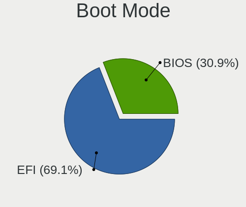
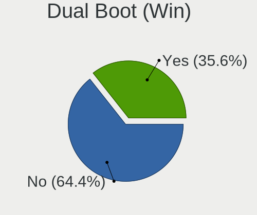
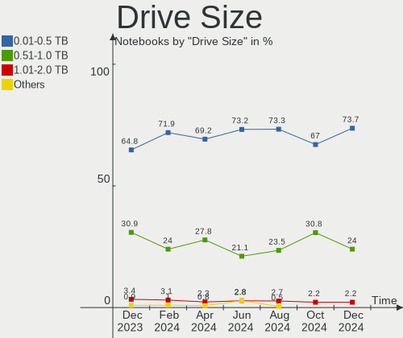
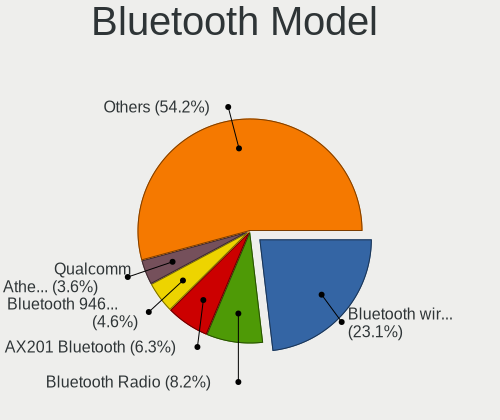

OpenMandriva - Hardware Trends (Notebooks)
------------------------------------------

A project to identify most popular hardware characteristics and track their change
over time based on data collected by Linux users at https://Linux-Hardware.org.

Anyone can contribute to this report by the [hw-probe](https://github.com/linuxhw/hw-probe) tool:

    sudo -E hw-probe -all -upload

This report is for one last month. Overall report since the beginning of time: [TestCoverage](https://github.com/linuxhw/TestCoverage)

Period: Dec, 2022.

Contents
--------

* [ System ](#system)
  - [ OS                       ](#os)
  - [ OS Family                ](#os-family)
  - [ Kernel                   ](#kernel)
  - [ Kernel Family            ](#kernel-family)
  - [ Kernel Major Ver.        ](#kernel-major-ver)
  - [ Arch                     ](#arch)
  - [ DE                       ](#de)
  - [ Display Server           ](#display-server)
  - [ Display Manager          ](#display-manager)
  - [ OS Lang                  ](#os-lang)
  - [ Boot Mode                ](#boot-mode)
  - [ Filesystem               ](#filesystem)
  - [ Part. scheme             ](#part-scheme)
  - [ Dual Boot with Linux/BSD ](#dual-boot-with-linuxbsd)
  - [ Dual Boot (Win)          ](#dual-boot-win)

* [ Board ](#board)
  - [ Vendor                   ](#vendor)
  - [ Model                    ](#model)
  - [ Model Family             ](#model-family)
  - [ MFG Year                 ](#mfg-year)
  - [ Form Factor              ](#form-factor)
  - [ Secure Boot              ](#secure-boot)
  - [ Coreboot                 ](#coreboot)
  - [ RAM Size                 ](#ram-size)
  - [ RAM Used                 ](#ram-used)
  - [ Total Drives             ](#total-drives)
  - [ Has CD-ROM               ](#has-cd-rom)
  - [ Has Ethernet             ](#has-ethernet)
  - [ Has WiFi                 ](#has-wifi)
  - [ Has Bluetooth            ](#has-bluetooth)

* [ Location ](#location)
  - [ Country                  ](#country)
  - [ City                     ](#city)

* [ Drives ](#drives)
  - [ Drive Vendor             ](#drive-vendor)
  - [ Drive Model              ](#drive-model)
  - [ HDD Vendor               ](#hdd-vendor)
  - [ SSD Vendor               ](#ssd-vendor)
  - [ Drive Kind               ](#drive-kind)
  - [ Drive Connector          ](#drive-connector)
  - [ Drive Size               ](#drive-size)
  - [ Space Total              ](#space-total)
  - [ Space Used               ](#space-used)
  - [ Malfunc. Drives          ](#malfunc-drives)
  - [ Malfunc. Drive Vendor    ](#malfunc-drive-vendor)
  - [ Malfunc. HDD Vendor      ](#malfunc-hdd-vendor)
  - [ Malfunc. Drive Kind      ](#malfunc-drive-kind)
  - [ Failed Drives            ](#failed-drives)
  - [ Failed Drive Vendor      ](#failed-drive-vendor)
  - [ Drive Status             ](#drive-status)

* [ Storage controller ](#storage-controller)
  - [ Storage Vendor           ](#storage-vendor)
  - [ Storage Model            ](#storage-model)
  - [ Storage Kind             ](#storage-kind)

* [ Processor ](#processor)
  - [ CPU Vendor               ](#cpu-vendor)
  - [ CPU Model                ](#cpu-model)
  - [ CPU Model Family         ](#cpu-model-family)
  - [ CPU Cores                ](#cpu-cores)
  - [ CPU Sockets              ](#cpu-sockets)
  - [ CPU Threads              ](#cpu-threads)
  - [ CPU Op-Modes             ](#cpu-op-modes)
  - [ CPU Microcode            ](#cpu-microcode)
  - [ CPU Microarch            ](#cpu-microarch)

* [ Graphics ](#graphics)
  - [ GPU Vendor               ](#gpu-vendor)
  - [ GPU Model                ](#gpu-model)
  - [ GPU Combo                ](#gpu-combo)
  - [ GPU Driver               ](#gpu-driver)
  - [ GPU Memory               ](#gpu-memory)

* [ Monitor ](#monitor)
  - [ Monitor Vendor           ](#monitor-vendor)
  - [ Monitor Model            ](#monitor-model)
  - [ Monitor Resolution       ](#monitor-resolution)
  - [ Monitor Diagonal         ](#monitor-diagonal)
  - [ Monitor Width            ](#monitor-width)
  - [ Aspect Ratio             ](#aspect-ratio)
  - [ Monitor Area             ](#monitor-area)
  - [ Pixel Density            ](#pixel-density)
  - [ Multiple Monitors        ](#multiple-monitors)

* [ Network ](#network)
  - [ Net Controller Vendor    ](#net-controller-vendor)
  - [ Net Controller Model     ](#net-controller-model)
  - [ Wireless Vendor          ](#wireless-vendor)
  - [ Wireless Model           ](#wireless-model)
  - [ Ethernet Vendor          ](#ethernet-vendor)
  - [ Ethernet Model           ](#ethernet-model)
  - [ Net Controller Kind      ](#net-controller-kind)
  - [ Used Controller          ](#used-controller)
  - [ NICs                     ](#nics)
  - [ IPv6                     ](#ipv6)

* [ Bluetooth ](#bluetooth)
  - [ Bluetooth Vendor         ](#bluetooth-vendor)
  - [ Bluetooth Model          ](#bluetooth-model)

* [ Sound ](#sound)
  - [ Sound Vendor             ](#sound-vendor)
  - [ Sound Model              ](#sound-model)

* [ Memory ](#memory)
  - [ Memory Vendor            ](#memory-vendor)
  - [ Memory Model             ](#memory-model)
  - [ Memory Kind              ](#memory-kind)
  - [ Memory Form Factor       ](#memory-form-factor)
  - [ Memory Size              ](#memory-size)
  - [ Memory Speed             ](#memory-speed)

* [ Printers & scanners ](#printers--scanners)
  - [ Printer Vendor           ](#printer-vendor)
  - [ Printer Model            ](#printer-model)
  - [ Scanner Vendor           ](#scanner-vendor)
  - [ Scanner Model            ](#scanner-model)

* [ Camera ](#camera)
  - [ Camera Vendor            ](#camera-vendor)
  - [ Camera Model             ](#camera-model)

* [ Security ](#security)
  - [ Fingerprint Vendor       ](#fingerprint-vendor)
  - [ Fingerprint Model        ](#fingerprint-model)
  - [ Chipcard Vendor          ](#chipcard-vendor)
  - [ Chipcard Model           ](#chipcard-model)

* [ Unsupported ](#unsupported)
  - [ Unsupported Devices      ](#unsupported-devices)
  - [ Unsupported Device Types ](#unsupported-device-types)

System
------

OS
--

Installed operating systems

| Name               | Notebooks | Percent |
|--------------------|-----------|---------|
| OpenMandriva 4.3   | 102       | 62.58%  |
| OpenMandriva 4.50  | 23        | 14.11%  |
| OpenMandriva 22.12 | 21        | 12.88%  |
| OpenMandriva 4.90  | 8         | 4.91%   |
| OpenMandriva 4.2   | 6         | 3.68%   |
| OpenMandriva 22.90 | 2         | 1.23%   |
| OpenMandriva 22.11 | 1         | 0.61%   |

OS Family
---------

OS without a version

| Name         | Notebooks | Percent |
|--------------|-----------|---------|
| OpenMandriva | 163       | 100%    |

Kernel
------

Version of the Linux kernel

| Version                  | Notebooks | Percent |
|--------------------------|-----------|---------|
| 5.16.7-desktop-1omv4003  | 100       | 61.35%  |
| 6.0.10-desktop-2omv22090 | 22        | 13.5%   |
| 5.19.12-desktop-2omv4090 | 17        | 10.43%  |
| 5.10.14-desktop-1omv4002 | 5         | 3.07%   |
| 6.0.2-desktop-1omv4090   | 4         | 2.45%   |
| 5.19.5-desktop-1omv4090  | 4         | 2.45%   |
| 5.18.12-desktop-3omv4090 | 4         | 2.45%   |
| 6.1.0-desktop-1omv2290   | 1         | 0.61%   |
| 6.0.9-desktop-1omv22090  | 1         | 0.61%   |
| 6.0.2-desktop-1omv4050   | 1         | 0.61%   |
| 5.19.11-desktop-2omv4090 | 1         | 0.61%   |
| 5.16.13-desktop-1omv4003 | 1         | 0.61%   |
| 5.14.14-desktop-1omv4050 | 1         | 0.61%   |
| 5.11.12-desktop-1omv4002 | 1         | 0.61%   |

Kernel Family
-------------

Linux kernel without a distro release

| Version | Notebooks | Percent |
|---------|-----------|---------|
| 5.16.7  | 100       | 61.35%  |
| 6.0.10  | 22        | 13.5%   |
| 5.19.12 | 17        | 10.43%  |
| 6.0.2   | 5         | 3.07%   |
| 5.10.14 | 5         | 3.07%   |
| 5.19.5  | 4         | 2.45%   |
| 5.18.12 | 4         | 2.45%   |
| 6.1.0   | 1         | 0.61%   |
| 6.0.9   | 1         | 0.61%   |
| 5.19.11 | 1         | 0.61%   |
| 5.16.13 | 1         | 0.61%   |
| 5.14.14 | 1         | 0.61%   |
| 5.11.12 | 1         | 0.61%   |

Kernel Major Ver.
-----------------

Linux kernel major version

| Version | Notebooks | Percent |
|---------|-----------|---------|
| 5.16    | 101       | 61.96%  |
| 6.0     | 28        | 17.18%  |
| 5.19    | 22        | 13.5%   |
| 5.10    | 5         | 3.07%   |
| 5.18    | 4         | 2.45%   |
| 6.1     | 1         | 0.61%   |
| 5.14    | 1         | 0.61%   |
| 5.11    | 1         | 0.61%   |

Arch
----

OS architecture (x86_64, i586, etc.)

| Name   | Notebooks | Percent |
|--------|-----------|---------|
| x86_64 | 163       | 100%    |

DE
--

Desktop Environment

| Name | Notebooks | Percent |
|------|-----------|---------|
| KDE5 | 161       | 98.77%  |
| XFCE | 1         | 0.61%   |
| LXQt | 1         | 0.61%   |

Display Server
--------------

X11 or Wayland

| Name | Notebooks | Percent |
|------|-----------|---------|
| X11  | 163       | 100%    |

Display Manager
---------------

SDDM, LightDM, etc.

| Name    | Notebooks | Percent |
|---------|-----------|---------|
| SDDM    | 161       | 98.77%  |
| LightDM | 2         | 1.23%   |

OS Lang
-------

Language

| Lang  | Notebooks | Percent |
|-------|-----------|---------|
| en_US | 88        | 53.99%  |
| fr_FR | 15        | 9.2%    |
| ru_RU | 13        | 7.98%   |
| de_DE | 8         | 4.91%   |
| pl_PL | 7         | 4.29%   |
| pt_BR | 5         | 3.07%   |
| en_GB | 5         | 3.07%   |
| it_IT | 4         | 2.45%   |
| cs_CZ | 4         | 2.45%   |
| es_ES | 3         | 1.84%   |
| es_CL | 2         | 1.23%   |
| ro_RO | 1         | 0.61%   |
| hu_HU | 1         | 0.61%   |
| fr_BE | 1         | 0.61%   |
| es_VE | 1         | 0.61%   |
| es_MX | 1         | 0.61%   |
| es_EC | 1         | 0.61%   |
| es_AR | 1         | 0.61%   |
| en_HK | 1         | 0.61%   |
| da_DK | 1         | 0.61%   |

Boot Mode
---------

EFI or BIOS

| Mode | Notebooks | Percent |
|------|-----------|---------|
| EFI  | 92        | 56.44%  |
| BIOS | 71        | 43.56%  |

Filesystem
----------

Type of filesystem

| Type    | Notebooks | Percent |
|---------|-----------|---------|
| Overlay | 126       | 77.3%   |
| Ext4    | 35        | 21.47%  |
| Btrfs   | 2         | 1.23%   |

Part. scheme
------------

Scheme of partitioning

| Type    | Notebooks | Percent |
|---------|-----------|---------|
| GPT     | 117       | 71.78%  |
| MBR     | 45        | 27.61%  |
| Unknown | 1         | 0.61%   |

Dual Boot with Linux/BSD
------------------------

Hosting more than one Linux/BSD

| Dual boot | Notebooks | Percent |
|-----------|-----------|---------|
| Yes       | 85        | 52.15%  |
| No        | 78        | 47.85%  |

Dual Boot (Win)
---------------

Hosting Linux and Windows

| Dual boot | Notebooks | Percent |
|-----------|-----------|---------|
| No        | 93        | 57.06%  |
| Yes       | 70        | 42.94%  |

Board
-----

Vendor
------

Motherboard manufacturer

| Name                | Notebooks | Percent |
|---------------------|-----------|---------|
| Lenovo              | 34        | 20.86%  |
| ASUSTek Computer    | 25        | 15.34%  |
| Hewlett-Packard     | 22        | 13.5%   |
| Acer                | 21        | 12.88%  |
| Dell                | 13        | 7.98%   |
| Toshiba             | 12        | 7.36%   |
| Samsung Electronics | 5         | 3.07%   |
| Positivo            | 5         | 3.07%   |
| MSI                 | 5         | 3.07%   |
| Apple               | 4         | 2.45%   |
| Sony                | 3         | 1.84%   |
| HUAWEI              | 2         | 1.23%   |
| Star Labs           | 1         | 0.61%   |
| RM Education        | 1         | 0.61%   |
| Packard Bell        | 1         | 0.61%   |
| Notebook            | 1         | 0.61%   |
| Medion              | 1         | 0.61%   |
| LG Electronics      | 1         | 0.61%   |
| Google              | 1         | 0.61%   |
| Gigabyte Technology | 1         | 0.61%   |
| Fujitsu             | 1         | 0.61%   |
| Dynabook            | 1         | 0.61%   |
| Clevo               | 1         | 0.61%   |
| Unknown             | 1         | 0.61%   |

Model
-----

Motherboard model

| Name                                  | Notebooks | Percent |
|---------------------------------------|-----------|---------|
| Toshiba dynabook T653/46JR            | 4         | 2.45%   |
| ASUS UX31E                            | 4         | 2.45%   |
| Apple MacBookAir7,2                   | 3         | 1.84%   |
| Acer Nitro AN515-57                   | 3         | 1.84%   |
| Positivo Mobile                       | 2         | 1.23%   |
| Positivo H14BT58                      | 2         | 1.23%   |
| MSI GF63 Thin 9RCX                    | 2         | 1.23%   |
| Lenovo IdeaPad S145-15AST 81N3        | 2         | 1.23%   |
| Lenovo IdeaPad 100-15IBD 80QQ         | 2         | 1.23%   |
| HP Pavilion Notebook                  | 2         | 1.23%   |
| HP Pavilion Laptop 15-cw1xxx          | 2         | 1.23%   |
| HP Notebook                           | 2         | 1.23%   |
| HP 15                                 | 2         | 1.23%   |
| ASUS S551LN                           | 2         | 1.23%   |
| ASUS K55VD                            | 2         | 1.23%   |
| Acer Aspire VX5-591G                  | 2         | 1.23%   |
| Toshiba Satellite L655                | 1         | 0.61%   |
| Toshiba Satellite L635                | 1         | 0.61%   |
| Toshiba Satellite L500                | 1         | 0.61%   |
| Toshiba Satellite C855                | 1         | 0.61%   |
| Toshiba Satellite C55-B               | 1         | 0.61%   |
| Toshiba Satellite C55-A               | 1         | 0.61%   |
| Toshiba Satellite A305D               | 1         | 0.61%   |
| Toshiba EQUIUM A300D                  | 1         | 0.61%   |
| Star Labs StarBook                    | 1         | 0.61%   |
| Sony VPCEL2S1E                        | 1         | 0.61%   |
| Sony VGN-NW31JF_S                     | 1         | 0.61%   |
| Sony VGN-FZ31Z                        | 1         | 0.61%   |
| Samsung R540/R580/R780/SA41/E452/E852 | 1         | 0.61%   |
| Samsung NB30/N146                     | 1         | 0.61%   |
| Samsung 305E4A/305E5A/305E7A          | 1         | 0.61%   |
| Samsung 300E4C/300E5C/300E7C          | 1         | 0.61%   |
| Samsung 270E5G/270E5U                 | 1         | 0.61%   |
| RM Education RM                       | 1         | 0.61%   |
| Positivo Hendrix                      | 1         | 0.61%   |
| Packard Bell DOT S                    | 1         | 0.61%   |
| Notebook W65_67SZ                     | 1         | 0.61%   |
| MSI GS76 Stealth 11UG                 | 1         | 0.61%   |
| MSI GS65 Stealth Thin 8RF             | 1         | 0.61%   |
| MSI GE62 6QD                          | 1         | 0.61%   |

Model Family
------------

Motherboard model prefix

| Name               | Notebooks | Percent |
|--------------------|-----------|---------|
| Acer Aspire        | 15        | 9.2%    |
| Lenovo ThinkPad    | 13        | 7.98%   |
| Lenovo IdeaPad     | 12        | 7.36%   |
| HP Pavilion        | 9         | 5.52%   |
| Dell Latitude      | 8         | 4.91%   |
| Toshiba Satellite  | 7         | 4.29%   |
| Toshiba dynabook   | 4         | 2.45%   |
| ASUS UX31E         | 4         | 2.45%   |
| Acer Nitro         | 4         | 2.45%   |
| HP Compaq          | 3         | 1.84%   |
| Dell Inspiron      | 3         | 1.84%   |
| ASUS VivoBook      | 3         | 1.84%   |
| Apple MacBookAir7  | 3         | 1.84%   |
| Positivo Mobile    | 2         | 1.23%   |
| Positivo H14BT58   | 2         | 1.23%   |
| MSI GF63           | 2         | 1.23%   |
| HP Notebook        | 2         | 1.23%   |
| HP EliteBook       | 2         | 1.23%   |
| HP 15              | 2         | 1.23%   |
| ASUS S551LN        | 2         | 1.23%   |
| ASUS K55VD         | 2         | 1.23%   |
| Toshiba EQUIUM     | 1         | 0.61%   |
| Star Labs StarBook | 1         | 0.61%   |
| Sony VPCEL2S1E     | 1         | 0.61%   |
| Sony VGN-NW31JF    | 1         | 0.61%   |
| Sony VGN-FZ31Z     | 1         | 0.61%   |
| Samsung R540       | 1         | 0.61%   |
| Samsung NB30       | 1         | 0.61%   |
| Samsung 305E4A     | 1         | 0.61%   |
| Samsung 300E4C     | 1         | 0.61%   |
| Samsung 270E5G     | 1         | 0.61%   |
| RM Education RM    | 1         | 0.61%   |
| Positivo Hendrix   | 1         | 0.61%   |
| Packard Bell DOT   | 1         | 0.61%   |
| Notebook W65       | 1         | 0.61%   |
| MSI GS76           | 1         | 0.61%   |
| MSI GS65           | 1         | 0.61%   |
| MSI GE62           | 1         | 0.61%   |
| Medion Akoya       | 1         | 0.61%   |
| LG 17Z90P-G.AA56F  | 1         | 0.61%   |

MFG Year
--------

Motherboard manufacture year

| Year | Notebooks | Percent |
|------|-----------|---------|
| 2013 | 18        | 11.04%  |
| 2011 | 16        | 9.82%   |
| 2015 | 14        | 8.59%   |
| 2012 | 14        | 8.59%   |
| 2019 | 13        | 7.98%   |
| 2014 | 13        | 7.98%   |
| 2021 | 12        | 7.36%   |
| 2010 | 11        | 6.75%   |
| 2020 | 10        | 6.13%   |
| 2008 | 10        | 6.13%   |
| 2017 | 9         | 5.52%   |
| 2009 | 7         | 4.29%   |
| 2022 | 4         | 2.45%   |
| 2018 | 4         | 2.45%   |
| 2007 | 4         | 2.45%   |
| 2016 | 3         | 1.84%   |
| 2006 | 1         | 0.61%   |

Form Factor
-----------

Physical design of the computer

| Name     | Notebooks | Percent |
|----------|-----------|---------|
| Notebook | 163       | 100%    |

Secure Boot
-----------

Enabled or disabled

| State    | Notebooks | Percent |
|----------|-----------|---------|
| Disabled | 163       | 100%    |

Coreboot
--------

Have coreboot on board

| Used | Notebooks | Percent |
|------|-----------|---------|
| No   | 161       | 98.77%  |
| Yes  | 2         | 1.23%   |

RAM Size
--------

Total RAM memory

| Size in GB | Notebooks | Percent |
|------------|-----------|---------|
| 3.01-4.0   | 60        | 36.81%  |
| 4.01-8.0   | 49        | 30.06%  |
| 8.01-16.0  | 21        | 12.88%  |
| 16.01-24.0 | 14        | 8.59%   |
| 32.01-64.0 | 8         | 4.91%   |
| 1.01-2.0   | 6         | 3.68%   |
| 2.01-3.0   | 4         | 2.45%   |
| 0.51-1.0   | 1         | 0.61%   |

RAM Used
--------

Used RAM memory

| Used GB  | Notebooks | Percent |
|----------|-----------|---------|
| 1.01-2.0 | 130       | 79.75%  |
| 0.51-1.0 | 16        | 9.82%   |
| 2.01-3.0 | 12        | 7.36%   |
| 0.01-0.5 | 3         | 1.84%   |
| 4.01-8.0 | 1         | 0.61%   |
| 3.01-4.0 | 1         | 0.61%   |

Total Drives
------------

Number of drives on board

| Drives | Notebooks | Percent |
|--------|-----------|---------|
| 1      | 127       | 77.91%  |
| 2      | 28        | 17.18%  |
| 3      | 5         | 3.07%   |
| 0      | 3         | 1.84%   |

Has CD-ROM
----------

Has CD-ROM on board

| Presented | Notebooks | Percent |
|-----------|-----------|---------|
| No        | 94        | 57.67%  |
| Yes       | 69        | 42.33%  |

Has Ethernet
------------

Has Ethernet on board

| Presented | Notebooks | Percent |
|-----------|-----------|---------|
| Yes       | 143       | 87.73%  |
| No        | 20        | 12.27%  |

Has WiFi
--------

Has WiFi module

| Presented | Notebooks | Percent |
|-----------|-----------|---------|
| Yes       | 161       | 98.77%  |
| No        | 2         | 1.23%   |

Has Bluetooth
-------------

Has Bluetooth module

| Presented | Notebooks | Percent |
|-----------|-----------|---------|
| Yes       | 112       | 68.71%  |
| No        | 51        | 31.29%  |

Location
--------

Country
-------

Geographic location (country)

| Country      | Notebooks | Percent |
|--------------|-----------|---------|
| Russia       | 21        | 12.88%  |
| France       | 16        | 9.82%   |
| USA          | 15        | 9.2%    |
| Germany      | 13        | 7.98%   |
| Poland       | 11        | 6.75%   |
| Italy        | 10        | 6.13%   |
| UK           | 9         | 5.52%   |
| Brazil       | 9         | 5.52%   |
| Czechia      | 5         | 3.07%   |
| Spain        | 4         | 2.45%   |
| Romania      | 4         | 2.45%   |
| Mexico       | 4         | 2.45%   |
| Japan        | 4         | 2.45%   |
| Canada       | 3         | 1.84%   |
| Switzerland  | 2         | 1.23%   |
| Morocco      | 2         | 1.23%   |
| Latvia       | 2         | 1.23%   |
| Hungary      | 2         | 1.23%   |
| Chile        | 2         | 1.23%   |
| Belgium      | 2         | 1.23%   |
| Argentina    | 2         | 1.23%   |
| Venezuela    | 1         | 0.61%   |
| Ukraine      | 1         | 0.61%   |
| Turkey       | 1         | 0.61%   |
| Sweden       | 1         | 0.61%   |
| Slovakia     | 1         | 0.61%   |
| Saudi Arabia | 1         | 0.61%   |
| Portugal     | 1         | 0.61%   |
| Nicaragua    | 1         | 0.61%   |
| Netherlands  | 1         | 0.61%   |
| Kyrgyzstan   | 1         | 0.61%   |
| Kazakhstan   | 1         | 0.61%   |
| Israel       | 1         | 0.61%   |
| Indonesia    | 1         | 0.61%   |
| Egypt        | 1         | 0.61%   |
| Ecuador      | 1         | 0.61%   |
| Denmark      | 1         | 0.61%   |
| Cyprus       | 1         | 0.61%   |
| China        | 1         | 0.61%   |
| Belarus      | 1         | 0.61%   |

City
----

Geographic location (city)

| City                    | Notebooks | Percent |
|-------------------------|-----------|---------|
| Paris                   | 4         | 2.45%   |
| Moscow                  | 4         | 2.45%   |
| Prague                  | 3         | 1.84%   |
| Vladivostok             | 2         | 1.23%   |
| Siggenthal Station      | 2         | 1.23%   |
| Salzgitter              | 2         | 1.23%   |
| Rostov-on-Don           | 2         | 1.23%   |
| Poznan                  | 2         | 1.23%   |
| Madison                 | 2         | 1.23%   |
| Kenitra                 | 2         | 1.23%   |
| Iowa City               | 2         | 1.23%   |
| Goncalves               | 2         | 1.23%   |
| Belgorod                | 2         | 1.23%   |
| Zlatoust                | 1         | 0.61%   |
| Yenne                   | 1         | 0.61%   |
| Yehud                   | 1         | 0.61%   |
| Yaroslavl               | 1         | 0.61%   |
| Xianyang                | 1         | 0.61%   |
| Wojkowice               | 1         | 0.61%   |
| Warsaw                  | 1         | 0.61%   |
| Wallsend                | 1         | 0.61%   |
| Volvic                  | 1         | 0.61%   |
| Volgograd               | 1         | 0.61%   |
| Virginia Beach          | 1         | 0.61%   |
| Viña del Mar           | 1         | 0.61%   |
| Uriangato               | 1         | 0.61%   |
| Trieste                 | 1         | 0.61%   |
| Toronto                 | 1         | 0.61%   |
| Tomsk                   | 1         | 0.61%   |
| Tomball                 | 1         | 0.61%   |
| Tokyo                   | 1         | 0.61%   |
| Teresina                | 1         | 0.61%   |
| Suchy Las               | 1         | 0.61%   |
| Southport               | 1         | 0.61%   |
| Sorocaba                | 1         | 0.61%   |
| Sherbrooke              | 1         | 0.61%   |
| Sevastopol              | 1         | 0.61%   |
| Saransk                 | 1         | 0.61%   |
| Santa Lucia             | 1         | 0.61%   |
| Sant Feliu de Llobregat | 1         | 0.61%   |

Drives
------

Drive Vendor
------------

Hard drive vendors

| Vendor              | Notebooks | Drives | Percent |
|---------------------|-----------|--------|---------|
| WDC                 | 29        | 31     | 15.59%  |
| Seagate             | 26        | 27     | 13.98%  |
| Samsung Electronics | 25        | 27     | 13.44%  |
| Toshiba             | 19        | 19     | 10.22%  |
| SanDisk             | 11        | 12     | 5.91%   |
| Kingston            | 10        | 10     | 5.38%   |
| HGST                | 9         | 9      | 4.84%   |
| Unknown             | 6         | 6      | 3.23%   |
| JMicron Technology  | 4         | 4      | 2.15%   |
| Intel               | 4         | 4      | 2.15%   |
| Hitachi             | 4         | 4      | 2.15%   |
| Apple               | 4         | 4      | 2.15%   |
| SPCC                | 3         | 3      | 1.61%   |
| GOODRAM             | 3         | 3      | 1.61%   |
| Crucial             | 3         | 3      | 1.61%   |
| A-DATA Technology   | 3         | 3      | 1.61%   |
| Team                | 2         | 2      | 1.08%   |
| SK hynix            | 2         | 3      | 1.08%   |
| Patriot             | 2         | 2      | 1.08%   |
| KIOXIA              | 2         | 2      | 1.08%   |
| Fujitsu             | 2         | 3      | 1.08%   |
| Transcend           | 1         | 1      | 0.54%   |
| Star Drive          | 1         | 1      | 0.54%   |
| Smartbuy            | 1         | 2      | 0.54%   |
| Silicon Motion      | 1         | 1      | 0.54%   |
| PNY                 | 1         | 1      | 0.54%   |
| Phison              | 1         | 1      | 0.54%   |
| MidasForce          | 1         | 1      | 0.54%   |
| Micron Technology   | 1         | 1      | 0.54%   |
| LITEONIT            | 1         | 1      | 0.54%   |
| Hewlett-Packard     | 1         | 1      | 0.54%   |
| Dogfish             | 1         | 1      | 0.54%   |
| China               | 1         | 1      | 0.54%   |
| AMD                 | 1         | 1      | 0.54%   |

Drive Model
-----------

Hard drive models

| Model                                | Notebooks | Percent |
|--------------------------------------|-----------|---------|
| Toshiba MQ01ABD075 752GB             | 5         | 2.62%   |
| Seagate ST500LT012-1DG142 500GB      | 5         | 2.62%   |
| Seagate ST1000LM024 HN-M101MBB 1TB   | 5         | 2.62%   |
| SanDisk SSD U100 256GB               | 4         | 2.09%   |
| Kingston SA400S37240G 240GB SSD      | 4         | 2.09%   |
| Toshiba MQ01ABF050 500GB             | 3         | 1.57%   |
| Toshiba MQ01ABD100 1TB               | 3         | 1.57%   |
| SPCC Solid State Disk 512GB          | 3         | 1.57%   |
| Seagate ST1000LM035-1RK172 1TB       | 3         | 1.57%   |
| Apple SSD SM0128G 121GB              | 3         | 1.57%   |
| WDC WDS240G2G0A-00JH30 240GB SSD     | 2         | 1.05%   |
| WDC WD10JPVX-22JC3T0 1TB             | 2         | 1.05%   |
| WDC PC SN520 SDAPNUW-256G-1202 256GB | 2         | 1.05%   |
| Toshiba MK2555GSX 250GB              | 2         | 1.05%   |
| Seagate ST9500325AS 500GB            | 2         | 1.05%   |
| Seagate ST500LT012-9WS142 500GB      | 2         | 1.05%   |
| Samsung MZVLQ512HBLU-00BTW 512GB     | 2         | 1.05%   |
| Samsung MZALQ512HBLU-00BL2 512GB     | 2         | 1.05%   |
| JMicron Tech 250GB                   | 2         | 1.05%   |
| JMicron H/W JBOD 512GB SSD           | 2         | 1.05%   |
| HGST HTS545050A7E680 500GB           | 2         | 1.05%   |
| HGST HTS541010A9E680 1TB             | 2         | 1.05%   |
| WDC WDS500G2X0C-00L350 500GB         | 1         | 0.52%   |
| WDC WDS250G2B0A 250GB SSD            | 1         | 0.52%   |
| WDC WDS120G2G0A-00JH30 120GB SSD     | 1         | 0.52%   |
| WDC WDS100T2B0C-00PXH0 1TB           | 1         | 0.52%   |
| WDC WDS100T2B0A-00SM50 1TB SSD       | 1         | 0.52%   |
| WDC WD5000MPCK-22AWHT0 500GB         | 1         | 0.52%   |
| WDC WD5000LPZX-08Z10 500GB           | 1         | 0.52%   |
| WDC WD5000LPVX-75V0TT0 500GB         | 1         | 0.52%   |
| WDC WD5000LPVX-00V0TT0 500GB         | 1         | 0.52%   |
| WDC WD5000LPCX-24VHAT0 500GB         | 1         | 0.52%   |
| WDC WD5000BPVT-24HXZT3 500GB         | 1         | 0.52%   |
| WDC WD3200LPCX-22VHAT0 320GB         | 1         | 0.52%   |
| WDC WD3200BPVT-80JJ5T0 320GB         | 1         | 0.52%   |
| WDC WD3200BPVT-22ZEST0 320GB         | 1         | 0.52%   |
| WDC WD3200BEVT-22A23T0 320GB         | 1         | 0.52%   |
| WDC WD2500BEVS-26UST0 250GB          | 1         | 0.52%   |
| WDC WD1600BEVT-80A23T0 160GB         | 1         | 0.52%   |
| WDC WD1200BEVS-75UST0 120GB          | 1         | 0.52%   |

HDD Vendor
----------

Hard disk drive vendors

| Vendor              | Notebooks | Drives | Percent |
|---------------------|-----------|--------|---------|
| Seagate             | 26        | 26     | 33.77%  |
| WDC                 | 17        | 17     | 22.08%  |
| Toshiba             | 17        | 17     | 22.08%  |
| HGST                | 9         | 9      | 11.69%  |
| Hitachi             | 4         | 4      | 5.19%   |
| Samsung Electronics | 2         | 2      | 2.6%    |
| Fujitsu             | 2         | 3      | 2.6%    |

SSD Vendor
----------

Solid state drive vendors

| Vendor              | Notebooks | Drives | Percent |
|---------------------|-----------|--------|---------|
| SanDisk             | 10        | 10     | 14.93%  |
| Samsung Electronics | 10        | 10     | 14.93%  |
| Kingston            | 7         | 7      | 10.45%  |
| WDC                 | 5         | 5      | 7.46%   |
| Apple               | 4         | 4      | 5.97%   |
| SPCC                | 3         | 3      | 4.48%   |
| Intel               | 3         | 3      | 4.48%   |
| GOODRAM             | 3         | 3      | 4.48%   |
| Crucial             | 3         | 3      | 4.48%   |
| A-DATA Technology   | 3         | 3      | 4.48%   |
| JMicron Technology  | 2         | 2      | 2.99%   |
| Unknown             | 1         | 1      | 1.49%   |
| Transcend           | 1         | 1      | 1.49%   |
| Toshiba             | 1         | 1      | 1.49%   |
| Team                | 1         | 1      | 1.49%   |
| Smartbuy            | 1         | 2      | 1.49%   |
| Seagate             | 1         | 1      | 1.49%   |
| Phison              | 1         | 1      | 1.49%   |
| Patriot             | 1         | 1      | 1.49%   |
| MidasForce          | 1         | 1      | 1.49%   |
| LITEONIT            | 1         | 1      | 1.49%   |
| Hewlett-Packard     | 1         | 1      | 1.49%   |
| Dogfish             | 1         | 1      | 1.49%   |
| China               | 1         | 1      | 1.49%   |
| AMD                 | 1         | 1      | 1.49%   |

Drive Kind
----------

HDD or SSD

| Kind    | Notebooks | Drives | Percent |
|---------|-----------|--------|---------|
| HDD     | 75        | 78     | 41.21%  |
| SSD     | 63        | 68     | 34.62%  |
| NVMe    | 37        | 41     | 20.33%  |
| MMC     | 5         | 6      | 2.75%   |
| Unknown | 2         | 2      | 1.1%    |

Drive Connector
---------------

SATA, SAS, NVMe, etc.

| Type | Notebooks | Drives | Percent |
|------|-----------|--------|---------|
| SATA | 129       | 141    | 72.47%  |
| NVMe | 37        | 41     | 20.79%  |
| SAS  | 7         | 7      | 3.93%   |
| MMC  | 5         | 6      | 2.81%   |

Drive Size
----------

Size of hard drive

| Size in TB | Notebooks | Drives | Percent |
|------------|-----------|--------|---------|
| 0.01-0.5   | 97        | 106    | 71.85%  |
| 0.51-1.0   | 36        | 38     | 26.67%  |
| 1.01-2.0   | 2         | 2      | 1.48%   |

Space Total
-----------

Amount of disk space available on the file system

| Size in GB | Notebooks | Percent |
|------------|-----------|---------|
| 1-20       | 89        | 54.6%   |
| 101-250    | 30        | 18.4%   |
| 251-500    | 18        | 11.04%  |
| 51-100     | 9         | 5.52%   |
| 501-1000   | 7         | 4.29%   |
| Unknown    | 6         | 3.68%   |
| 21-50      | 4         | 2.45%   |

Space Used
----------

Amount of used disk space

| Used GB | Notebooks | Percent |
|---------|-----------|---------|
| 1-20    | 146       | 89.57%  |
| Unknown | 6         | 3.68%   |
| 51-100  | 5         | 3.07%   |
| 21-50   | 3         | 1.84%   |
| 101-250 | 2         | 1.23%   |
| 251-500 | 1         | 0.61%   |

Malfunc. Drives
---------------

Drive models with a malfunction

| Model                              | Notebooks | Drives | Percent |
|------------------------------------|-----------|--------|---------|
| Toshiba MQ01ABD075 752GB           | 5         | 5      | 13.51%  |
| SanDisk SSD U100 256GB             | 4         | 4      | 10.81%  |
| Seagate ST9500325AS 500GB          | 2         | 2      | 5.41%   |
| Seagate ST500LT012-9WS142 500GB    | 2         | 2      | 5.41%   |
| HGST HTS545050A7E680 500GB         | 2         | 2      | 5.41%   |
| WDC WD5000BPVT-24HXZT3 500GB       | 1         | 1      | 2.7%    |
| WDC WD3200LPCX-22VHAT0 320GB       | 1         | 1      | 2.7%    |
| WDC WD3200BPVT-80JJ5T0 320GB       | 1         | 1      | 2.7%    |
| WDC WD3200BPVT-22ZEST0 320GB       | 1         | 1      | 2.7%    |
| WDC WD3200BEVT-22A23T0 320GB       | 1         | 1      | 2.7%    |
| Toshiba MQ01ABF050 500GB           | 1         | 1      | 2.7%    |
| Toshiba MQ01ABD100 1TB             | 1         | 1      | 2.7%    |
| Toshiba MK4055GSX 400GB            | 1         | 1      | 2.7%    |
| Toshiba MK3261GSYN 320GB           | 1         | 1      | 2.7%    |
| Toshiba MK2555GSX 250GB            | 1         | 1      | 2.7%    |
| Seagate ST9500420AS 500GB          | 1         | 1      | 2.7%    |
| Seagate ST9320325AS 320GB          | 1         | 1      | 2.7%    |
| Seagate ST9250320AS 250GB          | 1         | 1      | 2.7%    |
| Seagate ST500LT012-1DG142 500GB    | 1         | 1      | 2.7%    |
| Seagate ST1000LM035-1RK172 1TB     | 1         | 1      | 2.7%    |
| Seagate ST1000LM024 HN-M101MBB 1TB | 1         | 1      | 2.7%    |
| Samsung Electronics HM160HI 160GB  | 1         | 1      | 2.7%    |
| Intel SSDSC2KF256H6L 256GB         | 1         | 1      | 2.7%    |
| Hitachi HTS543225A7A384 250GB      | 1         | 1      | 2.7%    |
| HGST HTS541010A9E680 1TB           | 1         | 1      | 2.7%    |
| Fujitsu MHZ2120BH G2 120GB         | 1         | 1      | 2.7%    |
| Crucial CT240M500SSD1 240GB        | 1         | 1      | 2.7%    |

Malfunc. Drive Vendor
---------------------

Vendors of faulty drives

| Vendor              | Notebooks | Drives | Percent |
|---------------------|-----------|--------|---------|
| Toshiba             | 10        | 10     | 27.03%  |
| Seagate             | 10        | 10     | 27.03%  |
| WDC                 | 5         | 5      | 13.51%  |
| SanDisk             | 4         | 4      | 10.81%  |
| HGST                | 3         | 3      | 8.11%   |
| Samsung Electronics | 1         | 1      | 2.7%    |
| Intel               | 1         | 1      | 2.7%    |
| Hitachi             | 1         | 1      | 2.7%    |
| Fujitsu             | 1         | 1      | 2.7%    |
| Crucial             | 1         | 1      | 2.7%    |

Malfunc. HDD Vendor
-------------------

Vendors of faulty HDD drives

| Vendor              | Notebooks | Drives | Percent |
|---------------------|-----------|--------|---------|
| Toshiba             | 10        | 10     | 32.26%  |
| Seagate             | 10        | 10     | 32.26%  |
| WDC                 | 5         | 5      | 16.13%  |
| HGST                | 3         | 3      | 9.68%   |
| Samsung Electronics | 1         | 1      | 3.23%   |
| Hitachi             | 1         | 1      | 3.23%   |
| Fujitsu             | 1         | 1      | 3.23%   |

Malfunc. Drive Kind
-------------------

Kinds of faulty drives

| Kind | Notebooks | Drives | Percent |
|------|-----------|--------|---------|
| HDD  | 31        | 31     | 83.78%  |
| SSD  | 6         | 6      | 16.22%  |

Failed Drives
-------------

Failed drive models

| Model                             | Notebooks | Drives | Percent |
|-----------------------------------|-----------|--------|---------|
| Samsung Electronics HM500JI 500GB | 1         | 1      | 100%    |

Failed Drive Vendor
-------------------

Failed drive vendors

| Vendor              | Notebooks | Drives | Percent |
|---------------------|-----------|--------|---------|
| Samsung Electronics | 1         | 1      | 100%    |

Drive Status
------------

Number of failed and malfunc. drives

| Status   | Notebooks | Drives | Percent |
|----------|-----------|--------|---------|
| Works    | 121       | 144    | 70.76%  |
| Malfunc  | 37        | 37     | 21.64%  |
| Detected | 12        | 13     | 7.02%   |
| Failed   | 1         | 1      | 0.58%   |

Storage controller
------------------

Storage Vendor
--------------

Storage controller vendors

| Vendor                       | Notebooks | Percent |
|------------------------------|-----------|---------|
| Intel                        | 122       | 65.24%  |
| AMD                          | 22        | 11.76%  |
| Samsung Electronics          | 17        | 9.09%   |
| SanDisk                      | 9         | 4.81%   |
| Kingston Technology Company  | 3         | 1.6%    |
| Toshiba America Info Systems | 2         | 1.07%   |
| SK hynix                     | 2         | 1.07%   |
| Silicon Motion               | 2         | 1.07%   |
| Phison Electronics           | 2         | 1.07%   |
| Nvidia                       | 2         | 1.07%   |
| KIOXIA                       | 2         | 1.07%   |
| Micron Technology            | 1         | 0.53%   |
| MAXIO Technology (Hangzhou)  | 1         | 0.53%   |

Storage Model
-------------

Storage controller models

| Model                                                                          | Notebooks | Percent |
|--------------------------------------------------------------------------------|-----------|---------|
| Intel 7 Series Chipset Family 6-port SATA Controller [AHCI mode]               | 20        | 9.71%   |
| AMD FCH SATA Controller [AHCI mode]                                            | 16        | 7.77%   |
| Intel 82801IBM/IEM (ICH9M/ICH9M-E) 4 port SATA Controller [AHCI mode]          | 10        | 4.85%   |
| Intel 8 Series SATA Controller 1 [AHCI mode]                                   | 10        | 4.85%   |
| Intel 6 Series/C200 Series Chipset Family 6 port Mobile SATA AHCI Controller   | 10        | 4.85%   |
| Samsung NVMe SSD Controller SM981/PM981/PM983                                  | 8         | 3.88%   |
| Intel Wildcat Point-LP SATA Controller [AHCI Mode]                             | 7         | 3.4%    |
| Intel Sunrise Point-LP SATA Controller [AHCI mode]                             | 7         | 3.4%    |
| Intel Atom Processor E3800 Series SATA AHCI Controller                         | 7         | 3.4%    |
| Intel 82801 Mobile SATA Controller [RAID mode]                                 | 7         | 3.4%    |
| Intel 5 Series/3400 Series Chipset 4 port SATA AHCI Controller                 | 6         | 2.91%   |
| Samsung NVMe SSD Controller 980                                                | 5         | 2.43%   |
| Intel Volume Management Device NVMe RAID Controller                            | 5         | 2.43%   |
| AMD SB7x0/SB8x0/SB9x0 SATA Controller [AHCI mode]                              | 5         | 2.43%   |
| SanDisk WD Blue SN550 NVMe SSD                                                 | 4         | 1.94%   |
| Intel HM170/QM170 Chipset SATA Controller [AHCI Mode]                          | 4         | 1.94%   |
| Samsung Electronics SATA controller                                            | 3         | 1.46%   |
| Intel NM10/ICH7 Family SATA Controller [AHCI mode]                             | 3         | 1.46%   |
| Intel Cannon Lake Mobile PCH SATA AHCI Controller                              | 3         | 1.46%   |
| Intel 82801HM/HEM (ICH8M/ICH8M-E) SATA Controller [AHCI mode]                  | 3         | 1.46%   |
| Intel 82801HM/HEM (ICH8M/ICH8M-E) IDE Controller                               | 3         | 1.46%   |
| Intel 8 Series/C220 Series Chipset Family 6-port SATA Controller 1 [AHCI mode] | 3         | 1.46%   |
| Intel 500 Series Chipset Family SATA AHCI Controller                           | 3         | 1.46%   |
| SanDisk WD Blue SN500 / PC SN520 NVMe SSD                                      | 2         | 0.97%   |
| SanDisk WD Black SN750 / PC SN730 NVMe SSD                                     | 2         | 0.97%   |
| Intel Tiger Lake-LP SATA Controller                                            | 2         | 0.97%   |
| Intel Mobile 4 Series Chipset PT IDER Controller                               | 2         | 0.97%   |
| Intel 82801IBM/IEM (ICH9M/ICH9M-E) 2 port SATA Controller [IDE mode]           | 2         | 0.97%   |
| Intel 82801GBM/GHM (ICH7-M Family) SATA Controller [IDE mode]                  | 2         | 0.97%   |
| Intel 5 Series/3400 Series Chipset 6 port SATA AHCI Controller                 | 2         | 0.97%   |
| Intel 5 Series/3400 Series Chipset 4 port SATA IDE Controller                  | 2         | 0.97%   |
| Intel 5 Series/3400 Series Chipset 2 port SATA IDE Controller                  | 2         | 0.97%   |
| Intel 400 Series Chipset Family SATA AHCI Controller                           | 2         | 0.97%   |
| AMD SB7x0/SB8x0/SB9x0 IDE Controller                                           | 2         | 0.97%   |
| Toshiba America Info Systems XG6 NVMe SSD Controller                           | 1         | 0.49%   |
| Toshiba America Info Systems Toshiba America Info SATA controller              | 1         | 0.49%   |
| SK hynix Gold P31/PC711 NVMe Solid State Drive                                 | 1         | 0.49%   |
| SK hynix BC501 NVMe Solid State Drive                                          | 1         | 0.49%   |
| Silicon Motion SM2263EN/SM2263XT SSD Controller                                | 1         | 0.49%   |
| Silicon Motion Non-Volatile memory controller                                  | 1         | 0.49%   |

Storage Kind
------------

Kind of storage controller (IDE, SATA, NVMe, SAS, ...)

| Kind | Notebooks | Percent |
|------|-----------|---------|
| SATA | 134       | 67%     |
| NVMe | 37        | 18.5%   |
| IDE  | 17        | 8.5%    |
| RAID | 12        | 6%      |

Processor
---------

CPU Vendor
----------

Processor vendors

| Vendor | Notebooks | Percent |
|--------|-----------|---------|
| Intel  | 134       | 82.21%  |
| AMD    | 29        | 17.79%  |

CPU Model
---------

Processor models

| Model                                         | Notebooks | Percent |
|-----------------------------------------------|-----------|---------|
| Intel Core i7-2677M CPU @ 1.80GHz             | 4         | 2.45%   |
| Intel Core i5-5200U CPU @ 2.20GHz             | 4         | 2.45%   |
| Intel Core i3-4030U CPU @ 1.90GHz             | 4         | 2.45%   |
| Intel Celeron CPU 847 @ 1.10GHz               | 4         | 2.45%   |
| Intel Core i5-5350U CPU @ 1.80GHz             | 3         | 1.84%   |
| Intel Core i5-3320M CPU @ 2.60GHz             | 3         | 1.84%   |
| Intel Core i3 CPU M 380 @ 2.53GHz             | 3         | 1.84%   |
| Intel Celeron CPU N2840 @ 2.16GHz             | 3         | 1.84%   |
| Intel 11th Gen Core i5-11400H @ 2.70GHz       | 3         | 1.84%   |
| AMD Ryzen 5 3500U with Radeon Vega Mobile Gfx | 3         | 1.84%   |
| Intel Pentium Dual-Core CPU T4500 @ 2.30GHz   | 2         | 1.23%   |
| Intel Pentium CPU P6100 @ 2.00GHz             | 2         | 1.23%   |
| Intel Pentium CPU N3520 @ 2.16GHz             | 2         | 1.23%   |
| Intel Core i5-9300H CPU @ 2.40GHz             | 2         | 1.23%   |
| Intel Core i5-7300HQ CPU @ 2.50GHz            | 2         | 1.23%   |
| Intel Core i5-6200U CPU @ 2.30GHz             | 2         | 1.23%   |
| Intel Core i5-5300U CPU @ 2.30GHz             | 2         | 1.23%   |
| Intel Core i5-4200U CPU @ 1.60GHz             | 2         | 1.23%   |
| Intel Core i5-4200M CPU @ 2.50GHz             | 2         | 1.23%   |
| Intel Core i5-3230M CPU @ 2.60GHz             | 2         | 1.23%   |
| Intel Core i3-7020U CPU @ 2.30GHz             | 2         | 1.23%   |
| Intel Core i3-3110M CPU @ 2.40GHz             | 2         | 1.23%   |
| Intel Core i3-2310M CPU @ 2.10GHz             | 2         | 1.23%   |
| Intel Core i3 CPU M 370 @ 2.40GHz             | 2         | 1.23%   |
| Intel Core 2 Duo CPU T7500 @ 2.20GHz          | 2         | 1.23%   |
| Intel Core 2 Duo CPU P8400 @ 2.26GHz          | 2         | 1.23%   |
| Intel Celeron CPU N2808 @ 1.58GHz             | 2         | 1.23%   |
| Intel 11th Gen Core i7-1165G7 @ 2.80GHz       | 2         | 1.23%   |
| Intel 11th Gen Core i5-1135G7 @ 2.40GHz       | 2         | 1.23%   |
| AMD Ryzen 5 4600H with Radeon Graphics        | 2         | 1.23%   |
| AMD A4-9125 RADEON R3, 4 COMPUTE CORES 2C+2G  | 2         | 1.23%   |
| Intel Pentium Silver N5030 CPU @ 1.10GHz      | 1         | 0.61%   |
| Intel Pentium Dual-Core CPU T4400 @ 2.20GHz   | 1         | 0.61%   |
| Intel Pentium Dual-Core CPU T4300 @ 2.10GHz   | 1         | 0.61%   |
| Intel Pentium CPU N3700 @ 1.60GHz             | 1         | 0.61%   |
| Intel Pentium CPU N3530 @ 2.16GHz             | 1         | 0.61%   |
| Intel Pentium CPU B960 @ 2.20GHz              | 1         | 0.61%   |
| Intel Pentium CPU 2020M @ 2.40GHz             | 1         | 0.61%   |
| Intel Core i7-9750H CPU @ 2.60GHz             | 1         | 0.61%   |
| Intel Core i7-8750H CPU @ 2.20GHz             | 1         | 0.61%   |

CPU Model Family
----------------

Processor model prefix

| Model                          | Notebooks | Percent |
|--------------------------------|-----------|---------|
| Intel Core i5                  | 36        | 22.09%  |
| Intel Core i3                  | 24        | 14.72%  |
| Intel Core i7                  | 22        | 13.5%   |
| Other                          | 11        | 6.75%   |
| Intel Celeron                  | 11        | 6.75%   |
| Intel Core 2 Duo               | 9         | 5.52%   |
| Intel Pentium                  | 8         | 4.91%   |
| AMD Ryzen 5                    | 5         | 3.07%   |
| Intel Pentium Dual-Core        | 4         | 2.45%   |
| Intel Atom                     | 4         | 2.45%   |
| AMD Ryzen 7                    | 4         | 2.45%   |
| AMD A4                         | 4         | 2.45%   |
| Intel Core 2                   | 3         | 1.84%   |
| AMD Athlon                     | 3         | 1.84%   |
| AMD A6                         | 3         | 1.84%   |
| AMD Turion 64 X2 Mobile        | 2         | 1.23%   |
| Intel Pentium Silver           | 1         | 0.61%   |
| Intel Celeron M                | 1         | 0.61%   |
| Intel Celeron Dual-Core        | 1         | 0.61%   |
| AMD Turion X2 Dual-Core Mobile | 1         | 0.61%   |
| AMD Sempron                    | 1         | 0.61%   |
| AMD Ryzen 3                    | 1         | 0.61%   |
| AMD E                          | 1         | 0.61%   |
| AMD C-60                       | 1         | 0.61%   |
| AMD Athlon X2                  | 1         | 0.61%   |
| AMD A8                         | 1         | 0.61%   |

CPU Cores
---------

Number of processor cores

| Number | Notebooks | Percent |
|--------|-----------|---------|
| 2      | 112       | 68.71%  |
| 4      | 32        | 19.63%  |
| 6      | 8         | 4.91%   |
| 8      | 5         | 3.07%   |
| 1      | 5         | 3.07%   |
| 14     | 1         | 0.61%   |

CPU Sockets
-----------

Number of sockets

| Number | Notebooks | Percent |
|--------|-----------|---------|
| 1      | 163       | 100%    |

CPU Threads
-----------

Threads per core (Hyper-Threading)

| Number | Notebooks | Percent |
|--------|-----------|---------|
| 2      | 102       | 62.58%  |
| 1      | 59        | 36.2%   |
| 8      | 1         | 0.61%   |
| 4      | 1         | 0.61%   |

CPU Op-Modes
------------

CPU Operation Modes (32-bit, 64-bit)

| Op mode        | Notebooks | Percent |
|----------------|-----------|---------|
| 32-bit, 64-bit | 163       | 100%    |

CPU Microcode
-------------

Microcode number

| Number     | Notebooks | Percent |
|------------|-----------|---------|
| 0x206a7    | 18        | 11.04%  |
| 0x306a9    | 14        | 8.59%   |
| 0x40651    | 11        | 6.75%   |
| 0x306d4    | 11        | 6.75%   |
| Unknown    | 11        | 6.75%   |
| 0x20655    | 8         | 4.91%   |
| 0x30678    | 6         | 3.68%   |
| 0x1067a    | 6         | 3.68%   |
| 0x10676    | 6         | 3.68%   |
| 0x08108109 | 5         | 3.07%   |
| 0x906ea    | 4         | 2.45%   |
| 0x806e9    | 4         | 2.45%   |
| 0x806c1    | 4         | 2.45%   |
| 0x306c3    | 4         | 2.45%   |
| 0x06006705 | 4         | 2.45%   |
| 0x906e9    | 3         | 1.84%   |
| 0x806ec    | 3         | 1.84%   |
| 0x6fb      | 3         | 1.84%   |
| 0x6f6      | 3         | 1.84%   |
| 0x406e3    | 3         | 1.84%   |
| 0x106ca    | 3         | 1.84%   |
| 0x02000032 | 3         | 1.84%   |
| 0xa0652    | 2         | 1.23%   |
| 0x30673    | 2         | 1.23%   |
| 0x08108102 | 2         | 1.23%   |
| 0x07030105 | 2         | 1.23%   |
| 0x806eb    | 1         | 0.61%   |
| 0x806ea    | 1         | 0.61%   |
| 0x806d1    | 1         | 0.61%   |
| 0x706a8    | 1         | 0.61%   |
| 0x506e3    | 1         | 0.61%   |
| 0x406c4    | 1         | 0.61%   |
| 0x406c3    | 1         | 0.61%   |
| 0x106e5    | 1         | 0.61%   |
| 0x0a404101 | 1         | 0.61%   |
| 0x08608103 | 1         | 0.61%   |
| 0x08600106 | 1         | 0.61%   |
| 0x08600103 | 1         | 0.61%   |
| 0x08200103 | 1         | 0.61%   |
| 0x06006704 | 1         | 0.61%   |

CPU Microarch
-------------

Microarchitecture

| Name            | Notebooks | Percent |
|-----------------|-----------|---------|
| SandyBridge     | 18        | 11.04%  |
| KabyLake        | 18        | 11.04%  |
| Haswell         | 15        | 9.2%    |
| IvyBridge       | 14        | 8.59%   |
| Penryn          | 12        | 7.36%   |
| Broadwell       | 11        | 6.75%   |
| Silvermont      | 10        | 6.13%   |
| Westmere        | 9         | 5.52%   |
| Unknown         | 8         | 4.91%   |
| Zen+            | 7         | 4.29%   |
| Core            | 6         | 3.68%   |
| Excavator       | 5         | 3.07%   |
| TigerLake       | 4         | 2.45%   |
| Skylake         | 4         | 2.45%   |
| K8 & K10 hybrid | 4         | 2.45%   |
| Bonnell         | 3         | 1.84%   |
| Zen 2           | 2         | 1.23%   |
| Puma            | 2         | 1.23%   |
| K8 Hammer       | 2         | 1.23%   |
| CometLake       | 2         | 1.23%   |
| Bobcat          | 2         | 1.23%   |
| Zen 3           | 1         | 0.61%   |
| Zen             | 1         | 0.61%   |
| Nehalem         | 1         | 0.61%   |
| K10 Llano       | 1         | 0.61%   |
| Goldmont plus   | 1         | 0.61%   |

Graphics
--------

GPU Vendor
----------

Vendors of graphics cards

| Vendor | Notebooks | Percent |
|--------|-----------|---------|
| Intel  | 123       | 59.71%  |
| Nvidia | 48        | 23.3%   |
| AMD    | 35        | 16.99%  |

GPU Model
---------

Graphics card models

| Model                                                                                    | Notebooks | Percent |
|------------------------------------------------------------------------------------------|-----------|---------|
| Intel 2nd Generation Core Processor Family Integrated Graphics Controller                | 18        | 8.53%   |
| Intel 3rd Gen Core processor Graphics Controller                                         | 14        | 6.64%   |
| Intel Haswell-ULT Integrated Graphics Controller                                         | 11        | 5.21%   |
| Intel Mobile 4 Series Chipset Integrated Graphics Controller                             | 9         | 4.27%   |
| Intel HD Graphics 5500                                                                   | 8         | 3.79%   |
| Intel Atom Processor Z36xxx/Z37xxx Series Graphics & Display                             | 8         | 3.79%   |
| AMD Picasso/Raven 2 [Radeon Vega Series / Radeon Vega Mobile Series]                     | 8         | 3.79%   |
| Intel Core Processor Integrated Graphics Controller                                      | 6         | 2.84%   |
| Intel TigerLake-H GT1 [UHD Graphics]                                                     | 5         | 2.37%   |
| Intel HD Graphics 620                                                                    | 5         | 2.37%   |
| Intel CoffeeLake-H GT2 [UHD Graphics 630]                                                | 5         | 2.37%   |
| AMD Stoney [Radeon R2/R3/R4/R5 Graphics]                                                 | 5         | 2.37%   |
| Nvidia GP107M [GeForce GTX 1050 Mobile]                                                  | 4         | 1.9%    |
| Intel TigerLake-LP GT2 [Iris Xe Graphics]                                                | 4         | 1.9%    |
| Intel HD Graphics 630                                                                    | 4         | 1.9%    |
| Intel 4th Gen Core Processor Integrated Graphics Controller                              | 4         | 1.9%    |
| Nvidia GF117M [GeForce 610M/710M/810M/820M / GT 620M/625M/630M/720M]                     | 3         | 1.42%   |
| Nvidia GA106M [GeForce RTX 3060 Mobile / Max-Q]                                          | 3         | 1.42%   |
| Intel WhiskeyLake-U GT2 [UHD Graphics 620]                                               | 3         | 1.42%   |
| Intel Skylake GT2 [HD Graphics 520]                                                      | 3         | 1.42%   |
| Intel HD Graphics 6000                                                                   | 3         | 1.42%   |
| Intel Atom Processor D4xx/D5xx/N4xx/N5xx Integrated Graphics Controller                  | 3         | 1.42%   |
| AMD RS780M [Mobility Radeon HD 3200]                                                     | 3         | 1.42%   |
| Nvidia GM108M [GeForce 920MX]                                                            | 2         | 0.95%   |
| Nvidia GM108M [GeForce 840M]                                                             | 2         | 0.95%   |
| Nvidia GK208BM [GeForce 920M]                                                            | 2         | 0.95%   |
| Nvidia GF119M [GeForce 610M]                                                             | 2         | 0.95%   |
| Nvidia GA104M [GeForce RTX 3070 Mobile / Max-Q]                                          | 2         | 0.95%   |
| Intel Mobile GM965/GL960 Integrated Graphics Controller (secondary)                      | 2         | 0.95%   |
| Intel Mobile GM965/GL960 Integrated Graphics Controller (primary)                        | 2         | 0.95%   |
| Intel CometLake-H GT2 [UHD Graphics]                                                     | 2         | 0.95%   |
| Intel Atom/Celeron/Pentium Processor x5-E8000/J3xxx/N3xxx Integrated Graphics Controller | 2         | 0.95%   |
| AMD RV620/M82 [Mobility Radeon HD 3450/3470]                                             | 2         | 0.95%   |
| AMD Renoir                                                                               | 2         | 0.95%   |
| AMD Park [Mobility Radeon HD 5430/5450/5470]                                             | 2         | 0.95%   |
| Nvidia TU117M [GeForce MX450]                                                            | 1         | 0.47%   |
| Nvidia TU117M [GeForce GTX 1650 Ti Mobile]                                               | 1         | 0.47%   |
| Nvidia TU117M                                                                            | 1         | 0.47%   |
| Nvidia TU106M [GeForce RTX 2070 Mobile]                                                  | 1         | 0.47%   |
| Nvidia GT218M [GeForce 310M]                                                             | 1         | 0.47%   |

GPU Combo
---------

Combinations of graphics cards

| Name           | Notebooks | Percent |
|----------------|-----------|---------|
| 1 x Intel      | 79        | 48.47%  |
| Intel + Nvidia | 37        | 22.7%   |
| 1 x AMD        | 26        | 15.95%  |
| 1 x Nvidia     | 8         | 4.91%   |
| 2 x Intel      | 4         | 2.45%   |
| 2 x AMD        | 3         | 1.84%   |
| Intel + AMD    | 3         | 1.84%   |
| AMD + Nvidia   | 3         | 1.84%   |

GPU Driver
----------

Free vs proprietary

| Driver  | Notebooks | Percent |
|---------|-----------|---------|
| Free    | 162       | 99.39%  |
| Unknown | 1         | 0.61%   |

GPU Memory
----------

Total video memory

| Size in GB | Notebooks | Percent |
|------------|-----------|---------|
| Unknown    | 89        | 54.6%   |
| 0.01-0.5   | 26        | 15.95%  |
| 1.01-2.0   | 23        | 14.11%  |
| 3.01-4.0   | 12        | 7.36%   |
| 0.51-1.0   | 11        | 6.75%   |
| 7.01-8.0   | 2         | 1.23%   |

Monitor
-------

Monitor Vendor
--------------

Monitor vendors

| Vendor                  | Notebooks | Percent |
|-------------------------|-----------|---------|
| AU Optronics            | 37        | 21.89%  |
| LG Display              | 34        | 20.12%  |
| Samsung Electronics     | 18        | 10.65%  |
| Chimei Innolux          | 18        | 10.65%  |
| BOE                     | 18        | 10.65%  |
| Chi Mei Optoelectronics | 6         | 3.55%   |
| LG Philips              | 4         | 2.37%   |
| Lenovo                  | 4         | 2.37%   |
| Eizo                    | 4         | 2.37%   |
| CPT                     | 4         | 2.37%   |
| Apple                   | 4         | 2.37%   |
| PANDA                   | 2         | 1.18%   |
| InfoVision              | 2         | 1.18%   |
| AOC                     | 2         | 1.18%   |
| STA                     | 1         | 0.59%   |
| Sharp                   | 1         | 0.59%   |
| Philips                 | 1         | 0.59%   |
| Medion                  | 1         | 0.59%   |
| IBM                     | 1         | 0.59%   |
| HannStar                | 1         | 0.59%   |
| Goldstar                | 1         | 0.59%   |
| Dell                    | 1         | 0.59%   |
| CVT                     | 1         | 0.59%   |
| BenQ                    | 1         | 0.59%   |
| Ancor Communications    | 1         | 0.59%   |
| Acer                    | 1         | 0.59%   |

Monitor Model
-------------

Monitor models

| Model                                                                    | Notebooks | Percent |
|--------------------------------------------------------------------------|-----------|---------|
| LG Display LCD Monitor LGD039F 1366x768 345x194mm 15.6-inch              | 4         | 2.37%   |
| LG Display LCD Monitor LGD02DC 1366x768 344x194mm 15.5-inch              | 4         | 2.37%   |
| Eizo EV3285 ENC2979 3840x2160 698x393mm 31.5-inch                        | 4         | 2.37%   |
| CPT LCD Monitor COR17DB 1600x900 293x164mm 13.2-inch                     | 4         | 2.37%   |
| AU Optronics LCD Monitor AUO21ED 1920x1080 344x193mm 15.5-inch           | 4         | 2.37%   |
| Chimei Innolux LCD Monitor CMN15F5 1920x1080 344x193mm 15.5-inch         | 3         | 1.78%   |
| AU Optronics LCD Monitor AUO26EC 1366x768 344x193mm 15.5-inch            | 3         | 1.78%   |
| Apple Color LCD APPA01B 1440x900 286x179mm 13.3-inch                     | 3         | 1.78%   |
| Samsung Electronics LCD Monitor SEC384A 1366x768 344x194mm 15.5-inch     | 2         | 1.18%   |
| PANDA LCD Monitor NCP004D 1920x1080 344x194mm 15.5-inch                  | 2         | 1.18%   |
| LG Display LCD Monitor LGD045C 1366x768 345x194mm 15.6-inch              | 2         | 1.18%   |
| LG Display LCD Monitor LGD02D8 1366x768 277x156mm 12.5-inch              | 2         | 1.18%   |
| Chimei Innolux LCD Monitor CMN15D5 1920x1080 344x193mm 15.5-inch         | 2         | 1.18%   |
| Chimei Innolux LCD Monitor CMN1521 1920x1080 344x193mm 15.5-inch         | 2         | 1.18%   |
| Chi Mei Optoelectronics LCD Monitor CMO15A3 1366x768 344x193mm 15.5-inch | 2         | 1.18%   |
| Chi Mei Optoelectronics LCD Monitor CMO1554 1280x800 331x207mm 15.4-inch | 2         | 1.18%   |
| BOE LCD Monitor BOE06A4 1366x768 344x194mm 15.5-inch                     | 2         | 1.18%   |
| AU Optronics LCD Monitor AUO38ED 1920x1080 344x193mm 15.5-inch           | 2         | 1.18%   |
| AU Optronics LCD Monitor AUO36ED 1920x1080 344x193mm 15.5-inch           | 2         | 1.18%   |
| AU Optronics LCD Monitor AUO2174 1280x800 331x207mm 15.4-inch            | 2         | 1.18%   |
| AU Optronics LCD Monitor AUO12EC 1366x768 344x193mm 15.5-inch            | 2         | 1.18%   |
| STA SEMP LEDTV STA0030 1920x540                                          | 1         | 0.59%   |
| Sharp LCD Monitor SHP153A 1366x768 309x174mm 14.0-inch                   | 1         | 0.59%   |
| Samsung Electronics SMBX1950N SAM0716 1366x768 410x230mm 18.5-inch       | 1         | 0.59%   |
| Samsung Electronics LCD Monitor SEC5441 1366x768 344x194mm 15.5-inch     | 1         | 0.59%   |
| Samsung Electronics LCD Monitor SEC4351 1366x768 344x194mm 15.5-inch     | 1         | 0.59%   |
| Samsung Electronics LCD Monitor SEC3741 1280x800 331x207mm 15.4-inch     | 1         | 0.59%   |
| Samsung Electronics LCD Monitor SEC3342 1024x600 223x125mm 10.1-inch     | 1         | 0.59%   |
| Samsung Electronics LCD Monitor SEC3154 1600x900 382x215mm 17.3-inch     | 1         | 0.59%   |
| Samsung Electronics LCD Monitor SEC3150 1366x768 344x193mm 15.5-inch     | 1         | 0.59%   |
| Samsung Electronics LCD Monitor SEC3052 1024x600 223x125mm 10.1-inch     | 1         | 0.59%   |
| Samsung Electronics LCD Monitor SEC3051 1600x900 390x230mm 17.8-inch     | 1         | 0.59%   |
| Samsung Electronics LCD Monitor SDC4E51 1366x768 344x194mm 15.5-inch     | 1         | 0.59%   |
| Samsung Electronics LCD Monitor SDC4951 1366x768 344x194mm 15.5-inch     | 1         | 0.59%   |
| Samsung Electronics LCD Monitor SDC4546 1366x768 344x194mm 15.5-inch     | 1         | 0.59%   |
| Samsung Electronics LCD Monitor SDC4449 1920x1080 276x155mm 12.5-inch    | 1         | 0.59%   |
| Samsung Electronics LCD Monitor SDC4347 1366x768 344x193mm 15.5-inch     | 1         | 0.59%   |
| Samsung Electronics LCD Monitor SAM0E96 1920x1080 885x498mm 40.0-inch    | 1         | 0.59%   |
| Samsung Electronics LCD Monitor SAM07D0 1360x768 700x390mm 31.5-inch     | 1         | 0.59%   |
| Philips FTV PHL04C3 1920x1080 1440x810mm 65.0-inch                       | 1         | 0.59%   |

Monitor Resolution
------------------

Monitor screen resolution

| Resolution         | Notebooks | Percent |
|--------------------|-----------|---------|
| 1366x768 (WXGA)    | 69        | 41.57%  |
| 1920x1080 (FHD)    | 50        | 30.12%  |
| 1600x900 (HD+)     | 14        | 8.43%   |
| 1280x800 (WXGA)    | 12        | 7.23%   |
| 3840x2160 (4K)     | 6         | 3.61%   |
| 1440x900 (WXGA+)   | 6         | 3.61%   |
| 2560x1600          | 2         | 1.2%    |
| 2560x1440 (QHD)    | 2         | 1.2%    |
| 1680x1050 (WSXGA+) | 2         | 1.2%    |
| 1920x540           | 1         | 0.6%    |
| 1920x1200 (WUXGA)  | 1         | 0.6%    |
| 1360x768           | 1         | 0.6%    |

Monitor Diagonal
----------------

Diagonal size in inches

| Inches | Notebooks | Percent |
|--------|-----------|---------|
| 15     | 91        | 53.85%  |
| 13     | 16        | 9.47%   |
| 17     | 14        | 8.28%   |
| 14     | 14        | 8.28%   |
| 12     | 10        | 5.92%   |
| 31     | 5         | 2.96%   |
| 23     | 3         | 1.78%   |
| 11     | 3         | 1.78%   |
| 21     | 2         | 1.18%   |
| 18     | 2         | 1.18%   |
| 16     | 2         | 1.18%   |
| 65     | 1         | 0.59%   |
| 40     | 1         | 0.59%   |
| 37     | 1         | 0.59%   |
| 27     | 1         | 0.59%   |
| 26     | 1         | 0.59%   |
| 24     | 1         | 0.59%   |
| 20     | 1         | 0.59%   |

Monitor Width
-------------

Physical width

| Width in mm | Notebooks | Percent |
|-------------|-----------|---------|
| 301-350     | 112       | 66.27%  |
| 201-300     | 22        | 13.02%  |
| 351-400     | 17        | 10.06%  |
| 501-600     | 6         | 3.55%   |
| 601-700     | 5         | 2.96%   |
| 401-500     | 4         | 2.37%   |
| 801-900     | 2         | 1.18%   |
| 1001-1500   | 1         | 0.59%   |

Aspect Ratio
------------

Proportional relationship between the width and the height

| Ratio | Notebooks | Percent |
|-------|-----------|---------|
| 16/9  | 135       | 85.44%  |
| 16/10 | 23        | 14.56%  |

Monitor Area
------------

Area in inch²

| Area in inch² | Notebooks | Percent |
|----------------|-----------|---------|
| 101-110        | 92        | 54.44%  |
| 81-90          | 24        | 14.2%   |
| 121-130        | 12        | 7.1%    |
| 61-70          | 10        | 5.92%   |
| 71-80          | 6         | 3.55%   |
| 201-250        | 6         | 3.55%   |
| 351-500        | 5         | 2.96%   |
| 51-60          | 3         | 1.78%   |
| 141-150        | 2         | 1.18%   |
| 131-140        | 2         | 1.18%   |
| 501-1000       | 2         | 1.18%   |
| More than 1000 | 1         | 0.59%   |
| 301-350        | 1         | 0.59%   |
| 251-300        | 1         | 0.59%   |
| 151-200        | 1         | 0.59%   |
| 111-120        | 1         | 0.59%   |

Pixel Density
-------------

Pixels per inch

| Density       | Notebooks | Percent |
|---------------|-----------|---------|
| 121-160       | 64        | 38.79%  |
| 101-120       | 60        | 36.36%  |
| 51-100        | 32        | 19.39%  |
| 161-240       | 6         | 3.64%   |
| 1-50          | 2         | 1.21%   |
| More than 240 | 1         | 0.61%   |

Multiple Monitors
-----------------

Total monitors connected

| Total | Notebooks | Percent |
|-------|-----------|---------|
| 1     | 150       | 92.02%  |
| 2     | 13        | 7.98%   |

Network
-------

Net Controller Vendor
---------------------

Controller vendors

| Vendor                            | Notebooks | Percent |
|-----------------------------------|-----------|---------|
| Realtek Semiconductor             | 88        | 32.12%  |
| Intel                             | 63        | 22.99%  |
| Qualcomm Atheros                  | 62        | 22.63%  |
| Broadcom                          | 13        | 4.74%   |
| Marvell Technology Group          | 7         | 2.55%   |
| Broadcom Limited                  | 7         | 2.55%   |
| Samsung Electronics               | 6         | 2.19%   |
| MediaTek                          | 4         | 1.46%   |
| Ralink Technology                 | 3         | 1.09%   |
| Ralink                            | 3         | 1.09%   |
| JMicron Technology                | 3         | 1.09%   |
| TP-Link                           | 2         | 0.73%   |
| T & A Mobile Phones               | 2         | 0.73%   |
| Nvidia                            | 2         | 0.73%   |
| Huawei Technologies               | 2         | 0.73%   |
| Hewlett-Packard                   | 2         | 0.73%   |
| Ericsson Business Mobile Networks | 2         | 0.73%   |
| Sierra Wireless                   | 1         | 0.36%   |
| Qualcomm Atheros Communications   | 1         | 0.36%   |
| Attansic Technology               | 1         | 0.36%   |

Net Controller Model
--------------------

Controller models

| Model                                                                   | Notebooks | Percent |
|-------------------------------------------------------------------------|-----------|---------|
| Realtek RTL8111/8168/8411 PCI Express Gigabit Ethernet Controller       | 49        | 15.46%  |
| Realtek RTL810xE PCI Express Fast Ethernet controller                   | 17        | 5.36%   |
| Qualcomm Atheros QCA9565 / AR9565 Wireless Network Adapter              | 11        | 3.47%   |
| Qualcomm Atheros AR9485 Wireless Network Adapter                        | 11        | 3.47%   |
| Qualcomm Atheros AR9285 Wireless Network Adapter (PCI-Express)          | 10        | 3.15%   |
| Qualcomm Atheros QCA9377 802.11ac Wireless Network Adapter              | 7         | 2.21%   |
| Qualcomm Atheros AR8162 Fast Ethernet                                   | 7         | 2.21%   |
| Samsung Galaxy series, misc. (tethering mode)                           | 6         | 1.89%   |
| Realtek RTL8821CE 802.11ac PCIe Wireless Network Adapter                | 6         | 1.89%   |
| Intel Centrino Advanced-N 6205 [Taylor Peak]                            | 6         | 1.89%   |
| Realtek RTL8188CE 802.11b/g/n WiFi Adapter                              | 5         | 1.58%   |
| Realtek Killer E2600 Gigabit Ethernet Controller                        | 5         | 1.58%   |
| Broadcom BCM4313 802.11bgn Wireless Network Adapter                     | 5         | 1.58%   |
| Realtek RTL8723BE PCIe Wireless Network Adapter                         | 4         | 1.26%   |
| Qualcomm Atheros AR9462 Wireless Network Adapter                        | 4         | 1.26%   |
| Intel Wireless 7265                                                     | 4         | 1.26%   |
| Intel Wi-Fi 6 AX200                                                     | 4         | 1.26%   |
| Intel PRO/Wireless 3945ABG [Golan] Network Connection                   | 4         | 1.26%   |
| Intel Cannon Lake PCH CNVi WiFi                                         | 4         | 1.26%   |
| Intel 82579LM Gigabit Network Connection (Lewisville)                   | 4         | 1.26%   |
| Broadcom Limited BCM4360 802.11ac Wireless Network Adapter              | 4         | 1.26%   |
| Ralink RT3290 Wireless 802.11n 1T/1R PCIe                               | 3         | 0.95%   |
| Qualcomm Atheros QCA6174 802.11ac Wireless Network Adapter              | 3         | 0.95%   |
| Qualcomm Atheros AR928X Wireless Network Adapter (PCI-Express)          | 3         | 0.95%   |
| MediaTek MT7921 802.11ax PCI Express Wireless Network Adapter           | 3         | 0.95%   |
| Marvell Group 88E8040 PCI-E Fast Ethernet Controller                    | 3         | 0.95%   |
| Intel Wireless 7260                                                     | 3         | 0.95%   |
| Intel Wi-Fi 6 AX201                                                     | 3         | 0.95%   |
| Intel Tiger Lake PCH CNVi WiFi                                          | 3         | 0.95%   |
| Intel Ethernet Connection (3) I218-LM                                   | 3         | 0.95%   |
| T & A Mobile Phones TCL 10L                                             | 2         | 0.63%   |
| Realtek RTL8188EE Wireless Network Adapter                              | 2         | 0.63%   |
| Realtek RTL8153 Gigabit Ethernet Adapter                                | 2         | 0.63%   |
| Ralink RT2870/RT3070 Wireless Adapter                                   | 2         | 0.63%   |
| Qualcomm Atheros AR8152 v1.1 Fast Ethernet                              | 2         | 0.63%   |
| Qualcomm Atheros AR8131 Gigabit Ethernet                                | 2         | 0.63%   |
| Qualcomm Atheros AR242x / AR542x Wireless Network Adapter (PCI-Express) | 2         | 0.63%   |
| JMicron JMC260 PCI Express Fast Ethernet Controller                     | 2         | 0.63%   |
| Intel Wireless 8265 / 8275                                              | 2         | 0.63%   |
| Intel Wireless 8260                                                     | 2         | 0.63%   |

Wireless Vendor
---------------

Wireless vendors

| Vendor                          | Notebooks | Percent |
|---------------------------------|-----------|---------|
| Intel                           | 62        | 36.69%  |
| Qualcomm Atheros                | 52        | 30.77%  |
| Realtek Semiconductor           | 24        | 14.2%   |
| Broadcom                        | 11        | 6.51%   |
| Broadcom Limited                | 5         | 2.96%   |
| MediaTek                        | 4         | 2.37%   |
| Ralink Technology               | 3         | 1.78%   |
| Ralink                          | 3         | 1.78%   |
| Hewlett-Packard                 | 2         | 1.18%   |
| TP-Link                         | 1         | 0.59%   |
| Sierra Wireless                 | 1         | 0.59%   |
| Qualcomm Atheros Communications | 1         | 0.59%   |

Wireless Model
--------------

Wireless models

| Model                                                                   | Notebooks | Percent |
|-------------------------------------------------------------------------|-----------|---------|
| Qualcomm Atheros QCA9565 / AR9565 Wireless Network Adapter              | 11        | 6.51%   |
| Qualcomm Atheros AR9485 Wireless Network Adapter                        | 11        | 6.51%   |
| Qualcomm Atheros AR9285 Wireless Network Adapter (PCI-Express)          | 10        | 5.92%   |
| Qualcomm Atheros QCA9377 802.11ac Wireless Network Adapter              | 7         | 4.14%   |
| Realtek RTL8821CE 802.11ac PCIe Wireless Network Adapter                | 6         | 3.55%   |
| Intel Centrino Advanced-N 6205 [Taylor Peak]                            | 6         | 3.55%   |
| Realtek RTL8188CE 802.11b/g/n WiFi Adapter                              | 5         | 2.96%   |
| Broadcom BCM4313 802.11bgn Wireless Network Adapter                     | 5         | 2.96%   |
| Realtek RTL8723BE PCIe Wireless Network Adapter                         | 4         | 2.37%   |
| Qualcomm Atheros AR9462 Wireless Network Adapter                        | 4         | 2.37%   |
| Intel Wireless 7265                                                     | 4         | 2.37%   |
| Intel Wi-Fi 6 AX200                                                     | 4         | 2.37%   |
| Intel PRO/Wireless 3945ABG [Golan] Network Connection                   | 4         | 2.37%   |
| Intel Cannon Lake PCH CNVi WiFi                                         | 4         | 2.37%   |
| Broadcom Limited BCM4360 802.11ac Wireless Network Adapter              | 4         | 2.37%   |
| Ralink RT3290 Wireless 802.11n 1T/1R PCIe                               | 3         | 1.78%   |
| Qualcomm Atheros QCA6174 802.11ac Wireless Network Adapter              | 3         | 1.78%   |
| Qualcomm Atheros AR928X Wireless Network Adapter (PCI-Express)          | 3         | 1.78%   |
| MediaTek MT7921 802.11ax PCI Express Wireless Network Adapter           | 3         | 1.78%   |
| Intel Wireless 7260                                                     | 3         | 1.78%   |
| Intel Wi-Fi 6 AX201                                                     | 3         | 1.78%   |
| Intel Tiger Lake PCH CNVi WiFi                                          | 3         | 1.78%   |
| Realtek RTL8188EE Wireless Network Adapter                              | 2         | 1.18%   |
| Ralink RT2870/RT3070 Wireless Adapter                                   | 2         | 1.18%   |
| Qualcomm Atheros AR242x / AR542x Wireless Network Adapter (PCI-Express) | 2         | 1.18%   |
| Intel Wireless 8265 / 8275                                              | 2         | 1.18%   |
| Intel Wireless 8260                                                     | 2         | 1.18%   |
| Intel Wireless 3165                                                     | 2         | 1.18%   |
| Intel WiFi Link 5100                                                    | 2         | 1.18%   |
| Intel Wi-Fi 6 AX210/AX211/AX411 160MHz                                  | 2         | 1.18%   |
| Intel Comet Lake PCH CNVi WiFi                                          | 2         | 1.18%   |
| Intel Centrino Wireless-N 2230                                          | 2         | 1.18%   |
| HP lt4112 Gobi 4G Module Network Device                                 | 2         | 1.18%   |
| Broadcom BCM43142 802.11b/g/n                                           | 2         | 1.18%   |
| Broadcom BCM4312 802.11b/g LP-PHY                                       | 2         | 1.18%   |
| TP-Link Archer T2U PLUS [RTL8821AU]                                     | 1         | 0.59%   |
| Sierra Wireless MC8305 Modem                                            | 1         | 0.59%   |
| Realtek RTL8852AE 802.11ax PCIe Wireless Network Adapter                | 1         | 0.59%   |
| Realtek RTL8822CE 802.11ac PCIe Wireless Network Adapter                | 1         | 0.59%   |
| Realtek RTL8822BE 802.11a/b/g/n/ac WiFi adapter                         | 1         | 0.59%   |

Ethernet Vendor
---------------

Ethernet vendors

| Vendor                   | Notebooks | Percent |
|--------------------------|-----------|---------|
| Realtek Semiconductor    | 77        | 53.47%  |
| Intel                    | 23        | 15.97%  |
| Qualcomm Atheros         | 17        | 11.81%  |
| Marvell Technology Group | 7         | 4.86%   |
| Samsung Electronics      | 6         | 4.17%   |
| JMicron Technology       | 3         | 2.08%   |
| Broadcom                 | 3         | 2.08%   |
| Nvidia                   | 2         | 1.39%   |
| Huawei Technologies      | 2         | 1.39%   |
| Broadcom Limited         | 2         | 1.39%   |
| TP-Link                  | 1         | 0.69%   |
| Attansic Technology      | 1         | 0.69%   |

Ethernet Model
--------------

Ethernet models

| Model                                                             | Notebooks | Percent |
|-------------------------------------------------------------------|-----------|---------|
| Realtek RTL8111/8168/8411 PCI Express Gigabit Ethernet Controller | 49        | 34.03%  |
| Realtek RTL810xE PCI Express Fast Ethernet controller             | 17        | 11.81%  |
| Qualcomm Atheros AR8162 Fast Ethernet                             | 7         | 4.86%   |
| Samsung Galaxy series, misc. (tethering mode)                     | 6         | 4.17%   |
| Realtek Killer E2600 Gigabit Ethernet Controller                  | 5         | 3.47%   |
| Intel 82579LM Gigabit Network Connection (Lewisville)             | 4         | 2.78%   |
| Marvell Group 88E8040 PCI-E Fast Ethernet Controller              | 3         | 2.08%   |
| Intel Ethernet Connection (3) I218-LM                             | 3         | 2.08%   |
| Realtek RTL8153 Gigabit Ethernet Adapter                          | 2         | 1.39%   |
| Qualcomm Atheros AR8152 v1.1 Fast Ethernet                        | 2         | 1.39%   |
| Qualcomm Atheros AR8131 Gigabit Ethernet                          | 2         | 1.39%   |
| JMicron JMC260 PCI Express Fast Ethernet Controller               | 2         | 1.39%   |
| Intel Ethernet Connection I218-LM                                 | 2         | 1.39%   |
| Intel Ethernet Connection (4) I219-LM                             | 2         | 1.39%   |
| Intel 82577LM Gigabit Network Connection                          | 2         | 1.39%   |
| Intel 82573L Gigabit Ethernet Controller                          | 2         | 1.39%   |
| Intel 82567LM Gigabit Network Connection                          | 2         | 1.39%   |
| Broadcom NetLink BCM57785 Gigabit Ethernet PCIe                   | 2         | 1.39%   |
| TP-Link USB 10/100 LAN                                            | 1         | 0.69%   |
| Realtek RTL8152 Fast Ethernet Adapter                             | 1         | 0.69%   |
| Realtek RTL8125 2.5GbE Controller                                 | 1         | 0.69%   |
| Realtek Killer E3000 2.5GbE Controller                            | 1         | 0.69%   |
| Realtek Killer E2500 Gigabit Ethernet Controller                  | 1         | 0.69%   |
| Qualcomm Atheros QCA8171 Gigabit Ethernet                         | 1         | 0.69%   |
| Qualcomm Atheros Killer E2500 Gigabit Ethernet Controller         | 1         | 0.69%   |
| Qualcomm Atheros Killer E2400 Gigabit Ethernet Controller         | 1         | 0.69%   |
| Qualcomm Atheros AR8152 v2.0 Fast Ethernet                        | 1         | 0.69%   |
| Qualcomm Atheros AR8151 v2.0 Gigabit Ethernet                     | 1         | 0.69%   |
| Qualcomm Atheros AR8121/AR8113/AR8114 Gigabit or Fast Ethernet    | 1         | 0.69%   |
| Nvidia MCP77 Ethernet                                             | 1         | 0.69%   |
| Nvidia MCP51 Ethernet Controller                                  | 1         | 0.69%   |
| Marvell Group 88E8057 PCI-E Gigabit Ethernet Controller           | 1         | 0.69%   |
| Marvell Group 88E8042 PCI-E Fast Ethernet Controller              | 1         | 0.69%   |
| Marvell Group 88E8040T PCI-E Fast Ethernet Controller             | 1         | 0.69%   |
| Marvell Group 88E8036 PCI-E Fast Ethernet Controller              | 1         | 0.69%   |
| JMicron JMC250 PCI Express Gigabit Ethernet Controller            | 1         | 0.69%   |
| Intel Ethernet Connection I217-LM                                 | 1         | 0.69%   |
| Intel Ethernet Connection (6) I219-V                              | 1         | 0.69%   |
| Intel Ethernet Connection (6) I219-LM                             | 1         | 0.69%   |
| Intel Ethernet Connection (5) I219-LM                             | 1         | 0.69%   |

Net Controller Kind
-------------------

Ethernet, WiFi or modem

| Kind     | Notebooks | Percent |
|----------|-----------|---------|
| WiFi     | 161       | 52.44%  |
| Ethernet | 142       | 46.25%  |
| Modem    | 2         | 0.65%   |
| Unknown  | 2         | 0.65%   |

Used Controller
---------------

Currently used network controller

| Kind     | Notebooks | Percent |
|----------|-----------|---------|
| WiFi     | 101       | 66.45%  |
| Ethernet | 51        | 33.55%  |

NICs
----

Total network controllers on board

| Total | Notebooks | Percent |
|-------|-----------|---------|
| 2     | 131       | 80.37%  |
| 1     | 31        | 19.02%  |
| 0     | 1         | 0.61%   |

IPv6
----

IPv6 vs IPv4

| Used | Notebooks | Percent |
|------|-----------|---------|
| No   | 123       | 75.46%  |
| Yes  | 40        | 24.54%  |

Bluetooth
---------

Bluetooth Vendor
----------------

Controller vendors

| Vendor                          | Notebooks | Percent |
|---------------------------------|-----------|---------|
| Intel                           | 40        | 34.78%  |
| Realtek Semiconductor           | 10        | 8.7%    |
| Qualcomm Atheros Communications | 10        | 8.7%    |
| Broadcom                        | 10        | 8.7%    |
| Lite-On Technology              | 9         | 7.83%   |
| Foxconn / Hon Hai               | 8         | 6.96%   |
| IMC Networks                    | 6         | 5.22%   |
| Apple                           | 4         | 3.48%   |
| Toshiba                         | 3         | 2.61%   |
| Ralink                          | 3         | 2.61%   |
| Dell                            | 2         | 1.74%   |
| Cambridge Silicon Radio         | 2         | 1.74%   |
| TP-Link                         | 1         | 0.87%   |
| SINO WEALTH                     | 1         | 0.87%   |
| Realtek                         | 1         | 0.87%   |
| Hewlett-Packard                 | 1         | 0.87%   |
| Fujitsu                         | 1         | 0.87%   |
| Foxconn International           | 1         | 0.87%   |
| Edimax Technology               | 1         | 0.87%   |
| ASUSTek Computer                | 1         | 0.87%   |

Bluetooth Model
---------------

Controller models

| Model                                                       | Notebooks | Percent |
|-------------------------------------------------------------|-----------|---------|
| Intel Bluetooth wireless interface                          | 14        | 12.07%  |
| Intel AX201 Bluetooth                                       | 8         | 6.9%    |
| Realtek Bluetooth Radio                                     | 6         | 5.17%   |
| Qualcomm Atheros AR3012 Bluetooth 4.0                       | 5         | 4.31%   |
| Lite-On Qualcomm Atheros QCA9377 Bluetooth                  | 5         | 4.31%   |
| Intel Bluetooth 9460/9560 Jefferson Peak (JfP)              | 5         | 4.31%   |
| Intel AX200 Bluetooth                                       | 4         | 3.45%   |
| IMC Networks Bluetooth Radio                                | 4         | 3.45%   |
| Apple Bluetooth USB Host Controller                         | 4         | 3.45%   |
| Realtek  Bluetooth 4.2 Adapter                              | 3         | 2.59%   |
| Ralink RT3290 Bluetooth                                     | 3         | 2.59%   |
| Lite-On Bluetooth Device                                    | 3         | 2.59%   |
| Intel Centrino Bluetooth Wireless Transceiver               | 3         | 2.59%   |
| Qualcomm Atheros  Bluetooth Device                          | 2         | 1.72%   |
| Qualcomm Atheros AR3011 Bluetooth                           | 2         | 1.72%   |
| Intel AX210 Bluetooth                                       | 2         | 1.72%   |
| IMC Networks Bluetooth Device                               | 2         | 1.72%   |
| Foxconn / Hon Hai Wireless_Device                           | 2         | 1.72%   |
| Foxconn / Hon Hai Broadcom Bluetooth 2.1 Device             | 2         | 1.72%   |
| Foxconn / Hon Hai Bluetooth Device                          | 2         | 1.72%   |
| Dell DW375 Bluetooth Module                                 | 2         | 1.72%   |
| Cambridge Silicon Radio Bluetooth Dongle (HCI mode)         | 2         | 1.72%   |
| Broadcom BCM20702 Bluetooth 4.0 [ThinkPad]                  | 2         | 1.72%   |
| Broadcom BCM2045B (BDC-2.1)                                 | 2         | 1.72%   |
| TP-Link UB500 Adapter                                       | 1         | 0.86%   |
| Toshiba Bluetooth Device                                    | 1         | 0.86%   |
| Toshiba Askey for                                           | 1         | 0.86%   |
| Toshiba Askey Bluetooth Module                              | 1         | 0.86%   |
| SINO WEALTH RK Bluetooth Keyboar                            | 1         | 0.86%   |
| Realtek RTL8723B Bluetooth                                  | 1         | 0.86%   |
| Realtek Bluetooth Radio                                     | 1         | 0.86%   |
| Qualcomm Atheros QCA61x4 Bluetooth 4.0                      | 1         | 0.86%   |
| Qualcomm Atheros AR3011 Bluetooth (no firmware)             | 1         | 0.86%   |
| Lite-On Wireless_Device                                     | 1         | 0.86%   |
| Intel Wireless-AC 9260 Bluetooth Adapter                    | 1         | 0.86%   |
| Intel Wireless-AC 3168 Bluetooth                            | 1         | 0.86%   |
| Intel Centrino Advanced-N 6230 Bluetooth adapter            | 1         | 0.86%   |
| Intel Bluetooth Device                                      | 1         | 0.86%   |
| HP Integrated Module with Bluetooth 2.1 Wireless technology | 1         | 0.86%   |
| Fujitsu Bluetooth Device                                    | 1         | 0.86%   |

Sound
-----

Sound Vendor
------------

Sound card vendors

| Vendor          | Notebooks | Percent |
|-----------------|-----------|---------|
| Intel           | 133       | 70%     |
| AMD             | 32        | 16.84%  |
| Nvidia          | 24        | 12.63%  |
| TTGK Technology | 1         | 0.53%   |

Sound Model
-----------

Sound card models

| Model                                                                      | Notebooks | Percent |
|----------------------------------------------------------------------------|-----------|---------|
| Intel 7 Series/C216 Chipset Family High Definition Audio Controller        | 21        | 8.82%   |
| Intel 82801I (ICH9 Family) HD Audio Controller                             | 12        | 5.04%   |
| AMD Family 17h/19h HD Audio Controller                                     | 12        | 5.04%   |
| Intel Wildcat Point-LP High Definition Audio Controller                    | 11        | 4.62%   |
| Intel Haswell-ULT HD Audio Controller                                      | 11        | 4.62%   |
| Intel Broadwell-U Audio Controller                                         | 11        | 4.62%   |
| Intel 8 Series HD Audio Controller                                         | 11        | 4.62%   |
| Intel 6 Series/C200 Series Chipset Family High Definition Audio Controller | 11        | 4.62%   |
| Intel 5 Series/3400 Series Chipset High Definition Audio                   | 10        | 4.2%    |
| Intel Sunrise Point-LP HD Audio                                            | 8         | 3.36%   |
| Intel Atom Processor Z36xxx/Z37xxx Series High Definition Audio Controller | 8         | 3.36%   |
| AMD Raven/Raven2/Fenghuang HDMI/DP Audio Controller                        | 8         | 3.36%   |
| Intel NM10/ICH7 Family High Definition Audio Controller                    | 6         | 2.52%   |
| AMD SBx00 Azalia (Intel HDA)                                               | 6         | 2.52%   |
| Intel Tiger Lake-H HD Audio Controller                                     | 5         | 2.1%    |
| Intel Cannon Lake PCH cAVS                                                 | 5         | 2.1%    |
| AMD High Definition Audio Controller                                       | 5         | 2.1%    |
| AMD Family 15h (Models 60h-6fh) Audio Controller                           | 5         | 2.1%    |
| Intel Xeon E3-1200 v3/4th Gen Core Processor HD Audio Controller           | 4         | 1.68%   |
| Intel Tiger Lake-LP Smart Sound Technology Audio Controller                | 4         | 1.68%   |
| Intel CM238 HD Audio Controller                                            | 4         | 1.68%   |
| Intel 8 Series/C220 Series Chipset High Definition Audio Controller        | 4         | 1.68%   |
| Nvidia GA106 High Definition Audio Controller                              | 3         | 1.26%   |
| Nvidia GA104 High Definition Audio Controller                              | 3         | 1.26%   |
| Intel Cannon Point-LP High Definition Audio Controller                     | 3         | 1.26%   |
| Intel 82801H (ICH8 Family) HD Audio Controller                             | 3         | 1.26%   |
| AMD FCH Azalia Controller                                                  | 3         | 1.26%   |
| Nvidia TU107 GeForce GTX 1650 High Definition Audio Controller             | 2         | 0.84%   |
| Nvidia GK208 HDMI/DP Audio Controller                                      | 2         | 0.84%   |
| Nvidia GF108 High Definition Audio Controller                              | 2         | 0.84%   |
| Nvidia Audio device                                                        | 2         | 0.84%   |
| Intel Comet Lake PCH cAVS                                                  | 2         | 0.84%   |
| AMD Wrestler HDMI Audio                                                    | 2         | 0.84%   |
| AMD RV620 HDMI Audio [Radeon HD 3450/3470/3550/3570]                       | 2         | 0.84%   |
| AMD Renoir Radeon High Definition Audio Controller                         | 2         | 0.84%   |
| AMD Kabini HDMI/DP Audio                                                   | 2         | 0.84%   |
| AMD Cedar HDMI Audio [Radeon HD 5400/6300/7300 Series]                     | 2         | 0.84%   |
| TTGK Technology Audio                                                      | 1         | 0.42%   |
| Nvidia TU106 High Definition Audio Controller                              | 1         | 0.42%   |
| Nvidia MCP72XE/MCP72P/MCP78U/MCP78S High Definition Audio                  | 1         | 0.42%   |

Memory
------

Memory Vendor
-------------

Memory module vendors

| Vendor                                           | Notebooks | Percent |
|--------------------------------------------------|-----------|---------|
| Samsung Electronics                              | 62        | 31%     |
| SK hynix                                         | 42        | 21%     |
| Kingston                                         | 20        | 10%     |
| Unknown                                          | 18        | 9%      |
| Micron Technology                                | 17        | 8.5%    |
| Elpida                                           | 9         | 4.5%    |
| Crucial                                          | 9         | 4.5%    |
| A-DATA Technology                                | 5         | 2.5%    |
| Smart                                            | 4         | 2%      |
| AMD                                              | 2         | 1%      |
| Unknown (0x4D342037305435363633515A332D43453620) | 1         | 0.5%    |
| Toshiba                                          | 1         | 0.5%    |
| Teikon                                           | 1         | 0.5%    |
| SHARETRONIC                                      | 1         | 0.5%    |
| PNY                                              | 1         | 0.5%    |
| Nanya Technology                                 | 1         | 0.5%    |
| GSkill                                           | 1         | 0.5%    |
| GOODRAM                                          | 1         | 0.5%    |
| Corsair                                          | 1         | 0.5%    |
| Avant                                            | 1         | 0.5%    |
| Atermiter                                        | 1         | 0.5%    |
| 48spaces                                         | 1         | 0.5%    |

Memory Model
------------

Memory module models

| Model                                                    | Notebooks | Percent |
|----------------------------------------------------------|-----------|---------|
| Samsung RAM M471B5273CH0-CK0 4GB SODIMM DDR3 1600MT/s    | 6         | 2.83%   |
| Unknown RAM Module 2GB SODIMM DDR2 667MT/s               | 5         | 2.36%   |
| SK hynix RAM HMT451S6BFR8A-PB 4GB SODIMM DDR3 1600MT/s   | 5         | 2.36%   |
| Samsung RAM M471A5244CB0-CTD 4GB SODIMM DDR4 3266MT/s    | 5         | 2.36%   |
| Samsung RAM M471B5273CH0-CH9 4GB SODIMM DDR3 1334MT/s    | 4         | 1.89%   |
| Samsung RAM M471B5173DB0-YK0 4GB SODIMM DDR3 1600MT/s    | 4         | 1.89%   |
| Micron RAM Module 4GB SODIMM DDR3 1600MT/s               | 4         | 1.89%   |
| Elpida RAM Module 2GB SODIMM DDR3 1333MT/s               | 4         | 1.89%   |
| SK hynix RAM HMT425S6AFR6A-PB 2GB SODIMM DDR3 3200MT/s   | 3         | 1.42%   |
| SK hynix RAM HMT41GS6BFR8A-PB 8GB SODIMM DDR3 1600MT/s   | 3         | 1.42%   |
| SK hynix RAM HMT351S6EFR8C-PB 4GB SODIMM DDR3 1600MT/s   | 3         | 1.42%   |
| SK hynix RAM HMA81GS6AFR8N-UH 8GB SODIMM DDR4 2667MT/s   | 3         | 1.42%   |
| Samsung RAM M471B5273DH0-CH9 4096MB SODIMM DDR3 1334MT/s | 3         | 1.42%   |
| Samsung RAM M471B5173QH0-YK0 4GB SODIMM DDR3 1600MT/s    | 3         | 1.42%   |
| Samsung RAM M471A1K43EB1-CWE 8GB SODIMM DDR4 3200MT/s    | 3         | 1.42%   |
| Samsung RAM M471A1K43CB1-CTD 8GB SODIMM DDR4 2667MT/s    | 3         | 1.42%   |
| Unknown RAM Module 512MB SODIMM DDR2 667MT/s             | 2         | 0.94%   |
| Unknown RAM Module 2GB SODIMM DDR2                       | 2         | 0.94%   |
| Unknown RAM Module 1GB SODIMM DDR2 667MT/s               | 2         | 0.94%   |
| SK hynix RAM HMT451S6CFR6A-PB 4GB SODIMM DDR3 1600MT/s   | 2         | 0.94%   |
| Samsung RAM M471B5773CHS-CH9 2GB SODIMM DDR3 4199MT/s    | 2         | 0.94%   |
| Samsung RAM M471B5273DH0-CK0 4GB SODIMM DDR3 1600MT/s    | 2         | 0.94%   |
| Samsung RAM M471B5173EB0-YK0 4GB SODIMM DDR3 1600MT/s    | 2         | 0.94%   |
| Samsung RAM M471B1G73DB0-YK0 8GB SODIMM DDR3 1600MT/s    | 2         | 0.94%   |
| Samsung RAM M471A1K43BB1-CRC 8192MB SODIMM DDR4 2667MT/s | 2         | 0.94%   |
| Kingston RAM TSB1066D3S7DR8/2G 2GB SODIMM DDR3 1067MT/s  | 2         | 0.94%   |
| Kingston RAM ACR26D4S9S1KA-4 4GB SODIMM DDR4 2667MT/s    | 2         | 0.94%   |
| Kingston RAM ACR16D3LS1KNG/4G 4GB SODIMM DDR3 1600MT/s   | 2         | 0.94%   |
| Crucial RAM CT51264BF160BJ.C8F 4GB SODIMM DDR3           | 2         | 0.94%   |
| Unknown RAM Module 4GB SODIMM DDR4 2400MT/s              | 1         | 0.47%   |
| Unknown RAM Module 4GB SODIMM DDR2 800MT/s               | 1         | 0.47%   |
| Unknown RAM Module 4GB SODIMM DDR2 667MT/s               | 1         | 0.47%   |
| Unknown RAM Module 2GB SODIMM SDRAM                      | 1         | 0.47%   |
| Unknown RAM Module 2GB SODIMM DRAM 667MT/s               | 1         | 0.47%   |
| Unknown RAM Module 2GB SODIMM DDR2 800MT/s               | 1         | 0.47%   |
| Unknown RAM Module 2GB SODIMM DDR2 333MT/s               | 1         | 0.47%   |
| Unknown RAM Module 2GB SODIMM 800MT/s                    | 1         | 0.47%   |
| Unknown RAM Module 2GB DIMM DDR2                         | 1         | 0.47%   |
| Unknown RAM Module 1GB SODIMM SDRAM                      | 1         | 0.47%   |
| Unknown RAM Module 1GB SODIMM DDR3 1066MT/s              | 1         | 0.47%   |

Memory Kind
-----------

Memory module kinds

| Kind    | Notebooks | Percent |
|---------|-----------|---------|
| DDR3    | 84        | 51.22%  |
| DDR4    | 47        | 28.66%  |
| DDR2    | 18        | 10.98%  |
| SDRAM   | 7         | 4.27%   |
| LPDDR4  | 2         | 1.22%   |
| DDR5    | 2         | 1.22%   |
| LPDDR3  | 1         | 0.61%   |
| DRAM    | 1         | 0.61%   |
| DDR     | 1         | 0.61%   |
| Unknown | 1         | 0.61%   |

Memory Form Factor
------------------

Physical design of the memory module

| Name         | Notebooks | Percent |
|--------------|-----------|---------|
| SODIMM       | 152       | 94.41%  |
| Row Of Chips | 7         | 4.35%   |
| DIMM         | 1         | 0.62%   |
| Chip         | 1         | 0.62%   |

Memory Size
-----------

Memory module size

| Size  | Notebooks | Percent |
|-------|-----------|---------|
| 4096  | 79        | 42.7%   |
| 8192  | 45        | 24.32%  |
| 2048  | 41        | 22.16%  |
| 16384 | 11        | 5.95%   |
| 1024  | 7         | 3.78%   |
| 512   | 2         | 1.08%   |

Memory Speed
------------

Memory module speed

| Speed   | Notebooks | Percent |
|---------|-----------|---------|
| 1600    | 60        | 32.97%  |
| 3200    | 21        | 11.54%  |
| 2667    | 20        | 10.99%  |
| 1334    | 13        | 7.14%   |
| 1333    | 11        | 6.04%   |
| 667     | 11        | 6.04%   |
| 2400    | 10        | 5.49%   |
| 3266    | 5         | 2.75%   |
| 4199    | 4         | 2.2%    |
| 1067    | 4         | 2.2%    |
| 1066    | 4         | 2.2%    |
| 800     | 4         | 2.2%    |
| Unknown | 4         | 2.2%    |
| 975     | 3         | 1.65%   |
| 4800    | 2         | 1.1%    |
| 2133    | 2         | 1.1%    |
| 2048    | 2         | 1.1%    |
| 4267    | 1         | 0.55%   |
| 333     | 1         | 0.55%   |

Printers & scanners
-------------------

Printer Vendor
--------------

Printer device vendors

| Vendor          | Notebooks | Percent |
|-----------------|-----------|---------|
| Seiko Epson     | 1         | 50%     |
| Hewlett-Packard | 1         | 50%     |

Printer Model
-------------

Printer device models

| Model                              | Notebooks | Percent |
|------------------------------------|-----------|---------|
| Seiko Epson L355 Series            | 1         | 50%     |
| HP DeskJet 2620 All-in-One Printer | 1         | 50%     |

Scanner Vendor
--------------

Scanner device vendors

Zero info for selected period =(

Scanner Model
-------------

Scanner device models

Zero info for selected period =(

Camera
------

Camera Vendor
-------------

Camera device vendors

| Vendor                                 | Notebooks | Percent |
|----------------------------------------|-----------|---------|
| Chicony Electronics                    | 31        | 23.13%  |
| IMC Networks                           | 14        | 10.45%  |
| Realtek Semiconductor                  | 13        | 9.7%    |
| Quanta                                 | 11        | 8.21%   |
| Acer                                   | 11        | 8.21%   |
| Microdia                               | 10        | 7.46%   |
| Suyin                                  | 6         | 4.48%   |
| Sunplus Innovation Technology          | 6         | 4.48%   |
| Syntek                                 | 5         | 3.73%   |
| Ricoh                                  | 4         | 2.99%   |
| Importek                               | 4         | 2.99%   |
| Cheng Uei Precision Industry (Foxlink) | 4         | 2.99%   |
| Alcor Micro                            | 4         | 2.99%   |
| Z-Star Microelectronics                | 3         | 2.24%   |
| Lenovo                                 | 3         | 2.24%   |
| Silicon Motion                         | 2         | 1.49%   |
| Lite-On Technology                     | 2         | 1.49%   |
| ALi                                    | 1         | 0.75%   |

Camera Model
------------

Camera device models

| Model                                                   | Notebooks | Percent |
|---------------------------------------------------------|-----------|---------|
| Acer Integrated Camera                                  | 6         | 4.48%   |
| Chicony Integrated Camera                               | 5         | 3.73%   |
| Quanta VGA WebCam                                       | 4         | 2.99%   |
| Quanta HD User Facing                                   | 4         | 2.99%   |
| Syntek Lenovo EasyCamera                                | 3         | 2.24%   |
| Realtek USB Camera                                      | 3         | 2.24%   |
| Realtek Integrated_Webcam_HD                            | 3         | 2.24%   |
| Microdia Integrated Webcam                              | 3         | 2.24%   |
| IMC Networks USB2.0 VGA UVC WebCam                      | 3         | 2.24%   |
| IMC Networks Integrated Camera                          | 3         | 2.24%   |
| Chicony USB 2.0 Camera                                  | 3         | 2.24%   |
| Chicony HD WebCam                                       | 3         | 2.24%   |
| Alcor Micro Asus Integrated Webcam                      | 3         | 2.24%   |
| Sunplus Integrated_Webcam_HD                            | 2         | 1.49%   |
| Realtek HD WebCam                                       | 2         | 1.49%   |
| Microdia Webcam Vitade AF                               | 2         | 1.49%   |
| Lenovo Integrated Webcam [R5U877]                       | 2         | 1.49%   |
| Importek TOSHIBA Web Camera - HD                        | 2         | 1.49%   |
| Importek Laptop Integrated Webcam                       | 2         | 1.49%   |
| IMC Networks USB2.0 HD UVC WebCam                       | 2         | 1.49%   |
| Chicony USB2.0 HD UVC WebCam                            | 2         | 1.49%   |
| Chicony Lenovo EasyCamera                               | 2         | 1.49%   |
| Chicony HP TrueVision HD                                | 2         | 1.49%   |
| Cheng Uei Precision Industry (Foxlink) HP Truevision HD | 2         | 1.49%   |
| Z-Star WebCam SC-03FFL11739P                            | 1         | 0.75%   |
| Z-Star Webcam                                           | 1         | 0.75%   |
| Z-Star Venus USB2.0 Camera                              | 1         | 0.75%   |
| Syntek Sonix USB 2.0 Camera                             | 1         | 0.75%   |
| Syntek Integrated Camera                                | 1         | 0.75%   |
| Suyin WebCam                                            | 1         | 0.75%   |
| Suyin USB2.0 UVC 1.3M WebCam                            | 1         | 0.75%   |
| Suyin Lenovo EasyCamera                                 | 1         | 0.75%   |
| Suyin Integrated_Webcam_HD                              | 1         | 0.75%   |
| Suyin HP Truevision HD                                  | 1         | 0.75%   |
| Suyin Acer CrystalEye Webcam                            | 1         | 0.75%   |
| Sunplus Lenovo EasyCamera                               | 1         | 0.75%   |
| Sunplus Laptop_Integrated_Webcam_FHD                    | 1         | 0.75%   |
| Sunplus HP HD Webcam [Fixed]                            | 1         | 0.75%   |
| Sunplus HD WebCam                                       | 1         | 0.75%   |
| Silicon Motion WebCam SC-13HDL11939N                    | 1         | 0.75%   |

Security
--------

Fingerprint Vendor
------------------

Fingerprint sensor vendors

| Vendor                     | Notebooks | Percent |
|----------------------------|-----------|---------|
| Validity Sensors           | 3         | 21.43%  |
| Upek                       | 3         | 21.43%  |
| Synaptics                  | 2         | 14.29%  |
| Shenzhen Goodix Technology | 2         | 14.29%  |
| AuthenTec                  | 2         | 14.29%  |
| LighTuning Technology      | 1         | 7.14%   |
| Elan Microelectronics      | 1         | 7.14%   |

Fingerprint Model
-----------------

Fingerprint sensor models

| Model                                                      | Notebooks | Percent |
|------------------------------------------------------------|-----------|---------|
| Upek Biometric Touchchip/Touchstrip Fingerprint Sensor     | 3         | 21.43%  |
| Validity Sensors VFS 5011 fingerprint sensor               | 2         | 14.29%  |
| Shenzhen Goodix  Fingerprint Device                        | 2         | 14.29%  |
| AuthenTec AES1600                                          | 2         | 14.29%  |
| Validity Sensors Synaptics WBDI                            | 1         | 7.14%   |
| Synaptics  VFS7552 Touch Fingerprint Sensor with PurePrint | 1         | 7.14%   |
| Synaptics Prometheus MIS Touch Fingerprint Reader          | 1         | 7.14%   |
| LighTuning Fingerprint Reader                              | 1         | 7.14%   |
| Elan ELAN:Fingerprint                                      | 1         | 7.14%   |

Chipcard Vendor
---------------

Chipcard module vendors

| Vendor      | Notebooks | Percent |
|-------------|-----------|---------|
| Broadcom    | 5         | 50%     |
| Upek        | 2         | 20%     |
| O2 Micro    | 1         | 10%     |
| Lenovo      | 1         | 10%     |
| Alcor Micro | 1         | 10%     |

Chipcard Model
--------------

Chipcard module models

| Model                                                                        | Notebooks | Percent |
|------------------------------------------------------------------------------|-----------|---------|
| Upek TouchChip Fingerprint Coprocessor (WBF advanced mode)                   | 2         | 20%     |
| Broadcom BCM5880 Secure Applications Processor with fingerprint swipe sensor | 2         | 20%     |
| O2 Micro OZ776 CCID Smartcard Reader                                         | 1         | 10%     |
| Lenovo Integrated Smart Card Reader                                          | 1         | 10%     |
| Broadcom BCM5880 Secure Applications Processor                               | 1         | 10%     |
| Broadcom 5880                                                                | 1         | 10%     |
| Broadcom 58200                                                               | 1         | 10%     |
| Alcor Micro AU9540 Smartcard Reader                                          | 1         | 10%     |

Unsupported
-----------

Unsupported Devices
-------------------

Total unsupported devices on board

| Total | Notebooks | Percent |
|-------|-----------|---------|
| 0     | 118       | 72.39%  |
| 1     | 41        | 25.15%  |
| 2     | 4         | 2.45%   |

Unsupported Device Types
------------------------

Types of unsupported devices

| Type                  | Notebooks | Percent |
|-----------------------|-----------|---------|
| Fingerprint reader    | 14        | 28.57%  |
| Chipcard              | 10        | 20.41%  |
| Graphics card         | 7         | 14.29%  |
| Bluetooth             | 5         | 10.2%   |
| Net/wireless          | 4         | 8.16%   |
| Multimedia controller | 4         | 8.16%   |
| Camera                | 3         | 6.12%   |
| Storage               | 2         | 4.08%   |

