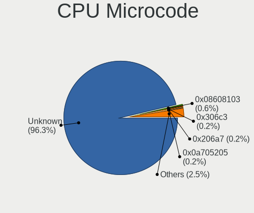
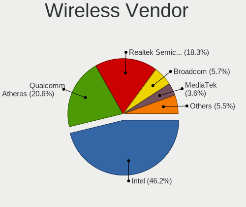
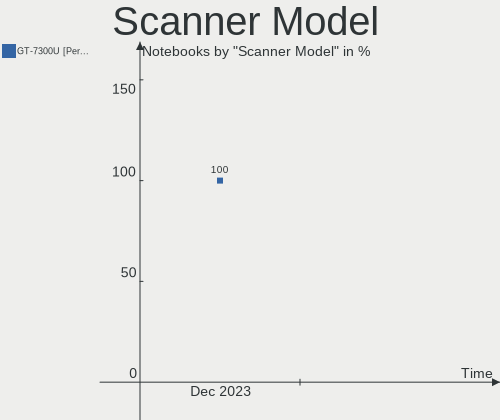

OpenMandriva Hardware Trends (Notebooks)
----------------------------------------

A project to identify most popular hardware characteristics and track their change
over time based on data collected by OpenMandriva users at https://Linux-Hardware.org.

Anyone can contribute to this report by the [hw-probe](https://github.com/linuxhw/hw-probe) tool:

    sudo -E hw-probe -all -upload

Full-feature report is available here: https://linux-hardware.org/?view=trends

Period: Jan, 2022.

Contents
--------

* [ System ](#system)
  - [ OS                       ](#os)
  - [ OS Family                ](#os-family)
  - [ Kernel                   ](#kernel)
  - [ Kernel Family            ](#kernel-family)
  - [ Kernel Major Ver.        ](#kernel-major-ver)
  - [ Arch                     ](#arch)
  - [ DE                       ](#de)
  - [ Display Server           ](#display-server)
  - [ Display Manager          ](#display-manager)
  - [ OS Lang                  ](#os-lang)
  - [ Boot Mode                ](#boot-mode)
  - [ Filesystem               ](#filesystem)
  - [ Part. scheme             ](#part-scheme)
  - [ Dual Boot with Linux/BSD ](#dual-boot-with-linuxbsd)
  - [ Dual Boot (Win)          ](#dual-boot-win)

* [ Board ](#board)
  - [ Vendor                   ](#vendor)
  - [ Model                    ](#model)
  - [ Model Family             ](#model-family)
  - [ MFG Year                 ](#mfg-year)
  - [ Form Factor              ](#form-factor)
  - [ Secure Boot              ](#secure-boot)
  - [ Coreboot                 ](#coreboot)
  - [ RAM Size                 ](#ram-size)
  - [ RAM Used                 ](#ram-used)
  - [ Total Drives             ](#total-drives)
  - [ Has CD-ROM               ](#has-cd-rom)
  - [ Has Ethernet             ](#has-ethernet)
  - [ Has WiFi                 ](#has-wifi)
  - [ Has Bluetooth            ](#has-bluetooth)

* [ Location ](#location)
  - [ Country                  ](#country)
  - [ City                     ](#city)

* [ Drives ](#drives)
  - [ Drive Vendor             ](#drive-vendor)
  - [ Drive Model              ](#drive-model)
  - [ HDD Vendor               ](#hdd-vendor)
  - [ SSD Vendor               ](#ssd-vendor)
  - [ Drive Kind               ](#drive-kind)
  - [ Drive Connector          ](#drive-connector)
  - [ Drive Size               ](#drive-size)
  - [ Space Total              ](#space-total)
  - [ Space Used               ](#space-used)
  - [ Malfunc. Drives          ](#malfunc-drives)
  - [ Malfunc. Drive Vendor    ](#malfunc-drive-vendor)
  - [ Malfunc. HDD Vendor      ](#malfunc-hdd-vendor)
  - [ Malfunc. Drive Kind      ](#malfunc-drive-kind)
  - [ Failed Drives            ](#failed-drives)
  - [ Failed Drive Vendor      ](#failed-drive-vendor)
  - [ Drive Status             ](#drive-status)

* [ Storage controller ](#storage-controller)
  - [ Storage Vendor           ](#storage-vendor)
  - [ Storage Model            ](#storage-model)
  - [ Storage Kind             ](#storage-kind)

* [ Processor ](#processor)
  - [ CPU Vendor               ](#cpu-vendor)
  - [ CPU Model                ](#cpu-model)
  - [ CPU Model Family         ](#cpu-model-family)
  - [ CPU Cores                ](#cpu-cores)
  - [ CPU Sockets              ](#cpu-sockets)
  - [ CPU Threads              ](#cpu-threads)
  - [ CPU Op-Modes             ](#cpu-op-modes)
  - [ CPU Microcode            ](#cpu-microcode)
  - [ CPU Microarch            ](#cpu-microarch)

* [ Graphics ](#graphics)
  - [ GPU Vendor               ](#gpu-vendor)
  - [ GPU Model                ](#gpu-model)
  - [ GPU Combo                ](#gpu-combo)
  - [ GPU Driver               ](#gpu-driver)
  - [ GPU Memory               ](#gpu-memory)

* [ Monitor ](#monitor)
  - [ Monitor Vendor           ](#monitor-vendor)
  - [ Monitor Model            ](#monitor-model)
  - [ Monitor Resolution       ](#monitor-resolution)
  - [ Monitor Diagonal         ](#monitor-diagonal)
  - [ Monitor Width            ](#monitor-width)
  - [ Aspect Ratio             ](#aspect-ratio)
  - [ Monitor Area             ](#monitor-area)
  - [ Pixel Density            ](#pixel-density)
  - [ Multiple Monitors        ](#multiple-monitors)

* [ Network ](#network)
  - [ Net Controller Vendor    ](#net-controller-vendor)
  - [ Net Controller Model     ](#net-controller-model)
  - [ Wireless Vendor          ](#wireless-vendor)
  - [ Wireless Model           ](#wireless-model)
  - [ Ethernet Vendor          ](#ethernet-vendor)
  - [ Ethernet Model           ](#ethernet-model)
  - [ Net Controller Kind      ](#net-controller-kind)
  - [ Used Controller          ](#used-controller)
  - [ NICs                     ](#nics)
  - [ IPv6                     ](#ipv6)

* [ Bluetooth ](#bluetooth)
  - [ Bluetooth Vendor         ](#bluetooth-vendor)
  - [ Bluetooth Model          ](#bluetooth-model)

* [ Sound ](#sound)
  - [ Sound Vendor             ](#sound-vendor)
  - [ Sound Model              ](#sound-model)

* [ Memory ](#memory)
  - [ Memory Vendor            ](#memory-vendor)
  - [ Memory Model             ](#memory-model)
  - [ Memory Kind              ](#memory-kind)
  - [ Memory Form Factor       ](#memory-form-factor)
  - [ Memory Size              ](#memory-size)
  - [ Memory Speed             ](#memory-speed)

* [ Printers & scanners ](#printers--scanners)
  - [ Printer Vendor           ](#printer-vendor)
  - [ Printer Model            ](#printer-model)
  - [ Scanner Vendor           ](#scanner-vendor)
  - [ Scanner Model            ](#scanner-model)

* [ Camera ](#camera)
  - [ Camera Vendor            ](#camera-vendor)
  - [ Camera Model             ](#camera-model)

* [ Security ](#security)
  - [ Fingerprint Vendor       ](#fingerprint-vendor)
  - [ Fingerprint Model        ](#fingerprint-model)
  - [ Chipcard Vendor          ](#chipcard-vendor)
  - [ Chipcard Model           ](#chipcard-model)

* [ Unsupported ](#unsupported)
  - [ Unsupported Devices      ](#unsupported-devices)
  - [ Unsupported Device Types ](#unsupported-device-types)

System
------

OS
--

Installed operating systems

| Name              | Notebooks | Percent |
|-------------------|-----------|---------|
| OpenMandriva 4.2  | 98        | 78.4%   |
| OpenMandriva 4.50 | 27        | 21.6%   |

OS Family
---------

OS without a version

| Name         | Notebooks | Percent |
|--------------|-----------|---------|
| OpenMandriva | 125       | 100%    |

Kernel
------

Version of the Linux kernel

| Version                  | Notebooks | Percent |
|--------------------------|-----------|---------|
| 5.10.14-desktop-1omv4002 | 92        | 73.6%   |
| 5.14.7-desktop-1omv4050  | 10        | 8%      |
| 5.12.4-desktop-1omv4050  | 10        | 8%      |
| 5.11.12-desktop-1omv4002 | 6         | 4.8%    |
| 5.14.14-desktop-1omv4050 | 4         | 3.2%    |
| 5.16.2-desktop-2omv4050  | 1         | 0.8%    |
| 5.16.0-desktop-1omv4050  | 1         | 0.8%    |
| 5.15.13-desktop-1omv4050 | 1         | 0.8%    |

Kernel Family
-------------

Linux kernel without a distro release

| Version | Notebooks | Percent |
|---------|-----------|---------|
| 5.10.14 | 92        | 73.6%   |
| 5.14.7  | 10        | 8%      |
| 5.12.4  | 10        | 8%      |
| 5.11.12 | 6         | 4.8%    |
| 5.14.14 | 4         | 3.2%    |
| 5.16.2  | 1         | 0.8%    |
| 5.16.0  | 1         | 0.8%    |
| 5.15.13 | 1         | 0.8%    |

Kernel Major Ver.
-----------------

Linux kernel major version

| Version | Notebooks | Percent |
|---------|-----------|---------|
| 5.10    | 92        | 73.6%   |
| 5.14    | 14        | 11.2%   |
| 5.12    | 10        | 8%      |
| 5.11    | 6         | 4.8%    |
| 5.16    | 2         | 1.6%    |
| 5.15    | 1         | 0.8%    |

Arch
----

OS architecture (x86_64, i586, etc.)

| Name   | Notebooks | Percent |
|--------|-----------|---------|
| x86_64 | 125       | 100%    |

DE
--

Desktop Environment

| Name | Notebooks | Percent |
|------|-----------|---------|
| KDE5 | 125       | 100%    |

Display Server
--------------

X11 or Wayland

| Name | Notebooks | Percent |
|------|-----------|---------|
| X11  | 124       | 99.2%   |
| Tty  | 1         | 0.8%    |

Display Manager
---------------

SDDM, LightDM, etc.

| Name | Notebooks | Percent |
|------|-----------|---------|
| SDDM | 125       | 100%    |

OS Lang
-------

Language

| Lang  | Notebooks | Percent |
|-------|-----------|---------|
| en_US | 57        | 45.6%   |
| pl_PL | 12        | 9.6%    |
| ru_RU | 11        | 8.8%    |
| de_DE | 11        | 8.8%    |
| it_IT | 8         | 6.4%    |
| cs_CZ | 6         | 4.8%    |
| fr_FR | 3         | 2.4%    |
| en_GB | 3         | 2.4%    |
| pt_BR | 2         | 1.6%    |
| fr_CA | 2         | 1.6%    |
| es_MX | 2         | 1.6%    |
| es_ES | 2         | 1.6%    |
| ro_RO | 1         | 0.8%    |
| pt_PT | 1         | 0.8%    |
| es_CR | 1         | 0.8%    |
| en_NG | 1         | 0.8%    |
| en_AU | 1         | 0.8%    |
| da_DK | 1         | 0.8%    |

Boot Mode
---------

EFI or BIOS

| Mode | Notebooks | Percent |
|------|-----------|---------|
| BIOS | 71        | 56.8%   |
| EFI  | 54        | 43.2%   |

Filesystem
----------

Type of filesystem

| Type    | Notebooks | Percent |
|---------|-----------|---------|
| Overlay | 87        | 69.6%   |
| Ext4    | 35        | 28%     |
| Ext2    | 3         | 2.4%    |

Part. scheme
------------

Scheme of partitioning

| Type | Notebooks | Percent |
|------|-----------|---------|
| GPT  | 72        | 57.6%   |
| MBR  | 53        | 42.4%   |

Dual Boot with Linux/BSD
------------------------

Hosting more than one Linux/BSD

| Dual boot | Notebooks | Percent |
|-----------|-----------|---------|
| No        | 71        | 56.8%   |
| Yes       | 54        | 43.2%   |

Dual Boot (Win)
---------------

Hosting Linux and Windows

| Dual boot | Notebooks | Percent |
|-----------|-----------|---------|
| No        | 69        | 55.2%   |
| Yes       | 56        | 44.8%   |

Board
-----

Vendor
------

Motherboard manufacturer

| Name                | Notebooks | Percent |
|---------------------|-----------|---------|
| Lenovo              | 24        | 19.2%   |
| Dell                | 19        | 15.2%   |
| Hewlett-Packard     | 16        | 12.8%   |
| ASUSTek Computer    | 14        | 11.2%   |
| Acer                | 14        | 11.2%   |
| Toshiba             | 10        | 8%      |
| Sony                | 6         | 4.8%    |
| Samsung Electronics | 4         | 3.2%    |
| Framework           | 2         | 1.6%    |
| eMachines           | 2         | 1.6%    |
| Apple               | 2         | 1.6%    |
| UMAX                | 1         | 0.8%    |
| Timi                | 1         | 0.8%    |
| Teclast             | 1         | 0.8%    |
| System76            | 1         | 0.8%    |
| Positivo            | 1         | 0.8%    |
| Philco              | 1         | 0.8%    |
| Packard Bell        | 1         | 0.8%    |
| Notebook            | 1         | 0.8%    |
| MSI                 | 1         | 0.8%    |
| Gigabyte Technology | 1         | 0.8%    |
| eii                 | 1         | 0.8%    |
| Chuwi               | 1         | 0.8%    |

Model
-----

Motherboard model

| Name                                  | Notebooks | Percent |
|---------------------------------------|-----------|---------|
| Dell Inspiron 3451                    | 6         | 4.8%    |
| ASUS UX31E                            | 6         | 4.8%    |
| Toshiba Satellite A300                | 4         | 3.2%    |
| Sony VGN-FZ31Z                        | 2         | 1.6%    |
| Framework Laptop                      | 2         | 1.6%    |
| Dell Vostro 1000                      | 2         | 1.6%    |
| UMAX MediaBook 14                     | 1         | 0.8%    |
| Toshiba Satellite Pro P200            | 1         | 0.8%    |
| Toshiba Satellite L45-B               | 1         | 0.8%    |
| Toshiba Satellite C650                | 1         | 0.8%    |
| Toshiba Satellite C55D-B              | 1         | 0.8%    |
| Toshiba Satellite A305                | 1         | 0.8%    |
| Toshiba PORTEGE Z30-A                 | 1         | 0.8%    |
| Timi TM1801                           | 1         | 0.8%    |
| Teclast F15S                          | 1         | 0.8%    |
| System76 Galago Pro                   | 1         | 0.8%    |
| Sony VPCEH1S1E                        | 1         | 0.8%    |
| Sony VPCEB18FD                        | 1         | 0.8%    |
| Sony VPCEA25FX                        | 1         | 0.8%    |
| Sony VGN-NW2SRF_S                     | 1         | 0.8%    |
| Samsung RV420/RV520/RV720/E3530/S3530 | 1         | 0.8%    |
| Samsung R540/R580/R780/SA41/E452/E852 | 1         | 0.8%    |
| Samsung R410P                         | 1         | 0.8%    |
| Samsung N100SP                        | 1         | 0.8%    |
| Positivo Mobile                       | 1         | 0.8%    |
| Philco 14I                            | 1         | 0.8%    |
| Packard Bell EasyNote TJ65            | 1         | 0.8%    |
| Notebook PCx0Dx                       | 1         | 0.8%    |
| MSI GF63 Thin 9RCX                    | 1         | 0.8%    |
| Lenovo Yoga 500-15IBD 80N6            | 1         | 0.8%    |
| Lenovo V330-15IKB 81AX                | 1         | 0.8%    |
| Lenovo V15 G2 ITL 82KB                | 1         | 0.8%    |
| Lenovo V14-IGL 82C2                   | 1         | 0.8%    |
| Lenovo V14-ADA 82C6                   | 1         | 0.8%    |
| Lenovo ThinkPad X250 20CLA21MJP       | 1         | 0.8%    |
| Lenovo ThinkPad T520 4242NS9          | 1         | 0.8%    |
| Lenovo ThinkPad T460 20FN003LUK       | 1         | 0.8%    |
| Lenovo ThinkPad T460 20FMS5JM00       | 1         | 0.8%    |
| Lenovo ThinkPad T420 4236LP7          | 1         | 0.8%    |
| Lenovo ThinkPad T14 Gen 1 20UD002GMX  | 1         | 0.8%    |
| Lenovo ThinkPad L530 24791S8          | 1         | 0.8%    |
| Lenovo ThinkPad E560 20EVA02SSP       | 1         | 0.8%    |
| Lenovo ThinkPad E14 20RA001DPB        | 1         | 0.8%    |
| Lenovo ThinkBook 15 G2 ARE 20VG       | 1         | 0.8%    |
| Lenovo IdeaPad Z470                   | 1         | 0.8%    |
| Lenovo IdeaPad 330-15AST 81D6         | 1         | 0.8%    |
| Lenovo IdeaPad 320-15AST 80XV         | 1         | 0.8%    |
| Lenovo IdeaPad 3 15IML05 81WB         | 1         | 0.8%    |
| Lenovo IdeaPad 100-15IBY 80MJ         | 1         | 0.8%    |
| Lenovo IdeaPad 100-15IBD 80QQ         | 1         | 0.8%    |
| Lenovo G50-45 80E3                    | 1         | 0.8%    |
| Lenovo B570e HuronRiver Platform      | 1         | 0.8%    |
| Lenovo B50-45 20388                   | 1         | 0.8%    |
| HP ProBook 6550b                      | 1         | 0.8%    |
| HP ProBook 6470b                      | 1         | 0.8%    |
| HP ProBook 4530s                      | 1         | 0.8%    |
| HP Pavilion m6                        | 1         | 0.8%    |
| HP Pavilion Gaming Laptop 15-ec1xxx   | 1         | 0.8%    |
| HP Notebook                           | 1         | 0.8%    |
| HP Laptop 17-ca0xxx                   | 1         | 0.8%    |

Model Family
------------

Motherboard model prefix

| Name                  | Notebooks | Percent |
|-----------------------|-----------|---------|
| Acer Aspire           | 11        | 8.8%    |
| Toshiba Satellite     | 9         | 7.2%    |
| Lenovo ThinkPad       | 9         | 7.2%    |
| Dell Inspiron         | 8         | 6.4%    |
| HP Laptop             | 7         | 5.6%    |
| Lenovo IdeaPad        | 6         | 4.8%    |
| ASUS UX31E            | 6         | 4.8%    |
| Dell Latitude         | 5         | 4%      |
| HP ProBook            | 3         | 2.4%    |
| Sony VGN-FZ31Z        | 2         | 1.6%    |
| HP Pavilion           | 2         | 1.6%    |
| Framework Laptop      | 2         | 1.6%    |
| Dell XPS              | 2         | 1.6%    |
| Dell Vostro           | 2         | 1.6%    |
| Acer Extensa          | 2         | 1.6%    |
| UMAX MediaBook        | 1         | 0.8%    |
| Toshiba PORTEGE       | 1         | 0.8%    |
| Timi TM1801           | 1         | 0.8%    |
| Teclast F15S          | 1         | 0.8%    |
| System76 Galago       | 1         | 0.8%    |
| Sony VPCEH1S1E        | 1         | 0.8%    |
| Sony VPCEB18FD        | 1         | 0.8%    |
| Sony VPCEA25FX        | 1         | 0.8%    |
| Sony VGN-NW2SRF       | 1         | 0.8%    |
| Samsung RV420         | 1         | 0.8%    |
| Samsung R540          | 1         | 0.8%    |
| Samsung R410P         | 1         | 0.8%    |
| Samsung N100SP        | 1         | 0.8%    |
| Positivo Mobile       | 1         | 0.8%    |
| Philco 14I            | 1         | 0.8%    |
| Packard Bell EasyNote | 1         | 0.8%    |
| Notebook PCx0Dx       | 1         | 0.8%    |
| MSI GF63              | 1         | 0.8%    |
| Lenovo Yoga           | 1         | 0.8%    |
| Lenovo V330-15IKB     | 1         | 0.8%    |
| Lenovo V15            | 1         | 0.8%    |
| Lenovo V14-IGL        | 1         | 0.8%    |
| Lenovo V14-ADA        | 1         | 0.8%    |
| Lenovo ThinkBook      | 1         | 0.8%    |
| Lenovo G50-45         | 1         | 0.8%    |
| Lenovo B570e          | 1         | 0.8%    |
| Lenovo B50-45         | 1         | 0.8%    |
| HP Notebook           | 1         | 0.8%    |
| HP G62                | 1         | 0.8%    |
| HP 655                | 1         | 0.8%    |
| HP 635                | 1         | 0.8%    |
| Gigabyte AERO         | 1         | 0.8%    |
| eMachines E525        | 1         | 0.8%    |
| eMachines E510        | 1         | 0.8%    |
| eii Ezpad             | 1         | 0.8%    |
| Dell Wolf             | 1         | 0.8%    |
| Dell MXG071           | 1         | 0.8%    |
| Chuwi Hero            | 1         | 0.8%    |
| ASUS X540LA           | 1         | 0.8%    |
| ASUS S551LN           | 1         | 0.8%    |
| ASUS P50IJ            | 1         | 0.8%    |
| ASUS N752VX           | 1         | 0.8%    |
| ASUS K54C             | 1         | 0.8%    |
| ASUS K53U             | 1         | 0.8%    |
| ASUS B121             | 1         | 0.8%    |

MFG Year
--------

Motherboard manufacture year

| Year | Notebooks | Percent |
|------|-----------|---------|
| 2011 | 17        | 13.6%   |
| 2014 | 13        | 10.4%   |
| 2012 | 12        | 9.6%    |
| 2020 | 11        | 8.8%    |
| 2008 | 10        | 8%      |
| 2015 | 8         | 6.4%    |
| 2010 | 8         | 6.4%    |
| 2009 | 8         | 6.4%    |
| 2018 | 7         | 5.6%    |
| 2016 | 7         | 5.6%    |
| 2019 | 6         | 4.8%    |
| 2021 | 5         | 4%      |
| 2017 | 4         | 3.2%    |
| 2013 | 3         | 2.4%    |
| 2007 | 3         | 2.4%    |
| 2006 | 2         | 1.6%    |
| 2004 | 1         | 0.8%    |

Form Factor
-----------

Physical design of the computer

| Name     | Notebooks | Percent |
|----------|-----------|---------|
| Notebook | 125       | 100%    |

Secure Boot
-----------

Enabled or disabled

| State    | Notebooks | Percent |
|----------|-----------|---------|
| Disabled | 125       | 100%    |

Coreboot
--------

Have coreboot on board

| Used | Notebooks | Percent |
|------|-----------|---------|
| No   | 123       | 98.4%   |
| Yes  | 2         | 1.6%    |

RAM Size
--------

Total RAM memory

| Size in GB  | Notebooks | Percent |
|-------------|-----------|---------|
| 3.01-4.0    | 56        | 44.8%   |
| 4.01-8.0    | 29        | 23.2%   |
| 16.01-24.0  | 11        | 8.8%    |
| 8.01-16.0   | 11        | 8.8%    |
| 1.01-2.0    | 9         | 7.2%    |
| 32.01-64.0  | 3         | 2.4%    |
| 2.01-3.0    | 3         | 2.4%    |
| 0.51-1.0    | 2         | 1.6%    |
| 64.01-256.0 | 1         | 0.8%    |

RAM Used
--------

Used RAM memory

| Used GB  | Notebooks | Percent |
|----------|-----------|---------|
| 1.01-2.0 | 98        | 78.4%   |
| 0.51-1.0 | 14        | 11.2%   |
| 2.01-3.0 | 8         | 6.4%    |
| 0.01-0.5 | 3         | 2.4%    |
| 3.01-4.0 | 2         | 1.6%    |

Total Drives
------------

Number of drives on board

| Drives | Notebooks | Percent |
|--------|-----------|---------|
| 1      | 97        | 77.6%   |
| 2      | 24        | 19.2%   |
| 3      | 3         | 2.4%    |
| 0      | 1         | 0.8%    |

Has CD-ROM
----------

Has CD-ROM on board

| Presented | Notebooks | Percent |
|-----------|-----------|---------|
| Yes       | 65        | 52%     |
| No        | 60        | 48%     |

Has Ethernet
------------

Has Ethernet on board

| Presented | Notebooks | Percent |
|-----------|-----------|---------|
| Yes       | 108       | 86.4%   |
| No        | 17        | 13.6%   |

Has WiFi
--------

Has WiFi module

| Presented | Notebooks | Percent |
|-----------|-----------|---------|
| Yes       | 124       | 99.2%   |
| No        | 1         | 0.8%    |

Has Bluetooth
-------------

Has Bluetooth module

| Presented | Notebooks | Percent |
|-----------|-----------|---------|
| Yes       | 85        | 68%     |
| No        | 40        | 32%     |

Location
--------

Country
-------

Geographic location (country)

| Country     | Notebooks | Percent |
|-------------|-----------|---------|
| USA         | 17        | 13.6%   |
| Poland      | 17        | 13.6%   |
| Russia      | 14        | 11.2%   |
| Germany     | 12        | 9.6%    |
| Italy       | 8         | 6.4%    |
| Czechia     | 7         | 5.6%    |
| France      | 6         | 4.8%    |
| Brazil      | 6         | 4.8%    |
| Romania     | 5         | 4%      |
| Portugal    | 4         | 3.2%    |
| UK          | 3         | 2.4%    |
| Spain       | 3         | 2.4%    |
| Canada      | 3         | 2.4%    |
| Netherlands | 2         | 1.6%    |
| Mexico      | 2         | 1.6%    |
| Kenya       | 2         | 1.6%    |
| Japan       | 2         | 1.6%    |
| Switzerland | 1         | 0.8%    |
| Sweden      | 1         | 0.8%    |
| Nigeria     | 1         | 0.8%    |
| Kazakhstan  | 1         | 0.8%    |
| Indonesia   | 1         | 0.8%    |
| Finland     | 1         | 0.8%    |
| Denmark     | 1         | 0.8%    |
| Costa Rica  | 1         | 0.8%    |
| Chile       | 1         | 0.8%    |
| Bulgaria    | 1         | 0.8%    |
| Austria     | 1         | 0.8%    |
| Australia   | 1         | 0.8%    |

City
----

Geographic location (city)

| City            | Notebooks | Percent |
|-----------------|-----------|---------|
| Prague          | 6         | 4.8%    |
| Krakow          | 6         | 4.8%    |
| Moscow          | 5         | 4%      |
| Hanover         | 3         | 2.4%    |
| Rome            | 2         | 1.6%    |
| Poznan          | 2         | 1.6%    |
| Porto Velho     | 2         | 1.6%    |
| New York        | 2         | 1.6%    |
| Nairobi         | 2         | 1.6%    |
| Khimki          | 2         | 1.6%    |
| Jaworzno        | 2         | 1.6%    |
| Funchal         | 2         | 1.6%    |
| Ceggia          | 2         | 1.6%    |
| Bucharest       | 2         | 1.6%    |
| Zurich          | 1         | 0.8%    |
| Xonacatlan      | 1         | 0.8%    |
| Woodbridge      | 1         | 0.8%    |
| Waechtersbach   | 1         | 0.8%    |
| Wa?‚brzych      | 1         | 0.8%    |
| Vimercate       | 1         | 0.8%    |
| Vienna          | 1         | 0.8%    |
| Vancouver       | 1         | 0.8%    |
| Valencia        | 1         | 0.8%    |
| Uppsala         | 1         | 0.8%    |
| Tyumen          | 1         | 0.8%    |
| Tula            | 1         | 0.8%    |
| Timi?™oara      | 1         | 0.8%    |
| Telluride       | 1         | 0.8%    |
| Tarpon Springs  | 1         | 0.8%    |
| Tarnobrzeg      | 1         | 0.8%    |
| Stoke-on-Trent  | 1         | 0.8%    |
| St Petersburg   | 1         | 0.8%    |
| Someren         | 1         | 0.8%    |
| Sofia           | 1         | 0.8%    |
| Santiago        | 1         | 0.8%    |
| Sanford         | 1         | 0.8%    |
| Samara          | 1         | 0.8%    |
| Saint-Brieuc    | 1         | 0.8%    |
| Rzesz??w        | 1         | 0.8%    |
| Rumia           | 1         | 0.8%    |
| Ruda ??l?…ska   | 1         | 0.8%    |
| Rostov-on-Don   | 1         | 0.8%    |
| Ronciglione     | 1         | 0.8%    |
| Rio de Janeiro  | 1         | 0.8%    |
| Ribeir??o Preto | 1         | 0.8%    |
| Qu?©bec         | 1         | 0.8%    |
| Paris           | 1         | 0.8%    |
| Pamplona        | 1         | 0.8%    |
| Orpington       | 1         | 0.8%    |
| Orlando         | 1         | 0.8%    |
| Oral            | 1         | 0.8%    |
| New Bern        | 1         | 0.8%    |
| Naucalpan       | 1         | 0.8%    |
| Nagoya          | 1         | 0.8%    |
| Montreal        | 1         | 0.8%    |
| Montpellier     | 1         | 0.8%    |
| Milan           | 1         | 0.8%    |
| Merchweiler     | 1         | 0.8%    |
| Melbourne       | 1         | 0.8%    |
| M??nster        | 1         | 0.8%    |

Drives
------

Drive Vendor
------------

Hard drive vendors

| Vendor              | Notebooks | Drives | Percent |
|---------------------|-----------|--------|---------|
| WDC                 | 25        | 25     | 16.89%  |
| Seagate             | 23        | 23     | 15.54%  |
| Samsung Electronics | 14        | 15     | 9.46%   |
| Unknown             | 11        | 12     | 7.43%   |
| Toshiba             | 11        | 11     | 7.43%   |
| SanDisk             | 9         | 9      | 6.08%   |
| Kingston            | 9         | 10     | 6.08%   |
| A-DATA Technology   | 6         | 6      | 4.05%   |
| Hitachi             | 5         | 5      | 3.38%   |
| Crucial             | 5         | 5      | 3.38%   |
| SK Hynix            | 3         | 3      | 2.03%   |
| UMIS                | 2         | 2      | 1.35%   |
| SPCC                | 2         | 2      | 1.35%   |
| PNY                 | 2         | 2      | 1.35%   |
| PLEXTOR             | 2         | 2      | 1.35%   |
| Micron Technology   | 2         | 2      | 1.35%   |
| Intel               | 2         | 2      | 1.35%   |
| HGST                | 2         | 2      | 1.35%   |
| Smartbuy            | 1         | 1      | 0.68%   |
| PUSKILL             | 1         | 1      | 0.68%   |
| Mushkin             | 1         | 1      | 0.68%   |
| LITEON              | 1         | 1      | 0.68%   |
| Lenovo              | 1         | 1      | 0.68%   |
| KIOXIA-EXCERIA      | 1         | 1      | 0.68%   |
| Hewlett-Packard     | 1         | 1      | 0.68%   |
| GOODRAM             | 1         | 1      | 0.68%   |
| Corsair             | 1         | 1      | 0.68%   |
| China               | 1         | 1      | 0.68%   |
| Apple               | 1         | 1      | 0.68%   |
| Apacer              | 1         | 1      | 0.68%   |
| Unknown             | 1         | 1      | 0.68%   |

Drive Model
-----------

Hard drive models

| Model                                     | Notebooks | Percent |
|-------------------------------------------|-----------|---------|
| Seagate ST500LT012-1DG142 500GB           | 8         | 5.33%   |
| SanDisk SSD U100 256GB                    | 6         | 4%      |
| Seagate ST1000LM035-1RK172 1TB            | 3         | 2%      |
| A-DATA SSD S510 120GB                     | 3         | 2%      |
| WDC WD5000LPVX-22V0TT0 500GB              | 2         | 1.33%   |
| WDC WD2500BEVS-22UST0 250GB               | 2         | 1.33%   |
| WDC PC SN530 SDBPNPZ-256G-1006 256GB      | 2         | 1.33%   |
| Unknown USB DISK 3.2 1TB                  | 2         | 1.33%   |
| Toshiba MQ01ABF050 500GB                  | 2         | 1.33%   |
| Toshiba MQ01ABF032 320GB                  | 2         | 1.33%   |
| Toshiba MQ01ABD100 1TB                    | 2         | 1.33%   |
| Seagate ST320LT020-9YG142 320GB           | 2         | 1.33%   |
| Seagate ST1000LM024 HN-M101MBB 1TB        | 2         | 1.33%   |
| Samsung SSD 860 EVO 500GB                 | 2         | 1.33%   |
| PNY CS900 120GB SSD                       | 2         | 1.33%   |
| Kingston SV300S37A120G 120GB SSD          | 2         | 1.33%   |
| Kingston SA400S37240G 240GB SSD           | 2         | 1.33%   |
| Kingston SA400S37120G 120GB SSD           | 2         | 1.33%   |
| WDC WDS500G2B0C-00PXH0 500GB              | 1         | 0.67%   |
| WDC WDS500G1X0E-00AFY0 500GB              | 1         | 0.67%   |
| WDC WDS480G2G0A-00JH30 480GB SSD          | 1         | 0.67%   |
| WDC WDS240G2G0C-00AJM0 240GB              | 1         | 0.67%   |
| WDC WDS200T1X0E-00AFY0 2TB                | 1         | 0.67%   |
| WDC WD7500BPKX-75HPJT0 752GB              | 1         | 0.67%   |
| WDC WD5000LPZX-60Z10T0 500GB              | 1         | 0.67%   |
| WDC WD5000LPLX-75ZNTT0 500GB              | 1         | 0.67%   |
| WDC WD5000LPLX-08ZNTT0 500GB              | 1         | 0.67%   |
| WDC WD5000LPCX-24C6HT0 500GB              | 1         | 0.67%   |
| WDC WD5000BPVT-00HXZT1 500GB              | 1         | 0.67%   |
| WDC WD3200BEVT-60A23T0 320GB              | 1         | 0.67%   |
| WDC WD3200BEVT-22ZCT0 320GB               | 1         | 0.67%   |
| WDC WD2500BEVT-75A23T0 250GB              | 1         | 0.67%   |
| WDC WD1600BEVT-35ZCT0 160GB               | 1         | 0.67%   |
| WDC WD10SPZX-22Z10T1 1TB                  | 1         | 0.67%   |
| WDC WD10SPZX-21Z10T0 1TB                  | 1         | 0.67%   |
| WDC WD10JPVX-75JC3T0 1TB                  | 1         | 0.67%   |
| WDC PC SN530 SDBPMPZ-256G-1101 256GB      | 1         | 0.67%   |
| Unknown SLD64G  64GB                      | 1         | 0.67%   |
| Unknown SD32G  32GB                       | 1         | 0.67%   |
| Unknown SCY  64GB                         | 1         | 0.67%   |
| Unknown SA16G  16GB                       | 1         | 0.67%   |
| Unknown M0S002  64GB                      | 1         | 0.67%   |
| Unknown EE8QT  256GB                      | 1         | 0.67%   |
| Unknown EB2MW  32GB                       | 1         | 0.67%   |
| Unknown DA4128  128GB                     | 1         | 0.67%   |
| Unknown ASTC  4GB                         | 1         | 0.67%   |
| Unknown 00000  4GB                        | 1         | 0.67%   |
| UMIS RPJTJ512MEE1OWX 512GB                | 1         | 0.67%   |
| UMIS RPJTJ256MEE1OWX 256GB                | 1         | 0.67%   |
| Toshiba TR200 240GB SSD                   | 1         | 0.67%   |
| Toshiba THNSNF128GCSS 128GB SSD           | 1         | 0.67%   |
| Toshiba MK5065GSXF 500GB                  | 1         | 0.67%   |
| Toshiba MK3265GSX 320GB                   | 1         | 0.67%   |
| Toshiba MK1676GSX 160GB                   | 1         | 0.67%   |
| SPCC Solid State Disk 512GB               | 1         | 0.67%   |
| SPCC Solid State Disk 240GB               | 1         | 0.67%   |
| Smartbuy SSD 256GB                        | 1         | 0.67%   |
| SK Hynix SKHynix_HFS256GD9TNI-L2B0B 256GB | 1         | 0.67%   |
| SK Hynix HFM256GDHTNG-8510B 256GB         | 1         | 0.67%   |
| SK Hynix BC511 NVMe 256GB                 | 1         | 0.67%   |

HDD Vendor
----------

Hard disk drive vendors

| Vendor              | Notebooks | Drives | Percent |
|---------------------|-----------|--------|---------|
| Seagate             | 23        | 23     | 38.98%  |
| WDC                 | 17        | 17     | 28.81%  |
| Toshiba             | 9         | 9      | 15.25%  |
| Hitachi             | 5         | 5      | 8.47%   |
| Samsung Electronics | 3         | 3      | 5.08%   |
| HGST                | 2         | 2      | 3.39%   |

SSD Vendor
----------

Solid state drive vendors

| Vendor              | Notebooks | Drives | Percent |
|---------------------|-----------|--------|---------|
| SanDisk             | 9         | 9      | 15.25%  |
| Kingston            | 9         | 9      | 15.25%  |
| Samsung Electronics | 7         | 7      | 11.86%  |
| Crucial             | 5         | 5      | 8.47%   |
| A-DATA Technology   | 5         | 5      | 8.47%   |
| Toshiba             | 2         | 2      | 3.39%   |
| SPCC                | 2         | 2      | 3.39%   |
| PNY                 | 2         | 2      | 3.39%   |
| PLEXTOR             | 2         | 2      | 3.39%   |
| Micron Technology   | 2         | 2      | 3.39%   |
| WDC                 | 1         | 1      | 1.69%   |
| Smartbuy            | 1         | 1      | 1.69%   |
| PUSKILL             | 1         | 1      | 1.69%   |
| Mushkin             | 1         | 1      | 1.69%   |
| LITEON              | 1         | 1      | 1.69%   |
| KIOXIA-EXCERIA      | 1         | 1      | 1.69%   |
| Intel               | 1         | 1      | 1.69%   |
| Hewlett-Packard     | 1         | 1      | 1.69%   |
| GOODRAM             | 1         | 1      | 1.69%   |
| Corsair             | 1         | 1      | 1.69%   |
| China               | 1         | 1      | 1.69%   |
| Apple               | 1         | 1      | 1.69%   |
| Apacer              | 1         | 1      | 1.69%   |
| Unknown             | 1         | 1      | 1.69%   |

Drive Kind
----------

HDD or SSD

| Kind    | Notebooks | Drives | Percent |
|---------|-----------|--------|---------|
| HDD     | 59        | 59     | 40.97%  |
| SSD     | 55        | 59     | 38.19%  |
| NVMe    | 19        | 21     | 13.19%  |
| MMC     | 9         | 10     | 6.25%   |
| Unknown | 2         | 2      | 1.39%   |

Drive Connector
---------------

SATA, SAS, NVMe, etc.

| Type | Notebooks | Drives | Percent |
|------|-----------|--------|---------|
| SATA | 105       | 118    | 77.78%  |
| NVMe | 19        | 21     | 14.07%  |
| MMC  | 9         | 10     | 6.67%   |
| SAS  | 2         | 2      | 1.48%   |

Drive Size
----------

Size of hard drive

| Size in TB | Notebooks | Drives | Percent |
|------------|-----------|--------|---------|
| 0.01-0.5   | 86        | 94     | 78.9%   |
| 0.51-1.0   | 20        | 21     | 18.35%  |
| 1.01-2.0   | 3         | 3      | 2.75%   |

Space Total
-----------

Amount of disk space available on the file system

| Size in GB | Notebooks | Percent |
|------------|-----------|---------|
| 1-20       | 60        | 48%     |
| 101-250    | 26        | 20.8%   |
| 251-500    | 12        | 9.6%    |
| 21-50      | 8         | 6.4%    |
| Unknown    | 8         | 6.4%    |
| 51-100     | 6         | 4.8%    |
| 501-1000   | 4         | 3.2%    |
| 1001-2000  | 1         | 0.8%    |

Space Used
----------

Amount of used disk space

| Used GB  | Notebooks | Percent |
|----------|-----------|---------|
| 1-20     | 103       | 82.4%   |
| 21-50    | 11        | 8.8%    |
| Unknown  | 8         | 6.4%    |
| 251-500  | 1         | 0.8%    |
| 101-250  | 1         | 0.8%    |
| 501-1000 | 1         | 0.8%    |

Malfunc. Drives
---------------

Drive models with a malfunction

| Model                               | Notebooks | Drives | Percent |
|-------------------------------------|-----------|--------|---------|
| SanDisk SSD U100 256GB              | 6         | 6      | 20.69%  |
| Kingston SV300S37A120G 120GB SSD    | 2         | 2      | 6.9%    |
| WDC WD5000BPVT-00HXZT1 500GB        | 1         | 1      | 3.45%   |
| WDC WD3200BEVT-60A23T0 320GB        | 1         | 1      | 3.45%   |
| WDC WD3200BEVT-22ZCT0 320GB         | 1         | 1      | 3.45%   |
| Toshiba MK3265GSX 320GB             | 1         | 1      | 3.45%   |
| Seagate ST9320325AS 320GB           | 1         | 1      | 3.45%   |
| Seagate ST9250315AS 250GB           | 1         | 1      | 3.45%   |
| Seagate ST9160821A 137GB            | 1         | 1      | 3.45%   |
| Seagate ST500LT012-1DG142 500GB     | 1         | 1      | 3.45%   |
| Seagate ST320LT020-9YG142 320GB     | 1         | 1      | 3.45%   |
| Seagate ST1000LM024 HN-M101MBB 1TB  | 1         | 1      | 3.45%   |
| Samsung Electronics SSD 860 QVO 2TB | 1         | 1      | 3.45%   |
| Samsung Electronics HM641JI 640GB   | 1         | 1      | 3.45%   |
| Kingston SMS100S264G 64GB SSD       | 1         | 1      | 3.45%   |
| Intel SSDMAEMC080G2L 80GB           | 1         | 1      | 3.45%   |
| Hitachi HTS545050B9A300 500GB       | 1         | 1      | 3.45%   |
| Hitachi HTS545025B9A300 250GB       | 1         | 1      | 3.45%   |
| Hitachi HTS543232A7A384 320GB       | 1         | 1      | 3.45%   |
| Hitachi HTS542516K9SA00 160GB       | 1         | 1      | 3.45%   |
| HGST HTS545050A7E680 500GB          | 1         | 1      | 3.45%   |
| HGST HTS541075A9E680 752GB          | 1         | 1      | 3.45%   |
| A-DATA Technology SP920SS 128GB SSD | 1         | 1      | 3.45%   |

Malfunc. Drive Vendor
---------------------

Vendors of faulty drives

| Vendor              | Notebooks | Drives | Percent |
|---------------------|-----------|--------|---------|
| Seagate             | 6         | 6      | 20.69%  |
| SanDisk             | 6         | 6      | 20.69%  |
| Hitachi             | 4         | 4      | 13.79%  |
| WDC                 | 3         | 3      | 10.34%  |
| Kingston            | 3         | 3      | 10.34%  |
| Samsung Electronics | 2         | 2      | 6.9%    |
| HGST                | 2         | 2      | 6.9%    |
| Toshiba             | 1         | 1      | 3.45%   |
| Intel               | 1         | 1      | 3.45%   |
| A-DATA Technology   | 1         | 1      | 3.45%   |

Malfunc. HDD Vendor
-------------------

Vendors of faulty HDD drives

| Vendor              | Notebooks | Drives | Percent |
|---------------------|-----------|--------|---------|
| Seagate             | 6         | 6      | 35.29%  |
| Hitachi             | 4         | 4      | 23.53%  |
| WDC                 | 3         | 3      | 17.65%  |
| HGST                | 2         | 2      | 11.76%  |
| Toshiba             | 1         | 1      | 5.88%   |
| Samsung Electronics | 1         | 1      | 5.88%   |

Malfunc. Drive Kind
-------------------

Kinds of faulty drives

| Kind | Notebooks | Drives | Percent |
|------|-----------|--------|---------|
| HDD  | 17        | 17     | 58.62%  |
| SSD  | 12        | 12     | 41.38%  |

Failed Drives
-------------

Failed drive models

| Model                        | Notebooks | Drives | Percent |
|------------------------------|-----------|--------|---------|
| WDC WD5000LPLX-75ZNTT0 500GB | 1         | 1      | 100%    |

Failed Drive Vendor
-------------------

Failed drive vendors

| Vendor | Notebooks | Drives | Percent |
|--------|-----------|--------|---------|
| WDC    | 1         | 1      | 100%    |

Drive Status
------------

Number of failed and malfunc. drives

| Status   | Notebooks | Drives | Percent |
|----------|-----------|--------|---------|
| Works    | 97        | 109    | 70.29%  |
| Malfunc  | 29        | 29     | 21.01%  |
| Detected | 11        | 12     | 7.97%   |
| Failed   | 1         | 1      | 0.72%   |

Storage controller
------------------

Storage Vendor
--------------

Storage controller vendors

| Vendor                      | Notebooks | Percent |
|-----------------------------|-----------|---------|
| Intel                       | 94        | 68.61%  |
| AMD                         | 20        | 14.6%   |
| Sandisk                     | 7         | 5.11%   |
| Samsung Electronics         | 5         | 3.65%   |
| SK Hynix                    | 3         | 2.19%   |
| Union Memory (Shenzhen)     | 2         | 1.46%   |
| Nvidia                      | 2         | 1.46%   |
| Lenovo                      | 1         | 0.73%   |
| Kingston Technology Company | 1         | 0.73%   |
| ASMedia Technology          | 1         | 0.73%   |
| ADATA Technology            | 1         | 0.73%   |

Storage Model
-------------

Storage controller models

| Model                                                                            | Notebooks | Percent |
|----------------------------------------------------------------------------------|-----------|---------|
| Intel 6 Series/C200 Series Chipset Family 6 port Mobile SATA AHCI Controller     | 15        | 9.93%   |
| AMD FCH SATA Controller [AHCI mode]                                              | 14        | 9.27%   |
| Intel 82801IBM/IEM (ICH9M/ICH9M-E) 4 port SATA Controller [AHCI mode]            | 12        | 7.95%   |
| Intel Sunrise Point-LP SATA Controller [AHCI mode]                               | 8         | 5.3%    |
| Intel 5 Series/3400 Series Chipset 4 port SATA AHCI Controller                   | 8         | 5.3%    |
| Intel Atom Processor E3800 Series SATA AHCI Controller                           | 7         | 4.64%   |
| Intel 82801HM/HEM (ICH8M/ICH8M-E) IDE Controller                                 | 7         | 4.64%   |
| Intel 8 Series SATA Controller 1 [AHCI mode]                                     | 6         | 3.97%   |
| Intel 82801HM/HEM (ICH8M/ICH8M-E) SATA Controller [AHCI mode]                    | 5         | 3.31%   |
| Intel Celeron N3350/Pentium N4200/Atom E3900 Series SATA AHCI Controller         | 4         | 2.65%   |
| Intel 7 Series Chipset Family 6-port SATA Controller [AHCI mode]                 | 4         | 2.65%   |
| AMD SB7x0/SB8x0/SB9x0 SATA Controller [AHCI mode]                                | 4         | 2.65%   |
| Sandisk WD Blue SN550 NVMe SSD                                                   | 3         | 1.99%   |
| Samsung NVMe SSD Controller SM981/PM981/PM983                                    | 3         | 1.99%   |
| Intel Wildcat Point-LP SATA Controller [AHCI Mode]                               | 3         | 1.99%   |
| Intel Celeron/Pentium Silver Processor SATA Controller                           | 3         | 1.99%   |
| Intel 7 Series Chipset Family 4-port SATA Controller [IDE mode]                  | 3         | 1.99%   |
| Intel 7 Series Chipset Family 2-port SATA Controller [IDE mode]                  | 3         | 1.99%   |
| Union Memory (Shenzhen) Non-Volatile memory controller                           | 2         | 1.32%   |
| Sandisk WD PC SN810 / Black SN850 NVMe SSD                                       | 2         | 1.32%   |
| Sandisk Non-Volatile memory controller                                           | 2         | 1.32%   |
| Intel Comet Lake SATA AHCI Controller                                            | 2         | 1.32%   |
| Intel Cannon Lake Mobile PCH SATA AHCI Controller                                | 2         | 1.32%   |
| Intel 82801HM/HEM (ICH8M/ICH8M-E) SATA Controller [IDE mode]                     | 2         | 1.32%   |
| AMD SB600 Non-Raid-5 SATA                                                        | 2         | 1.32%   |
| AMD SB600 IDE                                                                    | 2         | 1.32%   |
| SK Hynix Non-Volatile memory controller                                          | 1         | 0.66%   |
| SK Hynix BC511                                                                   | 1         | 0.66%   |
| SK Hynix BC501 NVMe Solid State Drive                                            | 1         | 0.66%   |
| Samsung NVMe SSD Controller 980                                                  | 1         | 0.66%   |
| Samsung Electronics SATA controller                                              | 1         | 0.66%   |
| Nvidia nForce3 IDE                                                               | 1         | 0.66%   |
| Nvidia MCP79 AHCI Controller                                                     | 1         | 0.66%   |
| Lenovo Non-Volatile memory controller                                            | 1         | 0.66%   |
| Kingston Company U-SNS8154P3 NVMe SSD                                            | 1         | 0.66%   |
| Intel Volume Management Device NVMe RAID Controller                              | 1         | 0.66%   |
| Intel Tiger Lake-LP SATA Controller [AHCI mode]                                  | 1         | 0.66%   |
| Intel SSD Pro 7600p/760p/E 6100p Series                                          | 1         | 0.66%   |
| Intel NM10/ICH7 Family SATA Controller [AHCI mode]                               | 1         | 0.66%   |
| Intel HM170/QM170 Chipset SATA Controller [AHCI Mode]                            | 1         | 0.66%   |
| Intel Cannon Point-LP SATA Controller [AHCI Mode]                                | 1         | 0.66%   |
| Intel Atom/Celeron/Pentium Processor x5-E8000/J3xxx/N3xxx Series SATA Controller | 1         | 0.66%   |
| Intel 82801 Mobile SATA Controller [RAID mode]                                   | 1         | 0.66%   |
| Intel 8 Series/C220 Series Chipset Family 6-port SATA Controller 1 [AHCI mode]   | 1         | 0.66%   |
| Intel 5 Series/3400 Series Chipset 6 port SATA AHCI Controller                   | 1         | 0.66%   |
| Intel 400 Series Chipset Family SATA AHCI Controller                             | 1         | 0.66%   |
| ASMedia ASM1062 Serial ATA Controller                                            | 1         | 0.66%   |
| AMD SB7x0/SB8x0/SB9x0 IDE Controller                                             | 1         | 0.66%   |
| ADATA Non-Volatile memory controller                                             | 1         | 0.66%   |

Storage Kind
------------

Kind of storage controller (IDE, SATA, NVMe, SAS, ...)

| Kind | Notebooks | Percent |
|------|-----------|---------|
| SATA | 109       | 75.69%  |
| NVMe | 19        | 13.19%  |
| IDE  | 14        | 9.72%   |
| RAID | 2         | 1.39%   |

Processor
---------

CPU Vendor
----------

Processor vendors

| Vendor | Notebooks | Percent |
|--------|-----------|---------|
| Intel  | 101       | 80.8%   |
| AMD    | 24        | 19.2%   |

CPU Model
---------

Processor models

| Model                                        | Notebooks | Percent |
|----------------------------------------------|-----------|---------|
| Intel Celeron CPU N2840 @ 2.16GHz            | 7         | 5.6%    |
| Intel Core i7-2677M CPU @ 1.80GHz            | 6         | 4.8%    |
| Intel Core i5-6200U CPU @ 2.30GHz            | 3         | 2.4%    |
| Intel Core i5 CPU M 520 @ 2.40GHz            | 3         | 2.4%    |
| Intel Core i3-2310M CPU @ 2.10GHz            | 3         | 2.4%    |
| Intel Core 2 Duo CPU T9550 @ 2.66GHz         | 3         | 2.4%    |
| Intel Pentium Dual-Core CPU T4300 @ 2.10GHz  | 2         | 1.6%    |
| Intel Core i5-3210M CPU @ 2.50GHz            | 2         | 1.6%    |
| Intel Core i3-4005U CPU @ 1.70GHz            | 2         | 1.6%    |
| Intel Core 2 Duo CPU T8300 @ 2.40GHz         | 2         | 1.6%    |
| Intel Core 2 Duo CPU T6400 @ 2.00GHz         | 2         | 1.6%    |
| Intel Celeron CPU N3350 @ 1.10GHz            | 2         | 1.6%    |
| Intel 11th Gen Core i5-1135G7 @ 2.40GHz      | 2         | 1.6%    |
| AMD Mobile Sempron Processor 3600+           | 2         | 1.6%    |
| AMD A4-9125 RADEON R3, 4 COMPUTE CORES 2C+2G | 2         | 1.6%    |
| Intel Pentium Silver N5000 CPU @ 1.10GHz     | 1         | 0.8%    |
| Intel Pentium Dual CPU T3400 @ 2.16GHz       | 1         | 0.8%    |
| Intel Pentium Dual CPU T3200 @ 2.00GHz       | 1         | 0.8%    |
| Intel Pentium CPU N4200 @ 1.10GHz            | 1         | 0.8%    |
| Intel Pentium CPU 5405U @ 2.30GHz            | 1         | 0.8%    |
| Intel Pentium 3805U @ 1.90GHz                | 1         | 0.8%    |
| Intel Core i9-8950HK CPU @ 2.90GHz           | 1         | 0.8%    |
| Intel Core i7-9750H CPU @ 2.60GHz            | 1         | 0.8%    |
| Intel Core i7-8750H CPU @ 2.20GHz            | 1         | 0.8%    |
| Intel Core i7-7500U CPU @ 2.70GHz            | 1         | 0.8%    |
| Intel Core i7-6700HQ CPU @ 2.60GHz           | 1         | 0.8%    |
| Intel Core i7-6600U CPU @ 2.60GHz            | 1         | 0.8%    |
| Intel Core i7-4800MQ CPU @ 2.70GHz           | 1         | 0.8%    |
| Intel Core i7-4600U CPU @ 2.10GHz            | 1         | 0.8%    |
| Intel Core i7-3632QM CPU @ 2.20GHz           | 1         | 0.8%    |
| Intel Core i7-3520M CPU @ 2.90GHz            | 1         | 0.8%    |
| Intel Core i7-2640M CPU @ 2.80GHz            | 1         | 0.8%    |
| Intel Core i7-10870H CPU @ 2.20GHz           | 1         | 0.8%    |
| Intel Core i7-10510U CPU @ 1.80GHz           | 1         | 0.8%    |
| Intel Core i7 CPU Q 720 @ 1.60GHz            | 1         | 0.8%    |
| Intel Core i5-8265U CPU @ 1.60GHz            | 1         | 0.8%    |
| Intel Core i5-8250U CPU @ 1.60GHz            | 1         | 0.8%    |
| Intel Core i5-7200U CPU @ 2.50GHz            | 1         | 0.8%    |
| Intel Core i5-5287U CPU @ 2.90GHz            | 1         | 0.8%    |
| Intel Core i5-5200U CPU @ 2.20GHz            | 1         | 0.8%    |
| Intel Core i5-4210U CPU @ 1.70GHz            | 1         | 0.8%    |
| Intel Core i5-3340M CPU @ 2.70GHz            | 1         | 0.8%    |
| Intel Core i5-2450M CPU @ 2.50GHz            | 1         | 0.8%    |
| Intel Core i5-2410M CPU @ 2.30GHz            | 1         | 0.8%    |
| Intel Core i5-10210U CPU @ 1.60GHz           | 1         | 0.8%    |
| Intel Core i5 CPU U 470 @ 1.33GHz            | 1         | 0.8%    |
| Intel Core i5 CPU M 480 @ 2.67GHz            | 1         | 0.8%    |
| Intel Core i5 CPU M 430 @ 2.27GHz            | 1         | 0.8%    |
| Intel Core i3-6006U CPU @ 2.00GHz            | 1         | 0.8%    |
| Intel Core i3-5005U CPU @ 2.00GHz            | 1         | 0.8%    |
| Intel Core i3-2367M CPU @ 1.40GHz            | 1         | 0.8%    |
| Intel Core i3-2365M CPU @ 1.40GHz            | 1         | 0.8%    |
| Intel Core i3-2330M CPU @ 2.20GHz            | 1         | 0.8%    |
| Intel Core i3 CPU M 350 @ 2.27GHz            | 1         | 0.8%    |
| Intel Core i3 CPU M 330 @ 2.13GHz            | 1         | 0.8%    |
| Intel Core 2 Extreme CPU X9000 @ 2.80GHz     | 1         | 0.8%    |
| Intel Core 2 Duo CPU T9300 @ 2.50GHz         | 1         | 0.8%    |
| Intel Core 2 Duo CPU T7500 @ 2.20GHz         | 1         | 0.8%    |
| Intel Core 2 Duo CPU T7250 @ 2.00GHz         | 1         | 0.8%    |
| Intel Core 2 Duo CPU T5800 @ 2.00GHz         | 1         | 0.8%    |

CPU Model Family
----------------

Processor model prefix

| Model                   | Notebooks | Percent |
|-------------------------|-----------|---------|
| Intel Core i5           | 21        | 16.8%   |
| Intel Core i7           | 19        | 15.2%   |
| Intel Celeron           | 19        | 15.2%   |
| Intel Core 2 Duo        | 13        | 10.4%   |
| Intel Core i3           | 12        | 9.6%    |
| Other                   | 5         | 4%      |
| AMD A6                  | 4         | 3.2%    |
| Intel Pentium           | 3         | 2.4%    |
| Intel Pentium Dual-Core | 2         | 1.6%    |
| Intel Pentium Dual      | 2         | 1.6%    |
| Intel Atom              | 2         | 1.6%    |
| AMD Ryzen 5             | 2         | 1.6%    |
| AMD Mobile Sempron      | 2         | 1.6%    |
| AMD E1                  | 2         | 1.6%    |
| AMD E                   | 2         | 1.6%    |
| AMD Athlon              | 2         | 1.6%    |
| AMD A4                  | 2         | 1.6%    |
| Intel Pentium Silver    | 1         | 0.8%    |
| Intel Core i9           | 1         | 0.8%    |
| Intel Core 2 Extreme    | 1         | 0.8%    |
| Intel Celeron Dual-Core | 1         | 0.8%    |
| AMD Ryzen 7             | 1         | 0.8%    |
| AMD Ryzen 5 PRO         | 1         | 0.8%    |
| AMD Ryzen 3             | 1         | 0.8%    |
| AMD C-70                | 1         | 0.8%    |
| AMD Athlon II           | 1         | 0.8%    |
| AMD Athlon 64           | 1         | 0.8%    |
| AMD A8                  | 1         | 0.8%    |

CPU Cores
---------

Number of processor cores

| Number | Notebooks | Percent |
|--------|-----------|---------|
| 2      | 93        | 74.4%   |
| 4      | 19        | 15.2%   |
| 6      | 6         | 4.8%    |
| 1      | 6         | 4.8%    |
| 8      | 1         | 0.8%    |

CPU Sockets
-----------

Number of sockets

| Number | Notebooks | Percent |
|--------|-----------|---------|
| 1      | 125       | 100%    |

CPU Threads
-----------

Threads per core (Hyper-Threading)

| Number | Notebooks | Percent |
|--------|-----------|---------|
| 2      | 65        | 52%     |
| 1      | 60        | 48%     |

CPU Op-Modes
------------

CPU Operation Modes (32-bit, 64-bit)

| Op mode        | Notebooks | Percent |
|----------------|-----------|---------|
| 32-bit, 64-bit | 125       | 100%    |

CPU Microcode
-------------

Microcode number

| Number     | Notebooks | Percent |
|------------|-----------|---------|
| 0x206a7    | 17        | 13.6%   |
| 0x1067a    | 10        | 8%      |
| 0x30678    | 7         | 5.6%    |
| 0x40651    | 6         | 4.8%    |
| 0x306a9    | 6         | 4.8%    |
| 0x6fd      | 5         | 4%      |
| 0x406e3    | 5         | 4%      |
| 0x806ec    | 4         | 3.2%    |
| 0x806c1    | 4         | 3.2%    |
| 0x506c9    | 4         | 3.2%    |
| 0x306d4    | 4         | 3.2%    |
| 0x20655    | 4         | 3.2%    |
| 0x20652    | 4         | 3.2%    |
| 0x10676    | 4         | 3.2%    |
| 0x06006705 | 4         | 3.2%    |
| Unknown    | 4         | 3.2%    |
| 0x906ea    | 3         | 2.4%    |
| 0x806e9    | 2         | 1.6%    |
| 0x706a1    | 2         | 1.6%    |
| 0x406c4    | 2         | 1.6%    |
| 0x08600106 | 2         | 1.6%    |
| 0x08108109 | 2         | 1.6%    |
| 0x07030105 | 2         | 1.6%    |
| 0x05000101 | 2         | 1.6%    |
| 0xa0652    | 1         | 0.8%    |
| 0x806ea    | 1         | 0.8%    |
| 0x706a8    | 1         | 0.8%    |
| 0x6fb      | 1         | 0.8%    |
| 0x506e3    | 1         | 0.8%    |
| 0x306c3    | 1         | 0.8%    |
| 0x30661    | 1         | 0.8%    |
| 0x106e5    | 1         | 0.8%    |
| 0x08200103 | 1         | 0.8%    |
| 0x08101007 | 1         | 0.8%    |
| 0x07030104 | 1         | 0.8%    |
| 0x0700010b | 1         | 0.8%    |
| 0x06001116 | 1         | 0.8%    |
| 0x05000119 | 1         | 0.8%    |
| 0x0500010d | 1         | 0.8%    |
| 0x010000b6 | 1         | 0.8%    |

CPU Microarch
-------------

Microarchitecture

| Name          | Notebooks | Percent |
|---------------|-----------|---------|
| SandyBridge   | 17        | 13.6%   |
| Penryn        | 14        | 11.2%   |
| KabyLake      | 10        | 8%      |
| Silvermont    | 9         | 7.2%    |
| Westmere      | 8         | 6.4%    |
| Haswell       | 7         | 5.6%    |
| Skylake       | 6         | 4.8%    |
| IvyBridge     | 6         | 4.8%    |
| Core          | 6         | 4.8%    |
| TigerLake     | 4         | 3.2%    |
| Goldmont      | 4         | 3.2%    |
| Excavator     | 4         | 3.2%    |
| Broadwell     | 4         | 3.2%    |
| Bobcat        | 4         | 3.2%    |
| Zen 2         | 3         | 2.4%    |
| Puma          | 3         | 2.4%    |
| K8 Hammer     | 3         | 2.4%    |
| Goldmont plus | 3         | 2.4%    |
| Zen+          | 2         | 1.6%    |
| Zen           | 2         | 1.6%    |
| Piledriver    | 1         | 0.8%    |
| Nehalem       | 1         | 0.8%    |
| K10           | 1         | 0.8%    |
| Jaguar        | 1         | 0.8%    |
| CometLake     | 1         | 0.8%    |
| Bonnell       | 1         | 0.8%    |

Graphics
--------

GPU Vendor
----------

Vendors of graphics cards

| Vendor | Notebooks | Percent |
|--------|-----------|---------|
| Intel  | 83        | 59.29%  |
| AMD    | 37        | 26.43%  |
| Nvidia | 20        | 14.29%  |

GPU Model
---------

Graphics card models

| Model                                                                                    | Notebooks | Percent |
|------------------------------------------------------------------------------------------|-----------|---------|
| Intel 2nd Generation Core Processor Family Integrated Graphics Controller                | 16        | 11.27%  |
| Intel Atom Processor Z36xxx/Z37xxx Series Graphics & Display                             | 7         | 4.93%   |
| Intel Mobile 4 Series Chipset Integrated Graphics Controller                             | 6         | 4.23%   |
| Intel Haswell-ULT Integrated Graphics Controller                                         | 6         | 4.23%   |
| Intel 3rd Gen Core processor Graphics Controller                                         | 6         | 4.23%   |
| Intel Skylake GT2 [HD Graphics 520]                                                      | 5         | 3.52%   |
| Intel Core Processor Integrated Graphics Controller                                      | 5         | 3.52%   |
| AMD Stoney [Radeon R2/R3/R4/R5 Graphics]                                                 | 4         | 2.82%   |
| AMD RV620/M82 [Mobility Radeon HD 3450/3470]                                             | 4         | 2.82%   |
| Intel TigerLake-LP GT2 [Iris Xe Graphics]                                                | 3         | 2.11%   |
| Intel HD Graphics 500                                                                    | 3         | 2.11%   |
| Intel CoffeeLake-H GT2 [UHD Graphics 630]                                                | 3         | 2.11%   |
| AMD Renoir                                                                               | 3         | 2.11%   |
| AMD Picasso/Raven 2 [Radeon Vega Series / Radeon Vega Mobile Series]                     | 3         | 2.11%   |
| Nvidia G86M [GeForce 8600M GS]                                                           | 2         | 1.41%   |
| Intel HD Graphics 620                                                                    | 2         | 1.41%   |
| Intel HD Graphics 5500                                                                   | 2         | 1.41%   |
| Intel GeminiLake [UHD Graphics 600]                                                      | 2         | 1.41%   |
| Intel CometLake-U GT2 [UHD Graphics]                                                     | 2         | 1.41%   |
| Intel Atom/Celeron/Pentium Processor x5-E8000/J3xxx/N3xxx Integrated Graphics Controller | 2         | 1.41%   |
| AMD Topaz XT [Radeon R7 M260/M265 / M340/M360 / M440/M445 / 530/535 / 620/625 Mobile]    | 2         | 1.41%   |
| AMD RV710/M92 [Mobility Radeon HD 4530/4570/545v]                                        | 2         | 1.41%   |
| AMD RS482/RS485 [Radeon Xpress 1100/1150]                                                | 2         | 1.41%   |
| AMD Park [Mobility Radeon HD 5430/5450/5470]                                             | 2         | 1.41%   |
| AMD Mullins [Radeon R4/R5 Graphics]                                                      | 2         | 1.41%   |
| Nvidia TU117M                                                                            | 1         | 0.7%    |
| Nvidia TU106M [GeForce RTX 2070 Mobile]                                                  | 1         | 0.7%    |
| Nvidia NV36M [GeForce FX Go5700]                                                         | 1         | 0.7%    |
| Nvidia GT216M [GeForce GT 240M]                                                          | 1         | 0.7%    |
| Nvidia GP108M [GeForce MX330]                                                            | 1         | 0.7%    |
| Nvidia GP107M [GeForce GTX 1050 Ti Max-Q]                                                | 1         | 0.7%    |
| Nvidia GP106M [GeForce GTX 1060 Mobile]                                                  | 1         | 0.7%    |
| Nvidia GM108M [GeForce 840M]                                                             | 1         | 0.7%    |
| Nvidia GM107M [GeForce GTX 950M]                                                         | 1         | 0.7%    |
| Nvidia GK208BM [GeForce 920M]                                                            | 1         | 0.7%    |
| Nvidia GK107M [GeForce GT 640M]                                                          | 1         | 0.7%    |
| Nvidia GF119M [Quadro NVS 4200M]                                                         | 1         | 0.7%    |
| Nvidia GF119M [GeForce 410M]                                                             | 1         | 0.7%    |
| Nvidia GA106M [GeForce RTX 3060 Mobile / Max-Q]                                          | 1         | 0.7%    |
| Nvidia G86M [GeForce 8400M GS]                                                           | 1         | 0.7%    |
| Nvidia G84M [GeForce 9500M GS]                                                           | 1         | 0.7%    |
| Nvidia G84M [GeForce 8700M GT]                                                           | 1         | 0.7%    |
| Nvidia C79 [GeForce 9400M]                                                               | 1         | 0.7%    |
| Intel WhiskeyLake-U GT2 [UHD Graphics 620]                                               | 1         | 0.7%    |
| Intel UHD Graphics 620                                                                   | 1         | 0.7%    |
| Intel Tiger Lake UHD Graphics                                                            | 1         | 0.7%    |
| Intel Mobile GM965/GL960 Integrated Graphics Controller (secondary)                      | 1         | 0.7%    |
| Intel Mobile GM965/GL960 Integrated Graphics Controller (primary)                        | 1         | 0.7%    |
| Intel Iris Graphics 6100                                                                 | 1         | 0.7%    |
| Intel HD Graphics 530                                                                    | 1         | 0.7%    |
| Intel HD Graphics                                                                        | 1         | 0.7%    |
| Intel GeminiLake [UHD Graphics 605]                                                      | 1         | 0.7%    |
| Intel CometLake-H GT2 [UHD Graphics]                                                     | 1         | 0.7%    |
| Intel Coffee Lake UHD 610 Graphics Controller                                            | 1         | 0.7%    |
| Intel Celeron N3350/Pentium N4200/Atom E3900 Series Integrated Graphics Controller       | 1         | 0.7%    |
| Intel Atom Processor D2xxx/N2xxx Integrated Graphics Controller                          | 1         | 0.7%    |
| Intel 4th Gen Core Processor Integrated Graphics Controller                              | 1         | 0.7%    |
| AMD Wrestler [Radeon HD 7310]                                                            | 1         | 0.7%    |
| AMD Wrestler [Radeon HD 7290]                                                            | 1         | 0.7%    |
| AMD Wrestler [Radeon HD 6320]                                                            | 1         | 0.7%    |

GPU Combo
---------

Combinations of graphics cards

| Name           | Notebooks | Percent |
|----------------|-----------|---------|
| 1 x Intel      | 69        | 55.2%   |
| 1 x AMD        | 31        | 24.8%   |
| Intel + Nvidia | 10        | 8%      |
| 1 x Nvidia     | 9         | 7.2%    |
| Intel + AMD    | 4         | 3.2%    |
| 2 x AMD        | 1         | 0.8%    |
| AMD + Nvidia   | 1         | 0.8%    |

GPU Driver
----------

Free vs proprietary

| Driver      | Notebooks | Percent |
|-------------|-----------|---------|
| Free        | 123       | 98.4%   |
| Proprietary | 1         | 0.8%    |
| Unknown     | 1         | 0.8%    |

GPU Memory
----------

Total video memory

| Size in GB | Notebooks | Percent |
|------------|-----------|---------|
| Unknown    | 73        | 58.4%   |
| 0.01-0.5   | 30        | 24%     |
| 1.01-2.0   | 10        | 8%      |
| 0.51-1.0   | 8         | 6.4%    |
| 3.01-4.0   | 2         | 1.6%    |
| 7.01-8.0   | 1         | 0.8%    |
| 5.01-6.0   | 1         | 0.8%    |

Monitor
-------

Monitor Vendor
--------------

Monitor vendors

| Vendor                  | Notebooks | Percent |
|-------------------------|-----------|---------|
| AU Optronics            | 25        | 20.16%  |
| Samsung Electronics     | 19        | 15.32%  |
| Chimei Innolux          | 19        | 15.32%  |
| LG Display              | 16        | 12.9%   |
| BOE                     | 15        | 12.1%   |
| CPT                     | 6         | 4.84%   |
| LG Philips              | 5         | 4.03%   |
| Chi Mei Optoelectronics | 4         | 3.23%   |
| PANDA                   | 3         | 2.42%   |
| Lenovo                  | 2         | 1.61%   |
| BenQ                    | 2         | 1.61%   |
| Apple                   | 2         | 1.61%   |
| Acer                    | 2         | 1.61%   |
| Sony                    | 1         | 0.81%   |
| InfoVision              | 1         | 0.81%   |
| Goldstar                | 1         | 0.81%   |
| Dell                    | 1         | 0.81%   |

Monitor Model
-------------

Monitor models

| Model                                                                 | Notebooks | Percent |
|-----------------------------------------------------------------------|-----------|---------|
| CPT LCD Monitor COR17DB 1600x900 293x164mm 13.2-inch                  | 6         | 4.84%   |
| BOE LCD Monitor BOE0629 1366x768 309x173mm 13.9-inch                  | 6         | 4.84%   |
| LG Philips LP154WX4-TLC8 LPL0120 1280x800 331x207mm 15.4-inch         | 4         | 3.23%   |
| Samsung Electronics LCD Monitor SEC3358 1280x800 331x207mm 15.4-inch  | 3         | 2.42%   |
| AU Optronics LCD Monitor AUO38ED 1920x1080 344x193mm 15.5-inch        | 3         | 2.42%   |
| LG Display LCD Monitor LGD0468 1366x768 344x194mm 15.5-inch           | 2         | 1.61%   |
| LG Display LCD Monitor LGD033A 1366x768 344x194mm 15.5-inch           | 2         | 1.61%   |
| Chimei Innolux LCD Monitor CMN15DB 1366x768 344x193mm 15.5-inch       | 2         | 1.61%   |
| Chimei Innolux LCD Monitor CMN14D6 1366x768 309x173mm 13.9-inch       | 2         | 1.61%   |
| BOE LCD Monitor BOE095F 2256x1504 285x190mm 13.5-inch                 | 2         | 1.61%   |
| BOE LCD Monitor BOE0675 1366x768 344x194mm 15.5-inch                  | 2         | 1.61%   |
| AU Optronics LCD Monitor AUO219E 1600x900 382x214mm 17.2-inch         | 2         | 1.61%   |
| Sony Nvidia Defaul SNY05FA 1366x768 290x170mm 13.2-inch               | 1         | 0.81%   |
| Samsung Electronics LCD Monitor SEC5541 1366x768 344x193mm 15.5-inch  | 1         | 0.81%   |
| Samsung Electronics LCD Monitor SEC5441 1366x768 344x194mm 15.5-inch  | 1         | 0.81%   |
| Samsung Electronics LCD Monitor SEC4542 1366x768 309x174mm 14.0-inch  | 1         | 0.81%   |
| Samsung Electronics LCD Monitor SEC4442 1280x800 303x190mm 14.1-inch  | 1         | 0.81%   |
| Samsung Electronics LCD Monitor SEC4151 1366x768 344x194mm 15.5-inch  | 1         | 0.81%   |
| Samsung Electronics LCD Monitor SEC4141 1366x768 344x193mm 15.5-inch  | 1         | 0.81%   |
| Samsung Electronics LCD Monitor SEC3741 1366x768 309x174mm 14.0-inch  | 1         | 0.81%   |
| Samsung Electronics LCD Monitor SEC3642 1366x768 309x174mm 14.0-inch  | 1         | 0.81%   |
| Samsung Electronics LCD Monitor SEC345A 1366x768 309x174mm 14.0-inch  | 1         | 0.81%   |
| Samsung Electronics LCD Monitor SEC3448 1920x1200 367x230mm 17.1-inch | 1         | 0.81%   |
| Samsung Electronics LCD Monitor SEC324A 1366x768 344x194mm 15.5-inch  | 1         | 0.81%   |
| Samsung Electronics LCD Monitor SEC3245 1366x768 344x194mm 15.5-inch  | 1         | 0.81%   |
| Samsung Electronics LCD Monitor SEC3152 1366x768 344x194mm 15.5-inch  | 1         | 0.81%   |
| Samsung Electronics LCD Monitor SEC3046 1366x768 344x193mm 15.5-inch  | 1         | 0.81%   |
| Samsung Electronics LCD Monitor SDC3852 1366x768 344x194mm 15.5-inch  | 1         | 0.81%   |
| Samsung Electronics C32F39M SAM100B 1920x1080 698x393mm 31.5-inch     | 1         | 0.81%   |
| PANDA LM156LF9L01 NCP0028 1920x1080 344x194mm 15.5-inch               | 1         | 0.81%   |
| PANDA LM156LF1L03 NCP001C 1920x1080 344x194mm 15.5-inch               | 1         | 0.81%   |
| PANDA LCD Monitor NCP0040 1920x1080 344x194mm 15.5-inch               | 1         | 0.81%   |
| LG Philips LCD Monitor LPLA002 1440x900 367x230mm 17.1-inch           | 1         | 0.81%   |
| LG Display LCD Monitor LGD0673 1920x1080 294x165mm 13.3-inch          | 1         | 0.81%   |
| LG Display LCD Monitor LGD066D 1920x1080 344x194mm 15.5-inch          | 1         | 0.81%   |
| LG Display LCD Monitor LGD0525 1366x768 344x194mm 15.5-inch           | 1         | 0.81%   |
| LG Display LCD Monitor LGD0521 1920x1080 309x174mm 14.0-inch          | 1         | 0.81%   |
| LG Display LCD Monitor LGD0508 1366x768 309x174mm 14.0-inch           | 1         | 0.81%   |
| LG Display LCD Monitor LGD0454 1366x768 310x174mm 14.0-inch           | 1         | 0.81%   |
| LG Display LCD Monitor LGD030A 1366x768 345x194mm 15.6-inch           | 1         | 0.81%   |
| LG Display LCD Monitor LGD02F1 1366x768 344x194mm 15.5-inch           | 1         | 0.81%   |
| LG Display LCD Monitor LGD02E9 1366x768 309x174mm 14.0-inch           | 1         | 0.81%   |
| LG Display LCD Monitor LGD02E2 1600x900 310x174mm 14.0-inch           | 1         | 0.81%   |
| LG Display LCD Monitor LGD02CA 1366x768 345x194mm 15.6-inch           | 1         | 0.81%   |
| LG Display LCD Monitor LGD0258 1600x900 345x194mm 15.6-inch           | 1         | 0.81%   |
| Lenovo LCD Monitor LEN40B2 1920x1080 344x193mm 15.5-inch              | 1         | 0.81%   |
| Lenovo LCD Monitor LEN40A0 1366x768 309x174mm 14.0-inch               | 1         | 0.81%   |
| InfoVision LCD Monitor IVO04E3 1366x768 277x156mm 12.5-inch           | 1         | 0.81%   |
| Goldstar HDR WFHD GSM7714 2560x1080 798x334mm 34.1-inch               | 1         | 0.81%   |
| Dell S3221QS DELD105 3840x2160 697x392mm 31.5-inch                    | 1         | 0.81%   |
| Chimei Innolux LCD Monitor CMN15F5 1920x1080 344x193mm 15.5-inch      | 1         | 0.81%   |
| Chimei Innolux LCD Monitor CMN15DC 1366x768 344x193mm 15.5-inch       | 1         | 0.81%   |
| Chimei Innolux LCD Monitor CMN15C5 1366x768 344x193mm 15.5-inch       | 1         | 0.81%   |
| Chimei Innolux LCD Monitor CMN15BD 1366x768 344x193mm 15.5-inch       | 1         | 0.81%   |
| Chimei Innolux LCD Monitor CMN15BC 1366x768 344x193mm 15.5-inch       | 1         | 0.81%   |
| Chimei Innolux LCD Monitor CMN15BA 1920x1080 344x194mm 15.5-inch      | 1         | 0.81%   |
| Chimei Innolux LCD Monitor CMN15B8 1366x768 344x194mm 15.5-inch       | 1         | 0.81%   |
| Chimei Innolux LCD Monitor CMN14F2 1920x1080 309x173mm 13.9-inch      | 1         | 0.81%   |
| Chimei Innolux LCD Monitor CMN14D9 1920x1080 309x173mm 13.9-inch      | 1         | 0.81%   |
| Chimei Innolux LCD Monitor CMN14D4 1920x1080 309x173mm 13.9-inch      | 1         | 0.81%   |

Monitor Resolution
------------------

Monitor screen resolution

| Resolution        | Notebooks | Percent |
|-------------------|-----------|---------|
| 1366x768 (WXGA)   | 61        | 50%     |
| 1920x1080 (FHD)   | 28        | 22.95%  |
| 1600x900 (HD+)    | 12        | 9.84%   |
| 1280x800 (WXGA)   | 11        | 9.02%   |
| 3840x2160 (4K)    | 2         | 1.64%   |
| 2256x1504         | 2         | 1.64%   |
| 1440x900 (WXGA+)  | 2         | 1.64%   |
| 2560x1600         | 1         | 0.82%   |
| 2560x1080         | 1         | 0.82%   |
| 1920x1200 (WUXGA) | 1         | 0.82%   |
| 1024x768 (XGA)    | 1         | 0.82%   |

Monitor Diagonal
----------------

Diagonal size in inches

| Inches | Notebooks | Percent |
|--------|-----------|---------|
| 15     | 64        | 51.61%  |
| 13     | 27        | 21.77%  |
| 14     | 13        | 10.48%  |
| 17     | 6         | 4.84%   |
| 12     | 3         | 2.42%   |
| 31     | 2         | 1.61%   |
| 21     | 2         | 1.61%   |
| 18     | 2         | 1.61%   |
| 11     | 2         | 1.61%   |
| 34     | 1         | 0.81%   |
| 27     | 1         | 0.81%   |
| 23     | 1         | 0.81%   |

Monitor Width
-------------

Physical width

| Width in mm | Notebooks | Percent |
|-------------|-----------|---------|
| 301-350     | 91        | 73.39%  |
| 201-300     | 17        | 13.71%  |
| 351-400     | 7         | 5.65%   |
| 401-500     | 4         | 3.23%   |
| 601-700     | 2         | 1.61%   |
| 501-600     | 2         | 1.61%   |
| 701-800     | 1         | 0.81%   |

Aspect Ratio
------------

Proportional relationship between the width and the height

| Ratio | Notebooks | Percent |
|-------|-----------|---------|
| 16/9  | 101       | 83.47%  |
| 16/10 | 16        | 13.22%  |
| 3/2   | 2         | 1.65%   |
| 4/3   | 1         | 0.83%   |
| 21/9  | 1         | 0.83%   |

Monitor Area
------------

Area in inch²

| Area in inch² | Notebooks | Percent |
|----------------|-----------|---------|
| 101-110        | 63        | 50.81%  |
| 81-90          | 31        | 25%     |
| 71-80          | 9         | 7.26%   |
| 121-130        | 5         | 4.03%   |
| 61-70          | 3         | 2.42%   |
| 351-500        | 3         | 2.42%   |
| 201-250        | 3         | 2.42%   |
| 51-60          | 2         | 1.61%   |
| 141-150        | 2         | 1.61%   |
| 301-350        | 1         | 0.81%   |
| 131-140        | 1         | 0.81%   |
| 91-100         | 1         | 0.81%   |

Pixel Density
-------------

Pixels per inch

| Density       | Notebooks | Percent |
|---------------|-----------|---------|
| 101-120       | 60        | 48.78%  |
| 121-160       | 36        | 29.27%  |
| 51-100        | 21        | 17.07%  |
| 161-240       | 4         | 3.25%   |
| More than 240 | 2         | 1.63%   |

Multiple Monitors
-----------------

Total monitors connected

| Total | Notebooks | Percent |
|-------|-----------|---------|
| 1     | 118       | 94.4%   |
| 2     | 6         | 4.8%    |
| 0     | 1         | 0.8%    |

Network
-------

Net Controller Vendor
---------------------

Controller vendors

| Vendor                          | Notebooks | Percent |
|---------------------------------|-----------|---------|
| Realtek Semiconductor           | 63        | 29.72%  |
| Qualcomm Atheros                | 50        | 23.58%  |
| Intel                           | 47        | 22.17%  |
| Broadcom                        | 16        | 7.55%   |
| Marvell Technology Group        | 8         | 3.77%   |
| Huawei Technologies             | 6         | 2.83%   |
| Samsung Electronics             | 5         | 2.36%   |
| Broadcom Limited                | 4         | 1.89%   |
| Nvidia                          | 2         | 0.94%   |
| MediaTek                        | 2         | 0.94%   |
| JMicron Technology              | 2         | 0.94%   |
| Xiaomi                          | 1         | 0.47%   |
| TP-Link                         | 1         | 0.47%   |
| Ralink                          | 1         | 0.47%   |
| Qualcomm Atheros Communications | 1         | 0.47%   |
| Qualcomm                        | 1         | 0.47%   |
| OPPO Electronics                | 1         | 0.47%   |
| Archos                          | 1         | 0.47%   |

Net Controller Model
--------------------

Controller models

| Model                                                                          | Notebooks | Percent |
|--------------------------------------------------------------------------------|-----------|---------|
| Realtek RTL8111/8168/8411 PCI Express Gigabit Ethernet Controller              | 37        | 15.29%  |
| Realtek RTL810xE PCI Express Fast Ethernet controller                          | 16        | 6.61%   |
| Qualcomm Atheros QCA9565 / AR9565 Wireless Network Adapter                     | 12        | 4.96%   |
| Qualcomm Atheros AR9285 Wireless Network Adapter (PCI-Express)                 | 10        | 4.13%   |
| Qualcomm Atheros AR9485 Wireless Network Adapter                               | 9         | 3.72%   |
| Intel PRO/Wireless 4965 AG or AGN [Kedron] Network Connection                  | 6         | 2.48%   |
| Huawei E353/E3131                                                              | 6         | 2.48%   |
| Samsung Galaxy series, misc. (tethering mode)                                  | 5         | 2.07%   |
| Realtek RTL8723BE PCIe Wireless Network Adapter                                | 5         | 2.07%   |
| Qualcomm Atheros AR9462 Wireless Network Adapter                               | 5         | 2.07%   |
| Realtek RTL8821CE 802.11ac PCIe Wireless Network Adapter                       | 4         | 1.65%   |
| Qualcomm Atheros AR928X Wireless Network Adapter (PCI-Express)                 | 4         | 1.65%   |
| Qualcomm Atheros AR242x / AR542x Wireless Network Adapter (PCI-Express)        | 4         | 1.65%   |
| Intel WiFi Link 5100                                                           | 4         | 1.65%   |
| Intel Centrino Advanced-N 6205 [Taylor Peak]                                   | 4         | 1.65%   |
| Intel 82579LM Gigabit Network Connection (Lewisville)                          | 4         | 1.65%   |
| Realtek RTL8723DE Wireless Network Adapter                                     | 3         | 1.24%   |
| Realtek RTL8723BU 802.11b/g/n WLAN Adapter                                     | 3         | 1.24%   |
| Realtek RTL8188CE 802.11b/g/n WiFi Adapter                                     | 3         | 1.24%   |
| Qualcomm Atheros QCA9377 802.11ac Wireless Network Adapter                     | 3         | 1.24%   |
| Intel Wireless 8260                                                            | 3         | 1.24%   |
| Intel Dual Band Wireless-AC 3168NGW [Stone Peak]                               | 3         | 1.24%   |
| Intel Cannon Lake PCH CNVi WiFi                                                | 3         | 1.24%   |
| Realtek RTL8822CE 802.11ac PCIe Wireless Network Adapter                       | 2         | 0.83%   |
| Realtek RTL8153 Gigabit Ethernet Adapter                                       | 2         | 0.83%   |
| Marvell Group Yukon Optima 88E8059 [PCIe Gigabit Ethernet Controller with AVB] | 2         | 0.83%   |
| Marvell Group 88E8040 PCI-E Fast Ethernet Controller                           | 2         | 0.83%   |
| Marvell Group 88E8036 PCI-E Fast Ethernet Controller                           | 2         | 0.83%   |
| JMicron JMC250 PCI Express Gigabit Ethernet Controller                         | 2         | 0.83%   |
| Intel Wireless 7265                                                            | 2         | 0.83%   |
| Intel Wi-Fi 6 AX210/AX211/AX411 160MHz                                         | 2         | 0.83%   |
| Intel Wi-Fi 6 AX201                                                            | 2         | 0.83%   |
| Intel Wi-Fi 6 AX200                                                            | 2         | 0.83%   |
| Intel Ethernet Connection I219-V                                               | 2         | 0.83%   |
| Intel Comet Lake PCH-LP CNVi WiFi                                              | 2         | 0.83%   |
| Intel Centrino Advanced-N 6200                                                 | 2         | 0.83%   |
| Broadcom NetLink BCM5784M Gigabit Ethernet PCIe                                | 2         | 0.83%   |
| Broadcom NetLink BCM57785 Gigabit Ethernet PCIe                                | 2         | 0.83%   |
| Broadcom NetLink BCM57780 Gigabit Ethernet PCIe                                | 2         | 0.83%   |
| Broadcom Limited BCM4401-B0 100Base-TX                                         | 2         | 0.83%   |
| Broadcom BCM4313 802.11bgn Wireless Network Adapter                            | 2         | 0.83%   |
| Broadcom BCM4312 802.11b/g LP-PHY                                              | 2         | 0.83%   |
| Xiaomi Mi/Redmi series (RNDIS)                                                 | 1         | 0.41%   |
| TP-Link 802.11ac WLAN Adapter                                                  | 1         | 0.41%   |
| Realtek RTL8852AE 802.11ax PCIe Wireless Network Adapter                       | 1         | 0.41%   |
| Realtek RTL8821AE 802.11ac PCIe Wireless Network Adapter                       | 1         | 0.41%   |
| Realtek RTL8188EUS 802.11n Wireless Network Adapter                            | 1         | 0.41%   |
| Ralink RT3290 Wireless 802.11n 1T/1R PCIe                                      | 1         | 0.41%   |
| Qualcomm U673C                                                                 | 1         | 0.41%   |
| Qualcomm Atheros QCA6174 802.11ac Wireless Network Adapter                     | 1         | 0.41%   |
| Qualcomm Atheros Killer E2500 Gigabit Ethernet Controller                      | 1         | 0.41%   |
| Qualcomm Atheros AR9271 802.11n                                                | 1         | 0.41%   |
| Qualcomm Atheros AR8152 v1.1 Fast Ethernet                                     | 1         | 0.41%   |
| Qualcomm Atheros AR8151 v2.0 Gigabit Ethernet                                  | 1         | 0.41%   |
| Qualcomm Atheros AR8132 Fast Ethernet                                          | 1         | 0.41%   |
| Qualcomm Atheros AR8121/AR8113/AR8114 Gigabit or Fast Ethernet                 | 1         | 0.41%   |
| OPPO RMX3381                                                                   | 1         | 0.41%   |
| Nvidia nForce3 Audio                                                           | 1         | 0.41%   |
| Nvidia MCP79 Ethernet                                                          | 1         | 0.41%   |
| MEDIATEK MT7630e 802.11bgn Wireless Network Adapter                            | 1         | 0.41%   |

Wireless Vendor
---------------

Wireless vendors

| Vendor                          | Notebooks | Percent |
|---------------------------------|-----------|---------|
| Qualcomm Atheros                | 48        | 37.8%   |
| Intel                           | 45        | 35.43%  |
| Realtek Semiconductor           | 23        | 18.11%  |
| Broadcom                        | 7         | 5.51%   |
| TP-Link                         | 1         | 0.79%   |
| Ralink                          | 1         | 0.79%   |
| Qualcomm Atheros Communications | 1         | 0.79%   |
| MEDIATEK                        | 1         | 0.79%   |

Wireless Model
--------------

Wireless models

| Model                                                                   | Notebooks | Percent |
|-------------------------------------------------------------------------|-----------|---------|
| Qualcomm Atheros QCA9565 / AR9565 Wireless Network Adapter              | 12        | 9.45%   |
| Qualcomm Atheros AR9285 Wireless Network Adapter (PCI-Express)          | 10        | 7.87%   |
| Qualcomm Atheros AR9485 Wireless Network Adapter                        | 9         | 7.09%   |
| Intel PRO/Wireless 4965 AG or AGN [Kedron] Network Connection           | 6         | 4.72%   |
| Realtek RTL8723BE PCIe Wireless Network Adapter                         | 5         | 3.94%   |
| Qualcomm Atheros AR9462 Wireless Network Adapter                        | 5         | 3.94%   |
| Realtek RTL8821CE 802.11ac PCIe Wireless Network Adapter                | 4         | 3.15%   |
| Qualcomm Atheros AR928X Wireless Network Adapter (PCI-Express)          | 4         | 3.15%   |
| Qualcomm Atheros AR242x / AR542x Wireless Network Adapter (PCI-Express) | 4         | 3.15%   |
| Intel WiFi Link 5100                                                    | 4         | 3.15%   |
| Intel Centrino Advanced-N 6205 [Taylor Peak]                            | 4         | 3.15%   |
| Realtek RTL8723DE Wireless Network Adapter                              | 3         | 2.36%   |
| Realtek RTL8723BU 802.11b/g/n WLAN Adapter                              | 3         | 2.36%   |
| Realtek RTL8188CE 802.11b/g/n WiFi Adapter                              | 3         | 2.36%   |
| Qualcomm Atheros QCA9377 802.11ac Wireless Network Adapter              | 3         | 2.36%   |
| Intel Wireless 8260                                                     | 3         | 2.36%   |
| Intel Dual Band Wireless-AC 3168NGW [Stone Peak]                        | 3         | 2.36%   |
| Intel Cannon Lake PCH CNVi WiFi                                         | 3         | 2.36%   |
| Realtek RTL8822CE 802.11ac PCIe Wireless Network Adapter                | 2         | 1.57%   |
| Intel Wireless 7265                                                     | 2         | 1.57%   |
| Intel Wi-Fi 6 AX210/AX211/AX411 160MHz                                  | 2         | 1.57%   |
| Intel Wi-Fi 6 AX201                                                     | 2         | 1.57%   |
| Intel Wi-Fi 6 AX200                                                     | 2         | 1.57%   |
| Intel Comet Lake PCH-LP CNVi WiFi                                       | 2         | 1.57%   |
| Intel Centrino Advanced-N 6200                                          | 2         | 1.57%   |
| Broadcom BCM4313 802.11bgn Wireless Network Adapter                     | 2         | 1.57%   |
| Broadcom BCM4312 802.11b/g LP-PHY                                       | 2         | 1.57%   |
| TP-Link 802.11ac WLAN Adapter                                           | 1         | 0.79%   |
| Realtek RTL8852AE 802.11ax PCIe Wireless Network Adapter                | 1         | 0.79%   |
| Realtek RTL8821AE 802.11ac PCIe Wireless Network Adapter                | 1         | 0.79%   |
| Realtek RTL8188EUS 802.11n Wireless Network Adapter                     | 1         | 0.79%   |
| Ralink RT3290 Wireless 802.11n 1T/1R PCIe                               | 1         | 0.79%   |
| Qualcomm Atheros QCA6174 802.11ac Wireless Network Adapter              | 1         | 0.79%   |
| Qualcomm Atheros AR9271 802.11n                                         | 1         | 0.79%   |
| MEDIATEK MT7630e 802.11bgn Wireless Network Adapter                     | 1         | 0.79%   |
| Intel Wireless 7260                                                     | 1         | 0.79%   |
| Intel Wireless 3160                                                     | 1         | 0.79%   |
| Intel WiMAX/WiFi Link 5150                                              | 1         | 0.79%   |
| Intel PRO/Wireless 3945ABG [Golan] Network Connection                   | 1         | 0.79%   |
| Intel Gemini Lake PCH CNVi WiFi                                         | 1         | 0.79%   |
| Intel Dual Band Wireless-AC 3165 Plus Bluetooth                         | 1         | 0.79%   |
| Intel Centrino Wireless-N 100                                           | 1         | 0.79%   |
| Intel Centrino Advanced-N 6235                                          | 1         | 0.79%   |
| Intel Centrino Advanced-N 6230 [Rainbow Peak]                           | 1         | 0.79%   |
| Intel Cannon Point-LP CNVi [Wireless-AC]                                | 1         | 0.79%   |
| Broadcom BCM43602 802.11ac Wireless LAN SoC                             | 1         | 0.79%   |
| Broadcom BCM43224 802.11a/b/g/n                                         | 1         | 0.79%   |
| Broadcom BCM4306 802.11b/g Wireless LAN Controller                      | 1         | 0.79%   |

Ethernet Vendor
---------------

Ethernet vendors

| Vendor                   | Notebooks | Percent |
|--------------------------|-----------|---------|
| Realtek Semiconductor    | 53        | 47.32%  |
| Intel                    | 13        | 11.61%  |
| Broadcom                 | 10        | 8.93%   |
| Marvell Technology Group | 8         | 7.14%   |
| Huawei Technologies      | 6         | 5.36%   |
| Samsung Electronics      | 5         | 4.46%   |
| Qualcomm Atheros         | 5         | 4.46%   |
| Broadcom Limited         | 4         | 3.57%   |
| JMicron Technology       | 2         | 1.79%   |
| Xiaomi                   | 1         | 0.89%   |
| Qualcomm                 | 1         | 0.89%   |
| OPPO Electronics         | 1         | 0.89%   |
| Nvidia                   | 1         | 0.89%   |
| MediaTek                 | 1         | 0.89%   |
| Archos                   | 1         | 0.89%   |

Ethernet Model
--------------

Ethernet models

| Model                                                                          | Notebooks | Percent |
|--------------------------------------------------------------------------------|-----------|---------|
| Realtek RTL8111/8168/8411 PCI Express Gigabit Ethernet Controller              | 37        | 32.46%  |
| Realtek RTL810xE PCI Express Fast Ethernet controller                          | 16        | 14.04%  |
| Huawei E353/E3131                                                              | 6         | 5.26%   |
| Samsung Galaxy series, misc. (tethering mode)                                  | 5         | 4.39%   |
| Intel 82579LM Gigabit Network Connection (Lewisville)                          | 4         | 3.51%   |
| Realtek RTL8153 Gigabit Ethernet Adapter                                       | 2         | 1.75%   |
| Marvell Group Yukon Optima 88E8059 [PCIe Gigabit Ethernet Controller with AVB] | 2         | 1.75%   |
| Marvell Group 88E8040 PCI-E Fast Ethernet Controller                           | 2         | 1.75%   |
| Marvell Group 88E8036 PCI-E Fast Ethernet Controller                           | 2         | 1.75%   |
| JMicron JMC250 PCI Express Gigabit Ethernet Controller                         | 2         | 1.75%   |
| Intel Ethernet Connection I219-V                                               | 2         | 1.75%   |
| Broadcom NetLink BCM5784M Gigabit Ethernet PCIe                                | 2         | 1.75%   |
| Broadcom NetLink BCM57785 Gigabit Ethernet PCIe                                | 2         | 1.75%   |
| Broadcom NetLink BCM57780 Gigabit Ethernet PCIe                                | 2         | 1.75%   |
| Broadcom Limited BCM4401-B0 100Base-TX                                         | 2         | 1.75%   |
| Xiaomi Mi/Redmi series (RNDIS)                                                 | 1         | 0.88%   |
| Qualcomm U673C                                                                 | 1         | 0.88%   |
| Qualcomm Atheros Killer E2500 Gigabit Ethernet Controller                      | 1         | 0.88%   |
| Qualcomm Atheros AR8152 v1.1 Fast Ethernet                                     | 1         | 0.88%   |
| Qualcomm Atheros AR8151 v2.0 Gigabit Ethernet                                  | 1         | 0.88%   |
| Qualcomm Atheros AR8132 Fast Ethernet                                          | 1         | 0.88%   |
| Qualcomm Atheros AR8121/AR8113/AR8114 Gigabit or Fast Ethernet                 | 1         | 0.88%   |
| OPPO RMX3381                                                                   | 1         | 0.88%   |
| Nvidia MCP79 Ethernet                                                          | 1         | 0.88%   |
| MediaTek Infinix HOT 10T                                                       | 1         | 0.88%   |
| Marvell Group 88E8057 PCI-E Gigabit Ethernet Controller                        | 1         | 0.88%   |
| Marvell Group 88E8055 PCI-E Gigabit Ethernet Controller                        | 1         | 0.88%   |
| Intel WiMAX Connection 2400m                                                   | 1         | 0.88%   |
| Intel I210 Gigabit Network Connection                                          | 1         | 0.88%   |
| Intel Ethernet Connection I219-LM                                              | 1         | 0.88%   |
| Intel Ethernet Connection I218-LM                                              | 1         | 0.88%   |
| Intel Ethernet Connection I217-LM                                              | 1         | 0.88%   |
| Intel Ethernet Connection (3) I218-LM                                          | 1         | 0.88%   |
| Intel 82577LC Gigabit Network Connection                                       | 1         | 0.88%   |
| Broadcom NetXtreme BCM5788 Gigabit Ethernet                                    | 1         | 0.88%   |
| Broadcom NetXtreme BCM5761e Gigabit Ethernet PCIe                              | 1         | 0.88%   |
| Broadcom NetXtreme BCM5754M Gigabit Ethernet PCI Express                       | 1         | 0.88%   |
| Broadcom NetLink BCM5787M Gigabit Ethernet PCI Express                         | 1         | 0.88%   |
| Broadcom Limited NetXtreme BCM5764M Gigabit Ethernet PCIe                      | 1         | 0.88%   |
| Broadcom Limited NetLink BCM5906M Fast Ethernet PCI Express                    | 1         | 0.88%   |
| Archos Spreadtrum Phone                                                        | 1         | 0.88%   |

Net Controller Kind
-------------------

Ethernet, WiFi or modem

| Kind     | Notebooks | Percent |
|----------|-----------|---------|
| WiFi     | 124       | 53.22%  |
| Ethernet | 108       | 46.35%  |
| Modem    | 1         | 0.43%   |

Used Controller
---------------

Currently used network controller

| Kind     | Notebooks | Percent |
|----------|-----------|---------|
| WiFi     | 81        | 64.8%   |
| Ethernet | 44        | 35.2%   |

NICs
----

Total network controllers on board

| Total | Notebooks | Percent |
|-------|-----------|---------|
| 2     | 93        | 74.4%   |
| 1     | 28        | 22.4%   |
| 0     | 3         | 2.4%    |
| 3     | 1         | 0.8%    |

IPv6
----

IPv6 vs IPv4

| Used | Notebooks | Percent |
|------|-----------|---------|
| No   | 91        | 72.8%   |
| Yes  | 34        | 27.2%   |

Bluetooth
---------

Bluetooth Vendor
----------------

Controller vendors

| Vendor                          | Notebooks | Percent |
|---------------------------------|-----------|---------|
| Intel                           | 26        | 30.59%  |
| Qualcomm Atheros Communications | 16        | 18.82%  |
| Realtek Semiconductor           | 14        | 16.47%  |
| Broadcom                        | 7         | 8.24%   |
| Foxconn / Hon Hai               | 6         | 7.06%   |
| Lite-On Technology              | 4         | 4.71%   |
| Toshiba                         | 3         | 3.53%   |
| IMC Networks                    | 2         | 2.35%   |
| Cambridge Silicon Radio         | 2         | 2.35%   |
| Apple                           | 2         | 2.35%   |
| Ralink                          | 1         | 1.18%   |
| Dell                            | 1         | 1.18%   |
| Chicony Electronics             | 1         | 1.18%   |

Bluetooth Model
---------------

Controller models

| Model                                                                               | Notebooks | Percent |
|-------------------------------------------------------------------------------------|-----------|---------|
| Qualcomm Atheros  Bluetooth Device                                                  | 9         | 10.59%  |
| Intel Bluetooth Device                                                              | 9         | 10.59%  |
| Realtek Bluetooth Radio                                                             | 7         | 8.24%   |
| Intel Bluetooth 9460/9560 Jefferson Peak (JfP)                                      | 7         | 8.24%   |
| Realtek  Bluetooth 4.2 Adapter                                                      | 4         | 4.71%   |
| Qualcomm Atheros AR3011 Bluetooth                                                   | 3         | 3.53%   |
| Intel Wireless-AC 3168 Bluetooth                                                    | 3         | 3.53%   |
| Intel Bluetooth wireless interface                                                  | 3         | 3.53%   |
| Toshiba Bluetooth Device                                                            | 2         | 2.35%   |
| Realtek RTL8723B Bluetooth                                                          | 2         | 2.35%   |
| Qualcomm Atheros AR3012 Bluetooth 4.0                                               | 2         | 2.35%   |
| Lite-On Qualcomm Atheros QCA9377 Bluetooth                                          | 2         | 2.35%   |
| Intel AX210 Bluetooth                                                               | 2         | 2.35%   |
| IMC Networks Atheros AR3012 Bluetooth 4.0 Adapter                                   | 2         | 2.35%   |
| Foxconn / Hon Hai Foxconn T77H114 BCM2070 [Single-Chip Bluetooth 2.1 + EDR Adapter] | 2         | 2.35%   |
| Foxconn / Hon Hai Bluetooth Device                                                  | 2         | 2.35%   |
| Cambridge Silicon Radio Bluetooth Dongle (HCI mode)                                 | 2         | 2.35%   |
| Broadcom BCM2070 Bluetooth Device                                                   | 2         | 2.35%   |
| Broadcom BCM2045 Bluetooth                                                          | 2         | 2.35%   |
| Apple Bluetooth Host Controller                                                     | 2         | 2.35%   |
| Toshiba Integrated Bluetooth (Taiyo Yuden)                                          | 1         | 1.18%   |
| Realtek RTL8821A Bluetooth                                                          | 1         | 1.18%   |
| Ralink RT3290 Bluetooth                                                             | 1         | 1.18%   |
| Qualcomm Atheros QCA61x4 Bluetooth 4.0                                              | 1         | 1.18%   |
| Qualcomm Atheros AR9462 Bluetooth                                                   | 1         | 1.18%   |
| Lite-On Bluetooth Device                                                            | 1         | 1.18%   |
| Lite-On Atheros AR3012 Bluetooth                                                    | 1         | 1.18%   |
| Intel Centrino Bluetooth Wireless Transceiver                                       | 1         | 1.18%   |
| Intel Centrino Advanced-N 6230 Bluetooth adapter                                    | 1         | 1.18%   |
| Foxconn / Hon Hai BT                                                                | 1         | 1.18%   |
| Foxconn / Hon Hai Broadcom Bluetooth 2.1 Device                                     | 1         | 1.18%   |
| Dell BCM20702A0 Bluetooth Module                                                    | 1         | 1.18%   |
| Chicony Bluetooth (RTL8723BE)                                                       | 1         | 1.18%   |
| Broadcom HP Portable SoftSailing                                                    | 1         | 1.18%   |
| Broadcom BCM20702 Bluetooth 4.0 [ThinkPad]                                          | 1         | 1.18%   |
| Broadcom BCM2045B (BDC-2.1)                                                         | 1         | 1.18%   |

Sound
-----

Sound Vendor
------------

Sound card vendors

| Vendor            | Notebooks | Percent |
|-------------------|-----------|---------|
| Intel             | 100       | 69.93%  |
| AMD               | 30        | 20.98%  |
| Nvidia            | 11        | 7.69%   |
| Texas Instruments | 1         | 0.7%    |
| JMTek             | 1         | 0.7%    |

Sound Model
-----------

Sound card models

| Model                                                                                             | Notebooks | Percent |
|---------------------------------------------------------------------------------------------------|-----------|---------|
| Intel 6 Series/C200 Series Chipset Family High Definition Audio Controller                        | 15        | 8.67%   |
| Intel 82801I (ICH9 Family) HD Audio Controller                                                    | 12        | 6.94%   |
| Intel 5 Series/3400 Series Chipset High Definition Audio                                          | 9         | 5.2%    |
| Intel Sunrise Point-LP HD Audio                                                                   | 8         | 4.62%   |
| Intel 7 Series/C216 Chipset Family High Definition Audio Controller                               | 8         | 4.62%   |
| Intel Atom Processor Z36xxx/Z37xxx Series High Definition Audio Controller                        | 7         | 4.05%   |
| Intel 82801H (ICH8 Family) HD Audio Controller                                                    | 7         | 4.05%   |
| AMD Family 17h (Models 10h-1fh) HD Audio Controller                                               | 7         | 4.05%   |
| Intel 8 Series HD Audio Controller                                                                | 6         | 3.47%   |
| AMD SBx00 Azalia (Intel HDA)                                                                      | 6         | 3.47%   |
| AMD FCH Azalia Controller                                                                         | 6         | 3.47%   |
| Intel Haswell-ULT HD Audio Controller                                                             | 5         | 2.89%   |
| Intel Wildcat Point-LP High Definition Audio Controller                                           | 4         | 2.31%   |
| Intel Tiger Lake-LP Smart Sound Technology Audio Controller                                       | 4         | 2.31%   |
| Intel Celeron N3350/Pentium N4200/Atom E3900 Series Audio Cluster                                 | 4         | 2.31%   |
| Intel Broadwell-U Audio Controller                                                                | 4         | 2.31%   |
| AMD Wrestler HDMI Audio                                                                           | 4         | 2.31%   |
| AMD Raven/Raven2/Fenghuang HDMI/DP Audio Controller                                               | 4         | 2.31%   |
| AMD Kabini HDMI/DP Audio                                                                          | 4         | 2.31%   |
| AMD High Definition Audio Controller                                                              | 4         | 2.31%   |
| AMD Family 15h (Models 60h-6fh) Audio Controller                                                  | 4         | 2.31%   |
| Intel Celeron/Pentium Silver Processor High Definition Audio                                      | 3         | 1.73%   |
| Intel Cannon Lake PCH cAVS                                                                        | 3         | 1.73%   |
| Nvidia GF119 HDMI Audio Controller                                                                | 2         | 1.16%   |
| Intel Comet Lake PCH-LP cAVS                                                                      | 2         | 1.16%   |
| Intel Cannon Point-LP High Definition Audio Controller                                            | 2         | 1.16%   |
| Intel Atom/Celeron/Pentium Processor x5-E8000/J3xxx/N3xxx Series High Definition Audio Controller | 2         | 1.16%   |
| AMD RV710/730 HDMI Audio [Radeon HD 4000 series]                                                  | 2         | 1.16%   |
| AMD Renoir Radeon High Definition Audio Controller                                                | 2         | 1.16%   |
| AMD Cedar HDMI Audio [Radeon HD 5400/6300/7300 Series]                                            | 2         | 1.16%   |
| Texas Instruments PCM2912A Audio Codec                                                            | 1         | 0.58%   |
| Nvidia TU107 GeForce GTX 1650 High Definition Audio Controller                                    | 1         | 0.58%   |
| Nvidia TU106 High Definition Audio Controller                                                     | 1         | 0.58%   |
| Nvidia nForce3 Audio                                                                              | 1         | 0.58%   |
| Nvidia MCP79 High Definition Audio                                                                | 1         | 0.58%   |
| Nvidia GT216 HDMI Audio Controller                                                                | 1         | 0.58%   |
| Nvidia GP106 High Definition Audio Controller                                                     | 1         | 0.58%   |
| Nvidia GK208 HDMI/DP Audio Controller                                                             | 1         | 0.58%   |
| Nvidia GK107 HDMI Audio Controller                                                                | 1         | 0.58%   |
| Nvidia Audio device                                                                               | 1         | 0.58%   |
| JMTek USB PnP Audio Device                                                                        | 1         | 0.58%   |
| Intel Xeon E3-1200 v3/4th Gen Core Processor HD Audio Controller                                  | 1         | 0.58%   |
| Intel NM10/ICH7 Family High Definition Audio Controller                                           | 1         | 0.58%   |
| Intel Comet Lake PCH cAVS                                                                         | 1         | 0.58%   |
| Intel 8 Series/C220 Series Chipset High Definition Audio Controller                               | 1         | 0.58%   |
| Intel 100 Series/C230 Series Chipset Family HD Audio Controller                                   | 1         | 0.58%   |
| AMD Trinity HDMI Audio Controller                                                                 | 1         | 0.58%   |
| AMD RV620 HDMI Audio [Radeon HD 3450/3470/3550/3570]                                              | 1         | 0.58%   |
| AMD RV610 HDMI Audio [Radeon HD 2350 PRO / 2400 PRO/XT / HD 3410]                                 | 1         | 0.58%   |
| AMD RS880 HDMI Audio [Radeon HD 4200 Series]                                                      | 1         | 0.58%   |
| AMD Redwood HDMI Audio [Radeon HD 5000 Series]                                                    | 1         | 0.58%   |

Memory
------

Memory Vendor
-------------

Memory module vendors

| Vendor              | Notebooks | Percent |
|---------------------|-----------|---------|
| Samsung Electronics | 41        | 28.28%  |
| SK Hynix            | 23        | 15.86%  |
| Unknown             | 18        | 12.41%  |
| Elpida              | 14        | 9.66%   |
| Kingston            | 10        | 6.9%    |
| Micron Technology   | 8         | 5.52%   |
| Crucial             | 7         | 4.83%   |
| Ramaxel Technology  | 5         | 3.45%   |
| A-DATA Technology   | 4         | 2.76%   |
| Unknown (ABCD)      | 3         | 2.07%   |
| Smart               | 2         | 1.38%   |
| ASint Technology    | 2         | 1.38%   |
| Unknown (AB)        | 1         | 0.69%   |
| Team                | 1         | 0.69%   |
| Neo Forza           | 1         | 0.69%   |
| Nanya Technology    | 1         | 0.69%   |
| Kingmax             | 1         | 0.69%   |
| Apacer              | 1         | 0.69%   |
| AMD                 | 1         | 0.69%   |
| Unknown             | 1         | 0.69%   |

Memory Model
------------

Memory module models

| Model                                                                       | Notebooks | Percent |
|-----------------------------------------------------------------------------|-----------|---------|
| Samsung RAM M471B5173BH0-YK0 4GB SODIMM DDR3 1600MT/s                       | 6         | 3.87%   |
| Elpida RAM Module 2GB SODIMM DDR3 1333MT/s                                  | 6         | 3.87%   |
| Unknown RAM Module 2GB SODIMM DDR2                                          | 3         | 1.94%   |
| SK Hynix RAM 565656565656565656565656565656565656 2GB SODIMM DDR2 800MT/s   | 3         | 1.94%   |
| ELPIDA RAM 8F8F8F8F8F8F8F8F8F8F8F8F8F8F8F8F8F8F 2GB SODIMM DDR2 800MT/s     | 3         | 1.94%   |
| Unknown RAM Module 2GB SODIMM DRAM                                          | 2         | 1.29%   |
| Unknown RAM Module 2GB SODIMM DDR3                                          | 2         | 1.29%   |
| Unknown RAM Module 2GB SODIMM DDR2 667MT/s                                  | 2         | 1.29%   |
| Unknown (ABCD) RAM 123456789012345678 4GB SODIMM LPDDR3 2400MT/s            | 2         | 1.29%   |
| SK Hynix RAM HMT425S6AFR6A-PB 2GB SODIMM DDR3 1600MT/s                      | 2         | 1.29%   |
| Samsung RAM Module 2GB DIMM DDR2 667MT/s                                    | 2         | 1.29%   |
| Samsung RAM M471B5773DH0-CH9 2GB SODIMM DDR3 1600MT/s                       | 2         | 1.29%   |
| Samsung RAM M471B1G73DB0-YK0 8GB SODIMM DDR3 1600MT/s                       | 2         | 1.29%   |
| Samsung RAM M471A5244CB0-CWE 4GB SODIMM DDR4 3200MT/s                       | 2         | 1.29%   |
| Samsung RAM M471A5244CB0-CTD 4GB SODIMM DDR4 3266MT/s                       | 2         | 1.29%   |
| Samsung RAM M471A5244CB0-CRC 4096MB SODIMM DDR4 2667MT/s                    | 2         | 1.29%   |
| Elpida RAM EBJ40UG8EFU0-GN-F 4GB SODIMM DDR3 1600MT/s                       | 2         | 1.29%   |
| Crucial RAM CT102464BF160B.M16 8192MB SODIMM DDR3 1600MT/s                  | 2         | 1.29%   |
| Crucial RAM CT102464BF160B.C16 8GB SODIMM DDR3 1600MT/s                     | 2         | 1.29%   |
| Unknown RAM Module 8GB SODIMM DDR4 2133MT/s                                 | 1         | 0.65%   |
| Unknown RAM Module 8GB SODIMM DDR3 1600MT/s                                 | 1         | 0.65%   |
| Unknown RAM Module 8GB SODIMM DDR3 1333MT/s                                 | 1         | 0.65%   |
| Unknown RAM Module 8GB SODIMM DDR3                                          | 1         | 0.65%   |
| Unknown RAM Module 4GB SODIMM DDR3 1333MT/s                                 | 1         | 0.65%   |
| Unknown RAM Module 4GB SODIMM DDR3                                          | 1         | 0.65%   |
| Unknown RAM Module 2GB SODIMM DDR3 1333MT/s                                 | 1         | 0.65%   |
| Unknown RAM Module 2GB SODIMM DDR3 1066MT/s                                 | 1         | 0.65%   |
| Unknown RAM Module 2GB SODIMM DDR                                           | 1         | 0.65%   |
| Unknown RAM Module 1GB SODIMM DRAM                                          | 1         | 0.65%   |
| Unknown RAM Module 1GB SODIMM DDR2 667MT/s                                  | 1         | 0.65%   |
| Unknown (ABCD) RAM 123456789012345678 4GB DIMM LPDDR4 2400MT/s              | 1         | 0.65%   |
| Unknown (AB) RAM Module 2GB SODIMM LPDDR4 1600MT/s                          | 1         | 0.65%   |
| Team RAM TEAMGROUP-SD4-3200 16GB SODIMM DDR4 3200MT/s                       | 1         | 0.65%   |
| Smart RAM SMS4WEC8C1K0446FCG 8GB SODIMM DDR4 3200MT/s                       | 1         | 0.65%   |
| Smart RAM SH564128FH8NZPHSCG 4GB SODIMM DDR3 1334MT/s                       | 1         | 0.65%   |
| SK Hynix RAM Module 2GB SODIMM DDR3 1333MT/s                                | 1         | 0.65%   |
| SK Hynix RAM HYMP125S64CP8-S6 2GB SODIMM DDR 975MT/s                        | 1         | 0.65%   |
| SK Hynix RAM HMT451S6MFR8C-PB 4GB SODIMM DDR3 1600MT/s                      | 1         | 0.65%   |
| SK Hynix RAM HMT451S6BFR8A-PB 4GB SODIMM DDR3 1600MT/s                      | 1         | 0.65%   |
| SK Hynix RAM HMT451S6AFR8A-PB 4GB SODIMM DDR3 1600MT/s                      | 1         | 0.65%   |
| SK Hynix RAM HMT451S6AFR8A-PB 4096MB SODIMM DDR3 1600MT/s                   | 1         | 0.65%   |
| SK Hynix RAM HMT41GS6BFR8A-PB 8GB SODIMM DDR3 1600MT/s                      | 1         | 0.65%   |
| SK Hynix RAM HMT41GS6BFR8A-PB 8192MB SODIMM DDR3 1600MT/s                   | 1         | 0.65%   |
| SK Hynix RAM HMT351S6EFR8A-PB 4096MB SODIMM DDR3 1600MT/s                   | 1         | 0.65%   |
| SK Hynix RAM HMT351S6CFR8C-PB 4096MB SODIMM DDR3 1600MT/s                   | 1         | 0.65%   |
| SK Hynix RAM HMT351S6CFR8C-H9 4GB SODIMM DDR3 1333MT/s                      | 1         | 0.65%   |
| SK Hynix RAM HMT351S6BFR8C-H9 4GB SODIMM DDR3 1333MT/s                      | 1         | 0.65%   |
| SK Hynix RAM HMT325S6CFR8C-H9 2GB SODIMM DDR3 1333MT/s                      | 1         | 0.65%   |
| SK Hynix RAM HMT325S6BFR8C-H9 2GB SODIMM DDR3 1333MT/s                      | 1         | 0.65%   |
| SK Hynix RAM HMT112S6TFR8C-H9 1GB SODIMM DDR3 1333MT/s                      | 1         | 0.65%   |
| SK Hynix RAM HMT112S6BFR6C-H9 1GB SODIMM DDR3 1333MT/s                      | 1         | 0.65%   |
| SK Hynix RAM HMA851S6DJR6N-XN 4096MB SODIMM DDR4 3200MT/s                   | 1         | 0.65%   |
| SK Hynix RAM HMA851S6CJR6N-VK 4GB Row Of Chips DDR4 2667MT/s                | 1         | 0.65%   |
| SK Hynix RAM H9CCNNNBJTALAR-NVD 4GB Row Of Chips LPDDR3 2133MT/s            | 1         | 0.65%   |
| SK Hynix RAM 949494949494949494949494949494949494 512MB SODIMM DDR2 667MT/s | 1         | 0.65%   |
| Samsung RAM Module 4GB Row Of Chips DDR4 2400MT/s                           | 1         | 0.65%   |
| Samsung RAM Module 1GB DIMM DDR2 667MT/s                                    | 1         | 0.65%   |
| Samsung RAM M471B5773CHS-CH9 2GB SODIMM DDR3 4199MT/s                       | 1         | 0.65%   |
| Samsung RAM M471B5673FH0-CH9 2GB SODIMM DDR3 1334MT/s                       | 1         | 0.65%   |
| Samsung RAM M471B5673FH0-CF8 2048MB SODIMM 1067MT/s                         | 1         | 0.65%   |

Memory Kind
-----------

Memory module kinds

| Kind   | Notebooks | Percent |
|--------|-----------|---------|
| DDR3   | 67        | 54.03%  |
| DDR4   | 28        | 22.58%  |
| DDR2   | 18        | 14.52%  |
| SDRAM  | 3         | 2.42%   |
| LPDDR4 | 3         | 2.42%   |
| DRAM   | 3         | 2.42%   |
| LPDDR3 | 1         | 0.81%   |
| DDR    | 1         | 0.81%   |

Memory Form Factor
------------------

Physical design of the memory module

| Name         | Notebooks | Percent |
|--------------|-----------|---------|
| SODIMM       | 114       | 93.44%  |
| Row Of Chips | 5         | 4.1%    |
| DIMM         | 3         | 2.46%   |

Memory Size
-----------

Memory module size

| Size  | Notebooks | Percent |
|-------|-----------|---------|
| 4096  | 51        | 38.06%  |
| 2048  | 44        | 32.84%  |
| 8192  | 22        | 16.42%  |
| 1024  | 8         | 5.97%   |
| 16384 | 5         | 3.73%   |
| 32768 | 3         | 2.24%   |
| 512   | 1         | 0.75%   |

Memory Speed
------------

Memory module speed

| Speed   | Notebooks | Percent |
|---------|-----------|---------|
| 1600    | 37        | 27.01%  |
| 1333    | 22        | 16.06%  |
| 2667    | 14        | 10.22%  |
| 3200    | 11        | 8.03%   |
| Unknown | 11        | 8.03%   |
| 1334    | 8         | 5.84%   |
| 667     | 8         | 5.84%   |
| 2400    | 7         | 5.11%   |
| 800     | 6         | 4.38%   |
| 4199    | 2         | 1.46%   |
| 3266    | 2         | 1.46%   |
| 2133    | 2         | 1.46%   |
| 1067    | 2         | 1.46%   |
| 1867    | 1         | 0.73%   |
| 1639    | 1         | 0.73%   |
| 1066    | 1         | 0.73%   |
| 975     | 1         | 0.73%   |
| 933     | 1         | 0.73%   |

Printers & scanners
-------------------

Printer Vendor
--------------

Printer device vendors

| Vendor | Notebooks | Percent |
|--------|-----------|---------|
| Xerox  | 1         | 100%    |

Printer Model
-------------

Printer device models

| Model              | Notebooks | Percent |
|--------------------|-----------|---------|
| Xerox Phaser 6000B | 1         | 100%    |

Scanner Vendor
--------------

Scanner device vendors

| Vendor      | Notebooks | Percent |
|-------------|-----------|---------|
| Seiko Epson | 1         | 50%     |
| Canon       | 1         | 50%     |

Scanner Model
-------------

Scanner device models

| Model                   | Notebooks | Percent |
|-------------------------|-----------|---------|
| Seiko Epson Scanner     | 1         | 50%     |
| Canon CanoScan LiDE 110 | 1         | 50%     |

Camera
------

Camera Vendor
-------------

Camera device vendors

| Vendor                                 | Notebooks | Percent |
|----------------------------------------|-----------|---------|
| Chicony Electronics                    | 24        | 23.08%  |
| Suyin                                  | 15        | 14.42%  |
| Acer                                   | 10        | 9.62%   |
| Microdia                               | 7         | 6.73%   |
| IMC Networks                           | 7         | 6.73%   |
| Syntek                                 | 5         | 4.81%   |
| Realtek Semiconductor                  | 5         | 4.81%   |
| Quanta                                 | 5         | 4.81%   |
| Alcor Micro                            | 5         | 4.81%   |
| Sunplus Innovation Technology          | 4         | 3.85%   |
| Silicon Motion                         | 3         | 2.88%   |
| Ricoh                                  | 2         | 1.92%   |
| OmniVision Technologies                | 2         | 1.92%   |
| Cheng Uei Precision Industry (Foxlink) | 2         | 1.92%   |
| Apple                                  | 2         | 1.92%   |
| Primax Electronics                     | 1         | 0.96%   |
| Luxvisions Innotech Limited            | 1         | 0.96%   |
| Lite-On Technology                     | 1         | 0.96%   |
| Importek                               | 1         | 0.96%   |
| Genesys Logic                          | 1         | 0.96%   |
| DigiTech                               | 1         | 0.96%   |

Camera Model
------------

Camera device models

| Model                                               | Notebooks | Percent |
|-----------------------------------------------------|-----------|---------|
| Suyin Integrated_Webcam_HD                          | 6         | 5.77%   |
| Acer Integrated Camera                              | 4         | 3.85%   |
| Suyin Acer/HP Integrated Webcam [CN0314]            | 3         | 2.88%   |
| Quanta HP Webcam                                    | 3         | 2.88%   |
| Chicony HD Webcam                                   | 3         | 2.88%   |
| Alcor Micro USB 2.0 Web Camera                      | 3         | 2.88%   |
| Syntek Integrated Camera                            | 2         | 1.92%   |
| Silicon Motion WebCam SC-0311139N                   | 2         | 1.92%   |
| Ricoh Visual Communication Camera VGP-VCC8 [R5U870] | 2         | 1.92%   |
| Realtek Laptop Camera                               | 2         | 1.92%   |
| Realtek Integrated_Webcam_HD                        | 2         | 1.92%   |
| OmniVision OV2640 Webcam                            | 2         | 1.92%   |
| Microdia Webcam                                     | 2         | 1.92%   |
| Microdia Laptop_Integrated_Webcam_HD                | 2         | 1.92%   |
| Microdia Integrated Webcam                          | 2         | 1.92%   |
| IMC Networks Lenovo EasyCamera                      | 2         | 1.92%   |
| IMC Networks Integrated Camera                      | 2         | 1.92%   |
| Chicony VGA Webcam                                  | 2         | 1.92%   |
| Chicony TOSHIBA Web Camera - HD                     | 2         | 1.92%   |
| Chicony Integrated Camera                           | 2         | 1.92%   |
| Chicony Acer CrystalEye Webcam                      | 2         | 1.92%   |
| Acer Lenovo EasyCamera                              | 2         | 1.92%   |
| Acer BisonCam,NB Pro                                | 2         | 1.92%   |
| Syntek USB2.0 UVC PC Camera                         | 1         | 0.96%   |
| Syntek Lenovo EasyCamera                            | 1         | 0.96%   |
| Syntek EasyCamera                                   | 1         | 0.96%   |
| Suyin Sony Visual Communication Camera              | 1         | 0.96%   |
| Suyin Integrated Webcam                             | 1         | 0.96%   |
| Suyin HP Webcam-101                                 | 1         | 0.96%   |
| Suyin HD WebCam                                     | 1         | 0.96%   |
| Suyin HD Video WebCam                               | 1         | 0.96%   |
| Suyin 1.3M HD WebCam                                | 1         | 0.96%   |
| Sunplus USB2.0 Camera                               | 1         | 0.96%   |
| Sunplus Laptop_Integrated_Webcam_1.3M               | 1         | 0.96%   |
| Sunplus HP HD Webcam [Fixed]                        | 1         | 0.96%   |
| Sunplus HD WebCam                                   | 1         | 0.96%   |
| Silicon Motion 300k Pixel Camera                    | 1         | 0.96%   |
| Realtek USB2.0 VGA UVC WebCam                       | 1         | 0.96%   |
| Quanta VGA WebCam                                   | 1         | 0.96%   |
| Quanta HP TrueVision HD Camera                      | 1         | 0.96%   |
| Primax HP HD Webcam [Fixed]                         | 1         | 0.96%   |
| Microdia HP Integrated Webcam                       | 1         | 0.96%   |
| Luxvisions Innotech Limited HP TrueVision HD Camera | 1         | 0.96%   |
| Lite-On Integrated Camera                           | 1         | 0.96%   |
| Importek Laptop Integrated Webcam                   | 1         | 0.96%   |
| IMC Networks USB2.0 UVC VGA WebCam                  | 1         | 0.96%   |
| IMC Networks USB2.0 UVC 2M WebCam                   | 1         | 0.96%   |
| IMC Networks TOSHIBA Web Camera - HD                | 1         | 0.96%   |
| Genesys Logic Camera                                | 1         | 0.96%   |
| DigiTech USB 2.0 PC Camera                          | 1         | 0.96%   |
| Chicony XiaoMi USB 2.0 Webcam                       | 1         | 0.96%   |
| Chicony USB2.0 HD UVC WebCam                        | 1         | 0.96%   |
| Chicony USB 2.0 Camera                              | 1         | 0.96%   |
| Chicony Sony Visual Communication Camera            | 1         | 0.96%   |
| Chicony Lenovo Integrated Camera (0.3MP)            | 1         | 0.96%   |
| Chicony HP Webcam                                   | 1         | 0.96%   |
| Chicony HP TrueVision HD Camera                     | 1         | 0.96%   |
| Chicony HP Truevision HD                            | 1         | 0.96%   |
| Chicony HD WebCam (Asus N-series)                   | 1         | 0.96%   |
| Chicony HD WebCam (Acer)                            | 1         | 0.96%   |

Security
--------

Fingerprint Vendor
------------------

Fingerprint sensor vendors

| Vendor                     | Notebooks | Percent |
|----------------------------|-----------|---------|
| Validity Sensors           | 7         | 46.67%  |
| Synaptics                  | 3         | 20%     |
| Shenzhen Goodix Technology | 2         | 13.33%  |
| LighTuning Technology      | 2         | 13.33%  |
| STMicroelectronics         | 1         | 6.67%   |

Fingerprint Model
-----------------

Fingerprint sensor models

| Model                                             | Notebooks | Percent |
|---------------------------------------------------|-----------|---------|
| Validity Sensors VFS5011 Fingerprint Reader       | 2         | 13.33%  |
| Shenzhen Goodix  FingerPrint Device               | 2         | 13.33%  |
| Validity Sensors VFS491                           | 1         | 6.67%   |
| Validity Sensors VFS471 Fingerprint Reader        | 1         | 6.67%   |
| Validity Sensors VFS Fingerprint sensor           | 1         | 6.67%   |
| Validity Sensors VFS 5011 fingerprint sensor      | 1         | 6.67%   |
| Validity Sensors Fingerprint scanner              | 1         | 6.67%   |
| Synaptics  WBDI                                   | 1         | 6.67%   |
| Synaptics Prometheus MIS Touch Fingerprint Reader | 1         | 6.67%   |
| STMicroelectronics Fingerprint Reader             | 1         | 6.67%   |
| LighTuning Fingerprint Reader                     | 1         | 6.67%   |
| LighTuning ES603 Swipe Fingerprint Sensor         | 1         | 6.67%   |
| Unknown                                           | 1         | 6.67%   |

Chipcard Vendor
---------------

Chipcard module vendors

| Vendor      | Notebooks | Percent |
|-------------|-----------|---------|
| Alcor Micro | 2         | 50%     |
| O2 Micro    | 1         | 25%     |
| Lenovo      | 1         | 25%     |

Chipcard Model
--------------

Chipcard module models

| Model                                | Notebooks | Percent |
|--------------------------------------|-----------|---------|
| Alcor Micro AU9540 Smartcard Reader  | 2         | 50%     |
| O2 Micro OZ776 CCID Smartcard Reader | 1         | 25%     |
| Lenovo Integrated Smart Card Reader  | 1         | 25%     |

Unsupported
-----------

Unsupported Devices
-------------------

Total unsupported devices on board

| Total | Notebooks | Percent |
|-------|-----------|---------|
| 0     | 102       | 81.6%   |
| 1     | 19        | 15.2%   |
| 2     | 4         | 3.2%    |

Unsupported Device Types
------------------------

Types of unsupported devices

| Type                  | Notebooks | Percent |
|-----------------------|-----------|---------|
| Fingerprint reader    | 15        | 55.56%  |
| Chipcard              | 4         | 14.81%  |
| Net/wireless          | 2         | 7.41%   |
| Multimedia controller | 2         | 7.41%   |
| Graphics card         | 2         | 7.41%   |
| Bluetooth             | 2         | 7.41%   |

